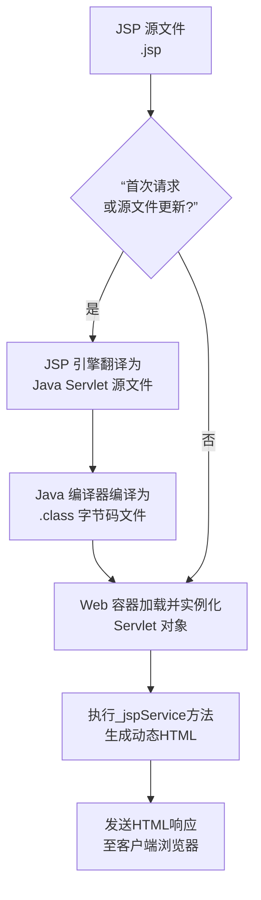
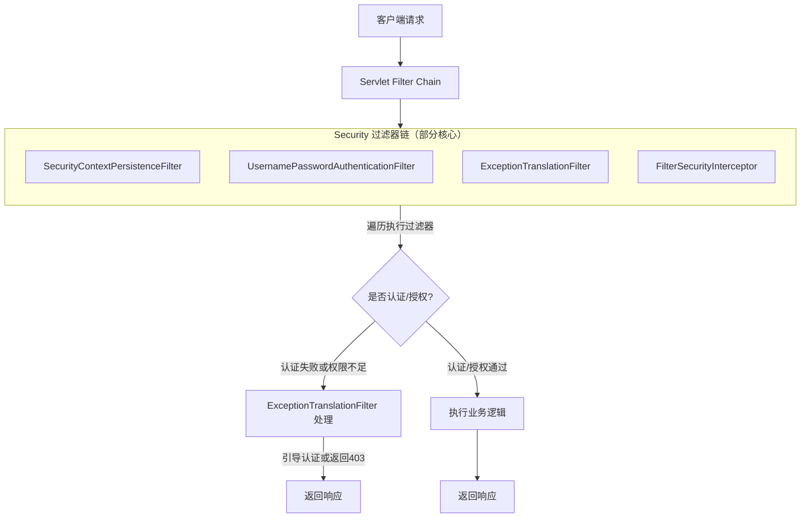

# J2EE应用程序开发技术：
J2EE（Java 2 Platform, Enterprise Edition）是一个为企业级应用提供的一套标准规范，用于开发和部署可扩展、可移植、可靠且安全的服务器端Java应用程序。
传统的J2EE（现在称为Jakarta EE）是一个为企业级应用设计的大型平台，它包含了一系列的技术和规范。

我们可以将其核心技术分为几个层面来理解：

### 一、 核心概念与分层架构

传统的J2EE应用通常采用**分层架构**，不同技术负责不同层面：
1.  **Web层**：负责展示用户界面和处理HTTP请求。
2.  **业务逻辑层**：负责实现核心业务规则和流程。
3.  **数据持久层**：负责与数据库交互，完成数据的增删改查。

---

### 二、 主要技术组件

以下是传统J2EE中包含的关键技术，按照其在架构中的角色划分：

#### 1. Web层技术

*   **Servlet**：
    *   **角色**：J2EE Web技术的基石。它是运行在服务器端的Java程序，用于处理和响应客户端的HTTP请求。所有现代的Web框架（如Spring MVC）都构建在Servlet之上。
    *   **功能**：接收请求、调用业务逻辑、生成动态内容（如HTML、JSON）。

*   **JavaServer Pages (JSP)**：
    *   **角色**：基于Servlet技术，用于简化动态网页的创建。它允许在HTML中嵌入Java代码。
    *   **功能**：更方便地制作页面展示层。JSP在运行时会被编译成Servlet。

*   **JavaServer Pages Standard Tag Library (JSTL)**：
    *   **角色**：JSP的扩展，提供了一系列标准标签（如循环、判断、格式化），以避免在JSP页面中直接编写大量的Java代码，促进前后端分离。

*   **JavaBeans (在Web层中)**：
    *   一种遵循特定规范的Java类，用于在层与层之间封装和传递数据。

#### 2. 业务逻辑层技术

*   **Enterprise JavaBeans (EJB)**：
    *   这是传统J2EE的核心和标志，用于封装复杂的业务逻辑。EJB又主要分为三种类型：
    *   **Session Bean（会话Bean）**：
        *   **无状态会话Bean**：不保留客户端的状态，适用于一次性操作，如用户验证、订单处理。
        *   **有状态会话Bean**：会为每个客户端保留状态，适用于需要多步交互的场景，如购物车。
    *   **Entity Bean（实体Bean）**：
        *   **角色**：**早期**用于表示数据库中的持久化对象。
        *   **现状**：**已被JPA完全取代**，因其过于笨重和复杂，现在已不推荐使用。
    *   **Message-Driven Bean (MDB，消息驱动Bean)**：
        *   **角色**：用于异步消息处理。它可以监听消息队列（如JMS）中的消息并做出响应，实现系统间的解耦。

#### 3. 数据持久层技术

*   **Java Database Connectivity (JDBC)**：
    *   **角色**：Java语言中访问数据库的基础API。它提供了一种与各种关系型数据库进行交互的标准方法。
    *   **功能**：建立数据库连接、执行SQL语句、处理结果集。

*   **Java Persistence API (JPA)**：
    *   **注意**：JPA是**较晚**加入Java EE 5的技术，但它现在已成为持久层事实上的标准。它取代了笨重的Entity Bean。
    *   **角色**：一个对象关系映射（ORM）规范，它将Java对象（POJO）与数据库表映射起来，开发者可以像操作Java对象一样操作数据库记录。
    *   **实现**：Hibernate、EclipseLink等都是JPA的流行实现。

#### 4. 其他重要服务与技术

*   **Java Naming and Directory Interface (JNDI)**：
    *   **角色**：提供一个统一的接口来查找和访问各种命名的和目录的服务。在J2EE中，常用于查找EJB、数据源等资源。

*   **Java Message Service (JMS)**：
    *   **角色**：一个消息中间件的API，允许应用程序组件基于消息队列或发布/订阅模型进行异步通信。

*   **Java Transaction API (JTA)**：
    *   **角色**：用于管理分布式事务的API。它可以确保跨越多个数据库或消息队列的操作作为一个原子单元执行（全部成功或全部回滚）。

*   **JavaMail**：
    *   **角色**：用于发送和接收电子邮件的API。

*   **Java Authentication and Authorization Service (JAAS)**：
    *   **角色**：用于对用户进行身份验证和授权。

---

### 三、 总结与演变

**传统的J2EE技术栈可以概括为：**
*   **Web层**：**Servlet + JSP + JSTL**
*   **业务层**：**EJB（主要是Session Bean和MDB）**
*   **持久层**：**JDBC**（后期被**JPA/Hibernate**取代）
*   **支撑服务**：**JNDI， JMS， JTA** 等

**重要提示：**
现代Java企业级开发已经发生了巨大变化。传统的“重量级”J2EE（尤其是EJB 2.x）因为配置复杂、侵入性强、测试困难而饱受诟病。随之兴起的是 **“轻量级”框架**，如 **Spring Framework**，它通过依赖注入和面向切面编程等理念，提供了更灵活、更易测试的替代方案。

如今，典型的现代Java技术栈可能是：**Spring Boot + Spring MVC + Spring Data JPA (Hibernate)**，它吸收了J2EE的精华（如Servlet规范），但摒弃了其笨重的部分（如EJB），并极大地简化了开发。传统的J2EE也已演变为 **Jakarta EE**，其设计理念也变得更加现代和轻量。


# Web前端技术：
在线帮助文档 https://www.w3school.com.cn/

HTML：(主要用于网页主体结构的搭建)
HTML 指的是**超文本标记语言: HyperText Markup Language**，是一种用于创建网页的标准标记语言，它通过一系列标签将网络上的文档格式统一，使得分散的Internet资源能够连接成一个逻辑整体。
这些标签不仅可以描述文字，还可以描述图形、动画、声音、表格、链接等网页元素。

HTML文本由HTML命令组成，这些命令用于说明网页中的各种元素。一个HTML文档通常包括头部（Head）和主体（Body）两大部分。
头部描述浏览器所需的信息，如文档的标题、字符集、样式表链接等；主体则包含所要说明的具体内容，如段落、列表、图片、链接等。

## HTML标签结构：

```html
<!DOCTYPE html>
<html lang="zh-CN">
<head>
    <meta charset="UTF-8">
    <meta name="viewport" content="width=device-width, initial-scale=1.0">
    <title>页面标题</title>
</head>
<body>
    <!-- 页面内容 -->
</body>
</html>
```

## HTML标签结构详解

### 1. 文档类型声明
```html
<!DOCTYPE html>
```
- 声明文档类型为HTML5
- 必须是HTML文档的第一行

### 2. 根元素
```html
<html lang="zh-CN">
```
- HTML文档的根元素
- `lang`属性指定文档语言

### 3. 头部区域
```html
<head>
    <!-- 元数据和页面信息 -->
</head>
```

### 4. 主体区域
```html
<body>
    <!-- 页面可见内容 -->
</body>
```

## 常用HTML标签分类

### 1. 结构标签

#### 文档结构
```html
<!DOCTYPE html>
<html>
<head>
    <title>页面标题</title>
</head>
<body>
</body>
</html>
```

#### 语义化结构标签（HTML5新增）
```html
<header>页面头部</header>
<nav>导航区域</nav>
<main>主要内容区域</main>
<section>文档章节</section>
<article>独立内容块</article>
<aside>侧边栏内容</aside>
<footer>页面底部</footer>
```

### 2. 文本内容标签

#### 标题标签
```html
<h1>一级标题</h1>
<h2>二级标题</h2>
<h3>三级标题</h3>
<h4>四级标题</h4>
<h5>五级标题</h5>
<h6>六级标题</h6>
```

#### 段落和文本格式
```html
<p>段落文本</p>
<br> <!-- 换行 -->
<hr> <!-- 水平分割线 -->
<strong>重要文本（加粗）</strong>
<em>强调文本（斜体）</em>
<span>行内文本容器</span>
```

### 3. 列表标签

```html
<!-- 无序列表 -->
<ul>
    <li>列表项1</li>
    <li>列表项2</li>
</ul>

<!-- 有序列表 -->
<ol>
    <li>第一项</li>
    <li>第二项</li>
</ol>

<!-- 定义列表 -->
<dl>
    <dt>术语</dt>
    <dd>术语描述</dd>
</dl>
```

### 4. 链接和媒体标签

#### 链接
```html
<a href="https://example.com" target="_blank">链接文本</a>
```

#### 图片
```html

```

#### 音频和视频
```html
<audio controls>
    <source src="audio.mp3" type="audio/mpeg">
</audio>

<video controls width="320" height="240">
    <source src="video.mp4" type="video/mp4">
</video>
```

### 5. 表格标签

```html
<table border="1">
    <caption>表格标题</caption>
    <thead>
        <tr>
            <th>表头1</th>
            <th>表头2</th>
        </tr>
    </thead>
    <tbody>
        <tr>
            <td>数据1</td>
            <td>数据2</td>
        </tr>
    </tbody>
</table>
```

### 6. 表单标签

```html
<form action="/submit" method="post">
    <label for="name">姓名：</label>
    <input type="text" id="name" name="name" required>
    
    <label for="email">邮箱：</label>
    <input type="email" id="email" name="email">
    
    <label for="password">密码：</label>
    <input type="password" id="password" name="password">
    
    <select name="gender">
        <option value="male">男</option>
        <option value="female">女</option>
    </select>
    
    <textarea name="message" rows="4" cols="50"></textarea>
    
    <input type="checkbox" id="agree" name="agree">
    <label for="agree">我同意条款</label>
    
    <input type="radio" id="option1" name="option" value="1">
    <label for="option1">选项1</label>
    
    <input type="submit" value="提交">
    <button type="reset">重置</button>
</form>
```

### 7. 容器标签

```html
<div>块级容器</div>
<span>行内容器</span>
```

### 8. 元信息标签

```html
<head>
    <meta charset="UTF-8">
    <meta name="description" content="页面描述">
    <meta name="keywords" content="关键词1,关键词2">
    <meta name="viewport" content="width=device-width, initial-scale=1.0">
    <link rel="stylesheet" href="styles.css">
    <style>
        /* 内部样式 */
    </style>
</head>
```

## 完整示例页面

```html
<!DOCTYPE html>
<html lang="zh-CN">
<head>
    <meta charset="UTF-8">
    <meta name="viewport" content="width=device-width, initial-scale=1.0">
    <title>HTML标签示例</title>
    <style>
        body { font-family: Arial, sans-serif; margin: 20px; }
        header, nav, main, footer { margin: 10px 0; padding: 10px; border: 1px solid #ddd; }
    </style>
</head>
<body>
    <header>
        <h1>网站标题</h1>
        <nav>
            <a href="#home">首页</a> |
            <a href="#about">关于</a> |
            <a href="#contact">联系</a>
        </nav>
    </header>
    
    <main>
        <section>
            <h2>主要内容</h2>
            <p>这是一个段落文本，包含<strong>重要内容</strong>和<em>强调文本</em>。</p>
            
            <ul>
                <li>无序列表项1</li>
                <li>无序列表项2</li>
            </ul>
            
            
        </section>
    </main>
    
    <footer>
        <p>&copy; 2023 我的网站</p>
    </footer>
</body>
</html>
```

>HTML语言比Java、python等语言语法都不严格，是因为浏览器的编译强大吗？
HTML语言（HyperText Markup Language，超文本标记语言）与Java、Python等编程语言在设计和用途上存在本质区别，这种差异直接影响了它们在语法严格性方面的表现。

具体分析如下：

1. **设计目的不同**
   - HTML是一种**标记语言**，主要用于构建网页结构和内容呈现。其语法设计简单直观，便于开发人员通过标记（tags）定义内容布局与样式。
   - Java和Python属于**编程语言**，用于实现复杂程序逻辑，如算法设计、数据处理和系统操作等，因此语法必须更为严格和精确，以确保程序的正确性与可靠性。

2. **浏览器编译过程的定位**
   - 浏览器具备强大的解析与渲染能力，能够处理HTML、CSS及JavaScript等前端技术，但其主要任务是将标记语言转换为可视化内容，而非执行类似Java或Python的复杂程序逻辑。

3. **HTML的语法设计初衷**
   - HTML以易读、易写为目标，允许开发人员通过简单标记控制内容展示方式。这种设计降低了使用门槛，使其成为非专业开发者也能够快速掌握的工具。

综上所述，HTML语言在语法上不如Java、Python等编程语言严格，根本原因在于其设计目标与应用场景不同，而非浏览器的编译能力。各类语言均有其适用场景与优势，开发时需根据具体需求做出选择。


CSS：
**CSS**，全称为 **层叠样式表**，是一种用于**描述网页表现样式**的样式表语言。简单来说，HTML定义了网页的结构与内容，而CSS则控制这些内容的视觉样式与布局。它的核心目标是实现**内容与表现的分离**。

---

### CSS的核心思想与优势

1.  **内容与表现分离**
    *   **HTML只负责结构和内容**（如标题、段落、图片）。
    *   **CSS只负责外观和样式**（如颜色、字体、间距、布局）。
    *   这样做的好处是：一份HTML内容，可以通过不同的CSS样式表，呈现出完全不同的视觉风格（比如网站的日间模式和夜间模式）。

2.  **层叠性**
    *   “层叠”是CSS的核心机制。它指的是**多条样式规则可以应用于同一个元素，这些规则会根据其来源、优先级和顺序进行层层叠加和计算**，最终确定一个唯一的样式值。
    *   它解决了样式冲突的问题。例如，一个`<p>`标签可能同时被浏览器默认样式、开发者写的样式表、以及内联样式所影响，层叠规则会决定最终哪个样式生效。

3.  **继承性**
    *   一些CSS属性（主要是文本相关的属性，如`color`, `font-family`, `line-height`）会从父元素传递给子元素。
    *   例如，如果你给`<body>`标签设置了字体颜色`color: blue;`，那么body内所有的子元素（如`<p>`, `<span>`）默认都会继承这个蓝色，除非你单独为它们指定了其他颜色。这大大提高了代码的效率和可维护性。

---

### CSS的基本语法结构

一条CSS规则由两个主要部分构成：**选择器** 和 **声明块**。

```css
/* 这是一条CSS规则 */
p {
  color: red;
  font-size: 16px;
}
```

*   **选择器：** `p`
    *   用于“选中”你想要样式化的一个或一组HTML元素。这里选中了所有的`<p>`段落标签。
*   **声明块：** `{ color: red; font-size: 16px; }`
    *   由一对大括号 `{}` 包裹。
*   **声明：** `color: red;`
    *   每个声明由一个**属性**和一个**值**组成，中间用冒号 `:` 分隔，并以分号 `;` 结尾。
    *   **属性：** 是你希望改变的样式名称，如 `color`（颜色）、`width`（宽度）。
    *   **值：** 是你赋予该属性的具体设置，如 `red`（红色）、`200px`（200像素）。

---

### CSS的三大核心能力

CSS的强大功能主要体现在以下三个方面：

#### 1. 丰富的样式控制
CSS可以控制几乎所有你能想到的视觉样式：
*   **文本样式：** 字体 (`font-family`)、大小 (`font-size`)、粗细 (`font-weight`)、颜色 (`color`)、行高 (`line-height`)等。
*   **盒模型：** 这是CSS布局的基石。每个元素都被看作一个盒子，包含：
    *   `width` / `height`（内容宽高）
    *   `padding`（内边距）
    *   `border`（边框）
    *   `margin`（外边距）
*   **背景与边框：** 背景颜色 (`background-color`)、背景图片 (`background-image`)、圆角 (`border-radius`)、阴影 (`box-shadow`)。
*   **颜色与透明度：** 支持各种颜色模式（十六进制、RGB、HSL），以及透明度 (`opacity`)控制。

#### 2. 强大的布局系统
CSS提供了多种现代布局技术，用于安排页面元素的位置和关系：
*   **传统布局：** `display`（块、内联、内联块）、`position`（定位）、`float`（浮动）。
*   **Flexbox布局（弹性盒子）：** **一维布局**的神器，非常适合组件内、单行或单列的布局，能轻松实现居中、均分、对齐等复杂需求。
*   **Grid布局（网格布局）：** **二维布局**的终极方案，将整个页面划分为行和列，可以精准地控制元素在网格中的位置，非常适合整个页面的宏观布局。

#### 3. 交互与动画
CSS不仅可以定义静态样式，还能创造动态效果：
*   **过渡：** `transition` 属性可以让元素样式的变化（如鼠标悬停时颜色改变）不是瞬间完成，而是有一个平滑的过渡过程。
*   **动画：** `@keyframes` 规则可以创建复杂的动画序列，让元素在多个关键帧之间移动、旋转、缩放等，无需使用JavaScript。
*   **变换：** `transform` 属性可以对元素进行旋转、缩放、倾斜或平移。

---

### 如何使用CSS？(CSS的三种引入方式)

有三种主要方式将CSS引入到HTML中：

1.  **外部样式表（最佳实践）**
    将CSS代码写在一个独立的`.css`文件中，然后在HTML的`<head>`部分通过`<link>`标签引入。
    ```html
    <head>
      <link rel="stylesheet" href="styles.css">
    </head>
    ```
    *   **优点：** 实现了内容与样式的完全分离，易于维护，可以被多个页面复用。

2.  **内部样式表**
    将CSS代码写在HTML文档的`<style>`标签内，该标签通常放在`<head>`中。
    ```html
    <head>
      <style>
        p { color: blue; }
      </style>
    </head>
    ```
    *   **适用场景：** 适用于单页面或小项目，但不利于复用和维护。

3.  **内联样式（应尽量避免）**
    直接在HTML元素的`style`属性中编写CSS。
    ```html
    <p style="color: green;">这是一个绿色的段落。</p>
    ```
    *   **缺点：** 优先级最高，会覆盖其他样式，导致代码混乱，难以维护，违背了内容与表现分离的原则。

### 总结

**CSS是一门用于控制网页视觉表现和布局的强大语言。** 它通过**选择器**精准地选中元素，通过**层叠**与**继承**机制高效地管理样式规则，并赋予开发者控制**样式、布局和动画**的能力。它与HTML和JavaScript共同构成了现代前端开发的三大基石，分别负责**结构、表现和行为**。


CSS选择器：

**CSS选择器** 是一种模式，用于在文档树（通常是HTML或XML）中匹配一个或一组元素，以便将指定的CSS样式规则应用在这些元素上。

可以将CSS选择器理解为一种**匹配规则**或**筛选条件**。浏览器在解析CSS时，会根据选择器所描述的条件，在文档中寻找符合条件的元素，并为它们应用相应的样式。

CSS选择器主要由以下核心部分组成：

1.  **选择器**：规则中用于指定目标元素的部分。
2.  **声明块**：跟在选择器后面，由一对大括号 `{}` 包裹。
3.  **声明**：声明块中包含的一条条具体样式指令，由 `属性: 值;` 的形式组成。

最基础和常用的三大选择器是：**元素选择器**、**类选择器**和**ID选择器**。

### 主要的选择器类型

以下是一些最重要和最常用的选择器类型：

*   **基本选择器**
    *   **通用选择器**：`*`
        *   匹配文档中的所有元素。
        *   示例：`* { margin: 0; }` （将所有元素的外边距设为0）
    *   **元素选择器**：`elementname`
        *   根据HTML标签名匹配元素。
        *   示例：`p { color: blue; }` （将所有 `<p>` 元素的文本颜色设为蓝色）
    *   **类选择器**：`.classname`
        *   匹配所有在其 `class` 属性中包含指定类名的元素。
        *   示例：`.warning { background-color: yellow; }` （将所有 `class` 包含 "warning" 的元素的背景色设为黄色）
    *   **ID选择器**：`#idname`
        *   匹配 `id` 属性为指定值的元素。在一个文档中，ID应该是唯一的。
        *   示例：`#header { height: 100px; }` （将 `id` 为 "header" 的元素的高度设为100像素）
    *   **属性选择器**：`[attr]`， `[attr=value]` 等
        *   匹配拥有特定属性，或属性等于、包含、以某值开头/结尾的元素。
        *   示例：`[target="_blank"] { border: 1px solid red; }` （将所有 `target` 属性为 "_blank" 的元素加上红色边框）

*   **组合器**
    *   这些选择器通过描述元素之间的特定关系来组合多个简单选择器。
    *   **后代组合器**：`A B` （空格）
        *   匹配所有是元素A后代的元素B（B嵌套在A内部，无论层级多深）。
        *   示例：`article p { font-size: 14px; }` （匹配所有在 `<article>` 元素内部的 `<p>` 元素）
    *   **子组合器**：`A > B`
        *   匹配所有是元素A**直接子元素**的元素B（仅下一级）。
        *   示例：`ul > li { list-style-type: none; }` （只匹配 `<ul>` 直接子级的 `<li>`，不匹配嵌套在更深层的 `<li>`）
    *   **相邻兄弟组合器**：`A + B`
        *   匹配紧接在元素A**之后**的兄弟元素B（A和B拥有相同的父元素，且B紧跟在A后面）。
        *   示例：`h2 + p { margin-top: 0; }` （匹配紧跟在 `<h2>` 后面的第一个 `<p>` 元素）
    *   **通用兄弟组合器**：`A ~ B`
        *   匹配元素A**之后**的所有兄弟元素B（A和B拥有相同的父元素，B在A之后即可，不必紧邻）。
        *   示例：`h2 ~ p { color: grey; }` （匹配所有在 `<h2>` 之后的兄弟 `<p>` 元素）

*   **伪类**
    *   用于匹配处于特定**状态**的元素，而不是基于文档结构。
    *   语法以单冒号 `:` 开头。
    *   示例：
        *   `a:hover { color: red; }` （当鼠标悬停在链接上时改变颜色）
        *   `input:focus { outline: 2px solid blue; }` （当输入框获得焦点时添加轮廓）
        *   `li:nth-child(2) { background: lightgreen; }` （匹配其父元素下的第二个 `<li>` 子元素）

*   **伪元素**
    *   用于匹配元素的**特定部分**，而不是元素本身。
    *   语法以双冒号 `::` 开头（为了与伪类区分，但单冒号 `:` 也兼容旧语法）。
    *   示例：
        *   `p::first-line { font-weight: bold; }` （匹配每个 `<p>` 元素的第一行）
        *   `p::before { content: ">> "; }` （在每个 `<p>` 元素的内容之前插入 ">> "）
        *   `::selection { background: yellow; }` （匹配被用户高亮选中的文本部分）


### 一个可视化示例：

```html
<!DOCTYPE html>
<html lang="zh-CN">
<head>
    <meta charset="UTF-8">
    <meta name="viewport" content="width=device-width, initial-scale=1.0">
    <title>CSS三大选择器详解</title>
    <style>
        * {
            margin: 0;
            padding: 0;
            box-sizing: border-box;
            font-family: 'Segoe UI', Tahoma, Geneva, Verdana, sans-serif;
        }
        
        body {
            background: linear-gradient(135deg, #f5f7fa 0%, #c3cfe2 100%);
            min-height: 100vh;
            padding: 20px;
            color: #333;
            line-height: 1.6;
        }
        
        .container {
            max-width: 1200px;
            margin: 0 auto;
        }
        
        .demo-section {
            background: white;
            padding: 30px;
            border-radius: 15px;
            margin-top: 30px;
            box-shadow: 0 6px 20px rgba(0, 0, 0, 0.08);
        }
        
        .demo-title {
            text-align: center;
            margin-bottom: 30px;
            color: #2c3e50;
            font-size: 2rem;
        }
        
        .demo-container {
            display: flex;
            flex-wrap: wrap;
            gap: 30px;
        }
        
        .demo-box {
            flex: 1;
            min-width: 300px;
            padding: 20px;
            border-radius: 10px;
            background: #f8f9fa;
        }
        
        .demo-box h3 {
            margin-bottom: 15px;
            color: #2c3e50;
            text-align: center;
        }
        
        /* 元素选择器示例 */
        p {
            padding: 10px;
            border-radius: 5px;
            margin-bottom: 10px;
            background-color: #ffeaa7;
        }
        
        /* 类选择器示例 */
        .highlight {
            background-color: #a29bfe;
            color: white;
            padding: 10px;
            border-radius: 5px;
            margin-bottom: 10px;
        }
        
        .special {
            font-weight: bold;
            border-left: 4px solid #e17055;
            padding-left: 10px;
        }
        
        /* ID选择器示例 */
        #unique-element {
            background-color: #fd79a8;
            color: white;
            padding: 15px;
            border-radius: 5px;
            text-align: center;
            font-weight: bold;
            margin-bottom: 10px;
        }
        
        #main-title {
            color: #e17055;
            text-align: center;
            padding: 10px;
            margin-bottom: 15px;
        }
        
        .comparison {
            margin-top: 50px;
            background: white;
            padding: 30px;
            border-radius: 15px;
            box-shadow: 0 6px 20px rgba(0, 0, 0, 0.08);
        }
        
        .comparison h2 {
            text-align: center;
            margin-bottom: 30px;
            color: #2c3e50;
        }
        
        table {
            width: 100%;
            border-collapse: collapse;
        }
        
        th, td {
            padding: 15px;
            text-align: left;
            border-bottom: 1px solid #e0e0e0;
        }
        
        th {
            background: #f8f9fa;
            font-weight: bold;
            color: #2c3e50;
        }
        
        tr:last-child td {
            border-bottom: none;
        }
        
        .priority {
            font-weight: bold;
        }
        
        .high {
            color: #e74c3c;
        }
        
        .medium {
            color: #f39c12;
        }
        
        .low {
            color: #27ae60;
        }
        
        footer {
            text-align: center;
            margin-top: 50px;
            padding: 20px;
            color: #7f8c8d;
        }
        
        @media (max-width: 768px) {
            .cards-container, .demo-container {
                flex-direction: column;
            }
            
            .card, .demo-box {
                min-width: 100%;
            }
        }
    </style>
</head>
<body>
    <div class="container">
        
        <div class="demo-section">
            <h2 class="demo-title">选择器效果演示</h2>
            <div class="demo-container">
                <div class="demo-box">
                    <h3>元素选择器效果</h3>
                    <p>这个段落使用了元素选择器样式。</p>
                    <p>所有 &lt;p&gt; 元素都会应用相同的样式。</p>
                    <p>注意这些段落都有相同的背景色。</p>
                </div>
                
                <div class="demo-box">
                    <h3>类选择器效果</h3>
                    <div class="highlight">这个元素有 highlight 类</div>
                    <div class="highlight special">这个元素同时有 highlight 和 special 类</div>
                    <div class="special">这个元素只有 special 类</div>
                    <p>普通段落，没有应用类样式</p>
                </div>
                
                <div class="demo-box">
                    <h3>ID选择器效果</h3>
                    <div id="main-title">这是页面主标题 (ID: main-title)</div>
                    <div id="unique-element">这个元素有唯一ID (ID: unique-element)</div>
                    <p>注意：每个ID在页面中应该是唯一的。</p>
                </div>
            </div>
        </div>
        
    </div>
</body>
</html>
```

## 三大选择器总结

1. **元素选择器**
   - 通过HTML元素名称选择
   - 语法：`元素名 { 样式规则 }`
   - 优先级最低
   - 适合设置基础样式

2. **类选择器**
   - 通过class属性选择
   - 语法：`.类名 { 样式规则 }`
   - 优先级中等
   - 适合创建可复用的样式组件

3. **ID选择器**
   - 通过id属性选择
   - 语法：`#id名 { 样式规则 }`
   - 优先级最高
   - 适合选择页面中的唯一元素

## 使用建议

- 优先使用类选择器，因为它具有较好的复用性和适中的优先级
- 谨慎使用ID选择器，因为其高优先级可能导致样式难以覆盖
- 使用元素选择器设置基础样式和重置样式
- 在实际项目中，通常会组合使用这些选择器来创建复杂的样式规则


CSS的定位方式：
好的，我们来把这段关于CSS定位的描述扩展得更加丰富和详细，使其不仅包含定义，还包含工作原理、常见用途和它们之间的相互关系。

---

### **CSS 定位详解：掌握 `position` 属性**

在网页布局中，`position` 属性是CSS最基础也最强大的工具之一。它决定了元素在文档中的定位方式，是实现复杂布局和动态效果的关键。`position` 属性主要有五个值：`static`, `relative`, `absolute`, `fixed`, 以及较新的 `sticky`。

#### **1. Static（静态定位）**
*   **定义**：这是所有元素的**默认值**。元素按照正常的文档流进行排列。
*   **行为**：设置 `top`, `right`, `bottom`, `left` 和 `z-index` 属性对静态定位的元素**无效**。它就像在流水线上一样，一个接一个地摆放，不会被特殊地“定位”。
*   **使用场景**：当你需要重置其他定位方式，让元素回归正常流时使用。

#### **2. Relative（相对定位）**
*   **定义**：元素**相对于其自身原本在正常文档流中的位置**进行偏移。
*   **行为**：
    1.  它首先在正常流中占据位置（会为原本该在的位置留白）。
    2.  然后，通过 `top`, `right`, `bottom`, `left` 属性进行调整时，是相对于这个“原本的位置”进行移动。
    3.  它一个非常重要的特性是会**为其内部绝对定位的子元素提供一个定位上下文**（见下文）。
*   **使用场景**：微调元素位置（如图标稍微偏移）、作为绝对定位子元素的容器。

    **示例**：
    ```css
    .box {
      position: relative;
      top: 20px; /* 向下移动20px */
      left: 10px; /* 向右移动10px */
    }
    ```

#### **3. Absolute（绝对定位）**
*   **定义**：元素**脱离正常的文档流**，不再占据空间，然后相对于其**最近的、非 `static` 定位的祖先元素**进行定位。
*   **行为**：
    1.  元素会被“从流中取出”，后面的元素会占据它原来的位置。
    2.  它的定位基准不是自己，而是向上层层查找祖先元素，直到找到一个 `position` 值为 `relative`, `absolute`, `fixed` 或 `sticky` 的元素。如果找不到，则相对于**初始包含块**（通常是 `<html>` 根元素）进行定位。
    3.  常与 `top`, `right`, `bottom`, `left` 一起使用，精确控制元素的位置。
*   **使用场景**：创建弹出层、模态框、自定义下拉菜单、在特定容器内精确放置元素（如图标角标）。

    **示例**：
    ```css
    .container {
      position: relative; /* 为内部的 .absolute-box 提供定位基准 */
    }
    .absolute-box {
      position: absolute;
      top: 0;
      right: 0; /* 定位在 .container 的右上角 */
    }
    ```

#### **4. Fixed（固定定位）**
*   **定义**：元素**脱离正常的文档流**，并相对于**浏览器视口（viewport）** 进行定位。
*   **行为**：
    1.  和绝对定位一样，不占据文档流空间。
    2.  它的定位基准永远是浏览器窗口。即使页面滚动，它也会**固定在屏幕的同一个位置**。
    3.  同样使用 `top`, `right`, `bottom`, `left` 来控制位置。
*   **使用场景**：固定导航栏、悬浮按钮、回到顶部按钮、页脚版权信息等需要始终可见的元素。

    **示例**：
    ```css
    .navbar {
      position: fixed;
      top: 0;
      width: 100%; /* 固定在页面顶部 */
    }
    ```

#### **5. Sticky（粘性定位）**
*   **定义**：可以看作是 `relative` 和 `fixed` 的混合体。元素在跨越特定阈值前表现为相对定位，之后变为固定定位。
*   **行为**：
    1.  它首先在正常流中占据位置（像 `relative`）。
    2.  当页面滚动，元素即将移出视口时，它会根据设定的阈值“粘”在视口的某个位置，表现得像 `fixed` 定位。
    3.  必须至少指定 `top`, `right`, `bottom`, 或 `left` 中的一个值，否则其行为会与相对定位相同。
*   **使用场景**：表格的表头在滚动时固定在顶部、侧边栏导航在滚动到一定位置时固定。

    **示例**：
    ```css
    .table-header {
      position: sticky;
      top: 0; /* 当滚动到离视口顶部0px时，固定住 */
    }
    ```

### **总结与关系**

| 定位方式 | 定位基准 | 是否脱离文档流 | 常见用途 |
| :--- | :--- | :--- | :--- |
| **`static`** | 正常文档流 | 否 | 默认布局 |
| **`relative`** | **自身原位置** | 否（但会留白） | 微调位置，作为绝对定位的父级 |
| **`absolute`** | **最近的非static祖先** | 是 | 弹出层，精准定位 |
| **`fixed`** | **浏览器视口** | 是 | 固定导航，悬浮按钮 |
| **`sticky`** | **最近滚动祖先 & 视口** | 否（直到固定） | 滚动时粘性固定的元素 |


CSS的盒子模型：
CSS的盒子模型是CSS布局的基础，它规定了元素框处理元素内容、内边距、边框和外边距的方式。每个HTML元素都可以看作是由内容、内边距（padding）、边框（border）和外边距（margin）组成的矩形盒子。

内容（Content）：这是盒子模型的中心，它包含了元素的文本、图片或其他媒体内容。内容的大小可以通过 width 和 height 属性来设置。

内边距（Padding）：内边距是内容与边框之间的空间。它位于内容区域的周围，是透明的，不会占用实际的空间，但会影响元素的总大小。
内边距的大小可以通过 padding 属性来设置，例如 padding-top、padding-right、padding-bottom 和 padding-left。

边框（Border）：边框是围绕在内边距和内容周围的线。它的大小和样式可以通过 border 属性来设置。
例如，border-width 设置边框的宽度，border-style 设置边框的样式（如实线、虚线等），border-color 设置边框的颜色。

外边距（Margin）：外边距是边框与其他元素之间的空间。它位于边框的外部，是透明的，不会占用实际的空间，但会影响元素在布局中的位置。
外边距的大小可以通过 margin 属性来设置，例如 margin-top、margin-right、margin-bottom 和 margin-left。

盒子模型的总宽度和总高度可以通过以下公式计算：
总宽度 = 左外边距 + 左边框 + 左内边距 + 内容宽度 + 右内边距 + 右边框 + 右外边距
总高度 = 上外边距 + 上边框 + 上内边距 + 内容高度 + 下内边距 + 下边框 + 下外边距

其中，padding和margin不限定padding/margin - xx 时有默认值，例如margin 10px 20 px 30 px 40 px这四个值按照顺时针方向（上、右、下、左）指定了元素的外边距。
这种简写方式使得你可以在一个属性中一次性设置四个方向的外边距，提高了编写CSS的效率。

``` html
<!DOCTYPE html>
<html lang="zh-CN">
<head>
    <meta charset="UTF-8">
    <meta name="viewport" content="width=device-width, initial-scale=1.0">
    <title>CSS盒子模型可视化</title>
    <style>
        * {
            margin: 0;
            padding: 0;
            box-sizing: border-box;
            font-family: 'Segoe UI', Tahoma, Geneva, Verdana, sans-serif;
        }
        
        body {
            background: linear-gradient(135deg, #f5f7fa 0%, #c3cfe2 100%);
            min-height: 100vh;
            padding: 20px;
            color: #333;
            line-height: 1.6;
        }
        
        .container {
            max-width: 1200px;
            margin: 0 auto;
        }
        
        header {
            text-align: center;
            margin-bottom: 40px;
            padding: 30px;
            background: rgba(255, 255, 255, 0.85);
            border-radius: 15px;
            box-shadow: 0 6px 20px rgba(0, 0, 0, 0.1);
        }
        
        h1 {
            color: #2c3e50;
            margin-bottom: 15px;
            font-size: 2.8rem;
        }
        
        .subtitle {
            color: #7f8c8d;
            font-size: 1.3rem;
            max-width: 800px;
            margin: 0 auto;
        }
        
        .box-model-container {
            display: flex;
            flex-wrap: wrap;
            gap: 40px;
            margin-bottom: 40px;
        }
        
        .visualization {
            flex: 2;
            min-width: 500px;
            background: white;
            border-radius: 15px;
            padding: 30px;
            box-shadow: 0 10px 30px rgba(0, 0, 0, 0.1);
            display: flex;
            flex-direction: column;
            align-items: center;
        }
        
        .controls {
            flex: 1;
            min-width: 300px;
            background: white;
            border-radius: 15px;
            padding: 30px;
            box-shadow: 0 10px 30px rgba(0, 0, 0, 0.1);
        }
        
        .box-model {
            position: relative;
            width: 400px;
            height: 400px;
            margin: 30px auto;
        }
        
        .margin {
            position: absolute;
            top: 0;
            left: 0;
            width: 100%;
            height: 100%;
            background-color: rgba(255, 245, 157, 0.4);
            border: 2px dashed #ffd54f;
            display: flex;
            align-items: center;
            justify-content: center;
        }
        
        .border {
            position: absolute;
            top: 50px;
            left: 50px;
            width: 300px;
            height: 300px;
            background-color: rgba(197, 225, 165, 0.5);
            border: 20px solid #7cb342;
            display: flex;
            align-items: center;
            justify-content: center;
        }
        
        .padding {
            position: absolute;
            top: 70px;
            left: 70px;
            width: 260px;
            height: 260px;
            background-color: rgba(129, 212, 250, 0.5);
            display: flex;
            align-items: center;
            justify-content: center;
        }
        
        .content {
            position: absolute;
            top: 90px;
            left: 90px;
            width: 220px;
            height: 220px;
            background-color: #e3f2fd;
            display: flex;
            align-items: center;
            justify-content: center;
            font-size: 1.5rem;
            color: #1565c0;
            font-weight: bold;
            text-align: center;
        }
        
        .label {
            position: absolute;
            font-weight: bold;
            font-size: 0.9rem;
            color: #333;
            background: rgba(255, 255, 255, 0.8);
            padding: 3px 8px;
            border-radius: 4px;
        }
        
        .margin-label {
            top: -25px;
            left: 50%;
            transform: translateX(-50%);
        }
        
        .border-label {
            top: 35px;
            left: 50%;
            transform: translateX(-50%);
        }
        
        .padding-label {
            top: 65px;
            left: 50%;
            transform: translateX(-50%);
        }
        
        .content-label {
            top: 100px;
            left: 50%;
            transform: translateX(-50%);
        }
        
        .controls h2 {
            color: #2c3e50;
            margin-bottom: 20px;
            text-align: center;
        }
        
        .control-group {
            margin-bottom: 25px;
        }
        
        .control-group h3 {
            color: #2c3e50;
            margin-bottom: 15px;
            display: flex;
            align-items: center;
        }
        
        .control-group h3 i {
            margin-right: 10px;
            color: #3498db;
        }
        
        .slider-container {
            margin-bottom: 15px;
        }
        
        .slider-container label {
            display: block;
            margin-bottom: 5px;
            font-weight: 500;
        }
        
        .slider {
            width: 100%;
            height: 8px;
            -webkit-appearance: none;
            background: #e0e0e0;
            border-radius: 4px;
            outline: none;
        }
        
        .slider::-webkit-slider-thumb {
            -webkit-appearance: none;
            width: 18px;
            height: 18px;
            border-radius: 50%;
            background: #3498db;
            cursor: pointer;
        }
        
        .value-display {
            display: inline-block;
            width: 50px;
            text-align: right;
            font-weight: bold;
            color: #2c3e50;
        }
        
        .formula {
            background: #2c3e50;
            color: white;
            padding: 15px;
            border-radius: 8px;
            font-family: 'Courier New', monospace;
            margin-top: 10px;
            text-align: center;
        }
                
        .code-example {
            background: #2c3e50;
            color: white;
            padding: 15px;
            border-radius: 8px;
            font-family: 'Courier New', monospace;
            margin-top: 10px;
        }
        
        .highlight {
            color: #f1c40f;
        }
        
        footer {
            text-align: center;
            margin-top: 50px;
            padding: 20px;
            color: #7f8c8d;
        }
        
        @media (max-width: 768px) {
            .box-model-container {
                flex-direction: column;
            }
            
            .visualization, .controls {
                min-width: 100%;
            }
            
            .box-model {
                width: 300px;
                height: 300px;
            }
            
            .border {
                top: 30px;
                left: 30px;
                width: 240px;
                height: 240px;
                border-width: 15px;
            }
            
            .padding {
                top: 45px;
                left: 45px;
                width: 210px;
                height: 210px;
            }
            
            .content {
                top: 60px;
                left: 60px;
                width: 180px;
                height: 180px;
            }
        }
    </style>
</head>
<body>
    <div class="container">
        <header>
            <h1>CSS盒子模型</h1>
        </header>
        
        <div class="box-model-container">
            <div class="visualization">
                <h2>盒子模型可视化</h2>
                <div class="box-model">
                    <div class="margin">
                        <span class="label margin-label">外边距 (Margin)</span>
                        <div class="border">
                            <span class="label border-label">边框 (Border)</span>
                            <div class="padding">
                                <span class="label padding-label">内边距 (Padding)</span>
                                <div class="content">
                                    <span class="label content-label">内容 (Content)</span>
                                    内容区域
                                </div>
                            </div>
                        </div>
                    </div>
                </div>
                <p>调整右侧滑块查看不同属性对盒子模型的影响</p>
            </div>
            
            <div class="controls">
                <h2>属性控制器</h2>
                
                <div class="control-group">
                    <h3><i>📏</i> 内容尺寸</h3>
                    <div class="slider-container">
                        <label>宽度: <span id="width-value" class="value-display">220px</span></label>
                        <input type="range" min="100" max="300" value="220" class="slider" id="width-slider">
                    </div>
                    <div class="slider-container">
                        <label>高度: <span id="height-value" class="value-display">220px</span></label>
                        <input type="range" min="100" max="300" value="220" class="slider" id="height-slider">
                    </div>
                </div>
                
                <div class="control-group">
                    <h3><i>🔄</i> 内边距</h3>
                    <div class="slider-container">
                        <label>内边距: <span id="padding-value" class="value-display">20px</span></label>
                        <input type="range" min="0" max="50" value="20" class="slider" id="padding-slider">
                    </div>
                </div>
                
                <div class="control-group">
                    <h3><i>🔲</i> 边框</h3>
                    <div class="slider-container">
                        <label>边框宽度: <span id="border-value" class="value-display">20px</span></label>
                        <input type="range" min="0" max="40" value="20" class="slider" id="border-slider">
                    </div>
                </div>
                
                <div class="control-group">
                    <h3><i>↔️</i> 外边距</h3>
                    <div class="slider-container">
                        <label>外边距: <span id="margin-value" class="value-display">50px</span></label>
                        <input type="range" min="0" max="100" value="50" class="slider" id="margin-slider">
                    </div>
                </div>
            </div>
        </div>
        
    </div>

    <script>
        // 获取DOM元素
        const content = document.querySelector('.content');
        const padding = document.querySelector('.padding');
        const border = document.querySelector('.border');
        const margin = document.querySelector('.margin');
        
        const widthSlider = document.getElementById('width-slider');
        const heightSlider = document.getElementById('height-slider');
        const paddingSlider = document.getElementById('padding-slider');
        const borderSlider = document.getElementById('border-slider');
        const marginSlider = document.getElementById('margin-slider');
        
        const widthValue = document.getElementById('width-value');
        const heightValue = document.getElementById('height-value');
        const paddingValue = document.getElementById('padding-value');
        const borderValue = document.getElementById('border-value');
        const marginValue = document.getElementById('margin-value');
        
        const contentWidth = document.getElementById('content-width');
        const contentHeight = document.getElementById('content-height');
        const totalWidth = document.getElementById('total-width');
        const totalHeight = document.getElementById('total-height');
        const occupiedWidth = document.getElementById('occupied-width');
        const occupiedHeight = document.getElementById('occupied-height');
        
        // 更新盒子模型
        function updateBoxModel() {
            const width = parseInt(widthSlider.value);
            const height = parseInt(heightSlider.value);
            const paddingSize = parseInt(paddingSlider.value);
            const borderSize = parseInt(borderSlider.value);
            const marginSize = parseInt(marginSlider.value);
            
            // 更新显示值
            widthValue.textContent = `${width}px`;
            heightValue.textContent = `${height}px`;
            paddingValue.textContent = `${paddingSize}px`;
            borderValue.textContent = `${borderSize}px`;
            marginValue.textContent = `${marginSize}px`;
            
            // 更新内容区域
            content.style.width = `${width}px`;
            content.style.height = `${height}px`;
            content.style.top = `${marginSize + borderSize + paddingSize}px`;
            content.style.left = `${marginSize + borderSize + paddingSize}px`;
            
            // 更新内边距区域
            padding.style.width = `${width + paddingSize * 2}px`;
            padding.style.height = `${height + paddingSize * 2}px`;
            padding.style.top = `${marginSize + borderSize}px`;
            padding.style.left = `${marginSize + borderSize}px`;
            
            // 更新边框区域
            border.style.width = `${width + paddingSize * 2 + borderSize * 2}px`;
            border.style.height = `${height + paddingSize * 2 + borderSize * 2}px`;
            border.style.top = `${marginSize}px`;
            border.style.left = `${marginSize}px`;
            border.style.borderWidth = `${borderSize}px`;
            
            // 更新外边距区域
            margin.style.width = `${width + paddingSize * 2 + borderSize * 2 + marginSize * 2}px`;
            margin.style.height = `${height + paddingSize * 2 + borderSize * 2 + marginSize * 2}px`;
            
            // 更新标签位置
            document.querySelector('.margin-label').style.top = `-25px`;
            document.querySelector('.border-label').style.top = `${marginSize - 15}px`;
            document.querySelector('.padding-label').style.top = `${marginSize + borderSize - 5}px`;
            document.querySelector('.content-label').style.top = `${marginSize + borderSize + paddingSize + 10}px`;
            
            // 更新尺寸计算
            contentWidth.textContent = width;
            contentHeight.textContent = height;
            
            const totalW = width + paddingSize * 2 + borderSize * 2;
            const totalH = height + paddingSize * 2 + borderSize * 2;
            totalWidth.textContent = totalW;
            totalHeight.textContent = totalH;
            
            occupiedWidth.textContent = totalW + marginSize * 2;
            occupiedHeight.textContent = totalH + marginSize * 2;
        }
        
        // 添加事件监听器
        widthSlider.addEventListener('input', updateBoxModel);
        heightSlider.addEventListener('input', updateBoxModel);
        paddingSlider.addEventListener('input', updateBoxModel);
        borderSlider.addEventListener('input', updateBoxModel);
        marginSlider.addEventListener('input', updateBoxModel);
        
        // 初始化
        updateBoxModel();
    </script>
</body>
</html>
```

JavaScript：
JavaScript（简称 JS）是一门高级的、多范式的、解释型或即时编译型的编程语言。它最初被设计用来“让网页动起来”，如今已发展成为世界上最流行和最重要的编程语言之一，其应用范围早已超越了浏览器。

---

### 1. 核心定位与历史

*   **初衷：** 由 Brendan Eich 在 1995 年为网景公司（Netscape）发明，最初名为 Mocha，后改为 LiveScript，最终在与 Sun 公司（Java 的持有者）合作后定名为 JavaScript。其初衷是为了在浏览器端实现简单的表单验证和页面交互，弥补 HTML 和 CSS 在动态行为上的不足。
*   **与 Java 的关系：** 除了名字和语法上有一些相似之处外，JavaScript 与 Java 是**完全不同的两种语言**。取名 JavaScript 更多是当时的市场策略。
*   **标准化：** 为了避免不同浏览器之间的兼容性问题，JavaScript 被提交给 ECMA 国际组织进行标准化，由此产生了 **ECMAScript** 标准。我们常说的 ES6（ES2015）、ES7 等，就是指 ECMAScript 标准的第 6 版、第 7 版。

---

### 2. 核心特性

JavaScript 拥有一些使其强大而灵活的特性：

1.  **解释型 / 即时编译：** 代码无需预先编译成二进制文件，浏览器或 Node.js 的 JS 引擎（如 V8）会直接读取源代码并执行。现代引擎会先将 JS 编译成高效的机器码再执行。
2.  **动态类型：** 变量在声明时不需要指定数据类型，其类型在运行时才被确定，并且可以改变。
    ```javascript
    let foo = 42;    // foo 现在是一个数字
    foo = "bar";     // foo 现在是一个字符串
    ```
3.  **单线程与事件循环：** JavaScript 主要运行在单线程环境中，但它通过 **“事件循环”** 机制来处理异步操作（如点击事件、网络请求、定时器），避免了阻塞，实现了“非阻塞 I/O”。
4.  **基于原型的面向对象：** 与 Java/C++ 的基于“类”的继承不同，JS 使用“原型链”来实现对象的继承和属性共享。
5.  **函数是一等公民：** 函数在 JS 中与其他数据类型（如数字、字符串）地位相同，可以被赋值给变量、作为参数传递、作为另一个函数的返回值。这是函数式编程的基础。
6.  **弱类型：** 变量可以被隐式地转换为另一种类型。
    ```javascript
    console.log("10" - 5); // 5 (字符串 "10" 被转换为数字 10)
    console.log("10" + 5); // "105" (数字 5 被转换为字符串 "5")
    ```

---

### 3. 主要应用领域

1.  **Web 前端开发（核心领域）：**
    *   **DOM 操作：** 动态地获取、添加、删除、修改 HTML 元素和内容。
    *   **事件处理：** 响应用户的点击、滚动、键盘输入等交互行为。
    *   **数据验证：** 在表单提交到服务器前进行客户端验证。
    *   **动画与特效：** 创建复杂的页面动画和过渡效果。
    *   **异步通信：** 通过 AJAX 或 Fetch API 与服务器通信，在不刷新页面的情况下更新部分内容。这是现代单页应用（SPA）的基础。

2.  **服务器端开发：**
    *   借助 **Node.js** 这个运行时环境，JavaScript 可以脱离浏览器，在服务器端运行。开发者可以用 JS 编写后端应用、API 接口、微服务等。著名的框架有 Express.js、Koa、NestJS 等。

3.  **移动应用开发：**
    *   使用 **React Native**、**Ionic**、**Capacitor** 等框架，可以用 JavaScript 和前端技术栈来开发原生或接近原生体验的移动应用。

4.  **桌面应用开发：**
    *   使用 **Electron** 框架，可以用 HTML、CSS 和 JavaScript 构建跨平台的桌面应用，如 VS Code、Slack、Discord 等。

5.  **游戏开发：**
    *   可用于开发网页游戏，常与 HTML5 Canvas 或 WebGL 结合使用。也有一些优秀的游戏引擎，如 Phaser、Babylon.js。

---

### 4. 生态系统

JavaScript 拥有一个极其庞大和活跃的生态系统，这主要归功于 **npm**。

*   **npm：** 是全球最大的软件注册表，包含了数百万个开源代码包（库、框架、工具）。开发者可以轻松地将这些第三方模块引入自己的项目，极大地提高了开发效率。
*   **框架和库：**
    *   **React：** 由 Facebook 开发，用于构建用户界面，特别是单页应用。核心是组件化。
    *   **Vue：** 一套渐进式框架，易于上手，功能强大。
    *   **Angular：** 由 Google 维护的一个完整的、基于 TypeScript 的前端框架。
*   **工具链：** 现代 JS 开发离不开强大的工具，如代码打包工具 **Webpack**、**Vite**，编译器 **Babel**（将新版 JS 代码转换为兼容旧浏览器的代码），以及 **TypeScript**（JS 的超集，添加了静态类型系统）。

---

### 5. 一个简单的代码示例

```html
<!DOCTYPE html>
<html>
<head>
    <title>JS 示例</title>
</head>
<body>
    <button id="myButton">点击我！</button>
    <p id="displayText"></p>

    <script>
        // 1. 获取 DOM 元素
        const button = document.getElementById('myButton');
        const textDisplay = document.getElementById('displayText');

        // 2. 定义一个函数
        function handleClick() {
            // 3. 修改 DOM 内容
            textDisplay.textContent = '你好，JavaScript 世界！';
            console.log('按钮被点击了！'); // 在浏览器控制台输出
        }

        // 4. 绑定事件监听器（当按钮被点击时，调用 handleClick 函数）
        button.addEventListener('click', handleClick);
    </script>
</body>
</html>
```

这个例子展示了 JS 的核心功能：**获取元素**、**定义函数**、**操作 DOM** 和 **处理事件**。

---

### 总结

JavaScript 已经从一门“玩具语言”演变为驱动现代 Web 和跨平台应用开发的“基石语言”。它的成功源于其**低门槛、高灵活性、强大的社区和生态系统**。尽管它存在一些因设计仓促而导致的“怪癖”，但通过 ES6+ 标准的不断演进和 TypeScript 等工具的辅助，它依然是当今世界最值得学习和掌握的编程语言之一。


JavaScript语法：
JavaScript 的语法在很大程度上受到了 C、Java 语言的影响，所以如果开发者有这些语言的基础，会感到非常熟悉。

---

### 1. 基本语法规则

#### 1.1 区分大小写
JavaScript 是严格区分大小写的。
```javascript
let myVariable = "hello";
let myvariable = "world"; // 这是两个不同的变量
console.log(myVariable); // "hello"
console.log(MYVARIABLE); // ReferenceError: MYVARIABLE is not defined
```

#### 1.2 注释
用于添加说明，不会被引擎执行。
```javascript
// 这是单行注释

/*
  这是
  多行
  注释
*/
```

#### 1.3 语句和分号
- 语句通常以分号 `;` 结尾。
- 如果语句各自独占一行，现代 JavaScript 引擎可以自动补全分号（称为 ASI, Automatic Semicolon Insertion），但**强烈建议手动添加分号**，以避免一些潜在的、难以调试的错误。
```javascript
let a = 1; // 语句以分号结束
let b = 2
let c = 3 // 虽然能运行，但不推荐
```

#### 1.4 代码块
使用花括号 `{}` 来定义代码块，通常用于函数、循环和条件语句。
```javascript
{
  // 这是一个代码块
  let x = 10;
  console.log(x);
}
```

---

### 2. 变量声明

JavaScript 使用三种关键字来声明变量：

- **`var`**：ES5 及之前的方式。函数作用域，存在变量提升问题。在现代开发中**不推荐使用**。
- **`let`**：ES6 引入。块级作用域，解决了 `var` 的许多问题。用于声明**可重新赋值**的变量。
- **`const`**：ES6 引入。块级作用域，用于声明**常量**，声明后必须初始化，且不能重新赋值。

```javascript
var oldWay = "I'm old"; // 不推荐
let count = 0; // 可以改变
count = 1; // 正确

const PI = 3.14159; // 常量
// PI = 3; // TypeError: Assignment to constant variable.

const person = { name: "Alice" };
person.name = "Bob"; // 正确：const 定义的是绑定，而不是值不可变（对于对象和数组）
// person = { name: "Charlie" }; // 错误：不能重新赋值
```

---

### 3. 数据类型

JavaScript 是动态类型语言，变量类型在运行时确定。

#### 3.1 原始类型（基本类型）
1.  **`Number`**：数字（整数和浮点数）。
    ```javascript
    let age = 25;
    let price = 99.99;
    let infinity = Infinity;
    ```
2.  **`String`**：字符串，用单引号、双引号或反引号包裹。
    ```javascript
    let name1 = 'Alice';
    let name2 = "Bob";
    let greeting = `Hello, ${name1}!`; // 模板字符串，可以嵌入变量
    ```
3.  **`Boolean`**：布尔值，`true` 或 `false`。
    ```javascript
    let isLogged = true;
    let isEmpty = false;
    ```
4.  **`Undefined`**：表示变量已声明但未赋值。
    ```javascript
    let notAssigned;
    console.log(notAssigned); // undefined
    ```
5.  **`Null`**：表示一个空值或不存在的对象。
    ```javascript
    let emptyValue = null;
    ```
6.  **`Symbol`** (ES6)：表示唯一的、不可变的值，常用于对象的属性名。
    ```javascript
    let id = Symbol("id");
    ```
7.  **`BigInt`** (ES2020)：用于表示任意精度的整数。
    ```javascript
    let bigNumber = 1234567890123456789012345678901234567890n;
    ```

#### 3.2 引用类型
1.  **`Object`**：对象，是键值对的集合。
    ```javascript
    let person = {
      name: "John",
      age: 30,
      "favorite color": "blue" // 包含特殊字符的键名需要引号
    };
    console.log(person.name); // "John"
    console.log(person["favorite color"]); // "blue"
    ```
2.  **`Array`**：数组，是有序的数据集合。
    ```javascript
    let fruits = ["Apple", "Banana", "Orange"];
    console.log(fruits[0]); // "Apple"
    ```
3.  **`Function`**：函数，是可执行的对象。
    ```javascript
    function greet(name) {
      return `Hello, ${name}!`;
    }
    ```

---

### 4. 操作符

#### 4.1 算术运算符
`+`, `-`, `*`, `/`, `%` (取模), `**` (指数), `++`, `--`
```javascript
let sum = 10 + 5; // 15
let remainder = 10 % 3; // 1
```

#### 4.2 比较运算符
`==` (相等，会进行类型转换), `===` (严格相等，值和类型都必须相同), `!=`, `!==`, `>`, `<`, `>=`, `<=`
```javascript
5 == "5";  // true (类型转换)
5 === "5"; // false (类型不同)
```

#### 4.3 逻辑运算符
`&&` (与), `||` (或), `!` (非)
```javascript
true && false; // false
true || false; // true
!true; // false
```

#### 4.4 赋值运算符
`=`, `+=`, `-=`, `*=`, `/=`
```javascript
let x = 10;
x += 5; // 等同于 x = x + 5; 现在 x 是 15
```

---

### 5. 控制流

#### 5.1 条件语句
```javascript
// if...else
let score = 85;
if (score >= 90) {
  console.log("优秀");
} else if (score >= 60) {
  console.log("及格");
} else {
  console.log("不及格");
}

// 三元运算符
let message = score >= 60 ? "及格" : "不及格";

// switch
let grade = 'B';
switch (grade) {
  case 'A':
    console.log("优秀");
    break;
  case 'B':
    console.log("良好");
    break;
  default:
    console.log("其他");
}
```

#### 5.2 循环语句
```javascript
// for 循环
for (let i = 0; i < 5; i++) {
  console.log(i); // 打印 0, 1, 2, 3, 4
}

// while 循环
let i = 0;
while (i < 5) {
  console.log(i);
  i++;
}

// do...while 循环
let j = 0;
do {
  console.log(j);
  j++;
} while (j < 5);

// for...of 循环 (用于可迭代对象，如数组、字符串)
let arr = [1, 2, 3];
for (let value of arr) {
  console.log(value); // 1, 2, 3
}

// for...in 循环 (用于遍历对象的可枚举属性)
let obj = { a: 1, b: 2 };
for (let key in obj) {
  console.log(key, obj[key]); // "a" 1, "b" 2
}
```

---

### 6. 函数

#### 6.1 函数声明
```javascript
function multiply(a, b) {
  return a * b;
}
```

#### 6.2 函数表达式
```javascript
const multiply = function(a, b) {
  return a * b;
};
```

#### 6.3 箭头函数 (ES6)
简洁的语法，并且不绑定自己的 `this`。
```javascript
const multiply = (a, b) => {
  return a * b;
};
// 如果函数体只有一条返回语句，可以简写：
const multiply = (a, b) => a * b;
```

#### 6.4 参数
- 函数参数可以有默认值。
- 可以使用剩余参数 `...` 来接收不定数量的参数。
```javascript
function greet(name = "Guest", ...others) {
  console.log(`Hello, ${name}`);
  console.log(others); // 其他参数组成的数组
}
greet("Alice", "Bob", "Charlie");
// Hello, Alice
// ["Bob", "Charlie"]
```

---

### 7. 对象和数组的简写与增强 (ES6+)

#### 7.1 对象字面量增强
```javascript
const name = "Alice";
const age = 25;

// 属性简写
const person = { name, age }; // 等同于 { name: name, age: age }

// 方法简写
const person = {
  name,
  greet() { // 等同于 greet: function() { ... }
    console.log(`Hello, ${this.name}`);
  }
};

// 计算属性名
const propName = "firstName";
const person = {
  [propName]: "Alice"
};
```

#### 7.2 数组和对象的解构赋值
```javascript
// 数组解构
const numbers = [1, 2, 3];
const [first, second] = numbers;
console.log(first); // 1

// 对象解构
const person = { name: "Bob", age: 30 };
const { name, age } = person;
console.log(name); // "Bob"
```

---

### 8. 模板字符串 (ES6)

使用反引号 `` ` `` 定义，可以嵌入变量和表达式。
```javascript
const name = "Alice";
const greeting = `Hello, ${name}!
Today is ${new Date().toLocaleDateString()}.`;
console.log(greeting);
// Hello, Alice!
// Today is 2023-10-27.
```

---

### 总结

JavaScript 的语法核心要点包括：

1.  **变量声明**：优先使用 `const` 和 `let`，避免 `var`。
2.  **数据类型**：理解 7 种原始类型和引用类型的区别（原始类型按值访问，引用类型按引用访问）。
3.  **作用域**：`let` 和 `const` 是块级作用域。
4.  **函数**：函数是一等公民，箭头函数是重要的现代语法。
5.  **对象和数组**：掌握字面量、方法和解构等现代语法。
6.  **控制流**：`if/else`、`for`、`while` 等与其他类 C 语言类似。
7.  **操作符**：特别注意 `==` 和 `===` 的区别。

这套语法体系既包含了基础的编程结构，也通过 ES6+ 的现代化特性，让代码变得更加简洁、清晰和强大。


JavaScript事件：
JavaScript 中的“事件”并不是神秘概念，它只是**浏览器（或 Node）在某个特定时刻发出的一个信号**，告诉程序“有事情发生了”。  
JS 通过**注册监听器（listener）**来捕获这个信号，并执行对应的回调函数——这套机制就是**事件驱动模型**的核心。


------------------------------------------------
### 一、浏览器事件：前端天天打交道的“信号源”
1. 分类（按 W3C 标准）
| 大类 | 常见事件名 | 触发场景 |
|---|---|---|
| 鼠标 | click / dblclick / mousedown / mouseup / mouseover / mouseout / mousemove / contextmenu | 按键、移动、右键菜单 |
| 键盘 | keydown / keyup / keypress（已废弃） | 物理键按下/松开 |
| 焦点 | focus / blur / focusin / focusout | 元素获得/失去焦点 |
| 表单 | input / change / submit / reset / invalid | 输入、提交、校验失败 |
| 文档/窗口 | load / DOMContentLoaded / beforeunload / unload / resize / scroll | 页面、资源、尺寸、滚动 |
| 触摸/指针 | touchstart / touchmove / touchend / pointerdown / pointerup … | 移动端、手写笔 |
| 媒体 | play / pause / ended / loadeddata / canplay | audio/video |
| 动画/过渡 | animationstart / animationend / transitionend | CSS 动画钩子 |
| 拖拽 | dragstart / drag / dragenter / drop / dragend | 原生拖拽 API |
| 网络 | online / offline | 网络状态变化 |
| 存储 | storage | 同一域名下其它窗口修改 localStorage |

2. 注册方式（3 种）
① HTML 属性（古老，别用）
```html
<button onclick="alert('hi')">OK</button>
```
② DOM0 级属性（简单，但只能绑一个回调）
```js
btn.onclick = function () { /* 只能写一个，后者覆盖前者 */ };
```
③ DOM2 级 addEventListener（推荐）
```js
btn.addEventListener('click', handler, { once: false, passive: false, capture: false });
```
选项含义：
- capture: true → 在捕获阶段触发（下文解释）。
- once: true → 自动移除，常用于“只点一次”按钮。
- passive: true → 禁止调用 preventDefault()，用于滚动性能优化。

3. 事件流（捕获 → 目标 → 冒泡）
```
window → document → html → body → div → target（目标阶段）→ div → body → html → document → window
```
- 捕获阶段：父元素先收到事件。
- 冒泡阶段：子元素先收到事件。
- `stopPropagation()` 能阻断后续流；`stopImmediatePropagation()` 还能阻断同元素剩余监听器。

4. 事件委托（Event Delegation）
把监听器绑在**公共父节点**上，通过 `event.target` 判断真实触发源。  
优点：
- 内存占用少（1 个监听器代替 N 个）。
- 动态插入的子节点无需重新绑定。
```js
ul.addEventListener('click', e => {
  if (e.target.matches('li.item')) {
    console.log('点击了第', e.target.dataset.index, '项');
  }
});
```

5. 默认行为 & 阻止
```js
form.addEventListener('submit', e => {
  if (!valid) {
    e.preventDefault();   // 阻止表单提交
    e.stopPropagation();  // 可选：同时阻止冒泡
  }
});
```

------------------------------------------------
### 二、Node.js 事件：背对浏览器的“发布-订阅”
浏览器事件源是 DOM，Node 里没有 DOM，但有**events 核心模块**。

1. 基本用法
```js
const { EventEmitter } = require('events');
const bus = new EventEmitter();

bus.on('data', chunk => console.log('收到:', chunk));
bus.emit('data', Buffer.from('hello'));
```

2. 典型内置实例
- `process`：exit、uncaughtException、SIGINT …  
- `fs`：流式读取 open、close、data、end …  
- `net`：TCP 服务器 connection、error …  
- `http`：request、response、upgrade …  

3. 差异速记
| 浏览器 | Node |
|---|---|
| 事件源是 DOM 节点 | 事件源是 EventEmitter 实例 |
| 有捕获/冒泡 | 无捕获/冒泡，纯“订阅-发布” |
| 部分事件有默认行为 | 无默认行为，全由用户代码决定 |

------------------------------------------------
### 三、底层原理：宏任务、微任务、事件循环
1. 浏览器事件循环（WHATWG 规范）
- **宏任务队列**：script 整体、setTimeout、setInterval、I/O、UI render。  
- **微任务队列**：Promise.then、MutationObserver、queueMicrotask。  
- 每轮循环：**1 个宏任务 → 所有微任务 → 渲染（如有）→ 下一循环**。

2. 实战面试题
```js
console.log(1);
setTimeout(() => console.log(2), 0);
Promise.resolve().then(() => console.log(3));
console.log(4);
// 输出：1 4 3 2
```
解释：script 宏任务先跑，同步代码输出 1、4；Promise 回调进微任务，setTimeout 进宏任务，因此 3 先于 2。

3. Node 事件循环（libuv）
比浏览器多 6 个阶段：timers → pending callbacks → idle → poll → check → close。  
同阶段内先执行当前队列全部回调，再进下一阶段；**process.nextTick 不在任何阶段，位于各阶段末尾优先执行**，优先级高于 Promise。

------------------------------------------------
### 四、高频陷阱 & 调试技巧
1. 重复绑定
```js
btn.addEventListener('click', handler);
btn.addEventListener('click', handler); // 不会覆盖，会绑两次！
```
解决：先 `removeEventListener` 或加 `{ once: true }` / 用 `AbortSignal`。

2. 内存泄漏
长寿命对象（如 window）上绑了短寿命子对象的监听器，却忘记移除 → 子对象无法被 GC。  
最佳实践：
- 在 `componentWillUnmount` / `disconnect` / `beforeunload` 中统一 `removeEventListener`。  
- 大型 SPA 使用 `AbortController` 批量取消：
```js
const ac = new AbortController();
window.addEventListener('resize', handler, { signal: ac.signal });
// 离开时
ac.abort(); // 一键移除
```

3. passive 与 preventDefault 冲突
```js
document.addEventListener('wheel', e => e.preventDefault(), { passive: true });
// 报错：Unable to preventDefault inside passive listener
```
解决：如果必须阻止滚动，就不要设 passive:true；或者只在需要时动态移除 passive。

4. 事件合成（React 补充）
React 并非把 onclick 直接绑到 DOM，而是**在根节点统一委托**（17 之前是 document，17 之后是 render 容器），用**合成事件对象**（SyntheticEvent）池化复用，减少内存分配。  
注意：合成事件是**异步引用会被回收**，若要异步访问需 `e.persist()`（v17 已移除，需手动缓存值）。


------------------------------------------------
### 总结
所谓“JavaScript 事件”，就是**运行时在特定时机发出的信号，通过注册监听器把异步回调插入事件循环，最终达成非阻塞、高并发的单线程交互模型**——搞清**事件流、委托、循环、泄漏**四件事，就能在前端/Node 里对“事件”游刃有余。


BOM：
# JavaScript中的BOM（浏览器对象模型）

BOM（Browser Object Model）是JavaScript与浏览器交互的核心API集合，它允许开发者控制浏览器窗口、导航、屏幕、历史记录等浏览器层面的功能。

## BOM的核心概念

BOM不是一个官方标准，而是浏览器厂商实现的一组对象，用于处理浏览器窗口和框架。与DOM（文档对象模型）处理网页内容不同，BOM处理浏览器本身。

## BOM的主要组件

### 1. window对象
window对象是BOM的顶层对象，代表浏览器窗口。

```javascript
// 获取窗口尺寸
const windowWidth = window.innerWidth;
const windowHeight = window.innerHeight;

// 打开新窗口
const newWindow = window.open('https://example.com', 'example', 'width=600,height=400');

// 关闭当前窗口
// window.close();
```

### 2. navigator对象
提供有关浏览器和操作系统的信息。

```javascript
// 浏览器信息
console.log('浏览器名称:', navigator.appName);
console.log('浏览器版本:', navigator.appVersion);
console.log('用户代理:', navigator.userAgent);
console.log('平台:', navigator.platform);
console.log('语言:', navigator.language);

// 检测功能支持
if ('geolocation' in navigator) {
    console.log('地理位置API可用');
}
```

### 3. location对象
包含当前URL的信息，并可用于页面重定向。

```javascript
// URL各部分信息
console.log('完整URL:', location.href);
console.log('协议:', location.protocol);
console.log('主机:', location.host);
console.log('路径:', location.pathname);
console.log('查询参数:', location.search);
console.log('哈希:', location.hash);

// 页面重定向
// location.href = 'https://newpage.com';
// location.reload(); // 重新加载页面
```

### 4. history对象
管理浏览器的历史记录。

```javascript
// 导航历史
console.log('历史记录长度:', history.length);

// 导航方法
// history.back();    // 后退
// history.forward(); // 前进
// history.go(-2);    // 后退两步

// 添加历史记录（不会触发页面刷新）
// history.pushState({page: 1}, "标题", "?page=1");
```

### 5. screen对象
提供用户屏幕的信息。

```javascript
console.log('屏幕宽度:', screen.width);
console.log('屏幕高度:', screen.height);
console.log('可用宽度:', screen.availWidth);
console.log('可用高度:', screen.availHeight);
console.log('颜色深度:', screen.colorDepth);
console.log('像素深度:', screen.pixelDepth);
```

## 总结

BOM提供了丰富的API，使JavaScript能够与浏览器环境进行交互。虽然BOM不是官方标准，但现代浏览器都实现了相似的功能。掌握BOM对于开发复杂的Web应用至关重要，特别是需要控制浏览器行为、处理导航或获取设备信息的场景。


DOM：
在JavaScript中，**DOM（文档对象模型）** 是一个重要的编程接口，它允许JavaScript与HTML文档进行交互。下面详细阐述DOM的概念、结构和功能：

---

### 1. **DOM的定义**
DOM是浏览器将HTML或XML文档解析成的一个**树形结构模型**。通过DOM，开发者可以使用JavaScript动态地访问、修改、添加或删除文档的内容、结构和样式。

---

### 2. **DOM的树形结构**
DOM将文档表示为节点（Node）的层次化树结构：
- **文档节点（Document）**：整个文档的根节点。
- **元素节点（Element）**：HTML标签（如 `<div>`、`<p>`）。
- **文本节点（Text）**：元素内的文本内容。
- **属性节点（Attr）**：元素的属性（如 `class="title"`）。

**示例：**
```html
<html>
  <head>
    <title>页面标题</title>
  </head>
  <body>
    <h1 id="header">Hello DOM</h1>
  </body>
</html>
```
对应的DOM树：
```
Document
└── html
    ├── head
    │   └── title
    │       └── "页面标题"
    └── body
        └── h1 (id="header")
            └── "Hello DOM"
```

---

### 3. **DOM的用途**
通过JavaScript操作DOM，可以实现以下功能：

#### **① 访问元素**
```javascript
// 通过ID获取元素
const header = document.getElementById("header");

// 通过选择器获取元素
const title = document.querySelector("h1");
```

#### **② 修改内容与样式**
```javascript
// 修改文本内容
header.textContent = "你好，DOM！";

// 修改HTML内容
header.innerHTML = "<em>强调文本</em>";

// 修改样式
header.style.color = "red";
header.style.fontSize = "24px";
```

#### **③ 修改属性**
```javascript
// 设置或获取属性
header.setAttribute("class", "title");
const id = header.getAttribute("id");
```

#### **④ 添加或删除元素**
```javascript
// 创建新元素
const newParagraph = document.createElement("p");
newParagraph.textContent = "这是一个新段落";

// 添加到文档中
document.body.appendChild(newParagraph);

// 删除元素
const oldElement = document.getElementById("old");
oldElement.remove();
```

#### **⑤ 事件处理**
```javascript
// 添加点击事件
header.addEventListener("click", function() {
  alert("元素被点击了！");
});
```

---

### 4. **DOM与浏览器渲染**
- 当HTML被加载时，浏览器会构建DOM树。
- 对DOM的修改会触发浏览器的**重绘（Repaint）** 或**重排（Reflow）**，影响性能。
- 优化建议：减少频繁的DOM操作，使用文档片段（`DocumentFragment`）或虚拟DOM（如React/Vue中的实现）。

---

### 5. **DOM与其他相关概念**
- **BOM（浏览器对象模型）**：操作浏览器窗口（如 `window`、`navigator`）。
- **CSSOM（CSS对象模型）**：用于操作CSS样式。

---

### 6. **DOM的兼容性**
- 现代浏览器遵循W3C DOM标准，但早期浏览器（如IE）存在差异。
- 开发者需注意兼容性问题，或使用库（如jQuery）简化DOM操作。

---

### 总结
DOM是JavaScript与网页交互的核心桥梁，通过它开发者可以动态控制网页内容，实现丰富的用户交互体验。理解DOM的结构和操作方法，是前端开发的基础技能。

JavaScript ES6+新特性：
ES6（ECMAScript 2015）及后续版本为 JavaScript 引入了许多重要特性，让开发更加高效和现代化。以下是主要的新特性概览：

## ES6 (ES2015) 核心特性

### 1. 变量声明
```javascript
// let 和 const
let name = "John"; // 块级作用域
const PI = 3.14;   // 常量
```

### 2. 箭头函数
```javascript
// 传统函数
function add(a, b) {
  return a + b;
}

// 箭头函数
const add = (a, b) => a + b;
const square = x => x * x;
```

### 3. 模板字符串
```javascript
const name = "Alice";
const message = `Hello, ${name}!
Welcome to our website.`;
```

### 4. 解构赋值
```javascript
// 数组解构
const [first, second] = [1, 2, 3];

// 对象解构
const { name, age } = person;
const { name: userName, age: userAge } = person;
```

### 5. 默认参数
```javascript
function greet(name = "Guest", age = 18) {
  return `Hello ${name}, you are ${age} years old`;
}
```

### 6. 扩展运算符
```javascript
// 数组
const arr1 = [1, 2, 3];
const arr2 = [...arr1, 4, 5];

// 对象
const obj1 = { a: 1, b: 2 };
const obj2 = { ...obj1, c: 3 };
```

### 7. 类和继承
```javascript
class Person {
  constructor(name, age) {
    this.name = name;
    this.age = age;
  }
  
  greet() {
    return `Hello, I'm ${this.name}`;
  }
}

class Student extends Person {
  constructor(name, age, grade) {
    super(name, age);
    this.grade = grade;
  }
}
```

### 8. 模块化
```javascript
// export
export const PI = 3.14;
export function calculateArea(r) {
  return PI * r * r;
}

// import
import { PI, calculateArea } from './math.js';
import * as Math from './math.js';
```

### 9. Promise
```javascript
const fetchData = () => {
  return new Promise((resolve, reject) => {
    setTimeout(() => {
      resolve("Data received");
    }, 1000);
  });
};

fetchData()
  .then(data => console.log(data))
  .catch(error => console.error(error));
```

## ES7 (ES2016)

### 1. Array.prototype.includes()
```javascript
const arr = [1, 2, 3];
console.log(arr.includes(2)); // true
```

### 2. 指数运算符
```javascript
console.log(2 ** 3); // 8
console.log(2 ** 10); // 1024
```

## ES8 (ES2017)

### 1. async/await
```javascript
async function fetchUser() {
  try {
    const response = await fetch('/api/user');
    const user = await response.json();
    return user;
  } catch (error) {
    console.error('Error:', error);
  }
}
```

### 2. Object.values() / Object.entries()
```javascript
const obj = { a: 1, b: 2, c: 3 };
Object.values(obj); // [1, 2, 3]
Object.entries(obj); // [['a', 1], ['b', 2], ['c', 3]]
```

### 3. 字符串填充
```javascript
'5'.padStart(2, '0'); // '05'
'hello'.padEnd(10, '!'); // 'hello!!!!!'
```

## ES9 (ES2018)

### 1. 异步迭代
```javascript
for await (const line of readLines(filePath)) {
  console.log(line);
}
```

### 2. Promise.finally()
```javascript
fetch('/api/data')
  .then(data => console.log(data))
  .catch(error => console.error(error))
  .finally(() => console.log('Request completed'));
```

### 3. Rest/Spread 属性
```javascript
// 对象展开
const { a, b, ...rest } = { a: 1, b: 2, c: 3, d: 4 };

// 对象剩余参数
function logProps({ name, age, ...details }) {
  console.log(name, age, details);
}
```

## ES10 (ES2019)

### 1. Array.flat() / Array.flatMap()
```javascript
const arr = [1, [2, [3, [4]]]];
arr.flat(); // [1, 2, [3, [4]]]
arr.flat(2); // [1, 2, 3, [4]]

[1, 2, 3].flatMap(x => [x * 2]); // [2, 4, 6]
```

### 2. Object.fromEntries()
```javascript
const entries = [['a', 1], ['b', 2]];
const obj = Object.fromEntries(entries); // { a: 1, b: 2 }
```

### 3. 字符串方法
```javascript
'   hello   '.trimStart(); // 'hello   '
'   hello   '.trimEnd();   // '   hello'
```

## ES11 (ES2020)

### 1. 可选链操作符
```javascript
const user = {};
console.log(user?.profile?.name); // undefined
console.log(user?.profile?.getName?.()); // undefined
```

### 2. 空值合并运算符
```javascript
const name = null ?? 'Default Name'; // 'Default Name'
const age = 0 ?? 25; // 0
```

### 3. 动态导入
```javascript
const module = await import('./module.js');
```

### 4. BigInt
```javascript
const bigNumber = 9007199254740991n;
const bigger = bigNumber + 1n;
```

## ES12 (ES2021) 及更新版本

### 1. 逻辑赋值运算符
```javascript
// 逻辑或赋值
a ||= b; // a = a || b

// 逻辑与赋值
a &&= b; // a = a && b

// 空值赋值
a ??= b; // a = a ?? b
```

### 2. Promise.any()
```javascript
const promises = [
  fetch('/api1'),
  fetch('/api2'), 
  fetch('/api3')
];

Promise.any(promises)
  .then(firstResult => console.log(firstResult));
```

### 3. 数字分隔符
```javascript
const billion = 1_000_000_000;
const binary = 0b1010_0001_1000;
```

这些特性极大地提升了 JavaScript 的开发体验和代码质量，建议在实际项目中逐步应用这些现代语法。


>前端中的UI和UX
对于前端开发者而言，深刻理解这两者的区别与联系，是构建出色产品的基石。

---

### 一、UI - 用户界面

**1. 核心定义**
UI，即**用户界面**，是用户与产品进行交互的**视觉层面**。它是一切用户看得见、摸得着的屏幕布局和视觉元素的集合。

**2. 主要构成要素**
UI 设计师主要负责：
*   **视觉设计：** 色彩体系、字体排版、图标、图像、间距和对齐。
*   **布局设计：** 页面如何组织，信息如何层级化地呈现。
*   **交互元素的设计：** 按钮、输入框、下拉菜单、滑块、动画效果等组件的外观和状态（如默认、悬停、点击、禁用）。
*   **风格指南/设计系统：** 确保整个产品视觉语言的一致性。

**3. 关键目标**
UI 的目标是**美观、一致、品牌化**。一个好的 UI 应该是：
*   **视觉吸引力：** 让人感觉舒服、专业、有品质感。
*   **清晰明了：** 用户一眼就能看懂每个元素的功能。
*   **一致性：** 整个产品的按钮、颜色、字体都遵循同一套规则，降低用户的学习成本。

**4. 前端开发者的角色**
前端开发者将 UI 设计师提供的设计稿（如 Figma, Sketch 文件）通过代码（HTML, CSS, JavaScript）**精确地还原**为可交互的网页或应用。这要求开发者对细节有极高的追求，确保最终产品与设计稿在像素级别上的一致。

---

### 二、UX - 用户体验

**1. 核心定义**
UX，即**用户体验**，是用户在与产品交互的**整个过程**中产生的**整体感受和体验**。它关注的是产品的“有用性”、“易用性”和“满意度”。

继续用汽车的比喻，UX 是**驾驶这辆车的整体体验**：从你坐进驾驶座是否舒适，到操控是否顺手，仪表盘信息是否易读，导航系统是否准确，以及整个驾驶过程是否让你感到愉悦和高效。

**2. 主要构成要素**
UX 设计师（或研究员）主要负责：
*   **用户研究：** 了解目标用户是谁，他们的需求、痛点和行为模式。
*   **信息架构：** 如何组织和管理内容，让用户能轻松找到他们需要的信息。
*   **用户流程和线框图：** 规划用户完成某个任务（如注册、购买）需要经历的步骤。
*   **可用性测试：** 通过原型让真实用户测试，发现流程中的问题并迭代优化。
*   **交互设计：** 定义用户操作后系统的反馈（这常与 UI 有重叠，但 UX 更侧重逻辑流程）。

**3. 关键目标**
UX 的目标是**有效、高效、令人满意**。一个好的 UX 应该是：
*   **有用的：** 解决了用户的真实问题。
*   **易用的：** 用户无需费力思考就能轻松完成任务。
*   **合乎逻辑的：** 流程顺畅，没有令人困惑的步骤。
*   **令人愉悦的：** 整个使用过程能给用户带来积极的情绪。

**4. 前端开发者的角色**
前端开发者是实现优秀 UX 的**关键执行者**。他们通过：
*   **性能优化：** 确保页面加载速度快，交互响应及时（糟糕的性能是 UX 的杀手）。
*   **可访问性：** 编写代码让残障人士（如使用屏幕阅读器）也能无障碍使用产品。
*   **流畅的交互和动画：** 实现细腻的微交互和过渡动画，提升操作的反馈感和愉悦度。
*   **响应式设计：** 确保在不同设备上都能提供一致的优秀体验。

---

### 三、UI 与 UX 的关系
UI（用户界面）和 UX（用户体验）是构成数字产品的两个不可或缺、相互依存的层面。它们共同决定了用户与产品交互的最终效果。

**UI 是 UX 的视觉载体和实现手段。** 它包含了用户直接与之交互的所有视觉元素，如图标、按钮、布局和色彩。一个精心设计的 UI 是打造优秀 UX 的必要基础，因为它提供了直观、美观且符合品牌调性的交互触点。
**UX 是用户通过与 UI 交互而产生的整体感知和感受。** 它涵盖了从用户接触产品、完成任务到最终离开的整个过程中的所有体验，包括流程是否顺畅、目标是否高效达成以及情感上是否感到满意。

两者的相互影响具体表现为：

*   **出色的 UI 无法挽救糟糕的 UX。** 即使一个产品拥有惊艳的视觉设计，如果其核心功能难以使用、导航逻辑混乱或无法解决用户的实际问题（即糟糕的 UX），用户最终仍会感到失望并放弃使用。
*   **优秀的 UX 会因平庸的 UI 而折损。** 反之，一个产品可能在功能流程上非常高效（即优秀的 UX），但如果其界面看起来粗糙、过时或不专业（即平庸的 UI），则会削弱用户的信任感，并难以在第一时间吸引用户。

**结论：** **要打造真正成功的产品，必须将优秀的 UI 和 UX 紧密结合。** UI 负责吸引用户并传达品质感，而 UX 则确保产品真正实用、易用并能满足用户需求。二者相辅相成，缺一不可。

### 四、总结与对比表格

| 特性 | UI - 用户界面 | UX - 用户体验 |
| :--- | :--- | :--- |
| **核心焦点** | **外观和感觉** | **整体感受和易用性** |
| **范畴** | **视觉层面**，具体的屏幕元素 | **结构性层面**，贯穿整个使用过程 |
| **设计对象** | 颜色、字体、布局、动画 | 用户流程、信息架构、用户研究 |
| **目标** | 美观、一致、品牌化 | 有用、易用、高效、令人满意 |
| **好比** | 餐厅的装修、餐具、菜单设计 | 从进门、点餐、上菜到结账的整个用餐体验 |
| **前端职责** | **高保真还原**视觉设计 | **通过代码实现**流畅、可用、可访问的交互 |

npm：
npm（Node Package Manager）不仅是 Node.js 的包管理器，它已经演变为**整个 JavaScript 世界的基石和基础设施**。它通过一套强大的工具和一個庞大的生态系统，彻底改变了现代软件开发的模式。

#### 1. 依赖管理：不仅仅是安装

*   **精准的依赖解析**：当您运行 `npm install` 时，npm 不仅会安装您直接依赖的包，还会安装这些包的依赖（即“依赖的依赖”），形成一个复杂的**依赖树**。npm 的算法会解析并确保所有版本兼容，避免冲突。
*   **依赖类型的细化**：
    *   `dependencies`：项目运行时必须的依赖（如 Express、React）。
    *   `devDependencies`：仅在开发阶段需要的依赖（如测试框架 Jest、构建工具 Webpack）。通过 `npm install --save-dev` 安装，它们不会被打包到生产环境中。
    *   `peerDependencies`：表明您的包与某个宿主包（如插件与主框架）兼容的特定版本，但要求使用者自己安装它。常见于库和框架开发。
    *   `optionalDependencies`：可选的依赖，即使安装失败，npm 也不会让整个安装过程失败。
*   **`package-lock.json` 的变革性作用**：为了解决依赖树的不确定性问题（不同时间安装可能得到不同版本），npm 引入了 `package-lock.json` 文件。它**精确地描述了当前安装的依赖树的每一层**，确保了团队所有成员和生产环境之间能够安装**完全一致**的依赖版本，实现了“一次安装，处处相同”的效果。它是实现可靠、可重复构建的关键。

#### 2. 软件包仓库：一个充满活力的生态系统

*   **规模与影响力**：npm registry 不仅是“最大的之一”，根据其官方数据，它**托管了超过 200 万个软件包**，每周下载量高达数百亿次。从微小的工具函数到像 React、Vue、Angular 这样的全功能框架，几乎任何你能想到的 JavaScript 功能都有对应的包。
*   **发现与评估**：开发者可以通过 `npm search` 命令行或 [npm 官网](https://www.npmjs.com/) 搜索包。在选择包时，社区通常会关注其**每周下载量、版本更新频率、开源许可证、Issues 的解决情况以及README文档的质量**来判断其健康和可靠性。

#### 3. 版本控制：灵活与安全的平衡

*   **语义化版本控制的实践**：
    *   **主版本号**：做了不兼容的 API 修改。
    *   **次版本号**：做了向下兼容的功能性新增。
    *   **补丁版本号**：做了向下兼容的问题修复。
*   **灵活的版本指定语法**：在 `package.json` 中，你可以非常精细地控制依赖版本：
    *   `"1.2.3"`：固定安装 1.2.3 版本。
    *   `"~1.2.3"`：安装不低于 1.2.3 的 **最新补丁版本**（如 1.2.4，但不会是 1.3.0）。
    *   `"^1.2.3"`：安装不低于 1.2.3 的 **最新次要版本**（如 1.3.0，但不会是 2.0.0）。这是 `npm install --save` 的默认行为。
    *   `"latest"`：安装最新的发布版本。

#### 4. 脚本和任务自动化：项目的瑞士军刀

`package.json` 中的 `scripts` 字段是一个强大的自动化工具。它不仅仅是运行命令，更是**统一项目工作流的中心**。

*   **生命周期脚本**：npm 提供了一些特殊的脚本钩子，如 `preinstall`, `postinstall`, `prepublish` 等，可以在特定事件（如安装、发布）前后自动执行。
*   **复杂工作流**：你可以将复杂的命令序列封装成简单的脚本。
    ```json
    "scripts": {
      "dev": "nodemon server.js", // 启动开发服务器，支持热重载
      "build": "webpack --mode=production", // 构建生产环境代码
      "test": "jest", // 运行测试套件
      "lint": "eslint .", // 代码风格检查
      "deploy": "npm run build && npm run test && git push origin master" // 组合命令：构建、测试、部署
    }
    ```
*   **环境变量访问**：在脚本中，你可以通过 `process.env` 访问所有环境变量，方便进行配置。

#### 5. 安全与审计

随着软件供应链安全的重要性日益凸显，npm 内置了强大的安全功能。

*   **`npm audit`**：该命令会扫描项目的依赖树，自动检测已知的安全漏洞。它会提供一个报告，指出哪个包、哪个版本存在什么问题，以及严重程度。
*   **`npm audit fix`**：更强大的是，它可以**自动修复**那些可以通过更新到安全版本就能解决的漏洞。
*   **漏洞数据库**：npm 团队维护着一个持续更新的安全漏洞数据库，与社区和安全研究人员合作，确保能快速响应新发现的威胁。

#### 6. 全局安装与 npx：超越项目边界

*   **全局包**：通过 `npm install -g ` 可以将一些命令行工具安装到系统全局，使其在任何地方都可以使用（如 `create-react-app`, `vue-cli` 等脚手架工具）。
*   **npx 的革新**：npx（随 npm 5.2.0+ 自带）是一个用于**执行包**的工具。它允许你直接运行一个包，而无需先全局安装它。这对于临时使用某个工具（如 `npx create-react-app my-app`）或运行不同版本的工具有着巨大的便利，避免了全局命名空间的污染。

### 总结

npm 早已超越了其“Node 包管理器”的原始定义。它是一个**完整的 JavaScript 开发生命周期管理平台**，涵盖了从项目初始化、依赖管理、脚本自动化、代码测试到安全审计和最终发布的所有环节。其背后庞大的社区和生态系统，使得 JavaScript 开发者能够站在巨人的肩膀上，快速、高效、安全地构建复杂的现代应用程序。理解并熟练运用 npm 的各个方面，是成为一名高效 JavaScript 开发者的必备技能。


JQuery：
在前端发展史上，**jQuery无疑是一场划时代的革命**。它让DOM操作、事件处理和动画效果变得前所未有的简单，几乎以一己之力将开发者从浏览器兼容性的泥潭中解放出来，重塑了JavaScript开发的生态。

---

### 一、jQuery 是什么？

**jQuery**是一个快速、小巧、功能丰富的**JavaScript库**。它的核心口号是：**“Write Less, Do More”**（写更少的代码，做更多的事情）。

它不是一个框架，而是一个**工具库**。它的出现，主要是为了解决21世纪初前端开发面临的三大核心痛点：

1.  **复杂的浏览器兼容性问题**。
2.  **繁琐冗长的DOM操作API**。
3.  **不统一且难以使用的Ajax功能**。

---

### 二、jQuery 的核心思想与设计哲学

jQuery的核心理念可以概括为：**“选择某个东西，然后对它进行一些操作”**。

这完美地体现在了它的链式语法上：
```javascript
// 经典的jQuery三段式：选择 -> 操作 -> 链式调用
$('#myButton')           // 1. 选择：找到ID为myButton的元素
  .css('color', 'red')   // 2. 操作：将其文字颜色变为红色
  .text('Click Me!')     // 3. 操作：修改其文字
  .fadeOut('slow');      // 4. 操作：让它慢慢消失，并且还能继续链下去...
```

这种设计带来了前所未有的**简洁性**和**可读性**。

---

### 三、jQuery 解决了哪些具体问题？

#### 1. 浏览器兼容性 - “统一的API”

在2006年之前，不同浏览器（尤其是IE与Netscape/Mozilla系列）的JavaScript API存在大量差异。

**原生JavaScript的噩梦：**
```javascript
// 注册一个事件，需要判断浏览器支持哪种方式
var addHandler = function(element, type, handler) {
  if (element.addEventListener) {
    element.addEventListener(type, handler, false); // 标准浏览器
  } else if (element.attachEvent) {
    element.attachEvent('on' + type, handler); // IE
  } else {
    element['on' + type] = handler; // 老式浏览器
  }
};

// 使用Ajax更是噩梦，需要创建不同的ActiveXObject或XMLHttpRequest
```
**jQuery的优雅解决：**
```javascript
// jQuery 帮你处理了所有底层兼容性！
$('#myElement').on('click', function() {
  // 处理点击事件，在任何浏览器中都能一致工作
});

// Ajax 调用也变得无比简单
$.ajax({
  url: 'api/data.json',
  type: 'GET',
  success: function(data) {
    console.log(data);
  }
});
```

#### 2. 简洁的DOM操作 - “强大的选择器与链式调用”

原生JavaScript的DOM操作非常冗长。

**原生JavaScript：**
```javascript
// 找到所有div，遍历它们，修改内容并添加类
var divs = document.getElementsByTagName('div');
for (var i = 0; i < divs.length; i++) {
  divs[i].innerHTML = 'New Content';
  divs[i].className += ' highlighted';
}
```
**jQuery：**
```javascript
// 同样的功能，jQuery一行搞定，而且更清晰
$('div').html('New Content').addClass('highlighted');
```
jQuery的选择器 `$('div')` 几乎完全继承了CSS选择器的语法，使得元素查找变得极其直观和强大。

#### 3. 便捷的动画效果 - “开箱即用的动画”

在jQuery之前，实现动画需要手动操作`setInterval`和CSS属性，非常复杂。

**jQuery：**
```javascript
// 轻松实现复杂的动画序列
$('#myBox')
  .slideDown('fast')
  .delay(1000)
  .animate({left: '+=200px', opacity: 0.5}, 1000);
```

---

### 四、jQuery 的核心概念

1.  **`$` 符号**：这是`jQuery`对象的别名，是jQuery的灵魂。`$(selector)`函数会返回一个包含匹配元素的jQuery对象。
2.  **jQuery 对象**：当你使用`$()`选择元素时，返回的不是原生的DOM元素，而是一个**jQuery对象**。这个对象是一个包装集，包含了所有匹配的DOM元素以及所有jQuery的方法。你需要用`.get()`或下标`[0]`才能取出原生DOM元素。
3.  **隐式迭代**：这是jQuery一个非常聪明的设计。当你对一个jQuery对象（包含多个DOM元素）进行操作时，jQuery会自动**遍历**所有元素并对它们执行相同的操作，无需你手动写`for`循环。
    ```javascript
    // 隐式迭代：所有p标签的文字都会被改变
    $('p').text('Hello World');
    ```
4.  **插件体系**：jQuery拥有一个极其丰富的插件生态系统。你可以轻松地引入插件来实现轮播图、日期选择器、模态框等复杂UI组件，这极大地加速了开发进程。

---

### 五、jQuery 的优缺点

#### 优点（在其鼎盛时期）：

*   **极大地提升了开发效率**：代码量锐减，逻辑更清晰。
*   **出色地解决了浏览器兼容性**：让开发者能专注于业务逻辑。
*   **降低了前端门槛**：让后端开发者甚至设计师都能快速实现交互效果。
*   **强大的社区和插件生态**：几乎“只有你想不到，没有你找不到”的插件。

#### 缺点（以现代视角看）：

*   **性能开销**：jQuery是一个完整的库，即使你只用其中一个功能，也需要加载整个文件。在性能至关重要的移动端，这成为了负担。原生JavaScript可以直接操作API，性能更高。
*   **“过时”的开发模式**：jQuery鼓励**命令式**的**直接DOM操作**。在现代复杂的前端应用中，这种模式容易导致代码结构混乱、数据与视图不同步，难以维护和测试，被称为“意大利面条式代码”。
*   **浏览器标准的统一**：随着IE的逐渐消亡和现代浏览器对标准的大力支持，jQuery最大的价值——兼容性——正在急剧衰减。许多jQuery的功能现在用原生JS已经可以轻松实现。
*   **与现代框架理念不符**：React、Vue等现代框架采用**声明式**和**组件化**的开发模式。它们通过管理“状态”来驱动视图更新，而不是直接操作DOM。在这种架构下，jQuery显得多余且容易引发冲突。

---

### 六、示例代码
``` html
<!DOCTYPE html>
<html lang="zh-CN">
<head>
    <meta charset="UTF-8">
    <meta name="viewport" content="width=device-width, initial-scale=1.0">
    <title>jQuery 待办事项列表</title>
    <!-- 引入 jQuery -->
    <script src="https://code.jquery.com/jquery-3.6.0.min.js"></script>
    <style>
        body {
            font-family: Arial, sans-serif;
            max-width: 500px;
            margin: 50px auto;
            padding: 20px;
        }
        #todo-input {
            width: 70%;
            padding: 10px;
            margin-right: 10px;
        }
        button {
            padding: 10px 15px;
            cursor: pointer;
        }
        #add-btn {
            background-color: #4CAF50;
            color: white;
            border: none;
        }
        ul {
            list-style-type: none;
            padding: 0;
            margin-top: 20px;
        }
        li {
            padding: 12px;
            margin: 8px 0;
            background-color: #f9f9f9;
            border-left: 4px solid #4CAF50;
            display: flex;
            justify-content: space-between;
            align-items: center;
        }
        .completed {
            text-decoration: line-through;
            opacity: 0.6;
            border-left-color: #ccc;
        }
        .delete-btn {
            background-color: #ff4444;
            color: white;
            border: none;
            padding: 5px 10px;
            cursor: pointer;
        }
        .loading {
            text-align: center;
            color: #666;
        }
    </style>
</head>
<body>
    <h1>我的待办事项</h1>
    
    <div>
        <input type="text" id="todo-input" placeholder="添加新任务...">
        <button id="add-btn">添加</button>
    </div>
    
    <!-- 加载状态提示 -->
    <div id="loading" class="loading" style="display: none;">加载中...</div>
    
    <!-- 待办事项列表 -->
    <ul id="todo-list"></ul>

    <script>
        // 页面加载完成后执行
        $(document).ready(function() {
            // 从服务器加载初始待办事项
            loadTodos();
            
            // 添加按钮点击事件
            $('#add-btn').click(function() {
                addTodo();
            });
            
            // 输入框回车键事件
            $('#todo-input').keypress(function(e) {
                if (e.which === 13) { // 13 是回车键的键码
                    addTodo();
                }
            });
            
            // 添加新待办事项的函数
            function addTodo() {
                const todoText = $('#todo-input').val().trim();
                
                if (todoText === '') {
                    alert('请输入待办事项内容！');
                    return;
                }
                
                // 显示加载状态
                $('#loading').show();
                
                // 模拟向服务器发送 Ajax 请求
                setTimeout(function() {
                    // 创建新的列表项
                    const newItem = $('<li></li>')
                        .html(`
                            <span>${todoText}</span>
                            <button class="delete-btn">删除</button>
                        `)
                        .hide() // 先隐藏
                        .appendTo('#todo-list')
                        .fadeIn(500); // 淡入动画
                    
                    // 点击任务标记为完成/未完成
                    newItem.find('span').click(function() {
                        $(this).parent().toggleClass('completed');
                    });
                    
                    // 删除按钮事件
                    newItem.find('.delete-btn').click(function() {
                        const listItem = $(this).parent();
                        
                        // 添加删除动画
                        listItem.fadeOut(500, function() {
                            $(this).remove();
                        });
                    });
                    
                    // 清空输入框并隐藏加载状态
                    $('#todo-input').val('');
                    $('#loading').hide();
                    
                    console.log('已添加待办事项:', todoText);
                }, 800); // 模拟网络延迟
            }
            
            // 从服务器加载待办事项的函数
            function loadTodos() {
                $('#loading').show();
                
                // 模拟 Ajax 请求获取数据
                setTimeout(function() {
                    // 模拟从服务器返回的数据
                    const initialTodos = [
                        '学习 jQuery 基础知识',
                        '完成项目提案',
                        '准备会议材料',
                        '回复重要邮件'
                    ];
                    
                    // 清空现有列表
                    $('#todo-list').empty();
                    
                    // 遍历数据创建列表项
                    $.each(initialTodos, function(index, todoText) {
                        const listItem = $('<li></li>')
                            .html(`
                                <span>${todoText}</span>
                                <button class="delete-btn">删除</button>
                            `)
                            .appendTo('#todo-list');
                        
                        // 点击任务标记为完成/未完成
                        listItem.find('span').click(function() {
                            $(this).parent().toggleClass('completed');
                        });
                        
                        // 删除按钮事件
                        listItem.find('.delete-btn').click(function() {
                            const itemToRemove = $(this).parent();
                            itemToRemove.fadeOut(500, function() {
                                $(this).remove();
                            });
                        });
                    });
                    
                    $('#loading').hide();
                    console.log('待办事项加载完成！');
                }, 1000);
            }
        });
    </script>
</body>
</html>
```

---

### 七、jQuery 的现状与现代替代方案

**现状**：
jQuery目前仍然被**数百万个网站**所使用，尤其是在以下场景：
*   **遗留的老项目**：特别是基于WordPress、Drupal等内容管理系统的网站。
*   **简单的宣传展示类网站**：不需要复杂的状态管理，只需要一些简单的交互和动画。
*   **快速原型开发**：对于一些快速验证想法的小项目，它依然高效。

**现代替代方案**：

1.  **原生 JavaScript (ES6+)**：
    *   `document.querySelector` 和 `document.querySelectorAll` 提供了类似jQuery的选择能力。
    *   `fetch` API 取代了 `$.ajax`。
    *   `classList` API 方便地进行类名操作。
    *   **建议**：对于简单的交互，**优先考虑使用原生JavaScript**。

2.  **现代前端框架**：
    *   **React / Vue / Angular / Svelte**：用于构建复杂的、数据驱动的单页面应用。它们采用组件化、声明式的开发模式，通过虚拟DOM等技术优化性能，是大型应用的首选。

### 总结

jQuery是Web前端发展史上一个具有里程碑意义的技术。在浏览器标准尚未统一的早期阶段，它有效解决了不同平台间的兼容性问题，为开发者提供了统一的API接口，对Web技术的普及与发展起到了重要的推动作用。
然而，随着技术的发展和环境的变迁（浏览器统一、硬件性能提升、应用复杂度飙升），它的历史使命已经基本完成。对于新项目，尤其是在构建复杂应用时，开发者应优先考虑**原生JavaScript**或**现代前端框架**。

但**学习jQuery依然有价值**，因为它能帮助你：
*   **理解和维护大量现存的老代码**。
*   **深刻理解DOM操作和事件处理等前端基础概念**。
*   体会一个伟大的库如何解决一个时代的核心痛点。


React：
React 是一个用于构建用户界面的 **JavaScript 库**（而非一个完整的框架）。它由 Facebook 开发并维护，自 2013 年发布以来，已成为前端领域最流行和最具影响力的技术之一。

### 一、核心思想与设计理念

React 的成功源于其几个核心的设计理念：

1.  **组件化**
    React 将用户界面拆分成一个个独立、可复用的“组件”。每个组件管理自己的状态和视图，然后像搭积木一样组合成复杂的 UI。这带来了代码的高复用性、可维护性和清晰的职责划分。

2.  **声明式编程**
    与传统的**命令式**编程（一步步告诉浏览器如何操作 DOM）不同，React 采用**声明式**。
    - **命令式**：*“找到这个 div，清空它的内容，创建一个新的 p 标签，设置文本为 ‘Hello’，把它添加到 div 里。”*
    - **声明式**：*“当数据是 ‘Hello’ 时，UI 就应该长这样。”*
    你只需要**描述 UI 在任意给定状态下的应该呈现的样子**，而不用关心具体如何实现过渡。当状态发生变化时，React 会自动高效地更新和渲染组件。这使得代码更可预测，更容易调试。

3.  **虚拟 DOM**
    这是 React 实现高性能的核心机制。
    - **什么是虚拟 DOM？**：它是一个存在于内存中的 JavaScript 对象，是真实 DOM 的轻量级表示。
    - **工作流程**：
        1.  当组件的状态改变时，React 会重新构建一个新的虚拟 DOM 树。
        2.  React 使用 **“Diffing”算法** 比较新的虚拟 DOM 和旧的虚拟 DOM，找出两者之间的最小差异。
        3.  然后，React 将这些差异**批量**地、**高效地**应用到真实 DOM 上。
    - **好处**：避免了直接操作真实 DOM 带来的昂贵性能开销，极大地提升了应用性能。

4.  **单向数据流**
    数据在 React 应用中沿着一个方向流动：从父组件通过 **props** 向下传递到子组件。这使数据流变得简单、可预测，便于理解和调试应用状态。

---

### 二、核心概念详解

要使用 React，必须理解以下几个基本概念：

1.  **JSX**
    - 一种 JavaScript 的语法扩展，允许你在 JavaScript 代码中编写类似 HTML 的结构。
    - 它使得编写组件模板更直观。JSX 最终会被编译成普通的 `React.createElement()` 函数调用。

    ```jsx
    // 这是 JSX
    const element = <h1 className="greeting">Hello, {name}!</h1>;

    // 它会被编译成类似这样：
    const element = React.createElement(
      'h1',
      { className: 'greeting' },
      'Hello, ', 
      name
    );
    ```

2.  **组件**
    - **函数组件**（现代推荐）：使用 JavaScript 函数定义，简洁明了。配合 Hooks 可以拥有全部功能。
      ```jsx
      function Welcome(props) {
        return <h1>Hello, {props.name}</h1>;
      }
      // 或使用箭头函数
      const Welcome = (props) => <h1>Hello, {props.name}</h1>;
      ```
    - **类组件**：使用 ES6 class 定义，在过去是管理状态和生命周期的唯一方式。
      ```jsx
      class Welcome extends React.Component {
        render() {
          return <h1>Hello, {this.props.name}</h1>;
        }
      }
      ```

3.  **Props**
    - 是组件的输入，从父组件传递给子组件。
    - 是只读的，组件不能修改自己的 props。

4.  **State**
    - 是组件内部管理的、可以变化的数据。
    - 当 state 发生变化时，组件会重新渲染。
    - 在函数组件中，使用 **`useState` Hook** 来管理状态。
      ```jsx
      import { useState } from 'react';

      function Counter() {
        const [count, setCount] = useState(0); // useState 返回当前状态和更新状态的函数

        return (
          <div>
            <p>You clicked {count} times</p>
            <button onClick={() => setCount(count + 1)}>
              Click me
            </button>
          </div>
        );
      }
      ```

5.  **Hooks**
    - 自 React 16.8 引入，允许你在函数组件中使用 state 和其他 React 特性。
    - 常用 Hooks：
        - **`useState`**：在函数组件中添加状态。
        - **`useEffect`**：处理副作用（如数据获取、订阅、手动修改 DOM）。
        - **`useContext`**：订阅 React 的 Context。
        - **`useReducer`**：用于更复杂的状态逻辑。

---

### 三、生态系统

React 的强大离不开其繁荣的生态系统：

- **状态管理**：对于大型应用，组件间的状态共享变得复杂，常用库有 Redux, Zustand, MobX, Recoil。
- **路由**：用于构建单页应用（SPA），实现页面间的无刷新跳转。最常用的是 **React Router**。
- **构建工具**：**Create React App**, **Vite**, Next.js 等可以快速搭建 React 开发环境。
- **服务端渲染/元框架**：为了更好的 SEO 和首屏加载性能，出现了 **Next.js**, **Remix**, **Gatsby** 等基于 React 的“元框架”，它们提供了开箱即用的全栈能力。
- **UI 组件库**：**Ant Design**, **Material-UI**, **Chakra UI** 等提供了丰富的预制组件，加速开发。

---

### 四、优点与缺点

**优点：**
- **高效性能**：虚拟 DOM 和 Diffing 算法保证了出色的渲染性能。
- **灵活性强**：只关注视图层，可以轻松地与其它库或现有项目集成。
- **可重用性高**：组件化开发模式极大提高了代码的复用性。
- **强大的社区和生态**：拥有海量的学习资源、第三方库和工具。
- **良好的开发者体验**：丰富的开发工具（如 React DevTools）。

**缺点：**
- **陡峭的学习曲线**：需要学习 JSX、组件化思维、状态管理、Hooks 等概念，对初学者有一定门槛。
- **快速变化的生态**：虽然 React 本身很稳定，但其周边工具和最佳实践更新很快，需要持续学习。
- **只是一个视图库**：要构建完整应用，需要自行选择路由、状态管理等其他库。

### 总结

React 通过其**组件化**、**声明式**和**虚拟 DOM** 的核心思想，彻底改变了前端开发的模式。它让开发者能够高效地构建大规模、高性能的 Web 应用。尽管有学习成本，但其带来的开发效率、代码可维护性和庞大的生态系统，使其成为当今前端开发者的首选技术之一。


>React中的路由（React Router）
React Router 是 React 中用于处理路由的库，它允许我们在单页应用（SPA）中实现多个视图（页面）之间的切换，同时保持URL与视图的同步。
以下是 React Router 的核心概念和功能详解：

## 1. 安装和基础设置

```bash
npm install react-router-dom
```

```jsx
import { BrowserRouter, Routes, Route } from 'react-router-dom';

function App() {
  return (
    <BrowserRouter>
      <Routes>
        <Route path="/" element={<Home />} />
        <Route path="/about" element={<About />} />
        <Route path="/contact" element={<Contact />} />
      </Routes>
    </BrowserRouter>
  );
}
```

## 2. 核心组件

### BrowserRouter
提供基于 HTML5 History API 的路由功能
```jsx
<BrowserRouter>
  <App />
</BrowserRouter>
```

### Routes 和 Route
- **Routes**: 路由容器，负责渲染匹配的 Route
- **Route**: 定义路径和对应组件的映射关系

```jsx
<Routes>
  <Route path="/" element={<Home />} />
  <Route path="/users" element={<Users />} />
  <Route path="/users/:id" element={<UserDetail />} />
</Routes>
```

### Link
用于导航的链接组件，不会触发页面刷新
```jsx
<Link to="/about">关于我们</Link>
<Link to={`/user/${userId}`}>用户详情</Link>
```

### Navigate
编程式导航组件
```jsx
<Navigate to="/login" replace={true} />
```

## 3. 路由参数和查询参数

### 动态路由参数
```jsx
// 路由定义
<Route path="/products/:id" element={<ProductDetail />} />

// 组件中获取参数
import { useParams } from 'react-router-dom';

function ProductDetail() {
  const { id } = useParams();
  return <div>产品ID: {id}</div>;
}
```

### 查询参数
```jsx
import { useSearchParams } from 'react-router-dom';

function SearchPage() {
  const [searchParams, setSearchParams] = useSearchParams();
  const keyword = searchParams.get('q');
  
  const handleSearch = (newKeyword) => {
    setSearchParams({ q: newKeyword });
  };
  
  return <div>搜索关键词: {keyword}</div>;
}
```

## 4. 编程式导航

```jsx
import { useNavigate } from 'react-router-dom';

function LoginButton() {
  const navigate = useNavigate();
  
  const handleLogin = () => {
    // 执行登录逻辑...
    navigate('/dashboard'); // 跳转到仪表板
    // navigate(-1); // 返回上一页
    // navigate('/user', { replace: true }); // 替换当前历史记录
  };
  
  return <button onClick={handleLogin}>登录</button>;
}
```

## 5. 嵌套路由

```jsx
// 父路由组件
function Dashboard() {
  return (
    <div>
      <h1>仪表板</h1>
      <nav>
        <Link to="/dashboard/profile">个人资料</Link>
        <Link to="/dashboard/settings">设置</Link>
      </nav>
      
      {/* 子路由出口 */}
      <Outlet />
    </div>
  );
}

// 路由配置
<Routes>
  <Route path="/dashboard" element={<Dashboard />}>
    <Route path="profile" element={<Profile />} />
    <Route path="settings" element={<Settings />} />
    <Route index element={<DashboardHome />} /> {/* 默认子路由 */}
  </Route>
</Routes>
```

## 6. 路由守卫和权限控制

```jsx
// 保护路由组件
function ProtectedRoute({ children }) {
  const isAuthenticated = useSelector(state => state.auth.isAuthenticated);
  const location = useLocation();
  
  if (!isAuthenticated) {
    return <Navigate to="/login" state={{ from: location }} replace />;
  }
  
  return children;
}

// 使用保护路由
<Routes>
  <Route 
    path="/admin" 
    element={
      <ProtectedRoute>
        <AdminPanel />
      </ProtectedRoute>
    } 
  />
</Routes>
```

## 7. 其他重要 Hook

### useLocation
获取当前 location 对象
```jsx
import { useLocation } from 'react-router-dom';

function CurrentPath() {
  const location = useLocation();
  
  return (
    <div>
      当前路径: {location.pathname}
      状态数据: {location.state?.message}
    </div>
  );
}
```

### useMatch
检查当前路径是否匹配指定模式
```jsx
import { useMatch } from 'react-router-dom';

function NavItem({ to, children }) {
  const match = useMatch(to);
  
  return (
    <li className={match ? 'active' : ''}>
      {children}
    </li>
  );
}
```

## 8. 懒加载和代码分割

```jsx
import { lazy, Suspense } from 'react';

const LazyComponent = lazy(() => import('./LazyComponent'));

<Routes>
  <Route 
    path="/lazy" 
    element={
      <Suspense fallback={<div>加载中...</div>}>
        <LazyComponent />
      </Suspense>
    } 
  />
</Routes>
```

## 9. 完整示例

```jsx
import { BrowserRouter, Routes, Route, Link, Navigate } from 'react-router-dom';

function App() {
  return (
    <BrowserRouter>
      <nav>
        <Link to="/">首页</Link>
        <Link to="/about">关于</Link>
        <Link to="/users">用户</Link>
      </nav>
      
      <Routes>
        <Route path="/" element={<Home />} />
        <Route path="/about" element={<About />} />
        <Route path="/users" element={<Users />}>
          <Route index element={<UserList />} />
          <Route path=":userId" element={<UserDetail />} />
        </Route>
        <Route path="/old-path" element={<Navigate to="/new-path" replace />} />
        <Route path="*" element={<NotFound />} />
      </Routes>
    </BrowserRouter>
  );
}
```

React Router 提供了强大的客户端路由功能，让单页应用能够拥有类似多页应用的导航体验，同时保持应用的性能和用户体验。


>什么是React的状态管理？
在 React 中，组件自身的状态使用 `useState` 或 `useReducer` 进行管理。当应用变得复杂时，一个状态可能需要被多个不同层级的组件共享（这种状态被称为“全局状态”或“共享状态”）。如果仅靠逐层传递 Props，会导致代码变得冗长、难以维护（称为“Prop Drilling”问题）。

状态管理库就是为了解决这个问题的工具，它们提供了一个在组件树之外的中心化存储（Store），任何组件都可以直接连接到这个存储来读取或更新状态。

---

### 1. Context API

Context API 是 React 内置的功能，它本身**不是一个完整的状态管理库**，而是一种“依赖注入”机制。

#### 核心概念：

1.  **创建 Context：** 使用 `React.createContext()` 创建一个 Context 对象。这个对象包含两个关键组件：`Provider` 和 `Consumer`（现在常用 `useContext` Hook 代替 `Consumer`）。
2.  **Provider（提供者）：** 你用 `<MyContext.Provider value={某个值}>` 包裹组件树的根部或一部分。所有被包裹的子组件都能“接触到”这个 Context。
3.  **消费 Context：** 在子组件中，使用 `useContext(MyContext)` Hook 来获取 `Provider` 传递下来的值。

#### 工作流程：

```javascript
// 1. 创建 Context
const UserContext = React.createContext();

// 2. 在根组件提供数据（通常状态提升到这里）
function App() {
  const [user, setUser] = useState({ name: 'Alice' });
  return (
    <UserContext.Provider value={{ user, setUser }}>
      <MyComponent />
    </UserContext.Provider>
  );
}

// 3. 在深层子组件消费数据
function MyComponent() {
  const { user, setUser } = useContext(UserContext); // 直接读取和更新
  return <div>Hello, {user.name}</div>;
}
```

#### 优点：
*   **内置支持：** 无需安装额外库。
*   **简单场景适用：** 对于不频繁更新的数据（如主题、用户认证信息、语言偏好）非常合适。

#### 缺点：
*   **性能问题：** 当 Context 的值发生变化时，**所有**使用了 `useContext` 的组件都会重新渲染，即使它们只依赖于该值的未变化部分。你需要通过拆分 Context 来优化。
*   **非“状态管理”本身：** Context 只负责“传递”状态，状态本身如何更新、如何组织逻辑（如异步操作），仍需开发者自己使用 `useState`、`useReducer` 来实现，容易导致逻辑分散。

---

### 2. Redux

Redux 是一个独立的、可预测的状态容器库，它与 React 是解耦的，但通常与 `React-Redux` 库一起使用。

#### 核心概念（三大原则）：

1.  **单一数据源：**
    整个应用的状态被存储在一个单一的 JavaScript 对象中，称为 **Store**。这使调试和理解应用状态变得容易。

2.  **状态是只读的：**
    你**不能直接修改** Store 中的状态。改变状态的唯一方式是**派发一个 Action**。Action 是一个普通的 JavaScript 对象，用于描述“发生了什么”。

    ```javascript
    // 这是一个 Action
    { type: 'counter/incremented' }
    ```

3.  **使用纯函数进行更改：**
    为了指定状态如何根据 Action 进行更新，你需要编写 **Reducers**。Reducer 是一个纯函数，它接收当前的 State 和一个 Action，并返回**新的 State**。

    ```javascript
    // 这是一个 Reducer
    const counterReducer = (state = { value: 0 }, action) => {
      switch (action.type) {
        case 'counter/incremented':
          return { ...state, value: state.value + 1 }; // 返回新对象，不修改原状态
        default:
          return state;
      }
    };
    ```

#### 工作流程（数据流）：

1.  **组件** 通过 `React-Redux` 提供的 `useSelector` Hook 从 Store 中读取需要的数据。
2.  **组件** 中通过 `useDispatch` Hook 获取 `dispatch` 函数。
3.  当用户交互发生时（如点击按钮），组件会 **`dispatch` 一个 Action**（例如 `{ type: 'counter/incremented' }`）。
4.  **Store** 接收到这个 Action，并自动将其传递给 **Reducer** 函数。
5.  **Reducer** 根据 Action 的类型，计算出**新的状态**。
6.  **Store** 用新的状态替换旧的状态。
7.  **Store** 通知所有通过 `useSelector` 订阅了状态变化的组件：“状态已更新”。
8.  相关的组件使用新的状态重新渲染。

#### 优点：
*   **可预测性：** 状态的变化严格遵循 `action -> reducer -> new state` 的流程，使得状态变化的原因和结果非常清晰。
*   **强大的中间件：** 可以处理异步逻辑（最常用的是 Redux Toolkit 内置的 `createAsyncThunk` 或传统的 `redux-thunk`）、日志记录等。
*   **强大的开发工具：** Redux DevTools 提供了时间旅行调试、状态快照等强大功能。
*   **性能优化：** `React-Redux` 实现了精细的订阅机制，只有当组件订阅的特定数据片段真正发生变化时，组件才会重新渲染。

#### 缺点：
*   **模板代码多：** 即使是传统 Redux，也需要编写大量的模板代码（Action Types, Action Creators, Reducers）。**但现代 Redux 强烈推荐使用 Redux Toolkit (RTK)**，它极大地简化了代码。
*   **学习曲线：** 概念较多，需要理解函数式编程的思想（纯函数、不可变更新）。

---

### 总结与选择

| 特性 | Context API | Redux (with React-Redux) |
| :--- | :--- | :--- |
| **定位** | 内置的**状态传递**机制 | 完整的**状态容器**和管理库 |
| **学习曲线** | 低 | 中到高 |
| **模板代码** | 少 | 传统 Redux 多，**RTK 少** |
| **性能** | 需要手动优化（拆分 Context） | 内置精细更新，性能优异 |
| **异步处理** | 需自行结合 `useEffect` 等 | 原生支持（通过中间件） |
| **调试工具** | 无专门工具 | Redux DevTools（非常强大） |
| **测试** | 相对复杂 | 非常容易（因为都是纯函数） |

#### 如何选择？

*   **使用 Context API：**
    *   当你的状态更新不频繁时（如主题、用户信息）。
    *   当你的应用规模较小，或只是想避免 Prop Drilling。
    *   当你不想引入第三方库时。

*   **使用 Redux（特别是 Redux Toolkit）：**
    *   当应用有大量、复杂的交互和状态时。
    *   当状态需要频繁、大规模地更新时。
    *   当状态逻辑非常复杂，涉及大量的异步操作时。
    *   当你需要强大的调试能力（时间旅行）来追踪状态变化时。
    *   当多个不相关的组件需要共享和修改同一片状态时。

**现代 React 状态管理的最佳实践是：**
将两者结合使用。使用 **Redux (RTK)** 管理复杂的、全局的、服务端状态，而使用 **Context API** 管理局部的、简单的、不频繁更新的 UI 状态（如一个模态框的开关）。


>相比于JQuery，React有哪些优点？
好的，这是一个非常经典且重要的问题。jQuery 和 React 代表了两个不同的前端开发时代和哲学。相比于 jQuery，React 的核心优势在于它提供了一个**结构化、可扩展和高性能**的方式来构建复杂的、数据驱动的用户界面。

下面我们从几个关键维度进行对比：

### 核心范式：声明式 vs. 命令式

这是最根本的区别，决定了开发思维模式的不同。

- **jQuery（命令式）**：
    - **“如何做”**：你需要一步步详细地指示浏览器如何操作 DOM。
    - **例子**：“当我点击这个按钮时，找到那个文本框，获取它的值，然后创建一个新的 `<li>` 元素，把值设为其文本内容，最后把它追加到 `<ul>` 列表里。”
    - **代码体现**：你直接使用 `$(‘#button’).click()`, `$(‘#input’).val()`, `$(‘<li>’)`, `.append()` 等一系列方法。

- **React（声明式）**：
    - **“做什么”**：你只需要**描述 UI 在任意给定状态下的应该是什么样子**。
    - **例子**：“UI 的样子取决于数据。列表 `items` 是什么，UI 就渲染什么。当用户点击按钮并输入文本后，我们更新 `items` 状态。UI 会自动变成新状态对应的样子。”
    - **代码体现**：你定义组件的视图如何渲染（JSX），并管理状态 (`useState`)。状态改变，视图自动更新。

---

### 具体优点对比

| 特性 | jQuery | React | React 的优势 |
| :--- | :--- | :--- | :--- |
| **数据与UI同步** | **手动**。数据变了，你需要写代码去找到对应的DOM元素并更新它。容易出错，产生不同步。 | **自动**。你只需更新数据（状态），UI会自动同步到该状态。**单向数据流**保证了可预测性。 | **更少的 Bug，开发更省心**。无需担心“忘记更新某个地方的UI”。 |
| **性能与DOM操作** | **直接操作真实DOM**。频繁或复杂的DOM操作非常消耗性能。 | **使用虚拟DOM**。在内存中计算差异，然后批量、高效地更新真实DOM。最小化了昂贵的直接操作。 | **高性能**，尤其在频繁更新的复杂应用中。开发者无需手动优化。 |
| **代码组织与可复用性** | **容易变成“意大利面条式”代码**。事件监听、数据操作、DOM更新混杂在一起，难以维护和测试。 | **基于组件**。将UI和逻辑封装成独立的、可复用的组件。代码结构清晰，职责分明。 | **极高的可维护性和可扩展性**，适合大型项目和团队协作。 |
| **开发体验与现代化** | **传统**。本身只是一个工具库，构建复杂应用需要依赖大量其他插件和自主架构。 | **现代**。拥有完整的**生态系统**（路由、状态管理、SSR框架等）。配合 **JSX**，编写UI更直观。 | **强大的开发者工具**、**丰富的社区资源**、**成熟的工程化流程**。 |
| **状态管理** | **分散**。状态可能存储在DOM本身（如 `data-*` 属性）、全局变量或闭包中，难以追踪。 | **集中**。状态被明确地定义和管理在组件内部或外部的状态库（如Redux）。数据流清晰。 | **易于调试和追踪状态变化**。 |

---

### 一个简单的例子：添加一个待办事项

假设我们有一个输入框、一个按钮和一个待办列表。

**jQuery 实现（命令式）:**

```javascript
// 1. 监听按钮点击
$('#addButton').click(function() {
  // 2. 获取输入框的值
  var newItemText = $('#inputField').val();
  
  // 3. 如果值不为空
  if (newItemText) {
    // 4. 创建一个新的列表项 <li> 元素
    var $newItem = $('<li>').text(newItemText);
    
    // 5. 将新元素追加到列表 <ul> 中
    $('#todoList').append($newItem);
    
    // 6. 清空输入框
    $('#inputField').val('');
  }
});
```
*问题：如果我想删除一个待办项，或者将已完成的项标记为灰色，我需要再写一套查找元素、修改属性或移除元素的命令式代码。逻辑会越来越分散。*

**React 实现（声明式）:**

```jsx
import { useState } from 'react';

function TodoList() {
  // 1. 定义状态（数据）
  const [items, setItems] = useState([]);
  const [inputValue, setInputValue] = useState('');

  // 2. 定义行为
  const addItem = () => {
    if (inputValue) {
      // 更新状态，而不是更新DOM
      setItems([...items, { text: inputValue, id: Date.now() }]);
      setInputValue(''); // 清空输入框也是通过更新状态实现
    }
  };

  // 3. 描述UI（JSX）。UI是状态的映射。
  return (
    <div>
      <input 
        value={inputValue} 
        onChange={(e) => setInputValue(e.target.value)} 
      />
      <button onClick={addItem}>Add</button>
      <ul>
        {items.map(item => (
          <li key={item.id}>{item.text}</li>
        ))}
      </ul>
    </div>
  );
}
```
*优势：*
- *删除一个项？* 只需要 `setItems(items.filter(i => i.id !== idToDelete))`，列表会自动重新渲染。
- *标记完成？* 在状态里给每个 item 加一个 `completed: boolean` 属性，然后在 JSX 中根据这个属性决定样式。UI 永远与状态保持一致。

### 总结：何时选择？

- **选择 jQuery**：
    - 简单的网站，需要一些交互增强（如轮播图、模态框）。
    - 与传统服务端渲染（如PHP、Rails）项目集成，添加动态效果。
    - 项目非常小，引入整个 React 生态是杀鸡用牛刀。

- **选择 React**：
    - **复杂的单页应用**，有大量的用户交互和状态变化。
    - **数据驱动的界面**，UI 需要频繁、高效地更新。
    - 需要良好的**可维护性、可测试性和团队协作**的大型项目。
    - 追求**现代化、组件化**的开发流程。

总而言之，**React 的核心优势在于它通过声明式、组件化和虚拟DOM，将开发者从繁琐、易错的手动 DOM 操作中解放出来，使得构建和维护复杂前端应用变得可控和高效。** 而 jQuery 作为一个工具库，在解决特定 DOM 操作和兼容性问题时依然有用，但在构建现代大型 Web 应用方面，已经被 React、Vue 等框架全面超越。


VUE：
Vue.js（通常简称为Vue）是一个用于构建用户界面的**渐进式**JavaScript框架。它旨在通过简洁的API实现**响应的数据绑定**和组合的**视图组件**。
Vue被设计为可以**自底向上逐层应用**，其核心库只关注视图层，不仅易于上手，也便于与第三方库或已有项目整合。

---

### 1. 响应式数据绑定：核心原理阐述
Vue的响应式系统是其最引人注目的特性之一。它不仅仅是“数据变，视图就变”这么简单。

*   **实现原理**：当你将一个普通的JavaScript对象传入Vue实例的 `data` 选项时，Vue会遍历此对象的所有属性，并使用 `Object.defineProperty`（Vue 2）或 `Proxy`（Vue 3）将它们转换为**getter/setter**。
    *   **依赖收集**：在组件的渲染过程中，当接触到数据属性（即“获取”它的值）时，这个属性就会记住这个组件（具体是它的“渲染Watcher”）。
    *   **派发更新**：当属性的setter被调用（即数据被修改）时，它会通知所有依赖它的Watcher。Watcher会重新执行，从而触发组件的重新渲染。
*   **优势**：这种机制使得开发者完全摆脱了手动操作DOM的繁琐工作。你只需要关心数据的状态，视图会自动与之保持同步，极大地提升了开发效率和代码的可维护性。

### 2. 组件化开发：构建大型应用的基石
Vue的组件化不仅仅是代码复用，更是一种架构模式。

*   **单文件组件**：这是Vue组件化开发的标志性特性。在一个以 `.vue` 为后缀的文件中，你可以集中管理一个组件的**模板（Template）、逻辑（Script）和样式（Style）**。
    ```vue
    <template>
      <div class="greeting">{{ message }}</div>
    </template>
    
    <script>
    export default {
      data() {
        return {
          message: 'Hello Vue!'
        }
      }
    }
    </script>
    
    <style scoped>
    .greeting {
      color: red;
    }
    </style>
    ```
    *   **`<style scoped>`** 中的 `scoped` 属性是一个关键特性，它确保这些样式只应用于当前组件，避免了全局CSS的样式污染问题。
*   **组件通信**：Vue提供了清晰的组件间数据流方案。
    *   **Props向下**：父组件通过 `props` 向子组件传递数据。
    *   **Events向上**：子组件通过 `$emit` 触发事件，向父组件发送消息。
    *   **Provide/Inject**：为深层嵌套的组件提供依赖注入，避免逐层传递props的麻烦。
    *   **Vuex/Pinia**：对于复杂的应用级状态，推荐使用官方状态管理库（如Vue 3时代的Pinia），实现跨组件的集中式状态管理。

*   用Vue来统计点击次数的例子
    ``` vue
    <template>  
        <div>  
            <p>Count: {{ count }}</p>  
            <button @click="increment">Increment</button>  
            <button @click="decrement">Decrement</button>  
        </div>  
    </template>  
    
    <script>  
    import { ref } from 'vue';  
    
    export default {  
      name: 'Counter',  
      setup() {  
        const count = ref(0);  
    
        const increment = () => {  
          count.value++;  
        };  
    
        const decrement = () => {  
          count.value--;  
        };  
    
        return {  
          count,  
          increment,  
          decrement,  
        };  
      },  
    };  
    </script>  
    ```

#### 3. 模板系统与指令：声明式的力量
Vue的模板语法是对HTML的扩展，让你能够声明式地将数据渲染进DOM。

*   **插值**：使用 “Mustache” 语法 `{{ }}` 进行文本插值。
*   **指令**：指令是带有 `v-` 前缀的特殊属性，它们的值预期是**单个JavaScript表达式**。
    *   **条件渲染**：`v-if`, `v-else-if`, `v-else`, `v-show`。`v-if` 是真正的条件渲染，它会确保在切换过程中条件块内的事件监听器和子组件适当地被销毁和重建。`v-show` 只是简单地切换元素的 CSS `display` 属性。
    *   **列表渲染**：`v-for`。应始终与 `key` 特殊属性配合使用，以便Vue可以跟踪每个节点的身份，从而重用和重新排序现有元素。
    *   **属性绑定**：`v-bind:` 或简写为 `:`，用于动态绑定一个或多个属性。
    *   **事件监听**：`v-on:` 或简写为 `@`，用于监听DOM事件。
    *   **双向绑定**：`v-model`，它是语法糖，负责监听用户的输入事件以更新数据，并对一些极端场景进行一些特殊处理。它实质上是 `v-bind:value` 和 `v-on:input` 的结合。

#### 4. 虚拟DOM与高效的渲染
和React等现代框架一样，Vue也使用虚拟DOM（Virtual DOM）来提升性能。

*   **工作流程**：当数据发生变化时，Vue会生成一个新的虚拟DOM树（一个轻量的JavaScript对象，描述整个UI结构），然后与旧的虚拟DOM树进行对比（这个过程叫做“Diffing”）。
*   **高效更新**：通过高效的Diff算法，Vue能计算出最少需要更新的真实DOM节点，然后批量、精准地应用这些更新，而不是重新渲染整个页面。这保证了即使在复杂的数据变化下，应用也能保持高性能。

#### 5. 丰富的生态系统与工具链
Vue的成功离不开其蓬勃发展的生态系统。

*   **官方库**：
    *   **Vue Router**：官方的路由管理器，用于构建单页面应用（SPA）。
    *   **Vuex / Pinia**：官方的状态管理库。Pinia是Vue团队推荐的新一代状态管理工具，拥有更简洁的API和更好的TypeScript支持。
*   **构建工具**：
    *   **Vite**：新一代的前端构建工具，由Vue作者尤雨溪开发。它提供了极快的冷启动和模块热更新（HMR），已成为Vue项目默认的构建工具。
    *   **Vue CLI**：成熟的、功能齐备的官方脚手架工具，虽然现在新项目更推荐Vite，但仍有大量项目在使用。
*   **开发者工具**：Vue Devtools是一个浏览器扩展，提供了可视化地审查和调试Vue应用的能力，是开发Vue应用的必备利器。

### 总结：为什么Vue如此受欢迎？

1.  **渐进式框架**：你可以从一个简单的脚本开始，逐步引入路由、状态管理、构建工具等，平滑地过渡到复杂的工程化项目。这种低门槛和高上限的特性吸引了大量开发者。
2.  **友好的学习曲线**：Vue的API设计直观，文档清晰易懂，特别是对于有HTML/CSS/JavaScript基础的开发者，能够快速上手。
3.  **性能与大小的平衡**：Vue的核心库非常轻量，同时通过虚拟DOM和智能的优化策略，提供了卓越的运行时性能。
4.  **灵活性与集成能力**：Vue既可以用于开发全新的单页面应用，也可以作为渐进增强的脚本嵌入到现有项目中（如jQuery项目），与任何后端技术栈（如Django, Laravel, Node.js）都能很好地配合。
5.  **活跃的社区与健全的生态**：强大的社区贡献了大量的第三方库、组件和解决方案，确保了开发者在遇到问题时能快速找到支持。

综上所述，Vue.js以其**渐进式**的理念、**响应式**的核心、**组件化**的架构和**丰富**的生态，成功地成为了现代前端开发中最主流、最受青睐的框架之一。它完美地平衡了功能强大与易于使用之间的关系，使其无论是用于快速原型开发，还是构建大型企业级应用，都是一个绝佳的选择。


>什么是Vue的声明式指令？
在 Vue 中，指令是带有 `v-` 前缀的特殊属性。指令属性的值预期是**单个 JavaScript 表达式**（`v-for` 和 `v-on` 是例外）。指令的职责是：当表达式的值改变时，将其产生的连带影响响应式地作用于 DOM。

“声明式”是 Vue 的核心哲学，它与“命令式”相对：
*   **命令式：** 描述“如何做”（How）。你需要一步步写出详细的代码逻辑（例如：用 `document.querySelector` 找到元素，然后 `element.style.display = 'block'` 来显示它）。
*   **声明式：** 描述“做什么”（What）。你只需要声明你想要的结果，而框架（Vue）会负责帮你完成底层的 DOM 操作。

Vue 的指令就是这种声明式哲学的体现。

---

### 常用核心指令详解

#### 1. 条件渲染 - `v-if`, `v-else-if`, `v-else`, `v-show`

*   **`v-if`**
    *   **作用：** 根据表达式的真假值，**条件性地渲染一块内容**。这块内容只会在指令的表达式返回真值时才被渲染。
    *   **行为：** 如果条件为假，元素及其子组件会被**完全销毁和重建**（触发组件的生命周期钩子）。如果初始条件为假，则什么都不做。
    *   **示例：**
        ```vue
        <p v-if="status === 'loading'">加载中...</p>
        ```

*   **`v-else-if`， `v-else`**
    *   **作用：** 为 `v-if` 添加“else if 块”和“else 块”。
    *   **限制：** 必须紧跟在 `v-if` 或者 `v-else-if` 元素之后。
    *   **示例：**
        ```vue
        <div v-if="type === 'A'">A</div>
        <div v-else-if="type === 'B'">B</div>
        <div v-else>C</div>
        ```

*   **`v-show`**
    *   **作用：** 根据表达式真假值，**切换元素的 `display` CSS 属性**。
    *   **行为：** 元素始终会被渲染并保留在 DOM 中，只是简单地切换 CSS 的 `display: none` 样式。
    *   **与 `v-if` 的区别：**
        *   `v-if` 是“真正”的条件渲染，因为它会确保在切换过程中条件块内的事件监听器和子组件适当地被销毁和重建。
        *   `v-if` 也是**惰性的**：如果在初始渲染时条件为假，则什么也不做，直到条件第一次变为真时，才会开始渲染条件块。
        *   `v-show` 简单得多，不管初始条件是什么，元素总是会被渲染，只是基于 CSS 进行切换。
        *   **性能考量：** `v-if` 有更高的切换开销，而 `v-show` 有更高的初始渲染开销。因此，如果需要非常频繁地切换，则使用 `v-show` 较好；如果在运行时条件很少改变，则使用 `v-if` 更佳。

#### 2. 列表渲染 - `v-for`

*   **作用：** 基于源数据多次渲染一个元素或模板块。
*   **语法：** `v-for="item in items"` 或 `v-for="(item, index) in items"`。
*   **关键属性 `key`：**
    *   为了给 Vue 一个提示，以便它能跟踪每个节点的身份，从而重用和重新排序现有元素，你需要为每项提供一个唯一的 `key` attribute。
    *   `key` 应该绑定为一个字符串或数字类型的值。
    *   **示例：**
        ```vue
        <ul>
          <li v-for="item in items" :key="item.id">
            {{ item.message }}
          </li>
        </ul>
        ```

#### 3. 属性绑定 - `v-bind`

*   **作用：** 动态地绑定一个或多个 attribute（属性），或一个组件 prop 到表达式。
*   **缩写：** `:`
*   **示例：**
    ```vue
    <!-- 绑定一个 attribute -->
    
    <!-- 缩写 -->
    

    <!-- 动态 attribute 名 (2.6.0+) -->
    <button :[key]="value"></button>

    <!-- 绑定一个对象的所有 property -->
    <div v-bind="{ id: someProp, 'other-attr': otherProp }"></div>
    ```

#### 4. 事件监听 - `v-on`

*   **作用：** 绑定事件监听器。事件类型由参数指定。
*   **缩写：** `@`
*   **示例：**
    ```vue
    <!-- 处理方法 -->
    <button v-on:click="doThis">点击</button>
    <!-- 缩写 -->
    <button @click="doThis">点击</button>

    <!-- 内联语句 -->
    <button @click="count = count + 1">增加 1</button>

    <!-- 事件修饰符 -->
    <form @submit.prevent="onSubmit">...</form>
    ```

#### 5. 双向数据绑定 - `v-model`

*   **作用：** 在表单控件（`<input>`, `<textarea>`, `<select>`）或者组件上创建**双向数据绑定**。它会根据控件类型自动选取正确的方法来更新元素。
*   **本质：** 语法糖，它负责监听用户的输入事件以更新数据，并对一些极端场景进行一些特殊处理。
*   **等价于：**
    ```vue
    <input
      :value="text"
      @input="text = $event.target.value"
    >
    ```
*   **示例：**
    ```vue
    <input v-model="message" placeholder="edit me">
    <p>Message is: {{ message }}</p>
    ```

#### 6. 其他常用指令

*   **`v-html`：** 更新元素的 `innerHTML`。**注意：** 内容按普通 HTML 插入，不会作为 Vue 模板进行编译。警惕 XSS 攻击。
*   **`v-text`：** 更新元素的 `textContent`。
*   **`v-once`：** 只渲染元素和组件**一次**。随后的重新渲染，元素/组件及其所有的子节点将被视为静态内容并跳过。这可以用于优化更新性能。
*   **`v-cloak`：** 这个指令保持在元素上直到关联组件实例结束编译。可以和 CSS 规则如 `[v-cloak] { display: none }` 一起用时，可以隐藏未编译的 Mustache 标签直到组件实例准备完毕。

---

### 总结

Vue 的声明式指令系统是其核心特性之一，它允许开发者：
1.  **以声明的方式**将 DOM 与底层组件实例的数据进行绑定。
2.  **直接描述视图的状态**（如“如果 loading 就显示这个 div”，“把这个数组渲染成一个列表”），而无需手动操作 DOM。
3.  **享受响应式的好处**：当数据发生变化时，Vue 会自动、高效地更新所有依赖于此数据的 DOM 部分。

这种模式使得代码更易读、更易维护，并且极大地减少了直接进行繁琐 DOM 操作的样板代码。


>相比Vue2，Vue3有哪些改进?
Vue 3是一次根本性的革新，它在性能、开发体验和工程化能力上都实现了巨大的飞跃。这些改进可以概括为**更快的性能、更优的代码组织、更好的扩展性和更完善的语言支持**。

---

### 1. 响应式系统的重构：从“拦截属性”到“代理对象”

这是Vue 3最核心、最根本的改进，它解决了Vue 2中许多固有的痛点和限制。

*   **Vue 2的 `Object.defineProperty` 机制：**
    *   **局限性根源**：它只能劫持对象的**已有属性**。这就是为什么无法检测到对象属性的直接添加或删除，需要使用 `Vue.set` 和 `Vue.delete` 这种特殊的API。对于数组，它通过重写数组的七个变异方法（如 `push`, `pop`, `splice` 等）来实现响应式，但直接通过索引设置项（`arr[index] = newValue`）或修改数组长度是无效的。
    *   **性能开销**：初始化时需要递归地遍历数据对象的所有属性并将其转换为getter/setter，如果数据嵌套很深，初始化性能成本较高。

*   **Vue 3的 `Proxy` 机制：**
    *   **工作原理**：Proxy可以理解为一个对象的“代理层”，它直接代理整个对象，而不是具体属性。当你访问、设置、添加、删除对象的任何属性时，都会先经过这个代理层。
    *   **巨大优势**：
        *   **全面的响应性**：可以检测到所有类型的操作，包括**属性的添加、删除、数组索引的修改、`length` 的修改**，以及对 `Map`, `Set`, `WeakMap`, `WeakSet` 等原生集合类型的支持。开发者彻底告别了 `Vue.set/Vue.delete`。
        *   **惰性劫持**：只有在真正访问某个嵌套属性时，才会递归地将其转换为响应式。这大大减少了初始化的开销，尤其是在处理大型复杂对象时。
        *   **更简洁的代码**：由于Proxy的能力更强，底层的响应式代码变得更加简洁和易于维护。

### 2. 组合式API：从“选项分治”到“逻辑关注点”

这是对开发者心智模型和代码组织方式的一次重大变革。

*   **Vue 2 Options API的痛点：**
    *   **逻辑关注点分离**：当一个组件负责一个复杂功能时，与该功能相关的代码（数据 `data`、方法 `methods`、计算属性 `computed`、生命周期 `mounted` 等）会被拆分到不同的选项中。阅读代码时，需要在多个部分之间不断“跳跃”，尤其是在大型组件中，理解和维护都非常困难。
    *   **逻辑复用困难**：虽然 `mixins` 是主要的逻辑复用方案，但它容易导致**命名冲突**、**数据来源不清晰**（多个mixin混合时，很难判断一个属性来自哪里），并且不是类型友好的。

*   **Vue 3 Composition API的优势：**
    *   **逻辑组合**：允许你将一个功能相关的所有代码（响应式数据、函数、生命周期等）组织在同一个地方。你可以将组件的逻辑看作一个个“功能函数”，而不是分散的选项。
    *   **极致的可复用性**：任何组合式API的代码都可以轻松地提取到一个独立的**组合式函数**中。这类似于React的Hooks，但解决了Hooks的闭包陷阱和调用顺序限制等问题，通常能提供更好的TypeScript类型推断。
    *   **更好的TypeScript集成**：因为一切都是声明的变量和函数，类型推断非常自然和完美，无需任何额外的类型体操。
    *   **更灵活的代码组织**：你不再受限于Vue规定的几个选项，可以像写普通JavaScript函数一样，以最合理的方式组织你的组件逻辑。

**示例对比：**
一个处理鼠标位置的功能，在Vue 2中，`data`、`methods`、`mounted`、`beforeDestroy` 里都有相关代码。而在Vue 3中，可以提取为一个 `useMouse()` 组合式函数，在任何组件中一行代码引入即可，逻辑清晰且可复用。

### 3. 性能优化：从“全面检查”到“精准靶向”

Vue 3在编译时和运行时都做了大量优化，使得应用运行更快、体积更小。

*   **编译时优化：**
    *   **静态提升**：模板中的静态节点（即不依赖动态数据的部分）会被提升到渲染函数之外。这意味着它们只被创建一次，在后续的每次重新渲染时被复用，避免了不必要的创建开销。
    *   **Patch Flag**：在生成虚拟DOM时，Vue 3会为动态节点打上一个“标记”，这个标记指明了这个节点具体是哪个部分是动态的（如只有`class`是动态的，或只有`textContent`是动态的）。这样在Diff算法运行时，就可以直接靶向更新有变化的部分，而无需对比整个节点。
    *   **Tree-Shaking支持**：Vue 3的API被设计为可树摇的。如果你没有使用诸如 `v-model` 的某些修饰符或 `transition` 组件，这些相关的代码最终不会被打包到你的生产环境中。即使是像`watch`、`computed`这样的核心API，如果你不用，也会被摇掉。

*   **运行时优化：**
    *   **重写的虚拟DOM**：Diff算法被完全重写，利用了上述的Patch Flag等信息，更新效率更高。
    *   **更快的组件实例化**：由于响应式系统的改进和内部代码的优化，Vue 3创建和挂载组件实例的速度比Vue 2快了约一倍。

### 4. 扩展性与源码结构：从“ monolithic ”到“模块化”

Vue 3被设计得更加开放和灵活。

*   **模块化架构**：核心库被解耦成一个个独立的包（例如 `@vue/reactivity` 包就包含了完整的响应式系统）。这意味着你可以在非Vue环境中单独使用Vue的响应式系统，或者基于这些底层模块构建自己的渲染器。
*   **自定义渲染器API**：提供了官方的、类型安全的自定义渲染器API。这使得将Vue用于非DOM环境变得异常简单，例如渲染到 **Canvas (WebGL)**、**原生移动端**（如Weex）甚至**命令行终端**。

### 5. 其他重要改进

*   **Fragment**：组件可以拥有多个根节点，无需再用一个无用的父元素（如`<div>`）包裹。这简化了模板结构，特别是在渲染列表或Flex布局时。
*   **Teleport**：可以将组件的一部分模板“传送”到DOM中其他位置，完美解决了模态框、弹窗、提示框等需要脱离当前组件层级渲染的场景，避免了z-index和样式嵌套带来的问题。
*   **Suspense（实验性）**：提供了一种声明式的方式来处理组件的异步依赖（如异步组件或`setup()`函数中发生的异步操作）。它允许你在等待异步资源时显示一个后备内容（如loading动画），大大简化了异步组件的用户体验处理。
*   **更好的TypeScript支持**：Vue 3本身就是用TypeScript重写的，提供了得天独厚的类型定义。与组合式API结合，提供了前所未有的类型安全和开发体验。

### 总结

Vue 3并非Vue 2的简单增量更新，而是一次全面的升级。它通过：
*   **Proxy** 解决了响应式的根本性瓶颈。
*   **组合式API** 解决了大型应用的代码组织和逻辑复用难题。
*   **编译时优化** 带来了实实在在的性能提升和更小的体积。
*   **模块化设计** 打开了框架的无限可能性。

这些改进使得Vue 3在性能、可维护性和可扩展性上都达到了新的高度，巩固了其作为现代前端开发主流框架的地位。同时，Vue 3保持了向下兼容的Options API，让老项目和初学者能够平滑过渡，体现了其“渐进式”框架的一贯哲学。


>Vue的设计在React的基础上做了哪些改进？
简单来说，**Vue的设计确实受到了React的启发，并在其基础上进行了深刻的反思和改进，最终形成了自己独特的设计哲学和实现路径。** 它并非简单的“复制”或“改良”，而是一个吸收了React（以及Angular等框架）优点后，独立演化的产物。
我们可以从以下几个层面来剖析Vue在React基础上的改进与创新：

---

### 一、 核心设计哲学的差异：渐进式 vs 函数式

这是两个框架最根本的区别，决定了它们的学习曲线、API设计和适用场景。

*   **React：** 倡导**函数式编程**和**不可变性**。核心概念是“状态 -> 视图”的单向数据流。你通过 `setState` 或 `useState` hook 返回的 setter 函数来更新状态，从而触发重新渲染。React 告诉你：“这是最好的方式，请遵循这个范式来构建应用。”
*   **Vue：** 定位为**渐进式框架**。它的核心是“响应式系统”和“基于依赖追踪的视图更新”。你可以像写普通JavaScript对象一样修改数据，视图会自动更新。Vue 提供给你一套易于理解和上手的工具，并允许你根据需要逐步添加更多能力。

**这个根本差异带来的直接影响：**

*   **学习曲线：** Vue 的响应式系统对从 jQuery 或原生 JS 转来的开发者更友好，感觉更“自然”。React 的函数式理念和不可变性要求开发者进行思维转换，门槛稍高。
*   **灵活性：** Vue 的渐进式特性使其能轻松地从简单的页面交互脚本，平滑地升级到复杂的单页应用。React 在一开始就要求你接受其完整的工具链和开发模式。

---

### 二、 在React基础上的关键改进与不同设计

#### 1. 响应式数据绑定 vs 不可变与手动管理

这是两者最核心的技术差异。

*   **React：**
    *   **机制：** 使用 `setState`/`useState` 来显式地、不可变地更新状态。每次更新都会创建一个新的状态引用。
    *   **开发者需要：** 手动调用 setter 函数来触发更新，并时刻注意状态的不可变性。

*   **Vue：**
    *   **机制：** 基于 `Object.defineProperty` (Vue 2) 或 `Proxy` (Vue 3) 的响应式系统。数据是被“劫持”或“代理”的。
    *   **改进：** **自动依赖追踪和触发更新**。你直接修改数据，Vue 会自动检测到变化并高效地更新与之相关的 DOM。这极大地减少了样板代码，让开发者更专注于业务逻辑。

#### 2. 模板系统 vs JSX

这是视图层描述方式的差异。

*   **React：** **所有都是 JavaScript**，使用 JSX。它非常灵活，因为你可以利用 JavaScript 的全部能力来构建视图。
*   **Vue：**
    *   **设计：** 默认推荐使用**基于 HTML 的模板语法**。
    *   **改进与考量：**
        *   **对设计师和传统开发者更友好**：模板看起来就是标准的 HTML，学习成本和迁移成本更低。
        *   **语义化指令**：提供了 `v-if`, `v-for`, `v-bind` 等内置指令，这些指令为常见的 DOM 操作提供了声明式、语义化的抽象，让代码意图更清晰。
        *   **编译时优化**：由于模板是编译时的，Vue 的编译器可以在构建阶段进行大量的优化（如 Vue 3 的静态提升、Patch Flag），从而提升运行时性能。JSX 由于其动态性，很难进行同等程度的优化。

#### 3. 逻辑组合：组合式 API vs Hooks

这是 Vue 3 对 React Hooks 的一次成功回应与改进。

*   **React Hooks：** 开创性地解决了类组件中逻辑复用困难、生命周期函数逻辑分散的问题。
*   **Vue Composition API：**
    *   **相似点：** 同样解决了 Options API 下逻辑关注点分离的问题，并提供了强大的逻辑复用能力。
    *   **关键改进：**
        *   **调用时机**：`setup()` 函数只在组件创建时运行一次，而 React Hooks 在每次渲染时都会调用。这避免了 Hooks 复杂的闭包陷阱问题。
        *   **响应式系统的自动依赖追踪**：`computed` 和 `watch` 会自动收集它们的依赖，无需手动声明依赖数组（如 `useEffect` 的依赖数组），减少了因依赖项遗漏导致的 bug。
        *   **更好的性能**：`setup` 只运行一次，其闭包也不会在每次渲染时重建，通常有更好的性能表现。

#### 4. 状态管理：内置响应式 vs 外部库

*   **React：** 本身不提供复杂的状态管理方案，需要依赖外部库（如 Redux, Zustand）。Context API 用于解决 Prop Drilling，但并非状态管理库。
*   **Vue：**
    *   **设计：** 由于其响应式系统是核心，因此简单的跨组件状态共享可以通过 `provide/inject` 轻松实现。
    *   **官方库 Vuex/Pinia：** 这些官方状态管理库本质上也是利用了 Vue 的响应式系统。特别是 **Pinia**，其 API 设计极其简洁，与 Composition API 完美融合，使用体验上比 Redux 要直观和轻量得多。

---

### 三、 Vue 独有的新设计

除了对 React 理念的改进，Vue 也引入了一些自身独有的、非常有价值的设计。

1.  **指令系统：** 这是 Vue 模板的核心特性之一。除了内置指令，还支持**自定义指令**，允许开发者直接对普通 DOM 元素进行底层操作，这是一种高度可复用的机制。

2.  **单文件组件：** 将模板、逻辑和样式封装在一个 `.vue` 文件中。这是一种非常符合直觉的组件化方式，通过 `<style scoped>` 实现了天然的 CSS 作用域隔离，这是 React 社区需要通过 CSS-in-JS 或 CSS Modules 等方案才能解决的问题。

3.  **Teleport：** 允许将组件的模板部分“传送”到 DOM 中任何指定的位置。完美解决了模态框、弹窗等需要脱离当前组件层级的渲染问题，比 React 的 Portal 在 API 命名上更形象。

4.  **编译时优化：** 如前所述，Vue 3 的编译器能够对模板进行静态提升、Patch Flag 标记等，这些是 Vue 基于其模板语法实现的、React 难以直接复制的性能优势。

### 总结

| 特性 | React | Vue (改进与创新) |
| :--- | :--- | :--- |
| **核心哲学** | 函数式、不可变性 | **渐进式**、响应式 |
| **数据更新** | 手动 `setState`/`useState` | **自动依赖追踪** |
| **视图语法** | JSX (JavaScript) | **模板** (HTML-based) + **指令** |
| **逻辑复用** | Hooks (渲染时) | **Composition API** (创建时，**无闭包陷阱**) |
| **状态管理** | 依赖外部库 (Redux) | 官方库 (Vuex/Pinia)，与响应式深度集成 |
| **样式方案** | CSS-in-JS, CSS Modules | **SFC 中的 `<style scoped>`** |
| **独特设计** | - | **SFC**、**指令系统**、**编译时优化**、**Teleport** |

**结论：** Vue 的设计无疑站在了 React 这个“巨人”的肩膀上，敏锐地捕捉到了 React 在开发体验和性能上的一些痛点。但它并没有简单地跟随，而是基于 **“渐进式”** 和 **“响应式”** 这两个核心理念，走出了一条属于自己的路。它在**易用性、上手门槛和开发体验**上做出了显著的改进，并创新性地提出了 **SFC**、**指令系统** 等独特设计，使其成为与 React 并驾齐驱、各有千秋的优秀前端框架。


AJAX(Asynchronous JavaScript and XML)：
在早期的 Web 开发中，页面交互主要依赖于传统同步请求方式：用户触发一个 HTTP 请求到服务器，服务器接收并处理请求后，再返回一个全新的 HTML 页面给客户端。这种方式导致即使在执行非常简单的交互（例如验证表单或获取少量数据）时，也必须加载整个页面。用户每次操作后都需要等待服务器响应，并重新接收和渲染整个页面，这不仅浪费了大量的带宽，也显著降低了用户体验。由于每次交互都要重新请求服务器，用户界面的响应速度严重依赖于网络状况和服务器负载，导致 Web 应用的响应能力远不及本地应用。

AJAX 的出现有效解决了上述问题。AJAX 是一种创建快速动态网页的技术，它允许网页通过后台与服务器进行少量数据交换，实现局部更新，而无需重新加载整个页面。它的核心在于“异步”——在请求发送后，浏览器不会阻塞用户操作，用户可以继续使用页面其他功能，直到服务器返回数据并触发页面相应部分的更新。这种机制大大提升了 Web 应用的交互体验和性能。

---

AJAX 的 XMLHttpRequest 对象：

AJAX 技术的核心是 XMLHttpRequest 对象（简称 XHR），所有现代浏览器都内置支持该对象。通过 XHR，JavaScript 可以在不重新加载页面的情况下向服务器发送 HTTP 请求并接收响应，从而实现数据的异步交换与动态内容更新。

创建 XMLHttpRequest 对象的基本语法为：
```javascript
var xhr = new XMLHttpRequest();
```

为了兼容旧版本浏览器（特别是 IE5 和 IE6），我们通常需要编写一段兼容性代码，检测浏览器是否支持 XMLHttpRequest 对象。若不支持，则使用 ActiveX 对象替代：

```javascript
var xhr;
if (window.XMLHttpRequest) {
  xhr = new XMLHttpRequest();        // 支持现代浏览器及 IE7+
} else {
  xhr = new ActiveXObject("Microsoft.XMLHTTP");  // 兼容 IE5/IE6
}
```

---

AJAX 请求整合示例：

在实际开发中，我们通常会对 AJAX 请求进行封装，以提高代码复用性。以下是一个简单的 AJAX 工具对象示例，支持 GET 与 POST 请求：

```javascript
var Ajax = {
  // GET 请求
  get: function(url, callback) {
    var xhr = new XMLHttpRequest();
    xhr.open('GET', url, true);
    xhr.onreadystatechange = function() {
      // 当请求完成且响应成功时执行回调
      if (xhr.readyState == 4 && (xhr.status == 200 || xhr.status == 304)) {
        callback.call(this, xhr.responseText);
      }
    };
    xhr.send();
  },

  // POST 请求
  post: function(url, data, callback) {
    var xhr = new XMLHttpRequest();
    xhr.open('POST', url, true);
    xhr.setRequestHeader('Content-Type', 'application/x-www-form-urlencoded');
    xhr.onreadystatechange = function() {
      if (xhr.readyState == 4 && (xhr.status == 200 || xhr.status == 304)) {
        callback.call(this, xhr.responseText);
      }
    };
    xhr.send(data);
  }
};
```

假设我们有如下 JSON 数据（users.json）：
```json
[
  {"name": "孙悟空", "age": 18, "gender": "男"},
  {"name": "猪八戒", "age": 19, "gender": "男"},
  {"name": "唐僧", "age": 20, "gender": "男"},
  {"name": "沙和尚", "age": 21, "gender": "男"}
]
```

使用封装的 Ajax 对象发起请求：
```javascript
// 发起 GET 请求获取用户数据
Ajax.get('users.json', function(response) {
  console.log('GET 响应结果：', response);
});

// 发起 POST 请求（示例中未发送数据，可根据需求传入参数）
Ajax.post('users.json', '', function(response) {
  console.log('POST 响应结果：', response);
});
```


UniApp：
**UniApp** 是一个使用 **Vue.js** 语法进行开发所有前端应用的框架。开发者编写一套代码，可以发布到 **iOS、Android、Web（H5）、以及各种小程序（微信/支付宝/百度/字节跳动/QQ/快应用等）** 多个平台。

简单来说，你可以把它理解为前端开发领域的“万能翻译器”或“一体化解决方案”。它基于流行的 Vue.js 技术栈，极大地降低了多端开发的门槛和成本。

---

### 一、核心特性与工作原理

#### 1. “一套代码，多端发布”
这是 UniApp 最核心的价值主张。开发者不再需要为 iOS、Android、微信小程序等不同平台分别组建团队和编写代码。

*   **实现方式**：你使用标准的 Vue 单文件组件（`.vue`）格式进行开发，然后通过 UniApp 提供的 IDE（HBuilderX）或 CLI 工具，将代码编译成不同平台所能识别的语言。
    *   编译到小程序端，生成对应小程序的 WXML/WXSS/JS 等。
    *   编译到 App 端，使用其自研的优化过的 Weex 引擎进行渲染。
    *   编译到 H5 端，生成标准的 HTML5 + CSS + JavaScript。

#### 2. 基于 Vue.js 语法
如果你熟悉 Vue.js，那么上手 UniApp 会非常快。它的语法、组件化思想、状态管理（支持 Vuex）等都与标准 Vue 项目高度一致。这吸引了庞大的 Vue 开发者群体。

#### 3. 丰富的组件和 API
UniApp 提供了一套跨端的、类似于小程序的组件和 API 规范。

*   **组件**：如 `view`, `text`, `image`, `scroll-view` 等，它们在编译时会映射为各平台的原生组件，保证了良好的性能体验。
*   **API**：如网络请求 `uni.request`、数据缓存 `uni.setStorage`、地理位置 `uni.getLocation` 等。这些 API 在不同平台具有一致性，底层由框架处理平台差异。

#### 4. 强大的 IDE 和工具链
官方推荐的 **HBuilderX** IDE 为 UniApp 开发提供了强大的支持，包括：
*   **语法高亮和智能提示**
*   **一键真机运行和调试**
*   **云打包服务**：无需配置 Mac 和 Xcode 环境，即可直接打包生成 iOS 和 Android 的安装包。
*   **条件编译**：这是实现“一套代码，多端发布”的关键技术。

#### 5. 条件编译
这是 UniApp 的灵魂特性。它允许开发者在代码中通过特殊的注释语法，来指定某段代码只在特定的平台上被编译和执行。

**示例：**
```javascript
// #ifdef H5
console.log('这段代码只会在 H5 平台出现');
// #endif

// #ifdef MP-WEIXIN
console.log('这段代码只会在微信小程序平台出现');
// #endif

// #ifdef APP-PLUS
console.log('这段代码只会在 App 平台出现');
// #endif
```
通过条件编译，可以优雅地处理不同平台间的细微差异，比如调用平台独有的 API 或使用不同的 UI 组件。

---

### 二、优势

1.  **开发效率极高**：一套代码覆盖所有主流平台，极大地减少了开发和维护成本。
2.  **学习成本低**：对于 Vue 开发者或小程序开发者来说，几乎没有额外的学习负担。
3.  **生态丰富**：拥有插件市场，可以快速集成第三方功能（如支付、推送、地图等）。
4.  **性能良好**：
    *   在小程序端，直接编译为小程序代码，性能与原生开发无异。
    *   在 App 端，其渲染方式优于纯 WebView 的 Hybrid 应用，更接近原生体验。
5.  **社区活跃**：由 DCloud 公司主导，拥有庞大的开发者社区，遇到问题容易找到解决方案。

---

### 三、局限性

1.  **“天花板”问题**：虽然可以满足 90% 以上的应用场景，但在处理极度复杂或对性能要求极高的动画/交互时，可能不如纯原生开发（Native App）。
2.  **平台差异**：尽管 UniApp 尽力抹平了平台差异，但在某些细节上（如某些 API 的支持度、组件表现）仍可能存在不一致，需要开发者通过条件编译进行适配。
3.  **包体积**：由于需要集成跨端引擎，App 端的安装包体积会比纯原生开发稍大一些。
4.  **强依赖 DCloud**：其核心工具和云服务都与 DCloud 公司绑定。

---

### 四、适用场景

*   **初创公司和快速迭代项目**：需要快速验证产品，并以最低成本覆盖最多用户。
*   **电商、资讯、企业应用等典型业务型应用**：这类应用逻辑复杂，但 UI 和交互相对标准，UniApp 完全能够胜任。
*   **需要同时拥有小程序和 App 的项目**：用 UniApp 开发是最经济高效的选择。
*   **Vue.js 技术栈的团队**：可以最大化利用现有技术积累。

### 五、总结

**UniApp 本质上是一个优秀的“跨端开发”解决方案，它在开发效率、性能体验和生态成熟度之间取得了非常好的平衡。**
它并非要完全取代原生开发，而是在大多数业务场景下，提供了一个更具性价比的选择。对于追求快速上线、低成本试错、需要覆盖多端用户的产品来说，UniApp 无疑是一个极具吸引力的技术框架。


Json：
JSON（JavaScript Object Notation）是一种轻量级的数据交换格式。它基于 JavaScript 语法的子集，但独立于语言，这意味着任何编程语言都能读取和生成 JSON。在前端开发中，JSON 扮演着至关重要的角色，是连接前端与后端、以及前端内部数据管理的桥梁。

### 一、JSON 的核心特点

1.  **轻量级**：相比于 XML，格式更加简洁，没有冗余的标签。
2.  **易读易写**：结构清晰，是纯文本，人类和机器都容易理解。
3.  **易于解析和生成**：JavaScript 提供了内置的方法来解析和序列化 JSON。

---

### 二、JSON 在前端的主要应用场景

#### 1. AJAX / Fetch API 数据交换（最常见）

这是 JSON 最核心的用途。前端通过 `fetch` 或 `XMLHttpRequest` 从后端 API 请求数据，后端返回的数据格式通常是 JSON。

**示例：使用 Fetch API 获取数据**

```javascript
// 从API获取用户列表
fetch('https://api.example.com/users')
  .then(response => {
    // 检查响应是否成功
    if (!response.ok) {
      throw new Error('Network response was not ok');
    }
    // 将响应体解析为JSON
    return response.json(); // 注意：.json()返回一个Promise
  })
  .then(data => {
    // 这里的 ‘data’ 已经是解析好的JavaScript对象/数组
    console.log(data);
    // 例如，将用户数据渲染到页面上
    data.users.forEach(user => {
      const userElement = document.createElement('div');
      userElement.textContent = `${user.name} - ${user.email}`;
      document.getElementById('user-list').appendChild(userElement);
    });
  })
  .catch(error => {
    // 处理请求或解析过程中的错误
    console.error('There was a problem with the fetch operation:', error);
  });
```

**示例：向 API 发送 JSON 数据**

```javascript
// 创建一个新的用户
const newUser = {
  name: 'Alice',
  email: 'alice@example.com',
  age: 30
};

fetch('https://api.example.com/users', {
  method: 'POST',
  headers: {
    'Content-Type': 'application/json', // 告诉服务器我们发送的是JSON
  },
  body: JSON.stringify(newUser) // 将JavaScript对象序列化为JSON字符串
})
  .then(response => response.json())
  .then(data => console.log('User created:', data))
  .catch(error => console.error('Error:', error));
```

#### 2. 配置文件和静态数据

在构建工具（如 Webpack、Vite）或前端框架中，经常使用 `.json` 文件来存储配置或静态数据。

*   **`package.json`**：Node.js 和前端项目的核心配置文件，定义了项目依赖、脚本等。
*   **静态数据**：对于不经常变化的数据（如国家列表、菜单项），可以放在一个独立的 `.json` 文件中，然后在需要时导入。

```javascript
// 假设有一个 config.json 文件
{
  "apiBaseUrl": "https://api.myapp.com",
  "maxItems": 50,
  "featureFlags": {
    "isNewUIEnabled": true,
    "isPaymentEnabled": false
  }
}

// 在JavaScript文件中导入
import config from './config.json’;

console.log(config.apiBaseUrl); // 输出：https://api.myapp.com
fetch(`${config.apiBaseUrl}/users`) // 使用配置的URL
  .then(...);
```

#### 3. 数据持久化（Web Storage）

浏览器提供的 `localStorage` 和 `sessionStorage` 只能存储字符串。当我们需要存储对象或数组时，JSON 就派上了用场。

**存储数据：**

```javascript
const userSettings = {
  theme: 'dark',
  language: 'zh-CN',
  notifications: true
};

// 将对象转为JSON字符串后存储
localStorage.setItem('userSettings', JSON.stringify(userSettings));
```

**读取数据：**

```javascript
// 从localStorage中读取字符串
const settingsStr = localStorage.getItem('userSettings');

// 将字符串解析回JavaScript对象
let settings = {};
if (settingsStr) {
  settings = JSON.parse(settingsStr);
}

console.log(settings.theme); // 输出：'dark'
```

#### 4. 作为模板的数据源（与框架结合）

在现代前端框架（如 React, Vue, Angular）中，数据（通常是 JSON 格式）驱动视图。

**React 示例：**

```jsx
// 假设从API或文件获取了这段数据
const productList = [
  { id: 1, name: 'Laptop', price: 999 },
  { id: 2, name: 'Mouse', price: 25 },
];

// 在组件中使用该数据来渲染UI
function ProductList() {
  return (
    <ul>
      {productList.map(product => (
        <li key={product.id}>
          {product.name} - ${product.price}
        </li>
      ))}
    </ul>
  );
}
```

---

### 三、核心 JavaScript 方法

前端处理 JSON 主要依赖两个全局 `JSON` 对象的方法：

1.  **`JSON.stringify(value[, replacer[, space]])`**
    *   **作用**：将 JavaScript 值（对象、数组等）转换为 JSON 字符串。
    *   **用途**：在向服务器发送数据或存入 `localStorage` 之前使用。
    *   **参数**：
        *   `value`：要序列化的值。
        *   `replacer`（可选）：用于转换结果的函数或数组。
        *   `space`（可选）：用于美化输出的缩进空格数。

    ```javascript
    const obj = { name: "John", age: 30, city: "New York" };
    const jsonString = JSON.stringify(obj);
    console.log(jsonString); // 输出：'{"name":"John","age":30,"city":"New York"}‘

    // 美化输出
    const prettyJsonString = JSON.stringify(obj, null, 2);
    console.log(prettyJsonString);
    // 输出：
    // {
    //   "name": "John",
    //   "age": 30,
    //   "city": "New York"
    // }
    ```

2.  **`JSON.parse(text[, reviver])`**
    *   **作用**：将 JSON 字符串解析为 JavaScript 值（对象、数组等）。
    *   **用途**：在接收到来自服务器的响应或从 `localStorage` 读取数据后使用。
    *   **参数**：
        *   `text`：要解析的 JSON 字符串。
        *   `reviver`（可选）：一个转换结果的函数。

    ```javascript
    const jsonString = '{"name":"John","age":30,"city":"New York"}';
    const obj = JSON.parse(jsonString);
    console.log(obj.name); // 输出：'John‘
    console.log(obj.age);  // 输出：30
    ```

---

### 四、注意事项和最佳实践

1.  **键名必须使用双引号**：有效的 JSON 要求所有键名都必须用双引号（`"`）括起来。JavaScript 对象字面量可以不用引号，但 JSON 不行。
2.  **不能包含函数、Date 等特殊对象**：`JSON.stringify` 会忽略函数、`undefined` 和 `Symbol` 值。Date 对象会被序列化为 ISO 格式的字符串。
3.  **错误处理**：使用 `JSON.parse` 时，如果传入的字符串不是有效的 JSON，会抛出 `SyntaxError`。务必使用 `try...catch` 进行包裹。

    ```javascript
    let data;
    try {
      data = JSON.parse(invalidJsonString);
    } catch (error) {
      console.error('Invalid JSON:', error);
      data = {}; // 设置一个默认值
    }
    ```
4.  **安全性**：虽然 JSON 本身是安全的，但解析来自不可信来源的 JSON 时，如果使用 `eval()`（**绝对不推荐**），可能导致代码执行漏洞。务必使用 `JSON.parse`。
5.  **性能**：对于非常大的 JSON 数据，解析和序列化可能会阻塞主线程。可以考虑使用 Web Workers 在后台线程中进行处理。

### 总结

JSON 是现代前端开发的**生命线**。它作为一种通用、高效的数据格式，贯穿于前端与后端的通信、客户端的数据存储与管理、以及应用的配置等各个环节。熟练掌握 `JSON.stringify` 和 `JSON.parse` 的使用，并理解其在不同场景下的应用，是每一位前端开发者的必备技能。


用户身份认证机制：
前端用户认证机制是一套在前端应用中，用于**确认用户身份**、**安全地管理用户凭证（如Token）**，并**基于认证状态控制UI渲染与API访问**的完整流程。

其核心工作通常包含以下几个环节：

1.  **登录认证**：用户通过表单提交凭证（如用户名/密码），前端将其安全地发送到后端服务器进行验证。
2.  **凭证管理**：登录成功后，前端会接收并安全地存储后端返回的认证凭证（最常见的是 **JWT Token** 或 **Session ID**）。
3.  **状态维持**：前端需要有一个全局状态（如通过 Context、Redux、Vuex 等）来标记当前用户是否已登录，这个状态决定了UI的展示（例如，显示登录按钮还是用户头像）。
4.  **请求携带**：在发起需要权限的API请求时，前端自动地将凭证（如在HTTP请求头`Authorization: Bearer <Token>`中）附加到请求上，以便后端识别用户身份。
5.  **路由守卫**：对于需要登录才能访问的页面，前端会进行路由拦截，检查认证状态，未登录则跳转到登录页。
6.  **凭证刷新与失效处理**：处理Token的自动刷新，以及在用户登出或Token过期时，安全地清除本地存储的凭证并更新应用状态。


Cookie:
Cookie 是一些数据，存储于你电脑上的文本文件中，当 web 服务器向浏览器发送 web 页面时，在连接关闭后，服务端不会记录用户的信息，Cookie 的作用就是用于解决 “如何记录客户端的用户信息”：
当用户访问 web 页面时，它的名字可以记录在 cookie 中。在用户下一次访问该页面时，可以在 cookie 中读取用户访问记录。

一个的Cookie创建，添加了过期时间和路径：
document.cookie = "username=zhangsan; expires=Thu, 18 Dec 2043 12:00:00 GMT; path=/";

当我们请求某个URL路径时，浏览器会根据这个URL路径将符合条件的Cookie放在Request请求头中传回给服务端，服务端通过request.getCookies()来获取所有Cookie。
Cookie是HTTP头中的一个字段，虽然HTTP本身对这个字段并没有多少限制，但是Cookie最终函数存储在浏览器里，所以不同的浏览器对Cookie的存储都有一些限制。


Session：
Session是在服务器端存储的用于跟踪用户状态的机制。

Session和Cookie的区别如下：

存储位置不同：Cookie保存在客户端浏览器中，而Session保存在服务器上。
安全性不同：由于Cookie存储在客户端，所以安全性相对较低，例如用户可以编辑或伪造Cookie信息。而Session存储在服务器上，相对较安全。
有效期不同：Cookie的有效期一般为会话期间，当关闭浏览器窗口后，Cookie就会消失。而Session一般会在一定时间内保存在服务器上，当访问增多，会占用服务器性能。


使用Session可以解决表单重复提交问题，其基本思想是在服务器端使用Session来记录用户提交表单的状态。
当用户提交表单时，将表单的提交状态存储在Session中，同时将表单的提交按钮禁用，防止用户多次点击提交按钮。
当表单处理完成后，将Session中的表单提交状态清除，并启用提交按钮，以便用户下一次提交表单。

下面是一个使用Session解决表单重复提交问题的示例代码：

<%@ page language="java" contentType="text/html; charset=UTF-8"
    pageEncoding="UTF-8"%>
<%@ page import="java.util.*" %>
<!DOCTYPE html>
<html>
<head>
<meta charset="UTF-8">
<title>Form Submit</title>
</head>
<body>
<%
  // 初始化Session中的表单提交状态为false
  if(session.getAttribute("submitStatus") == null) {
    session.setAttribute("submitStatus", false);
  }

  // 如果表单已经提交过，则显示相应的提示信息并禁用提交按钮
  if(session.getAttribute("submitStatus") == true) {
    out.println("表单已经提交过了，请等待处理完成！");
    // 将提交按钮禁用
    request.setAttribute("submitButton", "disabled");
  } else {
    // 如果表单未提交过，则处理表单数据并启用提交按钮
    String name = request.getParameter("name");
    String email = request.getParameter("email");
    // 处理表单数据，例如插入到数据库中
    // ...

    // 将表单提交状态存储在Session中并启用提交按钮
    session.setAttribute("submitStatus", true);
    // 将提交按钮启用
    request.setAttribute("submitButton", "");
  }
%>
<form action="" method="post">
  <label for="name">姓名：</label><br>
  <input type="text" name="name"><br>
  <label for="email">邮箱：</label><br>
  <input type="text" name="email"><br>
  <!-- 根据需要添加其他表单项 -->
  <input type="submit" value="提交" name="submitButton"
      style="disabled:;<?php echo $submitButton; ?>;">
</form>
</body>
</html>
在该示例代码中，当用户第一次提交表单时，将表单的提交状态存储在Session中，同时将表单的提交按钮禁用。当表单处理完成后，将Session中的表单提交状态清除，并启用提交按钮。这样就可以防止用户多次点击提交按钮，解决表单重复提交问题。

在会话管理中，域对象是指可以在不同的组件（如Servlet、JSP等）之间进行数据传递与共享的对象。这些对象在Web应用程序中起到了至关重要的作用，使得数据能够在不同的请求、响应以及页面之间流通。根据不同的作用范围，域对象可以分为以下几种：

请求域对象（Request Scope）：
生命周期：始于客户端的请求到达服务器，终于服务器对这次请求做出响应并返回给客户端。
作用范围：只在一个请求的生命周期内有效。
用途：主要用于存储与单个请求相关的数据，如从表单中获取的用户输入。

会话域对象（Session Scope）：
生命周期：始于用户第一次访问应用程序并创建会话，终于用户关闭浏览器或会话超时。
作用范围：跨多个请求有效，只要用户会话还在，数据就保持可用。
用途：常用于存储用户的个人信息、购物车内容等需要在多个页面间共享的数据。

应用程序域对象（Application Scope）：
生命周期：始于Web应用程序启动，终于Web应用程序关闭。
作用范围：在整个Web应用程序中都有效，所有用户共享这些数据。
用途：用于存储整个应用程序级别的信息，如配置参数、全局计数器等。

页面域对象（Page Scope）：
生命周期：始于JSP页面被请求，终于JSP页面执行完毕并将响应发送回客户端。
作用范围：仅在当前JSP页面中有效。
用途：主要用于存储与单个JSP页面相关的数据。


如何从请求域（Request Scope）、会话域（Session Scope）、应用程序域（Application Scope）和页面域（Page Scope）中获取数据的示例：

请求域对象（Request Scope）
在Servlet中设置属性到请求域：

protected void doGet(HttpServletRequest request, HttpServletResponse response) throws ServletException, IOException {  
    String data = "This is request scope data";  
    request.setAttribute("requestData", data);  
    // 转发请求到JSP页面  
    RequestDispatcher dispatcher = request.getRequestDispatcher("result.jsp");  
    dispatcher.forward(request, response);  
}

在JSP页面中获取请求域中的数据：


<%@ page contentType="text/html;charset=UTF-8" language="java" %>  
<html>  
<body>  
    <p>Request Scope Data: ${requestScope.requestData}</p>  
</body>  
</html>

或者使用脚本表达式：

<p>Request Scope Data: <%= request.getAttribute("requestData") %></p>

会话域对象（Session Scope）
在Servlet中设置属性到会话域：


protected void doGet(HttpServletRequest request, HttpServletResponse response) throws ServletException, IOException {  
    String data = "This is session scope data";  
    HttpSession session = request.getSession();  
    session.setAttribute("sessionData", data);  
    // 转发请求到JSP页面  
    RequestDispatcher dispatcher = request.getRequestDispatcher("result.jsp");  
    dispatcher.forward(request, response);  
}
在JSP页面中获取会话域中的数据：


<p>Session Scope Data: ${sessionScope.sessionData}</p>

或者使用脚本表达式：

<p>Session Scope Data: <%= session.getAttribute("sessionData") %></p>

应用程序域对象（Application Scope）

在Servlet中设置属性到应用程序域：

protected void doGet(HttpServletRequest request, HttpServletResponse response) throws ServletException, IOException {  
    String data = "This is application scope data";  
    ServletContext context = request.getServletContext();  
    context.setAttribute("applicationData", data);  
    // 转发请求到JSP页面  
    RequestDispatcher dispatcher = request.getRequestDispatcher("result.jsp");  
    dispatcher.forward(request, response);  
}

在JSP页面中获取应用程序域中的数据：

<p>Application Scope Data: ${applicationScope.applicationData}</p>

或者使用脚本表达式：
<p>Application Scope Data: <%= getServletContext().getAttribute("applicationData") %></p>
页面域对象（Page Scope）

页面域实际上是在JSP页面中定义的局部变量，这些变量在JSP页面的生命周期内有效。它们不是通过Servlet设置的，而是在JSP页面中直接定义的。例如：

<%  
    String pageData = "This is page scope data";  
%>  
<p>Page Scope Data: <%= pageData %></p>
注意，页面域中的变量实际上是在JSP页面被转换成Servlet时定义的局部变量，所以它们并不是真正的“域对象”。在Servlet中，没有直接的API可以设置或获取页面域数据，因为页面域仅在JSP页面执行期间存在。


**JWT:**
JSON Web Tokens（JWT）是一种用于在网络应用中传递信息的开放标准（RFC 7519），它以紧凑且自包含的方式表示数据，
通常用于在身份验证和授权系统中进行安全传输信息。在前后端分离的Java Web架构中，使用JWT或其他类似的Token机制进行身份验证更为常见和推荐。

JWT的具体作用如下：
1. 身份验证：JWT可用于验证用户的身份。当用户登录成功后，服务器可以生成一个JWT令牌并将其返回给客户端。
客户端在后续请求中可以携带这个令牌，服务器可以使用令牌来验证用户的身份，而无需在每个请求中再次提供用户名和密码。

2. 授权：JWT可以包含有关用户的授权信息，例如用户的角色或权限。
这使得服务器可以在接收到JWT后，轻松地确定用户是否有权限执行特定操作。

3. 信息交换：JWT是一种方便的方式来在不同组件或微服务之间安全地传递信息。
例如，一个用户在一个身份验证服务登录后，可以生成一个JWT令牌，然后将其传递给其他服务，这些服务可以使用令牌来验证用户身份和访问权限。

4. 状态无关性：JWT是无状态的，令牌中包含了所有必要的信息，因此不需要在服务器上保留会话状态。这使得 JWT 适用于分布式应用程序和负载均衡环境。

5. 跨域通信：由于 JWT 可以在 HTTP 头或 URL 中传递，它们可以用于在不同域之间进行通信。这对于单点登录（Single Sign-On，SSO）等应用程序非常有用。

6. 安全性：JWT使用数字签名或加密来验证令牌的完整性和真实性。这意味着只有拥有正确密钥的人才能生成有效的令牌，从而防止伪造令牌。

>认证登录为什么用JWT而不是用Session？
在认证登录场景中，使用JSON Web Token（JWT）而不是传统的Session，主要基于以下几个关键原因：

1.服务器存储开销：
Session：需要服务器存储每个用户的会话状态信息，包括登录状态、权限等。随着用户数量的增加，服务器需要分配更多的内存来存储这些信息，导致存储开销增大。
JWT：不需要服务器存储任何会话状态信息。所有的认证和授权信息都包含在JWT中，服务器只需验证JWT的有效性即可。这大大减少了服务器的存储开销。

2.扩展性：
Session：由于用户会话状态信息存储在服务器上，因此用户下次发送登录请求时，必须在该台服务器上才可获得授权资源。在分布式系统中，这限制了负载均衡器的能力，因为各服务器的请求数量可能不均等。
JWT：JWT包含了完整的认证和授权信息，可以轻松地在多个域之间进行传递和使用，实现跨域授权。这使得JWT更适合微服务架构，因为微服务架构中的服务通常是独立部署且可以横向扩展的。

3.安全性：
Session：用户识别通常基于Cookie进行。若Cookie被截获，用户可能会受到跨站请求伪造（CSRF）攻击。此外，Session的存储位置（如服务器内存或数据库）也可能成为攻击目标。
JWT：通过数字签名的方式确保数据的安全性和完整性。只有持有正确密钥的服务器才能验证和解析JWT。此外，JWT可以包含过期时间等字段，增强了安全性。

4.效率：
Session：在前后端分离的系统中，若用户已登录，则前端发送请求给后端时，请求中需携带有SessionID的Cookie。若前后端之间有代理层，则还需将SessionID携带到代理层，再携带给后端。此外，若Session中存储的用户信息太少，还需要自查数据库。
JWT：JWT的Payload中携带了用户信息，需要时可以直接取出来使用，无需再次查询数据库。这提高了系统的效率。

5.跨域支持：
Session：由于Session信息存储在服务器端，且通常与特定的域名绑定，因此跨域支持较差。
JWT：JWT包含了完整的认证和授权信息，且可以通过HTTP头部或其他方式在多个域之间传递和使用，因此具有更好的跨域支持。

综上所述，使用JWT进行认证登录可以显著降低服务器的存储开销、提高系统的扩展性和安全性、提升效率并支持跨域操作。这些优势使得JWT在现代Web应用程序和微服务架构中得到了广泛应用。


JWT通常由三部分组成：
- Header（头部）：包含了令牌类型和所用的签名算法等信息。
内容：头部通常是一个JSON对象，它包含了关于生成该JWT的信息以及所使用的算法类型。具体来说，它通常包含两部分信息：
    1.令牌类型：声明该令牌的类型为JWT。
    2.签名算法：指定用于签名该JWT的算法，如HMAC SHA256或RSA等。
编码：头部信息经过Base64编码后，形成JWT的第一部分。

- Payload（负载）：包含了要传输的数据，如用户ID、过期时间、授权信息等。
    1.注册声明：这些声明是预定义的，如iss（发行人）、exp（过期时间）、nbf（生效时间）、iat（签发时间）、jti（JWT ID）等。
    2.公共声明：这些声明是自定义的，可以包含任何与业务相关的数据，如user_id、username等。
    3.私有声明：虽然也可以使用，但通常不建议定义与注册声明和公共声明相同的名称，以避免混淆。
编码：载荷也使用Base64编码进行序列化，形成JWT的第二部分。

- Signature（签名）：用于验证令牌的真实性。通常由头部和负载中的信息以及密钥生成。
内容：签名部分是对头部和载荷进行签名生成的，用于验证消息的完整性和来源。签名的生成需要使用密钥，只有拥有密钥的一方才能对消息进行签名和验证。
作用：签名的目的是确保JWT在传输过程中没有被篡改，并且只能被服务器端识别和验证。
编码：签名部分同样经过Base64编码，形成JWT的第三部分。


**JWT工作原理：**
当用户登录时，服务器端会验证用户名和密码的正确性。一旦验证成功，服务器会根据用户的信息（如用户ID和用户名称）以及服务器端存储的JWT秘钥来生成一个JWT字符串（即Token）。这个Token是经过编码的，包含了头部、载荷和签名三个部分。
客户端在每次请求时都会将这个Token放在Header请求头中传递给服务器端。服务器端接收到Token后，会先对其进行解码，然后使用它本地存储的秘钥以及头部中的加密算法和载荷中的信息进行重新加密，得到一个新的签名。
最后，服务器会判断Token的真伪，用上一步新生成的签名和解码得到的签名进行判断。如果二者一致，则说明当前的Token是有效的、完整的，可以执行后续的操作；否则，返回Token错误。


使用Java创建一个JWT：
``` java
package boot.utils;
import io.jsonwebtoken.Jwts;
import io.jsonwebtoken.SignatureAlgorithm;
import io.jsonwebtoken.security.Keys;
import java.security.Key;
import java.util.Date;
public class JWTUtils {

    private static final String SECRET_KEY = "secret_key";

    public String JwtTokenGenerator (long userId){

            // 当前时间
            Date now = new Date();

            // 过期时间，设置为5小时后
            Date expiration = new Date(now.getTime() + 5 * 60 * 60 * 1000);

            // 创建JWT
            String jwt = Jwts.builder()
                    .setSubject(Long.toString(userId))  // 设置用户ID作为JWT的主题
                    .setIssuedAt(now)  // 设置JWT的发行时间
                    .setExpiration(expiration)  // 设置JWT的过期时间
                    .signWith(SignatureAlgorithm.HS256,SECRET_KEY)  // 使用密钥签名JWT
                    .compact();

            return jwt;

    }

    public String getUsernameFromToken(String token) {
        return Jwts.parser()
                .setSigningKey(SECRET_KEY)
                .parseClaimsJws(token)
                .getBody()
                .getSubject();
    }

    public boolean validateToken(String token, String userName) {
        String username = getUsernameFromToken(token);
        return username.equals(userName);
    }

}
```


>前端展示场景有哪些
除了传统的网站、微信小程序、安卓和iOS原生应用，前端展示技术已经渗透到几乎所有带屏幕或有可视化交互的场景中。以下是一些重要的前端展示场景和技术：

### 1. 跨平台移动应用开发
这类技术使用Web技术（HTML/CSS/JS）或其衍生语法来开发**原生体验**的移动应用。

*   **React Native：** 使用React的语法和JSX来编写UI，通过桥接技术调用原生组件。最终渲染的是**原生UI**（如Android的`View`，iOS的`UIView`），而非WebView。
    *   **语法特点**： 类似于写React，但使用 `<View>`, `<Text>`, `<Image>` 等原生组件标签代替 `<div>`, `<span>`, ``。
*   **Flutter：** 谷歌的UI工具包，使用**Dart语言**，通过自绘引擎直接渲染UI，实现完全一致的高性能体验 across 平台。
    *   **语法特点**： 一切都是Widget（组件），语法是声明式的，但不同于HTML或JSX，是纯粹的Dart代码。
    *   ```dart
        // Flutter 示例
        Scaffold(
          appBar: AppBar(title: Text('My App')),
          body: Center(
            child: Column(
              children: [
                Text('Hello World'),
                ElevatedButton(
                  onPressed: () { /* 处理点击 */ },
                  child: Text('Click Me'),
                ),
              ],
            ),
          ),
        )
        ```
*   **Weex / Uni-app：** 更接近Web开发规范。Weex使用Vue语法，Uni-app在Vue基础上扩展了多端API。它们通常使用JavaScript引擎（如V8）来运行JS，然后通过“JS Bridge”调用原生模块更新视图。

### 2. 桌面端应用
使用Web技术来开发Windows、macOS、Linux桌面应用。

*   **Electron：** 使用Chromium作为渲染引擎，Node.js作为后端，相当于一个打包了的浏览器窗口。你可以用完整的HTML、CSS、JavaScript来构建应用。
    *   **代表应用**： VS Code, Slack, Discord, Figma。
*   **Tauri：** 一个新兴的替代方案，使用Rust作为后端，前端使用任何你喜欢的Web框架。它使用操作系统的原生WebView来渲染，因此体积和内存占用远小于Electron。
*   **Flutter：** 同样支持桌面端（Windows, macOS, Linux），实现逻辑与移动端一致。

### 3. 小程序/快应用生态
微信小程序催生了一个庞大的“小程序”生态，各大超级App都推出了自己的平台。

*   **支付宝小程序、百度智能小程序、抖音小程序、快手小程序等**： 它们的开发模式与微信小程序**高度相似**，但有自己的开发工具、组件和API语法。开发者需要学习对应平台的规则。
*   **快应用**： 由主流手机厂商联合推出，无需安装，使用类似Vue和小程序的混合语法，但运行机制更接近原生。

### 4. 动态内容与可视化
这是前端展示的核心领域，专注于数据的视觉呈现和交互。

*   **数据可视化：**
    *   **库/框架**： D3.js (最强大、最灵活)、ECharts (百度出品，配置方便)、AntV (蚂蚁金服出品)、Three.js (3D可视化)。
    *   **场景**： 大屏数据看板、商业报表、实时监控系统、地理信息可视化。
*   **动画与交互体验：**
    *   **技术**： CSS3动画、Canvas、WebGL、SVG。
    *   **场景**： 复杂的交互动效、网页游戏、产品互动演示、在线绘图工具（如Excalidraw）。

### 5. 增强现实与虚拟现实
在浏览器中实现AR/VR体验。

*   **WebXR API：** 允许用户在浏览器中体验VR和AR内容。
*   **Three.js / A-Frame：** 基于WebGL的3D库，可以相对轻松地创建3D场景和VR体验。A-Frame甚至允许通过HTML标签来定义3D场景。
    *   ```html
        <!-- A-Frame 示例 -->
        <a-scene>
          <a-box position="-1 0.5 -3" rotation="0 45 0" color="#4CC3D9"></a-box>
          <a-sphere position="0 1.25 -5" radius="1.25" color="#EF2D5E"></a-sphere>
        </a-scene>
        ```

### 6. 物联网与智能设备界面
任何带屏幕的智能设备都需要UI。

*   **场景**： 智能电视/机顶盒界面、车载信息娱乐系统、智能家居中控屏、智能手表/手环界面、零售终端POS机界面。
*   **技术**： 这些设备的操作系统各异（如Linux, QNX, RTOS），其UI框架也各不相同。但很多厂商会选择使用**Chromium Embedded Framework**或**Flutter**这样能提供一致UI体验的技术来构建它们的图形界面。

### 7. 低代码/无代码平台
这类平台本身就是一个复杂的前端应用，它允许用户通过拖拽、配置等图形化界面来生成另一个前端应用。

*   **场景**： 企业内部管理系统搭建、官网搭建、表单生成、工作流配置等。
*   **技术**： 平台本身通常由React/Vue/Angular等现代框架构建，它们动态渲染用户配置生成的JSON Schema，最终输出标准的Web页面或小程序代码。

### 8. 服务端渲染与边缘渲染
为了更好的首屏加载速度和SEO，前端展示的逻辑部分转移到了服务器。

*   **SSR：** 使用Next.js (React), Nuxt.js (Vue) 等框架，在**服务器端**将组件渲染成HTML字符串，再发送给客户端。
*   **边缘渲染**： 将SSR的过程放在全球分布的边缘节点上执行，进一步降低延迟。

### 总结

前端展示的边界正在急剧扩张。从传统的**浏览器**，到**手机操作系统**，再到**桌面操作系统**、**超级App内部**、**各种智能设备**，甚至**服务器和边缘节点**，只要是涉及到**用户界面**和**人机交互**的地方，就是前端展示技术可以发挥作用的舞台。其核心逻辑从“操作DOM”演变为“状态驱动UI”，并向着更多元化的渲染环境和更极致的用户体验发展。


>微信小程序、安卓开发、IOS开发和原生HTML、CSS、JavaScript在语法上的对比

### 核心概括

*   **原生Web**：使用三种独立的语言：**HTML**（结构）、**CSS**（样式）、**JavaScript**（逻辑）。
*   **微信小程序**：使用高度相似的四种语言：**WXML**（结构）、**WXSS**（样式）、**JS**（逻辑）、**JSON**（配置）。其设计理念是让Web开发者能快速上手。
*   **安卓（以Kotlin为例）**：在**XML**中定义UI布局，在**Kotlin/Java**中编写业务逻辑。
*   **iOS（以Swift为例）**：可以使用**Storyboard/XIB（UI文件）** 或纯代码（**SwiftUI** 或 **UIKit**）来定义UI，在 **Swift/Objective-C** 中编写业务逻辑。

---

### 1. 结构/UI层 (View)

**原生Web (HTML)**
```html
<div class="container">
  <h1 id="title">Hello World</h1>
  <button onclick="handleClick()">Click Me</button>
  <input type="text" placeholder="Enter something">
</div>
```

**微信小程序 (WXML)**
```wxml
<view class="container">
  <text id="title">Hello World</text>
  <button bindtap="handleClick">Click Me</button>
  <input type="text" placeholder="Enter something"/>
</view>
```
*   **语法对比**：WXML使用自定义组件如 `<view>`, `<text>`, `<image>` 代替了HTML的通用标签 `<div>`, `<span>`, ``。事件绑定使用 `bindtap` 而不是 `onclick`。标签必须闭合（如 `<input/>`）。

**安卓 (Kotlin + XML)**
```xml
<!-- activity_main.xml -->
<LinearLayout
    android:layout_width="match_parent"
    android:layout_height="match_parent"
    android:orientation="vertical">

    <TextView
        android:id="@+id/title"
        android:layout_width="wrap_content"
        android:layout_height="wrap_content"
        android:text="Hello World" />

    <Button
        android:id="@+id/myButton"
        android:layout_width="wrap_content"
        android:layout_height="wrap_content"
        android:text="Click Me" />

    <EditText
        android:layout_width="match_parent"
        android:layout_height="wrap_content"
        android:hint="Enter something" />

</LinearLayout>
```
*   **语法对比**：使用XML描述UI，但标签和属性都是安卓独有的（如 `TextView`, `android:layout_width`）。UI组件通过 `android:id` 在代码中获取引用。

**iOS (Swift + UIKit)**
```swift
// 使用代码创建UI (ViewController.swift)
import UIKit

class ViewController: UIViewController {
    
    override func viewDidLoad() {
        super.viewDidLoad()
        
        let containerView = UIView()
        // ... 设置frame或Auto Layout约束
        
        let titleLabel = UILabel()
        titleLabel.text = "Hello World"
        
        let actionButton = UIButton(type: .system)
        actionButton.setTitle("Click Me", for: .normal)
        actionButton.addTarget(self, action: #selector(handleClick), for: .touchUpInside)
        
        let inputField = UITextField()
        inputField.placeholder = "Enter something"
        
        // 将子视图添加到父视图
        containerView.addSubview(titleLabel)
        containerView.addSubview(actionButton)
        containerView.addSubview(inputField)
        view.addSubview(containerView)
    }
    
    @objc func handleClick() {
        // 处理点击事件
    }
}
```
*   **语法对比**：UI完全通过代码实例化和配置，使用UIKit框架中的类（如 `UILabel`, `UIButton`）。事件处理通过 `addTarget` 方法连接。另一种现代方式是使用 **SwiftUI** 的声明式语法，与上述所有方式差异更大。

---

### 2. 样式层 (Style)

**原生Web (CSS)**
```css
.container {
  display: flex;
  flex-direction: column;
  padding: 10rpx;
}
#title {
  color: blue;
  font-size: 18px;
}
button {
  background-color: #4CAF50;
}
```

**微信小程序 (WXSS)**
```wxss
.container {
  display: flex;
  flex-direction: column;
  padding: 10rpx;
}
#title {
  color: blue;
  font-size: 36rpx; /* 推荐使用响应式像素单位rpx */
}
button {
  background-color: #4CAF50;
}
```
*   **语法对比**：WXSS几乎完全继承了CSS的语法。主要增加了 **rpx** 这个自适应单位，并提供了一些全局样式与局部样式的规则。

**安卓 (XML)**
```xml
<!-- 在XML布局文件中直接写样式属性 -->
<TextView
    android:id="@+id/title"
    android:layout_width="wrap_content"
    android:layout_height="wrap_content"
    android:text="Hello World"
    android:textColor="@color/blue"
    android:textSize="18sp"
    android:padding="5dp" />

<!-- 也可以在styles.xml中定义样式 -->
<style name="MyButtonStyle">
    <item name="android:background">@color/green</item>
</style>
```
*   **语法对比**：样式通过XML属性直接设置。尺寸单位通常用 `dp`，字体大小用 `sp`。颜色等资源通常在 `res/values` 下的资源文件中定义。

**iOS (Swift)**
```swift
// 在代码中设置样式
titleLabel.textColor = .blue
titleLabel.font = UIFont.systemFont(ofSize: 18)
actionButton.backgroundColor = UIColor(red: 0.3, green: 0.7, blue: 0.3, alpha: 1.0)
containerView.layoutMargins = UIEdgeInsets(top: 0, left: 10, bottom: 0, right: 10)
```
*   **语法对比**：样式完全通过代码设置，使用UIKit提供的属性（如 `textColor`, `font`）。颜色、尺寸等都是通过框架中的类（如 `UIColor`, `UIFont`）来创建和赋值。

---

### 3. 逻辑层 (Logic)

**原生Web (JavaScript)**
```javascript
function handleClick() {
  const titleElement = document.getElementById('title');
  titleElement.innerText = 'Text Changed!';
  fetch('https://api.example.com/data')
    .then(response => response.json())
    .then(data => console.log(data));
}
```

**微信小程序 (JavaScript)**
```javascript
// pages/index/index.js
Page({
  data: {
    titleText: 'Hello World'
  },
  handleClick() {
    this.setData({
      titleText: 'Text Changed!'
    });
    wx.request({
      url: 'https://api.example.com/data',
      success: (res) => {
        console.log(res.data);
      }
    });
  }
})
```
*   **语法对比**：小程序JS是框架封装后的。**数据驱动视图**，通过 `this.setData()` 方法来更新数据，从而触发视图的重新渲染。不能直接操作DOM。API调用使用小程序提供的 `wx.xxx` 方法。

**安卓 (Kotlin)**
```kotlin
// MainActivity.kt
class MainActivity : AppCompatActivity() {
    override fun onCreate(savedInstanceState: Bundle?) {
        super.onCreate(savedInstanceState)
        setContentView(R.layout.activity_main)

        val titleView: TextView = findViewById(R.id.title)
        val myButton: Button = findViewById(R.id.myButton)

        myButton.setOnClickListener {
            titleView.text = "Text Changed!"
            // 网络请求通常使用第三方库如Retrofit
        }
    }
}
```
*   **语法对比**：逻辑在Activity/Fragment中。通过 `findViewById` 获取XML中定义的UI组件引用，然后为其设置监听器（如 `setOnClickListener`）。数据变化后需要手动调用UI组件的方法（如 `setText`）来更新。

**iOS (Swift)**
```swift
// ViewController.swift
class ViewController: UIViewController {
    @IBOutlet weak var titleLabel: UILabel! // 关联Storyboard中的控件

    override func viewDidLoad() {
        super.viewDidLoad()
    }

    // 对应上面代码创建按钮的事件
    @objc func handleClick() {
        titleLabel.text = "Text Changed!"
        // 网络请求使用URLSession
        let url = URL(string: "https://api.example.com/data")!
        let task = URLSession.shared.dataTask(with: url) { data, response, error in
            if let data = data {
                print(String(data: data, encoding: .utf8))
            }
        }
        task.resume()
    }
}
```
*   **语法对比**：逻辑在ViewController中。如果是通过代码创建的UI，需要持有其引用；如果是通过Storyboard，使用 `@IBOutlet` 来建立关联。事件处理使用 `@IBAction` 或 `addTarget` 方法。直接操作UI控件的属性来更新视图。

---

### 总结表格

| 特性 | 原生Web | 微信小程序 | 安卓 (Kotlin/XML) | iOS (Swift/UIKit) |
| :--- | :--- | :--- | :--- | :--- |
| **结构语言** | HTML | WXML (自定义标签) | XML (安卓特定标签) | Swift (代码) / Storyboard (UI文件) |
| **样式语言** | CSS | WXSS (基本同CSS) | XML 属性 | Swift (代码) / 界面生成器 |
| **逻辑语言** | JavaScript | JavaScript (框架封装) | Kotlin/Java | Swift/Objective-C |
| **UI更新方式** | 直接操作DOM | 数据驱动 (`setData`) | 命令式操作UI组件 | 命令式操作UI组件 |
| **事件绑定** | `onclick` | `bindtap` | `setOnClickListener` | `addTarget` / `@IBAction` |
| **尺寸单位** | `px`, `em`, `rem`, `%` | `rpx`, `px` | `dp`, `sp` | `point` (pt) |
| **API调用** | `fetch` / `XMLHttpRequest` | `wx.request` 等 `wx` 对象 | OkHttp, Retrofit 等库 | `URLSession` |

**核心差异**：
*   **Web与小程序**：语法相似，但思维模型不同（DOM操作 vs 数据驱动）。小程序是封闭的生态，使用自定义组件和API。
*   **Web与原生App**：语法完全不同。原生开发是**命令式**的，需要显式地找到UI组件并设置其属性；而现代Web和小程序框架更偏向**声明式**（尤其是React/Vue和小程序），只需关心状态，UI会自动更新。
*   **安卓与iOS**：两者都是原生开发，模式相似（在XML/Storyboard中描述UI，在编程语言中处理逻辑），但使用的语言、框架、工具链和API完全不同。

>前端网页端是如何将代码隐藏的

简单直接的回答是：**你无法真正隐藏前端（浏览器端）的源代码。**

因为浏览器的工作原理决定了它必须下载、解析和执行你的HTML、CSS和JavaScript代码，用户才能看到并使用你的网页。任何能被浏览器执行的东西，原则上都能被用户查看。

但是，为什么有些网站用F12打开后，代码看起来非常混乱、难以理解，甚至有些功能（如右键、F12）被禁用了呢？这是因为开发者采用了一系列技术来**混淆、压缩和保护**代码，增加他人阅读和盗用的难度。

下面我们来详细分解这些技术：

### 1. 代码压缩与混淆

这是最常用和最有效的手段，目的是让代码变得“机器友好”而“人类不友好”。

*   **压缩：**
    *   **目的：** 减小文件体积，加快加载速度。
    *   **做法：** 删除所有不必要的字符，如空格、换行符、注释，并缩短变量名。
    *   **效果：** 代码变成一行，难以阅读。
    *   **示例：**
        *   **压缩前：**
        ```javascript
        function calculateTotalPrice(price, quantity) {
            // 计算总价
            let total = price * quantity;
            return total;
        }
        ```
        *   **压缩后：**
        ```javascript
        function calculateTotalPrice(a,b){return a*b;}
        // 或者更极致的：
        function c(a,b){return a*b;}
        ```

*   **混淆：**
    *   **目的：** 主动保护知识产权，防止代码被轻易理解和复用。
    *   **做法：** 在压缩的基础上，进行更复杂的代码转换。例如，将变量和函数名替换为无意义的短字符（如 `a`, `b`, `_0x1a2b3c`），拆分字符串，编码字面量，添加无用的代码和控制流等。
    *   **效果：** 代码变得极其晦涩难懂，虽然功能完全一样，但逆向工程的成本大大增加。
    *   **工具：** JavaScript Obfuscator, UglifyJS, Terser 等。
    *   **示例（经过混淆的代码可能长这样）：**
        ```javascript
        var _0x5a62 = ['\x48\x65\x6c\x6c\x6f', '\x6c\x6f\x67'];
        (function(_0x123456, _0x789abc) {
            var _0xdef321 = function(_0x13579a) {
                while (--_0x13579a) {
                    _0x123456['push'](_0x123456['shift']());
                }
            };
            _0xdef321(++_0x789abc);
        }(_0x5a62, 0x1f3));
        var _0xabc123 = function(_0x24680, _0x13579b) {
            _0x24680 = _0x24680 - 0x0;
            var _0xdef456 = _0x5a62[_0x24680];
            return _0xdef456;
        };
        function a() {
            console[_0xabc123('0x0')](_0xabc123('0x1'));
        }
        a();
        ```

### 2. 禁用开发者工具

一些网站会通过JavaScript检测用户是否打开了开发者工具（F12），并试图干扰或阻止。

*   **原理：** 监测浏览器窗口大小、焦点变化，或者检查某些特定函数（如 `debugger`）的存在。
*   **做法：**
    *   **无限Debugger：** 在代码中插入 `setInterval(function(){ debugger; }, 100);`，这会不断地触发调试器断点，导致控制台无法正常使用。
    *   **禁用右键：** 通过监听 `contextmenu` 事件并阻止默认行为，来禁用右键菜单（其中包含“检查元素”选项）。
    *   **监听按键：** 监听 F12、Ctrl+Shift+I、Ctrl+Shift+J 等快捷键，并阻止其默认行为。
*   **局限性：** **这些方法非常容易被绕过。**
    *   对于无限debugger，可以在Chrome的断点设置中禁用“Pause on exceptions”或直接找到并禁用那行代码。
    *   对于禁用右键，可以直接按F12，或者通过浏览器菜单进入开发者工具。
    *   这些方法更多是起到“劝退”新手的作用，对有经验的开发者无效。

### 3. 将内容动态化/网络化

这是保护核心逻辑和数据的一种更高级的方法。

*   **原理：** 不把核心逻辑和重要数据写在静态的JS文件里，而是将它们放在服务器端。
*   **做法：**
    *   **关键逻辑后端化：** 将重要的计算、验证、数据处理等逻辑放在后端服务器（API）上。前端只负责展示和调用这些API。这样，最核心的“商业秘密”就完全不会暴露给浏览器。
    *   **动态加载资源：** 页面初始加载的只是一个“空壳”，通过JavaScript动态地向服务器请求数据（AJAX/Fetch），然后再填充到页面上。这样，查看初始HTML源代码是看不到完整内容的。
*   **示例：** 一个在线视频网站，其视频的真实URL和解密密钥是通过AJAX请求从服务器获取的，而不是硬编码在JS文件里。

### 4. 使用Source Maps

这是一个开发效率工具，但间接起到了保护作用。

*   **目的：** 在生产环境（线上环境）中，我们运行的是压缩/混淆后的代码。但如果出现错误，我们希望在浏览器中看到的是原始的、未压缩的代码，以便于调试。
*   **做法：** 在构建时，工具会生成一个 `.map` 文件，这个文件记录了混淆后代码与原始代码之间的映射关系。
*   **对代码隐藏的影响：** 开发者可以将 `.map` 文件保留在内部，不部署到线上服务器。这样，用户在浏览器中看到的就只有混淆后的代码，而无法还原出清晰的源代码。只有当开发者在内部调试时，才会加载这个 `.map` 文件来还原代码。

### 总结

| 技术手段 | 目的 | 效果 | 可破解性 |
| :--- | :--- | :--- | :--- |
| **代码压缩/混淆** | 减小体积，增加阅读难度 | 代码变得混乱、难以理解 | **不可逆**，但功能可被分析 |
| **禁用开发者工具** | 阻止用户打开F12 | 对新手有干扰 | **极易绕过** |
| **核心逻辑后端化** | 保护核心算法和数据 | 前端看不到核心逻辑 | **非常有效**，是根本解决方案 |
| **使用Source Maps** | 便于调试生产环境代码 | 线上环境不暴露原始代码 | **有效**，前提是.map文件不公开 |

**核心结论：**

1.  **无法绝对隐藏：** 任何发送到用户浏览器端的内容，在技术上都是可查看和可分析的。
2.  **增加成本是目标：** 前端代码保护的本质是**提高逆向工程的时间和精力成本**，让抄袭者和攻击者知难而退。
3.  **正确的安全观：** 真正敏感的业务逻辑、API密钥、加密算法、用户数据等，**永远不应该信任客户端**。必须将它们放在后端服务器进行处理和校验。这是Web安全的黄金法则。

所以，当你看到一个网站F12很难看懂时，它并不是“隐藏”了代码，而是通过上述方法，特别是**代码混淆**，把代码“化妆”成了一个难以辨认的样子。

>前端工程师如何在不同应用上进行适配
前端工程师在不同应用上进行适配，本质上是确保产品在各种环境（设备、浏览器、屏幕尺寸、操作系统）下，都能提供功能完整、布局合理、体验流畅的界面。

我们可以从以下几个维度来理解和实施适配：

### 一、核心适配维度

#### 1. 跨浏览器适配
确保网站在不同浏览器（Chrome, Firefox, Safari, Edge）及不同版本上表现一致。

*   **方法：**
    *   **CSS Reset / Normalize.css:** 使用这些库来统一不同浏览器的默认样式，消除内外边距、行高等的差异。
    *   **特性检测 (Feature Detection):** 使用 `@supports` 规则或 Modernizr 库来检测浏览器是否支持某些 CSS 或 JS 特性，然后提供降级方案。
        ```css
        /* 检查是否支持 Grid 布局 */
        @supports (display: grid) {
          .container { display: grid; }
        }
        @supports not (display: grid) {
          .container { display: flex; } /* 降级方案 */
        }
        ```
    *   **厂商前缀 (Vendor Prefixes):** 对于实验性或老版本浏览器需要的 CSS 属性，添加前缀如 `-webkit-`, `-moz-`, `-ms-`。通常使用 Autoprefixer (PostCSS 插件) 自动处理。
    *   **Polyfill:** 对于不支持的 JavaScript API（如 `fetch`, `IntersectionObserver`），引入对应的 Polyfill 库来“填补”功能。

#### 2. 跨设备/屏幕尺寸适配 (响应式与自适应设计)
这是移动互联网时代最重要的适配工作。

*   **核心概念：**
    *   **响应式设计 (RWD):** 同一套代码，通过 CSS 媒体查询等技术，使布局和元素能“响应”并适应不同屏幕尺寸而动态变化。
    *   **自适应设计 (AWD):** 为不同屏幕范围准备多套固定布局，通过后端或前端路由检测设备类型，然后加载对应的布局。可以看作是多个静态页面的集合。

*   **实现技术 (主要针对 RWD):**
    *   **视口 (Viewport) 设置:** 在 HTML 的 `<head>` 中加入以下标签，确保页面在移动端能以正确的宽度显示，并不允许缩放。
        ```html
        <meta name="viewport" content="width=device-width, initial-scale=1.0">
        ```
    *   **流体网格 (Fluid Grid):** 使用百分比 `%`、`fr` (Grid) 或 `flex: 1` (Flexbox) 等相对单位来布局，而不是固定的 `px`。
    *   **弹性图片/媒体:** 设置图片最大宽度为 `100%`，防止其溢出容器。
        ```css
        img {
          max-width: 100%;
          height: auto;
        }
        ```
    *   **CSS 媒体查询 (Media Queries):** 这是响应式的基石。根据不同的屏幕条件（宽度、高度、方向等）应用不同的 CSS 样式。
        ```css
        /* 移动设备优先 (默认样式为小屏幕) */
        .container { padding: 10px; }

        /* 平板 */
        @media (min-width: 768px) {
          .container { padding: 20px; }
        }

        /* 桌面 */
        @media (min-width: 1024px) {
          .container { padding: 40px; }
        }
        ```
    *   **CSS Flexbox & Grid:** 现代布局技术，它们天生就是为构建灵活的、自适应的布局而设计的。
    *   **相对视口单位:** 使用 `vw` (视口宽度), `vh` (视口高度), `vmin`, `vmax` 等单位，可以实现与视口大小直接关联的缩放效果。

#### 3. 跨操作系统的适配
主要是 iOS 和 Android 在交互和视觉上的差异。

*   **方法：**
    *   **遵循平台设计规范:** 深入研究 Apple’s HIG 和 Google’s Material Design，在交互细节（如滚动反弹、导航方式）和视觉风格（字体、图标）上贴近原生体验。
    *   **处理特定样式:**
        *   **滚动行为:** iOS 有弹性滚动，可以使用 `-webkit-overflow-scrolling: touch` 来优化。
        *   **输入框:** iOS 下输入框会有内阴影，可以用 `-webkit-appearance: none;` 去除。
        *   **状态栏:** 在 PWA 或 Hybrid App 中，需要处理移动端浏览器状态栏与应用的适配。
    *   **字体渲染:** 不同系统字体不同，需要设置安全的字体栈 (Font Stack)。

#### 4. 跨应用类型的适配 (Web, Hybrid, Native)
这里的“应用”指不同的技术栈构建的应用。

*   **Web 应用 (PC & Mobile):** 主要使用上述的响应式技术。
*   **Hybrid 应用 (混合应用，如 Cordova/PhoneGap, Ionic):**
    *   本质上是一个内嵌了 WebView 的原生应用壳。
    *   **适配要点:**
        1.  **WebView 特性:** 需要处理不同 Android/iOS 版本 WebView 的兼容性问题。
        2.  **像素密度:** 图片需要提供 `@2x`, `@3x` 等高分辨率版本以适应高DPI屏幕。
        3.  **原生接口:** 通过 JS Bridge 调用设备功能（如相机、GPS）时，要注意不同平台的异步回调差异。
*   **小程序 (微信、支付宝等):**
    *   有自己独特的开发规范和组件库。
    *   **适配要点:**
        1.  **使用官方框架和组件库:** 这是最直接的适配方式，官方库已处理好大部分兼容性问题。
        2.  **rpx / upx 单位:** 小程序提供了类似 `vw` 的响应式单位（如微信的 `rpx`），应优先使用。
        3.  **API 兼容性:** 不同小程序平台提供的 API 有差异，需要做条件判断或封装统一接口。

### 二、现代前端框架中的适配实践

在 Vue, React 等框架中，适配原则不变，但工具有所升级：

*   **CSS-in-JS:** 使用 Styled-components, Emotion 等库，可以在 JS 中方便地根据 Props 或主题动态改变样式，实现组件级适配。
*   **UI 组件库:** 使用 Ant Design, Element UI, Vant 等，它们本身就内置了响应式设计。
*   **Hooks / Composables:** 可以封装自定义 Hook (React) 或 Composable (Vue) 来检测屏幕大小、设备类型等，从而动态调整组件行为。
    ```javascript
    // React 示例：一个检测屏幕大小的 Hook
    import { useState, useEffect } from 'react';

    function useScreenSize() {
      const [screenSize, setScreenSize] = useState({
        width: window.innerWidth,
        height: window.innerHeight,
      });

      useEffect(() => {
        const handleResize = () => {
          setScreenSize({
            width: window.innerWidth,
            height: window.innerHeight,
          });
        };
        window.addEventListener('resize', handleResize);
        return () => window.removeEventListener('resize', handleResize);
      }, []);

      return screenSize;
    }
    ```

### 三、测试与调试

*   **开发者工具:** 浏览器自带的 DevTools 是首要工具，可以模拟不同设备、屏幕尺寸和网络条件。
*   **真机测试:** 必须在真实的手机和平板设备上进行测试，模拟器无法完全还原所有细节（如触摸延迟、性能）。
*   **云测试平台:** 使用 BrowserStack, Sauce Labs 等服务，可以在云端访问大量真实的设备和浏览器组合进行测试。

### 总结

前端适配是一个系统工程，贯穿于从设计到开发的整个流程。其核心思想是：

1.  **移动优先:** 从小屏幕开始设计和开发，逐步增强到大屏幕。
2.  **渐进增强 / 优雅降级:** 确保核心功能在所有环境下都能工作，高级功能在支持的环境下提供更好体验。
3.  **拥抱标准和现代技术:** 优先使用 Flexbox/Grid、相对单位、媒体查询等现代 CSS 技术。
4.  **工具化与自动化:** 利用构建工具 (Webpack, Vite)、CSS 处理器 (Sass, PostCSS) 和测试工具来提升适配效率和可靠性。

通过将上述策略和技巧结合起来，前端工程师就能从容应对各种复杂的适配场景，打造出真正健壮、用户友好的应用。


# Web后端技术：
下文从核心概念、技术组成、工作流程、主流技术栈和未来趋势等方面对Java Web后端进行系统性的讲解。

---

### 1. 什么是 Java Web 后端？

简单来说，当你在浏览器或手机 App 上点击一个按钮时（比如“登录”或“下单”），你的请求会通过网络发送到一台远程的服务器。**Java Web 后端就是运行在这台服务器上的、用 Java 语言编写的程序**，它负责：

*   **接收请求**：解析来自前端（浏览器、App、小程序等）的请求。
*   **处理业务逻辑**：这是后端最核心的部分，例如：验证用户身份、计算商品价格、查询数据库、调用其他服务等。
*   **访问数据**：与数据库（如 MySQL、Oracle）或其它数据存储系统进行交互，进行数据的增、删、改、查。
*   **返回响应**：将处理结果（可能是成功的页面、JSON 数据、或一个错误信息）发送回前端。

你可以把它想象成餐厅的“后厨”：顾客（前端）点餐（发送请求），后厨（后端）根据订单准备食材（处理业务）、烹饪（处理逻辑），最后将做好的菜（响应）端给顾客。

### 2. 核心组件与技术分层

一个典型的 Java Web 后端应用通常采用分层架构，每一层都有明确的职责。最常见的是**三层架构**：

*   **表现层**
    *   **职责**：接收 HTTP 请求，解析参数，封装数据，返回 HTTP 响应（如 JSON、HTML）。
    *   **核心技术**：**Servlet**（基石）、**Spring MVC**（事实上的标准）。Controller 是这一层的核心组件。

*   **业务逻辑层**
    *   **职责**：包含应用程序的核心业务规则和逻辑。例如，处理一个订单，需要依次调用库存检查、优惠券计算、创建订单记录等。
    *   **核心技术**：**Spring Framework** 的 IOC（控制反转）和 AOP（面向切面编程）是构建这一层的利器。Service 是这一层的核心组件。

*   **数据持久层**
    *   **职责**：负责与数据库交互，将 Java 对象持久化到数据库表中，或者将查询结果映射回 Java 对象。
    *   **核心技术**：**JDBC**（基础）、**MyBatis**、**Hibernate（JPA）**。DAO/Mapper 是这一层的核心组件。

### 3. 主流技术栈与生态

Java Web 后端领域已经非常成熟，形成了以 **Spring 家族**为核心的强大生态。

#### **基石：Servlet API**
*   这是所有 Java Web 技术的底层基础。它定义了如何处理请求和响应。Tomcat、Jetty 这类 Web 服务器（又称 Servlet 容器）就是它的实现。

#### **核心框架：Spring Framework**
*   **IoC（控制反转）**： 由 Spring 容器来管理对象的创建和依赖关系，降低了组件间的耦合度。开发者不再需要 `new` 对象，而是通过依赖注入（DI）来获取。
*   **AOP（面向切面编程）**： 将像日志、事务、安全校验这类“横切关注点”从业务逻辑中分离出来，使得代码更加清晰和可维护。
*   **Spring MVC**： 基于 Servlet API 构建的强大 Web 框架，提供了清晰的 Model-View-Controller 模式，是开发现代 RESTful API 和 Web 应用的首选。

#### **开发加速器：Spring Boot**
*   **核心理念**：**约定优于配置**。它极大地简化了基于 Spring 的应用的初始搭建和开发过程。
*   **自动配置**： 只需引入依赖（如 `spring-boot-starter-web`），Spring Boot 就会自动配置好 Tomcat、Spring MVC 等组件。
*   **内嵌服务器**： 可以将 Web 服务器（如 Tomcat）直接打包到应用中，打成可执行的 JAR 包，部署变得极其简单。
*   **生产就绪**： 提供了一系列用于监控和管理生产环境应用的功能（如健康检查、指标收集），通过 **Spring Boot Actuator** 实现。

#### **数据访问：MyBatis 和 JPA (Hibernate)**
*   **MyBatis**： 一个半自动化的 ORM 框架。开发者需要自己编写 SQL，但 MyBatis 负责将结果集自动映射到 Java 对象。它灵活、SQL 可控性强，深受许多喜欢手写 SQL 的开发者的青睐。
*   **JPA (Java Persistence API)** & **Hibernate**： JPA 是一个规范，Hibernate 是其最著名的实现。它是一个全自动的 ORM 框架，可以通过操作 Java 对象来间接操作数据库，几乎不需要手写 SQL。开发效率高，但复杂查询的优化需要更多经验。

#### **微服务与云原生：Spring Cloud**
*   当单体应用变得过于庞大和复杂时，会拆分为一组小的、相互协作的**微服务**。
*   **Spring Cloud** 基于 Spring Boot，提供了一整套快速构建分布式系统（微服务架构）的工具。
    *   **服务发现与注册**： Eureka, Nacos
    *   **配置中心**： Spring Cloud Config, Nacos
    *   **客户端负载均衡**： Ribbon, Spring Cloud LoadBalancer
    *   **服务容错**： Hystrix, Sentinel
    *   **API 网关**： Spring Cloud Gateway

### 4. 一个完整的请求处理流程（以 Spring Boot + MVC 为例）

假设前端请求 `GET /users/123`：

1.  **请求到达**： 请求被内嵌的 Tomcat 接收。
2.  **DispatcherServlet**： Spring MVC 的核心控制器 `DispatcherServlet` 拦截所有请求。
3.  **查找 Handler**： `DispatcherServlet` 查询**处理器映射器**，找到能处理 `/users/123` 的 Controller 和方法。
4.  **调用 Controller**： 执行对应的 Controller 方法，并将 URL 中的路径变量 `123` 作为参数传入。
5.  **调用 Service**： Controller 调用业务逻辑层（Service）的方法，传入用户 ID `123`。
6.  **调用 DAO/Mapper**： Service 调用数据持久层（Mapper）的方法，根据 ID 查询用户。
7.  **访问数据库**： Mapper（通过 MyBatis）执行 SQL `SELECT * FROM user WHERE id = 123`，并将结果映射成一个 User 对象。
8.  **返回结果**： 结果逐层返回：DAO -> Service -> Controller。
9.  **生成响应**： Controller 方法将 User 对象返回（通常加上 `@RestController` 注解会自动转换为 JSON）。
10. **HTTP 响应**： `DispatcherServlet` 将 JSON 数据通过 HTTP 响应返回给前端。

### 5. Java Web 后端的优势

*   **成熟稳定**： 拥有超过 20 年的发展历史，经过大量企业级应用的验证，极其稳定。
*   **性能强大**： JVM 的即时编译（JIT）技术使其性能卓越，且垃圾回收机制日益完善。
*   **生态繁荣**： 拥有世界上最丰富的开源库和框架生态，几乎所有问题都能找到成熟的解决方案。
*   **跨平台**： “一次编写，到处运行”，得益于 JVM。
*   **可维护性高**： 强类型语言和面向对象的特性，使得大型项目的代码结构清晰，易于维护和扩展。
*   **人才储备丰富**： 拥有全球最大规模的开发者社区和人才库。

---

**总结**：Java Web 后端是一个庞大、成熟且不断演进的技术体系。它以稳定的 Servlet 为基础，以强大的 Spring 生态为核心，通过 Spring Boot 极大地提升了开发效率，并借助 Spring Cloud 等工具从容应对微服务和云原生时代的挑战。对于构建复杂、高性能、高可用的企业级应用来说，它依然是世界上最主流和最可靠的选择之一。

JSP：
**JSP** 的全称是 **JavaServer Pages**，即 **Java服务器页面**。它是由Sun Microsystems（现属Oracle）公司于1999年主导建立的一种技术标准。
简单来说，JSP是一个用于开发包含动态内容的Web页面的技术。它允许你将Java代码嵌入到HTML页面中。当用户请求这个页面时，服务器会执行其中的Java代码，生成最终的纯HTML页面，再发送给用户的浏览器。

**核心定位**：JSP是 **Java EE**（现在叫 **Jakarta EE**）平台中用于**服务端渲染** 的视图层技术。

---

### 一、JSP 的核心思想与工作原理

#### 1. 核心思想：“在HTML中写Java”

JSP的核心思想是让Web开发人员能更容易地创建动态网页。与其使用纯粹的Servlet来通过`out.println(“<html>”)`一句句地输出整个HTML结构（这非常繁琐且难以维护），不如直接写一个更像HTML的文件，只在需要动态内容的地方插入Java代码。

#### 2. 工作原理：“JSP最终会变成Servlet”

这是一个至关重要的概念。JSP并不是一种独立运行的魔法。它的整个生命周期可以概括为“翻译”和“编译”。

1.  **编写JSP文件**：开发者创建一个以`.jsp`为后缀的文件，里面包含标准的HTML标签和特殊的JSP标签（如`<% ... %>`）以及Java代码。
2.  **翻译阶段**：当用户**第一次**请求这个JSP页面时，应用服务器（如Tomcat）中的**JSP引擎**（或称JSP容器）会将这个`.jsp`文件**翻译**成一个纯Java源文件（一个`.java`文件）。这个生成的Java文件本质上就是一个`HttpServlet`。
3.  **编译阶段**：JSP引擎随后会调用Java编译器，将这个`.java`源文件**编译**成一个`.class`字节码文件。
4.  **执行阶段**：服务器加载这个编译好的Servlet类，执行其`_jspService`方法。该方法会输出HTML流，其中动态部分由嵌入的Java逻辑决定。最终生成的纯HTML被发送到客户端浏览器。

**此后，对该JSP页面的所有后续请求**，都会直接由这个已经编译好的Servlet来处理，直到JSP源文件被修改（此时会重新翻译和编译）。这个过程保证了首次访问稍慢，但后续访问速度很快。

下图清晰地展示了JSP从源文件到响应客户端的完整生命周期，其中“翻译”与“编译”是关键环节：



---

### 二、JSP 的基本语法

JSP提供了几种主要的元素来在HTML中嵌入Java代码：

1.  **脚本片段**：
    ```jsp
    <%
        String name = request.getParameter("user");
        out.println("Hello, " + name);
    %>
    ```
    在`<% ... %>`中的代码会被原样插入到翻译后Servlet的`_jspService`方法中。

2.  **表达式**：
    ```jsp
    <p>Welcome, <%= request.getParameter("user") %></p>
    ```
    `<%= ... %>`用于输出一个变量或表达式的值。它相当于`out.print(...);`。

3.  **声明**：
    ```jsp
    <%!
        private int count = 0;
    %>
    ```
    `<%! ... %>`用于声明成员变量或方法。这些内容会被添加到翻译后Servlet类的类体中，成为该Servlet的成员变量或方法。

4.  **指令**：
    ```jsp
    <%@ page contentType="text/html;charset=UTF-8" language="java" %>
    <%@ include file="header.jsp" %>
    <%@ taglib prefix="c" uri="http://java.sun.com/jsp/jstl/core" %>
    ```
    指令`<%@ ... %>`为JSP容器提供整个页面的配置信息，比如页面属性、包含其他文件、引入标签库等。

5.  **动作**：
    ```jsp
    <jsp:include page="menu.jsp" />
    <jsp:useBean id="user" class="com.example.User" scope="session"/>
    ```
    动作标签以`<jsp:`开头，用于在JSP页面中执行一些预定义的功能，如包含文件、转发请求、操作JavaBean等。

6.  **EL表达式 和 JSTL标签**：
    这是为了取代笨拙的脚本片段而诞生的更优雅的解决方案。
    - **EL（Expression Language）**： `${}` 语法，用于更方便地访问请求、会话、应用作用域中的数据。
        ```jsp
        <p>Welcome, ${param.user}</p> <!-- 等价于上面的脚本表达式 -->
        ```
    - **JSTL（JSP Standard Tag Library）**： 提供了一系列标准标签，用于实现循环、条件判断、格式化等常用功能，彻底避免了在HTML中直接写Java代码。
        ```jsp
        <c:forEach items="${userList}" var="user">
            <li>${user.name}</li>
        </c:forEach>
        ```

---

### 三、示例代码
``` html
<%@ page contentType="text/html;charset=UTF-8" %>
<%@ taglib prefix="c" uri="http://java.sun.com/jsp/jstl/core" %>

<!DOCTYPE html>
<html>
<head>
    <title>用户列表 - JSP示例</title>
</head>
<body>
    <h1>用户列表</h1>
    
    <!-- JSTL循环 -->
    <table border="1">
        <tr>
            <th>ID</th>
            <th>姓名</th>
            <th>注册时间</th>
        </tr>
        <c:forEach items="${users}" var="user">
            <tr>
                <td>${user.id}</td>
                <td>${user.name}</td>
                <td>
                    <fmt:formatDate value="${user.regDate}" pattern="yyyy-MM-dd"/>
                </td>
            </tr>
        </c:forEach>
    </table>
    
    <!-- 包含公共页脚 -->
    <jsp:include page="/WEB-INF/fragments/footer.jsp"/>
</body>
</html>
```

---
### 四、JSP 的优缺点

#### 优点（在其所处的时代）：
1.  **开发效率高**：相比纯Servlet用`out.println()`输出HTML，JSP编写动态页面直观、快速。
2.  **前后端“天然”协作**：在早期前后端不分离的架构下，Java后端开发者可以轻松地制作出带动态数据的页面。
3.  **技术成熟，生态强大**：作为Java EE的核心标准，有所有应用服务器的支持，并且可以与整个Java生态系统无缝集成。

#### 缺点（以现代视角看）：
1.  **前后端耦合**：这是最大的问题。JSP将表示层（前端）和业务逻辑层（后端）紧密捆绑，不利于前后端分工并行开发，也使得前端难以独立测试和迭代。
2.  **调试和维护困难**：当Java代码和HTML混杂在一起时，页面会变得混乱不堪，难以阅读和调试，俗称“意大利面条式代码”。
3.  **对前端开发者不友好**：前端开发者需要了解Java和服务器环境，无法专注于UI和交互。
4.  **性能瓶颈**：虽然编译后很快，但首次编译和重新编译仍有开销。而且所有渲染压力都在服务器端，增加了服务器负担。

---

### 五、JSP 的现状与现代替代方案

**现状**：
JSP目前主要存在于大量的**遗留系统**中，尤其是在金融、电信、政府等领域的老旧企业级应用里。由于其稳定性和历史原因，这些系统仍在运行和维护。然而，在新的项目和技术选型中，**JSP已经很少被作为首选**。

**现代替代方案**：
现代Web开发的主流是 **“前后端分离”** 架构。

1.  **后端（替代JSP生成动态HTML的角色）**：
    - **Spring Boot等框架提供RESTful API**：后端不再负责渲染HTML，而是专注于提供纯数据（通常是JSON/XML格式）的API接口。
    - **现代服务端模板引擎**：如果仍需服务端渲染，Thymeleaf、FreeMarker等是比JSP更现代、更干净的选择。它们与HTML结合得更好，不强制依赖Servlet环境。

2.  **前端（替代浏览器接收JSP生成的HTML的角色）**：
    - **单页面应用框架**：如 **React、Vue.js、Angular**。它们通过消费后端提供的RESTful API数据，在浏览器端动态地构建和渲染用户界面。这种方式用户体验更好，前后端职责清晰。
    - **服务器端渲染**：像 **Next.js (React)**、**Nuxt.js (Vue)** 这样的框架，结合了SPA的优点和SSR的SEO友好性，是另一种复杂但强大的现代解决方案。

### 总结

JSP是Web开发早期阶段一个非常重要的**服务端动态网页技术**，它通过“在HTML中写Java”的理念，在一定时期内极大地提升了开发效率。其本质是一个最终会被编译成Servlet的模板。
然而，随着软件架构向“前后端分离”演进，JSP因其**高度耦合、难以维护**的缺点而逐渐被现代技术所取代。理解JSP对于维护旧系统和学习Web技术演变史非常有价值，但在开启新项目时，应优先考虑基于RESTful API和现代前端框架的分离架构。


>JSP为什么采用在HTML中写Java？而不是HTML中写C++？HTML中写python？
一句话概括：**这不是一个技术上的“能不能”，而是一个生态和设计上的“想不想”和“合不合适”。**

下面我们从几个关键维度来拆解这个选择：

---

### 1. 语言定位与设计初衷

*   **Java：生来就是为了网络与跨平台**
    *   **“Write Once, Run Anywhere”**：Java的核心理念就是跨平台。它的字节码可以在任何安装了JVM的机器上运行，这完美契合了Web服务器多样化的环境（Windows Server, Linux, Unix等）。
    *   **“网络就是计算机”**：Java从诞生之初就将网络编程作为其核心能力之一。`Servlet`规范（JSP的底层基础）就是专门为处理HTTP请求/响应模型而设计的。
    *   **嵌入式设计**：JSP的`<% ... %>`这种将代码嵌入到模板中的方式，本身就是Java为Web开发量身定做的语法糖。

*   **C++：生来是“系统级”的猛兽**
    *   **性能之王，但代价高昂**：C++追求极致的性能和硬件控制。但这意味着它：
        *   **没有内置的内存安全模型**：手动内存管理（`new`/`delete`）是Web服务器稳定性的噩梦。一个内存泄漏就能拖垮整个服务器。
        *   **编译成本高**：与操作系统强关联，需要为不同平台编译不同的二进制文件，不符合Web快速部署的需求。
        *   **缺乏标准的Web库**：没有像Java `Servlet API`那样统一、标准的Web开发规范。每个公司都得自己造轮子，生态难以统一。
    *   **结论**：用C++写Web，就像用F1赛车去送快递——不是不行，但维护成本、司机（开发者）要求都太高，且容易出大事故。

*   **Python：优雅的“后起之秀”**
    *   **“人生苦短，我用Python”**：Python比Java诞生更早，但其在Web领域的爆发是在21世纪初以后。它的设计哲学是代码的清晰和可读性。
    *   **语法冲突**：Python对**缩进**有严格的要求。想象一下，把它嵌入到不关心缩进的HTML中，会是一场格式上的灾难：
        ```html
        <ul>
        <%
        for item in item_list: # 这里开始一个块
        %>
            <li><%= item %></li>
        <%
                           # 如何优雅地结束这个块？HTML会破坏缩进结构！
        %>
        </ul>
        ```
    *   **后来者的成功**：Python后来通过**独立的模板引擎**解决了这个问题，比如Jinja2、Django Template。它们采用自己的标签语法``、`{{ ... }}`，完美避开了与HTML和Python语法的冲突。但这证明了它不适合直接像JSP那样“嵌入”。

---

### 2. 技术与商业生态

*   **Java EE 的帝国**：
    *   在JSP诞生的90年代末到21世纪初，正是Java企业级平台高歌猛进的时代。
    *   Sun公司联合众多厂商（IBM, Oracle等）制定了`Servlet`和`JSP`标准。这意味着任何遵循此标准的应用服务器（Tomcat, WebLogic, WebSphere）都能运行JSP。
    *   **强大的标准化和背后推手**，使得“HTML中写Java”成为一种可行且被大力推广的方案。

*   **其他语言的生态**：
    *   **C++**：缺乏这样一个统一、标准化、开箱即用的Web开发生态。
    *   **Python**：当时还处于“胶水语言”的定位，其强大的Web框架（Django-2005, Flask-2010）都是在JSP之后才成熟起来的。

---

### 3. 执行模式与安全性

*   **Java的沙箱与托管环境**：
    *   JVM提供了一个安全、可控的“沙箱”环境。JSP文件被翻译成Servlet，然后在JVM中运行，受到严格限制，不容易对服务器操作系统造成致命破坏。
    *   应用服务器可以轻松管理JSP的生命周期（加载、编译、热部署等）。

*   **C++的直接操作**：
    *   C++直接编译为机器码，与操作系统内核关系密切。让用户上传一段C++代码在服务器上编译执行，无异于“开门揖盗”，安全风险极高。

---

### 总结

所以，“在HTML中写Java”而不是其他语言，是多种因素共同作用下的**历史必然**：

1.  **时机**：Java在Web兴起时，正好提供了最成熟的、面向网络的跨平台解决方案。
2.  **设计**：Java的语言特性和“嵌入式”语法设计，使其与HTML模板结合时相对自然和可控。
3.  **生态**：背后有巨头推动的、标准化的企业级开发生态（Java EE）作为强大后盾。
4.  **安全与稳定**：JVM的托管环境比原生代码（如C++）更安全，更适合多用户、高并发的Web场景。
5.  **语法兼容性**：其语法（用`{}`界定代码块）比Python等语言更适合嵌入到无格式要求的HTML中。

**后来的发展也印证了这一点：**
*   **PHP** 走了类似“在HTML中嵌入脚本”的路子，并且大获成功，因为它就是为Web而生的。
*   **C++** 主要用于开发对性能要求极高的**底层Web服务器**（如Nginx的模块）或**游戏服务器**，而不是直接用来写网页模板。
*   **Python、Ruby** 等语言则选择了更优雅的 **“模板引擎”** 道路（Jinja2, ERB），将代码逻辑和HTML展示更清晰地进行分离，这可以看作是JSP思想的进化版。

所以，JSP是那个特定时代背景下，Java给出的一个非常成功的“HTML中写代码”的答案。


Node.js:
Node.js是一个基于Chrome V8引擎的JavaScript运行环境，由Ryan Dahl在2009年5月发布。它使用了一个事件驱动、非阻塞式I/O模型，使得JavaScript能够在服务端运行，与PHP、Python、Perl、Ruby等服务端语言平起平坐。

Node.js的主要特性和优势包括：

服务器端开发：Node.js允许开发者在服务器端构建高性能的网络应用程序，如Web服务器、API服务器等。
非阻塞异步I/O：Node.js采用了非阻塞型I/O机制，这意味着在执行I/O操作时，如访问数据库，不会阻塞后续代码的执行，从而提高了程序的执行效率。
事件驱动：Node.js采用事件驱动的架构，当新的请求到来时，请求会被压入一个事件队列中，通过一个循环来检测队列中的事件状态变化，并执行相应的事件处理代码。
实时应用和数据流：由于Node.js的事件驱动特性和高效的I/O处理方式，它非常适合构建实时聊天应用、在线游戏、协作工具等需要实时数据传输和处理的应用。
统一的语言：使用Node.js，开发者可以使用JavaScript在前后端开发中分享代码，这有助于简化团队开发和维护的复杂性，提高开发效率。
强大的包管理器：Node.js附带了npm（Node Package Manager），它是全球最大的开源软件库之一，提供了大量的模块和框架，可以帮助开发者快速搭建各种类型的应用。
轻量级和高可伸缩性：Node.js的设计非常轻巧，消耗的系统资源较少，适合构建高可伸缩的应用程序。它具有良好的水平扩展性，可以通过添加更多的服务器节点来横向扩展应用。

然而，Node.js也存在一些缺点，例如不适合CPU密集型应用、只支持单核CPU、可靠性较低、开源组件库质量参差不齐、debug不方便等。


Servlet：
Servlet（Server Applet）是Java Servlet的简称，称为小服务程序或服务连接器，用Java编写的服务器端程序，具有独立于平台和协议的特性，主要功能在于交互式地浏览和生成数据，生成动态Web内容。
狭义的Servlet是指Java语言实现的一个接口，广义的Servlet是指任何实现了这个Servlet接口的类，一般情况下，人们将Servlet理解为后者。Servlet运行于支持Java的应用服务器中。
从原理上讲，Servlet可以响应任何类型的请求，但绝大多数情况下Servlet只用来扩展基于HTTP协议的Web服务器。
最早支持Servlet标准的是JavaSoft的Java Web Server，此后，一些其它的基于Java的Web服务器开始支持标准的Servlet。

Servlet的工作原理：
Servlet接口定义了Servlet与servlet容器之间的契约。这个契约是：Servlet容器将Servlet类载入内存，并产生Servlet实例和调用它具体的方法。但是要注意的是，在一个应用程序中，每种Servlet类型只能有一个实例。

>用户请求致使Servlet容器调用Servlet的Service（）方法，并传入一个ServletRequest对象和一个ServletResponse对象。
ServletRequest对象和ServletResponse对象都是由Servlet容器（例如TomCat）封装好的，并不需要开发者去实现，开发者可以直接使用这两个对象。
>ServletRequest中封装了当前的Http请求，因此，开发人员不必解析和操作原始的Http数据。
>ServletResponse表示当前用户的Http响应，程序员只需直接操作ServletResponse对象就能把响应轻松的发回给用户。
>对于每一个应用程序，Servlet容器还会创建一个ServletContext对象。这个对象中封装了上下文（应用程序）的环境详情。
>每个应用程序只有一个ServletContext。每个Servlet对象也都有一个封装Servlet配置的ServletConfig对象。

>为什么需要Servlet，比Servlet更早的技术是什么？

### 一、比Servlet更早的技术是什么？

在Servlet出现之前，主流的Web开发技术是 **CGI**。

**CGI** 的全称是 **Common Gateway Interface**，即通用网关接口。

**它是如何工作的？**
1.  用户在浏览器点击一个链接或提交一个表单，请求一个CGI程序（比如一个Perl或C脚本）。
2.  Web服务器（如Apache）接收到请求。
3.  Web服务器**为每一个请求创建一个新的操作系统进程**。
4.  在这个新进程中，执行相应的CGI程序。
5.  CGI程序处理请求（比如连接数据库），生成HTML输出。
6.  Web服务器将这个输出返回给浏览器。
7.  CGI程序执行完毕，**进程被销毁**。

**CGI的主要缺点：**
1.  **性能极差**：每个请求都需要“创建进程-执行-销毁进程”这个过程。创建和销毁进程是操作系统级别非常重量级的操作，会大量消耗CPU和内存资源。当网站访问量很大时，服务器会不堪重负。
2.  **平台依赖性强**：CGI通常用Perl、C等语言编写，与操作系统关系紧密。
3.  **可移植性差**：一个为Unix/Linux写的C语言CGI程序很难直接运行在Windows服务器上。
4.  **开发复杂**：处理简单的Web请求都需要编写底层代码，开发效率低。

---

### 二、为什么需要Servlet？

Servlet的出现，正是为了解决CGI的这些致命缺陷。我们可以把Servlet理解为 **“用Java编写的、在服务器端运行的小程序”**，但它需要在一个特殊的环境中运行，这个环境就是 **Servlet容器**（比如Tomcat）。

**Servlet是如何工作的？**
1.  用户发起请求。
2.  Web服务器（如Apache）接收到请求，如果是动态请求，会转发给Servlet容器（Tomcat）。
3.  Servlet容器**在启动时或首次请求时，会加载和初始化Servlet类，并创建一个Servlet实例**。
4.  对于后续的每个请求，容器会**复用这个实例**，只是创建一个新的线程来处理它。
5.  线程调用Servlet的 `service()` 方法，根据请求类型（GET/POST）再调用 `doGet()` 或 `doPost()` 方法。
6.  方法执行完毕，生成动态内容（HTML）。
7.  容器将响应返回给Web服务器，再返回给浏览器。
8.  **线程结束，但Servlet实例依然存在，等待下一个请求。**

**Servlet相对于CGI的巨大优势：**

1.  **卓越的性能（核心优势）**
    *   **CGI模式**： 每请求 => 每进程。
    *   **Servlet模式**： 每请求 => 每线程。
    *   创建和销毁线程的开销，远小于创建和销毁进程的开销。这使得Servlet能够轻松应对高并发请求。

2.  **可移植性（Write Once, Run Anywhere）**
    *   Servlet是用Java编写的，所以它天然继承了Java的平台无关性。同一个Servlet可以部署到任何支持Java的服务器上，无需修改代码。

3.  **强大的API支持**
    *   Java Servlet API 提供了一整套强大的类和方法，用于处理HTTP请求和响应、会话管理、Cookie、过滤器、监听器等，极大地简化了Web开发。

4.  **与Java生态无缝集成**
    *   可以轻松地使用所有Java标准库和企业级技术，比如JDBC（连接数据库）、JPA、Spring框架等，使得构建复杂的企业级应用变得非常方便。

5.  **生命周期由容器管理**
    *   Servlet容器负责Servlet的加载、初始化、服务调用和销毁。开发者只需关注业务逻辑，无需关心底层资源管理和多线程问题（虽然仍需注意线程安全）。

---

### 总结

| 特性 | CGI | Servlet |
| :--- | :--- | :--- |
| **处理模型** | 每请求一进程 | 每请求一线程（实例复用） |
| **性能** | 差，资源消耗大 | 优秀，适合高并发 |
| **可移植性** | 差，依赖平台和语言 | 优秀，基于Java |
| **开发难度** | 相对复杂，处理底层细节 | 相对简单，有强大的API支持 |
| **生命周期** | 由Web服务器管理进程 | 由Servlet容器管理 |

**结论：**
我们需要Servlet，是因为它提供了一个比CGI**性能更高、更健壮、更可移植、更强大**的服务器端动态网页技术方案。它奠定了现代Java Web开发的基石，后续所有的Java Web框架（如Spring MVC）都是构建在Servlet技术之上的。尽管今天我们已经很少直接编写Servlet，但理解它是理解整个Java Web技术栈的关键。


Servlet接口中定义的方法：
public interface Servlet {
    void init(ServletConfig var1) throws ServletException;
 
    ServletConfig getServletConfig();
 
    void service(ServletRequest var1, ServletResponse var2) throws ServletException, IOException;
 
    String getServletInfo();
 
    void destroy();
}

用Servlet创建轻量级Web框架：
1.创建前端控制器DispatcherServlet

@WebServlet("/*")
public class DispatcherServlet extends HttpServlet {
    private Map<String, Controller> handlerMappings = new HashMap<>();
    private ViewResolver viewResolver;
    
    @Override
    public void init() {
        // 1. 初始化控制器映射 (硬编码示例)
        handlerMappings.put("/user", new UserController());
        handlerMappings.put("/product", new ProductController());
        
        // 2. 初始化视图解析器
        viewResolver = new JspViewResolver("/WEB-INF/views/", ".jsp");
    }
    
    @Override
    protected void service(HttpServletRequest req, HttpServletResponse resp) 
        throws ServletException, IOException {
        
        // 1. 获取请求路径
        String path = req.getRequestURI().substring(req.getContextPath().length());
        
        // 2. 查找对应的Controller
        Controller controller = handlerMappings.get(path);
        if (controller == null) {
            resp.sendError(404, "No controller for path: " + path);
            return;
        }
        
        try {
            // 3. 调用Controller处理请求
            ModelAndView mav = controller.handleRequest(req, resp);
            
            // 4. 视图渲染
            if (mav.getViewName() != null) {
                viewResolver.resolveView(mav.getViewName(), mav.getModel(), req, resp);
            } else if (mav.getJsonData() != null) {
                renderJson(resp, mav.getJsonData());
            }
        } catch (Exception e) {
            throw new ServletException("Controller execution failed", e);
        }
    }
    
    private void renderJson(HttpServletResponse resp, Object data) throws IOException {
        resp.setContentType("application/json");
        resp.setCharacterEncoding("UTF-8");
        new ObjectMapper().writeValue(resp.getWriter(), data);
    }
}

2.创建控制器接口
public interface Controller {
    ModelAndView handleRequest(HttpServletRequest req, HttpServletResponse res) 
        throws Exception;
}

3.创建模型视图对象
public class ModelAndView {
    private String viewName;
    private Map<String, Object> model = new HashMap<>();
    private Object jsonData;

    // 构造器和getter/setter
    public ModelAndView(String viewName) {
        this.viewName = viewName;
    }
    
    public ModelAndView withObject(String key, Object value) {
        model.put(key, value);
        return this;
    }
    
    public ModelAndView withJson(Object jsonData) {
        this.jsonData = jsonData;
        return this;
    }
}

4.创建视图解析器
public interface ViewResolver {
    void resolveView(String viewName, 
                    Map<String, Object> model,
                    HttpServletRequest req, 
                    HttpServletResponse res) 
        throws Exception;
}

// JSP实现
public class JspViewResolver implements ViewResolver {
    private final String prefix;
    private final String suffix;
    
    public JspViewResolver(String prefix, String suffix) {
        this.prefix = prefix;
        this.suffix = suffix;
    }
    
    @Override
    public void resolveView(String viewName, Map<String, Object> model,
                           HttpServletRequest req, HttpServletResponse res) 
        throws ServletException, IOException {
        
        // 设置模型数据
        model.forEach(req::setAttribute);
        
        // 转发到JSP
        RequestDispatcher dispatcher = req.getRequestDispatcher(prefix + viewName + suffix);
        dispatcher.forward(req, res);
    }
}

5.实现业务控制器示例
public class UserController implements Controller {
    @Override
    public ModelAndView handleRequest(HttpServletRequest req, HttpServletResponse res) {
        // 1. 处理请求逻辑
        String action = req.getParameter("action");
        
        // 2. 返回JSON响应
        if ("list".equals(action)) {
            List<User> users = Arrays.asList(
                new User(1, "Alice"),
                new User(2, "Bob")
            );
            return new ModelAndView().withJson(users);
        }
        
        // 3. 返回视图响应
        return new ModelAndView("userProfile")
            .withObject("user", new User(1001, "Charlie"));
    }
}


在静态资源中的Content-type是如何体现的？
静态资源：
静态资源通常包括 HTML、CSS、JavaScript、图片、视频等文件。这些文件在服务器上通常是以文件的形式存储，并且服务器（如 Apache、Nginx）在接收到对这些资源的请求时，会直接读取并返回这些文件的内容。

对于静态资源，Content-Type 通常由服务器自动根据文件的扩展名来确定。例如，对于 .html 文件，Content-Type 通常是 text/html；
对于 .css 文件，Content-Type 是 text/css；对于 .js 文件，Content-Type 是 application/javascript；对于图片文件，如 .jpg 或 .png，Content-Type 则分别是 image/jpeg 或 image/png。


Servlet设置Content-type：
Servlet资源：
Servlet 是 Java Web 应用程序中的一部分，用于处理客户端的请求并生成动态内容。Servlet 资源不是以文件的形式存储在服务器上，而是作为 Java 类被加载和执行。
当浏览器请求一个 Servlet 时，服务器（如 Tomcat）会加载并执行相应的 Java 类，然后返回生成的内容。
由于 Servlet 生成的内容是动态的，因此 Content-Type 通常不是由文件的扩展名来确定，而是由 Servlet 代码本身来设置。

在 Servlet 中，可以通过 response.setContentType(String type) 方法来设置 Content-Type。
例如，如果 Servlet 生成的是 HTML 内容，那么可以调用 response.setContentType("text/html")；
如果生成的是 JSON 数据，那么可以调用 response.setContentType("application/json")。

使用注解@webServlet可以设置Servlet路径


ServletRequset接口:
    Servlet容器对于接受到的每一个Http请求，都会创建一个ServletRequest对象，并把这个对象传递给Servlet的Sevice( )方法。其中，ServletRequest对象内封装了关于这个请求的许多详细信息。

public interface ServletRequest { 
 
    int getContentLength();//返回请求主体的字节数
 
    String getContentType();//返回主体的MIME类型
 
    String getParameter(String var1);//返回请求参数的值
 
}

ServletResponse接口:
    javax.servlet.ServletResponse接口表示一个Servlet响应，在调用Servlet的Service( )方法前，Servlet容器会先创建一个ServletResponse对象，并把它作为第二个参数传给Service( )方法。ServletResponse隐藏了向浏览器发送响应的复杂过程。

public interface ServletResponse {
    String getCharacterEncoding();
 
    String getContentType();
 
    ServletOutputStream getOutputStream() throws IOException;
 
    PrintWriter getWriter() throws IOException;
 
    void setCharacterEncoding(String var1);
 
    void setContentLength(int var1);
 
    void setContentType(String var1);
 
    void setBufferSize(int var1);
 
    int getBufferSize();
 
    void flushBuffer() throws IOException;
 
    void resetBuffer();
 
    boolean isCommitted();
 
    void reset();
 
    void setLocale(Locale var1);
 
    Locale getLocale();
}

在发送任何HTML之前，应该先调用setContentType（）方法，设置响应的内容类型，并将“text/html”作为一个参数传入，这是在告诉浏览器响应的内容类型为HTML，
需要以HTML的方法解释响应内容而不是普通的文本，或者也可以加上“charset=UTF-8”改变响应的编码方式以防止发生中文乱码现象。


ServletContext对象:
ServletContext对象表示Servlet应用程序。每个Web应用程序都只有一个ServletContext对象。在将一个应用程序同时部署到多个容器的分布式环境中，每台Java虚拟机上的Web应用都会有一个ServletContext对象。
有了ServletContext对象，就可以共享从应用程序中的所有资料处访问到的信息，并且可以动态注册Web对象。前者将对象保存在ServletContext中的一个内部Map中。保存在ServletContext中的对象被称作属性。

在Servlet中，ServletContext对象表示整个Web应用程序的上下文，它提供了在Web应用程序的范围内共享信息的方法。ServletContext对象在Web应用程序启动时创建，并在Web应用程序关闭时销毁。

你可以通过以下方式在Servlet中获取ServletContext对象的内容：

通过getServletContext()方法：在Servlet类中，你可以直接调用getServletContext()方法来获取ServletContext对象。
ServletContext context = getServletContext();

获取初始化参数：你可以使用ServletContext对象的getInitParameter(String name)方法来获取在web.xml文件中定义的初始化参数。
String paramValue = context.getInitParameter("paramName");

获取资源：你可以使用ServletContext对象的getResourceAsStream(String path)或getResource(String path)方法来获取Web应用程序中的资源。
InputStream inputStream = context.getResourceAsStream("/WEB-INF/config.properties");  
URL resourceURL = context.getResource("/images/logo.png");

获取属性：你可以使用ServletContext对象的getAttribute(String name)方法来获取之前通过setAttribute(String name, Object object)方法设置的属性。
Object attribute = context.getAttribute("attributeName");

获取上下文路径：你可以使用ServletContext对象的getContextPath()方法来获取Web应用程序的上下文路径。
String contextPath = context.getContextPath();

获取请求分发器：你可以使用ServletContext对象的getRequestDispatcher(String path)方法来获取一个请求分发器对象，用于将请求转发到另一个资源。
RequestDispatcher dispatcher = context.getRequestDispatcher("/someServlet");

请注意，ServletContext对象在整个Web应用程序中都是共享的，因此它通常用于存储需要在整个应用程序中访问的信息，如数据库连接、配置参数等。
但是，由于它是全局的，所以应该避免在其中存储与特定用户或请求相关的信息。


ServletConfig接口:
当Servlet容器初始化Servlet时，Servlet容器会给Servlet的init( )方式传入一个ServletConfig对象。

ServletConfig接口中定义的方法：
public String getInitParameter(String name): 此方法用于获取在 web.xml 文件中为 servlet 配置的初始化参数。这个参数名是字符串类型，返回值也是字符串类型。如果找不到给定名称的参数，此方法将返回 null。
public ServletContext getServletContext(): 此方法返回与该 servlet 关联的 ServletContext 对象。
ServletContext 对象提供了对 Servlet 环境的访问，包括请求和响应对象、会话跟踪、初始化参数、上下文路径等等。
public String getServletName(): 此方法返回 servlet 的名称，该名称在 web.xml 文件中为 servlet 定义。如果找不到 servlet 名称，此方法将返回 null。


GenericServlet抽象类：
在编写一个Servlet对象时，必须实现Servlet接口，在Servlet接口中包含5个方法，创建Servlet时必须都要实现这5个方法，这样操作非常不便。
GenericServlet类简化了此操作，实现了Servlet接口。

public void init() throws ServletException: 这个方法是在 Servlet 实例化后且在任何请求处理前被调用的。它允许 Servlet 进行任何必要的初始化。
public void service(ServletRequest request, ServletResponse response) throws ServletException, IOException: 这个方法处理来自客户端的请求，并向客户端发送响应。所有的 Servlet 请求都是由这个方法处理的。
public String getServletInfo(): 这个方法返回一个字符串，这个字符串包含了关于 servlet 的信息。
public void destroy(): 当 servlet 不再需要时，这个方法被调用。它允许 Servlet 进行任何必要的清理活动，例如释放资源。
此外，GenericServlet 还覆盖了 Servlet 接口中的一些方法，包括 getInitParameter(String name) 和 getServletContext()，它们在 GenericServlet 中的实现与在 Servlet 接口中的定义是相同的。

注意，虽然 GenericServlet 实现了大部分 Servlet 接口的方法，但是它并没有实现所有的方法。例如，Servlet 接口中的 getLoginPage() 和 isUserInRole(String role) 方法在 GenericServlet 中没有实现。
如果需要这两个方法的功能，你可能需要自定义你的 Servlet 类并实现这两个方法。


HttpServlet抽象类:
>HttpServlet抽象类是继承于GenericServlet抽象类而来的。使用HttpServlet抽象类时，还需要借助分别代表Servlet请求和Servlet响应的HttpServletRequest和HttpServletResponse对象。
>HttpServletRequest接口扩展于javax.servlet.ServletRequest接口，HttpServletResponse接口扩展于javax.servlet.servletResponse接口。

public interface HttpServletRequest extends ServletRequest
public interface HttpServletResponse extends ServletResponse

HttpServlet抽象类覆盖了GenericServlet抽象类中的Service( )方法，并且添加了一个自己独有的Service(HttpServletRequest request，HttpServletResponse方法。

HttpServlet抽象类如何实现自己的service方法?
public void service(ServletRequest req, ServletResponse res) throws ServletException, IOException {
    HttpServletRequest request;
    HttpServletResponse response;
    try {
        request = (HttpServletRequest)req;
        response = (HttpServletResponse)res;
    } catch (ClassCastException var6) {
        throw new ServletException("non-HTTP request or response");
    }
 
    this.service(request, response);
}

我们发现，HttpServlet中的service方法把接收到的ServletRequsest类型的对象转换成了HttpServletRequest类型的对象，把ServletResponse类型的对象转换成了HttpServletResponse类型的对象。
之所以能够这样强制的转换，是因为在调用Servlet的Service方法时，Servlet容器总会传入一个HttpServletRequest对象和HttpServletResponse对象，预备使用HTTP。因此，转换类型不会出错。


随后的Service方法：
protected void service(HttpServletRequest req, HttpServletResponse resp) throws ServletException, IOException {
    String method = req.getMethod();
    long lastModified;
    if (method.equals("GET")) {
        lastModified = this.getLastModified(req);
        if (lastModified == -1L) {
            this.doGet(req, resp);
        } else {
            long ifModifiedSince = req.getDateHeader("If-Modified-Since");
            if (ifModifiedSince < lastModified) {
                this.maybeSetLastModified(resp, lastModified);
                this.doGet(req, resp);
            } else {
                resp.setStatus(304);
            }
        }
    } else if (method.equals("HEAD")) {
        lastModified = this.getLastModified(req);
        this.maybeSetLastModified(resp, lastModified);
        this.doHead(req, resp);
    } else if (method.equals("POST")) {
        this.doPost(req, resp);
    } else if (method.equals("PUT")) {
        this.doPut(req, resp);
    } else if (method.equals("DELETE")) {
        this.doDelete(req, resp);
    } else if (method.equals("OPTIONS")) {
        this.doOptions(req, resp);
    } else if (method.equals("TRACE")) {
        this.doTrace(req, resp);
    } else {
        String errMsg = lStrings.getString("http.method_not_implemented");
        Object[] errArgs = new Object[]{method};
        errMsg = MessageFormat.format(errMsg, errArgs);
        resp.sendError(501, errMsg);
    }
 
}
接下来我们再看看service方法是如何工作的，我们会发现在service方法中还是没有任何的服务逻辑，但是却在解析HttpServletRequest中的方法参数，并调用以下方法之一：doGet,doPost,doHead,doPut,doTrace,doOptions和doDelete。
这7种方法中，每一种方法都表示一个Http方法。doGet和doPost是最常用的。所以，如果我们需要实现具体的服务逻辑，不再需要覆盖service方法了，只需要覆盖doGet或者doPost就好了。

HttpServlet有两个特性是GenericServlet所不具备的：
1.不用覆盖service方法，而是覆盖doGet或者doPost方法。在少数情况，还会覆盖其他的5个方法。
2.使用的是HttpServletRequest和HttpServletResponse对象。


Servlet的生命周期：
init( ),service( ),destroy( )是Servlet生命周期的方法，代表了Servlet的生命周期，即Servlet从“出生”到“工作”再到“死亡 ”的过程。
Servlet容器（例如TomCat）会根据下面的规则来调用这三个方法：
1.init( ),当Servlet第一次被请求时，Servlet容器就会开始调用这个方法来初始化一个Servlet对象出来，
但是这个方法在后续请求中不会在被Servlet容器调用，就像人只能“出生”一次一样。我们可以利用init（ ）方法来执行相应的初始化工作。
调用这个方法时，Servlet容器会传入一个ServletConfig对象进来从而对Servlet对象进行初始化。

2.service( )方法，每当请求Servlet时，Servlet容器就会调用这个方法。就像人一样，需要不停的接受老板的指令并且“工作”。
第一次请求时，Servlet容器会先调用init( )方法初始化一个Servlet对象出来，然后会调用它的service( )方法进行工作，
但在后续的请求中，Servlet容器只会调用service方法了。

3.destory,当要销毁Servlet时，Servlet容器就会调用这个方法，就如人一样，到时期了就得死亡。
在卸载应用程序或者关闭Servlet容器时，就会发生这种情况，一般在这个方法中会写一些清除代码。


在SpringBoot中创建Servlet，继承HttpServlet类：
方式一： 通过注解扫描方式实现
创建一个servlet类

package com.liuhaiyang.springboot.servlet;
 
import javax.servlet.ServletException;
import javax.servlet.annotation.WebServlet;
import javax.servlet.http.HttpServlet;
import javax.servlet.http.HttpServletRequest;
import javax.servlet.http.HttpServletResponse;
import java.io.IOException;
 
//servlet第一种方式
@WebServlet(urlPatterns = "/myservlet")  //定义请求路径，通过该路径能访问到这个servlet
public class MyServlet extends HttpServlet {
 
    @Override
    protected void doGet(HttpServletRequest req, HttpServletResponse resp) throws ServletException, IOException {
        resp.getWriter().println("My Springboot-servlet-1");
        resp.getWriter().flush();
        resp.getWriter().close();
    }
 
    @Override
    protected void doPost(HttpServletRequest req, HttpServletResponse resp) throws ServletException, IOException {
        super.doPost(req, resp);
    }
}
 
在SpringBoot项目的入口类上方使用注解 @ServletComponentScan 注解来扫描Servlet中的注解即可。

package com.liuhaiyang.springboot;
 
import org.springframework.boot.SpringApplication;
import org.springframework.boot.autoconfigure.SpringBootApplication;
import org.springframework.boot.web.servlet.ServletComponentScan;
 
@SpringBootApplication
@ServletComponentScan(basePackages = "com.liuhaiyang.springboot.servlet")   //第一种的注解
public class SpringbootTest13Application {
 
    public static void main(String[] args) {
        SpringApplication.run(SpringbootTest13Application.class, args);
    }
 
}

方式二：通过 SpringBoot 的配置类实现（组件注册）

再次创建一个Servlet类。

package com.liuhaiyang.springboot.servlet2;
 
import javax.servlet.ServletException;
import javax.servlet.annotation.WebServlet;
import javax.servlet.http.HttpServlet;
import javax.servlet.http.HttpServletRequest;
import javax.servlet.http.HttpServletResponse;
import java.io.IOException;
 
 
//servlet第二种方式
public class MyServlet extends HttpServlet {
 
    @Override
    protected void doGet(HttpServletRequest req, HttpServletResponse resp) throws ServletException, IOException {
        resp.getWriter().println("My Springboot-servlet-2");
        resp.getWriter().flush();
        resp.getWriter().close();
    }
 
    @Override
    protected void doPost(HttpServletRequest req, HttpServletResponse resp) throws ServletException, IOException {
        super.doPost(req, resp);
    }
}

编写一个 Spring Boot 的配置类，在该类中注册 Servlet
创建 ServletConfig 配置类

package com.liuhaiyang.springboot.config;
 
import com.liuhaiyang.springboot.servlet2.MyServlet;
import org.springframework.boot.web.servlet.ServletRegistrationBean;
import org.springframework.context.annotation.Bean;
import org.springframework.context.annotation.Configuration;
 
@Configuration //该注解将此类定义为配置类（相当于一个xml文件）
public class ServletConfig {
    //@Bean是一个方法级别上的注解，主要用于配置类里 相当于<beans> <bean id="" class="" > </beans>
    @Bean
    public ServletRegistrationBean myServletRegistrationBean(){
        ServletRegistrationBean servletRegistrationBean=new ServletRegistrationBean(new MyServlet(),"/myservlet");
        return servletRegistrationBean;
    }
}

在Servlet中，HttpServletRequest和ServletRequest HttpServletResponse和ServletResponse是什么关系？
ServletRequest 与 HttpServletRequest:
>ServletRequest 是一个通用的请求接口，定义了在Web应用中处理HTTP请求时的通用方法。
>HttpServletRequest 是 ServletRequest 的一个子接口，专门用于处理HTTP协议的请求。它提供了更多与HTTP协议相关的方法和属性，如获取请求头、查询参数、请求方法（GET、POST等）等。
>当你编写一个Servlet时，你通常会直接处理 HttpServletRequest，因为它提供了更丰富的功能来处理HTTP请求。

ServletResponse 与 HttpServletResponse:
>ServletResponse 是一个通用的响应接口，定义了在Web应用中构建HTTP响应时的通用方法。
>HttpServletResponse 是 ServletResponse 的一个子接口，专门用于构建HTTP协议的响应。它提供了更多与HTTP协议相关的方法和属性，如设置响应头、发送重定向、设置响应状态码等。
>同样地，在编写Servlet时，你通常会直接处理 HttpServletResponse，因为它允许你更精细地控制HTTP响应的各个方面。


关于转发和重定向的区别：

1.重定向访问服务器两次，转发只访问服务器一次。
2.转发页面的URL不会改变，而重定向地址会改变
3.转发只能转发到自己的web应用内，重定向可以重定义到任意资源路径。
4.转发相当于服务器跳转，相当于方法调用，在执行当前文件的过程中转向执行目标文件，两个文件(当前文件和目标文件)属于同一次请求，前后页共用一个request，可以通过此来传递一些数据或者session信息，request.setAttribute()和 request.getAttribute()。而重定向会产生一个新的request，不能共享request域信息与请求参数
5.由于转发相当于服务器内部方法调用，所以转发后面的代码仍然会执行(转发之后记得return)；重定向代码执行之后是方法执行完成之后进行重定向操作，也就是访问第二个请求，如果是方法的最后一行进行重定向那就会马上进行重定向(重定向也需要return)。
6.无论是RequestDispatcher.forward方法，还是HttpServletResponse.sendRedirect方法，在调用它们之前，都不能有内容已经被实际输出到了客户端。如果缓冲区中已经有了一些内容，这些内容将被从缓冲区中移除。


关于JSP和Servlet的区别：
1.  不同之处在哪？
Servlet在Java代码中通过HttpServletResponse对象动态输出HTML内容
JSP在静态HTML内容中嵌入Java代码，Java代码被动态执行后生成HTML内容

2.  各自的特点
Servlet能够很好地组织业务逻辑代码，但是在Java源文件中通过字符串拼接的方式生成动态HTML内容会导致代码维护困难、可读性差
JSP虽然规避了Servlet在生成HTML内容方面的劣势，但是在HTML中混入大量、复杂的业务逻辑同样也是不可取的

关于浏览器渲染数据：
前端渲染:
前端渲染就是指后端返回JSON数据或者JSONP数据，在前端利用预先写的html模板，循环读取JSON数据或者JSONP数据，进行选取，拼接，并且将这些数据插入页面来达到渲染效果。
后端渲染：
前端进行数据请求，后端用后台模板引擎直接生成html，前端接受到数据之后，直接插入页面。

前端渲染和后端渲染两者的好处和坏处:
1.前端渲染:
好处：网络传输数据量小。不占用服务端运算资源（解析模板），模板在前端（很有可能仅部分在前端），改结构变交互都前端自己来了，改完自己调就行。
坏处：前端耗时较多，对前端工作人员水平要求相对较高。前端代码较多，因为部分以前在后台处理的交互逻辑交给了前端处理。占用少部分客户端运算资源用于解析模板。
2.后端渲染
好处：前端耗时少，即减少了首屏时间，模板统一在后端。前端（相对）省事，不占用客户端运算资源（解析模板）
坏处：占用服务器资源。

前端渲染与后端渲染对比：
    
前端渲染：
页面呈现速度：主要受限于带宽和客户端机器的好坏，优化效果好，可以逐步动态展开内容，感觉上会更快一点。
可维护性强，前后端分离，各施其职，代码一目明了。
SEO友好度(seo=Search(搜索) Engine(引擎) Optimization(优化),即搜索引擎优化)：差，大量使用ajax，多数浏览器不能抓取ajax数据。
编码效率：高，前后端各自只做自己擅长的东西，后端最后只输出接口，不用管页面呈现，只要前后端人员能力不错，效率不会低。
    
后端渲染：
页面呈现速度：快，受限于用户的带宽
可维护性：差（前后端不分离）
SEO友好度：好,后端的数据一步搞定,直接生成相对应的模板网页
编码效率：低（有时候可能手忙脚乱,找不到数据对应的位置或者数据）


什么是过滤器（Filter）
过滤器，是在java web中将你传入的request、response提前过滤掉一些信息，或者提前设置一些参数。
然后再传入Servlet或Struts2的 action进行业务逻辑处理。比如过滤掉非法url（不是login.do的地址请求，如果用户没有登陆都过滤掉），
或者在传入Servlet或Struts2的action前统一设置字符集，或者去除掉一些非法字符。
过滤器处于客户端与Web资源（Servlet、JSP、HTML）之间，客户端与Web资源之间的请求和响应都要通过过滤器进行过滤。

使用Servlet创建过滤器：
在Java Web开发中，过滤器（Filter）是一个常用的组件，它能够对Web应用程序的请求和响应进行预处理和后处理。Servlet规范定义了过滤器API，使得开发人员可以创建自定义的过滤器来处理HTTP请求和响应。
以下是一个简单的示例，说明如何使用Servlet创建一个过滤器：

实现Filter接口
首先，你需要创建一个类，该类实现了javax.servlet.Filter接口。这个接口定义了三个方法：init(), doFilter(), 和 destroy()。

java
import javax.servlet.*;  
import javax.servlet.http.HttpServletRequest;  
import javax.servlet.http.HttpServletResponse;  
import java.io.IOException;  
  
public class MyFilter implements Filter {  
  
    @Override  
    public void init(FilterConfig filterConfig) throws ServletException {  
        // 初始化方法，在过滤器创建时调用一次  
        System.out.println("MyFilter initialized.");  
    }  
  
    @Override  
    public void doFilter(ServletRequest request, ServletResponse response, FilterChain chain)  
            throws IOException, ServletException {  
          
        // 在请求处理前执行代码  
        HttpServletRequest req = (HttpServletRequest) request;  
        HttpServletResponse res = (HttpServletResponse) response;  
          
        System.out.println("MyFilter is filtering request for " + req.getRequestURI());  
          
        // 继续过滤器链，即调用下一个过滤器或目标资源  
        chain.doFilter(request, response);  
          
        // 在请求处理后执行代码（如果需要的话）  
        System.out.println("MyFilter has finished filtering request for " + req.getRequestURI());  
    }  
  
    @Override  
    public void destroy() {  
        // 销毁方法，在过滤器销毁时调用一次  
        System.out.println("MyFilter destroyed.");  
    }  
}
在web.xml中配置过滤器
然后，你需要在你的web.xml文件中配置过滤器，以告诉Web容器何时应用这个过滤器。

<web-app ...>  
    <!-- 其他配置 -->  
      
    <filter>  
        <filter-name>MyFilter</filter-name>  
        <filter-class>com.example.MyFilter</filter-class>  
    </filter>  
      
    <filter-mapping>  
        <filter-name>MyFilter</filter-name>  
        <url-pattern>/*</url-pattern> <!-- 应用到所有请求 -->  
    </filter-mapping>  
      
    <!-- 其他配置 -->  
</web-app>

<filter>元素定义了过滤器的名称和类，而<filter-mapping>元素定义了该过滤器应用到哪些URL模式上。/*意味着过滤器会应用到Web应用程序中的所有请求。

使用注解：
如果你的Servlet容器（如Tomcat 7及更高版本、Jetty等）支持Servlet 3.0或更高版本的注解，你可以使用@WebFilter注解来替代web.xml中的配置。


import javax.servlet.annotation.WebFilter;  
import javax.servlet.annotation.WebInitParam;  
  
@WebFilter(urlPatterns = "/*", initParams = {  
    @WebInitParam(name = "param1", value = "value1")  
})  
public class MyFilter implements Filter {  
    // ... 实现方法与之前相同 ...  
}

使用Spring Boot创建过滤器：
在Spring Boot中创建过滤器（Filter）相对简单，因为Spring Boot提供了自动配置和简化配置的功能。
可以通过实现javax.servlet.Filter接口或者通过Spring Boot的@WebFilter注解（如果Servlet API版本和Servlet容器支持的话）来创建过滤器。
不过，更常见的做法是在Spring Boot中通过Java配置来定义过滤器。

创建过滤器类
首先，创建一个实现javax.servlet.Filter接口的类：

import javax.servlet.*;  
import javax.servlet.http.HttpServletRequest;  
import java.io.IOException;  
  
public class MyCustomFilter implements Filter {  
  
    @Override  
    public void doFilter(ServletRequest servletRequest, ServletResponse servletResponse, FilterChain filterChain)  
            throws IOException, ServletException {  
          
        HttpServletRequest request = (HttpServletRequest) servletRequest;  
        System.out.println("MyCustomFilter is filtering request for " + request.getRequestURI());  
          
        // 继续过滤器链  
        filterChain.doFilter(servletRequest, servletResponse);  
          
        System.out.println("MyCustomFilter has finished filtering request for " + request.getRequestURI());  
    }  
  
    @Override  
    public void init(FilterConfig filterConfig) throws ServletException {  
        // 初始化方法  
    }  
  
    @Override  
    public void destroy() {  
        // 销毁方法  
    }  
}

注册过滤器：
接下来，你需要在Spring Boot配置中注册这个过滤器。你可以使用@Configuration和@Bean注解来定义一个配置类，并在这个类中注册过滤器：

import org.springframework.boot.web.servlet.FilterRegistrationBean;  
import org.springframework.context.annotation.Bean;  
import org.springframework.context.annotation.Configuration;  
  
@Configuration  
public class FilterConfig {  
  
    @Bean  
    public FilterRegistrationBean<MyCustomFilter> myCustomFilterRegistration() {  
        FilterRegistrationBean<MyCustomFilter> registrationBean = new FilterRegistrationBean<>();  
        registrationBean.setFilter(new MyCustomFilter());  
        registrationBean.addUrlPatterns("/*"); // 应用到所有请求  
        return registrationBean;  
    }  
}
在上面的代码中，我们创建了一个FilterRegistrationBean，并将我们的MyCustomFilter实例设置到它里面。然后，我们添加了一个URL模式/*，这表示该过滤器将应用于所有的请求。

使用@Component注解（可选）
如果你的过滤器类不需要任何特定的配置，你可以简单地将其标记为@Component，Spring Boot会自动发现并注册它：

import javax.servlet.*;  
import javax.servlet.annotation.WebFilter;  
import javax.servlet.http.HttpServletRequest;  
import java.io.IOException;  

@Component  
public class MyComponentFilter implements Filter {  
    // ... 实现方法与之前相同 ...  
}

在这种情况下，不需要创建FilterRegistrationBean，因为Spring Boot会自动处理它。但是，如果需要更细粒度的控制（比如指定URL模式），那么使用FilterRegistrationBean是更好的选择。
注：在Servlet中，过滤器执行的顺序按照配置的顺序运行

什么是监听器（Listener)
监听器（Listener）是一种运行在后台的程序，它主要用于监控某些事件在系统中的发生，并且根据这些事件执行特定的处理操作。
在Web应用程序中，监听器可以观察ServletContext、HttpSession以及ServletRequest等对象的变化，以便在这些对象变化时进行相应的处理。

使用Servlet创建一个监听器：

首先，我们需要实现一个监听器接口。假设我们想要创建一个ServletContextListener，用于监听ServletContext的创建和销毁事件：

import javax.servlet.ServletContextEvent;  
import javax.servlet.ServletContextListener;  
  
public class MyServletContextListener implements ServletContextListener {  
  
    @Override  
    public void contextInitialized(ServletContextEvent sce) {  
        // ServletContext被创建时调用  
        System.out.println("ServletContext 初始化");  
        // 在这里可以执行初始化操作，比如加载配置文件等  
    }  
  
    @Override  
    public void contextDestroyed(ServletContextEvent sce) {  
        // ServletContext被销毁时调用  
        System.out.println("ServletContext 销毁");  
        // 在这里可以执行清理操作，比如释放资源等  
    }  
}

然后，我们需要在web.xml文件中配置这个监听器：

<web-app ...>  
    <!-- 其他配置 -->  
      
    <listener>  
        <listener-class>com.example.MyServletContextListener</listener-class>  
    </listener>  
</web-app>

如果你的项目使用的是Servlet 3.0或更高版本，你还可以使用注解来避免在web.xml中手动配置监听器。你只需要在监听器类上使用@WebListener注解即可：


import javax.servlet.annotation.WebListener;  
import javax.servlet.ServletContextEvent;  
import javax.servlet.ServletContextListener;  
  
@WebListener  
public class MyServletContextListener implements ServletContextListener {  
    // 实现与上面相同的contextInitialized和contextDestroyed方法  
}
使用@WebListener注解后，你就不需要在web.xml中手动添加<listener>配置了，Servlet容器会在启动时自动发现并注册这个监听器。

注意：监听器类应该放在WEB-INF/classes目录或其子目录下，或者打包在WEB-INF/lib目录下的JAR文件中，以确保Servlet容器能够找到和加载它们。
当Web应用程序启动或停止时，Servlet容器会自动调用监听器的相应方法。


什么是拦截器（Interceptor）
拦截器是一种面向方面/切面编程（AOP Aspect-Oriented Programming），而面向切面就是将多个模块的通用服务进行分离，
如权限管理、日志服务，他们在多个模块中都会用到，就可以将其各自封装为一个可重用模块。

而这些通用服务的具体实现是通过拦截器来完成，比如用户客户端访问一些保密模块都应先通过权限审查的拦截器来进行权限审查，
确定用户是否具有该项操作的权限后方能向下执行。在面向切面编程的就是在你的service或者一个方法前调用一个方法，
或者在方法后调用一个方法，比如动态代理就是拦截器的简单实现，在你调用方法前打印出字符串（或者做其它业务逻辑的操作），
也可以在你调用方法后打印出字符串，甚至在你抛出异常的时候做业务逻辑的操作。

拦截器与过滤器区别
1、拦截器是基于java的反射机制的，而过滤器是基于函数回调（职责链）
2、过滤器依赖与servlet容器，而拦截器不依赖与servlet容器
3、拦截器只能对action请求起作用，而过滤器则可以对几乎所有的请求起作用
4、拦截器可以访问action上下文、值栈里的对象，而过滤器不能
5、在action的生命周期中，拦截器可以多次被调用，而过滤器只能在容器初始化时被调用一次
6、拦截器可以获取IOC容器中的各个bean，而过滤器不行，这点很重要，在拦截器里注入一个service，可以调用业务逻辑。

通俗理解：
（1）过滤器（Filter）：当你有一堆东西的时候，你只希望选择符合你要求的某一些东西。定义这些要求的工具，就是过滤器。（理解：就是一堆字母中取一个B）
（2）拦截器（Interceptor）：在一个流程正在进行的时候，你希望干预它的进展，甚至终止它进行，这是拦截器做的事情。（理解：就是一堆字母中，干预它，通过验证的少点，顺便干点别的东西

触发时机与执行顺序
触发时机：
拦截器与过滤器触发时机不一样
过滤器是在请求进入容器后，但请求进入servlet之前进行预处理的。请求结束返回也是，是在servlet处理完后，返回给前端之前。

过滤器包裹servlet，servlet包裹住拦截器。

执行顺序 ：
过滤前 - 拦截前 - Action处理 - 拦截后 - 过滤后。个人认为过滤是一个横向的过程，首先把客户端提交的内容进行过滤(例如未登录用户不能访问内部页面的处理)；
过滤通过后，拦截器将检查用户提交数据的验证，做一些前期的数据处理，接着把处理后的数据发给对应的Action；
Action处理完成返回后，拦截器还可以做其他过程(还没想到要做啥)，再向上返回到过滤器的后续操作。

例子：自定义拦截器
@Component
public class MyInterceptor implements HandlerInterceptor {
  @Override
  public boolean preHandle(HttpServletRequest request, HttpServletResponse response,
                           Object handler) throws Exception {
		return true;
		}
}

需要再写一个自己的配置类：
@Configuration
public class MyConfiguration implements WebMvcConfigurer {
	 @Override
	 public void addInterceptors(InterceptorRegistry registry) {
		  //将我们自定义的拦截器加入配置
	 	 InterceptorRegistration interceptor = registry.addInterceptor(new MyInterceptor());
		  //设置拦截的url
		  interceptor.addPathPatterns("/user/**");
	 }
}


使用Spring MVC拦截器实现控制权限：
首先，你需要创建一个实现了HandlerInterceptor接口的类。在这个类中，你可以重写preHandle方法来进行权限控制。

java
import javax.servlet.http.HttpServletRequest;  
import javax.servlet.http.HttpServletResponse;  
import org.springframework.web.servlet.HandlerInterceptor;  
import org.springframework.web.servlet.ModelAndView;  
  
public class AuthInterceptor implements HandlerInterceptor {  
  
    @Override  
    public boolean preHandle(HttpServletRequest request, HttpServletResponse response, Object handler) throws Exception {  
        // 检查用户是否登录或者是否有权限访问  
        String username = (String) request.getSession().getAttribute("username");  
        if (username == null || !isUserAuthorized(username, request)) {  
            // 如果用户未登录或未授权，重定向到登录页面  
            response.sendRedirect(request.getContextPath() + "/login");  
            return false; // 返回false表示请求处理到此为止，不再继续执行后续的Controller方法  
        }  
        return true; // 返回true表示请求可以继续执行  
    }  
  
    private boolean isUserAuthorized(String username, HttpServletRequest request) {  
        // 这里应该实现具体的权限检查逻辑  
        // 例如，可以检查用户名是否匹配某个允许访问的列表  
        return true; // 示例中默认返回true，表示所有用户都有权限  
    }  
  
    @Override  
    public void postHandle(HttpServletRequest request, HttpServletResponse response, Object handler, ModelAndView modelAndView) throws Exception {  
        // 请求处理完成后调用，通常用于视图渲染前的处理  
    }  
  
    @Override  
    public void afterCompletion(HttpServletRequest request, HttpServletResponse response, Object handler, Exception ex) throws Exception {  
        // 整个请求完成后调用，通常用于资源清理  
    }  
}
然后，你需要在Spring MVC的配置中注册这个拦截器，并指定它应该拦截哪些URL。这可以通过Java配置或XML配置来完成。

Java配置示例：
import org.springframework.beans.factory.annotation.Autowired;  
import org.springframework.context.annotation.Configuration;  
import org.springframework.web.servlet.config.annotation.InterceptorRegistry;  
import org.springframework.web.servlet.config.annotation.WebMvcConfigurer;  
  
@Configuration  
public class WebConfig implements WebMvcConfigurer {  
  
    @Autowired  
    private AuthInterceptor authInterceptor;  
  
    @Override  
    public void addInterceptors(InterceptorRegistry registry) {  
        registry.addInterceptor(authInterceptor)  
                .addPathPatterns("/secure/**") // 拦截所有以"/secure/"开头的URL  
                .excludePathPatterns("/secure/login"); // 排除"/secure/login"这个URL，不需要权限检查  
    }  
}

XML配置示例：

<mvc:interceptors>  
    <mvc:interceptor>  
        <mvc:mapping path="/secure/**" />  
        <mvc:exclude-mapping path="/secure/login" />  
        <bean class="com.example.AuthInterceptor" />  
    </mvc:interceptor>  
</mvc:interceptors>
在这个配置中，AuthInterceptor会被注册为一个拦截器，并配置为拦截所有以/secure/开头的URL，但排除/secure/login这个URL。


SpringBoot配置嵌入式Servlet容器：
1、找到接口ConfigurableEmbeddedServletContainer
2、找到接口EmbeddedServletContainerCustomizer
3、注册Servlet、Filter、Listener
	>ServletRegistrationBean
	>FilterRegistrationBean
	>ServletListenerRegistrationBean

配置Servlet:
@WebServlet(urlPatterns = "/portal/*")
public class HelloServlet extends HttpServlet {
    public HelloServlet() {
        super();
    }
 
    @Override
    protected void doGet(HttpServletRequest req, HttpServletResponse resp) throws ServletException, IOException {
        String name = req.getParameter("name");
        System.out.println("=====================Hello "+ name +", this is doGet Filter===================");
        PrintWriter writer = resp.getWriter();
        writer.write("Your request parameter is " + name);
        writer.flush();
        writer.close();
    }
 
    @Override
    protected void doPost(HttpServletRequest req, HttpServletResponse resp) throws ServletException, IOException {
        System.out.println("=====================Hello doPost Filter===================");
        super.doPost(req, resp);
    }
 
    @Override
    protected void doPut(HttpServletRequest req, HttpServletResponse resp) throws ServletException, IOException {
        System.out.println("=====================Hello doPut Filter===================");
        super.doPut(req, resp);
    }
}

配置Filter：
@WebFilter(urlPatterns = "/*", filterName = "helloFilter")
public class HelloFilter implements Filter {
 
    @Override
    public void init(FilterConfig filterConfig) throws ServletException {
        System.out.println("================init filter===================");
    }
 
    @Override
    public void doFilter(ServletRequest servletRequest, ServletResponse servletResponse, FilterChain filterChain) throws IOException, ServletException {
        System.out.println("=================this is filer method====================");
        filterChain.doFilter(servletRequest, servletResponse);
    }
 
    @Override
    public void destroy() {
        System.out.println("==========================destroy method===================");
    }
}

配置Listener：
package com.learn.listener;
 
import javax.servlet.ServletContextEvent;
import javax.servlet.ServletContextListener;
import javax.servlet.annotation.WebListener;
 
/**
 * springBoot整合Listener
 *
 *<listener>
 *	<listener-class>com.learn.listener.FirstListener</listener-class>
 *</listener>
 */
@WebListener
public class MyListener implements ServletContextListener {
 
	@Override
	public void contextDestroyed(ServletContextEvent arg0) {
		// TODO Auto-generated method stub
 
	}
 
	@Override
	public void contextInitialized(ServletContextEvent arg0) {
		System.out.println("Listener...init......");
 
	}
 
}

Java WEB 中前后端不分离和前后端分离的区别是什么？
在Java WEB开发中，前后端不分离和前后端分离是两种常见的架构设计方式。
前后端不分离（Monolithic Architecture）：在这种架构中，前端和后端是紧密耦合的，它们运行在同一个应用程序中。
这种架构的设计初衷是为了简化开发和维护，尤其是在小型应用或初创公司中。下面是一些前后端不分离的例子：

1.Spring Boot：Spring Boot是一个全栈的Java框架，它可以创建独立的、生产级别的Spring应用程序。Spring Boot可以构建Web应用，并且内置了Tomcat服务器，前端和后端代码都放在同一个应用中。
2.JavaServer Pages (JSP)：JSP是一种Java技术，让你可以在HTML中嵌入Java代码。JSP在服务器上运行，并动态生成HTML页面返回给客户端。这种方式下，前端和后端的代码是混在一起的。


前后端分离（Microservices Architecture）：与前后端不分离相反，前后端分离将前端和后端的职责完全分开。
前端通常负责展示数据和用户交互，而后端则负责处理业务逻辑和数据持久化。这种架构有助于提高可扩展性、模块化和独立性。
下面是一些前后端分离的例子：

1.Spring Cloud + React/Vue：这是一种常见的微服务架构。Spring Cloud用于构建后端微服务，如API网关、服务发现、负载均衡等。而React或Vue等前端框架则负责构建用户界面。
2.RESTful API + Front-end SPA：后端提供RESTful API来处理业务逻辑和数据，而前端使用Single Page Application (SPA)框架（如Angular、React或Vue）来获取数据并展示给用户。

总之：这两种架构都有其优缺点。前后端不分离的架构简单易用，但在大型项目中可能限制了可扩展性和模块化。前后端分离的架构提供了更高的灵活性，但同时也增加了开发和维护的复杂性。


路由控制:前后端分离的情况后端在任何都会返回一个json数据，不涉及路由处理，即页面跳转全是由前端自己完成。
不分离的情况，路由跳转一般由后端完成，而且携带数据，通过重定向或请求转发实现，依赖Servlet中的内置对象。

返回数据:前后端分离的情况后端返回的整体划分上只有执行逻辑响应的消息实体类和对应的需要展示的数据分页类对应的JSON。
不分离后端返回的是经过视图解析器处理前的字符串。

请求方式:前后端分离的情况以Rest风格的方式处理为主,当执行增删改查对应http请求方法POST,DELEE,PUT,GET,
一般以异步请求为主,不分离情况一般同步异步结合。请求上以GET和POST为主。

注解使用：前后端分离，接收的数据是Json时需要@RequestBody作用在方法参数上。
用于将POST请求数据转化为实体类。返回数据时使用@ResponseBody用于将POST请求数据转化为实体类。
返回数据时使用@ResponseBody,作用在方法上,当然对于全局的也可以使用@RespController注解。
前后端不分离一般使用@RequestMapping，请求方式不用管。前后端不分离一般使用@RequestMapping，请求方式不用管。


Struts2：
Struts2框架是一个用于开发Java EE网络应用程序的开放源代码网页应用程序架构。它利用并延伸了Java Servlet API，鼓励开发者采用MVC架构。
Struts2以WebWork优秀的设计思想为核心，吸收了Struts框架的部分优点，提供了一个更加整洁的MVC设计模式实现的Web应用程序框架。

Strut2核心过滤器：web.xml
<?xml version="1.0" encoding="UTF-8"?>
<web-app version="2.5" 
	xmlns="http://java.sun.com/xml/ns/javaee" 
	xmlns:xsi="http://www.w3.org/2001/XMLSchema-instance" 
	xsi:schemaLocation="http://java.sun.com/xml/ns/javaee 
	http://java.sun.com/xml/ns/javaee/web-app_2_5.xsd">
  <display-name></display-name>	
  <welcome-file-list>
    <welcome-file>index.jsp</welcome-file>
  </welcome-file-list>
  
  <!-- 配置struts2的核心过滤器 -->
  <!-- 所有请求都要通过核心过滤器 -->
  <filter>
  	<filter-name>struts2</filter-name>
  	<filter-class>org.apache.struts2.dispatcher.ng.filter.StrutsPrepareAndExecuteFilter</filter-class>
  </filter>
  
  <filter-mapping>
  	<filter-name>struts2</filter-name>
  	<url-pattern>/*</url-pattern>
  </filter-mapping>
  
</web-app>

编写启动类：
package com.banana.struts.demo1;
/*
 * Struts2的Action类
 */
public class HelloAction {
	public String execute(){
		System.out.print("HelloAction执行了......");
		return "success";
	}
}

编写struts.xml来控制转向：
<?xml version="1.0" encoding="UTF-8"?>
<!DOCTYPE struts PUBLIC
	"-//Apache Software Foundation//DTD Struts Configuration 2.3//EN"
	"http://struts.apache.org/dtds/struts-2.3.dtd">

<struts>
	<!-- Struts2为了管理Action的配置，通过包进行管理 -->
	<!-- 配置Struts2的包 -->
	<package name="hello" extends="struts-default" namespace="/">
		<!-- 配置Action -->
		<action name="hello" class="com.banana.struts.demo1.HelloAction">
		<!-- 页面的跳转 -->
			<result name="success">/demo1/success.jsp</result>
		</action>
	</package>
</struts>

添加页面：
<%@ page language="java" import="java.util.*" pageEncoding="UTF-8"%>
<%
String path = request.getContextPath();
String basePath = request.getScheme()+"://"+request.getServerName()+":"+request.getServerPort()+path+"/";
%>

<!DOCTYPE HTML PUBLIC "-//W3C//DTD HTML 4.01 Transitional//EN">
<html>
  <head>
    <base href="<%=basePath%>">
    <title>My JSP 'demo1' starting page</title>
  </head>
  
  <body>
    <h1>Struts2的入门</h1>
    <h3><a href="${ pageContext.request.contextPath }/hello.action">Struts2的入门</a></h3>
  </body>
  
</html>

Struts2被弃用原因：被爆出安全漏洞
Struts2 漏洞概要
2017年3月6日，Apache Struts2被曝存在远程命令执行漏洞，漏洞编号:S2-045，CVE编号:CVE-2017-5638，官方评级为高危，
该漏洞是由于在使用基于Jakarta插件的文件上传功能条件下，恶意用户可以通过修改HTTP请求头中的Content-Type值来触发该漏洞，进而执行任意系统命令，导致系统被黑客入侵。


SSH：
SSH框架是Struts、Spring、Hibernate的一个合成框架，目前市场上比较流行的框架中也有它的身影。
Struts是一个基于MVC模式的应用框架，如果学过Servlet,那么其本质和Servlet差不多。
MVC模式主要包括模型(Model)，视图(View)，控制器(Controller)，而Struts主要作为控制器来建立模型和视图的数据交互。
Struts通过拦截器处理客户的各种请求。
Spring使用基本的JavaBean来完成以前只可能由EJB完成的事情，Spring的核-fl，主要控制翻转(IOC)和面向切面(AOP)，简单的说Spring是一种分层的轻量级开源框架。
Spring更像是一个容器，将所有配置的Struts和Hibernate中的东西都放置进来，只要能够做好配置，它就会找到相应的位置，进行处理。
Hibernate是一个开源代码的对象映射框架，是根据JDBC技术基础衍生而来的，它将直接操作原来的数据库变为直接操作数据表后生成的Java类，
实现了对象编程思维来操纵数据库。SSH框架中的各种技术相互协调、配合。实现了这一强大的框架。


示例代码：
首先，你需要确保你的项目中已经包含了SSH所需的依赖。如果你使用Maven，可以在pom.xml中添加以下依赖（注意版本号可能需要更新）：
<dependencies>
    <!-- Struts 2 dependencies -->
    <dependency>
        <groupId>org.apache.struts</groupId>
        <artifactId>struts2-core</artifactId>
        <version>2.5.26</version>
    </dependency>
    <!-- Other Struts 2 plugins like struts2-spring-plugin may be needed -->
 
    <!-- Spring dependencies -->
    <dependency>
        <groupId>org.springframework</groupId>
        <artifactId>spring-context</artifactId>
        <version>5.3.10</version>
    </dependency>
    <dependency>
        <groupId>org.springframework</groupId>
        <artifactId>spring-orm</artifactId>
        <version>5.3.10</version>
    </dependency>
 
    <!-- Hibernate dependencies -->
    <dependency>
        <groupId>org.hibernate</groupId>
        <artifactId>hibernate-core</artifactId>
        <version>5.4.32.Final</version>
    </dependency>
    <!-- Hibernate JPA, connection pool (e.g., HikariCP), database driver dependencies -->
    <!-- ... -->
</dependencies>
接下来，你需要配置Spring和Hibernate，并集成Struts 2。这通常通过XML文件或Java配置类来完成。由于SSH框架较老，且XML配置较为繁琐，这里将展示XML配置的简化版本。

Spring配置文件 (applicationContext.xml):
<beans ...>
    <!-- DataSource bean, SessionFactory bean, TransactionManager bean, etc. -->
    <!-- ... -->
</beans>

Hibernate配置文件 (hibernate.cfg.xml):
<!DOCTYPE hibernate-configuration PUBLIC "-//Hibernate/Hibernate Configuration DTD 3.0//EN" "http://hibernate.sourceforge.net/hibernate-configuration-3.0.dtd">
<hibernate-configuration>
    <session-factory>
        <!-- Database connection settings, mapping files, etc. -->
        <!-- ... -->
    </session-factory>
</hibernate-configuration>

Struts 2配置文件 (struts.xml):
<!DOCTYPE struts PUBLIC "-//Apache Software Foundation//DTD Struts Configuration 2.5//EN" "http://struts.apache.org/dtds/struts-2.5.dtd">
<struts>
    <constant name="struts.devMode" value="true"/>
    <package name="default" namespace="/" extends="struts-default">
        <action name="userAction_*" class="com.example.action.UserAction" method="{1}">
            <result name="success">/user.jsp</result>
            <!-- Other result mappings -->
        </action>
    </package>
</struts>

数据库实体类 (User.java):
@Entity
@Table(name = "users")
public class User {
    @Id
    @GeneratedValue(strategy = GenerationType.IDENTITY)
    private Long id;
    private String name;
    // getters and setters
    // ...
}

DAO接口和实现 (UserDao.java 和 UserDaoImpl.java):

public interface UserDao {
    User getUserById(Long id);
    // other CRUD methods
    // ...
}
 
@Repository
public class UserDaoImpl implements UserDao {
    @Autowired
    private SessionFactory sessionFactory;
 
    @Override
    public User getUserById(Long id) {
        return (User) sessionFactory.getCurrentSession().get(User.class, id);
    }
    // other CRUD method implementations
    // ...
}

服务类 (UserService.java 和 UserServiceImpl.java):
public interface UserService {
    User getUserById(Long id);
    // other service methods
    // ...
}
 
@Service
public class UserServiceImpl implements UserService {
    @Autowired
    private UserDao userDao;
 
    @Override
    public User getUserById(Long id) {
        return userDao.getUserById(id);
    }
    // other service method implementations
    // ...
}

Struts 2 Action类 (UserAction.java):

@Controller
public class UserAction extends ActionSupport {
    @Autowired
    private UserService userService;
    private User user;
    private Long userId;
 
    // Getter and Setter for userId
    // ...
 
    @Action("userAction_show")
    public String showUser() {
        user = userService.getUserById(userId);
        return SUCCESS;
    }
    // other action methods
    // ...
 
    // Getter and Setter for user (if needed for input/output)
    // ...
}

JSP视图文件 (user.jsp):

<html>
<body>
    <h1>User Information</h1>
    <p>ID: ${user.id}</p>
    <p>Name: ${user.name}</p>
    <!-- Form for input or other content -->
    <!-- ... -->
</body>
</html>

web.xml（用于配置Struts 2的Dispatcher和Spring的ContextLoaderListener）:

<web-app>
    <filter>
        <filter-name>struts2</filter-name>
        <filter-class>org.apache.struts2.dispatcher.filter.StrutsPrepareAndExecuteFilter</filter-class>
    </filter>
    <filter-mapping>
        <filter-name>struts2</filter-name>
        <url-pattern>/*</url-pattern>
    </filter-mapping>
 
    <listener>
        <listener-class>org.springframework.web.context.ContextLoaderListener</listener-class>
    </listener>
    <context-param>
        <param-name>contextConfigLocation</param-name>
        <param-value>/WEB-INF/applicationContext.xml</param-value>
    </context-param>
 
    <!-- Other configurations like welcome-file-list, security, etc. -->
</web-app>

请注意，这个SSH示例代码是非常简化的，并且省略了很多细节，比如数据源配置、事务管理、日志记录、错误处理等。在实际项目中，你需要根据需求添加这些配置。


SSM：SSM（Spring+SpringMVC+MyBatis）框架集由Spring、MyBatis两个开源框架整合而成（SpringMVC是Spring中的部分内容），常作为数据源较简单的web项目的框架。

1.spring MVC ＋ spring +mybatis，是标准的MVC设计模式，将整个系统划分为显示层，Controller层，Service层，DAO层四层。
使用Spring MVC负责请求的转发和视图管理；spring实现业务对象管理，mybatis作为数据对象的持久化引擎。
2、Spring是一个开源框架，Spring是一个轻量级的控制反转（IoC）和面向切面（AOP）的容器框架，还能更好的让其他框架整合。
3、Spring MVC框架是有一个MVC框架，通过实现Model-View-Controller模式来很好地将数据、业务与展现进行分离。
4、MyBatis 是一个基于Java的持久层框架

示例代码：
SSM（Spring + Spring MVC + MyBatis）是一个流行的Java Web应用程序框架组合。以下是一个简单的SSM示例代码，它展示了如何设置这些框架的基本结构，并创建一个简单的用户管理功能。由于篇幅限制，这里只提供一个简化的示例，包括基本的配置和控制器代码。

首先，你需要确保你的项目中已经包含了SSM所需的依赖。如果你使用Maven，可以在pom.xml中添加以下依赖（注意版本号可能需要更新）：
<dependencies>
    <!-- Spring dependencies -->
    <dependency>
        <groupId>org.springframework</groupId>
        <artifactId>spring-context</artifactId>
        <version>5.3.10</version>
    </dependency>
    <dependency>
        <groupId>org.springframework</groupId>
        <artifactId>spring-webmvc</artifactId>
        <version>5.3.10</version>
    </dependency>
    <dependency>
        <groupId>org.springframework</groupId>
        <artifactId>spring-jdbc</artifactId>
        <version>5.3.10</version>
    </dependency>
 
    <!-- MyBatis dependencies -->
    <dependency>
        <groupId>org.mybatis</groupId>
        <artifactId>mybatis</artifactId>
        <version>3.5.7</version>
    </dependency>
    <dependency>
        <groupId>org.mybatis.spring</groupId>
        <artifactId>mybatis-spring</artifactId>
        <version>2.0.6</version>
    </dependency>
 
    <!-- Database dependencies (e.g., MySQL) -->
    <dependency>
        <groupId>mysql</groupId>
        <artifactId>mysql-connector-java</artifactId>
        <version>8.0.25</version>
    </dependency>
 
    <!-- Other dependencies like logging, servlet-api, etc. -->
</dependencies>
接下来，你需要配置Spring和MyBatis。这通常通过XML文件或Java配置类来完成。由于篇幅原因，这里只展示Java配置类的简化版本。

Spring配置类 (AppConfig.java):
@Configuration
@ComponentScan(basePackages = "com.example")
@EnableWebMvc
public class AppConfig implements WebMvcConfigurer {
    // DataSource, SqlSessionFactory, TransactionManager beans, etc.
    // ...
}

MyBatis配置类 (MyBatisConfig.java):
@Configuration
@MapperScan("com.example.mapper")
public class MyBatisConfig {
    // DataSource and SqlSessionFactory beans
    // ...
}

数据库实体类 (User.java):
public class User {
    private Long id;
    private String name;
    // getters and setters
    // ...
}

Mapper接口 (UserMapper.java):
@Mapper
public interface UserMapper {
    User getUserById(Long id);
    // other CRUD methods
    // ...
}

服务类 (UserService.java 和 UserServiceImpl.java):
public interface UserService {
    User getUserById(Long id);
    // other service methods
    // ...
}
 
@Service
public class UserServiceImpl implements UserService {
    @Autowired
    private UserMapper userMapper;
 
    @Override
    public User getUserById(Long id) {
        return userMapper.getUserById(id);
    }
    // other service method implementations
    // ...
}

控制器类 (UserController.java):
@Controller
@RequestMapping("/users")
public class UserController {
    @Autowired
    private UserService userService;
 
    @GetMapping("/{id}")
    public String getUser(@PathVariable Long id, Model model) {
        User user = userService.getUserById(id);
        model.addAttribute("user", user);
        return "userView";
    }
    // other controller methods
    // ...
}

视图文件 (userView.jsp):
<html>
<body>
    <h1>User Information</h1>
    <p>ID: ${user.id}</p>
    <p>Name: ${user.name}</p>
</body>
</html>

Spring MVC配置文件 (spring-mvc.xml 或在Java配置类中配置）:
<!-- Enable annotation-driven MVC, view resolver, etc. -->
<!-- This can also be configured using Java Config instead of XML -->
<!-- ... -->

web.xml（如果你使用Servlet容器部署）:
<web-app>
    <servlet>
        <servlet-name>dispatcher</servlet-name>
        <servlet-class>org.springframework.web.servlet.DispatcherServlet</servlet-class>
        <init-param>
            <param-name>contextConfigLocation</param-name>
            <param-value>/WEB-INF/spring-mvc.xml</param-value> <!-- or Java Config class -->
        </init-param>
        <load-on-startup>1</load-on-startup>
    </servlet>
    <servlet-mapping>
        <servlet-name>dispatcher</servlet-name>
        <url-pattern>/</url-pattern>
    </servlet-mapping>
    <!-- Other configurations like listener for Spring context, etc. -->
</web-app>

请注意，这个示例非常简化，并且省略了很多细节，比如数据源配置、事务管理、日志记录、错误处理等。在实际项目中，你需要根据需求添加这些配置。此外，建议使用Spring Boot来简化SSM（或Spring + Spring Boot + MyBatis）的配置和部署过程。
Spring Boot提供了很多自动配置和启动器依赖，可以大大减少XML配置和样板代码。


SSH和SSM的区别：
控制器层
SSM：使用SpringMVC作为控制器层，基于方法的注解方式，配置更加简单和灵活，扩展性更强。它便于构建REST风格的接口，适应现代Web开发的需求。
SSH：使用Struts作为控制器层，基于类的配置方式。虽然可以更好地实现MVC分离，但配置相对复杂和繁琐，性能相对较低。
持久化层
SSM：使用MyBatis作为持久化层框架，基于SQL映射的方式。开发者可以精细控制SQL语句，适合复杂的查询场景。但需要维护SQL和结果映射，增加了开发工作量。
SSH：使用Hibernate作为持久化层框架，基于ORM的方式。它可以更好地实现面向对象的编程，适合简单的增删改查场景。但SQL语句优化困难，当数据量大、查询复杂时，生成的SQL可能不够高效。

适用场景：
SSM框架
适用于需要灵活控制SQL查询的场景，开发者可以编写复杂的SQL语句，更适合性能要求较高、查询逻辑复杂的项目。
常用于中小型企业级应用或快速开发项目，注重轻量级和简化配置。

SSH框架
适用于对象模型复杂的项目，尤其是数据库表和对象关系清晰且稳定的情况下。Hibernate的自动化和ORM能力更能发挥作用。
在较早期的企业级应用开发中较为常见，但由于配置复杂、学习成本较高，逐渐被SSM所取代。


Java Spring框架：
Spring 框架就像一个家族，有众多衍生产品例如 boot、security、jpa等等。但他们的基础都是Spring 的 ioc和aop ioc 提供了依赖注入的容器aop，解决了面向横切面的编程，然后在此两者的基础上实现了其他延伸产品的高级功能。
Spring MVC是基于 Servlet 的一个 MVC 框架 主要解决 WEB 开发的问题，因为 Spring 的配置非常复杂，各种XML、 JavaConfig、hin处理起来比较繁琐。
于是为了简化开发者的使用，从而创造性地推出了Spring boot，约定优于配置，简化了spring的配置流程。
Spring的工作原理其实是，Spring在启动时读取bean配置信息，这里bean配置信息包括xml文件、Java类@Configuration、注解@AutoWired，存放到Bean注册表，并根据Bean注册表实例化Bean。
实际上就是实例化Bean的实现类，然后将Bean实例放到Spring容器中。

Java Spring的几个核心部分：
1.Spring Core：这是Spring框架的基础，提供了依赖注入（Dependency Injection，DI）和控制反转（Inversion of Control，IoC）的核心功能。通过DI，开发者可以将对象的创建和依赖关系的管理交给Spring容器，从而实现了解耦和可测试性。
IoC则是一种设计原则，通过反转对象的创建流程，使得应用程序更加灵活和可扩展。
2.Spring Context：应用上下文模块，建立在Spring Core之上，提供了框架式的Bean访问方式，以及企业级服务，例如JNDI、EJB、电子邮件、国际化、校验和调度功能。
3.Spring DAO：JDBC DAO抽象层提供了有意义的异常层次结构，简化了错误处理，并且极大地降低了需要编写的异常代码数量。
4.Spring AOP（Aspect-Oriented Programming）：面向切面编程，允许开发者定义跨多个点的行为，如日志、事务和安全性等，并将这些行为与业务逻辑分离。这种分离提高了代码的模块化和重用性。
5.Spring ORM：对象关系映射，Spring框架插入了若干个ORM框架，从而提供了ORM的对象关系工具，其中包括JDO、Hibernate和iBatis SQL Map等。
6.Spring Web：Web上下文模块建立在应用程序上下文模块之上，为基于Web的应用程序提供了上下文。它简化了处理多部分请求以及将请求参数绑定到域对象的工作。
7.Spring Web MVC：MVC（Model-View-Controller）框架是一个全功能的构建Web应用程序的MVC实现。通过策略接口，MVC框架编程高度可配置的，它容纳了大量视图技术，其中包括JSP、Velocity、Tiles、iText和POI等。
8.Spring JMS ：集成 Java 消息服务（JMS），支持异步消息处理。
9.Spring web Flux：响应式编程模型，支持非阻塞、高并发的 Web 应用（如使用 Netty）。

Spring IOC：
Spring IOC（Inversion of Control，控制反转）是Spring框架中的一个核心概念，它是一种设计原则，用于减少程序中的耦合度，并提高代码的可维护性和可扩展性。

定义：
Spring IOC是指将对象的创建与对象之间的依赖关系交给Spring容器来管理，而不是在代码内部通过new关键字来直接创建对象或手动设置依赖关系。

理解：
控制反转：在传统的程序中，对象的创建和依赖关系的设置往往是由程序本身（即开发者编写的代码）来控制的。而在Spring IOC中，这种控制权被反转给了Spring容器。
依赖注入：依赖注入（Dependency Injection）是IOC的一种实现方式。它是指在程序运行时，由外部容器（如Spring容器）动态地将依赖对象注入到组件中，而不是在组件内部通过new或其他方式创建依赖对象。


配置文件或注解：
Spring容器通过读取配置文件（如XML文件）或注解来识别需要管理的Bean，以及这些Bean之间的依赖关系。

Bean的创建与装配：
Bean的创建：Spring容器根据配置文件或注解中的信息，使用反射机制创建Bean的实例。
Bean的装配：在创建Bean实例后，Spring容器会根据配置文件或注解中的依赖关系，将依赖对象注入到Bean中。

依赖注入的方式：
构造器注入：通过构造器将依赖对象传递给Bean。
Setter注入：通过setter方法将依赖对象注入到Bean中。
接口注入：虽然Spring不直接支持接口注入，但可以通过其他方式（如构造器注入或Setter注入）实现类似的效果。


IOC的优点：
降低耦合度：
Spring IOC通过容器来管理对象之间的依赖关系，使得对象之间的耦合度降低，提高了代码的灵活性和可维护性。
提高可扩展性：
由于对象之间的依赖关系是由Spring容器来管理的，因此可以通过修改配置文件或注解来轻松更改对象之间的依赖关系，而无需修改代码本身。
支持AOP：
Spring IOC容器支持面向切面编程（AOP），使得可以在不修改代码的情况下添加额外的功能（如日志记录、事务管理等）。
简化测试：
Spring IOC容器使得测试变得更加简单，因为可以通过注入模拟对象（mock objects）来替代真实的依赖对象，从而进行单元测试。


示例代码：
定义Java类：
// 定义一个简单的服务类  
public class UserService {  
    private UserDao userDao;  
  
    // 通过setter方法注入UserDao  
    @Autowired
    public void setUserDao(UserDao userDao) {  
        this.userDao = userDao;  
    }  
  
    public void serve() {  
        userDao.findUser();  
    }  
}  

// 定义DAO接口  
public interface UserDao {  
    void findUser();  
}

// 定义一个简单的DAO类  
public class UserDaoImpl implements UserDao {  
    public void findUser() {  
        System.out.println("User found!");  
    }  
}  

编写XML配置文件：

<?xml version="1.0" encoding="UTF-8"?>  
<beans xmlns="http://www.springframework.org/schema/beans"  
       xmlns:xsi="http://www.w3.org/2001/XMLSchema-instance"  
       xsi:schemaLocation="http://www.springframework.org/schema/beans  
       http://www.springframework.org/schema/beans/spring-beans.xsd">  
  
    <!-- 定义UserDao的Bean -->  
    <bean id="userDao" class="com.example.UserDaoImpl"/>  
  
    <!-- 定义UserService的Bean，并注入UserDao -->  
    <bean id="userService" class="com.example.UserService">  
        <property name="userDao" ref="userDao"/>  
    </bean>  
  
</beans>

使用Spring容器获取Bean并调用方法：
import org.springframework.context.ApplicationContext;  
import org.springframework.context.support.ClassPathXmlApplicationContext;  

public class Main {  
    public static void main(String[] args) {  
        // 加载Spring配置文件，创建IOC容器  
        ApplicationContext context = new ClassPathXmlApplicationContext("applicationContext.xml");  
  
        // 从IOC容器中获取UserService的Bean实例  
        UserService userService = (UserService) context.getBean("userService");  
  
        // 调用UserService的方法  
        userService.serve();  
    }  
}

在这个示例中，我们定义了一个简单的UserService类和一个UserDao接口及其实现类UserDaoImpl。然后，在XML配置文件中定义了UserDao和UserService的Bean，并通过<property>标签将UserDao注入到UserService中。
最后，在Main类中，我们通过ClassPathXmlApplicationContext加载Spring配置文件，并从IOC容器中获取UserService的Bean实例，然后调用其方法。这样就实现了IOC和依赖注入。

Spring IOC的底层实现机制：
（1）反射与动态代理
反射：用于动态创建 Bean 实例和注入依赖。
动态代理：处理 AOP 增强或接口型依赖（如 JDK 动态代理）。

（2）三级缓存解决循环依赖
Spring 通过三级缓存解决构造函数注入的循环依赖问题：

一级缓存（singletonObjects）
存放完全初始化好的单例 Bean。

二级缓存（earlySingletonObjects）
存放提前暴露的原始 Bean 实例（未填充属性）。

三级缓存（singletonFactories）
存放 Bean 工厂，用于生成原始对象的代理（应对 AOP 场景）。

流程示例（A 依赖 B，B 依赖 A）：
创建 A → 放入三级缓存 → 发现依赖 B → 创建 B。
创建 B → 发现依赖 A → 从三级缓存获取 A 的工厂 → 得到 A 的早期引用 → B 完成初始化。
A 注入 B 的实例 → A 完成初始化。

（3）BeanPostProcessor 扩展点
作用：在 Bean 初始化前后插入自定义逻辑（如 AOP、@Autowired 处理）。

关键实现类：
AutowiredAnnotationBeanPostProcessor：处理 @Autowired 注入。
CommonAnnotationBeanPostProcessor：处理 @Resource、@PostConstruct。

Bean的生命周期：
Spring框架中的Bean生命周期是指从Bean的创建到销毁的整个过程，在这个过程中，Spring容器会负责管理Bean的状态和行为。

Bean生命周期的主要阶段：
1.Bean定义与配置
元信息配置：通过XML配置文件、注解或Java配置类等方式定义Bean的元信息，包括Bean的类名、属性、依赖等。
元信息解析：Spring容器读取并解析配置文件或注解，将Bean的定义信息转化为内部的BeanDefinition对象。

2.Bean实例化
Spring容器根据BeanDefinition中的信息，通过反射机制创建Bean的实例。

3.属性赋值
Spring容器根据BeanDefinition中的属性信息，为Bean实例设置属性值，包括通过依赖注入（DI）设置的依赖对象。

4.Bean初始化
在Bean实例化并完成属性赋值后，Spring容器会调用一系列初始化方法，包括：
调用实现了Aware接口的set方法（如BeanNameAware、BeanFactoryAware、ApplicationContextAware等），将Bean的名称、BeanFactory或ApplicationContext实例等传递给Bean。
调用BeanPostProcessor接口的preProcessBeforeInitialization方法（如果存在），对Bean进行预初始化处理。
调用实现了InitializingBean接口的afterPropertiesSet方法，或执行在配置文件中指定的init-method方法，进行自定义的初始化操作。
调用BeanPostProcessor接口的postProcessAfterInitialization方法（如果存在），对Bean进行初始化后的处理。

5.Bean使用
经过初始化后的Bean已经准备好被应用程序使用。

6.Bean销毁
当容器关闭时（如应用程序停止时），如果Bean实现了DisposableBean接口，Spring容器会调用其destroy方法，用于释放Bean所占用的资源。
同时，如果配置文件中为Bean指定了destroy-method属性，Spring容器也会调用该指定的销毁方法。


Bean生命周期中的关键接口与回调方法：
Aware接口：包括BeanNameAware、BeanFactoryAware、ApplicationContextAware等，用于让Bean获取到Spring容器的相关信息。
BeanPostProcessor接口：提供了两个方法，preProcessBeforeInitialization和postProcessAfterInitialization，分别在Bean初始化前后进行回调，允许对Bean进行额外的处理。
InitializingBean接口：提供了afterPropertiesSet方法，用于在Bean属性设置完成后进行自定义的初始化操作。
DisposableBean接口：提供了destroy方法，用于在Bean销毁前进行资源释放等操作。


使用注解管理Bean的方式：
在Spring框架中，注解（Annotation）提供了一种声明式的方式来管理Bean，而不是传统的基于XML的配置方式。通过使用注解，你可以更简洁、更直接地在Java代码中定义和管理Bean。

以下是在Spring中使用注解管理Bean的一些关键步骤：

启用注解支持：
要在Spring中启用注解支持，你需要在Spring配置文件中添加<context:annotation-config/>标签，或者在Java配置中使用@Configuration和@EnableAnnotationConfiguration注解（如果你使用的是较新版本的Spring，通常只需添加@Configuration注解）。

<!-- 在XML配置中启用注解 -->  
<beans xmlns="http://www.springframework.org/schema/beans"  
       xmlns:xsi="http://www.w3.org/2001/XMLSchema-instance"  
       xmlns:context="http://www.springframework.org/schema/context"  
       xsi:schemaLocation="http://www.springframework.org/schema/beans  
       http://www.springframework.org/schema/beans/spring-beans.xsd  
       http://www.springframework.org/schema/context  
       http://www.springframework.org/schema/context/spring-context.xsd">  
  
    <context:annotation-config/>  
  
    <!-- 其他bean定义 -->  
</beans>

或者，在Java配置中：

@Configuration  
public class AppConfig {  
    // ... 其他配置 ...  
}


使用@Component及其衍生注解：
Spring提供了几个注解来标记组件类，使其作为Bean被Spring容器管理。这些注解包括@Component、@Service、@Repository和@Controller。它们都是@Component的特化版本，用于表示不同类型的组件。

@Component：通用组件，可以标记任何Spring管理的组件。
@Service：用于标记业务逻辑组件。
@Repository：用于标记数据访问组件，如DAO。
@Controller：用于标记Web层的组件（在Spring MVC中）。

示例：
@Service  
public class MyService {  
    // ... 服务实现 ...  
}

自动装配：
Spring的@Autowired注解用于自动装配bean之间的依赖关系。Spring容器会自动查找匹配的bean并注入到相应的字段或方法中。

示例：
@Service  
public class MyService {  
    private final MyRepository myRepository;  
  
    @Autowired  
    public MyService(MyRepository myRepository) {  
        this.myRepository = myRepository;  
    }  
}

使用@Qualifier解决歧义：
当存在多个相同类型的bean时，可以使用@Qualifier注解来指定要注入的bean的名称。

示例：
@Autowired  
@Qualifier("specificBeanName")  
private MyBean myBean;

使用@Scope定义作用域：
@Scope注解用于定义bean的作用域。默认的作用域是singleton，但也可以设置为prototype、request、session等。

示例：
@Service  
@Scope("prototype")  
public class MyPrototypeService {  
    // ... 服务实现 ...  
}
使用@Resource和@Inject：
除了@Autowired，你还可以使用JSR-250的@Resource注解或JSR-330的@Inject注解来进行依赖注入。这些注解提供了与@Autowired类似的功能，但具有一些不同的特性和用法。

7. 自定义注解和Bean定义：
你还可以创建自定义的注解，并使用@Bean方法在Java配置类中定义bean。这提供了一种更灵活的方式来定义和注册bean。

8. 使用@ComponentScan扫描组件：
@ComponentScan注解用于指定Spring应该扫描哪个包以查找带有@Component、@Service、@Repository和@Controller注解的类，并将它们注册为bean。你可以将其添加到配置类上。

9. 使用Java配置类替代XML：
除了使用注解标记组件类，你还可以使用Java配置类完全替代XML配置文件。这通过@Configuration类和使用@Bean方法来实现。这种方法提供了更类型安全和更强大的配置能力。


问：Spring里的注解@AutoWired和@Resource注解有什么区别
Spring框架中的@Autowired和@Resource注解都是用于依赖注入的，但它们之间存在一些重要的区别：

>来源不同：@Autowired是Spring框架提供的注解，主要用于实现Spring框架中的依赖注入功能。而@Resource是Java EE规范中的注解，它是JSR-250规范的一部分，因此在Java EE和Spring中都可以使用。
查找顺序不同：当Spring容器进行依赖注入时，@Autowired首先会尝试按类型（byType）查找匹配的bean，如果找到多个同类型的bean，则会根据bean的名称（name）或@Qualifier注解来进一步确定。
而@Resource的查找顺序则相反，它首先会按名称（byName）查找，如果找不到匹配的bean，则会根据类型查找。

如下有两个名称相同的接口
public interface MyService {
    void doSomething();
}

@Service("serviceA")
public class MyServiceA implements MyService {
    @Override
    public void doSomething() {
        System.out.println("Service A is doing something.");
    }
}

@Service("serviceB")
public class MyServiceB implements MyService {
    @Override
    public void doSomething() {
        System.out.println("Service B is doing something.");
    }
}

使用@Autowired 的场景：
如果只有一个 MyService 类型的 Bean，Spring 会直接注入该Bean。
如果有多个 MyService 类型的 Bean（如 serviceA 和 serviceB），Spring 会抛出异常，因为无法确定注入哪个 Bean。

@Autowired
@Qualifier("serviceA")
private MyService myService;

通过 @Qualifier 指定 Bean 的名称，Spring 会注入名为 serviceA 的 Bean。

使用 @Resource 的场景：
如果只有一个 MyService 类型的 Bean，Spring 会直接注入该 Bean。
如果有多个 MyService 类型的 Bean，Spring 会抛出异常，因为无法确定注入哪个 Bean。

@Resource(name = "serviceA")
private MyService myService;

通过 name 属性指定 Bean 的名称，Spring 会注入名为 serviceA 的 Bean。


>支持的参数不同：@Autowired只有一个可选参数required，表示是否自动装配。如果设置为false，那么在找不到匹配的bean时，不会抛出异常。
而@Resource可以设置更多的参数，包括name、type、authenticationType、mappedName、shareable和lookup等，提供了更丰富的配置选项。

@Autowired 只有一个可选参数：required。

参数说明
required:
类型：boolean
默认值：true
作用：表示是否必须注入一个 Bean。

如果 required=true（默认），Spring 在找不到匹配的 Bean 时会抛出 NoSuchBeanDefinitionException 异常。
如果 required=false，Spring 在找不到匹配的 Bean 时会跳过注入，不会抛出异常，字段或方法参数会保持为 null。

@Resource 的参数
@Resource 提供了更多的参数，允许更精细地控制注入行为。以下是 @Resource 支持的参数：

参数说明
name:
类型：String
作用：指定要注入的 Bean 的名称（byName）。
示例：@Resource(name = "myBean")

type:
类型：Class<?>
作用：指定要注入的 Bean 的类型（byType）。
示例：@Resource(type = MyService.class)

authenticationType:
类型：AuthenticationType
作用：指定资源的安全认证类型（通常用于 Java EE 环境）。
示例：@Resource(authenticationType = AuthenticationType.CONTAINER)

mappedName:
类型：String
作用：指定资源的全局 JNDI 名称（通常用于 Java EE 环境）。
示例：@Resource(mappedName = "java:comp/env/myBean")

shareable:
类型：boolean
作用：指定资源是否可共享（通常用于 Java EE 环境）。
示例：@Resource(shareable = false)

lookup:
类型：String
作用：指定资源的查找名称（通常用于 Java EE 环境）。
示例：@Resource(lookup = "java:comp/env/myBean")

>依赖注入的用法支持不同：@Autowired支持构造方法注入、属性注入和Setter方法注入。而@Resource只支持属性注入和Setter方法注入，不支持构造方法注入。

@Autowired支持以下三种注入方式：

(1) 属性注入（字段注入）
直接将注解标注在字段上，Spring 会自动将匹配的 Bean 注入到该字段中。
@Autowired
private MyService myService;

(2) Setter 方法注入
将注解标注在 Setter 方法上，Spring 会自动调用该方法并注入匹配的 Bean。
private MyService myService;

@Autowired
public void setMyService(MyService myService) {
    this.myService = myService;
}

(3) 构造方法注入
将注解标注在构造方法上，Spring 会通过构造方法注入匹配的 Bean。
private final MyService myService;

@Autowired
public MyController(MyService myService) {
    this.myService = myService;
}

@Resource仅支持以下两种注入方式：
(1) 属性注入（字段注入）
直接将注解标注在字段上，Spring 会根据名称或类型注入匹配的 Bean。
@Resource
private MyService myService;

(2) Setter 方法注入
将注解标注在 Setter 方法上，Spring 会根据名称或类型注入匹配的 Bean。
private MyService myService;

@Resource
public void setMyService(MyService myService) {
    this.myService = myService;
}

为什么 @Resource 不支持构造方法注入？
@Resource 是 Java 标准库的一部分，设计初衷是为了提供一种通用的依赖注入方式，而构造方法注入是 Spring 特有的功能。因此，@Resource 并未扩展支持构造方法注入。

>IDEA编译器的提示不同：在IntelliJ IDEA等集成开发环境中，当使用@Autowired注解注入Mapper对象时，可能会收到关于找不到bean的警告或错误提示。而使用@Resource注解时，通常不会出现此类问题。

总结来说，@Autowired和@Resource都是Spring中用于实现依赖注入的注解，但它们在来源、查找顺序、支持的参数、用法支持和IDE提示等方面存在区别。在选择使用哪个注解时，可以根据项目的具体需求和上下文环境进行考虑。


@Bean和@Component的区别是什么？
@Component:
是 Spring 的通用注解，用于标记一个类为 Spring 的组件（Bean）。
通常用于普通的类，Spring 会自动扫描并注册这些类为 Bean。
是 @Service、@Repository 和 @Controller 的元注解，这些注解在功能上与 @Component 类似，但用于特定的语义场景。

@Component
public class MyService {
    public void doSomething() {
        System.out.println("Doing something...");
    }
}
直接标注在类上，Spring 会自动扫描并注册该类为 Bean。

适用场景:
适用于自己编写的类，可以直接在类上添加注解。
适合简单的 Bean 定义，无需复杂的初始化逻辑。

@Bean:
是 Spring 的方法级别注解，通常用于配置类（@Configuration 类）中。
用于显式定义一个 Bean，并可以通过方法返回值将对象注册到 Spring 容器中。
适用于需要复杂初始化逻辑或第三方库的类（无法直接修改源码的场景）。

@Configuration
public class AppConfig {

    @Bean
    public MyService myService() {
        return new MyService();
    }
}
标注在方法上，方法返回值会被注册为 Bean。

适用场景:
第三方库的类：无法修改源码，无法直接添加 @Component 注解。
复杂初始化逻辑：需要在 Bean 创建时执行一些额外的逻辑。
条件化 Bean 注册：结合 @Conditional 注解，根据条件动态注册 Bean。
多例 Bean：通过 @Scope 注解定义非单例的 Bean。

@Bean 注解适用于需要复杂初始化逻辑或第三方库的类，主要是因为：
灵活性：可以在方法中编写任意初始化逻辑。
控制能力：支持条件化注册、作用域控制等功能。
解耦性：无需修改第三方库的源码即可将其注册为 Bean。

1. 复杂初始化逻辑
@Bean 注解通常用于配置类（@Configuration 类）中的方法上，这些方法可以包含任意的 Java 代码，因此非常适合处理复杂的初始化逻辑。

示例代码：
假设我们需要创建一个 DataSource Bean，并且在创建时需要设置一些复杂的属性或执行一些初始化逻辑：
@Configuration
public class AppConfig {

    @Bean
    public DataSource dataSource() {
        HikariDataSource dataSource = new HikariDataSource();
        dataSource.setJdbcUrl("jdbc:mysql://localhost:3306/mydb");
        dataSource.setUsername("root");
        dataSource.setPassword("password");
        dataSource.setMaximumPoolSize(10);
        dataSource.setMinimumIdle(2);
        // 其他复杂的初始化逻辑
        return dataSource;
    }
}

在这个例子中，@Bean 注解允许我们在方法中编写复杂的初始化逻辑，而 @Component 无法做到这一点。

2. 第三方库的类
对于第三方库的类，我们通常无法直接修改其源码（例如无法在类上添加 @Component 注解）。此时，@Bean 注解提供了一种间接的方式来将这些类注册为 Spring Bean。

示例代码：
假设我们使用了一个第三方库中的 RestTemplate 类，并希望将其注册为 Spring Bean：
@Configuration
public class AppConfig {

    @Bean
    public RestTemplate restTemplate() {
        return new RestTemplate();
    }
}

由于 RestTemplate 是第三方库的类，我们无法在其源码上添加 @Component 注解，因此只能通过 @Bean 注解将其注册为 Bean。

3. 条件化 Bean 注册
@Bean 注解可以与 @Conditional 注解结合使用，根据条件动态决定是否注册某个 Bean。这种灵活性是 @Component 无法提供的。

示例代码：
@Configuration
public class AppConfig {

    @Bean
    @Conditional(MyCondition.class)
    public MyService myService() {
        return new MyService();
    }
}

4. 多例 Bean 或自定义作用域
@Bean 注解可以与 @Scope 注解结合使用，定义非单例的 Bean 或自定义作用域的 Bean。

示例代码：
@Configuration
public class AppConfig {

    @Bean
    @Scope("prototype")
    public MyService myService() {
        return new MyService();
    }
}

在这个例子中，每次请求 MyService Bean 时都会创建一个新的实例，而不是使用单例模式。

5. 依赖注入的灵活性
@Bean 注解的方法可以接受参数，Spring 会自动将这些参数注入为其他 Bean。这种方式非常适合需要依赖其他 Bean 的复杂初始化逻辑。

@Configuration
public class AppConfig {

    @Bean
    public MyService myService(AnotherService anotherService) {
        return new MyService(anotherService);
    }
}

在这个例子中，AnotherService 会被自动注入到 myService 方法中，然后用于创建 MyService 实例。

Spring中的国际化：
在Spring框架中，国际化（Internationalization，简称i18n）是指在应用中实现多语言支持的功能，使应用程序能够根据用户的语言环境自动显示相应的本地化信息，如文本内容、日期格式、货币符号、数字格式等。以下是关于Spring中国际化的详细描述：

一、国际化的核心概念
国际化是一种使应用程序能够适应不同文化和语言环境的方法，它允许应用程序在全球范围内使用，而无需对源代码进行大规模的更改。在Spring中，国际化的实现主要依赖于资源束（Resource Bundle）来管理不同语言的文本信息。

二、国际化的实现步骤
1.准备资源束文件：
为每种语言环境准备一个Properties文件，这些文件包含了应用程序中需要本地化的文本信息。
文件名通常采用“messages.properties”（默认消息）、“messages_xx.properties”（xx代表语言代码，如en代表英语，zh_CN代表简体中文）等命名方式。
2.配置MessageSource：
在Spring的配置文件中配置一个MessageSource bean，用于加载国际化资源文件。
MessageSource是Spring提供的用于管理资源束的核心接口，它允许开发者在应用中轻松实现国际化。
可以使用ResourceBundleMessageSource或ReloadableResourceBundleMessageSource等实现类来加载国际化资源文件。
3.使用国际化资源：
在应用程序中，可以通过自动装配MessageSource bean来使用它。
使用MessageSource的getMessage方法来获取对应语言版本的国际化资源。
在Controller中注入MessageSource bean，并在需要的地方调用getMessage方法。
在View页面中使用Spring的标签或方法（如spring:message标签或MessageSource的getMessage方法）来获取对应语言版本的国际化资源。

三、国际化的应用场景
在Spring框架中，国际化可以应用于不同的组件和场景，如：

验证错误信息：在表单验证时，可以根据用户的语言环境显示不同的错误信息。
表单标签：在表单中，可以使用国际化资源来显示不同语言版本的标签。
注解：在Spring的注解中，也可以使用国际化资源来提供不同语言版本的说明或提示。

四、国际化的配置与切换
配置LocaleResolver：
为了确定应该使用哪种语言，需要配置一个LocaleResolver。
Spring提供了多种LocaleResolver实现，如SessionLocaleResolver和CookieLocaleResolver等。
LocaleResolver用于解析请求中的语言环境信息，并将其设置到当前线程中，以便在应用程序中使用。

切换语言环境：
可以通过多种方式切换应用程序的语言环境，如使用LocaleContextHolder来设置当前的语言环境。
也可以使用拦截器（如LocaleChangeInterceptor）来允许用户通过请求参数（如“?lang=fr”）来切换语言环境。


Spring中的上下文：
Spring中的上下文（Spring Context）是Spring框架的一个核心概念，它扮演着管理和组织应用程序中各个对象的重要角色。以下是对Spring上下文的详细描述：

一、Spring上下文的基本概念
Spring上下文是一个容器，用于保存和管理应用程序中的Bean对象以及它们之间的关系。它可以理解为一个大的工厂或仓库，负责创建、装配、配置和管理这些Bean对象。
Spring上下文通过读取配置文件（如XML文件）或注解来创建和初始化Bean对象，并将它们组织起来，以便在应用程序中使用。

二、Spring上下文的主要功能
1.Bean的管理：
Spring上下文负责创建和管理应用程序中的Bean对象。它根据配置文件或注解中的定义来实例化Bean对象，并将它们存储在上下文中。
上下文还负责Bean对象的生命周期管理，包括创建、初始化、使用和销毁等阶段。
2.依赖注入：
Spring上下文支持依赖注入（Dependency Injection，简称DI），这是一种将组件之间的依赖关系通过外部配置来解耦的方式。
通过依赖注入，Spring上下文可以自动将需要的依赖对象注入到Bean中，从而减少了组件之间的耦合度，提高了代码的可维护性和可测试性。
3.配置管理：
Spring上下文可以读取和解析外部的配置文件，如XML文件或注解，从而为应用程序提供灵活的配置方式。
配置文件中可以包含对象的定义、依赖关系、AOP配置、事务配置等信息。
4.AOP支持：
Spring上下文提供了AOP（面向切面编程）功能的支持。AOP是一种编程范式，它允许开发者在编译期或运行期动态地将额外的行为（如日志记录、事务管理等）添加到应用程序的某些位置上。
通过AOP，开发者可以实现对应用程序的横向切面关注点的模块化，从而提高了代码的可重用性和可维护性。
5.事件驱动：
Spring上下文还支持事件驱动机制，允许应用程序中的组件通过发布和订阅事件来进行通信。
这使得应用程序能够更灵活地处理异步事件和通知。

三、Spring上下文的类型
Spring框架提供了多种类型的上下文，用于支持不同的应用场景。常见的上下文类型包括：

AnnotationConfigApplicationContext：基于注解的上下文，适用于使用Java注解来配置Bean的情况。
ClassPathXmlApplicationContext：基于XML配置的上下文，适用于从类路径下的XML配置文件中加载上下文定义的情况。
FileSystemXmlApplicationContext：基于文件系统路径的上下文，适用于从文件系统路径下的XML配置文件中加载上下文定义的情况。
WebApplicationContext：专门用于Web应用程序的上下文，它继承自ApplicationContext，并提供了额外的功能来处理Web应用程序的特殊需求。

四、Spring上下文的初始化和销毁
初始化：
在程序启动时，Spring上下文会读取配置文件或注解配置，创建Bean对象并进行初始化。
初始化过程包括创建Bean对象、设置属性、调用初始化方法等步骤。
销毁：
在程序关闭时，Spring上下文会销毁容器中的Bean对象，并执行一些清理工作。
销毁过程包括调用销毁方法、释放资源等步骤。


Spring AOP（Aspect-Oriented Programming）是面向切面编程的一种实现技术，主要用于实现程序功能的统一维护。
Spring AOP可以对业务逻辑的各个部分进行隔离，从而使得业务逻辑各部分之间的耦合度降低，提高程序的可重用性，同时提高了开发的效率。

Spring AOP的三种使用方式：
注解方式：通过注解的方式配置切入点，然后定义增强处理。
XML方式：通过XML配置文件的方式配置切入点，然后定义增强处理。
Java方式：通过Java配置类的方式配置切入点，然后定义增强处理。


Spring AOP是运用反射来实现的：
Spring AOP即面向切面编程，是Spring核心之一，其可以快速横向扩展。在Spring中，每一个代理实例都有一个关联的调用处理程序对象，它实现了接口InvocationHandler，该接口的invoke方法用于处理代理实例上的方法调用。
在Spring中，当需要使用该Service时，Spring会自动将对应的Bean注入到需要它的地方，这个过程是自动的，对于开发人员来说是透明的，无需手动进行配置。

SpringAOP创建步骤：
1.需要先自定义一个注解
package com.itheima.anno;
import java.lang.annotation.ElementType ;
import java.lang.annotation.Retention;
import java.lang.annotation.RetentionPolicy
import java.lang.annotation.Target;
@Retention(RetentionPolicy.RUNTIME)
@sarget(ElementType.METHOD)
public @interface Log{

}

2.创建切面类
@Slf4j
@Component
@Aspect //切新类
public class LogAspect {

@Autowired
private HttpServletRequest request;

@Autowired
private perateLogMapper operateLogMapper;

@Around("@annotation(com.itheima.anno.Log)")
public Obiect recordLog(ProceedingdoinPoint joinPoint) throws Throwable {
        //操作人ID-当前登录员工ID
        //获取请求头中的iwt令牌，解析令牌
        String jwt=request.getHeader(name: "token");
        Claims claims=JwtUtils.parseuWT(jwt);
        Integer operateUser =(Integer)claims.get("id");

        //操作时间
        LocalDateTime operateTime = LocalDateTime.now();

        //操作类名
        String className = joinPoint.getTarget().getclass().getName ();

        //操作方法名
        String methodName = joinPoint.getSignature().getName ();

        //操作方法参数
        Object result =joinPoint.proceed();
        String methodParams =Arrays.tostring(args);

        long begin =System.currentTimeMillis();//调用原始目标方法运行
        long end=System.currentTimeMillis();

        //方法返回值
        String returnValue = JsONObject.touSONstring(result);

        //操作耗时
        Long costTime =end-begin;

        //记录操作日志
        OperateLog operateLog = new OperateLog( id: null,operateUser,operaoperate,operateTime,className,methodName,methodName,returnValue,costTime)
        LogMapper.insert(operateLog);
        log.info("AOP记录操作日志:{}"operateLog);

        return result;
    }
}
3.在需要的方法上添加注解


Spring AOP的实现原理：
Spring AOP（Aspect Oriented Programming，面向切面编程）的实现原理主要基于动态代理和字节码操作。

一、核心原理
动态代理：
在运行时，Spring会使用Java动态代理或CGLIB代理生成代理类。这些代理类会在目标对象方法执行前后插入切面代码，从而实现AOP的功能。
JDK动态代理：这是Java自带的动态代理实现方式。使用JDK动态代理时，需要目标对象实现至少一个接口。JDK动态代理会在运行时生成一个实现了目标对象接口的代理类，该代理类会在目标对象方法执行前后插入切面代码。
CGLIB代理：这是一个基于字节码操作的代理方式，它可以为没有实现接口的类创建代理对象。CGLIB代理会在运行时生成一个目标对象的子类，并覆盖其中的方法，以实现AOP的功能。

字节码操作：
在编译时，Spring会使用AspectJ编译器将切面代码编译成字节码文件。这些字节码文件包含了切面逻辑，以便在运行时被动态代理或CGLIB代理所使用。

二、实现步骤
1.切面解析：
根据配置或注解解析切面。这包括解析切点（Pointcut）、通知（Advice）和切面（Aspect）等AOP相关元素。
解析完成后，将解析出的通知添加到通知链中，AOP代理对象会引用该通知链执行切面通知逻辑。

2.生成AOP代理对象：
根据解析出的切面信息，为目标对象生成一个代理类以及代理类实例。
如果目标对象实现了至少一个接口，则使用JDK动态代理生成代理对象；否则，使用CGLIB代理生成代理对象。

3.注册AOP代理对象：
将生成的AOP代理对象注册到Spring容器中，以便在需要时能够获取到该代理对象。
当使用者向容器请求目标bean时，容器会返回代理对象而不是目标对象本身。

4.执行切面逻辑：
当代理对象的方法被调用时，会在方法执行前后插入切面逻辑。这包括前置通知、后置通知、环绕通知等类型的通知。
环绕通知是最强大的通知类型，它可以在方法调用前后完成自定义的行为，并可以选择是否继续执行目标方法或直接返回自己的返回值或抛出异常来结束执行。

Spring的AOP实现的过程涉及哪些重要源码？
1.切面解析：通过 @EnableAspectJAutoProxy 触发，由 AnnotationAwareAspectJAutoProxyCreator 处理。

①启用 AOP 的入口
@EnableAspectJAutoProxy
注解触发 AspectJAutoProxyRegistrar，向容器注册 AnnotationAwareAspectJAutoProxyCreator（核心后置处理器）。

@Import(AspectJAutoProxyRegistrar.class)
public @interface EnableAspectJAutoProxy {}

②切面扫描与 Advisor 生成
AnnotationAwareAspectJAutoProxyCreator
继承 AbstractAutoProxyCreator，在 Bean 初始化后拦截，生成代理对象。

关键方法：postProcessAfterInitialization()（见 AbstractAutoProxyCreator）。

public Object postProcessAfterInitialization(Object bean, String beanName) {
    if (shouldSkip(bean.getClass(), beanName)) return bean;
    // 创建代理
    return wrapIfNecessary(bean, beanName, cacheKey);
}

BeanFactoryAspectJAdvisorsBuilder
扫描 @Aspect 类，解析 @Pointcut 和 @Advice，生成 Advisor（封装 Advice + Pointcut）。

List<Advisor> advisors = this.aspectJAdvisorBuilder.buildAspectJAdvisors();

2.代理创建：DefaultAopProxyFactory 选择 JDK/CGLIB，生成代理对象。
①选择代理方式
DefaultAopProxyFactory
根据目标类是否实现接口，决定使用 JDK 动态代理或 CGLIB：

public AopProxy createAopProxy(AdvisedSupport config) {
    if (config.isOptimize() || config.isProxyTargetClass() || hasNoUserSuppliedProxyInterfaces(config)) {
        return new ObjenesisCglibAopProxy(config); // CGLIB
    } else {
        return new JdkDynamicAopProxy(config);     // JDK 代理
    }
}

②代理对象生成
JDK 动态代理
JdkDynamicAopProxy 实现 InvocationHandler，拦截方法调用：

public Object invoke(Object proxy, Method method, Object[] args) throws Throwable {
    // 获取拦截器链并执行
    List<Object> chain = this.advised.getInterceptorsAndDynamicInterceptionAdvice(method, targetClass);
    if (chain.isEmpty()) {
        return method.invoke(target, args); // 无增强则直接调用原方法
    } else {
        MethodInvocation invocation = new ReflectiveMethodInvocation(proxy, target, method, args, chain);
        return invocation.proceed(); // 执行拦截器链
    }
}

CGLIB 代理
CglibAopProxy 通过 Enhancer 生成子类，DynamicAdvisedInterceptor 处理拦截：

public Object intercept(Object proxy, Method method, Object[] args, MethodProxy methodProxy) throws Throwable {
    // 逻辑与 JDK 代理类似，最终调用 MethodInvocation.proceed()
}

3.拦截执行：ReflectiveMethodInvocation 驱动拦截器链，按顺序调用通知逻辑。
①拦截器链封装
DefaultAdvisorChainFactory
将 Advisor 转换为 MethodInterceptor（如 AspectJAfterAdvice、MethodBeforeAdviceInterceptor）。

List<Object> interceptors = new ArrayList<>(advisors.length);
for (Advisor advisor : advisors) {
    if (advisor instanceof MethodInterceptor) {
        interceptors.add(advisor);
    }
}
②链式调用
ReflectiveMethodInvocation
维护拦截器链和当前执行位置，递归调用 proceed()：

public Object proceed() throws Throwable {
    if (this.currentInterceptorIndex == this.interceptorsAndDynamicMethodMatchers.size() - 1) {
        return invokeJoinpoint(); // 调用目标方法
    }
    // 执行当前拦截器
    Object interceptor = this.interceptorsAndDynamicMethodMatchers.get(++this.currentInterceptorIndex);
    if (interceptor instanceof MethodInterceptor) {
        return ((MethodInterceptor) interceptor).invoke(this);
    }
}
③ 通知类型适配
MethodBeforeAdviceInterceptor
处理 @Before 通知：

public Object invoke(MethodInvocation mi) throws Throwable {
    this.advice.before(mi.getMethod(), mi.getArguments(), mi.getThis());
    return mi.proceed(); // 继续链式调用
}
AspectJAfterAdvice
处理 @After 通知：

public Object invoke(MethodInvocation mi) throws Throwable {
    try {
        return mi.proceed(); // 先执行后续调用
    } finally {
        invokeAdviceMethod(); // 最终执行通知逻辑
    }
}
AspectJAroundAdvice
处理 @Around 通知：

public Object invoke(MethodInvocation mi) throws Throwable {
    ProceedingJoinPoint pjp = lazyGetProceedingJoinPoint(mi);
    return invokeAdviceMethod(pjp); // 由用户控制是否调用 proceed()
}

Spring AOP和AspectJ AOP有什么区别？
Spring中的AOP（Aspect-Oriented Programming，面向切面编程）和AspectJ AOP都是实现AOP编程的技术，但它们在实现机制、功能和适用场景上有一些重要的区别。

一、实现机制
Spring AOP
基于动态代理技术实现。
对于实现了接口的类，使用JDK动态代理。
对于没有实现接口的类，使用CGLIB代理。
切面在运行时被织入到目标对象中。
AspectJ AOP
使用静态织入技术，在编译阶段将AOP代码织入到目标类中。
也可以支持运行时织入，通过加载时织入（Load-Time Weaving，LTW）来实现。
编译时织入会生成新的字节码文件。

二、功能
Spring AOP
主要支持方法级别的连接点，即只能在方法调用前后插入切面逻辑。
支持的通知类型包括前置通知、后置通知、环绕通知、异常通知等。
依赖于Spring容器，通常与Spring应用程序集成。
AspectJ AOP
支持更广泛的连接点，包括方法调用、字段访问、构造函数调用、异常处理等。
提供了更强大的切面编程能力，支持更多的切面类型和连接点。
不依赖于任何特定的框架，可以独立使用。

三、适用场景
Spring AOP
更加简单易用，适合大多数应用场景。
适用于需要动态代理和运行时织入的场景。
AspectJ AOP
功能强大且灵活，适用于需要复杂切面编程和编译时织入的场景。
适用于对性能要求较高，且希望减少运行时开销的场景。

四、性能
由于Spring AOP是基于代理的，每次方法调用都会涉及额外的代理对象，可能会影响性能，并增加内存占用。
AspectJ AOP通过编译时织入可以减少运行时开销，提高性能。Spring AOP是动态代理，AspectJ AOP是静态代理。
综上所述，Spring AOP和AspectJ AOP各有优劣。在选择使用哪种AOP技术时，需要根据项目的具体需求、团队技术栈以及维护成本等因素进行权衡。如果需要更加灵活、强大的AOP功能和更高的性能，可以选择AspectJ AOP；如果只是需要简单的AOP功能，并且希望与Spring应用程序集成，那么Spring AOP可能是一个更好的选择。


SpringMVC：
SpringMVC是一个基于Java的Web应用开发框架，用于构建灵活、可扩展的Web应用程序。它是Spring框架的一部分，提供了一种模型-视图-控制器（MVC）的架构模式，用于将应用程序的不同方面分离开来。
SpringMVC使用了前端控制器（Front Controller）设计模式，其中DispatcherServlet充当中央调度器，负责接收所有的客户端请求并将其分派给相应的处理程序（Controller）。
它还提供了丰富的功能，如请求映射、数据绑定、数据验证、视图解析和国际化支持等，以简化Web应用程序的开发过程。
通过使用SpringMVC，开发人员可以轻松地构建可维护和可扩展的Web应用程序，实现松耦合和高度可测试性。它还与其他Spring框架模块（如Spring IoC和Spring AOP）紧密集成，提供了全面的企业级开发解决方案。


Spring MVC的功能
Spring MVC提供了一种轻度耦合的方式来开发web应用。Spring MVC是Spring的一个模块，是一个web框架。通过Dispatcher Servlet, ModelAndView 和 View Resolver，开发web应用变得很容易。解决的问题领域是网站应用程序或者服务开发——URL路由、Session、模板引擎、静态Web资源等等。

在SpringMVC中设置配置文件：
在Spring MVC中，配置文件通常是用来设置各种bean、定义URL映射、配置视图解析器、设置拦截器等。这些配置可以放在XML文件中，或者在现代的Spring Boot应用中，也可以使用Java配置类来替代XML配置。

以下是使用XML配置文件配置Spring MVC的示例：

创建Spring MVC配置文件：
首先，你需要在你的项目资源目录下（通常是src/main/resources）创建一个XML配置文件，例如spring-mvc-servlet.xml。

配置DispatcherServlet：
DispatcherServlet是Spring MVC的核心组件，它负责接收HTTP请求，并将其分发给相应的控制器处理。

<beans xmlns="http://www.springframework.org/schema/beans"  
       xmlns:xsi="http://www.w3.org/2001/XMLSchema-instance"  
       xsi:schemaLocation="http://www.springframework.org/schema/beans  
       http://www.springframework.org/schema/beans/spring-beans.xsd  
       http://www.springframework.org/schema/context  
       http://www.springframework.org/schema/context/spring-context.xsd">  
  
    <!-- 配置DispatcherServlet -->  
    <bean class="org.springframework.web.servlet.DispatcherServlet"  
          id="dispatcherServlet">  
        <property name="contextConfigLocation" value="/WEB-INF/spring-mvc-servlet.xml"/>  
    </bean>  
  
    <!-- 配置Servlet映射 -->  
    <bean class="org.springframework.web.servlet.handler.SimpleUrlHandlerMapping">  
        <property name="mappings">  
            <props>  
                <prop key="/hello.do">helloController</prop>  
            </props>  
        </property>  
    </bean>  
  
    <!-- 配置控制器 -->  
    <bean id="helloController" class="com.example.HelloController"/>  
  
    <!-- 配置视图解析器 -->  
    <bean class="org.springframework.web.servlet.view.InternalResourceViewResolver">  
        <property name="prefix" value="/WEB-INF/views/"/>  
        <property name="suffix" value=".jsp"/>  
    </bean>  
  
    <!-- 其他配置，例如拦截器、消息转换器等 -->  
  
</beans>
在web.xml中配置DispatcherServlet
你还需要在web.xml中配置Servlet容器来加载并映射DispatcherServlet。


<web-app ...>  
    <servlet>  
        <servlet-name>dispatcherServlet</servlet-name>  
        <servlet-class>org.springframework.web.servlet.DispatcherServlet</servlet-class>  
        <init-param>  
            <param-name>contextConfigLocation</param-name>  
            <param-value>/WEB-INF/spring-mvc-servlet.xml</param-value>  
        </init-param>  
        <load-on-startup>1</load-on-startup>  
    </servlet>  
  
    <servlet-mapping>  
        <servlet-name>dispatcherServlet</servlet-name>  
        <url-pattern>*.do</url-pattern>  
    </servlet-mapping>  
</web-app>

在现代的Spring Boot应用中，推荐使用Java配置类来代替XML配置，因为Java配置提供了类型安全、重构支持以及更简洁的配置方式。以下是Java配置类的简单示例：

import org.springframework.context.annotation.ComponentScan;  
import org.springframework.context.annotation.Configuration;  
import org.springframework.web.servlet.config.annotation.EnableWebMvc;  
import org.springframework.web.servlet.config.annotation.ViewResolverRegistry;  
import org.springframework.web.servlet.config.annotation.WebMvcConfigurer;  
import org.springframework.web.servlet.view.InternalResourceViewResolver;  
  
@Configuration  
@EnableWebMvc  
@ComponentScan(basePackages = "com.example")  
public class WebConfig implements WebMvcConfigurer {  
  
    @Override  
    public void configureViewResolvers(ViewResolverRegistry registry) {  
        registry.jsp().prefix("/WEB-INF/views/").suffix(".jsp");  
    }  
  
    // 其他配置方法，例如配置拦截器、消息转换器等  
  
}

注：在Spring Boot应用中，通常不需要在web.xml中配置Servlet，因为Spring Boot会自动配置并注册DispatcherServlet。你只需要将Java配置类放在Spring Boot的主配置类所在的包或子包中，或者在主配置类上使用@Import注解来导入Java配置类。

Spring MVC获取请求参数的过程：
1、通过ServletAPI获取
将HttpServletRequest作为控制器方法的形参，此时HttpServletRequest类型的参数表示封装了当前请求的请求报文的对象
@RequestMapping("/testParam")
public String testParam(HttpServletRequest request){
String username = request.getParameter("username");
String password = request.getParameter("password");
System.out.println("username:"+username+",password:"+password);
return "success";
}

2、通过控制器方法的形参获取请求参数
在控制器方法的形参位置，设置和请求参数同名的形参，当浏览器发送请求，匹配到请求映射时，在DispatcherServlet中就会将请求参数赋值给相应的形参

<a th:href="@{/testRest/1/admin}">测试路径中的占位符-->/testRest</a><br>
@RequestMapping("/testRest/{id}/{username}")

@RequestMapping("/testParam")
public String testParam(String username, String password){
System.out.println("username:"+username+",password:"+password);
return "success";
}


注：
若请求所传输的请求参数中有多个同名的请求参数，此时可以在控制器方法的形参中设置字符串
数组或者字符串类型的形参接收此请求参数
若使用字符串数组类型的形参，此参数的数组中包含了每一个数据
若使用字符串类型的形参，此参数的值为每个数据中间使用逗号拼接的结果

3、@RequestParam
@RequestParam是将请求参数和控制器方法的形参创建映射关系
@RequestParam注解一共有三个属性：
value：指定为形参赋值的请求参数的参数名
required：设置是否必须传输此请求参数，默认值为true
若设置为true时，则当前请求必须传输value所指定的请求参数，若没有传输该请求参数，且没有设置
defaultValue属性，则页面报错400：Required String parameter 'xxx' is not present；若设置为
false，则当前请求不是必须传输value所指定的请求参数，若没有传输，则注解所标识的形参的值为
null
defaultValue：不管required属性值为true或false，当value所指定的请求参数没有传输或传输的值
为""时，则使用默认值为形参赋值

4、@RequestHeader
@RequestHeader是将请求头信息和控制器方法的形参创建映射关系
@RequestHeader注解一共有三个属性：value、required、defaultValue，用法同@RequestParam

5、@CookieValue
@CookieValue是将cookie数据和控制器方法的形参创建映射关系
@CookieValue注解一共有三个属性：value、required、defaultValue，用法同@RequestParam

6、通过POJO获取请求参数
可以在控制器方法的形参位置设置一个实体类类型的形参，此时若浏览器传输的请求参数的参数名和实体类中的属性名一致，那么请求参数就会为此属性赋值

7、解决获取请求参数的乱码问题
解决SpringMVC中的乱码问题通常涉及到对请求和响应的字符编码进行统一设置。通过配置过滤器、SpringMVC消息转换器或者在Controller中指定编码，可以有效地避免乱码问题的出现。同时，也需要确保客户端和数据库连接使用的字符集与服务器端设置一致。

Spring MVC的工作流程：
1.客户端发送请求：当客户端（如浏览器）发起一个HTTP请求时，它会通过URL地址和请求方法（如GET、POST等）来向服务器发送请求。
2.DispatcherServlet接收请求：在Spring MVC中，所有的请求都会先经过一个称为DispatcherServlet的中央控制器。当请求到达服务器后，Servlet容器会将请求交给DispatcherServlet进行处理。
3.HandlerMapping寻找处理器：DispatcherServlet会调用HandlerMapping来确定请求对应的处理器（Handler）。HandlerMapping会根据请求的URI等信息，找到匹配的Controller。
4.Controller处理请求：一旦确定了请求对应的处理器，DispatcherServlet就会将请求转发给目标Controller。Controller会执行相应的业务逻辑，并返回一个ModelAndView对象。这个对象包含了视图需要的数据以及要使用的视图名称。
5.ModelAndView处理：DispatcherServlet接收到Controller返回的ModelAndView对象后，会进一步处理。它会提取Model中的数据，准备用于视图的渲染。
6.视图解析：DispatcherServlet通过ViewResolver视图解析器找到对应的视图对象View。ViewResolver会根据ModelAndView对象中的视图名称，解析出具体的视图实现。
7.视图渲染：视图对象View负责渲染模型数据，生成最终的响应内容。这通常涉及到将模型数据填充到视图的模板中，生成HTML、JSON或其他格式的响应。
8.返回响应给客户端：视图渲染完成后，DispatcherServlet会将响应返回给客户端，客户端（如浏览器）会接收到这个响应并展示给用户。

以下组件通常使用框架提供实现：
DispatcherServlet：作为前端控制器，整个流程控制的中心，控制其它组件执行，统一调度，降低组件之间的耦合性，提高每个组件的扩展性。
HandlerMapping：通过扩展处理器映射器实现不同的映射方式，例如：配置文件方式，实现接口方式，注解方式等。
HandlAdapter：通过扩展处理器适配器，支持更多类型的处理器。
ViewResolver：通过扩展视图解析器，支持更多类型的视图解析，例如：jsp、freemarker、pdf、excel等。


域对象共享数据
1、使用ServletAPI向request域对象共享数据
<form th:action="@{/testpojo}" method="post">
用户名：<input type="text" name="username"><br>
密码：<input type="password" name="password"><br>
性别：<input type="radio" name="sex" value="男">男<input type="radio"
name="sex" value="女">女<br>
年龄：<input type="text" name="age"><br>
邮箱：<input type="text" name="email"><br>
<input type="submit">
</form>
@RequestMapping("/testpojo")
public String testPOJO(User user){
System.out.println(user);
return "success";
}
//最终结果-->User{id=null, username='张三', password='123', age=23, sex='男',
email='123@qq.com'}
<!--配置springMVC的编码过滤器-->
<filter>
<filter-name>CharacterEncodingFilter</filter-name>
<filterclass>org.springframework.web.filter.CharacterEncodingFilter</filter-class>
<init-param>
<param-name>encoding</param-name>
<param-value>UTF-8</param-value>
</init-param>
<init-param>
<param-name>forceResponseEncoding</param-name>
<param-value>true</param-value>
</init-param>
</filter>
<filter-mapping>
<filter-name>CharacterEncodingFilter</filter-name>
<url-pattern>/*</url-pattern>
</filter-mapping>
注：
SpringMVC中处理编码的过滤器一定要配置到其他过滤器之前，否则无效

总结：
SpringMVC本质上是对Java Web Servlet的封装，使得开发Java Web项目没有那么臃肿。
SpringMVC是后端渲染式的后台开发框架，没有做到前后端分离，对前端开发人员也要求有Java Web的开发环境。
前端人员作出的静态Html页面，也需要进行整合，改为Spring MVC里的View。


Spring MVC的竞争力怎么样？Spring MVC与其他技术的比较：
与Spring Boot的比较：
Spring Boot是一个更轻量级的框架，更适合当前“微服务”的开发模式。
Spring Boot提供了大量的自动配置和简化开发的功能，使得开发者能够更快地构建和部署应用程序。
因此，在一些新项目或需要快速迭代的项目中，Spring Boot可能更受欢迎。

与前后端分离技术的比较：
前后端分离是当前Web开发的一个流行趋势，它使得前端和后端可以独立开发、部署和扩展。
在这种模式下，后端主要提供RESTful API接口，而前端则使用各种前端框架（如React、Vue.js等）进行开发。
虽然Spring MVC仍然可以支持RESTful API的开发，但在一些项目中，开发者可能会选择更轻量级或更专注于API开发的框架（如Spring WebFlux、Spring Data REST等）。


SpringBoot：
Spring Boot 是由 Pivotal 团队提供的用于简化 Spring 应用开发的框架。它通过默认配置、自动化配置和内嵌服务器的支持，大幅减少了开发者配置和部署 Spring 应用的复杂度。

主要特点
简化配置：Spring Boot 通过自动化配置减少了大量的 XML 配置和繁琐的 Java 配置。
快速启动：通过内嵌的 Tomcat、Jetty 或 Undertow 等服务器，能够快速启动并运行 Spring 应用。
生产准备：提供了内置的监控、度量和外部化配置等特性，适合生产环境使用。
依赖管理：通过使用 Spring Boot Starter，可以方便地引入相关依赖包。
自动化配置：根据项目中的依赖自动配置 Spring 应用。

核心组件
Spring Boot Starter：一组方便的依赖描述符，帮助你快速开始。
Spring Boot Auto Configuration：自动配置 Spring 应用。
Spring Boot CLI：命令行工具，帮助你用 Groovy 快速开发 Spring Boot 应用。
Spring Boot Actuator：提供了监控和管理功能，如健康检查、度量指标、信息、环境等。

Spring Boot的功能及实现原理:
Spring Boot通过自动配置简化了Spring框架的使用，它并没有提供Spring框架的新功能，而是极大地减少了项目配置的工作量。Spring Boot与Spring框架紧密集成，旨在提升开发者的开发体验。
它集成了众多常用的第三方库（如Jackson、JDBC、Mongo、Redis、Mail等），这些库在Spring Boot项目中几乎可以做到开箱即用，无需过多配置。因此，开发者可以更加专注于业务逻辑的实现，而不是配置细节。
对于Web项目，Spring Boot通常与Spring MVC结合使用，但工作流程和Spring MVC保持一致，因为业务逻辑处理是由Spring MVC负责的，而不是Spring Boot。
使用Spring Boot后，项目的初始化、配置以及部署方式发生了变化。例如，不再需要单独安装Tomcat等容器服务器，只需通过Maven或Gradle等工具打包成jar包，就可以直接运行网站。然而，这些变化并不影响业务逻辑和流程的实现。

SpringBoot的配置机制：
>自动配置：Spring Boot 通过自动配置机制，根据项目中的依赖关系和条件，自动地创建和配置应用程序所需的组件。这种机制大大简化了配置过程，减少了手动配置的工作量。
>默认配置：Spring Boot 提供了大量的默认配置，这些配置适用于大多数应用场景。通过使用默认配置，您可以轻松地启动应用程序，而无需编写过多的配置文件。
>自定义配置：如果默认配置不能满足您的需求，您可以根据需要自定义配置。Spring Boot 支持使用 application.properties 或 application.yml 文件来定义自定义配置。您可以在这些文件中设置自己的属性，以满足特定应用程序的需求。
>外部化配置：Spring Boot 支持将配置文件放置在项目外部，以便于在不同的环境中使用相同的配置。您可以将配置文件放在项目的根目录或 classpath 根目录之外的位置，然后在应用程序中通过设置配置文件的路径来加载它们。
>热重载配置：Spring Boot 支持配置文件的热重载，这意味着当您更改配置文件时，应用程序将自动重新加载配置，而无需重启整个应用程序。这使得开发过程更加高效，因为您无需等待应用程序重新启动就可以看到配置更改的效果。
>命令行参数：Spring Boot 还支持通过命令行参数来覆盖配置文件中的属性值。这使得您可以在启动应用程序时指定特定的属性值，以便进行测试或生产环境的差异化配置。


Springboot如何读取application.properties或application.yml中的配置?
在Spring Boot中，读取application.properties或application.yml中的配置是非常直接和简单的。Spring Boot提供了多种方式来访问这些配置文件中的属性。以下是一些常用的方法：

1. 使用@Value注解
你可以直接在类的字段上使用@Value注解来注入配置文件中的属性值。这适用于简单的配置值。

import org.springframework.beans.factory.annotation.Value;  
import org.springframework.stereotype.Component;  
  
@Component  
public class MyBean {  
  
    @Value("${my.property}")  
    private String myProperty;  
  
    // Getter and Setter  
    public String getMyProperty() {  
        return myProperty;  
    }  
  
    public void setMyProperty(String myProperty) {  
        this.myProperty = myProperty;  
    }  
}
在application.properties中：
my.property=someValue

或者在application.yml中：
my:  
  property: someValue

2. 使用@ConfigurationProperties注解
对于更复杂的配置，你可以使用@ConfigurationProperties注解。这个注解允许你将配置文件中的属性绑定到一个POJO（Plain Old Java Object）上。

首先，定义一个配置类：
import org.springframework.boot.context.properties.ConfigurationProperties;  
import org.springframework.stereotype.Component;  
  
@Component  
@ConfigurationProperties(prefix = "my")  
public class MyProperties {  
  
    private String property;  
  
    // Getter and Setter  
    public String getProperty() {  
        return property;  
    }  
  
    public void setProperty(String property) {  
        this.property = property;  
    }  
}
然后，在application.properties或application.yml中配置属性，如上所示。

注意：确保你的Spring Boot应用启用了@EnableConfigurationProperties注解（这通常在@SpringBootApplication注解中自动包含）。

3. 使用Environment抽象
你还可以注入Environment抽象来访问配置文件中的所有属性。

import org.springframework.beans.factory.annotation.Autowired;  
import org.springframework.core.env.Environment;  
import org.springframework.stereotype.Component;  
  
@Component  
public class MyBean {  
  
    @Autowired  
    private Environment env;  
  
    public void someMethod() {  
        String myProperty = env.getProperty("my.property");  
        // 使用myProperty  
    }  
}

4. 使用@PropertySource注解
虽然@PropertySource注解主要用于加载额外的属性文件，但它也可以与@Value或@ConfigurationProperties结合使用来指定配置文件的位置。不过，对于application.properties或application.yml这样的标准配置文件，通常不需要显式指定。

注意事项
确保你的配置文件（application.properties或application.yml）位于正确的位置（通常是src/main/resources目录下）。
如果你有多个配置文件（例如，用于不同环境的配置文件），Spring Boot会根据spring.profiles.active属性来激活相应的配置文件。
对于YAML文件，注意缩进和格式，因为YAML是敏感的。
使用@ConfigurationProperties时，Spring Boot会自动进行类型转换和验证（如果你使用了JSR-303/JSR-349 Bean Validation API）。


SpringBoot的启动方法：
@SpringBootApplication 是 Spring Boot 应用的启动类上常用的注解，它结合了多个核心注解，简化了 Spring Boot 应用的配置。

这个注解是由以下三个注解组合而成的：
1. @SpringBootConfiguration：组合了@Configuration注解，实现配置文件的功能
2. @EnableAutoConfiguration：打开自动配置的功能，也可以关闭某个自动配置的选项
3. @ComponentScan：Spring组件扫描

详细解析@SpringBootApplication：

package org.springframework.boot.autoconfigure;

import org.springframework.context.annotation.Configuration;
import org.springframework.context.annotation.ComponentScan;
import org.springframework.boot.SpringBootConfiguration;
import org.springframework.boot.autoconfigure.EnableAutoConfiguration;

import java.lang.annotation.*;

@Target(ElementType.TYPE)
@Retention(RetentionPolicy.RUNTIME)
@Documented
@Inherited
@SpringBootConfiguration
@EnableAutoConfiguration
@ComponentScan(excludeFilters = {
    @ComponentScan.Filter(type = FilterType.CUSTOM, classes = TypeExcludeFilter.class),
    @ComponentScan.Filter(type = FilterType.CUSTOM, classes = AutoConfigurationExcludeFilter.class)
})
public @interface SpringBootApplication {
    // Additional attributes omitted for brevity
}

组成注解的详细解析

1. @SpringBootConfiguration

这个注解是 @Configuration的一个特化，表明这是一个 Spring 配置类。


package org.springframework.boot;
import org.springframework.context.annotation.Configuration;
import java.lang.annotation.*;

@Target(ElementType.TYPE)
@Retention(RetentionPolicy.RUNTIME)
@Documented
@Configuration
public @interface SpringBootConfiguration {
}


@Configuration 本身是 Spring 的核心注解之一，表示一个类可以使用 Spring IoC 容器作为 bean 定义的来源。@SpringBootConfiguration 本质上是一个带有@Configuration 注解的类，这意味着它可以定义 Spring beans。

2. @EnableAutoConfiguration

@EnableAutoConfiguration 告诉 Spring Boot 根据应用程序的类路径设置、其他 bean 和各种属性配置自动配置 Spring 应用上下文。这是 Spring Boot 自动配置机制的核心注解。


package org.springframework.boot.autoconfigure;

import org.springframework.context.annotation.Import;
import org.springframework.boot.autoconfigure.condition.ConditionalOnClass;
import org.springframework.boot.autoconfigure.condition.ConditionalOnMissingBean;

import java.lang.annotation.*;

@Target(ElementType.TYPE)
@Retention(RetentionPolicy.RUNTIME)
@Documented
@Inherited
@AutoConfigurationPackage
@Import(AutoConfigurationImportSelector.class)
public @interface EnableAutoConfiguration {
    Class<?>[] exclude() default {};

    String[] excludeName() default {};
}

@AutoConfigurationPackage:
这个注解会将标注了 @EnableAutoConfiguration 的类所在的包作为自动配置的基准包。Spring Boot 会自动扫描这个包及其子包下的组件。

@Import(AutoConfigurationImportSelector.class):
AutoConfigurationImportSelector 是 Spring Boot 自动配置的核心类。它通过 SpringFactoriesLoader 加载 META-INF/spring.factories 文件中定义的自动配置类。
AutoConfigurationImportSelector 会根据类路径下的依赖和配置，决定哪些自动配置类需要被加载。

exclude() 和 excludeName():
这两个属性允许你排除特定的自动配置类。你可以通过类对象或类名来排除不需要的自动配置。

自动配置的工作原理
①SpringFactoriesLoader:
Spring Boot 通过 SpringFactoriesLoader 加载 META-INF/spring.factories 文件中的自动配置类。这些自动配置类通常位于 spring-boot-autoconfigure 模块中。

②条件化配置:
自动配置类通常使用 @Conditional 注解（如 @ConditionalOnClass, @ConditionalOnMissingBean 等）来决定是否生效。这些条件注解会根据类路径下的依赖和现有的 Bean 定义来决定是否应用该配置。

③自动配置类的加载:
AutoConfigurationImportSelector 会读取 spring.factories 文件中的 org.springframework.boot.autoconfigure.EnableAutoConfiguration 键对应的自动配置类列表，并根据条件注解进行筛选。


3. @ComponentScan
@ComponentScan 告诉 Spring 在启动类的包及其子包中查找其他组件、配置和服务，允许 Spring 自动扫描和注册这些组件。


package org.springframework.context.annotation;

import java.lang.annotation.*;

@Target(ElementType.TYPE)
@Retention(RetentionPolicy.RUNTIME)
@Documented
@Repeatable(ComponentScans.class)
public @interface ComponentScan {
    String[] value() default {};
    String[] basePackages() default {};
    Class<?>[] basePackageClasses() default {};
    boolean lazyInit() default false;
}


@ComponentScan 默认扫描启动类所在包及其子包中的所有组件（如 @Component、@Service、@Repository 和 @Controller 等），这意味着您通常会将启动类放在根包中，以便扫描整个项目的组件。


Spring Boot 启动类：
package com.example.demo;

import org.springframework.boot.SpringApplication;
import org.springframework.boot.autoconfigure.SpringBootApplication;

@SpringBootApplication
public class DemoApplication {

    public static void main(String[] args) {
        SpringApplication.run(DemoApplication.class, args);
    }
}

在这个示例中，@SpringBootApplication 注解使得 DemoApplication 类成为 Spring Boot 应用的启动类。通过调用 SpringApplication.run(DemoApplication.class, args)，Spring Boot 框架将自动执行以下步骤：
 
1. 创建 Spring 应用上下文（ApplicationContext）。
2. 注册并启动所有@ComponentScan 扫描到的 bean。
3. 根据 @EnableAutoConfiguration 注解自动配置 Spring 应用上下文。
4. 执行任何 ApplicationRunner 或 CommandLineRunner bean。

总结
@SpringBootApplication 是一个复合注解，结合了 @SpringBootConfiguration、@EnableAutoConfiguration 和 @ComponentScan，简化了 Spring Boot 应用的配置。通过使用这个注解，开发者可以快速配置和启动一个 Spring Boot 应用，而无需编写大量的配置代码。


Spring Boot是如何启动的？
SpringBoot的启动过程是一个复杂但有序的过程，从run方法开始，经历多个步骤来初始化应用程序上下文、创建Bean工厂对象、刷新上下文等，最终启动应用程序。
以下是对SpringBoot启动过程的详细分析：
一、SpringBoot的run方法
run方法是SpringBoot启动的入口点。当执行SpringApplication.run(DemoApplication.class, args);时，会触发一系列初始化操作。

二、创建和初始化SpringApplication
在run方法执行之前，会首先创建并初始化一个SpringApplication对象。这个对象负责协调整个启动过程。

三、run方法的执行流程
1.创建秒表计时器：StopWatch stopWatch = new StopWatch();用于记录启动过程中的时间消耗。

2.配置Headless属性：将应用程序设置为headless模式，这是为了在没有显示器、鼠标或键盘的服务器上运行时提供必要的配置。

3.获取运行时监听器：从META-INF/spring.factories文件中找到所有SpringApplicationRunListener的监听器，并启动它们。这些监听器用于监听应用程序启动过程中的各种事件。

4.准备环境：创建一个ConfigurableEnvironment对象，用于读取环境配置，如application.yml或application.properties文件。
>加载配置源参数和命令行属性。
>配置当前active的配置文件。

5.发布监听事件：通知所有监听器当前环境已准备完成。

6.创建容器：创建一个ApplicationContext对象，这是Spring的核心容器，用于管理Bean的生命周期和依赖注入。

7.准备容器：
将环境变量设置到容器中。
对ApplicationContext进行后置处理，设置一些必要的属性，如beanNameGenerator、resourceLoader、classLoader和conversionService。
应用所有的ApplicationContextInitializer，对容器进行初始化扩展。
通知监听器容器已准备完成。

8.注册Bean：在容器中注册一些必要的Bean，如springApplicationArguments和springBootBanner。

9.刷新容器：调用refreshContext(context)方法，这是启动过程的核心部分。它负责完成组件的扫描、创建、加载等任务。
>创建容器中的所有组件。
>实例化并初始化所有的Bean。
>创建并启动Tomcat服务器（如果使用的是Servlet容器）。

10.发布事件：通知所有监听器项目已启动。

11.调用Runner：获取容器中的ApplicationRunner和CommandLineRunner，并调用它们的run方法。这些Runner通常用于执行一些启动后的任务。

12.异常处理：如果在启动过程中出现异常，会调用监听器的failed方法，并抛出异常。

四、启动完成
当所有步骤都执行完毕后，SpringBoot应用程序就成功启动了。此时，可以通过访问配置的端口和上下文路径来访问应用程序提供的服务。

综上所述，SpringBoot的启动过程是一个涉及多个步骤和组件的复杂过程。从run方法开始，通过创建和初始化SpringApplication对象、准备环境、创建容器、准备容器、刷新容器等步骤，最终成功启动应用程序。


用Spring Boot解释一下约定大于配置大于编码：
"约定大于配置大于编码" 是一个设计原则，它强调了在设计软件时，应该优先考虑使用通用的、广泛接受的约定，其次是配置选项，最后才是直接编写代码。这个原则旨在提高软件的可维护性、可读性和可扩展性。在Spring Boot框架中，这个原则得到了很好的体现。

约定
在Spring Boot中，很多常见的配置和编码工作都通过约定来简化。例如：

项目结构约定：Spring Boot约定了项目的标准结构，例如src/main/java用于存放Java源代码，src/main/resources用于存放配置文件等。
端口号约定：默认情况下，Spring Boot应用会监听8080端口。除非有特别的需求，否则开发者无需手动配置端口。
日志约定：Spring Boot使用Logback作为默认的日志框架，并提供了默认的日志配置。
这些约定让开发者可以快速地开始一个新的Spring Boot项目，而无需花费太多时间在配置和编码上。

配置
当默认的约定不满足需求时，Spring Boot提供了丰富的配置选项。这些配置可以通过多种方式实现：

application.properties 或 application.yml：这是Spring Boot中最常用的配置方式。开发者可以在这些文件中定义各种属性，如数据库连接信息、服务器端口等。
环境变量：Spring Boot也支持通过环境变量来配置应用。
命令行参数：在启动应用时，可以通过命令行参数来覆盖配置文件中的设置。
通过这些配置选项，开发者可以灵活地调整应用的行为，而无需修改代码。

编码
当然，有些复杂的功能或定制化的需求可能无法通过约定或配置来实现，这时就需要编写代码了。Spring Boot提供了丰富的API和扩展点，使得开发者可以轻松地实现各种功能。
但即使需要编码，Spring Boot也尽可能地通过注解、自动配置等方式简化了编码的复杂性。

总结
在Spring Boot中，"约定大于配置大于编码"原则的应用使得开发者可以更加高效地构建应用。通过遵循通用的约定和利用强大的配置功能，开发者可以快速地搭建起一个功能完善的应用，
并在需要时通过编码来实现更高级的功能。这种设计方式不仅提高了开发效率，也增强了应用的可维护性和可读性。


SpringBoot的自动配置：
Spring Boot的自动配置是其核心功能之一，它极大地简化了Spring应用程序的初始搭建和配置过程。自动配置的核心思想是根据项目中的依赖和类路径下的特定类，自动创建和配置Spring容器中的bean，从而省去了手动配置的大量工作。

以下是Spring Boot自动配置的主要原理和实现方式：
>条件化配置：Spring Boot通过条件注解（如@ConditionalOnClass、@ConditionalOnMissingBean等）来决定是否加载某个自动配置类或bean。这些条件可以是类路径下是否存在某个类、是否存在某个bean等。
只有当满足特定条件时，相关的自动配置才会生效。
>自动配置类：自动配置类通过@Configuration注解标识，它们包含了Spring容器需要自动创建的bean的定义。这些bean的创建和配置会根据条件化注解的条件来确定。自动配置类通常存放在spring-boot-autoconfigure模块的jar包中。
>META-INF/spring.factories文件：Spring Boot通过在类路径下的META-INF/spring.factories文件中定义自动配置类，告诉Spring Boot哪些配置类需要被加载。这个文件是一个属性文件，其中包含了自动配置类的全限定名。
>属性绑定：Spring Boot还允许开发者在application.properties或application.yml文件中定义外部化配置，这些配置会被自动绑定到相关的bean上。这大大简化了配置的复杂性，使得开发者能够更专注于业务逻辑的实现。
>Starter依赖：Spring Boot提供了一系列的“Starter”依赖，这些依赖包含了构建某个特定类型应用程序所需的所有基本依赖和自动配置。例如，spring-boot-starter-web包含了构建Web应用程序所需的Spring MVC和嵌入式Servlet容器等依赖和自动配置。


Spring与SpringBoot中一些常用注解：

基础注解：
@SpringBootApplication：实现自动化装配，启动SpringBoot，包含@Configuration、@EnableAutoConfiguration、@ComponentScan通常用在主类上

问：@SpringBootApplication注解是如何完成自动配置功能的？
@SpringBootApplication注解是SpringBoot中的一个复合注解，它包含了@Configuration、@EnableAutoConfiguration和@ComponentScan三个关键注解。
这个注解的作用是启用SpringBoot的自动配置功能，并告诉Spring Boot如何扫描和加载应用程序的组件。

详细解析@SpringBootApplication注解是如何完成自动配置功能的：
@Configuration：
这个注解用于告诉Spring这是一个配置类，类似于XML配置文件中的<beans>标签。在这个类中，开发者可以使用@Bean注解来定义和初始化Spring容器管理的bean。

@EnableAutoConfiguration：
这个注解是自动配置的关键所在。当使用@EnableAutoConfiguration注解时，Spring Boot会根据项目中引入的依赖和类路径下的特定类，自动配置应用程序所需的bean。

条件注解：Spring Boot使用条件注解（如@ConditionalOnClass、@ConditionalOnMissingBean等）来决定是否创建和配置某个bean。这些条件可以是类路径上是否存在某个类、是否存在某个bean等。
自动配置类：Spring Boot提供了许多自动配置类，这些类包含了一些预定义的bean，并且会根据项目的条件进行创建和配置。
META-INF/spring.factories文件：自动配置类通过META-INF/spring.factories文件进行注册。Spring Boot在启动时，会扫描这个文件，并加载其中定义的自动配置类。


@ComponentScan：
这个注解用于告诉Spring Boot哪些包下的类需要被扫描并注册为Spring容器管理的bean。默认情况下，@SpringBootApplication注解会扫描启动类所在的包及其子包。

综合这三个注解，@SpringBootApplication完成了以下功能：

通过@Configuration定义了配置类。
通过@EnableAutoConfiguration启用了自动配置功能，根据项目的依赖和条件自动创建和配置bean。
通过@ComponentScan扫描并注册应用程序的组件。

当开发者在Spring Boot应用程序的主类上使用@SpringBootApplication注解时，Spring Boot会自动完成上述所有步骤，从而简化了应用程序的配置和初始化过程。
开发者只需要关注业务逻辑的实现，而不需要花费大量时间在繁琐的配置上。

@Component：普通pojo注入spring容器

示例代码：
package com.example.demo.components;  
  
import org.springframework.stereotype.Component;  
  
@Component  
public class HelloWorld {  
    public String sayHello() {  
        return "Hello, World!";  
    }  
}

在这个例子中，HelloWorld 类被标记为 @Component，这意味着 Spring 容器会在启动时自动检测并注册这个类的实例。

Spring 还提供了几个特定用途的注解，它们是 @Component 的特化版本，用于标识特定类型的组件：
@Service：Service注入Spring容器
@Controller：Controller注入容器
@Repository：Dao注入容器
@RestController：该注解是@Controller和@ResponseBody的结合体，一般用于类，作用等于在类上面添加了@ResponseBody和@Controller

@Configuration：标识一个类作为配置类，用于定义 Spring 容器如何初始化 beans。该类中可以使用 @Bean 注解来定义和初始化 beans。
@ComponentScan：指定 Spring 在初始化时应扫描的包路径，以便发现并使用带有 @Component、@Service、@Repository、@Controller 等注解的类。
@Bean：用于声明一个 bean，通常放置在 @Configuration 注解的类中。它告诉 Spring 容器在启动时创建该方法的返回值对象，并将其注册为 Spring 应用上下文中的一个 bean。
@Import：用于导入其他配置类或组件，使其配置可以被当前配置类使用。它支持导入单个配置类或包含多个配置类的数组。
@Conditional：基于特定条件来决定是否创建一个 bean。它是 Spring 4.0 引入的一个强大特性，允许根据运行时环境或其他条件来控制 bean 的创建。在配置类中的 bean 声明上添加条件，以决定这些 bean 是否应该被注册到 Spring 应用上下文中。
@ImportResource：用于导入 Spring 的 XML 配置文件，使其与基于 Java 的配置一起使用。这在需要将现有 XML 配置迁移到基于 Java 的配置时非常有用。


自定义条件
要创建一个自定义条件，你需要实现 Condition 接口，并重写 matches 方法。以下是一个简单的例子，展示了如何根据某个特定的属性来决定是否创建一个 bean。

condition接口：
public interface Condition {    
    boolean matches(ConditionContext context, AnnotatedTypeMetadata metadata);  
}
ConditionContext 提供了关于当前 Spring 应用上下文的信息，比如环境属性、类加载器等。
AnnotatedTypeMetadata 提供了关于当前注解元素的元数据，比如注解的属性值等。

1.创建自定义条件类
import org.springframework.context.annotation.Condition;  
import org.springframework.context.annotation.ConditionContext;  
import org.springframework.core.type.AnnotatedTypeMetadata;  
  
public class OnPropertyCondition implements Condition {  
  
    @Override  
    public boolean matches(ConditionContext context, AnnotatedTypeMetadata metadata) {  
        // 获取环境属性 "example.feature.enabled"  
        String property = context.getEnvironment().getProperty("example.feature.enabled");  
        // 如果属性为 "true"，则返回 true，否则返回 false  
        return Boolean.parseBoolean(property);  
    }  
}

2.在配置类中使用自定义条件
import org.springframework.context.annotation.Bean;  
import org.springframework.context.annotation.Conditional;  
import org.springframework.context.annotation.Configuration;  
  
@Configuration  
public class MyAppConfig {  
  
    @Bean  
    @Conditional(OnPropertyCondition.class)  
    public MyFeature myFeature() {  
        return new MyFeature();  
    }  
}

3.在 application.properties 中设置属性
example.feature.enabled=true

如果 application.properties 文件中设置了 example.feature.enabled=true，则 MyFeature 的 bean 会被创建并注册到 Spring 应用上下文中。如果设置为 false 或未设置，则 MyFeature 的 bean 不会被创建。


Spring Boot 提供的其他条件注解
Spring Boot 提供了一系列预定义的 @Conditional 注解，如：

@ConditionalOnBean：当指定的 bean 存在于 Spring 应用上下文中时，条件满足。
@ConditionalOnMissingBean：当指定的 bean 不存在于 Spring 应用上下文中时，条件满足。
@ConditionalOnProperty：当指定的属性存在且具有特定值时，条件满足。
@ConditionalOnClass：当指定的类在类路径上时，条件满足。
@ConditionalOnMissingClass：当指定的类不在类路径上时，条件满足。
@ConditionalOnExpression：当指定的 SpEL 表达式计算结果为 true 时，条件满足。


用于web开发的注解：
@RequestMapping：@RequestMapping（url），通过该注解就可以通过配置的url进行访问，方式可以是get或post请求，两种方式均可
@GetMapping：只是这个限定了只能是Get请求
@PostMapping：只是这个限定了只能是Post请求
@ResponseBody：将java对象转为json格式的数据
@RequestParam：获取查询参数。即url?name=这种形式
@RequestBody：获取Body的参数，一般用于post获取参数
@PathVariable：获取路径参数。即url/{id}这种形式 
@RequestHeader：获取请求头的信息 
@CookieValue：获取Cookie的信息

用于自动注入的注解：
@AutoWired：默认按类型装配，如果发现找到多个bean，则按照name方式比对，如果还有多个，则报出异常。
@Resource：默认按名称注入例如@Resource(name = “zhaozhao”)则根据name属性注入找不到则报错，若无name属性则根据属性名称注入，如果匹配不成功则按照类型匹配匹配不成功则报错。
@Qualifier：spring的注解，按名字注入 一般当出现两个及以上bean时,不知道要注入哪个，结合@AutoWired使用。
@Value：用于获取bean的属性，一般用于读取配置文件的数据，作用在变量上 
@ConfigurationProperties：用于注入Bean属性，然后再通过当前Bean获取注入值，作用在类上 
@PropertySource：用于指定要读取的配置文件，可以和@Value或@ConfigurationProperties配合使用
@Configuration：作用于类上表示这是一个配置类，可理解为用spring的时候xml里面的< beans>标签 
@Bean：产生bean对象加入容器，作用于方法，可理解为用spring的时候xml里面的标签
 


Spring Boot的启动类实现方式：
1、程序从main方法开始运行
2、使用SpringApplication.run()加载主程序类
3、主程序类需要标注@SpringBootApplication
4、@EnableAutoConfiguration是核心注解；
5、@Import导入所有的自动配置场景
6、@AutoConfigurationPackage定义默认的包扫描规则
7、程序启动扫描加载主程序类所在的包以及下面所有子包的组件；

Spring Boot使用的全局配置文件：
>application.properties
>application.yml

配置文件放在src/main/resources目录或者类路径/config下
.yml是YAML(YAML Aint Markup Language)编写的文件格式，YAML是一种直观的能够被电脑识别的的数据数据序列化格式，比json、xml等更适合做配置文件


总结一下SpringBoot核心功能：
1.可独立运行的SpringBoot项目：
SpringBoot项目可以打包为可执行的jar包，通过java -jar命令直接运行，无需部署到外部服务器。

2.内嵌的Servlet容器：
SpringBoot提供了内嵌的Servlet容器选项，如Tomcat、Jetty或Undertow，使得项目无需以war包形式部署，进一步简化了部署流程。

3.简化的Maven配置：
SpringBoot提供了推荐的基础POM文件，通过继承该POM文件，项目可以极大地简化Maven配置，避免手动添加大量依赖和插件。

4.自动配置Spring：
SpringBoot能够根据项目依赖自动配置Spring框架，减少了繁琐的配置工作。它基于“约定优于配置”的理念，提供了默认配置，同时允许开发者根据需要进行自定义配置。

5.提供生产就绪功能（非代码生成就绪功能）：
SpringBoot提供了丰富的生产就绪功能，如性能指标、应用信息、应用健康检查等，通过集成Actuator模块，开发者可以轻松地监控和管理应用程序。
但需要注意的是，这里的功能是生产就绪的，而不是代码生成就绪的，SpringBoot本身并不提供代码自动生成以准备生产环境的功能。

6.无代码生成和XML配置：
SpringBoot完全不需要任何XML配置即可实现Spring的所有配置，同时也不会生成额外的代码。它鼓励使用注解和Java配置来替代传统的XML配置，使得配置更加灵活和易于管理。


SpringBoot响应式编程：
Spring Boot响应式编程是一种现代化的编程范式，特别适用于需要高并发和高性能的应用场景。

一、定义
响应式编程是一种基于异步数据流的编程范式，通过观察者模式实现数据流和变化的传播。它强调数据流的变化会触发依赖数据的组件进行响应，而不是传统的请求-响应模式。
在Spring Boot中，响应式编程借助于Reactor库和WebFlux框架来实现非阻塞、异步的应用程序开发。

二、特点与优势
高性能和伸缩性：响应式编程利用非阻塞I/O和异步处理，能够处理大量并发请求而不会阻塞线程，提升了系统的吞吐量和性能。
响应式数据流：数据流可以被观察和订阅，能够实时地响应数据的变化，适用于实时数据处理和推送场景。
函数式风格：使用函数式编程风格来处理数据流，简化了代码的编写和维护，提升了代码的可读性和可维护性。

三、关键技术
Reactor：Reactor是一个用于构建非阻塞应用的响应式编程库，提供了丰富的操作符来处理异步数据流。
Spring WebFlux：Spring WebFlux是Spring Framework 5中引入的响应式Web框架，它基于Reactor库，为开发人员提供了基于反应式流的Web开发支持。

四、适用场景
高并发和高性能需求：如大型在线购物应用程序的通知服务、股票价格同时变动的股票交易业务等，这些场景需要处理大量并发请求并保持高性能。
实时数据处理和推送：如实时聊天应用、实时数据分析系统等，这些场景需要实时响应数据的变化并进行处理或推送。
微服务架构：在微服务架构中，服务之间的调用通常是异步的，响应式编程可以很好地支持这种异步调用方式，提高系统的可扩展性和容错性。

五、实现方式
Spring WebFlux：Spring Boot支持Spring WebFlux这一响应式Web框架，它基于非阻塞式I/O模型，可以处理高并发的请求。WebFlux可以使用Reactor Core库或者RxJava实现，支持WebSockets、HTTP/2和响应式流式数据处理。
响应式数据库：Spring Boot支持Reactive Mongo和Reactive Redis等响应式数据库，这些数据库都支持异步响应，可以提高应用程序的性能和吞吐量。
消息传递系统：Spring Boot还支持RabbitMQ、Kafka和ActiveMQ等消息传递系统，这些系统都是基于消息队列的，可以通过异步消息传递来支持响应式系统设计。

一个响应式编程的Controller：
import org.springframework.web.bind.annotation.GetMapping;
import org.springframework.web.bind.annotation.RestController;
import reactor.core.publisher.Flux;
import reactor.core.publisher.Mono;

@RestController
public class ReactiveController {

    @GetMapping("/hello")
    public Mono<String> hello() {
        return Mono.just("Hello, Reactive World!");
    }

    @GetMapping("/numbers")
    public Flux<Integer> numbers() {
        return Flux.range(1, 10); // 生成从1到10的数字流
    }
}

Flux和Mono：
在Spring WebFlux中，Flux和Mono是两个核心的类型，它们用于处理异步序列，是响应式编程中的基本构建块。

Flux
定义：Flux是Reactor框架中的一个类，用于表示包含零个或多个元素的异步序列。它类似于Java 8中的Stream，但具有非阻塞和异步的特性。
用途：Flux可以用于处理多个值的流，例如从消息队列中获取一系列消息或从文件中读取一行行的数据。
消息类型：在Flux序列中，可以包含三种不同类型的消息通知：正常的包含元素的消息、序列结束的消息和序列出错的消息。
操作符：Flux提供了丰富的操作符来处理异步流，如map、flatMap、filter、take等，用于对序列中的元素进行转换、过滤、限制等操作。

Mono
定义：Mono同样是Reactor框架中的一个类，但它用于表示包含零个或一个元素的异步序列。Mono类似于Java 8中的Optional，但具有额外的异步能力。
用途：Mono的特点是只能发出一个元素，或者在没有元素的情况下表示完成状态。它非常适合用于处理一次性的结果，如从数据库查询或远程调用中获取单个对象。
消息类型：与Flux类似，Mono序列中也可以包含三种类型的消息通知：正常的包含元素的消息、序列结束的消息和序列出错的消息。
操作符：Mono也提供了丰富的操作符来处理异步流，如map、filter等。此外，Mono还有一些特有的操作符，如justOrEmpty（从一个可能为null的对象或Optional对象中创建Mono）等。
应用场景：Mono在需要处理单个异步结果或事件的场景中非常有用，如数据库查询、远程调用、定时任务等。

总结
在Spring WebFlux中，Flux和Mono通过异步和非阻塞的方式处理数据流，提供了更好的性能和可伸缩性。它们使得开发者可以编写异步数据处理逻辑，轻松地对数据流进行各种处理。同时，Flux和Mono还提供了丰富的操作符来支持复杂的业务逻辑和数据变换需求。


Spring WebFlux的优化和监控：
Spring WebFlux的优化和监控是确保响应式应用程序高效运行和易于维护的关键步骤。

一、Spring WebFlux优化
线程模型优化
默认情况下，Spring WebFlux使用Netty作为服务器容器，并采用Reactor提供的调度器进行线程管理。
对于CPU密集型操作，可以使用Schedulers.parallel()来并行处理任务，以提高处理速度。
对于I/O密集型操作，可以使用Schedulers.boundedElastic()来管理线程池，避免线程饥饿问题。

Netty线程池配置
可以通过配置Netty的线程池来优化网络请求的处理。例如，在application.properties或application.yml文件中设置spring.netty.threads属性来调整Netty线程池的大小。

数据流处理优化
数据流处理是响应式编程的核心，合理的操作符选择和使用能够显著提升性能。
确保数据流中的所有操作都是非阻塞的，避免使用阻塞的API调用。
使用缓冲和批处理来提高处理大量数据的效率。例如，可以使用Flux.buffer()操作符将多个元素组合成一个批次进行处理。

数据库访问优化
使用响应式数据库驱动，如R2DBC，来替代传统的JDBC，以支持响应式编程模型。
配置数据库连接池，以提高并发处理能力。例如，可以使用HikariCP等连接池实现来配置R2DBC连接池。

代码优化
避免在响应式流中执行耗时的同步操作，尽量使用异步操作来替代。
使用合理的缓存策略来减少数据库访问次数和数据传输量。

二、Spring WebFlux监控
日志记录
Spring WebFlux可以与多种日志框架集成，如SLF4J、Logback和Log4j2。
通过配置日志框架，可以记录应用程序的运行状态、诊断问题和进行性能分析。
在代码中适当地使用日志记录语句，可以帮助开发人员跟踪应用程序的执行流程。

性能监控
使用Spring Boot Actuator和Micrometer等监控工具来收集和分析应用程序的性能数据。
配置Actuator端点以暴露应用程序的运行时信息，如健康检查、应用信息、度量指标等。
将Micrometer与Prometheus等监控后端集成，以收集和存储性能数据。
使用Grafana等可视化工具来创建仪表盘，展示应用程序的关键指标，如响应时间、请求数量、错误率等。

异常监控
使用异常处理器来捕获并处理应用程序中的异常。
将异常信息记录到日志文件中，以便后续分析和处理。
根据异常类型返回相应的错误页面或JSON格式的错误信息给客户端。

集成监控工具
将Spring WebFlux应用程序与监控工具集成，如Elastic APM、New Relic等，以获取更详细的性能监控和异常跟踪信息。
这些工具通常提供了丰富的监控功能，如分布式跟踪、性能瓶颈分析、错误日志收集等。

# 数据库连接技术：
JDBC → ORM框架

JDBC:
JDBC（Java Database Connectivity）
JDBC 是 Java 数据库连接（Java Database Connectivity）的缩写，它是一种用于执行 SQL 语句的 Java API。JDBC 可以让 Java 应用程序连接到几乎所有的关系数据库，执行查询和更新数据库中的数据，并处理结果。
JDBC 是一种底层的 API，它为开发者提供了操作数据库的标准方法，但它本身并不包含数据库的实现，而是由数据库厂商提供 JDBC 驱动来实现对特定数据库的访问。

JDBC 基本步骤
使用 JDBC 访问数据库的基本步骤通常包括：

加载 JDBC 驱动：通过 Class.forName() 方法加载数据库的 JDBC 驱动程序。
建立数据库连接：通过 DriverManager.getConnection() 方法建立到数据库的连接。
创建 Statement：通过连接对象创建 Statement 对象，用于执行 SQL 语句。
执行 SQL 语句：使用 Statement 对象执行 SQL 语句，并返回结果。
处理结果：根据 SQL 语句的不同，可能需要处理 ResultSet 结果集或更新计数。
关闭连接：关闭 ResultSet、Statement 和 Connection 对象，以释放 JDBC 资源。

示例代码：
import java.sql.Connection;  
import java.sql.DriverManager;  
import java.sql.ResultSet;  
import java.sql.Statement;  
  
public class JDBC {  
    public static void main(String[] args) {  
        // 数据库 URL，用户名和密码  
        String url = "jdbc:mysql://localhost:3306/your_database_name?useSSL=false&allowPublicKeyRetrieval=true&serverTimezone=UTC";  
        String user = "your_username";  
        String password = "your_password";  
  
        try {  
            // 加载 JDBC 驱动  
            Class.forName("com.mysql.cj.jdbc.Driver");  
  
            // 建立连接  
            Connection conn = DriverManager.getConnection(url, user, password);  
  
            // 创建 Statement  
            Statement stmt = conn.createStatement();  
  
            // 执行查询  
            String sql = "SELECT id, name FROM users";  
            ResultSet rs = stmt.executeQuery(sql);  
  
            // 处理结果  
            while (rs.next()) {  
                int id = rs.getInt("id");  
                String name = rs.getString("name");  
                System.out.println("ID: " + id + ", Name: " + name);  
            }  
  
            // 关闭资源  
            rs.close();  
            stmt.close();  
            conn.close();  
        } catch (Exception e) {  
            e.printStackTrace();  
        }  
    }  
}

>JDBC为什么能连接的上数据库？
好的，这是一个非常核心的Java面试题和基础知识点。JDBC能连接上数据库，本质上是因为它扮演了一个**“翻译官”和“桥梁”** 的角色。

JDBC的连接过程可以分为以下几个关键步骤：

#### 1. 抽象与接口（定义标准）

Sun公司（现在是Oracle）定义了JDBC这一套标准接口。这些接口只声明了方法，比如 `Connection` 接口有 `createStatement()`, `close()` 方法；`Statement` 接口有 `executeQuery(String sql)` 方法。

**关键点：** Java应用程序**只面向这些标准的JDBC接口编程**，它不关心底层到底是哪种数据库。这就实现了**解耦**，应用程序的逻辑和具体的数据库分离开了。

#### 2. 驱动实现（厂商提供“翻译官”）

各个数据库厂商（如MySQL的Oracle，PostgreSQL的社区等）负责提供这个“充电器”，也就是 **JDBC驱动**。这个驱动是一个Jar包，它做了两件核心事情：
- **实现了JDBC接口**：它提供了 `Connection`, `Statement` 等接口的具体实现类。
- **实现了数据库的私有协议**：它知道如何通过TCP/IP网络，按照特定数据库的通信协议（比如MySQL的协议）来打包、发送请求和解析响应。

#### 3. 建立连接的具体流程

当我们写下这样一段代码时：

```java
// 1. 加载驱动（Class.forName这一步在现代JDBC中已可省略，但原理存在）
Class.forName("com.mysql.cj.jdbc.Driver");

// 2. 获取连接
String url = "jdbc:mysql://localhost:3306/mydatabase";
String user = "root";
String password = "123456";
Connection conn = DriverManager.getConnection(url, user, password);
```

背后发生了这些事情：

**a. 加载并注册驱动**
- `Class.forName("com.mysql.cj.jdbc.Driver")` 会加载MySQL驱动类。
- 在驱动类的静态代码块中，它会向 `DriverManager`（驱动管理器）**注册自己**。简单说，就是告诉系统：“嗨，我（MySQL驱动）现在可用了！”

> **注意**：由于SPI机制，在现代Java（JDBC 4.0+）中，这步通常可以省略。你只需要把驱动的Jar包放在Classpath下，`DriverManager` 会自动发现并加载它。

**b. DriverManager 建立连接**
- 当调用 `DriverManager.getConnection(url, user, password)` 时，`DriverManager` 会拿着你提供的URL（`jdbc:mysql://localhost:3306/mydatabase`）去遍历所有**已经注册的驱动**。
- 它会问每一个驱动：“你能处理这个URL吗？”
- MySQL驱动看到URL以 `jdbc:mysql:` 开头，会说：“我能处理！”，然后它就会开始工作。

**c. 驱动进行实际网络通信**
- MySQL驱动解析URL，获取到数据库服务器的地址（`localhost`）、端口（`3306`）和数据库名（`mydatabase`）。
- 驱动使用给定的用户名和密码，与数据库服务器建立一个**TCP/IP Socket连接**。
- 然后，它按照 **MySQL的通信协议**，将登录信息打包成一个网络数据包，通过Socket发送给MySQL服务器。
- MySQL服务器验证通过后，会返回一个成功的响应。
- 此时，MySQL驱动会创建一个实现了 `java.sql.Connection` 接口的**连接对象**（比如 `com.mysql.cj.jdbc.ConnectionImpl` 的实例），并将其返回给应用程序。

#### 4. 后续操作
- 之后，当你通过 `Connection` 创建 `Statement` 并执行SQL时（如 `stmt.executeQuery("SELECT * FROM users")`），这个调用会被驱动接收。
- 驱动再次将SQL命令按照数据库协议打包，发送给服务器。
- 服务器执行SQL后返回结果集，驱动再将这些二进制数据**翻译**成标准的JDBC `ResultSet` 对象，返回给应用程序。

### 总结

JDBC能连接上数据库，核心在于其**“基于接口的编程”** 和 **“驱动桥接”** 的设计模式：

1.  **JDBC API（标准接口）**：为Java应用程序提供了统一、标准的数据库访问方式。
2.  **JDBC Driver（驱动实现）**：由数据库厂商提供，作为“翻译官”，它一方面实现了JDBC标准接口，另一方面掌握了与特定数据库通信的私有协议。
3.  **DriverManager（驱动管理器）**：作为“中介”，负责匹配正确的驱动并协助建立初始连接。
4.  **网络协议**：最终，所有的通信都是通过底层的TCP/IP协议，按照数据库特定的格式进行的。

正是这种分层和标准化的设计，使得Java程序可以“写一次，处处运行”，无需修改代码，只需更换驱动Jar包和连接URL，就能连接到不同的数据库。


Mybatis：
MyBatis是一个优秀的持久层框架，它对jdbc的操作数据库的过程进行封装，使开发者只需要关注 SQL 本身，而不需要花费精力去处理例如注册驱动、创建connection、创建statement、手动设置参数、结果集检索等jdbc繁杂的过程代码。
Mybatis通过xml或注解的方式将要执行的各种statement（statement、preparedStatemnt、CallableStatement）配置起来，并通过java对象和statement中的sql进行映射生成最终执行的sql语句，最后由mybatis框架执行sql并将结果映射成java对象并返回。
<?xml version="1.0" encoding="UTF-8"?>
<!DOCTYPE mapper PUBLIC "-//mybatis.org/DTD Mapper 3.0//EN" "http://mybatis.org/dtd/mybatis-3-mapper.dtd">
<mapper namespace="com.mybitis.mapper.UserMapper">
    <resultMap id="result" type="com.mybitis.entity.User">
        <result column="userid" jdbcType="INTEGER" property="userid" />
        <result column="username" jdbcType="VARCHAR" property="username" />
        <result column="password" jdbcType="VARCHAR" property="password" />
    </resultMap>

    <select id="findAllUser" resultType="com.mybitis.entity.User">
        select  * from user;
    </select>

    <select id="findUserByUserId" resultType="com.mybitis.entity.User">
        select * from user where userid=#{userid};
    </select>
    <select id="findUserByUsername" resultType="com.mybitis.entity.User">
        select * from user where username=#{username};
    </select>

    <insert id="insertUser" parameterType="com.mybitis.entity.User" keyProperty="userid" useGeneratedKeys="true">
        insert into user(userid,username,password) values (#{userid},#{username},#{password});
    </insert>

    <update id="updateUser" parameterType="com.mybitis.entity.User">
        update user set username=#{username},password=#{password} where userid=#{userid};
    </update>

    <delete id="deleteUser" parameterType="com.mybitis.entity.User">
        delete from user where userid=#{userid};
    </delete>
</mapper>

MyBatis获取参数值的两种方式：${}和#{}
${}的本质就是字符串拼接，#{}的本质就是占位符赋值
${}使用字符串拼接的方式拼接sql，若为字符串类型或日期类型的字段进行赋值时，需要手动加单引号；
但是#{}使用占位符赋值的方式拼接sql，此时为字符串类型或日期类型的字段进行赋值时，可以自动添加单引号使用#{}可以防止SQL注入

1、单个字面量类型的参数
若mapper接口中的方法参数为单个的字面量类型
此时可以使用${}和#{}以任意的名称获取参数的值，注意${}需要手动加单引号

2、多个字面量类型的参数
若mapper接口中的方法参数为多个时
此时MyBatis会自动将这些参数放在一个map集合中，以arg0,arg1...为键，以参数为值；
以param1,param2...为键，以参数为值；因此只需要通过${}和#{}访问map集合的键就可以获取相对应的值，注意${}需要手动加单引号

3、map集合类型的参数
若mapper接口中的方法需要的参数为多个时，此时可以手动创建map集合，将这些数据放在map中
只需要通过${}和#{}访问map集合的键就可以获取相对应的值，注意${}需要手动加单引号

4、实体类类型的参数
若mapper接口中的方法参数为实体类对象时
此时可以使用${}和#{}，通过访问实体类对象中的属性名获取属性值，注意${}需要手动加单引号

5、使用@Param标识参数
可以通过@Param注解标识mapper接口中的方法参数
此时，会将这些参数放在map集合中，以@Param注解的value属性值为键，以参数为值；
以param1,param2...为键，以参数为值；只需要通过${}和#{}访问map集合的键就可以获取相对应的值，注意${}需要手动加单引号


MyBatis的缓存：
1、MyBatis的一级缓存
一级缓存是SqlSession级别的，通过同一个SqlSession查询的数据会被缓存，下次查询相同的数据，就会从缓存中直接获取，不会从数据库重新访问

使一级缓存失效的四种情况：
1) 不同的SqlSession对应不同的一级缓存
2) 同一个SqlSession但是查询条件不同
3) 同一个SqlSession两次查询期间执行了任何一次增删改操作
4) 同一个SqlSession两次查询期间手动清空了缓存

2、MyBatis的二级缓存
二级缓存是SqlSessionFactory级别，通过同一个SqlSessionFactory创建的SqlSession查询的结果会被缓存；此后若再次执行相同的查询语句，结果就会从缓存中获取。

二级缓存开启的条件：
a>在核心配置文件中，设置全局配置属性cacheEnabled="true"，默认为true，不需要设置
<settings>
    <setting name="cacheEnabled" value="true"/>
</settings>
b>在映射文件中设置标签<cache />
<mapper namespace="com.example.MyMapper">
    <cache/>
    <!-- 其他映射配置 -->
</mapper>
c>二级缓存必须在SqlSession关闭或提交之后有效
d>查询的数据所转换的实体类类型必须实现序列化的接口
使二级缓存失效的情况：
两次查询之间执行了任意的增删改，会使一级和二级缓存同时失效

Mybatis的源码解析：

SqlSessionFactory
作用：SqlSessionFactory 是 MyBatis 的核心接口，用于创建 SqlSession 对象。SqlSession 对象完全包含了执行 SQL 命令所需的所有方法。
实现：通常通过 SqlSessionFactoryBuilder 来构建 SqlSessionFactory 实例。

SqlSession
作用：SqlSession 是 MyBatis 的核心接口，用于执行持久化操作。
方法：提供了执行 SQL 命令、获取映射器实例和管理事务的方法。

Mapper
作用：Mapper 接口是 MyBatis 中的一个重要概念，它是开发者定义的接口，MyBatis 会自动生成这个接口的实现，并通过这个实现来执行 SQL 语句。
实现：Mapper 接口的实现是通过动态代理来完成的，MyBatis 会在运行时动态地创建 Mapper 接口的代理对象。


获得Mapper动态代理之后，执行SQL的顺序：
1.获得Mapper动态代理
2.获得MapperMethod对象
3.根据SQL指令跳转执行语句
4.查询前的缓存处理
5.执行数据库查询操作
6.针对ResultSet结果集转换为实体类

MyBatis 的工作流程大致可以分为以下几个步骤：
1.读取配置文件：MyBatis 在启动时会读取全局配置文件和映射器文件，并将配置信息解析成 Java 对象存储在内存中。
2.创建 SqlSessionFactory：通过 SqlSessionFactoryBuilder 根据配置信息创建 SqlSessionFactory 实例。
3.创建 SqlSession：通过 SqlSessionFactory 创建 SqlSession 实例，SqlSession 提供了执行 SQL 命令的所有方法。
4.执行 SQL 命令：
使用 SqlSession 的方法执行 SQL 命令。
如果执行的是 Mapper 接口中的方法，MyBatis 会通过动态代理机制调用对应的 Mapper SQL 语句。
5.处理结果：将 SQL 执行的结果映射成 Java 对象并返回。


Mybatis的逆向工程：
MyBatis Generator是一个用于生成MyBatis的Java数据访问层代码和SQL映射文件的逆向工程工具。你可以通过配置MyBatis Generator来自动生成数据库表的实体类、Mapper接口以及SQL映射文件。

逆向工程的配置文件：
<!DOCTYPE generatorConfiguration PUBLIC "-//mybatis.org//DTD MyBatis Generator Configuration 1.0//EN"
    "http://mybatis.org/dtd/mybatis-generator-config_1_0.dtd">

<generatorConfiguration>
    <classPathEntry location="path/to/your/database/driver.jar" />

    <context id="MyBatisGenerator" targetRuntime="MyBatis3">
        <property name="javaFileEncoding" value="UTF-8" />
        <property name="beginningDelimiter" value=" " />
        <property name="endingDelimiter" value=" " />

        <!-- 数据库连接配置 -->
        <jdbcConnection driverClass="com.mysql.cj.jdbc.Driver"
            connectionURL="jdbc:mysql://localhost:3306/your_database"
            userId="your_username"
            password="your_password">
        </jdbcConnection>

        <!-- 生成实体类的目标包 -->
        <javaModelGenerator targetPackage="com.example.model" targetProject="src/main/java">
            <property name="enableSubPackages" value="true" />
            <property name="trimStrings" value="true" />
        </javaModelGenerator>

        <!-- 生成Mapper接口的目标包 -->
        <sqlMapGenerator targetPackage="com.example.mapper" targetProject="src/main/resources">
            <property name="enableSubPackages" value="true" />
        </sqlMapGenerator>

        <!-- 生成Mapper XML 文件的目标包 -->
        <javaClientGenerator type="XMLMAPPER" targetPackage="com.example.mapper" targetProject="src/main/resources">
            <property name="enableSubPackages" value="true" />
        </javaClientGenerator>

        <!-- 配置要生成的表和生成规则 -->
        <table tableName="your_table_name" domainObjectName="YourTable" enableCountByExample="false" enableUpdateByExample="false"
            enableDeleteByExample="false" enableSelectByExample="false" selectByExampleQueryId="false" />
    </context>
</generatorConfiguration>

MybatisPlus：
MyBatis-Plus 是一个 MyBatis 的增强工具，旨在简化 MyBatis 的开发，提供常见的 CRUD 操作，并且支持丰富的插件扩展能力。以下是 MyBatis-Plus 的详细介绍：

MyBatis-Plus 的特点
无侵入：MyBatis-Plus 在 MyBatis 的基础上进行增强，不会影响已有的 MyBatis 配置和使用方式。
CRUD 操作封装：提供了丰富的 CRUD 操作封装，减少了编写 SQL 的时间和工作量。
插件支持：支持多种插件，包括分页插件、性能分析插件、SQL 注入器等，扩展性强。
代码生成器：提供代码生成器，可以快速生成实体类、Mapper 接口、Service 接口及实现类、Controller 等。
支持 Lambda 表达式：提供 Lambda 风格的条件构造器，使得查询条件的构建更加优雅。
多种数据库支持：支持 MySQL、Oracle、PostgreSQL、SQL Server、SQLite 等多种数据库。
自动填充：支持字段的自动填充功能，例如创建时间、更新时间等字段。

核心功能
1. 简化的 CRUD 操作
MyBatis-Plus 提供了一系列简化的 CRUD 操作方法，通过继承 BaseMapper 接口，可以快速实现基本的 CRUD 操作。


public interface UserMapper extends BaseMapper<User> {
}
通过继承 BaseMapper，可以直接使用以下方法：

insert：插入数据
deleteById：根据 ID 删除数据
updateById：根据 ID 更新数据
selectById：根据 ID 查询数据
selectList：查询所有数据

2. 条件构造器
MyBatis-Plus 提供了 QueryWrapper 和 UpdateWrapper 用于构建查询和更新条件。


// QueryWrapper 示例
QueryWrapper<User> queryWrapper = new QueryWrapper<>();
queryWrapper.eq("name", "John");
List<User> users = userMapper.selectList(queryWrapper);

// LambdaQueryWrapper 示例
LambdaQueryWrapper<User> lambdaQueryWrapper = new LambdaQueryWrapper<>();
lambdaQueryWrapper.eq(User::getName, "John");
List<User> users = userMapper.selectList(lambdaQueryWrapper);

3. 分页插件
MyBatis-Plus 提供了分页插件，方便进行分页查询。


IPage<User> page = new Page<>(1, 10);
IPage<User> userPage = userMapper.selectPage(page, null);

4. 代码生成器
通过代码生成器可以快速生成实体类、Mapper 接口、Service 接口及实现类、Controller 等。


AutoGenerator mpg = new AutoGenerator();

// 全局配置
GlobalConfig gc = new GlobalConfig();
gc.setOutputDir("D://mybatis-plus");
gc.setAuthor("Author");
mpg.setGlobalConfig(gc);

// 数据源配置
DataSourceConfig dsc = new DataSourceConfig();
dsc.setUrl("jdbc:mysql://localhost:3306/testdb");
dsc.setDriverName("com.mysql.cj.jdbc.Driver");
dsc.setUsername("root");
dsc.setPassword("password");
mpg.setDataSource(dsc);

// 包配置
PackageConfig pc = new PackageConfig();
pc.setModuleName("module");
pc.setParent("com.example");
mpg.setPackageInfo(pc);

// 执行生成
mpg.execute();


Hibernate：
Hibernate是一个开放源代码的对象关系映射框架，它对JDBC进行了非常轻量级的对象封装，它将POJO与数据库表建立映射关系，是一个全自动的orm框架，hibernate可以自动生成SQL语句，自动执行，使得Java程序员可以随心所欲的使用对象编程思维来操纵数据库。
Hibernate可以应用在任何使用JDBC的场合，既可以在Java的客户端程序使用，也可以在Servlet/JSP的Web应用中使用，最具革命意义的是，Hibernate可以在应用EJB的JavaEE架构中取代CMP，完成数据持久化的重任。

创建映射配置文件：
<?xml version="1.0" encoding="UTF-8"?>
<!DOCTYPE hibernate-mapping PUBLIC 
    "-//Hibernate/Hibernate Mapping DTD 3.0//EN"
    "http://www.hibernate.org/dtd/hibernate-mapping-3.0.dtd">
    
<hibernate-mapping>
	<!-- 建立类与表的映射 -->
	<class name="com.meimeixia.hibernate.demo01.Customer" table="cst_customer">
		<!-- 建立类中的属性与表中的主键相对应 -->
		<id name="cust_id" column="cust_id">
			<!-- 主键的生成策略，后面会讲，现在使用的是本地生成策略 -->
			<generator class="native" />
		</id>
		
		<!-- 建立类中的普通属性和表中的字段相对应 -->
		<property name="cust_name" column="cust_name" />
		<property name="cust_source" column="cust_source" />
		<property name="cust_industry" column="cust_industry" />
		<property name="cust_level" column="cust_level" />
		<property name="cust_phone" column="cust_phone" />
		<property name="cust_mobile" column="cust_mobile" />
	</class>
</hibernate-mapping>

创建核心配置文件：
<?xml version="1.0" encoding="UTF-8"?>
<!DOCTYPE hibernate-configuration PUBLIC
	"-//Hibernate/Hibernate Configuration DTD 3.0//EN"
	"http://www.hibernate.org/dtd/hibernate-configuration-3.0.dtd">
	
<hibernate-configuration>
	<session-factory>
		<!-- 下面是三个必须要有的配置 -->
		<!-- 配置连接MySQL数据库的基本参数 -->
		<property name="hibernate.connection.driver_class">com.mysql.jdbc.Driver</property>
		<property name="hibernate.connection.url">jdbc:mysql:///hibernate_demo01</property>
		<property name="hibernate.connection.username">root</property>
		<property name="hibernate.connection.password">liayun</property>
		
		<!-- 配置Hibernate的方言 -->
		<property name="hibernate.dialect">org.hibernate.dialect.MySQLDialect</property>
		
		<!-- 下面两个是可选的配置！ -->
		<!-- 打印sql语句 -->
		<property name="hibernate.show_sql">true</property>
		<!-- 格式化sql语句 -->
		<property name="hibernate.format_sql">true</property>
		
		<!-- 告诉Hibernate的核心配置文件加载哪个映射文件 -->
		<mapping resource="com/meimeixia/hibernate/demo01/Customer.hbm.xml"/>
	</session-factory>
</hibernate-configuration>

创建单元测试类：
package com.meimeixia.hibernate.demo01;

import org.hibernate.Session;
import org.hibernate.SessionFactory;
import org.hibernate.Transaction;
import org.hibernate.cfg.Configuration;
import org.junit.Test;

/**
 * Hibernate的入门案例
 * @author 
 *
 */
public class HibernateDemo1 {
	
	//保存用户的案例
	@Test
	public void demo1() {
		//1. 加载Hibernate的核心配置文件
		Configuration configuration = new Configuration().configure();
		//如果在Hibernate的核心配置文件没有设置加载哪个映射文件，则可手动加载映射文件
		//configuration.addResource("com/meimeixia/hibernate/demo01/Customer.hbm.xml");
		
		//2. 创建SessionFactory对象，类似于JDBC中的连接池
		SessionFactory sessionFactory = configuration.buildSessionFactory();
		
		//3. 通过SessionFactory获取到Session对象，类似于JDBC中的Connection
		Session session = sessionFactory.openSession();
		
		//4. 手动开启事务，（最好是手动开启事务）
		Transaction transaction = session.beginTransaction();
		
		//5. 编写代码
		Customer customer = new Customer();
		customer.setCust_name("张小敬aaa");
		
		session.save(customer);//保存一个用户
		
		//6. 事务提交
		transaction.commit();
		
		//7. 释放资源
		session.close();
		sessionFactory.close();
	}
	
}

MVC设计模式：MVC指MVC模式的某种框架，它强制性地使应用程序的输入、处理和输出分开。
使用MVC应用程序被分成三个核心部件：模型、视图、控制器。

>M即model模型是指模型表示业务规则。在MVC的三个部件中，模型拥有最多的处理任务。即Bean层、mapper层和service层。
被模型返回的数据是中立的，模型与数据格式无关，这样一个模型能为多个视图提供数据，由于应用于模型的代码只需写一次就可以被多个视图重用，所以减少了代码的重复性。

>V即View视图是指用户看到并与之交互的界面。比如由html元素组成的网页界面，或者软件的客户端界面。
MVC的好处之一在于它能为应用程序处理很多不同的视图。在视图中其实没有真正的处理发生，它只是作为一种输出数据并允许用户操作的方式。

>C即controller控制器是指控制器接受用户的输入并调用模型和视图去完成用户的需求，控制器本身不输出任何东西和做任何处理。
它只是接收请求并决定调用哪个模型构件去处理请求，然后再确定用哪个视图来显式返回的数据。

MVC(Model模型、View视图、Control控制层)，将软件进行分层达到松耦合的效果。
通用的软件编程思想, 在MVC设计模式中认为, 任何软件都可以分三层：
控制层（Controller）、数据处理模型（Model）、负责展示数据的视图（View）。
在MVC设计思想中要求一个符合MVC设计思想的软件应该保证上面这三部分相互独立，互不干扰，每一个部分只负责自己擅长的部分。
如果某一个模块发生变化，应该尽量做到不影响其他两个模块。提高代码的可读性，实现程序间的松耦合、提高代码复用性。


Java程序通过设计模式、数据结构与算法等技术组成框架
设计模式：
设计模式（Design Patterns）是在软件设计中针对特定问题的最佳解决方案。它们是在软件开发过程中，对常见问题的反复出现的解决方案的总结与抽象。
这些模式描述了在特定上下文中，针对某类问题的一组相互协作的类、接口和通信机制，用于解决某一类通用设计问题。
设计模式是经验的总结，是软件开发人员在长期开发过程中，针对某一类问题的解决方案的抽象和提炼。
使用设计模式可以帮助我们提高代码的可重用性、可维护性和可扩展性，同时降低系统的复杂度，提高软件开发的效率和质量。

设计模式的目的是提供一套可复用的设计问题的解决方案，提高代码的可维护性、可重用性和可读性。具体来说，设计模式有以下几个主要目的：
1.代码重用：设计模式提供了一种抽象化和标准化的方式，使开发者能够针对常见的设计问题重用已有的解决方案，而无需每次都从头开始设计。
2.使代码易于理解：设计模式为软件设计提供了通用的术语和视觉表示，使得其他开发者能够更容易地理解代码的结构和意图。
3.提高软件的可维护性：通过使用设计模式，代码的结构更加清晰，各部分之间的耦合度降低，使得软件更易于维护和扩展。
4.促进团队协作：团队成员之间共享对设计模式的理解和经验，可以促进团队之间的沟通和协作，提高开发效率。
5.系统灵活性：设计模式有助于构建一个灵活且可扩展的系统，能够应对不断变化的需求。


设计模式的七大原则：
开闭原则：
软件实体（类、模块、函数等）应该对扩展开放，对修改关闭。
对扩展开放：意味着软件实体应该允许在不修改原有代码的情况下，通过添加新功能来扩展其行为。
对修改关闭：意味着一旦软件实体被开发并投入使用后，应该尽量避免对其进行修改，尤其是修改核心业务逻辑。

单一指责原则：一个类只做一件事。
该原则强调一个类或者一个模块应该只有一个引起变化的原因，也就是说，它应该只负责一项职责。
当一个类或模块承担过多的职责时，它的可维护性和可读性都会受到影响，因为任何一个职责的变化都可能导致整个类或模块需要重新设计或修改。

依赖倒置原则：
高层模块不应该依赖低层模块，两者都应该依赖其抽象。
抽象不应该依赖细节，细节应该依赖抽象。

这意味着在软件设计中，我们应该尽量通过接口或抽象类去定义类的行为，而不是直接依赖于具体的实现类。这样，当具体实现发生变化时，只要它们仍然遵循接口或抽象类的约定，高层模块就不需要修改，从而提高了系统的灵活性和可维护性。

依赖倒置原则在Java里要遵循以下规范：
1. 依赖于抽象，而不是依赖于具体类
高层模块（业务逻辑）不应该依赖于低层模块（具体实现），而应该依赖于抽象（接口或抽象类）。低层模块也应该依赖于这些抽象。

示例代码：
interface PaymentProcessor {
    void processPayment(double amount);
}

class PayPalProcessor implements PaymentProcessor {
    @Override
    public void processPayment(double amount) {
        // PayPal payment logic
    }
}

class ShoppingCart {
    private PaymentProcessor paymentProcessor;

    public ShoppingCart(PaymentProcessor paymentProcessor) {
        this.paymentProcessor = paymentProcessor;
    }

    public void checkout(double amount) {
        paymentProcessor.processPayment(amount);
    }
}

在这个例子中，ShoppingCart 依赖于 PaymentProcessor 接口，而不是 PayPalProcessor 具体类。

2. 高层模块不应该直接创建低层模块的实例
高层模块不应该直接实例化低层模块的对象。这可以通过依赖注入（Dependency Injection, DI）来实现，即通过构造函数、setter 方法，或依赖注入框架（如 Spring）传递依赖对象。

示例代码：
class ShoppingCart {
    private PaymentProcessor paymentProcessor;

    public ShoppingCart(PaymentProcessor paymentProcessor) {
        this.paymentProcessor = paymentProcessor;
    }
}

public static void main(String[] args) {
    PaymentProcessor processor = new PayPalProcessor(); // 创建具体实现
    ShoppingCart cart = new ShoppingCart(processor); // 注入依赖
    cart.checkout(100.0);
}

这里，ShoppingCart 类并不直接创建 PayPalProcessor 对象，而是通过依赖注入来获得它。

3. 遵循接口分离原则（ISP）
接口应该尽可能小，避免臃肿。这样可以确保依赖于接口的类不会被迫实现它们不需要的方法。通过精简的接口，每个模块只依赖于它所需要的功能。

示例代码：
interface Printer {
    void print(Document doc);
}

interface Scanner {
    void scan(Document doc);
}

class MultiFunctionPrinter implements Printer, Scanner {
    @Override
    public void print(Document doc) {
        // Print logic
    }

    @Override
    public void scan(Document doc) {
        // Scan logic
    }
}

Printer 和 Scanner 是两个独立的接口，遵循了接口分离原则。

4. 使用依赖注入框架
在实际开发中，使用依赖注入框架（如 Spring、Guice）可以更容易地遵循依赖倒置原则。框架会自动管理对象的创建和依赖关系，使代码更加松耦合。

示例代码：
@Service
public class ShoppingCartService {
    private final PaymentProcessor paymentProcessor;

    @Autowired
    public ShoppingCartService(PaymentProcessor paymentProcessor) {
        this.paymentProcessor = paymentProcessor;
    }

    public void checkout(double amount) {
        paymentProcessor.processPayment(amount);
    }
}

在这个示例中，ShoppingCartService 中的 PaymentProcessor 依赖通过 Spring 框架自动注入，减少了直接依赖具体实现的风险。

5. 避免静态方法和静态依赖
静态方法和依赖于静态类的设计会破坏依赖倒置原则，因为它们使高层模块依赖于具体实现，难以替换或测试。因此，尽量避免使用静态依赖。

示例代码：
class FileLogger {
    public static void log(String message) {
        // Log message to file
    }
}

class BusinessService {
    public void doBusinessLogic() {
        FileLogger.log("Business logic executed."); // 违反依赖倒置原则
    }
}

在这个示例中，BusinessService 依赖于 FileLogger 的静态方法，无法轻易替换或测试。

迪米特原则：
设计模式中的迪米特原则（Law of Demeter，简称LoD），又称为最少知识原则（Least Knowledge Principle，简称LKP），是面向对象设计中的一个重要原则。
该原则的核心思想是尽量减少一个对象对另一个对象内部结构的了解，即一个对象应该对其他对象有最少的了解。这样做的目的是降低类之间的耦合度，提高模块的相对独立性，从而提高系统的可维护性和可扩展性。

定义与解释
迪米特原则要求一个类应该对自己需要耦合或调用的类知道得最少，被调用或耦合的类的内部是如何复杂都与我无关。换句话说，一个类只需要知道其他类提供的公共方法（public methods），而不需要知道这些方法的内部实现细节。

核心观念
类间解耦：迪米特原则强调类之间的低耦合，即减少类之间的直接依赖关系。
只和朋友交流：这里的“朋友”指的是与当前对象有直接关联的对象，如成员变量、方法的输入输出参数等。一个对象应该只与它的“朋友”通信，而不应该与“陌生人”通信。


实现方式
减少公共方法和属性：在设计类时，应该尽量减少类的公共方法和属性，只暴露必要的接口给外部使用。
使用中介类：如果两个类之间需要通信，但又不想直接建立依赖关系，可以通过引入中介类来实现间接通信。
封装：通过封装将类的内部实现细节隐藏起来，只提供公共的接口供外部调用。


优缺点
优点：
降低耦合度：减少了类之间的直接依赖关系，提高了系统的灵活性和可维护性。
提高复用性：由于类之间的耦合度降低，类的复用性得到提高。
提高扩展性：在需要添加新功能或修改现有功能时，可以更容易地进行扩展和维护。
缺点：
增加系统复杂度：过度使用迪米特原则可能会导致系统中出现大量的中介类，从而增加系统的复杂性和理解难度。
降低通信效率：由于类之间的通信需要通过中介类进行转发，可能会降低系统的通信效率。

示例代码：
// Book 类，代表书籍  
class Book {  
    private String title;  
  
    public Book(String title) {  
        this.title = title;  
    }  
  
    public String getTitle() {  
        return title;  
    }  
  
    // 其他书籍相关的方法...  
}  
  
// Library 类，代表图书馆（在这个示例中，我们主要用它来存储书籍）  
class Library {  
    private List<Book> books = new ArrayList<>();  
  
    public void addBook(Book book) {  
        books.add(book);  
    }  
  
    // 获取所有书籍的方法（实际中可能不会这么直接暴露，但为了示例）  
    public List<Book> getBooks() {  
        return books;  
    }  
  
    // 其他图书馆管理的方法...  
}  
  
// Librarian 类，图书管理员，作为中介类  
class Librarian {  
    private Library library;  
  
    public Librarian(Library library) {  
        this.library = library;  
    }  
  
    // 读者请求借书，图书管理员处理  
    public Book borrowBook(String title) {  
        for (Book book : library.getBooks()) {  
            if (book.getTitle().equals(title)) {  
                // 假设这里有一个借书逻辑，比如从列表中移除书籍  
                // 但为了简化，我们只是返回书籍对象  
                return book;  
            }  
        }  
        return null; // 没有找到书籍  
    }  
  
    // 其他图书管理的方法...  
}  
  
// Reader 类，代表读者  
class Reader {  
    private Librarian librarian;  
  
    public Reader(Librarian librarian) {  
        this.librarian = librarian;  
    }  
  
    // 读者借书，通过图书管理员进行  
    public void borrowBook(String title) {  
        Book book = librarian.borrowBook(title);  
        if (book != null) {  
            System.out.println("Borrowed: " + book.getTitle());  
        } else {  
            System.out.println("Book not found.");  
        }  
    }  
  
    // 读者其他与书籍交互的方法...  
}  
  
// 主类，用于演示  
public class Demo {  
    public static void main(String[] args) {  
        Library library = new Library();  
        library.addBook(new Book("Java Programming"));  
        library.addBook(new Book("Design Patterns"));  
  
        Librarian librarian = new Librarian(library);  
        Reader reader = new Reader(librarian);  
  
        reader.borrowBook("Java Programming");  
        reader.borrowBook("Non-Existent Book");  
    }  
}
在这个示例中，Reader类不需要直接知道Book类的内部结构，也不需要直接与Library类交互。相反，它通过Librarian类（图书管理员）来借书，这符合迪米特原则的要求。
Librarian类作为中介，封装了与Library和Book的交互细节，从而降低了Reader与这些类之间的耦合度。


接口隔离原则：
接口隔离原则是一种面向对象设计原则，其核心思想是客户端不应该依赖它不需要的接口，或者说一个类对另一个类的依赖应该建立在最小的接口上。
这一原则鼓励将庞大的接口拆分成更小的、更具体的接口，使得客户端（使用接口的类）只依赖于它实际需要的接口方法。这样做的好处包括降低客户端与接口之间的耦合度，提高系统的灵活性、可扩展性和可维护性。

接口隔离原则的具体要求
最小接口：一个类对另一个类的依赖应该建立在最小的接口上。
细化接口：尽量细化接口，避免接口中的方法过多，接口中的方法应该尽量少（但也不是越少越好，要适度）。
高聚合、低耦合：符合“高聚合、低耦合”的设计思想，使得类具有很好的可读性、可扩展性和可维护性。


合成复用原则：
设计模式中的合成复用原则（Composite/Aggregate Reuse Principle, CARP），又称为组合/聚合复用原则，是面向对象设计中的一个重要原则。其核心思想是尽量使用对象组合（Composition）或聚合（Aggregation）的方式，而不是使用继承（Inheritance）来达到复用的目的。这一原则有助于构建更加灵活、松耦合的系统，降低类与类之间的依赖关系，从而提高系统的可维护性和可扩展性。

定义：尽量使用对象组合/聚合，而不是继承来达到复用的目的。这意味着在新的对象里通过关联关系（包括组合关系和聚合关系）来使用一些已有的对象，使之成为新对象的一部分；新对象通过委派调用已有对象的方法达到复用功能的目的。

合成复用原则的优点
降低耦合度：组合/聚合关系比继承关系更加灵活，降低了类与类之间的耦合度，一个类的变化对其他类造成的影响相对较少。
提高系统的可扩展性：通过组合/聚合，可以很容易地添加新的功能或替换已有的功能，而不需要修改原有的类结构。
增强复用性：组合/聚合复用允许在不破坏原有类结构的前提下，通过组合不同的对象来复用代码。

合成复用原则的应用场景
当两个类之间存在“Has-A”（有一个）关系时，应优先考虑使用组合或聚合。例如，一个班级（Class）有多个学生（Student），这里班级和学生之间就是组合关系。
当需要复用已有类的功能，但又不想暴露其实现细节时，可以使用组合/聚合来隐藏实现细节，实现黑箱复用。
在设计系统时，如果发现类之间的继承关系过于复杂，导致系统难以理解和维护，可以考虑使用组合/聚合来重构系统。

示例说明
假设有一个Vehicle（交通工具）类和一个Engine（发动机）类。如果我们想让Vehicle类具有发动机的功能，但不希望Vehicle直接继承自Engine（因为这样做会破坏类的封装性，并且可能导致Vehicle类继承到一些不需要的属性和方法），我们可以使用组合/聚合的方式来实现。

// 发动机类  
public class Engine {  
    public void start() {  
        System.out.println("发动机启动");  
    }  
}  
  
// 交通工具类，使用组合方式复用发动机功能  
public class Vehicle {  
    private Engine engine;  
  
    public Vehicle(Engine engine) {  
        this.engine = engine;  
    }  
  
    public void start() {  
        engine.start(); // 委派调用发动机的方法  
        System.out.println("交通工具启动");  
    }  
}  
  
// 使用示例  
public class Main {  
    public static void main(String[] args) {  
        Engine engine = new Engine();  
        Vehicle car = new Vehicle(engine);  
        car.start(); // 输出：发动机启动，交通工具启动  
    }  
}
在这个示例中，Vehicle类通过组合的方式复用了Engine类的功能，而没有使用继承。这样做的好处是Vehicle类不需要关心Engine类的具体实现细节，只需要知道如何使用它即可。
同时，这也使得系统更加灵活和可扩展，例如我们可以很容易地替换Engine类的实现或添加新的功能到Vehicle类中。


里氏替换原则：
里氏替换原则是指任何基类（父类）可以出现的地方，子类一定可以出现。换言之，所有引用基类的地方必须能透明地使用其子类的对象。这一原则强调了子类对象对基类对象的可替换性，从而保证了程序的稳定性和可维护性。

主要内容
子类必须实现父类的抽象方法：当父类有抽象方法时，子类必须实现这些方法，以保证子类能够替代父类完成抽象方法所声明的功能。
子类不得重写父类的非抽象方法：子类不应该改变父类已有的功能（即不应该重写父类的非抽象方法），以保持父类行为的稳定性和一致性。如果子类需要修改父类的行为，应该通过添加新的方法或重写父类的抽象方法来实现。
子类中可以增加自己特有的方法：子类可以在继承父类的基础上，增加自己特有的属性和方法，以扩展父类的功能。这是面向对象多态性的体现，也是子类能够替代父类的重要原因之一。

方法的输入参数和返回类型：
当子类覆盖或实现父类的方法时，方法的输入参数（前置条件）可以比父类方法的输入参数更宽松。这意味着子类方法的参数类型可以是父类方法参数类型的父类或者相同类型，或者能够接受更广泛的输入类型。
当子类的方法实现父类的抽象方法时，方法的返回结果（后置条件）要比父类方法的返回结果范围更严格。这意味着子类方法的返回类型应该是父类方法返回类型的子类或者相同类型，以确保子类方法返回的结果能够完全替代父类方法返回的结果。

优点
里氏替换原则的优点主要包括：
提高代码的健壮性：通过确保子类能够完全替代父类，降低了程序出错的可能性，提高了代码的可靠性和稳定性。
降低维护成本：遵循里氏替换原则的设计使得系统更加灵活和可扩展，降低了因修改父类而需要重新设计和测试子类的成本。
促进良好的继承设计：里氏替换原则为良好的继承设计提供了一个明确的规范，有助于开发者在设计和实现类时遵循最佳实践。

应用场景
里氏替换原则广泛应用于面向对象的设计和开发中，特别是在构建复杂的软件系统和框架时。它要求开发者在设计和实现类时，要充分考虑子类对父类的可替换性，确保系统能够稳定、可靠地运行。


Java的23种设计模式：
设计模式的分类，根据目的来划分，主要可以分为三种类型：创建型模式、结构型模式和行为型模式。

一、创建型模式
目的：用于描述“怎样创建对象”，其主要特点是“将对象的创建与使用分离”。
作用：这类模式主要解决的是对象的创建问题，通过某种方式隐藏对象创建的细节，使得程序的扩展性更好。

具体模式：
单例模式：确保一个类只有一个实例，并提供一个全局访问点。
工厂方法模式：定义一个用于创建对象的接口，让子类决定实例化哪一个类。
抽象工厂模式：提供一个创建一系列相关或相互依赖对象的接口，而无需指定它们具体的类。
建造者模式：将一个复杂对象的构建与它的表示分离，使得同样的构建过程可以创建不同的表示。
原型模式：用原型实例指定创建对象的种类，并且通过拷贝这个原型来创建新的对象。

二、结构型模式
目的：用于描述如何将类或对象按某种布局组成更大的结构。
作用：这类模式关注于如何通过不同的方式来组织类和对象，以形成更大的软件结构。

具体模式：
适配器模式：将一个类的接口转换成客户端所期待的另一种接口形式，使类之间的接口不兼容问题可以通过一个中间类来解决。
桥接模式：将抽象部分与实现部分分离，使它们都可以独立地变化。
装饰模式：动态地给一个对象添加一些额外的职责。就增加功能来说，装饰模式相比生成子类更为灵活。
组合模式：将对象组合成树形结构以表示“部分-整体”的层次结构，组合模式使得用户对单个对象和组合对象的使用具有一致性。
外观模式：为子系统中的一组接口提供一个一致的界面，外观模式定义了一个高层接口，这个接口使得这一子系统更加容易使用。
享元模式：运用共享技术有效地支持大量细粒度的对象。
代理模式：为其他对象提供一种代理以控制对这个对象的访问。

三、行为型模式
目的：用于描述类或对象之间怎样相互协作共同完成单个对象都无法单独完成的任务，以及怎样分配职责。
作用：这类模式不仅描述对象和类的组织结构，还描述它们之间的通信方式。

具体模式：
模版方法模式：定义一个操作中的算法的骨架，而将一些步骤延迟到子类中。模版方法使得子类可以不改变一个算法的结构即可重定义该算法的某些特定步骤。
命令模式：将一个请求封装为一个对象，从而使你可用不同的请求对客户进行参数化；对请求排队或记录请求日志，以及支持可撤销的操作。
迭代器模式：提供一种方法顺序访问一个聚合对象中各个元素，而又不需暴露该对象的内部表示。
观察者模式：定义对象间的一种一对多的依赖关系，当一个对象的状态发生改变时，所有依赖于它的对象都得到通知并被自动更新。
中介者模式：用一个中介对象来封装一系列的对象交互，中介者使各对象不需要显式地相互引用，从而使其耦合松散，而且可以独立地改变它们之间的交互。
备忘录模式：在不破坏封装性的前提下，捕获一个对象的内部状态，并在该对象之外保存这个状态。这样以后就可将该对象恢复到原先保存的状态。
解释器模式：给定一个语言，定义它的文法的一种表示，并定义一个解释器，该解释器使用该表示来解释语言中的句子。
状态模式：允许一个对象在其内部状态改变时改变它的行为。对象看起来似乎修改了它的类。
策略模式：定义一系列的算法，把它们一个个封装起来，并且使它们可相互替换。本模式让算法的变化独立于使用算法的客户。
职责链模式：为请求创建一个接收者对象的链。这条链上的对象每一个都对请求进行某些处理，并可以传递给链上的下一个对象；直到有一个对象处理这个请求为止。
访问者模式：表示一个作用于某对象结构中的各元素的操作。它使你可以在不改变各元素的类的前提下定义作用于这些元素的新操作。


1、创建型-工厂方法模式：
工厂方法模式分为三种：

（1）简单工厂模式：
简单工厂模式（Simple Factory Pattern）是一种创建型设计模式，它用于创建对象时不会对客户端暴露创建逻辑，并且是通过使用一个共同的接口来指向新创建的对象。
简单工厂模式并不属于GoF（四人帮）的23种设计模式之一，但它经常被用作学习工厂方法模式和抽象工厂模式的基础。
在简单工厂模式中，我们定义一个工厂类，它根据传入的参数决定实例化哪一个类。所有的产品类都继承自一个共同的父类或接口。
以下是一个简单工厂模式的代码示例，我们将创建不同类型的日志记录器（如控制台日志记录器和文件日志记录器），它们都实现了日志记录的功能。

首先，定义一个日志记录器的接口：
public interface Logger {  
    void log(String message);  
}

然后，实现两个具体的日志记录器类：
public class ConsoleLogger implements Logger {  
    @Override  
    public void log(String message) {  
        System.out.println("Console: " + message);  
    }  
}  
  
public class FileLogger implements Logger {  
    @Override  
    public void log(String message) {  
        // 这里只是简单模拟，实际应写入文件  
        System.out.println("File: " + message);  
    }  
}


接下来，创建一个简单工厂类，用于根据传入的类型参数返回相应的日志记录器实例：
public class LoggerFactory {  
    // 使用getLogger方法获取Logger对象  
    public static Logger getLogger(String type) {  
        if (type == null) {  
            return null;  
        }  
        if (type.equalsIgnoreCase("console")) {  
            return new ConsoleLogger();  
        } else if (type.equalsIgnoreCase("file")) {  
            return new FileLogger();  
        }  
          
        // 可以抛出一个异常或者返回一个默认类型的Logger  
        throw new IllegalArgumentException("Invalid logger type: " + type);  
    }  
}


最后，使用工厂类来获取日志记录器实例，并调用其log方法：
public class FactoryPatternDemo {  
    private static final String LOGGER_TYPE = "console";  

    public static void main(String[] args) {  
        Logger logger = LoggerFactory.getLogger(LOGGER_TYPE);  
  
        if (logger != null) {  
            logger.log("This is a debug message");  
        }  
  
        // 尝试获取不同类型的Logger  
        logger = LoggerFactory.getLogger("file");  
        if (logger != null) {  
            logger.log("This is an error message");  
        }  
    }  
}
在这个例子中，LoggerFactory类是一个简单工厂类，它根据传入的字符串类型（"console"或"file"）来决定实例化哪个日志记录器类。客户端代码通过调用LoggerFactory.getLogger()方法来获取Logger对象，而不需要知道具体日志记录器类的实现细节。
这种方式简化了对象的创建过程，并使得系统更加灵活和可扩展。


（2）工厂方法模式：
工厂方法模式（Factory Method Pattern）是一种常用的类创建型设计模式，其核心在于定义一个创建产品对象的工厂接口，将实际创建工作推迟到子类当中。
该模式遵循了面向对象设计原则中的开闭原则（对扩展开放，对修改关闭），通过增加新的具体产品类和工厂子类来扩展系统，而无需修改原有的代码。

定义与概念
定义：工厂方法模式定义了一个创建对象的接口，但由子类决定要实例化的类是哪一个。工厂方法让类的实例化推迟到子类中进行。
核心结构：
抽象工厂（Abstract Factory）：提供了创建产品的接口，调用者通过它访问具体工厂的工厂方法来创建产品。
具体工厂（Concrete Factory）：实现了抽象工厂中的抽象方法，完成具体产品的创建。
抽象产品（Product）：定义了产品的规范，描述了产品的主要特性和功能。
具体产品（Concrete Product）：实现了抽象产品角色所定义的接口，由具体工厂来创建。

特点与适用场景
特点：
开闭原则：遵循开闭原则，增加新的产品时无需修改原有代码，只需添加新的具体产品类和对应的工厂子类。
解耦：客户端与具体产品类解耦，客户端只需要知道所需产品的工厂类即可。
灵活性：允许系统在不修改具体工厂角色的情况下引进新的产品。
适用场景：
当一个类不知道它所需要的对象的类时，在工厂方法模式中，客户端不需要知道具体产品类的类名，只需要知道所对应的工厂即可。
当创建对象的任务由多个具体子工厂中的某一个完成时，客户端可以动态指定使用哪个工厂子类来创建对象。
当需要创建的对象较少且种类不会增加时，可以使用工厂方法模式来封装对象的创建过程。


优缺点
优点：
扩展性好：新增产品时，只需增加具体产品类和对应的工厂子类，无需修改原有代码。
符合开闭原则：系统对扩展开放，对修改关闭，易于维护和升级。
解耦：客户端与具体产品类解耦，降低了系统的耦合度。

缺点：
类的个数增加：每增加一个产品，就需要增加一个具体产品类和一个具体工厂类，增加了系统的复杂度。
理解难度增加：引入了更多的抽象类和接口，增加了系统的抽象性和理解难度。
实现难度增加：在实现时可能需要用到反射等技术，增加了系统的实现难度。

实现步骤
定义抽象产品类：定义产品的规范，描述产品的主要特性和功能。
定义抽象工厂类：提供创建产品的接口，即定义工厂方法。
实现具体产品类：实现抽象产品类定义的接口，具体实现产品的功能。
实现具体工厂类：实现抽象工厂类中的工厂方法，完成具体产品的创建。
客户端调用：客户端通过抽象工厂类的接口调用具体工厂类的方法，来创建具体产品类的对象。

当然，以下是一个工厂方法模式的示例代码。在这个例子中，我们将创建一个简单的图形绘制系统，其中可以绘制不同的形状（如圆形和矩形）。我们将使用工厂方法模式来创建这些形状的对象。
首先，我们定义一个抽象的图形接口（Shape），然后创建实现了这个接口的具体图形类（Circle 和 Rectangle）。接着，我们定义一个抽象的图形工厂接口（ShapeFactory），以及实现了这个接口的具体工厂类（CircleFactory 和 RectangleFactory）。
最后，我们有一个客户端类（GraphicTest），它使用这些工厂来创建图形对象并调用它们的绘制方法。

1. 抽象图形接口（Product）
public interface Shape {  
    void draw();  
}

2. 具体图形类（Concrete Product）
// Circle.java  
public class Circle implements Shape {  
    @Override  
    public void draw() {  
        System.out.println("Inside Circle::draw() method.");  
    }  
}  
  
// Rectangle.java  
public class Rectangle implements Shape {  
    @Override  
    public void draw() {  
        System.out.println("Inside Rectangle::draw() method.");  
    }  
}

3. 抽象图形工厂接口（Abstract Factory）
public interface ShapeFactory {  
    Shape getShape();  
}

4. 具体图形工厂类（Concrete Factory）
// CircleFactory.java  
public class CircleFactory implements ShapeFactory {  
    @Override  
    public Shape getShape() {  
        return new Circle();  
    }  
}  
  
// RectangleFactory.java  
public class RectangleFactory implements ShapeFactory {  
    @Override  
    public Shape getShape() {  
        return new Rectangle();  
    }  
}

5. 客户端类（Client）
public class GraphicTest {  
    public static void main(String[] args) {  
        // 获取 Circle 的对象，并调用它的 draw 方法  
        ShapeFactory circleFactory = new CircleFactory();  
        Shape shape1 = circleFactory.getShape();  
        shape1.draw();  
  
        // 获取 Rectangle 的对象，并调用它的 draw 方法  
        ShapeFactory rectangleFactory = new RectangleFactory();  
        Shape shape2 = rectangleFactory.getShape();  
        shape2.draw();  
  
        // 输出结果  
        // Inside Circle::draw() method.  
        // Inside Rectangle::draw() method.  
    }  
}
在这个例子中，Shape 是抽象产品接口，Circle 和 Rectangle 是实现了这个接口的具体产品类。ShapeFactory 是抽象工厂接口，它声明了一个用于获取形状对象的 getShape 方法。
CircleFactory 和 RectangleFactory 是实现了这个接口的具体工厂类，它们分别返回 Circle 和 Rectangle 类型的对象。最后，在 GraphicTest 客户端类中，我们通过不同的工厂实例来创建不同类型的图形对象，并调用它们的 draw 方法。


（3）静态工厂方法模式：通过将对象的创建过程封装在一个专门的工厂类中，并根据传入的参数决定创建哪个类的对象，从而达到解耦的目的。

定义：简单工厂模式定义一个用于创建对象的接口，但让子类决定要实例化的类是哪一个。工厂类通过传入的参数来决定创建哪种类的对象，并返回这个对象。
角色：
产品（Product）：定义了工厂的创建目标，所有被创建的对象都充当这个角色的某个具体类的实例。
具体产品（Concrete Product）：具体产品角色是简单工厂模式的创建目标，所有被创建的对象都充当这个角色的某个具体类的实例。
工厂（Factory）：即创建者，提供一个用于创建对象的接口。这个接口根据传入的参数来返回不同类的实例。

特点与适用场景
特点：
解耦：客户端只需要知道工厂类和产品的抽象类型，不需要知道具体的产品类。
扩展方便：当需要新增产品时，只需要增加新的具体产品类和相应的创建逻辑到工厂类中（但可能违反开闭原则）。
简单易用：客户端只需要传入相应的参数，即可获取所需的对象。
适用场景：
工厂类负责创建的对象比较少。
客户端不关心对象的创建过程，只关心如何使用对象。
系统中的产品较少且结构相对稳定，不需要频繁增加新产品。

优缺点
优点：
解耦：客户端不需要知道具体产品的类名，只需要知道工厂类和相应的参数。
封装性好：将对象的创建过程封装在工厂类中，客户端通过工厂类获取对象，降低了客户端与具体产品之间的耦合。
扩展相对容易（在一定范围内）：通过修改工厂类的代码可以扩展新的产品，但可能会违反开闭原则。

缺点：
工厂类职责过重：如果产品较多，工厂类的代码会变得复杂且难以维护。
违反开闭原则：每当新增一个产品时，都需要修改工厂类的代码，增加了系统的扩展难度和修改风险。
静态工厂方法不易于继承和重写：由于工厂方法是静态的，因此不能被继承和重写，这限制了工厂模式的灵活性和可扩展性。

示例代码：

// 抽象产品  
interface Operation {  
    double getResult(double a, double b);  
}  
  
// 具体产品  
class OperationAdd implements Operation {  
    public double getResult(double a, double b) {  
        return a + b;  
    }  
}  
  
class OperationSub implements Operation {  
    public double getResult(double a, double b) {  
        return a - b;  
    }  
}  
  
// 工厂类  
class OperationFactory {  
    public static Operation createOperation(String operate) {  
        switch (operate) {  
            case "+":  
                return new OperationAdd();  
            case "-":  
                return new OperationSub();  
            // 可以继续添加其他运算的实现  
            default:  
                return null;  
        }  
    }  
}  
  
// 客户端代码  
public class Main {  
    public static void main(String[] args) {  
        Operation add = OperationFactory.createOperation("+");  
        System.out.println("10 + 5 = " + add.getResult(10, 5));  
  
        Operation sub = OperationFactory.createOperation("-");  
        System.out.println("10 - 5 = " + sub.getResult(10, 5));  
    }  
}
在这个例子中，Operation是抽象产品角色，OperationAdd和OperationSub是具体产品角色，OperationFactory是工厂类。客户端通过传入运算符作为参数来获取相应的运算对象，并调用其getResult方法来执行运算。
这样，客户端就无需关心运算对象的创建过程，只需关心如何使用这些对象。


2、创建型-抽象工厂模式：
抽象工厂模式主要用于创建相关对象的家族。当一个产品族中需要被设计在一起工作时，
通过抽象工厂模式，能够保证客户端始终只使用同一个产品族中的对象；并且通过隔离具体类的生成，
使得客户端不需要明确指定具体生成类；所有的具体工厂都实现了抽象工厂中定义的公共接口，
因此只需要改变具体工厂的实例，就可以在某种程度上改变整个软件系统的行为。
但该模式的缺点在于添加新的行为时比较麻烦，如果需要添加一个新产品族对象时，
需要更改接口及其下所有子类，这必然会带来很大的麻烦。

	//抽象类
	public interface Sender {
		public void Send();
	}
	
	//两个具体实现类
    public class MailSender implements Sender {
    	@Override
    	public void Send() {
    		System.out.println("this is mailsender!");
    	}
    }
    public class MailSender implements Sender {
    	@Override
    	public void Send() {
    		System.out.println("this is mailsender!");
    	}
    }
    
    //提供的接口类
    public interface Provider {
		public Sender produce();
	}

	//两个工厂类
    public class SendMailFactory implements Provider {
    	@Override
    	public Sender produce(){
    		return new MailSender();
    	}
    }
    public class SendSmsFactory implements Provider{
    	@Override
    	public Sender produce() {
    		return new SmsSender();
    	}
    }

	//测试类
	public class Test {
		public static void main(String[] args) {
			Provider provider = new SendMailFactory();
			Sender sender = provider.produce();
			sender.Send();
		}
	}
        


3、创建型-建造者模式：
建造者模式将复杂产品的创建步骤分解在在不同的方法中，使得创建过程更加清晰，从而更精确控制复杂对象的产生过程；
通过隔离复杂对象的构建与使用，也就是将产品的创建与产品本身分离开来，使得同样的构建过程可以创建不同的对象；
并且每个具体建造者都相互独立，因此可以很方便地替换具体建造者或增加新的具体建造者，用户使用不同的具体建造者即可得到不同的产品对象。

建造者模式结构组成
Product: 表示被构造的复杂对象,其中包含需要构建的部件属性。
Builder: 创建一个产品对象的各个部件指定抽象接口。
ConcreteBuilder： 实现Builder的接口以构造和装配该产品的各个部件，定义并明确它所创建的表示。
Director： 调用具体建造者角色以创建产品对象。

	//抽象类
	public interface Sender {
		public void Send();
	}
	
	//两个具体实现类
    public class MailSender implements Sender {
    	@Override
    	public void Send() {
    		System.out.println("this is mailsender!");
    	}
    }
    public class MailSender implements Sender {
    	@Override
    	public void Send() {
    		System.out.println("this is mailsender!");
    	}
    }
    
    public class Builder {
		private List<Sender> list = new ArrayList<Sender>();
	
		public void produceMailSender(int count){
			for(int i=0; i<count; i++){
				list.add(new MailSender());
			}
		}
	
		public void produceSmsSender(int count){
			for(int i=0; i<count; i++){
				list.add(new SmsSender());
			}
		}
	}

	//测试类
	public class Test {
		public static void main(String[] args) {
			Builder builder = new Builder();
			builder.produceMailSender(10);
		}
	}


4、创建型-单例模式：
        单例模式可以确保系统中某个类只有一个实例，该类自行实例化并向整个系统提供这个实例的公共访问点，除了该公共访问点，不能通过其他途径访问该实例。单例模式的优点在于：
	>系统中只存在一个共用的实例对象，无需频繁创建和销毁对象，节约了系统资源，提高系统的性能
	>可以严格控制客户怎么样以及何时访问单例对象。
	>单例模式的写法有好几种，主要有三种：懒汉式单例、饿汉式单例、登记式单例。

单例模式（Singleton Pattern）是一种常用的软件设计模式，旨在确保一个类仅有一个实例，并提供一个全局访问点来获取该实例。以下是九种常见的单例模式实现方式：

1. 饿汉式（静态常量）
这是最简单的单例模式实现方式。类加载时就完成了初始化，所以类加载较慢，但获取对象的速度快。

public class Singleton {  
    // 构造方法私有化  
    private Singleton() {}  
      
    // 创建一个类的唯一实例  
    private static final Singleton instance = new Singleton();  
      
    // 提供一个全局的静态方法，用于获取唯一的实例  
    public static Singleton getInstance() {  
        return instance;  
    }  
}
2. 饿汉式（静态代码块）
与静态常量类似，但实例的初始化放在静态代码块中。

public class Singleton {  
    // 构造方法私有化  
    private Singleton() {}  
      
    // 静态代码块中初始化实例  
    private static Singleton instance;  
    static {  
        instance = new Singleton();  
    }  
      
    // 提供一个全局的静态方法，用于获取唯一的实例  
    public static Singleton getInstance() {  
        return instance;  
    }  
}
3. 懒汉式（线程不安全）
在第一次调用getInstance()方法时才创建实例，但这种方法在多线程环境下是不安全的。

public class Singleton {  
    // 构造方法私有化  
    private Singleton() {}  
      
    // 注意，这里没有使用volatile关键字，所以不是线程安全的  
    private static Singleton instance;  
      
    public static Singleton getInstance() {  
        if (instance == null) {  
            instance = new Singleton();  
        }  
        return instance;  
    }  
}
4. 懒汉式（线程安全，同步方法）
通过在方法上添加synchronized关键字来保证线程安全，但会降低效率。

public class Singleton {  
    // 构造方法私有化  
    private Singleton() {}  
      
    private static Singleton instance;  
      
    public static synchronized Singleton getInstance() {  
        if (instance == null) {  
            instance = new Singleton();  
        }  
        return instance;  
    }  
}
5. 懒汉式（线程安全，同步代码块）
只对实例化部分进行同步，减少同步范围，提高效率。

public class Singleton {  
    // 构造方法私有化  
    private Singleton() {}  
      
    private static Singleton instance;  
      
    public static Singleton getInstance() {  
        if (instance == null) {  
            synchronized (Singleton.class) {  
                if (instance == null) {  
                    instance = new Singleton();  
                }  
            }  
        }  
        return instance;  
    }  
}
6. 双重检查锁定（Double-Checked Locking）
进一步优化懒汉式，使用volatile关键字防止指令重排序，提高效率。

public class Singleton {  
    // 构造方法私有化  
    private Singleton() {}  
      
    // volatile防止指令重排序  
    private static volatile Singleton instance;  
      
    public static Singleton getInstance() {  
        if (instance == null) {  
            synchronized (Singleton.class) {  
                if (instance == null) {  
                    instance = new Singleton();  
                }  
            }  
        }  
        return instance;  
    }  
}
7. 静态内部类
利用classloader机制保证单例的唯一性，同时实现了延迟加载。

public class Singleton {  
    // 构造方法私有化  
    private Singleton() {}  
      
    // 静态内部类  
    private static class SingletonHolder {  
        private static final Singleton INSTANCE = new Singleton();  
    }  
      
    public static Singleton getInstance() {  
        return SingletonHolder.INSTANCE;  
    }  
}
8. 枚举方式
利用枚举的特性实现单例模式，自动支持序列化机制，绝对防止多次实例化。

public enum Singleton {  
    INSTANCE;  
      
    // 可以添加其他方法  
    public void whateverMethod() {  
    }  
}

区分饿汉式单例和懒汉式单例：
饿汉式：好处：线程安全 坏处：对象加载时间过长
懒汉式：好处：延迟对象的创建 坏处：线程不安全


5、创建型-原型模式：
原型模式也是用于对象的创建，通过将一个对象作为原型，对其进行复制克隆，产生一个与源对象类似的新对象。
原型模式包含如下角色：
抽象原型类：规定了具体原型对象必须实现的的 clone() 方法。
具体原型类：实现抽象原型类的 clone() 方法，它是可被复制的对象。
访问类：使用具体原型类中的 clone() 方法来复制新的对象。


在 Java 中，原型模式的核心是就是原型类 Prototype，Prototype 类需要具备以下两个条件：
实现 Cloneable 接口：
重写 Object 类中的 clone() 方法，用于返回对象的拷贝；
Object 类中的 clone() 方法默认是浅拷贝，如果想要深拷贝对象，则需要在 clone() 方法中自定义自己的复制逻辑。

@Data
@AllArgsConstructor
@NoArgsConstructor
public class Student implements Cloneable {
    private String name;
    private String sex;
    private Integer age;
    @Override
    protected Object clone() throws CloneNotSupportedException {
        return super.clone();
    }
 
    public static void main(String[] args) throws Exception{
        Student stu1 = new Student("张三", "男", 18);
        Student stu2 = (Student)stu1.clone();
        stu2.setName("李四");
        System.out.println(stu1);// Student(name=张三, sex=男, age=18)
        System.out.println(stu2);// Student(name=李四, sex=男, age=18)
    }
}

可以看到，把一个学生复制过来，只是改了姓名而已，其他属性完全一样没有改变，
需要注意的是，一定要在被拷贝的对象上实现Cloneable接口，否则会抛出CloneNotSupportedException异常。


浅复制：将一个对象复制后，基本数据类型的变量会重新创建，而引用类型指向的还是原对象所指向的内存地址。

@Data
public class Clazz implements Cloneable {
    private String name;
    private Student student;
    @Override
    protected Object clone() throws CloneNotSupportedException {
        return super.clone();
    }
}
@Data
@AllArgsConstructor
@NoArgsConstructor
public class Student implements Serializable {
    private String name;
    private String sex;
    private Integer age;
}
 
    public static void main(String[] args) throws Exception{
        Clazz clazz1 = new Clazz();
        clazz1.setName("高三一班");
        Student stu1 = new Student("张三", "男", 18);
        clazz1.setStudent(stu1);
        System.out.println(clazz1); // Clazz(name=高三一班, student=Student(name=张三, sex=男, age=18))
        Clazz clazz2 = (Clazz)clazz1.clone();
        Student stu2 = clazz2.getStudent();
        stu2.setName("李四");
        System.out.println(clazz1); // Clazz(name=高三一班, student=Student(name=李四, sex=男, age=18))
        System.out.println(clazz2); // Clazz(name=高三一班, student=Student(name=李四, sex=男, age=18))
    }
	
可以看到，当修改了stu2的姓名时，stu1的姓名同样也被修改了，这说明stu1和stu2是同一个对象，这就是浅克隆的特点，
对具体原型类中的引用类型的属性进行引用的复制。同时，这也可能是浅克隆所带来的弊端，因为结合该例子的原意，
显然是想在班级中新增一名叫李四的学生，而非让所有的学生都改名叫李四，于是我们这里就要使用深克隆。
	
深复制：将一个对象复制后，不论是基本数据类型还有引用类型，都是重新创建的。
        使用原型模式进行创建对象不仅简化对象的创建步骤，还比 new 方式创建对象的性能要好的多，
		因为 Object 类的 clone() 方法是一个本地方法，直接操作内存中的二进制流，特别是复制大对象时，性能的差别非常明显；

@Data
public class Clazz implements Cloneable, Serializable {
    private String name;
    private Student student;
    @Override
    protected Object clone() throws CloneNotSupportedException {
        return super.clone();
    }
 
    protected Object deepClone() throws IOException, ClassNotFoundException {
        ByteArrayOutputStream bos = new ByteArrayOutputStream();
        ObjectOutputStream oos = new ObjectOutputStream(bos);
        oos.writeObject(this);
        ByteArrayInputStream bis = new ByteArrayInputStream(bos.toByteArray());
        ObjectInputStream ois = new ObjectInputStream(bis);
        return ois.readObject();
    }
}
 
    public static void main(String[] args) throws Exception{
        Clazz clazz1 = new Clazz();
        clazz1.setName("高三一班");
        Student stu1 = new Student("张三", "男", 18);
        clazz1.setStudent(stu1);
        Clazz clazz3 = (Clazz)clazz1.deepClone();
        Student stu3 = clazz3.getStudent();
        stu3.setName("王五");
        System.out.println(clazz1); // Clazz(name=高三一班, student=Student(name=张三, sex=男, age=18))
        System.out.println(clazz3); // Clazz(name=高三一班, student=Student(name=王五, sex=男, age=18))
    }

可以看到，当修改了stu3的姓名时，stu1的姓名并没有被修改了，这说明stu3和stu1已经是不同的对象了，说明Clazz中的Student也被克隆了，不再指向原有对象地址，这就是深克隆。
这里需要注意的是，Clazz类和Student类都需要实现Serializable接口，否则会抛出NotSerializableException异常。


6、结构型-适配器模式：
适配器模式主要用于将一个类或者接口转化成客户端希望的格式，使得原本不兼容的类可以在一起工作，
将目标类和适配者类解耦；同时也符合“开闭原则”，可以在不修改原代码的基础上增加新的适配器类；
将具体的实现封装在适配者类中，对于客户端类来说是透明的，而且提高了适配者的复用性，但是缺点在于更换适配器的实现过程比较复杂。

所以，适配器模式比较适合以下场景：
（1）系统需要使用现有的类，而这些类的接口不符合系统的接口。
（2）使用第三方组件，组件接口定义和自己定义的不同，不希望修改自己的接口，但是要使用第三方组件接口的功能。
下面有个非常形象的例子很好地说明了什么是适配器模式：

适配器模式（Adapter）包含以下主要角色：

目标（Target）接口：当前系统业务所期待的接口，它可以是抽象类或接口。
适配者（Adaptee）类：它是被访问和适配的现存组件库中的组件接口。
适配器（Adapter）类：它是一个转换器，通过继承或引用适配者的对象，把适配者接口转换成目标接口，让客户按目标接口的格式访问适配者。

// 适配者 220V电压
public class AC220 {
    public int output() {
        System.out.println("输出220V交流电");
        return 220;
    }
}
// 目标 5V
public interface DC5 {
    public int output5();
}
// 适配器类（电源适配器）
public class PowerAdapter extends AC220 implements DC5 {
    @Override
    public int output5() {
        int output220 = super.output();
        int output5 = output220 / 44;
        System.out.println(output220 + "V适配转换成" + output5 + "V");
        return output5;
    }
}
    // 测试
    public static void main(String[] args) {
        PowerAdapter powerAdapter = new PowerAdapter();
        // 输出220V交流电
        powerAdapter.output();
        // 输出220V交流电
        // 220V适配转换成5V
        powerAdapter.output5();
    }

通过上面代码例子可以看出，类适配器有一个很明显的缺点，就是违背了合成复用原则。
结合上面的例子，假如我不是220V的电压了，是380V电压呢？那就要多建一个380V电压的适配器了。
同理，由于Java是单继承的原因，如果不断的新增适配者，那么就要无限的新增适配器，于是就有了对象适配器。

对象适配器：
// 电源接口
public interface Power {
    int output();
}
// 适配者 220V电压
public class AC220 implements Power {
    @Override
    public int output() {
        System.out.println("输出220V交流电");
        return 220;
    }
}
// 目标 5V
public interface DC5 {
    public int output5();
}
@AllArgsConstructor
public class PowerAdapter implements DC5 {
 
    // 适配者
    private Power power;
    @Override
    public int output5() {
        int output220 = power.output();
        int output5 = output220 / 44;
        System.out.println(output220 + "V适配转换成" + output5 + "V");
        return output5;
    }
}
    // 测试
    public static void main(String[] args) {
        DC5 powerAdapter = new PowerAdapter(new AC220());
        // 输出220V交流电
        // 220V适配转换成5V
        powerAdapter.output5();
    }
	
可以看到，上面代码中，只实现了目标接口，并没有继承适配者，而是将适配者类实现适配者接口，
在适配器中引入适配者接口，当我们需要使用不同的适配者通过适配器进行转换时，就无需再新建适配器类了，
如上面例子，假如我需要380V的电源转换成5V的，那么客户端只需要调用适配器时传入380V电源的类即可，就无需再新建一个380V电源的适配器了
（PS：上述逻辑代码中output220 / 44请忽略，可以根据实际情况编写实际的通用逻辑代码）。

接口适配器：
接口适配器主要是解决类臃肿的问题，我们可以把所有相近的适配模式的方法都放到同一个接口里面，去实现所有方法，
当客户端需要哪个方法直接调用哪个方法即可。如上面例子所示，我们只是转换成了5V电压，
那假如我要转换成12V，24V，30V...呢？那按照上面的写法就需要新建12V，24V，30V...的接口，这样就会导致类过于多了。
那么我们就可以把5V，12V，24V，30V...这些转换方法，通通都写到一个接口里去，
这样当我们需要转换哪种就直接调用哪种即可。

// 这里例子 输出不同直流电接口
public interface DC {
    int output5();
    int output12();
    int output24();
    int output30();
}
// 适配器类（电源适配器）
@AllArgsConstructor
public class PowerAdapter implements DC {
    private Power power;
    @Override
    public int output5() {
        // 具体实现逻辑
        return 5;
    }
    @Override
    public int output12() {
        // 具体实现逻辑
        return 12;
    }
    @Override
    public int output24() {
        // 具体实现逻辑
        return 24;
    }
    @Override
    public int output30() {
        // 具体实现逻辑
        return 30;
    }
}

7、结构型-装饰器模式：
装饰器模式可以动态给对象添加一些额外的职责从而实现功能的拓展，在运行时选择不同的装饰器，从而实现不同的行为；
比使用继承更加灵活，通过对不同的装饰类进行排列组合，创造出很多不同行为，得到功能更为强大的对象；
符合“开闭原则”，被装饰类与装饰类独立变化，用户可以根据需要增加新的装饰类和被装饰类，在使用时再对其进行组合，原有代码无须改变。
但是装饰器模式也存在缺点，首先会产生很多的小对象，增加了系统的复杂性，
第二是排错比较困难，对于多次装饰的对象，调试时寻找错误可能需要逐级排查，较为烦琐。

装饰（Decorator）模式中的角色：
抽象构件（Component）角色 ：定义一个抽象接口以规范准备接收附加责任的对象。
具体构件（Concrete Component）角色 ：实现抽象构件，通过装饰角色为其添加一些职责。
抽象装饰（Decorator）角色 ： 继承或实现抽象构件，并包含具体构件的实例，可以通过其子类扩展具体构件的功能。
具体装饰（ConcreteDecorator）角色 ：实现抽象装饰的相关方法，并给具体构件对象添加附加的责任。

// 炒饭类
public class FriedRice {
    String getDesc() {
        return "炒饭";
    }
    Integer getPrice() {
        return 5;
    }
}
// 配料表
public abstract class Ingredients extends FriedRice{
    private FriedRice friedRice;
    public Ingredients(FriedRice friedRice) {
        this.friedRice = friedRice;
    }
    String getDesc() {
        return this.friedRice.getDesc();
    }
    Integer getPrice() {
        return this.friedRice.getPrice();
    }
}
// 鸡蛋配料
public class Egg extends Ingredients {
    public Egg(FriedRice friedRice) {
        super(friedRice);
    }
    String getDesc() {
        return super.getDesc() + "+鸡蛋";
    }
    Integer getPrice() {
        return super.getPrice() + 2;
    }
}
// 火腿配料
public class Ham extends Ingredients {
    public Ham(FriedRice friedRice){
        super(friedRice);
    }
    String getDesc() {
        return super.getDesc() + "+火腿";
    }
    Integer getPrice() {
        return super.getPrice() + 3;
    }
}
    // 测试方法
    public static void main(String[] args) {
        FriedRice friedRice = new FriedRice();
        System.out.println(friedRice.getDesc() + friedRice.getPrice() + "元"); // 炒饭5元
        friedRice = new Egg(friedRice);
        System.out.println(friedRice.getDesc() + friedRice.getPrice() + "元"); // 炒饭+鸡蛋7元
        friedRice = new Egg(friedRice);
        System.out.println(friedRice.getDesc() + friedRice.getPrice() + "元");// 炒饭+鸡蛋+鸡蛋9元
        friedRice = new Ham(friedRice);
        System.out.println(friedRice.getDesc() + friedRice.getPrice() + "元");// 炒饭+鸡蛋+鸡蛋+火腿12元
    }

装饰器模式与代理模式对比：
装饰器模式就是一种特殊的代理模式。
装饰器模式强调自身的功能扩展，用自己说了算的透明扩展，可动态定制的扩展；代理模式强调代理过程的控制。
获取目标对象构建的地方不同，装饰者是从外界传递进来的，可以通过构造方法传递；静态代理是在代理类内部创建，以此来隐藏目标对象。
代理模式使用了面对对象中的多态；装饰器模式使用了面对对象中的继承。

适用场景：
用于扩展一个类的功能或者给一个类添加附加职责。
动态的给一个对象添加功能，这些功能同样也可以再动态的撤销。

优点：
装饰器是继承的有力补充，比继承灵活，不改变原有对象的情况下动态地给一个对象扩展功能，即插即用。
通过使用不同装饰类以及这些装饰类的排列组合，可实现不同效果。
装饰器完全遵守开闭原则。

缺点：
会出现更多的代码，更多的类，增加程序的复杂性。
动态装饰时，多层装饰会更复杂。
	
8、结构型-代理模式：
代理模式的设计动机是通过代理对象来访问真实对象，通过建立一个对象代理类，
由代理对象控制原对象的引用，从而实现对真实对象的操作。在代理模式中，代理对象主要起到一个中介的作用，
用于协调与连接调用者(即客户端)和被调用者(即目标对象)，在一定程度上降低了系统的耦合度，同时也保护了目标对象。
但缺点是在调用者与被调用者之间增加了代理对象，可能会造成请求的处理速度变慢。

静态代理：静态代理就是指我们在给一个类扩展功能的时候，我们需要去书写一个静态的类，
相当于在之前的类上套了一层，这样我们就可以在不改变之前的类的前提下去对原有功能进行扩展，
静态代理需要代理对象和目标对象实现一样的接口。

// 火车站接口，有卖票功能
public interface TrainStation {
    void sellTickets();
}
// 广州火车站卖票
public class GuangzhouTrainStation implements TrainStation {
    @Override
    public void sellTickets() {
        System.out.println("广州火车站卖票啦");
    }
}
// 代售点卖票（代理类）
public class ProxyPoint implements TrainStation {
    // 目标对象（代理火车站售票）
    private GuangzhouTrainStation station = new GuangzhouTrainStation();
    @Override
    public void sellTickets() {
        System.out.println("代售加收5%手续费");
        station.sellTickets();
    }
    public static void main(String[] args) {
        ProxyPoint proxyPoint = new ProxyPoint();
        // 代售加收5%手续费
        // 广州火车站卖票啦
        proxyPoint.sellTickets();
    }
}
    // 测试
    public static void main(String[] args) {
        ProxyPoint proxyPoint = new ProxyPoint();
        // 代售加收5%手续费
        // 火车站卖票啦
        proxyPoint.sellTickets();
    }
	
动态代理：
代理类在代码运行时创建的代理称之为动态代理。
动态代理中代理类并不是预先在Java代码中定义好的，而是运行时由JVM动态生成，并且可以代理多个目标对象。	
// 火车站接口，有卖票功能
public interface TrainStation {
    void sellTickets();
}
// 广州火车站卖票
public class GuangzhouTrainStation implements TrainStation {
    @Override
    public void sellTickets() {
        System.out.println("广州火车站卖票啦");
    }
}
// 深圳火车站卖票
public class ShenzhenTrainStation implements TrainStation {
    @Override
    public void sellTickets() {
        System.out.println("深圳火车站卖票啦");
    }
}
// 代售点卖票（代理类）
public class ProxyPoint implements InvocationHandler {
    private TrainStation trainStation;
    public TrainStation getProxyObject(TrainStation trainStation) {
        this.trainStation = trainStation;
        Class<? extends TrainStation> clazz = trainStation.getClass();
        return (TrainStation) Proxy.newProxyInstance(clazz.getClassLoader(), clazz.getInterfaces(), this);
    }
    @Override
    public Object invoke(Object proxy, Method method, Object[] args) throws Throwable {
        System.out.println("代售火车票收取5%手续费");
        return method.invoke(this.trainStation, args);
    }
}
    // 测试
    public static void main(String[] args) {
        ProxyPoint proxy = new ProxyPoint();
        TrainStation guangzhouTrainStation = proxy.getProxyObject(new GuangzhouTrainStation());
        // 代售火车票收取5%手续费
        // 广州火车站卖票啦
        guangzhouTrainStation.sellTickets();
        TrainStation shenzhenTrainStation = proxy.getProxyObject(new ShenzhenTrainStation());
        // 代售火车票收取5%手续费
        // 深圳火车站卖票啦
        shenzhenTrainStation.sellTickets();
    }

9、结构型-桥接模式：
桥接模式也称为桥梁模式、接口模式或者柄体（Handle and Body）模式，是将抽象部分与他的具体实现部分分离，使它们都可以独立地变化，通过组合的方式建立两个类之间的联系，而不是继承。
桥接（Bridge）模式包含以下主要角色：
抽象化（Abstraction）角色 ：定义抽象类，并包含一个对实现化对象的引用。
扩展抽象化（Refined Abstraction）角色 ：是抽象化角色的子类，实现父类中的业务方法，并通过组合关系调用实现化角色中的业务方法。
实现化（Implementor）角色 ：定义实现化角色的接口，供扩展抽象化角色调用。
具体实现化（Concrete Implementor）角色 ：给出实现化角色接口的具体实现。

// 视频接口
public interface Video {
    void decode(String fileName);
}
 
// MP4格式类
public class Mp4 implements Video{
    @Override
    public void decode(String fileName) {
        System.out.println("MP4视频文件："+ fileName);
    }
}
// RMVB格式类
public class Rmvb implements Video{
    @Override
    public void decode(String fileName) {
        System.out.println("rmvb文件：" + fileName);
    }
}
// 操作系统抽象类
@AllArgsConstructor
public abstract class OperatingSystem {
    Video video;
    public abstract void play(String fileName);
 
}
// iOS系统
public class Ios extends OperatingSystem {
    public Ios(Video video){
        super(video);
    }
    @Override
    public void play(String fileName) {
        video.decode(fileName);
    }
}
// windows系统
public class Windows extends OperatingSystem {
    public Windows(Video video){
        super(video);
    }
    @Override
    public void play(String fileName) {
        video.decode(fileName);
    }
}
视频类和操作系统类之间通过OperatingSystem类桥接关联起来。

在JDBC中使用桥接模式：
在Java中我们使用 JDBC 连接数据库时，在各个数据库之间进行切换，基本不需要动太多的代码，
原因就是使用了桥接模式，JDBC 提供统一接口，每个数据库提供各自的实现，
然后由桥接类创建一个连接数据库的驱动，使用某一个数据库的时候只需要切换一下就行。

在 JDBC 中，桥接模式的实现化角色 (Implementor) 为的 Driver 接口，
具体实现化 (Concrete Implementor) 角色对应 MysqlDriver、OracleDriver 和 MariadbDriver，
扩展抽象化 (Refined Abstraction) 角色对应 DriverManager，不具有抽象化 (Abstraction) 角色作为扩展抽象化角色的父类。

适用场景：
在抽象和具体实现之间需要增加更多的灵活性的场景。
一个类存在两个（或多个）独立变化的维度，而这两个（或多个）维度都需要独立进行扩展。
不希望使用继承，或因为多层继承导致系统类的个数剧增。

优点：
分离抽象部分及其具体实现部分。
提高了系统的扩展性。
符合开闭原型。
符合合成复用原则。

缺点：
增加了系统的理解与设计难度。
需要正确地识别系统中两个独立变化的维度。

桥接模式和适配器模式的异同：
桥接模式和适配器模式都是设计模式中常用的两种模式，它们各自有着独特的特点和应用场景，同时也存在一些共同点和差异。

共同点
目的相似：两者都是为了解决不同接口或类之间的兼容性问题，使得原本无法直接协作的组件能够协同工作。
灵活性强：通过引入中间层或适配器类，提高了系统的灵活性和可扩展性。
差异
桥接模式	适配器模式
定义	将抽象与实现分离，使它们可以独立变化。桥接模式用组合关系代替继承关系来实现，从而降低了抽象和实现这两个可变维度的耦合度。	将一个类的接口转换成客户希望的另一个接口，使类因接口不兼容而不能一起工作的类可以一起工作。
目的	分离抽象化和实现，使两者的接口可以不同，目的是分离。	改变已有的两个接口，让它们相容。
出发点	桥接是先有桥，才有两端的东西。如果还什么都没有，但是想分开实现，那么桥接是一个选择。	适配是先有两边的东西，才有适配器。如果拿到两个已有模块，想让他们同时工作，那么使用的就是适配器。
关注点	关注于抽象和实现之间的分离，使得它们可以独立变化，便于维护和扩展。	关注于接口之间的转换，使得不兼容的接口能够协同工作。
应用场景	当一个类存在两个或多个独立变化的维度，且这些维度需要被独立扩展时，可以使用桥接模式。	当需要使用一些已存在的类，而这些类的接口和当前系统不兼容时，可以使用适配器模式进行接口转换。
优点	1. 抽象和实现分离，扩展能力强。2. 实现细节对客户透明。	1. 提高了类的复用性。2. 增加了类的透明度。3. 灵活性好。
缺点	由于聚合关系建立在抽象层，要求开发者针对抽象化进行设计与编程，这增加了系统的理解与设计难度。	过多地使用适配器，会让系统非常零乱，不易整体进行把握。

总结
桥接模式和适配器模式都是设计模式中用于解决接口或类之间兼容性问题的重要模式。桥接模式更侧重于抽象和实现的分离，以应对系统中可能的多维变化；
而适配器模式则更侧重于接口之间的转换，以解决现有系统间的兼容性问题。在实际应用中，应根据具体需求和场景选择合适的模式。

10、结构型-外观模式：
外观模式又称门面模式，提供了一个统一的接口，用来访问子系统中的一群接口。

特征：门面模式定义了一个高层接口，让子系统更容易使用。

外观（Facade）模式包含以下主要角色：
外观（Facade）角色：为多个子系统对外提供一个共同的接口。
子系统（Sub System）角色：实现系统的部分功能，客户可以通过外观角色访问它。

public class Light {
    public void on() {
        System.out.println("开灯");
    }
    public void off() {
        System.out.println("关灯");
    }
}
public class Tv {
    public void on() {
        System.out.println("开电视");
    }
    public void off() {
        System.out.println("关电视");
    }
}
public class Fan {
    public void on() {
        System.out.println("开风扇");
    }
    public void off() {
        System.out.println("关风扇");
    }
}

public class SmartSpeaker {
    private Light light;
    private Tv tv;
    private Fan fan;
    public SmartSpeaker() {
        light = new Light();
        tv = new Tv();
        fan = new Fan();
    }
    public void say(String order) {
        if (order.contains("起床")) {
            getUp();
        } else if (order.contains("睡觉")) {
            sleep();
        } else {
            System.out.println("我还听不懂你说的啥！");
        }
    }
    public void getUp() {
        System.out.println("起床");
        light.on();
        tv.on();
        fan.off();
    }
    public void sleep() {
        System.out.println("睡觉");
        light.off();
        tv.off();
        fan.on();
    }
}
    public static void main(String[] args) {
        SmartSpeaker smartSpeaker = new SmartSpeaker();
        //睡觉
        //关灯
        //关电视
        //开风扇
        smartSpeaker.say("我要睡觉了!");
        //起床
        //开灯
        //开电视
        //关风扇
        smartSpeaker.say("我起床了!");
        //我还听不懂你说的啥！
        smartSpeaker.say("Emmm");
    }


适用场景：
对分层结构系统构建时，使用外观模式定义子系统中每层的入口点可以简化子系统之间的依赖关系。
当一个复杂系统的子系统很多时，外观模式可以为系统设计一个简单的接口供外界访问。
当客户端与多个子系统之间存在很大的联系时，引入外观模式可将它们分离，从而提高子系统的独立性和可移植性。

优点：
简化了调用过程，无需深入了解子系统，以防给子系统带来风险。
减少系统依赖、松散耦合。
更好地划分访问层次，提高了安全性。
遵循迪米特法则，即最少知道原则。

缺点：
当增加子系统和扩展子系统行为时，可能容易带来未知风险。
不符合开闭原则。
某些情况下可能违背单一职责原则。


11、结构型-组合模式：
组合模式也称为整体-部分（Part-Whole）模式，它的宗旨是通过将单个对象（叶子结点）和组合对象（树枝节点）用相同的接口进行表示。
作用：使客户端对单个对象和组合对象保持一致的方式处理。

组合模式主要包含三种角色：
抽象根节点（Component）：定义系统各层次对象的共有方法和属性，可以预先定义一些默认行为和属性。
树枝节点（Composite）：定义树枝节点的行为，存储子节点，组合树枝节点和叶子节点形成一个树形结构。
叶子节点（Leaf）：叶子节点对象，其下再无分支，是系统层次遍历的最小单位。

// 菜单组件
public abstract class MenuComponent {
    String name;
    Integer level;
    public void add(MenuComponent menuComponent) {
        throw new UnsupportedOperationException("不支持添加操作!");
    }
    public void remove(MenuComponent menuComponent) {
        throw new UnsupportedOperationException("不支持删除操作!");
    }
    public MenuComponent getChild(Integer i) {
        throw new UnsupportedOperationException("不支持获取子菜单操作!");
    }
    public String getName() {
        throw new UnsupportedOperationException("不支持获取名字操作!");
    }
    public void print() {
        throw new UnsupportedOperationException("不支持打印操作!");
    }
}
// 菜单类
public class Menu extends MenuComponent {
    private List<MenuComponent> menuComponentList = new ArrayList<>();
    public Menu(String name,int level){
        this.level = level;
        this.name = name;
    }
    @Override
    public void add(MenuComponent menuComponent) {
        menuComponentList.add(menuComponent);
    }
    @Override
    public void remove(MenuComponent menuComponent) {
        menuComponentList.remove(menuComponent);
    }
    @Override
    public MenuComponent getChild(Integer i) {
        return menuComponentList.get(i);
    }
    @Override
    public void print() {
        for (int i = 1; i < level; i++) {
            System.out.print("--");
        }
        System.out.println(name);
        for (MenuComponent menuComponent : menuComponentList) {
            menuComponent.print();
        }
    }
}
// 子菜单类
public class MenuItem extends MenuComponent {
    public MenuItem(String name,int level) {
        this.name = name;
        this.level = level;
    }
    @Override
    public void print() {
        for (int i = 1; i < level; i++) {
            System.out.print("--");
        }
        System.out.println(name);
    }
}
    // 测试方法
    public static void main(String[] args) {
        //创建一级菜单
        MenuComponent component = new Menu("系统管理",1);
 
        MenuComponent menu1 = new Menu("用户管理",2);
        menu1.add(new MenuItem("新增用户",3));
        menu1.add(new MenuItem("修改用户",3));
        menu1.add(new MenuItem("删除用户",3));
 
        MenuComponent menu2 = new Menu("角色管理",2);
        menu2.add(new MenuItem("新增角色",3));
        menu2.add(new MenuItem("修改角色",3));
        menu2.add(new MenuItem("删除角色",3));
        menu2.add(new MenuItem("绑定用户",3));
 
        //将二级菜单添加到一级菜单中
        component.add(menu1);
        component.add(menu2);
 
        //打印菜单名称(如果有子菜单一块打印)
        component.print();
    }
// 测试结果
系统管理
--用户管理
----新增用户
----修改用户
----删除用户
--角色管理
----新增角色
----修改角色
----删除角色
----绑定用户
 

12、结构型-享元模式：
享元模式又称为轻量级模式，是对象池的一种实现，类似于线程池，线程池可以避免不停的创建和销毁多个对象，消耗性能。
提供了减少对象数量从而改善应用所需的对象结构的方式。宗旨：共享细粒度对象，将多个对同一对象的访问集中起来。

享元（Flyweight ）模式中存在以下两种状态：
内部状态，即不会随着环境的改变而改变的可共享部分。
外部状态，指随环境改变而改变的不可以共享的部分。享元模式的实现要领就是区分应用中的这两种状态，并将外部状态外部化。

享元模式的主要有以下角色：
抽象享元角色（Flyweight）：通常是一个接口或抽象类，在抽象享元类中声明了具体享元类公共的方法，
这些方法可以向外界提供享元对象的内部数据（内部状态），同时也可以通过这些方法来设置外部数据（外部状态）。

具体享元（Concrete Flyweight）角色 ：它实现了抽象享元类，称为享元对象；
在具体享元类中为内部状态提供了存储空间。通常我们可以结合单例模式来设计具体享元类，
为每一个具体享元类提供唯一的享元对象。

非享元（Unsharable Flyweight)角色 ：并不是所有的抽象享元类的子类都需要被共享，
不能被共享的子类可设计为非共享具体享元类；当需要一个非共享具体享元类的对象时可以直接通过实例化创建。

享元工厂（Flyweight Factory）角色 ：负责创建和管理享元角色。当客户对象请求一个享元对象时，
享元工厂检査系统中是否存在符合要求的享元对象，如果存在则提供给客户；如果不存在的话，则创建一个新的享元对象。

// 抽象接口
public interface ITicket {
    void show(String seat);
}
public class TrainTicket implements ITicket {
    private String from;
    private String to;
    private Integer price;
    public TrainTicket(String from, String to) {
        this.from = from;
        this.to = to;
    }
    @Override
    public void show(String seat) {
        this.price = new Random().nextInt(500);
        System.out.println(from + "->" + to + ":" + seat + "价格:" + this.price);
    }
}
// 工厂类
public class TicketFactory {
    private static Map<String, ITicket> pool = new ConcurrentHashMap<>();
    public static ITicket getTicket(String from, String to) {
        String key = from + "->" + to;
        if (pool.containsKey(key)) {
            System.out.println("使用缓存获取火车票:" + key);
            return pool.get(key);
        }
        System.out.println("使用数据库获取火车票:" + key);
        ITicket ticket = new TrainTicket(from, to);
        pool.put(key, ticket);
        return ticket;
    }
}
    // 测试
    public static void main(String[] args) {
        ITicket ticket = getTicket("北京", "上海");
        //使用数据库获取火车票:北京->上海
        //北京->上海:二等座价格:20
        ticket.show("二等座");
        ITicket ticket1 = getTicket("北京", "上海");
        //使用缓存获取火车票:北京->上海
        //北京->上海:商务座价格:69
        ticket1.show("商务座");
        ITicket ticket2 = getTicket("上海", "北京");
        //使用数据库获取火车票:上海->北京
        //上海->北京:一等座价格:406
        ticket2.show("一等座");
        System.out.println(ticket == ticket1);//true
        System.out.println(ticket == ticket2);//false
    }
	
注意：
可以看到ticket和ticket2是使用数据库查询的，而ticket1是使用缓存查询的，
同时ticket == ticket1返回的是true，ticket == ticket2返回的是false，证明ticket和ticket1是共享的对象。

适用场景：
一个系统有大量相同或者相似的对象，造成内存的大量耗费。
对象的大部分状态都可以外部化，可以将这些外部状态传入对象中。
在使用享元模式时需要维护一个存储享元对象的享元池，而这需要耗费一定的系统资源，因此，应当在需要多次重复使用享元对象时才值得使用享元模式。

优点：
减少对象的创建，降低内存中对象的数量，降低系统的内存，提高效率。
减少内存之外的其他资源占用。

缺点：
关注内、外部状态。
关注线程安全问题。
使系统、程序的逻辑复杂化。

Java 中，String 类型就是使用享元模式，String 对象是 final 类型，对象一旦创建就不可改变。
而 Java 的字符串常量都是存在字符串常量池中的，JVM 会确保一个字符串常量在常量池中只有一个拷贝。
而且提到共享池，我们也很容易联想到 Java 里面的JDBC连接池，通过连接池的管理，实现了数据库连接的共享，
不需要每一次都重新创建连接，节省了数据库重新创建的开销，提升了系统的性能！


 13、行为型-策略模式：
策略模式又叫政策模式（Policy Pattern），它是将定义的算法家族分别封装起来，让它们之间可以互相替换，从而让算法的变化不会影响到使用算法的用户。可以避免多重分支的if......else和switch语句。

策略模式的主要角色如下：

抽象策略（Strategy）类：这是一个抽象角色，通常由一个接口或抽象类实现。此角色给出所有的具体策略类所需的接口。
具体策略（Concrete Strategy）类：实现了抽象策略定义的接口，提供具体的算法实现或行为。
环境（Context）类：持有一个策略类的引用，最终给客户端调用。

策略模式适用用于以下几种场景：
（1）应用程序需要实现特定的功能服务，而该程序有多种实现方式使用，所以需要动态地在几种算法中选择一种
（2）一个类定义了多种行为算法，并且这些行为在类的操作中以多个条件语句的形式出现，
就可以将相关的条件分支移入它们各自的Strategy类中以代替这些条件语句。

// 会员卡接口
public interface VipCard {
    public void discount();
}
public class GoldCard implements VipCard {
    @Override
    public void discount() {
        System.out.println("金卡打7折");
    }
}
public class SilverCard implements VipCard {
    @Override
    public void discount() {
        System.out.println("银卡打8折");
    }
}
public class CopperCard implements VipCard {
    @Override
    public void discount() {
        System.out.println("铜卡打9折");
    }
}
public class Normal implements VipCard {
    @Override
    public void discount() {
        System.out.println("普通会员没有折扣");
    }
}
// 会员卡容器类
public class VipCardFactory {
    private static Map<String, VipCard> map = new ConcurrentHashMap<>();
    static {
        map.put("gold", new GoldCard());
        map.put("silver", new SilverCard());
        map.put("copper", new CopperCard());
    }
    public static VipCard getVIPCard(String level) {
        return map.get(level) != null ? map.get(level) : new Normal();
    }
 
}
    // 测试方法
    public static void main(String[] args) {
        //金卡打7折
        VipCardFactory.getVIPCard("gold").discount();
        //银卡打8折
        VipCardFactory.getVIPCard("silver").discount();
        //普通会员没有折扣
        VipCardFactory.getVIPCard("other").discount();
    }
	
总结：
适用场景：
系统中有很多类，而它们的区别仅仅在于它们的行为不同。
系统需要动态地在几种算法中选择一种。
需要屏蔽算法规则。

优点：
符合开闭原则。
避免使用多重条件语句。
可以提高算法的保密性和安全性。
易于扩展。

缺点：
客户端必须知道所有的策略，并且自行决定使用哪一个策略类。
代码中会产生非常多的策略类，增加维护难度。
	
14、行为型-模板方法：
模板方法模式通常又叫模板模式，是指定义一个算法的骨架，并允许之类为其中的一个或者多个步骤提供实现。模板方法模式使得子类可以在不改变算法结构的情况下，重新定义算法的某些步骤。

模板方法（Template Method）模式包含以下主要角色：

抽象类（Abstract Class）：负责给出一个算法的轮廓和骨架。它由一个模板方法和若干个基本方法构成。
模板方法：定义了算法的骨架，按某种顺序调用其包含的基本方法。
基本方法：是实现算法各个步骤的方法，是模板方法的组成部分。基本方法又可以分为三种：
抽象方法(Abstract Method) ：一个抽象方法由抽象类声明、由其具体子类实现。
具体方法(Concrete Method) ：一个具体方法由一个抽象类或具体类声明并实现，其子类可以进行覆盖也可以直接继承。
钩子方法(Hook Method) ：在抽象类中已经实现，包括用于判断的逻辑方法和需要子类重写的空方法两种。一般钩子方法是用于判断的逻辑方法，这类方法名一般为isXxx，返回值类型为boolean类型。
具体子类（Concrete Class）：实现抽象类中所定义的抽象方法和钩子方法，它们是一个顶级逻辑的组成步骤。

public abstract class DayOffProcess {
    // 请假模板
    public final void dayOffProcess() {
        // 领取申请表
        this.pickUpForm();
        // 填写申请信息
        this.writeInfo();
        // 签名
        this.signUp();
        // 提交到不同部门审批
        this.summit();
        // 行政部备案
        this.filing();
    }
    private void filing() {
        System.out.println("行政部备案");
    }
    protected abstract void summit();
    protected abstract void signUp();
    private void writeInfo() {
        System.out.println("填写申请信息");
    }
    private void pickUpForm() {
        System.out.println("领取申请表");
    }
}
public class ZhangSan extends DayOffProcess {
    @Override
    protected void summit() {
        System.out.println("张三签名");
    }
    @Override
    protected void signUp() {
        System.out.println("提交到技术部审批");
    }
}
public class Lisi extends DayOffProcess {
    @Override
    protected void summit() {
        System.out.println("李四签名");
    }
    @Override
    protected void signUp() {
        System.out.println("提交到市场部审批");
    }
}
    // 测试方法
    public static void main(String[] args) {
        DayOffProcess zhangsan = new ZhangSan();
        //领取申请表
        //填写申请信息
        //提交到技术部审批
        //张三签名
        //行政部备案
        zhangsan.dayOffProcess();
        DayOffProcess lisi = new Lisi();
        //领取申请表
        //填写申请信息
        //提交到市场部审批
        //李四签名
        //行政部备案
        lisi.dayOffProcess();
    }


适用场景：
一次性实现一个算法不变的部分，并将可变的行为留给子类来实现。
各子类中公共的行为被提取出来并集中到一个公共的父类中，从而避免代码重复。

优点：
利用模板方法将相同处理逻辑的代码放到抽象父类中，可以提高代码的复用性。
将不同的代码不同的子类中，通过对子类的扩展增加新的行为，提高代码的扩展性。
把不变的行为写在父类上，去除子类的重复代码，提供了一个很好的代码复用平台，符合开闭原则。

缺点：
类数目的增加，每一个抽象类都需要一个子类来实现，这样导致类的个数增加。
类数量的增加，间接地增加了系统实现的复杂度。
继承关系自身缺点，如果父类添加新的抽象方法，所有子类都要改一遍。


15、行为型-责任链模式：
职责链可以将请求的处理者组织成一条链，并将请求沿着链传递，如果某个处理者能够处理请求则处理，否则将该请求交由上级处理。客户端只需将请求发送到职责链上，无须关注请求的处理细节，通过职责链将请求的发送者和处理者解耦了，这也是职责链的设计动机。
职责链模式可以简化对象间的相互连接，因为客户端和处理者都没有对方明确的信息，同时处理者也不知道职责链中的结构，处理者只需保存一个指向后续者的引用，而不需要保存所有候选者的引用。
另外职责链模式增加了系统的灵活性，我们可以任意增加或更改处理者，甚至更改处理者的顺序，不过有可能会导致一个请求无论如何也得不到处理，因为它可能被放置在链末端。

所以责任链模式有以下几个优点：
（1）降低耦合度，将请求的发送者和接收者解耦。反映在代码上就是不需要在类中写很多丑陋的 if….else 语句，如果用了职责链，相当于我们面对一个黑箱，只需将请求递交给其中一个处理者，然后让黑箱内部去负责传递就可以了。
（2）简化了对象，使得对象不需要链的结构。
（3）增加系统的灵活性，通过改变链内的成员或者调动他们的次序，允许动态地新增或者删除处理者
（4）增加新的请求处理类很方便。

但是责任链模式也存在一些缺点：
（1）不能保证请求一定被成功处理
（2）系统性能将受到一定影响，并且可能会造成循环调用。
（3）可能不容易观察运行时的特征，而且在进行代码调试时不太方便，有碍于除错。
 

// 用户实体类
@Data
public class User {
    private String username;
    private String password;
    private String role;
}
// handler抽象类
public abstract class Handler {
    protected Handler next;
    // 返回handler方便链式操作
    public void next(Handler next) {
        this.next = next;
    }
    // 流程开始的方法
    public abstract void doHandler(User user);
}
// 校验用户名或者密码是否为空
public class ValidateHandler extends Handler {
    @Override
    public void doHandler(User user) {
        if (StringUtils.isBlank(user.getUsername()) || StringUtils.isBlank(user.getPassword())) {
            System.out.println("用户名或者密码为空!");
            return;
        }
        System.out.println("校验通过");
        next.doHandler(user);
    }
}
// 登录校验，校验用户名是否匹配密码
public class LoginHandler extends Handler {
    @Override
    public void doHandler(User user) {
        if (!"pyy52hz".equals(user.getUsername()) || !"123456".equals(user.getPassword())) {
            System.out.println("用户名或者密码不正确!请检查!");
            return;
        }
        user.setRole("admin");
        System.out.println("登陆成功!角色为管理员!");
        next.doHandler(user);
    }
}
// 权限校验
public class AuthHandler extends Handler {
    @Override
    public void doHandler(User user) {
        if (!"admin".equals(user.getRole())) {
            System.out.println("无权限操作!");
            return;
        }
        System.out.println("角色为管理员,可以进行下一步操作!");
    }
}
// 登录流程
public class LoginService {
    public void login(User user) {
        Handler validateHandler = new ValidateHandler();
        Handler loginHandler = new LoginHandler();
        Handler authHandler = new AuthHandler();
        validateHandler.next(loginHandler);
        loginHandler.next(authHandler);
        validateHandler.doHandler(user);
    }
}
    // 测试方法
    public static void main(String[] args){
      User user = new User();
      //校验通过
      //用户名或者密码不正确!请检查!
      user.setUsername("pyy52hz");
      user.setPassword("1234567");
      LoginService loginService = new LoginService();
      loginService.login(user);
      //校验通过
      //登陆成功!角色为管理员!
      //角色为管理员,可以进行下一步操作!
      user.setUsername("pyy52hz");
      user.setPassword("123456");
      loginService.login(user);
    }


       
16、行为型-观察者模式：
观察者模式又称为 发布-订阅模式，定义了对象之间一对多依赖关系，当目标对象(被观察者)的状态发生改变时，它的所有依赖者(观察者)都会收到通知。
一个观察目标可以对应多个观察者，而这些观察者之间没有相互联系，所以能够根据需要增加和删除观察者，使得系统更易于扩展，符合开闭原则；
并且观察者模式让目标对象和观察者松耦合，虽然彼此不清楚对方的细节，但依然可以交互，目标对象只知道一个具体的观察者列表，
但并不认识任何一个具体的观察者，它只知道他们都有一个共同的接口。

但观察者模式的缺点在于如果存在很多个被观察者的话，那么将需要花费一定时间通知所有的观察者，如果观察者与被观察者之间存在循环依赖的话，那么可能导致系统崩溃，并且观察者模式没有相应的机制让观察者知道被观察对象是怎么发生变化的，而仅仅只是知道观察目标发生了变化。

// 抽象观察者接口
public interface Observer {
    void update(String message);
}
// 微信用户类 具体的观察者
@AllArgsConstructor
public class WeixinUser implements Observer {
    private String name;
    @Override
    public void update(String message) {
        System.out.println(name + "接收到了消息(观察到了):" + message);
    }
}
// 被观察者接口
public interface Observable {
    // 新增用户(新增观察者)
    void add(Observer observer);
    // 移除用户,或者说用户取消订阅(移除观察者)
    void del(Observer observer);
    // 发布 推送消息
    void notify(String message);
}
// 具体的被观察者(公众号)
public class Subject implements Observable {
    // 观察者列表(订阅用户)
    private List<Observer> list = new ArrayList<>();
    @Override
    public void add(Observer observer) {
        list.add(observer);
    }
    @Override
    public void del(Observer observer) {
        list.remove(observer);
    }
    // 给每一个观察者(订阅者)推送消息
    @Override
    public void notify(String message) {
        list.forEach(observer -> observer.update(message));
    }
 
}
    // 测试
    public static void main(String[] args){
      Observable o = new Subject();
      WeixinUser user1 = new WeixinUser("张三");
      WeixinUser user2 = new WeixinUser("李四");
      WeixinUser user3 = new WeixinUser("王五");
      o.add(user1);
      o.add(user2);
      o.add(user3);
      o.notify("薛之谦演唱会要来到广州啦!");
      // 运行结果
      // 张三接收到了消息(观察到了):薛之谦演唱会要来到广州啦!
      // 李四接收到了消息(观察到了):薛之谦演唱会要来到广州啦!
      // 王五接收到了消息(观察到了):薛之谦演唱会要来到广州啦!
    }
 
JDK实现
在 Java 中，通过java.util.Observable类和 java.util.Observer接口定义了观察者模式，只要实现它们的子类就可以编写观察者模式实例。

1 Observable类
Observable类是抽象目标类（被观察者），它有一个Vector集合成员变量，用于保存所有要通知的观察者对象，下面是它最重要的 3 个方法：
void addObserver(Observer o) 方法：用于将新的观察者对象添加到集合中。
void notifyObservers(Object arg) 方法：调用集合中的所有观察者对象的update方法，通知它们数据发生改变。通常越晚加入集合的观察者越先得到通知。
void setChange() 方法：用来设置一个boolean类型的内部标志，注明目标对象发生了变化。当它为true时，notifyObservers() 才会通知观察者。

2 Observer 接口
Observer 接口是抽象观察者，它监视目标对象的变化，当目标对象发生变化时，观察者得到通知，并调用 update 方法，进行相应的工作。

3 代码实现
// 具体的被观察者(公众号)
@Data
@AllArgsConstructor
public class Subject extends Observable {
    // 公众号的名字
    private String name;
    // 公众号发布消息
    public void notifyMessage(String message) {
        System.out.println(this.name + "公众号发布消息:" + message + "请关注用户留意接收!");
        super.setChanged();
        super.notifyObservers(message);
    }
}
@AllArgsConstructor
public class WeixinUser implements Observer {
    private String name;
    /**
     * @param o 被观察者
     * @param arg 被观察者带过来的参数，此例子中是公众号发布的消息
     */
    @Override
    public void update(Observable o, Object arg) {
        System.out.println(name + "关注了公众号(被观察者):" + ((Subject)o).getName() + ",接收到消息:" + arg);
    }
}
    // 测试
    public static void main(String[] args){
        WeixinUser user1 = new WeixinUser("张三");
        WeixinUser user2 = new WeixinUser("李四");
        WeixinUser user3 = new WeixinUser("王五");
        Subject subject = new Subject("演唱会消息发布");
        subject.addObserver(user1);
        subject.addObserver(user2);
        subject.addObserver(user3);
        subject.notifyMessage("薛之谦演唱会要来到广州啦!");
        // 返回结果
        // 演唱会消息发布公众号发布消息:薛之谦演唱会要来到广州啦!请关注用户留意接收!
        // 王五关注了公众号(被观察者):演唱会消息发布,接收到消息:薛之谦演唱会要来到广州啦!
        // 李四关注了公众号(被观察者):演唱会消息发布,接收到消息:薛之谦演唱会要来到广州啦!
        // 张三关注了公众号(被观察者):演唱会消息发布,接收到消息:薛之谦演唱会要来到广州啦!
    }

适用场景：
当一个抽象模型包含两个方面内容，其中一个方面依赖于另一个方面。
其他一个或多个对象的变化依赖于另一个对象的变化。
实现类似广播机制的功能，无需知道具体收听者，只需分发广播，系统中感兴趣的对象会自动接收该广播。
多层级嵌套使用，形成一种链式触发机制，使得事件具备跨域（跨越两种观察者类型）通知。

优点：
观察者和被观察者是松耦合（抽象耦合）的，符合依赖倒置原则。
分离了表示层（观察者）和数据逻辑层（被观察者），并且建立了一套触发机制，使得数据的变化可以相应到多个表示层上。
实现了一对多的通讯机制，支持事件注册机制，支持兴趣分发机制，当被观察者触发事件时，只有感兴趣的观察者可以接收到通知。

缺点：
如果观察者数量过多，则事件通知会耗时较长。
事件通知呈线性关系，如果其中一个观察者处理事件卡壳，会影响后续的观察者接收该事件。
如果观察者和被观察者之间存在循环依赖，则可能造成两者之间的循环调用，导致系统崩溃。

17、行为型-访问者模式：
访问者模式是一种将数据结构与数据操作分离的设计模式。是指封装一些作用于某种数据结构中的各元素的操作。

特征：可以在不改变数据结构的前提下定义作用于这些元素的新的操作。

访问者模式包含以下主要角色:
抽象访问者（Visitor）角色：定义了对每一个元素 （Element） 访问的行为，它的参数就是可以访问的元素，它的方法个数理论上来讲与元素类个数（Element的实现类个数）是一样的，从这点不难看出，访问者模式要求元素类的个数不能改变。
具体访问者（ConcreteVisitor）角色：给出对每一个元素类访问时所产生的具体行为。
抽象元素（Element）角色：定义了一个接受访问者的方法（ accept ），其意义是指，每一个元素都要可以被访问者访问。
具体元素（ConcreteElement）角色： 提供接受访问方法的具体实现，而这个具体的实现，通常情况下是使用访问者提供的访问该元素类的方法。
对象结构（Object Structure）角色：定义当中所提到的对象结构，对象结构是一个抽象表述，具体点可以理解为一个具有容器性质或者复合对象特性的类，它会含有一组元素（ Element ），并且可以迭代这些元素，供访问者访问。


// 访问者接口
public interface IVisitor {
    void visit(Engineer engineer);
    void visit(Pm pm);
}
// 具体的访问者类,访问者角色(CEO)
public class CeoVisitor implements IVisitor {
    @Override
    public void visit(Engineer engineer) {
        System.out.println(engineer.getName() + "KPI为:" + engineer.getKpi());
    }
    @Override
    public void visit(Pm pm) {
        System.out.println(pm.getName() + "KPI为:" + pm.getKpi());
    }
}
// 具体的访问者类,访问者角色(CTO)
public class CtoVisitor implements IVisitor {
    @Override
    public void visit(Engineer engineer) {
        System.out.println(engineer.getName() + "工作内容:" + engineer.getCodeLine() + "行代码");
    }
    @Override
    public void visit(Pm pm) {
        System.out.println(pm.getName() + "工作内容:" + pm.getProject() + "个项目");
    }
}
@Data
// 抽象元素(员工)
public abstract class Employee {
    private String name;
    private Integer kpi;
    public Employee(String name) {
        this.name = name;
        this.kpi = new Random().nextInt(10);
    }
    public abstract void accept(IVisitor visitor);
}
// 具体元素(程序员)
public class Engineer extends Employee {
    public Engineer(String name) {
        super(name);
    }
    @Override
    public void accept(IVisitor visitor) {
        visitor.visit(this);
    }
    public Integer getCodeLine() {
        return new Random().nextInt(10000);
    }
}
// 具体元素(项目经理)
public class Pm extends Employee {
    public Pm(String name) {
        super(name);
    }
    @Override
    public void accept(IVisitor visitor) {
        visitor.visit(this);
    }
    public Integer getProject() {
        return new Random().nextInt(10);
    }
}
@AllArgsConstructor
public class Report {
    private List<Employee> employeeList;
    public void showReport(IVisitor visitor) {
        for (Employee employee : employeeList) {
            employee.accept(visitor);
        }
    }
}
    // 测试
    public static void main(String[] args){
      List<Employee> employeeList = new ArrayList<>();
      employeeList.add(new Engineer("工程师A"));
      employeeList.add(new Engineer("工程师B"));
      employeeList.add(new Engineer("项目经理A"));
      employeeList.add(new Engineer("工程师C"));
      employeeList.add(new Engineer("工程师D"));
      employeeList.add(new Engineer("项目经理B"));
      Report report = new Report(employeeList);
      System.out.println("=============CEO==============");
      report.showReport(new CeoVisitor());
      System.out.println("=============CTO==============");
      report.showReport(new CtoVisitor());
      // =============CEO==============
      // 工程师AKPI为:2
      // 工程师BKPI为:4
      // 项目经理AKPI为:4
      // 工程师CKPI为:2
      // 工程师DKPI为:0
      // 项目经理BKPI为:0
      // =============CTO==============
      // 工程师A工作内容:5811行代码
      // 工程师B工作内容:9930行代码
      // 项目经理A工作内容:2163行代码
      // 工程师C工作内容:4591行代码
      // 工程师D工作内容:333行代码
      // 项目经理B工作内容:3940行代码
    }


在访问者模式使用了双分派技术，所谓双分派技术就是在选择方法的时候，不仅仅要根据消息接收者的运行时区别，还要根据参数的运行时区别。
在访问者模式中，客户端将具体状态当做参数传递给具体访问者，这里完成第一次分派，然后具体访问者作为参数的“具体状态”中的方法，同时也将自己this作为参数传递进去，
这里就完成了第二次分派。双分派意味着得到的执行操作决定于请求的种类和接受者的类型。

适用场景：

数据结构稳定，作用于数据结构的操作经常变化的场景。
需要数据结构与数据操作分离的场景。
需要对不同数据类型（元素）进行操作，而不使用分支判断具体类型的场景。
优点：

解耦了数据结构与数据操作，使得操作集合可以独立变化。
扩展性好：可以通过扩展访问者角色，实现对数据集的不同操作。
元素具体类型并非单一，访问者均可操作。
各角色职责分离，符合单一职责原则。
缺点：

无法增加元素类型：若系统数据结构对象易于变化，经常有新的数据对象增加进来，则访问者类必须增加对应元素类型的操作，违背了开闭原则。
具体元素变更困难：具体元素增加属性，删除属性等操作会导致对应的访问者类需要进行相应的修改，尤其当有大量访问者类时，修改访问太大。
违背依赖倒置原则：为了达到“区别对待”，访问者依赖的是具体元素类型，而不是抽象。


18、行为型-中介者模式：
中介者模式又称为调解者模式或调停者模式。用一个中介对象封装一系列的对象交互，中介者使各对象不需要显示地相互作用，从而使其耦合松散，而且可以独立地改变它们之间的交互。

核心：通过中介者解耦系统各层次对象的直接耦合，层次对象的对外依赖通信统统交由中介者转发。

中介者模式包含以下主要角色：

抽象中介者（Mediator）角色：它是中介者的接口，提供了同事对象注册与转发同事对象信息的抽象方法。
具体中介者（ConcreteMediator）角色：实现中介者接口，定义一个 List 来管理同事对象，协调各个同事角色之间的交互关系，因此它依赖于同事角色。
抽象同事类（Colleague）角色：定义同事类的接口，保存中介者对象，提供同事对象交互的抽象方法，实现所有相互影响的同事类的公共功能。
具体同事类（Concrete Colleague）角色：是抽象同事类的实现者，当需要与其他同事对象交互时，由中介者对象负责后续的交互。

// 抽象同事类
@AllArgsConstructor
public class Person {
    protected String name;
    protected MediatorCompany mediatorCompany;
}
// 房主
public class HouseOwner extends Person {
    public HouseOwner(String name, MediatorCompany mediatorCompany) {
        super(name, mediatorCompany);
    }
    // 联络方法
    public void connection(String message) {
        mediatorCompany.connection(this, message);
    }
    // 获取消息
    public void getMessage(String message) {
        System.out.println("房主" + name + "获取到的信息:" + message);
    }
}
// 租客
public class Tenant extends Person {
    public Tenant(String name, MediatorCompany mediatorCompany) {
        super(name, mediatorCompany);
    }
    public void connection(String message) {
        mediatorCompany.connection(this, message);
    }
    public void getMessage(String message) {
        System.out.println("租客" + name + "获取到的信息:" + message);
    }
}
// 中介公司(中介者)
@Data
public class MediatorCompany {
    private HouseOwner houseOwner;
    private Tenant tenant;
    public void connection(Person person, String message) {
        // 房主需要通过中介获取租客信息
        if (person.equals(houseOwner)) {
            this.tenant.getMessage(message);
        } else { // 反之租客通过中介获取房主信息
            this.houseOwner.getMessage(message);
        }
    }
}
    // 测试
    public static void main(String[] args){
        // 先创建三个角色，中介公司，房主，租客
        MediatorCompany mediatorCompany = new MediatorCompany();
        // 房主和租客都在同一家中介公司
        HouseOwner houseOwner = new HouseOwner("张三", mediatorCompany);
        Tenant tenant = new Tenant("李四", mediatorCompany);
        // 中介公司获取房主和租客的信息
        mediatorCompany.setHouseOwner(houseOwner);
        mediatorCompany.setTenant(tenant);
        // 房主和租客都在这家中介公司发布消息，获取到对应的消息
        tenant.connection(tenant.name + "想租一房一厅!");
        houseOwner.connection(houseOwner.name + "这里有!来看看呗!");
        // 测试结果
        // 房主张三获取到的信息:李四想租一房一厅!
        // 租客李四获取到的信息:张三这里有!来看看呗!
    }


但是，中介者对象封装了对象之间的关联关系，导致中介者对象变得比较庞大复杂，所承担的责任也比较多，维护起来也比较困难，
它需要知道每个对象和他们之间的交互细节，如果它出问题，将会导致整个系统都会出问题。

适用场景：
系统中对象之间存在复杂的引用关系，产生的我相互依赖关系结构混乱且难以理解。
交互的公共行为，如果需要改变行为则可以增加新的中介者类。

优点：
减少类间的依赖，将多对多依赖转化成了一对多，降低了类间耦合。
类间各司其职，符合迪米特法则。

缺点：
中介者模式中将原本多个对象直接的相互依赖变成了中介者和多个同事类的依赖关系。当同事类越多时，中介者就会越臃肿，变得复杂且难以维护。


19、行为型-命令模式：
命令模式的本质是将请求封装成对象，将发出命令与执行命令的责任分开，命令的发送者和接收者完全解耦，发送者只需知道如何发送命令，不需要关心命令是如何实现的，甚至是否执行成功都不需要理会。
命令模式的关键在于引入了抽象命令接口，发送者针对抽象命令接口编程，只有实现了抽象命令接口的具体命令才能与接收者相关联。
使用命令模式的优势在于降低了系统的耦合度，而且新命令可以很方便添加到系统中，也容易设计一个组合命令。但缺点在于会导致某些系统有过多的具体命令类，因为针对每一个命令都需要设计一个具体命令类。

在命令模式中，通常包含以下几个角色：
命令接口（Command）：这是一个抽象类或接口，声明了执行命令的接口。
具体命令（Concrete Command）：实现了命令接口的类，具体执行命令。它持有一个接收者（Receiver）对象的引用，这个引用是在创建具体命令时传入的。
调用者（Invoker）：要求命令对象执行请求。调用者会持有一个或多个命令对象的引用，并可以调用命令对象的执行方法。
接收者（Receiver）：执行命令的对象。它知道如何执行命令相关的操作。接收者可以是一个类，也可以是其接口或抽象类的实例。
客户端（Client）：创建命令对象，并设置命令对象的接收者。

命令模式的工作流程
客户端创建具体的命令对象，并设置它的接收者。
客户端将命令对象传给调用者。
调用者通过命令对象来调用接收者的相关操作。

命令模式的优点
降低耦合度：命令模式将调用操作的对象与知道如何执行该操作的对象解耦。
增加灵活性：由于命令对象可以在运行时动态地创建、组合和执行，因此可以很容易地添加新的命令，修改现有命令，以及将命令组合成复合命令。
支持撤销操作：通过实现一个可撤销的命令，可以在执行命令后撤销它，恢复到执行前的状态。
支持日志记录：命令对象可以将它们的执行记录到日志中，这有助于实现事务处理、系统恢复等高级功能。

示例代码：
当然，下面是一个简单的命令模式示例代码，用于模拟一个遥控器（Invoker）控制电视（Receiver）的开关操作。

首先，我们定义一个命令接口（Command），它有一个执行方法（execute）。

// 命令接口  
public interface Command {  
    void execute();  
}


然后，我们定义电视类（TV），它是接收者（Receiver），具有打开和关闭的方法。
// 接收者 - 电视  
public class TV {  
    public void on() {  
        System.out.println("电视已打开");  
    }  
  
    public void off() {  
        System.out.println("电视已关闭");  
    }  
}

接下来，我们定义两个具体命令类（TVOnCommand 和 TVOffCommand），它们实现了命令接口，并持有电视对象的引用。
// 具体命令 - 打开电视  
public class TVOnCommand implements Command {  
    private TV tv;  
  
    public TVOnCommand(TV tv) {  
        this.tv = tv;  
    }  
  
    @Override  
    public void execute() {  
        tv.on();  
    }  
}  
  
// 具体命令 - 关闭电视  
public class TVOffCommand implements Command {  
    private TV tv;  
  
    public TVOffCommand(TV tv) {  
        this.tv = tv;  
    }  
  
    @Override  
    public void execute() {  
        tv.off();  
    }  
}

最后，我们定义遥控器类（RemoteControl），它是调用者（Invoker），可以存储命令对象，并调用它们的执行方法。
// 调用者 - 遥控器  
public class RemoteControl {  
    private Command command;  
  
    // 设置命令  
    public void setCommand(Command command) {  
        this.command = command;  
    }  
  
    // 执行命令  
    public void pressButton() {  
        if (command != null) {  
            command.execute();  
        }  
    }  
}

现在，我们可以编写一个客户端（Client）来测试这个命令模式。
public class CommandPatternDemo {  
    public static void main(String[] args) {  
        // 创建接收者  
        TV tv = new TV();  
  
        // 创建具体命令  
        Command tvOnCommand = new TVOnCommand(tv);  
        Command tvOffCommand = new TVOffCommand(tv);  
  
        // 创建调用者  
        RemoteControl remote = new RemoteControl();  
  
        // 设置命令并执行  
        remote.setCommand(tvOnCommand);  
        remote.pressButton(); // 输出：电视已打开  
  
        remote.setCommand(tvOffCommand);  
        remote.pressButton(); // 输出：电视已关闭  
    }  
}

在这个示例中，遥控器（RemoteControl）是调用者，它持有一个命令对象（Command）的引用。通过调用setCommand方法，我们可以将不同的命令对象（如TVOnCommand或TVOffCommand）传递给遥控器。
然后，通过调用pressButton方法，遥控器会执行当前设置的命令对象的execute方法，从而控制电视的开关。这样，遥控器与电视之间的耦合度就降低了，因为遥控器不需要知道电视的具体实现细节，只需要知道如何执行命令即可。


20、行为型-状态模式：
命令模式是对命令的封装，每一个命令都是一个操作：请求的一方发出请求要求执行一个操作；接收的一方收到请求，并执行操作。命令模式解耦了请求方和接收方，请求方只需请求执行命令，不用关心命令是怎样被接收，怎样被操作以及是否被执行等。本质：解耦命令的请求与处理。

命令模式包含以下主要角色：

抽象命令类（Command）角色： 定义命令的接口，声明执行的方法。
具体命令（Concrete Command）角色：具体的命令，实现命令接口；通常会持有接收者，并调用接收者的功能来完成命令要执行的操作。
实现者/接收者（Receiver）角色： 接收者，真正执行命令的对象。任何类都可能成为一个接收者，只要它能够实现命令要求实现的相应功能。
调用者/请求者（Invoker）角色： 要求命令对象执行请求，通常会持有命令对象，可以持有很多的命令对象。这个是客户端真正触发命令并要求命令执行相应操作的地方，也就是说相当于使用命令对象的入口。

// 播放器类
public class Player {
    public void play() {
        System.out.println("正常播放");
    }
    public void pause() {
        System.out.println("暂停播放");
    }
    public void stop() {
        System.out.println("停止播放");
    }
}
// 命令接口
public interface IAction {
    void excuse();
}
// 播放命令类
@AllArgsConstructor
public class PlayAction implements IAction {
    private Player player;
    @Override
    public void excuse() {
        this.player.play();
    }
}
// 暂停命令类
@AllArgsConstructor
public class PauseAction implements IAction {
    private Player player;
    @Override
    public void excuse() {
        this.player.pause();
    }
}
// 停止命令类
@AllArgsConstructor
public class StopAction implements IAction{
    private Player player;
    @Override
    public void excuse() {
        this.player.stop();
    }
}
// 控制器
public class Controller {
    public void excuse(IAction action) {
        action.excuse();
    }
}
   // 测试方法
   public static void main(String[] args) {
        // 正常播放
        new Controller().excuse(new PlayAction(new Player()));
        // 暂停播放
        new Controller().excuse(new PauseAction(new Player()));
        // 停止播放
        new Controller().excuse(new StopAction(new Player()));
    }


适用场景：
现实语义中具备“命令”的操作（如命令菜单，shell命令...）。
请求调用者和请求接收者需要解耦，使得调用者和接收者不直接交互。
需要抽象出等待执行的行为，比如撤销操作和恢复操作等。
需要支持命令宏（即命令组合操作）。

优点：
通过引入中间件（抽象接口），解耦了命令的请求与实现。
扩展性良好，可以很容易地增加新命令。
支持组合命令，支持命令队列。
可以在现有的命令的基础上，增加额外功能。

缺点：
具体命令类可能过多。
增加 了程序的复杂度，理解更加困难。


21、行为型-备忘录模式：
备忘录模式又称为快照模式（Snapshot Pattern）或令牌模式（Token Pattern），是指在不破坏封装的前提下，
捕获一个对象的内部状态，并在对象之外保存这个状态，这样以后就可将该对象恢复到原先保存的状态。
特征：“后悔药”

备忘录模式的主要角色如下：
发起人（Originator）角色：记录当前时刻的内部状态信息，提供创建备忘录和恢复备忘录数据的功能，实现其他业务功能，它可以访问备忘录里的所有信息。
备忘录（Memento）角色：负责存储发起人的内部状态，在需要的时候提供这些内部状态给发起人。
管理者（Caretaker）角色：对备忘录进行管理，提供保存与获取备忘录的功能，但其不能对备忘录的内容进行访问与修改。
备忘录有两个等效的接口：

窄接口：管理者(Caretaker)对象（和其他发起人对象之外的任何对象）看到的是备忘录的窄接口(narror Interface)，这个窄接口只允许他把备忘录对象传给其他的对象。
宽接口：与管理者看到的窄接口相反，发起人对象可以看到一个宽接口(wide Interface)，这个宽接口允许它读取所有的数据，以便根据这些数据恢复这个发起人对象的内部状态。

“白箱”备忘录模式：
下面就以游戏打怪为简单的例子进行代码实现（下面“黑箱”同这个例子）：
备忘录角色对任何对象都提供一个宽接口，备忘录角色的内部所存储的状态就对所有对象公开。


// 游戏角色类
@Data
public class GameRole {
    private Integer vit; // 生命力
    private Integer atk; // 攻击力
    private Integer def; // 防御力
    // 初始化状态
    public void init() {
        this.vit = 100;
        this.atk = 100;
        this.def = 100;
    }
    // 战斗到0
    public void fight() {
        this.vit = 0;
        this.atk = 0;
        this.def = 0;
    }
    // 保存角色状态
    public RoleStateMemento saveState() {
        return new RoleStateMemento(this.vit, this.atk, this.def);
    }
    // 回复角色状态
    public void recoverState(RoleStateMemento roleStateMemento) {
        this.vit = roleStateMemento.getVit();
        this.atk = roleStateMemento.getAtk();
        this.def = roleStateMemento.getDef();
    }
    // 展示状态
    public void showState() {
        System.out.println("角色生命力:" + this.vit);
        System.out.println("角色攻击力:" + this.atk);
        System.out.println("角色防御力:" + this.def);
    }
}
// 游戏状态存储类(备忘录类)
@Data
@AllArgsConstructor
public class RoleStateMemento {
    private Integer vit; // 生命力
    private Integer atk; // 攻击力
    private Integer def; // 防御力
}
// 角色状态管理者类
@Data
public class RoleStateCaretaker {
    private RoleStateMemento roleStateMemento;
}
    // 测试结果
    public static void main(String[] args){
      System.out.println("===========打boss前状态===========");
      GameRole gameRole = new GameRole();
      gameRole.init();
      gameRole.showState();
      // 保存进度
      RoleStateCaretaker roleStateCaretaker = new RoleStateCaretaker();
      roleStateCaretaker.setRoleStateMemento(gameRole.saveState());
      System.out.println("===========打boss后状态===========");
      gameRole.fight();
      gameRole.showState();
      System.out.println("===========恢复状态===========");
      gameRole.recoverState(roleStateCaretaker.getRoleStateMemento());
      gameRole.showState();
      // ===========打boss前状态===========
      // 角色生命力:100
      // 角色攻击力:100
      // 角色防御力:100
      // ===========打boss后状态===========
      // 角色生命力:0
      // 角色攻击力:0
      // 角色防御力:0
      // ===========恢复状态===========
      // 角色生命力:100
      // 角色攻击力:100
      // 角色防御力:100
    }
 
"白箱"备忘录模式是破坏封装性的，但是通过程序员自律，同样可以在一定程度上实现大部分的用意。

“黑箱”备忘录模式:
备忘录角色对发起人对象提供了一个宽接口，而为其他对象提供一个窄接口，
在Java语言中，实现双重接口的办法就是将备忘录类设计成发起人类的内部成员类。
将RoleStateMemento设为GameRole的内部类，从而将RoleStateMemento对象封装在GameRole 里面；
在外面提供一个标识接口Memento给RoleStateCaretaker及其他对象使用。
这样GameRole类看到的是RoleStateMemento所有的接口，
而RoleStateCaretaker及其他对象看到的仅仅是标识接口Memento所暴露出来的接口，从而维护了封装型。


// 窄接口,标识接口
public interface Memento {
}
// 角色状态管理者类
@Data
public class RoleStateCaretaker {
    private Memento memento;
}
// 游戏角色类
@Data
public class GameRole {
    private Integer vit; // 生命力
    private Integer atk; // 攻击力
    private Integer def; // 防御力
    // 初始化状态
    public void init() {
        this.vit = 100;
        this.atk = 100;
        this.def = 100;
    }
    // 战斗到0
    public void fight() {
        this.vit = 0;
        this.atk = 0;
        this.def = 0;
    }
    // 保存角色状态
    public RoleStateMemento saveState() {
        return new RoleStateMemento(this.vit, this.atk, this.def);
    }
    // 回复角色状态
    public void recoverState(Memento memento) {
        RoleStateMemento roleStateMemento = (RoleStateMemento) memento;
        this.vit = roleStateMemento.getVit();
        this.atk = roleStateMemento.getAtk();
        this.def = roleStateMemento.getDef();
    }
    // 展示状态
    public void showState() {
        System.out.println("角色生命力:" + this.vit);
        System.out.println("角色攻击力:" + this.atk);
        System.out.println("角色防御力:" + this.def);
    }
    // 备忘录内部类
    @Data
    @AllArgsConstructor
    private class RoleStateMemento implements Memento {
        private Integer vit; // 生命力
        private Integer atk; // 攻击力
        private Integer def; // 防御力
    }
}
    // 测试结果
    public static void main(String[] args){
      System.out.println("===========打boss前状态===========");
      GameRole gameRole = new GameRole();
      gameRole.init();
      gameRole.showState();
      // 保存进度
      RoleStateCaretaker roleStateCaretaker = new RoleStateCaretaker();
      roleStateCaretaker.setMemento(gameRole.saveState());
      System.out.println("===========打boss后状态===========");
      gameRole.fight();
      gameRole.showState();
      System.out.println("===========恢复状态===========");
      gameRole.recoverState(roleStateCaretaker.getMemento());
      gameRole.showState();
      // ===========打boss前状态===========
      // 角色生命力:100
      // 角色攻击力:100
      // 角色防御力:100
      // ===========打boss后状态===========
      // 角色生命力:0
      // 角色攻击力:0
      // 角色防御力:0
      // ===========恢复状态===========
      // 角色生命力:100
      // 角色攻击力:100
      // 角色防御力:100
    }

适用场景：
需要保存历史快照的场景。
希望在对象之外保存状态，且除了自己其他类对象无法访问状态保存具体内容。

优点：
简化发起人实体类职责，隔离状态存储与获取，实现了信息的封装，客户端无需关心状态的保存细节。
提供状态回滚功能。

缺点：
消耗资源：如果需要保存的状态过多时，每一次保存都会消耗很多内存。

	
22、行为型-迭代器模式：
迭代器模式又称为游标模式（Cursor Pattern），它提供一种顺序访问集合/容器对象元素的方法，而又无须暴露结合内部表示。
本质：抽离集合对象迭代行为到迭代器中，提供一致访问接口。

迭代器模式主要包含以下角色：
抽象聚合（Aggregate）角色：定义存储、添加、删除聚合元素以及创建迭代器对象的接口。
具体聚合（ConcreteAggregate）角色：实现抽象聚合类，返回一个具体迭代器的实例。
抽象迭代器（Iterator）角色：定义访问和遍历聚合元素的接口，通常包含 hasNext()、next() 等方法。
具体迭代器（Concretelterator）角色：实现抽象迭代器接口中所定义的方法，完成对聚合对象的遍历，记录遍历的当前位置。

// 迭代器接口
public interface Iterator<T> {
    Boolean hasNext();
    T next();
}
// 迭代器接口实现类
public class IteratorImpl<T> implements Iterator<T> {
    private List<T> list;
    private Integer cursor;
    private T element;
 
    public IteratorImpl(List<T> list) {
        this.list = list;
    }
    @Override
    public Boolean hasNext() {
        return cursor < list.size();
    }
    @Override
    public T next() {
        element = list.get(cursor);
        cursor++;
        return element;
    }
}
// 容器接口
public interface Aggregate<T> {
    void add(T t);
    void remove(T t);
    Iterator<T> iterator();
}
// 容器接口实现类
public class AggregateImpl<T> implements Aggregate<T> {
    private List<T> list = new ArrayList<>();
    @Override
    public void add(T t) {
        list.add(t);
    }
    @Override
    public void remove(T t) {
        list.remove(t);
    }
    @Override
    public Iterator<T> iterator() {
        return new IteratorImpl<>(list);
    }
}

适用场景：
访问一个集合对象的内容而无需暴露它的内部表示。
为遍历不同的集合结构提供一个统一的访问接口。

优点：
多态迭代：为不同的聚合结构提供一致的遍历接口，即一个迭代接口可以访问不同的聚集对象。
简化集合对象接口：迭代器模式将集合对象本身应该提供的元素迭代接口抽取到了迭代器中，使集合对象无须关心具体迭代行为。
元素迭代功能多样化：每个集合对象都可以提供一个或多个不同的迭代器，使的同种元素聚合结构可以有不同的迭代行为。
解耦迭代与集合：迭代器模式封装了具体的迭代算法，迭代算法的变化，不会影响到集合对象的架构。

缺点：
对于比较简单的遍历（像数组或者有序列表），使用迭代器方式遍历较为繁琐。
增加了类的个数，在一定程度上增加了系统的复杂性。


23、行为型-解释器模式：
解释器模式给定一个语言，定义它的文法的一种表示，并定义一个解释器，这个解释器使用该表示来解释语言中的句子。
特征：为了解释一种语言，而为语言创建的解释器。

解释器模式包含以下主要角色：
抽象表达式（Abstract Expression）角色：定义解释器的接口，约定解释器的解释操作，主要包含解释方法 interpret()。
终结符表达式（Terminal Expression）角色：是抽象表达式的子类，用来实现文法中与终结符相关的操作，文法中的每一个终结符都有一个具体终结表达式与之相对应。
非终结符表达式（Nonterminal Expression）角色：也是抽象表达式的子类，用来实现文法中与非终结符相关的操作，文法中的每条规则都对应于一个非终结符表达式。
环境（Context）角色：通常包含各个解释器需要的数据或是公共的功能，一般用来传递被所有解释器共享的数据，后面的解释器可以从这里获取这些值。
客户端（Client）：主要任务是将需要分析的句子或表达式转换成使用解释器对象描述的抽象语法树，然后调用解释器的解释方法，当然也可以通过环境角色间接访问解释器的解释方法。


// 抽象角色 定义解释器
public interface Expression {
    int interpret();
}
@AllArgsConstructor
public class NumberTerminal implements Expression {
    private int number;
    @Override
    public int interpret() {
        return this.number;
    }
}
// 非终结表达式（抽象类）
@AllArgsConstructor
public abstract class NonTerminal implements Expression {
    protected Expression left;
    protected Expression right;
}
// 非终结表达式（加法）
public class PlusNonTerminal extends NonTerminal implements Expression {
    public PlusNonTerminal(Expression left, Expression right) {
        super(left, right);
    }
    @Override
    public int interpret() {
        return left.interpret() + right.interpret();
    }
}
// 非终结表达式（减法）
public class MinusNonTerminal extends NonTerminal implements Expression {
    public MinusNonTerminal(Expression left, Expression right) {
        super(left, right);
    }
    @Override
    public int interpret() {
        return left.interpret() - right.interpret();
    }
}
// 非终结表达式（乘法）
public class MclNonTerminal extends NonTerminal implements Expression {
    public MclNonTerminal(Expression left, Expression right) {
        super(left, right);
    }
    @Override
    public int interpret() {
        return left.interpret() * right.interpret();
    }
}
// 非终结表达式（除法）
public class DivisionNonTerminal extends NonTerminal implements Expression {
    public DivisionNonTerminal(Expression left, Expression right) {
        super(left, right);
    }
    @Override
    public int interpret() {
        return left.interpret() / right.interpret();
    }
}
// 计算器类（实现运算逻辑）
public class Cal {
    private Expression left;
    private Expression right;
    private Integer result;
    public Cal(String expression) {
        this.parse(expression);
    }
    private Integer parse(String expression) {
        // 获取表达式元素
        String [] elements = expression.split(" ");
        for (int i = 0; i < elements.length; i++) {
            String element = elements[i];
            // 判断是否是运算符号
            if (OperatorUtils.isOperator(element)) {
                // 运算符号的右边就是右终结符
                right = new NumberTerminal(Integer.valueOf(elements[++i]));
                //计算结果
                result = OperatorUtils.getNonTerminal(left, right, element).interpret();
                // 计算结果重新成为左终结符
                left = new NumberTerminal(result);
            } else {
                left = new NumberTerminal(Integer.valueOf(element));
            }
        }
        return result;
    }
    public Integer cal() {
        return result;
    }
 
}
// 操作工具类
public class OperatorUtils {
    // 判断是不是非终结符
    public static boolean isOperator(String symbol) {
        return symbol.equals("+") || symbol.equals("-") || symbol.equals("*")|| symbol.equals("/");
    }
    // 简单工厂
    public static NonTerminal getNonTerminal(Expression left, Expression right, String symbol) {
        if (symbol.equals("+")) {
            return new PlusNonTerminal(left, right);
        } else if (symbol.equals("-")) {
            return new MinusNonTerminal(left, right);
        } else if (symbol.equals("*")) {
            return new MclNonTerminal(left, right);
        } else if (symbol.equals("/")) {
            return new DivisionNonTerminal(left, right);
        }
        return null;
    }
}
    // 测试
    // PS：此处进行的逻辑仅仅实现从左到右运算，并没有先乘除后加减的逻辑
    public static void main(String[] args) {
        System.out.println(new Cal("10 + 20 - 40 * 60").cal()); // -600
        System.out.println(new Cal("20 + 50 - 60 * 2").cal()); // 20
    }
	
Spring中的解释器模式：

public static void main(String[] args) {
        ExpressionParser expressionParser = new SpelExpressionParser();
        org.springframework.expression.Expression expression = expressionParser.parseExpression("10 + 20 + 30 * 4");
        Integer value = expression.getValue(Integer.class);
        System.out.println(value); // 150
        expression = expressionParser.parseExpression("(10+20+30)*4");
        value = expression.getValue(Integer.class);
        System.out.println(value); // 240
    }

可以看到Spring中解释器写的是比较完善的，不仅有先乘除后加减和先括号进行运算的日常计算规则，
而且对于空格也并没有要求，仅需要写出完整的表达式即可运算出来。

适用场景：
一些重复出现的问题可以用一种简单的语言来进行表述。
一个简单语法需要解释的场景。

优点：
扩展性强：在解释器模式中由于语法是由很多类表示的，当语法规则更改时，只需修改相应的非终结符表达式即可；若扩展语法时，只需添加相应非终结符类即可。
增加了新的解释表达式的方式。
易于实现文法：解释器模式对应的文法应当是比较简单且易于实现的，过于复杂的语法并不适合使用解释器模式。

缺点：
语法规则较复杂时，会引起类膨胀。
执行效率比较低

总结：
在平常开发过程中，如何用设计模式设计一个业务接口？
在日常开发中将设计模式融入业务接口设计时，关键在于识别业务场景与设计模式的匹配度。以下是常见模式的落地实践和示例：

一、核心实践原则
1.接口隔离原则：保持接口职责单一
2.开闭原则：通过扩展而非修改实现变化
3.依赖倒置：面向抽象编程

二、高频模式与业务场景对应
1. 策略模式（支付/计算场景）
// 支付接口
public interface PaymentStrategy {
    void pay(BigDecimal amount);
}

// 具体策略
public class AlipayStrategy implements PaymentStrategy {
    @Override
    public void pay(BigDecimal amount) {
        // 支付宝支付逻辑
    }
}

// 策略上下文
public class PaymentContext {
    private PaymentStrategy strategy;

    public void setStrategy(PaymentStrategy strategy) {
        this.strategy = strategy;
    }

    public void executePayment(BigDecimal amount) {
        strategy.pay(amount);
    }
}

适用场景：支付方式切换、优惠计算规则、物流计费策略

2. 工厂模式（多态对象创建）
// 用户认证接口
public interface AuthProvider {
    CompletableFuture<User> authenticate(Object credentials);
}

// 工厂类
public class AuthFactory {
    public enum AuthType {
        JWT, OAUTH, LDAP
    }

    public static AuthProvider createProvider(AuthType type) {
        switch(type) {
            case JWT: return new JwtAuth();
            case OAUTH: return new OAuthHandler();
            case LDAP: return new LdapAdapter();
            default: throw new IllegalArgumentException("Unsupported auth type: " + type);
        }
    }
}

// 具体实现示例
public class JwtAuth implements AuthProvider {
    @Override
    public CompletableFuture<User> authenticate(Object credentials) {
        // JWT 验证逻辑
        return CompletableFuture.completedFuture(new User());
    }
}

适用场景：多登录方式、文件解析器创建、报表生成器

3. 装饰器模式（功能扩展）
// 增强版基础接口（带泛型）
public interface DataAPI<T> {
    T fetchData();
}

// 抽象装饰器（带泛型）
public abstract class DataAPIDecorator<T> implements DataAPI<T> {
    protected final DataAPI<T> wrapped;
    
    public DataAPIDecorator(DataAPI<T> wrapped) {
        this.wrapped = wrapped;
    }
}

// 函数式装饰器构建器
public class APIDecorators {
    public static <T> DataAPI<T> logging(DataAPI<T> api) {
        return new DataAPIDecorator<T>(api) {
            @Override
            public T fetchData() {
                System.out.println("Request at " + Instant.now());
                return wrapped.fetchData();
            }
        };
    }
    
    public static <T> DataAPI<T> caching(DataAPI<T> api) {
        return new DataAPIDecorator<T>(api) {
            private T cache;
            
            @Override
            public T fetchData() {
                if (cache == null) {
                    cache = wrapped.fetchData();
                }
                return cache;
            }
        };
    }
}

// 使用示例（流畅接口风格）
public class Main {
    public static void main(String[] args) {
        DataAPI<String> api = APIDecorators.caching(
                                APIDecorators.logging(
                                    new CoreDataAPI()));
                                    
        System.out.println(api.fetchData());
    }
}

适用场景：接口日志记录、缓存层封装、权限校验增强

4. 观察者模式（事件驱动）

import java.util.*;
import java.util.concurrent.CopyOnWriteArrayList;

// 使用枚举定义订单状态
public enum OrderState {
    CREATED, PAID, SHIPPED, DELIVERED, CANCELLED
}

// 泛型观察者接口
public interface Observer<T> {
    void update(T event);
}

// 增强版主题（线程安全）
public class OrderSubject {
    private final List<Observer<OrderState>> observers = new CopyOnWriteArrayList<>();
    
    public void register(Observer<OrderState> observer) {
        observers.add(observer);
    }
    
    public void unregister(Observer<OrderState> observer) {
        observers.remove(observer);
    }
    
    public void notifyObservers(OrderState state) {
        observers.forEach(observer -> observer.update(state));
    }
}

// 具体观察者实现
public class InventoryObserver implements Observer<OrderState> {
    @Override
    public void update(OrderState state) {
        if (state == OrderState.PAID) {
            System.out.println("[Inventory] Deducting stock for paid order");
            updateStock();
        }
    }
    
    private void updateStock() {
        // 库存更新逻辑
    }
}

public class NotificationObserver implements Observer<OrderState> {
    @Override
    public void update(OrderState state) {
        switch (state) {
            case SHIPPED:
                System.out.println("[Notification] Sending shipping alert");
                sendSMS();
                break;
            case DELIVERED:
                System.out.println("[Notification] Sending delivery confirmation");
                sendEmail();
                break;
        }
    }
    
    private void sendSMS() { /* SMS 发送逻辑 */ }
    private void sendEmail() { /* Email 发送逻辑 */ }
}

// 使用示例
public class Main {
    public static void main(String[] args) {
        OrderSubject orderTracker = new OrderSubject();
        
        orderTracker.register(new InventoryObserver());
        orderTracker.register(new NotificationObserver());
        
        // 模拟订单状态变化
        orderTracker.notifyObservers(OrderState.PAID);
        orderTracker.notifyObservers(OrderState.SHIPPED);
    }
}

适用场景：订单状态变更通知、库存同步、审计日志记录

三、进阶应用技巧
模式组合：工厂+策略实现动态算法选择
模式变体：使用简化版模式（如静态代理）
模式识别：通过代码异味发现模式应用点
大量条件判断 → 考虑工厂/策略
多重继承 → 考虑装饰器/适配器
回调嵌套 → 考虑观察者/中介者

四、实施注意事项
性能权衡：装饰器链、复杂观察者可能影响性能
可测试性：通过依赖注入提升接口可测试性
文档规范：在接口文档中注明使用的设计模式
团队共识：确保团队成员理解模式实现意图

五、典型案例分析
电商订单系统接口设计：

1.使用工厂方法创建不同渠道订单
2.策略模式处理优惠计算
3.观察者模式通知库存/物流系统
4.装饰器模式添加订单校验逻辑
5.状态模式管理订单生命周期

通过合理应用设计模式，业务接口可以实现：

1.核心业务逻辑与基础设施解耦
2.功能模块可插拔式扩展
3.业务规则灵活配置
4.系统状态变更的精准通知
5.历史代码的渐进式重构

最终达到提升代码可维护性、降低系统耦合度、增强业务适应性的目标。关键是根据实际业务复杂度选择恰当的模式，避免陷入过度设计的陷阱。


数据结构与算法：
数据结构与算法相辅相成，不会孤立存在；数据结构是为算法服务的，算法是作用在特定的数据结构之上（如数组具有随机访问的特点，二分查找算法需要用数组来存储数据）。
数据结构是静态的，只是组织数据的一种形式，若不在它的基础上操作、构建算法、孤立存在的数据结构是没有意义的。

算法：
算法（Algorithm）是计算机科学中的一个核心概念，它是一系列明确定义的指令或步骤，旨在解决特定问题或执行特定任务。这些指令被描述为计算过程，并能在有限的时间内通过计算机或其他计算设备执行完毕。
算法的核心在于其解决问题的逻辑步骤，它并不依赖于具体的编程语言或硬件环境，而是具有普遍性和抽象性。

算法具有以下特点：
有穷性：算法必须在有限的时间内完成，即算法的执行时间是有限的。
确切性：算法的每一步都必须有明确的定义，不允许有歧义或模糊之处。
输入：算法可以接收零个或多个输入数据，这些输入数据是算法执行的前提。
输出：算法至少会产生一个输出结果，这个结果是算法执行的结果或问题的解答。
可行性：算法中的每一步操作都必须是可行的，即可以通过计算机或其他计算设备在有限的时间内完成。

数据结构：
数据结构（Data Structure）是计算机科学中另一个重要的概念，它是指相互之间存在一种或多种特定关系的数据元素的集合。这些关系可以是数据元素之间的逻辑关系或物理关系。
数据结构在计算机科学中扮演着非常重要的角色，因为它是组织、管理和存储数据的基础。

数据结构通常分为以下几类：
线性数据结构：如数组、链表、栈、队列等，这些数据结构中的数据元素之间存在一对一的线性关系。
非线性数据结构：如树、图等，这些数据结构中的数据元素之间存在一对多或多对多的非线性关系。
数据结构在计算机程序中的应用非常广泛，如用于存储和操作数据、实现高效的算法、构建复杂的软件系统等。选择合适的数据结构可以显著提高程序的运行效率和可维护性。

算法与数据结构的关系
算法和数据结构是计算机科学的两个核心概念，它们之间存在密切的关系。算法是解决问题的步骤和方法，而数据结构是存储和操作数据的基础。算法的设计和实现往往依赖于特定的数据结构，而数据结构的选择也会影响算法的性能和效率。
因此，在学习和实践计算机科学时，算法和数据结构通常是同时学习和掌握的。

算法中的时间复杂度和空间复杂度是衡量算法性能的重要指标，它们的计算方法分别如下：


算法中关于时间复杂度的计算
定义：
时间复杂度通常定义为当输入规模n趋向于无穷大时，算法执行时间T(n)的增长率或增长阶次。它反映了算法执行时间随输入规模变化的趋势。

计算方法：
理解算法逻辑：首先，需要彻底理解算法的执行流程和逻辑结构，包括循环、递归、条件判断等。
识别关键操作：找出那些与输入规模n直接相关的操作，这些操作通常是循环体内的操作或递归调用。
计算操作次数：根据算法逻辑，尝试计算出关键操作的执行次数与输入规模n之间的关系。这可能需要用到数学归纳法、递推关系式等方法。
应用大O表示法：将操作次数与n的关系简化为大O表示法，即只保留最高次项，忽略低次项和常数项。例如，如果某个算法的执行时间可以表示为T(n) = 3n2)。

常见的时间复杂度：
常数阶O(1)：算法的执行时间不随输入规模的增大而改变。
对数阶O(logn)：算法的执行时间与输入规模的对数成正比。
线性阶O(n)：算法的执行时间与输入规模成正比。
线性对数阶O(nlogn)：算法的执行时间同时与输入规模和其对数成正比。
平方阶O(n3)等：算法的执行时间与输入规模的k次方成正比（k为大于1的整数）。
指数阶O(2^n)：算法的执行时间随输入规模的增大呈指数级增长，这种复杂度通常被认为是不实用的。

空间复杂度的计算
定义：
空间复杂度是对一个算法在运行过程中临时占用存储空间大小的度量。它反映了算法在执行过程中所需存储空间的增长趋势。

计算方法：
分析算法所需空间：包括算法本身所占用的空间（如代码、常量等）以及算法在执行过程中所需的数据存储空间（如变量、数组、链表等）。
应用大O表示法：同样地，将所需空间与输入规模n的关系简化为大O表示法。

常见的空间复杂度：
常量空间O(1)：算法所需的存储空间与输入规模无关，为常量。
线性空间O(n)：算法所需的存储空间与输入规模成正比。
二维空间O(n^2)等：算法所需的存储空间与输入规模的平方成正比（或更高次方）。
递归空间O(n)（对于递归算法）：递归过程所需的栈空间与递归深度成正比，递归深度通常与输入规模有关。
在实际应用中，通常更关注算法的时间复杂度和空间复杂度的上限，即最坏情况下的复杂度。这是因为在实际应用中，输入规模可能非常大，而算法的性能将直接影响系统的响应时间和资源消耗。因此，在设计算法时，需要努力降低算法的时间复杂度和空间复杂度，以提高系统的性能和效率。


数据结构与算法之数组：
数组是一种线性表数据结构，它用一组连续的内存空间，来存储一组具有相同类型的数据。

无序数组：
public class MyArray {
	//声明一个数组
	private long[] arr;
	
	//有效数据的长度
	private int elements;
	
	//无参构造函数，默认长度为50
	public MyArray(){
		arr = new long[50];
	}
	
	public MyArray(int maxsize){
		arr = new long[maxsize];
	}
	
	
	//添加数据
	public void insert(long value){
		arr[elements] = value;
		elements++;
	}
	
	//显示数据
	public void display(){
		System.out.print("[");
		for(int i = 0;i < elements;i++){
			System.out.print(arr[i] + " ");
		}
		System.out.println("]");
	}
	
	//根据下标查找数据
	public long get(int index){
		if(index >= elements || index < 0){
			throw new ArrayIndexOutOfBoundsException();
		}else{
			return arr[index];
		}
	}
	
	/**
	 * 根据值查询
	 * @param value 需要被查询的值
	 * @return 被查询值的下标
	 */
	public int search(int value){
		//声明一个变量i用来记录该数据的下标值
		int i ;
		for(i = 0;i < elements;i++){
			if(value == arr[i]){
				break;
			}
		}
		//如果查询到最后一个元素依然没有找到
		if(i == elements){
			return -1;
		}else{
			return i;
		}
	}
	
	//根据下标删除数据
	public void delete(int index){
		if(index >= elements || index < 0){
			throw new ArrayIndexOutOfBoundsException();
		}else{
			//删除该元素后，后面所有元素前移一位
			for(int i = index; i < elements;i++){
				arr[i] = arr[i+1];
			}
			elements--;
		}
		
	}
	/**
	 * 替换数据
	 * @param index 被替换的下标
	 * @param newvalue 新的数据
	 */
	public void change(int index,int newvalue){
		if(index >= elements || index < 0){
			throw new ArrayIndexOutOfBoundsException();
		}else{
			arr[index] = newvalue;
		}
	} 
}

有序数组：
public class MyOrderArray { 
	private long[] arr;
	
	private int elements;
	
	public MyOrderArray(){
		arr = new long[50];
	}
	
	public MyOrderArray(int maxsize){
		arr = new long[maxsize];
	}
	
	//添加数据
	public void insert(int value){
		int i;
		for(i = 0;i < elements;i++){
			if(arr[i] > value){
				break;
			}
		}
		for(int j = elements;j > i;j--){
			arr[j] = arr[j -1];
		}
		arr[i] = value;
		elements++;
	}
	
	
	//删除数据
	public void delete(int index){
		if(index >=elements || index <0){
			throw new ArrayIndexOutOfBoundsException();
		}else{
			for(int i = index;i < elements; i++){
				arr[i] = arr[i+1];
			}
			elements--;
		}
	}
	
	//修改数据
	public void change(int index,int value){
		if(index >= elements || index < 0){
			throw new IndexOutOfBoundsException();
		}else{
			arr[index] = value;
		}
	}
	
	//根据下标查询数据
	public long get(int index){
		if(index >= elements || index < 0){
			throw new IndexOutOfBoundsException();
		}else{
			return arr[index];
		}
	}
	
	//展示数据
	public void display(){
		System.out.print("[");
		for(int i = 0; i < elements;i++){
			System.out.print(arr[i] + " ");
		}
		System.out.println("]");
	}
	
	
	//二分法查找数据
	public int binarySearch(long value){
			//声明三个指针分别指向数组的头，尾，中间
			int low = 0;
			int pow = elements;
			int middle = 0;
			
			while(true){
				middle = (low + pow) / 2;
				//如果中指针所指的值等于带查询数
				if(arr[middle] == value){
					return middle;
				}else if(low > pow){
					return -1;
				}else{
					if(arr[middle] > value){
						//待查询的数在左边,右指针重新改变指向
						pow = middle-1;
					}else{
						//带查询的数在右边，左指针重新改变指向
						low = middle +1;
					}
				}
			}
	}
}


数据结构与算法之栈：
栈（stack）是一种容器，可存入数据元素、访问元素、删除元素，它的特点在于只能允许在容器的一端（称为栈顶端指标，英语：top）
进行加入数据（英语：push）和输出数据（英语：pop）的运算。

1.由于栈数据结构只允许在一端进行操作，因而按照后进先出的原理运作。
2.栈可以用顺序表实现，也可以用链表实现。

package mystack;

public class MyStack {

    //栈的底层使用数组来存储数据
    //private int[] elements;
    int[] elements; //测试时使用

    public MyStack() {
        elements = new int[0];
    }

    //添加元素
    public void push(int element) {
        //创建一个新的数组
        int[] newArr = new int[elements.length + 1];
        //把原数组中的元素复制到新数组中
        for (int i = 0; i < elements.length; i++) {
            newArr[i] = elements[i];
        }
        //把添加的元素放入新数组中
        newArr[elements.length] = element;
        //使用新数组替换旧数组
        elements = newArr;
    }

    //取出栈顶元素
    public int pop() {
        //当栈中没有元素
        if (is_empty()) {
            throw new RuntimeException("栈空");
        }
        //取出数组的最后一个元素
        int element = elements[elements.length - 1];
        //创建一个新数组
        int[] newArr = new int[elements.length - 1];
        //原数组中除了最后一个元素其他元素放入新数组
        for (int i = 0; i < elements.length - 1; i++) {
            newArr[i] = elements[i];
        }
        elements = newArr;
        return element;
    }

    //查看栈顶元素
    public int peek() {
        return elements[elements.length - 1];
    }

    //判断栈是否为空
    public boolean is_empty() {
        return elements.length == 0;
    }

    //查看栈的元素个数
    public int size() {
        return elements.length;
    }
}
	

数据结构与算法之队列：
队列（Queue）是只允许在一端进行插入操作，而在另一端进行删除操作的线性表。
队列是一种先进先出的（First In First Out）的线性表，简称FIFO。允许插入的一端为队尾，允许删除的一端为队头。
1.队列不允许在中间部位进行操作！
2.同栈一样，队列也可以用顺序表或者链表实现。

public class MyQueue {

    int[] elements;

    public MyQueue() {
        elements = new int[0];
    }

    //入队
    public void enqueue(int element) {
        //创建一个新的数组
        int[] newArr = new int[elements.length + 1];
        //把原数组中的元素复制到新数组中
        for (int i = 0; i < elements.length; i++) {
            newArr[i] = elements[i];
        }
        //把添加的元素放入新数组中
        newArr[elements.length] = element;
        //使用新数组替换旧数组
        elements = newArr;
    }

    //出队
    public int dequeue() {
        if (isEmpty()) {
            throw new RuntimeException("队空，无数据");
        }
        //把数组中第1个元素取出来
        int element = elements[0];
        //创建一个新数组
        int[] newArr = new int[elements.length - 1];
        //把原数组除了第一个数据，其他存入新数组
        for (int i = 0; i < newArr.length; i++) {
            newArr[i] = elements[i + 1];
        }
        //新数组替换旧数组
        elements = newArr;

        return element;
    }

    //判断是否队空
    public boolean isEmpty() {
        return elements.length==0;
    }

    //获取队列长度
    public int size() {
        return elements.length;
    }
}

数据结构与算法之链表：
单链表：
单链表也叫单向链表，是链表中最简单的一种形式，它的每个节点包含两个域，一个信息域（元素域）和一个链接域。
这个链接指向链表中的下一个节点，而最后一个节点的链接域则指向一个空值。	
1.表元素域data用来存放具体的数据。
2.链接域next用来存放下一个节点的位置。

//一个节点
public class Node {

    //节点内容
    int data;
    //下一个节点
    Node next;

    public Node(int data) {
        this.data = data;
    }

    //为节点追加节点
    public Node append(Node node) {
        //当前节点
        Node currentNode = this;
        //循环向后找
        while (true) {
            //取出下一个节点
            Node nextNode = currentNode.next();
            //如果下一个节点为null，当前节点已经是最后一个节点
            if (nextNode == null) {
                break;
            }
            //赋给当前节点，无线向后找
            currentNode = nextNode;
        }
        //把需要追加的节点，追加为找到的当前节点（最后一个节点）的下一个节点
        currentNode.next = node;
        return this;
    }

    //显示所有节点信息
    public void show() {
        Node currentNode = this;
        while (true) {
            System.out.print(currentNode.data + " ");
            //取出下一个节点
            currentNode = currentNode.next;
            //如果是最后一个节点
            if (currentNode == null) {
                break;
            }
        }
        System.out.println();
    }

    //插入一个节点作为当前节点的下一个节点
    public void after(Node node) {
        //取出下一个节点，作为下下一个节点
        Node nextNext = next;
        //把新节点作为当前节点的下一个节点
        this.next = node;
        //把下下一个节点设置为新节点的下一个节点
        node.next = nextNext;

    }

    //删除下一个节点
    public void removeNode() {
        //取出下下一个节点
        Node newNext = next.next;
        //把下下一个节点设置为当前节点的下一个节点
        this.next = newNext;
    }

    //获取下一个节点
    public Node next() {
        return this.next;
    }

    //获取节点中的数据
    public int getData() {
        return this.data;
    }

    //判断节点是否为最后一个节点
    public boolean isLast() {
        return next == null;
    }

}

双向链表：
在双向链表中有两个指针域，一个是指向前驱结点的prev，一个是指向后继结点的next指针。

public class DoubleNode {
    //上一个节点
    DoubleNode pre = this;
    //下一个节点
    DoubleNode next = this;
    //节点数据
    int data;

    public DoubleNode(int data) {
        this.data = data;
    }

    //增加节点
    public void after(DoubleNode node) {
        //原来的下一个节点
        DoubleNode nextNext = next;
        //新节点作为当前节点的下一个节点
        this.next = node;
        //当前节点作为新节点的前一个节点
        node.pre = this;
        //原来的下一个节点作为新节点的下一个节点
        node.next = nextNext;
        //原来的下一个节点的上一个节点为新节点
        nextNext.pre = node;
    }

    //获取下一个节点
    public DoubleNode getNext() {
        return this.next;
    }

    //获取上一个节点
    public DoubleNode getPre() {
        return this.pre;
    }

    //获取数据
    public int getData() {
        return this.data;
    }
}

数据结构与算法之树：
树是一种非线性数据结构，它是由一个或多个结点组成的。

树的结构：
1、根节点：最顶上的唯一的一个；
2、双亲节点：子节点的父节点就叫做双亲节点；
3、子节点：双亲节点所产生的节点就是子节点
4、路径：从根节点到目标节点所走的路程叫做路径；
5、节点的度：有多少个子节点就有多少的度（最下面的度一定为0，所以是叶子节点）
6、节点的权：在节点中所存的数字
7、叶子节点：没有子节点的节点，就是没有下一代的节点；
8、子树：在整棵树中将一部分看成也是一棵树，即使只有一个节点也是一棵树，不过这个树是在整个大树职中的，包含的关系
9、层：就是族谱中有多少代的人；
10、树的高度：树的最大的层数：就是层数中的最大值
11、森林：多个树组成的集合

树结构的优点：
1.空间利用率比较高
2.可以非常快速地查找到最大值和最小值

树的种类：
无序树：树中任意节点的子节点之间没有顺序关系，这种树称为无序树，也称为自由树；
有序树：树中任意节点的子节点之间有顺序关系，这种树称为有序树；

二叉树：每个节点最多含有两个子树的树称为二叉树；
完全二叉树：对于一颗二叉树，假设其深度为d(d>1)。除了第d层外，其它各层的节点数目均已达最大值，且第d层所有节点从左向右连续地紧密排列，这样的二叉树被称为完全二叉树，其中满二叉树的定义是所有叶节点都在最底层的完全二叉树;
平衡二叉树（AVL树）：当且仅当任何节点的两棵子树的高度差不大于1的二叉树；
排序二叉树（二叉查找树（英语：Binary Search Tree），也称二叉搜索树、有序二叉树）；
霍夫曼树（用于信息编码）：带权路径最短的二叉树称为哈夫曼树或最优二叉树；
B树：一种对读写操作进行优化的自平衡的二叉查找树，能够保持数据有序，拥有多余两个子树。

数据结构与算法之排序算法：

**直接插入排序：**

算法思想：
直接插入排序的核心思想就是：将数组中的所有元素依次跟前面已经排好的元素相比较，
如果选择的元素比已排序的元素小，则交换，直到全部元素都比较过。
因此，从上面的描述中我们可以发现，直接插入排序可以用两个循环完成：

第一层循环：遍历待比较的所有数组元素
第二层循环：将本轮选择的元素(selected)与已经排好序的元素(ordered)相比较。
如果：selected > ordered，那么将二者交换

代码实现：
def insert_sort(L):
    --遍历数组中的所有元素，其中0号索引元素默认已排序，因此从1开始
    for x in range(1,len(L)):
    --将该元素与已排序好的前序数组依次比较，如果该元素小，则交换
    --range(x-1,-1,-1):从x-1倒序循环到0
        for i in range(x-1,-1,-1):
    --判断：如果符合条件则交换
            if L[i] > L[i+1]:
                temp = L[i+1]
                L[i+1] = L[i]
                L[i] = temp

**希尔排序**
算法思想：
希尔排序的算法思想：将待排序数组按照步长gap进行分组，然后将每组的元素利用直接插入排序的方法进行排序；
每次将gap折半减小，循环上述操作；当gap=1时，利用直接插入，完成排序。
同样的：从上面的描述中我们可以发现：希尔排序的总体实现应该由三个循环完成：

第一层循环：将gap依次折半，对序列进行分组，直到gap=1
第二、三层循环：也即直接插入排序所需要的两次循环。具体描述见上。

代码实现：
def insert_shell(L):
    --初始化gap值，此处利用序列长度的一般为其赋值
    gap = (int)(len(L)/2)
    --第一层循环：依次改变gap值对列表进行分组
    while (gap >= 1):
    --下面：利用直接插入排序的思想对分组数据进行排序
    --range(gap,len(L)):从gap开始
        for x in range(gap,len(L)):
    --range(x-gap,-1,-gap):从x-gap开始与选定元素开始倒序比较，每个比较元素之间间隔gap
            for i in range(x-gap,-1,-gap):
    --如果该组当中两个元素满足交换条件，则进行交换
                if L[i] > L[i+gap]:
                    temp = L[i+gap]
                    L[i+gap] = L[i]
                    L[i] =temp
    --while循环条件折半
        gap = (int)(gap/2)


简单选择排序
算法思想：
简单选择排序的基本思想：比较+交换。

从待排序序列中，找到关键字最小的元素；
如果最小元素不是待排序序列的第一个元素，将其和第一个元素互换；
从余下的 N - 1 个元素中，找出关键字最小的元素，重复(1)、(2)步，直到排序结束。
因此我们可以发现，简单选择排序也是通过两层循环实现。
第一层循环：依次遍历序列当中的每一个元素
第二层循环：将遍历得到的当前元素依次与余下的元素进行比较，符合最小元素的条件，则交换。

代码实现：
--简单选择排序
def select_sort(L):
--依次遍历序列中的每一个元素
    for x in range(0,len(L)):
--将当前位置的元素定义此轮循环当中的最小值
        minimum = L[x]
--将该元素与剩下的元素依次比较寻找最小元素
        for i in range(x+1,len(L)):
            if L[i] < minimum:
                temp = L[i];
                L[i] = minimum;
                minimum = temp
--将比较后得到的真正的最小值赋值给当前位置
        L[x] = minimum	

堆排序
堆的概念
堆：本质是一种数组对象。特别重要的一点性质：<b>任意的叶子节点小于（或大于）它所有的父节点</b>。
对此，又分为大顶堆和小顶堆，大顶堆要求节点的元素都要大于其孩子，
小顶堆要求节点元素都小于其左右孩子，两者对左右孩子的大小关系不做任何要求。
利用堆排序，就是基于大顶堆或者小顶堆的一种排序方法。下面，我们通过大顶堆来实现。

基本思想：
堆排序可以按照以下步骤来完成：

1.首先将序列构建称为大顶堆；
（这样满足了大顶堆那条性质：位于根节点的元素一定是当前序列的最大值）

2.取出当前大顶堆的根节点，将其与序列末尾元素进行交换；
（此时：序列末尾的元素为已排序的最大值；由于交换了元素，当前位于根节点的堆并不一定满足大顶堆的性质）
对交换后的n-1个序列元素进行调整，使其满足大顶堆的性质；

3.重复2.3步骤，直至堆中只有1个元素为止
	
--------------------------堆排序--------------------------------
**********获取左右叶子节点**********
def LEFT(i):
    return 2*i + 1
def RIGHT(i):
    return 2*i + 2
********** 调整大顶堆 **********
--L:待调整序列 length: 序列长度 i:需要调整的结点
def adjust_max_heap(L,length,i):
--定义一个int值保存当前序列最大值的下标
    largest = i
--执行循环操作：两个任务：1 寻找最大值的下标；2.最大值与父节点交换
    while (1):
--获得序列左右叶子节点的下标
        left,right = LEFT(i),RIGHT(i)
--当左叶子节点的下标小于序列长度 并且 左叶子节点的值大于父节点时，将左叶子节点的下标赋值给largest
        if (left < length) and (L[left] > L[i]):
            largest = left
            print('左叶子节点')
        else:
            largest = i
--当右叶子节点的下标小于序列长度 并且 右叶子节点的值大于父节点时，将右叶子节点的下标值赋值给largest
        if (right < length) and (L[right] > L[largest]):
            largest = right
            print('右叶子节点')
--如果largest不等于i 说明当前的父节点不是最大值，需要交换值
        if (largest != i):
            temp = L[i]
            L[i] = L[largest]
            L[largest] = temp
            i = largest
            print(largest)
            continue
        else:
            break
********** 建立大顶堆 **********
def build_max_heap(L):
    length = len(L)
    for x in range((int)((length-1)/2),-1,-1):
        adjust_max_heap(L,length,x)
********** 堆排序 **********
def heap_sort(L):
--先建立大顶堆，保证最大值位于根节点；并且父节点的值大于叶子结点
    build_max_heap(L)
--i：当前堆中序列的长度.初始化为序列的长度
    i = len(L)
--执行循环：1. 每次取出堆顶元素置于序列的最后(len-1,len-2,len-3...)
           2. 调整堆，使其继续满足大顶堆的性质，注意实时修改堆中序列的长度
    while (i > 0):
        temp = L[i-1]
        L[i-1] = L[0]
        L[0] = temp
--堆中序列长度减1
        i = i-1
--调整大顶堆
        adjust_max_heap(L,i,0)

冒泡排序
基本思想:
冒泡排序思路比较简单：

将序列当中的左右元素，依次比较，保证右边的元素始终大于左边的元素；
（ 第一轮结束后，序列最后一个元素一定是当前序列的最大值；）
对序列当中剩下的n-1个元素再次执行步骤1。
对于长度为n的序列，一共需要执行n-1轮比较
（利用while循环可以减少执行次数）

def bubble_sort(L):
    length = len(L)
--序列长度为length，需要执行length-1轮交换
    for x in range(1,length):
--对于每一轮交换，都将序列当中的左右元素进行比较
--每轮交换当中，由于序列最后的元素一定是最大的，因此每轮循环到序列未排序的位置即可
        for i in range(0,length-x):
            if L[i] > L[i+1]:
                temp = L[i]
                L[i] = L[i+1]
                L[i+1] = temp

快速排序
算法思想：
快速排序的基本思想：挖坑填数+分治法
从序列当中选择一个基准数(pivot)
在这里我们选择序列当中第一个数最为基准数
将序列当中的所有数依次遍历，比基准数大的位于其右侧，比基准数小的位于其左侧
重复步骤1.2，直到所有子集当中只有一个元素为止。
用伪代码描述如下：
1．i =L; j = R; 将基准数挖出形成第一个坑a[i]。
2．j--由后向前找比它小的数，找到后挖出此数填前一个坑a[i]中。
3．i++由前向后找比它大的数，找到后也挖出此数填到前一个坑a[j]中。
4．再重复执行2，3二步，直到i==j，将基准数填入a[i]中

代码实现：
--L：待排序的序列；start排序的开始index,end序列末尾的index
--对于长度为length的序列：start = 0;end = length-1
def quick_sort(L,start,end):
    if start < end:
        i , j , pivot = start , end , L[start]
        while i < j:
--从右开始向左寻找第一个小于pivot的值
            while (i < j) and (L[j] >= pivot):
                j = j-1
--将小于pivot的值移到左边
            if (i < j):
                L[i] = L[j]
                i = i+1 
--从左开始向右寻找第一个大于pivot的值
            while (i < j) and (L[i] < pivot):
                i = i+1
--将大于pivot的值移到右边
            if (i < j):
                L[j] = L[i]
                j = j-1
--循环结束后，说明 i=j，此时左边的值全都小于pivot,右边的值全都大于pivot
--pivot的位置移动正确，那么此时只需对左右两侧的序列调用此函数进一步排序即可
--递归调用函数：依次对左侧序列：从0 ~ i-1//右侧序列：从i+1 ~ end
        L[i] = pivot
--左侧序列继续排序
        quick_sort(L,start,i-1)
--右侧序列继续排序
        quick_sort(L,i+1,end)

归并排序
算法思想：
1.归并排序是建立在归并操作上的一种有效的排序算法，该算法是采用分治法的一个典型的应用。
它的基本操作是：将已有的子序列合并，达到完全有序的序列；即先使每个子序列有序，再使子序列段间有序。
2.归并排序其实要做两件事：
分解----将序列每次折半拆分
合并----将划分后的序列段两两排序合并
因此，归并排序实际上就是两个操作，拆分+合并
3.如何合并？
L[first...mid]为第一段，L[mid+1...last]为第二段，并且两端已经有序，现在我们要将两端合成达到L[first...last]并且也有序。
首先依次从第一段与第二段中取出元素比较，将较小的元素赋值给temp[]
重复执行上一步，当某一段赋值结束，则将另一段剩下的元素赋值给temp[]
此时将temp[]中的元素复制给L[]，则得到的L[first...last]有序
4.如何分解？
在这里，我们采用递归的方法，首先将待排序列分成A,B两组；然后重复对A、B序列分组；
直到分组后组内只有一个元素，此时我们认为组内所有元素有序，则分组结束。

代码实现:
--这是合并的函数
--将序列L[first...mid]与序列L[mid+1...last]进行合并
def mergearray(L,first,mid,last,temp):
--对i,j,k分别进行赋值
    i,j,k = first,mid+1,0
--当左右两边都有数时进行比较，取较小的数
    while (i <= mid) and (j <= last):
        if L[i] <= L[j]:
            temp[k] = L[i]
            i = i+1
            k = k+1
        else:
            temp[k] = L[j]
            j = j+1
            k = k+1
--如果左边序列还有数
    while (i <= mid):
        temp[k] = L[i]
        i = i+1
        k = k+1
--如果右边序列还有数
    while (j <= last):
        temp[k] = L[j]
        j = j+1
        k = k+1
--将temp当中该段有序元素赋值给L待排序列使之部分有序
    for x in range(0,k):
        L[first+x] = temp[x]
--这是分组的函数
def merge_sort(L,first,last,temp):
    if first < last:
        mid = (int)((first + last) / 2)
--使左边序列有序
       merge_sort(L,first,mid,temp)
--使右边序列有序
       merge_sort(L,mid+1,last,temp)
--将两个有序序列合并
       mergearray(L,first,mid,last,temp)
--归并排序的函数
def merge_sort_array(L):
--声明一个长度为len(L)的空列表
    temp = len(L)*[None]
--调用归并排序
    merge_sort(L,0,len(L)-1,temp)	


基数排序
算法思想:
基数排序：通过序列中各个元素的值，对排序的N个元素进行若干趟的“分配”与“收集”来实现排序。
分配：我们将L[i]中的元素取出，首先确定其个位上的数字，根据该数字分配到与之序号相同的桶中
收集：当序列中所有的元素都分配到对应的桶中，再按照顺序依次将桶中的元素收集形成新的一个待排序列L[ ]
对新形成的序列L[]重复执行分配和收集元素中的十位、百位...直到分配完该序列中的最高位，则排序结束
根据上述“基数排序”的展示，我们可以清楚的看到整个实现的过程

代码实现:
--确定排序的次数
--排序的顺序跟序列中最大数的位数相关
def radix_sort_nums(L):
    maxNum = L[0]
--寻找序列中的最大数
    for x in L:
        if maxNum < x:
            maxNum = x
--确定序列中的最大元素的位数
    times = 0
    while (maxNum > 0):
        maxNum = (int)(maxNum/10)
        times = times+1
    return times
--找到num从低到高第pos位的数据
def get_num_pos(num,pos):
    return ((int)(num/(10**(pos-1))))%10

**基数排序**
def radix_sort(L):
    count = 10*[None]       --存放各个桶的数据统计个数
    bucket = len(L)*[None]  --暂时存放排序结果
--从低位到高位依次执行循环--
    for pos in range(1,radix_sort_nums(L)+1):
        --置空各个桶的数据统计
        for x in range(0,10):
            count[x] = 0
        --统计当前该位(个位，十位，百位....)的元素数目
        for x in range(0,len(L)):
            --统计各个桶将要装进去的元素个数
            j = get_num_pos(int(L[x]),pos)
            count[j] = count[j]+1
        --count[i]表示第i个桶的右边界索引
        for x in range(1,10):
            count[x] = count[x] + count[x-1]
        --将数据依次装入桶中
        for x in range(len(L)-1,-1,-1):
            --求出元素第K位的数字
            j = get_num_pos(L[x],pos)
            --放入对应的桶中，count[j]-1是第j个桶的右边界索引
            bucket[count[j]-1] = L[x]
            --对应桶的装入数据索引-1
            count[j] = count[j]-1
        -- 将已分配好的桶中数据再倒出来，此时已是对应当前位数有序的表
        for x in range(0,len(L)):
            L[x] = bucket[x]


# Java数据库及持久层技术以及多种数据库的应用：

MYSQL：MySQL 是一个流行的开源关系型数据库管理系统（RDBMS），它使用 SQL（结构化查询语言）来管理数据。

数据定义语言 (DDL)
CREATE DATABASE: 创建一个新的数据库。
ALTER DATABASE: 修改数据库的属性。
DROP DATABASE: 删除一个数据库。
CREATE TABLE: 创建一个新的数据表。
ALTER TABLE: 修改数据表的结构（如添加、删除或修改列）。
DROP TABLE: 删除一个数据表。
CREATE INDEX: 创建一个索引来提高查询效率。
DROP INDEX: 删除一个索引。
TRANCATE TABLE: 删除一个表中的所有行，并重置任何自增列的计数器

数据操纵语言 (DML)
INSERT INTO: 在数据表中插入新的行。
UPDATE: 修改数据表中的现有行。
DELETE: 从数据表中删除行。

数据查询语言 (DQL)
SELECT: 从数据表中检索数据。这是 SQL 中最常用的语句之一，可以与其他子句（如 WHERE、ORDER BY、GROUP BY、HAVING 等）结合使用，以实现复杂的查询。

数据控制语言 (DCL)
GRANT: 赋予用户或角色访问数据库的权限。
REVOKE: 撤销用户或角色的权限。

其他常用语句
USE: 选择要使用的数据库。
SHOW DATABASES: 显示所有数据库。
SHOW TABLES: 显示所选数据库中的所有数据表。
DESCRIBE 或 DESC: 显示数据表的结构。
EXPLAIN: 提供查询的执行计划，用于分析和优化查询性能。
LIMIT: 限制查询结果返回的行数。
OFFSET: 与 LIMIT 结合使用，指定从哪一行开始返回结果。
JOIN: 用于将两个或多个数据表的行组合起来，基于这些表之间的某些相关列之间的关系。
UNION: 用于合并两个或多个 SELECT 语句的结果集，但不返回任何重复的行。
UNION ALL: 与 UNION 类似，但会返回所有行，包括重复的行。

Mysql的调优方法有哪些？
MySQL的调优是一个复杂但重要的过程，它涉及到多个方面，包括硬件、软件配置、查询优化、索引优化等。以下是一些MySQL调优的主要方法，按照不同的类别进行归纳：

一、硬件与软件配置
服务器硬件：
增加内存：提高缓存的效果，例如增加InnoDB缓冲池的大小。
使用固态硬盘（SSD）：加快数据读取和写入速度。
根据需要配置多核CPU和高速网络。
MySQL配置：
调整innodb_buffer_pool_size：这是InnoDB存储引擎用于缓存数据和索引的内存区域，通常设置为总内存的50%到80%。
调整max_connections：根据并发连接数进行调整，以避免连接数耗尽。
调整query_cache_size和query_cache_type：开启查询缓存并调整其大小，但请注意，在某些情况下，查询缓存可能会成为性能瓶颈。
调整table_open_cache：增加打开表的数量缓存，以加速表访问。

二、查询优化
优化查询语句：
避免使用SELECT *，只选择需要的字段。
使用JOIN语句连接多个表，而非多次单表查询。
避免在WHERE子句中对字段进行函数操作，以免影响索引的使用。
使用合适的WHERE条件，减少返回的数据行数。
优化排序和分组操作，如使用索引进行排序。
索引优化：
使用适当的索引来加快查询速度，但避免过多的索引，因为索引也会占用存储空间并降低写操作的性能。
定期对索引进行优化和重建，以保持其性能。
使用EXPLAIN语句分析查询的执行计划，找出可能的性能瓶颈。

三、表结构与设计
选择合适的数据类型：在创建表时，选择合适的数据类型可以节省存储空间并提高查询性能。例如，对于小数字，使用TINYINT比INT更节省空间。
规范化与反规范化：规范化可以减少数据冗余和提高数据完整性，但可能会导致查询性能下降。在需要时，可以考虑使用反规范化来提高查询性能。

四、其他调优方法
分区和分表：对于数据量巨大的表，可以考虑使用分区或分表来提高查询效率。分区将一个表物理上分割成多个较小的、更易于管理的片段，而分表则是将一个大表拆分成多个结构相同的小表。
使用缓存：在应用程序中使用缓存可以减少对数据库的访问次数，提高读取速度。可以考虑使用如Redis或Memcached等内存数据库作为缓存层。
监控和调优：定期监控数据库的性能指标，如查询响应时间、连接数、磁盘I/O等，并根据需要进行调优。可以使用如Percona Monitoring and Management (PMM)或MySQL Enterprise Monitor等工具进行监控和调优。
应用负载均衡：如果单个MySQL服务器无法满足性能需求，可以考虑使用负载均衡技术将请求分发到多个MySQL服务器上。这可以提高系统的吞吐量和可用性。


MySQL的底层工作原理：
逻辑架构：
客户层：处理连接处理、授权认证、安全等功能。

Server层：
连接器：负责建立客户端与MySQL服务器的连接，验证用户身份并分配线程。
连接池：复用线程、管理线程以及限制最大连接数。
查询缓存（注意：在较新的MySQL版本中，查询缓存可能已被移除或默认关闭，因为它在某些场景下可能不是最优选择）。
解析器：将SQL语句进行解析，并生成解析树。
预处理器：进一步检查解析树是否合法。
优化器：根据解析树生成执行计划，并选择最优的执行策略。
执行器：根据执行计划执行SQL语句，并返回结果。
内置函数和跨存储引擎功能：如日期、时间、数学和加密函数，以及存储过程、触发器、视图等。

存储引擎层：
负责数据的存储和提取，通过API与Server层通信。
支持多种存储引擎，如InnoDB、MyISAM、Memory等。

查询处理：
逻辑查询处理：确定执行查询应该产生什么样的结果，如JOIN、WHERE、GROUP BY等操作的顺序。
物理查询处理：代表MySQL数据库是如何得到逻辑查询处理所确定的结果的，可能涉及索引的选择、数据的读取方式等。


存储引擎：
MySQL存储引擎是一种数据库存储数据的机制、索引的技巧以及锁定水平，即存储的方式和存储的格式。它决定了MySQL数据库如何存储数据、如何为存储的数据建立索引以及如何锁定数据等。MySQL支持多种存储引擎，每种引擎都有其特定的设计目的和适用场景。

常见MySQL存储引擎及其特性
InnoDB
特性：
支持事务处理（ACID兼容）：提供具有提交、回滚和崩溃恢复能力的事务安全，保证数据的一致性和完整性。
支持行级锁：能够高效地处理并发访问，减少锁冲突。
支持外键约束：可以维护表之间的数据一致性。
支持MVCC（多版本并发控制）：提高并发性能。
使用B+树索引：加速数据的查找和排序。
应用场景：适用于需要高并发写入操作、数据完整性要求高的应用程序，如银行系统、电子商务网站等。

MyISAM
特性：
查询速度快：特别是读操作，因为MyISAM使用表级锁，读操作可以并发进行。
不支持事务处理：表级锁也导致其在处理并发写入时性能较差。
支持全文索引：是MySQL唯一支持全文索引的存储引擎。
数据紧凑存储：可获得更小的索引和更快的全表扫描性能。
应用场景：适合读多写少的场景，如只读数据报表、静态内容存储等。

Memory
特性：
数据存储在RAM中：访问速度非常快，但重启服务后数据会丢失。
使用哈希索引：快速定位和检索数据，但不适合范围查询或排序查询。
支持大多数基本的MySQL数据类型，但不支持TEXT、BLOB等大型对象数据类型。
应用场景：适用于需要快速读写操作而对数据持久化要求不高的场景，如缓存、会话管理和临时数据处理。

CSV
特性：
数据文件以.csv格式保存：与Excel表格兼容，保存的文件是一个普通的文本文件。
不支持索引：查询性能较低。
应用场景：适用于需要导出数据到Excel或进行简单数据交换的场景。

Archive
特性：
高度压缩：适合存储大量历史数据。
仅支持INSERT和SELECT操作：不支持UPDATE和DELETE操作。
应用场景：日志存储、审计记录等不需要更新的历史数据。

存储引擎的应用
在选择MySQL存储引擎时，需要根据具体的应用场景和需求来决定。

例如：
如果应用需要高并发写入操作和数据完整性保证，可以选择InnoDB存储引擎。
如果应用主要是读操作且对事务要求不高，可以选择MyISAM存储引擎。
如果需要快速读写操作且对数据持久化要求不高，可以选择Memory存储引擎。
如果需要导出数据到Excel或进行简单数据交换，可以选择CSV存储引擎。
如果需要存储大量历史数据且不需要频繁更新，可以选择Archive存储引擎。


页：
关于MySQL的数据页（Page）结构，特别是InnoDB存储引擎下的，它是InnoDB存储数据的基本单位。一个InnoDB页通常大小为16KB（尽管这个大小可以配置，但16KB是最常见的设置）。InnoDB页用于存储表中的数据、索引以及其他系统信息。

InnoDB的数据页主要包含以下几个部分：
File Header：文件头部分包含了页的基本信息，如页的编号、页的类型（是数据页、索引页还是其他类型的页）、前一个页和后一个页的指针（用于双向链表连接）、页被最后修改的时间戳、日志序列号（LSN）等。
Page Header：页头部分包含了页的状态信息、页中记录的数量、空闲空间的大小、最小和最大的事务ID（用于MVCC）等。
Infimum 和 Supremum Records （重要）：这两个是伪记录，分别表示页中记录的最小和最大值。它们并不存储用户数据，但用于定义记录的边界。
User Records：用户记录部分存储了实际的行数据或索引项。这些记录是变长的，并且按照主键（或索引键）的顺序存储。
Free Space：空闲空间部分是在页被初始化时预留的，用于后续插入记录时分配空间。当记录被删除或页分裂时，空闲空间会增加。
Page Directory：页目录是一个槽数组，用于快速定位页中的记录。每个槽指向一条记录的头部。由于InnoDB采用页内记录的紧凑存储和页分裂策略，页目录可以帮助快速定位记录，而无需遍历整个页。
File Trailer：文件尾部是一个校验和（checksum），用于验证页的完整性。它存储在页的末尾，不占用File Header中的空间。

InnoDB存储引擎的数据页结构支持了高效的数据存储、检索和更新操作。以下是几个主要应用场景：
数据插入：当新记录被插入时，InnoDB会首先检查Free Space是否有足够的空间。如果有，记录会被添加到适当的位置，并更新Page Directory和Page Header中的相关信息。如果没有足够的空间，页可能会进行分裂。
数据检索：根据主键或索引键查找记录时，InnoDB会使用B+树索引结构来定位到正确的页，然后利用Page Directory快速定位到具体的记录。
数据更新和删除：记录更新时，如果更新后的记录大小没有变化或变化很小，记录可能会被原地修改（in-place update）。如果记录变大或需要移动到不同的页，则会发生记录的移动或页的分裂。记录删除时，相应的空间会被标记为空闲空间，等待后续使用。
事务和并发控制：InnoDB通过MVCC（多版本并发控制）机制支持高并发的事务处理。每个页头中保存的最小和最大事务ID用于确定哪些事务可以看到该页中的记录。
MySQL的InnoDB存储引擎的数据页结构是其高性能和可靠性的基石之一。通过精心设计的页结构，InnoDB能够高效地处理大量数据的存储和访问需求。


页目录：
MySQL的Page Directory（页目录）是InnoDB存储引擎中一个重要的数据结构，它用于提高在数据页中查找记录的效率。

一、Page Directory的作用
Page Directory在InnoDB中扮演着类似于图书目录中索引的角色。由于数据页中的记录是按照主键值从小到大的顺序存储的，当需要查找特定主键值的记录时，如果没有Page Directory，就需要从头开始遍历整个数据页，这在大数据量的情况下效率非常低。
Page Directory通过分组和索引的方式，使得查找过程更加高效。

二、Page Directory的结构
Page Directory实际上是一个槽（Slot）的数组，每个槽中存储了某个分组中最大记录（或称为“组长”记录）的偏移量。这个偏移量是指从数据页的开始位置到该记录实际数据位置的字节数。
通过这样的方式，Page Directory能够快速定位到包含目标主键值记录的分组，从而减少查找时间。

三、Page Directory的分组规则
Infimum和Supremum记录：InnoDB在每个数据页中自动添加了两条特殊的记录，Infimum记录表示该页中主键值最小的记录（虽然实际上并不存储用户数据），其heap_no值为0；Supremum记录表示该页中主键值最大的记录（或其后的空间），其heap_no值为1。
这两条记录不参与分组，但它们的存在为Page Directory提供了边界条件。

分组规则：
初始时，数据页只有两个分组：Infimum组和Supremum组。
当插入新记录时，会将其放入Supremum组中，并更新该组的n_owned值（表示该组中记录的数量）。
当Supremum组中的记录数达到上限（通常为8条）时，会进行拆分，形成新的分组，并在Page Directory中新增一个槽来记录新分组中最大记录的偏移量。
分组过程中，会尽量保持每个分组中的记录数相近，但并非严格相等。

四、查找过程
当需要查找特定主键值的记录时，InnoDB会首先使用二分查找法在Page Directory中定位到包含目标主键值的分组。由于Page Directory中的槽是按主键值顺序排列的，因此可以通过比较主键值来快速缩小查找范围。定位到分组后，再从该分组中的最小记录开始，使用next_record指针遍历链表，直到找到目标记录或遍历完整个分组。

五、总结
MySQL的Page Directory是InnoDB存储引擎中用于提高数据页查找效率的重要数据结构。通过分组和索引的方式，它使得在大量数据中快速定位特定记录成为可能。了解Page Directory的工作原理对于优化MySQL数据库的性能具有重要意义。


在MySQL中，页是如何插入数据的？
在MySQL中，特别是在使用InnoDB存储引擎时，页（Page）是数据存储和管理的基本单位。数据插入到页中的过程涉及到多个步骤和底层机制，这些机制确保了数据的完整性、一致性和高效性。

数据插入到页中的大致过程：
1. 确定插入位置
索引查找：首先，InnoDB会根据插入数据的索引（通常是主键索引或二级索引）来查找数据应该被插入到哪个页中。如果数据是插入到主键索引中，那么会先通过B+树结构来定位到正确的页。
页内查找：一旦定位到页，InnoDB会在页内查找是否有足够的空间来插入新的数据行。页内通常会维护一个自由空间链表（Free Space List），用于记录页中空闲的空间块。

2. 插入数据
空间分配：如果页内有足够的空间，InnoDB会从自由空间链表中分配一个足够大的空间块给新的数据行。如果页内空间不足，则会触发页分裂（Page Split）操作。
数据写入：新的数据行会被写入到分配的空间中，并且会更新页内的数据结构（如记录链表）来反映新数据行的存在。
索引更新：如果插入的数据涉及到索引的更新（如主键索引或唯一索引），那么InnoDB会同时更新索引结构，以确保索引的一致性和准确性。

3. 日志记录
重做日志（Redo Log）：InnoDB使用重做日志来确保事务的持久性。在数据被写入到页之前，相关的更改会首先被记录到重做日志中。这样，即使发生系统崩溃或电源故障，也可以通过重做日志来恢复数据。
撤销日志（Undo Log）：对于需要支持事务回滚的操作，InnoDB还会记录撤销日志。这些日志记录了如何将数据行回滚到之前的状态，以支持事务的原子性。

4. 缓存管理
缓冲池（Buffer Pool）：InnoDB使用缓冲池来缓存数据和索引页，以减少对磁盘的访问次数。当数据被插入到页中时，这些页可能会被加载到缓冲池中。如果缓冲池已满，InnoDB会使用LRU（Least Recently Used）算法来淘汰最近最少使用的页。

5. 并发控制
锁机制：在并发环境下，InnoDB使用锁机制来确保多个事务之间不会相互干扰。当数据被插入到页中时，可能会涉及到行锁或表锁的使用，以确保数据的一致性和完整性。

6. 插入性能优化
批量插入：对于需要插入大量数据的情况，可以使用批量插入（Batch Insert）来提高性能。批量插入可以减少SQL语句的解析和编译次数，并且可以减少网络往返次数（对于远程数据库操作）。
插入缓冲（Insert Buffer）：对于非聚集索引的插入操作，InnoDB提供了插入缓冲来优化性能。插入缓冲可以将非聚集索引的插入操作缓存起来，并在后台异步地合并到索引页中。

总的来说，MySQL中数据插入到页中的过程是一个复杂的、涉及多个层面的操作。InnoDB存储引擎通过一系列高效的数据结构和算法来确保数据的快速插入和高效管理。


溢出页：
在MySQL中，尤其是使用InnoDB存储引擎时，数据是以页（Page）为单位进行存储的，每页的大小通常为16KB（即16384字节）。对于某些包含大量数据的数据类型，如BLOB、TEXT或非常大的VARCHAR字段，单条记录的数据量可能会超过一页的容量限制。
当这种情况发生时，MySQL会采用一种称为“行溢出”的机制来处理，即将超出页容量限制的数据部分存储在单独的页中，这些页被称为“溢出页”。

行溢出触发：
当一条记录中的某个字段（如BLOB、TEXT或非常大的VARCHAR）的数据量超过存储引擎（如InnoDB）为单条记录设定的最大限制时，行溢出被触发。
对于InnoDB存储引擎，这个限制与页的大小、记录格式（如Compact、Redundant、Dynamic或Compressed）以及行内最大数据量（对于Compact和Redundant行格式，通常是约8000字节，具体取决于其他列的大小和数量）有关。

数据存储：
触发行溢出后，MySQL会将超出页容量限制的数据部分存储在溢出页中。
在原始数据页中，该字段只会保存一小部分数据（如前缀）和指向溢出页的指针（通常是20字节的地址）。

数据访问：
当需要访问完整的数据时，MySQL会根据原始数据页中的指针信息，定位到溢出页并读取相关数据。


在innodb引擎的数据页中，是如何保证数据的有序性的？
在InnoDB引擎的数据页中，数据的有序性主要通过以下几个机制来保证：
1. 主键索引与聚簇索引
聚簇索引：InnoDB使用聚簇索引来存储数据，即将表中的数据按主键的顺序存储。这意味着数据本身就是索引的一部分，索引的顺序与数据的物理存储顺序相同。如果表定义了主键，那么主键索引就是聚簇索引；如果没有显式定义主键，InnoDB会选择第一个唯一索引作为聚簇索引；如果都没有，InnoDB会隐式地生成一个唯一的ROWID作为聚簇索引。
数据排序：由于数据是按照主键索引的顺序存储的，因此数据在物理存储上自然就是有序的。

2. 页内数据的组织
数据页结构：InnoDB的数据页是存储和读取数据的基本单位，每个页的大小默认为16KB。数据页内部会存储一行一行的数据，并且每一行数据都会按照主键大小进行排序存储。
记录堆：数据页内的记录存储区称为记录堆，分为有效记录和已删除记录两种。有效记录按照主键顺序排列，而已删除的记录会组成一个垃圾链表，等待后续被覆盖或回收。
页分裂：当数据页中的空闲空间不足以插入新记录时，会发生页分裂。新记录会被插入到新的数据页中，并且保证新页中的记录也是有序的。页分裂过程会确保索引的连续性和有序性。

3. 索引页与B+树结构
索引页：索引页是存储索引信息的数据页，它们组成了一个B+树结构。B+树的每个节点都是一个索引页，非叶子节点存储的是索引键和指向子节点的指针，而叶子节点存储的是实际的记录或主键值。
有序性保证：B+树通过维护索引键的有序性来保证数据的有序性。在B+树中，每个节点的索引键都是按照顺序排列的，这使得在查找、插入和删除操作时能够保持数据的有序性。

4. 查找与定位
二分查找：在数据页和索引页中，都使用了二分查找来提高查找效率。通过二分查找，可以快速定位到所需的数据或索引页。
数据页目录：在数据页内部，还使用了一个数据页目录来存储主键ID和行位置的映射关系。这使得在数据页内部查找特定记录时也能够快速定位。

综上所述，InnoDB引擎通过聚簇索引、页内数据的组织、索引页与B+树结构以及高效的查找与定位机制来保证数据的有序性。这种有序性不仅提高了查询效率，还保证了数据的完整性和一致性。


索引：
MySQL使用索引来加速数据的查找。常见的索引数据结构包括B树和B+树。
索引的构建本质上是控制树的高度，以降低查找的复杂度。

事务处理：
MySQL中只有使用了InnoDB存储引擎的数据库或表才支持事务处理。
事务用于维护数据库的完整性，确保多个操作要么全部成功，要么全部失败。
事务遵循ACID原则：原子性、一致性、隔离性和持久性。

复制：
MySQL支持数据复制功能，可以将一个数据库服务器的数据同步到另一个或多个服务器。
复制功能有助于实现数据备份、负载均衡、故障恢复等目的。

总结来说，MySQL的底层工作原理涉及逻辑架构的分层处理、查询的逻辑和物理处理、存储引擎的数据存储和提取、索引的加速查找、事务的完整性维护以及数据的复制等多个方面。这些组件和机制共同协作，使得MySQL能够高效地处理各种数据库操作。


MYSQL体系结构：
Client Connectors
接入方。支持很多协议(JDBC、ODBC、.NET、PHP、Python、PERL、C 等)

Management Serveices & Utilities
系统管理和控制工具，mysqldump、 mysql复制集群、分区管理等

Connection Pool
连接池：管理缓冲用户连接、用户名、密码、权限校验、线程处理等需要缓存的需求

SQL Interface
SQL接口：接受用户的SQL命令，并且返回用户需要查询的结果

Parser
解析器，SQL命令传递到解析器的时候会被解析器验证和解析。解析器是由Lex和YACC实现的

Optimizer
查询优化器，SQL语句在查询之前会使用查询优化器对查询进行优化

Cache和Buffer（高速缓存区）
查询缓存，如果查询缓存有命中的查询结果，查询语句就可以直接去查询缓存中取数据

pluggable storage Engines
插件式存储引擎。存储引擎是MySql中具体的与文件打交道的子系统

File System
文件系统，数据、日志（redo，undo）、索引、错误日志、查询记录、慢查询等

MYSQL架构：
连接层：最上层是一些客户端和连接服务。主要完成一些类似于连接处理、授权认证、及相关的安全方案。
在该层上引入了线程池的概念，为通过认证安全接入的客户端提供线程。同样在该层上可以实现基于SSL的安全链接。
服务器也会为安全接入的每个客户端验证它所具有的操作权限。

服务层：第二层服务层，主要完成大部分的核心服务功能， 包括查询解析、分析、优化、缓存、以及所有的内置函数，所有跨存储引擎的功能也都在这一层实现，
包括触发器、存储过程、视图等

引擎层：第三层存储引擎层，存储引擎真正的负责了MySQL中数据的存储和提取，服务器通过API与存储引擎进行通信。
不同的存储引擎具有的功能不同，这样我们可以根据自己的实际需要进行选取。

存储层：第四层为数据存储层，主要是将数据存储在运行于该设备的文件系统之上，并完成与存储引擎的交互

关于SQL语句
SQL语言包括以下几个部分：
1.数据定义语言（Data-Definition Language，DDL）：创建、删除、修改关系模式的命令
2.数据操纵语言（Data-Manipulation Language，DML）：对数据库其中的对象和数据运行访问工作的编程语句，包括查询、修改、插入、添加
3.完整性（integrity）：SQL DDL包括定义完整性约束的命令
4.视图定义（view definition）：SQL DDL包括定义视图的命令
5.事务控制（transaction control）：SQL 包括定义事务的开始点和结束点的命令
6.嵌入式SQL（embedded SQL）和动态SQL（dynamic SQL）：定义如何嵌入诸如C、C++和Java这样的编程语言中
7.授权（authorization）：SQL DCL用来定义访问权限和安全级别。

SQL的基本数据类型：
SQL的基本数据类型由13个基本数据类型组成，它们是由 Microsoft Jet 数据库引擎和几个验证过的有效同义字定义的。常见的有：

整形（Integer）。
单精度（Single）。
双精度（Double）。
可变长度字符（VarChar）。
固定长度字符（Char）。
长型（Long）。
日期（Date）。

此外，还有货币、文本、时间、位串、UI格式化类型等。

关于SQL语句在MySQL中执行过程详解
一、SQL语句执行原理：
第一步:客户端把语句发给服务器端执行
当我们在客户端执行 select 语句时,客户端会把这条 SQL 语句发送给服务器端,让服务器端的
进程来处理这语句。也就是说,Oracle 客户端是不会做任何的操作,他的主要任务就是把客户端产生
的一些 SQL 语句发送给服务器端。虽然在客户端也有一个数据库进程,但是,这个进程的作用跟服务器
上的进程作用是不相同的。服务器上的数据库进程才会对SQL语句进行相关的处理。不过,有个问题需
要说明,就是客户端的进程跟服务器的进程是一一对应的。也就是说,在客户端连接上服务器后,在客户
端与服务器端都会形成一个进程,客户端上的我们叫做客户端进程;而服务器上的我们叫做服务器进程。

第二步:语句解析
当客户端把 SQL 语句传送到服务器后,服务器进程会对该语句进行解析。同理,这个解析的工作,
也是在服务器端所进行的。虽然这只是一个解析的动作,但是,其会做很多“小动作”。

1. 查询高速缓存(library cache)。服务器进程在接到客户端传送过来的 SQL 语句时,不
会直接去数据库查询。而是会先在数据库的高速缓存中去查找,是否存在相同语句的执行计划。如果在
数据高速缓存中,则服务器进程就会直接执行这个 SQL 语句,省去后续的工作。所以,采用高速数据缓
存的话,可以提高 SQL 语句的查询效率。一方面是从内存中读取数据要比从硬盘中的数据文件中读取
数据效率要高,另一方面,也是因为这个语句解析的原因。
大多数情况下查询缓存不管用。因为①只有相同的查询操作才会命中查询缓存②如果该表使用了DML、DCL
语句，那么该表的所有高速缓存查询就会失效。③使用了每次查询都返回不一样结果的函数（例如NOW（）），
不会命中查询缓存
不过这里要注意一点,这个数据缓存跟有些客户端软件的数据缓存是两码事。有些客户端软件为了
提高查询效率,会在应用软件的客户端设置数据缓存。由于这些数据缓存的存在,可以提高客户端应用软
件的查询效率。但是,若其他人在服务器进行了相关的修改,由于应用软件数据缓存的存在,导致修改的
数据不能及时反映到客户端上。从这也可以看出,应用软件的数据缓存跟数据库服务器的高速数据缓存
不是一码事。

2. 语句合法性检查(data dict cache)。当在高速缓存中找不到对应的 SQL 语句时,则服
务器进程就会开始检查这条语句的合法性。这里主要是对 SQL 语句的语法进行检查,看看其是否合乎
语法规则。如果服务器进程认为这条 SQL 语句不符合语法规则的时候,就会把这个错误信息,反馈给客
户端。在这个语法检查的过程中,不会对 SQL 语句中所包含的表名、列名等等进行 SQL 他只是语法
上的检查。

3. 语言含义检查(data dict cache)。若 SQL 语句符合语法上的定义的话,则服务器进程
接下去会对语句中的字段、表等内容进行检查。看看这些字段、表是否在数据库中。如果表名与列名不
准确的话,则数据库会就会反馈错误信息给客户端。所以,有时候我们写 select 语句的时候,若语法
与表名或者列名同时写错的话,则系统是先提示说语法错误,等到语法完全正确后,再提示说列名或表名
错误。

4. 获得对象解析锁(control structer)。当语法、语义都正确后,系统就会对我们需要查询
的对象加锁。这主要是为了保障数据的一致性,防止我们在查询的过程中,其他用户对这个对象的结构发
生改变。

5. 数据访问权限的核对(data dict cache)。当语法、语义通过检查之后,客户端还不一定
能够取得数据。服务器进程还会检查,你所连接的用户是否有这个数据访问的权限。若你连接上服务器
的用户不具有数据访问权限的话,则客户端就不能够取得这些数据。有时候我们查询数据的时候,辛辛苦
苦地把 SQL 语句写好、编译通过,但是,最后系统返回个 “没有权限访问数据”的错误信息,让我们气
半死。这在前端应用软件开发调试的过程中,可能会碰到。所以,要注意这个问题,数据库服务器进程先
检查语法与语义,然后才会检查访问权限。

6. 确定最佳执行计划 。当语句与语法都没有问题,权限也匹配的话,服务器进程还是不会直接对
数据库文件进行查询。服务器进程会根据一定的规则,对这条语句进行优化。不过要注意,这个优化是有
限的。一般在应用软件开发的过程中,需要对数据库的 sql 语言进行优化,这个优化的作用要大大地大
于服务器进程的自我优化。所以,一般在应用软件开发的时候,数据库的优化是少不了的。当服务器进程
的优化器确定这条查询语句的最佳执行计划后,就会将这条 SQL 语句与执行计划保存到数据高速缓存
(library cache)。如此的话,等以后还有这个查询时,就会省略以上的语法、语义与权限检查的步骤,
而直接执行 SQL 语句,提高 SQL 语句处理效率。

第三步:语句执行
语句解析只是对 SQL 语句的语法进行解析,以确保服务器能够知道这条语句到底表达的是什么意
思。等到语句解析完成之后,数据库服务器进程才会真正的执行这条 SQL 语句。这个语句执行也分两
种情况。
一是若被选择行所在的数据块已经被读取到数据缓冲区的话,则服务器进程会直接把这个数据传递
给客户端,而不是从数据库文件中去查询数据。
若数据不在缓冲区中,则服务器进程将从数据库文件中查询相关数据,并把这些数据放入到数据缓冲
区中(buffer cache)。

第四步:提取数据
当语句执行完成之后,查询到的数据还是在服务器进程中,还没有被传送到客户端的用户进程。所以,
在服务器端的进程中,有一个专门负责数据提取的一段代码。他的作用就是把查询到的数据结果返回给
用户端进程,从而完成整个查询动作。从这整个查询处理过程中,我们在数据库开发或者应用软件开发过
程中,需要注意以下几点:
一是要了解数据库缓存跟应用软件缓存是两码事情。数据库缓存只有在数据库服务器端才存在,在
客户端是不存在的。只有如此,才能够保证数据库缓存中的内容跟数据库文件的内容一致。才能够根据
相关的规则,防止数据脏读、错读的发生。而应用软件所涉及的数据缓存,由于跟数据库缓存不是一码事
情,所以,应用软件的数据缓存虽然可以提高数据的查询效率,但是,却打破了数据一致性的要求,有时候
会发生脏读、错读等情况的发生。所以,有时候,在应用软件上有专门一个功能,用来在必要的时候清除
数据缓存。不过,这个数据缓存的清除,也只是清除本机上的数据缓存,或者说,只是清除这个应用程序
的数据缓存,而不会清除数据库的数据缓存。
二是绝大部分 SQL 语句都是按照这个处理过程处理的。我们 DBA 或者基于 Oracle 数据库的
开发人员了解这些语句的处理过程,对于我们进行涉及到 SQL 语句的开发与调试,是非常有帮助的。有
时候,掌握这些处理原则,可以减少我们排错的时间。特别要注意,数据库是把数据查询权限的审查放在
语法语义的后面进行检查的。所以,有时会若光用数据库的权限控制原则,可能还不能满足应用软件权限
控制的需要。此时,就需要应用软件的前台设置,实现权限管理的要求。而且,有时应用数据库的权限管
理,也有点显得繁琐,会增加服务器处理的工作量。因此,对于记录、字段等的查询权限控制,大部分程
序涉及人员喜欢在应用程序中实现,而不是在数据库上实现。

SQL语句中的函数、关键字、排序等执行顺序:
1. FROM 子句返回初始结果集。
2. WHERE 子句排除不满足搜索条件的行。
3. GROUP BY 子句将选定的行收集到 GROUP BY 子句中各个唯一值的组中。
4. 选择列表中指定的聚合函数可以计算各组的汇总值。
5. 此外,HAVING 子句排除不满足搜索条件的行。
6. 计算所有的表达式;
7. 使用 order by 对结果集进行排序。
8. 查找你要搜索的字段。

sql语句中有case when的情况时，sql的执行顺序：
1.FROM 和 JOIN
首先，确定要从哪些表中检索数据，并执行JOIN操作。

2.WHERE
过滤不满足WHERE条件的记录。

3.SELECT（部分）
评估SELECT列表中的表达式和函数，包括CASE WHEN。但请注意，此时的评估通常是基于每行的，并且尚未进行分组或聚合。
为每行生成一个或多个列的值，这些值可能包括计算字段、聚合函数的初始值（如果使用了聚合函数）等。

4.GROUP BY
将结果集按照GROUP BY子句中指定的列或表达式进行分组。
如果在SELECT列表中使用了聚合函数（如SUM、COUNT、AVG等），则在此阶段计算这些聚合值。

5.HAVING
过滤不满足HAVING条件的分组。

6.SELECT（完成）
如果在SELECT列表中有非聚合列且未包含在GROUP BY中，则可能需要进行额外的处理（这取决于具体的DBMS和SQL模式）。
返回最终的查询结果集。

7.ORDER BY
对结果集进行排序。

8.LIMIT / OFFSET（或其他类似子句）
限制返回的记录数或跳过一定数量的记录。


MYSQL语句的优化：
MySQL语句优化涉及多个方面，旨在提高查询效率、减少资源消耗。以下是一些关键的优化策略：

一、避免操作多余数据
使用WHERE条件语句：限制要查询的数据，避免返回多余的行。
**避免SELECT ***：尽量指定需要的列名，避免返回多余的列。
批量插入/删除数据：若插入或删除数据过多，考虑分批操作，避免一次性操作过多数据导致性能下降。
限制返回数据量：尽量避免向客户端返回大数据量，若数据量过大，应该考虑相应需求是否合理。大数据量的查询，优先使用分页查询。

二、索引优化
建立索引：在WHERE及ORDER BY涉及的列上建立索引，可以显著提高查询效率。
联合索引：使用联合索引时，注意索引列的顺序，一般遵循最左匹配原则。
索引覆盖：尽量使用索引覆盖，可以减少回表操作，提升效率。
避免索引失效：禁止对索引字段使用函数、运算符操作，这样会导致索引失效。同时，字符串字段和数字比较、模糊查询'%值%'等也会导致索引失效。

三、查询优化
避免使用!=或<>操作符：否则MySQL将放弃使用索引而进行全表扫描。
避免在WHERE子句中使用OR操作符：可以使用UNION ALL来替代，以减少全表扫描的可能性。
使用LIMIT 1：当只需要查询一条记录时，使用LIMIT 1可以限制返回的行数，提高查询效率。
优化LIKE语句：尽量避免前置百分号，如'%c%'，这种查询会导致全表扫描。而'c%'这种查询可以有效利用索引。
避免在WHERE子句中进行函数或算术运算：这会导致MySQL放弃使用索引。

四、其他优化策略
使用自增主键：为每张表设置一个自增主键，有助于优化查询性能。
选择合适的字段类型：尽量使用数字型字段，若只含数值信息的字段尽量不要设计为字符型。同时，尽可能使用VARCHAR/NVARCHAR代替CHAR/NCHAR，以节省存储空间并提高查询效率。
避免频繁创建和删除临时表：以减少系统表资源的消耗。但适当地使用临时表可以使某些例程更有效。
拆分大表：对于非常大的表，可以考虑进行垂直分割或水平分割，以提高查询性能。
使用EXPLAIN分析查询计划：通过EXPLAIN命令可以查看查询的执行计划，从而找出性能瓶颈并进行优化。
定期分析和优化表：使用ANALYZE TABLE和OPTIMIZE TABLE命令可以定期分析和优化表，以提高查询性能。

综上所述，MySQL语句优化涉及多个方面，需要综合考虑查询需求、表结构、索引设计等多个因素。通过合理的优化策略，可以显著提高MySQL的查询效率并减少资源消耗。

在MySQL执行计划中，执行时间不长，为什么还需要进行优化？优化的点是什么？
在MySQL执行计划中，即使某个查询的执行时间不长，仍然有可能存在优化的空间。优化并不仅仅是为了缩短执行时间，还包括提高查询的稳定性、减少资源消耗、提升用户体验等多个方面。以下是一些可能的优化点：

一、提高查询稳定性
避免全表扫描：
全表扫描会消耗大量的I/O资源，并且随着数据量的增加，扫描时间也会显著增加。
通过添加合适的索引，可以避免全表扫描，从而提高查询的稳定性。
减少锁竞争：
长时间的查询可能会导致锁竞争，影响其他并发查询的性能。
通过优化查询，减少锁持有时间，可以降低锁竞争的风险。

二、减少资源消耗
降低CPU使用率：
复杂的查询或没有使用索引的查询可能会导致CPU使用率过高。
通过优化查询语句，如使用更简单的JOIN操作、避免使用子查询等，可以降低CPU使用率。
减少内存消耗：
大量的数据返回或复杂的查询可能会导致内存消耗过高。
通过优化查询，如只返回必要的列、使用LIMIT限制返回行数等，可以减少内存消耗。

三、提升用户体验
加快响应速度：
即使执行时间不长，但如果查询响应速度仍然较慢，也会影响用户体验。
通过优化查询，如使用索引、优化JOIN操作等，可以进一步加快响应速度。
减少网络传输时间：
如果查询返回的数据量较大，网络传输时间也会相应增加。
通过优化查询，如只返回必要的列、使用分页查询等，可以减少网络传输时间。

四、其他优化点
优化索引：
索引是MySQL优化中最常用的手段之一。通过创建合适的索引，可以显著提高查询效率。
需要注意的是，索引也会占用磁盘空间，并且在数据插入、更新和删除时需要维护。因此，需要权衡索引的数量和性能之间的关系。
优化查询语句：
编写高效的查询语句是优化MySQL性能的关键。例如，避免使用SELECT *、使用合适的JOIN类型、避免子查询等。
使用缓存：
对于频繁访问的数据，可以考虑使用缓存来减少数据库查询次数。例如，可以使用MySQL的查询缓存或应用层的缓存机制。
分区表：
对于数据量非常大的表，可以考虑使用分区表来提高查询性能。分区表可以将数据分散到不同的物理存储上，从而减少单次查询的扫描范围。

综上所述，MySQL优化并不仅仅是为了缩短执行时间，还包括提高查询的稳定性、减少资源消耗、提升用户体验等多个方面。因此，即使某个查询的执行时间不长，仍然有必要进行优化。


MYSQL视图：
MySQL视图是一种虚拟表，它是存储在数据库中的查询语句，并不实际存在于数据库中。视图的结构和数据是建立在对表的查询基础上的，视图包括几个被定义的数据列和多个数据行，这些数据列和数据行来源于其所引用的表。
视图所对应的数据并不实际地以视图结构存储在数据库中，而是存储在视图所引用的表中，通过视图看到的数据只是存放在基本表中的数据。对视图的操作与对表的操作一样，可以对其进行查询、修改（有一定的限制）、删除。 

当对视图中的数据进行修改时，相应的基本表的数据也要发生变化，同时，若基本表的数据发生变化，则这种变化也可以自动地反映到视图中。视图能够对机密数据提供安全保证，可以在设计数据库的时候，对不同的用户定义不同的视图，使机密数据不出现在不应该看到这些数据的用户所使用的视图中。

视图创建语句：
CREATE VIEW employee_view AS
SELECT employee_id, first_name, last_name, salary
FROM employees
WHERE department_id = 10;

常见的使用MySQL视图的场景：
1. 简化复杂查询
当一个查询非常复杂，包含多次连接、多层嵌套或计算时，可以将其封装在一个视图中。这样，用户只需查询视图，而不必每次都编写复杂的SQL语句。

CREATE VIEW simple_view AS
SELECT a.column1, b.column2
FROM table1 a
JOIN table2 b ON a.id = b.id
WHERE a.status = 'active';

2. 提高可读性和可维护性
通过使用视图，可以将复杂的逻辑隐藏在视图背后，使得查询代码更加简洁、易读和易于维护。

3. 数据抽象和安全
视图可以用于数据抽象，只展示给用户需要的数据，同时隐藏底层表结构。还可以用来限制用户访问特定的数据，提高数据的安全性。

CREATE VIEW limited_view AS
SELECT column1, column2
FROM table1
WHERE column3 = 'some_value';

4. 重用SQL代码
将常用的查询封装成视图，方便在多个地方重用，避免重复编写相同的SQL代码。

5. 兼容性和迁移
在数据库结构变化时，通过修改视图定义而不是修改大量的应用程序代码，可以实现数据库结构的迁移和兼容性。

6. 权限管理
通过视图，可以为不同的用户分配不同的访问权限。例如，只允许某些用户访问特定视图，而不允许他们访问底层表。

GRANT SELECT ON simple_view TO 'user'@'localhost';

7. 聚合和计算
视图可以用于存储聚合和计算结果，以便在需要时快速访问这些结果，而不必每次都执行复杂的计算。


CREATE VIEW sales_summary AS
SELECT product_id, SUM(sales_amount) AS total_sales
FROM sales
GROUP BY product_id;

8. 联合多个表的数据
视图可以将多个表的数据联合起来，提供一个统一的接口，以便于查询和分析。

CREATE VIEW combined_view AS
SELECT a.column1, b.column2, c.column3
FROM table1 a
JOIN table2 b ON a.id = b.id
JOIN table3 c ON b.id = c.id;


MySQL索引：
MySQL索引（Index）是帮助MySQL高效获取数据的数据结构。它可以被看作是一本书的目录，通过索引，数据库系统可以快速地定位到表中的某一行数据，而不需要扫描整个表。索引可以大大提高数据库查询的速度，特别是在处理大量数据时。

索引的作用：
加快数据检索速度：索引可以极大地减少数据库引擎需要扫描的数据量，从而加快查询速度。
加速表与表之间的连接：对于需要连接多个表的查询，索引可以帮助减少连接的行数，从而提高查询速度。
降低数据库的IO成本：索引可以减少磁盘I/O操作，因为通过索引可以快速定位到数据，减少了需要读取的数据量。
帮助服务器避免排序和临时表：在某些情况下，索引可以帮助数据库服务器避免对数据进行排序，也可以减少创建临时表的需要。

索引的类型：
B-Tree索引：最常见的索引类型，适用于全键值、键值范围或键值前缀查找。
哈希索引：基于哈希表的索引，它只支持等值比较查询，且查询速度非常快，但不支持排序操作。
全文索引：用于在文本字段上进行全文搜索。
空间索引：用于地理空间数据类型。

在MySQL中，可以使用CREATE INDEX语句或ALTER TABLE语句来创建索引。

CREATE INDEX idx_name ON table_name(column_name);  
  
ALTER TABLE table_name ADD INDEX idx_name(column_name);
虽然索引可以极大地提高查询性能，但索引也不是越多越好。每个索引都需要占用物理空间，并且在插入、删除和更新数据时，索引也需要被更新，这可能会降低这些操作的性能。因此，在设计数据库和索引时，需要权衡查询性能和数据修改性能的需求。


索引的维护：
随着数据量的增加和表结构的变更，索引的性能可能会下降。因此，定期检查和优化索引是数据库维护的重要工作之一。这包括重新组织索引、删除不再需要的索引以及根据查询模式调整索引策略等。


使用索引的注意事项：
1.索引列的数据长度能少则少；较短的索引列可以节省存储空间，并且可能提高索引的效率，尤其是在进行全表扫描或索引重建时。

2.索引一定不是越多越好，越全越好，一定是建合适的；过多的索引会占用额外的存储空间，并且在插入、删除和更新数据时会导致额外的开销。因此，应该根据实际的查询需求和数据特点来创建合适的索引。

3.匹配列前缀可用到索引 like 9999%，like %9999%、like %9999用不到索引；
注意： like 9999% 并不会一定用到索引（离散型太差，就不会用到索引），like %9999%、like %9999 是绝对不会用到索引的
然而，like '9999%' 确实可以使用索引，因为索引可以用于查找以'9999'开头的所有行。然而，like '%9999%' 和 like '%9999' 确实无法有效利用索引，因为通配符%在模式的最前面。
如果前缀值在表中非常普遍（即选择性低），那么即使使用了索引，性能提升也可能不明显。

4.Where 条件中 NOT IN 和 <> 操作在某些情况下仍然可以使用索引，但这取决于优化器的选择和数据分布。如果优化器认为使用索引的成本低于全表扫描，那么它会选择使用索引。

5.匹配范围值，order by 也可用到索引；当使用范围查询（如BETWEEN、<、>等）时，MySQL可以使用索引来加速查询。同样，如果ORDER BY子句中的列是索引的一部分，MySQL也可能使用索引来优化排序操作。

6.多用指定列查询，只返回自己想到的数据列，少用select *；通过只查询需要的列，可以减少数据传输量，提高查询效率。

7.联合索引中如果不是按照索引最左列开始查找，无法使用索引；但需要注意的是，在某些情况下（如索引跳跃扫描或索引下推），即使不是从最左列开始，MySQL也可能利用索引的一部分。然而，这通常不是最优的查询计划。

8.联合索引中精确匹配最左前列并范围匹配另外一列可以用到索引；
比如说：有个[name,phone]联合索引
    where name=‘abc’ and phone>‘136xxxxxxxx’ 这种是可以用到索引的

9.联合索引中，如果查询中有某个列的范围查询，则其右边的所有列都无法使用索引；
比如说：有个[age,name]联合索引
    where age>18 and name='abc'这是用不到索引的
它只会age使用索引，name不会使用索引。还是基于最左匹配原则

在大多数情况下，一旦索引列上进行了范围查询，那么该列右边的列就无法再通过索引进行过滤了，因为索引是按照顺序排列的。但是，在某些特殊情况下（如索引覆盖扫描），即使存在范围查询，索引也可能被部分使用。

在项目中，通常哪些字段会添加索引？
在项目中，为数据库表的字段添加索引是提高查询效率的重要手段。

通常，以下字段会优先考虑添加索引：
1.经常出现在WHERE子句中的字段：特别是大表的字段，应该建立索引，以加快查询速度。
2.经常与其他表进行连接的表的连接字段：在连接字段上建立索引，可以提高JOIN操作的效率。
3.分组字段或者排序字段：这些字段上的查询操作通常会涉及大量的数据比较和排序，建立索引可以显著提高性能。
4.选择性高的字段：字段的离散度越高，越适合选作索引的关键字。例如，主键字段和唯一性约束字段通常具有非常高的选择性，适合作为索引。

此外，在添加索引时还需要考虑以下因素：
1.字段类型：占用存储空间少的字段更适合选作索引的关键字。例如，与字符串相比，整数字段占用的存储空间较少，因此较为适合选作索引关键字。同时，存储空间固定的字段（如CHAR类型）也比可变长度的字段（如VARCHAR类型）更适合作为索引。
2.索引类型：根据实际需求选择合适的索引类型，如普通索引、唯一索引、主键索引等。其中，主键索引具有最高的查询效率，因为它不仅包含了索引字段的值，还包含了指向表中物理数据的指针。
3.避免滥用索引：虽然索引可以提高查询效率，但也会增加数据库的维护成本。因此，在添加索引时需要权衡利弊，避免在不必要的字段上添加索引。

具体来说，以下是一些常见的适合添加索引的字段示例：
1.用户表中的用户ID：通常作为主键字段，具有唯一性和高选择性，非常适合作为索引。
2.订单表中的订单编号：同样具有唯一性和高选择性，适合作为索引以加快查询速度。
3.商品表中的商品名称：虽然商品名称可能不是唯一的，但由于其经常出现在查询条件中，因此可以考虑为其建立索引。不过需要注意的是，如果商品名称字段很长，可以考虑使用前缀索引来减小索引文件的大小并提高查询效率。

总之，在项目中为哪些字段添加索引需要根据实际情况进行权衡和决策。通过合理的索引设计，可以显著提高数据库的查询性能并降低维护成本。


在项目过程中，架构师在考虑是否添加索引时，会综合考虑多个方面，以确保数据库的性能、可扩展性和维护性。以下是一些架构师可能会考虑的方面：
一、业务需求与查询模式
查询频率与重要性：
架构师会分析哪些字段经常出现在查询条件中，特别是那些对业务至关重要的查询。
对于频繁访问的字段，添加索引可以显著提高查询速度。
查询复杂度：
复杂的查询可能需要多个字段的组合索引来优化性能。
架构师会评估查询的复杂度，以确定是否需要创建组合索引。

二、数据规模与增长趋势
当前数据量：
架构师会考虑当前数据库中的数据量，以确定是否需要添加索引来优化查询性能。
对于小规模的数据集，索引的提升可能不明显，但对于大规模的数据集，索引的作用则至关重要。
数据增长趋势：
架构师会预测数据的增长趋势，以确保索引能够在未来继续发挥作用。
随着数据的增长，索引的维护成本也会增加，因此架构师需要在性能和成本之间找到平衡。

三、索引类型与选择
索引类型：
架构师会根据查询需求选择合适的索引类型，如主键索引、唯一索引、普通索引等。
主键索引和唯一索引具有更高的查询效率，但也会增加数据库的维护成本。
索引字段的选择：
架构师会选择那些具有高选择性的字段作为索引字段。
同时，也会考虑字段的类型和长度，以确保索引的效率和可维护性。

四、索引的维护与管理
索引的创建与维护：
架构师会制定索引的创建和维护策略，以确保索引的准确性和有效性。
这包括定期重建索引、更新索引统计信息等操作。
索引的监控与优化：
架构师会监控索引的使用情况，以发现潜在的性能瓶颈并进行优化。
这包括调整索引结构、删除不必要的索引等操作。

五、成本与性能权衡
硬件成本：
添加索引会增加数据库的存储需求，从而可能增加硬件成本。
架构师需要在性能和硬件成本之间找到平衡。
查询性能：
索引可以显著提高查询性能，但也会增加查询的响应时间（特别是在写入操作时）。
架构师需要评估索引对查询性能的影响，并确定是否需要添加索引。
综上所述，架构师在考虑是否添加索引时，会综合考虑业务需求、数据规模、索引类型、维护管理以及成本与性能的权衡等多个方面。通过合理的索引设计，可以显著提高数据库的查询性能并降低维护成本。


索引在哪些情况下会失效：
1. 查询条件中使用函数或表达式
当在查询条件中对列使用函数或表达式时，MySQL无法直接利用索引进行快速定位，因为索引是基于列的原始值建立的。例如，使用YEAR(create_date) = 2023这样的查询条件时，由于YEAR函数的作用，索引会失效。
正确的做法是避免在查询条件中使用函数，而是通过其他方式（如范围查询）来替代。

2. 数据类型不匹配
如果查询条件中的数据类型与列的数据类型不匹配，MySQL可能会进行隐式类型转换，这会导致索引失效。例如，如果列是字符类型（VARCHAR），
而查询条件中使用了数字类型（INT），MySQL会尝试将字符类型转换为数字类型进行比较，这个过程中索引可能无法被有效利用。

3. 未遵循最左前缀原则（针对复合索引）
复合索引是基于多个列建立的索引。在查询时，如果没有从复合索引的最左列开始使用索引列，那么索引可能会失效。例如，如果有一个复合索引(first_name, last_name)，而查询条件只使用了last_name列，那么索引就不会被有效利用。

4. LIKE查询中的通配符使用不当
在使用LIKE查询时，如果通配符%出现在模式的开头，MySQL将无法进行索引优化，因为无法预测哪些行可能包含匹配的值。例如，LIKE '%AA'这样的查询会导致索引失效。如果通配符只出现在末尾或中间，那么索引仍然可以被有效利用。

LIKE '%AA'索引失效的原因：
通配符在开头：
在LIKE '%AA'的查询中，通配符%位于模式的开头。这意味着查询将匹配任何以AA结尾的字符串，而不仅仅是索引列中确切的AA值。
由于通配符在开头，MySQL无法利用索引来预测哪些行可能包含匹配的值，因此它必须扫描整个索引或表来查找匹配项。这导致索引无法有效减少需要搜索的数据量，从而失去其加速效果。

索引前缀无法确定：
索引的有效性在很大程度上依赖于它能够利用索引列的前缀来过滤数据。然而，在LIKE '%AA'的情况下，由于通配符在开头，索引列的前缀是不确定的，因此索引无法被有效利用。

查询优化器的选择：
MySQL的查询优化器会分析查询并决定是否使用索引。在LIKE '%AA'的情况下，由于上述原因，优化器可能判断使用索引的成本高于全表扫描的成本，因此选择不进行索引查找。

5. 使用OR连接不同的索引列
当查询条件使用OR连接不同的索引列时，如果OR两边的列没有同时包含索引，或者MySQL评估认为使用索引的成本高于全表扫描的成本，那么索引可能会失效。为了优化这类查询，可以考虑将查询拆分成多个查询，并使用UNION来合并结果。

6. 使用负向条件
使用负向条件（如NOT IN、NOT LIKE、!=等）时，索引可能会失效。这是因为负向条件通常要求数据库检查每一行数据来确定是否满足条件，这导致了全表扫描。在某些情况下，可以通过子查询或其他查询优化技术来避免索引失效。

MySQL不等于（!= 或者<>）操作为什么会导致索引失效？
MySQL中不等于（!= 或者<>）操作会导致索引失效的原因主要有以下几点：

全表扫描的必要性：当MySQL使用不等于操作符时，它通常需要扫描整个表来查找不满足条件的记录。这是因为不等于操作不像等于操作那样具有明确的匹配值，MySQL无法直接定位到具体的索引位置。
因此，为了找到所有不满足条件的记录，MySQL需要逐行扫描整个表，这就导致了索引失效。

索引结构的限制：索引在MySQL中通常是以B+树等数据结构实现的，这些结构对于范围查询和精确匹配查询非常高效。
然而，对于不等于操作，索引结构无法有效地定位到不满足条件的记录，因为索引是按照某种顺序排列的，而不等于操作可能跨越索引中的多个位置。

优化器的选择：MySQL的查询优化器会根据查询条件和表的结构选择最合适的查询策略。当优化器认为全表扫描比使用索引更快时，它会选择不使用索引。
对于不等于操作，由于需要扫描大量的记录，优化器可能会认为全表扫描更为高效，从而选择不使用索引。

需要注意的是，虽然不等于操作通常会导致索引失效，但在某些特定情况下，如果索引列的选择性很高（即不同值的比例很高），或者查询中涉及到其他可以使用索引的条件，优化器可能会选择使用索引。
然而，这种情况相对较少见，因此在编写查询语句时，应该尽量避免使用不等于操作符，尤其是在涉及到大量数据的查询中。
此外，对于需要使用不等于操作的场景，可以考虑使用其他查询策略或优化方法，如使用NOT EXISTS、LEFT JOIN等替代不等于操作，或者使用覆盖索引来优化查询性能。

7. 索引列包含大量空值
如果索引列包含大量空值（NULL），那么这些空值在索引中不会被特别处理，这可能导致索引在某些查询中的效率降低。在设计数据库和索引时，应尽量避免索引列包含大量空值。

8. 索引列参与计算或函数操作
除了前面提到的在查询条件中使用函数会导致索引失效外，如果索引列在查询过程中参与了计算或函数操作（如+、-、*、/等运算），那么索引也可能无法被有效利用。

9. 索引统计信息过时
MySQL会维护索引的统计信息来帮助查询优化器选择最佳的查询计划。如果索引统计信息过时或不准确，那么查询优化器可能会做出错误的决策，导致索引失效。因此，定期更新索引统计信息是提高查询性能的重要手段之一。

10. 使用了不合适的索引类型
不同的索引类型（如B-Tree索引、哈希索引等）适用于不同的查询场景。如果选择了不合适的索引类型，那么索引可能无法发挥应有的作用。因此，在设计索引时需要根据实际的查询需求和数据特点来选择合适的索引类型。


MYSQL索引的种类：
MySQL中的索引是帮助MySQL高效获取数据的数据结构，可以大大提高数据库的查询速度。MySQL支持多种类型的索引，每种索引类型都有其特定的使用场景和优势。

1.B-Tree索引（B+Tree索引）：
这是MySQL中最常用的索引类型，几乎所有的存储引擎都支持B-Tree索引（MyISAM、InnoDB等）。
它支持全键值、键值范围或键值前缀查找，并且可以很好地配合排序和分组操作。
B-Tree索引可以存储数据指针（对于非聚集索引）或数据本身（对于聚集索引，如InnoDB的主键索引）。

2.哈希索引（HASH Index）：
只有精确匹配索引列的所有列的查询才有效。
MyISAM和MEMORY存储引擎支持哈希索引。
哈希索引基于哈希表实现，只有内存中数据的索引才会真正使用哈希索引，而在磁盘上的哈希索引仅为其数据结构逻辑的模拟。
哈希索引检索非常快，但无法通过索引进行排序或范围查询。

3.全文索引（FULLTEXT Index）：
全文索引用于搜索文本中的关键词，而不是直接比较索引中的值。
MyISAM和InnoDB存储引擎支持全文索引（从MySQL 5.6版本开始，InnoDB也支持全文索引）。
全文索引主要用于查找文本中的关键字，而不是直接比较索引中的值。

4.空间索引（R-Tree Index）：
MyISAM存储引擎支持空间索引，用于地理数据类型的字段（如GIS数据类型）。
空间索引可以从所有维度来索引数据，这使得查询效率比没有索引要高很多。

5.前缀索引（Prefix Index）：
前缀索引不是一种独立的索引类型，而是一种索引策略，适用于较长的字符串字段。
通过对字符串的前几个字符建立索引，可以大大减小索引的大小，提高索引效率。

6.组合索引（Composite Index）：
组合索引是将多个列组合在一起创建的索引，一个表可以有多个组合索引。
在查询条件中，MySQL可以使用组合索引中的部分列来优化查询。


聚集索引和非聚集索引有什么区别？
聚集索引（Clustered Index）和非聚集索引（Non-Clustered Index）是MySQL中两种主要的索引类型，它们之间存在显著的区别，主要体现在以下几个方面：

1. 存储方式
聚集索引：聚集索引的叶子节点存储了表中的数据行的实际数据。在MySQL的InnoDB存储引擎中，表中的数据行实际上是按照聚集索引键的顺序物理存储的。通常，表的主键会被用作聚集索引，但如果没有显式定义主键，MySQL会选择唯一索引作为聚集索引；如果没有唯一索引，则会自动创建一个隐藏的聚集索引（即行ID）。
非聚集索引：非聚集索引的叶子节点不存储数据行的实际数据，而是存储了指向数据行的指针（通常是主键的值或数据行的物理地址）。这意味着，通过非聚集索引查找数据时，需要先定位到索引的叶子节点，再通过指针找到实际的数据行。

2. 查询速度
聚集索引：由于聚集索引的叶子节点直接存储了数据行的实际数据，因此在使用聚集索引进行查询时，可以直接获取到数据，查询速度相对较快。
非聚集索引：非聚集索引在查询过程中需要额外的步骤来定位数据行，即先通过索引找到指针，再通过指针找到数据行，因此查询速度相对较慢。

3. 索引唯一性
聚集索引：在InnoDB存储引擎中，聚集索引通常是唯一的，因为表中的数据行只能按照一种顺序物理存储。每个表只能有一个聚集索引。
非聚集索引：非聚集索引可以有多个，可以根据不同的字段创建多个非聚集索引。这些索引可以独立存在，互不影响。

4. 数据存储位置
聚集索引：决定了表中数据的物理存储顺序。当表中有聚集索引时，数据行会按照聚集索引键的顺序物理存储。
非聚集索引：不影响表中数据的物理存储顺序。非聚集索引与数据行的物理存储位置是独立的，它们通过指针来关联数据行。

5. 适用范围
聚集索引：适合用于主键查询、范围查询等场景。由于聚集索引决定了数据的物理存储顺序，因此这些查询操作可以高效地利用索引。
非聚集索引：适合用于优化特定的查询条件，特别是当这些查询条件不是主键或聚集索引键时。非聚集索引可以提供额外的索引路径，从而加快查询速度。

综上所述，聚集索引和非聚集索引在MySQL中各有其独特的作用和优势。在设计和优化数据库时，应根据实际的数据使用情况和查询需求来选择合适的索引类型。


MYSQL索引的数据结构:
MySQL索引的数据结构主要包括以下几种，这些结构是在存储引擎层实现的，不同的存储引擎可能会采用不同的索引结构：

1. B+Tree索引
定义：B+Tree索引是MySQL中最常见的索引类型，它是对经典的B+Tree进行了优化，增加了一个指向相邻叶子节点的链表指针，以提高区间访问的性能。
特点：
相对于二叉树，B+Tree的层级更少，搜索效率更高。
支持范围匹配及排序操作。
叶子节点包含了全部的数据信息（对于聚簇索引）或主键值（对于非聚簇索引）。
叶子节点之间通过链表相连，便于范围查询。

2. Hash索引
定义：Hash索引是通过哈希表实现的，只有精确匹配索引所有列的查询才有效。
特点：
查询效率非常高，时间复杂度为O(1)。
不支持范围查询，只能用于等值查询。
在出现Hash冲突时，性能会下降。
在MySQL中，只有Memory存储引擎支持Hash索引，而InnoDB存储引擎具有自适应Hash功能，但这不是用户创建的Hash索引。

3. R-tree空间索引
定义：R-tree索引是MyISAM存储引擎的一个特殊索引，主要用于地理空间数据类型。
特点：
适用于多维空间数据的索引。
底层通过R树实现，能够有效管理空间数据。

4. Full-text全文索引
定义：全文索引通过建立倒排索引，快速匹配文档，类似于搜索引擎的索引机制。
特点：
适用于对文本内容进行搜索。
只能在文本类型（如CHAR、VARCHAR、TEXT）字段上创建。
Memory存储引擎不支持该索引。


为什么MYSQL索引使用B+树是更合适的选择：
1. 磁盘I/O效率
数据库索引通常存储在磁盘上，而不是内存中。由于磁盘I/O操作的速度远慢于内存访问，因此减少磁盘I/O次数是提高数据库查询性能的关键。B+树相比二叉查找树，在保持数据有序的同时，通过增加每个节点的子节点数（即分支因子），大大降低了树的高度，从而减少了查询时所需的磁盘I/O次数。

2. 节点存储效率
B+树的每个节点可以存储多个关键字（或键值对）和子节点指针，这使得树更加“矮胖”。相比之下，二叉查找树的一个节点通常只存储一个关键字和两个子节点指针（对于非叶子节点）。在相同数量的数据下，B+树的高度远低于二叉查找树，从而减少了查询过程中的磁盘I/O次数。

3. 叶子节点之间的链表
B+树的一个关键特性是所有数据都存储在叶子节点中，并且叶子节点之间通过链表相连。这种结构非常适合进行范围查询，因为可以直接在叶子节点链表中遍历，而无需回溯到父节点。此外，这种结构还使得B+树在进行顺序访问时（如全表扫描或范围查询）更加高效。

4. 内部节点不存储数据
B+树的内部节点（非叶子节点）仅存储键值（用于指导搜索）和子节点指针，不存储实际的数据记录。这减少了内部节点的空间占用，使得B+树能够拥有更多的分支因子，进一步降低树的高度。相比之下，二叉查找树的每个节点都需要存储数据，限制了节点的分支因子。

5. 缓存友好性
由于B+树的结构更加紧凑，且叶子节点之间通过链表相连，这使得B+树在缓存中的表现更加出色。当进行范围查询或顺序访问时，已经加载到缓存中的叶子节点可能包含多个相邻的数据记录，这些记录可能都会被后续操作使用，从而提高了缓存的利用率。


什么是B-树？
B-树（B类树）的特点就是每层节点数目非常多，层数很少，目的就是为了减少磁盘IO次数。
B-树是一种多路平衡查找树，它的每一个节点最多包含K个孩子，k称为B树的阶。k的大小取决于磁盘页的大小。

一个m阶的B树具有如下几个特征：
1.根结点至少有两个子女。
2.每个中间节点都包含k-1个元素和k个孩子，其中 m/2 <= k <= m。
3.每一个叶子节点都包含k-1个元素，其中 m/2 <= k <= m。
4.所有的叶子结点都位于同一层。
5.每个节点中的元素从小到大排列，节点当中k-1个元素正好是k个孩子包含的元素的值域分划。


B-树用作索引：
在B-树中进行查询时，在查询的中的比较次数其实不比二叉查找树少，尤其当单一节点中的元素数量很多时。可是相比磁盘IO的速度，内存中的耗时几乎可以忽略，所以只要树的高度足够低，IO次数足够少，就可以提高查询性能。
相比之下节点内部元素多一点也没有关系，仅仅是多了几次内存交互，只要不超过磁盘页的大小即可。这就是B-树的优势之一。B树在插入和删除节点的时候如果导致树不平衡，就通过自动调整节点的位置来保持树的自平衡。
非关系型数据库MongoDB使用B树作为数据库索引。大部分关系型数据库，比如Mysql，则使用B+树作为索引。
B+树是基于B-树的一种变体，有着比B-树更高的查询性能。
B+树和B-树有一些共同点，但是B+树也具备一些新的特征。


什么是B+树？
B+树是B-树的一种变体，它针对数据库索引的需求进行了优化：

更高的分支因子：由于B+树的非叶子节点只存储键值（索引）而不存储实际数据，这使得每个节点能够有更多的子节点，从而在相同大小的磁盘页中存储更多的键值，进一步降低了树的高度。
更稳定的查询性能：在B+树中，所有的查询都必须到达叶子节点才能找到数据。这种特性使得查询性能更加稳定，因为不论查询的数据在何处，所需的磁盘I/O次数都是相同的（取决于树的高度）。
优化的范围查询：B+树的叶子节点通过链表相连，这极大地优化了范围查询的性能。在进行范围查询时，一旦找到范围的起始点，就可以沿着链表顺序遍历，而无需回到根节点或中间节点。
更适合磁盘存储：由于B+树的非叶子节点不存储数据，它更适合用于磁盘存储。在数据库系统中，索引通常存储在磁盘上，而B+树的结构使得磁盘I/O更加高效。

一个m阶的B+树具有如下几个特征：
1.有k个子树的中间节点包含有k个元素（B树中是k-1个元素），每个元素不保存数据，只用来索引，所有数据都保存在叶子节点。
2.所有的叶子结点中包含了全部元素的信息，及指向含这些元素记录的指针，且叶子结点本身依关键字的大小自小而大顺序链接。
3.所有的中间节点元素都同时存在于子节点，在子节点元素中是最大（或最小）元素。


B+树中的节点之间不但含有重复元素，而且叶子节点还用指针连在一起。在B+树中，每一个父节点的中的元素都出现在子节点中，是子节点的最大（或最小元素）。
由于父节点的所有元素都出现在子节点，因此所有叶子节点包含了全量元素信息。并且每个叶子节点都有指向下一个叶子节点的指针，形成了有序链表。
在B+树中，只有叶子节点才真正存储数据，非叶子节点不存储数据。使用B+树做索引的好处主要体现在查询性能上。在单元素查询的时候，B+树会自顶向下逐层查找节点，最终找到匹配的叶子节点。
对于范围查询，比如查询范围为3~11的元素，B-树只能依靠繁琐的中序遍历，首先自顶向下查找范围的下限，然后中序遍历找到上限。
B+树的范围查询则要简单的多，首先自顶向下查找范围的下限，然后只需要在叶子节点所在的链表上做遍历即可。

B+树和B-树的区别： 
B+树中间节点没有存储数据，只有叶节点存放数据，其余节点用来索引，所以同样大小的磁盘页可以容纳更多的节点元素，而B-树是每个索引节点都会有Data域。
这就意味着，数据量相同的情况下，B+树的结构比B-树更加“矮胖”，因此查询是IO次数也更少。这就决定了B+树更适合用来存储外部数据，也就是所谓的磁盘数据。
其次，B+树的查询必须最终查询到叶子节点，而B-树只要找到匹配元素即可，无论匹配元素处于中间节点还是叶子节点。
因此，B-树的查询性能并不稳定（最好情况是只查根节点，最坏情况是查到叶子节点）。而B+树每一次查找都是稳定的。

综合起来，B+树相比B-树的优势有三个：
1.单一节点存储更多的元素，使得查询的IO次数更少。
2.所有查询都要查找到叶子节点，查询性能稳定。
3.所有叶子节点形成有序链表，便于范围查询。

最后总结一下：
数据库索引为什么不用AVL（平衡二叉树）？
数据库索引是存储在磁盘上，磁盘IO操作比较耗时，为了提高查询效率就需要减少磁盘IO的次数。而磁盘IO次数和树的高度有关，所以为了减少磁盘IO就需要降低树的高度，这时查找的结构就可以把二叉树变成B类的树。

数据库索引为什么用B+树而不用B-树？
数据库索引采用B+树的主要原因是B树在提高了磁盘IO性能的同时并没有解决元素遍历的效率低下的问题。正是为了解决这个问题，B+树应运而生。B+树只要遍历叶子节点就可以实现整棵树的遍历。
而且在数据库中基于范围的查询是非常频繁的，而B树不支持这样的操作（或者说效率太低）。


那么MongoDB为什么使用B-树而不是B+树？
至于MongoDB为什么使用B-树而不是B+树，可以从它的设计角度来考虑，它并不是传统的关系性数据库，而是以Json格式作为存储的nosql，目的就是高性能，高可用，易扩展。首先它摆脱了关系模型，上面所述的范围查询的优点就没那么强烈了，其次Mysql由于使用B+树，数据都在叶节点上，每次查询都需要访问到叶节点，而MongoDB使用B-树，所有节点都有Data域，只要找到指定索引就可以进行访问，无疑单次查询平均快于Mysql（但侧面来看Mysql至少平均查询耗时差不多）。
总体来说，Mysql选用B+树和MongoDB选用B-树还是以自己的需求来选择的。

数据库索引为什么不用红黑树？
首先看一下红黑树的特点：
红黑树是一种自平衡的二叉查找树，除了符合二叉查找树的基本特征外，它还具有下列的附加特征。
1.节点是红色或黑色。
2.根节点是黑色。
3.每个叶子节点都是黑色的空节点（NIL节点）。
4 每个红色节点的两个子节点都是黑色。(从每个叶子到根的所有路径上不能有两个连续的红色节点)
5.从任一节点到其每个叶子的所有路径都包含相同数目的黑色节点。


这是因为这些规则限制，才保证了红黑树的自平衡。红黑树从根到叶子的最长路径不会超过最短路径的2倍。当插入或删除节点的时候，红黑树的规则可能被打破。这时候就需要做出一些调整， 来继续维持我们的规则。
那么在大规模数据存储的时候，红黑树往往出现由于树的深度过大而造成磁盘IO读写过于频繁，进而导致效率低下的情况。磁盘查找存取的次数往往由树的高度所决定，所以，只要我们通过某种较好的树结构尽量减少树的高度，就可以提高查询性能。B树可以有多个子女，从几十到上千，可以降低树的高度。
归结起来，使用B+树而不是用其他结构的原因就是为了减少磁盘IO的次数，减少数的高度，而B+树就很好的做到了这一点。

那么什么情况下使用红黑树?红黑树和B树使用场合有什么不同？两者都是有序的数据结构，可用作数据容器。红黑树多用在内部排序，即全放在内存中的，微软STL的map和set的内部实现就是红黑树。
B树多用在内存里放不下，大部分数据存储在外存上时。因为B树层数少，因此可以确保每次操作，读取磁盘的次数尽可能的少。
在数据较小，可以完全放到内存中时，红黑树的时间复杂度比B树低。反之，数据量较大，外存中占主要部分时，B树因其读磁盘次数少，而具有更快的速度。


MYSQL事务机制：
MySQL事务机制是数据库管理系统（DBMS）提供的一组功能，用于确保一组SQL操作能够以原子方式执行，确保数据一致性、隔离性和持久性。

事务机制通过四个重要特性（ACID特性）来实现这些目标：
1.原子性 。原子性是指事务包含的所有操作要么全部成功，要么全部失败回滚，因此事务的操作如果成功就必须要完全应用到数据库，
如果操作失败则不能对数据库有任何影响。
2.一致性 。一致性是指一个事务中，事务前后数据的完整性必须保持一致。
3.隔离性 。隔离性是当多个用户并发访问数据库时，比如操作同一张表时，数据库为每一个用户开启的事务，不能被其他事务的操作所干扰，
多个并发事务之间要相互隔离。
4.持久性 。持久性是指一个事务一旦被提交，它对数据库中数据的改变就是永久性的，接下来即使数据库发生故障也不应该对其有任何影响。

事务并发带来的问题：
1.脏读 ：一个事务对数据进行了增删改，但未提交，另一事务可以读取到未提交的数据。如果第一个事务这时候回滚了，那么第二个事务就读到了脏数据。
2.不可重复读：一个事务中发生了两次读操作，第一次读操作和第二次读操作之间，另外一个事务对数据进行了修改，这就会导致两次读取的数据是不一致的。
3.幻读：第一个事务对一定范围的数据进行批量查询，第二个事务在这个范围增加一条数据，这时候第一个事务就会丢失对新增数据的内容。

事务的基本操作：
BEGIN / START TRANSACTION：开始一个事务。
COMMIT：提交事务，保存所有更改。
ROLLBACK：回滚事务，撤销所有更改。

事务的隔离级别：
MySQL提供了四种隔离级别，每种隔离级别都对事务的可见性和并发行为有不同的控制：

1.读未提交 (Read Uncommitted)：一个事务可以读取其他未提交事务的更改，可能导致“脏读”。
2.读已提交 (Read Committed)：一个事务只能读取其他已提交事务的更改，防止“脏读”，但可能导致“不可重复读”。
3.可重复读 (Repeatable Read)：一个事务在开始时读取的数据在整个事务过程中保持一致，防止“脏读”和“不可重复读”，但可能导致“幻读”。InnoDB存储引擎在该隔离级别下通过间隙锁定避免了幻读。
4.可序列化 (Serializable)：最高的隔离级别，通过强制事务顺序执行，完全防止“脏读”、“不可重复读”和“幻读”，但并发性最低。


MySQL锁：
锁的出现，就是用于解决不同事务对共享资源并发访问所引起的脏读、不可重复读、幻读问题。
MySQL InnoDB 锁类型，分别是：共享锁(Shard Lock)、排它锁(Exclusive Lock)、意向共享锁(Intention Shared Lock)、意向排它锁(Intention Exclusive Lock)、自增锁(AUTO-INC Lock)、临键锁(Next-key Lock)、间隙锁(Gap Lock)、记录锁(Record Lock) 八种。
(记录锁、间隙锁、临键锁这三种锁，都是行锁的具体实现算法。我们可以将其理解为锁的类型，也可以理解为行锁的具体实现算法)

MySQL行级锁：行级锁，每次操作锁住对应的行数据。锁定粒度最小，发生锁冲突的概率最低，并发度最高。
应用在InnoDB存储引擎中,MyISAM不支持行级锁。

MySQL表级锁：表级锁，每次操作锁住整张表。锁定粒度大，发生锁冲突的概率最高，并发度最低。
应用在MyISAM、InnoDB、BDB等存储引擎中。
对于表级锁，主要分为以下三类：
表锁：通过LOCK TABLES语句手动锁定表，可以是读锁或写锁。
    读锁（READ LOCK）：其他事务可以读取表，但不能写入。
    LOCK TABLES my_table READ;
    -- 执行读操作
    UNLOCK TABLES;

    写锁（WRITE LOCK）：其他事务既不能读取也不能写入。
    LOCK TABLES my_table WRITE;
    -- 执行写操作
    UNLOCK TABLES;

元数据锁（Meta Data Lock, MDL）：自动添加，用于保护表的结构和元数据的并发访问。MDL在执行诸如ALTER TABLE等操作时自动加上，不需要显式使用。
意向锁（Intention Lock）
意向锁用于表示事务计划在表中某些行上获取共享或排他锁。意向锁不会阻塞其他锁请求，但有助于提高锁管理的效率。
意向共享锁（IS 锁）：事务计划在某些行上获取共享锁。
意向排他锁（IX 锁）：事务计划在某些行上获取排他锁。

共享锁（S锁）：
添加共享锁之后，如果查询未命中索引，则不会使用行锁，会退变为表锁。
所以在没有创建name索引时，修改徐勇数据时，会被阻塞；
>当创建name索引后，由于查询命中索引，所以行锁将曹茜这条数据锁住，并不会影响表中其他数据的操作。此时修改徐勇这条数据能够成功。
>由于行锁、表锁的原因，其他事务会处于等待状态。锁超时等待，默认为 50 s。
我们可通过命令：show variables like 'innodb_lock_wait_timeout';
锁超时时间也分会话/全局级别，我们可通过set session innodb_lock_wait_timeout = 20; 
或 set global innodb_lock_wait_timeout = 20; 来进行修改设置。

允许事务读取一行数据，但不允许修改。
SELECT * FROM my_table WHERE id = 1 LOCK IN SHARE MODE;

排他锁（X锁）：
添加排他锁之后，如果 name 字段查询未命中索引，则不会使用行锁，会退变为表锁。
所以在没有创建name索引时，修改徐勇数据时，会被阻塞；
>当创建name索引后，由于 name 字段查询命中索引，所以行锁会将曹茜这条数据锁住（其他会话无法获取该条数据的共享锁、排它锁），
并不会影响表中其他数据的操作。此时修改徐勇这条数据能够成功。
>此时查询数据是可以正常进行的。是因为 InnoDB 还有一个"一致性的非锁定读"的概念，
就是说行锁未释放之前，其他事务读取该行数据读取的是它的快照数据，并不会与行锁冲突
>由于行锁、表锁的原因，其他事务会处于等待状态。锁超时等待，默认为 50 s。

允许事务读取和修改一行数据，其他事务不能读取和修改该行。
SELECT * FROM my_table WHERE id = 1 FOR UPDATE;

意向锁：
1 意向共享锁（IS锁）
表锁。表示事务准备给数据行加入共享锁时，即一个数据行加共享锁前必须先取得该表的 IS 锁， 意向共享锁之间是可以相互兼容的

2 意向排他锁（IX锁）
表锁。表示事务准备给数据行加入排他锁时，即一个数据行加排他锁前必须先取得该表的 IX 锁， 意向排它锁之间是可以相互兼容的

意向锁(IS锁、IX锁)是 InnoDB 数据操作之前自动加的，不需要用户干预。所以此处不做介绍，有个概念即可。当事务想去进行锁表时，可以先判断意向锁是否存在，存在时则可快速返回该表不能启用表锁。

自增锁：
当我们插入数据时，自增锁会 +1，但是此时如果事务执行了 rollback 等其他操作，导致数据并没有插入成功，
此时自增锁 id 并不会随之回退，会永久丢失，从而导致的自增 id 列不连续。

临键锁：
临键锁（Next-key Lock），作为 InnoDB 引擎默认行锁算法。就是解决 幻读 问题。
当 SQL 执行按照索引进行数据查询时，查询条件为范围查找(between and 、< 、> 等)并有数据命中时，
此时 SQL 语句加上的锁为 Next-key Lock，锁住的是索引的记录+下一个区间（左开右闭）。

临键锁，为什么要锁住下一个区间？
这和索引底层 B+Tree 有关系。MySQL 索引底层选择 B+Tree。B+Tree 数据都保存在叶子节点，并且具有顺序性，
从左到右依次增大。临键锁锁住相邻区间，此时 insert 插入数据时，我们并不能够将数据成功的插入到该区间，
就能够满足每次查询的数据一致，从而解决幻读问题。

示例解释：还是select * from orders where id > 5 and id < 9 for update;这个查询，
事务A 第一次查询出来一条 id = 7 的数据。如果不锁住相邻区间，此时事务B 插入了一条 id = 8 的数据。
那么事务A 在接下来就会查询出 2 条数据。如果锁住相邻区间，那么只要在事务 A 没结束期间，
查询到的都会只有 id = 7 这1条数据。这就解决了幻读问题。

间隙锁：
间隙锁（Gap Lock）。当 SQL 执行按照索引进行数据查询时，查询条件的数据不存在，
此时 SQL 语句加上的锁即为 Gap Lock，锁住的是数据不存在的区间（左开右开）。

因为只有在 RR 事务隔离级别下，InnoDB 引擎才能够解决数据幻读的问题。
临键锁(Next-key Lock) = 间隙锁(Gap Lock) + 记录锁(Record Lock)，所以 Gap 锁只有在 RR 级别下存在。

记录锁：
记录锁（Record Lock）。当 SQL 执行按照唯一性（Primary key、Unique key）索引进行数据查询时，查询条件等值匹配且查询的数据存在，
此时 SQL 语句加上的锁即为 Record Lock，锁住的是具体的索引项。

MySQL MVCC：
MVCC 多版本并发控制
MySQL的大多数事务型存储引擎实现都不是简单的行级锁。基于提升并发性考虑，一般都同时实现了多版本并发控制（MVCC），包括Oracle、PostgreSQL。只是实现机制各不相同。
可以认为 MVCC 是行级锁的一个变种，但它在很多情况下避免了加锁操作，因此开销更低。
虽然实现机制有所不同，但大都实现了非阻塞的读操作，写操作也只是锁定必要的行。
MVCC 的实现是通过保存数据在某个时间点的快照来实现的。也就是说不管需要执行多长时间，每个事物看到的数据都是一致的。
典型的MVCC实现方式，分为乐观（optimistic）并发控制和悲观（pressimistic）并发控制。
下边通过 InnoDB的简化版行为来说明 MVCC 是如何工作的。
InnoDB 的 MVCC，是通过在每行记录后面保存两个隐藏的列来实现。这两个列，一个保存了行的创建时间，一个保存行的过期时间（删除时间）。
当然存储的并不是真实的时间，而是系统版本号（system version number）。
每开始一个新的事务，系统版本号都会自动递增。事务开始时刻的系统版本号会作为事务的版本号，用来和查询到的每行记录的版本号进行比较。

REPEATABLE READ（可重读）隔离级别下MVCC如何工作：

SELECT：
InnoDB会根据以下两个条件检查每行记录：
①InnoDB只查找版本早于当前事务版本的数据行，这样可以确保事务读取的行，要么是在开始事务之前已经存在要么是事务自身插入或者修改过的
②行的删除版本号要么未定义，要么大于当前事务版本号，这样可以确保事务读取到的行在事务开始之前未被删除

只有符合上述两个条件的才会被查询出来

INSERT：InnoDB为新插入的每一行保存当前系统版本号作为行版本号
DELETE：InnoDB为删除的每一行保存当前系统版本号作为行删除标识
UPDATE：InnoDB为插入的一行新纪录保存当前系统版本号作为行版本号，同时保存当前系统版本号到原来的行作为删除标识

保存这两个额外系统版本号，使大多数操作都不用加锁。使数据操作简单，性能很好，并且也能保证只会读取到符合要求的行。
不足之处是每行记录都需要额外的存储空间，需要做更多的行检查工作和一些额外的维护工作。
MVCC 只在 COMMITTED READ（读提交）和REPEATABLE READ（可重复读）两种隔离级别下工作。


MYSQL 多线程：
MySQL 的多线程处理是其高效并发操作的核心机制之一。它允许 MySQL 数据库管理系统同时处理多个客户端请求，从而提高了吞吐量和响应时间。以下是 MySQL 多线程处理的几个关键方面：

1. 连接线程
当客户端连接到 MySQL 服务器时，服务器会创建一个新的线程来处理该连接。这个线程负责接收客户端的 SQL 请求、执行这些请求并将结果返回给客户端。这些连接线程通常称为“客户端线程”或“会话线程”。

2. 线程池
为了提高连接管理和资源利用的效率，MySQL 提供了线程池机制。线程池允许服务器预先创建和维护一组线程，而不是为每个新连接都创建一个新线程。当客户端请求连接时，服务器会从池中分配一个空闲线程来处理该连接。这样可以减少线程的创建和销毁开销，提高资源利用率。

3. 线程的生命周期
创建：当新的客户端连接时，MySQL 会创建一个新的线程来处理该连接。
执行：线程接收并解析客户端的 SQL 请求，执行相应的数据库操作（如查询、更新等）。
等待：如果请求需要等待（例如，等待锁释放、I/O 操作等），线程将进入等待状态。
关闭：当客户端断开连接时，线程将被销毁或返回到线程池中。

4. 并发控制
MySQL 通过锁机制、事务和隔离级别来控制并发操作，确保数据的一致性和完整性。例如，InnoDB 存储引擎使用行级锁来允许高并发访问，同时减少锁争用。

5. 配置和优化
线程缓存：通过配置 thread_cache_size 参数，可以指定 MySQL 维护的线程池大小，以优化连接性能。
最大连接数：max_connections 参数定义了 MySQL 服务器允许的最大客户端连接数。
连接超时：wait_timeout 和 interactive_timeout 参数用于控制非交互式和交互式连接的空闲超时时间。

6. 线程竞争和上下文切换
多线程环境可能导致线程竞争和上下文切换，这会增加 CPU 开销并可能影响性能。因此，合理的配置和监控对于优化 MySQL 的多线程性能至关重要。

7. 监控和调优
性能模式：MySQL 的性能模式（Performance Schema）提供了丰富的监控和诊断工具，可以帮助分析线程活动和性能瓶颈。
慢查询日志：通过启用慢查询日志，可以记录执行时间较长的查询，以便进一步优化。

总结
MySQL 的多线程处理机制是实现高并发、高性能数据库操作的关键。通过合理配置和优化，可以充分利用多线程的优势，提高数据库的吞吐量和响应时间。然而，多线程也可能带来竞争和上下文切换等问题，因此持续的监控和调优是确保数据库性能稳定的关键。

MYSQL存储引擎：
MySQL 提供了多个不同的存储引擎，包括处理事务安全表的引擎和处理非事务安全表的引擎。在 MySQL 中，不需要在整个服务器中使用同一种存储引擎，针对具体的要求，可以对每一个表使用不同的存储引擎。
MySQL 5.7 支持的存储引擎有 InnoDB、MyISAM、Memory、Merge、Archive、CSV、BLACKHOLE 等。可以使用SHOW ENGINES;语句查看系统所支持的引擎类型

InnoDB：
在 MySQL 5.5 及以后版本后，MySQL 选择使用 InnoDB为默认存储引擎。
在创建数据库表时，不指定存储引擎时，使用的就是 InnoDB。如需使用其他存储引擎，可以手动来指定。
 
特点：
InnoDB 支持事务操作；（每一条SQL都默认封装成事务，自动提交，会影响速度）
InnoDB 支持外键；
InnoDB 是聚集索引（聚簇索引）；
InnoDB 不保存表的总条数；
InnoDB 5.7版本之前不支持全文检索；
InnoDB 支持表级锁、行级锁，默认为行级锁；
InnoDB 表必须有主键（如果我们没有明确去指定创建主键索引。它会帮我们隐藏的生成一个 6 byte 的 int 型的索引作为主键索引）；
InnoDB 文件存储方式为.frm文件存储表结构，ibd文件存储数据内容。

名词解释：
什么是聚集(簇)索引？
聚簇索引的特点是叶子节点包含了完整的记录行，而非聚簇索引的叶子节点只有所以字段和主键ID。
MySQL 索引采用 B+Tree。
InnoDB 和 MyISAM 作为 MySQL 中 B+Tree 索引的两种重要体现形式。 
InnoDB 推荐以主键作为索引来组织数据进行存储，它认为主键是一个非常重要的属性。
InnoDB 表数据文件本身就是按B+Tree组织的一个索引结构，聚簇索引就是按照每张表的主键来构造一个B+树，
叶子节点中存放的就是整张表的数据。
 
一般建表会用一个自增主键做聚簇索引，没有的话MySQL会默认创建，
但是这个主键如果更改代价较高，故建表时要考虑自增ID不能频繁 update 这一点。
MySQL一张表，比如有id(主键)，name，age等字段。我们可以建很多个索引，MySQL除了主键索引外，都是非聚簇索引。
即只有我们创建的主键id索引，我们可以叫他id索引，它别名又叫做聚簇索引，
（因为只有id索引，叶子节点包含了完整的记录行）理解成一个别名的即可。
如果我们再创建一个name索引，它就叫做非聚簇索引，或者辅助索引。）
 
我们日常工作中，根据实际情况自行添加的索引都是辅助索引，辅助索引就是一个为了需找主键索引的二级索引，
现在找到主键索引再通过主键索引找数据；

MyISAM存储引擎：
MyISAM 作为 MySQL 中 B+Tree 索引的另一种重要体现形式。
 
特点：
MyISAM 是非聚集索引；
MyISAM 有一个变量专门来保存整个表的行数，查询count很快(注意不能加任何 where 条件)
MyISAM 支持全文索引；
MyISAM 可以被压缩后进行查询操作，节省空间容量；
MyISAM 支持表级锁，不支持行级锁；
MyISAM 中主键不是必须的；
MyISAM 文件存储方式为.frm文件存储表结构，.MYD文件存储数据内容，.MYI文件存储索引文件。

MySQL主从复制（数据库的主数据库复制到从数据库）
读写分离：主（master）实现写请求，从（slave）实现读请求，从而减轻数据库的压力。
redis可以实现读写分离，elasticsearch没有主从同步，kafka用的是主读主写

MySQL分库分表：
分库分表的方式有四种，它们分别是：垂直分表、垂直分库、水平分库和水平分表。

垂直分表：可以把一个宽表的字段按照访问频率、是否是大字段的原则拆分为多个表，这样既能使业务清晰，还能提高部分性能。
拆分后，尽量从业务角度避免联查，否则性能方面将得不偿失。

垂直分库：可以把多个表按照业务的耦合性来进行分类，分别存放在不同的数据库中，
这些库可以分布在不同的服务器，从而使访问压力被分摊在多个服务器，大大提高性能，同时能提高整体架构的业务清晰度，
不同的业务库可根据自身情况定制优化方案。但是它需要解决跨库带来的所有复杂问题。

水平分库：可以把一个表的数据(按数据行)分到多个不同的库，每个库只有这个表的部分数据，
这些库可以分布在不同的服务器，从而使访问压力被多服务器负载，提升性能。
它不仅需要解决跨库带来的问题，还需要解决数据路由的问题。

水平分表：可以把一个表的数据(按数据行)分到多个同一个数据库的多张表中，每个表的数据只有这个表的部分数据，
这样做能小幅提升性能，它仅仅作为水平分库的一个补充优化。

最后，一般来说，在系统设计阶段就应该根据业务耦合程度来确定用哪种分库分表的方式(方案)，
在数据量及访问压力不是特别大的情况，首先考虑缓存、读写分离、索引技术等方案。
若数据量极大，且连续增长，再考虑水平分库水平分表的方案。


Oracle:
SQL语句在Oracle中执行过程详解
Oracle采用了共享池来判断SQL语句是否存在缓存和执行计划。
1.语法检查
2.语义检查
3.权限检查
4.共享池检查：最主要的作用是缓存SQL语句和该语句的执行计划→ 软解析
5.优化器→硬解析


数据库连接技术：
JDBC：传统连接数据库的方法，容易产生硬编码问题，难以保证SQL注入安全性
//步骤一:定义连接数据库的相关信息
static String driver = "com.mysql.jdbc.Driver";
连接数据库
    static String url = "jdbc:mysql://localhost:3306/school?useSSL=false";
    static String username = "root";
    static String password = "root";

public static void main(String[] args) {
//步骤二:加载jdbc驱动
 Class.forName(driver);

//步骤三:通过驱动管理器获得和数据的连接
Connection conn = DriverManager.getConnection(url,username,password);
System.out.println("数据库的连接:"+conn);

//步骤四:定义查询的sql语句

//步骤五:创建一个PreparedStatement对象(可以用来执行sql,来操作数据库)
PreparedStatement pstmt = conn.prepareStatement(sql);

//步骤六:执行sql,得到结果集
ResultSet rs = pstmt.executeQuery();

//步骤七:关闭资源
}

数据库连接池Druid：
1.数据库连接池是个容器，负责分配、管理数据库连接(Connection)；
2.它允许应用程序重复使用一个现有的数据库连接，而不是再重新建立一个；
3.释放空闲时间超过最大空闲时间的数据库连接来避免因为没有释放数据库连接而引起的数据库连接遗漏；
public class Druid_ {
    @Test
    public void testDruid() throws Exception {
        //1.加入Druid jar包
        //2.加入配置文件，将该文件拷贝到项目的src目录下
        //3.创建Properties对象，读取配置文件
        Properties properties = new Properties();
        properties.load(new FileInputStream("src\\druid.properties"));

        //4.创建一个指定参数的数据库连接池
        DataSource dataSource = DruidDataSourceFactory.createDataSource(properties);
        long start =System.currentTimeMillis();
        for (int i = 0; i < 5000; i++) {
            Connection connection = dataSource.getConnection();
            connection.close();
        }
        long end =System.currentTimeMillis();
        System.out.println("Druid 5000次连接mysql耗时：" + (end - start));//Druid 5000次连接mysql耗时：3608
    }
}


列式存储数据库：
列存储不同于传统的关系型数据库，其数据在表中是按行存储的，列方式所带来的重要好处之一就是，由于查询中的选择规则是通过列来定义的，因此整个数据库是自动索引化的。
列式数据库是以列相关存储架构进行数据存储的数据库，主要适合于批量数据处理和即时查询。相对应的是行式数据库，数据以行相关的存储体系架构进行空间分配，主要适合于大批量的数据处理，常用于联机事务型数据处理。
列存储数据库使用一个称为 keyspace 的概念。keyspace 有点像关系模型中的模式。keyspace 包含所有列族(有点像关系模型中的表)，其中包含行，包含列。
列式存储多用于OLAP(Online analytical processing)联机分析处理系统

>列族由多行组成。
>每一行可以包含与其他行不同数量的列。而且这些列不必与其他行的列匹配(例如，它们可以有不同的列名、数据类型、数量等)。
>每行包含一列。它不像关系数据库那样跨所有行。每个列包含一个名称/值对，以及一个时间戳。

		  Column 		Column 		   Column
		  Name 			Name		   Name 
Row Key   Value 		Value 		   Value
		  Timestamp   	Timestamp	   Timestamp

每一行的结构：
Row Key：每一行都有一个惟一的键，这是该行的惟一标识符。
Column：每个列包含名称、值和时间戳。
Name：KV 对的 K
Value：KV 对的 V
Timestamp：这提供了插入数据的日期和时间。这可以用来确定数据的最新版本。

特点/优点
高效的压缩效率，节省磁盘空间和计算CPU和内存
基于 CPU L2 缓存高效的数据迭代
压缩算法：列式数据库由于其每一列都是分开储存的。所以很容易针对每一列的特征运用不同的压缩算法。常见的列式数据库压缩算法有Run Length Encoding ， Data Dictionary ， Delta Compression ， BitMap Index ， LZO ， Null Compression 等等。根据不同的特征进行的压缩效率从10W:1 到10:1 不等。而且数据越大其压缩效率的提升越为明显。
延迟物化：列式数据库由于其特殊的执行引擎，在数据中间过程运算的时候一般不需要解压数据而是以指针代替运算，直到最后需要输出完整的数据时。
聚合查询：由于它们的结构，柱状数据库在聚合查询(如SUM、COUNT、AVG等)方面表现得特别好。
可扩展性：列式存储数据库是可伸缩的。它们非常适合大规模并行处理(MPP)，这涉及到将数据分散到一个大的机器集群中——通常是数千台机器。
快速查询和写入：可以非常快地加载。可以在几秒钟内加载十亿行表。几乎可以立即开始查询和分析。

列式存储数据库有：1.HBase；2.ClickHouse；3.Druid；4.HP Vertica（也支持行式存储）。

非关系型数据库(nosql)：
redis：
Redis 是一个开源(BSD许可)的，内存中的数据结构存储系统，它可以用作数据库、缓存和消息中间件。
它支持多种类型的数据结构，如 字符串 (strings) ，散列 (hashes) ， 列表(lists)集合 (sets)，有集合 (sorted sets) 与范围查询，bitmaps， hyperloglogs和地理空间 (geospatial) 索引半径查询。 
Redis 内置了 复制 (replication) ，LUA脚本(Luascripting)，LRU驱动事件(LRU eviction)，事务 transactions) 
和不同级别的 磁盘持久化(persistence) ，并通过 Redis哨兵 (Sentinel) 和自动 分区(Cluster) 提供高可用性 (highavailability)

redis五大数据类型：
1.String字符串
特性：
最基本的数据类型，一个键对应一个字符串值。
值可以是字符串、整数或浮点数。

使用场景：
缓存单个值，如缓存用户信息、页面内容。
计数器，如网站访问量计数。

常用命令：
SET key value：设置指定键的值。
GET key：获取指定键的值。
INCR key：将指定键的值加1。
DECR key：将指定键的值减1。
APPEND key value：将指定值追加到原值末尾。

2.List
特性：
有序列表，可以在头部或尾部插入和删除元素。
适合实现消息队列等功能。

使用场景：
消息队列，任务调度系统。
实现最新消息排行，如微博时间线。

常用命令：
LPUSH key value：在列表头部插入一个值。
RPUSH key value：在列表尾部插入一个值。
LPOP key：移除并返回列表头部的值。
RPOP key：移除并返回列表尾部的值。
LRANGE key start stop：获取列表指定范围内的元素。

3.Set
特性：
无序集合，集合中的元素唯一且不重复。
提供集合的交集、并集和差集操作。

使用场景：
标签系统，如用户标签、文章标签。
去重操作，如抽奖活动中的唯一用户。

常用命令：
SADD key member：向集合添加一个元素。
SREM key member：移除集合中的一个元素。
SMEMBERS key：获取集合中的所有元素。
SISMEMBER key member：判断元素是否在集合中。
SUNION key1 key2 ...：返回多个集合的并集。

4.Hash
特性：
一种键值对集合，即一个键对应一个字典。
适合存储对象，字段和值可以灵活操作。

使用场景：
存储用户信息等对象数据，每个字段对应一个属性。
实现轻量级的数据库表结构。

常用命令：
HSET key field value：设置哈希表指定字段的值。
HGET key field：获取哈希表指定字段的值。
HGETALL key：获取哈希表中的所有字段和值。
HMSET key field1 value1 field2 value2 ...：批量设置多个字段的值。
HDEL key field：删除哈希表中的一个或多个字段。

5.ZSet
特性：
有序集合，每个元素关联一个评分（score），集合中的元素按评分排序。
提供按评分范围或排名范围操作。

使用场景：
排行榜系统，如游戏积分榜。
延迟队列，任务调度系统。

常用命令：
ZADD key score member：向有序集合添加一个元素及其评分。
ZRANGE key start stop [WITHSCORES]：按排名范围获取有序集合中的元素。
ZRANK key member：获取元素在有序集合中的排名。
ZREM key member：移除有序集合中的一个元素。
ZSCORE key member：获取元素的评分。

特殊数据结构
位图（Bitmap）
位图是一种特殊的字符串，用于高效地存储和查询大量布尔值。
底层通过位运算来操作数据，每个位可以独立地设置为0或1，代表对应元素的某种状态（如是否访问过）。

基数统计（HyperLogLog）
基数统计是一种用于估计集合中不同元素数量的算法，只需要使用很少的内存就能完成。
底层基于概率计数原理，通过对每个元素进行哈希，并记录哈希值的最高位非零位的位置来估计集合的大小。

地理位置（Geospatial）
地理位置数据类型允许存储地理坐标和执行地理位置查询。
底层使用有序集合（Sorted Set）来实现地理空间索引，并通过GeoHash算法对地理位置进行编码和排序。

Redis数据类型对应的编码：
1. 字符串（String）
编码方式：
int：当字符串值只包含整数，且可以用64位有符号整数表示时，Redis会将其编码为int类型，以节省内存空间。
raw（或称为embstr和SDS）：如果字符串值无法被int编码表示，Redis会将其编码为raw类型，即普通的字符串编码方式。
raw编码方式中，Redis使用简单动态字符串（Simple Dynamic String, SDS）来存储字符串，SDS是一种动态字符串结构，由长度、空闲空间和字节数组三部分组成。
在Redis 7.0之前，对于小于等于44字节的字符串，Redis使用embstr编码，该编码方式会分配一个固定大小的空间（如64字节），并将数据存储在内部。对于大于44字节的字符串，Redis则使用raw编码。

注意：从Redis 7.0开始，引入了新的数据结构ListPack来替代ZipList，但这一变化主要影响列表（List）和哈希（Hash）等类型的底层实现，对字符串类型的编码方式影响不大。

2. 列表（List）
编码方式：
ziplist：当列表的元素都是小整数或较短的字符串时，Redis会将列表编码为ziplist类型。ziplist是一种紧凑的编码方式，可以节省内存空间。
linkedlist（或称为quicklist）：在Redis 3.2之前，当列表的元素包含较长的字符串时，Redis会将列表编码为linkedlist类型，这是一种双向链表的编码方式。但从Redis 3.2开始，引入了quicklist，它是linkedlist和ziplist的结合体，用于优化列表的存储效率和内存使用。

3. 集合（Set）
编码方式：
intset：当集合的元素都是小整数时，Redis会将集合编码为intset类型，这是一种紧凑的编码方式，可以节省内存空间。
hashtable：当集合的元素包含较长的字符串时，Redis会将集合编码为hashtable类型，通过哈希函数来快速定位元素。

4. 哈希（Hash）
编码方式：
ziplist（Redis 7.0之前）或listpack（Redis 7.0及以后）：当哈希的字段和值都可以存储为小整数或较短的字符串时，Redis会将哈希编码为ziplist（或listpack）类型。这是一种紧凑的编码方式，可以节省内存空间。
hashtable：当哈希的字段和值包含较长的字符串时，Redis会将哈希编码为hashtable类型，通过哈希函数来快速定位字段和值。

5. 有序集合（Zset）
编码方式：
ziplist：当有序集合的元素数量较少，且每个元素的成员和分数都比较小时，Redis会使用ziplist编码。
skiplist：当有序集合的元素数量较多，或元素较大时，Redis会使用skiplist编码。Skiplist是一种跳跃表数据结构，它可以在O(log N)时间复杂度内完成元素的查找、插入和删除操作。

总结
Redis的数据类型及其编码方式设计得非常灵活，旨在根据不同的数据特性和使用场景来优化内存使用和访问效率。了解这些编码方式有助于更好地理解Redis的内部工作机制，并优化Redis的使用。

SpringBoot整合Redis：
1.xml配置redis
  redis:
    host: 127.0.0.1 #地址
    port: 6379 #端口
    password: 123456
    timeout: 30000 # 连接超时时间（毫秒）
    database: 9  #默认数据库

2.SpringBoot配置Redis工具类
@Configuration
public class RedisConfig {
    @Bean
    public RedisTemplate<String, Object> redisTemplate(RedisConnectionFactory factory) {
        RedisTemplate<String, Object> template = new RedisTemplate<String, Object>();
        template.setConnectionFactory(factory);
        // key采用String的序列化方式
        template.setKeySerializer(new StringRedisSerializer());
        // hash的key也采用String的序列化方式
        template.setHashKeySerializer(new StringRedisSerializer());
        // value序列化方式采用jackson
        template.setValueSerializer(new GenericJackson2JsonRedisSerializer());
        // hash的value序列化方式采用jackson
        template.setHashValueSerializer(new GenericJackson2JsonRedisSerializer());
        template.afterPropertiesSet();
        return template;
    }

}

案例之一：redis整合手机号登陆校验
1.接口防刷，阻止恶意调用验证码
先查缓存，有没有这个手机号码，且时间小于60s（再次发送的时间）

①用验证码+系统时间存进redis
String rediscode = redisTemplate.opsforValue().get(AuthserverConstant.SMS_CODE_CACHE_PREFIX + phone)；
②取出验证码的时间，判断是否小于60s
long l= Long.parseLong(rediscode.split( regex:"")[1]);
if(System.currentTimeMillis()-l<60000){
    //60秒内不能再发
    return R.error(BizCodeEnume.SMs CODE EXCEPTION.getCode(),BizCodeEnume.SMS CODE EXCEPTION.getMSg());
}

2.验证码的再次校验
存储在redis的数据结构：Hash键值对
用手机号+prefix作为键，验证码作为值存储进redis，设置过期时间
String code = UuID.randomUUID().tostring().substring(0, 5)+""+System.currentTimeMillis();
//redis缓存验证码，防止同一个phone在60秒内再次发送验证码.设定过期时间为2分钟
redisTemplate.opsForValue().set( AuthServerConstant.SMs CODE CACHE PREFIX+phone,code, 2, TimeUnit.MINUTS);


Redis SDS（Simple Dynamic String）：
Redis中的SDS（Simple Dynamic String，简单动态字符串）是一种自定义的字符串数据结构，设计用于克服标准C语言中char数组（以\0结尾的字符串）的一些局限性。
SDS不仅存储字符串的内容，还记录了字符串的长度和其他元数据，从而提高了字符串操作的效率和安全性。

SDS的结构
在Redis中，SDS的实际定义通常包含在一个结构体中。

这个结构体通常包含以下几个字段：
len：记录已使用空间长度（不包括结束符\0），即字符串的实际长度。
free：记录未使用空间长度，即buf数组中剩余可使用的空间大小。
buf：字节数组，用于保存字符串内容。这是一个柔性数组（flexible array member），其长度可以根据需要动态调整。

SDS的特点
动态扩容：SDS的buf数组是一个柔性数组，其长度可以根据需要动态扩容。当字符串的长度超过了buf数组的容量时，Redis会自动将buf数组扩容，并将原有的字符串内容复制到新的数组中。这个过程是通过realloc函数实现的，它可以在O(N)时间复杂度内完成内存的重新分配和数据的复制。
高效获取长度：由于SDS结构体中记录了字符串的长度（len字段），因此可以在O(1)时间复杂度内获取字符串的长度，而不需要像C语言中的字符串那样遍历整个字符串来计算长度。
安全性：SDS通过预分配空间的方式来减少内存的重分配次数，并在拼接字符串之前检查空间是否足够，如果不够则自动扩容，从而避免了缓冲区溢出的风险。
兼容C字符串API：SDS保证了字符串内容总是以空字符\0结尾，这使得它可以与传统的C字符串API兼容。同时，由于SDS记录了确切的长度信息，它不会因误操作或包含中间\0而导致信息丢失。
支持二进制数据：SDS不会以\0作为字符串的结束符，因此它可以存储任意二进制数据，而不仅仅是文本数据。这使得SDS可以广泛应用于各种场景，例如存储图片、音频等二进制文件。

SDS的变体
在较新版本的Redis中，可能根据SDS分配的不同策略会有多种不同的结构体变体（如sdshdr8、sdshdr16、sdshdr32、sdshdr64等）。这些变体的区别在于如何存储len和free字段，以便在不同大小的字符串上优化空间利用。

SDS的应用场景
SDS作为Redis的默认字符串表示，广泛应用于Redis的各种数据结构中。例如，在Redis的键值对存储中，包含字符串值的键值对在底层都是由SDS实现的。此外，SDS还用于Redis的字符串类型（String）的底层实现，以及其他需要动态字符串支持的数据结构（如列表、集合等）中。

总之，SDS是Redis中一种非常重要的字符串数据结构，它通过记录字符串长度、动态扩容、安全性检查等特性，提高了字符串操作的效率和安全性，并广泛应用于Redis的各种数据结构中。


Redis中为什么使用SDS而不是C字符串？
主要是基于以下几个方面的考虑：

1. 高效获取字符串长度
C字符串的缺陷：在C语言中，获取一个以空字符\0结尾的字符串长度需要遍历整个字符串直到找到结束符，时间复杂度为O(N)。
SDS的优势：SDS在结构体头部显式记录了字符串的长度（len字段），因此可以直接通过读取这个字段得知字符串长度，无需遍历整个字符串，时间复杂度降为O(1)。这对于频繁需要获取字符串长度的应用场景（如Redis）来说，是一个显著的性能提升。
2. 空间预分配与惰性释放
C字符串的缺陷：C字符串在每次修改（如追加字符）时，如果空间不足，都需要重新分配内存并复制旧数据到新内存，这可能导致频繁的内存分配和释放操作，影响性能。同时，当字符串缩短时，C字符串需要立即回收不再使用的内存空间，否则会造成内存泄漏。
SDS的优势：SDS在执行修改字符串操作时，会对内存进行预分配策略，预留一定的未使用空间（free字段）。这样当后续有连续的追加操作时，可以避免频繁的内存重分配。
同时，当字符串缩短时，SDS不会立即回收内存，而是保持已分配内存，仅减少len的值，这样可以更快地执行字符串缩短操作，并在未来可能的扩展操作中重复利用这部分空间。这种策略被称为“空间预分配”和“惰性释放”。
这一机制是为了保障缩短内存的空间的申请与释放，提高使用效率。
3. 二进制安全
C字符串的缺陷：C语言的字符串必须以空字符结束，不支持包含内部\0字符的二进制数据。这限制了C字符串在存储和处理二进制数据方面的能力。
SDS的优势：SDS支持任意二进制数据存储，因为它不是基于空字符来判断字符串的结束，而是根据长度字段（len）来确定字符串内容。这使得SDS能够安全地存储和处理包含空字符的二进制数据。
4. 防止缓冲区溢出
C字符串的缺陷：直接操作C字符串容易出现缓冲区溢出的问题，尤其是在拼接和修改字符串时，如果没有正确处理可能会导致安全问题。
SDS的优势：SDS在执行修改操作时会检查现有空间是否足够，如果不够则会自动进行扩展，确保不会发生溢出。这种设计提高了Redis在处理字符串时的安全性。
5. 兼容性
SDS的兼容性：虽然SDS与C字符串在内部实现上有所不同，但SDS的buf数组仍然以空字符\0结尾，这使得SDS可以兼容部分C字符串函数。同时，SDS的API设计也考虑到了与C字符串的兼容性，使得开发者可以更容易地从C字符串迁移到SDS。

综上所述，Redis选择使用SDS而不是C字符串，主要是为了提高字符串操作的效率和安全性，同时保持与C字符串的一定兼容性。这些优势使得SDS成为Redis中处理字符串的理想选择。


redis跳表：
Redis跳表（Skip List）是一种基于并联的链表结构，用于在有序元素序列（Zset）中快速查找元素的数据结构。

一、定义与核心思想
定义：跳表是一种有序且随机化的数据结构，它通过在不同层级（level）上增加指针来加速查找过程。
核心思想：通过多层索引来加速查找，每一层都以一定的概率选择部分元素添加额外的前向指针，这些额外的指针使得跳表可以快速跳过一些元素，从而加快查找速度，从而实现第一个节点找到第三个或更后节点。

二、结构与组成
节点结构：每个节点都包含一个值和一个指向其他节点的指针数组。指针数组中的每个指针都指向一个比当前节点值大的节点。
层次结构：跳表由多层组成，每一层都是一个有序链表。最底层包含所有元素，每一层的元素数量逐层减少。节点的指针数组长度也是随机生成的，一般为1到32之间的随机值。

三、操作过程
查询过程：从最高层的头节点开始，逐层向右移动，直到找到一个比目标值大的节点，并进入下一层继续查找。最终，在最底层找到目标值或者找不到比它大的节点时，查询结束。
插入过程：首先在最底层找到合适的位置，然后向上逐层插入，同时根据一定的概率生成新的层次结构。
删除过程：首先在最底层找到目标节点，然后向上逐层删除。如果删除了一个节点后，某个层次的节点数量为0，则删除该层次。

四、性能特点
时间复杂度：跳表的查找、插入和删除操作的时间复杂度均为平均O(log n)，这使得它在处理大量数据时非常高效。
空间复杂度：由于跳表需要额外的空间来存储指针数组，因此其空间复杂度略高于普通链表，但通常可以通过调整指针数组的长度来平衡空间与性能的需求。

五、应用场景
有序集合：Redis跳表主要用于实现有序集合（ZSet）这一数据结构，用于存储需要排序的元素集合。
范围查询：通过跳表可以快速实现范围查询操作，如查找特定范围内的元素。
排序：跳表也可以用于实现排序操作，如对数据集进行排序或实现top-N查询等。

六、优势与劣势
优势：
实现简单：与平衡树（如红黑树）相比，跳表的实现更为简单直观。
易于并发操作：在并发环境下，跳表的简单结构使得并发操作更为容易实现。
高效性能：跳表在插入、删除和查找操作上的性能表现优良，平均时间复杂度为O(log n)。
劣势：
空间消耗：跳表需要额外的空间来存储指针数组，因此其空间消耗略大于普通链表。
精度损失：跳表通过牺牲部分精确性（如随机生成指针数组长度）来换取更高的查询效率。

跳表的索引结构：
多级索引：跳表由多层组成，每一层都是一个有序链表。这些链表以层级的方式排列，从顶层到底层，每一层的元素数量逐层减少。顶层链表包含的元素最少，但能够迅速定位到大致的查找范围，而底层链表则包含所有元素，确保能够查找到具体的目标元素。
指针连接：在跳表中，每个节点都包含多个指针。一个指针指向同一层的下一个节点，用于在同一层中移动；另一个指针（或一组指针）指向下一层的相同位置的节点（或附近节点），用于在不同层之间移动。
这种指针连接的方式使得跳表能够在不同层级上快速跳过部分元素，从而加速查找过程。

redis持久化机制：
Redis持久化机制包括针对结果的备份和针对过程指令的备份，这两种方式分别对应RDB持久化和AOF持久化。
RDB持久化（针对结果的备份）：
RDB持久化是将Redis在内存中的数据，以二进制格式保存到硬盘上的文件中，这个文件通常被称为RDB文件。RDB文件是Redis某一时间点内存数据的全量备份，文件内容是存储结构非常紧凑的二进制序列化形式。

AOF持久化（针对过程指令的备份）：
AOF持久化是将Redis的写操作以追加的方式记录到一个文件（AOF文件）中，每当发生写操作时，Redis会将相应的命令追加到AOF文件的末尾。AOF文件保存的是基于数据的连续增量备份，日志文件内容是服务端执行的每一条指令的记录文本。


redis RDB：Redis RDB（Redis Database）是Redis的一种数据持久化方式，它通过将内存中的数据快照保存到磁盘上来实现数据的持久化。这种方式允许Redis在重启后能够恢复之前的状态，确保数据的持久性和可靠性。

RDB快照的原理
数据快照：Redis会定时或根据配置的条件（如一定时间间隔、执行了一定数量的写操作等）执行一次数据快照的保存操作。在快照过程中，Redis会创建一个子进程，这个子进程会遍历内存中的所有数据，并将数据写入到一个临时的RDB文件中。由于是在子进程中完成数据的拷贝，所以这个过程对Redis的主线程影响较小，Redis可以继续处理客户端的请求。
替换旧文件：当新的RDB文件写入完成后，Redis会用新的RDB文件替换旧的RDB文件，完成数据的更新。这个替换过程是原子性的，确保了数据的一致性。

RDB的两个指令： Save和BgSave
它们两个的区别：
阻塞性：SAVE指令是阻塞的，而BGSAVE指令是非阻塞的。
执行效率：在数据量大或写操作频繁的情况下，BGSAVE指令的执行效率通常更高，因为它不会阻塞Redis服务器的正常运行。
适用场景：SAVE指令适用于对数据持久化要求不高或可以接受阻塞操作的场景；而BGSAVE指令则更适用于生产环境，特别是需要高可用性和响应速度的场景。

RDB的优点
恢复速度快：由于RDB文件是Redis数据的完整快照，所以在Redis重启时加载RDB文件进行数据恢复的速度非常快。
数据紧凑：RDB文件在存储数据时进行了压缩处理，因此占用的空间比内存中的数据要小，便于传输和备份。
不阻塞主线程：由于RDB的生成是通过子进程完成的，所以不会对Redis的主线程造成阻塞，保证了Redis的性能。

RDB的缺点
数据丢失：RDB是定时进行快照保存的，如果在两次快照之间Redis发生了宕机，那么这两次快照之间的数据就会丢失。
内存占用：在生成RDB文件时，由于需要遍历内存中的数据并写入文件，所以可能会占用较多的内存和CPU资源。

应用场景
RDB适合用于对数据的完整性要求不是特别高，允许偶尔的数据丢失，且对数据恢复速度有较高要求的场景。同时，由于RDB文件易于传输，它也常被用于Redis数据的备份和迁移。
在实际应用中，Redis通常会同时使用RDB和AOF（Append Only File）两种持久化方式，以确保数据的安全性和可靠性。AOF通过记录每次写操作来实现数据的持久化，可以很好地弥补RDB在数据丢失方面的不足。

配置redis RDB
在redis.conf文件中，找到与RDB持久化相关的配置项save
save 900 1  
save 300 10  
save 60 10000
默认情况下，900s进行1次主键变动，300s进行10此主键变动，60s进行10000次主键变动，RDB启动

注意：
当服务器启动的时候，RDB自动执行加载，没有专门的命令来加载RDB文件。只要Redis启动时检测到RDB文件的存在，那么就会自动载入RDB文件。加载过程中，会一直处于阻塞状态，直到加载完毕为止。
由于AOF文件的更新频率一般比RDB文件的更新频率高，所以，如果服务期开启了AOF持久化功能，那么就优先加载AOF文件，否则，加载RDB文件。


redis AOF：
Redis AOF（Append Only File）是Redis的一种持久化机制，它通过记录Redis服务器接收到的所有写操作命令来确保数据的持久化。

一、AOF的基本概念
定义：AOF是一种日志文件，用于记录Redis服务器接收到的所有写操作命令，如SET、DEL等。
工作原理：当Redis服务器接收到写操作命令后，它会将这些命令以追加的方式写入到AOF文件的末尾。Redis重启时，会根据AOF文件中的命令顺序来重建数据库，从而实现数据的恢复。

二、AOF的优点
持久性更强：AOF记录了Redis的每个写操作命令，因此可以更精确地恢复数据，避免了数据的丢失。
可读性强：AOF文件以文本格式存储，便于人们阅读和理解存储的数据。
数据安全性高：AOF提供了三种持久化策略（Always、EverySecond、No），可以根据不同的应用场景和数据安全需求进行选择。

三、AOF的缺点
文件大：随着服务器运行时间的增加，AOF文件中的内容会越来越多，导致文件体积变得越来越大。
恢复速度慢：Redis服务在重启时恢复数据需要逐行执行AOF中的指令，文件过大数据恢复过程也就更漫长。
性能影响：AOF的写入操作可能会对Redis的性能产生一定的影响，尤其是在高并发场景下。

四、AOF的重写机制
为了解决AOF文件过大的问题，Redis引入了AOF重写机制。AOF重写机制的原理是将Redis进程内的数据转化为写命令，并同步到新的AOF文件中。这个新的AOF文件只保留最终数据的写入命令，从而减少了冗余内容。
具体来说，当AOF文件的大小超过所设定的阈值时，Redis会fork出一条新进程，读取内存中的数据，并重新写到一个临时文件中。在重写过程中，Redis会遍历内存中的所有数据，并使用append语句将其转化为一系列的写命令。
当临时文件重写完成后，Redis会用新的AOF文件替换旧的AOF文件，从而完成AOF重写。

五、AOF的配置与使用
启用/禁用AOF：在Redis的配置文件redis.conf中，可以通过配置aof-enabled参数来启用或禁用AOF持久化方式。
配置持久化策略：通过配置appendfsync参数来选择AOF的持久化策略（Always、EverySecond、No）。
检查AOF文件：可以使用redis-check-aof工具来检查AOF文件的完整性，确保数据的一致性。

Redis AOF（Append Only File）持久化主要通过以下三个步骤实现：命令追加、文件写入、文件同步。

一、命令追加
当AOF持久化功能处于开启状态时，Redis服务器在执行完一个写命令后，会以协议格式将该写命令追加到aof_buf（AOF文件数据缓冲区）中。这个缓冲区位于内存中，用于临时存储待写入AOF文件的命令。
例如，如果客户端向服务器发送一个SET命令，服务器在执行这个命令后，会将相应的协议内容追加到aof_buf缓冲区的末尾。

二、文件写入
Redis服务器进程是一个事件循环（loop），该事件循环中的文件事件负责接收客户端的命令请求并向客户端回复命令请求的执行结果。
在每一个事件循环结束前，Redis都会调用flushAppendOnlyFile函数，将aof_buf中的内容写入到AOF文件中。这个过程是异步的，意味着写命令的执行和将命令追加到AOF文件是两个相对独立的过程。
为了提高写入效率，现代操作系统通常会将写入数据暂时保存在一个内存缓冲区中，等到缓冲区的空间被填满或超过了指定的时限后，才真正地将缓冲区中的数据写入到磁盘中。Redis也利用了这一机制，但它通过配置appendfsync参数来控制数据同步到磁盘的时机。

三、文件同步
AOF文件会根据appendfsync参数设置的持久化策略同步（fsync）到磁盘。appendfsync参数有三个可选值：always、everysec和no。

always：每次写命令写入aof_buf后，同步将aof_buf中的写命令fsync到磁盘。这种策略保证了数据的最高安全性，但可能会降低Redis的性能，因为每次写命令都需要进行磁盘I/O操作。
everysec：每次写命令写入aof_buf后，每隔一秒将aof_buf中的写命令fsync到磁盘。这是Redis的默认策略，它提供了较好的性能和数据安全性之间的平衡。即使出现故障停机，数据库也只丢失一秒钟的命令数据。
no：每次写操作写入aof_buf后，aof_buf中写命令fsync到磁盘的时机交由操作系统控制。这种策略提供了最高的写入性能，但可能会增加数据丢失的风险，因为操作系统可能会在故障停机前没有将缓冲区中的数据同步到磁盘。


AOF重写机制：
Redis AOF（Append Only File）重写是一种优化机制，旨在解决AOF文件随着写操作不断增加而变得庞大，进而影响Redis性能和数据恢复速度的问题。

一、AOF重写目的
AOF重写的主要目的是通过移除AOF文件中的冗余命令，只保留能够恢复当前数据状态所必需的最小命令集合，从而减小AOF文件的大小，提高Redis的启动速度和数据恢复效率。

二、AOF重写触发条件
AOF重写可以由用户手动触发，也可以通过配置参数自动触发。自动触发的条件通常包括：
文件大小阈值：当AOF文件的大小超过配置的auto-aof-rewrite-min-size（默认为64MB）时，可能会触发重写。
增长率阈值：当前AOF文件大小与上一次重写后AOF文件大小的比值超过配置的auto-aof-rewrite-percentage（默认为100%，即文件大小翻倍时触发）。

三、AOF重写过程
fork子进程：Redis通过fork操作创建一个子进程来执行AOF重写任务。这个过程中，父进程继续处理客户端的请求，而子进程则负责AOF文件的重写工作。
内存快照转换：子进程会遍历Redis内存中的数据结构，将其转换为一系列的写命令，并写入到一个新的临时AOF文件中。这个过程中，子进程只关注当前内存中的有效数据，忽略已经过期或被删除的数据。
处理新写入命令：在AOF重写期间，父进程接收到的所有新写入命令会被暂存到一个AOF重写缓冲区中。这是为了防止在重写过程中丢失数据。
替换旧文件：当子进程完成AOF文件的重写后，它会将AOF重写缓冲区中的命令追加到新的AOF文件中，并通知父进程完成重写。父进程在收到通知后，会使用新的AOF文件替换旧的AOF文件，并开始将新的写入命令追加到新的AOF文件中。

四、AOF重写的影响
性能影响：AOF重写期间，由于需要fork子进程和遍历内存数据结构，可能会对Redis的性能产生一定影响。因此，在生产环境中，需要根据实际情况合理配置AOF重写的触发条件，以平衡性能和空间消耗。
数据一致性：AOF重写过程中，Redis通过AOF重写缓冲区和信号机制确保数据的一致性。在重写完成后，新的AOF文件包含了所有必要的写命令，可以确保数据的完整性和可恢复性。

五、注意事项
内存不足：在fork子进程时，如果Redis占用的内存过大，可能会导致内存不足而fork失败。因此，需要合理配置Redis的内存使用，避免内存溢出。
大页（Huge Page）问题：在某些操作系统中，如果启用了大页特性，可能会导致fork子进程时内存碎片化而失败。因此，在使用Redis时，建议关闭大页特性。
定期检查和优化：为了保持Redis的性能和稳定性，建议定期检查和优化AOF文件的大小和内容。可以使用redis-cli工具查看AOF文件的状态和大小，并根据实际情况进行手动重写或调整配置参数。

综上所述，Redis AOF重写是一种重要的优化机制，通过移除AOF文件中的冗余命令来减小文件大小，提高Redis的启动速度和数据恢复效率。在使用Redis时，需要合理配置AOF重写的触发条件，并注意内存使用和大页特性等问题。

redis持久化在什么条件下会触发AOF重写？
Redis的持久化机制中的AOF（Append Only File）重写是在特定条件下触发的，旨在压缩AOF文件的大小，提高存储效率和数据恢复速度。以下是执行AOF重写的条件：

一、手动触发
通过执行bgrewriteaof命令，可以手动触发AOF重写。这会创建一个子线程（或子进程，具体取决于Redis的实现和配置），在子线程中进行AOF文件的重写操作，并最终替换原有的AOF文件。

二、自动触发
Redis还提供了自动触发AOF重写的机制，具体条件如下：

1.AOF文件大小增长：
当AOF文件的大小超过上一次重写后的大小的一定比例（由auto-aof-rewrite-percentage参数控制，默认值为100%，即AOF文件大小翻倍）时，且AOF文件的大小也超过了设定的最小值（由auto-aof-rewrite-min-size参数控制，默认为64MB）时，会自动触发AOF重写。

2.无其他持久化任务：
在触发AOF重写之前，Redis会检查当前是否有其他持久化任务（如RDB快照或AOF重写）正在执行。如果有，则AOF重写会被延迟到这些任务完成之后。

3.系统状态稳定：
Redis还会检查系统的整体状态，确保在触发AOF重写时系统处于稳定状态，例如没有正在进行集群切换或故障转移等操作。


如何保证redis与mysql的双写一致性？

1. 常见的更新策略
1.1 先更新数据库，再删除缓存
步骤：首先更新MySQL数据库中的数据，然后再删除Redis中的缓存项。
优点：可以确保数据库中的数据是最新的，然后通过删除缓存，强制后续的读请求从数据库加载最新数据并重新填充缓存。
缺点：在高并发情况下，可能会遇到缓存不一致的问题，特别是当缓存删除失败或来不及删除时，可能导致查询请求访问Redis时缓存命中，读取到的是缓存旧值。
1.2 延时双删
步骤：在更新数据库后，先删除缓存，然后通过异步任务在稍后的时间再次删除缓存。
优点：可以减少在高并发情况下，缓存中出现脏数据的风险。
缺点：实现起来可能更复杂，需要设置合理的延时时间，且延时时间难以精确估计。
1.3 使用分布式锁
方法：在更新数据库和缓存的过程中使用分布式锁，确保同一时间只有一个操作能够执行更新。
优点：可以保证更新操作的原子性，避免并发写入导致的数据不一致问题。
缺点：可能会影响系统的并发性能，且实现分布式锁本身也需要考虑一致性和可用性等问题。
1.4 消息队列
方法：将更新操作发布到消息队列，然后通过消费者服务异步地处理数据库更新和缓存更新。
优点：可以降低系统的耦合性并提高扩展性，同时可以利用消息队列的可靠性机制来保证数据的一致性。
缺点：可能会引入消息处理延迟，且需要额外处理消息队列的可靠性和一致性等问题。

2. 异步更新策略
方法：只将数据写入MySQL，然后异步地将数据写入Redis。
优点：可以提高写入操作的效率，减少数据库的负载。
缺点：Redis中的数据与MySQL中的数据会存在一定的延迟，对于需要强一致性的业务场景可能不适用。

3. 订阅数据库变更日志
方法：通过订阅MySQL的binlog日志或其他数据库的变更日志，异步地更新Redis中的数据。
优点：可以实现数据的实时同步，且对系统的侵入性较小。
缺点：需要处理日志的解析和同步问题，且可能需要额外的工具和资源来支持。

4. 定期全量同步
方法：定期从MySQL中读取全量数据，然后覆盖Redis中的数据。
优点：可以保证Redis中的数据与MySQL中的数据完全一致。
缺点：对于大数据量的情况下可能会影响性能，且不适合实时性要求较高的业务场景。

5. 使用分布式事务
方法：在一些场景下，可以使用分布式事务来保证Redis和MySQL之间的数据一致性。
优点：可以确保跨多个服务的操作要么全部成功，要么全部失败，从而保持数据的一致性。
缺点：实现复杂，且可能会影响系统的性能和可用性。
结论
在实际应用中，需要根据具体的业务场景和需求来选择合适的策略。对于读多写少且可以容忍短暂数据不一致的业务，可以使用Cache Aside Pattern结合适当的缓存失效策略。
而对于写多读少或者对数据一致性要求极高的业务，则可能需要使用分布式锁、消息队列或订阅数据库变更日志等策略来保证强一致性。
同时，还需要考虑各种异常情况下的处理，如网络故障、节点宕机等，以确保系统在异常情况下依然能够保持数据一致性。


redis事务：
Redis事务是一种将多个Redis操作封装为一个原子性操作序列的机制，它确保了事务执行过程中不会受到其他客户端的干扰，从而在保证数据一致性的同时，协调并发，提高数据操作的效率和性能。

一、Redis事务的基本概念和特性
基本概念：
Redis事务通过一组命令的集合来执行，这些命令在事务中被序列化、按顺序执行。事务是一个单独的隔离操作，执行过程中不会被其他客户端的命令请求打断。

主要特性：
原子性：事务中的命令要么全部被执行，要么全部不执行。但需要注意的是，Redis事务的原子性并不包括回滚机制，即如果事务中的某个命令执行失败，其他命令仍然会继续执行。
一致性：事务执行前后，数据库的状态保持一致。
隔离性：Redis事务在执行过程中，不会被其他客户端的命令请求打断，保证了事务的隔离性。
持久性：Redis事务本身并不提供持久性保证，事务的持久性取决于Redis的持久化配置（如RDB或AOF模式）。

二、Redis事务的实现
Redis事务的实现依赖于以下几个关键命令：

MULTI：用于开启一个事务，它总是返回OK。MULTI执行之后，客户端可以继续向服务器发送任意多条命令，这些命令不会立即被执行，而是被放到一个队列中。
EXEC：执行所有事务块内的命令。返回事务块内所有命令的返回值，按命令执行的先后顺序排列。如果事务被成功执行，那么事务中的所有命令都会被执行；如果事务在执行过程中被中断（如客户端断开连接），那么事务中的所有命令都不会被执行。
DISCARD：取消事务，放弃执行事务块内的所有命令，并且将连接状态恢复到正常。
WATCH：用于监视一个或多个键，如果在事务执行之前这些键被其他命令修改（或删除），那么事务将被中断，并返回一个错误。WATCH命令为Redis事务提供了一种乐观锁的机制。

三、Redis事务的注意事项与局限性
不支持回滚：Redis事务在执行过程中，如果某个命令执行失败，事务中的其他命令仍然会继续执行，而不是回滚所有已执行的命令。
不支持事务内的条件判断：Redis事务中的所有命令都会被执行，无论前面的命令是否执行成功。这可能导致数据的不一致性。为了解决这个问题，可以使用Lua脚本来实现条件判断。
性能影响：由于Redis使用单线程模型来执行事务，因此在事务执行期间，服务器无法处理其他客户端的请求，这可能对Redis的性能产生影响。为了降低事务对性能的影响，建议将事务中的命令数量控制在一个合理的范围内。
ACID特性不完全支持：Redis事务并不能完全保证事务的四大特性（原子性、一致性、隔离性、持久性）。特别是持久性和原子性方面，Redis事务的表现与传统关系型数据库有所不同。

四、Redis事务的应用场景
Redis事务适用于需要保证数据一致性和协调并发的场景，如批量操作、数据库迁移、分布式锁等。在分布式系统和高并发场景下，Redis事务可以确保数据的一致性，避免并发操作导致的数据不一致问题。

综上所述，Redis事务是一种将多个Redis操作封装为一个原子性操作序列的机制，它通过MULTI、EXEC、DISCARD和WATCH等命令实现。然而，Redis事务并不支持回滚和事务内的条件判断，且在某些方面对ACID特性的支持也不完全。因此，在使用Redis事务时，需要根据具体的应用场景和需求来合理设计数据操作逻辑。


如何用Redis做消息队列？
Redis作为消息队列在现代软件开发中扮演着重要角色，其高性能、持久化、丰富的数据结构以及易于扩展的特性使其成为处理消息传递的理想选择。

一、Redis消息队列的基本概念
Redis消息队列是一种利用Redis服务器实现的消息传递机制，它允许不同的应用程序或服务之间进行异步通信，实现解耦和提高系统的可伸缩性。在Redis中，消息队列通常通过其提供的数据结构（如List、Stream等）来实现。

二、Redis消息队列的实现方式
Redis提供了多种方式来实现消息队列，主要包括以下几种：

List结构：
利用Redis的List数据结构（双向链表）来模拟消息队列。
生产者使用LPUSH或RPUSH命令将消息推送到List的一端，消费者使用LPOP或RPOP命令从List的另一端弹出消息进行处理。
缺点包括无法避免消息丢失（如Redis宕机）、只支持单消费者等。

PubSub（发布订阅）：
基于点对点的消息模型，支持多生产者、多消费者。
生产者使用PUBLISH命令向一个或多个Channel发送消息，订阅了这些Channel的消费者会收到相应的消息。
缺点包括不支持数据持久化、消息堆积有上限（超出时数据丢失）等。

Stream：
Redis 5.0之后引入的新数据类型，提供了更加完善的消息队列模型。
支持消息的持久化、消费者组、消息确认等高级特性。
生产者使用XADD命令发送消息，消费者使用XREAD或XREADGROUP命令从队列中读取消息。
优点包括消息可回溯、支持多消费者争抢消息、有消息确认机制确保消息至少被消费一次等。

三、Redis消息队列的优势
高性能：
Redis是一个基于内存的数据结构存储系统，具有非常高的读写速度和低延迟的响应速度，能够实时地处理大量的消息。
持久化：
Redis支持数据的持久化，即使服务器出现故障或重启，也能够恢复之前的数据，确保消息的可靠传递。
丰富的数据结构：
Redis提供了多种数据结构（如List、Set、Hash等），可以灵活地处理不同类型的消息，满足不同的业务需求。
易于扩展：
Redis支持集群部署，可以通过搭建Redis集群来实现高可用性和高性能的消息队列系统。
多种消息模式支持：
Redis支持多种消息模式（如点对点模式、发布订阅模式等），可以适应不同的应用场景和需求。

四、Redis消息队列的使用场景
Redis消息队列广泛应用于各种需要异步处理、解耦或提高系统可伸缩性的场景，如：

异步任务处理：将耗时的任务放入消息队列中，由后台的消费者异步处理，提高系统的响应速度。
消息发布与订阅：实现多个服务之间的实时通信和数据同步。
系统解耦：通过消息队列将系统的不同部分解耦，降低系统间的耦合度，提高系统的可扩展性和可维护性。


redis分布式系统：
redis缓存穿透：
Redis缓存穿透是指查询一个根本不存在的数据，由于缓存层和数据库层都没有命中，导致每次请求都会直接到达数据库。这种情况如果发生频繁，会对数据库造成很大的压力。

解决Redis缓存穿透的方法有几种，下面介绍几种常见的方法：

1.缓存空结果：
当查询一个不存在的key时，将这个key对应的空结果（如null或者特定的标志）也缓存起来，并设置一个较短的过期时间，防止恶意请求一直打到数据库。

String key = "user::" + userId;
String value = redis.get(key);
if (value == null) {
    value = db.queryUser(userId);
    if (value == null) {
        redis.set(key, "", 60);  // 设置空结果缓存1分钟
    } else {
        redis.set(key, value, 3600);  // 缓存正常结果1小时
    }
}
return value;

2.布隆过滤器：
在请求到达缓存层之前，使用布隆过滤器判断key是否存在。如果布隆过滤器判断key不存在，就直接返回空结果，避免对数据库的查询。

BloomFilter bloomFilter = ... // 初始化布隆过滤器并填充已有数据

String key = "user::" + userId;
if (!bloomFilter.mightContain(key)) {
    return null;  // 布隆过滤器认为key不存在，直接返回空
}

String value = redis.get(key);
if (value == null) {
    value = db.queryUser(userId);
    if (value == null) {
        redis.set(key, "", 60);  // 设置空结果缓存1分钟
    } else {
        redis.set(key, value, 3600);  // 缓存正常结果1小时
    }
}
return value;

3.参数校验：
对请求参数进行严格的校验和过滤，避免非法请求直接打到缓存和数据库层。

4.限流：
对于同一请求源（如IP地址）进行限流，防止恶意请求高频访问导致缓存穿透。


redis缓存雪崩：
Redis缓存雪崩问题是指大量缓存同时过期或Redis服务器宕机，导致大量请求直接打到数据库，造成数据库瞬时压力剧增，甚至导致系统崩溃。这种情况通常是因为缓存设置不当或服务器故障引起的。

为了解决Redis缓存雪崩问题，可以采取以下几种措施：

缓存过期时间设置随机化：
为不同的缓存设置不同的过期时间，避免大批量缓存同时过期。

int expirationTime = 3600 + new Random().nextInt(600); // 3600秒到4200秒之间随机
redis.set(key, value, expirationTime);

缓存预热：
在系统启动时，提前将热点数据加载到缓存中，避免在流量高峰期缓存未命中。

public void cachePreheat() {
    List<String> hotKeys = getHotKeysFromDatabase();
    for (String key : hotKeys) {
        String value = db.query(key);
        redis.set(key, value, 3600);
    }
}

双重缓存机制：
使用多级缓存机制，第一层使用本地缓存，第二层使用分布式缓存。在Redis宕机时，本地缓存可以暂时承担部分请求。

String key = "user::" + userId;
String value = localCache.get(key);
if (value == null) {
    value = redis.get(key);
    if (value == null) {
        value = db.queryUser(userId);
        if (value != null) {
            redis.set(key, value, 3600);
        }
    }
    localCache.put(key, value);
}
return value;

请求限流与降级：
对请求进行限流，设置最大并发数或请求速率；在缓存失效时，可以降级处理，返回部分默认数据或提示服务不可用。

RateLimiter rateLimiter = RateLimiter.create(100); // 每秒最多处理100个请求
if (!rateLimiter.tryAcquire()) {
    return "System busy, please try again later";
}

String key = "user::" + userId;
String value = redis.get(key);
if (value == null) {
    value = db.queryUser(userId);
    if (value != null) {
        redis.set(key, value, 3600);
    } else {
        return "Data not available";
    }
}
return value;

监控与自动恢复：
监控Redis的运行状态和缓存命中率，及时发现和处理问题。可以通过脚本或运维工具实现自动恢复。

监控脚本示例
redis-cli ping
if [ $? -ne 0 ]; then
    # 重启Redis服务或切换到备用服务
    systemctl restart redis
fi
通过这些措施，可以有效缓解Redis缓存雪崩问题，提升系统的稳定性和可靠性。根据具体情况，可以组合使用这些方法，达到最佳效果。


Redis缓存击穿：
Redis缓存击穿问题是指某个热点数据在缓存失效的瞬间，有大量并发请求同时查询这个数据，导致请求直接打到数据库，可能引起数据库压力骤增，甚至宕机。解决缓存击穿问题的常用方法有以下几种：

使用互斥锁：
在缓存失效时，通过加锁的方式，确保只有一个线程能查询数据库并更新缓存，其他线程等待。

String key = "user::" + userId;
String value = redis.get(key);
if (value == null) {
    synchronized (this) { // 锁定
        value = redis.get(key); // 再次检查缓存，防止重复加载
        if (value == null) {
            value = db.queryUser(userId);
            redis.set(key, value, 3600);
        }
    }
}
return value;

使用分布式锁：
在分布式环境下，可以使用Redis自身的分布式锁机制，如SETNX命令，确保只有一个进程查询数据库。

String key = "user::" + userId;
String lockKey = "lock::" + key;
String value = redis.get(key);
if (value == null) {
    if (redis.setnx(lockKey, "1")) { // 尝试获取锁
        try {
            value = db.queryUser(userId);
            redis.set(key, value, 3600);
        } finally {
            redis.del(lockKey); // 释放锁
        }
    } else {
        // 其他线程等待一段时间后重试
        Thread.sleep(100);
        value = redis.get(key);
    }
}
return value;

缓存降级：
在缓存失效且数据库压力较大时，返回默认数据或友好提示，避免直接查询数据库。

String key = "user::" + userId;
String value = redis.get(key);
if (value == null) {
    if (shouldQueryDatabase()) { // 根据数据库负载情况决定是否查询
        value = db.queryUser(userId);
        if (value != null) {
            redis.set(key, value, 3600);
        } else {
            value = "Default Data"; // 返回默认数据
        }
    } else {
        value = "Service busy, please try again later";
    }
}
return value;

预加载和续期：
对于热点数据，定期刷新缓存的过期时间，或者在即将过期时提前加载新数据，确保缓存不过期。

public void preloadCache() {
    List<String> hotKeys = getHotKeys();
    for (String key : hotKeys) {
        String value = db.query(key);
        redis.set(key, value, 3600);
    }
}

// 在缓存即将过期时续期
String key = "user::" + userId;
String value = redis.get(key);
if (value != null && redis.ttl(key) < 600) { // 距离过期时间小于10分钟
    redis.expire(key, 3600); // 续期1小时
}

使用多级缓存：
利用本地缓存和Redis缓存相结合的方式，减少对Redis和数据库的直接访问。

String key = "user::" + userId;
String value = localCache.get(key);
if (value == null) {
    value = redis.get(key);
    if (value == null) {
        value = db.queryUser(userId);
        redis.set(key, value, 3600);
    }
    localCache.put(key, value);
}
return value;

Redis如何解决数据倾斜问题？
数据倾斜是指数据在Redis节点之间分布不均匀，导致某些节点承载了过多的数据或流量，影响整体性能和可靠性。Redis在分布式环境中常采用分片（sharding）来解决数据倾斜问题。
以下是几种常见的解决方法：

1. 合理设计分片策略
哈希分片：使用一致性哈希算法（Consistent Hashing）将数据分布到不同的节点上。这样可以减少因节点增加或减少导致的数据重分布问题。

// 计算key的哈希值并映射到相应的节点
int hash = hashFunction(key);
int nodeIndex = hash % numberOfNodes;
RedisNode node = nodes.get(nodeIndex);
node.set(key, value);
预分片：在系统设计初期就预先分配好较多的虚拟节点，通过这些虚拟节点将数据均匀分布到实际节点上。当添加或删除节点时，只需少量的数据迁移。

int numberOfVirtualNodes = 1000; // 大量虚拟节点
int virtualNodeIndex = hash % numberOfVirtualNodes;
int realNodeIndex = virtualNodeIndex % numberOfRealNodes;
RedisNode node = nodes.get(realNodeIndex);
node.set(key, value);

2. 动态调整分片
数据重分布：监控每个节点的负载情况，定期或在负载不均衡时，重新分配数据，确保各个节点负载均衡。

public void rebalance() {
    // 计算每个节点的负载
    for (RedisNode node : nodes) {
        int load = node.getLoad();
        if (load > threshold) {
            redistribute(node);
        }
    }
}

private void redistribute(RedisNode overloadedNode) {
    // 将部分数据迁移到负载较轻的节点
    List<Data> dataToMove = overloadedNode.getHeavyData();
    for (Data data : dataToMove) {
        RedisNode targetNode = findTargetNode(data);
        targetNode.set(data.getKey(), data.getValue());
        overloadedNode.delete(data.getKey());
    }
}

3. 使用Redis Cluster
Redis Cluster：Redis官方提供的解决方案，可以自动进行数据分片和负载均衡。它将数据分为16384个插槽（slots），并将这些插槽分布在不同的节点上。Redis Cluster能够在节点增加或减少时自动调整数据分布。

创建Redis Cluster节点
redis-server --cluster-enabled yes --cluster-config-file nodes.conf --cluster-node-timeout 5000 --appendonly yes --cluster-announce-ip 192.168.0.1 --port 7000

添加节点到集群
redis-cli --cluster add-node 192.168.0.2:7001 192.168.0.1:7000

4. 数据预热与缓存策略
数据预热：在系统启动或高峰期之前，将热点数据预先加载到各个节点，确保负载均衡。

public void preheatCache() {
    List<String> hotKeys = getHotKeysFromDatabase();
    for (String key : hotKeys) {
        int hash = hashFunction(key);
        int nodeIndex = hash % numberOfNodes;
        RedisNode node = nodes.get(nodeIndex);
        node.set(key, db.query(key));
    }
}
缓存层次化：使用多级缓存，如本地缓存、Redis缓存和数据库，减少对单个Redis节点的压力。

String key = "user::" + userId;
String value = localCache.get(key);
if (value == null) {
    value = redis.get(key);
    if (value == null) {
        value = db.queryUser(userId);
        redis.set(key, value, 3600);
    }
    localCache.put(key, value);
}
return value;

5. 监控与告警
监控系统：部署监控系统，实时监控Redis集群的负载情况和数据分布，及时发现和处理数据倾斜问题。

使用Redis自带的INFO命令获取节点信息
redis-cli -h 192.168.0.1 -p 7000 INFO

使用第三方监控工具，如Prometheus和Grafana
通过以上方法，可以有效解决Redis的数据倾斜问题，确保系统在高并发和大数据量场景下的稳定性和性能。根据具体需求和场景，可以选择一种或多种方法组合使用。


Redis分布式锁：
Redis分布式锁是一种基于Redis实现的锁机制，用于在分布式系统中控制资源的并发访问。Redis分布式锁的实现需要考虑锁的获取和释放，以及一些特殊情况下的处理。常用的实现方式是使用Redis的SET命令，配合NX（仅在键不存在时设置）和EX（过期时间）选项来实现。

分布式锁的实现
获取锁
使用SET命令获取锁，确保原子性操作：
SET lock_key unique_identifier NX EX expire_time

lock_key：锁的键。
unique_identifier：唯一标识符，用于识别持有锁的客户端。
NX：仅在键不存在时设置。
EX：过期时间，防止死锁。

示例代码：
String lockKey = "my_lock";
String uniqueId = UUID.randomUUID().toString();
int expireTime = 30; // 30 seconds
String result = jedis.set(lockKey, uniqueId, SetParams.setParams().nx().ex(expireTime));
if ("OK".equals(result)) {
    // Lock acquired
} else {
    // Failed to acquire lock
}


释放锁
使用Lua脚本原子性地释放锁，确保只释放自己持有的锁：
if redis.call("get",KEYS[1]) == ARGV[1] then
    return redis.call("del",KEYS[1])
else
    return 0
end

示例代码：
String script = "if redis.call('get', KEYS[0]) == ARGV[0] then " +
                "return redis.call('del', KEYS[0]) " +
                "else return 0 end";
Object result = jedis.eval(script, Collections.singletonList(lockKey), Collections.singletonList(uniqueId));
if (result.equals(1L)) {
    // Lock released
} else {
    // Failed to release lock
}

注意事项
1.唯一标识符：每个客户端获取锁时应生成一个唯一标识符，确保只有锁的持有者能释放锁。
2.设置过期时间：锁的过期时间应合理设置，防止因客户端崩溃或网络分区导致的死锁。过期时间应略大于业务操作的最长时间。
3.锁续期：对于长时间的业务操作，可以使用锁续期机制（如Redisson的可重入锁）来防止锁因过期被误释放。
4.避免单点故障：在单个Redis实例上实现的分布式锁存在单点故障风险，推荐使用Redlock算法。

Redlock算法
Redlock是由Redis创始人Antirez提出的一种实现分布式锁的算法，适用于高可靠性要求的场景。它在多个独立的Redis节点上获取锁，从而提高容错性。

示例代码：
public boolean tryGetDistributedLock(String lockKey, String requestId, int expireTime) {
    long startTime = System.currentTimeMillis();
    int quorum = redisNodes.size() / 2 + 1;
    int successCount = 0;

    for (Jedis jedis : redisNodes) {
        String result = jedis.set(lockKey, requestId, SetParams.setParams().nx().px(expireTime));
        if ("OK".equals(result)) {
            successCount++;
        }
    }

    long elapsedTime = System.currentTimeMillis() - startTime;
    if (successCount >= quorum && elapsedTime < expireTime) {
        return true; // Lock acquired
    } else {
        // Lock failed, release any acquired locks
        for (Jedis jedis : redisNodes) {
            jedis.eval(script, Collections.singletonList(lockKey), Collections.singletonList(requestId));
        }
        return false;
    }
}

Redis分布式锁的弊端：
Redis分布式锁虽然提供了一种简便的分布式并发控制机制，但在实际应用中需要注意其潜在的弊端和挑战。通过合理设计和优化，可以有效减少这些问题的影响，确保系统的稳定性和一致性。

以下是一些关键建议：
1.使用Redis集群或Redlock算法，提高系统的可靠性和容错性。
2.合理设置锁的过期时间，并实现锁续期机制，防止锁失效和死锁问题。
3.确保系统时钟同步，避免时钟漂移引发的锁机制失效。
4.优化锁的粒度和锁操作，减少锁竞争，提高系统性能。
5.通过综合考虑这些因素，可以在分布式系统中更好地应用Redis分布式锁，实现高效的并发控制。


redis分布式锁和主从复制有哪些场景上的区别
Redis分布式锁和Redis主从复制（Replication）在使用场景和目的上有很大的不同。以下是两者在场景上的区别：

Redis分布式锁场景和目的

1. 并发控制：
   - 用于在分布式系统中控制多个节点对共享资源的并发访问，确保数据的一致性和避免数据竞争。
   - 例如：在电商系统中，防止多个用户同时购买同一件商品导致超卖。

2. 任务调度：
   - 确保在分布式环境中某个任务在某一时刻只由一个实例执行，避免任务重复执行。
   - 例如：分布式任务调度系统中，同一任务在多个实例中只执行一次。

3. 限流和排队：
   - 控制并发请求的数量，避免系统过载。
   - 例如：API限流，限制某个接口的访问频率。

4. 分布式事务：
   - 在跨多个服务或数据库的事务中使用锁来确保操作的一致性。
   - 例如：订单系统中，确保库存扣减和订单创建的原子性操作。

实现方式
- 使用Redis的SET命令结合NX（仅在键不存在时设置）和EX（过期时间）选项实现。
- 使用Redlock算法在多个Redis实例上获取锁，提高容错性和一致性。
- 常用命令：`SET key value NX EX seconds`，`DEL key`，Lua脚本实现原子性操作。


Redis分布式锁的看门狗机制：
Redis分布式锁的看门狗（Watch Dog）机制是Redisson客户端在使用Redis实现分布式锁时提供的一种重要功能。
该机制主要用于确保在客户端持有锁期间，锁不会因为超时而被意外释放，从而保证了操作的安全性和原子性。

看门狗机制的好处包括：
锁续期：当客户端获取锁后，若业务执行时间较长，可能导致锁自动过期。看门狗通过周期性延长锁的TTL，避免锁提前释放。
防止死锁：若客户端崩溃，看门狗线程也会终止，锁最终会因超时自动释放，避免永久死锁。

实现机制
后台线程：客户端（如Redisson）在获取锁后，启动一个后台守护线程（看门狗）。

续期逻辑：
周期检查：默认每隔锁TTL的1/3时间（如锁TTL为30秒，则每10秒检查一次）。
原子续期：通过执行Lua脚本验证锁归属（比对客户端唯一标识）并延长TTL（例如EXPIRE key new_ttl）。
递归续期：若业务未完成，续期操作会循环执行，直至锁被释放或客户端断开。

关键细节：
原子性操作：续期必须通过Lua脚本保证原子性，避免在检查和续期之间发生锁状态变化。
客户端唯一标识：锁的值需为客户端生成的唯一随机字符串（如UUID），确保只有锁的持有者能续期。
默认配置：部分客户端（如Redisson）默认启用看门狗，锁TTL为30秒，续期间隔10秒。

示例代码：
RedissonClient redisson = Redisson.create(config);
RLock lock = redisson.getLock("myLock");
try {
    // 获取锁并自动启动看门狗
    lock.lock();
    // 执行业务逻辑（锁默认30秒TTL，看门狗每10秒续期）
    // ...
} finally {
    lock.unlock(); // 释放锁并停止看门狗
}

注意事项
客户端兼容性：并非所有Redis客户端都内置看门狗（如Python的redis-py需自行实现）。
合理设置TTL：初始TTL应大于业务平均执行时间，避免频繁续期。
避免长时间阻塞：业务代码需避免无限阻塞或长时间操作，否则看门狗会持续占用资源。

潜在问题与优化
网络延迟：若续期请求因网络问题未及时到达Redis，可能导致锁失效。可通过缩短续期间隔或增加重试缓解。
线程管理：需确保客户端异常退出时，看门狗线程能正确终止，防止冗余续期。


redis主从复制：
Redis的主从复制主要采用的是基于主节点（master）和从节点（slave）的复制方式。在这种方式中，主节点负责接收客户端的写操作，并将这些操作同步到从节点，而从节点则主要负责读取操作，以此来分担主节点的负载压力，并实现数据的冗余和备份。

Redis主从复制的具体过程可以概括为以下几个阶段：

建立连接阶段：从节点向主节点发送SYNC命令（在Redis 2.8及之后的版本中，通常使用PSYNC命令进行部分复制优化），请求与主节点建立复制关系。如果主节点接受请求，则从节点会保存主节点的IP地址和端口号，并尝试与主节点建立网络连接。
数据同步阶段：

全量复制：在从节点首次连接主节点或数据差异较大时，主节点会执行BGSAVE命令生成RDB快照文件，并将该文件发送给从节点。从节点接收到RDB文件后，会清空自己的数据并加载RDB文件，以此来实现数据的初始同步。
增量复制：在全量复制完成后，主节点会将接收到的写操作命令记录在复制缓冲区中，并将这些命令发送给从节点，以保持数据的实时同步。如果主从节点之间的连接断开并重新连接，且从节点已经复制过部分数据，那么主节点会根据从节点的复制偏移量（offset）和复制积压缓冲区（repl-backlog）中的数据进行部分复制，以减少数据传输量。

命令传播阶段：在数据同步完成后，主节点会持续将自己接收到的写操作命令发送给从节点，从节点则执行这些命令以保持与主节点的数据一致。

Redis主从复制具有以下特点：
数据复制的单向性：数据只能从主节点复制到从节点，不能反向复制。
读写分离：主节点负责写操作，从节点负责读操作，以此来分担服务器的负载压力。
高可用性和故障恢复：当主节点出现故障时，可以迅速切换到从节点来提供服务，保证系统的高可用性。
数据冗余和备份：通过主从复制，可以将数据备份到多个从节点上，以防止数据丢失。

redis主从复制的使用场景和目的
1. 高可用性：
   - 通过主从复制实现数据的冗余备份，防止单点故障。
   - 例如：当主节点故障时，可以通过从节点接管，确保数据的高可用性。

2. 读写分离：
   - 将读请求分散到从节点上，提高系统的读性能和扩展性。
   - 例如：高并发场景下，主节点负责写操作，从节点负责读操作，减轻主节点压力。

3. 数据备份和恢复：
   - 通过复制机制实现数据的实时备份，方便故障恢复。
   - 例如：定期从从节点生成数据快照，以防止数据丢失。

4. 容灾和灾备：
   - 在不同地理位置部署从节点，实现跨数据中心的容灾备份。
   - 例如：在不同城市部署主从节点，确保数据在自然灾害等情况下的安全性。

需要注意的是，Redis主从复制虽然可以实现数据的冗余和备份，但并不能完全保证数据的一致性。在主从节点之间的网络延迟或故障情况下，可能会出现数据不一致的情况。
因此，在实际应用中需要结合其他机制（如哨兵模式、集群模式等）来进一步提高Redis的可靠性和可用性。

配置主从复制：
确保主节点开启：
1.打开主节点的Redis配置文件（如/usr/local/bin/redis.conf）。
2.确保Redis可以监听所有网络接口（如果需要从远程从节点连接），或者至少监听从节点可以访问的特定IP地址。
3.确认配置文件中的其他必要设置，如端口号（默认为6379）、持久化设置等。

从节点配置：
修改配置文件redis.conf
replicaof <master_ip> <master_port>
其中<master_ip>是主节点的IP地址，<master_port>是主节点的端口号（默认为6379）。

主从复制中的sync指令：
Redis主从复制中的SYNC指令是Redis早期版本中用于实现数据同步的关键机制。

SYNC指令的工作原理（Redis 2.8之前）
在Redis 2.8之前的版本中，当从服务器（Slave）需要复制主服务器（Master）的数据时，会执行以下步骤：

发送SYNC命令：
从服务器向主服务器发送SYNC命令，请求进行数据同步。

生成RDB文件：
主服务器接收到SYNC命令后，会执行bgsave命令，在后台生成一个当前数据库的快照（RDB文件）。
在生成RDB文件的过程中，主服务器会继续处理客户端的请求，并将所有修改数据库的写命令保存在一个缓冲区中。

发送RDB文件和缓冲区命令：
当RDB文件生成完毕后，主服务器会将这个RDB文件发送给从服务器。
从服务器接收并载入RDB文件，将自己的数据库状态更新至主服务器执行bgsave命令时的数据库状态。
随后，主服务器会将保存在缓冲区中的所有写命令发送给从服务器，从服务器执行这些命令，以进一步更新自己的数据库状态，使其与主服务器保持一致。


SYNC指令的局限性
全量同步：每次从服务器连接到主服务器时，都会进行全量同步，不论之前是否已经进行过同步，这可能导致大量的网络带宽和CPU资源消耗。
断线重连问题：如果主从服务器之间的连接断开后重新连接，从服务器需要重新进行全量同步，这同样会消耗大量资源。

PSYNC指令的引入（Redis 2.8及以后）
为了解决SYNC指令的局限性，Redis 2.8及以后的版本引入了PSYNC指令。PSYNC指令支持部分重同步（Partial Resynchronization）和完整重同步（Full Resynchronization）两种模式：

完整重同步：处理初次复制情况，与SYNC命令的步骤类似，但效率更高。
部分重同步：处理断线后重新复制的情况，如果条件允许，主服务器可以将从服务器断开连接期间执行的写命令发送给从服务器，从服务器只需执行这些命令即可更新数据库状态，无需重新发送整个数据快照。


主从复制中的psync指令：
Redis主从复制中的PSYNC指令是Redis从2.8版本开始引入的一个更为先进和高效的数据同步机制，它取代了早期版本中的SYNC指令。
PSYNC指令支持部分重同步（Partial Resynchronization）和完整重同步（Full Resynchronization）两种模式，以适应不同的同步需求。

PSYNC指令的工作原理
部分重同步：
当从服务器（Slave）与主服务器（Master）之间的连接断开后重新连接时，如果条件允许，PSYNC指令会尝试进行部分重同步。
从服务器会向主服务器发送自己的运行ID（runid）和当前的复制偏移量（offset），这些信息用于主服务器判断是否可以进行部分重同步。
如果主服务器的运行ID与从服务器发送的运行ID一致，并且从服务器请求的复制偏移量仍然在主服务器的复制积压缓冲区（replication backlog）中，那么主服务器会向从服务器发送从该偏移量之后的所有写命令，以实现部分重同步。
部分重同步显著减少了因网络断开导致的数据同步开销，提高了复制的效率和系统的整体性能。

完整重同步：
如果从服务器发送的运行ID与主服务器的运行ID不一致，或者从服务器请求的复制偏移量已经超出了主服务器的复制积压缓冲区范围，那么PSYNC指令会回退到完整重同步模式。
完整重同步的过程与SYNC指令类似，但效率更高。主服务器会创建一个新的RDB快照文件（如果之前已经存在则可能不需要重新创建），并将其发送给从服务器。同时，主服务器还会将快照生成后接收到的所有写命令缓存起来，并在RDB文件发送完毕后发送给从服务器。
从服务器接收并加载RDB文件，然后执行缓存的写命令，以将自己的数据库状态更新至与主服务器一致。

PSYNC指令的优点
减少资源消耗：通过支持部分重同步，PSYNC指令显著减少了因网络断开导致的数据同步开销，避免了不必要的全量复制。
提高性能：部分重同步机制使得从服务器能够更快地恢复与主服务器的数据一致性，从而提高了系统的整体性能。
灵活性：PSYNC指令同时支持部分重同步和完整重同步两种模式，能够根据实际情况灵活选择适合的同步方式。

注意事项
复制积压缓冲区的大小和网络连接断开的时间将影响部分重同步的成功率。如果网络断开的时间过长或写入命令的速度过快，复制积压缓冲区可能会被覆盖，从而导致部分重同步失败。
在使用PSYNC指令进行主从复制时，需要确保主从服务器之间的网络连接足够稳定，以避免频繁的网络断开和重连。


redis主从复制中的复制偏移量：
Redis主从复制中的复制偏移量（Replication Offset）是一个关键的机制，用于确保主节点（Master）和从节点（Slave）之间数据同步的一致性和可靠性。

定义与作用
定义：复制偏移量是一个表示已复制数据量的数值，它在主节点和从节点上分别维护。每当主节点向从节点发送一定量的数据时，主节点的复制偏移量就会增加相应的数值；同样地，从节点在接收到数据后，也会更新自己的复制偏移量。
作用：复制偏移量主要用于判断主从节点之间的数据是否一致。通过比较主节点和从节点的复制偏移量，可以很容易地知道从节点是否已经接收并处理了主节点发送的所有数据。
如果两个节点的复制偏移量相同，则说明数据完全一致；如果不同，则说明存在数据差异，需要进行相应的数据同步操作。

工作原理
初始状态：在主从复制建立之初，从节点会发送一个特殊的同步请求给主节点，请求从主节点的某个特定点（通常是当前的复制偏移量）开始同步数据。
数据同步：主节点在接收到同步请求后，会将自己的数据快照（RDB文件）发送给从节点，并在发送过程中记录下当前的复制偏移量。同时，主节点还会将快照生成之后接收到的所有写命令缓存起来，并在快照发送完毕后一并发送给从节点。
偏移量更新：在从节点接收并处理完这些数据后，它会更新自己的复制偏移量，以反映已经接收并处理的数据量。同时，从节点也会定期将自己的复制偏移量发送给主节点，以便主节点进行校验。
一致性校验：主节点通过比较自己和从节点的复制偏移量，可以很容易地判断出从节点是否已经跟上了自己的数据更新。如果发现有差异，主节点可以采取相应的措施来确保数据的一致性。

实际应用
数据一致性校验：复制偏移量是Redis主从复制中数据一致性校验的重要依据。通过定期比较主从节点的复制偏移量，可以及时发现并修复数据不一致的问题。
故障恢复：在主节点发生故障时，如果设置了哨兵（Sentinel）或集群（Cluster）等高可用机制，那么可以通过比较从节点的复制偏移量来选择一个数据最全、最接近主节点状态的从节点来晋升为新的主节点，以保证服务的连续性。


redis哨兵机制：
Redis哨兵（Sentinel）机制是Redis官方提供的一种高可用（HA）解决方案，它主要用于监控Redis主从复制集群中的节点状态，并在主节点出现故障时自动进行故障转移，从而保障Redis服务的高可用性和稳定性。

一、哨兵机制概述
Redis哨兵是一个独立的进程，它可以与多个Redis服务器（包括主节点和从节点）进行交互，以监控它们的运行状态。哨兵通过发送PING命令等方式定期检测Redis服务器的健康状态，并根据返回结果判断服务器是否正常运行。
当主节点出现故障时，哨兵会通过选举算法选出一个从节点作为新的主节点，并通知其他Redis服务器和客户端更新配置信息，从而实现故障转移。

二、哨兵机制的工作流程
监控：哨兵进程会定期向Redis主从复制集群中的每个节点发送PING命令，以检测它们的健康状态。同时，哨兵还会记录与每个节点的交互时间和响应延迟等信息，以便后续评估节点的健康状况。
评估：当哨兵发现某个节点无法响应PING命令或其他健康检查请求时，它会将该节点标记为“主观下线”。随后，哨兵会与其他哨兵进程交换信息，如果多个哨兵都认为该节点已经下线，则该节点会被标记为“客观下线”。
选举：在主节点被标记为客观下线后，哨兵会启动选举算法来选出一个从节点作为新的主节点。选举算法会考虑多个因素，如从节点的复制偏移量（复制进度）、优先级、运行状态等。
故障转移：选举出新的主节点后，哨兵会向该节点发送SLAVEOF NO ONE命令，将其从从节点状态转变为主节点状态。同时，哨兵还会向其他从节点发送SLAVEOF命令，将它们的复制目标更新为新的主节点。
通知：在故障转移完成后，哨兵会向客户端发送新的主节点地址和端口号信息，以便客户端可以重新连接到新的主节点。此外，哨兵还会向订阅了Redis服务器状态变化的客户端发送通知消息。

三、哨兵机制的优势
自动化故障转移：哨兵机制可以自动检测Redis主节点的故障，并自动进行故障转移，从而避免了人工干预的繁琐和延迟。
高可用性保障：通过哨兵机制的监控和故障转移功能，可以确保Redis服务的高可用性，即使在主节点出现故障时也能快速恢复服务。
灵活性：哨兵机制支持配置多个哨兵进程进行相互监控和备份，从而提高了Redis系统的可靠性和稳定性。同时，用户还可以根据实际需求调整哨兵的配置参数以优化系统性能。


Redis主从复制与分布式锁的区别：
具体使用场景和实现方式如下：

| 特性           | Redis分布式锁                             | Redis主从复制                               |
| -------------- | ---------------------------------------- | ------------------------------------------ |
| 主要用途       | 并发控制、任务调度、限流和分布式事务         | 高可用性、读写分离、数据备份和容灾            |
| 实现方式       | 使用`SET NX EX`命令、Redlock算法等         | 配置主从复制、使用`SLAVEOF`命令、Redis Sentinel |
| 典型场景       | 防止超卖、任务调度、API限流、分布式事务      | 主节点故障切换、提高读性能、跨数据中心容灾     |
| 常用命令       | `SET key value NX EX seconds`，`DEL key`  | `SLAVEOF host port`，`INFO replication`    |

通过了解两者的区别，可以根据具体业务需求选择合适的Redis功能，以实现系统的可靠性和高效性。


redis cluster（集群）：
Redis Cluster是Redis的分布式解决方案，它在Redis 3.0版本之后正式推出，旨在通过数据分片与节点间通信机制，实现水平扩展、高可用性与数据容灾。

一、Redis Cluster的组成与架构
节点（Node）：在Redis Cluster中，每个Redis服务器都是一个独立的进程，具有独立的IP地址和端口号，也被称为一个节点。这些节点共同组成了一个Redis集群。
数据分片（Sharding）：Redis Cluster通过数据分片将数据分散存储在多个节点上，每个节点负责处理一部分数据。这种分片机制基于哈希槽（Hash Slot）实现，共有16384个槽，每个键通过CRC16算法映射到特定的槽，槽再分配给集群中的节点。
主节点与从节点：每个分片都有一个主节点和多个从节点。主节点负责处理槽对应的读写请求，并维护数据副本；从节点则复制主节点的数据，提供读服务，并在主节点故障时晋升为主节点。
无中心结构：Redis Cluster采用无中心结构，每个节点都保存数据，并与其他节点相互连接，从而知道整个集群的状态。

二、Redis Cluster的核心机制
Gossip协议：节点间通过Gossip协议交换集群状态信息，包括节点新增、删除、故障、槽信息变更等。这种协议确保了集群信息的快速传播和一致性。
客户端路由：客户端与任意节点建立连接，节点负责将请求转发至正确的主节点。如果客户端发送的请求被转发到了错误的节点，该节点会返回一个MOVED重定向响应，告知客户端正确的节点地址。
故障检测与恢复：节点间定期发送PING/PONG消息进行心跳检测，以判断对方是否存活。如果某个节点被检测到长时间无响应，则会被标记为主观下线；当多数节点都认为该节点已下线时，则会被标记为客观下线。
此时，故障节点的从节点会竞选成为新的主节点，其他节点更新槽映射与配置，客户端自动重定向。
数据同步：新节点加入或从节点晋升为主节点时，会进行全量同步或增量同步。全量同步通过RDB快照进行，增量同步则通过PSYNC命令进行，以减少网络开销。

三、Redis Cluster的优势
水平扩展：通过增加节点数量，可以轻松实现Redis服务的水平扩展，满足不断增长的业务需求。
高可用性：通过主从复制和自动故障转移机制，确保在节点故障时能够迅速恢复服务，保障Redis服务的高可用性。
负载均衡：通过数据分片机制，将请求分散到多个节点上处理，实现了负载均衡，提高了系统的并发处理能力。
数据容灾：将数据分布在多个节点上，并通过复制机制确保数据的冗余性，提高了数据的容灾能力。

四、Redis Cluster的应用场景
大规模数据存储：当单机Redis无法满足数据存储需求时，可以采用Redis Cluster进行水平扩展。
高并发场景：在需要处理大量并发读写请求的场景中，Redis Cluster能够提供良好的性能支持。
分布式系统：在分布式系统中，Redis Cluster可以作为缓存层或数据层使用，提供高效的数据存取服务。


redis集群分片方式：虚拟节点+一致性哈希
Redis集群的分片方式结合了虚拟节点和一致性哈希的概念，以实现高效的数据分布和负载均衡。

一、虚拟节点
在Redis集群中，每个物理节点可以映射为多个虚拟节点，这有助于实现更细粒度的数据分布和负载均衡。虚拟节点的引入，使得集群在添加或删除节点时，能够更加平滑地调整数据的分布，减少对系统整体性能的影响。

节点映射：每个物理节点根据其配置（如权重）被映射为多个虚拟节点。这些虚拟节点在哈希环上占据不同的位置，从而实现了数据的分片。
权重：物理节点的权重决定了其对应的虚拟节点数量。权重越高，虚拟节点数量越多，被哈希命中的概率也越高，从而可以存储更多的数据。
哈希环：虚拟节点和物理节点共同构成一个哈希环，这个环是一个逻辑上的闭环，范围通常是从0到2^32-1。数据通过哈希函数计算后，映射到哈希环上的某个位置，然后找到该位置顺时针方向的第一个虚拟节点，该虚拟节点对应的物理节点即为数据的存储节点。

二、一致性哈希
一致性哈希是一种分布式哈希表（DHT）技术，它通过在哈希环上均匀分布虚拟节点，实现了数据的均匀分布和负载均衡。

数据定位：当需要存储或访问数据时，Redis客户端首先使用哈希函数对数据的键进行哈希，得到一个哈希值。然后，在哈希环上顺时针查找第一个大于等于该哈希值的虚拟节点，该虚拟节点对应的物理节点即为数据的存储或访问节点。
动态扩缩容：当集群需要添加或删除节点时，只需要在哈希环上增加或减少相应的虚拟节点。由于虚拟节点的存在，这种变化只会影响哈希环上相邻的虚拟节点，而不会对整个集群的数据分布造成太大影响。因此，Redis集群可以实现较为平滑的扩缩容操作。
负载均衡：由于虚拟节点在哈希环上是均匀分布的，因此数据在物理节点之间也是均匀分布的。这有助于实现负载均衡，避免某个物理节点因承担过多数据而成为热点节点。

三、总结
Redis集群通过结合虚拟节点和一致性哈希的方式，实现了高效的数据分布和负载均衡。虚拟节点的引入使得集群在添加或删除节点时能够更加平滑地调整数据的分布；而一致性哈希则保证了数据在物理节点之间的均匀分布和负载均衡。
这种分片方式使得Redis集群在应对大规模数据集和高并发请求时，能够保持较高的性能和稳定性。


配置reids集群节点：

一、**准备环境**
* 安装Redis：确保已经安装了Redis服务器软件。可以从Redis的官方网站下载对应的安装包进行安装。
* 确定节点数量：Redis集群至少需要3个主节点，以提供基本的容错能力。通常，每个主节点还会配置一个或多个从节点，以提高数据的高可用性。

二、**创建配置文件**
* 复制配置文件：将Redis的配置文件（通常是redis.conf）复制到每个节点的配置目录中，并根据需要进行修改。
* 配置集群相关设置：在配置文件中，需要设置集群模式为启用（cluster-enabled yes），并指定集群配置文件（cluster-config-file nodes.conf）的存储位置。此外，还需要设置节点的监听地址和端口号等。

三、**启动Redis节点**
* 使用配置文件启动节点：通过命令行使用redis-server命令和对应的配置文件启动每个Redis节点。例如：redis-server /path/to/redis.conf。
* 验证节点启动：使用redis-cli工具连接到每个节点，并执行一些基本命令（如PING）来验证节点是否成功启动。

四、**创建集群**
* 使用redis-cli创建集群：在Redis的客户端工具redis-cli中，使用--cluster create选项来创建集群，并指定所有节点的地址和端口。
* 例如：redis-cli --cluster create 127.0.0.1:7001 127.0.0.1:7002 127.0.0.1:7003 --cluster-replicas 1，其中--cluster-replicas 1表示每个主节点有一个从节点。
* 分配槽位：Redis集群使用槽位（slot）来分配数据。总共有16384个槽位，需要将这些槽位分配给集群中的节点。可以使用CLUSTER ADDSLOTS命令来手动分配槽位，但在创建集群时，redis-cli会自动进行槽位分配。

五、**设置主从关系**
* 自动设置：在创建集群时，redis-cli会自动为每个主节点分配一个从节点（如果指定了--cluster-replicas选项）。
* 手动设置：如果需要手动设置主从关系，可以使用CLUSTER REPLICATE命令将一个节点设置为另一个节点的从节点。

六、**验证集群状态**
* 查看集群信息：使用CLUSTER INFO命令来查看集群的详细信息，如节点数量、槽位分配等。
* 查看节点信息：使用CLUSTER NODES命令来查看集群中所有节点的信息，包括节点的ID、地址、端口、角色（主节点或从节点）等。

七、**其他注意事项**
* 网络配置：确保所有节点之间的网络是互通的，以便它们能够相互通信和协作。
* 持久化配置：根据需要配置Redis的持久化选项（如RDB或AOF），以确保数据的安全性和可靠性。
* 密码认证：如果集群需要密码认证，请在配置文件中设置密码，并在创建集群时使用-a选项指定密码。

**redis为什么是单线程但是还能做高速缓存**
Redis 之所以能作为**高速缓存**，即使采用单线程模型（主要指的是其核心命令处理逻辑），主要归功于以下几个关键设计理念和优化：

1.  **纯内存操作：**
    *   这是最根本的原因。Redis 的数据主要存储在内存中，而内存的访问速度（纳秒级）比磁盘（毫秒级）或网络快几个数量级。对数据的读写操作直接在内存中进行，避免了磁盘 I/O 带来的巨大延迟。单线程处理这些极快的内存操作绰绰有余。

2.  **避免锁竞争和上下文切换开销：**
    *   **无锁设计：** 单线程模型天然避免了多线程编程中最复杂、最影响性能的问题：锁竞争。多线程需要复杂的锁机制来保证数据一致性，而锁的获取、释放、等待都会消耗 CPU 时间，并可能引入死锁风险。
    单线程按顺序执行命令，无需任何锁，执行路径极其简洁高效。
    *   **零上下文切换：** 多线程环境下，操作系统需要在不同线程之间进行切换（上下文切换），这个过程需要保存和恢复线程状态，消耗 CPU 资源。单线程模型避免了这种开销，CPU 时间可以完全用于处理请求本身。

3.  **高效的 I/O 多路复用模型：**
    *   虽然命令执行是单线程的，但 Redis 使用高效的 I/O 多路复用技术（如 Linux 上的 `epoll`, `kqueue` 或 `select`）来处理大量的网络连接。
    *   这个 I/O 线程（或更准确地说，是事件循环）可以同时监听成百上千个客户端的 Socket 连接。当任何一个 Socket 有数据可读（客户端发送命令）或有可写空间（准备向客户端发送响应）时，I/O 多路复用器会通知 Redis。
    *   核心的单线程工作器（命令处理器）会按顺序处理这些准备好的事件：读取命令、解析命令、执行命令（内存操作）、生成响应、写入响应。这样，单线程就能高效地处理大量并发连接，瓶颈主要在内存访问速度和网络带宽，而非 CPU 计算能力。

4.  **精心优化的数据结构：**
    *   Redis 提供了丰富的数据结构（字符串、哈希、列表、集合、有序集合等），这些数据结构在内存中都有非常高效的实现（如哈希表、跳表、压缩列表等），其操作的时间复杂度通常是 O(1) 或 O(log N)。这使得单线程执行这些操作非常快速。

5.  **协议简单高效：**
    *   Redis 使用基于文本（RESP）或二进制（RESP3）的简单协议。客户端请求和服务器响应的解析和序列化都非常高效，减少了 CPU 在协议处理上的开销。

**单线程模型的优势与局限：**

*   **优势：**
    *   **简单性：** 设计、实现、调试、维护都相对简单。
    *   **无锁原子性：** 任何命令的执行都是原子性的，不需要额外的同步机制，对开发者更友好（尤其在 Lua 脚本执行时）。
    *   **避免上下文切换和锁竞争：** 如上所述，这是高性能的关键。
*   **局限：**
    *   **CPU 密集型操作可能成为瓶颈：** 对于非常复杂的命令（如涉及大量数据的 `KEYS`、`SORT`）或 Lua 脚本，或者需要执行持久化（RDB/AOF）操作时，单线程会被阻塞，导致所有后续请求延迟。
    *   **无法利用多核 CPU：** 单个 Redis 实例无法充分利用服务器上的多个 CPU 核心来处理命令（虽然 I/O 线程可以分担网络读写的负载）。

**Redis 6.0+ 引入的多线程 I/O：**
*   为了解决网络 I/O 可能成为瓶颈的问题（尤其是在高带宽场景下），Redis 6.0 引入了多线程 I/O（默认关闭）。
*   **重要：** 这里的多线程**仅用于处理网络读（Socket Read）和写（Socket Write）**，**命令的解析和执行仍然是单线程的！**
*   原理：
    1.  主线程（命令执行线程）仍然使用 I/O 多路复用接收连接请求并建立连接。它会将已建立连接的 Socket 分发给 I/O 线程。
    2.  I/O 线程（可配置数量）负责读取这些 Socket 上的请求数据（将原始字节流读入缓冲区）和将命令执行完成后的响应数据（由主线程生成）写回 Socket。
    3.  主线程等待所有 I/O 线程完成读取后，按顺序解析缓冲区中的命令、执行命令、生成响应结果。
    4.  主线程将响应结果交给 I/O 线程去写回给客户端。
*   目的：将耗时的网络读写操作（特别是写大量响应数据）分摊到多个 I/O 线程上，减轻主线程（命令执行线程）在 I/O 上的压力，使其能更专注于执行命令。这在网络带宽很高（例如万兆网卡）或响应包很大的场景下提升显著。
*   **命令执行的核心逻辑（内存操作）依然是单线程的，因此它依然保留着单线程模型的核心优势（简单、无锁、原子性）**。

**总结：**
Redis 单线程高速的核心秘诀在于：**内存操作 + 无锁/无上下文切换 + I/O 多路复用 + 高效数据结构**。它巧妙地避开了传统磁盘数据库的 I/O 瓶颈和多线程编程的锁竞争/切换开销，将性能发挥在内存访问这个最快的环节上。
后续引入的**多线程 I/O 是为了优化网络瓶颈，而命令执行本身仍然是单线程**，以保持核心优势。因此，Redis 的单线程设计是其能作为高性能缓存的关键因素之一。

Memcache:
memcache是一个高性能的分布式的内存对象缓存系统，用于动态Web应用以减轻数据库负担。
它通过在内存中缓存数据和对象，来减少读取数据库的次数。从而提高动态、数据库驱动网站速度。
memcache通过在内存里维护一个统一的巨大的hash表，它能够用来存储各种格式的数据，包括图像、视频、文件以及数据库检索的结果等。
memcache主要用于分担数据库负的压力，memcache将数据调用到内存中，然后从内存中读取，从而大大提高读取速度。

优点：
1.Memcached可以利用多核优势，单实例吞吐量极高，可以达到几十万QPS（取决于key、value的字节大小以及服务器硬件性能，日常环境中QPS高峰大约在4-6w左右）。适用于最大程度扛量。
2.支持直接配置为session handle。

缺点：
1只支持简单的key/value数据结构，不像Redis可以支持丰富的数据类型。
2.无法进行持久化，数据不能备份，只能用于缓存使用，且重启后数据全部丢失。
3.无法进行数据同步，不能将MC中的数据迁移到其他MC实例中。
4.Memcached内存分配采用Slab Allocation机制管理内存，value大小分布差异较大时会造成内存利用率降低，并引发低利用率时依然出现踢出等问题。需要用户注重value设计。


MongoDB:
MongoDB 是由C++语言编写的，是一个基于分布式文件存储的开源数据库系统。
在高负载的情况下，添加更多的节点，可以保证服务器性能。
MongoDB 旨在为WEB应用提供可扩展的高性能数据存储解决方案。
MongoDB 将数据存储为一个文档，数据结构由键值(key=>value)对组成。
MongoDB 文档类似于 JSON 对象。字段值可以包含其他文档，数组及文档数组。

优点：
1.更高的写负载，MongoDB拥有更高的插入速度。
2.处理很大的规模的单表，当数据表太大的时候可以很容易的分割表。
3.高可用性，设置M-S不仅方便而且很快，MongoDB还可以快速、安全及自动化的实现节点（数据中心）故障转移。
4.快速的查询，MongoDB支持二维空间索引，比如管道，因此可以快速及精确的从指定位置获取数据。MongoDB在启动后会将数据库中的数据以文件映射的方式加载到内存中。如果内存资源相当丰富的话，这将极大地提高数据库的查询速度。
5.非结构化数据的爆发增长，增加列在有些情况下可能锁定整个数据库，或者增加负载从而导致性能下降，由于MongoDB的弱数据结构模式，添加1个新字段不会对旧表格有任何影响，整个过程会非常快速。

缺点：
1.不支持事务。
2.MongoDB占用空间过大 。
3.MongoDB没有成熟的维护工具。


ShardingSphere：
ShardingSphere是一个开源的分布式数据库中间件，用于实现关系型数据库的分片和分布式数据库操作。
它提供了跨多个数据库实例的数据分片、读写分离、分布式事务等功能，以帮助开发人员构建可伸缩和高可用性的数据库架构。

ShardingSphere 主要包括以下子项目：

1.Sharding-JDBC：用于实现关系型数据库的数据分片（Sharding）和读写分离（Master-Slave）功能。
它允许应用程序在使用关系型数据库时将数据分散到多个数据库实例，从而提高数据库性能和扩展性。
2.Sharding-Proxy：这是一个数据库代理，它支持分片和分布式事务，并允许应用程序通过一个中心化的访问点来访问分布式数据库，而不需要直接连接到底层数据库实例。
3.Sharding-Sidecar：这是 ShardingSphere 的云原生版本，它提供了 Kubernetes 和 Service Mesh（如 Istio）的支持，以便更轻松地在云原生环境中部署和管理 ShardingSphere。

ShardingSphere 的主要特点包括：

- 数据分片：支持水平分片和垂直分片，允许将数据分散存储在不同的数据库实例中。
- 读写分离：可以将读操作分发到只读数据库实例，从而减轻主数据库的负载。
- 分布式事务：提供分布式事务支持，确保多个数据库实例之间的一致性。
- 高可用性：支持数据库故障切换和自动恢复，以确保系统的高可用性。
- 多种数据库支持：支持多种关系型数据库，如MySQL、PostgreSQL、Oracle等。

ShardingSphere 是一个强大的工具，可用于构建大规模、高性能和高可用性的分布式数据库架构，特别适用于云原生环境和大型企业应用程序。


# 容器技术：
容器技术是一种软件开发和部署技术，允许开发人员在虚拟环境中将应用程序与其依赖关系封装在一起，以实现在不同的环境中的一致性。
容器技术通过使用容器映像来管理应用程序，并在系统上运行容器实例。容器映像是包含所有应用程序代码和依赖关系的可执行文件。容器实例则是运行在特定环境中的应用程序副本。

容器技术的优势在于：
避免了环境问题：应用程序在容器中与其依赖关系一起运行，因此可以避免环境问题导致的故障。
提高了部署效率：容器可以快速部署，并且可以方便地进行版本管理和回滚。
支持微服务架构：容器可以作为微服务架构的基础设施，帮助开发人员快速构建、部署和管理复杂的分布式系统。
目前，Docker是最常用的容器技术，它提供了一个开放的生态系统，可以方便地管理容器。


Docker：
Docker 是一个开源的应用容器引擎，基于 Go 语言 并遵从Apache2.0协议开源。
Docker 可以让开发者打包他们的应用以及依赖包到一个轻量级、可移植的容器中，然后发布到任何流行的 Linux 机器上，也可以实现虚拟化。
容器是完全使用沙箱机制，相互之间不会有任何接口,更重要的是容器性能开销极低。
Docker支持将软件编译成一个镜像；然后在镜像中各种软件做好配置，将镜像发布出去，其他使用者可以直接使用这个镜像。
运行中的这个镜像称为容器，容器启动是非常快速的。类似windows里面的ghost操作系统，安装好后什么都有了。

Docker的原理：
Docker的原理基于Linux的核心命名空间（Namespaces）和核心资源隔离机制（Cgroups）以及AUFS文件系统进行创建独立的容器。
Docker利用Linux中的核心分离机制，例如Cgroups，以及Linux的核心Namespace来创建独立的容器。
Docker容器的本质还是一个直接运行在宿主机上面的特殊进程，看到的文件系统是隔离后的，但是操作系统内核是共享宿主机的，所以说Docker是轻量级的虚拟化技术。


Docker的分层存储：
Docker中的分层存储是指Docker镜像的一种存储方式。它使用联合挂载系统（Union Mount）的技术，
其文件系统是分层的，将多个只读层叠加在一起，形成一个可读写的联合文件系统，以提供Docker镜像的高效存储和管理。
分层存储是Docker镜像轻量级、易于管理，以及更容易与其他Docker操作进行组合的重要原因。


Docker核心概念：
docker镜像(Images)：Docker 镜像是用于创建 Docker 容器的模板。
docker容器(Container)：容器是独立运行的一个或一组应用。
docker客户端(Client)：客户端通过命令行或者其他工具使用
Docker API(https://docs.docker.com/reference/api/docker_remote_api) 与 Docker 的守护进程通信
docker主机(Host)：一个物理或者虚拟的机器用于执行Docker 守护进程和容器。
docker仓库(Registry)：Docker 仓库用来保存镜像，可以理解为代码控制中的代码仓库。
Docker Hub(https://hub.docker.com) 提供了庞大的镜像集合供使用。


docker的架构是怎样的？
Docker的架构是一个复杂但高效的系统，它允许开发者创建、部署和管理容器化应用。

一、总体架构
Docker的架构可以分为三个主要部分：客户端（Clients）、主机（Hosts）和注册表（Registries）。

客户端：这是用户与Docker进行交互的接口。用户通过Docker CLI（命令行界面）或Docker Machine等工具发送命令给Docker守护进程。Docker CLI是用户最常用的工具，它提供了一系列命令来构建、运行和管理容器。
主机：这是Docker运行的环境，负责实际的容器管理。每个Docker主机上都运行一个Docker守护进程（Docker Daemon），它是Docker的核心，负责构建、运行和管理容器。守护进程通过Docker API与客户端通信，并处理客户端的请求。
注册表：这是存储和分发Docker镜像的地方。Docker Hub是Docker官方提供的公共注册表，用户可以在上面发布和下载镜像。此外，用户还可以搭建私有注册表，用于存储公司内部的镜像。

二、核心组件
Docker架构的核心组件包括Docker引擎、容器、镜像、网络、存储和注册表。

Docker引擎：这是Docker的核心，它是一个客户端-服务器（C/S）架构的应用程序。Docker引擎由Docker守护进程、REST API和Docker CLI三部分组成。
Docker守护进程：负责管理Docker容器的生命周期，包括创建、运行、停止和删除容器。它还负责管理镜像和网络等资源。
REST API：提供了一套标准化的接口，使得其他应用程序能够通过HTTP请求与Docker守护进程进行通信。
Docker CLI：是用户与Docker引擎进行交互的工具，用户可以通过命令行执行各种Docker命令。
镜像：是用于创建Docker容器的模板，是一种只读的文件系统层级结构。镜像包含了运行某个应用程序所需的所有依赖项、库和配置文件。镜像是Docker容器的基础，容器的创建和启动都是基于特定的镜像。
容器：是基于Docker镜像创建的可运行实例，是一种轻量级、独立的可执行软件包。容器中包含了应用程序的代码及其运行时所需的所有依赖项，可以在不同的环境中确保应用的行为一致。
网络：是容器之间以及容器与外部世界进行通信的基础。Docker提供了多种网络模式，如桥接网络、主机网络、覆盖网络和自定义网络等。
存储：Docker容器的数据存储分为两种：容器存储和持久化存储。为了保持数据的持久性，Docker引入了数据卷（Volumes）和绑定挂载（Bind Mounts）两种机制。

三、工作流程
Docker的工作流程包括构建镜像、分发镜像、拉取镜像和运行容器等步骤。

构建镜像：开发者根据Dockerfile定义应用的依赖和环境，使用docker build命令构建镜像。构建过程中，Docker守护进程按照Dockerfile中的指令，逐层创建镜像。
分发镜像：构建完成的镜像可以上传到Docker注册表，如Docker Hub或私有注册表，便于团队成员或其他系统下载和使用。
拉取镜像：在需要运行容器的主机上，用户可以通过docker pull命令从注册表中下载镜像。
运行容器：用户使用docker run命令基于下载的镜像创建并运行容器。此时，Docker守护进程会分配必要的资源（如网络、存储等），启动容器进程。


docker的执行过程：client -> containerd -> container shim -> runc() -> unshare() -> clone()

Docker Client:
用户通过 Docker 命令行界面（CLI）或其他 Docker 客户端工具（如 Docker API）与 Docker Daemon（守护进程）进行交互。
用户执行一个 Docker 命令，比如 docker run，来请求创建一个新的容器。

Docker Daemon:
Docker Daemon 接收到来自客户端的请求后，并不直接处理容器的创建和运行。相反，它将这些请求转发给 containerd，这是 Docker 用来管理容器运行时的组件。
 
containerd:
containerd 是一个开源的容器运行时管理守护进程，负责处理来自 Docker Daemon 的请求。
containerd 接收请求后，会根据请求的类型（如创建、启动、停止容器等）调用相应的处理逻辑。
在创建容器的场景中，containerd 会负责准备容器的环境，包括创建容器镜像的实例（即容器文件系统），并设置必要的配置。

container shim:
当 containerd 完成容器的初步设置后，它会启动一个名为 container shim 的进程。
container shim 是一个轻量级的进程，它作为容器和 containerd 之间的中介。它负责保持容器的运行状态，并监视容器的退出状态。
如果容器退出，container shim 会通知 containerd，然后 containerd 会通知 Docker Daemon，最终 Docker Daemon 会清理相关的资源。

runc():
在 container shim 启动后，它会调用 runc（一个容器运行时实现，遵循 OCI 容器运行时规范）。
runc 负责实际创建和启动容器进程。它使用 Linux 的命名空间（Namespaces）和控制组（Cgroups）等特性来隔离容器进程。
runc 执行一系列步骤来准备容器环境，包括设置命名空间、挂载文件系统、配置网络等。

unshare() 和 clone():
在 runc 内部，最终会调用 Linux 系统调用 unshare() 和 clone() 来创建隔离的容器进程。
unshare() 系统调用用于将进程从某些系统资源（如用户命名空间、网络命名空间等）中分离出来。
clone() 系统调用则用于创建新的进程，这个新进程会继承调用进程的资源（如文件描述符、内存空间等），但可以根据 unshare() 的设置来隔离这些资源。
通过这些系统调用，runc 能够创建一个完全隔离的容器进程，这个进程运行在一个与宿主机隔离的环境中，但可以使用宿主机提供的资源。


容器（dockers）和虚拟机的区别是什么？
容器（特别是Docker容器）与虚拟机在多个方面存在显著的区别，这些区别主要体现在架构层次、资源利用、性能、隔离性、部署灵活性以及应用场景上。以下是对这些区别的详细阐述：

一、架构层次
Docker容器：
直接运行在宿主操作系统的内核上。
容器共享宿主操作系统的内核，并且每个容器包含其应用程序和必要的库及依赖项。
虚拟机：
通过一个称为Hypervisor（虚拟机监控器）的软件层来实现。
在宿主硬件之上创建多个虚拟硬件环境，每个虚拟机运行一个完整的操作系统（客操作系统）及其应用程序。

二、资源利用与性能
Docker容器：
由于容器不需要启动一个完整的操作系统，它们的启动速度通常在秒级别。
容器共享宿主操作系统的内核，资源开销相对较小，可以在单个宿主上运行更多的容器实例。
没有虚拟化开销，性能接近于原生宿主操作系统。
虚拟机：
因为每个虚拟机都需要启动一个完整的操作系统，启动时间通常较长，可能需要数分钟。
每个虚拟机包含完整的操作系统，其资源开销较大，因此在同一宿主上运行的虚拟机数量通常少于容器。
需要通过Hypervisor进行硬件虚拟化，性能会有一定的开销，但现代Hypervisor技术已经显著减少了这种开销。

三、隔离性
Docker容器：
通过名称空间和控制组（cgroups）实现进程、网络、文件系统等方面的隔离。
隔离性相对较弱，但对于大多数应用场景已经足够。
虚拟机：
提供完全的硬件隔离。
运行在不同虚拟机中的应用完全隔离，适合对隔离性要求非常高的场景。

四、部署灵活性
Docker容器：
容器镜像体积较小，部署速度快，适合CI/CD流程和微服务架构。
封装了应用程序及其依赖项，确保开发、测试和生产环境的一致性。
容器镜像可以在不同的环境中运行，确保“构建一次，运行在任何地方”。
虚拟机：
虚拟机镜像（通常称为模板）较大，部署速度较慢。
虽然虚拟机可以确保环境一致性，但由于其重量级特性，管理和维护成本较高。
虚拟机镜像可以迁移到不同的虚拟化平台，但迁移过程相对复杂且成本较高。

五、应用场景
Docker容器：
适合将应用程序分解为多个独立的、可伸缩的服务（微服务架构）。
快速创建和销毁一致的开发和测试环境。
与CI/CD工具集成，实现自动化构建、测试和部署。
虚拟机：
适合运行需要完全隔离和独立操作系统的传统应用。
支持在同一宿主上运行不同操作系统（如Linux和Windows）。
适合高隔离性需求的场景，如高安全性要求的环境。


为什么Docker比Vm快？
1、docker有着比虚拟机更少的抽象层。由于docker不需要Hypervisor实现硬件资源虚拟化,运行在docker容器上的程序直接使用的都是实际物理机的硬件资源。因此在CPU、内存利用率上docker将会在效率上有明显优势。

2、docker利用的是宿主机的内核,而不需要Guest OS。
因此,当新建一个 容器时,docker不需要和虚拟机一样重新加载一个操作系统内核。仍而避免引导、加载操作系统内核返个比较费时费资源的过程,当新建一个虚拟机时,虚拟机软件需要加载GuestOS,返个新建过程是分钟级别的。
而docker由于直接利用宿主机的操作系统,则省略了这个复杂的过程,因此新建一个docker容器只需要几秒钟。

kernel：Linux系统内核
boot file system （bootfs）：包含boot loader和kernel。用户不会修改这个文件系统。Linux系统刚启动时会加载bootfs文件系统；
而在启动完成后，整个内核都会被加载进内存，此时bootfs会被卸载掉从而释放出所占用的内存。对于同样内核版本的不同的Linux发行版的bootfs都是一致的。

root file system （rootfs）：包含典型的目录结构，包括/dev, /proc, /bin, /etc, /lib, /usr, and /tmp等，
再加上要运行用户应用所需要的所有配置文件，二进制文件和库文件。这个文件系统在不同的Linux发行版中是不同的，且用户可以对这个文件进行修改。

Linux部署docker（官网链接）：
https://docs.docker.com/engine/install/centos/


Dockers常用命令：
docker启动命令
systemctl start docker
 
docker 重启命令
systemctl restart docker
 
docker 设置开机自启
systemctl enable docker
 
docker 系统信息
docker info
 
查看docker版本
docker version
 
运行容器（可以看当前容器ping另一个服务器的情况）
docker run nginx 
docker run nginx ping 1.1.1.1
docker run -d --name aaa nginx（-d指定后台运行 aaa重命名nginx）
 
进入容器（exec 在运行的容器执行命令 -i交互式 输入命令返回结果 -t以终端的方式 ls为需要执行的命令）
docker exec -it nginx ls
 
停止运行的容器
docker stop nginx
 
暂停运行容器
docker pause nginx
 
启动运行的容器
docker unpause nginx
 
删除/强制删除运行的容器
docker rm nginx
docker rm -f nginx
 
查看当前运行中的容器
docker ps
docker ps -a (用于列出 Docker 容器中的所有实例，无论它们的状态是运行中（running）、已停止（stopped）、已退出（exited）还是其他任何状态)
 
查看运行中的容器
docker top nginx
 
查看资源占用
docker status nginx
 
查看容器/镜像的源信息
docker insepct nginx
 

docker镜像管理命令：
查看所有镜像
docker images 
 
搜索镜像
docker search nginx
 
下载镜像（可指定版本）
docker pull nginx
docker pull nginx:1.17.10
 
导出(可以导出拷贝给别人直接使用)
docker save nginx > nginx.tar
 
导入
docker load < nginx.tar
 
删除
docker rmi nginx:1.17.10
 
更改镜像名（需要改的镜像  新的镜像名）
docker tag nginx:1.17.10 aaa-nginx:v1.1
 
查看镜像历史操作
docker history nginx:1.17.10
 

docker的命名空间：
Docker的命名空间（Namespace）是Docker引擎用来隔离容器内进程和资源的一种重要机制。

一、基本概念
命名空间是一种隔离机制，通过在不同的命名空间中运行应用程序，可以使它们彼此隔离，避免相互干扰。在Docker中，命名空间被用来为每个容器提供一个独立的运行环境，确保容器间的资源互不干扰，从而提高系统的安全性和稳定性。

二、主要作用
Docker命名空间的主要作用是提供资源的隔离，确保每个容器都能在一个独立的虚拟环境中运行。这种隔离机制使得容器之间的进程、网络、文件系统等资源互不干扰，从而提高了系统的安全性和稳定性。
具体来说，Docker命名空间可以实现以下几个方面的隔离：
进程隔离：通过PID（Process ID）命名空间，每个容器都有独立的进程树。这使得容器内的进程只能看到自己的进程，而无法看到或干扰其他容器的进程。
网络隔离：通过NET命名空间，每个容器都有独立的网络设备和IP地址。这使得容器之间的网络互相隔离，避免了网络冲突和干扰。
文件系统隔离：Docker通过挂载不同的文件系统来实现容器间的文件系统隔离。每个容器都有自己独立的文件系统视图，无法直接访问或修改其他容器的文件系统。
主机名隔离：通过UTS（UNIX Time-sharing System）命名空间，每个容器都有独立的主机名和域名。这使得容器之间的主机名和域名互相隔离，避免了主机名冲突。
IPC（进程间通信）隔离：通过IPC命名空间，每个容器都有独立的IPC资源。这使得容器内的进程间通信不会受到宿主机或其他容器中的进程干扰。
用户隔离：通过用户命名空间，每个容器都可以有自己的用户和组ID映射。这使得容器内的进程可以以非特权用户身份运行，降低了安全风险。

三、实现原理
Docker通过调用Linux内核的命名空间功能来实现上述隔离效果。当Docker启动一个容器时，它会通过调用相关的系统调用来配置容器的命名空间。这些系统调用会告诉内核为容器创建一个新的命名空间实例，并将容器内的进程、网络、文件系统等资源隔离到该命名空间中。

四、应用场景
Docker命名空间在云计算、微服务架构等领域得到了广泛的应用和认可。它不仅简化了应用的部署和管理，还提高了系统的稳定性和安全性。通过使用Docker命名空间，开发者可以轻松地创建和管理多个独立的容器环境，从而实现应用的快速迭代和部署。


docker的命名空间有6大隔离技术：
Docker的命名空间（Namespace）隔离技术是Docker容器实现资源隔离的关键机制之一。这种技术通过修改应用进程看待整个计算机的“视图”，即限制其“视线”只能看到指定的内容，从而实现了资源的有效隔离。

1.MNT Namespace（挂载命名空间）：
提供磁盘挂载点和文件系统的隔离能力。
允许容器拥有独立的文件系统视图，防止容器访问或修改宿主机的文件系统。

2.IPC Namespace（进程间通信命名空间）：
提供进程间通信的隔离能力。
使得容器内的进程间通信仅限于该容器内部，无法与其他容器或宿主机进行进程间通信。

3.UTS Namespace（主机名命名空间）：
提供主机名和域名的隔离能力。
允许容器拥有独立的主机名和域名，使容器在网络上被视为独立的节点。

4.PID Namespace（进程ID命名空间）：
提供进程ID的隔离能力。
使得容器内的进程拥有独立的PID空间，与宿主机和其他容器的进程隔离。

5.Net Namespace（网络命名空间）：
提供网络资源的隔离能力。
允许容器拥有独立的网络接口、IP地址、路由表等网络资源，实现网络层面的隔离。

6.User Namespace（用户命名空间）：
提供用户ID和组的隔离能力。
允许在容器内创建与宿主机相同的用户名和UID/GID，但会将其限定在容器内部，实现用户层面的隔离。

docker Cgroup：
Docker中的Cgroup（Control Groups）是Linux内核提供的一种重要的资源管理机制，它允许对一组进程的资源使用进行限制、跟踪和隔离。以下是对Docker Cgroup的详细阐述：

一、Cgroup的基本概念
定义：Cgroup是Linux内核提供的一种机制，用于限制、记录和隔离进程组所使用的物理资源（如CPU、内存、I/O等）。
起源：Cgroup由Google的Paul Menage开发，并于2007年引入Linux 2.6.24内核。
功能：Cgroup通过将进程组织成层次结构，并为每个层次结构分配一组特定的资源限制参数，来实现对进程组的资源控制。

二、Cgroup在Docker中的作用
资源限制：
CPU：通过Cgroup，可以设置每个容器的CPU使用量，避免某个容器占用过多CPU资源导致其他容器性能下降。
内存：可以设置每个容器的内存使用量，防止某个容器占用过多内存导致系统OOM（Out of Memory）错误。
I/O：可以设置每个容器的磁盘I/O使用量，避免某个容器对磁盘I/O的过度使用影响其他容器的性能。
资源隔离：Cgroup可以帮助用户将不同的容器隔离开，确保它们之间的资源不会互相影响。
资源跟踪：Cgroup可以帮助用户跟踪每个容器使用的资源量，包括CPU、内存、磁盘I/O等，便于用户进行性能分析和优化。

三、Cgroup在Docker中的实现
层次结构：Cgroup的层次结构允许将进程组织成树状结构，每个节点都是一个控制组（cgroup），可以包含多个子控制组。在Docker中，每个容器都被分配到一个或多个cgroup中。
子系统：Cgroup的子系统是负责具体资源控制的组件。常见的子系统包括CPU、内存、blkio（块设备I/O）等。在Docker中，可以通过配置这些子系统来限制容器的资源使用。
配置方式：
在运行容器时，可以通过docker run命令的参数来配置cgroup的资源限制。例如，使用--cpu-shares参数来设置CPU共享权重，使用--memory参数来设置内存限制等。
也可以通过修改Docker的配置文件或使用Docker API来配置cgroup的资源限制。

四、Cgroup的监控与管理
监控：可以使用Linux提供的工具（如top、htop、cgtop等）来监控cgroup的资源使用情况。此外，Docker也提供了自己的监控工具（如docker stats）来显示容器的实时资源使用情况。
管理：可以通过修改cgroup的配置文件或使用相关命令来管理cgroup的资源限制。例如，可以使用cgcreate命令创建新的cgroup，使用cgset命令修改cgroup的参数等。在Docker中，这些操作通常通过Docker的API或命令行工具来完成。


Docker容器的镜像技术：
Docker的镜像技术是一种特殊的文件系统，它除了提供容器运行时所需的程序、库、资源、配置等文件外，还包含了一些为运行时准备的一些配置参数（如匿名卷、环境变量、用户等）。
镜像不包含任何动态数据，其内容在构建之后也不会被改变。Docker镜像的只读形式，在启动Docker容器中，文件系统结构和内容都包含在其中，Docker镜像是启动Docker容器的基础。
Docker镜像的文件内容和配置文件组成了Docker容器的静态文件系统运行环境--rootfs。
简单的理解为：Docker镜像是Docker容器的静态视角，Docker容器是Docker镜像的运行状态。
rootfs是Docker容器的根目录，在启动时Docker容器可见到的文件系统，rootfs包含了操作系统运行所需的文件系统，
例如：dev、proc、bin、etc、lib等Unix目录系统以及配置文件、工具等。


镜像技术的优势在于：
简化部署：使用镜像可以快速地将应用程序部署到任何环境中。
提高一致性：镜像文件包含了所有所需的文件和配置，因此可以保证在不同的环境中的一致性。
方便回滚：如果一个镜像不能正常工作，可以方便地回滚到以前的版本。
镜像技术是虚拟化、容器化和云计算等计算机领域的重要技术，在微服务架构、云部署等场景中被广泛使用。
常见的镜像技术有Docker镜像、Kubernetes镜像、OpenShift镜像等。


CI/CD流水线：
CI/CD是持续集成和持续交付或持续部署的软件开发流程模型。CI/CD旨在通过自动化和持续性的构建、测试、部署和交付过程，来提高软件开发和发布的效率和质量。
CI/CD的目标是缩短软件开发和发布的周期，降低开发和发布的成本和风险，以满足快速变化和不断迭代的业务需求。
CI/CD中的"CI"指的是持续集成，是指开发人员将代码不断地提交到源代码管理系统中，在此过程中，自动化的测试和构建工具会自动从源代码库中获取最新的代码，进行编译、测试、打包等操作，并生成相应的构建产物；
"CD"指的是持续交付和/或持续部署，将构建产物部署到测试环境进行测试和验证，最终生成可部署的产物，实现自动化的部署和发布，从而实现快速的交付和迭代。

CI/CD 中的 "CI"指的是持续集成：
持续集成属于开发人员的自动化流程，它帮助开发人员更加频繁地将代码的更改合并到主分支或共享分支，
并自动构建和运行不同级别的自动化测试来验证这些更改，确保这些更改没有对应用造成破坏。

CI/CD中的"CD"指的是持续交付和/或持续部署：
持续交付（Continuous Delivery）的目的是最小化部署或释放过程中固有的摩擦，实现自动化构建和部署。
持续部署（Continuous Deployment）指的是自动将开发人员的更改从存储库发布到生产环境，以供客户使用，
主要为了解决因手动流程降低应用交付速度，从而使运维团队超负荷的问题。


CI/CD流水线将程序部署到docker，再由Kubernetes（k8s）的方式如下（以Jenkins为例）：

1.建立流水线项目。首先建立一个Jenkins流水线项目，并配置相关参数，如选择源代码管理系统、设置构建环境等。
2.从源代码管理系统拉取代码。Jenkins通过参数化的构建方式，从源代码管理系统中拉取代码并下载到本地。
3.编译代码。通过Dockerfile的方式对代码进行编译和制作镜像，并将镜像上传到镜像仓库。
4.部署应用。流水线项目将应用部署到Kubernetes集群中。
5.配置邮件通知功能。配置邮件通知功能，将镜像构建结果通过邮件的方式通知给相关人员。

配置GitLab CI/CD流水线：
stages:
  - test     # 运行单元测试
  - build    # 构建 Docker 镜像
  - deploy   # 部署到 Kubernetes

variables:
  DOCKER_IMAGE: registry.gitlab.com/your-username/your-project:$CI_COMMIT_REF_SLUG  # 镜像名称（按分支命名）
  KUBE_NAMESPACE: production  # Kubernetes 命名空间

阶段 1: 运行单元测试
unit-test:
  stage: test
  image: python:3.9  # 根据项目语言选择基础镜像
  script:
    - pip install -r requirements.txt
    - pytest tests/  # 执行测试

阶段 2: 构建并推送 Docker 镜像
docker-build:
  stage: build
  image: docker:20.10
  services:
    - docker:dind  # 启用 Docker-in-Docker
  rules:
    - if: $CI_COMMIT_BRANCH == "main" || $CI_COMMIT_BRANCH == "dev"  # 仅 main 和 dev 分支触发构建
  script:
    - docker login -u $CI_REGISTRY_USER -p $CI_REGISTRY_PASSWORD $CI_REGISTRY  # 登录镜像仓库
    - docker build -t $DOCKER_IMAGE .
    - docker push $DOCKER_IMAGE

阶段 3: 部署到 Kubernetes
deploy-to-k8s:
  stage: deploy
  image: bitnami/kubectl:latest  # 使用 kubectl 镜像
  rules:
    - if: $CI_COMMIT_BRANCH == "main"  # 仅 main 分支触发部署
  script:
    - kubectl config use-context production-cluster  # 切换 Kubernetes 上下文
    - sed -i "s|{{IMAGE}}|$DOCKER_IMAGE|g" k8s/deployment.yaml  # 动态替换镜像标签
    - kubectl apply -f k8s/ -n $KUBE_NAMESPACE

配置docker镜像构建：
FROM python:3.9-slim

WORKDIR /app
COPY requirements.txt .
RUN pip install --no-cache-dir -r requirements.txt

COPY . .

CMD ["gunicorn", "--bind", "0.0.0.0:8000", "app:app"]


配置kubernetes部署文件：
在 k8s/deployment.yaml 中定义 Deployment 和 Service：
apiVersion: apps/v1
kind: Deployment
metadata:
  name: my-app
spec:
  replicas: 3
  selector:
    matchLabels:
      app: my-app
  template:
    metadata:
      labels:
        app: my-app
    spec:
      containers:
      - name: my-app
        image: {{IMAGE}}  # 占位符，由流水线替换为实际镜像
        ports:
        - containerPort: 8000
        resources:
          limits:
            memory: "256Mi"
            cpu: "500m"
---
apiVersion: v1
kind: Service
metadata:
  name: my-app-service
spec:
  selector:
    app: my-app
  ports:
    - protocol: TCP
      port: 80
      targetPort: 8000
  type: ClusterIP


前端项目如何部署？
前端项目的部署流程：
1.链接服务器：通过ssh @root[ipaddress]命令链接你的服务器（将ipaddress替换成你服务器的公网IP地址）。
2.配置服务器：在服务器上配置Apache或Nginx的静态文件目录，以及反向代理，将客户端请求转发到前端项目的访问入口文件index.html。
3.自动化部署：使用自动化工具，如Jenkins、Travis CI等，在Github中托管代码，Travis CI将自动触发构建和部署流程，
生成可运行的前端代码并部署到服务器上。


后端项目如何部署？
后端项目的部署流程：

一、打包项目
构建项目：
使用构建工具（如Maven、Gradle）对项目进行打包，生成可执行的jar包或war包。
确保打包过程中没有错误，并检查生成的包是否完整。
测试打包结果：
在本地环境中对打包后的项目进行测试，确保其功能正常。
如果可能，进行单元测试、集成测试等，以验证项目的稳定性和可靠性。

二、上传和部署
上传项目包：
使用SFTP（Secure File Transfer Protocol）或其他文件传输工具将打包后的项目上传到服务器或云环境。
确保上传过程中文件没有损坏或丢失。
部署项目：
在服务器上创建必要的目录结构，用于存放项目文件和日志等。
将上传的项目包解压到指定目录。
配置项目所需的环境变量和启动参数。
启动项目：
使用命令行工具（如SSH）连接到服务器。
切换到项目目录，执行启动命令（如java -jar 项目名.jar）来启动后端服务。
确保项目成功启动，并检查日志输出以确认没有错误。


Kubernetes：
Kubernetes（简称K8s）是一个开源的、用于管理云平台中多个主机上的容器化的应用。

Kubernetes的目标是让部署容器化的应用简单并且高效，它提供了应用部署，规划，更新，维护的一种机制。
传统的应用部署方式是通过插件或脚本来安装应用，这样做有缺点，比如：应用的运行、配置、管理、所有生存周期将与当前操作系统绑定，不利于应用的升级更新/回滚等操作。

新的方式是通过部署容器方式实现，每个容器之间互相隔离，每个容器有自己的文件系统 ，容器之间进程不会相互影响，能区分计算资源。
相对于虚拟机，容器能快速部署，由于容器与底层设施、机器文件系统解耦的，所以它能在不同云、不同版本操作系统间进行迁移。容器占用资源少、部署快，每个应用可以被打包成一个容器镜像，每个应用与容器间成一对一关系也使容器有更大优势。
使用容器可以在build或release 的阶段，为应用创建容器镜像，因为每个应用不需要与其余的应用堆栈组合，也不依赖于生产环境基础结构，这使得从研发到测试、生产能提供一致环境。
类似地，容器比虚拟机轻量、更“透明”，这更便于监控和管理。


Kubernetes的架构：
Kubernetes的架构整体由两部分构成，分别是Master节点（管理节点）和Worker节点（工作节点），以及一个键值存储系统etcd。

一、Master节点（管理节点）
Master节点是Kubernetes集群的控制中心，负责整个集群的状态监控、调度、协调、和配置管理。它包含以下核心组件：

kube-apiserver：提供Kubernetes API服务，负责处理外部和内部组件的请求，并将这些操作存储到etcd中。API Server充当Kubernetes的前端，所有外部命令（如通过kubectl发出的命令）都会首先到达API Server。
etcd：一个分布式键值存储系统，用于存储Kubernetes集群的数据。etcd是由CoreOS开源的，它并不属于Kubernetes集群本身，因此etcd可以独立于集群部署。etcd是Kubernetes集群的数据库，提供一致性和高可用性的数据存储服务。
kube-controller-manager：负责管理多个控制器的程序。这些控制器包括但不限于节点控制器（负责监控节点状态，并在节点出现故障时进行响应）、副本控制器（负责确保在集群中运行特定数量的Pod副本）、任务控制器（负责监控Job对象，并生成相应的Pod来执行任务）、端点控制器（负责管理与Service相应的endpoint对象，确保endpoint关联正确的Pod IP地址）等。此外，还有命名空间控制器等负责其他特定功能的控制器。
kube-scheduler：负责资源调度，根据容器的资源需求和约束条件（如资源需求、策略等），决定将容器部署到哪个节点上。

二、Worker节点（工作节点）
Worker节点是Kubernetes集群的工作节点，它提供运行容器所需的资源和环境。Worker节点包含以下核心组件：

kubelet：运行在每个节点上，负责管理Pod和容器的生命周期，如容器启动、挂载数据卷、获取容器状态以及向管理节点汇报等。它是Worker节点上的核心代理，持续监听来自API Server的指令（如Pod的创建、更新和删除），并根据这些指令管理容器的生命周期。
kube-proxy：也是运行在每个节点上，负责实现集群内部的网络代理和负载均衡器功能。它配置网络规则（如iptables或IPVS），以实现服务的负载均衡和路由，维护本地的网络规则，将外部请求正确地路由到集群内的相应容器。
container-runtime：实际运行和管理容器的服务。Kubernetes支持多种容器运行时，通过容器运行时接口（CRI）与Kubelet进行通信。常用的容器运行时包括Docker、containerd、CRI-O等，它们负责实际的容器操作，如拉取镜像、创建和启动容器、管理容器生命周期等。

三、Kubernetes架构的特点
声明式管理：Kubernetes基于声明性模型运行并实现“期望状态”的概念。管理员创建应用程序的所需状态并将其放入清单文件中，然后使用CLI（如kubectl）或UI将文件提供给Kubernetes API服务器。Kubernetes将文件（应用程序的所需状态）存储在etcd数据库中，并在集群内的所有相关应用程序上实现所需的状态。
自动伸缩：Kubernetes具有自动伸缩的核心功能，能够根据应用程序的负载情况自动调整容器实例的数量（如增加或减少容器数量）和垂直扩展（调整容器的资源分配，如CPU和内存等）。
高可用性：Kubernetes通过持续监控容器的健康状态、自动重启崩溃的容器、重新调度失败的容器实例等方式，确保应用程序的高可用性。
灵活的框架：Kubernetes的架构为分布式系统提供了灵活的框架，支持多种部署模式，并允许开发人员使用Kubernetes API来部署、扩展和管理容器化应用程序。

在Linux上搭建kubernetes的过程：
一、准备工作
1. 环境要求
节点：至少2台Linux机器（1个Master + 1个Worker，或单机All-in-One）。
系统：Ubuntu 20.04+/CentOS 7+，禁用交换分区（swapoff -a）。
网络：节点间互通，开放所需端口（如6443、2379-2380等）。
硬件：2GB+ RAM，2核CPU+，硬盘20GB+。

2. 配置所有节点

禁用交换分区（永久生效需编辑 /etc/fstab）
sudo swapoff -a

设置主机名（如master/node1）
sudo hostnamectl set-hostname master  # 控制平面节点
sudo hostnamectl set-hostname node1   # 工作节点

添加主机名解析（所有节点执行）
sudo vi /etc/hosts
添加内容：
<master-ip> master
<node1-ip> node1

加载内核模块
cat <<EOF | sudo tee /etc/modules-load.d/k8s.conf
overlay
br_netfilter
EOF
sudo modprobe overlay
sudo modprobe br_netfilter

配置网络参数
cat <<EOF | sudo tee /etc/sysctl.d/k8s.conf
net.bridge.bridge-nf-call-iptables  = 1
net.bridge.bridge-nf-call-ip6tables = 1
net.ipv4.ip_forward                 = 1
EOF
sudo sysctl --system

二、安装容器运行时
选项1：安装 containerd（推荐）

安装依赖
sudo apt-get update && sudo apt-get install -y containerd  # Ubuntu/Debian
sudo yum install -y containerd                              # CentOS

生成默认配置
sudo mkdir -p /etc/containerd
containerd config default | sudo tee /etc/containerd/config.toml

修改配置，设置Systemd Cgroup驱动
sudo sed -i 's/SystemdCgroup = false/SystemdCgroup = true/g' /etc/containerd/config.toml

启动服务
sudo systemctl restart containerd
sudo systemctl enable containerd
选项2：安装 Docker

安装Docker
curl -fsSL https://get.docker.com | 

配置Docker使用systemd作为Cgroup驱动
sudo cat <<EOF | sudo tee /etc/docker/daemon.json
{
  "exec-opts": ["native.cgroupdriver=systemd"],
  "registry-mirrors": ["https://镜像地址.mirror.aliyuncs.com"]
}
EOF

重启Docker
sudo systemctl restart docker
sudo systemctl enable docker

三、安装kubeadm、kubelet、kubectl

添加Kubernetes源（所有节点执行）
sudo apt-get update && sudo apt-get install -y apt-transport-https ca-certificates curl  # Ubuntu/Debian
curl -fsSL https://pkgs.k8s.io/core:/stable:/v1.29/deb/Release.key | sudo gpg --dearmor -o /etc/apt/keyrings/kubernetes-apt-keyring.gpg
echo 'deb [signed-by=/etc/apt/keyrings/kubernetes-apt-keyring.gpg] https://pkgs.k8s.io/core:/stable:/v1.29/deb/ /' | sudo tee /etc/apt/sources.list.d/kubernetes.list

CentOS
cat <<EOF | sudo tee /etc/yum.repos.d/kubernetes.repo
[kubernetes]
name=Kubernetes
baseurl=https://pkgs.k8s.io/core:/stable:/v1.29/rpm/
enabled=1
gpgcheck=1
gpgkey=https://pkgs.k8s.io/core:/stable:/v1.29/rpm/repodata/repomd.xml.key
EOF

安装工具
sudo apt-get update && sudo apt-get install -y kubelet kubeadm kubectl  # Ubuntu/Debian
sudo yum install -y kubelet kubeadm kubectl                             # CentOS
sudo systemctl enable --now kubelet

四、初始化Master节点

在Master节点执行
sudo kubeadm init \
  --apiserver-advertise-address=<master-ip> \
  --pod-network-cidr=10.244.0.0/16 \  # Flannel网络插件默认CIDR
  --image-repository registry.aliyuncs.com/google_containers  # 国内镜像加速

成功后会输出加入节点的命令，类似：
kubeadm join <master-ip>:6443 --token <token> --discovery-token-ca-cert-hash <hash>

配置kubectl（普通用户执行）
mkdir -p $HOME/.kube
sudo cp -i /etc/kubernetes/admin.conf $HOME/.kube/config
sudo chown $(id -u):$(id -g) $HOME/.kube/config

五、安装网络插件（如Flannel）

在Master节点执行
kubectl apply -f https://raw.githubusercontent.com/flannel-io/flannel/master/Documentation/kube-flannel.yml

检查Pod状态
kubectl get pods -n kube-system

六、加入Worker节点
在Worker节点执行Master初始化后输出的kubeadm join命令：
sudo kubeadm join <master-ip>:6443 --token <token> --discovery-token-ca-cert-hash <hash>

七、验证集群

查看节点状态
kubectl get nodes  # 所有节点应显示Ready

运行测试Pod
kubectl create deployment nginx --image=nginx
kubectl expose deployment nginx --port=80
kubectl get pods,svc

常见问题
镜像拉取失败：使用国内镜像源（如registry.aliyuncs.com/google_containers）。
节点未Ready：检查网络插件是否安装，或查看日志 kubectl describe node <node-name>。
kubeadm init卡住：检查防火墙/SELinux设置，或查看日志 journalctl -xeu kubelet。

扩展配置
持久化存储：安装CSI驱动（如NFS、Ceph）。
Dashboard：部署Kubernetes Dashboard并配置访问。
Ingress：安装Nginx Ingress Controller。

K8S和Docker的区别：
K8S（Kubernetes）和Docker都是容器化技术中非常重要的工具，但它们各自有不同的定位和功能。以下是两者的主要区别：

一、定义与功能
K8S（Kubernetes）：
是一个开源的容器编排平台。
主要用于管理和编排容器化应用程序的部署、扩展、运维等。
提供了高级的抽象层次，可以管理多个容器化应用程序及其连接、网络、存储等。
Docker：
是一个开源的容器化平台。
主要用于创建、分发和运行容器。
允许开发人员将应用程序及其依赖项打包为一个独立的镜像，以便在不同的环境中运行。

二、抽象层级与管理范围
抽象层级：
K8S提供了更高级别的抽象，更关注整个应用程序的生命周期管理。
Docker更关注单个容器的创建和运行，提供了一种轻量级的虚拟化方式。
管理范围：
K8S适用于多主机或云环境中的容器编排和调度，可以管理数千个容器和多个主机。
Docker主要用于本地开发和单主机环境中的容器管理。

三、功能特性
K8S：
具有自动化管理、弹性伸缩、高可用性、自愈能力等优秀特点。
支持自动伸缩、负载均衡、服务发现和滚动更新等功能，以提高应用程序的可用性和可扩展性。
Docker：
容器利用宿主机的操作系统内核，与宿主机共享资源，因此更轻量化。
容器可以快速启动，且具备可移植性、隔离性、易于管理、可复制性和可扩展性等特点。

四、生态系统与社区支持
K8S：
拥有更丰富和庞大的生态系统，有许多插件和工具可供选择，可以实现更高级的功能和扩展。
Docker：
社区支持庞大，有大量的开源项目和工具可供使用，可以快速构建和部署应用程序。

五、使用场景与互补性
使用场景：
K8S适用于大规模和复杂的容器化应用程序场景。
Docker更适用于小规模和简单的容器化应用程序场景。
互补性：
Docker和K8S并不是互斥的，而是可以互补使用的。
通常使用Docker来构建和打包应用程序的容器镜像，然后使用K8S来管理和调度这些容器。

综上所述，K8S和Docker在容器化技术中各自扮演着不同的角色。Docker提供了容器化的基本功能，而K8S则提供了容器编排和管理的高级功能。它们可以一起使用，以便帮助开发人员更好地构建、部署和管理应用程序。


kubectl指令:
kubectl 是 Kubernetes 的命令行工具，用于与 Kubernetes 集群进行交互。它允许用户部署、管理和故障排除 Kubernetes 应用程序。
以下是一些常用的 kubectl 指令及其简要说明：
基本命令：
kubectl get
获取集群中的资源信息。
示例：
kubectl get pods  
kubectl get nodes  
kubectl get services


kubectl describe
显示资源的详细信息。
示例：
kubectl describe pod <pod-name>  
kubectl describe node <node-name>


kubectl create
根据文件或标准输入创建资源。
示例：
kubectl create -f deployment.yaml  
kubectl create deployment my-deployment --image=nginx


kubectl apply
应用配置文件中的资源定义，并自动处理资源的更新。
示例：
kubectl apply -f deployment.yaml


kubectl delete
删除资源。
示例：
kubectl delete pod <pod-name>  
kubectl delete deployment my-deployment

部署和管理命令：
kubectl scale
更改 Deployment、ReplicaSet、StatefulSet 或 Replication Controller 中的 Pod 数量。
示例：
kubectl scale deployment my-deployment --replicas=5


kubectl expose
创建一个 Service 以暴露一个或多个 Pod。
示例：
kubectl expose pod <pod-name> --type=LoadBalancer --port=8080


kubectl rollout
管理 Deployment、DaemonSet 和 StatefulSet 的滚动更新。
示例：
kubectl rollout status deployment my-deployment  
kubectl rollout undo deployment my-deployment


kubectl logs
获取 Pod 的日志。
示例：
kubectl logs <pod-name>  
kubectl logs <pod-name> -c <container-name>  # 如果 Pod 有多个容器


kubectl exec
在 Pod 中运行命令。
示例：
kubectl exec -it <pod-name> -- /bin/ba  
kubectl exec <pod-name> -- ping google.com


集群和节点管理命令：
kubectl cordon
标记节点为不可调度。
示例：
kubectl cordon <node-name>


kubectl uncordon
标记节点为可调度。
示例：
kubectl uncordon <node-name>


kubectl drain
准备节点进行维护，通过驱逐 Pod 来实现。
示例：
kubectl drain <node-name> --ignore-daemonsets --delete-local-data


kubectl taint
更新节点的污点（taint），污点可以阻止某些 Pod 调度到该节点。
示例：
kubectl taint nodes <node-name> key=value:NoSchedule  
kubectl taint nodes <node-name> key:value-


插件和扩展命令：
kubectl plugin
管理 kubectl 插件。
示例：
kubectl plugin list  
kubectl plugin install <plugin-url>


kubectl top
显示资源（CPU/内存）使用情况。
示例：
kubectl top pods  
kubectl top nodes


kubectl auth
检查和修改授权。
示例：
kubectl auth can-i get pods --all-namespaces  
kubectl auth reconcile -f rbac-config.yaml

注意：kubectl 提供了丰富的功能和选项，可以通过 kubectl --help 或 kubectl <command> --help 查看更多详细信息。


服务部署策略：
蓝绿部署
1.定义：
蓝绿部署是一种减少软件部署过程中停机时间和风险的部署策略。它通过在两个环境（通常称为“蓝色环境”和“绿色环境”）之间交替进行部署和切换，实现无缝更新。

2.基本原理：
准备两个几乎相同的生产环境：蓝色环境和绿色环境。
初始情况下，只有一个环境（如蓝色环境）在处理生产流量。
将新版本的应用程序部署到未处理生产流量的环境（如绿色环境）。
在绿色环境中进行充分的测试，确保新版本运行正常且无重大问题。
一旦确定绿色环境中的新版本没有问题，将生产流量从蓝色环境切换到绿色环境。
切换流量时用户通常不会感知到停机，提供连续服务。
如果新版本有问题，可以迅速切换回旧版本，降低风险。

3.优点：
零停机时间：用户通常不会感知到服务的中断。
回滚简单：如果新版本有问题，可以快速回滚到旧版本。
并行测试：可以在不影响生产环境的情况下进行充分的测试。

4.缺点：
管理和维护两个独立环境需要更多的协调和管理。
需要双倍硬件资源来支持两个生产环境的运行。


滚动更新
1.定义：
滚动更新是针对多实例服务的一种不中断服务的更新升级方式。它通过在升级过程中逐个更新服务实例，避免了一次性更新所有实例可能带来的风险。

2.基本原理：
对于多实例服务，滚动更新采用逐个实例进行更新的方式。
在升级过程中，先启动一个新版本实例，然后停止一个旧版本实例，再启动另一个新版本实例，以此类推，直到所有实例都更新完成。
滚动更新过程中，新旧版本实例并存，通过流量分发机制逐步将流量切换到新版本实例上。

3.优点：
无需停机：可以逐步更新服务实例，而无需停止整个服务。
降低风险：如果新版本有问题，可以立即停止更新并回滚到旧版本。
高效利用资源：可以在更新过程中逐步释放旧版本实例的资源，并分配给新版本实例。

4.缺点：
在更新过程中，服务的性能可能会受到一定影响，因为新旧版本实例可能同时存在于系统中。
需要仔细监控和验证新版本实例的稳定性和性能。

灰度发布
1.定义：
灰度发布（又名金丝雀发布）是在线上环境中逐步推出新功能或新版本的一种方式。它通过在特定用户群体中先发布新版本，然后逐步扩大发布范围，最终将新版本全面推送给所有用户。

2.基本原理：
选择一部分用户作为灰度测试群体，先向他们发布新版本。
在灰度测试期间，收集用户反馈和监控性能指标，及时发现并解决问题。
根据灰度测试的结果，逐步扩大新版本的发布范围，直至全面发布。
如果在灰度测试过程中发现问题，可以立即停止发布并回滚到旧版本。

3.优点：
降低风险：通过逐步推出新版本，可以在小范围内先发现问题并解决。
提升用户体验：灰度测试期间可以收集用户反馈，及时调整和优化新版本。
快速回滚：如果在灰度测试过程中出现问题，可以快速回滚到旧版本。

4.缺点：
需要仔细监控和验证新版本在灰度测试群体中的稳定性和性能。
灰度测试群体的选择需要谨慎，以确保测试结果的代表性和可靠性。

kubernetes可以实现云服务环境下的微服务编排，也同时实现了微服务服务管理。
以Kafka为例，将大数据组件容器化
Kubernetes部署（StatefulSet + Headless Service）

-- kafka-statefulset.yaml
apiVersion: apps/v1
kind: StatefulSet
metadata:
  name: kafka
spec:
  serviceName: kafka
  replicas: 3
  selector:
    matchLabels:
      app: kafka
  template:
    metadata:
      labels:
        app: kafka
    spec:
      containers:
      - name: kafka
        image: my-kafka-image:latest
        ports:
        - containerPort: 9092
        env:
        - name: KAFKA_CFG_ZOOKEEPER_CONNECT
          value: "zookeeper:2181"
        volumeMounts:
        - name: kafka-data
          mountPath: /var/lib/kafka
  volumeClaimTemplates:
  - metadata:
      name: kafka-data
    spec:
      accessModes: [ "ReadWriteOnce" ]
      storageClassName: "aws-ebs"  # 使用云存储类
      resources:
        requests:
          storage: 50Gi

-- kafka-service.yaml
apiVersion: v1
kind: Service
metadata:
  name: kafka
spec:
  clusterIP: None  # Headless Service
  ports:
  - port: 9092
  selector:
    app: kafka


Kubernetes编排微服务
部署模式选择
无状态服务：使用Deployment（如Spark Driver、REST API服务）。
有状态服务：使用StatefulSet（如Kafka、ZooKeeper、HDFS NameNode）。
批处理任务：使用Job或CronJob（如每日数据清洗任务）。

资源限制与弹性伸缩
-- 示例：Spark Executor资源配置
resources:
  limits:
    cpu: "2"
    memory: "4Gi"
  requests:
    cpu: "1"
    memory: "2Gi"

-- 自动扩缩容（HPA）
kubectl autoscale deployment spark-executor --cpu-percent=80 --min=2 --max=10

服务发现与负载均衡
内部通信：通过Kubernetes Service的DNS名称（如kafka.default.svc.cluster.local:9092）。

Service 负载均衡
Service 默认通过 kube-proxy 实现以下两种负载均衡模式：

iptables 模式：随机选择后端 Pod。
IPVS 模式：支持更丰富的负载均衡算法（如轮询、加权轮询）。

Ingress 控制器（七层负载均衡）
使用 Nginx、Traefik 或云厂商提供的 Ingress Controller，支持基于路径、域名的路由规则。

apiVersion: networking.k8s.io/v1
kind: Ingress
metadata:
  name: my-ingress
spec:
  rules:
  - host: api.example.com
    http:
      paths:
      - path: /v1
        pathType: Prefix
        backend:
          service:
            name: v1-service
            port:
              number: 80
      - path: /v2
        backend:
          service:
            name: v2-service
            port:
              number: 80

服务网格（如 Istio）的负载均衡
高级算法：支持一致性哈希、区域感知等策略。
流量镜像：将部分流量复制到新版本进行测试。

外部暴露：
NodePort/LoadBalancer：直接暴露服务。
Ingress：统一入口（如Nginx Ingress Controller）。

如何用nginx集成kubernetes负载均衡？
Nginx 可以作为 Kubernetes 负载均衡体系的重要组成部分，在七层（HTTP/HTTPS）负载均衡场景中，通过 Nginx Ingress Controller 实现灵活的路由、流量管理和 TLS 终止。
1.部署 Nginx Ingress Controller
-- 使用 Helm 快速部署（需提前安装 Helm）
helm repo add ingress-nginx https://kubernetes.github.io/ingress-nginx
helm install ingress-nginx ingress-nginx/ingress-nginx

-- 验证部署
kubectl get pods -n default -l app.kubernetes.io/name=ingress-nginx

2.暴露 Ingress Controller
云环境：自动创建云负载均衡器（LoadBalancer 类型 Service）
-- 查看自动生成的 Service（通常已默认配置为 LoadBalancer）
kubectl get svc ingress-nginx-controller

本地集群（裸金属）：使用 NodePort 或 MetalLB
-- 修改 Service 类型为 NodePort
kubectl edit svc ingress-nginx-controller
-- 或通过 MetalLB 分配外部 IP

3.定义 Ingress 资源
创建 Ingress 规则文件（如 my-ingress.yaml）：
apiVersion: networking.k8s.io/v1
kind: Ingress
metadata:
  name: example-ingress
  annotations:
    nginx.ingress.kubernetes.io/rewrite-target: /  # 路径重写
    nginx.ingress.kubernetes.io/ssl-redirect: "true" # 强制 HTTPS
spec:
  tls:
  - hosts:
      - example.com
    secretName: example-tls-secret  # TLS 证书（需提前创建）
  rules:
  - host: example.com
    http:
      paths:
      - path: /api
        pathType: Prefix
        backend:
          service:
            name: api-service  # 后端 Service 名称
            port:
              number: 80
      - path: /web
        backend:
          service:
            name: web-service
            port:
              number: 80

与 Kubernetes Service 的协作：
前端流量路径：
外部用户 → 云 LB / NodePort → Nginx Ingress Controller → Service (ClusterIP) → Pod

后端负载均衡：
Nginx Ingress 通过 Kubernetes Endpoints API 动态获取 Pod IP 列表，并直接转发到 Pod（绕过 Service 的 kube-proxy 层），提高性能。

Java分布式系统：
分布式系统是计算机程序的集合，这些程序利用跨多个独立计算节点的计算资源来实现共同的目标。
它也被称为分布式计算或分布式数据库，并依靠不同的节点通过公共网络进行通信和同步。
这些节点通常代表独立的物理硬件设备，但也可代表单独的软件进程或其他递归封装的系统。
分布式系统旨在消除系统的瓶颈或中心故障点。

分布式框架通常使用以下技术：
1.分布式系统的基本架构，包括节点、通信、一致性、数据分布等。
2.分布式资源管理，如负载均衡、任务调度、数据复制等。
3.分布式通信技术，如RPC、消息队列等。
4.集群管理和监控技术，如ZooKeeper、Nagios等。
5.分布式数据存储技术，如分布式文件系统、NoSQL数据库等。
这些技术与其他技术，如容错、可扩展性、数据一致性等结合使用，以构建一个完整的分布式系统。

分布式系统模式发展阶段：
1.单一应用框架(ORM)
当网站流量很小时，只需一个应用，将所有功能如下单支付等都部署在一起，以减少部署节点和成本。
2.垂直应用框架(MVC)
垂直应用架构解决了单一应用架构所面临的扩容问题，流量能够分散到各个子系统当中，且系统的体积可控，
一定程度上降低了开发人员之间协同以及维护的成本，提升了开发效率。
MVC架构将网络交互层和数据交互层区分开，实现了业务读取和数据的分离。
3.分布式应用架构(RPC)
当垂直应用越来越多，应用之间交互不可避免，将核心业务抽取出来，作为独立的服务，逐渐形成稳定的服务中心。
不同业务场景的模块之间互相调用、通信。
4.流动计算架构(SOA)
随着服务化的进一步发展，服务越来越多，服务之间的调用和依赖关系也越来越复杂，诞生了面向服务的架构体系(SOA)，
也因此衍生出了一系列相应的技术，如对服务提供、服务调用、连接处理、通信协议、序列化方式、服务发现、服务路由、日志输出等行为进行封装的服务框架。
在分布式架构的基础上，延申出的架构。

对于分布式系统和垂直系统的理解：
一个微服务是垂直式MVC的集合，而分布式RPC是将多个微服务整合的系统，并保证系统的一致性、高性能、高可用和可拓展性等特性。

可以把分布式系统理解为集群吗？
分布式系统和集群是相关概念，但它们并不完全相同，尽管它们通常一起使用。以下是它们之间的区别：

分布式系统：
分布式系统是一种计算系统，其中多台计算机协同工作，共同完成一组相关任务或服务。
这些计算机可以分布在不同的地理位置，彼此之间通过网络连接。
分布式系统的设计目标是提高性能、可伸缩性、可靠性和可用性，同时允许更好的资源利用和负载分配。
分布式系统通常包括多个独立的计算节点，这些节点可以运行不同的服务或应用程序，并相互协调合作，以提供某种服务。

集群：
集群是一组紧密连接的计算机（节点）或服务器，它们共同工作以提供高可用性、容错性和负载均衡的服务。
这些计算机通常部署在同一物理位置，并连接在一起，以实现共享资源和协同工作。
集群的目标是提高性能和可靠性，以便在一个节点失败时可以无缝切换到其他节点，从而保持服务的连续性。
集群可以是部署在单一数据中心或多个数据中心的服务器集合。
虽然集群通常用于构建分布式系统的基础架构，但分布式系统更广泛，可以跨越多个地理位置，涉及多个应用程序和服务之间的协同工作。集群则更侧重于提供高可用性和性能，通常在相对较小的范围内操作。

因此，分布式系统可以包含多个集群，但它们不是同一概念。集群是分布式系统的一部分，用于支持特定服务或应用程序的高可用性和负载均衡需求。
简单的来说，分布式是指不同的业务分布在不同的地方。而集群指的是将几台服务器集中在一起，实现同一业务。
分布式中每一个节点，都可以做集群。而集群不一定都是分布式的。

微服务和分布式之间的关系：
微服务是实现分布式系统的一种方式。微服务架构是一种云原生架构方法，它将单个应用拆分为众多松散耦合且可单独部署的小型组件或服务。
这些服务拥有自己的技术栈，通过REST API、事件流和消息代理进行通信，并且按照业务能力进行组织。通过微服务架构，可以将大型应用拆分为多个小服务，每个服务都可以独立地部署、扩展和管理，从而实现分布式系统的特性。

微服务之间的调用可以是RPC（远程过程调用）：
RPC（Remote Procedure Call，远程过程调用）是一种用于在不同的计算机或进程之间进行通信和调用远程方法的协议和框架。
下面是一个简化的RPC框架调用的过程：

1. 定义服务接口：首先，需要定义远程服务的接口，包括方法名、参数和返回值等。这个接口描述了调用方可以通过RPC调用的方法。
2. 生成客户端和服务器端代码：使用RPC框架的工具，将定义的服务接口生成客户端和服务器端的代码，这些代码用于实现远程调用的逻辑。
3. 发起远程调用：在客户端代码中，可以通过调用生成的客户端接口方法来发起远程调用。参数将被序列化，并通过网络发送到服务器端。
4. 传输和通信：客户端将序列化的参数通过网络传输到服务器端，服务器端接收到请求后进行解析和处理。
5. 服务器端处理：服务器端代码会根据方法名和参数执行实际的逻辑，并返回相应的结果。
6. 结果返回：服务器端将处理得到的结果序列化后，通过网络返回给客户端。
7. 客户端处理：客户端接收到服务器端返回的结果，进行反序列化，并将结果返回给调用方。

需要注意的是，上述过程是一个简化的描述，实际的RPC框架通常还包括更多的细节处理，如连接管理、负载均衡、错误处理等。
常见的RPC框架有gRPC、Apache Dubbo、Thrift等，它们提供了丰富的功能和配置选项，可以满足不同的使用需求。
在选择和使用RPC框架时，需要考虑框架的性能、可靠性、跨语言支持等因素。


分布式系统的CAP理论：
Consistency：一致性，在分布式系统中，更新操作执行成功后所有的用户的读操作必须返回最新值；
client写入，server同步至整个系统；
Availability：可用性，只要收到用户的请求，在一定的时间内服务器就必须给出回应，回应的结果可以是成功或是失败；
Partition tolerance：分区容错，即区间通信可能失败，在网络中断，消息丢失的情况下，仍对外提供服务；
一般无法避免，可以认为CAP中的P总是成立

在一个分布式计算机系统中，一致性C，可用性A，分区容错性P这三种保证无法同时得到满足，最多满足两个：
1.放弃P
为了避免分区容错性问题的发生，一种做法是将所有与事务相关的数据都放在一台服务器上，虽然不能保证100%系统不会出错，
但是不会碰到由分区带来的负面效果，这样的做法会严重影响系统的扩展性。
2.放弃A
放弃可用性，一旦遇到分区容错故障，受到影响的服务器需要等待一定的时间，因此会导致在等待期间系统无法对外提供服务。
3.放弃C
这儿说的放弃一致性，并不是完全放弃数据的一致性，而是放弃数据的强一致性，而保留数据的最终一致性。
以网络购物为例，对只剩下一件库存的商品，如果同时接受到了两份订单，那么较晚的订单将被告知商品告罄。

根据CAP理论，一个分布式系统无法同时满足一致性、可用性和分区容错性。因此，在设计分布式系统时，需要根据实际需求进行权衡。

如何避免CAP理论的问题：

尽量减少分区的影响：通过优化网络架构和通信协议，降低通信中断的可能性，从而减少分区容错性的需求。
选择合适的CAP组合：根据实际需求，选择合适的CAP组合。例如，在强一致性和可用性之间进行权衡，或者在分区容错性和一致性之间进行权衡。
使用分布式事务：通过分布式事务来保证数据的一致性和可靠性。分布式事务可以将多个节点的操作绑定在一起，从而保证操作的原子性和一致性。
设计冗余机制：通过数据复制、备份等方式来提高系统的可用性和可靠性。当某个节点出现故障时，可以通过其他节点的数据来恢复系统的正常运行。
使用消息队列：消息队列可以保证数据的有序传输和可靠性，同时可以减轻节点的负载。通过消息队列，可以将数据从生产者节点传输到消费者节点，从而避免直接通信和阻塞问题。
优化数据结构：通过优化数据结构来提高系统的性能和可靠性。例如，使用分布式哈希表来避免单点故障和性能瓶颈问题。
考虑使用云服务：云服务提供商可以提供高可用、高可扩展的分布式系统解决方案。通过使用云服务，可以降低运维成本和提高系统的可靠性。

总之，在设计和实现分布式系统时，需要根据实际需求进行权衡和选择合适的方案。同时，需要不断优化和改进系统的性能和可靠性，以满足日益增长的业务需求。


分布式系统的通信方式：
分布式通信是指在分布式系统中，不同节点之间进行消息传递和交互的方式。
以下是常见的分布式通信方式：


消息队列（Message Queue）
使用消息队列作为中间件，节点之间通过发送和接收消息来实现通信。消息队列提供了异步、解耦和可靠性的通信机制，常见的消息队列系统包括RabbitMQ、Apache Kafka和ActiveMQ等。

消息队列通信原理：
消息队列是用于应用程序之间进行通信的中间件，通过将消息在不同的应用程序之间进行传递来实现应用程序之间的通信。

消息队列的应用层协议连接互联网的方式如下：
1.应用程序通过消息队列的API连接到消息队列服务器，例如RabbitMQ、ActiveMQ等。
2.应用程序向消息队列发送消息，消息队列将消息存储在本地数据库或内存中。
3.目标应用程序从消息队列中接收消息，并进行相应的处理。
4.消息队列服务器将消息传递给目标应用程序的过程可以通过不同的协议实现，例如AMQP协议、MQTT协议等。

总之，消息队列的应用层协议连接互联网的方式是通过应用程序与消息队列服务器之间的API通信来实现的，而具体的实现方式则取决于使用的协议和应用场景。


实现方式
消息队列底层的实现可以有多种方式，具体取决于所使用的消息队列系统。以下是一些常见的底层实现方式：

1.基于内存：某些消息队列系统使用内存作为底层实现，以实现高吞吐量和低延迟。消息在内存中进行存储和传递，因此速度非常快。
然而，这种实现方式通常会面临数据持久性和可靠性的挑战，因为内存是易失性存储。

2.基于文件系统：一些消息队列系统使用文件系统作为底层实现。消息被写入到文件中，并通过文件进行传递。
这种实现方式可以提供较好的数据持久性，因为文件可以在系统重启后仍然存在。
然而，相对于内存实现，文件系统实现的吞吐量和延迟可能较低。

3.基于数据库：部分消息队列系统使用数据库作为底层实现。消息被存储在数据库表中，并通过数据库进行传递。
这种实现方式可以提供较好的数据持久性和可靠性，因为数据库通常具有事务支持和持久化机制。
但是，数据库的读写开销可能较大，从而影响性能。

4.基于网络协议：一些消息队列系统使用网络协议作为底层实现，如TCP/IP协议栈。
消息通过网络进行传输，可以在不同的计算节点之间进行通信。这种实现方式提供了跨网络的分布式消息传递，但可能受限于网络延迟和可靠性。

需要注意的是，不同的消息队列系统可能使用不同的底层实现方式，并且可以结合多种技术来实现不同的特性和性能。
例如，一些消息队列系统可能会将内存和文件系统结合使用，以在内存中提供高性能的消息传递，并在需要持久性时将消息写入文件系统。选择适当的底层实现方式取决于应用程序的需求，包括性能、可靠性和持久性等方面的考虑。


优缺点及适用场景
优点：异步通信、解耦性高、流量削峰、支持可靠性消息传递、支持消息持久化、可扩展性好。
缺点：引入中间件，增加了系统复杂性；消息顺序性可能受到影响；可用性降低，需要额外的管理和维护。

消息队列的优缺点详细例子
优点
异步通信
例子：在一个电商系统中，当用户下单后，系统需要通知库存系统减少库存、通知支付系统处理支付、通知物流系统准备发货。如果没有消息队列，这些操作需要同步完成，用户需要等待所有操作完成后才能看到结果。
使用消息队列后，下单服务可以异步地将消息发送到队列，然后立即返回结果给用户，而各个系统可以异步地从队列中取出消息进行处理。
优势：提高了系统的响应速度，优化了用户体验。

解耦性高
例子：在微服务架构中，订单服务和库存服务是两个独立的服务。订单服务生成订单后，通过消息队列通知库存服务更新库存。这样，订单服务不需要直接调用库存服务的接口，降低了服务间的耦合度。
优势：系统更加灵活，易于扩展和维护。

流量削峰
例子：在电商大促期间，用户请求量激增，直接访问后端服务可能会导致服务崩溃。通过消息队列，可以将请求先缓存到队列中，后端服务可以按自己的处理能力逐步处理这些请求。
优势：有效缓解高并发压力，保护后端服务。

支持可靠性消息传递
例子：银行转账系统中，消息队列可以确保转账请求被可靠地传递到目标系统。如果目标系统未能及时处理消息，消息队列可以提供重试机制，直到消息被成功处理。
优势：提高了系统的可靠性，减少了数据丢失的风险。

支持消息持久化
例子：在物流系统中，订单信息需要被持久化存储，以便在后续的处理和查询中使用。消息队列可以将消息持久化到磁盘或数据库中，即使系统崩溃，消息也不会丢失。
优势：增强了数据的可靠性和可恢复性。

可扩展性好
例子：随着业务的增长，系统需要处理更多的消息。消息队列可以通过增加节点来水平扩展，提高系统的处理能力。
优势：系统易于扩展，能够适应业务增长的需求。

缺点
引入中间件，增加了系统复杂性
例子：在引入消息队列之前，系统可能只需要直接调用其他服务的接口。引入消息队列后，需要配置和管理消息队列中间件，包括队列的创建、消息的发送和接收、错误处理等。
劣势：增加了系统的复杂性和运维成本。

消息顺序性可能受到影响
例子：在支付系统中，用户可能连续发起多次支付请求。这些请求被发送到消息队列后，可能会因为队列的处理机制（如并发处理）而导致顺序被打乱。
劣势：对于需要严格保证消息顺序的业务场景，可能会带来问题。

可用性降低，需要额外的管理和维护
例子：消息队列作为系统中的一个关键组件，其可用性直接影响到整个系统的稳定性。如果消息队列出现故障，可能会导致消息丢失或处理延迟。此外，还需要定期监控和维护消息队列的性能和健康状况。
劣势：降低了系统的整体可用性，增加了运维工作量。


适用场景：分布式系统解耦、异步任务处理、实时数据流处理、事件驱动架构。


RocketMQ:
RocketMQ作为一款纯java、分布式、队列模型的开源消息中间件，支持事务消息、顺序消息、批量消息、定时消息、消息回溯等。

RocketMQ 特点：
>支持发布/订阅（Pub/Sub）和点对点（P2P）消息模型
>在一个队列中可靠的先进先出（FIFO）和严格的顺序传递 （RocketMQ可以保证严格的消息顺序，而ActiveMQ无法保证）
>支持拉（pull）和推（push）两种消息模式
pull其实就是消费者主动从MQ中去拉消息，而push则像rabbit MQ一样，是MQ给消费者推送消息。但是RocketMQ的push其实是基于pull来实现的。
它会先由一个业务代码从MQ中pull消息，然后再由业务代码push给特定的应用/消费者。其实底层就是一个pull模式
>单一队列百万消息的堆积能力 （RocketMQ提供亿级消息的堆积能力，这不是重点，重点是堆积了亿级的消息后，依然保持写入低延迟）
>支持多种消息协议，如 JMS、MQTT 等
>分布式高可用的部署架构,满足至少一次消息传递语义（RocketMQ原生就是支持分布式的，而ActiveMQ原生存在单点性）
>提供 docker 镜像用于隔离测试和云集群部署
>提供配置、指标和监控等功能丰富的 Dashboard

Java创建RocketMQ生产者:
package com.wn.producer;

import com.alibaba.rocketmq.client.exception.MQClientException;
import com.alibaba.rocketmq.client.producer.DefaultMQProducer;
import com.alibaba.rocketmq.client.producer.SendResult;
import com.alibaba.rocketmq.common.message.Message;
public class MQProducer {
public static void main(String[] args) throws MQClientException {
DefaultMQProducer producer=new DefaultMQProducer("rmq-group");
producer.setNamesrvAddr("192.168.138.187:9876;192.168.138.188:9876");
producer.setInstanceName("producer");
producer.start();
try {

for (int i=0;i<10;i++){
Thread.sleep(1000); //每秒发送一次
Message msg = new Message("itmayiedu-topic", // topic 主题名称
"TagA", // tag 临时值
("itmayiedu-"+i).getBytes()// body 内容
);
SendResult sendResult=producer.send(msg);
System.out.println(sendResult.toString());
}

} catch (Exception e) {
e.printStackTrace();
}
producer.shutdown();
}
}


Java创建RocketMQ消费者:

package com.wn.consumer;

import com.alibaba.rocketmq.client.consumer.DefaultMQPushConsumer;
import com.alibaba.rocketmq.client.consumer.listener.ConsumeConcurrentlyContext;
import com.alibaba.rocketmq.client.consumer.listener.ConsumeConcurrentlyStatus;
import com.alibaba.rocketmq.client.consumer.listener.MessageListenerConcurrently;
import com.alibaba.rocketmq.client.exception.MQClientException;
import com.alibaba.rocketmq.common.message.MessageExt;
import java.util.List;

public class MQConsumer {
public static void main(String[] args) throws MQClientException {
DefaultMQPushConsumer consumer=new DefaultMQPushConsumer("rmq-group");
consumer.setNamesrvAddr("192.168.138.187:9876;192.168.138.188:9876");
consumer.setInstanceName("consumer");
consumer.subscribe("itmayiedu-topic","TagA");
consumer.registerMessageListener(new MessageListenerConcurrently() {
@Override
public ConsumeConcurrentlyStatus consumeMessage(List list, ConsumeConcurrentlyContext consumeConcurrentlyContext) {
for (MessageExt msg:list){
System.out.println(msg.getMsgId()+"---"+new String(msg.getBody()));
}
return ConsumeConcurrentlyStatus.CONSUME_SUCCESS;
}
});

consumer.start();
System.out.println("Consumer Started...");
}
}

RabbitMQ:
RabbitMQ是由erlang语言开发，基于AMQP（Advanced Message Queue 高级消息队列协议）协议实现的消息队列，它是一种应用程序之间的通信方法，消息队列在分布式系统开发中应用非常广泛。

RabbitMQ特点：
>RabbitMQ是使用Erlang语言开发的开源消息队列系统，基于AMQP协议来实现。
>AMQP的主要特征是面向消息、队列、路由（包括点对点和发布/订阅）、可靠性、安全。
>AMQP协议更多用在企业系统内，对数据一致性、稳定性和可靠性要求很高的场景，对性能和吞吐量的要求还在其次。
>RabbitMQ的可靠性是非常好的，数据能够保证百分之百的不丢失。可以使用镜像队列，它的稳定性非常好。所以说在我们互联网的金融行业。对数据的稳定性和可靠性要求都非常高的情况下，我们都会选择RabbitMQ。当然没有kafka性能好，但是要比AvtiveMQ性能要好很多。也可以自己做一些性能的优化。
>RabbitMQ可以构建异地双活架构，包括每一个节点存储方式可以采用磁盘或者内存的方式。

RabbitMQ创建直连交换机：
import org.springframework.amqp.core.Binding;
import org.springframework.amqp.core.BindingBuilder;
import org.springframework.amqp.core.DirectExchange;
import org.springframework.amqp.core.Queue;
import org.springframework.context.annotation.Bean;
import org.springframework.context.annotation.Configuration;
 
@Configuration
public class DirectRabbitConfig {
 
    //队列 起名：TestDirectQueue
    @Bean
    public Queue TestDirectQueue() {
        // durable:是否持久化,默认是false,持久化队列：会被存储在磁盘上，当消息代理重启时仍然存在，暂存队列：当前连接有效
        // exclusive:默认也是false，只能被当前创建的连接使用，而且当连接关闭后队列即被删除。此参考优先级高于durable
        // autoDelete:是否自动删除，当没有生产者或者消费者使用此队列，该队列会自动删除。
        // return new Queue("TestDirectQueue",true,true,false);
 
        //一般设置一下队列的持久化就好,其余两个就是默认false
        return new Queue("TestDirectQueue",true);
    }
 
    //Direct交换机 起名：TestDirectExchange
    @Bean
    DirectExchange TestDirectExchange() {
      //  return new DirectExchange("TestDirectExchange",true,true);
        return new DirectExchange("TestDirectExchange",true,false);
    }
 
    //绑定  
    //将队列和交换机绑定, 并设置用于匹配键：TestDirectRouting
    @Bean
    Binding bindingDirect() {
        return BindingBuilder.bind(TestDirectQueue()).to(TestDirectExchange()).with("TestDirectRouting");
    }
     
    @Bean
    DirectExchange lonelyDirectExchange() {
        return new DirectExchange("lonelyDirectExchange");
    }
}

写个接口实现消息推送：
import org.springframework.amqp.rabbit.core.RabbitTemplate;
import org.springframework.beans.factory.annotation.Autowired;
import org.springframework.web.bind.annotation.GetMapping;
import org.springframework.web.bind.annotation.RestController;
import java.time.LocalDateTime;
import java.time.format.DateTimeFormatter;
import java.util.HashMap;
import java.util.Map;
import java.util.UUID;

@RestController
public class SendMessageController {

    //使用RabbitTemplate,这提供了接收/发送等等方法
    @Autowired
    RabbitTemplate rabbitTemplate;  
 
    @GetMapping("/sendDirectMessage")
    public String sendDirectMessage() {
        String messageId = String.valueOf(UUID.randomUUID());
        String messageData = "test message, hello!";
        String createTime = LocalDateTime.now().format(DateTimeFormatter.ofPattern("yyyy-MM-dd HH:mm:ss"));
        Map<String,Object> map=new HashMap<>();
        map.put("messageId",messageId);
        map.put("messageData",messageData);
        map.put("createTime",createTime);
        //将消息携带绑定键值：TestDirectRouting 发送到交换机TestDirectExchange
        rabbitTemplate.convertAndSend("TestDirectExchange", "TestDirectRouting", map);
        return "ok";
    }
}

RabbitMQ死信队列：
RabbitMQ的死信队列（Dead Letter Queue，简称DLQ）是一种特殊的队列，用于存储那些被标记为“死信”的消息。

一、定义与概念
死信，即无法被正常消费和处理的消息。这些消息通常是由于一些特定的情况或条件导致的，如消息过期、重试次数超过限制、消息格式不正确、业务规则冲突等。
当消息被标记为死信后，如果配置了死信队列，RabbitMQ会将该消息发送到死信交换机（Dead Letter Exchange，简称DLX），再由死信交换机根据配置的路由键（Routing Key）将消息投递到指定的死信队列中。

二、死信的来源
死信的来源主要有以下几种情况：
消息TTL（Time To Live）过期：在RabbitMQ中，可以为消息设置过期时间（TTL）。如果消息在规定的时间内没有被消费，它会被认为是死信并被发送到死信队列。
队列达到最大长度：如果队列达到了配置的最大长度限制，并且无法再添加新的消息，那么当尝试添加新消息到已满队列时，旧消息（或根据队列配置，可能是新消息）可能会被标记为死信。
消息被拒绝：当消费者调用RabbitMQ的basic.reject或basic.nack方法拒绝消息，并且requeue标志被设置为false时，消息也会被标记为死信。

三、死信队列的应用场景
死信队列在消息队列系统中有多种应用场景，包括但不限于以下几个方面：
延迟消息处理：通过配置消息的过期时间和死信队列，可以实现延迟消息投递。例如，在订单系统中，当用户下单后，可以将订单消息发送到一个带有TTL的队列中。如果用户在规定的时间内没有支付，那么订单消息会过期并成为死信，随后被发送到死信队列中进行后续处理，如取消订单。
任务调度：死信队列也可以用于实现任务调度系统。可以将需要延迟执行的任务发送到带有TTL的队列中，当任务到期时，如果任务未被消费，则任务消息会成为死信并被发送到死信队列。在死信队列中，可以有一个专门的消费者来处理这些延迟执行的任务。
异常处理：在处理消息时，如果消费者遇到异常情况导致消息无法被正常消费，那么可以将这些异常消息发送到死信队列中。在死信队列中，可以对这些异常消息进行统一处理，如记录日志、发送报警通知等。
业务流程控制：在复杂的业务流程中，可能需要处理各种状态和超时情况。通过使用死信队列，可以方便地实现业务流程中的状态控制和超时处理。
监控和统计：通过对死信队列中的消息进行统计和分析，可以了解系统的性能状况和问题所在。例如，可以统计一段时间内死信队列中消息的数量和类型，以分析系统的异常情况和瓶颈所在。

四、如何声明和使用死信队列
在RabbitMQ中，声明和使用死信队列通常包括以下几个步骤：
声明正常的交换机和队列：用于发送和接收正常消息。
声明死信交换机和死信队列：死信交换机用于接收死信消息，并将其路由到死信队列中。
绑定正常队列到死信交换机：在声明正常队列时，需要将其绑定到死信交换机上，并设置相关参数（如x-dead-letter-exchange和x-dead-letter-routing-key）以指定死信交换机和路由键。
配置消息过期时间和队列最大长度：根据需要，可以为正常队列配置消息过期时间和最大长度限制。
编写消费者处理死信：编写一个消费者来处理死信队列中的消息。这个消费者可以对死信进行重试、记录日志、发送报警通知等操作。

五、注意事项
引入死信队列后，系统的架构和配置会变得相对复杂：需要开发者投入更多的时间和精力来理解和维护。
可能引入性能瓶颈：如果死信队列中的消息数量过多，可能会导致处理性能下降，甚至影响整个系统的性能。因此，需要合理配置死信队列的参数和消费者数量以平衡性能和稳定性。

综上所述，RabbitMQ的死信队列是一个强大的高级特性，它可以帮助开发者更好地处理消息消费失败的情况，提高系统的稳定性和可靠性。然而，在使用死信队列时也需要注意其可能带来的复杂性和性能问题，并根据具体业务需求进行合理的配置和优化。


在Java中创建RabbitMQ死信队列涉及到几个步骤：

添加依赖：
确保你的项目包含RabbitMQ Java客户端库的依赖。如果你使用的是Maven，可以在pom.xml中添加以下依赖：

<dependency>
    <groupId>com.rabbitmq</groupId>
    <artifactId>amqp-client</artifactId>
    <version>5.13.0</version> <!-- 使用最新版本 -->
</dependency>

创建连接和通道：
使用RabbitMQ的连接工厂来创建连接和通道。

声明队列和交换机：
声明普通队列，并设置其死信交换机（DLX）属性为空（因为我们不使用交换机直接路由到死信队列），同时设置死信路由键（DLRK）为死信队列的名称。然后声明死信队列。

发布消息：
发布消息到普通队列。

消费消息并拒绝：
在消费者中处理消息，并拒绝消息以将其发送到死信队列。


import com.rabbitmq.client.*;
 
import java.io.IOException;
import java.nio.charset.StandardCharsets;
import java.util.HashMap;
import java.util.Map;
import java.util.concurrent.TimeoutException;
 
public class RabbitMQDLQExample {
 
    private final static String DEAD_LETTER_QUEUE = "dlq";
    private final static String NORMAL_QUEUE = "normal_queue";
 
    public static void main(String[] args) throws IOException, TimeoutException {
        // 创建连接工厂
        ConnectionFactory factory = new ConnectionFactory();
        factory.setHost("localhost"); // 设置RabbitMQ服务器地址
 
        // 创建连接和通道
        try (Connection connection = factory.newConnection();
             Channel channel = connection.createChannel()) {
 
            // 声明死信队列
            channel.queueDeclare(DEAD_LETTER_QUEUE, true, false, false, null);
 
            // 声明普通队列，并设置死信路由键
            Map<String, Object> arguments = new HashMap<>();
            arguments.put("x-dead-letter-exchange", "");
            arguments.put("x-dead-letter-routing-key", DEAD_LETTER_QUEUE);
            channel.queueDeclare(NORMAL_QUEUE, true, false, false, arguments);
 
            // 发布消息到普通队列
            String message = "This is a test message";
            channel.basicPublish("", NORMAL_QUEUE, null, message.getBytes(StandardCharsets.UTF_8));
            System.out.println(" [x] Sent '" + message + "'");
 
            // 设置消费者
            DeliverCallback deliverCallback = (consumerTag, delivery) -> {
                String receivedMessage = new String(delivery.getBody(), StandardCharsets.UTF_8);
                System.out.println(" [x] Received '" + receivedMessage + "'");
 
                // 拒绝消息，requeue=false表示不重新排队，消息将被发送到死信队列
                channel.basicReject(delivery.getEnvelope().getDeliveryTag(), false);
            };
            channel.basicConsume(NORMAL_QUEUE, true, deliverCallback, consumerTag -> { });
        }
    }
}
注意：
在这个示例中，我们使用了自动确认（basicConsume的第二个参数为true），但在处理拒绝消息时，我们实际上是通过basicReject方法手动处理确认的，并传递了false来确保消息不会被重新排队。
在生产环境中，你可能需要更复杂的错误处理逻辑来决定何时拒绝消息以及是否应该将其发送到死信队列。
确保RabbitMQ服务器正在运行，并且你提供的连接信息（如主机名、端口、用户名和密码）是正确的。
运行上述代码后，你应该会看到消息被发送到普通队列，然后由于被拒绝而被路由到死信队列。你可以使用RabbitMQ的管理界面（通常是http://localhost:15672）来验证这一点。


RabbitMQ如何解决消息丢失的问题？用死信队列可以解决吗？
RabbitMQ通过一系列机制和策略来解决消息丢失的问题，其中死信队列是其中一种解决方案，但并非唯一方法。

RabbitMQ解决消息丢失问题的主要方法
1.确保网络连接稳定：
生产者与RabbitMQ服务器之间的网络连接不稳定或中断可能导致消息丢失。因此，确保网络连接稳定，并监控网络状态是防止消息丢失的基础。
2.生产者异常处理：
生产者程序在发送消息时可能发生异常，如内存溢出、程序崩溃等。为实现消息的可靠发送，应在生产者代码中实现异常处理逻辑，确保在发送消息失败时能够捕获异常并进行重试。
3.消息持久化：
RabbitMQ默认不将消息持久化到磁盘，如果服务器重启或崩溃，内存中的消息将丢失。为防止这种情况，可以将消息的deliveryMode设置为2（即持久化模式），并确保队列也被设置为持久化。这样，即使RabbitMQ服务器重启，消息也能从磁盘恢复。
4.交换机和队列的正确配置：
如果交换机或队列的配置不正确，如交换机类型不匹配、队列未正确绑定到交换机等，消息可能无法正确路由到目标队列。因此，应仔细检查交换机和队列的配置，确保它们之间的路由逻辑符合业务需求。
5.RabbitMQ服务器的高可用性：
RabbitMQ服务器硬件故障、软件错误或人为误操作可能导致服务器重启或崩溃。为提高系统的容错性和可靠性，可以启用RabbitMQ的镜像队列功能，将队列的消息和状态同步到多个节点。同时，监控RabbitMQ服务器的状态，及时发现并处理潜在问题。
6.合理配置队列容量：
如果队列的容量设置过小或未设置最大长度，当队列满时新消息将无法入队而丢失。因此，应根据业务需求合理配置队列的容量和最大长度，避免队列溢出。
7.消费者确认机制：
在自动确认模式下，消息一旦被消费者接收就立即被确认，无论是否处理成功。如果消费者在处理消息时发生异常，则消息会丢失。为防止这种情况，应关闭自动确认模式，改为手动确认模式。消费者在成功处理消息后应手动发送确认消息给RabbitMQ。如果处理失败，则不应发送确认消息，以便消息可以重新入队或进入死信队列。
8.增加消费者数量或处理能力：
消费者的处理能力不足可能导致消息在队列中积压并最终丢失。因此，应增加消费者的数量或提高单个消费者的处理能力，确保消息能够及时被处理。

死信队列在解决消息丢失问题中的作用
死信队列（Dead Letter Queues, DLQs）是一种特殊的队列，用于接收那些无法被正常处理的消息。当消息处理失败时，可以通过设置重试机制或者将失败消息投递到死信队列来避免消息丢失。
创建一个死信交换机和死信队列，并在队列声明时指定队列的死信交换机和死信队列。当消息处理失败时，将其路由到死信队列，以便稍后分析或处理。

综上所述，RabbitMQ通过一系列机制和策略来解决消息丢失的问题，其中死信队列是其中一种重要的解决方案。但需要注意的是，死信队列并非万能之策，它更多地是作为消息处理失败后的补救措施。
因此，在设计和实现RabbitMQ消息系统时，应综合考虑多种因素，确保消息的可靠性和完整性。


但是在用RabbitMQ解决消息丢失问题时，使用生产者异常处理、消息持久化、RabbitMQ服务器的高可用等方案均存在各自的弊端。
以下是对这些方案弊端的详细分析：

1. 生产者异常处理
生产者异常处理通常涉及事务机制或confirm机制来确保消息被正确发送。

事务机制的弊端：RabbitMQ的事务机制是同步的，这意味着在提交事务时会阻塞生产者，直到事务被确认或回滚。这种方式会显著降低系统的吞吐量，因为每次发送消息都需要等待事务的确认。
confirm机制的弊端：虽然confirm机制是异步的，但它仍然需要生产者维护消息的状态，并在确认消息发送成功或失败后采取相应的行动。这增加了生产者的复杂性和资源消耗。

2. 消息持久化
消息持久化是将消息存储在磁盘上，以确保在RabbitMQ服务器重启后消息不会丢失。

性能损耗：持久化消息会导致写入和读取磁盘操作的增加，这会影响RabbitMQ的性能。特别是在高并发、大流量场景下，磁盘IO可能成为瓶颈。
数据一致性风险：在持久化过程中，如果发生磁盘故障或系统崩溃，可能会导致数据丢失或数据不一致。此外，即使消息被持久化，但在持久化过程中如果节点宕机，也可能导致消息丢失。

3. RabbitMQ服务器的高可用
RabbitMQ服务器的高可用通常通过集群模式实现，如镜像集群模式。

网络带宽消耗：在镜像集群模式下，消息会在集群节点之间主动同步，这会消耗大量的网络带宽。特别是在集群规模较大、消息量较多的情况下，网络带宽可能成为限制集群性能的关键因素。
集群管理复杂性：维护一个高可用性的RabbitMQ集群需要额外的管理和配置工作。例如，需要监控集群状态、处理节点故障、进行负载均衡等。这增加了运维的复杂性和成本。
队列数量限制：在镜像集群模式下，由于每个节点都需要存储全量的消息，因此队列数量不宜过多。过多的队列会导致节点存储资源的紧张，并可能影响集群的性能和可用性。

综上所述，虽然生产者异常处理、消息持久化和RabbitMQ服务器的高可用等方案可以在一定程度上解决RabbitMQ消息丢失的问题，但它们也各自存在一些弊端。
在实际应用中，需要根据具体的业务需求和系统环境来权衡这些方案的利弊，并选择合适的解决方案来确保消息的可靠性和系统的性能。


RabbitMQ如何保证消息没有重复消费？
RabbitMQ无法直接保证消息消费的唯一性，但可以通过一系列策略和机制来尽量避免消息的重复消费。以下是一些常用的方法：

1.消费端手动确认：
消费者从队列中取出消息后，必须手动确认消费完成。
确认后，消息才会从队列中移除。
如果消费者在处理消息过程中发生异常或崩溃，RabbitMQ会将该消息重新投递给其他消费者进行处理，从而避免消息的丢失，并在一定程度上减少重复消费的可能性（因为在消费者恢复后，它可能会重新处理之前未确认的消息，但这取决于具体的实现和配置）。

2.消息幂等性：
消费者应保证处理消息的操作是幂等的，即多次执行相同的操作，结果都是一样的。
这样，即使消息被重复消费，也不会对系统产生影响。

3.消息去重：
消费者可以在消费过程中记录处理过的消息的ID或唯一标识。
在每次消费之前，检查是否已经处理过该消息。
如果已经处理过，则选择跳过该消息，避免重复消费。
这种方法通常涉及将已处理的消息ID存储在数据库或缓存（如Redis）中。

4.设置消息过期时间：
可以为消息设置过期时间，超过该时间后未被消费的消息会被丢弃。
这样可以确保消息在一定时间内只能被消费一次，但无法完全避免重复消费的情况，因为消息可能在过期时间之前被多次投递。

5.最大重试次数：
RabbitMQ支持消息重新投递，但可以设置最大重试次数。
当消息达到最大重试次数后，可以将其投递到死信队列进行后续的人工处理，防止不断重复消费。

6.使用事务或确认消息：
通过RabbitMQ的事务模式或者事务消息（带确认的消息）机制，可以确保消息在生产、投递、消费环节的完整性。
这有助于防止因为部分失败而导致重复消息的产生，但需要注意性能开销可能较大，适合关键性业务场景。

7.全局唯一ID：
在消息生产者端生成一个唯一ID（如UUID），并将其放入消息的属性中。
消费者接收到消息后，先检查该ID是否已经处理过。
如果已处理过，则直接忽略该消息；否则，进行正常的业务处理并记录这个ID。

需要强调的是，以上方法并不能完全保证消息的不重复消费，只能尽量避免重复消费的发生。在分布式系统中，完全避免重复消费是非常困难的。因此，在设计系统时，还需要考虑如何处理重复消费的情况，以及如何进行消息的补偿和处理。
例如，可以在业务逻辑中增加去重逻辑，或者在数据库中设置唯一索引来防止重复数据的插入。


RabbitMQ如何保证消息传输的有序性？
RabbitMQ本身并不直接保证消息的全局传递有序性，因为它的设计目标是提供高可靠性的消息传递，并且支持消息的并发处理。然而，通过一些特定的设计模式和配置，RabbitMQ可以在一定程度上实现消息传递的局部或特定条件下的有序性。
以下是一些常用的方法：

一、单个消费者处理单个队列
原理：
将所有需要保持有序的消息发送到同一个队列中。
确保只有一个消费者从该队列中消费消息。
这样可以确保消息按照发送到队列的顺序被消费。
适用场景：
对性能要求不高，但对消息顺序有严格要求的应用场景。

二、消息分组与路由
原理：
在消息的属性中添加一个分组ID（如订单ID）。
使用主题交换机（Topic Exchange）或头交换机（Headers Exchange），根据分组ID将消息路由到不同的队列。
每个分组ID对应的队列只分配给一个消费者处理。
这样可以确保同一个分组的消息被顺序处理。
适用场景：
需要保持某些特定类型消息的顺序，但可以使用多个消费者处理不同分组的应用场景。

三、消费者内部排队
原理：
仍然使用单个队列，但对应一个消费者。
消费者内部使用内存队列对接收到的消息进行排队。
然后按照排队的顺序分发给底层不同的worker来处理。
这样可以确保消息在消费者内部被顺序处理，即使底层worker是并发执行的。
适用场景：
需要在消费者内部进行复杂处理，但希望保持消息顺序的应用场景。

四、消息序号与状态追踪
原理：
在消息中包含序号，表示消息的顺序。
消费者在处理消息时，维护一个状态来追踪最后处理的消息序号。
当消费者接收到消息时，检查消息的序号是否符合预期的下一个序号。
如果不是，则暂时不处理这条消息，而是等待正确的消息到来。
这种机制需要结合RabbitMQ的自动确认关闭和手动确认开启来控制消息的确认过程。
适用场景：
需要严格保证消息顺序，且能够容忍一定延迟的应用场景。

五、注意事项
以上方法都只能在一定程度上保证消息的有序性，并不能完全消除消息乱序的可能性。
在设计系统时，应该根据实际需求和业务场景来选择合适的方法。
如果对消息顺序有非常严格的要求，可能需要考虑使用其他支持严格消息顺序的消息中间件，如Kafka（通过分区和单个消费者来保证消息顺序）。
在实际应用中，还需要考虑如何处理异常情况，比如消费者崩溃后如何恢复消息的正确顺序。

综上所述，RabbitMQ可以通过多种方法在一定程度上保证消息传递的有序性，但需要根据具体的应用场景和需求来选择合适的方法。


大数据消息队列kafka：
Kafka是一个开源的分布式事件流平台（Event Streaming Platform），也被视为一个基于发布/订阅模式的分布式消息队列（Message Queue），在大数据实时处理领域有着广泛的应用。

一、Kafka的基本概念
Broker：Kafka集群中的一台或多台服务器，每个Broker存储一部分消息，并负责处理消息的读写请求。
Producer：负责向Kafka发送消息的客户端，可以选择将消息发送到特定的Topic和Partition。
Consumer：从Kafka中读取消息的客户端，可以组成消费者组（Consumer Group）以实现负载均衡和消息的顺序处理。
Topic：Kafka中消息的逻辑分类，每个Topic可以有多个分区（Partition），用于存储消息。
Partition：Topic下的分区，是消息的基本存储单元，确保消息的顺序，并允许多个Producer和Consumer并行处理数据。
Replica：副本，Kafka通过为每个分区的消息创建多个副本（包括一个Leader和若干个Follower）来保证数据的可靠性和容错性。

二、Kafka的主要特点
高吞吐量：Kafka能够处理非常高的消息吞吐量，适用于大规模数据处理和实时数据流。
低延迟：Kafka具有较低的消息传递延迟，能够提供快速的消息传递服务。
可伸缩性：Kafka可以水平扩展，通过增加更多的节点来扩展处理能力和存储容量，保证系统的可靠性和性能。
持久性：Kafka使用磁盘存储消息，确保消息的持久性和可靠性，并支持消息的批量处理。
高可靠性：Kafka通过副本机制保证消息的可靠性，即使某些节点发生故障，也不会丢失消息。
支持流处理：Kafka提供了强大的流处理功能，可以进行实时数据处理、转换和分析。
社区活跃：Kafka拥有庞大的开源社区支持，持续更新和改进，解决了许多实际场景中的数据处理问题。

三、Kafka的核心机制
消息读取与偏移量管理：Kafka通过偏移量（offset）来管理消息的读取。每个分区的消息都有唯一的偏移量，消费者在读取消息时根据偏移量确定当前能读到的消息。消费者可以选择从指定的偏移量开始消费，也可以选择从最新的偏移量开始消费。
分区策略：Kafka使用分区策略将消息分散到不同的分区，以平衡负载。常见的分区策略包括轮询策略和按键分区（Key-Based Partitioning）。轮询策略将消息均匀分配到各个分区，适用于对消息顺序没有严格要求的场景；而按键分区则通过消息的键（Key）将消息定向到特定的分区，保证具有相同键的消息被发送到同一个分区，从而保证消息的顺序性。
可靠性保障：Kafka的可靠性主要通过以下机制实现：
通过Replica保证数据的持久性和高可用性。即使某个Broker出现故障，其他副本仍然可以保证数据的完整性。
Producer可以设置ack的策略（如acks=0、acks=1、acks=all），以确保数据的可靠性。
Kafka将数据持久化到磁盘，避免因Broker故障导致数据丢失。数据以日志文件的形式存储，确保高效读取。
Leader选举与副本管理：在Kafka中，每个分区有一个Leader副本和多个Follower副本。Leader负责处理所有的读写请求，而Follower则从Leader复制数据。为了确保高可用性，Kafka需要动态选举Leader，尤其是在出现故障时。Leader选举的过程主要依赖于ZooKeeper作为协调者进行。

四、Kafka的适用场景
实时数据流处理：Kafka提供了高吞吐量和低延迟的消息传递机制，适用于实时数据流处理场景，如实时日志处理、实时监控、实时推荐等。
分布式日志集中存储：Kafka可以作为分布式日志集中存储系统，用于收集、存储和分发日志数据，如应用日志、操作日志、系统日志等。
数据集成和数据管道：Kafka可以用作数据集成和数据管道的中间件，在不同系统之间传递数据，实现数据的异步传输和解耦。
消息队列和事件驱动架构：Kafka可以作为消息队列使用，用于处理异步消息和事件驱动的架构，支持消息的发布订阅和消息的队列处理。
大数据处理和流处理：Kafka可以与大数据处理框架如Hadoop、Spark、Flink等集成，支持大规模数据的处理和分析，实现实时数据流处理和批处理任务。

五、Kafka的优缺点
优点：
高吞吐量和低延迟。
可伸缩性强，易于扩展。
持久性和可靠性高，支持多副本机制。
支持流处理功能。
社区活跃，持续更新和改进。

缺点：
扩容操作相对复杂，需要谨慎处理。
依赖于Zookeeper进行集群管理和元数据存储，如果Zookeeper集群出现问题，可能会影响到Kafka的稳定性和可用性。
虽然Kafka可以保证每个分区内的消息顺序性，但在跨分区的场景下，消息的顺序性可能无法得到保证。


用Kafka的点对点模式（消费者主动拉取数据，消息收到后清除数据）创建消息队列

1. 配置 Kafka 主题
创建一个 Kafka 主题，并确保它的日志清理策略设置为紧凑（compact），这样当消息被消费后，日志中的消息可以被删除（或覆盖）。不过，Kafka 本身并没有直接提供“消息被消费后立即删除”的功能，但可以通过一些配置和逻辑来模拟这种行为。

-- 创建一个名为 "point-to-point-topic" 的主题，分区数为 1，副本因子为 1  
kafka-topics.sh --create --topic point-to-point-topic --partitions 1 --replication-factor 1 --bootstrap-server localhost:9092

2. 配置消费者
确保消费者以独占方式读取分区，这可以通过设置 group.id 为空字符串来实现，这样消费者就不会加入任何消费组，而是以独立的方式读取消息。

import org.apache.kafka.clients.consumer.ConsumerConfig;  
import org.apache.kafka.clients.consumer.ConsumerRecord;  
import org.apache.kafka.clients.consumer.ConsumerRecords;  
import org.apache.kafka.clients.consumer.KafkaConsumer;  
  
import java.time.Duration;  
import java.util.Collections;  
import java.util.Properties;  
  
public class PointToPointConsumer {  
    public static void main(String[] args) {  
        Properties props = new Properties();  
        props.put(ConsumerConfig.BOOTSTRAP_SERVERS_CONFIG, "localhost:9092");  
        props.put(ConsumerConfig.KEY_DESERIALIZER_CLASS_CONFIG, "org.apache.kafka.common.serialization.StringDeserializer");  
        props.put(ConsumerConfig.VALUE_DESERIALIZER_CLASS_CONFIG, "org.apache.kafka.common.serialization.StringDeserializer");  
        props.put(ConsumerConfig.GROUP_ID_CONFIG, ""); // 独立消费者，不加入消费组  
        props.put(ConsumerConfig.AUTO_OFFSET_RESET_CONFIG, "earliest"); // 从最早的消息开始消费  
  
        KafkaConsumer<String, String> consumer = new KafkaConsumer<>(props);  
        consumer.subscribe(Collections.singletonList("point-to-point-topic"), new org.apache.kafka.clients.consumer.ConsumerRebalanceListener() {  
            @Override  
            public void onPartitionsRevoked(Collection<TopicPartition> partitions) {  
                // 无需处理  
            }  
  
            @Override  
            public void onPartitionsAssigned(Collection<TopicPartition> partitions) {  
                // 分配分区后，可以手动设置偏移量  
                for (TopicPartition partition : partitions) {  
                    consumer.seek(partition, 0); // 从偏移量 0 开始读取  
                }  
            }  
        });  
  
        try {  
            while (true) {  
                ConsumerRecords<String, String> records = consumer.poll(Duration.ofMillis(100));  
                for (ConsumerRecord<String, String> record : records) {  
                    System.out.printf("offset = %d, key = %s, value = %s%n", record.offset(), record.key(), record.value());  
  
                    // 提交已消费消息的偏移量  
                    consumer.commitSync(Collections.singletonMap(  
                            new TopicPartition(record.topic(), record.partition()),  
                            new OffsetAndMetadata(record.offset() + 1)  
                    ));  
  
                    // 在这里处理业务逻辑，模拟消息被消费后删除  
                    // 实际上，Kafka 不会立即删除消息，但可以通过配置日志保留时间和清理策略来管理  
                }  
            }  
        } finally {  
            consumer.close();  
        }  
    }  
}

3. 配置生产者
生产者部分可以保持不变，只需确保将消息发送到 point-to-point-topic 主题即可。


import org.apache.kafka.clients.producer.KafkaProducer;  
import org.apache.kafka.clients.producer.Producer;  
import org.apache.kafka.clients.producer.ProducerConfig;  
import org.apache.kafka.clients.producer.ProducerRecord;  
import org.apache.kafka.common.serialization.StringSerializer;  
  
import java.util.Properties;  
  
public class PointToPointProducer {  
    public static void main(String[] args) {  
        Properties props = new Properties();  
        props.put(ProducerConfig.BOOTSTRAP_SERVERS_CONFIG, "localhost:9092");  
        props.put(ProducerConfig.KEY_SERIALIZER_CLASS_CONFIG, StringSerializer.class.getName());  
        props.put(ProducerConfig.VALUE_SERIALIZER_CLASS_CONFIG, StringSerializer.class.getName());  
  
        Producer<String, String> producer = new KafkaProducer<>(props);  
  
        try {  
            for (int i = 0; i < 10; i++) {  
                ProducerRecord<String, String> record = new ProducerRecord<>("point-to-point-topic", Integer.toString(i), "Message " + i);  
                producer.send(record);  
            }  
        } finally {  
            producer.close();  
        }  
    }  
}
注意事项
日志清理：Kafka 的日志清理是通过日志保留时间（log.retention.hours）和日志段文件大小（log.segment.bytes）等配置来管理的。如果希望消息在消费后立即被删除，需要配置合适的日志保留时间和清理策略。
分区数：在点对点模式下，通常每个主题只有一个分区，这样确保消息按顺序被消费。
消费确认：通过手动提交偏移量来确认消息已被消费，这是确保消息不被重复消费的关键。
错误处理：在实际应用中，需要添加错误处理和重试机制，以处理网络故障、Kafka 服务不可用等情况。


用Kafka的发布/订阅模式（可以有多个主题，消费者通过主题消费数据，每个消费者互相独立，都可以消费的到数据）创建消息队列
在Kafka中，发布/订阅（Pub/Sub）模式是其核心功能之一，它允许生产者将消息发布到一个或多个主题（Topic）上，而消费者则可以订阅这些主题来消费消息。每个消费者都可以独立地消费主题中的消息，并且消息对于所有订阅了该主题的消费者都是可见的。

以下是如何使用Kafka的发布/订阅模式创建消息队列的步骤：

1. 创建Kafka主题
首先，你需要创建Kafka主题。这些主题将作为消息发布的目的地。

-- 创建一个名为 "topic1" 的主题，分区数为 3，副本因子为 1  
kafka-topics.sh --create --topic topic1 --partitions 3 --replication-factor 1 --bootstrap-server localhost:9092  
  
-- 创建一个名为 "topic2" 的主题，分区数为 2，副本因子为 1  
kafka-topics.sh --create --topic topic2 --partitions 2 --replication-factor 1 --bootstrap-server localhost:9092

2. 配置生产者
生产者负责将消息发布到Kafka主题上。你可以配置生产者来指定它要发布消息的主题。

// 生产者代码示例（省略了部分细节）  
Properties props = new Properties();  
props.put("bootstrap.servers", "localhost:9092");  
props.put("key.serializer", "org.apache.kafka.common.serialization.StringSerializer");  
props.put("value.serializer", "org.apache.kafka.common.serialization.StringSerializer");  
  
Producer<String, String> producer = new KafkaProducer<>(props);  
  
for (int i = 0; i < 10; i++) {  
    ProducerRecord<String, String> record = new ProducerRecord<>("topic1", Integer.toString(i), "Message " + i);  
    producer.send(record);  
}  
  
producer.close();
在这个例子中，生产者将10条消息发布到了名为"topic1"的主题上。

3. 配置消费者
消费者负责从Kafka主题中消费消息。在发布/订阅模式中，每个消费者都可以独立地订阅并消费主题中的消息。

// 消费者代码示例（省略了部分细节）  
Properties props = new Properties();  
props.put("bootstrap.servers", "localhost:9092");  
props.put("group.id", "consumer-group1"); // 消费者组ID，用于负载均衡和容错  
props.put("key.deserializer", "org.apache.kafka.common.serialization.StringDeserializer");  
props.put("value.deserializer", "org.apache.kafka.common.serialization.StringDeserializer");  
props.put("auto.offset.reset", "earliest"); // 从最早的消息开始消费  
  
KafkaConsumer<String, String> consumer = new KafkaConsumer<>(props);  
consumer.subscribe(Collections.singletonList("topic1"));  
  
while (true) {  
    ConsumerRecords<String, String> records = consumer.poll(Duration.ofMillis(100));  
    for (ConsumerRecord<String, String> record : records) {  
        System.out.printf("offset = %d, key = %s, value = %s%n", record.offset(), record.key(), record.value());  
    }  
}
在这个例子中，消费者订阅了名为"topic1"的主题，并且属于名为"consumer-group1"的消费者组。由于Kafka的分区和消费者组机制，消息将在消费者组内的消费者之间负载均衡。

4. 启动多个消费者实例
为了演示发布/订阅模式，你可以启动多个消费者实例，它们都将能够消费到"topic1"主题中的消息。每个消费者实例都会接收到主题中消息的一个子集（根据分区和消费者组的配置）。

注意事项
分区和消费者组：Kafka通过分区来实现消息的并行处理，而消费者组则用于在多个消费者之间实现负载均衡和容错。每个分区只能被一个消费者组内的一个消费者实例所消费。
消息持久性：Kafka将消息存储在磁盘上，因此即使消费者暂时不可用，消息也不会丢失。当消费者重新连接时，它可以从上次消费的偏移量开始继续消费消息。
自动提交偏移量：在上面的消费者示例中，我们没有手动提交偏移量。默认情况下，Kafka会自动提交已消费的偏移量。但是，在生产环境中，你可能希望更精细地控制偏移量的提交，以确保在消费者失败时不会丢失消息或重复消费消息。
这可以通过配置enable.auto.commit为false并在适当的时候手动调用commitSync或commitAsync来实现。


Kafka EFAK：
Kafka EFAK，全称Eagle For Apache Kafka（以前称为Kafka Eagle），是一款由国内开源的Kafka集群监控和管理软件。
功能特点
集群监控：EFAK可以全面监控Kafka集群的状态，包括broker状态、Topic信息、IO情况、内存使用情况、consumer线程状态以及偏移量等关键指标。
可视化展示：EFAK将Kafka集群的数据转换为图形化的界面，使得用户可以直观地查看集群的运行状态和数据流动情况。
SQL查询：EFAK提供了独特的KQL（Kafka Query Language）功能，允许用户通过SQL语句在线查询Kafka中的数据，方便进行数据分析和处理。
多集群管理：EFAK支持对多个Kafka集群进行统一管理，方便用户在不同集群之间进行切换和监控。


常见消息队列ActiveMQ、RocketMQ、RabbitMQ、Kafka对比：
ActiveMQ、RocketMQ、RabbitMQ、Kafka都是常见的消息队列，它们在性能、持久化、语言支持等方面各有特点：

一、性能
ActiveMQ：支持单机约6000左右的并发量，适合业务场景简单且系统较老的情况。然而，其并发性能相对有限，当并发量达到一定程度时可能会存在数据不一致的问题。
RabbitMQ：支持单机约12000左右的并发量，具有高性能、可扩展性好的优点。其内部机制较为稳定，且由Erlang语言编写，宕机故障率较低。
RocketMQ：支持单机约10万左右的并发量，性能优异。作为阿里巴巴开源的一款分布式消息中间件，RocketMQ采用了商业级的消息传递协议，能够满足大规模分布式系统的消息通信需求。
Kafka：并发性能最好，号称单机支持100万并发。Kafka具有高性能、分布式、可扩展的特点，非常适用于大数据处理和实时数据流处理场景。

二、持久化
ActiveMQ：支持持久化，但开启持久化后性能会有所下降。ActiveMQ通过磁盘存储消息来确保消息的可靠性。
RabbitMQ：同样支持持久化，且持久化机制稳定可靠。RabbitMQ将消息存储在磁盘上，即使在重启服务器或发生故障时，消息也不会丢失。
RocketMQ：天生支持持久化，通过主从复制和同步刷盘等机制保证了消息的高可靠性。
Kafka：也支持持久化，且持久化性能优异。Kafka将消息持久化到磁盘上，并通过分区和索引等方式提高了读取速度和写入效率。

三、语言支持
ActiveMQ：支持多种编程语言，包括Java、C++、Python等，主流语言基本都能覆盖。
RabbitMQ：同样支持多种编程语言，如Java、Python、Ruby、PHP等，且由于其基于AMQP协议，因此在支持AMQP协议的客户端库中也能得到广泛应用。
RocketMQ：主要基于Java语言实现，因此主要支持Java语言。虽然也可以通过其他语言的客户端库进行接入，但可能不如原生Java支持得完善。
Kafka：支持多种编程语言，如Java、Scala、Python、C++等，且由于其分布式和高性能的特点，在大数据处理和实时数据流处理等领域得到了广泛应用。

四、其他特点
ActiveMQ：作为一个基于JMS规范的消息队列，ActiveMQ具有高可用性、可扩展性等特点。然而，由于其缺乏大规模应用且并发性能有限，因此在一些高性能需求场景下可能不是最佳选择。
RabbitMQ：具有高度的灵活性，可以根据需求进行配置和定制。它支持多种消息传递模式，如发布/订阅、点对点等，并且可以通过插件机制扩展功能。此外，RabbitMQ还提供了一个易于使用的管理界面，方便用户进行监控和管理。
RocketMQ：具有高吞吐量、高可靠性和强大的扩展性。RocketMQ通过支持并行化消费和流水线机制实现了高吞吐量的消息传输，并采用了零拷贝技术和顺序写入磁盘的方式最大限度地减少了消息传输和存储的延迟。同时，RocketMQ还支持多种消息模式，包括发布/订阅、点对点和请求/应答模式等，可以满足不同类型的消息通信需求。
Kafka：除了高吞吐量、高可用和高可靠等特点外，Kafka还非常适用于大数据处理和日志收集等场景。Kafka通过分区和索引等方式提高了读取速度和写入效率，并支持事务和幂等性消费等特性来确保消息的可靠性和一致性。然而，Kafka的运维难度较大，需要对配置文件、运行原理和ACK机制等有一定的了解。


ActiveMQ、RocketMQ、RabbitMQ和Kafka各自的优缺点：
ActiveMQ
优点：
有较低的概率丢失数据，具有可靠的消息传输。
支持多种编程语言。
基于JMS规范，易于集成到Java应用中。

缺点：
社区不活跃，维护较少。
单机吞吐量有限，仅为万级，不适合大数据量场景。
在高并发场景下可能存在数据不一致的问题。

RocketMQ
优点：
性能好，单机吞吐量达到十万级。
稳定可靠，有活跃的中文社区支持。
功能完善，支持分布式架构和消息堆积。
Java源码，方便结合公司自己的业务进行二次开发。

缺点：
兼容性上不是太好。
支持的客户端语言不多，目前仅支持Java及C++（C++还不成熟）。
没有在MQ核心中去实现JMS等接口，有些系统要迁移需要修改大量代码。

RabbitMQ
优点：
轻量、迅捷，容易部署和使用。
拥有灵活的路由配置和多种交换机类型。
支持消息确认机制，确保消息被消费者正确接收并处理。
提供了镜像队列功能，确保消息的持久化和可靠性。
插件化扩展，支持消息加密、压缩、追踪等功能。
提供了丰富的API和管理工具，方便监控、管理和配置。

缺点：
性能和吞吐量不太理想，可能不适合大数据量场景。
架构和配置相对复杂，需要一定的学习和理解成本。
在高并发或大规模数据处理的场景下，可能会成为性能瓶颈。
依赖外部系统，如果RabbitMQ宕机或出现故障，可能会对业务造成一定的影响。

Kafka
优点：
拥有强大的性能及吞吐量，单机吞吐量达到十万级别。
分布式架构，高可用性和容错性强。
支持简单的MQ功能，在大数据的实时计算以及日志采集领域大规模使用。
提供了partition和replica机制，提高了容错性和数据可靠性。
支持幂等性消费，确保消息不重复。

缺点：
“攒一波再处理”导致延迟比较高。
运维难度较大，需要对配置文件、运行原理和ACK机制等有一定的了解。
在某些特定场景下，可能会发现相关的资源和经验比较有限，增加解决问题的难度和成本。

综上所述，每种消息队列都有其独特的优势和不足。在选择时，需要根据具体的业务需求、系统架构和技术栈等因素进行综合考虑。
中小型软件公司，建议选RabbitMQ，数据量少；社区活跃，容易解决bug。
大型软件公司，建议在RocketMQ和Kafka里二选一。

远程过程调用（Remote Procedure Call，RPC）
使用RPC技术进行分布式通信，允许节点之间像调用本地函数一样进行远程调用。RPC提供了一种透明的通信方式，
常见的RPC框架包括gRPC、Apache Thrift和Spring Cloud等。

优缺点及适用场景
优点：简化分布式通信过程；透明的远程调用；支持多种编程语言；高性能。
缺点：服务依赖性高；通信过程对网络要求较高；对系统的管理和维护较为复杂。
适用场景：微服务架构、跨语言通信、高性能计算、分布式计算。

RESTful API
使用基于HTTP协议的RESTful API进行通信，节点之间通过HTTP请求和响应进行数据交换。RESTful API提供了一种简单和标准化的通信方式，常用于构建分布式Web服务和微服务架构。

优缺点及适用场景
优点：简单易用、基于标准的HTTP协议、良好的可扩展性、松耦合。
缺点：同步通信方式、无状态性可能导致性能问题；数据传输较为冗余。
适用场景：Web服务、前后端分离架构、微服务架构。

分布式共享内存（Distributed Shared Memory，DSM）
通过共享内存的方式实现分布式通信，允许多个节点共享内存空间，从而实现数据共享和交互。DSM提供了高性能的通信方式，常见的DSM系统包括Apache Ignite和Hazelcast等。

优缺点及适用场景
优点：高性能的数据共享和交互；简化编程模型；可扩展性好。
缺点：一致性和同步性问题；需要复杂的内存管理和同步机制；依赖于底层网络。
适用场景：分布式缓存、分布式计算、分布式数据库。

网络套接字（Socket）
使用底层的网络套接字进行直接的节点间通信，可以基于TCP或UDP协议实现点对点的数据传输。网络套接字提供了最底层的通信方式，常用于构建自定义的分布式通信协议和框架。

优缺点及适用场景
优点：最底层的通信方式；灵活性高；适用于定制化通信需求。
缺点：需要自行处理通信协议和数据格式；可靠性和一致性问题需要自行解决。
适用场景：定制化分布式通信协议、低级别的网络通信、特定的性能优化需求。

总结
需要根据具体的系统要求、性能需求、可靠性需求、开发团队技术栈和经验等因素，综合考虑选择合适的分布式通信方式。
有时候，系统可能会结合多种方式来满足不同的需求，例如使用消息队列进行异步通信，结合RESTful API进行同步交互。


# 分布式中间件：
中间件技术是计算机系统中的一个软件层，位于客户端和服务端之间，负责处理两者之间的通信和数据交换。
它可以通过转换格式、路由消息、管理连接等方式支持多种应用场景，并具有提高系统可靠性、安全性、扩展性等优势。
常见的中间件技术包括消息队列、缓存、负载均衡、API网关、数据库代理和文件存储代理等。
它们各具特点，可以应用于分布式系统、微服务架构、大数据系统等不同场景。

中间件的主要功能和特点包括：
数据交换：中间件提供了一种机制，使得不同的应用软件之间可以方便地进行数据交换和通信。这有助于实现系统的集成和互操作性。
应用服务：中间件提供了各种应用服务，如事务处理、消息传递、负载均衡等。这些服务可以帮助应用软件更高效地完成其功能。
资源管理：中间件能够管理和优化系统资源的使用，如内存、CPU和I/O设备等。这有助于提高系统的性能和可靠性。
跨平台支持：中间件提供了一种抽象层，使得应用软件可以在不同的操作系统和硬件平台上运行，而无需对底层系统进行修改。这有助于降低开发和维护成本。
安全性：中间件提供了各种安全机制，如身份验证、授权和加密等，以保护应用软件和数据免受未经授权的访问和攻击。

根据功能和应用场景的不同，中间件可以分为多种类型，如：
数据库中间件：用于数据库的连接、查询优化和数据同步等。
应用服务器中间件：提供应用软件的部署、运行和管理环境。
消息中间件：实现不同应用软件之间的异步通信和数据交换。
远程过程调用（RPC）中间件：允许一个应用软件调用另一个应用软件的过程或函数，就像调用本地过程一样。
Web中间件：用于Web应用的服务器、负载均衡、会话管理等。

中间件技术包括：
消息队列：如RabbitMQ、ActiveMQ、Kafka等。
缓存：如Redis、Memcached等。
负载均衡：如Nginx、HAProxy、F5等。
API网关：如Kong、Zuul、Tyk等。
数据库代理：如MySQL Proxy、PgBouncer等。
文件存储代理：如Ceph、GlusterFS等。

IO密集型和CPU密集型任务对中间件的性能和资源利用有着显著的影响：

一、IO密集型任务对中间件的影响
资源需求：
IO密集型任务主要关注在输入/输出操作上，如文件读写、网络请求发送/接收、数据库查询等。这些任务在执行过程中会花费大量的时间等待IO操作的完成，而对CPU的利用率相对较低。
中间件在进行IO密集型任务时，会对磁盘IO性能有较高要求。磁盘IO的延迟和吞吐量直接影响中间件的响应时间和处理能力。
性能优化：
为了提高中间件的IO性能，可以考虑使用SSD硬盘、优化磁盘缓存策略或使用异步IO技术等措施。
此外，通过多线程处理，当一个CPU内核在等待IO操作完成时，其他的CPU内核可以继续执行其他任务或等待其他的IO操作，从而提高整体的任务处理效率。

二、CPU密集型任务对中间件的影响
资源需求：
CPU密集型任务指的是那些大部分时间都在进行计算操作的任务，如数据处理、图像处理、加密解密等。这些任务主要依赖于CPU的计算能力，会耗费大量的CPU资源，并且对CPU的性能要求较高。
中间件在处理CPU密集型任务时，需要确保有足够的CPU资源来支持这些计算操作。
性能优化：
对于CPU密集型任务，优化算法和数据结构可以减少计算量，提高计算效率，从而减少CPU占用率。
使用高性能的CPU和内存可以提高计算速度，从而减少计算时间，提高系统性能。
通过多线程和并行计算技术，可以将计算任务分配到多个CPU核心上，从而实现更高的计算效率。但需要注意的是，在单核CPU的环境下多线程不会加快运算速度，而多核CPU的环境下才可以通过多线程并行运算从而提高任务处理速度。

三、总结
IO密集型和CPU密集型任务对中间件的影响主要体现在资源需求和性能优化方面。
对于IO密集型任务，中间件需要关注磁盘IO性能，并采取相应的优化措施来提高IO处理能力。
对于CPU密集型任务，中间件需要确保有足够的CPU资源来支持计算操作，并通过优化算法、使用高性能硬件以及多线程和并行计算技术来提高计算效率。

在实际应用中，中间件可能需要同时处理IO密集型和CPU密集型任务。因此，需要根据具体的任务类型和性能需求来制定合适的优化策略，以实现最佳的系统性能。


关于中间件的性能优化：
对于中间件的性能优化，可以从以下几个方面给出回答：

一、合理配置资源
内存配置：
确保中间件的数据集大小适应可用内存，避免内存溢出，提高系统稳定性。
对于像Redis这样的分布式缓存中间件，合理配置内存可以显著提高缓存效率。
连接池配置：
使用连接池可以避免过多的短连接，减少连接建立和断开的开销，提高性能。
对于数据库中间件和Web容器（如Tomcat）等，合理配置连接池大小是性能优化的关键。

二、优化持久化配置
对于需要持久化存储的中间件（如Redis），调整RDB快照和AOF日志的持久化配置可以提高性能。
这包括调整快照频率、日志写入策略等，以平衡数据一致性和系统性能。

三、合理使用缓存和数据结构
根据应用的读写特性，选择适当的缓存和数据结构。
例如，对于频繁读写的数据，可以使用Redis的哈希表或有序集合等数据结构来提高性能。

四、代码优化
算法和数据结构选择：
根据具体需求选择合适的数据结构和算法，可以显著提高性能。
避免使用低效的算法和数据结构，减少不必要的计算和内存占用。
代码层面优化：
避免全局变量、使用内置函数和库、减少循环次数等优化措施可以提高中间件的执行效率。
对于递归调用等可能导致栈溢出的代码，进行优化（如使用循环替代递归）。

五、使用集群或分片
当数据集较大时，可以考虑使用中间件集群或分片来提高性能。
这可以分散负载，提高并发处理能力，并降低单点故障的风险。

六、监控和调优
使用性能监控工具对中间件进行实时监控，了解系统瓶颈和性能瓶颈。
根据监控结果进行针对性的调优，如调整系统配置、优化数据库查询等。
常见的性能监控工具包括JRockit Mission Control、Apache JMeter、Gatling等。

七、升级硬件和中间件版本
随着技术的不断发展，新的硬件和中间件版本可能具有更好的性能和功能。
定期评估并升级硬件和中间件版本是提高性能的有效方法。

八、优化中间件架构
一个良好的架构设计能够有效地进行负载均衡，减少单点故障的风险，并提高系统的吞吐量。
使用负载均衡器分散请求至多个服务器节点，可以显著提高系统的响应速度。

九、优化网络性能
网络延迟是影响中间件性能的重要因素之一。
优化网络协议、使用更短的数据传输路径、减少网络跳数等方法可以有效减少网络延迟。

综上所述，中间件的性能优化是一个复杂的过程，需要综合考虑多个方面。通过合理配置资源、优化持久化配置、合理使用缓存和数据结构、代码优化、使用集群或分片、监控和调优、升级硬件和中间件版本以及优化中间件架构和网络性能等措施，可以显著提高中间件的性能和稳定性。


Spring缓存：SpringCache
Spring Cache利用了AOP，实现了基于注解的缓存功能，
并且进行了合理的抽象，业务代码不用关心底层是使用了什么缓存框架，只需要简单地加一个注解，就能实现缓存功能了。
@Cacheable({"category"})
public List<CategoryEntity> getLevel1Categorys() {
	......
}

SpringCache自定义缓存：
指定生成的缓存使用的key， key属性指定，接受一个SpEL
@Cacheable(value = {"category"},key = "#root.method.name")
public List<CategoryEntity> getLevel1Categorys() {
    return this.baseMapper.selectList(
            new QueryWrapper<CategoryEntity>().eq("parent_cid",0));
}

将数据保存为json格式，自定义RedisCacheConfiguration即可
@Configuration
@EnableCaching
public class MyCacheConfig {
    @Bean
    RedisCacheConfiguration redisCacheConfiguration(CacheProperties cacheProperties){
        RedisCacheConfiguration config  = RedisCacheConfiguration.defaultCacheConfig();
        //修改key和value的序列化机制
        config = config .serializeKeysWith(
                RedisSerializationContext.SerializationPair.fromSerializer(
                        new StringRedisSerializer()));
        config = config.serializeValuesWith(
                RedisSerializationContext.SerializationPair.fromSerializer(
                        new GenericJackson2JsonRedisSerializer()));

        CacheProperties.Redis redisProperties = cacheProperties.getRedis();
        //将配置文件中的所有配置都生效
        if (redisProperties.getTimeToLive() != null) {
            config = config.entryTtl(redisProperties.getTimeToLive());
        }
        if (redisProperties.getKeyPrefix() != null) {
            config = config.prefixKeysWith(redisProperties.getKeyPrefix());
        }
        if (!redisProperties.isCacheNullValues()) {
            config = config.disableCachingNullValues();
        }
        if (!redisProperties.isUseKeyPrefix()) {
            config = config.disableKeyPrefix();
        }
        return config;
    }
}


数据库中间件Mycat：
从定义和分类来看，它是一个开源的分布式数据库系统，Mycat是一个实现了MySQL协议的服务器，
前端用户可以把它看作是一个数据库代理，用MySQL客户端工具和命令行访问，
而其后端可以用MySQL原生协议与多个MySQL服务器通信，也可以用JDBC协议与大多数主流数据库服务器通信，
其核心功能是分表分库，即将一个大表水平分割为N个小表，存储在后端MySQL服务器里或者其他数据库里。

为什么要使用Mycat?
Java与数据库的紧耦合
高访问量高并发对数据库的压力
读写请求数据不一致

MySQL的主从复制：
MySQL的主从复制是一种常用的数据冗余和负载均衡技术，也是一种数据备份和同步的技术。它通过将数据从主服务器（Master）复制到一个或多个从服务器（Slave），以实现数据的冗余备份、负载均衡以及读写分离。
主从复制的基本架构包括主库和从库。主库负责处理所有写请求，记录数据变更；而从库则同步主库的数据，可以处理读请求，从而减轻主库的负担。这种架构通过分布式负载实现更高的性能和可用性。

复制过程主要涉及以下三个步骤：
1.主库将所有更改操作记录到二进制日志（binary log，binlog）中。
2.从库定期向主库请求新的二进制日志文件，并读取这些日志。
3.从库执行读取到的日志中的SQL语句，将数据同步到本地数据库。

在主从复制中，有两个关键的线程：Replication I/O Thread和Replication SQL Thread。Replication I/O Thread负责从主库拉取binlog，而Replication SQL Thread则负责执行binlog中的SQL语句。
MySQL主从复制的配置步骤包括在主服务器上配置binlog、创建复制用户，并在从服务器上设置主服务器的信息、启动复制进程等。
配置完成后，可以通过相关命令检查复制状态，确保Slave_IO_Running和Slave_SQL_Running都是Yes，以表示复制进程正在正常运行。


Mycat配置Mysql数据库读写分离：
Mycat搭建MySQL主从复制并实现读写分离的过程，主要涉及MySQL主从复制的配置以及Mycat的读写分离配置。以下是详细的步骤：

一、MySQL主从复制配置
1.准备环境
确保有多台服务器或虚拟机，用于部署MySQL主从数据库。
在每台服务器上安装相同版本的MySQL数据库。

2.配置主数据库（Master）
编辑MySQL配置文件（如my.cnf或my.ini），设置以下关键参数：
server-id：为每个MySQL服务分配一个全局唯一的ID。
log-bin：启用二进制日志，用于记录数据变更。
binlog-do-db（可选）：指定需要复制的数据库。
binlog-ignore-db（可选）：指定不需要复制的数据库。
binlog_format：设置二进制日志的格式，如STATEMENT、ROW或MIXED。
重启MySQL服务以应用配置。

3.配置从数据库（Slave）
同样编辑MySQL配置文件，设置server-id为唯一值，并启用relay-log（中继日志）。
重启MySQL服务。

4.创建复制用户
在主数据库上创建一个用于复制的用户，并授予必要的权限。例如：
CREATE USER 'replica'@'%' IDENTIFIED BY 'password';
GRANT REPLICATION SLAVE ON *.* TO 'replica'@'%';
FLUSH PRIVILEGES;

5.配置复制
在主数据库上锁定表并获取二进制日志的状态信息：
FLUSH TABLES WITH READ LOCK;
SHOW MASTER STATUS;

记录File和Position字段的值，然后解锁表：
UNLOCK TABLES;

在从数据库上配置复制：
CHANGE MASTER TO
MASTER_HOST='主数据库IP',
MASTER_USER='replica',
MASTER_PASSWORD='password',
MASTER_LOG_FILE='记录的File值',
MASTER_LOG_POS=记录的Position值;

启动从数据库的复制功能：
START SLAVE;

检查复制状态：
SHOW SLAVE STATUS\G;
确保Slave_IO_Running和Slave_SQL_Running两个属性都是Yes。

二、Mycat读写分离配置
安装与配置Mycat
下载并解压Mycat安装包。
配置Mycat的环境变量和启动脚本。
根据需要编辑Mycat的配置文件（如schema.xml和server.xml）。
配置读写分离
在schema.xml文件中，配置dataHost、writeHost和readHost等标签。例如：

<dataHost name="localhost1" maxCon="1000" minCon="10" balance="3" writeType="0" dbType="mysql" dbDriver="native" switchType="SLAVE">
    <heartbeat>select 1</heartbeat>
    <writeHost host="hostM1" url="主数据库URL" user="用户名" password="密码">
   	 <readHost host="hostS1" url="从数据库URL1" user="用户名" password="密码" />
   	 <readHost host="hostS2" url="从数据库URL2" user="用户名" password="密码" />
    </writeHost>
</dataHost>
其中，balance属性用于配置读写分离的负载均衡策略：
0：不开启读写分离机制。
1：所有读请求参与负载均衡。
2：所有读请求随机分发到写主机和读主机上。
3：所有读请求随机分发到读主机上，写主机不负担读压力。
启动Mycat
使用Mycat的启动脚本启动服务。
确保Mycat服务正常运行，并可以通过客户端进行连接和测试。
测试读写分离
通过Mycat客户端连接数据库。
执行写操作（如INSERT、UPDATE、DELETE等），验证数据是否写入主数据库。
执行读操作（如SELECT等），验证数据是否从从数据库读取。
通过以上步骤，您可以成功搭建MySQL主从复制，并使用Mycat实现读写分离。这有助于提高数据库的读写性能和可用性。

MYSQL的主从复制是CP还是AP？
在MySQL的主从复制中，特别是异步复制模式下，系统更偏向于AP系统。因为异步复制在master写binlog成功之后立即提交，不等待slave的同步结果，这种方式有很高的性能，但是可能会牺牲数据一致性。
如果slave同步不成功，就会造成master和slave数据不一致。然而，这种设计使得系统在遇到网络分区等故障时，仍然能够对外提供服务，从而保证了高可用性和分区容错性。

如何解决Mysql主从复制延迟问题？
MySQL主从复制延迟（Replication Lag）是指主服务器和从服务器之间的数据复制存在时间差，导致从服务器的数据落后于主服务器。这种延迟可能会影响应用的性能和数据一致性。以下是对MySQL主从复制延迟问题的详细阐述及其出现的主要环节：

一、延迟问题的主要原因
1.网络问题：
主从服务器之间的网络带宽不足或网络延迟较高，会导致二进制日志的传输速度减慢，从而增加同步延迟。
网络性能不佳（例如高延迟或丢包）会减慢复制过程。
2.服务器性能：
主服务器的高负载会影响二进制日志的生成和发送速度，从而导致从服务器的同步延迟。
从服务器的硬件资源不足（如CPU、内存、磁盘I/O），导致处理中继日志的速度慢，无法及时处理主服务器传输的二进制日志。
3.大规模操作：
大规模的批量插入或更新操作会生成大量的二进制日志，从而增加从服务器的处理时间，导致延迟。
4.锁争用：
从服务器在应用中继日志时，可能遇到锁争用问题，从而影响同步进度，进一步加剧延迟。
5.MySQL配置：
不合理的MySQL配置（如缓冲区大小、线程数等）可能导致复制性能下降，产生延迟。

二、延迟出现的主要环节
日志生成：
主服务器执行事务后，将更改记录到二进制日志（binlog）中。如果主服务器负载过高，可能会延迟binlog的生成。
日志传输：
主服务器将binlog传输到从服务器。这一步骤的延迟可能由网络问题或主服务器的高负载引起。
日志应用：
从服务器接收binlog后，将其写入中继日志（relay log），并由SQL线程应用这些更改到从服务器的数据库中。如果从服务器性能不足或存在锁争用问题，可能会延迟这一步骤。

三、解决方案
1.优化网络环境：
确保主从服务器之间的网络带宽充足且连接稳定。使用低延迟、高带宽的网络连接，减少数据传输时的延迟。

2.升级硬件配置：
升级从服务器的硬件配置，如增加CPU核心数、内存容量以及提升磁盘I/O性能。

3.调整MySQL配置：
优化MySQL配置，如增加读取缓冲区（read_buffer_size）和网络缓冲区（net_buffer_length）的大小。
调整binlog格式、binlog缓冲区大小、innodb_flush_log_at_trx_commit等参数。

4.优化SQL查询：
使用EXPLAIN等工具分析并优化SQL查询，减少慢查询对复制线程的影响。

5.使用半同步复制：
启用半同步复制，确保主服务器在提交事务后，至少等待一个从服务器确认已收到二进制日志，从而减少延迟风险。

6.分区数据库：
将数据库分成多个区，每个从库只复制自己所需要的数据区，以减少排队堵塞和网络传输等方面的延迟问题。

7.监控和维护：
定期对主从服务器进行健康检查，使用监控工具自动进行检测。
定期检查数据库表结构，进行必要的优化操作，如索引重建和表碎片整理。

综上所述，MySQL主从复制延迟问题可能出现在日志生成、日志传输和日志应用等多个环节。通过优化网络环境、升级硬件配置、调整MySQL配置、优化SQL查询、使用半同步复制、分区数据库以及定期监控和维护等方法，可以有效地降低MySQL主从复制延迟。


分布式文件系统：
分布式文件系统（Distributed File System）是指文件系统管理的物理存储资源不一定直接连接在本地节点上，而是通过计算机网络与节点相连。
它允许程序像访问本地文件一样访问或存储独立的文件，允许程序员从任何网络或计算机访问文件。
通过DFS，可以以受控和授权的方式在网络上的用户之间轻松地共享信息和文件。
DFS的主要目的是允许物理分布式系统的用户通过使用公共文件系统（CFS）来共享他们的数据和资源。

以下是几个分布式文件系统的例子：
1.NFS 。网络文件系统是早期的分布式文件系统，主要解决如何在网络环境中共享和管理文件系统的问题。
2.AFS 。AFS 是卡内基梅隆大学开发的分布式文件系统，特点是在客户端上缓存了服务器的部分数据，从而提高了访问速度。
3.Coda 。Coda是一个可扩展的分布式文件系统，由卡内基梅隆大学开发，它通过分发和冗余技术来提高系统的可用性和健壮性。
4.InterPlanetary File System (IPFS)。 IPFS 是一个基于内容寻址的分布式文件系统，
它通过哈希函数将文件的元数据（如名称、内容等）编码成一个唯一的地址，从而可以在全球范围内进行文件的查找和访问。


# 分布式微服务框架：
Spring Cloud：
Spring Cloud是一个为构建分布式系统的微服务框架。
准确的说，它不是一个框架，而是一个大的容器，将各个微服务通过接口调用，从而简化了开发者的代码量。
Spring Cloud和普通RPC有很大区别，Spring Cloud使用的是http协议的RPC框架，传统RPC框架使用内部调用的方式。

Spring Cloud常用组件：
SpringCloud的五大核心组件为Eureka、Fegin、Ribbon、Hystrix、Zull

1.Eureka（注册中心）2024.1（Eureka已弃用）
SpringCloud提供了多种注册中心的支持，这其中就包括Eureka、ZooKeeper等，我们平时常用的也是这两种
Eureka主要就是用来注册服务的，其中包括两部分：Eureka Client、Eureka Server
Eureka Client：包含服务提供者、服务消费者，主要负责服务注册、心跳续约与健康状况查询
Eureka Server：提供注册服务，各个节点启动后，都会在Eureka Server中注册，可用的节点信息可以在Eureka Server中的服务注册表中找到（Eureka Server之间通过复制的方式来完成数据的同步）
应用启动后，Eureka Client会向Eureka Server发送心跳，一般默认周期为30秒，如果Eureka在多个心跳周期内（一般为90秒）没有接受到某个节点的心跳，Eureka就会进入自我保护机制


其他注册中心：
Alibaba Nacos (dynamic naming and configuration Service):
Alibaba Nacos是一个开源的分布式系统服务发现、配置和管理平台，它致力于帮助开发者更敏捷和容易地构建、交付和管理微服务平台。
Alibaba Nacos是一个功能强大且易于使用的分布式系统服务发现、配置和管理平台。它可以帮助开发者更快速地构建、交付和管理微服务平台，提高系统的可用性和稳定性，降低维护成本。

Nacos特点：
服务发现与注册
Nacos提供了强大的服务发现与注册功能。在微服务架构中，服务提供者可以将自己的服务注册到Nacos中，而服务消费者则可以通过Nacos发现并获取所需服务的地址信息。
这使得服务之间的调用变得更为灵活和便捷，同时也为服务的动态扩展和负载均衡提供了支持。

配置管理
Nacos还提供了动态配置管理功能。开发者可以将应用的配置信息存储在Nacos中，通过Nacos进行统一的配置管理和分发。
这使得配置信息的修改和发布变得更为方便，同时也支持实时生效，无需重启应用。此外，Nacos还支持配置信息的版本控制，方便开发者追踪和回滚配置变更。

健康检查
Nacos提供了对服务的实时健康检查功能。它可以监控服务的运行状态，及时发现并隔离故障节点，保证服务的稳定性和可用性。这对于构建高可用的微服务架构至关重要。

集群管理
Nacos还支持集群管理功能，可以管理多个应用节点，包括它们的服务注册和发现、配置管理等。这使得在分布式环境下管理和维护服务变得更为简单和高效。

可视化界面
Nacos提供了一个简洁易用的UI控制台，开发者可以通过这个界面方便地管理所有的服务和应用的配置。这使得操作更为直观和便捷，提高了开发效率。


将Spring Cloud Nacos作为注册中心：
配置Nacos
在application.properties或application.yml文件中，配置Nacos服务器的地址和端口。例如：

application.yml配置：
spring:  
  cloud:  
    nacos:  
      discovery:  
        server-addr: 127.0.0.1:8848 # Nacos服务器地址  
        namespace: public # 命名空间，默认为public  
        cluster-name: DEFAULT # 集群名称，默认为DEFAULT

启用Nacos Discovery
在你的Spring Boot主类或配置类上，添加@EnableDiscoveryClient注解以启用服务发现。

@SpringBootApplication  
@EnableDiscoveryClient  
public class YourApplication {  
  
    public static void main(String[] args) {  
        SpringApplication.run(YourApplication.class, args);  
    }  
}


现在，当你启动你的Spring Boot应用时，它会自动注册到Nacos服务器。你可以通过Nacos的Web控制台查看已注册的服务列表。


将Spring Cloud Nacos作为配置中心：
配置bootstrap.properties或bootstrap.yml
在Spring Cloud中，配置中心相关的配置通常放在bootstrap.properties或bootstrap.yml文件中，因为这些文件比application.properties或application.yml更早被加载。

bootstrap.yml的配置可以如下所示：

spring:  
  cloud:  
    nacos:  
      config:  
        server-addr: 127.0.0.1:8848 # Nacos服务器地址  
        namespace: public # 命名空间，默认为public  
        data-id: your-data-id # 数据ID，用于唯一标识配置  
        group: DEFAULT_GROUP # 分组，默认为DEFAULT_GROUP  
        file-extension: yaml # 配置文件的格式，如yaml、properties等
其中，data-id是你在Nacos中创建的配置数据的唯一标识，group是分组，file-extension是配置文件的格式。

在Nacos中创建配置
登录Nacos的Web控制台，在配置管理菜单中创建或编辑配置。你需要设置数据ID、分组和配置格式，并在配置内容中输入你的配置信息。

启动你的应用
现在，当你启动你的Spring Boot应用时，它会从Nacos配置中心加载配置信息。你可以通过@Value或@ConfigurationProperties等注解在应用中注入这些配置。
配置配置刷新注解@RefreshScope


Nacos配置中心的命名空间：
在Nacos中，命名空间是一个用于实现环境隔离的概念。每个命名空间都代表一个独立的环境，例如开发环境、测试环境和生产环境等。通过使用命名空间，我们可以将不同环境的配置和服务进行隔离，避免相互干扰。

作用：
隔离环境：在实际开发中，我们通常会遇到多个环境，如开发、测试和生产等。这些环境在配置和服务上可能存在差异。通过使用命名空间，我们可以将不同环境的配置和服务进行隔离，确保它们之间不会相互影响。
这有助于我们在不同的环境中进行独立的开发和测试工作。

分类管理：在大型系统中，我们可能会有多个模块或者团队共同开发和维护。通过使用命名空间，我们可以将不同模块或者团队的配置和服务进行分类管理，方便团队协作和维护。
每个命名空间都可以有自己的配置和服务注册表，使得不同模块或团队之间的配置和服务信息更加清晰和易于管理。

创建一个命名空间：
spring:  
  cloud:  
    nacos:  
      discovery:  
        server-addr: 127.0.0.1:8848 # Nacos服务地址  
        namespace: your-namespace-id # 命名空间ID  
      config:  
        server-addr: 127.0.0.1:8848 # Nacos服务地址  
        namespace: your-namespace-id # 命名空间ID


Nacos配置中心的配置分组：
配置分组是Nacos中的一个功能，允许用户将不同的配置划分到不同的组中，以实现更灵活的配置管理和控制。

作用：
分类管理：在实际开发中，我们通常会有多个配置文件，如数据库配置、缓存配置、日志配置等。通过使用配置分组，我们可以将不同类型的配置文件进行分类管理，使得配置更加清晰、易于维护。
环境隔离：不同的环境（如开发环境、测试环境、生产环境）可能需要不同的配置。通过使用配置分组，我们可以为不同的环境创建不同的配置组，并在启动服务时指定要使用的配置组，从而实现环境隔离。

创建一个配置分组：
1.填写配置信息：
2.在“Data ID”字段中输入你的配置的唯一标识符。
3.在“Group”字段中输入你想要创建的新分组的名称。例如，你可以输入“myNewGroup”。
4.选择配置格式（如YAML、Properties等）。
5.在“配置内容”字段中输入你的配置信息。


如何基于Spring Cloud Alibaba Nacos进行多个DataID的配置读取？
在Nacos中，ext-config配置项允许用户加载多个Data ID，以便微服务能够读取并使用这些额外的配置信息。

一、ext-config配置的基本结构
在Spring Cloud项目的配置文件中（如bootstrap.yml或bootstrap.properties），可以通过ext-config数组来配置多个Data ID。
每个ext-config元素可以指定一个Data ID、所属Group（默认为DEFAULT_GROUP）、文件格式（如properties、yaml或yml）以及是否支持动态刷新（refresh属性）。

二、配置示例
以下是一个bootstrap.yml文件中的配置示例，展示了如何使用ext-config加载多个Data ID：

spring:  
  cloud:  
    nacos:  
      config:  
        server-addr: ${NACOS_SERVER_ADDR:localhost:8848} # Nacos服务器地址  
        namespace: ${NACOS_NAMESPACE} # 命名空间（可选）  
        group: ${NACOS_GROUP:DEFAULT_GROUP} # 默认分组（可选）  
        file-extension: ${NACOS_FILE_EXTENSION:yml} # 文件格式（可选，默认为yml）  
        ext-config:  
          - data-id: config2.yml  
            group: DEFAULT_GROUP # 可选，默认为DEFAULT_GROUP  
            refresh: true # 可选，默认为false，表示是否支持动态刷新  
          - data-id: config3.yml  
            group: CUSTOM_GROUP # 指定非默认分组  
            refresh: false # 不支持动态刷新  
          - data-id: ext-config-common.properties  
            group: GLOBAL_GROUP # 另一个非默认分组  
            file-extension: properties # 指定文件格式为properties

三、配置加载顺序与优先级
加载顺序：ext-config数组中的配置会按照数组中的顺序依次加载。
优先级：在加载多个Data ID时，如果配置项在多个Data ID中都存在，那么后加载的Data ID中的配置项会覆盖先加载的Data ID中的同名配置项。因此，在ext-config数组中，下标越大的ext-config元素具有更高的优先级。

四、注意事项
动态刷新：只有配置了refresh: true的Data ID在更新后才会触发配置的动态刷新。未配置或配置为false的Data ID在更新后不会触发动态刷新，需要重启服务才能生效。
文件格式：file-extension属性用于指定配置文件的格式。如果指定了文件格式，那么Data ID的名称应该与文件格式相匹配（如config2.yml、ext-config-common.properties等）。
分组：group属性用于指定Data ID所属的分组。如果未指定分组，则默认为DEFAULT_GROUP。在加载配置时，Nacos会根据指定的分组来查找对应的Data ID。

五、应用示例
假设我们有一个微服务需要读取以下配置信息：

config2.yml中的config2.name
config3.yml中的config3.name
ext-config-common.properties中的common.property
那么，我们可以按照上述配置示例在bootstrap.yml文件中进行配置，并在微服务中使用@Value注解或Environment对象来读取这些配置信息。


Java服务通过服务网关发现配置中心，再通过服务注册中心去发现配置，并启动服务的过程，是一个典型的微服务架构中的服务启动和配置管理流程。
这个过程可以大致分为以下几个步骤：

一、服务网关的作用
服务网关是微服务架构中的一个重要组件，它通常位于客户端和服务端之间，起到路由转发、身份验证、安全保护等作用。在这个问题中，服务网关的主要作用是帮助服务发现配置中心的位置。

二、发现配置中心
服务网关提供配置中心地址：服务网关通常会维护一个配置中心的地址列表，这个列表包含了所有可用的配置中心实例。当服务启动时，它会通过服务网关获取这个地址列表。
服务选择配置中心：服务从地址列表中选择一个配置中心进行连接。这个选择过程可能是基于负载均衡、可用性等策略的。

三、通过服务注册中心发现配置
服务注册中心的作用：服务注册中心是微服务架构中用于服务注册和发现的组件。服务实例在启动时，会向注册中心注册自己的信息（如IP地址、端口号、服务名等）。其他服务可以通过注册中心查询并发现可用的服务实例。
服务查询配置信息：在连接到配置中心后，服务会通过服务注册中心查询自己需要的配置信息。这些配置信息可能包括数据库连接信息、服务端口信息、日志级别等。
配置信息的动态更新：配置中心支持动态更新配置信息。当配置信息发生变化时，配置中心会通知相关的服务实例进行更新，而无需重启服务。

四、启动服务
加载配置信息：服务在启动过程中，会加载从配置中心获取的配置信息，并根据这些信息进行初始化。
建立服务间通信：服务在启动后，会与服务注册中心和其他服务实例建立通信连接，以便进行服务调用和通信。
健康检查与监控：服务启动后，通常会进行健康检查，以确保服务能够正常运行。同时，服务也会被纳入监控体系，以便及时发现并处理异常。

五、最佳实践
在实现上述过程时，可以遵循以下最佳实践：
使用成熟的框架和工具：如Spring Cloud、Consul等，这些框架和工具提供了丰富的功能和良好的集成性。
确保一致性：避免配置信息与实际服务状态不一致导致的问题。可以通过定期同步和验证配置信息来实现。
安全性保护：对服务发现与配置管理进行安全性保护，如访问控制、认证授权等。
监控与报警：定期监控和检查服务发现与配置管理的状态，及时发现并解决问题。


2.Feign
Feign是一个HTTP请求的轻量级客户端框架。
通过 接口+注解 的方式发起HTTP请求的调用，而不是像Java中通过封装HTTP请求报文的方式直接调用。

Feign执行流程：
在主程序上添加@EnableFeignClients注解开启对已经加@FeignClient注解的接口进行扫描加载。
调用接口中的方法时，基于JDK动态代理的方式，通过InvokeHandler调用处理器分发远程调用，生成具体的RequestTemplate
RequestTemplate生成Request请求，结合Ribbon实现服务调用负载均衡策略
Feign最核心的就是动态代理，同时整合了Ribbon和Hystrix，具备负载均衡、隔离、熔断和降级功能

1.添加依赖
2.在主程序上添加注解@EnableFeignClients
@SpringBootApplication
@EnableFeignClients
public class Microservice {
    public static void main(String[] args) {
        SpringApplication.run(Microservice.class, args);
    }
}

3.在需要调用其他微服务的模块中，定义一个继承自FeignClient接口的自定义接口

//其中的@FeignClient注解指定了需要调用的远程服务名，@RequestMapping注解指定了远程服务的接口映射路径。
@FeignClient(name = "remote-service")
public interface RemoteServiceClient {

    @RequestMapping(value = "/api/remote-service/hello", method = RequestMethod.GET)
    public String hello();
}

4.注入并使用Feign接口
import org.springframework.beans.factory.annotation.Autowired;  
import org.springframework.stereotype.Service;  
  
@Service  
public class MyService {  
  
    private final RemoteServiceClient remoteServiceClient;  
  
    @Autowired  
    public MyService(RemoteServiceClient remoteServiceClient) {  
        this.remoteServiceClient = remoteServiceClient;  
    }  
  
    public void doSomething() {  
        String response = remoteServiceClient.hello();  
        // 处理响应...  
    }  
}

注意：
1.在默认情况下，OpenFeign的连接超时时间是10秒，而读取超时时间是60秒。这些超时时间的设置可以在源码feign.Request.Options#Options()方法中找到。
2.OpenFeign 的重试机制允许在发生网络故障或服务端错误时，自动重新发起请求。OpenFeign 的重试机制基于 Retryer 接口实现，该接口定义了重试的策略。默认情况下，OpenFeign 可能不会启用重试机制，需要开发者手动开启并配置。

2.1创建一个自定义的Retryer类
import feign.Retryer;  
import java.util.concurrent.atomic.AtomicInteger;  
  
public class CustomRetryer extends Retryer.Default {  
  
    private final int maxAttempts;  
    private final long period;  
    private final TimeUnit unit;  
  
    public CustomRetryer(int maxAttempts, long period, TimeUnit unit) {  
        super();  
        this.maxAttempts = maxAttempts;  
        this.period = period;  
        this.unit = unit;  
    }  
  
    @Override  
    public void continueOrPropagate(RetryableException e) {  
        AtomicInteger attempt = this.attempt.get();  
        if (attempt.get() < maxAttempts) {  
            try {  
                unit.sleep(period);  
                attempt.incrementAndGet();  
            } catch (InterruptedException ignored) {  
                Thread.currentThread().interrupt();  
                throw new RuntimeException(e);  
            }  
            continueWith(e);  
        } else {  
            throw e;  
        }  
    }  
}

2.2 配置 Feign 客户端使用自定义 Retryer
import feign.Retryer;  
import org.springframework.context.annotation.Bean;  
import org.springframework.context.annotation.Configuration;  
  
@Configuration  
public class FeignConfig {  
  
    @Bean  
    public Retryer feignRetryer() {  
        return new CustomRetryer(3, 1000, TimeUnit.MILLISECONDS); // 重试3次，每次间隔1秒  
    }  
  
    @Bean  
    public MyFeignClient myFeignClient(Decoder decoder, Encoder encoder, Client client, Retryer retryer) {  
        return Feign.builder()  
                .encoder(encoder)  
                .decoder(decoder)  
                .client(client)  
                .retryer(retryer) // 使用自定义的 Retryer  
                .target(MyFeignClient.class, "http://example.com");  
    }  
}


3.Ribbon（负载均衡）2024.1（Ribbon已弃用）
Ribbon是一个客户端的负载均衡器，他提供对大量的HTTP和TCP客户端的访问控制
Ribbon负载均衡策略：简单轮询、权重、随机、重试等多种策略

//编写Ribbon配置类
@Configuration
public class ApplicationContextConfig {
    @Bean
    @LoadBalanced//使用@LoadBalanced注解赋予RestTemplate负载均衡的能力
    public RestTemplate restTemplate(){
        return new RestTemplate();
    }
}

//编写Ribbon自定义配置类，配置负载均衡策略
@Configuration
public class MySelfRule {
    @Bean //lRule：根据特定算法中从服务列表中选取一个要访问的服务
    public IRule myRule(){
        return new RandomRule();//随机访问
    }
}

其他负载均衡方案：
LoadBalancer：
Spring Cloud中的LoadBalancer是一个关键的组件，它负责在多个服务实例之间实现负载均衡，以确保系统的高可用性和可伸缩性。
这个负载均衡器是客户端的负载均衡，意味着每个发起服务调用的客户端都存有完整的目标服务地址列表，根据配置的负载均衡策略，由客户端自己决定向哪台服务器发起调用。
LoadBalancer的主要作用是根据负载规则从服务发现组件（如Nacos）获取的可用服务节点列表中选取服务调用目标的地址。
它提供了一种在多个服务的实例之间均衡负载的方式，使得系统可以更加高效、稳定地处理请求。
LoadBalancer支持多种负载均衡算法，包括随机算法、轮询算法、权重算法、最少请求算法等。这些算法可以根据不同的需求和场景进行选择，以实现最佳的负载均衡效果。
在Spring Cloud中，LoadBalancer的配置相对灵活，可以通过配置文件或编程方式进行定制。
此外，Spring Cloud LoadBalancer还提供了智能路由功能，可以根据服务的质量、性能等指标进行路由决策，进一步提高系统的性能和可用性。


创建一个LoadBalancer负载均衡，使用轮询算法：
1.配置Nacos服务注册中心的地址等信息。在application.yml或application.properties中添加如下配置：
spring:  
  cloud:  
    nacos:  
      discovery:  
        server-addr: 127.0.0.1:8848 # Nacos服务注册中心的地址

2.创建一个服务调用者（Client），该调用者会使用LoadBalancer和Nacos来选择合适的服务实例进行调用。

import org.springframework.beans.factory.annotation.Autowired;  
import org.springframework.cloud.client.ServiceInstance;  
import org.springframework.cloud.client.loadbalancer.LoadBalancerClient;  
import org.springframework.stereotype.Service;  
import org.springframework.web.client.RestTemplate;  
  
import java.util.List;  
  
@Service  
public class MyServiceClient {  
  
    @Autowired  
    private LoadBalancerClient loadBalancerClient;  
  
    @Autowired  
    private RestTemplate restTemplate;  
  
    public String callMyService() {  
        // 获取服务名，这通常是在配置文件中定义的，例如application.yml或application.properties  
        String serviceName = "my-service";  
  
        // 获取服务实例列表  
        List<ServiceInstance> serviceInstances = loadBalancerClient.getInstances(serviceName);  
  
        if (serviceInstances.isEmpty()) {  
            throw new RuntimeException("No instances available for service: " + serviceName);  
        }  
  
        // 使用轮询算法选择一个服务实例  
        ServiceInstance serviceInstance = serviceInstances.get(serviceInstances.indexOf(loadBalancerClient.choose(serviceName)));  
  
        // 构造请求的URL  
        String url = String.format("http://%s:%d/my-endpoint", serviceInstance.getHost(), serviceInstance.getPort());  
  
        // 发起调用  
        String response = restTemplate.getForObject(url, String.class);  
  
        // 返回调用结果  
        return response;  
    }  
}


负载均衡算法有哪些？
负载均衡算法有多种，它们各自具有不同的特点和适用场景。以下是一些常见的负载均衡算法：

轮询法（Round Robin）：将请求按顺序轮流地分配到后端服务器上，它均衡地对待后端的每一台服务器，而不关心服务器实际的连接数和当前的系统负载。
加权轮询法（Weighted Round Robin）：与轮询法类似，但考虑了后端服务器的不同性能和负载情况，为每台服务器分配不同的权重，权重高的服务器将处理更多的请求。
随机法（Random）：通过系统的随机算法，根据后端服务器的列表大小值来随机选取其中的一台服务器进行访问。
加权随机法（Weighted Random）：类似于加权轮询法，但它是按照权重随机请求后端服务器，而非顺序。
最小连接数法（Least Connections）：这是一种动态调度算法，通过服务器中当前所活跃的连接数来估计服务器的负载情况，把新的连接请求分配到当前连接数最小的服务器。
加权最小连接数法（Weighted Least Connections）：此算法考虑服务器的处理性能和当前的连接数，将请求分配到具有较少活动连接且权值较高的服务器上。
源地址哈希法（Source Address Hashing）：根据获取客户端的IP地址，通过哈希函数计算得到一个数值，用这个数值对服务器列表的大小进行取模运算，得到的结果便是客户端要访问的服务器序号。

此外，还有一些其他的负载均衡算法，如最短响应时间法（Least Response Time），它根据服务器响应请求的时间长短来选择服务器，响应时间最短的服务器将被优先选中。


阐述一下客户端负载均衡和服务端负载均衡有什么区别：
客户端负载均衡和服务端负载均衡在多个方面存在显著的区别。

首先，从负载均衡的实现位置来看，客户端负载均衡是在客户端和服务器之间增加一个负载均衡设备，这个设备负责将客户端的请求分发到多个服务器上。
而服务端负载均衡则是通过部署在服务器端的负载均衡器来管理和分发请求。

其次，从负载均衡设备的选择和配置来看，客户端负载均衡设备可以是路由器、交换机、负载均衡器等，需要在客户端和服务器之间增加这些设备，并对其进行相应的配置和管理。
而服务端负载均衡则依赖于服务器端的负载均衡器，如Nginx、HAProxy等，这些负载均衡器能够集中管理负载均衡策略，实现各种负载均衡算法。

再次，从负载均衡的效果和优势来看，客户端负载均衡具有提高响应速度、提高带宽利用率和提高数据处理能力的优点。由于客户端负载均衡可以将请求直接分发到最快的服务器上，减少了网络拥塞，因此可以提高响应速度。
同时，通过将网络流量分担到多个服务器上，客户端负载均衡也可以提高带宽利用率和数据处理能力。然而，客户端负载均衡也存在一些缺点，如增加了网络延迟和复杂度，以及无法处理动态内容。

相比之下，服务端负载均衡具有统一管理和集中控制的优势。通过集中管理负载均衡器，可以方便地对服务实例进行监控和管理，并在负载均衡器上实现各种负载均衡算法。
然而，服务端负载均衡也存在一些潜在的问题，如单点故障和额外开销。如果负载均衡器本身发生故障，整个系统的可用性可能会受到影响。同时，需要额外的负载均衡器设备也会增加系统的复杂性和成本。

综上所述，客户端负载均衡和服务端负载均衡在实现位置、设备配置、效果优势等方面存在明显的区别。选择哪种负载均衡方式取决于具体的业务需求和网络环境。


4.Hystrix（服务熔断）2024.1（Hystrix已弃用）
Hystrix提供两个命令，分别是HystrixCommand、HystrixObservableCommand，通常是在Spring中通过注解和AOP来实现对象的构造
熔断：简单来说，就是我们生活中的“保险丝”。如果熔断器打开，就会执行短路，直接进行降级；如果熔断器关闭，就会进入隔离逻辑。
默认触发熔断器的条件为：最近一个时间窗口（默认为10秒），总请求次数大于等于circuitBreakerRequestVolume Threshold（默认为20次）
并且异常请求比例大于circuitBreakerError ThresholdPercentage（默认为50%），此时熔断器触发
隔离：一般分为两种：线程池隔离和信号量隔离。线程池隔离指的是每个服务对应一个线程池，线程池满了就会降级；
信号量隔离是基于tomcat线程池来控制的，当线程达到某个百分比，走降级流程
降级：作为Hystrix中兜底的策略，当出现业务异常、线程池已满、执行超时等情况，调用fallback方法返回一个错误提示

//在application.properties文件配置Hystrix
hystrix.command.default.execution.isolation.thread.timeoutInMilliseconds=5000
hystrix.command.default.execution.isolation.strategy=THREAD

//创建Hystrix服务
@Service
public class MyService {
    @Autowired
    private RestTemplate restTemplate;

    @HystrixCommand(fallbackMethod = "fallbackMethod")
    public String doSomething() {
        // 这里调用远程服务
        return restTemplate.getForObject("http://example.com/api/something", String.class);
    }

    public String fallbackMethod() {
        // 这里是熔断后的fallback方法，返回一个默认值或者处理异常的逻辑
        return "fallback";
    }
}

其他服务熔断：

Resilience4j：
Resilience4j是一个轻量级的容错库，专为Java 8和函数式编程而设计，旨在帮助开发人员构建弹性和可靠的Java应用程序。它提供了诸如断路器、限流、重试和超时等功能，以保护应用程序免受故障和异常的影响。
其核心概念是“函数式编程”，允许开发人员使用Java 8的函数式编程特性来定义和组合容错策略，这使得容错逻辑更加灵活、可读性更高，并且易于测试和维护。

Resilience4j的熔断降级：
当某个服务或组件出现故障或响应时间过长时，系统不再继续调用该服务或组件，而是快速失败，并执行一些降级逻辑，以确保系统的整体稳定性和可用性。这种机制可以避免由于某个服务或组件的故障导致的整个系统的崩溃。

实现步骤：
1.添加依赖：
首先，你需要在项目的pom.xml文件中添加Resilience4j的熔断器依赖。例如：
<dependency>  
    <groupId>org.springframework.cloud</groupId>  
    <artifactId>spring-cloud-starter-circuitbreaker-resilience4j</artifactId>  
</dependency>

2.修改接口代码，对外暴露接口还需要配置在OpenFeign上
然后，你需要在需要熔断降级的服务接口上使用@CircuitBreaker注解。这个注解会告诉Resilience4j在该接口调用失败率达到指定阈值时触发熔断机制。例如：

@Restcontroller
public class OrderCircuitcontroller{

    @Resource
    private PayFeignApi payFeignApi;

    @GetMapping(value=v"/feign/pay/circuit/{id}")
    @CircuitBreaker(name ="cloud-payment-service", fallbackMethod = "mycircuitFallback") //服务熔断的注解，name为注册的微服务，fallbackMethod为熔断的兜底处理方法
    public string mycircuitBreaker(@PathVariable("id")Integer id){
        return payFeignApi.myCircuit(id);
    }

    //myCircuitFallback就是服务降级后的兜底处理方法
    public string myCircuitFallback(Integer id,Throwable t){
        //这里是容错处理逻辑。返回各用结果
        return"mycircuitFal1back，系统繁忙，请稍后再试-----/(ToT)/~~"
    };

}


3. 配置熔断策略：
resilience4j:  
  circuitbreaker:  
    instances:  
      myService:  
        failureRateThreshold:50#设置50%的调用失败时打开断路器，超过失败请求百分比circuitBreaker 变为OPEN状态。
        slidingWindowType:COUNT BASED #滑动窗的类型
        slidingWindowsize:6 #滑动窗口的大小配置 COUNT_BASED表示6个请求，配置TIME_BASED表示6秒
        minimumNumberofcalls:6 #断路器计算失败率或慢调用率之前所需的最小调用数(每个滑动窗口周期)。最少调用几次，才能计算失败率。
        automaticTransitionFromopenToHalfopenEnabled:true # 是否启用自动从开启状态过波到半开状态，默认值为true。
        waitDurationInopenstate:5s#从OPEN到HALF OPEN状态需要等待的时间
        permittedNumberofcallsInHalfopenstate:2 #半开状态允许的最大请求数，默认值为10。在半开状态下,CircuitBreaker将允许最多permittedNumberOfCallsInHalfOpenstate个请求通过，如果有一个请求失败，CircuitBreaker将重新进入开启状态


Resilience4j的信号量舱壁熔断隔离：
信号量舱壁隔离是一种轻量级的隔离方法，它主要通过限制同时访问某一资源或服务的并发请求数来实现隔离。
这种方法不需要额外的线程或线程池，因此资源消耗相对较小。当请求到达最大并发限制时，新的请求会被快速拒绝，而不是排队等待，这有助于迅速释放系统资源。
这种隔离方式适用于那些不涉及远程调用或耗时操作的轻量级任务，以及对线程资源敏感的场景。

实现步骤：
1.添加依赖：
首先，你需要在项目的pom.xml文件中添加Resilience4j的舱壁隔离依赖。例如：
<dependency>  
    <groupId>io.github.resilience4j</groupId>  
    <artifactId>resilience4j-bulkhead</artifactId>  
</dependency>


2.修改接口代码，对外暴露接口还需要配置在OpenFeign上
然后，你需要在需要熔断降级的服务接口上使用@CircuitBreaker注解。这个注解会告诉Resilience4j在该接口调用失败率达到指定阈值时触发熔断机制。例如：

@Restcontroller
public class OrderCircuitcontroller{

@GetMapping(value ="/feign/pay/bulkhead/{id}")
@Bulkhead(name ="cloud-payment-service",fallbackMethod = "myBulkheadFallback",type = Bulkhead.Type.SEMAPHORE)  //SEMAPHORE信号量，THREADPOOL线程池
//信号量舱壁隔离更注重于共享资源的访问控制，而线程池隔离则通过为每个任务分配独立线程来实现任务之间的隔离

public string myBulkhead(@PathVariable("id")Integer id){
    return payFeignApi.myBulkhead(id);
}
public string myBulkheadFallback(Throwable t){
    return"myBulkheadFal1back，隔板超出最大数量限制，系统繁忙，请稍后再试-----/(ToT)/~~";
}

}

3.配置隔离策略
resilience4j:
    bulkhead:
        configs:
            default:
                maxConcurrentcalls:2 #隔离允许并发线程执行的最大数量
                maxwaitDuration:1s   #当达到并发调用数量时，新的线程的阻塞时间，我只愿意等待1秒，过时不候进舱壁兜底faLlback
        instances:
            cloud-payment-service:
                baseConfig:default
    timelimiter:
        configs:
            default:
                timeout-duration:20s


Resilience4j的限流器：
Resilience4j的限流器会设定一个固定时间段（如每秒、每分钟或每小时）内允许的最大请求数。当有请求到达时，限流器会检查当前时间段内已经处理的请求数，并与设定的最大请求数进行比较。
如果当前请求数尚未达到最大限制，限流器会允许请求继续处理；如果已经达到或超过最大限制，限流器则会根据配置的策略对请求进行处理，如拒绝请求、返回错误信息或将其放入队列等待处理。

实现步骤：
1.添加依赖（略）
2.修改接口代码，对外暴露接口还需要配置在OpenFeign上
@Restcontroller
public class OrderCircuitcontroller{

@GetMapping(value ="/feign/pay/retelimit/{id}")
@Bulkhead(name ="cloud-payment-service",fallbackMethod = "myRelateLimitFallBack")  
public string myBulkhead(@PathVariable("id")Integer id){
    return payFeignApi.myRelateLimit(id);
}

public string myRelateLimitFallBack(Throwable t){
    return"你被限流了，禁止访问-----/(ToT)/~~";
}

}

3.配置限流策略
resilience4j:
    bulkhead:
        configs:
            default:
                limitForPeriod:2#在次侧新周期内，允许执行的最人请求数
                timeout-duration:1#线程等待权跟的默认等待时间
                limitRefreshperiod:1s # 从流器每厢limitRefreshperiod则新一次，将允许处理的最大诗求数量质置为limitForperiod 
        instances:
            cloud-payment-service:
                baseConfig:default


5.MicroMeter（分布式链路追踪）
分布式链路追踪（Distributed System Tracing，简称DST）是一种用于追踪和分析分布式系统中请求调用链路的技术。
在分布式系统中，一个请求可能经过多个服务节点，涉及多个网络调用，因此追踪整个请求的处理过程对于排查问题、优化性能以及理解系统行为至关重要。

链路追踪原理：
>跟踪请求流转：当一个请求在分布式系统中被发起时，链路追踪系统会开始跟踪这个请求的流转路径。它会记录请求从起点开始，经过哪些服务节点，以及在这些节点上的处理情况。
>引入Span概念：为了表达请求在分布式系统中的父子关系，链路追踪系统引入了Span的概念。每个Span代表了一个操作或一段工作单元，比如一个远程过程调用或者一段本地代码的执行。
Span之间通过父子关系连接，形成了一个完整的调用链。
>收集与传输数据：在请求流转的过程中，链路追踪系统会收集每个Span的信息，包括起始时间、结束时间、服务节点信息、调用状态等。这些信息会被发送到后端的分析系统或存储系统中。
>数据分析与可视化：后端的分析系统会对收集到的Span数据进行处理和分析，生成调用链的拓扑图，展示各个服务节点的调用关系、耗时以及请求状态等。
同时，它还可以提供性能可视化的功能，让用户可以直观地看到系统的运行情况。
>故障定位与性能优化：通过链路追踪系统生成的调用链和性能数据，用户可以快速地定位到故障发生的节点，分析性能瓶颈，从而进行相应的优化。

MicroMeter监控链路实现步骤：
1.添加依赖（略）
2.修改接口代码，对外暴露接口还需要配置在OpenFeign上
@Restcontroller
public class OrderMicroMetercontroller{

    @Resource
    private PayFeignApi payFeignApi；

    @GetMapping(value ="/feign/microMeter/{id}")
    public string myMicroMeter(@PathVariable("id")Integer id){
        return payFeignApi.myMicroMeter(id);
    }

}

3.配置yaml
management:
    zipkin:
        tracing:
            endpoint:http://localhost:9411/api/v2/spans
    tracing:
        sampling:
            probability:1.0 #采样率默认为0.1(0.1就是10次只能有一次被记录下来)，值越大收集越及时。

6.GateWay（网关）
Spring Cloud Gateway是一个由WebFlux、Netty和Reactor实现的响应式API网关，旨在为微服务架构提供简单且有效的API路由管理方式。以下是Spring Cloud Gateway的三大核心概念：

路由：路由是Spring Cloud Gateway的基本构建组成，表示一个具体的路由信息载体。它负责将客户端的请求转发到正确的服务实例。
Spring Cloud Gateway支持动态路由和灵活的路由策略，使得路由的配置和管理变得非常便捷。

过滤器：过滤器是Spring Cloud Gateway中的另一个核心概念，它可以在请求和响应的处理过程中添加自定义的过滤逻辑。这些过滤逻辑可以包括身份验证、请求日志记录、限流、熔断等各种功能。
通过过滤器，我们可以对进入和离开网关的请求和响应进行精细化的控制和处理。

服务发现与集成：Spring Cloud Gateway能够与Spring Cloud的服务注册与发现组件进行集成，自动发现并路由到可用的服务实例。
这使得网关能够动态地感知后端服务的状态，并根据需要调整路由规则，从而保证了服务的高可用性和稳定性。


配置网关路由：
server:
    port: 9527

spring:
    application:
        name:cloud-gateway#以微股务注册进consul或nacos股务列表内
    cloud:
        consul:#配置consul地址
        host:localhost
        port:8500
        discovery:
            prefer-ip-address:true
            service-name:${spring.application.name} 
        gateway:
            routes:
                -id:pay routh1 #pay routh1 #路由的ID(类似mysql主键ID)，没有固定规则但要求唯一，建议配合服务名#匹配后提供服务的路由地址
                uri:http://localhost:8001  
                predicates:
                    Path=/pay/gateway/get/** # 断言，路径相匹配的进行路由 

                -id: pay routh2 #pay routh2 # 路由的ID(类似mysql主键ID)，没有固定规则但要求唯一，建议配合服务名#匹配后提供服务的路由地址
                uri: http://localhost:8001
                predicates:
                    Path=/pay/gateway/info/** # 断言、路径相匹配的进行路由

GateWay主流用法：以服务名动态获取服务URI
修改配置 uri: lb://cloud-payment-service #微服 务的名字

在注册中心中配置网关：
spring:  
  cloud:  
    nacos:  
      server-addr: <nacos-server-address> # 替换为Nacos注册中心的实际地址


基于Spring Cloud Gateway实现限流：
Spring Cloud Gateway是Spring Cloud生态系统中的网关组件，它提供了强大的路由和过滤功能，同时也支持限流。

配置示例：
在application.yml文件中配置限流规则。
yaml
spring:  
  cloud:  
    gateway:  
      routes:  
        - id: limit_route  
          uri: http://localhost:8080  
          predicates:  
            - Path=/api/**  
          filters:  
            - name: RequestRateLimiter  
              args:  
                key-resolver: '#{@remoteAddrKeyResolver}'  
                redis-rate-limiter.replenishRate: 10  
                redis-rate-limiter.burstCapacity: 20
实现KeyResolver，用于定义限流键。

@Configuration  
public class RateLimiterConfig {  
    @Bean  
    public KeyResolver remoteAddrKeyResolver() {  
        return exchange -> Mono.just(exchange.getRequest().getRemoteAddress().getAddress().getHostAddress());  
    }  
}
上述配置中，RequestRateLimiter使用Redis限流器，key-resolver定义限流键（这里基于客户端IP地址），redis-rate-limiter.replenishRate表示每秒新增令牌数，redis-rate-limiter.burstCapacity表示令牌桶的最大容量，允许突发流量。

限流算法
限流算法是实现限流功能的核心，常见的限流算法包括计数器算法、滑动窗口算法、漏桶算法和基于令牌桶的限流等。

计数器算法：通过维护一个单位时间内的请求计数器来实现限流。当计数器达到设定的阈值时，拒绝新的请求。
滑动窗口算法：维护一个时间窗口内的请求数量，当请求数量超过设定的阈值时，拒绝新的请求。滑动窗口算法比计数器算法更精细，能够处理更复杂的限流需求。
漏桶算法：将请求看作是水滴，将系统处理能力看作是漏桶的容量。当水滴（请求）到达时，如果桶未满，则水滴（请求）进入桶中；如果桶已满，则水滴（请求）被丢弃或排队等待。桶中的水按固定速率流出，表示系统处理请求的能力。
基于令牌桶的限流：使用一个令牌桶来存储单位时间内的请求令牌。当有新的请求到达时，从桶中获取一个令牌；如果令牌不足，则拒绝请求。令牌的生成速度可以根据实际情况进行调整，以达到不同的限流效果。


在网关上做鉴权认证如何实现？
网关鉴权认证是指在网络请求到达最终服务之前，通过网关进行身份验证和权限检查的过程。这种机制通过网关对请求进行预处理，确保请求者具有访问权限，是确保系统安全的重要手段之一。

一、鉴权认证的基本流程
用户登录：用户提交用户名和密码，系统验证身份。
生成Token：验证成功后，生成Token（如JWT Token）并返回给客户端。Token通常包含用户信息、签名和过期时间等。
请求验证：客户端在后续请求中携带Token，网关解析并验证Token的有效性。
权限检查：验证Token后，根据Token中的用户信息（如用户ID、角色等）进行权限校验。
响应处理：根据权限检查的结果返回相应的响应数据。如果验证失败或权限不足，则返回未授权的响应。

二、常见的鉴权认证方法
Token-Based认证：使用访问令牌（Access Token）进行身份验证，通常采用JWT（JSON Web Token）或OAuth等标准。
JWT：一种自包含的、可签名的Token格式，支持无状态认证，易于扩展和分布式部署。
OAuth：一种第三方授权认证机制，允许第三方应用在没有账号密码的情况下访问用户资源。OAuth支持多种授权类型，如客户端凭证、密码授权、隐式授权等。
API Key认证：通过API密钥进行身份验证，常见于基于RESTful API的应用。
Basic认证：基于HTTP Basic Auth的认证方式，简单但不太安全，适用于内部系统或简单的应用场景。
IP白名单认证：通过限制访问来源的IP地址来进行身份验证，适用于安全需求较高的场景。
证书认证：使用SSL/TLS证书进行身份验证，确保数据传输的安全性。

三、在Spring Cloud Gateway中实现鉴权认证的示例
Spring Cloud Gateway提供了丰富的功能和灵活的扩展机制，使得网关鉴权变得简单而又强大。

以下是一个使用JWT Token在Spring Cloud Gateway中实现鉴权认证的示例：
配置依赖：在Spring Cloud Gateway项目中添加必要的依赖，如spring-cloud-starter-gateway、spring-boot-starter-security和jjwt等。
编写自定义过滤器：创建一个自定义的GlobalFilter或GatewayFilter来处理JWT验证。在过滤器中，解析请求中的Authorization头部，获取JWT Token，并验证其合法性和有效性。如果验证失败或Token过期，则返回未授权的响应。
配置路由规则：在Spring Cloud Gateway的配置文件中配置路由规则，指定请求应该如何被路由到后端服务。同时，通过filters属性指定自定义的鉴权过滤器应用到特定的路由上。

四、注意事项
安全性：确保Token的生成和存储过程安全，避免Token泄露。同时，定期更换Token的签名密钥，提高系统的安全性。
性能：鉴权认证过程可能会对系统的性能产生一定影响。因此，在设计鉴权认证流程时，需要考虑性能优化措施，如缓存Token验证结果等。
兼容性：在选择鉴权认证方法时，需要考虑与现有系统的兼容性。确保新的鉴权认证机制能够平滑地集成到现有系统中，不会对现有业务造成影响。


网关鉴权认证对比：有哪些场景只能用网关做鉴权认证而不能用SpringSecurity做鉴权认证？
在探讨哪些场景只能用网关做鉴权认证而不能用SpringSecurity做鉴权认证时，我们首先要明确网关和SpringSecurity在鉴权认证中的不同角色和特性。
网关通常位于系统的边缘，作为外部请求进入内部服务的唯一入口。它负责路由请求、流量控制、安全保护等任务，其中包括对请求的鉴权认证。网关的鉴权认证具有全局性、集中性和高效性的特点，可以对所有进入系统的请求进行统一的身份验证和权限检查。
而SpringSecurity则是Spring框架提供的一个安全模块，专注于为Java应用程序提供身份验证和授权功能。它基于过滤器链的概念，可以轻松地集成到任何基于Spring的应用程序中。SpringSecurity提供了多种身份验证选项和授权策略，开发人员可以根据需要选择适合的方式。

然而，在一些特定场景中，网关的鉴权认证可能更为合适，而SpringSecurity则不太适用。
以下是一些可能的场景：

1.多服务架构中的统一认证：
在微服务架构中，如果系统由多个独立的服务组成，且这些服务需要共享一套认证机制，那么网关的鉴权认证可以提供一个统一的认证入口。这样可以避免在每个服务中都实现一套独立的认证逻辑，提高系统的可维护性和可扩展性。
相比之下，SpringSecurity虽然可以在每个服务中独立配置，但在多服务架构中要实现统一的认证机制则相对复杂，需要额外的同步和协调机制。

2.对外部服务的访问控制：
如果系统需要访问外部服务，并且这些外部服务需要身份验证和授权，那么网关可以作为一个中间层来处理这些请求。网关可以对请求进行认证和授权，然后将经过验证的请求转发给外部服务。
在这种情况下，使用SpringSecurity可能不太方便，因为它主要关注于内部服务的身份验证和授权。

3.跨域请求的处理：
在处理跨域请求时，网关可以作为一个中间层来处理跨域资源共享（CORS）问题，并在请求到达内部服务之前进行身份验证和授权。
虽然SpringSecurity也可以配置CORS支持，但在处理跨域请求的认证和授权时，网关可能更加灵活和高效。

4.性能和安全性的权衡：
在一些对性能和安全性要求较高的场景中，网关可以提供更高效的认证和授权机制。例如，网关可以使用缓存技术来加速认证过程，或者通过集成第三方认证服务来增强安全性。
相比之下，SpringSecurity虽然也提供了强大的安全功能，但在某些情况下可能无法达到与网关相同的性能和安全性水平。

综上所述，虽然SpringSecurity是一个功能强大且易于使用的身份验证和授权框架，但在一些特定场景中，网关的鉴权认证可能更为合适。这些场景包括多服务架构中的统一认证、对外部服务的访问控制、跨域请求的处理以及性能和安全性的权衡等。


另一种分布式管理的工具：
Dubbo：
Dubbo是阿里巴巴公司开源的一个高性能优秀的服务框架，使得应用可通过高性能的RPC实现服务的输出和输入功能，可以和Spring框架无缝集成。
它提供了三大核心能力：面向接口的远程方法调用，智能容错和负载均衡，以及服务自动注册和发现。

Dubbo架构：
Provider: 暴露服务的服务提供方。
Consumer: 调用远程服务的服务消费方。
Registry: 服务注册与发现的注册中心。
Monitor: 统计服务的调用次数和调用时间的监控中心。

调用流程
0.服务容器负责启动，加载，运行服务提供者。
1.服务提供者在启动时，向注册中心注册自己提供的服务。
2.服务消费者在启动时，向注册中心订阅自己所需的服务。
3.注册中心返回服务提供者地址列表给消费者，如果有变更，注册中心将基于长连接推送变更数据给消费者。
4.服务消费者，从提供者地址列表中，基于软负载均衡算法，选一台提供者进行调用，如果调用失败，再选另一台调用。
5.服务消费者和提供者，在内存中累计调用次数和调用时间，定时每分钟发送一次统计数据到监控中心

Dubbo注册中心
对于服务提供方，它需要发布服务，而且由于应用系统的复杂性，服务的数量、类型也不断膨胀；
对于服务消费方，它最关心如何获取到它所需要的服务，而面对复杂的应用系统，需要管理大量的服务调用。
而且，对于服务提供方和服务消费方来说，他们还有可能兼具这两种角色，即既需要提供服务，有需要消费服务。

通过将服务统一管理起来，可以有效地优化内部应用对服务发布/使用的流程和管理。服务注册中心可以通过特定协议来完成服务对外的统一。
Dubbo提供的注册中心有如下几种类型可供选择：
Multicast注册中心
Zookeeper注册中心
Redis注册中心
Simple注册中心

Dubbo优缺点
优点：
透明化的远程方法调用
- 像调用本地方法一样调用远程方法；只需简单配置，没有任何API侵入。
软负载均衡及容错机制
可在内网替代nginx lvs等硬件负载均衡器。
服务注册中心自动注册 & 配置管理
-不需要写死服务提供者地址，注册中心基于接口名自动查询提供者ip。
使用类似zookeeper等分布式协调服务作为服务注册中心，可以将绝大部分项目配置移入zookeeper集群。
服务接口监控与治理
-Dubbo-admin与Dubbo-monitor提供了完善的服务接口管理与监控功能，针对不同应用的不同接口，可以进行 多版本，多协议，多注册中心管理。

缺点：
只支持JAVA语言

当然可以。以下是一个简单的Dubbo RPC调用示例，包括服务提供者（Provider）和服务消费者（Consumer）的基本实现。为了简化，这里使用注解配置和Spring Boot来构建示例。

服务接口
首先，定义一个公共的服务接口，这个接口将被服务提供者和消费者共享。

package com.example.dubbo.demo.api;  
  
public interface DemoService {  
    String sayHello(String name);  
}


服务提供者
接下来，实现服务接口，并将其作为Dubbo服务暴露。

application.yml（Dubbo配置）

spring:  
  application:  
    name: dubbo-demo-provider  
  
dubbo:  
  application:  
    name: dubbo-demo-provider  
  registry:  
    address: zookeeper://127.0.0.1:2181 # 使用Zookeeper作为注册中心  
  protocol:  
    name: dubbo  
    port: 20880


DemoServiceImpl.java（服务实现）

package com.example.dubbo.demo.provider;  
  
import com.example.dubbo.demo.api.DemoService;  
import org.apache.dubbo.config.annotation.Service;  
  
@Service // Dubbo的@Service注解，用于暴露服务  
public class DemoServiceImpl implements DemoService {  
    @Override  
    public String sayHello(String name) {  
        return "Hello, " + name;  
    }  
}


ProviderApplication.java（Spring Boot启动类）

package com.example.dubbo.demo.provider;  
  
import org.springframework.boot.SpringApplication;  
import org.springframework.boot.autoconfigure.SpringBootApplication;  
  
@SpringBootApplication  
public class ProviderApplication {  
    public static void main(String[] args) {  
        SpringApplication.run(ProviderApplication.class, args);  
    }  
}

服务消费者
现在，创建一个服务消费者来调用远程服务。

pom.xml（添加必要的依赖，与服务提供者相同）

application.yml（Dubbo配置）

spring:  
  application:  
    name: dubbo-demo-consumer  
  
dubbo:  
  application:  
    name: dubbo-demo-consumer  
  registry:  
    address: zookeeper://127.0.0.1:2181 # 使用相同的注册中心


ConsumerController.java（控制器，用于调用远程服务）

package com.example.dubbo.demo.consumer;  
  
import com.example.dubbo.demo.api.DemoService;  
import org.apache.dubbo.config.annotation.Reference;  
import org.springframework.web.bind.annotation.GetMapping;  
import org.springframework.web.bind.annotation.RequestParam;  
import org.springframework.web.bind.annotation.RestController;  
  
@RestController  
public class ConsumerController {  
  
    @Reference // Dubbo的@Reference注解，用于引用远程服务  
    private DemoService demoService;  
  
    @GetMapping("/hello")  
    public String sayHello(@RequestParam String name) {  
        return demoService.sayHello(name);  
    }  
}


ConsumerApplication.java（Spring Boot启动类）

package com.example.dubbo.demo.consumer;  
  
import org.springframework.boot.SpringApplication;  
import org.springframework.boot.autoconfigure.SpringBootApplication;  
  
@SpringBootApplication  
public class ConsumerApplication {  
    public static void main(String[] args) {  
        SpringApplication.run(ConsumerApplication.class, args);  
    }  
}

dubbo的常见注解：
@DubboService：暴露服务。
@DubboReference：引用服务。
@EnableDubbo：启用 Dubbo 注解驱动。
@DubboComponentScan：指定扫描路径。
@Service 和 @Reference：Dubbo 的旧版注解。
@Method：配置方法级别参数。
@Activate：激活扩展点。


dubbo的工作原理：
Dubbo 是一款高性能的 Java RPC 框架，工作原理如下：

1. 服务提供者（Provider）
服务暴露：Provider 启动时，将服务接口注册到注册中心（如 Zookeeper）。
服务实现：Provider 实现服务接口，处理 Consumer 的请求。

2. 注册中心（Registry）
服务注册：Provider 将服务信息（如 IP、端口、接口名）注册到 Registry。
服务发现：Consumer 从 Registry 获取 Provider 的地址列表。

3. 服务消费者（Consumer）
服务引用：Consumer 启动时，从 Registry 获取 Provider 地址列表。
远程调用：Consumer 通过动态代理调用 Provider 的服务，支持多种协议（如 Dubbo、HTTP）。

4. 监控中心（Monitor）
调用统计：Provider 和 Consumer 将调用数据（如调用次数、耗时）上报到 Monitor。
服务治理：通过 Monitor 进行服务监控和治理。

5. 负载均衡
策略选择：Consumer 根据配置的负载均衡策略（如随机、轮询）选择合适的 Provider。

6. 集群容错
容错机制：Consumer 在调用失败时，根据配置的容错策略（如失败重试、快速失败）进行处理。

7. 服务降级
降级策略：在高负载或故障时，Provider 或 Consumer 可降级部分功能，保证核心服务。

8. 配置管理
动态配置：通过配置中心（如 Zookeeper、Nacos）动态调整服务参数。

9. 通信协议
协议支持：支持多种协议（如 Dubbo、RMI、HTTP），默认使用 Dubbo 协议。

10. 序列化
数据序列化：支持多种序列化方式（如 Hessian、JSON），默认使用 Hessian2。


dubbo是如何实现负载均衡的？
Dubbo 通过多种负载均衡策略来实现服务调用的均衡分配，确保请求合理分布到多个服务提供者上。以下是 Dubbo 支持的负载均衡策略及其实现方式：

1. 随机（Random）
实现方式：随机选择一个服务提供者。
适用场景：适合大多数场景，尤其是服务提供者性能相近时。

2. 轮询（Round Robin）
实现方式：按顺序依次选择服务提供者，循环往复。
适用场景：适合服务提供者性能相近的场景。

3. 最少活跃调用（Least Active）
实现方式：选择当前活跃请求数最少的服务提供者。
适用场景：适合服务提供者性能差异较大的场景，能有效分配负载。

4. 一致性哈希（Consistent Hash）
实现方式：根据请求参数进行哈希计算，确保相同参数的请求总是落到同一服务提供者。
适用场景：适合需要会话保持或缓存命中的场景。

5. 加权随机（Weighted Random）
实现方式：根据服务提供者的权重随机选择，权重越高被选中的概率越大。
适用场景：适合服务提供者性能不均的场景。

6. 加权轮询（Weighted Round Robin）
实现方式：根据权重轮询选择服务提供者，权重越高被选中的次数越多。
适用场景：适合服务提供者性能不均的场景。

7. 最短响应时间（Shortest Response）
实现方式：选择响应时间最短的服务提供者。
适用场景：适合对响应时间敏感的场景。

配置方式
负载均衡策略可以在服务提供者或消费者端配置，优先级为：消费者 > 提供者。

服务端配置
<dubbo:service interface="com.example.Service" loadbalance="roundrobin" />

消费端配置
<dubbo:reference interface="com.example.Service" loadbalance="leastactive" />


dubbo的注册中心挂了，provider还能不能调用consumer？
在 Dubbo 中，注册中心的主要作用是服务发现和服务治理。如果注册中心挂了，已经建立连接的 Provider 和 Consumer 仍然可以正常通信，但新的服务发现和注册会受到影响。

1. Provider 和 Consumer 已建立连接
通信正常：如果 Consumer 已经成功从注册中心获取了 Provider 地址，并且与 Provider 建立了连接，即使注册中心挂了，双方仍能继续通信。
原因：Dubbo 的通信是基于直接的网络连接（如 TCP），不依赖注册中心。

2. 新的 Consumer 无法发现 Provider
服务发现中断：如果注册中心挂了，新的 Consumer 无法从注册中心获取 Provider 的地址，因此无法调用服务。
服务注册中断：新的 Provider 也无法将自身注册到注册中心，导致 Consumer 无法发现这些新 Provider。

3. Dubbo 的容错机制
本地缓存：Dubbo 的 Consumer 会在本地缓存 Provider 的地址列表。即使注册中心挂了，Consumer 仍然可以使用缓存中的地址调用 Provider。
重试机制：Dubbo 提供了重试机制，在调用失败时会尝试其他 Provider。

4. 注册中心恢复后的行为
Provider 重新注册：注册中心恢复后，Provider 会重新注册自己的服务。
Consumer 重新订阅：Consumer 会重新从注册中心拉取最新的 Provider 列表，并更新本地缓存。

5. 高可用建议
多注册中心：Dubbo 支持配置多个注册中心，避免单点故障。
本地缓存：确保 Consumer 启用了本地缓存，以便在注册中心不可用时继续使用缓存中的地址。
健康检查：Dubbo 会定期检查 Provider 的健康状态，自动剔除不可用的节点。


dubbo如何配置高可用？
1. 多注册中心
Dubbo 支持配置多个注册中心，避免单点故障。

配置方式：
<dubbo:registry id="registry1" address="zookeeper://127.0.0.1:2181" />
<dubbo:registry id="registry2" address="zookeeper://127.0.0.2:2181" />
<dubbo:service interface="com.example.Service" ref="serviceImpl" registry="registry1,registry2" />

作用：当一个注册中心不可用时，Dubbo 会自动切换到其他注册中心。

2. 负载均衡
Dubbo 提供了多种负载均衡策略，确保请求均匀分布到多个 Provider。

配置方式：
<dubbo:service interface="com.example.Service" loadbalance="roundrobin" />
<dubbo:reference interface="com.example.Service" loadbalance="leastactive" />

策略：
随机（random）
轮询（roundrobin）
最少活跃调用（leastactive）
一致性哈希（consistenthash）

3. 集群容错
Dubbo 提供了多种集群容错策略，确保在部分 Provider 不可用时系统仍能正常运行。

配置方式：
<dubbo:service interface="com.example.Service" cluster="failover" />
<dubbo:reference interface="com.example.Service" cluster="failfast" />

策略：
Failover（默认）：失败后重试其他 Provider。
Failfast：快速失败，只调用一次。
Failsafe：忽略错误，记录日志。
Failback：失败后定时重试。
Forking：并行调用多个 Provider，只要一个成功即返回。
Broadcast：广播调用所有 Provider，任意一个报错则报错。

4. 服务降级
在系统压力过大或部分服务不可用时，可以通过服务降级保证核心服务的可用性。

配置方式：
<dubbo:reference interface="com.example.Service" mock="return null" />

Mock 实现：在服务不可用时返回默认值或执行本地 Mock 逻辑。

5. 超时与重试
通过配置超时时间和重试次数，避免因网络或服务问题导致请求长时间阻塞。

配置方式：
<dubbo:service interface="com.example.Service" timeout="1000" retries="2" />
<dubbo:reference interface="com.example.Service" timeout="1000" retries="2" />

参数：
timeout：超时时间（毫秒）。
retries：重试次数（不包括第一次调用）。

6. 本地缓存
Consumer 会缓存 Provider 的地址列表，即使注册中心不可用，也能继续调用服务。

配置方式：
<dubbo:registry address="zookeeper://127.0.0.1:2181" file="/tmp/dubbo.cache" />

作用：注册中心不可用时，Consumer 可以从本地缓存中读取 Provider 地址。

7. 健康检查
Dubbo 会定期检查 Provider 的健康状态，自动剔除不可用的节点。

配置方式：
<dubbo:provider heartbeat="60000" />

作用：通过心跳机制检测 Provider 是否存活。

8. 多协议支持
Dubbo 支持多种通信协议（如 Dubbo、HTTP、RMI 等），可以根据需求选择合适的协议。

配置方式：
<dubbo:protocol name="dubbo" port="20880" />
<dubbo:protocol name="http" port="8080" />

9. 服务分组与版本控制
通过分组和版本控制，可以实现灰度发布和蓝绿部署。

配置方式：
<dubbo:service interface="com.example.Service" group="group1" version="1.0.0" />
<dubbo:reference interface="com.example.Service" group="group1" version="1.0.0" />

10. 监控与治理
Dubbo 提供了丰富的监控和治理功能，可以通过 Dubbo Admin 或 Prometheus 监控服务状态。

配置方式：
<dubbo:monitor protocol="registry" />

总结
通过多注册中心、负载均衡、集群容错、服务降级、超时重试、本地缓存等机制，Dubbo 能够实现高可用性。具体配置可以根据实际需求灵活调整，确保系统在异常情况下仍能稳定运行。


分布式应用程序协调服务：
什么是注册中心？
注册中心是微服务架构中的纽带，类似于“通讯录”，它记录了服务和服务地址的映射关系。
在分布式架构中，服务会注册到这里，当服务需要调用其它服务时，就到这里找到服务的地址并进行调用。
注册中心本质上是为了解耦服务提供者和服务消费者。对于任何一个微服务，原则上都应存在或者支持多个提供者，这是由微服务的分布式属性决定的，
更进一步，为了支持弹性扩缩容特性，一个微服务的提供者的数量和分布往往是动态变化的，也是无法预先确定的。
因此，原本在单体应用阶段常用的静态LB机制就不再适用了，需要引入额外的组件来管理微服务提供者的注册与发现，而这个组件就是服务注册中心。

注册中心的核心功能：
服务注册：服务实例将自身服务信息注册到注册中心
服务发现：服务实例通过注册中心，获取到注册到其中的服务实例的信息，通过这些信息去请求它们提供的服务
服务剔除：服务注册中心将出问题的服务自动剔除到可用列表之外，使其不会被调用到


Zookeeper：注册中心
eureka：注册中心
nacos: 注册中心
Ribbon：负载均衡组件
Hystrix：断路器
Zuul：网关服务组件
SpringCloud Config：配置中心

zookeeper和eureka有什么区别？
1：zookeeper保证cp原则（一致性）而Eureka保证的是ap原则（可用性）
2：zookeeper在选举期间注册服务瘫痪不可用，而Eureka各个节点平等，只要一台就能保证服务可以，但查询到的数据不一定是最新的，可以很好的应对网络故障导致的部分节点失联
3：zookeeper有header和follower角色（当header挂掉，会从剩下的follower里面选举一个header），Eureka各个节点平等
4：zookeeper采用半数存活原则（避免脑裂），Eureka采用自我保护机制来解决分区问题
5：kafka就是使用的zookeeper作为注册中心，理论上Eureka更适合作为注册中心

分布式服务跟踪ELK：
ELK 是elastic公司提供的一套完整的日志收集、展示解决方案，是三个产品的首字母缩写，分别是ElasticSearch、Logstash 和 Kibana：

ElasticSearch简称ES，由Java 语言编写，它是一个建立在全文搜索引擎Apache Lucene基础上的、实时的、分布式的搜索和分析引擎，
它可以用于全文搜索，结构化搜索以及分析；
Logstash是一个具有实时传输能力的数据收集引擎，用来进行数据收集（如：读取文本文件）、解析，并将数据发送给ES；
Kibana为Elasticsearch提供了分析和可视化的Web平台。
它可以在Elasticsearch的索引中查找，交互数据，并生成各种维度表格、图形；
在ELK中beats是用于数据采集的工具，相较于logstash，beats是更轻量级的工具。Beats 平台集合了多种单一用途数据采集器，这些采集器安装后可用作轻量型代理，从成百上千或成千上万台机器向 Logstash 或 Elasticsearch 发送数据。

1、elasticSearch
是一个开源分布式搜索引擎，提供搜集、分析、存储数据三大功能。它的特点有：分布式，零配置，自动发现，索引自动分片，索引副本机制，restful风格接口，多数据源，自动搜索负载等。
2、logstash
主要是用来日志的搜集、分析、过滤日志的工具，支持大量的数据获取方式（支持以TCP/UDP/HTTP多种方式收集数据）。一般工作方式为c/s架构，client端安装在需要收集日志的主机上，server端负责将收到的各节点日志进行过滤、修改等操作，再一并发往elasticSearch上去。
3、kibana
是一个开源工具，kibana可以为logstash和elasticSearch提供的日志分析友好的web界面，可以帮助汇总、分析和搜索重要数据日志。
4、filebeat
filebeat隶属于beats。目前beats包含四种工具：
（1）packetbeat（搜索网络流量数据）
（2）topbeat（搜索系统、进程和文件系统级别的CPU和内存使用情况等数据）
（3）filebeat（搜集文件数据）
（4）winlogbeat（搜集windows事件日志数据）


# 安全：
登录-安全框架Spring security：
Spring Security是一个能够为基于Spring的企业应用系统提供声明式的安全访问控制解决方案的安全框架。
它提供了一组可以在Spring应用上下文中配置的Bean，充分利用了Spring IoC，DI（控制反转Inversion of Control ,DI:Dependency Injection 依赖注入）和AOP（面向切面编程）功能，为应用系统提供声明式的安全访问控制功能，减少了为企业系统安全控制编写大量重复代码的工作。

Spring Security的登录密码校验一般流程为：
1.当用户登录时，前端将用户输入的用户名、密码信息传输到后台，后台用一个类对象将其封装起来，通常使用的是UsernamePasswordAuthenticationToken这个类。
2.程序负责验证这个类对象。验证方法是调用Service根据username从数据库中取用户信息到实体类的实例中，比较两者的密码，如果密码正确就成功登陆，
同时把包含着用户的用户名、密码、所具有的权限等信息的类对象放到SecurityContextHolder（安全上下文容器，类似Session）中去。
3.用户访问一个资源的时候，首先判断是否是受限资源。如果是的话还要判断当前是否未登录，没有的话就跳到登录页面。
如果用户已经登录，访问一个受限资源的时候，程序要根据url去数据库中取出该资源所对应的所有可以访问的角色，然后拿着当前用户的所有角色一一对比，判断用户是否可以访问（这里就是和权限相关）。

创建一个配置类，配置Spring Security以启用JWT认证。您需要配置JWT的过滤器以验证和解析令牌。以下是一个示例配置：
``` java
import org.springframework.context.annotation.Bean;
import org.springframework.context.annotation.Configuration;
import org.springframework.security.config.annotation.web.builders.HttpSecurity;
import org.springframework.security.config.annotation.web.configuration.EnableWebSecurity;
import org.springframework.security.config.annotation.web.configuration.WebSecurityConfigurerAdapter;
import org.springframework.security.web.authentication.UsernamePasswordAuthenticationFilter;

@Configuration
@EnableWebSecurity
public class SecurityConfig extends WebSecurityConfigurerAdapter {
    
    @Override
    protected void configure(HttpSecurity http) throws Exception {
        http.csrf().disable()
            .authorizeRequests()
            .antMatchers("/api/login").permitAll() // 允许登录端点
            .anyRequest().authenticated();
        http.addFilterBefore(jwtAuthenticationFilter(), UsernamePasswordAuthenticationFilter.class);
    }
    
    @Bean
    public JwtAuthenticationFilter jwtAuthenticationFilter() {
        return new JwtAuthenticationFilter();
    }
}
```

创建登录端点：
创建一个登录端点，用户可以通过该端点进行身份验证，并生成JWT令牌。
``` java
@RestController
@RequestMapping("/api")
public class AuthenticationController {
    @Autowired
    private AuthenticationManager authenticationManager;

    @Autowired
    private JwtTokenUtil jwtTokenUtil;

    @PostMapping("/login")
    public ResponseEntity<?> createAuthenticationToken(@RequestBody AuthenticationRequest request) {
        // 在这里验证用户身份，并生成JWT令牌
    }
}
```
这些步骤只是整合Spring Security和JWT的基本步骤。您还需要根据您的项目需求进一步定制和实现这些部分。
确保配置Spring Security和JWT的过滤器以进行身份验证，生成和验证JWT令牌，并提供登录端点用于用户登录。

Spring Security权限校验的流程
1.请求拦截：
当一个请求到达后端时，Spring Security的过滤器链会拦截该请求。
在过滤器链中，FilterSecurityInterceptor是负责认证和权限校验的关键拦截器。

2.创建FilterInvocation对象：
FilterSecurityInterceptor会创建一个FilterInvocation对象，该对象封装了请求、响应和过滤器链。

3.调用invoke方法：
以FilterInvocation对象为参数，调用FilterSecurityInterceptor的invoke方法。
在invoke方法中，会进行认证和权限的校验。

4.权限校验：
根据配置的安全策略（如注解、表达式等），访问决策管理器会评估用户的权限和角色。
如果用户具有访问资源的权限，则请求会继续处理；否则，会抛出访问拒绝异常。

>SpringSecurity的实现原理是什么，基于哪些核心设计模式去实现的?

### 一、Spring Security 的实现原理

Spring Security 的核心原理可以概括为：**一条过滤器链，对进入应用的请求进行一系列拦截和过滤，最终决定是拒绝请求、进行身份认证还是放行访问资源。**

其核心工作流程如下图所示：



让我们来详细解析这个流程中的关键组件：

#### 1. 核心过滤器链

Spring Security 的功能是通过一系列内置的 `Filter` 组成的链条来实现的。这些过滤器按顺序执行，每个都有特定的职责。一些关键的过滤器包括：

*   **SecurityContextPersistenceFilter：** **请求开始时**，它从 Session（如果配置了）中获取安全上下文（`SecurityContext`，包含用户认证信息）并设置到 `SecurityContextHolder` 中；**请求结束后**，它清理 `SecurityContextHolder` 并可能将 `SecurityContext` 保存回 Session。
*   **UsernamePasswordAuthenticationFilter：** 处理表单登录。它拦截登录请求（默认是 `/login` POST），尝试从请求中提取用户名和密码，创建一个 `UsernamePasswordAuthenticationToken`（一种 `Authentication` 对象）并进行认证。
*   **ExceptionTranslationFilter：** 这个过滤器不进行实际的认证或授权，而是**处理过滤器链中抛出的异常**。它将 `AccessDeniedException`（访问被拒绝）和 `AuthenticationException`（认证失败）转换成相应的 HTTP 响应，如重定向到登录页或返回 403 错误。
*   **FilterSecurityInterceptor：** 这是过滤器链的**最后一关**，负责进行**访问控制（授权）**。它从 `SecurityContextHolder` 中获取已认证的用户信息，然后根据配置的权限规则（在 `HttpSecurity` 中配置的 `.antMatchers().hasRole(...)` 等）来决定是允许访问还是抛出 `AccessDeniedException`。

#### 2. 核心认证流程

认证的核心是 `AuthenticationManager`。

1.  **发起认证：** 一个过滤器（如 `UsernamePasswordAuthenticationFilter`）捕获到认证请求（如登录），并创建一个 `Authentication` 对象（此时是未认证状态，`isAuthenticated()` 为 `false`）。
2.  **委托认证：** 过滤器调用 `AuthenticationManager` 的 `authenticate(Authentication)` 方法。
3.  **处理认证：** `AuthenticationManager` 本身是一个调度器，它通常将认证任务**委托**给一个或多个 `AuthenticationProvider`。
4.  **实际认证：** `AuthenticationProvider` 负责执行特定类型的认证逻辑。例如：
    *   `DaoAuthenticationProvider` 是最常用的一个，它使用 `UserDetailsService` 来根据用户名加载用户信息（`UserDetails`），然后比较密码是否匹配。
5.  **认证结果：**
    *   **成功：** `AuthenticationProvider` 返回一个**已认证**的 `Authentication` 对象（`isAuthenticated()` 为 `true`），其中包含用户的权限信息（`GrantedAuthority`）。
    *   **失败：** 抛出 `AuthenticationException`。

#### 3. 安全上下文存储

认证成功后，这个已认证的 `Authentication` 对象会被存储到**安全上下文（`SecurityContext`）** 中，而 `SecurityContext` 则被存储到 **`SecurityContextHolder`** 中。`SecurityContextHolder` 是一个典型的 **ThreadLocal** 使用场景，它将安全上下文与当前执行线程绑定，使得在本次请求的后续任何地方（如 Controller、Service）都能通过 `SecurityContextHolder.getContext().getAuthentication()` 方便地获取到当前用户信息。

---

### 二、基于哪些核心设计模式去实现的

Spring Security 的优雅架构很大程度上归功于其对经典设计模式的娴熟运用。

#### 1. 责任链模式

> **这是最核心的模式，构成了整个安全框架的骨架。**

*   **体现：** 整个 Spring Security 的防护就是通过一个 `Filter` 链条（`FilterChainProxy` 内部维护了多个安全过滤器链）实现的。
*   **作用：** 每个过滤器负责一个特定的安全任务（如持久化上下文、处理登录、处理异常、进行授权）。请求像“击鼓传花”一样在链中传递，每个过滤器处理自己关心的部分，实现了**职责分离**，使得系统非常灵活和可扩展。你可以轻松地添加、移除或替换过滤器。

#### 2. 代理模式

> **用于封装和控制。**

*   **体现：**
    *   `FilterChainProxy` 是代理模式的典型应用。Spring Boot 应用中，实际的过滤器链并不是直接注册到 Servlet 容器，而是由 `FilterChainProxy` 这个“代理”来统一管理。它将请求委托给内部定义的一系列 Spring Security 过滤器。
    *   在方法级安全（`@PreAuthorize` 等）中，Spring 使用 AOP（动态代理）来包装目标 Bean。当调用被保护的方法时，代理会先拦截调用，执行安全检查和授权逻辑，然后再决定是否调用实际的方法。

#### 3. 模板方法模式

> **用于定义算法骨架，将特定步骤延迟到子类。**

*   **体现：** `AbstractAuthenticationProcessingFilter` 是一个完美的例子。它定义了处理认证请求的通用流程：
    1.  尝试认证（`attemptAuthentication`） - **抽象方法，由子类实现**
    2.  认证成功处理（`successfulAuthentication`）
    3.  认证失败处理（`unsuccessfulAuthentication`）
*   **作用：** `UsernamePasswordAuthenticationFilter` 只需要继承它，并实现 `attemptAuthentication` 方法来提取用户名和密码即可，复用了一套完整的认证前后处理逻辑（如 Session 处理、跳转等）。

#### 4. 建造者模式

> **用于简化复杂对象的构造过程。**

*   **体现：** Spring Security 的配置类（特别是 `HttpSecurity`）大量使用了建造者模式。
    ```java
    http
        .authorizeRequests(authorize -> authorize
            .antMatchers("/public/**").permitAll()
            .antMatchers("/admin/**").hasRole("ADMIN")
            .anyRequest().authenticated()
        )
        .formLogin(withDefaults())
        .httpBasic(withDefaults());
    ```
*   **作用：** 通过这种**流式 API**，我们可以清晰地、一步一步地构建出复杂的安全配置规则，代码可读性极高。

#### 5. 策略模式

> **用于定义一族可互换的算法。**

*   **体现：**
    *   `AuthenticationManager` 的 `authenticate` 方法是一个策略接口。`ProviderManager` 是其实现，它内部维护了一个 `List<AuthenticationProvider>` 列表，这就是不同的认证“策略”。你可以同时拥有基于数据库的、基于 LDAP 的、基于 JWT 的多种认证策略。
    *   `UserDetailsService` 是一个加载用户数据的策略接口。你可以提供基于数据库、内存、或其他任何数据源的实现。
    *   `AccessDecisionManager` 负责最终的授权决策，它可以使用 `AffirmativeBased`（一票通过）、`ConsensusBased`（少数服从多数）等不同的投票策略。
*   **作用：** 提供了极高的**灵活性和可扩展性**，允许开发者根据需要注入不同的实现策略。

#### 6. 观察者模式

*   **体现：** Spring Security 拥有完善的事件机制，例如 `AuthenticationSuccessEvent`（认证成功事件）、`AuthenticationFailureEvent`（认证失败事件）等。
*   **作用：** 应用可以监听这些安全事件，在认证授权的不同生命周期节点执行自定义逻辑（如记录审计日志、发送通知等），实现了与核心安全流程的**解耦**。

#### 7. 装饰器模式

*   **体现：** 在处理密码时，`PasswordEncoder` 接口的实现有时会使用装饰器来增加功能。例如，可以使用一个装饰器来为密码编码过程添加日志记录或性能监控，而不需要修改原有的编码器逻辑。
*   **作用：** 动态地给对象添加额外的职责，提供了比继承更灵活的功能扩展方式。

### 总结

| 设计模式 | 在 Spring Security 中的体现 | 解决的问题 |
| :--- | :--- | :--- |
| **责任链模式** | `Filter` 链条 | 解耦请求处理过程，使各安全职责单一、灵活可配 |
| **代理模式** | `FilterChainProxy`, AOP 方法拦截 | 集中管理，控制访问，增加安全逻辑 |
| **模板方法模式** | `AbstractAuthenticationProcessingFilter` | 定义认证流程骨架，复用通用逻辑 |
| **建造者模式** | `HttpSecurity` 配置 | 简化复杂安全配置的构建过程 |
| **策略模式** | `AuthenticationProvider`, `UserDetailsService` | 提供可插拔、可扩展的认证和授权算法 |
| **观察者模式** | 安全事件（如 `AuthenticationSuccessEvent`） | 实现系统各模块间的解耦，支持事件驱动架构 |

Spring Security 通过将这些设计模式精妙地组合在一起，构建了一个既强大、灵活又易于扩展的安全框架。理解这些模式，对于深入掌握 Spring Security 和编写高质量的安全代码至关重要。


Shiro：
Shiro是一个Java安全框架，它提供了身份验证、授权、密码和会话管理等安全特性。Shiro可以帮助开发者快速构建安全的应用程序，包括Web应用、移动应用和企业级应用。

使用Shiro进行登录身份验证：

1.创建Shiro的认证类
``` java
package com.yourcompany.yourapp.yourpackage;  
  
import org.apache.shiro.authc.*;  
import org.apache.shiro.realm.AuthenticatingRealm;  
import org.apache.shiro.subject.PrincipalCollection;  
import java.util.*;  
  
public class CustomAuthenticationRealm extends AuthenticatingRealm {  
    @Override  
    protected AuthenticationInfo doGetAuthenticationInfo(PrincipalCollection pc) throws AuthenticationException {  
        String username = pc.getPrimaryPrincipal().toString();   
        User user = new User(username, "password"); // 创建用户对象，这里只是简单示例，实际中应该从数据库或其他地方获取用户信息。  
        if (user.authenticate(username, "password")) {   
            return new SimpleAuthenticationInfo(user, user.getPassword(), getName());   
        } else {   
            throw new UsernameNotFoundException("User not found");   
        }   
    }   
}
```
2.使用Shiro进行安全验证
``` java
@RestController  
public class MyController {  
    @RequestMapping("/secure")  
    public String secure() {  
        Subject currentUser = SecurityUtils.getSubject();   
        currentUser.checkPermission("secure:view"); // 检查用户是否有查看这个页面的权限。如果没有，会抛出AuthorizationDeniedException异常。  
        return "This is a secure page.";  
    }  
}
```
使用Shiro进行密码管理：


1. 配置Shiro Realm：
创建一个自定义的Shiro Realm，这个Realm负责处理认证和授权的逻辑，包括密码的验证和存储。
扩展 AuthorizingRealm 类，并实现 doGetAuthenticationInfo 方法来处理密码验证。
``` java
   public class CustomRealm extends AuthorizingRealm {
       // 实现认证逻辑
       @Override
       protected AuthenticationInfo doGetAuthenticationInfo(AuthenticationToken token) throws AuthenticationException {
           UsernamePasswordToken upToken = (UsernamePasswordToken) token;
           String username = upToken.getUsername();
           // 获取用户的密码（通常从数据库中查询）
           String storedPassword = getPasswordFromDatabase(username);

           if (storedPassword == null) {
               throw new UnknownAccountException("User not found.");
           }

           return new SimpleAuthenticationInfo(username, storedPassword, getName());
       }

       // 从数据库获取用户的密码（模拟）
       private String getPasswordFromDatabase(String username) {
           // 这里可以连接数据库查询用户密码
           // 通常需要使用加密的密码存储方式，例如BCrypt
           return "hashed_password"; // 替换为实际的密码
       }
   }
```

2. 存储密码安全：
在实际应用中，开发者应该存储用户密码的哈希值而不是明文密码。
Shiro本身不提供密码哈希功能，所以你可以使用其他库如BCrypt或PBKDF2来安全地存储密码。以下是一个示例使用BCrypt的方法：
``` java
import org.mindrot.jbcrypt.BCrypt;

// 生成并存储BCrypt哈希密码
String plainPassword = "password";
String hashedPassword = BCrypt.hashpw(plainPassword, BCrypt.gensalt());
// 存储hashedPassword到数据库
```

3. 配置Shiro SecurityManager：
   在Shiro配置中，创建 SecurityManager 并将自定义的Realm添加到 SecurityManager 中。
``` java
DefaultWebSecurityManager securityManager = new DefaultWebSecurityManager();
securityManager.setRealm(yourCustomRealm);
SecurityUtils.setSecurityManager(securityManager);
```   
   
4. 使用Shiro验证密码：
   在用户登录时，使用Shiro来验证用户提供的密码。Shiro会自动从Realm中获取用户的密码进行验证。

``` java
UsernamePasswordToken token = new UsernamePasswordToken(username, password);
try {
    SecurityUtils.getSubject().login(token);
    // 登录成功
} catch (AuthenticationException e) {
    // 登录失败
}
```   

这是一个基本的使用Shiro进行密码管理的示例。在实际应用中，开发者需要根据具体需求来配置Shiro的Realm、密码哈希算法、密码策略等。
确保密码存储和验证的安全性，以保护用户的凭据。

>Java在处理敏感数据的时候如何实现数据的安全性？

使用加密算法：Java提供了多种加密算法，如AES、DES、RSA等，可以对敏感数据进行加密，保护数据不被非法获取。
使用安全协议：Java提供了SSL/TLS协议，可以用于实现加密通信，保证数据在传输过程中的安全性。
使用安全容器：Java提供了安全容器，如Java KeyStore、Java CredentialStore等，可以用于存储密钥和凭据，保护敏感数据不被非法访问。
权限控制：Java可以通过权限控制机制，如Java安全管理器（Security Manager），对敏感数据进行访问控制，防止非法访问和操作。
数据备份：对于重要的敏感数据，应该定期备份，并存储到安全的地方，以防止数据丢失或损坏。


>Java后端是如何对密文数据进行存储、使用的？

### 核心原则：数据安全分层

后端对敏感数据的处理，遵循“**传输中加密**”和“**存储中加密/脱敏**”相结合的原则。处理方式取决于数据的**使用场景**。

---

### 场景一：数据用于“比对”而非“展示”（最经典：密码）

这是最经典、最安全的场景。**密码**是典型的“只需要比对，不需要知道具体是什么”的数据。

*   **后端存储方式：哈希（Hashing）**
    *   **流程：**
        1.  用户注册时，前端将密码加密传输到后端。
        2.  后端对密码进行一次**不可逆的哈希计算**（例如使用 bcrypt, Argon2 等强哈希算法），并加上一个随机的“盐值”以抵御彩虹表攻击。
        3.  后端只存储最终的**哈希值**，**绝对不存储明文密码或其加密后的密文**。
    *   **登录校验流程：**
        1.  用户登录，输入密码，前端加密传输。
        2.  后端收到加密的密码后，进行解密（在内存中进行），然后对解密后的密码**进行完全相同的哈希计算**。
        3.  将计算出的哈希值与数据库中存储的哈希值进行**比对**。
        4.  如果一致，则密码正确；否则，错误。
        5.  **关键点：** 比对完成后，内存中的明文密码会被立即清除。服务器**从未**将用户的明文密码持久化到硬盘或数据库中。

*   **为什么用哈希？**
    *   **绝对安全：** 即使是数据库管理员或攻击者入侵了数据库，他们拿到的也只是哈希值，无法反推出原始密码。
    *   **不可逆：** 哈希是单向函数，设计上就无法解密。

---

### 场景二：数据需要“还原”或“展示”（例如：身份证号、银行卡号、真实姓名）

身份证号在某些业务中（例如金融、实名认证）需要与官方渠道进行核验，或者需要向用户完整展示。因此，不能使用不可逆的哈希，因为后端需要知道它的“原文”。

*   **后端存储方式：加密（Encryption）**
    *   **流程：**
        1.  用户提交身份证号，前端加密传输到后端。
        2.  后端接收到数据后，使用一个**只有后端知道的、高度保密的密钥** 对身份证号进行**对称加密**（例如使用 AES-256-GCM 算法），生成密文。
        3.  将密文存储到数据库中。
    *   **登录校验流程：**
        1.  用户登录时，输入身份证号，前端加密传输。
        2.  后端收到数据后，先解密得到明文A（在内存中）。
        3.  后端去数据库取出对应账号的身份证密文，用相同的密钥解密，得到明文B（在内存中）。
        4.  在内存中对比明文A和明文B是否一致。
        5.  比对完成后，立即从内存中清除两个明文。
    *   **关键点：**
        *   **密钥管理是关键：** 加密密钥的安全性至关重要。它必须与数据库分开存储（例如使用硬件安全模块 HSM、云服务商的密钥管理服务 KMS，或配置在服务器的环境变量中），绝不能写在代码里或放在数据库里。
        *   **内存安全：** 加解密操作都在内存中进行，且明文在内存中的存活时间应尽可能短。

---

### 场景三：数据用于“搜索”或“索引”

这是一个更复杂的场景。如果数据被加密存储，如何对它进行模糊查询（如“姓张的人”）或精确查询？

*   **解决方案：**
    1.  **可搜索加密：** 一种前沿密码学技术，允许在密文上进行计算和搜索，但性能开销大，尚未大规模应用。
    2.  **在应用层处理：** 将所有数据加载到应用内存中解密，然后进行查询。这仅适用于极小数据集，不现实。
    3.  ** token化：** 用一个无意义的、可逆的令牌（Token）代替原始数据存储和搜索。令牌本身不暴露信息，需要时再通过安全的令牌化服务换取真实数据。
    4.  **最常用方案：密文索引/哈希前缀（权衡安全与性能）：**
        *   在存储完整加密数据的同时，**额外存储一个不可逆的哈希值**（例如对身份证号前6位和后4位进行哈希）作为索引。
        *   查询时，用户输入完整信息，后端用同样的方式计算哈希值，然后在数据库里匹配这个哈希索引。这可以实现**精确匹配查询**，但无法进行模糊查询。这是一种安全与功能的折衷。


>如何对上传文件做必要的安全管理？
对上传文件进行安全管理是Web应用开发中至关重要的一环，处理不当可能导致严重的安全漏洞，例如服务器被植入恶意脚本、病毒传播、数据泄露等。
一个健壮的文件上传安全管理策略应该是**多层次、纵深防御**的，涵盖了从客户端到服务器端，再到最终存储和访问的每一个环节。

---

### 第一层：前端控制（用户体验，非安全依赖）

前端控制主要是为了提升用户体验，减轻服务器压力，**绝不能**作为安全防御的手段，因为它可以被轻易绕过。

1.  **文件类型限制**：通过 `accept` 属性限制用户可选择文件的类型。
    ```html
    <input type="file" accept=".jpg,.jpeg,.png,.pdf">
    ```
2.  **文件大小限制**：在提交前通过JavaScript检查文件大小，并给用户即时反馈。

**核心原则**：所有前端验证都必须在后端**再次、严格地**进行验证。

---

### 第二层：后端核心安全校验（安全关键）

这是文件上传安全的核心，所有检查都必须在服务器端进行。

#### 1. 文件大小限制
*   在服务器端（如Nginx、应用服务器）配置最大文件上传大小，防止攻击者通过超大文件耗尽服务器资源（DoS攻击）。

#### 2. 文件类型验证（多重校验）
不要相信客户端传来的任何信息，包括文件名和MIME类型。

*   **检查MIME类型**：读取文件内容的头部字节，判断其真实的MIME类型，而不是依赖 `Content-Type` 请求头。
    *   例如，一个JPEG文件的开头字节总是 `FF D8 FF E0`。
*   **检查文件扩展名**：使用一个**白名单**机制，只允许预定义的安全扩展名（如 `.jpg`, `.png`, `.pdf`）。**绝对不要使用黑名单**，因为很容易被绕过。
    *   例如，如果一个文件被检测为JPEG图像，那么它的扩展名也必须是 `.jpg` 或 `.jpeg`。

#### 3. 文件名安全处理
*   **重命名文件**：永远不要使用用户上传的文件名。应为文件生成一个随机的、唯一的文件名（如UUID），并保留正确的扩展名。
    *   `a1b2c3d4e5f6.jpg` 比 `我的照片.jpg` 或 `../../../malware.php.jpg` 安全得多。
*   **过滤特殊字符**：如果必须保留原文件名，务必严格过滤 `../`, `NULL` 字节、路径分隔符等，防止路径遍历攻击。

#### 4. 文件内容安全检查
这是最后一道，也是极其重要的一道防线。

*   **病毒/恶意软件扫描**：
    *   对上传的文件进行病毒扫描。可以使用ClamAV等开源工具或商业杀毒软件的API。这对于允许上传文档（如PDF、DOCX）的应用尤为重要，因为这些文件可能包含恶意宏或脚本。
*   **图片文件处理**：
    *   对图片进行**重采样/重压缩**。这个过程可以剥离掉嵌入在图片元数据（如EXIF）中的恶意脚本。
    *   使用图像处理库（如GD、ImageMagick）将图片调整到所需尺寸。一个被成功处理的图片，其是恶意代码的可能性会大大降低。
*   **防止WebShell**：
    *   如果上传目录被设置为可执行，攻击者上传一个恶意脚本文件（如 `.php`, `.jsp`）并访问它，就能控制服务器。
    *   **最佳实践**：将文件上传到一个**Web根目录之外**的专用目录。然后通过一个无法直接访问的脚本（如PHP的 `readfile()`）或一个**静态资源服务器**来代理访问这些文件，确保文件内容被安全地发送给用户，而不会在服务器上执行。

---

### 第三层：存储与访问策略

#### 1. 存储路径隔离
*   如上所述，将用户上传的文件存储在Web服务器无法直接执行的路径下。例如：
    *   Web根目录：`/var/www/html/`
    *   上传文件目录：`/var/app_uploads/` (此目录不应包含任何可执行脚本)

#### 2. 访问控制
*   实现权限验证。在提供下载/访问服务的前端脚本中，检查当前用户是否有权限查看该文件。
*   设置正确的HTTP头：
    *   `Content-Disposition: attachment`：强制浏览器下载而非执行文件。
    *   正确的 `Content-Type` 头，防止浏览器错误地解析文件（如将文本文件当作HTML执行）。

#### 3. 静态资源服务
*   使用Nginx/Apache的 `X-Accel-Redirect` (Nginx) 或 `X-Sendfile` (Apache) 特性，由Web服务器高效、安全地提供已授权文件，同时将业务逻辑与文件服务解耦。

---

### 第四层：运维与监控

#### 1. 权限最小化
*   运行Web服务器的用户对上传目录应只有**写入**权限，而**没有执行**权限。

#### 2. 日志记录
*   详细记录所有文件上传操作：谁、什么时候、上传了什么文件（原文件名和新文件名）、文件大小、IP地址等。这对于安全审计和事故追踪至关重要。

#### 3. 定期安全审计与清理
*   定期检查上传目录，清理未被引用的“孤儿文件”。
*   保持服务器、图像处理库、病毒库等所有相关组件的更新。

---

### 总结：一个安全的上传流程示例

1.  **用户选择**：用户通过前端 `<input type="file">` 选择文件。
2.  **前端检查**：（可选）检查文件大小和类型，给出友好提示。
3.  **上传至服务器**：文件被发送到后端API。
4.  **后端校验**：
    *   检查文件大小是否在限制内。
    *   检查文件扩展名是否在白名单内。
    *   读取文件头，验证真实的MIME类型是否与扩展名匹配。
5.  **深度检测**：
    *   对文件进行病毒扫描。
    *   （如果是图片）使用图像库进行缩放/重压缩。
6.  **安全存储**：
    *   生成一个随机文件名（如 `uuid.jpg`）。
    *   将文件保存到Web根目录之外的指定路径（如 `/app/uploads/uuid.jpg`）。
    *   在数据库中记录原始文件名、随机文件名、上传者等信息。
7.  **安全访问**：
    *   当用户请求查看文件时，后端先验证用户权限。
    *   通过一个安全的文件服务脚本（或Nginx的 `X-Accel-Redirect`）从隔离目录中读取文件流，并设置正确的HTTP头，返回给用户。

通过遵循这套多层次、纵深防御的策略，您可以极大地降低因文件上传功能而引入的安全风险。


常用的密码加密方式：
>哈希算法加密
哈希算法是一种常用于加密和数据完整性验证的技术。它将任意长度的输入数据映射为固定长度的输出，通常是一个固定长度的哈希值。这个过程是单向的，即从哈希值无法还原出原始数据。因此，哈希算法通常用于存储密码、验证数据完整性等场景。

以下是一些哈希算法加密的关键特性和应用：

1. 单向性（One-way）：哈希函数是单向的，无法通过哈希值还原出原始数据。这使得哈希算法特别适用于密码存储，因为即使哈希值被盗，攻击者也很难还原出原始密码。
2. 固定长度输出：不论输入数据的长度如何，哈希算法的输出长度是固定的。这使得哈希值在存储和比较时更加方便。
3. 唯一性：不同的输入数据应产生唯一的哈希值，即不同的输入不能得到相同的输出。这有助于确保数据的唯一性和完整性。
4. 快速计算：哈希算法需要在合理的时间内计算出哈希值，以便在实际应用中能够高效地使用。
5. 碰撞概率低：碰撞是指两个不同的输入产生相同的哈希值。好的哈希算法应该具有极低的碰撞概率，这有助于保证数据的完整性。
6. 不可逆性：由于哈希是单向的，理论上不应该存在能够逆向计算原始数据的方法。然而，由于哈希函数输出的是固定长度的值，存在哈希碰撞的概率，即不同的输入可能得到相同的哈希值，因此一定程度上是可逆的。

常见的哈希算法包括MD5、SHA-1、SHA-256等。然而，由于计算能力的提升和一些算法漏洞的发现，一些哈希算法已经被认为不再安全，推荐使用更安全的算法，如SHA-256。
在密码存储方面，推荐使用带有盐（salt）的哈希算法，以提高安全性。盐是一个随机值，与密码结合使用，使得相同的密码在不同用户之间产生不同的哈希值。

>盐值
盐值（Salt）在密码学中，是指通过在密码任意固定位置插入特定的字符串，让散列后的结果和使用原始密码的散列结果不相符。这种加入随机数据片段（即盐值）的方法，与密码结合在一起后再进行哈希处理，可以有效增强密码存储的安全性。

要保证相同的密码在不同用户之间产生不同的哈希值，可以采用以下方法：

1.为每个用户生成唯一的盐值：
·当用户设置密码时，系统可以随机生成一个唯一的盐值，并将其与密码一起存储在数据库中。
·这个盐值可以是任意长度的随机字符串，通常包括大小写字母、数字和特殊字符。
·重要的是，盐值应该是不可预测的，以确保攻击者无法轻易猜测或推断出盐值的内容。

2.将盐值与密码结合后进行哈希处理：
·在对用户输入的密码进行哈希处理之前，先将其与对应的盐值相结合。
·这种结合可以是简单的字符串拼接，也可以是更复杂的算法操作。
·然后，将结合后的字符串进行哈希处理，生成一个唯一的哈希值。

3.存储盐值和哈希值：
·将生成的盐值和哈希值一起存储在数据库中，与用户的其他信息相关联。
·当用户登录时，系统会取出存储的盐值，将其与用户输入的密码结合，然后进行哈希处理。
·最后，将结果与数据库中存储的哈希值进行比较，以验证密码的正确性。
·通过这种方式，即使两个用户使用了相同的密码，由于他们的盐值不同，生成的哈希值也会不同。这可以有效地防止彩虹表攻击等使用预先计算好的哈希值来破解密码的方法。
·同时，由于盐值是随机生成的，并且与密码一起存储，因此攻击者无法轻易获取或推断出原始的密码信息。

需要注意的是，尽管加盐可以提高安全性，但MD5本身已经不再被认为是安全的哈希函数。因为它容易受到多种攻击，如碰撞攻击。因此，在需要高安全性的场合，建议使用更安全的哈希算法，如SHA-256或Argon2等。
这些算法具有更高的抗冲突性和更强的计算能力要求，能够提供更高级别的安全性保障。


>对称加密
对称加密是一种加密方法，它使用相同的密钥（称为密钥）来进行加密和解密数据。在对称加密中，发送方和接收方必须共享相同的密钥，这样他们就能够互相加密和解密彼此传递的信息。
对称加密的速度通常很快，因为它只涉及一个密钥，但它也面临一些安全性方面的挑战。

以下是对称加密的一些关键特点和用途：

1. 相同的密钥用于加密和解密：对称加密使用相同的密钥来加密和解密数据。这就要求在通信双方之间安全地交换和保存密钥，以确保没有未授权的第三方能够访问它。
2. 速度快：由于只涉及一个密钥，对称加密通常比非对称加密（如公钥加密）更快。这使得它适用于大量数据的加密和解密操作。
3. 适用于加密通信：对称加密常用于保护网络通信，如TLS/SSL协议中使用的对称加密算法。它也可以用于加密存储在计算机或服务器上的数据。
4. 密钥管理挑战：共享密钥的安全性对对称加密至关重要。在实践中，确保密钥在通信双方之间的安全交换和存储是一个挑战。如果密钥泄漏，可能导致数据的不安全性。
5. 不提供身份验证：对称加密本身不提供身份验证机制。这意味着如果有人截获了密钥并冒充通信的一方，他们可以轻松地解密和访问通信内容。

常见的对称加密算法包括DES（Data Encryption Standard）、3DES、AES（Advanced Encryption Standard）等。AES目前是最常用的对称加密算法之一，由于其高度的安全性和性能表现，广泛应用于安全通信和数据加密领域。


>非对称加密
非对称加密，也称为公钥加密，是一种使用一对密钥来进行加密和解密的加密技术。这一对密钥包括公钥和私钥，它们是数学相关的，但在使用上有着不同的功能。公钥可以公开分享，而私钥必须保持机密。

以下是非对称加密的一些关键特点和用途：

1. 一对密钥： 非对称加密使用一对密钥，分别是公钥和私钥。公钥用于加密数据，而私钥用于解密数据。由于这两个密钥是数学上相关的，通过公钥加密的数据只能通过私钥解密，反之亦然。
2. 加密和数字签名：公钥用于加密敏感信息，私钥用于解密。这使得非对称加密适用于安全地传递密钥或加密小块数据。此外，私钥还可以用于数字签名，以验证数据的来源和完整性。
3. 身份验证：公钥可以用于验证消息的来源。如果消息能够成功解密，说明它是由持有相应私钥的合法用户发送的。这提供了一种身份验证机制。
4. 密钥交换：非对称加密常用于安全地交换对称密钥。两方可以使用对方的公钥来加密一个对称密钥，然后将其传输给对方，对方再使用私钥解密得到对称密钥。接下来的通信可以使用对称密钥进行加密，提高了效率。
5. 安全性高：非对称加密提供了更高的安全性，因为即使攻击者获得了公钥，也无法通过公钥反向计算出私钥。这与对称加密不同，对称加密中同一密钥用于加密和解密，因此一旦密钥泄漏，整个系统的安全性就会受到威胁。

常见的非对称加密算法包括RSA（Rivest–Shamir–Adleman）、DSA（Digital Signature Algorithm）、ECC（Elliptic Curve Cryptography）等。RSA是其中最为广泛应用的非对称加密算法之一。


基于证书的加密：
基于证书的加密是一种使用数字证书来实现身份验证和数据加密的加密方法。数字证书是一种由可信的第三方机构颁发的电子文档，用于确认公钥的拥有者身份。基于证书的加密通常与非对称加密技术相结合，以确保通信的安全性和可信度。

以下是基于证书的加密的关键特点和过程：

1. 数字证书：数字证书是包含公钥及其拥有者身份信息的电子文档。证书由证书颁发机构（CA）签名，CA是一个受信任的第三方机构。数字证书通常包含以下信息：
   - 公钥
   - 拥有者的身份信息，如名称、电子邮件等
   - 证书颁发者的数字签名
   - 证书的有效期限

2. 证书颁发机构（CA）：CA是负责验证申请者身份并签署数字证书的机构。CA的数字签名用于验证证书的真实性。常见的CA包括Verisign、Let's Encrypt等。
3. 身份验证：当通信的一方希望与另一方进行安全通信时，它们可以交换数字证书。通过验证证书的签名和有效期，通信双方可以确保对方的身份是合法的。
4. 密钥交换：一旦身份得到验证，通信的双方可以使用证书中包含的公钥来进行密钥交换。通常，此阶段可以使用非对称加密技术，例如RSA。
5. 对称加密：一旦密钥交换完成，通信的双方可以使用共享的对称密钥来进行数据加密和解密。对称加密相对较快，因此在保护大量数据的传输中，对称密钥通常用于实际的数据加密。
6. 加密通信：现在，通信双方可以使用共享的对称密钥加密和解密其通信内容，确保数据的机密性和完整性。

基于证书的加密提供了一种安全且可信的通信方式，因为它结合了数字证书的身份验证和非对称加密的安全性。这种方法常用于安全套接字层（SSL）和传输层安全性（TLS）协议中，以保护网站和网络通信。

网络安全：
网络安全是通过一系列综合性的措施和技术来保证的，旨在保护网络系统、数据和用户免受未经授权的访问、攻击、破坏或泄露。这些措施和技术构成了一个复杂的防御体系，既包含被动的防护手段，也包含主动的检测和响应机制。

>如何保障网络安全？

### 一、被动的防护手段
**制定并执行严格的安全管理制度：**
网络运营者应按照网络安全等级保护制度的要求，制定内部安全管理制度和操作规程，确保网络运行的规范性和安全性。
确定网络安全负责人，由其负责监督网络安全保护责任的落实，确保各项安全措施得到有效执行。

**加强物理安全：**
确保数据中心、服务器房等重要区域的物理安全，防止未经授权的访问和破坏。
采取措施防止硬件设备被盗，如安装监控摄像头、门禁系统等。

**部署防火墙和入侵检测系统：**
防火墙用于监控和控制进出网络的流量，阻止未经授权的访问和恶意攻击。
入侵检测系统（IDS）用于实时监控网络活动，检测潜在的恶意行为和安全威胁，并生成警报通知管理员。

**数据加密：**
对网络中的数据进行分类管理，根据数据的重要性和敏感性制定相应的保护策略。
采用加密技术对数据进行加密处理，提高数据的保密性和完整性。

**定期备份数据：**
定期备份重要数据，并制定灾难恢复计划，以确保在数据丢失或损坏时能够及时恢复。

### 二、主动的检测和响应机制
**风险评估与策略制定：**
定期评估网络面临的各种风险，并根据评估结果制定相应的安全策略和计划。

**实时监控与威胁响应：**
实时监控网络活动，及时发现并阻止恶意行为。
建立应急响应流程，以应对安全事件，包括事件报告、分析、处理和恢复等。

**安全审计与漏洞扫描：**
定期对系统进行安全审计和漏洞扫描，发现潜在的安全问题和弱点，并及时进行修复。

**安全教育与培训：**
对员工进行网络安全教育和培训，提高全员的安全意识和操作技能。
教育员工如何识别和防范网络钓鱼、恶意软件等常见的网络威胁。

**法律合规与监管：**
遵守相关法律法规和行业标准，如《中华人民共和国网络安全法》等。
定期接受监管机构的检查和评估，确保网络安全措施的有效性和合规性。

### 三、两者的结合
网络安全是一个动态的过程，需要不断地更新和完善防御体系以应对新的威胁和挑战。因此，“矛”与“盾”的结合是确保网络安全的关键。一方面，需要不断加强被动的防护手段，提高系统的安全性和稳定性；另一方面，也需要积极运用主动的检测和响应机制，及时发现并应对潜在的安全威胁。

综上所述，网络安全的保证是一个复杂而系统的过程，需要综合运用多种技术手段和管理措施。通过不断地加强防御体系、提高安全意识、遵守法律法规等措施，可以有效地降低网络安全风险并保护网络系统的安全稳定。


>如何在设计程序时保证网络安全？
**安全性与便利性常常存在天然的张力**。从代码工程（Code Engineering）的角度来看，安全性不能仅靠“后期加固”，而必须在**设计阶段就作为核心要素**融入整个软件生命周期。

---

### 一、默认不信任：零信任架构（Zero Trust Architecture）
> **哲学：永远不要信任任何输入，也不要信任用户、系统或网络。**

- **输入验证**：对所有外部输入（用户输入、文件、API 请求、数据库读取等）进行**严格校验与清洗**。使用白名单而非黑名单。
- **最小权限原则（PoLP）**：每个模块、服务、用户只应拥有完成其任务所需的最小权限。
- **沙箱化**：将不可信代码或第三方组件运行在受限环境中（如容器、虚拟机、WebAssembly 沙箱）。

> ✅ 工程实践：在代码层面使用参数化查询防止 SQL 注入；使用 OAuth/JWT 进行身份验证而非硬编码凭据。

---

### 二、安全即代码（Security as Code）
> **哲学：安全策略应像功能代码一样被版本控制、测试和自动化。**

- **静态代码分析（SAST）**：在 CI/CD 流程中集成工具（如 SonarQube、Semgrep、CodeQL）自动扫描漏洞。
- **依赖扫描（SCA）**：检测第三方库中的已知漏洞（如使用 `npm audit`, `snyk`, `OWASP Dependency-Check`）。
- **安全单元测试**：为关键安全逻辑编写测试用例，例如权限校验、加密算法、会话管理。

> ✅ 工程实践：在 Git 提交前强制运行 `pre-commit` 钩子，阻止包含硬编码密钥或 SQL 注入风险的代码进入仓库。

---

### 三、纵深防御（Defense in Depth）
> **哲学：不依赖单一防线，而是通过多层防护机制降低被突破的风险。**

- **多层验证**：即使前端有校验，后端也必须重新验证；即使 API 有鉴权，数据库层也要有权限控制。
- **加密分层**：
  - 传输层：使用 TLS 1.3 加密通信。
  - 存储层：敏感数据加密存储（如使用 AES-256 +  envelope encryption）。
  - 内存层：防止敏感数据在内存中明文长期驻留（如使用 `SecureString` 或内存加密技术）。
- **错误处理**：避免泄露堆栈信息或内部结构，统一错误响应，记录日志但不暴露敏感信息。

> ✅ 工程实践：即使攻击者绕过了 WAF（Web 应用防火墙），仍需要面对数据库的行级安全策略（RLS）和加密字段。

---

### 四、失败安全（Fail Securely）
> **哲学：系统出错时，应默认进入安全状态，而非开放状态。**

- **默认拒绝（Deny by Default）**：访问控制列表（ACL）中，未明确允许的权限一律拒绝。
- **异常处理不降级安全**：例如，身份验证服务不可用时，不应“放行”用户，而应拒绝访问。
- **会话管理**：会话超时后自动失效，即使用户勾选“记住我”，也应设置合理的过期时间与刷新机制。

> ✅ 工程实践：在微服务中，如果权限服务响应超时，API 网关应返回 `403 Forbidden`，而不是 `200 OK`。

---

### 五、透明与可审计（Transparency & Auditability）
> **哲学：安全不是一次性行为，而是持续监控与响应的过程。**

- **日志记录**：记录所有关键操作（登录、权限变更、数据访问），并确保日志不可篡改（如使用只追加日志或区块链审计链）。
- **行为监控**：使用 UEBA（用户与实体行为分析）检测异常行为，如短时间内大量失败登录、异常 API 调用模式。
- **代码可追踪性**：每个功能模块的安全责任应清晰，代码中明确标注安全假设与边界（如通过注释或文档）。

> ✅ 工程实践：在代码中使用结构化日志（如 JSON 格式），便于 SIEM 系统解析与关联分析。

---

### 六、人机平衡：安全不阻碍生产力
> **哲学：安全机制必须“可理解、可配置、可绕过（在授权下）”，否则会被用户绕过。**

- **开发者体验（DX）**：提供安全的默认配置，减少开发者“踩坑”。例如，框架默认启用 CSRF 保护、自动转义模板输出。
- **安全培训**：定期进行安全编码培训（如 OWASP Top 10），让开发者知道“为什么不能这样写”。
- **自动化工具辅助**：使用 IDE 插件实时提示安全风险（如 GitHub Copilot 安全模式、IntelliJ 安全检测）。

> ✅ 工程实践：提供一个“安全脚手架”项目模板，内置认证、授权、日志、加密等模块，开发者一键启动，无需重复造轮子。

---

### 总结：安全设计哲学的工程化落地

| 原则 | 工程实践 |
|------|----------|
| 零信任 | 输入验证、最小权限、沙箱运行 |
| 安全即代码 | SAST/SCA、CI 集成、安全测试 |
| 纵深防御 | 多层校验、多层加密、错误安全 |
| 失败安全 | 默认拒绝、异常不降级、会话失效 |
| 可审计 | 结构化日志、行为监控、代码追踪 |
| 人机平衡 | 安全默认、开发者友好、培训+工具 |

---

### 最后一句话总结：
> **安全不是功能的对立面，而是质量的底线。**  
> 在代码工程中，**把安全当作“非功能性需求”是最大的误区**——它必须是**功能性需求**，而且是**优先级最高的功能之一**。


网络安全威胁：
网络安全威胁是指任何可能对网络系统、数据或服务造成损害、破坏或未经授权访问的潜在因素。这些威胁可以来自多个方面，包括但不限于恶意软件、网络攻击、数据泄露、身份盗窃等。以下是对网络安全威胁的详细阐述：

### 1. 恶意软件（Malware）
- **病毒（Viruses）**：附着在正常文件上，通过感染其他文件传播。
- **蠕虫（Worms）**：自我复制并通过网络传播，不需要宿主文件。
- **特洛伊木马（Trojans）**：伪装成合法软件，诱使用户安装，从而控制或破坏系统。
- **勒索软件（Ransomware）**：加密用户数据，要求支付赎金以解锁。
- **间谍软件（Spyware）**：秘密收集用户信息，如浏览习惯、个人数据等。

### 2. 网络攻击
- **拒绝服务攻击（DoS/DDoS）**：通过大量请求使网络服务瘫痪。
- **中间人攻击（MitM）**：攻击者拦截通信双方的数据传输，窃取或篡改信息。
- **SQL注入**：攻击者通过在Web表单输入恶意SQL代码，获取数据库访问权限。
- **跨站脚本攻击（XSS）**：在网页上注入恶意脚本，窃取用户信息或破坏网站功能。

### 3. 数据泄露
- **敏感数据泄露**：如个人身份信息、财务数据、商业机密等被未经授权访问或公开。
- **数据丢失**：由于硬件故障、软件错误或恶意攻击导致数据丢失。

### 4. 身份盗窃
- **账户盗用**：攻击者通过盗取用户凭证（如用户名和密码）来冒充用户。
- **社交工程**：通过欺骗手段获取用户敏感信息，如假冒客服、钓鱼邮件等。

### 5. 内部威胁
- **恶意内部人员**：有权限访问敏感数据的员工或合作伙伴故意泄露或破坏数据。
- **无意失误**：员工因疏忽或缺乏安全意识而泄露敏感信息。

### 6. 供应链攻击
- **第三方供应商**：攻击者通过渗透供应链中的薄弱环节，间接攻击目标组织。
- **软件漏洞**：利用软件供应商的漏洞，将恶意代码植入合法软件中。

### 7. 物联网（IoT）威胁
- **设备漏洞**：物联网设备可能存在安全漏洞，被攻击者利用。
- **僵尸网络（Botnets）**：大量被感染的物联网设备被控制，用于发起大规模网络攻击。

### 8. 云安全威胁
- **数据泄露**：云服务中的数据可能因配置错误或攻击而泄露。
- **账户劫持**：攻击者通过盗取云服务账户凭证，控制云资源。

### 9. 移动安全威胁
- **恶意应用**：通过应用商店或第三方渠道传播的恶意移动应用。
- **设备丢失或被盗**：移动设备丢失可能导致敏感数据泄露。

### 10. 社会工程学
- **钓鱼攻击**：通过伪造的电子邮件、短信或网站诱骗用户泄露敏感信息。
- **假冒身份**：攻击者冒充可信任的个人或机构，获取敏感信息。

### 11.高危漏洞
- **零日漏洞**：指软件或系统中未被开发者发现、尚未发布补丁的安全漏洞。攻击者在漏洞公开前（即“第0天”）就已知晓并利用，因此防御方毫无准备。
- **后门**：开发者或攻击者故意植入的隐蔽入口，绕过正常认证机制，直接获取系统控制权。

### 12.高级持续性威胁
- **震网病毒（Stuxnet，2010）**：破坏伊朗核设施，使用了4个零日漏洞，是全球首个公开的国家级网络武器。
- **UNC3886组织攻击Juniper路由器（2024）**：利用漏洞植入后门，长期潜伏于关键网络设备中。

### 13.国家级间谍软件
- **“三角测量”攻击（2023）**：针对iPhone的零点击漏洞攻击，植入间谍软件，无需用户交互即可完全控制设备。
- **Google Play间谍软件事件**：101款安卓应用中植入间谍SDK，下载量超4.2亿次。

### 总结
网络安全威胁是多方面的，不断变化的。随着技术的发展，新的威胁不断出现。组织和个人需要持续更新安全措施，提高安全意识，以应对这些威胁。


搜索引擎：
搜索引擎的原理：

抓取页面：每个独立的搜索引擎都有自己的网页抓取程序（蜘蛛）。爬虫Spider顺着网页中的链接，从一个链接到另一个链接，从一个网站到另一个网站。通过链接连续访问更多的页面，被抓取的页面称之为网页快照。
由于互联网中的链接应用很普遍，理论上讲，从一定的网页出发就能搜索绝大多数的网页。

处理页面：搜索引擎抓取页面后，还要做大量的预处理工作才能提供检索服务。其中最重要的就是提取关键词，建立索引库和索引，其他还包括去除重复的页面和蜘蛛认为没有意义的页面。然后判断网页类型和分析链接，计算网页的重要度、丰富度等。

提供检索服务：用户利用搜索引擎的搜索框输入想要查询的关键词，搜索引擎在自己的索引库中找到匹配关键词的所有页面。为了便于用户的判断，除了网页标题和URL之外，还会提供一段来自网页的摘要以及其他信息。

分布式搜索引擎Elasticsearch：
Elasticsearch 是一个分布式、高扩展、高实时的搜索与数据分析引擎。它能很方便的使大量数据具有搜索、分析和探索的能力。
Elasticsearch 的实现原理主要分为以下几个步骤，首先用户将数据提交到Elasticsearch 数据库中，再通过分词控制器去将对应的语句分词，
将其权重和分词结果一并存入数据，当用户搜索数据时候，再根据权重将结果排名，打分，再将返回结果呈现给用户。

1.首先要存储数据，必须要建立索引。在es中索引实际仅仅是一个逻辑上的命名空间，这个命名空间指向的是一个或多个的分片shard，其中分片的出先可以实现水平扩容，副本分片的出现作用于高可用。
2.一个分片是一个仅仅保存了索引中所有数据中一部分分片数据的低级别的工作单元
3.一个分片就是一个Lucene实例，对于他本身而言就是一个完整的查询搜索引擎。
4.我们的文档是被存储索引在分片中的，但是客户端并不直接和分片交互，而是和index索引进行交互
5.众多分片是ES集群分布式存储数据的方式，可以简单把分片当作存储数据的容器。文档存储在分片中，分片被分配到集群中的节点Node中。
6.当集群扩容、缩容时，es能够自动的对集群节点中分片上的数据进行迁移，最终仍能保证数据均衡分布
7.分片分为主分片和副本分片
8.每个分片从技术实现上来讲，最大可以索引Integer.MAX_VALUE-128个文档；实际上存储的上限取决于你的硬件资源、文档结构的复杂度等

primary shard 主分片
每个文档都只会存储在一个主分片中，不会分散存储在多个主分片中，并且每个分片所存储的容量是有上限的，因此我们配置的每个索引的主分片数量，就决定了该索引最大的容量。主分片的数量是在创建索引时就确定的，不能再修改

replica shard 副本分片
副本分片是主分片的一个copy，有两个目的一是：解决单点问题，用于冗余数据，应对硬件故障，实现高可用；
二是：大流量支撑，每个副本都可以提供查询、检索请求。副本数量在任何时刻都可以变更。
每个主分片的副本分片，不会被和他的主分片分配在同一个Node节点上，因为在同一个节点上的主、副本分配上没有任何意义的，一旦该Node挂掉，这个Node节点上的主、副本副片都会丢失。

在Elasticsearch中，建立索引的过程是通过定义一个映射（mapping）来完成的。映射定义了索引的结构，包括字段的类型、分析器、索引选项等。


Elasticsearch中的索引有什么特点？
在Elasticsearch中，索引具有以下特点：

数据组织：索引是相关文档的集合，每个文档都有自己的特定结构和字段。索引可以根据不同的需求和使用场景进行创建和设计，以便更好地组织和检索数据。
分片和复制：索引中的数据在物理上被分为多个分片，每个分片可以在不同的节点上存储和处理。这种分片使得索引数据可以在集群中分布式存储和查询。复制机制则确保了数据的冗余备份，提高了系统的可靠性和容错性。
多种索引类型：Elasticsearch支持多种索引类型，包括文本索引、数值索引和时间索引等。这些索引类型适用于不同类型的数据和查询需求，可以根据实际情况进行选择和设置。
动态映射：Elasticsearch中的索引可以动态地映射文档类型和字段，根据需要自动确定字段的类型和属性。这使得索引的创建和使用更加灵活和方便。
近实时搜索：Elasticsearch的搜索功能是近实时的，意味着在索引中添加或更新文档后，几乎可以立即进行搜索和查询。这为实时分析和响应提供了便利。
查询功能强大：Elasticsearch提供了强大的查询功能，包括布尔查询、范围查询、匹配查询等。用户可以通过简单的查询语句或复杂的查询语法来搜索和过滤数据。
可扩展性：Elasticsearch是一个分布式搜索引擎，可以轻松地扩展到多个节点和服务器上。这使得它能够处理大规模的数据集和高并发请求。
灵活的配置选项：Elasticsearch提供了许多配置选项，可以根据需求进行灵活的配置和调整，以满足不同的使用场景和性能要求。

总之，Elasticsearch中的索引具有数据组织、分片和复制、多种索引类型、动态映射、近实时搜索、查询功能强大、可扩展性和灵活的配置选项等特点，这些特点使得Elasticsearch成为一个强大、灵活和可靠的搜索引擎。


Elasticsearch中如何建立索引？
创建一个索引：使用PUT请求和index端点来创建一个新的索引。例如，要创建一个名为my_index的索引，可以使用以下命令：
PUT /my_index

定义映射：在创建索引时，需要定义一个映射来指定索引的结构。映射定义了每个字段的类型、分析器和其他索引选项。可以使用PUT请求和mapping端点来定义映射。例如，以下命令定义了一个名为my_index的索引的映射：
PUT /my_index/_mapping  
{  
  "properties": {  
    "title": {  
      "type": "text"  
    },  
    "content": {  
      "type": "text",  
      "analyzer": "standard"  
    }  
  }  
}
在上面的示例中，我们定义了两个字段：title和content。title字段的类型为text，而content字段的类型也为text，并指定了分析器为standard。

添加文档：一旦建立了索引和映射，就可以向索引中添加文档了。文档是包含要索引的数据的JSON对象。可以使用POST请求和_doc端点来添加文档。例如，以下命令将一个文档添加到名为my_index的索引中：
POST /my_index/_doc/1  
{  
  "title": "Elasticsearch",  
  "content": "Elasticsearch is a distributed search and analytics engine."  
}
在上面的示例中，我们添加了一个包含title和content字段的文档，并指定了文档的ID为1。

搜索文档：一旦文档被添加到索引中，就可以使用Elasticsearch的查询API来搜索文档了。可以使用各种查询类型和查询语句来搜索文档，例如布尔查询、范围查询、匹配查询等。
可以使用GET请求和_search端点来执行搜索操作。例如，以下命令搜索名为my_index的索引中的所有文档：
GET /my_index/_search  
{  
  "query": {  
    "match_all": {}  
  }  
}  
在上面的示例中，我们执行了一个匹配所有文档的查询。查询结果将返回匹配的所有文档。


分布式版本控制系统Git：
Git是一个开源的分布式版本控制系统，可以有效、高速地处理从很小到非常大的项目版本管理。

从一般开发者的角度来看，git有以下功能：
1、从服务器上克隆完整的Git仓库（包括代码和版本信息）到单机上。(指令 git clone)
2、在自己的机器上根据不同的开发目的，创建分支，修改代码。	(指令 git branch xxx )
3、在单机上自己创建的分支上提交代码。	(指令 git add .)
4、在单机上合并分支。 (指令 git merge xxx(分支名字))
5、把服务器上最新版的代码fetch下来，然后跟自己的主分支合并。
6、生成补丁（patch），把补丁发送给主开发者。
7、看主开发者的反馈，如果主开发者发现两个一般开发者之间有冲突（他们之间可以合作解决的冲突），就会要求他们先解决冲突，然后再由其中一个人提交。如果主开发者可以自己解决，或者没有冲突，就通过。
8、一般开发者之间解决冲突的方法，开发者之间可以使用pull 命令解决冲突，解决完冲突之后再向主开发者提交补丁。

从主开发者的角度（假设主开发者不用开发代码）看，git有以下功能：
1、查看邮件或者通过其它方式查看一般开发者的提交状态。
2、打上补丁，解决冲突（可以自己解决，也可以要求开发者之间解决以后再重新提交，如果是开源项目，还要决定哪些补丁有用，哪些不用）。
3、向公共服务器提交结果，然后通知所有开发人员。

git中一些重要的指令：
1. Rebase
用途：rebase主要用于将一系列的提交在另一个基点上重新应用。它主要用于合并分支，以保持一个更线性的提交历史。
工作原理：当你对一个分支进行rebase操作时，Git会首先找到这两个分支最近的共同祖先，然后将当前分支的每一个提交取消掉（实际上是暂存起来），接着将这些提交一个一个地在目标分支的顶端重新应用。

常用场景：
当你想要在一个干净的、线性的提交历史中集成你的更改时。
在团队合作中，为了避免合并（merge）带来的复杂历史，通常推荐使用rebase。

命令：
将当前分支的更改rebase到master分支上
git rebase master

2. Reset
用途：reset用于将当前HEAD重置到指定状态。它可以用来撤销最近的提交。

工作原理：reset命令会改变HEAD的指向，同时根据选项的不同，可能会更新索引（index）和工作目录（working directory）。

常用选项：
--soft：HEAD重置到指定提交，但不会改变索引和工作目录。
--mixed（默认）：HEAD重置到指定提交，索引被更新以反映这个提交，但工作目录不会改变。
--hard：HEAD重置到指定提交，索引和工作目录都会被更新以反映这个提交。

常用场景：
当你需要撤销最近的一些提交，并且这些提交还没有被推送（push）到远程仓库时。
当你想要彻底丢弃当前分支上的所有更改时（使用--hard选项）。

命令：
将当前分支HEAD重置到最近的一个提交，不改变工作目录和索引
git reset --soft HEAD~1
 
将当前分支HEAD重置到最近的一个提交，改变索引但不改变工作目录
git reset --mixed HEAD~1 或 git reset HEAD~1
 
将当前分支HEAD重置到最近的一个提交，改变索引和工作目录
git reset --hard HEAD~1

3. Revert
用途：revert用于创建一个新的提交，这个提交会撤销之前的某次提交所做的更改。

工作原理：revert会生成一个新的提交，这个新提交的内容是之前某次提交的逆操作。这意味着你不会丢失或更改任何已有的提交历史。

常用场景：
当你需要撤销某个提交，但又不想改变已有的提交历史时。
在团队合作中，当你需要撤销某次提交但不想影响其他团队成员的工作时。

命令：
git revert HEAD
 
撤销指定哈希值的提交
git revert <commit-hash>

总结
Rebase：重新应用提交到另一个基点，用于保持线性历史。
Reset：重置HEAD到指定状态，可以撤销提交，但会改变历史。
Revert：创建一个新的提交来撤销之前的提交，不会改变历史。


git指令中，merge和rebase的区别是什么？
在Git中，merge和rebase是用于整合来自不同分支更改的两种主要方法。它们虽然目标相似，但实现方式和结果有所不同。

merge：
merge命令用于将两个或多个分支的更改合并到一个分支中。当你执行git merge时，Git会创建一个新的提交（称为“合并提交”），该提交包含所有分支的更改。

特点：
保留历史：合并提交保留了所有分支的历史记录，可以清楚地看到哪些更改来自哪个分支。
冲突解决：如果合并时有冲突，Git会暂停合并过程，并允许你手动解决冲突。解决冲突后，你可以创建一个新的合并提交来完成合并。
分支结构：合并后的分支结构是“分叉”的，即合并提交有多个父提交。

使用场景：
当你希望保留完整的分支历史时。
当你希望在合并时保留每个分支的独立性时。
当你希望让其他开发者清楚地看到哪些更改是在哪个分支上进行的时。

rebase：
rebase命令则是将当前分支的更改“重新应用”到另一个分支的顶部。当你执行git rebase时，Git会先找到当前分支和目标分支的共同祖先，然后将当前分支上的每个提交取消掉，并重新应用到目标分支的顶部。

特点：
线性历史：rebase后的历史记录是线性的，看起来像是所有更改都连续发生在一个分支上。
冲突解决：如果rebase时有冲突，Git会暂停rebase过程，并允许你手动解决冲突。解决冲突后，你需要继续rebase过程。
分支结构：rebase后的分支结构是“平坦”的，即没有分叉的提交历史。

使用场景：
当你希望保持一个干净、线性的提交历史时。
当你希望避免在项目中积累大量的合并提交时。
当你希望在将特性分支合并到主分支之前，先更新特性分支以包含主分支的最新更改时。

总结
merge保留了分支的历史和独立性，但可能会导致一个更复杂的提交历史。
rebase创建了一个更线性、更简洁的提交历史，但需要更仔细地处理冲突和提交历史。
选择使用merge还是rebase取决于你的具体需求和项目的工作流程。在团队协作中，通常建议在公共分支（如main或master）上使用merge，以保持完整的分支历史，而在私有特性分支上使用rebase，以保持线性的提交历史。


.git文件包含哪些信息？
1.  branches ：这个目录包含分支的相关信息。
2.  hooks ：在此目录中，您可以定义Git挂钩脚本，这些脚本可以在特定的Git操作（如提交或合并）发生时触发。
3.  info ：这个目录包含一些全局信息，如排除文件的规则。
4.  objects ：Git存储数据的核心目录，包括所有提交、树和文件对象。
它有三个子目录： objects/commit 、 objects/tree  和  objects/blob ，分别用于存储提交、树和文件对象。
5.  refs ：此目录包含指向各种Git引用（如分支和标签）的文件，这些引用用于跟踪不同提交。
6.  logs ：包含引用日志，用于跟踪引用的历史变化。
7.  config ：存储仓库特定的配置信息。
8.  description ：一个可读的仓库描述文件。
9.  HEAD ：指向当前分支的符号链接。
10.  index ：Git的暂存区文件，用于跟踪已修改但尚未提交的更改。
11.  packed-refs ：包含指向引用的压缩文件，通常在引用较多时使用。
12.  info/exclude ：包含Git忽略规则的文件，类似于项目根目录中的 .gitignore  文件。

这些文件和目录包含了Git仓库的核心信息，允许Git跟踪历史、分支、标签、配置和文件更改等信息。
请注意， .git  文件夹通常是隐藏的，因此在文件浏览器中不容易看到，但它是Git版本控制系统的核心。
不要删除或修改 .git  文件夹中的文件，以免破坏Git仓库的完整性。

Git和GitHub的关系
Git 是底层的版本控制系统，负责跟踪和管理代码的更改。
GitHub 是建立在 Git 之上的代码托管平台，提供了丰富的协作功能和项目管理工具。

GitHub
GitHub 是一个基于 Git 的代码托管平台，为开源及私有软件项目提供托管服务。GitHub 允许用户托管自己的 Git 仓库，并提供了一个协作的平台，使得开发者可以轻松地分享、发现和贡献代码。
GitHub 提供了许多额外的功能，如代码审查（Pull Requests）、项目管理工具（如 Issues、Milestones、Projects）、社交网络功能（如关注、Star、Fork）、代码托管服务的整合（如 CI/CD 集成）等。

GitHub的一些功能：
watch：观察项目，如果watch了某个项目，表示你以后会关注这个项目的所有动态，以后只要这个项目发生变动，
如别人提交了pull request、被别人发起了issue等等情况，就会收到关于这个项目的通知提醒。
issue：问题，在项目中遇到问题时，可以通过issue来寻求他人的帮助或者提供相关信息；也可以通过issue来告知开发者项目存在的问题。
fork：从别人的仓库里复制一份到自己的仓库里，可以理解成复制一个分支，在复制的这个分支上进行修改、提交，
原仓库的更新不会影响这个分支。
pull request：将自己的修改推送给原仓库，向原仓库的开发者申请将自己在其他分支做的修改合并到原仓库的主分支中，
原仓库的开发者同意后，会自动将修改合并到原仓库的主分支中，这就实现了多人协作开发同一个项目。


# 分布式计算-大数据：
从业务层面来说，"大数据" 指的是由企业、组织和个人生成的大量和复杂的数据集。
这些数据集太大、太快或太复杂，它们无法用传统的数据处理工具进行处理和分析，它们通常来自多种来源，包括但不限于社交媒体、电子商务交易、移动设备、传感器和日志文件渠道获取数据。大数据既给社会带来机会，也给行业带来挑战。
一方面，企业可以利用大数据获得有价值的洞察力、改进决策和优化运营。另一方面，管理、存储和处理大数据需要专门的工具和技术，例如分布式系统、并行处理和机器学习算法。
为了处理大数据，企业通常使用一系列技术，包括 Hadoop、Spark、NoSQL 数据库和云计算平台。这些技术使企业能够实时存储、处理和分析大量数据，并根据数据派生的洞察力做出明智的决策。

总之，大数据是一个快速发展的领域，涉及从多种来源收集、管理和分析大量数据。
从数据的多方面收集，再到企业的大数据系统，最后再根据数据的应用、数据的分析，来达到影响企业决策的目的，
这才是大数据的终极目标，它有可能通过为组织提供新的洞察力和创新机会，来改变企业和行业。

从技术层面来说，大数据的技术主要是基于Hadoop为底层实现，由hive、spark实现分布式批计算，
spark streaming、flink实现分布式流式传输，由kafka实现消息队列，由Flume实现数据抽取，
zookeeper实现分布式注册中心，clickhouse、hbase实现列式存储，有些系统架构时需要元数据管理、
调度系统、监控系统的一整套处理海量数据的数据处理系统。
大数据的框架众多，大数据技术也在不断进步，处理批数据的pig和流式传输storm已经被淘汰。

Hadoop 的三大主要组件是：
Hadoop 分布式文件系统 (HDFS)：一个分布式文件系统，可以在一组商业化硬件节点上存储大量数据集。
HDFS 旨在具有高度可扩展性和容错性，并提供数据复制以确保数据在硬件故障的情况下可用。
MapReduce：一种在计算机集群上并行处理大数据集的编程模型。
MapReduce 将处理逻辑与数据存储分离，并自动处理数据分布、容错性和负载平衡。
YARN (Yet Another Resource Negotiator)：一个资源管理系统，
可协调在 Hadoop 集群上运行的各种应用程序之间的资源（如 CPU、内存和存储）的分配。
YARN 提供了一个灵活且可扩展的平台，用于运行各种大数据应用，例如批处理、实时流处理和机器学习算法。

总之，这三个组件组成了 Hadoop 生态系统的核心，并提供了一个强大的平台，用于存储、处理和分析大量复杂数据集。。

MapReduce 是一个分布式运算程序的编程框架，是用户开发"基于 Hadoop 的数据分析应用"的核心框架。
MapReduce 核心功能是将用户编写的业务逻辑代码和自带默认组件整合成一个完整的分布式运算程序，并发运行在一个 Hadoop 集群上。
1.MapReduce运算程序一般需要分成2个阶段：Map阶段和Reduce阶段
2.Map阶段的并发MapTask，完全并行运行，互不相干
3.Reduce阶段的并发ReduceTask，完全互不相干，但是他们的数据依赖于上一个阶段的所有MapTask并发实例的输出
4.MapReduce编程模型只能包含一个Map阶段和一个Reduce阶段，如果用户的业务逻辑非常复杂，那就只能多个MapReduce程序，串行运行

用户编写的程序分成三个部分：Mapper、Reducer 和 Driver。
1．Mapper阶段
（1）用户自定义的Mapper要继承自己的父类
（2）Mapper的输入数据是KV对的形式（KV的类型可自定义）
（3）Mapper中的业务逻辑写在map()方法中
（4）Mapper的输出数据是KV对的形式（KV的类型可自定义）
（5）map()方法（MapTask进程）对每一个<K,V>调用一次

2．Reducer阶段
（1）用户自定义的Reducer要继承自己的父类
（2）Reducer的输入数据类型对应Mapper的输出数据类型，也是KV
（3）Reducer的业务逻辑写在reduce()方法中
（4）ReduceTask进程对每一组相同k的<k,v>组调用一次reduce()方法

3．Driver阶段
相当于YARN集群的客户端，用于提交我们整个程序到YARN集群，提交的是
封装了MapReduce程序相关运行参数的job对象


大数据资源管理系统YARN：
Yarn是Hadoop的分布式资源调度平台，负责为集群的运算提供运算资源。
如果把分布式计算机和单个计算机相对应的话，HDFS就相当于计算机的文件系统，Yarn就是计算机的操作系统，MapReduce就是计算机上的应用程序。

Yarn主要由三个组件组成：
ResourceManager：他是整个集群资源的老大，负责整个集群系统的资源分配与调度。
NodeManager：他是单个节点的老大，管理本节点的用户作业和工作流。
ApplicationMaster：他是单个应用程序的老大，负责单个应用的监控运行。

1. ResourceManager
ResourceManager 负责整个集群的资源管理和分配，是一个全局的资源管理系统。
NodeManager 以心跳的方式向 ResourceManager 汇报资源使用情况（目前主要是 CPU 和内存的使用情况）。
RM 只接受 NM 的资源回报信息，对于具体的资源处理则交给 NM 自己处理。
YARN Scheduler 根据 application 的请求为其分配资源，不负责application job 的监控、追踪、运行状态反馈、启动等工作。

2. NodeManager
NodeManager 是每个节点上的资源和任务管理器，它是管理这台机器的代理，负责该节点程序的运行，以及该节点资源的管理和监控。YARN 集群每个节点都运行一个NodeManager。
NodeManager 定时向 ResourceManager 汇报本节点资源（CPU、内存）的使用情况和Container 的运行状态。当 ResourceManager 宕机时 NodeManager 自动连接 RM 备用节点。
NodeManager 接收并处理来自 ApplicationMaster 的 Container 启动、停止等各种请求。

3. ApplicationMaster
用户提交的每个应用程序均包含一个 ApplicationMaster ， 它可以运行在ResourceManager 以外的机器上。
负责与 RM 调度器协商以获取资源（用 Container 表示）。
将得到的任务进一步分配给内部的任务(资源的二次分配)。
与 NM 通信以启动/停止任务。
监控所有任务运行状态，并在任务运行失败时重新为任务申请资源以重启任务。
当前 YARN 自带了两个 ApplicationMaster 实现，一个是用于演示AM 编写方法的实例程序 DistributedShell，
它可以申请一定数目的Container 以并行运行一个 Shell 命令或者 Shell 脚本；
另一个是运行 MapReduce 应用程序的 AM—MRAppMaster。

YARN工作机制：
1.客户端程序向ResourceManager提交应用并请求一个ApplicationMaster实例。
2.ResourceManager找到可以运行一个Container的NodeManager，并在这个Container中启动ApplicationMaster实例。
3.ApplicationMaster向ResourceManager进行注册，注册之后客户端就可以查询ResourceManager获得自己ApplicationMaster的详细信息，以后就可以和自己的ApplicationMaster直接交互了。
4.在平常的操作过程中，ApplicationMaster根据resource-request协议向ResourceManager发送resource-request请求。
5.当Container被成功分配之后，ApplicationMaster通过向NodeManager发送container-launch-specification信息来启动
Container，container-launch-specification信息包含了能够让Container和ApplicationMaster交流所需要的资料。
6.应用程序的代码在启动的Container中运行，并把运行的进度、状态等信息通过application-specific协议发送给ApplicationMaster。
7.在应用程序运行期间，提交应用的客户端主动和ApplicationMaster交流获得应用的运行状态、进度更新等信息，
交流的协议也是application-specific协议。
8.一但应用程序执行完成并且所有相关工作也已经完成，ApplicationMaster向ResourceManager取消注册然后关闭，
用到所有的Container也归还给系统。


数据仓库架构：
离线数仓：
数据由大数据技术保存在数据仓库中，而离线数据仓库的架构通常是什么？
离线数仓（离线数据仓库）的架构通常包含以下几个主要组件和步骤：

1. 数据源层（Data Sources Layer）：
    - 包括各种原始数据源，如关系数据库（MySQL、PostgreSQL）、日志文件、CSV文件、API数据等。
    - 数据源可以是结构化、半结构化或非结构化的数据。

2. 数据采集层（Data Ingestion Layer）：
    - 使用ETL（Extract, Transform, Load）工具或ELT（Extract, Load, Transform）工具进行数据采集。
    - 常见工具有Apache Sqoop、Flume、Kafka、Nifi等。
    - 负责从数据源提取数据并加载到数据仓库的暂存区（Staging Area）。

3. 暂存区（Staging Area）：
    - 用于存放从数据源提取的原始数据，通常是未经过处理的数据。
    - 这部分数据可以是文件系统（如HDFS）或数据库表。
    - 在暂存区进行初步的数据清洗和格式转换。

4. 数据存储层（Data Storage Layer）：
    - 数据仓库的核心存储区，用于存放清洗和转换后的数据。
    - 通常使用列式存储的分布式数据库，如Apache Hive、HBase，或者MPP（大规模并行处理）数据库如Greenplum、Snowflake、Amazon Redshift等。
    - 数据按照主题域（主题分区）进行存储，以便于分析和查询。

5. 数据处理层（Data Processing Layer）：
    - 使用批处理框架进行数据处理和计算，如Apache Spark、MapReduce等。
    - 数据处理的任务包括数据清洗、转换、聚合、分析等。
    - 处理后的数据会存入数据仓库的事实表和维度表中。

6. 数据访问层（Data Access Layer）：
    - 提供数据查询和分析的接口。
    - 包括SQL查询工具（如Apache Hive、Presto、Impala）、BI（商业智能）工具（如Tableau、Power BI）、数据科学工具（如Jupyter Notebook、R Studio）等。

7. 数据展现层（Data Presentation Layer）：
    - 数据的最终展示和可视化层。
    - 使用BI工具、报表工具、仪表盘等将数据以图表、报表等形式展示给最终用户。

8. 元数据管理（Metadata Management）：
    - 负责管理数据仓库的元数据，包括数据的结构信息、血缘关系、数据质量等。
    - 常见工具有Apache Atlas、AWS Glue等。

9. 数据治理和安全（Data Governance and Security）：
    - 确保数据的一致性、完整性和安全性。
    - 包括数据访问控制、数据审计、数据隐私保护等。

## 常见的离线数仓架构图示例

```plaintext
+----------------+      +----------------+      +----------------+      +----------------+      +----------------+      +----------------+
|   数据源层     | ---> |   数据采集层   | ---> |    暂存区      | ---> |   数据存储层   | ---> |   数据处理层   | ---> |   数据访问层   |
| (Data Sources) |      | (Data Ingestion)|     | (Staging Area) |     | (Data Storage) |     | (Data Processing)|     | (Data Access)  |
+----------------+      +----------------+      +----------------+      +----------------+      +----------------+      +----------------+
                                                                                                                                   |
                                                                                                                                   |
                                                                                                                                   v
                                                                                                                         +----------------+
                                                                                                                         |   数据展现层   |
                                                                                                                         | (Data Presentation)|
                                                                                                                         +----------------+
```

这种架构有助于确保离线数据仓库能够高效、稳定地处理大量数据，支持复杂的数据分析和查询需求。


实时数仓：
实时数仓（实时数据仓库）的架构通常更加复杂，因为它需要处理实时数据流，同时也要保持高效的查询和分析能力。以下是一个典型的实时数仓架构组件和步骤：

1. 数据源层（Data Sources Layer）：
    - 包括各种实时数据源，如数据库变更数据（CDC，Change Data Capture）、实时日志、消息队列（如Kafka、RabbitMQ）、IoT设备数据等。

2. 数据采集层（Data Ingestion Layer）：
    - 使用实时数据采集工具，如Kafka、Flink、Spark Streaming、NiFi等。
    - 负责将实时数据流从数据源采集并加载到流处理系统。

3. 流处理层（Stream Processing Layer）：
    - 使用流处理框架进行数据的实时处理和分析。
    - 常用工具包括Apache Flink、Apache Kafka Streams、Apache Spark Streaming等。
    - 任务包括实时数据清洗、转换、聚合、窗口操作等。
    - 处理后的数据可以实时写入到数据存储系统。

4. 数据存储层（Data Storage Layer）：
    - 实时数仓需要支持低延迟的存储系统。
    - 包括内存数据库（如Redis）、NoSQL数据库（如Cassandra、HBase）、实时分析数据库（如Druid、ClickHouse）、传统数据仓库的实时扩展（如Snowflake、Amazon Redshift）等。
    - 数据按照主题域或时间分区进行存储，以支持高效查询。

5. 数据访问层（Data Access Layer）：
    - 提供实时数据查询和分析的接口。
    - 包括实时SQL查询引擎（如Presto、Trino、Druid SQL）、BI工具、实时仪表盘（如Grafana、Tableau）等。

6. 数据展现层（Data Presentation Layer）：
    - 实时数据的可视化和展示层。
    - 使用BI工具、报表工具、仪表盘等，将数据以图表、报表等形式展示给最终用户，支持实时刷新和动态更新。

7. 元数据管理（Metadata Management）：
    - 负责管理数据仓库的元数据，包括数据的结构信息、血缘关系、数据质量等。
    - 需要支持实时数据的元数据管理。

8. 数据治理和安全（Data Governance and Security）：
    - 确保数据的一致性、完整性和安全性。
    - 包括数据访问控制、数据审计、数据隐私保护等。

**常见的实时数仓架构图示例**

```plaintext
+----------------+      +----------------+      +----------------+      +----------------+      +----------------+      +----------------+
|   数据源层     | ---> |   数据采集层   | ---> |   流处理层     | ---> |   数据存储层   | ---> |   数据访问层   | ---> |   数据展现层   |
| (Data Sources) |      | (Data Ingestion)|     | (Stream Processing) | | (Data Storage) |     | (Data Access)  |     | (Data Presentation)|
+----------------+      +----------------+      +----------------+      +----------------+      +----------------+      +----------------+
```

详细说明：
1. 数据源层（Data Sources Layer）：
    - 数据源可以是应用日志、用户行为日志、交易系统数据、传感器数据等。

2. 数据采集层（Data Ingestion Layer）：
    - 使用Kafka Connect、Flink Connectors等将数据源的数据流式采集到数据处理系统中。

3. 流处理层（Stream Processing Layer）：
    - 在这一层，实时数据被处理、清洗和转换。
    - 例如，使用Flink进行数据聚合和复杂事件处理（CEP）。

4. 数据存储层（Data Storage Layer）：
    - 处理后的数据被存储在支持高并发和低延迟查询的存储系统中。
    - 常用的存储系统有Druid、ClickHouse、Cassandra等。

5. 数据访问层（Data Access Layer）：
    - 提供查询接口，允许用户通过SQL或API访问实时处理后的数据。
    - 例如，使用Presto或Trino进行实时数据查询。

6. 数据展现层（Data Presentation Layer）：
    - 使用Grafana、Tableau等工具将数据以实时仪表盘和报表的形式展示给用户。

这种架构确保了实时数据能够快速被处理和分析，支持实时决策和动态报告。

列式存储系统Hbase：
HBase是一个分布式的、面向列的开源数据库，它构建在Hadoop的HDFS（Hadoop Distributed File System）之上，主要用于大规模数据的存储和处理。

一、基本概念与特点
分布式存储：
HBase使用Hadoop的HDFS作为底层存储系统，数据被分布在多个节点上，实现数据的水平扩展和高可靠性。
面向列的存储：
HBase以列族（Column Family）和列（Column）的方式存储数据，每个表可以包含多个列族，每个列族可以包含多个列。这种模型允许动态地添加和删除列，适用于存储半结构化和非结构化数据。
极限扩展性：
HBase具有良好的可伸缩性，可以容易地处理PB级别的数据集。通过增加节点，可以实现容量和吞吐量的线性扩展。
高性能：
HBase提供了快速的读写性能，支持高度并发的访问，能够处理大量的并行请求。它使用内存和硬盘结合的方式存储数据，充分利用硬件的性能优势。
高可靠性：
HBase具有数据的冗余存储和故障恢复机制，能够在集群中自动复制数据，提供数据的高可用性和容错性。当节点故障时，HBase可以自动重新分布和恢复数据。

二、核心组件与功能
HBase Master：
负责管理和协调RegionServer的区域分配和负载均衡。根据数据的增长和负载情况动态调整区域的划分，并重新分配区域以优化集群的性能和稳定性。
RegionServer：
负责存储数据表中的数据，并将数据分为多个区域（Region）进行管理。RegionServer处理客户端的读写请求，根据请求从内存中的MemStore或磁盘上的HFile中读取数据，并将写入的数据追加到MemStore中。
Region：
是HBase中数据的基本分区单位，每个Region存储一部分表的数据，并由一个RegionServer进行管理。
HBase Client：
是与HBase集群交互的客户端应用程序，负责提交读写请求并处理返回的结果。客户端通过HBase API与HBase Master和RegionServer进行通信。
Zookeeper：
是一个分布式协调服务，用于协调HBase集群中的各个组件。它提供了分布式锁和协调服务，确保HBase Master和RegionServer之间的协调和一致性。同时，它还负责管理HBase的配置和状态信息，并处理集群的故障检测和恢复。

三、应用场景与优势
应用场景：
HBase适用于需要存储和处理大规模非结构化数据的场景，如社交网络、电子商务、在线广告等。同时，它也适用于需要快速访问和处理大量结构化数据的场景，如日志分析、实时数据处理、数据仓库等。
优势：
HBase提供了高性能、可靠性、扩展性和灵活性，使得它成为大数据处理和实时应用的理想选择。其列式存储方式提高了数据访问的效率和存储的压缩比，支持高效的列级操作和数据压缩。此外，HBase还通过数据副本和故障恢复机制确保数据的可靠性和系统的稳定性。

四、数据操作与访问控制
数据操作：
HBase支持多种数据操作方式，包括读取、写入、更新和删除数据。客户端可以使用HBase提供的API来执行这些操作请求。
访问控制：
HBase通过访问控制列表（ACL）来控制用户对表和列族的访问权限。管理员可以授予或撤销用户的权限，以支持读、写和管理等多种操作。


Hbase的实现原理：
HBase是一个开源的、分布式的、版本化的NoSQL数据库（即非关系型数据库），其实现原理主要基于以下几点：

一、基础架构与组件
HBase核心组件：
库函数：链接到每个客户端。
Master主服务器：也称为Master，负责一些管理操作，如region的分配、手动管理操作下发等。
Region服务器：负责存储和维护分配给自己的Region，处理来自客户端的读写请求。
其他关键组件：
Hadoop HDFS：作为HBase的底层存储系统，提供分布式数据存储能力。
ZooKeeper：作为HBase的分布式协同服务，实现稳定服务和失败恢复。
Hadoop MapReduce：用于处理HBase中的海量数据，实现高性能计算。

二、数据存储与访问
数据模型：
HBase采用表来组织数据，表由行和列组成。
列划分为若干个列族，列族是基本的访问控制单元，需要在表创建时定义好。
每个单元格中可以保存一个数据的多个版本，每个版本对应一个不同的时间戳。
Region与Region服务器：
初始时，每个表只包含一个Region。随着数据的不断插入，Region会持续增大。
当一个Region中包含的行数量达到一个阈值时，就会被自动等分成两个新的Region。
每个Region都有一个RegionID来标识它的唯一性。
Region服务器负责存储和维护分配给自己的Region。
数据访问：
客户端通过ZooKeeper获取-ROOT-表的地址。
通过-ROOT-表获取.META.表的信息。
根据.META.表获取Region在Region服务器上的分布。
客户端直接向目标Region服务器发送数据请求。

三、数据写入与日志
Write Ahead Log（WAL）：
在写操作时，数据会首先写入到WAL日志文件中。
这样可以在Region服务器发生故障时，通过WAL来恢复数据，避免数据丢失。
MemStore与HFile：
所有数据的写在完成WAL日志写后，再写入MemStore中。
MemStore是一个写缓存（In Memory Sorted Buffer）。
当MemStore达到一定大小时，会将数据Flush到底层的HFile中。
HFile用于存储HBase的数据，数据在HFile中是按RowKey、Column Family、Column排序的。

四、数据索引与查询
数据索引：
HBase只有一个索引——行键（RowKey）。
所有的数据分布和查询都依赖RowKey。
查询方式：
通过单个行键访问。
通过一个行键的区间来访问。
全表扫描。

五、数据维护与版本控制
数据更新：
在HBase中执行更新操作时，并不会删除数据的旧版本，而是生成一个新的版本。
旧的版本仍然保留，并可以对允许保留的版本数量进行设置。
数据删除：
数据删除时，实际上是往里边新增一条数据，并为该数据添加一个删除标记。
查找时会跳过被删除的键。
DBA运维会定期删除被标记删除的数据。


Hbase可以保障分布式吗？
HBase可以保障分布式存储。HBase是一个分布式、可扩展、高性能的列式存储系统，它基于Google的Bigtable设计，是Hadoop生态系统的一部分。
一、分布式架构
HBase采用主从服务器结构（Master/Slave），包括一个HMaster服务器和多个HRegionServer。HMaster服务器负责管理所有的HRegionServer，而HRegionServer则负责存储数据并响应I/O请求。这种架构使得HBase能够轻松地实现数据的分布式存储和处理。

二、数据分布与存储
Region分布：在HBase中，表被划分为多个Region，每个Region是表的一个分块，可以存储在不同的HRegionServer上。这种分布方式使得数据能够均匀地分布在集群中，提高了数据的访问效率。
HDFS支持：HBase依赖于Hadoop分布式文件系统（HDFS）来提供底层的数据存储服务。HDFS的高可靠性和高可用性为HBase提供了坚实的数据存储基础。

三、分布式数据处理能力
高并发访问：HBase支持高并发访问，能够在并发情况下保持较低的单个IO延迟，从而满足大规模数据处理的需求。
可扩展性：HBase具有良好的扩展性，可以通过横向添加RegionServer的机器进行水平扩展，提升HBase上层的处理能力和数据存储能力。

四、数据安全保障
在分布式环境中，数据安全是一个重要的问题。HBase提供了一系列的安全功能来保障数据的安全性和完整性，包括：

身份验证：HBase支持基于用户名和密码的身份验证，确保只有授权的用户可以访问HBase系统。
授权：HBase支持基于角色的访问控制（RBAC），确保用户只能访问他们具有权限的数据。
加密：HBase支持数据加密，防止未经授权的访问和篡改。用户可以通过HBase配置文件设置加密算法和密钥，启用表级数据加密。


数据仓库工具Hive：
Hive是由 Facebook 开源用于解决海量结构化日志的数据统计工具，Hive 是基于 Hadoop 的一个数据仓库工具，
可以将结构化的数据文件映射为一张表，并提供类 SQL 查询功能。

Hive常见指令如下：

查看数据库：show databases。
进入数据库：use database_name。
查看库下所有的表：show tables。
查看表结构：desc table_name 或 show create table table_name。
查看Hive分区：show partitions table_name。
删除数据库：drop database database_name。
删除表数据：drop table table_name删掉整个表；truncate table table_name只是删除表的内容，并不会删除表；
delete from table_name where column_name = value，用于删除表中某一行的内容。
插入语句：insert into table_name values(value1,value2...)，或 insert overwrite table table_name select column1,column2... from another_table。

Hive和SQL在建表语句、对等值连接和非等值连接、存储NULL值、落地方式等方面有较大的差异。

建表语句：Hive在创建表时，会根据导入的数据格式来指定字段分隔符和列分隔符，而SQL没有这方面需求。
等值连接：Hive不支持等值连接，如果想进行等值连接操作，需要使用SQL语句。
存储NULL值：在传统数据库中字段没有值或者为空即表示为NULL，但是在Hive中默认的NULL值是\N。
落地方式：Hive将数据落地到HDFS，而SQL将数据落地到文件。


Hive的本质是将HQL转化成MapReduce程序：
Hive 通过给用户提供的一系列交互接口，接收到用户的指令(SQL)，使用自己的 Driver，结合元数据(MetaStore)，
将这些指令翻译成 MapReduce，提交到 Hadoop 中执行，最后，将执行返回的结果输出到用户交互接口。

Hive的优缺点：
优点：
（1）操作接口采用类 SQL 语法，提供快速开发的能力（简单、容易上手）。
（2）避免了去写 MapReduce，减少开发人员的学习成本。
（3）Hive 的执行延迟比较高，因此 Hive 常用于数据分析，对实时性要求不高的场合。
（4）Hive 优势在于处理大数据，对于处理小数据没有优势，因为 Hive 的执行延迟比较高。
（5）Hive 支持用户自定义函数，用户可以根据自己的需求来实现自己的函数。

缺点：
1、Hive 的 HQL 表达能力有限
①迭代式算法无法表达
②数据挖掘方面不擅长，由于 MapReduce 数据处理流程的限制，效率更高的算法却无法实现。

2、Hive 的效率比较低
①Hive 自动生成的 MapReduce 作业，通常情况下不够智能化
②Hive 调优比较困难，粒度较粗

Hive的底层原理：
（1）解析器（SQL Parser）：将 SQL 字符串转换成抽象语法树 AST，
这一步一般都用第三方工具库完成，比如 antlr；对 AST 进行语法分析，
比如表是否存在、字段是否存在、SQL语义是否有误。
（2）编译器（Physical Plan）：将 AST 编译生成逻辑执行计划。
（3）优化器（Query Optimizer）：对逻辑执行计划进行优化。
（4）执行器（Execution）：把逻辑执行计划转换成可以运行的物理计划。对于 Hive 来说，就是 MR/Spark。

Scala：
Scala是一种多范式的编程语言，它集成了面向对象编程和函数式编程的特性，运行在Java虚拟机（JVM）上，并兼容Java程序。下面我们将用更专业的语言对Scala进行详细阐述。具有函数式编程，面向对象编程等特点。

1. 语言特性
Scala的语言设计旨在提供简洁、优雅且类型安全的代码。它支持模式匹配、隐式转换、高阶函数、不可变集合等特性，使得开发者能够编写出更加表达力强且易于维护的代码。
此外，Scala的case类提供了代数数据类型（ADT）的实现，这对于领域特定语言（DSL）的构建特别有用。

2. 函数式编程
Scala强调函数式编程，支持不可变数据、高阶函数和尾递归优化等。这使得Scala在处理并行和并发编程时具有优势，因为函数式编程范式天然地支持无共享状态的并发执行。此外，Scala的集合库提供了丰富的函数式操作，使得数据处理变得简单而高效。

3. 面向对象编程
尽管Scala以函数式编程为特色，但它同样支持传统的面向对象编程特性，如类、继承、封装和多态等。Scala的类系统比Java更加灵活，支持特质（traits）这一特性，可以实现类似于多重继承的效果，同时避免了多重继承带来的复杂性。

4. 与Java的互操作性
Scala运行在JVM上，因此可以与Java代码无缝集成。Scala代码可以调用Java库，反之亦然。这种互操作性使得Scala能够充分利用Java生态系统的丰富资源，同时也为Java开发者提供了一种更加现代和灵活的编程选择。

5. 并发和并行编程
Scala提供了强大的并发和并行编程支持，包括Actor模型、Futures和Promises等机制。这些特性使得Scala在处理大规模并发任务时表现出色，特别是在构建高性能的分布式系统时具有显著优势。

6. 类型系统
Scala的类型系统非常强大且灵活，支持泛型、类型参数化、类型推断和类型别名等特性。这使得开发者能够编写出更加安全且易于理解的代码，同时减少了运行时错误的可能性。

Scala的编译过程是运用了Java jvm生成单例模式，并用静态方法调用它。Scala底层运行在Java虚拟机（JVM）上，并且可以很好地与Java代码互操作。
在Scala中创建单例模式并利用静态方法调用这个单例实例的过程与在Java中非常相似，但Scala提供了更简洁的语法。

object MySingleton {  
  def sayHello(): Unit = {  
    println("Hello from MySingleton!")  
  }  
}  
  
object SingletonCaller {  
  def main(args: Array[String]): Unit = {  
    MySingleton.sayHello() // 调用单例对象的静态方法  
  }  
}

在这个例子中，MySingleton 是一个单例对象，而不是一个类。在Scala中，使用 object 关键字来定义一个单例对象。Scala会自动为这个对象提供线程安全的懒加载实现，保证它在首次使用时才被创建，并且在整个应用程序生命周期中只有一个实例。
sayHello 方法是一个成员方法，但它看起来就像是静态方法一样被调用，因为我们不需要创建 MySingleton 的实例来调用它。实际上，MySingleton 本身就是那个唯一的实例。
SingletonCaller 是另一个单例对象，它包含一个 main 方法作为程序的入口点。在 main 方法中，我们直接调用 MySingleton.sayHello()来执行单例对象中的方法。

这个过程在JVM上的工作原理如下：

1.当Scala程序启动时，Scala运行时环境会初始化所有的单例对象。这包括为它们分配内存空间，并执行它们的构造器代码（如果有的话）。
2.由于 MySingleton 是一个单例对象，Scala运行时环境会确保在整个JVM中只有一个 MySingleton 实例存在。
3.当 SingletonCaller.main 方法被调用时，Scala运行时环境已经准备好了 MySingleton 实例，因此可以直接调用其上的 sayHello 方法。
4.调用 MySingleton.sayHello() 时，实际上是在调用单例对象 MySingleton 的一个成员方法。Scala语法隐藏了创建和访问单例实例的细节，使得调用看起来像是静态方法调用一样简洁。
5.JVM执行 sayHello 方法中的代码，打印出消息 "Hello from MySingleton!"。

这个过程利用了Scala对单例对象的隐式支持和JVM的对象模型。Scala的单例对象语法糖让代码更简洁，而JVM则提供了实际的对象内存管理和方法执行机制。

为什么说Scala是纯面向对象语言？
Scala之所以被认为是纯面向对象语言，主要基于以下几个方面的原因：

一切皆为对象：在Scala中，每一个值都是一个对象，无论是基本数据类型还是复杂的数据结构，都可以被当作对象来处理。
这种设计使得Scala的编程模型更加统一和简洁，开发者可以用一致的方式来处理各种类型的数据。

类和对象的中心地位：Scala中的类和对象是编程的基础。类是对象的模板，定义了对象的属性和方法；而对象是类的实例化，是实际运行的实体。
Scala通过类和对象的概念，实现了代码的模块化和复用，提高了程序的可维护性和可扩展性。

无基本数据类型：与Java等语言不同，Scala没有基本数据类型（如int、float等）。在Scala中，所有的数据类型，包括所谓的“基本”数据类型，都是对象。
这种设计使得Scala的面向对象特性更加纯粹，也更容易理解和使用。

灵活的对象扩展机制：Scala提供了灵活的对象扩展机制，如子类化和基于混合的组合机制。这使得开发者可以方便地扩展对象的功能，
实现多重继承的效果，同时避免了多重继承带来的复杂性。

函数也是对象：Scala不仅是一种面向对象的语言，还融合了函数式编程的特点。在Scala中，函数也是对象，可以像其他对象一样被传递、赋值和调用。
这种设计使得Scala在保持面向对象特性的同时，也具备了函数式编程的灵活性和高效性。


Scala基本数据类型：

数值类型（AnyVal）：
整型：Scala中的整型用于存放整数值，如10、123、3456等。整型分为Byte、Short、Int、Long四类，每种类型都有固定的表示范围和字段长度，不受具体操作系统的影响，保证了Scala程序的可移植性。
在Scala中，整型默认为Int型，如果需要声明Long型，需要在数字后面添加'l'或'L'。
浮点型：Scala的浮点类型用于表示小数，如123.4f、7.8、0.12等。浮点型分为Float和Double两类，其中Float是单精度的，Double是双精度的。在需要高精度小数时，建议使用Double类型。
字符类型（Char）：字符类型可以表示单个字符。
其他数值类型：Scala还包括如Unit等数值类型，Unit对应于Java中的void，表示方法没有返回值。
引用类型（AnyRef）：
字符串类型：Scala中的StringOps是对Java中String的增强，提供了更多的字符串操作功能。
其他引用类型：Scala还包括如数组、自定义类等引用类型。
此外，Scala的数据类型还有一些特殊的规则和特性：

隐式转换：Scala中仍然遵守低精度的值类型向高精度的值类型自动转换（隐式转换）的规则，例如char类型可以自动转换为Int类型。
字面量：Scala中的字面量包括整型字面量、浮点型字面量、布尔型字面量和符号字面量等，它们分别用于表示不同类型的值。

在Scala中表示空有三种：
Unit类型：表示返回值为空，类似Java里的void。
Null类型：实例值Null
Nothing类型：Nothing 类型是一个特殊的底类型（bottom type），它表示不可能有值的类型，它是所有其他类型的子类型。

Scala函数式编程：
def sum ( x : Int, y : Int) : Int = {
    x + y
}
def：定义函数的关键字
sum：函数名
x，y：参数名
Int：参数类型
外层Int：函数返回值类型

函数至简原则：
//return可以省略，Scala会使用两数体的最后一行代码作为返回
def f1(name:string):string ={
        name
}

//如果函数体只有一行代码，可以省略花括号
def f2(name: string):string = name

//返回值类型如果能够推断出来，那么可以省略(:和返回值类型一起省路)
def f3(name :string) = name

//Scala如果期望是无返回值类型，可以省略等号
def f6(name: string){
    println(name)
}

//如果函数无参，但是声明了参数列表，那么调用时，小括号，可加可不加
def f7(): unit ={
printin('atguigu")
}

调用：
f7

Scala匿名函数：
val fun=(name:String)=>{println(name)}
fun("atguigu")

//柯里化:函数柯里化是高阶函数的一种，高阶函数是指接收函数作为参数或返回函数的函数。柯里化提供了逐步传参的过程，使得函数的调用更加灵活和模块化。
def addcurrying(a:Int)(b:Int):Int={
    a + b 
}

Scala变量和常量:
var 变量名：变量类型 = 初始值
val 常量名：常量类型 = 初始值
 
tips：1.声明变量时，类型可以省略
      2.类型确定后，就不能修改。（Scala是强类型语言）
      3.变量声明时，必须要有初始值
      
Scala字符串：
通过+号拼接 
val name: String ="I"
val age:Int =18
println(age +"岁的"+ name +"在学习Scala")

printf用法：字符串，通过%传值
printf("%d岁的%s在学习Scala"，age，name)

通过$获取变量值
println(s"${age}岁的S{name}在学习Scala")

Scala处理文件：
//从文件中读取数据
Source.fromFile("src/main/resources/test.txt").foreach(print)

//.将数据写入文件
writer.write("hello scala from java writer")
val writer = new PrintWriter(pew File( pathname= "src/main/resources/output.txt"))
writer.close()

Scala尾递归计算阶乘：
在Scala中，你可以使用尾递归来优化阶乘的计算，以避免栈溢出的问题，尤其是当处理大整数时。
尾递归是函数式编程语言中一种重要的递归形式，因为它可以确保在递归调用之后没有其他的计算需要执行，因此编译器可以优化它，使得递归调用类似于循环，避免了递归深度的限制。

def factorialTailRec(n: BigInt, acc: BigInt = BigInt(1)): BigInt = {  
  if (n <= 0) acc  
  else factorialTailRec(n - 1, n * acc)  
}  
  
// 使用示例  
val result = factorialTailRec(BigInt(5)) // 计算5的阶乘  
println(result) // 输出120

Scala传名函数：
在Scala中，传名参数（By-name Parameter）是一个特殊的参数传递机制，它允许你将一个函数或代码块作为参数传递，并且这个代码块在每次被引用时都会被重新计算。
这与传值参数（By-value Parameter）不同，后者在传递给函数时只计算一次，并将结果传递给函数。

def f1(): Int ={
    printin("f1调用")
    12
}
def f2(a:=>Int):Unit ={
    println("a:" + a)
    println("a:"+ a)
}

输出:
a:23
a:23
f1调用
a:12
f1调用
a:12

当f2函数被调用时，传入的代码块（或表达式）并不会立即执行，而是每次当a在函数体中被引用时才会执行。因此，在你的f2函数示例中，a会被计算两次，并且每次计算时都会打印出a的值。

Scala惰性加载：
Scala中的惰性加载（Lazy Loading）是一种编程模式，用于延迟对象的初始化，直到真正需要使用该对象时再进行初始化。

惰性加载的主要优势在于，它可以帮助我们优化程序的性能。当我们有一个需要消耗大量资源或者时间来进行初始化的对象时，如果我们在程序启动时立即进行初始化，那么可能会浪费资源，
因为该对象可能在程序运行的大部分时间内都不被使用。通过使用惰性加载，我们可以将初始化推迟到真正需要使用该对象的时候，从而节省资源。

lazy val expensiveObject: ExpensiveType = createExpensiveObject()

expensiveObject是一个惰性加载的变量。在程序启动时，createExpensiveObject()函数不会被调用，expensiveObject也不会被初始化。
只有当程序首次访问expensiveObject时，createExpensiveObject()函数才会被调用，expensiveObject才会被初始化。

需要注意的是，惰性加载虽然可以优化性能，但也可能引入一些新的问题。例如，如果在多线程环境下使用惰性加载，需要确保对象的初始化是线程安全的。
此外，如果对象的初始化依赖于其他对象的初始化，那么使用惰性加载时也需要特别注意这些依赖关系。

Scala伴生对象（单例对象）：
在Scala中，伴生对象（companion object）是与类定义相关联的一个单例对象，它提供了与类相关的静态方法或字段的集合。
伴生对象在Scala中是一种特殊的对象，它与一个类共享相同的名称，但不属于类的实例成员，而是作为一个独立的对象存在。

伴生对象的主要用途是提供与类相关的静态功能，而不需要使用Java风格的静态方法或字段。在Scala中，没有显式的静态成员的概念，而是通过使用伴生对象来模拟静态行为。
伴生对象在Scala中的定义非常简单，它只需要在类定义之外使用object关键字，并赋予与类相同的名称即可。例如：

class MyClass {  
  // 类的实例成员  
}  
  
object MyClass {  
  // 伴生对象的成员  
  def myStaticMethod(): Unit = {  
    // 静态方法的实现  
  }  
    
  val myStaticField = "Some value"  
}
在上面的代码中，MyClass是一个类定义，而object MyClass则是与该类相关联的伴生对象。myStaticMethod是伴生对象的一个方法，可以像调用静态方法一样调用它，而不需要创建类的实例。
同样地，myStaticField是伴生对象的一个字段，可以作为静态字段使用。

要使用伴生对象的成员，可以通过类名直接访问，就像访问静态成员一样：

MyClass.myStaticMethod() // 调用伴生对象的方法  
val value = MyClass.myStaticField // 访问伴生对象的字段
伴生对象在Scala中提供了一种优雅的方式来组织与类相关的静态功能，避免了Java中常见的静态方法和字段的使用。
同时，由于伴生对象是一个独立的对象，它也可以拥有自己的状态和行为，这使得它在某些场景下比静态成员更加灵活和强大。

需要注意的是，伴生对象并不是类的成员，它们只是与类共享相同的名称空间。因此，伴生对象不能访问类的私有成员，而只能访问公共成员或通过类提供的方法来进行交互。
此外，伴生对象也可以独立于类存在，即可以定义一个只包含伴生对象的对象而不定义任何类。

PS：在Scala中有很多情况是用伴生对象来创建对象

Scala特质：
Scala 的特质（Traits）和 Java 的接口（Interfaces）在功能和用法上有一些相似之处，但也存在一些关键的差异。
相似之处：
1. 定义方法但不实现它们： Scala 的特质和 Java 的接口都可以定义方法，但不实现它们。它们的主要目的是为类提供一个契约，类必须实现这些方法来满足这个契约。
2. 多重继承： 在 Scala 中，一个类可以继承多个特质。同样，在 Java 8 及以后的版本中，一个类也可以实现多个接口。这允许开发者组合多个接口或特质的功能，实现更灵活的编程。

不同之处：
1. 实现细节：Scala 的特质不仅可以定义方法，还可以包含字段和方法的实现。这意味着特质可以包含更丰富的功能，而不仅仅是方法的声明。
相比之下，Java 的接口在 Java 8 之前只能定义方法的声明，不能包含字段或方法的实现。
从 Java 8 开始，接口可以包含默认方法和静态方法，但字段仍然只能是常量（即，public static final）。

2. 继承与混入：在 Scala 中，特质可以通过混入（mixin composition）的方式与类结合，而不仅仅是像 Java 中的接口那样通过继承。
这提供了更大的灵活性，允许开发者将特质与类以任何顺序组合，从而创建出具有所需功能的对象。

3. 类型检查：Scala 的特质可以用于类型检查，而 Java 的接口也可以。但是，Scala 的特质在这方面提供了更强大的功能，因为它们可以包含更多类型的成员（例如字段和方法）。

4. 特质可以扩展其他特质：Scala 的特质可以扩展其他特质，这使得特质可以像类一样形成一个层次结构。而 Java 的接口则不能继承其他接口（在 Java 8 之前），从 Java 8 开始，接口可以扩展其他接口。

总结来说，Scala 的特质在功能性和灵活性上超过了 Java 的接口。它们提供了更丰富的功能，包括字段和方法的实现，以及更灵活的混入机制。
然而，这并不意味着特质总是优于接口。在选择使用特质还是接口时，应根据具体的需求和场景来决定。

//定义特质
trait Greetable {  
  // 抽象方法，需要在实现该特质的类中定义  
  def greet: String  
  
  // 具体方法，可以直接在特质中实现  
  def sayHello: Unit = {  
    println("Hello, " + greet)  
  }  
}

//创建类，实现特质
class Person(val name: String) extends Greetable {  
  // 实现特质中的抽象方法  
  override def greet: String = "Mr. " + name  
  
  // Person类还可以定义自己的方法  
  def introduce: Unit = {  
    println("My name is " + name)  
  }  
}

//创建对象，并调用它的方法
class Person(val name: String) extends Greetable {  
  // 实现特质中的抽象方法  
  override def greet: String = "Mr. " + name  
  
  // Person类还可以定义自己的方法  
  def introduce: Unit = {  
    println("My name is " + name)  
  }  
}

//输出
Hello, Mr. Alice  
My name is Alice


//Scala特质混入
object Main {  
  def main(args: Array[String]): Unit = {  
    val person = new Person("Alice")  
      
    // 动态混入Greetable特质  
    val greetablePerson = new {  
      val name: String = person.name // 捕获外部person的name字段  
    } with Greetable {  
      override def greet: String = "Ms. " + name // 实现greet方法  
    }  
      
    // 调用混入特质的方法  
    greetablePerson.sayHello  
      
    // 调用原始Person类的方法  
    person.introduce  
  }  
}

关于特质叠加的执行顺序，Scala遵循一定的规则。当特质中存在方法调用super.xx时，Scala会从右到左执行这些调用。
此外，Scala的特质叠加还涉及到了初始化顺序的问题。当实例化一个类时，Scala会按照从左到右的顺序初始化混入的特质。

Scala自身类型：
Scala的自身类型（self-type）是一种特性，它用于声明一个特质（Trait）必须混入（mixin）其他特质，即使该特质没有直接扩展其他特质。这使得所依赖的成员可以在没有导入的情况下使用。
它提供了一种细化`this`或`this`别名类型的方法。自身类型在Scala的类型系统中起到了重要作用，它产生的效果与继承或混入颇为相似。

在Scala中，如果一个类或特质指明了自身类型，它的子类型或对象也必须是相应的类型。这提供了一种类型安全的机制，确保在特质或类之间建立正确的依赖关系。

使用自身类型时，需要写一个标识符，跟上要混入的另一个特质，并使用`=>`符号（例如`someIdentifier: SomeOtherTrait =>`）。
这意味着如果一个特质继承了另一个特质，并且需要混入第三个特质，它必须按照规定的自身类型进行声明。

在实际应用中，自身类型通常用于拆分大型的特质或类，以便更好地组织和管理代码。通过将大型特质拆分为多个小特质，并使用自身类型将它们组合在一起，可以提高代码的可读性和可维护性。

总的来说，Scala的自身类型是一种强大的机制，用于在特质和类之间建立明确的依赖关系，并确保类型安全。它允许开发者以更灵活和可维护的方式组织和管理代码。

trait Logger {  
  def log(message: String): Unit  
}  
  
trait Loggable {  
  this: Logger => // 声明自身类型，表示Loggable的使用者必须混入Logger特质  
  
  def doSomething(): Unit = {  
    // 使用Logger特质中的log方法  
    log("Doing something important")  
    // ... 执行其他操作 ...  
  }  
}  
  
// 一个具体的Logger实现  
class SimpleLogger extends Logger {  
  override def log(message: String): Unit = {  
    println(s"Logging: $message")  
  }  
}  
  
// 一个类，它混入了Loggable特质，并隐式地也混入了Logger特质（通过自身类型的要求）  
class MyService extends SimpleLogger with Loggable {  
  // 由于MyService混入了Loggable，它必须也混入Logger（通过继承SimpleLogger实现）  
  // 因此，doSomething方法中的log调用是有效的  
}  
  
object Main {  
  def main(args: Array[String]): Unit = {  
    val service = new MyService()  
    service.doSomething() // 输出 "Logging: Doing something important"  
  }  
}

Scala集合：
Scala集合主要可以分为两大类：可变集合和不可变集合。

不可变集合一旦创建，其内容就不会再改变，因此可以安全地在多线程应用程序中共享其引用。这种特性使得不可变集合在多线程环境下表现出色，无需担心数据竞态条件。

Scala中的集合类型还包括列表、序列、集等。列表有不可变列表（List）和可变列表（LinkedList）两种。
序列则包括常用的Vector和Range，其中Vector是ArrayBuffer的不可变版本，是一个带下标的序列；Range则表示一个整数序列。
集（Set）则是不重复元素的集合，与列表不同，集并不保留元素插入的顺序。

不可变（Immutable）List
不可变List是Scala集合库中的默认实现，一旦创建，其内容就不能被修改。这并不意味着你不能改变一个不可变List的引用，而是你不能改变List本身的内容。
当你对一个不可变List进行添加、删除或更新操作时，实际上会创建一个新的List，这个新的List是原始List的一个变种，包含了所需的更改。

不可变List的主要优点包括：

线程安全：由于不可变List的内容在创建后不会改变，因此它们天生就是线程安全的。多个线程可以共享同一个不可变List，而无需担心并发修改的问题。
持久化数据结构：不可变List提供了持久化的数据结构，即每次操作都会返回一个新的List，而原始List保持不变。这使得历史数据可以被保留，并可以用于构建复杂的算法或逻辑。
易于推理：由于每次操作都返回新的List，因此你可以更容易地通过链式调用或组合多个操作来构建复杂的集合转换，而无需担心中间状态或副作用。

List:
可变（Mutable）List
可变List允许你在创建后修改其内容，例如添加、删除或更新元素。与不可变List相比，可变List提供了更高的灵活性，但也带来了一些潜在的问题。

可变List的主要特点包括：
可修改性：你可以直接修改可变List的内容，而无需创建新的List。这使得在需要频繁修改List的场景下，可变List可能更加高效。
线程不安全：如果你在多线程环境中使用可变List，并且至少有一个线程修改它，那么你需要确保对它的访问是同步的，以避免并发修改异常或数据不一致。
线程安全性的维护通常需要额外的同步机制，这可能会增加代码的复杂性和性能开销。
状态变化：由于可变List的内容可以被修改，因此其状态可以在运行时发生变化。这可能会导致难以预测和推理的行为，特别是在复杂的算法或逻辑中。

Set:
不可变（Immutable）Set
不可变 Set 是Scala集合库中的默认实现，它提供了线程安全且不可变的集合。一旦一个不可变 Set 被创建，你就不能修改它（例如添加、删除或更新元素）。
但是，你可以通过创建一个新的 Set 来“修改”它，这个新的 Set 是原始 Set 的一个变种。
不可变 Set 的主要优点是线程安全且易于推理。由于它们是不可变的，所以你可以在多个线程之间共享它们，而无需担心并发修改的问题。
此外，由于每次操作都返回一个新的集合，所以你可以很容易地通过链式调用或组合多个操作来构建复杂的集合转换。


可变（Mutable）Set
可变 Set 允许你在创建后修改它（例如添加、删除或更新元素）。与不可变 Set 相比，可变 Set 提供了更高的灵活性，但也带来了线程安全和复杂性方面的问题。
如果你在多线程环境中使用可变 Set，并且至少有一个线程修改它，那么你需要确保对它的访问是同步的，以避免并发修改异常或数据不一致。
此外，由于可变 Set 允许就地修改，所以它们的行为可能更难以预测和推理，特别是在复杂的算法或逻辑中。

Map:
不可变（Immutable）Map
不可变Map是Scala集合库中的默认实现。一旦一个不可变Map被创建，你就不能修改它（例如添加、删除或更新键值对）。如果你试图修改一个不可变Map，Scala会返回一个新的Map，这个新的Map是原始Map的一个变种，包含了所需的更改。

不可变Map的主要优点包括：
线程安全：由于不可变Map的内容在创建后不会改变，因此它们天生就是线程安全的。多个线程可以共享同一个不可变Map，而无需担心并发修改的问题。
持久化数据结构：每次对不可变Map进行操作时，都会返回一个新的Map，而原始Map保持不变。这使得你可以保留历史数据，并构建复杂的算法或逻辑。
易于推理：由于每次操作都返回新的Map，你可以更容易地通过链式调用或组合多个操作来构建复杂的集合转换。

可变（Mutable）Map
可变Map允许你在创建后修改其内容，例如添加、删除或更新键值对。与不可变Map相比，可变Map提供了更高的灵活性，但也带来了一些潜在的问题。

可变Map的主要特点包括：
可修改性：你可以直接修改可变Map的内容，而无需创建新的Map。这使得在需要频繁修改Map的场景下，可变Map可能更加高效。
线程不安全：如果你在多线程环境中使用可变Map，并且至少有一个线程修改它，那么你需要确保对它的访问是同步的，以避免并发修改异常或数据不一致。这通常需要额外的同步机制，可能会增加代码的复杂性和性能开销。
状态变化：由于可变Map的内容可以被修改，因此其状态可以在运行时发生变化。这可能会导致难以预测和推理的行为，特别是在复杂的算法或逻辑中。

Scala隐式转换：
Scala中的隐式转换（Implicit Conversions）是一种强大的特性，它允许编译器在必要时自动地将一个类型的值转换为另一个类型的值。
这种转换是隐式的，也就是说，它不需要程序员显式地调用转换方法。隐式转换在Scala中非常有用，因为它可以帮助简化代码，提高可读性，并减少样板代码。

隐式转换主要通过隐式参数和隐式类来实现。

隐式参数
隐式参数是定义在作用域内的隐式值，它们可以被编译器自动用于方法调用中缺少的显式参数。这意味着你可以定义一个方法，该方法有一个或多个隐式参数，然后在调用该方法时省略这些参数，编译器会自动查找作用域内的相应隐式值来填充这些参数。

例如：
implicit val myImplicitValue: String = "Hello, World!"

def greet(implicit message: String): Unit = {
  println(message)
}

// 调用时省略了隐式参数message
greet() // 输出: Hello, World!


在上面的例子中，`greet`方法有一个隐式参数`message`。当调用`greet()`时，我们没有提供任何参数，但编译器找到了作用域内的隐式值`myImplicitValue`，并将其作为参数传递给`greet`方法。

隐式类
隐式类允许你定义一个类，该类可以在需要时自动将其他类型的值转换为该类的实例。隐式类必须满足以下条件：

1. 隐式类必须在其他对象或类的伴随对象中定义。
2. 隐式类只能有一个参数。

当编译器遇到一个期望的类型，但它得到了一个不匹配的类型时，它会查找是否有可用的隐式类可以将不匹配的类型转换为期望的类型。

例如：
object RichInt {
  implicit class IntWithTimes(x: Int) {
    def times(f: => Unit): Unit = {
      for (_ <- 1 to x) f
    }
  }
}

import RichInt._

// 使用隐式类定义的times方法
5.times { println("Hello") } // 输出Hello五次


在上面的例子中，我们定义了一个名为`RichInt`的对象，并在其中定义了一个隐式类`IntWithTimes`。这个隐式类接受一个`Int`类型的参数，并为其添加了一个`times`方法。
当我们在代码中写`5.times`时，编译器会自动找到并使用这个隐式类来将`Int`类型的值`5`转换为`IntWithTimes`的实例，从而可以调用`times`方法。

注意事项：
虽然隐式转换非常强大，但过度使用它也可能导致代码难以理解和维护。因此，在使用隐式转换时应该谨慎，并遵循一些最佳实践：
- 尽量将隐式定义放在与它们最相关的地方，比如伴随对象或特定的作用域内。
- 避免在全局范围内定义过多的隐式转换，以免产生意外的副作用。
- 隐式转换应该是可预测的，避免产生歧义或令人困惑的行为。
- 在团队开发中，使用隐式转换之前应与团队成员进行沟通和讨论，以确保大家都能理解和接受这种用法。

Scala上下文限定：
Scala的上下文限定（Context Bounds）是一种语法糖，它允许在类型参数上定义隐式参数的约束。这种机制使得在类型层面上引入额外的约束成为可能，而无需显式地传递额外的参数。
上下文限定的语法形式为T: M，其中T是类型参数，M是另一个泛型类或特质（trait）。这表示必须存在一个类型为M[T]的隐式值。

在Scala中，上下文限定常常与隐式转换和隐式参数一起使用，以提供类型安全的扩展和转换。通过上下文限定，你可以要求使用某个类型参数的方法或类必须存在一个满足特定条件的隐式值。
这有助于在编译时捕获潜在的错误，提高代码的可读性和可维护性。

下面是一个使用上下文限定的简单示例：
import scala.math.Ordering  

class Pair[T: Ordering](val first: T, val second: T) {  
  def smaller(implicit ord: Ordering[T]): T = {  
    if (ord.compare(first, second) < 0) first else second  
  }  
}  

// 隐式定义的Ordering，用于Int类型  
implicit val intOrdering: Ordering[Int] = Ordering.Int  
  
// 使用Pair类，并自动使用隐式定义的intOrdering  
val pair = new Pair(3, 4)  
val smallerValue = pair.smaller // 调用smaller方法时，编译器会自动查找并使用intOrdering  
println(smallerValue) // 输出: 3
在上面的例子中，Pair类定义了一个上下文限定T: Ordering，这要求必须存在一个类型为Ordering[T]的隐式值。当创建Pair的实例并调用smaller方法时，编译器会自动查找作用域内是否存在合适的隐式Ordering[T]值，并用于比较first和second的大小。在这个例子中，我们为Int类型定义了一个隐式的Ordering，因此当Pair的类型为Int时，编译器能够自动找到并使用它。

上下文限定提供了一种灵活且类型安全的方式来扩展现有类型的功能，而无需修改这些类型的源代码。它使得代码更加模块化，并允许开发者以声明式的方式定义类型之间的约束和关系。
注意：Scala中的语法糖运用得非常普遍。Scala作为一种多范式编程语言，旨在融合面向对象编程和函数式编程的最佳特性，并通过语法糖来简化这些特性的使用，这些语法糖使得代码更加简洁、易读和易于维护。


大数据Spark：
Spark 是一个分布式数据快速分析项目。它的核心技术是弹性分布式数据集（Resilient Distributed Datasets），提供了比 MapReduce 丰富的模型，可以快速在内存中对数据集进行多次迭代，来支持复杂的数据挖掘算法和图形计算算法。
Spark底层是由Hadoop实现，但是和Hadoop有明显不同。

Spark和MapReduce对比:
1.MapReduce多个作业间的数据通信是基于磁盘, 而Spark多个作业间的数据通信是基于内存
2.一个MapReduce程序只有map+reduce, 而Spark程序可以有多个算子
3.MapReduce是批处理, 而Spark是批处理 & 微批准实时处理
4.Shuffle中Spark不用落盘, 而MapReduce要磁盘
5.Spark有丰富的RDD算子, SQL操作, Streaming流处理, 还可以处理机器学习, 而MapReduce只有Mapper和Reducer
6.Spark有容错机制可以切断血缘, 避免失败后从源头数据开始全部重新计算

Spark Core 中提供了 Spark 最基础与最核心的功能，Spark 其他的功能如：Spark SQL，Spark Streaming，GraphX, MLlib 都是在 Spark Core 的基础上进行扩展。
MapReduce 框架采用非循环式的数据流模型，把中间结果写入到 HDFS 中，带来了大量的数据复制、磁盘 IO 和序列化开销。
且这些框架只能支持一些特定的计算模式(map/reduce)，并没有提供一种通用的数据抽象。因此Spark发展出了RDD这个概念。

Spark RDD：
RDD(Resilient Distributed Dataset)叫做弹性分布式数据集，
是 Spark 中最基本的数据抽象，代表一个不可变、可分区、里面的元素可并行计算的集合。

RDD单词拆解：
Resilient ：它是弹性的，RDD 里面的中的数据可以保存在内存中或者磁盘里面；
Distributed ： 它里面的元素是分布式存储的，可以用于分布式计算；
Dataset: 它是一个集合，可以存放很多元素。

Spark中的RDD（Resilient Distributed Dataset）具有以下几个主要特点：
1. 分布式
RDD是一个分布式的数据集合，数据被分割成多个分区，并分布在集群的各个节点上。通过这种分布式设计，RDD能够在集群上并行处理数据，充分利用集群的计算资源和存储资源。

从HDFS读取数据并进行分布式处理
import org.apache.spark.{SparkConf, SparkContext}

// 创建SparkConf和SparkContext
val conf = new SparkConf().setAppName("Distributed Example").setMaster("local[*]")
val sc = new SparkContext(conf)

// 从HDFS读取数据
val logFile = "hdfs://path/to/logfile"
val logsRDD = sc.textFile(logFile)

// 分布式计算每个IP地址的访问次数
val ipCounts = logsRDD
  .map(line => (line.split(" ")(0), 1)) // 提取IP地址并计数
  .reduceByKey(_ + _) // 聚合计数

// 打印结果
ipCounts.collect().foreach(println)

// 关闭SparkContext
sc.stop()

2. 不可变
RDD是不可变的，一旦创建就不能修改。每个RDD上的转换操作都会生成一个新的RDD。这种不可变性简化了并行编程中的数据管理问题，避免了多个任务对同一数据集进行并发修改时的冲突和数据不一致问题。
RDD的转换操作生成新的RDD
import org.apache.spark.{SparkConf, SparkContext}

// 创建SparkConf和SparkContext
val conf = new SparkConf().setAppName("Immutable Example").setMaster("local[*]")
val sc = new SparkContext(conf)

// 创建RDD
val data = Array(1, 2, 3, 4, 5)
val originalRDD = sc.parallelize(data)

// RDD的转换操作
val squaredRDD = originalRDD.map(x => x * x) // 求平方
val filteredRDD = squaredRDD.filter(x => x > 10) // 过滤大于10的元素

// 打印结果
filteredRDD.collect().foreach(println)

// 关闭SparkContext
sc.stop()

在这个例子中，originalRDD、squaredRDD和filteredRDD都是不可变的。每个转换操作（map和filter）生成一个新的RDD，而不会改变原始的RDD。

3. 弹性（容错性）
RDD具有容错性，通过血统（Lineage）信息实现。当一个数据分区丢失时，Spark可以根据RDD的血统信息重新计算丢失的数据分区。这种基于血统的容错机制确保了在集群节点故障时，计算任务仍然能够继续运行。

基于血统信息的容错机制
import org.apache.spark.{SparkConf, SparkContext}
import scala.util.Random

// 创建SparkConf和SparkContext
val conf = new SparkConf().setAppName("Fault Tolerance Example").setMaster("local[*]")
val sc = new SparkContext(conf)

// 创建RDD
val data = 1 to 1000000
val originalRDD = sc.parallelize(data, 10) // 分成10个分区

// RDD的转换操作
val transformedRDD = originalRDD.map { x =>
  if (Random.nextInt(1000) == 0) {
    // 模拟随机节点故障
    throw new RuntimeException("Simulated error")
  }
  x * 2
}

// 行动操作
try {
  val result = transformedRDD.collect()
  println("Transformation successful")
} catch {
  case e: Exception =>
    println("Transformation failed, but Spark will handle it.")
    // 重新尝试操作
    val result = transformedRDD.collect()
    println("Transformation retried and successful")
}

// 关闭SparkContext
sc.stop()


4. 惰性求值
RDD的转换操作（如map、filter）是惰性求值的，这意味着这些操作并不会立即执行，而是记录在RDD的血统信息中，只有在遇到行动操作（如count、collect）时才会触发实际的计算。惰性求值可以优化计算过程，减少不必要的数据传输和计算。

5. 分区
RDD由多个分区组成，每个分区可以并行处理。分区是RDD的基本并行单位，Spark对每个分区独立进行操作，这使得计算过程可以充分利用多核处理器和分布式计算资源。

import org.apache.spark.{SparkConf, SparkContext}

// 创建SparkConf和SparkContext
val conf = new SparkConf().setAppName("Partition Example").setMaster("local[*]")
val sc = new SparkContext(conf)

// 创建RDD
val data = Array(1, 2, 3, 4, 5)

//设置分区数
val partitionRDD = sc.makeRDD(data，2)

// 打印结果
partitionRDD.collect().foreach(println)

// 关闭SparkContext
sc.stop()

6. 基于血统（Lineage）记录
RDD维护了数据的血统信息，记录了从初始数据集到当前RDD的所有转换操作。血统信息不仅用于容错，还用于优化计算，通过分析血统信息，Spark可以进行诸如操作合并、过滤条件下推等优化。

7. 丰富的API
RDD提供了丰富的操作API，包括转换操作和行动操作。转换操作包括map、filter、flatMap、groupBy、reduceByKey等，行动操作包括collect、count、saveAsTextFile等。通过这些API，用户可以方便地进行各种数据处理和计算。

8. 内存计算
RDD支持内存计算，可以将中间结果缓存到内存中，以加快后续的计算过程。通过缓存机制，重复使用的RDD可以避免重复计算，从而显著提高性能。

9. 支持多种数据源
RDD可以从多种数据源创建，包括本地文件系统、HDFS、S3、HBase、Cassandra等。这使得Spark能够处理不同格式和来源的大数据集。

10. 跨语言支持
RDD支持多种编程语言，包括Scala、Java、Python和R。无论开发者使用哪种语言，都可以利用RDD的强大功能进行大数据处理。

RDD的创建：
1.用集合创建RDD
import org.apache.spark.{SparkConf, SparkContext}

// 创建SparkConf和SparkContext
val conf = new SparkConf().setAppName("Create RDD from Collection").setMaster("local[*]")
val sc = new SparkContext(conf)

// 使用本地集合创建RDD
val data = List("apple", "banana", "orange")
val rdd = sc.parallelize(data)

// 打印RDD的内容
rdd.collect().foreach(println)

// 关闭SparkContext
sc.stop()

2.从文件中创建RDD
import org.apache.spark.{SparkConf, SparkContext}
import org.apache.spark.sql.SparkSession

// 创建SparkConf和SparkSession
val conf = new SparkConf().setAppName("Read CSV File").setMaster("local[*]")
val spark = SparkSession.builder.config(conf).getOrCreate()
val sc = spark.sparkContext

// 从CSV文件读取数据
val filePath = "file:///path/to/local/file.csv"
val df = spark.read.format("csv").option("header", "true").load(filePath)
val rdd = df.rdd

// 打印RDD的内容
rdd.collect().foreach(println)

// 关闭SparkSession
spark.stop()


RDD算子：
RDD的算子分为两类:
1.Transformation转换操作:返回一个新的 RDD
2.Action动作操作:返回值不是 RDD(无返回值或返回其他的)

转换算子：
map算子：
在Spark中，map算子是一个非常重要和常用的转换操作，它用于将一个RDD中的每一个元素通过一个指定的函数进行转换，并返回一个新的RDD。
map算子的功能类似于常见的编程语言中的map函数，能够对集合中的每个元素应用一个函数并生成一个新的集合。

Spark map算子的特点
一对一映射：map算子将原RDD中的每个元素一对一地映射到新的RDD中，即每个输入元素都会产生一个对应的输出元素。
惰性求值：map算子是一个惰性求值的操作。它不会立即执行，而是记录这个转换操作，只有当行动操作（如collect或save）被调用时才会触发实际的计算。
返回新的RDD：map算子返回一个新的RDD，新的RDD包含了应用函数后的元素。

示例代码：
val conf = new SparkConf().setAppName("Operator").setMaster("local[*]")
val spark = SparkSession.builder.config(conf).getOrCreate()

val rdd = sc.makeRDD(List(1,2,3,4))
rdd.map(_*2)

sc.stop()
注意:
RDD 不实际存储真正要计算的数据，而是记录了数据的位置在哪里，数据的转换关系(调用了什么方法，传入什么函数)。
RDD 中的所有转换都是惰性求值/延迟执行的，也就是说并不会直接计算。
只有当发生一个要求返回结果给 Driver 的 Action动作时，这些转换才会真正运行。
之所以使用惰性求值/延迟执行，是因为这样可以在 Action 时对 RDD 操作形成 DAG有向无环图进行 Stage 的划分和并行优化，
这种设计让 Spark 更加有效率地运行。


mapPartiti算子：
mapPartitions算子是Spark中一个强大且灵活的转换操作，用于对RDD中的每个分区应用一个函数。与map算子不同，mapPartitions对每个分区的数据集进行处理，而不是单独对每个元素进行处理。

Spark mapPartitions算子的特点
对每个分区进行操作：mapPartitions对RDD中的每个分区应用一次给定的函数，该函数接受一个迭代器作为输入，并返回一个新的迭代器。
减少函数调用开销：因为mapPartitions一次处理一个分区的所有元素，所以相比map算子，它减少了函数调用的开销。
适用于需要初始化开销的操作：对于一些需要初始化开销的操作（例如数据库连接、网络连接等），mapPartitions特别有用，因为初始化操作可以在每个分区中执行一次，而不是在每个元素上执行。

import org.apache.spark.{SparkConf, SparkContext}

// 创建SparkConf和SparkContext
val conf = new SparkConf().setAppName("MapPartitions Example").setMaster("local[*]")
val sc = new SparkContext(conf)

// 创建RDD
val data = List(1, 2, 3, 4, 5)
val rdd = sc.parallelize(data, 2) // 将数据分为两个分区

// 使用mapPartitions算子将每个分区的元素加倍
val mapPartitionsRDD = rdd.mapPartitions(iter => {
  iter.map(x => x * 2)
})

// 打印结果
mapPartitionsRDD.collect().foreach(println)

// 关闭SparkContext
sc.stop()

map算子和mapPartition算子的区别：
map算子：
适用于不需要分区上下文的简单操作，比如元素的转换、计算等。
当每个元素独立处理时，map是最自然和直观的选择。

mapPartitions算子：
适用于需要在分区级别进行批量处理或初始化资源的操作。
可以减少函数调用的开销，提高性能，特别是当函数调用开销较大时。

使用场景
批量处理：对于需要批量处理的操作，mapPartitions更为高效，因为它能够一次处理一个分区的所有元素，而不是一个一个处理。
减少初始化开销：对于每个分区需要一次性初始化的操作（如数据库连接、缓存初始化等），mapPartitions非常适用，因为这些初始化操作只需在每个分区进行一次。
高性能计算：当函数调用的开销较大时，mapPartitions通过减少函数调用的次数提高性能。

mapPartitonWithIndex算子：
mapPartitionsWithIndex 是 Spark 中的一个高级转换操作，它不仅像 mapPartitions 一样对每个分区进行处理，还会提供每个分区的索引（index），使用户能够在转换过程中访问分区号。
这对于需要根据分区号执行不同逻辑的情况特别有用。

Spark mapPartitionsWithIndex 算子的特点
分区级操作：与 mapPartitions 类似，mapPartitionsWithIndex 对每个分区进行批量处理。
提供分区索引：每个分区的处理函数接收两个参数——分区索引和分区数据的迭代器。这样，用户可以根据分区号实现不同的逻辑。
返回新的 RDD：返回一个新的 RDD，其中包含对每个分区应用给定函数后的结果。

示例代码：
import org.apache.spark.{SparkConf, SparkContext}

// 创建SparkConf和SparkContext
val conf = new SparkConf().setAppName("MapPartitionsWithIndex Example").setMaster("local[*]")
val sc = new SparkContext(conf)

// 创建RDD
val data = List(1, 2, 3, 4, 5)
val rdd = sc.parallelize(data, 2) // 将数据分为两个分区

// 使用mapPartitionsWithIndex算子将每个分区的元素加倍，并附加分区号
val mapPartitionsWithIndexRDD = rdd.mapPartitionsWithIndex((index, iter) => {
  iter.map(x => s"Partition: $index, Value: ${x * 2}")
})

// 打印结果
mapPartitionsWithIndexRDD.collect().foreach(println)

// 关闭SparkContext
sc.stop()


flatMap算子：flatMap 是 Spark 中的一个常用算子，用于将一个RDD中的每个元素通过一个指定的函数进行转换，然后将多个结果元素“扁平化”成一个新的RDD。
与 map 不同的是，flatMap 允许返回一个包含多个元素的集合，并将这些集合中的所有元素展平为一个新的RDD。

Spark flatMap 算子的特点
多对多映射：flatMap 可以将一个输入元素映射为零个、一个或多个输出元素。
扁平化处理：flatMap 生成的结果是将多个集合展平后的单一集合。
灵活处理：适用于需要将输入数据分解为多个输出数据的场景。

示例代码：
import org.apache.spark.{SparkConf, SparkContext}

// 创建SparkConf和SparkContext
val conf = new SparkConf().setAppName("FlatMap Example").setMaster("local[*]")
val sc = new SparkContext(conf)

// 创建RDD
val sentences = List("Hello World", "Apache Spark is awesome", "FlatMap is useful")
val rdd = sc.parallelize(sentences)

// 使用flatMap算子将每个句子分割成单词
val wordsRDD = rdd.flatMap(sentence => sentence.split(" "))

// 打印结果
wordsRDD.collect().foreach(println)

// 关闭SparkContext
sc.stop()

flatMap模式匹配：
import org.apache.spark.{SparkConf, SparkContext}

// 创建SparkConf和SparkContext
val conf = new SparkConf().setAppName("FlatMap Pattern Matching Example").setMaster("local[*]")
val sc = new SparkContext(conf)

// 创建事件列表
val events = List(
  ClickEvent("user1", "http://example.com"),
  PurchaseEvent("user1", "item1", 19.99),
  UnknownEvent("some random data"),
  ClickEvent("user2", "http://example.org")
)

// 创建RDD
val eventsRDD = sc.parallelize(events)

// 使用flatMap和模式匹配提取ClickEvent并展开
val clickEventsRDD = eventsRDD.flatMap {
  case ClickEvent(user, url) => Some((user, url))
  case _ => None
}

// 打印结果
clickEventsRDD.collect().foreach(println)

// 关闭SparkContext
sc.stop()


flatMap使用场景
1.分词处理：如示例所示，将句子分割成单词。
2.日志处理：将日志文件中的每一行分解成多个日志条目。
3.数据展开：将嵌套的集合或数组展平为单一的集合。例如，将JSON数组展平为单个元素。

glom算子：
glom 是 Spark 中的一个转换算子，它将每个分区的数据转换为一个包含该分区所有元素的数组。
换句话说，它将 RDD 的每个分区中的数据打包成一个数组，这样就得到了一个新的 RDD，其中每个元素都是一个数组，数组包含了原来分区中的所有元素。

glom 的特点
分区级别的操作：glom 将每个分区的数据聚集成一个数组。
保持数据局部性：不会跨分区移动数据，因此是一种非常轻量级的操作。
简化处理逻辑：在某些情况下，特别是需要对整个分区进行操作时（如调试、分区统计等），glom 可以简化处理逻辑。

使用场景
调试和监控：通过 glom 可以方便地查看每个分区中的数据，帮助调试和监控。
分区级别操作：需要对每个分区的数据进行汇总或其他操作时，可以先用 glom 将数据转换为数组，然后进行处理。

示例代码：
import org.apache.spark.{SparkConf, SparkContext}

// 创建SparkConf和SparkContext
val conf = new SparkConf().setAppName("Glom Example").setMaster("local[*]")
val sc = new SparkContext(conf)

// 创建RDD
val rdd = sc.parallelize(1 to 10, 3) // 将数据分为3个分区

// 使用glom算子将每个分区的数据转换为数组
val glomRDD = rdd.glom()

// 打印结果
glomRDD.collect().foreach(arr => println(arr.mkString(", ")))

// 关闭SparkContext
sc.stop()

输出：
1, 2, 3
4, 5, 6
7, 8, 9, 10

groupBy算子：
groupBy 是 Spark 中的一个转换算子，它根据指定的条件将 RDD 中的元素进行分组。
groupBy 返回一个新的 RDD，每个分组由一个键及其对应的所有元素组成。groupBy 在数据处理中非常有用，可以将数据根据某些特征进行分类和分组。

Spark groupBy 算子的特点
分组操作：根据指定的函数（或条件）将 RDD 中的元素进行分组。
返回键值对RDD：返回的RDD是一个键值对RDD，其中每个键值对的键是分组键，值是该分组键对应的所有元素的集合。
可能产生数据倾斜：如果分组后的某些键有大量元素，这些键可能导致数据倾斜，进而影响性能。

使用场景
分类统计：按某个特征对数据进行分类统计。
数据聚合：对分组后的数据进行聚合操作。
复杂查询：在大数据分析中，按特定条件对数据进行分组以便进一步处理。

示例代码：
import org.apache.spark.{SparkConf, SparkContext}

// 创建SparkConf和SparkContext
val conf = new SparkConf().setAppName("GroupBy Example").setMaster("local[*]")
val sc = new SparkContext(conf)

// 创建RDD
val data = List("apple", "banana", "cherry", "blueberry", "avocado")
val rdd = sc.parallelize(data)

// 使用groupBy根据首字母进行分组
val groupedRDD = rdd.groupBy(word => word.charAt(0))

// 打印结果
groupedRDD.collect().foreach{ case (key, values) => 
  println(s"$key: ${values.mkString(", ")}")
}

// 关闭SparkContext
sc.stop()

输出如下：
a: apple, avocado
b: banana, blueberry
c: cherry

groupBy 是 Spark 中一个非常强大的算子，可以根据指定的条件将 RDD 中的元素进行分组，并生成一个新的键值对 RDD。它广泛应用于分类统计、数据聚合和复杂查询等场景。
然而，使用 groupBy 时需要注意数据倾斜问题，特别是在分组键分布不均匀的情况下。通过理解和合理使用 groupBy，可以更高效地处理和分析大规模数据。


filter算子：
filter算子是Apache Spark中的一个重要操作符，用于从RDD（Resilient Distributed Dataset）中筛选出满足给定条件的数据。它的作用类似于SQL中的WHERE子句。

filter算子的概念
功能：filter算子根据指定的条件函数对RDD中的每个元素进行判断，保留满足条件的元素，过滤掉不满足条件的元素。
类型：filter算子是一个窄依赖操作，这意味着每个输出分区只依赖于一个输入分区，不涉及数据的重新分区或洗牌（shuffle），因此通常具有较高的执行效率。

应用场景
数据清洗：filter常用于数据清洗，过滤掉不需要的数据。例如，去除无效的日志行或缺失值。
数据子集：从大数据集中提取满足特定条件的子集。例如，从用户行为日志中提取出某一天的日志。
预处理：在数据分析或机器学习任务之前，对数据进行预处理，筛选出符合特定标准的数据。

示例代码：
val sc = new SparkContext("local", "Filter Example")

// 创建一个包含1到10的RDD
val data = sc.parallelize(1 to 10)

// 过滤出所有的偶数
val evenNumbers = data.filter(_ % 2 == 0)

// 收集结果并打印
evenNumbers.collect().foreach(println)


sample算子：
sample算子是Apache Spark中的一个有用操作符，用于从RDD（Resilient Distributed Dataset）中随机抽取一个子集。这个操作在数据分析和机器学习中经常使用，例如抽取训练集和测试集。

sample算子的概念
功能：sample算子根据指定的采样率从RDD中随机抽取一定比例的数据。采样可以是有放回的（带重复的）或无放回的（不带重复的）。
类型：sample算子是一个窄依赖操作，这意味着每个输出分区只依赖于一个输入分区，不涉及数据的重新分区或洗牌（shuffle）。

应用场景
数据抽样：在处理大规模数据时，可以使用sample抽取子集进行快速分析和调试。
训练集和测试集：在机器学习中，可以使用sample算子从数据集中抽取训练集和测试集。
数据平衡：在不平衡数据集的处理中，可以使用sample算子进行欠采样或过采样，以平衡不同类别的数据量。

示例代码：
val sc = new SparkContext("local", "Sample Example")

// 创建一个包含1到100的RDD
val data = sc.parallelize(1 to 100)

// 无放回采样，采样比例为10%
val sampleWithoutReplacement = data.sample(false, 0.1)

// 有放回采样，采样比例为10%
val sampleWithReplacement = data.sample(true, 0.1)

// 收集结果并打印
println("Sample without replacement:")
sampleWithoutReplacement.collect().foreach(println)

println("Sample with replacement:")
sampleWithReplacement.collect().foreach(println)


distinct算子：
distinct算子是Apache Spark中的一个重要操作符，用于从RDD（Resilient Distributed Dataset）中去除重复元素，生成一个只包含唯一元素的新RDD。

distinct算子的概念
功能：distinct算子用于从RDD中去除重复元素，返回一个只包含唯一元素的新RDD。
类型：distinct算子是一个宽依赖操作，这意味着每个输出分区可能依赖于多个输入分区。通常会涉及数据的重新分区和洗牌（shuffle）。

应用场景
数据去重：在数据清洗和预处理过程中，distinct算子可以用来去除重复的记录。
集合操作：在进行集合操作时，可以使用distinct算子获取唯一的元素集合。

性能优化
由于distinct算子是一个宽依赖操作，涉及数据的重新分区和洗牌，因此在大规模数据集上使用时需要注意性能优化：

合理分区：使用repartition或coalesce对数据进行重新分区，确保分区数量合适，避免数据倾斜。
聚合操作：在去重之前进行必要的聚合操作，减少需要去重的数据量。
缓存数据：如果需要多次进行去重操作，可以将中间结果缓存起来，避免重复计算。

示例代码：
val sc = new SparkContext("local", "Distinct Example")

// 创建一个包含用户点击数据的RDD
val clicks = sc.parallelize(Seq(
  ("user1", "page1"),
  ("user2", "page2"),
  ("user1", "page1"),
  ("user2", "page3"),
  ("user1", "page4")
))

// 提取所有用户的访问页面，并去除重复页面
val distinctPages = clicks.map { case (user, page) => page }.distinct()

// 收集结果并打印
distinctPages.collect().foreach(println)


repartition算子：
repartition算子是Apache Spark中的一个重要操作符，用于重新分区RDD（Resilient Distributed Dataset）。它在数据分布和负载均衡方面起到了重要作用，尤其是在数据处理和性能优化时非常有用。

repartition算子的概念
功能：repartition算子用于增加或减少RDD的分区数量。它通过洗牌（shuffle）操作将数据重新分配到新的分区中。
类型：repartition算子是一个宽依赖操作，因为它涉及到数据的重新分配和洗牌，输出分区可能依赖于多个输入分区。

应用场景
负载均衡：在数据处理过程中，如果分区数据量不均衡，可能会导致某些节点过载而其他节点空闲。通过repartition可以重新分配数据，实现负载均衡。
性能优化：在进行一些需要大量计算的操作之前，可以使用repartition增加分区数量，从而提高并行度和计算性能。
数据存储：在保存数据到外部存储系统（如HDFS）之前，可以使用repartition调整分区数量，以便控制输出文件的数量和大小。

性能优化
由于repartition是一个宽依赖操作，涉及数据的重新分配和洗牌，因此在大规模数据集上使用时需要注意性能优化：
合理设置分区数量：根据具体情况设置合适的分区数量，避免过多或过少的分区。
配合使用coalesce：在减少分区数量时，优先考虑使用coalesce而不是repartition，因为coalesce不涉及洗牌操作，效率更高。

示例代码：
val sc = new SparkContext("local", "Repartition Example")

// 创建一个包含用户点击数据的RDD，并将其分成10个分区
val clicks = sc.parallelize(Seq(
  ("user1", "page1"),
  ("user2", "page2"),
  ("user1", "page1"),
  ("user2", "page3"),
  ("user1", "page4")
), 10)

// 过滤出某些条件的点击数据
val filteredClicks = clicks.filter { case (user, page) => user == "user1" }

// 使用repartition算子将分区数量增加到5
val repartitionedClicks = filteredClicks.repartition(5)

// 查看分区数量
println(s"Number of partitions before repartition: ${filteredClicks.getNumPartitions}")
println(s"Number of partitions after repartition: ${repartitionedClicks.getNumPartitions}")

// 收集结果并打印
repartitionedClicks.collect().foreach(println)


coalesce算子：
coalesce算子是Apache Spark中的一个重要操作符，用于减少RDD（Resilient Distributed Dataset）的分区数量。它在进行性能优化和资源管理时非常有用。

coalesce算子的概念
功能：coalesce算子用于减少RDD的分区数量。与repartition不同，coalesce只进行合并操作，而不进行重新洗牌（shuffle），因此效率更高。shuffle如果设置为true，coalesce会进行洗牌操作，这与repartition类似。
类型：coalesce算子是一个窄依赖操作，这意味着它的每个输出分区只依赖于一个输入分区，通常不涉及数据的重新分区和洗牌（shuffle）。

应用场景
性能优化：在执行完map或filter等操作后，可能会产生大量的小分区。通过coalesce减少分区数量，可以减少任务调度开销，提高性能。
资源管理：在进行某些操作之前（如保存到HDFS或进行进一步的聚合操作），可以使用coalesce减少分区数量，以节省资源。

性能优化
虽然coalesce是一个窄依赖操作，但在使用时仍需注意以下几点以优化性能：

合理分区：根据具体情况设置合适的分区数量，避免过多或过少的分区。
shuffle参数：默认情况下，coalesce不会进行洗牌。如果需要更加均匀的分区，可以将shuffle参数设置为true，但这样会增加开销。

示例代码：
val sc = new SparkContext("local", "Coalesce Example")

// 创建一个包含100个元素的RDD，并将其分成10个分区
val data = sc.parallelize(1 to 100, 10)

// 使用coalesce算子将分区数量减少到5
val coalescedData = data.coalesce(5)

// 查看分区数量
println(s"Number of partitions before coalesce: ${data.getNumPartitions}")
println(s"Number of partitions after coalesce: ${coalescedData.getNumPartitions}")

// 收集结果并打印
coalescedData.collect().foreach(println)


coalesce算子和repartition算子的区别：
区别总结
特性	coalesce	repartition
是否洗牌（shuffle）	默认不洗牌，可选洗牌	总是洗牌
主要用途	减少分区数量	增加或减少分区数量
依赖类型	窄依赖	宽依赖
性能	效率较高，适合减少分区数量的场景	开销较大，适合需要重新分布数据的场景
数据分布	数据可能不均匀	数据重新分布更加均匀

选择使用
使用coalesce：当需要减少分区数量且不关心数据分布是否均匀时，使用coalesce效率更高。
使用repartition：当需要增加分区数量或需要确保数据分布均匀时，使用repartition更合适。


sortBy算子：
sortBy算子是Apache Spark中的一个重要操作符，用于对RDD（Resilient Distributed Dataset）中的元素进行排序。它在需要对数据进行排序的场景中非常有用。

sortBy算子的概念
功能：sortBy算子用于根据指定的键对RDD中的元素进行排序。它会生成一个新的RDD，其中的元素按照键的顺序排列。
类型：sortBy算子是一个宽依赖操作，因为它会触发洗牌（shuffle），即数据会在各个分区之间重新分配，以保证排序的正确性。

应用场景
数据排序：在需要对数据进行排序时，例如在生成排行榜、报告或对数据进行进一步分析时，可以使用sortBy算子。
数据处理流水线：在数据处理流水线中，可以使用sortBy对数据进行排序，以便后续操作能够按顺序处理数据。

性能优化
由于sortBy是一个宽依赖操作，涉及数据的洗牌，因此在大规模数据集上使用时需要注意性能优化：
合理设置分区数量：通过numPartitions参数设置合适的分区数量，避免数据倾斜。
缓存中间结果：在对大数据集进行排序前，可以将中间结果缓存起来，以减少重复计算。
减少数据传输：尽量减少需要排序的数据量，以减少数据传输的开销。

交集、并集、差集、拉链：

交集 (intersection)：返回两个RDD的交集，包含两个RDD中共有的元素。
val sc = new SparkContext("local", "Intersection Example")

val rdd1 = sc.parallelize(Seq(1, 2, 3, 4, 5))
val rdd2 = sc.parallelize(Seq(3, 4, 5, 6, 7))

val intersectionRDD = rdd1.intersection(rdd2)

intersectionRDD.collect().foreach(println)  // 输出: 3, 4, 5

并集 (union)：返回两个RDD的并集，包含两个RDD的所有元素（不去重）。
val rdd1 = sc.parallelize(Seq(1, 2, 3))
val rdd2 = sc.parallelize(Seq(3, 4, 5))

val unionRDD = rdd1.union(rdd2)

unionRDD.collect().foreach(println)  // 输出: 1, 2, 3, 3, 4, 5

差集 (subtract)：返回第一个RDD中不包含在第二个RDD中的元素。
val rdd1 = sc.parallelize(Seq(1, 2, 3, 4, 5))
val rdd2 = sc.parallelize(Seq(3, 4, 5, 6, 7))

val subtractRDD = rdd1.subtract(rdd2)

subtractRDD.collect().foreach(println)  // 输出: 1, 2

拉链 (zip)：将两个RDD按位置进行拉链操作，返回键值对的RDD。
val rdd1 = sc.parallelize(Seq(1, 2, 3))
val rdd2 = sc.parallelize(Seq("a", "b", "c"))

val zippedRDD = rdd1.zip(rdd2)

zippedRDD.collect().foreach(println)  // 输出: (1, a), (2, b), (3, c)

partitionBy算子：
partitionBy算子是Apache Spark中的一个重要操作符，用于对数据进行分区操作，通常用于Pair RDD（键值对RDD）。它在需要对数据进行分区处理以优化性能和资源利用时非常有用。

partitionBy算子的概念
功能：partitionBy算子用于对Pair RDD进行重新分区。它根据指定的分区器（Partitioner）将RDD的元素重新分配到不同的分区中。
类型：partitionBy算子是一个宽依赖操作，因为它会触发洗牌（shuffle），即数据会在各个分区之间重新分配。

应用场景
数据分区优化：在对数据进行操作（如聚合、连接等）之前，可以使用partitionBy对数据进行重新分区，以优化性能。
数据分布管理：在需要控制数据分布的场景下，通过指定分区器，可以将数据按照特定的逻辑进行分配。
持久化存储：在将数据保存到外部存储系统之前，可以使用partitionBy对数据进行分区，以便控制输出文件的数量和大小。

性能优化
由于partitionBy是一个宽依赖操作，涉及数据的洗牌，因此在大规模数据集上使用时需要注意性能优化：
合理设置分区数量：通过分区器设置合适的分区数量，避免数据倾斜。
选择合适的分区器：根据数据的特点选择合适的分区器（如HashPartitioner或RangePartitioner），以优化数据分布。
缓存中间结果：在对大数据集进行分区操作前，可以将中间结果缓存起来，以减少重复计算。

示例代码：
import org.apache.spark.{SparkConf, SparkContext}
import org.apache.spark.rdd.RDD
import org.apache.spark.HashPartitioner

val conf = new SparkConf().setAppName("PartitionBy Example").setMaster("local")
val sc = new SparkContext(conf)

// 创建一个包含一些键值对的RDD
val data: RDD[(Int, String)] = sc.parallelize(Seq((1, "apple"), (2, "banana"), (3, "cherry"), (4, "date"), (5, "elderberry")), 3)

// 使用partitionBy算子将RDD重新分区
val partitionedData = data.partitionBy(new HashPartitioner(2))

// 查看每个分区的元素
partitionedData.glom().collect().foreach(partition => println(partition.mkString(", ")))

reduceByKey算子：
reduceByKey 是 Spark 中的一个常用算子，用于对键值对 (Pair RDD) 进行聚合操作。它通过将具有相同键的值进行合并，从而生成一个新的键值对 RDD。

reduceByKey 算子的概念
功能：reduceByKey 算子用于对具有相同键的值进行聚合操作，并生成一个新的键值对 RDD。它会将每个键对应的值使用指定的函数进行合并。
类型：reduceByKey 算子是一个宽依赖操作，因为它会触发洗牌（shuffle）操作，将具有相同键的值发送到同一个节点进行聚合。

应用场景
数据聚合：在需要对数据进行聚合操作（如求和、计数、最大值等）时，可以使用 reduceByKey 算子。
数据统计：在进行数据统计分析时，可以使用 reduceByKey 对数据进行分组和聚合。
分布式计算：在需要对大规模数据进行分布式计算时，reduceByKey 是一个高效的工具。

性能优化
由于 reduceByKey 是一个宽依赖操作，涉及数据的洗牌，因此在大规模数据集上使用时需要注意性能优化：
合理设置分区数量：通过 numPartitions 参数设置合适的分区数量，避免数据倾斜。
预聚合：使用 mapValues 等算子对数据进行预处理和聚合，以减少洗牌的数据量。
本地聚合：使用 combineByKey 算子进行本地聚合，以减少网络传输的数据量。

示例代码：
import org.apache.spark.{SparkConf, SparkContext}

val conf = new SparkConf().setAppName("ReduceByKey Example").setMaster("local")
val sc = new SparkContext(conf)

// 创建一个包含一些键值对的RDD
val data = sc.parallelize(Seq(("a", 1), ("b", 1), ("a", 2), ("b", 2), ("b", 3)))

// 使用reduceByKey算子对具有相同键的值进行聚合
val reducedData = data.reduceByKey((x, y) => x + y)

// 收集结果并打印
reducedData.collect().foreach(println)  // 输出: (a, 3), (b, 6)

groupByKey算子：
groupByKey 算子是 Spark 中用于对键值对 RDD 进行分组操作的算子。它将具有相同键的所有值放入一个迭代器中，并生成一个新的键值对 RDD。

groupByKey 算子的概念
功能：groupByKey 算子用于根据键将 RDD 中的值进行分组。它会将具有相同键的所有值放入一个迭代器中，并生成一个新的键值对 RDD，其中键是原始 RDD 中的唯一键，值是一个迭代器，包含与该键相关联的所有值。
类型：groupByKey 算子是一个宽依赖操作，因为它会触发洗牌（shuffle）操作，以确保具有相同键的所有数据能够被发送到同一个节点进行分组。

应用场景
分组聚合：在需要对具有相同键的值进行聚合操作时，可以使用 groupByKey 算子。
数据整理：在需要按键对数据进行整理和准备用于后续分析时，可以使用 groupByKey 进行数据的分组和组合。
分布式计算：在需要进行分布式计算和数据处理时，groupByKey 是一个常用的工具。

性能优化
由于 groupByKey 是一个宽依赖操作，涉及数据的洗牌，因此在大规模数据集上使用时需要注意性能优化：
合理设置分区数量：通过 numPartitions 参数设置合适的分区数量，避免数据倾斜。
使用combineByKey替代：在需要进行聚合操作时，可以考虑使用 combineByKey 算子，它可以在本地对每个分区的数据进行聚合，减少数据的移动和洗牌操作。
避免过度分组：在数据量较大时，避免对大量数据进行过度的分组操作，以减少网络传输和内存

示例代码：
import org.apache.spark.{SparkConf, SparkContext}

val conf = new SparkConf().setAppName("GroupByKey Example").setMaster("local")
val sc = new SparkContext(conf)

// 创建一个包含一些键值对的RDD
val data = sc.parallelize(Seq(("a", 1), ("b", 2), ("a", 3), ("b", 4), ("a", 5)))

// 使用groupByKey算子对键进行分组
val groupedData = data.groupByKey()

// 收集结果并打印
groupedData.collect().foreach { case (key, values) =>
  println(s"Key: $key, Values: ${values.mkString(", ")}")
}

reduceByKey和groupByKey的区别：

聚合方式：
reduceByKey：对具有相同键的值进行聚合操作，使用用户提供的聚合函数进行合并。因此，它需要一个二元操作的函数作为参数，以便在本地对每个分区进行局部聚合，然后再将结果进行全局聚合。
groupByKey：简单地将具有相同键的所有值放入一个迭代器中，生成一个新的键值对 RDD。不进行聚合操作，而是将所有值集中到一个地方。

性能影响：
reduceByKey：由于在每个分区内进行本地聚合，所以可以减少数据移动和网络传输。它的性能通常比 groupByKey 更好，特别是在处理大规模数据时，因为它可以减少数据的移动和洗牌操作。
groupByKey：需要将所有具有相同键的数据传输到相同的节点上，并存储在内存中。这可能导致内存消耗较大，特别是在键的数量较多或者键的分布不均匀时。

适用场景：
reduceByKey：适用于需要进行聚合操作（如求和、计数等）的场景，以及当数据集较大时能够提供更好的性能。
groupByKey：适用于简单的分组操作，当不需要进行聚合操作，仅仅是将具有相同键的数据集中在一起时。

总结：reduceByKey是在suffle前聚合，groupByKey是在suffle后聚合

aggregateByKey算子：
aggregateByKey 是 Spark 中的一个强大算子，用于在键值对 RDD 上进行聚合操作。与 reduceByKey 和 groupByKey 相比，它提供了更灵活的聚合方式，允许在每个分区内和分区之间分别指定不同的聚合操作。

aggregateByKey 算子的概念
功能：aggregateByKey 算子用于对每个键的值进行聚合操作。它允许用户分别指定在每个分区内和分区之间的聚合操作。
类型：aggregateByKey 是一个宽依赖操作，因为它会触发洗牌（shuffle）操作，将具有相同键的值发送到同一个节点进行聚合。

应用场景
灵活的聚合操作：在需要对数据进行复杂的聚合操作时，aggregateByKey 提供了比 reduceByKey 和 groupByKey 更高的灵活性。
分区内和分区间聚合分离：在需要分别指定分区内和分区间的聚合逻辑时，aggregateByKey 是理想的选择。
初始值的使用：在聚合操作需要一个初始值时，可以通过 aggregateByKey 来指定。

性能优化
由于 aggregateByKey 是一个宽依赖操作，涉及数据的洗牌，因此在大规模数据集上使用时需要注意性能优化：
合理设置分区数量：通过 RDD 的 repartition 或 coalesce 方法设置合适的分区数量，避免数据倾斜。
优化聚合函数：确保 seqOp 和 combOp 的计算效率，以减少聚合操作的开销。
使用初始值优化：选择合适的初始值 zeroValue 以确保聚合操作的正确性和效率。

示例代码：
val conf = new SparkConf().setAppName("AggregateByKey Example").setMaster("local")
val sc = new SparkContext(conf)

// 创建一个包含用户点击数据的RDD
val clicks = sc.parallelize(Seq(
  ("user1", 1),
  ("user2", 2),
  ("user1", 3),
  ("user2", 4),
  ("user1", 5)
))

// 使用aggregateByKey算子计算每个用户的点击总数和点击次数
val zeroValue = (0, 0)  // (sum, count)
val seqOp = (acc: (Int, Int), value: Int) => (acc._1 + value, acc._2 + 1)
val combOp = (acc1: (Int, Int), acc2: (Int, Int)) => (acc1._1 + acc2._1, acc1._2 + acc2._2)

val aggregatedClicks = clicks.aggregateByKey(zeroValue)(seqOp, combOp)

// 计算每个用户的平均点击数
val averageClicks = aggregatedClicks.mapValues { case (sum, count) => sum.toDouble / count }

// 收集结果并打印
averageClicks.collect().foreach(println)  // 输出: (user1, 3.0), (user2, 3.0)

foldByKey算子：
foldByKey 是 Spark 中的一个算子，用于对键值对 RDD 进行聚合操作。它类似于 aggregateByKey 和 reduceByKey，但提供了更简洁的语法，同时具有类似于 fold 操作的特性。
foldByKey 使用一个初始值（或称零值）和一个合并函数对每个键的值进行聚合。

foldByKey 算子的概念
功能：foldByKey 算子用于对每个键的值进行聚合操作。它使用一个初始值和一个合并函数，在每个分区内对数据进行局部聚合，然后在分区之间进行全局聚合。
类型：foldByKey 是一个宽依赖操作，因为它会触发洗牌（shuffle）操作，将具有相同键的值发送到同一个节点进行聚合。

应用场景
数据聚合：在需要对数据进行聚合操作（如求和、计数、最大值等）时，可以使用 foldByKey 算子。
简化代码：foldByKey 提供了比 aggregateByKey 更简洁的语法，对于简单的聚合操作，使用 foldByKey 可以使代码更简洁易读。
分布式计算：在需要对大规模数据进行分布式计算时，foldByKey 是一个高效的工具。

性能优化
由于 foldByKey 是一个宽依赖操作，涉及数据的洗牌，因此在大规模数据集上使用时需要注意性能优化：
合理设置分区数量：通过 RDD 的 repartition 或 coalesce 方法设置合适的分区数量，避免数据倾斜。
优化合并函数：确保 foldFunc 的计算效率，以减少聚合操作的开销。
使用初始值优化：选择合适的初始值 zeroValue 以确保聚合操作的正确性和效率。

示例代码：
val conf = new SparkConf().setAppName("FoldByKey Example").setMaster("local")
val sc = new SparkContext(conf)

// 创建一个包含用户点击数据的RDD
val clicks = sc.parallelize(Seq(
  ("user1", 1),
  ("user2", 2),
  ("user1", 3),
  ("user2", 4),
  ("user1", 5)
))

// 使用foldByKey算子计算每个用户的点击总数
val zeroValue = 0
val foldFunc = (x: Int, y: Int) => x + y

val foldedClicks = clicks.foldByKey(zeroValue)(foldFunc)

// 收集结果并打印
foldedClicks.collect().foreach(println)  // 输出: (user1, 9), (user2, 6)

combineByKey算子：
combineByKey 是 Spark 中最灵活的键值对 RDD 聚合算子。它允许用户定义三个函数来分别处理每个分区内和分区之间的数据聚合，从而提供了极大的灵活性。

combineByKey 算子的概念
功能：combineByKey 算子用于对每个键的值进行聚合操作。它允许用户定义初始化函数、分区内聚合函数和分区间聚合函数。
类型：combineByKey 是一个宽依赖操作，因为它会触发洗牌（shuffle）操作，将具有相同键的值发送到同一个节点进行聚合。

语法：
def combineByKey[C](
    createCombiner: V => C,
    mergeValue: (C, V) => C,
    mergeCombiners: (C, C) => C
): RDD[(K, C)]

参数说明
createCombiner：用于将每个值初始化为组合值的函数。
mergeValue：用于在分区内将值合并到组合值中的函数。
mergeCombiners：用于在分区间合并组合值的函数。

应用场景
复杂聚合操作：在需要进行复杂聚合操作时，combineByKey 提供了灵活性，可以分别定义分区内和分区间的聚合逻辑。
自定义聚合逻辑：在需要对数据进行自定义的聚合操作时，combineByKey 是一个理想的选择。
性能优化：通过分别定义分区内和分区间的聚合函数，可以优化数据处理的性能。

性能优化
由于 combineByKey 是一个宽依赖操作，涉及数据的洗牌，因此在大规模数据集上使用时需要注意性能优化：
合理设置分区数量：通过 RDD 的 repartition 或 coalesce 方法设置合适的分区数量，避免数据倾斜。
优化聚合函数：确保 createCombiner、mergeValue 和 mergeCombiners 的计算效率，以减少聚合操作的开销。
使用初始值优化：选择合适的初始值以确保聚合操作的正确性和效率。

示例代码：
val conf = new SparkConf().setAppName("CombineByKey Example").setMaster("local")
val sc = new SparkContext(conf)

// 创建一个包含用户点击数据的RDD
val clicks = sc.parallelize(Seq(
  ("user1", 1),
  ("user2", 2),
  ("user1", 3),
  ("user2", 4),
  ("user1", 5)
))

// 使用combineByKey算子计算每个用户的点击总数和点击次数
val createCombiner = (v: Int) => (v, 1)
val mergeValue = (acc: (Int, Int), v: Int) => (acc._1 + v, acc._2 + 1)
val mergeCombiners = (acc1: (Int, Int), acc2: (Int, Int)) => (acc1._1 + acc2._1, acc1._2 + acc2._2)

val combinedClicks = clicks.combineByKey(createCombiner, mergeValue, mergeCombiners)

// 计算每个用户的平均点击数
val averageClicks = combinedClicks.mapValues { case (sum, count) => sum.toDouble / count }

// 收集结果并打印
averageClicks.collect().foreach(println)  // 输出: (user1, 3.0), (user2, 3.0)


join算子：
leftOuterJoin和RightOuterJoin算子：
cogroup算子：

行动算子：
count()
first()
take()
takeOrdered()

aggregate()
countByKey()
countByValue()
save()
foreach()

Spark闭包检测：
Spark闭包检查是Spark框架中一个重要的机制，主要用于确保在分布式计算环境中，闭包（Closure）内的对象可以被正确地序列化并传输到Executor节点上执行。闭包检查的主要目的是防止因为序列化失败而导致的任务执行错误。


Spark的Kryo序列化：
Spark Kryo序列化是Apache Spark框架中支持的一种高性能的Java序列化机制。Kryo是一个快速且高效的序列化框架，它通过使用自定义的序列化方式来避免Java标准序列化的一些性能问题，如序列化体积大、序列化速度慢等。
在Spark中引入Kryo序列化框架的主要目的是为了提高Spark作业的性能，特别是在处理大规模数据时，序列化的性能对整个作业的性能影响非常大。


Spark血缘分析：
在Apache Spark中，血缘分析（Lineage Analysis）是指追踪和记录RDD（Resilient Distributed Dataset）之间的依赖关系和操作链的过程。
血缘信息包含了从初始数据集到最终结果数据集的所有转换和操作步骤。血缘分析的主要目的是为了实现容错和数据恢复。

血缘信息的用途：
1.容错机制：当某个节点或任务失败时，Spark可以利用血缘信息重新计算丢失的数据。
因为每个RDD都知道它是由哪些操作生成的，以及这些操作的父RDD是什么，所以Spark可以从头开始重新计算出需要的数据，而不需要重新计算整个作业。

2.优化查询：Spark可以通过分析血缘信息来优化查询执行。例如，Spark可以识别并优化重复的计算，避免不必要的计算步骤。

3.调试和监控：开发人员可以通过查看血缘信息来了解数据处理的全过程，帮助调试和优化Spark作业。

查看血缘信息的方法：
在Spark中，可以使用toDebugString方法查看RDD的血缘信息：
println(wordCounts.toDebugString)

Spark RDD的依赖关系：宽依赖和窄依赖
对于窄依赖：
窄依赖指的是一个子RDD的每个分区最多依赖于父RDD的一个分区。换句话说，数据可以在分区之间直接传输，而不需要进行数据的重新分配或洗牌。这种依赖关系使得Spark能够在发生故障时高效地重算数据。
常见的窄依赖操作包括：
Map：每个输出分区依赖于一个输入分区。
Filter：每个输出分区依赖于一个输入分区。
Union：每个输出分区依赖于两个输入分区（但这仍然是窄依赖，因为它们之间没有重新分区）。

对于宽依赖：
宽依赖指的是一个子RDD的每个分区依赖于父RDD的多个分区。这通常需要数据的重新分配或洗牌（shuffle），使得计算变得更加复杂和昂贵。
宽依赖的操作通常会导致Spark作业的性能下降，因为洗牌操作涉及到网络传输、磁盘I/O等开销。
常见的宽依赖操作包括：
GroupByKey：每个输出分区依赖于多个输入分区的数据。
ReduceByKey：每个输出分区依赖于多个输入分区的数据。
Join：需要将两个RDD的数据按照键进行重新分配。


Spark DAG：
DAG(Directed Acyclic Graph 有向无环图)：指的是数据转换执行的过程，有方向，无闭环(其实就是 RDD 执行的流程)；
原始的 RDD 通过一系列的转换操作就形成了 DAG 有向无环图，任务执行时，可以按照 DAG 的描述，执行真正的计算(数据被操作的一个过程)。
DAG 的边界:
开始：通过 SparkContext 创建的 RDD；
结束：触发 Action，一旦触发 Action 就形成了一个完整的 DAG。

划分stage可以运用在并行计算。一个复杂的业务逻辑如果有 shuffle，那么就意味着前面阶段产生结果后，
才能执行下一个阶段，即下一个阶段的计算要依赖上一个阶段的数据。
那么我们按照 shuffle 进行划分(也就是按照宽依赖就行划分)，就可以将一个 DAG 划分成多个 Stage/阶段，
在同一个 Stage 中，会有多个算子操作，可以形成一个 pipeline 流水线，流水线内的多个平行的分区可以并行执行。

总结：Spark 会根据 shuffle/宽依赖使用回溯算法来对 DAG 进行 Stage 划分，
从后往前，遇到宽依赖就断开，遇到窄依赖就把当前的 RDD 加入到当前的 stage/阶段中。


Spark持久化：
Spark 持久化（Persistence）是指将 RDD（Resilient Distributed Datasets，弹性分布式数据集）存储在内存或磁盘中，以便在后续的操作中重用，从而提高计算效率。
持久化可以避免重复计算，特别是在需要对同一个 RDD 进行多次操作时。

持久化方法
Spark 提供了两个主要的方法来进行持久化：
persist()：允许指定存储级别（Storage Level）。
cache()：默认将 RDD 存储在内存中（等同于 persist(StorageLevel.MEMORY_ONLY)）。

存储级别
Spark 提供了多个存储级别，用于控制 RDD 的持久化方式：
MEMORY_ONLY：仅将 RDD 存储在内存中。如果内存不足，会丢弃部分分区并在需要时重新计算。
MEMORY_AND_DISK：优先将 RDD 存储在内存中。如果内存不足，会将部分分区存储到磁盘中。
MEMORY_ONLY_SER：将 RDD 以序列化的形式存储在内存中，适用于需要节省内存的情况。
MEMORY_AND_DISK_SER：将 RDD 以序列化的形式存储在内存和磁盘中。
DISK_ONLY：仅将 RDD 存储到磁盘中。
OFF_HEAP：将 RDD 存储在堆外内存中（需要启用堆外内存支持）。

示例代码：
import org.apache.spark.{SparkConf, SparkContext}
import org.apache.spark.storage.StorageLevel

val conf = new SparkConf().setAppName("Persistence Example").setMaster("local")
val sc = new SparkContext(conf)

// 创建一个RDD
val data = sc.parallelize(1 to 1000000)

// 使用cache方法进行持久化
data.cache()

// 使用persist方法进行持久化，指定存储级别为MEMORY_AND_DISK
data.persist(StorageLevel.MEMORY_AND_DISK)

// 执行一些操作
val count = data.count()
println(s"Count: $count")

val sum = data.sum()
println(s"Sum: $sum")


持久化的优缺点
优点
提高计算效率：避免重复计算，提高性能，特别是在需要对同一个 RDD 进行多次操作时。
灵活性：提供多种存储级别，可以根据内存和磁盘资源情况灵活选择。
容错性：持久化的数据可以在节点故障时重新计算，保证了数据的可靠性。

缺点
内存开销：持久化需要占用内存和磁盘资源，如果资源不足，可能会影响其他计算任务。
管理复杂度：需要合理选择存储级别和管理持久化的生命周期，增加了一定的管理复杂度。


RDD 容错机制Checkpoint：
在 Spark 中，RDD（Resilient Distributed Datasets）是具有弹性和容错性的分布式数据集。Spark 提供了多种机制来确保 RDD 在故障情况下的可靠性和容错性，其中一种重要的机制是检查点（Checkpointing）。

检查点（Checkpointing）概念
检查点（Checkpointing）是将 RDD 的数据写入持久存储（例如 HDFS 或本地文件系统），从而将 RDD 的计算血缘（lineage）图进行截断。
通过这种方式，Spark 可以在故障恢复时直接从检查点数据重建 RDD，而不需要重新计算其血缘图中的所有依赖操作。

检查点的作用
容错性：在计算过程中，如果遇到节点故障或内存溢出等问题，Spark 可以使用检查点数据来重建 RDD，避免重新计算复杂的依赖操作。
优化：对于长时间运行的应用程序或包含复杂依赖关系的 RDD，使用检查点可以减少计算血缘图的长度，从而降低 DAG（有向无环图）的管理开销。

使用检查点的场景
长时间运行的应用：在长时间运行的应用中，使用检查点可以防止血缘图过长，从而避免过多的重新计算。
复杂依赖关系的 RDD：当 RDD 有复杂的依赖关系时，检查点可以截断血缘图，减少重新计算的开销。
迭代计算：在迭代计算中，每次迭代都会生成新的 RDD，使用检查点可以减少计算血缘图的长度，提升计算效率。

检查点的使用方法
设置检查点目录：首先需要为 Spark 应用设置检查点目录，用于存储检查点数据。检查点目录可以是 HDFS 或本地文件系统。
调用 checkpoint() 方法：对需要检查点的 RDD 调用 checkpoint() 方法。

示例代码：
import org.apache.spark.{SparkConf, SparkContext}

val conf = new SparkConf().setAppName("Checkpoint Example").setMaster("local")
val sc = new SparkContext(conf)

// 设置检查点目录
sc.setCheckpointDir("hdfs:///checkpointDir")

// 创建一个RDD
val data = sc.parallelize(1 to 1000000)

// 对RDD进行一些操作
val mappedData = data.map(x => (x, x * 2))

// 对RDD进行检查点
mappedData.checkpoint()

// 触发行动操作以执行检查点
mappedData.count()

// 执行其他操作
val filteredData = mappedData.filter(_._2 % 4 == 0)
filteredData.collect().foreach(println)

在这个例子中，我们设置了检查点目录，并对 mappedData RDD 进行了检查点操作。随后，通过行动操作 count() 触发检查点，使 RDD 的数据被写入持久存储。在之后的计算中，Spark可以直接从检查点数据重建 RDD。

持久化和 Checkpoint 的区别：
目的：
持久化主要用于提高计算效率，避免重复计算。
检查点主要用于提高容错性，截断血缘图，减少重新计算的开销。

实现方式：
持久化通过将 RDD 存储在内存或磁盘中，提供多种存储级别。
检查点通过将 RDD 的数据写入持久存储（如 HDFS），需要指定存储目录，并通过行动操作触发。

使用场景：
持久化适用于需要对同一个 RDD 进行多次操作的场景，以及迭代算法的中间结果存储。
检查点适用于长时间运行的应用和复杂依赖关系的 RDD，以及迭代计算中的血缘图截断。

性能开销：
持久化的性能开销较低，因为其主要涉及内存和磁盘的读写操作。
检查点的性能开销较高，因为其涉及将数据写入持久存储（如 HDFS），需要更多的 I/O 操作。


Spark I/O流：Spark I/O是指在Apache Spark中进行数据输入（Input）和输出（Output）操作的过程和机制。Spark I/O涉及从各种数据源读取数据（输入），以及将处理后的数据写入到各种存储系统（输出）。
Spark I/O的主要组件和功能
数据读取（Input）

1. 文件系统：
   - HDFS（Hadoop Distributed File System）：Spark可以从HDFS中读取数据，这对于分布式计算环境非常重要。    
     val rdd = sc.textFile("hdfs://path/to/file")
     
   - 本地文件系统：Spark也支持从本地文件系统读取数据，适用于开发和测试。     
     val rdd = sc.textFile("file:///path/to/local/file")
     
   - S3（Amazon Simple Storage Service）：Spark可以从S3中读取数据，适用于云计算环境。    
     val rdd = sc.textFile("s3a://bucket/path/to/file")
     

2. 数据库：
   - JDBC：通过JDBC连接，Spark可以从关系数据库中读取数据。
     
     val jdbcDF = spark.read
       .format("jdbc")
       .option("url", "jdbc:postgresql://hostname:port/dbname")
       .option("dbtable", "tablename")
       .option("user", "username")
       .option("password", "password")
       .load()
     

3. NoSQL数据库：
   - Cassandra：通过Spark Cassandra连接器，可以从Cassandra数据库中读取数据。
   - HBase：使用Spark HBase连接器，可以从HBase读取数据。

4. 数据流：
   - Kafka：通过Spark Streaming，可以从Kafka读取实时数据流。    
     import org.apache.spark.streaming._
     import org.apache.spark.streaming.kafka._

     val ssc = new StreamingContext(sc, Seconds(10))
     val kafkaStream = KafkaUtils.createStream(ssc, "zkQuorum", "groupId", Map("topic" -> 1))
     

数据写入（Output）
1. 文件系统：
   - HDFS：将数据写入HDFS，便于分布式存储和后续处理。  
     rdd.saveAsTextFile("hdfs://path/to/output")
     
   - 本地文件系统：将数据写入本地文件系统，适用于小规模数据处理和测试。 
     rdd.saveAsTextFile("file:///path/to/local/output")
     
   - S3：将数据写入S3，适用于云存储和分布式处理。
     rdd.saveAsTextFile("s3a://bucket/path/to/output")
     

2. 数据库：
   - JDBC：通过JDBC连接，将处理结果写入关系数据库。
     
     jdbcDF.write
       .format("jdbc")
       .option("url", "jdbc:postgresql://hostname:port/dbname")
       .option("dbtable", "output_table")
       .option("user", "username")
       .option("password", "password")
       .save()
     

3. NoSQL数据库：
   - Cassandra：通过Spark Cassandra连接器，将数据写入Cassandra。
   - HBase：使用Spark HBase连接器，将数据写入HBase。

4. 数据流：
   - Kafka：通过Spark Streaming，将处理结果写入Kafka。
     
     kafkaStream.map(record => (record.key, record.value)).foreachRDD { rdd =>
       rdd.foreachPartition { partitionOfRecords =>
         val producer = new KafkaProducer[String, String](kafkaParams)
         partitionOfRecords.foreach { record =>
           val message = new ProducerRecord[String, String](outputTopic, record._1, record._2)
           producer.send(message)
         }
         producer.close()
       }
     }
     

Spark I/O的特点和优势
1. 多种数据源支持：
   - Spark支持多种数据源，包括本地文件系统、分布式文件系统（如HDFS、S3）、关系数据库、NoSQL数据库、消息队列等。

2. 统一的API：
   - Spark提供统一的API来处理不同类型的数据源和数据格式，使得用户可以通过一致的编程模型进行数据读取和写入操作。

3. 高效的分布式处理：
   - Spark I/O操作天然支持分布式处理，能够充分利用集群资源进行大规模数据的高效读写。

4. 容错机制：
   - Spark I/O操作具备容错机制，通过数据分区和重算机制，确保在节点故障时能够恢复数据处理。


SparkI/O流和Java I/O流的比较：
Spark的I/O流和Java的I/O流在功能、用途和设计理念上有一些相同点和不同点。

相同点
1. 基本概念：
   - 两者都涉及输入和输出操作，即读取数据和写入数据。
   - 都需要处理数据流和数据块。

2. 数据格式支持：
   - 都支持多种数据格式的读写，包括文本文件、二进制文件等。

3. 抽象和接口：
   - 两者都提供了抽象和接口来简化I/O操作，例如，Java的InputStream和OutputStream，Spark的DataFrameReader和DataFrameWriter。

不同点
1. 应用层次：
   - Java I/O流：是底层I/O操作的基础类库，提供对文件、网络等的基本读写功能。它是Java标准库的一部分，广泛用于各种Java应用程序。
   - Spark I/O流：是用于大数据处理的高级抽象，专注于分布式数据处理和存储。它建立在Hadoop等分布式文件系统之上，支持大规模数据的并行读写。

2. 抽象级别：
   - Java I/O流：提供低级别的I/O操作，开发者需要手动管理流的打开、关闭和处理。例如，FileInputStream、FileOutputStream、BufferedReader、BufferedWriter等。
   - Spark I/O流：提供高级别的数据抽象，数据以分布式集合（如RDD、DataFrame、Dataset）形式进行操作。Spark自动管理数据的分区、调度和容错。用户主要通过API进行数据加载和存储，如spark.read、spark.write等。

3. 并行和分布式处理：
   - Java I/O流：主要是单机模式，处理文件或网络数据时通常是单线程或多线程的方式，但需要开发者自行管理并行和同步问题。
   - Spark I/O流：天然支持分布式和并行处理，能够在集群上运行，通过分布式文件系统（如HDFS）进行数据存储和读取。Spark自动处理数据的分区和并行计算，大大简化了大数据处理的复杂性。

4. 使用场景：
   - Java I/O流：适用于小规模数据处理、系统编程、文件处理、网络编程等场景。
   - Spark I/O流：适用于大数据分析、ETL（提取、转换、加载）、机器学习等需要处理大规模数据的场景。

5. API设计：
   - Java I/O流：设计上比较底层，需要处理较多的细节，如异常处理、资源管理等。
   - Spark I/O流：设计上更加高层次和面向用户，提供简单易用的接口，并且集成了许多大数据处理功能，如数据源连接器、数据转换、聚合等。


Spark广播变量：Spark广播变量用来把变量在所有节点的内存之间进行共享，在每个机器上缓存一个只读的变量，而不是为机器上的每个任务都生成一个副本。

import org.apache.spark.broadcast.Broadcast
import org.apache.spark.rdd.RDD
import org.apache.spark.{SparkConf, SparkContext}

object BroadcastVariablesTest {
  def main(args: Array[String]): Unit = {
    val conf: SparkConf = new SparkConf().setAppName("wc").setMaster("local[*]")
    val sc: SparkContext = new SparkContext(conf)
    sc.setLogLevel("WARN")

    //不使用广播变量
    val kvFruit: RDD[(Int, String)] = sc.parallelize(List((1,"apple"),(2,"orange"),(3,"banana"),(4,"grape")))
    val fruitMap: collection.Map[Int, String] =kvFruit.collectAsMap
    //scala.collection.Map[Int,String] = Map(2 -> orange, 4 -> grape, 1 -> apple, 3 -> banana)
    val fruitIds: RDD[Int] = sc.parallelize(List(2,4,1,3))
    //根据水果编号取水果名称
    val fruitNames: RDD[String] = fruitIds.map(x=>fruitMap(x))
    fruitNames.foreach(println)
    //注意:以上代码看似一点问题没有,但是考虑到数据量如果较大,且Task数较多,
    //那么会导致,被各个Task共用到的fruitMap会被多次传输
    //应该要减少fruitMap的传输,一台机器上一个,被该台机器中的Task共用即可
    //如何做到?---使用广播变量
    //注意:广播变量的值不能被修改,如需修改可以将数据存到外部数据源,如MySQL、Redis
    println("=====================")
    val BroadcastFruitMap: Broadcast[collection.Map[Int, String]] = sc.broadcast(fruitMap)
    val fruitNames2: RDD[String] = fruitIds.map(x=>BroadcastFruitMap.value(x))
    fruitNames2.foreach(println)

  }
}

Spark Executor：
Executor是Spark运行时环境中的一个核心组件，它在集群中的每个工作节点上启动，并负责执行由Driver程序分发的任务。Executor在整个Spark应用程序生命周期内一直存在，并在该应用程序的各个阶段处理任务。

它们的主要职责包括：
1.执行代码：Executor接收并执行由Driver分配的任务。每个任务通常是对数据集的一部分进行计算。
2.数据存储：Executor在内存中缓存数据，这些数据可以是计算结果或中间结果，以提高后续操作的效率，避免重复计算和磁盘I/O。

Executor的主要功能：
1.任务执行：当Spark应用程序提交作业时，Driver会将任务分配给Executor。Executor接收到任务后，使用其分配的资源（CPU和内存）来执行这些任务。
2.数据缓存：Executor可以在内存中缓存数据，以便在同一应用程序的后续任务中重用。这有助于减少重复计算和I/O操作，提高应用程序的性能。
3.报告状态：Executor会定期向Driver报告其任务的执行状态，包括任务的进度、完成情况和遇到的错误。

Executor的配置：
在提交Spark作业时，用户可以通过多种配置参数来调整Executor的行为，以优化应用程序的性能和资源利用率。
常见的配置参数包括：
spark.executor.instances：指定集群中启动的Executor实例的数量。
spark.executor.cores：指定每个Executor分配的CPU核心数。这决定了每个Executor可以并行运行的任务数量。
spark.executor.memory：指定每个Executor分配的内存大小。这决定了Executor可以缓存的数据量和运行任务时可用的内存。

示例配置：
spark-submit \
  --class org.apache.spark.examples.SparkPi \
  --master yarn \
  --deploy-mode cluster \
  --num-executors 10 \  # 启动10个Executor
  --executor-cores 4 \  # 每个Executor使用4个核心
  --executor-memory 8G \  # 每个Executor使用8 GB内存
  /path/to/examples.jar

在这个示例中：
1.我们启动了10个Executor。
2.每个Executor分配了4个CPU核心和8 GB内存。

Executor的生命周期
1.启动：当Spark应用程序启动时，Driver请求集群管理器（如YARN或Mesos）为应用程序分配资源。集群管理器在工作节点上启动Executor。
2.任务分配和执行：Driver将任务分配给Executor，Executor在其分配的资源范围内并行执行这些任务。
3.任务完成和资源释放：当所有任务完成后，Executor向Driver报告任务状态并释放资源。如果Executor崩溃或任务失败，Driver可以请求重新启动Executor并重新分配任务。

Spark DAG：
DAG是由节点和有向边组成的图，其中：
节点：表示计算操作，如数据读取、转换（如map、filter）和输出操作。
有向边：表示操作之间的数据依赖关系，指明数据流从一个操作到另一个操作的方向。

DAG的无环性（Acyclic）意味着图中没有循环，即数据流不会回到之前的节点。

在Spark中，DAG用于表示从数据读取到结果输出的整个计算过程。具体来说，当用户在Spark应用程序中编写一系列的转换（Transformations）和行动（Actions）操作时，Spark会将这些操作转化为DAG。

生成DAG的过程
用户操作：用户编写的代码中包含一系列的RDD（Resilient Distributed Dataset）转换和行动操作。
逻辑计划：Spark根据用户操作生成逻辑计划，逻辑计划是一组表示数据依赖关系的有向无环图。
物理计划：Spark将逻辑计划优化并转化为物理计划，物理计划是具体的执行计划，包括分阶段（stages）执行的任务。
任务调度：Spark将物理计划中的每个阶段转化为一组并行任务，并将这些任务分发到集群中的Executor执行。

转换和行动
在理解DAG之前，了解转换和行动操作是非常重要的。
转换（Transformations）：这些操作（如map、filter、flatMap）用于从一个RDD生成另一个RDD。转换是惰性的（Lazy），即这些操作不会立即执行，只有在遇到行动操作时，Spark才会计算这些转换。
行动（Actions）：这些操作（如collect、count、saveAsTextFile）会触发实际的计算，返回结果或将数据保存到外部存储。

示例
val lines = sc.textFile("hdfs://...")  // 读取数据
val words = lines.flatMap(_.split(" "))  // 转换：分割单词
val pairs = words.map(word => (word, 1))  // 转换：生成键值对
val counts = pairs.reduceByKey(_ + _)  // 转换：按键聚合
counts.saveAsTextFile("hdfs://...")  // 行动：保存结果

节点：表示各个RDD和操作。
有向边：表示RDD之间的数据依赖关系。
读取数据：lines
分割单词：words
生成键值对：pairs
按键聚合：counts
保存结果：最终行动操作

Spark 累加器：
累加器（Accumulator）是Spark提供的一种变量，用于在集群的所有节点上进行聚合操作。累加器主要用于在转换操作中对数值进行累加，且只支持“添加”操作。常见的使用场景包括统计计数和聚合信息。

Spark 提供了几种内置的累加器类型，例如：
LongAccumulator：用于累加 Long 类型的值。
DoubleAccumulator：用于累加 Double 类型的值。

示例代码：
import org.apache.spark.{SparkConf, SparkContext}
import org.apache.spark.util.LongAccumulator

val conf = new SparkConf().setAppName("Accumulator Example").setMaster("local")
val sc = new SparkContext(conf)

// 创建一个Long类型的累加器
val acc: LongAccumulator = sc.longAccumulator("My Long Accumulator")

// 创建一个RDD
val data = sc.parallelize(1 to 10)

// 使用累加器在转换操作中累加值
data.foreach(x => acc.add(x))

// 打印累加器的值
println(s"Accumulated value: ${acc.value}")  // 输出: Accumulated value: 55

自定义累加器：有时内置的累加器无法满足所有需求，Spark 允许用户自定义累加器。自定义累加器需要继承 AccumulatorV2 类，并实现相关方法。

示例代码：
import org.apache.spark.{SparkConf, SparkContext}
import org.apache.spark.util.AccumulatorV2

// 自定义字符串累加器
class StringAccumulator extends AccumulatorV2[String, String] {
  private var _value: String = ""

  // 判断累加器是否为空
  def isZero: Boolean = _value.isEmpty

  // 复制累加器
  def copy(): AccumulatorV2[String, String] = {
    val newAcc = new StringAccumulator
    newAcc._value = this._value
    newAcc
  }

  // 重置累加器
  def reset(): Unit = {
    _value = ""
  }

  // 添加值
  def add(v: String): Unit = {
    _value += v
  }

  // 合并两个累加器
  def merge(other: AccumulatorV2[String, String]): Unit = {
    other match {
      case o: StringAccumulator => _value += o._value
      case _ => throw new UnsupportedOperationException(
        "Cannot merge StringAccumulator with different type"
      )
    }
  }

  // 返回累加器的值
  def value: String = _value
}

// 使用自定义字符串累加器
val conf = new SparkConf().setAppName("Custom Accumulator Example").setMaster("local")
val sc = new SparkContext(conf)

// 注册自定义累加器
val stringAcc = new StringAccumulator
sc.register(stringAcc, "String Accumulator")

// 创建一个RDD
val data = sc.parallelize(Seq("Hello", " ", "World", "!"))

// 使用累加器在转换操作中累加字符串
data.foreach(str => stringAcc.add(str))

// 打印累加器的值
println(s"Accumulated value: ${stringAcc.value}")  // 输出: Accumulated value: Hello World!

自定义累加器方法说明
isZero：判断累加器是否为空。
copy：创建累加器的副本。
reset：重置累加器。
add：添加值到累加器。
merge：合并两个累加器。
value：返回累加器的值。


Spark工程化代码方法：
Controller Service DAO 

Spark SQL:Spark SQL 是 Spark 用来操作结构化数据的组件。
通过 Spark SQL，用户可以使用 SQL或者 Apache Hive 版本的 SQL 方言（HQL）来查询数据。

Spark SQL常用语句如下：
SELECT：用于从数据表中查询数据。
INSERT INTO：用于向表中插入数据。
UPDATE：用于更新数据表中的数据。
DELETE FROM：用于从数据表中删除数据。
CREATE TABLE：用于创建一个新的数据表。
ALTER TABLE：用于修改现有的数据表结构。
DROP TABLE：用于删除一个数据表。
LOAD DATA：用于加载本地文件系统中的数据文件到数据表中。
SHOW COLUMNS：用于显示表中的所有列。
COUNT：用于计算表中的行数。
GROUP BY：用于根据指定的列对数据进行分组。
ORDER BY：用于根据指定的列对数据进行排序。
WHERE：用于对数据进行过滤。

Spark SQL的数据抽象：
Spark SQL数据抽象可以分为两类：
① DataFrame：DataFrame 是一种以 RDD 为基础的分布式数据集，类似于传统数据库的二维表格，带有 Schema 元信息(可以理解为数据库的列名和类型)。DataFrame = RDD ＋ 泛型 + SQL 的操作 + 优化
② DataSet：DataSet是DataFrame的进一步发展，它比RDD保存了更多的描述信息，概念上等同于关系型数据库中的二维表，它保存了类型信息，是强类型的，提供了编译时类型检查。调用 Dataset 的方法先会生成逻辑计划，
然后被 spark 的优化器进行优化，最终生成物理计划，然后提交到集群中运行！DataFrame = Dateset[Row]

RDD[Person]：以 Person 为类型参数，但不了解其内部结构。
DataFrame：提供了详细的结构信息 schema 列的名称和类型。这样看起来就像一张表了。
DataFrame = RDD - 泛型 + Schema + SQL + 优化

DataSet[Person]：不光有 schema 信息，还有类型信息。
DataSet = DataFrame + 泛型
DataSet = RDD + Schema + SQL + 优化


Spark Streaming:Spark Streaming 是 Spark 平台上针对实时数据进行流式计算的组件，提供了丰富的处理数据流的API。
Spark Streaming 的特点：
易用：可以像编写离线批处理一样去编写流式程序，支持 java/scala/python 语言。
容错：SparkStreaming 在没有额外代码和配置的情况下可以恢复丢失的工作。
易整合到 Spark 体系：流式处理与批处理和交互式查询相结合。

Spark Streaming常用语句：
输出操作：writeStream.format("parquet")或writeStream.format("kafka")等输出操作。
定义输出路径：.option("path", "path/to/destination/dir")或.option("kafka.bootstrap.servers", "host1:port1,host2:port2")
等参数定义输出路径等参数。
指定输出topic：.option("topic", "updates")等参数指定输出对应的Kafka topic。
启动流计算：使用start()操作来执行查询语句。

Spark Streaming工作流程：
① Spark Streaming 中，会有一个接收器组件 Receiver，作为一个长期运行的 task 跑在一个 Executor 上，Receiver 接收外部的数据流形成 input DStream。
② DStream 会被按照时间间隔划分成一批一批的 RDD，当批处理间隔缩短到秒级时，便可以用于处理实时数据流（时间间隔的大小可以由参数指定，一般设在 500 毫秒到几秒之间）。
③ 对 DStream 进行操作就是对 RDD 进行操作，计算处理的结果可以传给外部系统。
④ 接受到实时数据后，给数据分批次，然后传给 Spark Engine 处理最后生成该批次的结果。

Spark Streaming的实时性：
Spark Streaming 将流式计算分解成多个 Spark Job，对于每一时间段数据的处理都会经过 Spark DAG 图分解
以及 Spark 的任务集的调度过程。
对于目前版本的 Spark Streaming 而言，其最小的 Batch Size 的选取在 0.5~5 秒钟之间。
所以 Spark Streaming 能够满足流式准实时计算场景，对实时性要求非常高的如高频实时交易场景则不太适合。

Structure Streaming：
Structured Streaming 是一个基于 Spark SQL 引擎的可扩展、容错的流处理引擎。
统一了流、批的编程模型，你可以使用静态数据批处理一样的方式来编写流式计算操作。
并且支持基于 event_time 的时间窗口的处理逻辑。
Structured Streaming 最核心的思想就是将实时到达的数据看作是一个不断追加的 unbound table 无界表，
到达流的每个数据项(RDD)就像是表中的一个新行被附加到无边界的表中，
这样用户就可以用静态结构化数据的批处理查询方式进行流计算，如可以使用 SQL 对到来的每一行数据进行实时查询处理。

Transform实时计算：
case class DeviceData(device: String, deviceType: String, signal: Double, time: DateTime)
val df: DataFrame = ... // streaming DataFrame with IOT device data with schema { device: string, deviceType: string, signal: double, time: string }
val ds: Dataset[DeviceData] = df.as[DeviceData]    // streaming Dataset with IOT device data
// Select the devices which have signal more than 10
df.select("device").where("signal > 10")      // using untyped APIs
ds.filter(_.signal > 10).map(_.device)         // using typed APIs
// Running count of the number of updates for each device type
df.groupBy("deviceType").count()                 // using untyped API
// Running average signal for each device type
import org.apache.spark.sql.expressions.scalalang.typed
ds.groupByKey(_.deviceType).agg(typed.avg(_.signal))    // using typed API

计算结果可以选择输出到多种设备并进行如下设定：
output mode：以哪种方式将 result table 的数据写入 sink,即是全部输出 complete 还是只输出新增数据；
format/output sink 的一些细节：数据格式、位置等。如 console；
query name：指定查询的标识。类似 tempview 的名字；
trigger interval：触发间隔，如果不指定，默认会尽可能快速地处理数据；
checkpointLocation：一般是 hdfs 上的目录。注意：Socket 不支持数据恢复，如果设置了，第二次启动会报错，Kafka 支持。

Spark MLlib:
MLlib 是 Spark 提供的一个机器学习算法库。MLlib 不仅提供了模型评估、数据导入等额外的功能，还提供了一些更底层的机器学习原语。

Spark GraphX:GraphX 是 Spark 面向图计算提供的框架与算法库。Spark 计算框架为了能够进行高并发和高吞吐的数据处理，封装了三大数据结构，用于处理不同的应用场景。

Spark运行流程：
1.SparkContext 向资源管理器注册并向资源管理器申请运行 Executor
2.资源管理器分配 Executor，然后资源管理器启动 Executor
3.Executor 发送心跳至资源管理器
4.SparkContext 构建 DAG 有向无环图
5.将 DAG 分解成 Stage（TaskSet）
6.把 Stage 发送给 TaskScheduler
7.Executor 向 SparkContext 申请 Task
8.TaskScheduler 将 Task 发送给 Executor 运行
9.同时 SparkContext 将应用程序代码发放给 Executor
10.Task 在 Executor 上运行，运行完毕释放所有资源


Flink 大数据批处理运算+流式运算：
Apache Flink 是一个开源的、分布式的大数据处理框架，可以处理批量数据和实时数据处理。它被设计成快速、可扩展和可靠，并提供统一的批量和流数据处理编程模型。

Flink 的一些关键特性包括：
低延迟处理：Flink 提供了实时数据流的低延迟处理，适用于实时分析、欺诈检测和网络监测等场景。
容错性：Flink 提供了内置的容错性，确保数据处理即使在节点故障的情况下也可以继续。
可扩展性：Flink 可以水平扩展，添加额外的节点来处理不断增加的数据。
高效数据处理：Flink 通过其流水线数据处理架构提供高效的数据处理，减少了中间数据存储的需求。
易于使用：Flink 提供了一个用户友好的编程模型，支持 Java 和 Scala，并提供类似 SQL 的查询语言进行流数据处理。

Flink的运行中必须依靠Hadoop组件吗？
Flink是一个开源的流处理和批处理框架，与Apache Hadoop不同，它不直接依赖Hadoop。
尽管Flink在某些情况下可以与Hadoop生态系统中的一些组件集成，但Flink本身并不依赖Hadoop。

Flink 应用程序结构：
Source: 数据源，Flink 在流处理和批处理上的 source 大概有 4 类：基于本地集合的 source、基于文件的 source、
基于网络套接字的 source、自定义的 source。自定义的 source 常见的有 Apache kafka、RabbitMQ 等，
当然你也可以定义自己的 source。

Transformation：数据转换的各种操作，有 Map / FlatMap / Filter / KeyBy / Reduce / Fold / Aggregations / Window 
/ WindowAll / Union / Window join / Split / Select等，操作很多，可以将数据转换计算成你想要的数据。

Sink：接收器，Flink 将转换计算后的数据发送的地点 ，你可能需要存储下来，Flink 常见的 Sink 大概有如下几类：
写入文件、打印出来、写入 socket 、自定义的 sink 。自定义的 sink 常见的有 
Apache kafka、RabbitMQ、MySQL、ElasticSearch、Apache Cassandra、Hadoop FileSystem 等，
同理你也可以定义自己的 sink。

2. Flink 并行数据流
Flink 程序在执行的时候，会被映射成一个 Streaming Dataflow，一个 Streaming Dataflow 是由一组 Stream 和 Transformation Operator 组成的。
在启动时从一个或多个 Source Operator 开始，结束于一个或多个 Sink Operator。
Flink 程序本质上是并行的和分布式的，在执行过程中，一个流(stream)包含一个或多个流分区，
而每一个 operator 包含一个或多个 operator 子任务。操作子任务间彼此独立，在不同的线程中执行，甚至是在不同的机器或不同的容器上。
operator 子任务的数量是这一特定 operator 的并行度。相同程序中的不同 operator 有不同级别的并行度。

一个 Stream 可以被分成多个 Stream 的分区，也就是 Stream Partition。一个 Operator 也可以被分为多个 Operator Subtask。
每一个 Operator Subtask 都是在不同的线程当中独立执行的。一个 Operator 的并行度，就等于 Operator Subtask 的个数。
而一个 Stream 的并行度就等于它生成的 Operator 的并行度。

数据在两个 operator 之间传递的时候有两种模式：
One to One 模式：两个 operator 用此模式传递的时候，会保持数据的分区数和数据的排序；如上图中的 Source1 到 Map1，它就保留的 Source 的分区特性，以及分区元素处理的有序性。
Redistributing （重新分配）模式：这种模式会改变数据的分区数；每个一个 operator subtask 会根据选择 transformation 把数据发送到不同的目标 subtasks,比如 keyBy()会通过 hashcode 重新分区,broadcast()和 rebalance()方法会随机重新分区；

3. Task 和 Operator chain
Flink的所有操作都称之为Operator，客户端在提交任务的时候会对Operator进行优化操作，
能进行合并的Operator会被合并为一个Operator，合并后的Operator称为Operator chain，实际上就是一个执行链，
每个执行链会在TaskManager上一个独立的线程中执行。


4. 任务调度与执行
当Flink执行executor会自动根据程序代码生成DAG数据流图；
ActorSystem创建Actor将数据流图发送给JobManager中的Actor；
JobManager会不断接收TaskManager的心跳消息，从而可以获取到有效的TaskManager；
JobManager通过调度器在TaskManager中调度执行Task（在Flink中，最小的调度单元就是task，对应就是一个线程）；
在程序运行过程中，task与task之间是可以进行数据传输的。

Job Client：
主要职责是提交任务, 提交后可以结束进程, 也可以等待结果返回；
Job Client 不是 Flink 程序执行的内部部分，但它是任务执行的起点；
Job Client 负责接受用户的程序代码，然后创建数据流，将数据流提交给 Job Manager 以便进一步执行。
执行完成后，Job Client 将结果返回给用户。

JobManager：
主要职责是调度工作并协调任务做检查点；
集群中至少要有一个 master，master 负责调度 task，协调checkpoints 和容错；
高可用设置的话可以有多个 master，但要保证一个是 leader, 其他是standby；
Job Manager 包含 Actor System、Scheduler、CheckPoint三个重要的组件；
JobManager从客户端接收到任务以后, 首先生成优化过的执行计划, 再调度到TaskManager中执行。

TaskManager：
主要职责是从JobManager处接收任务, 并部署和启动任务, 接收上游的数据并处理；
Task Manager 是在 JVM 中的一个或多个线程中执行任务的工作节点；
TaskManager在创建之初就设置好了Slot, 每个Slot可以执行一个任务。

5. 任务槽和槽共享
每个TaskManager是一个JVM的进程, 可以在不同的线程中执行一个或多个子任务。
为了控制一个worker能接收多少个task。worker通过task slot来进行控制（一个worker至少有一个task slot）。

1) 任务槽
每个task slot表示TaskManager拥有资源的一个固定大小的子集。
flink将进程的内存进行了划分到多个slot中。
图中有2个TaskManager，每个TaskManager有3个slot的，每个slot占有1/3的内存。
内存被划分到不同的slot之后可以获得如下好处:
TaskManager最多能同时并发执行的任务是可以控制的，那就是3个，因为不能超过slot的数量。
slot有独占的内存空间，这样在一个TaskManager中可以运行多个不同的作业，作业之间不受影响。

2) 槽共享
默认情况下，Flink允许子任务共享插槽，即使它们是不同任务的子任务，只要它们来自同一个作业。结果是一个槽可以保存作业的整个管道。允许插槽共享有两个主要好处：
只需计算Job中最高并行度（parallelism）的task slot,只要这个满足，其他的job也都能满足。
资源分配更加公平，如果有比较空闲的slot可以将更多的任务分配给它。图中若没有任务槽共享，负载不高的Source/Map等subtask将会占据许多资源，而负载较高的窗口subtask则会缺乏资源。
有了任务槽共享，可以将基本并行度（base parallelism）从2提升到6.提高了分槽资源的利用率。同时它还可以保障TaskManager给subtask的分配的slot方案更加公平。

FLink的Time和Window：
流式：就是数据源源不断的流进来，也就是数据没有边界，但是我们计算的时候必须在一个有边界的范围内进行，
所以这里面就有一个问题，边界怎么确定？无非就两种方式，根据时间段或者数据量进行确定，
根据时间段就是每隔多长时间就划分一个边界，根据数据量就是每来多少条数据划分一个边界，
Flink 中就是这么划分边界的，本文会详细讲解。

实时：就是数据发送过来之后立马就进行相关的计算，然后将结果输出。这里的计算有两种：
一种是只有边界内的数据进行计算，这种好理解，比如统计每个用户最近五分钟内浏览的新闻数量，
就可以取最近五分钟内的所有数据，然后根据每个用户分组，统计新闻的总数。
另一种是边界内数据与外部数据进行关联计算，比如：统计最近五分钟内浏览新闻的用户都是来自哪些地区，
这种就需要将五分钟内浏览新闻的用户信息与 hive 中的地区维表进行关联，然后在进行相关计算。

Flink的Window API提供了以下几种窗口函数：
Tumbling Windows：这种窗口函数将数据分成固定大小的窗口。每个窗口内的数据是一组数据。
Sliding Windows：这种窗口函数将数据分成固定大小的窗口，并且窗口可以滑动。每个窗口内的数据也是一组数据。
Session Windows：这种窗口函数将数据分成会话窗口。每个会话窗口内的数据是一组数据。会话窗口是根据时间或数据之间的距离来定义的。
Global Windows：这种窗口函数将数据分成一个全局窗口。每个全局窗口内的数据是一组数据。全局窗口的大小取决于数据的数量。

此外，Flink还提供了以下几种窗口函数的方法：
countWindow(size)：将数据分成指定大小的窗口，每个窗口内的数据是一组数据。
timeWindow(size, slide)：将数据按照时间分成指定大小和滑动间隔的窗口，每个窗口内的数据是一组数据。
sessionWindow(size, slide)：将数据按照时间分成指定大小和滑动间隔的会话窗口，每个会话窗口内的数据是一组数据。
globalWindow()：将数据分成一个全局窗口，每个全局窗口内的数据是一组数据。


Time：
在Flink中，如果以时间段划分边界的话，那么时间就是一个极其重要的字段。
Flink中的时间有三种类型：

Event Time：是事件创建的时间。它通常由事件中的时间戳描述，例如采集的日志数据中，每一条日志都会记录自己的生成时间，Flink通过时间戳分配器访问事件时间戳。
Ingestion Time：是数据进入Flink的时间。
Processing Time：是每一个执行基于时间操作的算子的本地系统时间，与机器相关，默认的时间属性就是Processing Time。

例如，一条日志进入Flink的时间为2021-01-22 10:00:00.123，到达Window的系统时间为2021-01-22 10:00:01.234，
日志的内容：2021-01-06 18:37:15.624 INFO Fail over to rm2
对于业务来说，要统计1min内的故障日志个数，哪个时间是最有意义的？—— eventTime，因为我们要根据日志的生成时间进行统计。

此外，Flink还提供了以下几种时间函数的方法：

timeWindow(size, slide)：将数据按照时间分成指定大小和滑动间隔的窗口，每个窗口内的数据是一组数据。
sessionWindow(size, slide)：将数据按照时间分成指定大小和滑动间隔的会话窗口，每个会话窗口内的数据是一组数据。
countWindow(size)：将数据分成指定大小的窗口，每个窗口内的数据是一组数据。
globalWindow()：将数据分成一个全局窗口，每个全局窗口内的数据是一组数据。


总之，Flink 是一个强大的大数据处理框架，适用于批量数据和实时数据处理。它提供了低延迟处理、容错性、可扩展性


ClickHouse 大数据列式存储：
ClickHouse是一个开源的，用于联机分析（OLAP）的列式数据库管理系统（DBMS-database manager system）, 它是面向列的，并允许使用SQL查询，实时生成分析报告。
ClickHouse最初是一款名为Yandex.Metrica的产品，主要用于WEB流量分析。ClickHouse的全称是Click Stream，Data WareHouse，简称ClickHouse。

ClickHouse不是一个单一的数据库,它允许在运行时创建表和数据库，加载数据和运行查询，而无需重新配置和重新启动服务器。
ClickHouse同时支持列式存储和数据压缩，这是对于一款高性能数据库来说是必不可少的特性。
一个非常流行的观点认为，如果你想让查询变得更快，最简单且有效的方法是减少数据扫描范围和数据传输时的大小，而列式存储和数据压缩就可以帮助我们实现上述两点，列式存储和数据压缩通常是伴生的，因为一般来说列式存储是数据压缩的前提。

ClickHouse的特性包括：
1.完备的DBMS功能：ClickHouse具备DDL（数据定义语言）、DML（数据操作语言）、分布式管理、权限控制、数据备份与恢复等功能。
2.数据压缩：ClickHouse具有数据压缩功能，可以减少数据存储空间和网络带宽的使用。
3.数据的磁盘存储：ClickHouse将数据存储在磁盘上，不同于其他列式数据库大多需要在内存中处理。
4.多核心并行处理：ClickHouse具有多核心并行处理能力，可以充分利用多核CPU的性能。
5.多服务器分布式处理：ClickHouse支持多服务器分布式处理，可以处理大规模的数据。
6.支持SQL：ClickHouse支持SQL语言，可以方便地进行数据查询和操作。
7.向量引擎：ClickHouse采用向量引擎，能够高效地处理大规模的向量数据。
8.实时数据更新：ClickHouse支持实时数据更新，可以快速地响应数据变化。
9.索引：ClickHouse支持索引，可以提高查询效率。
10.适合在线查询：ClickHouse适合在线查询，可以快速地返回查询结果。
11.支持近似计算：ClickHouse支持近似计算，可以在一定程度上减少计算误差。
12.支持数据复制和数据完整性：ClickHouse支持数据复制和数据完整性，可以保证数据的可靠性和一致性。
13.角色的访问控制：ClickHouse提供角色的访问控制功能，可以按照用户粒度设置数据库或者表的操作权限，保障数据的安全性。

例：在clickhouse中进行模糊查询 SELECT * FROM table_name WHERE column_name LIKE '%keyword%';

Zookeeper 大数据分布式协调服务
Zookeeper从设计模式角度来理解：是一个基于观察者模式设计的分布式服务管理框架，它负责存储和管理大家都关心的数据，然后接受观察者的注册，一旦这些数据的状态发生变化，Zookeeper就将负责通知已经在Zookeeper上注册的那些观察者做出相应的反应。

特点：
1.Zookeeper：一个领导者（Leader），多个跟随者（Follower）组成的集群。
2.集群中只要有半数以上节点存活，Zookeeper集群就能正常服务。所以Zookeeper适合安装奇数台服务器。
3.全局数据一致：每个Server保存一份相同的数据副本，Client无论连接到哪个Server，数据都是一致的。
4.更新请求顺序执行，来自同一个Client的更新请求按其发送顺序依次执行。
5.数据更新原子性，一次数据更新要么成功，要么失败。
6.实时性，在一定时间范围内，Client能读到最新数据。

zookeeper的选举机制：
半数机制，超过半数的投票通过，即通过。
（1）第一次启动选举规则：
投票过半数时，服务器 id 大的胜出
（2）第二次启动选举规则：
①EPOCH 大的直接胜出
②EPOCH 相同，事务 id 大的胜出
③事务 id 相同，服务器 id 大的胜出

zookeeper可以保证数据的一致性。底层采用Paxos算法，对分布式系统中某个数据达成一致。

Paxos算法流程：
（1）Prepare: Proposer生成全局唯一且递增的Proposal ID，向所有Acceptor发送Propose请求，这里无需携带提案内容，只携带Proposal ID即可。
（2）Promise: Acceptor收到Propose请求后，做出“两个承诺，一个应答”。
➢ 不再接受Proposal ID小于等于（注意：这里是<= ）当前请求的Propose请求。
➢ 不再接受Proposal ID小于（注意：这里是< ）当前请求的Accept请求。
➢ 不违背以前做出的承诺下，回复已经Accept过的提案中Proposal ID最大的那个提案的Value和Proposal ID，没有则返回空值。
（3）Propose: Proposer收到多数Acceptor的Promise应答后，从应答中选择Proposal ID最大的提案的Value，作为本次要发起的提案。
如果所有应答的提案Value均为空值，则可以自己随意决定提案Value。
然后携带当前Proposal ID，向所有Acceptor发送Propose请求。
（4）Accept: Acceptor收到Propose请求后，在不违背自己之前做出的承诺下，接受并持久化当前Proposal ID和提案Value。
（5）Learn: Proposer收到多数Acceptor的Accept后，决议形成，将形成的决议发送给所有Learner。

PS：如果系统中有一个以上的 Proposer，多个 Proposers 相互争夺 Acceptor，针对这种情况，一种改进的 Paxos 算法被提出：从系统中选
出一个节点作为 Leader，只有 Leader 能够发起提案。这样能避免活锁的情况出现。改进后的算法被称作ZAB协议。
Zookeeper保证了CAP理论中的CP，即一致性和分区容错性。Zookeeper不能保证每次服务请求的可用性，进行leader选举时集群不可用。

ZAB过程：
（1）客户端发起一个写操作请求。
（2）Leader服务器将客户端的请求转化为事务Proposal 提案，同时为每个Proposal 分配一个全局的ID，即zxid。
（3）Leader服务器为每个Follower服务器分配一个单独的队列，然后将需要广播的 Proposal依次放到队列中去，并且根据FIFO策略进行消息发送。
（4）Follower接收到Proposal后，会首先将其以事务日志的方式写入本地磁盘中，写入成功后向Leader反馈一个Ack响应消息。
（5）Leader接收到超过半数以上Follower的Ack响应消息后，即认为消息发送成功，可以发送commit消息。
（6）Leader向所有Follower广播commit消息，同时自身也会完成事务提交。Follower 接收到commit消息后，会将上一条事务提交。
（7）Zookeeper采用Zab协议的核心，就是只要有一台服务器提交了Proposal，就要确保所有的服务器最终都能正确提交Proposal。


Flume 大数据数据采集：Flume 是 Cloudera 提供的一个高可用的，高可靠的，分布式的海量日志采集、聚合和传输的系统。
Flume最主要的作用是实时读取服务器本地的文件，将数据写入到HDFS。

Flume基础结构：
1 Agent
Agent 是一个 JVM 进程，它以事件的形式将数据从源头送至目的。
Agent 主要有 3 个部分组成，Source、Channel、Sink。

2 Source
Source 是负责接收数据到 Flume Agent 的组件。Source 组件可以处理各种类型、各种格式的日志数据，
包括 avro、thrift、exec、jms、spooling directory、netcat、taildir、sequence generator、syslog、http、legacy。

3 Sink
Sink 不断地轮询 Channel 中的事件且批量地移除它们，并将这些事件批量写入到存储或索引系统、或者被发送到另一个 Flume Agent。
Sink 组件目的地包括 hdfs、logger、avro、thrift、ipc、file、HBase、solr、自定义。

4 Channel
Channel 是位于 Source 和 Sink 之间的缓冲区。因此，Channel 允许 Source 和 Sink 运作在不同的速率上。
Channel 是线程安全的，可以同时处理几个 Source 的写入操作和几个Sink 的读取操作。
Flume 自带两种 Channel：Memory Channel 和 File Channel。
Memory Channel 是内存中的队列。Memory Channel 在不需要关心数据丢失的情景下适用。
如果需要关心数据丢失，那么 Memory Channel 就不应该使用，因为程序死亡、机器宕机或者重启都会导致数据丢失。
File Channel 将所有事件写到磁盘。因此在程序关闭或机器宕机的情况下不会丢失数据。

5 Event
传输单元，Flume 数据传输的基本单元，以 Event 的形式将数据从源头送至目的地。
Event 由 Header 和 Body 两部分组成，Header 用来存放该 event 的一些属性，为 K-V 结构，Body 用来存放该条数据，形式为字节数组。


Azkaban 大数据任务调度
Azkaban是由Linkedin公司推出的一个批量工作流任务调度器，主要用于在一个工作流内以一个特定的顺序运行一组工作和流程，
它的配置是通过简单的<key, value>对的方式，通过配置中的dependencies来设置依赖关系。
Azkaban使用job配置文件建立任务之间的依赖关系，并提供一个易于使用的Web用户界面维护和跟踪你的工作流。


常见工作流调度系统:
1.简单的任务调度：直接使用 Linux 的 Crontab 来定义；
2.复杂的任务调度：开发调度平台或使用现成的开源调度系统，比如 Ooize、Azkaban、Airflow、DolphinScheduler 等。

Azkaban由三个关键组件构成：
元数据
AzkabanWebServer
AzkabanExecutorServer

元数据
Azkaban使用关系型数据库存储元数据和执行状态。

AzkabanWebServer
项目管理：项目、项目权限以及上传的文件。
作业状态：跟踪执行流程以及执行程序正在运行的流程。
以前的流程/作业：通过以前的作业和流程执行以及访问其日志文件进行搜索。
计划程序：保留计划作业的状态。
SLA：保持所有的SLA规则

AzkabanExecutorServer
访问项目：从数据库检索项目文件。
执行流程/作业：检索和更新正在执行的作业流的数据
日志：将作业和工作流的输出日志存储到数据库中。
交互依赖关系：如果一个工作流在不同的执行器上运行，它将从数据库中获取状态。

AzkabanWebServer
AzkabanWebServer是整个Azkaban工作流系统的主要管理者，它负责Project管理、用户登录认证、定时执行工作流、跟踪工作流执行进度等
一系列任务。同时，它还提供Web服务操作接口，利用该接口，用户可以使用curl或其他Ajax的方式，来执行Azkaban的相关操作。
操作包括：用户登录、创建Project、上传Workflow、执行Workflow、查询Workflow的执行进度、杀掉Workflow等一系列操作，
且这些操作的返回结果均是JSON格式。并且Azkaban使用方便，Azkaban使用以.job为后缀名的键值属性文件来定义工作流中的各个任务，
以及使用dependencies属性来定义作业间的依赖关系链。这些作业文件和关联的代码最终以*.zip的方式通过Azkaban UI上传到Web服务器上。

AzkabanExecutorServer
以前版本的Azkaban在单个服务中具有AzkabanWebServer和AzkabanExecutorServer功能，
目前Azkaban已将AzkabanExecutorServer分离成独立的服务器，拆分AzkabanExecutorServer的原因有如下几点：

某个任务流失败后，可以更方便将其重新执行
便于Azkaban升级
AzkabanExecutorServer主要负责具体的工作流提交、执行，可以启动多个执行服务器，它们通过关系型数据库来协调任务的执行。

作业流执行过程：
WebServer根据内存中缓存的各Executor的资源（WebServer有一个线程会遍历各个Active Executor，
去发送Http请求获取其资源状态信息缓存到内存中），按照选择策略（包括executor资源状态、最近执行流个数等）选择一个Executor下发作业流；
Executor判断是否设置作业粒度分配，如果未设置作业粒度分配，则在当前Executor执行所有作业；
如果设置了作业粒度分配，则当前节点会成为作业分配的决策者，即分配节点；
分配节点从Zookeeper获取各个Executor的资源状态信息，然后根据策略选择一个Executor分配作业；
被分配到作业的Executor即成为执行节点，执行作业，然后更新数据库。


Atlas 大数据元数据管理
Apache Atlas 为组织提供开放式元数据管理和治理功能，用以构建其数据资产目录，对
这些资产进行分类和管理，形成数据字典。并为数据分析师和数据治理团队，提供围绕这些
数据资产的协作功能。
注：数据字典：可以查到 hive 库的释义，表的介绍以及字段的解释和说明。
1.表与表之间的血缘依赖
2.字段与字段之间的血缘依赖

Atlas的使用：
Atlas 的使用相对简单，其主要工作是同步各服务（主要是 Hive）的元数据，并构建元数据实体之间的关联关系，然后对所存储的元数据建立索引，最终未用户提供数据血缘查看。

Apache Atlas为Hadoop的元数据治理提供了以下特性：

数据分类
- 为元数据导入或定义业务导向的分类注释
- 定义，注释，以及自动捕获数据集和底层元素之间的关系
- 导出元数据到第三方系统

集中审计
- 捕获与所有应用，过程以及与数据交互的安全访问信息
- 捕获执行，步骤，活动等操作的信息

搜索与血缘
- 预定义的导航路径用来探索数据分类以及审计信息
- 基于文本的搜索特性来快速和准确的定位相关联的数据和审计事件
- 对数据集血缘关系的可视化浏览使用户可以下钻到操作，安全以及数据起源相关的信息

安全与策略引擎
- 基于数据分类模式，属性以及角色的运行时合理合规策略
- 基于分类-预测的高级策略定义以防止数据推导
- 基于cell的属性和值的行/列级别的masking

Core
- Type System: Atlas 允许用户为他们想要管理的元数据对象定义一个模型。该模型由称为 "类型" 的定义组成。
"类型" 的 实例被称为 "实体" 表示被管理的实际元数据对象。类型系统是一个组件，允许用户定义和管理类型和实体。
由 Atlas 管理的所有元数据对象（例如Hive表）都使用类型进行建模，并表示为实体。要在 Atlas 中存储新类型的元数据，
需要了解类型系统组件的概念。

- Ingest/Export：Ingest 组件允许将元数据添加到 Atlas。类似地，Export 组件暴露由 Atlas 检测到的元数据更改，
以作为事件引发，消费者可以使用这些更改事件来实时响应元数据更改。

- Graph Engine：在内部，Atlas 通过使用图形模型管理元数据对象。以实现元数据对象之间的巨大灵活性和丰富的关系。
图形引擎是负责在类型系统的类型和实体之间进行转换的组件，以及基础图形模型。除了管理图形对象之外，
图形引擎还为元数据对象创建适当的索引，以便有效地搜索它们。

- Titan：目前，Atlas 使用 Titan 图数据库来存储元数据对象。 Titan 使用两个存储：默认情况下元数据存储配置为 HBase ，
索引存储配置为 Solr。也可以通过构建相应的配置文件使用BerkeleyDB存储元数据存储 和使用ElasticSearch存储 Index。
元数据存储用于存储元数据对象本身，索引存储用于存储元数据属性的索引，其允许高效搜索。

Integration
用户可以使用两种方法管理 Atlas 中的元数据：
- API： Atlas 的所有功能都可以通过 REST API 提供给最终用户，允许创建，更新和删除类型和实体。
它也是查询和发现通过 Atlas 管理的类型和实体的主要方法。
- Messaging：除了 API 之外，用户还可以选择使用基于 Kafka 的消息接口与 Atlas 集成。
这对于将元数据对象传输到 Atlas 以及从 Atlas 使用可以构建应用程序的元数据更改事件都非常有用。
如果希望使用与 Atlas 更松散耦合的集成，这可以允许更好的可扩展性，可靠性等，消息传递接口是特别有用的。
Atlas 使用 Apache Kafka 作为通知服务器用于钩子和元数据通知事件的下游消费者之间的通信。
事件由钩子(hook)和 Atlas 写到不同的 Kafka 主题。
- ATLAS_HOOK: 来自各个组件的Hook 的元数据通知事件通过写入到名为 ATLAS_HOOK 的 Kafka topic 发送到 Atlas
- ATLAS_ENTITIES：从 Atlas 到其他集成组件（如Ranger）的事件写入到名为 ATLAS_ENTITIES 的 Kafka topic


Metadata source
- Hive：通过hive bridge， atlas可以接入Hive的元数据，包括hive_db/hive_table/hive_column/hive_process
- Sqoop：通过sqoop bridge，atlas可以接入关系型数据库的元数据，包括sqoop_operation_type/ sqoop_dbstore_usage/sqoop_process/sqoop_dbdatastore
- Falcon：通过falcon bridge，atlas可以接入Falcon的元数据，包括falcon_cluster/falcon_feed/falcon_feed_creation/falcon_feed_replication/ falcon_process
- Storm：通过storm bridge，atlas可以接入流式处理的元数据，包括storm_topology/storm_spout/storm_bolt
- HBase: 通过hbase bridge

Atlas集成大数据组件的元数据源需要实现以下两点：

- 首先，需要基于atlas的类型系统定义能够表达大数据组件元数据对象的元数据模型
(例如Hive的元数据模型实现在org.apache.atlas.hive.model.HiveDataModelGenerator)；

- 然后，需要提供hook组件去从大数据组件的元数据源中提取元数据对象，实时侦听元数据的变更并反馈给atlas；

Applications
- Atlas Admin UI: 该组件是一个基于 Web 的应用程序，允许数据管理员和科学家发现和注释元数据。
Admin UI提供了搜索界面和类SQL的查询语言，可以用来查询由 Atlas 管理的元数据类型和对象。
Admin UI 使用 Atlas 的 REST API 来构建其功能。

- Tag Based Policies: Apache Ranger 是针对 Hadoop 生态系统的高级安全管理解决方案，与各种 Hadoop 组件具有广泛的集成。
通过与 Atlas 集成，Ranger 允许安全管理员定义元数据驱动的安全策略，以实现有效的治理。 
Ranger 是由 Atlas 通知的元数据更改事件的消费者。

- Business Taxonomy:从元数据源获取到 Atlas 的元数据对象主要是一种技术形式的元数据。
为了增强可发现性和治理能力，Atlas 提供了一个业务分类界面，允许用户首先定义一组代表其业务域的业务术语，
并将其与 Atlas 管理的元数据实体相关联。业务分类法是一种 Web 应用程序，目前是 Atlas Admin UI 的一部分，
并且使用 REST API 与 Atlas 集成。

 
ATlas类型系统
Atlas 允许用户为他们想要管理的元数据对象定义一个模型。该模型由称为 “类型” (type)的定义组成。被称为 “实体” (entities)的 “类型” 实例表示被管理的实际元数据对象。由 Atlas 管理的所有元数据对象（例如Hive表）都使用类型进行建模，并表示为实体。

- Type：Atlas中的 “类型” 定义了如何存储和访问特定类型的元数据对象。类型表示了所定义元数据对象的一个或多个属性集合。
具有开发背景的用户可以将 “类型” 理解成面向对象的编程语言的 “类” 定义的或关系数据库的 “表模式”。
类型具有元类型，元类型表示 Atlas 中此模型的类型：

- 基本元类型： Int，String，Boolean等
- 集合元类型：例如Array，Map
- Class，Struct，Trait

- Entities：Atlas中的 “实体” 是类 “类型” 的特定值或实例，因此表示真实世界中的特定元数据对象。
  回顾我们的面向对象编程语言的类比，“实例” 是某个 “类” 的 “对象”。
- Attributes：Atlas中的属性还有一些属性，其定义了与类型系统相关的更多概念，包括：
- isComposite - 是否复合
- isIndexable - 是否索引
- isUnique - 是否唯一
- multiplicity - 指示此属性是（必需的／可选的／还是可以是多值）的

Atlas 提供了一些预定义的系统类型：

- Referenceable：此类型表示可使用名为 qualifiedName 的唯一属性搜索的所有实体
- Asset：此类型包含名称，说明和所有者等属性
- Infrastructure：此类型扩展了Referenceable和Asset ，通常可用于基础设施元数据对象（如群集，主机等）的常用超类型
- DataSet：此类型扩展了Referenceable和Asset 。在概念上，它可以用于表示存储数据的类型。在 Atlas 中，hive表，Sqoop RDBMS表等
都是从 DataSet 扩展的类型。扩展 DataSet 的类型可以期望具有模式，它们将具有定义该数据集的属性的属性。
例如， hive_table 中的 columns 属性。另外，扩展 DataSet 的实体类型的实体参与数据转换，
这种转换可以由 Atlas 通过 lineage（或 provenance）生成图形。
- Process：此类型扩展了Referenceable和Asset 。在概念上，它可以用于表示任何数据变换操作。
例如，将原始数据的 hive 表转换为存储某个聚合的另一个 hive 表的 ETL 过程可以是扩展过程类型的特定类型。
流程类型有两个特定的属性，输入和输出。
 
Prometheus 大数据监控系统	
Prometheus 是一个开源的完整监控解决方案，其对传统监控系统的测试和告警模型进行了彻底的颠覆，
形成了基于中央化的规则计算、统一分析和告警的新模型。

Prometheus 基本原理是通过 HTTP 协议周期性抓取被监控组件的状态，这样做的好处是任意组件只要提供 HTTP 接口就可以接入监控系统，
不需要任何 SDK 或者其他的集成过程。这样做非常适合虚拟化环境比如 VM 或者 Docker 。

Prometheus 应该是为数不多的适合 Docker、Mesos、Kubernetes 环境的监控系统之一。

相比于传统监控系统，Prometheus 具有以下优点：

1 易于管理
➢ Prometheus 核心部分只有一个单独的二进制文件，不存在任何的第三方依赖(数据库，缓存等等)。唯一需要的就是本地磁盘，因此不会有潜在级联故障的风险。
➢ Prometheus 基于 Pull 模型的架构方式，可以在任何地方（本地电脑，开发环境，测试环境）搭建我们的监控系统。
➢ 对于一些复杂的情况，还可以使用 Prometheus 服务发现(Service Discovery)的能力动态管理监控目标。

2 监控服务的内部运行状态
Pometheus 鼓励用户监控服务的内部状态，基于 Prometheus 丰富的 Client 库，
用户可以轻松的在应用程序中添加对 Prometheus 的支持，从而让用户可以获取服务和应用内部真正的运行状态。

3 强大的数据模型
所有采集的监控数据均以指标(metric)的形式保存在内置的时间序列数据库当中(TSDB)。
所有的样本除了基本的指标名称以外，还包含一组用于描述该样本特征的标签。
每一条时间序列由指标名称(Metrics Name)以及一组标签(Labels)唯一标识。每条时间序列按照时间的先后顺序存储一系列的样本值。
➢ http_request_status：指标名称(Metrics Name)
➢ {code='200',content_path='/api/path',environment='produment'}：表示维度的
标签，基于这些 Labels 我们可以方便地对监控数据进行聚合，过滤，裁剪。
➢ [value1@timestamp1,value2@timestamp2...]：按照时间的先后顺序 存储的样本值。

4 强大的查询语言 PromQL
Prometheus 内置了一个强大的数据查询语言 PromQL。 通过 PromQL 可以实现对
监控数据的查询、聚合。同时 PromQL 也被应用于数据可视化(如 Grafana)以及告警当中。
通过 PromQL 可以轻松回答类似于以下问题：
➢ 在过去一段时间中 95%应用延迟时间的分布范围？
➢ 预测在 4 小时后，磁盘空间占用大致会是什么情况？
➢ CPU 占用率前 5 位的服务有哪些？(过滤)

5 高效
对于监控系统而言，大量的监控任务必然导致有大量的数据产生。
而 Prometheus 可以高效地处理这些数据，对于单一 Prometheus Server 实例而言它可以处理：
➢ 数以百万的监控指标
➢ 每秒处理数十万的数据点

6 可扩展
可以在每个数据中心、每个团队运行独立的 Prometheus Sevrer。
Prometheus 对于联邦集群的支持，可以让多个 Prometheus 实例产生一个逻辑集群，
当单实例 Prometheus Server 处理的任务量过大时，通过使用功能分区(sharding)+联邦集群(federation)可以对其进行扩展。

7 易于集成
使用 Prometheus 可以快速搭建监控服务，并且可以非常方便地在应用程序中进行集成。
目前支持：Java，JMX，Python，Go，Ruby，.Net，Node.js 等等语言的客户端 SDK，
基于这些 SDK 可以快速让应用程序纳入到 Prometheus 的监控当中，或者开发自己的监控数据收集程序。
同时这些客户端收集的监控数据，不仅仅支持 Prometheus，还能支持 Graphite 这些其他的监控工具。
同时 Prometheus 还支持与其他的监控系统进行集成：Graphite，Statsd，Collected，Scollector，muini，Nagios等。 
Prometheus 社区还提供了大量第三方实现的监控数据采集支持：
JMX，CloudWatch，EC2，MySQL，PostgresSQL，Haskell，，SNMP，
Consul，Haproxy，Mesos，Bind，CouchDB，Django，Memcached，RabbitMQ，
Redis，RethinkDB，Rsyslog 等等。

8 可视化
➢ Prometheus Server 中自带的 Prometheus UI，可以方便地直接对数据进行查询，并且支持直接以图形化的形式展示数据。
同时 Prometheus 还提供了一个独立的基于Ruby On Rails 的 Dashboard 解决方案 Promdash。
➢ 最新的 Grafana 可视化工具也已经提供了完整的 Prometheus 支持，基于 Grafana 可以创建更加精美的监控图标。
➢ 基于 Prometheus 提供的 API 还可以实现自己的监控可视化 UI。

9 开放性
通常来说当我们需要监控一个应用程序时，一般需要该应用程序提供对相应监控系统协议的支持，
因此应用程序会与所选择的监控系统进行绑定。为了减少这种绑定所带来的限制，
对于决策者而言要么你就直接在应用中集成该监控系统的支持，要么就在外部创建单独的服务来适配不同的监控系统。
而对于 Prometheus 来说，使用 Prometheus 的 client library 的输出格式不止支持Prometheus 的格式化数据，
也可以输出支持其它监控系统的格式化数据，比如 Graphite。
因此你甚至可以在不使用 Prometheus 的情况下，采用 Prometheus 的 client library 来让你的应用程序支持监控数据采集。


# 人工智能AIGC：
AIGC（AI-Generated Content），即人工智能生成内容，是指利用人工智能技术自动生成各种形式的内容，包括文本、图像、视频、音频等。
AIGC 技术的核心在于利用机器学习，特别是深度学习模型来处理海量数据，并基于特定输入或条件生成具有创造性或实用性的内容。

AIGC 的发展背景
随着人工智能技术的快速发展，特别是自然语言处理（NLP）和生成对抗网络（GAN）等领域的突破，AI 已经从辅助决策的工具转向创造性领域。最初，人工智能更多被用于数据分析和模式识别，但近年来，它的生成能力得到了显著提升，能够生成高度复杂、逼真的内容，甚至是人类难以区分的内容。
AIGC 的核心技术
1. 自然语言生成（NLG）
   - 自然语言生成技术可以根据给定的输入数据生成符合逻辑和语法的文本内容。当前最先进的文本生成模型是基于Transformer架构的深度学习模型，比如 GPT（Generative Pretrained Transformer） 系列。
   - 应用场景：文章撰写、新闻报道、自动对话生成、程序代码生成等。
2. 生成对抗网络（GAN）
   - GAN 是由两个神经网络组成的框架，一个生成网络负责生成数据，另一个判别网络则对生成的数据进行判断和反馈。这个过程不断迭代，使得生成器的输出逐渐逼近真实数据。
   - 应用场景：图像生成、视频生成、艺术创作、虚拟角色设计等。
3. 深度学习与图像生成
   - 深度学习可以用于图像生成任务，如风格迁移、超分辨率图像生成等。通过训练神经网络，AI 可以根据输入的描述生成对应的图像。
   - 应用场景：游戏场景设计、广告创意生成、数字艺术等。
4. 音频与音乐生成
   - 基于深度学习的音频生成可以模拟人类语言，甚至可以根据输入生成原创的音乐和声音效果。
   - 应用场景：自动配音、音乐创作、声音合成等。

AIGC 的主要应用场景
1. 内容创作
   - AI 可用于自动生成新闻报道、产品描述、营销文案等。通过输入主题或关键信息，AI 可以生成符合要求的文本内容。这类应用尤其适合电商、媒体等行业，能够大幅提升内容生产效率。
2. 虚拟角色和数字人
   - AIGC 技术可以生成虚拟人物的外观、动作，甚至是互动对话。虚拟偶像、虚拟主播等都基于 AIGC 技术，广泛应用于娱乐、直播和广告领域。
3. 游戏与虚拟世界设计
   - AIGC 可以用于自动生成游戏中的关卡、场景、人物形象等，大大加快游戏开发的速度，丰富游戏内容。程序化生成的场景设计已成为许多游戏的关键组成部分。
4. 图像和艺术创作
   - AI 能够根据用户的要求生成艺术风格的图像、插画等。例如，基于 GAN 的模型可以自动生成高质量的图像或进行风格转换，从而应用于广告设计、艺术创作等领域。
5. 个性化推荐与生成
   - AI 可以根据用户的兴趣、行为数据自动生成个性化内容。例如，在电商领域，AI 可以自动生成个性化的商品推荐文案或促销方案。
6. 教育与培训
   - AIGC 技术可以自动生成符合特定学习需求的教学内容或练习题，帮助教师或教育机构提升教学内容的覆盖面和效率。
AIGC 的优势
1. 高效性
   - AIGC 可以在短时间内生成大量高质量的内容，极大地提高了生产效率，尤其是在需要大量个性化内容的场景中，AI 的生成能力无可比拟。
2. 成本降低
   - 自动生成内容减少了对人工的依赖，能够显著降低内容创作和设计的成本，尤其在一些重复性工作中，AI 的表现优于人工。
3. 个性化
   - AIGC 能够根据用户的个人偏好或特定需求生成个性化内容，使用户体验更加独特和定制化，尤其在广告、教育和娱乐等领域。
4. 创造性增强
   - 在某些情况下，AI 可以产生出具有创造性和独特性的内容，如艺术作品或音乐，从而激发人类创造力。
AIGC 面临的挑战
1. 版权与伦理问题
   - AI 生成的内容可能涉及到版权问题，尤其是当 AI 使用了大量的已存在的内容进行训练时，如何确保生成的内容不侵犯原作者的权利是一个复杂的问题。
2. 内容质量控制
   - 尽管 AI 生成内容可以高效地生成大量内容，但这些内容的质量和可靠性可能不如人类创作。如何确保生成内容的逻辑性、准确性仍是技术挑战。
3. 恶意使用
   - AIGC 技术也可能被滥用于生成虚假新闻、深度伪造（deepfake）等恶意用途，可能对社会产生负面影响。
4. 创造力的局限性
   - 尽管 AI 能生成大量内容，但它的创造性仍受限于现有的数据和模型。与人类相比，AI 的独立创新能力依然有限。
总结
AIGC 是人工智能生成内容的缩写，代表了 AI 在内容创作领域中的应用趋势。它通过自动生成文本、图像、音频等多种形式的内容，在诸多领域如内容创作、虚拟角色、艺术设计等方面展现出了巨大潜力。
虽然面临一些技术和伦理挑战，但 AIGC 的发展无疑会极大推动未来内容生产的效率和个性化水平。


Java整合AGI：
在 Java 中整合 AGI（人工通用智能，Artificial General Intelligence）通常涉及使用现有的 AI/机器学习框架和库来构建强大的智能应用程序。
AGI 的实现目前仍处于研究阶段，现实中的项目更倾向于应用狭义 AI（Artificial Narrow Intelligence, ANI）来解决具体问题。然而，可以通过整合 Java 与 AGI 相关的工具和库，构建智能系统，并为未来的 AGI 实现做好准备。
要整合 AGI 或与 AI 密切相关的技术，可以考虑以下几个步骤：
1. 使用现有的机器学习框架
Java 可以整合一些流行的机器学习框架和库来处理 AI 问题，包括自然语言处理、图像识别等复杂任务。以下是一些常见的库：
a. Deeplearning4j
Deeplearning4j 是一个开源的、基于 Java 和 Scala 的深度学习框架，支持分布式计算。它可以处理卷积神经网络（CNNs）、循环神经网络（RNNs）等高级 AI 模型。
你可以用它来创建和训练神经网络，并集成到你的 Java 应用中。
示例：简单的深度学习模型
import org.deeplearning4j.nn.multilayer.MultiLayerNetwork;
import org.deeplearning4j.nn.conf.NeuralNetConfiguration;
import org.deeplearning4j.nn.conf.layers.DenseLayer;
import org.deeplearning4j.nn.conf.layers.OutputLayer;
import org.nd4j.linalg.activations.Activation;
import org.nd4j.linalg.dataset.api.iterator.DataSetIterator;
import org.nd4j.linalg.lossfunctions.LossFunctions;
public class DeepLearningExample {
    public static void main(String[] args) {
        // 定义神经网络配置
        MultiLayerNetwork model = new MultiLayerNetwork(new NeuralNetConfiguration.Builder()
                .list()
                .layer(0, new DenseLayer.Builder().nIn(4).nOut(3)
                        .activation(Activation.RELU)
                        .build())
                .layer(1, new OutputLayer.Builder(LossFunctions.LossFunction.NEGATIVELOGLIKELIHOOD)
                        .activation(Activation.SOFTMAX)
                        .nIn(3).nOut(3).build())
                .build());
        // 初始化模型
        model.init();
        // 使用训练数据迭代器进行训练
        DataSetIterator trainData = // 获取训练数据
        model.fit(trainData);
    }
}
b. Weka
Weka 是一个流行的机器学习库，主要用于数据挖掘和简单的机器学习任务。Weka 提供了一些易于使用的算法和工具，用于分类、聚类和回归等任务。
示例：使用 Weka 进行数据分类
import weka.classifiers.Classifier;
import weka.core.Instances;
import weka.core.converters.ConverterUtils.DataSource;
public class WekaExample {
    public static void main(String[] args) throws Exception {
        // 加载数据
        DataSource source = new DataSource("data.arff");
        Instances data = source.getDataSet();
        data.setClassIndex(data.numAttributes() - 1); // 设置类标签
        // 使用J48算法进行分类
        Classifier classifier = new weka.classifiers.trees.J48();
        classifier.buildClassifier(data);
        // 进行预测
        double label = classifier.classifyInstance(data.instance(0));
        System.out.println("Classified label: " + label);
    }
}
c. TensorFlow Java
TensorFlow Java API 是 Google 的深度学习框架 TensorFlow 的 Java 版本。它允许 Java 开发者调用 TensorFlow 的模型和服务，适合在 Java 项目中嵌入预训练的 AI 模型。
示例：使用 TensorFlow Java API 进行预测
import org.tensorflow.Tensor;
import org.tensorflow.SavedModelBundle;
public class TensorFlowExample {
    public static void main(String[] args) {
        // 加载预训练的 TensorFlow 模型
        SavedModelBundle model = SavedModelBundle.load("model_path", "serve");
        // 准备输入数据
        Tensor<Float> input = Tensor.create(new float[][]{{1.0f, 2.0f}});
        // 执行模型预测
        Tensor<?> output = model.session().runner()
                .feed("input_tensor", input)
                .fetch("output_tensor")
                .run()
                .get(0);
        System.out.println(output);
    }
}

2. 自然语言处理（NLP）整合
如果你的 AGI 任务涉及 NLP 任务，Java 也可以集成各种自然语言处理库：
a. Stanford NLP
Stanford NLP 是一个强大的自然语言处理工具包，支持词性标注、句法分析、命名实体识别等任务。
示例：使用 Stanford NLP 进行文本分析
import edu.stanford.nlp.pipeline.*;
import java.util.Properties;
public class NLPExample {
    public static void main(String[] args) {
        // 设置NLP管道配置
        Properties props = new Properties();
        props.setProperty("annotators", "tokenize,ssplit,pos,lemma,ner");
        StanfordCoreNLP pipeline = new StanfordCoreNLP(props);
        // 输入文本
        String text = "Barack Obama was born in Hawaii.";
        // 创建注释
        CoreDocument document = new CoreDocument(text);
        // 运行NLP管道
        pipeline.annotate(document);
        // 输出命名实体识别结果
        document.tokens().forEach(token -> System.out.println(token.word() + " - " + token.ner()));
    }
}

3. AGI 研究和应用方向
目前 AGI 的实现仍在研究中，但通过整合 AI 工具、框架和智能算法，你可以构建接近 AGI 的智能应用。Java 作为一个强大的编程语言，可以帮助构建智能系统的基础设施，包括：
智能助手系统：集成自然语言处理和知识推理能力。
自动化决策系统：基于大数据和机器学习进行预测和决策。
机器人控制：结合计算机视觉和自然语言理解，控制复杂的机器人系统。


# 分布式账本：
分布式账本是一种基于分布式计算和密码学技术的数据记录和交互方式。它是一种去中心化的数据库系统，由多个参与方共同管理和维护。

分布式账本技术的核心是区块链技术。区块链是一个由区块组成的链式结构，每个区块包含了一定的数据记录和相应的验证信息。
每个参与方维护一个完整的账本副本，并通过共识机制来确保所有账本之间的一致性。
通过分布式账本技术，参与方可以在无需信任中心的情况下进行数据交换和交易。数据记录被加密并保存在多个节点中，
这使得数据更加安全、透明和不可篡改。而且，由于数据的分布式特性，分布式账本具有较高的容错性和可扩展性。
分布式账本技术在金融领域的应用最为广泛，例如比特币和以太坊等加密货币就是基于分布式账本技术实现的。
此外，它还被应用于供应链管理、物联网、医疗保健等领域，以提高数据的安全性、可追溯性和可信度。

除了区块链技术，还有其他形式的分布式账本技术，例如分布式共享账本（Distributed Ledger Technology，简称DLT）。
DLT是广义的分布式账本技术，可以包括不仅限于区块链的其他形式。与区块链不同，DLT技术的数据记录可以采用不同的结构和共识机制。
DLT技术的一个重要特点是可选择性的共识，即参与方可以根据自身需求和场景选择适合的共识机制。
DLT技术的应用场景非常广泛，包括金融服务、供应链管理、物联网、数字身份认证等领域。
它可以解决传统中心化账本的信任问题，提高数据交换的效率和安全性。

总的来说，分布式账本技术是一种基于分布式计算和密码学技术的数据记录和交互方式，通过去中心化和共识机制实现参与方之间的数据交换和交易。
它具有数据安全、透明、不可篡改、容错性高和可扩展性强的优势，被广泛应用于各个领域。

用Java实现一个区块链：
区块链技术可以使用各种编程语言来实现，包括Java。下面是一个简单的示例，说明如何使用Java实现一个基本的区块链。

注意，这个示例只是为了教育目的，以帮助您理解区块链的基本概念。实际的区块链实现，如比特币或以太坊，会更加复杂和具有更多的功能。

首先，我们需要一个Block类：

public class Block {

    private String hash;
    private String previousHash;
    private String data;
    private long timestamp;

    public Block(String hash, String previousHash, String data, long timestamp) {
        this.hash = hash;
        this.previousHash = previousHash;
        this.data = data;
        this.timestamp = timestamp;
    }

    // getters and setters...
}
然后我们需要一个Blockchain类，它会存储一个链表，链表中的每个元素都是一个Block对象：

import java.util.ArrayList;
import java.util.List;

public class Blockchain {

    private List<Block> blockchain;

    public Blockchain() {
        blockchain = new ArrayList<>();
    }

    public void addBlock(Block block) {
        blockchain.add(block);
    }

    public Block getBlock(int index) {
        return blockchain.get(index);
    }

    // more methods...
}

现在我们有了基本的区块链结构，我们需要一种方法来创建新的区块并将其添加到链上。这可以通过一个名为"mining"的过程来完成，其中我们可以创建新的区块并将其添加到链的末尾。
为了简化，我们只包括一个简单的哈希计算：

public class Miner {

    private Blockchain blockchain;
    private static final int HASH_difficulty = 2; // made this up, but in reality it would be a large number like 20 or 32

    public Miner(Blockchain blockchain) {
        this.blockchain = blockchain;
    }

    public boolean mineBlock(String data) {
        String hash = calculateHash(data); // this should be a function that takes the data and calculates a hash (using SHA-256 or something)
        if (isHashValid(hash)) { // check if the hash starts with enough zeros for the difficulty level
            Block newBlock = new Block(hash, blockchain.getBlock(blockchain.blockchain.size() - 1).getHash(), data, System.currentTimeMillis()); 
            blockchain.addBlock(newBlock); 
            return true; 
        } else { 
            return false; 
        } 
    } 
   private boolean isHashValid(String hash) { 
       return hash.substring(0, HASH_difficulty).equals(String.format("%" + HASH_difficulty + "$0", "0")); 
   } 
   // here we would need a function that calculates a hash from the block's data - for simplicity, we'll leave it out here, but in a real blockchain implementation, this is crucial! 
}

在这个例子中，mineBlock() 方法尝试添加一个新的区块到区块链上。它首先计算数据的哈希值，并检查该哈希值是否满足难度要求（在本例中，哈希值的前两个字符是否为零）。如果哈希值满足难度要求，那么它将创建一个新的区块并将其添加到链上。
否则，它将继续尝试直到成功为止。这只是一个基本的示例，实际的区块链实现将更加复杂。

Java如何实现区块链数据上链？
1.区块类实现
import java.util.Date;

public class Block {
    private int index;
    private long timestamp;
    private String data;
    private String previousHash;
    private String hash;
    private int nonce;

    // 构造函数
    public Block(int index, String data, String previousHash) {
        this.index = index;
        this.timestamp = new Date().getTime();
        this.data = data;
        this.previousHash = previousHash;
        this.hash = calculateHash();
        this.nonce = 0;
    }

    // 计算哈希值（SHA-256）
    public String calculateHash() {
        String input = index + timestamp + data + previousHash + nonce;
        return Sha256.applySha256(input);
    }

    // 挖矿（工作量证明）
    public void mineBlock(int difficulty) {
        String target = new String(new char[difficulty]).replace('\0', '0');
        while (!hash.substring(0, difficulty).equals(target)) {
            nonce++;
            hash = calculateHash();
        }
        System.out.println("区块已挖出：" + hash);
    }

    // Getter方法
    public String getHash() { return hash; }
    public String getPreviousHash() { return previousHash; }
    // ... 其他getter
}

2.加密工具类
import java.security.MessageDigest;

public class Sha256 {
    public static String applySha256(String input) {
        try {
            MessageDigest digest = MessageDigest.getInstance("SHA-256");
            byte[] hash = digest.digest(input.getBytes("UTF-8"));
            StringBuilder hexString = new StringBuilder();
            
            for (byte b : hash) {
                String hex = Integer.toHexString(0xff & b);
                if (hex.length() == 1) hexString.append('0');
                hexString.append(hex);
            }
            return hexString.toString();
        } catch (Exception e) {
            throw new RuntimeException(e);
        }
    }
}

3.区块链类
import java.util.ArrayList;
import java.util.List;

public class Blockchain {
    private List<Block> chain;
    private int difficulty;

    public Blockchain(int difficulty) {
        this.chain = new ArrayList<>();
        this.difficulty = difficulty;
        // 创建创世区块
        chain.add(new Block(0, "Genesis Block", "0"));
    }

    // 添加新区块
    public void addBlock(String data) {
        Block previousBlock = chain.get(chain.size() - 1);
        Block newBlock = new Block(chain.size(), data, previousBlock.getHash());
        newBlock.mineBlock(difficulty);
        chain.add(newBlock);
    }

    // 验证区块链有效性
    public boolean isValid() {
        for (int i = 1; i < chain.size(); i++) {
            Block current = chain.get(i);
            Block previous = chain.get(i - 1);

            if (!current.getHash().equals(current.calculateHash())) {
                return false;
            }

            if (!current.getPreviousHash().equals(previous.getHash())) {
                return false;
            }
        }
        return true;
    }
}

4.使用示例
public class Main {
    public static void main(String[] args) {
        // 创建难度为3的区块链
        Blockchain blockchain = new Blockchain(3);
        
        // 添加区块
        System.out.println("正在挖掘第一个区块...");
        blockchain.addBlock("转账10 BTC");
        
        System.out.println("正在挖掘第二个区块...");
        blockchain.addBlock("转账20 BTC");
        
        // 验证区块链
        System.out.println("区块链是否有效: " + blockchain.isValid());
        
        // 尝试篡改数据
        blockchain.getChain().get(1).setData("转账100 BTC");
        System.out.println("篡改后区块链是否有效: " + blockchain.isValid());
    }
}


区块链的加密技术和传统密码加密技术有什么不同？
区块链的加密技术与传统密码加密技术有一些关键的不同之处，这些不同主要是为了满足区块链分布式、去中心化的特性。以下是一些区块链加密技术与传统密码加密技术之间的不同点：

1. 去中心化的信任模型：
   - 传统密码加密：在传统的密码学中，通常依赖于中央授权机构（例如，证书颁发机构）来验证和签署数字证书，确保公钥的合法性。
   - 区块链加密：区块链采用去中心化的信任模型，通过分布式账本和共识算法来验证和记录交易。公钥的合法性通常是通过区块链网络中的节点共同验证的。

2. 智能合约和可编程性：
   - 传统密码加密：传统加密主要用于点对点的通信加密，通常不涉及可编程逻辑。
   - 区块链加密：区块链技术引入了智能合约，这是一种可编程的、自动执行的合约。智能合约通常使用特定的编程语言（如Solidity），并通过区块链上的节点进行执行。加密在智能合约中发挥关键作用，以确保合约的安全性和不可篡改性。

3. 共识算法和网络安全：
   - 传统密码加密：传统网络通常依赖于中央授权机构和传统的网络安全措施，如防火墙和入侵检测系统。
   - 区块链加密：区块链网络通过共识算法（如工作量证明、权益证明）来保护网络安全。加密技术用于确保交易的保密性和完整性，以及在共识过程中的节点身份验证。

4. 不可篡改的分布式账本：
   - 传统密码加密：传统系统的数据通常存储在中心化的数据库中，容易成为攻击目标。
   - 区块链加密：区块链使用去中心化的、不可篡改的分布式账本，每个区块都包含了前一个区块的哈希值，确保数据的安全性和完整性。加密技术用于确保区块链的不可篡改性。

总体而言，区块链加密技术强调了去中心化、智能合约、分布式共识和不可篡改性等特性，以满足区块链的独特需求。传统密码学主要用于传统网络通信的保密性和身份验证。
