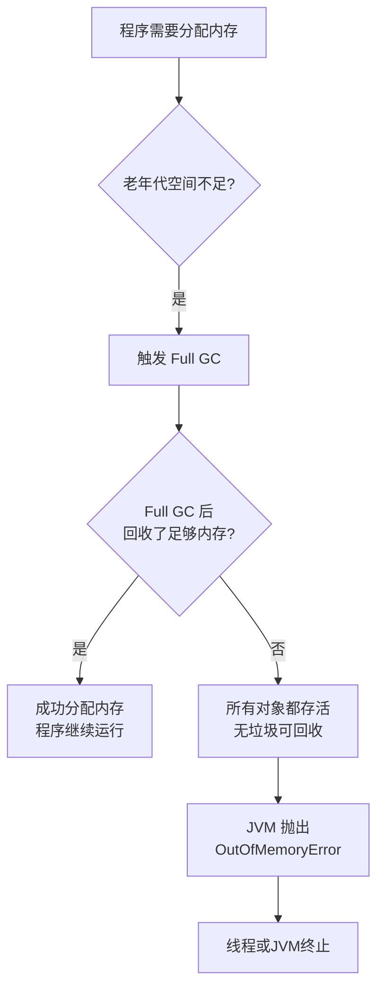
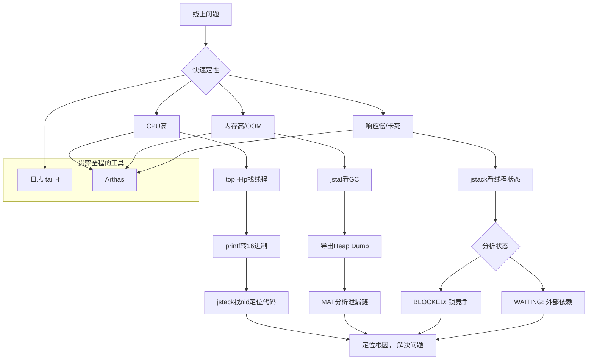
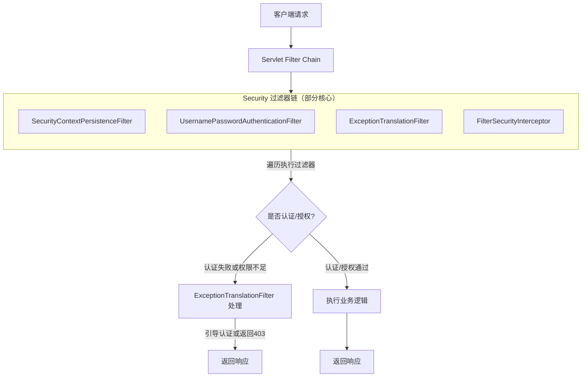

# Java介绍:
Java是一个面向对象高级编程语言，通过Java编译器生成字节码文件在计算机里运行。
与C++不同，Java运用Java Virtual Machine（JVM）执行Java字节码（二进制形式），并通过JVM在多台机器上运行。
正因为Java运用了JVM在计算机上运行，并弱化了指针，因此Java不适合操作系统层面的源码编写，Java的应用在应用程序和web层面比较广泛。

Java官方文档：https://www.w3cschool.cn/java/dict

# 基本语法：
关键字和保留字、标识符、变量、运算符、程序流程控制 

**关键字**：Java关键字是电脑语言里事先定义的，有特别意义的标识符，有时又叫保留字，还有特别意义的变量。

Java的关键字对Java的编译器有特殊的意义，他们用来表示一种数据类型，或者表示程序的结构等，关键字不能用作变量名、方法名、类名、包名和参数。
1、48个关键字：
用于定义类、函数、变量修饰符的关键字：
abstract、final、static、synchronized
用于定义类与类之间关系的关键字：
extends、implements
用于定义建立实例及引用实例、判断实例的关键字：
new、this、super、instanceof
用于异常处理的关键字：
try catch finally throw throws
用于包的关键字：
package import
其他修饰符关键字：
native、assert、transient、volatile、strictfp 

native: 指示一个方法的实现并不是由 Java 语言编写的，而是由本地（Native）代码（通常是 C 或 C++）实现的。
assert: 断言，用于在代码中进行“假设”，即在程序某个特定的点，断言某个条件必须为真。
transient: 用来标记一个成员变量在序列化（即实现 java.io.Serializable 接口的对象被转换为字节流的过程）时应该被忽略，该字段不会被序列化。
volatile: 一个字段修饰符。用来确保变量的可见性和有序性。
strictfp: 用于修饰类、接口或方法，确保在不同平台上执行的浮点计算都遵循 IEEE 754 标准，从而保证结果的一致性。

*用于定义数据类型值的字面值：
true、false、null。

2、Java保留字是指现有Java版本尚未使用 但以后版本可能会作为关键字使用，是C语言里用到但是Java里没有用到的关键字。
goto、const。

3、3个特殊直接量：true、false、null。

4、标识符：Java标识符由数字，字母和下划线（_），美元符号（$）或人民币符号（￥）组成。
在Java中是区分大小写的，而且还要求首位不能是数字。最重要的是，Java关键字不能当作Java标识符。
简单来说就是，在Java中凡是可以自己起名字的地方都叫标识符。

4.1 Java中的名称命名规范：
包名：多单词组成时所有字母都小写：xxxyyyzzz
类名、接口名：多单词组成时，所有单词的首字母大写：XxxYyyZzz
变量名、方法名：多单词组成时，第一个单词首字母小写，
第二个单词开始每个单词首字母大写：xxxYyyZzz
常量名：所有字母都大写。多单词时每个单词用下划线连接：XXX_YYY_ZZZ

5、变量
概念：本质上来说变量是内存中的一小块区域，通过变量名来访问这块区域。因此，使用每一个变量前必须要先申请（声明）然后必须对其进行赋值，才能使用

按照数据类型来分：
基本数据类型（primitive type,在栈stack中）：
整数类型：byte（1字节）、short（2字节）、int（4字节）、long（8字节）
浮点类型：float（4字节）、double（8字节）
整数类型默认为int、浮点类型默认为double。
字符型： char（使用Unicode编码、每个字符占两个字节，8个bite一个字节）
布尔型： boolean（与C语言布尔类型取0和1不同，只能取true和false）
引用数据类型（reference type,在堆heap中）：
类（字符串定义在类里）
接口
数组
（ *若想让基础类型存放在堆中，可以将基础类型包装为一个对象。将会用到基础类型的包装类）

按照声明的位置来分：
局部变量：方法体内，或者语句块内部定义的变量（局部变量不会默认初始化、必须先声明并赋值）
成员变量：方法体之外，类体中（需要先声明、赋值，若没有先赋值、则默认初始化后再使用）

基本数据类型大小：
类型 占用存储空间     表数范围
byte  1字节 = 8bit位   -128~127
short 2字节            -2^15~2^15-1
int   4字节            -2^31~2^31-1
long  8字节            -2^63~2^63-1
float 4字节 		   -3.40E+38 ~ +3.40E+38
double 8字节		   -1.79E+308 ~ +1.79E+308
注意：
bit : 计算机最小存储单位    byte：计算机中基本存储单元
整数类型默认为int、浮点类型默认为double。

字符型数据类型：
char用单引号'',String用双引号"";
String类型是字符串数据类型，用来存储多个字符，char类型只能存储一个字符。
String可以和8种数据类型做运算，运算的结果仍为String类型。
String是一个引用数据类型，但同时是一个final类，可以用字面量的定义方式去赋值。
通过字面量的方式（区别于new）赋值，会声明在常量池中。而常量池中不会存在相同内容的字符串。
所以，用==去比较两个相同内容的字符串，会返回true。

String代表不可变的字符串序列，称作"不可变性"
>当对字符串重新赋值时，需要重新写内存区域
>当对现有的字符串进行连接操作时，需要重新写内存区域赋值，不能在原有的基础上赋值
>当调用String的replace方法时，也需要重新写内存区域赋值，不能在原有的基础上赋值
>String字符串拼接的方式，常量和常量拼接的结果在常量池；只要其中有一个是变量，结果就在堆中；

如果拼接的结果使用intern()方法，返回值在常量池中

String的实例化方式：
1.通过字面量的方式，声明在方法区中，两个相同的字符串返回true（即使是在对象中通过字面量定义的两个相同的字符串，返回的也是true）
2.通过new的方式，声明在堆中，两个相同的对象对比返回false

String与char之间的转换：
String → char ：使用String中的toCharArray()
char → String ：调用String中的构造器

String与byte之间的转换：
String → char ：使用String中的getByte()
char → String ：调用String中的构造器

不同于String是不可变的字符串序列，StringBuffer和StringBuilder是可变的字符串序列。
String：不可变的字符串序列
StringBuffer ：可变的字符串序列，线程安全，效率低，多线程时用
StringBuilder ：可变的字符串序列，线程不安全，效率高
String可以直接赋值或者创建对象
String s1 = "Hello"; // 通过直接赋值创建String对象  
String s2 = new String("Hello"); // 通过new关键字创建String对象

StringBuilder：StringBuilder和StringBuffer类似，也是Java中的一个可变类，允许我们在同一个对象上进行多次的字符串操作。
StringBuilder sb = new StringBuilder(); // 创建一个空StringBuilder对象  
sb.append("Hello"); // 添加字符串  
sb.append(" World"); // 添加另一个字符串  
System.out.println(sb.toString()); // 输出 "Hello World"

StringBuffer是Java中的一个可变类，它允许我们在同一个对象上进行多次的字符串操作。
StringBuffer sb = new StringBuffer(); // 创建一个空的StringBuffer对象  
sb.append("Hello"); // 添加字符串  
sb.append(" World"); // 添加另一个字符串  
System.out.println(sb.toString()); // 输出 "Hello World"

**StringBuffer 的线程安全性是通过 synchronized 关键字实现的。**

1.synchronized 方法：
* StringBuffer 类中几乎所有修改其内部状态的方法（如 append(), insert(), delete(), replace(), setCharAt(), setLength() 等）都被声明为 synchronized。
* 这意味着这些方法在执行时，会获取 StringBuffer 对象实例本身的锁（this 锁）。

2.锁机制与互斥访问：
* 当一个线程调用一个 synchronized 方法（例如 append("abc")）时，它必须先获得这个 StringBuffer 对象的锁。
* 如果此时锁没有被其他线程持有，该线程成功获取锁，进入方法体执行操作（修改内部的字符数组）。
* 如果此时锁正被另一个线程持有（因为那个线程正在执行另一个 synchronized 方法），那么当前线程会被阻塞（进入等待状态），直到持有锁的线程执行完毕并释放锁。
* 持有锁的线程执行完方法后（无论是正常返回还是抛出异常），会自动释放锁。

创建StringBuffer时，底层创建了一个长度为16的字符串char型数组；
如果创建时传了参数，则在此基础上增加一个长度为16的字符串char型数组，默认情况下，扩容为原来的2倍+2，同时将原有数组的元素复制到新的数组中

基础数据类型的转换：
* 容量小的数据类型与容量大的数据类型运算，结果自动转换为容量大的数据类型。
* 当byte,short,char做运算时，结果必须是int类型。
* byte,short,char -> int -> long -> float -> double

容量大的转换为容量小的：强制类型转换
注意：强制类型转换，可能导致精度损失。
// Widening
// byte<short<int<long<float<double
int i = 10;
long l = i;               // 10
// Narrowing 
double d = 10.02;
long l = (long)d;         // 10
String.valueOf(10);       // "10"
Integer.parseInt("10");   // 10
Double.parseDouble("10"); // 10.0

6、在Java当中，运算符可以分为：算术运算符(+ - * /)、 关系运算符(< > ==)、逻辑运算符、位运算符、移位运算符以及条件运算符等。
一、算术运算符
1，基本的四则运算：加减乘除模(+ - * / %)
注意点：

（1）这些运算符都是二元运算符，使用时必须要有左右两个操作数。

int a = 20;
int b = 10;
System.out.println(a + b); // 30
System.out.println(a - b); // 10
System.out.println(a * b); // 200
System.out.println(a / b); // 2
System.out.println(a % b); // 0 --->模运算相当于数学中除法的余数

（2）同C语言一样，int / int的结果还是int，而且会向下取整。

要出现小数点，那就转成double类型或在最后*1.0。

（3）除法和取模操作时，右操作数不能为0，否则会报出异常。

（4）%在Java中不但可以对整数进行取模，还可以对double进行取模操作。

（5）两边操作数不相同的时候，会发生类型提升。看一个特例：

对两个short类型进行相加，在用short进行接受，发现报错，提示是从int到short可能会有损失。
这是因为为了计算的方便，Java在将小于4个字节的类型进行计算的时候，会将其隐形提升到int类型。
上面两个short均被提升到int，在用short接收，就会报错。解决办法是进行强制类型转换。

2，增量运算符 = += -= *= %=
不会改变变量本身的数据类型。该种类型运算符操作完成后，会将操纵的结果赋值给左操作数。要注意只有变量才可以使用该运算符，常量不允许被修改，不能使用。

3，自增/自减运算符 ++/--
不会改变变量本身的数据类型。这两种运算符有前置和后置之分。如果是单独使用，那么前置和后置是没有区别的，如果是混合使用：

int a = 1;
a++; // 后置++ 表示给a的值加1，此时a的值为2
System.out.println(a++); // 注意：后置++是先使用变量原来值，表示式结束时再给变量+1，因此输出2
System.out.println(a); // 输出3
++a; // 前置++ 表示给a的值加1
System.out.println(++a); // 注意：前置++是先给变量+1，然后使用变量中的值，再使用表达式，因此输出5
System.out.println(a); // 输出5

混合使用，【前置++】先+1，然后使用变量+1之后的值，【后置++】先使用变量原来的值，表达式结束时给变量+1 只有变量才能使用自增/自减运算符，常量不能使用，因为常量不允许被修改。

二、关系运算符
主要有六个: == != < > <= >=，其计算结果是 true 或者 false 。在Java中，只有true和false，不存在0表示假，非0表示真。

当需要多次判断时，不能连着写，比如：3 < a < 5，在C语言当中，是可以运行的，但是在Java当中会报错，需要写成3 < a &&  a < 5。

在验证用户登录时判定用户名不是null而且不是空字符串，应当写为：username != null &&!username.equals(“”)，二者的顺序不能交换。
原因：
在Java中，&&是逻辑与运算符，它有一个重要的特性：短路行为。这意味着如果第一个操作数为false，那么整个表达式的结果就确定为false，而第二个操作数（即右侧的条件）将不会被评估。这个特性在防止NullPointerException时非常有用。
如果我们将条件交换为!username.equals("") && username != null，那么当username为null时，!username.equals("")这个条件会首先被评估，这将导致NullPointerException，因为null不能调用任何方法（包括equals方法）。
而username != null这个条件原本可以阻止这种情况的发生，但由于它现在位于第二个位置，它已经没有机会阻止NullPointerException了。


==和equals的区别？
==：运算符
如果比较的是基本数据类型：比较两个变量保存的数据是否相同（不一定类型要相同）
如果比较的是引用数据类型：比较两个变量的地址值是否相同，是否指向同一个对象实体

用==比较两个String类型的数据：
在Java中，使用==操作符来比较两个String类型的对象时，并不会导致编译错误，因为==是Java的一个有效操作符，它可以用于比较基本数据类型（如int、char等）的值，也可以用于比较引用数据类型的引用值（即，它们是否指向内存中的同一位置）。
然而，对于String类型的比较，使用==通常不是最佳实践，因为String是一个不可变类，并且Java虚拟机（JVM）为了优化字符串的使用，会在字符串常量池中缓存字符串字面量。
这意味着，当你创建两个内容相同的字符串字面量时，JVM可能会让它们指向常量池中的同一个对象。但是，如果你通过new String("...")来创建字符串对象，或者字符串是通过其他非字面量的方式（如字符串连接、字符串函数返回值等）得到的，那么即使内容相同，这些字符串对象也可能位于内存中的不同位置。
因此，当你使用==来比较两个String对象时，你实际上是在比较它们的引用是否相同，而不是它们的内容是否相同。这通常不是你想要的，特别是当你不确定这些字符串是否来自常量池，或者是否通过new关键字显式创建时。
为了比较两个String对象的内容是否相同，应该使用equals()方法。equals()方法被重写（Override）在String类中，以比较两个字符串的内容是否完全一致。这是比较字符串内容的正确方式。

equals(): 方法
只能适用于引用数据类型
Object类中equals（）的定义：Object类中定义的equals()和==的作用是相同的，比较两个对象的地址值
public boolean equals(Object obj){
	return (this == obj)
}
像String、Date、File、包装类等都重写了Object类中的equals()方法，比较两个对象的实体内容

在Java8中String类重写的equals()方法：
public boolean equals(Object anObject) {  
    if (this == anObject) {  
        return true;  
    }  
    if (anObject instanceof String) {  
        String anotherString = (String)anObject;  
        int n = value.length;  
        if (n == anotherString.value.length) {  
            char v1[] = value;  
            char v2[] = anotherString.value;  
            int i = 0;  
            while (n-- != 0) {  
                if (v1[i] != v2[i])  
                    return false;  
                i++;  
            }  
            return true;  
        }  
    }  
    return false;  
}


通常情况下，自定义的类需要重写equals()方法
自定义类重写equals()方法的步骤一般如下：
1、先用“==”判断是否相等。
2、判断equals()方法的参数是否为null，如果为null，则返回false；因为当前对象不可能为null，如果为null，则不能调用其equals()方法，否则抛java.lang.NullPointerException异常。
3、当参数不为null，则如果两个对象的运行时类（通过getClass()获取）不相等，返回false，否则继续判断。

重写equals()方法的时候需要重写hashcode方法。
>为什么需要同时重写equals和hashCode？
equals和hashCode的契约：
如果两个对象通过equals方法比较是相等的，那么它们的hashCode值必须相同。
如果两个对象的hashCode值相同，它们通过equals方法比较不一定相等（哈希冲突是允许的）。

哈希表依赖hashCode：
Java中的HashMap、HashSet等集合类依赖于hashCode方法来快速定位对象。
如果只重写equals而不重写hashCode，可能会导致两个相等的对象具有不同的哈希值，从而导致这些集合类无法正常工作。

Java比较器：比较对象的大小
Comparable 的使用举例：
1.像String、包装类等实现了Comparable接口，重写了CompareTo()方法，给出了比较两个对象大小的方法
2.像String、包装类重写CompareTo()方法以后，进行了从小到大的排列
3.重写CompareTo(obj)的规则：
	如果当前对象this大于形参对象obj，则返回正整数；
	如果当前对象this小于形参对象obj，则返回负整数；
	如果当前对象this等于形参对象obj，则返回零；

Comparator定制排序：
当元素的类型没有实现Comparable接口而又不方便修改代码，或者实现了Comparable
接口的排序规则不适合当前的操作，可以考虑使用Comparator的对象来排序


三、逻辑运算符
逻辑运算符主要有六个: &  &&  |  || ! ^，运算结果都是boolean类型。

1、逻辑与 & 短路与 &&
语法规则：表达式1 && 表达式2，左右表达式必须是boolean类型的结果。相当于数学中的且。
短路与遵守短路求值的规则。即表达式1为假，表达式2就不再执行。逻辑与继续执行表达式2。

2、逻辑或 | 短路或 ||
语法规则：表达式1 || 表达式2，左右表达式必须是boolean类型的结果。相当于数学中的或。
短路或遵守短路求值的规则。即表达式1为真，表达式2就不再执行。逻辑或继续执行表达式2。

|| 遵守短路求值的规则。即表达式1为真，表达式2就不在执行，否则，执行表达式2。

& 和 | 也可以进行逻辑运算。如果他们的表达式为boolean，也表示逻辑运算，但是和&& ||相比不支持短路求值。

3、逻辑非 !
语法规则：!表达式1，相当于数学中的非。

4、逻辑异或
语法规则：表达式1^表达式2，左右表达式必须是boolean类型的结果。当表达式1和表达式2相同时为true，不同时为false。


四、位运算符
数据存储的最小单位是字节，而数据操作的最小单位是比特位。
字节是最小的存储单位，每个字节是由8个二进制比特位组成的，多个字节组合在一起可以表示各种不同的数据。
位运算表示按照二进制的每一位进行运算。
位运算符的左右两边是数值类型。

1，按位与&
如果两个二进制位都是 1，则结果为 1，否则结果为 0。

int a = 10;
int b = 20;
System.out.println(a & b); // 0


2，按位或|
如果两个二进制位有一个是1，则结果是1，否则都是0，结果是0。 

int a = 10;
int b = 20;
System.out.println(a | b); //30

 3，按位异或^
如果两个二进制位相同，则结果是0，否则是1。

4，按位取反~
如果该二进制位是1，则变成0，是0，变成1。

5，移位运算
    Java和C语言不同的地方在于，Java多了一个>>>，表示无符号右移。但是没有无符号左移。Java的移位运算符有三个: <<，>>，>>> 。都是二元运算符，且都是按照二进制比特位来运算的。

（1）左移：<<最左侧位不要了N位，在最右侧补零。左移 1 位，相当于原数字 * 2。左移 N 位，相当于原数字 * 2 的N次方。

（2）右移：>>最右侧不要了N位，在最左侧如果是正数，补0，负数补1。右移 1 位，相当于原数字 / 2。右移 N 位，相当于原数字 / 2 的N次方。

（3）无符号右移：>>>最右侧位不要了，最左侧补0。被移位二进制最高位无论是0还是1，空缺位都拿0补。

（4）移动负数位或者移位位数过大都没有意义。

    计算机在进行运算的时候，实际上是按照二进制运算的。加减等在运算的时候被转化成二进制的形式进行运算。计算机计算移位效率高于计算乘除，比如当某个代码正好乘除 2 的N次方的时候可以用移位运算代替。

6，条件运算符
条件运算符只有一个：表达式1 ? 表达式2 : 表达式3。
当表达式1为true时，执行表达式2，表达式3不在执行，否则执行表达式2。这个是Java当中唯一的一个三目运算符。表达式2和表达式3的结果需要同类型的，表达式不能单独存在。
int a = 10;
int b = 20;
int max = (a > b) ? a : b;
// 输出: 20
System.out.println(max);

7，在Java程序中，JVM默认总是顺序执行以分号;结束的语句。但是，在实际的代码中，程序经常需要做条件判断、循环，因此，需要有多种流程控制语句，来实现程序的跳转和循环等功能。
流程控制语句是用来控制程序中各语句执行顺序的语句，可以把语句组合成能完成一定功能的小逻辑模块。

if..else if..else：条件判断语句。
int j = 10;
if (j == 10) {
  System.out.println("I get printed");
} else if (j > 10) {
  System.out.println("I don't");
} else {
  System.out.println("I also don't");
}

for：循环语句，限定循环体的执行次数
for (int i = 0; i < 10; i++) {
  System.out.print(i);
}
// 输出: 0123456789

//增强for循环
int[] numbers = {1,2,3,4,5};
for (int number: numbers) {
  System.out.print(number);
}
// 输出: 12345

while：循环语句，反复执行语句或代码块，直到条件不满足时跳出
int count = 0;
while (count < 5) {
  System.out.print(count);
  count++;
}
// 输出: 01234

//do while循环
int count = 0;
do {
  System.out.print(count);
  count++;
} while (count < 5);
// 输出: 01234

switch..case:根据switch表达式中的值，依次匹配各个case中的常量。
一旦匹配成功，进入case结构，调用其执行语句。如果没有break关键字，则继续执行其他case结构的表达式。
int month = 3;
String str;
switch (month) {
  case 1:
    str = "January";
    break;
  case 2:
    str = "February";
    break;
  case 3:
    str = "March";
    break;
  default:
    str = "Some other month";
    break;
}
// 输出: Result March
System.out.println("Result " + str);

break和continue关键字：
1、break用于跳出一个循环体或者完全结束一个循环，不仅可以结束其所在的循环，还可结束其外层循环。
注意：
（1）只能在循环体内和switch语句体内使用break。
（2）不管是哪种循环，一旦在循环体中遇到break，系统将完全结束循环，开始执行循环之后的代码。
（3）当break出现在循环体中的switch语句体内时，起作用只是跳出该switch语句体，并不能终止循环体的执行。若想强行终止循环体的执行，可以在循环体中，但并不在switch语句中设置break语句，满足某种条件则跳出本层循环体。
for (int i = 0; i < 5; i++) {
  System.out.print(i);
  if (i == 3) {
    break;
  }
}
// 输出: 0123

2、continue语句的作用是跳过本次循环体中剩下尚未执行的语句，立即进行下一次的循环条件判定，可以理解为只是中止(跳过)本次循环，接着开始下一次循环。
注意：
（1）continue语句并没有使整个循环终止。
（2）continue 只能在循环语句中使用，即只能在 for、while 和 do…while 语句中使用。
for (int i = 0; i < 5; i++) {
  if (i == 3) {
    continue;
  }
  System.out.print(i);
}
// 输出: 01245

7、注释、文档注释
注释的内容不参与编译。
文档注释：注释内容可以被jdk提供的工具javadoc解析，生成一套网页文件形式体现的该程序的说明文档。
注意：javadoc解析的类要加上public

// 我是单行注释！
 
/*
而我是一个
多行注释！
*/
/**
  * 这个
  * 是
  * 文档
  * 注释
  */

8、注解
Annotation(注解)也被称为元数据(Metadata)是JDK1.5及以后版本引入的，用于修饰解释 包、类、方法、属性、构造器、局部变量等数据信息。
它可以用于创建文档，跟踪代码中的依赖性，甚至执行基本编译时检查。
注解是以‘@注解名’在代码中存在的，根据注解参数的个数，我们可以将注解分为：标记注解、单值注解、完整注解三类。
和注释一样，注解不影响程序逻辑，但注解可以被编译或运行，相当于嵌入在代码中的补充信息。
另外，你可以在编译时选择代码里的注解是否只存在于源代码级，或者它也能在class文件、或者运行时中出现（SOURCE/CLASS/RUNTIME）。
在 JavaSE 中，注解的使用目的比较简单，例如标记过时的功能，忽略警告等。
在 JavaEE 中注解占据了更重要的角色，例如用来配置应用程序的任何切面，代替 java EE 旧版中所遗留的繁冗代码和 XML 配置等。
 
元注解：标注在一个注解上，用于定义一个注解的状态
@Documented - 一个简单的标记注解，它标识了是否将注解添加到 Javadoc 中。

@Retention - 定义应保留注解的时间。
RetentionPolicy.SOURCE 在编译期间丢弃。这些注解在编译完成后没有任何意义，因此它们不会被写入字节码。例子：@Override, @SuppressWarnings
RetentionPolicy.CLASS – 在类加载期间丢弃。应用在进行字节码级别的编译期间。有些令人惊讶的是，这是默认的。
RetentionPolicy.RUNTIME – 不会丢弃。该注解可以在运行时进行反射。这是我们通常用于自定义注解的内容。

@Target - 注解可以使用的地方。如果不指定这一属性，注解可以应用在任何地方。
以下是该注解的有效值。这里的一个要点，它只有包含的形式，这意味着如果您想要对7个属性进行注解，并且只想排除一个属性，这时需要在定义目标时包含所有7个属性。 

@Documented: 用于指定被该元注解修饰的 Annotation 类将被javadoc 工具提取成文档，即在生成文档时，可以看到该注解。
注意：
定义为@Documented 的注解必须设置Retention值为RUNTIME。

@Inherited 
被@Inherited 修饰的注解 将具有继承性，如果某个类使用了被 @Inherited修饰的注解，则其子类将自动具有该注解

注解的注意事项：
▷ 注解仅存在于源码中，在class字节码文件中不包含
▷ 默认的保留策略，注解会在class字节码文件中存在，但运行时无法获得，
▷ 注解会在class字节码文件中存在，在运行时可以通过反射获取到
▷ 首先要明确生命周期长度 SOURCE < CLASS < RUNTIME ，前者能作用的地方后者一定也能作用。
        ①：一般如果需要在 运行时去动态获取注解信息，那只能用 RUNTIME 注解；
        ②：如果要在 编译时进行一些预处理操作，比如生成一些辅助代码（如 ButterKnife），就用 CLASS注解；
        ③：如果只是做一些 检查性的操作如 @Override 和 @SuppressWarnings，则可选用 SOURCE 注解。


9、Java数组（Array）：数组是多个相同类型的数据按照一定顺序排列的集合，并使用一个名字命名，并通过编号的方式对这些数据进行统一处理。

数组的声明：数组的长度一旦确定，就不能修改。
数组有一维数组和二维数组。
//声明 Declare
int[] a1;
int[] a2 = {1, 2, 3};
int[] a3 = new int[]{1, 2, 3};
int[] a4 = new int[3];
a4[0] = 1;
a4[2] = 2;
a4[3] = 3;

数组的初始化：数组的初始化有两种形式，静态初始化和动态初始化。
静态初始化:数组的初始化和数组的元素赋值同时进行 
ids = new int[]{11,22,12,12,12,123};
ids = {11,22,12,12,12,123};
动态初始化：数组的初始化和数组的元素赋值分开进行
String[] names = new String[5];

注意：数组一旦初始化完成，数组长度就确定了

数组元素通过角标调用。从第一个角标0开始，一直到-1。
通过数组的属性length获取数组的长度。
数组元素的默认初始化值：
>数组元素是整型：0
>数组元素是浮点型：0.0
>数组元素是char型：0或'\u0000' 而非'0'
>数组元素是Boolean型：false
>数组元素是引用数据类型: null

二维数组的初始化：
静态初始化：
int [][] arr = new int [][]{{1,2,3},{4,5},{6,7,8}};
int []arr [] = new int [][]{{1,2,3},{4,5},{6,7,8}};
int [][] arr = {{1,2,3},{4,5},{6,7,8}};
动态初始化：
String [][] arr2 = new String[5][3]; 
String [][] arr2 = new String[5][];

10、Java异常处理
Java的异常处理是Java编程语言中用于处理运行时错误的一个重要机制。它允许程序员定义在程序中可能发生的异常情况，并在这些情况发生时提供相应的处理逻辑。
Java的异常处理基于三个关键字：try、catch 和 finally，以及 throw 和 throws。

异常类
在Java中，异常是一种对象，它是Throwable类或其子类的实例。Throwable类有两个主要的子类：Error和Exception。

Error：表示系统级错误或资源耗尽的情况，通常应用程序无法处理这些错误。例如，OutOfMemoryError。
Exception：表示可以由应用程序捕获并处理的异常情况。Exception类又进一步分为RuntimeException（运行时异常）和检查型异常（checked exceptions）。

异常处理的基本结构
异常处理的基本结构包括try、catch和finally块。

try块：包含可能引发异常的代码。
catch块：用于捕获并处理try块中抛出的异常。可以有多个catch块来处理不同类型的异常。

finally块：无论是否发生异常，finally块中的代码都会被执行。它通常用于释放资源，如关闭文件或数据库连接。
示例：
try {  
    // 尝试执行的代码，可能会抛出异常  
    int result = 10 / 0; // 这将引发ArithmeticException  
} catch (ArithmeticException e) {  
    // 处理ArithmeticException  
    System.out.println("除数不能为0");  
} catch (Exception e) {  
    // 处理其他类型的异常（如果有的话）  
    System.out.println("发生了一个异常：" + e.getMessage());  
} finally {  
    // 无论是否发生异常，都会执行的代码  
    System.out.println("这是finally块");  
}

抛出异常
使用throw关键字可以手动抛出一个异常。这通常用于在检测到错误情况时通知调用者。

示例：
public void divide(int a, int b) {
    if (b == 0) {
        throw new ArithmeticException("Division by zero is not allowed");
    }
    System.out.println(a / b);
}

声明异常
如果一个方法可能会抛出异常，但该方法本身不处理该异常，那么它应该使用throws关键字声明它可能会抛出的异常。这样，调用该方法的代码就需要处理这些异常，或者继续声明它们。

示例：
public void readFile(String filePath) throws IOException {  
    // 读取文件的代码，可能会抛出IOException  
    // ...  
}

throw和throws关键字有什么不同？
throw：用于在代码中显式抛出一个异常。
throws：用于在方法签名中声明可能抛出的异常。

区别：
throw是动作，throws是声明。
throw在方法内部使用，throws在方法签名中使用。
throw可以抛出任何异常，throws只能声明已检查异常。

Java中的一些异常：
1. 空指针异常（NullPointerException），是运行时异常
原因：尝试访问或操作一个null对象的属性或方法。

示例：
String str = null;
System.out.println(str.length()); // 抛出NullPointerException

解决方法：
在使用对象之前检查是否为null。
使用Optional类避免空指针。
使用Objects.requireNonNull进行显式检查。

2. 数组越界异常（ArrayIndexOutOfBoundsException），是运行时异常
原因：访问数组时，索引超出了数组的有效范围。

示例：
int[] arr = {1, 2, 3};
System.out.println(arr[3]); // 抛出ArrayIndexOutOfBoundsException

解决方法：
在访问数组元素之前检查索引是否有效。
使用增强型for循环避免手动管理索引。

3. 类型转换异常（ClassCastException），是运行时异常
原因：尝试将一个对象强制转换为不兼容的类型。

示例：
Object obj = "Hello";
Integer num = (Integer) obj; // 抛出ClassCastException

解决方法：
在类型转换之前使用instanceof检查类型。
尽量避免不必要的类型转换。

4. 并发修改异常（ConcurrentModificationException），是运行时异常
原因：在使用迭代器遍历集合时，直接修改了集合的结构（如添加或删除元素）。

示例：
List<String> list = new ArrayList<>();
list.add("A");
list.add("B");
for (String s : list) {
    list.remove(s); // 抛出ConcurrentModificationException
}

解决方法：
使用迭代器的remove方法删除元素。
使用CopyOnWriteArrayList等线程安全的集合类。

5. 栈溢出错误（StackOverflowError），是错误
原因：递归调用过深，导致栈空间耗尽。

示例：
public void recursiveMethod() {
    recursiveMethod(); // 无限递归，抛出StackOverflowError
}

解决方法：
检查递归的终止条件是否正确。
将递归改为迭代（如使用循环）。

6. 内存溢出错误（OutOfMemoryError），是错误
原因：JVM内存不足，无法分配更多对象。

示例：
List<Object> list = new ArrayList<>();
while (true) {
    list.add(new Object()); // 抛出OutOfMemoryError
}

解决方法：
检查是否有内存泄漏（如未释放不再使用的对象）。
增加JVM的堆内存大小（如使用-Xmx参数）。

7. 类未找到异常（ClassNotFoundException），是编译时异常
原因：尝试加载一个不存在的类。

示例：
Class.forName("NonExistentClass"); // 抛出ClassNotFoundException

解决方法：
检查类路径是否正确。
确保所需的类或依赖库已正确加载。

8. 方法未找到异常（NoSuchMethodException），是编译时异常
原因：尝试通过反射调用一个不存在的方法。

示例：
Method method = String.class.getMethod("nonExistentMethod"); // 抛出NoSuchMethodException

解决方法：
检查方法名和参数类型是否正确。
确保目标类中确实存在该方法。

9. 文件未找到异常（FileNotFoundException），是编译时异常
原因：尝试访问一个不存在的文件。

示例：
FileInputStream fis = new FileInputStream("nonExistentFile.txt"); // 抛出FileNotFoundException

解决方法：
检查文件路径是否正确。
确保文件确实存在。

10. 数字格式异常（NumberFormatException），是运行时异常
原因：尝试将一个非数字字符串转换为数字类型。

示例：
int num = Integer.parseInt("abc"); // 抛出NumberFormatException

解决方法：
在转换之前检查字符串是否为有效数字。
使用try-catch捕获异常。

11. 非法参数异常（IllegalArgumentException），是运行时异常
原因：传递给方法的参数不合法。

示例：
public void setAge(int age) {
    if (age < 0) {
        throw new IllegalArgumentException("Age cannot be negative");
    }
}
解决方法：
在方法中检查参数的有效性。
提供清晰的错误信息。

12. 线程中断异常（InterruptedException），是编译时异常
原因：线程在等待、睡眠或占用时被中断。

示例：
try {
    Thread.sleep(1000);
} catch (InterruptedException e) {
    e.printStackTrace();
}

解决方法：
正确处理线程中断（如恢复中断状态）。
避免忽略中断异常。

13. 文件未找到异常（FileNotFoundException），是编译时异常
原因：当尝试打开一个不存在的文件作为数据流（如FileInputStream、FileReader）时抛出。

示例：
FileInputStream fis = new FileInputStream("missing_file.txt"); 

解决方法：
验证文件路径是否正确

14. IO异常（IOException），是编译时异常
原因：在数据流操作（如读取/写入网络流、文件流）中发生的通用I/O问题（如流意外关闭、网络中断等）。

示例：
socket.getInputStream().read(); // 若流被关闭，可能抛出IOException

解决方法：
使用 try-with-resources 自动关闭资源
添加重试机制

在Java中，某些看似应该在编译时报错的错误实际上是运行时错误，这反映了编译器设计的核心逻辑：**在保证类型安全和语法正确的前提下，允许最大程度的灵活性**。
为什么某些错误延迟到运行时？编译器逻辑解析

1. **技术可行性限制**
   - **场景示例**：空指针异常
     ```java
     // 编译通过！运行时可能抛出NullPointerException
     public void process(User user) {
         System.out.println(user.getName().toUpperCase());
     }
     ```
   - **编译器逻辑**：
     - 编译器只能验证**声明类型**的合法性（`User`类有`getName()`方法）
     - 无法跟踪**运行时对象状态**（`user`是否实际为null）
     - 强制编译时检查需要全局数据流分析（NP完全问题，计算不可行）

2. **动态绑定机制**
   - **场景示例**：类转换异常(ClassCastException)
     ```java
     Object obj = getObject(); // 编译时类型为Object
     String str = (String) obj; // 编译通过！运行时可能失败
     ```
   - **编译器逻辑**：
     - 满足继承规则即可编译（`String`是`Object`子类）
     - 实际类型在运行时动态确定（如`obj`可能是`Integer`）
     - 强制编译时检查需要预知所有可能的运行时类型（违反OOP多态原则）

3. **资源状态不可预测**
   - **场景示例**：文件未找到异常
     ```java
     new FileInputStream("data.txt"); // 编译通过！运行时可能失败
     ```
   - **编译器逻辑**：
     - 路径字符串是普通`String`类型（语法合法）
     - 文件系统的状态是**外部环境依赖**：
       - 文件可能被其他进程删除
       - 权限可能动态变化
       - 网络驱动器可能断开
     - 无法在编译时验证外部环境

4. 性能与灵活性的权衡
   - **优化编译速度**：深度检查会显著增加编译时间
   - **支持动态特性**：
     - 反射API：`Class.forName("MyClass")`
     - 插件架构：运行时加载类
     - JNDI查找：动态资源获取
   - **跨平台一致性**：避免在编译时绑定特定环境

结论：Java编译器的核心逻辑是验证代码的抽象正确性，而非具体执行可行性。这种设计平衡了开发效率与安全性，将环境依赖和动态行为的验证留给运行时，这正是Java能在复杂现实环境中保持强大生命力的关键设计决策。

**自定义异常**
除了使用Java内置的异常类外，程序员还可以定义自己的异常类。这通常用于表示特定于应用程序的错误情况。自定义异常类应该继承自Exception类或其子类。
1. 自定义异常的基本步骤
（1）选择基类
如果自定义异常是已检查异常（Checked Exception），则继承Exception类。
如果自定义异常是未检查异常（Unchecked Exception），则继承RuntimeException类。

（2）定义构造方法
提供多个构造方法，以便在抛出异常时可以传递不同的信息。

通常包括以下构造方法：
无参构造方法。
带有错误信息的构造方法。
带有错误信息和原因的构造方法（用于异常链）。

（3）添加自定义属性和方法（可选）
如果需要，可以为自定义异常添加额外的属性和方法，以提供更多的错误信息。

2. 自定义已检查异常
已检查异常需要在方法签名中使用throws声明，或者在方法内部捕获处理。

示例：
// 自定义已检查异常
public class MyCheckedException extends Exception {
    // 无参构造方法
    public MyCheckedException() {
        super();
    }

    // 带有错误信息的构造方法
    public MyCheckedException(String message) {
        super(message);
    }

    // 带有错误信息和原因的构造方法
    public MyCheckedException(String message, Throwable cause) {
        super(message, cause);
    }
}

使用示例：
public class Example {
    public void doSomething() throws MyCheckedException {
        // 模拟抛出自定义异常
        throw new MyCheckedException("This is a custom checked exception");
    }

    public static void main(String[] args) {
        Example example = new Example();
        try {
            example.doSomething();
        } catch (MyCheckedException e) {
            System.out.println("Caught exception: " + e.getMessage());
        }
    }
}
3. 自定义未检查异常
未检查异常不需要在方法签名中使用throws声明，通常用于表示程序逻辑错误。

示例：

// 自定义未检查异常
public class MyUncheckedException extends RuntimeException {
    // 无参构造方法
    public MyUncheckedException() {
        super();
    }

    // 带有错误信息的构造方法
    public MyUncheckedException(String message) {
        super(message);
    }

    // 带有错误信息和原因的构造方法
    public MyUncheckedException(String message, Throwable cause) {
        super(message, cause);
    }
}

使用示例：

public class Example {
    public void doSomething() {
        // 模拟抛出自定义异常
        throw new MyUncheckedException("This is a custom unchecked exception");
    }

    public static void main(String[] args) {
        Example example = new Example();
        example.doSomething(); // 不需要捕获，但会抛出异常
    }
}


# Java编程范式-面向对象：
"万事万物皆对象"
1.在Java语言中，我们把功能、结构等封装到类中，通过类的实例化，来调用具体的功能结构
2.涉及到Java语言与前端HTML或者后端数据库做交互时，都体现为用类、对象去做交互
面向对象特点：封装、继承、多态
面向对象包括：类、对象、属性、方法、成员变量、局部变量、修饰符、方法的重载、继承、方法的重写、多态、static关键字、abstract关键字、接口 → JVM调优，设计模式，web和大数据框架

类：是一组相关属性和行为的集合。可以看成是一类事物的模板，使用事物的属性特征和行为特征来描述该类事物；如：人类
实例对象：是一类事物的具体体现。对象是类的一个实例，必然具备该类事物的属性和行为；如：小红、小明、小南

Scanner scanner = new Scanner();
具有静态描述的特征称之为属性
具有动态动作的行为(做事情)称之为方法
创建类的对象 = 类的实例化 = 实例化类
匿名对象：创建的对象没有显式的赋给一个变量名。匿名对象只能调用一次。
new Phone().sendEmail();
匿名对象的使用：将匿名对象的值赋值给方法的形参
mall.show(new Phone())

成员变量（属性，非static的）：
位置：在方法外部，直接写在类当中
作用范围：整个类全都可以通用
默认值：根据其类型，有默认值
内存位置：位于堆内存
生命周期：随着对象创建而诞生，随着对象被垃圾回收而消失
可以使用权限修饰符

局部变量：
位置：在方法内部
作用范围：只有方法当中才可以使用，出了方法就不能再用
默认值：无默认值
内存位置：位于栈内存
生命周期：随着方法进栈而诞生，随着方法出栈而消失
不可以使用权限修饰符

public class MyClass {  
    // 成员变量  
    public String myMemberVariable;  
      
    public void myMethod() {  
        // 局部变量  
        String myLocalVariable = "Hello, World!";
    }  
}

**修饰符**：
private：同类下访问  → 缺省：同包下访问 → protected：子包下可以访问，同包也可以访问。不同包下的子类，访问protected修饰的，需要使用子类的对象访问，不能使用父类的对象访问  → public ：项目中所有类都可以访问
PS:修饰类的时候，只能用缺省和public。

* 方法的重载：在 Java 类中可以定义多个名称相同的方法 ，若只是参数不同，功能类似，那么可以将这类方法称为同名方法，也可以叫做方法重载
例如：sort(byte[] a) 与 sort(char[] a) 构成了方法的重载
Java中可变个数的形参 jdk5.0以上 格式：public void show(String ... strs){}
可变个数的形参与相同的数组之间不构成重载，二者不能共存，编译器认为这两种方法没有区别。

Java里面传递机制只有一种：值传递。即将实际参数值的副本（复制）传入方法内，而参数本身不受影响。
>形参是基本数据类型，将实参的数据值传递给形参；形参是引用数据类型，将实参的地址值（含变量的数据类型）传递给形参。

Java中的值传递机制是指在传递基本数据类型的参数时，实际是将参数的值复制一份传递给方法或函数，而不是传递参数本身。这意味着在方法或函数内部对参数的修改不会影响到原始变量的值。
具体来说，当我们将基本类型的变量传递给方法时，实际上是将变量的值复制一份传递给方法，而不是传递变量本身。这意味着在方法内部对参数的修改不会影响到原始变量的值。

例如，如果我们定义一个方法来交换两个整数的值：
public static void swap(int x, int y) {  
    int temp = x;  
    x = y;  
    y = temp;  
}
当我们调用swap(a, b)时，实际传递的是a和b的值，而不是a和b本身。这意味着在swap方法内部对x和y的修改不会影响到原始的a和b的值。因此，调用swap(a, b)后，a的值不会改变，而b的值会被交换。

基本类型：传递数据值的副本，方法内修改不影响原始变量。

对象类型：
① 传递对象引用的副本（副本和原始引用指向同一对象）。
② 通过副本修改对象内容会影响原始对象（如修改字段）。
③ 通过副本重定向引用（指向新对象）不影响原始引用。

* String虽然是引用数据类型，但是采用的却是值传递。
String其不可变性掩盖了值传递的常规效果。
>对于可变对象，值传递允许你通过副本引用修改共享对象，这让你感觉像是“引用传递”。
>对于 String，值传递同样发生，但因为你无法修改原对象，只能创建新对象并让副本引用指向它，这让原始的实参引用“毫发无伤”，所以看起来像是“没传进去”，完美体现了值传递“传副本，改副本不影响原值”的特点。

封装（数据的隐藏）：
通常，应禁止直接访问一个对象中数据的实际表示，而是应该通过操作接口来访问，这叫信息隐藏。
程序设计中的“高内聚，低耦合”：我们在程序设计的过程中要追求“高内聚，低耦合”。
高内聚就是类的内部数据操作细节自己来完成，不允许外部干涉，低耦合：就是， 仅暴露少量的方法给外部使用

封装的体现：
①将类的属性私有化，同时提供公共的(public)方法来获取(get)和设置(set)
②将类的方法私有化，仅用于内部方法调用
③单例模式

以下是一个示例，展示如何在Java中编写一个私有类的get和set方法，体现Java的封装性：

public class Person {  
    private String name;  
    private int age;  
  
    public Person(String name, int age) {  
        this.name = name;  
        this.age = age;  
    }  
  
    // Getter方法  
    public String getName() {  
        return name;  
    }  
  
    public int getAge() {  
        return age;  
    }  
  
    // Setter方法  
    public void setName(String name) {  
        this.name = name;  
    }  
  
    public void setAge(int age) {  
        if (age > 0) {  
            this.age = age;  
        } else {  
            System.out.println("年龄必须大于0");  
        }  
    }  
}
在上面的示例中，我们定义了一个名为Person的类，其中包含两个私有属性：name和age。我们使用构造函数来初始化这两个属性。然后，我们提供了getter方法来获取属性的值，以及setter方法来设置属性的值。
注意，setter方法只允许我们设置年龄为大于0的值，否则会输出一条错误消息。这就是Java封装性的体现，我们将属性封装在类内部，并通过getter和setter方法来控制对属性的访问。

构造器（构造方法）：
在Java中，构造器（Constructor）是一种特殊的方法，用于在创建对象时初始化对象的状态。构造器与类同名，并且没有返回类型（包括void）。当使用new关键字创建类的一个新对象时，构造器会自动被调用。
构造器的主要目的是为对象分配内存并初始化其状态。它可以接收参数，并根据这些参数设置对象的属性。

构造器的声明：
1.如果没有显式的定义的构造器，则系统默认定义空参的构造器
2.定义构造器的格式：权限修饰符 类名（形参列表）{}
3.一个类中可以有多个形参构造器，彼此构成重载
4.一旦我们显式的定义了构造器之后，系统就不再提供默认的空参构造器
5.一个类中，至少要有一个构造器

构造器的作用：
1.创建对象
2.初始化对象的属性

空参构造器：Person person = new Person();

带参构造器：
public Person(String name, int age) {  
    this.name = name;  
    this.age = age;  
}  


Java属性赋值的先后顺序：
1.默认初始化
示例：
public class MyClass {
    int num;       // 默认值为0
    boolean flag;  // 默认值为false
    String str;    // 默认值为null
}

2.显式初始化
示例：
public class MyClass {
    int num = 10;       // 显式初始化为10
    boolean flag = true; // 显式初始化为true
    String str = "Hello"; // 显式初始化为"Hello"
}

3.构造器中初始化
示例：
public class MyClass {
    int num;
    boolean flag;
    String str;

    public MyClass() {
        num = 20;       // 构造器中初始化为20
        flag = false;  // 构造器中初始化为false
        str = "World"; // 构造器中初始化为"World"
    }
}

4.通过 "对象.方法" 或 "对象.属性" 的方式初始化
示例：
public class MyClass {
    int num;
    boolean flag;
    String str;

    public void setNum(int num) {
        this.num = num; // 通过方法修改属性值
    }

    public static void main(String[] args) {
        MyClass obj = new MyClass();
        obj.num = 30;       // 直接修改属性值
        obj.setNum(40);     // 通过方法修改属性值
        System.out.println(obj.num); // 输出40
    }
}

在Java中，new一个对象是给怎么样的一个过程？

在Java中，创建一个对象主要经历了以下几个步骤：

1.加载类：首先，Java虚拟机（JVM）需要加载类。这个过程包括解析类的字节码，确定类的字段和方法，并为类的静态变量分配内存。
为实例变量分配内存：在类被加载后，JVM会为实例变量（即非静态字段）分配内存。

2.初始化实例变量：这个步骤会为实例变量赋予默认值。所有的数值类型默认值为0，所有的引用类型默认值为null。
如果类中有实例变量的初始化语句，或者从父类或接口中继承的实例变量初始化，那么这些初始化语句会被执行。

3.创建对象：接下来，使用new关键字来创建对象。这个过程包括为对象分配内存，复制构造函数的参数值到相应的实例变量，
调用构造函数来初始化对象，最后返回新创建对象的引用。

4.使用对象：现在，你可以使用这个新创建的对象来进行各种操作，比如调用方法、访问字段等。


Java之this关键字：
在Java中，this 关键字是一个引用变量，它引用当前对象（即调用方法或构造器的那个对象）。

1.this可以修饰属性、方法、构造器
2.this修饰属性和方法

>this可以理解为当前对象
>在类的方法或类的构造器中，this修饰属性或方法时，一般情况下省略。特殊情况下，如果方法的形参和类的属性同名时，必须显式使用"this.属性"声明此变量是属性，而非形参。
>this可以修饰构造器，结构为"this.形参列表"
>构造器中，不能通过方式"this.形参列表"调用自己
>如果一个类中有n个构造器，最多有n-1个构造器使用了"this.形参列表"方式
>规定："this.形参列表"必须声明在构造器的首行
>构造器内部，只能声明一个"this.形参列表"调用其他构造器

public class MyClass {  
    private int x;  
    private int y;  
  
    public MyClass() {  
        this(0, 0); // 使用 this 调用另一个构造器  
    }  
  
    public MyClass(int x, int y) {  
        this.x = x;  
        this.y = y;  
    }  
}


public class MyClass {  
    private int x;  
  
    public void setX(int x) {  
        this.x = x; // 使用 this 引用当前对象  
    }  
}

Java之package关键字：
在Java中，package 关键字用于声明一个类所在的包（package）。

1.为了更好的实现类的管理，提供包的概念
2.声明在原文件的首行
3.每"."一次，就代表一层文件目录
注意：相同或不同包下，不能引入同名的类、接口

Java之import关键字：
在Java中，import 关键字用于导入类或其他类型，使得在当前Java文件中可以不必使用完全限定名（即包括包名）就可以引用它们。使用 import 可以使代码更简洁，更容易阅读。

1.在源文件中显式的使用import结构导入指定包下的类、接口
2.声明在包的声明和类的声明之间
3.使用"xxx.*"的形式，表示可以导入xxx包下的所有结构
4.如果使用的类或接口是Java.lang包下定义的，则可以省略import结构
5.如果使用的类或接口是本包下定义的，则可以省略import结构

Java面向对象之继承：在Java中，继承（Inheritance）是一种面向对象编程（OOP）的核心概念，它允许一个类（称为子类或派生类）获取另一个类（称为父类或基类）的属性和方法。
继承已存在的类就是复用这些类的方法，而且可以增加一些新的方法和字段，使新类能够适应新的情况，继承是Java程序设计中一项核心技术，它主要解决的问题是：共性的抽取，实现代码复用。

Java中表现继承的关系需要借助关键字extends，子类继承父类。Class A extends B(){} A:子类、派生类、subclass B：父类、超类、基类、superclass

Java继承的特点：
· 子类将继承父类的成员变量和成员方法。特别的，父类中声明为private的属性或方法，子类继承后，仍然认为子类获取了父类中私有的结构。
· Java中只支持单继承和多继承，不允许多重继承（C++允许多重继承）
· 子类继承父类之后，需要添加自己特有的成员，体现出与基类的不同
· 如果访问的成员变量子类中有，则优先访问子类本身的
· 如果访问的成员变量子类中无，父类中有，则访问继承下来的
· 如果子类与父类中有同名的成员变量，则优先访问子类自己的，即子类将父类的同名变量隐藏
· 如果我们没有显式的声明一个类的父类，则该类继承于Object类。Object类是所有类的父类

// 基类（父类）  
public class Animal {  
    private String name;  
  
    public Animal(String name) {  
        this.name = name;  
    }  
  
    public void eat() {  
        System.out.println(name + " is eating...");  
    }  
}  
  
// 子类（狗类）  
public class Dog extends Animal {  
    private String breed;  
  
    public Dog(String name, String breed) {  
        super(name);  // 调用父类的构造方法  
        this.breed = breed;  
    }  
  
    public void bark() {  
        System.out.println(getName() + " is barking...");  
    }  
  
    public String getBreed() {  
        return breed;  
    }  
}

继承之super关键字：它主要用于引用子类的父类（或称为超类、基类）的成员（包括属性和方法）。
1.super可以用来调用属性、方法、构造器。
2.通过使用"super.属性"或"super.方法"的形式在子类中显式的调用父类的属性和方法
>所有类都继承Object类，任何类用super都可以调用Object类。
3.如果子类重写了父类的方法，此时子类中想调用父类被重写的方法。必须显式的使用"super.方法"的形式调用父类被重写的方法
4.在子类中显式的使用"super(形参列表)"调用父类中声明的构造器
>在子类构造方法中，super(形参列表)调用父类构造时，必须是子类构造方法中的第一条语句
>super(形参列表)只能在子类的构造方法中出现一次，并不能和this同时出现
>在类的多个构造器中，至少有一个子类调用了父类的空参构造器
>若父类显式定义无参或者默认的构造方法，在子类构造方法的第一行默认有隐含的super调用，即调用基类的构造方法
 构造哪个类的对象，就调用哪个类的构造方法，调用构造方法时先调用基类，在调用子类(即在子类中隐藏super())
>如果父类的构造方法是带有参数的，此时编译器不会给子类生成默认的构造方法，此时需要用户在子类中显式定义构造方法，并在子类构造方法中选取合适的父类构造方法调用

// 父类  
public class Parent {  
    protected int num;  
  
    public Parent(int num) {  
        this.num = num;  
    }  
  
    public int getNum() {  
        return num;  
    }  
}  
  
// 子类  
public class Child extends Parent {  
    private int num;  
  
    public Child(int num) {  
        super(num); // 调用父类的构造器  
        this.num = num * 2;  
    }  
  
    public int getNum() {  
        return super.getNum() * 2; // 调用父类的方法  
    }  
}

继承之执行顺序：
无继承关系时的执行顺序：
静态代码块先执行，且只执行一次，在类加载阶段执行
当有对象创建时，才会执行实例代码块，实例代码块执行完后，再执行构造方法

有继承关系时的执行顺序：
· 父类静态代码块优先子类静态代码块执行，都是最早执行的
· 父类实例代码块和父类构造方法紧接着执行
· 子类的实例代码块和子类构造方法在接着执行
· 第二次实例化对象时，父类和子类的静态代码块都不会在执行 

继承方式：单继承、多继承、不同的类继承同一个类（不支持一个类继承不同的父类）
final关键字修饰类不能被继承。

Java中的object类：
Object类是Javajava.lang包下的核心类，Object类是所有类的父类，何一个类时候如果没有明确的继承一个父类的话，那么它就是Object的子类；

Object类中的方法：
1. clone()
保护方法，实现对象的浅复制，只有实现了Cloneable接口才可以调用该方法，否则抛出CloneNotSupportedException异常。

2. getClass()
final方法，返回Class类型的对象，反射来获取对象。

3. toString()
该方法用得比较多，一般子类都有覆盖，来获取对象的信息。

4. finalize()
该方法用于释放资源。因为无法确定该方法什么时候被调用，很少使用。

5. equals()
比较对象的内容是否相等

6. hashCode()
该方法用于哈希查找，重写了equals方法一般都要重写hashCode方法。这个方法在一些具有哈希功能的Collection中用到。

7. wait()
wait方法就是使当前线程等待该对象的锁，当前线程必须是该对象的拥有者，也就是具有该对象的锁。wait()方法一直等待，直到获得锁或者被中断。wait(long timeout)设定一个超时间隔，如果在规定时间内没有获得锁就返回。

调用该方法后当前线程进入睡眠状态，直到以下事件发生。

其他线程调用了该对象的notify方法。
其他线程调用了该对象的notifyAll方法。
其他线程调用了interrupt中断该线程。
时间间隔到了。
此时该线程就可以被调度了，如果是被中断的话就抛出一个InterruptedException异常。

8. notify()
该方法唤醒在该对象上等待的某个线程。

9. notifyAll()
该方法唤醒在该对象上等待的所有线程。


Java方法的重写（Override）：
在Java中，方法的重写（Overriding）是面向对象编程中的一个重要概念，它允许子类提供一个与父类相同方法签名（即方法名、参数列表和返回类型都相同）但实现不同的方法。
当子类对象调用该方法时，将执行子类中的方法实现，而不是父类中的方法。

方法重写的规则：

1.参数列表必须完全与被重写方法相同；也就是说，在被重写的方法里，输入参数必须与父类的参数相同
>父类的成员方法只能被它的子类重写。
>构造方法不能被重写
>如果不能继承一个方法，则不能重写这个方法。

2.返回类型必须完全与被重写方法的返回类型相同

3.子类重写父类的方法，权限修饰符不能大于父类被重写的方法
>父类中的访问权限是protected，那么，重写的的权限不能为public
>父类中的访问权限是private，子类不能重写父类
>子类和父类在同一个包中，那么子类可以重写父类所有除了声明为private和final的方法。
 子类和父类不在同一个包中，那么子类只能够重写父类的声明为public和protect的非final方法。
 
4.重写方法不能抛出新的检查异常或者比被重写方法申明更加宽泛的异常。
例如：父类的一个方法声明了一个检查异常IOException,但是在重写这个方法的时候不能抛出Exception异常，
因为Exception是IOException的父类，只能抛出IOException的子类异常。

>重写的方法能够抛出任何非强制异常，无论被重写的方法是否抛出异常。
但是，重写方法不能抛出新的强制性异常，或者比被重写方法声明的更广泛的强制性异常，反之则可以。

5.声明为static的方法不能被重写，但是能够被再次声明（可以被继承）;声明为final的方法不能被重写。

// 父类  
public class Animal {  
    public void makeSound() {  
        System.out.println("The animal makes a sound");  
    }  
}  
  
// 子类（狗类）  
public class Dog extends Animal {  
    @Override  // 使用@Override注解表示该方法是一个重写方法  
    public void makeSound() {  
        System.out.println("The dog barks");  
    }  
}

Java多态：
在Java中，多态（Polymorphism）是面向对象编程的三大特性之一，它允许不同的对象对同一消息做出不同的响应。
换句话说，多态性意味着一个引用变量（如方法参数、返回值或实例变量）可以指向多种实际类型，并在运行时确定到底应该执行哪个类的方法。这种特性使得代码更加灵活、可扩展和可重用。

在编译期，只能调用父类中声明的方法，但在执行期，实际执行的是子类中重写父类的方法。(编译，看左边；运行，看右边)

>多态性不适用于属性，只适用于方法。(属性的编译和运行都是谁声明，谁调用)
>多态性不能调用子类特有的方法，编译时，对象是父类类型

如何在内存的层面理解多态性？
在内存的层面理解多态性，可以从以下几个方面进行阐述：

一、内存中的对象存储
在Java中，对象通常被存储在堆（Heap）内存中，而对象的引用（即对象的地址或指针）则存储在栈（Stack）内存中。当一个对象被创建时，JVM会在堆中为其分配内存，并在栈中创建一个指向该对象的引用。

二、多态性的内存表现
多态性允许我们使用父类引用来指向子类对象。在内存中，这意味着父类引用实际上存储的是子类对象的地址。
当通过父类引用调用方法时，JVM会根据实际对象的类型（即子类类型）来调用相应的方法实现。

具体来说，多态性的内存表现包括以下几个方面：

编译时：编译器会检查父类引用所指向的类中是否存在被调用的方法。如果存在，则编译通过；如果不存在，则编译报错。
运行时：当程序运行时，JVM会根据父类引用实际指向的对象类型（即子类类型）来查找并调用相应的方法实现。这个过程被称为动态绑定或晚期绑定。

三、多态性的内存图解
以下是一个简单的多态性内存图解示例：

堆内存：
+-----------------+
|   Animal 对象   |
| (实际上是 Dog)  |
| +-------------+ |
| | makeSound() | |-------> 指向 Dog 类的 makeSound() 方法实现
| +-------------+ |
| ...           |
+-----------------+
 
栈内存：
Animal myAnimal; // 父类引用，指向堆中的 Dog 对象
在这个例子中，myAnimal 是一个父类 Animal 的引用，但它实际上指向堆内存中的一个 Dog 对象。当我们调用 myAnimal.makeSound() 时，JVM 会根据 myAnimal 实际指向的 Dog 对象来查找并调用 Dog 类的 makeSound() 方法实现。


向上转型：
当向上转型时，我们仍然可以使用父类对象的引用访问子类对象中的方法和属性，但是如果父类对象没有定义这些方法和属性，则不能访问。
多态性允许我们在编译时使用父类对象的引用，而在运行时实际访问的是子类对象中的方法和属性。
这种行为允许我们在不改变现有代码的情况下实现子类特定的功能。

实现多态的条件，缺一不可：
1.子类继承父类
2.子类必须要对父类中方法进行重写

对于重载而言，在方法调用之前，编译器就确定了要调用的方法，这是"早绑定";
对于多态，在方法调用之后，编译器才确定要调用的方法，这是"晚绑定"

Java instanceof 关键字：
判断对象a是否是类A的一个实例，如果是，返回true(如果是多态对象，也会返回true);如果不是，返回false
使用instanceof关键字避免多态对象强制转化出现ClassCastException异常。

// 父类  
public class Shape {  
    public void draw() {  
        System.out.println("Drawing a shape...");  
    }  
}  
  
// 子类（圆形类）  
public class Circle extends Shape {  
    @Override  // 使用@Override注解表示该方法是一个重写方法  
    public void draw() {  
        System.out.println("Drawing a circle...");  
    }  
}  
  
// 子类（矩形类）  
public class Rectangle extends Shape {  
    @Override  // 使用@Override注解表示该方法是一个重写方法  
    public void draw() {  
        System.out.println("Drawing a rectangle...");  
    }  
}  
  
// 主类  
public class Main {  
    public static void main(String[] args) {  
        Shape[] shapes = new Shape[2];  // 创建一个Shape类型的数组，并分配两个空间  
        shapes[0] = new Circle();  // 将第一个空间指向Circle类的对象  
        shapes[1] = new Rectangle();  // 将第二个空间指向Rectangle类的对象  
          
        for (Shape shape : shapes) {  // 循环遍历数组中的每一个对象，并调用它们的draw()方法  
            shape.draw();  // 由于多态的存在，这个方法将调用Circle类和Rectangle类各自的draw()方法，而不是Shape类的draw()方法  
        }  
    }  
}
在上面的例子中，Shape 类是一个父类，它有一个 draw() 方法。Circle 和 Rectangle 类是两个子类，它们分别继承了 Shape 类并重写了 draw() 方法。
在 Main 类的 main() 方法中，首先创建了一个 Shape 类型的数组，并分别将两个子类的对象赋值给数组中的两个空间。
然后，使用一个for-each循环遍历数组中的每一个对象，并调用它们的 draw() 方法。由于多态的存在，这个方法将调用每个子类自己的 draw() 方法，而不是父类的 draw() 方法。

* 在Java的设计层面上解释为什么面对对象会设计多态？
好的，这是一个非常深刻的问题。从 Java 的设计层面上看，多态（Polymorphism）绝非一个偶然或孤立的特性，而是面向对象编程（OOP）范式得以成功的**基石**和**灵魂**。它的设计是为了解决软件工程中几个最核心、最棘手的难题。

我们可以从以下几个层面来深入理解 Java 为什么如此设计多态：

---

### 1. 核心目的：解耦与增强可扩展性

这是最根本的原因。软件的需求是不断变化的，设计多态的直接目的就是为了让代码能够以最小的代价应对这种变化。

*   **没有多态的世界（面向过程）：**
    想象一下你要实现一个 `drawShape(Shape s)` 函数来绘制图形。在没有多态的情况下，你可能会这样写：
    ```java
    // 反面教材：基于类型枚举的“伪多态”
    public void drawShape(String shapeType) {
        if ("Circle".equals(shapeType)) {
            drawCircle(); // 调用画圆的方法
        } else if ("Rectangle".equals(shapeType)) {
            drawRectangle(); // 调用画矩形的方法
        } else if ("Triangle".equals(shapeType)) {
            drawTriangle(); // 调用画三角形的方法
        }
        // ... 每增加一种新图形，就必须修改这个函数！
    }
    ```
    这种代码的致命缺点是：
    1.  **紧耦合（Tight Coupling）：** `drawShape` 函数必须知道所有可能的具体图形类型。
    2.  **违反开闭原则（Open-Closed Principle）：** 系统对扩展开放（可以加新图形），但对修改关闭（理想情况下不应修改 `drawShape` 函数）。这里每增加一种新图形（扩展），都必须修改这个函数的核心逻辑（修改），这是非常危险且难以维护的。

*   **有多态的世界（面向对象）：**
    ```java
    // 1. 定义抽象契约（接口或抽象类）
    public interface Shape {
        void draw(); // 所有图形都必须实现这个行为
    }

    // 2. 实现具体类
    public class Circle implements Shape {
        @Override
        public void draw() { ... } // 如何画圆，由圆自己决定
    }
    public class Rectangle implements Shape {
        @Override
        public void draw() { ... } // 如何画矩形，由矩形自己决定
    }

    // 3. 使用者代码
    public void drawShape(Shape s) { // 参数是接口类型！
        s.draw(); // 我不管s具体是什么，我知道它一定能draw()
    }
    ```
    **多态带来的革命性变化：**
    1.  **松耦合（Loose Coupling）：** `drawShape` 方法**只依赖于一个抽象的 `Shape` 接口**，它完全不知道也不关心背后是圆、方还是三角形。它只发出一个指令：“你，画你自己！”。
    2.  **完美的开闭原则：** 现在，如果你想增加一个 `Triangle`（三角形），你只需要**新增一个类** `implements Shape` 并实现 `draw()` 方法即可。**`drawShape` 方法一行代码都不需要修改！** 系统通过扩展（添加新类）来获得新功能，而不是修改现有稳定代码。

### 2. 实现框架和抽象的核心机制

Java 的强大很大程度上得益于其庞大的生态和框架（如 Spring, Hibernate, JUnit）。而这些框架的设计极度依赖多态。

*   **JUnit Example:** 当你写一个测试用例时，你继承 `TestCase` 类并编写以 `test` 开头的方法。JUnit 框架会通过反射找到所有这些方法并执行。框架代码并不知道你的具体测试类是什么，它只需要调用父类 `TestCase` 定义的生命周期方法（如 `setUp()`, `tearDown()`）和你定义的 `testXxx()` 方法。这就是多态——框架代码针对抽象（`TestCase`）编程，具体执行则由你的代码决定。

*   **Spring Example:** Spring 的核心是依赖注入（DI）。你定义一个 `UserService` 接口，并编写 `UserServiceImpl` 实现它。在 Controller 中，你只依赖 `@Autowired UserService userService`。Spring 容器在运行时将具体的 `UserServiceImpl` 实例注入进来。Controller 代码只面向接口，这使得你**更换实现**（比如换成 `MockUserService` 用于测试）变得极其容易，再次体现了松耦合和可测试性。

### 3. 统一类型系统与“向上转型”

Java 是静态强类型语言，一切皆对象（除了基本类型）。多态与继承相结合，允许Java建立一个清晰、灵活的类型层次结构。

*   **“是一个”关系：** `Dog` extends `Animal` 意味着“狗是一个动物”。因此，`Dog` 对象可以被当作更通用的 `Animal` 类型来使用（向上转型）。
*   **容器通用性：** 你可以创建一个 `List<Animal>` 的集合，里面可以存放 `Dog`, `Cat`, `Bird` 等各种子类对象。你可以遍历这个列表，对每个元素调用 `animal.eat()`，JVM 会自动调用它们各自具体的 `eat()` 方法。这使得操作一组具有共同父类的对象变得非常简洁和统一。

### 4. Java 的实现机制：动态绑定（Late Binding）

多态在技术上是如何实现的？Java 通过**动态绑定**（或称运行时绑定）来实现多态。

*   **编译时：** 编译器检查方法调用是否合法（即 `Shape` 接口是否有 `draw()` 方法）。它并不知道 `s` 具体指向什么对象。
*   **运行时：** JVM 在调用 `s.draw()` 时，会查看 `s` 这个引用**实际指向的对象**（是 `Circle` 还是 `Rectangle`），然后从该对象的类的方法表中找到正确的 `draw()` 方法的入口地址进行调用。

这个“延迟到运行时才确定具体方法”的机制，是多态魔力的技术保障。

---

### 总结：为什么设计多态？

从 Java 的设计层面上看，多态被设计出来是为了：

1.  **降低耦合性：** 让高层模块依赖抽象（接口/抽象类），而不是依赖易变的低层具体实现。
2.  **提高可扩展性：** 通过添加新代码（新类）来扩展系统功能，而不是修改现有、稳定的代码。
3.  **增强代码的灵活性和可维护性：** 使程序更容易应对需求变化，代码更清晰，更易于理解和维护。
4.  **为实现大型框架和抽象提供基石：** 没有多态，Java 的整个生态系统（Spring, JUnit, Hibernate等）将无法以现在这种灵活、强大的方式存在。

因此，多态不是Java的一个“功能点”，而是其面向对象**设计哲学的核心体现**，是构建大型、复杂、可演化软件系统的必然选择。它将“做什么”（接口）和“怎么做”（实现）分离开，赋予了Java语言强大的抽象和架构能力。

Java 包装类：
针对八种基本数据类型定义相应的引用类型（具有类的特征）

基本数据类型和包装类的转换：
基本数据类型→包装类：调用包装类的构造器;自动装箱
调用方法举例：Integer的valueOf(i)方法

包装类→基本数据类型：调用包装类的xxxValue();自动拆箱
调用方法举例：Integer的intValue()方法

(自动装箱和自动拆箱是jdk5.0以后的特性)

基本数据类型、包装类转换为String类型：
1.连接运算 String str1 = num1 + "";
2.调用String的valueOf()方法 String str2 = String.valueOf();

String类型转换为基本数据类型、包装类：
调用包装类的静态方法 parseXXX


Java static关键字：
Java static关键字是一个修饰符，它用于声明属性（变量）、方法、代码块、内部类和嵌套类，用于定义类级别的变量、方法和代码块，以支持各种与类本身相关但不依赖于类实例的功能和模式。

static修饰方法：
static修饰的方法一般称作静态方法，由于静态方法不依赖于任何对象就可以进行访问，因此对于静态方法来说，是没有this的，因为它不依附于任何对象，既然都没有对象，就谈不上this了。
并且由于这个特性，在静态方法中不能访问类的非静态成员变量和非静态成员方法，因为非静态成员方法/变量都是必须依赖具体的对象才能够被调用。
但是要注意的是，虽然在静态方法中不能访问非静态成员方法和非静态成员变量，但是在非静态成员方法中是可以访问静态成员方法/变量的。

public class StaticMethodExample {  
    // 静态方法  
    public static int add(int a, int b) {  
        return a + b;  
    }  
  
    public static void main(String[] args) {  
        // 直接通过类名调用静态方法  
        int sum = StaticMethodExample.add(5, 3);  
        System.out.println("The sum is: " + sum);  
    }  
}

static变量：
static修饰的属性也称作静态变量，静态变量和非静态变量的区别是：
静态变量被所有的对象所共享，声明在方法区，在内存中只有一个副本，它当且仅当在类初次加载时会被初始化。
而非静态变量是对象所拥有的，在创建对象的时候被初始化，声明在堆中，存在多个副本，各个对象拥有的副本互不影响。
static成员变量的初始化顺序按照定义的顺序进行初始化。

public class SharedVariableExample {  
    // 静态变量  
    public static int sharedVariable;  
  
    public static void main(String[] args) {  
        // 创建两个实例  
        SharedVariableExample example1 = new SharedVariableExample();  
        SharedVariableExample example2 = new SharedVariableExample();  
  
        // 修改静态变量的值  
        example1.sharedVariable = 10;  
  
        // 打印静态变量的值，可以看到它在这两个实例中是相同的  
        System.out.println("example1.sharedVariable: " + example1.sharedVariable);  
        System.out.println("example2.sharedVariable: " + example2.sharedVariable);  
    }  
}

static代码块：
(代码块的作用：用来初始化类、对象)
static关键字还有一个比较关键的作用就是 用来形成静态代码块以优化程序性能。static块可以置于类中的任何地方，类中可以有多个static块。
在类初次被加载的时候，会按照static块的顺序来执行每个static块，并且只会执行一次。
因此，很多时候会将一些只需要进行一次的初始化操作都放在static代码块中进行。静态代码块的执行顺序按照声明的前后顺序执行。
静态代码块的执行要优于非静态代码块的执行，而且静态代码块只能调用静态的属性、方法，不能调用非静态的结构。

static关键字的用法：
1.static用来修饰属性（静态变量）
静态属性属于类本身，而不是类的实例。也就是说，静态属性是类级别的，它们存储在静态存储区中，生命周期与JVM的运行时长一致。
静态属性可以在没有创建类实例的情况下访问，通过类名直接访问，例如 ClassName.staticVariableName。
静态属性在内存中只有一份拷贝（节省内存），无论创建多少个对象，静态属性都只有一份。

2.static用来修饰方法（静态函数）
静态方法属于类本身，而不是类的实例。它们可以在没有创建类实例的情况下调用，通过类名直接调用，例如 ClassName.staticMethodName()。
静态方法只能访问静态属性或其他静态方法，因为它们不能依赖于类的对象状态。
静态方法中不能使用非静态属性和非静态方法（除非在方法内部创建类的实例）。

3.static用来修饰代码块
静态代码块在类加载时执行，且只执行一次。它通常用于初始化静态属性。
静态代码块按照它们在类中出现的顺序执行。
静态代码块可以访问类的静态属性和静态方法，但不能访问非静态属性和非静态方法。

4.static用来修饰内部类和嵌套类
静态内部类（也称为嵌套类）是定义在另一个类中的类，并使用static关键字修饰。静态内部类不需要外部类的实例即可创建实例。
静态内部类可以访问外部类的静态属性和静态方法，但不能直接访问外部类的非静态属性和非静态方法（除非创建外部类的实例）。

public class StaticBlockExample {  
    // 静态变量  
    public static int staticVariable;  
  
    // 静态代码块  
    static {  
        System.out.println("This is a static block.");  
        staticVariable = 10;  
    }  
  
    public static void main(String[] args) {  
        // 创建两个实例  
        StaticBlockExample example1 = new StaticBlockExample();  
        StaticBlockExample example2 = new StaticBlockExample();  
  
        // 打印静态变量的值，可以看到它在这两个实例中是相同的  
        System.out.println("example1.staticVariable: " + example1.staticVariable);  
        System.out.println("example2.staticVariable: " + example2.staticVariable);  
    }  
}

- 在Java中，被static修饰的属性、代码块、方法各自存储在JVM的什么地方？
简单来说，**所有被`static`修饰的元素（属性、方法、代码块）的“定义”或“字节码”都存储在JVM的方法区（Method Area）中**。但是，它们的运行时状态存储在不同的地方。

下面我们分点详细解释：

---

1. 静态属性（Static Variables）

*   **定义/类型信息**：静态变量的名称、类型、访问修饰符等**元数据**存储在**方法区**。
*   **值（实际数据）**：
    *   **如果它是基本数据类型（如`static int count`）**：其值本身直接存储在**方法区**。
    *   **如果它是引用类型（如`static String name` 或 `static MyObject obj`）**：
        1.  **引用（reference）**：这个引用变量（可以理解为一个地址指针）本身存储在**方法区**。
        2.  **实际对象**：这个引用所指向的具体对象实例（例如`new String(“abc”)`或`new MyObject()`）则存储在**Java堆（Heap）** 中。

**结论：静态变量的“本身”在方法区，它引用的对象在堆。**

---

2. 静态代码块（Static Initialization Blocks）

*   **字节码**：静态代码块本身是一段在类加载时执行的代码。这段代码的**字节码指令**作为类初始化方法（`<clinit>`）的一部分，存储在**方法区**。
*   **执行**：当JVM在**类加载**的“初始化”阶段执行静态代码块时，会为其中的局部变量等在**Java虚拟机栈（JVM Stack）** 中分配空间。但代码块本身执行完毕后就结束了，它没有“存储”状态的概念，它的作用是初始化静态变量。

**结论：静态代码块的字节码存储在方法区，执行时使用栈内存。**

---

3. 静态方法（Static Methods）

*   **字节码**：静态方法的**所有信息**，包括方法名、参数列表、返回类型、访问修饰符以及**方法体的编译后的字节码**，都存储在**方法区**。
*   **执行**：当一个静态方法被调用时，JVM会在当前线程的**Java虚拟机栈**中为该方法创建一个**栈帧（Stack Frame）**，用于存储方法的局部变量、操作数栈、动态链接、方法出口等信息。方法执行完毕后，这个栈帧就会被销毁。

**结论：静态方法的“代码本身”存储在方法区，执行时的状态存储在虚拟机栈。**

- PS：开发中，如何确定一个属性是否要声明为static？
①属性是可以被多个对象所共享的
②操作静态属性的方法，通常设计成static的
③工具类中的方法，习惯上声明为static的

在Java中，静态变量和静态代码块会按照它们在类中出现的顺序依次执行。


Java final关键字
在Java中，final关键字是一个修饰符，它可以用于变量、方法和类，表示这些实体是“最终的”或“不可变的”。

final关键字的用法：
1.用来修饰类
>此类不能被其他类继承

2.用来修饰方法
>方法不能被重写

3.final用来修饰变量
>此时修饰的"变量"被称为常量
>final修饰属性，可以考虑修饰的位置有：显示初始化、代码块中初始化、构造器中初始化
>final修饰局部变量，修饰形参时，表示此形参是一个常量。一旦赋值此形参，不能重新赋值
>final修饰属性，用来当作全局常量

4.final用来修饰类
>不能被继承：如果一个类被final修饰，那么这个类不能被其他类继承。即，没有子类可以继承这个final类。
>不能被扩展：如果一个类被final修饰，那么这个类的所有子类都不能被其他类继承。
>所有成员变量、方法和内部类默认也是final：当一个类被final修饰时，它的所有成员变量、方法和内部类默认也是final的。
这意味着这些成员不能被覆盖或重写。
>用于安全和性能优化：由于final类的不可变性，它常用于创建工具类或驱动程序，比如驱动器接口或一些不需要修改的基础类。
这样就可以防止其他人更改类的行为或结构，同时也可以提高程序的性能，因为编译器可以对其进行更多优化。

PS:被final修饰的类不允许被继承，但是可以实例化

final class Foo {
    private final int value
    public Foo(int value) {
        this.value = value;
    
    public int getValue() {
        return value;
    }
    }
}
Foo foo = new Foo(10);
System.out.println(foo.getValue()); //输出10
    

Java abstract关键字
在Java中，abstract关键字用于声明一个类、方法或接口为抽象的。

abstract关键字用法：
1.用来修饰类:被修饰的类称为抽象类,可能包含抽象方法,也可能不包含抽象方法
>此类不能被实例化,即不能创建对象(因为其中包含抽象方法),其他功能与类相同
>抽象类中一定有构造器,便于子类实例化时调用
>开发中,提供抽象类的子类,让子类对象实例化,完成相关操作
>抽象类一般位于体系结构的上层,用来定义功能
>若子类重写父类中所有的抽象方法,则子类才可实例化
>若未重写父类抽象类所有的方法,则此子类也是一个抽象类,需要用abstract修饰

注意:如果一个类继承了抽象类,那么这个类要么重写抽象类中所有的抽象方法,要么将此类也抽象化
abstract class Animal {  
    // 抽象方法  
    abstract void makeSound();  
  
    // 非抽象方法  
    void eat() {  
        System.out.println("The animal eats.");  
    }  
}

PS:在Java中被abstract修饰的类不能被final修饰
在Java中，如果一个类被abstract修饰，那么这个类就是一个抽象类。而如果一个类被final修饰，那么这个类就是一个最终类，不能被继承。
由于抽象类被设计为不能被实例化的类，因此它不能同时被final修饰，因为final意味着这个类不能被继承，这与抽象类的设计初衷相矛盾。因此，在Java中，一个类不能同时被abstract和final修饰。


2.用来修饰方法: 被修饰的方法称为抽象方法
>抽象方法只有方法的声明,没有方法体(在一些比较顶层的类中,它的方法实现与子类大多不同,此时没必要在顶层实现具体的方法,只需声明功能即可)
>包含抽象方法的类一定是一个抽象类;反之,抽象类中可无方法体
``` java
abstract class Animal {  
    public abstract void makeSound();  
}
```
在这个例子中，Animal是一个抽象类，它有一个抽象方法makeSound()。由于该方法没有具体的实现代码，因此它只能被声明而不能被实现。任何继承自Animal的类都必须提供makeSound()方法的具体实现。


注意:
abstract不能用来修饰属性,方法
abstract不能用来修饰: 私有方法,静态方法,final修饰的方法,final修饰的类
``` java
//非抽象类创建对象
Worker worker = new Worker();
//非匿名类的非匿名对象
method1(worker);
//非匿名类的匿名对象
method1(new Worker());
//匿名类的匿名对象
//person类是抽象类
Person p = new Person(){

    @Override
    public void eat();

    @Override
    public void breath();

}
```
> 为什么在一些框架中，实现方式往往用抽象类来实现?
在很多著名的框架（如Spring, Spring Data, JUnit等）中，我们确实会看到框架提供一个接口，然后**同时**提供一个实现了该接口的**抽象类**（比如 `JdbcTemplate` 和 `JdbcDaoSupport`）。
这看起来似乎多此一举，但实际上这是一种非常巧妙和实用的设计模式。这么做的原因主要有以下几点：

---

### 1. 提供默认实现和骨架（Skeleton Implementation） - 核心原因

这是最核心、最重要的原因。这种模式被称为 **“模板方法模式（Template Method Pattern）”**。

*   **接口**：只定义了契约（contract），即“必须做什么”，但不提供任何实现。如果一个接口有10个方法，实现类就必须全部实现它们，即使有些方法的逻辑对所有实现类都几乎一样。
*   **抽象类**：可以作为**骨架实现**。它实现了接口中那些通用的、可复用的方法，只留下那些真正需要子类去定制的核心方法作为 `abstract`（抽象方法）。

**例子：Spring的 JdbcDaoSupport**
假设有一个数据访问接口 `UserDao`，有 `findUserById`, `updateUser`, `deleteUser` 等方法。Spring 提供了 `JdbcDaoSupport` 这个抽象类。

*   `JdbcDaoSupport` 已经帮你管理了 `JdbcTemplate` 和数据源（DataSource）。
*   它提供了 `getJdbcTemplate()` 这个方法的具体实现，让你能方便地拿到模板对象。
*   你在写自己的 `UserDaoImpl` 时，只需要继承 `JdbcDaoSupport` 并实现 `UserDao` 接口，然后你就能直接调用 `getJdbcTemplate().execute(...)`，而无需关心连接获取、释放等样板代码。抽象类已经把脏活累活都干了，你只需要关注最核心的SQL和结果映射。

**好处**：极大减少了重复代码，降低了实现类的编写难度和出错概率。

### 2. 封装和集中公共代码

框架的抽象类通常封装了所有实现类都会用到的公共逻辑和状态（字段）。

*   **状态管理**：抽象类可以有字段（如 `JdbcTemplate`, `DataSource`），而接口在Java 8之前只能有常量。这些字段存储了执行操作所必需的上下文和资源。
*   **公共方法**：抽象类可以提供一些非抽象的、完整的工具方法供子类使用。这些方法不属于公共契约（所以不应该放在接口里），但对所有实现类都有用。

### 3. 控制扩展点（Hook Methods）

框架设计者希望严格控制使用者如何扩展框架功能。抽象类可以做到：

*   **定义 `final` 方法**：防止子类修改某些关键算法的步骤。例如，一个抽象的 `process()` 方法可能是 `final` 的，它定义了不可更改的执行流程（先调用 `setup()`, 再调用 `doBusiness()`, 最后调用 `cleanup()`），其中 `doBusiness()` 是抽象的，留给子类实现。这保证了框架流程的稳定性。
*   **提供钩子方法（Hook Methods）**：一些非抽象的空方法，子类可以选择性地覆盖它们来在特定环节插入自定义行为，而不是必须覆盖。

### 4. 向后兼容性

在接口发布后，如果再想添加新的方法，会破坏所有已有的实现类（因为它们没有实现新方法）。

*   **抽象类的优势**：如果框架一开始提供了一个抽象类作为适配器（Adapter），以后就可以在抽象类中为新接口方法提供一个默认的（甚至是空的）实现。这样，现有的继承自该抽象类的代码无需任何修改就能继续工作，实现了平滑的升级和向后兼容。Java 8的接口默认方法（`default method`）也解决了这个问题，但在那之前，抽象类是唯一的解决方案，并且这种模式因其清晰性而被保留下来。

### 5. 与“接口默认方法”的关系（Java 8+）

自从Java 8允许接口拥有默认方法（`default methods`）后，上述的某些功能（如提供默认实现、向后兼容）接口自己也能做到了。那么为什么还用抽象类呢？

因为**抽象类仍然有接口无法替代的优势**：

| 特性 | 接口 | 抽象类 |
| :--- | :--- | :--- |
| **状态（字段）** | 只能有 `static final` 常量 | **可以有普通实例字段** |
| **构造方法** | 没有 | 有 |
| **访问控制** | 所有方法默认都是 `public` | 可以有 `protected`, `package-private` 方法 |
| **单继承** | 一个类可实现多个接口 | 一个类**只能继承一个**抽象类 |
| **方法控制** | 不能有 `private` 或 `final` 方法 | 可以有 `private`, `final` 方法来控制行为 |

**结论**：当你需要**封装状态**（字段）或者需要**严格定义算法的骨架**（包含一些 `final` 或 `private` 方法）时，抽象类仍然是比接口更强大、更合适的选择。

---

### 总结

框架提供“接口 + 抽象实现类”的组合拳，是一种深思熟虑的设计决策，旨在：

1.  **减少模板代码**：通过骨架实现消除重复代码。
2.  **降低使用门槛**：开发者只需关注业务核心，无需关心繁琐的框架内部细节。
3.  **保证一致性**：通过模板方法模式控制子类的行为流程，确保框架被正确使用。
4.  **提高可维护性**：公共代码被集中在一处，易于修改和优化。
5.  **平衡灵活性与约束**：既定义了必须实现的契约（接口），又提供了有益的约束和帮助（抽象类）。

所以，当你看到一个框架同时提供了接口和抽象类时，通常首选**继承那个抽象类**来创建你的实现，这会让你事半功倍。


Java接口：
接口（英文：Interface），在JAVA编程语言中是一个抽象类型，是抽象方法的集合，接口通常以interface来声明。一个类通过继承接口的方式，从而来继承接口的抽象方法。
接口并不是类，编写接口的方式和类很相似，但是它们属于不同的概念。类描述对象的属性和方法。接口则包含类要实现的方法。除非实现接口的类是抽象类，否则该类要定义接口中的所有方法。
接口无法被实例化，但是可以被实现。一个实现接口的类，必须实现接口内所描述的所有方法，否则就必须声明为抽象类。另外，在 Java 中，接口类型可用来声明一个变量，他们可以成为一个空指针，或是被绑定在一个以此接口实现的对象。
``` java
public interface MyInterface {  
    void method1();  
  
    int method2(String str);  
}
```
#### 抽象类和接口的对比：
* 1、抽象类和接口都不能直接实例化。如果要实例化，抽象类变量必须指向实现所有抽象方法的子类对象，接口变量必须指向实现所有接口方法的类对象。
* 2、抽象类要被子类继承，接口要被类实现。
* 3、接口只能做方法申明，抽象类中可以做方法申明，也可以做方法实现。
* 4、接口里定义的变量只能是公共的静态的常量，抽象类中的变量是普通变量。
* 5、抽象类里的抽象方法必须全部被子类所实现，如果子类不能全部实现父类抽象方法，那么该子类只能是抽象类。同样，实现接口的时候，如不能全部实现接口方法，那么该类也只能为抽象类。
* 6、抽象方法只能申明，不能实现。
* 7、抽象类里可以没有抽象方法
* 8、如果—个类里有抽象方法，那么这个类只能是抽象类
* 9、抽象方法要被实现，所以不能是静态的，也不能是私有的。
* 10、接口可以继承接口，并且可多继承接口，但类只能单—继承。
* 11.接口可以通过匿名内部类实例化。接口是对动作的抽象，抽象类是对根源的抽象。抽象类表示的是，这个对象是什么。而接口表示的是，这个对象能做什么。

#### 接口和抽象类的区别？
* 1.抽象类是对事物的抽象，即对类抽象；接口是对行为抽象，即局部抽象。抽象类对整体形为进行抽象，包括形为和属性。接口只对行为进行抽象。
* 2.抽象类是多个子类的像类，是一种模板式设计；接口是一种形为规范，是一种辐射式设计。

好的，我们来深入探讨一下Java接口（Interface）的特点和常见面试题。

---

### Java 接口的核心特点 (随着Java版本演进)

接口在Java中是一个极其重要的概念，它定义了行为的规范（契约）。其特点随着Java版本的更新而不断丰富：

#### 1. Java 7 及之前 (传统接口)
*   **完全抽象**：所有方法默认都是 `public abstract` 的（这些修饰符可以省略）。
*   **常量字段**：所有字段默认都是 `public static final` 的（这些修饰符可以省略）。
*   **多继承**：一个类可以实现（`implements`）多个接口，从而解决了Java单继承带来的局限性。
*   **不能实例化**：不能使用 `new` 关键字直接创建接口的实例。
*   **无构造方法**：接口没有构造方法。
*   **无状态**：由于字段都是 `static final` 的，接口不能包含实例变量来保存对象的状态。

#### 2. Java 8 的增强 (革命性变化)
*   **默认方法 (Default Methods)**：
    *   使用 `default` 关键字修饰，提供方法的默认实现。
    *   **主要目的**：为了接口的演化。允许向现有接口添加新方法，而不会破坏已有的实现类。例如，在Java 8的 `List` 接口中添加了 `sort`, `spliterator` 等方法，所有之前的 `ArrayList`, `LinkedList` 等实现类无需修改就能自动继承这个功能。
    *   实现类可以重写（Override）默认方法。
*   **静态方法 (Static Methods)**：
    *   使用 `static` 关键字修饰。
    *   **目的**：为接口提供工具方法，这些方法属于接口本身，而不是实现类的实例。调用方式为 `接口名.静态方法名()`。
    *   不能被子类或实现类继承或重写。

#### 3. Java 9 的增强
*   **私有方法 (Private Methods)**：
    *   使用 `private` 关键字修饰，可以是实例私有方法(`private`)或静态私有方法(`private static`)。
    *   **目的**：作为默认方法或静态方法的辅助方法，用于抽取共用代码，减少重复，但这些实现细节对外部完全隐藏。

#### 总结一下现代Java接口的特点：
1.  **契约性**：定义了一组必须实现的方法规范。
2.  **多继承性**：一个类可实现多个接口。
3.  **默认方法**：提供方法的默认实现，支持接口向后兼容。
4.  **静态方法**：提供接口级别的工具方法。
5.  **私有方法**：封装接口内部的公共逻辑。
6.  **常量字段**：只能包含静态常量。

---

### 常见的接口面试题

#### 1. 接口和抽象类的区别是什么？
这是**最经典、最高频**的面试题，没有之一。面试者需要从多个维度进行对比。

| 特性 | 接口 (Interface) | 抽象类 (Abstract Class) |
| :--- | :--- | :--- |
| **方法** | Java 8前全是抽象方法；之后可有默认、静态、私有方法 | 可有抽象方法，也可有完整实现的方法 |
| **字段** | 只能是 `public static final` 常量 | 可以是各种类型的实例变量和静态变量 |
| **构造方法** | **没有** | **有**（虽然不能直接实例化，但子类实例化时会调用） |
| **继承机制** | 一个类可**实现多个**接口 | 一个类**只能继承一个**抽象类 |
| **设计目的** | **“has-a”** 关系，定义**行为契约**（能做什么） | **“is-a”** 关系，定义**对象的本质**（是什么） |
| **访问修饰符** | 方法默认 `public` | 方法可以有 `protected`, `package-private` 等 |
| **状态** | **不能**有实例字段，**无状态** | **可以**有实例字段，**有状态** |

**核心回答思路**：当你关注一个事物的**本质**（它是什么）时，用抽象类；当你关心一个事物的**能力**（它能做什么）时，用接口。

#### 2. Java 8 中为什么引入默认方法？
*   **主要目的**：**接口演化**。为了向现有的接口（如 `Collection`, `List`）添加新功能（如 `stream()`, `forEach()`），而不会破坏成千上万已有的实现类。如果没有默认方法，所有实现类都必须添加新方法的实现，这将导致兼容性灾难。
*   **次要目的**：在一定程度上提供类似“多重继承”的行为，但更侧重于提供可重用的行为。

#### 3. 如果一个类实现了两个接口，而这两个接口有同名的默认方法，会发生什么？
*   这会引发编译错误，因为Java编译器不知道应该继承哪一个默认实现。
*   **解决方案**：实现类**必须重写**这个有冲突的默认方法。在重写的方法中，你可以：
    1.  提供自己的全新实现。
    2.  使用 `接口名.super.方法名()` 的语法**显式选择**使用哪一个接口的默认实现。
        ```java
        interface A { default void foo() { System.out.println("A.foo"); } }
        interface B { default void foo() { System.out.println("B.foo"); } }
        
        class C implements A, B {
            @Override
            public void foo() {
                A.super.foo(); // 显式调用A接口的默认实现
                // 或者 B.super.foo();
                // 或者写完全不同的逻辑
            }
        }
        ```

#### 4. 接口可以继承接口吗？可以继承多个吗？
*   **可以**。接口使用 `extends` 关键字来继承其他接口。
*   **可以多重继承**。一个接口可以同时继承多个接口。
    ```java
    interface A { void methodA(); }
    interface B { void methodB(); }
    interface C extends A, B { void methodC(); } // 合法
    ```
    实现 `C` 接口的类必须实现 `methodA()`, `methodB()`, `methodC()` 三个方法。

#### 5. 面向接口编程有什么好处？
*   **降低耦合**：代码依赖于抽象（接口）而非具体实现，使得各个模块可以独立开发和变化。
*   **提高灵活性/可扩展性**：可以轻松替换不同的实现（例如，将 `MySQLDao` 替换为 `OracleDao`），而不需要修改依赖接口的客户端代码。这是许多框架（如Spring）的核心思想——依赖注入。
*   **便于测试**：可以很容易地创建 Mock（模拟）实现来进行单元测试。

#### 6. 接口中可以使用哪些访问修饰符？
*   **方法**：在Java 9之前，只能是 `public`（可省略）。Java 9引入了 `private` 方法。
*   **字段**：只能是 `public static final`（可省略），不能是其他修饰符。

#### 7. 接口和抽象类，如何选择？
这是一个设计层面的问题，考察你的建模能力。
*   **优先选择接口**：当你需要定义一种**行为**、一个**契约**，并且希望很多不相关的类都能实现它时（例如 `Comparable`, `Serializable`）。
*   **考虑抽象类**：当你有几个**密切相关的类**需要共享大量公共代码和状态（字段）时，或者你想控制子类的构造过程时。


在Java接口中定义的属性（字段/Field）有非常明确且严格的特点，其核心可以总结为：**接口中定义的属性本质上是全局静态常量**。

以下是其详细特点和解释：

### 核心特点

1.  **隐式修饰符：`public static final`**
    这是最核心的特点。即使你在声明时没有明确写出这些关键字，Java编译器也会**自动为你加上**。
    ```java
    // 你这样写
    int MAX_VALUE = 100;
    String DEFAULT_NAME = "Unknown";

    // 编译器实际处理为
    public static final int MAX_VALUE = 100;
    public static final String DEFAULT_NAME = "Unknown";
    ```

2.  **必须是 `public`**
    接口中定义的常量对所有实现类以及任何其他类都是公开的，无法将其声明为 `private` 或 `protected`。省略时默认为 `public`。

3.  **必须是 `static`**
    这意味着常量**属于接口本身**，而不是属于实现类的某个实例。访问它们不需要创建接口的实现对象，直接通过接口名即可访问（`接口名.属性名`）。

4.  **必须是 `final`**
    这意味着常量**必须在声明时直接初始化**，并且一旦赋值就**不能再被修改**。任何试图在实现类或 elsewhere 修改该值的操作都会导致编译错误。

5.  **必须显式初始化**
    由于是 `final` 的，你必须在声明的同时就给它赋值。不能像类中的字段那样先声明，然后在构造方法中再初始化。

### 示例代码

```java
public interface Configuration {
    // 以下两种声明方式完全等价
    int MAX_CONNECTIONS = 50; // 编译器会自动加上 public static final
    public static final String DATABASE_URL = "jdbc:mysql://localhost:3306/mydb";

    // 错误示例：
    // int count; // 编译错误：Variable 'count' might not have been initialized (未初始化)
    // final double PI; // 编译错误：同上
}

public class MyApp implements Configuration {
    public void printConfig() {
        System.out.println("Max connections: " + MAX_CONNECTIONS); // 直接使用，无需实例化
        System.out.println("DB URL: " + DATABASE_URL);

        // MAX_CONNECTIONS = 100; // 编译错误：Cannot assign a value to final variable 'MAX_CONNECTIONS'
    }
}

// 在其他类中也可以通过接口名直接访问
class AnotherClass {
    void someMethod() {
        String url = Configuration.DATABASE_URL; // 通过接口名访问静态常量
    }
}
```

### 为什么接口的属性要这样设计？

这种设计完全符合接口的**设计目的和哲学**：

*   **接口定义的是行为契约（“做什么”）**，而不是实现细节（“怎么做”）或对象的状态（“有什么”）。允许有非静态、可修改的字段就等于允许接口定义状态，这会模糊接口和抽象类之间的界限，破坏Java单继承+多实现的清晰架构。
*   **静态常量（`static final`）** 的意义在于定义一些与接口所规定的行为**紧密相关的、不可变的参数或配置**。例如：
    *   `java.sql.Connection` 接口中定义了事务隔离级别的常量（`TRANSACTION_READ_COMMITTED`等）。
    *   `javax.swing.SwingConstants` 接口中定义了方向常量（`NORTH`, `SOUTH`, `LEFT`, `RIGHT`）。
    这些常量是所有实现该接口的类都需要共同遵守和使用的标准值，将它们放在接口中最为合适。

**补充提示**：虽然在技术上是可行的，但在现代Java开发中，更推荐使用**枚举（Enum）** 或 **常量工具类** 来定义常量，而不是放在接口中。
因为一个类实现接口就“继承”了所有常量，这被一些人认为是一种“接口污染”（接口只应用于定义类型，而不应用作常量容器）。但在阅读和理解大量现有Java代码（如JDK本身）时，这个知识点至关重要。

>Java不同版本的特性：
* Jdk8和之前版本的对比

### 核心概览

Java 8 最大的改变是引入了 **“函数式编程”** 的能力，这主要通过 **Lambda 表达式** 和 **Stream API** 实现。同时，为了支持这些新特性，接口的定义也得到了增强。

---

### 一、语言核心新特性（最重大的变化）

#### 1. Lambda 表达式
*   **之前版本（Java 7）**：要实现一个简单的接口（比如 `Runnable` 或 `Comparator`），必须使用匿名内部类，代码非常冗长。
    ```java
    // Java 7 排序
    List<String> names = Arrays.asList("Bob", "Alice", "Charlie");
    Collections.sort(names, new Comparator<String>() {
        @Override
        public int compare(String a, String b) {
            return a.compareTo(b);
        }
    });
    ```
*   **Java 8**：引入了 Lambda 表达式，允许将函数作为参数传递，极大地简化了代码。
    ```java
    // Java 8 使用 Lambda 排序
    List<String> names = Arrays.asList("Bob", "Alice", "Charlie");
    Collections.sort(names, (a, b) -> a.compareTo(b));
    // 或者更简洁的方法引用
    Collections.sort(names, String::compareTo);
    ```
    **意义**：代码更简洁、更易读，为集合操作和并行计算奠定了基础。

#### 2. 函数式接口
*   **Java 8**：Lambda 表达式需要对应的类型，这就是函数式接口。它是一个**只有一个抽象方法**的接口。Java 8 提供了 `@FunctionalInterface` 注解来标识它，并内置了大量函数式接口（如 `Function<T,R>`, `Consumer<T>`, `Supplier<T>`, `Predicate<T>`）。
*   **之前版本**：虽然也存在单方法接口（如 `Runnable`），但没有官方概念和注解，也无法直接与 Lambda 配合。

#### 3. 接口的默认方法和静态方法
*   **之前版本**：接口只能包含抽象方法。所有实现类必须实现接口中的所有方法。这导致一个问题：如果想给一个广泛使用的接口（如 `Collection`）添加新方法，就必须修改所有实现它的类，否则会编译失败。
*   **Java 8**：
    *   **默认方法**：使用 `default` 关键字，可以在接口中提供方法的默认实现。实现类可以不重写该方法。
        ```java
        interface Vehicle {
            void run(); // 抽象方法
            default void honk() { // 默认方法
                System.out.println("按喇叭!");
            }
        }
        ```
    *   **静态方法**：接口中也可以定义静态方法，直接通过接口名调用。
        ```java
        interface MathUtil {
            static int add(int a, int b) {
                return a + b;
            }
        }
        int sum = MathUtil.add(1, 2); // 调用方式
        ```
    **意义**：实现了**接口的向后兼容性**，使得类库可以平滑演进。例如，Java 8 在 `List` 接口中添加了 `sort`, `stream` 等默认方法，而所有现有的 `ArrayList`, `LinkedList` 等实现类都能自动获得这些新功能。

#### 4. 方法引用
*   **Java 8**：是 Lambda 表达式的一种更简洁的写法，用于直接指向已有的方法。语法是 `类名::方法名` 或 `实例::方法名`。
    ```java
    // Lambda 表达式
    (x) -> System.out.println(x)
    // 等效的方法引用
    System.out::println
    ```
    **意义**：进一步简化代码，提高可读性。

    **常用的 Stream 函数包括**：
    *中间操作符：通常对于Stream的中间操作，可以视为是源的查询，并且是懒惰式的设计，对于源数据进行的计算只有在需要时才会被执行，
    与数据库中视图的原理相似；Stream流的强大之处便是在于提供了丰富的中间操作，相比集合或数组这类容器，极大的简化源数据的计算复杂度
    一个流可以跟随零个或多个中间操作。其目的主要是打开流，做出某种程度的数据映射/过滤，然后返回一个新的流，交给下一个操作使用
    
    *1. filter(Predicate<T> predicate)：根据指定的条件过滤出符合条件的元素。
    userList.stream().filter(user -> user.getId() > 6).collect(Collectors.toList());

    *2. map(Function<T, R> mapper)：将每个元素映射为另一个元素。
    userList.stream().map(user -> user.getName() + "用户").collect(Collectors.toList());

    *3. flatMap(Function<T, Stream<R>> mapper)：将每个元素映射为一个 Stream，并将所有 Stream 的元素合并为一个 Stream。
    userList.stream().flatMap(user -> Arrays.stream(user.getCity().split(","))).forEach(System.out::println);
    
    map：对流中每一个元素进行处理
    flatMap：流扁平化，让你把一个流中的“每个值”都换成另一个流，然后把所有的流连接起来成为一个流 
    本质区别：map是对一级元素进行操作，flatmap是对二级元素操作map返回一个值；flatmap返回一个流，多个值
    
    *4. distinct()：去除重复的元素。
    userList.stream().map(User::getCity).distinct().collect(Collectors.toList());

    *5. sorted()：对元素进行排序。
    userList.stream().sorted(Comparator.comparing(User::getName).reversed()).collect(Collectors.toList()).forEach(System.out::println);

    *6. limit(long maxSize)：限制 Stream 的大小。
    userList.stream().limit(5).collect(Collectors.toList()).forEach(System.out::println);

    *7. skip(long n)：跳过前 n 个元素。
    userList.stream().skip(7).collect(Collectors.toList()).forEach(System.out::println);

    *8. peek():对元素进行遍历处理
    //每个用户ID加1输出
    userList.stream().peek(user -> user.setId(user.getId()+1)).forEach(System.out::println);

    
    终端操作符：Stream流执行完终端操作之后，无法再执行其他动作，否则会报状态异常，提示该流已经被执行操作或者被关闭，
    想要再次执行操作必须重新创建Stream流。一个流有且只能有一个终端操作，当这个操作执行后，流就被关闭了，无法再被操作，
    因此一个流只能被遍历一次，若想在遍历需要通过源数据在生成流。
    
    *9. forEach(Consumer<T> action)：对每个元素执行指定的操作。
    userList.stream().forEach(user -> System.out.println(user));
    userList.stream().filter(user -> "上海".equals(user.getCity())).forEach(System.out::println);

    *10. collect(Collector<T, A, R> collector)：收集器，将流转换为其他形式。
    Set set = userList.stream().collect(Collectors.toSet());
    List list = userList.stream().collect(Collectors.toList());

    *11. findFirst():返回第一个元素
    User firstUser = userList.stream().findFirst().get();
    User firstUser1 = userList.stream().filter(user -> "上海".equals(user.getCity())).findFirst().get();   

    *12. findAny():返回当前流中的任意元素
    User findUser = userList.stream().findAny().get();
    User findUser1 = userList.stream().filter(user -> "上海".equals(user.getCity())).findAny().get();

    *13. count():返回流中元素总数
    long count = userList.stream().filter(user -> user.getAge() > 20).count();	

    *14. sum():求和
    int sum = userList.stream().mapToInt(User::getId).sum();

    *15. max():最大值
    int max = userList.stream().max(Comparator.comparingInt(User::getId)).get().getId();

    *16. min():最小值
    int min = userList.stream().min(Comparator.comparingInt(User::getId)).get().getId();

    *17. anyMatch():检查是否至少匹配一个元素，返回boolean
    boolean matchAny = userList.stream().anyMatch(user -> "北京".equals(user.getCity()));

    *18. allMatch():检查是否匹配所有元素，返回boolean
    boolean matchAll = userList.stream().allMatch(user -> "北京".equals(user.getCity()));

    *19. noneMatch():检查是否没有匹配所有元素，返回boolean
    boolean nonaMatch = userList.stream().allMatch(user -> "云南".equals(user.getCity()));

    *20.reduce():可以将流中元素反复结合起来，得到一个值
    Optional reduce = userList.stream().reduce((user, user2) -> {
       return user;
    });

---

### 二、新的日期和时间 API
*   **之前版本**：`java.util.Date` 和 `java.util.Calendar` 类设计得很糟糕，它们是**可变**的（非线程安全）、API 难用、时区处理麻烦。
*   **Java 8**：引入了全新的 `java.time` 包，主要类包括：
    *   `LocalDate` - 只含日期
    *   `LocalTime` - 只含时间
    *   `LocalDateTime` - 日期+时间
    *   `ZonedDateTime` - 带时区的日期时间
    *   `Instant` - 时间戳
    *   `Duration` / `Period` - 时间间隔
    这些类都是**不可变**的（线程安全），且 API 设计清晰直观。
    ```java
    // Java 8 新日期API
    LocalDate today = LocalDate.now();
    LocalDate tomorrow = today.plusDays(1);
    ```

---

### 三、Stream API
这是处理集合（Collection）的重大革新。

*   **之前版本**：遍历集合通常使用 `for` 或 `foreach` 循环（外部迭代），业务逻辑和遍历操作耦合在一起。
*   **Java 8**：引入 `Stream`，它允许以声明式的方式处理数据集合（内部迭代）。你可以通过 `filter`, `map`, `reduce`, `find`, `match`, `sort` 等操作串联起来形成一个流水线。
    ```java
    // 找出所有以"A"开头的名字，转为大写，并排序
    List<String> result = names.stream()
            .filter(name -> name.startsWith("A"))
            .map(String::toUpperCase)
            .sorted()
            .collect(Collectors.toList());
    ```
    **特点与优势**：
    1.  **声明式**：代码更简洁易读，只需说明“要做什么”，而不是“怎么做”。
    2.  **可并行**：只需将 `.stream()` 换成 `.parallelStream()`，就能轻松利用多核处理器进行并行处理，无需自己写复杂的多线程代码。
    3.  **内部迭代**：无需手动写循环，由 Stream API 在背后完成。

---

### 四、其他重要更新

*   **Optional 类**：用于解决令人头疼的 `NullPointerException` 问题。它是一个容器对象，可以包裹一个可能为 `null` 的值，明确地提醒调用者需要处理值不存在的情况，避免了显式的 `null` 检查。
    ```java
    Optional<String> optional = Optional.ofNullable(getSomeStringThatMightBeNull());
    if (optional.isPresent()) { // 显式检查，避免NPE
        System.out.println(optional.get());
    }
    // 或者使用函数式风格
    optional.ifPresent(System.out::println);
    ```
*   **Nashorn JavaScript 引擎**：取代了旧的 Rhino 引擎，提供了更好的性能和与 Java 的互操作性。允许在 JVM 上运行现代 JavaScript 代码。
*   **JVM 更新**：永久代（PermGen）被元空间（Metaspace）取代，解决了之前常见的 `java.lang.OutOfMemoryError: PermGen space` 错误。元空间使用本地内存，其大小仅受本地内存限制。

### 总结对比表

| 特性 | Java 7 及之前 | Java 8 | 带来的好处 |
| :--- | :--- | :--- | :--- |
| **编程范式** | 严格的面向对象 | 支持函数式编程 | 代码更简洁，易于并行化 |
| **接口** | 只有抽象方法 | 支持默认方法和静态方法 | 接口演化，向后兼容 |
| **集合处理** | 外部迭代（for循环） | **Stream API**（内部迭代） | 声明式、高效、易于并行 |
| **日期/时间** | `Date`, `Calendar`（难用、非线程安全） | `java.time` API（易用、线程安全） | 清晰、安全、功能强大 |
| **空值处理** | 直接返回 `null`，易出错 | **Optional** 容器 | 显式处理，减少 NPE |
| **JVM** | 永久代（PermGen） | 元空间（Metaspace） | 更好的内存管理 |

**总而言之，Java 8 是一次革命性的升级**。它不仅仅增加了一些新功能，而是从根本上改变了 Java 程序的编写方式，使其更适应现代软件开发对简洁、高效和并行的需求。即使到了今天的 Java 17 或更高版本，Java 8 的这些核心特性仍然是所有 Java 开发者必须掌握的基础。


>至今为止，Java发布了多少个版本？有哪些版本有划时代的技术？
Java 从 1995 年诞生至今，经历了多次重大更新。下面这张表格汇总了其主要版本和标志性技术特性，希望能帮你直观地了解 Java 的演进历程：

| 版本           | 发布年份 | 技术特性                                                                                              | 划时代意义                                     |
| :------------- | :------- | :---------------------------------------------------------------------------------------------------- | :------------------------------------------- |
| **JDK 1.0**    | 1996     | Java 语言诞生，Applet、AWT                                                                             | **Java 的起点**，确立了"Write Once, Run Anywhere"理念 |
| **JDK 1.1**    | 1997     | JDBC、RMI、Java Beans、反射                                                                           | 奠定企业级应用基础                               |
| **JDK 1.2**    | 1998     | 集合框架、JIT 编译器、Swing                                                                            | **Java 2**，技术体系拆分（J2SE/J2EE/J2ME）      |
| **JDK 1.4**    | 2002     | 正则表达式、NIO、日志 API、断言                                                                         | **Java 真正走向成熟**                      |
| **JDK 5**      | 2004     | **泛型**、**注解**、**枚举**、自动装箱拆箱、增强 for 循环                                                 | **现代化 Java 的开端**，语法和易用性巨大飞跃               |
| **JDK 8**      | 2014     | **Lambda 表达式**、**Stream API**、**Optional**、新的日期时间 API、Nashorn JavaScript 引擎               | **函数式编程**支持，编程范式革命，**最成功的 LTS 之一** |
| **JDK 9**      | 2017     | **模块化系统 (JPMS)**、JShell                                                                           | 引入模块化，解决 Jar Hell 问题              |
| **JDK 11**     | 2018     | HTTP Client API、局部变量类型推断 (var) 增强、ZGC 垃圾收集器 (实验性)                                      | **LTS**，云原生和微服务重要支持                   |
| **JDK 17**     | 2021     | **密封类**、模式匹配 switch 表达式 (预览)                                                                 | **当前主流 LTS**，现代语言特性进一步强化          |
| **JDK 21**     | 2023     | **虚拟线程**、记录模式、分代 ZGC                                                                          | **并发编程的新纪元**，显著提升高并发应用性能       |

*   **注**：Java 在 2004 年发布 J2SE 5.0 (JDK 1.5) 时改变了版本命名方式，后于 2018 年发布的 Java 10 开始彻底放弃 "1.x" 的前缀，直接使用主版本号（如 JDK 10）。自 Java 9 起，Oracle 调整了发布节奏，每六个月提供一个功能版本，并且每三年推出一个长期支持（LTS）版本。

### 划时代意义的版本

Java 发展历程中，以下几个版本带来了革命性的变化：

1.  **JDK 5 (2004年)**：这个版本引入了**泛型（Generics）**、**注解（Annotations）**、**枚举（Enums）**、自动装箱/拆箱等特性。这些特性极大地增强了 Java 的语言表达能力、类型安全性和开发效率，是 **Java 语言现代化的重要里程碑**。

2.  **JDK 8 (2014年)**：这是许多开发者认为的**另一个里程碑版本**。它带来了 **Lambda 表达式** 和 **Stream API**，使得 Java 开始支持函数式编程范式，可以更简洁、高效地处理集合数据和编写并发代码。同时引入的 **Optional 类** 有助于更好地处理空指针问题，**新的日期和时间 API** 解决了旧 API 的诸多痛点。其**长期支持（LTS）** 的地位也使其成为近年来企业应用中最广泛使用的版本之一。

3.  **JDK 9 (2017年)**：这个版本最重要的特性是引入了 **Java 平台模块系统（JPMS, Project Jigsaw）**。模块化系统增强了 Java 应用的封装性、安全性和可维护性，并且允许开发者通过 `jlink` 工具创建更小的运行时镜像，为云原生和容器化部署提供了更好的支持。

* 场景一：构建真正可靠且安全的大型应用和库

**问题**：在一个由数百个 JAR 包组成的大型应用中，你无法防止团队中的开发者直接调用一个本应是“内部”的 API。例如，一个工具库的 `com.company.utils.internal` 包里的类，虽然文档写明不要使用，但因为它是 `public` 的且就在类路径上，你无法从技术上阻止别人调用。这会导致可怕的耦合，一旦这个内部 API 变动，所有偷偷使用它的地方都会崩溃。

**JPMS 解决方案**：
*   **强封装**：库的作者在 `module-info.java` 中只 `exports` 那些设计为公开的稳定 API 包（如 `com.company.utils.api`）。所有内部实现包（如 `com.company.utils.internal`）不予导出。
*   **效果**：**编译器和高版本 JVM 会直接报错**，阻止其他模块的代码导入甚至反射访问这些未导出的包。这从**语言层面和运行时层面**强制实施了架构设计意图，实现了真正的“物理”隔离，这是 Spring 的代码规范或文档警告无法做到的。

**举例**：假设你正在开发一个类似 Apache Commons 的公共工具库。
```java
// 模块名：org.apache.commons.collections4
module org.apache.commons.collections4 {
    // 只对外暴露设计好的、稳定的 API 包
    exports org.apache.commons.collections4;
    exports org.apache.commons.collections4.map;
    exports org.apache.commons.collections4.list;

    // 内部实现包，完全不对外暴露。使用者即使知道存在也无法访问。
    // hides: org.apache.commons.collections4.internal.*
}
```
这样，你就为自己的库建立了一道坚不可摧的契约边界，极大地保证了向后兼容的可靠性和库的演化能力。

---

* 场景二：创建超轻量级的自定义运行时镜像 (jlink)

**问题**：一个传统的 Spring Boot 应用打成的 Uber JAR，即使只是一个简单的 “Hello World” API，也要动辄 50MB+，因为它包含了整个 Web 服务器的所有依赖和大量未使用的代码。在微服务和容器化环境中，这意味着更慢的构建、推送、启动速度和更大的资源占用。

**JPMS 解决方案**：
*   **显式模块依赖**：JPMS 的 `requires` 语句精确地描述了模块间的依赖关系。
*   **jlink 工具**：JDK 自带一个 `jlink` 工具，它可以分析你的应用程序模块所依赖的所有**传递性模块**，然后从一个完整的 JDK 中，**只抽取这些必要的模块**，打包成一个最小的、自定义的 Java 运行时环境（JRE）。
*   **效果**：你可以将一个简单的应用程序的运行时从完整的 JDK（~300MB+）精简到 **40MB 甚至 20MB 以下**。

**举例**：假设你有一个基于 Java NIO 的简单网络服务，它只用了 `java.base` 和几个其他模块。
```bash
# 假设你的应用模块是 com.example.myapp
# 使用 jlink 创建一个精简运行时
jlink --module-path $JAVA_HOME/jmods:mlib \ # 指定JDK模块路径和你自己的模块路径
      --add-modules com.example.myapp \     # 添加你的主模块，jlink会解析其所有依赖
      --output mycustomruntime              # 输出目录

# 使用自定义运行时来启动你的应用
mycustomruntime/bin/java -m com.example.myapp/com.example.myapp.Main
```
这个 `mycustomruntime` 目录就是一个最小的 JRE，只包含你的应用需要的东西。这对于追求极致效率的云原生和容器化部署是革命性的。Spring 等框架无法在底层实现这种优化。

---

* 场景三：提升 JVM 和应用程序的性能

**问题**：在传统的类路径模式下，JVM 在启动时需要加载和解析大量的类，但它无法提前知道这些类之间的关系，很多优化（如方法内联）只能基于运行时 profiling 来慢慢进行（即 JIT 编译器的“热身”阶段）。

**JPMS 解决方案**：
*   **可靠配置**：由于模块的边界和依赖关系在启动前就是确定的，JVM 可以在更早的阶段进行更激进的优化。
*   **深层优化**：JVM 知道哪些包是导出的，哪些是封装的。对于一个未导出的包中的方法，JVM 可以确信它不会被外部模块调用，因此可以更安全地进行内联和其他优化，而不用担心破坏动态链接。这为 JVM 实现更强大的**跨模块优化**打开了大门。

**效果**：虽然不会立竿见影地让所有程序速度翻倍，但它为 JVM 未来的性能提升奠定了坚实的基础，尤其有助于减少大型应用的启动时间。

4.  **JDK 21 (2023年)**：作为最新的 LTS 版本，它引入了 **虚拟线程（Virtual Threads）**。虚拟线程极大地简化了高并发应用的编写，能够用同步的代码风格写出异步的高性能程序，显著提高了并发吞吐量而无需增加硬件成本，被誉为 **并发编程模式的一次重大飞跃**。

好的，我们来深入探讨一下 Java 中的虚拟线程（Virtual Threads）。这是 Java 并发编程模型的一次重大飞跃，旨在从根本上简化高吞吐量并发应用程序的编写。

### 什么是 Java 中的虚拟线程？

**虚拟线程**是 JDK 21 中作为预览功能引入、并在后续版本中正式定型的**一种轻量级线程**。它的核心目标是让开发者能够以简单的“一个请求一个线程”的同步代码风格，编写出高吞吐量的并发应用程序，而无需担心传统线程（现在称为**平台线程**）的资源开销和可扩展性限制。

为了更好地理解，我们将其与传统的平台线程进行对比：

| 特性 | 平台线程 (Platform Thread) | 虚拟线程 (Virtual Thread) |
| :--- | :--- | :--- |
| **本质** | **操作系统线程的包装器**。1:1 映射到 OS 内核线程。 | **Java 运行时管理的用户态线程**。由 JVM 调度和管理。 |
| **资源开销** | **大**。每个线程都有独立的、固定的堆栈（默认通常 ~1MB）和大量的元数据。创建数量受 OS 限制。 | **极小**。堆栈是按需分配的、可伸缩的。可以轻松创建**数百万个**而不会耗尽资源。 |
| **创建成本** | **高**。涉及系统调用和大量内存分配。 | **极低**。完全是 JVM 层面的操作，非常廉价。 |
| **阻塞成本** | **非常高**。当一个平台线程因 I/O 操作（如网络请求、数据库查询）而阻塞时，它底层绑定的 OS 线程也被阻塞了。这个宝贵的 OS 线程资源在阻塞期间什么也做不了。 | **极低**。当一个虚拟线程阻塞时（例如在 `socket.read()` 上），JVM 会**自动将其挂起**，并将它当时使用的平台线程**释放出来**，去执行其他就绪的虚拟线程。I/O 操作完成后，JVM 再调度该虚拟线程继续执行。 |
| **编程模型** | 为了应对高并发，必须使用复杂的**异步编程**（如 `CompletableFuture`）或**反应式编程**（如 Project Reactor），这会牺牲代码的可读性和可调试性。 | **回归简单**！使用直观的、同步的**命令式代码**（`thread-per-request`）。代码更容易编写、阅读、调试和维护。 |
| **调试与监控** | 传统工具（如线程转储）在大量线程时难以使用。 | **完美集成**。JDK 的工具（如 `jcmd`）可以很好地支持虚拟线程，提供清晰的视图。 |


**总结：虚拟线程将应用程序的并发单元（大量轻量级任务）与操作系统用于运行这些单元的稀缺资源（少量重量级OS线程）分离开来。** 它使得阻塞操作变得“廉价”，从而让我们可以重回简单的同步编程风格。

---

### 如何创建虚拟线程

创建虚拟线程非常简单，主要有以下几种方式。以下示例均假设在 JDK 21+ 环境中运行。

#### 1. 使用 `Thread.startVirtualThread(Runnable)`
这是最简洁的快捷方式。

```java
// 创建并立即启动一个虚拟线程
Thread.startVirtualThread(() -> {
    String message = "Hello from a virtual thread!";
    System.out.println(message);
});
```

#### 2. 使用 `Thread.ofVirtual().start(Runnable)`
使用构建器模式，更具可读性和可配置性。

```java
// 使用 Builder API 创建并启动
Thread virtualThread = Thread.ofVirtual().start(() -> {
    System.out.println("Hello from another virtual thread!");
});

// 你可以先构建，再稍后启动（但通常不必要）
Thread.Builder builder = Thread.ofVirtual().name("my-vthread-", 0);
Thread unstartedVThread = builder.unstarted(() -> {
    System.out.println("This thread hasn't started yet.");
});
unstartedVThread.start(); // 现在启动它
```

#### 3. 使用 `Executors.newVirtualThreadPerTaskExecutor()`
这是**生产环境中最推荐和使用的方式**。它返回一个 `ExecutorService`，为每个提交的任务创建一个新的虚拟线程。

```java
import java.util.concurrent.Executors;
import java.util.concurrent.TimeUnit;

try (var executor = Executors.newVirtualThreadPerTaskExecutor()) {
    // 提交 10,000 个任务，每个任务都会在一个独立的虚拟线程中运行
    for (int i = 0; i < 10_000; i++) {
        int taskId = i;
        executor.submit(() -> {
            // 模拟一些工作，比如 I/O 操作
            Thread.sleep(1000);
            System.out.println("Task " + taskId + " executed by: " + Thread.currentThread());
            return null; // 因为 Runnable 没有返回值，这里返回 null
        });
    }
} // ExecutorService 会自动等待所有提交的任务完成后再关闭
// 上面的代码会几乎瞬间提交所有任务，并在约1秒后全部完成，
// 如果使用传统的固定大小线程池，这将是一场灾难。
```

### 一个完整的、更有意义的示例

这个例子模拟了一个处理 HTTP 请求的经典场景。

```java
import java.util.concurrent.Executors;

public class VirtualThreadDemo {

    // 模拟一个阻塞的 I/O 操作（如数据库查询、API 调用）
    static void mockIOOperation(int requestId) {
        try {
            // 这代表一个耗时的阻塞操作
            System.out.printf("Request %d is being processed by: %s...%n", requestId, Thread.currentThread());
            Thread.sleep(2000); // 模拟 2 秒的 I/O 等待
            System.out.printf("Request %d completed by: %s.%n", requestId, Thread.currentThread());
        } catch (InterruptedException e) {
            e.printStackTrace();
        }
    }

    public static void main(String[] args) {
        // 使用虚拟线程执行器
        try (var executor = Executors.newVirtualThreadPerTaskExecutor()) {

            System.out.println("Starting to process 100 requests...");

            // 提交 100 个“请求”任务
            for (int i = 1; i <= 100; i++) {
                int finalI = i;
                executor.submit(() -> mockIOOperation(finalI));
            }

            System.out.println("All requests have been submitted asynchronously!");
        } // 这里会等待所有任务完成后再关闭 executor
        System.out.println("All requests processed. Program finished.");
    }
}
```

**运行这个程序，你会观察到：**
1.  “All requests have been submitted…” 这条消息会**立刻**打印出来。
2.  你会看到大量输出显示不同的虚拟线程（名字类似 `VirtualThread[#1001]/runnable@ForkJoinPool-1-worker-1`）在处理不同的请求。
3.  所有任务都在**大约 2 秒后**完成，而不是 `100 * 2 = 200` 秒。这是因为 JVM 使用少量的平台线程（默认是 CPU 核心数）高效地调度了这 100 个虚拟线程。当一个虚拟线程在 `sleep`（模拟 I/O 阻塞）时，JVM 会立刻切换去执行其他就绪的虚拟线程。

* 重要注意事项
*   **不要使用线程池化**：虚拟线程是廉价的，**不应该被池化**。为每个任务创建一个新的虚拟线程（这正是 `newVirtualThreadPerTaskExecutor()` 所做的）。
*   ** synchronized 阻塞**：在 `synchronized` 块或方法内部，如果虚拟线程被阻塞，它**无法**被卸载，其底层的平台线程也会被占用。在这种情况下，虚拟线程的优势会丧失。应优先使用 `java.util.concurrent.locks.ReentrantLock`。
*   **线程局部变量**：虚拟线程支持 `ThreadLocal`，但要谨慎使用，因为你可以创建数百万个虚拟线程，每个都有自己的一套 `ThreadLocal` 变量，可能会导致内存压力。


* 普通线程和虚拟线程对比
1. **资源效率**
   - 普通线程：受操作系统限制，通常只能创建数千个
   - 虚拟线程：可以轻松创建数百万个，内存占用极小

2. **阻塞行为**
   - 普通线程：阻塞时完全占用OS线程，资源浪费
   - 虚拟线程：阻塞时自动挂起，释放OS线程执行其他任务

3. **编程模型**
   - 普通线程：需要复杂的线程池配置和异步编程
   - 虚拟线程：可以使用简单的同步代码风格

4. **适用场景**
   - 普通线程：适合CPU密集型计算任务
   - 虚拟线程：适合I/O密集型和高并发服务

5. **性能表现**
   - 在I/O密集型场景中，虚拟线程可以提供数量级更好的吞吐量
   - 在CPU密集型场景中，两者性能相近

### 总结与展望
Java 的版本迭代，尤其是近年的快速发展，展现了其适应现代应用开发需求的强大生命力。从最初的“一次编写，到处运行”到如今的**函数式编程**、**模块化**、**云原生**和**高并发**支持，Java 在不断进化。


>Java有哪些设计借鉴了其他编程语言
Java 作为一门成熟的语言，其成功很大程度上得益于它“博采众长”的设计哲学。它从众多先驱和同时代的语言中汲取了灵感，并将其融入到一个强大、稳定且易于使用（相对当时而言）的平台中。
以下是 Java 中一些主要的设计理念和特性，以及它们可能借鉴或受其影响的来源：

### 核心语法和面向对象基础

1.  **C 和 C++**：这是最明显和最重要的影响。
    *   **语法结构**：`for`, `while`, `if`, `switch` 等基本控制流语句，运算符（`+`, `-`, `*`, `/`, `%`），`//` 和 `/* */` 注释，大括号 `{}` 代码块等，几乎直接继承了 C/C++ 的风格，使得 C/C++ 开发者能快速上手。
    *   **数据类型**：基本数据类型（`int`, `double`, `char`, `boolean` 等）的概念。
    *   **借鉴并改进**：Java 摒弃了 C++ 中许多复杂和容易出错的特性的，如**指针运算**、**运算符重载**（`String` 的 `+` 是语言唯一重载的）、**多重继承**（用接口替代），从而大大提高了安全性和简洁性。

2.  **Objective-C**：
    *   **单一继承 + 接口**：Java 使用 `interface` 来实现多重继承的功能，这个设计与 Objective-C 的 `protocol` 非常相似，都是为了在避免“菱形继承”问题的同时，提供多态和行为契约的能力。

3.  **Smalltalk**：
    *   **纯粹的面向对象思想**：虽然语法不像，但 Java “万物皆对象”（除了基本类型）的理念、垃圾回收机制以及早期的解释执行+字节码模式，都深受 Smalltalk 这门纯粹的面向对象语言的影响。
    *   **垃圾回收**：自动内存管理的思想最早在 Lisp 和 Smalltalk 等语言中实现，Java 将其发扬光大，成为主流语言的标准配置。

### 现代与函数式特性

4.  **函数式语言（Lisp, Scheme, Haskell, Scala）**：
    *   **Lambda 表达式和 Stream API**：这是 Java 8 最重大的变革。将函数作为一等公民、高阶函数、链式调用等概念，直接来源于函数式编程范式。`map`, `filter`, `reduce` 等操作是函数式语言（如 Lisp）的核心。虽然 Java 的实现方式有所不同，但其思想是相通的。这其中，**Scala** 作为同样运行在 JVM 上的语言，对 Java 引入函数式特性起到了重要的示范和推动作用。

5.  **C#**：
    *   **注解**：Java 5 引入的注解，与 C# 的特性非常相似。这两门语言在相互竞争中相互借鉴，共同进步。
    *   **泛型**：虽然实现机制完全不同（Java 是类型擦除，C# 是运行时保留），但泛型这个概念本身是两门语言几乎同时期（2004年左右）引入的，都旨在提供编译时的类型安全。
    *   **`foreach` 循环**：Java 5 的增强 for 循环 (`for (String s : list)`) 语法也借鉴了 C# 的 `foreach`。

### 其他重要借鉴

6.  **Ada**：
    *   **`synchronized` 关键字**：Java 内置的基于监视器（Monitor）的并发模型，其 `synchronized` 关键字的概念与 Ada 的 `protected` 类型和 `entry` 机制有相似之处，都提供了对共享资源进行同步访问的结构化方式。

7.  **Python, Ruby**：
    *   **尝试引入动态性**：虽然 Java 是静态语言，但通过 **Nashorn JavaScript 引擎**（JDK 8-14）以及后来对动态语言在 JVM 上运行的大力支持（如 `invokedynamic` 指令），可以看出它希望吸收一些动态语言的灵活性。后来出现的 **Bean Shell** 等工具也体现了这种倾向。

### 总结表格

| Java 特性/设计 | 可能借鉴的语言 | 说明 |
| :--- | :--- | :--- |
| **基本语法（`{}`, `if`, `for`）** | **C / C++** | 直接继承语法风格，降低学习成本。 |
| **面向对象（类、对象）** | **C++ / Smalltalk** | 从 C++ 继承语法，从 Smalltalk 汲取“纯粹”思想。 |
| **接口** | **Objective-C** | 类似 Objective-C 的 `protocol`，用于实现多态契约。 |
| **垃圾回收** | **Lisp / Smalltalk** | 自动内存管理的核心思想来源。 |
| **Lambda / Stream API** | **Lisp / Haskell / Scala** | 函数式编程范式的核心概念，`map`/`filter`/`reduce` 等操作。 |
| **注解** | **C#** | 几乎是同时期出现的相似特性，用于元数据编程。 |
| **泛型** | **C++ / C#** | 概念来源于模板和泛型，但实现方式（类型擦除）是独特的。 |
| **`foreach` 循环** | **C#** | 语法和概念都非常相似。 |
| **`synchronized`** | **Ada** | 基于监视器的并发模型有相似的设计思想。 |

**核心设计哲学**：

Java 的设计者 James Gosling 等人并非要创造一种完全前所未有的东西，而是**旨在创造一种“更好、更简单、更安全的 C++”**。因此，它的设计是**选择性的借鉴**：取其精华（面向对象、强大的类型系统），去其糟粕（指针、多重继承、手动内存管理），并根据当时的需求（如网络、跨平台）加入自己的创新（字节码、JVM）。


Java的面向对象特性：
> 为什么Java不是纯面向对象语言？
Java 是一种广泛使用的编程语言，它确实具有许多面向对象的特性，如类、对象、继承、封装和多态等。
然而，Java 并不是纯面向对象的语言，原因主要有以下几点：

* 1.基本数据类型：Java 中有八种基本数据类型（如 int、float、char 等），这些基本数据类型不是对象。
虽然 Java 为这些基本数据类型提供了对应的包装类（如 Integer、Float、Character 等），但在某些情况下，为了性能考虑，程序员仍然会直接使用基本数据类型。
* 2.静态成员和方法：Java 中的静态成员（包括静态变量和静态方法）并不属于任何对象实例，而是属于类本身。静态成员和方法可以通过类名直接访问，而不需要创建类的实例。这种特性与面向对象的封装和实例化的概念不完全一致。
* 3.单例模式：单例模式是一种设计模式，它保证一个类仅有一个实例，并提供一个全局访问点。在某些情况下，为了实现单例模式，需要使用静态成员和方法。这同样与面向对象的多实例、多态等特性不完全吻合。
* 4.原始类型数组：Java 中的数组实际上是原始类型，而不是对象。虽然数组可以包含对象，但数组本身并不是对象。这意味着数组没有继承自任何类，也没有实现任何接口。
* 5.主类和主方法：Java 程序从主类（包含 main 方法的类）开始执行。这个主方法是静态的，它不属于任何对象实例。这也是 Java 与纯面向对象语言的一个不同之处。

虽然 Java 不是纯面向对象的语言，但它的面向对象特性仍然非常强大和灵活。Java 通过类和对象的概念，以及封装、继承和多态等机制，为程序员提供了一种高效、可维护的方式来构建复杂的应用程序。
同时，Java 也提供了一些非面向对象的特性，以满足特定场景下的需求。这种折衷使得 Java 在实际应用中既具有面向对象的优势，又具有一定的灵活性。


> 面向对象和面向过程的区别？
面向过程：是分析解决问题的步骤，然后用函数把这些步骤一步一步地实现，然后在使用的时候一一调用则可。性能较高，所以单片机、嵌入式开发等一般采用面向过程开发

面向对象：是把构成问题的事务分解成各个对象，而建立对象的目的也不是为了完成一个个步骤，而是为了描述某个事物在解决整个问题的过程中所发生的行为。面向对象有封装、继承、多态的特性，所以易维护、易复用、易扩展。
可以设计出低耦合的系统。 但是性能上来说，比面向过程要低。


* 它们在编程思路、特点、优势以及应用场景等方面存在显著差异
编程思路：
面向对象编程：以对象为核心，将现实世界中的事物抽象为对象，通过对象之间的交互和协作来解决问题。它强调的是数据和功能的结合，以及对象之间的消息传递。
面对过程编程：以过程为中心，将程序分解为一系列的步骤或函数，每个步骤或函数完成一个具体的任务。它强调的是程序功能的顺序执行和数据在程序中的流动。

特点：
面向对象编程：
封装：将对象的属性和方法封装在一起，隐藏内部实现细节，只提供有限的接口供外部访问。
继承：子类可以继承父类的属性和方法，实现代码的复用和扩展。
多态：同一接口可以有多种不同的实现方式，提高了代码的灵活性和通用性。

面对过程编程：
功能分解：将复杂的问题分解成更小、更易于管理的子问题，通过定义一系列的函数或过程来实现。
逐步抽象：将具体操作封装在函数内部，简化程序的复杂度。

优势：
面向对象编程：
代码复用性高：通过封装和继承机制，可以实现代码的模块化和复用。
扩展性好：支持通过继承和派生来实现代码的扩展。
易于维护和调试：代码结构清晰，降低了开发和维护过程中的错误率。
抽象和封装特性：使得代码更加灵活和易于理解。

面对过程编程：
结构清晰：程序流程一目了然，便于跟踪程序执行的过程和调试。
适合简单问题：在处理简单直观的问题时，易于理解和实施。


# Java高级应用：
异步、多线程、集合、泛型、序列化、IO、网络编程、反射、动态代理、jdk8.0以及以后新特性

Java多线程：Java多线程实现的原理是基于Java虚拟机（JVM）的线程调度。JVM通过线程调度器负责分配CPU时间，实现多线程的并发执行。

Java的多线程不是直接调用操作系统的线程操作，而是通过Java虚拟机（JVM）提供的抽象层来管理和实现。Java的这种设计使得Java程序具有更好的跨平台性和线程安全性。

下面详细阐述Java多线程的实现机制及其与操作系统的关系：
1. Java线程的抽象
Java中的线程（Thread）是Java编程语言中用于表示线程的对象。每个Thread对象都代表一个线程，并可以启动一个新的线程来执行特定的任务。Java线程模型是建立在JVM之上的，而JVM又是在操作系统之上运行的。
因此，Java线程实际上是JVM层面的线程，这些线程最终会被映射到操作系统的线程上执行。

2. Java线程与操作系统线程的映射
当Java程序创建一个新的线程时，JVM会请求操作系统创建一个新的线程（或可能从线程池中分配一个）。这个操作系统级别的线程将负责执行Java线程的代码。Java线程的创建、调度、同步、销毁等操作在底层都是由JVM和操作系统共同完成的。

操作系统中的多线程：
操作系统的多线程指令并不是一个单一的、具体的指令，而是涉及到多个层面的操作和机制。多线程的实现和管理主要依赖于操作系统内核提供的支持，以及编程语言提供的库和API。以下是从不同角度对操作系统多线程指令或相关机制的解释：

1. 操作系统内核支持
线程创建：操作系统内核提供了创建线程的接口或系统调用（如POSIX线程的pthread_create）。这些接口允许用户态的程序请求内核创建一个新的线程，并为其分配必要的资源（如栈空间、线程ID等）。
线程调度：操作系统内核的线程调度器负责管理线程的执行顺序。调度器会根据一定的调度策略（如时间片轮转、优先级调度等）来决定哪个线程在某一时刻运行。这个过程是由内核自动完成的，用户态程序通常不需要直接干预。
线程同步与通信：为了协调多个线程之间的执行顺序和数据访问，操作系统内核提供了同步机制（如互斥锁、信号量、条件变量等）和通信机制（如共享内存、消息传递等）。这些机制通常通过系统调用或库函数来访问。

2. 编程语言支持
现代编程语言大多提供了对多线程编程的支持，这些支持通常是通过库或API来实现的。

Java：在Java中，可以通过继承Thread类或实现Runnable接口来创建线程。创建线程后，通过调用线程的start方法来启动线程。Java还提供了synchronized关键字和wait/notify/notifyAll机制来实现线程间的同步和通信。
C++：C++11及以后的版本通过引入std::thread类来支持多线程编程。此外，C++还提供了互斥锁（std::mutex）、条件变量（std::condition_variable）等同步机制。
Python：Python通过threading模块来支持多线程编程。该模块提供了Thread类来创建线程，以及锁（Lock）、条件变量（Condition）等同步机制。

3. 指令与实现机制
从指令的角度来看，多线程的实现并不依赖于特定的单条指令，而是依赖于一系列的操作和机制。这些操作和机制包括：

线程创建与销毁：通过系统调用或库函数来创建和销毁线程。
线程调度：由操作系统内核的线程调度器自动完成，无需用户态程序直接干预。
线程同步与通信：通过系统调用或库函数来访问同步机制和通信机制，以确保线程间的正确交互和数据一致性。


关于操作系统中用户级线程和内核级线程的区别：
1.内核支持线程是OS内核可感知的，而用户级线程是OS内核不可感知的。
2.用户级线程的创建、撤消和调度不需要OS内核的支持，是在语言（如Java）这一级处理的；而内核支持线程的创建、撤消和调度都需OS内核提供支持，而且与进程的创建、撤消和调度大体是相同的。
3.用户级线程执行系统调用指令时将导致其所属进程被中断，而内核支持线程执行系统调用指令时，只导致该线程被中断。
4.在只有用户级线程的系统内，CPU调度还是以进程为单位，处于运行状态的进程中的多个线程，由用户程序控制线程的轮换运行；在有内核支持线程的系统内，CPU调度则以线程为单位，由OS的线程调度程序负责线程的调度。
5.用户级线程的程序实体是运行在用户态下的程序，而内核支持线程的程序实体则是可以运行在任何状态下的程序。

内核线程的优点：
1.当有多个处理机时，一个进程的多个线程可以同时执行。

缺点：
1.由内核进行调度。

用户进程的优点：
1.线程的调度不需要内核直接参与，控制简单。
2.可以在不支持线程的操作系统中实现。
3.创建和销毁线程、线程切换代价等线程管理的代价比内核线程少得多。
4.允许每个进程定制自己的调度算法，线程管理比较灵活。这就是必须自己写管理程序，与内核线程的区别
5.线程能够利用的表空间和堆栈空间比内核级线程多。
6.同一进程中只能同时有一个线程在运行，如果有一个线程使用了系统调用而阻塞，那么整个进程都会被挂起。另外，页面失效也会产生同样的问题。

缺点：
1.资源调度按照进程进行，多个处理机下，同一个进程中的线程只能在同一个处理机下分时复用


在Java中，线程可以处于多种状态，包括但不限于：
新建（NEW）：线程被创建但尚未启动。
可运行（RUNNABLE）：线程正在Java虚拟机中运行，但在等待操作系统的调度。
阻塞（BLOCKED）：线程正在等待监视器锁以便进入一个同步块/方法，或者正在等待其他线程释放一些必要的资源。
等待（WAITING）：线程无限期地等待另一个线程执行特定操作，如Object.wait()、Thread.join()和LockSupport.park()。
超时等待（TIMED_WAITING）：与WAITING状态类似，但线程等待的时间是有限的。
终止（TERMINATED）：线程已执行完毕。


Java多线程编程需要注意以下几点：
1.同步问题，如果不同步可能导致线程安全问题；
2.线程间通信，如果不能有效的沟通，线程的任务可能无法完成；
3.线程上下文切换，如果频繁的切换，可能导致性能问题；
4.防止死锁，如果两个线程互相等待对方释放资源，可能造成死锁。
5.线程生命周期的管理，线程不能永久存在，需要正确的关闭和管理。

PS：Java多线程切换的原因：
上下文切换的发生通常基于以下几个原因：
1.线程时间片用完：操作系统为了防止某个线程长时间占用CPU，会为每个线程分配一个时间片。当时间片用完时，操作系统会强制线程进行上下文切换，以便其他线程有机会获得CPU资源。
2.线程进入等待或阻塞状态：线程可能因为执行了如sleep()、wait()、join()等操作而进入等待状态或阻塞状态，此时它会释放CPU资源，操作系统会切换到其他就绪线程。
3.线程优先级：操作系统根据线程的优先级来决定运行哪个线程。当高优先级线程就绪时，可能会抢占低优先级线程的CPU资源，导致上下文切换。
4.线程同步：在多线程环境下，线程同步机制（如synchronized关键字、ReentrantLock等）会导致线程暂停执行，释放锁，并等待获取锁。这也会导致上下文切换。
5.I/O操作：如果线程执行了大量的I/O操作，而不是CPU计算，那么线程可能会在等待I/O操作完成时进入阻塞状态，从而触发上下文切换。

Java多线程生命周期：
1.新建（New）：
当一个Thread类或其子类的对象被创建时，新生的线程对象就处于新建状态。此时，它和其他Java对象一样，仅由JVM为其分配了内存，并初始化了实例变量的值。线程对象已经分配了内存空间，但尚未启动执行。

2.就绪（Runnable）：
线程对象调用了start()方法后，线程就从新建状态转换为就绪状态。此时，线程已经准备好执行，但还没有获得CPU时间片。JVM会为线程分配run()方法调用栈和分配程序计数器等资源。
多个线程处于就绪状态时，由Java虚拟机的线程调度器来决定哪个线程获得CPU时间片开始执行。

3.运行（Running）：
当处于就绪状态的线程获得了CPU，并开始执行run()方法的线程体代码时，该线程就处于运行状态。如果计算机只有一个CPU，那么在任何时刻就只有一个线程处于运行状态。
对于抢占式策略的系统而言，CPU只给每个可执行的线程一个时间片来处理任务，该时间片用完后，系统就会剥夺该线程所占用的资源，让其回到就绪状态等待下一次被调度。此时其他线程将获得执行机会，在选择下一个线程时，系统会适当考虑线程的优先级。

4.阻塞（Blocked）：
在特定情况下，线程可能会被暂时挂起，进入阻塞状态。例如，线程调用了sleep()方法、等待I/O操作、获得了某个对象的锁但没有获取到锁等。阻塞状态是线程因为某种原因（如等待资源、等待锁等）而暂时停止执行的状态。
当阻塞状态的条件解除时，线程会重新进入就绪状态，等待获取CPU时间片继续执行。

5.等待（Waiting）：
线程等待某个条件的满足，或者等待其他线程的通知。在waiting状态下，线程会被挂起，直到被其他线程唤醒。例如，线程调用了Object类的wait()方法，或者通过其他方式（如Condition的await()方法）进入等待状态。

6.限时等待（Timed Waiting）：
类似于等待状态，但在限时等待状态下，线程会在一定的时间内等待。例如，线程调用了Thread类的sleep()方法、join()方法，或者在等待某个锁的过程中设置了超时时间，会进入限时等待状态。一旦等待时间到达或者锁被释放，线程会重新进入就绪状态。

7.销毁（Terminated/Dead）：
线程执行完run()方法后，或者因为异常、调用stop()方法（尽管stop()方法已过时，不推荐使用）等原因而终止时，线程进入销毁状态。一旦线程进入了销毁状态，就无法再恢复到其他状态。


Java多线程的性质：原子性、可见性、有序性
1. 原子性（Atomicity）
原子性是指一个操作或者多个操作要么全部执行，要么全部不执行，中途不会被其他线程打断。在Java中，很多基本的操作都是原子性的，比如变量的赋值操作、自增自减操作（i++、--i等，但需要注意这些操作如果是复合操作，则可能不是原子的）。

原子性操作示例：
使用基本数据类型进行赋值：int a = 1;
使用java.util.concurrent.atomic包中的类，如AtomicInteger，AtomicLong等，这些类提供了各种原子操作。
非原子性操作示例：
i = i + 1; 这个操作实际上包括读取i的值、计算i+1的值以及将结果写回i，这是一个复合操作，如果在多线程环境下，可能不是原子的。

2. 可见性（Visibility）
可见性是指当一个线程修改了共享变量的值，其他线程能够立即得知这个修改。Java内存模型（JMM）允许线程在本地缓存变量的副本，以提高性能，但这可能导致一个线程对共享变量的修改对其他线程不可见。

可见性问题示例：
在没有适当的同步机制的情况下，一个线程对一个共享变量的修改可能对其他线程不可见。
解决可见性问题的方法：
使用synchronized关键字：通过进入和退出同步块，可以确保线程在修改共享变量时，将变量的修改刷新到主内存中，同时使其他线程能够看到这个修改。
使用volatile关键字：声明为volatile的变量可以确保变量的修改对其他线程立即可见，但需要注意的是，volatile不能保证复合操作的原子性。
使用java.util.concurrent包中的原子类：这些类通过底层的硬件支持和锁机制保证了变量的可见性和原子性。
``` java
public class VisibilityExample {
    private volatile boolean flag = false; // 使用volatile保证flag的可见性

    public void start() {
        new Thread(() -> {
            while (!flag) { // 线程会及时看到主线程对flag的修改
                // do something...
            }
            System.out.println("Thread stopped.");
        }).start();
    }

    public void stop() {
        flag = true; // 修改后，立即对所有线程可见
    }
}
```

3. 有序性（Ordering）
有序性是指在多线程环境下，程序执行的顺序可能会因为指令重排序（Instruction Reorder）而变得不确定。Java编译器和处理器为了提高性能，可能会对指令进行重排序，这在单线程环境下通常是安全的，但在多线程环境下可能会导致问题。

指令重排序示例：
在没有同步机制的情况下，编译器和处理器可能会对指令进行重排序，导致一个线程观察到的操作顺序与另一个线程不同。
解决有序性问题的方法：
使用synchronized关键字：synchronized块不仅保证了原子性和可见性，还保证了指令的有序性。
使用volatile关键字：虽然volatile不能保证复合操作的原子性，但它可以禁止指令重排序，确保变量的修改对其他线程立即可见。
使用java.util.concurrent.locks包中的显式锁：这些锁提供了比synchronized更细粒度的控制，并且也保证了指令的有序性。
``` java
public class Singleton {
    // 使用volatile禁止 instance = new Singleton(); 这行代码内部的指令重排序
    private static volatile Singleton instance;

    public static Singleton getInstance() {
        if (instance == null) { // 第一次检查
            synchronized (Singleton.class) { // 加锁
                if (instance == null) { // 第二次检查
                    instance = new Singleton(); // 非原子操作，可能发生指令重排序
                }
            }
        }
        return instance;
    }
}
```
多线程的实现方式（一）
继承Thread类
1、自定义一个类MyThread类，用来继承与Thread类
2、在MyThread类中重写run（）方法
3、在测试类中创建MyThread类的对象
4、启动线程
PS:调用start()方法启动线程后，线程会从run()方法开始执行。

public class Demo01 {
    public static void main(String[] args) {
        //创建线程
        MyThread t01 = new MyThread();
        MyThread t02 = new MyThread();
        MyThread t03 = new MyThread("线程03");
 
        //开启线程
//        t01.run();
//        t02.run();
//        t03.run();
        // 不会启动线程，不会分配新的分支栈。（这种方式就是单线程。）
        // start()方法的作用是：启动一个分支线程，在JVM中开辟一个新的栈空间，这段代码任务完成之后，瞬间就结束了。
        // 这段代码的任务只是为了开启一个新的栈空间，只要新的栈空间开出来，start()方法就结束了。线程就启动成功了。
        // 启动成功的线程会自动调用run方法，并且run方法在分支栈的栈底部（压栈）。
        // run方法在分支栈的栈底部，main方法在主栈的栈底部。run和main是平级的。
        t01.start();
        t02.start();
        t03.start();
        //设置线程名（补救的设置线程名的方式）
        t01.setName("线程01");
        t02.setName("线程02");
        //设置主线程名称
        Thread.currentThread().setName("主线程");
        for (int i = 0; i < 50; i++) {
            //Thread.currentThread() 获取当前正在执行线程的对象
            System.out.println(Thread.currentThread().getName() + ":" + i);
        }
    }
}
class MyThread extends Thread{
    public MyThread() {
    }
 
    public MyThread(String name) {
        super(name);
    }
 
    //run方法是每个线程运行过程中都必须执行的方法
    @Override
    public void run() {
        for (int i = 0; i < 50; i++) {
            System.out.println(this.getName() + ":" + i);
        }
    }
}

此处最重要的为start()方法。单纯调用run()方法不会启动线程，不会分配新的分支栈。
start()方法的作用是：启动一个分支线程，在JVM中开辟一个新的栈空间，这段代码任务完成之后，瞬间就结束了。线程就启动成功了。
启动成功的线程会自动调用run方法（由JVM线程调度机制来运作的），并且run方法在分支栈的栈底部（压栈）。
run方法在分支栈的栈底部，main方法在主栈的栈底部。run和main是平级的。
单纯使用run()方法是不能多线程并发的。

多线程的实现方式（二）
实现Runnable接口
1、自定义一个MyRunnable类来实现Runnable接口
2、在MyRunnable类中重写run（）方法
3、创建Thread对象，并把MyRunnable对象作为Tread类构造方法的参数传递进去
4、启动线程
开发中使用这种方式创建多线程，而不是继承Thread类
PS:调用start()方法启动线程后，线程会从run()方法开始执行。

public class Demo02 {
    public static void main(String[] args) {
        MyRunnable myRun = new MyRunnable();//将一个任务提取出来，让多个线程共同去执行
        //封装线程对象
        Thread t01 = new Thread(myRun, "线程01");
        Thread t02 = new Thread(myRun, "线程02");
        Thread t03 = new Thread(myRun, "线程03");
        //开启线程
        t01.start();
        t02.start();
        t03.start();
        //通过匿名内部类的方式创建线程
        new Thread(new Runnable() {
            @Override
            public void run() {
                for (int i = 0; i < 20; i++) {
                    System.out.println(Thread.currentThread().getName() + " - " + i);
                }
            }
        },"线程04").start();
    }
}
//自定义线程类，实现Runnable接口
//这并不是一个线程类，是一个可运行的类，它还不是一个线程。
class MyRunnable implements Runnable{
    @Override
    public void run() {
        for (int i = 0; i < 50; i++) {
            System.out.println(Thread.currentThread().getName() + " - " + i);
        }
    }
}

实际工作过程中，Java创建多线程的方式大多数使用实现Runnable接口而不是继承Thread类的方式。
原因：
1. Java中的单继承特性
Java不支持多重继承，即一个类只能继承一个父类。如果一个类已经继承了另一个类，那么它不能再继承Thread类。因此，通过实现Runnable接口来创建线程允许你的类可以继承其他类，这提高了类的灵活性和复用性。

2. 更好的设计模式
实现Runnable接口是将任务与线程分离的一种方式。这符合面向对象设计中的单一职责原则，即任务的逻辑（业务逻辑）和线程管理（线程的创建和启动）是分离的。
通过实现Runnable接口，可以将业务逻辑封装在一个独立的类中，而线程管理由Thread类处理，这种方式更符合面向对象的设计思想。

3. 共享资源
使用Runnable接口可以更方便地共享资源和数据。多个线程可以共享一个实现了Runnable接口的实例，从而能够更方便地实现线程间的资源共享和数据共享。这在需要多个线程协同工作的场景下非常有用。

4. 更灵活的线程池管理
Java中的线程池（如ExecutorService）通常接受实现了Runnable接口的任务。使用线程池可以更有效地管理线程资源，避免频繁地创建和销毁线程带来的性能开销。
而线程池中的线程复用机制可以显著提升应用的性能和稳定性。

5. 简化代码
实现Runnable接口的代码通常更简洁明了。通过实现Runnable接口，不需要考虑线程的生命周期管理，Thread类会自动处理线程的启动和结束，开发者只需专注于业务逻辑的实现。


多线程的实现方式（三）
实现Callable接口（ java.util.concurrent.FutureTask; /JUC包下的，属于java的并发包，老JDK中没有这个包。新特性。）
1、自定义一个MyCallable类来实现Callable接口
2、在MyCallable类中重写call()方法
3、创建FutureTask，Thread对象，并把MyCallable对象作为FutureTask类构造方法的参数传递进去，把FutureTask对象传递给Thread对象。
4、启动线程

        这种方式的优点：可以获取到线程的执行结果；方法可以抛出异常；返回结果支持泛型的返回值

        这种方式的缺点：效率比较低，在获取t线程执行结果的时候，当前线程受阻塞，效率较低。

		
package com.lmw.thread3;

import java.util.concurrent.Callable;
import java.util.concurrent.ExecutionException;
import java.util.concurrent.FutureTask;

// 1.创建一个实现callable接口的实现类
class Number implements Callable {
    // 2.实现call方法，将此线程需要执行的操作写在call方法中
    @Override
    public Object call() throws Exception {
        int sum = 0;
        for (int i = 1; i <= 100; i++) {
            if(i % 2 == 0) {
                sum  = sum + i;
            }
        }
        return sum;
    }
}

public class ThreadCallableTest {
    public static void main(String[] args) {
        //3.创建callable接口实现类的对象
        Number number = new Number();
        //4.将callable实现接口实现类的对象作为参数传递到FutureTask构造器中，创建FutureTask的对象
        FutureTask futureTask = new FutureTask(number);
        //5.将FutureTask的对象作为参数传递到Thread类的构造器中，创建Thread对象，并调用start()
        new Thread(futureTask).start();

        try {
            // get方法的返回值即为futureTask构造器的参数Callable实现类重写的call方法的返回值
            //6.获取callable中call方法的返回值
            Object sum = futureTask.get();
            System.out.println("总和为:" + sum);
        } catch (InterruptedException e) {
            e.printStackTrace();
        } catch (ExecutionException e) {
            e.printStackTrace();
        }


    }
}


多线程的实现方式（四）
创建线程池		
优点：1.提高响应速度 2.降低资源消耗 3.便于线程管理

import java.util.ArrayList;
import java.util.Date;
import java.util.List;
import java.util.concurrent.Callable;
import java.util.concurrent.ExecutionException;
import java.util.concurrent.ExecutorService;
import java.util.concurrent.Executors;
import java.util.concurrent.Future;
​
class MyCallable implements Callable<Object> {
    private int taskNum;
​
    MyCallable(int taskNum) {
        this.taskNum = taskNum;
    }
​	@Override
    public Object call() throws Exception {
        System.out.println(">>> " + taskNum + " 线程任务启动");
        Date startTime = new Date();
        Thread.sleep(1000);
        Date endTime = new Date();
        long time = endTime.getTime() - startTime.getTime();
        System.out.println(">>> " + taskNum + " 线程任务终止");
        return taskNum + "线程任务返回运行结果, 当前任务耗时【" + time + "毫秒】";
    }
}


public class ThreadDemo {
    
    @SuppressWarnings({ "rawtypes", "unchecked" })
    public static void main(String[] args) throws ExecutionException, InterruptedException {
        System.out.println("---- 主程序开始运行 ----");
        Date startTime = new Date();
        
        int taskSize = 5;
        // 创建一个线程池,Executors提供了创建各种类型线程池的方法，具体详情请自行查阅
        ExecutorService executorService = Executors.newFixedThreadPool(taskSize);
        
        // 创建多个有返回值的任务
        List<Future> futureList = new ArrayList<Future>();
        for (int i = 0; i < taskSize; i++) {
            Callable callable = new MyCallable(i);
            // 执行任务并获取Future对象
            Future future = executorService.submit(callable);
            futureList.add(future);
        }
        
        // 关闭线程池
        executorService.shutdown();
​
        // 获取所有并发任务的运行结果
        for (Future future : futureList) {
            // 从Future对象上获取任务的返回值，并输出到控制台
            System.out.println(">>> " + future.get().toString());
        }
​
        Date endTime = new Date();
        System.out.println("---- 主程序结束运行 ----，程序运行耗时【" + (endTime.getTime() - startTime.getTime()) + "毫秒】");
    }
}

Java多线程的同步方法：
1.Java synchronized 关键字：同步代码块，解决线程安全问题，解决多线程上下文冲突问题，保证线程原子性
synchronized(同步监视器){
//需要被同步的代码
}
注：1.同步监视器，俗称：锁。使用当前类的对象当成锁，锁住需要同步的代码。
    2.可以使用this关键字，也可以使用Object对象充当锁。
	3.非静态的同步方法，同步监视器是this；静态的同步方法，同步监视器是当前类本身

synchronized关键字工作原理：
锁机制：
当一个线程进入一个同步方法或同步代码块时，它必须先获得相应对象的锁。其他线程如果试图进入同一个对象的同步方法或代码块，则必须等待，直到持有锁的线程释放锁。锁是互斥的，即同一时间只能有一个线程持有锁。

可见性：
synchronized不仅确保了互斥性，还确保了可见性。当一个线程释放锁时，之前对共享变量的修改对接下来获取锁的线程是可见的。

解决的问题：
数据一致性：
通过锁定共享资源，synchronized确保了线程对共享变量的修改是原子操作，防止出现数据不一致的问题。

synchronized修饰方法：
在Java中，synchronized 关键字用于修饰方法时，它可以确保在同一时间内只有一个线程可以执行该方法。这种机制是Java并发控制的一种重要方式，用于防止多个线程同时访问共享资源时可能引起的数据不一致或线程安全问题。

修饰实例方法：
当synchronized 修饰一个实例方法时，它实际上是对调用该方法的对象实例加锁。这意味着，如果一个线程正在执行某个对象的某个synchronized 实例方法，那么其他线程不能同时执行该对象的其他任何synchronized 实例方法。
但是，这些线程可以访问该对象的非synchronized 方法或该类的其他对象的synchronized 方法（如果它们锁定的是不同的对象实例）。

public class Counter {  
    private int count = 0;  
  
    // 同步实例方法  
    public synchronized void increment() {  
        count++;  
    }  
  
    public synchronized int getCount() {  
        return count;  
    }  
}
在上面的例子中，increment 和 getCount 方法都是同步的，它们都锁定了调用它们的Counter对象实例。如果两个线程尝试同时访问同一个Counter实例的这两个方法之一，那么它们将被迫串行执行。

修饰静态方法：
当synchronized 修饰一个静态方法时，它锁定的是调用该方法的类的Class对象，而不是类的某个特定实例。因此，如果一个线程正在执行某个类的某个synchronized 静态方法，那么其他线程不能同时执行该类的任何其他synchronized 静态方法。
但是，这些线程仍然可以访问该类的非synchronized 方法或该类的实例的synchronized 实例方法（因为实例方法的锁是实例级别的，与静态方法的锁不同）。

public class StaticCounter {  
    private static int count = 0;  
  
    // 同步静态方法  
    public static synchronized void increment() {  
        count++;  
    }  
  
    public static synchronized int getCount() {  
        return count;  
    }  
}
在上面的例子中，increment 和 getCount 方法都是静态同步的，它们都锁定了StaticCounter类的Class对象。如果两个线程尝试同时调用这些静态方法中的任何一个，那么它们将被迫串行执行。

总结
当synchronized 修饰实例方法时，它锁定的是调用该方法的对象实例。
当synchronized 修饰静态方法时，它锁定的是调用该方法的类的Class对象。
无论是实例方法还是静态方法，synchronized 都确保了同一时间只有一个线程可以执行该方法，从而避免了多线程环境下的数据不一致和线程安全问题。
需要注意的是，过度使用synchronized 可能会导致性能下降，因为它会引入线程间的竞争和等待，因此应该谨慎使用，并在必要时考虑使用其他并发控制机制，如java.util.concurrent 包中的工具类。

2.lock方法解决线程安全问题：
在Java中，除了synchronized关键字外，java.util.concurrent.locks包提供了更加灵活和强大的锁机制，比如ReentrantLock。
ReentrantLock提供了与synchronized相同的互斥锁功能，并且提供了更多的高级特性，例如可重入、定时锁定和中断锁定等。

定义共享资源类，并使用ReentrantLock进行同步
public class Counter {
    private int count = 0;
    private final Lock lock = new ReentrantLock();

    public void increment() {
        lock.lock(); // 获取锁
        try {
            count++;
        } finally {
            lock.unlock(); // 确保在执行完后释放锁
        }
    }

    public int getCount() {
        lock.lock(); // 获取锁
        try {
            return count;
        } finally {
            lock.unlock(); // 确保在执行完后释放锁
        }
    }
}

创建线程
public class LockExample {
    public static void main(String[] args) {
        Counter counter = new Counter();

        Runnable task = () -> {
            for (int i = 0; i < 1000; i++) {
                counter.increment();
            }
        };

        Thread thread1 = new Thread(task);
        Thread thread2 = new Thread(task);

        thread1.start();
        thread2.start();

        try {
            thread1.join();
            thread2.join();
        } catch (InterruptedException e) {
            e.printStackTrace();
        }

        System.out.println("Final count: " + counter.getCount());
    }
}

ReentrantLock的创建：ReentrantLock对象通过new ReentrantLock()来创建，并作为Counter类的一个私有成员变量。
锁的获取与释放：在需要保护的代码块前，使用lock.lock()获取锁，在代码块后使用lock.unlock()释放锁。为了确保无论代码块是否抛出异常，锁都能被正确释放，unlock()方法通常放在finally块中。
try-finally结构：确保了即使在方法执行过程中发生异常，锁也会被正确释放，从而避免死锁情况。

synchronized和lock的区别？

一、基本属性
类型：
synchronized：它是Java中的一个关键字，属于内置的语言实现。
Lock：它是一个接口，属于代码层面的实现，通常通过ReentrantLock类来实现。
加锁方式：
synchronized：隐式加锁，无需显式地获取或释放锁。
Lock：显式加锁，需要手动调用lock()方法来获取锁，并在finally块中调用unlock()方法来释放锁。

二、功能特性
作用范围：
synchronized：可以作用于方法上或代码块上。当作用于方法上时，它会自动为该方法所在的实例或类（对于静态方法）加锁。
Lock：只能作用于代码块上，通过显式地调用lock()和unlock()方法来控制锁的获取和释放。

锁类型：
synchronized：只支持非公平锁，即锁的获取顺序是不确定的，通常是抢占式的。
Lock：支持非公平锁和公平锁。公平锁会按照线程请求锁的顺序来分配锁，从而避免了线程饥饿问题。

可中断性：
synchronized：是不可中断的，即线程在获取锁的过程中无法被中断。如果线程在获取锁时发生了阻塞，它将一直等待直到获取到锁或者线程被终止。
Lock：支持可中断的锁获取方式。通过调用lockInterruptibly()方法，线程可以在获取锁的过程中被中断，并抛出InterruptedException异常。

超时获取锁：
synchronized：不支持超时获取锁的功能。
Lock：提供了tryLock()方法，该方法可以在指定时间内尝试获取锁。如果超过了指定时间仍未获取到锁，则返回false。

等待和唤醒机制：
synchronized：使用了Object类的wait()、notify()和notifyAll()方法来实现线程之间的等待和唤醒。
Lock：使用了Condition接口来实现线程之间的等待和唤醒。Condition接口提供了更丰富的等待和唤醒功能，如await()、signal()和signalAll()等。

三、性能和应用场景
性能：
synchronized：由于它是内置的语言实现，因此在性能上可能具有一定的优势。但是，由于它是非中断和非超时的，因此在某些情况下可能会导致线程阻塞和性能下降。
Lock：虽然它是代码层面的实现，但提供了更灵活的锁获取和释放方式以及更丰富的功能特性。这使得Lock在某些情况下可能具有更好的性能和可扩展性。
应用场景：
synchronized：适用于简单的同步控制场景，如保护单个共享资源或方法级别的同步。
Lock：适用于更复杂的同步控制场景，如需要支持公平锁、可中断锁或超时获取锁的功能时。


死锁问题：
需要注意的是，不恰当的使用synchronized可能导致死锁问题。例如，如果两个线程互相等待对方释放锁，就会产生死锁。因此，在设计并发程序时，需要小心避免死锁。

通过同步实例方法解决线程安全问题：
public class SynchronizedExample {
    private int count = 0;

    public synchronized void increment() {
        count++;
    }

    public synchronized int getCount() {
        return count;
    }

    public static void main(String[] args) {
        SynchronizedExample example = new SynchronizedExample();

        Runnable task = () -> {
            for (int i = 0; i < 1000; i++) {
                example.increment();
            }
        };

        Thread thread1 = new Thread(task);
        Thread thread2 = new Thread(task);

        thread1.start();
        thread2.start();

        try {
            thread1.join();
            thread2.join();
        } catch (InterruptedException e) {
            e.printStackTrace();
        }

        System.out.println("Final count: " + example.getCount());
    }
}


Java多线程实现线程通讯的方法： 
在Java中，实现线程间通讯（即线程之间的数据交换和同步）有多种方法。以下是几种常见的方法：

1. 使用 synchronized 和 wait/notify 机制
synchronized 关键字用于定义同步代码块或同步方法，确保同一时间只有一个线程可以执行这些代码。wait() 方法使当前线程等待，直到其他线程调用 notify() 或 notifyAll() 方法来唤醒它。

* 1.1 ProducerConsumer(多线程并发生产者-消费者模型)的源码运用了synchronized 和 wait/notify 机制
``` java
public class ProducerConsumer {
    private final Object lock = new Object();
    private int count = 0;

    public void produce() throws InterruptedException {
        synchronized (lock) {
            while (count == 3) {           // 队列满
                lock.wait();               // 释放锁，进入 WAITING
            }
            count++;
            System.out.println(Thread.currentThread().getName() + " produce -> " + count);
            lock.notifyAll();              // 唤醒阻塞在 wait() 上的线程
        }
    }

    public void consume() throws InterruptedException {
        synchronized (lock) {
            while (count == 0) {           // 队列空
                lock.wait();
            }
            count--;
            System.out.println(Thread.currentThread().getName() + " consume -> " + count);
            lock.notifyAll();
        }
    }

    public static void main(String[] args) {
        ProducerConsumer pc = new ProducerConsumer();
        // 2 生产者
        for (int i = 0; i < 2; i++) {
            new Thread(() -> {
                try { while (true) { pc.produce(); Thread.sleep(300); } }
                catch (InterruptedException ignored) {}
            }, "P-" + i).start();
        }
        // 3 消费者
        for (int i = 0; i < 3; i++) {
            new Thread(() -> {
                try { while (true) { pc.consume(); Thread.sleep(500); } }
                catch (InterruptedException ignored) {}
            }, "C-" + i).start();
        }
    }
}
```

1.1.1 **初始状态**：`count = 0`。
1.1.2 **生产者运行**：
   - 假设生产者P-0获得锁，调用`produce()`。由于`count = 0 < 3`，它增加`count`到1，打印消息，调用`notifyAll()`（但如果没有线程等待，则无效果），然后释放锁（退出`synchronized`块）。
   - 接着，生产者P-1可能获得锁，调用`produce()`，增加`count`到2，打印消息，调用`notifyAll()`，然后释放锁。
   - 此时`count = 2`，没有线程在等待（因为消费者还没有运行或没有调用`wait`），锁是自由的。
1.1.3 **消费者获取锁**：
   - 现在，锁被释放后，所有线程（包括生产者和消费者）都会竞争锁。由于有2个生产者和3个消费者，任何线程都可能获得锁。这不是“自动获得”，而是通过线程调度器竞争决定的。
   - 如果消费者线程（如C-0）竞争到锁，它会调用`consume()`。由于`count = 2 > 0`，它不会等待，而是减少`count`到1，打印消息，调用`notifyAll()`，然后释放锁。
   - 其他消费者线程也可能竞争到锁并消费。

* 1.2 手写阻塞队列
``` java
import java.util.LinkedList;
import java.util.Queue;

public class MyBlockingQueue<T> {
    private final Queue<T> queue = new LinkedList<>();
    private final int capacity;

    public MyBlockingQueue(int capacity) { this.capacity = capacity; }

    public synchronized void put(T e) throws InterruptedException {
        while (queue.size() == capacity) {    // 必须用 while 防虚假唤醒
            wait();
        }
        queue.add(e);
        notifyAll();                          // 唤醒等待 take() 的线程
    }

    public synchronized T take() throws InterruptedException {
        while (queue.isEmpty()) {
            wait();
        }
        T item = queue.poll();
        notifyAll();                          // 唤醒等待 put() 的线程
        return item;
    }

    /* -------- 测试 -------- */
    public static void main(String[] args) throws InterruptedException {
        MyBlockingQueue<Integer> q = new MyBlockingQueue<>(2);
        // 生产者
        new Thread(() -> {
            try { for (int i = 0; i < 5; i++) { q.put(i); System.out.println("put " + i); } }
            catch (InterruptedException ignored) {}
        }).start();
        // 消费者
        new Thread(() -> {
            try { for (int i = 0; i < 5; i++) { System.out.println("take " + q.take()); } }
            catch (InterruptedException ignored) {}
        }).start();
    }
}
```

2. 使用 ReentrantLock 和 Condition
``` java
ReentrantLock 提供了比 synchronized 更加灵活的锁机制，而 Condition 提供了比 wait/notify 更加丰富的线程等待/通知机制。

import java.util.concurrent.locks.Condition;  
import java.util.concurrent.locks.Lock;  
import java.util.concurrent.locks.ReentrantLock;  
  
class SharedResource {  
    private int value = 0;  
    private final Lock lock = new ReentrantLock();  
    private final Condition condition = lock.newCondition();  
  
    public void setValue(int value) {  
        lock.lock();  
        try {  
            this.value = value;  
            condition.signalAll(); // 通知所有等待的线程  
        } finally {  
            lock.unlock();  
        }  
    }  
  
    public int getValue() throws InterruptedException {  
        lock.lock();  
        try {  
            while (value == 0) {  
                condition.await(); // 等待其他线程设置值  
            }  
            return value;  
        } finally {  
            lock.unlock();  
        }  
    }  
}
```

3. 使用 Semaphore
Semaphore 是一个计数信号量，用于控制对共享资源的访问。

* 3.1 固定大小连接池
``` java 
import java.util.concurrent.*;

/**
 * 同时最多允许 3 个线程拿到“数据库连接”，其余线程阻塞等待
 */
public class ConnectionPool {
    private static final int POOL_SIZE = 3;

    // 1. 非公平模式即可，吞吐更高
    private final Semaphore semaphore = new Semaphore(POOL_SIZE, false);

    // 真正持有的物理连接（复用同一个对象模拟）
    private final Object[] connections = new Object[POOL_SIZE];

    public ConnectionPool() {
        for (int i = 0; i < POOL_SIZE; i++) {
            connections[i] = new Object();      // 假装是 JDBC Connection
        }
    }

    /**
     * 获取连接，拿不到就阻塞
     */
    public Object borrow() throws InterruptedException {
        semaphore.acquire();                    // 2. 关键点：拿许可
        return getIdleConnection();
    }

    /**
     * 归还连接
     */
    public void release(Object conn) {
        returnToPool(conn);
        semaphore.release();                    // 3. 关键点：还许可
    }

    /* ---------------- 简单辅助方法 ---------------- */
    private synchronized Object getIdleConnection() {
        for (int i = 0; i < connections.length; i++) {
            if (connections[i] != null) {
                Object c = connections[i];
                connections[i] = null;          // 标记为“已借出”
                return c;
            }
        }
        throw new IllegalStateException("池已满但逻辑仍拿到信号量？");
    }

    private synchronized void returnToPool(Object conn) {
        for (int i = 0; i < connections.length; i++) {
            if (connections[i] == null) {
                connections[i] = conn;
                return;
            }
        }
    }

    /* ---------------- 演示 ---------------- */
    public static void main(String[] args) {
        ExecutorService pool = Executors.newFixedThreadPool(10);
        ConnectionPool cp = new ConnectionPool();

        for (int i = 0; i < 10; i++) {
            int id = i;
            pool.execute(() -> {
                try {
                    Object conn = cp.borrow();
                    System.out.println("thread-" + id + " get " + conn);
                    TimeUnit.SECONDS.sleep(2);       // 业务逻辑
                    cp.release(conn);
                    System.out.println("thread-" + id + " release " + conn);
                } catch (InterruptedException ignored) {
                }
            });
        }
        pool.shutdown();
    }
}
```

运行效果：
控制台先打印 3 条 get，2 秒后打印 release，再打印新的 get，始终维持 3 条并发。

* 3.2 进阶用法：tryAcquire + 超时，实现“弹性降级”
``` java 
import java.time.LocalTime;
import java.util.concurrent.*;

public class DegradeDemo {
    private static final Semaphore GUARD = new Semaphore(5, true); // 公平

    public static void main(String[] args) {
        ExecutorService es = Executors.newCachedThreadPool();
        for (int i = 1; i <= 20; i++) {
            final int no = i;
            es.execute(() -> {
                try {
                    // 只等 800 ms，拿不到就走降级逻辑
                    if (GUARD.tryAcquire(800, TimeUnit.MILLISECONDS)) {
                        try {
                            System.out.println(LocalTime.now() + " - " + no + " 抢到许可");
                            TimeUnit.SECONDS.sleep(2);          // 模拟业务
                        } finally {
                            GUARD.release();
                        }
                    } else {
                        System.out.println(LocalTime.now() + " - " + no + " 降级：直接返回兜底数据");
                    }
                } catch (InterruptedException ignored) {
                }
            });
        }
        es.shutdown();
    }
}
```

* 3.3 原理级示例：自实现“许可证递减/递增”可视化
``` java
import java.util.concurrent.*;
import java.util.concurrent.locks.LockSupport;

/**
 * 把 Semaphore 当 CountDownLatch 用，直观看到 state 变化
 */
public class AsLatch {
    public static void main(String[] args) throws InterruptedException {
        // 初始 0 个许可，主线程需要等待 3 个子线程“释放”才能继续
        Semaphore latch = new Semaphore(0);

        for (int i = 1; i <= 3; i++) {
            int id = i;
            new Thread(() -> {
                LockSupport.parkNanos(TimeUnit.SECONDS.toNanos(id)); // 每个线程耗时不同
                System.out.println("child-" + id + " done");
                latch.release();          // 许可证 +1
            }).start();
        }

        latch.acquire(3);                 // 需要 3 张许可证才能继续
        System.out.println("all child finished, main exit");
    }
}
```

4. 使用 CountDownLatch
CountDownLatch 允许一个或多个线程等待其他线程完成一系列操作。

import java.util.concurrent.CountDownLatch;  
  
class SharedResource {  
    private int value = 0;  
    private final CountDownLatch latch = new CountDownLatch(1);  
  
    public void setValue(int value) {  
        this.value = value;  
        latch.countDown(); // 减少计数  
    }  
  
    public int getValue() throws InterruptedException {  
        latch.await(); // 等待计数到达零  
        return value;  
    }  
}

5. 使用 CyclicBarrier
CyclicBarrier 允许一组线程互相等待，直到所有线程都到达一个共同屏障点。


import java.util.concurrent.BrokenBarrierException;  
import java.util.concurrent.CyclicBarrier;  
  
class SharedResource {  
    private int[] values;  
    private final CyclicBarrier barrier = new CyclicBarrier(2, () -> {  
        // 当所有线程都到达屏障点时，执行此操作  
        System.out.println("All threads have reached the barrier.");  
    });  
  
    public int setValue(int index, int value) throws InterruptedException, BrokenBarrierException {  
        values = new int[2];  
        values[index] = value;  
        barrier.await(); // 等待其他线程  
        return values[(index + 1) % 2];  
    }  
}

6. 使用 BlockingQueue
BlockingQueue 是一个支持两个附加操作的队列，这两个操作是：在尝试添加元素到队列中时，如果队列满，则线程被阻塞；在尝试从队列中取元素时，如果队列空，则线程被阻塞。

import java.util.concurrent.ArrayBlockingQueue;  
import java.util.concurrent.BlockingQueue;  
  
class SharedResource {  
    private final BlockingQueue<Integer> queue = new ArrayBlockingQueue<>(1);  
  
    public void setValue(int value) throws InterruptedException {  
        queue.put(value); // 如果队列满，则阻塞  
    }  
  
    public int getValue() throws InterruptedException {  
        return queue.take(); // 如果队列空，则阻塞  
    }  
}
每种方法都有其适用的场景和优缺点，选择哪种方法取决于具体的需求和上下文。


Java多线程中sleep和wait的区别：
1、sleep是线程中的方法，但是wait是Object中的方法。
2、sleep方法不会释放资源锁，但是wait会释放资源锁，而且会加入到等待队列中。
3、sleep方法不依赖于同步器synchronized，但是wait需要依赖synchronized关键字。
4、sleep不需要被唤醒（休眠之后推出阻塞），但是wait需要（不指定时间需要被别人中断）。
5、sleep是将线程休眠，wait是将线程唤醒

Java多线程中的notify()方法：
Java多线程中的notify()方法是用于唤醒正在等待该对象监视器（monitor）的单个线程的方法。

基本原理
当一个线程进入某个对象的同步代码块或同步方法时，它会自动获取该对象的监视器锁。如果在执行过程中，线程调用了该对象的wait()方法，那么它会释放该监视器锁并进入等待状态，直到其他线程调用了该对象的notify()或notifyAll()方法。

示例代码
public class SharedResource {  
    private int value = 0;  
    private boolean available = false;  
  
    public synchronized void produce(int newValue) {  
        while (available) { // 等待资源可用  
            try {  
                wait();  
            } catch (InterruptedException e) {  
                Thread.currentThread().interrupt();  
                return;  
            }  
        }  
        value = newValue;  
        available = true;  
        notify(); // 唤醒一个等待的消费者  
    }  
  
    public synchronized int consume() {  
        while (!available) { // 等待资源生成  
            try {  
                wait();  
            } catch (InterruptedException e) {  
                Thread.currentThread().interrupt();  
                return Integer.MIN_VALUE; // 或抛出异常  
            }  
        }  
        available = false;  
        notify(); // 可选：唤醒一个可能的生产者（虽然在这个例子中可能不需要）  
        return value;  
    }  
}


notify()方法：唤醒在该对象监视器上等待的单个线程（如果有的话）。如果有多个线程在等待，选择哪一个线程被唤醒是由JVM的线程调度器决定的，无法预测。
notifyAll()方法：唤醒在该对象监视器上等待的所有线程。


线程重新获取锁的过程
等待线程被唤醒：当一个线程调用wait()方法时，它会释放所持有的监视器锁并进入等待状态。随后，当另一个线程调用同一个对象的notify()或notifyAll()方法时，至少有一个（或所有）等待的线程会被唤醒。
重新竞争锁：被唤醒的线程会重新进入可运行状态（RUNNABLE），但此时它并不立即获得监视器锁。相反，它必须与其他线程竞争，以重新获取对该对象的监视器锁。
获取锁并继续执行：一旦被唤醒的线程成功获取了监视器锁，它就会从wait()方法调用之后的下一条语句继续执行。

public class WaitNotifyExample {  
    private final Object lock = new Object();  
  
    public void waitForSignal() {  
        synchronized (lock) {  
            try {  
                System.out.println("Waiting for signal...");  
                lock.wait(); // 释放lock锁并进入等待状态  
                System.out.println("Received signal and continuing execution.");  
            } catch (InterruptedException e) {  
                Thread.currentThread().interrupt();  
            }  
        }  
    }  
  
    public void signal() {  
        synchronized (lock) {  
            System.out.println("Signaling...");  
            lock.notify(); // 唤醒一个等待的线程，但不释放lock锁  
            // 当synchronized块结束时，lock锁被释放  
        }  
    }    
}

Java多线程的中断方法：
1. 调用Thread.interrupt()方法
Thread.interrupt()方法用于中断目标线程。当调用一个线程的interrupt()方法时，Java虚拟机（JVM）会将该线程的中断状态设置为true。然而，这并不会立即停止线程的执行。
线程必须检查其中断状态（通过Thread.currentThread().isInterrupted()或Thread.interrupted()），并据此做出响应，比如通过抛出InterruptedException或简单地结束执行。

-interrupt():执行中断线程操作，添加中断状态
-isInterrupted():判断线程是否中断
-interrupted():判断线程是否中断，并清除当前中断状态

2. 响应中断
要使线程能够响应中断，它需要在执行过程中周期性地检查自己的中断状态，或者在执行可能阻塞的操作（如Thread.sleep(), Object.wait(), Thread.join()等）时正确响应这些操作抛出的InterruptedException。
检查中断状态：线程可以通过Thread.currentThread().isInterrupted()检查自己是否被中断，并据此决定是否需要结束执行。
捕获InterruptedException：对于可能抛出InterruptedException的阻塞方法，线程需要捕获这个异常，并决定是继续执行还是抛出InterruptedException，或者重新设置中断状态（Thread.currentThread().interrupt()）并结束执行。

3. 使用Future和ExecutorService
在使用ExecutorService管理线程池时，可以通过Future接口来中断正在执行的任务。调用Future.cancel(mayInterruptIfRunning)方法尝试取消任务的执行。
如果mayInterruptIfRunning为true，并且任务正在执行，那么将尝试中断任务。需要注意的是，Future.cancel()并不能保证任务一定会被取消，特别是如果任务已经完成了，或者由于某些原因不能被中断。

4. 使用volatile变量或Atomic类
虽然不是直接中断线程，但可以使用volatile变量或Atomic类来在多个线程之间共享状态，并通过检查这个状态来决定线程是否应该停止执行。这要求线程在执行过程中定期检查这个状态。

5. 使用Cooperative Cancellation（协作式取消）
这是一种设计模式，通过定义一组协议（比如，设置中断状态，检查中断状态，以及抛出InterruptedException等），使得线程之间可以协作地处理中断请求。这种方式要求线程在设计时就考虑到中断的响应机制。


Java多线程的挂起方法：
使用Thread.sleep(long millis)方法：
这是最直接的方式来让当前线程暂停执行指定的毫秒数。需要注意的是，sleep方法会让当前线程进入TIMED_WAITING状态，但它不会释放锁（如果当前线程持有锁的话）。

try {  
    Thread.sleep(1000); // 暂停当前线程1秒  
} catch (InterruptedException e) {  
    e.printStackTrace();  
}

使用Object.wait()方法：
当一个线程调用某个对象的wait()方法时，它会释放对象的锁并进入WAITING状态，直到其他线程调用了同一个对象的notify()或notifyAll()方法。需要注意的是，wait()方法必须在同步块或同步方法中调用，否则会抛出IllegalMonitorStateException。

synchronized (someObject) {  
    someObject.wait(); // 等待其他线程唤醒  
}

Java多线程的join方法：
Java中的Thread类提供了一个join()方法，它允许一个线程等待另一个线程完成其执行。当在某个线程中调用另一个线程的join()方法时，当前线程会暂停执行，直到被join()方法调用的那个线程执行完毕。这是一种线程同步的方式，用于确保线程之间的执行顺序。
public final void join() throws InterruptedException

示例代码：
public class JoinExample {  
    public static void main(String[] args) {  
        Thread thread1 = new Thread(() -> {  
            System.out.println("线程1开始执行");  
            try {  
                // 模拟耗时操作  
                Thread.sleep(2000);  
            } catch (InterruptedException e) {  
                e.printStackTrace();  
            }  
            System.out.println("线程1执行完毕");  
        });  
  
        Thread thread2 = new Thread(() -> {  
            try {  
                // 等待线程1执行完毕  
                thread1.join();  
            } catch (InterruptedException e) {  
                e.printStackTrace();  
            }  
            System.out.println("线程2在线程1之后执行");  
        });  
  
        thread1.start();  
        thread2.start();  
    }  
}

在这个示例中，thread1首先开始执行，并打印出“线程1开始执行”。然后，它进入了一个sleep()调用，模拟了一个耗时的操作。与此同时，thread2也开始了执行，但它在尝试执行任何操作之前，首先调用了thread1.join()。
这导致thread2暂停执行，并等待thread1完成其sleep()调用并打印出“线程1执行完毕”。一旦thread1执行完毕，thread2就会继续执行，并打印出“线程2在线程1之后执行”。

注意事项
1.调用join()方法的线程会阻塞，直到目标线程执行完毕。因此，如果目标线程是一个无限循环的线程，那么调用join()的线程将会永远等待下去。
2.join()方法会抛出InterruptedException，如果当前线程在等待过程中被中断，那么它会清除中断状态并抛出此异常。因此，在调用join()时，通常应该将其放在try-catch块中，或者至少检查中断状态并适当地处理它。
3.join()方法是线程同步的一种手段，但它并不提供像锁（如ReentrantLock）那样的灵活性和功能。在需要更复杂的同步机制时，应该考虑使用其他同步工具。

Java多线程的yield方法：
Java中的Thread类提供了一个yield()方法，这是一个静态的线程调度提示，用于建议当前正在执行的线程将CPU资源让给同一个处理器上的其他线程（如果有的话）。
然而，需要注意的是，yield()方法是一个提示（hint），而不是一个强制性的命令。它仅仅是告诉JVM，当前线程愿意放弃当前的CPU时间片，但JVM可以忽略这个提示。

示例代码：
public class YieldExample {  
    public static void main(String[] args) {  
        Thread thread1 = new Thread(() -> {  
            for (int i = 0; i < 10; i++) {  
                System.out.println("线程1: " + i);  
                // 尝试让出CPU时间片  
                Thread.yield();  
            }  
        });  
  
        Thread thread2 = new Thread(() -> {  
            for (int i = 0; i < 10; i++) {  
                System.out.println("线程2: " + i);  
                // 尝试让出CPU时间片  
                Thread.yield();  
            }  
        });  
  
        thread1.start();  
        thread2.start();  
    }  
}

在这个示例中，thread1和thread2都会打印出0到9的数字，并在每次迭代中调用Thread.yield()。然而，由于yield()的非强制性，这两个线程的执行顺序和输出可能会因JVM的调度策略和当前系统的负载而有所不同。因此，你不应该依赖yield()方法来控制线程的执行顺序或同步。

Java多线程的volatile方法：
在Java中，volatile 关键字是一个轻量级的同步机制，它用于确保变量的可见性和有序性，但并不保证原子性。volatile 关键字主要用于修饰变量，而不是方法。然而，理解volatile如何工作以及它如何影响多线程编程是很重要的，尽管它不能直接应用于方法。

可见性
在多线程环境中，每个线程可能在自己的工作内存（如CPU缓存）中持有变量的副本。这可能导致一个线程修改了某个变量的值，但这个修改对其他线程是不可见的，因为它们可能还在使用旧的变量值。
使用volatile修饰变量可以确保，当一个线程修改了volatile变量的值后，这个新值会立即对其他线程可见。这是通过禁止指令重排序和确保每次读取volatile变量时都从主内存中读取最新值来实现的。

有序性
Java虚拟机（JVM）和处理器可能会对指令进行重排序以提高性能。然而，这种重排序可能会导致多线程程序出现意外的行为。volatile变量可以禁止指令重排序，确保程序按照预期的顺序执行。
这主要涉及到volatile变量前后的读写操作，而不是整个方法的执行顺序。

原子性
尽管volatile提供了可见性和有序性的保证，但它并不保证原子性。原子性意味着操作是不可分割的，即操作要么完全执行，要么完全不执行。例如，对于volatile int count = 0;，count++操作（count = count + 1;）就不是原子的，因为它包含读取、计算和写入三个步骤。如果多个线程同时执行这个操作，可能会导致结果不正确。

使用场景
状态标记：volatile变量常用于作为状态标记，如控制循环的布尔变量。
单例模式的双重检查锁定（Double-Checked Locking）：在Java 5及以后的版本中，可以使用volatile来确保单例对象的初始化是线程安全的。
内存屏障：在某些情况下，volatile变量可以用作内存屏障，防止指令重排序。

Java多线程的线程组：
在Java中，线程组（ThreadGroup）是一个可以包含线程和其他线程组的容器。它是Java早期版本中用于组织和管理线程的一种方式，但随着时间的推移，Java并发API的进化（如java.util.concurrent包中的类和接口），线程组的使用已经变得不那么常见了。
然而，了解线程组的基本概念和用法对于理解Java并发编程的历史和某些遗留代码仍然是有帮助的。

线程组的基本特性
包含关系：线程组可以包含线程和其他线程组，形成一个树状结构。每个线程都属于某个线程组，且这个关系在线程的生命周期内是不变的。
资源管理：线程组可以用于资源的统一管理，比如监控组中所有线程的状态，或者当组中的某个线程出现问题时，能够方便地中断或停止组中所有的线程。
未捕获异常的处理：如果线程组中某个线程发生了未捕获的异常，且该线程没有设置自己的UncaughtExceptionHandler，那么这个异常会沿着线程组的层次结构向上传播，直到找到一个合适的处理器或者到达最顶层的线程组（即根线程组）。

线程组的常用方法
int activeCount(): 返回线程组中当前活跃的线程数。
void interrupt(): 中断线程组中的所有线程。需要注意的是，这个操作并不能保证能够中断所有线程，因为线程可能无法响应中断。
Thread[] enumerate(): 返回一个包含线程组中所有线程的数组。这个方法存在不同的重载版本，允许调用者指定是否包含子线程组中的线程。
void addUncaughtExceptionHandler(UncaughtExceptionHandler eh): 为线程组设置未捕获异常的处理器。这个处理器将用于处理组中那些没有设置自己异常处理器的线程的未捕获异常。

线程组的局限性
尽管线程组提供了线程组织和管理的一种机制，但它也存在一些局限性：
不可变性：一旦线程被创建并加入到某个线程组，它就不能改变其所属的线程组。
资源管理的不便：线程组并没有提供细粒度的资源管理方法，比如限制线程组的总资源使用量或线程数。
现代并发工具的替代：随着Java并发包（java.util.concurrent）的引入，现代Java应用程序更倾向于使用ExecutorService、Future、CountDownLatch、CyclicBarrier等并发工具来管理线程和任务，这些工具提供了更强大、更灵活的并发控制能力。

示例代码：
public class ThreadGroupExample {  
    public static void main(String[] args) {  
        // 创建一个名为"MyGroup"的线程组  
        ThreadGroup myGroup = new ThreadGroup("MyGroup");  
  
        // 创建并启动两个线程，将它们添加到"MyGroup"线程组中  
        Thread thread1 = new Thread(myGroup, new Runnable() {  
            @Override  
            public void run() {  
                System.out.println(Thread.currentThread().getName() + " 属于 " + Thread.currentThread().getThreadGroup().getName());  
            }  
        }, "Thread-1");  
        thread1.start();  
  
        Thread thread2 = new Thread(myGroup, new Runnable() {  
            @Override  
            public void run() {  
                System.out.println(Thread.currentThread().getName() + " 属于 " + Thread.currentThread().getThreadGroup().getName());  
            }  
        }, "Thread-2");  
        thread2.start();  
  
        // 输出线程组中活跃线程的数量  
        System.out.println("线程组 'MyGroup' 中活跃线程的数量: " + myGroup.activeCount());  
    }  
}


Java多线程的守护线程：
Java多线程中的守护线程（Daemon Thread）是一种特殊的线程类型，它在程序运行过程中在后台执行，主要任务是为其他线程（主要是用户线程）提供服务和支持。

一、定义与特点
定义：守护线程是在后台运行的线程，它的主要目的是为其他线程（特别是用户线程）提供服务。
特点：
随主线程结束而结束：当所有的非守护线程（即用户线程）都执行完毕后，守护线程会随之被终止，不会阻止Java虚拟机（JVM）的退出。
优先级较低：守护线程的优先级通常较低，以避免抢占过多CPU资源。
不能执行finally块：如果守护线程被终止，其中的finally块不会被执行。
不能持有关键资源：守护线程不能持有程序运行的关键资源，因为它们可能在所有用户线程结束时被强制退出，这可能导致数据不一致或资源泄漏。
不能用于执行必须完成的任务：由于守护线程可能被随时中断，因此不适合执行必须完成的任务，如文件写入等。

二、创建与设置
创建：守护线程的创建与普通线程的创建方式相同，可以使用Thread类或其子类，但需要通过特定的方法将其设置为守护线程。
设置：通过调用线程的setDaemon(true)方法将线程设置为守护线程。注意，这个设置必须在线程启动之前进行，否则将抛出IllegalThreadStateException异常。

三、使用场景
守护线程通常用于执行一些后台任务，这些任务对于应用程序的运行不是必须的，但可以提供额外的功能和服务。
常见的使用场景包括：
日志记录：守护线程可以定期或实时地将程序运行日志输出到文件或控制台，帮助开发者监控程序运行状态。
系统监控：守护线程可以监控系统资源的使用情况，如CPU、内存等，以便在资源不足时及时采取措施。
内存清理：虽然Java有垃圾回收机制，但守护线程可以执行一些额外的内存清理任务，以优化内存使用。
服务监听：在服务器应用中，守护线程可以用于监听某个端口，等待客户端的连接请求。
定时任务：一些定时任务可以作为守护线程执行，如定时备份数据库、定时清理临时文件等。

四、注意事项
使用守护线程时需要谨慎，确保其行为不会影响到程序的正确性和稳定性。
守护线程不能捕获和处理异常，一旦出现异常，守护线程会自动结束。
守护线程无法使用join()方法等待其他线程的结束，因为守护线程会在所有非守护线程结束后自动结束。
综上所述，Java多线程中的守护线程是一种特殊的线程类型，它在后台运行并为其他线程提供服务。了解守护线程的定义、特点、创建与设置方法以及使用场景对于编写高效、稳定的Java多线程程序具有重要意义。

public class DaemonThreadExample {  
  
    public static void main(String[] args) {  
        // 创建一个线程  
        Thread daemonThread = new Thread(() -> {  
            while (true) {  
                try {  
                    // 模拟守护线程正在执行的任务  
                    System.out.println("守护线程正在运行: " + System.currentTimeMillis());  
                    // 为了演示效果，每次打印后休眠1秒  
                    Thread.sleep(1000);  
                } catch (InterruptedException e) {  
                    e.printStackTrace();  
                }  
            }  
        });  
  
        // 将线程设置为守护线程  
        daemonThread.setDaemon(true);  
  
        // 启动线程  
        daemonThread.start();  
  
        try {  
            // 主线程休眠5秒  
            System.out.println("主线程休眠5秒后结束...");  
            Thread.sleep(5000);  
            System.out.println("主线程结束，由于守护线程的存在，JVM将在守护线程结束时退出。但由于守护线程的特性，这不会发生，因为主线程已经退出。");  
        } catch (InterruptedException e) {  
            e.printStackTrace();  
        }  
  
        // 注意：这里不需要显式地停止守护线程  
        // JVM会在只剩下守护线程时自动退出  
    }  
}


Java多线程的几种锁：
有四种锁类型：偏向锁、轻量级锁、自旋锁、重量级锁。
加锁顺序：偏向锁→轻量级锁→自旋锁→重量级锁。

在Java中，偏向锁、轻量级锁、自旋锁（尽管Java的官方文档中并不直接称其为“自旋锁”，但自旋的概念在轻量级锁的实现中有所体现）和重量级锁都是JVM（Java虚拟机）内部用于实现同步机制的锁优化技术。
这些锁的优化策略旨在提高多线程程序的性能，减少线程同步的开销。这些锁类型是 JVM 在底层对 synchronized 的优化策略，目的是提高多线程并发性能。

在Java多线程环境中，从偏向锁到轻量级锁、再到重量级锁的升级过程中，涉及哈希值的计算主要是在对象状态转换和锁机制变化的背景下进行的。
以下是对这一过程中哈希值计算的具体操作的详细解释：

一、偏向锁状态下的哈希值计算
偏向锁的定义：
偏向锁是Java 6中引入的一种锁优化机制，旨在减少无竞争场景下的锁开销。
当一个线程访问同步块并获取锁时，会在对象头和栈帧中的锁记录里存储锁偏向的线程ID。
哈希值的存储：
在偏向锁状态下，对象的哈希值（如果已计算）通常不会直接存储在对象头中，而是可能缓存在持有偏向锁的线程内部或其他地方。
如果线程获得了偏向锁，并且需要计算对象的哈希值（例如，通过调用hashCode()方法），则哈希值会被计算并存储，但具体存储位置取决于JVM的实现和锁的状态。
偏向锁的撤销与哈希值：
当其他线程尝试竞争偏向锁时，持有偏向锁的线程会释放锁，并可能触发偏向锁的撤销。
在撤销偏向锁的过程中，如果对象的哈希值已被计算，JVM需要确保哈希值在锁状态转换后仍然可用。

二、轻量级锁状态下的哈希值计算
轻量级锁的定义：
轻量级锁是基于CAS（Compare-And-Swap）操作实现的，用于减少线程在竞争锁时的开销。
当多个线程尝试获取同一个锁时，它们会通过CAS操作来尝试修改对象头的Mark Word，以获取锁。
哈希值的处理：
在轻量级锁状态下，如果对象的哈希值已被计算，它会被存储在锁记录中（即Displaced Mark Word）。
当线程释放轻量级锁时，哈希值会被原子地CAS操作回写到对象头中（如果之前没有竞争发生）。
如果存在竞争，轻量级锁可能会升级为重量级锁，此时哈希值会记录在重量级锁的Monitor中。

三、重量级锁状态下的哈希值计算
重量级锁的定义：
重量级锁是基于操作系统层面的互斥锁（如Mutex）实现的，用于处理高竞争场景下的锁需求。
当多个线程长时间无法交替获得锁时，轻量级锁会升级为重量级锁。
哈希值的存储：
在重量级锁状态下，对象的哈希值会被记录在Monitor（监视器锁）的头部或相关结构中。
Monitor是JVM用于实现同步的一种机制，它包含了锁信息、等待队列和条件变量等。
哈希值的访问：
当线程持有重量级锁并需要访问对象的哈希值时，它会从Monitor中读取哈希值。
如果线程释放了重量级锁，哈希值仍然会保留在Monitor中，直到下次被访问或锁被重新获取。

四、总结
在Java多线程环境中，从偏向锁到轻量级锁、再到重量级锁的升级过程中，哈希值的计算与存储是随着锁状态的变化而变化的。
在偏向锁状态下，哈希值可能缓存在持有锁的线程内部；在轻量级锁状态下，哈希值被存储在锁记录中；在重量级锁状态下，哈希值被记录在Monitor的头部或相关结构中。
JVM会确保在锁状态转换时，哈希值的正确性和可用性，以便线程能够高效地访问对象的哈希值。


偏向锁（Biased Locking）
特点：
当一个线程访问同步代码块并获取锁时，如果发现锁对象处于无锁状态（即没有被其他线程持有），JVM会把这个锁对象的锁记录（Mark Word）中的线程ID设置为当前线程的ID，表示这个锁偏向当前线程。
以后该线程再次进入这个同步代码块时，会检查锁对象的锁记录中是否存储着自己的线程ID，如果是，则无需进行任何同步操作，直接可以进入同步代码块，从而提高程序性能。
如果后续有其他线程尝试获取这个锁，偏向锁会被撤销，并升级为轻量级锁或重量级锁。
适用场景：
适用于只有一个线程访问同步代码块的场景，或者多个线程交替访问同步代码块的场景，可以减少锁的开销。

轻量级锁（Lightweight Locking）
特点：
如果在偏向锁撤销后，多个线程交替访问同步代码块，那么锁会升级为轻量级锁。
轻量级锁通过CAS（Compare-And-Swap）操作来实现，线程在尝试获取锁时，会检查锁对象的锁记录中的线程ID是否指向当前线程，如果是，则获取锁成功；如果不是，则通过自旋的方式不断尝试获取锁，直到成功为止。
轻量级锁的开销比偏向锁大，但比重量级锁小，它避免了线程挂起和恢复的开销。
适用场景：
适用于线程交替执行同步代码块的场景，以及锁竞争不激烈的场景。

public class LightweightLockExample {  
  
    // 共享资源  
    private int count = 0;  
  
    // 使用synchronized关键字同步方法  
    public synchronized void increment() {  
        count++;  
    }  
  
    public int getCount() {  
        return count;  
    }  
  
    public static void main(String[] args) throws InterruptedException {  
        LightweightLockExample example = new LightweightLockExample();  
  
        // 创建多个线程来并发地调用increment方法  
        Thread[] threads = new Thread[100];  
        for (int i = 0; i < threads.length; i++) {  
            threads[i] = new Thread(() -> {  
                for (int j = 0; j < 1000; j++) {  
                    example.increment();  
                }  
            });  
            threads[i].start();  
        }  
  
        // 等待所有线程执行完毕  
        for (Thread thread : threads) {  
            thread.join();  
        }  
  
        // 输出最终的count值  
        System.out.println("Final count: " + example.getCount());  
    }  
}


自旋锁（Spin Lock）
特点：
自旋锁是一种基于忙等待的锁实现方式，当线程尝试获取锁时，如果锁已被其他线程持有，则当前线程会不断循环检查锁的状态，直到锁被释放为止。
自旋锁不会使线程进入阻塞状态，因此可以减少线程切换的开销，但在CPU资源紧张的情况下，可能会导致CPU利用率过高。
适用场景：
适用于锁持有时间非常短的场景，以及CPU密集型任务，可以减少线程切换的开销。

import java.util.concurrent.atomic.AtomicBoolean;  
  
public class SpinlockExample {  
  
    // 使用AtomicBoolean来表示锁的状态  
    private final AtomicBoolean lock = new AtomicBoolean(false);  
  
    // 自旋锁获取方法  
    public void lock() {  
        // 循环检查锁的状态，直到成功获取锁为止  
        while (!lock.compareAndSet(false, true)) {  
            // 自旋等待（忙等待），什么也不做，只是消耗CPU资源  
            // 这里可以添加一些优化，比如使用Thread.yield()来提示调度器当前线程愿意放弃CPU  
        }  
        // 成功获取锁，可以在这里添加一些获取锁后的处理逻辑（如果有的话）  
    }  
  
    // 自旋锁释放方法  
    public void unlock() {  
        // 将锁的状态设置为false，表示锁已被释放  
        lock.set(false);  
        // 可以在这里添加一些释放锁后的处理逻辑（如果有的话）  
    }  
  
    // 需要同步执行的代码块  
    public void criticalSection() {  
        lock(); // 获取自旋锁  
        try {  
            // 这里是临界区代码，只有一个线程能够同时执行  
            System.out.println(Thread.currentThread().getName() + " entered critical section.");  
            // 模拟一些工作  
            try {  
                Thread.sleep(1000); // 注意：这里只是为了模拟工作，实际中不应该在临界区内调用sleep  
            } catch (InterruptedException e) {  
                Thread.currentThread().interrupt();  
            }  
            System.out.println(Thread.currentThread().getName() + " leaving critical section.");  
        } finally {  
            unlock(); // 释放自旋锁  
        }  
    }  
  
    public static void main(String[] args) {  
        SpinlockExample spinlockExample = new SpinlockExample();  
  
        // 创建多个线程来并发地访问临界区  
        Thread[] threads = new Thread[5];  
        for (int i = 0; i < threads.length; i++) {  
            threads[i] = new Thread(() -> spinlockExample.criticalSection(), "Thread-" + i);  
            threads[i].start();  
        }  
    }  
}

在这个示例中，我们定义了一个SpinlockExample类，其中包含一个AtomicBoolean类型的成员变量lock来表示锁的状态。lock()方法通过循环调用compareAndSet(false, true)来尝试获取锁，直到成功为止。
unlock()方法将锁的状态设置为false，表示锁已被释放。criticalSection()方法是一个需要同步执行的代码块，它首先调用lock()方法来获取自旋锁，然后在临界区内执行一些操作，最后调用unlock()方法来释放自旋锁。

重量级锁（Heavyweight Locking）
特点：
重量级锁是一种互斥锁，它利用操作系统的同步机制来实现，因此开销较大。
当多个线程同时竞争同一个锁，且锁竞争时间较长时，轻量级锁会升级为重量级锁。
在重量级锁下，线程在获取锁失败后会进入阻塞状态，等待锁被释放后再重新尝试获取锁。
适用场景：
适用于锁竞争激烈的场景，以及需要确保数据一致性和完整性的场景。


为什么重量级锁消耗资源？
1. 线程状态切换（最主要的原因）
重量级锁在锁被占用时，会导致线程在用户态与内核态之间频繁切换。当一个线程尝试获取已被其他线程持有的重量级锁时，它会被操作系统阻塞，并从运行状态转换为阻塞状态。
这种状态的切换需要消耗CPU资源，并且可能导致线程的挂起和唤醒，进一步增加系统资源的消耗。

2. 上下文切换
上下文切换是指CPU从一个线程切换到另一个线程时，需要保存当前线程的执行状态（包括CPU寄存器、程序计数器等），并加载新线程的执行状态。由于重量级锁可能导致线程频繁地被阻塞和唤醒，因此会增加上下文切换的次数，进而消耗更多的CPU资源。

3. 操作系统介入
重量级锁的实现通常依赖于操作系统的互斥量（Mutex Lock）或其他同步机制。当一个线程需要获取重量级锁时，它必须向操作系统发送请求，由操作系统来管理锁的分配和释放。这种依赖操作系统的介入增加了系统的复杂性和资源消耗。

4. 锁竞争
在高并发场景下，多个线程可能同时尝试获取同一个重量级锁，导致锁竞争。锁竞争不仅会增加线程被阻塞和唤醒的次数，还会增加上下文切换的次数，从而进一步消耗系统资源。

5. 系统调用开销
每次线程尝试获取或释放重量级锁时，都可能涉及到系统调用。系统调用是用户态程序与内核态程序之间的接口，它需要消耗一定的时间和资源来完成。因此，重量级锁的使用会增加系统调用的次数和开销。


Java多线程中的四种锁类型——偏向锁、轻量级锁、自旋锁（注意，自旋锁在Java中通常作为轻量级锁的一种实现机制，而不是一个独立的锁类型，但在此处我们按照问题的设定进行讨论）、重量级锁，与操作系统有没有关系？

偏向锁
与操作系统的关系：偏向锁主要为了减少线程获取锁的开销而设计，它并不直接依赖于操作系统层面的互斥锁。偏向锁在Java对象头中通过特定的标记和线程ID来实现，当只有一个线程反复访问某个同步块时，偏向锁能够减少不必要的CAS（Compare-And-Swap）操作。

轻量级锁
与操作系统的关系：轻量级锁同样不直接依赖于操作系统的互斥锁。它适用于线程交替执行同步块的场景，通过CAS操作和自旋来尝试获取锁，避免了线程阻塞和操作系统层面的线程调度开销。如果自旋次数过多或锁竞争激烈，轻量级锁可能会膨胀为重量级锁。
自旋锁（作为轻量级锁的一部分）：自旋锁是轻量级锁的一种实现机制，它让线程在获取锁失败时不是立即阻塞，而是采用循环等待的方式尝试获取锁。这种方式避免了线程阻塞和上下文切换的开销，但长时间自旋会消耗CPU资源。因此，自旋锁通常适用于锁持有时间短、线程竞争不激烈的场景。

重量级锁
与操作系统的关系：重量级锁直接依赖于操作系统的互斥锁（如Mutex）来实现。当锁竞争激烈或轻量级锁膨胀为重量级锁时，Java线程会阻塞在操作系统的互斥锁上，等待锁的释放。这种方式虽然能够确保线程安全，但会带来较大的线程切换和调度开销。

综上所述，偏向锁和轻量级锁（包括其自旋锁机制）主要为了减少线程获取锁和保持锁的开销而设计，它们并不直接依赖于操作系统的互斥锁。而重量级锁则直接依赖于操作系统的互斥锁来实现线程同步，虽然能够确保线程安全，但会带来较大的开销。
因此，在Java多线程编程中，应根据具体场景选择合适的锁类型以优化性能。

synchronized锁的底层实现原理
synchronized锁**是一个在JVM层面实现的、高度智能化的优化策略，但其底层最终确实依赖于操作系统提供的机制。**

我们可以这样分层理解：
1.  **设计理念与策略层 (JVM层)**：
    *   整个锁升级的**策略、逻辑和状态机（无锁→偏向→轻量级→重量级）完全是由JVM的设计者制定的**。它基于一个非常聪明的观察：大部分锁的竞争激烈程度是很低的。因此，JVM试图用最低成本的锁来应对当前 scenario（场景）。
    *   偏向锁、轻量级锁、自旋操作等，其实现（如CAS、栈上分配Lock Record、操作Mark Word）都是在**用户态**完成的，**完全没有操作系统的参与**。这极大地提升了效率。

2.  **底层支撑与最终保障层 (操作系统层)**：
    *   实现这些锁的基础**原子操作（如CAS操作）** 需要CPU指令的支持（如x86架构的`CMPXCHG`指令）。JVM通过调用CPU提供的这些指令来实现用户态的原子操作。
    *   当竞争加剧，升级到最终的**重量级锁**时，JVM就不得不依赖操作系统提供的**互斥量（mutex）** 和**条件变量（condition variable）** 等同步原语来实现。这时，线程的**挂起（park）** 和**唤醒（unpark）** 都需要通过操作系统内核来进行系统调用（如Linux下的`futex`），这会导致从用户态切换到内核态，上下文切换开销巨大。


在操作系统层面，解决同步问题往往会采用互斥锁和信号量。在现代操作系统中，多线程并发执行是常见的现象，但这也带来了线程间同步与互斥的问题。互斥锁（Mutex）作为一种重要的同步机制，在解决这些问题上发挥着关键作用。

* 互斥锁的基本概念
互斥锁是一种简单的加锁方法，用于控制对共享资源的访问。它只有两种状态：上锁（locked）和解锁（unlocked）。
当一个线程需要访问某个共享资源（临界区）时，它会尝试获取互斥锁。如果锁当前是解锁状态，则获取锁成功，线程可以进入临界区；如果锁已经上锁，则线程会被阻塞，直到持有锁的线程释放锁为止。

互斥锁解决同步问题的原理
保证原子性：互斥锁将临界区的访问操作封装成一个原子操作。这意味着，当一个线程持有锁并正在访问临界区时，其他线程无法同时进入临界区，从而保证了临界区操作的原子性。
避免数据竞争：由于互斥锁保证了同一时刻只有一个线程可以访问临界区，因此避免了多个线程同时修改同一数据导致的数据竞争和不一致性问题。
实现线程互斥：互斥锁通过上锁和解锁操作，实现了线程间的互斥访问。这确保了任意时刻只有一个线程可以执行临界区代码，从而维护了程序的正确性和稳定性。

互斥锁的使用场景
互斥锁通常用于以下场景：

保护共享资源：当多个线程需要访问同一共享资源（如全局变量、数据结构等）时，可以使用互斥锁来保护这些资源，防止数据竞争和损坏。
实现线程同步：在某些情况下，线程的执行顺序需要严格控制。例如，生产者-消费者模型中，生产者线程负责生产数据并放入缓冲区，消费者线程负责从缓冲区中取出数据并处理。通过使用互斥锁和条件变量等同步机制，可以确保生产者和消费者线程按照预定的顺序执行，从而实现线程同步。
互斥锁的操作流程
互斥锁的操作流程通常包括以下几个步骤：

初始化锁：在创建互斥锁之前，需要先初始化锁。这通常通过调用相关的系统函数或库函数来完成。
加锁：当线程需要访问临界区时，会尝试获取互斥锁。如果锁当前是解锁状态，则获取锁成功；如果锁已经上锁，则线程会被阻塞，直到锁被释放为止。
访问临界区：获取锁后，线程可以进入临界区执行相关操作。在临界区内，线程可以安全地访问共享资源，而不会被其他线程干扰。
解锁：当线程完成临界区操作后，需要释放互斥锁，以便其他线程可以获取锁并访问临界区。这通常通过调用相关的解锁函数来完成。
销毁锁：当互斥锁不再需要时，可以调用相关函数将其销毁，以释放系统资源。

注意事项
在使用互斥锁时，需要注意以下几点：

避免死锁：死锁是指两个或多个线程因互相等待对方释放锁而无法继续执行的情况。为了避免死锁，需要确保每个线程在持有锁的同时能够最终释放锁，并且需要合理设计锁的粒度和顺序。
减少锁竞争：锁竞争是指多个线程同时尝试获取同一个锁而导致性能下降的情况。为了减少锁竞争，可以将临界区代码尽可能缩小，或者使用其他同步机制（如读写锁、信号量等）来优化性能。
注意锁的释放时机：在编写多线程程序时，需要特别注意锁的释放时机。如果线程在持有锁的情况下意外终止或进入死循环等异常情况，则可能导致其他线程无法获取锁而永远阻塞。因此，需要确保在适当的时候释放锁。

以下是一个使用互斥锁（Mutex）的C语言示例代码，该代码展示了如何在多线程环境中使用互斥锁来保护共享资源，防止数据竞争。这个示例使用的是C语言和POSIX线程库（pthread）。
``` c
#include <stdio.h>  
#include <stdlib.h>  
#include <pthread.h>  
  
// 共享资源  
int shared_counter = 0;  
  
// 互斥锁  
pthread_mutex_t mutex;  
  
// 线程函数  
void* increment_counter(void* arg) {  
    int thread_id = *((int*)arg);  
    for (int i = 0; i < 1000; ++i) {  
        // 加锁  
        pthread_mutex_lock(&mutex);  
  
        // 访问和修改共享资源  
        ++shared_counter;  
  
        // 解锁  
        pthread_mutex_unlock(&mutex);  
    }  
    printf("Thread %d finished execution.\n", thread_id);  
    free(arg); // 释放分配的内存  
    return NULL;  
}  
  
int main() {  
    const int num_threads = 5;  
    pthread_t threads[num_threads];  
  
    // 初始化互斥锁  
    if (pthread_mutex_init(&mutex, NULL) != 0) {  
        fprintf(stderr, "Mutex initialization failed.\n");  
        return EXIT_FAILURE;  
    }  
  
    // 创建线程  
    for (int i = 0; i < num_threads; ++i) {  
        int* thread_id = malloc(sizeof(int)); // 分配内存来存储线程ID  
        *thread_id = i;  
        if (pthread_create(&threads[i], NULL, increment_counter, thread_id) != 0) {  
            fprintf(stderr, "Error creating thread %d.\n", i);  
            return EXIT_FAILURE;  
        }  
    }  
  
    // 等待所有线程完成  
    for (int i = 0; i < num_threads; ++i) {  
        pthread_join(threads[i], NULL);  
    }  
  
    // 销毁互斥锁  
    pthread_mutex_destroy(&mutex);  
  
    // 输出最终结果  
    printf("Final counter value: %d\n", shared_counter);  
  
    return EXIT_SUCCESS;  
}
```
在这个示例中，我们创建了一个共享资源shared_counter，并初始化了一个互斥锁mutex。然后，我们创建了5个线程，每个线程都会尝试对shared_counter进行1000次递增操作。
在每次递增操作之前，线程会先获取互斥锁（pthread_mutex_lock），确保没有其他线程同时访问shared_counter。完成递增操作后，线程会释放互斥锁（pthread_mutex_unlock），以便其他线程可以获取锁并继续执行。

主线程会等待所有子线程完成（pthread_join），然后销毁互斥锁并输出最终的shared_counter值。由于互斥锁的保护，最终的shared_counter值应该是所有线程递增操作的总和，即5 * 1000 = 5000。

* 在Java中我们使用**synchronized关键字和ReentrantLock**来实现互斥锁

信号量：
在操作系统中，信号量（Semaphore）是一种广泛使用的同步机制，用于解决多个进程或线程之间的同步问题。信号量通过维护一个计数器来跟踪可用资源的数量，并通过原子操作来修改这个计数器的值，从而确保对共享资源的访问是安全的。

信号量的基本概念
信号量定义：信号量是一个整数变量，可以通过原子操作来进行增加或减少。它通常用于控制对共享资源的访问。

信号量的类型：
二进制信号量（Binary Semaphore）：取值只能为0或1，用于实现互斥访问，即同一时间只允许一个进程或线程访问共享资源。
计数信号量（Counting Semaphore）：取值可以是任意非负整数，用于实现资源的有限共享，即限制同时访问共享资源的进程或线程数量。

信号量解决同步问题的原理
初始化：信号量在创建时被初始化为一个非负整数，表示可用资源的数量。
P操作（wait操作）：当一个进程或线程想要访问共享资源时，它首先执行P操作。P操作会尝试减少信号量的值。如果信号量的值大于0，表示有可用资源，P操作成功，进程或线程可以继续执行。如果信号量的值为0，表示没有可用资源，P操作将阻塞进程或线程，直到有资源可用。
V操作（signal操作）：当一个进程或线程完成共享资源的访问后，它执行V操作。V操作会增加信号量的值，表示释放了一个资源。如果有其他进程或线程因为资源不足而被阻塞在P操作上，V操作会唤醒其中一个等待的进程或线程。

信号量解决同步问题的应用
互斥访问：通过使用二进制信号量，可以实现多个进程或线程对共享资源的互斥访问。即同一时间只有一个进程或线程可以访问共享资源，从而避免了数据竞争和不一致性问题。
资源控制：通过使用计数信号量，可以限制同时访问共享资源的进程或线程数量。这有助于避免资源过度竞争和死锁等问题。
实现进程同步：信号量还可以用于实现进程之间的同步。例如，在生产者-消费者问题中，生产者进程和消费者进程可以使用信号量来协调彼此的工作节奏，确保生产的产品能够及时被消费掉。

信号量解决同步问题的优势
原子性：P操作和V操作是原子操作，不可分割。这确保了它们在执行过程中不会被其他进程或线程打断，从而保证了同步的正确性。
灵活性：信号量可以表示任意数量的资源，因此可以灵活地应用于各种同步场景。
避免死锁：通过合理的信号量设置和使用策略，可以避免死锁等同步问题的发生。


以下是一个利用信号量解决同步问题的示例代码，该代码采用C语言和POSIX信号量（sem_t）进行实现。在这个示例中，我们创建了一个信号量来控制对共享资源（一个整数计数器）的访问。
多个线程将尝试对这个计数器进行递增操作，而信号量将确保这些操作是同步进行的，从而避免数据竞争。
``` c
#include <stdio.h>  
#include <stdlib.h>  
#include <pthread.h>  
#include <semaphore.h>  
#include <unistd.h>  
  
// 共享资源  
int shared_counter = 0;  
  
// 控制对共享资源访问的信号量  
sem_t semaphore;  
  
// 线程函数  
void* increment_counter(void* arg) {  
    int thread_id = *((int*)arg);  
    for (int i = 0; i < 1000; ++i) {  
        // P操作：等待信号量  
        sem_wait(&semaphore);  
  
        // 访问和修改共享资源  
        ++shared_counter;  
  
        // V操作：释放信号量  
        sem_post(&semaphore);  
  
        // 模拟一些工作负载  
        usleep(10); // 微秒级睡眠，以模拟实际工作负载  
    }  
    printf("Thread %d finished execution.\n", thread_id);  
    free(arg); // 释放分配的内存  
    return NULL;  
}  
  
int main() {  
    const int num_threads = 5;  
    pthread_t threads[num_threads];  
    int* thread_ids[num_threads];  
  
    // 初始化信号量，设置为1表示有一个资源可用（这里模拟互斥访问）  
    // 如果希望允许多个线程同时访问，可以初始化为一个更大的值  
    if (sem_init(&semaphore, 0, 1) != 0) {  
        fprintf(stderr, "Semaphore initialization failed.\n");  
        return EXIT_FAILURE;  
    }  
  
    // 创建线程  
    for (int i = 0; i < num_threads; ++i) {  
        thread_ids[i] = malloc(sizeof(int)); // 分配内存来存储线程ID  
        *thread_ids[i] = i;  
        if (pthread_create(&threads[i], NULL, increment_counter, thread_ids[i]) != 0) {  
            fprintf(stderr, "Error creating thread %d.\n", i);  
            return EXIT_FAILURE;  
        }  
    }  
  
    // 等待所有线程完成  
    for (int i = 0; i < num_threads; ++i) {  
        pthread_join(threads[i], NULL);  
    }  
  
    // 销毁信号量  
    sem_destroy(&semaphore);  
  
    // 输出最终结果  
    printf("Final counter value: %d\n", shared_counter);  
  
    // 释放分配的内存  
    for (int i = 0; i < num_threads; ++i) {  
        free(thread_ids[i]);  
    }  
  
    return EXIT_SUCCESS;  
}
```
在这个示例中，我们创建了一个信号量semaphore，并将其初始化为1，表示有一个资源（在这个例子中，是对共享计数器shared_counter的访问权限）可用。然后，我们创建了5个线程，每个线程都会尝试对shared_counter进行1000次递增操作。
在每次递增操作之前，线程会执行P操作（sem_wait），这会尝试减少信号量的值。如果信号量的值为0（表示没有可用资源），则sem_wait会阻塞线程，直到信号量的值大于0为止。一旦线程成功获取了信号量（即信号量的值大于0），它就可以安全地访问和修改共享资源shared_counter。
完成递增操作后，线程会执行V操作（sem_post），释放信号量，并允许其他被阻塞的线程继续执行。

最终，所有线程完成后，主线程会输出shared_counter的最终值，这个值应该是所有线程递增操作的总和（在这个例子中，是5 * 1000 = 5000）。


i++为什么不是原子性操作？
i++不是原子性操作，这主要是因为i++的操作过程包含了多个步骤，这些步骤在执行过程中可能被其他线程或操作中断，从而导致数据不一致性。

具体来说，i++的操作过程大致可以分为三个阶段：
读取阶段：首先，线程需要将变量i的当前值从主内存读取到自己的工作内存中。
修改阶段：然后，线程在工作内存中将读取到的i值加1。
写回阶段：最后，线程将修改后的i值写回主内存，以便其他线程可以访问到最新的值。

由于这三个阶段是分开的，因此在多线程环境下，就可能发生以下情况：
线程切换：在第一个线程完成读取和修改阶段，但尚未写回主内存时，如果发生线程切换，另一个线程可能会读取到尚未更新的i值，并进行自己的修改和写回操作。这样，第一个线程对i的修改就可能被覆盖，导致最终结果不是预期的。
缓存不一致：在多核处理器上，每个核心可能都有自己的缓存。如果多个核心上的线程同时操作同一个变量，就可能发生缓存不一致的问题。即使一个线程已经将修改后的值写回主内存，其他线程也可能因为缓存的延迟而未能立即看到最新的值。
为了解决这些问题，确保操作的原子性，Java提供了多种同步机制，如synchronized关键字、volatile关键字以及原子类（如AtomicInteger）等。这些机制可以在不同程度上保证操作的原子性和可见性，从而避免多线程环境下的数据不一致问题。

综上所述，i++不是原子性操作，主要是因为其操作过程包含了多个可能被中断的步骤。在需要保证操作原子性的场景中，应该使用Java提供的同步机制来确保数据的一致性和正确性。


为什么多线程能解决高并发问题？
多线程之所以能解决高并发问题，主要基于以下几个原因：

1.资源利用优化：
多线程允许程序同时执行多个任务，每个线程可以独立运行在不同的处理器核心上，从而充分利用多核CPU的计算资源。这样可以显著提高程序的执行效率，尤其是在处理大量独立任务时。

2.提高响应速度：
在多线程环境中，I/O密集型任务（如文件读写、网络请求等）可以通过异步方式处理，这意味着主线程可以继续执行其他任务而不必等待I/O操作完成。这样，程序可以同时处理多个请求，显著提高响应速度和处理能力。

3.并行处理能力：
多线程允许将任务分解为多个子任务，每个子任务由一个独立的线程处理。这样可以并行处理多个任务，特别是在处理复杂计算或大量数据时，可以显著减少总体处理时间。

4.提高系统吞吐量：
多线程能够同时处理多个用户请求，提高了系统的吞吐量。在高并发场景下，多线程可以有效地管理和分配资源，确保系统能够稳定地处理大量请求。

5.灵活的任务调度：
多线程允许操作系统和运行时环境根据当前的系统负载和线程优先级灵活调度任务。这确保了系统资源的高效利用，并可以根据需要动态调整线程的执行。

然而，多线程也带来了一些挑战，如线程同步、死锁、资源竞争等问题。因此，在设计多线程程序时，需要仔细考虑线程之间的交互和数据共享，以确保程序的正确性和性能。


Java异步线程：
Java 的异步线程是指在 Java 应用程序中，多个线程同时执行不同的任务，并且他们是独立的，互不影响，任意一个线程的完成不会影响其他线程的运行。
在Java 异步编程中，不同的线程可以在不需要阻塞等待的情况下并行执行，这样可以提高程序的执行效率。

异步和多线程的共同点和不同点：
异步和多线程是编程中常用的两种提高程序响应性和性能的技术，它们有一些共同点，但也存在显著的不同。

共同点
提高程序响应性：
异步和多线程都可以避免调用线程阻塞，从而提高程序的可响应性。当某个任务需要较长时间完成时，使用异步或多线程可以让程序继续执行其他任务，而不是等待该任务完成。
资源利用：
两者都能更有效地利用系统资源。异步操作通过非阻塞方式利用CPU资源，而多线程则通过并发执行多个任务来充分利用多核处理器的性能。

不同点
实现机制：
异步：异步操作通常不需要创建额外的线程。它使用回调机制来处理任务完成后的结果。异步操作依赖于底层硬件（如DMA）和系统支持（如异步I/O）来实现非阻塞行为。
多线程：多线程则通过创建多个线程来并发执行任务。每个线程都是一个独立的执行路径，需要操作系统投入CPU资源来运行和调度。

编程复杂度：
异步：编写异步代码通常比较复杂，因为需要使用回调机制来处理任务完成后的结果。这可能导致代码结构变得复杂，难以调试和维护。
多线程：多线程编程相对简单，因为线程中的处理程序是顺序执行的，符合普通人的思维习惯。但是，多线程编程也需要注意线程同步和共享资源的问题，以避免死锁和竞争条件。

资源消耗：
异步：异步操作通常不需要额外的线程负担，因此资源消耗相对较少。但是，如果异步操作涉及大量的I/O操作，可能会消耗较多的系统资源（如内存和文件描述符）。
多线程：多线程需要操作系统投入CPU资源来运行和调度线程，因此资源消耗相对较大。特别是当线程数量过多时，会导致上下文切换频繁，从而降低系统性能。

适用场景：
异步：异步操作特别适用于I/O密集型的应用程序，如文件读写、网络数据传输等。在这些场景中，异步操作可以显著提高程序的响应性和性能。
多线程：多线程则适用于需要长时间CPU运算的场合，如耗时较长的图形处理和算法执行。多线程可以通过并发执行多个任务来充分利用多核处理器的性能。


* 线程异步需要考虑原子性：
在Java中异步编程中，线程原子性是需要考虑的因素。线程原子性指的是线程执行过程中不会被其他线程打断的特性。
如果不考虑线程原子性，那么会有可能出现线程在执行过程中对数据的不一致性问题。
因此，在异步编程中，为了保证数据的一致性，需要考虑线程的原子性。

* 原子性可以通过以下几种方式来实现：
使用synchronized关键字：synchronized关键字可以保证同一时刻只有一个线程可以执行被synchronized修饰的方法或者代码块，因此可以保证原子性。
使用Lock：Lock是Java提供的一种更加灵活的线程同步机制，它可以在方法或者代码块前后分别加锁和解锁，从而保证原子性。
使用Atomic类：Java提供了许多Atomic类，如AtomicInteger、AtomicLong等，这些类可以保证对基本数据类型的操作是原子的。
使用CountDownLatch 和 CyclicBarrier：这两个工具类可以用来控制线程的执行顺序，从而保证多线程下的原子性。
使用Semaphore：Semaphore是一种用来控制访问资源的数量的工具类，可以在保证原子性的同时，控制并发线程的数量。

Java异步线程的实现方式：
1.继承Thread类
``` java
class MyThread extends Thread {
    @Override
    public void run() {
        System.out.println("Thread is running");
    }
}

public class Main {
    public static void main(String[] args) {
        MyThread thread = new MyThread();
        thread.start(); // 启动线程
    }
}
```
2.实现Runnable接口
``` java
class MyRunnable implements Runnable {
    @Override
    public void run() {
        System.out.println("Runnable is running");
    }
}

public class Main {
    public static void main(String[] args) {
        Thread thread = new Thread(new MyRunnable());
        thread.start(); // 启动线程
    }
}
```
3.实现Callable接口并使用FutureTask
``` java
import java.util.concurrent.Callable;
import java.util.concurrent.ExecutionException;
import java.util.concurrent.FutureTask;

class MyCallable implements Callable<String> {
    @Override
    public String call() throws Exception {
        return "Callable result";
    }
}

public class Main {
    public static void main(String[] args) {
        MyCallable callable = new MyCallable();
        FutureTask<String> futureTask = new FutureTask<>(callable);
        Thread thread = new Thread(futureTask);
        thread.start(); // 启动线程

        try {
            String result = futureTask.get(); // 获取结果
            System.out.println(result);
        } catch (InterruptedException | ExecutionException e) {
            e.printStackTrace();
        }
    }
}
```
4.使用ExecutorService：
ExecutorService提供了更高级的线程管理功能，可以管理线程池和异步任务。
``` java
import java.util.concurrent.ExecutorService;
import java.util.concurrent.Executors;

public class Main {
    public static void main(String[] args) {
        ExecutorService executor = Executors.newFixedThreadPool(2);
        executor.submit(() -> System.out.println("Task 1"));
        executor.submit(() -> System.out.println("Task 2"));
        executor.shutdown(); // 关闭线程池
    }
}
```

5.使用CompletableFuture：
``` java
CompletableFuture<Long> completableFuture = CompletableFuture.supplyAsync(() -> factorial(number));
while (!completableFuture.isDone()) {
    System.out.println("CompletableFuture is not finished yet...");
}
long result = completableFuture.get();
```
SpringBoot @Async异步：
``` java
@SpringBootApplication
@EnableAsync
public class StartApplication {

    public static void main(String[] args) {
        SpringApplication.run(StartApplication.class, args);
    }
}
```
6.使用ScheduledExecutorService：
ScheduledExecutorService可以用于调度任务，在未来某个时间点执行任务或周期性地执行任务。
``` java
import java.util.concurrent.Executors;
import java.util.concurrent.ScheduledExecutorService;
import java.util.concurrent.TimeUnit;

public class Main {
    public static void main(String[] args) {
        ScheduledExecutorService scheduler = Executors.newScheduledThreadPool(1);
        scheduler.schedule(() -> {
            System.out.println("Scheduled task");
        }, 5, TimeUnit.SECONDS);

        scheduler.scheduleAtFixedRate(() -> {
            System.out.println("Fixed rate task");
        }, 0, 10, TimeUnit.SECONDS);

        scheduler.scheduleWithFixedDelay(() -> {
            System.out.println("Fixed delay task");
        }, 0, 10, TimeUnit.SECONDS);
    }
}
```

7.使用自定义线程池：
在Java中，ExecutorService 接口是执行提交给它的 Runnable 任务的对象的方法，这些任务可以异步地执行。ThreadPoolExecutor 类是 ExecutorService 接口的一个具体实现，它允许你通过调整多个参数来灵活地配置线程池。
ThreadPoolExecutor 的构造方法有多种重载形式，但最常用和灵活的构造方法包含以下七个参数：

corePoolSize（核心线程数）：线程池中的核心线程数，即使这些线程处于空闲状态，它们也不会被销毁，除非设置了 allowCoreThreadTimeOut 为 true。
maximumPoolSize（最大线程数）：线程池中允许的最大线程数。当工作队列满了之后，如果线程数小于最大线程数，则会继续创建线程。
keepAliveTime（存活时间）：当线程数大于核心线程数时，这是多余空闲线程在终止前等待新任务的最长时间。
unit（时间单位）：keepAliveTime 参数的时间单位，例如 TimeUnit.SECONDS。
workQueue（工作队列）：用于在执行任务之前保存任务的队列。这个队列仅保存由 execute 方法提交的 Runnable 任务。
threadFactory（线程工厂）：用于创建新线程的工厂。通过自定义线程工厂，你可以设置线程名、优先级、守护状态等。
handler（拒绝策略）：当工作队列和线程池都达到饱和状态时（即工作队列已满且线程数达到最大线程数），线程池会拒绝新的任务。RejectedExecutionHandler 提供了几种处理策略，如抛出异常、直接忽略新任务、使用调用者线程处理任务或将任务放入一个等待队列中。

corePoolSize（核心线程数）-> workQueue（工作队列）-> maximumPoolSize（最大线程数）-> handler（拒绝策略）
创建线程池时，会将数据放到核心线程数，大于核心线程数时会将数据放到工作队列，超过工作队列时会将数据放到最大线程数，超过最大线程数时会执行拒绝策略。
一个使用这些参数的 ThreadPoolExecutor 构造方法示例如下：
``` java
import java.util.concurrent.*;  
  
public class ThreadPoolExample {  
    public static void main(String[] args) {  
        int corePoolSize = 5;  
        int maximumPoolSize = 10;  
        long keepAliveTime = 1L;  
        TimeUnit unit = TimeUnit.SECONDS;  
        BlockingQueue<Runnable> workQueue = new ArrayBlockingQueue<>(100);  
        ThreadFactory threadFactory = Executors.defaultThreadFactory();  
        RejectedExecutionHandler handler = new ThreadPoolExecutor.AbortPolicy();  
  
        ThreadPoolExecutor executor = new ThreadPoolExecutor(  
                corePoolSize,   
                maximumPoolSize,   
                keepAliveTime,   
                unit,   
                workQueue,   
                threadFactory,   
                handler);  
  
        // 使用executor提交任务  
        executor.execute(() -> {  
            // 你的任务逻辑  
        });  
  
        // 优雅关闭线程池  
        executor.shutdown();  
    }  
}
```
这个示例展示了如何配置一个 ThreadPoolExecutor 实例，包括核心线程数、最大线程数、存活时间、工作队列、线程工厂和拒绝策略。

示例代码2
以下是一个使用ThreadPoolExecutor创建动态线程池的示例：
``` java
import java.util.concurrent.ArrayBlockingQueue;  
import java.util.concurrent.ThreadPoolExecutor;  
import java.util.concurrent.TimeUnit;  
import java.util.concurrent.Executors;  
  
public class DynamicThreadPoolExample {  
  
    public static void main(String[] args) {  
        // 创建一个线程池  
        ThreadPoolExecutor executor = new ThreadPoolExecutor(  
            2, // 核心线程数  
            5, // 最大线程数  
            10, // 线程存活时间  
            TimeUnit.SECONDS, // 存活时间单位  
            new ArrayBlockingQueue<>(10), // 工作队列  
            Executors.defaultThreadFactory(), // 线程工厂  
            new ThreadPoolExecutor.CallerRunsPolicy() // 拒绝策略  
        );  
  
        // 提交任务  
        for (int i = 0; i < 15; i++) {  
            int taskId = i;  
            executor.execute(() -> {  
                System.out.println(Thread.currentThread().getName() + " is processing " + taskId);  
                try {  
                    Thread.sleep(1000); // 模拟耗时任务  
                } catch (InterruptedException e) {  
                    Thread.currentThread().interrupt();  
                }  
            });  
        }  
  
        // 关闭线程池（不再接受新任务，但已提交的任务会继续执行）  
        executor.shutdown();  
  
        // 等待所有任务完成  
        while (!executor.isTerminated()) {  
            // 等待一段时间  
        }  
  
        System.out.println("All tasks completed.");  
    }  
}
```
线程池的常用方法和适用场景
常用方法：
execute(Runnable command): 提交一个任务用于执行，该任务将等待一个空闲的线程。
submit(Callable<T> task): 提交一个返回值的任务用于执行，并返回一个表示该任务的Future。
shutdown(): 启动线程池的关闭序列，不再接受新任务，但已提交的任务会继续执行。
shutdownNow(): 尝试停止所有正在执行的活动任务，停止处理正在等待的任务，并返回等待执行的任务列表。

适用场景：
当你需要并行处理多个任务时。
当任务执行时间可能较长，且任务数量动态变化时。
当你希望控制线程池中的线程数量以优化资源使用时。

避免常见错误
避免使用无界队列：无界队列可能会导致内存溢出，因为线程池会不断尝试添加新任务到队列中。
合理设置线程数：过多或过少的线程数都可能影响性能。
及时关闭线程池：确保在不再需要时关闭线程池，以释放资源。
正确处理异常：确保任务执行过程中抛出的异常被妥善处理，避免影响线程池的正常工作。


使用Guava：
``` java
import com.google.common.util.concurrent.Futures;
import com.google.common.util.concurrent.ListenableFuture;
import com.google.common.util.concurrent.ListeningExecutorService;
import com.google.common.util.concurrent.MoreExecutors;

import java.util.concurrent.Callable;
import java.util.concurrent.ExecutionException;

public class Main {
    public static void main(String[] args) {
        ListeningExecutorService executor = MoreExecutors.newDirectExecutorService();

        Callable<String> task = () -> {
            Thread.sleep(2000); // 模拟耗时任务
            return "Task result";
        };

        ListenableFuture<String> future = executor.submit(task);

        Futures.addCallback(future, new FutureCallback<String>() {
            @Override
            public void onSuccess(String result) {
                System.out.println("Task result: " + result);
            }

            @Override
            public void onFailure(Throwable t) {
                t.printStackTrace();
            }
        }, executor);
    }
}
```
在这个示例中，使用了Futures.addCallback()方法注册了一个回调函数，当任务成功完成时调用onSuccess()方法，当任务失败时调用onFailure()方法。
使用Guava的ListenableFuture和ListeningExecutorService接口可以更加方便地处理异步任务的结果，并且提供了更丰富的回调机制来处理任务的执行完成或失败情况。


* 缓存和线程池在实际应用上有什么区别？
缓存和线程池是两种用于提高系统性能和响应速度的技术，但它们的应用场景和目的有所不同。下面将分别说明何时使用缓存和线程池。

何时使用缓存
性能瓶颈时：当系统出现性能瓶颈，尤其是由于频繁的数据库查询或复杂计算导致的性能下降时，使用缓存可以显著提升系统性能。缓存可以存储常用数据或计算结果的副本，减少对原始数据源的访问次数。
读多写少的数据访问模式：对于读操作远多于写操作的数据，使用缓存可以大幅减少数据库的访问压力，提高读取效率。因为缓存中的数据通常比从数据库或其他数据源中获取要快得多。
数据时效性要求不高：如果数据的变化不是非常频繁，且对数据的时效性要求不是特别高，那么使用缓存是合适的。因为缓存中的数据可能不是最新的，但足以满足大多数应用场景的需求。
避免重复计算：对于计算成本高昂且结果相对稳定的操作，使用缓存可以避免重复计算，从而提高系统效率。

何时使用线程池
高并发场景：在需要处理大量并发请求的场景中，使用线程池可以避免为每个请求单独创建线程所带来的开销。线程池可以预先创建并管理一定数量的线程，当有任务需要处理时，直接从线程池中取出空闲线程来执行任务，从而提高系统的并发处理能力。
任务执行时间较长：对于执行时间较长的任务，使用线程池可以避免阻塞主线程或用户线程，使程序能够继续执行其他任务。线程池中的线程可以并行地执行任务，从而缩短整体执行时间。
资源管理：线程池通过统一管理线程资源，可以避免创建过多线程导致的系统资源耗尽问题。线程池可以根据系统的实际负载动态调整线程数量，从而在保证系统性能的同时降低资源消耗。
定时任务或周期性任务：线程池提供了定时任务执行的功能，可以周期性地执行任务或在指定的时间点执行任务。这对于需要按计划执行任务的场景非常有用，如定时检查、数据备份等。

综上所述，缓存和线程池在提升系统性能和响应速度方面各有优势，应根据具体的应用场景和需求来选择合适的技术。在实际应用中，往往也会将缓存和线程池结合起来使用，以达到更好的性能优化效果。

* Java异步如何实现线程通信、线程同步
Java 的异步框架把「线程通信」和「线程同步」这两件事，全部包装成了**任务-回调（或事件）机制**。底层用到了**内存屏障、CAS、无锁队列、LockSupport**等工具，但应用层几乎感觉不到它们的存在。下面用两条典型链路拆开讲：


1. 线程通信：把“结果”从执行线程送回调用线程
- **线程 1（调用线程）**提交任务后，立即拿到一个「凭证」（Future/CompletableFuture）。  
- **线程 2（执行线程，可能是 ForkJoinPool、Netty EventLoop、Tomcat NIO 线程等）**真正完成 I/O 或计算。  
- **通信载体**  
  ‑ `CompletableFuture` 内部有一个 `volatile Object result` 字段。  
  ‑ 线程 2 完成后通过 `UNSAFE.putOrderedObject` 写入结果，再调用 `LockSupport.unpark` 唤醒挂在 `Future.get()` 上的线程 1。  
  ‑ 如果调用线程使用了回调（`thenAccept`, `whenComplete` 等），则线程 2 直接把回调任务扔进调用线程所在的 `Executor`，或扔进**公共的** `ForkJoinPool.commonPool()`，完成跨线程的“消息投递”。

* 写 volatile + unpark（或提交回调任务）就是 Java 异步世界里的“线程通信”。


2. 线程同步：保证“先写后读”可见、保证回调顺序
- **可见性**  
  所有异步结果字段都用 `volatile` 或 `AtomicReference` 保存，借助 **内存屏障** 保证执行线程写入对调用线程可见。

- **顺序性**  
  ‑ `CompletableFuture` 的回调被封装成 `Completion` 链表，每个节点 CAS 更新 `next` 字段，天然无锁串行化。  
  ‑ 多个串行回调（`thenApply → thenAccept`）会被压入同一条链，后一个节点依赖前一个节点的完成事件——这就是**事件驱动**的同步模型。  
  ‑ 如果显式需要“多个任务都完成”才继续，则用 `allOf`、`anyOf` 等组合子，内部还是用 `CountDownLatch` 类似的**共享计数器 + CAS** 实现。

- **避免锁**  
  整个链路极少用到重量级锁，大量依赖：  
  ‑ `VarHandle`/`Unsafe` 的 CAS  
  ‑ `MpscLinkedQueue`（多生产者单消费者无锁队列）  
  ‑ `LockSupport.park/unpark`


示例代码：
```java
CompletableFuture
    .supplyAsync(() -> queryDB(),      executorA)  // 线程池 A
    .thenApplyAsync(d -> encrypt(d),   executorB)  // 线程池 B
    .thenAccept(result -> sendMQ(result));         // 回调线程可能是 B 也可能是 A
```
- 线程池 A → 写 volatile → 线程池 B 被唤醒 → 线程池 B 再写 volatile → 回调线程拿到最终结果。  
- 全程无显式 `synchronized`，靠 `volatile` + `CAS` + `LockSupport` 完成同步与通信。
```

结论
Java 异步把「线程通信」抽象成“结果写回 + 回调投递”，把「线程同步」抽象成“事件顺序 + volatile 可见性”。开发者只关心“任务链”，底层由 JDK 用**无锁、事件驱动**的机制默默解决。


Java多线程中的CAS（无锁）：
Java多线程中的CAS（Compare-And-Swap）是一种用于实现无锁编程的技术。CAS操作包含三个操作数：内存位置（V）、预期原值（A）和新值（B）。
如果内存位置的值与预期原值相匹配，那么处理器会自动将该位置值更新为新值，整个操作是原子的。这意味着，CAS操作在执行期间不会被线程调度机制中断，从而保证了操作的原子性。

CAS的应用场景
CAS操作主要用于实现线程安全的操作，尤其是在多线程环境下对共享变量的修改。它常用于实现自旋锁、原子变量（如AtomicInteger、AtomicLong等）以及并发集合等。

CAS的优缺点
优点
非阻塞算法：CAS操作是一种非阻塞算法，它不会造成线程挂起或阻塞，因此不会引起线程上下文切换，适用于读多写少的场景。
细粒度锁定：CAS能够实现对共享资源的细粒度锁定，提高了程序的并发性能。
缺点
ABA问题：如果两个线程同时修改一个变量，一个线程将变量从A改为B，然后又改回A，此时另一个线程执行CAS操作发现变量仍然是A，就认为没有变化，实际上变量已经被修改过了。
循环时间长开销大：如果CAS操作一直不成功，会一直处于自旋状态，这会消耗CPU资源。
只能保证一个共享变量的原子操作：CAS操作通常只涉及到一个共享变量的修改，对于复杂场景（如多个共享变量）需要其他机制来辅助实现。

Java中的CAS实现
Java中提供了java.util.concurrent.atomic包，里面包含了多个使用CAS操作的原子类，如AtomicInteger、AtomicLong、AtomicReference等。这些类提供了丰富的原子操作，如getAndIncrement()、compareAndSet(expectedValue, updateValue)等。

示例代码
以下是一个使用AtomicInteger的示例，展示了如何利用CAS实现线程安全的自增操作：

import java.util.concurrent.atomic.AtomicInteger;  
  
public class CASExample {  
    private static AtomicInteger count = new AtomicInteger(0);  
  
    public static void main(String[] args) {  
        for (int i = 0; i < 1000; i++) {  
            new Thread(() -> {  
                count.incrementAndGet(); // 底层使用CAS实现  
            }).start();  
        }  
  
        // 等待所有线程执行完毕  
        while (Thread.activeCount() > 2) {  
            Thread.yield();  
        }  
  
        System.out.println("Final count: " + count.get()); // 输出应该是1000  
    }  
}
在这个例子中，incrementAndGet()方法内部使用了CAS操作来确保对count变量的自增操作是线程安全的。

示例代码2
import java.util.concurrent.atomic.AtomicInteger;
 
public class CASCounterExample {
 
    // 声明一个原子类AtomicInteger，初始值为0
    private static AtomicInteger count = new AtomicInteger(0);
 
    public static void main(String[] args) throws InterruptedException {
 
        // 创建多个线程，每个线程都会调用increment方法增加计数器的值
        Runnable task = () -> {
            for (int i = 0; i < 1000; i++) {
                count.incrementAndGet(); // 使用CAS操作实现线程安全的递增
            }
        };
 
        Thread thread1 = new Thread(task);
        Thread thread2 = new Thread(task);
        Thread thread3 = new Thread(task);
 
        // 启动线程
        thread1.start();
        thread2.start();
        thread3.start();
 
        // 等待所有线程执行完毕
        thread1.join();
        thread2.join();
        thread3.join();
 
        // 输出计数器的最终值
        System.out.println("Final count is: " + count.get());
    }
}
代码解释
AtomicInteger类：AtomicInteger是Java提供的原子类之一，它利用CAS操作来保证对整数的原子性操作。原子性操作意味着操作是不可分割的，要么全部执行，要么全部不执行，从而避免了多线程环境下的竞态条件。
incrementAndGet方法：incrementAndGet是AtomicInteger类中的一个方法，它使用CAS操作将当前值递增1并返回递增后的值。CAS操作在这里的作用是确保在多线程环境下，每个线程对计数器的递增操作是互斥的，即一个线程在执行递增操作时，其他线程不能同时执行递增操作。
多线程执行：在示例中，我们创建了三个线程，每个线程都会执行1000次递增操作。由于使用了AtomicInteger的CAS操作，这些递增操作在多线程环境下是安全的，不会出现数据不一致的问题。
结果输出：最后，我们等待所有线程执行完毕，并输出计数器的最终值。由于使用了CAS操作，最终值应该是3000，即三个线程各自执行了1000次递增操作的总和。

二、ReentrantLock 是 Java 提供的显式锁，其底层实现依赖于 AQS，而 AQS 的核心机制就是 CAS。
AQS 中的 CAS
AQS 使用 CAS 来管理锁状态（state 变量）。

例如，当一个线程尝试获取锁时，AQS 会通过 CAS 修改 state 的值：
protected final boolean compareAndSetState(int expect, int update) {
    return unsafe.compareAndSwapInt(this, stateOffset, expect, update);
}

三、ConcurrentHashMap
CAS 在 ConcurrentHashMap 中的应用
节点插入：在插入新节点时，使用 CAS 更新链表或红黑树的头节点。

扩容：在扩容时，使用 CAS 更新表的引用。

计数器更新：使用 LongAdder 或 CounterCell 来统计元素数量，底层基于 CAS。

四、CopyOnWriteArrayList 和 CopyOnWriteArraySet
这些类是线程安全的集合，通过写时复制（Copy-On-Write）机制实现。在更新操作中，使用 CAS 来保证原子性。

CAS 的应用
在更新数组时，使用 CAS 替换旧的数组引用。

五、ThreadPoolExecutor
Java 的线程池实现中，使用 CAS 来管理线程池的状态（如工作线程数、任务队列等）。

CAS 的应用
线程池状态：通过 CAS 更新线程池的状态（如 RUNNING、SHUTDOWN 等）。
工作线程数：通过 CAS 更新工作线程的数量。


AtomicStampedReference：
AtomicStampedReference是Java并发包（java.util.concurrent.atomic）中提供的一个类，它扩展了CAS（Compare and Swap/Set）算法的应用，以解决在多线程环境下可能出现的ABA问题。

一、ABA问题
ABA问题：
在CAS操作时，其他线程将变量值A改为了B，但是又被改回了A，等到本线程使用期望值A与当前变量进行比较时，发现变量A没有变，于是CAS就将A值进行了交换操作，但实际上该值已经被其他线程改变过。
ABA问题会导致CAS操作在不该成功的时候成功，从而破坏了原子性和线程安全性。

二、AtomicStampedReference的引入
为了解决CAS操作中的ABA问题，Java并发包中引入了AtomicStampedReference类。这个类将整数值（通常用作版本号或时间戳）与引用关联起来，每次对引用的更新都会导致版本号的增加。
这样，在进行CAS操作时，不仅要比较引用值，还要比较版本号，从而确保操作的正确性。

三、AtomicStampedReference的CAS方法
AtomicStampedReference类提供了一个名为compareAndSet的方法，该方法用于原子地更新引用和版本号。其方法签名如下：

public boolean compareAndSet(V expectedReference, V newReference, int expectedStamp, int newStamp)
参数：
expectedReference：期望的当前引用值。
newReference：要设置的新引用值。
expectedStamp：期望的当前版本号。
newStamp：要设置的新版本号。
返回值：如果当前引用值和版本号都与期望值相等，则更新为新值和新版本号，并返回true；否则，不做任何操作，并返回false。

四、AtomicStampedReference的使用示例
以下是一个使用AtomicStampedReference的示例代码：

import java.util.concurrent.atomic.AtomicStampedReference;
 
public class AtomicStampedReferenceExample {
    public static void main(String[] args) {
        // 初始化AtomicStampedReference，设置初始引用值和版本号
        AtomicStampedReference<String> atomicStampedReference = new AtomicStampedReference<>("Hello", 1);
 
        // 获取当前引用值和版本号
        String currentReference = atomicStampedReference.getReference();
        int currentStamp = atomicStampedReference.getStamp();
        System.out.println("Current Reference: " + currentReference + ", Stamp: " + currentStamp);
 
        // 尝试更新引用值和版本号
        boolean isUpdated = atomicStampedReference.compareAndSet("Hello", "World", 1, 2);
        System.out.println("Is Updated: " + isUpdated);
 
        // 获取更新后的引用值和版本号
        currentReference = atomicStampedReference.getReference();
        currentStamp = atomicStampedReference.getStamp();
        System.out.println("Updated Reference: " + currentReference + ", Stamp: " + currentStamp);
    }
}
在上面的示例中，我们创建了一个AtomicStampedReference对象，并初始化了引用值和版本号。然后，我们尝试使用compareAndSet方法更新引用值和版本号。由于初始版本号与期望值相等，所以更新成功，并输出了更新后的引用值和版本号。


AtomicIntegerFieldUpdater：
CAS（Compare-and-Swap）中的AtomicIntegerFieldUpdater是Java并发编程中一个非常有用的工具类，它提供了一种高效、简洁的方式来原子性地更新对象的volatile字段，而无需使用重量级的锁机制。它通过基于反射的API实现了细粒度的并发控制，从而提升了多线程环境下的性能表现。

一、CAS操作基础
CAS操作是一种无锁的同步机制，它通过比较和交换来保证原子性。具体来说，CAS操作包含三个参数：内存位置V、预期的原值A和新值B。如果内存位置V的值等于预期原值A，则将该位置的值更新为新值B；否则，不做任何操作。整个比较和交换的过程是原子的，不需要加锁。

二、AtomicIntegerFieldUpdater的原子性保障
AtomicIntegerFieldUpdater利用CAS操作来保障对目标对象的volatile整型字段的原子性更新。它主要提供了一系列的方法，如incrementAndGet、decrementAndGet、getAndAdd等，这些方法内部都使用了CAS操作来确保更新过程的原子性。

使用CAS进行更新：当调用AtomicIntegerFieldUpdater的更新方法时，它会首先读取目标字段的当前值，然后基于这个当前值计算出新值，并尝试使用CAS操作将新值写入目标字段。如果在这个过程中，目标字段的值被其他线程修改了（即当前值不再等于预期的原值），那么CAS操作会失败，此时AtomicIntegerFieldUpdater会重新读取目标字段的值，并再次尝试进行更新，直到成功为止。
自旋锁机制：为了保证CAS操作的成功，AtomicIntegerFieldUpdater可能会使用自旋锁机制。这意味着当CAS操作失败时，它会不断重试，直到成功为止。这种机制虽然会增加一些CPU的开销，但可以避免使用重量级的锁机制，从而提高并发性能。
volatile修饰的字段：由于AtomicIntegerFieldUpdater只能更新volatile修饰的字段，这保证了所有线程都能看到最新的字段值。这是实现原子性的另一个重要前提。

三、使用场景与限制
AtomicIntegerFieldUpdater特别适用于在并发环境中，当多个线程需要访问和修改某个对象的某个volatile整型字段时，能够保证该字段更新的原子性。但是，它也有一些限制：

只能更新public字段或具有public setter方法的字段：由于AtomicIntegerFieldUpdater是基于反射实现的，因此它只能更新那些可以被反射访问的字段，即public字段或具有public setter方法的字段。
性能开销：虽然AtomicIntegerFieldUpdater可以避免使用重量级的锁机制，但由于它使用了反射和CAS操作，因此在一些情况下可能会带来一定的性能开销。
综上所述，AtomicIntegerFieldUpdater通过CAS操作和一系列原子性更新方法，以及volatile字段的保证，实现了对目标对象的volatile整型字段的原子性更新。这使得它在多线程并发编程中具有广泛的应用前景。


Java多线程的ThreadLocal：
ThreadLocal 是 Java 中一个非常有用的类，它提供了一种线程局部变量的能力。这意味着每个使用该变量的线程都会有一个该变量值的独立副本，这些副本之间互不影响，从而避免了多线程环境下的数据共享问题。
ThreadLocal 非常适合用于那些需要保持线程隔离性的场景，比如每个线程需要有自己的数据库连接、用户会话信息等。

基本原理
ThreadLocal 内部维护了一个以 Thread 对象为键，以线程局部变量为值的 HashMap（实际上，在 JDK 8 及以后版本中，ThreadLocal 的实现已经不再是简单的 HashMap，而是使用了更高效的 ThreadLocalMap 和 Entry 数组来存储数据，以减少哈希冲突和提高性能）。
当线程访问某个 ThreadLocal 变量时，ThreadLocal 会通过当前线程作为键来查找对应的值。如果找到了，就返回该值；如果没有找到，就根据 ThreadLocal 的初始值设置规则来返回初始值（如果设置了初始值的话）。

主要方法
void set(T value): 设置当前线程的线程局部变量的值。
T get(): 返回当前线程所对应的线程局部变量的值。
void remove(): 移除当前线程所对应的线程局部变量的值。
protected T initialValue(): 返回该线程局部变量的初始值，该方法是一个受保护的方法，可以被子类覆盖以返回特定的初始值。默认情况下，返回 null。

使用场景
数据库连接管理：每个线程都可以有自己的数据库连接，避免了数据库连接在多线程环境下的共享和同步问题。
用户会话管理：在 Web 应用中，每个用户请求都会由不同的线程处理，使用 ThreadLocal 可以为每个线程保存用户的会话信息，从而避免会话信息的混乱。
事务管理：在需要事务支持的应用中，可以使用 ThreadLocal 来保存每个线程的事务上下文信息。

注意事项
内存泄漏：由于 ThreadLocal 的生命周期与线程的生命周期相同，如果线程长时间运行，并且 ThreadLocal 变量被设置为非 null 后一直没有被清理（即没有调用 remove() 方法），那么这些 ThreadLocal 变量就会一直存在，从而导致内存泄漏。因此，在使用完 ThreadLocal 变量后，应该显式地调用 remove() 方法来清理。
性能问题：虽然 ThreadLocal 提供了线程隔离的能力，但是过多的 ThreadLocal 变量会增加内存的使用量，并且由于 ThreadLocalMap 的实现方式（基于数组和线性探测法解决哈希冲突），在极端情况下可能会导致性能下降。

示例代码
public class ThreadLocalExample {  
  
    private static final ThreadLocal<Integer> threadLocal = new ThreadLocal<Integer>() {  
        @Override  
        protected Integer initialValue() {  
            return 0;  
        }  
    };  
  
    public static void main(String[] args) throws InterruptedException {  
        Thread thread1 = new Thread(() -> {  
            System.out.println(Thread.currentThread().getName() + " 初始值: " + threadLocal.get());  
            threadLocal.set(1);  
            System.out.println(Thread.currentThread().getName() + " 修改后的值: " + threadLocal.get());  
        });  
  
        Thread thread2 = new Thread(() -> {  
            System.out.println(Thread.currentThread().getName() + " 初始值: " + threadLocal.get());  
            threadLocal.set(2);  
            System.out.println(Thread.currentThread().getName() + " 修改后的值: " + threadLocal.get());  
        });  
  
        thread1.start();  
        thread2.start();  
  
        thread1.join();  
        thread2.join();  
  
        // 注意：这里不会打印出任何值，因为threadLocal是线程隔离的  
        // System.out.println(threadLocal.get()); // 可能会是null，取决于JVM的实现  
    }  
}
在这个示例中，thread1 和 thread2 分别设置了它们自己的 ThreadLocal 变量的值，并且这些值之间互不影响。

ThreadLocal工作原理：
1. ThreadLocal 创建对象
首先，你需要创建一个 ThreadLocal 对象。这个对象本身并不存储线程特有的值，而是作为一个访问线程特有值的钥匙。
ThreadLocal<Integer> threadLocal = new ThreadLocal<>();

2. 获取当前线程 currentThread()
当你想在当前线程中设置或获取一个值时，你需要先获取当前线程对象。这是通过调用 Thread.currentThread() 方法实现的。
Thread currentThread = Thread.currentThread();

3. 从当前线程中获得 ThreadLocalMap
每个线程对象内部维护了一个 ThreadLocalMap，这个 Map 存储了当前线程所有 ThreadLocal 变量及其对应的值。ThreadLocalMap 是 ThreadLocal 实现线程隔离的关键。
注意，ThreadLocalMap 是 Thread 类的一个内部类，并且它对外部是隐藏的，直接访问是不可能的。但是，ThreadLocal 提供了一些方法（如 get() 和 set(T value)）来间接操作这个 Map。

虽然我们不能直接访问 ThreadLocalMap，但我们可以理解为：
// 伪代码，不能直接这样写
ThreadLocalMap threadLocalMap = currentThread.getThreadLocalMap();

4. 从 ThreadLocalMap 中获得 Entry
当你调用 ThreadLocal 的 get() 或 set(T value) 方法时，ThreadLocal 会使用自己（即 ThreadLocal 实例）作为键，去 ThreadLocalMap 中查找或设置值。

获取值 (get() 方法)：
ThreadLocal 调用 get() 方法。
ThreadLocal 内部会使用当前 Thread 对象作为上下文，获取到 ThreadLocalMap。
在 ThreadLocalMap 中，使用当前 ThreadLocal 实例作为键，查找对应的 Entry。

如果找到了 Entry，则返回 Entry 的值。
（Entry的key是弱引用，value是强引用）
如果没有找到，则进行初始化（如果提供了初始值函数），并返回初始值。

Integer value = threadLocal.get(); // 内部会访问 ThreadLocalMap 并返回当前线程的值

设置值 (set(T value) 方法)：
ThreadLocal 调用 set(T value) 方法。
同样地，ThreadLocal 内部会使用当前 Thread 对象作为上下文，获取到 ThreadLocalMap。
在 ThreadLocalMap 中，使用当前 ThreadLocal 实例作为键，将值 value 存入对应的 Entry 中。

threadLocal.set(42); // 内部会访问 ThreadLocalMap 并设置当前线程的值


ThreadLocal的set方法：
public void set(T value) {
    Thread t = Thread.currentThread();
    ThreadLocalMap map = getMap(t);
    if (map != null)
        map.put(this, value);
    else
        createMap(t, value);
}

ThreadLocalMap getMap(Thread t) {
    return t.getThreadLocals(); // 这是通过 Thread 类的一个受保护方法访问的，而不是直接访问私有字段
}

void createMap(Thread t, T firstValue) {
    t.setThreadLocals(new ThreadLocalMap(this, firstValue)); // 同样是通过 Thread 类的一个受保护方法设置的
}

创建ThreadLocalMap实例对象:
void createMap(Thread t,T firstValue) {
    t.threadLocals = new ThreadLocalMap(this, firstValue);
}

ThreadLocalMap(ThreadLocal<?> firstKey, Object firstValue) {
    table = new Entry[INITIAL_CAPACITY]; //默认值为16
    int i= firstKey.threadLocalHashCode &(INITIAL_CAPACITY - 1);
    table[i]= new Entry(firstKey, firstValue);
    size = 1;
    setThresholdCINITIAL_CAPACITY;
}    

开放寻址法（Open Addressing）：
一、开放寻址法的基本概念
开放寻址法是一种解决哈希冲突的方法，当发生哈希冲突时，即两个或多个关键字具有相同的哈希值，并且该哈希值对应的数组位置已被占用时，开放寻址法会查找下一个可用的位置来存储该关键字。
这种方法避免了使用额外的数据结构（如链表）来存储相同哈希值的键值对，而是直接在哈希表中寻找下一个可用的位置。

二、ThreadLocal中的开放寻址法实现
在ThreadLocal的源码中，ThreadLocalMap类使用开放寻址法来解决哈希冲突。ThreadLocalMap是一个静态内部类，用于存储线程本地变量。它的键是ThreadLocal对象，值是泛型T。
ThreadLocalMap内部使用一个Entry[] table数组来存储键值对，其中Entry是ThreadLocalMap的静态内部类，表示一个键值对。

哈希函数：在ThreadLocalMap中，使用ThreadLocal对象的threadLocalHashCode属性来计算哈希值，并通过与数组长度减一进行位运算来确定数组中的下标。这种哈希函数的设计可以确保在数组长度为2的次幂时，哈希值的计算可以通过位运算快速完成。
线性探查：当发生哈希冲突时，ThreadLocalMap使用线性探查的方式来查找下一个可用的位置。即，如果当前位置被占用，则检查下一个位置，直到找到一个空槽或者遍历整个表。这种方法简单且易于实现。
扩容与再哈希：当ThreadLocalMap中的元素数量超过扩容阈值（通常为数组长度的2/3）时，会进行扩容操作。扩容时，会创建一个新的Entry[]数组，其容量是原数组的两倍。然后，将原数组中的元素重新哈希并插入到新数组中。在重新哈希的过程中，会清理所有的stale Entry（即键为null的Entry），以确保内存的有效利用。

三、开放寻址法的优缺点
优点：
不需要额外的数据结构来存储相同哈希值的元素，节省了内存空间。
哈希表的访问速度通常较快，因为不需要额外的链表遍历或红黑树操作。

缺点：
可能会导致聚集（clustering）问题，即相邻的位置可能会被频繁占用，导致查找效率下降。为了解决这个问题，通常需要设计合适的探测方式和调整表的大小。
在进行扩容和再哈希操作时，需要遍历整个哈希表并重新插入所有元素，这可能会导致性能下降。


JUC：
Java并发包（Java Util Concurrent，简称JUC）是Java提供的一组用于并发编程的类和接口，旨在简化多线程编程并提高并发程序的性能和可靠性。
JUC包位于java.util.concurrent和java.util.concurrent.atomic包中，提供了丰富的工具来处理线程同步、线程池、并发集合等。

以下是对JUC的详细阐述：
1. 线程池
线程池是用于管理和复用线程资源的机制。通过线程池，可以避免频繁创建和销毁线程带来的开销，提高系统性能。

**“Executors工厂类”**这种方式在**Java8及以前**的代码中非常常见，而在**Java9及以后**的官方文档中，已经明确**不建议**再使用`Executors`的静态工厂方法来创建线程池（如`Executors.newFixedThreadPool()`、`Executors.newCachedThreadPool()`等）。

1. **Executor接口**  
   只定义了一个方法：`void execute(Runnable command)`，用于提交一个任务，但不支持获取结果或管理生命周期。

2. **ExecutorService接口**  
   继承自`Executor`，提供了更丰富的功能：
   - 提交任务（`submit()`）
   - 关闭线程池（`shutdown()` / `shutdownNow()`）
   - 获取任务结果（`Future<T>`）
   - 批量提交任务（`invokeAll()` / `invokeAny()`）

3. **Executors工厂类**（⚠️已过时建议）  
   提供了如下常用方法：
   - `Executors.newFixedThreadPool(int nThreads)`
   - `Executors.newCachedThreadPool()`
   - `Executors.newSingleThreadExecutor()`
   - `Executors.newScheduledThreadPool(int corePoolSize)`

### ✅ 正确推荐方式（Java9+）

从**Java9**开始，官方推荐直接使用`ThreadPoolExecutor`的构造方法来创建线程池，这样可以**明确指定线程池参数**，避免因默认配置导致的资源耗尽问题。

```java
ExecutorService executor = new ThreadPoolExecutor(
    4,                      // corePoolSize
    8,                      // maximumPoolSize
    60L, TimeUnit.SECONDS, // keepAliveTime
    new LinkedBlockingQueue<>(100), // workQueue
    Executors.defaultThreadFactory(),
    new ThreadPoolExecutor.AbortPolicy() // Rejection handler
);
```


2. 并发集合
JUC包提供了一些线程安全的集合类，用于在多线程环境下安全地操作集合。

ConcurrentHashMap：一个高效的线程安全的哈希表。
CopyOnWriteArrayList：适用于读多写少的场景，每次写操作都会复制整个底层数组。
CopyOnWriteArraySet：基于CopyOnWriteArrayList实现的集合。
ConcurrentLinkedQueue：一个基于链表的无界线程安全队列。
BlockingQueue：支持阻塞操作的队列接口及其实现，如ArrayBlockingQueue、LinkedBlockingQueue等。

ConcurrentHashMap<String, Integer> map = new ConcurrentHashMap<>();
map.put("key", 1);

3. 同步工具类
JUC提供了一些高级的同步工具类，用于控制线程之间的协作。

CountDownLatch：允许一个或多个线程等待其他线程完成操作。

一、概念与用途
CountDownLatch能够使一个或多个线程等待其他线程各自执行完毕后再执行。它通过一个计数器来实现，计数器的初始值表示需要等待的线程数量。当每个被等待的线程完成任务后，计数器的值就会减一。当计数器的值减至零时，表示所有被等待的线程都已经完成任务，此时等待的线程就可以继续执行。

二、核心方法
构造方法：CountDownLatch(int count)
创建一个新的CountDownLatch实例，并初始化计数器为指定的值（count）。这个值表示需要等待的任务数量。
await方法：
void await()：使当前线程等待，直到计数器值变为零，除非线程被中断。如果计数器的值已经为零，则此方法立即返回。
boolean await(long timeout, TimeUnit unit)：使当前线程等待，直到计数器值变为零，或者指定的等待时间已到，或者线程被中断。此方法返回一个布尔值，表示在等待时间内计数器是否变为零。
countDown方法：
void countDown()：递减计数器的值。如果计数器的结果为零，则释放所有等待的线程。
getCount方法：
long getCount()：获取当前计数器的值。

三、使用场景
等待多个线程完成任务：主线程需要等待多个子线程各自完成任务后再继续执行。例如，在测试准备数据阶段，需要同时查询多个子系统的数据，等待所有查询任务完成后才能进行下一步操作。
控制线程执行顺序：一个线程需要等待其他线程的结果或完成任务后才能继续执行。例如，一个文件解压缩程序，首先需要下载文件，下载完成后才能进行解压操作。

四、注意事项
单次使用：CountDownLatch的计数值无法重置。一旦计数值到达零，它就不能再被使用了。在需要重复使用的场景中，可以考虑使用CyclicBarrier或Semaphore等同步工具。
无返回值：CountDownLatch无法获得执行任务的线程所返回的结果。如果需要收集线程执行结果，可以考虑使用java.util.concurrent.Future和java.util.concurrent.ExecutorService等并发工具。

五、示例代码
以下是一个简单的示例代码，展示了如何使用CountDownLatch来等待多个线程完成任务：
``` java
import java.util.concurrent.CountDownLatch;  
import java.util.concurrent.TimeUnit;  
  
public class CountDownLatchExample {  
  
    public static void main(String[] args) throws InterruptedException {  
        // 初始化CountDownLatch计数器，设置为等待3个线程  
        CountDownLatch latch = new CountDownLatch(3);  
  
        // 创建并启动3个工作线程  
        for (int i = 0; i < 3; i++) {  
            new Thread(new Runnable() {  
                @Override  
                public void run() {  
                    try {  
                        // 模拟任务执行  
                        Thread.sleep(1000);  
                        System.out.println(Thread.currentThread().getName() + " 任务完成");  
                    } catch (InterruptedException e) {  
                        e.printStackTrace();  
                    } finally {  
                        // 任务完成后递减计数器  
                        latch.countDown();  
                    }  
                }  
            }).start();  
        }  
  
        // 主线程等待所有工作线程完成任务  
        latch.await();  
        System.out.println("所有任务已完成");  
    }  
}
```
在这个示例中，主线程等待3个工作线程各自完成任务后再继续执行。每个工作线程在完成任务后调用latch.countDown()方法来递减计数器。当计数器减至零时，主线程从latch.await()方法中返回，并继续执行后续的代码。


CyclicBarrier：使一组线程相互等待，直到到达某个公共屏障点。
CyclicBarrier，字面意思为循环栅栏，是Java并发编程中的一个重要同步工具，属于java.util.concurrent包下的一个工具类。
一、基本概念
定义：CyclicBarrier可以让一组线程在一个屏障点处等待，直到所有线程都到达该屏障点后，它们才能继续执行。这个屏障点是线程们的一个同步点。
特性：CyclicBarrier的“循环”意味着当所有等待线程都被释放以后，它可以被重用。即，当所有线程都到达屏障点后，计数器会被重置为初始值，以便进行下一轮的等待和通知。

二、工作原理
计数器：CyclicBarrier内部维护了一个计数器，用于记录已经到达屏障点的线程数量。计数器的初始值由构造函数传入，表示需要等待的线程数量。
等待队列：CyclicBarrier还维护了一个等待队列，用于存储那些已经到达屏障点但尚未被释放的线程。
线程同步：当线程调用await()方法时，会尝试获取内置的锁，并将计数器的值减一。如果计数器的值不为零，线程会被阻塞并加入等待队列；如果计数器的值变为零，表示所有线程都已到达屏障点，此时会唤醒所有在屏障上等待的线程，使它们继续执行后续操作。

三、构造方法
CyclicBarrier有两个构造方法：

CyclicBarrier(int parties)：创建一个新的CyclicBarrier，当给定数量的线程等待它时，它将允许这些线程继续执行，但不执行预定义的动作。
CyclicBarrier(int parties, Runnable barrierAction)：创建一个新的CyclicBarrier，当给定数量的线程等待它时，它将允许这些线程继续执行，并在屏障被突破时执行给定的屏障动作。这个屏障动作由最后一个进入屏障的线程执行。

四、使用方法
以下是一个使用CyclicBarrier的简单示例：

``` java
import java.util.concurrent.BrokenBarrierException;  
import java.util.concurrent.CyclicBarrier;  
  
public class CyclicBarrierExample {  
    public static void main(String[] args) {  
        int n = 3; // 需要等待的线程数量  
        CyclicBarrier barrier = new CyclicBarrier(n, new Runnable() {  
            public void run() {  
                System.out.println("All threads have reached the barrier");  
            }  
        });  
  
        // 创建并启动线程  
        for (int i = 0; i < n; i++) {  
            new Thread(new MyRunnable(barrier), "Thread " + i).start();  
        }  
    }  
  
    static class MyRunnable implements Runnable {  
        private final CyclicBarrier barrier;  
  
        public MyRunnable(CyclicBarrier barrier) {  
            this.barrier = barrier;  
        }  
  
        public void run() {  
            try {  
                System.out.println(Thread.currentThread().getName() + " is waiting at the barrier...");  
                barrier.await(); // 等待其他线程到达屏障点  
                System.out.println(Thread.currentThread().getName() + " has crossed the barrier");  
            } catch (InterruptedException | BrokenBarrierException e) {  
                e.printStackTrace();  
            }  
        }  
    }  
}
```
五、注意事项
线程安全性：CyclicBarrier的回调函数是在最后一个线程到达屏障点时执行的，因此，在回调函数中执行的操作应该是线程安全的，否则可能会导致不可预期的结果。
异常处理：如果在等待过程中出现异常（如InterruptedException或BrokenBarrierException），计数器将会被重置，并且所有等待的线程都将会抛出相应的异常。
避免死锁：如果使用CyclicBarrier时，等待的线程数超过了计数器的初始值，将会导致所有线程永远等待下去。因此，需要确保等待的线程数不会超过计数器的初始值。
性能考虑：CyclicBarrier的性能可能会受到等待线程的数量和计数器的初始值的影响。如果等待线程的数量很大，或者计数器的初始值很大，那么可能会导致性能下降。

六、应用场景
CyclicBarrier常用于需要多个线程相互等待以达到某个共同点的场景，例如：

在多线程环境下进行数据处理时，需要等待所有线程都完成各自的数据处理任务后，再进行下一步操作。
在进行多线程网络通信时，需要等待所有线程都完成数据的发送或接收后，再进行下一步操作。


Semaphore：控制访问共享资源的线程数量。

信号量和锁的比较：
信号量：允许多个线程同时访问共享资源（只要信号量的值允许）。
锁：确保在任何时候只有一个线程可以访问共享资源。

Exchanger：两个线程可以在这个同步点交换数据。


4. 锁和条件
JUC包提供了更灵活和强大的锁机制，包括显式锁和条件对象。

ReentrantLock：一个可重入的互斥锁，与synchronized相比，它提供了更多的功能，如尝试锁定、定时锁定和中断锁定。
ReentrantLock是Java并发包java.util.concurrent.locks中的一种可重入互斥锁，相较于Java的synchronized关键字，它提供了更多的功能和更细粒度的控制。ReentrantLock的特性包括可重入性、中断响应、锁申请限时等待以及公平锁和非公平锁的选择。
可重入性：指同一个线程在没有释放锁的情况下，可以多次获得同一个锁。这一特性对于递归调用非常有用，因为它允许线程在持有锁的情况下再次获取该锁，而不会导致死锁。

ReentrantLock lock = new ReentrantLock();
lock.lock();
try {
    // 临界区代码
} finally {
    lock.unlock();
}


中断响应lockInterruptibly()
ReentrantLock提供了一种中断响应机制，通过lockInterruptibly()方法实现。当线程调用lockInterruptibly()尝试获取锁时，如果锁当前不可用，该线程将进入等待状态，但与此同时，它保持了对中断的敏感性。
这意味着，如果在等待锁的过程中，该线程被其他线程通过调用其interrupt()方法进行中断，则会立即响应这一中断，并抛出一个InterruptedException异常。
这一特性允许线程优雅地提前退出等待锁的状态，进而可以根据应用逻辑执行其他任务或进行必要的异常处理流程。

锁申请限时等待
ReentrantLock提供了tryLock()方法，该方法尝试获取锁，如果锁被其他线程占用，则立即返回false，而不是阻塞当前线程。这可以用于实现一些非阻塞的并发控制逻辑。
tryLock()方法还能设置超时时间，即tryLock(long timeout, TimeUnit unit)，表示在指定时长内获取到锁则继续执行，如果等待指定时长后还没有获取到锁则返回false。
这种限时等待机制可以避免线程无限期地等待锁，从而提高了程序的响应性和灵活性。

公平锁和非公平锁
公平锁：锁的分配机制是公平的，通常先对锁提出获取请求的线程会先被分配到锁。公平锁会按照时间的先后顺序，先到先得，不会产生饥饿。使用公平锁的方式，两个线程基本是交替获得锁的，几乎不会发生同一线程连续多次获得锁的可能性，从而保证了公平性。
实现公平锁的代价是要求系统维护一个有序队列，成本较高且性能低下。

非公平锁：允许插队的锁，即后来请求的线程可能先获得锁。非公平锁可以减少线程切换和上下文切换的开销，因此性能通常比公平锁高。
但非公平锁就存在“饥饿”现象，即如果一个线程因为CPU时间全部被其他的线程抢走而无法获得CPU的执行时间，该线程可能会长时间无法获得锁。

ReentrantLock默认情况下是非公平锁，但可以在构造函数中通过传递true参数来初始化为公平锁。

* ReentrantLock的底层实现原理：AQS
AQS是一个用于构建锁和同步器的框架，它使用一个int成员变量表示同步状态，通过内置的FIFO队列来完成资源获取线程的排队工作。

### 核心思想

AQS的核心思想是：**如果被请求的共享资源空闲，则将当前请求资源的线程设置为有效的工作线程，并且将共享资源设置为锁定状态。如果被请求的共享资源被占用，那么就需要一套线程阻塞等待以及被唤醒时锁分配的机制**。

## AQS的核心组成

```java
import java.util.concurrent.locks.AbstractQueuedSynchronizer;

public class AQSCoreDemo {
    /**
     * AQS的核心组成部分：
     * 1. volatile int state: 同步状态
     * 2. FIFO队列: 等待队列
     * 3. CAS操作: 保证原子性
     */
    
    // 模拟AQS的简化实现
    static class SimpleAQS extends AbstractQueuedSynchronizer {
        // 获取同步状态
        protected int getState() {
            return super.getState();
        }
        
        // 设置同步状态
        protected void setState(int newState) {
            super.setState(newState);
        }
        
        // 使用CAS设置状态
        protected boolean compareAndSetState(int expect, int update) {
            return super.compareAndSetState(expect, update);
        }
    }
}
```

## AQS的工作原理

### 1. 同步状态（state）

AQS使用一个volatile的int成员变量来表示同步状态，通过getState()、setState()和compareAndSetState()方法来操作状态。

```java
public class AQSStateDemo {
    // 基于AQS的自定义锁实现
    static class Mutex extends AbstractQueuedSynchronizer {
        // 尝试获取锁
        @Override
        protected boolean tryAcquire(int arg) {
            // CAS操作：如果state为0（未锁定），则设置为1（锁定）
            if (compareAndSetState(0, 1)) {
                setExclusiveOwnerThread(Thread.currentThread()); // 设置当前线程为独占所有者
                return true;
            }
            return false;
        }
        
        // 尝试释放锁
        @Override
        protected boolean tryRelease(int arg) {
            if (getState() == 0) {
                throw new IllegalMonitorStateException();
            }
            setExclusiveOwnerThread(null); // 清除所有者
            setState(0); // 设置状态为未锁定
            return true;
        }
        
        // 判断是否处于占用状态
        @Override
        protected boolean isHeldExclusively() {
            return getState() == 1;
        }
        
        // 创建Condition对象
        public Condition newCondition() {
            return new ConditionObject();
        }
    }
}
```

### 2. 等待队列

AQS通过CLH（Craig, Landin, and Hagersten）队列来实现线程的排队管理。

```java
import java.util.concurrent.locks.AbstractQueuedSynchronizer;
import java.util.concurrent.locks.Lock;
import java.util.concurrent.locks.ReentrantLock;

public class AQSQueueDemo {
    public static void main(String[] args) {
        // ReentrantLock就是基于AQS实现的
        Lock lock = new ReentrantLock();
        
        // 线程1
        new Thread(() -> {
            lock.lock();
            try {
                System.out.println("线程1获取锁，并睡眠2秒");
                Thread.sleep(2000);
            } catch (InterruptedException e) {
                e.printStackTrace();
            } finally {
                lock.unlock();
                System.out.println("线程1释放锁");
            }
        }).start();
        
        // 线程2 - 将会进入等待队列
        new Thread(() -> {
            try {
                Thread.sleep(100); // 确保线程1先获取锁
            } catch (InterruptedException e) {
                e.printStackTrace();
            }
            
            lock.lock();
            try {
                System.out.println("线程2获取锁");
            } finally {
                lock.unlock();
                System.out.println("线程2释放锁");
            }
        }).start();
    }
}
```

## AQS的两种模式

### 1. 独占模式（Exclusive Mode）

一次只有一个线程可以执行，如ReentrantLock。

```java
public class ExclusiveModeDemo {
    // 基于AQS的简单独占锁实现
    static class SimpleLock extends AbstractQueuedSynchronizer {
        // 尝试获取锁
        @Override
        protected boolean tryAcquire(int acquires) {
            if (compareAndSetState(0, 1)) {
                setExclusiveOwnerThread(Thread.currentThread());
                return true;
            }
            return false;
        }
        
        // 尝试释放锁
        @Override
        protected boolean tryRelease(int releases) {
            if (getState() == 0) {
                throw new IllegalMonitorStateException();
            }
            setExclusiveOwnerThread(null);
            setState(0);
            return true;
        }
        
        public void lock() {
            acquire(1);
        }
        
        public void unlock() {
            release(1);
        }
    }
    
    public static void main(String[] args) {
        SimpleLock lock = new SimpleLock();
        
        // 多个线程竞争锁
        for (int i = 0; i < 5; i++) {
            new Thread(() -> {
                lock.lock();
                try {
                    System.out.println(Thread.currentThread().getName() + " 获取锁");
                    Thread.sleep(1000);
                } catch (InterruptedException e) {
                    e.printStackTrace();
                } finally {
                    lock.unlock();
                    System.out.println(Thread.currentThread().getName() + " 释放锁");
                }
            }).start();
        }
    }
}
```

### 2. 共享模式（Shared Mode）

多个线程可以同时执行，如Semaphore、CountDownLatch。

```java
public class SharedModeDemo {
    // 基于AQS的简单共享锁实现（类似Semaphore）
    static class SimpleSharedLock extends AbstractQueuedSynchronizer {
        SimpleSharedLock(int count) {
            setState(count);
        }
        
        // 尝试获取共享锁
        @Override
        protected int tryAcquireShared(int acquires) {
            for (;;) {
                int available = getState();
                int remaining = available - acquires;
                if (remaining < 0 || compareAndSetState(available, remaining)) {
                    return remaining;
                }
            }
        }
        
        // 尝试释放共享锁
        @Override
        protected boolean tryReleaseShared(int releases) {
            for (;;) {
                int current = getState();
                int next = current + releases;
                if (compareAndSetState(current, next)) {
                    return true;
                }
            }
        }
        
        public void acquire() {
            acquireShared(1);
        }
        
        public void release() {
            releaseShared(1);
        }
    }
    
    public static void main(String[] args) {
        // 允许3个线程同时访问
        SimpleSharedLock sharedLock = new SimpleSharedLock(3);
        
        for (int i = 0; i < 10; i++) {
            new Thread(() -> {
                sharedLock.acquire();
                try {
                    System.out.println(Thread.currentThread().getName() + " 获取共享锁");
                    Thread.sleep(2000);
                } catch (InterruptedException e) {
                    e.printStackTrace();
                } finally {
                    sharedLock.release();
                    System.out.println(Thread.currentThread().getName() + " 释放共享锁");
                }
            }).start();
        }
    }
}
```

## AQS的关键方法

AQS提供了以下关键模板方法供子类实现：

| 方法 | 描述 |
|------|------|
| `tryAcquire(int arg)` | 尝试以独占模式获取锁 |
| `tryRelease(int arg)` | 尝试释放独占模式的锁 |
| `tryAcquireShared(int arg)` | 尝试以共享模式获取锁 |
| `tryReleaseShared(int arg)` | 尝试释放共享模式的锁 |
| `isHeldExclusively()` | 判断当前线程是否独占资源 |

## AQS的优势

1. **灵活性**：可以轻松实现各种同步器
2. **高性能**：使用CAS操作避免真正的阻塞
3. **可扩展性**：支持公平和非公平两种模式
4. **可靠性**：经过广泛测试和验证

## 总结

AQS是Java并发包的基石，它通过：
- **同步状态管理**：使用volatile变量和CAS操作
- **线程排队机制**：使用CLH队列管理等待线程
- **模板方法模式**：提供可重写的钩子方法

* ReentrantLock能实现公平锁和非公平锁的原理是什么？是根据AQS中的什么原理去实现的
# ReentrantLock 实现公平锁与非公平锁的原理

ReentrantLock 能够实现公平锁和非公平锁，其核心原理是基于 AQS（AbstractQueuedSynchronizer）框架，通过不同的同步器实现来区分公平和非公平的获取策略。

## 1. 核心实现原理

ReentrantLock 内部通过两个不同的同步器类来实现公平和非公平锁：

```java
// ReentrantLock 中的内部类结构
public class ReentrantLock implements Lock, java.io.Serializable {
    private final Sync sync;
    
    // 同步器基类
    abstract static class Sync extends AbstractQueuedSynchronizer {
        // 抽象方法，由子类实现
        abstract void lock();
        
        // 非公平获取尝试
        final boolean nonfairTryAcquire(int acquires) {
            // 实现细节...
        }
        
        // 释放锁
        protected final boolean tryRelease(int releases) {
            // 实现细节...
        }
    }
    
    // 非公平锁同步器
    static final class NonfairSync extends Sync {
        final void lock() {
            // 非公平锁的实现
        }
        
        protected final boolean tryAcquire(int acquires) {
            // 非公平获取实现
        }
    }
    
    // 公平锁同步器
    static final class FairSync extends Sync {
        final void lock() {
            // 公平锁的实现
        }
        
        protected final boolean tryAcquire(int acquires) {
            // 公平获取实现
        }
    }
}
```

## 2. 非公平锁的实现原理

### 2.1 非公平锁的获取过程

```java
// 非公平锁的 lock() 方法实现
static final class NonfairSync extends Sync {
    final void lock() {
        // 第一步：直接尝试获取锁，不管等待队列中是否有线程在等待
        if (compareAndSetState(0, 1)) {
            setExclusiveOwnerThread(Thread.currentThread());
        } else {
            // 如果获取失败，调用 AQS 的 acquire 方法
            acquire(1);
        }
    }
    
    protected final boolean tryAcquire(int acquires) {
        return nonfairTryAcquire(acquires);
    }
}

// Sync 类中的非公平获取实现
final boolean nonfairTryAcquire(int acquires) {
    final Thread current = Thread.currentThread();
    int c = getState();
    
    // 状态为0表示锁未被占用
    if (c == 0) {
        // 直接尝试获取锁，不考虑等待队列
        if (compareAndSetState(0, acquires)) {
            setExclusiveOwnerThread(current);
            return true;
        }
    }
    // 如果当前线程已经持有锁，则重入
    else if (current == getExclusiveOwnerThread()) {
        int nextc = c + acquires;
        if (nextc < 0) // overflow
            throw new Error("Maximum lock count exceeded");
        setState(nextc);
        return true;
    }
    return false;
}
```

### 2.2 非公平锁的特点

1. **插队机制**：新来的线程可以直接尝试获取锁，无需检查等待队列
2. **性能优势**：减少了线程切换的开销，提高了吞吐量
3. **可能导致饥饿**：某些线程可能长时间无法获取锁

## 3. 公平锁的实现原理

### 3.1 公平锁的获取过程

```java
// 公平锁的 lock() 方法实现
static final class FairSync extends Sync {
    final void lock() {
        // 直接调用 AQS 的 acquire 方法
        acquire(1);
    }
    
    protected final boolean tryAcquire(int acquires) {
        final Thread current = Thread.currentThread();
        int c = getState();
        
        // 状态为0表示锁未被占用
        if (c == 0) {
            // 关键区别：先检查是否有前驱节点在等待
            if (!hasQueuedPredecessors() &&
                compareAndSetState(0, acquires)) {
                setExclusiveOwnerThread(current);
                return true;
            }
        }
        // 如果当前线程已经持有锁，则重入
        else if (current == getExclusiveOwnerThread()) {
            int nextc = c + acquires;
            if (nextc < 0)
                throw new Error("Maximum lock count exceeded");
            setState(nextc);
            return true;
        }
        return false;
    }
}
```

### 3.2 关键方法：hasQueuedPredecessors()

```java
// AQS 中的方法，判断是否有前驱节点在等待
public final boolean hasQueuedPredecessors() {
    Node t = tail; // Read fields in reverse initialization order
    Node h = head;
    Node s;
    
    // 判断条件：
    // 1. 头节点不等于尾节点（队列不为空）
    // 2. 头节点的下一个节点为null，或者下一个节点的线程不是当前线程
    return h != t &&
        ((s = h.next) == null || s.thread != Thread.currentThread());
}
```

### 3.3 公平锁的特点

1. **先进先出**：严格按照线程请求锁的顺序分配锁
2. **避免饥饿**：所有线程都有机会获取锁
3. **性能较低**：增加了线程切换的开销

## 4. AQS 中的实现原理

### 4.1 AQS 的等待队列

AQS 使用一个 FIFO 队列来管理等待获取锁的线程：

```java
// AQS 中的队列节点
static final class Node {
    volatile Node prev;       // 前驱节点
    volatile Node next;       // 后继节点
    volatile Thread thread;   // 等待的线程
    volatile int waitStatus;  // 等待状态
}

// AQS 中的队列头尾指针
private transient volatile Node head;
private transient volatile Node tail;
```

### 4.2 获取锁的流程

无论是公平锁还是非公平锁，最终都会调用 AQS 的 `acquire` 方法：

```java
// AQS 的 acquire 方法
public final void acquire(int arg) {
    if (!tryAcquire(arg) && // 尝试获取锁（由子类实现）
        acquireQueued(addWaiter(Node.EXCLUSIVE), arg)) // 获取失败，加入队列
        selfInterrupt(); // 中断当前线程
}
```

### 4.3 加入等待队列

```java
// 将当前线程加入等待队列
private Node addWaiter(Node mode) {
    Node node = new Node(Thread.currentThread(), mode);
    // 尝试快速入队
    Node pred = tail;
    if (pred != null) {
        node.prev = pred;
        if (compareAndSetTail(pred, node)) {
            pred.next = node;
            return node;
        }
    }
    // 快速入队失败，使用完整入队流程
    enq(node);
    return node;
}

// 完整的入队操作
private Node enq(final Node node) {
    for (;;) {
        Node t = tail;
        if (t == null) { // 队列为空，需要初始化
            if (compareAndSetHead(new Node()))
                tail = head;
        } else {
            node.prev = t;
            if (compareAndSetTail(t, node)) {
                t.next = node;
                return t;
            }
        }
    }
}
```

## 5. 实际代码示例

```java
import java.util.concurrent.locks.ReentrantLock;

public class FairVsNonFairLockDemo {
    public static void main(String[] args) {
        // 创建非公平锁（默认）
        ReentrantLock nonFairLock = new ReentrantLock();
        
        // 创建公平锁
        ReentrantLock fairLock = new ReentrantLock(true);
        
        System.out.println("非公平锁演示:");
        demoLock(nonFairLock, "非公平锁");
        
        System.out.println("\n公平锁演示:");
        demoLock(fairLock, "公平锁");
    }
    
    private static void demoLock(ReentrantLock lock, String lockType) {
        // 创建多个线程竞争锁
        for (int i = 0; i < 5; i++) {
            new Thread(() -> {
                for (int j = 0; j < 2; j++) { // 每个线程获取两次锁
                    lock.lock();
                    try {
                        System.out.println(Thread.currentThread().getName() + 
                                         " 获取了 " + lockType);
                        Thread.sleep(100); // 模拟工作
                    } catch (InterruptedException e) {
                        e.printStackTrace();
                    } finally {
                        lock.unlock();
                    }
                }
            }, "线程-" + i).start();
        }
        
        // 等待所有线程完成
        try {
            Thread.sleep(3000);
        } catch (InterruptedException e) {
            e.printStackTrace();
        }
    }
}
```

## 6. 性能对比与选择建议

### 6.1 性能差异原因

1. **非公平锁**：
   - 减少了线程挂起和唤醒的开销
   - 允许新请求的线程"插队"，提高了吞吐量
   - 但可能导致某些线程长时间等待（饥饿）

2. **公平锁**：
   - 保证了锁分配的公平性
   - 避免了线程饥饿问题
   - 但增加了线程切换的开销，性能较低

### 6.2 选择建议

1. **使用非公平锁的场景**：
   - 对性能要求高，吞吐量是关键指标
   - 锁持有时间较短，竞争不激烈
   - 能够容忍某些线程可能等待较长时间

2. **使用公平锁的场景**：
   - 需要保证所有线程都有机会获取锁
   - 锁持有时间较长，竞争激烈
   - 避免线程饥饿是重要考虑因素

## 7. 总结

ReentrantLock 实现公平锁和非公平锁的原理基于 AQS 框架：

1. **非公平锁**：在尝试获取锁时，不检查等待队列中是否有其他线程在等待，直接尝试获取锁
2. **公平锁**：在尝试获取锁时，先检查等待队列中是否有前驱节点，确保按照 FIFO 顺序获取锁

关键区别在于 `tryAcquire` 方法的实现：
- 非公平锁：直接尝试 CAS 获取锁
- 公平锁：先调用 `hasQueuedPredecessors()` 检查是否有前驱节点

AQS 提供了等待队列管理、线程阻塞与唤醒等底层机制，ReentrantLock 通过不同的同步器实现（FairSync 和 NonfairSync）来利用这些机制实现公平和非公平的锁获取策略。


* ReentrantReadWriteLock：读写锁，允许多个读线程同时访问，但写线程访问时独占。
一、概述
ReentrantReadWriteLock读写锁内部包含两把锁：一把是读锁（共享锁），允许多个线程同时持有，以实现对共享资源的并发读取；另一把是写锁（独占锁），只能被一个线程持有，用于对共享资源的独占写入。这种设计能够最大化地提高读写的性能，特别是在读多写少的场景中。

二、读锁（共享锁）
获取读锁：当没有线程持有写锁时，多个线程可以同时获取读锁，实现对共享资源的并发读取。
释放读锁：持有读锁的线程在完成读取操作后，需要释放读锁，以便其他线程可以获取读锁或写锁。

三、写锁（独占锁）
获取写锁：写锁是独占的，当写锁被一个线程持有时，其他线程无法获取读锁或写锁。因此，在获取写锁之前，线程可能需要等待其他持有读锁或写锁的线程释放锁。
释放写锁：持有写锁的线程在完成写入操作后，需要释放写锁，以便其他线程可以获取读锁或写锁。

四、读写锁的特性
读写互斥：在持有写锁的线程释放写锁之前，其他线程无法获取读锁或写锁。这保证了在写入操作进行时，不会有其他线程读取或写入共享资源，从而保证了数据的一致性。
读读共享：在没有写锁的情况下，多个线程可以同时获取读锁，实现对共享资源的并发读取。这提高了读操作的并发性能。
锁降级：持有写锁的线程可以将写锁降级为读锁，即先释放写锁，然后立即获取读锁。这种操作在需要更新数据后立即读取数据的场景中非常有用。但需要注意的是，从读锁升级到写锁是不可能的，因为读锁是共享的，而写锁是独占的。

五、中断响应和限时等待
ReentrantReadWriteLock的读锁和写锁都支持中断响应和限时等待。这意味着线程在尝试获取锁时，可以选择是否响应中断，或者是否在一定时间内等待锁的释放。这些特性提高了线程的灵活性和响应性。


StampedLock：提供了更高效的读写锁机制。
Condition接口：与Lock结合使用，允许线程在满足特定条件时被唤醒。


5. 原子变量
JUC包提供了一些类来支持原子操作，避免了使用锁。

AtomicInteger、AtomicLong：提供了对整数和长整型的原子操作。
AtomicReference：提供了对对象引用的原子操作。
AtomicBoolean：提供了对布尔值的原子操作。

AtomicInteger atomicInteger = new AtomicInteger(0);
atomicInteger.incrementAndGet();

6. Fork/Join框架
用于并行执行任务的框架，特别适合分治算法。

ForkJoinPool：执行ForkJoinTask的线程池。
RecursiveTask：需要返回结果的任务。
RecursiveAction：不需要返回结果的任务。

ForkJoinPool pool = new ForkJoinPool();
pool.invoke(new RecursiveTaskExample());


Java中哪些集合类型是线程安全的，哪些集合类型是线程不安全的？如何区分？
在Java中，集合类型可以分为线程安全和线程不安全的集合。以下是主要的线程安全和线程不安全的集合类型以及如何区分它们的方法：

线程安全的集合类型
1.Vector
    - Vector 是一个同步的集合类，因此是线程安全的。
    - 它的所有方法都是通过synchronized关键字实现的。

2.Stack
    - Stack是Vector的一个子类，因此也是线程安全的。

3.Hashtable
    - Hashtable是一个同步的键值对集合类，因此是线程安全的。
    - 它的所有方法都通过synchronized关键字实现。

4.Collections.synchronizedXXX方法返回的集合
    - Collections类提供了一些静态方法，可以将非线程安全的集合包装成线程安全的集合。
    - 例如：Collections.synchronizedList(new ArrayList<>())，Collections.synchronizedSet(new HashSet<>())，Collections.synchronizedMap(new HashMap<>())等。

5.Concurrent包下的集合类
    - java.util.concurrent包提供了一些线程安全的集合类，如：
        - ConcurrentHashMap
        - CopyOnWriteArrayList
        - CopyOnWriteArraySet
        - ConcurrentLinkedQueue
        - ConcurrentSkipListMap
        - ConcurrentSkipListSet

线程不安全的集合类型
1. ArrayList
    - ArrayList 是非同步的集合类，因此是线程不安全的。

2. LinkedList
    - LinkedList 是非同步的集合类，因此是线程不安全的。

3. HashSet
    - HashSet 是非同步的集合类，因此是线程不安全的。

4. TreeSet
    - TreeSet 是非同步的集合类，因此是线程不安全的。

5. HashMap
    - HashMap 是非同步的集合类，因此是线程不安全的。

6. TreeMap
    - TreeMap 是非同步的集合类，因此是线程不安全的。

如何区分线程安全和线程不安全的集合
1. 查看API文档
    - Java官方API文档会明确说明集合类是否是线程安全的。

2. 查看源码
    - 查看集合类的源码，线程安全的集合类通常使用synchronized关键字来同步方法或代码块。

3. 集合类的包
    - java.util.concurrent包下的集合类大多是线程安全的。

4. 集合类的名称
    - 一些集合类如Vector、Hashtable等，它们历史上就被设计为线程安全的。

5. 使用工具类Collections
    - Collections工具类提供了多种方法来创建线程安全的集合，如Collections.synchronizedList、Collections.synchronizedSet等。

在实际开发中，如果需要使用线程安全的集合类型，建议优先考虑java.util.concurrent包下的集合类，因为它们在保证线程安全的同时，通常具有更好的性能和扩展性。


操作系统并发区别于Java并发吗？Java并发是否用了操作系统并发？
操作系统并发和Java并发是两个不同但相关的概念，它们在多线程编程中发挥不同的作用，但也有一些联系。

1. 操作系统并发：
   - 操作系统并发是指操作系统的内核和调度器如何管理和调度计算机上的进程和线程。
   - 操作系统负责分配CPU时间片、管理进程和线程的状态、实现上下文切换等，以便多个进程和线程可以在同一台计算机上并发执行。
   - 操作系统提供了基本的多线程支持，但它通常是底层的，与具体编程语言无关。

2. Java并发：
   - Java并发是一种编程范式，用于在Java编程语言中实现多线程和多任务处理。
   - Java提供了丰富的多线程编程工具和库，包括 java.lang.Thread 类、同步机制（如 synchronized 关键字）、线程池、原子操作类、并发集合等。
   - Java并发是建立在操作系统并发之上的，它通过Java虚拟机（JVM）实现多线程调度和管理。

虽然Java并发建立在操作系统并发之上，但它具有一些独立的特点和抽象，使得多线程编程更容易和可移植。
例如，Java的线程模型抽象了底层的操作系统线程，使开发人员可以更轻松地创建和管理线程，而无需关心操作系统的细节。
Java并发通常使用了操作系统提供的底层线程支持，但它也在其之上构建了更高级别的抽象，以便于开发人员处理并发编程。 
Java的并发库和工具旨在提供更高级别的抽象，帮助开发人员解决常见的并发问题，如同步、锁、线程安全性等。
这些工具和库在跨平台开发中尤其有用，因为它们隐藏了操作系统差异，使得Java程序在不同操作系统上的行为更加一致。

总的来说，操作系统并发和Java并发是相关的，但它们在概念上和实现上存在差异。 Java并发建立在操作系统并发之上，提供了更高级别的抽象和工具，以便于开发人员编写多线程应用程序。
操作系统并发管理底层的线程和进程，而Java并发是编写多线程Java应用程序的一种编程范式。


Java集合：
集合 → 数组 ：toArray()
数组 → 集合 ：调用Array类的静态方法asList()

遍历集合的方法：
1.迭代器
Collection coll = new ArrayList();
Iterator iterator = coll.iterator();
while(iterator.hasNext()){
	System.out.println(iterator.next());
};
2.增强型for循环
for (集合元素的类型 局部变量 ：集合对象)


Java集合可分为Collection和Map两个体系：
Collection接口：
Collection 接口是 Java 集合框架（Java Collections Framework）中的一个根接口，它位于 java.util 包中。Collection 接口为各种具体的集合提供了统一的访问和操作方式，比如添加（add）、删除（remove）、遍历（通过迭代器 Iterator）等。
Collection 接口是其他集合接口父类，Collection接口有三种子类型，分别是List、Set 和 Queue。
List：表示一个有序的元素集合，可以包含重复的元素。Set：表示一个不包含重复元素的集合。Queue：表示一组先进先出（FIFO）的元素，代表队列集合，主要用于维护元素的顺序。

List：元素有序、可重复的集合 
>ArrayList:作为list接口的主要实现类；访问速度快，因为可以直接通过下标访问元素；
插入和删除操作需要移动元素，因此相对较慢；线程不安全的，效率高；底层使用Object[]elementData存储

Array和ArrayList的区别？
Array（数组）和ArrayList在Java中都是用来存储元素的数据结构，但它们在多个方面存在显著的区别。
以下是它们之间主要区别的详细解释：

1. 长度与大小
Array（数组）：数组的长度在定义后是不可变的。如果需要在数组中添加额外的元素，必须创建一个新的数组，其长度比原数组至少多出一个位置，然后将原数组的内容复制到新数组中，并在新数组中添加新的元素。
ArrayList：ArrayList是一个动态数组，其大小可以随着元素的添加和删除而自动调整。它内部维护了一个动态的Object数组，当需要添加新元素而数组空间不足时，ArrayList会自动扩容（通常是扩容为原来的1.5倍），并复制原数组的内容到新数组中，然后再添加新元素。

2. 存储内容
Array：数组可以存储基本数据类型（如int、double等）和对象类型。
ArrayList：ArrayList只能存储对象类型。对于基本数据类型的存储，ArrayList会将其自动装箱为对应的包装类对象（如Integer、Double等）。

3. 初始化与声明
Array：数组的声明需要指定类型和长度，例如int[] arr = new int[5];。初始化可以在声明时完成，也可以通过循环或直接赋值进行。
ArrayList：ArrayList的声明需要指定泛型类型（即存储对象的类型），但不需要指定长度，例如ArrayList<Integer> list = new ArrayList<>();。初始化通常是通过调用add()方法逐个添加元素。

4. 遍历与访问
Array：数组可以通过下标直接访问元素，也可以通过循环（如for循环、foreach循环）遍历数组中的所有元素。
ArrayList：ArrayList同样支持通过下标访问元素（使用get(int index)方法），并且也支持通过循环遍历元素。此外，ArrayList还提供了迭代器（Iterator）来遍历元素。

5. 性能与适用场景
Array：由于数组的长度固定，因此在已知元素数量且不需要动态改变大小的情况下，数组的性能通常优于ArrayList。数组也更适合进行大量的随机访问操作。
ArrayList：ArrayList适用于需要动态改变集合大小的情况。虽然它在动态扩容时会有一定的性能开销，但提供了更灵活的操作方式，如添加、删除和查找元素等。


ArrayList的源码分析：
构造器：
1.空参构造ArrayList()
public class ArrayList<E> {
    /**
     * 默认初始容量
     */
    private static final int DEFAULT_CAPACITY = 10;
    /**
     * 空数组
     */
    private static final Object[] EMPTY_ELEMENTDATA = {};
    /**
     * 默认容量的空数组
     */
    private static final Object[] DEFAULTCAPACITY_EMPTY_ELEMENTDATA = {};
    /**
     * 集合真正存储数组元素的数组
     */
    transient Object[] elementData;
    /**
     * 集合的大小
     */
    private int size;
    public ArrayList() {
        this.elementData = DEFAULTCAPACITY_EMPTY_ELEMENTDATA;
    }
}
通过空参构造方法创建集合对象并未构造一个初始容量为十的空列表，仅仅 DEFAULTCAPACITY_EMPTY_ELEMENTDATA 的地址赋值给 elementData

2.指定容量构造器ArrayList(int initialCapacity)：根据 ArrayList 构造方法参数创建指定长度的数组
3.创建集合的方式创建构造器ArrayList(Collection<? extends E> c)：将集合构造中的集合对象转成数组,且将数组的地址赋值给elementData

插入方法add():
1.添加单个元素public boolean add(E e) ：
public boolean add(E e) {
    // 1. 检测是否需要扩容
    ensureCapacityInternal(size + 1);
    // 2. 将新元素插入序列尾部
    elementData[size++] = e;
    return true;
}

private void ensureCapacityInternal(int minCapacity) {
    ensureExplicitCapacity(calculateCapacity(elementData, minCapacity));
}

//通过max方法比较默认容量和传入的容量minCapacity，返回一个最大的数字作为容量
private static int calculateCapacity(Object[] elementData, int minCapacity) {
    if (elementData == DEFAULTCAPACITY_EMPTY_ELEMENTDATA) {
        return Math.max(DEFAULT_CAPACITY, minCapacity);
    }
    return minCapacity;
}

//如果最小容量大于elementData的长度，进行扩容
private void ensureExplicitCapacity(int minCapacity) {
    modCount++;
    // overflow-conscious code
    if (minCapacity - elementData.length > 0)
        grow(minCapacity);
}

//
private void grow(int minCapacity) {
    // overflow-conscious code
    int oldCapacity = elementData.length;
    int newCapacity = oldCapacity + (oldCapacity >> 1);
    if (newCapacity - minCapacity < 0)
        newCapacity = minCapacity;
    if (newCapacity - MAX_ARRAY_SIZE > 0)
        newCapacity = hugeCapacity(minCapacity);
    // minCapacity is usually close to size, so this is a win:
    elementData = Arrays.copyOf(elementData, newCapacity);
}

2.在指定索引处添加元素 public void add(int index, E element) ：
与无参的add()方法相比，这个方法的区别主要在于：它不是简单地在数组末尾顺序添加元素，而是允许在指定位置插入元素。这一过程额外涉及了一个数组拷贝的操作。
以数组[1,2,3,4,5]为例，若需在索引1的位置插入数字10，则首先会从索引1开始复制数组元素，将后续的数字（即2,3,4,5）都向后移动一位，得到[1,2,2,3,4,5]（这里仅为说明过程，实际操作中不会真的重复元素）。
随后，将索引1位置的数字（原为2）替换为10，最终数组变为[1,10,2,3,4,5]。这一操作的时间复杂度为O(n)，因为最坏的情况下（如在索引0处插入），整个数组的所有元素都需要被移动一位。


>LinkedList：对于频繁的插入、删除操作，使用效率比ArrayList高；插入和删除操作非常快，因为不需要移动元素；
访问元素相对较慢，因为需要从头部或尾部开始遍历；
底层使用双向链表存储

LinkedList的源码分析：
构造器：
1.空参构造LinkedList
public class LinkedList<E>{
    transient int size = 0;

    /**
     * 创建一个指针，指向头节点
     * 不变量: (first == null && last == null) ||
     *            (first.prev == null && first.item != null)
     */
    transient Node<E> first;

    /**
     * 创建一个指针，指向尾节点
     * 不变量: (first == null && last == null) ||
     *            (last.next == null && last.item != null)
     */
    transient Node<E> last;

    public LinkedList() {
    }

    private static class Node<E> {
    E item;
    Node<E> next;
    Node<E> prev;

    Node(Node<E> prev, E element, Node<E> next) {
        this.item = element;
        this.next = next;
        this.prev = prev;
    }
    }


}
通过空参构造方法创建一个双向链表，使其长度初始化为0。Node是一个静态内部类，用于表示链表中的节点，item为存储内容，next存下一个节点地址，prev存上一个节点地址。
小结：jdk7中的ArrayList对象创建类似于单列模式的饿汉式；而jdk8中的ArrayList对象创建类似于单列模式的懒汉式，延迟了数组的创建，节省内存

2.使用集合创造LinkedList
/**
 * 这个方法或构造函数创建了一个新的列表（例如ArrayList、LinkedList等），并将指定的集合（Collection）中的所有元素按照该集合迭代器（Iterator）返回的顺序添加到这个新列表中。
 *
 * @param  c 集合里的元素会被替换到此列表里
 * @throws NullPointerException 如果集合为空
 */
public LinkedList(Collection<? extends E> c) {
    this();
    addAll(c);
}
通过调用空参构造器的方法创建linkedlist，并通过addAll方法将集合中的全部元素添加到列表中

插入方法add：
1.添加单个元素public boolean add(E e) ：在链表的尾部插入元素
public boolean add(E e) {
    linkLast(e);
    return true;
}

void linkLast(E e) {
    final Node<E> l = last;
    final Node<E> newNode = new Node<>(l, e, null);
    last = newNode;
    if (l == null)
        first = newNode;
    else
        l.next = newNode;
    size++;
    modCount++;
}

2.添加多个元素
public boolean addAll(int index, Collection<? extends E> c) {
    checkPositionIndex(index);

    Object[] a = c.toArray();
    int numNew = a.length;
    if (numNew == 0)
        return false;

    Node<E> pred, succ;
    if (index == size) {
        succ = null;
        pred = last;
    } else {
        succ = node(index);
        pred = succ.prev;
    }

    for (Object o : a) {
        @SuppressWarnings("unchecked") E e = (E) o;
        Node<E> newNode = new Node<>(pred, e, null);
        if (pred == null)
            first = newNode;
        else
            pred.next = newNode;
        pred = newNode;
    }

    if (succ == null) {
        last = pred;
    } else {
        pred.next = succ;
        succ.prev = pred;
    }

    size += numNew;
    modCount++;
    return true;
}

private void checkPositionIndex(int index) {
    if (!isPositionIndex(index))
        throw new IndexOutOfBoundsException(outOfBoundsMsg(index));
}

private boolean isPositionIndex(int index) {
    return index >= 0 && index <= size;
}

①检查索引是否在范围内，不在则抛出异常
②然后将加入的内容转化成数组；创建两个node的对象pred，succ；前者代表加入内容的前一个节点，后者表示加入位置的地址，如果index == size也就是是从链表尾部加入，那么succ就是null；否则succ就是第index个节点而pred就是第index前的那个节点
③遍历数组创建双链表

LinkedList（先进先出FIFO）
实现接口：
LinkedList实现了Deque接口，而Deque接口扩展了Queue接口。因此，LinkedList可以作为FIFO队列使用。

数据结构：
LinkedList基于双向链表实现。链表中的每个节点都包含数据元素以及指向前一个节点和后一个节点的引用。

特性：
LinkedList允许在队列的两端进行插入和删除操作，但由于它通常作为FIFO队列使用，所以主要的操作是在尾端插入元素（offer或addLast），在头部移除元素（poll或removeFirst）。
它是非线程安全的，即在多线程环境下需要额外的同步机制。
由于链表节点的开销，LinkedList在随机访问方面性能较差，但在频繁插入和删除操作方面性能较好。

应用场景：
适用于需要频繁在队列两端进行插入和删除操作的场景。
适用于元素数量不固定且需要保持FIFO顺序的场景。

LinkedList的源码分析：
public boolean add(E e) {
    linkLast(e);
    return true;
}

void linkLast(E e) {
    final Node<E> l = last;
    final Node<E> newNode = new Node<>(l, e, null);
    last = newNode;
    if (l == null)
        first = newNode;
    else
        l.next = newNode;
    size++;
    modCount++;
}

>Vector：作为list接口的古老实现类；线程安全的，效率低；由于同步操作，Vector的性能比ArrayList差；底层使用Object[]elementData存储

>Stack:Stack是Vector的一个子类，用于实现后进先出（LIFO）的堆栈；
提供了额外的后进先出功能，如push(E item)、pop()、peek()等方法；
Stack继承自Vector，因此它也继承了Vector的线程安全性，但同样存在性能问题；
在实际应用中，推荐使用Deque接口的实现类（如ArrayDeque）来代替Stack，因为Deque提供了更丰富的操作，并且性能更好。

>CopyOnWriteArrayList:一个线程安全的变体，适用于读多写少的并发场景；
在写操作时（如add、set等），通过复制底层数组的方式来实现，因此写操作代价昂贵，但读操作非常快，且无需同步。


Set：元素无序、不可重复的集合
>HashSet:作为Set接口的主要实现类；线程不安全的；
可以存储null值（底层：数组+链表）；
HashSet不保留插入顺序，因为它是基于哈希表实现的，哈希表的元素是无序的。

HashSet的源码解析：
构造器：
1.空参构造HashSet
public class HashSet<E>{
    static final long serialVersionUID = -5024744406713321676L;

    private transient HashMap<E,Object> map;

    // 在底层映射中，与对象关联的哑值（或占位值）
    private static final Object PRESENT = new Object();

    /**
     * 构造一个新的空的集合时，背后使用的HashMap实例拥有默认的初始容量（16）和加载因子（0.75）
     */
    public HashSet() {
        map = new HashMap<>();
    }
}    
HashSet底层创建了一个HashMap，默认的初始容量（16）、加载因子（0.75）。HashSet的增删查改都是在HashMap上进行的。

>LinkedHashSet：作为HashSet的一个子类；
内部通过LinkedHashMap实现，它在保留HashSet特性的基础上，通过维护一个双向链表来记录元素的插入顺序；
遍历其内部数据时，可以按照添加的顺序遍历；
LinkedHashSet 是线程不安全的，如果在多线程环境中使用，需要考虑线程同步的问题，或者考虑使用线程安全的集合类如 ConcurrentLinkedHashSet。

LinkedHashSet的源码解析：
构造器：
1.空参构造LinkedHashSet
public class LinkedHashSet<E> extends HashSet<E> implements Set<E>, Cloneable, java.io.Serializable {
    public LinkedHashSet() {
        super(16, .75f, true);
    }
}
LinkedHashSet底层创建了一个HashSet，默认初始容量为16，加载因子为0.75。

LinkedHashSet添加元素的方法:
public boolean add(E e) {
    return map.put(e, PRESENT)==null;
}

//put方法。value与map中存在的key相关联，如果map中已经有值，旧值将会被覆盖。
public V put(K key, V value) {
    return putVal(hash(key), key, value, false, true);
}

//计算哈希值
static final int hash(Object key) {
    int h;
    return (key == null) ? 0 : (h = key.hashCode()) ^ (h >>> 16);
}

//put方法具体实现。
首先调用元素a所在类的hashcode()方法，计算元素a的哈希值，此哈希值接着通过某种算法计算出在HashSet底层数组中的存放位置(即为: 索引位置)，判断数组此位置上是否已经有元素:
如果此位置上没有其他元素，则元素a添加成功。--->情况1
如果此位置上有其他元素b(或以链表形式存在的多个元素)，则比较元素a与元素b的hash值:如果hash值不相同，则元素a添加成功。--->情况2
如果hash值相同，进而需要调用元素a所在类的equlas()方法:equaLs()返回true，元素a添加失败equaLs()返回false，则元素a添加成功。--->情况3

final V putVal(int hash, K key, V value, boolean onlyIfAbsent,
               boolean evict) {
    Node<K,V>[] tab; Node<K,V> p; int n, i;
    if ((tab = table) == null || (n = tab.length) == 0)
        n = (tab = resize()).length;
    if ((p = tab[i = (n - 1) & hash]) == null)
        tab[i] = newNode(hash, key, value, null);
    else {
        Node<K,V> e; K k;
        if (p.hash == hash &&
            ((k = p.key) == key || (key != null && key.equals(k))))
            e = p;
        else if (p instanceof TreeNode)
            e = ((TreeNode<K,V>)p).putTreeVal(this, tab, hash, key, value);
        else {
            for (int binCount = 0; ; ++binCount) {
                if ((e = p.next) == null) {
                    p.next = newNode(hash, key, value, null);
                    if (binCount >= TREEIFY_THRESHOLD - 1) // -1 for 1st
                        treeifyBin(tab, hash);
                    break;
                }
                if (e.hash == hash &&
                    ((k = e.key) == key || (key != null && key.equals(k))))
                    break;
                p = e;
            }
        }
        if (e != null) { // existing mapping for key
            V oldValue = e.value;
            if (!onlyIfAbsent || oldValue == null)
                e.value = value;
            afterNodeAccess(e);
            return oldValue;
        }
    }
    ++modCount;
    if (++size > threshold)
        resize();
    afterNodeInsertion(evict);
    return null;
}
注意：
对于添加成功的情况2和情况3而言: 元素 与已经存在指定索引位置上数据以链表的方式存储
jdk 7 : 元素a放到数组中，指向原来的元素。jdk 8 : 原来的元素在数组中，指向元素a	
对于Set中相同元素的比较：先比较两个元素的哈希值，然后再比较两个元素是否相同


>TreeSet：只能添加同一类型的对象；
基于红黑树（一种自平衡二叉查找树）实现，能够确保集合元素处于排序状态；
不允许使用null元素

TreeSet的源码解析：
构造器：
1.空参构造TreeSet
public class TreeSet<E>{
    private transient NavigableMap<E,Object> m;

    // 在底层映射中，与对象关联的哑值（或占位值）
    private static final Object PRESENT = new Object();

    public TreeSet() {
        this(new TreeMap<E,Object>());
    }
}
TreeSet底层创建了一个TreeMap

Queue：表示一个先进先出的元素
Java集合框架中的Queue接口提供了对队列数据结构的支持，队列是一种遵循先进先出（FIFO）原则的线性数据结构。在Java中，Queue接口有多个实现类，其中LinkedList和PriorityQueue是两个最常用的实现类。以下是对这两个实现类的详细阐述：


PriorityQueue（优先队列）
实现接口：
PriorityQueue实现了Queue接口，并提供了一个基于优先级堆的无界队列实现。

数据结构：
PriorityQueue基于二叉堆（通常是完全二叉树）实现，具体来说是小顶堆（父节点的键值总是小于或等于任何一个子节点的键值）。
堆的实现通常通过数组来完成，因为数组可以方便地通过索引访问父节点和子节点。

特性：
PriorityQueue不允许插入null元素，因为无法比较null的优先级。
队列的头部是优先级最高的元素（对于小顶堆来说，是键值最小的元素）。
它是非线程安全的，但在多线程环境下可以通过外部同步来使用。
PriorityQueue不保证同优先级元素的顺序。

比较器：
PriorityQueue可以接受一个Comparator来定义元素的优先级顺序。
如果没有提供Comparator，则元素必须实现Comparable接口，以便根据其自然顺序进行排序。

应用场景：
适用于需要基于优先级处理元素的场景，如任务调度、事件处理等。
适用于元素数量不固定且需要动态调整优先级的场景。

PriorityQueue的源码解析：
public boolean add(E e) {
    return offer(e);
}
 
public boolean offer(E e) {
	// 若添加的元素为null，则直接抛出空指针异常
	if (e == null)
		throw new NullPointerException();
	// 操作数+1
	modCount++;
	int i = size;
	// 如果元素个数已大于或等于数组的长度，则执行扩容操作
	if (i >= queue.length)
		grow(i + 1);
	// 将待添加元素添加到数组最后，并执行元素上移过程
	siftUp(i, e);
	// 元素添加完成后，元素个数+1
	size = i + 1;
	// 返回true，代表添加元素成功
	return true;
}


扩容过程（grow方法）：
private void grow(int minCapacity) {
	int oldCapacity = queue.length;
	int newCapacity = oldCapacity + ((oldCapacity < 64) ? (oldCapacity + 2) : (oldCapacity >> 1));
	if (newCapacity - MAX_ARRAY_SIZE > 0)
		newCapacity = hugeCapacity(minCapacity);
	queue = Arrays.copyOf(queue, newCapacity);
}
oldCapacity表示当前数组的容量。
如果oldCapacity小于64，则新容量newCapacity为oldCapacity的两倍加2。
如果oldCapacity大于或等于64，则新容量newCapacity为oldCapacity的1.5倍（右移一位相当于除以2）。
如果新容量超过了Integer.MAX_VALUE - 8，则调用hugeCapacity方法进行特殊处理。
最后，使用Arrays.copyOf方法将原数组的元素复制到新数组中。


Map接口：双列数据，存储的是键值对。Map接口不继承Collection接口。在Java集合框架中，Map接口和Collection接口是两个并行的根接口，它们之间没有继承关系。
>HashMap:最常用的Map实现类，基于哈希表实现，不保证映射的顺序。允许使用null值和null键（但最多只能有一个null键）；
具有较快的访问速度，时间复杂度接近O(1)；非线程安全，如果多个线程同时访问且至少有一个线程修改了映射，则需要外部同步。

HashMap的源码解析:
1.空参构造HashMap()
/**
 * 构造一个空的hashmap拥有16的默认容量和0.75的负载因子
 */
public HashMap() {
    this.loadFactor = DEFAULT_LOAD_FACTOR; // all other fields defaulted
}

put方法：
1.put方法put(K key, V value)
public V put(K key, V value) {
    return putVal(hash(key), key, value, false, true);
}
与HashSet一致。HashSet底层运用了HashMap。
首先，调用key1所在类的hashCode()计算key1哈希值，此哈希值经过某种算法计算以后，得到在Entry数组中的存放位置。
	如果此位置上的数据为空，此时的key1-value1添加成功。 ---- 情况1
	如果此位置上的数据不为空，(意味着此位置上存在一个或多个数据(以链表形式存在)，
	比较key1和已经存在的一个或多个数的哈希值:
		如果key1的哈希值与已经存在的数据的哈希值都不相同，此时key1-value1添加成功。----情况2
		如key1的哈希值和已经存在的某一个数(key2-value2)的哈希值相同，继续比较: 调用key1所在类的equals(key2)
			如果equals()返回false: 此时key1-value1添加成功。---- 情况3
			如果equals()返回true: 使用vaLue1 vaLue2.

补充:关于情况2和情况3: 此时key1-value1和原来的数据以链表的方式存储
在不断的添加过程中，会涉及到扩容问题，默认的扩容方式:扩容为原来容量的2倍，并将原有的数据复制过来。

在HashMap中，如果两个键的hashcode相同，如何取值？
当你尝试通过键来从HashMap中取值时，HashMap会首先计算该键的hashCode，然后使用这个hashCode来定位到对应的桶（bucket）位置。
在桶内，如果存在链表或红黑树，那么HashMap会遍历这个数据结构，对每个元素调用equals方法来检查是否找到了正确的键。

具体来说，取值过程大致如下：
1.计算键的hashCode：首先，HashMap会对你提供的键调用hashCode()方法来得到一个整数。
2.定位桶：然后，HashMap会使用这个hashCode值和一个特定的哈希函数（通常是取模运算hashCode % capacity，其中capacity是HashMap的容量）来确定键应该被放在哪个桶里。
3.处理哈希冲突：
    如果桶内没有元素，那么直接认为没有找到对应的键。
    如果桶内有链表或红黑树：
    对于链表：HashMap会遍历链表，对每个元素调用equals()方法来比较键是否相等。
    对于红黑树：HashMap会利用红黑树的特性来高效地查找键。
    如果找到了相等的键，则返回该键对应的值。
    如果没有找到相等的键，则返回null（假设HashMap允许null值）。
4.返回值：如果找到了对应的键，则返回其对应的值；如果没有找到，则返回null（或抛出异常，如果HashMap不允许null值，并且你尝试获取一个不存在的键的值时）。

jdk8相较于jdk7在底层安现方面的不同:
1.new HashMap(): 底层没有创建一个长度为16的数组
2.jdk8底层的数组是: Node[]，而Entry[]首次调用put()方法时，底层创建长度为16的数组
3.jdk7底层结构只有:数组+链表。jdk8中底层结构: 数组+链表+红黑树。
当数组的某一个索引位置上的元素以链表形式存在的数个数 >8 且当前数组的长度>64时此时此索引位置上的所有数据改为使用红黑树存储。

HashMap的扩容机制：
1.扩容触发条件：
当 HashMap 中的元素数量超过阈值（threshold）时，HashMap 会进行扩容。阈值是当前容量（capacity）与负载因子（load factor）的乘积。

2.扩容操作：
扩容操作涉及到创建一个新的内部数组（bucket array），其容量通常是当前数组的两倍。这个新的数组会替代原有的数组，成为 HashMap 的底层数据结构。

3.计算新容量：
新容量（newCap）通常是旧容量（oldCap）的两倍，但不会超过最大容量（MAXIMUM_CAPACITY）。如果旧容量已经达到最大容量，扩容操作将不再进行，阈值将被设置为 Integer.MAX_VALUE。

4.计算新阈值：
新阈值（newThr）是基于新容量和负载因子计算得出的。如果新容量小于最大容量并且新容量大于默认初始容量，新阈值将是旧阈值的两倍。

5.迁移元素：
在扩容过程中，所有现有的键值对需要重新映射到新的数组上。这个过程涉及到重新计算每个键的哈希值，并将其放置在新数组的正确位置上。对于链表结构的哈希冲突，可能需要将链表拆分为两部分，分别放置在新数组的两个位置上。

6.链表拆分：
当链表长度超过一定阈值（TREEIFY_THRESHOLD，默认为8）时，链表会被转换为红黑树。在扩容过程中，如果链表仍然存在，它们可能会被拆分为两个新的链表，并分别放置在新数组的两个位置上。

7.性能影响：
扩容是一个昂贵的操作，因为它涉及到大量的内存分配和元素重新映射。在多线程环境中，扩容可能会导致性能瓶颈，因为所有线程都必须等待扩容完成。

8.避免频繁扩容：
为了避免频繁的扩容操作，可以通过预估 HashMap 的最大大小并设置初始容量来减少扩容的次数。合理设置负载因子也可以在空间和时间效率之间取得平衡。

9.扩容与并发：
在 JDK 1.8 及以后的版本中，HashMap 是非同步的，但在多线程环境中，扩容操作可能会导致竞争条件。因此，如果需要线程安全的 HashMap，可以使用 ConcurrentHashMap。

10.扩容与红黑树：
JDK 1.8 引入了红黑树来优化长链表的性能问题。当链表长度超过阈值时，链表会被转换为红黑树。在扩容过程中，红黑树节点会被拆分并重新分配到新数组的两个位置上。


>LinkedHashMap:LinkedHashMap继承了HashMap，是HashMap的一个子类，在HashMap的基础上增加了一个双向链表来维护插入顺序或访问顺序；
遍历速度取决于数据多少，而不是容量大小；

LinkedHashMap的源码解析：
构造器：
1.空参构造LinkedHashMap()
/**
 * 构造一个空的、按照插入顺序排序的LinkedHashMap实例，使用默认的初始容量（16）和加载因子（0.75）。
 */
public LinkedHashMap() {
    super();
    accessOrder = false;
}

LinkedHashMap底层的数据结构：双向链表
static class Entry<K,V> extends HashMap.Node<K,V> {
    Entry<K,V> before, after;
    Entry(int hash, K key, V value, Node<K,V> next) {
        super(hash, key, value, next);
    }
}

>TreeMap:基于红黑树实现，能够按照键的自然顺序或指定的Comparator进行排序；
由于红黑树的特性，其插入、删除和查找操作的时间复杂度均为O(log n)。

>HashTable:是Java早期提供的线程安全的Map实现类，通过在每个方法上添加synchronized关键字来实现线程安全；
由于同步的粒度较大，其性能相对较低。

### 核心原理
`Hashtable` 实现线程安全的方式非常简单粗暴：**在所有会修改结构或访问数据的公共方法上，使用 `synchronized` 关键字修饰**。这意味着它通过一个粗粒度的锁（即 `this` 对象锁）来保证线程安全，任何时刻最多只有一个线程能执行这些同步方法。

---

### 源码解析

我们通过关键的源码来理解它的实现。

#### 1. 底层数据结构

`Hashtable` 的内部结构和 `HashMap` 在 JDK 1.8 之前类似，都是采用 **"数组 + 链表"** 的形式来解决哈希冲突。

```java
public class Hashtable<K,V> extends Dictionary<K,V> implements Map<K,V>, Cloneable, java.io.Serializable {

    // 1. 底层存储数据的数组
    private transient Entry<?,?>[] table;

    // 2. 数组中实际存储的键值对数量
    private transient int count;

    // 3. 扩容阈值 (capacity * loadFactor)
    private int threshold;

    // 4. 负载因子
    private float loadFactor;

    // 5. 修改次数，用于迭代器的快速失败机制
    private transient int modCount = 0;

    // 静态内部类，表示链表节点
    private static class Entry<K,V> implements Map.Entry<K,V> {
        final int hash;
        final K key;
        V value;
        Entry<K,V> next; // 指向下一个节点的指针，形成链表

        protected Entry(int hash, K key, V value, Entry<K,V> next) {
            this.hash = hash;
            this.key = key;
            this.value = value;
            this.next = next;
        }
        // ... 其他方法
    }
    // ... 其他方法
}
```

#### 2. put 方法：核心的同步逻辑

这是理解 `Hashtable` 线程安全实现的关键。

```java
// 使用 synchronized 修饰，锁住的是整个 Hashtable 实例（this）
public synchronized V put(K key, V value) {
    // 不允许 value 为 null
    if (value == null) {
        throw new NullPointerException();
    }

    Entry<?,?> tab[] = table;
    int hash = key.hashCode(); // 注意：这里直接使用 key 的 hashCode()
    // 计算数组下标：取模运算，保证落在数组范围内
    int index = (hash & 0x7FFFFFFF) % tab.length; // 0x7FFFFFFF 是 Integer.MAX_VALUE，确保 index 为正数

    // 遍历 index 位置的链表，检查 key 是否已存在
    @SuppressWarnings("unchecked")
    Entry<K,V> entry = (Entry<K,V>)tab[index];
    for(; entry != null ; entry = entry.next) {
        // 先比较哈希值，再比较 key 是否相等（使用 equals()）
        if ((entry.hash == hash) && entry.key.equals(key)) {
            // 如果 key 已存在，则覆盖旧的 value
            V old = entry.value;
            entry.value = value;
            return old; // 返回旧值
        }
    }

    // 如果 key 不存在，则调用 addEntry 方法添加新节点
    addEntry(hash, key, value, index);
    return null;
}

// 添加新条目，也是同步方法
private synchronized void addEntry(int hash, K key, V value, int index) {
    modCount++; // 结构修改计数器+1

    Entry<?,?> tab[] = table;
    // 检查当前元素数量是否超过了扩容阈值
    if (count >= threshold) {
        rehash(); // 如果超过，则进行扩容（重哈希），这是一个非常耗时的操作

        // 扩容后，数组和 key 的索引位置可能发生变化，需要重新计算
        tab = table;
        hash = key.hashCode();
        index = (hash & 0x7FFFFFFF) % tab.length;
    }

    // 创建新节点，并将其插入到链表的头部
    @SuppressWarnings("unchecked")
    Entry<K,V> e = (Entry<K,V>) tab[index];
    // 新节点的 next 指向原来的链表头
    tab[index] = new Entry<>(hash, key, value, e);
    count++; // 元素数量+1
}
```

**put 方法分析**:
1.  **同步**：方法由 `synchronized` 修饰，锁对象是 `this`（即 `Hashtable` 实例本身）。
2.  **空值检查**：不允许 `value` 为 `null`。
3.  **计算索引**：使用 `key.hashCode()` 并通过对数组长度取模来计算下标。
4.  **遍历链表**：检查 key 是否已存在。
5.  **扩容检查**：在添加新元素前，检查是否需要扩容。
6.  **头插法**：将新节点插入到链表的头部。

#### 3. get 方法：同样简单粗暴的同步

```java
// get 方法也是同步的！
public synchronized V get(Object key) {
    Entry<?,?> tab[] = table;
    int hash = key.hashCode();
    int index = (hash & 0x7FFFFFFF) % tab.length;

    // 遍历链表查找
    for (Entry<?,?> e = tab[index] ; e != null ; e = e.next) {
        if ((e.hash == hash) && e.key.equals(key)) {
            return (V)e.value;
        }
    }
    return null; // 找不到返回 null
}
```
即使是读操作 `get()`，也使用了 `synchronized`。这意味着，如果一个线程正在执行 `put()`，另一个线程连 `get()` 都无法执行，必须等待。这在读多写少的场景下会造成严重的性能瓶颈。

#### 4. rehash 方法：昂贵的扩容操作

```java
protected synchronized void rehash() {
    int oldCapacity = table.length;
    Entry<?,?>[] oldMap = table;

    // 创建新数组，新容量是旧容量的 2 倍 + 1
    int newCapacity = (oldCapacity << 1) + 1; // 左移一位相当于乘以2
    // ... (检查 newCapacity 是否超过最大值)

    Entry<?,?>[] newMap = new Entry<?,?>[newCapacity];

    modCount++;
    // 计算新的扩容阈值
    threshold = (int)Math.min(newCapacity * loadFactor, MAX_ARRAY_SIZE + 1);
    table = newMap;

    // 遍历旧数组的所有位置，将每个元素重新哈希到新数组中
    for (int i = oldCapacity ; i-- > 0 ;) {
        for (Entry<K,V> old = (Entry<K,V>)oldMap[i] ; old != null ; ) {
            Entry<K,V> e = old;
            old = old.next;

            // 为每个节点重新计算在新数组中的索引
            int index = (e.hash & 0x7FFFFFFF) % newCapacity;
            // 将节点插入到新数组对应链表的头部
            e.next = (Entry<K,V>)newMap[index];
            newMap[index] = e;
        }
    }
}
```
`rehash()` 方法同样是同步的。扩容过程需要将所有元素重新计算哈希值并移动到新的数组中，这是一个 **O(n)** 时间复杂度的操作，并且在此期间，整个 `Hashtable` 被锁住，所有其他线程都无法访问，对性能影响极大。

---

### 总结：Hashtable 的实现特点与缺陷

1.  **线程安全机制**：
    *   **粗粒度锁**：在所有公共方法上使用 `synchronized`，锁的是整个对象实例 (`this`)。
    *   **后果**：无论是 `put`、`get`、`size` 还是 `contains`，任何操作都是互斥的。**并发度极低，性能非常差**。

2.  **不允许 Null 值**：
    *   `key` 和 `value` 都**不允许**为 `null`。如果存入 `null`，会抛出 `NullPointerException`。

3.  **继承与迭代器**：
    *   它继承自古老的 `Dictionary` 类。
    *   其迭代器是 **快速失败（fail-fast）** 的。如果在迭代过程中有其他线程修改了 `Hashtable`（除了通过迭代器自己的 `remove` 方法），迭代器会立即抛出 `ConcurrentModificationException`。这是一种设计上的安全预警，而非一种完备的并发控制机制。

4.  **性能瓶颈**：
    *   **锁竞争**：高并发环境下，锁竞争会非常激烈，大部分线程都会处于阻塞状态。
    *   **扩容开销**：扩容操作会长时间独占锁，导致服务不可用。

**结论**：`Hashtable` 的线程安全实现是一种**牺牲扩展性和性能来换取简单性**的方案。它适用于并发性要求不高的场景，但在现代多核处理器和高并发应用中，它已经**完全被 `ConcurrentHashMap` 所取代**。理解 `Hashtable` 的实现，更多的是为了理解为何需要 `ConcurrentHashMap` 以及后者所做的优化有多么重要。在新代码中，应绝对避免使用 `Hashtable`。


>ConcurrentHashMap: JDK 1.7：采用 分段锁（Segment Locking） 机制。JDK 1.8及以后：做了巨大的优化，摒弃了分段锁，采用了更先进的 CAS (Compare-And-Swap) 操作 + synchronized 同步块。

* JDK 1.7的`ConcurrentHashMap`机制
JDK1.7中采用的是分段锁。这是一种非常经典的设计，其核心思想是**将一个大Map拆分成多个小的Segment，每个Segment自带一把锁，从而将锁的粒度从整个Map减小到一个Segment，极大地提升了并发能力**。

### 分段锁实现原理

* 1. 核心数据结构

在 JDK 1.7 的 `ConcurrentHashMap` 中，内部包含一个 `Segment` 数组。每个 `Segment` 本质上是一个独立的、线程安全的 `HashMap`（更准确地说，是一个 `ReentrantLock` + `HashEntry` 数组）。

```java
// JDK 1.7 源码摘要
public class ConcurrentHashMap<K, V> extends AbstractMap<K, V> implements ConcurrentMap<K, V>, Serializable {

    // 整个哈希表由 Segment 数组构成
    final Segment<K,V>[] segments;

    // 每个 Segment 是一个特殊的哈希表，继承自 ReentrantLock
    static final class Segment<K,V> extends ReentrantLock implements Serializable {
        // 每个 Segment 内部维护着一个 HashEntry 数组（类似HashMap的桶数组）
        transient volatile HashEntry<K,V>[] table;
        // ... 其他字段如 count, modCount 等
    }

    // 存储键值对的实际节点
    static final class HashEntry<K,V> {
        final int hash;
        final K key;
        volatile V value;
        volatile HashEntry<K,V> next; // 链表下一个节点
        // ... 构造方法等
    }
    // ... 其他方法
}
```

**结构关系图**：
```
ConcurrentHashMap
└── segments: Segment[] (大小为 concurrencyLevel，默认16)
    │
    ├── Segment 0: (继承 ReentrantLock)
    │   └── table: HashEntry[] (独立扩容)
    │       ├── HashEntry -> HashEntry -> HashEntry (链表)
    │       └── ...
    │
    ├── Segment 1: (继承 ReentrantLock)
    │   └── table: HashEntry[] (独立扩容)
    │       └── ...
    │
    └── ... (其余 Segment)
```

#### 2. 如何定位Segment和Bucket？

当你要插入或读取一个键值对 `(key, value)` 时，需要两次哈希计算：

1.  **第一次哈希，定位到哪个Segment**：
    ```java
    // 源码中的关键步骤
    public V put(K key, V value) {
        int hash = hash(key.hashCode()); // 对key的hashCode进行再哈希，减少冲突
        // 根据hash值的高位，计算出应该放在哪个Segment中
        int segmentIndex = (hash >>> segmentShift) & segmentMask;
        Segment<K,V> segment = segments[segmentIndex];
        segment.put(key, hash, value, false); // 调用Segment的put方法
    }
    ```
    `segmentShift` 和 `segmentMask` 是用来从整个哈希值中提取出高位部分，作为 `Segment` 数组的下标。

2.  **第二次哈希，定位到Segment中的哪个Bucket（桶）**：
    进入到具体的 `Segment` 后，它的 `put` 方法会再进行一次哈希计算，定位到它内部的 `HashEntry` 数组的某个下标（桶），然后在这个桶的链路上进行操作。
    ```java
    // 在Segment内部的put方法
    final V put(K key, int hash, V value, boolean onlyIfAbsent) {
        HashEntry<K,V> node = tryLock() ? null : scanAndLockForPut(key, hash, value);
        try {
            HashEntry<K,V>[] tab = table;
            // 用hash值定位到Segment内部数组的index
            int index = (tab.length - 1) & hash;
            HashEntry<K,V> first = entryAt(tab, index);
            // ... 遍历链表，插入或更新节点
        } finally {
            unlock();
        }
    }
    ```

#### 3. 加锁过程（以put为例）

这是分段锁最精髓的部分。我们进入 `Segment.put` 方法看它如何加锁：

```java
// Segment 内部的 put 方法 (简化版)
final V put(K key, int hash, V value, boolean onlyIfAbsent) {
    // 1. 尝试直接获取锁（乐观锁）
    HashEntry<K,V> node = tryLock() ? null : scanAndLockForPut(key, hash, value);
    // 如果tryLock()失败，则进入scanAndLockForPut方法自旋获取锁

    V oldValue;
    try {
        HashEntry<K,V>[] tab = table;
        int index = (tab.length - 1) & hash; // 定位到桶
        HashEntry<K,V> first = entryAt(tab, index);

        // 2. 遍历链表...
        for (HashEntry<K,V> e = first;;) {
            if (e != null) {
                // 如果key已存在，则更新value
                K k;
                if ((k = e.key) == key || (e.hash == hash && key.equals(k))) {
                    oldValue = e.value;
                    if (!onlyIfAbsent) {
                        e.value = value;
                    }
                    break;
                }
                e = e.next;
            } else {
                // 3. 如果key不存在，则插入新节点
                if (node != null) {
                    // node 是在 scanAndLockForPut 中预先创建好的节点
                    node.setNext(first);
                } else {
                    node = new HashEntry<K,V>(hash, key, value, first);
                }
                // 将新节点设置为链表的头节点
                setEntryAt(tab, index, node);
                break;
            }
        }
    } finally {
        // 4. 操作完成后，无论如何都要释放锁
        unlock();
    }
    return oldValue;
}
```

关键方法 `scanAndLockForPut` 体现了优化的自旋锁：

```java
// 自旋获取锁的方法
private HashEntry<K,V> scanAndLockForPut(K key, int hash, V value) {
    HashEntry<K,V> first = entryForHash(this, hash); // 找到链表的头节点
    HashEntry<K,V> e = first;
    HashEntry<K,V> node = null;
    int retries = -1; // 重试次数

    while (!tryLock()) { // 循环尝试获取锁
        HashEntry<K,V> f;
        if (retries < 0) {
            // 第一轮扫描：检查key是否已存在，如果不存在就顺带创建好新节点
            if (e == null) {
                if (node == null) {
                    node = new HashEntry<K,V>(hash, key, value, null);
                }
                retries = 0;
            } else if (key.equals(e.key)) {
                retries = 0; // key已存在，不再创建节点
            } else {
                e = e.next; // 继续遍历链表
            }
        } else if (++retries > MAX_SCAN_RETRIES) {
            // 自旋超过最大次数（MAX_SCAN_RETRIES），改为阻塞式获取锁，避免CPU空转
            lock();
            break;
        } else if ((retries & 1) == 0 && (f = entryForHash(this, hash)) != first) {
            // 在自旋过程中，发现链表的头节点被其他线程修改了（发生了扩容或新节点插入）
            // 则重置retries和e，重新开始扫描，确保数据的正确性
            e = first = f;
            retries = -1;
        }
    }
    return node; // 返回创建好的新节点（如果已创建）
}
```

#### 4. get操作（读操作）为什么不需要加锁？

`ConcurrentHashMap` 的 `get` 方法性能极高的另一个原因是：**它完全不需要加锁**。这是通过将 `HashEntry` 的 `value` 和 `next` 指针声明为 `volatile` 来实现的。

```java
// JDK 1.7 的 get 方法
public V get(Object key) {
    Segment<K,V> s;
    HashEntry<K,V>[] tab;
    int h = hash(key.hashCode());
    // 1. 定位Segment
    long u = (((h >>> segmentShift) & segmentMask) << SSHIFT) + SBASE;
    if ((s = (Segment<K,V>)UNSAFE.getObjectVolatile(segments, u)) != null && (tab = s.table) != null) {
        // 2. 定位Segment中的桶，并遍历链表
        for (HashEntry<K,V> e = (HashEntry<K,V>) UNSAFE.getObjectVolatile(tab, ((long)(((tab.length - 1) & h)) << TSHIFT) + TBASE); e != null; e = e.next) {
            K k;
            if ((k = e.key) == key || (e.hash == h && key.equals(k))) {
                // 直接返回 volatile value，保证能读到最新值
                return e.value;
            }
        }
    }
    return null;
}
```
*   `volatile value`：保证了线程在读取 `value` 时，总能读到最新被写入的值，而不是缓存中的旧值。
*   `volatile next`：保证了链表遍历的可见性。
*   `UNSAFE.getObjectVolatile`：保证了在读取 `Segment` 和 `HashEntry` 数组元素时的原子性和可见性，防止读到过期的旧数组引用。

### 总结：JDK 1.7 分段锁的优缺点

*   **优点**：
    *   **锁粒度细化**：将整个Map的锁转化为多个Segment的锁，使得写操作可以真正并行（操作不同Segment时）。
    *   **读操作完全无锁**：得益于 `volatile` 变量，读性能极高。
*   **缺点**：
    *   **复杂度高**：代码实现非常复杂。
    *   **存在性能瓶颈**：虽然锁粒度小了，但一个Segment的大小是固定的。如果某个Segment非常热（所有线程都操作同一个Segment），竞争依然会很激烈。此外，`size()` 等全局操作需要统计所有Segment，实现起来很麻烦且性能不高。

**正是这些缺点，促使了 JDK 1.8 的彻底重构，放弃了分段锁，转而采用 `CAS + synchronized` 锁单个桶头节点的方案，进一步减小了锁粒度，并提升了在极高并发下的性能。**

* JDK 1.8的 `ConcurrentHashMap`
JDK 1.8 的 `ConcurrentHashMap` 放弃了分段锁的设计，其内部数据结构变得和 `HashMap` 非常相似（数组+链表+红黑树）。线程安全的保证不再依赖于多个子锁，而是通过以下三种技术的精妙结合：

1.  **`CAS` (Compare-And-Swap)**：一种乐观锁，用于**无竞争条件下**的原子性更新操作（如设置桶的头节点、更新 `sizeCtl` 等控制变量）。CAS 操作不需要加锁，避免了线程阻塞和唤醒的开销，效率极高。
2.  **`synchronized`**：用于**有竞争条件下**，对**单个桶的头节点**进行加锁。在 JDK 1.6 之后，`synchronized` 已经被优化得非常高效（拥有锁升级过程：偏向锁->轻量级锁->重量级锁），在低竞争场景下性能很好。
3.  **`volatile`**：所有节点的 `value` 和 `next` 指针都用 `volatile` 修饰，保证了读操作的可见性，使得 `get()` 方法依然可以完全无锁，这也是其读性能极高的原因。

**简单流程**：当一个线程要修改某个桶时，它首先尝试用 CAS 去进行无锁更新。如果失败（说明有其他线程也在竞争），则使用 `synchronized` 锁住这个桶的头节点，再进行操作。


* 源码解析（以 put 方法为例）

让我们跟随 `put` 方法的源码，一步步看这个机制如何运作。

1. 入口：put(K key, V value)

```java
public V put(K key, V value) {
    return putVal(key, value, false);
}
```

2. 核心方法：putVal(...)

```java
final V putVal(K key, V value, boolean onlyIfAbsent) {
    // 不允许null键或null值
    if (key == null || value == null) throw new NullPointerException();
    // 计算key的哈希值（高16位与低16位异或，并保证最高位为0）
    int hash = spread(key.hashCode());
    int binCount = 0; // 用于记录链表长度，后续判断是否要树化
    // 开始自旋，插入成功后才退出
    for (Node<K,V>[] tab = table;;) {
        Node<K,V> f; int n, i, fh;
        // CASE 1: 如果表是空的，初始化表
        if (tab == null || (n = tab.length) == 0)
            tab = initTable(); // 初始化使用了CAS控制，保证只初始化一次
        // CASE 2: 计算出的桶位置(i)是空的
        else if ((f = tabAt(tab, i = (n - 1) & hash)) == null) {
            // -------------------- 使用 CAS ！--------------------
            // 尝试用CAS方式将新节点设置为此桶的头节点
            if (casTabAt(tab, i, null, new Node<K,V>(hash, key, value, null)))
                break; // CAS 成功，插入完成，跳出循环
            // CAS 失败，说明有其他线程抢先在这个桶插入了节点，则进入下一轮循环重试
        }
        // CASE 3: 发现当前桶的头节点 f 的 hash 是 MOVED，表示正在扩容
        else if ((fh = f.hash) == MOVED)
            tab = helpTransfer(tab, f); // 当前线程帮助一起扩容
        // CASE 4: 桶不为空，且不在扩容，则进行链表或红黑树的插入
        else {
            V oldVal = null;
            // -------------------- 使用 synchronized ！--------------------
            // 锁住当前桶的头节点 f
            synchronized (f) {
                // 再次检查，防止在加锁前头节点已被其他线程修改
                if (tabAt(tab, i) == f) {
                    if (fh >= 0) { // fh > 0 表示是普通链表节点
                        binCount = 1;
                        // 遍历链表
                        for (Node<K,V> e = f;; ++binCount) {
                            K ek;
                            // 如果找到key相同的节点，则更新value
                            if (e.hash == hash && ((ek = e.key) == key || (ek != null && key.equals(ek)))) {
                                oldVal = e.val;
                                if (!onlyIfAbsent)
                                    e.val = value;
                                break;
                            }
                            Node<K,V> pred = e;
                            // 如果遍历到链表尾部，则将新节点插入尾部
                            if ((e = e.next) == null) {
                                pred.next = new Node<K,V>(hash, key, value, null);
                                break;
                            }
                        }
                    }
                    else if (f instanceof TreeBin) { // 如果头节点是 TreeBin，说明是红黑树
                        Node<K,V> p;
                        binCount = 2;
                        // 调用红黑树的插入方法
                        if ((p = ((TreeBin<K,V>)f).putTreeVal(hash, key, value)) != null) {
                            oldVal = p.val;
                            if (!onlyIfAbsent)
                                p.val = value;
                        }
                    }
                }
            }
            // 插入完成后，判断链表长度是否达到树化阈值（8）
            if (binCount != 0) {
                if (binCount >= TREEIFY_THRESHOLD)
                    treeifyBin(tab, i); // 将链表转换为红黑树
                if (oldVal != null)
                    return oldVal;
                break;
            }
        }
    }
    // 增加计数值，并检查是否需要扩容（这里使用了复杂的CAS逻辑）
    addCount(1L, binCount);
    return null;
}
```

#### 3. 关键工具方法

*   `tabAt(Node<K,V>[] tab, int i)`：使用 `Unsafe.getObjectVolatile` 原子性地获取数组中第 `i` 个元素，保证读到的是最新值。
*   `casTabAt(Node<K,V>[] tab, int i, Node<K,V> c, Node<K,V> v)`：**CAS 操作的核心**。比较 `tab[i]` 是否是 `c`，如果是，则原子性地将其更新为 `v`。成功返回 `true`。
    ```java
    static final <K,V> boolean casTabAt(Node<K,V>[] tab, int i, Node<K,V> c, Node<K,V> v) {
        return U.compareAndSetObject(tab, ((long)i << ASHIFT) + ABASE, c, v);
    }
    ```

---

### 机制总结与优势

1.  **无竞争场景（桶为空）**：
    *   使用 **CAS** 操作尝试写入头节点。
    *   **优点**：极快，没有锁的任何开销。

2.  **有竞争场景（桶不为空）**：
    *   使用 **synchronized** 锁住**这个特定桶的头节点**。
    *   **优点**：
        *   **锁粒度极小**：只锁住一个桶，其他桶的操作完全不受影响。相比 JDK 1.7 锁一个 Segment（包含多个桶），并发度大大提高。
        *   **synchronized 已优化**：在 JDK 1.6 之后，`synchronized` 的性能已经非常优秀，尤其在低竞争情况下（大部分情况下，同一个桶被多个线程同时操作的概率很低）。

3.  **读操作（get）**：
    *   完全**无锁**。因为 `Node` 的 `val` 和 `next` 都是 `volatile` 的，保证了可见性，可以直接读取。
    *   **优点**：读性能极高，且读线程永不阻塞。

4.  **扩容**：
    *   扩容机制也非常巧妙。支持多线程协同扩容。当线程在进行插入操作时如果发现正在扩容，会调用 `helpTransfer` 方法来协助数据迁移，而不是傻等着。

### 对比 JDK 1.7 的分段锁

| 特性 | JDK 1.7 (Segment Locking) | JDK 1.8 (CAS + synchronized) |
| :--- | :--- | :--- |
| **锁粒度** | **Segment** (包含多个桶) | **单个桶的头节点** |
| **锁数量** | 固定 (构造函数指定，默认16) | **动态变化**，与桶的数量一致 |
| **写竞争** | 竞争发生在Segment级别 | 竞争发生在**桶级别**，粒度更细 |
| **HashEntry** | `value` 是 `volatile` 的 | `val` 和 `next` 都是 `volatile` 的 |
| **数据结构** | 数组 + 链表 | 数组 + 链表 + **红黑树** (优化长链表查询) |

**结论**：JDK 1.8 的 `ConcurrentHashMap` 通过 **CAS + synchronized** 的方案，将锁的粒度降到了最低，并且在常见无竞争和高读低写场景下性能达到了最优，是当前实现并发 Map 的最佳实践。这也是为什么它能够完全取代 `Hashtable` 和一定程度上优于 JDK 1.7 自身实现的原因。


* 线程安全的Java集合
以上都是线程不安全的Java集合，线程安全的集合包括：

一、List集合
Vector：Vector是线程安全的动态数组类，与ArrayList类似，但它是同步的。
Stack：Stack类是Vector的一个子类，它实现了一个后进先出的堆栈。
CopyOnWriteArrayList：CopyOnWriteArrayList是线程安全的ArrayList实现，写有锁、读无锁，读写之间不阻塞，优于读写锁（ReentrantReadWriteLock）。写入时，先复制一个容器副本、再添加新元素，最后替换引用。
Collections.synchronizedList(List<T> list)：通过Collections工具类的synchronizedList方法，可以将一个非线程安全的List（如ArrayList）转换为线程安全的List。

二、Set集合
CopyOnWriteArraySet：CopyOnWriteArraySet是线程安全的Set集合，底层使用CopyOnWriteArrayList实现。使用addIfAbsent()添加元素，会遍历数组。如果元素存在，则不添加（扔掉副本），判断存在的依据是equals()方法。
Collections.synchronizedSet(Set<T> s)：通过Collections工具类的synchronizedSet方法，可以将一个非线程安全的Set转换为线程安全的Set。

三、Map集合
Hashtable：Hashtable是一个线程安全的散列表，和HashMap类似，但是它是同步的，可以用来在多个线程之间共享键值对。
ConcurrentHashMap：ConcurrentHashMap是一个线程安全的散列表，支持高并发的读和写操作。它采用了分段锁的机制，不同的段可以同时被不同的线程操作，从而提高了并发性能。
ConcurrentSkipListMap：ConcurrentSkipListMap是线程安全的有序映射，基于跳表实现，支持高并发的读和写操作。
Collections.synchronizedMap(Map<K,V> m)：通过Collections工具类的synchronizedMap方法，可以将一个非线程安全的Map转换为线程安全的Map。

四、Queue队列
ConcurrentLinkedQueue：ConcurrentLinkedQueue是一个线程安全的队列，它是非阻塞的，并且能够保证在多线程并发访问时元素顺序的正确性。
BlockingQueue接口及其实现类：包括ArrayBlockingQueue、LinkedBlockingQueue、PriorityBlockingQueue等，这些队列类都是线程安全的，并且提供了阻塞的插入和移除操作。

五、其他线程安全集合
ConcurrentSkipListSet：ConcurrentSkipListSet是线程安全的有序集合，基于跳表实现。


Java泛型：
所操作的数据类型被指定为一个参数（type parameter）这种参数类型可以用在类、接口和方法的创建中，分别称为泛型类、泛型接口、泛型方法。

在集合中使用泛型:
>集合接口或集合类在jdk5.0时都修改为带泛型的结构
>在实例化集合类时，可以指明具体的泛型类型
>指明完以后，在集合类或接口中凡是定义类或接口时，内部结构使用到类的泛型的位置，都指定为实例化的泛型类型
(比如: add(E e) --->实例化以后: add(Integer e))
注意点: 泛型的类型必须是类，不能是基本数据类型。需要用到基本数据类型的位置，拿包装类替换 
>如果实例化时，没有指明泛型的类型。默认类型为java.lang.object类型。

自定义泛型接口：
语法：Interface 接口名<T, R…>{ }
使用注意事项：
① 接口中，静态成员也不能使用泛型；
② 泛型接口的类型，在继承接口或者实现接口时确定；
③ 没有指定类型，默认为Object。

泛型的通配符：?
① <?>：支持任意泛型
② <? extends A>：支持A类以及A类的子类，规定了泛型的上限
③ <? Super A>：支持A类以及A类的父类，不限于直接父类，规定了泛型的下限。	
④ 不能向List<?> 内添加除null之外的数据
⑤ 允许读取数据，读取数据的类型为Object

泛型的好处：
①把运行时的问题变成了编译时的问题
②强转的问题

泛型的上限和下限：
泛型的上限（Upper Bound）
泛型的上限指的是泛型类型参数所能接受的最大类型范围，即该泛型类型参数必须是某个特定类型或其子类。在Java中，使用? extends Type来表示泛型的上限。这里的Type是泛型类型参数的上限类型，意味着泛型类型参数可以是Type类型或其任何子类。

泛型的下限（Lower Bound）
泛型的下限指的是泛型类型参数所能接受的最小类型范围，即该泛型类型参数必须是某个特定类型或其父类。在Java中，使用? super Type来表示泛型的下限。这里的Type是泛型类型参数的下限类型，意味着泛型类型参数可以是Type类型或其任何父类。


泛型擦除：

**泛型擦除** 是 Java 编译器在处理泛型类型时采用的一种机制。为了确保与旧版本 Java（Java 5 之前）的二进制兼容性，**编译器会在编译阶段将所有的泛型类型信息（类型参数）移除，并在必要的地方添加强制类型转换**。这意味着，泛型类型参数在运行时（Runtime）是不可见的。

简单来说，**泛型只存在于编译期**，它的主要目的是提供更严格的类型检查，避免 `ClassCastException`。一旦代码编译完成，所有关于泛型类型参数的信息都会被擦除。

* 泛型擦除的具体表现

#### 示例 1： 类定义中的擦除

```java
// 源代码（编译前）
public class Box<T> {
    private T value;

    public void setValue(T value) {
        this.value = value;
    }

    public T getValue() {
        return value;
    }
}

// 编译后，经过擦除的等价形式（概念上的）
public class Box {
    private Object value; // <-- 类型参数 T 被擦除，替换为 Object

    public void setValue(Object value) { // 参数类型变为 Object
        this.value = value;
    }

    public Object getValue() { // 返回类型变为 Object
        return value;
    }
}
```
当你使用 `Box<String>` 时，编译器会帮你完成类型检查和转换：
```java
Box<String> stringBox = new Box<>();
stringBox.setValue("Hello");
// 编译后，getValue() 返回的是 Object，但编译器会自动插入强制转换
String value = (String) stringBox.getValue(); // <-- 编译器自动加了 (String)
```

#### 示例 2： 方法重载与擦除

由于擦除，下面这段代码是**无效的**，无法通过编译：

```java
public class Example {
    public void print(List<String> list) {}
    public void print(List<Integer> list) {} // 编译错误：方法重复了
}
```
因为擦除后，两个方法的签名都变成了 `print(List list)`，从字节码层面看完全相同，违反了方法重载的规则。

#### 示例 3： instanceof 操作符

你不能对泛型类型使用 `instanceof`，因为运行时类型信息已被擦除：
```java
List<String> list = new ArrayList<>();
if (list instanceof ArrayList<String>) { // 编译错误：非法泛型类型 instanceof
    // ...
}
```
正确的写法是使用通配符：
```java
if (list instanceof ArrayList<?>) { // 这是允许的
    // ...
}
```

---

### 泛型擦除带来的限制与问题

正是因为擦除机制，Java 泛型存在一些固有的限制：

1.  **不能实例化类型参数**：
    ```java
    public static <E> void append(List<E> list) {
        E elem = new E(); // 编译错误：不知道 E 的具体类型，无法实例化
        list.add(elem);
    }
    ```
    解决方法：通常通过传递一个 `Class<E>` 类型的对象，使用 `clazz.newInstance()` 反射来创建。

2.  **不能创建泛型数组**：
    ```java
    public class Stack<E> {
        private E[] elements;
        public Stack() {
            elements = new E[10]; // 编译错误：不能创建泛型数组
        }
    }
    ```
    解决方法：通常使用 `Object[]` 然后进行强制转换 `(E[]) new Object[10]`（会引发未经检查的警告），或者直接使用 `ArrayList<E>` 而非数组。

3.  **静态上下文中不能使用类型参数**：
    类的静态变量或静态方法不能引用类的类型参数，因为静态成员属于类本身，而泛型实例化是对象级别的。
    ```java
    public class MobileDevice<T> {
        private static T os; // 编译错误：不能在静态字段中使用 T
    }
    ```

4.  **异常类不能是泛型的**：
    不能定义泛型类并使其继承自 `Throwable`。
    ```java
    // 编译错误：泛型类不能扩展 Throwable
    class Problem<T> extends Exception { ... }
    ```

---

### 为什么 Java 要采用泛型擦除？

这是一个设计上的权衡，主要目的是**为了向后兼容**（Migration Compatibility）。

*   **平滑过渡**：当 Java 5 引入泛型时，世界上已经有海量的 Java 代码（Java 1.0 - 1.4）在运行。这些代码使用的是原始类型（Raw Type），例如 `ArrayList` 而不是 `ArrayList<String>`。
*   **二进制兼容性**：Sun公司（当时的Java所有者）希望确保新的泛型代码能够与旧的库和应用程序无缝交互。一个使用了 `ArrayList<String>` 的程序必须仍然能够向一个期望接收原始 `ArrayList` 的老方法传递参数。
*   **性能**：擦除不需要在运行时为泛型创建新的类，因此不会产生额外的运行时开销（虽然强制转换会有极小的开销）。Java 的泛型可以看作是 Java 编译器提供的一种“语法糖”。

**与之对比的是 C#**：C# 的泛型是在运行时实现的（Reified Generics），每个不同的构造类型（如 `List<String>` 和 `List<int>`）在运行时都是不同的类型。这提供了更强大的能力（如允许实例化 `T`），但也牺牲了与旧版本代码的兼容性，并且增加了运行时的负担。

---

### 如何获取泛型类型信息？（绕过擦除的部分手段）

虽然擦除是主流，但在某些特定情况下，类型信息可以被保留下来。这主要通过**类型令牌**实现。

**核心原理**：虽然类的泛型信息被擦除了，但**类、字段、方法的签名中的泛型信息（如父类、实现的接口、字段声明、方法参数/返回值声明）会被保留在字节码的元数据（Signature 属性）中**。可以通过反射 API 在运行时获取这些信息。

**示例：获取 `List<String>` 的实际参数类型**

```java
import java.lang.reflect.ParameterizedType;
import java.lang.reflect.Type;
import java.util.ArrayList;
import java.util.List;

public class GenericTypeInfo {

    // 一个具有泛型字段的类
    private List<String> stringList = new ArrayList<>();

    public static void main(String[] args) throws Exception {
        // 通过反射获取字段的泛型类型
        java.lang.reflect.Field field = GenericTypeInfo.class.getDeclaredField("stringList");
        Type genericFieldType = field.getGenericType();

        if (genericFieldType instanceof ParameterizedType) {
            ParameterizedType aType = (ParameterizedType) genericFieldType;
            // 获取实际的类型参数
            Type[] fieldArgTypes = aType.getActualTypeArguments();
            for (Type fieldArgType : fieldArgTypes) {
                Class<?> fieldArgClass = (Class<?>) fieldArgType;
                System.out.println("字段的实际类型参数: " + fieldArgClass); // 输出：java.lang.String
            }
        }
    }
}
```

许多流行的框架（如 Jackson、Gson、Spring）都利用了这个机制来处理 JSON 反序列化和依赖注入。
```java
// 例如，在 Jackson 中反序列化时，你可能会这样写：
List<MyClass> list = objectMapper.readValue(jsonString, new TypeReference<List<MyClass>>() {});
```
这里的 `TypeReference` 就是一个抽象类，它的匿名子类捕获了完整的泛型类型 `List<MyClass>`，使得 Jackson 在运行时能够知道要反序列化成什么类型。

### 总结

| 特性 | 描述 |
| :--- | :--- |
| **定义** | Java 编译器在编译时将泛型类型参数移除或替换为限定类型的机制。 |
| **目的** | 保证与老版本 Java 代码的二进制兼容性。 |
| **表现** | 泛型类在运行时只有原始类型（如 `List`），所有类型参数被替换为 `Object` 或其上限（如 `<T extends Number>` 则替换为 `Number`）。 |
| **优点** | 兼容性好，运行时开销小。 |
| **缺点** | 导致诸多限制（如无法实例化 `T`、无法创建泛型数组等），运行时类型信息缺失。 |
| **应对** | 使用类型令牌（`TypeReference`）和反射可以部分地获取泛型信息。 |

总而言之，**泛型擦除是 Java 泛型实现的核心特征，它是一种权衡下的设计选择**。它用运行时的能力换取了编译时的类型安全和至关重要的向后兼容性。理解擦除是理解 Java 泛型所有优点和局限性的关键。


泛型的桥方法：
桥方法是 Java 编译器为了**解决类型擦除与多态性之间的冲突**而自动生成的方法。要理解它，我们需要通过一个经典的例子。

### 问题的产生：类型擦除与多态的冲突

假设我们有一个简单的泛型类和一个继承它的类：

```java
// 泛型父类
public class Pair<T> {
    private T value;

    public void setValue(T value) {
        this.value = value;
    }

    public T getValue() {
        return value;
    }
}

// 子类，继承自 Pair，并指定 T 为 String
public class StringPair extends Pair<String> {

    // 子类重写父类的 setValue 方法
    @Override
    public void setValue(String value) {
        super.setValue(value);
        // 这里可以添加一些子类特有的逻辑
        System.out.println("StringPair.setValue() called with: " + value);
    }
}
```

现在，我们来分析一下类型擦除后会发生什么：

1.  **编译后，父类 `Pair<T>` 被擦除**：
    ```java
    // 概念上的擦除结果
    public class Pair { // 原始类型
        private Object value; // T 被擦除为 Object

        public void setValue(Object value) { // 参数变为 Object
            this.value = value;
        }

        public Object getValue() { // 返回类型变为 Object
            return value;
        }
    }
    ```

2.  **子类 `StringPair` 的现状**：
    子类重写了一个方法，其签名是 `setValue(String value)`。

**关键问题出现了**：
- 父类擦除后有一个方法：`setValue(Object value)`
- 子类有一个方法：`setValue(String value)`

从 Java 方法重写的定义来看，这**不是一次有效的重写**！重写要求方法签名（方法名+参数列表）完全一致。这里的参数类型一个是 `Object`，一个是 `String`，所以它们成了**重载关系**，而不是重写关系。

这破坏了多态性。如果我们写出以下代码：
```java
Pair<String> pair = new StringPair(); // 多态：父类引用指向子类对象
pair.setValue("Hello"); // 编译时看 Pair<T>，知道是 String。运行时应该调用 StringPair 的 setValue
```
根据多态的原理，`pair.setValue(“Hello”)` 应该调用子类 `StringPair` 的 `setValue` 方法。但由于擦除，虚拟机在父类中只知道 `setValue(Object)`，而子类并没有重写这个方法，它只有 `setValue(String)`。这会导致运行时无法正确调用到子类的方法。

### 桥方法的解决方案

为了解决这个矛盾，Java 编译器会自动在子类 `StringPair` 中生成一个**桥方法**。

**编译后的 `StringPair` 类实际上看起来像这样**（你不能直接看到，但编译器确实这样做了）：

```java
public class StringPair extends Pair<String> {

    // 这是你写的方法
    @Override
    public void setValue(String value) {
        System.out.println("StringPair.setValue() called with: " + value);
        super.setValue(value);
    }

    // ！！！这是编译器生成的桥方法 ！！！
    public void setValue(Object value) {
        // 将 Object 类型的参数强制转换为 String，然后调用你写的 setValue(String) 方法
        this.setValue((String) value);
    }
}
```

这个自动生成的 `setValue(Object value)` 方法就是一个**桥方法**。它就像一座桥梁：

1.  **对外**：它“重写”了父类擦除后的 `setValue(Object)` 方法。满足了多态的要求。当通过父类引用 `Pair<String>` 调用 `setValue` 时，JVM 会找到这个桥方法。
2.  **对内**：它在内部将传入的 `Object` 参数**安全地**强制转换为 `String`（因为父类的泛型类型已经是 `String`，所以这个转换是安全的），然后转发给你真正编写的、希望被调用的 `setValue(String)` 方法。

### 另一个例子：返回值类型

桥方法不仅用于参数类型协变（Covariant），也用于返回值类型协变。

```java
public class Pair<T> {
    public T getValue() { ... }
}

public class StringPair extends Pair<String> {
    @Override
    public String getValue() { ... } // 返回值类型是 String，不是 Object
}
```
擦除后，父类方法是 `Object getValue()`，而子类是 `String getValue()`。这也不是严格的重写（返回值类型不同，但构成覆盖）。

编译器同样会生成一个桥方法：
```java
public class StringPair extends Pair<String> {

    // 你写的方法
    public String getValue() { ... }

    // 编译器生成的桥方法
    public Object getValue() {
        return this.getValue(); // 调用你写的 String getValue()，返回值向上转型为 Object
    }
}
```

### 如何观察桥方法？

你不能在源代码中看到桥方法，但它们确实存在于编译后的 `.class` 字节码文件中。你可以使用 `javap -c -p YourClass` 命令来反编译并查看。

例如，对 `StringPair` 类运行 `javap -c -p StringPair`，你可能会看到类似这样的输出：

```
Compiled from "StringPair.java"
public class StringPair extends Pair<java.lang.String> {
  public StringPair();
    Code:
        ...

  public void setValue(java.lang.String);
    Code: // 这是你写的方法
        ...

  public void setValue(java.lang.Object); // 这是桥方法！注意描述符是 (Object)
    Code:
       0: aload_0
       1: aload_1
       2: checkcast     #2  // 强制转换为 String class
       5: invokevirtual #3  //  Method setValue:(Ljava/lang/String;)V - 调用你写的方法
       8: return

  public java.lang.String getValue();
    Code: // 这是你写的方法
        ...

  public java.lang.Object getValue(); // 这也是桥方法！
    Code:
       0: aload_0
       1: invokevirtual #4  // Method getValue:()Ljava/lang/String; - 调用你写的方法
       4: areturn // 返回 String (它也是 Object)
}
```

### 总结

| 特性 | 描述 |
| ：--- | :--- |
| **目的** | 解决因**类型擦除**而导致的**方法重写失效**问题，从而保证泛型情况下的**多态性**。 |
| **生成者** | Java 编译器自动生成，对程序员不可见。 |
| **工作原理** | 1. 生成一个与父类擦除后方法签名完全相同的方法。<br>2. 在此方法内部，进行安全的类型转换。<br>3. 将调用转发给程序员编写的、具有具体类型参数的方法。 |
| **触发条件** | 当一个类继承或实现了一个参数化的类或接口，并重写了其中的泛型方法时。 |
| **重要性** | 它是 Java 泛型能够正常工作且不与面向对象基本特性（如多态）冲突的基石。 |

简而言之，**桥方法是 Java 编译器为了弥补类型擦除的缺陷，确保多态性能够正确工作而采用的“缝合”技术**。它让开发者可以专注于泛型带来的编译时类型安全的好处，而无需关心底层复杂的兼容性实现。


* 泛型使用注意事项：
泛型是工作在编译阶段的，一旦程序编译成class文件，class文件就不存在泛型了，这就是泛型擦除。通过泛型的桥界方法，Java编译器能够确保在运行时，尽管泛型类型被擦除，但仍然能够正确地处理类型转换，从而保持代码的类型安全性。
泛型擦除可能会导致运行时无法获取泛型具体类型，可能引发 ClassCastException。
泛型不支持基本数据类型，只能支持对象类型（引用数据类型）。
在使用泛型的上下限时，需要特别注意PECS（Producer Extends Consumer Super）原则，即生产者使用? extends，消费者使用? super。这有助于避免在泛型集合中发生类型不匹配的错误。


Java IO（File类、IO流、网络编程、序列化与反序列化）:
Java的IO是实现输入和输出的基础，可以方便的实现数据的输入和输出操作。在Java中把对于输入/输出操作是以流的方式进行操作的。
java.io 包下提供了大量的供我们使用的操作【流】的方法和接口，用于进行各类数据的处理和传输。
注意： Windows各个文件之间分隔符为：“ \ ”；Linux各个文件之间分割符为：“ / ”

* Java File类：File类是文件和目录路径名的抽象表示，主要用于文件和目录的创建、查找和删除等操作。创建一个 File 对象（new File("a.txt")）并不会在磁盘上实际创建一个名为 a.txt 的文件。它只是在内存中创建了一个代表这个路径的对象。只有调用像 createNewFile() 这样的方法时，才会进行实际的磁盘操作。

File类构造方法：
public File(String pathname) ：通过将给定的路径名字符串转换为抽象路径名来创建新的 File实例。
``` java 
// 示例：在Windows和Linux/macOS上路径写法不同
// Windows 示例
File file1 = new File("C:\\Users\\YourName\\my_project\\data.txt"); // 注意转义，使用两个反斜杠

// Linux/macOS 示例
File file2 = new File("/home/yourname/my_project/data.txt");

// 更通用的方式，使用相对路径（相对于当前工作目录）
File file3 = new File("my_project/data.txt");
```
public File(String parent, String child) ：从父路径名字符串和子路径名字符串创建新的 File实例。
``` java
String parentDir = "my_project";
String fileName = "data.txt";
File file = new File(parentDir, fileName);
// 等价于 new File("my_project/data.txt")
```
public File(File parent, String child) ：从父抽象路径名和子路径名字符串创建新的 File实例。
``` java
// 1. 先创建一个代表‘my_project’目录的File对象
File projectDir = new File("my_project");

// 2. 检查该目录是否存在，如果不存在则创建它
if (!projectDir.exists()) {
    boolean dirCreated = projectDir.mkdir(); // mkdir() 创建单级目录
    if (dirCreated) {
        System.out.println("目录创建成功: " + projectDir.getAbsolutePath());
    }
}

// 3. 以 projectDir 为父路径，创建子文件 "data.txt" 的File对象
File dataFile = new File(projectDir, "data.txt");

try {
    // 4. 真正在磁盘上创建文件
    boolean fileCreated = dataFile.createNewFile();
    if (fileCreated) {
        System.out.println("文件创建成功: " + dataFile.getAbsolutePath());
    } else {
        System.out.println("文件已存在。");
    }
} catch (IOException e) {
    e.printStackTrace();
}

// 5. 输出文件的一些信息
System.out.println("文件大小: " + dataFile.length() + " bytes");
System.out.println("是否是文件: " + dataFile.isFile());
System.out.println("是否是目录: " + dataFile.isDirectory());
```

为什么 Java 要设计 File 类？
Java 不直接使用字符串路径来操作文件，而是将其封装成 `File` 类，主要有以下几个原因：

1.  **抽象与封装（Abstraction & Encapsulation）**：
    *   这是面向对象的核心原则。将“文件路径”这个概念以及所有相关的操作（创建、删除、判断属性等）**捆绑在一起**，封装成一个对象。代码更加模块化，职责更清晰。你操作的是一个“文件对象”，而不是一个原始的、无行为的字符串。

2.  **跨平台性（Cross-Platform）**：
    *   不同操作系统的文件系统路径规则不同（例如，Windows 用 `\`，Linux/macOS 用 `/`）。`File` 类在内部处理了这些差异。你只需要使用通用的路径分隔符（在Java字符串中用 `/` 或使用 `File.separator` 常量），`File` 类会在底层自动转换为当前系统支持的格式。

3.  **提供丰富的方法（Rich Functionality）**：
    *   如果只用字符串，你只能进行简单的拼接和分割。而 `File` 类提供了数十个方法，可以方便地完成各种文件操作，无需开发者自己实现复杂的逻辑。例如：
        *   `file.exists()`：检查存在性。
        *   `file.isDirectory()`：判断是否是目录。
        *   `file.listFiles()`：列出目录下的所有文件。
        *   `file.renameTo(destFile)`：重命名。
        *   `file.lastModified()`：获取最后修改时间。

4.  **安全（Security）**：
    *   Java 的安全管理器（Security Manager）可以基于 `File` 对象进行权限检查，控制代码对文件系统的访问能力。这比直接检查字符串路径更可靠。

5.  **一致性（Consistency）**：
    *   在Java的IO和NIO系统中，很多其他类（如 `FileInputStream`, `FileOutputStream`）的构造函数都接受 `File` 对象作为参数。这使得整个API设计非常一致和协调。

* Java IO流：通过IO可以完成硬盘文件的读和写   I:Input 往内存中去 O:Output 从内存中出来
Java的I/O流库采用了**装饰者模式**，通过组合来增强功能。

整个I/O流体系可以概括为以下四个层次：

1.  **抽象基类**：定义了流的共性操作，是所有流的“根”。
2.  **节点流**：直接操作数据源（如文件、内存、管道）的流，是“起点”或“终点”。
3.  **处理流**：对已存在的流进行包装，提供更强大、更方便的功能（如缓冲、转换、行操作等）。
4.  **缓冲流**：是处理流中最常用、最重要的一种，专门用于提升I/O效率。


### 1. 抽象基类

抽象基类是整个Java I/O流的顶层设计，定义了所有流的基本行为。它们通常是抽象类，不能被实例化。

主要有四个：

*   **`InputStream`**：
    *   **字节输入流**的顶级抽象类。
    *   定义了读取字节数据的基本方法，如 `read()`, `read(byte[] b)`, `close()`。
*   **`OutputStream`**：
    *   **字节输出流**的顶级抽象类。
    *   定义了写入字节数据的基本方法，如 `write(int b)`, `write(byte[] b)`, `flush()`, `close()`。
*   **`Reader`**：
    *   **字符输入流**的顶级抽象类。
    *   定义了读取字符数据的基本方法，如 `read()`, `read(char[] cbuf)`, `close()`。
*   **`Writer`**：
    *   **字符输出流**的顶级抽象类。
    *   定义了写入字符数据的基本方法，如 `write(int c)`, `write(char[] cbuf)`, `write(String str)`, `flush()`, `close()`。

**关键点**：`InputStream/OutputStream` 针对的是**字节**（8位），适合处理所有类型的二进制数据（如图片、视频、音频等）。`Reader/Writer` 针对的是**字符**（16位Unicode），更适合处理文本数据，因为它们能正确处理字符编码问题。

### 2. 节点流

节点流（或文件流，File Stream）是直接连接到数据源或目的的流。它们继承自上述抽象基类，是进行数据读写操作的“管道”。

常见的节点流：

*   **文件流**（最典型）：
    *   `FileInputStream` (继承自 `InputStream`)： 从文件读取字节。
    *   `FileOutputStream` (继承自 `OutputStream`)： 向文件写入字节。
    *   `FileReader` (继承自 `Reader`)： 从文件读取字符。
    *   `FileWriter` (继承自 `Writer`)： 向文件写入字符。

*   **其他节点流**：
    *   `ByteArrayInputStream/ByteArrayOutputStream`： 操作内存中的字节数组。
    *   `CharArrayReader/CharArrayWriter`： 操作内存中的字符数组。
    *   `PipedInputStream/PipedOutputStream`： 用于线程间的管道通信。

**特点与使用场景**：
*   **直接性**：直接与数据源交互。
*   **功能基础**：只提供最基础的读写功能，效率较低（如每次read/write都可能引发一次底层的磁盘I/O操作）。
*   **用法示例**：
    ```java
    // 使用FileInputStream读取文件（字节流）
    try (FileInputStream fis = new FileInputStream("input.jpg")) {
        int data;
        while ((data = fis.read()) != -1) { // 每次只读一个字节，效率很低
            // process data...
        }
    } catch (IOException e) {
        e.printStackTrace();
    }

    // 使用FileReader读取文件（字符流）
    try (FileReader fr = new FileReader("text.txt")) {
        int charData;
        while ((charData = fr.read()) != -1) { // 每次读一个字符
            System.out.print((char) charData);
        }
    } catch (IOException e) {
        e.printStackTrace();
    }
    ```

### 3. 处理流与缓冲流

处理流（Processing Stream）不对数据源直接操作，而是“包装”另一个已有的流（可以是节点流，也可以是另一个处理流）。通过这种包装，为程序提供了更强大的读写功能。

**缓冲流（Buffered Stream）** 是处理流中最重要的一种，它通过内置一个缓冲区（一个内部字节或字符数组）来大幅提升I/O效率。

常见的缓冲流：

*   `BufferedInputStream` (包装 `InputStream`)
*   `BufferedOutputStream` (包装 `OutputStream`)
*   `BufferedReader` (包装 `Reader`)
*   `BufferedWriter` (包装 `Writer`)

**工作原理**：
*   **读取时**：缓冲流会一次性从物理设备（如磁盘）中读取一大块数据（例如8KB）到内存的缓冲区中。后续的`read()`调用都是从这块内存缓冲区中取数据，直到取完为止，才会再次进行实际的物理读取。这极大地减少了耗时的磁盘访问次数。
*   **写入时**：程序调用`write()`写入的数据会先放到内存缓冲区中，等缓冲区满了之后，再一次性批量写入物理设备。调用`flush()`方法可以强制将缓冲区的内容立即写入，`close()`方法也会自动触发`flush()`。

**特点与优势**：
1.  **显著提升性能**：这是最主要的目的，通过减少系统调用次数来实现。
2.  **提供便捷方法**：例如，`BufferedReader`提供了`readLine()`方法，可以轻松地一次读取一整行文本，这是节点流`FileReader`所没有的。

**用法示例**：
```java
// 使用缓冲流复制文件（标准且高效的做法）
try (FileInputStream fis = new FileInputStream("source.jpg");
     BufferedInputStream bis = new BufferedInputStream(fis); // 用缓冲流包装文件流
     FileOutputStream fos = new FileOutputStream("target.jpg");
     BufferedOutputStream bos = new BufferedOutputStream(fos)) {

    byte[] buffer = new byte[1024]; // 自己再定义一个字节数组，效率更高
    int len;
    while ((len = bis.read(buffer)) != -1) {
        bos.write(buffer, 0, len);
    }
    // bos.flush(); // close()会自动调用flush()
} catch (IOException e) {
    e.printStackTrace();
}

// 使用BufferedReader读取文本文件，按行处理
try (FileReader fr = new FileReader("text.txt");
     BufferedReader br = new BufferedReader(fr)) { // 用缓冲流包装

    String line;
    while ((line = br.readLine()) != null) { // 使用readLine()便捷方法
        System.out.println(line);
    }
} catch (IOException e) {
    e.printStackTrace();
}
```


* Java I/O中字节流可以处理一切数据，为什么还要设计字符流？
`InputStream`/`OutputStream` 是字节流的根基，可以处理**一切**数据。
那么，为什么 Java 还要设计专门的字符流（`Reader`/`Writer`）呢？它们的核心应用场景和存在的理由就是为了**优雅、正确、高效地处理文本数据**。
可以将字节流看作是一种“通用原材料”，而字符流则是专门为加工“文本”这种特定材料设计的“专用工具”。

### 字符流（Reader/Writer）的核心应用场景

#### 1. 处理所有文本文件
这是字符流最经典和最主要的用途。任何由字符组成的文件，例如：
-   **配置文件**：`.properties`, `.json`, `.xml`, `.yaml`
-   **源代码文件**：`.java`, `.py`, `.html`, `.css`, `.js`
-   **纯文本文档**：`.txt`, `.csv`
-   **日志文件**：`.log`

使用字符流读取这些文件，你可以直接以“字符”或“字符串”的逻辑单位来操作，不再需要关心底层的字节如何组合成字符。

#### 2. 需要指定字符编码的场景
这是最关键的一点，直接解决了字节流处理文本的巨大痛点。
-   **问题**：一个字节流读取一串字节 `0xC4, 0xE3, 0xBA, 0xC3`。它代表什么文字？
    -   在 GBK 编码下，它是 “你好”
    -   在 ISO-8859-1 编码下，它是毫无意义的乱码 “ÄãºÃ”
-   **解决方案**：字符流在初始化时就可以明确指定编码（如 UTF-8, GBK）。
    ```java
    // 明确指定使用 UTF-8 编码读取文件
    Reader reader = new InputStreamReader(new FileInputStream("file.txt"), StandardCharsets.UTF_8);
    // 明确指定使用 GBK 编码写入文件
    Writer writer = new OutputStreamWriter(new FileOutputStream("file.txt"), "GBK");
    ```
    这样，从字符流中读出的永远是正确解码后的字符，写入的字符也会被正确编码为字节。这避免了因编码不一致导致的乱码问题，这是使用原始字节流处理文本时非常容易出错的地方。

#### 3. 需要方便地按“行”读写的场景
字符流提供了非常方便的“按行”读写的方法，这对于处理文本文件极其常用。
-   `BufferedReader.readLine()`: 一次读取一行文本，返回一个`String`。用字节流实现这个功能非常繁琐。
-   `PrintWriter.println()`: 一次写入一行文本，并自动添加系统换行符。

**示例：读取一个文本文件并打印每一行**
```java
// 使用字符流（优雅、高效）
try (BufferedReader br = new BufferedReader(new FileReader("input.txt"))) {
    String line;
    while ((line = br.readLine()) != null) {
        System.out.println(line);
    }
}

// 如果使用字节流（繁琐、易错）
try (InputStream is = new FileInputStream("input.txt")) {
    byte[] buffer = new byte[1024];
    int bytesRead;
    StringBuilder currentLine = new StringBuilder();
    while ((bytesRead = is.read(buffer)) != -1) {
        // ... 需要自己判断换行符（\n, \r, \r\n），自己拼接字符串，自己处理编码...
        // 代码会变得非常复杂且难以维护
    }
}
```

#### 4. 处理字符串内容（内存作为源或目标）
字符流中有两个非常实用的类：`StringReader` 和 `StringWriter`。它们将内存中的字符串当作数据源或目标来操作。
-   **应用场景**：你有一个字符串，想用它作为输入，或者想将多个输出结果收集到一个字符串中。
    ```java
    String data = "Hello, 世界!";
    // 像读取流一样读取一个字符串
    try (StringReader sr = new StringReader(data)) {
        int c;
        while ((c = sr.read()) != -1) {
            System.out.print((char) c);
        }
    }

    // 将输出内容收集到一个字符串中
    try (StringWriter sw = new StringWriter()) {
        sw.write("Hello, ");
        sw.write("世界!");
        String result = sw.toString(); // 获取拼接后的完整字符串
        System.out.println(result); // Output: Hello, 世界!
    }
    ```

#### 5. 与面向字符的API进行交互
很多Java API是面向字符设计的，它们期望接收一个 `Reader` 作为参数，而不是 `InputStream`。
-   例如，解析 XML 的 `SAXParser` 或 `DOM4J` 等库通常提供接受 `Reader` 的方法。
-   使用 `Reader` 可以确保解析器使用正确的编码来解析文档内容。

### 总结与对比

| 特性 | 字节流 (InputStream/OutputStream) | 字符流 (Reader/Writer) |
| :--- | :--- | :--- |
| **处理单位** | 字节 (8 bit) | 字符 (16-bit Unicode code unit) |
| **数据类型** | **所有二进制数据**（图片、音频、视频、压缩包、**文本**...） | **文本数据** |
| **编码处理** | 不关心编码，用户需自行处理 | **核心功能**，可自动处理编码转换 |
| **便利性** | 处理文本时繁琐，需手动组合字节、判断换行 | 处理文本时极**为方便**，提供按行读写等方法 |
| **核心场景** | 复制文件、网络传输、序列化对象等**非文本**操作 | 读写配置文件、日志、源代码等**文本**文件 |

**简单粗暴的选择准则：**

1.  **你要处理的是图片、视频、exe程序、压缩包等吗？**
    -   **是** -> 毫不犹豫，使用**字节流**。

2.  **你要处理的是能看到内容的文字（.txt, .java, .csv等）吗？**
    -   **是** -> 优先使用**字符流**，会更简单、更安全（避免乱码）、更高效。


* Java I/O流在哪些设计中使用了装饰者模式？    
Java I/O流**大量且经典地应用了装饰者模式**,具体实现方式如下

### 什么是装饰者模式？

首先，简单回顾一下装饰者模式的核心思想：
*   **目的**：动态地给一个对象添加一些额外的职责，而不需要通过继承来扩展功能。它提供了比继承更有弹性的替代方案。
*   **角色**：
    1.  **组件**：定义一个对象接口，可以动态地给这些对象添加职责。
    2.  **具体组件**：被装饰的实际对象。
    3.  **装饰者**：持有一个组件对象的引用，并遵循组件的接口。
    4.  **具体装饰者**：向组件添加具体的功能。
 
### Java I/O 中的装饰者模式

在Java I/O中，装饰者模式的对应关系非常清晰：

| 装饰者模式中的角色 | 在Java I/O中的对应物 |
| :--- | :--- |
| **组件** | **抽象基类**，如 `InputStream`, `OutputStream`, `Reader`, `Writer`。它们定义了所有流的共同接口（如`read`, `write`, `close`）。 |
| **具体组件** | **节点流**，如 `FileInputStream`, `FileOutputStream`, `FileReader`, `FileWriter`。它们是真正与数据源打交道的基本对象。 |
| **装饰者** | **所有处理流的抽象基类**，如 `FilterInputStream`, `FilterOutputStream`, `FilterReader`, `FilterWriter`。它们内部会持有一个**组件**（即另一个流）的引用。 |
| **具体装饰者** | **各种处理流**，如 `BufferedInputStream`, `DataInputStream`, `PrintStream`, `BufferedReader`等。它们继承了`FilterXXX`类，负责添加增强功能（如缓冲、按数据类型读写、行号显示等）。 |

---

### 具体是如何体现的？

让我们以 **“用`BufferedInputStream`包装`FileInputStream`”** 这个最常见的例子来分析：

```java
// 装饰者模式的典型应用
InputStream is = new FileInputStream("test.txt");       // 1. 创建"具体组件"
InputStream bis = new BufferedInputStream(is);          // 2. 用"具体装饰者"包装"组件"
```

1.  **创建具体组件**：`FileInputStream`是一个“具体组件”，它直接提供了从文件读取字节的基本功能。

2.  **用装饰者进行包装**：
    *   `BufferedInputStream` 是一个“具体装饰者”，它继承自`FilterInputStream`（装饰者）。
    *   当你创建`BufferedInputStream`时，**必须传入一个已有的`InputStream`对象（即`is`）**。这个传入的对象被保存在`FilterInputStream`内部的一个字段（通常是 `protected InputStream in;`)中。
    *   `BufferedInputStream` 自己实现了所有`InputStream`规定的方法（如`read()`）。但在它的`read()`方法内部，**它并不是直接去读文件，而是调用它持有的那个`InputStream in`对象的`read()`方法**。不过，它不是简单地直接转发这个调用，而是在此基础上**添加了新的功能**——**缓冲**。

**核心奥秘在于：**
当你调用 `bis.read()` 时，发生的事类似于：
```java
// 这是一个极度简化的BufferedInputStream.read()逻辑
public int read() throws IOException {
    if (/* 缓冲区里的数据已经读完了 */) {
        // 那就调用被装饰的普通流（FileInputStream）的read(byte[] b)方法，
        // 一次性读取一大块数据到自己的内部缓冲区（比如8KB）
        in.read(内部缓冲区); // 这里调用的是FileInputStream.read(byte[])
    }
    // 然后从自己的缓冲区里轻松地返回一个字节
    return 从缓冲区取一个字节;
}
```
*   **功能增强**：`BufferedInputStream` 在基础的`FileInputStream`读取功能之上，**动态地添加了“缓冲”这个额外的职责**。
*   **接口一致性**：尽管`bis`的功能增强了，但它的类型依然是`InputStream`。这意味着所有期望接收`InputStream`对象的方法都可以透明地接收它，完全无感知。这就是遵循“组件”接口的好处。

### 为什么说这种设计很优秀？

1.  **灵活性高**：你可以像搭积木一样**嵌套包装**多种处理流。
    ```java
    // 组合多种功能：先解压？再缓冲？然后转换数据类型？
    InputStream is = new FileInputStream("data.gz");
    InputStream gzipIs = new GZIPInputStream(is);       // 第一层装饰：解压
    InputStream bufferedIs = new BufferedInputStream(gzipIs); // 第二层装饰：缓冲
    DataInputStream dataIs = new DataInputStream(bufferedIs); // 第三层装饰：读取Java基本类型
    int aNumber = dataIs.readInt(); // 最终调用：从缓冲的、解压后的文件流中读取一个int
    ```
    你可以任意组合和排列这些装饰者，以获得你需要的功能，而无需创建无数种特定的子类（如`BufferedGZIPFileInputStream`）。

2.  **避免类爆炸**：如果不是用装饰模式，而是用继承。那么对于`InputStream`这个源头，如果需要 M 种节点流和 N 种增强功能，就可能需要 M * N 种子类，组合爆炸，难以维护。

3.  **符合开闭原则**：对扩展开放（你可以创建新的`FilterInputStream`子类来添加新功能），对修改关闭（你不需要为了添加新功能而去修改`InputStream`或`FileInputStream`的代码）。

* 序列化：将对象写入到IO流中，说的简单一点就是将内存模型的对象变成字节数字，可以进行存储和传输。
以下是Java中主要**序列化与反序列化**方式的详细总结，分为几个大类：

### 一、Java原生序列化（基于java.io.Serializable）
核心机制：
实现接口：让需要序列化的类实现 java.io.Serializable 标记接口。
使用流：使用 ObjectOutputStream 和 ObjectInputStream。

使用ObjectOutputStream实现序列化：
``` java
public class ObjectOutputStreamTest01 {
    public static void main(String[] args) throws Exception{
        // 创建java对象
        Student s = new Student(1111, "zhangsan");
        // 序列化
        ObjectOutputStream oos = new ObjectOutputStream(new FileOutputStream("students"));
        // 序列化对象
        oos.writeObject(s);
        // 刷新
        oos.flush();
        // 关闭
        oos.close();
    }
}
```

使用ObjectInputStream实现反序列化：
``` java
public class ObjectInputStreamTest01 {
    public static void main(String[] args) throws Exception{
        ObjectInputStream ois = new ObjectInputStream(new FileInputStream("students"));
        // 开始反序列化，读
        Object obj = ois.readObject();
        // 反序列化回来是一个学生对象，所以会调用学生对象的toString方法。
        System.out.println(obj);
        ois.close();
    }
}
```
关键特性与注意事项：
>serialVersionUID：强烈建议显式声明一个私有静态常量 private static final long serialVersionUID，用于控制版本兼容性。如果不声明，JVM会自动生成一个，一旦类结构发生变化（如增删字段），反序列化就会失败。
>transient 关键字：可以修饰字段，表示该字段不被序列化。
>自定义序列化过程：通过重写 writeObject 和 readObject 方法可以完全控制如何写入和读取对象数据。
>安全性：存在严重安全风险。反序列化过程会自动执行对象的构造逻辑，攻击者可以构造恶意字节流来执行任意代码（例如利用 Apache Commons Collections 等库的漏洞）。切勿反序列化来自不可信源的字节数据。
>性能：生成的字节流较大，序列化和反序列化的速度较慢。

### 二、JSON序列化 (当前最主流的方式)

将对象序列化为JSON字符串，可读性好，跨语言支持极佳，是Web API和系统间交互的**事实标准**。

**常用库：**
1.  **Jackson** (性能最好，功能最丰富，社区最活跃，**De facto 标准**)
2.  **Gson** (Google出品，API非常简洁易用)
3.  **Fastjson** (阿里巴巴出品，性能强劲，但曾爆出多个安全漏洞)

**示例 (Jackson):**
```java
ObjectMapper mapper = new ObjectMapper(); // Jackson的核心类

// 序列化对象 -> JSON字符串
String jsonString = mapper.writeValueAsString(myObject);

// 反序列化 JSON字符串 -> 对象
MyClass obj = mapper.readValue(jsonString, MyClass.class);

// 还可以轻松处理集合、美化输出等
```

**优点：**
*   **跨语言**：JSON是所有编程语言都支持的标准格式。
*   **可读性强**：序列化结果是纯文本，便于调试和日志记录。
*   **性能较好**：现代JSON库（如Jackson）通过底层字节操作和缓存机制，性能已经非常接近二进制协议。

JSON序列化的底层实现原理：**通过反射或代码生成（或两者结合）来分析对象的结构，然后通过高效的算法将其“翻译”成符合 JSON 格式的字符串（或字节流）。**
所有 JSON 库的序列化过程都可以抽象为两个核心步骤：
1.  **分析目标对象（Object -> Metadata）**：获取需要序列化的对象的类结构（有哪些字段、方法，字段类型是什么）。
2.  **生成 JSON 字符串（Metadata + Data -> JSON）**：根据第一步分析出的结构信息，遍历对象的字段值，并严格按照 JSON 语法规则（大括号、引号、冒号、逗号等）拼接成字符串或写入流。

它们最大的区别在于 **第一步——“分析目标对象”** 所采用的技术。

### 三、其他文本格式序列化

1.  **XML**：曾经是Web Service（SOAP）的主流格式，但现在已被JSON大幅取代。库有：JAXB (Java Architecture for XML Binding)、XStream等。
    *   **优点**：结构严谨，有丰富的模式定义（XSD, DTD）。
    *   **缺点**：冗余数据多，解析性能较差，可读性不如JSON。


### 四、二进制序列化 (高性能场景)

适用于对性能、吞吐量、带宽有极高要求的场景，如微服务RPC调用（Dubbo, gRPC）、游戏、金融交易等。

1.  **Protocol Buffers (Protobuf)** - **Google出品**
    *   需要先定义一个 `.proto`  schema文件，然后使用插件为各种语言生成代码。
    *   **优点**：编码后体积非常小，序列化/反序列化速度极快，跨语言支持完美，向前向后兼容性好。
    *   **缺点**：序列化后的二进制数据不可读，需要`.proto`文件才能解析。

2.  **Apache Thrift** - **Facebook出品**
    *   与Protobuf类似，也需要定义IDL文件并生成代码。它不仅是一种序列化协议，更是一个完整的RPC框架。
    *   功能比Protobuf更全面，提供了多种传输协议（如TBinaryProtocol, TCompactProtocol, TJSONProtocol）。

3.  **MessagePack**
    *   类似于二进制的JSON。它兼容JSON的数据模型，但编码为二进制格式。
    *   **优点**：比JSON更高效，同时无需预定义Schema，使用灵活。

4.  **Kryo**
    *   一个非常高效的Java原生二进制序列化框架。
    *   **优点**：序列化速度极快，结果字节数较小。常用于Spark、Flink等大数据框架中做内部数据传输。
    *   **缺点**：跨语言支持很差，主要用于Java生态。

5.  **Apache Avro**
    *   同样基于Schema（定义在JSON文件中），序列化为二进制。
    *   **特点**：Schema和数据一起存储，使得序列化文件无需Schema即可被读取，非常适合Hadoop、Kafka这类大数据存储和处理系统。


### 五、数据库序列化

1.  **JPA / Hibernate**: 虽然ORM的主要目的是对象-关系映射，但其将Java对象持久化到数据库表的过程，本质上也是一种**序列化思想**的应用。
2.  **JDBC**: 手动将对象字段设置到 `PreparedStatement` 中，也可以看作是一种**特定的序列化**。


### 总结与选择建议

| 方式 | 优点 | 缺点 | 适用场景 |
| :--- | :--- | :--- | :--- |
| **Java原生** | 使用简单，Java内置 | 性能差，不安全，跨语言差，臃肿 | 简单的Java进程内持久化（已不推荐新项目使用） |
| **JSON (Jackson)** | 跨语言，可读性好，生态丰富，性能不错 | 有数据冗余（字段名重复） | **Web API、系统间交互、配置文件**的**首选** |
| **XML** | 结构严谨，有模式定义 | 冗余多，性能差，笨重 | 遗留系统、SOAP WebService |
| **Protobuf** | **性能极致，体积小，跨语言，兼容性好** | 需预定义Schema，二进制不可读 | **高性能PRC（gRPC）、微服务、对带宽敏感** |
| **Kryo** | **Java生态中性能最快之一** | 跨语言支持差 | **Spark/Flink等大数据框架、Java进程间高性能通信** |
| **Avro** | Schema与数据共存，适合大数据处理 | 生态相对较小 | **Hadoop、Kafka** |

**如何选择？**

1.  **通用数据交换（尤其是Web应用）**：无脑选择 **JSON (Jackson)**。
2.  **高性能RPC/微服务**：优先考虑 **Protobuf**（gRPC标配）或 **Kryo**（如果只有Java）。
3.  **大数据领域**：根据技术栈选择，Kafka用 **Avro**，Spark用 **Kryo**。
4.  **遗留系统或特定协议**：可能被迫使用 **Java原生** 或 **XML**。
5.  **绝对不要**：在新项目中将Java原生序列化用于跨进程或网络传输。

* Java I/O涉及到哪些数据结构与算法？
Java I/O 看似是简单的 API 调用，但其底层高效运作离不开一系列经典的数据结构和算法。这些设计旨在解决速度不匹配、资源管理和高效组织数据等核心问题。
我们可以从几个层面来剖析 Java I/O 中涉及的数据结构与算法。

---

### 一、核心数据结构

#### 1. 字节数组/字符数组 (`byte[]`, `char[]`)
这是 **最基础、最重要** 的数据结构，是几乎所有 I/O 操作的基石。
*   **作用**：作为缓冲区（Buffer），在内存中临时存储从外部读入或即将写出的数据。
*   **为何需要**：外部设备（磁盘、网络）的读写速度与内存速度相差巨大。逐字节读写（`read()`/`write()`）效率极低。一次性读入一大块数据到数组，或攒够一大块数据再一次性写出，能极大减少实际物理 I/O 的次数，这是性能提升的关键。
*   **应用**：所有带缓冲的流（如 `BufferedInputStream`, `BufferedWriter`）内部都维护着这样的数组。

#### 2. 链表 (`LinkedList`)
*   **作用**：用于动态管理数据块，特别是在需要频繁插入和删除的场景。
*   **应用**：
    *   `StringWriter` 和 `ByteArrayOutputStream` 的早期实现（或某些类似实现）可能使用链表结构来动态管理不断写入的数据块，避免频繁扩容数组。
    *   在一些管道流（`PipedInputStream`/`PipedOutputStream`）的实现中，可能使用链表来连接生产者和消费者之间的数据块。

#### 3. 哈希表 (`HashMap`)
*   **作用**：提供快速的键值查询，用于管理和缓存信息。
*   **应用**：
    *   **文件系统元数据缓存**：当操作文件时，JVM 或操作系统可能会缓存文件的路径、权限、最后修改时间等元信息，避免每次访问都进行昂贵的系统调用。
    *   **字符编码器/解码器缓存**：`InputStreamReader` 和 `OutputStreamWriter` 使用的字符集转换器（`CharsetEncoder`/`CharsetDecoder`）可能会被缓存以提高性能。

#### 4. 树 (尤其是 `Trie` 树/前缀树)
*   **作用**：高效地进行字符串匹配和搜索。
*   **应用**：
    *   **MIME 类型推断**：根据文件扩展名快速查找对应的 MIME 类型（如 `.jpg` -> `image/jpeg`）。
    *   **文件路径匹配**：在一些文件查找或过滤操作中，可能会用到基于树结构的算法。

---

### 二、核心算法

#### 1. 缓冲算法 (Buffering)
这是 I/O 性能优化的**灵魂算法**。其核心思想是 **“批处理”** 和 **“预读”/“懒写”**。
*   **读操作**：`BufferedInputStream` 会尝试一次性从磁盘读取 `byte[8192]` 的数据到内存数组。后续的 `read()` 调用首先从这个数组获取，取完了再去读磁盘。
*   **写操作**：`BufferedWriter` 将数据先写入内部的 `char[]`，等数组满了（或手动刷新时）再一次性写入磁盘。
*   **算法效益**：将 O(n) 次的系统调用减少为 O(n / buffer_size) 次，性能提升数个数量级。

#### 2. 适配器模式 (Adapter Pattern)
这更是一种设计模式，但在数据转换中至关重要。
*   **作用**：将一个接口转换成另一个客户端期望的接口。
*   **应用**：
    *   `InputStreamReader` 是 **字节流到字符流** 的适配器。它内部封装了一个 `InputStream`，并使用 `CharsetDecoder` 算法将入站的字节适配为字符。
    *   `OutputStreamWriter` 是 **字符流到字节流** 的适配器。它内部封装了一个 `OutputStream`，并使用 `CharsetEncoder` 算法将出站的字符适配为字节。

#### 3. 装饰者模式 (Decorator Pattern)
这是 Java I/O 流体系的设计基石，是一种结构型模式。
*   **作用**：动态地给一个对象添加额外的功能，而无需创建子类。它通过包装（Wrapping）来实现。
*   **应用**：
    ```java
    // 这是一个经典的装饰者模式链：
    // FileInputStream 提供基础的文件字节访问功能
    // BufferedInputStream 装饰它，增加了缓冲功能
    // DataInputStream 又装饰它，增加了读取Java基本类型的功能
    DataInputStream dis = new DataInputStream(
                         new BufferedInputStream(
                         new FileInputStream("data.bin")));
    ```
    每一层装饰者都实现了相同的接口（`InputStream`），并在内部维护了一个对底层流的引用，在执行自己的操作前后会调用底层流的方法。

#### 4. 字符编码/解码算法 (Encoding/Decoding)
这是处理文本的核心算法。
*   **作用**：在字节（8位）和字符（Unicode，通常16位或更多）之间进行转换。
*   **应用**：`InputStreamReader`/`OutputStreamWriter` 的核心工作就是调用 `CharsetDecoder.decode()` 和 `CharsetEncoder.encode()` 方法。这些方法实现了复杂的规则，如：
    *   **UTF-8**：变长编码（1-4字节），算法需要判断首字节以确定字符总字节数。
    *   **GBK**：双字节编码，需要查表进行转换。
    *   **ISO-8859-1**：单字节编码，直接映射。

#### 5. 阻塞 I/O 与多路复用 (NIO 的核心)
在 Java NIO 中，算法变得更加复杂和高效。
*   **阻塞 I/O**：传统的 `InputStream.read()` 会阻塞线程，直到数据就绪。这需要操作系统内核使用等待队列等数据结构来管理阻塞的线程。
*   **多路复用 (Selector)**：这是 NIO 的高性能关键。使用单个线程监控多个 `Channel`（连接）的读写事件。
    *   **底层数据结构**：在 Linux 上，Selector 通常基于 `epoll` 系统调用实现，其内部使用**红黑树**来高效地管理大量的文件描述符（FD），并使用**双向链表**来准备就绪的事件列表。
    *   **算法**：`Selector.select()` 调用时，内核会检查这些文件描述符，并将有事件发生的描述符通知给应用程序，避免了为每个连接创建一个线程的巨大开销。

---

### 总结

| 类别 | 数据结构/算法 | 解决的问题 | 具体应用 |
| :--- | :--- | :--- | :--- |
| **基础结构** | **字节/字符数组** | 内存与外部设备速度不匹配 | 所有缓冲流（`BufferedInputStream`等） |
| **数据组织** | 链表 | 动态管理数据块 | `StringWriter`，管道流 |
| | 哈希表 | 快速查询 | 文件元数据、编码器缓存 |
| | 树（Trie） | 字符串匹配 | MIME类型查找，路径匹配 |
| **核心算法** | **缓冲算法** | **减少系统调用，提升性能** | 所有带缓冲的类 |
| | **适配器模式** | 接口转换，字节字符互转 | `InputStreamReader`, `OutputStreamWriter` |
| | **装饰者模式** | 动态扩展功能，保持接口一致 | 整个I/O流体系的设计 |
| | **编码/解码算法** | 字符与字节的转换 | `CharsetEncoder`, `CharsetDecoder` |
| **高级I/O** | **多路复用（epoll）** | 高性能网络通信，管理大量连接 | **NIO Selector**（底层用红黑树、链表） |

因此，Java I/O 远不止是简单的 API 调用，其背后是一个由高效数据结构和精妙算法构成的复杂系统，旨在解决计算机科学中最经典的挑战之一：**高效的数据输入与输出**。


* RandomAccessFile：
### 一、核心定义与概述
`RandomAccessFile` 位于 `java.io` 包中，用于处理文件数据。其最核心的特点体现在名字上：**Random Access（随机访问）**。

*   **什么是随机访问？**
    与之相对的是**顺序访问**（如 `FileInputStream` 和 `FileOutputStream`）。顺序访问像磁带一样，必须从头开始依次读写，不能跳过或回退（即使可以回退，也很麻烦）。而随机访问像光盘或硬盘，读写头可以直接“跳转到”文件的任何位置进行读写操作。
*   **核心机制**：`RandomAccessFile` 内部维护了一个看不见的**文件指针（File Pointer）** 或**偏移量（Offset）**。这个指针指示了文件中下一次读写操作发生的位置。你通过移动这个指针，可以实现对文件任意位置的读写。

---

### 二、主要特点

#### 1. 既可读又可写
`RandomAccessFile` 同时具备读写功能，这与传统的、功能单一的 `InputStream` 和 `OutputStream` 不同。它在创建时需要指定一个 **“模式（Mode）”** ：

*   `"r"`：**只读**模式。如果文件不存在，会抛出 `FileNotFoundException`。
*   `"rw"`：**读写**模式。如果文件不存在，会尝试创建它。
*   `"rws"`：在 `"rw"` 模式基础上，还要求对**文件内容**或**元数据**的每一次更新都**同步地写入底层存储设备**。这意味着写入操作会强制刷新到磁盘，保证了数据的强一致性，但性能开销很大。
*   `"rwd"`：在 `"rw"` 模式基础上，要求对**文件内容**的每一次更新都同步地写入底层存储设备。（与 `"rws"` 的区别是，`"rwd"` 不强制同步元数据（如文件修改时间），所以性能稍好于 `"rws"`）。

#### 2. 支持随机定位
这是其特有特性。通过以下两个关键方法操作文件指针：
*   `long getFilePointer()`：返回当前文件指针的当前位置（字节偏移量）。
*   `void seek(long pos)`：将文件指针设置到文件中的一个绝对位置 `pos`（从文件开头开始的字节偏移量）。
    *   例如，`seek(0)` 跳到文件开头，`seek(length())` 跳到文件末尾（用于追加）。
*   `int skipBytes(int n)`：尝试跳过 `n` 个字节，将文件指针向前移动。这是一个相对定位的方法。

#### 3. 支持基本数据类型的读写
它提供了一系列 `readXxx()` 和 `writeXxx()` 方法，可以直接处理 Java 的基本数据类型，功能上类似于 `DataInputStream` 和 `DataOutputStream` 的组合。

*   `readByte()`, `writeByte(int v)`
*   `readChar()`, `writeChar(int v)`
*   `readInt()`, `writeInt(int v)`
*   `readLong()`, `writeLong(long v)`
*   `readFloat()`, `writeFloat(float v)`
*   `readDouble()`, `writeDouble(double v)`
*   `readLine()`, `readUTF()`, `writeUTF(String str)` // 用于字符串
*   `readFully(byte[] b)` // 读满整个字节数组，非常有用

这使得它非常适合处理**有固定格式或记录结构的二进制文件**。

#### 4. 与其他 I/O 流体系的关系
这是一个非常重要的特点：**`RandomAccessFile` 是一个独立的类，它既不继承自 `InputStream`，也不继承自 `OutputStream`**。

*   **优点**：这种独立性赋予了它同时读写和随机访问的能力。
*   **缺点**：它**无法**像其他流一样被 `BufferedInputStream`、`DataInputStream` 等装饰器（Decorator）包装，从而无法直接享受装饰器模式带来的扩展性（例如，它自己就实现了缓冲和基本数据类型操作）。

---

### 三、典型应用场景

#### 1. 断点续传（网络下载工具）
这是最经典的应用。下载文件时，如果网络中断，再次下载时不需要从头开始。
*   **实现原理**：程序会创建一个和远程文件大小相同的本地空文件。多个线程通过 `seek()` 方法分别跳到文件的不同位置（`start` 和 `end` 区间）去下载数据块。每个线程负责写入文件的不同部分。如果下载中断，程序可以记录每个线程已经下载到的位置（文件指针），下次启动时从断点处继续 `seek()` 过去接着写。

#### 2. 操作有固定长度记录的文件（简易数据库）
例如，一个文件存储着多条员工记录，每条记录由固定长度的字段组成（如：id占4字节，name占20字节...）。
*   **实现原理**：
    *   **更新记录**：要更新第 N 条记录，可以直接计算偏移量 `offset = (N-1) * recordLength`，然后 `seek(offset)` 后直接写入新数据，覆盖旧数据。
    *   **删除记录**：通常标记删除而非物理删除（例如，在记录头写入一个删除标记）。
    *   **插入记录**：通常追加到文件末尾。
    这种方式避免了为修改一条记录而重写整个文件，效率极高。

#### 3. 日志文件（Log File）的追加写入
打开一个日志文件，使用 `seek(file.length())` 方法将指针直接移到文件末尾，然后开始写入新的日志条目。这是一种非常高效和常见的日志写入方式。

#### 4. 内存映射文件（MappedByteBuffer）的入口
虽然 `RandomAccessFile` 本身不是内存映射，但它是获取 `FileChannel` 的重要途径，而 `FileChannel` 提供了 `map()` 方法来创建 `MappedByteBuffer`，从而实现高性能的内存映射 I/O。
```java
RandomAccessFile file = new RandomAccessFile("largefile.bin", "rw");
FileChannel channel = file.getChannel();
MappedByteBuffer buffer = channel.map(FileChannel.MapMode.READ_WRITE, 0, channel.size());
// 现在可以通过buffer像操作内存一样操作文件了
```

---

### 四、代码示例

**示例：向文件末尾追加一条数据**
```java
try (RandomAccessFile raf = new RandomAccessFile("data.log", "rw")) {
    // 将文件指针移动到文件末尾
    raf.seek(raf.length()); 
    // 写入当前时间戳和一个消息
    raf.writeUTF(new Date().toString());
    raf.writeUTF(": This is a log entry.\n");
}
```

**示例：读取第二条员工记录（假设每条记录100字节）**
```java
try (RandomAccessFile raf = new RandomAccessFile("employees.dat", "r")) {
    int recordNumber = 2; // 要读第二条记录
    int recordLength = 100; // 每条记录固定100字节
    
    // 计算偏移量：(记录号-1) * 记录长度
    long offset = (recordNumber - 1) * recordLength;
    raf.seek(offset);
    
    // 现在可以读取这条记录的具体字段了
    int id = raf.readInt();
    String name = raf.readUTF();
    double salary = raf.readDouble();
    
    System.out.println("ID: " + id + ", Name: " + name + ", Salary: " + salary);
}
```
**示例：创建一个RandomAccessFile对象**
``` java
import java.io.RandomAccessFile;
import java.io.IOException;

public class RandomAccessFileExample {
    public static void main(String[] args) {
        try {
            // 创建一个RandomAccessFile对象，以读写模式打开文件
            RandomAccessFile raf = new RandomAccessFile("example.txt", "rw");

            // 写入数据
            raf.writeInt(100);
            raf.writeDouble(3.14);
            raf.writeUTF("Hello, World!");

            // 移动文件指针到文件开始
            raf.seek(0);

            // 读取数据
            int intValue = raf.readInt();
            double doubleValue = raf.readDouble();
            String stringValue = raf.readUTF();

            // 打印读取的数据
            System.out.println("Int value: " + intValue);
            System.out.println("Double value: " + doubleValue);
            System.out.println("String value: " + stringValue);

            // 关闭文件
            raf.close();
        } catch (IOException e) {
            e.printStackTrace();
        }
    }
}
```

---

### 五、优点与缺点总结

| 优点 | 缺点 |
| :--- | :--- |
| **随机访问能力强**，读写灵活 | **API 设计古老**，不如 NIO 的 `FileChannel` 和 `ByteBuffer` 现代 |
| **功能集成了多个类**（File+读写+基本类型） | **无法融入标准的 I/O 装饰器体系**，扩展性差 |
| 是实现**断点续传**、**记录式文件**的**标准解决方案** | **同步阻塞式 I/O**，性能在现代高并发场景下可能不如 NIO |
| 是使用**内存映射文件（MappedByteBuffer）** 的基础 | 线程不安全，需要外部同步 |

### 结论
`RandomAccessFile` 是 Java I/O 库中一个功能强大且独特的方法。它在处理需要**定位、修改文件特定部分**的场景时表现出色，是实现**断点续传**和**简单数据库式存储**的理想选择。然而，对于全新的项目，特别是需要高性能和非阻塞 I/O 的场景，建议也了解并考虑使用 Java NIO 的 `FileChannel` 和 `MappedByteBuffer`，它们提供了更现代、更高效的替代方案。但在很多场景下，`RandomAccessFile` 因其 API 直观易用，依然是完成任务的绝佳工具。


* 操作系统的磁盘I/O：
磁盘IO（Input/Output，即输入/输出）是指计算机系统中数据在磁盘存储设备和内存之间的传输过程。磁盘IO性能对系统整体性能有重要影响，尤其在数据密集型应用中。**磁盘I/O是基础物理过程，而Java I/O是在此之上构建的高级编程接口**。
它们一个是硬件和内核层面的概念，一个是应用程序层面的概念，是典型的上下层抽象关系。
以下是磁盘IO的几个关键方面：

---

### 1. 磁盘类型

磁盘是I/O操作的物理载体，其工作原理直接决定了I/O的性能基础。

-   **机械硬盘（HDD - Hard Disk Drive）**
    -   **工作原理**： 数据存储在高速旋转的磁性盘片上，通过可移动的磁头来读写数据。要访问一个数据块，需要两个关键的机械动作：
        1.  **寻道时间（Seek Time）**： 将磁头移动到数据所在的磁道所需的时间。这是最耗时的部分。
        2.  **旋转延迟（Rotational Latency）**： 盘片旋转，将目标扇区转到磁头下方所需的时间。
    -   **性能特点**： 由于存在物理运动，**随机I/O性能较差**（因为磁头需要频繁移动），但**顺序读写**时，数据连续存储，磁头移动较少，性能相对较好。容量大，成本低，适合做冷数据存储或大容量归档。

-   **固态硬盘（SSD - Solid State Drive）**
    -   **工作原理**： 基于闪存（NAND Flash）芯片，通过电子信号直接访问存储单元，没有任何机械部件。
    -   **性能特点**： **随机I/O和顺序I/O性能都非常高**，延迟极低（通常是微秒级，而HDD是毫秒级）。但需要注意：
        -   **写入放大（Write Amplification）**： 由于闪存必须先擦除再写入的特性，一次小的写入可能导致整个数据块的搬迁和擦除，降低了实际写入效率并损耗寿命。
        -   **磨损均衡（Wear Leveling）**： 控制器算法会自动将写入负载分散到所有存储单元上，以延长SSD寿命，但这也会带来一定的性能开销。
    -   **总结对比**： SSD彻底改变了存储性能格局，使得随机访问不再成为性能瓶颈，是现代系统高性能的关键。

-   **涉及到的一些概念**
    -   **寻道**:
            定义：磁头移动到目标磁道（Track）的过程。
            过程：
            当系统请求读取某个数据块时，磁盘控制器首先解析该数据块的逻辑地址（LBA），映射到物理位置：柱面号（Cylinder）、磁头号（Head）、扇区号（Sector）。
            磁头臂（Actuator Arm）在步进电机或音圈电机驱动下，沿盘片半径方向移动，直到对准目标磁道。
            时间开销：
            寻道时间（Seek Time）通常为4–15毫秒，取决于磁头移动距离和磁盘型号。
            随机I/O时，寻道时间是主要瓶颈之一。

    -   **旋转**：
            定义：盘片旋转到目标扇区（Sector）位于磁头下方的过程。
            过程：
            盘片以恒定速度旋转（如7200 RPM、10000 RPM）。
            一旦磁头对准磁道，需等待目标扇区旋转到磁头下方。
            时间开销：
            旋转延迟（Rotational Latency）平均为半圈时间。
            例如：7200 RPM → 每圈8.33 ms → 平均延迟约4.17 ms。
            若请求连续扇区，旋转延迟可部分重叠，顺序I/O性能优于随机I/O。
-   **补充说明（SSD对比）** ：SSD无寻道和旋转延迟，数据访问通过电子信号直接定位，延迟通常在微秒级，远快于HDD。

### 2. I/O操作类型

这是从数据访问模式来看待I/O，对性能影响巨大。

-   **顺序I/O（Sequential I/O）**
    -   **描述**： 读取或写入的数据在磁盘的物理空间上是连续存储的。例如，读取一个完整的视频文件。
    -   **性能**： **性能极高**。对于HDD，磁头几乎不需要大幅移动；对于SSD，可以高效地进行连续地址块的读写。吞吐量（Throughput）是衡量顺序I/O的关键指标。

-   **随机I/O（Random I/O）**
    -   **描述**： 读取或写入的数据分散在磁盘的不同物理位置。例如，数据库同时处理大量来自不同用户的查询，需要访问表中不同位置的数据行。
    -   **性能**： **性能挑战大**，尤其是对HDD。磁头需要频繁地、长距离地移动（寻道），大部分时间都花在了机械延迟上。**IOPS（每秒读写操作次数）** 是衡量随机I/O性能的关键指标。SSD的出现极大地缓解了随机I/O的性能问题。

### 3. I/O性能指标

衡量磁盘I/O性能的两个核心维度。

-   **吞吐量（Throughput）**
    -   **定义**： 单位时间内成功传输的数据总量，通常以 **MB/s** 或 **GB/s** 为单位。
    -   **关联**： 主要与**顺序I/O**性能强相关。它反映了数据流的“带宽”。例如，拷贝一个大文件时，更关心吞吐量能达到多少MB/s。

-   **延迟（Latency）**
    -   **定义**： 从发出I/O请求到接收到数据所花费的时间，通常以**毫秒（ms）** 或**微秒（μs）** 为单位。
    -   **组成**（对于HDD尤其明显）：
        -   命令开销（Command Overhead）
        -   **寻道时间（Seek Time）**
        -   **旋转延迟（Rotational Latency）**
        -   数据传输时间（Data Transfer Time）
    -   **关联**： 主要与**随机I/O**和系统**响应速度**强相关。它反映了操作的“响应时间”。例如，点击软件后到它打开的速度，受延迟影响很大。

-   **IOPS（Input/Output Operations Per Second）**
    -   **定义**： 每秒能处理的I/O操作次数。
    -   **关联**： 这是一个非常重要的指标，尤其在**随机I/O**场景（如数据库、OLTP系统）中。**高IOPS意味着系统能同时处理更多的小数据块请求**。需要注意的是，IOPS和延迟密切相关：`IOPS ≈ 1 / Latency`。当队列深度增加时，IOPS可以提升，但单个I/O的延迟可能会增加。

### 4. 磁盘调度算法

主要用于HDD，目的是优化磁头的移动顺序，以减少平均寻道时间，从而提高整体I/O效率。

-   **先来先服务（FCFS - First-Come, First-Served）**
    -   **描述**： 严格按照I/O请求到达的先后顺序处理。
    -   **优点**： 公平、简单。
    -   **缺点**： **效率可能极低**。如果请求的磁道分布很散，磁头会来回剧烈摆动（“电梯效应”），导致平均寻道时间很长。

-   **最短寻道时间优先（SSTF - Shortest Seek Time First）**
    -   **描述**： 在所有请求中，选择离当前磁头位置最近的请求优先处理。
    -   **优点**： 比FCFS效率高，平均寻道时间更短。
    -   **缺点**： **可能导致饥饿（Starvation）**。如果不断有新的请求到达离当前磁头近的区域，那么远处磁道的请求可能永远得不到处理。

-   **电梯算法（SCAN）**
    -   **描述**： 磁头在一个方向上（如从内圈到外圈）移动，途中处理所有未完成的请求，直到到达磁盘一端。然后调转方向，继续处理。
    -   **优点**： **兼顾了效率和公平性**，避免了饥饿现象，性能较好。
    -   **缺点**： 对于刚刚被错过的请求（磁头刚扫过它的位置），需要等待磁头整个来回才能被处理。

-   **循环扫描算法（C-SCAN）**
    -   **描述**： SCAN的变种。磁头只在一个方向上处理请求（如从内到外），到达一端后立即**快速返回**到起点（而不处理返回途中的请求），重新开始扫描。
    -   **优点**： 提供了更均匀的等待时间，C-SCAN比SCAN更公平。

现代操作系统（如Linux）通常使用更复杂的调度器，如CFQ（完全公平队列）、Deadline（截止时间）和Noop（无操作），它们会综合考虑请求位置、优先级和等待时间等因素。对于SSD，由于其没有寻道时间，调度算法变得非常简单（如Noop），主要任务转向在软件层面合并请求。

### 5. 缓存和预读

用“空间换时间”的思想来弥补速度鸿沟的核心技术。

-   **磁盘缓存（Disk Cache）**
    -   **位置**： 存在于磁盘控制器上的少量高速RAM（如256MB）。
    -   **作用**：
        1.  **写缓存（Write Cache）**： 接收到的写入数据先存入缓存，然后立即向操作系统报告“写入完成”，后续再由磁盘控制器在后台将数据写入盘片。这极大地提升了写入的响应速度（但存在数据丢失风险，需配合电池备份单元BBU保证安全）。
        2.  **读缓存（Read Cache）**： 缓存最近读取的数据，如果后续请求再次需要这些数据，可以直接从高速缓存提供，避免访问慢速盘片。

-   **预读（Read-Ahead）**
    -   **描述**： 由操作系统文件系统层实现的一种预测性优化。当检测到应用程序正在进行顺序读取时，系统会**提前**将磁盘上接下来的若干数据块读取到内存的页面缓存（Page Cache）中。
    -   **作用**： 当应用程序真正需要下一部分数据时，可以直接从速度极快的内存中获取，避免了等待磁盘I/O的巨大延迟，使得顺序读取性能接近内存速度。这对大文件读取性能提升至关重要。

### 6. RAID技术

通过将多块物理磁盘组合成一个逻辑单元，来实现**性能提升**、**容量扩展**或**数据冗余**。

-   **RAID 0（条带化 - Stripping）**
    -   **描述**： 数据被分割成块，交替写入多个磁盘。
    -   **优点**： **读写性能极高**（N块磁盘，理论速度接近单盘的N倍）。
    -   **缺点**： **无冗余**。任何一块磁盘损坏，所有数据都会丢失。可靠性反而下降。

-   **RAID 1（镜像 - Mirroring）**
    -   **描述**： 将数据完全、同时地写入两块或更多磁盘。
    -   **优点**： **高可靠性**。只要有一块磁盘完好，数据就安全。读性能有提升（可从任意盘读）。
    -   **缺点**： 写性能无提升，成本高（磁盘利用率仅50%）。

-   **RAID 5（带分布式奇偶校验的条带化）**
    -   **描述**： 数据条带化分布在多块磁盘上，同时将**奇偶校验信息**也分布存储在所有的磁盘上。
    -   **优点**： 兼顾了性能、容量和冗余。**允许一块磁盘损坏而不丢失数据**（通过校验信息重建），磁盘利用率比RAID 1高（N-1/N）。
    -   **缺点**： 写入时有“写惩罚”（一次小的写入需要重写数据和校验块，导致实际需要4次I/O），重建大数据盘阵列时压力大。

-   **RAID 6**
    -   **描述**： 类似于RAID 5，但使用双重奇偶校验。
    -   **优点**： **允许同时损坏两块磁盘而不丢数据**，安全性更高。
    -   **缺点**： 写惩罚更严重，成本更高。

-   **RAID 10（1+0）**
    -   **描述**： 先做RAID 1镜像对，再对多个镜像对做RAID 0条带化。
    -   **优点**： 兼具RAID 1的高安全性和RAID 0的高性能。读写性能都很好。
    -   **缺点**： 成本最高（磁盘利用率50%）。

### 7. 文件系统

文件系统是操作系统用于明确存储设备（常用磁盘）上组织和管理数据的方法和数据结构。它决定了数据如何被存储、检索和更新，对I/O性能有直接影响。

-   **作用**：
    -   **命名空间管理**： 提供用户友好的文件和目录树结构。
    -   **元数据管理**： 记录每个文件的属性（如大小、创建时间、权限）和物理位置（数据块指针）。
    -   **空间管理**： 分配和回收磁盘块。
    -   **实现高级功能**： 如日志、压缩、加密、快照等。

-   **对性能的影响**：
    -   **日志（Journaling）**： 如ext4， XFS， NTFS都支持。在真正写入数据前，先将操作意图记录到一个“日志”区域。这能在系统崩溃后快速恢复文件系统一致性，**避免漫长的fsck检查**。但它带来了额外的写操作（先写日志，再写数据），有一定性能开销。可通过调整日志模式（如`data=ordered` vs `data=writeback`）来权衡安全性与性能。
    -   **分配策略**： 文件系统尝试将单个文件的数据块**连续分配**，以减少HDD的寻道时间，提升顺序访问性能。
    -   **块大小（Block Size）**： 较大的块大小适合存储大文件，减少元数据开销，但可能浪费空间（内部碎片）；较小的块大小适合存储小文件，节省空间，但元数据开销大。需要根据使用场景选择。
    -   **延迟分配（Delayed Allocation）**： 现代文件系统（如XFS， ext4）的一项高级技术。在内存中尽可能久地缓存写入数据，最终在刷写到磁盘前，才决定这些数据在磁盘上的最佳物理位置，从而有机会进行更好的**连续分配**和**请求合并**，显著提升写入性能。

### 总结

磁盘I/O是一个从**物理硬件（HDD/SSD）** 到**系统软件（调度算法、缓存、文件系统）** 的复杂栈。优化I/O性能需要全面考量：
-   **硬件选型**： 根据应用场景（顺序/随机、读/写比例）选择SSD或HDD。
-   **配置优化**： 使用合适的RAID级别、调整文件系统挂载参数和块大小。
-   **应用设计**： 尽量将随机写转换为顺序写（如日志结构合并树LSM-Tree），利用好缓存，批量处理数据，减少小I/O操作。

理解这些层次的相互作用，是进行有效性能调优的关键。
总结
磁盘IO是指数据在磁盘存储设备和内存之间的传输，涉及磁盘类型、IO操作类型、性能指标、调度算法、缓存机制、RAID技术和文件系统等多个方面。优化磁盘IO性能对于提升系统整体性能具有重要意义。


Java NIO：
Java NIO（New I/O），也称为 Non-blocking I/O（非阻塞 I/O），是 Java 1.4 引入的一套全新的 I/O API，用于替代标准的 Java I/O API。它的核心目标是**提供高速、面向块的 I/O 操作**，以应对高负载、高并发的网络应用场景。

### 一、核心思想：与传统 I/O (BIO) 的区别

理解 NIO 的关键在于与传统的 Blocking I/O (BIO) 进行对比。

| 特性 | Java BIO (流式, Blocking I/O) | Java NIO (块式, Non-blocking I/O) |
| :--- | :--- | :--- |
| **数据单位** | **流 (Stream)**：基于字节流或字符流，数据是一个接一个字节地处理。 | **缓冲区 (Buffer)**：基于**块**。数据总是从一个 Buffer 读取或写入，处理的是数据块。 |
| **通信方式** | **单向**：`InputStream` 和 `OutputStream` 是单向的。 | **通道 (Channel)**：**双向**。可以从 Channel 读数据，也可以写数据到 Channel。 |
| **阻塞性** | **阻塞 (Blocking)**：当线程调用 `read()` 或 `write()` 时，该线程会被阻塞，直到数据被读取或写入完成。 | **非阻塞 (Non-blocking)**：线程可以请求从 Channel 读取数据，如果没有数据，它**不会阻塞**，而是去做别的事情。非阻塞模式是**可选的**。 |
| **选择器 (Selector)** | 无 | **有**：使用单个（或少量）线程来监听多个 Channel 上的事件（如连接建立、数据到达），实现**多路复用**，管理大量连接效率极高。 |

---

### 二、NIO 三大核心组件

NIO 的核心围绕着三个组件构建：**Buffer（缓冲区）**、**Channel（通道）** 和 **Selector（选择器）**。

#### 1. Buffer (缓冲区)

Buffer 是一个**容器**，本质上是一个**内存块（数组）**，所有数据都是通过 Buffer 来读写。

*   **核心属性**：
    *   `capacity`：容量，缓冲区最大可存储的数据量，创建后不可改变。
    *   `position`：位置，下一个要被读或写的元素的索引。
    *   `limit`：界限，缓冲区中第一个**不可**被读或写的元素的索引。
    *   `mark`：标记，一个备忘位置，通过 `mark()` 标记一个位置，之后可以通过 `reset()` 恢复到 mark 的位置。
    *   **关系**：`0 <= mark <= position <= limit <= capacity`

*   **常用类型**：`ByteBuffer`（最常用）、`CharBuffer`、`ShortBuffer`、`IntBuffer`、`LongBuffer`、`FloatBuffer`、`DoubleBuffer`。

*   **基本操作**：
    *   **分配缓冲区**：`ByteBuffer buf = ByteBuffer.allocate(1024);` (堆内内存) 或 `ByteBuffer.allocateDirect(1024);` (堆外/直接内存，性能更高，但分配成本也高)。
    *   **写入数据到 Buffer**：
        1.  从 Channel 读取数据到 Buffer：`channel.read(buffer);`
        2.  通过 Buffer 的 `put()` 方法：`buffer.put(someData);`
    *   **切换为读模式：`flip()`** - 这是最关键的方法之一。它将 `limit` 设置为当前 `position`，然后将 `position` 重置为 0。这样，读取的范围就是从 0 到 `limit`（即之前写入的数据）。
    *   **从 Buffer 读取数据**：
        1.  将数据从 Buffer 写入 Channel：`channel.write(buffer);`
        2.  通过 Buffer 的 `get()` 方法：`byte data = buffer.get();`
    *   **`rewind()`**：将 `position` 重置为 0，可以重新读取数据。
    *   **`clear()`**：清空缓冲区，将 `position` 设为 0，`limit` 设为 `capacity`，为**写入**数据做准备。**但不会真正清除数据**，只是重置指针。
    *   **`compact()`**：将未读取的数据（从 `position` 到 `limit`）复制到缓冲区的起始处，然后将 `position` 设到最后一个未读元素的后一位，`limit` 设为 `capacity`。为后续**写入**准备，但保留了未读数据。

#### 2. Channel (通道)

Channel 是一个**管道**，类似于 BIO 中的流，但有两大关键区别：
1.  **双向性**：可以同时用于读和写，而流是单向的。
2.  **与 Buffer 交互**：数据总是通过 Buffer 与 Channel 交互。你从 Channel 读取数据到 Buffer，或者从 Buffer 写入数据到 Channel。

*   **主要实现**：
    *   `FileChannel`：用于文件 IO。
    *   `DatagramChannel`：用于 UDP 网络通信。
    *   `SocketChannel`：用于 TCP 客户端。
    *   `ServerSocketChannel`：用于 TCP 服务端，可以监听新进来的 TCP 连接。

*   **基本操作**：
    ```java
    // 文件复制示例：使用 Channel 和 Buffer
    try (FileInputStream fis = new FileInputStream("input.txt");
         FileOutputStream fos = new FileOutputStream("output.txt");
         FileChannel inChannel = fis.getChannel();
         FileChannel outChannel = fos.getChannel()) {

        ByteBuffer buffer = ByteBuffer.allocate(1024); // 创建缓冲区

        while (inChannel.read(buffer) != -1) { // 1. 从 inChannel 读取到 buffer
            buffer.flip();                      // 2. 切换 buffer 为读模式
            outChannel.write(buffer);           // 3. 将 buffer 中的数据写入 outChannel
            buffer.clear();                     // 4. 清空 buffer，为下一次读做准备
        }
    }
    ```

#### 3. Selector (选择器)

Selector 是 NIO 的**核心**，它允许**单个线程处理多个 Channel**。通过向 Selector 注册 Channel，并监听这些 Channel 上你感兴趣的事件（如连接到来、数据可读、数据可写等）。

*   **事件类型**（用 `SelectionKey` 的常量表示）：
    *   `SelectionKey.OP_CONNECT`：连接就绪（客户端连接服务器成功）
    *   `SelectionKey.OP_ACCEPT`：接收就绪（服务端收到新的客户端连接）
    *   `SelectionKey.OP_READ`：读就绪（Channel 中有数据可读）
    *   `SelectionKey.OP_WRITE`：写就绪（Channel 可以开始写入数据）

*   **工作流程**：
    1.  **创建 Selector**：`Selector selector = Selector.open();`
    2.  **将 Channel 设置为非阻塞模式**：`channel.configureBlocking(false);`
    3.  **向 Selector 注册 Channel**：`SelectionKey key = channel.register(selector, SelectionKey.OP_READ);` 返回一个 `SelectionKey` 对象，它包含了 Channel 和 Selector 的关系以及感兴趣的事件。
    4.  **调用 `select()` 方法**：这个方法会**阻塞**，直到至少有一个注册的 Channel 有你感兴趣的事件就绪。它返回就绪事件的数目。
        *   `select()`：阻塞
        *   `select(long timeout)`：阻塞超时时间
        *   `selectNow()`：不阻塞，立即返回
    5.  **处理就绪事件**：通过 `selector.selectedKeys()` 获取所有就绪事件的 `SelectionKey` 集合，然后迭代处理每一个事件。
    6.  **手动移除处理过的 Key**：在处理完一个 `SelectionKey` 后，必须**手动**将其从 selected-key set 中移除，否则下次 `select()` 返回时还会再次处理它。

*   **代码示例（服务器核心逻辑）**：
    ```java
    // 创建 Selector
    Selector selector = Selector.open();
    // 创建 ServerSocketChannel 并设置为非阻塞
    ServerSocketChannel serverSocket = ServerSocketChannel.open();
    serverSocket.configureBlocking(false);
    serverSocket.bind(new InetSocketAddress(8080));
    // 将 ServerSocketChannel 注册到 Selector，监听 ACCEPT 事件
    serverSocket.register(selector, SelectionKey.OP_ACCEPT);

    while (true) {
        // 阻塞，直到有事件就绪
        selector.select();
        // 获取所有就绪事件的 Key
        Set<SelectionKey> selectedKeys = selector.selectedKeys();
        Iterator<SelectionKey> iter = selectedKeys.iterator();

        while (iter.hasNext()) {
            SelectionKey key = iter.next();

            if (key.isAcceptable()) { // 处理新连接
                ServerSocketChannel server = (ServerSocketChannel) key.channel();
                SocketChannel client = server.accept();
                client.configureBlocking(false);
                // 将新连接的客户端 Channel 也注册到 Selector，监听 READ 事件
                client.register(selector, SelectionKey.OP_READ);
                System.out.println("客户端已连接: " + client.getRemoteAddress());
            } else if (key.isReadable()) { // 处理读事件
                SocketChannel client = (SocketChannel) key.channel();
                ByteBuffer buffer = ByteBuffer.allocate(1024);
                int bytesRead = client.read(buffer);
                if (bytesRead == -1) { // 连接关闭
                    key.cancel();
                    client.close();
                    System.out.println("客户端断开连接");
                } else if (bytesRead > 0) {
                    buffer.flip();
                    // 处理接收到的数据...
                    // 例如，可以注册写事件来回显数据
                    // client.register(selector, SelectionKey.OP_WRITE, buffer);
                }
            } else if (key.isWritable()) { // 处理写事件
                // ... 写入数据
            }
            // ！！！关键：手动移除已处理的 Key
            iter.remove();
        }
    }
    ```

---

### 三、NIO 的优势与挑战

#### 优势：
1.  **高性能与非阻塞**：通过非阻塞模式和 Selector，可以用**极少的线程**（甚至一个）处理成千上万的网络连接，极大减少了线程上下文切换的开销，非常适合高性能网络服务器（如聊天服务器、游戏服务器、RPC 框架等）。
2.  **更精细的控制**：Buffer 提供了对数据处理的更精细控制。

#### 挑战与陷阱：
1.  **API 复杂**：相比 BIO，NIO 的 API 更复杂，编程模型也更难理解和调试。
2.  **可靠性**：需要自己处理很多边界情况，如网络闪断、半包读写等，容易出错。
3.  **臭名昭著的空轮询 (Epoll Bug)**：在 Linux 系统上，Selector 的 `select()` 方法可能会在没有任何事件就绪的情况下立即返回，导致 CPU 100%。这是一个著名的 JVM 与 Linux epoll 的兼容性问题，在后续的 JDK 版本中已修复。

---

### 四、总结与发展

Java NIO 提供了构建高性能网络应用的基础，但其复杂性催生了更高级的网络框架，如 **Netty** 和 **Mina**。这些框架基于 NIO，封装了其复杂性，提供了更简单、健壮、功能丰富的 API，并解决了 NIO 的一些固有缺陷（如空轮询），是目前开发高性能网络应用的首选。


<!-- 

Java NIO详解：https://www.cnblogs.com/mikechenshare/p/16587635.html

NIO 包含3个核心的组件：

Channel(通道)
Buffer(缓冲区)
Selector(选择器)

关系图：
https://static.mikechen.cc/wp-content/uploads/2022/03/java-nio-08.png
 -->

>为什么Java NIO能直接创建缓冲区流进行数据传输，而传统的BIO只能用装饰者模式创建缓冲流
简单来说，答案是：
**因为两者基于完全不同的I/O模型和设计哲学。BIO是面向*流*的，而NIO是面向*块*（缓冲区）和*通道*的。这种根本性的差异导致了它们创建和使用缓冲方式的不同。**

下面我们来详细拆解这个问题。
---

### 1. 传统BIO（面向流）的设计哲学与局限

BIO（Blocking I/O）的核心抽象是 **“流”（Stream）**。

*   **单向性**：一个流要么是输入流（`InputStream`），要么是输出流（`OutputStream`），不能同时读写。
*   **无状态性**：流本身不持有数据。它只是一个可以逐个字节读取或写入的通道，数据读过后就没了。
*   **阻塞性**：读写操作是阻塞的，直到有数据可读、或有空间可写、或流关闭。

**为什么BIO需要装饰者模式来添加缓冲？**

正因为流本身是“无状态”且“单向”的，它不具备缓存数据的能力。如果你直接调用 `FileInputStream.read()`，它每次都会去向操作系统请求一个字节的数据，这会产生巨大的性能开销（频繁的用户态/内核态切换和系统调用）。

为了解决这个性能问题，Java使用了 **装饰者模式（Decorator Pattern）**。

*   **核心组件（被装饰者）**：如 `FileInputStream`, `SocketInputStream`。它们提供最基础的字节读取功能。
*   **装饰者**：如 `BufferedInputStream`。它包装另一个`InputStream`，并在内部维护一个**字节数组（即缓冲区）**。
    *   当你调用 `BufferedInputStream.read()` 时，它会一次性从底层流中读取一大块数据（比如8KB）到自己的内部缓冲区。
    *   后续的读取操作实际上是从这个内存中的数组获取数据，直到缓冲区耗尽，才会再次去底层流读取。
    *   这样就极大地减少了系统调用的次数，提升了效率。

**装饰者模式在这里完美实现了“为对象动态添加功能”的理念，而不需要修改原有类的结构。** 缓冲是一个可选的、可以灵活叠加的功能。

---

### 2. NIO（面向缓冲区和通道）的设计哲学
NIO（New I/O / Non-blocking I/O）是为了解决BIO的扩展性和性能问题而设计的。它的核心抽象是 **“通道（Channel）”** 和 **“缓冲区（Buffer）”**。

*   **通道 (Channel)**：类似于流，但它是**双向的**（既可以读，也可以写，取决于实现）。它代表了与数据源（如文件、套接字）的连接。
*   **缓冲区 (Buffer)”**：一个**容器对象**，本质上是一个定长的数组。所有的数据读写都必须通过缓冲区来进行。它是NIO操作数据的**唯一方式**。

**为什么NIO能（且必须）直接创建缓冲区？**

1.  **设计初衷**：NIO从诞生之初就将“缓冲区”作为其第一等公民和核心概念。数据传输不是直接从通道到程序，而是 **`通道 <-> 缓冲区 <-> 程序`**。因此，你**必须**先创建一个缓冲区，然后才能进行任何I/O操作。`ByteBuffer.allocate()` 或 `ByteBuffer.allocateDirect()` 是使用的起点，而不是可选的优化。

2.  **性能与控制**：NIO的缓冲区提供了更精细的控制。
    *   **状态变量**：`position`, `limit`, `capacity` 这些属性让程序能清晰地跟踪缓冲区中的数据状态，实现高效的读写切换（`flip()`）、数据压缩（`compact()`）等。
    *   **直接缓冲区 (DirectBuffer)**：通过 `allocateDirect()` 可以创建在JVM堆外内存的缓冲区。这块内存可以被操作系统原生的I/O操作直接使用，从而避免在JVM堆和原生堆之间来回复制数据，进一步提升性能（尤其是在高吞吐量的网络操作中）。这是BIO的缓冲流无法实现的。

3.  **非阻塞模式**：通道可以设置为非阻塞模式。在这种模式下，线程在读取数据时，如果没有数据就绪，会立刻返回0，而不会阻塞。这种模式通常与**Selector**结合使用，允许一个线程管理多个通道。这种工作方式天然就需要配合缓冲区使用，因为当通道告知你有数据可读时，你必须有一个缓冲区准备好去接收它。

---

### 对比总结

| 特性 | BIO (传统I/O) | NIO |
| :--- | :--- | :--- |
| **核心抽象** | **流 (Stream)** | **缓冲区 (Buffer) + 通道 (Channel)** |
| **数据载体** | 流本身不承载数据，是数据的通道。 | **缓冲区是数据的唯一容器和载体**。 |
| **方向性** | 单向 (Input/Output) | 双向 (Channel通常是双向的) |
| **缓冲的角色** | **一个可选的、** 通过装饰者模式**添加的**性能优化功能。 | **一个必需的、** 内置的、**核心的**操作基础。 |
| **创建方式** | 通过包装：`new BufferedInputStream(new FileInputStream(...))` | **直接创建**：`ByteBuffer buf = ByteBuffer.allocate(1024);` |
| **工作模式** | 阻塞式 (Blocking) | 可非阻塞 (Non-blocking)，支持IO多路复用 |
| **设计模式** | **装饰者模式** (动态添加功能) | **工厂方法** (如`Buffer.allocate`)、**直接内存访问** |

### 结论
*   **传统的BIO**：其基础的“流”概念不包含缓冲，为了保持设计的简洁和灵活性，通过**装饰者模式**来“动态添加”缓冲功能是一种优雅且符合其设计哲学的解决方案。
*   **NIO**：其设计目标就是高性能和可扩展性，它从一开始就将“缓冲区”定义为数据操作的**中心**和**必经之路**。因此，它要求你**必须直接创建缓冲区**作为所有I/O操作的起点，并提供了更强大、更底层的控制能力。

两者不同的行为是由它们截然不同的设计目标和核心抽象所决定的。NIO不是BIO的简单升级，而是一次根本性的范式转变。

>CPU密集型和I/O密集型任务对Java NIO的影响
首先，明确一个核心概念：**Java NIO的核心优势在于使用少量线程（通常只有一个或几个）来管理大量的网络连接（Channels）。这通过`Selector`（选择器）实现，它能够轮询这些Channel，发现哪些已经准备好了进行读或写操作。**

下面我们分两点来看这两种类型任务的影响。

---

### 1. I/O密集型任务对Java NIO的影响

I/O密集型任务的特点是：线程大部分时间在等待，等待网络数据到达或可发送。这正是NIO设计要解决的痛点。

**积极影响（NIO的优势所在）：**

*   **高并发连接处理能力**：因为NIO使用一个`Selector`线程就可以监控成千上万的连接，而不是像传统IO（BIO）那样为每个连接分配一个线程。当某个连接有I/O事件（如数据可读）时，`Selector`线程才会分配计算资源（例如交给另一个工作线程）去处理。这极大地减少了线程上下文切换的开销和内存占用。
*   **资源高效利用**：线程是昂贵的资源。对于I/O密集型任务，NIO模式下的线程不会被长时间阻塞在I/O等待上，而是可以“一管多”，从而用极少的线程支撑高并发。

**工作流程示例：**
1.  `Selector`线程调用`select()`方法，阻塞直到有Channel就绪。
2.  发现某个`SocketChannel`有数据可读（OP_READ事件）。
3.  `Selector`线程将该Channel分发给一个工作线程池中的线程。
4.  工作线程从Channel中读取数据（这个读操作是同步的，但因为数据已就绪，所以会立刻返回）。
5.  工作线程处理读取到的数据（**如果处理逻辑简单，不耗时，则仍是I/O密集型**）。
6.  处理完毕后，工作线程可能需要对Channel进行写操作（OP_WRITE）。

**结论：对于I/O密集型任务，Java NIO是绝佳的选择，它能显著提升系统的可伸缩性和资源利用率。**

---

### 2. CPU密集型任务对Java NIO的影响

CPU密集型任务的特点是：任务需要大量的计算，占用CPU时间较长，例如复杂的数学运算、图像编码/解码、数据压缩等。

**负面影响（NIO的挑战）：**

如果在一个典型的NIO处理模式中，工作线程在读取数据后，需要执行一个耗时的CPU密集型操作，问题就产生了。

*   **工作线程阻塞**：负责处理具体I/O事件的工作线程会被CPU密集型任务长时间占用。这个线程在此期间无法处理其他已经就绪的Channel。
*   **任务队列堆积**：如果所有工作线程都被CPU任务占满，那么即使`Selector`不断发现有新的I/O事件就绪，也没有空闲的工作线程来处理它们。新任务只能在队列中排队等待，导致响应延迟增高。
*   **丧失非阻塞优势**：本质上，NIO解决了I/O的阻塞问题，但并没有解决计算本身的阻塞问题。当计算成为瓶颈时，系统的整体吞吐量会受限于工作线程池的大小和CPU核心数，NIO的高并发优势无法发挥。

**问题场景示例：**
1.  `Selector`发现10个Channel有数据可读，并将它们分发给一个大小为4的工作线程池。
2.  4个工作线程分别开始读取数据，并执行一个耗时的CPU计算（比如需要1秒）。
3.  在这1秒内，这4个线程被完全占用。
4.  `Selector`在此期间可能又检测到另外20个Channel就绪，但这20个任务只能在队列中等待。
5.  系统的响应速度变得极慢，因为每个请求都必须等待前面的CPU任务完成。

---

### 如何应对CPU密集型任务与NIO的结合？

当你的应用同时存在高并发I/O和耗时计算时，不能简单地将CPU任务放在NIO的工作线程中。正确的做法是：

1.  **职责分离**：
    *   **I/O线程（NIO工作线程）**：只负责快速的I/O操作（读、写）和简单的逻辑（如协议解析、数据验证）。
    *   **计算线程（专用线程池）**：将识别出的CPU密集型任务提交给一个独立的、专门用于处理CPU任务的线程池。

2.  **异步处理流水线**：
    *   I/O线程从Channel读取数据。
    *   I/O线程将需要复杂计算的任务封装成一个`Runnable`或`Callable`，提交给**CPU密集型任务线程池**。
    *   I/O线程立即返回，继续处理其他Channel的I/O事件。
    *   CPU线程池中的线程异步执行计算。
    *   计算完成后，通过回调方式或再将结果提交回I/O线程池，由I/O线程将结果写入对应的Channel。

### 总结对比

| 任务类型 | 对 Java NIO 的影响 | 核心要点 |
| :--- | :--- | :--- |
| **I/O密集型** | **积极，发挥NIO优势** | NIO用少量线程管理大量空闲连接，资源利用率高，适合高并发I/O场景。 |
| **CPU密集型** | **消极，挑战NIO模型** | 耗时的计算会阻塞NIO的工作线程，导致就绪的I/O事件无法被及时处理，形成瓶颈。 |
| **解决方案** | **架构设计** | 将I/O处理和CPU计算解耦。NIO线程处理I/O，将CPU任务委托给专用的、大小合理的计算线程池，避免阻塞I/O线程。 |

简单来说：**Java NIO让你能高效地等待I/O，但它不能加速你的计算。如果你的处理逻辑本身很慢，那么NIO的优势就会被抵消。**

>Java NIO和多线程有什么联系？
Java NIO 和多线程的联系是构建高性能网络应用的关键。
简单来说，它们的联系可以概括为：
**NIO 的多路复用机制解决了传统阻塞 I/O 模型下“一个线程对应一个连接”的巨大资源浪费问题，使得我们可以用*极少的线程*来管理*海量的网络连接*。而多线程技术则被用来弥补 NIO 在数据处理（特别是耗时操作）时可能出现的性能瓶颈，两者相辅相成，共同构建了高性能的异步、非阻塞架构。**

下面我们进行详细阐述。

---

### 1. 传统阻塞I/O（BIO）的多线程模型：问题所在

在理解NIO之前，必须先明白它要解决什么问题。

*   **工作模式**：在BIO中，当 `ServerSocket.accept()` 到一个新连接后，通常会创建一个新线程来处理这个连接的 `InputStream.read()` 和 `OutputStream.write()`。
*   **核心问题**：`read()` 操作是**阻塞的**。这意味着线程在数据到达之前会一直被挂起，什么也做不了。即使网络很空闲，这个线程也必须等待。
*   **资源消耗**：每个连接都需要一个独立的线程。线程是昂贵的资源，每个线程都需要占用内存（默认线程栈大小1MB左右），线程上下文切换也会带来CPU开销。当连接数上升到几千甚至上万时，这种模型无法扩展，服务器会被巨大的线程开销压垮。

**BIO模型：一个连接，一个线程。**
```
Thread 1 -> Connection 1 (blocking on read)
Thread 2 -> Connection 2 (blocking on read)
Thread 3 -> Connection 3 (blocking on read)
... （成千上万个线程）
```

---

### 2. NIO 的多路复用模型：核心突破

NIO 引入了 **Selector（选择器）** 和 **Channel（通道）** 的概念，彻底改变了传统IO的架构。

*   **非阻塞模式**：可以将 Channel（特别是 `SocketChannel`）设置为非阻塞模式。此时调用 `read()`，如果通道上没有数据可读，方法会立刻返回 `0`，而不会阻塞线程。
*   **Selector（多路复用器）**：这是一个核心组件。它可以同时监控多个 Channel 上的事件（如“连接就绪”、“读就绪”、“写就绪”）。
*   **工作流程**：
    1.  你将多个 Channel **注册**到同一个 Selector 上，并告诉 Selector 你关心的事件（如 `OP_READ`）。
    2.  你调用 `Selector.select()` 方法。这个方法会**阻塞**，直到它监听的某个或多个 Channel 上发生了你感兴趣的事件。
    3.  `select()` 返回后，你可以通过 `Selector.selectedKeys()` 获取到所有就绪的事件的集合。
    4.  然后，你可以**用一个线程**遍历这个集合，依次处理每个就绪的 Channel。

**NIO模型：一个线程，多个连接。**
```
              ┌--------- Selector ---------┐
              |                            |
              |  [Connection 1: OP_READ]   |
One Thread ---|-- [Connection 2: OP_WRITE] |-- Many Connections
 (Event Loop) |  [Connection 3: OP_ACCEPT] |
              |            ...             |
              └----------------------------┘
```

**这里的巨大优势是：** 现在只需要 **1个 或 少数几个 线程**（这些线程通常被称为 **I/O 线程** 或 **事件循环**）就可以处理成千上万个网络连接。这极大地降低了服务器的资源消耗，提高了可扩展性。

---

### 3. NIO 与多线程的联系：分工与协作

那么，既然一个线程就能处理所有连接，为什么还需要多线程呢？这是因为 `Selector` 仅仅负责 **I/O 事件的通知**，而不负责 **具体的业务处理**。

**NIO + 多线程的典型架构（Reactor模式）：**

在这种架构下，线程被分为两类，各司其职：

#### a、I/O 线程 (Reactor 线程)
*   **数量**：通常很少（1个到几个）。
*   **职责**：
    *   运行 `Selector` 事件循环（`while(true) { selector.select(); ... }`）。
    *   处理所有连接的**I/O操作本身**：当某个Channel有数据可读时，I/O线程会执行 `channel.read(buffer)`，将数据从内核空间读到Java的Buffer中。
    *   **注意**：I/O线程只做快速的I/O操作，**不做耗时的业务计算**。

#### b、工作线程 (Worker 线程)
*   **数量**：通常由一个线程池（如 `ExecutorService`）管理，数量可根据CPU核心数或业务类型配置。
*   **职责**：
    *   从I/O线程那里**接收**已经读取好的原始数据（ByteBuffer）。
    *   执行**耗时的业务逻辑**，例如：
        *   解码/反序列化（如将字节数据解码成Java对象）
        *   复杂的业务计算
        *   数据库查询
        *   调用其他服务
    *   处理完成后，将响应结果返回给I/O线程，由I/O线程再执行非阻塞的写操作（`channel.write(buffer)`）将数据发回给客户端。

**为什么这样分工？**
如果让唯一的I/O线程去执行耗时业务，那么当它在处理一个请求的业务时，`Selector` 的事件循环就会被阻塞，无法及时处理其他成千上万个连接的事件，整个系统的吞吐量会急剧下降。
因此，必须将耗时的任务 offload 到专门的工作线程池中，保证 I/O 线程永远高效、快速。

---

### 总结：二者的联系

1.  **功能互补**：
    *   **NIO (Selector)**：解决的是 **“如何用少量线程高效管理海量连接”** 的**网络I/O问题**。
    *   **多线程 (线程池)**：解决的是 **“如何高效执行CPU密集型或阻塞型任务”** 的**计算问题**。

2.  **性能与扩展性**：两者结合是实现高性能、高并发服务器的标准模式（如Reactor模式）。NIO保证了连接管理的效率，多线程保证了计算资源的充分利用，避免了I/O线程被阻塞。
3.  **现实中的例子**：几乎所有主流的Java网络框架，如 **Netty**、**Tomcat (NIO Connector)**、**Jetty**，都采用了这种 **NIO EventLoop + 业务线程池** 的架构。Netty 中的 `EventLoopGroup` 就是这种思想的完美体现。

**因此，Java NIO 并不是要取代多线程，而是与多线程协同工作，各自发挥其最大的优势，共同构建出现代高并发应用的基石。**


Java NIO的示例代码：
``` java
import java.io.IOException;
import java.nio.ByteBuffer;
import java.nio.channels.FileChannel;
import java.nio.file.Paths;
import java.nio.file.StandardOpenOption;

public class NIOExample {
    public static void main(String[] args) {
        try (FileChannel channel = FileChannel.open(Paths.get("example.txt"), StandardOpenOption.READ)) {
            ByteBuffer buffer = ByteBuffer.allocate(1024);
            while (channel.read(buffer) > 0) {
                buffer.flip();
                while (buffer.hasRemaining()) {
                    System.out.print((char) buffer.get());
                }
                buffer.clear();
            }
        } catch (IOException e) {
            e.printStackTrace();
        }
    }
}
```
这个例子中，我们使用FileChannel类打开了一个名为example.txt的文件，并创建了一个ByteBuffer对象作为缓冲区。
然后我们循环读取文件内容到缓冲区中，并使用flip()方法切换缓冲区的读写模式，然后逐个字节读取缓冲区中的内容并打印出来。
最后使用clear()方法清除缓冲区。

创建NIOServer：
``` java
public static void main(String[] args) throws  Exception{
        //创建ServerSocketChannel，-->> ServerSocket
        ServerSocketChannel serverSocketChannel = ServerSocketChannel.open();
        InetSocketAddress inetSocketAddress = new InetSocketAddress(5555);
        serverSocketChannel.socket().bind(inetSocketAddress);
        serverSocketChannel.configureBlocking(false); //设置成非阻塞
 
        //开启selector,并注册accept事件
        Selector selector = Selector.open();
        serverSocketChannel.register(selector, SelectionKey.OP_ACCEPT);
 
        while(true) {
            selector.select(2000);  //监听所有通道
            //遍历selectionKeys
            Set<SelectionKey> selectionKeys = selector.selectedKeys();
            Iterator<SelectionKey> iterator = selectionKeys.iterator();
            while (iterator.hasNext()) {
                SelectionKey key = iterator.next();
                if(key.isAcceptable()) {  //处理连接事件
                    SocketChannel socketChannel = serverSocketChannel.accept();
                    socketChannel.configureBlocking(false);  //设置为非阻塞
                    System.out.println("client:" + socketChannel.getLocalAddress() + " is connect");
                    socketChannel.register(selector, SelectionKey.OP_READ); //注册客户端读取事件到selector
            } else if (key.isReadable()) {
                SocketChannel channel = (SocketChannel) key.channel();
                ByteBuffer byteBuffer = ByteBuffer.allocate(1024);
                int bytesRead;
                try {
                    bytesRead = channel.read(byteBuffer);
                } catch (IOException e) {
                    // 发生异常，关闭连接
                    System.err.println("读取数据时发生异常，关闭连接: " + e.getMessage());
                    key.cancel();
                    try {
                        channel.close();
                    } catch (IOException ex) {}
                    continue;
                }

                if (bytesRead == -1) {
                    // 客户端正常关闭连接
                    System.out.println("client:" + channel.getRemoteAddress() + " 已断开连接");
                    key.cancel();
                    try {
                        channel.close();
                    } catch (IOException e) {}
                } else if (bytesRead > 0) {
                    // 切换Buffer为读模式
                    byteBuffer.flip();
                    // 根据实际读取的长度创建字节数组，避免打印整个1024字节的空白内容
                    byte[] bytes = new byte[byteBuffer.remaining()];
                    byteBuffer.get(bytes);
                    String message = new String(bytes, StandardCharsets.UTF_8);
                    System.out.println("client:" + channel.getRemoteAddress() + " send: " + message);

                    // 这里可以准备一个回复，并注册OP_WRITE事件
                    // key.interestOps(SelectionKey.OP_WRITE);
                    // key.attach("Server Echo: " + message);
                }
                // 如果bytesRead==0，表示没有数据可读，是正常情况，不做处理
            }
        }
 
 }
```

使用NIO实现微服务的高并发：
服务器端代码：
``` java
import java.io.IOException;
import java.net.InetSocketAddress;
import java.nio.ByteBuffer;
import java.nio.channels.SelectionKey;
import java.nio.channels.Selector;
import java.nio.channels.ServerSocketChannel;
import java.nio.channels.SocketChannel;
import java.util.Iterator;
import java.util.Set;

public class NioServer {
    public static void main(String[] args) throws IOException {
        Selector selector = Selector.open();
        ServerSocketChannel serverSocketChannel = ServerSocketChannel.open();
        serverSocketChannel.bind(new InetSocketAddress(5000));
        serverSocketChannel.configureBlocking(false);
        serverSocketChannel.register(selector, SelectionKey.OP_ACCEPT);

        while (true) {
            selector.select();
            Set<SelectionKey> selectedKeys = selector.selectedKeys();
            Iterator<SelectionKey> iter = selectedKeys.iterator();

            while (iter.hasNext()) {
                SelectionKey key = iter.next();

                if (key.isAcceptable()) {
                    register(selector, serverSocketChannel);
                }

                if (key.isReadable()) {
                    answerWithEcho(key);
                }

                iter.remove();
            }
        }
    }

    private static void register(Selector selector, ServerSocketChannel serverSocketChannel) throws IOException {
        SocketChannel client = serverSocketChannel.accept();
        client.configureBlocking(false);
        client.register(selector, SelectionKey.OP_READ);
    }

    private static void answerWithEcho(SelectionKey key) throws IOException {
        SocketChannel client = (SocketChannel) key.channel();
        ByteBuffer buffer = ByteBuffer.allocate(256);
        int bytesRead = client.read(buffer);
        if (bytesRead == -1) {
            client.close();
            return;
        }
        buffer.flip();
        client.write(buffer);
        buffer.clear();
    }
}
```

客户端代码：
``` java
import java.io.IOException;
import java.net.InetSocketAddress;
import java.nio.ByteBuffer;
import java.nio.channels.SocketChannel;

public class NioClient {
    public static void main(String[] args) throws IOException {
        InetSocketAddress hostAddress = new InetSocketAddress("localhost", 5000);
        SocketChannel client = SocketChannel.open(hostAddress);

        String message = "Hello, Server!";
        ByteBuffer buffer = ByteBuffer.allocate(256);
        buffer.put(message.getBytes());
        buffer.flip();
        client.write(buffer);

        buffer.clear();
        client.read(buffer);
        String response = new String(buffer.array()).trim();
        
        System.out.println("Server response: " + response);

        client.close();
    }
}
```

>Java NIO的核心API调用了JVM还是操作系统？
**Java NIO的核心API通过Java虚拟机（JVM）*最终调用*了操作系统的原生I/O系统调用。它是JVM和操作系统紧密协作的成果。**

下面我们来详细分解这个调用过程：

---

### 1. JVM的角色：桥梁和抽象层

JVM在这里扮演了两个关键角色：

**a、提供Java级别的API实现**
当您编写 `SocketChannel.open()`, `buffer.allocate()`, 或 `selector.select()` 时，首先调用的是标准的Java类和方法。这些类的`.class`文件是JRE的一部分，和所有其他Java类一样。

**b、通过JNI（Java Native Interface）调用原生代码**
这些Java类的内部实现，对于最关键、最底层的部分，是使用**本地方法（`native` methods）** 编写的。您可以在JDK的源代码中看到这些方法声明，例如：

```java
public abstract class SelectorImpl extends AbstractSelector {
    // ...
    protected abstract int doSelect(long timeout) throws IOException; // 这是一个抽象方法，其实现是平台的
    // ...
}

// 在Linux平台上的实现类中
class EPollSelectorImpl extends SelectorImpl {
    // ...
    protected int doSelect(long timeout) throws IOException {
        // ... 可能有一些Java代码 ...
        return this.poll(timeout); // 但最终会调用一个native方法
    }
    private native int poll(long timeout) throws IOException; // <- 关键在这里！
    // ...
}
```

当您的代码执行到这些`native`方法时，JVM会通过JNI机制来调用预先编译好的、用C/C++编写的**本地库（Shared Library）**。在Linux上，这个本地库就是`libnio.so`（位于`$JAVA_HOME/lib`目录下）。

---

### 2. 操作系统的角色：最终的执行者

本地库（C/C++代码）的职责是**与特定的操作系统内核API进行交互**。

*   **Selector (`epoll`, `kqueue`, `IOCP`)**
    *   在Linux上，`Selector`的底层实现使用的是 **`epoll`** 系统调用（`epoll_create`, `epoll_ctl`, `epoll_wait`）。
    *   在macOS和BSD上，它使用的是 **`kqueue`** 系统调用。
    *   在Windows上，它使用的是 **`IOCP`（I/O Completion Ports，完成端口）**。
    *   **这就是为什么`Selector`能高效管理成千上万连接的原因——它直接委托给了操作系统提供的最强大的I/O多路复用机制。**

*   **Channel (`read`, `write`, `accept`, `socket`, ...)**
    *   `SocketChannel.read()`和`FileChannel.write()`这样的操作，最终都会转化为操作系统的**系统调用**，例如：
        *   `read(fd, buf, size)` 或 `recv(...)`
        *   `write(fd, buf, size)` 或 `send(...)`
        *   `accept(fd, ...)`
    *   这些系统调用会陷入内核态，由操作系统内核来真正执行从网卡读取数据或向磁盘写入数据的硬件操作。

*   **Buffer (DirectBuffer 与系统内存)**
    *   这是最有趣的部分。当您创建**堆缓冲区（Heap Buffer）** 时（`ByteBuffer.allocate()`），数据存在于JVM的堆内存中。在进行I/O操作时，JVM的本地代码需要**额外拷贝一次**，将数据从堆内存拷贝到一个临时的本地内存中，因为操作系统无法直接访问JVM的堆内存（由于GC的存在，对象地址不固定）。
    *   而当您创建**直接缓冲区（Direct Buffer）** 时（`ByteBuffer.allocateDirect()`），它会在**JVM堆之外**分配一块内存，这块内存可以被操作系统直接访问。这样在进行I/O操作（如`channel.read(buffer)`）时，数据可以直接从网卡或磁盘DMA（Direct Memory Access）到这块内存中，或者从这块内存直接发送出去，**避免了不必要的内存拷贝**，从而显著提升性能。

---

### 总结：一次完整的NIO调用流程

1.  **Java应用层**：您的代码调用 `selector.select()`。
2.  **JVM层**：
    *   JVM找到`EPollSelectorImpl`（以Linux为例）的`poll`方法，发现它是`native`的。
    *   通过JNI，调用到`libnio.so`中的C++实现。
3.  **操作系统层**：
    *   `libnio.so`中的C++代码准备参数，然后调用Linux系统的 `epoll_wait` 系统调用。
    *   CPU切换到内核态，Linux内核执行`epoll_wait`，监视注册的文件描述符（sockets）。
    *   内核将就绪的事件列表返回给`libnio.so`。
4.  **返回JVM层**：`libnio.so`将结果组装成JVM能理解的结构，通过JNI返回。
5.  **返回Java应用层**：JVM将结果填充到`SelectionKey`等Java对象中，您的`select()`方法返回，然后您可以遍历`selectedKeys()`进行处理。

**因此，Java NIO是一个精巧的设计：它既提供了面向开发者的、跨平台的Java编程接口，又通过JNI和本地代码深度利用了各个操作系统的高性能I/O特性，是“一次编写，到处运行”和高性能的完美结合。**

>Java NIO是基于I/O多路复用设计的

### 什么是I/O多路复用（I/O Multiplexing）

I/O多路复用是一种**允许单个进程或线程能够监视多个文件描述符（通常是网络连接Socket），并在其中任何一个或多个可进行读写操作时收到通知**的机制。它是构建高性能、高并发网络服务的核心技术。

**1. 核心要解决的并发问题：**
传统的“一个连接一个线程”的阻塞I/O模型在高并发场景下会面临灾难性的资源消耗（内存、CPU上下文切换）。I/O多路复用的目标就是**用尽可能少的线程来管理尽可能多的连接**，从而突破C10K乃至C10M问题。

**2. 工作原理与“并发”的关系：**
它通过一种**事件驱动（Event-driven）** 的模型来实现并发。
*   **不是并行（Parallelism）**：并非真有多线程同时处理多个连接。
*   **而是并发（Concurrency）**：一个线程运行一个**事件循环（Event Loop）**，通过调用 `select`, `poll`, `epoll` (Linux), `kqueue` (BSD) 等系统调用，**集中等待所有被监视的连接**。
*   当这个调用返回时，它会告知应用程序**哪些连接已经就绪**（例如，有数据可读、可以写入数据、或新连接到来）。
*   应用程序然后**按顺序**处理这些就绪的连接。因为I/O操作（特别是网络读写）是主要的时间消耗点，而多路复用器高效地帮我们筛选出了那些已经“准备好”、可以立即进行I/O操作的连接，使得单个线程在**一个时间片段内**能够高效地处理多个连接的I/O任务，从而在宏观上实现了并发。

**3. 核心价值：**
*   **资源高效**：极大减少了线程数量，节省了内存和CPU调度开销。
*   **可伸缩性**：能够轻松应对数万甚至数十万的并发连接。
*   **避免阻塞**：主线程不会被某个慢速或空闲的连接所阻塞，可以持续处理其他活跃连接。

**4. 实现原理：**
**底层的 I/O 多路复用实现核心是：操作系统内核充当一个“中断驱动”的代理，它同时监视多个 I/O 源（如 Socket），并在某个 I/O 事件（如数据到达）发生时，通过硬件中断被通知，然后唤醒正在等待的进程。**

*  **核心基石**：硬件中断（Hardware Interrupt）

这是整个异步 I/O 通知机制的物理基础。

1.  **过程**：当网络数据包到达网卡、磁盘读取完数据后，硬件（网卡、磁盘控制器）会通过总线向 CPU 发送一个电信号，这就是**中断请求（IRQ）**。
2.  **CPU 响应**：CPU 在每个指令周期都会检查是否有中断请求。一旦收到，它会立即保存当前工作状态，并跳转到一个预设的内存地址去执行代码，这个代码就是**中断处理程序（Interrupt Handler）**，它是操作系统内核的一部分。
3.  **意义**：中断机制让 CPU 无需不断地轮询（Polling）硬件状态（“数据来了吗？”），可以高效地处理其他任务，只在数据真正准备好时才被通知。这是一种“事件驱动”模型。

* **操作系统内核的角色**：中断处理与事件管理

内核是连接硬件中断和应用程序的桥梁。它做了以下几件关键事情：

1.  **维护监视列表**：当你的应用程序调用 `epoll_ctl(add)` 时，内核会将被监视的 Socket（由文件描述符表示）添加到一个内部的数据结构（通常是红黑树）中。这个列表就是内核需要帮忙“盯着”的 I/O 源集合。

2.  **阻塞应用程序**：当应用程序调用 `epoll_wait()` 时，它会被内核置于**睡眠（Sleep）** 状态，并从 CPU 上移走。这样，这个应用程序线程就不会占用宝贵的 CPU 资源，而是耐心等待。

3.  **处理中断与事件就绪**：
    *   当网络数据包到达，网卡发出中断。
    *   CPU 执行内核的中断处理程序。该程序处理数据包，将其解析并放入对应 Socket 的**接收缓冲区**。
    *   内核知道这个 Socket 正在被 `epoll` 监视。于是，它会将**这个 Socket 标记为“就绪”**，并将其移入另一个就绪列表（通常是链表）。

4.  **唤醒应用程序**：内核完成中断处理后，会检查是否有进程在等待这个就绪的 Socket。如果有（比如我们的应用程序在 `epoll_wait` 上睡眠），内核就会将其标记为可运行，并重新放入调度队列。

5.  **返回就绪事件**：当应用程序的线程再次被 CPU 调度执行时，`epoll_wait()` 系统调用返回，并带着就绪的 Socket 列表信息返回给用户空间。应用程序随后就可以对这些就绪的 Socket 进行非阻塞的读写操作了。

*  **关键优化**：从轮询到事件回调

早期的 `select` 和 `poll` 效率较低，其底层实现更接近一种“轮询”的思维：

*   **`select/poll` 的底层**：当应用程序调用 `select` 时，内核会**线性扫描**整个传递给它的文件描述符集合，检查每个描述符的状态。如果没有就绪的，内核就让进程睡眠。当有中断发生、可能某个描述符就绪时，内核会唤醒进程，但进程被唤醒后，它并不知道是哪几个描述符就绪了，只能**再次线性扫描整个集合**。当监视的描述符数量巨大而活跃的很少时，这种扫描就是巨大的性能开销。

*   **`epoll` 和 `kqueue` 的优化**：它们采用了更智能的“回调”机制。
    *   **`epoll`**：在内核中，它为每个被监视的 Socket 注册一个回调函数。当该 Socket 有事件发生时（通过中断得知），这个回调函数就会被调用，内核直接将这个 Socket 添加到就绪列表。这样，当 `epoll_wait` 返回时，内核**无需扫描整个监视集**，而是直接返回准备好的那个就绪列表。这使得效率与活跃连接数成正比，而非总连接数。
    *   **`kqueue`**：原理类似，但设计更通用，可以监视更多类型的事件（如文件修改、信号、进程状态变化等）。

*  **总结**：`epoll` 处理网络读取的流程
1.  **App 调用 `epoll_create`**：内核创建一个 `epoll` 实例（包含一个红黑树和一个就绪链表）。
2.  **App 调用 `epoll_ctl`**：内核将 Socket 添加到红黑树中，并向内核的网络协议栈注册一个回调函数，约定“当这个 Socket 有数据时，请调用这个函数”。
3.  **App 调用 `epoll_wait`**：应用程序进程被内核置为睡眠状态。
4.  **网络数据到达**：网卡产生中断，CPU 响应。
5.  **内核中断处理**：内核网络栈处理数据包，填入对应 Socket 的缓冲区。
6.  **内核回调执行**：内核调用事先注册的回调函数。
7.  **Socket 标记就绪**：回调函数将该 Socket 添加到就绪链表。
8.  **App 被唤醒**：内核将睡眠的应用程序进程标记为可运行。
9.  **`epoll_wait` 返回**：进程被调度执行，`epoll_wait` 系统调用返回，携带就绪的 Socket 信息。
10. **App 处理**：应用程序对就绪的 Socket 调用 `read`，因为数据已在内核缓冲区，这个 `read` 操作会立即非阻塞地完成。

---

### Java NIO是基于I/O的多路复用设计的吗？

**Java NIO（New I/O）的整套API是围绕I/O多路复用这一核心思想设计和构建的。**

Java NIO并非简单地提供了一些新的类，而是提供了一整套用于实现非阻塞I/O和I/O多路复用的抽象。我们可以通过其核心组件来清晰地看到这种设计映射：

**1. Selector（选择器）：多路复用的核心**
*   `Selector` 类就是Java NIO中对**操作系统原生多路复用机制（如epoll, kqueue）的抽象和封装**。
*   它是整个架构的“大脑”。开发者可以将多个Channel注册到一个Selector上，并指定关心的事件（如连接接受、读、写）。
*   调用 `Selector.select()` 方法会**阻塞**，直到有注册的事件发生。这个方法的行为直接对应了 `epoll_wait()` 或 `select()` 等系统调用。

**2. Channel（通道）：非阻塞I/O的载体**
*   `ServerSocketChannel` 和 `SocketChannel` 等代表了一个个连接。
*   它们可以被设置为**非阻塞模式**（`configureBlocking(false)`）。这是实现多路复用的前提，因为线程不能再像传统BIO那样阻塞在单个Channel的读写操作上。

**3. Buffer（缓冲区）：数据读写的容器**
*   所有数据都必须通过Buffer对象进行读写。它提供了对数据的结构化访问，是高效处理I/O的基础。

**Java NIO的工作流程（Reactor模式）：**
一个典型的NIO服务器代码结构完美体现了I/O多路复用：
1.  创建 `Selector`。
2.  创建 `ServerSocketChannel`，设置为非阻塞模式，并绑定端口。
3.  将 `ServerSocketChannel` **注册**到 `Selector`，关注 `OP_ACCEPT` 事件。
4.  在一个循环中调用 `Selector.select()` **等待事件**。
5.  当 `select()` 返回，获取所有就绪事件的 `SelectionKey` 集合。
6.  遍历集合，根据不同事件类型进行分发处理：
    *   如果是 `OP_ACCEPT`，接受新连接，并将新得到的 `SocketChannel` 也**注册**到同一个 `Selector`，关注 `OP_READ`。
    *   如果是 `OP_READ`，从对应的Channel中读取数据到Buffer进行处理。
    *   如果是 `OP_WRITE`，将数据从Buffer写入Channel。

**结论：**
Java NIO绝不仅仅是提供了一些非阻塞的API。它的 **`Selector`** **正是I/O多路复用器本身**，其整个编程模型（注册Channel、监听事件、事件循环、分发处理）就是**标准的Reactor模式**，而这正是I/O多路复用技术在应用层的实现典范。

>Java NIO是如何查找channel里的数据的
好的，这是一个非常核心的问题。我们来直接、具体地解释 Java NIO 是如何“查找”或“发现”Channel 里的数据是否可读的。

简单来说，这个过程分为两大步：
1.  **发现哪个 Channel 有数据可读**：这是由 `Selector` 通过操作系统调用来完成的。
2.  **从已确认的 Channel 中读取数据**：这是通过 `Buffer` 和 `Channel` 的交互完成的。

下面我们详细分解这个过程。

---

### 第一步：发现就绪的 Channel - `Selector` 的工作

`Selector` 是整个 NIO 的核心，它充当了一个“通知器”或“调度员”的角色。它不会自己去检查每个 Channel，而是依赖操作系统。

#### 1. 注册兴趣事件
首先，你需要将 `Channel` 配置为非阻塞模式，并将其注册到 `Selector` 上，同时指明你“感兴趣”的事件。对于读取数据，这个事件就是 `SelectionKey.OP_READ`。

```java
// 创建一个 Selector
Selector selector = Selector.open();
// 创建一个非阻塞的 SocketChannel
SocketChannel channel = SocketChannel.open();
channel.configureBlocking(false);
// 将这个 Channel 注册到 Selector，并声明“我对读事件感兴趣”
SelectionKey key = channel.register(selector, SelectionKey.OP_READ);
```

#### 2. 轮询就绪的 Channel - `select()` 方法
然后，你的主线程会调用 `Selector` 的 `select()` 方法。这个方法是**关键**。

*   **发生了什么**：当调用 `select()` 时，它会**阻塞**（或者有超时机制），直到你注册的 Channel 中，至少有一个发生了你感兴趣的事件（比如 `OP_READ`）。
*   **底层原理**：这个 `select()` 方法内部会调用操作系统的 **I/O 多路复用** 机制，例如 Linux 上的 `epoll`、Windows 上的 `iocp` 或 macOS 上的 `kqueue`。操作系统内核会监视所有被注册的文件描述符（对应 Java 的 Channel）。当网络数据到达网卡，再经过内核协议栈，最终到达某个 Socket 的接收缓冲区时，操作系统就知道这个 Socket “有数据可读”了。
*   **“查找”的本质**：`select()` 方法的返回，本身就是一次“查找”的结果。它告诉你，现在有 Channel 准备好了，可以进行 I/O 操作而不会发生阻塞。

#### 3. 获取就绪的 Channel 集合
当 `select()` 方法返回后，你可以通过 `selectedKeys()` 方法获取一个 `Set<SelectionKey>`。这个集合包含了所有已经就绪的 Channel 所对应的 `SelectionKey`。

```java
// 阻塞，直到有事件发生
int readyChannels = selector.select();
if (readyChannels > 0) {
    Set<SelectionKey> selectedKeys = selector.selectedKeys();
    Iterator<SelectionKey> keyIterator = selectedKeys.iterator();
    while (keyIterator.hasNext()) {
        SelectionKey key = keyIterator.next();
        // 检查是什么事件就绪了
        if (key.isReadable()) {
            // 这个 Channel 有数据可读！进行第二步操作。
            SocketChannel channel = (SocketChannel) key.channel();
            // ... 从 Channel 读取数据到 Buffer
        }
        keyIterator.remove(); // 处理完后，必须移除
    }
}
```

**至此，第一步“查找哪个 Channel 有数据”完成。** 这个查找过程是高效的，因为它将耗时的等待工作委托给了操作系统，并且通过一次系统调用就能获知多个 Channel 的状态，避免了为每个 Channel 创建一个线程去傻等。

---

### 第二步：从就绪的 Channel 中读取数据 - `Buffer` 的工作

一旦通过 `Selector` 找到了一个 `isReadable()` 的 Channel，下一步就是把数据从 Channel 中读出来。这是通过 `Buffer`（缓冲区）来完成的。

#### 1. 准备 Buffer
你需要一个 `ByteBuffer` 作为数据的容器。

```java
ByteBuffer buffer = ByteBuffer.allocate(1024); // 分配一个 1024 字节的缓冲区
```

#### 2. 从 Channel 读取数据到 Buffer
调用 `Channel.read(ByteBuffer)` 方法。因为 `Selector` 已经告诉我们这个 Channel 有数据可读，所以这个 `read()` 方法会**立即返回**，而不会阻塞。

```java
int bytesRead = channel.read(buffer);
```
*   `bytesRead` 表示实际读取到的字节数。
*   如果 `bytesRead == -1`，表示连接已关闭。
*   数据从 Channel（底层是操作系统的 Socket 接收缓冲区）被复制到了你的 Java 应用程序的 `ByteBuffer` 中。

#### 3. 处理 Buffer 中的数据
读取后，你需要处理 `Buffer` 里的数据。这涉及到 `Buffer` 的 `flip()`、`get()` 等操作。

```java
buffer.flip(); // 将 buffer 从写模式切换为读模式
while (buffer.hasRemaining()) {
    System.out.print((char) buffer.get()); // 逐个字节读取并打印
}
buffer.clear(); // 或 buffer.compact()，清空缓冲区以备下次使用
```

### 总结流程

整个“查找并读取数据”的过程可以总结为以下流程图：

```mermaid
graph TD
    A[主线程] --> B[调用 selector.select() 阻塞];
    B --> C[操作系统内核<br>监控所有注册的 Channel];
    C -- 数据到达 --> D[内核标记 Channel 为就绪状态];
    D -- select() 返回 --> E[主线程被唤醒];
    E --> F[获取 selectedKeys 集合];
    F --> G{遍历 KeyIterator};
    G --> H{是 Readable 事件?};
    H -- 是 --> I[获取对应的 SocketChannel];
    I --> J[创建/获取 ByteBuffer];
    J --> K[调用 channel.read(buffer)];
    K --> L[数据从内核空间<br>复制到用户空间 Buffer];
    L --> M[处理 Buffer 中的数据];
    M --> G;
    H -- 否 --> N[处理其他事件， 如 Accept, Write];
    N --> G;
    G -- 遍历结束 --> O[清空 selectedKeys 集合];
    O --> B;
```

所以，Java NIO 不是主动去每个 Channel 里“翻找”数据，而是：
1.  **被动通知**：通过 `Selector` 依赖操作系统来通知哪些 Channel **已经有数据了**。
2.  **同步读取**：当得到通知后，再**同步地**将数据从 Channel 读入 Buffer。

这种机制使得一个线程可以高效地管理成千上万个网络连接，这是 NIO 高并发的基石。


Web网络编程：
Web网络编程的核心是客户端（如浏览器）与服务器之间的请求和响应。它围绕着HTTP协议，通过编写后端代码处理请求、执行业务逻辑、访问数据库，最终生成并返回数据（如HTML、JSON）给前端。

网络架构的作用与协议：
层		功能								协议
应用层	提供应用程序之间的通信。		TFTP，HTTP，SNMP，FTP，SMTP，DNS，Telnet
表示层	处理数据格式，数据加密和压缩等。	没有协议
会话层	建立、管理、终止两主机的会话。		没有协议
传输层	建立主机的端到端连接。			TCP，UDP
网络层	路径选择。						ICMP，RIP，OSPF，BGP，IGMP，IP
数据链路层	负责两个相邻结点之间的数据传输。		SLIP，CSLIP，PPP，ARP，RARP，MTU
物理层	使原始的数据比特流能在物理媒介上传输。	ISO2110，IEEE802，IEEE802.2


网络数据传输的过程可以被划分为应用层、传输层、网络层、链路层和物理层这五个层次，每个层次都有其特定的功能和协议。
网络数据传输的过程，按照这五个层次来描述：

1. 物理层（Physical Layer）：
   - 物理层是网络协议的最底层，负责传输比特流，即0和1的电信号，通过物理媒体（如电缆、光纤或无线信号）进行传输。
   - 在这一层，数据以二进制形式从发送方的物理介质传输到接收方。

*   **协议/标准**:
    *   **1000BASE-T**: 定义了千兆以太网 over 双绞线的标准。
    *   **RS-232**: 一种传统的串行通信标准。
    *   各种光纤、同轴电缆、无线射频的物理规范。
    
2. 链路层（Data Link Layer）：
   - 链路层负责将物理层传输的比特流划分为帧（Frame），并添加地址信息，以便确定帧的源和目标。
   - 这一层还包括错误检测和纠正，以确保数据的完整性和可靠性。
   - 在局域网中，以太网协议是链路层的典型代表。

*   **协议**:
    *   **Ethernet**: 最常用的有线局域网技术。
    *   **Wi-Fi**: 无线局域网技术。
    *   **PPP**: 点对点协议，常用于拨号上网。

3. 网络层（Network Layer）：
   - 网络层负责将帧从源主机传输到目标主机，跨越不同的网络。
   - 它使用路由协议来确定数据包的路径，使数据能够通过多个路由器（Router）进行中转。
   - IP（Internet Protocol）是网络层的核心协议，它定义了数据包的格式和寻址机制。

*   **协议**:
    *   **IP**:
        *   **作用**: 是互联网的基石协议。负责**逻辑寻址**（IP地址）和**路由**（选择路径）。它将传输层的段封装成**数据包**，并在包头中添加源IP地址和目标IP地址，以便网络中的路由器能够根据这些地址将数据包导向最终目的地。
    *   **ICMP**: 互联网控制消息协议，用于网络设备之间发送错误和控制消息（如 `ping` 命令）。
    *   **ARP**: 地址解析协议，用于在局域网内根据IP地址查找对应的物理地址（MAC地址）。

4. 传输层（Transport Layer）：
   - 传输层负责端到端的通信，确保数据在源和目标之间可靠地传输。
   - 常见的传输层协议包括TCP（Transmission Control Protocol）和UDP（User Datagram Protocol）。
   - TCP提供可靠的、面向连接的通信，包括错误检测、重传机制等，而UDP提供无连接的、不可靠的通信，更适合实时应用。

*   **协议**:
    *   **TCP**:
        *   **作用**: 提供**可靠的、面向连接**的通信服务。它通过“三次握手”建立连接，通过确认、重传、流量控制和拥塞控制等机制，确保数据能够准确无误、按顺序地到达目的地。适用于要求准确性而非速度的场景，如网页浏览、文件传输、电子邮件。
    *   **UDP**:
        *   **作用**: 提供**不可靠的、无连接**的通信服务。它不建立连接，只是简单地将数据包发送出去，不保证送达，也不保证顺序。优点是开销小、延迟低、速度快。适用于实时性要求高、可容忍少量丢失的场景，如视频会议、在线游戏、语音通话。

5. 应用层（Application Layer）：
   - 应用层是最高层，它包含了各种应用程序，如Web浏览器、电子邮件客户端、文件传输工具等。
   - 在这一层，数据被组织成消息、请求或响应，并与特定的应用程序协议相关联，如HTTP、SMTP、FTP等。
   - 应用程序通过传输层与目标应用程序通信，完成数据的**交换和处理**。

*   **协议**:
    *   **HTTP/HTTPS**: 用于万维网数据传输的超文本传输协议（安全版本）。
    *   **DNS**: 域名系统，将人类可读的域名（如 `www.google.com`）解析为机器可读的IP地址。
    *   **SMTP/POP3/IMAP**: 用于发送和接收电子邮件的协议。
    *   **FTP**: 文件传输协议，用于在客户端和服务器之间传输文件。
    *   **SSH**: 安全外壳协议，用于加密的远程登录和安全文件传输。


总的来说，网络数据传输的过程从物理层开始，逐层传递，最终到达应用层。每一层都具有不同的功能和责任，协同工作以确保数据在源和目标之间安全、可靠地传输。这个分层模型有助于实现网络的模块化、可扩展性和互操作性。


一些网络编程概念：
**1. IP 地址 (Internet Protocol Address)**
- **定义**：IP 地址是互联网上计算机或通信设备的**唯一标识**，用于在网络中定位和寻址。
- **分类**：
    - **IPv4**：由 4 段数字组成（例如 `192.168.1.1`），地址空间有限。
    - **IPv6**：由 8 组十六进制数组成（例如 `2001:0db8::ff00:0042:8329`），提供几乎无限的地址空间，以解决 IPv4 地址耗尽的问题。
    - **网络范围**：
        - **万维网 (Internet)**：全球范围的公共网络。
        - **局域网 (LAN)**：局部区域（如家庭、办公室）内的私有网络。

**2. 域名 (Domain Name) 与 DNS**
- **产生原因**：IP 地址（尤其 IPv4）难以记忆，且无法体现组织属性。
- **定义**：域名是 IP 地址的**别名**，由一串用点分隔的字符组成（如 `www.google.com`），更易于人类理解和记忆。
- **DNS (域名系统)**：
    - **功能**：充当“互联网电话簿”，负责将**域名**解析为对应的 **IP 地址**。
    - **作用**：用户只需输入域名，DNS 自动在后台完成转换，使人无需记忆复杂的数字串。

**3. 本地回路地址 (Loopback Address)**
- **定义**：一个用于**本地测试**的特殊地址。
- **地址**：`127.0.0.1`
- **域名**：通常映射为 `localhost`。
- **用途**：访问该地址即访问本机，常用于测试网络应用程序是否在本机正常工作。

**4. Java 中的 IP 表示：InetAddress 类**
- **作用**：Java 提供的用于表示和操作 IP 地址的类。
- **实例化方法（获取对象）**：
    - `InetAddress.getByName(String host)`：根据主机名（域名）或 IP 地址字符串创建对象。
    - `InetAddress.getLocalHost()`：获取代表本机 IP 地址的对象。
- **常用方法**：
    - `getHostName()`：获取此 IP 地址对应的**主机名（域名）**。
    - `getHostAddress()`：获取此 IP 地址的**字符串形式**。

根据InetAddress获取本地主机或远程主机的 IP 地址，解析主机名等。
``` java
public class InetAddressTest {
    public static void main(String[] args) {
 
        InetAddress inet1 = null;
        try {
            inet1 = InetAddress.getByName("192.168.10.14");
            System.out.println(inet1);
 
            InetAddress inet2 = InetAddress.getByName("www.baidu.com");
            System.out.println(inet2);
 
            InetAddress inet3 = InetAddress.getByName("127.0.0.1");
            System.out.println(inet3);
 
            //获取本地ip
            InetAddress inet4 = InetAddress.getLocalHost();
            System.out.println(inet4);
 
            //getHostName()
            System.out.println(inet2.getHostName());
            //getHostAddress()
            System.out.println(inet2.getHostAddress());
        } catch (UnknownHostException e) {
            e.printStackTrace();
        }
 
    }
}
```

**5. 端口号 (Port)**
- **定义**：用于标识**计算机上运行的特定进程（应用程序）**。
- **要求**：不同的网络应用程序必须使用**不同的端口号**，以确保数据能正确送达目标程序。
- **范围**：`0 ~ 65535`（一个 16 位的整数）。
    - `0 ~ 1023`：公认端口，通常被系统或知名服务（如 HTTP:80, HTTPS:443）占用。
    - `1024 ~ 49151`：注册端口，可供用户程序注册使用。
    - `49152 ~ 65535`：动态/私有端口，常用于临时连接。

**6. 套接字 (Socket)**
- **定义**：**IP 地址** 和 **端口号** 的组合。
- **公式**：`Socket = IP Address + Port Number`
- **作用**：套接字是网络通信的端点，两台计算机之间的通信连接最终表现为一对套接字之间的数据交换。

**7.MAC地址**
- **定义**：MAC（Media Access Control Address）地址，也称为物理地址或硬件地址，是分配给网络接口控制器（NIC）的唯一标识符。
- **作用**：用于在网络内部（数据链路层） 唯一标识一个设备，实现本地网络内的直接通信。
- **特点**：理论上，每个网络设备的 MAC 地址都是全球唯一的。通常**固化在网卡的硬件**中，一般用户无法更改（但可通过软件技术手段“伪装”或“克隆”）。MAC 地址的寻址作用**局限于同一局域网内**，无法跨路由器直接通信。


网络编程之Socket编程：

### 一、技术定义

**Socket（套接字）是应用层与 TCP/IP 协议族通信的中间软件抽象层，它是一组编程接口（API）。** 它把复杂的 TCP/IP 协议族隐藏在 Socket 接口后面。对用户来说，一组简单的接口就是全部，让 Socket 去组织数据，以符合指定的协议。

简单来说：
*   操作系统提供了 **Socket** 这个工具。
*   应用程序通过调用 Socket 提供的编程接口（函数），就可以轻松地实现网络通信，而无需关心数据包是如何打包、拆分、传输、路由的底层细节。

**一个 Socket 实例由唯一标识一个连接：`{源IP地址, 源端口, 目的IP地址, 目的端口}`**。这四元组确定了网络上唯一的一个通信链路。

---

### 二、Socket 的工作流程（以可靠的 TCP 协议为例）

Socket 编程通常遵循客户端/服务器（C/S）模型，其工作流程就像一次电话通话：

服务器端（被动连接方）  
1. **创建套接字**  
   调用 `socket()` 在内核中申请一个通信端点，返回一个文件描述符 `listenfd`。  

2. **绑定地址**  
   调用 `bind(listenfd, &srv_addr, sizeof(srv_addr))`，其中 `srv_addr` 包含本地 IPv4/IPv6 地址与 16 位端口号。通常将地址字段设为 `INADDR_ANY`（数值 `0.0.0.0` 或 `in6addr_any`），表示监听本机所有有效接口。  

3. **进入监听状态**  
   调用 `listen(listenfd, backlog)`，将套接字转换为被动模式，内核开始维护两个队列：未完成连接队列（SYN_RCVD）和已完成连接队列（ESTABLISHED），`backlog` 限定后者最大长度。  

4. **接受新连接**  
   调用 `accept(listenfd, &cli_addr, &cli_len)`，该调用阻塞直至已完成连接队列非空；返回一个新的已连接套接字描述符 `connfd`，后续与本次客户端的通信仅通过 `connfd` 进行，`listenfd` 继续供其他连接使用。  

5. **数据传输**  
   在 `connfd` 上调用 `read()/write()` 或 `send()/recv()` 进行全双工数据交换；对端关闭连接时，`read()` 返回 0，本端可继续发送剩余数据直至调用 `shutdown()` 或 `close()`。  

6. **关闭连接**  
   调用 `close(connfd)` 减少文件描述符引用计数；当计数为 0 时，内核发送 FIN 段，进入四次挥手流程，最终释放套接字资源。若需立即终止，可设置 `SO_LINGER` 选项或调用 `shutdown()`。

客户端（主动连接方）  
1. **创建套接字**  
   调用 `socket()` 获得一个主动套接字描述符 `sockfd`。  

2. **建立连接**  
   调用 `connect(sockfd, &srv_addr, sizeof(srv_addr))`，其中 `srv_addr` 包含目标服务器的 IP 地址与端口号；该调用阻塞直至本地 TCP 完成三次握手，连接状态迁移至 ESTABLISHED。  

3. **数据传输**  
   在 `sockfd` 上调用 `write()/read()` 或 `send()/recv()` 与服务器交换数据；发送端 TCP 根据窗口与拥塞控制算法分段，接收端确认后递交给应用层。  

4. **关闭连接**  
   调用 `close(sockfd)` 发出 FIN 段，进入四次挥手；若需半关闭，可先调用 `shutdown(sockfd, SHUT_WR)` 停止发送但仍接收数据，待对端 FIN 到达后再完全关闭。


---

### 三、主要类型：流式与数据报式

Socket 主要分为两种，对应两种传输层协议：

1.  **流式 Socket（SOCK_STREAM）**
    *   对应 **TCP** 协议。
    *   **特点**：提供**面向连接**、**可靠**、**双向字节流**的通信通道。
    *   **可靠性**：数据无差错、无丢失、无重复、且按序到达。

2.  **数据报式 Socket（SOCK_DGRAM）**
    *   对应 **UDP** 协议。
    *   **特点**：提供**无连接**、**不可靠**的数据报服务。
    *   **不可靠性**：每个数据包独立发送，可能丢失、重复或乱序。但开销小，速度快。

> Socket中的双全工数据交换是什么？
全双工（Full-Duplex）数据交换指通信双方**在同一时刻**、**在同一连接上**可以**独立地**、**互不干扰地**同时发送和接收数据。  
在 TCP Socket 中的体现可归纳为三条刚性约束：

1. 独立的发送与接收通道  
   内核为每一条 TCP 连接维护两个字节流队列：  
   - 发送缓冲区 → 对端接收缓冲区  
   - 对端发送缓冲区 → 本端接收缓冲区  
   二者通过序列号空间完全隔离，任何一方的发送行为不会锁定对方的接收能力。

2. 同一文件描述符可同时读写  
   应用程序在单个 `connfd`（或 `sockfd`）上：  
   - 调用 `write()/send()` 把数据推入发送缓冲区；  
   - 调用 `read()/recv()` 把数据从接收缓冲区取出；  
   这两个操作在时间维度上重叠不会触发冲突，内核用序列号、确认号、滑动窗口分别保证顺序与可靠性。

3. 关闭方向可独立控制  
   `shutdown(fd, SHUT_WR)` 只关闭发送方向，本端仍可继续读取对端数据；`SHUT_RD` 只关闭接收方向；`SHUT_RDWR` 才同时关闭。进一步证明发送与接收逻辑独立。

因此，TCP Socket 是：**一条连接，两个反向字节流，同时活跃，状态机独立，带宽共享，延迟叠加，但逻辑与数据互不阻塞。**

示例代码：
服务器端：服务器端需要创建一个ServerSocket来监听特定的端口，并接受客户端连接。接受连接后，通过Socket与客户端进行通信。
``` java
import java.io.*;
import java.net.*;

public class SocketServer {
    public static void main(String[] args) {
        int port = 5000; // 服务器监听的端口号
        try (ServerSocket serverSocket = new ServerSocket(port)) {
            System.out.println("Server is listening on port " + port);
            while (true) {
                // 监听并接受客户端连接
                Socket socket = serverSocket.accept();
                System.out.println("New client connected");

                // 创建新的线程处理客户端连接
                new ServerThread(socket).start();
            }
        } catch (IOException ex) {
            System.out.println("Server exception: " + ex.getMessage());
            ex.printStackTrace();
        }
    }
}

class ServerThread extends Thread {
    private Socket socket;

    public ServerThread(Socket socket) {
        this.socket = socket;
    }

    public void run() {
        try (InputStream input = socket.getInputStream();
             BufferedReader reader = new BufferedReader(new InputStreamReader(input));
             OutputStream output = socket.getOutputStream();
             PrintWriter writer = new PrintWriter(output, true)) {

            String text;
            // 从客户端接收消息并回应
            while ((text = reader.readLine()) != null) {
                System.out.println("Message from client: " + text);
                writer.println("Server: " + text);
            }
        } catch (IOException ex) {
            System.out.println("Server exception: " + ex.getMessage());
            ex.printStackTrace();
        }
    }
}
```
ServerSocket 用于监听指定端口上的连接请求。
accept() 方法阻塞，直到接收到客户端连接。
每次接收到客户端连接后，启动一个新的线程 ServerThread 来处理该连接，以便服务器可以继续监听新的连接请求。
在 ServerThread 中，通过输入输出流与客户端进行通信。


客户端代码：客户端需要创建一个Socket并连接到服务器的IP地址和端口。通过Socket进行输入输出流的读写操作与服务器通信。
``` java
import java.io.*;
import java.net.*;

public class SocketClient {
    public static void main(String[] args) {
        String hostname = "localhost";
        int port = 5000;

        try (Socket socket = new Socket(hostname, port)) {
            OutputStream output = socket.getOutputStream();
            PrintWriter writer = new PrintWriter(output, true);

            InputStream input = socket.getInputStream();
            BufferedReader reader = new BufferedReader(new InputStreamReader(input));

            // 发送消息到服务器
            writer.println("Hello, Server");

            // 从服务器接收消息
            String response = reader.readLine();
            System.out.println("Message from server: " + response);
        } catch (UnknownHostException ex) {
            System.out.println("Server not found: " + ex.getMessage());
        } catch (IOException ex) {
            System.out.println("I/O error: " + ex.getMessage());
        }
    }
}
```
Socket 用于连接服务器的指定IP和端口。
通过输出流发送消息到服务器，通过输入流接收服务器的响应。


TCP:
TCP（Transmission Control Protocol，**传输控制协议**）是互联网核心协议之一，它属于TCP/IP协议族中的**传输层**协议。TCP是一种**面向连接的、可靠的、基于字节流**的传输层通信协议。

---

### TCP的核心特性

#### 1. 面向连接（Connection-Oriented）
在数据传输之前，TCP必须先在发送端和接收端之间**建立一条连接**。这个过程就是著名的“三次握手”。传输结束后，还需要“四次挥手”来断开连接，以释放系统资源。
*   **三次握手**：
    1.  **SYN**：客户端发送一个SYN包（同步序列编号）到服务器，请求建立连接。
    2.  **SYN-ACK**：服务器收到SYN包后，回应一个SYN-ACK包（ acknowledgment 确认）以示同意。
    3.  **ACK**：客户端再发送一个ACK包确认，连接建立成功。

*   **为什么需要三次握手？**
*   **同步序列号（Sync Sequence Numbers）**
    TCP的可靠性依赖于序列号。每个字节的数据都有一个序列号，用于：
*   1.  **确认和重传**：接收方通过确认号（ACK）告知发送方已成功收到哪些数据。
*   2.  **排序**：将接收到的乱序报文段重新排序。
*   3.  **去重**：过滤掉重复的报文段。
因此，通信双方**必须就初始序列号（Initial Sequence Number, ISN）达成一致**。三次握手的过程本质上就是交换彼此的初始序列号。

*   **第一次握手 (SYN)**：客户端发送SYN包（SYN=1），并携带自己的**初始序列号 `seq = x`**。这相当于说：“你好，我想建立连接。我的序列号从 `x` 开始。”
*   **第二次握手 (SYN+ACK)**：服务器收到后，发送SYN-ACK包。这个包有两层含义：
    1.  **ACK**：确认客户端的序列号（`ack = x + 1`），意思是“我收到了你的序列号 `x`，我期待你下一个数据从 `x+1` 开始发”。
    2.  **SYN**：同时携带服务器自己的**初始序列号 `seq = y`**，意思是“我同意建立连接。我的序列号从 `y` 开始。”
*   **第三次握手 (ACK)**：客户端收到后，发送ACK包（`ack = y + 1`），意思是“我收到了你的序列号 `y`，我期待你下一个数据从 `y+1` 开始发”。

至此，双方都已确认了对方的初始序列号，并告知了对方自己的初始序列号。可靠的通信通道就此建立。

---

*   **为什么两次握手不行？**

假设我们只用两次握手：
1.  客户端发送SYN（seq=x）。
2.  服务器收到后，回复SYN-ACK（ack=x+1, seq=y）。服务器认为连接已建立。

**问题场景：**
如果客户端的第一个SYN包因为网络拥堵**延迟**了（它已经是一个“已失效的连接请求”）。客户端迟迟收不到服务器的回应，于是**超时重传**了一个新的SYN包，并与服务器成功完成了两次握手，传输数据后关闭了连接。

此时，那个**被延迟的、已失效的第一个SYN包**终于到达了服务器。服务器会认为这是一个新的连接请求，于是回复SYN-ACK并**单方面打开了连接**，等待客户端发送数据。但客户端早已关闭，根本不会理睬这个连接。

这样一来，服务器会空等很久，**白白浪费了服务器的连接资源**（内存、端口等）。如果大量出现这种情况，服务器可能被这些“僵尸连接”拖垮。

**三次握手如何解决这个问题？**
在两次握手的基础上，增加了**客户端的第三次确认**。在上面的场景中，那个已失效的SYN包到达服务器，服务器回复了SYN-ACK。但客户端知道自已没有发起这个连接（序列号不匹配或连接已关闭），所以**不会发出第三次ACK确认**。服务器收不到第三次ACK，经过重试后最终会放弃这个连接，从而避免了资源的浪费。


*   **四次挥手**:

    1.  **第一次挥手 (FIN - Client -> Server)**
        *   **动作**：客户端发送一个TCP报文段，其中**FIN**标志位被设置为1（FIN = Finish），并包含一个序列号（Sequence Number），假设为 `seq = u`。
        *   **含义**：客户端告诉服务器：“我这边没有数据要发送了，我想关闭连接。”（但此时客户端仍然可以接收数据）。
        *   **状态变化**：客户端从 `ESTABLISHED` 状态进入 `FIN_WAIT_1` 状态。

    2.  **第二次挥手 (ACK - Server -> Client)**
        *   **动作**：服务器收到客户端的FIN报文后，必须做出响应。它会发送一个确认报文，其中**ACK**标志位被设置为1，确认号（Acknowledgment Number）为收到的序列号u + 1，即 `ack = u + 1`。
        *   **含义**：服务器告诉客户端：“我收到你的关闭请求了。”
        *   **注意**：此时服务器可能还有数据没有发送完毕，它会继续处理并发送这些数据。
        *   **状态变化**：服务器从 `ESTABLISHED` 状态进入 `CLOSE_WAIT` 状态。客户端收到这个ACK后，从 `FIN_WAIT_1` 状态进入 `FIN_WAIT_2` 状态。
    
    3.  **第三次挥手 (FIN - Server -> Client)**
        *   **动作**：当服务器也准备好关闭连接时（数据已发送完毕），它会发送第二个报文段，其中**FIN**和**ACK**标志位均被设置为1。其序列号为 `seq = w`（另一个独立的序列号），确认号依然为 `ack = u + 1`。
        *   **含义**：服务器告诉客户端：“我这边也没有数据要发送了，我也要关闭连接。”
        *   **状态变化**：服务器从 `CLOSE_WAIT` 状态进入 **`LAST_ACK` (最后确认)** 状态。
    
    4.  **第四次挥手 (ACK - Client -> Server)**
        *   **动作**：客户端收到服务器的FIN报文后，必须再次发出确认。它发送一个ACK报文，ACK标志位设置为1，确认号为收到的序列号w + 1，即 `ack = w + 1`。
        *   **含义**：客户端告诉服务器：“我收到你的关闭请求了，你可以关闭了。”
        *   **状态变化**：
            *   客户端发送ACK后，从 `FIN_WAIT_2` 状态进入 **`TIME_WAIT` (时间等待)** 状态。
            *   服务器收到这个ACK后，**正式关闭连接**，释放资源，状态变为 `CLOSED`。
            *   客户端在 `TIME_WAIT` 状态会**等待2MSL**（Maximum Segment Lifetime，报文最大生存时间，通常为2分钟）的时间后，才会进入 `CLOSED` 状态，彻底关闭连接。

*   **为什么需要四次挥手？**

*   **全双工通信的独立关闭**：TCP连接是**全双工**的，意味着数据在两个方向上可以同时独立传输。因此，每个方向必须单独进行关闭。
    *   第一次和第二次挥手：关闭了**从客户端到服务器**的数据通道。
    *   第三次和第四次挥手：关闭了**从服务器到客户端**的数据通道。
*   **处理未传输完的数据**：在第二次挥手后，服务器可能还有剩余数据需要发送给客户端，所以它不能立即发送FIN包。它需要先发送ACK响应客户端的FIN请求，然后处理并发送完所有剩余数据，最后才发送自己的FIN包。这就导致了ACK和FIN分成了两个独立的包发送，因此需要四次挥手。

*   **为什么客户端需要TIME_WAIT状态？**

这是一个非常关键的设计，主要有两个原因：
1.  **可靠地终止连接**：第四次挥手的ACK报文有可能丢失。如果客户端直接关闭，而服务器没有收到ACK，服务器会超时并**重发它的FIN报文**。处于 `TIME_WAIT` 状态的客户端收到这个重传的FIN后，可以**重新发送ACK**，从而确保服务器能正常关闭。如果没有这个状态，服务器可能会一直处于 `LAST_ACK` 状态。
2.  **让旧的重复报文在网络中消散**：等待2MSL的时间，足以让本次连接过程中产生的所有延迟报文在网络中“消失”，从而**防止它们干扰新的、复用了相同端口的连接**。


#### 2. 可靠性（Reliability）
这是TCP最核心的价值。它通过多种机制确保数据**准确无误、不丢失、不重复**地到达目的地。
*   **确认应答机制（ACK）**：接收方每收到一个数据包，都必须向发送方回送一个确认报文（ACK）。发送方只有在收到ACK后，才会认为该数据已成功传输，并发送下一个数据。
*   **超时重传机制**：发送方在发出一个数据包后启动一个定时器。如果在一定时间（超时时间）内没有收到对应的ACK确认，发送方就会认为数据包丢失，并**重新发送**这个数据包。
*   **数据校验和**：TCP头部有一个校验和字段，用于检测数据在传输过程中是否发生错误。如果接收方计算出的校验和不匹配，它将丢弃该包，并不发送ACK，从而触发发送方的重传。
*   **序列号和排序**：每个被发送的字节都会被分配一个唯一的序列号。接收方根据这个序列号将收到的数据包**按正确的顺序重新组装**，即使它们到达的顺序是乱序的（这是IP网络中的常见现象）。

#### 3. 流量控制（Flow Control）
TCP通过**滑动窗口机制**来防止发送方发送数据过快，导致接收方缓冲区溢出（处理不过来）。
*   接收方在每次发送ACK时，会同时告知发送方自己当前**接收窗口的大小**（即缓冲区还剩多少空间）。
*   发送方会根据这个窗口大小调整自己的发送速率，确保发送的数据不会超过接收方的处理能力。

#### 4. 拥塞控制（Congestion Control）
为了防止发送方的数据塞满整个网络，导致网络路由器或链路过载（即网络拥塞），TCP设计了复杂的拥塞控制算法。
*   其主要思想是：TCP会主动探测网络的拥堵程度。当认为网络通畅时，会加快发送速度；当检测到包丢失（这是网络拥塞的主要信号）时，会急剧降低发送速度，以缓解网络压力。
*   常见算法包括：**慢启动、拥塞避免、快速重传、快速恢复**。

---

### TCP的优缺点

*   **优点**：
    *   **可靠**：数据无误、无丢、无失序。
    *   **稳定**：连接导向，保证通信通道。
    *   **适用性广**：机制完善，是大多数互联网应用的首选（如Web、Email、文件传输）。

*   **缺点**：
    *   **速度慢**：由于需要建立连接、确认、重传等过程，其首播延迟和传输开销都比UDP大。
    *   **实时性较差**：不适合对延迟极其敏感的应用（如语音通话、在线游戏、直播流媒体）。对于这些应用，通常首选**UDP协议**，并在应用层实现自己的可靠性逻辑。

---

### 总结

TCP协议是互联网的“可靠性基石”。它通过**面向连接**、**确认重传**、**流量控制**和**拥塞控制**等一系列复杂而精巧的机制，在不可靠的IP网络之上，为应用程序提供了一个**稳定、可靠、有序**的字节流传输通道。尽管它的延迟和开销比UDP大，但对于绝大多数要求数据完整性的应用来说，TCP是不可替代的最佳选择。


两台计算机之间使用套接字建立TCP连接时的步骤：

1.服务器实例化一个 ServerSocket 对象，表示通过服务器上的端口通信。
2.服务器调用 ServerSocket 类的 accept() 方法，该方法将一直等待，直到客户端连接到服务器上给定的端口。
3.服务器正在等待时，一个客户端实例化一个 Socket 对象，指定服务器名称和端口号来请求连接。
4.Socket 类的构造函数试图将客户端连接到指定的服务器和端口号。如果通信被建立，则在客户端创建一个 Socket 对象能够与服务器进行通信。
5.在服务器端，accept() 方法返回服务器上一个新的 Socket 引用，该 Socket 连接到客户端的 Socket。

Java实现TCP网络程序设计：
服务器端类：
``` java
package dreamfly.net.server;

//读取客户端发来的数据，给客户端写出数据

import java.io.IOException;
import java.io.InputStream;
import java.io.OutputStream;
import java.net.ServerSocket;
import java.net.Socket;

public class Server {

    public static void main(String[] args) throws IOException {

        //1.开启服务器，参数是指开着的端口号
        ServerSocket server = new ServerSocket(8899);
        System.out.println("服务器已成功启动");
        //2.接收客户端发来的连接
        Socket socket = server.accept();
        System.out.println("接收到客户端发来的请求");
        //3.获取读取流
        InputStream in = socket.getInputStream();
        //4.读取数据
//        int data = in.read();      //默认返回的是整数
        for (int i = 0;i < 5;i++){
            char data = (char)in.read();
            System.out.print(data);
        }
        //5.给客户端写出数据
        System.out.println();
        OutputStream out = socket.getOutputStream();
        out.write("world".getBytes());
        System.out.println("服务器端成功发送数据");
        out.close();
    }
}
```
客户端类：
``` java
package dreamfly.net.client;

//读取服务器端发来的数据，给服务器端写出数据

import java.io.IOException;
import java.io.InputStream;
import java.io.OutputStream;
import java.net.Socket;

public class Client {

    public static void main(String[] args) throws IOException {
        //1.连接到指定的服务器(ip+port)
        Socket socket = new Socket("127.0.0.1",8899);
        System.out.println("已连接成功");
        //2.获取写出流
        OutputStream out = socket.getOutputStream();
        //3.写出数据,字节流只能写出整数或字节数组
        //将hello对应整数编程对应的字节数组，getBytes()将String转换为byte[]
        out.write("hello".getBytes());
        System.out.println("客户端成功发送数据");
        InputStream in = socket.getInputStream();
        for (int i = 0;i < 5;i++){
            char data = (char)in.read();
            System.out.print(data);
        }
        System.out.println();
        System.out.println("成功接收服务器端数据");
        out.close();
    }
}
```

UDP：
UDP（User Datagram Protocol，**用户数据报协议**）是互联网核心协议之一，与TCP一样，属于TCP/IP协议族中的**传输层**协议。UDP是一种**无连接的、不可靠的、基于数据报**的传输层通信协议。

### UDP的核心特性

#### 1. 无连接（Connectionless）
*   在数据传输之前，**不需要像TCP那样先建立连接**（没有三次握手）。
*   发送方想发送数据时，直接构造好数据包并发送出去即可，不需要关心接收方的状态（是否开机、是否忙碌等）。
*   **优点**：减少了建立和断开连接的开销，使得**传输延迟非常低**。

#### 2. 不可靠传输（Unreliable）
*   **不保证交付**：UDP只是尽可能地把数据包发送出去，但**不保证**数据包一定能到达目的地。
*   **不保证顺序**：即使数据包到达了，UDP**不保证**数据包按发送的顺序到达。后发的包可能先到。
*   **不进行重传**：如果数据包在中途丢失，UDP没有内置的重传机制来重新发送它。
*   **优点**：节省了维护可靠性和顺序性所带来的复杂性和资源消耗（如确认、重传、排序等），使得**传输效率非常高**。

#### 3. 面向数据报（Datagram-Oriented）
*   发送方的应用程序每进行一次“写”操作，UDP就会将其封装成一个独立的**数据报**（Datagram）并发送。
*   接收方的应用程序每进行一次“读”操作，就会接收到一个**完整的数据报**。消息是有边界的。
*   这与TCP的“字节流”模式（数据没有边界，可能发生粘包）形成鲜明对比。

#### 4. 没有拥塞控制（No Congestion Control）
*   UDP本身不关心网络是否拥堵。它会以恒定的速率发送数据包，即使网络已经拥塞不堪。
*   **缺点**：可能会加剧网络拥塞。
*   **优点**：对于实时应用，稳定的发送速率比避免拥塞更重要（如直播视频流，宁愿丢包也不能突然变慢卡顿）。

---

### UDP的报文头（Header）结构

UDP的头部非常简单，只有**8个字节**，包含四个字段，每个字段2字节（16位）：
1.  **源端口号（Source Port）**：发送方的端口号。**可选**，有时可设为0。
2.  **目的端口号（Destination Port）**：接收方的端口号。用于将数据报交付给正确的应用程序。
3.  **长度（Length）**：整个UDP数据报（头部+数据）的长度（以字节为单位）。最小值为8（只有头部）。
4.  **校验和（Checksum）**：用于检测数据报在传输过程中是否出错。**可选**，但在IPv4中强烈推荐，在IPv6中强制要求。

```
 0      7 8     15 16    23 24    31
+--------+--------+--------+--------+
|   源端口号   |     目的端口号       |
+--------+--------+--------+--------+
|     长度     |       校验和        |
+--------+--------+--------+--------+
|             数据载荷...            |
+-----------------------------------+
```
*   **开销极小**：与TCP至少20字节的头部相比，UDP的8字节头部开销非常小，传输效率更高。

---

### UDP的优缺点

*   **优点**：
    1.  **速度快**：无连接、无复杂控制机制，使得UDP的延迟极低，传输速度非常快。
    2.  **开销小**：头部简单，没有额外的控制信息，网络带宽利用率高。
    3.  **无连接状态**：服务器不用为每个客户端维护连接状态，可以支持海量的并发客户端。
    4.  **消息边界清晰**：数据报模式天然保留了应用程序的消息边界。

*   **缺点**：
    1.  **不可靠**：数据可能丢失、重复或乱序。
    2.  **不保证顺序**：应用程序需要自己处理数据包的顺序问题。
    3.  **没有拥塞控制**：可能成为网络拥塞的源头。

---

### UDP的典型应用场景

UDP的“缺点”在某些特定应用场景下反而成了“优点”。它适用于那些**对速度、延迟要求极高，并能容忍一定程度数据丢失**的应用。

1.  **音视频流媒体与实时通信**：
    *   **视频会议、网络电话（VoIP）、直播**：丢失少量数据包只会导致瞬间的马赛克或杂音，但**低延迟**至关重要。如果用TCP，重传一个丢失的旧数据包会导致视频卡顿，体验更差。

2.  **实时在线游戏**：
    *   游戏状态更新极其频繁，要求极低的延迟。玩家的位置信息必须快速送达，一个过时的、重传的位置信息是毫无意义的。

3.  **域名系统（DNS）**：
    *   DNS查询通常是一个非常简短的请求和回复。使用UDP一次往返就能完成，效率极高。如果超时未响应，应用层会直接重试。

4.  **DHCP、SNMP等网络管理协议**：
    *   这些协议通常在局域网内通信，消息简单，需要轻量级的传输协议。

5.  **广播和多播（Broadcast & Multicast）**：
    *   UDP天然支持将一个数据包发送给多个接收者（一个子网或一个多播组）。TCP是点对点的连接，无法实现这一点。

### UDP 在 IoT 中的具体应用场景

UDP 及其上层协议常用于以下 IoT 领域：
*   **智能家居**：传感器（温湿度、门窗磁）的**定期状态上报**、灯具开关的**即时控制**。
*   **工业物联网（IIoT）**：**设备监控**、**远程控制**（如通过UDP-UART透传）、**数据采集**。
*   **智慧城市**：**环境监测**（噪声、空气质量传感器）、**智能路灯控制**、**停车管理系统**。
*   **农业物联网**：**农田传感器数据采集**（土壤湿度、光照度）。
*   **实时性要求较高的场景**：**视频会议**、**在线游戏**、**实时音视频通信**。

Java实现UDP编程：
>服务器端
``` java
import java.net.DatagramPacket;
import java.net.DatagramSocket;
import java.net.InetAddress;
import java.nio.charset.StandardCharsets;
import java.util.HashSet;
import java.util.Set;

public class ReliableUdpServer {
    private static final int PORT = 5000;

    public static void main(String[] args) {
        try (DatagramSocket socket = new DatagramSocket(PORT)) {
            byte[] buffer = new byte[1024];
            Set<Integer> receivedSequences = new HashSet<>();

            while (true) {
                DatagramPacket packet = new DatagramPacket(buffer, buffer.length);
                socket.receive(packet);

                String message = new String(packet.getData(), 0, packet.getLength(), StandardCharsets.UTF_8);
                String[] parts = message.split(":", 2);
                int sequenceNumber = Integer.parseInt(parts[0]);
                String data = parts[1];

                System.out.println("Received packet: " + sequenceNumber + ", Data: " + data);

                if (!receivedSequences.contains(sequenceNumber)) {
                    receivedSequences.add(sequenceNumber);
                    // Process the data
                }

                // Send ACK
                String ackMessage = "ACK:" + sequenceNumber;
                byte[] ackBytes = ackMessage.getBytes(StandardCharsets.UTF_8);
                DatagramPacket ackPacket = new DatagramPacket(ackBytes, ackBytes.length, packet.getAddress(), packet.getPort());
                socket.send(ackPacket);
            }
        } catch (Exception e) {
            e.printStackTrace();
        }
    }
}
```
使用DatagramSocket接收数据包。
将接收到的数据包的序列号存储在receivedSequences集合中，避免处理重复数据包。
发送确认应答（ACK）回给客户端。

>客户端
``` java
import java.net.DatagramPacket;
import java.net.DatagramSocket;
import java.net.InetAddress;
import java.nio.charset.StandardCharsets;

public class ReliableUdpClient {
    private static final String SERVER_ADDRESS = "localhost";
    private static final int SERVER_PORT = 5000;
    private static final int TIMEOUT = 1000; // 1 second

    public static void main(String[] args) {
        try (DatagramSocket socket = new DatagramSocket()) {
            socket.setSoTimeout(TIMEOUT);

            InetAddress address = InetAddress.getByName(SERVER_ADDRESS);
            int sequenceNumber = 0;

            String data = "Hello, Server!";
            String message = sequenceNumber + ":" + data;
            byte[] buffer = message.getBytes(StandardCharsets.UTF_8);
            DatagramPacket packet = new DatagramPacket(buffer, buffer.length, address, SERVER_PORT);

            boolean acknowledged = false;
            while (!acknowledged) {
                socket.send(packet);
                System.out.println("Sent packet: " + sequenceNumber);

                try {
                    byte[] ackBuffer = new byte[1024];
                    DatagramPacket ackPacket = new DatagramPacket(ackBuffer, ackBuffer.length);
                    socket.receive(ackPacket);

                    String ackMessage = new String(ackPacket.getData(), 0, ackPacket.getLength(), StandardCharsets.UTF_8);
                    if (ackMessage.equals("ACK:" + sequenceNumber)) {
                        acknowledged = true;
                        System.out.println("Received ACK for packet: " + sequenceNumber);
                    }
                } catch (Exception e) {
                    System.out.println("ACK not received, resending packet: " + sequenceNumber);
                }
            }
        } catch (Exception e) {
            e.printStackTrace();
        }
    }
}
```
使用DatagramSocket发送数据包。
等待服务器的ACK响应，如果超时未收到ACK，则重传数据包。


>实现UDP的时候如何确保数据不丢失？
在使用UDP协议进行数据传输时，数据包可能会丢失，因为UDP是一个不可靠的协议。为了确保数据不丢失，可以在**应用层**实现一些机制来增强可靠性。
以下是一些常见的技术：

**一、应用层重传**
虽然UDP不负责重传，但应用程序可以自己来做。
*   **工作流程**：
    1.  发送方为每个数据包分配一个唯一的、递增的序列号（Sequence Number）。
    2.  接收方收到包后，会回送一个ACK（确认）消息给发送方，告知“我收到了序列号为X的包”。
    3.  发送方等待一段时间（RTT，动态计算），如果没收到某个包的ACK，就判定该包丢失，并**重新发送**这个包。
*   **关键优势**：**选择性重传**。只有丢失的包才会被重传，而不是像TCP那样可能重传丢失包之后的所有包，效率更高。

**二、前向纠错 (FEC)**
在视频通话或语音通话中，为了进一步降低重传带来的延迟，会使用FEC。
*   **工作原理**：发送方在发送第1、2、3个数据包的同时，会额外计算并发送一个冗余包（比如是1^2^3的结果）。
*   **效果**：如果接收方丢失了其中任意一个包（比如包2），它可以通过收到的包1、包3和冗余包计算出丢失的包2的内容，从而**无需等待重传**，实现了零延迟恢复。这用一定的带宽开销换取了极致的实时性。

**三、拥塞控制**
IM应用不会像原始UDP那样无节制地疯狂发送数据。它们会在应用层实现自己**更精细、更温和的拥塞控制算法**，来探测网络带宽和拥堵情况，动态调整发送速率，既利用了UDP的低延迟，又避免了搞垮网络。

**四、顺序整理**
接收方会根据数据包自带的序列号，对乱序到达的包进行重新排序，再提交给应用层，从而保证您看到的消息顺序是正确的。

>一个实现可靠UDP的例子：QUIC协议 

最能体现可靠UDP设计哲学的就是谷歌提出的 **QUIC** 协议（现已标准化为HTTP/3的基础）。
*   **QUIC = UDP + TLS加密 + 类TCP的可靠流 + 更先进的拥塞控制**
*   它完全基于UDP构建，从而绕开了操作系统内核中TCP协议栈的一些固有限制（如队头阻塞）。
*   它原生集成了上述所有技术（重传、拥塞控制、加密等），为像微信、QQ、Zoom这类大型应用提供了绝佳的底层传输方案。

**很多主流即时通信应用（如微信、Google Hangouts/Meet）都已经在其部分或全部业务中使用了QUIC协议。**


URL：在WWW上，每一信息资源都有统一的且在网上的地址，该地址就叫URL（Uniform Resource Locator,统一资源定位器），它是WWW的统一资源定位标志，就是指网络地址。
URL格式：协议 主机名 端口号 资源地址

Java实现URL网络编程：
``` java
public class UrlTest {

    public static void main(String[] args) throws Exception {

        HttpURLConnection urlConnection = null;
        InputStream is = null;
        FileOutputStream fos = null;
        try {
            URL url = new URL("http://localhost:8080/examples/beauty.jpg");

            urlConnection = (HttpURLConnection) url.openConnection();

            urlConnection.connect();

            is = urlConnection.getInputStream();
            fos = new FileOutputStream("day10\\beauty3.jpg");

            byte[] buffer = new byte[1024];
            int len;
            while((len = is.read(buffer)) != -1){
                fos.write(buffer,0,len);
            }

            System.out.println("下载完成");
        } catch (IOException e) {
            e.printStackTrace();
        } finally {
            //关闭资源
            if(is != null){
                try {
                    is.close();
                } catch (IOException e) {
                    e.printStackTrace();
                }
            }
            if(fos != null){
                try {
                    fos.close();
                } catch (IOException e) {
                    e.printStackTrace();
                }
            }
            if(urlConnection != null){
                urlConnection.disconnect();
            }
        }
    }
}
```
以上是TCP/IP协议，多用于C/S架构中客户端与服务器端之间的连接。


C/S架构和B/S架构:

### 一、C/S架构 (Client/Server Architecture - 客户端/服务器架构)

#### 1. 核心概念
C/S架构将应用程序分为两个核心部分：
*   **客户端 (Client)**：为用户提供操作界面和本地处理能力。它负责呈现数据、接收用户输入，并向服务器发送请求。
*   **服务器 (Server)**：负责处理客户端的请求，执行核心的业务逻辑、数据管理和计算任务，并将结果返回给客户端。

它们通过网络进行通信，通常遵循请求-响应 (Request-Response) 模式。

#### 2. 主要特点
*   **功能分布**：界面和表示逻辑在客户端，核心业务逻辑和数据在服务器端。这是一种“胖客户端 (Fat Client)”架构，因为客户端需要承担一部分计算工作。
*   **网络通信**：通常使用**性能较高的私有协议**（如基于TCP/IP的自定义协议），数据传输效率高。
*   **客户端**：需要**单独安装和配置**专用的客户端软件。例如，我们电脑上安装的QQ、微信、Outlook、魔兽世界、MySQL Workbench等。
*   **服务器**：需要承担核心数据处理和并发压力管理。
*   **优势**：
    *   **交互性强**：能提供丰富的用户界面和操作体验（如拖拽、快捷键响应迅速）。
    *   **响应速度快**：一部分计算在本地完成，只有需要数据时才与服务器通信，减轻服务器压力。
    *   **安全性强**：采用私有协议，相对更安全，易于实现复杂的加密手段。
    *   **可离线操作**：部分功能可以在不与服务器连接的情况下使用（如写邮件、编辑文档），之后再同步。
*   **劣势**：
    *   **部署和维护困难**：客户端需要逐个安装和升级，尤其当用户量庞大且分布广泛时，维护成本极高。
    *   **兼容性问题**：需要针对不同的操作系统（如Windows, macOS, Linux）开发不同的客户端版本。
    *   **用户门槛**：用户必须主动安装才能使用，限制了用户的获取。

#### 3. 典型应用
*   大型网络游戏（如英雄联盟、绝地求生）
*   企业内部管理系统（如ERP、CRM系统，通常在局域网内使用）
*   即时通讯软件（如早期QQ、Skype）
*   需要大量本地计算和图形处理的专业软件（如Photoshop、AutoCAD）

---

### 二、B/S架构 (Browser/Server Architecture - 浏览器/服务器架构)

#### 1. 核心概念
B/S架构是C/S架构的一种**特殊化和进化**。它同样基于请求-响应模式，但其客户端被**标准化**为**Web浏览器 (Browser)**。
*   **浏览器 (Client)**：作为统一的客户端，几乎不需要安装，只需输入网址即可访问。它主要负责呈现内容（HTML, CSS, JavaScript）和运行轻量级的脚本。
*   **服务器 (Server)**：不仅包含传统的应用服务器和处理逻辑，还包含了**Web服务器**，负责接收所有浏览器的请求，处理所有业务逻辑，并将结果（通常是HTML页面）返回给浏览器。

#### 2. 主要特点
*   **标准化客户端**：客户端是**浏览器**，无需开发和多平台适配，实现了“一次开发，随处运行”的理想。
*   **“瘦客户端 (Thin Client)”**：浏览器几乎不承担核心计算，主要工作是展示，所有业务逻辑都在服务器端完成。
*   **网络通信**：使用**标准的HTTP/HTTPS协议**进行通信，穿透防火墙能力强。
*   **部署和维护**：**极其方便**。只需更新服务器端的代码，所有用户通过浏览器访问到的就是最新版本。
*   **优势**：
    *   **无需安装**：用户只需有浏览器，即可使用，极大降低了用户使用门槛。
    *   **跨平台性极佳**：无论用户使用Windows、macOS、Linux还是手机（Android, iOS），只要有浏览器，体验基本一致。
    *   **易于维护和升级**：所有维护工作都在服务器端进行，客户端的维护量为零。
    *   **易于扩展**：用户量增加时，主要通过增加服务器集群来解决。
*   **劣势**：
    *   **交互体验**：在早期不如C/S丰富（但随着HTML5、Ajax、WebSocket等现代Web技术的发展，差距已大大缩小）。
    *   **响应速度**：每次操作几乎都需要与服务器通信，服务器压力较大，网络延迟感更明显。
    *   **安全性**：基于公开的HTTP协议，更容易受到网络攻击（如跨站脚本、SQL注入等），需要做大量额外的安全防护工作。
    *   **功能受限**：对本地硬件（如特定显卡、打印机）和操作系统功能的访问能力较弱（但Web API正在逐步改善这一点）。

#### 3. 典型应用
*   几乎所有网站和Web应用：如Google、淘宝、京东、知乎、Gmail。
*   Web版办公软件：如Google Docs、Office 365。
*   基于云的管理系统：各种SaaS（软件即服务）产品。

---

### 三、核心区别与总结

| 特性维度 | C/S架构 (客户端/服务器) | B/S架构 (浏览器/服务器) |
| :--- | :--- | :--- |
| **客户端** | **专用客户端软件**，需安装 | **标准Web浏览器**，无需安装 |
| **部署与维护** | **困难**，需更新所有客户端 | **简单**，只需更新服务器 |
| **跨平台性** | **差**，需开发不同版本 | **极佳**，天然跨平台 |
| **用户体验** | **丰富、响应快**，交互性强 | **早期较差，现在很好**，依赖网络 |
| **安全性** | **较高**，采用私有协议 | **挑战更大**，基于公开协议，需防范Web攻击 |
| **通信协议** | 多为**自定义高性能协议** | **标准HTTP/HTTPS协议** |
| **网络要求** | 一般采用**局域网或专用网络**，对带宽和稳定性要求高 | **基于广域网（互联网）**，适应性更强 |
| **典型应用** | 大型游戏、企业内部系统 | 各类网站、Web应用、SaaS服务 |

### 四、发展趋势与选择

B/S架构凭借其巨大的部署和维护优势，已经成为当今外部用户导向型应用**绝对的主流**。尤其是移动互联网时代，手机App（可视为一种特殊的C/S架构）和Web应用并存。
然而，C/S架构并未被淘汰，在**需要极致性能、丰富交互、高安全性或离线操作**的场景下，它依然是不可替代的选择（如大型游戏、专业设计软件、高频交易系统）。

**现代开发中，两者也经常融合：**
*   很多系统采用**混合架构**，核心功能用C/S保证性能，辅助功能用B/S方便扩展。
*   **PWA (渐进式Web应用)** 等技术旨在让Web应用获得接近原生App（C/S）的体验。
*   **Electron** 等框架允许开发者使用Web技术（HTML, CSS, JS）来开发跨平台的桌面应用（C/S），如VS Code、Slack。

**如何选择？**
*   如果你的用户是**大众消费者**，需要**快速推广和迭代**，首选 **B/S**。
*   如果你的应用需要**极高的图形性能**（如游戏、CAD）或**复杂的离线功能**，首选 **C/S**。
*   如果是**企业内网**中的高强度作业系统，对UI交互和响应速度要求极高，**C/S** 可能更合适。


HTTP协议：
>什么是HTTP协议？
HTTP协议（HyperText Transfer Protocol）是一种网络通信协议，它允许将超文本标记语言（HTML）文档从Web服务器传送到客户端的浏览器。
HTTP协议的默认端口是80，它定义了Web客户端和Web服务器之间的通信规则，确保了数据的安全和正确传输。
HTTP协议是**无状态协议**，即**服务器不会保留之前客户端请求的任何信息**。
每个HTTP请求都是独立的，服务器不会记住之前的请求和响应，因此每个请求都需要包含所有必要的信息，包括身份验证、Cookie等。


### 一、HTTP 的基本特性

1.  **客户端-服务器模型（Client-Server Model）**
    *   **客户端**：发起请求的一方，通常是 Web 浏览器、手机 App 等。
    *   **服务器**：接收请求、处理请求并返回响应的一方，是存放网站资源（如 HTML 文档、图片、数据）的主机。
    *   通信总是由客户端发起，服务器端被动响应。

2.  **无状态（Stateless）**
    *   HTTP 协议本身不会对之前发生过的请求和响应的状态进行管理。也就是说，服务器不会记住上一次客户端是谁、做了什么。
    *   **优点**：简化了服务器设计，降低了服务器资源消耗。
    *   **缺点**：对于需要“保持登录状态”的交互式网站（如电商购物车）来说非常不便。
    *   **解决方案**：使用 **Cookie** 和 **Session** 技术来“模拟”有状态的行为。服务器通过 Cookie 在客户端存储一个唯一标识（Session ID），客户端后续请求会带上这个 Cookie，服务器借此来识别用户身份。

3.  **明文传输（Plain Text）**
    *   在传统的 HTTP 中，请求和响应的报文内容是直接以明文（未加密的文本）形式传输的。
    *   **风险**：内容容易被窃听、篡改或冒充。
    *   **解决方案**：使用 **HTTPS**（HTTP Secure）。HTTPS 在 HTTP 和 TCP 层之间加入了 SSL/TLS 加密层，对数据进行加密和身份认证，极大地提升了安全性。

### 二、HTTP 的请求与响应（报文结构）

一次完整的 HTTP 通信包括一个**请求报文**和一个**响应报文**。

#### 1. HTTP 请求报文（Request）

客户端发送给服务器的报文，包含以下部分：

*   **请求行（Request Line）**：包含三个部分
    1.  **请求方法**：如 `GET`, `POST`, `PUT`, `DELETE` 等，表示要对资源执行的操作。
    2.  **请求目标**：通常是 URL 的路径和参数部分，如 `/index.html?name=abc`。
    3.  **HTTP 版本**：如 `HTTP/1.1` 或 `HTTP/2`。

*   **请求头（Request Headers）**：一系列键值对，向服务器传递附加信息。
    *   `Host`：请求的目标域名（必填）。
    *   `User-Agent`：客户端的类型和版本（如浏览器信息）。
    *   `Accept`：客户端能够接收的内容类型（如 `text/html`）。
    *   `Content-Type`：请求体的数据类型（常用于 POST/PUT，如 `application/json`）。
    *   `Cookie`：携带之前服务器设置的用户状态信息。
    *   `Authorization`：身份认证信息（如 Bearer Token）。

*   **空行**：用于分隔头部和主体。

*   **请求体（Request Body）**：可选部分。通常用于 `POST`、`PUT` 等方法，携带要提交给服务器的数据（如表单数据、JSON 等）。`GET` 请求通常没有请求体。

**示例：**
```
GET /index.html HTTP/1.1
Host: www.example.com
User-Agent: Mozilla/5.0 (Windows NT 10.0; Win64; x64)
Accept: text/html
```

#### 2. HTTP 响应报文（Response）

服务器返回给客户端的报文，包含以下部分：

*   **状态行（Status Line）**：包含三个部分
    1.  **HTTP 版本**：如 `HTTP/1.1`。
    2.  **状态码（Status Code）**：一个三位数字，表示请求的结果（如 `200` 成功，`404` 未找到）。
    3.  **原因短语（Reason Phrase）**：状态码的简短文字描述（如 `OK`, `Not Found`）。

*   **响应头（Response Headers）**：一系列键值对，向客户端传递附加信息。
    *   `Server`：服务器的软件信息。
    *   `Content-Type`：响应体的数据类型（如 `text/html; charset=utf-8`）。
    *   `Content-Length`：响应体的长度（字节）。
    *   `Set-Cookie`：服务器要求客户端设置 Cookie。
    *   `Cache-Control`：指示客户端如何缓存响应内容。

*   **空行**：用于分隔头部和主体。

*   **响应体（Response Body）**：服务器返回的实际数据内容，如 HTML 文档、图片、JSON 数据等。

**示例：**
HTTP GET请求报文：
``` text
GET /example HTTP/1.1  
Host: www.example.com  
User-Agent: Mozilla/5.0 (Windows NT 10.0; Win64; x64) AppleWebKit/537.36 (KHTML, like Gecko) Chrome/91.0.4472.124 Safari/537.36  
Accept: text/html,application/xhtml+xml,application/xml;q=0.9,image/webp,image/apng,*/*;q=0.8,application/signed-exchange;v=b3;q=0.9  
Accept-Encoding: gzip, deflate  
Accept-Language: en-US,en;q=0.9  
Connection: keep-alive  
```

HTTP 服务器返回报文：
``` HTML
HTTP/1.1 200 OK
Content-Type: text/html; charset=utf-8
Content-Length: 1234
Server: Apache

<!DOCTYPE html>
<html>
<head><title>Example Page</title></head>
<body>...</body>
</html>
```

### 三、HTTP 的版本演变

*   **HTTP/1.0**：最早的广泛使用的版本。每个请求/响应都需要建立一个单独的 TCP 连接，效率低下。
*   **HTTP/1.1（当前主流）**
    *   **持久连接（Keep-Alive）**：默认一个 TCP 连接可以处理多个请求/响应，减少了建立连接的开销。
    *   **管道化（Pipelining）**：允许客户端在同一个连接上发送多个请求而无需等待响应（但响应必须按顺序返回，容易队头阻塞）。
    *   增加了 `PUT`, `DELETE`, `OPTIONS` 等方法。
    *   引入了更多的缓存控制策略（如 `Cache-Control`）。
*   **HTTP/2**
    *   **二进制分帧**：将报文分解为二进制帧进行传输，解析更高效。
    *   **多路复用（Multiplexing）**：在同一个连接上并行交错地发送多个请求和响应，彻底解决了 HTTP/1.1 的队头阻塞问题。
    *   **头部压缩（HPACK）**：减少了头部信息的冗余传输。
    *   **服务器推送（Server Push）**：服务器可以主动向客户端推送它可能需要的资源（如 CSS、JS 文件）。
*   **HTTP/3**
    *   将底层传输协议从 **TCP** 改为基于 UDP 的 **QUIC** 协议。
    *   解决了 TCP 连接建立时的延迟和队头阻塞问题（即使在传输层）。
    *   连接迁移能力更强，切换网络（如从 WiFi 到 4G）时连接不会中断。

### 四、HTTP 的请求方法
### 核心方法一览表

| 方法 | 描述 | 特点 | 典型用途 |
| :--- | :--- | :--- | :--- |
| **GET** | **获取**资源 | 安全、幂等、可缓存 | 请求页面、图片、API数据获取 |
| **POST** | **创建**资源或**处理**数据 | 不安全、不幂等、通常不可缓存 | 提交表单、上传文件、登录API |
| **PUT** | **完整替换/创建**目标资源 | 不安全、**幂等** | 更新用户全部信息、上传整个文件 |
| **PATCH** | **部分更新**资源 | 不安全、**幂等**（应如此设计） | 更新用户某一个字段（如邮箱） |
| **DELETE** | **删除**指定资源 | 不安全、**幂等** | 删除一篇文章、一个用户 |
| **HEAD** | 获取与GET相同的**响应头**，但**没有响应体** | 安全、幂等 | 检查资源是否存在、查看文件大小（`Content-Length`）或最后修改时间 |
| **OPTIONS** | 获取目标资源所**支持的通信选项**（如支持的方法） | 安全、幂等 | 用于CORS（跨域资源共享）预检请求 |
| **CONNECT** | 建立到目标资源的**隧道**（用于SSL代理） | - | 主要用于HTTPS代理 |
| **TRACE** | 沿路径到目标资源的**消息回环测试** | 安全、幂等 | 用于诊断，因安全风险通常被禁用 |

---

### 关键概念详解

要深刻理解这些方法，需要掌握两个最重要的属性：**安全性**和**幂等性**。

#### 1. 安全性
*   **定义**：一个方法是安全的，意味着它只用于**获取数据**，而不会对服务器状态产生任何修改。
*   **哪些是安全的**：**GET**, **HEAD**, **OPTIONS**。
*   **重要性**：安全方法可以被浏览器、爬虫、缓存等无条件地、安全地调用，而不用担心会引发意外的副作用（例如，删除数据或下订单）。

#### 2. 幂等性
*   **定义**：一个方法是幂等的，意味着**相同的请求被执行一次与连续执行多次的效果是一样的**。服务器状态在第一次请求后就已经改变，后续重复的请求不会产生额外的效果。
*   **哪些是幂等的**：**GET**, **HEAD**, **OPTIONS**, **PUT**, **DELETE**。
*   **重要性**：在网络通信中，请求可能会超时或失败。如果方法是幂等的（如PUT），客户端可以**安全地自动重试**该请求。而对于非幂等方法（如POST），重试可能会导致重复创建资源（例如，重复提交订单两次）。

> **一个经典的例子**：
> *   **POST /orders** (创建订单)：调用5次会创建5个新订单。 -> **不幂等**。
> *   **PUT /orders/123** (创建或完全替换ID为123的订单)：调用1次或调用5次（内容相同），服务器上最终都只有一份ID为123的订单。 -> **幂等**。
> *   **DELETE /orders/123** (删除订单)：第一次调用成功返回200，后续调用可能返回404。但从服务器状态来看，资源最终都是被删除了，效果相同。 -> **幂等**。

### RESTful API 设计中的最佳实践

在设计和理解现代Web API（RESTful API）时，正确使用HTTP方法是至关重要的：

1.  **GET**：永远只用于**读取**（Read）数据。不应在GET请求中通过查询参数来修改服务器状态。
2.  **POST**：用于**创建**（Create）新资源。服务器通常会为新资源分配一个ID。
3.  **PUT**：用于客户端提供资源的ID，来**完整更新/创建**（Update/Create）一个资源。（“把我给你的这个完整表示，放到这个URL下”）。
4.  **PATCH**：用于对资源进行**部分更新**。请求体通常是一个描述变化的文档（如JSON Patch），而不是完整的资源。
5.  **DELETE**：用于**删除**（Delete）资源。

这种将HTTP方法映射到“增删改查”（CRUD）操作的模式，使得API的意图非常清晰和自描述。


>什么是HTTPS协议？
好的，我们来深入浅出地阐述一下 HTTPS 协议。

### 一、核心定义：什么是 HTTPS？

**HTTPS**（HyperText Transfer Protocol Secure，超文本传输安全协议）是 HTTP 的安全版本。它的核心目的是在客户端（如浏览器）和服务器之间建立一条**安全、加密的通道**，以保证数据传输的**隐私性**、**完整性**，并提供**身份认证**。
您可以把它理解为 HTTP 的“安全加强版”。它不是在应用层的新协议，而是在 HTTP 和 TCP 之间加入了一个安全层。

---

### 二、为什么需要 HTTPS？—— HTTP 的安全隐患

HTTP 协议本身是**明文传输**的，这意味着数据在客户端和服务器之间传输时，如同“裸奔”，会带来三大风险：

1.  **窃听/泄露（隐私性）**：攻击者可以截获通信数据，窃取你的密码、信用卡号、聊天记录等敏感信息。
2.  **篡改（完整性）**：攻击者可以截获并修改数据内容后再发送给对方。例如，在你下载软件时，将下载链接篡改为植入病毒的版本。
3.  **冒充（身份认证）**：攻击者可以伪装成你想要访问的网站（例如伪造成银行官网），骗取你的信任从而提交个人信息。这通常被称为“中间人攻击”。

**HTTPS 就是为了彻底解决这三大风险而生的。**

---

### 三、HTTPS 如何工作？—— SSL/TLS 协议

HTTPS 的安全能力并非自身所有，而是由它内部的 **SSL/TLS** 协议提供的。

*   **SSL**（Secure Sockets Layer，安全套接层）和 **TLS**（Transport Layer Security，传输层安全）是用于加密通信的安全协议。TLS 是 SSL 的后续版本，更为安全。现在通常直接称之为 TLS，但习惯上仍用 SSL 指代。
*   **关系**：`HTTPS = HTTP + SSL/TLS`。SSL/TLS 层位于 HTTP（应用层）和 TCP/UDP（传输层）之间。


SSL/TLS 协议主要通过四个关键机制来保障安全：

#### 1. 混合加密机制（解决窃听问题）

HTTPS 采用了一种巧妙的**混合加密**方式，结合了**非对称加密**和**对称加密**的优点。

*   **非对称加密**：使用一对密钥（**公钥**和**私钥**）。
    *   **公钥**是公开的，用于**加密**数据。
    *   **私钥**是保密的，只有服务器持有，用于**解密**用对应公钥加密的数据。
    *   **特点**：安全性高，但**计算速度慢**。
    *   **在 HTTPS 中的作用**：在握手阶段，用于安全地交换后续对称加密所需的**会话密钥**。

*   **对称加密**：加密和解密使用**同一把密钥**。
    *   **特点**：**计算速度非常快**，适合加密大量数据。
    *   **在 HTTPS 中的作用**：在握手完成后，所有应用程序数据（HTTP报文）都使用这个“会话密钥”进行加密和解密。

**流程简述**：
1.  客户端使用服务器的**公钥**（来自证书）加密一个随机生成的**会话密钥**，并发送给服务器。
2.  服务器用自己的**私钥**解密，得到这把**会话密钥**。
3.  此后，双方都使用这把**会话密钥**进行快速的**对称加密**通信。

#### 2. 数字证书机制（解决冒充问题）

如何保证你拿到的公钥就是来自真正的服务器，而不是攻击者伪造的呢？这就需要**数字证书**。

数字证书由受信任的第三方机构——**CA**（Certificate Authority，证书颁发机构，如 DigiCert, Let's Encrypt）颁发。它就像是服务器的“网络身份证”，包含了服务器的公钥、网站域名、颁发机构、有效期等信息。

**工作流程**：
1.  服务器将自己的信息和公钥提交给 CA 申请证书。
2.  CA 核实服务器身份后，用自己的**私钥**对服务器信息（包括公钥）进行加密签名，生成数字证书。
3.  服务器部署这个证书。
4.  客户端（如浏览器）与服务器建立连接时，服务器会发送其数字证书。
5.  客户端内置了信任的 CA 的**公钥**。客户端用这个公钥去解密证书的签名，验证其真实性。同时，还会核对证书中的域名是否与实际访问的域名一致、证书是否在有效期内。
6.  如果验证通过，则证明服务器的身份是可信的，可以放心使用证书中的公钥进行后续加密通信。

#### 3. 摘要算法（解决篡改问题）

为了保证数据在传输过程中没有被修改，HTTPS 使用了**摘要算法**（或称哈希函数）。

*   发送方会对明文数据计算出一个唯一的、固定长度的“指纹”（即摘要）。
*   发送方用会话密钥将**明文数据 + 摘要**一起加密后发送。
*   接收方解密后，用同样的算法对明文数据再次计算摘要。
*   对比两个摘要是否一致。如果不一致，说明数据在传输过程中被篡改了，接收方会丢弃该数据包。

---

### 四、HTTPS 建立连接的过程（TLS 握手）

一次完整的 HTTPS 通信建立过程非常复杂，这里简化其核心步骤：

1.  **ClientHello**：客户端向服务器发送信息，包括支持的 TLS 版本、支持的加密套件列表、一个客户端随机数。
2.  **ServerHello**：服务器回应，确认使用的 TLS 版本、加密套件，并发送一个服务器随机数和它的**数字证书**。
3.  **验证证书**：客户端验证服务器的证书是否有效、可信。
4.  **Premaster Secret**：客户端验证通过后，生成另一个随机数（预主密钥），用证书中的**服务器公钥**加密后，发送给服务器。
5.  **生成会话密钥**：服务器用自己的**私钥**解密，得到预主密钥。此时，客户端和服务器都拥有三个随机数（客户端随机数、服务器随机数、预主密钥），双方使用相同的算法生成相同的**主密钥**（会话密钥）。
6.  **加密通信**：握手完成，双方使用生成的**会话密钥**进行对称加密通信。

使用Java发起https请求：
``` java
import org.apache.http.HttpEntity;
import org.apache.http.HttpResponse;
import org.apache.http.client.methods.CloseableHttpResponse;
import org.apache.http.client.methods.HttpGet;
import org.apache.http.impl.client.CloseableHttpClient;
import org.apache.http.impl.client.HttpClients;
import org.apache.http.util.EntityUtils;

public class HttpClientExample {
    public static void main(String[] args) {
        // 创建HttpClient实例
        CloseableHttpClient httpClient = HttpClients.createDefault();

        // 创建HttpGet请求
        HttpGet httpGet = new HttpGet("https://example.com");

        try {
            // 发送HTTP请求并获取响应
            CloseableHttpResponse response = httpClient.execute(httpGet);

            // 从响应中获取HTTP实体
            HttpEntity entity = response.getEntity();

            if (entity != null) {
                // 将HTTP实体内容转换为字符串并输出
                String result = EntityUtils.toString(entity);
                System.out.println(result);
            }
        } catch (Exception e) {
            e.printStackTrace();
        } finally {
            // 关闭HttpClient实例
            try {
                httpClient.close();
            } catch (Exception e) {
                e.printStackTrace();
            }
        }
    }
}
```

---

### 五、HTTP 与 HTTPS 的直观对比

| 特性 | HTTP | HTTPS |
| :--- | :--- | :--- |
| **协议** | 应用层协议 | **HTTP + SSL/TLS**（安全层） |
| **默认端口** | **80** | **443** |
| **安全性** | **明文传输**，不安全 | **加密传输**，安全 |
| **资源消耗** | 低 | 高（需要加密解密计算，但现代硬件影响已很小） |
| **SEO** | 无优势 | **搜索引擎（如Google）优先收录** |
| **证书** | 不需要 | **需要向CA机构申请数字证书**（有付费和免费之分） |
| **浏览器显示** | 地址栏显示 `i` 或 `不安全` | 地址栏显示**锁型图标** |

### 总结

**HTTPS 不是一个新的应用层协议，而是在 HTTP 协议基础上通过 SSL/TLS 协议提供加密、认证和完整性保护的安全通信机制。**

它的核心价值在于：
*   **加密**：通过混合加密机制，防止数据被窃听。
*   **认证**：通过数字证书机制，验证服务器身份，防止中间人攻击。
*   **完整性**：通过摘要算法，校验数据是否被篡改。


>在HTTPS中，什么是对称加密（AES）和非对称加密（RSA）

### 一、数学原理与核心区别

#### 1. 对称加密 (AES - Advanced Encryption Standard)

**原理：**
对称加密的核心在于**加密和解密使用同一把密钥**。它的安全性不依赖于数学难题的复杂性，而依赖于加密算法本身和密钥的保密性。

*   **AES的数学基础**：AES是一种**分组密码**，其操作在一个固定大小的字节数组（称为“状态”）上进行。它主要基于以下几种数学操作：
    1.  **SubBytes (字节替换)**：使用一个预定义的替换表（S-Box）进行非线性替换，提供混淆性。这个S-Box的构造涉及**有限域 GF(2⁸)** 上的求逆运算和仿射变换，是AES安全性的重要来源。
    2.  **ShiftRows (行移位)**：将状态矩阵中的每一行进行循环移位，提供扩散性。
    3.  **MixColumns (列混合)**：在状态的每一列上执行矩阵乘法，进一步强化扩散性。这个操作也是在GF(2⁸)上进行的。
    4.  **AddRoundKey (轮密钥加)**：将当前状态与一个由主密钥扩展生成的子密钥进行简单的异或（XOR）操作。

这些操作组合在一起，在多轮（10, 12或14轮，取决于密钥长度）中重复执行，使得明文和密文之间的关系变得极其复杂和难以预测。

**特点：**
*   **速度快**：算法通常基于移位、替换、异或等简单计算，非常适合加密大量数据。
*   **密钥分发问题**：最大的挑战是如何安全地将**同一把密钥**传递给通信双方。如果密钥在传递过程中被窃听，整个通信将不再安全。

#### 2. 非对称加密 (RSA - Rivest–Shamir–Adleman)

**原理：**
非对称加密使用**一对数学上相关的密钥**：公钥（Public Key）和私钥（Private Key）。公钥可以公开给任何人，私钥必须严格保密。**用公钥加密的数据，只能用对应的私钥解密；用私钥签名的数据，可以用对应的公钥验证签名**。

*   **RSA的数学基础**：**大数质因数分解的极端困难性**保证了其安全性。
    1.  **密钥生成**：
        *   随机选择两个非常大的质数 `p` 和 `q`。
        *   计算它们的乘积 `n = p * q`。`n` 的长度就是密钥长度（如2048位）。
        *   计算欧拉函数 `φ(n) = (p-1) * (q-1)`。
        *   选择一个整数 `e`（通常是65537），要求 `1 < e < φ(n)` 且 `e` 与 `φ(n)` 互质。`(e, n)` 就是**公钥**。
        *   计算 `e` 对于 `φ(n)` 的模反元素 `d`，即满足 `(d * e) % φ(n) = 1`。`(d, n)` 就是**私钥**。
    2.  **加密**： 明文 `m` (需小于 `n`)，加密后得到密文 `c`： `c = m^e mod n`
    3.  **解密**： 用私钥解密密文 `c`，恢复明文 `m`： `m = c^d mod n`

**特点：**
*   **速度慢**：涉及大数的幂模运算，计算非常耗时，比对称加密慢几个数量级。
*   **解决密钥分发问题**：无需事先共享秘密。任何人都可以用公钥加密信息，但只有持有私钥的人才能解密。这完美解决了对称加密的密钥分发难题。

#### 3. 核心区别总结

| 特性 | 对称加密 (AES) | 非对称加密 (RSA) |
| :--- | :--- | :--- |
| **密钥数量** | 一把共享密钥 | 一对密钥（公钥和私钥） |
| **加密/解密速度** | **非常快** | **慢**（比AES慢1000倍以上） |
| **主要用途** | **加密大量数据** | **安全地交换对称密钥、数字签名** |
| **安全性基础** | 算法和密钥的保密性 | 数学难题的复杂性（如大数分解） |
| **密钥分发** | 困难且是核心安全问题 | 容易（公钥可以公开） |

**在HTTPS中的应用**：HTTPS采用了**混合加密系统**，结合了两者的优点。
1.  **握手阶段（非对称加密）**：客户端使用服务器的RSA公钥加密一个随机生成的**对称密钥**（称为“预主密钥”）并发送给服务器。
2.  **通信阶段（对称加密）**：服务器用自己的RSA私钥解密得到对称密钥。此后，双方都使用这个对称密钥（通常是AES）来加密和解密所有的通信数据。

这样就既解决了密钥分发问题（利用RSA），又保证了高速数据传输的效率（利用AES）。

---

### 二、Java代码实现示例

以下是使用Java标准库（`javax.crypto`）实现AES和RSA加密解密的简单示例。

#### 1. 对称加密 (AES) 示例

```java
import javax.crypto.Cipher;
import javax.crypto.KeyGenerator;
import javax.crypto.SecretKey;
import javax.crypto.spec.GCMParameterSpec;
import java.util.Base64;

public class AESExample {

    public static void main(String[] args) throws Exception {
        // 1. 生成AES密钥 (256位)
        KeyGenerator keyGen = KeyGenerator.getInstance("AES");
        keyGen.init(256);
        SecretKey secretKey = keyGen.generateKey();
        System.out.println("AES Key: " + Base64.getEncoder().encodeToString(secretKey.getEncoded()));

        // 明文
        String plainText = "Hello, this is a secret message!";
        System.out.println("Plain Text: " + plainText);

        // 2. 加密
        Cipher cipher = Cipher.getInstance("AES/GCM/NoPadding"); // 使用GCM模式，推荐用于现代应用
        byte[] iv = new byte[12]; // GCM推荐12字节的IV
        // (在生产环境中，应使用SecureRandom生成随机IV)
        cipher.init(Cipher.ENCRYPT_MODE, secretKey, new GCMParameterSpec(128, iv));
        byte[] cipherText = cipher.doFinal(plainText.getBytes());
        String encryptedBase64 = Base64.getEncoder().encodeToString(cipherText);
        System.out.println("Encrypted (Base64): " + encryptedBase64);

        // 3. 解密
        cipher.init(Cipher.DECRYPT_MODE, secretKey, new GCMParameterSpec(128, iv));
        byte[] decryptedBytes = cipher.doFinal(Base64.getDecoder().decode(encryptedBase64));
        String decryptedText = new String(decryptedBytes);
        System.out.println("Decrypted Text: " + decryptedText);
    }
}
```

#### 2. 非对称加密 (RSA) 示例

```java
import javax.crypto.Cipher;
import java.security.KeyPair;
import java.security.KeyPairGenerator;
import java.util.Base64;

public class RSAExample {

    public static void main(String[] args) throws Exception {
        // 1. 生成RSA密钥对 (2048位)
        KeyPairGenerator keyGen = KeyPairGenerator.getInstance("RSA");
        keyGen.initialize(2048);
        KeyPair keyPair = keyGen.generateKeyPair();

        // 获取公钥和私钥
        var publicKey = keyPair.getPublic();
        var privateKey = keyPair.getPrivate();
        System.out.println("Public Key:\n" + Base64.getEncoder().encodeToString(publicKey.getEncoded()));
        System.out.println("\nPrivate Key:\n" + Base64.getEncoder().encodeToString(privateKey.getEncoded()));

        // 明文 (长度不能超过密钥长度减去 padding 开销)
        String plainText = "A short secret msg";
        System.out.println("\nPlain Text: " + plainText);

        // 2. 使用【公钥】加密
        Cipher encryptCipher = Cipher.getInstance("RSA/ECB/OAEPWithSHA-256AndMGF1Padding"); // 推荐使用OAEP填充
        encryptCipher.init(Cipher.ENCRYPT_MODE, publicKey);
        byte[] cipherText = encryptCipher.doFinal(plainText.getBytes());
        String encryptedBase64 = Base64.getEncoder().encodeToString(cipherText);
        System.out.println("Encrypted (Base64): " + encryptedBase64);

        // 3. 使用【私钥】解密
        Cipher decryptCipher = Cipher.getInstance("RSA/ECB/OAEPWithSHA-256AndMGF1Padding");
        decryptCipher.init(Cipher.DECRYPT_MODE, privateKey);
        byte[] decryptedBytes = decryptCipher.doFinal(Base64.getDecoder().decode(encryptedBase64));
        String decryptedText = new String(decryptedBytes);
        System.out.println("Decrypted Text: " + decryptedText);

        // 4. 演示签名验证流程（另一种非对称加密的应用）
        // 签名：用私钥“加密”摘要（此处简化，实际应先对消息哈希）
        Cipher signCipher = Cipher.getInstance("RSA");
        signCipher.init(Cipher.ENCRYPT_MODE, privateKey);
        byte[] signature = signCipher.doFinal(plainText.getBytes()); // 这实际上是“签名”

        // 验证：用公钥“解密”签名并与原消息对比
        Cipher verifyCipher = Cipher.getInstance("RSA");
        verifyCipher.init(Cipher.DECRYPT_MODE, publicKey);
        byte[] verifiedMessage = verifyCipher.doFinal(signature); // 这实际上是“验证”

        boolean isSignatureValid = new String(verifiedMessage).equals(plainText);
        System.out.println("Is Signature Valid? " + isSignatureValid); // 应为 true
    }
}
```

### 三、重要说明与实践建议
1.  **不要在生产环境中使用上述示例直接存储密钥**：示例中将密钥打印出来是为了演示。生产环境中，密钥需要被安全地存储在密钥库（如Java Keystore）或硬件安全模块（HSM）中。
2.  **初始化向量（IV）**：对于AES的GCM等模式，IV**绝对不能重复使用**同一个密钥和IV。示例中使用了全零的IV**仅用于演示**，实际必须使用密码学安全的随机数生成器（`SecureRandom`）生成随机IV，并将IV与密文一起传输（通常附加在密文前面）。
3.  **RSA加密限制**：RSA无法加密比其密钥长度（减去Padding开销）更长的数据。对于长数据，标准的做法是：**用R加密一个随机生成的AES密钥，然后用这个AES密钥去加密实际的长数据**。这正是HTTPS所做的。
4.  **填充模式**：示例中使用了更安全的OAEP填充（对于RSA）和GCM模式（对于AES）。避免使用旧的、被证明不安全的模式，如RSA with PKCS#1 v1.5 padding 或 AES with ECB mode。


>在使用HTTPS协议时，最初的服务器中RSA私钥是怎么来的？
一句话结论：
服务器中的RSA私钥（或其替代品，如ECC私钥）**不是由任何外部机构颁发的，而是由服务器管理员自己生成的**。
整个过程的核心是：**服务器自己生成密钥对，然后让一个受信任的第三方（证书颁发机构CA）来证明其公钥的真实性。**

下面是详细的步骤和解释：

### 第一步：服务器生成密钥对 (Key Pair Generation)

在配置HTTPS服务（如Nginx, Tomcat, Apache等）之前，服务器管理员首先在服务器上本地使用密码学工具（如OpenSSL, Java的`keytool`）生成一个非对称密钥对。

**常用命令示例（使用OpenSSL）：**
```bash
# 生成一个2048位的RSA私钥，并保存到文件 `server.key` 中
openssl genrsa -out server.key 2048

# 从私钥中提取出公钥（虽然通常不需要单独提取，因为证书申请文件中会包含）
openssl rsa -in server.key -pubout -out server.public.key
```

**关键点：**
*   **私钥 (`server.key`)**： 这个文件就是您问题中的“RSA私钥”。它**必须被极其安全地保管在服务器上**，并且权限应设置为仅限管理员或服务进程读取。**它永远不会被发送给任何人**，包括CA。
*   **公钥**： 此时也会在本地生成，但它的用途是下一步。

---

### 第二步：创建证书签名请求 (Certificate Signing Request - CSR)

服务器管理员需要向证书颁发机构（CA，如Let‘s Encrypt, DigiCert, Sectigo等）申请一个数字证书，以证明“这个公钥确实属于这个域名的主人”。

管理员使用上一步生成的**私钥**来创建一个CSR文件。

**常用命令示例：**
```bash
# 使用已有的私钥 `server.key` 生成一个证书签名请求文件 `server.csr`
# 这个命令会交互式地询问公司、域名等信息
openssl req -new -key server.key -out server.csr
```

**CSR文件的内容主要包括：**
*   您的域名（Common Name，例如 `www.example.com`）。
*   组织信息（公司、部门、所在地等）。
*   最重要的：**由服务器私钥对应的公钥**。
*   并且，整个CSR内容会用一个哈希算法（如SHA256）计算出一个摘要，并用**服务器私钥**对该摘要进行**签名**，附在CSR中。

这个签名确保了CSR在传输过程中不能被篡改，并且CA可以验证它确实是由持有对应私钥的人发出的。

---

### 第三步：CA验证并颁发证书 (Certificate Issuance)

管理员将生成的 `server.csr` 文件提交给CA。

**CA会做两件事：**
1.  **验证身份 (Validation)**： CA会严格验证申请者对声称的域名是否拥有控制权（例如，要求你在域名DNS记录中添加一个特定的TXT记录，或者在你的网站根目录放置一个特定的文件）。对于组织型证书（OV）或扩展验证型证书（EV），CA还会人工核实企业的合法性和真实性。
2.  **签发证书 (Signing)**： 一旦验证通过，CA会使用它自己的**根私钥（Root Private Key）** 对CSR中的信息（主要是您的**服务器公钥**和域名）进行**数字签名**，生成一个数字证书（X.509证书）。

这个证书本质上就是一个包含了您的**服务器公钥**、域名、有效期、颁发者等信息，并由CA用其私钥签名过的文件。

---

### 第四步：服务器安装证书

CA将签发好的证书文件（通常为 `.crt` 或 `.pem` 格式，例如 `server.crt`）发回给管理员。管理员将其部署到Web服务器（如Nginx）上，与第一步生成的**私钥** `server.key` 放在一起配置。

**Nginx配置示例：**
```nginx
server {
    listen 443 ssl;
    server_name www.example.com;
    
    ssl_certificate /path/to/your/server.crt; # CA颁发的证书（包含公钥）
    ssl_certificate_key /path/to/your/server.key; # 你自己生成并保密的私钥
    ...
}
```

---

### 总结与闭环

现在，整个信任链条就完整了：

1.  **私钥来源**： 服务器私钥是**服务器本地生成**的，始终处于服务器的绝对控制之下，从未离开过服务器。
2.  **公钥分发**： 服务器的公钥被包含在由CA签名过的**数字证书**中公开发布。
3.  **HTTPS握手**：
    *   客户端连接到服务器时，服务器发送它的**证书**。
    *   客户端验证证书的有效性（是否由可信CA签发、域名是否匹配、是否在有效期内）。
    *   客户端确信证书中的**公钥**确实属于目标服务器后，才会使用该公钥来加密“预主密钥”并发送给服务器。
    *   服务器最终用自己**本地保管的私钥**解密得到“预主密钥”。

所以， **“服务器的RSA公钥”** 正是通过这个**数字证书**的机制安全地分发给所有客户端的，而与之配对的**私钥**则自始至终都由服务器自己生成和保管。


>考虑到系统的防护性，HTTPS如何做到有效防护？
这个问题触及了HTTPS的核心价值，HTTPS的有效防护并非来自单一技术，而是一个**纵深防御体系（Defense in Depth）**，它通过密码学、协议设计、基础设施和最佳实践的有机结合，来应对多种复杂的威胁模型。
下面我将从多个层面详细阐述HTTPS是如何做到有效防护的。

### 🛡️ HTTPS的纵深防护体系

| 防御层 | 对应HTTPS技术 | 抵御的威胁 |
| :--- | :--- | :--- |
| **物理/传输层** | **混合加密体系** | 窃听（ eavesdropping） |
| **身份验证** | **PKI公钥基础设施与证书** | 中间人攻击（MITM）、冒充 |
| **数据完整性** | **消息认证码（MAC）/数字签名** | 数据篡改（tampering） |
| **策略与演进** | **HSTS、证书透明度等** | 降级攻击、协议漏洞 |

---

### 1. 防御窃听：混合加密（The Moat and Walls）

这是最基础的防护，确保数据在传输过程中即使被截获，攻击者也无法读懂。

*   **原理**：结合了**非对称加密**和**对称加密**的优势。
    1.  **密钥交换（非对称加密）**：在TLS握手阶段，客户端使用服务器的**公钥**（来自证书）加密一个随机生成的**预主密钥**并发送。只有拥有对应**私钥**的服务器才能解密它。此举解决了对称加密最大的难题——**如何安全地共享同一把密钥**。
    2.  **数据传输（对称加密）**：双方根据预主密钥计算出相同的**主密钥**，进而生成用于实际数据传输的**会话密钥**。后续所有通信都使用对称加密算法（如AES）进行加密和解密。此举利用了对称加密**速度快**的优势，适合加密大量数据。

*   **防护效果**：即使攻击者监听了整个通信过程，他拿到的也只是一堆**被非对称加密保护的预主密钥**（他无法破解）和**被对称加密保护的密文**（没有会话密钥他同样无法解密）。这就像窃听者偷听到的是两人在用只有对方才懂的密语交谈。

### 2. 防御冒充与中间人攻击：PKI与证书（The Gate and Guards）

仅加密是不够的。如果客户端连接的是一个假冒的服务器（比如一个恶意Wi-Fi热点），那么加密反而成了帮助攻击者保护你数据的工具。因此，**身份认证**至关重要。

*   **原理**：依赖**公钥基础设施（PKI）** 和**数字证书**。
    1.  **数字证书**：相当于服务器的“数字护照”。它包含了服务器的公钥、域名、颁发机构等信息。
    2.  **证书颁发机构（CA）**：相当于“护照签发机关”。是一个受信任的第三方机构，其核心职责是**验证申请者确实拥有其所声称的域名**。
    3.  **数字签名**：CA用自己的**私钥**对服务器证书的内容生成一个签名。任何人都可以用CA的**公钥**（通常预装在操作系统和浏览器中）来验证这个签名。如果签名验证通过，说明：
        *   证书内容在颁发后未被篡改（完整性）。
        *   该证书是由这个可信的CA颁发的（真实性）。

*   **防护效果**：当客户端（如浏览器）连接服务器时，服务器会出示其证书。客户端会执行一套严格的验证流程：
    *   检查证书是否由可信CA签发（链式验证，直到根证书）。
    *   检查证书是否在有效期内。
    *   **检查证书中声明的域名是否与实际访问的域名匹配**（防止攻击者使用其他有效证书冒充）。
    *   （可选）检查证书是否已被吊销（通过CRL或OCSP协议）。
    只要任何一步验证失败，浏览器就会弹出严重警告，阻止用户继续访问。这极大地增加了发动中间人攻击的难度，因为攻击者几乎无法为一个不属于他的域名（如 `www.yourbank.com`）从可信CA获取到有效证书。

### 3. 防御篡改：完整性校验（The Seal of the Commander）

确保数据在传输过程中没有被恶意修改、注入或重放。

*   **原理**：使用**消息认证码（MAC）**，在TLS中通常以**HMAC**的形式与加密算法结合（如AEAD模式下的AES-GCM）。
    *   发送方在加密数据的同时，会用会话密钥和消息内容计算出一个MAC值（可以理解为“校验和”），一并发送。
    *   接收方用相同的密钥对收到的数据重新计算MAC，并与发送过来的MAC进行比对。
    *   如果两者不一致，说明数据在传输过程中被篡改了，连接会立即被终止。

*   **防护效果**：攻击者无法在不知道会话密钥的情况下，篡改密文并同时生成一个有效的、匹配的MAC。这防止了攻击者将转账金额从“100元”修改为“10000元”之类的攻击。

### 4. 防御降级与增强安全：安全策略与演进（Reinforcing the Walls）

为了应对不断进化的攻击手段（如降级攻击、CA被入侵等），HTTPS生态也在不断引入新的安全增强特性。

*   **HSTS（HTTP Strict Transport Security）**：
    *   **威胁**：用户第一次访问网站时可能输入 `http://` 或被网络攻击者劫持到HTTP。攻击者可以实施降级攻击或窃听Cookie。
    *   **防护**：服务器通过一个HTTP响应头 `Strict-Transport-Security: max-age=31536000` 告诉浏览器：“在接下来的一年里，对于本域名及其子域名，**必须且只能**使用HTTPS连接”。此后，浏览器会自动将所有HTTP请求转换为HTTPS，彻底杜绝了首次访问的不安全性。

*   **证书透明度（Certificate Transparency, CT）**：
    *   **威胁**：CA机构可能被入侵或错误地颁发了某个域名的证书（例如，为 `google.com` 颁给了非Google的公司）。
    *   **防护**：CT要求所有公开信任的CA必须将颁发的每一个证书都记录到多个公开的、不可篡改的日志服务器中。域名所有者可以监控这些日志，确保没有为其域名颁发未经授权的证书。浏览器（如Chrome）也会要求证书必须出现在CT日志中才是有效的。

*   **前向保密（Perfect Forward Secrecy, PFS）**：
    *   **威胁**：如果服务器的私钥未来某天被泄露（例如被黑客窃取），攻击者可以用它解密所有之前截获的、用该公钥加密的“预主密钥”，从而解密所有历史上的通信记录。
    *   **防护**：PFS通过使用**临时迪菲-赫尔曼密钥交换（DHE或ECDHE）** 来实现。每次会话的临时密钥对都是独立的。即使服务器的长期私钥泄露，也无法倒推计算出过去每次会话的临时私钥，从而**无法解密历史上的通信**。现代TLS配置都已强制要求PFS。

### 🛠️ 总结：有效防护的关键

HTTPS的有效防护是一个系统工程，它依赖于：

1.  **密码学基础**：牢固的加密和哈希算法。
2.  **信任模型**：严谨的PKI和证书验证体系。
3.  **协议设计**：精心设计的握手流程和密钥派生机制，支持前向保密等高级特性。
4.  **生态协同**：浏览器、操作系统厂商、CA机构、网站开发者共同推动最佳实践（如全站HTTPS、HSTS、CT）。

因此，作为开发者，要确保HTTPS的有效性，不仅是要在服务器上启用它，更要**正确配置**它：使用强密码套件、启用PFS、配置HSTS、及时更新证书，并关注安全社区的动态以应对新出现的漏洞。你可以使用诸如 [SSL Labs SSL Test](https://www.ssllabs.com/ssltest/) 这样的在线工具来检测你的服务器HTTPS配置的安全等级。


>HTTP请求和HTTPS请求有什么区别？
HTTP请求和HTTPS请求在多个方面存在显著的区别，主要包括安全性、连接方式、端口号、资源消耗、展示方式以及费用等方面。

1. 安全性
HTTP：HTTP（HyperText Transfer Protocol）是一个简单的请求-响应协议，它本身并不对数据进行加密。因此，HTTP传输的数据是明文的，容易被中间人截获或篡改，安全性较低。
HTTPS：HTTPS（HyperText Transfer Protocol Secure）是HTTP的安全版本，它在HTTP的基础上加入了SSL/TLS（Secure Sockets Layer/Transport Layer Security）协议，对传输的数据进行加密。
这使得HTTPS能够保护数据的机密性和完整性，防止数据在传输过程中被窃听或篡改，安全性更高。

2. 连接方式
HTTP：HTTP使用明文传输，即数据在传输过程中不经过加密处理，直接以明文形式发送。
HTTPS：HTTPS则通过SSL/TLS协议对数据进行加密传输，确保数据在传输过程中的安全性。这种加密方式需要客户端和服务器之间进行SSL握手，以协商加密参数和共享密钥。

3. 端口号
HTTP：HTTP通常使用80端口进行通信。
HTTPS：HTTPS则使用443端口进行通信。这是TCP/IP协议对网络通信进行管理的一种约定。

4. 资源消耗
HTTP：由于HTTP不使用加密和解密过程，因此在数据传输过程中消耗的资源相对较少。
HTTPS：HTTPS需要对数据进行加密和解密处理，这会增加服务器的计算负担和网络带宽的消耗。因此，HTTPS在数据传输过程中会消耗更多的资源。

5. 展示方式
HTTP：由于HTTP不加密数据，一些现代浏览器可能会将HTTP站点标记为“不安全”，以提醒用户注意潜在的安全风险。
HTTPS：HTTPS站点则会被浏览器加上“绿色安全锁”标记，以表明该站点使用了加密传输技术，用户数据得到了保护。如果网站配置了增强级SSL证书，地址栏还可能变为“绿色地址栏”，进一步增加用户的信任度。

6. 费用
HTTP：HTTP是免费的，不需要为使用HTTP协议而支付额外费用。
HTTPS：HTTPS需要为网站购买和配置SSL证书，这会产生一定的费用。不过，随着网络安全意识的提高和HTTPS的普及，越来越多的网站开始使用HTTPS来保护用户数据，因此SSL证书的费用也逐渐降低。

PS：443端口通常会被运营商重点关注，原因有以下几点：
防止未备案网站的非法访问：在一些情况下，运营商会重点监听443端口，并检测握手报文中的域名信息。如果域名未备案，运营商可能会采取封禁措施，以防止非法或不安全的网站通过HTTPS协议提供服务。
遵守政策规定：在特定时期，如重要会议或活动期间，为了维护网络安全和稳定，政府或相关部门可能会要求运营商对某些端口进行临时封禁，443端口也可能包括在内。

>描述一个HTTPS请求从客户端到服务器的网络传输过程
以一个 **HTTPS 请求 `https://www.example.com`** 为例，详细描述数据从客户端到服务器再返回的完整过程。

---

### 完整数据流：客户端发送请求到接收响应

#### **阶段一：客户端 —— 下行（封装过程）**

这个过程就像寄信，你将写好的信（应用数据）装入一个个越来越大的信封里，每一层信封都附加了该层所需的地址和指令。

1.  **应用层 (Application Layer) - HTTPS**：
    *   **动作**：浏览器（应用）生成一个 **HTTP 请求报文**（包含 `GET / HTTP/1.1`, `Host: www.example.com` 等）。
    *   **加密**：由于是 HTTPS，该报文被交给 **TLS 库**进行加密。加密后，原始的 HTTP 报文变成了一堆**密文**。
    *   **交付**：应用层将这块加密后的数据**交付给传输层**处理。至此，应用层的工作结束。

2.  **传输层 (Transport Layer) - TCP**：
    *   **接收**：从应用层接收加密数据。
    *   **封装**：TCP 协议将这块数据**分割成多个 manageable 的段**。它为每个段添加一个 **TCP 头部**，其中关键信息包括：
        *   **源端口** (Source Port)：一个随机的高位端口（如 54321）。
        *   **目标端口** (Destination Port)：**443** (HTTPS 的默认端口)。
        *   **序列号** (Sequence Number)：用于标识每个段的顺序。
        *   **确认号** (Acknowledgment Number)：用于可靠性。
    *   **交付**：将封装好的 **TCP 段**交付给网络层。传输层的工作结束。

3.  **网络层 (Internet Layer) - IP**：
    *   **接收**：从传输层接收 TCP 段。
    *   **封装**：IP 协议在 TCP 段外面再添加一个 **IP 头部**，创建 **IP 数据报**。其关键信息包括：
        *   **源 IP 地址** (Source IP)：你设备的公网 IP（如 `192.0.2.100`）。
        *   **目标 IP 地址** (Destination IP)：通过 DNS 解析得到的 `www.example.com` 的 IP 地址（如 `93.184.216.34`）。
    *   **路由决策**：根据目标 IP 地址，查询路由表，决定这个包应该从哪个网络接口发出去，下一跳是哪个网关。
    *   **交付**：将封装好的 **IP 数据报**交付给链路层。

4.  **链路层 (Link Layer) - 以太网 / WiFi**：
    *   **接收**：从网络层接收 IP 数据报。
    *   **封装**：链路层协议（如以太网）在 IP 数据报外面再添加一个**帧头部和尾部**，创建 **以太网帧**。其关键信息包括：
        *   **源 MAC 地址** (Source MAC)：你设备网卡的物理地址。
        *   **目标 MAC 地址** (Destination MAC)：**当前网络子网内**下一站的 MAC 地址（通常是当前路由器的 MAC 地址）。注意，这个地址每经过一个网络设备（如路由器）都会改变，而 IP 地址在整个过程中不变。
    *   **交付**：将封装好的**帧**转换成电信号（网线）或无线电波（WiFi），通过物理设备发送出去。

5.  **物理层 (Physical Layer)**：
    *   **动作**：负责将链路层传来的 **0/1 比特流**通过物理介质（光纤、网线、空气）透明地传输到下一个网络设备（如路由器）。

#### **阶段二：网络旅程**

*   你的数据包经过交换机、路由器、运营商网络、互联网骨干网等一系列设备。
*   每个中间路由器都会执行以下操作：
    *   **解封装到网络层**：剥掉链路层头部，查看 IP 头部的目标 IP。
    *   **路由转发**：根据目标 IP 查找自己的路由表，决定下一跳地址。
    *   **重新封装链路层**：根据下一跳地址，为 IP 数据报**重新封装一个新的链路层头部**（目标 MAC 变为下一跳路由器的 MAC）。
*   这个过程不断重复，直到数据包到达目标服务器所在的网络。

#### **阶段三：服务器端 —— 上行（解封装过程）**

这个过程就像收信人拆信，一层层剥开信封，最终读到信的内容。

1.  **物理层 -> 链路层**：
    *   服务器网卡接收到比特流。
    *   链路层检查帧的**目标 MAC 地址**是否是自己，如果是，则剥掉帧头和帧尾，将内部的 **IP 数据报**上交网络层。

2.  **网络层 (IP)**：
    *   检查 IP 头部的**目标 IP 地址**是否是自己。
    *   如果正确，剥掉 IP 头部，将内部的 **TCP 段**上交传输层。

3.  **传输层 (TCP)**：
    *   TCP 协议接收到段。
    *   根据 TCP 头部的**目标端口号 (443)**，确定应该将这块数据交给哪个应用程序（即正在监听 443 端口的 Web 服务器进程）。
    *   TCP 会处理序列号、发送确认包，确保数据完整有序。之后剥掉 TCP 头部，将内部的**原始加密数据**上交应用层。

4.  **应用层 (HTTPS)**：
    *   Web 服务器进程（如 Nginx）接收到加密数据。
    *   服务器的 **TLS 库**对加密数据进行**解密**，还原出最原始的 **HTTP 请求报文**（`GET / HTTP/1.1` ...）。
    *   Web 服务器软件**解析和理解**这个 HTTP 请求，开始生成响应。

#### **阶段四：服务器响应 —— 回流**

服务器生成响应的过程（`HTTP 200 OK` + HTML内容）与上述过程**完全对称**。

1.  **应用层**：将响应报文加密。
2.  **传输层**：添加 TCP 头（源端口变为 443，目标端口变为你的随机端口 54321）。
3.  **网络层**：添加 IP 头（源 IP 是服务器 IP，目标 IP 是你的公网 IP）。
4.  **链路层**：添加帧头（源 MAC 是服务器 MAC，目标 MAC 是服务器网关的 MAC）。
5.  数据包通过互联网路由回你的设备。
6.  你的设备按**物理层 -> 链路层 -> 网络层 -> 传输层 -> 应用层**的顺序解封装。
7.  最终，浏览器 TLS 解密数据，得到原始的 HTTP 响应，并渲染出网页。

### 核心总结

*   **发送端（客户端）**：是一个**自上而下**的**封装**过程。每一层都将上层的数据视为 payload，并添加自己的头部信息。
    *   `数据` -> `(TLS)加密数据` -> `[TCP]加密数据` -> `[IP][TCP]加密数据` -> `[ETH][IP][TCP]加密数据[FCS]` -> `比特流`
*   **接收端（服务器）**：是一个**自下而上**的**解封装**过程。每一层都剥掉对应的头部，将 payload 上交上一层。
*   **本质区别**：
    *   **应用层**：看到的是**原始消息**（HTTP 请求/响应），关心**内容**和**语义**。
    *   **传输层及以下**：看到的是**封装后的包**，关心**地址**、**端口**和**传输**。它们对应用数据的内容完全不可见（尤其是被加密后）。

>如果两个服务器的物理距离横跨数千公里，这时我使用TCP连接，由于TCP的三次握手机制，传输层要传输三次才能建立连接吗？
不是的。

虽然 TCP 建立连接需要三次“握手”（SYN、SYN-ACK、ACK），但这三次动作**只产生 1.5 个 RTT** 的**数据量**，并不等于要把“三次同样的数据”从 A 端到 B 端各跑三遍。具体过程如下（假设客户端在北京，服务器在纽约，约 11 000 km，RTT≈140 ms）：

1. 北京 → 纽约：发一个 SYN 包（约 40–60 B）。  
2. 纽约 → 北京：回一个 SYN-ACK 包（约 40–60 B）。  
3. 北京 → 纽约：发一个 ACK 包（约 40–60 B）。

至此连接已建立，**总耗时 ≈ 1×RTT ≈ 140 ms**，**总字节数 ≈ 120–180 B**。  
第三次 ACK **不需要**再等待对方回复，所以不会多出第二个 RTT；三次握手只是协议状态机的三次“事件”，不是三次“完整往返”。

因此，无论相距多远，三次握手始终只让数据在链路上跑 1.5 个来回，不会变成“三次独立传输”。

CDN：
### 什么是CDN？

#### 一、 核心定义
CDN（Content Delivery Network）是一个**strategically distributed network of servers**（战略式分布的服务器网络）。其核心目的在于通过将内容缓存并分发到全球多个地理位置的**边缘节点（Edge Servers/PoPs - Points of Presence）**，使用户能够从**物理和网络拓扑上最近**的节点获取所需内容，从而提升性能、可用性，并减轻源站压力。

#### 二、 核心组成

1.  **边缘节点（Edge Server / PoP）**：
    *   分布式网络中的单个缓存服务器或集群，是直接面向用户、交付内容的终端节点。
    *   负责缓存静态和动态内容，并响应最终用户的请求。

2.  **源站（Origin Server）**：
    *   你的原始Web服务器或对象存储，是内容的最终来源。
    *   当边缘节点没有缓存请求的内容（**缓存未命中**）或缓存内容已过期时，边缘节点会回源（Pull）到源站获取内容。

3.  **全局负载均衡（Global Server Load Balancing, GSLB）**：
    *   CDN的“大脑”，是一个基于DNS的智能调度系统。
    *   当用户发起请求时，GSLB会根据预设策略（如：用户IP的地理位置、各节点的健康状况、实时网络延迟、负载情况等）计算出最优的边缘节点，并将用户的DNS解析请求指向该节点的IP地址。

#### 三、 核心工作原理

1.  **DNS解析与调度**：
    *   用户访问 `www.example.com/image.jpg`，该域名已通过CNAME记录指向CDN提供的域名（如 `example.com.cdn-provider.com`）。
    *   本地DNS服务器向CDN的GSLB系统发起查询。
    *   GSLB基于调度策略，返回一个最优的边缘节点IP给用户。

2.  **请求处理与缓存命中（Cache Hit）**：
    *   用户的浏览器向该边缘节点发起HTTP请求。
    *   边缘节点检查本地磁盘/内存中是否存在有效的 `image.jpg` 缓存副本。
    *   如果存在（**缓存命中**），边缘节点直接将该文件返回给用户，整个过程完全不经过源站。

3.  **回源与缓存填充（Cache Miss）**：
    *   如果边缘节点没有该文件的缓存或缓存已过期（**缓存未命中**），则代表用户向源站发起请求（可能经过CDN的内部高速网络）。
    *   从源站获取文件后，边缘节点会根据HTTP响应头（如 `Cache-Control`, `Expires`）定义的策略将文件缓存起来，同时将其返回给用户。
    *   后续其他用户再请求同一资源时，即可实现缓存命中。

#### 四、 核心价值与能力

1.  **性能优化（Performance）**：
    *   **降低延迟（Latency）**： 用户从就近节点获取内容，减少了网络跳数（Hops）。
    *   **提高吞吐量（Throughput）**： 分散了网络带宽压力，避免了网络拥塞。

2.  **可扩展性与高可用性（Scalability & Availability）**：
    *   **应对流量峰值**： 海量边缘节点共同分担用户请求，避免了源站因突发流量而过载。
    *   **容灾与冗余**： 单个节点或甚至整个区域发生故障，GSLB可将流量无缝调度到其他健康节点，保证服务不中断。

3.  **安全与防护（Security）**：
    *   **DDoS缓解**： 巨大的分布式架构可以吸收和稀释大规模分布式拒绝服务攻击流量。
    *   **Web应用防火墙（WAF）**： 多数商业CDN在边缘节点提供WAF能力，过滤恶意请求（如SQL注入、XSS）
    *   **隐藏源站IP**： 所有用户只与边缘节点交互，源站IP被隐藏，降低了被直接攻击的风险。

4.  **成本优化（Cost Reduction）**：
    *   减少了源站的出口带宽消耗，而CDN的带宽成本通常远低于云厂商的源站出口带宽成本。

### 总结
**CDN是一个通过分布式缓存和智能调度来优化内容交付的外部服务层**。他的作用是：
*   将静态资源（图片、CSS、JS、视频）托管至对象存储或特定目录。
*   在CDN管理控制台进行配置（指定源站、缓存规则、域名绑定）。
*   在代码中，**唯一可能需要交互的是调用CDN服务商提供的API**，在内容更新时**刷新（Purge）** 特定缓存，以确保用户能及时获取最新内容。

P2P：
### 什么是P2P？

#### 1. 核心概念
P2P，即**对等网络**，是一种分布式网络架构。其核心思想是：网络中的每个参与者（称为“对等点”或“节点”）既可以作为**客户端**获取服务与资源，也可以作为**服务器**为其他对等点提供服务与资源。这与传统的**客户端-服务器**模型形成鲜明对比，在C/S模型中，角色是固定的，服务器集中提供服务，客户端只负责消费。

#### 2. 工作原理
1.  **去中心化**：没有或仅有极少数中心服务器。中心服务器可能只用于索引和协调，而不存储实际数据。
2.  **资源分散**：一个完整的文件（如电影、软件）被分割成许多小块，分散存储在网络中的众多节点上。
3.  **节点发现与连接**：当一个新节点（Peer A）想要下载某个资源时，它会先连接到**追踪器**或通过**DHT**去发现哪些其他节点拥有这个资源的各个部分。
4.  **并行下载与上传**：Peer A 会同时从多个拥有所需文件块的节点下载。同时，一旦 Peer A 下载了某个文件块，它立即就成为这个文件块的新来源，可以为其他节点（Peer B, C, D...）提供上传服务。
5.  **激励机制**：在很多P2P系统（尤其是BT）中，遵循“我为人人，人人为我”的原则。上传速度快的用户通常会获得更高的下载优先级，这鼓励了资源共享。

#### 3. 关键技术
*   **BitTorrent协议**：最著名的P2P文件共享协议，引入了“种子”、“追踪器”、“做种”等概念。
*   **分布式散列表**：一种去中心化的信息查询和路由系统，用于替代传统的追踪器，使节点能自我组织并发现资源，增强了网络的健壮性。
*   **片断选择算法**：智能地选择下载哪个文件块，以最大化下载效率并避免“稀有块”缺失的问题。

#### 4. 优点
*   **高可扩展性**：用户越多，下载节点和资源来源就越多，整个系统的服务能力就越强。这与C/S模型（用户越多服务器压力越大）正好相反。
*   **成本低廉**：无需投入巨资建设庞大的中心化服务器集群和带宽，利用用户闲置的上行带宽和存储资源。
*   **健壮性与抗毁性**：没有单一中心点，部分节点的失效或离开不会导致整个网络瘫痪。

#### 5. 缺点与挑战
*   **服务质量不稳定**：下载速度取决于其他在线的、愿意分享的节点数量和他们的上行带宽，体验难以保证。
*   **版权与安全问题**：极易被用于传播盗版内容和恶意软件，法律风险高。
*   **网络中立性挑战**：会对ISP的网络造成压力，可能导致ISP对P2P流量进行限速。
*   **隐私问题**：节点的IP地址通常对其他节点可见。

#### 6. 典型应用
*   **文件共享**：BitTorrent、eMule。
*   **分布式计算**：SETI@home（寻找外星信号）。
*   **加密货币**：比特币、以太坊的底层网络就是P2P架构。
*   **通信软件**：早期Skype的音视频通话使用了P2P技术来减轻服务器压力。


PCDN：
### 什么是PCDN？
#### 1. 核心概念
PCDN，即以P2P技术为核心的**内容分发网络**。它**将P2P技术与传统CDN技术相结合**，构建了一个**混合型**的内容分发系统。

其基本思路是：在传统的CDN边缘节点之下，再组建一个由用户设备（如家庭路由器、智能电视、机顶盒、手机等）构成的**P2P网络**，利用这些海量用户设备的闲置资源（上行带宽、存储、计算能力）进行内容分发。

#### 2. 工作原理
1.  **架构层次**：
    *   **中心层**：源站服务器，存储原始内容。
    *   **CDN层**：传统的CDN边缘节点，从源站拉取内容。
    *   **P2P层**：由海量用户设备组成的网络，位于最边缘。

2.  **工作流程**：
    *   当一个用户（User A）请求一个视频时，调度系统会优先从**最近的传统CDN节点**获取数据，以保证初始加载速度。
    *   同时，系统会智能地将User A纳入P2P网络。User A的客户端（如视频APP）会**在后台**探测附近的其他P2P节点（可能在同一运营商、同一地域）。
    *   User A 不仅从CDN节点下载，也**从附近的其他用户设备（P2P节点）下载**已经缓存好的视频碎片。
    *   一旦User A 缓存了部分内容，他的设备也**立即成为一个微型的边缘缓存节点**，开始为后续的其他用户（User B, C...）提供上传服务。

#### 3. 与传统CDN和纯P2P的区别
| 特性 | 传统CDN | 纯P2P | PCDN |
| :--- | :--- | :--- | :--- |
| **架构** | 中心化（服务器-客户端） | 去中心化（客户端-客户端） | **混合架构**（中心化+去中心化） |
| **资源来源** | 专用的CDN服务器节点 | 用户节点 | **CDN服务器 + 用户节点** |
| **成本** | 高（带宽和服务器采购成本） | 极低 | **较低**（大幅降低对传统CDN的依赖） |
| **服务质量** | **稳定、可控、高性能** | 不稳定、不可控 | **较稳定**（CDN保底，P2P加速） |
| **内容合法性** | 完全可控 | 难以控制 | **可控**（内容由运营商提供） |

#### 4. 优点
*   **显著降低成本**：这是PCDN最核心的优势。通过利用用户闲置的上行带宽，可以将传统CDN的带宽成本降低50%甚至更多。
*   **提升性能与扩展性**：在热门内容分发时，P2P网络能产生“人多力量大”的效果，缓解单一CDN节点的压力，尤其在突发流量面前表现更佳。
*   **更好的边缘覆盖**：用户设备遍布网络每一个角落，理论上可以提供比传统CDN节点更“近”的源，可能降低最后一公里的延迟。

#### 5. 挑战与争议
*   **用户体验影响**：P2P上传会占用用户设备的带宽、存储和计算资源，可能导致设备发热、耗电增加、其他网络应用卡顿。**透明度至关重要**，必须明确告知用户并获得同意。
*   **安全与隐私**：需要严格的技术隔离，确保P2P程序只能在沙箱中运行，无法访问用户的私人数据。
*   **ISP的反对**：大量P2P流量在ISP网络内穿梭，消耗了ISP的网间结算成本，但收益却归了PCDN服务商（如视频平台），因此可能遭到ISP的检测和限制。
*   **商业模式的合法性**：未经用户明确同意和合理补偿，擅自利用用户资源牟利，在法律和道德上存在争议。

#### 6. 典型应用
*   **视频点播与直播**：这是PCDN最大的应用场景。爱奇艺、腾讯视频、YouTube等大型视频平台都广泛使用PCDN技术来分摊天量的视频带宽成本。
*   **软件更新分发**：游戏客户端（如英雄联盟）、操作系统（如Windows更新）的大版本更新，使用PCDN可以极大减轻服务器的压力。
*   **应用市场**：下载热门APP时，可能既从服务器下载，也从已下载该APP的其他用户那里获取数据。


关于网络负载均衡：
>什么是负载均衡？
负载均衡建立在现有网络结构之上，它提供了一种廉价有效透明的方法扩展网络设备和服务器的带宽、增加吞吐量、加强网络数据处理能力、提高网络的灵活性和可用性。
负载均衡（Load Balance）其意思就是分摊到多个操作单元上进行执行，例如Web服务器、FTP服务器、企业关键应用服务器和其它关键任务服务器等，从而共同完成工作任务。

>如何在分布式系统实现负载均衡？
在分布式系统中实现负载均衡，本质上是将网络流量或计算任务按既定策略分配到多个计算单元（服务器、服务实例、资源池），以达到最大化吞吐量、最小化响应时间、避免单点过载并提高系统冗余性的目的。
以下是实现负载均衡的专业技术体系：

### 一、 负载均衡的分类维度

#### 1. 按网络OSI模型层次划分
*   **L4 (传输层) 负载均衡**：基于IP、TCP/UDP端口号等网络层和传输层信息进行转发。性能高，但无法感知应用层内容。
    *   **技术代表**：LVS (Linux Virtual Server, 使用DR/NAT/TUN模式)、F5 BIG-IP、AWS Network Load Balancer (NLB)。
*   **L7 (应用层) 负载均衡**：基于HTTP头、URL、Cookie等应用层信息进行转发。功能强大，可实现更复杂的路由策略（如基于API路由、金丝雀发布）。
    *   **技术代表**：Nginx、HAProxy、Apache HTTP Server (mod_proxy_balancer)、AWS Application Load Balancer (ALB)、Spring Cloud Gateway。

#### 2. 按实现位置和架构划分
*   **服务端负载均衡 (Server-Side LB)**：有一个独立的负载均衡器实体（硬件或软件），作为所有客户端的统一入口。客户端对后端拓扑无感知。
    *   **模式**：
        *   **反向代理模式**：LB作为代理，与客户端和后端服务器分别建立连接。如Nginx。
        *   **透传模式**：LB通常仅在L4工作，通过修改数据包目标MAC/IP地址（如LVS-DR模式）直接将流量转发到后端，性能极高。
*   **客户端负载均衡 (Client-Side LB)**：负载均衡的逻辑集成在服务消费者内部。消费者从服务注册中心（如Nacos, Eureka, Consul）获取所有提供者的地址列表，并根据内置算法直接选择一台发起调用。
    *   **技术代表**：Spring Cloud LoadBalancer (取代Ribbon)、Ribbon、gRPC-LB、Dubbo的内置负载均衡。

### 二、 核心组件与工作流程

一个典型的现代微服务负载均衡体系包含以下组件：

1.  **服务注册中心 (Service Registry)**：如Nacos、Eureka、Consul、Zookeeper。服务提供者启动时向注册中心注册自己的元数据（IP, Port, 健康状态等）。
2.  **负载均衡器 (Load Balancer)**：
    *   **服务端LB**：需要从注册中心或通过健康检查动态获取后端服务列表。
    *   **客户端LB**：作为SDK集成在客户端，定期同步注册中心的服务列表。
3.  **健康检查 (Health Check)**：LB定期主动探测后端服务的健康状态（如HTTP `/health` 端点、TCP端口探测），自动将不健康的实例从服务池中剔除，实现故障自动转移。
4.  **服务发现 (Service Discovery)**：消费者通过查询注册中心或LB来发现可用的服务实例列表。

**工作流程 (以客户端负载均衡为例)**：
1.  服务提供者启动，向服务注册中心注册实例。
2.  服务消费者启动，从注册中心拉取提供者列表并缓存。
3.  消费者发起RPC/HTTP调用前，其内置的负载均衡器（如`LoadBalancerClient`）根据配置的规则（如轮询）从本地缓存列表中选择一个目标实例。
4.  消费者直接向选定的实例发起调用。
5.  负载均衡器持续监听注册中心的心跳或变更事件，动态更新本地缓存列表。

### 三、 关键算法与策略

选择算法是负载均衡的核心决策点。

*   **静态算法**：
    *   **轮询 (Round Robin)**：依次将请求分发给每个实例。
    *   **加权轮询 (Weighted Round Robin)**：根据服务器处理能力分配权重，按权重比例进行轮询。
    *   **随机 (Random)**：随机选择一个实例。
    *   **加权随机 (Weighted Random)**：按权重进行随机选择。
    *   **源地址哈希 (IP Hash / Consistent Hash)**：根据请求源IP计算哈希值，固定映射到某台服务器。可用于实现会话保持（Sticky Session）。一致性哈希能有效解决在服务器扩缩容时的大量数据重新映射问题。

*   **动态算法**（需要收集运行时指标）：
    *   **最少连接数 (Least Connections)**：将新请求转发到当前连接数最少的服务器。
    *   **加权最少连接数 (Weighted Least Connections)**：结合权重和当前连接数。
    *   **最快响应时间 (Least Time)**：将请求转发给最近平均响应时间最快的服务器（如Nginx的`least_time`策略）。
    *   **资源利用率 (Based on Load)**：根据服务器的CPU、内存、I/O等指标进行决策，需要agent上报数据。

### 四、 高级特性与考量

1.  **会话保持 (Session Persistence / Sticky Session)**：确保来自同一用户会话的请求都被路由到同一服务器实例。可通过注入Cookie（如`JSESSIONID`）或基于IP的哈希实现。
2.  **故障转移与健康检查**：
    *   **被动健康检查**：根据请求失败（如连接超时、HTTP 5xx）来标记实例不健康。
    *   **主动健康检查**：LB定期主动向实例的健康检查端点发起请求，根据响应判断状态。
3.  **熔断与降级 (Circuit Breaking & Fallback)**：常与负载均衡配合使用。当某个实例失败率达到阈值，熔断器会快速失败，不再向其转发流量，保护系统。Hystrix/Sentinel是Java生态的典型实现。
4.  **灰度发布/金丝雀发布 (Canary Release)**：在L7层，可根据HTTP头、Cookie或权重将一小部分流量路由到新版本实例，进行测试。
5.  **区域感知路由 (Zone-Aware / Region-Aware Routing)**：在跨机房/地域部署时，优先将请求路由到同一个地域或可用区的服务实例，降低延迟并避免跨区流量费用。

### 五、 Java生态中的具体实现

1.  **Spring Cloud Netflix Ribbon (已进入维护模式)**：经典的客户端负载均衡器，集成于RestTemplate或OpenFeign中。
2.  **Spring Cloud LoadBalancer**：Spring官方推出的Ribbon替代品，支持 reactive 编程模型。
3.  **集成方式**：
    ```java
    // 使用 RestTemplate + @LoadBalanced
    @Bean
    @LoadBalanced
    public RestTemplate restTemplate() {
        return new RestTemplate();
    }

    // 使用 OpenFeign (默认集成了负载均衡)
    @FeignClient(name = "user-service")
    public interface UserServiceClient {
        @GetMapping("/users/{id}")
        User getUser(@PathVariable("id") Long id);
    }
    ```
4.  **gRPC**：通过`NameResolver`和`LoadBalancer`插件实现，支持如`round_robin`, `pick_first`, `grpclb`等策略。
5.  **Apache Dubbo**：在RPC层内置了丰富的集群容错和负载均衡算法，如随机、轮询、最少活跃调用等，可通过配置灵活选择。

### 总结：选择策略

| 场景 | 推荐方案 |
| :--- | :--- |
| 高性能、简单的流量分发 | **L4负载均衡** (如LVS, F5) 或 **服务端L7 LB** (如Nginx) |
| 微服务内部调用、需要深度集成 | **客户端负载均衡** (如Spring Cloud LoadBalancer) |
| 基于内容的路由、API网关 | **L7负载均衡** (如Nginx, ALB, Spring Cloud Gateway) |
| 需要极强的会话保持 | **一致性哈希** 或 **粘性会话** |
| 后端服务器性能不均 | **加权算法** (轮询/随机/最少连接) |
| 追求最终极的性能和灵活性 | **客户端负载均衡** (减少一跳，但需客户端SDK支持) |

>如何实现集群负载均衡？

集群负载均衡（Cluster Load Balancing）是指在由多台服务器或计算节点组成的集群系统中，**将外部请求或任务合理地分发到各个节点上**，以达到**提高系统吞吐量、降低响应时间、避免单点过载、提升系统可用性和可扩展性**的目的。

---

### 一、核心目标

| 目标             | 说明                                                                 |
|------------------|----------------------------------------------------------------------|
| **高可用性**     | 避免单点故障，某个节点宕机时，请求能自动转发到其他健康节点。         |
| **高性能**       | 充分利用集群资源，避免某些节点空闲而另一些节点过载。                   |
| **可扩展性**     | 支持动态添加/移除节点，无需停机。                                     |
| **透明性**       | 对用户和客户端透明，客户端无需知道后端有多少节点。                     |

---

### 二、负载均衡的分类

#### 1. 按实现层级划分

| 层级         | 说明                                                                 |
|--------------|----------------------------------------------------------------------|
| **DNS层**    | 通过DNS轮询返回不同IP，简单但无法感知节点健康状态。                   |
| **网络层（L3/4）** | 基于IP+端口转发，如LVS、NAT、IPVS，性能高，但无法识别应用层内容。     |
| **应用层（L7）**   | 基于HTTP/HTTPS内容（如URL、Header、Cookie）进行路由，如Nginx、HAProxy、Envoy。 |

#### 2. 按部署方式划分

| 方式         | 说明                                                                 |
|--------------|----------------------------------------------------------------------|
| **硬件负载均衡** | 如F5、A10，性能强但成本高，适用于大型数据中心。                       |
| **软件负载均衡** | 如Nginx、HAProxy、Envoy、Traefik，灵活、开源、成本低，适用于云原生环境。 |

#### 3. 按调度策略划分

| 策略         | 说明                                                                 |
|--------------|----------------------------------------------------------------------|
| **轮询（Round Robin）** | 依次分发请求，简单但不考虑节点性能差异。                             |
| **加权轮询（Weighted RR）** | 根据节点权重分配请求，适用于节点性能不均的场景。                     |
| **最少连接（Least Connections）** | 优先分配给当前连接数最少的节点，适合长连接场景。                     |
| **加权最少连接（Weighted LC）** | 结合权重与连接数，更精细。                                           |
| **源地址哈希（Source Hash）** | 根据客户端IP哈希，保证同一客户端始终访问同一节点（会话保持）。         |
| **一致性哈希（Consistent Hashing）** | 常用于缓存系统（如Redis Cluster），节点变动时影响最小。               |

---

### 三、健康检查机制

负载均衡器必须能**感知节点是否健康**，否则会把请求发给宕机的节点。

| 检查方式     | 说明                                                                 |
|--------------|----------------------------------------------------------------------|
| **主动探测** | 定期发送HTTP/TCP/UDP请求，判断节点是否响应正常。                     |
| **被动探测** | 根据实际请求的失败率（如5xx错误）判断节点是否异常。                   |
| **多级检查** | 结合多种方式，如HTTP状态码+响应时间+内容匹配。                       |

---

### 四、会话保持（Session Affinity）

某些应用需要保证同一用户的多次请求落在同一节点上（如未共享Session的Web应用）。

| 方式         | 说明                                                                 |
|--------------|----------------------------------------------------------------------|
| **Cookie插入** | 负载均衡器插入Cookie标识后端节点。                                   |
| **IP哈希**     | 根据客户端IP哈希选择节点。                                           |
| **Sticky Session** | 基于Session ID路由，适用于有状态服务。                               |

---

### 五、云原生环境下的负载均衡

在Kubernetes等云原生环境中，负载均衡机制更加动态和自动化：

| 组件/机制     | 说明                                                                 |
|---------------|----------------------------------------------------------------------|
| **kube-proxy** | 基于iptables/IPVS实现集群内Service的负载均衡。                       |
| **Ingress Controller** | 如Nginx Ingress、Traefik，基于HTTP路由规则实现L7负载均衡。            |
| **Service Mesh** | 如Istio、Linkerd，通过sidecar代理实现更细粒度的流量控制、负载均衡、熔断等。 |
| **DNS负载均衡** | CoreDNS为Service提供轮询DNS解析，实现简单的负载均衡。                 |

---

### 六、典型架构图（简化）

```
+------------------+
|  Client Request  |
+------------------+
         |
         v
+------------------+
|  Load Balancer   |  (Nginx / HAProxy / LVS / F5)
|  - Health Check  |
|  - Routing Logic |
+------------------+
         |
         v
+------------------+------------------+------------------+
|   Node 1         |   Node 2         |   Node 3         |
|   (App Instance) |   (App Instance) |   (App Instance) |
+------------------+------------------+------------------+
```

---

### 七、总结一句话

> **集群负载均衡的核心是“在正确的时间，把请求交给正确的节点”，它是构建高可用、高并发系统的基石。**


>关于不同的负载均衡：
分布式系统负载均衡、集群负载均衡、操作系统负载均衡和链路负载均衡是不同领域和层次的负载均衡技术，它们在应用场景、范围和实现方式上有不同点：

1. 分布式系统负载均衡：
   - 应用领域： 分布式系统负载均衡主要应用于分布式计算和分布式存储系统中，以确保各个节点上的任务或数据负载均衡。
   - 范围： 它是在分布式系统内部实现的负载均衡，通常不涉及跨越不同物理服务器的负载均衡。
   - 实现方式： 分布式系统负载均衡可以通过各种算法和策略来实现，如任务分配、数据分片等。

2. 集群负载均衡：
   - 应用领域：集群负载均衡主要用于应用程序的高可用性和性能优化，通过将多个服务器组成集群，将负载均衡在这些服务器之间。
   - 范围：集群负载均衡通常涉及跨越多台物理服务器的负载均衡，以实现应用程序的水平扩展。
   - 实现方式：集群负载均衡可以通过硬件负载均衡器、软件负载均衡器（如Nginx、HAProxy）等来实现。

3. 操作系统负载均衡：
   - 应用领域：操作系统负载均衡主要用于操作系统内核的进程和资源管理，以确保操作系统上运行的任务在CPU、内存、磁盘等资源上均衡分配。
   - 范围：它是在单个操作系统内部实现的负载均衡，用于优化操作系统的性能和资源利用率。
   - 实现方式：操作系统负载均衡通过调度算法、进程优先级、内存管理等机制来实现资源分配和任务调度。

4. 链路负载均衡：
   - 应用领域：链路负载均衡主要应用于网络层，用于分发网络流量和请求到多个网络链接或路径上，以提高网络性能和可靠性。
   - 范围：它涉及到物理网络层，以确保数据包在不同链路之间均衡分布，以避免某一链路过载或失效。
   - 实现方式：链路负载均衡可以通过路由协议、硬件负载均衡器、软件路由器等来实现。

综上所述，这些负载均衡技术在不同领域和层次中发挥作用。分布式系统负载均衡和集群负载均衡主要关注应用程序的分布和性能，操作系统负载均衡关注操作系统资源的管理，而链路负载均衡关注网络流量的分发和可靠性。
它们在实现方式、应用场景和目标方面存在差异，但都旨在提高系统的性能、可用性和资源利用率。


Tomcat:
Tomcat（Apache Tomcat）是一个流行的开源Java应用服务器，用于托管和运行Java Web应用程序。

>Tomcat的系统架构
Tomcat的系统架构主要包括以下关键组件和层次：
1. Servlet容器：
   - Tomcat的核心部分是Servlet容器，它是一个Web服务器扩展，用于执行Java Servlet和JavaServer Pages（JSP）等Web组件。
   - Servlet容器负责接收HTTP请求、处理Servlet和JSP、生成HTTP响应，并将响应发送回客户端浏览器。
   - Tomcat的Servlet容器遵循Java Servlet和JSP规范，并提供了Servlet的生命周期管理、多线程支持、会话管理等功能。

2. 连接器（Connectors）：
   - 连接器是Tomcat与客户端之间的通信接口。它们负责接受HTTP请求并将其传递给Servlet容器，然后将Servlet容器的响应发送回客户端。
   - Tomcat支持多种连接器，包括HTTP连接器（用于处理HTTP请求）、AJP连接器（用于与Apache HTTP服务器集成）等。

3. Catalina容器：
   - Catalina是Tomcat的核心组件之一，负责Web应用程序的生命周期管理和请求分派。
   - Catalina包括多个子容器，如Engine、Host和Context，它们用于组织和管理Web应用程序。
   - Engine表示整个Tomcat引擎，Host表示一个虚拟主机，Context表示一个Web应用程序上下文。

4. JSP引擎：
   - Tomcat包括一个JSP引擎，用于编译和执行JavaServer Pages。当JSP页面首次被访问时，JSP引擎将其编译成Servlet，并在后续请求中执行该Servlet。
   - JSP引擎支持JSP标签、自定义标签库（Tag Libraries）等JSP特性。

5. 类加载器：
   - Tomcat使用类加载器来加载Web应用程序的Java类。每个Web应用程序都有自己的类加载器，以隔离不同应用程序之间的类。
   - Tomcat的类加载器体系结构支持共享库（shared library）和全局库（global library），使得可以在多个应用程序之间共享某些类。

6. 管理工具：
   - Tomcat提供了一组Web管理工具，用于监视和管理Tomcat服务器。这些工具包括Tomcat管理应用程序、Tomcat管理控制台、Manager应用程序等。
   - 这些工具使管理员能够查看服务器状态、部署和管理Web应用程序、查看日志、配置数据源等。

总的来说，Tomcat的系统架构是一个多层次的体系结构，其中包括Servlet容器、连接器、Catalina容器、JSP引擎、类加载器和管理工具等组件。
这些组件协同工作，使Tomcat成为一个强大的Java应用服务器，用于托管和运行Web应用程序。Tomcat的开源性质和广泛的社区支持使其成为Java Web应用程序开发和部署的流行选择。

>Tomcat 的工作原理

1. 客户端发起 HTTP 请求；
2. **Coyote** 接收请求并封装为 `Request` 和 `Response` 对象；
3. **Catalina** 将请求映射到对应的 Servlet；
4. **Jasper** 若发现是 JSP 页面，则先编译为 Servlet；
5. Servlet 执行业务逻辑并返回响应；
6. 响应通过 Coyote 返回给客户端。

>Tomcat 的优缺点

| 优点 | 缺点 |
|------|------|
| 轻量级，启动快，资源占用少 | 不支持完整的 Java EE 规范（如 EJB、JMS） |
| 社区活跃，文档丰富 | 高并发场景下性能不如 Netty、Undertow 等 |
| 易于嵌入（如 Spring Boot 默认嵌入 Tomcat） | 配置复杂（如线程池、连接器优化） |

>Tomcat 与其他服务器对比

| 服务器 | 特点 |
|--------|------|
| **Tomcat** | 轻量级，支持 Servlet/JSP，不适合 EJB |
| **Jetty** | 更轻量，适合嵌入式，API 友好 |
| **Undertow** | 红帽开发，性能高，支持非阻塞 IO |
| **WildFly** | 完整 Java EE 实现，支持 EJB、JPA 等 |
| **WebLogic** | 商业级，功能全，重量级，Oracle 出品 |

>Tomcat 的其他组件  
- **安全组件（Realm）**：管“谁能进、能干嘛”，把账号密码或角色丢给 JDBC/LDAP/JNDI 等 Realm 验完再放行。  
- **日志组件（JULI）**：Tomcat 自己魔改的 java.util.logging，把访问、错误、调试信息按不同级别写到 `catalina.out`、`localhost.log`、`access.log` 等文件，方便排障和审计。

>Tomcat中的webapps目录
在Tomcat中，webapps目录是专门用来**存放Web应用程序**的。这个目录结构允许Tomcat服务器识别并加载其中的Web应用程序，使得它们能够通过HTTP请求被访问。
在webapps目录下，可以存放各种类型的文件来构成完整的Web应用程序。

**应用场景**
传统的 WAR 包项目（非 Spring Boot 可执行 JAR）必须先打成 WAR 包,程序员手动或自动上传到Tomcat 的 webapps 目录让 Tomcat 完成“解压 → 部署 → 启动”三步曲。

### 可以在webapps目录中存放的文件类型
* 静态内容：
    HTML文件：构成Web页面结构的基本文件。
    CSS文件：用于定义Web页面的样式。
    JavaScript文件：用于添加页面交互和动态功能的客户端脚本。
    图片、音频、视频等媒体文件：作为Web页面的一部分被引用，提供多媒体内容。

* 动态内容：
    JSP文件（Java Server Pages）：允许Java代码嵌入到HTML中，用于动态生成Web页面内容。
    Servlet类文件：编译后的Java类文件，用于处理请求并生成响应。Servlet通常放在WEB-INF/classes目录下，或者打包成JAR文件放在WEB-INF/lib目录下。

* 配置文件：
    web.xml：Web应用程序的部署描述符，用于配置Servlet、过滤器、监听器以及初始化参数等。
    其他应用程序特定的配置文件：如数据库连接配置文件、日志配置文件等。

* 库文件：
    JAR文件：Web应用程序所依赖的库和框架通常放在WEB-INF/lib目录下。这些JAR文件包含了应用程序运行所需的类库和依赖项。

### WAR 包核心目录解析：
META-INF：存放与JAR文件相关的元数据，如MANIFEST.MF文件。
WEB-INF：一个特殊的目录，用于存放仅供服务器访问的资源，如classes目录（存放编译后的Java类文件）、lib目录（存放JAR库文件）以及任何应用程序内部使用的配置文件。

### Tomcat 的 webapps 自动部署机制
在将文件添加到webapps目录时，Tomcat会按照其内部机制来加载和处理这些文件。当Tomcat服务器启动时，它会扫描webapps目录并自动部署其中的Web应用程序。
每个Web应用程序通常对应webapps下的一个子目录，这个子目录的名称就是Web应用程序的上下文路径（Context Path）。


Nginx：
NGINX是一个高性能的HTTP和反向代理web服务器，同时也提供了IMAP/POP3/SMTP服务。
NGINX是由伊戈尔·赛索耶夫为俄罗斯访问量第二的Rambler.ru站点开发的，公开版本1.19.6发布于2020年12月15日。其将源代码以类BSD许可证的形式发布，因它的稳定性、丰富的功能集、简单的配置文件和低系统资源的消耗而闻名。

Nginx（发音为"engine-x"）是一个高性能、可伸缩、开源的反向代理服务器和Web服务器，其系统架构具有以下关键组件和特点：

1. Master Process（主进程）：
   - Nginx的系统架构以主从进程模型为基础。主进程是第一个启动的Nginx进程，它负责管理其他子进程，处理配置文件加载、平滑升级、日志记录等任务。
   - 主进程不处理实际的客户端请求，而是将请求分配给工作进程（worker process）。

2. Worker Processes（工作进程）：
   - Nginx可以配置多个工作进程，每个工作进程独立处理客户端请求。
   - 工作进程是并发处理的核心，它们可以同时处理多个客户端请求，通过事件驱动方式来提供高性能的请求处理。
   - 每个工作进程都是一个独立的进程，它们不共享内存，提高了稳定性和安全性。

3. 事件驱动模型：
   - Nginx采用了事件驱动的架构，使用高效的I/O多路复用机制，如epoll（在Linux上）或kqueue（在BSD上），以实现非阻塞的事件处理。
   - 这意味着Nginx可以在单个工作进程中同时处理多个并发连接，而无需为每个连接创建一个新的线程或进程，从而降低了资源开销。

4. 反向代理（Reverse Proxy）：
   - Nginx经常用作反向代理服务器，接收来自客户端的请求，然后将请求代理到后端的应用服务器上，如Tomcat、Node.js或Ruby on Rails。
   - 这使得Nginx能够负责负载均衡、SSL终止、请求缓存、静态文件服务等功能。

> Nginx的反向代理配置
``` nginx
   server {
    listen 80;
    server_name example.com;  -- 修改为您的域名或IP地址
    location / {
        proxy_pass http://localhost:8080;
        proxy_set_header Host $host;
        proxy_set_header X-Real-IP $remote_addr;
    }
}
```

5. HTTP和HTTPS支持：
   - Nginx是一个全功能的HTTP服务器，支持HTTP/1.0、HTTP/1.1和HTTP/2协议。它能够处理HTTP请求和响应、URL重写、反向代理、gzip压缩等。
   - Nginx还支持HTTPS，可以进行SSL/TLS终止、证书管理和安全连接。

6. 模块化架构：
   - Nginx采用模块化的设计，它允许通过第三方模块来扩展功能。管理员可以根据需要加载不同的模块，以适应特定的用例和需求。
   - 核心模块处理基本功能，如HTTP请求和响应，而第三方模块可以添加缓存、安全性、负载均衡等功能。

7. 负载均衡：
   - Nginx支持多种负载均衡算法，如轮询、IP哈希、最小连接数等，以将客户端请求分发到多个后端服务器上，实现高可用性和性能优化。

>Nginx的负载均衡配置
``` nginx
   http {
    upstream backend {
        server backend1.example.com;
        server backend2.example.com;
        server backend3.example.com;
    }

     ...其他Nginx配置...

    server {
        listen 80;

        location / {
            proxy_pass http://backend;
        }
    }
}
```

负载均衡后的请求将会均匀的分发到backend中列出的三个服务器中。

总的来说，Nginx的系统架构是一个高性能、事件驱动的主从进程模型，具有反向代理、负载均衡、HTTP和HTTPS支持、模块化设计等特点。
这些特性使得Nginx成为一个非常受欢迎的Web服务器和反向代理服务器，适用于各种用例，从静态文件服务到高流量的Web应用程序。 
Nginx的性能和可伸缩性使其在构建现代Web架构中广泛使用。

>Nginx做资源的动静分离
配置静态资源服务器：
确定静态资源路径，如/var/www/static。
在Nginx的server块内添加location规则来匹配静态资源，并指定其本地存储路径。例如：
``` nginx
server {  
    listen 80;  
    server_name example.com;  
    location /static/ {  
        alias /var/www/static/;  
        expires 30d;  --设置静态资源缓存有效期为30天  
    }  
}
```
这样，所有访问http://example.com/static/ 开头的URL都将映射到服务器本地的/var/www/static/目录。

配置动态内容服务器：
确保动态内容服务器（如Tomcat、Node.js服务等）运行正常，并监听在特定端口上。
在Nginx中添加另一个location规则，使用proxy_pass指令将非静态资源的请求转发至后端应用服务器。

>Nginx的配置
user www-data; #设置运行Nginx工作进程的用户
worker_processes auto; #定义工作进程的数量。通常设置为CPU的核心数或auto让其自动检测
error_log /var/log/nginx/error.log; #错误日志的路径和记录级别

events {
    worker_connections 1024; #每个工作进程可以同时打开的最大连接数。这个值不能超过操作系统的文件描述符限制
}

http {
    include mime.types; #引入其他配置文件
    default_type application/octet-stream; #设置默认的MIME类型
    sendfile on; #开启高效文件传输模式。
    keepalive_timeout 65; #设置客户端与服务器保持连接的超时时间。

    # 定义一个名为 ‘java_backend’ 的后端服务器组
    upstream java_backend {
        # 这里可以列多个服务器做负载均衡，现在只有本机的Java应用
        server 127.0.0.1:8080;
        # server 192.168.1.2:8080; # 可以添加第二台服务器
    }

    server {
        listen 80;
        server_name your-domain.com www.your-domain.com; # 请替换为你的域名

        # 配置静态资源（如图片、JS、CSS文件）的location
        location ~* \.(js|css|png|jpg|jpeg|gif|ico|html)$ {
            root /path/to/your/static/files; # 静态文件存放的绝对路径
            expires 1y; # 设置浏览器缓存时间，优化性能
            add_header Cache-Control "public, immutable";
        }

        # 配置API请求的location，转发到Java应用
        location /api/ {
            # 将请求代理到 upstream 中定义的服务器组
            proxy_pass http://java_backend;
            # 下面是一些重要的代理设置，确保Java应用能拿到正确的客户端信息
            proxy_set_header Host $host;
            proxy_set_header X-Real-IP $remote_addr;
            proxy_set_header X-Forwarded-For $proxy_add_x_forwarded_for;
            proxy_set_header X-Forwarded-Proto $scheme;
        }

        # 处理所有其他请求（比如前端SPA的路由）
        location / {
            # 假设你的前端入口文件是 index.html
            root /path/to/your/frontend/files;
            try_files $uri $uri/ /index.html;
        }
    }
}

>Nginx的配置项有哪些
Nginx 的配置项数量庞大，按作用域大致可分为以下 6 大类（每类给出最常用的指令，按字母顺序排列，便于速查）。下面列出的 200+ 指令覆盖了 95 % 的日常场景；如需完整列表，可在源码 src/http/modules/ 目录下搜索 ngx_http_*_command 数组。

------------------------------------------------
一、main 全局块（与业务无关，影响守护进程本身）
user nginx nginx;              # 工作进程用户/组  
worker_processes auto;         # 进程数，auto=CPU核数  
worker_rlimit_nofile 65535;    # 单进程最大文件句柄  
pid /var/run/nginx.pid;        # pid 文件  
error_log /var/log/nginx/error.log warn;   # 全局错误日志  
daemon on|off;                 # 是否以守护进程方式运行  
master_process on|off;         # 是否启用 master-worker 模式  
load_module modules/ngx_http_geoip2_module.so; # 动态模块加载  

------------------------------------------------
二、events 块（连接调度模型）
use epoll;                     # 事件模型：epoll/kqueue/select  
worker_connections 65535;      # 每个 worker 最大连接数  
multi_accept on;               # 一次性尽量接收全部新连接  
accept_mutex on|off;           # 是否串行化 accept 锁  
accept_mutex_delay 100ms;      # 抢锁失败后再试间隔  

------------------------------------------------
三、http 块（HTTP 协议公共配置）
include mime.types;            # 文件扩展名→MIME 映射  
default_type application/octet-stream;  
server_tokens off;             # 隐藏版本号  
sendfile on;                   # 零拷贝发送文件  
tcp_nopush on;                 # 包合并延迟发送  
tcp_nodelay on;                # 禁用 Nagle，降低延迟  
keepalive_timeout 65s;         # 长连接超时  
keepalive_requests 1000;       # 单连接最大请求数  
client_max_body_size 1m;       # 上传包体上限  
client_body_buffer_size 128k;  # 包体缓存大小  
client_header_buffer_size 4k;  
large_client_header_buffers 8 16k;  
types_hash_max_size 2048;  
server_names_hash_bucket_size 64;  

------------------------------------------------
四、日志 / 压缩 / 缓存 / 限速
log_format main '$remote_addr - $remote_user [$time_local] "$request" '  
                '$status $body_bytes_sent "$http_referer" '  
                '"$http_user_agent" "$http_x_forwarded_for"';  
access_log /var/log/nginx/access.log main buffer=32k flush=5s;  

gzip on;                       # 内容压缩  
gzip_vary on;  
gzip_min_length 1k;  
gzip_comp_level 6;  
gzip_types text/plain text/css application/json …;  

# 浏览器缓存  
expires 30d;  
add_header Cache-Control "public, no-transform";  

# 限速  
limit_req_zone $binary_remote_addr zone=api:10m rate=10r/s;  
limit_req zone=api burst=20 nodelay;  
limit_conn_zone $binary_remote_addr zone=addr:10m;  
limit_conn addr 100;  

------------------------------------------------
五、upstream 块（负载均衡）
upstream backend {  
    server 192.168.1.10:8080 weight=5 max_fails=3 fail_timeout=30s;  
    server 192.168.1.11:8080 weight=1 backup;  
    keepalive 32;              # 与后端长连接池  
    keepalive_requests 1000;  
    keepalive_timeout 60s;  
}  

负载算法：  
ip_hash;                       # 会话保持  
least_conn;                    # 最少连接  
hash $remote_addr consistent;  # 一致性哈希  
random two least_conn;         # 随机两节点+最少连接  

------------------------------------------------
六、server / location 块（虚拟主机与 URI 映射）
server {  
    listen 80;                 # 监听端口  
    listen 443 ssl http2;      # 多协议复用同一虚拟主机  
    server_name example.com www.example.com;   # 域名  
    root /var/www/html;        # 站点根目录  
    index index.html index.php;  

    # 重定向  
    return 301 https://$host$request_uri;  

    # SSL  
    ssl_certificate     cert.pem;  
    ssl_certificate_key cert.key;  
    ssl_session_timeout 1d;  
    ssl_session_cache   shared:SSL:10m;  
    ssl_protocols       TLSv1.2 TLSv1.3;  
    ssl_ciphers         HIGH:!aNULL:!MD5;  
    ssl_prefer_server_ciphers on;  

    # 反向代理  
    location /api/ {  
        proxy_pass http://backend;      # 注意是否带斜杠  
        proxy_set_header Host $host;  
        proxy_set_header X-Real-IP $remote_addr;  
        proxy_set_header X-Forwarded-For $proxy_add_x_forwarded_for;  
        proxy_connect_timeout 3s;  
        proxy_send_timeout    60s;  
        proxy_read_timeout    60s;  
        proxy_buffering on;  
        proxy_buffer_size 4k;  
        proxy_buffers 8 4k;  
    }  

    # 前端 history 路由  
    location / {  
        try_files $uri $uri/ /index.html;  
    }  

    # 静态资源缓存+CORS  
    location ~* \.(js|css|png|jpg|gif|ico|svg|woff2)$ {  
        expires 30d;  
        add_header Cache-Control "public";  
        add_header Access-Control-Allow-Origin *;  
    }  

    # 拒绝隐藏文件  
    location ~ /\. { deny all; }  

    # 错误页  
    error_page 404 /404.html;  
    error_page 500 502 503 504 /50x.html;  
}  

------------------------------------------------
速查小结
1. 先定“作用域”：main → events → http → upstream/server → location  
2. 再选“功能”：进程数、连接池、日志、压缩、缓存、代理、负载、SSL、限速、黑白名单…  
3. 同一指令在不同作用域可重复出现，内层覆盖外层。  
4. 修改后执行 nginx -t 检查语法，再 -s reload 平滑重载即可生效。


>项目中使用了Nginx做反向代理，还需要网关做映射吗？
在项目中，当使用Nginx作为反向代理时，是否还需要使用网关进行映射，是要取决于具体的项目需求和架构设计。以下是一些考虑因素：

1.路由和映射需求：如果项目需要复杂的路由和映射规则，例如基于路径、请求头、请求方法等的动态路由，那么使用网关可能更加灵活和方便。Nginx虽然也支持路由和映射，但可能不如一些专门的网关工具（如Spring Cloud Gateway）那样灵活。
2.微服务架构：如果你的项目采用微服务架构，并且希望实现服务间的路由、限流、熔断、重试等高级功能，那么使用网关可能是更好的选择。网关可以作为微服务架构中的核心组件，负责处理服务间的通信和协调。
3.安全性考虑：Nginx本身已经提供了很多安全性功能，如SSL/TLS加密、访问控制等。但是，如果你需要更高级的安全性功能，如API认证、授权、审计等，那么使用网关可能更加合适。网关可以集成这些安全性功能，并提供更细粒度的控制。
4.性能和扩展性：Nginx是一个高性能的反向代理服务器，可以处理大量的并发请求。但是，如果你的项目需要更高的性能和扩展性，例如支持分布式部署、自动扩展等，那么使用网关可能更加合适。网关通常可以基于云计算和容器化技术进行扩展和部署。

综上所述，是否需要使用网关进行映射取决于你的项目需求和架构设计。如果项目需要复杂的路由和映射规则、微服务架构、高级安全性功能或更高的性能和扩展性，那么使用网关可能是更好的选择。否则，使用Nginx作为反向代理已经可以满足大多数项目的需求。

>nginx作用在网络架构的哪一层？
Nginx 主要工作在 **OSI 模型的第七层**，即 **应用层**。
这是因为 Nginx 的核心功能是作为 **Web 服务器** 和 **反向代理服务器**，它处理的是 **HTTP 协议**——一种典型的应用层协议。Nginx 能够解析 HTTP 请求的内容（如 URL、请求头、主机名等），并根据这些信息做转发、负载均衡、缓存等处理。
不过，Nginx 从 1.9.0 版本开始也支持 **四层代理（传输层）**，即基于 TCP/UDP 的负载均衡。在这种模式下，Nginx 工作在网络模型的第四层，不解析应用层数据，仅根据 IP 和端口进行转发。

>nginx实现负载均衡
从**架构模型**、**核心流程**和**关键算法与特性**三个层面，我将深入剖析Nginx是如何完成海量请求分发的。

### 1. 基石：Nginx的高并发架构模型
在讨论“如何分发”之前，我们必须理解Nginx是如何“承接”海量请求的。这是它能高效分发的前提。

*   **多进程模型（Master-Worker）**:
    *   **Master进程**：扮演“管理者”角色。负责读取配置、验证配置、绑定端口、启动/维护Worker进程（平滑重启/升级）、以及与外界通信。**它不处理任何客户端请求**。
    *   **Worker进程**：扮演“劳动者”角色。由Master进程fork而来，真正负责处理网络事件（接受、读取、写入、转发请求）的正是这些进程。它们是**多线程环境中的单线程程序**，但通过**异步非阻塞事件驱动（Asynchronous, Non-blocking, Event-driven）** 模型达到了远超传统多线程模型的并发能力。

*   **事件驱动模型**:
    *   每个Worker进程内部，都有一个高效的事件循环（Event Loop），通常是基于`epoll`（Linux）、`kqueue`（BSD）等操作系统提供的高性能I/O多路复用机制。
    *   Worker不会阻塞在某个具体的连接上。当一个请求到来，系统产生一个事件（Event），Worker处理这个事件。如果处理过程中需要等待（比如等待后端服务器响应），Worker不会干等着，而是立刻去处理其他已经就绪的事件。
    *   **这就意味着一个Worker进程可以同时高效处理成千上万个连接**，极大地节省了CPU和内存资源，这是Nginx高并发的根本。

### 2. 请求分发的核心流程

当一个HTTP请求到达Nginx时，其旅程如下：

1.  **接收连接（Accept）**：所有Worker进程都监听着同一个（或一组）Socket端口（如80、443）。为了避免“惊群”问题（Thundering Herd），现代Linux内核和Nginx都进行了优化，确保通常只有一个Worker被唤醒并成功`accept`这个新连接。

2.  **请求处理与上游选择（Upstream Selection）**：Worker进程接收到请求后，开始解析HTTP头部。当遇到`proxy_pass`、`fastcgi_pass`等指令时，流程进入**上游（Upstream）模块**。
    *   根据配置的`upstream`块名称（如 `my_backends`）和负载均衡算法（如 `least_conn`），从**上游服务器池（Upstream Server Group）** 中选择一个目标服务器。
    *   这个选择过程是**同步且非阻塞**的，它只是根据算法和当前状态执行一个计算，速度极快。

3.  **请求转发（Proxy）**：选定目标服务器后，Nginx会尝试与它建立连接（如果已有空闲的持久连接则会复用）。然后，Nginx开始以非阻塞的方式将客户端的请求体（如果有）**流式地（Streaming）** 转发给后端服务器，同时也在非阻塞地等待后端的响应。

4.  **响应返回（Response）**：Nginx收到后端服务器的响应后，同样以非阻塞的方式将数据流式地返回给客户端。

5.  **连接管理**：请求处理完毕后，根据HTTP协议（`Keep-Alive`）和Nginx配置（`proxy_http_version`, `proxy_set_header Connection`），Nginx会选择是关闭与客户端的连接，还是保持它以供下一个请求使用。同时，与后端服务器的连接也会根据`keepalive`配置决定是否放入连接池以供复用。

### 3. 负载均衡的核心算法与高级特性

这才是Nginx负载均衡的灵魂所在。

#### 核心算法

1.  **轮询（Round Robin）**：默认算法。将请求按顺序逐一分配到不同的服务器上。它简单且高效，是默认选择。
    ```nginx
    upstream my_backends {
        server backend1.example.com;
        server backend2.example.com;
        # 第三个服务器获得2倍的权重（请求）
        server backend3.example.com weight=2;
    }
    ```

2.  **最少连接数（Least Connections）**：将请求优先分配给当前活跃连接数最少的服务器。这对于处理请求需要不同耗时（长短任务混合）的场景非常有效，能更好地平衡负载。
    ```nginx
    upstream my_backends {
        least_conn;
        server backend1.example.com;
        server backend2.example.com;
    }
    ```

3.  **IP哈希（IP Hash）**：根据客户端的IP地址计算出一个哈希值，将其与某个服务器绑定。这可以保证**来自同一客户端的请求总是被转发到同一台服务器**（除非该服务器宕机）。这是实现**会话保持（Session Persistence）** 的一种简单方法，但缺点是不够灵活，如果后端服务器数量变化，大部分哈希会失效。
    ```nginx
    upstream my_backends {
        ip_hash;
        server backend1.example.com;
        server backend2.example.com;
    }
    ```

4.  **通用哈希（Hash）**：允许用户自定义哈希的键（Key），例如`$request_uri`（根据URL路由）、`$arg_user_id`（根据用户ID路由）。这提供了极高的灵活性，常用于缓存路由、API分片等场景。
    ```nginx
    upstream my_backends {
        hash $request_uri consistent; # `consistent`参数可选，用于一致性哈希，减少服务器变动带来的影响
        server backend1.example.com;
        server backend2.example.com;
    }
    ```

#### 高级特性与“熔断”机制

对于一个健壮的生产系统，光有算法还不够：

*   **健康检查（Health Checks）**：Nginx Plus（商业版）提供了主动式健康检查。开源版Nginx通常通过**被动健康检查**实现：当Nginx尝试向一台后端服务器转发请求失败（连接超时、拒绝连接、返回5xx错误）达到一定次数（`max_fails`）后，会在一定时间内（`fail_timeout`）将其标记为“不可用”，不再向其转发流量。
    ```nginx
    upstream my_backends {
        server backend1.example.com max_fails=3 fail_timeout=30s;
        server backend2.example.com max_fails=3 fail_timeout=30s;
    }
    ```
    这实现了简单的**熔断（Circuit Breaking）** 功能。

*   **慢启动（Slow Start）**：Nginx Plus特性。一台刚刚恢复健康的后端服务器，可能还没有完成JVM预热、缓存加载等操作。慢启动功能让它的权重（Weight）从0开始逐渐恢复到正常值，避免突然涌入大量流量将其再次压垮。

*   **持久连接（Keepalive Connections）**：与后端服务器建立TCP连接是昂贵的。Nginx可以维护一个连接池，复用与后端服务器的连接，极大地提升性能并降低延迟。
    ```nginx
    upstream my_backends {
        server backend1.example.com;
        server backend2.example.com;
        # 与upstream保持最多32个空闲持久连接
        keepalive 32;
    }
    ```

### 总结：Nginx作为负载均衡器的精髓

可以这样概括Nginx的分发过程：

1.  **异步事件驱动架构**：这是**基础**。它让Nginx能以极低的资源消耗hold住海量连接，为高效分发提供了舞台。
2.  **灵活的策略配置**：这是**手段**。从简单的轮询到基于内容的哈希，Nginx提供了多种算法和指令，让你可以根据业务特性（无状态、需会话保持、API分片）精准控制流量去向。
3.  **被动的健康检查与熔断**：这是**韧性**。通过`max_fails`和`fail_timeout`等机制，实现了服务降级和故障隔离，保证了系统整体的可用性。
4.  **连接复用机制**：这是**性能优化**。通过`keepalive`指令，避免了与后端服务器反复建立TCP连接的三次握手开销，显著降低延迟。

因此，Nginx并非一个简单的“转发器”，而是一个集**高性能网络处理、灵活路由策略、基础服务治理功能**于一身的智能流量分配系统。它通过其卓越的架构，将负载均衡这一操作从简单的网络层转发，提升到了智能的应用层流量治理层面。

>Nginx是如何实现反向代理的？
Nginx实现反向代理，这涉及到操作系统底层、网络协议和架构设计等多个层面。

## 1. 核心架构基础

### 事件驱动模型
Nginx使用**多进程+事件驱动**的架构：
```c
// 简化的工作进程模型
void worker_process_cycle(ngx_cycle_t *cycle) {
    for (;;) {
        // 事件循环 - 类似Java NIO的Selector
        ngx_process_events(cycle);
        
        // 处理定时器事件
        ngx_event_expire_timers();
        
        // 处理后续任务
        ngx_event_process_posted(cycle);
    }
}
```

### 与Java NIO对比
```java
// Java NIO Selector (概念类比)
Selector selector = Selector.open();
ServerSocketChannel serverChannel = ServerSocketChannel.open();

while (true) {
    int readyChannels = selector.select();
    Set<SelectionKey> keys = selector.selectedKeys();
    // 处理IO事件
}
```

## 2. 反向代理的核心实现

### 请求处理流程
```
客户端请求 → Nginx监听端口 → 解析HTTP头部 → 匹配location规则 → 
向上游服务器建立连接 → 转发请求 → 接收响应 → 返回客户端
```

### 关键数据结构
```c
// 连接结构体（类似Java的Channel）
struct ngx_connection_s {
    ngx_socket_t fd;                    // 套接字描述符
    ngx_event_t *read;                  // 读事件
    ngx_event_t *write;                 // 写事件
    ngx_buf_t *buffer;                  // 缓冲区
    
    // 反向代理相关
    ngx_peer_connection_t *peer;        // 上游服务器连接
    ngx_http_upstream_t *upstream;      // 上游处理模块
};

// 上游服务器配置
struct ngx_http_upstream_srv_conf_s {
    ngx_http_upstream_server_t *servers; // 服务器列表
    ngx_uint_t flags;
    ngx_uint_t nservers;                // 服务器数量
};
```

## 3. 代理模块详细流程

### 初始化阶段
```c
// 1. 解析配置文件中的upstream块
static char *ngx_http_upstream(ngx_conf_t *cf, ngx_command_t *cmd, void *conf) {
    // 创建upstream配置
    ngx_http_upstream_srv_conf_t *uscf = ngx_http_conf_get_module_srv_conf(cf, ngx_http_upstream_module);
    
    // 解析服务器地址和参数
    ngx_http_upstream_server_t *us = ngx_array_push(&uscf->servers);
    us->addrs = ngx_parse_url(cf->pool, &value[1]);
}
```

### 请求转发核心逻辑
```c
// 2. 建立到上游服务器的连接
static ngx_int_t ngx_http_upstream_connect(ngx_http_request_t *r, ngx_http_upstream_t *u) {
    ngx_int_t rc;
    ngx_connection_t *c;
    
    // 选择上游服务器（负载均衡）
    rc = ngx_http_upstream_create_round_robin_peer(r, u);
    if (rc != NGX_OK) return rc;
    
    // 建立TCP连接
    rc = ngx_event_connect_peer(&u->peer);
    
    // 设置读写事件处理器
    c = u->peer.connection;
    c->data = r;
    c->write->handler = ngx_http_upstream_handler;
    c->read->handler = ngx_http_upstream_handler;
}
```

### 数据转发机制
```c
// 3. 双向数据转发
static void ngx_http_upstream_handler(ngx_event_t *ev) {
    ngx_connection_t *c = ev->data;
    ngx_http_request_t *r = c->data;
    
    if (ev->write) {
        // 向上游服务器发送数据
        ngx_http_upstream_send_request(r, c);
    } else {
        // 从上游服务器读取响应
        ngx_http_upstream_process_header(r, c);
    }
}
```

## 4. 内存管理和缓冲区设计

### 缓冲区链式结构
```c
// 类似Java的ByteBuffer链
struct ngx_chain_s {
    ngx_buf_t    *buf;      // 缓冲区指针
    ngx_chain_t  *next;     // 下一个链节点
};

struct ngx_buf_s {
    u_char       *pos;      // 待处理数据起始位置
    u_char       *last;     // 待处理数据结束位置
    u_char       *start;    // 缓冲区起始位置
    u_char       *end;      // 缓冲区结束位置
};
```

## 5. 负载均衡算法实现

### 加权轮询算法
```c
// 类似Java中的负载均衡器实现
ngx_http_upstream_rr_peer_t *ngx_http_upstream_get_round_robin_peer(
    ngx_peer_connection_t *pc) {
    
    ngx_http_upstream_rr_peer_data_t *rrp = pc->data;
    
    while (rrp->peers->number > 0) {
        // 选择当前服务器
        current = rrp->current;
        
        // 权重计算逻辑
        for (i = 0; i < rrp->peers->number; i++) {
            peer = &rrp->peers->peer[current];
            
            if (peer->effective_weight <= 0) {
                current = (current + 1) % rrp->peers->number;
                continue;
            }
            
            // 找到可用服务器
            rrp->current = (current + 1) % rrp->peers->number;
            return peer;
        }
    }
    
    return NULL;
}
```

## 6. 与Java实现的对比分析

### 性能关键点对比
| 特性 | Nginx (C) | Java反向代理 |
|------|-----------|-------------|
| 内存管理 | 手动管理，零拷贝 | JVM GC，对象开销 |
| 网络IO | 直接epoll系统调用 | Java NIO封装 |
| 上下文切换 | 进程内事件循环 | 线程池调度 |
| HTTP解析 | 流式解析，状态机 | 对象封装，更重 |

### Java实现相似架构
```java
// 类似Nginx的Java实现思路
public class JavaReverseProxy {
    private Selector selector;
    private ServerSocketChannel serverChannel;
    private LoadBalancer loadBalancer;
    
    public void start() throws IOException {
        while (true) {
            selector.select();
            Set<SelectionKey> keys = selector.selectedKeys();
            
            for (SelectionKey key : keys) {
                if (key.isAcceptable()) {
                    // 接受客户端连接
                    acceptClient(key);
                } else if (key.isReadable()) {
                    // 读取数据并转发
                    handleRead(key);
                }
            }
        }
    }
    
    private void handleRead(SelectionKey key) {
        SocketChannel clientChannel = (SocketChannel) key.channel();
        ByteBuffer buffer = ByteBuffer.allocate(8192);
        
        // 读取客户端请求
        clientChannel.read(buffer);
        buffer.flip();
        
        // 选择上游服务器
        UpstreamServer server = loadBalancer.selectServer();
        
        // 非阻塞转发到上游
        forwardToUpstream(buffer, server);
    }
}
```

## 7. 高级特性实现原理

### 连接池管理
```c
// 连接复用类似Java连接池
static ngx_int_t ngx_http_upstream_keepalive(ngx_http_request_t *r) {
    ngx_http_upstream_keepalive_cache_t *item;
    
    // 从缓存中获取可用连接
    item = ngx_http_upstream_keepalive_get_cached_connection(r);
    if (item) {
        // 复用连接
        c = item->connection;
        ngx_http_upstream_keepalive_reinit_request(r, c);
        return NGX_OK;
    }
    
    // 创建新连接
    return ngx_http_upstream_connect(r, u);
}
```

### 缓存机制
```c
// 响应缓存（类似Redis的缓存逻辑）
static ngx_int_t ngx_http_upstream_cache(ngx_http_request_t *r, ngx_http_upstream_t *u) {
    ngx_http_file_cache_t *cache;
    
    // 检查缓存键
    key = ngx_http_upstream_cache_key(r);
    
    // 查找缓存
    rc = ngx_http_file_cache_exists(cache, key);
    
    if (rc == NGX_OK) {
        // 从缓存提供服务
        ngx_http_upstream_cache_send(r, cache_node);
        return NGX_DONE;
    }
    
    // 缓存未命中，向上游请求
    return ngx_http_upstream_connect(r, u);
}
```

## 8. 性能优化要点

1. **零拷贝技术**：使用sendfile系统调用直接传输文件
2. **内存池**：避免频繁的内存分配和释放
3. **事件批处理**：一次系统调用处理多个IO事件
4. **热点代码优化**：HTTP头解析等关键路径的手动优化

这种架构设计使得Nginx能够以极低的资源消耗处理海量并发连接，这也是为什么它在反向代理场景下性能如此出色的原因。


>Nginx实现反向代理的实现原理是什么？
### 核心原理：**基于事件驱动的非阻塞IO代理管道**

可以把它理解为用C语言实现的一个**高性能、多路复用的"请求路由器"**。其核心机制如下：

---

### 1. **事件驱动架构（类似Java NIO）**
- Nginx使用**Master-Worker多进程模型**，每个Worker都是一个**独立的Single Thread事件循环**（类似Netty的EventLoop）
- 基于**epoll/kqueue**等系统调用监听所有连接上的IO事件，实现**单线程处理万级并发**

### 2. **双向数据流管道**
```
客户端 ←→ Nginx Worker ←→ 上游服务器
```
- 建立两个独立的TCP连接：`客户端↔Nginx` 和 `Nginx↔上游服务器`
- Worker作为**中间人**，在两个连接间进行**零拷贝数据转发**
- 完全**异步非阻塞**：不会因为某个客户端或上游服务器响应慢而阻塞整个进程

### 3. **七层协议感知**
- 与L4负载均衡器不同，Nginx能**解析HTTP协议**
- 根据`Host头、URL、Cookie`等应用层信息做出路由决策
- 支持**连接复用、响应缓冲、动静分离**等高级特性

### 4. **关键设计类比Java生态**
| Nginx概念 | Java类比 | 目的 |
|----------|----------|------|
| Worker进程 | Netty EventLoopGroup | 并发处理 |
| epoll事件循环 | NIO Selector | 多路复用 |
| 内存池 | 对象池/ByteBuf | 减少GC压力 |
| upstream模块 | 负载均衡器(Ribbon) | 服务路由 |

### 一句话总结
**Nginx反向代理本质上是一个用C语言编写的高效HTTP协议路由器，通过事件驱动架构和非阻塞IO，在客户端与上游服务之间建立高性能的请求转发管道。**

这种设计使得它能够在极少的资源消耗下，实现极高的并发代理能力，这正是它相比用Java实现的代理方案在性能上更具优势的原因。

>Nginx中的共享内存
Nginx共享内存的原理和重要性相当于Nginx世界的"分布式缓存"或"进程间通信基石"。

## 1. 共享内存的本质

### 核心概念
Nginx共享内存是**多个Worker进程间共享的内存区域**，类似于Java中的：
- **分布式缓存**（如Redis Cluster，但进程内）
- **线程安全的共享变量**（但跨进程）
- **堆外内存**（Direct ByteBuffer，但自动序列化）

### 与Java架构对比
```java
// Java中的共享状态（需要额外组件）
RedisCluster redis = new RedisCluster(); // 分布式缓存
AtomicLong counter = new AtomicLong();   // 单进程内共享

// Nginx共享内存相当于：
SharedMemoryZone zone = ngx_shared_memory_create("my_zone", 10MB);
```

## 2. 共享内存的底层实现

### 内存创建过程
```c
// Master进程初始化时创建共享内存
ngx_int_t ngx_shared_memory_add(ngx_conf_t *cf, ngx_str_t *name, size_t size, void *tag) {
    // 1. 分配共享内存描述符
    ngx_shm_zone_t *zone = ngx_palloc(cf->pool, sizeof(ngx_shm_zone_t));
    
    // 2. 创建共享内存（系统调用）
#ifdef NGX_HAVE_MAP_ANON
    // 使用mmap创建匿名映射
    zone->shm.addr = mmap(NULL, size, PROT_READ|PROT_WRITE, MAP_ANON|MAP_SHARED, -1, 0);
#else
    // 使用shmget/shmat系统调用
    shmid = shmget(IPC_PRIVATE, size, IPC_CREAT|0600);
    zone->shm.addr = shmat(shmid, NULL, 0);
#endif
    
    // 3. 所有Worker进程继承这块内存
    zone->shm.size = size;
    zone->name = *name;
    
    return NGX_OK;
}
```

### Worker进程内存映射
```
Master进程
    ↓ 创建共享内存
共享内存区域 (物理内存)
    ↑ 映射到各自地址空间
Worker1   Worker2   Worker3   ...   WorkerN
```

## 3. 共享内存的重要性（四大核心价值）

### 价值1：**跨进程数据共享 - 替代网络通信**

```nginx
# 配置示例：限流模块使用共享内存
http {
    limit_req_zone $binary_remote_addr zone=api_limit:10m rate=10r/s;
    # ↑ 10MB共享内存存储所有客户端限流计数器
}
```

**Java对比思考**：
- 没有共享内存时：每个Worker独立计数，限流不准确
- 相当于Java微服务中每个实例独立限流 vs Redis集中式限流

### 价值2：**高性能锁机制 - 替代分布式锁**

```c
// Nginx共享内存锁实现（基于原子操作）
ngx_uint_t ngx_shmtx_trylock(ngx_atomic_t *lock) {
    // CPU原子指令实现锁，而非系统调用
    return (*lock == 0 && ngx_atomic_cmp_set(lock, 0, ngx_pid));
}

// 使用示例：全局计数器
ngx_atomic_t *global_counter = shm_zone->data;
if (ngx_shmtx_trylock(&lock)) {
    (*global_counter)++;
    ngx_shmtx_unlock(&lock);
}
```

**性能对比**：
- 分布式锁（Redis）：网络RTT + 序列化开销 ≈ 0.1-1ms
- 共享内存锁：CPU原子指令 ≈ 10-100ns
- **性能差10000倍**

### 价值3：**零拷贝数据访问**

```c
// Worker进程直接访问，无需序列化
void *shared_data = zone->shm.addr;
int *request_count = (int *)shared_data;

// 直接修改，所有进程立即可见
(*request_count)++;
```

**对比Java序列化**：
```java
// Java RPC需要序列化
byte[] data = objectMapper.writeValueAsBytes(counter);  // 序列化开销
socket.getOutputStream().write(data);                   // 网络开销
```

### 价值4：**持久化数据存储**

```nginx
# 缓存数据在配置重载时保持存活
proxy_cache_path /var/cache/nginx levels=1:2 
                  keys_zone=my_cache:10m 
                  inactive=60m;
# ↑ 缓存元数据存储在共享内存，重启Worker不丢失
```

## 4. 关键应用场景

### 场景1：限流模块（limit_req/limit_conn）
```nginx
http {
    # 共享内存存储每个IP的请求计数
    limit_req_zone $binary_remote_addr zone=per_ip:10m rate=1r/s;
    
    server {
        location /api {
            limit_req zone=per_ip burst=5;
            # 所有Worker共享同一套计数规则
        }
    }
}
```

### 场景2：负载均衡状态共享
```c
// upstream服务器健康状态存储在共享内存
struct ngx_http_upstream_rr_peer_t {
    ngx_atomic_t current_weight;  // 原子操作，所有Worker共享
    ngx_atomic_t effective_weight;
    time_t accessed;              // 最后访问时间，跨进程同步
};
```

### 场景3：缓存系统
```nginx
# 缓存索引存储在共享内存
proxy_cache_path /data/cache levels=1:2 keys_zone=hot_cache:100m;
# ↑ 100MB共享内存存储缓存键名和元数据
```

### 场景4：会话保持（session sticky）
```c
// IP哈希算法的映射表在共享内存
ngx_uint_t ngx_http_upstream_ip_hash(ngx_http_request_t *r) {
    ngx_http_upstream_ip_hash_peer_data_t *iphp = r->upstream->peer.data;
    
    // 从共享内存查找会话映射
    iphp->tries = ngx_http_upstream_ip_hash_get_peer(iphp, &iphp->hash);
}
```

## 5. 与Java解决方案的架构对比

| 需求 | Nginx方案 | Java传统方案 | Nginx优势 |
|------|-----------|-------------|-----------|
| 跨进程计数 | 共享内存原子操作 | Redis + 网络调用 | 零网络延迟 |
| 进程间锁 | 原子指令锁 | Redis分布式锁 | 无网络开销 |
| 配置同步 | 共享内存直接读写 | ZooKeeper/ConfigServer | 实时同步 |
| 缓存共享 | 内存映射文件 | Redis/Memcached | 零序列化 |

## 6. 设计哲学启示

### **空间换时间**
- 预分配大块共享内存，避免运行时动态分配
- 内存访问 vs 网络I/O：**10ns vs 100,000ns**

### **无锁设计优先**
```c
// 好的设计：无锁环形缓冲区
ngx_uint_t ngx_queue_insert(ngx_queue_t *queue) {
    // 使用原子操作避免锁竞争
    return ngx_atomic_fetch_add(&queue->index, 1);
}
```

### **数据局部性**
- 相关数据在内存中连续存放
- CPU缓存命中率远高于随机访问

## 总结

**Nginx共享内存的重要性可以概括为：**

1. **性能基石**：使Nginx能够在多进程架构下实现跨进程数据共享，性能接近单进程内共享变量
2. **架构简化**：避免了复杂的进程间通信机制，让Nginx模块可以像单进程一样编写逻辑
3. **功能实现**：限流、缓存、负载均衡等核心功能都依赖共享内存实现全局一致性
4. **资源效率**：相比网络通信的分布式方案，节省了大量CPU和网络资源

这就像是为Nginx的多进程架构提供了一个"全局堆内存"，让各个Worker进程能够高效协同工作，这是Nginx高性能架构的关键设计之一。

>SpringCloudGateWay和Nginx相比，Nginx有哪些优势，有哪些不足Spring CloudGateWay的地方
下面从 **性能、功能、配置维护、适用场景** 等角度，对比 **Nginx** 和 **Spring Cloud Gateway**，说明 Nginx 相比 Spring Cloud Gateway 的优势与不足：

---

### ✅ Nginx 的优势（相较 Spring Cloud Gateway）

| 维度 | 优势说明 | 引用 |
|------|----------|------|
| **性能** | Nginx 基于 C 语言开发，采用事件驱动模型，资源占用低、吞吐量高，在高并发场景下表现更优 |  |
| **资源占用** | 内存和 CPU 占用更低，适合资源受限或对性能极致要求的场景 |  |
| **静态资源处理** | 原生支持高效的静态文件服务、缓存、压缩等 |  |
| **SSL 终止** | 支持 TLS/SSL 终止，适合作为边缘网关处理 HTTPS 请求 |  |
| **通用代理能力** | 与语言无关，可代理 Java、Python、Go、Node.js 等多种后端服务 |  |

---

### ❌ Nginx 的不足（相较 Spring Cloud Gateway）

| 维度 | 不足说明 | 引用 |
|------|----------|------|
| **服务发现** | 原生不支持服务注册与发现，需借助第三方工具（如 Consul Template、Nginx Plus）实现动态 upstream 管理 |  |
| **动态配置** | 配置变更需 reload，无法做到完全热更新，不适合大规模微服务频繁变更场景 |  |
| **熔断限流** | 原生不支持熔断、限流等微服务治理能力，需借助 OpenResty + Lua 或商业版实现 |  |
| **开发扩展性** | 自定义功能需用 C 或 Lua 编写模块，开发门槛高，扩展性差 |  |
| **安全认证** | 原生仅支持基础认证（如 Basic Auth），复杂 OAuth2/JWT 鉴权需配合 Lua 脚本或外部模块 |  |

---

### ✅ Spring Cloud Gateway 的优势（即 Nginx 的不足）

| 维度 | 优势说明 | 引用 |
|------|----------|------|
| **服务发现** | 原生集成 Eureka、Consul、Nacos 等，自动感知服务上下线 |  |
| **动态路由** | 支持基于 Path、Header、Cookie、时间等复杂规则的路由，配置可热更新 |  |
| **熔断限流** | 内置支持 Resilience4j、Sentinel 等限流熔断组件 |  |
| **安全认证** | 与 Spring Security 深度集成，支持 OAuth2、JWT、角色授权等 |  |
| **开发扩展性** | 支持 Java 编写自定义 Filter，开发门槛低，易于扩展 |  |
| **配置方式** | 支持 YAML、Java DSL 编程式配置，适合 Java 开发者 |  |

---

### ❌ Spring Cloud Gateway 的不足（即 Nginx 的优势）

| 维度 | 不足说明 | 引用 |
|------|----------|------|
| **性能** | 基于 JVM 和响应式编程模型，性能优秀但不如 Nginx 高效 |  |
| **资源占用** | JVM 内存开销大，高并发下 CPU 和内存占用高于 Nginx |  |
| **静态资源处理** | 不擅长处理静态文件、缓存、压缩等边缘层任务 |  |
| **SSL 性能** | 通常不直接处理 SSL 终止，需前置 Nginx 或其他代理 |  |
| **语言绑定** | 深度绑定 Java 和 Spring 生态，不适合多语言技术栈 |  |

---

### ✅ 总结建议

| 场景 | 推荐选择 |
|------|----------|
| **边缘网关（公网入口）** | ✅ Nginx：高性能、SSL 终止、静态资源处理 |
| **微服务内部网关** | ✅ Spring Cloud Gateway：服务发现、动态路由、熔断限流、认证授权 |
| **多语言后端服务** | ✅ Nginx：语言无关，通用代理能力强 |
| **纯 Java/Spring 技术栈** | ✅ Spring Cloud Gateway：开发效率高、生态集成好 |
| **极致性能要求** | ✅ Nginx：资源占用低、吞吐量高 |

---

### 📌 一句话总结：

> **Nginx 是“网络边缘的性能王者”，Spring Cloud Gateway 是“微服务治理的灵活中枢”。**  
在现代云原生架构中，**两者常配合使用**：Nginx 做外层边缘网关，Spring Cloud Gateway 做内层 API 网关，各取所长。


Netty：
Netty是一个由JBOSS提供的开源框架，用于快速开发高性能、高可靠性的网络应用程序。它简化和流线化了网络应用的编程开发过程，基于NIO（非阻塞IO）开发，使用异步事件驱动的方式处理网络请求。

>Netty的设计理念
### 第一部分：Java NIO 的挑战

在 Netty 出现之前，开发高性能网络服务器主要使用 Java 标准库的 `java.io`（BIO，阻塞式 I/O）和 `java.nio`（NIO，非阻塞式 I/O）。

1.  **BIO 的瓶颈**
    *   **模型**：BIO 采用“一个连接，一个线程”的模型。当有连接接入时，服务器必须分配一个专门的线程去处理该连接的读写。线程是昂贵的系统资源，当连接数成千上万时，创建和维护这么多线程会耗尽系统资源，导致性能急剧下降甚至崩溃。这种模型无法应对高并发场景。

2.  **NIO 的诞生与优势**
    *   **解决思路**：Java NIO 在 JDK 1.4 引入，其核心是**非阻塞 I/O** 和 **I/O 多路复用**。它允许一个线程管理多个连接通道（Channel）。关键组件是 `Selector`（选择器），它可以轮询多个 Channel，当某个 Channel 上有事件（如连接接入、数据可读、数据可写）发生时，`Selector` 才会通知应用程序进行处理。
    *   **优势**：这使得用少量线程处理大量连接成为可能，极大地提高了系统的可伸缩性。

3.  **然而，直接使用 Java NIO 非常复杂和繁琐**
    尽管 NIO 在性能上具有理论优势，但直接使用其 API 进行开发却充满挑战，这正是 Netty 要解决的问题：

    *   **API 复杂且抽象**：`Selector`、`Channel`、`Buffer`、`SelectionKey` 等组件需要正确且复杂地配合使用，开发门槛高。
    *   **需要处理底层细节**：开发者需要手动处理网络粘包/拆包、断连重连、网络拥塞、安全认证等一系列网络编程中的棘手问题。这些代码重复且容易出错。
    *   **NIO 的 Bug**：早期版本的 JDK NIO 实现存在著名的 `epoll bug`，会导致 Selector 空轮询，最终导致 CPU 使用率 100%，这是一个需要开发者自己规避的坑。
    *   **线程模型需要精心设计**：即使有了 `Selector`，如何设计一个高效、易用的线程模型（例如，如何分配 boss 线程和 worker 线程）也是一个复杂的任务。
    *   **ByteBuffer 的局限性**：NIO 的 `ByteBuffer` 长度固定，一旦分配无法动态调整。并且需要手动调用 `flip()`、`rewind()` 等方法进行读写模式切换，非常反直觉，容易出错。

**总结一下 NIO 的痛点**：它提供了构建高性能网络应用的“原材料”，但没有提供“蓝图和工具”。开发者需要自己是网络专家和并发专家，才能搭建出稳定、高效的系统，开发效率极低。

---

### 第二部分：Netty 是什么？
**Netty 是一个异步的、事件驱动的网络应用程序框架**，用于快速开发可维护的高性能、高可扩展性的协议服务器和客户端。

我们可以从几个层面来理解 Netty：

1.  **一个 NIO 的封装和增强库**
    Netty 的核心建立在 Java NIO 之上。但它不是简单地将 NIO API 包装一下，而是对其进行了深度的抽象和增强，提供了更高级、更易用的编程接口。它帮你处理了 NIO 的复杂性，让你可以专注于业务逻辑。

2.  **一个网络应用的脚手架**
    Netty 提供了一套完整的、可定制的组件链，让你像搭积木一样构建网络应用。核心组件包括：
    *   **Channel**：对 NIO Channel 的增强抽象，代表一个连接。
    *   **EventLoop** 和 **EventLoopGroup**：Netty 的**心脏**。`EventLoop` 负责处理连接的生命周期中发生的事件（如读、写、连接）。`EventLoopGroup` 包含多个 `EventLoop`。Netty 提供了成熟的 Reactor 线程模型（主从多线程模型），你只需简单配置即可使用。
    *   **ChannelFuture**：Netty 中所有 I/O 操作都是**异步**的。这意味着任何 I/O 调用都会立即返回一个 `ChannelFuture` 对象，你可以在将来某个时刻通过它来获取操作结果（成功或失败）。这是实现高并发的关键。
    *   **ChannelHandler** 和 **ChannelPipeline**：这是 Netty 的**灵魂**，体现了其“事件驱动”和“责任链”模式。
        *   `ChannelHandler`：用于处理 I/O 事件或拦截 I/O 操作。业务逻辑就写在这里。常见的如处理编解码的 `Encoder`/`Decoder`，处理业务的 `SimpleChannelInboundHandler`。
        *   `ChannelPipeline`：可以看作是一个 `ChannelHandler` 的链表。当数据流入或流出 Channel 时，会依次经过 Pipeline 中的每一个 Handler 进行处理。这种设计使得功能模块化、可插拔，非常灵活。

3.  **一个高性能、稳定的工业级解决方案**
    Netty 在封装 NIO 的基础上，还做了大量优化：
    *   **零拷贝**：通过 `ByteBuf` 和文件传输优化，减少不必要的内存拷贝，提升性能。
    *   **内存管理**：提供高效的 `ByteBuf` 对象池和引用计数机制，减少 GC 压力，避免内存泄漏。
    *   **丰富的协议支持**：内置了 HTTP、WebSocket、SSL/TLS、Google Protobuf 等大量常用协议的编解码器，开箱即用。
    *   **健壮性**：修复了 JDK NIO 的已知 Bug（如 epoll bug），经过了大规模互联网应用（如 Hadoop、Dubbo、Elasticsearch）的实践检验，非常稳定。

---

### 第三部分：Netty 如何封装和简化 NIO？—— 一个对比

| 特性 | Java NIO | Netty |
| :--- | :--- | :--- |
| **线程模型** | 需要自行设计 Reactor 模型，管理 `Selector` 和线程池。 | **内置成熟的主从 Reactor 多线程模型**，只需配置 `EventLoopGroup` 数量。 |
| **粘包/拆包** | 需要自行处理，逻辑复杂（如定长、分隔符、自定义协议等）。 | **提供多种现成的解码器**（如 `LineBasedFrameDecoder`, `DelimiterBasedFrameDecoder`），简单配置即可。 |
| **API 易用性** | API 底层、复杂，需要处理 `flip()` 等繁琐操作。 | **高级、直观的 API**，基于事件和回调，开发者只需关注 `ChannelHandler` 中的业务逻辑。 |
| **内存管理** | `ByteBuffer` 需要手动管理，易出错。 | **高效的 `ByteBuf`**，支持动态扩容、池化，通过引用计数自动回收。 |
| **性能与稳定性** | 存在已知 Bug，需要自行规避。性能优化工作量大。 | **修复了 NIO Bug，并做了大量性能优化**（如零拷贝），开箱即具备高性能和高稳定性。 |

### 总结

**Netty 的本质是：**
它将复杂、易错的 Java NIO 底层细节封装起来，提供了一套**简单易用、高性能、高可靠性、功能丰富**的网络编程框架。它让你从一个“网络基础设施的建造者”变成了“网络应用的组装者”。
你不再需要关心线程如何调度、粘包如何解析，而是可以专注于实现业务逻辑的 `ChannelHandler`。

>Netty的主要特点
异步事件驱动：Netty基于事件驱动编程模型，通过异步方式处理网络请求，避免了阻塞IO带来的性能问题。
基于NIO：Netty基于Java的NIO（非阻塞IO）库开发，能够高效地处理大量并发连接。
简化开发：Netty提供了一套丰富的API和工具类，使得开发者可以更加专注于业务逻辑的实现，而无需深入了解底层网络协议和IO处理的细节。
可扩展性强：Netty的设计采用了模块化结构，各个模块之间耦合度低，可以根据需要灵活地扩展和定制。
社区活跃：Netty拥有庞大的开发者社区，不断有新的功能和优化被加入到框架中，为开发者提供了强有力的支持。

>Netty是如何实现Reactor模式的
首先，我们需要理解经典的 Reactor 模式。

### 一、Reactor 模式核心思想

Reactor 模式，也称为**反应器模式**或**分发者模式**，是一种处理并发 I/O 事件的事件驱动设计模式。其核心思想是**“不要用轮询来等待事件，而是将自己注册到分发器上，当有事件发生时，分发器会通知你”**。
这样可以避免为每个连接创建专用线程所带来的资源浪费和上下文切换开销。

经典 Reactor 模式的核心组件：
1.  **Reactor（反应器）**： 核心调度角色。它监听所有的事件（如连接、读、写），并使用一个**事件多路分离器（如 select, epoll, kqueue）** 来等待事件发生。当事件发生时，它会将事件分发给对应的处理器。
2.  **Acceptor（接受器）**： 一个特殊的处理器，专门处理**连接建立**事件。当 Reactor 分发出一个连接事件时，Acceptor 会接受连接，并创建对应的 Handler 来处理这个新连接上后续的 I/O 事件。
3.  **Handler（处理器）**： 处理非阻塞的 I/O 操作（如读、写）。每个 Handler 通常负责一个客户端连接。

常见的模型有**单 Reactor 单线程**、**单 Reactor 多线程**和**主从 Reactor 多线程**。Netty 主要借鉴和实现了**主从 Reactor 多线程模型**，并做了大量优化。

---

### 二、Netty 对 Reactor 模式的实现

Netty 的架构完美地映射了 Reactor 模式的组件。我们通过其核心组件来对照理解。

#### 1. EventLoopGroup 与 EventLoop（Reactor 的化身）

这是 Netty 实现 Reactor 模式的核心。

*   **EventLoopGroup（反应器线程池）**： 一个 `EventLoopGroup` 包含一个或多个 `EventLoop`。它相当于一个 **Reactor 线程组**。在 Netty 中，通常会创建两个 `EventLoopGroup`：
    *   **BossGroup（主 Reactor）**： 通常只包含一个 `EventLoop`。它负责监听客户端的连接请求（Accept 事件），相当于**主 Reactor**。它将接收到的连接**注册**到 `WorkerGroup` 中的一个 `EventLoop` 上。
    *   **WorkerGroup（从 Reactor）**： 包含多个 `EventLoop`（通常为 CPU 核心数 * 2）。它负责处理已经建立的连接的**所有后续 I/O 事件**（如读、写），相当于**从 Reactor 组**。

*   **EventLoop（单个反应器线程）**： 每个 `EventLoop` 都是一个**无限循环**的任务执行器。它内部维护了一个 `Selector`（Java NIO 的多路复用器）和一个任务队列。一个 `EventLoop` 可以绑定多个 `Channel`（连接）。
    *   **核心工作流程**：
        1.  **轮询 Selector** 上的 I/O 事件（如 `OP_ACCEPT`, `OP_READ`）。
        2.  **处理 I/O 事件**： 当有事件就绪时，`EventLoop` 会执行对应的 I/O 操作和用户定义的 `ChannelHandler` 逻辑。
        3.  **处理任务队列中的任务**： 处理用户通过 `eventLoop.execute()` 提交的异步任务，如数据库操作等，这保证了线程安全。

**这就是 Netty 线程模型的关键：一个 `Channel` 在其生命周期内只由一个 `EventLoop` 负责，而一个 `EventLoop` 可能会服务多个 `Channel`。** 这确保了所有针对同一个 `Channel` 的操作都是线程安全的，无需额外同步。

#### 2. ServerBootstrap（启动引导器）

`ServerBootstrap` 是 Netty 的服务端启动辅助类，它负责将各个组件组装起来。

```java
EventLoopGroup bossGroup = new NioEventLoopGroup(1); // 主Reactor，1个线程
EventLoopGroup workerGroup = new NioEventLoopGroup(); // 从Reactor，默认 CPU核心*2 个线程

try {
    ServerBootstrap b = new ServerBootstrap();
    b.group(bossGroup, workerGroup) // 设置主从线程组
     .channel(NioServerSocketChannel.class) // 设置通道类型
     .childHandler(new ChannelInitializer<SocketChannel>() { // 为每个新连接设置处理器
         @Override
         public void initChannel(SocketChannel ch) throws Exception {
             ch.pipeline().addLast(new MyServerHandler()); // 添加自定义业务处理器
         }
     });

    // 绑定端口，启动服务
    ChannelFuture f = b.bind(8888).sync();
    f.channel().closeFuture().sync();
} finally {
    bossGroup.shutdownGracefully();
    workerGroup.shutdownGracefully();
}
```

#### 3. ChannelPipeline 和 ChannelHandler（处理器的链条化）
这是 Netty 对 Reactor 模式中 **Handler** 的**强大扩展**。Netty 没有使用单一的 Handler，而是使用了**责任链模式**。

*   **ChannelPipeline（处理管道）**： 每个新建立的 `Channel`（连接）都会有一个属于自己的 `ChannelPipeline`。它是一个包含了一系列 `ChannelHandler` 的双向链表。
*   **ChannelHandler（处理器）**： 用于处理或拦截 I/O 事件或操作。它分为两大类：
    *   **ChannelInboundHandler**： 处理**入站**事件（数据流入Netty），如连接已激活、 channelRead（有数据可读）、异常发生等。
    *   **ChannelOutboundHandler**： 处理**出站**操作（数据流出Netty），如连接、断开、写数据、刷新数据等。

**工作流程**：
当 `EventLoop` 监听到一个 I/O 事件（如读事件）后，它会触发 `ChannelPipeline` 的相应方法。事件会在 `Pipeline` 中的一系列 `Handler` 里依次传播，每个 `Handler` 都可以对数据进行处理（如解码、业务逻辑、编码等）。这种设计使得网络应用逻辑能够被清晰地模块化。

---

### 三、Netty 实现的 Reactor 模式工作流程（以服务端为例）
1.  **初始化**： 启动服务，创建 `BossGroup` 和 `WorkerGroup`。
2.  **绑定端口**： `ServerBootstrap` 将 `BossGroup` 中的一个 `EventLoop` 与一个 `ServerSocketChannel` 绑定，并注册 `OP_ACCEPT` 事件。
3.  **接受连接（主 Reactor 工作）**：
    *   `BossGroup` 中的 `EventLoop` 不断轮询 `Selector`，等待客户端连接。
    *   连接到来，产生 `OP_ACCEPT` 事件。
    *   `EventLoop` 获取事件，由 `Acceptor`（Netty 内部已实现，对应 `ServerSocketChannel` 的处理器）处理。
    *   `Acceptor` 接受连接，创建一个代表客户端的 `SocketChannel`。
4.  **注册连接（从 Reactor 分配）**：
    *   `Acceptor` 通过一定的负载均衡策略（如轮询），从 `WorkerGroup` 中选出一个 `EventLoop`。
    *   将新创建的 `SocketChannel` 注册到这个选中的 `EventLoop` 的 `Selector` 上，并关注 `OP_READ` 等 I/O 事件。
5.  **处理 I/O（从 Reactor 工作）**：
    *   `WorkerGroup` 中的各个 `EventLoop` 独立运行，不断轮询自己 `Selector` 上的 I/O 事件。
    *   当某个 `SocketChannel` 上有数据可读（`OP_READ`）时，对应的 `EventLoop` 会执行 `ChannelPipeline` 中的一系列 `ChannelInboundHandler`（例如：解码器 -> 业务处理器）。
    *   业务处理完成后，如果需要回写数据，会触发 `ChannelPipeline` 中的一系列 `ChannelOutboundHandler`（例如：编码器 -> 网络发送器）。

### 四、Netty 对 Reactor 模式的优化与优势
1.  **主从多 Reactor 模型**： 将连接建立和业务处理分离，避免繁重的 I/O 操作阻塞新连接的接受，提升了吞吐量。
2.  **无锁化设计**： 通过“一个 Channel 只由一个 EventLoop 处理”的原则，保证了 Channel 上所有操作的线程安全性，消除了用户侧的锁竞争。
3.  **Pipeline 责任链**： 提供了极佳的可扩展性和灵活性，可以像插拔组件一样添加、移除业务逻辑（如编解码、加密、压缩）。
4.  **高效的序列化与零拷贝**：
    *   **ByteBuf**： 提供了优于 JDK `ByteBuffer` 的动态缓冲区管理。
    *   **CompositeByteBuf**： 支持组合多个 Buffer，实现真正的零拷贝，减少不必要的内存拷贝。
5.  **对多种传输协议和 I/O 模型的支持**： 不仅支持 NIO，还支持 OIO（阻塞式 I/O）、Epoll（Linux 原生）等，API 保持统一。

### 总结
Netty 通过 `EventLoopGroup`/`EventLoop` 实现了**主从 Reactor 多线程模型**，通过 `ChannelPipeline`/`ChannelHandler` 实现了**可插拔、模块化的处理器链**。
这套架构不仅完整地实现了 Reactor 模式的事件驱动、异步处理的核心思想，还通过精细的设计（如无锁化、零拷贝）极大地提升了性能、可维护性和可扩展性，使其成为构建高性能网络服务器的首选框架。

>Netty中的Handle有什么作用
## Handler 的核心定义

在 Netty 中，**Handler 是处理入站和出站数据的事件处理器**。它构成了 Netty 应用程序的业务逻辑核心，负责处理各种 I/O 事件、数据转换和业务操作。

## Handler 的两种主要类型

### 1. ChannelInboundHandler（入站处理器）
**职责**：处理从网络接收到的数据流（入站操作）。

**主要事件方法**：
- `channelRegistered()` / `channelUnregistered()` - Channel 注册/注销到 EventLoop
- `channelActive()` / `channelInactive()` - Channel 激活/失效
- `channelRead()` - 读取到数据
- `channelReadComplete()` - 数据读取完成
- `exceptionCaught()` - 处理异常

### 2. ChannelOutboundHandler（出站处理器）
**职责**：处理要发送到网络的数据流（出站操作）。

**主要事件方法**：
- `bind()` - 绑定本地地址
- `connect()` - 连接远程地址
- `write()` - 写入数据
- `flush()` - 刷新数据到网络
- `close()` - 关闭连接

## Handler 的组织方式：ChannelPipeline
Handler 不是孤立存在的，而是被组织在 **ChannelPipeline（通道管道）** 中：

```
入站数据 → Handler1 → Handler2 → Handler3 → 应用程序
出站数据 ← Handler3 ← Handler2 ← Handler1 ← 应用程序
```

**关键特性**：
- 入站数据从 Pipeline 头部流向尾部
- 出站数据从 Pipeline 尾部流向头部
- 每个 Handler 处理完后可以传递给下一个 Handler，也可以终止传递

## 常用的 Handler 实现类

### 1. 编解码器（Codec）
```java
// 将字节数据解码为 Java 对象
public class StringDecoder extends MessageToMessageDecoder<ByteBuf> {
    protected void decode(ChannelHandlerContext ctx, ByteBuf msg, List<Object> out) {
        out.add(msg.toString(CharsetUtil.UTF_8));
    }
}

// 将 Java 对象编码为字节数据
public class StringEncoder extends MessageToMessageEncoder<String> {
    protected void encode(ChannelHandlerContext ctx, String msg, List<Object> out) {
        out.add(Unpooled.copiedBuffer(msg, CharsetUtil.UTF_8));
    }
}
```

### 2. 业务处理器
```java
public class BusinessHandler extends ChannelInboundHandlerAdapter {
    @Override
    public void channelRead(ChannelHandlerContext ctx, Object msg) {
        // 处理业务逻辑
        String request = (String) msg;
        String response = processBusiness(request);
        
        // 发送响应
        ctx.writeAndFlush(response);
    }
}
```

## Handler 的生命周期管理

每个 Handler 都有明确的生命周期方法：
- `handlerAdded()` - 添加到 Pipeline 时调用
- `handlerRemoved()` - 从 Pipeline 移除时调用
- 与 Channel 生命周期绑定

## 实际配置示例

```java
ChannelPipeline pipeline = ch.pipeline();

// 添加 Handler 到 Pipeline
pipeline.addLast("frameDecoder", new LengthFieldBasedFrameDecoder(1024, 0, 4)); // 入站：解决粘包
pipeline.addLast("stringDecoder", new StringDecoder());                         // 入站：字节转字符串
pipeline.addLast("businessHandler", new BusinessHandler());                     // 入站：业务处理
pipeline.addLast("stringEncoder", new StringEncoder());                         // 出站：字符串转字节
```

## 总结

Handler 的本质是：
- **事件处理器**：响应特定的网络 I/O 事件
- **数据处理单元**：负责数据的转换、验证和业务处理
- **可组合的组件**：通过 Pipeline 形成处理链，实现功能模块化
- **责任链模式的具体实现**：每个 Handler 专注单一职责，协同完成复杂的数据处理流程

这种设计使得 Netty 应用程序能够以清晰、可维护的方式组织复杂的网络处理逻辑。


>Netty中的零拷贝是什么？
### 核心概念：什么是“零拷贝”？

“零拷贝”中的“拷贝”指的是**数据在内存中的复制**。传统的数据传输（如文件读取并发送到网络）需要在内核缓冲区（Kernel Space）和用户缓冲区（User Space）之间进行多次不必要的数据拷贝，同时伴随着大量的上下文切换（Context Switch），这非常消耗 CPU 和内存资源。

**零拷贝的目标**就是尽可能地消除这些不必要的数据拷贝，从而减少 CPU 的开销，提升数据传输效率，降低延迟。

---

### 1. 操作系统层面的零拷贝

要理解 Java/Netty 的零拷贝，首先要了解操作系统（如 Linux）提供的底层机制。最常见的例子是 `sendfile` 系统调用。

#### 传统方式：读取文件并发送（4次拷贝，4次上下文切换）

假设一个场景：服务器需要读取一个文件，并通过网络发送给客户端。

1.  **read 系统调用**： 从用户态切换到内核态。磁盘上的数据通过 **DMA（直接内存访问）** 拷贝到内核缓冲区。**（第1次拷贝，DMA完成）**
2.  **数据从内核缓冲区拷贝到用户缓冲区**： CPU 参与将数据从内核空间拷贝到用户空间（例如 Java 应用程序的 `byte[]`）。**（第2次拷贝）** 系统调用返回，从内核态切换回用户态。
3.  **write 系统调用**： 从用户态切换到内核态。数据从用户缓冲区拷贝到内核的 Socket 缓冲区。**（第3次拷贝）**
4.  **数据从 Socket 缓冲区发送到网络**： 数据再次通过 **DMA** 从内核的 Socket 缓冲区拷贝到网卡缓冲区，进行网络传输。**（第4次拷贝，DMA完成）**

**整个过程涉及：**
*   **4 次数据拷贝**（2次由CPU完成，2次由DMA完成）。
*   **4 次上下文切换**（用户态和内核态之间来回切换）。


#### 零拷贝方式：`sendfile`（2次或3次拷贝，2次上下文切换）

Linux 2.4+ 内核提供了 `sendfile` 系统调用。

1.  **sendfile 系统调用**： 从用户态切换到内核态。数据通过 **DMA** 从磁盘拷贝到内核缓冲区。**（第1次拷贝，DMA完成）**
2.  **数据从内核缓冲区拷贝到 Socket 缓冲区**： CPU 将数据描述信息（地址、长度）拷贝到 Socket 缓冲区，但**无需拷贝数据本身**。
3.  **数据从 Socket 缓冲区发送到网络**： 数据通过 **DMA** 从内核的 Socket 缓冲区拷贝到网卡。**（第2次拷贝，DMA完成）**

**在支持 Gather Operations 的硬件上，可以进一步优化（真正的“零”拷贝）：**
*   内核缓冲区到 Socket 缓冲区这一步，CPU 连描述信息都不需要拷贝了，而是直接将内核缓冲区的数据位置和长度描述符传递给网卡。网卡根据这些描述符，直接从内核缓冲区中通过 **DMA** 收集数据并发送。

**整个过程涉及：**
*   **2 次数据拷贝**（均由DMA完成，CPU不参与数据拷贝）。
*   **2 次上下文切换**。


---

### 2. Java NIO 中的零拷贝

Java NIO 通过 `FileChannel` 类提供了对操作系统零拷贝功能的封装。

**核心 API：`FileChannel.transferTo()` 和 `FileChannel.transferFrom()`**

```java
FileInputStream fileInputStream = new FileInputStream("example.txt");
FileChannel fileChannel = fileInputStream.getChannel();

// 将文件数据直接传输到另一个 Channel（如 SocketChannel）
// 这个方法会尝试使用操作系统的 sendfile 等零拷贝机制
long position = 0;
long count = fileChannel.size();
fileChannel.transferTo(position, count, socketChannel);

fileChannel.close();
```

当你调用 `transferTo()` 时，Java 虚拟机会尝试使用操作系统的零拷贝机制（如 `sendfile`）来传输数据，从而避免了在 Java 堆内存中创建中间缓冲区（`byte[]`）并进行拷贝。

---

### 3. Netty 中的零拷贝

Netty 作为高性能网络框架，在其多个层面广泛使用了零拷贝思想，使其更易于开发者使用。

#### a、基于操作系统层面的零拷贝

Netty 的 `FileRegion` 接口封装了 NIO 的 `FileChannel.transferTo()` 方法。

当你要发送一个文件时，可以直接创建一个 `DefaultFileRegion` 并写入到 `Channel` 中。

```java
File file = new File("largefile.iso");
FileInputStream in = new FileInputStream(file);
FileRegion region = new DefaultFileRegion(in.getChannel(), 0, file.length());

channel.writeAndFlush(region).addListener(future -> {
    if (!future.isSuccess()) {
        // 处理错误
        Throwable cause = future.cause();
    }
});
```
Netty 会利用底层的 `transferTo` 实现零拷贝文件传输。

#### b、堆外内存与 CompositeByteBuf（避免 JVM 内部的拷贝）

这是 Netty 中更常见、更核心的“零拷贝”应用。

**1. 堆外直接内存（Direct Buffer）**
Netty 的 `ByteBuf` 默认使用堆外直接内存（`DirectByteBuf`）。这样在通过 JNI 调用底层 Socket 进行读写时，数据不需要再从 JVM 堆内存（`Heap ByteBuffer`）拷贝到堆外内存，减少了一次拷贝。

*   **传统 Heap ByteBuffer**： `byte[]` 在 JVM 堆上 -> 需要先拷贝到堆外内存 -> 再由操作系统写入 Socket。
*   **Netty DirectByteBuf**： 数据直接位于堆外内存 -> 操作系统可直接写入 Socket。

**2. 复合缓冲区（CompositeByteBuf）**
这是一个非常有用的特性。假设你需要发送一条消息，它由消息头和消息体两部分组成，这两部分存储在两个不同的 `ByteBuf` 里。

*   **传统做法**： 需要创建一个新的、足够大的 `ByteBuf`，然后将头和体分别拷贝进去，再发送。这产生了一次内存拷贝。
*   **Netty 做法**： 使用 `CompositeByteBuf`。

```java
ByteBuf header = ...;
ByteBuf body = ...;

// 创建一个逻辑上的复合缓冲区，而不是进行物理拷贝
CompositeByteBuf messageBuf = Unpooled.compositeBuffer();
messageBuf.addComponents(true, header, body); // true 表示自动增加 writerIndex

// 现在可以将 messageBuf 当作一个完整的 ByteBuf 来写入 Channel
channel.writeAndFlush(messageBuf);
```

`CompositeByteBuf` 只是一个逻辑上的视图，它将多个 `ByteBuf` 组合起来，让你可以像操作一个 `ByteBuf` 那样操作它们。**底层的数据并没有被拷贝**，从而实现了 JVM 层面的“零拷贝”。这对于组装协议报文（如 HTTP 头部 + Body）非常高效。

#### c、内存池（PooledByteBuf）

虽然内存池本身不是严格意义上的“零拷贝”，但它通过重用已分配的 `ByteBuf` 对象和内存空间，极大地减少了内存分配和回收的开销（减少GC压力），从而间接提升了性能，与零拷贝的目标一致。

---

### 总结

| 层面 | 技术 | 描述 | 解决的问题 |
| :--- | :--- | :--- | :--- |
| **操作系统层** | `sendfile` 等系统调用 | 避免数据在内核缓冲区和用户缓冲区之间来回拷贝。 | 减少 CPU 拷贝次数和上下文切换，提升 I/O 密集型操作性能。 |
| **Java NIO 层** | `FileChannel.transferTo/From` | 对操作系统零拷贝的 Java 封装。 | 方便地在 Java 程序中使用文件传输的零拷贝。 |
| **Netty 框架层** | **1. FileRegion** | 封装 `transferTo`，用于文件传输。 | 简化零拷贝文件传输的 API。 |
| | **2. Direct Buffers** | 使用堆外内存，避免 JVM 堆与堆外内存间的拷贝。 | 减少一次与内核交换数据时的内存拷贝。 |
| | **3. CompositeByteBuf** | 逻辑组合多个 Buffer，避免物理合并拷贝。 | 高效组装报文，避免内存复制。 |
| | **4. 内存池** | 重用 ByteBuf 内存。 | 减少内存分配/GC 开销，间接提升性能。 |

因此，Netty 的“零拷贝”是一个综合性的概念，它不仅包括了操作系统的底层零拷贝技术，还包含了在 JVM 层面通过精妙的数据结构设计和内存管理来避免不必要的数据复制，从而实现了极致的高性能网络通信。

>Netty的心跳机制
Netty 的心跳机制主要用于**检测连接的健康状态**，解决以下问题：
- 检测连接是否仍然有效（对方是否存活）
- 自动关闭无效连接，释放资源
- 保持长时间空闲连接的活性
- 避免因为网络问题导致的"半开连接"（Half-Open Connection）

## 核心组件：IdleStateHandler

Netty 通过 `IdleStateHandler` 来实现心跳检测，它是一个特殊的 `ChannelInboundHandler`。

### IdleStateHandler 的构造函数
```java
public IdleStateHandler(
    int readerIdleTimeSeconds,     // 读空闲时间（秒）
    int writerIdleTimeSeconds,     // 写空闲时间（秒）  
    int allIdleTimeSeconds)        // 所有类型的空闲时间（秒）
```

### 三种空闲状态检测
1. **READER_IDLE**：在指定时间内没有读取到数据
2. **WRITER_IDLE**：在指定时间内没有写入数据  
3. **ALL_IDLE**：在指定时间内既没有读也没有写操作

## 心跳机制的工作流程

### 1. 配置 IdleStateHandler
```java
ChannelPipeline pipeline = ch.pipeline();

// 设置：5秒没有读操作、10秒没有写操作、15秒没有读写操作时触发事件
pipeline.addLast("idleStateHandler", new IdleStateHandler(5, 10, 15));
pipeline.addLast("heartbeatHandler", new HeartbeatHandler());
```

### 2. 处理空闲事件
当达到空闲时间阈值时，IdleStateHandler 会触发 `userEventTriggered` 事件。

```java
public class HeartbeatHandler extends ChannelInboundHandlerAdapter {
    
    @Override
    public void userEventTriggered(ChannelHandlerContext ctx, Object evt) {
        if (evt instanceof IdleStateEvent) {
            IdleStateEvent event = (IdleStateEvent) evt;
            
            switch (event.state()) {
                case READER_IDLE:
                    // 读空闲：可能对方已经断开
                    System.out.println("读空闲，考虑关闭连接");
                    ctx.close();
                    break;
                    
                case WRITER_IDLE:
                    // 写空闲：发送心跳包保持连接
                    System.out.println("写空闲，发送心跳包");
                    ctx.writeAndFlush(Unpooled.copiedBuffer("PING", CharsetUtil.UTF_8));
                    break;
                    
                case ALL_IDLE:
                    // 完全空闲：双向无通信
                    System.out.println("完全空闲，发送心跳并检查连接");
                    ctx.writeAndFlush(Unpooled.copiedBuffer("PING", CharsetUtil.UTF_8));
                    break;
            }
        }
    }
}
```

## 完整的心跳实现示例

### 服务器端心跳检测
```java
public class HeartbeatServerHandler extends ChannelInboundHandlerAdapter {
    // 丢失心跳计数
    private int lossConnectCount = 0;
    
    @Override
    public void userEventTriggered(ChannelHandlerContext ctx, Object evt) {
        if (evt instanceof IdleStateEvent) {
            IdleStateEvent event = (IdleStateEvent) evt;
            
            if (event.state() == IdleState.READER_IDLE) {
                lossConnectCount++;
                System.out.println("5秒没有收到客户端消息了");
                
                if (lossConnectCount > 2) {
                    System.out.println("关闭这个不活跃的连接");
                    ctx.close();
                }
            }
        } else {
            super.userEventTriggered(ctx, evt);
        }
    }
    
    @Override
    public void channelRead(ChannelHandlerContext ctx, Object msg) {
        // 收到消息，重置计数器
        lossConnectCount = 0;
        
        String message = (String) msg;
        if ("PING".equals(message)) {
            // 回应心跳
            ctx.writeAndFlush("PONG");
        } else {
            // 处理业务消息
            System.out.println("收到消息: " + message);
            ctx.writeAndFlush("服务器已收到: " + message);
        }
    }
}
```

### 客户端心跳维持
```java
public class HeartbeatClientHandler extends ChannelInboundHandlerAdapter {
    private int lossConnectCount = 0;
    
    @Override
    public void userEventTriggered(ChannelHandlerContext ctx, Object evt) {
        if (evt instanceof IdleStateEvent) {
            IdleStateEvent event = (IdleStateEvent) evt;
            
            if (event.state() == IdleState.WRITER_IDLE) {
                // 写空闲时发送心跳
                lossConnectCount++;
                System.out.println("发送心跳包，尝试次数: " + lossConnectCount);
                ctx.writeAndFlush("PING");
                
                if (lossConnectCount > 3) {
                    System.out.println("服务器无响应，重新连接");
                    ctx.close();
                    // 可以在这里触发重连逻辑
                }
            }
        }
    }
    
    @Override
    public void channelRead(ChannelHandlerContext ctx, Object msg) {
        // 收到消息，重置计数器
        lossConnectCount = 0;
        
        String message = (String) msg;
        if ("PONG".equals(message)) {
            System.out.println("收到服务器心跳回应");
        } else {
            System.out.println("收到服务器消息: " + message);
        }
    }
}
```

## 高级配置选项

### 自定义时间单位
```java
// 使用更精确的时间单位
new IdleStateHandler(0, 0, 30, TimeUnit.SECONDS);
```

### 结合其他协议的心跳
```java
// WebSocket 心跳
pipeline.addLast(new IdleStateHandler(0, 9, 0)); // 9秒写空闲
pipeline.addLast(new WebSocketServerProtocolHandler("/ws"));
pipeline.addLast(new HeartbeatHandler());
```

## 心跳协议设计考虑

1. **心跳间隔**：根据业务需求设置合理的时间间隔
2. **超时判定**：设置合理的重试次数和超时时间
3. **心跳数据**：使用最小的数据包（如 "PING"/"PONG"）
4. **业务兼容**：确保心跳包与业务数据不会混淆

## 总结
Netty 的心跳机制本质是：
- **基于时间的事件检测**：通过 IdleStateHandler 监控读写空闲时间
- **事件驱动响应**：在 userEventTriggered 方法中处理空闲事件
- **双向健康检查**：客户端发送心跳，服务器检测并回应
- **资源自动回收**：自动关闭长时间无响应的连接

这种机制确保了长连接的可靠性，是构建稳定网络应用的重要组成部分。


>Netty示例代码
使用Netty创建一个服务器：
``` java
import io.netty.bootstrap.ServerBootstrap;  
import io.netty.channel.ChannelFuture;  
import io.netty.channel.ChannelInitializer;  
import io.netty.channel.ChannelOption;  
import io.netty.channel.EventLoopGroup;  
import io.netty.channel.nio.NioEventLoopGroup;  
import io.netty.channel.socket.SocketChannel;  
import io.netty.channel.socket.nio.NioServerSocketChannel;  
import io.netty.handler.logging.LogLevel;  
import io.netty.handler.logging.LoggingHandler;  
  
public class ServerBootstrap {  
    public static void main(String[] args) throws Exception {  
        EventLoopGroup bossGroup = new NioEventLoopGroup(1);  
        EventLoopGroup workerGroup = new NioEventLoopGroup();  
        try {  
            ServerBootstrap bootstrap = new ServerBootstrap();  
            bootstrap.group(bossGroup, workerGroup)  
                     .channel(NioServerSocketChannel.class)  
                     .option(ChannelOption.SO_BACKLOG, 128)  
                     .childOption(ChannelOption.SO_KEEPALIVE, true)  
                     .handler(new LoggingHandler(LogLevel.INFO))  
                     .childHandler(new ChannelInitializer<SocketChannel>() {  
                         @Override  
                         public void initChannel(SocketChannel ch) throws Exception {  
                             ch.pipeline().addLast(new ServerHandler());  
                         }  
                     });  
            ChannelFuture future = bootstrap.bind(8080).sync();  
            future.channel().closeFuture().sync();  
        } finally {  
            bossGroup.shutdownGracefully();  
            workerGroup.shutdownGracefully();  
        }  
    }  
}
```

使用Netty创建客户端：
使用Netty创建客户端引导程序
``` java
import io.netty.bootstrap.Bootstrap;  
import io.netty.channel.ChannelFuture;  
import io.netty.channel.ChannelInitializer;  
import io.netty.channel.ChannelOption;  
import io.netty.channel.EventLoopGroup;  
import io.netty.channel.nio.NioEventLoopGroup;  
import io.netty.channel.socket.SocketChannel;  
import io.netty.channel.socket.nio.NioSocketChannel;  
import io.netty.handler.logging.LogLevel;  
import io.netty.handler.logging.LoggingHandler;  
  
public class ClientBootstrap {  
    public static void main(String[] args) throws Exception {  
        EventLoopGroup group = new NioEventLoopGroup();  
        try {  
            Bootstrap bootstrap = new Bootstrap();  
            bootstrap.group(group)  
                     .channel(NioSocketChannel.class)  
                     .option(ChannelOption.SO_KEEPALIVE, true)  
                     .handler(new LoggingHandler(LogLevel.INFO))  
                     .childHandler(new ChannelInitializer<SocketChannel>() {  
                         @Override  
                         public void initChannel(SocketChannel ch) throws Exception {  
                             ch.pipeline().addLast(new ClientHandler());  
                         }  
                     });  
            ChannelFuture future = bootstrap.connect("localhost", 8080).sync();  
            future.channel().closeFuture().sync();  
        } finally {  
            group.shutdownGracefully();  
        }  
    }  
}
```
创建客户端处理器
``` java
import io.netty.buffer.ByteBuf;  
import io.netty.channel.ChannelHandlerContext;  
import io.netty.channel.ChannelInboundHandlerAdapter;  
import io.netty.handler.codec.http.*;  
import java.nio.charset.Charset;  
  
public class ClientHandler extends ChannelInboundHandlerAdapter {  
    @Override  
    public void channelRead(ChannelHandlerContext ctx, Object msg) throws Exception {  
        if (msg instanceof FullHttpResponse) {  
            FullHttpResponse response = (FullHttpResponse) msg;  
            System.out.println(response.content().toString(Charset.forName("UTF-8")));  
        } else {  
            super.channelRead(ctx, msg);  
        }  
    }  
    @Override public void exceptionCaught(ChannelHandlerContext ctx, Throwable cause) throws Exception {   
        cause.printStackTrace();   
        ctx.close();   
    }   
}
```

>Netty是如何处理TCP粘包拆包问题的

TCP 是面向流的协议，没有消息边界概念。这会导致：
- **粘包**：发送方多次发送的小数据包被合并成一个大数据包接收
- **拆包**：发送方的一个大数据包被拆分成多个小数据包接收

## Netty 的解决方案：解码器（Decoder）

Netty 主要通过一系列 **解码器（ChannelInboundHandler）** 来解决这个问题。这些解码器负责将接收到的字节流重新组装成完整的应用层消息。

### 1. 固定长度解码器（FixedLengthFrameDecoder）

**原理**：每个数据包都是固定长度。

```java
// 每个数据包固定为 10 字节
pipeline.addLast(new FixedLengthFrameDecoder(10));
pipeline.addLast(new StringDecoder());
pipeline.addLast(new BusinessHandler());
```

**工作方式**：
- 累积接收数据，每满 10 字节就作为一个完整消息传递
- 不足 10 字节时等待后续数据

**适用场景**：协议格式固定，每个消息长度相同的场景。

### 2. 行分隔符解码器（LineBasedFrameDecoder）

**原理**：以换行符（`\n` 或 `\r\n`）作为消息边界。

```java
// 最大长度 1024，超过则抛出异常
pipeline.addLast(new LineBasedFrameDecoder(1024));
pipeline.addLast(new StringDecoder());
pipeline.addLast(new BusinessHandler());
```

**工作方式**：
- 扫描接收到的字节流，查找换行符
- 遇到换行符时，将之前的数据作为一个完整消息

**适用场景**：文本协议，如 HTTP、FTP、SMTP 等。

### 3. 分隔符解码器（DelimiterBasedFrameDecoder）

**原理**：使用自定义分隔符作为消息边界。

```java
// 使用自定义分隔符 "$$"
ByteBuf delimiter = Unpooled.copiedBuffer("$$", CharsetUtil.UTF_8);
pipeline.addLast(new DelimiterBasedFrameDecoder(1024, delimiter));
pipeline.addLast(new StringDecoder());
pipeline.addLast(new BusinessHandler());
```

**工作方式**：
- 在字节流中搜索指定的分隔符
- 找到分隔符时切分消息

**适用场景**：自定义文本协议。

### 4. 长度字段解码器（LengthFieldBasedFrameDecoder） - **最常用**

**原理**：在消息头中包含长度字段，指明消息体的长度。

```java
/**
 * 参数说明：
 * maxFrameLength: 最大帧长度
 * lengthFieldOffset: 长度字段偏移量
 * lengthFieldLength: 长度字段字节数
 * lengthAdjustment: 长度调整值
 * initialBytesToStrip: 需要跳过的字节数
 */
pipeline.addLast(new LengthFieldBasedFrameDecoder(
    1024 * 1024,    // 最大长度 1MB
    0,              // 长度字段从第0字节开始
    4,              // 长度字段占4字节
    0,              // 长度调整值
    4               // 跳过前4字节（长度字段）
));
pipeline.addLast(new StringDecoder());
pipeline.addLast(new BusinessHandler());
```

**消息格式示例**：
```
+--------+----------+------------+
| Length |  Header  |    Body    |
| 4字节  |  可变长度  |  实际数据    |
+--------+----------+------------+
```

**工作方式**：
1. 读取长度字段（如 4 字节的 int）
2. 根据长度字段的值，读取指定字节数的消息体
3. 组装成完整消息传递给下一个处理器

**适用场景**：二进制协议，如 RPC 框架、自定义二进制协议。

## 完整示例：自定义协议处理

### 协议定义
```
+------------+------------+------------+
| 长度(4字节) | 类型(1字节) |  数据(N字节) |
+------------+------------+------------+
```

### 服务器端配置
```java
public class NettyServer {
    public void start() {
        EventLoopGroup bossGroup = new NioEventLoopGroup();
        EventLoopGroup workerGroup = new NioEventLoopGroup();
        
        try {
            ServerBootstrap bootstrap = new ServerBootstrap();
            bootstrap.group(bossGroup, workerGroup)
                    .channel(NioServerSocketChannel.class)
                    .childHandler(new ChannelInitializer<SocketChannel>() {
                        @Override
                        protected void initChannel(SocketChannel ch) {
                            ChannelPipeline pipeline = ch.pipeline();
                            
                            // 1. 解决粘包拆包
                            pipeline.addLast(new LengthFieldBasedFrameDecoder(
                                    1024 * 1024,  // 最大帧长度
                                    0,            // 长度字段偏移量
                                    4,            // 长度字段长度
                                    0,            // 长度调整值
                                    4             // 跳过长度字段
                            ));
                            
                            // 2. 自定义解码器（将ByteBuf转换为业务对象）
                            pipeline.addLast(new CustomDecoder());
                            
                            // 3. 业务处理器
                            pipeline.addLast(new BusinessHandler());
                            
                            // 4. 编码器（将业务对象转换为ByteBuf）
                            pipeline.addLast(new CustomEncoder());
                        }
                    });
            
            ChannelFuture future = bootstrap.bind(8080).sync();
            future.channel().closeFuture().sync();
            
        } finally {
            bossGroup.shutdownGracefully();
            workerGroup.shutdownGracefully();
        }
    }
}
```

### 自定义解码器实现
```java
public class CustomDecoder extends ByteToMessageDecoder {
    
    @Override
    protected void decode(ChannelHandlerContext ctx, ByteBuf in, List<Object> out) {
        // 确保有足够的数据（长度字段 + 类型字段）
        if (in.readableBytes() < 5) {
            return; // 等待更多数据
        }
        
        in.markReaderIndex(); // 标记读取位置
        
        // 读取长度字段（跳过前4字节，因为LengthFieldBasedFrameDecoder已经处理过）
        int length = in.readInt();
        
        // 读取类型字段
        byte type = in.readByte();
        
        // 检查数据是否完整
        if (in.readableBytes() < length - 1) { // -1 因为类型字段已经读取
            in.resetReaderIndex(); // 重置到标记位置，等待更多数据
            return;
        }
        
        // 读取数据体
        byte[] data = new byte[length - 1];
        in.readBytes(data);
        
        // 构建业务对象
        CustomMessage message = new CustomMessage(type, data);
        out.add(message);
    }
}
```

### 自定义编码器实现
```java
public class CustomEncoder extends MessageToByteEncoder<CustomMessage> {
    
    @Override
    protected void encode(ChannelHandlerContext ctx, CustomMessage msg, ByteBuf out) {
        // 计算总长度：类型(1字节) + 数据体长度
        int totalLength = 1 + msg.getData().length;
        
        // 写入长度字段（4字节）
        out.writeInt(totalLength);
        
        // 写入类型字段（1字节）
        out.writeByte(msg.getType());
        
        // 写入数据体
        out.writeBytes(msg.getData());
    }
}
```

## 处理半包消息的关键机制

Netty 的解码器内部实现了完善的半包处理：

1. **累积缓冲**：使用 `ByteBuf` 累积接收到的数据
2. **指针管理**：通过 `readerIndex` 和 `writerIndex` 管理读取位置
3. **等待机制**：数据不足时，通过 `return` 等待后续数据到达
4. **状态保存**：使用 `markReaderIndex()` 和 `resetReaderIndex()` 保存和恢复读取状态

## 总结

Netty 处理 TCP 粘包/拆包的核心方法是：

1. **使用合适的解码器**：根据协议特点选择 FixedLengthFrameDecoder、LineBasedFrameDecoder、DelimiterBasedFrameDecoder 或 LengthFieldBasedFrameDecoder
2. **基于长度字段**：对于二进制协议，LengthFieldBasedFrameDecoder 是最常用且最灵活的解决方案
3. **自动缓冲管理**：解码器内部自动处理数据累积和半包情况
4. **与业务逻辑解耦**：粘包拆包处理在解码层完成，业务处理器只需关注完整的消息对象

这种设计使得开发者可以专注于业务逻辑，而无需关心底层的 TCP 流处理细节。


Jetty：
**Jetty** 是一个开源的、基于 Java 的 **HTTP 服务器** 和 **Servlet 容器**。简单来说，它提供了一个运行 Java Web 应用程序的环境，能够处理来自客户端（如浏览器）的 HTTP 请求，并将请求交给对应的 Java 程序（如 Servlet、JSP）进行处理，最后将结果返回给客户端。它以其**轻量级、高性能、可嵌入性和灵活性**而闻名，是 Apache Tomcat 的一个主要竞争对手。

---

### 核心组成部分与功能

要理解 Jetty，需要了解它的几个关键角色：

1.  **HTTP 服务器**：
    *   这是 Jetty 最基本的功能。它可以独立运行，监听网络端口（如常见的 8080），接收和处理 HTTP 请求（GET、POST 等），并返回静态资源（如 HTML、图片文件）或动态内容。

2.  **Servlet 容器**：
    *   这是 Jetty 最核心的角色。Servlet 是 Java 中用于扩展服务器能力、生成动态 Web 内容的技术规范。Jetty 作为 Servlet 容器，负责管理 Servlet 的**生命周期**（初始化、服务调用、销毁）、处理 **Session**（会话）、以及遵守 **Java Servlet API** 规范。
    *   任何基于 Servlet 技术的 Java Web 应用（包括传统的 WAR 包应用）都可以部署到 Jetty 上运行。

3.  **WebSocket 服务器**：
    *   Jetty 提供了对 WebSocket 协议的全功能支持。WebSocket 允许在客户端和服务器之间建立全双工的持久连接，非常适合需要实时通信的应用，如在线游戏、聊天室、实时数据监控等。

---

### Jetty 的主要特性（优势）

1.  **轻量级与模块化**
    *   Jetty 的核心 JAR 文件很小，依赖少，启动速度快，内存占用低。
    *   它采用高度模块化的设计，你可以根据应用需求只引入必要的组件，避免功能冗余。这种“按需取用”的理念使其非常灵活。

2.  **可嵌入性**
    *   这是 Jetty 最突出的特点之一。你可以将 Jetty 作为一个**库（Library）直接嵌入到你的 Java 应用程序中**，而不是作为一个需要独立安装和配置的“服务器”。
    *   **好处**：你的应用本身就具备了 Web 服务器能力，无需复杂的部署步骤。这对于开发微服务、构建自包含的应用程序（如集成开发环境 IDE、构建工具 Maven/Gradle 的 Web 界面）或进行单元测试（快速启动一个测试服务器）极其方便。

3.  **异步和非阻塞 I/O**
    *   Jetty 从架构层面就深度集成了 Java NIO（非阻塞 I/O）。它使用异步处理模型，能够用较少的线程处理大量并发连接，非常适合处理长连接、高并发的场景（如 Comet、WebSocket 应用），资源利用率高。

4.  **高性能和可扩展性**
    *   由于其异步架构和精简的设计，Jetty 在处理静态内容和动态请求时都表现出优异的性能。
    *   它被广泛用于许多需要高性能的知名项目中，例如：
        *   **Apache ActiveMQ**：流行的消息中间件。
        *   **Google App Engine**：在其早期版本中选用 Jetty 作为其 Java 应用的运行时容器。
        *   **Eclipse IDE**：其内置的 Web 工具平台使用了 Jetty。
        *   **Hadoop**、**Spark** 等大数据平台也使用 Jetty 来提供管理界面和内部通信。

5.  **灵活性与云原生友好**
    *   模块化设计和可嵌入性使得 Jetty 非常容易与现代的云原生、容器化（如 Docker）和微服务架构集成。每个微服务都可以内嵌一个轻量的 Jetty 实例，独立运行和伸缩。

---

### Jetty 与 Tomcat 的简要对比

这是一个常见的问题，理解对比有助于更清晰地定位 Jetty。

| 特性 | Jetty | Tomcat |
| :--- | :--- | :--- |
| **设计哲学** | **轻量、嵌入优先、模块化** | **全能、稳健、传统部署优先** |
| **大小与启动** | 更小、启动更快 | 相对较大、启动稍慢 |
| **嵌入性** | **极佳**，是其主要设计目标 | 支持，但不是核心重点，配置相对复杂 |
| **性能** | 在高并发、长连接（如 WebSocket）场景下通常更优 | 在传统 Web 应用（Servlet/JSP）场景下非常稳健，性能优秀 |
| **社区与生态** | 活跃，更偏向于技术极客和前沿项目 | 极其庞大和成熟，应用广泛，文档和资源非常丰富 |
| **学习曲线** | 对初学者可能稍显复杂，因为配置更“程序化” | 对初学者更友好，有清晰的 `server.xml` 等配置文件 |

**简单总结**：如果你需要一个**轻量、快速、易于嵌入**的服务器，或者你的应用严重依赖**异步和 WebSocket**，Jetty 是绝佳选择。如果你需要一个**功能全面、极其稳定、生态成熟**的传统 Web 应用服务器，Tomcat 是更稳妥的选择。

---

### 一个简单的嵌入式 Jetty 示例

以下代码展示了如何用几行 Java 代码启动一个嵌入式的 Jetty 服务器：

```java
import org.eclipse.jetty.server.Server;
import org.eclipse.jetty.servlet.ServletContextHandler;
import org.eclipse.jetty.servlet.ServletHolder;

import javax.servlet.http.HttpServlet;
import javax.servlet.http.HttpServletRequest;
import javax.servlet.http.HttpServletResponse;
import java.io.IOException;

public class EmbeddedJettyExample {
    public static void main(String[] args) throws Exception {
        // 1. 在 8080 端口创建一个 Server 实例
        Server server = new Server(8080);

        // 2. 创建一个 ServletContextHandler，并设置上下文路径为 "/"
        ServletContextHandler context = new ServletContextHandler(ServletContextHandler.SESSIONS);
        context.setContextPath("/");
        server.setHandler(context);

        // 3. 将一个 Servlet 绑定到路径 "/*"
        context.addServlet(new ServletHolder(new HelloServlet()), "/*");

        // 4. 启动服务器
        server.start();
        server.join(); // 等待服务器线程结束
    }

    // 一个简单的 Servlet
    public static class HelloServlet extends HttpServlet {
        @Override
        protected void doGet(HttpServletRequest request, HttpServletResponse response) throws IOException {
            response.setContentType("text/html; charset=utf-8");
            response.setStatus(HttpServletResponse.SC_OK);
            response.getWriter().println("<h1>Hello, from Embedded Jetty!</h1>");
        }
    }
}
```

这个例子完美体现了 Jetty 的“可嵌入性”：它只是一个普通的 Java 程序，但运行后就是一个功能完整的 Web 服务器。

### 总结

**Jetty** 是一个强大、灵活且高效的 Java Web 服务器和 Servlet 容器。它的**轻量级、可嵌入性和卓越的异步处理能力**使其在现代应用开发，特别是微服务、云原生和实时 Web 应用领域，占据了非常重要的地位。无论是作为独立的服务器使用，还是作为库嵌入到应用程序中，Jetty 都是一个非常值得考虑的技术选择。


>在实际生活中有哪些因素影响网络传输？
网络传输的性能和可靠性受到许多因素的影响，这些因素可以分为以下几类：

1.带宽（Bandwidth）：带宽是网络连接的最大传输速率，通常以每秒比特数（bps）或兆比特数（Mbps）来衡量。
更高的带宽意味着更快的数据传输速度。网络链路的带宽限制了数据传输的最大速度。

2.延迟（Latency）：延迟是数据从发送端到接收端所需的时间，通常以毫秒（ms）为单位。
延迟包括传播延迟（数据在物理媒体上传播的时间）和处理延迟（路由、交换和处理数据的时间）。较低的延迟通常意味着更快的响应时间。

3.丢包率（Packet Loss）：丢包率表示在数据传输过程中丢失的数据包的百分比。丢包率可能由网络拥塞、网络错误或不稳定的连接引起。
较高的丢包率会导致数据重传和性能下降。

4.拥塞（Congestion）：网络拥塞发生在网络上的数据流量超过了网络链路的容量，导致数据包延迟、丢失和排队。
拥塞可能由网络流量突增、恶意攻击或网络配置问题引起。

5.路由路径（Routing Path）：数据包在网络中的路由路径也会影响传输性能。不同的路由路径可能具有不同的延迟和丢包率。优化的路由路径可以提高性能。

6.网络设备和中间节点（Network Devices and Intermediate Nodes）：网络中的路由器、交换机和防火墙等设备以及它们的配置也会影响传输性能。
设备的性能、带宽和负载均衡策略都会对网络传输产生影响。

7.带宽共享（Bandwidth Sharing）：在共享网络环境中，多个用户或应用程序共享带宽。
网络传输的性能可能受到其他用户或应用程序的使用情况影响，特别是在拥挤的时候。

8.网络拓扑（Network Topology）：网络拓扑指网络中的设备和连接的物理和逻辑布局。
不同的拓扑结构可能导致不同的性能特点，如星型、总线型、环型、网状型等。

9.网络协议和编码（Network Protocols and Encoding）：使用的网络协议和数据编码方式也会影响传输性能。
一些协议和编码方式可能会增加数据包头部大小或引入额外的开销。

10.网络安全（Network Security）：安全策略、防火墙、加密和身份验证等安全机制可能会引入额外的延迟和处理时间，影响网络传输性能。

11.地理位置和距离（Geographical Location and Distance）：物理距离和地理位置对网络延迟和带宽有影响。
数据传输跨越较长的地理距离可能导致较高的延迟。

12.网络流量管理（Traffic Management）：流量管理策略、QoS（Quality of Service）配置和流量限制也可以影响网络传输的性能。

综上所述，网络传输性能受到多种因素的综合影响，包括带宽、延迟、丢包率、拥塞、路由路径、网络设备、带宽共享、网络拓扑、协议、安全性等。
了解这些因素并采取相应的优化措施是确保网络传输在实际生活中高效和可靠的关键。


>为什么Java比其他语言更适合开发Web应用程序？
因为Java具有：
1.跨平台性。Java由于其跨平台的特点，可以在多种操作系统上运行，这使得Java在服务器端程序中占据了主导地位。
2.面向对象。Java是一种面向对象编程语言，具有封装、继承和多态等特性，这使得Java在编程中更易于理解和维护。开源。Java拥有一个庞大的开源社区，提供了大量的开源框架和库，这使得Java在Web开发中具有更强的灵活性和可扩展性。
3.J2EE技术。J2EE是Java在Web开发中的一种重要技术，它提供了一组标准的技术和API，如Servlet、JSP和EJB等，使得开发者可以轻松地构建出高性能、可扩展、可维护且安全的企业级应用程序。
4.高度安全。Java具有某些内置的安全功能，例如密码学、高级身份验证和访问控制，这些功能在很大程度上促成了Java开发服务的蓬勃发展。
5.可扩展性和多线程。Java是高度可扩展的，可以适应Web应用程序的需求，并为开发人员提供水平和垂直扩展的能力。此外，Java的NIO（非阻塞I/O）API促进了在软件的单个副本中创建尽可能多的线程，这极大地提高了应用程序的性能。


Java反射：
Java反射机制是在运行状态中，对于任意一个类，都能够动态获取其所有属性和方法，并可以调用其任意方法和属性的一种机制。

### 一、什么是反射？

反射是Java语言的一个强大而复杂的特性。它允许程序在**运行时**（而非编译时）动态地：
*   **获取**任何一个类的内部信息（如类名、方法、属性、构造器、父类、接口、注解等）。
*   **操作**任何一个对象的属性和方法（甚至是`private`权限的）。

简单来说，反射机制将Java类中的各个组成部分（方法、属性、构造器等）映射成一个个的Java对象（`Method`, `Field`, `Constructor`等）。这样，我们就可以在程序运行期间，通过这些对象来分析和操作原本在编译期无法确定的具体类。

**核心思想：** 将类视为一个对象，通过剖析这个“类对象”来获取其内部结构。

---

### 二、反射的核心类与API

反射相关的核心类和接口主要位于 `java.lang.reflect` 包中，而 `java.lang.Class` 类是整个反射机制的基石。

1.  **`java.lang.Class` 类**：
    *   这是反射的入口。**每个被JVM加载的类，在内存中都有且只有一个对应的 `Class` 对象**。
    *   这个 `Class` 对象包含了与类有关的所有结构信息。
    *   获取 `Class` 对象有三种常见方式：
        *   **`Class.forName("全限定类名")`**：最常用，通过类的字符串名称获取。例如 `Class clazz = Class.forName("java.lang.String");`
        *   **`类名.class`**：通过类的字面常量获取。例如 `Class clazz = String.class;`
        *   **`对象.getClass()`**：通过对象的实例方法获取。例如 `String s = "hello"; Class clazz = s.getClass();`

2.  **`java.lang.reflect.Constructor` 类**：代表类的构造方法。
    *   `clazz.getConstructor(参数类型.class...)`：获取指定的公有构造方法。
    *   `clazz.getDeclaredConstructor(参数类型.class...)`：获取指定的构造方法（包括私有）。
    *   `constructor.newInstance(参数...)`：通过构造器创建类的实例。

3.  **`java.lang.reflect.Method` 类**：代表类的普通方法。
    *   `clazz.getMethod("方法名", 参数类型.class...)`：获取指定的公有方法（包括继承的）。
    *   `clazz.getDeclaredMethod("方法名", 参数类型.class...)`：获取本类中声明的指定方法（包括私有）。
    *   `method.invoke(对象实例, 参数...)`：调用指定对象上的该方法。

4.  **`java.lang.reflect.Field` 类**：代表类的成员变量（属性）。
    *   `clazz.getField("字段名")`：获取指定的公有属性。
    *   `clazz.getDeclaredField("字段名")`：获取指定的属性（包括私有）。
    *   `field.set(对象实例, 值)`：为指定对象的属性设置值。
    *   `field.get(对象实例)`：获取指定对象的属性值。

5.  **关键方法：`setAccessible(true)`**
    *   `Field`, `Method`, `Constructor` 对象都有一个此方法。
    *   调用此方法可以取消Java语言的访问权限检查，从而允许我们访问和操作私有成员。这被称为“暴力反射”。

---

### 三、一个完整的代码示例

假设我们有一个简单的 `Person` 类：

```java
public class Person {
    private String name;
    private int age;

    public Person() {
    }

    public Person(String name, int age) {
        this.name = name;
        this.age = age;
    }

    private void privateMethod() {
        System.out.println("这是一个私有方法");
    }

    public void publicMethod(String message) {
        System.out.println("公有方法: " + message);
    }

    // 省略 getter 和 setter...
}
```

使用反射来操作 `Person` 类：

```java
import java.lang.reflect.Constructor;
import java.lang.reflect.Field;
import java.lang.reflect.Method;

public class ReflectionDemo {
    public static void main(String[] args) throws Exception {
        // 1. 获取Class对象
        Class<?> personClass = Class.forName("com.example.Person");

        // 2. 获取并调用构造方法创建对象
        // a) 使用无参构造
        Constructor<?> constructor1 = personClass.getConstructor();
        Object person1 = constructor1.newInstance();

        // b) 使用有参构造
        Constructor<?> constructor2 = personClass.getConstructor(String.class, int.class);
        Object person2 = constructor2.newInstance("Alice", 25);

        // 3. 操作属性（包括私有属性）
        Field nameField = personClass.getDeclaredField("name");
        nameField.setAccessible(true); // 暴力反射，解除私有限制
        nameField.set(person2, "Bob"); // 将person2的name改为"Bob"

        Field ageField = personClass.getDeclaredField("age");
        ageField.setAccessible(true);
        System.out.println("年龄: " + ageField.get(person2)); // 获取age值

        // 4. 调用方法
        // a) 调用公有方法
        Method publicMethod = personClass.getMethod("publicMethod", String.class);
        publicMethod.invoke(person2, "Hello Reflection!");

        // b) 调用私有方法
        Method privateMethod = personClass.getDeclaredMethod("privateMethod");
        privateMethod.setAccessible(true); // 解除私有限制
        privateMethod.invoke(person2);
    }
}
```

**输出结果：**
```
年龄: 25
公有方法: Hello Reflection!
这是一个私有方法
```

---

### 四、反射的优点和缺点

#### 优点：
1.  **灵活性高，动态性极强**：可以在运行时根据配置或用户输入来加载和操作不同的类，大大提高了程序的灵活性和可扩展性。这是许多框架（如Spring, Hibernate, MyBatis, JUnit）的核心原理。
2.  **可以突破封装性**：能够访问私有成员，这在某些特定场景下非常有用（如测试、序列化、框架集成）。

#### 缺点：
1.  **性能开销大**：反射涉及动态类型解析，JVM无法对其进行优化。通过反射调用方法比直接调用要慢得多。
2.  **安全性问题**：反射可以无视权限检查，破坏了类的封装性，可能带来安全隐患。
3.  **内部暴露**：反射允许代码执行一些非法的操作（如访问私有方法），这可能导致代码功能不稳定，且与平台的升级耦合性高。
4.  **代码可读性和调试复杂性增加**：反射代码比等价的直接代码更复杂，难以理解和调试。

---

### 五、反射的典型应用场景

尽管有缺点，但反射在以下场景中几乎是不可替代的：

1.  **框架设计**：
    *   **Spring IOC**：通过读取配置文件（如XML或注解），利用反射动态创建和管理Bean对象。
    *   **Hibernate/MyBatis ORM**：将数据库结果集通过反射映射到Java实体对象上。
    *   **JUnit**：通过反射查找带有 `@Test` 注解的方法并执行它们。

2.  **动态代理**：AOP（面向切面编程）的实现基础。

3.  **注解处理**：自定义注解处理器通过反射来读取和处理注解信息。

4.  **IDE开发工具**：如代码自动补全、对象浏览器等，都需要利用反射来分析类的结构。

5.  **通用工具类**：例如，一个可以将任意Java对象的所有属性转换为JSON字符串的工具。

### 总结

Java反射机制是一把“双刃剑”。它提供了无与伦比的运行时动态能力，是构建复杂、灵活框架的基石。然而，它也带来了性能损失和安全风险。因此，在普通业务开发中应**谨慎使用反射**，除非确实需要其动态特性。在可以使用常规面向对象方法解决问题时，应优先选择常规方法。

>反射和泛型擦除之间有什么关系
好的，这是一个非常核心的Java面试题。简单来说，**泛型擦除极大地影响了反射的行为，使得通过反射操作泛型变得复杂但同时又提供了唯一的手段来获取已被擦除的类型信息。**

下面我们来详细分解它们之间的关系。

### 1. 核心概念回顾

*   **反射：** 在程序运行时，可以动态地获取类的信息（如类名、方法、字段、注解等）并操作这些成员（如调用方法、访问字段）。它是“运行时”的行为。
*   **泛型：** 一种参数化类型的技术，在编译时提供类型安全检查，避免强制类型转换。例如 `List<String>`。
*   **泛型擦除：** Java泛型的实现机制。为了兼容老版本，泛型信息只存在于**编译期**。在编译成字节码后，所有的泛型类型参数（如 `String`）都会被擦除，替换为其原始类型（Raw Type，如 `List`）或边界类型（如 `Object`）。这是“编译时”的行为。

**关键冲突点：** 反射是运行时的，而泛型信息在编译后被擦除了。这意味着在运行时，一个 `List<String>` 和一个 `List<Integer>` 的实例，通过普通的反射方法（如 `getClass()`）看起来是完全相同的，都是 `List.class`。

### 2. 关系：对立与统一

#### 对立面：擦除带来的限制

由于擦除，反射在操作泛型时会遇到很多限制：

1.  **无法直接创建泛型类型的数组：** `T[] array = new T[size];` 是非法的，因为运行时不知道 `T` 是什么。
2.  **无法用 `instanceof` 检查泛型类型：** `obj instanceof List<String>` 是编译错误。
3.  **无法直接获取泛型类的类型参数：**
    ```java
    public class Box<T> {
        private T value;
    }

    // 运行时，无法通过 Box<String> 的实例知道 T 是 String
    Box<String> stringBox = new Box<>();
    Class<?> clazz = stringBox.getClass();
    Field field = clazz.getDeclaredField("value");
    System.out.println(field.getType()); // 输出：class java.lang.Object (不是 String!)
    ```

#### 统一面：反射是获取已擦除信息的唯一途径

虽然类型信息被擦除了，但Java编译器为了支持某些特定场景（如反射），会在字节码中的某些地方保留这些信息的“痕迹”，称为**元数据（Metadata）**。反射API提供了一套特殊的接口来访问这些元数据。

这些元数据存储在类的**签名（Signature）** 中，主要存在于以下位置：
*   类/接口的声明
*   字段的声明
*   方法的声明
*   构造函数的声明

反射API中以 `getGenericXXX()` 开头的方法就是用来获取泛型信息的：
*   `Field.getGenericType()`：返回字段的完整类型，包括泛型信息。
*   `Method.getGenericReturnType()`：返回方法的完整返回类型。
*   `Method.getGenericParameterTypes()`：返回方法的完整参数类型。
*   `Class.getGenericSuperclass()`：返回父类的完整类型。
*   `Class.getGenericInterfaces()`：返回实现的接口的完整类型。

这些方法返回的不是 `Class` 对象，而是 `Type` 接口及其子接口的对象：
*   `ParameterizedType`: 表示参数化类型，如 `List<String>`。可以通过它获取实际的类型参数（`String`）。
*   `TypeVariable`: 表示类型变量，如 `T`。
*   `WildcardType`: 表示通配符类型，如 `? extends Number`。
*   `GenericArrayType`: 表示泛型数组，如 `T[]`。

### 3. 实例分析
让我们通过一个例子来理解反射如何“找回”被擦除的泛型信息。

```java
import java.lang.reflect.Field;
import java.lang.reflect.ParameterizedType;
import java.lang.reflect.Type;
import java.util.List;

public class GenericReflectionDemo {

    // 这个字段的泛型信息 List<String> 会被记录在字节码的Signature属性中
    private List<String> stringList;

    public static void main(String[] args) throws Exception {
        Field field = GenericReflectionDemo.class.getDeclaredField("stringList");

        // 1. 普通反射：只能看到被擦除后的原始类型
        Class<?> erasedType = field.getType();
        System.out.println("Erased type: " + erasedType); // 输出: interface java.util.List

        // 2. 泛型反射：可以获取到完整的泛型信息
        Type genericType = field.getGenericType();
        System.out.println("Generic type: " + genericType); // 输出: java.util.List<java.lang.String>

        // 3. 解析泛型信息
        if (genericType instanceof ParameterizedType) {
            ParameterizedType pType = (ParameterizedType) genericType;
            // 获取原始类型 (List)
            Type rawType = pType.getRawType();
            System.out.println("Raw type: " + rawType); // 输出: interface java.util.List

            // 获取实际类型参数 (String)
            Type[] actualTypeArguments = pType.getActualTypeArguments();
            for (Type typeArg : actualTypeArguments) {
                System.out.println("Actual type argument: " + typeArg); // 输出: class java.lang.String
                // 由于我们知道这里是具体的类，可以转换为Class
                if (typeArg instanceof Class) {
                    Class<?> actualClass = (Class<?>) typeArg;
                    System.out.println("It's a class: " + actualClass.getName());
                }
            }
        }
    }
}
```

**输出结果：**
```
Erased type: interface java.util.List
Generic type: java.util.List<java.lang.String>
Raw type: interface java.util.List
Actual type argument: class java.lang.String
It's a class: java.lang.String
```

这个例子清晰地展示了：
*   `getType()` 返回的是擦除后的原始类型 `List`。
*   `getGenericType()` 返回的是完整的参数化类型 `List<String>`，我们可以通过解析 `ParameterizedType` 来获取具体的类型参数 `String`。

### 4. 实际应用场景

这种技术被广泛用于各种框架和库中：

1.  **JSON反序列化（如Gson, Jackson）：**
    ```java
    // Gson 的例子
    Type listType = new TypeToken<List<String>>() {}.getType();
    List<String> myList = gson.fromJson(jsonString, listType);
    ```
    `TypeToken` 就是利用了一个匿名子类，通过 `getGenericSuperclass()` 获取父类 `TypeToken<List<String>>` 中的泛型信息，从而让Gson知道应该将JSON数组解析成 `List<String>` 而不是 `List<Object>`。

2.  **依赖注入框架（如Spring, Guice）：** 框架需要知道 `@Inject private Provider<Service>` 中的 `Service` 具体是哪个类，以便注入正确的实例。

3.  **ORM框架（如Hibernate）：** 处理泛型集合映射时，需要知道 `List<Order>` 中 `Order` 的具体类型。

### 总结

| 特性 | 反射 | 泛型/泛型擦除 |
| :--- | :--- | :--- |
| **核心** | **运行时**检视和操作类 | **编译时**类型安全，**运行时**类型信息被**擦除** |
| **关系** | **对立**：普通反射无法感知被擦除的泛型信息。 | |
| | **统一**：特殊的泛型反射API是**唯一**能在运行时获取泛型元数据的手段。 | 编译器会将泛型信息以元数据形式保留在特定位置供反射读取。 |

简而言之，**泛型擦除限制了反射的能力，但反射又提供了特殊的“后门”来部分恢复这些被擦除的信息**，这种看似矛盾的关系是Java泛型系统的核心特征之一。


>反射的一些高级应用
Java反射的高级应用远不止“动态创建对象”或“调用方法”那么简单，它在框架设计、系统扩展、运行时增强等场景中发挥着核心作用。以下是一些**真正“高级”的用法**，结合代码示例与典型应用场景。

---

### ✅ 1. 运行时生成接口代理：JDK动态代理底层实现  
**用途**：AOP、RPC、事务、日志、权限控制等横切逻辑的无侵入式增强。  
**核心**：`Proxy.newProxyInstance` + `InvocationHandler`，底层完全依赖反射。

```java
public interface OrderService {
    void createOrder(String orderId);
}

public class LoggingProxy implements InvocationHandler {
    private final Object target;

    public LoggingProxy(Object target) {
        this.target = target;
    }

    @Override
    public Object invoke(Object proxy, Method method, Object[] args) throws Throwable {
        System.out.println("[LOG] 调用方法: " + method.getName());
        return method.invoke(target, args);
    }

    @SuppressWarnings("unchecked")
    public static <T> T createProxy(T target, Class<T> interfaceClass) {
        return (T) Proxy.newProxyInstance(
                interfaceClass.getClassLoader(),
                new Class<?>[]{interfaceClass},
                new LoggingProxy(target));
    }
}
```

使用：

```java
OrderService real = new OrderServiceImpl();
OrderService proxy = LoggingProxy.createProxy(real, OrderService.class);
proxy.createOrder("A123"); // 自动打印日志
```

> 这是Spring AOP、MyBatis Mapper、Feign客户端等框架的底层实现基础。

---

### ✅ 2. 突破类型擦除：运行时读取泛型真实类型  
Java编译期擦除泛型，但反射可通过`ParameterizedType`恢复泛型信息。

```java
abstract class Dao<T> {
    public Class<T> getEntityClass() {
        ParameterizedType type = (ParameterizedType) getClass().getGenericSuperclass();
        return (Class<T>) type.getActualTypeArguments()[0];
    }
}

class UserDao extends Dao<User> {}

public static void main(String[] args) {
    System.out.println(new UserDao().getEntityClass()); // class User
}
```

> 这是MyBatis、Spring Data JPA等框架实现“通用DAO”的关键技巧。

---

### ✅ 3. 枚举单例防御序列化/反射攻击  
标准枚举单例天然防序列化、防反射。但**如果你想测试或验证这一点**，可以用反射尝试攻击：

```java
enum SingletonEnum {
    INSTANCE;
    SingletonEnum() { System.out.println("构造器被调用"); }
}

public static void main(String[] args) throws Exception {
    Constructor<SingletonEnum> c = SingletonEnum.class.getDeclaredConstructors()[0];
    c.setAccessible(true);
    SingletonEnum evil = c.newInstance(); // 抛出异常：IllegalArgumentException
}
```

> 反射无法创建枚举实例，JDK底层在`newInstance()`中做了强制检查，**这是Java官方推荐的单例模式实现方式**。

---

### ✅ 4. 运行时“热替换”类：自定义ClassLoader + 反射  
通过自定义类加载器加载新版本的类，并用反射迁移状态，实现**热部署**或**插件化**。

```java
public class HotSwapLoader extends ClassLoader {
    public Class<?> loadFromBytes(byte[] classBytes) {
        return defineClass(null, classBytes, 0, classBytes.length);
    }
}
```

> 结合Instrumentation，可以实现**运行时重定义类**（如Spring Loaded、JRebel）。

---

### ✅ 5. 访问JVM内部字段：修改`String`的`value`（危险！）  
`String`在JDK 8及之前底层是`char[] value`，反射可修改其内容，**破坏不可变性**：

```java
String s = "HELLO";
Field valueField = String.class.getDeclaredField("value");
valueField.setAccessible(true);
char[] value = (char[]) valueField.get(s);
value[0] = 'J';
System.out.println(s); // JELLO
```

> 这是**安全漏洞的来源之一**，JDK 9以后`String.value`被改为`byte[]`并加入防御机制。

---

### ✅ 6. 动态注解注入：运行时给类/方法“贴标签”  
通过反射+动态代理，可以在运行时给方法“加上”注解，实现**伪注解逻辑**。

```java
Method method = MyService.class.getMethod("doWork");
Annotation anno = new Transactional() {
    public Class<? extends Annotation> annotationType() { return Transactional.class; }
    public String value() { return "REQUIRED"; }
    public int timeout() { return 30; }
};
```

> 结合`AnnotationUtils`和Spring的`AnnotatedElementUtils`，可实现**运行时注解合并与覆盖**，用于配置中心动态下发事务规则。

---

### ✅ 7. 反射 + Varargs：动态调用不定参数方法  
反射可正确识别`int... args`为`int[]`，实现动态参数绑定：

```java
Method m = Test.class.getMethod("sum", int[].class);
int result = (int) m.invoke(null, (Object) new int[]{1, 2, 3}); // 注意强转
```

> 这是脚本引擎、规则引擎中**动态表达式求值**的基础。

---

### ✅ 8. 私有字段依赖注入：手写“迷你Spring”  
框架级DI的核心就是反射暴力注入私有字段：

```java
public class MiniContainer {
    public static void autowire(Object instance) throws Exception {
        for (Field f : instance.getClass().getDeclaredFields()) {
            if (f.isAnnotationPresent(Inject.class)) {
                Object bean = findBean(f.getType());
                f.setAccessible(true);
                f.set(instance, bean);
            }
        }
    }
}
```

> Spring、Guice、Dagger等框架的**核心机制**。

---

### ✅ 9. 运行时创建泛型实例：绕过“无泛型构造”限制  
利用`ParameterizedType`+`TypeToken`（Guava）实现运行时构造`List<String>`：

```java
Type listType = new TypeToken<List<String>>(){}.getType();
List<String> list = new Gson().fromJson("[\"a\",\"b\"]", listType);
```

> 这是Gson、Jackson、Retrofit等库实现**泛型反序列化**的关键。

---

### ✅ 10. 反射调用`MethodHandles.Lookup`：访问私有成员**不破坏封装**  
JDK 9+推荐使用`MethodHandles.privateLookupIn`替代`setAccessible(true)`，更安全：

```java
MethodHandles.Lookup lookup = MethodHandles.privateLookupIn(Target.class, MethodHandles.lookup());
MethodHandle mh = lookup.findStatic(Target.class, "secret", MethodType.methodType(void.class));
mh.invoke();
```

> 这是**未来反射的替代方向**，性能更高，安全性更好。

---

### ✅ 小结：反射的“高级”体现在**框架级能力**  
| 场景 | 反射作用 |
|------|----------|
| AOP | 动态代理拦截方法 |
| ORM | 映射字段与数据库列 |
| DI | 注入私有依赖 |
| 插件化 | 动态加载外部类 |
| 热部署 | 替换已加载类 |
| 泛型序列化 | 恢复类型信息 |
| 安全测试 | 突破封装验证边界 |


Java动态代理：
代理类在程序运行时创建的代理方式被成为动态代理。在静态代理中，代理类（RenterProxy）是自己已经定义好了的，在程序运行之前就已经编译完成。
而动态代理是在运行时根据我们在Java代码中的“指示”动态生成的。**Java运用了反射实现了动态代理**。
动态代理相较于静态代理的优势在于**可以很方便的对代理类的所有函数进行统一管理**，如果我们想在每个代理方法前都加一个方法，如果代理方法很多，我们需要在每个代理方法都要写一遍，很麻烦。而动态代理则不需要。
Java动态代理其核心依赖java.lang.reflect包下的Proxy类和InvocationHandler接口，且仅能代理实现了接口的目标类。

* Java动态代理核心组件
1. **`InvocationHandler`接口**：  
   代理实例的方法调用会被转发到此接口的实现类中处理。该接口仅定义一个方法：  
   ```java
   Object invoke(Object proxy, Method method, Object[] args) throws Throwable;
   ```  
   - 参数说明：  
     - `proxy`：当前生成的代理实例；  
     - `method`：被调用的目标方法（`Method`对象）；  
     - `args`：目标方法的参数列表；  
   - 返回值：目标方法的返回值（经增强逻辑处理后）。  


2. **`Proxy`类**：  
   用于动态生成代理类及其实例的工具类，核心方法为：  
   ```java
   static Object newProxyInstance(ClassLoader loader, Class<?>[] interfaces, InvocationHandler h) throws IllegalArgumentException
   ```  
   - 参数说明：  
     - `loader`：类加载器（通常使用目标类的类加载器）；  
     - `interfaces`：目标类实现的所有接口（代理类会实现这些接口）；  
     - `h`：`InvocationHandler`实现类实例（方法调用的转发目标）；  
   - 返回值：动态生成的代理实例。  


* Java动态代理实现原理
1. **前提条件**：  
   目标类必须实现至少一个接口（`interfaces`参数非空），否则`Proxy`无法生成代理类（这是JDK动态代理与CGLIB的核心区别）。


2. **代理类的动态生成**：  
   调用`Proxy.newProxyInstance()`时，JDK会在运行时通过字节码生成技术（由`sun.misc.ProxyGenerator`类实现）动态构建代理类的字节码，其特征包括：  
   - 类名格式为`$ProxyN`（`N`为数字，如`$Proxy0`）；  
   - 继承`java.lang.reflect.Proxy`类（因此无法再继承其他类，遵循Java单继承原则）；  
   - 实现`interfaces`参数指定的所有接口，并重写接口中的所有方法。  


3. **方法调用的转发机制**：  
   代理类重写的接口方法中，会将方法调用转发给`InvocationHandler`实例的`invoke()`方法。具体流程：  
   - 调用代理实例的接口方法（如`proxy.doSomething()`）；  
   - 代理类的对应方法会调用`super.h.invoke(this, method, args)`（`super`即`Proxy`类，`h`为传入的`InvocationHandler`实例）；  
   - `invoke()`方法中执行增强逻辑（如前置日志），再通过`method.invoke(target, args)`调用目标类的原始方法；  
   - 将目标方法的返回值（或经处理后的值）返回给调用方。  


4. **类加载与实例化**：  
   动态生成的代理类字节码会通过`loader`类加载器加载到JVM中，随后`Proxy`通过反射创建代理类的实例（构造器参数为`InvocationHandler`实例）。


### 局限性
- 仅支持代理实现了接口的类，无法代理未实现接口的类（需依赖CGLIB等基于继承的动态代理技术）；  
- 生成的代理类始终继承`Proxy`类，受Java单继承限制。


Java动态代理代码实现：
创建RenterInvocationHandler类，这个类实现了InvocationHandler接口，并持有一个被代理类的对象，InvocationHandler中有一个invoke方法，所有执行代理对象的方法都会被替换成执行invoke方法。
然后通过反射在invoke方法中执行代理类的方法。在代理过程中，在执行代理类的方法前或者后可以执行自己的操作，这就是spring aop的主要原理。
``` java
import java.lang.reflect.InvocationHandler;
import java.lang.reflect.Method;
import java.lang.reflect.Proxy;
// 定义一个接口
interface Service {
    void performTask();
}
// 实现该接口的真实对象
class RealService implements Service {
    @Override
    public void performTask() {
        System.out.println("RealService is performing the task.");
    }
}
// 创建一个处理器类，实现InvocationHandler接口
class ServiceInvocationHandler implements InvocationHandler {
    private final Object target; // 目标对象
    public ServiceInvocationHandler(Object target) {
        this.target = target;
    }
    @Override
    public Object invoke(Object proxy, Method method, Object[] args) throws Throwable {
        // 在调用目标方法之前执行一些操作
        System.out.println("Before method " + method.getName() + " is called.");
        // 调用目标方法并获取返回值
        Object result = method.invoke(target, args);
        // 在调用目标方法之后执行一些操作
        System.out.println("After method " + method.getName() + " is called.");
        // 返回目标方法的返回值
        return result;
    }
}
public class DynamicProxyDemo {
    public static void main(String[] args) {
        // 创建真实对象
        Service realService = new RealService();
        // 创建处理器对象
        InvocationHandler handler = new ServiceInvocationHandler(realService);
        // 创建代理对象
        Service proxyService = (Service) Proxy.newProxyInstance(
                realService.getClass().getClassLoader(),
                realService.getClass().getInterfaces(),
                handler
        );
        // 通过代理对象调用方法
        proxyService.performTask();
    }
}
```
在这个例子中：
1.Service接口定义了一个方法performTask。
2.RealService类实现了Service接口，并提供了performTask方法的具体实现。
3.ServiceInvocationHandler类实现了InvocationHandler接口，并重写了invoke方法。在invoke方法中，你可以添加在调用目标方法之前和之后执行的自定义逻辑。
4.在DynamicProxyDemo类的main方法中，我们首先创建了真实对象RealService，然后创建了处理器对象ServiceInvocationHandler，并传入真实对象作为参数。
接着，我们使用Proxy.newProxyInstance方法创建了代理对象proxyService。最后，我们通过代理对象调用了performTask方法，此时会触发invoke方法中的自定义逻辑。


动态代理之Cglib代理：
动态代理需要被代理类实现接口，如果被代理类没有实现接口，那么这么实现动态代理？这时候就需要用到CgLib了。这种代理方式就叫做Cglib代理。
Cglib代理也叫作子类代理，他是通过在内存中构建一个子类，并在子类中采用方法拦截的技术拦截所有父类方法的调用，然后加入自己需要的操作。因为使用的是继承的方式，所以不能代理final类。
动态代理与CGLib动态代理都是实现Spring AOP的基础。如果加入容器的目标对象有实现接口,用动态代理，如果目标对象没有实现接口，用Cglib代理。

创建目标类：
``` java
public class PersonService {
    public void sayHello() {
        System.out.println("Hello, World!");
    }

    public void sayGoodbye() {
        System.out.println("Goodbye, World!");
    }
}
```

创建代理类：
``` java
import net.sf.cglib.proxy.Enhancer;
import net.sf.cglib.proxy.MethodInterceptor;
import net.sf.cglib.proxy.MethodProxy;

import java.lang.reflect.Method;

public class CglibProxy implements MethodInterceptor {

    private Object target;

    public CglibProxy(Object target) {
        this.target = target;
    }

    public Object getProxy() {
        Enhancer enhancer = new Enhancer();
        enhancer.setSuperclass(target.getClass());
        enhancer.setCallback(this);
        return enhancer.create();
    }

    @Override
    public Object intercept(Object obj, Method method, Object[] args, MethodProxy proxy) throws Throwable {
        System.out.println("Before method: " + method.getName());
        Object result = proxy.invokeSuper(obj, args);
        System.out.println("After method: " + method.getName());
        return result;
    }

    public static void main(String[] args) {
        PersonService personService = new PersonService();
        CglibProxy proxy = new CglibProxy(personService);
        PersonService proxyPersonService = (PersonService) proxy.getProxy();
        
        proxyPersonService.sayHello();
        proxyPersonService.sayGoodbye();
    }
}
```
CglibProxy类：
实现了MethodInterceptor接口，该接口定义了代理类的方法拦截器。
构造函数CglibProxy(Object target)接受一个目标对象。
getProxy()方法创建代理对象。
intercept()方法在目标方法调用前后执行自定义逻辑。

Enhancer类：
Cglib中的Enhancer类用于生成代理类。
setSuperclass()方法设置目标类。
setCallback()方法设置回调，即MethodInterceptor。

intercept()方法：
在目标方法调用前后打印日志。
使用proxy.invokeSuper(obj, args)调用目标类的原始方法。

输出如下：
Before method: sayHello
Hello, World!
After method: sayHello
Before method: sayGoodbye
Goodbye, World!
After method: sayGoodbye


>CGlib的实现原理是什么？
CGLib 的核心原理可以概括为：**通过 ASM 字节码操作框架，在运行时生成被代理类的子类，并在子类中重写父类的方法，进而实现方法拦截。**

我们通过分步拆解这个过程：

#### 1. 核心组件

- **`Enhancer`**： 这是 CGLib 的“增强器”，是主要的类生成工具。你通过配置它来指定要代理的类、回调逻辑等。
- **`Callback`**： 这是一个接口，用于定义方法被拦截后要执行的逻辑。最常用的实现是：
    - **`MethodInterceptor`**： 方法拦截器，提供了最强大的控制能力。
- **`net.sf.cglib.proxy.MethodProxy`**： 这是一个非常强大的工具类，它提供了快速调用目标方法（无论是原始方法还是超类方法）的方式，避免了使用 Java 反射带来的性能开销。

#### 2. 工作流程
假设我们有一个没有实现任何接口的类 `UserService`：

```java
public class UserService {
    public void addUser() {
        System.out.println("添加用户");
    }

    public void deleteUser() {
        System.out.println("删除用户");
    }
}
```

我们希望拦截 `addUser` 方法，在其前后加入日志。

**步骤 1：创建 MethodInterceptor**

我们实现 `MethodInterceptor` 接口，这是定义增强逻辑的地方。

```java
import net.sf.cglib.proxy.MethodInterceptor;
import net.sf.cglib.proxy.MethodProxy;
import java.lang.reflect.Method;

public class LogInterceptor implements MethodInterceptor {

    /**
     * @param obj         被代理的 CGLib 生成的对象（子类实例）
     * @param method      被拦截的方法（目标方法的反射对象）
     * @param args        方法参数
     * @param proxy       用于调用父类（即原始）方法的 MethodProxy 对象
     * @return            方法执行后的返回值
     */
    @Override
    public Object intercept(Object obj, Method method, Object[] args, MethodProxy proxy) throws Throwable {
        System.out.println("【CGLib日志】开始执行方法: " + method.getName());

        // 关键：通过 MethodProxy 调用父类（即原始 UserService）的方法
        Object result = proxy.invokeSuper(obj, args);

        System.out.println("【CGLib日志】方法执行结束: " + method.getName());
        return result;
    }
}
```

**步骤 2：使用 Enhancer 创建代理对象**

```java
import net.sf.cglib.proxy.Enhancer;

public class Main {
    public static void main(String[] args) {
        // 1. 创建 Enhancer 实例
        Enhancer enhancer = new Enhancer();

        // 2. 设置父类（即要被代理的类）
        enhancer.setSuperclass(UserService.class);

        // 3. 设置回调，即我们的 MethodInterceptor
        enhancer.setCallback(new LogInterceptor());

        // 4. 创建代理对象
        // 注意：这里创建的是 UserService 的子类实例
        UserService proxyUserService = (UserService) enhancer.create();

        // 5. 调用方法
        proxyUserService.addUser();
        // 输出：
        // 【CGLib日志】开始执行方法: addUser
        // 添加用户
        // 【CGLib日志】方法执行结束: addUser

        proxyUserService.deleteUser();
        // 输出：
        // 【CGLib日志】开始执行方法: deleteUser
        // 删除用户
        // 【CGLib日志】方法执行结束: deleteUser
    }
}
```

#### 3. 底层字节码生成原理（与 ASM 的关系）

1.  **CGLib 依赖于 ASM**： CGLib 本身不直接操作字节码，它底层使用 **ASM** 这个更底层的 Java 字节码操作和分析框架。
2.  **生成子类**： 当你调用 `enhancer.create()` 时，CGLib 会启动一个过程：
    - **类生成策略**： CGLib 使用 ASM 的 API 在内存中生成一个新的 `.class` 文件的字节数组。
    - **类结构**： 这个新生成的类继承自你指定的父类（例如 `UserService`）。
    - **方法重写**： 对于父类中每个非 `final` 的方法，子类都会重写它。重写后的方法体逻辑大致如下（伪代码）：

    ```java
    public class UserService$$EnhancerByCGLIB$$12345678 extends UserService {
        private MethodInterceptor interceptor;

        // 重写父类方法
        @Override
        public void addUser() {
            // 调用我们设置的拦截器的 intercept 方法
            interceptor.intercept(this, 
                                 Method.of("addUser", ...), // 方法反射对象
                                 new Object[0],            // 参数数组
                                 MethodProxy.of(super, this, "addUser"...) // MethodProxy
                                );
        }

        // ... 重写其他方法
    }
    ```
3.  **FastClass 机制**： 这是 CGLib 高性能的关键。
    - **问题**： 使用 Java 反射 `Method.invoke()` 调用方法性能较低。
    - **解决方案**： CGLib 会为代理类和目标类各生成一个 `FastClass` 类。`FastClass` 为类中的每个方法分配一个索引（index）。
    - **原理**： 当通过 `MethodProxy.invokeSuper()` 调用时，它并不是用反射，而是直接根据方法索引，通过 `switch` 语句直接调用对应的方法。这相当于一种“方法表”的直接访问，避免了反射的检查开销，性能接近直接方法调用。

    `MethodProxy.invokeSuper(obj, args)` 的伪代码实现：
    ```java
    // 在生成的 FastClass 中
    public Object invokeSuper(int methodIndex, Object obj, Object[] args) {
        UserService$$EnhancerByCGLIB$$12345678 proxy = (UserService$$EnhancerByCGLIB$$12345678) obj;
        switch (methodIndex) {
            case 0: // 假设 addUser 的索引是 0
                return proxy.super_addUser(); // 直接调用父类方法
            case 1: // 假设 deleteUser 的索引是 1
                return proxy.super_deleteUser();
            // ...
        }
    }
    ```

### 总结

- **核心思想**： **继承 + 方法重写**。通过生成目标类的子类来创建代理对象。
- **技术基石**： 依赖于 **ASM** 字节码框架在运行时动态生成新的 Java 类。
- **性能关键**： 引入了 **`MethodProxy`** 和 **`FastClass`** 机制，通过方法索引直接调用，避免了反射的性能瓶颈。
- **应用场景**： 主要用于代理那些没有实现接口的普通类，是 Spring AOP 等框架在需要代理类（而非接口）时的默认选择。

正是由于这种巧妙的设计，CGLib 能够在提供强大功能的同时，保持非常高的性能，从而在 Java 生态系统中占据了重要地位。


# Java编译特点：
与C/C++等传统编译型语言相比，Java的编译过程有其独特之处，核心在于“编译与解释相结合”以及“平台无关性”。
Java的编译特点主要体现在其跨平台性、解释执行、即时编译、编译和解释的结合、安全性、可移植性和动态加载等方面。这些特点使得Java成为一种功能强大、安全可靠、易于学习和开发的编程语言，适用于各种应用场景。

Javac：
Javac的编译过程：
Javac编译过程主要包括四个步骤：词法分析、语法分析、语义分析和代码生成。词法分析器逐行读取源代码，将源代码匹配到Token流，识别每一个单词是什么东西；语法分析器将Token流转换成更加结构化的语法树；
语义分析器对语法树进行精简和处理；代码生成器将语法树生成java字节码。

好的，我们来详细梳理一下Java编译过程的主要特点。

与C/C++等传统编译型语言相比，Java的编译过程有其独特之处，核心在于“**编译与解释相结合**”以及“**平台无关性**”。

### 核心特点

1. **“半编译” - 编译成字节码，而非本地机器码**
   - **过程**：Java源代码（`.java`文件）通过`javac`编译器编译成**字节码**。这种字节码存储在以`.class`为扩展名的文件中。
   - **字节码是什么**：字节码是一种中间代码，它不是针对任何一种特定的物理机器（如x86或ARM）的指令集，而是针对一个虚拟的计算机——**Java虚拟机（JVM）** 的指令集。
   - **关键区别**：这与C/C++直接编译成与特定操作系统和CPU架构绑定的本地机器码有本质不同。

2. **平台无关性（“Write Once, Run Anywhere”）**
   - 这是上述特点带来的直接结果。因为字节码是统一的、与平台无关的，所以同一个`.class`文件可以运行在任何安装了对应平台JVM的设备上。
   - JVM充当了“翻译官”的角色，它负责将统一的字节码“翻译”成当前宿主机的本地机器指令并执行。你只需要为不同平台（Windows, Linux, macOS）提供对应的JVM即可。

3. **动态性（运行时编译/JIT编译）**
   - 这是Java高性能的关键。JVM并不是简单地逐条“解释”执行字节码。现代JVM（如HotSpot）采用了**即时编译**技术。
   - **工作流程**：
     1. **解释执行**：JVM最初会解释执行字节码。
     2. **热点探测**：JVM会监控代码的执行频率，找出那些被频繁调用的“热点代码”（如循环、常用方法）。
     3. **JIT编译**：将这些热点代码**即时编译**成本地机器码，并优化它。
     4. **直接执行**：之后再次执行这些代码时，就直接运行已经编译好的、优化过的本地机器码，从而极大地提升运行效率。
   - **优势**：JIT编译器可以在程序运行时收集信息，进行基于运行时信息的激进优化（如方法内联、逃逸分析等），这是静态编译器（如C++的编译器）难以做到的。

4. **链接过程在运行时进行**
   - 在C/C++中，编译和链接是分开的步骤，链接器在程序运行前将所有目标文件和库文件合并成一个可执行文件。
   - 在Java中，类的加载、链接（验证、准备、解析）和初始化都是在程序**运行期间**由JVM完成的。这提供了极大的灵活性，是实现动态加载类（如Web应用、插件系统）的基础。

5. **严格的编译时检查**
   - Java编译器在编译阶段会进行非常严格的语法和类型检查。
   - **强类型语言**：要求变量的使用严格符合其定义的类型。
   - **异常检查**：要求必须处理或声明受检异常。
   - 这些严格的检查将很多潜在的错误暴露在编译阶段，而不是等到运行时才崩溃，提高了程序的健壮性。

### 与C/C++编译的对比表格

| 特性 | Java | C/C++ |
| :--- | :--- | :--- |
| **输出物** | 字节码（.class） | 本地机器码（.exe, .out） |
| **执行环境** | 需要JVM | 直接由操作系统执行 |
| **平台依赖性** | **平台无关**（依赖JVM） | **平台相关**（依赖特定OS和CPU） |
| **编译时机** | 前期编译（javac） + 运行时JIT编译 | 一次性提前编译（AOT） |
| **性能特点** | 启动稍慢，但长期运行效率高（得益于JIT） | 启动快，运行效率稳定 |
| **链接时机** | 运行时 | 编译时 |

### 示例字节码
以User类为例
``` java
@Data
@NoArgsConstructor
public class User {

    private Integer id;

    private String username;

    private String password;
}
```

编译后的字节码文件
``` java
// class version 52.0 (52)
// access flags 0x21
public class boot/entity/User {

  // compiled from: User.java

  // access flags 0x2
  private Ljava/lang/Integer; id

  // access flags 0x2
  private Ljava/lang/String; username

  // access flags 0x2
  private Ljava/lang/String; password

  // access flags 0x1
  public getId()Ljava/lang/Integer;
   L0
    LINENUMBER 10 L0
    ALOAD 0
    GETFIELD boot/entity/User.id : Ljava/lang/Integer;
    ARETURN
   L1
    LOCALVARIABLE this Lboot/entity/User; L0 L1 0
    MAXSTACK = 1
    MAXLOCALS = 1

  // access flags 0x1
  public getUsername()Ljava/lang/String;
   L0
    LINENUMBER 12 L0
    ALOAD 0
    GETFIELD boot/entity/User.username : Ljava/lang/String;
    ARETURN
   L1
    LOCALVARIABLE this Lboot/entity/User; L0 L1 0
    MAXSTACK = 1
    MAXLOCALS = 1

  // access flags 0x1
  public getPassword()Ljava/lang/String;
   L0
    LINENUMBER 14 L0
    ALOAD 0
    GETFIELD boot/entity/User.password : Ljava/lang/String;
    ARETURN
   L1
    LOCALVARIABLE this Lboot/entity/User; L0 L1 0
    MAXSTACK = 1
    MAXLOCALS = 1

  // access flags 0x1
  public setId(Ljava/lang/Integer;)V
    // parameter final  id
   L0
    LINENUMBER 6 L0
    ALOAD 0
    ALOAD 1
    PUTFIELD boot/entity/User.id : Ljava/lang/Integer;
    RETURN
   L1
    LOCALVARIABLE this Lboot/entity/User; L0 L1 0
    LOCALVARIABLE id Ljava/lang/Integer; L0 L1 1
    MAXSTACK = 2
    MAXLOCALS = 2

  // access flags 0x1
  public setUsername(Ljava/lang/String;)V
    // parameter final  username
   L0
    LINENUMBER 6 L0
    ALOAD 0
    ALOAD 1
    PUTFIELD boot/entity/User.username : Ljava/lang/String;
    RETURN
   L1
    LOCALVARIABLE this Lboot/entity/User; L0 L1 0
    LOCALVARIABLE username Ljava/lang/String; L0 L1 1
    MAXSTACK = 2
    MAXLOCALS = 2

  // access flags 0x1
  public setPassword(Ljava/lang/String;)V
    // parameter final  password
   L0
    LINENUMBER 6 L0
    ALOAD 0
    ALOAD 1
    PUTFIELD boot/entity/User.password : Ljava/lang/String;
    RETURN
   L1
    LOCALVARIABLE this Lboot/entity/User; L0 L1 0
    LOCALVARIABLE password Ljava/lang/String; L0 L1 1
    MAXSTACK = 2
    MAXLOCALS = 2

  // access flags 0x1
  public equals(Ljava/lang/Object;)Z
    // parameter final  o
   L0
    LINENUMBER 6 L0
    ALOAD 1
    ALOAD 0
    IF_ACMPNE L1
    ICONST_1
    IRETURN
   L1
   FRAME SAME
    ALOAD 1
    INSTANCEOF boot/entity/User
    IFNE L2
    ICONST_0
    IRETURN
   L2
   FRAME SAME
    ALOAD 1
    CHECKCAST boot/entity/User
    ASTORE 2
   L3
    ALOAD 2
    ALOAD 0
    INVOKEVIRTUAL boot/entity/User.canEqual (Ljava/lang/Object;)Z
    IFNE L4
    ICONST_0
    IRETURN
   L4
   FRAME APPEND [boot/entity/User]
    ALOAD 0
    INVOKEVIRTUAL boot/entity/User.getId ()Ljava/lang/Integer;
    ASTORE 3
   L5
    ALOAD 2
    INVOKEVIRTUAL boot/entity/User.getId ()Ljava/lang/Integer;
    ASTORE 4
   L6
    ALOAD 3
    IFNONNULL L7
    ALOAD 4
    IFNULL L8
    GOTO L9
   L7
   FRAME APPEND [java/lang/Object java/lang/Object]
    ALOAD 3
    ALOAD 4
    INVOKEVIRTUAL java/lang/Object.equals (Ljava/lang/Object;)Z
    IFNE L8
   L9
   FRAME SAME
    ICONST_0
    IRETURN
   L8
   FRAME SAME
    ALOAD 0
    INVOKEVIRTUAL boot/entity/User.getUsername ()Ljava/lang/String;
    ASTORE 5
   L10
    ALOAD 2
    INVOKEVIRTUAL boot/entity/User.getUsername ()Ljava/lang/String;
    ASTORE 6
   L11
    ALOAD 5
    IFNONNULL L12
    ALOAD 6
    IFNULL L13
    GOTO L14
   L12
   FRAME APPEND [java/lang/Object java/lang/Object]
    ALOAD 5
    ALOAD 6
    INVOKEVIRTUAL java/lang/Object.equals (Ljava/lang/Object;)Z
    IFNE L13
   L14
   FRAME SAME
    ICONST_0
    IRETURN
   L13
   FRAME SAME
    ALOAD 0
    INVOKEVIRTUAL boot/entity/User.getPassword ()Ljava/lang/String;
    ASTORE 7
   L15
    ALOAD 2
    INVOKEVIRTUAL boot/entity/User.getPassword ()Ljava/lang/String;
    ASTORE 8
   L16
    ALOAD 7
    IFNONNULL L17
    ALOAD 8
    IFNULL L18
    GOTO L19
   L17
   FRAME APPEND [java/lang/Object java/lang/Object]
    ALOAD 7
    ALOAD 8
    INVOKEVIRTUAL java/lang/Object.equals (Ljava/lang/Object;)Z
    IFNE L18
   L19
   FRAME SAME
    ICONST_0
    IRETURN
   L18
   FRAME SAME
    ICONST_1
    IRETURN
   L20
    LOCALVARIABLE this Lboot/entity/User; L0 L20 0
    LOCALVARIABLE o Ljava/lang/Object; L0 L20 1
    LOCALVARIABLE other Lboot/entity/User; L3 L20 2
    LOCALVARIABLE this$id Ljava/lang/Object; L5 L20 3
    LOCALVARIABLE other$id Ljava/lang/Object; L6 L20 4
    LOCALVARIABLE this$username Ljava/lang/Object; L10 L20 5
    LOCALVARIABLE other$username Ljava/lang/Object; L11 L20 6
    LOCALVARIABLE this$password Ljava/lang/Object; L15 L20 7
    LOCALVARIABLE other$password Ljava/lang/Object; L16 L20 8
    MAXSTACK = 2
    MAXLOCALS = 9

  // access flags 0x4
  protected canEqual(Ljava/lang/Object;)Z
    // parameter final  other
   L0
    LINENUMBER 6 L0
    ALOAD 1
    INSTANCEOF boot/entity/User
    IRETURN
   L1
    LOCALVARIABLE this Lboot/entity/User; L0 L1 0
    LOCALVARIABLE other Ljava/lang/Object; L0 L1 1
    MAXSTACK = 1
    MAXLOCALS = 2

  // access flags 0x1
  public hashCode()I
   L0
    LINENUMBER 6 L0
    BIPUSH 59
    ISTORE 1
   L1
    ICONST_1
    ISTORE 2
   L2
    ALOAD 0
    INVOKEVIRTUAL boot/entity/User.getId ()Ljava/lang/Integer;
    ASTORE 3
   L3
    ILOAD 2
    BIPUSH 59
    IMUL
    ALOAD 3
    IFNONNULL L4
    BIPUSH 43
    GOTO L5
   L4
   FRAME FULL [boot/entity/User I I java/lang/Object] [I]
    ALOAD 3
    INVOKEVIRTUAL java/lang/Object.hashCode ()I
   L5
   FRAME FULL [boot/entity/User I I java/lang/Object] [I I]
    IADD
    ISTORE 2
    ALOAD 0
    INVOKEVIRTUAL boot/entity/User.getUsername ()Ljava/lang/String;
    ASTORE 4
   L6
    ILOAD 2
    BIPUSH 59
    IMUL
    ALOAD 4
    IFNONNULL L7
    BIPUSH 43
    GOTO L8
   L7
   FRAME FULL [boot/entity/User I I java/lang/Object java/lang/Object] [I]
    ALOAD 4
    INVOKEVIRTUAL java/lang/Object.hashCode ()I
   L8
   FRAME FULL [boot/entity/User I I java/lang/Object java/lang/Object] [I I]
    IADD
    ISTORE 2
    ALOAD 0
    INVOKEVIRTUAL boot/entity/User.getPassword ()Ljava/lang/String;
    ASTORE 5
   L9
    ILOAD 2
    BIPUSH 59
    IMUL
    ALOAD 5
    IFNONNULL L10
    BIPUSH 43
    GOTO L11
   L10
   FRAME FULL [boot/entity/User I I java/lang/Object java/lang/Object java/lang/Object] [I]
    ALOAD 5
    INVOKEVIRTUAL java/lang/Object.hashCode ()I
   L11
   FRAME FULL [boot/entity/User I I java/lang/Object java/lang/Object java/lang/Object] [I I]
    IADD
    ISTORE 2
    ILOAD 2
    IRETURN
   L12
    LOCALVARIABLE this Lboot/entity/User; L0 L12 0
    LOCALVARIABLE PRIME I L1 L12 1
    LOCALVARIABLE result I L2 L12 2
    LOCALVARIABLE $id Ljava/lang/Object; L3 L12 3
    LOCALVARIABLE $username Ljava/lang/Object; L6 L12 4
    LOCALVARIABLE $password Ljava/lang/Object; L9 L12 5
    MAXSTACK = 2
    MAXLOCALS = 6

  // access flags 0x1
  public toString()Ljava/lang/String;
   L0
    LINENUMBER 6 L0
    NEW java/lang/StringBuilder
    DUP
    INVOKESPECIAL java/lang/StringBuilder.<init> ()V
    LDC "User(id="
    INVOKEVIRTUAL java/lang/StringBuilder.append (Ljava/lang/String;)Ljava/lang/StringBuilder;
    ALOAD 0
    INVOKEVIRTUAL boot/entity/User.getId ()Ljava/lang/Integer;
    INVOKEVIRTUAL java/lang/StringBuilder.append (Ljava/lang/Object;)Ljava/lang/StringBuilder;
    LDC ", username="
    INVOKEVIRTUAL java/lang/StringBuilder.append (Ljava/lang/String;)Ljava/lang/StringBuilder;
    ALOAD 0
    INVOKEVIRTUAL boot/entity/User.getUsername ()Ljava/lang/String;
    INVOKEVIRTUAL java/lang/StringBuilder.append (Ljava/lang/String;)Ljava/lang/StringBuilder;
    LDC ", password="
    INVOKEVIRTUAL java/lang/StringBuilder.append (Ljava/lang/String;)Ljava/lang/StringBuilder;
    ALOAD 0
    INVOKEVIRTUAL boot/entity/User.getPassword ()Ljava/lang/String;
    INVOKEVIRTUAL java/lang/StringBuilder.append (Ljava/lang/String;)Ljava/lang/StringBuilder;
    LDC ")"
    INVOKEVIRTUAL java/lang/StringBuilder.append (Ljava/lang/String;)Ljava/lang/StringBuilder;
    INVOKEVIRTUAL java/lang/StringBuilder.toString ()Ljava/lang/String;
    ARETURN
   L1
    LOCALVARIABLE this Lboot/entity/User; L0 L1 0
    MAXSTACK = 2
    MAXLOCALS = 1

  // access flags 0x1
  public <init>()V
   L0
    LINENUMBER 7 L0
    ALOAD 0
    INVOKESPECIAL java/lang/Object.<init> ()V
    RETURN
   L1
    LOCALVARIABLE this Lboot/entity/User; L0 L1 0
    MAXSTACK = 1
    MAXLOCALS = 1
}
```

Java 字节码：
**Java 字节码** 是 Java 源代码（.java 文件）编译后生成的中间表示形式，它存储在以 `.class` 为扩展名的文件中。它可以被看作是 Java 虚拟机 的“机器语言”。
**字节码不是为任何特定的物理 CPU 架构（如 x86, ARM）设计的，而是为抽象的 JVM 设计的。** 这正是 Java 实现“一次编写，到处运行”（Write Once, Run Anywhere）理念的基石。
只要目标平台有对应的 JVM，同一个 `.class` 文件就可以在该平台上运行。

---

### 字节码的生成与执行流程

1.  **编写源码**：程序员编写 `HelloWorld.java` 文件。
2.  **编译**：使用 `javac` 编译器将 `.java` 文件编译成 `HelloWorld.class` 文件。这个 `.class` 文件中包含字节码。
3.  **执行**：使用 `java` 命令启动 JVM。
4.  **类加载**：JVM 的类加载器将 `.class` 文件加载到内存中。
5.  **解释执行** 或 **即时编译**：
    *   **解释执行**：JVM 的字节码解释器逐条读取字节码指令并执行。
    *   **即时编译**：对于频繁执行的代码（热点代码），JVM 的即时编译器会将其编译成本地机器码，后续直接执行高效的机器码。

---

### 字节码文件（.class 文件）的结构

一个 `.class`` 文件是一个结构非常严谨的二进制文件，它由以下部分组成：

| 组成部分 | 描述 |
| :--- | :--- |
| **魔数** | 前 4 个字节，固定为 `0xCAFEBABE`，用于快速识别该文件是否为有效的 class 文件。 |
| **版本号** | 接下来 4 个字节，分别表示**次版本号**和**主版本号**。JVM 会用它来校验版本兼容性。 |
| **常量池** | 一个类似符号表的结构，包含了类中所有的常量，如字符串、类名、方法名、字段名等。它是 `.class` 文件中占比最大的部分之一。 |
| **访问标志** | 表示类或接口的访问权限和属性，例如是 `public`、`abstract` 还是 `final`。 |
| **类索引、父类索引、接口索引** | 用于确定这个类的继承关系。 |
| **字段表** | 描述类中声明的所有字段（成员变量）。 |
| **方法表** | 描述类中声明的所有方法，包括方法的名称、描述符（参数和返回类型）以及最重要的——**代码属性**。 |
| **属性表** | 存放一些额外的信息，例如源文件名称、行号表（用于调试）、内部类列表等。 |

**其中，方法的可执行代码就存储在方法表的 “Code” 属性中。**

---

### 字节码指令集

字节码指令（Opcode）是字节码的核心。每个指令都是一个字节长（这也是“字节码”名称的由来），因此最多可以有 256 个指令。实际上使用的指令大约有 200 个左右。

这些指令可以大致分为以下几类：

| 类别 | 示例指令 | 功能描述 |
| :--- | :--- | :--- |
| **加载与存储** | `iload`, `istore`, `aload`, `astore` | 在局部变量表和操作数栈之间传输数据。 |
| **算术与逻辑** | `iadd`, `isub`, `imul`, `idiv`, `iand`, `ior` | 执行基本的数学和位运算。 |
| **类型转换** | `i2l`, `f2d`, `i2b` | 将一种基本数据类型转换为另一种。 |
| **对象操作** | `new`, `getfield`, `putfield`, `invokevirtual` | 创建对象、访问字段、调用方法。 |
| **操作数栈管理** | `pop`, `dup`, `swap` | 直接操作操作数栈。 |
| **控制转移** | `ifeq`, `if_icmpeq`, `goto` | 实现条件分支、循环等流程控制。 |
| **方法调用与返回** | `invokestatic`, `invokespecial`, `ireturn`, `areturn` | 调用方法和从方法返回。 |

#### 关键概念：基于栈的架构

JVM 执行字节码时使用**基于栈的架构**，这与我们常见的 x86 等**基于寄存器的架构**不同。

*   **操作数栈**：每个线程中的每个方法在执行时，都会创建一个栈帧。栈帧中包含一个后进先出的**操作数栈**。几乎所有的字节码指令都是通过从操作数栈**弹出**操作数，进行计算，然后将结果**压回**操作数栈来工作的。
*   **局部变量表**：栈帧中还有一个**局部变量表**，用于存储方法的参数和局部变量。

#### 示例分析
看一个简单的 Java 代码及其对应的字节码。

**Java 源码:**
```java
public int add(int a, int b) {
    return a + b;
}
```

**使用 `javap -c` 反编译后的字节码:**
```
public int add(int, int);
  Code:
     0: iload_1   // 将局部变量表索引为1（即参数a）的int值加载到操作数栈
     1: iload_2   // 将局部变量表索引为2（即参数b）的int值加载到操作数栈
     2: iadd      // 从栈顶弹出两个int值，相加，然后将结果压回栈顶
     3: ireturn   // 从栈顶弹出int值，并将其作为方法返回值
```

**执行过程图解:**
1.  初始状态：操作数栈为空。局部变量表索引 0 是 `this`，索引 1 是 `a`，索引 2 是 `b`。
2.  `iload_1`：将 `a` 的值压入栈。 -> 栈: [a]
3.  `iload_2`：将 `b` 的值压入栈。 -> 栈: [a, b]
4.  `iadd`：弹出 `a` 和 `b`，计算 `a+b`，将结果 `c` 压入栈。 -> 栈: [c]
5.  `ireturn`：弹出 `c` 并返回。

---
### 如何查看字节码
``` bash
# 最简单的反编译，显示方法签名和字节码指令
javap -c YourClassName

# 显示更详细的信息，包括常量池、行号表等
javap -v YourClassName

# 显示私有成员和所有内部信息
javap -p -v YourClassName
```
此外，还有一些优秀的图形化工具，如**JD-GUI, CFR, IntelliJ IDEA 的 ASM Bytecode Viewer 插件**等，它们可以更直观地展示字节码。

---

### 字节码的重要性与应用

1.  **跨平台性的基础**：这是字节码最核心的价值。
2.  **性能优化**：理解字节码可以帮助开发者编写出性能更高的代码，因为可以直观地看到代码在 JVM 层面的开销。
3.  **动态语言与框架**：许多基于 JVM 的语言（如 Groovy, Scala, Kotlin）和框架（如 Spring, Hibernate）在运行时通过操作字节码（使用 ASM, Javassist 等库）来实现高级功能，如 AOP、代理、懒加载等。
4.  **程序分析与安全**：静态分析工具可以通过分析字节码来发现潜在的 bug 或安全漏洞。
5.  **深入理解 Java**：学习字节码是深入理解 Java 语言特性（如异常处理、同步、内部类、Lambda 表达式）背后原理的最佳途径。

>程序经过Javac编译后，是如何在计算机底层运行的？
Java程序从编译到执行的完整过程是一个精心设计的、多阶段的流程。

## 整体流程概览

```
Java源码 (.java) 
    → javac编译 → 字节码 (.class) 
    → 类加载 → 字节码验证 
    → 解释执行 + JIT编译 
    → 本地代码执行
```

---

## 第一阶段：编译期 - javac的工作

### 1.1 词法分析和语法分析
```java
// 源代码示例
public class Hello {
    public static void main(String[] args) {
        System.out.println("Hello World");
    }
}
```

**javac的处理步骤：**
1. **词法分析**：将源代码分解为token（标识符、关键字、字面量等）
2. **语法分析**：根据Java语法规则构建抽象语法树（AST）

### 1.2 语义分析和字节码生成
```java
// 编译后的字节码大致对应（简化表示）
public class Hello {
    public static void main(java.lang.String[]);
    Code:
        getstatic java.lang.System.out
        ldc "Hello World"
        invokevirtual java.io.PrintStream.println
        return
}
```

**生成.class文件结构：**
- 魔数（0xCAFEBABE）
- 版本号
- **常量池**（符号引用、字面量）
- 访问标志
- 类/父类/接口信息
- 字段表
- 方法表（包含字节码指令）
- 属性表

---

## 第二阶段：运行期 - JVM的工作

### 2.1 类加载（Class Loading）

JVM通过**类加载器子系统**加载.class文件：

```java
// 类加载器层次结构
Bootstrap ClassLoader (C++实现)
    ↑
Extension ClassLoader (Java)
    ↑
Application ClassLoader (Java)
    ↑
Custom ClassLoader (用户自定义)
```

**类加载的三个阶段：**

#### 阶段1：加载（Loading）
- 通过类的全限定名获取二进制字节流
- 将字节流转换为方法区的运行时数据结构
- 在堆中生成代表该类的`java.lang.Class`对象

#### 阶段2：链接（Linking）
**2.2.1 验证（Verification）**
```java
// 字节码验证确保安全
- 文件格式验证：魔数、版本号等
- 元数据验证：语义分析
- 字节码验证：栈映射帧、类型检查
- 符号引用验证：解析前的验证
```

**2.2.2 准备（Preparation）**
```java
public class Example {
    public static int value = 123;    // 准备阶段赋默认值0
    public static final int CONST = 456; // 准备阶段直接赋456
}
```

**2.2.3 解析（Resolution）**
- 将符号引用转换为直接引用
- 比如将`java/lang/System`转换为具体的内存地址

#### 阶段3：初始化（Initialization）
- 执行类构造器`<clinit>()`方法
- 为静态变量赋实际值
- 执行静态代码块

---

## 第三阶段：运行时内存分配

### 3.1 JVM内存结构
```
JVM内存布局：
┌─────────────────┐
│   方法区        │ - 类信息、常量、静态变量
├─────────────────┤
│   堆            │ - 对象实例、数组
├─────────────────┤
│   Java栈        │ - 栈帧、局部变量
├─────────────────┤
│   本地方法栈    │ - Native方法
├─────────────────┤
│   程序计数器    │ - 当前指令地址
└─────────────────┘
```

### 3.2 方法调用与栈帧
```java
public class StackExample {
    public static void main(String[] args) {
        int a = 10;
        int b = 20;
        int result = add(a, b);
    }
    
    public static int add(int x, int y) {
        int sum = x + y;
        return sum;
    }
}
```

**栈帧结构：**
```
main方法栈帧：
┌─────────────────┐
│  局部变量表     │ args, a=10, b=20, result
├─────────────────┤
│  操作数栈       │ [计算过程中的临时值]
├─────────────────┤
│  动态链接       │ 指向方法区的方法引用
├─────────────────┤
│  返回地址       │ add方法返回后继续执行的位置
└─────────────────┘
```

---

## 第四阶段：字节码执行

### 4.1 解释执行
**初始阶段，JVM使用解释器逐条执行字节码：**

```java
// 源代码
public int calculate(int a, int b) {
    return (a + b) * 2;
}

// 对应的字节码
0: iload_1    // 加载局部变量a到操作数栈
1: iload_2    // 加载局部变量b到操作数栈  
2: iadd       // 弹出两个值相加，结果压栈
3: iconst_2   // 将常量2压栈
4: imul       // 弹出两个值相乘，结果压栈
5: ireturn    // 返回栈顶值
```

**解释器工作方式：**
- 读取字节码指令
- 查找对应的本地机器码模板
- 执行对应的本地代码
- 更新程序计数器

### 4.2 即时编译（JIT）优化

当方法被频繁调用时，JIT编译器介入：

#### 热点代码检测
```java
public class HotSpotDetection {
    public void process() {
        // 计数器统计方法调用次数
        for (int i = 0; i < 10000; i++) {
            hotMethod(); // 调用10000次后触发JIT编译
        }
    }
    
    private void hotMethod() {
        // 热点代码
    }
}
```

#### JIT编译过程
```
字节码 → 中间表示(IR) → 优化 → 本地机器码
```

**JIT优化技术：**
1. **方法内联**
```java
// 优化前
public int calculate(int a, int b) {
    return add(a, b) * 2;
}
private int add(int x, int y) {
    return x + y;
}

// 内联优化后（等效代码）
public int calculate(int a, int b) {
    return (a + b) * 2;  // 直接展开方法体
}
```

2. **逃逸分析**
```java
public void process() {
    Point p = new Point(1, 2);  // 对象未逃逸出方法
    System.out.println(p.x + p.y);
    // 可优化为栈上分配或标量替换
}
```

3. **循环优化**
```java
// 循环展开、向量化等优化
for (int i = 0; i < 1000; i++) {
    array[i] = i * 2;
}
```

---

## 第五阶段：内存管理与垃圾回收

### 5.1 对象内存分配
```java
public class MemoryAllocation {
    public void createObjects() {
        // 对象在堆中分配
        Object obj1 = new Object();  // 可能在Eden区
        Object obj2 = new Object();  // 可能在Eden区
        
        // 大对象可能直接进入老年代
        byte[] largeArray = new byte[10 * 1024 * 1024];
    }
}
```

### 5.2 垃圾回收过程
```
新生代GC (Minor GC)：
Eden区 → 存活对象复制到Survivor区
Survivor区 → 年龄增长或复制

老年代GC (Major GC/Full GC)：
标记-清除-整理 或 其他算法
```

---

### 完整执行流程示例

让我们看一个完整的例子：

```java
// 源代码
public class Demo {
    private static final String MESSAGE = "Result: ";
    
    public static void main(String[] args) {
        Demo demo = new Demo();
        int result = demo.compute(5, 3);
        System.out.println(MESSAGE + result);
    }
    
    public int compute(int a, int b) {
        int sum = a + b;
        return sum * 2;
    }
}
```

**执行流程：**

1. **编译**：`javac Demo.java` → 生成`Demo.class`
2. **启动**：`java Demo` → 启动JVM
3. **加载**：加载`Demo`类到方法区
4. **初始化**：为`MESSAGE`静态常量赋值
5. **执行main**：
   - 在堆中创建`Demo`对象
   - 调用`compute`方法
   - JIT可能编译`compute`方法
   - 调用`println`输出结果
6. **垃圾回收**：适时回收不再使用的对象

---

### 性能优化时间线

```
程序启动时间线：
T+0ms:   解释执行开始
T+100ms: 第一个方法被JIT编译
T+1s:    热点代码基本都已完成JIT编译
T+30s:   高级优化（C2编译器）开始工作
```

### 总结
Java程序在计算机中的运行是一个精心设计的多阶段过程：

1. **编译阶段**：源码 → 平台无关的字节码
2. **加载阶段**：类加载、验证、准备、初始化
3. **内存分配**：方法区、堆、栈的协同工作
4. **执行阶段**：解释器 + JIT编译器的混合模式
5. **优化阶段**：运行时持续的性能优化
6. **内存管理**：自动垃圾回收


Java JVM：
Java虚拟机(Jvm)是可运行Java代码的假想计算机。Java虚拟机包括一套字节码指令集、一组寄存器、一个栈、一个垃圾回收堆和一个存储方法域。
JVM让Java成为跨平台语言，Java有JVM从软件层面屏蔽了底层硬件、指令层面的细节让他兼容各种系统。


>传统编程语言编写的程序是如何在计算机系统底层运行的？

一、源代码的编写与预处理
编辑与编写源代码：
程序员使用文本编辑器或集成开发环境（IDE）等工具，根据**特定的编程语言规则编写源代码**。
源代码是程序的基础，包含了程序的所有逻辑和数据结构。

预处理（可选）：
对于某些编程语言，如C和C++，源代码在编译之前会经过预处理阶段。
预处理阶段主要处理**以#开头的指令**，如宏定义、条件编译和文件包含等。
这些指令会被预处理器处理，生成一个修改后的源代码文件，供后续编译阶段使用。

二、编译与汇编
编译：
编译是将源代码转换成机器语言代码的过程。
编译器**读取预处理后的源代码**，进行**词法分析、语法分析、语义分析、优化等步骤**，最终生成**汇编代码或中间代码**。
汇编代码是低级的机器指令，但仍然是文本形式；而中间代码则是一种介于源代码和机器代码之间的表示形式，便于后续的优化和转换。

汇编：
汇编阶段是将**汇编代码或中间代码转换成机器代码**的过程。
汇编器读取汇编代码或中间代码，将其**翻译成计算机可以直接执行的二进制指令**，并保存在目标文件中。
这些二进制指令是程序在计算机上运行的最终形式。

三、链接
链接：
链接是将多个目标文件以及所需的库文件合并成一个可执行文件的过程。
链接器负责解析目标文件中的符号引用，将各个目标文件中的函数和数据段组织起来，形成一个完整的可执行文件。
链接过程分为静态链接和动态链接两种。静态链接在编译时完成，将库文件的内容直接复制到可执行文件中；而动态链接则在程序运行时进行，只将库文件的引用信息加入到可执行文件中，实际使用时再从系统中加载库文件。

四、载入与运行
载入：
可执行文件和数据被载入内存中。
加载器负责**将可执行文件加载到计算机内存中**，并准备程序的执行环境。

运行：
程序开始执行时，CPU按照**程序计数器（PC）的指示**，**逐条执行内存中的指令**。
指令的执行涉及数据的读取、处理、存储以及输入输出操作等。
CPU通过内存总线与内存交换数据，完成程序的执行。

五、多线程与并发执行
多线程：
多线程技术允许计算机同时运行多个不同的线程，提高程序的并发性能。
每个线程都有自己的执行路径和上下文环境，但共享进程的内存空间和系统资源。
线程的执行由操作系统的线程调度器进行管理和调度。

并发执行：
并发执行是指多个线程或进程在同一时间段内交替执行的过程。
通过并发执行，可以充分利用多核处理器的计算能力，提高程序的执行效率。

六、缓存与虚拟内存
缓存：
CPU内部设置缓存，用于存储使用频繁的数据和指令，以减少对内存的访问次数，提高程序的执行速度。
缓存分为多个层次，如L1缓存、L2缓存等，每个层次的访问速度不同，但容量有限。

虚拟内存：
当程序运行需要的空间大于内存容量时，操作系统会使用虚拟内存技术来扩展内存空间。
虚拟内存将硬盘的一部分空间作为内存使用，当内存不足时，将部分数据写入硬盘中的虚拟内存区域，以释放内存空间供其他程序使用。


>为什么说JVM的设计仿造了计算机底层？
**JVM 的设计本质上就是在软件层面仿造了一台完整的、抽象的计算机。** 这种仿造不是为了复制某个特定的硬件，而是为了定义一个通用的、与底层物理硬件和操作系统无关的“虚拟计算机”的规范。

我们可以通过对比 JVM 的核心组件和传统计算机（冯·诺依曼体系结构）的组成部分来清晰地看到这一点：

---

### 核心组件对比

| 传统计算机硬件 | Java 虚拟机 (JVM) | 对应关系与解释 |
| :--- | :--- | :--- |
| **CPU (中央处理器)** | **执行引擎** | **CPU 的核心是取指、解码、执行。** JVM 的执行引擎做着完全相同的事情：它读取**字节码**（相当于机器指令），解码它，然后执行它。执行引擎中的**解释器**和**即时编译器** 就扮演了CPU执行单元的角色。 |
| **寄存器** | **程序计数器** 和 **Java 虚拟机栈的栈帧** | **CPU 有寄存器来存储当前执行的指令地址和临时数据。** JVM 也有程序计数器，用于记录当前线程执行的字节码指令地址。同时，每个方法调用的栈帧中都有**局部变量表**（类似寄存器组，存储方法内的局部变量）和**操作数栈**（用于计算和临时存储结果）。 |
| **内存 (RAM)** | **运行时数据区** | **计算机有内存来存储程序和数据。** JVM 划分了不同的内存区域来管理数据：<br> • **方法区**：存储类信息、常量、静态变量等，类似于操作系统的“代码区”。<br> • **堆**：存储所有对象实例和数组，是内存管理的核心区域，类似于“堆区”。<br> • **Java 虚拟机栈**：为每个线程创建，存储方法调用的栈帧，类似于“栈区”。<br> • **本地方法栈**：为 Native 方法服务。 |
| **硬盘 (存储)** | **类加载子系统** | **程序需要从硬盘加载到内存才能执行。** JVM 的类加载子系统负责从文件系统、网络等地方加载 `.class` 文件（编译后的字节码），将其中的数据（类信息、常量等）放到方法区和堆中，就像操作系统将程序从硬盘加载到内存一样。 |
| **操作系统 (系统调用)** | **本地方法接口** | **应用程序需要通过操作系统来使用底层硬件资源（如文件I/O、网络等）。** Java 程序通过 **本地方法接口** 调用用 C/C++ 等语言编写的本地方法，这些本地方法再通过操作系统 API 来访问系统资源。 |

---

### JVM仿造计算机的设计带来了什么好处？
这种仿造计算机的设计，是 Java 实现“**一次编写，到处运行**”（Write Once, Run Anywhere）核心理念的基石。

1.  **抽象与隔离**
    *   **真实计算机**：不同架构（x86, ARM）有不同的指令集，不同操作系统（Windows, Linux, macOS）有不同的系统调用。
    *   **JVM**：它定义了自己的一套统一的“指令集”（字节码）和“内存模型”。Java 程序只需要和 JVM 这个“虚拟计算机”打交道，而无需关心底层真实的硬件和操作系统是什么。JVM 的实现者（如 Oracle, OpenJDK）负责为不同的平台提供特定的 JVM 版本，这些版本能将统一的字节码“翻译”成特定平台的本地机器指令。

2.  **内存管理的自动化**
    *   **真实计算机**：程序员需要手动管理内存的分配和释放（如 C++ 的 `malloc/free` 或 `new/delete`），极易出错（内存泄漏、悬垂指针）。
    *   **JVM**：它仿造的这台“计算机”自带了一个智能的“内存管理单元”——**垃圾回收器**。GC 会自动追踪和回收不再使用的对象，释放内存，极大地减轻了程序员的负担，提高了程序的健壮性。

3.  **安全和稳定性**
    *   **真实计算机**：一个程序错误（如非法内存访问）可能导致整个系统崩溃（蓝屏/内核恐慌）。
    *   **JVM**：作为一台“被监控”的虚拟机，它可以对内部执行的操作进行检查。例如：
        *   **字节码验证器**：在加载类时检查字节码是否合法、安全，防止恶意代码破坏。
        *   **内存访问保护**：Java 程序无法直接访问操作系统内存，只能操作 JVM 分配给它的内存区域，避免了非法内存访问。
        *   **异常机制**：当出现错误（如空指针、数组越界）时，JVM 会抛出异常，而不是让程序或系统直接崩溃。


>在Java JVM中类生成对象的步骤是怎样的？
在 Java JVM 中，类生成对象的过程涉及多个底层步骤，整体上可以概括为以下几个关键环节：

1. **类加载（Class Loading）**  
   类加载器负责查找并加载类的二进制数据（如 `.class` 文件），解析其中的内容，并在方法区生成类的元数据信息，包括字段、方法等。

2. **链接（Linking）**  
   链接过程包括三个子阶段：
   - **验证**：确保类文件符合 JVM 规范和 Java 语言规范，不存在安全问题。
   - **准备**：为类的静态变量分配内存，并设置为 JVM 默认初始值（例如 0、false 或 null）。
   - **解析**：将常量池中的符号引用转换为直接引用，包括对类、字段和方法的引用解析。

3. **初始化（Initialization）**  
   执行类的静态初始化代码，包括静态变量赋值和静态代码块。这一步标志着类已经完成加载和链接，可以开始实例化对象。

4. **分配内存（Memory Allocation）**  
   在堆中为对象分配内存空间。类加载完成后，对象所需的内存大小即可确定。

5. **设置默认值（Default Initialization）**  
   将对象的所有实例变量设置为 JVM 默认初始值，如整数设为 0、布尔值设为 false、引用类型设为 null。

6. **调用构造方法（Constructor Invocation）**  
   执行对象的构造流程：首先调用父类构造方法（如果存在），然后执行当前类的构造方法，完成实例变量的显式初始化。

7. **返回引用（Reference Return）**  
   将创建完成的对象引用返回给程序，通过该引用可以访问对象的属性和方法。

需要注意的是，这一过程主要由 JVM 在底层自动完成。开发者通常只需通过 `new` 关键字触发对象创建，而 JVM 则负责处理类加载、内存分配与初始化等复杂操作。


Java中类加载的过程：
类加载器：
# Java类加载器详解

## 类加载器是什么

类加载器(ClassLoader)是Java运行时环境(JRE)的重要组成部分，负责在运行时动态加载Java类到JVM内存中。类加载器的主要职责包括：

- **加载**：查找并导入类的二进制数据
- **链接**：执行验证、准备和解析
- **初始化**：对类的静态变量和静态代码块进行初始化

## 类加载器的层次结构

Java类加载器采用**双亲委派模型(Parent Delegation Model)**：

```
Bootstrap ClassLoader (启动类加载器)
        ↑
Extension ClassLoader (扩展类加载器)
        ↑
Application ClassLoader (应用程序类加载器)
        ↑
    Custom ClassLoader (自定义类加载器)
```

## 主要的类加载器类型

### 1. Bootstrap ClassLoader (启动类加载器)
- 由C++实现，是JVM的一部分
- 负责加载Java核心库（`JAVA_HOME/jre/lib`目录）
- 是最高级别的类加载器，没有父加载器
- 加载`java.lang.*`等核心类

### 2. Extension ClassLoader (扩展类加载器)
- 由`sun.misc.Launcher$ExtClassLoader`实现
- 负责加载扩展目录（`JAVA_HOME/jre/lib/ext`）中的类
- 父加载器是Bootstrap ClassLoader

### 3. Application ClassLoader (应用程序类加载器)
- 由`sun.misc.Launcher$AppClassLoader`实现
- 负责加载classpath指定的类
- 是我们日常开发中最常用的类加载器
- 父加载器是Extension ClassLoader

### 4. Custom ClassLoader (自定义类加载器)
开发者可以继承`ClassLoader`类创建自己的类加载器

## 双亲委派模型的工作机制

Java JVM的双亲委派机制（Parent Delegation Mechanism）是一种类加载机制，它规定了当一个类加载器收到了类加载请求时，它首先不会自己尝试去加载这个类，而是把这个请求委派给父类加载器去完成，直到最终由系统类加载器（Bootstrap ClassLoader）加载。
如果父类加载器也无法完成这个加载请求（比如父类加载器也找不到这个类），那么子加载器才会尝试自己去加载。这种双亲委派机制的主要目的是为了保护Java的核心API，防止恶意代码通过自定义类加载器的方式去加载和修改这些核心API。
它确保了Java的核心类库只被系统类加载器加载一次，从而避免了类定义的混乱和冲突。

示例代码：
```java
public Class<?> loadClass(String name) throws ClassNotFoundException {
    return loadClass(name, false);
}

protected Class<?> loadClass(String name, boolean resolve) throws ClassNotFoundException {
    synchronized (getClassLoadingLock(name)) {
        // 首先检查类是否已加载
        Class<?> c = findLoadedClass(name);
        if (c == null) {
            try {
                if (parent != null) {
                    // 委托给父加载器
                    c = parent.loadClass(name, false);
                } else {
                    // 委托给启动类加载器
                    c = findBootstrapClassOrNull(name);
                }
            } catch (ClassNotFoundException e) {
                // 父加载器无法完成加载请求
            }
            
            if (c == null) {
                // 自己尝试加载
                c = findClass(name);
            }
        }
        if (resolve) {
            resolveClass(c);
        }
        return c;
    }
}
```

## 自定义类加载器示例

```java
public class CustomClassLoader extends ClassLoader {
    private String classPath;
    
    public CustomClassLoader(String classPath) {
        this.classPath = classPath;
    }
    
    @Override
    protected Class<?> findClass(String name) throws ClassNotFoundException {
        try {
            byte[] data = loadClassData(name);
            return defineClass(name, data, 0, data.length);
        } catch (IOException e) {
            throw new ClassNotFoundException("Class not found: " + name, e);
        }
    }
    
    private byte[] loadClassData(String className) throws IOException {
        String path = classPath + File.separatorChar + 
                     className.replace('.', File.separatorChar) + ".class";
        try (InputStream is = new FileInputStream(path);
             ByteArrayOutputStream baos = new ByteArrayOutputStream()) {
            int bufferSize = 4096;
            byte[] buffer = new byte[bufferSize];
            int bytesNumRead;
            while ((bytesNumRead = is.read(buffer)) != -1) {
                baos.write(buffer, 0, bytesNumRead);
            }
            return baos.toByteArray();
        }
    }
}

// 使用示例
public class ClassLoaderExample {
    public static void main(String[] args) throws Exception {
        CustomClassLoader customLoader = new CustomClassLoader("/path/to/classes");
        Class<?> clazz = customLoader.loadClass("com.example.MyClass");
        Object obj = clazz.newInstance();
    }
}
```

## 类加载器的应用场景

1. **热部署**：在不重启JVM的情况下重新加载类
2. **模块化**：实现类的隔离和版本控制
3. **加密保护**：加载加密的class文件
4. **网络加载**：从网络资源动态加载类
5. **应用服务器**：如Tomcat为每个Web应用创建独立的类加载器


## 双亲委派机制中的“双亲”指的是什么？
翻译问题：“双亲委派”这个词可能是翻译时的选择，将英文的“Parents Delegation Model”翻译为“双亲委派机制”。
委托过程：以应用程序类加载器（AppClassLoader）为例，它加载项目（工程）下的CLASSPATH路径下的类。当需要加载一个类时，它会先委托给扩展类加载器（ExtClassLoader），而扩展类加载器又会再次委托给启动类加载器（BootstrapClassLoader）。
由于这个过程中发生了两次委托，且都是向父类加载器进行委托，因此被称为“双亲委派”。

## ## 为什么 SPI 要打破双亲委派机制？

SPI（Service Provider Interface，服务提供者接口）的设计之所以需要打破 Java 默认的“双亲委派机制”，主要是为了在保持类加载安全性的同时，实现接口与具体实现的解耦与动态扩展。

### 一、双亲委派机制的目的是什么？

双亲委派机制是 Java 类加载过程中的一项重要设计原则。当一个类加载器收到类加载请求时，它不会立即尝试自己加载，而是先将请求向上委托给父类加载器处理，依此类推，直至最顶层的启动类加载器（Bootstrap ClassLoader）。如果父类加载器无法完成加载，子加载器才会尝试自己加载。

该机制的优势在于：
- 避免类的重复加载
- 保证核心类库的安全性，防止被篡改

### 二、SPI 的核心目标：实现解耦与扩展

SPI 机制旨在让框架或核心库能够定义服务接口，同时允许应用程序或第三方提供具体实现，并支持在运行时动态发现和加载这些实现。这在 JDBC、日志门面等场景中极为常见。

### 三、为什么要打破双亲委派？

#### 1. 类加载器的可见性限制
在双亲委派模型中，加载路径是单向的：
- **父加载器** 无法访问 **子加载器** 所加载的类
- SPI 接口（如 `java.sql.Driver`）通常由 Bootstrap 类加载器从 `rt.jar` 加载
- 而 SPI 的具体实现（如 MySQL 驱动）位于 classpath，由 Application 类加载器加载

这就造成了一个矛盾：父加载器加载的接口，无法“看到”子加载器加载的实现类。

#### 2. 动态扩展的需要
SPI 的设计允许开发者在不修改核心代码的情况下，通过添加 Jar 包或配置来引入新的服务实现。这种动态性要求必须有一种方式，能够让核心库“反向”去获取并加载来自下层类路径的具体实现类。

#### 3. 实现真正的解耦
如果严格遵循双亲委派，那么所有 SPI 实现都必须被引导类加载器加载，这显然不现实。打破这一限制，才能让核心库与具体实现彻底解耦。

### 四、如何实现“打破”？
常见的实现方式有两种：

#### 1. 使用线程上下文类加载器（Thread Context ClassLoader）
这是最常用的方式。通过在特定线程中设置一个类加载器（通常是 Application ClassLoader），SPI 核心代码可以利用它去加载 classpath 中的实现类，从而让“父”能够委托“子”完成加载任务。

#### 2. 自定义类加载器
通过重写 `loadClass` 方法，可以改变默认的委派逻辑，实现对特定类或资源的直接加载。

### 五、典型案例：JDBC

JDBC 是 SPI 打破双亲委派的经典案例：
- `java.sql.Driver` 接口由 Bootstrap 加载器加载。
- 而 `com.mysql.cj.jdbc.Driver` 这样的数据库驱动实现，则由 Application 加载器从应用 classpath 加载。
- 在 `DriverManager` 的初始化中，通过 `ServiceLoader` 并使用线程上下文类加载器，成功加载到了这些位于 classpath 下的驱动实现。


## 沙箱安全机制：
Java 沙箱安全机制是 Java 安全模型的核心组成部分，它是一种在 Java 虚拟机（JVM）层面实现的、用于隔离非受信代码的防护体系。其核心思想是**将运行中的 Java 程序（特别是 Applet 或来自未知来源的代码）限制在一个“沙箱”这个受控的“容器”环境中执行**。

通过一系列严格的安全策略，该机制能够精细地控制代码对关键系统资源（如 CPU、内存、文件系统、网络、系统属性等）的访问。这种强制性的访问限制，有效隔离了潜在恶意代码，防止其对宿主操作系统造成破坏或窃取敏感信息，从而在“放行”未知代码的同时，保障了本地系统的完整性与安全性。

---

### 1. 设计目标与核心理念

沙箱机制的诞生，最初是为了安全地运行从网络下载的 Java Applet。其核心理念是 **“默认拒绝，按需授权”** 。即，任何代码在沙箱中运行时，除非被安全策略显式地授予了权限，否则它对敏感资源的访问请求都将被 JVM 安全管理器（Security Manager）拒绝并抛出 `SecurityException`。

### 2. 沙箱的关键组件与工作原理

沙箱并非单一功能，而是一个由多个核心组件协同工作的系统：

*   **类加载器（Class Loader）**：
    *   **作用**：它是沙箱的第一道防线。除了加载类的字节码，它还负责将来自不同来源（如本地文件系统、网络等）的类放置在不同的命名空间中，实现基本的代码隔离。
    *   **沙箱角色**：防止恶意代码冒充核心库类（如 `java.lang.String`），并确保在解析类时遵循访问控制规则。

*   **字节码校验器（Bytecode Verifier）**：
    *   **作用**：在类被 JVM 执行前，校验器会检查其字节码是否符合 JVM 规范，防止诸如伪造指针、违反访问限制、破坏对象封装等危险操作。
    *   **沙箱角色**：确保即将运行的代码在逻辑上是安全且合法的，堵住了许多因代码畸形而可能引发的底层漏洞。这是 Java “编译后仍要检查”安全哲学的重要体现。

* 触发字节码校验器的示例
``` java
// 合法的类
public class ValidClass {
    public void validMethod() {
        String message = "Hello";
        System.out.println(message);
    }
}

// 可能触发验证错误的示例（通过字节码操作创建）
public class BytecodeVerificationExample {
    
    // 以下方法如果通过非法字节码修改，可能触发验证错误：
    
    // 1. 类型错误
    public void typeErrorExample() {
        Object obj = "I'm a string";
        // 如果字节码被修改为错误转换：
        // Integer num = (Integer) obj; // 运行时ClassCastException
    }
    
    // 2. 栈映射错误
    public void stackMapError() {
        int x = 10;
        // 字节码验证器会检查栈帧的一致性
        if (x > 5) {
            String s = "greater";
        } else {
            Integer i = 5;
        }
    }
    
    // 3. 访问权限违规
    private String privateField = "secret";
    
    public void accessViolation() {
        // 字节码验证器会检查对private字段的访问
    }
}
```

*   **安全管理器（Security Manager）**：
    *   **作用**：这是沙箱机制的“大脑”和强制执行者。它是一个单例对象，负责对所有可能访问外部资源的操作进行“访问控制检查”（Access Control Check）。
    *   **沙箱角色**：当代码尝试执行敏感操作时（如打开文件、监听网络端口等），对应的 Java API（如 `FileInputStream` 的构造函数）会主动调用 `SecurityManager.checkPermission(Permission perm)` 方法。安全管理器则根据当前生效的**安全策略**来判断此操作是否被允许。

* 安全管理器使用示例
``` java
import java.io.File;
import java.security.Permission;

public class SecurityManagerExample {
    
    // 自定义安全管理器
    static class MySecurityManager extends SecurityManager {
        @Override
        public void checkRead(String file) {
            if (file.contains("sensitive.txt")) {
                throw new SecurityException("Access denied to sensitive file: " + file);
            }
        }
        
        @Override
        public void checkConnect(String host, int port) {
            if (host.equals("restricted.com")) {
                throw new SecurityException("Connection to " + host + " is restricted");
            }
        }
        
        @Override
        public void checkExit(int status) {
            throw new SecurityException("Exit not allowed");
        }
    }
    
    public static void main(String[] args) {
        // 安装安全管理器
        System.setSecurityManager(new MySecurityManager());
        
        try {
            // 尝试读取文件 - 会被安全管理器阻止
            new File("sensitive.txt").exists();
        } catch (SecurityException e) {
            System.out.println("SecurityManager blocked file access: " + e.getMessage());
        }
        
        try {
            // 尝试退出 - 会被阻止
            System.exit(0);
        } catch (SecurityException e) {
            System.out.println("SecurityManager blocked exit: " + e.getMessage());
        }
    }
}
```

* 常见的权限检查
``` java
public class PermissionCheckExample {
    public void checkVariousPermissions() {
        SecurityManager sm = System.getSecurityManager();
        
        if (sm != null) {
            // 检查文件读取权限
            sm.checkRead("/etc/passwd");
            
            // 检查网络连接权限
            sm.checkConnect("google.com", 80);
            
            // 检查属性读取权限
            sm.checkPropertyAccess("user.home");
            
            // 检查运行时权限
            sm.checkRuntimeAccess("createSecurityManager");
        }
    }
}
```

*   **访问控制器（Access Controller）**：
    *   **作用**：`AccessController` 类为 `SecurityManager` 提供了更强大、更模块化的权限判定基础。它通过 **“代码源（CodeSource）”** 和**数字签名**等信息，来执行基于策略的访问决策。
    *   **沙箱角色**：它引入了 **“权限（Permission）”** 的概念，将资源访问抽象化，并支持**堆栈检查（Stack Inspection）**。这意味着，它不仅检查发起调用的类本身，还会回溯整个调用链，只有当调用链上的每一个类都拥有相应权限时，访问才会被允许。这有效防止了“特权代码被非特权代码利用”的陷阱。

* 访问控制器使用示例
``` java
import java.security.AccessController;
import java.security.PrivilegedAction;
import java.security.PrivilegedExceptionAction;

public class AccessControllerExample {
    
    public static void main(String[] args) {
        // 特权操作示例
        String result = AccessController.doPrivileged(
            new PrivilegedAction<String>() {
                @Override
                public String run() {
                    // 在特权块中执行需要权限的操作
                    return System.getProperty("user.home");
                }
            }
        );
        System.out.println("User home: " + result);
        
        // 带异常处理的特权操作
        try {
            AccessController.doPrivileged(
                new PrivilegedExceptionAction<Void>() {
                    @Override
                    public Void run() throws Exception {
                        // 执行可能抛出异常的特权操作
                        Files.createTempFile("test", ".tmp");
                        return null;
                    }
                }
            );
        } catch (Exception e) {
            e.printStackTrace();
        }
    }
    
    // 权限检查方法
    public static void checkPermission() {
        // 检查当前调用栈是否有所需权限
        AccessController.checkPermission(new java.io.FilePermission("/tmp/*", "read"));
    }
}
```

*   **安全策略文件（Security Policy File）**：
    *   **作用**：这是一个配置文件（通常是 `.policy` 文件），以声明的方式定义了“谁（Which CodeSource）拥有什么权限（What Permission）”。
    *   **沙箱角色**：它是沙箱的“法规条文”。系统管理员或用户可以通过编辑此文件，为来自特定位置（如某个 URL）、具有特定签名（Signed by）的代码授予精确的权限。这实现了 **“不同级别的沙箱对这些资源访问的限制也可以不一样”** 的灵活性。

* 安全策略文件
``` policy
// 授予所有代码的基本权限
grant {
    // 基本权限
    permission java.util.PropertyPermission "user.*", "read";
    permission java.util.PropertyPermission "java.version", "read";
    permission java.util.PropertyPermission "os.name", "read";
    
    // 网络权限
    permission java.net.SocketPermission "*.example.com:80", "connect";
    
    // 文件权限 - 限制在特定目录
    permission java.io.FilePermission "/tmp/*", "read,write";
    permission java.io.FilePermission "/home/user/public/*", "read";
    
    // 运行时权限
    permission java.lang.RuntimePermission "createClassLoader";
    permission java.lang.RuntimePermission "modifyThread";
};

// 为特定代码源授予额外权限
grant codeBase "file:/path/to/trusted/classes/-" {
    // 更广泛的文件访问
    permission java.io.FilePermission "/home/user/-", "read,write,delete";
    
    // 网络访问
    permission java.net.SocketPermission "*:80", "connect";
    
    // 系统权限
    permission java.lang.RuntimePermission "setFactory";
    permission java.lang.RuntimePermission "stopThread";
};

// 为签名代码授予权限
grant signedBy "trustedcert" {
    permission java.security.AllPermission;
};

// 拒绝某些操作的权限
grant {
    // 显式拒绝某些危险操作
    permission java.io.FilePermission "/etc/passwd", "read";
    permission java.net.SocketPermission "localhost:22", "connect";
};
```

### 3. 安全策略与权限定制

沙箱的级别是可以灵活定制的。这主要通过配置安全策略文件实现。

**示例策略文件条目：**
```
// 授予所有来自 "https://www.trusted-app.com/" 的代码读取 /tmp 目录的权限
grant codeBase "https://www.trusted-app.com/-" {
    permission java.io.FilePermission "/tmp/*", "read";
};

// 授予由 "ExampleCorp" 签名的本地jar文件所有权限
grant signedBy "ExampleCorp" {
    permission java.security.AllPermission;
};
```
通过这种方式，可以实现从 **“完全无权限的严格沙箱”** 到 **“拥有部分权限的受限环境”**，再到 **“拥有所有权限的完全信任环境”** 的平滑过渡。

### 4. 应用场景与演进

*   **经典场景**：Java Web Applet 是沙箱最广为人知的应用。浏览器中的 JVM 插件会为 Applet 自动启用一个严格的沙箱，禁止其访问本地文件系统和发起任意网络连接。
*   **现代应用**：
    *   **插件系统**：如 Eclipse、IntelliJ IDEA 或各类 Web 应用服务器，使用沙箱来安全地加载和运行第三方插件。
    *   **云原生与微服务**：在容器环境中，Java 应用可以通过沙箱进一步加固，限制其对宿主机资源的访问。
    *   **移动端**：Android 系统虽然不使用传统的 JVM，但其基于 Linux 用户 ID 的权限模型，其设计思想与 Java 沙箱一脉相承。
*   **演进**：随着 Web 技术的发展，Applet 已逐渐退出历史舞台。从 JDK 9 开始，模块系统（JPMS）提供了更现代、更精细的依赖和封装控制。在最新的 JDK 版本（如 JDK 17+）中，默认不启用安全管理器，并且其本身已被标记为“过时”，未来将被移除。但这并不意味着沙箱思想的终结，而是其职责正被操作系统级别的容器（如 Docker）、模块系统和新的安全 API 所继承和分担。

## 总结
类加载器是Java动态性的核心，通过双亲委派机制保障了类的一致性与基础安全。结合沙箱安全机制，它对加载的代码进行权限约束与隔离，共同构成了Java程序安全运行的双重防线。


>Java中的反射机制是否违反了沙箱安全机制？
Java的反射机制**并不直接违反沙箱安全机制**，但它确实**创建了潜在的安全绕过风险**，需要安全管理器进行严格控制。

## 反射与安全机制的关系

### 1. 反射仍然受安全管理器控制

```java
public class ReflectionSecurityExample {
    
    public static void main(String[] args) {
        System.setSecurityManager(new SecurityManager());
        
        try {
            // 尝试通过反射访问私有字段 - 会被安全管理器阻止
            Class<?> stringClass = String.class;
            java.lang.reflect.Field valueField = stringClass.getDeclaredField("value");
            valueField.setAccessible(true); // 这里会触发安全检查
            
        } catch (Exception e) {
            System.out.println("安全管理器阻止了反射访问: " + e.getMessage());
        }
    }
}
```

### 2. 安全策略文件控制反射权限

**security.policy**:
```policy
// 授予基本反射权限
grant {
    // 允许访问公有成员
    permission java.lang.RuntimePermission "accessDeclaredMembers";
    
    // 允许反射调用方法
    permission java.lang.reflect.ReflectPermission "suppressAccessChecks";
    
    // 允许访问类信息
    permission java.lang.RuntimePermission "getClassLoader";
};

// 或者完全禁止反射
grant {
    // 不授予任何反射相关权限
};
```

## 反射可能带来的安全风险

### 1. 绕过访问控制

```java
public class AccessBypassExample {
    private String secret = "Confidential Data";
    
    public static void main(String[] args) throws Exception {
        AccessBypassExample obj = new AccessBypassExample();
        
        // 正常情况下无法访问私有字段
        // System.out.println(obj.secret); // 编译错误
        
        // 但通过反射可以绕过访问控制
        if (System.getSecurityManager() == null) {
            // 如果没有安全管理器，可以绕过private限制
            Field field = AccessBypassExample.class.getDeclaredField("secret");
            field.setAccessible(true); // 关闭访问检查
            String stolenSecret = (String) field.get(obj);
            System.out.println("通过反射获取的私有数据: " + stolenSecret);
        }
    }
}
```

### 2. 修改final字段

```java
public class FinalFieldModification {
    private final String immutableValue = "Original";
    
    public static void main(String[] args) throws Exception {
        FinalFieldModification obj = new FinalFieldModification();
        
        // 修改final字段
        Field field = FinalFieldModification.class.getDeclaredField("immutableValue");
        field.setAccessible(true);
        
        // 移除final修饰符
        Field modifiersField = Field.class.getDeclaredField("modifiers");
        modifiersField.setAccessible(true);
        modifiersField.setInt(field, field.getModifiers() & ~java.lang.reflect.Modifier.FINAL);
        
        field.set(obj, "Modified");
        System.out.println("修改后的final字段: " + obj.immutableValue);
    }
}
```

## Java的安全防护措施

### 1. 使用安全管理器限制反射

```java
public class RestrictedReflectionSecurityManager extends SecurityManager {
    
    @Override
    public void checkPermission(Permission perm) {
        // 阻止反射绕过访问控制
        if (perm instanceof ReflectPermission && "suppressAccessChecks".equals(perm.getName())) {
            throw new SecurityException("反射访问检查被安全管理器阻止");
        }
        
        // 阻止访问声明成员
        if (perm instanceof RuntimePermission && "accessDeclaredMembers".equals(perm.getName())) {
            throw new SecurityException("访问声明成员被阻止");
        }
    }
    
    @Override
    public void checkPackageAccess(String pkg) {
        // 阻止访问敏感包
        if (pkg.startsWith("sun.") || pkg.startsWith("com.sun.")) {
            throw new SecurityException("访问系统包被阻止: " + pkg);
        }
    }
}
```

### 2. 模块系统对反射的限制（Java 9+）

```java
module com.example.myapp {
    // 只导出允许反射访问的包
    exports com.example.publicapi;
    
    // 不导出内部实现包，反射也无法访问
    // exports com.example.internal; // 不导出
    
    // 显式开放反射访问的包（但需要权限）
    opens com.example.reflectionaccess to specific.module;
}
```

## 实际应用中的安全实践

### 1. 安全代码示例

```java
public class SecureReflectionUsage {
    
    public static Object safeReflectiveInstantiation(String className) 
            throws Exception {
        
        // 1. 验证类名
        if (!isAllowedClass(className)) {
            throw new SecurityException("不允许实例化类: " + className);
        }
        
        // 2. 在特权块中执行，但受安全管理器控制
        return AccessController.doPrivileged(
            new PrivilegedExceptionAction<Object>() {
                public Object run() throws Exception {
                    Class<?> clazz = Class.forName(className);
                    
                    // 3. 检查类是否可实例化
                    if (Modifier.isAbstract(clazz.getModifiers()) || 
                        !hasPublicNoArgConstructor(clazz)) {
                        throw new IllegalArgumentException("类无法实例化");
                    }
                    
                    // 4. 创建实例（仍然受安全管理器保护）
                    return clazz.newInstance();
                }
            }
        );
    }
    
    private static boolean isAllowedClass(String className) {
        // 白名单检查
        return className.startsWith("com.allowed.");
    }
    
    private static boolean hasPublicNoArgConstructor(Class<?> clazz) {
        try {
            return clazz.getConstructor() != null;
        } catch (NoSuchMethodException e) {
            return false;
        }
    }
}
```

### 2. 完整的沙箱环境配置

```java
public class SecureSandbox {
    
    public static void setupSecureEnvironment() {
        // 1. 安装严格的安全管理器
        System.setSecurityManager(new StrictSecurityManager());
        
        // 2. 设置安全策略
        Policy.setPolicy(new StrictPolicy());
        
        // 3. 限制反射使用
        System.setProperty("jdk.reflect.useDirectMethodHandle", "false");
    }
    
    static class StrictSecurityManager extends SecurityManager {
        @Override
        public void checkPackageAccess(String pkg) {
            if (pkg.startsWith("sun.reflect") || pkg.startsWith("jdk.internal.reflect")) {
                // 记录安全日志
                System.err.println("警告: 尝试访问反射包: " + pkg);
            }
        }
        
        @Override
        public void checkMemberAccess(Class<?> clazz, int which) {
            if (which == Member.DECLARED) {
                // 检查是否允许访问声明成员
                checkPermission(new RuntimePermission("accessDeclaredMembers"));
            }
        }
    }
}
```

## 结论

**反射机制本身不违反沙箱安全**，因为：

1. **反射操作受到安全管理器的监控**
2. **安全策略可以精确控制反射权限**
3. **模块系统提供了额外的保护层**
4. **访问控制器确保权限检查**

但是，**如果配置不当或安全管理器被禁用**，反射确实可以被用来绕过正常的访问控制。因此，在安全敏感的环境中，必须：

- 启用安全管理器
- 配置严格的安全策略
- 使用模块系统进行封装
- 定期审计反射使用情况

Java的安全模型是**纵深防御**的，反射只是其中需要特别关注的一环。


Java 内存结构：
JVM内存结构是基于计算机底层的结构进行的高级语言的抽象处理。JVM（Java Virtual Machine，Java虚拟机）内存模型是Java语言运行时环境的核心组成部分，它定义了Java虚拟机如何组织和管理内存，以及线程间的内存可见性、内存操作的原子性等行为。

### JVM内存结构的定义
JVM内存结构是Java虚拟机在运行程序时，将其管理的内存划分为方法区、堆、虚拟机栈、程序计数器、本地方法栈等不同区域，各自负责特定数据存储和访问。

### JVM内存结构的组成
JVM内存结构主要包括以下几个部分：

**堆（Heap）**：
是Java虚拟机所管理的内存中最大的一块，用于存放对象实例。
堆内存可以细分为新生代和老年代，新生代又包括Eden空间和Survivor空间。
堆内存是垃圾收集器管理的主要区域，因此也被称为“GC堆”。

**方法区（Method Area，Non-Heap）**：
也被称为非堆内存，用于存储已被虚拟机加载的类信息、常量、静态变量、即时编译器编译后的代码等数据。
在JDK 1.8及之后的版本中，方法区被元空间（Metaspace）所取代，元空间使用本地内存实现，可以动态调整大小。

**JVM栈（Java Virtual Machine Stacks）**：
是线程私有的内存区域，用于描述Java方法执行的内存模型。
每个方法被执行时都会创建一个栈帧（Stack Frame），用于存储局部变量表、操作栈、动态链接、方法出口等信息。

**本地方法栈（Native Method Stacks）**：
与JVM栈类似，但用于支持本地方法（Native Method）的调用和执行。
本地方法是使用非Java语言（如C或C++）编写的方法，通过Java本地接口（JNI）与Java代码进行交互。

**程序计数器（Program Counter Register）**：
是线程私有的内存区域，用于记录当前线程执行的字节码指令位置。
它是实现分支控制、循环控制、异常处理和线程切换恢复等功能的基础。

### JVM内存结构的特点
**抽象性**：
JVM内存模型是一种抽象的概念，它并不直接对应物理内存或硬件结构。
它通过定义一系列内存区域和规则，为Java程序提供了一个统一的内存管理框架。

**跨平台性**：
JVM内存模型屏蔽了底层硬件和操作系统的差异性，使得Java程序可以在不同的平台上运行而无需修改。

**线程安全性**：
JVM内存模型通过定义线程间的内存可见性和原子性规则，保证了多线程并发编程的正确性。
它使用锁、volatile关键字等机制来确保线程间的同步和通信。

**垃圾收集**：
JVM内存模型提供了垃圾收集机制，用于自动回收不再使用的内存空间。
垃圾收集器会根据对象的生命周期和内存使用情况来选择合适的回收算法和策略。


>JVM内存结构和数据存储分布详解

## JVM内存结构概览

JVM的关键内存区域：

```
JVM内存运行时数据区
├── 线程私有区域
│   ├── Java虚拟机栈（Java Stack）
│   ├── 程序计数器（PC Register）
│   └── 本地方法栈（Native Method Stack）
└── 线程共享区域
    ├── 堆（Heap）
    └── 方法区（Method Area）
        └── 元空间（Metaspace）[JDK8+的实现]
```

## 详细存储位置分析

### 1. Java栈（Java Virtual Machine Stack）中存储的内容

**存储的是"引用"和基本数据类型，不是对象本身！**

```java
public void example() {
    int age = 25;                    // 基本类型 → 值直接存储在栈中
    String name = "张三";            // 引用类型 → 引用存储在栈中
    Object obj = new Object();       // 引用类型 → 引用存储在栈中
    List<String> list = new ArrayList<>(); // 引用类型 → 引用存储在栈中
}
```

**Java栈中存储的具体内容：**
- ✅ **基本数据类型**：`int`, `double`, `boolean`等，值直接存储在栈帧的局部变量表中
- ✅ **对象引用**：指向堆中对象的"指针"或"地址值"
- ✅ **方法调用的上下文**：返回地址、操作数栈等
- ❌ **对象实例本身**：不存储在栈中
- ❌ **静态变量**：不存储在栈中

### 2. 堆（Heap）中存储的内容

**存储的是所有对象实例和数组！**

```java
// 以下对象都存储在堆中
String str = new String("hello");    // String对象在堆中
int[] array = new int[10];          // 数组在堆中
User user = new User("John", 30);   // 自定义对象在堆中
```

**堆中存储的具体内容：**
- ✅ **所有对象实例**：通过`new`创建的对象
- ✅ **数组对象**：所有类型的数组
- ✅ **字符串常量池**（在堆中）
- ✅ **对象的实例字段**：对象内部的成员变量

### 3. 元空间（Metaspace）中存储的内容

**存储的是类的元数据信息，不是对象实例！**

**元空间中存储的内容：**
- ✅ **类的元数据**：类名、访问修饰符、常量池、字段描述、方法描述等
- ✅ **方法代码**：编译后的方法字节码
- ✅ **方法信息**：方法名、返回值类型、参数类型等
- ✅ **字段元数据**：字段名称、类型、修饰符等
- ✅ **运行时常量池**：类和接口的常量池
- ✅ **JVM内部数据结构**：用于方法解析、优化等
- ❌ **对象实例**：不存储在元空间
- ❌ **静态变量的值**：静态变量本身的值存储在堆中

### 关于"地址值"的进一步解释

```java
Object obj = new Object();
System.out.println(obj.toString()); // 输出: java.lang.Object@15db9742
```

这里的`15db9742`**不是真实内存地址**，而是：
1. **身份哈希码**：基于对象信息计算出的哈希值
2. **可能变化**：在GC移动对象后会改变
3. **与地址无关**：在现代JVM中，与内存地址没有直接关系

### 静态变量的特殊存储

```java
public class MyClass {
    private static int count = 0;        // 静态变量
    private String name;                 // 实例变量
    
    public void method() {
        int localVar = 10;               // 局部变量
    }
}
```

**存储位置分析：**
- `count`（静态变量）：
  - **变量定义**（元数据）存储在元空间
  - **变量的值** `0` 实际上存储在堆中的Class对象相关区域
  
- `name`（实例变量）：
  - **变量定义**（元数据）存储在元空间
  - **变量的值** 随着对象实例存储在堆中
  
- `localVar`（局部变量）：
  - **变量和值**都存储在Java栈中

## 完整示例分析

```java
public class MemoryExample {
    // 静态变量 - 元数据在元空间，值在堆中
    private static String className = "MemoryExample";
    
    // 实例变量 - 元数据在元空间，值随对象在堆中
    private int instanceId;
    private List<String> dataList;
    
    public void processData() {
        // 局部变量 - 在Java栈中
        int localCounter = 0;
        String localMessage = "Processing";
        
        // 对象实例 - 在堆中，引用在Java栈中
        this.dataList = new ArrayList<>();
        this.dataList.add("item");
        
        // 方法调用 - 创建新的栈帧
        calculateResult(localCounter);
    }
    
    private void calculateResult(int param) {
        // param和局部变量在当前方法的栈帧中
        int result = param * 2;
    }
}
```

## 总结表格

| 存储内容 | 存储位置 | 说明 |
|---------|---------|------|
| **对象引用/地址值** | Java栈 | 指向堆中对象的引用 |
| **对象实例** | 堆 | 通过`new`创建的所有对象 |
| **基本数据类型变量** | Java栈 | 局部变量表中的基本类型值 |
| **类的元数据** | 元空间 | 类结构、方法信息、字段描述等 |
| **方法字节码** | 元空间 | 编译后的方法代码 |
| **运行时常量池** | 元空间 | 类和接口的常量信息 |
| **静态变量值** | 堆 | 静态变量的实际值在堆中 |
| **数组内容** | 堆 | 数组对象及其元素 |

**核心要点：**
- **引用在栈，对象在堆**
- **类信息在元空间，对象数据在堆**
- **局部变量在栈，成员变量随对象在堆**
- **静态变量值在堆，静态变量元数据在元空间**			


JVM的垃圾回收机制：
Java 垃圾回收的核心目标是：**自动管理内存的分配与回收，释放程序中不再使用的对象所占用的内存，从而防止内存泄漏**。
与 C/C++ 需要程序员手动管理内存不同，Java 提供了自动垃圾回收机制，这极大地减轻了开发者的负担，是 Java 语言重要特性之一。

---

### 1. 垃圾回收的基本原理

垃圾回收主要关注的是 **堆内存**。当一个对象在堆上被创建后，它会被 JVM 跟踪。垃圾回收器的工作就是找到那些“已经死亡”的对象并回收它们的内存。

#### 1.1 如何判断对象“已死”？

垃圾回收器通过判断对象是否**不再被任何引用来访问**来决定是否可以回收它。主要有两种算法：

1.  **引用计数法**
    *   **原理**：给每个对象添加一个引用计数器。每当有一个地方引用它时，计数器加 1；当引用失效时，计数器减 1。
    *   **判定**：任何时刻计数器为 0 的对象就是不可能再被使用的。
    *   **缺点**：**无法解决对象之间相互循环引用的问题**。例如，对象 A 和 B 相互引用，但再无其他引用指向它们。它们的引用计数都不为 0，但实际上它们已经是垃圾。因此，主流的 Java 虚拟机都没有选用此算法。

2.  **可达性分析法**
    *   **原理**：通过一系列称为 **“GC Roots”** 的对象作为起点，从这些节点开始向下搜索，搜索所走过的路径称为 **“引用链”**。
    *   **判定**：如果一个对象到 GC Roots 没有任何引用链相连（即从 GC Roots 到这个对象不可达），则证明此对象是不可用的。
    *   **GC Roots 对象通常包括**：
        *   虚拟机栈（栈帧中的本地变量表）中引用的对象。
        *   方法区中类静态属性引用的对象。
        *   方法区中常量引用的对象。
        *   本地方法栈中 JNI（即 `native` 方法）引用的对象。

---

### 2. 分代收集理论

这是现代垃圾回收器的设计基石。根据对象的存活周期，将 Java 堆划分为不同的区域，并对不同区域采用不同的垃圾收集算法。

#### 堆内存的分代：

1.  **年轻代**
    *   **特点**：存放新创建的对象。绝大多数对象在这里都是“朝生夕死”的。
    *   **区域划分**：
        *   **Eden 区**：新对象首先在这里分配。
        *   **Survivor 区（两个）**：`S0` 和 `S1`，也叫 `From` 和 `To` 区。用于存放 Minor GC 后存活下来的对象。
    *   **垃圾回收过程（Minor GC）**：
        1.  新对象在 Eden 区分配。
        2.  当 Eden 区满了，触发一次 **Minor GC**。
        3.  将 Eden 区和其中一个 Survivor 区（如 `From`）中仍然存活的对象，复制到另一个空的 Survivor 区（`To`）。
        4.  同时，为这些存活的对象“年龄”加 1（每经历一次 Minor GC 并存活，年龄加 1）。
        5.  清空 Eden 区和刚才使用的 `From` 区。此时，`To` 区成为新的 `From` 区。
        6.  当对象的年龄增长到一定程度（默认 15，即15次Minor GC），就会被晋升到老年代。

2.  **老年代**
    *   **特点**：存放长期存活的对象和大的对象（可能直接在老年代分配）。
    *   **触发条件**：当老年代空间不足时，会触发 **Major GC / Full GC**。
    *   **影响**：Full GC 的速度通常比 Minor GC 慢 10 倍以上，因为它会清理整个堆（包括年轻代和老年代），并且通常会伴随一次“Stop-The-World”暂停。

3.  **永久代 / 元空间**
    *   **Java 7 及之前**：存在“永久代”，用于存放类信息、常量、静态变量等。
    *   **Java 8 及之后**：永久代被移除，由 **元空间** 取代。元空间使用的是本地内存，而不是 JVM 堆内存，因此其大小仅受本地内存限制，减少了出现 `OutOfMemoryError: PermGen space` 错误的风险。

---

### 3. 常见的垃圾收集器

JVM 提供了多种垃圾收集器，适用于不同的应用场景。

1.  **Serial 收集器**
    *   单线程收集器，进行垃圾回收时必须暂停所有工作线程（“Stop-The-World”）。
    *   简单高效，适用于客户端模式或小内存应用。

2.  **Parallel Scavenge / Parallel Old 收集器**
    *   JDK 8 的默认收集器。
    *   **多线程**进行垃圾回收，注重**吞吐量**（CPU 用于运行用户代码的时间与总消耗时间的比值）。
    *   适用于后台运算、科学计算等不需要太多交互的场景。

3.  **CMS 收集器**
    *   以获取**最短回收停顿时间**为目标。
    *   基于“标记-清除”算法，过程复杂，包括初始标记、并发标记、重新标记、并发清除。
    *   在 JDK 9 中被标记为废弃，在 JDK 14 中被移除。

4.  **G1 收集器**
    *   从 JDK 9 开始成为默认收集器。
    *   它将堆划分为多个大小相等的独立区域，并跟踪这些区域里面的垃圾堆积程度。在后台维护一个优先列表，每次根据允许的收集时间，优先回收价值最大的区域。
    *   兼顾了低延迟和高吞吐量。

5.  **ZGC 和 Shenandoah**
    *   新一代的低延迟垃圾收集器，目标是将停顿时间控制在 **10 毫秒**以内。
    *   适用于超大堆内存（TB 级别）的场景。

---

### 4.常见的JVM配置参数
1.  **堆内存相关配置**
    * 1.1 最大堆内存（Max Heap Size）
    参数：-Xmx<size> 或 -XX:MaxHeapSize=<size>
    说明：设置JVM可以使用的最大堆内存大小，防止程序占用过多的系统资源。

    * 1.2 初始堆内存（Initial Heap Size）
    参数：-Xms<size> 或 -XX:InitialHeapSize=<size>
    说明：设置JVM启动时的初始堆内存大小，减少内存波动。

    * 1.3 新生代（Young Generation）大小
    参数：-Xmn<size> 或 -XX:NewSize=<size>、-XX:MaxNewSize=<size>
    说明：设置新生代的大小，影响对象在年轻代和老年代之间的分配和GC行为。

    * 1.4 Eden区和Survivor区比例
    参数：-XX:SurvivorRatio=<ratio>
    说明：设置新生代中Eden区与Survivor区的比例，如-XX:SurvivorRatio=8表示Eden区与每个Survivor区的比例为8:1。

    * 1.5 年轻代与老年代比例
    参数：-XX:NewRatio=<ratio>
    说明：设置年轻代与老年代的比例，如-XX:NewRatio=4表示年轻代与老年代的比例为1:4。

2.  **垃圾收集器（Garbage Collector）配置**
    * 2.1 串行垃圾收集器（Serial GC）
    开启：-XX:+UseSerialGC
    关闭：-XX:-UseSerialGC
    说明：适用于单核处理器或小型应用。

    * 2.2 并行垃圾收集器（Parallel GC）
    年轻代：-XX:+UseParallelGC（JDK 8及之前版本）
    老年代：-XX:+UseParallelOldGC
    线程数：-XX:ParallelGCThreads=<number>
    最大暂停时间：-XX:MaxGCPauseMillis=<time>
    自适应大小调整：-XX:+UseAdaptiveSizePolicy
    并发标记清除（CMS）垃圾收集器（已废弃）
    开启：-XX:+UseConcMarkSweepGC
    触发阈值：-XX:CMSInitiatingOccupancyFraction=<percentage>
    压缩：-XX:+UseCMSCompactAtFullCollection

    * 2.3 G1垃圾收集器
    开启：-XX:+UseG1GC
    关闭：-XX:-UseG1GC
    G1是面向服务端的垃圾收集器，旨在满足高吞吐量同时保证低延迟。

3.  **线程栈内存配置**
    线程栈大小
    参数：-Xss<size> 或 -XX:ThreadStackSize=<size>
    说明：设置每个线程的堆栈大小，过大可能导致线程创建减少，过小可能导致栈溢出。

4.  **其他常用参数**
    * 4.1 异常处理
    内存溢出时导出堆信息：-XX:+HeapDumpOnOutOfMemoryError
    设置导出路径：-XX:HeapDumpPath=<path>

    * 4.2 日志配置
    GC日志路径：-Xloggc:<file-path>
    详细GC日志：-XX:+PrintGCDetails
    GC时间戳：-XX:+PrintGCTimeStamps
    暂停时间：-XX:+PrintGCApplicationStoppedTime

    * 4.3 性能调优
    禁用显式GC：-XX:+DisableExplicitGC
    偏向锁：-XX:+UseBiasedLocking

5.  **示例配置**
    *对于一个高并发的Web应用，可能需要如下配置：
    -server  
    -Xmx4G  
    -Xms4G  
    -Xmn1.5G  
    -Xss256k  
    -XX:SurvivorRatio=8  
    -XX:+UseG1GC  
    -XX:MaxGCPauseMillis=200  
    -XX:+HeapDumpOnOutOfMemoryError  
    -XX:HeapDumpPath=/var/log/java_heapdump.hprof  
    -Xloggc:/var/log/gc.log  
    -XX:+PrintGCDetails  
    -XX:+PrintGCTimeStamps  
    -XX:+UseBiasedLocking

    * 这个配置设置了最大和初始堆内存为4GB，新生代为1.5GB，每个线程的堆栈大小为256KB，使用G1垃圾收集器，并设置了详细的GC日志和内存溢出时的堆导出路径。

---

### 5. 垃圾回收的流程总结

1.  **对象创建**：新对象优先在 Eden 区分配。
2.  **Minor GC**：Eden 区满时触发，将存活对象复制到 Survivor 区，年龄加 1。
3.  **对象晋升**：在 Survivor 区中经历多次 Minor GC 后，年龄达到阈值（默认15）的对象，被晋升到老年代。
4.  **Major GC / Full GC**：老年代空间不足时触发，对整个堆进行垃圾回收，通常伴随较长时间的停顿。
5.  **内存回收**：回收器使用不同的算法（如复制、标记-清除、标记-整理）来清理死亡对象，释放内存。

### 总结

| 特性 | 描述 |
| :--- | :--- |
| **自动化** | 开发者无需手动释放内存，避免内存泄漏和悬空指针。 |
| **不确定性** | GC 发生的具体时间是不可预测的，由 JVM 自行决定。 |
| **分代收集** | 根据对象存活周期将堆分为年轻代和老年代，采用不同策略。 |
| **“Stop-The-World”** | 在 GC 过程中，所有应用线程都会被暂停，这是 GC 的主要延迟来源。 |
| **可配置性** | 开发者可以通过 JVM 参数选择不同的垃圾收集器、调整堆大小和各代比例等，以优化应用性能。 |


>如果触发Full GC时扫描的实例对象都可用，这时对象空间不够怎么办？(JVM优化方案)

当 Full GC 发生后，发现所有对象都存活，没有垃圾可回收，但此时程序又需要分配新内存，JVM 会陷入绝境。

在这种情况下，JVM 的唯一选择就是：

**抛出 `java.lang.OutOfMemoryError: Java heap space` 错误，并终止当前线程或整个 JVM。**

这个过程的完整逻辑链条如下：



### 为什么会发生这种情况？（根本原因分析）

这种情况通常不是偶然的，而是由以下一个或多个**根本性问题**导致的：

1.  **内存泄漏**
    *   **描述**：这是最常见的原因。程序中存在一些“遗忘的”引用，导致一些实际上已经不再使用的对象无法被回收。
    *   **典型场景**：
        *   静态集合类（如 `static Map`）不断添加对象，但从不移除。
        *   未正确关闭的资源（如数据库连接、文件流、会话等）。
        *   监听器或回调注册后没有注销。
    *   **结果**：这些“垃圾”对象一直被 GC Roots 引用，无法被回收，最终填满堆内存。

2.  **堆内存设置过小**
    *   **描述**：应用程序的正常运作就需要这么大的内存，但你通过 `-Xmx` 参数设置的堆最大值太小了。
    *   **结果**：即使没有内存泄漏，程序也无法正常运行。

3.  **存在非常庞大的缓存或数据结构**
    *   **描述**：例如，一个需要将整个数据库表加载到内存中的 `List` 或 `Map`。随着数据增长，这个数据结构会变得无比巨大。
    *   **结果**：这些数据是业务逻辑确实需要使用的（存活的），但它们的总量超过了堆内存的容量。

---

### 如何排查和解决？

当出现 `OutOfMemoryError` 时，你的首要任务是**确定根本原因**。

1.  **使用分析工具**：
    *   在 JVM 启动参数中添加 `-XX:+HeapDumpOnOutOfMemoryError -XX:HeapDumpPath=/path/to/dump.hprof`。这会在 OOM 发生时自动生成堆转储文件。
    *   使用 **Eclipse MAT**、**JProfiler** 或 **VisualVM** 等工具分析这个 `.hprof` 文件。
    *   **在分析工具中，你会看到堆中占用空间最大的对象是什么，以及是谁在引用它们。** 这能直接帮你找到“元凶”。

2.  **检查代码**：
    *   重点检查静态集合、缓存、全局变量等长期存在的引用。
    *   确保所有 `Closeable` 资源都在 `finally` 块或使用 try-with-resources 语句中正确关闭。

3.  **调整 JVM 参数**：
    *   如果确认没有内存泄漏，只是程序确实需要更大内存，可以适当增加堆大小（`-Xmx`）。
    *   对于庞大的缓存，可以考虑使用**软引用** 或 **弱引用**，这样在内存不足时，GC 可以自动回收这些缓存对象。


JVM引用类型：
为了在堆上动态管理对象生命周期，支持面向对象特性和复杂数据结构，同时通过垃圾回收自动管理内存，Java设计了引用类型。

>JVM中的四种引用类型是什么？
在JVM（Java虚拟机）中，引用被分为四种级别，这些级别由高到低依次为：强引用（Strong Reference）、软引用（Soft Reference）、弱引用（Weak Reference）和虚引用（Phantom Reference）。
在Java中，引用类型（强、软、弱、虚）决定了对象在垃圾回收时的生存优先级：强引用“免死”，软引用“缓刑”，弱引用“见即收”，虚引用“回收通知”，从而直接影响垃圾回收的时机与行为。

### 1.强引用：
功能：使用最普遍的引用，可以直接访问目标对象。
特点：如果一个对象具有强引用，那么垃圾回收器绝不会回收它，即使当内存不足时，JVM宁愿抛出内存不足的异常（OutOfMemoryError），也不会去回收这些对象。
使用场景：平常大部分使用的场景都是强引用，比如使用new关键字创建对象，或者通过反射获得一个对象等。

### 2.软引用：
功能：描述一些还有用但非必需的对象。
特点：如果一个对象只具有软引用，则内存空间足够时，垃圾回收器就不会去回收它；如果内存空间不足时，就会回收这些对象的内存。只要垃圾回收器没有回收它，该对象就可以被程序正常使用和访问。
使用场景：适用于网页缓存、图片缓存等场景，以防止内存溢出。在内存充足的时候，缓存对象会一直存在；在内存不足的时候，缓存对象占用的内存会被垃圾收集器回收。
实现：JDK 1.2之后，提供了SoftReference类来实现软引用。软引用可以和一个引用队列（ReferenceQueue）联合使用，如果软引用所引用的对象被垃圾回收器回收，JVM就会将这个软引用加入到关联的引用队列中。

软引用的示例代码：
在JVM中，软引用（Soft Reference）是用来描述一些还有用但并非必需的对象。这种引用允许对象在内存不足时被垃圾回收器回收。
``` java
import java.lang.ref.SoftReference;  

public class SoftReferenceExample {  
    public static void main(String[] args) {  
        // 创建一个对象并赋予软引用  
        Object obj = new Object();  
        SoftReference<Object> softRef = new SoftReference<>(obj);  
  
        // 显式地将强引用置为null，以便观察软引用的行为  
        obj = null;  
  
        // 在内存充足的情况下，软引用的对象不会被回收  
        System.out.println("Memory sufficient, soft reference object: " + softRef.get());  
  
        // 尝试触发垃圾回收（注意：垃圾回收并不一定会立即发生）  
        System.gc();  
  
        // 再次检查软引用的对象是否被回收（在内存充足的情况下，应该仍然存在）  
        System.out.println("After GC (memory sufficient), soft reference object: " + softRef.get());  
  
        // 模拟内存不足的情况（注意：这里只是模拟，实际JVM的内存管理会更复杂）  
        // 创建一个大的字节数组来占用内存  
        try {  
            byte[] largeArray = new byte[1024 * 1024 * 10]; // 10MB的数组  
            // 由于我们创建了一个大数组，并且之前的对象只有软引用，  
            // 如果内存不足，JVM可能会回收软引用的对象来释放内存  
  
            // 再次检查软引用的对象是否被回收（在内存不足的情况下，可能已经被回收）  
            System.out.println("After creating large array, soft reference object: " + softRef.get());  
        } catch (OutOfMemoryError e) {  
            // 如果内存真的不足，可能会抛出OutOfMemoryError  
            System.out.println("OutOfMemoryError occurred: " + e.getMessage());  
        }  
    }  
}
```
解释
创建软引用：首先，我们创建了一个Object对象，并用SoftReference类将其包装起来，形成一个软引用。
解除强引用：然后，我们将原始的强引用obj置为null，以便观察软引用的行为。
检查软引用：在内存充足的情况下，我们调用softRef.get()方法检查软引用的对象是否仍然存在。由于内存充足，对象应该仍然存在。
触发垃圾回收：我们调用System.gc()方法尝试触发垃圾回收。但请注意，垃圾回收并不一定会立即发生，它取决于JVM的垃圾回收策略和当前内存使用情况。
模拟内存不足：为了模拟内存不足的情况，我们创建了一个大的字节数组来占用内存。由于之前的对象只有软引用，如果内存不足，JVM可能会回收这个对象来释放内存。
再次检查软引用：最后，我们再次调用softRef.get()方法检查软引用的对象是否被回收。在内存不足的情况下，对象可能已经被回收，因此softRef.get()方法可能返回null。

注意事项
垃圾回收并不保证会立即发生，即使调用了System.gc()方法。JVM的垃圾回收策略是复杂的，并且受到多种因素的影响。
在实际开发中，软引用通常用于实现缓存机制。当内存充足时，缓存对象会保留在内存中；当内存不足时，这些对象会被垃圾回收器回收，从而释放内存。
希望这个例子能帮助你更好地理解JVM中的软引用。


### 3.弱引用：
功能：也是描述还有用但非必需的对象。
特点：与软引用相比，具有弱引用的对象的生命周期更短。被弱引用关联的对象只能生存到下一次垃圾收集之前。垃圾回收器在扫描的时候，一旦发现只具有弱引用的对象，不管内存空间是否足够，都会回收它的内存。不过，由于垃圾回收器是一个优先级很低的线程，不一定会很快发现那些只具有弱引用的对象。
使用场景：弱引用用于生命周期更短的、对内存更敏感的场景中，比如占用内存很大的Map。Java API中提供了WeakHashMap，使用它就可以使得大Map被及时清理掉。
实现：JDK 1.2之后，提供了WeakReference类来实现弱引用。弱引用也可以和一个引用队列（ReferenceQueue）联合使用，如果弱引用所引用的对象被垃圾回收器回收，JVM就会将这个弱引用加入到关联的引用队列中。

弱引用的示例代码：
在JVM中，弱引用是一种相对较弱的引用类型，被弱引用关联的对象只能生存到下一次垃圾收集发生之前。当垃圾收集器工作时，无论当前内存是否足够，都会回收掉只被弱引用关联的对象。

以下是一个使用弱引用的例子：
``` java
import java.lang.ref.WeakReference;  
  
public class WeakReferenceExample {  
    public static void main(String[] args) {  
        // 创建一个对象并赋予弱引用  
        Object obj = new Object();  
        WeakReference<Object> weakRef = new WeakReference<>(obj);  
  
        // 解除原来的强引用  
        obj = null;  
  
        // 在这里，obj对象仅由弱引用weakRef持有  
  
        // 强制进行垃圾回收（在实际应用中，垃圾回收是由JVM自动管理的）  
        System.gc();  
  
        // 尝试通过弱引用获取对象  
        if (weakRef.get() != null) {  
            System.out.println("Object is still alive.");  
        } else {  
            System.out.println("Object has been garbage collected.");  
        }  
    }  
}
```

在这个例子中，我们首先创建了一个对象obj，并为其分配了一个弱引用weakRef。然后，我们解除了原来的强引用（将obj设置为null）。此时，obj对象仅由弱引用weakRef持有。接下来，我们强制进行垃圾回收（请注意，在实际应用中，垃圾回收是由JVM自动管理的，我们通常不需要手动调用System.gc()）。
最后，我们尝试通过弱引用weakRef获取对象，如果返回null，则说明对象已经被垃圾收集器回收了。
运行上述代码，你很可能会看到输出“Object has been garbage collected.”，因为obj对象在仅由弱引用持有且没有其他强引用关联的情况下，很可能在垃圾回收时被回收掉。
然而，由于垃圾回收的具体时机和策略由JVM决定，因此有时也可能看到对象仍然存活的情况（尽管这种情况较少见）。
这个例子展示了弱引用的基本用法和特点：当对象仅由弱引用持有时，它更容易被垃圾收集器回收。弱引用通常用于实现缓存等场景，其中对象可以在内存不足时被及时回收以释放空间。


### 4.虚引用：
功能：也称为幽灵引用或者幻影引用，是最弱的一种引用关系。
特点：虚引用并不会决定对象的生命周期。一个对象是否有虚引用的存在，完全不会对其生存时间构成影响，也无法通过虚引用来取得一个对象实例。如果一个对象仅持有虚引用，那么它就和没有任何引用一样，在任何时候都可能被垃圾回收器回收。
使用场景：判断一个对象是否被垃圾回收了，跟踪对象被垃圾回收的活动。一般可以通过虚引用达到回收一些非Java内存（比如堆外内存）的行为。
实现：JDK 1.2之后，提供了PhantomReference类来实现虚引用。一个对象设置虚引用关联的唯一目的就是在这个对象被垃圾收集器回收时收到一个系统通知。虚引用必须和引用队列联合使用。当垃圾回收器准备回收一个对象时，如果发现它还有虚引用，就会在回收对象的内存之前，把这个虚引用加入到与之关联的引用队列中。

虚引用的示例代码：
在JVM中，虚引用（Phantom Reference）是一种最弱的引用类型，它不能用于检索对象，也不能保留对象存活。虚引用的主要作用是跟踪对象被垃圾回收的状态。当一个对象只有虚引用时，它可以在任何时候被垃圾回收器回收。

以下是一个使用虚引用的简单示例：
``` java
import java.lang.ref.PhantomReference;  
import java.lang.ref.ReferenceQueue;  
  
public class PhantomReferenceExample {  
    public static void main(String[] args) {  
        // 创建一个对象  
        Object obj = new Object();  
          
        // 创建一个引用队列  
        ReferenceQueue<Object> queue = new ReferenceQueue<>();  
          
        // 创建一个虚引用，指向该对象，并与引用队列关联  
        PhantomReference<Object> phantomRef = new PhantomReference<>(obj, queue);  
          
        // 解除原来的强引用  
        obj = null;  
          
        // 强制进行垃圾回收（注意：这只是一个建议，JVM不一定会立即执行）  
        System.gc();  
          
        // 检查虚引用对象是否被回收  
        // 由于虚引用的get方法总是返回null，因此无法直接通过虚引用来访问对象  
        // 相反，我们可以通过检查引用队列中是否有虚引用来判断对象是否被回收  
        while (true) {  
            PhantomReference<?> ref = (PhantomReference<?>) queue.poll();  
            if (ref != null && ref == phantomRef) {  
                System.out.println("Object from phantom reference is enqueued, indicating it has been garbage collected.");  
                break;  
            }  
              
            // 为了避免死循环，可以加入一些延时或条件判断  
            // 这里为了简化示例，直接空循环（在实际应用中应避免这样做）  
        }  
          
        // 注意：在实际应用中，通常不会使用空循环来等待对象被回收  
        // 而是会在适当的时候检查引用队列，或者通过其他机制来触发后续操作  
    }  
}
```
在这个示例中，我们创建了一个对象obj，然后创建了一个与obj关联的虚引用phantomRef，并将这个虚引用与一个引用队列queue关联起来。接着，我们解除了obj的强引用（将其置为null），并建议JVM进行垃圾回收（通过调用System.gc()方法）。
最后，我们通过一个循环来检查引用队列中是否有虚引用被加入，以判断对象是否被回收。
需要注意的是，System.gc()方法只是一个建议，JVM不一定会立即执行垃圾回收。此外，在实际应用中，通常不会使用空循环来等待对象被回收，而是会在适当的时候检查引用队列，或者通过其他机制来触发后续操作。
这个示例展示了虚引用的基本用法和如何跟踪对象被垃圾回收的状态。虚引用在Java中并不常用，但在某些特定场景下（如跟踪对象被回收以执行后续操作），它可以发挥重要作用。


JVM堆外内存：
**JVM堆外内存**，也称为**非堆内存**，指的是在Java虚拟机管理的内存区域中，**不属于《Java虚拟机规范》中定义的Java堆（Heap）的那部分内存**。它是由JVM本身通过本地方法（Native Method）在进程的堆空间之外，直接从操作系统申请和管理的内存。

堆外内存的核心组成部分和作用如下：

1.  **元空间（Metaspace）**
    *   **作用**：取代了Java 8之前的“永久代（PermGen）”。它用于存储已被虚拟机加载的类元数据，如类的结构信息、方法元数据、常量池、字段描述、方法描述等。
    *   **特点**：其内存不在Java堆内，而是使用本地内存。默认情况下，元空间的大小仅受本地内存限制，但可以通过参数（如 `-XX:MaxMetaspaceSize`）进行限制。

2.  **直接内存（Direct Memory）**
    *   **作用**：这是开发者最常接触到的堆外内存概念。它提供了一个在Java堆外分配内存，但可以通过Java对象（`java.nio.DirectByteBuffer`）进行间接访问的机制。
    *   **分配方式**：通过 `ByteBuffer.allocateDirect(int capacity)` 方法来分配。
    *   **目的**：主要用于在Java代码与原生系统（如磁盘I/O、网络I/O）之间进行高效的数据传输。因为当Java堆内的数据需要执行I/O操作时，通常需要先被复制到一块系统原生内存中，然后原生系统才能处理。使用直接内存可以避免这次多余的拷贝，提升性能。

3.  **线程栈（Thread Stacks）**
    *   **作用**：每个JVM线程在创建时都会同时分配一个私有的栈内存。
    *   **内容**：存储线程执行方法时的栈帧，包括局部变量表、操作数栈、动态链接、方法出口等信息。
    *   **位置**：虽然《规范》未强制规定，但主流JVM实现（如HotSpot）通常将线程栈分配在堆外内存中。

4.  **JIT编译器与代码缓存（Code Cache）**
    *   **作用**：JVM的即时（JIT）编译器会将频繁执行的字节码编译优化成本地机器码，并存储在一个称为“代码缓存”的区域。
    *   **位置**：这部分存储编译后代码的内存也位于堆外。

5.  **GC相关数据结构和内部状态**
    *   JVM的垃圾收集器本身在运行时会使用一些内部数据结构（如卡表Card Table、标记位图等）来跟踪和管理堆内存，这些数据结构通常也分配在堆外。

### 堆外内存的关键特性

*   **不受Java堆大小限制**：堆外内存的容量不受 `-Xmx`（最大堆内存）等参数的限制，而是受整个操作系统可用物理内存和进程寻址空间的限制。
*   **垃圾回收管理特殊**：
    *   元空间中的类元数据会在类加载器被回收时得到释放。
    *   直接内存（`DirectByteBuffer`）的回收**不完全**依赖于常规的垃圾回收机制。虽然 `DirectByteBuffer` 对象本身是一个很小的堆内对象，会在GC时被回收，但它背后关联的那块大的堆外内存，是通过一个关联的 `Cleaner` 对象（`PhantomReference` 的子类）来释放的。这个过程依赖于GC发现并处理这个引用，因此可能存在延迟，或者在GC压力不大时未能及时触发，从而导致堆外内存的积压和泄漏。
*   **手动管理倾向**：由于GC不直接管理堆外内存的内容，开发者需要承担更多的管理责任，尤其是在使用直接内存时，需要警惕内存泄漏，并确保在适当的时候（或通过系统GC）触发清理。
*   **性能优势**：如前所述，直接内存避免了Java堆与原生系统之间进行数据交换时的复制开销，对于高性能网络、文件操作等场景至关重要。

### 总结
**JVM堆外内存**是一个统称，它涵盖了JVM进程内所有不属于Java堆的内存区域。它包括用于存储JVM自身运行所需数据的区域（如元空间、线程栈、代码缓存），以及提供给Java应用程序用于高性能操作的直接内存区。它的管理方式与Java堆不同，更接近系统原生内存的管理方式，因此在使用时（尤其是直接内存）需要格外小心内存泄漏问题。


>如何预防JVM元空间发生内存泄漏？
**JVM元空间确实会发生内存泄漏**。元空间的内存泄漏通常比堆内存泄漏更隐蔽且更难诊断。

## 常见的元空间泄漏场景

### 1. 类加载器泄漏
```java
public class ClassLoaderLeakExample {
    private static List<Object> staticList = new ArrayList<>();
    
    public void loadDynamicClass() throws Exception {
        // 自定义类加载器
        ClassLoader customLoader = new CustomClassLoader();
        Class<?> dynamicClass = customLoader.loadClass("com.example.DynamicClass");
        
        // 将类实例存入静态集合 - 导致类加载器无法被GC
        Object instance = dynamicClass.newInstance();
        staticList.add(instance);  // 泄漏点！
    }
}

// 自定义类加载器
class CustomClassLoader extends ClassLoader {
    @Override
    public Class<?> loadClass(String name) throws ClassNotFoundException {
        // 自定义加载逻辑
        return findClass(name);
    }
}
```

### 2. 动态类生成框架
```java
public class CGLIBLeakExample {
    private static Map<String, Object> cache = new HashMap<>();
    
    public void createProxy(MyService target) {
        Enhancer enhancer = new Enhancer();
        enhancer.setSuperclass(MyService.class);
        enhancer.setCallback(new MethodInterceptor() {
            @Override
            public Object intercept(Object obj, Method method, 
                                  Object[] args, MethodProxy proxy) throws Throwable {
                return proxy.invoke(target, args);
            }
        });
        
        MyService proxy = (MyService) enhancer.create();
        cache.put(UUID.randomUUID().toString(), proxy);  // 泄漏！
    }
}
```

### 3. 反射滥用
```java
public class ReflectionLeak {
    private static Set<Method> methodCache = new HashSet<>();
    
    public void cacheMethods(Class<?> clazz) {
        // 缓存Method对象 - 这些对象持有Class的引用
        Method[] methods = clazz.getDeclaredMethods();
        Collections.addAll(methodCache, methods);  // 潜在泄漏
    }
}
```

### 4. 字符串常量池与Intern
```java
public class StringLeakExample {
    private List<String> stringList = new ArrayList<>();
    
    public void processLargeData(List<String> data) {
        for (String item : data) {
            // 滥用intern()方法会导致元空间(在Java 7+是堆)但影响方法区
            String interned = item.intern();  
            stringList.add(interned);  // 泄漏风险
        }
    }
}
```

### 5. 框架配置问题
```java
@SpringBootApplication
public class SpringBootLeakExample {
    // Spring Boot DevTools在热部署时可能导致类加载器泄漏
    // 每次重启都会创建新的类加载器，旧的无法回收
}
```

## 元空间泄漏案例结论
强引用在堆中，但膨胀的却是元空间。这是因为我们“引用”的是类加载器，而类加载器“持有”的是类的元数据，这些元数据添加在元空间里，一旦添加就很难移除！

## 诊断元空间内存泄漏

### 1. JVM监控参数
```bash
# 元空间监控参数
-XX:MetaspaceSize=64m
-XX:MaxMetaspaceSize=256m
-XX:+UseG1GC
-XX:+PrintGCDetails
-XX:+PrintGCDateStamps
-XX:+PrintHeapAtGC
-XX:+PrintClassHistogramBeforeFullGC
-XX:+PrintClassHistogramAfterFullGC
-Xloggc:gc.log

# 类加载卸载监控
-XX:+TraceClassLoading
-XX:+TraceClassUnloading
```

### 2. 诊断工具
```java
public class MetaspaceMonitor {
    public static void monitorMetaspace() {
        // 使用ManagementFactory监控
        List<MemoryPoolMXBean> memoryPools = ManagementFactory.getMemoryPoolMXBeans();
        for (MemoryPoolMXBean pool : memoryPools) {
            if ("Metaspace".equals(pool.getName())) {
                MemoryUsage usage = pool.getUsage();
                System.out.println("Metaspace usage: " + 
                    (usage.getUsed() / 1024 / 1024) + "MB / " + 
                    (usage.getMax() / 1024 / 1024) + "MB");
            }
        }
        
        // 监控类加载数量
        ClassLoadingMXBean classLoading = ManagementFactory.getClassLoadingMXBean();
        System.out.println("Loaded classes: " + classLoading.getLoadedClassCount());
        System.out.println("Unloaded classes: " + classLoading.getUnloadedClassCount());
    }
}
```

### 3. 使用分析工具
```bash
# 生成堆转储
jmap -dump:live,format=b,file=heapdump.hprof <pid>

# 分析工具
jhat heapdump.hprof
# 或使用MAT(Eclipse Memory Analyzer)、JProfiler等
```

## 防止元空间内存泄漏的最佳实践

### 1. 合理管理类加载器
```java
public class SafeClassLoaderManagement {
    private final Map<String, ClassLoader> loaderCache = new WeakHashMap<>();
    
    public void safeDynamicLoading() {
        // 使用WeakReference避免强引用
        CustomClassLoader loader = new CustomClassLoader();
        
        try {
            Class<?> clazz = loader.loadClass("DynamicClass");
            // 使用类...
        } finally {
            // 确保清理
            loader = null;
        }
    }
    
    // 定期清理过期的类加载器
    public void cleanupExpiredLoaders() {
        loaderCache.entrySet().removeIf(entry -> {
            // 根据业务逻辑判断是否过期
            return isLoaderExpired(entry.getValue());
        });
    }
}
```

### 2. 谨慎使用动态代理和字节码增强
```java
public class SafeProxyCreation {
    private final Map<Class<?>, Object> proxyCache = new WeakHashMap<>();
    
    public <T> T createSafeProxy(Class<T> interfaceType, T target) {
        return (T) Proxy.newProxyInstance(
            // 使用接口的类加载器，而不是自定义类加载器
            interfaceType.getClassLoader(),
            new Class<?>[]{interfaceType},
            new SafeInvocationHandler(target)
        );
    }
    
    private static class SafeInvocationHandler implements InvocationHandler {
        private final WeakReference<Object> targetRef;
        
        public SafeInvocationHandler(Object target) {
            this.targetRef = new WeakReference<>(target);  // 弱引用
        }
        
        @Override
        public Object invoke(Object proxy, Method method, Object[] args) throws Throwable {
            Object target = targetRef.get();
            if (target != null) {
                return method.invoke(target, args);
            }
            throw new IllegalStateException("Target object has been garbage collected");
        }
    }
}
```

### 3. 配置合理的JVM参数
```bash
# 生产环境推荐配置
-XX:MetaspaceSize=128m
-XX:MaxMetaspaceSize=512m
-XX:+UseG1GC
-XX:+UnlockExperimentalVMOptions
-XX:+UseStringDeduplication
-XX:MaxGCPauseMillis=200

# 容器环境特别关注
-XX:MaxMetaspaceSize=256m
-XX:MetaspaceSize=64m
```

### 4. 应用设计层面预防
```java
@Configuration
public class SafeApplicationConfig {
    
    @Bean(destroyMethod = "close")
    public DataSource dataSource() {
        HikariDataSource dataSource = new HikariDataSource();
        // 连接池配置，避免驱动类加载器泄漏
        dataSource.setDriverClassName("com.mysql.cj.jdbc.Driver");
        return dataSource;
    }
    
    @Bean
    public ServletWebServerFactory servletContainer() {
        TomcatServletWebServerFactory factory = new TomcatServletWebServerFactory();
        // 避免Web应用类加载器泄漏
        factory.setRegisterDefaultServlet(false);
        return factory;
    }
}
```

### 5. 定期监控和清理
```java
@Component
public class MetaspaceHealthChecker {
    
    @Scheduled(fixedRate = 300000) // 5分钟检查一次
    public void checkMetaspaceHealth() {
        MemoryPoolMXBean metaspace = ManagementFactory.getMemoryPoolMXBeans()
            .stream()
            .filter(bean -> "Metaspace".equals(bean.getName()))
            .findFirst()
            .orElse(null);
            
        if (metaspace != null) {
            MemoryUsage usage = metaspace.getUsage();
            double usageRatio = (double) usage.getUsed() / usage.getMax();
            
            if (usageRatio > 0.8) {
                // 触发告警
                alertHighMetaspaceUsage(usageRatio);
                
                // 尝试清理
                System.gc();  // 建议Full GC，谨慎使用
            }
        }
    }
}
```

## 总结

元空间内存泄漏的预防关键：
1. **合理管理类加载器生命周期**
2. **谨慎使用动态代码生成框架**
3. **避免静态集合持有类或类加载器引用**
4. **配置适当的JVM参数限制元空间大小**
5. **建立完善的监控和告警机制**

元空间泄漏通常比堆泄漏更难发现和修复，因此需要在设计和编码阶段就采取预防措施。

>PS：CPU如何调用内存去运行系统的？
在计算机系统中，内存扮演着非常重要的角色。它是**CPU和外部存储设备（如硬盘）之间的桥梁**，用于**临时存储正在被处理的数据和指令**。
CPU通过内存来访问和操作这些数据，以执行程序和操作系统的各种任务。CPU调用内存的方式是通过**地址总线（Address Bus）和数据总线（Data Bus）**。地址总线用于指定要访问的内存地址，数据总线则用于传输数据。

CPU调用内存的基本步骤：
1.CPU通过地址总线发送要访问的内存地址。这个地址是由程序计数器（Program Counter）生成的，它指向下一条要执行的指令在内存中的位置。
2.内存根据接收到的地址，将对应位置上的数据加载到数据总线上。
3.CPU从数据总线上读取加载到数据总线上的数据，然后对其进行处理。
4.如果CPU需要向内存写入数据，它首先通过地址总线发送要写入数据的内存地址，然后将要写入的数据发送到数据总线上。
5.内存接收到写入数据的请求和数据后，将数据存储到指定地址的位置。

通过这种方式，CPU可以不断地在内存中读取和写入数据，以执行程序和操作系统的各种任务。
内存的访问速度比外部存储设备快得多，因此CPU通过访问内存可以更快地执行程序和操作系统的操作。 

由于CPU 调用内存的“地址总线 + 数据总线”机制是固定不变的；JVM 的堆外内存只是**提前向 OS 申请了一块“已映射到物理 DRAM、且虚拟地址已知”的缓冲区**，从而让 JIT 生成的机器码可以像 C 指针一样，直接把该地址放到寄存器里，触发相同的总线事务。因此，**堆外内存是“Java 世界”与“CPU 微观协议”之间的直通车道**，二者在“物理地址可见性”这一层天然连接，而不是彼此隔离的概念。


JVM PC寄存器：
**PC 寄存器**，全称为 **程序计数器**，是 JVM 运行时数据区的一部分。它可以看作是**当前线程所执行的字节码的行号指示器**。
在 JVM 的概念模型中，字节码解释器的工作就是通过改变 PC 寄存器的值来选取下一条需要执行的字节码指令。它是程序控制流的指示器，分支、循环、跳转、异常处理、线程恢复等基础功能都需要依赖这个计数器来完成。

---

### 1. PC 寄存器的主要特点

#### a. 线程私有
这是 PC 寄存器一个至关重要的特性。每个线程在创建时，JVM 都会为其创建一个独立的 PC 寄存器。

*   **为什么需要是线程私有？**
    由于 Java 虚拟机的多线程是通过线程轮流切换、分配处理器执行时间的方式来实现的，在任何一个确定的时刻，一个处理器（对于多核处理器来说是一个内核）都只会执行一条线程中的指令。
    *   如果 PC 寄存器是共享的，当线程 A 执行到一半被挂起，线程 B 开始执行时，PC 寄存器的值就会被覆盖为线程 B 的指令位置。
    *   当线程 A 被重新调度执行时，它将无法得知自己上次执行到了哪里，导致程序出错。

    因此，**每个线程都有自己的 PC 寄存器，各条线程之间的计数器互不影响，独立存储**。这类内存区域被称为“线程私有”的内存。

#### b. 占用内存空间小
PC 寄存器是 JVM 运行时数据区中最小的一个区域。它仅仅存储一个指向下一条指令的**内存地址**（或者说是字节码的索引偏移量）。

#### c. 不会发生 `OutOfMemoryError`
与 Java 堆、方法区等区域不同，PC 寄存器在 JVM 规范中**没有规定任何 `OutOfMemoryError`** 情况。因为它的生命周期与线程相同，随着线程的创建而创建，随着线程的结束而死亡，其占用的内存也会被释放。

---

### 2. PC 寄存器存储的内容

PC 寄存器存储的内容取决于当前线程执行的方法类型：

*   **如果线程正在执行的是一个 Java 方法**，PC 寄存器保存的是**正在执行的虚拟机字节码指令的地址**（可以理解为当前方法所对应的字节码的行号）。
*   **如果线程正在执行的是一个 `native` 方法（本地方法）**，PC 寄存器的值是**未定义**。因为 `native` 方法通常是由 C/C++ 语言编写的，通过本地方法接口（如 JNI）执行，其代码不在 JVM 的字节码中，因此 PC 寄存器无法、也不需要记录其地址。

---

### 3. 一个简单的例子

考虑以下简单的 Java 代码：
```java
public class PCRegisterExample {
    public static void main(String[] args) {
        int a = 1;
        int b = 2;
        int c = a + b;
        System.out.println(c);
    }
}
```

这段代码被编译成字节码后，可能看起来像这样（使用 `javap -c` 反汇编）：
```
0: iconst_1    // 将常量 1 压入操作数栈
1: istore_1    // 将栈顶的整数值存入局部变量表 slot 1 (变量 a)
2: iconst_2    // 将常量 2 压入操作数栈
3: istore_2    // 将栈顶的整数值存入局部变量表 slot 2 (变量 b)
4: iload_1     // 从局部变量表 slot 1 加载变量 a 到操作数栈
5: iload_2     // 从局部变量表 slot 2 加载变量 b 到操作数栈
6: iadd        // 将操作数栈顶的两个整数相加，结果压入栈顶
7: istore_3    // 将结果存入局部变量表 slot 3 (变量 c)
...
```

当线程执行 `main` 方法时：
1.  开始时，PC 寄存器的值为 `0`，执行 `iconst_1` 指令。
2.  执行完毕后，PC 寄存器的值自动更新为 `1`，准备执行 `istore_1` 指令。
3.  以此类推。如果执行到 `iadd` 指令（PC=6）后，程序需要进行一次方法调用（如 `System.out.println`），PC 寄存器会先被更新为调用指令的地址，执行完方法后，再恢复为 `7`（`istore_3`），继续执行。

---

### 5. 总结

| 特性 | 描述 |
| :--- | :--- |
| **作用** | 保存当前线程正在执行的字节码指令的地址（行号），是程序控制流的指示器。 |
| **线程关系** | **线程私有**，生命周期与线程相同。 |
| **内存特性** | 占用空间极小，是运行时数据区中唯一没有规定 `OutOfMemoryError` 的区域。 |
| **存储内容** | 执行 **Java 方法**时，存**字节码指令地址**；执行 **`native` 方法**时，值为**空（undefined）**。 |
| **重要性** | 是 JVM 能够实现多线程、线程切换和程序正确执行的基础保障。 |


Java虚拟机栈（Java Virtual Machine Stacks）：
**JVM虚拟机栈** 是Java虚拟机内存模型中的一块核心区域，它是**线程私有**的，生命周期与线程相同。每个Java方法在执行的同时，都会创建一个名为 **栈帧** 的数据结构，用于存储**局部变量表**、**操作数栈**、**动态链接** 和**方法返回地址**等信息。

你可以将它理解为一个**方法调用的“工作现场”或“调用栈”**。每一个方法从调用到执行完成的过程，就对应着一个栈帧在虚拟机栈中从**入栈**到**出栈**的过程。

---

### 核心特征

1.  **线程私有**：每个线程都有自己独立的JVM栈，这保证了线程安全，使得线程中的方法调用不会相互干扰。
2.  **栈帧结构**：栈的基本存储单元是栈帧（Stack Frame）。
3.  **LIFO（后进先出）**：在方法执行过程中，只有位于栈顶的栈帧才是有效的，它被称为“当前栈帧”，与这个栈帧相关联的方法被称为“当前方法”。
4.  **异常情况**：
    *   **StackOverflowError**：如果线程请求的栈深度大于虚拟机所允许的深度（例如，无限递归），将抛出此错误。
    *   **OutOfMemoryError**：如果虚拟机栈可以动态扩展（大部分虚拟机都可以），但在扩展时无法申请到足够的内存，就会抛出此错误。

---

### 栈帧的详细结构

每个栈帧都包含以下几个部分：

#### 1. 局部变量表

*   **作用**：用于存放编译期可知的各种Java虚拟机**基本数据类型**（`boolean`, `byte`, `char`, `short`, `int`, `float`, `long`, `double`）、**对象引用**（reference类型，它不等同于对象本身，可能是一个指向对象起始地址的引用指针，也可能是指向一个代表对象的句柄或其他与此对象相关的位置）和**returnAddress**类型（指向了一条字节码指令的地址，现已很少使用）。
*   **结构**：一个**数字数组**，以**变量槽** 为最小单位。每个Slot在32位虚拟机中占32位。对于64位的数据类型（如`long`和`double`），虚拟机会以高位对齐的方式为其分配两个连续的Slot空间。
*   **容量**：在编译期就已经确定，并写入到方法表的Code属性的`max_locals`数据项中。方法运行期间不会改变局部变量表的大小。

**示例**：
```java
public void sample(int a, double b) {
    int i = 10;
    String s = "Hello";
    // ...
}
```
在这个方法的栈帧的局部变量表中：
*   `index 0`: 存放参数 `a`
*   `index 1` 和 `2`: 存放参数 `b`（因为double占两个Slot）
*   `index 3`: 存放局部变量 `i`
*   `index 4`: 存放对象引用 `s`

#### 2. 操作数栈

*   **作用**：它是一个**后进先出**的栈，用于在方法执行过程中进行**算术运算**、**传递方法参数**等。可以把它看作是方法执行时的工作区。
*   **深度**：在编译期确定，并写入到方法表的Code属性的`max_stacks`数据项中。
*   **工作方式**：方法中的各种字节码指令（如`iadd`, `getfield`等）通过向操作数栈中写入和提取内容来完成计算。

**示例**：计算 `1 + 2`
```
bipush 1  // 将整数1压入操作数栈
bipush 2  // 将整数2压入操作数栈
iadd      // 将栈顶的两个int值弹出并相加，然后将结果压回栈顶
```
此时，操作数栈顶的值就是 `3`。

#### 3. 动态链接

*   **作用**：每个栈帧都包含一个指向**运行时常量池**中该栈帧所属方法的引用。持有这个引用是为了支持方法调用过程中的**动态连接**。
*   **背景**：Class文件的常量池中存在大量的**符号引用**（方法的全限定名、描述符等）。字节码中的方法调用指令就是以这些符号引用作为参数。
    *   **静态解析**：一部分符号引用在类加载阶段或第一次使用时就被转化为**直接引用**（如指向方法内存位置的指针或偏移量）。
    *   **动态链接**：另一部分（如虚方法调用）在每次运行期间才转化为直接引用。动态链接就是将符号引用转换为直接引用的过程。

#### 4. 方法返回地址

*   **作用**：存放调用该方法的**程序计数器**的值。当一个方法开始执行后，有两种方式退出：
    1.  **正常完成**：执行引擎遇到任意一个方法返回的字节码指令（如`return`, `ireturn`等）。
    2.  **异常完成**：方法在执行过程中遇到了异常，并且该异常没有在方法体内得到处理。
*   **退出过程**：无论以何种方式退出，在方法退出后，都必须返回到方法被调用的位置，程序才能继续执行。方法返回时，可能需要恢复上层方法的局部变量表和操作数栈，并将返回值（如果有的话）压入调用者栈帧的操作数栈中，然后调整程序计数器的值以指向方法调用指令后面的一条指令。

---

### 虚拟机栈的工作流程（示例）

考虑以下代码：
```java
public class Main {
    public static void main(String[] args) {
        int x = 1;
        int result = calculate(x);
        System.out.println(result);
    }

    public static int calculate(int a) {
        int b = a * 2;
        return b;
    }
}
```

1.  **启动**：JVM启动主线程，并为其创建JVM栈。
2.  **main方法调用**：执行`main`方法，一个对应的栈帧被创建并压入栈。
    *   **局部变量表**：存储 `args` 和 `x`。
    *   **操作数栈**：用于执行`main`方法内的指令。
3.  **calculate方法调用**：当执行到`int result = calculate(x);`时：
    *   将参数 `x` 的值压入当前栈帧（main方法的栈帧）的操作数栈。
    *   创建一个新的栈帧（用于`calculate`方法）并压入栈顶，成为当前栈帧。
    *   将参数从调用者栈帧的操作数栈弹出，放入被调用者栈帧（calculate方法的栈帧）的局部变量表（`a`）。
4.  **calculate方法执行**：在`calculate`方法的栈帧中执行计算。
    *   局部变量 `b` 被计算并存储。
    *   `return b` 指令将 `b` 的值压入当前栈帧的操作数栈顶。
5.  **calculate方法返回**：`calculate`方法完成，其栈帧出栈。
    *   返回值从已出栈的栈帧的操作数栈顶弹出，并压入当前栈顶（现在是main方法的栈帧）的操作数栈中。
6.  **main方法继续**：`main`方法将返回值从操作数栈弹出，存入局部变量表的 `result` 中，然后继续执行。

---

### 总结

| 组成部分 | 作用 | 特点 |
| :--- | :--- | :--- |
| **虚拟机栈** | 存储方法调用的上下文 | 线程私有，LIFO |
| **栈帧** | 方法调用的数据结构 | 每个方法对应一个栈帧 |
| **局部变量表** | 存储方法参数和局部变量 | 编译期确定大小，以Slot为单位 |
| **操作数栈** | 方法执行的工作区，用于计算 | 后进先出，编译期确定深度 |
| **动态链接** | 将符号引用转为直接引用 | 支持多态，实现动态绑定 |
| **方法返回地址** | 确保方法退出后能回到调用点 | 存储调用者的PC计数器值 |

理解JVM虚拟机栈是理解Java方法调用、参数传递、局部变量作用域和线程行为的基础，也是进行JVM性能调优和故障诊断（如分析`StackOverflowError`）的关键。


Java内存模型：
Java内存模型（JMM）是一套规范，它定义了多线程环境下Java程序如何通过内存交互来保证可见性、有序性和原子性，从而屏蔽底层不同硬件和操作系统内存访问的差异。

**核心目标**：屏蔽掉各种硬件和操作系统的内存访问差异，以实现 Java 程序在各种平台下都能达到一致的内存访问效果，从而保证并发程序的可移植性。

**核心问题**：JMM 是为了解决在并发编程中遇到的三大问题：
1.  **原子性**：一个或多个操作要么全部执行成功，要么全部不执行。
2.  **可见性**：一个线程修改了共享变量的值，其他线程能够立即看到这个修改。
3.  **有序性**：程序执行的顺序不一定就是代码编写的顺序。（指令重排序）

---

### 2. JMM 的核心概念：主内存与工作内存

JMM 从抽象的角度将内存划分为两类：

*   **主内存**：存储所有共享变量。这是所有线程共享的区域。
*   **工作内存**：每个线程都有自己的工作内存，其中存储了该线程使用到的变量的**主内存副本**。线程对变量的所有操作（读、取、赋值等）都必须在工作内存中进行，而不能直接读写主内存中的变量。

**交互过程**：
当一个线程需要与另一个线程通信时，必须经过以下基本操作：
1.  **`read`**：从主内存读取变量到工作内存。
2.  **`load`**：将 `read` 得到的值放入工作内存的变量副本中。
3.  **`use`**：线程使用工作内存中的变量值来执行字节码指令。
4.  **`assign`**：线程将一个新值赋给工作内存中的变量。
5.  **`store`**：将工作内存中变量的值传送到主内存。
6.  **`write`**：将 `store` 操作传递过来的值写入到主内存的变量中。

**注意**：`read` 和 `load`、`store` 和 `write` 必须成对出现，但中间可以插入其他指令。这整套规则非常复杂，但开发者无需直接操作它们，Java 提供了更上层的关键字（如 `volatile`）来封装这些行为。

---

### 3. JMM 如何解决并发三大问题

#### 3.1 原子性 (Atomicity)
JMM 本身只保证了基本内存读写操作的原子性（例如，对除 `long` 和 `double` 外的基本类型的简单读写）。
- 对于更大范围的代码块，可以使用 `synchronized` 关键字或 `Lock` 接口来保证其原子性。被 `synchronized` 包裹的代码块，在 JMM 层面会被编译为 `monitorenter` 和 `monitorexit` 字节码指令，这两个指令之间的区域是原子的。
- 从 Java 5 开始，`java.util.concurrent.atomic` 包下的原子类（如 `AtomicInteger`）利用 CAS（Compare-And-Swap）操作提供了无锁的原子操作。

#### 3.2 可见性 (Visibility)
**问题根源**：线程A修改了自己工作内存中的变量副本，但还没有刷新到主内存，此时线程B从主内存读取到的仍然是旧值。

JMM 通过以下方式保证可见性：
- **`synchronized`**：当一个线程释放锁时，JMM 会强制将该线程的工作内存中的修改刷新到主内存。当另一个线程获取锁时，JMM 会强制使其工作内存中的相应变量副本失效，从而必须从主内存重新读取。
- **`volatile`**：这是最直接的可见性解决方案。
    - 当一个线程修改 `volatile` 变量时，修改会立即被刷新到主内存。
    - 当其他线程读取 `volatile` 变量时，它会直接从主内存读取最新值，而不是使用工作内存中的副本。
- **`final`**：被 `final` 修饰的字段在构造器一旦初始化完成，并且构造器没有把 "this" 引用传递出去（"this" 逃逸），那么其他线程就能看到 `final` 字段的值。

#### 3.3 有序性 (Ordering)
**问题根源**：为了提升性能，编译器和处理器会对指令进行重排序。在单线程下，重排序不会影响最终结果（as-if-serial 语义），但在多线程下，可能会导致意想不到的结果。

JMM 通过以下方式保证有序性：
- **`synchronized`**：同样通过 "一个变量在同一时刻只允许一条线程对其进行锁操作" 的规则，决定了持有同一个锁的两个同步块只能串行进入，从而保证了有序性。
- **`volatile`**：通过在其上添加**内存屏障** 来禁止指令重排序。
    - **写屏障**：确保在 `volatile` 写之前的操作不会被重排序到写之后。
    - **读屏障**：确保在 `volatile` 读之后的操作不会被重排序到读之前。

---

### 4. Happens-Before 原则

为了给开发者一个更简单、更直观的理解，JMM 提出了 **Happens-Before** 关系。如果操作 A **Happens-Before** 操作 B，那么 A 的结果对 B 可见，且 A 的执行顺序排在 B 之前。

**重要规则**：
1.  **程序次序规则**：在一个线程内，按照控制流顺序，前面的操作 Happens-Before 于后续的任何操作。
2.  **监视器锁规则**：对一个锁的解锁 Happens-Before 于随后对这个锁的加锁。
3.  **`volatile` 变量规则**：对一个 `volatile` 变量的写操作 Happens-Before 于后续对这个变量的读操作。
4.  **传递性**：如果 A Happens-Before B，且 B Happens-Before C，那么 A Happens-Before C。
5.  **线程启动规则**：`Thread.start()` 调用 Happens-Before 于启动线程中的任何操作。
6.  **线程终止规则**：线程中的任何操作都 Happens-Before 于其他线程检测到该线程已经终止（如 `Thread.join()` 返回）。
7.  **线程中断规则**：对线程 `interrupt()` 的调用 Happens-Before 于被中断线程检测到中断事件。

**Happens-Before 的本质**：它并不是要求前一个操作必须在后一个操作之前执行，而是**要求前一个操作的结果对后一个操作可见**。

---

### 总结

| 特性 | 问题描述 | JMM 解决方案 |
| :--- | :--- | :--- |
| **原子性** | 操作执行一半被中断 | `synchronized`, `Lock`, 原子类 |
| **可见性** | 线程修改了变量，其他线程看不到 | `synchronized`, `volatile`, `final` |
| **有序性** | 指令重排序导致执行顺序与代码不符 | `synchronized`, `volatile` (内存屏障) |

**JMM 的精髓**：它通过定义一套严谨的规范，告诉 JVM 实现者和开发者，在什么情况下，一个线程的写操作结果必须对另一个线程可见。它为上层的并发工具（如 `ConcurrentHashMap`）和关键字（`volatile`, `synchronized`）提供了理论基础。理解了 JMM，才能真正理解 Java 并发编程的内在机制，而不仅仅是停留在 API 的调用层面。

Java内存模型（JMM）的伟大之处不在于它创造了新的物理内存结构，而在于它在**现有的、存在并发缺陷的通用硬件架构之上，通过定义一套严谨的、跨平台的内存访问规则（Happens-Before, volatile, synchronized等）**，为Java开发者提供了一个强大且一致的并发编程抽象。它告诉开发者和JVM实现者：“你不用关心底层硬件具体是怎么做的，你只需要遵循我的规则，我就能保证你的程序在多线程环境下表现出正确的内存可见性和有序性。” 这正是“在访问规则和保证上提供特殊处理”的精髓所在。


JVM监控工具：
JVM监控工具在Java应用程序的开发、部署和维护过程中起着至关重要的作用。它们提供了一系列的功能和特性，帮助开发人员、系统管理员和运维团队更好地理解和管理Java应用程序的性能、健康状况和资源使用情况。

### 一、JDK 自带工具（官方标配，无需安装）

这些工具在 JDK 的 `bin` 目录下，是排查问题最基础、最直接的手段。

1.  **`jps` (JVM Process Status Tool)**
    *   **功能**：列出当前用户的所有 JVM 进程，并显示进程 ID 和主类名。
    *   **用途**：快速找到你要监控的 Java 进程的 PID。

2.  **`jstat` (JVM Statistics Monitoring Tool)**
    *   **功能**：强大的命令行统计监控工具，主要用于监控垃圾回收和类加载。
    *   **常用命令**：
        *   `jstat -gc <pid>`：显示 GC 相关的堆内存和元空间信息。
        *   `jstat -gcutil <pid> <interval> <count>`：以百分比形式显示 GC 概况，可定时刷新（如 `jstat -gcutil 12345 1s 10`）。
    *   **用途**：实时观察 GC 频率、耗时，以及各内存区域的使用情况。

3.  **`jstack` (Java Stack Trace)**
    *   **功能**：生成 JVM 当前时刻的线程快照。
    *   **用途**：诊断线程死锁、死循环、请求耗时过长等问题。**这是分析 CPU 飙高问题的必备工具**。

4.  **`jmap` (Java Memory Map)**
    *   **功能**：生成堆内存转储快照，或查询堆内对象统计信息。
    *   **常用命令**：
        *   `jmap -heap <pid>`：显示堆概要信息，包括使用的 GC 算法、堆配置等。
        *   `jmap -histo:live <pid>`：显示堆中对象的统计信息（数量、大小）。
        *   `jmap -dump:format=b,file=heap.hprof <pid>`：**生成堆转储文件（Heap Dump）**，用于后续的离线内存分析。
    *   **注意**：`jmap` 在生产环境使用可能会引发 Full GC，需谨慎。

5.  **`jcmd` (JVM Command)**
    *   **功能**：一个“万能”工具，集成了以上多个命令的功能。
    *   **常用命令**：
        *   `jcmd <pid> GC.heap_info`：查看堆信息。
        *   `jcmd <pid> Thread.print`：相当于 `jstack`。
        *   `jcmd <pid> GC.run`：触发 Full GC。
        *   `jcmd <pid> VM.native_memory`：查看本地内存（堆外内存）使用情况。
    *   **用途**：功能强大，一个工具搞定多种诊断需求。

6.  **`jconsole` (Java Monitoring and Management Console)**
    *   **功能**：JDK 自带的图形化监控工具。
    *   **用途**：可视化查看堆内存使用、线程数、类加载情况、CPU 消耗等。适合初步的、直观的监控。

7.  **`jvisualvm` (Java VisualVM)**
    *   **功能**：比 `jconsole` 更强大的图形化全能诊断工具，**在 JDK 8 及之前是标配**（从 JDK 9 开始需要单独下载）。
    *   **用途**：
        *   监控 CPU、内存、线程、类。
        *   采样器（Sampler）：可以抽样分析 CPU 和内存。
        *   线程分析。
        *   堆转储分析：可以加载 `jmap` 生成的 `.hprof` 文件进行分析。
        *   安装插件（如 MBeans、Visual GC）后功能更强大。

---

### 二、第三方图形化/命令行工具

1.  **Visual GC (VisualVM 插件)**
    *   **功能**：`jvisualvm` 的一个插件，提供非常直观的垃圾回收和堆内存分代可视化。
    *   **用途**：想直观了解 GC 细节时的首选图形化工具。

2.  **Eclipse MAT (Memory Analyzer Tool)**
    *   **功能**：专业的、强大的堆转储文件分析工具。
    *   **用途**：用于分析内存泄漏。它可以快速分析出堆内对象的大小、引用关系，并自动生成泄漏嫌疑报告，定位到创建这些对象的代码行。

3.  **Arthas (阿尔萨斯) - 阿里开源**
    *   **功能**：**线上诊断神器**。一个命令行交互式工具，无需重启应用，即可进行动态跟踪和诊断。
    *   **核心特性**：
        *   `dashboard`：实时系统监控面板。
        *   `thread`：查看线程信息，定位耗时方法。
        *   `watch` / `trace`：**方法执行监控**，能查看入参、出参、执行耗时等。
        *   `jad`：**反编译线上代码**。
        *   `ognl`：动态执行表达式。
    *   **用途**：几乎所有线上问题的动态诊断，特别是方法级性能问题和动态修改配置。

---

### 三、APM (Application Performance Monitoring) 工具

这类工具提供全链路的、企业级的性能监控。

1.  **Prometheus + Grafana**
    *   **模式**：开源监控领域的标准组合。
    *   **流程**：JVM 应用通过 **Micrometer** 或 **JMX Exporter** 暴露 metrics -> **Prometheus** 拉取并存储数据 -> **Grafana** 进行可视化展示和告警。
    *   **用途**：构建自定义的、可扩展的现代化监控平台。

2.  **SkyWalking** -  Apache 开源
    *   **功能**：优秀的分布式追踪、服务网格遥测分析、度量聚合和可视化一体化平台。
    *   **特点**：对微服务、云原生和 Kubernetes 支持非常好，性能损耗低。

3.  **Pinpoint**
    *   **功能**：另一款优秀的开源 APM 工具，对代码无侵入。
    *   **特点**：提供大规模分布式系统的调用链路跟踪。

4.  **商业 APM 工具**
    *   **Datadog**：功能全面的 SaaS 监控平台。
    *   **Dynatrace**：人工智能驱动的全栈可观测性平台。
    *   **New Relic**：老牌的 APM 服务提供商。

---

### 四、云原生 / 容器化环境工具

1.  **JMX Exporter**
    *   **功能**：将 JVM 的 JMX 指标转换为 Prometheus 可读的格式。
    *   **用途**：在 Kubernetes 环境中，这是将 JVM 指标接入 Prometheus 的最常用方式。

2.  **Kubernetes 原生工具**
    *   `kubectl top`：查看 Pod/Node 的资源使用情况。
    *   **Lens**: Kubernetes IDE，可以方便地查看集群中 Pod 的资源使用情况。

### 总结与选择建议

| 场景 | 推荐工具 |
| :--- | :--- |
| **快速命令行排查** | `jps`, `jstack`, `jstat`, `jmap`, `jcmd` |
| **直观图形化监控（本地/测试）** | `jvisualvm` + **Visual GC** 插件 |
| **深度内存泄漏分析** | **Eclipse MAT** |
| **线上动态诊断（不重启应用）** | **Arthas** |
| **生产环境监控告警** | **Prometheus + Grafana** + **JMX Exporter** |
| **全链路追踪和APM** | **SkyWalking**, **Pinpoint** 或商业 APM（如 Datadog） |

对于开发和运维人员来说，熟练掌握 JDK 自带命令行工具和 Arthas 是基本功。而在构建生产环境的监控体系时，**Prometheus + Grafana** 是目前最主流和推荐的选择。

JVM调优：
JVM调优并不是一项必须的常规任务，而是一个**针对性解决问题的过程**。它的核心目标是：**根据特定应用程序的特性和运行环境（硬件、操作系统），调整JVM的配置参数，使其在特定指标（如吞吐量、延迟、内存占用）上达到最佳状态。**
简单来说，就是让Java程序跑得更快、更稳、更节省资源。

**核心思想：** 没有放之四海而皆准的最优参数，调优必须结合具体的业务场景、硬件配置和性能监控数据来进行。

---

### 一、JVM调优的目标

在开始调优前，必须明确目标。通常目标可以分为以下几类：

1.  **低延迟：** 尽量减少垃圾回收（GC）导致的应用程序暂停时间（Stop-The-World）。常见于Web响应、实时交易系统。
2.  **高吞吐量：** 在单位时间内，最大化应用程序的业务处理能力。GC的总时间可能不短，但每次停顿很短或频率很低。常见于离线计算、数据批处理。
3.  **小内存占用：** 在内存受限的环境（如微服务、容器）下，尽量减少JVM的内存 footprint。

很多时候，这些目标是相互矛盾的（例如，低延迟往往需要更频繁的GC，从而牺牲一些吞吐量），调优就是在其中找到平衡点。

---

### 二、调优步骤与方法论

一个科学的调优流程通常如下：

1.  **监控与分析：**
    *   使用工具（如`jstat`, `jstack`, `jmap`, VisualVM, JProfiler, GC日志等）监控应用的运行状态。
    *   **关键监控项：** GC频率和耗时、堆内存使用情况、CPU负载、线程状态等。

2.  **设定目标：**
    *   明确要优化什么？例如：将Full GC的频率从一天一次降低到一周一次；将99%的请求响应时间控制在100ms以内。

3.  **选择策略与参数调整：**
    *   根据分析结果和目标，选择合适的GC器并调整相关参数。

4.  **对比验证：**
    *   将调整后的应用部署到测试环境，使用相同的负载进行压测，与调整前的数据进行对比，看是否达到目标。
    *   **切记一次只改变一个或少数几个参数**，以便定位问题。

5.  **持续迭代：**
    *   调优往往不是一蹴而就的，可能需要多次循环上述步骤。

---

### 三、通常对哪些参数进行调优？

以下是JVM调优中最核心、最常接触到的参数分类和具体示例。

#### 1. 内存区域大小调整

这是最基础的调优，目的是避免频繁的GC和内存溢出。

*   **`-Xms` 和 `-Xmx`**
    *   **作用：** 设置堆内存的初始大小（Xms）和最大大小（Xmx）。
    *   **调优建议：** 通常将两者设置为相同的值，以避免运行时堆内存动态扩展和收缩带来的性能损耗。
    *   **示例：** `-Xms4g -Xmx4g` （设置堆内存为4G）

*   **`-Xmn`**
    *   **作用：** 设置年轻代（Young Generation）的大小。
    *   **调优建议：** 增大年轻代可以减少Minor GC的频率，但会相应缩小老年代，可能增加Full GC的风险。通常建议是整个堆大小的1/3到1/2。在G1收集器中，此参数通常不需要设置。
    *   **示例：** `-Xmn2g` （设置年轻代为2G）

*   **`-XX:MetaspaceSize` 和 `-XX:MaxMetaspaceSize`**
    *   **作用：** 设置元空间（方法区）的初始大小和最大大小。
    *   **调优建议：** 防止元空间无限扩容（在动态生成类较多的应用，如Spring、反射等场景下常见）导致内存溢出。
    *   **示例：** `-XX:MetaspaceSize=256m -XX:MaxMetaspaceSize=256m`

*   **`-Xss`**
    *   **作用：** 设置每个线程的栈大小。
    *   **调优建议：** 在深度递归调用多的应用中，可能需要调大；在需要创建大量线程的应用中，为节省内存，可能需要调小。
    *   **示例：** `-Xss512k`

#### 2. 垃圾收集器选择与优化

选择正确的GC器是调优的关键。

*   **`-XX:+Use`GCName**
    *   **作用：** 指定使用的垃圾收集器。
    *   **常见选择：**
        *   **`-XX:+UseParallelGC`:** 并行收集器，目标高吞吐量。
        *   **`-XX:+UseConcMarkSweepGC`:** CMS收集器（JDK8及之前），目标低延迟，已废弃。
        *   **`-XX:+UseG1GC`:** G1收集器（JDK9+默认），平衡吞吐量和延迟，适用于大内存。
        *   **`-XX:+UseZGC` / `-XX:+UseShenandoahGC`:** 新一代低延迟收集器（JDK11+），暂停时间极短，几乎不受堆大小影响。

*   **针对特定GC器的参数（以G1为例）**
    *   **`-XX:MaxGCPauseMillis`**
        *   **作用：** 为G1设置一个期望的最大暂停时间目标。G1会尽力实现，但不保证。
        *   **示例：** `-XX:MaxGCPauseMillis=200` （目标暂停200ms）
    *   **`-XX:InitiatingHeapOccupancyPercent`**
        *   **作用：** 设置触发并发GC周期的堆占用率阈值。
        *   **示例：** `-XX:InitiatingHeapOccupancyPercent=45` （当堆占用达到45%时开始并发标记）

#### 3. GC日志与分析

开启详细的GC日志是分析和定位问题的前提。

*   **`-Xloggc:`**
    *   **作用：** 指定GC日志文件输出路径。
    *   **示例：** `-Xloggc:/app/logs/gc.log`

*   **`-XX:+PrintGCDetails`**
    *   **作用：** 打印详细的GC信息。

*   **`-XX:+PrintGCDateStamps` / `-XX:+PrintGCTimeStamps`**
    *   **作用：** 在GC日志中增加时间戳，便于分析。

*   **JDK 9+ 统一日志框架**
    *   **示例：** `-Xlog:gc*=info:file=gc.log:time,uptime,level,tags`

#### 4. 其他重要参数

*   **`-XX:+HeapDumpOnOutOfMemoryError` 和 `-XX:HeapDumpPath`**
    *   **作用：** 在发生内存溢出（OOM）时自动生成堆转储（Heap Dump）文件，用于事后分析。
    *   **示例：** `-XX:+HeapDumpOnOutOfMemoryError -XX:HeapDumpPath=/app/logs/oom.hprof`

*   **`-XX:SurvivorRatio` 和 `-XX:NewRatio`**
    *   **作用：** 调整年轻代中Eden区和Survivor区的比例，以及年轻代与老年代的比例。更细粒度的内存区域控制。

---

### 四、一个简单的调优示例

**场景：** 一个Spring Boot Web应用，部署在8核16G的服务器上，偶尔出现请求响应慢的情况。监控发现Full GC频繁。

1.  **监控分析：** 通过GC日志发现，老年代在应用启动后几小时内就满了，导致频繁的Full GC。
2.  **目标：** 减少Full GC频率，将应用稳定运行时间提升至24小时以上。
3.  **调整策略：**
    *   增大堆内存总量。
    *   调整新生代和老年代的比例，给老年代更多空间。
    *   或者，切换到更适合“大内存、低延迟”场景的G1收集器。
4.  **参数调整方案A（使用Parallel Scavenge + Parallel Old）:**
    ```bash
    -Xms8g -Xmx8g       # 堆内存从4G提升到8G
    -Xmn1g              # 年轻代设为1G，让老年代有7G空间
    -XX:+PrintGCDetails -Xloggc:/logs/gc.log
    ```
5.  **参数调整方案B（使用G1）:**
    ```bash
    -Xms8g -Xmx8g
    -XX:+UseG1GC                    # 启用G1
    -XX:MaxGCPauseMillis=200        # 设定暂停目标
    -XX:+PrintGCDetails -Xloggc:/logs/gc.log
    ```
6.  **验证：** 分别用两个方案进行压测，对比GC日志，发现方案B的暂停时间更平滑，Full GC消失，达到了预期目标。

### 总结

JVM调优是一个结合了**监控、分析、实验和验证**的深度实践过程。核心在于理解不同内存区域和垃圾收集器的工作原理，然后根据应用程序的“性格”（对象创建和消亡的模式）和业务目标，进行针对性的配置。从**设置合理的内存大小**和**开启GC日志**开始，是踏入JVM调优大门的第一步。

>线上Java程序如何快速排查并找出问题？
线上问题千奇百怪，但排查思路是有章可循的。下面我将梳理一个**从宏观到微观、从现象到根源的快速排查流程**，并附上核心命令和工具。

### 核心排查思路：先定性，再定位

首先要判断问题的类型，然后使用针对性的工具进行深入。

---

### 第一步：快速定性——是什么类型的问题？

通过几个简单的系统命令，在30秒内对问题有个大致判断。

1.  **`top -Hp <java_pid>`**
    *   **看什么**：查看该Java进程内所有线程的CPU和内存占用情况。
    *   **如何判断**：
        *   **CPU高**：如果有某个或某几个线程长期占用100%左右的CPU，那很可能是**计算密集型任务**或**死循环**。
        *   **内存高**：如果整个进程的RES（常驻内存）使用率持续很高且不下降，可能是**内存泄漏**或**堆内存设置过小**。

2.  **`vmstat 1`**
    *   **看什么**：查看系统的CPU、内存、IO等整体压力。
    *   **如何判断**：
        *   `us`（用户态CPU）高，对应计算密集型。
        *   `sy`（内核态CPU）高，可能对应大量线程上下文切换或系统调用。
        *   `wa`（IO等待）高，说明瓶颈在磁盘或网络IO。
        *   `swap`区的`si`/`so`（换入/换出）如果大于0，说明物理内存不足，开始用硬盘当内存，性能会急剧下降。

3.  **快速日志排查**
    *   **命令**：`tail -n 500 -f <application.log>` 查看最近日志和异常堆栈。
    *   **看什么**：明显的`Exception`或`Error`，比如`OutOfMemoryError`, `StackOverflowError`, 数据库连接超时等。

---

### 第二步：精准定位——根据问题类型使用“手术刀”

#### 场景一：CPU占用率过高

**目标**：找到是哪个线程、哪段代码在疯狂消耗CPU。

1.  **找到耗CPU的线程ID**
    *   `top -Hp <java_pid>`，记下占用最高的那个线程的PID（十进制）。

2.  **将线程PID转换为16进制**
    *   `printf "%x\n" <十进制线程PID>` 
    *   得到的结果，比如是`4a2c`，这个就是我们在Java线程栈里要找的`nid`（Native Thread ID）。

3.  **打印线程栈，定位代码**
    *   `jstack <java_pid> > jstack.log`
    *   在生成的`jstack.log`文件中，搜索`nid=0x4a2c`（注意前缀`0x`）。
    *   找到对应的线程，看它的**堆栈信息**，它正在执行哪个类的哪个方法。这通常就是问题的根源！

**更高效的工具**：**Arthas**
*   直接使用Arthas的`thread`命令，可以直接查看CPU使用率最高的线程，无需手动转换进制。
    ```bash
    # 进入Arthas后
    thread -n 3 # 查看最忙的3个线程
    thread <问题线程id> # 查看指定线程的完整堆栈
    ```

#### 场景二：内存泄漏或OOM

**目标**：找到是什么对象占用了大量内存，以及它们为什么没有被GC回收。

1.  **实时监控GC情况**
    *   `jstat -gcutil <java_pid> 1000`
    *   每秒打印一次GC统计。如果看到`FGC`（Full GC次数）频繁增加，且`OU`（老年代使用率）在Full GC后下降很少，基本断定**内存泄漏**。

2.  **立即保存堆转储文件**
    *   **在OOM发生时自动dump**：这是最好的方式，需要在启动参数里加上：
        `-XX:+HeapDumpOnOutOfMemoryError -XX:HeapDumpPath=/path/to/heapdump.hprof`
    *   **手动立即dump**：如果应用还没挂，但内存很高，手动导出一份：
        `jmap -dump:live,format=b,file=heapdump.hprof <java_pid>`
    *   **注意**：`jmap`可能会暂停应用，在高负载生产环境慎用。

3.  **分析堆转储文件**
    *   使用**Eclipse MAT**或**JProfiler**等工具加载`heapdump.hprof`文件。
    *   **关键步骤**：
        *   查看 **Histogram**（直方图），看哪个类的实例数量最多、占用内存最大。
        *   对可疑的类，右键 **Merge Shortest Paths to GC Roots -> exclude all phantom/weak/soft etc. references**（排除弱引用等），查看到GC Roots的强引用链。
        *   这个引用链会清晰地告诉你，是哪个类的哪个静态变量、或者是哪个线程的局部变量一直持有这些对象的引用，导致无法被GC。这就是内存泄漏的根因。

#### 场景三：程序无响应、卡死或响应极慢

**目标**：找到线程在做什么，是否发生了死锁或大量阻塞。

1.  **分析线程栈**
    *   `jstack <java_pid> > jstack.log`
    *   重点分析：
        *   **死锁**：`jstack`会自动在日志开头报告发现的死锁（`Found one Java-level deadlock:`）。
        *   **线程状态**：看大多数线程处于什么状态。
            *   `BLOCKED (on object monitor)`： 等待同步锁，可能是锁竞争激烈。
            *   `WAITING (on object monitor)` / `TIMED_WAITING`： 等待条件触发，可能是在等网络响应、数据库连接等。结合堆栈信息看它们在`park`, `wait`, `sleep`什么。

2.  **结合其他信息**
    *   如果是`BLOCKED`状态多，可能是**锁竞争**。可以用Arthas的`monitor`或`watch`命令动态观测方法调用和锁持有情况。
    *   如果是`WAITING`状态多，且堆栈显示在数据库操作上，去**查数据库**的状态。如果是网络IO，用`netstat`查看网络连接状态。

---

### 第三步：综合工具箱

1.  **必备神器：Arthas**
    *   **为什么强**：无需重启应用，动态诊断。上面提到的很多功能它都能更优雅地完成。
    *   **常用命令**：
        *   `dashboard`: 整体系统仪表盘，一目了然。
        *   `thread`: 线程分析。
        *   `jad <类全限定名>`: 反编译线上代码，确认正在运行的代码版本。
        *   `watch <类全限定名> <方法名> "{params, returnObj, throwExp}"`: 动态观察方法入参、返回值和异常。
        *   `profiler start` / `profiler stop`: 生成火焰图，直观展示CPU时间都花在了哪里。

2.  **其他常用命令**
    *   `jmap -heap <pid>`: 查看堆内存概要信息（慎用）。
    *   `jmap -histo:live <pid>`: 查看堆中存活对象的直方图（轻量级，可应急）。
    *   `netstat -natp | grep <pid>`: 查看该进程的网络连接情况。

### 总结：快速排查流程图



**核心心法**：**大胆假设，小心求证**。通过宏观指标（CPU、内存、IO）提出假设（比如“可能是死循环”），然后用微观工具（jstack, jmap, Arthas）去验证你的假设。多练几次，这个流程就会成为你的肌肉记忆。


# J2EE应用程序开发技术：
J2EE（Java 2 Platform, Enterprise Edition）是一个为企业级应用提供的一套标准规范，用于开发和部署可扩展、可移植、可靠且安全的服务器端Java应用程序。
传统的J2EE（现在称为Jakarta EE）是一个为企业级应用设计的大型平台，它包含了一系列的技术和规范。

我们可以将其核心技术分为几个层面来理解：

### 一、 核心概念与分层架构

传统的J2EE应用通常采用**分层架构**，不同技术负责不同层面：
1.  **Web层**：负责展示用户界面和处理HTTP请求。
2.  **业务逻辑层**：负责实现核心业务规则和流程。
3.  **数据持久层**：负责与数据库交互，完成数据的增删改查。

---

### 二、 主要技术组件

以下是传统J2EE中包含的关键技术，按照其在架构中的角色划分：

#### 1. Web层技术

*   **Servlet**：
    *   **角色**：J2EE Web技术的基石。它是运行在服务器端的Java程序，用于处理和响应客户端的HTTP请求。所有现代的Web框架（如Spring MVC）都构建在Servlet之上。
    *   **功能**：接收请求、调用业务逻辑、生成动态内容（如HTML、JSON）。

*   **JavaServer Pages (JSP)**：
    *   **角色**：基于Servlet技术，用于简化动态网页的创建。它允许在HTML中嵌入Java代码。
    *   **功能**：更方便地制作页面展示层。JSP在运行时会被编译成Servlet。

*   **JavaServer Pages Standard Tag Library (JSTL)**：
    *   **角色**：JSP的扩展，提供了一系列标准标签（如循环、判断、格式化），以避免在JSP页面中直接编写大量的Java代码，促进前后端分离。

*   **JavaBeans (在Web层中)**：
    *   一种遵循特定规范的Java类，用于在层与层之间封装和传递数据。

#### 2. 业务逻辑层技术

*   **Enterprise JavaBeans (EJB)**：
    *   这是传统J2EE的核心和标志，用于封装复杂的业务逻辑。EJB又主要分为三种类型：
    *   **Session Bean（会话Bean）**：
        *   **无状态会话Bean**：不保留客户端的状态，适用于一次性操作，如用户验证、订单处理。
        *   **有状态会话Bean**：会为每个客户端保留状态，适用于需要多步交互的场景，如购物车。
    *   **Entity Bean（实体Bean）**：
        *   **角色**：**早期**用于表示数据库中的持久化对象。
        *   **现状**：**已被JPA完全取代**，因其过于笨重和复杂，现在已不推荐使用。
    *   **Message-Driven Bean (MDB，消息驱动Bean)**：
        *   **角色**：用于异步消息处理。它可以监听消息队列（如JMS）中的消息并做出响应，实现系统间的解耦。

#### 3. 数据持久层技术

*   **Java Database Connectivity (JDBC)**：
    *   **角色**：Java语言中访问数据库的基础API。它提供了一种与各种关系型数据库进行交互的标准方法。
    *   **功能**：建立数据库连接、执行SQL语句、处理结果集。

*   **Java Persistence API (JPA)**：
    *   **注意**：JPA是**较晚**加入Java EE 5的技术，但它现在已成为持久层事实上的标准。它取代了笨重的Entity Bean。
    *   **角色**：一个对象关系映射（ORM）规范，它将Java对象（POJO）与数据库表映射起来，开发者可以像操作Java对象一样操作数据库记录。
    *   **实现**：Hibernate、EclipseLink等都是JPA的流行实现。

#### 4. 其他重要服务与技术

*   **Java Naming and Directory Interface (JNDI)**：
    *   **角色**：提供一个统一的接口来查找和访问各种命名的和目录的服务。在J2EE中，常用于查找EJB、数据源等资源。

*   **Java Message Service (JMS)**：
    *   **角色**：一个消息中间件的API，允许应用程序组件基于消息队列或发布/订阅模型进行异步通信。

*   **Java Transaction API (JTA)**：
    *   **角色**：用于管理分布式事务的API。它可以确保跨越多个数据库或消息队列的操作作为一个原子单元执行（全部成功或全部回滚）。

*   **JavaMail**：
    *   **角色**：用于发送和接收电子邮件的API。

*   **Java Authentication and Authorization Service (JAAS)**：
    *   **角色**：用于对用户进行身份验证和授权。

---

### 三、 总结与演变

**传统的J2EE技术栈可以概括为：**
*   **Web层**：**Servlet + JSP + JSTL**
*   **业务层**：**EJB（主要是Session Bean和MDB）**
*   **持久层**：**JDBC**（后期被**JPA/Hibernate**取代）
*   **支撑服务**：**JNDI， JMS， JTA** 等

**重要提示：**
现代Java企业级开发已经发生了巨大变化。传统的“重量级”J2EE（尤其是EJB 2.x）因为配置复杂、侵入性强、测试困难而饱受诟病。随之兴起的是 **“轻量级”框架**，如 **Spring Framework**，它通过依赖注入和面向切面编程等理念，提供了更灵活、更易测试的替代方案。

如今，典型的现代Java技术栈可能是：**Spring Boot + Spring MVC + Spring Data JPA (Hibernate)**，它吸收了J2EE的精华（如Servlet规范），但摒弃了其笨重的部分（如EJB），并极大地简化了开发。传统的J2EE也已演变为 **Jakarta EE**，其设计理念也变得更加现代和轻量。


# Web前端技术：
在线帮助文档 https://www.w3school.com.cn/
HTML：(主要用于网页主体结构的搭建)
HTML 指的是超文本标记语言: HyperText Markup Language
HTML（HyperText Markup Language），全称超文本标记语言，是一种用于创建网页的标准标记语言。
它通过一系列标签将网络上的文档格式统一，使得分散的Internet资源能够连接成一个逻辑整体。
这些标签不仅可以描述文字，还可以描述图形、动画、声音、表格、链接等网页元素。

HTML文本由HTML命令组成，这些命令用于说明网页中的各种元素。一个HTML文档通常包括头部（Head）和主体（Body）两大部分。
头部描述浏览器所需的信息，如文档的标题、字符集、样式表链接等；主体则包含所要说明的具体内容，如段落、列表、图片、链接等。

HTML标签结构：
双标签：例<p></p>
单标签: 例</p>
属性: 例<a href = "http://www.xxx.com"/> 中，href = "http://www.xxx.com"是属性，href是属性名，"http://www.xxx.com"是属性值
文本：例<p>段落</p> 中，双标签中的文字
元素：开始标签+属性+文本 +结束标签，称之为一个元素

在Java Web中，.html文件通常放在服务器上。当用户通过浏览器访问Web应用时，服务器会响应请求并发送相应的.html文件给客户端（即用户的浏览器）。浏览器接收并解析这些.html文件，然后展示给用户。

HTML常用标签：
<!DOCTYPE html> 声明为 HTML5 文档
<html> 元素是 HTML 页面的根元素
<head> 元素包含了文档的元（meta）数据，如 <meta charset="utf-8"> 定义网页编码格式为 utf-8（由于在大部分浏览器中直接输出中文会出现乱码，所以要在头部将字符声明为UTF-8）
<title> 元素描述了文档的标题
<body> 元素包含了可见的页面内容
<h1> 元素定义一个大标题
<p> 元素定义一个段落

问：HTML语言比Java、python等语言语法都不严格，是因为浏览器的编译强大吗？
答：HTML语言（HyperText Markup Language，超文本标记语言）与Java、Python等编程语言在设计和用途上存在本质的区别，这导致了它们在语法严格性上的差异。
因此，不能简单地将HTML的语法不严格归因于浏览器的编译强大。

首先，HTML是一种标记语言，主要用于创建网页和网站结构。它的语法相对简单和直观，旨在允许开发人员通过标记（tags）来定义网页内容的结构和样式。
HTML的主要目的是让内容在浏览器中正确地显示，而不是执行复杂的逻辑或计算任务。

相比之下，Java和Python是编程语言，它们具有更复杂的语法和更强大的功能。这些语言允许开发人员编写复杂的程序，
包括算法、数据处理、系统操作等。因此，它们的语法需要更加严格和精确，以确保程序的正确性和可靠性。

浏览器的编译能力确实强大，能够解析和渲染HTML、CSS和JavaScript等前端技术。
然而，浏览器的编译过程主要是将HTML和CSS等标记语言转换为可视化的网页内容，而不是执行像Java或Python那样的复杂程序逻辑。

此外，HTML的语法不严格也与其设计初衷和用途有关。HTML的目标是使内容易于阅读和编写，
同时允许开发者通过简单的标记来控制内容的呈现方式。这种简单性和直观性使得HTML成为非专业开发人员也能轻松上手的工具。

HTML语言比Java、Python等语言语法不严格的原因在于它们的设计目的和用途不同，而不是因为浏览器的编译强大。
每种语言都有其适用的场景和优势，选择使用哪种语言取决于具体的开发需求和目标。

CSS：（主要用于页面元素美化）Cascading Style Sheet 层叠样式表
是一组样式设置的规则，用于控制页面的外观样式

CSS语法：
<head>
	<style>
		选择器{
			属性名：属性值;
			属性名：属性值;
		}
	</style>
</head>

CSS的引入方式：
方式1 行内式
>通过元素的style属性引入样式
>语法:style="样式名:样式值;样式名:样式值;... ..
>缺点:1 代码复用度低 不利于维护
     2 css样式代码和htm1结构代码交织在一起,影响阅读,影响文件大小,影响性能
方式2内嵌式
>通过在head标签中的style标签定义本页面的公共样式
>通过选择器确定样式的作用元素
方式3外部样式表
>将css代码单独放入一个.css文件中,哪个html需要这些代码就在head中通过link标签引入
<link href="路径名" rel="stylesheet">

CSS选择器：
    1 元素选择器 根据标签的名字确定样式的作用元素
        语法:标签名1
        缺点:某些同名的元素不希望使用某些样式,某些不同名的元素也使用该样式,都无法协调
    2 id选择器   根据标签的id值确定样式的作用元素。
                一般每个元素都有id属性,但是在一个页面中,id的值不应该相同,id具有唯一性
        语法: id值{}
        缺点: id值有唯一性,样式只能作用到一个元素上
    3 class选择器 根据元素的class属性值确定样式的作用元素
        元素的class属性值可以重复 而且一个元素的class属性可以有多个值
        语法: .class属性值{}


    <!--元素选择器-->
    <style>
            input{
            width: 60px;
            height: 40px;
            background-color:rgb(166,232,66);
            color:white;
            font-size:22px;
            font-family:'隶书';
            border:2px solid green;
            border-radius:5px;
        }
    </style>
    
    <!--id选择器-->
    <style>    
    btn4{
        width: 60px;
        height: 40px;
        background-color:rgb(166,232,66);
        color:white;
        font-size:22px;
        font-family:'隶书';
        border:2px solid green;
        border-radius:5px;
        }
    </style>

    <!--class选择器-->
    <style>
        .shapeClass{
            width: 80px;
            height: 40px;
            border-radius:5px;
        }


        .colorClass{
            background-color:rgb(179，241，85);
            color:white;
            border: 3px solid green;
        }


        .fontclass{
            font-size: 20px;
            font-family:'隶书';
            line-height: 30px;
        }
    </style>

CSS的定位方式：
position:
    static 默认
    absolute 绝对
    relative 相对 相对元素原本的位置
    fixed 相对 相对浏览器窗口

CSS的盒子模型：
CSS的盒子模型是CSS布局的基础，它规定了元素框处理元素内容、内边距、边框和外边距的方式。每个HTML元素都可以看作是由内容、内边距（padding）、边框（border）和外边距（margin）组成的矩形盒子。

内容（Content）：这是盒子模型的中心，它包含了元素的文本、图片或其他媒体内容。内容的大小可以通过 width 和 height 属性来设置。

内边距（Padding）：内边距是内容与边框之间的空间。它位于内容区域的周围，是透明的，不会占用实际的空间，但会影响元素的总大小。
内边距的大小可以通过 padding 属性来设置，例如 padding-top、padding-right、padding-bottom 和 padding-left。

边框（Border）：边框是围绕在内边距和内容周围的线。它的大小和样式可以通过 border 属性来设置。
例如，border-width 设置边框的宽度，border-style 设置边框的样式（如实线、虚线等），border-color 设置边框的颜色。

外边距（Margin）：外边距是边框与其他元素之间的空间。它位于边框的外部，是透明的，不会占用实际的空间，但会影响元素在布局中的位置。
外边距的大小可以通过 margin 属性来设置，例如 margin-top、margin-right、margin-bottom 和 margin-left。

盒子模型的总宽度和总高度可以通过以下公式计算：
总宽度 = 左外边距 + 左边框 + 左内边距 + 内容宽度 + 右内边距 + 右边框 + 右外边距
总高度 = 上外边距 + 上边框 + 上内边距 + 内容高度 + 下内边距 + 下边框 + 下外边距

其中，padding和margin不限定padding/margin - xx 时有默认值，例如margin 10px 20 px 30 px 40 px这四个值按照顺时针方向（上、右、下、左）指定了元素的外边距。
这种简写方式使得你可以在一个属性中一次性设置四个方向的外边距，提高了编写CSS的效率。

JavaScript：（主要用于页面元素的动态处理）JavaScript诞生于1995年，它的出现主要是用于处理网页中的前端验证。
所谓的前端验证，就是指检查用户输入的内容是否符合一定的规则。比如：用户名的长度，密码的长度，邮箱的格式等。

    <!--方式一-->
    <script>
        function suprise(){
        //弹窗提示
        alert("hello·我是惊喜")
        }
    </script>

    <!--方式二，外部引入-->
    <script src="JS/buttom.js" type="text/javascript"></script>

注意:
·一个htm1中可以有多个script标签
·一对script标签不能在引入外部is文件的同时定义内部脚本
·script标签如果用于引入外部is文件,中间最好不要有任何字符。包括空格和换行。
·script标签写成双标签，不要写成单标签。
·引用JS函数的时候要加上括号

JS的引用类型是弱引用类型，变量在声明时不指定类型，赋值时才确定类型。声明变量使用var。
例：var i = 10

JS中使用var声明变量的特点:
1.弱类型变量,可以统一声明成var
2.var声明的变量可以再次声明
3.变量可以使用不同的数据类型多次赋值
4.Js的语句可以以;结尾,也可以不用;结尾
5.变量标识符严格区分大小写
6.标识符的命名规则参照JAVA
7.如果使用了 一个没有声明的变量,那么运行时会报uncaught ReferenceError:***is not defined
8.如果一个变量只声明,没赋值,那么值是undefined

JS中foreach的语法：
for(var index in var){
    console.log(index)
}

函数声明的语法
1 function 函数名(){}
2 var 函数名=function(){}

和java相比有如下特点
1 没有访问修饰符
2 没有返回值类型也没有void 如果有值要返回,则直接return即可
3 没有异常列表
4 调用方法时,实参和形参可以在数量上不一致,在方法内部可以通过 arguments获得调用时的实参
5 函数也可以作为参数传递给另一个方法

JS创建对象：
person =var"name":“李四”,
age":10,
eat":function(food){console.log(this.age+"岁"+this.name+"正在吃"+food)}
// 访问属性
console.log(person.name
console.log(person.age)
// 调用方法
person.eat("火锅”)

JS事件：
在JavaScript中，事件是用户或浏览器本身的某种行为，通常是由用户对页面的某些动作引起的，如单击某个链接或按钮、在文本框中输入文本、按下键盘上的某个按键、移动鼠标等。
当这些事件发生时，可以使用JavaScript中的事件处理程序（也称为事件监听器）来检测并执行特定的代码。

以下是一些常见的JavaScript事件：

点击事件：
onclick: 当用户点击某个元素时触发。
ondblclick: 当用户双击某个元素时触发。

焦点事件：
onblur: 当元素失去焦点时触发（例如，用户点击了页面上的另一个元素）。
onfocus: 当元素获得焦点时触发（例如，用户点击了输入框）。

加载事件：
onload: 当页面或某个资源（如图像）完成加载时触发。

鼠标事件：
onmousedown: 当鼠标按钮被按下时触发。
onmouseup: 当鼠标按钮被释放时触发。
onmousemove: 当鼠标在元素内部移动时触发。
onmouseover: 当鼠标指针移入某个元素上方时触发。
onmouseout: 当鼠标指针移出某个元素时触发。

键盘事件：
onkeydown: 当某个键盘按键被按下时触发。
onkeyup: 当某个键盘按键被释放时触发。
onkeypress: 当某个键盘按键被按下并释放时触发。

选择和改变事件：
onchange: 当表单元素（如<input>、<textarea>或<select>）的内容发生变化时触发。
onselect: 当文本被用户选中时触发。

表单事件：
onsubmit: 当表单的提交按钮被点击，或用户尝试提交表单时触发。
onreset: 当表单的重置按钮被点击时触发，或者表单通过代码重置时触发。

拖拽事件：
ondragstart: 当用户开始拖拽某个元素时触发。
ondragover: 当被拖拽的元素在目标元素上移动时触发。
ondrop: 当拖拽的元素在目标位置放下时触发。

触摸事件（针对移动设备）：
ontouchstart: 当用户开始触摸某个元素时触发。
ontouchmove: 当用户在某个元素上移动手指时触发。
ontouchend: 当用户停止触摸某个元素时触发。

滚动事件：
onscroll: 当用户滚动页面或某个元素时触发。

窗口大小变化事件：
onresize: 当浏览器窗口的大小变化时触发。

这只是JavaScript中事件的一小部分，实际上还有更多的事件类型，它们可以用于实现各种交互效果和响应用户动作。在编写JavaScript代码时，可以根据需要监听和处理这些事件。

BOM：
BOM编程涉及到浏览器对象模型（Browser Object Model）的概念，它使JavaScript有能力与浏览器进行交互。
BOM提供了一系列独立于内容的对象，允许开发者通过JavaScript操作浏览器窗口和框架等浏览器相关的对象。
BOM的核心对象是window，它是浏览器的顶级对象，具有双重角色：一方面，它是JS访问浏览器窗口的一个接口；
另一方面，它是一个全局对象，定义在全局作用域中的变量、函数都会变成window对象的属性和方法。

BOM（Browser Object Model，浏览器对象模型）的Windows API 提供了一系列函数和方法，用于操作和控制浏览器窗口及其组件。以下是一些常用的BOM Windows API：

window.alert()：显示一个带有指定消息和OK按钮的警告框。
window.confirm()：显示一个带有指定消息以及确定和取消按钮的对话框，并返回用户的选择（true或false）。
window.prompt()：显示一个对话框，提示用户输入一些文本（可带一个默认值），并返回用户输入的文本。
window.open()：打开一个新的浏览器窗口或查找一个已命名的窗口，并返回代表该窗口的Window对象。
window.close()：关闭当前窗口。
window.moveTo() 和 window.resizeTo()：移动和改变当前窗口的位置和大小。
window.scrollTo() 和 window.scrollBy()：滚动当前窗口到指定位置或滚动特定距离。
window.focus() 和 window.blur()：将焦点设置到当前窗口或使当前窗口失去焦点。
window.innerWidth 和 window.innerHeight：获取浏览器窗口的视口（viewport）宽度和高度（不包括工具栏和滚动条）。
window.location：包含有关当前URL的信息，并提供了一些方法和属性，用于获取或设置URL，以及重新加载页面。

DOM概述：
D0M(Document obiect Model)编程就是使用document对象的API完成对网页HTML文档进行动态修改,以实现,网页数据和样式动态变化效果的编程。

通过DOM对象模型，JavaScript 获得创建动态 HTML ：

JavaScript 能改变页面中的所有 HTML 元素
JavaScript 能改变页面中的所有 HTML 属性
JavaScript 能改变页面中的所有 CSS 样式
JavaScript 能删除已有的 HTML 元素和属性
JavaScript 能添加新的 HTML 元素和属性
JavaScript 能对页面中所有已有的 HTML 事件作出反应
JavaScript 能在页面中创建新的 HTML 事件
换言之：HTML DOM 是关于如何获取、更改、添加或删除 HTML 元素的标准。

DOM编程获取元素：
<div id="div01">
<input type="text" class="a" id="username name= aaa"/>
<input type="text" class="b" id="password" name="aaa"/>
<input type="text" class="a" id="email"/>
<input type="text" class="b" id="address"/>
</div>

<input type="text" class="a"/><br>
<input type="button" value="根据id获取指定元素" onclick="fun1()" id="btn01"/>
<input type="button" value="根据标签名获取多个元素"onclick="fun2()" id="btn02"/>
<input type="button" value="根据name属性值获取多个元素"onclick="fun3()"id="btn03"/>
<input type="button" value="根据class属性值获得多个元素" onclick="fun4()" id="btn04"/>
<input type="button" value="根据父元素获取子元素" onclick="fun5()" id="btn05"/>
<input type="button" value="根据子元素获取父元素" onclick="fun6()" id="btn06"/>
<input type="button" value="根据子元素获取兄弟元素" onclick="fun7()" id="btn07"/>

function fun1(){
//1 获得document
//2 通过document获得元素
var el1 =document.getElementById("username")//根据元素的id值获取页面上唯一的一个元素
console.log(el1)
}
function fun2(){
    var els =document.getElementsByTagName("input")//根据元素的标签名获取多个同名元素
    for(var i=0 ;i<els.length;i++){
        console.log(els[i])
    }
}

function fun3(){
    var els =document.getElementsByName("aaa")// 根据元素的name属性值获得多个元素
    console.log(els)
    for(var i =0;i< els.length;i++){
        console.log(els[i])
    }
}

function fun4(){
    var els =document.getElementsByClassName("a")//根据元素的class属性值获得多个元素
    for(var i =0;i< els.length;i++){
        console.log(els[i])
    }
}

function fun5(){
    // 先获取父元素
    var div01= document.getElementById("div01")// 获取所有子元素
    var cs=div01.children // 通过父元素获取全部的子元素
    for(var i =0;i< cs.length;i++){
    console.log(cs[i])
    }
    console.log(div01.firstElementChild)// 通过父元素获取第一个子元素
    console.log(div01.lastElementchild)// 通过父元素获取最后一个子元素
}

function fun6(){
    // 获取子元素
    var pinput =document.getElementById("password")
    console.log(pinput.parentElement)//通过子元素获取父元素
}

function fun7(){
    // 获取子元素
    var pinput =document.getElementById("password")
    console.log(pinput.previousElementsibling)// 获取前面的第一个元素
    console.log(pinput.nextElementsibling)//获取后面的第一个元素
}

JSP：
JSP（JavaServer Pages）是一种动态网页技术标准，它允许开发者将Java代码嵌入HTML页面中，用于创建动态生成的Web内容。
JSP的定义：
1.动态网页技术
在静态HTML中嵌入Java代码片段
服务器端执行，生成动态内容

2.Servlet的进化形态

JSP最终会被编译成Servlet（.java → .class）
提供比原生Servlet更便捷的视图层开发方式

3.MVC架构的视图组件
通常作为经典Java Web MVC模式中的视图层（View）

示例代码：
<%@ page contentType="text/html;charset=UTF-8" %>
<%@ taglib prefix="c" uri="http://java.sun.com/jsp/jstl/core" %>

<!DOCTYPE html>
<html>
<head>
    <title>用户列表 - JSP示例</title>
</head>
<body>
    <h1>用户列表</h1>
    
    <!-- JSTL循环 -->
    <table border="1">
        <tr>
            <th>ID</th>
            <th>姓名</th>
            <th>注册时间</th>
        </tr>
        <c:forEach items="${users}" var="user">
            <tr>
                <td>${user.id}</td>
                <td>${user.name}</td>
                <td>
                    <fmt:formatDate value="${user.regDate}" pattern="yyyy-MM-dd"/>
                </td>
            </tr>
        </c:forEach>
    </table>
    
    <!-- 包含公共页脚 -->
    <jsp:include page="/WEB-INF/fragments/footer.jsp"/>
</body>
</html>

JSP适用场景：
遗留系统维护：传统Java EE项目
快速原型开发：小型项目验证
服务端渲染：需要SEO友好的页面
报表类页面：复杂表格/打印页面生成
企业内部系统：无需复杂前端框架的管理后台

Json：
JavaScript Object Notation（JavaScript 对象标记法），它是一种存储和交换数据的语法。
当数据在浏览器与服务器之间进行交换时，这些数据只能是文本，JSON 属于文本并且我们能够把任何 JavaScript 对象转换为 Json，然后将 Json 发送到服务器。
我们也能把从服务器接收到的任何 Json 转换为 JavaScript 对象。以这样的方式，我们能够把数据作为 JavaScript 对象来处理，无需复杂的解析和转译。

Json语法：
在json中，每一个数据项，都是由一个键值对（或者说是名值对）组成的，但是键必须是字符串，
且由双引号包围，而值必须是以下数据类型之一：

字符串（在 Json 中，字符串值必须由双引号编写）
数字
对象（Json 对象）
数组
布尔
null

数组（Array）用方括号(“[]”)表示。对象也可以是一个数组。
例：[1,2,"three","four",true,false,null,[1,2],{"name":"兮动人"}]

对象（0bject）用大括号(“{}”)表示。
例：{"name": "兮动人","age":22}

名称/值对(name/value)组合成数组和对象。
>名称(name）置于双引号中，值（value）有字符串、数值、布尔值、null、对象和数组。
>并列的数据之间用逗号(“,”）分隔

Josn 的值不可以是以下数据类型之一：
函数
日期
undefined

Json字符串转换为JS对象：
JSON.parse()

JS对象转换为JSON字符串：
JSON.stringify()

Json与Java对象转换-Json转换库：
GSON:
GSON是Google提供的用于在Java对象和Json数据之间进行相互转换的库，其包含的Json解析方法主要有：
toJson()：将Java对象转化为Json字符串。
fromJson()：将JSON字符串转化为Java对象。

将Java对象转化为Json字符串：
Gson g = new Gson();
book b = new book("100","金苹果","种植苹果的故事");
String s = g.toJson(b);

将Json字符串转化为Java对象：
Gson g = new Gson();
//2. 转换 {"id":"100","name":"金苹果","info":"种植苹果的故事","page":["远赴人间惊鸿晏","一度人间盛世颜","致hdd"]}
//2.1  返回book类型
book b = g.fromJson("{\"id\":\"100\",\"name\":\"金苹果\",\"info\":\"种植苹果的故事\"}", book.class);
System.out.println(b.getId());

//2.2 返回MAP类型，键值对形式
HashMap hm = g.fromJson("{\"id\":\"100\",\"name\":\"金苹果\",\"info\":\"种植苹果的故事\"}", HashMap.class);
System.out.println(hm.get("id"));

//2.3 MAP类型中值是一个数组形式
HashMap data = g.fromJson("{\"id\":\"100\",\"name\":\"金苹果\",\"info\":\"种植苹果的故事\",\"page\":[\"远赴人间惊鸿晏\",\"一度人间盛世颜\",\"致hdd\"]}", HashMap.class);
List list = (List) data.get("page");
System.out.println(list.get(1));

FastJson：
FastJson是阿里巴巴公司基于Java语言开发的高性能且功能完善的Json操作类库。
Fastjson可以解析Json格式的字符串，支持将Java Bean序列化为Json字符串，也可以从Json字符串反序列化到JavaBean。


将Java对象转化为Json字符串：
book b = new book("1002","水浒传","讲述了一群讲义气的莽夫");
String s = JSON.toJSONString(b);


将Json字符串转化为Java对象：

book b = new book("1002","水浒传","讲述了一群讲义气的莽夫");

//1. 转换 {"id":"1002","info":"讲述了一群讲义气的莽夫","name":"水浒传"}   转换成对象
book books = JSON.parseObject("{\"id\":\"1002\",\"info\":\"讲述了一群讲义气的莽夫\",\"name\":\"水浒传\"}", book.class);
System.out.println(books.getName());

//2. 转换成数组 ["人生本该自由","乘兴而去","尽兴而归"]
List<String> strings = JSON.parseArray("[\"人生本该自由\",\"乘兴而去\",\"尽兴而归\"]", String.class);
for(String s:strings){
    System.out.println(s);
}

Json与JS对象之间的互相转换：
Json字符串转换为JS对象：
<script>
	var str = '{"name": "兮动人","age":22}';
	var obj = JSON.parse(str);
	console.log(obj);
</script>


JS对象转换为Json字符串：
<script>
	var str = '{"name": "兮动人","age":22}';
	var obj = JSON.parse(str);
	console.log(obj);
        
	var jsonstr = JSON.stringify(obj);
	console.log(jsonstr);
</script>


AJAX(Asynchronous JavaScript and XML)：
传统的web交互是用户触发一个http请求服务器，然后服务器收到之后，在做出响应到用户，并且返回一个新的页面。
每当服务器处理客户端提交的请求时，客户都只能空闲等待，并且哪怕只是一次很小的交互、只需从服务器端得到很简单的一个数据，都要返回一个完整的HTML页，而用户每次都要浪费时间和带宽去重新读取整个页面。
这个做法浪费了许多带宽，由于每次应用的交互都需要向服务器发送请求，应用的响应时间就依赖于服务器的响应时间，这导致了用户界面的响应比本地应用慢得多。
AJAX 的出现,刚好解决了传统方法的缺陷，AJAX 是一种用于创建快速动态网页的技术，通过在后台与服务器进行少量数据交换，AJAX 可以使网页实现异步更新，这意味着可以在不重新加载整个网页的情况下，对网页的某部分进行更新。

AJAX的XMLHttpRequest对象：
AJAX 的核心是 XMLHttpRequest 对象。 所有现代浏览器都支持 XMLHttpRequest 对象。
XMLHttpRequest 对象用于幕后同服务器交换数据，这意味着可以更新网页的部分，而不需要重新加载整个页面。
所有现代浏览器（Chrom、IE7+、Firefox、Safari 以及 Opera）都有内建的 XMLHttpRequest 对象。

创建 XMLHttpRequest 的语法是：
variable = new XMLHttpRequest();

为了应对所有浏览器，包括 IE5 和 IE6，请检查浏览器是否支持 XMLHttpRequest 对象。
如果支持，创建 XMLHttpRequest 对象，如果不支持，则创建 ActiveX 对象：
var xhttp;
if (window.XMLHttpRequest) {
    xhttp = new XMLHttpRequest();
} else {
    // code for IE6, IE5
    xhttp = new ActiveXObject("Microsoft.XMLHTTP");
}

AJAX的请求整合：
JSON：
[
  {"name":"孙悟空","age":18,"gender":"男"},
  {"name":"猪八戒","age":19,"gender":"男"},
  {"name":"唐僧","age":20,"gender":"男"},
  {"name":"沙和尚","age":21,"gender":"男"}
]

index.html:
var Ajax = {
    get: function (url, fn) {
        var xhr = new XMLHttpRequest();
        xhr.open('GET', url, true);
        xhr.onreadystatechange = function () {
            if (xhr.readyState == 4 && xhr.status == 200 || xhr.status == 304) {
                fn.call(this, xhr.responseText);
            }
        };
        xhr.send();
    },
    post: function (url, data, fn) {
        var xhr = new XMLHttpRequest();
        xhr.open("POST", url, true);
        xhr.setRequestHeader("Content-Type", "application/x-www-form-urlencoded");
        xhr.onreadystatechange = function () {
            if (xhr.readyState == 4 && (xhr.status == 200 || xhr.status == 304)) {
                fn.call(this, xhr.responseText);
            }
        };
        xhr.send(data);
    }
};

// 演示GET请求
Ajax.get("users.json", function (response) {
    console.log(response);
});

// 演示POST请求
Ajax.post("users.json", "", function (response) {
    console.log(response);
});

Cookie:
Cookie 是一些数据，存储于你电脑上的文本文件中，当 web 服务器向浏览器发送 web 页面时，在连接关闭后，服务端不会记录用户的信息，Cookie 的作用就是用于解决 “如何记录客户端的用户信息”：
当用户访问 web 页面时，它的名字可以记录在 cookie 中。在用户下一次访问该页面时，可以在 cookie 中读取用户访问记录。

一个的Cookie创建，添加了过期时间和路径：
document.cookie = "username=zhangsan; expires=Thu, 18 Dec 2043 12:00:00 GMT; path=/";

当我们请求某个URL路径时，浏览器会根据这个URL路径将符合条件的Cookie放在Request请求头中传回给服务端，服务端通过request.getCookies()来获取所有Cookie。
Cookie是HTTP头中的一个字段，虽然HTTP本身对这个字段并没有多少限制，但是Cookie最终函数存储在浏览器里，所以不同的浏览器对Cookie的存储都有一些限制。


Session：
Session是在服务器端存储的用于跟踪用户状态的机制。

Session和Cookie的区别如下：

存储位置不同：Cookie保存在客户端浏览器中，而Session保存在服务器上。
安全性不同：由于Cookie存储在客户端，所以安全性相对较低，例如用户可以编辑或伪造Cookie信息。而Session存储在服务器上，相对较安全。
有效期不同：Cookie的有效期一般为会话期间，当关闭浏览器窗口后，Cookie就会消失。而Session一般会在一定时间内保存在服务器上，当访问增多，会占用服务器性能。


使用Session可以解决表单重复提交问题，其基本思想是在服务器端使用Session来记录用户提交表单的状态。
当用户提交表单时，将表单的提交状态存储在Session中，同时将表单的提交按钮禁用，防止用户多次点击提交按钮。
当表单处理完成后，将Session中的表单提交状态清除，并启用提交按钮，以便用户下一次提交表单。

下面是一个使用Session解决表单重复提交问题的示例代码：

<%@ page language="java" contentType="text/html; charset=UTF-8"
    pageEncoding="UTF-8"%>
<%@ page import="java.util.*" %>
<!DOCTYPE html>
<html>
<head>
<meta charset="UTF-8">
<title>Form Submit</title>
</head>
<body>
<%
  // 初始化Session中的表单提交状态为false
  if(session.getAttribute("submitStatus") == null) {
    session.setAttribute("submitStatus", false);
  }

  // 如果表单已经提交过，则显示相应的提示信息并禁用提交按钮
  if(session.getAttribute("submitStatus") == true) {
    out.println("表单已经提交过了，请等待处理完成！");
    // 将提交按钮禁用
    request.setAttribute("submitButton", "disabled");
  } else {
    // 如果表单未提交过，则处理表单数据并启用提交按钮
    String name = request.getParameter("name");
    String email = request.getParameter("email");
    // 处理表单数据，例如插入到数据库中
    // ...

    // 将表单提交状态存储在Session中并启用提交按钮
    session.setAttribute("submitStatus", true);
    // 将提交按钮启用
    request.setAttribute("submitButton", "");
  }
%>
<form action="" method="post">
  <label for="name">姓名：</label><br>
  <input type="text" name="name"><br>
  <label for="email">邮箱：</label><br>
  <input type="text" name="email"><br>
  <!-- 根据需要添加其他表单项 -->
  <input type="submit" value="提交" name="submitButton"
      style="disabled:;<?php echo $submitButton; ?>;">
</form>
</body>
</html>
在该示例代码中，当用户第一次提交表单时，将表单的提交状态存储在Session中，同时将表单的提交按钮禁用。当表单处理完成后，将Session中的表单提交状态清除，并启用提交按钮。这样就可以防止用户多次点击提交按钮，解决表单重复提交问题。

在会话管理中，域对象是指可以在不同的组件（如Servlet、JSP等）之间进行数据传递与共享的对象。这些对象在Web应用程序中起到了至关重要的作用，使得数据能够在不同的请求、响应以及页面之间流通。根据不同的作用范围，域对象可以分为以下几种：

请求域对象（Request Scope）：
生命周期：始于客户端的请求到达服务器，终于服务器对这次请求做出响应并返回给客户端。
作用范围：只在一个请求的生命周期内有效。
用途：主要用于存储与单个请求相关的数据，如从表单中获取的用户输入。

会话域对象（Session Scope）：
生命周期：始于用户第一次访问应用程序并创建会话，终于用户关闭浏览器或会话超时。
作用范围：跨多个请求有效，只要用户会话还在，数据就保持可用。
用途：常用于存储用户的个人信息、购物车内容等需要在多个页面间共享的数据。

应用程序域对象（Application Scope）：
生命周期：始于Web应用程序启动，终于Web应用程序关闭。
作用范围：在整个Web应用程序中都有效，所有用户共享这些数据。
用途：用于存储整个应用程序级别的信息，如配置参数、全局计数器等。

页面域对象（Page Scope）：
生命周期：始于JSP页面被请求，终于JSP页面执行完毕并将响应发送回客户端。
作用范围：仅在当前JSP页面中有效。
用途：主要用于存储与单个JSP页面相关的数据。


如何从请求域（Request Scope）、会话域（Session Scope）、应用程序域（Application Scope）和页面域（Page Scope）中获取数据的示例：

请求域对象（Request Scope）
在Servlet中设置属性到请求域：

protected void doGet(HttpServletRequest request, HttpServletResponse response) throws ServletException, IOException {  
    String data = "This is request scope data";  
    request.setAttribute("requestData", data);  
    // 转发请求到JSP页面  
    RequestDispatcher dispatcher = request.getRequestDispatcher("result.jsp");  
    dispatcher.forward(request, response);  
}

在JSP页面中获取请求域中的数据：


<%@ page contentType="text/html;charset=UTF-8" language="java" %>  
<html>  
<body>  
    <p>Request Scope Data: ${requestScope.requestData}</p>  
</body>  
</html>

或者使用脚本表达式：

<p>Request Scope Data: <%= request.getAttribute("requestData") %></p>

会话域对象（Session Scope）
在Servlet中设置属性到会话域：


protected void doGet(HttpServletRequest request, HttpServletResponse response) throws ServletException, IOException {  
    String data = "This is session scope data";  
    HttpSession session = request.getSession();  
    session.setAttribute("sessionData", data);  
    // 转发请求到JSP页面  
    RequestDispatcher dispatcher = request.getRequestDispatcher("result.jsp");  
    dispatcher.forward(request, response);  
}
在JSP页面中获取会话域中的数据：


<p>Session Scope Data: ${sessionScope.sessionData}</p>

或者使用脚本表达式：

<p>Session Scope Data: <%= session.getAttribute("sessionData") %></p>

应用程序域对象（Application Scope）

在Servlet中设置属性到应用程序域：

protected void doGet(HttpServletRequest request, HttpServletResponse response) throws ServletException, IOException {  
    String data = "This is application scope data";  
    ServletContext context = request.getServletContext();  
    context.setAttribute("applicationData", data);  
    // 转发请求到JSP页面  
    RequestDispatcher dispatcher = request.getRequestDispatcher("result.jsp");  
    dispatcher.forward(request, response);  
}

在JSP页面中获取应用程序域中的数据：

<p>Application Scope Data: ${applicationScope.applicationData}</p>

或者使用脚本表达式：
<p>Application Scope Data: <%= getServletContext().getAttribute("applicationData") %></p>
页面域对象（Page Scope）

页面域实际上是在JSP页面中定义的局部变量，这些变量在JSP页面的生命周期内有效。它们不是通过Servlet设置的，而是在JSP页面中直接定义的。例如：

<%  
    String pageData = "This is page scope data";  
%>  
<p>Page Scope Data: <%= pageData %></p>
注意，页面域中的变量实际上是在JSP页面被转换成Servlet时定义的局部变量，所以它们并不是真正的“域对象”。在Servlet中，没有直接的API可以设置或获取页面域数据，因为页面域仅在JSP页面执行期间存在。


**JWT:**
JSON Web Tokens（JWT）是一种用于在网络应用中传递信息的开放标准（RFC 7519），它以紧凑且自包含的方式表示数据，
通常用于在身份验证和授权系统中进行安全传输信息。在前后端分离的Java Web架构中，使用JWT或其他类似的Token机制进行身份验证更为常见和推荐。

JWT的具体作用如下：
1. 身份验证：JWT可用于验证用户的身份。当用户登录成功后，服务器可以生成一个JWT令牌并将其返回给客户端。
客户端在后续请求中可以携带这个令牌，服务器可以使用令牌来验证用户的身份，而无需在每个请求中再次提供用户名和密码。

2. 授权：JWT可以包含有关用户的授权信息，例如用户的角色或权限。
这使得服务器可以在接收到JWT后，轻松地确定用户是否有权限执行特定操作。

3. 信息交换：JWT是一种方便的方式来在不同组件或微服务之间安全地传递信息。
例如，一个用户在一个身份验证服务登录后，可以生成一个JWT令牌，然后将其传递给其他服务，这些服务可以使用令牌来验证用户身份和访问权限。

4. 状态无关性：JWT是无状态的，令牌中包含了所有必要的信息，因此不需要在服务器上保留会话状态。这使得 JWT 适用于分布式应用程序和负载均衡环境。

5. 跨域通信：由于 JWT 可以在 HTTP 头或 URL 中传递，它们可以用于在不同域之间进行通信。这对于单点登录（Single Sign-On，SSO）等应用程序非常有用。

6. 安全性：JWT使用数字签名或加密来验证令牌的完整性和真实性。这意味着只有拥有正确密钥的人才能生成有效的令牌，从而防止伪造令牌。

认证登录为什么用JWT而不是用Session？
在认证登录场景中，使用JSON Web Token（JWT）而不是传统的Session，主要基于以下几个关键原因：

1.服务器存储开销：
Session：需要服务器存储每个用户的会话状态信息，包括登录状态、权限等。随着用户数量的增加，服务器需要分配更多的内存来存储这些信息，导致存储开销增大。
JWT：不需要服务器存储任何会话状态信息。所有的认证和授权信息都包含在JWT中，服务器只需验证JWT的有效性即可。这大大减少了服务器的存储开销。

2.扩展性：
Session：由于用户会话状态信息存储在服务器上，因此用户下次发送登录请求时，必须在该台服务器上才可获得授权资源。在分布式系统中，这限制了负载均衡器的能力，因为各服务器的请求数量可能不均等。
JWT：JWT包含了完整的认证和授权信息，可以轻松地在多个域之间进行传递和使用，实现跨域授权。这使得JWT更适合微服务架构，因为微服务架构中的服务通常是独立部署且可以横向扩展的。

3.安全性：
Session：用户识别通常基于Cookie进行。若Cookie被截获，用户可能会受到跨站请求伪造（CSRF）攻击。此外，Session的存储位置（如服务器内存或数据库）也可能成为攻击目标。
JWT：通过数字签名的方式确保数据的安全性和完整性。只有持有正确密钥的服务器才能验证和解析JWT。此外，JWT可以包含过期时间等字段，增强了安全性。

4.效率：
Session：在前后端分离的系统中，若用户已登录，则前端发送请求给后端时，请求中需携带有SessionID的Cookie。若前后端之间有代理层，则还需将SessionID携带到代理层，再携带给后端。此外，若Session中存储的用户信息太少，还需要自查数据库。
JWT：JWT的Payload中携带了用户信息，需要时可以直接取出来使用，无需再次查询数据库。这提高了系统的效率。

5.跨域支持：
Session：由于Session信息存储在服务器端，且通常与特定的域名绑定，因此跨域支持较差。
JWT：JWT包含了完整的认证和授权信息，且可以通过HTTP头部或其他方式在多个域之间传递和使用，因此具有更好的跨域支持。

综上所述，使用JWT进行认证登录可以显著降低服务器的存储开销、提高系统的扩展性和安全性、提升效率并支持跨域操作。这些优势使得JWT在现代Web应用程序和微服务架构中得到了广泛应用。


JWT通常由三部分组成：
- Header（头部）：包含了令牌类型和所用的签名算法等信息。
内容：头部通常是一个JSON对象，它包含了关于生成该JWT的信息以及所使用的算法类型。具体来说，它通常包含两部分信息：
    1.令牌类型：声明该令牌的类型为JWT。
    2.签名算法：指定用于签名该JWT的算法，如HMAC SHA256或RSA等。
编码：头部信息经过Base64编码后，形成JWT的第一部分。

- Payload（负载）：包含了要传输的数据，如用户ID、过期时间、授权信息等。
    1.注册声明：这些声明是预定义的，如iss（发行人）、exp（过期时间）、nbf（生效时间）、iat（签发时间）、jti（JWT ID）等。
    2.公共声明：这些声明是自定义的，可以包含任何与业务相关的数据，如user_id、username等。
    3.私有声明：虽然也可以使用，但通常不建议定义与注册声明和公共声明相同的名称，以避免混淆。
编码：载荷也使用Base64编码进行序列化，形成JWT的第二部分。

- Signature（签名）：用于验证令牌的真实性。通常由头部和负载中的信息以及密钥生成。
内容：签名部分是对头部和载荷进行签名生成的，用于验证消息的完整性和来源。签名的生成需要使用密钥，只有拥有密钥的一方才能对消息进行签名和验证。
作用：签名的目的是确保JWT在传输过程中没有被篡改，并且只能被服务器端识别和验证。
编码：签名部分同样经过Base64编码，形成JWT的第三部分。


**JWT工作原理：**
当用户登录时，服务器端会验证用户名和密码的正确性。一旦验证成功，服务器会根据用户的信息（如用户ID和用户名称）以及服务器端存储的JWT秘钥来生成一个JWT字符串（即Token）。这个Token是经过编码的，包含了头部、载荷和签名三个部分。
客户端在每次请求时都会将这个Token放在Header请求头中传递给服务器端。服务器端接收到Token后，会先对其进行解码，然后使用它本地存储的秘钥以及头部中的加密算法和载荷中的信息进行重新加密，得到一个新的签名。
最后，服务器会判断Token的真伪，用上一步新生成的签名和解码得到的签名进行判断。如果二者一致，则说明当前的Token是有效的、完整的，可以执行后续的操作；否则，返回Token错误。


使用Java创建一个JWT：
package boot.utils;
import io.jsonwebtoken.Jwts;
import io.jsonwebtoken.SignatureAlgorithm;
import io.jsonwebtoken.security.Keys;
import java.security.Key;
import java.util.Date;
public class JWTUtils {

    private static final String SECRET_KEY = "secret_key";

    public String JwtTokenGenerator (long userId){

            // 当前时间
            Date now = new Date();

            // 过期时间，设置为5小时后
            Date expiration = new Date(now.getTime() + 5 * 60 * 60 * 1000);

            // 创建JWT
            String jwt = Jwts.builder()
                    .setSubject(Long.toString(userId))  // 设置用户ID作为JWT的主题
                    .setIssuedAt(now)  // 设置JWT的发行时间
                    .setExpiration(expiration)  // 设置JWT的过期时间
                    .signWith(SignatureAlgorithm.HS256,SECRET_KEY)  // 使用密钥签名JWT
                    .compact();

            return jwt;

    }

    public String getUsernameFromToken(String token) {
        return Jwts.parser()
                .setSigningKey(SECRET_KEY)
                .parseClaimsJws(token)
                .getBody()
                .getSubject();
    }

    public boolean validateToken(String token, String userName) {
        String username = getUsernameFromToken(token);
        return username.equals(userName);
    }

}


Node.js:
Node.js是一个基于Chrome V8引擎的JavaScript运行环境，由Ryan Dahl在2009年5月发布。它使用了一个事件驱动、非阻塞式I/O模型，使得JavaScript能够在服务端运行，与PHP、Python、Perl、Ruby等服务端语言平起平坐。

Node.js的主要特性和优势包括：

服务器端开发：Node.js允许开发者在服务器端构建高性能的网络应用程序，如Web服务器、API服务器等。
非阻塞异步I/O：Node.js采用了非阻塞型I/O机制，这意味着在执行I/O操作时，如访问数据库，不会阻塞后续代码的执行，从而提高了程序的执行效率。
事件驱动：Node.js采用事件驱动的架构，当新的请求到来时，请求会被压入一个事件队列中，通过一个循环来检测队列中的事件状态变化，并执行相应的事件处理代码。
实时应用和数据流：由于Node.js的事件驱动特性和高效的I/O处理方式，它非常适合构建实时聊天应用、在线游戏、协作工具等需要实时数据传输和处理的应用。
统一的语言：使用Node.js，开发者可以使用JavaScript在前后端开发中分享代码，这有助于简化团队开发和维护的复杂性，提高开发效率。
强大的包管理器：Node.js附带了npm（Node Package Manager），它是全球最大的开源软件库之一，提供了大量的模块和框架，可以帮助开发者快速搭建各种类型的应用。
轻量级和高可伸缩性：Node.js的设计非常轻巧，消耗的系统资源较少，适合构建高可伸缩的应用程序。它具有良好的水平扩展性，可以通过添加更多的服务器节点来横向扩展应用。

然而，Node.js也存在一些缺点，例如不适合CPU密集型应用、只支持单核CPU、可靠性较低、开源组件库质量参差不齐、debug不方便等。


npm：
npm（Node Package Manager）是Node.js的包管理器，它允许Node.js开发者从npm仓库中安装、共享和发布软件包。npm的出现极大地简化了Node.js项目的依赖管理和分发流程。

依赖管理：
当你开发一个Node.js项目时，可能会使用到许多第三方库或框架。npm允许你通过npm install命令轻松地将这些依赖项添加到你的项目中。
npm还维护了一个package.json文件，该文件列出了项目的所有依赖项及其版本。这样，其他开发者可以通过查看该文件来快速了解项目所需的所有依赖项，并通过运行npm install命令来自动安装它们。

软件包仓库：
npm仓库是世界上最大的开源JavaScript软件包仓库之一，包含了数以万计的软件包。这些软件包涵盖了从Web开发框架、测试工具到命令行实用程序等各种领域。
开发者可以通过npm发布自己的软件包，与其他开发者共享自己的代码。

版本控制：
npm使用语义化版本控制（Semantic Versioning, SemVer）来管理软件包的版本。SemVer规定了一个版本号由主版本号、次版本号和补丁版本号三部分组成（如1.2.3），每个部分都有其特定的含义。
通过npm，你可以指定你的项目依赖于某个特定版本的软件包，或者依赖于某个版本的兼容范围。这样，即使软件包被其他开发者更新了，你的项目也不会受到意外的影响。

脚本和任务自动化：
npm不仅用于安装和管理依赖项，还可以用于运行脚本和任务。你可以在package.json文件的scripts字段中定义各种命令和脚本，并通过npm run命令来执行它们。
例如，你可以使用npm来运行测试、构建项目、启动开发服务器等任务。

社区和生态：
npm拥有庞大的用户社区和丰富的生态系统。这个社区由数百万的开发者组成，他们通过npm共享和分发自己的代码，同时也从npm仓库中获取所需的依赖项。
npm还提供了许多工具和插件，用于增强npm的功能和易用性。这些工具和插件涵盖了从代码质量检查、文档生成到持续集成等各个方面。


VUE：
Vue.js（通常简称为Vue）是一个用于构建用户界面的渐进式JavaScript框架。它旨在通过简洁的API实现响应的数据绑定和组合的视图组件。
Vue被设计为可以自底向上逐层应用，其核心库只关注视图层，不仅易于上手，也便于与第三方库或已有项目整合。

Vue的一些主要特点和概念：
响应式数据绑定：Vue通过其内置的响应式系统，可以自动追踪JavaScript对象的变化，并在数据发生变化时更新DOM。这使得开发者无需手动操作DOM来更新视图，提高了开发效率和代码的可维护性。
组件化开发：Vue允许开发者将界面拆分成独立的、可复用的组件。每个组件都包含了自己的HTML、CSS和JavaScript代码，并且可以与其他组件进行通信和交互。这种组件化的开发方式使得代码更加模块化和可维护。
模板系统：Vue使用基于HTML的模板语法来描述组件的视图结构。模板可以绑定到Vue实例的数据上，当数据发生变化时，视图会自动更新。模板系统还支持条件渲染、列表渲染和自定义指令等高级功能。
指令：Vue提供了一套内置指令（如v-if、v-for、v-bind等），用于在模板中操作DOM元素和绑定数据。这些指令可以简化常见的DOM操作，并使得模板代码更加清晰和易于理解。
插件和生态系统：Vue拥有一个活跃的插件和工具生态系统，包括路由管理、状态管理、构建工具等。这些工具和插件可以帮助开发者构建更复杂、更强大的应用程序。
轻量级和灵活性：Vue.js是一个轻量级的框架，核心库的大小相对较小，可以轻松地与其他库或现有项目集成。同时，Vue也提供了足够的灵活性，允许开发者根据项目的需求选择使用哪些功能或插件。

Vue3比Vue2在设计思想上有了显著的改进，核心变化体现在响应式系统、组合式 API、性能优化和扩展性等方面。
1. 响应式系统的重构
Vue 2（基于 Object.defineProperty）

通过递归遍历对象属性，使用 getter/setter 实现响应式。
局限性：无法检测新增/删除的属性（需用 Vue.set/Vue.delete），对数组的某些操作（如通过索引修改）需特殊处理。
初始化时递归劫持整个对象，性能开销较大。

Vue 3（基于 Proxy）
使用 Proxy 代理整个对象，支持动态增删属性和数组索引操作。

优势：
无需初始化递归，按需响应，性能更好。
支持 Map、Set 等复杂数据结构。
减少边缘情况的特殊处理，代码更简洁。


2. 组合式 API（Composition API）
Vue 2（Options API）
通过 data、methods、computed 等选项组织代码。
问题：逻辑分散在不同选项中，大型组件难以维护（尤其是复用逻辑需依赖 mixins，易命名冲突）。

Vue 3（Composition API）
使用 setup() 函数，通过 ref、reactive、computed 等函数按逻辑功能组织代码。

优势：
逻辑复用更灵活（自定义 Hook 函数替代 mixins）。
更好的 TypeScript 支持。
代码更内聚，便于提取和复用。

3. 性能优化
编译时优化：

Vue 3 的模板编译生成更高效的虚拟 DOM：

静态提升（Static Hoisting）：将静态节点提取为常量，避免重复渲染。
Patch Flag：标记动态节点，仅对比变化的属性。
Tree-Shaking 支持：按需引入 API，减少打包体积。

运行时优化：
虚拟 DOM 重写，Diff 算法更高效。
组件实例初始化更快（约 2 倍性能提升）。

4. 扩展性与源码结构
模块化：
Vue 3 将核心模块（如响应式、渲染器）拆解为独立包（@vue/reactivity、@vue/runtime-core），便于单独使用或自定义。
支持自定义渲染器（如渲染到 WebGL、终端）。

TypeScript 支持：
Vue 3 完全用 TypeScript 重写，提供更完善的类型推断。

5. 其他改进
Fragment 和 Teleport：

支持多根节点组件（Fragment）。
Teleport 可将组件渲染到 DOM 任意位置（如模态框）。

Suspense：
内置异步组件加载状态管理。

更小的体积：
Vue 3 核心库约 10KB（gzip 后），比 Vue 2 更轻量。


Vue的特点：
遵循MVVM模式
编码简洁，体积小，运行效率高，适合移动/PC端开发
它本身只关注UI，可以引入其它第三方库开发项目

与其他JS框架的关联：
借鉴 Angular 的模板和数据绑定技术
借鉴 React 的组件化和虚拟DOM技术

Vue周边库：
vue-cli：vue脚手架
vue-resource
axios
vue-router：路由
vuex：状态管理
element-ui：基于vue的UI组件库（PC端）

VUE简单实现（Vue3）：

创建一个Vue3：
<template>  
  <div>  
    <p>Count: {{ count }}</p>  
    <button @click="increment">Increment</button>  
    <button @click="decrement">Decrement</button>  
  </div>  
</template>  
  
<script>  
import { ref } from 'vue';  
  
export default {  
  name: 'Counter',  
  setup() {  
    const count = ref(0);  
  
    const increment = () => {  
      count.value++;  
    };  
  
    const decrement = () => {  
      count.value--;  
    };  
  
    return {  
      count,  
      increment,  
      decrement,  
    };  
  },  
};  
</script>  
  
<style scoped>  
/* 样式可以放在这里 */  
</style>


在 HTML 文件中使用 Vue 3：
<!DOCTYPE html>  
<html lang="en">  
<head>  
  <meta charset="UTF-8">  
  <meta name="viewport" content="width=device-width, initial-scale=1.0">  
  <title>Vue 3 Demo</title>  
  <script src="https://unpkg.com/vue@next"></script>  
</head>  
<body>  
  <div id="app">  
    <counter></counter>  
  </div>  
  
  <script>  
    const { createApp } = Vue;  
    import Counter from './Counter.vue';  
  
    const app = createApp({});  
    app.component('counter', Counter);  
    app.mount('.app');  
  </script>  
</body>  
</html>

注意：
想让Vue工作，就必须创建一个Vue实例，且要传入一个配置对象。root容器里的代码依然符合html规范，只不过混入了一些特殊的Vue语法。
root容器里的代码被称为Vue模板。Vue实例与容器是一一对应的。真实开发中只有一个Vue实例，并且会配合着组件一起使用。
{{xxx}}中的xxx要写js表达式，且xxx可以自动读取到data中的所有属性。一旦data中的数据发生变化，那么模板中用到该数据的地方也会自动更新


对比Vue3，创建一个选项试API Vue2：
export default {  
  name: 'Counter',  
  data() {  
    return {  
      count: 0  
    };  
  },  
  methods: {  
    increment() {  
      this.count++;  
    },  
    decrement() {  
      this.count--;  
    }  
  }  
};


# Web后端技术：
Servlet：
Servlet（Server Applet）是Java Servlet的简称，称为小服务程序或服务连接器，用Java编写的服务器端程序，具有独立于平台和协议的特性，主要功能在于交互式地浏览和生成数据，生成动态Web内容。
狭义的Servlet是指Java语言实现的一个接口，广义的Servlet是指任何实现了这个Servlet接口的类，一般情况下，人们将Servlet理解为后者。Servlet运行于支持Java的应用服务器中。
从原理上讲，Servlet可以响应任何类型的请求，但绝大多数情况下Servlet只用来扩展基于HTTP协议的Web服务器。
最早支持Servlet标准的是JavaSoft的Java Web Server，此后，一些其它的基于Java的Web服务器开始支持标准的Servlet。

Servlet的工作原理：
Servlet接口定义了Servlet与servlet容器之间的契约。这个契约是：Servlet容器将Servlet类载入内存，并产生Servlet实例和调用它具体的方法。但是要注意的是，在一个应用程序中，每种Servlet类型只能有一个实例。

>用户请求致使Servlet容器调用Servlet的Service（）方法，并传入一个ServletRequest对象和一个ServletResponse对象。
ServletRequest对象和ServletResponse对象都是由Servlet容器（例如TomCat）封装好的，并不需要开发者去实现，开发者可以直接使用这两个对象。
>ServletRequest中封装了当前的Http请求，因此，开发人员不必解析和操作原始的Http数据。
>ServletResponse表示当前用户的Http响应，程序员只需直接操作ServletResponse对象就能把响应轻松的发回给用户。
>对于每一个应用程序，Servlet容器还会创建一个ServletContext对象。这个对象中封装了上下文（应用程序）的环境详情。
>每个应用程序只有一个ServletContext。每个Servlet对象也都有一个封装Servlet配置的ServletConfig对象。


Servlet接口中定义的方法：
public interface Servlet {
    void init(ServletConfig var1) throws ServletException;
 
    ServletConfig getServletConfig();
 
    void service(ServletRequest var1, ServletResponse var2) throws ServletException, IOException;
 
    String getServletInfo();
 
    void destroy();
}

用Servlet创建轻量级Web框架：
1.创建前端控制器DispatcherServlet

@WebServlet("/*")
public class DispatcherServlet extends HttpServlet {
    private Map<String, Controller> handlerMappings = new HashMap<>();
    private ViewResolver viewResolver;
    
    @Override
    public void init() {
        // 1. 初始化控制器映射 (硬编码示例)
        handlerMappings.put("/user", new UserController());
        handlerMappings.put("/product", new ProductController());
        
        // 2. 初始化视图解析器
        viewResolver = new JspViewResolver("/WEB-INF/views/", ".jsp");
    }
    
    @Override
    protected void service(HttpServletRequest req, HttpServletResponse resp) 
        throws ServletException, IOException {
        
        // 1. 获取请求路径
        String path = req.getRequestURI().substring(req.getContextPath().length());
        
        // 2. 查找对应的Controller
        Controller controller = handlerMappings.get(path);
        if (controller == null) {
            resp.sendError(404, "No controller for path: " + path);
            return;
        }
        
        try {
            // 3. 调用Controller处理请求
            ModelAndView mav = controller.handleRequest(req, resp);
            
            // 4. 视图渲染
            if (mav.getViewName() != null) {
                viewResolver.resolveView(mav.getViewName(), mav.getModel(), req, resp);
            } else if (mav.getJsonData() != null) {
                renderJson(resp, mav.getJsonData());
            }
        } catch (Exception e) {
            throw new ServletException("Controller execution failed", e);
        }
    }
    
    private void renderJson(HttpServletResponse resp, Object data) throws IOException {
        resp.setContentType("application/json");
        resp.setCharacterEncoding("UTF-8");
        new ObjectMapper().writeValue(resp.getWriter(), data);
    }
}

2.创建控制器接口
public interface Controller {
    ModelAndView handleRequest(HttpServletRequest req, HttpServletResponse res) 
        throws Exception;
}

3.创建模型视图对象
public class ModelAndView {
    private String viewName;
    private Map<String, Object> model = new HashMap<>();
    private Object jsonData;

    // 构造器和getter/setter
    public ModelAndView(String viewName) {
        this.viewName = viewName;
    }
    
    public ModelAndView withObject(String key, Object value) {
        model.put(key, value);
        return this;
    }
    
    public ModelAndView withJson(Object jsonData) {
        this.jsonData = jsonData;
        return this;
    }
}

4.创建视图解析器
public interface ViewResolver {
    void resolveView(String viewName, 
                    Map<String, Object> model,
                    HttpServletRequest req, 
                    HttpServletResponse res) 
        throws Exception;
}

// JSP实现
public class JspViewResolver implements ViewResolver {
    private final String prefix;
    private final String suffix;
    
    public JspViewResolver(String prefix, String suffix) {
        this.prefix = prefix;
        this.suffix = suffix;
    }
    
    @Override
    public void resolveView(String viewName, Map<String, Object> model,
                           HttpServletRequest req, HttpServletResponse res) 
        throws ServletException, IOException {
        
        // 设置模型数据
        model.forEach(req::setAttribute);
        
        // 转发到JSP
        RequestDispatcher dispatcher = req.getRequestDispatcher(prefix + viewName + suffix);
        dispatcher.forward(req, res);
    }
}

5.实现业务控制器示例
public class UserController implements Controller {
    @Override
    public ModelAndView handleRequest(HttpServletRequest req, HttpServletResponse res) {
        // 1. 处理请求逻辑
        String action = req.getParameter("action");
        
        // 2. 返回JSON响应
        if ("list".equals(action)) {
            List<User> users = Arrays.asList(
                new User(1, "Alice"),
                new User(2, "Bob")
            );
            return new ModelAndView().withJson(users);
        }
        
        // 3. 返回视图响应
        return new ModelAndView("userProfile")
            .withObject("user", new User(1001, "Charlie"));
    }
}


在静态资源中的Content-type是如何体现的？
静态资源：
静态资源通常包括 HTML、CSS、JavaScript、图片、视频等文件。这些文件在服务器上通常是以文件的形式存储，并且服务器（如 Apache、Nginx）在接收到对这些资源的请求时，会直接读取并返回这些文件的内容。

对于静态资源，Content-Type 通常由服务器自动根据文件的扩展名来确定。例如，对于 .html 文件，Content-Type 通常是 text/html；
对于 .css 文件，Content-Type 是 text/css；对于 .js 文件，Content-Type 是 application/javascript；对于图片文件，如 .jpg 或 .png，Content-Type 则分别是 image/jpeg 或 image/png。


Servlet设置Content-type：
Servlet资源：
Servlet 是 Java Web 应用程序中的一部分，用于处理客户端的请求并生成动态内容。Servlet 资源不是以文件的形式存储在服务器上，而是作为 Java 类被加载和执行。
当浏览器请求一个 Servlet 时，服务器（如 Tomcat）会加载并执行相应的 Java 类，然后返回生成的内容。
由于 Servlet 生成的内容是动态的，因此 Content-Type 通常不是由文件的扩展名来确定，而是由 Servlet 代码本身来设置。

在 Servlet 中，可以通过 response.setContentType(String type) 方法来设置 Content-Type。
例如，如果 Servlet 生成的是 HTML 内容，那么可以调用 response.setContentType("text/html")；
如果生成的是 JSON 数据，那么可以调用 response.setContentType("application/json")。

使用注解@webServlet可以设置Servlet路径


ServletRequset接口:
    Servlet容器对于接受到的每一个Http请求，都会创建一个ServletRequest对象，并把这个对象传递给Servlet的Sevice( )方法。其中，ServletRequest对象内封装了关于这个请求的许多详细信息。

public interface ServletRequest { 
 
    int getContentLength();//返回请求主体的字节数
 
    String getContentType();//返回主体的MIME类型
 
    String getParameter(String var1);//返回请求参数的值
 
}

ServletResponse接口:
    javax.servlet.ServletResponse接口表示一个Servlet响应，在调用Servlet的Service( )方法前，Servlet容器会先创建一个ServletResponse对象，并把它作为第二个参数传给Service( )方法。ServletResponse隐藏了向浏览器发送响应的复杂过程。

public interface ServletResponse {
    String getCharacterEncoding();
 
    String getContentType();
 
    ServletOutputStream getOutputStream() throws IOException;
 
    PrintWriter getWriter() throws IOException;
 
    void setCharacterEncoding(String var1);
 
    void setContentLength(int var1);
 
    void setContentType(String var1);
 
    void setBufferSize(int var1);
 
    int getBufferSize();
 
    void flushBuffer() throws IOException;
 
    void resetBuffer();
 
    boolean isCommitted();
 
    void reset();
 
    void setLocale(Locale var1);
 
    Locale getLocale();
}

在发送任何HTML之前，应该先调用setContentType（）方法，设置响应的内容类型，并将“text/html”作为一个参数传入，这是在告诉浏览器响应的内容类型为HTML，
需要以HTML的方法解释响应内容而不是普通的文本，或者也可以加上“charset=UTF-8”改变响应的编码方式以防止发生中文乱码现象。


ServletContext对象:
ServletContext对象表示Servlet应用程序。每个Web应用程序都只有一个ServletContext对象。在将一个应用程序同时部署到多个容器的分布式环境中，每台Java虚拟机上的Web应用都会有一个ServletContext对象。
有了ServletContext对象，就可以共享从应用程序中的所有资料处访问到的信息，并且可以动态注册Web对象。前者将对象保存在ServletContext中的一个内部Map中。保存在ServletContext中的对象被称作属性。

在Servlet中，ServletContext对象表示整个Web应用程序的上下文，它提供了在Web应用程序的范围内共享信息的方法。ServletContext对象在Web应用程序启动时创建，并在Web应用程序关闭时销毁。

你可以通过以下方式在Servlet中获取ServletContext对象的内容：

通过getServletContext()方法：在Servlet类中，你可以直接调用getServletContext()方法来获取ServletContext对象。
ServletContext context = getServletContext();

获取初始化参数：你可以使用ServletContext对象的getInitParameter(String name)方法来获取在web.xml文件中定义的初始化参数。
String paramValue = context.getInitParameter("paramName");

获取资源：你可以使用ServletContext对象的getResourceAsStream(String path)或getResource(String path)方法来获取Web应用程序中的资源。
InputStream inputStream = context.getResourceAsStream("/WEB-INF/config.properties");  
URL resourceURL = context.getResource("/images/logo.png");

获取属性：你可以使用ServletContext对象的getAttribute(String name)方法来获取之前通过setAttribute(String name, Object object)方法设置的属性。
Object attribute = context.getAttribute("attributeName");

获取上下文路径：你可以使用ServletContext对象的getContextPath()方法来获取Web应用程序的上下文路径。
String contextPath = context.getContextPath();

获取请求分发器：你可以使用ServletContext对象的getRequestDispatcher(String path)方法来获取一个请求分发器对象，用于将请求转发到另一个资源。
RequestDispatcher dispatcher = context.getRequestDispatcher("/someServlet");

请注意，ServletContext对象在整个Web应用程序中都是共享的，因此它通常用于存储需要在整个应用程序中访问的信息，如数据库连接、配置参数等。
但是，由于它是全局的，所以应该避免在其中存储与特定用户或请求相关的信息。


ServletConfig接口:
当Servlet容器初始化Servlet时，Servlet容器会给Servlet的init( )方式传入一个ServletConfig对象。

ServletConfig接口中定义的方法：
public String getInitParameter(String name): 此方法用于获取在 web.xml 文件中为 servlet 配置的初始化参数。这个参数名是字符串类型，返回值也是字符串类型。如果找不到给定名称的参数，此方法将返回 null。
public ServletContext getServletContext(): 此方法返回与该 servlet 关联的 ServletContext 对象。
ServletContext 对象提供了对 Servlet 环境的访问，包括请求和响应对象、会话跟踪、初始化参数、上下文路径等等。
public String getServletName(): 此方法返回 servlet 的名称，该名称在 web.xml 文件中为 servlet 定义。如果找不到 servlet 名称，此方法将返回 null。


GenericServlet抽象类：
在编写一个Servlet对象时，必须实现Servlet接口，在Servlet接口中包含5个方法，创建Servlet时必须都要实现这5个方法，这样操作非常不便。
GenericServlet类简化了此操作，实现了Servlet接口。

public void init() throws ServletException: 这个方法是在 Servlet 实例化后且在任何请求处理前被调用的。它允许 Servlet 进行任何必要的初始化。
public void service(ServletRequest request, ServletResponse response) throws ServletException, IOException: 这个方法处理来自客户端的请求，并向客户端发送响应。所有的 Servlet 请求都是由这个方法处理的。
public String getServletInfo(): 这个方法返回一个字符串，这个字符串包含了关于 servlet 的信息。
public void destroy(): 当 servlet 不再需要时，这个方法被调用。它允许 Servlet 进行任何必要的清理活动，例如释放资源。
此外，GenericServlet 还覆盖了 Servlet 接口中的一些方法，包括 getInitParameter(String name) 和 getServletContext()，它们在 GenericServlet 中的实现与在 Servlet 接口中的定义是相同的。

注意，虽然 GenericServlet 实现了大部分 Servlet 接口的方法，但是它并没有实现所有的方法。例如，Servlet 接口中的 getLoginPage() 和 isUserInRole(String role) 方法在 GenericServlet 中没有实现。
如果需要这两个方法的功能，你可能需要自定义你的 Servlet 类并实现这两个方法。


HttpServlet抽象类:
>HttpServlet抽象类是继承于GenericServlet抽象类而来的。使用HttpServlet抽象类时，还需要借助分别代表Servlet请求和Servlet响应的HttpServletRequest和HttpServletResponse对象。
>HttpServletRequest接口扩展于javax.servlet.ServletRequest接口，HttpServletResponse接口扩展于javax.servlet.servletResponse接口。

public interface HttpServletRequest extends ServletRequest
public interface HttpServletResponse extends ServletResponse

HttpServlet抽象类覆盖了GenericServlet抽象类中的Service( )方法，并且添加了一个自己独有的Service(HttpServletRequest request，HttpServletResponse方法。

HttpServlet抽象类如何实现自己的service方法?
public void service(ServletRequest req, ServletResponse res) throws ServletException, IOException {
    HttpServletRequest request;
    HttpServletResponse response;
    try {
        request = (HttpServletRequest)req;
        response = (HttpServletResponse)res;
    } catch (ClassCastException var6) {
        throw new ServletException("non-HTTP request or response");
    }
 
    this.service(request, response);
}

我们发现，HttpServlet中的service方法把接收到的ServletRequsest类型的对象转换成了HttpServletRequest类型的对象，把ServletResponse类型的对象转换成了HttpServletResponse类型的对象。
之所以能够这样强制的转换，是因为在调用Servlet的Service方法时，Servlet容器总会传入一个HttpServletRequest对象和HttpServletResponse对象，预备使用HTTP。因此，转换类型不会出错。


随后的Service方法：
protected void service(HttpServletRequest req, HttpServletResponse resp) throws ServletException, IOException {
    String method = req.getMethod();
    long lastModified;
    if (method.equals("GET")) {
        lastModified = this.getLastModified(req);
        if (lastModified == -1L) {
            this.doGet(req, resp);
        } else {
            long ifModifiedSince = req.getDateHeader("If-Modified-Since");
            if (ifModifiedSince < lastModified) {
                this.maybeSetLastModified(resp, lastModified);
                this.doGet(req, resp);
            } else {
                resp.setStatus(304);
            }
        }
    } else if (method.equals("HEAD")) {
        lastModified = this.getLastModified(req);
        this.maybeSetLastModified(resp, lastModified);
        this.doHead(req, resp);
    } else if (method.equals("POST")) {
        this.doPost(req, resp);
    } else if (method.equals("PUT")) {
        this.doPut(req, resp);
    } else if (method.equals("DELETE")) {
        this.doDelete(req, resp);
    } else if (method.equals("OPTIONS")) {
        this.doOptions(req, resp);
    } else if (method.equals("TRACE")) {
        this.doTrace(req, resp);
    } else {
        String errMsg = lStrings.getString("http.method_not_implemented");
        Object[] errArgs = new Object[]{method};
        errMsg = MessageFormat.format(errMsg, errArgs);
        resp.sendError(501, errMsg);
    }
 
}
接下来我们再看看service方法是如何工作的，我们会发现在service方法中还是没有任何的服务逻辑，但是却在解析HttpServletRequest中的方法参数，并调用以下方法之一：doGet,doPost,doHead,doPut,doTrace,doOptions和doDelete。
这7种方法中，每一种方法都表示一个Http方法。doGet和doPost是最常用的。所以，如果我们需要实现具体的服务逻辑，不再需要覆盖service方法了，只需要覆盖doGet或者doPost就好了。

HttpServlet有两个特性是GenericServlet所不具备的：
1.不用覆盖service方法，而是覆盖doGet或者doPost方法。在少数情况，还会覆盖其他的5个方法。
2.使用的是HttpServletRequest和HttpServletResponse对象。


Servlet的生命周期：
init( ),service( ),destroy( )是Servlet生命周期的方法，代表了Servlet的生命周期，即Servlet从“出生”到“工作”再到“死亡 ”的过程。
Servlet容器（例如TomCat）会根据下面的规则来调用这三个方法：
1.init( ),当Servlet第一次被请求时，Servlet容器就会开始调用这个方法来初始化一个Servlet对象出来，
但是这个方法在后续请求中不会在被Servlet容器调用，就像人只能“出生”一次一样。我们可以利用init（ ）方法来执行相应的初始化工作。
调用这个方法时，Servlet容器会传入一个ServletConfig对象进来从而对Servlet对象进行初始化。

2.service( )方法，每当请求Servlet时，Servlet容器就会调用这个方法。就像人一样，需要不停的接受老板的指令并且“工作”。
第一次请求时，Servlet容器会先调用init( )方法初始化一个Servlet对象出来，然后会调用它的service( )方法进行工作，
但在后续的请求中，Servlet容器只会调用service方法了。

3.destory,当要销毁Servlet时，Servlet容器就会调用这个方法，就如人一样，到时期了就得死亡。
在卸载应用程序或者关闭Servlet容器时，就会发生这种情况，一般在这个方法中会写一些清除代码。


在SpringBoot中创建Servlet，继承HttpServlet类：
方式一： 通过注解扫描方式实现
创建一个servlet类

package com.liuhaiyang.springboot.servlet;
 
import javax.servlet.ServletException;
import javax.servlet.annotation.WebServlet;
import javax.servlet.http.HttpServlet;
import javax.servlet.http.HttpServletRequest;
import javax.servlet.http.HttpServletResponse;
import java.io.IOException;
 
//servlet第一种方式
@WebServlet(urlPatterns = "/myservlet")  //定义请求路径，通过该路径能访问到这个servlet
public class MyServlet extends HttpServlet {
 
    @Override
    protected void doGet(HttpServletRequest req, HttpServletResponse resp) throws ServletException, IOException {
        resp.getWriter().println("My Springboot-servlet-1");
        resp.getWriter().flush();
        resp.getWriter().close();
    }
 
    @Override
    protected void doPost(HttpServletRequest req, HttpServletResponse resp) throws ServletException, IOException {
        super.doPost(req, resp);
    }
}
 
在SpringBoot项目的入口类上方使用注解 @ServletComponentScan 注解来扫描Servlet中的注解即可。

package com.liuhaiyang.springboot;
 
import org.springframework.boot.SpringApplication;
import org.springframework.boot.autoconfigure.SpringBootApplication;
import org.springframework.boot.web.servlet.ServletComponentScan;
 
@SpringBootApplication
@ServletComponentScan(basePackages = "com.liuhaiyang.springboot.servlet")   //第一种的注解
public class SpringbootTest13Application {
 
    public static void main(String[] args) {
        SpringApplication.run(SpringbootTest13Application.class, args);
    }
 
}

方式二：通过 SpringBoot 的配置类实现（组件注册）

再次创建一个Servlet类。

package com.liuhaiyang.springboot.servlet2;
 
import javax.servlet.ServletException;
import javax.servlet.annotation.WebServlet;
import javax.servlet.http.HttpServlet;
import javax.servlet.http.HttpServletRequest;
import javax.servlet.http.HttpServletResponse;
import java.io.IOException;
 
 
//servlet第二种方式
public class MyServlet extends HttpServlet {
 
    @Override
    protected void doGet(HttpServletRequest req, HttpServletResponse resp) throws ServletException, IOException {
        resp.getWriter().println("My Springboot-servlet-2");
        resp.getWriter().flush();
        resp.getWriter().close();
    }
 
    @Override
    protected void doPost(HttpServletRequest req, HttpServletResponse resp) throws ServletException, IOException {
        super.doPost(req, resp);
    }
}

编写一个 Spring Boot 的配置类，在该类中注册 Servlet
创建 ServletConfig 配置类

package com.liuhaiyang.springboot.config;
 
import com.liuhaiyang.springboot.servlet2.MyServlet;
import org.springframework.boot.web.servlet.ServletRegistrationBean;
import org.springframework.context.annotation.Bean;
import org.springframework.context.annotation.Configuration;
 
@Configuration //该注解将此类定义为配置类（相当于一个xml文件）
public class ServletConfig {
    //@Bean是一个方法级别上的注解，主要用于配置类里 相当于<beans> <bean id="" class="" > </beans>
    @Bean
    public ServletRegistrationBean myServletRegistrationBean(){
        ServletRegistrationBean servletRegistrationBean=new ServletRegistrationBean(new MyServlet(),"/myservlet");
        return servletRegistrationBean;
    }
}

在Servlet中，HttpServletRequest和ServletRequest HttpServletResponse和ServletResponse是什么关系？
ServletRequest 与 HttpServletRequest:
>ServletRequest 是一个通用的请求接口，定义了在Web应用中处理HTTP请求时的通用方法。
>HttpServletRequest 是 ServletRequest 的一个子接口，专门用于处理HTTP协议的请求。它提供了更多与HTTP协议相关的方法和属性，如获取请求头、查询参数、请求方法（GET、POST等）等。
>当你编写一个Servlet时，你通常会直接处理 HttpServletRequest，因为它提供了更丰富的功能来处理HTTP请求。

ServletResponse 与 HttpServletResponse:
>ServletResponse 是一个通用的响应接口，定义了在Web应用中构建HTTP响应时的通用方法。
>HttpServletResponse 是 ServletResponse 的一个子接口，专门用于构建HTTP协议的响应。它提供了更多与HTTP协议相关的方法和属性，如设置响应头、发送重定向、设置响应状态码等。
>同样地，在编写Servlet时，你通常会直接处理 HttpServletResponse，因为它允许你更精细地控制HTTP响应的各个方面。


关于转发和重定向的区别：

1.重定向访问服务器两次，转发只访问服务器一次。
2.转发页面的URL不会改变，而重定向地址会改变
3.转发只能转发到自己的web应用内，重定向可以重定义到任意资源路径。
4.转发相当于服务器跳转，相当于方法调用，在执行当前文件的过程中转向执行目标文件，两个文件(当前文件和目标文件)属于同一次请求，前后页共用一个request，可以通过此来传递一些数据或者session信息，request.setAttribute()和 request.getAttribute()。而重定向会产生一个新的request，不能共享request域信息与请求参数
5.由于转发相当于服务器内部方法调用，所以转发后面的代码仍然会执行(转发之后记得return)；重定向代码执行之后是方法执行完成之后进行重定向操作，也就是访问第二个请求，如果是方法的最后一行进行重定向那就会马上进行重定向(重定向也需要return)。
6.无论是RequestDispatcher.forward方法，还是HttpServletResponse.sendRedirect方法，在调用它们之前，都不能有内容已经被实际输出到了客户端。如果缓冲区中已经有了一些内容，这些内容将被从缓冲区中移除。


关于JSP和Servlet的区别：
1.  不同之处在哪？
Servlet在Java代码中通过HttpServletResponse对象动态输出HTML内容
JSP在静态HTML内容中嵌入Java代码，Java代码被动态执行后生成HTML内容

2.  各自的特点
Servlet能够很好地组织业务逻辑代码，但是在Java源文件中通过字符串拼接的方式生成动态HTML内容会导致代码维护困难、可读性差
JSP虽然规避了Servlet在生成HTML内容方面的劣势，但是在HTML中混入大量、复杂的业务逻辑同样也是不可取的

关于浏览器渲染数据：
前端渲染:
前端渲染就是指后端返回JSON数据或者JSONP数据，在前端利用预先写的html模板，循环读取JSON数据或者JSONP数据，进行选取，拼接，并且将这些数据插入页面来达到渲染效果。
后端渲染：
前端进行数据请求，后端用后台模板引擎直接生成html，前端接受到数据之后，直接插入页面。

前端渲染和后端渲染两者的好处和坏处:
1.前端渲染:
好处：网络传输数据量小。不占用服务端运算资源（解析模板），模板在前端（很有可能仅部分在前端），改结构变交互都前端自己来了，改完自己调就行。
坏处：前端耗时较多，对前端工作人员水平要求相对较高。前端代码较多，因为部分以前在后台处理的交互逻辑交给了前端处理。占用少部分客户端运算资源用于解析模板。
2.后端渲染
好处：前端耗时少，即减少了首屏时间，模板统一在后端。前端（相对）省事，不占用客户端运算资源（解析模板）
坏处：占用服务器资源。

前端渲染与后端渲染对比：
    
前端渲染：
页面呈现速度：主要受限于带宽和客户端机器的好坏，优化效果好，可以逐步动态展开内容，感觉上会更快一点。
可维护性强，前后端分离，各施其职，代码一目明了。
SEO友好度(seo=Search(搜索) Engine(引擎) Optimization(优化),即搜索引擎优化)：差，大量使用ajax，多数浏览器不能抓取ajax数据。
编码效率：高，前后端各自只做自己擅长的东西，后端最后只输出接口，不用管页面呈现，只要前后端人员能力不错，效率不会低。
    
后端渲染：
页面呈现速度：快，受限于用户的带宽
可维护性：差（前后端不分离）
SEO友好度：好,后端的数据一步搞定,直接生成相对应的模板网页
编码效率：低（有时候可能手忙脚乱,找不到数据对应的位置或者数据）


什么是过滤器（Filter）
过滤器，是在java web中将你传入的request、response提前过滤掉一些信息，或者提前设置一些参数。
然后再传入Servlet或Struts2的 action进行业务逻辑处理。比如过滤掉非法url（不是login.do的地址请求，如果用户没有登陆都过滤掉），
或者在传入Servlet或Struts2的action前统一设置字符集，或者去除掉一些非法字符。
过滤器处于客户端与Web资源（Servlet、JSP、HTML）之间，客户端与Web资源之间的请求和响应都要通过过滤器进行过滤。

使用Servlet创建过滤器：
在Java Web开发中，过滤器（Filter）是一个常用的组件，它能够对Web应用程序的请求和响应进行预处理和后处理。Servlet规范定义了过滤器API，使得开发人员可以创建自定义的过滤器来处理HTTP请求和响应。
以下是一个简单的示例，说明如何使用Servlet创建一个过滤器：

实现Filter接口
首先，你需要创建一个类，该类实现了javax.servlet.Filter接口。这个接口定义了三个方法：init(), doFilter(), 和 destroy()。

java
import javax.servlet.*;  
import javax.servlet.http.HttpServletRequest;  
import javax.servlet.http.HttpServletResponse;  
import java.io.IOException;  
  
public class MyFilter implements Filter {  
  
    @Override  
    public void init(FilterConfig filterConfig) throws ServletException {  
        // 初始化方法，在过滤器创建时调用一次  
        System.out.println("MyFilter initialized.");  
    }  
  
    @Override  
    public void doFilter(ServletRequest request, ServletResponse response, FilterChain chain)  
            throws IOException, ServletException {  
          
        // 在请求处理前执行代码  
        HttpServletRequest req = (HttpServletRequest) request;  
        HttpServletResponse res = (HttpServletResponse) response;  
          
        System.out.println("MyFilter is filtering request for " + req.getRequestURI());  
          
        // 继续过滤器链，即调用下一个过滤器或目标资源  
        chain.doFilter(request, response);  
          
        // 在请求处理后执行代码（如果需要的话）  
        System.out.println("MyFilter has finished filtering request for " + req.getRequestURI());  
    }  
  
    @Override  
    public void destroy() {  
        // 销毁方法，在过滤器销毁时调用一次  
        System.out.println("MyFilter destroyed.");  
    }  
}
在web.xml中配置过滤器
然后，你需要在你的web.xml文件中配置过滤器，以告诉Web容器何时应用这个过滤器。

<web-app ...>  
    <!-- 其他配置 -->  
      
    <filter>  
        <filter-name>MyFilter</filter-name>  
        <filter-class>com.example.MyFilter</filter-class>  
    </filter>  
      
    <filter-mapping>  
        <filter-name>MyFilter</filter-name>  
        <url-pattern>/*</url-pattern> <!-- 应用到所有请求 -->  
    </filter-mapping>  
      
    <!-- 其他配置 -->  
</web-app>

<filter>元素定义了过滤器的名称和类，而<filter-mapping>元素定义了该过滤器应用到哪些URL模式上。/*意味着过滤器会应用到Web应用程序中的所有请求。

使用注解：
如果你的Servlet容器（如Tomcat 7及更高版本、Jetty等）支持Servlet 3.0或更高版本的注解，你可以使用@WebFilter注解来替代web.xml中的配置。


import javax.servlet.annotation.WebFilter;  
import javax.servlet.annotation.WebInitParam;  
  
@WebFilter(urlPatterns = "/*", initParams = {  
    @WebInitParam(name = "param1", value = "value1")  
})  
public class MyFilter implements Filter {  
    // ... 实现方法与之前相同 ...  
}

使用Spring Boot创建过滤器：
在Spring Boot中创建过滤器（Filter）相对简单，因为Spring Boot提供了自动配置和简化配置的功能。
可以通过实现javax.servlet.Filter接口或者通过Spring Boot的@WebFilter注解（如果Servlet API版本和Servlet容器支持的话）来创建过滤器。
不过，更常见的做法是在Spring Boot中通过Java配置来定义过滤器。

创建过滤器类
首先，创建一个实现javax.servlet.Filter接口的类：

import javax.servlet.*;  
import javax.servlet.http.HttpServletRequest;  
import java.io.IOException;  
  
public class MyCustomFilter implements Filter {  
  
    @Override  
    public void doFilter(ServletRequest servletRequest, ServletResponse servletResponse, FilterChain filterChain)  
            throws IOException, ServletException {  
          
        HttpServletRequest request = (HttpServletRequest) servletRequest;  
        System.out.println("MyCustomFilter is filtering request for " + request.getRequestURI());  
          
        // 继续过滤器链  
        filterChain.doFilter(servletRequest, servletResponse);  
          
        System.out.println("MyCustomFilter has finished filtering request for " + request.getRequestURI());  
    }  
  
    @Override  
    public void init(FilterConfig filterConfig) throws ServletException {  
        // 初始化方法  
    }  
  
    @Override  
    public void destroy() {  
        // 销毁方法  
    }  
}

注册过滤器：
接下来，你需要在Spring Boot配置中注册这个过滤器。你可以使用@Configuration和@Bean注解来定义一个配置类，并在这个类中注册过滤器：

import org.springframework.boot.web.servlet.FilterRegistrationBean;  
import org.springframework.context.annotation.Bean;  
import org.springframework.context.annotation.Configuration;  
  
@Configuration  
public class FilterConfig {  
  
    @Bean  
    public FilterRegistrationBean<MyCustomFilter> myCustomFilterRegistration() {  
        FilterRegistrationBean<MyCustomFilter> registrationBean = new FilterRegistrationBean<>();  
        registrationBean.setFilter(new MyCustomFilter());  
        registrationBean.addUrlPatterns("/*"); // 应用到所有请求  
        return registrationBean;  
    }  
}
在上面的代码中，我们创建了一个FilterRegistrationBean，并将我们的MyCustomFilter实例设置到它里面。然后，我们添加了一个URL模式/*，这表示该过滤器将应用于所有的请求。

使用@Component注解（可选）
如果你的过滤器类不需要任何特定的配置，你可以简单地将其标记为@Component，Spring Boot会自动发现并注册它：

import javax.servlet.*;  
import javax.servlet.annotation.WebFilter;  
import javax.servlet.http.HttpServletRequest;  
import java.io.IOException;  

@Component  
public class MyComponentFilter implements Filter {  
    // ... 实现方法与之前相同 ...  
}

在这种情况下，不需要创建FilterRegistrationBean，因为Spring Boot会自动处理它。但是，如果需要更细粒度的控制（比如指定URL模式），那么使用FilterRegistrationBean是更好的选择。
注：在Servlet中，过滤器执行的顺序按照配置的顺序运行

什么是监听器（Listener)
监听器（Listener）是一种运行在后台的程序，它主要用于监控某些事件在系统中的发生，并且根据这些事件执行特定的处理操作。
在Web应用程序中，监听器可以观察ServletContext、HttpSession以及ServletRequest等对象的变化，以便在这些对象变化时进行相应的处理。

使用Servlet创建一个监听器：

首先，我们需要实现一个监听器接口。假设我们想要创建一个ServletContextListener，用于监听ServletContext的创建和销毁事件：

import javax.servlet.ServletContextEvent;  
import javax.servlet.ServletContextListener;  
  
public class MyServletContextListener implements ServletContextListener {  
  
    @Override  
    public void contextInitialized(ServletContextEvent sce) {  
        // ServletContext被创建时调用  
        System.out.println("ServletContext 初始化");  
        // 在这里可以执行初始化操作，比如加载配置文件等  
    }  
  
    @Override  
    public void contextDestroyed(ServletContextEvent sce) {  
        // ServletContext被销毁时调用  
        System.out.println("ServletContext 销毁");  
        // 在这里可以执行清理操作，比如释放资源等  
    }  
}

然后，我们需要在web.xml文件中配置这个监听器：

<web-app ...>  
    <!-- 其他配置 -->  
      
    <listener>  
        <listener-class>com.example.MyServletContextListener</listener-class>  
    </listener>  
</web-app>

如果你的项目使用的是Servlet 3.0或更高版本，你还可以使用注解来避免在web.xml中手动配置监听器。你只需要在监听器类上使用@WebListener注解即可：


import javax.servlet.annotation.WebListener;  
import javax.servlet.ServletContextEvent;  
import javax.servlet.ServletContextListener;  
  
@WebListener  
public class MyServletContextListener implements ServletContextListener {  
    // 实现与上面相同的contextInitialized和contextDestroyed方法  
}
使用@WebListener注解后，你就不需要在web.xml中手动添加<listener>配置了，Servlet容器会在启动时自动发现并注册这个监听器。

注意：监听器类应该放在WEB-INF/classes目录或其子目录下，或者打包在WEB-INF/lib目录下的JAR文件中，以确保Servlet容器能够找到和加载它们。
当Web应用程序启动或停止时，Servlet容器会自动调用监听器的相应方法。


什么是拦截器（Interceptor）
拦截器是一种面向方面/切面编程（AOP Aspect-Oriented Programming），而面向切面就是将多个模块的通用服务进行分离，
如权限管理、日志服务，他们在多个模块中都会用到，就可以将其各自封装为一个可重用模块。

而这些通用服务的具体实现是通过拦截器来完成，比如用户客户端访问一些保密模块都应先通过权限审查的拦截器来进行权限审查，
确定用户是否具有该项操作的权限后方能向下执行。在面向切面编程的就是在你的service或者一个方法前调用一个方法，
或者在方法后调用一个方法，比如动态代理就是拦截器的简单实现，在你调用方法前打印出字符串（或者做其它业务逻辑的操作），
也可以在你调用方法后打印出字符串，甚至在你抛出异常的时候做业务逻辑的操作。

拦截器与过滤器区别
1、拦截器是基于java的反射机制的，而过滤器是基于函数回调（职责链）
2、过滤器依赖与servlet容器，而拦截器不依赖与servlet容器
3、拦截器只能对action请求起作用，而过滤器则可以对几乎所有的请求起作用
4、拦截器可以访问action上下文、值栈里的对象，而过滤器不能
5、在action的生命周期中，拦截器可以多次被调用，而过滤器只能在容器初始化时被调用一次
6、拦截器可以获取IOC容器中的各个bean，而过滤器不行，这点很重要，在拦截器里注入一个service，可以调用业务逻辑。

通俗理解：
（1）过滤器（Filter）：当你有一堆东西的时候，你只希望选择符合你要求的某一些东西。定义这些要求的工具，就是过滤器。（理解：就是一堆字母中取一个B）
（2）拦截器（Interceptor）：在一个流程正在进行的时候，你希望干预它的进展，甚至终止它进行，这是拦截器做的事情。（理解：就是一堆字母中，干预它，通过验证的少点，顺便干点别的东西

触发时机与执行顺序
触发时机：
拦截器与过滤器触发时机不一样
过滤器是在请求进入容器后，但请求进入servlet之前进行预处理的。请求结束返回也是，是在servlet处理完后，返回给前端之前。

过滤器包裹servlet，servlet包裹住拦截器。

执行顺序 ：
过滤前 - 拦截前 - Action处理 - 拦截后 - 过滤后。个人认为过滤是一个横向的过程，首先把客户端提交的内容进行过滤(例如未登录用户不能访问内部页面的处理)；
过滤通过后，拦截器将检查用户提交数据的验证，做一些前期的数据处理，接着把处理后的数据发给对应的Action；
Action处理完成返回后，拦截器还可以做其他过程(还没想到要做啥)，再向上返回到过滤器的后续操作。

例子：自定义拦截器
@Component
public class MyInterceptor implements HandlerInterceptor {
  @Override
  public boolean preHandle(HttpServletRequest request, HttpServletResponse response,
                           Object handler) throws Exception {
		return true;
		}
}

需要再写一个自己的配置类：
@Configuration
public class MyConfiguration implements WebMvcConfigurer {
	 @Override
	 public void addInterceptors(InterceptorRegistry registry) {
		  //将我们自定义的拦截器加入配置
	 	 InterceptorRegistration interceptor = registry.addInterceptor(new MyInterceptor());
		  //设置拦截的url
		  interceptor.addPathPatterns("/user/**");
	 }
}


使用Spring MVC拦截器实现控制权限：
首先，你需要创建一个实现了HandlerInterceptor接口的类。在这个类中，你可以重写preHandle方法来进行权限控制。

java
import javax.servlet.http.HttpServletRequest;  
import javax.servlet.http.HttpServletResponse;  
import org.springframework.web.servlet.HandlerInterceptor;  
import org.springframework.web.servlet.ModelAndView;  
  
public class AuthInterceptor implements HandlerInterceptor {  
  
    @Override  
    public boolean preHandle(HttpServletRequest request, HttpServletResponse response, Object handler) throws Exception {  
        // 检查用户是否登录或者是否有权限访问  
        String username = (String) request.getSession().getAttribute("username");  
        if (username == null || !isUserAuthorized(username, request)) {  
            // 如果用户未登录或未授权，重定向到登录页面  
            response.sendRedirect(request.getContextPath() + "/login");  
            return false; // 返回false表示请求处理到此为止，不再继续执行后续的Controller方法  
        }  
        return true; // 返回true表示请求可以继续执行  
    }  
  
    private boolean isUserAuthorized(String username, HttpServletRequest request) {  
        // 这里应该实现具体的权限检查逻辑  
        // 例如，可以检查用户名是否匹配某个允许访问的列表  
        return true; // 示例中默认返回true，表示所有用户都有权限  
    }  
  
    @Override  
    public void postHandle(HttpServletRequest request, HttpServletResponse response, Object handler, ModelAndView modelAndView) throws Exception {  
        // 请求处理完成后调用，通常用于视图渲染前的处理  
    }  
  
    @Override  
    public void afterCompletion(HttpServletRequest request, HttpServletResponse response, Object handler, Exception ex) throws Exception {  
        // 整个请求完成后调用，通常用于资源清理  
    }  
}
然后，你需要在Spring MVC的配置中注册这个拦截器，并指定它应该拦截哪些URL。这可以通过Java配置或XML配置来完成。

Java配置示例：
import org.springframework.beans.factory.annotation.Autowired;  
import org.springframework.context.annotation.Configuration;  
import org.springframework.web.servlet.config.annotation.InterceptorRegistry;  
import org.springframework.web.servlet.config.annotation.WebMvcConfigurer;  
  
@Configuration  
public class WebConfig implements WebMvcConfigurer {  
  
    @Autowired  
    private AuthInterceptor authInterceptor;  
  
    @Override  
    public void addInterceptors(InterceptorRegistry registry) {  
        registry.addInterceptor(authInterceptor)  
                .addPathPatterns("/secure/**") // 拦截所有以"/secure/"开头的URL  
                .excludePathPatterns("/secure/login"); // 排除"/secure/login"这个URL，不需要权限检查  
    }  
}

XML配置示例：

<mvc:interceptors>  
    <mvc:interceptor>  
        <mvc:mapping path="/secure/**" />  
        <mvc:exclude-mapping path="/secure/login" />  
        <bean class="com.example.AuthInterceptor" />  
    </mvc:interceptor>  
</mvc:interceptors>
在这个配置中，AuthInterceptor会被注册为一个拦截器，并配置为拦截所有以/secure/开头的URL，但排除/secure/login这个URL。


SpringBoot配置嵌入式Servlet容器：
1、找到接口ConfigurableEmbeddedServletContainer
2、找到接口EmbeddedServletContainerCustomizer
3、注册Servlet、Filter、Listener
	>ServletRegistrationBean
	>FilterRegistrationBean
	>ServletListenerRegistrationBean

配置Servlet:
@WebServlet(urlPatterns = "/portal/*")
public class HelloServlet extends HttpServlet {
    public HelloServlet() {
        super();
    }
 
    @Override
    protected void doGet(HttpServletRequest req, HttpServletResponse resp) throws ServletException, IOException {
        String name = req.getParameter("name");
        System.out.println("=====================Hello "+ name +", this is doGet Filter===================");
        PrintWriter writer = resp.getWriter();
        writer.write("Your request parameter is " + name);
        writer.flush();
        writer.close();
    }
 
    @Override
    protected void doPost(HttpServletRequest req, HttpServletResponse resp) throws ServletException, IOException {
        System.out.println("=====================Hello doPost Filter===================");
        super.doPost(req, resp);
    }
 
    @Override
    protected void doPut(HttpServletRequest req, HttpServletResponse resp) throws ServletException, IOException {
        System.out.println("=====================Hello doPut Filter===================");
        super.doPut(req, resp);
    }
}

配置Filter：
@WebFilter(urlPatterns = "/*", filterName = "helloFilter")
public class HelloFilter implements Filter {
 
    @Override
    public void init(FilterConfig filterConfig) throws ServletException {
        System.out.println("================init filter===================");
    }
 
    @Override
    public void doFilter(ServletRequest servletRequest, ServletResponse servletResponse, FilterChain filterChain) throws IOException, ServletException {
        System.out.println("=================this is filer method====================");
        filterChain.doFilter(servletRequest, servletResponse);
    }
 
    @Override
    public void destroy() {
        System.out.println("==========================destroy method===================");
    }
}

配置Listener：
package com.learn.listener;
 
import javax.servlet.ServletContextEvent;
import javax.servlet.ServletContextListener;
import javax.servlet.annotation.WebListener;
 
/**
 * springBoot整合Listener
 *
 *<listener>
 *	<listener-class>com.learn.listener.FirstListener</listener-class>
 *</listener>
 */
@WebListener
public class MyListener implements ServletContextListener {
 
	@Override
	public void contextDestroyed(ServletContextEvent arg0) {
		// TODO Auto-generated method stub
 
	}
 
	@Override
	public void contextInitialized(ServletContextEvent arg0) {
		System.out.println("Listener...init......");
 
	}
 
}

Java WEB 中前后端不分离和前后端分离的区别是什么？
在Java WEB开发中，前后端不分离和前后端分离是两种常见的架构设计方式。
前后端不分离（Monolithic Architecture）：在这种架构中，前端和后端是紧密耦合的，它们运行在同一个应用程序中。
这种架构的设计初衷是为了简化开发和维护，尤其是在小型应用或初创公司中。下面是一些前后端不分离的例子：

1.Spring Boot：Spring Boot是一个全栈的Java框架，它可以创建独立的、生产级别的Spring应用程序。Spring Boot可以构建Web应用，并且内置了Tomcat服务器，前端和后端代码都放在同一个应用中。
2.JavaServer Pages (JSP)：JSP是一种Java技术，让你可以在HTML中嵌入Java代码。JSP在服务器上运行，并动态生成HTML页面返回给客户端。这种方式下，前端和后端的代码是混在一起的。


前后端分离（Microservices Architecture）：与前后端不分离相反，前后端分离将前端和后端的职责完全分开。
前端通常负责展示数据和用户交互，而后端则负责处理业务逻辑和数据持久化。这种架构有助于提高可扩展性、模块化和独立性。
下面是一些前后端分离的例子：

1.Spring Cloud + React/Vue：这是一种常见的微服务架构。Spring Cloud用于构建后端微服务，如API网关、服务发现、负载均衡等。而React或Vue等前端框架则负责构建用户界面。
2.RESTful API + Front-end SPA：后端提供RESTful API来处理业务逻辑和数据，而前端使用Single Page Application (SPA)框架（如Angular、React或Vue）来获取数据并展示给用户。

总之：这两种架构都有其优缺点。前后端不分离的架构简单易用，但在大型项目中可能限制了可扩展性和模块化。前后端分离的架构提供了更高的灵活性，但同时也增加了开发和维护的复杂性。


路由控制:前后端分离的情况后端在任何都会返回一个json数据，不涉及路由处理，即页面跳转全是由前端自己完成。
不分离的情况，路由跳转一般由后端完成，而且携带数据，通过重定向或请求转发实现，依赖Servlet中的内置对象。

返回数据:前后端分离的情况后端返回的整体划分上只有执行逻辑响应的消息实体类和对应的需要展示的数据分页类对应的JSON。
不分离后端返回的是经过视图解析器处理前的字符串。

请求方式:前后端分离的情况以Rest风格的方式处理为主,当执行增删改查对应http请求方法POST,DELEE,PUT,GET,
一般以异步请求为主,不分离情况一般同步异步结合。请求上以GET和POST为主。

注解使用：前后端分离，接收的数据是Json时需要@RequestBody作用在方法参数上。
用于将POST请求数据转化为实体类。返回数据时使用@ResponseBody用于将POST请求数据转化为实体类。
返回数据时使用@ResponseBody,作用在方法上,当然对于全局的也可以使用@RespController注解。
前后端不分离一般使用@RequestMapping，请求方式不用管。前后端不分离一般使用@RequestMapping，请求方式不用管。


Struts2：
Struts2框架是一个用于开发Java EE网络应用程序的开放源代码网页应用程序架构。它利用并延伸了Java Servlet API，鼓励开发者采用MVC架构。
Struts2以WebWork优秀的设计思想为核心，吸收了Struts框架的部分优点，提供了一个更加整洁的MVC设计模式实现的Web应用程序框架。

Strut2核心过滤器：web.xml
<?xml version="1.0" encoding="UTF-8"?>
<web-app version="2.5" 
	xmlns="http://java.sun.com/xml/ns/javaee" 
	xmlns:xsi="http://www.w3.org/2001/XMLSchema-instance" 
	xsi:schemaLocation="http://java.sun.com/xml/ns/javaee 
	http://java.sun.com/xml/ns/javaee/web-app_2_5.xsd">
  <display-name></display-name>	
  <welcome-file-list>
    <welcome-file>index.jsp</welcome-file>
  </welcome-file-list>
  
  <!-- 配置struts2的核心过滤器 -->
  <!-- 所有请求都要通过核心过滤器 -->
  <filter>
  	<filter-name>struts2</filter-name>
  	<filter-class>org.apache.struts2.dispatcher.ng.filter.StrutsPrepareAndExecuteFilter</filter-class>
  </filter>
  
  <filter-mapping>
  	<filter-name>struts2</filter-name>
  	<url-pattern>/*</url-pattern>
  </filter-mapping>
  
</web-app>

编写启动类：
package com.banana.struts.demo1;
/*
 * Struts2的Action类
 */
public class HelloAction {
	public String execute(){
		System.out.print("HelloAction执行了......");
		return "success";
	}
}

编写struts.xml来控制转向：
<?xml version="1.0" encoding="UTF-8"?>
<!DOCTYPE struts PUBLIC
	"-//Apache Software Foundation//DTD Struts Configuration 2.3//EN"
	"http://struts.apache.org/dtds/struts-2.3.dtd">

<struts>
	<!-- Struts2为了管理Action的配置，通过包进行管理 -->
	<!-- 配置Struts2的包 -->
	<package name="hello" extends="struts-default" namespace="/">
		<!-- 配置Action -->
		<action name="hello" class="com.banana.struts.demo1.HelloAction">
		<!-- 页面的跳转 -->
			<result name="success">/demo1/success.jsp</result>
		</action>
	</package>
</struts>

添加页面：
<%@ page language="java" import="java.util.*" pageEncoding="UTF-8"%>
<%
String path = request.getContextPath();
String basePath = request.getScheme()+"://"+request.getServerName()+":"+request.getServerPort()+path+"/";
%>

<!DOCTYPE HTML PUBLIC "-//W3C//DTD HTML 4.01 Transitional//EN">
<html>
  <head>
    <base href="<%=basePath%>">
    <title>My JSP 'demo1' starting page</title>
  </head>
  
  <body>
    <h1>Struts2的入门</h1>
    <h3><a href="${ pageContext.request.contextPath }/hello.action">Struts2的入门</a></h3>
  </body>
  
</html>

Struts2被弃用原因：被爆出安全漏洞
Struts2 漏洞概要
2017年3月6日，Apache Struts2被曝存在远程命令执行漏洞，漏洞编号:S2-045，CVE编号:CVE-2017-5638，官方评级为高危，
该漏洞是由于在使用基于Jakarta插件的文件上传功能条件下，恶意用户可以通过修改HTTP请求头中的Content-Type值来触发该漏洞，进而执行任意系统命令，导致系统被黑客入侵。


SSH：
SSH框架是Struts、Spring、Hibernate的一个合成框架，目前市场上比较流行的框架中也有它的身影。
Struts是一个基于MVC模式的应用框架，如果学过Servlet,那么其本质和Servlet差不多。
MVC模式主要包括模型(Model)，视图(View)，控制器(Controller)，而Struts主要作为控制器来建立模型和视图的数据交互。
Struts通过拦截器处理客户的各种请求。
Spring使用基本的JavaBean来完成以前只可能由EJB完成的事情，Spring的核-fl，主要控制翻转(IOC)和面向切面(AOP)，简单的说Spring是一种分层的轻量级开源框架。
Spring更像是一个容器，将所有配置的Struts和Hibernate中的东西都放置进来，只要能够做好配置，它就会找到相应的位置，进行处理。
Hibernate是一个开源代码的对象映射框架，是根据JDBC技术基础衍生而来的，它将直接操作原来的数据库变为直接操作数据表后生成的Java类，
实现了对象编程思维来操纵数据库。SSH框架中的各种技术相互协调、配合。实现了这一强大的框架。


示例代码：
首先，你需要确保你的项目中已经包含了SSH所需的依赖。如果你使用Maven，可以在pom.xml中添加以下依赖（注意版本号可能需要更新）：
<dependencies>
    <!-- Struts 2 dependencies -->
    <dependency>
        <groupId>org.apache.struts</groupId>
        <artifactId>struts2-core</artifactId>
        <version>2.5.26</version>
    </dependency>
    <!-- Other Struts 2 plugins like struts2-spring-plugin may be needed -->
 
    <!-- Spring dependencies -->
    <dependency>
        <groupId>org.springframework</groupId>
        <artifactId>spring-context</artifactId>
        <version>5.3.10</version>
    </dependency>
    <dependency>
        <groupId>org.springframework</groupId>
        <artifactId>spring-orm</artifactId>
        <version>5.3.10</version>
    </dependency>
 
    <!-- Hibernate dependencies -->
    <dependency>
        <groupId>org.hibernate</groupId>
        <artifactId>hibernate-core</artifactId>
        <version>5.4.32.Final</version>
    </dependency>
    <!-- Hibernate JPA, connection pool (e.g., HikariCP), database driver dependencies -->
    <!-- ... -->
</dependencies>
接下来，你需要配置Spring和Hibernate，并集成Struts 2。这通常通过XML文件或Java配置类来完成。由于SSH框架较老，且XML配置较为繁琐，这里将展示XML配置的简化版本。

Spring配置文件 (applicationContext.xml):
<beans ...>
    <!-- DataSource bean, SessionFactory bean, TransactionManager bean, etc. -->
    <!-- ... -->
</beans>

Hibernate配置文件 (hibernate.cfg.xml):
<!DOCTYPE hibernate-configuration PUBLIC "-//Hibernate/Hibernate Configuration DTD 3.0//EN" "http://hibernate.sourceforge.net/hibernate-configuration-3.0.dtd">
<hibernate-configuration>
    <session-factory>
        <!-- Database connection settings, mapping files, etc. -->
        <!-- ... -->
    </session-factory>
</hibernate-configuration>

Struts 2配置文件 (struts.xml):
<!DOCTYPE struts PUBLIC "-//Apache Software Foundation//DTD Struts Configuration 2.5//EN" "http://struts.apache.org/dtds/struts-2.5.dtd">
<struts>
    <constant name="struts.devMode" value="true"/>
    <package name="default" namespace="/" extends="struts-default">
        <action name="userAction_*" class="com.example.action.UserAction" method="{1}">
            <result name="success">/user.jsp</result>
            <!-- Other result mappings -->
        </action>
    </package>
</struts>

数据库实体类 (User.java):
@Entity
@Table(name = "users")
public class User {
    @Id
    @GeneratedValue(strategy = GenerationType.IDENTITY)
    private Long id;
    private String name;
    // getters and setters
    // ...
}

DAO接口和实现 (UserDao.java 和 UserDaoImpl.java):

public interface UserDao {
    User getUserById(Long id);
    // other CRUD methods
    // ...
}
 
@Repository
public class UserDaoImpl implements UserDao {
    @Autowired
    private SessionFactory sessionFactory;
 
    @Override
    public User getUserById(Long id) {
        return (User) sessionFactory.getCurrentSession().get(User.class, id);
    }
    // other CRUD method implementations
    // ...
}

服务类 (UserService.java 和 UserServiceImpl.java):
public interface UserService {
    User getUserById(Long id);
    // other service methods
    // ...
}
 
@Service
public class UserServiceImpl implements UserService {
    @Autowired
    private UserDao userDao;
 
    @Override
    public User getUserById(Long id) {
        return userDao.getUserById(id);
    }
    // other service method implementations
    // ...
}

Struts 2 Action类 (UserAction.java):

@Controller
public class UserAction extends ActionSupport {
    @Autowired
    private UserService userService;
    private User user;
    private Long userId;
 
    // Getter and Setter for userId
    // ...
 
    @Action("userAction_show")
    public String showUser() {
        user = userService.getUserById(userId);
        return SUCCESS;
    }
    // other action methods
    // ...
 
    // Getter and Setter for user (if needed for input/output)
    // ...
}

JSP视图文件 (user.jsp):

<html>
<body>
    <h1>User Information</h1>
    <p>ID: ${user.id}</p>
    <p>Name: ${user.name}</p>
    <!-- Form for input or other content -->
    <!-- ... -->
</body>
</html>

web.xml（用于配置Struts 2的Dispatcher和Spring的ContextLoaderListener）:

<web-app>
    <filter>
        <filter-name>struts2</filter-name>
        <filter-class>org.apache.struts2.dispatcher.filter.StrutsPrepareAndExecuteFilter</filter-class>
    </filter>
    <filter-mapping>
        <filter-name>struts2</filter-name>
        <url-pattern>/*</url-pattern>
    </filter-mapping>
 
    <listener>
        <listener-class>org.springframework.web.context.ContextLoaderListener</listener-class>
    </listener>
    <context-param>
        <param-name>contextConfigLocation</param-name>
        <param-value>/WEB-INF/applicationContext.xml</param-value>
    </context-param>
 
    <!-- Other configurations like welcome-file-list, security, etc. -->
</web-app>

请注意，这个SSH示例代码是非常简化的，并且省略了很多细节，比如数据源配置、事务管理、日志记录、错误处理等。在实际项目中，你需要根据需求添加这些配置。


SSM：SSM（Spring+SpringMVC+MyBatis）框架集由Spring、MyBatis两个开源框架整合而成（SpringMVC是Spring中的部分内容），常作为数据源较简单的web项目的框架。

1.spring MVC ＋ spring +mybatis，是标准的MVC设计模式，将整个系统划分为显示层，Controller层，Service层，DAO层四层。
使用Spring MVC负责请求的转发和视图管理；spring实现业务对象管理，mybatis作为数据对象的持久化引擎。
2、Spring是一个开源框架，Spring是一个轻量级的控制反转（IoC）和面向切面（AOP）的容器框架，还能更好的让其他框架整合。
3、Spring MVC框架是有一个MVC框架，通过实现Model-View-Controller模式来很好地将数据、业务与展现进行分离。
4、MyBatis 是一个基于Java的持久层框架

示例代码：
SSM（Spring + Spring MVC + MyBatis）是一个流行的Java Web应用程序框架组合。以下是一个简单的SSM示例代码，它展示了如何设置这些框架的基本结构，并创建一个简单的用户管理功能。由于篇幅限制，这里只提供一个简化的示例，包括基本的配置和控制器代码。

首先，你需要确保你的项目中已经包含了SSM所需的依赖。如果你使用Maven，可以在pom.xml中添加以下依赖（注意版本号可能需要更新）：
<dependencies>
    <!-- Spring dependencies -->
    <dependency>
        <groupId>org.springframework</groupId>
        <artifactId>spring-context</artifactId>
        <version>5.3.10</version>
    </dependency>
    <dependency>
        <groupId>org.springframework</groupId>
        <artifactId>spring-webmvc</artifactId>
        <version>5.3.10</version>
    </dependency>
    <dependency>
        <groupId>org.springframework</groupId>
        <artifactId>spring-jdbc</artifactId>
        <version>5.3.10</version>
    </dependency>
 
    <!-- MyBatis dependencies -->
    <dependency>
        <groupId>org.mybatis</groupId>
        <artifactId>mybatis</artifactId>
        <version>3.5.7</version>
    </dependency>
    <dependency>
        <groupId>org.mybatis.spring</groupId>
        <artifactId>mybatis-spring</artifactId>
        <version>2.0.6</version>
    </dependency>
 
    <!-- Database dependencies (e.g., MySQL) -->
    <dependency>
        <groupId>mysql</groupId>
        <artifactId>mysql-connector-java</artifactId>
        <version>8.0.25</version>
    </dependency>
 
    <!-- Other dependencies like logging, servlet-api, etc. -->
</dependencies>
接下来，你需要配置Spring和MyBatis。这通常通过XML文件或Java配置类来完成。由于篇幅原因，这里只展示Java配置类的简化版本。

Spring配置类 (AppConfig.java):
@Configuration
@ComponentScan(basePackages = "com.example")
@EnableWebMvc
public class AppConfig implements WebMvcConfigurer {
    // DataSource, SqlSessionFactory, TransactionManager beans, etc.
    // ...
}

MyBatis配置类 (MyBatisConfig.java):
@Configuration
@MapperScan("com.example.mapper")
public class MyBatisConfig {
    // DataSource and SqlSessionFactory beans
    // ...
}

数据库实体类 (User.java):
public class User {
    private Long id;
    private String name;
    // getters and setters
    // ...
}

Mapper接口 (UserMapper.java):
@Mapper
public interface UserMapper {
    User getUserById(Long id);
    // other CRUD methods
    // ...
}

服务类 (UserService.java 和 UserServiceImpl.java):
public interface UserService {
    User getUserById(Long id);
    // other service methods
    // ...
}
 
@Service
public class UserServiceImpl implements UserService {
    @Autowired
    private UserMapper userMapper;
 
    @Override
    public User getUserById(Long id) {
        return userMapper.getUserById(id);
    }
    // other service method implementations
    // ...
}

控制器类 (UserController.java):
@Controller
@RequestMapping("/users")
public class UserController {
    @Autowired
    private UserService userService;
 
    @GetMapping("/{id}")
    public String getUser(@PathVariable Long id, Model model) {
        User user = userService.getUserById(id);
        model.addAttribute("user", user);
        return "userView";
    }
    // other controller methods
    // ...
}

视图文件 (userView.jsp):
<html>
<body>
    <h1>User Information</h1>
    <p>ID: ${user.id}</p>
    <p>Name: ${user.name}</p>
</body>
</html>

Spring MVC配置文件 (spring-mvc.xml 或在Java配置类中配置）:
<!-- Enable annotation-driven MVC, view resolver, etc. -->
<!-- This can also be configured using Java Config instead of XML -->
<!-- ... -->

web.xml（如果你使用Servlet容器部署）:
<web-app>
    <servlet>
        <servlet-name>dispatcher</servlet-name>
        <servlet-class>org.springframework.web.servlet.DispatcherServlet</servlet-class>
        <init-param>
            <param-name>contextConfigLocation</param-name>
            <param-value>/WEB-INF/spring-mvc.xml</param-value> <!-- or Java Config class -->
        </init-param>
        <load-on-startup>1</load-on-startup>
    </servlet>
    <servlet-mapping>
        <servlet-name>dispatcher</servlet-name>
        <url-pattern>/</url-pattern>
    </servlet-mapping>
    <!-- Other configurations like listener for Spring context, etc. -->
</web-app>

请注意，这个示例非常简化，并且省略了很多细节，比如数据源配置、事务管理、日志记录、错误处理等。在实际项目中，你需要根据需求添加这些配置。此外，建议使用Spring Boot来简化SSM（或Spring + Spring Boot + MyBatis）的配置和部署过程。
Spring Boot提供了很多自动配置和启动器依赖，可以大大减少XML配置和样板代码。


SSH和SSM的区别：
控制器层
SSM：使用SpringMVC作为控制器层，基于方法的注解方式，配置更加简单和灵活，扩展性更强。它便于构建REST风格的接口，适应现代Web开发的需求。
SSH：使用Struts作为控制器层，基于类的配置方式。虽然可以更好地实现MVC分离，但配置相对复杂和繁琐，性能相对较低。
持久化层
SSM：使用MyBatis作为持久化层框架，基于SQL映射的方式。开发者可以精细控制SQL语句，适合复杂的查询场景。但需要维护SQL和结果映射，增加了开发工作量。
SSH：使用Hibernate作为持久化层框架，基于ORM的方式。它可以更好地实现面向对象的编程，适合简单的增删改查场景。但SQL语句优化困难，当数据量大、查询复杂时，生成的SQL可能不够高效。

适用场景：
SSM框架
适用于需要灵活控制SQL查询的场景，开发者可以编写复杂的SQL语句，更适合性能要求较高、查询逻辑复杂的项目。
常用于中小型企业级应用或快速开发项目，注重轻量级和简化配置。

SSH框架
适用于对象模型复杂的项目，尤其是数据库表和对象关系清晰且稳定的情况下。Hibernate的自动化和ORM能力更能发挥作用。
在较早期的企业级应用开发中较为常见，但由于配置复杂、学习成本较高，逐渐被SSM所取代。


Java Spring框架：
Spring 框架就像一个家族，有众多衍生产品例如 boot、security、jpa等等。但他们的基础都是Spring 的 ioc和aop ioc 提供了依赖注入的容器aop，解决了面向横切面的编程，然后在此两者的基础上实现了其他延伸产品的高级功能。
Spring MVC是基于 Servlet 的一个 MVC 框架 主要解决 WEB 开发的问题，因为 Spring 的配置非常复杂，各种XML、 JavaConfig、hin处理起来比较繁琐。
于是为了简化开发者的使用，从而创造性地推出了Spring boot，约定优于配置，简化了spring的配置流程。
Spring的工作原理其实是，Spring在启动时读取bean配置信息，这里bean配置信息包括xml文件、Java类@Configuration、注解@AutoWired，存放到Bean注册表，并根据Bean注册表实例化Bean。
实际上就是实例化Bean的实现类，然后将Bean实例放到Spring容器中。

Java Spring的几个核心部分：
1.Spring Core：这是Spring框架的基础，提供了依赖注入（Dependency Injection，DI）和控制反转（Inversion of Control，IoC）的核心功能。通过DI，开发者可以将对象的创建和依赖关系的管理交给Spring容器，从而实现了解耦和可测试性。
IoC则是一种设计原则，通过反转对象的创建流程，使得应用程序更加灵活和可扩展。
2.Spring Context：应用上下文模块，建立在Spring Core之上，提供了框架式的Bean访问方式，以及企业级服务，例如JNDI、EJB、电子邮件、国际化、校验和调度功能。
3.Spring DAO：JDBC DAO抽象层提供了有意义的异常层次结构，简化了错误处理，并且极大地降低了需要编写的异常代码数量。
4.Spring AOP（Aspect-Oriented Programming）：面向切面编程，允许开发者定义跨多个点的行为，如日志、事务和安全性等，并将这些行为与业务逻辑分离。这种分离提高了代码的模块化和重用性。
5.Spring ORM：对象关系映射，Spring框架插入了若干个ORM框架，从而提供了ORM的对象关系工具，其中包括JDO、Hibernate和iBatis SQL Map等。
6.Spring Web：Web上下文模块建立在应用程序上下文模块之上，为基于Web的应用程序提供了上下文。它简化了处理多部分请求以及将请求参数绑定到域对象的工作。
7.Spring Web MVC：MVC（Model-View-Controller）框架是一个全功能的构建Web应用程序的MVC实现。通过策略接口，MVC框架编程高度可配置的，它容纳了大量视图技术，其中包括JSP、Velocity、Tiles、iText和POI等。
8.Spring JMS ：集成 Java 消息服务（JMS），支持异步消息处理。
9.Spring web Flux：响应式编程模型，支持非阻塞、高并发的 Web 应用（如使用 Netty）。

Spring IOC：
Spring IOC（Inversion of Control，控制反转）是Spring框架中的一个核心概念，它是一种设计原则，用于减少程序中的耦合度，并提高代码的可维护性和可扩展性。

定义：
Spring IOC是指将对象的创建与对象之间的依赖关系交给Spring容器来管理，而不是在代码内部通过new关键字来直接创建对象或手动设置依赖关系。

理解：
控制反转：在传统的程序中，对象的创建和依赖关系的设置往往是由程序本身（即开发者编写的代码）来控制的。而在Spring IOC中，这种控制权被反转给了Spring容器。
依赖注入：依赖注入（Dependency Injection）是IOC的一种实现方式。它是指在程序运行时，由外部容器（如Spring容器）动态地将依赖对象注入到组件中，而不是在组件内部通过new或其他方式创建依赖对象。


配置文件或注解：
Spring容器通过读取配置文件（如XML文件）或注解来识别需要管理的Bean，以及这些Bean之间的依赖关系。

Bean的创建与装配：
Bean的创建：Spring容器根据配置文件或注解中的信息，使用反射机制创建Bean的实例。
Bean的装配：在创建Bean实例后，Spring容器会根据配置文件或注解中的依赖关系，将依赖对象注入到Bean中。

依赖注入的方式：
构造器注入：通过构造器将依赖对象传递给Bean。
Setter注入：通过setter方法将依赖对象注入到Bean中。
接口注入：虽然Spring不直接支持接口注入，但可以通过其他方式（如构造器注入或Setter注入）实现类似的效果。


IOC的优点：
降低耦合度：
Spring IOC通过容器来管理对象之间的依赖关系，使得对象之间的耦合度降低，提高了代码的灵活性和可维护性。
提高可扩展性：
由于对象之间的依赖关系是由Spring容器来管理的，因此可以通过修改配置文件或注解来轻松更改对象之间的依赖关系，而无需修改代码本身。
支持AOP：
Spring IOC容器支持面向切面编程（AOP），使得可以在不修改代码的情况下添加额外的功能（如日志记录、事务管理等）。
简化测试：
Spring IOC容器使得测试变得更加简单，因为可以通过注入模拟对象（mock objects）来替代真实的依赖对象，从而进行单元测试。


示例代码：
定义Java类：
// 定义一个简单的服务类  
public class UserService {  
    private UserDao userDao;  
  
    // 通过setter方法注入UserDao  
    @Autowired
    public void setUserDao(UserDao userDao) {  
        this.userDao = userDao;  
    }  
  
    public void serve() {  
        userDao.findUser();  
    }  
}  

// 定义DAO接口  
public interface UserDao {  
    void findUser();  
}

// 定义一个简单的DAO类  
public class UserDaoImpl implements UserDao {  
    public void findUser() {  
        System.out.println("User found!");  
    }  
}  

编写XML配置文件：

<?xml version="1.0" encoding="UTF-8"?>  
<beans xmlns="http://www.springframework.org/schema/beans"  
       xmlns:xsi="http://www.w3.org/2001/XMLSchema-instance"  
       xsi:schemaLocation="http://www.springframework.org/schema/beans  
       http://www.springframework.org/schema/beans/spring-beans.xsd">  
  
    <!-- 定义UserDao的Bean -->  
    <bean id="userDao" class="com.example.UserDaoImpl"/>  
  
    <!-- 定义UserService的Bean，并注入UserDao -->  
    <bean id="userService" class="com.example.UserService">  
        <property name="userDao" ref="userDao"/>  
    </bean>  
  
</beans>

使用Spring容器获取Bean并调用方法：
import org.springframework.context.ApplicationContext;  
import org.springframework.context.support.ClassPathXmlApplicationContext;  

public class Main {  
    public static void main(String[] args) {  
        // 加载Spring配置文件，创建IOC容器  
        ApplicationContext context = new ClassPathXmlApplicationContext("applicationContext.xml");  
  
        // 从IOC容器中获取UserService的Bean实例  
        UserService userService = (UserService) context.getBean("userService");  
  
        // 调用UserService的方法  
        userService.serve();  
    }  
}

在这个示例中，我们定义了一个简单的UserService类和一个UserDao接口及其实现类UserDaoImpl。然后，在XML配置文件中定义了UserDao和UserService的Bean，并通过<property>标签将UserDao注入到UserService中。
最后，在Main类中，我们通过ClassPathXmlApplicationContext加载Spring配置文件，并从IOC容器中获取UserService的Bean实例，然后调用其方法。这样就实现了IOC和依赖注入。

Spring IOC的底层实现机制：
（1）反射与动态代理
反射：用于动态创建 Bean 实例和注入依赖。
动态代理：处理 AOP 增强或接口型依赖（如 JDK 动态代理）。

（2）三级缓存解决循环依赖
Spring 通过三级缓存解决构造函数注入的循环依赖问题：

一级缓存（singletonObjects）
存放完全初始化好的单例 Bean。

二级缓存（earlySingletonObjects）
存放提前暴露的原始 Bean 实例（未填充属性）。

三级缓存（singletonFactories）
存放 Bean 工厂，用于生成原始对象的代理（应对 AOP 场景）。

流程示例（A 依赖 B，B 依赖 A）：
创建 A → 放入三级缓存 → 发现依赖 B → 创建 B。
创建 B → 发现依赖 A → 从三级缓存获取 A 的工厂 → 得到 A 的早期引用 → B 完成初始化。
A 注入 B 的实例 → A 完成初始化。

（3）BeanPostProcessor 扩展点
作用：在 Bean 初始化前后插入自定义逻辑（如 AOP、@Autowired 处理）。

关键实现类：
AutowiredAnnotationBeanPostProcessor：处理 @Autowired 注入。
CommonAnnotationBeanPostProcessor：处理 @Resource、@PostConstruct。

Bean的生命周期：
Spring框架中的Bean生命周期是指从Bean的创建到销毁的整个过程，在这个过程中，Spring容器会负责管理Bean的状态和行为。

Bean生命周期的主要阶段：
1.Bean定义与配置
元信息配置：通过XML配置文件、注解或Java配置类等方式定义Bean的元信息，包括Bean的类名、属性、依赖等。
元信息解析：Spring容器读取并解析配置文件或注解，将Bean的定义信息转化为内部的BeanDefinition对象。

2.Bean实例化
Spring容器根据BeanDefinition中的信息，通过反射机制创建Bean的实例。

3.属性赋值
Spring容器根据BeanDefinition中的属性信息，为Bean实例设置属性值，包括通过依赖注入（DI）设置的依赖对象。

4.Bean初始化
在Bean实例化并完成属性赋值后，Spring容器会调用一系列初始化方法，包括：
调用实现了Aware接口的set方法（如BeanNameAware、BeanFactoryAware、ApplicationContextAware等），将Bean的名称、BeanFactory或ApplicationContext实例等传递给Bean。
调用BeanPostProcessor接口的preProcessBeforeInitialization方法（如果存在），对Bean进行预初始化处理。
调用实现了InitializingBean接口的afterPropertiesSet方法，或执行在配置文件中指定的init-method方法，进行自定义的初始化操作。
调用BeanPostProcessor接口的postProcessAfterInitialization方法（如果存在），对Bean进行初始化后的处理。

5.Bean使用
经过初始化后的Bean已经准备好被应用程序使用。

6.Bean销毁
当容器关闭时（如应用程序停止时），如果Bean实现了DisposableBean接口，Spring容器会调用其destroy方法，用于释放Bean所占用的资源。
同时，如果配置文件中为Bean指定了destroy-method属性，Spring容器也会调用该指定的销毁方法。


Bean生命周期中的关键接口与回调方法：
Aware接口：包括BeanNameAware、BeanFactoryAware、ApplicationContextAware等，用于让Bean获取到Spring容器的相关信息。
BeanPostProcessor接口：提供了两个方法，preProcessBeforeInitialization和postProcessAfterInitialization，分别在Bean初始化前后进行回调，允许对Bean进行额外的处理。
InitializingBean接口：提供了afterPropertiesSet方法，用于在Bean属性设置完成后进行自定义的初始化操作。
DisposableBean接口：提供了destroy方法，用于在Bean销毁前进行资源释放等操作。


使用注解管理Bean的方式：
在Spring框架中，注解（Annotation）提供了一种声明式的方式来管理Bean，而不是传统的基于XML的配置方式。通过使用注解，你可以更简洁、更直接地在Java代码中定义和管理Bean。

以下是在Spring中使用注解管理Bean的一些关键步骤：

启用注解支持：
要在Spring中启用注解支持，你需要在Spring配置文件中添加<context:annotation-config/>标签，或者在Java配置中使用@Configuration和@EnableAnnotationConfiguration注解（如果你使用的是较新版本的Spring，通常只需添加@Configuration注解）。

<!-- 在XML配置中启用注解 -->  
<beans xmlns="http://www.springframework.org/schema/beans"  
       xmlns:xsi="http://www.w3.org/2001/XMLSchema-instance"  
       xmlns:context="http://www.springframework.org/schema/context"  
       xsi:schemaLocation="http://www.springframework.org/schema/beans  
       http://www.springframework.org/schema/beans/spring-beans.xsd  
       http://www.springframework.org/schema/context  
       http://www.springframework.org/schema/context/spring-context.xsd">  
  
    <context:annotation-config/>  
  
    <!-- 其他bean定义 -->  
</beans>

或者，在Java配置中：

@Configuration  
public class AppConfig {  
    // ... 其他配置 ...  
}


使用@Component及其衍生注解：
Spring提供了几个注解来标记组件类，使其作为Bean被Spring容器管理。这些注解包括@Component、@Service、@Repository和@Controller。它们都是@Component的特化版本，用于表示不同类型的组件。

@Component：通用组件，可以标记任何Spring管理的组件。
@Service：用于标记业务逻辑组件。
@Repository：用于标记数据访问组件，如DAO。
@Controller：用于标记Web层的组件（在Spring MVC中）。

示例：
@Service  
public class MyService {  
    // ... 服务实现 ...  
}

自动装配：
Spring的@Autowired注解用于自动装配bean之间的依赖关系。Spring容器会自动查找匹配的bean并注入到相应的字段或方法中。

示例：
@Service  
public class MyService {  
    private final MyRepository myRepository;  
  
    @Autowired  
    public MyService(MyRepository myRepository) {  
        this.myRepository = myRepository;  
    }  
}

使用@Qualifier解决歧义：
当存在多个相同类型的bean时，可以使用@Qualifier注解来指定要注入的bean的名称。

示例：
@Autowired  
@Qualifier("specificBeanName")  
private MyBean myBean;

使用@Scope定义作用域：
@Scope注解用于定义bean的作用域。默认的作用域是singleton，但也可以设置为prototype、request、session等。

示例：
@Service  
@Scope("prototype")  
public class MyPrototypeService {  
    // ... 服务实现 ...  
}
使用@Resource和@Inject：
除了@Autowired，你还可以使用JSR-250的@Resource注解或JSR-330的@Inject注解来进行依赖注入。这些注解提供了与@Autowired类似的功能，但具有一些不同的特性和用法。

7. 自定义注解和Bean定义：
你还可以创建自定义的注解，并使用@Bean方法在Java配置类中定义bean。这提供了一种更灵活的方式来定义和注册bean。

8. 使用@ComponentScan扫描组件：
@ComponentScan注解用于指定Spring应该扫描哪个包以查找带有@Component、@Service、@Repository和@Controller注解的类，并将它们注册为bean。你可以将其添加到配置类上。

9. 使用Java配置类替代XML：
除了使用注解标记组件类，你还可以使用Java配置类完全替代XML配置文件。这通过@Configuration类和使用@Bean方法来实现。这种方法提供了更类型安全和更强大的配置能力。


问：Spring里的注解@AutoWired和@Resource注解有什么区别
Spring框架中的@Autowired和@Resource注解都是用于依赖注入的，但它们之间存在一些重要的区别：

>来源不同：@Autowired是Spring框架提供的注解，主要用于实现Spring框架中的依赖注入功能。而@Resource是Java EE规范中的注解，它是JSR-250规范的一部分，因此在Java EE和Spring中都可以使用。
查找顺序不同：当Spring容器进行依赖注入时，@Autowired首先会尝试按类型（byType）查找匹配的bean，如果找到多个同类型的bean，则会根据bean的名称（name）或@Qualifier注解来进一步确定。
而@Resource的查找顺序则相反，它首先会按名称（byName）查找，如果找不到匹配的bean，则会根据类型查找。

如下有两个名称相同的接口
public interface MyService {
    void doSomething();
}

@Service("serviceA")
public class MyServiceA implements MyService {
    @Override
    public void doSomething() {
        System.out.println("Service A is doing something.");
    }
}

@Service("serviceB")
public class MyServiceB implements MyService {
    @Override
    public void doSomething() {
        System.out.println("Service B is doing something.");
    }
}

使用@Autowired 的场景：
如果只有一个 MyService 类型的 Bean，Spring 会直接注入该Bean。
如果有多个 MyService 类型的 Bean（如 serviceA 和 serviceB），Spring 会抛出异常，因为无法确定注入哪个 Bean。

@Autowired
@Qualifier("serviceA")
private MyService myService;

通过 @Qualifier 指定 Bean 的名称，Spring 会注入名为 serviceA 的 Bean。

使用 @Resource 的场景：
如果只有一个 MyService 类型的 Bean，Spring 会直接注入该 Bean。
如果有多个 MyService 类型的 Bean，Spring 会抛出异常，因为无法确定注入哪个 Bean。

@Resource(name = "serviceA")
private MyService myService;

通过 name 属性指定 Bean 的名称，Spring 会注入名为 serviceA 的 Bean。


>支持的参数不同：@Autowired只有一个可选参数required，表示是否自动装配。如果设置为false，那么在找不到匹配的bean时，不会抛出异常。
而@Resource可以设置更多的参数，包括name、type、authenticationType、mappedName、shareable和lookup等，提供了更丰富的配置选项。

@Autowired 只有一个可选参数：required。

参数说明
required:
类型：boolean
默认值：true
作用：表示是否必须注入一个 Bean。

如果 required=true（默认），Spring 在找不到匹配的 Bean 时会抛出 NoSuchBeanDefinitionException 异常。
如果 required=false，Spring 在找不到匹配的 Bean 时会跳过注入，不会抛出异常，字段或方法参数会保持为 null。

@Resource 的参数
@Resource 提供了更多的参数，允许更精细地控制注入行为。以下是 @Resource 支持的参数：

参数说明
name:
类型：String
作用：指定要注入的 Bean 的名称（byName）。
示例：@Resource(name = "myBean")

type:
类型：Class<?>
作用：指定要注入的 Bean 的类型（byType）。
示例：@Resource(type = MyService.class)

authenticationType:
类型：AuthenticationType
作用：指定资源的安全认证类型（通常用于 Java EE 环境）。
示例：@Resource(authenticationType = AuthenticationType.CONTAINER)

mappedName:
类型：String
作用：指定资源的全局 JNDI 名称（通常用于 Java EE 环境）。
示例：@Resource(mappedName = "java:comp/env/myBean")

shareable:
类型：boolean
作用：指定资源是否可共享（通常用于 Java EE 环境）。
示例：@Resource(shareable = false)

lookup:
类型：String
作用：指定资源的查找名称（通常用于 Java EE 环境）。
示例：@Resource(lookup = "java:comp/env/myBean")

>依赖注入的用法支持不同：@Autowired支持构造方法注入、属性注入和Setter方法注入。而@Resource只支持属性注入和Setter方法注入，不支持构造方法注入。

@Autowired支持以下三种注入方式：

(1) 属性注入（字段注入）
直接将注解标注在字段上，Spring 会自动将匹配的 Bean 注入到该字段中。
@Autowired
private MyService myService;

(2) Setter 方法注入
将注解标注在 Setter 方法上，Spring 会自动调用该方法并注入匹配的 Bean。
private MyService myService;

@Autowired
public void setMyService(MyService myService) {
    this.myService = myService;
}

(3) 构造方法注入
将注解标注在构造方法上，Spring 会通过构造方法注入匹配的 Bean。
private final MyService myService;

@Autowired
public MyController(MyService myService) {
    this.myService = myService;
}

@Resource仅支持以下两种注入方式：
(1) 属性注入（字段注入）
直接将注解标注在字段上，Spring 会根据名称或类型注入匹配的 Bean。
@Resource
private MyService myService;

(2) Setter 方法注入
将注解标注在 Setter 方法上，Spring 会根据名称或类型注入匹配的 Bean。
private MyService myService;

@Resource
public void setMyService(MyService myService) {
    this.myService = myService;
}

为什么 @Resource 不支持构造方法注入？
@Resource 是 Java 标准库的一部分，设计初衷是为了提供一种通用的依赖注入方式，而构造方法注入是 Spring 特有的功能。因此，@Resource 并未扩展支持构造方法注入。

>IDEA编译器的提示不同：在IntelliJ IDEA等集成开发环境中，当使用@Autowired注解注入Mapper对象时，可能会收到关于找不到bean的警告或错误提示。而使用@Resource注解时，通常不会出现此类问题。

总结来说，@Autowired和@Resource都是Spring中用于实现依赖注入的注解，但它们在来源、查找顺序、支持的参数、用法支持和IDE提示等方面存在区别。在选择使用哪个注解时，可以根据项目的具体需求和上下文环境进行考虑。


@Bean和@Component的区别是什么？
@Component:
是 Spring 的通用注解，用于标记一个类为 Spring 的组件（Bean）。
通常用于普通的类，Spring 会自动扫描并注册这些类为 Bean。
是 @Service、@Repository 和 @Controller 的元注解，这些注解在功能上与 @Component 类似，但用于特定的语义场景。

@Component
public class MyService {
    public void doSomething() {
        System.out.println("Doing something...");
    }
}
直接标注在类上，Spring 会自动扫描并注册该类为 Bean。

适用场景:
适用于自己编写的类，可以直接在类上添加注解。
适合简单的 Bean 定义，无需复杂的初始化逻辑。

@Bean:
是 Spring 的方法级别注解，通常用于配置类（@Configuration 类）中。
用于显式定义一个 Bean，并可以通过方法返回值将对象注册到 Spring 容器中。
适用于需要复杂初始化逻辑或第三方库的类（无法直接修改源码的场景）。

@Configuration
public class AppConfig {

    @Bean
    public MyService myService() {
        return new MyService();
    }
}
标注在方法上，方法返回值会被注册为 Bean。

适用场景:
第三方库的类：无法修改源码，无法直接添加 @Component 注解。
复杂初始化逻辑：需要在 Bean 创建时执行一些额外的逻辑。
条件化 Bean 注册：结合 @Conditional 注解，根据条件动态注册 Bean。
多例 Bean：通过 @Scope 注解定义非单例的 Bean。

@Bean 注解适用于需要复杂初始化逻辑或第三方库的类，主要是因为：
灵活性：可以在方法中编写任意初始化逻辑。
控制能力：支持条件化注册、作用域控制等功能。
解耦性：无需修改第三方库的源码即可将其注册为 Bean。

1. 复杂初始化逻辑
@Bean 注解通常用于配置类（@Configuration 类）中的方法上，这些方法可以包含任意的 Java 代码，因此非常适合处理复杂的初始化逻辑。

示例代码：
假设我们需要创建一个 DataSource Bean，并且在创建时需要设置一些复杂的属性或执行一些初始化逻辑：
@Configuration
public class AppConfig {

    @Bean
    public DataSource dataSource() {
        HikariDataSource dataSource = new HikariDataSource();
        dataSource.setJdbcUrl("jdbc:mysql://localhost:3306/mydb");
        dataSource.setUsername("root");
        dataSource.setPassword("password");
        dataSource.setMaximumPoolSize(10);
        dataSource.setMinimumIdle(2);
        // 其他复杂的初始化逻辑
        return dataSource;
    }
}

在这个例子中，@Bean 注解允许我们在方法中编写复杂的初始化逻辑，而 @Component 无法做到这一点。

2. 第三方库的类
对于第三方库的类，我们通常无法直接修改其源码（例如无法在类上添加 @Component 注解）。此时，@Bean 注解提供了一种间接的方式来将这些类注册为 Spring Bean。

示例代码：
假设我们使用了一个第三方库中的 RestTemplate 类，并希望将其注册为 Spring Bean：
@Configuration
public class AppConfig {

    @Bean
    public RestTemplate restTemplate() {
        return new RestTemplate();
    }
}

由于 RestTemplate 是第三方库的类，我们无法在其源码上添加 @Component 注解，因此只能通过 @Bean 注解将其注册为 Bean。

3. 条件化 Bean 注册
@Bean 注解可以与 @Conditional 注解结合使用，根据条件动态决定是否注册某个 Bean。这种灵活性是 @Component 无法提供的。

示例代码：
@Configuration
public class AppConfig {

    @Bean
    @Conditional(MyCondition.class)
    public MyService myService() {
        return new MyService();
    }
}

4. 多例 Bean 或自定义作用域
@Bean 注解可以与 @Scope 注解结合使用，定义非单例的 Bean 或自定义作用域的 Bean。

示例代码：
@Configuration
public class AppConfig {

    @Bean
    @Scope("prototype")
    public MyService myService() {
        return new MyService();
    }
}

在这个例子中，每次请求 MyService Bean 时都会创建一个新的实例，而不是使用单例模式。

5. 依赖注入的灵活性
@Bean 注解的方法可以接受参数，Spring 会自动将这些参数注入为其他 Bean。这种方式非常适合需要依赖其他 Bean 的复杂初始化逻辑。

@Configuration
public class AppConfig {

    @Bean
    public MyService myService(AnotherService anotherService) {
        return new MyService(anotherService);
    }
}

在这个例子中，AnotherService 会被自动注入到 myService 方法中，然后用于创建 MyService 实例。

Spring中的国际化：
在Spring框架中，国际化（Internationalization，简称i18n）是指在应用中实现多语言支持的功能，使应用程序能够根据用户的语言环境自动显示相应的本地化信息，如文本内容、日期格式、货币符号、数字格式等。以下是关于Spring中国际化的详细描述：

一、国际化的核心概念
国际化是一种使应用程序能够适应不同文化和语言环境的方法，它允许应用程序在全球范围内使用，而无需对源代码进行大规模的更改。在Spring中，国际化的实现主要依赖于资源束（Resource Bundle）来管理不同语言的文本信息。

二、国际化的实现步骤
1.准备资源束文件：
为每种语言环境准备一个Properties文件，这些文件包含了应用程序中需要本地化的文本信息。
文件名通常采用“messages.properties”（默认消息）、“messages_xx.properties”（xx代表语言代码，如en代表英语，zh_CN代表简体中文）等命名方式。
2.配置MessageSource：
在Spring的配置文件中配置一个MessageSource bean，用于加载国际化资源文件。
MessageSource是Spring提供的用于管理资源束的核心接口，它允许开发者在应用中轻松实现国际化。
可以使用ResourceBundleMessageSource或ReloadableResourceBundleMessageSource等实现类来加载国际化资源文件。
3.使用国际化资源：
在应用程序中，可以通过自动装配MessageSource bean来使用它。
使用MessageSource的getMessage方法来获取对应语言版本的国际化资源。
在Controller中注入MessageSource bean，并在需要的地方调用getMessage方法。
在View页面中使用Spring的标签或方法（如spring:message标签或MessageSource的getMessage方法）来获取对应语言版本的国际化资源。

三、国际化的应用场景
在Spring框架中，国际化可以应用于不同的组件和场景，如：

验证错误信息：在表单验证时，可以根据用户的语言环境显示不同的错误信息。
表单标签：在表单中，可以使用国际化资源来显示不同语言版本的标签。
注解：在Spring的注解中，也可以使用国际化资源来提供不同语言版本的说明或提示。

四、国际化的配置与切换
配置LocaleResolver：
为了确定应该使用哪种语言，需要配置一个LocaleResolver。
Spring提供了多种LocaleResolver实现，如SessionLocaleResolver和CookieLocaleResolver等。
LocaleResolver用于解析请求中的语言环境信息，并将其设置到当前线程中，以便在应用程序中使用。

切换语言环境：
可以通过多种方式切换应用程序的语言环境，如使用LocaleContextHolder来设置当前的语言环境。
也可以使用拦截器（如LocaleChangeInterceptor）来允许用户通过请求参数（如“?lang=fr”）来切换语言环境。


Spring中的上下文：
Spring中的上下文（Spring Context）是Spring框架的一个核心概念，它扮演着管理和组织应用程序中各个对象的重要角色。以下是对Spring上下文的详细描述：

一、Spring上下文的基本概念
Spring上下文是一个容器，用于保存和管理应用程序中的Bean对象以及它们之间的关系。它可以理解为一个大的工厂或仓库，负责创建、装配、配置和管理这些Bean对象。
Spring上下文通过读取配置文件（如XML文件）或注解来创建和初始化Bean对象，并将它们组织起来，以便在应用程序中使用。

二、Spring上下文的主要功能
1.Bean的管理：
Spring上下文负责创建和管理应用程序中的Bean对象。它根据配置文件或注解中的定义来实例化Bean对象，并将它们存储在上下文中。
上下文还负责Bean对象的生命周期管理，包括创建、初始化、使用和销毁等阶段。
2.依赖注入：
Spring上下文支持依赖注入（Dependency Injection，简称DI），这是一种将组件之间的依赖关系通过外部配置来解耦的方式。
通过依赖注入，Spring上下文可以自动将需要的依赖对象注入到Bean中，从而减少了组件之间的耦合度，提高了代码的可维护性和可测试性。
3.配置管理：
Spring上下文可以读取和解析外部的配置文件，如XML文件或注解，从而为应用程序提供灵活的配置方式。
配置文件中可以包含对象的定义、依赖关系、AOP配置、事务配置等信息。
4.AOP支持：
Spring上下文提供了AOP（面向切面编程）功能的支持。AOP是一种编程范式，它允许开发者在编译期或运行期动态地将额外的行为（如日志记录、事务管理等）添加到应用程序的某些位置上。
通过AOP，开发者可以实现对应用程序的横向切面关注点的模块化，从而提高了代码的可重用性和可维护性。
5.事件驱动：
Spring上下文还支持事件驱动机制，允许应用程序中的组件通过发布和订阅事件来进行通信。
这使得应用程序能够更灵活地处理异步事件和通知。

三、Spring上下文的类型
Spring框架提供了多种类型的上下文，用于支持不同的应用场景。常见的上下文类型包括：

AnnotationConfigApplicationContext：基于注解的上下文，适用于使用Java注解来配置Bean的情况。
ClassPathXmlApplicationContext：基于XML配置的上下文，适用于从类路径下的XML配置文件中加载上下文定义的情况。
FileSystemXmlApplicationContext：基于文件系统路径的上下文，适用于从文件系统路径下的XML配置文件中加载上下文定义的情况。
WebApplicationContext：专门用于Web应用程序的上下文，它继承自ApplicationContext，并提供了额外的功能来处理Web应用程序的特殊需求。

四、Spring上下文的初始化和销毁
初始化：
在程序启动时，Spring上下文会读取配置文件或注解配置，创建Bean对象并进行初始化。
初始化过程包括创建Bean对象、设置属性、调用初始化方法等步骤。
销毁：
在程序关闭时，Spring上下文会销毁容器中的Bean对象，并执行一些清理工作。
销毁过程包括调用销毁方法、释放资源等步骤。


Spring AOP（Aspect-Oriented Programming）是面向切面编程的一种实现技术，主要用于实现程序功能的统一维护。
Spring AOP可以对业务逻辑的各个部分进行隔离，从而使得业务逻辑各部分之间的耦合度降低，提高程序的可重用性，同时提高了开发的效率。

Spring AOP的三种使用方式：
注解方式：通过注解的方式配置切入点，然后定义增强处理。
XML方式：通过XML配置文件的方式配置切入点，然后定义增强处理。
Java方式：通过Java配置类的方式配置切入点，然后定义增强处理。


Spring AOP是运用反射来实现的：
Spring AOP即面向切面编程，是Spring核心之一，其可以快速横向扩展。在Spring中，每一个代理实例都有一个关联的调用处理程序对象，它实现了接口InvocationHandler，该接口的invoke方法用于处理代理实例上的方法调用。
在Spring中，当需要使用该Service时，Spring会自动将对应的Bean注入到需要它的地方，这个过程是自动的，对于开发人员来说是透明的，无需手动进行配置。

SpringAOP创建步骤：
1.需要先自定义一个注解
package com.itheima.anno;
import java.lang.annotation.ElementType ;
import java.lang.annotation.Retention;
import java.lang.annotation.RetentionPolicy
import java.lang.annotation.Target;
@Retention(RetentionPolicy.RUNTIME)
@sarget(ElementType.METHOD)
public @interface Log{

}

2.创建切面类
@Slf4j
@Component
@Aspect //切新类
public class LogAspect {

@Autowired
private HttpServletRequest request;

@Autowired
private perateLogMapper operateLogMapper;

@Around("@annotation(com.itheima.anno.Log)")
public Obiect recordLog(ProceedingdoinPoint joinPoint) throws Throwable {
        //操作人ID-当前登录员工ID
        //获取请求头中的iwt令牌，解析令牌
        String jwt=request.getHeader(name: "token");
        Claims claims=JwtUtils.parseuWT(jwt);
        Integer operateUser =(Integer)claims.get("id");

        //操作时间
        LocalDateTime operateTime = LocalDateTime.now();

        //操作类名
        String className = joinPoint.getTarget().getclass().getName ();

        //操作方法名
        String methodName = joinPoint.getSignature().getName ();

        //操作方法参数
        Object result =joinPoint.proceed();
        String methodParams =Arrays.tostring(args);

        long begin =System.currentTimeMillis();//调用原始目标方法运行
        long end=System.currentTimeMillis();

        //方法返回值
        String returnValue = JsONObject.touSONstring(result);

        //操作耗时
        Long costTime =end-begin;

        //记录操作日志
        OperateLog operateLog = new OperateLog( id: null,operateUser,operaoperate,operateTime,className,methodName,methodName,returnValue,costTime)
        LogMapper.insert(operateLog);
        log.info("AOP记录操作日志:{}"operateLog);

        return result;
    }
}
3.在需要的方法上添加注解


Spring AOP的实现原理：
Spring AOP（Aspect Oriented Programming，面向切面编程）的实现原理主要基于动态代理和字节码操作。

一、核心原理
动态代理：
在运行时，Spring会使用Java动态代理或CGLIB代理生成代理类。这些代理类会在目标对象方法执行前后插入切面代码，从而实现AOP的功能。
JDK动态代理：这是Java自带的动态代理实现方式。使用JDK动态代理时，需要目标对象实现至少一个接口。JDK动态代理会在运行时生成一个实现了目标对象接口的代理类，该代理类会在目标对象方法执行前后插入切面代码。
CGLIB代理：这是一个基于字节码操作的代理方式，它可以为没有实现接口的类创建代理对象。CGLIB代理会在运行时生成一个目标对象的子类，并覆盖其中的方法，以实现AOP的功能。

字节码操作：
在编译时，Spring会使用AspectJ编译器将切面代码编译成字节码文件。这些字节码文件包含了切面逻辑，以便在运行时被动态代理或CGLIB代理所使用。

二、实现步骤
1.切面解析：
根据配置或注解解析切面。这包括解析切点（Pointcut）、通知（Advice）和切面（Aspect）等AOP相关元素。
解析完成后，将解析出的通知添加到通知链中，AOP代理对象会引用该通知链执行切面通知逻辑。

2.生成AOP代理对象：
根据解析出的切面信息，为目标对象生成一个代理类以及代理类实例。
如果目标对象实现了至少一个接口，则使用JDK动态代理生成代理对象；否则，使用CGLIB代理生成代理对象。

3.注册AOP代理对象：
将生成的AOP代理对象注册到Spring容器中，以便在需要时能够获取到该代理对象。
当使用者向容器请求目标bean时，容器会返回代理对象而不是目标对象本身。

4.执行切面逻辑：
当代理对象的方法被调用时，会在方法执行前后插入切面逻辑。这包括前置通知、后置通知、环绕通知等类型的通知。
环绕通知是最强大的通知类型，它可以在方法调用前后完成自定义的行为，并可以选择是否继续执行目标方法或直接返回自己的返回值或抛出异常来结束执行。

Spring的AOP实现的过程涉及哪些重要源码？
1.切面解析：通过 @EnableAspectJAutoProxy 触发，由 AnnotationAwareAspectJAutoProxyCreator 处理。

①启用 AOP 的入口
@EnableAspectJAutoProxy
注解触发 AspectJAutoProxyRegistrar，向容器注册 AnnotationAwareAspectJAutoProxyCreator（核心后置处理器）。

@Import(AspectJAutoProxyRegistrar.class)
public @interface EnableAspectJAutoProxy {}

②切面扫描与 Advisor 生成
AnnotationAwareAspectJAutoProxyCreator
继承 AbstractAutoProxyCreator，在 Bean 初始化后拦截，生成代理对象。

关键方法：postProcessAfterInitialization()（见 AbstractAutoProxyCreator）。

public Object postProcessAfterInitialization(Object bean, String beanName) {
    if (shouldSkip(bean.getClass(), beanName)) return bean;
    // 创建代理
    return wrapIfNecessary(bean, beanName, cacheKey);
}

BeanFactoryAspectJAdvisorsBuilder
扫描 @Aspect 类，解析 @Pointcut 和 @Advice，生成 Advisor（封装 Advice + Pointcut）。

List<Advisor> advisors = this.aspectJAdvisorBuilder.buildAspectJAdvisors();

2.代理创建：DefaultAopProxyFactory 选择 JDK/CGLIB，生成代理对象。
①选择代理方式
DefaultAopProxyFactory
根据目标类是否实现接口，决定使用 JDK 动态代理或 CGLIB：

public AopProxy createAopProxy(AdvisedSupport config) {
    if (config.isOptimize() || config.isProxyTargetClass() || hasNoUserSuppliedProxyInterfaces(config)) {
        return new ObjenesisCglibAopProxy(config); // CGLIB
    } else {
        return new JdkDynamicAopProxy(config);     // JDK 代理
    }
}

②代理对象生成
JDK 动态代理
JdkDynamicAopProxy 实现 InvocationHandler，拦截方法调用：

public Object invoke(Object proxy, Method method, Object[] args) throws Throwable {
    // 获取拦截器链并执行
    List<Object> chain = this.advised.getInterceptorsAndDynamicInterceptionAdvice(method, targetClass);
    if (chain.isEmpty()) {
        return method.invoke(target, args); // 无增强则直接调用原方法
    } else {
        MethodInvocation invocation = new ReflectiveMethodInvocation(proxy, target, method, args, chain);
        return invocation.proceed(); // 执行拦截器链
    }
}

CGLIB 代理
CglibAopProxy 通过 Enhancer 生成子类，DynamicAdvisedInterceptor 处理拦截：

public Object intercept(Object proxy, Method method, Object[] args, MethodProxy methodProxy) throws Throwable {
    // 逻辑与 JDK 代理类似，最终调用 MethodInvocation.proceed()
}

3.拦截执行：ReflectiveMethodInvocation 驱动拦截器链，按顺序调用通知逻辑。
①拦截器链封装
DefaultAdvisorChainFactory
将 Advisor 转换为 MethodInterceptor（如 AspectJAfterAdvice、MethodBeforeAdviceInterceptor）。

List<Object> interceptors = new ArrayList<>(advisors.length);
for (Advisor advisor : advisors) {
    if (advisor instanceof MethodInterceptor) {
        interceptors.add(advisor);
    }
}
②链式调用
ReflectiveMethodInvocation
维护拦截器链和当前执行位置，递归调用 proceed()：

public Object proceed() throws Throwable {
    if (this.currentInterceptorIndex == this.interceptorsAndDynamicMethodMatchers.size() - 1) {
        return invokeJoinpoint(); // 调用目标方法
    }
    // 执行当前拦截器
    Object interceptor = this.interceptorsAndDynamicMethodMatchers.get(++this.currentInterceptorIndex);
    if (interceptor instanceof MethodInterceptor) {
        return ((MethodInterceptor) interceptor).invoke(this);
    }
}
③ 通知类型适配
MethodBeforeAdviceInterceptor
处理 @Before 通知：

public Object invoke(MethodInvocation mi) throws Throwable {
    this.advice.before(mi.getMethod(), mi.getArguments(), mi.getThis());
    return mi.proceed(); // 继续链式调用
}
AspectJAfterAdvice
处理 @After 通知：

public Object invoke(MethodInvocation mi) throws Throwable {
    try {
        return mi.proceed(); // 先执行后续调用
    } finally {
        invokeAdviceMethod(); // 最终执行通知逻辑
    }
}
AspectJAroundAdvice
处理 @Around 通知：

public Object invoke(MethodInvocation mi) throws Throwable {
    ProceedingJoinPoint pjp = lazyGetProceedingJoinPoint(mi);
    return invokeAdviceMethod(pjp); // 由用户控制是否调用 proceed()
}

Spring AOP和AspectJ AOP有什么区别？
Spring中的AOP（Aspect-Oriented Programming，面向切面编程）和AspectJ AOP都是实现AOP编程的技术，但它们在实现机制、功能和适用场景上有一些重要的区别。

一、实现机制
Spring AOP
基于动态代理技术实现。
对于实现了接口的类，使用JDK动态代理。
对于没有实现接口的类，使用CGLIB代理。
切面在运行时被织入到目标对象中。
AspectJ AOP
使用静态织入技术，在编译阶段将AOP代码织入到目标类中。
也可以支持运行时织入，通过加载时织入（Load-Time Weaving，LTW）来实现。
编译时织入会生成新的字节码文件。

二、功能
Spring AOP
主要支持方法级别的连接点，即只能在方法调用前后插入切面逻辑。
支持的通知类型包括前置通知、后置通知、环绕通知、异常通知等。
依赖于Spring容器，通常与Spring应用程序集成。
AspectJ AOP
支持更广泛的连接点，包括方法调用、字段访问、构造函数调用、异常处理等。
提供了更强大的切面编程能力，支持更多的切面类型和连接点。
不依赖于任何特定的框架，可以独立使用。

三、适用场景
Spring AOP
更加简单易用，适合大多数应用场景。
适用于需要动态代理和运行时织入的场景。
AspectJ AOP
功能强大且灵活，适用于需要复杂切面编程和编译时织入的场景。
适用于对性能要求较高，且希望减少运行时开销的场景。

四、性能
由于Spring AOP是基于代理的，每次方法调用都会涉及额外的代理对象，可能会影响性能，并增加内存占用。
AspectJ AOP通过编译时织入可以减少运行时开销，提高性能。Spring AOP是动态代理，AspectJ AOP是静态代理。
综上所述，Spring AOP和AspectJ AOP各有优劣。在选择使用哪种AOP技术时，需要根据项目的具体需求、团队技术栈以及维护成本等因素进行权衡。如果需要更加灵活、强大的AOP功能和更高的性能，可以选择AspectJ AOP；如果只是需要简单的AOP功能，并且希望与Spring应用程序集成，那么Spring AOP可能是一个更好的选择。


SpringMVC：
SpringMVC是一个基于Java的Web应用开发框架，用于构建灵活、可扩展的Web应用程序。它是Spring框架的一部分，提供了一种模型-视图-控制器（MVC）的架构模式，用于将应用程序的不同方面分离开来。
SpringMVC使用了前端控制器（Front Controller）设计模式，其中DispatcherServlet充当中央调度器，负责接收所有的客户端请求并将其分派给相应的处理程序（Controller）。
它还提供了丰富的功能，如请求映射、数据绑定、数据验证、视图解析和国际化支持等，以简化Web应用程序的开发过程。
通过使用SpringMVC，开发人员可以轻松地构建可维护和可扩展的Web应用程序，实现松耦合和高度可测试性。它还与其他Spring框架模块（如Spring IoC和Spring AOP）紧密集成，提供了全面的企业级开发解决方案。


Spring MVC的功能
Spring MVC提供了一种轻度耦合的方式来开发web应用。Spring MVC是Spring的一个模块，是一个web框架。通过Dispatcher Servlet, ModelAndView 和 View Resolver，开发web应用变得很容易。解决的问题领域是网站应用程序或者服务开发——URL路由、Session、模板引擎、静态Web资源等等。

在SpringMVC中设置配置文件：
在Spring MVC中，配置文件通常是用来设置各种bean、定义URL映射、配置视图解析器、设置拦截器等。这些配置可以放在XML文件中，或者在现代的Spring Boot应用中，也可以使用Java配置类来替代XML配置。

以下是使用XML配置文件配置Spring MVC的示例：

创建Spring MVC配置文件：
首先，你需要在你的项目资源目录下（通常是src/main/resources）创建一个XML配置文件，例如spring-mvc-servlet.xml。

配置DispatcherServlet：
DispatcherServlet是Spring MVC的核心组件，它负责接收HTTP请求，并将其分发给相应的控制器处理。

<beans xmlns="http://www.springframework.org/schema/beans"  
       xmlns:xsi="http://www.w3.org/2001/XMLSchema-instance"  
       xsi:schemaLocation="http://www.springframework.org/schema/beans  
       http://www.springframework.org/schema/beans/spring-beans.xsd  
       http://www.springframework.org/schema/context  
       http://www.springframework.org/schema/context/spring-context.xsd">  
  
    <!-- 配置DispatcherServlet -->  
    <bean class="org.springframework.web.servlet.DispatcherServlet"  
          id="dispatcherServlet">  
        <property name="contextConfigLocation" value="/WEB-INF/spring-mvc-servlet.xml"/>  
    </bean>  
  
    <!-- 配置Servlet映射 -->  
    <bean class="org.springframework.web.servlet.handler.SimpleUrlHandlerMapping">  
        <property name="mappings">  
            <props>  
                <prop key="/hello.do">helloController</prop>  
            </props>  
        </property>  
    </bean>  
  
    <!-- 配置控制器 -->  
    <bean id="helloController" class="com.example.HelloController"/>  
  
    <!-- 配置视图解析器 -->  
    <bean class="org.springframework.web.servlet.view.InternalResourceViewResolver">  
        <property name="prefix" value="/WEB-INF/views/"/>  
        <property name="suffix" value=".jsp"/>  
    </bean>  
  
    <!-- 其他配置，例如拦截器、消息转换器等 -->  
  
</beans>
在web.xml中配置DispatcherServlet
你还需要在web.xml中配置Servlet容器来加载并映射DispatcherServlet。


<web-app ...>  
    <servlet>  
        <servlet-name>dispatcherServlet</servlet-name>  
        <servlet-class>org.springframework.web.servlet.DispatcherServlet</servlet-class>  
        <init-param>  
            <param-name>contextConfigLocation</param-name>  
            <param-value>/WEB-INF/spring-mvc-servlet.xml</param-value>  
        </init-param>  
        <load-on-startup>1</load-on-startup>  
    </servlet>  
  
    <servlet-mapping>  
        <servlet-name>dispatcherServlet</servlet-name>  
        <url-pattern>*.do</url-pattern>  
    </servlet-mapping>  
</web-app>

在现代的Spring Boot应用中，推荐使用Java配置类来代替XML配置，因为Java配置提供了类型安全、重构支持以及更简洁的配置方式。以下是Java配置类的简单示例：

import org.springframework.context.annotation.ComponentScan;  
import org.springframework.context.annotation.Configuration;  
import org.springframework.web.servlet.config.annotation.EnableWebMvc;  
import org.springframework.web.servlet.config.annotation.ViewResolverRegistry;  
import org.springframework.web.servlet.config.annotation.WebMvcConfigurer;  
import org.springframework.web.servlet.view.InternalResourceViewResolver;  
  
@Configuration  
@EnableWebMvc  
@ComponentScan(basePackages = "com.example")  
public class WebConfig implements WebMvcConfigurer {  
  
    @Override  
    public void configureViewResolvers(ViewResolverRegistry registry) {  
        registry.jsp().prefix("/WEB-INF/views/").suffix(".jsp");  
    }  
  
    // 其他配置方法，例如配置拦截器、消息转换器等  
  
}

注：在Spring Boot应用中，通常不需要在web.xml中配置Servlet，因为Spring Boot会自动配置并注册DispatcherServlet。你只需要将Java配置类放在Spring Boot的主配置类所在的包或子包中，或者在主配置类上使用@Import注解来导入Java配置类。

Spring MVC获取请求参数的过程：
1、通过ServletAPI获取
将HttpServletRequest作为控制器方法的形参，此时HttpServletRequest类型的参数表示封装了当前请求的请求报文的对象
@RequestMapping("/testParam")
public String testParam(HttpServletRequest request){
String username = request.getParameter("username");
String password = request.getParameter("password");
System.out.println("username:"+username+",password:"+password);
return "success";
}

2、通过控制器方法的形参获取请求参数
在控制器方法的形参位置，设置和请求参数同名的形参，当浏览器发送请求，匹配到请求映射时，在DispatcherServlet中就会将请求参数赋值给相应的形参

<a th:href="@{/testRest/1/admin}">测试路径中的占位符-->/testRest</a><br>
@RequestMapping("/testRest/{id}/{username}")

@RequestMapping("/testParam")
public String testParam(String username, String password){
System.out.println("username:"+username+",password:"+password);
return "success";
}


注：
若请求所传输的请求参数中有多个同名的请求参数，此时可以在控制器方法的形参中设置字符串
数组或者字符串类型的形参接收此请求参数
若使用字符串数组类型的形参，此参数的数组中包含了每一个数据
若使用字符串类型的形参，此参数的值为每个数据中间使用逗号拼接的结果

3、@RequestParam
@RequestParam是将请求参数和控制器方法的形参创建映射关系
@RequestParam注解一共有三个属性：
value：指定为形参赋值的请求参数的参数名
required：设置是否必须传输此请求参数，默认值为true
若设置为true时，则当前请求必须传输value所指定的请求参数，若没有传输该请求参数，且没有设置
defaultValue属性，则页面报错400：Required String parameter 'xxx' is not present；若设置为
false，则当前请求不是必须传输value所指定的请求参数，若没有传输，则注解所标识的形参的值为
null
defaultValue：不管required属性值为true或false，当value所指定的请求参数没有传输或传输的值
为""时，则使用默认值为形参赋值

4、@RequestHeader
@RequestHeader是将请求头信息和控制器方法的形参创建映射关系
@RequestHeader注解一共有三个属性：value、required、defaultValue，用法同@RequestParam

5、@CookieValue
@CookieValue是将cookie数据和控制器方法的形参创建映射关系
@CookieValue注解一共有三个属性：value、required、defaultValue，用法同@RequestParam

6、通过POJO获取请求参数
可以在控制器方法的形参位置设置一个实体类类型的形参，此时若浏览器传输的请求参数的参数名和实体类中的属性名一致，那么请求参数就会为此属性赋值

7、解决获取请求参数的乱码问题
解决SpringMVC中的乱码问题通常涉及到对请求和响应的字符编码进行统一设置。通过配置过滤器、SpringMVC消息转换器或者在Controller中指定编码，可以有效地避免乱码问题的出现。同时，也需要确保客户端和数据库连接使用的字符集与服务器端设置一致。

Spring MVC的工作流程：
1.客户端发送请求：当客户端（如浏览器）发起一个HTTP请求时，它会通过URL地址和请求方法（如GET、POST等）来向服务器发送请求。
2.DispatcherServlet接收请求：在Spring MVC中，所有的请求都会先经过一个称为DispatcherServlet的中央控制器。当请求到达服务器后，Servlet容器会将请求交给DispatcherServlet进行处理。
3.HandlerMapping寻找处理器：DispatcherServlet会调用HandlerMapping来确定请求对应的处理器（Handler）。HandlerMapping会根据请求的URI等信息，找到匹配的Controller。
4.Controller处理请求：一旦确定了请求对应的处理器，DispatcherServlet就会将请求转发给目标Controller。Controller会执行相应的业务逻辑，并返回一个ModelAndView对象。这个对象包含了视图需要的数据以及要使用的视图名称。
5.ModelAndView处理：DispatcherServlet接收到Controller返回的ModelAndView对象后，会进一步处理。它会提取Model中的数据，准备用于视图的渲染。
6.视图解析：DispatcherServlet通过ViewResolver视图解析器找到对应的视图对象View。ViewResolver会根据ModelAndView对象中的视图名称，解析出具体的视图实现。
7.视图渲染：视图对象View负责渲染模型数据，生成最终的响应内容。这通常涉及到将模型数据填充到视图的模板中，生成HTML、JSON或其他格式的响应。
8.返回响应给客户端：视图渲染完成后，DispatcherServlet会将响应返回给客户端，客户端（如浏览器）会接收到这个响应并展示给用户。

以下组件通常使用框架提供实现：
DispatcherServlet：作为前端控制器，整个流程控制的中心，控制其它组件执行，统一调度，降低组件之间的耦合性，提高每个组件的扩展性。
HandlerMapping：通过扩展处理器映射器实现不同的映射方式，例如：配置文件方式，实现接口方式，注解方式等。
HandlAdapter：通过扩展处理器适配器，支持更多类型的处理器。
ViewResolver：通过扩展视图解析器，支持更多类型的视图解析，例如：jsp、freemarker、pdf、excel等。


域对象共享数据
1、使用ServletAPI向request域对象共享数据
<form th:action="@{/testpojo}" method="post">
用户名：<input type="text" name="username"><br>
密码：<input type="password" name="password"><br>
性别：<input type="radio" name="sex" value="男">男<input type="radio"
name="sex" value="女">女<br>
年龄：<input type="text" name="age"><br>
邮箱：<input type="text" name="email"><br>
<input type="submit">
</form>
@RequestMapping("/testpojo")
public String testPOJO(User user){
System.out.println(user);
return "success";
}
//最终结果-->User{id=null, username='张三', password='123', age=23, sex='男',
email='123@qq.com'}
<!--配置springMVC的编码过滤器-->
<filter>
<filter-name>CharacterEncodingFilter</filter-name>
<filterclass>org.springframework.web.filter.CharacterEncodingFilter</filter-class>
<init-param>
<param-name>encoding</param-name>
<param-value>UTF-8</param-value>
</init-param>
<init-param>
<param-name>forceResponseEncoding</param-name>
<param-value>true</param-value>
</init-param>
</filter>
<filter-mapping>
<filter-name>CharacterEncodingFilter</filter-name>
<url-pattern>/*</url-pattern>
</filter-mapping>
注：
SpringMVC中处理编码的过滤器一定要配置到其他过滤器之前，否则无效

总结：
SpringMVC本质上是对Java Web Servlet的封装，使得开发Java Web项目没有那么臃肿。
SpringMVC是后端渲染式的后台开发框架，没有做到前后端分离，对前端开发人员也要求有Java Web的开发环境。
前端人员作出的静态Html页面，也需要进行整合，改为Spring MVC里的View。


Spring MVC的竞争力怎么样？Spring MVC与其他技术的比较：
与Spring Boot的比较：
Spring Boot是一个更轻量级的框架，更适合当前“微服务”的开发模式。
Spring Boot提供了大量的自动配置和简化开发的功能，使得开发者能够更快地构建和部署应用程序。
因此，在一些新项目或需要快速迭代的项目中，Spring Boot可能更受欢迎。

与前后端分离技术的比较：
前后端分离是当前Web开发的一个流行趋势，它使得前端和后端可以独立开发、部署和扩展。
在这种模式下，后端主要提供RESTful API接口，而前端则使用各种前端框架（如React、Vue.js等）进行开发。
虽然Spring MVC仍然可以支持RESTful API的开发，但在一些项目中，开发者可能会选择更轻量级或更专注于API开发的框架（如Spring WebFlux、Spring Data REST等）。


SpringBoot：
Spring Boot 是由 Pivotal 团队提供的用于简化 Spring 应用开发的框架。它通过默认配置、自动化配置和内嵌服务器的支持，大幅减少了开发者配置和部署 Spring 应用的复杂度。

主要特点
简化配置：Spring Boot 通过自动化配置减少了大量的 XML 配置和繁琐的 Java 配置。
快速启动：通过内嵌的 Tomcat、Jetty 或 Undertow 等服务器，能够快速启动并运行 Spring 应用。
生产准备：提供了内置的监控、度量和外部化配置等特性，适合生产环境使用。
依赖管理：通过使用 Spring Boot Starter，可以方便地引入相关依赖包。
自动化配置：根据项目中的依赖自动配置 Spring 应用。

核心组件
Spring Boot Starter：一组方便的依赖描述符，帮助你快速开始。
Spring Boot Auto Configuration：自动配置 Spring 应用。
Spring Boot CLI：命令行工具，帮助你用 Groovy 快速开发 Spring Boot 应用。
Spring Boot Actuator：提供了监控和管理功能，如健康检查、度量指标、信息、环境等。

Spring Boot的功能及实现原理:
Spring Boot通过自动配置简化了Spring框架的使用，它并没有提供Spring框架的新功能，而是极大地减少了项目配置的工作量。Spring Boot与Spring框架紧密集成，旨在提升开发者的开发体验。
它集成了众多常用的第三方库（如Jackson、JDBC、Mongo、Redis、Mail等），这些库在Spring Boot项目中几乎可以做到开箱即用，无需过多配置。因此，开发者可以更加专注于业务逻辑的实现，而不是配置细节。
对于Web项目，Spring Boot通常与Spring MVC结合使用，但工作流程和Spring MVC保持一致，因为业务逻辑处理是由Spring MVC负责的，而不是Spring Boot。
使用Spring Boot后，项目的初始化、配置以及部署方式发生了变化。例如，不再需要单独安装Tomcat等容器服务器，只需通过Maven或Gradle等工具打包成jar包，就可以直接运行网站。然而，这些变化并不影响业务逻辑和流程的实现。

SpringBoot的配置机制：
>自动配置：Spring Boot 通过自动配置机制，根据项目中的依赖关系和条件，自动地创建和配置应用程序所需的组件。这种机制大大简化了配置过程，减少了手动配置的工作量。
>默认配置：Spring Boot 提供了大量的默认配置，这些配置适用于大多数应用场景。通过使用默认配置，您可以轻松地启动应用程序，而无需编写过多的配置文件。
>自定义配置：如果默认配置不能满足您的需求，您可以根据需要自定义配置。Spring Boot 支持使用 application.properties 或 application.yml 文件来定义自定义配置。您可以在这些文件中设置自己的属性，以满足特定应用程序的需求。
>外部化配置：Spring Boot 支持将配置文件放置在项目外部，以便于在不同的环境中使用相同的配置。您可以将配置文件放在项目的根目录或 classpath 根目录之外的位置，然后在应用程序中通过设置配置文件的路径来加载它们。
>热重载配置：Spring Boot 支持配置文件的热重载，这意味着当您更改配置文件时，应用程序将自动重新加载配置，而无需重启整个应用程序。这使得开发过程更加高效，因为您无需等待应用程序重新启动就可以看到配置更改的效果。
>命令行参数：Spring Boot 还支持通过命令行参数来覆盖配置文件中的属性值。这使得您可以在启动应用程序时指定特定的属性值，以便进行测试或生产环境的差异化配置。


Springboot如何读取application.properties或application.yml中的配置?
在Spring Boot中，读取application.properties或application.yml中的配置是非常直接和简单的。Spring Boot提供了多种方式来访问这些配置文件中的属性。以下是一些常用的方法：

1. 使用@Value注解
你可以直接在类的字段上使用@Value注解来注入配置文件中的属性值。这适用于简单的配置值。

import org.springframework.beans.factory.annotation.Value;  
import org.springframework.stereotype.Component;  
  
@Component  
public class MyBean {  
  
    @Value("${my.property}")  
    private String myProperty;  
  
    // Getter and Setter  
    public String getMyProperty() {  
        return myProperty;  
    }  
  
    public void setMyProperty(String myProperty) {  
        this.myProperty = myProperty;  
    }  
}
在application.properties中：
my.property=someValue

或者在application.yml中：
my:  
  property: someValue

2. 使用@ConfigurationProperties注解
对于更复杂的配置，你可以使用@ConfigurationProperties注解。这个注解允许你将配置文件中的属性绑定到一个POJO（Plain Old Java Object）上。

首先，定义一个配置类：
import org.springframework.boot.context.properties.ConfigurationProperties;  
import org.springframework.stereotype.Component;  
  
@Component  
@ConfigurationProperties(prefix = "my")  
public class MyProperties {  
  
    private String property;  
  
    // Getter and Setter  
    public String getProperty() {  
        return property;  
    }  
  
    public void setProperty(String property) {  
        this.property = property;  
    }  
}
然后，在application.properties或application.yml中配置属性，如上所示。

注意：确保你的Spring Boot应用启用了@EnableConfigurationProperties注解（这通常在@SpringBootApplication注解中自动包含）。

3. 使用Environment抽象
你还可以注入Environment抽象来访问配置文件中的所有属性。

import org.springframework.beans.factory.annotation.Autowired;  
import org.springframework.core.env.Environment;  
import org.springframework.stereotype.Component;  
  
@Component  
public class MyBean {  
  
    @Autowired  
    private Environment env;  
  
    public void someMethod() {  
        String myProperty = env.getProperty("my.property");  
        // 使用myProperty  
    }  
}

4. 使用@PropertySource注解
虽然@PropertySource注解主要用于加载额外的属性文件，但它也可以与@Value或@ConfigurationProperties结合使用来指定配置文件的位置。不过，对于application.properties或application.yml这样的标准配置文件，通常不需要显式指定。

注意事项
确保你的配置文件（application.properties或application.yml）位于正确的位置（通常是src/main/resources目录下）。
如果你有多个配置文件（例如，用于不同环境的配置文件），Spring Boot会根据spring.profiles.active属性来激活相应的配置文件。
对于YAML文件，注意缩进和格式，因为YAML是敏感的。
使用@ConfigurationProperties时，Spring Boot会自动进行类型转换和验证（如果你使用了JSR-303/JSR-349 Bean Validation API）。


SpringBoot的启动方法：
@SpringBootApplication 是 Spring Boot 应用的启动类上常用的注解，它结合了多个核心注解，简化了 Spring Boot 应用的配置。

这个注解是由以下三个注解组合而成的：
1. @SpringBootConfiguration：组合了@Configuration注解，实现配置文件的功能
2. @EnableAutoConfiguration：打开自动配置的功能，也可以关闭某个自动配置的选项
3. @ComponentScan：Spring组件扫描

详细解析@SpringBootApplication：

package org.springframework.boot.autoconfigure;

import org.springframework.context.annotation.Configuration;
import org.springframework.context.annotation.ComponentScan;
import org.springframework.boot.SpringBootConfiguration;
import org.springframework.boot.autoconfigure.EnableAutoConfiguration;

import java.lang.annotation.*;

@Target(ElementType.TYPE)
@Retention(RetentionPolicy.RUNTIME)
@Documented
@Inherited
@SpringBootConfiguration
@EnableAutoConfiguration
@ComponentScan(excludeFilters = {
    @ComponentScan.Filter(type = FilterType.CUSTOM, classes = TypeExcludeFilter.class),
    @ComponentScan.Filter(type = FilterType.CUSTOM, classes = AutoConfigurationExcludeFilter.class)
})
public @interface SpringBootApplication {
    // Additional attributes omitted for brevity
}

组成注解的详细解析

1. @SpringBootConfiguration

这个注解是 @Configuration的一个特化，表明这是一个 Spring 配置类。


package org.springframework.boot;
import org.springframework.context.annotation.Configuration;
import java.lang.annotation.*;

@Target(ElementType.TYPE)
@Retention(RetentionPolicy.RUNTIME)
@Documented
@Configuration
public @interface SpringBootConfiguration {
}


@Configuration 本身是 Spring 的核心注解之一，表示一个类可以使用 Spring IoC 容器作为 bean 定义的来源。@SpringBootConfiguration 本质上是一个带有@Configuration 注解的类，这意味着它可以定义 Spring beans。

2. @EnableAutoConfiguration

@EnableAutoConfiguration 告诉 Spring Boot 根据应用程序的类路径设置、其他 bean 和各种属性配置自动配置 Spring 应用上下文。这是 Spring Boot 自动配置机制的核心注解。


package org.springframework.boot.autoconfigure;

import org.springframework.context.annotation.Import;
import org.springframework.boot.autoconfigure.condition.ConditionalOnClass;
import org.springframework.boot.autoconfigure.condition.ConditionalOnMissingBean;

import java.lang.annotation.*;

@Target(ElementType.TYPE)
@Retention(RetentionPolicy.RUNTIME)
@Documented
@Inherited
@AutoConfigurationPackage
@Import(AutoConfigurationImportSelector.class)
public @interface EnableAutoConfiguration {
    Class<?>[] exclude() default {};

    String[] excludeName() default {};
}

@AutoConfigurationPackage:
这个注解会将标注了 @EnableAutoConfiguration 的类所在的包作为自动配置的基准包。Spring Boot 会自动扫描这个包及其子包下的组件。

@Import(AutoConfigurationImportSelector.class):
AutoConfigurationImportSelector 是 Spring Boot 自动配置的核心类。它通过 SpringFactoriesLoader 加载 META-INF/spring.factories 文件中定义的自动配置类。
AutoConfigurationImportSelector 会根据类路径下的依赖和配置，决定哪些自动配置类需要被加载。

exclude() 和 excludeName():
这两个属性允许你排除特定的自动配置类。你可以通过类对象或类名来排除不需要的自动配置。

自动配置的工作原理
①SpringFactoriesLoader:
Spring Boot 通过 SpringFactoriesLoader 加载 META-INF/spring.factories 文件中的自动配置类。这些自动配置类通常位于 spring-boot-autoconfigure 模块中。

②条件化配置:
自动配置类通常使用 @Conditional 注解（如 @ConditionalOnClass, @ConditionalOnMissingBean 等）来决定是否生效。这些条件注解会根据类路径下的依赖和现有的 Bean 定义来决定是否应用该配置。

③自动配置类的加载:
AutoConfigurationImportSelector 会读取 spring.factories 文件中的 org.springframework.boot.autoconfigure.EnableAutoConfiguration 键对应的自动配置类列表，并根据条件注解进行筛选。


3. @ComponentScan
@ComponentScan 告诉 Spring 在启动类的包及其子包中查找其他组件、配置和服务，允许 Spring 自动扫描和注册这些组件。


package org.springframework.context.annotation;

import java.lang.annotation.*;

@Target(ElementType.TYPE)
@Retention(RetentionPolicy.RUNTIME)
@Documented
@Repeatable(ComponentScans.class)
public @interface ComponentScan {
    String[] value() default {};
    String[] basePackages() default {};
    Class<?>[] basePackageClasses() default {};
    boolean lazyInit() default false;
}


@ComponentScan 默认扫描启动类所在包及其子包中的所有组件（如 @Component、@Service、@Repository 和 @Controller 等），这意味着您通常会将启动类放在根包中，以便扫描整个项目的组件。


Spring Boot 启动类：
package com.example.demo;

import org.springframework.boot.SpringApplication;
import org.springframework.boot.autoconfigure.SpringBootApplication;

@SpringBootApplication
public class DemoApplication {

    public static void main(String[] args) {
        SpringApplication.run(DemoApplication.class, args);
    }
}

在这个示例中，@SpringBootApplication 注解使得 DemoApplication 类成为 Spring Boot 应用的启动类。通过调用 SpringApplication.run(DemoApplication.class, args)，Spring Boot 框架将自动执行以下步骤：
 
1. 创建 Spring 应用上下文（ApplicationContext）。
2. 注册并启动所有@ComponentScan 扫描到的 bean。
3. 根据 @EnableAutoConfiguration 注解自动配置 Spring 应用上下文。
4. 执行任何 ApplicationRunner 或 CommandLineRunner bean。

总结
@SpringBootApplication 是一个复合注解，结合了 @SpringBootConfiguration、@EnableAutoConfiguration 和 @ComponentScan，简化了 Spring Boot 应用的配置。通过使用这个注解，开发者可以快速配置和启动一个 Spring Boot 应用，而无需编写大量的配置代码。


Spring Boot是如何启动的？
SpringBoot的启动过程是一个复杂但有序的过程，从run方法开始，经历多个步骤来初始化应用程序上下文、创建Bean工厂对象、刷新上下文等，最终启动应用程序。
以下是对SpringBoot启动过程的详细分析：
一、SpringBoot的run方法
run方法是SpringBoot启动的入口点。当执行SpringApplication.run(DemoApplication.class, args);时，会触发一系列初始化操作。

二、创建和初始化SpringApplication
在run方法执行之前，会首先创建并初始化一个SpringApplication对象。这个对象负责协调整个启动过程。

三、run方法的执行流程
1.创建秒表计时器：StopWatch stopWatch = new StopWatch();用于记录启动过程中的时间消耗。

2.配置Headless属性：将应用程序设置为headless模式，这是为了在没有显示器、鼠标或键盘的服务器上运行时提供必要的配置。

3.获取运行时监听器：从META-INF/spring.factories文件中找到所有SpringApplicationRunListener的监听器，并启动它们。这些监听器用于监听应用程序启动过程中的各种事件。

4.准备环境：创建一个ConfigurableEnvironment对象，用于读取环境配置，如application.yml或application.properties文件。
>加载配置源参数和命令行属性。
>配置当前active的配置文件。

5.发布监听事件：通知所有监听器当前环境已准备完成。

6.创建容器：创建一个ApplicationContext对象，这是Spring的核心容器，用于管理Bean的生命周期和依赖注入。

7.准备容器：
将环境变量设置到容器中。
对ApplicationContext进行后置处理，设置一些必要的属性，如beanNameGenerator、resourceLoader、classLoader和conversionService。
应用所有的ApplicationContextInitializer，对容器进行初始化扩展。
通知监听器容器已准备完成。

8.注册Bean：在容器中注册一些必要的Bean，如springApplicationArguments和springBootBanner。

9.刷新容器：调用refreshContext(context)方法，这是启动过程的核心部分。它负责完成组件的扫描、创建、加载等任务。
>创建容器中的所有组件。
>实例化并初始化所有的Bean。
>创建并启动Tomcat服务器（如果使用的是Servlet容器）。

10.发布事件：通知所有监听器项目已启动。

11.调用Runner：获取容器中的ApplicationRunner和CommandLineRunner，并调用它们的run方法。这些Runner通常用于执行一些启动后的任务。

12.异常处理：如果在启动过程中出现异常，会调用监听器的failed方法，并抛出异常。

四、启动完成
当所有步骤都执行完毕后，SpringBoot应用程序就成功启动了。此时，可以通过访问配置的端口和上下文路径来访问应用程序提供的服务。

综上所述，SpringBoot的启动过程是一个涉及多个步骤和组件的复杂过程。从run方法开始，通过创建和初始化SpringApplication对象、准备环境、创建容器、准备容器、刷新容器等步骤，最终成功启动应用程序。


用Spring Boot解释一下约定大于配置大于编码：
"约定大于配置大于编码" 是一个设计原则，它强调了在设计软件时，应该优先考虑使用通用的、广泛接受的约定，其次是配置选项，最后才是直接编写代码。这个原则旨在提高软件的可维护性、可读性和可扩展性。在Spring Boot框架中，这个原则得到了很好的体现。

约定
在Spring Boot中，很多常见的配置和编码工作都通过约定来简化。例如：

项目结构约定：Spring Boot约定了项目的标准结构，例如src/main/java用于存放Java源代码，src/main/resources用于存放配置文件等。
端口号约定：默认情况下，Spring Boot应用会监听8080端口。除非有特别的需求，否则开发者无需手动配置端口。
日志约定：Spring Boot使用Logback作为默认的日志框架，并提供了默认的日志配置。
这些约定让开发者可以快速地开始一个新的Spring Boot项目，而无需花费太多时间在配置和编码上。

配置
当默认的约定不满足需求时，Spring Boot提供了丰富的配置选项。这些配置可以通过多种方式实现：

application.properties 或 application.yml：这是Spring Boot中最常用的配置方式。开发者可以在这些文件中定义各种属性，如数据库连接信息、服务器端口等。
环境变量：Spring Boot也支持通过环境变量来配置应用。
命令行参数：在启动应用时，可以通过命令行参数来覆盖配置文件中的设置。
通过这些配置选项，开发者可以灵活地调整应用的行为，而无需修改代码。

编码
当然，有些复杂的功能或定制化的需求可能无法通过约定或配置来实现，这时就需要编写代码了。Spring Boot提供了丰富的API和扩展点，使得开发者可以轻松地实现各种功能。
但即使需要编码，Spring Boot也尽可能地通过注解、自动配置等方式简化了编码的复杂性。

总结
在Spring Boot中，"约定大于配置大于编码"原则的应用使得开发者可以更加高效地构建应用。通过遵循通用的约定和利用强大的配置功能，开发者可以快速地搭建起一个功能完善的应用，
并在需要时通过编码来实现更高级的功能。这种设计方式不仅提高了开发效率，也增强了应用的可维护性和可读性。


SpringBoot的自动配置：
Spring Boot的自动配置是其核心功能之一，它极大地简化了Spring应用程序的初始搭建和配置过程。自动配置的核心思想是根据项目中的依赖和类路径下的特定类，自动创建和配置Spring容器中的bean，从而省去了手动配置的大量工作。

以下是Spring Boot自动配置的主要原理和实现方式：
>条件化配置：Spring Boot通过条件注解（如@ConditionalOnClass、@ConditionalOnMissingBean等）来决定是否加载某个自动配置类或bean。这些条件可以是类路径下是否存在某个类、是否存在某个bean等。
只有当满足特定条件时，相关的自动配置才会生效。
>自动配置类：自动配置类通过@Configuration注解标识，它们包含了Spring容器需要自动创建的bean的定义。这些bean的创建和配置会根据条件化注解的条件来确定。自动配置类通常存放在spring-boot-autoconfigure模块的jar包中。
>META-INF/spring.factories文件：Spring Boot通过在类路径下的META-INF/spring.factories文件中定义自动配置类，告诉Spring Boot哪些配置类需要被加载。这个文件是一个属性文件，其中包含了自动配置类的全限定名。
>属性绑定：Spring Boot还允许开发者在application.properties或application.yml文件中定义外部化配置，这些配置会被自动绑定到相关的bean上。这大大简化了配置的复杂性，使得开发者能够更专注于业务逻辑的实现。
>Starter依赖：Spring Boot提供了一系列的“Starter”依赖，这些依赖包含了构建某个特定类型应用程序所需的所有基本依赖和自动配置。例如，spring-boot-starter-web包含了构建Web应用程序所需的Spring MVC和嵌入式Servlet容器等依赖和自动配置。


Spring与SpringBoot中一些常用注解：

基础注解：
@SpringBootApplication：实现自动化装配，启动SpringBoot，包含@Configuration、@EnableAutoConfiguration、@ComponentScan通常用在主类上

问：@SpringBootApplication注解是如何完成自动配置功能的？
@SpringBootApplication注解是SpringBoot中的一个复合注解，它包含了@Configuration、@EnableAutoConfiguration和@ComponentScan三个关键注解。
这个注解的作用是启用SpringBoot的自动配置功能，并告诉Spring Boot如何扫描和加载应用程序的组件。

详细解析@SpringBootApplication注解是如何完成自动配置功能的：
@Configuration：
这个注解用于告诉Spring这是一个配置类，类似于XML配置文件中的<beans>标签。在这个类中，开发者可以使用@Bean注解来定义和初始化Spring容器管理的bean。

@EnableAutoConfiguration：
这个注解是自动配置的关键所在。当使用@EnableAutoConfiguration注解时，Spring Boot会根据项目中引入的依赖和类路径下的特定类，自动配置应用程序所需的bean。

条件注解：Spring Boot使用条件注解（如@ConditionalOnClass、@ConditionalOnMissingBean等）来决定是否创建和配置某个bean。这些条件可以是类路径上是否存在某个类、是否存在某个bean等。
自动配置类：Spring Boot提供了许多自动配置类，这些类包含了一些预定义的bean，并且会根据项目的条件进行创建和配置。
META-INF/spring.factories文件：自动配置类通过META-INF/spring.factories文件进行注册。Spring Boot在启动时，会扫描这个文件，并加载其中定义的自动配置类。


@ComponentScan：
这个注解用于告诉Spring Boot哪些包下的类需要被扫描并注册为Spring容器管理的bean。默认情况下，@SpringBootApplication注解会扫描启动类所在的包及其子包。

综合这三个注解，@SpringBootApplication完成了以下功能：

通过@Configuration定义了配置类。
通过@EnableAutoConfiguration启用了自动配置功能，根据项目的依赖和条件自动创建和配置bean。
通过@ComponentScan扫描并注册应用程序的组件。

当开发者在Spring Boot应用程序的主类上使用@SpringBootApplication注解时，Spring Boot会自动完成上述所有步骤，从而简化了应用程序的配置和初始化过程。
开发者只需要关注业务逻辑的实现，而不需要花费大量时间在繁琐的配置上。

@Component：普通pojo注入spring容器

示例代码：
package com.example.demo.components;  
  
import org.springframework.stereotype.Component;  
  
@Component  
public class HelloWorld {  
    public String sayHello() {  
        return "Hello, World!";  
    }  
}

在这个例子中，HelloWorld 类被标记为 @Component，这意味着 Spring 容器会在启动时自动检测并注册这个类的实例。

Spring 还提供了几个特定用途的注解，它们是 @Component 的特化版本，用于标识特定类型的组件：
@Service：Service注入Spring容器
@Controller：Controller注入容器
@Repository：Dao注入容器
@RestController：该注解是@Controller和@ResponseBody的结合体，一般用于类，作用等于在类上面添加了@ResponseBody和@Controller

@Configuration：标识一个类作为配置类，用于定义 Spring 容器如何初始化 beans。该类中可以使用 @Bean 注解来定义和初始化 beans。
@ComponentScan：指定 Spring 在初始化时应扫描的包路径，以便发现并使用带有 @Component、@Service、@Repository、@Controller 等注解的类。
@Bean：用于声明一个 bean，通常放置在 @Configuration 注解的类中。它告诉 Spring 容器在启动时创建该方法的返回值对象，并将其注册为 Spring 应用上下文中的一个 bean。
@Import：用于导入其他配置类或组件，使其配置可以被当前配置类使用。它支持导入单个配置类或包含多个配置类的数组。
@Conditional：基于特定条件来决定是否创建一个 bean。它是 Spring 4.0 引入的一个强大特性，允许根据运行时环境或其他条件来控制 bean 的创建。在配置类中的 bean 声明上添加条件，以决定这些 bean 是否应该被注册到 Spring 应用上下文中。
@ImportResource：用于导入 Spring 的 XML 配置文件，使其与基于 Java 的配置一起使用。这在需要将现有 XML 配置迁移到基于 Java 的配置时非常有用。


自定义条件
要创建一个自定义条件，你需要实现 Condition 接口，并重写 matches 方法。以下是一个简单的例子，展示了如何根据某个特定的属性来决定是否创建一个 bean。

condition接口：
public interface Condition {    
    boolean matches(ConditionContext context, AnnotatedTypeMetadata metadata);  
}
ConditionContext 提供了关于当前 Spring 应用上下文的信息，比如环境属性、类加载器等。
AnnotatedTypeMetadata 提供了关于当前注解元素的元数据，比如注解的属性值等。

1.创建自定义条件类
import org.springframework.context.annotation.Condition;  
import org.springframework.context.annotation.ConditionContext;  
import org.springframework.core.type.AnnotatedTypeMetadata;  
  
public class OnPropertyCondition implements Condition {  
  
    @Override  
    public boolean matches(ConditionContext context, AnnotatedTypeMetadata metadata) {  
        // 获取环境属性 "example.feature.enabled"  
        String property = context.getEnvironment().getProperty("example.feature.enabled");  
        // 如果属性为 "true"，则返回 true，否则返回 false  
        return Boolean.parseBoolean(property);  
    }  
}

2.在配置类中使用自定义条件
import org.springframework.context.annotation.Bean;  
import org.springframework.context.annotation.Conditional;  
import org.springframework.context.annotation.Configuration;  
  
@Configuration  
public class MyAppConfig {  
  
    @Bean  
    @Conditional(OnPropertyCondition.class)  
    public MyFeature myFeature() {  
        return new MyFeature();  
    }  
}

3.在 application.properties 中设置属性
example.feature.enabled=true

如果 application.properties 文件中设置了 example.feature.enabled=true，则 MyFeature 的 bean 会被创建并注册到 Spring 应用上下文中。如果设置为 false 或未设置，则 MyFeature 的 bean 不会被创建。


Spring Boot 提供的其他条件注解
Spring Boot 提供了一系列预定义的 @Conditional 注解，如：

@ConditionalOnBean：当指定的 bean 存在于 Spring 应用上下文中时，条件满足。
@ConditionalOnMissingBean：当指定的 bean 不存在于 Spring 应用上下文中时，条件满足。
@ConditionalOnProperty：当指定的属性存在且具有特定值时，条件满足。
@ConditionalOnClass：当指定的类在类路径上时，条件满足。
@ConditionalOnMissingClass：当指定的类不在类路径上时，条件满足。
@ConditionalOnExpression：当指定的 SpEL 表达式计算结果为 true 时，条件满足。


用于web开发的注解：
@RequestMapping：@RequestMapping（url），通过该注解就可以通过配置的url进行访问，方式可以是get或post请求，两种方式均可
@GetMapping：只是这个限定了只能是Get请求
@PostMapping：只是这个限定了只能是Post请求
@ResponseBody：将java对象转为json格式的数据
@RequestParam：获取查询参数。即url?name=这种形式
@RequestBody：获取Body的参数，一般用于post获取参数
@PathVariable：获取路径参数。即url/{id}这种形式 
@RequestHeader：获取请求头的信息 
@CookieValue：获取Cookie的信息

用于自动注入的注解：
@AutoWired：默认按类型装配，如果发现找到多个bean，则按照name方式比对，如果还有多个，则报出异常。
@Resource：默认按名称注入例如@Resource(name = “zhaozhao”)则根据name属性注入找不到则报错，若无name属性则根据属性名称注入，如果匹配不成功则按照类型匹配匹配不成功则报错。
@Qualifier：spring的注解，按名字注入 一般当出现两个及以上bean时,不知道要注入哪个，结合@AutoWired使用。
@Value：用于获取bean的属性，一般用于读取配置文件的数据，作用在变量上 
@ConfigurationProperties：用于注入Bean属性，然后再通过当前Bean获取注入值，作用在类上 
@PropertySource：用于指定要读取的配置文件，可以和@Value或@ConfigurationProperties配合使用
@Configuration：作用于类上表示这是一个配置类，可理解为用spring的时候xml里面的< beans>标签 
@Bean：产生bean对象加入容器，作用于方法，可理解为用spring的时候xml里面的标签
 


Spring Boot的启动类实现方式：
1、程序从main方法开始运行
2、使用SpringApplication.run()加载主程序类
3、主程序类需要标注@SpringBootApplication
4、@EnableAutoConfiguration是核心注解；
5、@Import导入所有的自动配置场景
6、@AutoConfigurationPackage定义默认的包扫描规则
7、程序启动扫描加载主程序类所在的包以及下面所有子包的组件；

Spring Boot使用的全局配置文件：
>application.properties
>application.yml

配置文件放在src/main/resources目录或者类路径/config下
.yml是YAML(YAML Aint Markup Language)编写的文件格式，YAML是一种直观的能够被电脑识别的的数据数据序列化格式，比json、xml等更适合做配置文件


总结一下SpringBoot核心功能：
1.可独立运行的SpringBoot项目：
SpringBoot项目可以打包为可执行的jar包，通过java -jar命令直接运行，无需部署到外部服务器。

2.内嵌的Servlet容器：
SpringBoot提供了内嵌的Servlet容器选项，如Tomcat、Jetty或Undertow，使得项目无需以war包形式部署，进一步简化了部署流程。

3.简化的Maven配置：
SpringBoot提供了推荐的基础POM文件，通过继承该POM文件，项目可以极大地简化Maven配置，避免手动添加大量依赖和插件。

4.自动配置Spring：
SpringBoot能够根据项目依赖自动配置Spring框架，减少了繁琐的配置工作。它基于“约定优于配置”的理念，提供了默认配置，同时允许开发者根据需要进行自定义配置。

5.提供生产就绪功能（非代码生成就绪功能）：
SpringBoot提供了丰富的生产就绪功能，如性能指标、应用信息、应用健康检查等，通过集成Actuator模块，开发者可以轻松地监控和管理应用程序。
但需要注意的是，这里的功能是生产就绪的，而不是代码生成就绪的，SpringBoot本身并不提供代码自动生成以准备生产环境的功能。

6.无代码生成和XML配置：
SpringBoot完全不需要任何XML配置即可实现Spring的所有配置，同时也不会生成额外的代码。它鼓励使用注解和Java配置来替代传统的XML配置，使得配置更加灵活和易于管理。


SpringBoot响应式编程：
Spring Boot响应式编程是一种现代化的编程范式，特别适用于需要高并发和高性能的应用场景。

一、定义
响应式编程是一种基于异步数据流的编程范式，通过观察者模式实现数据流和变化的传播。它强调数据流的变化会触发依赖数据的组件进行响应，而不是传统的请求-响应模式。
在Spring Boot中，响应式编程借助于Reactor库和WebFlux框架来实现非阻塞、异步的应用程序开发。

二、特点与优势
高性能和伸缩性：响应式编程利用非阻塞I/O和异步处理，能够处理大量并发请求而不会阻塞线程，提升了系统的吞吐量和性能。
响应式数据流：数据流可以被观察和订阅，能够实时地响应数据的变化，适用于实时数据处理和推送场景。
函数式风格：使用函数式编程风格来处理数据流，简化了代码的编写和维护，提升了代码的可读性和可维护性。

三、关键技术
Reactor：Reactor是一个用于构建非阻塞应用的响应式编程库，提供了丰富的操作符来处理异步数据流。
Spring WebFlux：Spring WebFlux是Spring Framework 5中引入的响应式Web框架，它基于Reactor库，为开发人员提供了基于反应式流的Web开发支持。

四、适用场景
高并发和高性能需求：如大型在线购物应用程序的通知服务、股票价格同时变动的股票交易业务等，这些场景需要处理大量并发请求并保持高性能。
实时数据处理和推送：如实时聊天应用、实时数据分析系统等，这些场景需要实时响应数据的变化并进行处理或推送。
微服务架构：在微服务架构中，服务之间的调用通常是异步的，响应式编程可以很好地支持这种异步调用方式，提高系统的可扩展性和容错性。

五、实现方式
Spring WebFlux：Spring Boot支持Spring WebFlux这一响应式Web框架，它基于非阻塞式I/O模型，可以处理高并发的请求。WebFlux可以使用Reactor Core库或者RxJava实现，支持WebSockets、HTTP/2和响应式流式数据处理。
响应式数据库：Spring Boot支持Reactive Mongo和Reactive Redis等响应式数据库，这些数据库都支持异步响应，可以提高应用程序的性能和吞吐量。
消息传递系统：Spring Boot还支持RabbitMQ、Kafka和ActiveMQ等消息传递系统，这些系统都是基于消息队列的，可以通过异步消息传递来支持响应式系统设计。

一个响应式编程的Controller：
import org.springframework.web.bind.annotation.GetMapping;
import org.springframework.web.bind.annotation.RestController;
import reactor.core.publisher.Flux;
import reactor.core.publisher.Mono;

@RestController
public class ReactiveController {

    @GetMapping("/hello")
    public Mono<String> hello() {
        return Mono.just("Hello, Reactive World!");
    }

    @GetMapping("/numbers")
    public Flux<Integer> numbers() {
        return Flux.range(1, 10); // 生成从1到10的数字流
    }
}

Flux和Mono：
在Spring WebFlux中，Flux和Mono是两个核心的类型，它们用于处理异步序列，是响应式编程中的基本构建块。

Flux
定义：Flux是Reactor框架中的一个类，用于表示包含零个或多个元素的异步序列。它类似于Java 8中的Stream，但具有非阻塞和异步的特性。
用途：Flux可以用于处理多个值的流，例如从消息队列中获取一系列消息或从文件中读取一行行的数据。
消息类型：在Flux序列中，可以包含三种不同类型的消息通知：正常的包含元素的消息、序列结束的消息和序列出错的消息。
操作符：Flux提供了丰富的操作符来处理异步流，如map、flatMap、filter、take等，用于对序列中的元素进行转换、过滤、限制等操作。

Mono
定义：Mono同样是Reactor框架中的一个类，但它用于表示包含零个或一个元素的异步序列。Mono类似于Java 8中的Optional，但具有额外的异步能力。
用途：Mono的特点是只能发出一个元素，或者在没有元素的情况下表示完成状态。它非常适合用于处理一次性的结果，如从数据库查询或远程调用中获取单个对象。
消息类型：与Flux类似，Mono序列中也可以包含三种类型的消息通知：正常的包含元素的消息、序列结束的消息和序列出错的消息。
操作符：Mono也提供了丰富的操作符来处理异步流，如map、filter等。此外，Mono还有一些特有的操作符，如justOrEmpty（从一个可能为null的对象或Optional对象中创建Mono）等。
应用场景：Mono在需要处理单个异步结果或事件的场景中非常有用，如数据库查询、远程调用、定时任务等。

总结
在Spring WebFlux中，Flux和Mono通过异步和非阻塞的方式处理数据流，提供了更好的性能和可伸缩性。它们使得开发者可以编写异步数据处理逻辑，轻松地对数据流进行各种处理。同时，Flux和Mono还提供了丰富的操作符来支持复杂的业务逻辑和数据变换需求。


Spring WebFlux的优化和监控：
Spring WebFlux的优化和监控是确保响应式应用程序高效运行和易于维护的关键步骤。

一、Spring WebFlux优化
线程模型优化
默认情况下，Spring WebFlux使用Netty作为服务器容器，并采用Reactor提供的调度器进行线程管理。
对于CPU密集型操作，可以使用Schedulers.parallel()来并行处理任务，以提高处理速度。
对于I/O密集型操作，可以使用Schedulers.boundedElastic()来管理线程池，避免线程饥饿问题。

Netty线程池配置
可以通过配置Netty的线程池来优化网络请求的处理。例如，在application.properties或application.yml文件中设置spring.netty.threads属性来调整Netty线程池的大小。

数据流处理优化
数据流处理是响应式编程的核心，合理的操作符选择和使用能够显著提升性能。
确保数据流中的所有操作都是非阻塞的，避免使用阻塞的API调用。
使用缓冲和批处理来提高处理大量数据的效率。例如，可以使用Flux.buffer()操作符将多个元素组合成一个批次进行处理。

数据库访问优化
使用响应式数据库驱动，如R2DBC，来替代传统的JDBC，以支持响应式编程模型。
配置数据库连接池，以提高并发处理能力。例如，可以使用HikariCP等连接池实现来配置R2DBC连接池。

代码优化
避免在响应式流中执行耗时的同步操作，尽量使用异步操作来替代。
使用合理的缓存策略来减少数据库访问次数和数据传输量。

二、Spring WebFlux监控
日志记录
Spring WebFlux可以与多种日志框架集成，如SLF4J、Logback和Log4j2。
通过配置日志框架，可以记录应用程序的运行状态、诊断问题和进行性能分析。
在代码中适当地使用日志记录语句，可以帮助开发人员跟踪应用程序的执行流程。

性能监控
使用Spring Boot Actuator和Micrometer等监控工具来收集和分析应用程序的性能数据。
配置Actuator端点以暴露应用程序的运行时信息，如健康检查、应用信息、度量指标等。
将Micrometer与Prometheus等监控后端集成，以收集和存储性能数据。
使用Grafana等可视化工具来创建仪表盘，展示应用程序的关键指标，如响应时间、请求数量、错误率等。

异常监控
使用异常处理器来捕获并处理应用程序中的异常。
将异常信息记录到日志文件中，以便后续分析和处理。
根据异常类型返回相应的错误页面或JSON格式的错误信息给客户端。

集成监控工具
将Spring WebFlux应用程序与监控工具集成，如Elastic APM、New Relic等，以获取更详细的性能监控和异常跟踪信息。
这些工具通常提供了丰富的监控功能，如分布式跟踪、性能瓶颈分析、错误日志收集等。

# 数据库连接技术：
JDBC → ORM框架

JDBC:
JDBC（Java Database Connectivity）
JDBC 是 Java 数据库连接（Java Database Connectivity）的缩写，它是一种用于执行 SQL 语句的 Java API。JDBC 可以让 Java 应用程序连接到几乎所有的关系数据库，执行查询和更新数据库中的数据，并处理结果。
JDBC 是一种底层的 API，它为开发者提供了操作数据库的标准方法，但它本身并不包含数据库的实现，而是由数据库厂商提供 JDBC 驱动来实现对特定数据库的访问。

JDBC 基本步骤
使用 JDBC 访问数据库的基本步骤通常包括：

加载 JDBC 驱动：通过 Class.forName() 方法加载数据库的 JDBC 驱动程序。
建立数据库连接：通过 DriverManager.getConnection() 方法建立到数据库的连接。
创建 Statement：通过连接对象创建 Statement 对象，用于执行 SQL 语句。
执行 SQL 语句：使用 Statement 对象执行 SQL 语句，并返回结果。
处理结果：根据 SQL 语句的不同，可能需要处理 ResultSet 结果集或更新计数。
关闭连接：关闭 ResultSet、Statement 和 Connection 对象，以释放 JDBC 资源。

示例代码：
import java.sql.Connection;  
import java.sql.DriverManager;  
import java.sql.ResultSet;  
import java.sql.Statement;  
  
public class JDBC {  
    public static void main(String[] args) {  
        // 数据库 URL，用户名和密码  
        String url = "jdbc:mysql://localhost:3306/your_database_name?useSSL=false&allowPublicKeyRetrieval=true&serverTimezone=UTC";  
        String user = "your_username";  
        String password = "your_password";  
  
        try {  
            // 加载 JDBC 驱动  
            Class.forName("com.mysql.cj.jdbc.Driver");  
  
            // 建立连接  
            Connection conn = DriverManager.getConnection(url, user, password);  
  
            // 创建 Statement  
            Statement stmt = conn.createStatement();  
  
            // 执行查询  
            String sql = "SELECT id, name FROM users";  
            ResultSet rs = stmt.executeQuery(sql);  
  
            // 处理结果  
            while (rs.next()) {  
                int id = rs.getInt("id");  
                String name = rs.getString("name");  
                System.out.println("ID: " + id + ", Name: " + name);  
            }  
  
            // 关闭资源  
            rs.close();  
            stmt.close();  
            conn.close();  
        } catch (Exception e) {  
            e.printStackTrace();  
        }  
    }  
}

Mybatis：
MyBatis是一个优秀的持久层框架，它对jdbc的操作数据库的过程进行封装，使开发者只需要关注 SQL 本身，而不需要花费精力去处理例如注册驱动、创建connection、创建statement、手动设置参数、结果集检索等jdbc繁杂的过程代码。
Mybatis通过xml或注解的方式将要执行的各种statement（statement、preparedStatemnt、CallableStatement）配置起来，并通过java对象和statement中的sql进行映射生成最终执行的sql语句，最后由mybatis框架执行sql并将结果映射成java对象并返回。
<?xml version="1.0" encoding="UTF-8"?>
<!DOCTYPE mapper PUBLIC "-//mybatis.org/DTD Mapper 3.0//EN" "http://mybatis.org/dtd/mybatis-3-mapper.dtd">
<mapper namespace="com.mybitis.mapper.UserMapper">
    <resultMap id="result" type="com.mybitis.entity.User">
        <result column="userid" jdbcType="INTEGER" property="userid" />
        <result column="username" jdbcType="VARCHAR" property="username" />
        <result column="password" jdbcType="VARCHAR" property="password" />
    </resultMap>

    <select id="findAllUser" resultType="com.mybitis.entity.User">
        select  * from user;
    </select>

    <select id="findUserByUserId" resultType="com.mybitis.entity.User">
        select * from user where userid=#{userid};
    </select>
    <select id="findUserByUsername" resultType="com.mybitis.entity.User">
        select * from user where username=#{username};
    </select>

    <insert id="insertUser" parameterType="com.mybitis.entity.User" keyProperty="userid" useGeneratedKeys="true">
        insert into user(userid,username,password) values (#{userid},#{username},#{password});
    </insert>

    <update id="updateUser" parameterType="com.mybitis.entity.User">
        update user set username=#{username},password=#{password} where userid=#{userid};
    </update>

    <delete id="deleteUser" parameterType="com.mybitis.entity.User">
        delete from user where userid=#{userid};
    </delete>
</mapper>

MyBatis获取参数值的两种方式：${}和#{}
${}的本质就是字符串拼接，#{}的本质就是占位符赋值
${}使用字符串拼接的方式拼接sql，若为字符串类型或日期类型的字段进行赋值时，需要手动加单引号；
但是#{}使用占位符赋值的方式拼接sql，此时为字符串类型或日期类型的字段进行赋值时，可以自动添加单引号使用#{}可以防止SQL注入

1、单个字面量类型的参数
若mapper接口中的方法参数为单个的字面量类型
此时可以使用${}和#{}以任意的名称获取参数的值，注意${}需要手动加单引号

2、多个字面量类型的参数
若mapper接口中的方法参数为多个时
此时MyBatis会自动将这些参数放在一个map集合中，以arg0,arg1...为键，以参数为值；
以param1,param2...为键，以参数为值；因此只需要通过${}和#{}访问map集合的键就可以获取相对应的值，注意${}需要手动加单引号

3、map集合类型的参数
若mapper接口中的方法需要的参数为多个时，此时可以手动创建map集合，将这些数据放在map中
只需要通过${}和#{}访问map集合的键就可以获取相对应的值，注意${}需要手动加单引号

4、实体类类型的参数
若mapper接口中的方法参数为实体类对象时
此时可以使用${}和#{}，通过访问实体类对象中的属性名获取属性值，注意${}需要手动加单引号

5、使用@Param标识参数
可以通过@Param注解标识mapper接口中的方法参数
此时，会将这些参数放在map集合中，以@Param注解的value属性值为键，以参数为值；
以param1,param2...为键，以参数为值；只需要通过${}和#{}访问map集合的键就可以获取相对应的值，注意${}需要手动加单引号


MyBatis的缓存：
1、MyBatis的一级缓存
一级缓存是SqlSession级别的，通过同一个SqlSession查询的数据会被缓存，下次查询相同的数据，就会从缓存中直接获取，不会从数据库重新访问

使一级缓存失效的四种情况：
1) 不同的SqlSession对应不同的一级缓存
2) 同一个SqlSession但是查询条件不同
3) 同一个SqlSession两次查询期间执行了任何一次增删改操作
4) 同一个SqlSession两次查询期间手动清空了缓存

2、MyBatis的二级缓存
二级缓存是SqlSessionFactory级别，通过同一个SqlSessionFactory创建的SqlSession查询的结果会被缓存；此后若再次执行相同的查询语句，结果就会从缓存中获取。

二级缓存开启的条件：
a>在核心配置文件中，设置全局配置属性cacheEnabled="true"，默认为true，不需要设置
<settings>
    <setting name="cacheEnabled" value="true"/>
</settings>
b>在映射文件中设置标签<cache />
<mapper namespace="com.example.MyMapper">
    <cache/>
    <!-- 其他映射配置 -->
</mapper>
c>二级缓存必须在SqlSession关闭或提交之后有效
d>查询的数据所转换的实体类类型必须实现序列化的接口
使二级缓存失效的情况：
两次查询之间执行了任意的增删改，会使一级和二级缓存同时失效

Mybatis的源码解析：

SqlSessionFactory
作用：SqlSessionFactory 是 MyBatis 的核心接口，用于创建 SqlSession 对象。SqlSession 对象完全包含了执行 SQL 命令所需的所有方法。
实现：通常通过 SqlSessionFactoryBuilder 来构建 SqlSessionFactory 实例。

SqlSession
作用：SqlSession 是 MyBatis 的核心接口，用于执行持久化操作。
方法：提供了执行 SQL 命令、获取映射器实例和管理事务的方法。

Mapper
作用：Mapper 接口是 MyBatis 中的一个重要概念，它是开发者定义的接口，MyBatis 会自动生成这个接口的实现，并通过这个实现来执行 SQL 语句。
实现：Mapper 接口的实现是通过动态代理来完成的，MyBatis 会在运行时动态地创建 Mapper 接口的代理对象。


获得Mapper动态代理之后，执行SQL的顺序：
1.获得Mapper动态代理
2.获得MapperMethod对象
3.根据SQL指令跳转执行语句
4.查询前的缓存处理
5.执行数据库查询操作
6.针对ResultSet结果集转换为实体类

MyBatis 的工作流程大致可以分为以下几个步骤：
1.读取配置文件：MyBatis 在启动时会读取全局配置文件和映射器文件，并将配置信息解析成 Java 对象存储在内存中。
2.创建 SqlSessionFactory：通过 SqlSessionFactoryBuilder 根据配置信息创建 SqlSessionFactory 实例。
3.创建 SqlSession：通过 SqlSessionFactory 创建 SqlSession 实例，SqlSession 提供了执行 SQL 命令的所有方法。
4.执行 SQL 命令：
使用 SqlSession 的方法执行 SQL 命令。
如果执行的是 Mapper 接口中的方法，MyBatis 会通过动态代理机制调用对应的 Mapper SQL 语句。
5.处理结果：将 SQL 执行的结果映射成 Java 对象并返回。


Mybatis的逆向工程：
MyBatis Generator是一个用于生成MyBatis的Java数据访问层代码和SQL映射文件的逆向工程工具。你可以通过配置MyBatis Generator来自动生成数据库表的实体类、Mapper接口以及SQL映射文件。

逆向工程的配置文件：
<!DOCTYPE generatorConfiguration PUBLIC "-//mybatis.org//DTD MyBatis Generator Configuration 1.0//EN"
    "http://mybatis.org/dtd/mybatis-generator-config_1_0.dtd">

<generatorConfiguration>
    <classPathEntry location="path/to/your/database/driver.jar" />

    <context id="MyBatisGenerator" targetRuntime="MyBatis3">
        <property name="javaFileEncoding" value="UTF-8" />
        <property name="beginningDelimiter" value=" " />
        <property name="endingDelimiter" value=" " />

        <!-- 数据库连接配置 -->
        <jdbcConnection driverClass="com.mysql.cj.jdbc.Driver"
            connectionURL="jdbc:mysql://localhost:3306/your_database"
            userId="your_username"
            password="your_password">
        </jdbcConnection>

        <!-- 生成实体类的目标包 -->
        <javaModelGenerator targetPackage="com.example.model" targetProject="src/main/java">
            <property name="enableSubPackages" value="true" />
            <property name="trimStrings" value="true" />
        </javaModelGenerator>

        <!-- 生成Mapper接口的目标包 -->
        <sqlMapGenerator targetPackage="com.example.mapper" targetProject="src/main/resources">
            <property name="enableSubPackages" value="true" />
        </sqlMapGenerator>

        <!-- 生成Mapper XML 文件的目标包 -->
        <javaClientGenerator type="XMLMAPPER" targetPackage="com.example.mapper" targetProject="src/main/resources">
            <property name="enableSubPackages" value="true" />
        </javaClientGenerator>

        <!-- 配置要生成的表和生成规则 -->
        <table tableName="your_table_name" domainObjectName="YourTable" enableCountByExample="false" enableUpdateByExample="false"
            enableDeleteByExample="false" enableSelectByExample="false" selectByExampleQueryId="false" />
    </context>
</generatorConfiguration>

MybatisPlus：
MyBatis-Plus 是一个 MyBatis 的增强工具，旨在简化 MyBatis 的开发，提供常见的 CRUD 操作，并且支持丰富的插件扩展能力。以下是 MyBatis-Plus 的详细介绍：

MyBatis-Plus 的特点
无侵入：MyBatis-Plus 在 MyBatis 的基础上进行增强，不会影响已有的 MyBatis 配置和使用方式。
CRUD 操作封装：提供了丰富的 CRUD 操作封装，减少了编写 SQL 的时间和工作量。
插件支持：支持多种插件，包括分页插件、性能分析插件、SQL 注入器等，扩展性强。
代码生成器：提供代码生成器，可以快速生成实体类、Mapper 接口、Service 接口及实现类、Controller 等。
支持 Lambda 表达式：提供 Lambda 风格的条件构造器，使得查询条件的构建更加优雅。
多种数据库支持：支持 MySQL、Oracle、PostgreSQL、SQL Server、SQLite 等多种数据库。
自动填充：支持字段的自动填充功能，例如创建时间、更新时间等字段。

核心功能
1. 简化的 CRUD 操作
MyBatis-Plus 提供了一系列简化的 CRUD 操作方法，通过继承 BaseMapper 接口，可以快速实现基本的 CRUD 操作。


public interface UserMapper extends BaseMapper<User> {
}
通过继承 BaseMapper，可以直接使用以下方法：

insert：插入数据
deleteById：根据 ID 删除数据
updateById：根据 ID 更新数据
selectById：根据 ID 查询数据
selectList：查询所有数据

2. 条件构造器
MyBatis-Plus 提供了 QueryWrapper 和 UpdateWrapper 用于构建查询和更新条件。


// QueryWrapper 示例
QueryWrapper<User> queryWrapper = new QueryWrapper<>();
queryWrapper.eq("name", "John");
List<User> users = userMapper.selectList(queryWrapper);

// LambdaQueryWrapper 示例
LambdaQueryWrapper<User> lambdaQueryWrapper = new LambdaQueryWrapper<>();
lambdaQueryWrapper.eq(User::getName, "John");
List<User> users = userMapper.selectList(lambdaQueryWrapper);

3. 分页插件
MyBatis-Plus 提供了分页插件，方便进行分页查询。


IPage<User> page = new Page<>(1, 10);
IPage<User> userPage = userMapper.selectPage(page, null);

4. 代码生成器
通过代码生成器可以快速生成实体类、Mapper 接口、Service 接口及实现类、Controller 等。


AutoGenerator mpg = new AutoGenerator();

// 全局配置
GlobalConfig gc = new GlobalConfig();
gc.setOutputDir("D://mybatis-plus");
gc.setAuthor("Author");
mpg.setGlobalConfig(gc);

// 数据源配置
DataSourceConfig dsc = new DataSourceConfig();
dsc.setUrl("jdbc:mysql://localhost:3306/testdb");
dsc.setDriverName("com.mysql.cj.jdbc.Driver");
dsc.setUsername("root");
dsc.setPassword("password");
mpg.setDataSource(dsc);

// 包配置
PackageConfig pc = new PackageConfig();
pc.setModuleName("module");
pc.setParent("com.example");
mpg.setPackageInfo(pc);

// 执行生成
mpg.execute();


Hibernate：
Hibernate是一个开放源代码的对象关系映射框架，它对JDBC进行了非常轻量级的对象封装，它将POJO与数据库表建立映射关系，是一个全自动的orm框架，hibernate可以自动生成SQL语句，自动执行，使得Java程序员可以随心所欲的使用对象编程思维来操纵数据库。
Hibernate可以应用在任何使用JDBC的场合，既可以在Java的客户端程序使用，也可以在Servlet/JSP的Web应用中使用，最具革命意义的是，Hibernate可以在应用EJB的JavaEE架构中取代CMP，完成数据持久化的重任。

创建映射配置文件：
<?xml version="1.0" encoding="UTF-8"?>
<!DOCTYPE hibernate-mapping PUBLIC 
    "-//Hibernate/Hibernate Mapping DTD 3.0//EN"
    "http://www.hibernate.org/dtd/hibernate-mapping-3.0.dtd">
    
<hibernate-mapping>
	<!-- 建立类与表的映射 -->
	<class name="com.meimeixia.hibernate.demo01.Customer" table="cst_customer">
		<!-- 建立类中的属性与表中的主键相对应 -->
		<id name="cust_id" column="cust_id">
			<!-- 主键的生成策略，后面会讲，现在使用的是本地生成策略 -->
			<generator class="native" />
		</id>
		
		<!-- 建立类中的普通属性和表中的字段相对应 -->
		<property name="cust_name" column="cust_name" />
		<property name="cust_source" column="cust_source" />
		<property name="cust_industry" column="cust_industry" />
		<property name="cust_level" column="cust_level" />
		<property name="cust_phone" column="cust_phone" />
		<property name="cust_mobile" column="cust_mobile" />
	</class>
</hibernate-mapping>

创建核心配置文件：
<?xml version="1.0" encoding="UTF-8"?>
<!DOCTYPE hibernate-configuration PUBLIC
	"-//Hibernate/Hibernate Configuration DTD 3.0//EN"
	"http://www.hibernate.org/dtd/hibernate-configuration-3.0.dtd">
	
<hibernate-configuration>
	<session-factory>
		<!-- 下面是三个必须要有的配置 -->
		<!-- 配置连接MySQL数据库的基本参数 -->
		<property name="hibernate.connection.driver_class">com.mysql.jdbc.Driver</property>
		<property name="hibernate.connection.url">jdbc:mysql:///hibernate_demo01</property>
		<property name="hibernate.connection.username">root</property>
		<property name="hibernate.connection.password">liayun</property>
		
		<!-- 配置Hibernate的方言 -->
		<property name="hibernate.dialect">org.hibernate.dialect.MySQLDialect</property>
		
		<!-- 下面两个是可选的配置！ -->
		<!-- 打印sql语句 -->
		<property name="hibernate.show_sql">true</property>
		<!-- 格式化sql语句 -->
		<property name="hibernate.format_sql">true</property>
		
		<!-- 告诉Hibernate的核心配置文件加载哪个映射文件 -->
		<mapping resource="com/meimeixia/hibernate/demo01/Customer.hbm.xml"/>
	</session-factory>
</hibernate-configuration>

创建单元测试类：
package com.meimeixia.hibernate.demo01;

import org.hibernate.Session;
import org.hibernate.SessionFactory;
import org.hibernate.Transaction;
import org.hibernate.cfg.Configuration;
import org.junit.Test;

/**
 * Hibernate的入门案例
 * @author 
 *
 */
public class HibernateDemo1 {
	
	//保存用户的案例
	@Test
	public void demo1() {
		//1. 加载Hibernate的核心配置文件
		Configuration configuration = new Configuration().configure();
		//如果在Hibernate的核心配置文件没有设置加载哪个映射文件，则可手动加载映射文件
		//configuration.addResource("com/meimeixia/hibernate/demo01/Customer.hbm.xml");
		
		//2. 创建SessionFactory对象，类似于JDBC中的连接池
		SessionFactory sessionFactory = configuration.buildSessionFactory();
		
		//3. 通过SessionFactory获取到Session对象，类似于JDBC中的Connection
		Session session = sessionFactory.openSession();
		
		//4. 手动开启事务，（最好是手动开启事务）
		Transaction transaction = session.beginTransaction();
		
		//5. 编写代码
		Customer customer = new Customer();
		customer.setCust_name("张小敬aaa");
		
		session.save(customer);//保存一个用户
		
		//6. 事务提交
		transaction.commit();
		
		//7. 释放资源
		session.close();
		sessionFactory.close();
	}
	
}

MVC设计模式：MVC指MVC模式的某种框架，它强制性地使应用程序的输入、处理和输出分开。
使用MVC应用程序被分成三个核心部件：模型、视图、控制器。

>M即model模型是指模型表示业务规则。在MVC的三个部件中，模型拥有最多的处理任务。即Bean层、mapper层和service层。
被模型返回的数据是中立的，模型与数据格式无关，这样一个模型能为多个视图提供数据，由于应用于模型的代码只需写一次就可以被多个视图重用，所以减少了代码的重复性。

>V即View视图是指用户看到并与之交互的界面。比如由html元素组成的网页界面，或者软件的客户端界面。
MVC的好处之一在于它能为应用程序处理很多不同的视图。在视图中其实没有真正的处理发生，它只是作为一种输出数据并允许用户操作的方式。

>C即controller控制器是指控制器接受用户的输入并调用模型和视图去完成用户的需求，控制器本身不输出任何东西和做任何处理。
它只是接收请求并决定调用哪个模型构件去处理请求，然后再确定用哪个视图来显式返回的数据。

MVC(Model模型、View视图、Control控制层)，将软件进行分层达到松耦合的效果。
通用的软件编程思想, 在MVC设计模式中认为, 任何软件都可以分三层：
控制层（Controller）、数据处理模型（Model）、负责展示数据的视图（View）。
在MVC设计思想中要求一个符合MVC设计思想的软件应该保证上面这三部分相互独立，互不干扰，每一个部分只负责自己擅长的部分。
如果某一个模块发生变化，应该尽量做到不影响其他两个模块。提高代码的可读性，实现程序间的松耦合、提高代码复用性。


Java程序通过设计模式、数据结构与算法等技术组成框架
设计模式：
设计模式（Design Patterns）是在软件设计中针对特定问题的最佳解决方案。它们是在软件开发过程中，对常见问题的反复出现的解决方案的总结与抽象。
这些模式描述了在特定上下文中，针对某类问题的一组相互协作的类、接口和通信机制，用于解决某一类通用设计问题。
设计模式是经验的总结，是软件开发人员在长期开发过程中，针对某一类问题的解决方案的抽象和提炼。
使用设计模式可以帮助我们提高代码的可重用性、可维护性和可扩展性，同时降低系统的复杂度，提高软件开发的效率和质量。

设计模式的目的是提供一套可复用的设计问题的解决方案，提高代码的可维护性、可重用性和可读性。具体来说，设计模式有以下几个主要目的：
1.代码重用：设计模式提供了一种抽象化和标准化的方式，使开发者能够针对常见的设计问题重用已有的解决方案，而无需每次都从头开始设计。
2.使代码易于理解：设计模式为软件设计提供了通用的术语和视觉表示，使得其他开发者能够更容易地理解代码的结构和意图。
3.提高软件的可维护性：通过使用设计模式，代码的结构更加清晰，各部分之间的耦合度降低，使得软件更易于维护和扩展。
4.促进团队协作：团队成员之间共享对设计模式的理解和经验，可以促进团队之间的沟通和协作，提高开发效率。
5.系统灵活性：设计模式有助于构建一个灵活且可扩展的系统，能够应对不断变化的需求。


设计模式的七大原则：
开闭原则：
软件实体（类、模块、函数等）应该对扩展开放，对修改关闭。
对扩展开放：意味着软件实体应该允许在不修改原有代码的情况下，通过添加新功能来扩展其行为。
对修改关闭：意味着一旦软件实体被开发并投入使用后，应该尽量避免对其进行修改，尤其是修改核心业务逻辑。

单一指责原则：一个类只做一件事。
该原则强调一个类或者一个模块应该只有一个引起变化的原因，也就是说，它应该只负责一项职责。
当一个类或模块承担过多的职责时，它的可维护性和可读性都会受到影响，因为任何一个职责的变化都可能导致整个类或模块需要重新设计或修改。

依赖倒置原则：
高层模块不应该依赖低层模块，两者都应该依赖其抽象。
抽象不应该依赖细节，细节应该依赖抽象。

这意味着在软件设计中，我们应该尽量通过接口或抽象类去定义类的行为，而不是直接依赖于具体的实现类。这样，当具体实现发生变化时，只要它们仍然遵循接口或抽象类的约定，高层模块就不需要修改，从而提高了系统的灵活性和可维护性。

依赖倒置原则在Java里要遵循以下规范：
1. 依赖于抽象，而不是依赖于具体类
高层模块（业务逻辑）不应该依赖于低层模块（具体实现），而应该依赖于抽象（接口或抽象类）。低层模块也应该依赖于这些抽象。

示例代码：
interface PaymentProcessor {
    void processPayment(double amount);
}

class PayPalProcessor implements PaymentProcessor {
    @Override
    public void processPayment(double amount) {
        // PayPal payment logic
    }
}

class ShoppingCart {
    private PaymentProcessor paymentProcessor;

    public ShoppingCart(PaymentProcessor paymentProcessor) {
        this.paymentProcessor = paymentProcessor;
    }

    public void checkout(double amount) {
        paymentProcessor.processPayment(amount);
    }
}

在这个例子中，ShoppingCart 依赖于 PaymentProcessor 接口，而不是 PayPalProcessor 具体类。

2. 高层模块不应该直接创建低层模块的实例
高层模块不应该直接实例化低层模块的对象。这可以通过依赖注入（Dependency Injection, DI）来实现，即通过构造函数、setter 方法，或依赖注入框架（如 Spring）传递依赖对象。

示例代码：
class ShoppingCart {
    private PaymentProcessor paymentProcessor;

    public ShoppingCart(PaymentProcessor paymentProcessor) {
        this.paymentProcessor = paymentProcessor;
    }
}

public static void main(String[] args) {
    PaymentProcessor processor = new PayPalProcessor(); // 创建具体实现
    ShoppingCart cart = new ShoppingCart(processor); // 注入依赖
    cart.checkout(100.0);
}

这里，ShoppingCart 类并不直接创建 PayPalProcessor 对象，而是通过依赖注入来获得它。

3. 遵循接口分离原则（ISP）
接口应该尽可能小，避免臃肿。这样可以确保依赖于接口的类不会被迫实现它们不需要的方法。通过精简的接口，每个模块只依赖于它所需要的功能。

示例代码：
interface Printer {
    void print(Document doc);
}

interface Scanner {
    void scan(Document doc);
}

class MultiFunctionPrinter implements Printer, Scanner {
    @Override
    public void print(Document doc) {
        // Print logic
    }

    @Override
    public void scan(Document doc) {
        // Scan logic
    }
}

Printer 和 Scanner 是两个独立的接口，遵循了接口分离原则。

4. 使用依赖注入框架
在实际开发中，使用依赖注入框架（如 Spring、Guice）可以更容易地遵循依赖倒置原则。框架会自动管理对象的创建和依赖关系，使代码更加松耦合。

示例代码：
@Service
public class ShoppingCartService {
    private final PaymentProcessor paymentProcessor;

    @Autowired
    public ShoppingCartService(PaymentProcessor paymentProcessor) {
        this.paymentProcessor = paymentProcessor;
    }

    public void checkout(double amount) {
        paymentProcessor.processPayment(amount);
    }
}

在这个示例中，ShoppingCartService 中的 PaymentProcessor 依赖通过 Spring 框架自动注入，减少了直接依赖具体实现的风险。

5. 避免静态方法和静态依赖
静态方法和依赖于静态类的设计会破坏依赖倒置原则，因为它们使高层模块依赖于具体实现，难以替换或测试。因此，尽量避免使用静态依赖。

示例代码：
class FileLogger {
    public static void log(String message) {
        // Log message to file
    }
}

class BusinessService {
    public void doBusinessLogic() {
        FileLogger.log("Business logic executed."); // 违反依赖倒置原则
    }
}

在这个示例中，BusinessService 依赖于 FileLogger 的静态方法，无法轻易替换或测试。

迪米特原则：
设计模式中的迪米特原则（Law of Demeter，简称LoD），又称为最少知识原则（Least Knowledge Principle，简称LKP），是面向对象设计中的一个重要原则。
该原则的核心思想是尽量减少一个对象对另一个对象内部结构的了解，即一个对象应该对其他对象有最少的了解。这样做的目的是降低类之间的耦合度，提高模块的相对独立性，从而提高系统的可维护性和可扩展性。

定义与解释
迪米特原则要求一个类应该对自己需要耦合或调用的类知道得最少，被调用或耦合的类的内部是如何复杂都与我无关。换句话说，一个类只需要知道其他类提供的公共方法（public methods），而不需要知道这些方法的内部实现细节。

核心观念
类间解耦：迪米特原则强调类之间的低耦合，即减少类之间的直接依赖关系。
只和朋友交流：这里的“朋友”指的是与当前对象有直接关联的对象，如成员变量、方法的输入输出参数等。一个对象应该只与它的“朋友”通信，而不应该与“陌生人”通信。


实现方式
减少公共方法和属性：在设计类时，应该尽量减少类的公共方法和属性，只暴露必要的接口给外部使用。
使用中介类：如果两个类之间需要通信，但又不想直接建立依赖关系，可以通过引入中介类来实现间接通信。
封装：通过封装将类的内部实现细节隐藏起来，只提供公共的接口供外部调用。


优缺点
优点：
降低耦合度：减少了类之间的直接依赖关系，提高了系统的灵活性和可维护性。
提高复用性：由于类之间的耦合度降低，类的复用性得到提高。
提高扩展性：在需要添加新功能或修改现有功能时，可以更容易地进行扩展和维护。
缺点：
增加系统复杂度：过度使用迪米特原则可能会导致系统中出现大量的中介类，从而增加系统的复杂性和理解难度。
降低通信效率：由于类之间的通信需要通过中介类进行转发，可能会降低系统的通信效率。

示例代码：
// Book 类，代表书籍  
class Book {  
    private String title;  
  
    public Book(String title) {  
        this.title = title;  
    }  
  
    public String getTitle() {  
        return title;  
    }  
  
    // 其他书籍相关的方法...  
}  
  
// Library 类，代表图书馆（在这个示例中，我们主要用它来存储书籍）  
class Library {  
    private List<Book> books = new ArrayList<>();  
  
    public void addBook(Book book) {  
        books.add(book);  
    }  
  
    // 获取所有书籍的方法（实际中可能不会这么直接暴露，但为了示例）  
    public List<Book> getBooks() {  
        return books;  
    }  
  
    // 其他图书馆管理的方法...  
}  
  
// Librarian 类，图书管理员，作为中介类  
class Librarian {  
    private Library library;  
  
    public Librarian(Library library) {  
        this.library = library;  
    }  
  
    // 读者请求借书，图书管理员处理  
    public Book borrowBook(String title) {  
        for (Book book : library.getBooks()) {  
            if (book.getTitle().equals(title)) {  
                // 假设这里有一个借书逻辑，比如从列表中移除书籍  
                // 但为了简化，我们只是返回书籍对象  
                return book;  
            }  
        }  
        return null; // 没有找到书籍  
    }  
  
    // 其他图书管理的方法...  
}  
  
// Reader 类，代表读者  
class Reader {  
    private Librarian librarian;  
  
    public Reader(Librarian librarian) {  
        this.librarian = librarian;  
    }  
  
    // 读者借书，通过图书管理员进行  
    public void borrowBook(String title) {  
        Book book = librarian.borrowBook(title);  
        if (book != null) {  
            System.out.println("Borrowed: " + book.getTitle());  
        } else {  
            System.out.println("Book not found.");  
        }  
    }  
  
    // 读者其他与书籍交互的方法...  
}  
  
// 主类，用于演示  
public class Demo {  
    public static void main(String[] args) {  
        Library library = new Library();  
        library.addBook(new Book("Java Programming"));  
        library.addBook(new Book("Design Patterns"));  
  
        Librarian librarian = new Librarian(library);  
        Reader reader = new Reader(librarian);  
  
        reader.borrowBook("Java Programming");  
        reader.borrowBook("Non-Existent Book");  
    }  
}
在这个示例中，Reader类不需要直接知道Book类的内部结构，也不需要直接与Library类交互。相反，它通过Librarian类（图书管理员）来借书，这符合迪米特原则的要求。
Librarian类作为中介，封装了与Library和Book的交互细节，从而降低了Reader与这些类之间的耦合度。


接口隔离原则：
接口隔离原则是一种面向对象设计原则，其核心思想是客户端不应该依赖它不需要的接口，或者说一个类对另一个类的依赖应该建立在最小的接口上。
这一原则鼓励将庞大的接口拆分成更小的、更具体的接口，使得客户端（使用接口的类）只依赖于它实际需要的接口方法。这样做的好处包括降低客户端与接口之间的耦合度，提高系统的灵活性、可扩展性和可维护性。

接口隔离原则的具体要求
最小接口：一个类对另一个类的依赖应该建立在最小的接口上。
细化接口：尽量细化接口，避免接口中的方法过多，接口中的方法应该尽量少（但也不是越少越好，要适度）。
高聚合、低耦合：符合“高聚合、低耦合”的设计思想，使得类具有很好的可读性、可扩展性和可维护性。


合成复用原则：
设计模式中的合成复用原则（Composite/Aggregate Reuse Principle, CARP），又称为组合/聚合复用原则，是面向对象设计中的一个重要原则。其核心思想是尽量使用对象组合（Composition）或聚合（Aggregation）的方式，而不是使用继承（Inheritance）来达到复用的目的。这一原则有助于构建更加灵活、松耦合的系统，降低类与类之间的依赖关系，从而提高系统的可维护性和可扩展性。

定义：尽量使用对象组合/聚合，而不是继承来达到复用的目的。这意味着在新的对象里通过关联关系（包括组合关系和聚合关系）来使用一些已有的对象，使之成为新对象的一部分；新对象通过委派调用已有对象的方法达到复用功能的目的。

合成复用原则的优点
降低耦合度：组合/聚合关系比继承关系更加灵活，降低了类与类之间的耦合度，一个类的变化对其他类造成的影响相对较少。
提高系统的可扩展性：通过组合/聚合，可以很容易地添加新的功能或替换已有的功能，而不需要修改原有的类结构。
增强复用性：组合/聚合复用允许在不破坏原有类结构的前提下，通过组合不同的对象来复用代码。

合成复用原则的应用场景
当两个类之间存在“Has-A”（有一个）关系时，应优先考虑使用组合或聚合。例如，一个班级（Class）有多个学生（Student），这里班级和学生之间就是组合关系。
当需要复用已有类的功能，但又不想暴露其实现细节时，可以使用组合/聚合来隐藏实现细节，实现黑箱复用。
在设计系统时，如果发现类之间的继承关系过于复杂，导致系统难以理解和维护，可以考虑使用组合/聚合来重构系统。

示例说明
假设有一个Vehicle（交通工具）类和一个Engine（发动机）类。如果我们想让Vehicle类具有发动机的功能，但不希望Vehicle直接继承自Engine（因为这样做会破坏类的封装性，并且可能导致Vehicle类继承到一些不需要的属性和方法），我们可以使用组合/聚合的方式来实现。

// 发动机类  
public class Engine {  
    public void start() {  
        System.out.println("发动机启动");  
    }  
}  
  
// 交通工具类，使用组合方式复用发动机功能  
public class Vehicle {  
    private Engine engine;  
  
    public Vehicle(Engine engine) {  
        this.engine = engine;  
    }  
  
    public void start() {  
        engine.start(); // 委派调用发动机的方法  
        System.out.println("交通工具启动");  
    }  
}  
  
// 使用示例  
public class Main {  
    public static void main(String[] args) {  
        Engine engine = new Engine();  
        Vehicle car = new Vehicle(engine);  
        car.start(); // 输出：发动机启动，交通工具启动  
    }  
}
在这个示例中，Vehicle类通过组合的方式复用了Engine类的功能，而没有使用继承。这样做的好处是Vehicle类不需要关心Engine类的具体实现细节，只需要知道如何使用它即可。
同时，这也使得系统更加灵活和可扩展，例如我们可以很容易地替换Engine类的实现或添加新的功能到Vehicle类中。


里氏替换原则：
里氏替换原则是指任何基类（父类）可以出现的地方，子类一定可以出现。换言之，所有引用基类的地方必须能透明地使用其子类的对象。这一原则强调了子类对象对基类对象的可替换性，从而保证了程序的稳定性和可维护性。

主要内容
子类必须实现父类的抽象方法：当父类有抽象方法时，子类必须实现这些方法，以保证子类能够替代父类完成抽象方法所声明的功能。
子类不得重写父类的非抽象方法：子类不应该改变父类已有的功能（即不应该重写父类的非抽象方法），以保持父类行为的稳定性和一致性。如果子类需要修改父类的行为，应该通过添加新的方法或重写父类的抽象方法来实现。
子类中可以增加自己特有的方法：子类可以在继承父类的基础上，增加自己特有的属性和方法，以扩展父类的功能。这是面向对象多态性的体现，也是子类能够替代父类的重要原因之一。

方法的输入参数和返回类型：
当子类覆盖或实现父类的方法时，方法的输入参数（前置条件）可以比父类方法的输入参数更宽松。这意味着子类方法的参数类型可以是父类方法参数类型的父类或者相同类型，或者能够接受更广泛的输入类型。
当子类的方法实现父类的抽象方法时，方法的返回结果（后置条件）要比父类方法的返回结果范围更严格。这意味着子类方法的返回类型应该是父类方法返回类型的子类或者相同类型，以确保子类方法返回的结果能够完全替代父类方法返回的结果。

优点
里氏替换原则的优点主要包括：
提高代码的健壮性：通过确保子类能够完全替代父类，降低了程序出错的可能性，提高了代码的可靠性和稳定性。
降低维护成本：遵循里氏替换原则的设计使得系统更加灵活和可扩展，降低了因修改父类而需要重新设计和测试子类的成本。
促进良好的继承设计：里氏替换原则为良好的继承设计提供了一个明确的规范，有助于开发者在设计和实现类时遵循最佳实践。

应用场景
里氏替换原则广泛应用于面向对象的设计和开发中，特别是在构建复杂的软件系统和框架时。它要求开发者在设计和实现类时，要充分考虑子类对父类的可替换性，确保系统能够稳定、可靠地运行。


Java的23种设计模式：
设计模式的分类，根据目的来划分，主要可以分为三种类型：创建型模式、结构型模式和行为型模式。

一、创建型模式
目的：用于描述“怎样创建对象”，其主要特点是“将对象的创建与使用分离”。
作用：这类模式主要解决的是对象的创建问题，通过某种方式隐藏对象创建的细节，使得程序的扩展性更好。

具体模式：
单例模式：确保一个类只有一个实例，并提供一个全局访问点。
工厂方法模式：定义一个用于创建对象的接口，让子类决定实例化哪一个类。
抽象工厂模式：提供一个创建一系列相关或相互依赖对象的接口，而无需指定它们具体的类。
建造者模式：将一个复杂对象的构建与它的表示分离，使得同样的构建过程可以创建不同的表示。
原型模式：用原型实例指定创建对象的种类，并且通过拷贝这个原型来创建新的对象。

二、结构型模式
目的：用于描述如何将类或对象按某种布局组成更大的结构。
作用：这类模式关注于如何通过不同的方式来组织类和对象，以形成更大的软件结构。

具体模式：
适配器模式：将一个类的接口转换成客户端所期待的另一种接口形式，使类之间的接口不兼容问题可以通过一个中间类来解决。
桥接模式：将抽象部分与实现部分分离，使它们都可以独立地变化。
装饰模式：动态地给一个对象添加一些额外的职责。就增加功能来说，装饰模式相比生成子类更为灵活。
组合模式：将对象组合成树形结构以表示“部分-整体”的层次结构，组合模式使得用户对单个对象和组合对象的使用具有一致性。
外观模式：为子系统中的一组接口提供一个一致的界面，外观模式定义了一个高层接口，这个接口使得这一子系统更加容易使用。
享元模式：运用共享技术有效地支持大量细粒度的对象。
代理模式：为其他对象提供一种代理以控制对这个对象的访问。

三、行为型模式
目的：用于描述类或对象之间怎样相互协作共同完成单个对象都无法单独完成的任务，以及怎样分配职责。
作用：这类模式不仅描述对象和类的组织结构，还描述它们之间的通信方式。

具体模式：
模版方法模式：定义一个操作中的算法的骨架，而将一些步骤延迟到子类中。模版方法使得子类可以不改变一个算法的结构即可重定义该算法的某些特定步骤。
命令模式：将一个请求封装为一个对象，从而使你可用不同的请求对客户进行参数化；对请求排队或记录请求日志，以及支持可撤销的操作。
迭代器模式：提供一种方法顺序访问一个聚合对象中各个元素，而又不需暴露该对象的内部表示。
观察者模式：定义对象间的一种一对多的依赖关系，当一个对象的状态发生改变时，所有依赖于它的对象都得到通知并被自动更新。
中介者模式：用一个中介对象来封装一系列的对象交互，中介者使各对象不需要显式地相互引用，从而使其耦合松散，而且可以独立地改变它们之间的交互。
备忘录模式：在不破坏封装性的前提下，捕获一个对象的内部状态，并在该对象之外保存这个状态。这样以后就可将该对象恢复到原先保存的状态。
解释器模式：给定一个语言，定义它的文法的一种表示，并定义一个解释器，该解释器使用该表示来解释语言中的句子。
状态模式：允许一个对象在其内部状态改变时改变它的行为。对象看起来似乎修改了它的类。
策略模式：定义一系列的算法，把它们一个个封装起来，并且使它们可相互替换。本模式让算法的变化独立于使用算法的客户。
职责链模式：为请求创建一个接收者对象的链。这条链上的对象每一个都对请求进行某些处理，并可以传递给链上的下一个对象；直到有一个对象处理这个请求为止。
访问者模式：表示一个作用于某对象结构中的各元素的操作。它使你可以在不改变各元素的类的前提下定义作用于这些元素的新操作。


1、创建型-工厂方法模式：
工厂方法模式分为三种：

（1）简单工厂模式：
简单工厂模式（Simple Factory Pattern）是一种创建型设计模式，它用于创建对象时不会对客户端暴露创建逻辑，并且是通过使用一个共同的接口来指向新创建的对象。
简单工厂模式并不属于GoF（四人帮）的23种设计模式之一，但它经常被用作学习工厂方法模式和抽象工厂模式的基础。
在简单工厂模式中，我们定义一个工厂类，它根据传入的参数决定实例化哪一个类。所有的产品类都继承自一个共同的父类或接口。
以下是一个简单工厂模式的代码示例，我们将创建不同类型的日志记录器（如控制台日志记录器和文件日志记录器），它们都实现了日志记录的功能。

首先，定义一个日志记录器的接口：
public interface Logger {  
    void log(String message);  
}

然后，实现两个具体的日志记录器类：
public class ConsoleLogger implements Logger {  
    @Override  
    public void log(String message) {  
        System.out.println("Console: " + message);  
    }  
}  
  
public class FileLogger implements Logger {  
    @Override  
    public void log(String message) {  
        // 这里只是简单模拟，实际应写入文件  
        System.out.println("File: " + message);  
    }  
}


接下来，创建一个简单工厂类，用于根据传入的类型参数返回相应的日志记录器实例：
public class LoggerFactory {  
    // 使用getLogger方法获取Logger对象  
    public static Logger getLogger(String type) {  
        if (type == null) {  
            return null;  
        }  
        if (type.equalsIgnoreCase("console")) {  
            return new ConsoleLogger();  
        } else if (type.equalsIgnoreCase("file")) {  
            return new FileLogger();  
        }  
          
        // 可以抛出一个异常或者返回一个默认类型的Logger  
        throw new IllegalArgumentException("Invalid logger type: " + type);  
    }  
}


最后，使用工厂类来获取日志记录器实例，并调用其log方法：
public class FactoryPatternDemo {  
    private static final String LOGGER_TYPE = "console";  

    public static void main(String[] args) {  
        Logger logger = LoggerFactory.getLogger(LOGGER_TYPE);  
  
        if (logger != null) {  
            logger.log("This is a debug message");  
        }  
  
        // 尝试获取不同类型的Logger  
        logger = LoggerFactory.getLogger("file");  
        if (logger != null) {  
            logger.log("This is an error message");  
        }  
    }  
}
在这个例子中，LoggerFactory类是一个简单工厂类，它根据传入的字符串类型（"console"或"file"）来决定实例化哪个日志记录器类。客户端代码通过调用LoggerFactory.getLogger()方法来获取Logger对象，而不需要知道具体日志记录器类的实现细节。
这种方式简化了对象的创建过程，并使得系统更加灵活和可扩展。


（2）工厂方法模式：
工厂方法模式（Factory Method Pattern）是一种常用的类创建型设计模式，其核心在于定义一个创建产品对象的工厂接口，将实际创建工作推迟到子类当中。
该模式遵循了面向对象设计原则中的开闭原则（对扩展开放，对修改关闭），通过增加新的具体产品类和工厂子类来扩展系统，而无需修改原有的代码。

定义与概念
定义：工厂方法模式定义了一个创建对象的接口，但由子类决定要实例化的类是哪一个。工厂方法让类的实例化推迟到子类中进行。
核心结构：
抽象工厂（Abstract Factory）：提供了创建产品的接口，调用者通过它访问具体工厂的工厂方法来创建产品。
具体工厂（Concrete Factory）：实现了抽象工厂中的抽象方法，完成具体产品的创建。
抽象产品（Product）：定义了产品的规范，描述了产品的主要特性和功能。
具体产品（Concrete Product）：实现了抽象产品角色所定义的接口，由具体工厂来创建。

特点与适用场景
特点：
开闭原则：遵循开闭原则，增加新的产品时无需修改原有代码，只需添加新的具体产品类和对应的工厂子类。
解耦：客户端与具体产品类解耦，客户端只需要知道所需产品的工厂类即可。
灵活性：允许系统在不修改具体工厂角色的情况下引进新的产品。
适用场景：
当一个类不知道它所需要的对象的类时，在工厂方法模式中，客户端不需要知道具体产品类的类名，只需要知道所对应的工厂即可。
当创建对象的任务由多个具体子工厂中的某一个完成时，客户端可以动态指定使用哪个工厂子类来创建对象。
当需要创建的对象较少且种类不会增加时，可以使用工厂方法模式来封装对象的创建过程。


优缺点
优点：
扩展性好：新增产品时，只需增加具体产品类和对应的工厂子类，无需修改原有代码。
符合开闭原则：系统对扩展开放，对修改关闭，易于维护和升级。
解耦：客户端与具体产品类解耦，降低了系统的耦合度。

缺点：
类的个数增加：每增加一个产品，就需要增加一个具体产品类和一个具体工厂类，增加了系统的复杂度。
理解难度增加：引入了更多的抽象类和接口，增加了系统的抽象性和理解难度。
实现难度增加：在实现时可能需要用到反射等技术，增加了系统的实现难度。

实现步骤
定义抽象产品类：定义产品的规范，描述产品的主要特性和功能。
定义抽象工厂类：提供创建产品的接口，即定义工厂方法。
实现具体产品类：实现抽象产品类定义的接口，具体实现产品的功能。
实现具体工厂类：实现抽象工厂类中的工厂方法，完成具体产品的创建。
客户端调用：客户端通过抽象工厂类的接口调用具体工厂类的方法，来创建具体产品类的对象。

当然，以下是一个工厂方法模式的示例代码。在这个例子中，我们将创建一个简单的图形绘制系统，其中可以绘制不同的形状（如圆形和矩形）。我们将使用工厂方法模式来创建这些形状的对象。
首先，我们定义一个抽象的图形接口（Shape），然后创建实现了这个接口的具体图形类（Circle 和 Rectangle）。接着，我们定义一个抽象的图形工厂接口（ShapeFactory），以及实现了这个接口的具体工厂类（CircleFactory 和 RectangleFactory）。
最后，我们有一个客户端类（GraphicTest），它使用这些工厂来创建图形对象并调用它们的绘制方法。

1. 抽象图形接口（Product）
public interface Shape {  
    void draw();  
}

2. 具体图形类（Concrete Product）
// Circle.java  
public class Circle implements Shape {  
    @Override  
    public void draw() {  
        System.out.println("Inside Circle::draw() method.");  
    }  
}  
  
// Rectangle.java  
public class Rectangle implements Shape {  
    @Override  
    public void draw() {  
        System.out.println("Inside Rectangle::draw() method.");  
    }  
}

3. 抽象图形工厂接口（Abstract Factory）
public interface ShapeFactory {  
    Shape getShape();  
}

4. 具体图形工厂类（Concrete Factory）
// CircleFactory.java  
public class CircleFactory implements ShapeFactory {  
    @Override  
    public Shape getShape() {  
        return new Circle();  
    }  
}  
  
// RectangleFactory.java  
public class RectangleFactory implements ShapeFactory {  
    @Override  
    public Shape getShape() {  
        return new Rectangle();  
    }  
}

5. 客户端类（Client）
public class GraphicTest {  
    public static void main(String[] args) {  
        // 获取 Circle 的对象，并调用它的 draw 方法  
        ShapeFactory circleFactory = new CircleFactory();  
        Shape shape1 = circleFactory.getShape();  
        shape1.draw();  
  
        // 获取 Rectangle 的对象，并调用它的 draw 方法  
        ShapeFactory rectangleFactory = new RectangleFactory();  
        Shape shape2 = rectangleFactory.getShape();  
        shape2.draw();  
  
        // 输出结果  
        // Inside Circle::draw() method.  
        // Inside Rectangle::draw() method.  
    }  
}
在这个例子中，Shape 是抽象产品接口，Circle 和 Rectangle 是实现了这个接口的具体产品类。ShapeFactory 是抽象工厂接口，它声明了一个用于获取形状对象的 getShape 方法。
CircleFactory 和 RectangleFactory 是实现了这个接口的具体工厂类，它们分别返回 Circle 和 Rectangle 类型的对象。最后，在 GraphicTest 客户端类中，我们通过不同的工厂实例来创建不同类型的图形对象，并调用它们的 draw 方法。


（3）静态工厂方法模式：通过将对象的创建过程封装在一个专门的工厂类中，并根据传入的参数决定创建哪个类的对象，从而达到解耦的目的。

定义：简单工厂模式定义一个用于创建对象的接口，但让子类决定要实例化的类是哪一个。工厂类通过传入的参数来决定创建哪种类的对象，并返回这个对象。
角色：
产品（Product）：定义了工厂的创建目标，所有被创建的对象都充当这个角色的某个具体类的实例。
具体产品（Concrete Product）：具体产品角色是简单工厂模式的创建目标，所有被创建的对象都充当这个角色的某个具体类的实例。
工厂（Factory）：即创建者，提供一个用于创建对象的接口。这个接口根据传入的参数来返回不同类的实例。

特点与适用场景
特点：
解耦：客户端只需要知道工厂类和产品的抽象类型，不需要知道具体的产品类。
扩展方便：当需要新增产品时，只需要增加新的具体产品类和相应的创建逻辑到工厂类中（但可能违反开闭原则）。
简单易用：客户端只需要传入相应的参数，即可获取所需的对象。
适用场景：
工厂类负责创建的对象比较少。
客户端不关心对象的创建过程，只关心如何使用对象。
系统中的产品较少且结构相对稳定，不需要频繁增加新产品。

优缺点
优点：
解耦：客户端不需要知道具体产品的类名，只需要知道工厂类和相应的参数。
封装性好：将对象的创建过程封装在工厂类中，客户端通过工厂类获取对象，降低了客户端与具体产品之间的耦合。
扩展相对容易（在一定范围内）：通过修改工厂类的代码可以扩展新的产品，但可能会违反开闭原则。

缺点：
工厂类职责过重：如果产品较多，工厂类的代码会变得复杂且难以维护。
违反开闭原则：每当新增一个产品时，都需要修改工厂类的代码，增加了系统的扩展难度和修改风险。
静态工厂方法不易于继承和重写：由于工厂方法是静态的，因此不能被继承和重写，这限制了工厂模式的灵活性和可扩展性。

示例代码：

// 抽象产品  
interface Operation {  
    double getResult(double a, double b);  
}  
  
// 具体产品  
class OperationAdd implements Operation {  
    public double getResult(double a, double b) {  
        return a + b;  
    }  
}  
  
class OperationSub implements Operation {  
    public double getResult(double a, double b) {  
        return a - b;  
    }  
}  
  
// 工厂类  
class OperationFactory {  
    public static Operation createOperation(String operate) {  
        switch (operate) {  
            case "+":  
                return new OperationAdd();  
            case "-":  
                return new OperationSub();  
            // 可以继续添加其他运算的实现  
            default:  
                return null;  
        }  
    }  
}  
  
// 客户端代码  
public class Main {  
    public static void main(String[] args) {  
        Operation add = OperationFactory.createOperation("+");  
        System.out.println("10 + 5 = " + add.getResult(10, 5));  
  
        Operation sub = OperationFactory.createOperation("-");  
        System.out.println("10 - 5 = " + sub.getResult(10, 5));  
    }  
}
在这个例子中，Operation是抽象产品角色，OperationAdd和OperationSub是具体产品角色，OperationFactory是工厂类。客户端通过传入运算符作为参数来获取相应的运算对象，并调用其getResult方法来执行运算。
这样，客户端就无需关心运算对象的创建过程，只需关心如何使用这些对象。


2、创建型-抽象工厂模式：
抽象工厂模式主要用于创建相关对象的家族。当一个产品族中需要被设计在一起工作时，
通过抽象工厂模式，能够保证客户端始终只使用同一个产品族中的对象；并且通过隔离具体类的生成，
使得客户端不需要明确指定具体生成类；所有的具体工厂都实现了抽象工厂中定义的公共接口，
因此只需要改变具体工厂的实例，就可以在某种程度上改变整个软件系统的行为。
但该模式的缺点在于添加新的行为时比较麻烦，如果需要添加一个新产品族对象时，
需要更改接口及其下所有子类，这必然会带来很大的麻烦。

	//抽象类
	public interface Sender {
		public void Send();
	}
	
	//两个具体实现类
    public class MailSender implements Sender {
    	@Override
    	public void Send() {
    		System.out.println("this is mailsender!");
    	}
    }
    public class MailSender implements Sender {
    	@Override
    	public void Send() {
    		System.out.println("this is mailsender!");
    	}
    }
    
    //提供的接口类
    public interface Provider {
		public Sender produce();
	}

	//两个工厂类
    public class SendMailFactory implements Provider {
    	@Override
    	public Sender produce(){
    		return new MailSender();
    	}
    }
    public class SendSmsFactory implements Provider{
    	@Override
    	public Sender produce() {
    		return new SmsSender();
    	}
    }

	//测试类
	public class Test {
		public static void main(String[] args) {
			Provider provider = new SendMailFactory();
			Sender sender = provider.produce();
			sender.Send();
		}
	}
        


3、创建型-建造者模式：
建造者模式将复杂产品的创建步骤分解在在不同的方法中，使得创建过程更加清晰，从而更精确控制复杂对象的产生过程；
通过隔离复杂对象的构建与使用，也就是将产品的创建与产品本身分离开来，使得同样的构建过程可以创建不同的对象；
并且每个具体建造者都相互独立，因此可以很方便地替换具体建造者或增加新的具体建造者，用户使用不同的具体建造者即可得到不同的产品对象。

建造者模式结构组成
Product: 表示被构造的复杂对象,其中包含需要构建的部件属性。
Builder: 创建一个产品对象的各个部件指定抽象接口。
ConcreteBuilder： 实现Builder的接口以构造和装配该产品的各个部件，定义并明确它所创建的表示。
Director： 调用具体建造者角色以创建产品对象。

	//抽象类
	public interface Sender {
		public void Send();
	}
	
	//两个具体实现类
    public class MailSender implements Sender {
    	@Override
    	public void Send() {
    		System.out.println("this is mailsender!");
    	}
    }
    public class MailSender implements Sender {
    	@Override
    	public void Send() {
    		System.out.println("this is mailsender!");
    	}
    }
    
    public class Builder {
		private List<Sender> list = new ArrayList<Sender>();
	
		public void produceMailSender(int count){
			for(int i=0; i<count; i++){
				list.add(new MailSender());
			}
		}
	
		public void produceSmsSender(int count){
			for(int i=0; i<count; i++){
				list.add(new SmsSender());
			}
		}
	}

	//测试类
	public class Test {
		public static void main(String[] args) {
			Builder builder = new Builder();
			builder.produceMailSender(10);
		}
	}


4、创建型-单例模式：
        单例模式可以确保系统中某个类只有一个实例，该类自行实例化并向整个系统提供这个实例的公共访问点，除了该公共访问点，不能通过其他途径访问该实例。单例模式的优点在于：
	>系统中只存在一个共用的实例对象，无需频繁创建和销毁对象，节约了系统资源，提高系统的性能
	>可以严格控制客户怎么样以及何时访问单例对象。
	>单例模式的写法有好几种，主要有三种：懒汉式单例、饿汉式单例、登记式单例。

单例模式（Singleton Pattern）是一种常用的软件设计模式，旨在确保一个类仅有一个实例，并提供一个全局访问点来获取该实例。以下是九种常见的单例模式实现方式：

1. 饿汉式（静态常量）
这是最简单的单例模式实现方式。类加载时就完成了初始化，所以类加载较慢，但获取对象的速度快。

public class Singleton {  
    // 构造方法私有化  
    private Singleton() {}  
      
    // 创建一个类的唯一实例  
    private static final Singleton instance = new Singleton();  
      
    // 提供一个全局的静态方法，用于获取唯一的实例  
    public static Singleton getInstance() {  
        return instance;  
    }  
}
2. 饿汉式（静态代码块）
与静态常量类似，但实例的初始化放在静态代码块中。

public class Singleton {  
    // 构造方法私有化  
    private Singleton() {}  
      
    // 静态代码块中初始化实例  
    private static Singleton instance;  
    static {  
        instance = new Singleton();  
    }  
      
    // 提供一个全局的静态方法，用于获取唯一的实例  
    public static Singleton getInstance() {  
        return instance;  
    }  
}
3. 懒汉式（线程不安全）
在第一次调用getInstance()方法时才创建实例，但这种方法在多线程环境下是不安全的。

public class Singleton {  
    // 构造方法私有化  
    private Singleton() {}  
      
    // 注意，这里没有使用volatile关键字，所以不是线程安全的  
    private static Singleton instance;  
      
    public static Singleton getInstance() {  
        if (instance == null) {  
            instance = new Singleton();  
        }  
        return instance;  
    }  
}
4. 懒汉式（线程安全，同步方法）
通过在方法上添加synchronized关键字来保证线程安全，但会降低效率。

public class Singleton {  
    // 构造方法私有化  
    private Singleton() {}  
      
    private static Singleton instance;  
      
    public static synchronized Singleton getInstance() {  
        if (instance == null) {  
            instance = new Singleton();  
        }  
        return instance;  
    }  
}
5. 懒汉式（线程安全，同步代码块）
只对实例化部分进行同步，减少同步范围，提高效率。

public class Singleton {  
    // 构造方法私有化  
    private Singleton() {}  
      
    private static Singleton instance;  
      
    public static Singleton getInstance() {  
        if (instance == null) {  
            synchronized (Singleton.class) {  
                if (instance == null) {  
                    instance = new Singleton();  
                }  
            }  
        }  
        return instance;  
    }  
}
6. 双重检查锁定（Double-Checked Locking）
进一步优化懒汉式，使用volatile关键字防止指令重排序，提高效率。

public class Singleton {  
    // 构造方法私有化  
    private Singleton() {}  
      
    // volatile防止指令重排序  
    private static volatile Singleton instance;  
      
    public static Singleton getInstance() {  
        if (instance == null) {  
            synchronized (Singleton.class) {  
                if (instance == null) {  
                    instance = new Singleton();  
                }  
            }  
        }  
        return instance;  
    }  
}
7. 静态内部类
利用classloader机制保证单例的唯一性，同时实现了延迟加载。

public class Singleton {  
    // 构造方法私有化  
    private Singleton() {}  
      
    // 静态内部类  
    private static class SingletonHolder {  
        private static final Singleton INSTANCE = new Singleton();  
    }  
      
    public static Singleton getInstance() {  
        return SingletonHolder.INSTANCE;  
    }  
}
8. 枚举方式
利用枚举的特性实现单例模式，自动支持序列化机制，绝对防止多次实例化。

public enum Singleton {  
    INSTANCE;  
      
    // 可以添加其他方法  
    public void whateverMethod() {  
    }  
}

区分饿汉式单例和懒汉式单例：
饿汉式：好处：线程安全 坏处：对象加载时间过长
懒汉式：好处：延迟对象的创建 坏处：线程不安全


5、创建型-原型模式：
原型模式也是用于对象的创建，通过将一个对象作为原型，对其进行复制克隆，产生一个与源对象类似的新对象。
原型模式包含如下角色：
抽象原型类：规定了具体原型对象必须实现的的 clone() 方法。
具体原型类：实现抽象原型类的 clone() 方法，它是可被复制的对象。
访问类：使用具体原型类中的 clone() 方法来复制新的对象。


在 Java 中，原型模式的核心是就是原型类 Prototype，Prototype 类需要具备以下两个条件：
实现 Cloneable 接口：
重写 Object 类中的 clone() 方法，用于返回对象的拷贝；
Object 类中的 clone() 方法默认是浅拷贝，如果想要深拷贝对象，则需要在 clone() 方法中自定义自己的复制逻辑。

@Data
@AllArgsConstructor
@NoArgsConstructor
public class Student implements Cloneable {
    private String name;
    private String sex;
    private Integer age;
    @Override
    protected Object clone() throws CloneNotSupportedException {
        return super.clone();
    }
 
    public static void main(String[] args) throws Exception{
        Student stu1 = new Student("张三", "男", 18);
        Student stu2 = (Student)stu1.clone();
        stu2.setName("李四");
        System.out.println(stu1);// Student(name=张三, sex=男, age=18)
        System.out.println(stu2);// Student(name=李四, sex=男, age=18)
    }
}

可以看到，把一个学生复制过来，只是改了姓名而已，其他属性完全一样没有改变，
需要注意的是，一定要在被拷贝的对象上实现Cloneable接口，否则会抛出CloneNotSupportedException异常。


浅复制：将一个对象复制后，基本数据类型的变量会重新创建，而引用类型指向的还是原对象所指向的内存地址。

@Data
public class Clazz implements Cloneable {
    private String name;
    private Student student;
    @Override
    protected Object clone() throws CloneNotSupportedException {
        return super.clone();
    }
}
@Data
@AllArgsConstructor
@NoArgsConstructor
public class Student implements Serializable {
    private String name;
    private String sex;
    private Integer age;
}
 
    public static void main(String[] args) throws Exception{
        Clazz clazz1 = new Clazz();
        clazz1.setName("高三一班");
        Student stu1 = new Student("张三", "男", 18);
        clazz1.setStudent(stu1);
        System.out.println(clazz1); // Clazz(name=高三一班, student=Student(name=张三, sex=男, age=18))
        Clazz clazz2 = (Clazz)clazz1.clone();
        Student stu2 = clazz2.getStudent();
        stu2.setName("李四");
        System.out.println(clazz1); // Clazz(name=高三一班, student=Student(name=李四, sex=男, age=18))
        System.out.println(clazz2); // Clazz(name=高三一班, student=Student(name=李四, sex=男, age=18))
    }
	
可以看到，当修改了stu2的姓名时，stu1的姓名同样也被修改了，这说明stu1和stu2是同一个对象，这就是浅克隆的特点，
对具体原型类中的引用类型的属性进行引用的复制。同时，这也可能是浅克隆所带来的弊端，因为结合该例子的原意，
显然是想在班级中新增一名叫李四的学生，而非让所有的学生都改名叫李四，于是我们这里就要使用深克隆。
	
深复制：将一个对象复制后，不论是基本数据类型还有引用类型，都是重新创建的。
        使用原型模式进行创建对象不仅简化对象的创建步骤，还比 new 方式创建对象的性能要好的多，
		因为 Object 类的 clone() 方法是一个本地方法，直接操作内存中的二进制流，特别是复制大对象时，性能的差别非常明显；

@Data
public class Clazz implements Cloneable, Serializable {
    private String name;
    private Student student;
    @Override
    protected Object clone() throws CloneNotSupportedException {
        return super.clone();
    }
 
    protected Object deepClone() throws IOException, ClassNotFoundException {
        ByteArrayOutputStream bos = new ByteArrayOutputStream();
        ObjectOutputStream oos = new ObjectOutputStream(bos);
        oos.writeObject(this);
        ByteArrayInputStream bis = new ByteArrayInputStream(bos.toByteArray());
        ObjectInputStream ois = new ObjectInputStream(bis);
        return ois.readObject();
    }
}
 
    public static void main(String[] args) throws Exception{
        Clazz clazz1 = new Clazz();
        clazz1.setName("高三一班");
        Student stu1 = new Student("张三", "男", 18);
        clazz1.setStudent(stu1);
        Clazz clazz3 = (Clazz)clazz1.deepClone();
        Student stu3 = clazz3.getStudent();
        stu3.setName("王五");
        System.out.println(clazz1); // Clazz(name=高三一班, student=Student(name=张三, sex=男, age=18))
        System.out.println(clazz3); // Clazz(name=高三一班, student=Student(name=王五, sex=男, age=18))
    }

可以看到，当修改了stu3的姓名时，stu1的姓名并没有被修改了，这说明stu3和stu1已经是不同的对象了，说明Clazz中的Student也被克隆了，不再指向原有对象地址，这就是深克隆。
这里需要注意的是，Clazz类和Student类都需要实现Serializable接口，否则会抛出NotSerializableException异常。


6、结构型-适配器模式：
适配器模式主要用于将一个类或者接口转化成客户端希望的格式，使得原本不兼容的类可以在一起工作，
将目标类和适配者类解耦；同时也符合“开闭原则”，可以在不修改原代码的基础上增加新的适配器类；
将具体的实现封装在适配者类中，对于客户端类来说是透明的，而且提高了适配者的复用性，但是缺点在于更换适配器的实现过程比较复杂。

所以，适配器模式比较适合以下场景：
（1）系统需要使用现有的类，而这些类的接口不符合系统的接口。
（2）使用第三方组件，组件接口定义和自己定义的不同，不希望修改自己的接口，但是要使用第三方组件接口的功能。
下面有个非常形象的例子很好地说明了什么是适配器模式：

适配器模式（Adapter）包含以下主要角色：

目标（Target）接口：当前系统业务所期待的接口，它可以是抽象类或接口。
适配者（Adaptee）类：它是被访问和适配的现存组件库中的组件接口。
适配器（Adapter）类：它是一个转换器，通过继承或引用适配者的对象，把适配者接口转换成目标接口，让客户按目标接口的格式访问适配者。

// 适配者 220V电压
public class AC220 {
    public int output() {
        System.out.println("输出220V交流电");
        return 220;
    }
}
// 目标 5V
public interface DC5 {
    public int output5();
}
// 适配器类（电源适配器）
public class PowerAdapter extends AC220 implements DC5 {
    @Override
    public int output5() {
        int output220 = super.output();
        int output5 = output220 / 44;
        System.out.println(output220 + "V适配转换成" + output5 + "V");
        return output5;
    }
}
    // 测试
    public static void main(String[] args) {
        PowerAdapter powerAdapter = new PowerAdapter();
        // 输出220V交流电
        powerAdapter.output();
        // 输出220V交流电
        // 220V适配转换成5V
        powerAdapter.output5();
    }

通过上面代码例子可以看出，类适配器有一个很明显的缺点，就是违背了合成复用原则。
结合上面的例子，假如我不是220V的电压了，是380V电压呢？那就要多建一个380V电压的适配器了。
同理，由于Java是单继承的原因，如果不断的新增适配者，那么就要无限的新增适配器，于是就有了对象适配器。

对象适配器：
// 电源接口
public interface Power {
    int output();
}
// 适配者 220V电压
public class AC220 implements Power {
    @Override
    public int output() {
        System.out.println("输出220V交流电");
        return 220;
    }
}
// 目标 5V
public interface DC5 {
    public int output5();
}
@AllArgsConstructor
public class PowerAdapter implements DC5 {
 
    // 适配者
    private Power power;
    @Override
    public int output5() {
        int output220 = power.output();
        int output5 = output220 / 44;
        System.out.println(output220 + "V适配转换成" + output5 + "V");
        return output5;
    }
}
    // 测试
    public static void main(String[] args) {
        DC5 powerAdapter = new PowerAdapter(new AC220());
        // 输出220V交流电
        // 220V适配转换成5V
        powerAdapter.output5();
    }
	
可以看到，上面代码中，只实现了目标接口，并没有继承适配者，而是将适配者类实现适配者接口，
在适配器中引入适配者接口，当我们需要使用不同的适配者通过适配器进行转换时，就无需再新建适配器类了，
如上面例子，假如我需要380V的电源转换成5V的，那么客户端只需要调用适配器时传入380V电源的类即可，就无需再新建一个380V电源的适配器了
（PS：上述逻辑代码中output220 / 44请忽略，可以根据实际情况编写实际的通用逻辑代码）。

接口适配器：
接口适配器主要是解决类臃肿的问题，我们可以把所有相近的适配模式的方法都放到同一个接口里面，去实现所有方法，
当客户端需要哪个方法直接调用哪个方法即可。如上面例子所示，我们只是转换成了5V电压，
那假如我要转换成12V，24V，30V...呢？那按照上面的写法就需要新建12V，24V，30V...的接口，这样就会导致类过于多了。
那么我们就可以把5V，12V，24V，30V...这些转换方法，通通都写到一个接口里去，
这样当我们需要转换哪种就直接调用哪种即可。

// 这里例子 输出不同直流电接口
public interface DC {
    int output5();
    int output12();
    int output24();
    int output30();
}
// 适配器类（电源适配器）
@AllArgsConstructor
public class PowerAdapter implements DC {
    private Power power;
    @Override
    public int output5() {
        // 具体实现逻辑
        return 5;
    }
    @Override
    public int output12() {
        // 具体实现逻辑
        return 12;
    }
    @Override
    public int output24() {
        // 具体实现逻辑
        return 24;
    }
    @Override
    public int output30() {
        // 具体实现逻辑
        return 30;
    }
}

7、结构型-装饰器模式：
装饰器模式可以动态给对象添加一些额外的职责从而实现功能的拓展，在运行时选择不同的装饰器，从而实现不同的行为；
比使用继承更加灵活，通过对不同的装饰类进行排列组合，创造出很多不同行为，得到功能更为强大的对象；
符合“开闭原则”，被装饰类与装饰类独立变化，用户可以根据需要增加新的装饰类和被装饰类，在使用时再对其进行组合，原有代码无须改变。
但是装饰器模式也存在缺点，首先会产生很多的小对象，增加了系统的复杂性，
第二是排错比较困难，对于多次装饰的对象，调试时寻找错误可能需要逐级排查，较为烦琐。

装饰（Decorator）模式中的角色：
抽象构件（Component）角色 ：定义一个抽象接口以规范准备接收附加责任的对象。
具体构件（Concrete Component）角色 ：实现抽象构件，通过装饰角色为其添加一些职责。
抽象装饰（Decorator）角色 ： 继承或实现抽象构件，并包含具体构件的实例，可以通过其子类扩展具体构件的功能。
具体装饰（ConcreteDecorator）角色 ：实现抽象装饰的相关方法，并给具体构件对象添加附加的责任。

// 炒饭类
public class FriedRice {
    String getDesc() {
        return "炒饭";
    }
    Integer getPrice() {
        return 5;
    }
}
// 配料表
public abstract class Ingredients extends FriedRice{
    private FriedRice friedRice;
    public Ingredients(FriedRice friedRice) {
        this.friedRice = friedRice;
    }
    String getDesc() {
        return this.friedRice.getDesc();
    }
    Integer getPrice() {
        return this.friedRice.getPrice();
    }
}
// 鸡蛋配料
public class Egg extends Ingredients {
    public Egg(FriedRice friedRice) {
        super(friedRice);
    }
    String getDesc() {
        return super.getDesc() + "+鸡蛋";
    }
    Integer getPrice() {
        return super.getPrice() + 2;
    }
}
// 火腿配料
public class Ham extends Ingredients {
    public Ham(FriedRice friedRice){
        super(friedRice);
    }
    String getDesc() {
        return super.getDesc() + "+火腿";
    }
    Integer getPrice() {
        return super.getPrice() + 3;
    }
}
    // 测试方法
    public static void main(String[] args) {
        FriedRice friedRice = new FriedRice();
        System.out.println(friedRice.getDesc() + friedRice.getPrice() + "元"); // 炒饭5元
        friedRice = new Egg(friedRice);
        System.out.println(friedRice.getDesc() + friedRice.getPrice() + "元"); // 炒饭+鸡蛋7元
        friedRice = new Egg(friedRice);
        System.out.println(friedRice.getDesc() + friedRice.getPrice() + "元");// 炒饭+鸡蛋+鸡蛋9元
        friedRice = new Ham(friedRice);
        System.out.println(friedRice.getDesc() + friedRice.getPrice() + "元");// 炒饭+鸡蛋+鸡蛋+火腿12元
    }

装饰器模式与代理模式对比：
装饰器模式就是一种特殊的代理模式。
装饰器模式强调自身的功能扩展，用自己说了算的透明扩展，可动态定制的扩展；代理模式强调代理过程的控制。
获取目标对象构建的地方不同，装饰者是从外界传递进来的，可以通过构造方法传递；静态代理是在代理类内部创建，以此来隐藏目标对象。
代理模式使用了面对对象中的多态；装饰器模式使用了面对对象中的继承。

适用场景：
用于扩展一个类的功能或者给一个类添加附加职责。
动态的给一个对象添加功能，这些功能同样也可以再动态的撤销。

优点：
装饰器是继承的有力补充，比继承灵活，不改变原有对象的情况下动态地给一个对象扩展功能，即插即用。
通过使用不同装饰类以及这些装饰类的排列组合，可实现不同效果。
装饰器完全遵守开闭原则。

缺点：
会出现更多的代码，更多的类，增加程序的复杂性。
动态装饰时，多层装饰会更复杂。
	
8、结构型-代理模式：
代理模式的设计动机是通过代理对象来访问真实对象，通过建立一个对象代理类，
由代理对象控制原对象的引用，从而实现对真实对象的操作。在代理模式中，代理对象主要起到一个中介的作用，
用于协调与连接调用者(即客户端)和被调用者(即目标对象)，在一定程度上降低了系统的耦合度，同时也保护了目标对象。
但缺点是在调用者与被调用者之间增加了代理对象，可能会造成请求的处理速度变慢。

静态代理：静态代理就是指我们在给一个类扩展功能的时候，我们需要去书写一个静态的类，
相当于在之前的类上套了一层，这样我们就可以在不改变之前的类的前提下去对原有功能进行扩展，
静态代理需要代理对象和目标对象实现一样的接口。

// 火车站接口，有卖票功能
public interface TrainStation {
    void sellTickets();
}
// 广州火车站卖票
public class GuangzhouTrainStation implements TrainStation {
    @Override
    public void sellTickets() {
        System.out.println("广州火车站卖票啦");
    }
}
// 代售点卖票（代理类）
public class ProxyPoint implements TrainStation {
    // 目标对象（代理火车站售票）
    private GuangzhouTrainStation station = new GuangzhouTrainStation();
    @Override
    public void sellTickets() {
        System.out.println("代售加收5%手续费");
        station.sellTickets();
    }
    public static void main(String[] args) {
        ProxyPoint proxyPoint = new ProxyPoint();
        // 代售加收5%手续费
        // 广州火车站卖票啦
        proxyPoint.sellTickets();
    }
}
    // 测试
    public static void main(String[] args) {
        ProxyPoint proxyPoint = new ProxyPoint();
        // 代售加收5%手续费
        // 火车站卖票啦
        proxyPoint.sellTickets();
    }
	
动态代理：
代理类在代码运行时创建的代理称之为动态代理。
动态代理中代理类并不是预先在Java代码中定义好的，而是运行时由JVM动态生成，并且可以代理多个目标对象。	
// 火车站接口，有卖票功能
public interface TrainStation {
    void sellTickets();
}
// 广州火车站卖票
public class GuangzhouTrainStation implements TrainStation {
    @Override
    public void sellTickets() {
        System.out.println("广州火车站卖票啦");
    }
}
// 深圳火车站卖票
public class ShenzhenTrainStation implements TrainStation {
    @Override
    public void sellTickets() {
        System.out.println("深圳火车站卖票啦");
    }
}
// 代售点卖票（代理类）
public class ProxyPoint implements InvocationHandler {
    private TrainStation trainStation;
    public TrainStation getProxyObject(TrainStation trainStation) {
        this.trainStation = trainStation;
        Class<? extends TrainStation> clazz = trainStation.getClass();
        return (TrainStation) Proxy.newProxyInstance(clazz.getClassLoader(), clazz.getInterfaces(), this);
    }
    @Override
    public Object invoke(Object proxy, Method method, Object[] args) throws Throwable {
        System.out.println("代售火车票收取5%手续费");
        return method.invoke(this.trainStation, args);
    }
}
    // 测试
    public static void main(String[] args) {
        ProxyPoint proxy = new ProxyPoint();
        TrainStation guangzhouTrainStation = proxy.getProxyObject(new GuangzhouTrainStation());
        // 代售火车票收取5%手续费
        // 广州火车站卖票啦
        guangzhouTrainStation.sellTickets();
        TrainStation shenzhenTrainStation = proxy.getProxyObject(new ShenzhenTrainStation());
        // 代售火车票收取5%手续费
        // 深圳火车站卖票啦
        shenzhenTrainStation.sellTickets();
    }

9、结构型-桥接模式：
桥接模式也称为桥梁模式、接口模式或者柄体（Handle and Body）模式，是将抽象部分与他的具体实现部分分离，使它们都可以独立地变化，通过组合的方式建立两个类之间的联系，而不是继承。
桥接（Bridge）模式包含以下主要角色：
抽象化（Abstraction）角色 ：定义抽象类，并包含一个对实现化对象的引用。
扩展抽象化（Refined Abstraction）角色 ：是抽象化角色的子类，实现父类中的业务方法，并通过组合关系调用实现化角色中的业务方法。
实现化（Implementor）角色 ：定义实现化角色的接口，供扩展抽象化角色调用。
具体实现化（Concrete Implementor）角色 ：给出实现化角色接口的具体实现。

// 视频接口
public interface Video {
    void decode(String fileName);
}
 
// MP4格式类
public class Mp4 implements Video{
    @Override
    public void decode(String fileName) {
        System.out.println("MP4视频文件："+ fileName);
    }
}
// RMVB格式类
public class Rmvb implements Video{
    @Override
    public void decode(String fileName) {
        System.out.println("rmvb文件：" + fileName);
    }
}
// 操作系统抽象类
@AllArgsConstructor
public abstract class OperatingSystem {
    Video video;
    public abstract void play(String fileName);
 
}
// iOS系统
public class Ios extends OperatingSystem {
    public Ios(Video video){
        super(video);
    }
    @Override
    public void play(String fileName) {
        video.decode(fileName);
    }
}
// windows系统
public class Windows extends OperatingSystem {
    public Windows(Video video){
        super(video);
    }
    @Override
    public void play(String fileName) {
        video.decode(fileName);
    }
}
视频类和操作系统类之间通过OperatingSystem类桥接关联起来。

在JDBC中使用桥接模式：
在Java中我们使用 JDBC 连接数据库时，在各个数据库之间进行切换，基本不需要动太多的代码，
原因就是使用了桥接模式，JDBC 提供统一接口，每个数据库提供各自的实现，
然后由桥接类创建一个连接数据库的驱动，使用某一个数据库的时候只需要切换一下就行。

在 JDBC 中，桥接模式的实现化角色 (Implementor) 为的 Driver 接口，
具体实现化 (Concrete Implementor) 角色对应 MysqlDriver、OracleDriver 和 MariadbDriver，
扩展抽象化 (Refined Abstraction) 角色对应 DriverManager，不具有抽象化 (Abstraction) 角色作为扩展抽象化角色的父类。

适用场景：
在抽象和具体实现之间需要增加更多的灵活性的场景。
一个类存在两个（或多个）独立变化的维度，而这两个（或多个）维度都需要独立进行扩展。
不希望使用继承，或因为多层继承导致系统类的个数剧增。

优点：
分离抽象部分及其具体实现部分。
提高了系统的扩展性。
符合开闭原型。
符合合成复用原则。

缺点：
增加了系统的理解与设计难度。
需要正确地识别系统中两个独立变化的维度。

桥接模式和适配器模式的异同：
桥接模式和适配器模式都是设计模式中常用的两种模式，它们各自有着独特的特点和应用场景，同时也存在一些共同点和差异。

共同点
目的相似：两者都是为了解决不同接口或类之间的兼容性问题，使得原本无法直接协作的组件能够协同工作。
灵活性强：通过引入中间层或适配器类，提高了系统的灵活性和可扩展性。
差异
桥接模式	适配器模式
定义	将抽象与实现分离，使它们可以独立变化。桥接模式用组合关系代替继承关系来实现，从而降低了抽象和实现这两个可变维度的耦合度。	将一个类的接口转换成客户希望的另一个接口，使类因接口不兼容而不能一起工作的类可以一起工作。
目的	分离抽象化和实现，使两者的接口可以不同，目的是分离。	改变已有的两个接口，让它们相容。
出发点	桥接是先有桥，才有两端的东西。如果还什么都没有，但是想分开实现，那么桥接是一个选择。	适配是先有两边的东西，才有适配器。如果拿到两个已有模块，想让他们同时工作，那么使用的就是适配器。
关注点	关注于抽象和实现之间的分离，使得它们可以独立变化，便于维护和扩展。	关注于接口之间的转换，使得不兼容的接口能够协同工作。
应用场景	当一个类存在两个或多个独立变化的维度，且这些维度需要被独立扩展时，可以使用桥接模式。	当需要使用一些已存在的类，而这些类的接口和当前系统不兼容时，可以使用适配器模式进行接口转换。
优点	1. 抽象和实现分离，扩展能力强。2. 实现细节对客户透明。	1. 提高了类的复用性。2. 增加了类的透明度。3. 灵活性好。
缺点	由于聚合关系建立在抽象层，要求开发者针对抽象化进行设计与编程，这增加了系统的理解与设计难度。	过多地使用适配器，会让系统非常零乱，不易整体进行把握。

总结
桥接模式和适配器模式都是设计模式中用于解决接口或类之间兼容性问题的重要模式。桥接模式更侧重于抽象和实现的分离，以应对系统中可能的多维变化；
而适配器模式则更侧重于接口之间的转换，以解决现有系统间的兼容性问题。在实际应用中，应根据具体需求和场景选择合适的模式。

10、结构型-外观模式：
外观模式又称门面模式，提供了一个统一的接口，用来访问子系统中的一群接口。

特征：门面模式定义了一个高层接口，让子系统更容易使用。

外观（Facade）模式包含以下主要角色：
外观（Facade）角色：为多个子系统对外提供一个共同的接口。
子系统（Sub System）角色：实现系统的部分功能，客户可以通过外观角色访问它。

public class Light {
    public void on() {
        System.out.println("开灯");
    }
    public void off() {
        System.out.println("关灯");
    }
}
public class Tv {
    public void on() {
        System.out.println("开电视");
    }
    public void off() {
        System.out.println("关电视");
    }
}
public class Fan {
    public void on() {
        System.out.println("开风扇");
    }
    public void off() {
        System.out.println("关风扇");
    }
}

public class SmartSpeaker {
    private Light light;
    private Tv tv;
    private Fan fan;
    public SmartSpeaker() {
        light = new Light();
        tv = new Tv();
        fan = new Fan();
    }
    public void say(String order) {
        if (order.contains("起床")) {
            getUp();
        } else if (order.contains("睡觉")) {
            sleep();
        } else {
            System.out.println("我还听不懂你说的啥！");
        }
    }
    public void getUp() {
        System.out.println("起床");
        light.on();
        tv.on();
        fan.off();
    }
    public void sleep() {
        System.out.println("睡觉");
        light.off();
        tv.off();
        fan.on();
    }
}
    public static void main(String[] args) {
        SmartSpeaker smartSpeaker = new SmartSpeaker();
        //睡觉
        //关灯
        //关电视
        //开风扇
        smartSpeaker.say("我要睡觉了!");
        //起床
        //开灯
        //开电视
        //关风扇
        smartSpeaker.say("我起床了!");
        //我还听不懂你说的啥！
        smartSpeaker.say("Emmm");
    }


适用场景：
对分层结构系统构建时，使用外观模式定义子系统中每层的入口点可以简化子系统之间的依赖关系。
当一个复杂系统的子系统很多时，外观模式可以为系统设计一个简单的接口供外界访问。
当客户端与多个子系统之间存在很大的联系时，引入外观模式可将它们分离，从而提高子系统的独立性和可移植性。

优点：
简化了调用过程，无需深入了解子系统，以防给子系统带来风险。
减少系统依赖、松散耦合。
更好地划分访问层次，提高了安全性。
遵循迪米特法则，即最少知道原则。

缺点：
当增加子系统和扩展子系统行为时，可能容易带来未知风险。
不符合开闭原则。
某些情况下可能违背单一职责原则。


11、结构型-组合模式：
组合模式也称为整体-部分（Part-Whole）模式，它的宗旨是通过将单个对象（叶子结点）和组合对象（树枝节点）用相同的接口进行表示。
作用：使客户端对单个对象和组合对象保持一致的方式处理。

组合模式主要包含三种角色：
抽象根节点（Component）：定义系统各层次对象的共有方法和属性，可以预先定义一些默认行为和属性。
树枝节点（Composite）：定义树枝节点的行为，存储子节点，组合树枝节点和叶子节点形成一个树形结构。
叶子节点（Leaf）：叶子节点对象，其下再无分支，是系统层次遍历的最小单位。

// 菜单组件
public abstract class MenuComponent {
    String name;
    Integer level;
    public void add(MenuComponent menuComponent) {
        throw new UnsupportedOperationException("不支持添加操作!");
    }
    public void remove(MenuComponent menuComponent) {
        throw new UnsupportedOperationException("不支持删除操作!");
    }
    public MenuComponent getChild(Integer i) {
        throw new UnsupportedOperationException("不支持获取子菜单操作!");
    }
    public String getName() {
        throw new UnsupportedOperationException("不支持获取名字操作!");
    }
    public void print() {
        throw new UnsupportedOperationException("不支持打印操作!");
    }
}
// 菜单类
public class Menu extends MenuComponent {
    private List<MenuComponent> menuComponentList = new ArrayList<>();
    public Menu(String name,int level){
        this.level = level;
        this.name = name;
    }
    @Override
    public void add(MenuComponent menuComponent) {
        menuComponentList.add(menuComponent);
    }
    @Override
    public void remove(MenuComponent menuComponent) {
        menuComponentList.remove(menuComponent);
    }
    @Override
    public MenuComponent getChild(Integer i) {
        return menuComponentList.get(i);
    }
    @Override
    public void print() {
        for (int i = 1; i < level; i++) {
            System.out.print("--");
        }
        System.out.println(name);
        for (MenuComponent menuComponent : menuComponentList) {
            menuComponent.print();
        }
    }
}
// 子菜单类
public class MenuItem extends MenuComponent {
    public MenuItem(String name,int level) {
        this.name = name;
        this.level = level;
    }
    @Override
    public void print() {
        for (int i = 1; i < level; i++) {
            System.out.print("--");
        }
        System.out.println(name);
    }
}
    // 测试方法
    public static void main(String[] args) {
        //创建一级菜单
        MenuComponent component = new Menu("系统管理",1);
 
        MenuComponent menu1 = new Menu("用户管理",2);
        menu1.add(new MenuItem("新增用户",3));
        menu1.add(new MenuItem("修改用户",3));
        menu1.add(new MenuItem("删除用户",3));
 
        MenuComponent menu2 = new Menu("角色管理",2);
        menu2.add(new MenuItem("新增角色",3));
        menu2.add(new MenuItem("修改角色",3));
        menu2.add(new MenuItem("删除角色",3));
        menu2.add(new MenuItem("绑定用户",3));
 
        //将二级菜单添加到一级菜单中
        component.add(menu1);
        component.add(menu2);
 
        //打印菜单名称(如果有子菜单一块打印)
        component.print();
    }
// 测试结果
系统管理
--用户管理
----新增用户
----修改用户
----删除用户
--角色管理
----新增角色
----修改角色
----删除角色
----绑定用户
 

12、结构型-享元模式：
享元模式又称为轻量级模式，是对象池的一种实现，类似于线程池，线程池可以避免不停的创建和销毁多个对象，消耗性能。
提供了减少对象数量从而改善应用所需的对象结构的方式。宗旨：共享细粒度对象，将多个对同一对象的访问集中起来。

享元（Flyweight ）模式中存在以下两种状态：
内部状态，即不会随着环境的改变而改变的可共享部分。
外部状态，指随环境改变而改变的不可以共享的部分。享元模式的实现要领就是区分应用中的这两种状态，并将外部状态外部化。

享元模式的主要有以下角色：
抽象享元角色（Flyweight）：通常是一个接口或抽象类，在抽象享元类中声明了具体享元类公共的方法，
这些方法可以向外界提供享元对象的内部数据（内部状态），同时也可以通过这些方法来设置外部数据（外部状态）。

具体享元（Concrete Flyweight）角色 ：它实现了抽象享元类，称为享元对象；
在具体享元类中为内部状态提供了存储空间。通常我们可以结合单例模式来设计具体享元类，
为每一个具体享元类提供唯一的享元对象。

非享元（Unsharable Flyweight)角色 ：并不是所有的抽象享元类的子类都需要被共享，
不能被共享的子类可设计为非共享具体享元类；当需要一个非共享具体享元类的对象时可以直接通过实例化创建。

享元工厂（Flyweight Factory）角色 ：负责创建和管理享元角色。当客户对象请求一个享元对象时，
享元工厂检査系统中是否存在符合要求的享元对象，如果存在则提供给客户；如果不存在的话，则创建一个新的享元对象。

// 抽象接口
public interface ITicket {
    void show(String seat);
}
public class TrainTicket implements ITicket {
    private String from;
    private String to;
    private Integer price;
    public TrainTicket(String from, String to) {
        this.from = from;
        this.to = to;
    }
    @Override
    public void show(String seat) {
        this.price = new Random().nextInt(500);
        System.out.println(from + "->" + to + ":" + seat + "价格:" + this.price);
    }
}
// 工厂类
public class TicketFactory {
    private static Map<String, ITicket> pool = new ConcurrentHashMap<>();
    public static ITicket getTicket(String from, String to) {
        String key = from + "->" + to;
        if (pool.containsKey(key)) {
            System.out.println("使用缓存获取火车票:" + key);
            return pool.get(key);
        }
        System.out.println("使用数据库获取火车票:" + key);
        ITicket ticket = new TrainTicket(from, to);
        pool.put(key, ticket);
        return ticket;
    }
}
    // 测试
    public static void main(String[] args) {
        ITicket ticket = getTicket("北京", "上海");
        //使用数据库获取火车票:北京->上海
        //北京->上海:二等座价格:20
        ticket.show("二等座");
        ITicket ticket1 = getTicket("北京", "上海");
        //使用缓存获取火车票:北京->上海
        //北京->上海:商务座价格:69
        ticket1.show("商务座");
        ITicket ticket2 = getTicket("上海", "北京");
        //使用数据库获取火车票:上海->北京
        //上海->北京:一等座价格:406
        ticket2.show("一等座");
        System.out.println(ticket == ticket1);//true
        System.out.println(ticket == ticket2);//false
    }
	
注意：
可以看到ticket和ticket2是使用数据库查询的，而ticket1是使用缓存查询的，
同时ticket == ticket1返回的是true，ticket == ticket2返回的是false，证明ticket和ticket1是共享的对象。

适用场景：
一个系统有大量相同或者相似的对象，造成内存的大量耗费。
对象的大部分状态都可以外部化，可以将这些外部状态传入对象中。
在使用享元模式时需要维护一个存储享元对象的享元池，而这需要耗费一定的系统资源，因此，应当在需要多次重复使用享元对象时才值得使用享元模式。

优点：
减少对象的创建，降低内存中对象的数量，降低系统的内存，提高效率。
减少内存之外的其他资源占用。

缺点：
关注内、外部状态。
关注线程安全问题。
使系统、程序的逻辑复杂化。

Java 中，String 类型就是使用享元模式，String 对象是 final 类型，对象一旦创建就不可改变。
而 Java 的字符串常量都是存在字符串常量池中的，JVM 会确保一个字符串常量在常量池中只有一个拷贝。
而且提到共享池，我们也很容易联想到 Java 里面的JDBC连接池，通过连接池的管理，实现了数据库连接的共享，
不需要每一次都重新创建连接，节省了数据库重新创建的开销，提升了系统的性能！


 13、行为型-策略模式：
策略模式又叫政策模式（Policy Pattern），它是将定义的算法家族分别封装起来，让它们之间可以互相替换，从而让算法的变化不会影响到使用算法的用户。可以避免多重分支的if......else和switch语句。

策略模式的主要角色如下：

抽象策略（Strategy）类：这是一个抽象角色，通常由一个接口或抽象类实现。此角色给出所有的具体策略类所需的接口。
具体策略（Concrete Strategy）类：实现了抽象策略定义的接口，提供具体的算法实现或行为。
环境（Context）类：持有一个策略类的引用，最终给客户端调用。

策略模式适用用于以下几种场景：
（1）应用程序需要实现特定的功能服务，而该程序有多种实现方式使用，所以需要动态地在几种算法中选择一种
（2）一个类定义了多种行为算法，并且这些行为在类的操作中以多个条件语句的形式出现，
就可以将相关的条件分支移入它们各自的Strategy类中以代替这些条件语句。

// 会员卡接口
public interface VipCard {
    public void discount();
}
public class GoldCard implements VipCard {
    @Override
    public void discount() {
        System.out.println("金卡打7折");
    }
}
public class SilverCard implements VipCard {
    @Override
    public void discount() {
        System.out.println("银卡打8折");
    }
}
public class CopperCard implements VipCard {
    @Override
    public void discount() {
        System.out.println("铜卡打9折");
    }
}
public class Normal implements VipCard {
    @Override
    public void discount() {
        System.out.println("普通会员没有折扣");
    }
}
// 会员卡容器类
public class VipCardFactory {
    private static Map<String, VipCard> map = new ConcurrentHashMap<>();
    static {
        map.put("gold", new GoldCard());
        map.put("silver", new SilverCard());
        map.put("copper", new CopperCard());
    }
    public static VipCard getVIPCard(String level) {
        return map.get(level) != null ? map.get(level) : new Normal();
    }
 
}
    // 测试方法
    public static void main(String[] args) {
        //金卡打7折
        VipCardFactory.getVIPCard("gold").discount();
        //银卡打8折
        VipCardFactory.getVIPCard("silver").discount();
        //普通会员没有折扣
        VipCardFactory.getVIPCard("other").discount();
    }
	
总结：
适用场景：
系统中有很多类，而它们的区别仅仅在于它们的行为不同。
系统需要动态地在几种算法中选择一种。
需要屏蔽算法规则。

优点：
符合开闭原则。
避免使用多重条件语句。
可以提高算法的保密性和安全性。
易于扩展。

缺点：
客户端必须知道所有的策略，并且自行决定使用哪一个策略类。
代码中会产生非常多的策略类，增加维护难度。
	
14、行为型-模板方法：
模板方法模式通常又叫模板模式，是指定义一个算法的骨架，并允许之类为其中的一个或者多个步骤提供实现。模板方法模式使得子类可以在不改变算法结构的情况下，重新定义算法的某些步骤。

模板方法（Template Method）模式包含以下主要角色：

抽象类（Abstract Class）：负责给出一个算法的轮廓和骨架。它由一个模板方法和若干个基本方法构成。
模板方法：定义了算法的骨架，按某种顺序调用其包含的基本方法。
基本方法：是实现算法各个步骤的方法，是模板方法的组成部分。基本方法又可以分为三种：
抽象方法(Abstract Method) ：一个抽象方法由抽象类声明、由其具体子类实现。
具体方法(Concrete Method) ：一个具体方法由一个抽象类或具体类声明并实现，其子类可以进行覆盖也可以直接继承。
钩子方法(Hook Method) ：在抽象类中已经实现，包括用于判断的逻辑方法和需要子类重写的空方法两种。一般钩子方法是用于判断的逻辑方法，这类方法名一般为isXxx，返回值类型为boolean类型。
具体子类（Concrete Class）：实现抽象类中所定义的抽象方法和钩子方法，它们是一个顶级逻辑的组成步骤。

public abstract class DayOffProcess {
    // 请假模板
    public final void dayOffProcess() {
        // 领取申请表
        this.pickUpForm();
        // 填写申请信息
        this.writeInfo();
        // 签名
        this.signUp();
        // 提交到不同部门审批
        this.summit();
        // 行政部备案
        this.filing();
    }
    private void filing() {
        System.out.println("行政部备案");
    }
    protected abstract void summit();
    protected abstract void signUp();
    private void writeInfo() {
        System.out.println("填写申请信息");
    }
    private void pickUpForm() {
        System.out.println("领取申请表");
    }
}
public class ZhangSan extends DayOffProcess {
    @Override
    protected void summit() {
        System.out.println("张三签名");
    }
    @Override
    protected void signUp() {
        System.out.println("提交到技术部审批");
    }
}
public class Lisi extends DayOffProcess {
    @Override
    protected void summit() {
        System.out.println("李四签名");
    }
    @Override
    protected void signUp() {
        System.out.println("提交到市场部审批");
    }
}
    // 测试方法
    public static void main(String[] args) {
        DayOffProcess zhangsan = new ZhangSan();
        //领取申请表
        //填写申请信息
        //提交到技术部审批
        //张三签名
        //行政部备案
        zhangsan.dayOffProcess();
        DayOffProcess lisi = new Lisi();
        //领取申请表
        //填写申请信息
        //提交到市场部审批
        //李四签名
        //行政部备案
        lisi.dayOffProcess();
    }


适用场景：
一次性实现一个算法不变的部分，并将可变的行为留给子类来实现。
各子类中公共的行为被提取出来并集中到一个公共的父类中，从而避免代码重复。

优点：
利用模板方法将相同处理逻辑的代码放到抽象父类中，可以提高代码的复用性。
将不同的代码不同的子类中，通过对子类的扩展增加新的行为，提高代码的扩展性。
把不变的行为写在父类上，去除子类的重复代码，提供了一个很好的代码复用平台，符合开闭原则。

缺点：
类数目的增加，每一个抽象类都需要一个子类来实现，这样导致类的个数增加。
类数量的增加，间接地增加了系统实现的复杂度。
继承关系自身缺点，如果父类添加新的抽象方法，所有子类都要改一遍。


15、行为型-责任链模式：
职责链可以将请求的处理者组织成一条链，并将请求沿着链传递，如果某个处理者能够处理请求则处理，否则将该请求交由上级处理。客户端只需将请求发送到职责链上，无须关注请求的处理细节，通过职责链将请求的发送者和处理者解耦了，这也是职责链的设计动机。
职责链模式可以简化对象间的相互连接，因为客户端和处理者都没有对方明确的信息，同时处理者也不知道职责链中的结构，处理者只需保存一个指向后续者的引用，而不需要保存所有候选者的引用。
另外职责链模式增加了系统的灵活性，我们可以任意增加或更改处理者，甚至更改处理者的顺序，不过有可能会导致一个请求无论如何也得不到处理，因为它可能被放置在链末端。

所以责任链模式有以下几个优点：
（1）降低耦合度，将请求的发送者和接收者解耦。反映在代码上就是不需要在类中写很多丑陋的 if….else 语句，如果用了职责链，相当于我们面对一个黑箱，只需将请求递交给其中一个处理者，然后让黑箱内部去负责传递就可以了。
（2）简化了对象，使得对象不需要链的结构。
（3）增加系统的灵活性，通过改变链内的成员或者调动他们的次序，允许动态地新增或者删除处理者
（4）增加新的请求处理类很方便。

但是责任链模式也存在一些缺点：
（1）不能保证请求一定被成功处理
（2）系统性能将受到一定影响，并且可能会造成循环调用。
（3）可能不容易观察运行时的特征，而且在进行代码调试时不太方便，有碍于除错。
 

// 用户实体类
@Data
public class User {
    private String username;
    private String password;
    private String role;
}
// handler抽象类
public abstract class Handler {
    protected Handler next;
    // 返回handler方便链式操作
    public void next(Handler next) {
        this.next = next;
    }
    // 流程开始的方法
    public abstract void doHandler(User user);
}
// 校验用户名或者密码是否为空
public class ValidateHandler extends Handler {
    @Override
    public void doHandler(User user) {
        if (StringUtils.isBlank(user.getUsername()) || StringUtils.isBlank(user.getPassword())) {
            System.out.println("用户名或者密码为空!");
            return;
        }
        System.out.println("校验通过");
        next.doHandler(user);
    }
}
// 登录校验，校验用户名是否匹配密码
public class LoginHandler extends Handler {
    @Override
    public void doHandler(User user) {
        if (!"pyy52hz".equals(user.getUsername()) || !"123456".equals(user.getPassword())) {
            System.out.println("用户名或者密码不正确!请检查!");
            return;
        }
        user.setRole("admin");
        System.out.println("登陆成功!角色为管理员!");
        next.doHandler(user);
    }
}
// 权限校验
public class AuthHandler extends Handler {
    @Override
    public void doHandler(User user) {
        if (!"admin".equals(user.getRole())) {
            System.out.println("无权限操作!");
            return;
        }
        System.out.println("角色为管理员,可以进行下一步操作!");
    }
}
// 登录流程
public class LoginService {
    public void login(User user) {
        Handler validateHandler = new ValidateHandler();
        Handler loginHandler = new LoginHandler();
        Handler authHandler = new AuthHandler();
        validateHandler.next(loginHandler);
        loginHandler.next(authHandler);
        validateHandler.doHandler(user);
    }
}
    // 测试方法
    public static void main(String[] args){
      User user = new User();
      //校验通过
      //用户名或者密码不正确!请检查!
      user.setUsername("pyy52hz");
      user.setPassword("1234567");
      LoginService loginService = new LoginService();
      loginService.login(user);
      //校验通过
      //登陆成功!角色为管理员!
      //角色为管理员,可以进行下一步操作!
      user.setUsername("pyy52hz");
      user.setPassword("123456");
      loginService.login(user);
    }


       
16、行为型-观察者模式：
观察者模式又称为 发布-订阅模式，定义了对象之间一对多依赖关系，当目标对象(被观察者)的状态发生改变时，它的所有依赖者(观察者)都会收到通知。
一个观察目标可以对应多个观察者，而这些观察者之间没有相互联系，所以能够根据需要增加和删除观察者，使得系统更易于扩展，符合开闭原则；
并且观察者模式让目标对象和观察者松耦合，虽然彼此不清楚对方的细节，但依然可以交互，目标对象只知道一个具体的观察者列表，
但并不认识任何一个具体的观察者，它只知道他们都有一个共同的接口。

但观察者模式的缺点在于如果存在很多个被观察者的话，那么将需要花费一定时间通知所有的观察者，如果观察者与被观察者之间存在循环依赖的话，那么可能导致系统崩溃，并且观察者模式没有相应的机制让观察者知道被观察对象是怎么发生变化的，而仅仅只是知道观察目标发生了变化。

// 抽象观察者接口
public interface Observer {
    void update(String message);
}
// 微信用户类 具体的观察者
@AllArgsConstructor
public class WeixinUser implements Observer {
    private String name;
    @Override
    public void update(String message) {
        System.out.println(name + "接收到了消息(观察到了):" + message);
    }
}
// 被观察者接口
public interface Observable {
    // 新增用户(新增观察者)
    void add(Observer observer);
    // 移除用户,或者说用户取消订阅(移除观察者)
    void del(Observer observer);
    // 发布 推送消息
    void notify(String message);
}
// 具体的被观察者(公众号)
public class Subject implements Observable {
    // 观察者列表(订阅用户)
    private List<Observer> list = new ArrayList<>();
    @Override
    public void add(Observer observer) {
        list.add(observer);
    }
    @Override
    public void del(Observer observer) {
        list.remove(observer);
    }
    // 给每一个观察者(订阅者)推送消息
    @Override
    public void notify(String message) {
        list.forEach(observer -> observer.update(message));
    }
 
}
    // 测试
    public static void main(String[] args){
      Observable o = new Subject();
      WeixinUser user1 = new WeixinUser("张三");
      WeixinUser user2 = new WeixinUser("李四");
      WeixinUser user3 = new WeixinUser("王五");
      o.add(user1);
      o.add(user2);
      o.add(user3);
      o.notify("薛之谦演唱会要来到广州啦!");
      // 运行结果
      // 张三接收到了消息(观察到了):薛之谦演唱会要来到广州啦!
      // 李四接收到了消息(观察到了):薛之谦演唱会要来到广州啦!
      // 王五接收到了消息(观察到了):薛之谦演唱会要来到广州啦!
    }
 
JDK实现
在 Java 中，通过java.util.Observable类和 java.util.Observer接口定义了观察者模式，只要实现它们的子类就可以编写观察者模式实例。

1 Observable类
Observable类是抽象目标类（被观察者），它有一个Vector集合成员变量，用于保存所有要通知的观察者对象，下面是它最重要的 3 个方法：
void addObserver(Observer o) 方法：用于将新的观察者对象添加到集合中。
void notifyObservers(Object arg) 方法：调用集合中的所有观察者对象的update方法，通知它们数据发生改变。通常越晚加入集合的观察者越先得到通知。
void setChange() 方法：用来设置一个boolean类型的内部标志，注明目标对象发生了变化。当它为true时，notifyObservers() 才会通知观察者。

2 Observer 接口
Observer 接口是抽象观察者，它监视目标对象的变化，当目标对象发生变化时，观察者得到通知，并调用 update 方法，进行相应的工作。

3 代码实现
// 具体的被观察者(公众号)
@Data
@AllArgsConstructor
public class Subject extends Observable {
    // 公众号的名字
    private String name;
    // 公众号发布消息
    public void notifyMessage(String message) {
        System.out.println(this.name + "公众号发布消息:" + message + "请关注用户留意接收!");
        super.setChanged();
        super.notifyObservers(message);
    }
}
@AllArgsConstructor
public class WeixinUser implements Observer {
    private String name;
    /**
     * @param o 被观察者
     * @param arg 被观察者带过来的参数，此例子中是公众号发布的消息
     */
    @Override
    public void update(Observable o, Object arg) {
        System.out.println(name + "关注了公众号(被观察者):" + ((Subject)o).getName() + ",接收到消息:" + arg);
    }
}
    // 测试
    public static void main(String[] args){
        WeixinUser user1 = new WeixinUser("张三");
        WeixinUser user2 = new WeixinUser("李四");
        WeixinUser user3 = new WeixinUser("王五");
        Subject subject = new Subject("演唱会消息发布");
        subject.addObserver(user1);
        subject.addObserver(user2);
        subject.addObserver(user3);
        subject.notifyMessage("薛之谦演唱会要来到广州啦!");
        // 返回结果
        // 演唱会消息发布公众号发布消息:薛之谦演唱会要来到广州啦!请关注用户留意接收!
        // 王五关注了公众号(被观察者):演唱会消息发布,接收到消息:薛之谦演唱会要来到广州啦!
        // 李四关注了公众号(被观察者):演唱会消息发布,接收到消息:薛之谦演唱会要来到广州啦!
        // 张三关注了公众号(被观察者):演唱会消息发布,接收到消息:薛之谦演唱会要来到广州啦!
    }

适用场景：
当一个抽象模型包含两个方面内容，其中一个方面依赖于另一个方面。
其他一个或多个对象的变化依赖于另一个对象的变化。
实现类似广播机制的功能，无需知道具体收听者，只需分发广播，系统中感兴趣的对象会自动接收该广播。
多层级嵌套使用，形成一种链式触发机制，使得事件具备跨域（跨越两种观察者类型）通知。

优点：
观察者和被观察者是松耦合（抽象耦合）的，符合依赖倒置原则。
分离了表示层（观察者）和数据逻辑层（被观察者），并且建立了一套触发机制，使得数据的变化可以相应到多个表示层上。
实现了一对多的通讯机制，支持事件注册机制，支持兴趣分发机制，当被观察者触发事件时，只有感兴趣的观察者可以接收到通知。

缺点：
如果观察者数量过多，则事件通知会耗时较长。
事件通知呈线性关系，如果其中一个观察者处理事件卡壳，会影响后续的观察者接收该事件。
如果观察者和被观察者之间存在循环依赖，则可能造成两者之间的循环调用，导致系统崩溃。

17、行为型-访问者模式：
访问者模式是一种将数据结构与数据操作分离的设计模式。是指封装一些作用于某种数据结构中的各元素的操作。

特征：可以在不改变数据结构的前提下定义作用于这些元素的新的操作。

访问者模式包含以下主要角色:
抽象访问者（Visitor）角色：定义了对每一个元素 （Element） 访问的行为，它的参数就是可以访问的元素，它的方法个数理论上来讲与元素类个数（Element的实现类个数）是一样的，从这点不难看出，访问者模式要求元素类的个数不能改变。
具体访问者（ConcreteVisitor）角色：给出对每一个元素类访问时所产生的具体行为。
抽象元素（Element）角色：定义了一个接受访问者的方法（ accept ），其意义是指，每一个元素都要可以被访问者访问。
具体元素（ConcreteElement）角色： 提供接受访问方法的具体实现，而这个具体的实现，通常情况下是使用访问者提供的访问该元素类的方法。
对象结构（Object Structure）角色：定义当中所提到的对象结构，对象结构是一个抽象表述，具体点可以理解为一个具有容器性质或者复合对象特性的类，它会含有一组元素（ Element ），并且可以迭代这些元素，供访问者访问。


// 访问者接口
public interface IVisitor {
    void visit(Engineer engineer);
    void visit(Pm pm);
}
// 具体的访问者类,访问者角色(CEO)
public class CeoVisitor implements IVisitor {
    @Override
    public void visit(Engineer engineer) {
        System.out.println(engineer.getName() + "KPI为:" + engineer.getKpi());
    }
    @Override
    public void visit(Pm pm) {
        System.out.println(pm.getName() + "KPI为:" + pm.getKpi());
    }
}
// 具体的访问者类,访问者角色(CTO)
public class CtoVisitor implements IVisitor {
    @Override
    public void visit(Engineer engineer) {
        System.out.println(engineer.getName() + "工作内容:" + engineer.getCodeLine() + "行代码");
    }
    @Override
    public void visit(Pm pm) {
        System.out.println(pm.getName() + "工作内容:" + pm.getProject() + "个项目");
    }
}
@Data
// 抽象元素(员工)
public abstract class Employee {
    private String name;
    private Integer kpi;
    public Employee(String name) {
        this.name = name;
        this.kpi = new Random().nextInt(10);
    }
    public abstract void accept(IVisitor visitor);
}
// 具体元素(程序员)
public class Engineer extends Employee {
    public Engineer(String name) {
        super(name);
    }
    @Override
    public void accept(IVisitor visitor) {
        visitor.visit(this);
    }
    public Integer getCodeLine() {
        return new Random().nextInt(10000);
    }
}
// 具体元素(项目经理)
public class Pm extends Employee {
    public Pm(String name) {
        super(name);
    }
    @Override
    public void accept(IVisitor visitor) {
        visitor.visit(this);
    }
    public Integer getProject() {
        return new Random().nextInt(10);
    }
}
@AllArgsConstructor
public class Report {
    private List<Employee> employeeList;
    public void showReport(IVisitor visitor) {
        for (Employee employee : employeeList) {
            employee.accept(visitor);
        }
    }
}
    // 测试
    public static void main(String[] args){
      List<Employee> employeeList = new ArrayList<>();
      employeeList.add(new Engineer("工程师A"));
      employeeList.add(new Engineer("工程师B"));
      employeeList.add(new Engineer("项目经理A"));
      employeeList.add(new Engineer("工程师C"));
      employeeList.add(new Engineer("工程师D"));
      employeeList.add(new Engineer("项目经理B"));
      Report report = new Report(employeeList);
      System.out.println("=============CEO==============");
      report.showReport(new CeoVisitor());
      System.out.println("=============CTO==============");
      report.showReport(new CtoVisitor());
      // =============CEO==============
      // 工程师AKPI为:2
      // 工程师BKPI为:4
      // 项目经理AKPI为:4
      // 工程师CKPI为:2
      // 工程师DKPI为:0
      // 项目经理BKPI为:0
      // =============CTO==============
      // 工程师A工作内容:5811行代码
      // 工程师B工作内容:9930行代码
      // 项目经理A工作内容:2163行代码
      // 工程师C工作内容:4591行代码
      // 工程师D工作内容:333行代码
      // 项目经理B工作内容:3940行代码
    }


在访问者模式使用了双分派技术，所谓双分派技术就是在选择方法的时候，不仅仅要根据消息接收者的运行时区别，还要根据参数的运行时区别。
在访问者模式中，客户端将具体状态当做参数传递给具体访问者，这里完成第一次分派，然后具体访问者作为参数的“具体状态”中的方法，同时也将自己this作为参数传递进去，
这里就完成了第二次分派。双分派意味着得到的执行操作决定于请求的种类和接受者的类型。

适用场景：

数据结构稳定，作用于数据结构的操作经常变化的场景。
需要数据结构与数据操作分离的场景。
需要对不同数据类型（元素）进行操作，而不使用分支判断具体类型的场景。
优点：

解耦了数据结构与数据操作，使得操作集合可以独立变化。
扩展性好：可以通过扩展访问者角色，实现对数据集的不同操作。
元素具体类型并非单一，访问者均可操作。
各角色职责分离，符合单一职责原则。
缺点：

无法增加元素类型：若系统数据结构对象易于变化，经常有新的数据对象增加进来，则访问者类必须增加对应元素类型的操作，违背了开闭原则。
具体元素变更困难：具体元素增加属性，删除属性等操作会导致对应的访问者类需要进行相应的修改，尤其当有大量访问者类时，修改访问太大。
违背依赖倒置原则：为了达到“区别对待”，访问者依赖的是具体元素类型，而不是抽象。


18、行为型-中介者模式：
中介者模式又称为调解者模式或调停者模式。用一个中介对象封装一系列的对象交互，中介者使各对象不需要显示地相互作用，从而使其耦合松散，而且可以独立地改变它们之间的交互。

核心：通过中介者解耦系统各层次对象的直接耦合，层次对象的对外依赖通信统统交由中介者转发。

中介者模式包含以下主要角色：

抽象中介者（Mediator）角色：它是中介者的接口，提供了同事对象注册与转发同事对象信息的抽象方法。
具体中介者（ConcreteMediator）角色：实现中介者接口，定义一个 List 来管理同事对象，协调各个同事角色之间的交互关系，因此它依赖于同事角色。
抽象同事类（Colleague）角色：定义同事类的接口，保存中介者对象，提供同事对象交互的抽象方法，实现所有相互影响的同事类的公共功能。
具体同事类（Concrete Colleague）角色：是抽象同事类的实现者，当需要与其他同事对象交互时，由中介者对象负责后续的交互。

// 抽象同事类
@AllArgsConstructor
public class Person {
    protected String name;
    protected MediatorCompany mediatorCompany;
}
// 房主
public class HouseOwner extends Person {
    public HouseOwner(String name, MediatorCompany mediatorCompany) {
        super(name, mediatorCompany);
    }
    // 联络方法
    public void connection(String message) {
        mediatorCompany.connection(this, message);
    }
    // 获取消息
    public void getMessage(String message) {
        System.out.println("房主" + name + "获取到的信息:" + message);
    }
}
// 租客
public class Tenant extends Person {
    public Tenant(String name, MediatorCompany mediatorCompany) {
        super(name, mediatorCompany);
    }
    public void connection(String message) {
        mediatorCompany.connection(this, message);
    }
    public void getMessage(String message) {
        System.out.println("租客" + name + "获取到的信息:" + message);
    }
}
// 中介公司(中介者)
@Data
public class MediatorCompany {
    private HouseOwner houseOwner;
    private Tenant tenant;
    public void connection(Person person, String message) {
        // 房主需要通过中介获取租客信息
        if (person.equals(houseOwner)) {
            this.tenant.getMessage(message);
        } else { // 反之租客通过中介获取房主信息
            this.houseOwner.getMessage(message);
        }
    }
}
    // 测试
    public static void main(String[] args){
        // 先创建三个角色，中介公司，房主，租客
        MediatorCompany mediatorCompany = new MediatorCompany();
        // 房主和租客都在同一家中介公司
        HouseOwner houseOwner = new HouseOwner("张三", mediatorCompany);
        Tenant tenant = new Tenant("李四", mediatorCompany);
        // 中介公司获取房主和租客的信息
        mediatorCompany.setHouseOwner(houseOwner);
        mediatorCompany.setTenant(tenant);
        // 房主和租客都在这家中介公司发布消息，获取到对应的消息
        tenant.connection(tenant.name + "想租一房一厅!");
        houseOwner.connection(houseOwner.name + "这里有!来看看呗!");
        // 测试结果
        // 房主张三获取到的信息:李四想租一房一厅!
        // 租客李四获取到的信息:张三这里有!来看看呗!
    }


但是，中介者对象封装了对象之间的关联关系，导致中介者对象变得比较庞大复杂，所承担的责任也比较多，维护起来也比较困难，
它需要知道每个对象和他们之间的交互细节，如果它出问题，将会导致整个系统都会出问题。

适用场景：
系统中对象之间存在复杂的引用关系，产生的我相互依赖关系结构混乱且难以理解。
交互的公共行为，如果需要改变行为则可以增加新的中介者类。

优点：
减少类间的依赖，将多对多依赖转化成了一对多，降低了类间耦合。
类间各司其职，符合迪米特法则。

缺点：
中介者模式中将原本多个对象直接的相互依赖变成了中介者和多个同事类的依赖关系。当同事类越多时，中介者就会越臃肿，变得复杂且难以维护。


19、行为型-命令模式：
命令模式的本质是将请求封装成对象，将发出命令与执行命令的责任分开，命令的发送者和接收者完全解耦，发送者只需知道如何发送命令，不需要关心命令是如何实现的，甚至是否执行成功都不需要理会。
命令模式的关键在于引入了抽象命令接口，发送者针对抽象命令接口编程，只有实现了抽象命令接口的具体命令才能与接收者相关联。
使用命令模式的优势在于降低了系统的耦合度，而且新命令可以很方便添加到系统中，也容易设计一个组合命令。但缺点在于会导致某些系统有过多的具体命令类，因为针对每一个命令都需要设计一个具体命令类。

在命令模式中，通常包含以下几个角色：
命令接口（Command）：这是一个抽象类或接口，声明了执行命令的接口。
具体命令（Concrete Command）：实现了命令接口的类，具体执行命令。它持有一个接收者（Receiver）对象的引用，这个引用是在创建具体命令时传入的。
调用者（Invoker）：要求命令对象执行请求。调用者会持有一个或多个命令对象的引用，并可以调用命令对象的执行方法。
接收者（Receiver）：执行命令的对象。它知道如何执行命令相关的操作。接收者可以是一个类，也可以是其接口或抽象类的实例。
客户端（Client）：创建命令对象，并设置命令对象的接收者。

命令模式的工作流程
客户端创建具体的命令对象，并设置它的接收者。
客户端将命令对象传给调用者。
调用者通过命令对象来调用接收者的相关操作。

命令模式的优点
降低耦合度：命令模式将调用操作的对象与知道如何执行该操作的对象解耦。
增加灵活性：由于命令对象可以在运行时动态地创建、组合和执行，因此可以很容易地添加新的命令，修改现有命令，以及将命令组合成复合命令。
支持撤销操作：通过实现一个可撤销的命令，可以在执行命令后撤销它，恢复到执行前的状态。
支持日志记录：命令对象可以将它们的执行记录到日志中，这有助于实现事务处理、系统恢复等高级功能。

示例代码：
当然，下面是一个简单的命令模式示例代码，用于模拟一个遥控器（Invoker）控制电视（Receiver）的开关操作。

首先，我们定义一个命令接口（Command），它有一个执行方法（execute）。

// 命令接口  
public interface Command {  
    void execute();  
}


然后，我们定义电视类（TV），它是接收者（Receiver），具有打开和关闭的方法。
// 接收者 - 电视  
public class TV {  
    public void on() {  
        System.out.println("电视已打开");  
    }  
  
    public void off() {  
        System.out.println("电视已关闭");  
    }  
}

接下来，我们定义两个具体命令类（TVOnCommand 和 TVOffCommand），它们实现了命令接口，并持有电视对象的引用。
// 具体命令 - 打开电视  
public class TVOnCommand implements Command {  
    private TV tv;  
  
    public TVOnCommand(TV tv) {  
        this.tv = tv;  
    }  
  
    @Override  
    public void execute() {  
        tv.on();  
    }  
}  
  
// 具体命令 - 关闭电视  
public class TVOffCommand implements Command {  
    private TV tv;  
  
    public TVOffCommand(TV tv) {  
        this.tv = tv;  
    }  
  
    @Override  
    public void execute() {  
        tv.off();  
    }  
}

最后，我们定义遥控器类（RemoteControl），它是调用者（Invoker），可以存储命令对象，并调用它们的执行方法。
// 调用者 - 遥控器  
public class RemoteControl {  
    private Command command;  
  
    // 设置命令  
    public void setCommand(Command command) {  
        this.command = command;  
    }  
  
    // 执行命令  
    public void pressButton() {  
        if (command != null) {  
            command.execute();  
        }  
    }  
}

现在，我们可以编写一个客户端（Client）来测试这个命令模式。
public class CommandPatternDemo {  
    public static void main(String[] args) {  
        // 创建接收者  
        TV tv = new TV();  
  
        // 创建具体命令  
        Command tvOnCommand = new TVOnCommand(tv);  
        Command tvOffCommand = new TVOffCommand(tv);  
  
        // 创建调用者  
        RemoteControl remote = new RemoteControl();  
  
        // 设置命令并执行  
        remote.setCommand(tvOnCommand);  
        remote.pressButton(); // 输出：电视已打开  
  
        remote.setCommand(tvOffCommand);  
        remote.pressButton(); // 输出：电视已关闭  
    }  
}

在这个示例中，遥控器（RemoteControl）是调用者，它持有一个命令对象（Command）的引用。通过调用setCommand方法，我们可以将不同的命令对象（如TVOnCommand或TVOffCommand）传递给遥控器。
然后，通过调用pressButton方法，遥控器会执行当前设置的命令对象的execute方法，从而控制电视的开关。这样，遥控器与电视之间的耦合度就降低了，因为遥控器不需要知道电视的具体实现细节，只需要知道如何执行命令即可。


20、行为型-状态模式：
命令模式是对命令的封装，每一个命令都是一个操作：请求的一方发出请求要求执行一个操作；接收的一方收到请求，并执行操作。命令模式解耦了请求方和接收方，请求方只需请求执行命令，不用关心命令是怎样被接收，怎样被操作以及是否被执行等。本质：解耦命令的请求与处理。

命令模式包含以下主要角色：

抽象命令类（Command）角色： 定义命令的接口，声明执行的方法。
具体命令（Concrete Command）角色：具体的命令，实现命令接口；通常会持有接收者，并调用接收者的功能来完成命令要执行的操作。
实现者/接收者（Receiver）角色： 接收者，真正执行命令的对象。任何类都可能成为一个接收者，只要它能够实现命令要求实现的相应功能。
调用者/请求者（Invoker）角色： 要求命令对象执行请求，通常会持有命令对象，可以持有很多的命令对象。这个是客户端真正触发命令并要求命令执行相应操作的地方，也就是说相当于使用命令对象的入口。

// 播放器类
public class Player {
    public void play() {
        System.out.println("正常播放");
    }
    public void pause() {
        System.out.println("暂停播放");
    }
    public void stop() {
        System.out.println("停止播放");
    }
}
// 命令接口
public interface IAction {
    void excuse();
}
// 播放命令类
@AllArgsConstructor
public class PlayAction implements IAction {
    private Player player;
    @Override
    public void excuse() {
        this.player.play();
    }
}
// 暂停命令类
@AllArgsConstructor
public class PauseAction implements IAction {
    private Player player;
    @Override
    public void excuse() {
        this.player.pause();
    }
}
// 停止命令类
@AllArgsConstructor
public class StopAction implements IAction{
    private Player player;
    @Override
    public void excuse() {
        this.player.stop();
    }
}
// 控制器
public class Controller {
    public void excuse(IAction action) {
        action.excuse();
    }
}
   // 测试方法
   public static void main(String[] args) {
        // 正常播放
        new Controller().excuse(new PlayAction(new Player()));
        // 暂停播放
        new Controller().excuse(new PauseAction(new Player()));
        // 停止播放
        new Controller().excuse(new StopAction(new Player()));
    }


适用场景：
现实语义中具备“命令”的操作（如命令菜单，shell命令...）。
请求调用者和请求接收者需要解耦，使得调用者和接收者不直接交互。
需要抽象出等待执行的行为，比如撤销操作和恢复操作等。
需要支持命令宏（即命令组合操作）。

优点：
通过引入中间件（抽象接口），解耦了命令的请求与实现。
扩展性良好，可以很容易地增加新命令。
支持组合命令，支持命令队列。
可以在现有的命令的基础上，增加额外功能。

缺点：
具体命令类可能过多。
增加 了程序的复杂度，理解更加困难。


21、行为型-备忘录模式：
备忘录模式又称为快照模式（Snapshot Pattern）或令牌模式（Token Pattern），是指在不破坏封装的前提下，
捕获一个对象的内部状态，并在对象之外保存这个状态，这样以后就可将该对象恢复到原先保存的状态。
特征：“后悔药”

备忘录模式的主要角色如下：
发起人（Originator）角色：记录当前时刻的内部状态信息，提供创建备忘录和恢复备忘录数据的功能，实现其他业务功能，它可以访问备忘录里的所有信息。
备忘录（Memento）角色：负责存储发起人的内部状态，在需要的时候提供这些内部状态给发起人。
管理者（Caretaker）角色：对备忘录进行管理，提供保存与获取备忘录的功能，但其不能对备忘录的内容进行访问与修改。
备忘录有两个等效的接口：

窄接口：管理者(Caretaker)对象（和其他发起人对象之外的任何对象）看到的是备忘录的窄接口(narror Interface)，这个窄接口只允许他把备忘录对象传给其他的对象。
宽接口：与管理者看到的窄接口相反，发起人对象可以看到一个宽接口(wide Interface)，这个宽接口允许它读取所有的数据，以便根据这些数据恢复这个发起人对象的内部状态。

“白箱”备忘录模式：
下面就以游戏打怪为简单的例子进行代码实现（下面“黑箱”同这个例子）：
备忘录角色对任何对象都提供一个宽接口，备忘录角色的内部所存储的状态就对所有对象公开。


// 游戏角色类
@Data
public class GameRole {
    private Integer vit; // 生命力
    private Integer atk; // 攻击力
    private Integer def; // 防御力
    // 初始化状态
    public void init() {
        this.vit = 100;
        this.atk = 100;
        this.def = 100;
    }
    // 战斗到0
    public void fight() {
        this.vit = 0;
        this.atk = 0;
        this.def = 0;
    }
    // 保存角色状态
    public RoleStateMemento saveState() {
        return new RoleStateMemento(this.vit, this.atk, this.def);
    }
    // 回复角色状态
    public void recoverState(RoleStateMemento roleStateMemento) {
        this.vit = roleStateMemento.getVit();
        this.atk = roleStateMemento.getAtk();
        this.def = roleStateMemento.getDef();
    }
    // 展示状态
    public void showState() {
        System.out.println("角色生命力:" + this.vit);
        System.out.println("角色攻击力:" + this.atk);
        System.out.println("角色防御力:" + this.def);
    }
}
// 游戏状态存储类(备忘录类)
@Data
@AllArgsConstructor
public class RoleStateMemento {
    private Integer vit; // 生命力
    private Integer atk; // 攻击力
    private Integer def; // 防御力
}
// 角色状态管理者类
@Data
public class RoleStateCaretaker {
    private RoleStateMemento roleStateMemento;
}
    // 测试结果
    public static void main(String[] args){
      System.out.println("===========打boss前状态===========");
      GameRole gameRole = new GameRole();
      gameRole.init();
      gameRole.showState();
      // 保存进度
      RoleStateCaretaker roleStateCaretaker = new RoleStateCaretaker();
      roleStateCaretaker.setRoleStateMemento(gameRole.saveState());
      System.out.println("===========打boss后状态===========");
      gameRole.fight();
      gameRole.showState();
      System.out.println("===========恢复状态===========");
      gameRole.recoverState(roleStateCaretaker.getRoleStateMemento());
      gameRole.showState();
      // ===========打boss前状态===========
      // 角色生命力:100
      // 角色攻击力:100
      // 角色防御力:100
      // ===========打boss后状态===========
      // 角色生命力:0
      // 角色攻击力:0
      // 角色防御力:0
      // ===========恢复状态===========
      // 角色生命力:100
      // 角色攻击力:100
      // 角色防御力:100
    }
 
"白箱"备忘录模式是破坏封装性的，但是通过程序员自律，同样可以在一定程度上实现大部分的用意。

“黑箱”备忘录模式:
备忘录角色对发起人对象提供了一个宽接口，而为其他对象提供一个窄接口，
在Java语言中，实现双重接口的办法就是将备忘录类设计成发起人类的内部成员类。
将RoleStateMemento设为GameRole的内部类，从而将RoleStateMemento对象封装在GameRole 里面；
在外面提供一个标识接口Memento给RoleStateCaretaker及其他对象使用。
这样GameRole类看到的是RoleStateMemento所有的接口，
而RoleStateCaretaker及其他对象看到的仅仅是标识接口Memento所暴露出来的接口，从而维护了封装型。


// 窄接口,标识接口
public interface Memento {
}
// 角色状态管理者类
@Data
public class RoleStateCaretaker {
    private Memento memento;
}
// 游戏角色类
@Data
public class GameRole {
    private Integer vit; // 生命力
    private Integer atk; // 攻击力
    private Integer def; // 防御力
    // 初始化状态
    public void init() {
        this.vit = 100;
        this.atk = 100;
        this.def = 100;
    }
    // 战斗到0
    public void fight() {
        this.vit = 0;
        this.atk = 0;
        this.def = 0;
    }
    // 保存角色状态
    public RoleStateMemento saveState() {
        return new RoleStateMemento(this.vit, this.atk, this.def);
    }
    // 回复角色状态
    public void recoverState(Memento memento) {
        RoleStateMemento roleStateMemento = (RoleStateMemento) memento;
        this.vit = roleStateMemento.getVit();
        this.atk = roleStateMemento.getAtk();
        this.def = roleStateMemento.getDef();
    }
    // 展示状态
    public void showState() {
        System.out.println("角色生命力:" + this.vit);
        System.out.println("角色攻击力:" + this.atk);
        System.out.println("角色防御力:" + this.def);
    }
    // 备忘录内部类
    @Data
    @AllArgsConstructor
    private class RoleStateMemento implements Memento {
        private Integer vit; // 生命力
        private Integer atk; // 攻击力
        private Integer def; // 防御力
    }
}
    // 测试结果
    public static void main(String[] args){
      System.out.println("===========打boss前状态===========");
      GameRole gameRole = new GameRole();
      gameRole.init();
      gameRole.showState();
      // 保存进度
      RoleStateCaretaker roleStateCaretaker = new RoleStateCaretaker();
      roleStateCaretaker.setMemento(gameRole.saveState());
      System.out.println("===========打boss后状态===========");
      gameRole.fight();
      gameRole.showState();
      System.out.println("===========恢复状态===========");
      gameRole.recoverState(roleStateCaretaker.getMemento());
      gameRole.showState();
      // ===========打boss前状态===========
      // 角色生命力:100
      // 角色攻击力:100
      // 角色防御力:100
      // ===========打boss后状态===========
      // 角色生命力:0
      // 角色攻击力:0
      // 角色防御力:0
      // ===========恢复状态===========
      // 角色生命力:100
      // 角色攻击力:100
      // 角色防御力:100
    }

适用场景：
需要保存历史快照的场景。
希望在对象之外保存状态，且除了自己其他类对象无法访问状态保存具体内容。

优点：
简化发起人实体类职责，隔离状态存储与获取，实现了信息的封装，客户端无需关心状态的保存细节。
提供状态回滚功能。

缺点：
消耗资源：如果需要保存的状态过多时，每一次保存都会消耗很多内存。

	
22、行为型-迭代器模式：
迭代器模式又称为游标模式（Cursor Pattern），它提供一种顺序访问集合/容器对象元素的方法，而又无须暴露结合内部表示。
本质：抽离集合对象迭代行为到迭代器中，提供一致访问接口。

迭代器模式主要包含以下角色：
抽象聚合（Aggregate）角色：定义存储、添加、删除聚合元素以及创建迭代器对象的接口。
具体聚合（ConcreteAggregate）角色：实现抽象聚合类，返回一个具体迭代器的实例。
抽象迭代器（Iterator）角色：定义访问和遍历聚合元素的接口，通常包含 hasNext()、next() 等方法。
具体迭代器（Concretelterator）角色：实现抽象迭代器接口中所定义的方法，完成对聚合对象的遍历，记录遍历的当前位置。

// 迭代器接口
public interface Iterator<T> {
    Boolean hasNext();
    T next();
}
// 迭代器接口实现类
public class IteratorImpl<T> implements Iterator<T> {
    private List<T> list;
    private Integer cursor;
    private T element;
 
    public IteratorImpl(List<T> list) {
        this.list = list;
    }
    @Override
    public Boolean hasNext() {
        return cursor < list.size();
    }
    @Override
    public T next() {
        element = list.get(cursor);
        cursor++;
        return element;
    }
}
// 容器接口
public interface Aggregate<T> {
    void add(T t);
    void remove(T t);
    Iterator<T> iterator();
}
// 容器接口实现类
public class AggregateImpl<T> implements Aggregate<T> {
    private List<T> list = new ArrayList<>();
    @Override
    public void add(T t) {
        list.add(t);
    }
    @Override
    public void remove(T t) {
        list.remove(t);
    }
    @Override
    public Iterator<T> iterator() {
        return new IteratorImpl<>(list);
    }
}

适用场景：
访问一个集合对象的内容而无需暴露它的内部表示。
为遍历不同的集合结构提供一个统一的访问接口。

优点：
多态迭代：为不同的聚合结构提供一致的遍历接口，即一个迭代接口可以访问不同的聚集对象。
简化集合对象接口：迭代器模式将集合对象本身应该提供的元素迭代接口抽取到了迭代器中，使集合对象无须关心具体迭代行为。
元素迭代功能多样化：每个集合对象都可以提供一个或多个不同的迭代器，使的同种元素聚合结构可以有不同的迭代行为。
解耦迭代与集合：迭代器模式封装了具体的迭代算法，迭代算法的变化，不会影响到集合对象的架构。

缺点：
对于比较简单的遍历（像数组或者有序列表），使用迭代器方式遍历较为繁琐。
增加了类的个数，在一定程度上增加了系统的复杂性。


23、行为型-解释器模式：
解释器模式给定一个语言，定义它的文法的一种表示，并定义一个解释器，这个解释器使用该表示来解释语言中的句子。
特征：为了解释一种语言，而为语言创建的解释器。

解释器模式包含以下主要角色：
抽象表达式（Abstract Expression）角色：定义解释器的接口，约定解释器的解释操作，主要包含解释方法 interpret()。
终结符表达式（Terminal Expression）角色：是抽象表达式的子类，用来实现文法中与终结符相关的操作，文法中的每一个终结符都有一个具体终结表达式与之相对应。
非终结符表达式（Nonterminal Expression）角色：也是抽象表达式的子类，用来实现文法中与非终结符相关的操作，文法中的每条规则都对应于一个非终结符表达式。
环境（Context）角色：通常包含各个解释器需要的数据或是公共的功能，一般用来传递被所有解释器共享的数据，后面的解释器可以从这里获取这些值。
客户端（Client）：主要任务是将需要分析的句子或表达式转换成使用解释器对象描述的抽象语法树，然后调用解释器的解释方法，当然也可以通过环境角色间接访问解释器的解释方法。


// 抽象角色 定义解释器
public interface Expression {
    int interpret();
}
@AllArgsConstructor
public class NumberTerminal implements Expression {
    private int number;
    @Override
    public int interpret() {
        return this.number;
    }
}
// 非终结表达式（抽象类）
@AllArgsConstructor
public abstract class NonTerminal implements Expression {
    protected Expression left;
    protected Expression right;
}
// 非终结表达式（加法）
public class PlusNonTerminal extends NonTerminal implements Expression {
    public PlusNonTerminal(Expression left, Expression right) {
        super(left, right);
    }
    @Override
    public int interpret() {
        return left.interpret() + right.interpret();
    }
}
// 非终结表达式（减法）
public class MinusNonTerminal extends NonTerminal implements Expression {
    public MinusNonTerminal(Expression left, Expression right) {
        super(left, right);
    }
    @Override
    public int interpret() {
        return left.interpret() - right.interpret();
    }
}
// 非终结表达式（乘法）
public class MclNonTerminal extends NonTerminal implements Expression {
    public MclNonTerminal(Expression left, Expression right) {
        super(left, right);
    }
    @Override
    public int interpret() {
        return left.interpret() * right.interpret();
    }
}
// 非终结表达式（除法）
public class DivisionNonTerminal extends NonTerminal implements Expression {
    public DivisionNonTerminal(Expression left, Expression right) {
        super(left, right);
    }
    @Override
    public int interpret() {
        return left.interpret() / right.interpret();
    }
}
// 计算器类（实现运算逻辑）
public class Cal {
    private Expression left;
    private Expression right;
    private Integer result;
    public Cal(String expression) {
        this.parse(expression);
    }
    private Integer parse(String expression) {
        // 获取表达式元素
        String [] elements = expression.split(" ");
        for (int i = 0; i < elements.length; i++) {
            String element = elements[i];
            // 判断是否是运算符号
            if (OperatorUtils.isOperator(element)) {
                // 运算符号的右边就是右终结符
                right = new NumberTerminal(Integer.valueOf(elements[++i]));
                //计算结果
                result = OperatorUtils.getNonTerminal(left, right, element).interpret();
                // 计算结果重新成为左终结符
                left = new NumberTerminal(result);
            } else {
                left = new NumberTerminal(Integer.valueOf(element));
            }
        }
        return result;
    }
    public Integer cal() {
        return result;
    }
 
}
// 操作工具类
public class OperatorUtils {
    // 判断是不是非终结符
    public static boolean isOperator(String symbol) {
        return symbol.equals("+") || symbol.equals("-") || symbol.equals("*")|| symbol.equals("/");
    }
    // 简单工厂
    public static NonTerminal getNonTerminal(Expression left, Expression right, String symbol) {
        if (symbol.equals("+")) {
            return new PlusNonTerminal(left, right);
        } else if (symbol.equals("-")) {
            return new MinusNonTerminal(left, right);
        } else if (symbol.equals("*")) {
            return new MclNonTerminal(left, right);
        } else if (symbol.equals("/")) {
            return new DivisionNonTerminal(left, right);
        }
        return null;
    }
}
    // 测试
    // PS：此处进行的逻辑仅仅实现从左到右运算，并没有先乘除后加减的逻辑
    public static void main(String[] args) {
        System.out.println(new Cal("10 + 20 - 40 * 60").cal()); // -600
        System.out.println(new Cal("20 + 50 - 60 * 2").cal()); // 20
    }
	
Spring中的解释器模式：

public static void main(String[] args) {
        ExpressionParser expressionParser = new SpelExpressionParser();
        org.springframework.expression.Expression expression = expressionParser.parseExpression("10 + 20 + 30 * 4");
        Integer value = expression.getValue(Integer.class);
        System.out.println(value); // 150
        expression = expressionParser.parseExpression("(10+20+30)*4");
        value = expression.getValue(Integer.class);
        System.out.println(value); // 240
    }

可以看到Spring中解释器写的是比较完善的，不仅有先乘除后加减和先括号进行运算的日常计算规则，
而且对于空格也并没有要求，仅需要写出完整的表达式即可运算出来。

适用场景：
一些重复出现的问题可以用一种简单的语言来进行表述。
一个简单语法需要解释的场景。

优点：
扩展性强：在解释器模式中由于语法是由很多类表示的，当语法规则更改时，只需修改相应的非终结符表达式即可；若扩展语法时，只需添加相应非终结符类即可。
增加了新的解释表达式的方式。
易于实现文法：解释器模式对应的文法应当是比较简单且易于实现的，过于复杂的语法并不适合使用解释器模式。

缺点：
语法规则较复杂时，会引起类膨胀。
执行效率比较低

总结：
在平常开发过程中，如何用设计模式设计一个业务接口？
在日常开发中将设计模式融入业务接口设计时，关键在于识别业务场景与设计模式的匹配度。以下是常见模式的落地实践和示例：

一、核心实践原则
1.接口隔离原则：保持接口职责单一
2.开闭原则：通过扩展而非修改实现变化
3.依赖倒置：面向抽象编程

二、高频模式与业务场景对应
1. 策略模式（支付/计算场景）
// 支付接口
public interface PaymentStrategy {
    void pay(BigDecimal amount);
}

// 具体策略
public class AlipayStrategy implements PaymentStrategy {
    @Override
    public void pay(BigDecimal amount) {
        // 支付宝支付逻辑
    }
}

// 策略上下文
public class PaymentContext {
    private PaymentStrategy strategy;

    public void setStrategy(PaymentStrategy strategy) {
        this.strategy = strategy;
    }

    public void executePayment(BigDecimal amount) {
        strategy.pay(amount);
    }
}

适用场景：支付方式切换、优惠计算规则、物流计费策略

2. 工厂模式（多态对象创建）
// 用户认证接口
public interface AuthProvider {
    CompletableFuture<User> authenticate(Object credentials);
}

// 工厂类
public class AuthFactory {
    public enum AuthType {
        JWT, OAUTH, LDAP
    }

    public static AuthProvider createProvider(AuthType type) {
        switch(type) {
            case JWT: return new JwtAuth();
            case OAUTH: return new OAuthHandler();
            case LDAP: return new LdapAdapter();
            default: throw new IllegalArgumentException("Unsupported auth type: " + type);
        }
    }
}

// 具体实现示例
public class JwtAuth implements AuthProvider {
    @Override
    public CompletableFuture<User> authenticate(Object credentials) {
        // JWT 验证逻辑
        return CompletableFuture.completedFuture(new User());
    }
}

适用场景：多登录方式、文件解析器创建、报表生成器

3. 装饰器模式（功能扩展）
// 增强版基础接口（带泛型）
public interface DataAPI<T> {
    T fetchData();
}

// 抽象装饰器（带泛型）
public abstract class DataAPIDecorator<T> implements DataAPI<T> {
    protected final DataAPI<T> wrapped;
    
    public DataAPIDecorator(DataAPI<T> wrapped) {
        this.wrapped = wrapped;
    }
}

// 函数式装饰器构建器
public class APIDecorators {
    public static <T> DataAPI<T> logging(DataAPI<T> api) {
        return new DataAPIDecorator<T>(api) {
            @Override
            public T fetchData() {
                System.out.println("Request at " + Instant.now());
                return wrapped.fetchData();
            }
        };
    }
    
    public static <T> DataAPI<T> caching(DataAPI<T> api) {
        return new DataAPIDecorator<T>(api) {
            private T cache;
            
            @Override
            public T fetchData() {
                if (cache == null) {
                    cache = wrapped.fetchData();
                }
                return cache;
            }
        };
    }
}

// 使用示例（流畅接口风格）
public class Main {
    public static void main(String[] args) {
        DataAPI<String> api = APIDecorators.caching(
                                APIDecorators.logging(
                                    new CoreDataAPI()));
                                    
        System.out.println(api.fetchData());
    }
}

适用场景：接口日志记录、缓存层封装、权限校验增强

4. 观察者模式（事件驱动）

import java.util.*;
import java.util.concurrent.CopyOnWriteArrayList;

// 使用枚举定义订单状态
public enum OrderState {
    CREATED, PAID, SHIPPED, DELIVERED, CANCELLED
}

// 泛型观察者接口
public interface Observer<T> {
    void update(T event);
}

// 增强版主题（线程安全）
public class OrderSubject {
    private final List<Observer<OrderState>> observers = new CopyOnWriteArrayList<>();
    
    public void register(Observer<OrderState> observer) {
        observers.add(observer);
    }
    
    public void unregister(Observer<OrderState> observer) {
        observers.remove(observer);
    }
    
    public void notifyObservers(OrderState state) {
        observers.forEach(observer -> observer.update(state));
    }
}

// 具体观察者实现
public class InventoryObserver implements Observer<OrderState> {
    @Override
    public void update(OrderState state) {
        if (state == OrderState.PAID) {
            System.out.println("[Inventory] Deducting stock for paid order");
            updateStock();
        }
    }
    
    private void updateStock() {
        // 库存更新逻辑
    }
}

public class NotificationObserver implements Observer<OrderState> {
    @Override
    public void update(OrderState state) {
        switch (state) {
            case SHIPPED:
                System.out.println("[Notification] Sending shipping alert");
                sendSMS();
                break;
            case DELIVERED:
                System.out.println("[Notification] Sending delivery confirmation");
                sendEmail();
                break;
        }
    }
    
    private void sendSMS() { /* SMS 发送逻辑 */ }
    private void sendEmail() { /* Email 发送逻辑 */ }
}

// 使用示例
public class Main {
    public static void main(String[] args) {
        OrderSubject orderTracker = new OrderSubject();
        
        orderTracker.register(new InventoryObserver());
        orderTracker.register(new NotificationObserver());
        
        // 模拟订单状态变化
        orderTracker.notifyObservers(OrderState.PAID);
        orderTracker.notifyObservers(OrderState.SHIPPED);
    }
}

适用场景：订单状态变更通知、库存同步、审计日志记录

三、进阶应用技巧
模式组合：工厂+策略实现动态算法选择
模式变体：使用简化版模式（如静态代理）
模式识别：通过代码异味发现模式应用点
大量条件判断 → 考虑工厂/策略
多重继承 → 考虑装饰器/适配器
回调嵌套 → 考虑观察者/中介者

四、实施注意事项
性能权衡：装饰器链、复杂观察者可能影响性能
可测试性：通过依赖注入提升接口可测试性
文档规范：在接口文档中注明使用的设计模式
团队共识：确保团队成员理解模式实现意图

五、典型案例分析
电商订单系统接口设计：

1.使用工厂方法创建不同渠道订单
2.策略模式处理优惠计算
3.观察者模式通知库存/物流系统
4.装饰器模式添加订单校验逻辑
5.状态模式管理订单生命周期

通过合理应用设计模式，业务接口可以实现：

1.核心业务逻辑与基础设施解耦
2.功能模块可插拔式扩展
3.业务规则灵活配置
4.系统状态变更的精准通知
5.历史代码的渐进式重构

最终达到提升代码可维护性、降低系统耦合度、增强业务适应性的目标。关键是根据实际业务复杂度选择恰当的模式，避免陷入过度设计的陷阱。


数据结构与算法：
数据结构与算法相辅相成，不会孤立存在；数据结构是为算法服务的，算法是作用在特定的数据结构之上（如数组具有随机访问的特点，二分查找算法需要用数组来存储数据）。
数据结构是静态的，只是组织数据的一种形式，若不在它的基础上操作、构建算法、孤立存在的数据结构是没有意义的。

算法：
算法（Algorithm）是计算机科学中的一个核心概念，它是一系列明确定义的指令或步骤，旨在解决特定问题或执行特定任务。这些指令被描述为计算过程，并能在有限的时间内通过计算机或其他计算设备执行完毕。
算法的核心在于其解决问题的逻辑步骤，它并不依赖于具体的编程语言或硬件环境，而是具有普遍性和抽象性。

算法具有以下特点：
有穷性：算法必须在有限的时间内完成，即算法的执行时间是有限的。
确切性：算法的每一步都必须有明确的定义，不允许有歧义或模糊之处。
输入：算法可以接收零个或多个输入数据，这些输入数据是算法执行的前提。
输出：算法至少会产生一个输出结果，这个结果是算法执行的结果或问题的解答。
可行性：算法中的每一步操作都必须是可行的，即可以通过计算机或其他计算设备在有限的时间内完成。

数据结构：
数据结构（Data Structure）是计算机科学中另一个重要的概念，它是指相互之间存在一种或多种特定关系的数据元素的集合。这些关系可以是数据元素之间的逻辑关系或物理关系。
数据结构在计算机科学中扮演着非常重要的角色，因为它是组织、管理和存储数据的基础。

数据结构通常分为以下几类：
线性数据结构：如数组、链表、栈、队列等，这些数据结构中的数据元素之间存在一对一的线性关系。
非线性数据结构：如树、图等，这些数据结构中的数据元素之间存在一对多或多对多的非线性关系。
数据结构在计算机程序中的应用非常广泛，如用于存储和操作数据、实现高效的算法、构建复杂的软件系统等。选择合适的数据结构可以显著提高程序的运行效率和可维护性。

算法与数据结构的关系
算法和数据结构是计算机科学的两个核心概念，它们之间存在密切的关系。算法是解决问题的步骤和方法，而数据结构是存储和操作数据的基础。算法的设计和实现往往依赖于特定的数据结构，而数据结构的选择也会影响算法的性能和效率。
因此，在学习和实践计算机科学时，算法和数据结构通常是同时学习和掌握的。

算法中的时间复杂度和空间复杂度是衡量算法性能的重要指标，它们的计算方法分别如下：


算法中关于时间复杂度的计算
定义：
时间复杂度通常定义为当输入规模n趋向于无穷大时，算法执行时间T(n)的增长率或增长阶次。它反映了算法执行时间随输入规模变化的趋势。

计算方法：
理解算法逻辑：首先，需要彻底理解算法的执行流程和逻辑结构，包括循环、递归、条件判断等。
识别关键操作：找出那些与输入规模n直接相关的操作，这些操作通常是循环体内的操作或递归调用。
计算操作次数：根据算法逻辑，尝试计算出关键操作的执行次数与输入规模n之间的关系。这可能需要用到数学归纳法、递推关系式等方法。
应用大O表示法：将操作次数与n的关系简化为大O表示法，即只保留最高次项，忽略低次项和常数项。例如，如果某个算法的执行时间可以表示为T(n) = 3n2)。

常见的时间复杂度：
常数阶O(1)：算法的执行时间不随输入规模的增大而改变。
对数阶O(logn)：算法的执行时间与输入规模的对数成正比。
线性阶O(n)：算法的执行时间与输入规模成正比。
线性对数阶O(nlogn)：算法的执行时间同时与输入规模和其对数成正比。
平方阶O(n3)等：算法的执行时间与输入规模的k次方成正比（k为大于1的整数）。
指数阶O(2^n)：算法的执行时间随输入规模的增大呈指数级增长，这种复杂度通常被认为是不实用的。

空间复杂度的计算
定义：
空间复杂度是对一个算法在运行过程中临时占用存储空间大小的度量。它反映了算法在执行过程中所需存储空间的增长趋势。

计算方法：
分析算法所需空间：包括算法本身所占用的空间（如代码、常量等）以及算法在执行过程中所需的数据存储空间（如变量、数组、链表等）。
应用大O表示法：同样地，将所需空间与输入规模n的关系简化为大O表示法。

常见的空间复杂度：
常量空间O(1)：算法所需的存储空间与输入规模无关，为常量。
线性空间O(n)：算法所需的存储空间与输入规模成正比。
二维空间O(n^2)等：算法所需的存储空间与输入规模的平方成正比（或更高次方）。
递归空间O(n)（对于递归算法）：递归过程所需的栈空间与递归深度成正比，递归深度通常与输入规模有关。
在实际应用中，通常更关注算法的时间复杂度和空间复杂度的上限，即最坏情况下的复杂度。这是因为在实际应用中，输入规模可能非常大，而算法的性能将直接影响系统的响应时间和资源消耗。因此，在设计算法时，需要努力降低算法的时间复杂度和空间复杂度，以提高系统的性能和效率。


数据结构与算法之数组：
数组是一种线性表数据结构，它用一组连续的内存空间，来存储一组具有相同类型的数据。

无序数组：
public class MyArray {
	//声明一个数组
	private long[] arr;
	
	//有效数据的长度
	private int elements;
	
	//无参构造函数，默认长度为50
	public MyArray(){
		arr = new long[50];
	}
	
	public MyArray(int maxsize){
		arr = new long[maxsize];
	}
	
	
	//添加数据
	public void insert(long value){
		arr[elements] = value;
		elements++;
	}
	
	//显示数据
	public void display(){
		System.out.print("[");
		for(int i = 0;i < elements;i++){
			System.out.print(arr[i] + " ");
		}
		System.out.println("]");
	}
	
	//根据下标查找数据
	public long get(int index){
		if(index >= elements || index < 0){
			throw new ArrayIndexOutOfBoundsException();
		}else{
			return arr[index];
		}
	}
	
	/**
	 * 根据值查询
	 * @param value 需要被查询的值
	 * @return 被查询值的下标
	 */
	public int search(int value){
		//声明一个变量i用来记录该数据的下标值
		int i ;
		for(i = 0;i < elements;i++){
			if(value == arr[i]){
				break;
			}
		}
		//如果查询到最后一个元素依然没有找到
		if(i == elements){
			return -1;
		}else{
			return i;
		}
	}
	
	//根据下标删除数据
	public void delete(int index){
		if(index >= elements || index < 0){
			throw new ArrayIndexOutOfBoundsException();
		}else{
			//删除该元素后，后面所有元素前移一位
			for(int i = index; i < elements;i++){
				arr[i] = arr[i+1];
			}
			elements--;
		}
		
	}
	/**
	 * 替换数据
	 * @param index 被替换的下标
	 * @param newvalue 新的数据
	 */
	public void change(int index,int newvalue){
		if(index >= elements || index < 0){
			throw new ArrayIndexOutOfBoundsException();
		}else{
			arr[index] = newvalue;
		}
	} 
}

有序数组：
public class MyOrderArray { 
	private long[] arr;
	
	private int elements;
	
	public MyOrderArray(){
		arr = new long[50];
	}
	
	public MyOrderArray(int maxsize){
		arr = new long[maxsize];
	}
	
	//添加数据
	public void insert(int value){
		int i;
		for(i = 0;i < elements;i++){
			if(arr[i] > value){
				break;
			}
		}
		for(int j = elements;j > i;j--){
			arr[j] = arr[j -1];
		}
		arr[i] = value;
		elements++;
	}
	
	
	//删除数据
	public void delete(int index){
		if(index >=elements || index <0){
			throw new ArrayIndexOutOfBoundsException();
		}else{
			for(int i = index;i < elements; i++){
				arr[i] = arr[i+1];
			}
			elements--;
		}
	}
	
	//修改数据
	public void change(int index,int value){
		if(index >= elements || index < 0){
			throw new IndexOutOfBoundsException();
		}else{
			arr[index] = value;
		}
	}
	
	//根据下标查询数据
	public long get(int index){
		if(index >= elements || index < 0){
			throw new IndexOutOfBoundsException();
		}else{
			return arr[index];
		}
	}
	
	//展示数据
	public void display(){
		System.out.print("[");
		for(int i = 0; i < elements;i++){
			System.out.print(arr[i] + " ");
		}
		System.out.println("]");
	}
	
	
	//二分法查找数据
	public int binarySearch(long value){
			//声明三个指针分别指向数组的头，尾，中间
			int low = 0;
			int pow = elements;
			int middle = 0;
			
			while(true){
				middle = (low + pow) / 2;
				//如果中指针所指的值等于带查询数
				if(arr[middle] == value){
					return middle;
				}else if(low > pow){
					return -1;
				}else{
					if(arr[middle] > value){
						//待查询的数在左边,右指针重新改变指向
						pow = middle-1;
					}else{
						//带查询的数在右边，左指针重新改变指向
						low = middle +1;
					}
				}
			}
	}
}


数据结构与算法之栈：
栈（stack）是一种容器，可存入数据元素、访问元素、删除元素，它的特点在于只能允许在容器的一端（称为栈顶端指标，英语：top）
进行加入数据（英语：push）和输出数据（英语：pop）的运算。

1.由于栈数据结构只允许在一端进行操作，因而按照后进先出的原理运作。
2.栈可以用顺序表实现，也可以用链表实现。

package mystack;

public class MyStack {

    //栈的底层使用数组来存储数据
    //private int[] elements;
    int[] elements; //测试时使用

    public MyStack() {
        elements = new int[0];
    }

    //添加元素
    public void push(int element) {
        //创建一个新的数组
        int[] newArr = new int[elements.length + 1];
        //把原数组中的元素复制到新数组中
        for (int i = 0; i < elements.length; i++) {
            newArr[i] = elements[i];
        }
        //把添加的元素放入新数组中
        newArr[elements.length] = element;
        //使用新数组替换旧数组
        elements = newArr;
    }

    //取出栈顶元素
    public int pop() {
        //当栈中没有元素
        if (is_empty()) {
            throw new RuntimeException("栈空");
        }
        //取出数组的最后一个元素
        int element = elements[elements.length - 1];
        //创建一个新数组
        int[] newArr = new int[elements.length - 1];
        //原数组中除了最后一个元素其他元素放入新数组
        for (int i = 0; i < elements.length - 1; i++) {
            newArr[i] = elements[i];
        }
        elements = newArr;
        return element;
    }

    //查看栈顶元素
    public int peek() {
        return elements[elements.length - 1];
    }

    //判断栈是否为空
    public boolean is_empty() {
        return elements.length == 0;
    }

    //查看栈的元素个数
    public int size() {
        return elements.length;
    }
}
	

数据结构与算法之队列：
队列（Queue）是只允许在一端进行插入操作，而在另一端进行删除操作的线性表。
队列是一种先进先出的（First In First Out）的线性表，简称FIFO。允许插入的一端为队尾，允许删除的一端为队头。
1.队列不允许在中间部位进行操作！
2.同栈一样，队列也可以用顺序表或者链表实现。

public class MyQueue {

    int[] elements;

    public MyQueue() {
        elements = new int[0];
    }

    //入队
    public void enqueue(int element) {
        //创建一个新的数组
        int[] newArr = new int[elements.length + 1];
        //把原数组中的元素复制到新数组中
        for (int i = 0; i < elements.length; i++) {
            newArr[i] = elements[i];
        }
        //把添加的元素放入新数组中
        newArr[elements.length] = element;
        //使用新数组替换旧数组
        elements = newArr;
    }

    //出队
    public int dequeue() {
        if (isEmpty()) {
            throw new RuntimeException("队空，无数据");
        }
        //把数组中第1个元素取出来
        int element = elements[0];
        //创建一个新数组
        int[] newArr = new int[elements.length - 1];
        //把原数组除了第一个数据，其他存入新数组
        for (int i = 0; i < newArr.length; i++) {
            newArr[i] = elements[i + 1];
        }
        //新数组替换旧数组
        elements = newArr;

        return element;
    }

    //判断是否队空
    public boolean isEmpty() {
        return elements.length==0;
    }

    //获取队列长度
    public int size() {
        return elements.length;
    }
}

数据结构与算法之链表：
单链表：
单链表也叫单向链表，是链表中最简单的一种形式，它的每个节点包含两个域，一个信息域（元素域）和一个链接域。
这个链接指向链表中的下一个节点，而最后一个节点的链接域则指向一个空值。	
1.表元素域data用来存放具体的数据。
2.链接域next用来存放下一个节点的位置。

//一个节点
public class Node {

    //节点内容
    int data;
    //下一个节点
    Node next;

    public Node(int data) {
        this.data = data;
    }

    //为节点追加节点
    public Node append(Node node) {
        //当前节点
        Node currentNode = this;
        //循环向后找
        while (true) {
            //取出下一个节点
            Node nextNode = currentNode.next();
            //如果下一个节点为null，当前节点已经是最后一个节点
            if (nextNode == null) {
                break;
            }
            //赋给当前节点，无线向后找
            currentNode = nextNode;
        }
        //把需要追加的节点，追加为找到的当前节点（最后一个节点）的下一个节点
        currentNode.next = node;
        return this;
    }

    //显示所有节点信息
    public void show() {
        Node currentNode = this;
        while (true) {
            System.out.print(currentNode.data + " ");
            //取出下一个节点
            currentNode = currentNode.next;
            //如果是最后一个节点
            if (currentNode == null) {
                break;
            }
        }
        System.out.println();
    }

    //插入一个节点作为当前节点的下一个节点
    public void after(Node node) {
        //取出下一个节点，作为下下一个节点
        Node nextNext = next;
        //把新节点作为当前节点的下一个节点
        this.next = node;
        //把下下一个节点设置为新节点的下一个节点
        node.next = nextNext;

    }

    //删除下一个节点
    public void removeNode() {
        //取出下下一个节点
        Node newNext = next.next;
        //把下下一个节点设置为当前节点的下一个节点
        this.next = newNext;
    }

    //获取下一个节点
    public Node next() {
        return this.next;
    }

    //获取节点中的数据
    public int getData() {
        return this.data;
    }

    //判断节点是否为最后一个节点
    public boolean isLast() {
        return next == null;
    }

}

双向链表：
在双向链表中有两个指针域，一个是指向前驱结点的prev，一个是指向后继结点的next指针。

public class DoubleNode {
    //上一个节点
    DoubleNode pre = this;
    //下一个节点
    DoubleNode next = this;
    //节点数据
    int data;

    public DoubleNode(int data) {
        this.data = data;
    }

    //增加节点
    public void after(DoubleNode node) {
        //原来的下一个节点
        DoubleNode nextNext = next;
        //新节点作为当前节点的下一个节点
        this.next = node;
        //当前节点作为新节点的前一个节点
        node.pre = this;
        //原来的下一个节点作为新节点的下一个节点
        node.next = nextNext;
        //原来的下一个节点的上一个节点为新节点
        nextNext.pre = node;
    }

    //获取下一个节点
    public DoubleNode getNext() {
        return this.next;
    }

    //获取上一个节点
    public DoubleNode getPre() {
        return this.pre;
    }

    //获取数据
    public int getData() {
        return this.data;
    }
}

数据结构与算法之树：
树是一种非线性数据结构，它是由一个或多个结点组成的。

树的结构：
1、根节点：最顶上的唯一的一个；
2、双亲节点：子节点的父节点就叫做双亲节点；
3、子节点：双亲节点所产生的节点就是子节点
4、路径：从根节点到目标节点所走的路程叫做路径；
5、节点的度：有多少个子节点就有多少的度（最下面的度一定为0，所以是叶子节点）
6、节点的权：在节点中所存的数字
7、叶子节点：没有子节点的节点，就是没有下一代的节点；
8、子树：在整棵树中将一部分看成也是一棵树，即使只有一个节点也是一棵树，不过这个树是在整个大树职中的，包含的关系
9、层：就是族谱中有多少代的人；
10、树的高度：树的最大的层数：就是层数中的最大值
11、森林：多个树组成的集合

树结构的优点：
1.空间利用率比较高
2.可以非常快速地查找到最大值和最小值

树的种类：
无序树：树中任意节点的子节点之间没有顺序关系，这种树称为无序树，也称为自由树；
有序树：树中任意节点的子节点之间有顺序关系，这种树称为有序树；

二叉树：每个节点最多含有两个子树的树称为二叉树；
完全二叉树：对于一颗二叉树，假设其深度为d(d>1)。除了第d层外，其它各层的节点数目均已达最大值，且第d层所有节点从左向右连续地紧密排列，这样的二叉树被称为完全二叉树，其中满二叉树的定义是所有叶节点都在最底层的完全二叉树;
平衡二叉树（AVL树）：当且仅当任何节点的两棵子树的高度差不大于1的二叉树；
排序二叉树（二叉查找树（英语：Binary Search Tree），也称二叉搜索树、有序二叉树）；
霍夫曼树（用于信息编码）：带权路径最短的二叉树称为哈夫曼树或最优二叉树；
B树：一种对读写操作进行优化的自平衡的二叉查找树，能够保持数据有序，拥有多余两个子树。

数据结构与算法之排序算法：

**直接插入排序：**

算法思想：
直接插入排序的核心思想就是：将数组中的所有元素依次跟前面已经排好的元素相比较，
如果选择的元素比已排序的元素小，则交换，直到全部元素都比较过。
因此，从上面的描述中我们可以发现，直接插入排序可以用两个循环完成：

第一层循环：遍历待比较的所有数组元素
第二层循环：将本轮选择的元素(selected)与已经排好序的元素(ordered)相比较。
如果：selected > ordered，那么将二者交换

代码实现：
def insert_sort(L):
    --遍历数组中的所有元素，其中0号索引元素默认已排序，因此从1开始
    for x in range(1,len(L)):
    --将该元素与已排序好的前序数组依次比较，如果该元素小，则交换
    --range(x-1,-1,-1):从x-1倒序循环到0
        for i in range(x-1,-1,-1):
    --判断：如果符合条件则交换
            if L[i] > L[i+1]:
                temp = L[i+1]
                L[i+1] = L[i]
                L[i] = temp

**希尔排序**
算法思想：
希尔排序的算法思想：将待排序数组按照步长gap进行分组，然后将每组的元素利用直接插入排序的方法进行排序；
每次将gap折半减小，循环上述操作；当gap=1时，利用直接插入，完成排序。
同样的：从上面的描述中我们可以发现：希尔排序的总体实现应该由三个循环完成：

第一层循环：将gap依次折半，对序列进行分组，直到gap=1
第二、三层循环：也即直接插入排序所需要的两次循环。具体描述见上。

代码实现：
def insert_shell(L):
    --初始化gap值，此处利用序列长度的一般为其赋值
    gap = (int)(len(L)/2)
    --第一层循环：依次改变gap值对列表进行分组
    while (gap >= 1):
    --下面：利用直接插入排序的思想对分组数据进行排序
    --range(gap,len(L)):从gap开始
        for x in range(gap,len(L)):
    --range(x-gap,-1,-gap):从x-gap开始与选定元素开始倒序比较，每个比较元素之间间隔gap
            for i in range(x-gap,-1,-gap):
    --如果该组当中两个元素满足交换条件，则进行交换
                if L[i] > L[i+gap]:
                    temp = L[i+gap]
                    L[i+gap] = L[i]
                    L[i] =temp
    --while循环条件折半
        gap = (int)(gap/2)


简单选择排序
算法思想：
简单选择排序的基本思想：比较+交换。

从待排序序列中，找到关键字最小的元素；
如果最小元素不是待排序序列的第一个元素，将其和第一个元素互换；
从余下的 N - 1 个元素中，找出关键字最小的元素，重复(1)、(2)步，直到排序结束。
因此我们可以发现，简单选择排序也是通过两层循环实现。
第一层循环：依次遍历序列当中的每一个元素
第二层循环：将遍历得到的当前元素依次与余下的元素进行比较，符合最小元素的条件，则交换。

代码实现：
--简单选择排序
def select_sort(L):
--依次遍历序列中的每一个元素
    for x in range(0,len(L)):
--将当前位置的元素定义此轮循环当中的最小值
        minimum = L[x]
--将该元素与剩下的元素依次比较寻找最小元素
        for i in range(x+1,len(L)):
            if L[i] < minimum:
                temp = L[i];
                L[i] = minimum;
                minimum = temp
--将比较后得到的真正的最小值赋值给当前位置
        L[x] = minimum	

堆排序
堆的概念
堆：本质是一种数组对象。特别重要的一点性质：<b>任意的叶子节点小于（或大于）它所有的父节点</b>。
对此，又分为大顶堆和小顶堆，大顶堆要求节点的元素都要大于其孩子，
小顶堆要求节点元素都小于其左右孩子，两者对左右孩子的大小关系不做任何要求。
利用堆排序，就是基于大顶堆或者小顶堆的一种排序方法。下面，我们通过大顶堆来实现。

基本思想：
堆排序可以按照以下步骤来完成：

1.首先将序列构建称为大顶堆；
（这样满足了大顶堆那条性质：位于根节点的元素一定是当前序列的最大值）

2.取出当前大顶堆的根节点，将其与序列末尾元素进行交换；
（此时：序列末尾的元素为已排序的最大值；由于交换了元素，当前位于根节点的堆并不一定满足大顶堆的性质）
对交换后的n-1个序列元素进行调整，使其满足大顶堆的性质；

3.重复2.3步骤，直至堆中只有1个元素为止
	
--------------------------堆排序--------------------------------
**********获取左右叶子节点**********
def LEFT(i):
    return 2*i + 1
def RIGHT(i):
    return 2*i + 2
********** 调整大顶堆 **********
--L:待调整序列 length: 序列长度 i:需要调整的结点
def adjust_max_heap(L,length,i):
--定义一个int值保存当前序列最大值的下标
    largest = i
--执行循环操作：两个任务：1 寻找最大值的下标；2.最大值与父节点交换
    while (1):
--获得序列左右叶子节点的下标
        left,right = LEFT(i),RIGHT(i)
--当左叶子节点的下标小于序列长度 并且 左叶子节点的值大于父节点时，将左叶子节点的下标赋值给largest
        if (left < length) and (L[left] > L[i]):
            largest = left
            print('左叶子节点')
        else:
            largest = i
--当右叶子节点的下标小于序列长度 并且 右叶子节点的值大于父节点时，将右叶子节点的下标值赋值给largest
        if (right < length) and (L[right] > L[largest]):
            largest = right
            print('右叶子节点')
--如果largest不等于i 说明当前的父节点不是最大值，需要交换值
        if (largest != i):
            temp = L[i]
            L[i] = L[largest]
            L[largest] = temp
            i = largest
            print(largest)
            continue
        else:
            break
********** 建立大顶堆 **********
def build_max_heap(L):
    length = len(L)
    for x in range((int)((length-1)/2),-1,-1):
        adjust_max_heap(L,length,x)
********** 堆排序 **********
def heap_sort(L):
--先建立大顶堆，保证最大值位于根节点；并且父节点的值大于叶子结点
    build_max_heap(L)
--i：当前堆中序列的长度.初始化为序列的长度
    i = len(L)
--执行循环：1. 每次取出堆顶元素置于序列的最后(len-1,len-2,len-3...)
           2. 调整堆，使其继续满足大顶堆的性质，注意实时修改堆中序列的长度
    while (i > 0):
        temp = L[i-1]
        L[i-1] = L[0]
        L[0] = temp
--堆中序列长度减1
        i = i-1
--调整大顶堆
        adjust_max_heap(L,i,0)

冒泡排序
基本思想:
冒泡排序思路比较简单：

将序列当中的左右元素，依次比较，保证右边的元素始终大于左边的元素；
（ 第一轮结束后，序列最后一个元素一定是当前序列的最大值；）
对序列当中剩下的n-1个元素再次执行步骤1。
对于长度为n的序列，一共需要执行n-1轮比较
（利用while循环可以减少执行次数）

def bubble_sort(L):
    length = len(L)
--序列长度为length，需要执行length-1轮交换
    for x in range(1,length):
--对于每一轮交换，都将序列当中的左右元素进行比较
--每轮交换当中，由于序列最后的元素一定是最大的，因此每轮循环到序列未排序的位置即可
        for i in range(0,length-x):
            if L[i] > L[i+1]:
                temp = L[i]
                L[i] = L[i+1]
                L[i+1] = temp

快速排序
算法思想：
快速排序的基本思想：挖坑填数+分治法
从序列当中选择一个基准数(pivot)
在这里我们选择序列当中第一个数最为基准数
将序列当中的所有数依次遍历，比基准数大的位于其右侧，比基准数小的位于其左侧
重复步骤1.2，直到所有子集当中只有一个元素为止。
用伪代码描述如下：
1．i =L; j = R; 将基准数挖出形成第一个坑a[i]。
2．j--由后向前找比它小的数，找到后挖出此数填前一个坑a[i]中。
3．i++由前向后找比它大的数，找到后也挖出此数填到前一个坑a[j]中。
4．再重复执行2，3二步，直到i==j，将基准数填入a[i]中

代码实现：
--L：待排序的序列；start排序的开始index,end序列末尾的index
--对于长度为length的序列：start = 0;end = length-1
def quick_sort(L,start,end):
    if start < end:
        i , j , pivot = start , end , L[start]
        while i < j:
--从右开始向左寻找第一个小于pivot的值
            while (i < j) and (L[j] >= pivot):
                j = j-1
--将小于pivot的值移到左边
            if (i < j):
                L[i] = L[j]
                i = i+1 
--从左开始向右寻找第一个大于pivot的值
            while (i < j) and (L[i] < pivot):
                i = i+1
--将大于pivot的值移到右边
            if (i < j):
                L[j] = L[i]
                j = j-1
--循环结束后，说明 i=j，此时左边的值全都小于pivot,右边的值全都大于pivot
--pivot的位置移动正确，那么此时只需对左右两侧的序列调用此函数进一步排序即可
--递归调用函数：依次对左侧序列：从0 ~ i-1//右侧序列：从i+1 ~ end
        L[i] = pivot
--左侧序列继续排序
        quick_sort(L,start,i-1)
--右侧序列继续排序
        quick_sort(L,i+1,end)

归并排序
算法思想：
1.归并排序是建立在归并操作上的一种有效的排序算法，该算法是采用分治法的一个典型的应用。
它的基本操作是：将已有的子序列合并，达到完全有序的序列；即先使每个子序列有序，再使子序列段间有序。
2.归并排序其实要做两件事：
分解----将序列每次折半拆分
合并----将划分后的序列段两两排序合并
因此，归并排序实际上就是两个操作，拆分+合并
3.如何合并？
L[first...mid]为第一段，L[mid+1...last]为第二段，并且两端已经有序，现在我们要将两端合成达到L[first...last]并且也有序。
首先依次从第一段与第二段中取出元素比较，将较小的元素赋值给temp[]
重复执行上一步，当某一段赋值结束，则将另一段剩下的元素赋值给temp[]
此时将temp[]中的元素复制给L[]，则得到的L[first...last]有序
4.如何分解？
在这里，我们采用递归的方法，首先将待排序列分成A,B两组；然后重复对A、B序列分组；
直到分组后组内只有一个元素，此时我们认为组内所有元素有序，则分组结束。

代码实现:
--这是合并的函数
--将序列L[first...mid]与序列L[mid+1...last]进行合并
def mergearray(L,first,mid,last,temp):
--对i,j,k分别进行赋值
    i,j,k = first,mid+1,0
--当左右两边都有数时进行比较，取较小的数
    while (i <= mid) and (j <= last):
        if L[i] <= L[j]:
            temp[k] = L[i]
            i = i+1
            k = k+1
        else:
            temp[k] = L[j]
            j = j+1
            k = k+1
--如果左边序列还有数
    while (i <= mid):
        temp[k] = L[i]
        i = i+1
        k = k+1
--如果右边序列还有数
    while (j <= last):
        temp[k] = L[j]
        j = j+1
        k = k+1
--将temp当中该段有序元素赋值给L待排序列使之部分有序
    for x in range(0,k):
        L[first+x] = temp[x]
--这是分组的函数
def merge_sort(L,first,last,temp):
    if first < last:
        mid = (int)((first + last) / 2)
--使左边序列有序
       merge_sort(L,first,mid,temp)
--使右边序列有序
       merge_sort(L,mid+1,last,temp)
--将两个有序序列合并
       mergearray(L,first,mid,last,temp)
--归并排序的函数
def merge_sort_array(L):
--声明一个长度为len(L)的空列表
    temp = len(L)*[None]
--调用归并排序
    merge_sort(L,0,len(L)-1,temp)	


基数排序
算法思想:
基数排序：通过序列中各个元素的值，对排序的N个元素进行若干趟的“分配”与“收集”来实现排序。
分配：我们将L[i]中的元素取出，首先确定其个位上的数字，根据该数字分配到与之序号相同的桶中
收集：当序列中所有的元素都分配到对应的桶中，再按照顺序依次将桶中的元素收集形成新的一个待排序列L[ ]
对新形成的序列L[]重复执行分配和收集元素中的十位、百位...直到分配完该序列中的最高位，则排序结束
根据上述“基数排序”的展示，我们可以清楚的看到整个实现的过程

代码实现:
--确定排序的次数
--排序的顺序跟序列中最大数的位数相关
def radix_sort_nums(L):
    maxNum = L[0]
--寻找序列中的最大数
    for x in L:
        if maxNum < x:
            maxNum = x
--确定序列中的最大元素的位数
    times = 0
    while (maxNum > 0):
        maxNum = (int)(maxNum/10)
        times = times+1
    return times
--找到num从低到高第pos位的数据
def get_num_pos(num,pos):
    return ((int)(num/(10**(pos-1))))%10

**基数排序**
def radix_sort(L):
    count = 10*[None]       --存放各个桶的数据统计个数
    bucket = len(L)*[None]  --暂时存放排序结果
--从低位到高位依次执行循环--
    for pos in range(1,radix_sort_nums(L)+1):
        --置空各个桶的数据统计
        for x in range(0,10):
            count[x] = 0
        --统计当前该位(个位，十位，百位....)的元素数目
        for x in range(0,len(L)):
            --统计各个桶将要装进去的元素个数
            j = get_num_pos(int(L[x]),pos)
            count[j] = count[j]+1
        --count[i]表示第i个桶的右边界索引
        for x in range(1,10):
            count[x] = count[x] + count[x-1]
        --将数据依次装入桶中
        for x in range(len(L)-1,-1,-1):
            --求出元素第K位的数字
            j = get_num_pos(L[x],pos)
            --放入对应的桶中，count[j]-1是第j个桶的右边界索引
            bucket[count[j]-1] = L[x]
            --对应桶的装入数据索引-1
            count[j] = count[j]-1
        -- 将已分配好的桶中数据再倒出来，此时已是对应当前位数有序的表
        for x in range(0,len(L)):
            L[x] = bucket[x]


# Java数据库及持久层技术以及多种数据库的应用：

MYSQL：MySQL 是一个流行的开源关系型数据库管理系统（RDBMS），它使用 SQL（结构化查询语言）来管理数据。

数据定义语言 (DDL)
CREATE DATABASE: 创建一个新的数据库。
ALTER DATABASE: 修改数据库的属性。
DROP DATABASE: 删除一个数据库。
CREATE TABLE: 创建一个新的数据表。
ALTER TABLE: 修改数据表的结构（如添加、删除或修改列）。
DROP TABLE: 删除一个数据表。
CREATE INDEX: 创建一个索引来提高查询效率。
DROP INDEX: 删除一个索引。
TRANCATE TABLE: 删除一个表中的所有行，并重置任何自增列的计数器

数据操纵语言 (DML)
INSERT INTO: 在数据表中插入新的行。
UPDATE: 修改数据表中的现有行。
DELETE: 从数据表中删除行。

数据查询语言 (DQL)
SELECT: 从数据表中检索数据。这是 SQL 中最常用的语句之一，可以与其他子句（如 WHERE、ORDER BY、GROUP BY、HAVING 等）结合使用，以实现复杂的查询。

数据控制语言 (DCL)
GRANT: 赋予用户或角色访问数据库的权限。
REVOKE: 撤销用户或角色的权限。

其他常用语句
USE: 选择要使用的数据库。
SHOW DATABASES: 显示所有数据库。
SHOW TABLES: 显示所选数据库中的所有数据表。
DESCRIBE 或 DESC: 显示数据表的结构。
EXPLAIN: 提供查询的执行计划，用于分析和优化查询性能。
LIMIT: 限制查询结果返回的行数。
OFFSET: 与 LIMIT 结合使用，指定从哪一行开始返回结果。
JOIN: 用于将两个或多个数据表的行组合起来，基于这些表之间的某些相关列之间的关系。
UNION: 用于合并两个或多个 SELECT 语句的结果集，但不返回任何重复的行。
UNION ALL: 与 UNION 类似，但会返回所有行，包括重复的行。

Mysql的调优方法有哪些？
MySQL的调优是一个复杂但重要的过程，它涉及到多个方面，包括硬件、软件配置、查询优化、索引优化等。以下是一些MySQL调优的主要方法，按照不同的类别进行归纳：

一、硬件与软件配置
服务器硬件：
增加内存：提高缓存的效果，例如增加InnoDB缓冲池的大小。
使用固态硬盘（SSD）：加快数据读取和写入速度。
根据需要配置多核CPU和高速网络。
MySQL配置：
调整innodb_buffer_pool_size：这是InnoDB存储引擎用于缓存数据和索引的内存区域，通常设置为总内存的50%到80%。
调整max_connections：根据并发连接数进行调整，以避免连接数耗尽。
调整query_cache_size和query_cache_type：开启查询缓存并调整其大小，但请注意，在某些情况下，查询缓存可能会成为性能瓶颈。
调整table_open_cache：增加打开表的数量缓存，以加速表访问。

二、查询优化
优化查询语句：
避免使用SELECT *，只选择需要的字段。
使用JOIN语句连接多个表，而非多次单表查询。
避免在WHERE子句中对字段进行函数操作，以免影响索引的使用。
使用合适的WHERE条件，减少返回的数据行数。
优化排序和分组操作，如使用索引进行排序。
索引优化：
使用适当的索引来加快查询速度，但避免过多的索引，因为索引也会占用存储空间并降低写操作的性能。
定期对索引进行优化和重建，以保持其性能。
使用EXPLAIN语句分析查询的执行计划，找出可能的性能瓶颈。

三、表结构与设计
选择合适的数据类型：在创建表时，选择合适的数据类型可以节省存储空间并提高查询性能。例如，对于小数字，使用TINYINT比INT更节省空间。
规范化与反规范化：规范化可以减少数据冗余和提高数据完整性，但可能会导致查询性能下降。在需要时，可以考虑使用反规范化来提高查询性能。

四、其他调优方法
分区和分表：对于数据量巨大的表，可以考虑使用分区或分表来提高查询效率。分区将一个表物理上分割成多个较小的、更易于管理的片段，而分表则是将一个大表拆分成多个结构相同的小表。
使用缓存：在应用程序中使用缓存可以减少对数据库的访问次数，提高读取速度。可以考虑使用如Redis或Memcached等内存数据库作为缓存层。
监控和调优：定期监控数据库的性能指标，如查询响应时间、连接数、磁盘I/O等，并根据需要进行调优。可以使用如Percona Monitoring and Management (PMM)或MySQL Enterprise Monitor等工具进行监控和调优。
应用负载均衡：如果单个MySQL服务器无法满足性能需求，可以考虑使用负载均衡技术将请求分发到多个MySQL服务器上。这可以提高系统的吞吐量和可用性。


MySQL的底层工作原理：
逻辑架构：
客户层：处理连接处理、授权认证、安全等功能。

Server层：
连接器：负责建立客户端与MySQL服务器的连接，验证用户身份并分配线程。
连接池：复用线程、管理线程以及限制最大连接数。
查询缓存（注意：在较新的MySQL版本中，查询缓存可能已被移除或默认关闭，因为它在某些场景下可能不是最优选择）。
解析器：将SQL语句进行解析，并生成解析树。
预处理器：进一步检查解析树是否合法。
优化器：根据解析树生成执行计划，并选择最优的执行策略。
执行器：根据执行计划执行SQL语句，并返回结果。
内置函数和跨存储引擎功能：如日期、时间、数学和加密函数，以及存储过程、触发器、视图等。

存储引擎层：
负责数据的存储和提取，通过API与Server层通信。
支持多种存储引擎，如InnoDB、MyISAM、Memory等。

查询处理：
逻辑查询处理：确定执行查询应该产生什么样的结果，如JOIN、WHERE、GROUP BY等操作的顺序。
物理查询处理：代表MySQL数据库是如何得到逻辑查询处理所确定的结果的，可能涉及索引的选择、数据的读取方式等。


存储引擎：
MySQL存储引擎是一种数据库存储数据的机制、索引的技巧以及锁定水平，即存储的方式和存储的格式。它决定了MySQL数据库如何存储数据、如何为存储的数据建立索引以及如何锁定数据等。MySQL支持多种存储引擎，每种引擎都有其特定的设计目的和适用场景。

常见MySQL存储引擎及其特性
InnoDB
特性：
支持事务处理（ACID兼容）：提供具有提交、回滚和崩溃恢复能力的事务安全，保证数据的一致性和完整性。
支持行级锁：能够高效地处理并发访问，减少锁冲突。
支持外键约束：可以维护表之间的数据一致性。
支持MVCC（多版本并发控制）：提高并发性能。
使用B+树索引：加速数据的查找和排序。
应用场景：适用于需要高并发写入操作、数据完整性要求高的应用程序，如银行系统、电子商务网站等。

MyISAM
特性：
查询速度快：特别是读操作，因为MyISAM使用表级锁，读操作可以并发进行。
不支持事务处理：表级锁也导致其在处理并发写入时性能较差。
支持全文索引：是MySQL唯一支持全文索引的存储引擎。
数据紧凑存储：可获得更小的索引和更快的全表扫描性能。
应用场景：适合读多写少的场景，如只读数据报表、静态内容存储等。

Memory
特性：
数据存储在RAM中：访问速度非常快，但重启服务后数据会丢失。
使用哈希索引：快速定位和检索数据，但不适合范围查询或排序查询。
支持大多数基本的MySQL数据类型，但不支持TEXT、BLOB等大型对象数据类型。
应用场景：适用于需要快速读写操作而对数据持久化要求不高的场景，如缓存、会话管理和临时数据处理。

CSV
特性：
数据文件以.csv格式保存：与Excel表格兼容，保存的文件是一个普通的文本文件。
不支持索引：查询性能较低。
应用场景：适用于需要导出数据到Excel或进行简单数据交换的场景。

Archive
特性：
高度压缩：适合存储大量历史数据。
仅支持INSERT和SELECT操作：不支持UPDATE和DELETE操作。
应用场景：日志存储、审计记录等不需要更新的历史数据。

存储引擎的应用
在选择MySQL存储引擎时，需要根据具体的应用场景和需求来决定。

例如：
如果应用需要高并发写入操作和数据完整性保证，可以选择InnoDB存储引擎。
如果应用主要是读操作且对事务要求不高，可以选择MyISAM存储引擎。
如果需要快速读写操作且对数据持久化要求不高，可以选择Memory存储引擎。
如果需要导出数据到Excel或进行简单数据交换，可以选择CSV存储引擎。
如果需要存储大量历史数据且不需要频繁更新，可以选择Archive存储引擎。


页：
关于MySQL的数据页（Page）结构，特别是InnoDB存储引擎下的，它是InnoDB存储数据的基本单位。一个InnoDB页通常大小为16KB（尽管这个大小可以配置，但16KB是最常见的设置）。InnoDB页用于存储表中的数据、索引以及其他系统信息。

InnoDB的数据页主要包含以下几个部分：
File Header：文件头部分包含了页的基本信息，如页的编号、页的类型（是数据页、索引页还是其他类型的页）、前一个页和后一个页的指针（用于双向链表连接）、页被最后修改的时间戳、日志序列号（LSN）等。
Page Header：页头部分包含了页的状态信息、页中记录的数量、空闲空间的大小、最小和最大的事务ID（用于MVCC）等。
Infimum 和 Supremum Records （重要）：这两个是伪记录，分别表示页中记录的最小和最大值。它们并不存储用户数据，但用于定义记录的边界。
User Records：用户记录部分存储了实际的行数据或索引项。这些记录是变长的，并且按照主键（或索引键）的顺序存储。
Free Space：空闲空间部分是在页被初始化时预留的，用于后续插入记录时分配空间。当记录被删除或页分裂时，空闲空间会增加。
Page Directory：页目录是一个槽数组，用于快速定位页中的记录。每个槽指向一条记录的头部。由于InnoDB采用页内记录的紧凑存储和页分裂策略，页目录可以帮助快速定位记录，而无需遍历整个页。
File Trailer：文件尾部是一个校验和（checksum），用于验证页的完整性。它存储在页的末尾，不占用File Header中的空间。

InnoDB存储引擎的数据页结构支持了高效的数据存储、检索和更新操作。以下是几个主要应用场景：
数据插入：当新记录被插入时，InnoDB会首先检查Free Space是否有足够的空间。如果有，记录会被添加到适当的位置，并更新Page Directory和Page Header中的相关信息。如果没有足够的空间，页可能会进行分裂。
数据检索：根据主键或索引键查找记录时，InnoDB会使用B+树索引结构来定位到正确的页，然后利用Page Directory快速定位到具体的记录。
数据更新和删除：记录更新时，如果更新后的记录大小没有变化或变化很小，记录可能会被原地修改（in-place update）。如果记录变大或需要移动到不同的页，则会发生记录的移动或页的分裂。记录删除时，相应的空间会被标记为空闲空间，等待后续使用。
事务和并发控制：InnoDB通过MVCC（多版本并发控制）机制支持高并发的事务处理。每个页头中保存的最小和最大事务ID用于确定哪些事务可以看到该页中的记录。
MySQL的InnoDB存储引擎的数据页结构是其高性能和可靠性的基石之一。通过精心设计的页结构，InnoDB能够高效地处理大量数据的存储和访问需求。


页目录：
MySQL的Page Directory（页目录）是InnoDB存储引擎中一个重要的数据结构，它用于提高在数据页中查找记录的效率。

一、Page Directory的作用
Page Directory在InnoDB中扮演着类似于图书目录中索引的角色。由于数据页中的记录是按照主键值从小到大的顺序存储的，当需要查找特定主键值的记录时，如果没有Page Directory，就需要从头开始遍历整个数据页，这在大数据量的情况下效率非常低。
Page Directory通过分组和索引的方式，使得查找过程更加高效。

二、Page Directory的结构
Page Directory实际上是一个槽（Slot）的数组，每个槽中存储了某个分组中最大记录（或称为“组长”记录）的偏移量。这个偏移量是指从数据页的开始位置到该记录实际数据位置的字节数。
通过这样的方式，Page Directory能够快速定位到包含目标主键值记录的分组，从而减少查找时间。

三、Page Directory的分组规则
Infimum和Supremum记录：InnoDB在每个数据页中自动添加了两条特殊的记录，Infimum记录表示该页中主键值最小的记录（虽然实际上并不存储用户数据），其heap_no值为0；Supremum记录表示该页中主键值最大的记录（或其后的空间），其heap_no值为1。
这两条记录不参与分组，但它们的存在为Page Directory提供了边界条件。

分组规则：
初始时，数据页只有两个分组：Infimum组和Supremum组。
当插入新记录时，会将其放入Supremum组中，并更新该组的n_owned值（表示该组中记录的数量）。
当Supremum组中的记录数达到上限（通常为8条）时，会进行拆分，形成新的分组，并在Page Directory中新增一个槽来记录新分组中最大记录的偏移量。
分组过程中，会尽量保持每个分组中的记录数相近，但并非严格相等。

四、查找过程
当需要查找特定主键值的记录时，InnoDB会首先使用二分查找法在Page Directory中定位到包含目标主键值的分组。由于Page Directory中的槽是按主键值顺序排列的，因此可以通过比较主键值来快速缩小查找范围。定位到分组后，再从该分组中的最小记录开始，使用next_record指针遍历链表，直到找到目标记录或遍历完整个分组。

五、总结
MySQL的Page Directory是InnoDB存储引擎中用于提高数据页查找效率的重要数据结构。通过分组和索引的方式，它使得在大量数据中快速定位特定记录成为可能。了解Page Directory的工作原理对于优化MySQL数据库的性能具有重要意义。


在MySQL中，页是如何插入数据的？
在MySQL中，特别是在使用InnoDB存储引擎时，页（Page）是数据存储和管理的基本单位。数据插入到页中的过程涉及到多个步骤和底层机制，这些机制确保了数据的完整性、一致性和高效性。

数据插入到页中的大致过程：
1. 确定插入位置
索引查找：首先，InnoDB会根据插入数据的索引（通常是主键索引或二级索引）来查找数据应该被插入到哪个页中。如果数据是插入到主键索引中，那么会先通过B+树结构来定位到正确的页。
页内查找：一旦定位到页，InnoDB会在页内查找是否有足够的空间来插入新的数据行。页内通常会维护一个自由空间链表（Free Space List），用于记录页中空闲的空间块。

2. 插入数据
空间分配：如果页内有足够的空间，InnoDB会从自由空间链表中分配一个足够大的空间块给新的数据行。如果页内空间不足，则会触发页分裂（Page Split）操作。
数据写入：新的数据行会被写入到分配的空间中，并且会更新页内的数据结构（如记录链表）来反映新数据行的存在。
索引更新：如果插入的数据涉及到索引的更新（如主键索引或唯一索引），那么InnoDB会同时更新索引结构，以确保索引的一致性和准确性。

3. 日志记录
重做日志（Redo Log）：InnoDB使用重做日志来确保事务的持久性。在数据被写入到页之前，相关的更改会首先被记录到重做日志中。这样，即使发生系统崩溃或电源故障，也可以通过重做日志来恢复数据。
撤销日志（Undo Log）：对于需要支持事务回滚的操作，InnoDB还会记录撤销日志。这些日志记录了如何将数据行回滚到之前的状态，以支持事务的原子性。

4. 缓存管理
缓冲池（Buffer Pool）：InnoDB使用缓冲池来缓存数据和索引页，以减少对磁盘的访问次数。当数据被插入到页中时，这些页可能会被加载到缓冲池中。如果缓冲池已满，InnoDB会使用LRU（Least Recently Used）算法来淘汰最近最少使用的页。

5. 并发控制
锁机制：在并发环境下，InnoDB使用锁机制来确保多个事务之间不会相互干扰。当数据被插入到页中时，可能会涉及到行锁或表锁的使用，以确保数据的一致性和完整性。

6. 插入性能优化
批量插入：对于需要插入大量数据的情况，可以使用批量插入（Batch Insert）来提高性能。批量插入可以减少SQL语句的解析和编译次数，并且可以减少网络往返次数（对于远程数据库操作）。
插入缓冲（Insert Buffer）：对于非聚集索引的插入操作，InnoDB提供了插入缓冲来优化性能。插入缓冲可以将非聚集索引的插入操作缓存起来，并在后台异步地合并到索引页中。

总的来说，MySQL中数据插入到页中的过程是一个复杂的、涉及多个层面的操作。InnoDB存储引擎通过一系列高效的数据结构和算法来确保数据的快速插入和高效管理。


溢出页：
在MySQL中，尤其是使用InnoDB存储引擎时，数据是以页（Page）为单位进行存储的，每页的大小通常为16KB（即16384字节）。对于某些包含大量数据的数据类型，如BLOB、TEXT或非常大的VARCHAR字段，单条记录的数据量可能会超过一页的容量限制。
当这种情况发生时，MySQL会采用一种称为“行溢出”的机制来处理，即将超出页容量限制的数据部分存储在单独的页中，这些页被称为“溢出页”。

行溢出触发：
当一条记录中的某个字段（如BLOB、TEXT或非常大的VARCHAR）的数据量超过存储引擎（如InnoDB）为单条记录设定的最大限制时，行溢出被触发。
对于InnoDB存储引擎，这个限制与页的大小、记录格式（如Compact、Redundant、Dynamic或Compressed）以及行内最大数据量（对于Compact和Redundant行格式，通常是约8000字节，具体取决于其他列的大小和数量）有关。

数据存储：
触发行溢出后，MySQL会将超出页容量限制的数据部分存储在溢出页中。
在原始数据页中，该字段只会保存一小部分数据（如前缀）和指向溢出页的指针（通常是20字节的地址）。

数据访问：
当需要访问完整的数据时，MySQL会根据原始数据页中的指针信息，定位到溢出页并读取相关数据。


在innodb引擎的数据页中，是如何保证数据的有序性的？
在InnoDB引擎的数据页中，数据的有序性主要通过以下几个机制来保证：
1. 主键索引与聚簇索引
聚簇索引：InnoDB使用聚簇索引来存储数据，即将表中的数据按主键的顺序存储。这意味着数据本身就是索引的一部分，索引的顺序与数据的物理存储顺序相同。如果表定义了主键，那么主键索引就是聚簇索引；如果没有显式定义主键，InnoDB会选择第一个唯一索引作为聚簇索引；如果都没有，InnoDB会隐式地生成一个唯一的ROWID作为聚簇索引。
数据排序：由于数据是按照主键索引的顺序存储的，因此数据在物理存储上自然就是有序的。

2. 页内数据的组织
数据页结构：InnoDB的数据页是存储和读取数据的基本单位，每个页的大小默认为16KB。数据页内部会存储一行一行的数据，并且每一行数据都会按照主键大小进行排序存储。
记录堆：数据页内的记录存储区称为记录堆，分为有效记录和已删除记录两种。有效记录按照主键顺序排列，而已删除的记录会组成一个垃圾链表，等待后续被覆盖或回收。
页分裂：当数据页中的空闲空间不足以插入新记录时，会发生页分裂。新记录会被插入到新的数据页中，并且保证新页中的记录也是有序的。页分裂过程会确保索引的连续性和有序性。

3. 索引页与B+树结构
索引页：索引页是存储索引信息的数据页，它们组成了一个B+树结构。B+树的每个节点都是一个索引页，非叶子节点存储的是索引键和指向子节点的指针，而叶子节点存储的是实际的记录或主键值。
有序性保证：B+树通过维护索引键的有序性来保证数据的有序性。在B+树中，每个节点的索引键都是按照顺序排列的，这使得在查找、插入和删除操作时能够保持数据的有序性。

4. 查找与定位
二分查找：在数据页和索引页中，都使用了二分查找来提高查找效率。通过二分查找，可以快速定位到所需的数据或索引页。
数据页目录：在数据页内部，还使用了一个数据页目录来存储主键ID和行位置的映射关系。这使得在数据页内部查找特定记录时也能够快速定位。

综上所述，InnoDB引擎通过聚簇索引、页内数据的组织、索引页与B+树结构以及高效的查找与定位机制来保证数据的有序性。这种有序性不仅提高了查询效率，还保证了数据的完整性和一致性。


索引：
MySQL使用索引来加速数据的查找。常见的索引数据结构包括B树和B+树。
索引的构建本质上是控制树的高度，以降低查找的复杂度。

事务处理：
MySQL中只有使用了InnoDB存储引擎的数据库或表才支持事务处理。
事务用于维护数据库的完整性，确保多个操作要么全部成功，要么全部失败。
事务遵循ACID原则：原子性、一致性、隔离性和持久性。

复制：
MySQL支持数据复制功能，可以将一个数据库服务器的数据同步到另一个或多个服务器。
复制功能有助于实现数据备份、负载均衡、故障恢复等目的。

总结来说，MySQL的底层工作原理涉及逻辑架构的分层处理、查询的逻辑和物理处理、存储引擎的数据存储和提取、索引的加速查找、事务的完整性维护以及数据的复制等多个方面。这些组件和机制共同协作，使得MySQL能够高效地处理各种数据库操作。


MYSQL体系结构：
Client Connectors
接入方。支持很多协议(JDBC、ODBC、.NET、PHP、Python、PERL、C 等)

Management Serveices & Utilities
系统管理和控制工具，mysqldump、 mysql复制集群、分区管理等

Connection Pool
连接池：管理缓冲用户连接、用户名、密码、权限校验、线程处理等需要缓存的需求

SQL Interface
SQL接口：接受用户的SQL命令，并且返回用户需要查询的结果

Parser
解析器，SQL命令传递到解析器的时候会被解析器验证和解析。解析器是由Lex和YACC实现的

Optimizer
查询优化器，SQL语句在查询之前会使用查询优化器对查询进行优化

Cache和Buffer（高速缓存区）
查询缓存，如果查询缓存有命中的查询结果，查询语句就可以直接去查询缓存中取数据

pluggable storage Engines
插件式存储引擎。存储引擎是MySql中具体的与文件打交道的子系统

File System
文件系统，数据、日志（redo，undo）、索引、错误日志、查询记录、慢查询等

MYSQL架构：
连接层：最上层是一些客户端和连接服务。主要完成一些类似于连接处理、授权认证、及相关的安全方案。
在该层上引入了线程池的概念，为通过认证安全接入的客户端提供线程。同样在该层上可以实现基于SSL的安全链接。
服务器也会为安全接入的每个客户端验证它所具有的操作权限。

服务层：第二层服务层，主要完成大部分的核心服务功能， 包括查询解析、分析、优化、缓存、以及所有的内置函数，所有跨存储引擎的功能也都在这一层实现，
包括触发器、存储过程、视图等

引擎层：第三层存储引擎层，存储引擎真正的负责了MySQL中数据的存储和提取，服务器通过API与存储引擎进行通信。
不同的存储引擎具有的功能不同，这样我们可以根据自己的实际需要进行选取。

存储层：第四层为数据存储层，主要是将数据存储在运行于该设备的文件系统之上，并完成与存储引擎的交互

关于SQL语句
SQL语言包括以下几个部分：
1.数据定义语言（Data-Definition Language，DDL）：创建、删除、修改关系模式的命令
2.数据操纵语言（Data-Manipulation Language，DML）：对数据库其中的对象和数据运行访问工作的编程语句，包括查询、修改、插入、添加
3.完整性（integrity）：SQL DDL包括定义完整性约束的命令
4.视图定义（view definition）：SQL DDL包括定义视图的命令
5.事务控制（transaction control）：SQL 包括定义事务的开始点和结束点的命令
6.嵌入式SQL（embedded SQL）和动态SQL（dynamic SQL）：定义如何嵌入诸如C、C++和Java这样的编程语言中
7.授权（authorization）：SQL DCL用来定义访问权限和安全级别。

SQL的基本数据类型：
SQL的基本数据类型由13个基本数据类型组成，它们是由 Microsoft Jet 数据库引擎和几个验证过的有效同义字定义的。常见的有：

整形（Integer）。
单精度（Single）。
双精度（Double）。
可变长度字符（VarChar）。
固定长度字符（Char）。
长型（Long）。
日期（Date）。

此外，还有货币、文本、时间、位串、UI格式化类型等。

关于SQL语句在MySQL中执行过程详解
一、SQL语句执行原理：
第一步:客户端把语句发给服务器端执行
当我们在客户端执行 select 语句时,客户端会把这条 SQL 语句发送给服务器端,让服务器端的
进程来处理这语句。也就是说,Oracle 客户端是不会做任何的操作,他的主要任务就是把客户端产生
的一些 SQL 语句发送给服务器端。虽然在客户端也有一个数据库进程,但是,这个进程的作用跟服务器
上的进程作用是不相同的。服务器上的数据库进程才会对SQL语句进行相关的处理。不过,有个问题需
要说明,就是客户端的进程跟服务器的进程是一一对应的。也就是说,在客户端连接上服务器后,在客户
端与服务器端都会形成一个进程,客户端上的我们叫做客户端进程;而服务器上的我们叫做服务器进程。

第二步:语句解析
当客户端把 SQL 语句传送到服务器后,服务器进程会对该语句进行解析。同理,这个解析的工作,
也是在服务器端所进行的。虽然这只是一个解析的动作,但是,其会做很多“小动作”。

1. 查询高速缓存(library cache)。服务器进程在接到客户端传送过来的 SQL 语句时,不
会直接去数据库查询。而是会先在数据库的高速缓存中去查找,是否存在相同语句的执行计划。如果在
数据高速缓存中,则服务器进程就会直接执行这个 SQL 语句,省去后续的工作。所以,采用高速数据缓
存的话,可以提高 SQL 语句的查询效率。一方面是从内存中读取数据要比从硬盘中的数据文件中读取
数据效率要高,另一方面,也是因为这个语句解析的原因。
大多数情况下查询缓存不管用。因为①只有相同的查询操作才会命中查询缓存②如果该表使用了DML、DCL
语句，那么该表的所有高速缓存查询就会失效。③使用了每次查询都返回不一样结果的函数（例如NOW（）），
不会命中查询缓存
不过这里要注意一点,这个数据缓存跟有些客户端软件的数据缓存是两码事。有些客户端软件为了
提高查询效率,会在应用软件的客户端设置数据缓存。由于这些数据缓存的存在,可以提高客户端应用软
件的查询效率。但是,若其他人在服务器进行了相关的修改,由于应用软件数据缓存的存在,导致修改的
数据不能及时反映到客户端上。从这也可以看出,应用软件的数据缓存跟数据库服务器的高速数据缓存
不是一码事。

2. 语句合法性检查(data dict cache)。当在高速缓存中找不到对应的 SQL 语句时,则服
务器进程就会开始检查这条语句的合法性。这里主要是对 SQL 语句的语法进行检查,看看其是否合乎
语法规则。如果服务器进程认为这条 SQL 语句不符合语法规则的时候,就会把这个错误信息,反馈给客
户端。在这个语法检查的过程中,不会对 SQL 语句中所包含的表名、列名等等进行 SQL 他只是语法
上的检查。

3. 语言含义检查(data dict cache)。若 SQL 语句符合语法上的定义的话,则服务器进程
接下去会对语句中的字段、表等内容进行检查。看看这些字段、表是否在数据库中。如果表名与列名不
准确的话,则数据库会就会反馈错误信息给客户端。所以,有时候我们写 select 语句的时候,若语法
与表名或者列名同时写错的话,则系统是先提示说语法错误,等到语法完全正确后,再提示说列名或表名
错误。

4. 获得对象解析锁(control structer)。当语法、语义都正确后,系统就会对我们需要查询
的对象加锁。这主要是为了保障数据的一致性,防止我们在查询的过程中,其他用户对这个对象的结构发
生改变。

5. 数据访问权限的核对(data dict cache)。当语法、语义通过检查之后,客户端还不一定
能够取得数据。服务器进程还会检查,你所连接的用户是否有这个数据访问的权限。若你连接上服务器
的用户不具有数据访问权限的话,则客户端就不能够取得这些数据。有时候我们查询数据的时候,辛辛苦
苦地把 SQL 语句写好、编译通过,但是,最后系统返回个 “没有权限访问数据”的错误信息,让我们气
半死。这在前端应用软件开发调试的过程中,可能会碰到。所以,要注意这个问题,数据库服务器进程先
检查语法与语义,然后才会检查访问权限。

6. 确定最佳执行计划 。当语句与语法都没有问题,权限也匹配的话,服务器进程还是不会直接对
数据库文件进行查询。服务器进程会根据一定的规则,对这条语句进行优化。不过要注意,这个优化是有
限的。一般在应用软件开发的过程中,需要对数据库的 sql 语言进行优化,这个优化的作用要大大地大
于服务器进程的自我优化。所以,一般在应用软件开发的时候,数据库的优化是少不了的。当服务器进程
的优化器确定这条查询语句的最佳执行计划后,就会将这条 SQL 语句与执行计划保存到数据高速缓存
(library cache)。如此的话,等以后还有这个查询时,就会省略以上的语法、语义与权限检查的步骤,
而直接执行 SQL 语句,提高 SQL 语句处理效率。

第三步:语句执行
语句解析只是对 SQL 语句的语法进行解析,以确保服务器能够知道这条语句到底表达的是什么意
思。等到语句解析完成之后,数据库服务器进程才会真正的执行这条 SQL 语句。这个语句执行也分两
种情况。
一是若被选择行所在的数据块已经被读取到数据缓冲区的话,则服务器进程会直接把这个数据传递
给客户端,而不是从数据库文件中去查询数据。
若数据不在缓冲区中,则服务器进程将从数据库文件中查询相关数据,并把这些数据放入到数据缓冲
区中(buffer cache)。

第四步:提取数据
当语句执行完成之后,查询到的数据还是在服务器进程中,还没有被传送到客户端的用户进程。所以,
在服务器端的进程中,有一个专门负责数据提取的一段代码。他的作用就是把查询到的数据结果返回给
用户端进程,从而完成整个查询动作。从这整个查询处理过程中,我们在数据库开发或者应用软件开发过
程中,需要注意以下几点:
一是要了解数据库缓存跟应用软件缓存是两码事情。数据库缓存只有在数据库服务器端才存在,在
客户端是不存在的。只有如此,才能够保证数据库缓存中的内容跟数据库文件的内容一致。才能够根据
相关的规则,防止数据脏读、错读的发生。而应用软件所涉及的数据缓存,由于跟数据库缓存不是一码事
情,所以,应用软件的数据缓存虽然可以提高数据的查询效率,但是,却打破了数据一致性的要求,有时候
会发生脏读、错读等情况的发生。所以,有时候,在应用软件上有专门一个功能,用来在必要的时候清除
数据缓存。不过,这个数据缓存的清除,也只是清除本机上的数据缓存,或者说,只是清除这个应用程序
的数据缓存,而不会清除数据库的数据缓存。
二是绝大部分 SQL 语句都是按照这个处理过程处理的。我们 DBA 或者基于 Oracle 数据库的
开发人员了解这些语句的处理过程,对于我们进行涉及到 SQL 语句的开发与调试,是非常有帮助的。有
时候,掌握这些处理原则,可以减少我们排错的时间。特别要注意,数据库是把数据查询权限的审查放在
语法语义的后面进行检查的。所以,有时会若光用数据库的权限控制原则,可能还不能满足应用软件权限
控制的需要。此时,就需要应用软件的前台设置,实现权限管理的要求。而且,有时应用数据库的权限管
理,也有点显得繁琐,会增加服务器处理的工作量。因此,对于记录、字段等的查询权限控制,大部分程
序涉及人员喜欢在应用程序中实现,而不是在数据库上实现。

SQL语句中的函数、关键字、排序等执行顺序:
1. FROM 子句返回初始结果集。
2. WHERE 子句排除不满足搜索条件的行。
3. GROUP BY 子句将选定的行收集到 GROUP BY 子句中各个唯一值的组中。
4. 选择列表中指定的聚合函数可以计算各组的汇总值。
5. 此外,HAVING 子句排除不满足搜索条件的行。
6. 计算所有的表达式;
7. 使用 order by 对结果集进行排序。
8. 查找你要搜索的字段。

sql语句中有case when的情况时，sql的执行顺序：
1.FROM 和 JOIN
首先，确定要从哪些表中检索数据，并执行JOIN操作。

2.WHERE
过滤不满足WHERE条件的记录。

3.SELECT（部分）
评估SELECT列表中的表达式和函数，包括CASE WHEN。但请注意，此时的评估通常是基于每行的，并且尚未进行分组或聚合。
为每行生成一个或多个列的值，这些值可能包括计算字段、聚合函数的初始值（如果使用了聚合函数）等。

4.GROUP BY
将结果集按照GROUP BY子句中指定的列或表达式进行分组。
如果在SELECT列表中使用了聚合函数（如SUM、COUNT、AVG等），则在此阶段计算这些聚合值。

5.HAVING
过滤不满足HAVING条件的分组。

6.SELECT（完成）
如果在SELECT列表中有非聚合列且未包含在GROUP BY中，则可能需要进行额外的处理（这取决于具体的DBMS和SQL模式）。
返回最终的查询结果集。

7.ORDER BY
对结果集进行排序。

8.LIMIT / OFFSET（或其他类似子句）
限制返回的记录数或跳过一定数量的记录。


MYSQL语句的优化：
MySQL语句优化涉及多个方面，旨在提高查询效率、减少资源消耗。以下是一些关键的优化策略：

一、避免操作多余数据
使用WHERE条件语句：限制要查询的数据，避免返回多余的行。
**避免SELECT ***：尽量指定需要的列名，避免返回多余的列。
批量插入/删除数据：若插入或删除数据过多，考虑分批操作，避免一次性操作过多数据导致性能下降。
限制返回数据量：尽量避免向客户端返回大数据量，若数据量过大，应该考虑相应需求是否合理。大数据量的查询，优先使用分页查询。

二、索引优化
建立索引：在WHERE及ORDER BY涉及的列上建立索引，可以显著提高查询效率。
联合索引：使用联合索引时，注意索引列的顺序，一般遵循最左匹配原则。
索引覆盖：尽量使用索引覆盖，可以减少回表操作，提升效率。
避免索引失效：禁止对索引字段使用函数、运算符操作，这样会导致索引失效。同时，字符串字段和数字比较、模糊查询'%值%'等也会导致索引失效。

三、查询优化
避免使用!=或<>操作符：否则MySQL将放弃使用索引而进行全表扫描。
避免在WHERE子句中使用OR操作符：可以使用UNION ALL来替代，以减少全表扫描的可能性。
使用LIMIT 1：当只需要查询一条记录时，使用LIMIT 1可以限制返回的行数，提高查询效率。
优化LIKE语句：尽量避免前置百分号，如'%c%'，这种查询会导致全表扫描。而'c%'这种查询可以有效利用索引。
避免在WHERE子句中进行函数或算术运算：这会导致MySQL放弃使用索引。

四、其他优化策略
使用自增主键：为每张表设置一个自增主键，有助于优化查询性能。
选择合适的字段类型：尽量使用数字型字段，若只含数值信息的字段尽量不要设计为字符型。同时，尽可能使用VARCHAR/NVARCHAR代替CHAR/NCHAR，以节省存储空间并提高查询效率。
避免频繁创建和删除临时表：以减少系统表资源的消耗。但适当地使用临时表可以使某些例程更有效。
拆分大表：对于非常大的表，可以考虑进行垂直分割或水平分割，以提高查询性能。
使用EXPLAIN分析查询计划：通过EXPLAIN命令可以查看查询的执行计划，从而找出性能瓶颈并进行优化。
定期分析和优化表：使用ANALYZE TABLE和OPTIMIZE TABLE命令可以定期分析和优化表，以提高查询性能。

综上所述，MySQL语句优化涉及多个方面，需要综合考虑查询需求、表结构、索引设计等多个因素。通过合理的优化策略，可以显著提高MySQL的查询效率并减少资源消耗。

在MySQL执行计划中，执行时间不长，为什么还需要进行优化？优化的点是什么？
在MySQL执行计划中，即使某个查询的执行时间不长，仍然有可能存在优化的空间。优化并不仅仅是为了缩短执行时间，还包括提高查询的稳定性、减少资源消耗、提升用户体验等多个方面。以下是一些可能的优化点：

一、提高查询稳定性
避免全表扫描：
全表扫描会消耗大量的I/O资源，并且随着数据量的增加，扫描时间也会显著增加。
通过添加合适的索引，可以避免全表扫描，从而提高查询的稳定性。
减少锁竞争：
长时间的查询可能会导致锁竞争，影响其他并发查询的性能。
通过优化查询，减少锁持有时间，可以降低锁竞争的风险。

二、减少资源消耗
降低CPU使用率：
复杂的查询或没有使用索引的查询可能会导致CPU使用率过高。
通过优化查询语句，如使用更简单的JOIN操作、避免使用子查询等，可以降低CPU使用率。
减少内存消耗：
大量的数据返回或复杂的查询可能会导致内存消耗过高。
通过优化查询，如只返回必要的列、使用LIMIT限制返回行数等，可以减少内存消耗。

三、提升用户体验
加快响应速度：
即使执行时间不长，但如果查询响应速度仍然较慢，也会影响用户体验。
通过优化查询，如使用索引、优化JOIN操作等，可以进一步加快响应速度。
减少网络传输时间：
如果查询返回的数据量较大，网络传输时间也会相应增加。
通过优化查询，如只返回必要的列、使用分页查询等，可以减少网络传输时间。

四、其他优化点
优化索引：
索引是MySQL优化中最常用的手段之一。通过创建合适的索引，可以显著提高查询效率。
需要注意的是，索引也会占用磁盘空间，并且在数据插入、更新和删除时需要维护。因此，需要权衡索引的数量和性能之间的关系。
优化查询语句：
编写高效的查询语句是优化MySQL性能的关键。例如，避免使用SELECT *、使用合适的JOIN类型、避免子查询等。
使用缓存：
对于频繁访问的数据，可以考虑使用缓存来减少数据库查询次数。例如，可以使用MySQL的查询缓存或应用层的缓存机制。
分区表：
对于数据量非常大的表，可以考虑使用分区表来提高查询性能。分区表可以将数据分散到不同的物理存储上，从而减少单次查询的扫描范围。

综上所述，MySQL优化并不仅仅是为了缩短执行时间，还包括提高查询的稳定性、减少资源消耗、提升用户体验等多个方面。因此，即使某个查询的执行时间不长，仍然有必要进行优化。


MYSQL视图：
MySQL视图是一种虚拟表，它是存储在数据库中的查询语句，并不实际存在于数据库中。视图的结构和数据是建立在对表的查询基础上的，视图包括几个被定义的数据列和多个数据行，这些数据列和数据行来源于其所引用的表。
视图所对应的数据并不实际地以视图结构存储在数据库中，而是存储在视图所引用的表中，通过视图看到的数据只是存放在基本表中的数据。对视图的操作与对表的操作一样，可以对其进行查询、修改（有一定的限制）、删除。 

当对视图中的数据进行修改时，相应的基本表的数据也要发生变化，同时，若基本表的数据发生变化，则这种变化也可以自动地反映到视图中。视图能够对机密数据提供安全保证，可以在设计数据库的时候，对不同的用户定义不同的视图，使机密数据不出现在不应该看到这些数据的用户所使用的视图中。

视图创建语句：
CREATE VIEW employee_view AS
SELECT employee_id, first_name, last_name, salary
FROM employees
WHERE department_id = 10;

常见的使用MySQL视图的场景：
1. 简化复杂查询
当一个查询非常复杂，包含多次连接、多层嵌套或计算时，可以将其封装在一个视图中。这样，用户只需查询视图，而不必每次都编写复杂的SQL语句。

CREATE VIEW simple_view AS
SELECT a.column1, b.column2
FROM table1 a
JOIN table2 b ON a.id = b.id
WHERE a.status = 'active';

2. 提高可读性和可维护性
通过使用视图，可以将复杂的逻辑隐藏在视图背后，使得查询代码更加简洁、易读和易于维护。

3. 数据抽象和安全
视图可以用于数据抽象，只展示给用户需要的数据，同时隐藏底层表结构。还可以用来限制用户访问特定的数据，提高数据的安全性。

CREATE VIEW limited_view AS
SELECT column1, column2
FROM table1
WHERE column3 = 'some_value';

4. 重用SQL代码
将常用的查询封装成视图，方便在多个地方重用，避免重复编写相同的SQL代码。

5. 兼容性和迁移
在数据库结构变化时，通过修改视图定义而不是修改大量的应用程序代码，可以实现数据库结构的迁移和兼容性。

6. 权限管理
通过视图，可以为不同的用户分配不同的访问权限。例如，只允许某些用户访问特定视图，而不允许他们访问底层表。

GRANT SELECT ON simple_view TO 'user'@'localhost';

7. 聚合和计算
视图可以用于存储聚合和计算结果，以便在需要时快速访问这些结果，而不必每次都执行复杂的计算。


CREATE VIEW sales_summary AS
SELECT product_id, SUM(sales_amount) AS total_sales
FROM sales
GROUP BY product_id;

8. 联合多个表的数据
视图可以将多个表的数据联合起来，提供一个统一的接口，以便于查询和分析。

CREATE VIEW combined_view AS
SELECT a.column1, b.column2, c.column3
FROM table1 a
JOIN table2 b ON a.id = b.id
JOIN table3 c ON b.id = c.id;


MySQL索引：
MySQL索引（Index）是帮助MySQL高效获取数据的数据结构。它可以被看作是一本书的目录，通过索引，数据库系统可以快速地定位到表中的某一行数据，而不需要扫描整个表。索引可以大大提高数据库查询的速度，特别是在处理大量数据时。

索引的作用：
加快数据检索速度：索引可以极大地减少数据库引擎需要扫描的数据量，从而加快查询速度。
加速表与表之间的连接：对于需要连接多个表的查询，索引可以帮助减少连接的行数，从而提高查询速度。
降低数据库的IO成本：索引可以减少磁盘I/O操作，因为通过索引可以快速定位到数据，减少了需要读取的数据量。
帮助服务器避免排序和临时表：在某些情况下，索引可以帮助数据库服务器避免对数据进行排序，也可以减少创建临时表的需要。

索引的类型：
B-Tree索引：最常见的索引类型，适用于全键值、键值范围或键值前缀查找。
哈希索引：基于哈希表的索引，它只支持等值比较查询，且查询速度非常快，但不支持排序操作。
全文索引：用于在文本字段上进行全文搜索。
空间索引：用于地理空间数据类型。

在MySQL中，可以使用CREATE INDEX语句或ALTER TABLE语句来创建索引。

CREATE INDEX idx_name ON table_name(column_name);  
  
ALTER TABLE table_name ADD INDEX idx_name(column_name);
虽然索引可以极大地提高查询性能，但索引也不是越多越好。每个索引都需要占用物理空间，并且在插入、删除和更新数据时，索引也需要被更新，这可能会降低这些操作的性能。因此，在设计数据库和索引时，需要权衡查询性能和数据修改性能的需求。


索引的维护：
随着数据量的增加和表结构的变更，索引的性能可能会下降。因此，定期检查和优化索引是数据库维护的重要工作之一。这包括重新组织索引、删除不再需要的索引以及根据查询模式调整索引策略等。


使用索引的注意事项：
1.索引列的数据长度能少则少；较短的索引列可以节省存储空间，并且可能提高索引的效率，尤其是在进行全表扫描或索引重建时。

2.索引一定不是越多越好，越全越好，一定是建合适的；过多的索引会占用额外的存储空间，并且在插入、删除和更新数据时会导致额外的开销。因此，应该根据实际的查询需求和数据特点来创建合适的索引。

3.匹配列前缀可用到索引 like 9999%，like %9999%、like %9999用不到索引；
注意： like 9999% 并不会一定用到索引（离散型太差，就不会用到索引），like %9999%、like %9999 是绝对不会用到索引的
然而，like '9999%' 确实可以使用索引，因为索引可以用于查找以'9999'开头的所有行。然而，like '%9999%' 和 like '%9999' 确实无法有效利用索引，因为通配符%在模式的最前面。
如果前缀值在表中非常普遍（即选择性低），那么即使使用了索引，性能提升也可能不明显。

4.Where 条件中 NOT IN 和 <> 操作在某些情况下仍然可以使用索引，但这取决于优化器的选择和数据分布。如果优化器认为使用索引的成本低于全表扫描，那么它会选择使用索引。

5.匹配范围值，order by 也可用到索引；当使用范围查询（如BETWEEN、<、>等）时，MySQL可以使用索引来加速查询。同样，如果ORDER BY子句中的列是索引的一部分，MySQL也可能使用索引来优化排序操作。

6.多用指定列查询，只返回自己想到的数据列，少用select *；通过只查询需要的列，可以减少数据传输量，提高查询效率。

7.联合索引中如果不是按照索引最左列开始查找，无法使用索引；但需要注意的是，在某些情况下（如索引跳跃扫描或索引下推），即使不是从最左列开始，MySQL也可能利用索引的一部分。然而，这通常不是最优的查询计划。

8.联合索引中精确匹配最左前列并范围匹配另外一列可以用到索引；
比如说：有个[name,phone]联合索引
    where name=‘abc’ and phone>‘136xxxxxxxx’ 这种是可以用到索引的

9.联合索引中，如果查询中有某个列的范围查询，则其右边的所有列都无法使用索引；
比如说：有个[age,name]联合索引
    where age>18 and name='abc'这是用不到索引的
它只会age使用索引，name不会使用索引。还是基于最左匹配原则

在大多数情况下，一旦索引列上进行了范围查询，那么该列右边的列就无法再通过索引进行过滤了，因为索引是按照顺序排列的。但是，在某些特殊情况下（如索引覆盖扫描），即使存在范围查询，索引也可能被部分使用。

在项目中，通常哪些字段会添加索引？
在项目中，为数据库表的字段添加索引是提高查询效率的重要手段。

通常，以下字段会优先考虑添加索引：
1.经常出现在WHERE子句中的字段：特别是大表的字段，应该建立索引，以加快查询速度。
2.经常与其他表进行连接的表的连接字段：在连接字段上建立索引，可以提高JOIN操作的效率。
3.分组字段或者排序字段：这些字段上的查询操作通常会涉及大量的数据比较和排序，建立索引可以显著提高性能。
4.选择性高的字段：字段的离散度越高，越适合选作索引的关键字。例如，主键字段和唯一性约束字段通常具有非常高的选择性，适合作为索引。

此外，在添加索引时还需要考虑以下因素：
1.字段类型：占用存储空间少的字段更适合选作索引的关键字。例如，与字符串相比，整数字段占用的存储空间较少，因此较为适合选作索引关键字。同时，存储空间固定的字段（如CHAR类型）也比可变长度的字段（如VARCHAR类型）更适合作为索引。
2.索引类型：根据实际需求选择合适的索引类型，如普通索引、唯一索引、主键索引等。其中，主键索引具有最高的查询效率，因为它不仅包含了索引字段的值，还包含了指向表中物理数据的指针。
3.避免滥用索引：虽然索引可以提高查询效率，但也会增加数据库的维护成本。因此，在添加索引时需要权衡利弊，避免在不必要的字段上添加索引。

具体来说，以下是一些常见的适合添加索引的字段示例：
1.用户表中的用户ID：通常作为主键字段，具有唯一性和高选择性，非常适合作为索引。
2.订单表中的订单编号：同样具有唯一性和高选择性，适合作为索引以加快查询速度。
3.商品表中的商品名称：虽然商品名称可能不是唯一的，但由于其经常出现在查询条件中，因此可以考虑为其建立索引。不过需要注意的是，如果商品名称字段很长，可以考虑使用前缀索引来减小索引文件的大小并提高查询效率。

总之，在项目中为哪些字段添加索引需要根据实际情况进行权衡和决策。通过合理的索引设计，可以显著提高数据库的查询性能并降低维护成本。


在项目过程中，架构师在考虑是否添加索引时，会综合考虑多个方面，以确保数据库的性能、可扩展性和维护性。以下是一些架构师可能会考虑的方面：
一、业务需求与查询模式
查询频率与重要性：
架构师会分析哪些字段经常出现在查询条件中，特别是那些对业务至关重要的查询。
对于频繁访问的字段，添加索引可以显著提高查询速度。
查询复杂度：
复杂的查询可能需要多个字段的组合索引来优化性能。
架构师会评估查询的复杂度，以确定是否需要创建组合索引。

二、数据规模与增长趋势
当前数据量：
架构师会考虑当前数据库中的数据量，以确定是否需要添加索引来优化查询性能。
对于小规模的数据集，索引的提升可能不明显，但对于大规模的数据集，索引的作用则至关重要。
数据增长趋势：
架构师会预测数据的增长趋势，以确保索引能够在未来继续发挥作用。
随着数据的增长，索引的维护成本也会增加，因此架构师需要在性能和成本之间找到平衡。

三、索引类型与选择
索引类型：
架构师会根据查询需求选择合适的索引类型，如主键索引、唯一索引、普通索引等。
主键索引和唯一索引具有更高的查询效率，但也会增加数据库的维护成本。
索引字段的选择：
架构师会选择那些具有高选择性的字段作为索引字段。
同时，也会考虑字段的类型和长度，以确保索引的效率和可维护性。

四、索引的维护与管理
索引的创建与维护：
架构师会制定索引的创建和维护策略，以确保索引的准确性和有效性。
这包括定期重建索引、更新索引统计信息等操作。
索引的监控与优化：
架构师会监控索引的使用情况，以发现潜在的性能瓶颈并进行优化。
这包括调整索引结构、删除不必要的索引等操作。

五、成本与性能权衡
硬件成本：
添加索引会增加数据库的存储需求，从而可能增加硬件成本。
架构师需要在性能和硬件成本之间找到平衡。
查询性能：
索引可以显著提高查询性能，但也会增加查询的响应时间（特别是在写入操作时）。
架构师需要评估索引对查询性能的影响，并确定是否需要添加索引。
综上所述，架构师在考虑是否添加索引时，会综合考虑业务需求、数据规模、索引类型、维护管理以及成本与性能的权衡等多个方面。通过合理的索引设计，可以显著提高数据库的查询性能并降低维护成本。


索引在哪些情况下会失效：
1. 查询条件中使用函数或表达式
当在查询条件中对列使用函数或表达式时，MySQL无法直接利用索引进行快速定位，因为索引是基于列的原始值建立的。例如，使用YEAR(create_date) = 2023这样的查询条件时，由于YEAR函数的作用，索引会失效。
正确的做法是避免在查询条件中使用函数，而是通过其他方式（如范围查询）来替代。

2. 数据类型不匹配
如果查询条件中的数据类型与列的数据类型不匹配，MySQL可能会进行隐式类型转换，这会导致索引失效。例如，如果列是字符类型（VARCHAR），
而查询条件中使用了数字类型（INT），MySQL会尝试将字符类型转换为数字类型进行比较，这个过程中索引可能无法被有效利用。

3. 未遵循最左前缀原则（针对复合索引）
复合索引是基于多个列建立的索引。在查询时，如果没有从复合索引的最左列开始使用索引列，那么索引可能会失效。例如，如果有一个复合索引(first_name, last_name)，而查询条件只使用了last_name列，那么索引就不会被有效利用。

4. LIKE查询中的通配符使用不当
在使用LIKE查询时，如果通配符%出现在模式的开头，MySQL将无法进行索引优化，因为无法预测哪些行可能包含匹配的值。例如，LIKE '%AA'这样的查询会导致索引失效。如果通配符只出现在末尾或中间，那么索引仍然可以被有效利用。

LIKE '%AA'索引失效的原因：
通配符在开头：
在LIKE '%AA'的查询中，通配符%位于模式的开头。这意味着查询将匹配任何以AA结尾的字符串，而不仅仅是索引列中确切的AA值。
由于通配符在开头，MySQL无法利用索引来预测哪些行可能包含匹配的值，因此它必须扫描整个索引或表来查找匹配项。这导致索引无法有效减少需要搜索的数据量，从而失去其加速效果。

索引前缀无法确定：
索引的有效性在很大程度上依赖于它能够利用索引列的前缀来过滤数据。然而，在LIKE '%AA'的情况下，由于通配符在开头，索引列的前缀是不确定的，因此索引无法被有效利用。

查询优化器的选择：
MySQL的查询优化器会分析查询并决定是否使用索引。在LIKE '%AA'的情况下，由于上述原因，优化器可能判断使用索引的成本高于全表扫描的成本，因此选择不进行索引查找。

5. 使用OR连接不同的索引列
当查询条件使用OR连接不同的索引列时，如果OR两边的列没有同时包含索引，或者MySQL评估认为使用索引的成本高于全表扫描的成本，那么索引可能会失效。为了优化这类查询，可以考虑将查询拆分成多个查询，并使用UNION来合并结果。

6. 使用负向条件
使用负向条件（如NOT IN、NOT LIKE、!=等）时，索引可能会失效。这是因为负向条件通常要求数据库检查每一行数据来确定是否满足条件，这导致了全表扫描。在某些情况下，可以通过子查询或其他查询优化技术来避免索引失效。

MySQL不等于（!= 或者<>）操作为什么会导致索引失效？
MySQL中不等于（!= 或者<>）操作会导致索引失效的原因主要有以下几点：

全表扫描的必要性：当MySQL使用不等于操作符时，它通常需要扫描整个表来查找不满足条件的记录。这是因为不等于操作不像等于操作那样具有明确的匹配值，MySQL无法直接定位到具体的索引位置。
因此，为了找到所有不满足条件的记录，MySQL需要逐行扫描整个表，这就导致了索引失效。

索引结构的限制：索引在MySQL中通常是以B+树等数据结构实现的，这些结构对于范围查询和精确匹配查询非常高效。
然而，对于不等于操作，索引结构无法有效地定位到不满足条件的记录，因为索引是按照某种顺序排列的，而不等于操作可能跨越索引中的多个位置。

优化器的选择：MySQL的查询优化器会根据查询条件和表的结构选择最合适的查询策略。当优化器认为全表扫描比使用索引更快时，它会选择不使用索引。
对于不等于操作，由于需要扫描大量的记录，优化器可能会认为全表扫描更为高效，从而选择不使用索引。

需要注意的是，虽然不等于操作通常会导致索引失效，但在某些特定情况下，如果索引列的选择性很高（即不同值的比例很高），或者查询中涉及到其他可以使用索引的条件，优化器可能会选择使用索引。
然而，这种情况相对较少见，因此在编写查询语句时，应该尽量避免使用不等于操作符，尤其是在涉及到大量数据的查询中。
此外，对于需要使用不等于操作的场景，可以考虑使用其他查询策略或优化方法，如使用NOT EXISTS、LEFT JOIN等替代不等于操作，或者使用覆盖索引来优化查询性能。

7. 索引列包含大量空值
如果索引列包含大量空值（NULL），那么这些空值在索引中不会被特别处理，这可能导致索引在某些查询中的效率降低。在设计数据库和索引时，应尽量避免索引列包含大量空值。

8. 索引列参与计算或函数操作
除了前面提到的在查询条件中使用函数会导致索引失效外，如果索引列在查询过程中参与了计算或函数操作（如+、-、*、/等运算），那么索引也可能无法被有效利用。

9. 索引统计信息过时
MySQL会维护索引的统计信息来帮助查询优化器选择最佳的查询计划。如果索引统计信息过时或不准确，那么查询优化器可能会做出错误的决策，导致索引失效。因此，定期更新索引统计信息是提高查询性能的重要手段之一。

10. 使用了不合适的索引类型
不同的索引类型（如B-Tree索引、哈希索引等）适用于不同的查询场景。如果选择了不合适的索引类型，那么索引可能无法发挥应有的作用。因此，在设计索引时需要根据实际的查询需求和数据特点来选择合适的索引类型。


MYSQL索引的种类：
MySQL中的索引是帮助MySQL高效获取数据的数据结构，可以大大提高数据库的查询速度。MySQL支持多种类型的索引，每种索引类型都有其特定的使用场景和优势。

1.B-Tree索引（B+Tree索引）：
这是MySQL中最常用的索引类型，几乎所有的存储引擎都支持B-Tree索引（MyISAM、InnoDB等）。
它支持全键值、键值范围或键值前缀查找，并且可以很好地配合排序和分组操作。
B-Tree索引可以存储数据指针（对于非聚集索引）或数据本身（对于聚集索引，如InnoDB的主键索引）。

2.哈希索引（HASH Index）：
只有精确匹配索引列的所有列的查询才有效。
MyISAM和MEMORY存储引擎支持哈希索引。
哈希索引基于哈希表实现，只有内存中数据的索引才会真正使用哈希索引，而在磁盘上的哈希索引仅为其数据结构逻辑的模拟。
哈希索引检索非常快，但无法通过索引进行排序或范围查询。

3.全文索引（FULLTEXT Index）：
全文索引用于搜索文本中的关键词，而不是直接比较索引中的值。
MyISAM和InnoDB存储引擎支持全文索引（从MySQL 5.6版本开始，InnoDB也支持全文索引）。
全文索引主要用于查找文本中的关键字，而不是直接比较索引中的值。

4.空间索引（R-Tree Index）：
MyISAM存储引擎支持空间索引，用于地理数据类型的字段（如GIS数据类型）。
空间索引可以从所有维度来索引数据，这使得查询效率比没有索引要高很多。

5.前缀索引（Prefix Index）：
前缀索引不是一种独立的索引类型，而是一种索引策略，适用于较长的字符串字段。
通过对字符串的前几个字符建立索引，可以大大减小索引的大小，提高索引效率。

6.组合索引（Composite Index）：
组合索引是将多个列组合在一起创建的索引，一个表可以有多个组合索引。
在查询条件中，MySQL可以使用组合索引中的部分列来优化查询。


聚集索引和非聚集索引有什么区别？
聚集索引（Clustered Index）和非聚集索引（Non-Clustered Index）是MySQL中两种主要的索引类型，它们之间存在显著的区别，主要体现在以下几个方面：

1. 存储方式
聚集索引：聚集索引的叶子节点存储了表中的数据行的实际数据。在MySQL的InnoDB存储引擎中，表中的数据行实际上是按照聚集索引键的顺序物理存储的。通常，表的主键会被用作聚集索引，但如果没有显式定义主键，MySQL会选择唯一索引作为聚集索引；如果没有唯一索引，则会自动创建一个隐藏的聚集索引（即行ID）。
非聚集索引：非聚集索引的叶子节点不存储数据行的实际数据，而是存储了指向数据行的指针（通常是主键的值或数据行的物理地址）。这意味着，通过非聚集索引查找数据时，需要先定位到索引的叶子节点，再通过指针找到实际的数据行。

2. 查询速度
聚集索引：由于聚集索引的叶子节点直接存储了数据行的实际数据，因此在使用聚集索引进行查询时，可以直接获取到数据，查询速度相对较快。
非聚集索引：非聚集索引在查询过程中需要额外的步骤来定位数据行，即先通过索引找到指针，再通过指针找到数据行，因此查询速度相对较慢。

3. 索引唯一性
聚集索引：在InnoDB存储引擎中，聚集索引通常是唯一的，因为表中的数据行只能按照一种顺序物理存储。每个表只能有一个聚集索引。
非聚集索引：非聚集索引可以有多个，可以根据不同的字段创建多个非聚集索引。这些索引可以独立存在，互不影响。

4. 数据存储位置
聚集索引：决定了表中数据的物理存储顺序。当表中有聚集索引时，数据行会按照聚集索引键的顺序物理存储。
非聚集索引：不影响表中数据的物理存储顺序。非聚集索引与数据行的物理存储位置是独立的，它们通过指针来关联数据行。

5. 适用范围
聚集索引：适合用于主键查询、范围查询等场景。由于聚集索引决定了数据的物理存储顺序，因此这些查询操作可以高效地利用索引。
非聚集索引：适合用于优化特定的查询条件，特别是当这些查询条件不是主键或聚集索引键时。非聚集索引可以提供额外的索引路径，从而加快查询速度。

综上所述，聚集索引和非聚集索引在MySQL中各有其独特的作用和优势。在设计和优化数据库时，应根据实际的数据使用情况和查询需求来选择合适的索引类型。


MYSQL索引的数据结构:
MySQL索引的数据结构主要包括以下几种，这些结构是在存储引擎层实现的，不同的存储引擎可能会采用不同的索引结构：

1. B+Tree索引
定义：B+Tree索引是MySQL中最常见的索引类型，它是对经典的B+Tree进行了优化，增加了一个指向相邻叶子节点的链表指针，以提高区间访问的性能。
特点：
相对于二叉树，B+Tree的层级更少，搜索效率更高。
支持范围匹配及排序操作。
叶子节点包含了全部的数据信息（对于聚簇索引）或主键值（对于非聚簇索引）。
叶子节点之间通过链表相连，便于范围查询。

2. Hash索引
定义：Hash索引是通过哈希表实现的，只有精确匹配索引所有列的查询才有效。
特点：
查询效率非常高，时间复杂度为O(1)。
不支持范围查询，只能用于等值查询。
在出现Hash冲突时，性能会下降。
在MySQL中，只有Memory存储引擎支持Hash索引，而InnoDB存储引擎具有自适应Hash功能，但这不是用户创建的Hash索引。

3. R-tree空间索引
定义：R-tree索引是MyISAM存储引擎的一个特殊索引，主要用于地理空间数据类型。
特点：
适用于多维空间数据的索引。
底层通过R树实现，能够有效管理空间数据。

4. Full-text全文索引
定义：全文索引通过建立倒排索引，快速匹配文档，类似于搜索引擎的索引机制。
特点：
适用于对文本内容进行搜索。
只能在文本类型（如CHAR、VARCHAR、TEXT）字段上创建。
Memory存储引擎不支持该索引。


为什么MYSQL索引使用B+树是更合适的选择：
1. 磁盘I/O效率
数据库索引通常存储在磁盘上，而不是内存中。由于磁盘I/O操作的速度远慢于内存访问，因此减少磁盘I/O次数是提高数据库查询性能的关键。B+树相比二叉查找树，在保持数据有序的同时，通过增加每个节点的子节点数（即分支因子），大大降低了树的高度，从而减少了查询时所需的磁盘I/O次数。

2. 节点存储效率
B+树的每个节点可以存储多个关键字（或键值对）和子节点指针，这使得树更加“矮胖”。相比之下，二叉查找树的一个节点通常只存储一个关键字和两个子节点指针（对于非叶子节点）。在相同数量的数据下，B+树的高度远低于二叉查找树，从而减少了查询过程中的磁盘I/O次数。

3. 叶子节点之间的链表
B+树的一个关键特性是所有数据都存储在叶子节点中，并且叶子节点之间通过链表相连。这种结构非常适合进行范围查询，因为可以直接在叶子节点链表中遍历，而无需回溯到父节点。此外，这种结构还使得B+树在进行顺序访问时（如全表扫描或范围查询）更加高效。

4. 内部节点不存储数据
B+树的内部节点（非叶子节点）仅存储键值（用于指导搜索）和子节点指针，不存储实际的数据记录。这减少了内部节点的空间占用，使得B+树能够拥有更多的分支因子，进一步降低树的高度。相比之下，二叉查找树的每个节点都需要存储数据，限制了节点的分支因子。

5. 缓存友好性
由于B+树的结构更加紧凑，且叶子节点之间通过链表相连，这使得B+树在缓存中的表现更加出色。当进行范围查询或顺序访问时，已经加载到缓存中的叶子节点可能包含多个相邻的数据记录，这些记录可能都会被后续操作使用，从而提高了缓存的利用率。


什么是B-树？
B-树（B类树）的特点就是每层节点数目非常多，层数很少，目的就是为了减少磁盘IO次数。
B-树是一种多路平衡查找树，它的每一个节点最多包含K个孩子，k称为B树的阶。k的大小取决于磁盘页的大小。

一个m阶的B树具有如下几个特征：
1.根结点至少有两个子女。
2.每个中间节点都包含k-1个元素和k个孩子，其中 m/2 <= k <= m。
3.每一个叶子节点都包含k-1个元素，其中 m/2 <= k <= m。
4.所有的叶子结点都位于同一层。
5.每个节点中的元素从小到大排列，节点当中k-1个元素正好是k个孩子包含的元素的值域分划。


B-树用作索引：
在B-树中进行查询时，在查询的中的比较次数其实不比二叉查找树少，尤其当单一节点中的元素数量很多时。可是相比磁盘IO的速度，内存中的耗时几乎可以忽略，所以只要树的高度足够低，IO次数足够少，就可以提高查询性能。
相比之下节点内部元素多一点也没有关系，仅仅是多了几次内存交互，只要不超过磁盘页的大小即可。这就是B-树的优势之一。B树在插入和删除节点的时候如果导致树不平衡，就通过自动调整节点的位置来保持树的自平衡。
非关系型数据库MongoDB使用B树作为数据库索引。大部分关系型数据库，比如Mysql，则使用B+树作为索引。
B+树是基于B-树的一种变体，有着比B-树更高的查询性能。
B+树和B-树有一些共同点，但是B+树也具备一些新的特征。


什么是B+树？
B+树是B-树的一种变体，它针对数据库索引的需求进行了优化：

更高的分支因子：由于B+树的非叶子节点只存储键值（索引）而不存储实际数据，这使得每个节点能够有更多的子节点，从而在相同大小的磁盘页中存储更多的键值，进一步降低了树的高度。
更稳定的查询性能：在B+树中，所有的查询都必须到达叶子节点才能找到数据。这种特性使得查询性能更加稳定，因为不论查询的数据在何处，所需的磁盘I/O次数都是相同的（取决于树的高度）。
优化的范围查询：B+树的叶子节点通过链表相连，这极大地优化了范围查询的性能。在进行范围查询时，一旦找到范围的起始点，就可以沿着链表顺序遍历，而无需回到根节点或中间节点。
更适合磁盘存储：由于B+树的非叶子节点不存储数据，它更适合用于磁盘存储。在数据库系统中，索引通常存储在磁盘上，而B+树的结构使得磁盘I/O更加高效。

一个m阶的B+树具有如下几个特征：
1.有k个子树的中间节点包含有k个元素（B树中是k-1个元素），每个元素不保存数据，只用来索引，所有数据都保存在叶子节点。
2.所有的叶子结点中包含了全部元素的信息，及指向含这些元素记录的指针，且叶子结点本身依关键字的大小自小而大顺序链接。
3.所有的中间节点元素都同时存在于子节点，在子节点元素中是最大（或最小）元素。


B+树中的节点之间不但含有重复元素，而且叶子节点还用指针连在一起。在B+树中，每一个父节点的中的元素都出现在子节点中，是子节点的最大（或最小元素）。
由于父节点的所有元素都出现在子节点，因此所有叶子节点包含了全量元素信息。并且每个叶子节点都有指向下一个叶子节点的指针，形成了有序链表。
在B+树中，只有叶子节点才真正存储数据，非叶子节点不存储数据。使用B+树做索引的好处主要体现在查询性能上。在单元素查询的时候，B+树会自顶向下逐层查找节点，最终找到匹配的叶子节点。
对于范围查询，比如查询范围为3~11的元素，B-树只能依靠繁琐的中序遍历，首先自顶向下查找范围的下限，然后中序遍历找到上限。
B+树的范围查询则要简单的多，首先自顶向下查找范围的下限，然后只需要在叶子节点所在的链表上做遍历即可。

B+树和B-树的区别： 
B+树中间节点没有存储数据，只有叶节点存放数据，其余节点用来索引，所以同样大小的磁盘页可以容纳更多的节点元素，而B-树是每个索引节点都会有Data域。
这就意味着，数据量相同的情况下，B+树的结构比B-树更加“矮胖”，因此查询是IO次数也更少。这就决定了B+树更适合用来存储外部数据，也就是所谓的磁盘数据。
其次，B+树的查询必须最终查询到叶子节点，而B-树只要找到匹配元素即可，无论匹配元素处于中间节点还是叶子节点。
因此，B-树的查询性能并不稳定（最好情况是只查根节点，最坏情况是查到叶子节点）。而B+树每一次查找都是稳定的。

综合起来，B+树相比B-树的优势有三个：
1.单一节点存储更多的元素，使得查询的IO次数更少。
2.所有查询都要查找到叶子节点，查询性能稳定。
3.所有叶子节点形成有序链表，便于范围查询。

最后总结一下：
数据库索引为什么不用AVL（平衡二叉树）？
数据库索引是存储在磁盘上，磁盘IO操作比较耗时，为了提高查询效率就需要减少磁盘IO的次数。而磁盘IO次数和树的高度有关，所以为了减少磁盘IO就需要降低树的高度，这时查找的结构就可以把二叉树变成B类的树。

数据库索引为什么用B+树而不用B-树？
数据库索引采用B+树的主要原因是B树在提高了磁盘IO性能的同时并没有解决元素遍历的效率低下的问题。正是为了解决这个问题，B+树应运而生。B+树只要遍历叶子节点就可以实现整棵树的遍历。
而且在数据库中基于范围的查询是非常频繁的，而B树不支持这样的操作（或者说效率太低）。


那么MongoDB为什么使用B-树而不是B+树？
至于MongoDB为什么使用B-树而不是B+树，可以从它的设计角度来考虑，它并不是传统的关系性数据库，而是以Json格式作为存储的nosql，目的就是高性能，高可用，易扩展。首先它摆脱了关系模型，上面所述的范围查询的优点就没那么强烈了，其次Mysql由于使用B+树，数据都在叶节点上，每次查询都需要访问到叶节点，而MongoDB使用B-树，所有节点都有Data域，只要找到指定索引就可以进行访问，无疑单次查询平均快于Mysql（但侧面来看Mysql至少平均查询耗时差不多）。
总体来说，Mysql选用B+树和MongoDB选用B-树还是以自己的需求来选择的。

数据库索引为什么不用红黑树？
首先看一下红黑树的特点：
红黑树是一种自平衡的二叉查找树，除了符合二叉查找树的基本特征外，它还具有下列的附加特征。
1.节点是红色或黑色。
2.根节点是黑色。
3.每个叶子节点都是黑色的空节点（NIL节点）。
4 每个红色节点的两个子节点都是黑色。(从每个叶子到根的所有路径上不能有两个连续的红色节点)
5.从任一节点到其每个叶子的所有路径都包含相同数目的黑色节点。


这是因为这些规则限制，才保证了红黑树的自平衡。红黑树从根到叶子的最长路径不会超过最短路径的2倍。当插入或删除节点的时候，红黑树的规则可能被打破。这时候就需要做出一些调整， 来继续维持我们的规则。
那么在大规模数据存储的时候，红黑树往往出现由于树的深度过大而造成磁盘IO读写过于频繁，进而导致效率低下的情况。磁盘查找存取的次数往往由树的高度所决定，所以，只要我们通过某种较好的树结构尽量减少树的高度，就可以提高查询性能。B树可以有多个子女，从几十到上千，可以降低树的高度。
归结起来，使用B+树而不是用其他结构的原因就是为了减少磁盘IO的次数，减少数的高度，而B+树就很好的做到了这一点。

那么什么情况下使用红黑树?红黑树和B树使用场合有什么不同？两者都是有序的数据结构，可用作数据容器。红黑树多用在内部排序，即全放在内存中的，微软STL的map和set的内部实现就是红黑树。
B树多用在内存里放不下，大部分数据存储在外存上时。因为B树层数少，因此可以确保每次操作，读取磁盘的次数尽可能的少。
在数据较小，可以完全放到内存中时，红黑树的时间复杂度比B树低。反之，数据量较大，外存中占主要部分时，B树因其读磁盘次数少，而具有更快的速度。


MYSQL事务机制：
MySQL事务机制是数据库管理系统（DBMS）提供的一组功能，用于确保一组SQL操作能够以原子方式执行，确保数据一致性、隔离性和持久性。

事务机制通过四个重要特性（ACID特性）来实现这些目标：
1.原子性 。原子性是指事务包含的所有操作要么全部成功，要么全部失败回滚，因此事务的操作如果成功就必须要完全应用到数据库，
如果操作失败则不能对数据库有任何影响。
2.一致性 。一致性是指一个事务中，事务前后数据的完整性必须保持一致。
3.隔离性 。隔离性是当多个用户并发访问数据库时，比如操作同一张表时，数据库为每一个用户开启的事务，不能被其他事务的操作所干扰，
多个并发事务之间要相互隔离。
4.持久性 。持久性是指一个事务一旦被提交，它对数据库中数据的改变就是永久性的，接下来即使数据库发生故障也不应该对其有任何影响。

事务并发带来的问题：
1.脏读 ：一个事务对数据进行了增删改，但未提交，另一事务可以读取到未提交的数据。如果第一个事务这时候回滚了，那么第二个事务就读到了脏数据。
2.不可重复读：一个事务中发生了两次读操作，第一次读操作和第二次读操作之间，另外一个事务对数据进行了修改，这就会导致两次读取的数据是不一致的。
3.幻读：第一个事务对一定范围的数据进行批量查询，第二个事务在这个范围增加一条数据，这时候第一个事务就会丢失对新增数据的内容。

事务的基本操作：
BEGIN / START TRANSACTION：开始一个事务。
COMMIT：提交事务，保存所有更改。
ROLLBACK：回滚事务，撤销所有更改。

事务的隔离级别：
MySQL提供了四种隔离级别，每种隔离级别都对事务的可见性和并发行为有不同的控制：

1.读未提交 (Read Uncommitted)：一个事务可以读取其他未提交事务的更改，可能导致“脏读”。
2.读已提交 (Read Committed)：一个事务只能读取其他已提交事务的更改，防止“脏读”，但可能导致“不可重复读”。
3.可重复读 (Repeatable Read)：一个事务在开始时读取的数据在整个事务过程中保持一致，防止“脏读”和“不可重复读”，但可能导致“幻读”。InnoDB存储引擎在该隔离级别下通过间隙锁定避免了幻读。
4.可序列化 (Serializable)：最高的隔离级别，通过强制事务顺序执行，完全防止“脏读”、“不可重复读”和“幻读”，但并发性最低。


MySQL锁：
锁的出现，就是用于解决不同事务对共享资源并发访问所引起的脏读、不可重复读、幻读问题。
MySQL InnoDB 锁类型，分别是：共享锁(Shard Lock)、排它锁(Exclusive Lock)、意向共享锁(Intention Shared Lock)、意向排它锁(Intention Exclusive Lock)、自增锁(AUTO-INC Lock)、临键锁(Next-key Lock)、间隙锁(Gap Lock)、记录锁(Record Lock) 八种。
(记录锁、间隙锁、临键锁这三种锁，都是行锁的具体实现算法。我们可以将其理解为锁的类型，也可以理解为行锁的具体实现算法)

MySQL行级锁：行级锁，每次操作锁住对应的行数据。锁定粒度最小，发生锁冲突的概率最低，并发度最高。
应用在InnoDB存储引擎中,MyISAM不支持行级锁。

MySQL表级锁：表级锁，每次操作锁住整张表。锁定粒度大，发生锁冲突的概率最高，并发度最低。
应用在MyISAM、InnoDB、BDB等存储引擎中。
对于表级锁，主要分为以下三类：
表锁：通过LOCK TABLES语句手动锁定表，可以是读锁或写锁。
    读锁（READ LOCK）：其他事务可以读取表，但不能写入。
    LOCK TABLES my_table READ;
    -- 执行读操作
    UNLOCK TABLES;

    写锁（WRITE LOCK）：其他事务既不能读取也不能写入。
    LOCK TABLES my_table WRITE;
    -- 执行写操作
    UNLOCK TABLES;

元数据锁（Meta Data Lock, MDL）：自动添加，用于保护表的结构和元数据的并发访问。MDL在执行诸如ALTER TABLE等操作时自动加上，不需要显式使用。
意向锁（Intention Lock）
意向锁用于表示事务计划在表中某些行上获取共享或排他锁。意向锁不会阻塞其他锁请求，但有助于提高锁管理的效率。
意向共享锁（IS 锁）：事务计划在某些行上获取共享锁。
意向排他锁（IX 锁）：事务计划在某些行上获取排他锁。

共享锁（S锁）：
添加共享锁之后，如果查询未命中索引，则不会使用行锁，会退变为表锁。
所以在没有创建name索引时，修改徐勇数据时，会被阻塞；
>当创建name索引后，由于查询命中索引，所以行锁将曹茜这条数据锁住，并不会影响表中其他数据的操作。此时修改徐勇这条数据能够成功。
>由于行锁、表锁的原因，其他事务会处于等待状态。锁超时等待，默认为 50 s。
我们可通过命令：show variables like 'innodb_lock_wait_timeout';
锁超时时间也分会话/全局级别，我们可通过set session innodb_lock_wait_timeout = 20; 
或 set global innodb_lock_wait_timeout = 20; 来进行修改设置。

允许事务读取一行数据，但不允许修改。
SELECT * FROM my_table WHERE id = 1 LOCK IN SHARE MODE;

排他锁（X锁）：
添加排他锁之后，如果 name 字段查询未命中索引，则不会使用行锁，会退变为表锁。
所以在没有创建name索引时，修改徐勇数据时，会被阻塞；
>当创建name索引后，由于 name 字段查询命中索引，所以行锁会将曹茜这条数据锁住（其他会话无法获取该条数据的共享锁、排它锁），
并不会影响表中其他数据的操作。此时修改徐勇这条数据能够成功。
>此时查询数据是可以正常进行的。是因为 InnoDB 还有一个"一致性的非锁定读"的概念，
就是说行锁未释放之前，其他事务读取该行数据读取的是它的快照数据，并不会与行锁冲突
>由于行锁、表锁的原因，其他事务会处于等待状态。锁超时等待，默认为 50 s。

允许事务读取和修改一行数据，其他事务不能读取和修改该行。
SELECT * FROM my_table WHERE id = 1 FOR UPDATE;

意向锁：
1 意向共享锁（IS锁）
表锁。表示事务准备给数据行加入共享锁时，即一个数据行加共享锁前必须先取得该表的 IS 锁， 意向共享锁之间是可以相互兼容的

2 意向排他锁（IX锁）
表锁。表示事务准备给数据行加入排他锁时，即一个数据行加排他锁前必须先取得该表的 IX 锁， 意向排它锁之间是可以相互兼容的

意向锁(IS锁、IX锁)是 InnoDB 数据操作之前自动加的，不需要用户干预。所以此处不做介绍，有个概念即可。当事务想去进行锁表时，可以先判断意向锁是否存在，存在时则可快速返回该表不能启用表锁。

自增锁：
当我们插入数据时，自增锁会 +1，但是此时如果事务执行了 rollback 等其他操作，导致数据并没有插入成功，
此时自增锁 id 并不会随之回退，会永久丢失，从而导致的自增 id 列不连续。

临键锁：
临键锁（Next-key Lock），作为 InnoDB 引擎默认行锁算法。就是解决 幻读 问题。
当 SQL 执行按照索引进行数据查询时，查询条件为范围查找(between and 、< 、> 等)并有数据命中时，
此时 SQL 语句加上的锁为 Next-key Lock，锁住的是索引的记录+下一个区间（左开右闭）。

临键锁，为什么要锁住下一个区间？
这和索引底层 B+Tree 有关系。MySQL 索引底层选择 B+Tree。B+Tree 数据都保存在叶子节点，并且具有顺序性，
从左到右依次增大。临键锁锁住相邻区间，此时 insert 插入数据时，我们并不能够将数据成功的插入到该区间，
就能够满足每次查询的数据一致，从而解决幻读问题。

示例解释：还是select * from orders where id > 5 and id < 9 for update;这个查询，
事务A 第一次查询出来一条 id = 7 的数据。如果不锁住相邻区间，此时事务B 插入了一条 id = 8 的数据。
那么事务A 在接下来就会查询出 2 条数据。如果锁住相邻区间，那么只要在事务 A 没结束期间，
查询到的都会只有 id = 7 这1条数据。这就解决了幻读问题。

间隙锁：
间隙锁（Gap Lock）。当 SQL 执行按照索引进行数据查询时，查询条件的数据不存在，
此时 SQL 语句加上的锁即为 Gap Lock，锁住的是数据不存在的区间（左开右开）。

因为只有在 RR 事务隔离级别下，InnoDB 引擎才能够解决数据幻读的问题。
临键锁(Next-key Lock) = 间隙锁(Gap Lock) + 记录锁(Record Lock)，所以 Gap 锁只有在 RR 级别下存在。

记录锁：
记录锁（Record Lock）。当 SQL 执行按照唯一性（Primary key、Unique key）索引进行数据查询时，查询条件等值匹配且查询的数据存在，
此时 SQL 语句加上的锁即为 Record Lock，锁住的是具体的索引项。

MySQL MVCC：
MVCC 多版本并发控制
MySQL的大多数事务型存储引擎实现都不是简单的行级锁。基于提升并发性考虑，一般都同时实现了多版本并发控制（MVCC），包括Oracle、PostgreSQL。只是实现机制各不相同。
可以认为 MVCC 是行级锁的一个变种，但它在很多情况下避免了加锁操作，因此开销更低。
虽然实现机制有所不同，但大都实现了非阻塞的读操作，写操作也只是锁定必要的行。
MVCC 的实现是通过保存数据在某个时间点的快照来实现的。也就是说不管需要执行多长时间，每个事物看到的数据都是一致的。
典型的MVCC实现方式，分为乐观（optimistic）并发控制和悲观（pressimistic）并发控制。
下边通过 InnoDB的简化版行为来说明 MVCC 是如何工作的。
InnoDB 的 MVCC，是通过在每行记录后面保存两个隐藏的列来实现。这两个列，一个保存了行的创建时间，一个保存行的过期时间（删除时间）。
当然存储的并不是真实的时间，而是系统版本号（system version number）。
每开始一个新的事务，系统版本号都会自动递增。事务开始时刻的系统版本号会作为事务的版本号，用来和查询到的每行记录的版本号进行比较。

REPEATABLE READ（可重读）隔离级别下MVCC如何工作：

SELECT：
InnoDB会根据以下两个条件检查每行记录：
①InnoDB只查找版本早于当前事务版本的数据行，这样可以确保事务读取的行，要么是在开始事务之前已经存在要么是事务自身插入或者修改过的
②行的删除版本号要么未定义，要么大于当前事务版本号，这样可以确保事务读取到的行在事务开始之前未被删除

只有符合上述两个条件的才会被查询出来

INSERT：InnoDB为新插入的每一行保存当前系统版本号作为行版本号
DELETE：InnoDB为删除的每一行保存当前系统版本号作为行删除标识
UPDATE：InnoDB为插入的一行新纪录保存当前系统版本号作为行版本号，同时保存当前系统版本号到原来的行作为删除标识

保存这两个额外系统版本号，使大多数操作都不用加锁。使数据操作简单，性能很好，并且也能保证只会读取到符合要求的行。
不足之处是每行记录都需要额外的存储空间，需要做更多的行检查工作和一些额外的维护工作。
MVCC 只在 COMMITTED READ（读提交）和REPEATABLE READ（可重复读）两种隔离级别下工作。


MYSQL 多线程：
MySQL 的多线程处理是其高效并发操作的核心机制之一。它允许 MySQL 数据库管理系统同时处理多个客户端请求，从而提高了吞吐量和响应时间。以下是 MySQL 多线程处理的几个关键方面：

1. 连接线程
当客户端连接到 MySQL 服务器时，服务器会创建一个新的线程来处理该连接。这个线程负责接收客户端的 SQL 请求、执行这些请求并将结果返回给客户端。这些连接线程通常称为“客户端线程”或“会话线程”。

2. 线程池
为了提高连接管理和资源利用的效率，MySQL 提供了线程池机制。线程池允许服务器预先创建和维护一组线程，而不是为每个新连接都创建一个新线程。当客户端请求连接时，服务器会从池中分配一个空闲线程来处理该连接。这样可以减少线程的创建和销毁开销，提高资源利用率。

3. 线程的生命周期
创建：当新的客户端连接时，MySQL 会创建一个新的线程来处理该连接。
执行：线程接收并解析客户端的 SQL 请求，执行相应的数据库操作（如查询、更新等）。
等待：如果请求需要等待（例如，等待锁释放、I/O 操作等），线程将进入等待状态。
关闭：当客户端断开连接时，线程将被销毁或返回到线程池中。

4. 并发控制
MySQL 通过锁机制、事务和隔离级别来控制并发操作，确保数据的一致性和完整性。例如，InnoDB 存储引擎使用行级锁来允许高并发访问，同时减少锁争用。

5. 配置和优化
线程缓存：通过配置 thread_cache_size 参数，可以指定 MySQL 维护的线程池大小，以优化连接性能。
最大连接数：max_connections 参数定义了 MySQL 服务器允许的最大客户端连接数。
连接超时：wait_timeout 和 interactive_timeout 参数用于控制非交互式和交互式连接的空闲超时时间。

6. 线程竞争和上下文切换
多线程环境可能导致线程竞争和上下文切换，这会增加 CPU 开销并可能影响性能。因此，合理的配置和监控对于优化 MySQL 的多线程性能至关重要。

7. 监控和调优
性能模式：MySQL 的性能模式（Performance Schema）提供了丰富的监控和诊断工具，可以帮助分析线程活动和性能瓶颈。
慢查询日志：通过启用慢查询日志，可以记录执行时间较长的查询，以便进一步优化。

总结
MySQL 的多线程处理机制是实现高并发、高性能数据库操作的关键。通过合理配置和优化，可以充分利用多线程的优势，提高数据库的吞吐量和响应时间。然而，多线程也可能带来竞争和上下文切换等问题，因此持续的监控和调优是确保数据库性能稳定的关键。

MYSQL存储引擎：
MySQL 提供了多个不同的存储引擎，包括处理事务安全表的引擎和处理非事务安全表的引擎。在 MySQL 中，不需要在整个服务器中使用同一种存储引擎，针对具体的要求，可以对每一个表使用不同的存储引擎。
MySQL 5.7 支持的存储引擎有 InnoDB、MyISAM、Memory、Merge、Archive、CSV、BLACKHOLE 等。可以使用SHOW ENGINES;语句查看系统所支持的引擎类型

InnoDB：
在 MySQL 5.5 及以后版本后，MySQL 选择使用 InnoDB为默认存储引擎。
在创建数据库表时，不指定存储引擎时，使用的就是 InnoDB。如需使用其他存储引擎，可以手动来指定。
 
特点：
InnoDB 支持事务操作；（每一条SQL都默认封装成事务，自动提交，会影响速度）
InnoDB 支持外键；
InnoDB 是聚集索引（聚簇索引）；
InnoDB 不保存表的总条数；
InnoDB 5.7版本之前不支持全文检索；
InnoDB 支持表级锁、行级锁，默认为行级锁；
InnoDB 表必须有主键（如果我们没有明确去指定创建主键索引。它会帮我们隐藏的生成一个 6 byte 的 int 型的索引作为主键索引）；
InnoDB 文件存储方式为.frm文件存储表结构，ibd文件存储数据内容。

名词解释：
什么是聚集(簇)索引？
聚簇索引的特点是叶子节点包含了完整的记录行，而非聚簇索引的叶子节点只有所以字段和主键ID。
MySQL 索引采用 B+Tree。
InnoDB 和 MyISAM 作为 MySQL 中 B+Tree 索引的两种重要体现形式。 
InnoDB 推荐以主键作为索引来组织数据进行存储，它认为主键是一个非常重要的属性。
InnoDB 表数据文件本身就是按B+Tree组织的一个索引结构，聚簇索引就是按照每张表的主键来构造一个B+树，
叶子节点中存放的就是整张表的数据。
 
一般建表会用一个自增主键做聚簇索引，没有的话MySQL会默认创建，
但是这个主键如果更改代价较高，故建表时要考虑自增ID不能频繁 update 这一点。
MySQL一张表，比如有id(主键)，name，age等字段。我们可以建很多个索引，MySQL除了主键索引外，都是非聚簇索引。
即只有我们创建的主键id索引，我们可以叫他id索引，它别名又叫做聚簇索引，
（因为只有id索引，叶子节点包含了完整的记录行）理解成一个别名的即可。
如果我们再创建一个name索引，它就叫做非聚簇索引，或者辅助索引。）
 
我们日常工作中，根据实际情况自行添加的索引都是辅助索引，辅助索引就是一个为了需找主键索引的二级索引，
现在找到主键索引再通过主键索引找数据；

MyISAM存储引擎：
MyISAM 作为 MySQL 中 B+Tree 索引的另一种重要体现形式。
 
特点：
MyISAM 是非聚集索引；
MyISAM 有一个变量专门来保存整个表的行数，查询count很快(注意不能加任何 where 条件)
MyISAM 支持全文索引；
MyISAM 可以被压缩后进行查询操作，节省空间容量；
MyISAM 支持表级锁，不支持行级锁；
MyISAM 中主键不是必须的；
MyISAM 文件存储方式为.frm文件存储表结构，.MYD文件存储数据内容，.MYI文件存储索引文件。

MySQL主从复制（数据库的主数据库复制到从数据库）
读写分离：主（master）实现写请求，从（slave）实现读请求，从而减轻数据库的压力。
redis可以实现读写分离，elasticsearch没有主从同步，kafka用的是主读主写

MySQL分库分表：
分库分表的方式有四种，它们分别是：垂直分表、垂直分库、水平分库和水平分表。

垂直分表：可以把一个宽表的字段按照访问频率、是否是大字段的原则拆分为多个表，这样既能使业务清晰，还能提高部分性能。
拆分后，尽量从业务角度避免联查，否则性能方面将得不偿失。

垂直分库：可以把多个表按照业务的耦合性来进行分类，分别存放在不同的数据库中，
这些库可以分布在不同的服务器，从而使访问压力被分摊在多个服务器，大大提高性能，同时能提高整体架构的业务清晰度，
不同的业务库可根据自身情况定制优化方案。但是它需要解决跨库带来的所有复杂问题。

水平分库：可以把一个表的数据(按数据行)分到多个不同的库，每个库只有这个表的部分数据，
这些库可以分布在不同的服务器，从而使访问压力被多服务器负载，提升性能。
它不仅需要解决跨库带来的问题，还需要解决数据路由的问题。

水平分表：可以把一个表的数据(按数据行)分到多个同一个数据库的多张表中，每个表的数据只有这个表的部分数据，
这样做能小幅提升性能，它仅仅作为水平分库的一个补充优化。

最后，一般来说，在系统设计阶段就应该根据业务耦合程度来确定用哪种分库分表的方式(方案)，
在数据量及访问压力不是特别大的情况，首先考虑缓存、读写分离、索引技术等方案。
若数据量极大，且连续增长，再考虑水平分库水平分表的方案。


Oracle:
SQL语句在Oracle中执行过程详解
Oracle采用了共享池来判断SQL语句是否存在缓存和执行计划。
1.语法检查
2.语义检查
3.权限检查
4.共享池检查：最主要的作用是缓存SQL语句和该语句的执行计划→ 软解析
5.优化器→硬解析


数据库连接技术：
JDBC：传统连接数据库的方法，容易产生硬编码问题，难以保证SQL注入安全性
//步骤一:定义连接数据库的相关信息
static String driver = "com.mysql.jdbc.Driver";
连接数据库
    static String url = "jdbc:mysql://localhost:3306/school?useSSL=false";
    static String username = "root";
    static String password = "root";

public static void main(String[] args) {
//步骤二:加载jdbc驱动
 Class.forName(driver);

//步骤三:通过驱动管理器获得和数据的连接
Connection conn = DriverManager.getConnection(url,username,password);
System.out.println("数据库的连接:"+conn);

//步骤四:定义查询的sql语句

//步骤五:创建一个PreparedStatement对象(可以用来执行sql,来操作数据库)
PreparedStatement pstmt = conn.prepareStatement(sql);

//步骤六:执行sql,得到结果集
ResultSet rs = pstmt.executeQuery();

//步骤七:关闭资源
}

数据库连接池Druid：
1.数据库连接池是个容器，负责分配、管理数据库连接(Connection)；
2.它允许应用程序重复使用一个现有的数据库连接，而不是再重新建立一个；
3.释放空闲时间超过最大空闲时间的数据库连接来避免因为没有释放数据库连接而引起的数据库连接遗漏；
public class Druid_ {
    @Test
    public void testDruid() throws Exception {
        //1.加入Druid jar包
        //2.加入配置文件，将该文件拷贝到项目的src目录下
        //3.创建Properties对象，读取配置文件
        Properties properties = new Properties();
        properties.load(new FileInputStream("src\\druid.properties"));

        //4.创建一个指定参数的数据库连接池
        DataSource dataSource = DruidDataSourceFactory.createDataSource(properties);
        long start =System.currentTimeMillis();
        for (int i = 0; i < 5000; i++) {
            Connection connection = dataSource.getConnection();
            connection.close();
        }
        long end =System.currentTimeMillis();
        System.out.println("Druid 5000次连接mysql耗时：" + (end - start));//Druid 5000次连接mysql耗时：3608
    }
}


列式存储数据库：
列存储不同于传统的关系型数据库，其数据在表中是按行存储的，列方式所带来的重要好处之一就是，由于查询中的选择规则是通过列来定义的，因此整个数据库是自动索引化的。
列式数据库是以列相关存储架构进行数据存储的数据库，主要适合于批量数据处理和即时查询。相对应的是行式数据库，数据以行相关的存储体系架构进行空间分配，主要适合于大批量的数据处理，常用于联机事务型数据处理。
列存储数据库使用一个称为 keyspace 的概念。keyspace 有点像关系模型中的模式。keyspace 包含所有列族(有点像关系模型中的表)，其中包含行，包含列。
列式存储多用于OLAP(Online analytical processing)联机分析处理系统

>列族由多行组成。
>每一行可以包含与其他行不同数量的列。而且这些列不必与其他行的列匹配(例如，它们可以有不同的列名、数据类型、数量等)。
>每行包含一列。它不像关系数据库那样跨所有行。每个列包含一个名称/值对，以及一个时间戳。

		  Column 		Column 		   Column
		  Name 			Name		   Name 
Row Key   Value 		Value 		   Value
		  Timestamp   	Timestamp	   Timestamp

每一行的结构：
Row Key：每一行都有一个惟一的键，这是该行的惟一标识符。
Column：每个列包含名称、值和时间戳。
Name：KV 对的 K
Value：KV 对的 V
Timestamp：这提供了插入数据的日期和时间。这可以用来确定数据的最新版本。

特点/优点
高效的压缩效率，节省磁盘空间和计算CPU和内存
基于 CPU L2 缓存高效的数据迭代
压缩算法：列式数据库由于其每一列都是分开储存的。所以很容易针对每一列的特征运用不同的压缩算法。常见的列式数据库压缩算法有Run Length Encoding ， Data Dictionary ， Delta Compression ， BitMap Index ， LZO ， Null Compression 等等。根据不同的特征进行的压缩效率从10W:1 到10:1 不等。而且数据越大其压缩效率的提升越为明显。
延迟物化：列式数据库由于其特殊的执行引擎，在数据中间过程运算的时候一般不需要解压数据而是以指针代替运算，直到最后需要输出完整的数据时。
聚合查询：由于它们的结构，柱状数据库在聚合查询(如SUM、COUNT、AVG等)方面表现得特别好。
可扩展性：列式存储数据库是可伸缩的。它们非常适合大规模并行处理(MPP)，这涉及到将数据分散到一个大的机器集群中——通常是数千台机器。
快速查询和写入：可以非常快地加载。可以在几秒钟内加载十亿行表。几乎可以立即开始查询和分析。

列式存储数据库有：1.HBase；2.ClickHouse；3.Druid；4.HP Vertica（也支持行式存储）。

非关系型数据库(nosql)：
redis：
Redis 是一个开源(BSD许可)的，内存中的数据结构存储系统，它可以用作数据库、缓存和消息中间件。
它支持多种类型的数据结构，如 字符串 (strings) ，散列 (hashes) ， 列表(lists)集合 (sets)，有集合 (sorted sets) 与范围查询，bitmaps， hyperloglogs和地理空间 (geospatial) 索引半径查询。 
Redis 内置了 复制 (replication) ，LUA脚本(Luascripting)，LRU驱动事件(LRU eviction)，事务 transactions) 
和不同级别的 磁盘持久化(persistence) ，并通过 Redis哨兵 (Sentinel) 和自动 分区(Cluster) 提供高可用性 (highavailability)

redis五大数据类型：
1.String字符串
特性：
最基本的数据类型，一个键对应一个字符串值。
值可以是字符串、整数或浮点数。

使用场景：
缓存单个值，如缓存用户信息、页面内容。
计数器，如网站访问量计数。

常用命令：
SET key value：设置指定键的值。
GET key：获取指定键的值。
INCR key：将指定键的值加1。
DECR key：将指定键的值减1。
APPEND key value：将指定值追加到原值末尾。

2.List
特性：
有序列表，可以在头部或尾部插入和删除元素。
适合实现消息队列等功能。

使用场景：
消息队列，任务调度系统。
实现最新消息排行，如微博时间线。

常用命令：
LPUSH key value：在列表头部插入一个值。
RPUSH key value：在列表尾部插入一个值。
LPOP key：移除并返回列表头部的值。
RPOP key：移除并返回列表尾部的值。
LRANGE key start stop：获取列表指定范围内的元素。

3.Set
特性：
无序集合，集合中的元素唯一且不重复。
提供集合的交集、并集和差集操作。

使用场景：
标签系统，如用户标签、文章标签。
去重操作，如抽奖活动中的唯一用户。

常用命令：
SADD key member：向集合添加一个元素。
SREM key member：移除集合中的一个元素。
SMEMBERS key：获取集合中的所有元素。
SISMEMBER key member：判断元素是否在集合中。
SUNION key1 key2 ...：返回多个集合的并集。

4.Hash
特性：
一种键值对集合，即一个键对应一个字典。
适合存储对象，字段和值可以灵活操作。

使用场景：
存储用户信息等对象数据，每个字段对应一个属性。
实现轻量级的数据库表结构。

常用命令：
HSET key field value：设置哈希表指定字段的值。
HGET key field：获取哈希表指定字段的值。
HGETALL key：获取哈希表中的所有字段和值。
HMSET key field1 value1 field2 value2 ...：批量设置多个字段的值。
HDEL key field：删除哈希表中的一个或多个字段。

5.ZSet
特性：
有序集合，每个元素关联一个评分（score），集合中的元素按评分排序。
提供按评分范围或排名范围操作。

使用场景：
排行榜系统，如游戏积分榜。
延迟队列，任务调度系统。

常用命令：
ZADD key score member：向有序集合添加一个元素及其评分。
ZRANGE key start stop [WITHSCORES]：按排名范围获取有序集合中的元素。
ZRANK key member：获取元素在有序集合中的排名。
ZREM key member：移除有序集合中的一个元素。
ZSCORE key member：获取元素的评分。

特殊数据结构
位图（Bitmap）
位图是一种特殊的字符串，用于高效地存储和查询大量布尔值。
底层通过位运算来操作数据，每个位可以独立地设置为0或1，代表对应元素的某种状态（如是否访问过）。

基数统计（HyperLogLog）
基数统计是一种用于估计集合中不同元素数量的算法，只需要使用很少的内存就能完成。
底层基于概率计数原理，通过对每个元素进行哈希，并记录哈希值的最高位非零位的位置来估计集合的大小。

地理位置（Geospatial）
地理位置数据类型允许存储地理坐标和执行地理位置查询。
底层使用有序集合（Sorted Set）来实现地理空间索引，并通过GeoHash算法对地理位置进行编码和排序。

Redis数据类型对应的编码：
1. 字符串（String）
编码方式：
int：当字符串值只包含整数，且可以用64位有符号整数表示时，Redis会将其编码为int类型，以节省内存空间。
raw（或称为embstr和SDS）：如果字符串值无法被int编码表示，Redis会将其编码为raw类型，即普通的字符串编码方式。
raw编码方式中，Redis使用简单动态字符串（Simple Dynamic String, SDS）来存储字符串，SDS是一种动态字符串结构，由长度、空闲空间和字节数组三部分组成。
在Redis 7.0之前，对于小于等于44字节的字符串，Redis使用embstr编码，该编码方式会分配一个固定大小的空间（如64字节），并将数据存储在内部。对于大于44字节的字符串，Redis则使用raw编码。

注意：从Redis 7.0开始，引入了新的数据结构ListPack来替代ZipList，但这一变化主要影响列表（List）和哈希（Hash）等类型的底层实现，对字符串类型的编码方式影响不大。

2. 列表（List）
编码方式：
ziplist：当列表的元素都是小整数或较短的字符串时，Redis会将列表编码为ziplist类型。ziplist是一种紧凑的编码方式，可以节省内存空间。
linkedlist（或称为quicklist）：在Redis 3.2之前，当列表的元素包含较长的字符串时，Redis会将列表编码为linkedlist类型，这是一种双向链表的编码方式。但从Redis 3.2开始，引入了quicklist，它是linkedlist和ziplist的结合体，用于优化列表的存储效率和内存使用。

3. 集合（Set）
编码方式：
intset：当集合的元素都是小整数时，Redis会将集合编码为intset类型，这是一种紧凑的编码方式，可以节省内存空间。
hashtable：当集合的元素包含较长的字符串时，Redis会将集合编码为hashtable类型，通过哈希函数来快速定位元素。

4. 哈希（Hash）
编码方式：
ziplist（Redis 7.0之前）或listpack（Redis 7.0及以后）：当哈希的字段和值都可以存储为小整数或较短的字符串时，Redis会将哈希编码为ziplist（或listpack）类型。这是一种紧凑的编码方式，可以节省内存空间。
hashtable：当哈希的字段和值包含较长的字符串时，Redis会将哈希编码为hashtable类型，通过哈希函数来快速定位字段和值。

5. 有序集合（Zset）
编码方式：
ziplist：当有序集合的元素数量较少，且每个元素的成员和分数都比较小时，Redis会使用ziplist编码。
skiplist：当有序集合的元素数量较多，或元素较大时，Redis会使用skiplist编码。Skiplist是一种跳跃表数据结构，它可以在O(log N)时间复杂度内完成元素的查找、插入和删除操作。

总结
Redis的数据类型及其编码方式设计得非常灵活，旨在根据不同的数据特性和使用场景来优化内存使用和访问效率。了解这些编码方式有助于更好地理解Redis的内部工作机制，并优化Redis的使用。

SpringBoot整合Redis：
1.xml配置redis
  redis:
    host: 127.0.0.1 #地址
    port: 6379 #端口
    password: 123456
    timeout: 30000 # 连接超时时间（毫秒）
    database: 9  #默认数据库

2.SpringBoot配置Redis工具类
@Configuration
public class RedisConfig {
    @Bean
    public RedisTemplate<String, Object> redisTemplate(RedisConnectionFactory factory) {
        RedisTemplate<String, Object> template = new RedisTemplate<String, Object>();
        template.setConnectionFactory(factory);
        // key采用String的序列化方式
        template.setKeySerializer(new StringRedisSerializer());
        // hash的key也采用String的序列化方式
        template.setHashKeySerializer(new StringRedisSerializer());
        // value序列化方式采用jackson
        template.setValueSerializer(new GenericJackson2JsonRedisSerializer());
        // hash的value序列化方式采用jackson
        template.setHashValueSerializer(new GenericJackson2JsonRedisSerializer());
        template.afterPropertiesSet();
        return template;
    }

}

案例之一：redis整合手机号登陆校验
1.接口防刷，阻止恶意调用验证码
先查缓存，有没有这个手机号码，且时间小于60s（再次发送的时间）

①用验证码+系统时间存进redis
String rediscode = redisTemplate.opsforValue().get(AuthserverConstant.SMS_CODE_CACHE_PREFIX + phone)；
②取出验证码的时间，判断是否小于60s
long l= Long.parseLong(rediscode.split( regex:"")[1]);
if(System.currentTimeMillis()-l<60000){
    //60秒内不能再发
    return R.error(BizCodeEnume.SMs CODE EXCEPTION.getCode(),BizCodeEnume.SMS CODE EXCEPTION.getMSg());
}

2.验证码的再次校验
存储在redis的数据结构：Hash键值对
用手机号+prefix作为键，验证码作为值存储进redis，设置过期时间
String code = UuID.randomUUID().tostring().substring(0, 5)+""+System.currentTimeMillis();
//redis缓存验证码，防止同一个phone在60秒内再次发送验证码.设定过期时间为2分钟
redisTemplate.opsForValue().set( AuthServerConstant.SMs CODE CACHE PREFIX+phone,code, 2, TimeUnit.MINUTS);


Redis SDS（Simple Dynamic String）：
Redis中的SDS（Simple Dynamic String，简单动态字符串）是一种自定义的字符串数据结构，设计用于克服标准C语言中char数组（以\0结尾的字符串）的一些局限性。
SDS不仅存储字符串的内容，还记录了字符串的长度和其他元数据，从而提高了字符串操作的效率和安全性。

SDS的结构
在Redis中，SDS的实际定义通常包含在一个结构体中。

这个结构体通常包含以下几个字段：
len：记录已使用空间长度（不包括结束符\0），即字符串的实际长度。
free：记录未使用空间长度，即buf数组中剩余可使用的空间大小。
buf：字节数组，用于保存字符串内容。这是一个柔性数组（flexible array member），其长度可以根据需要动态调整。

SDS的特点
动态扩容：SDS的buf数组是一个柔性数组，其长度可以根据需要动态扩容。当字符串的长度超过了buf数组的容量时，Redis会自动将buf数组扩容，并将原有的字符串内容复制到新的数组中。这个过程是通过realloc函数实现的，它可以在O(N)时间复杂度内完成内存的重新分配和数据的复制。
高效获取长度：由于SDS结构体中记录了字符串的长度（len字段），因此可以在O(1)时间复杂度内获取字符串的长度，而不需要像C语言中的字符串那样遍历整个字符串来计算长度。
安全性：SDS通过预分配空间的方式来减少内存的重分配次数，并在拼接字符串之前检查空间是否足够，如果不够则自动扩容，从而避免了缓冲区溢出的风险。
兼容C字符串API：SDS保证了字符串内容总是以空字符\0结尾，这使得它可以与传统的C字符串API兼容。同时，由于SDS记录了确切的长度信息，它不会因误操作或包含中间\0而导致信息丢失。
支持二进制数据：SDS不会以\0作为字符串的结束符，因此它可以存储任意二进制数据，而不仅仅是文本数据。这使得SDS可以广泛应用于各种场景，例如存储图片、音频等二进制文件。

SDS的变体
在较新版本的Redis中，可能根据SDS分配的不同策略会有多种不同的结构体变体（如sdshdr8、sdshdr16、sdshdr32、sdshdr64等）。这些变体的区别在于如何存储len和free字段，以便在不同大小的字符串上优化空间利用。

SDS的应用场景
SDS作为Redis的默认字符串表示，广泛应用于Redis的各种数据结构中。例如，在Redis的键值对存储中，包含字符串值的键值对在底层都是由SDS实现的。此外，SDS还用于Redis的字符串类型（String）的底层实现，以及其他需要动态字符串支持的数据结构（如列表、集合等）中。

总之，SDS是Redis中一种非常重要的字符串数据结构，它通过记录字符串长度、动态扩容、安全性检查等特性，提高了字符串操作的效率和安全性，并广泛应用于Redis的各种数据结构中。


Redis中为什么使用SDS而不是C字符串？
主要是基于以下几个方面的考虑：

1. 高效获取字符串长度
C字符串的缺陷：在C语言中，获取一个以空字符\0结尾的字符串长度需要遍历整个字符串直到找到结束符，时间复杂度为O(N)。
SDS的优势：SDS在结构体头部显式记录了字符串的长度（len字段），因此可以直接通过读取这个字段得知字符串长度，无需遍历整个字符串，时间复杂度降为O(1)。这对于频繁需要获取字符串长度的应用场景（如Redis）来说，是一个显著的性能提升。
2. 空间预分配与惰性释放
C字符串的缺陷：C字符串在每次修改（如追加字符）时，如果空间不足，都需要重新分配内存并复制旧数据到新内存，这可能导致频繁的内存分配和释放操作，影响性能。同时，当字符串缩短时，C字符串需要立即回收不再使用的内存空间，否则会造成内存泄漏。
SDS的优势：SDS在执行修改字符串操作时，会对内存进行预分配策略，预留一定的未使用空间（free字段）。这样当后续有连续的追加操作时，可以避免频繁的内存重分配。
同时，当字符串缩短时，SDS不会立即回收内存，而是保持已分配内存，仅减少len的值，这样可以更快地执行字符串缩短操作，并在未来可能的扩展操作中重复利用这部分空间。这种策略被称为“空间预分配”和“惰性释放”。
这一机制是为了保障缩短内存的空间的申请与释放，提高使用效率。
3. 二进制安全
C字符串的缺陷：C语言的字符串必须以空字符结束，不支持包含内部\0字符的二进制数据。这限制了C字符串在存储和处理二进制数据方面的能力。
SDS的优势：SDS支持任意二进制数据存储，因为它不是基于空字符来判断字符串的结束，而是根据长度字段（len）来确定字符串内容。这使得SDS能够安全地存储和处理包含空字符的二进制数据。
4. 防止缓冲区溢出
C字符串的缺陷：直接操作C字符串容易出现缓冲区溢出的问题，尤其是在拼接和修改字符串时，如果没有正确处理可能会导致安全问题。
SDS的优势：SDS在执行修改操作时会检查现有空间是否足够，如果不够则会自动进行扩展，确保不会发生溢出。这种设计提高了Redis在处理字符串时的安全性。
5. 兼容性
SDS的兼容性：虽然SDS与C字符串在内部实现上有所不同，但SDS的buf数组仍然以空字符\0结尾，这使得SDS可以兼容部分C字符串函数。同时，SDS的API设计也考虑到了与C字符串的兼容性，使得开发者可以更容易地从C字符串迁移到SDS。

综上所述，Redis选择使用SDS而不是C字符串，主要是为了提高字符串操作的效率和安全性，同时保持与C字符串的一定兼容性。这些优势使得SDS成为Redis中处理字符串的理想选择。


redis跳表：
Redis跳表（Skip List）是一种基于并联的链表结构，用于在有序元素序列（Zset）中快速查找元素的数据结构。

一、定义与核心思想
定义：跳表是一种有序且随机化的数据结构，它通过在不同层级（level）上增加指针来加速查找过程。
核心思想：通过多层索引来加速查找，每一层都以一定的概率选择部分元素添加额外的前向指针，这些额外的指针使得跳表可以快速跳过一些元素，从而加快查找速度，从而实现第一个节点找到第三个或更后节点。

二、结构与组成
节点结构：每个节点都包含一个值和一个指向其他节点的指针数组。指针数组中的每个指针都指向一个比当前节点值大的节点。
层次结构：跳表由多层组成，每一层都是一个有序链表。最底层包含所有元素，每一层的元素数量逐层减少。节点的指针数组长度也是随机生成的，一般为1到32之间的随机值。

三、操作过程
查询过程：从最高层的头节点开始，逐层向右移动，直到找到一个比目标值大的节点，并进入下一层继续查找。最终，在最底层找到目标值或者找不到比它大的节点时，查询结束。
插入过程：首先在最底层找到合适的位置，然后向上逐层插入，同时根据一定的概率生成新的层次结构。
删除过程：首先在最底层找到目标节点，然后向上逐层删除。如果删除了一个节点后，某个层次的节点数量为0，则删除该层次。

四、性能特点
时间复杂度：跳表的查找、插入和删除操作的时间复杂度均为平均O(log n)，这使得它在处理大量数据时非常高效。
空间复杂度：由于跳表需要额外的空间来存储指针数组，因此其空间复杂度略高于普通链表，但通常可以通过调整指针数组的长度来平衡空间与性能的需求。

五、应用场景
有序集合：Redis跳表主要用于实现有序集合（ZSet）这一数据结构，用于存储需要排序的元素集合。
范围查询：通过跳表可以快速实现范围查询操作，如查找特定范围内的元素。
排序：跳表也可以用于实现排序操作，如对数据集进行排序或实现top-N查询等。

六、优势与劣势
优势：
实现简单：与平衡树（如红黑树）相比，跳表的实现更为简单直观。
易于并发操作：在并发环境下，跳表的简单结构使得并发操作更为容易实现。
高效性能：跳表在插入、删除和查找操作上的性能表现优良，平均时间复杂度为O(log n)。
劣势：
空间消耗：跳表需要额外的空间来存储指针数组，因此其空间消耗略大于普通链表。
精度损失：跳表通过牺牲部分精确性（如随机生成指针数组长度）来换取更高的查询效率。

跳表的索引结构：
多级索引：跳表由多层组成，每一层都是一个有序链表。这些链表以层级的方式排列，从顶层到底层，每一层的元素数量逐层减少。顶层链表包含的元素最少，但能够迅速定位到大致的查找范围，而底层链表则包含所有元素，确保能够查找到具体的目标元素。
指针连接：在跳表中，每个节点都包含多个指针。一个指针指向同一层的下一个节点，用于在同一层中移动；另一个指针（或一组指针）指向下一层的相同位置的节点（或附近节点），用于在不同层之间移动。
这种指针连接的方式使得跳表能够在不同层级上快速跳过部分元素，从而加速查找过程。

redis持久化机制：
Redis持久化机制包括针对结果的备份和针对过程指令的备份，这两种方式分别对应RDB持久化和AOF持久化。
RDB持久化（针对结果的备份）：
RDB持久化是将Redis在内存中的数据，以二进制格式保存到硬盘上的文件中，这个文件通常被称为RDB文件。RDB文件是Redis某一时间点内存数据的全量备份，文件内容是存储结构非常紧凑的二进制序列化形式。

AOF持久化（针对过程指令的备份）：
AOF持久化是将Redis的写操作以追加的方式记录到一个文件（AOF文件）中，每当发生写操作时，Redis会将相应的命令追加到AOF文件的末尾。AOF文件保存的是基于数据的连续增量备份，日志文件内容是服务端执行的每一条指令的记录文本。


redis RDB：Redis RDB（Redis Database）是Redis的一种数据持久化方式，它通过将内存中的数据快照保存到磁盘上来实现数据的持久化。这种方式允许Redis在重启后能够恢复之前的状态，确保数据的持久性和可靠性。

RDB快照的原理
数据快照：Redis会定时或根据配置的条件（如一定时间间隔、执行了一定数量的写操作等）执行一次数据快照的保存操作。在快照过程中，Redis会创建一个子进程，这个子进程会遍历内存中的所有数据，并将数据写入到一个临时的RDB文件中。由于是在子进程中完成数据的拷贝，所以这个过程对Redis的主线程影响较小，Redis可以继续处理客户端的请求。
替换旧文件：当新的RDB文件写入完成后，Redis会用新的RDB文件替换旧的RDB文件，完成数据的更新。这个替换过程是原子性的，确保了数据的一致性。

RDB的两个指令： Save和BgSave
它们两个的区别：
阻塞性：SAVE指令是阻塞的，而BGSAVE指令是非阻塞的。
执行效率：在数据量大或写操作频繁的情况下，BGSAVE指令的执行效率通常更高，因为它不会阻塞Redis服务器的正常运行。
适用场景：SAVE指令适用于对数据持久化要求不高或可以接受阻塞操作的场景；而BGSAVE指令则更适用于生产环境，特别是需要高可用性和响应速度的场景。

RDB的优点
恢复速度快：由于RDB文件是Redis数据的完整快照，所以在Redis重启时加载RDB文件进行数据恢复的速度非常快。
数据紧凑：RDB文件在存储数据时进行了压缩处理，因此占用的空间比内存中的数据要小，便于传输和备份。
不阻塞主线程：由于RDB的生成是通过子进程完成的，所以不会对Redis的主线程造成阻塞，保证了Redis的性能。

RDB的缺点
数据丢失：RDB是定时进行快照保存的，如果在两次快照之间Redis发生了宕机，那么这两次快照之间的数据就会丢失。
内存占用：在生成RDB文件时，由于需要遍历内存中的数据并写入文件，所以可能会占用较多的内存和CPU资源。

应用场景
RDB适合用于对数据的完整性要求不是特别高，允许偶尔的数据丢失，且对数据恢复速度有较高要求的场景。同时，由于RDB文件易于传输，它也常被用于Redis数据的备份和迁移。
在实际应用中，Redis通常会同时使用RDB和AOF（Append Only File）两种持久化方式，以确保数据的安全性和可靠性。AOF通过记录每次写操作来实现数据的持久化，可以很好地弥补RDB在数据丢失方面的不足。

配置redis RDB
在redis.conf文件中，找到与RDB持久化相关的配置项save
save 900 1  
save 300 10  
save 60 10000
默认情况下，900s进行1次主键变动，300s进行10此主键变动，60s进行10000次主键变动，RDB启动

注意：
当服务器启动的时候，RDB自动执行加载，没有专门的命令来加载RDB文件。只要Redis启动时检测到RDB文件的存在，那么就会自动载入RDB文件。加载过程中，会一直处于阻塞状态，直到加载完毕为止。
由于AOF文件的更新频率一般比RDB文件的更新频率高，所以，如果服务期开启了AOF持久化功能，那么就优先加载AOF文件，否则，加载RDB文件。


redis AOF：
Redis AOF（Append Only File）是Redis的一种持久化机制，它通过记录Redis服务器接收到的所有写操作命令来确保数据的持久化。

一、AOF的基本概念
定义：AOF是一种日志文件，用于记录Redis服务器接收到的所有写操作命令，如SET、DEL等。
工作原理：当Redis服务器接收到写操作命令后，它会将这些命令以追加的方式写入到AOF文件的末尾。Redis重启时，会根据AOF文件中的命令顺序来重建数据库，从而实现数据的恢复。

二、AOF的优点
持久性更强：AOF记录了Redis的每个写操作命令，因此可以更精确地恢复数据，避免了数据的丢失。
可读性强：AOF文件以文本格式存储，便于人们阅读和理解存储的数据。
数据安全性高：AOF提供了三种持久化策略（Always、EverySecond、No），可以根据不同的应用场景和数据安全需求进行选择。

三、AOF的缺点
文件大：随着服务器运行时间的增加，AOF文件中的内容会越来越多，导致文件体积变得越来越大。
恢复速度慢：Redis服务在重启时恢复数据需要逐行执行AOF中的指令，文件过大数据恢复过程也就更漫长。
性能影响：AOF的写入操作可能会对Redis的性能产生一定的影响，尤其是在高并发场景下。

四、AOF的重写机制
为了解决AOF文件过大的问题，Redis引入了AOF重写机制。AOF重写机制的原理是将Redis进程内的数据转化为写命令，并同步到新的AOF文件中。这个新的AOF文件只保留最终数据的写入命令，从而减少了冗余内容。
具体来说，当AOF文件的大小超过所设定的阈值时，Redis会fork出一条新进程，读取内存中的数据，并重新写到一个临时文件中。在重写过程中，Redis会遍历内存中的所有数据，并使用append语句将其转化为一系列的写命令。
当临时文件重写完成后，Redis会用新的AOF文件替换旧的AOF文件，从而完成AOF重写。

五、AOF的配置与使用
启用/禁用AOF：在Redis的配置文件redis.conf中，可以通过配置aof-enabled参数来启用或禁用AOF持久化方式。
配置持久化策略：通过配置appendfsync参数来选择AOF的持久化策略（Always、EverySecond、No）。
检查AOF文件：可以使用redis-check-aof工具来检查AOF文件的完整性，确保数据的一致性。

Redis AOF（Append Only File）持久化主要通过以下三个步骤实现：命令追加、文件写入、文件同步。

一、命令追加
当AOF持久化功能处于开启状态时，Redis服务器在执行完一个写命令后，会以协议格式将该写命令追加到aof_buf（AOF文件数据缓冲区）中。这个缓冲区位于内存中，用于临时存储待写入AOF文件的命令。
例如，如果客户端向服务器发送一个SET命令，服务器在执行这个命令后，会将相应的协议内容追加到aof_buf缓冲区的末尾。

二、文件写入
Redis服务器进程是一个事件循环（loop），该事件循环中的文件事件负责接收客户端的命令请求并向客户端回复命令请求的执行结果。
在每一个事件循环结束前，Redis都会调用flushAppendOnlyFile函数，将aof_buf中的内容写入到AOF文件中。这个过程是异步的，意味着写命令的执行和将命令追加到AOF文件是两个相对独立的过程。
为了提高写入效率，现代操作系统通常会将写入数据暂时保存在一个内存缓冲区中，等到缓冲区的空间被填满或超过了指定的时限后，才真正地将缓冲区中的数据写入到磁盘中。Redis也利用了这一机制，但它通过配置appendfsync参数来控制数据同步到磁盘的时机。

三、文件同步
AOF文件会根据appendfsync参数设置的持久化策略同步（fsync）到磁盘。appendfsync参数有三个可选值：always、everysec和no。

always：每次写命令写入aof_buf后，同步将aof_buf中的写命令fsync到磁盘。这种策略保证了数据的最高安全性，但可能会降低Redis的性能，因为每次写命令都需要进行磁盘I/O操作。
everysec：每次写命令写入aof_buf后，每隔一秒将aof_buf中的写命令fsync到磁盘。这是Redis的默认策略，它提供了较好的性能和数据安全性之间的平衡。即使出现故障停机，数据库也只丢失一秒钟的命令数据。
no：每次写操作写入aof_buf后，aof_buf中写命令fsync到磁盘的时机交由操作系统控制。这种策略提供了最高的写入性能，但可能会增加数据丢失的风险，因为操作系统可能会在故障停机前没有将缓冲区中的数据同步到磁盘。


AOF重写机制：
Redis AOF（Append Only File）重写是一种优化机制，旨在解决AOF文件随着写操作不断增加而变得庞大，进而影响Redis性能和数据恢复速度的问题。

一、AOF重写目的
AOF重写的主要目的是通过移除AOF文件中的冗余命令，只保留能够恢复当前数据状态所必需的最小命令集合，从而减小AOF文件的大小，提高Redis的启动速度和数据恢复效率。

二、AOF重写触发条件
AOF重写可以由用户手动触发，也可以通过配置参数自动触发。自动触发的条件通常包括：
文件大小阈值：当AOF文件的大小超过配置的auto-aof-rewrite-min-size（默认为64MB）时，可能会触发重写。
增长率阈值：当前AOF文件大小与上一次重写后AOF文件大小的比值超过配置的auto-aof-rewrite-percentage（默认为100%，即文件大小翻倍时触发）。

三、AOF重写过程
fork子进程：Redis通过fork操作创建一个子进程来执行AOF重写任务。这个过程中，父进程继续处理客户端的请求，而子进程则负责AOF文件的重写工作。
内存快照转换：子进程会遍历Redis内存中的数据结构，将其转换为一系列的写命令，并写入到一个新的临时AOF文件中。这个过程中，子进程只关注当前内存中的有效数据，忽略已经过期或被删除的数据。
处理新写入命令：在AOF重写期间，父进程接收到的所有新写入命令会被暂存到一个AOF重写缓冲区中。这是为了防止在重写过程中丢失数据。
替换旧文件：当子进程完成AOF文件的重写后，它会将AOF重写缓冲区中的命令追加到新的AOF文件中，并通知父进程完成重写。父进程在收到通知后，会使用新的AOF文件替换旧的AOF文件，并开始将新的写入命令追加到新的AOF文件中。

四、AOF重写的影响
性能影响：AOF重写期间，由于需要fork子进程和遍历内存数据结构，可能会对Redis的性能产生一定影响。因此，在生产环境中，需要根据实际情况合理配置AOF重写的触发条件，以平衡性能和空间消耗。
数据一致性：AOF重写过程中，Redis通过AOF重写缓冲区和信号机制确保数据的一致性。在重写完成后，新的AOF文件包含了所有必要的写命令，可以确保数据的完整性和可恢复性。

五、注意事项
内存不足：在fork子进程时，如果Redis占用的内存过大，可能会导致内存不足而fork失败。因此，需要合理配置Redis的内存使用，避免内存溢出。
大页（Huge Page）问题：在某些操作系统中，如果启用了大页特性，可能会导致fork子进程时内存碎片化而失败。因此，在使用Redis时，建议关闭大页特性。
定期检查和优化：为了保持Redis的性能和稳定性，建议定期检查和优化AOF文件的大小和内容。可以使用redis-cli工具查看AOF文件的状态和大小，并根据实际情况进行手动重写或调整配置参数。

综上所述，Redis AOF重写是一种重要的优化机制，通过移除AOF文件中的冗余命令来减小文件大小，提高Redis的启动速度和数据恢复效率。在使用Redis时，需要合理配置AOF重写的触发条件，并注意内存使用和大页特性等问题。

redis持久化在什么条件下会触发AOF重写？
Redis的持久化机制中的AOF（Append Only File）重写是在特定条件下触发的，旨在压缩AOF文件的大小，提高存储效率和数据恢复速度。以下是执行AOF重写的条件：

一、手动触发
通过执行bgrewriteaof命令，可以手动触发AOF重写。这会创建一个子线程（或子进程，具体取决于Redis的实现和配置），在子线程中进行AOF文件的重写操作，并最终替换原有的AOF文件。

二、自动触发
Redis还提供了自动触发AOF重写的机制，具体条件如下：

1.AOF文件大小增长：
当AOF文件的大小超过上一次重写后的大小的一定比例（由auto-aof-rewrite-percentage参数控制，默认值为100%，即AOF文件大小翻倍）时，且AOF文件的大小也超过了设定的最小值（由auto-aof-rewrite-min-size参数控制，默认为64MB）时，会自动触发AOF重写。

2.无其他持久化任务：
在触发AOF重写之前，Redis会检查当前是否有其他持久化任务（如RDB快照或AOF重写）正在执行。如果有，则AOF重写会被延迟到这些任务完成之后。

3.系统状态稳定：
Redis还会检查系统的整体状态，确保在触发AOF重写时系统处于稳定状态，例如没有正在进行集群切换或故障转移等操作。


如何保证redis与mysql的双写一致性？

1. 常见的更新策略
1.1 先更新数据库，再删除缓存
步骤：首先更新MySQL数据库中的数据，然后再删除Redis中的缓存项。
优点：可以确保数据库中的数据是最新的，然后通过删除缓存，强制后续的读请求从数据库加载最新数据并重新填充缓存。
缺点：在高并发情况下，可能会遇到缓存不一致的问题，特别是当缓存删除失败或来不及删除时，可能导致查询请求访问Redis时缓存命中，读取到的是缓存旧值。
1.2 延时双删
步骤：在更新数据库后，先删除缓存，然后通过异步任务在稍后的时间再次删除缓存。
优点：可以减少在高并发情况下，缓存中出现脏数据的风险。
缺点：实现起来可能更复杂，需要设置合理的延时时间，且延时时间难以精确估计。
1.3 使用分布式锁
方法：在更新数据库和缓存的过程中使用分布式锁，确保同一时间只有一个操作能够执行更新。
优点：可以保证更新操作的原子性，避免并发写入导致的数据不一致问题。
缺点：可能会影响系统的并发性能，且实现分布式锁本身也需要考虑一致性和可用性等问题。
1.4 消息队列
方法：将更新操作发布到消息队列，然后通过消费者服务异步地处理数据库更新和缓存更新。
优点：可以降低系统的耦合性并提高扩展性，同时可以利用消息队列的可靠性机制来保证数据的一致性。
缺点：可能会引入消息处理延迟，且需要额外处理消息队列的可靠性和一致性等问题。

2. 异步更新策略
方法：只将数据写入MySQL，然后异步地将数据写入Redis。
优点：可以提高写入操作的效率，减少数据库的负载。
缺点：Redis中的数据与MySQL中的数据会存在一定的延迟，对于需要强一致性的业务场景可能不适用。

3. 订阅数据库变更日志
方法：通过订阅MySQL的binlog日志或其他数据库的变更日志，异步地更新Redis中的数据。
优点：可以实现数据的实时同步，且对系统的侵入性较小。
缺点：需要处理日志的解析和同步问题，且可能需要额外的工具和资源来支持。

4. 定期全量同步
方法：定期从MySQL中读取全量数据，然后覆盖Redis中的数据。
优点：可以保证Redis中的数据与MySQL中的数据完全一致。
缺点：对于大数据量的情况下可能会影响性能，且不适合实时性要求较高的业务场景。

5. 使用分布式事务
方法：在一些场景下，可以使用分布式事务来保证Redis和MySQL之间的数据一致性。
优点：可以确保跨多个服务的操作要么全部成功，要么全部失败，从而保持数据的一致性。
缺点：实现复杂，且可能会影响系统的性能和可用性。
结论
在实际应用中，需要根据具体的业务场景和需求来选择合适的策略。对于读多写少且可以容忍短暂数据不一致的业务，可以使用Cache Aside Pattern结合适当的缓存失效策略。
而对于写多读少或者对数据一致性要求极高的业务，则可能需要使用分布式锁、消息队列或订阅数据库变更日志等策略来保证强一致性。
同时，还需要考虑各种异常情况下的处理，如网络故障、节点宕机等，以确保系统在异常情况下依然能够保持数据一致性。


redis事务：
Redis事务是一种将多个Redis操作封装为一个原子性操作序列的机制，它确保了事务执行过程中不会受到其他客户端的干扰，从而在保证数据一致性的同时，协调并发，提高数据操作的效率和性能。

一、Redis事务的基本概念和特性
基本概念：
Redis事务通过一组命令的集合来执行，这些命令在事务中被序列化、按顺序执行。事务是一个单独的隔离操作，执行过程中不会被其他客户端的命令请求打断。

主要特性：
原子性：事务中的命令要么全部被执行，要么全部不执行。但需要注意的是，Redis事务的原子性并不包括回滚机制，即如果事务中的某个命令执行失败，其他命令仍然会继续执行。
一致性：事务执行前后，数据库的状态保持一致。
隔离性：Redis事务在执行过程中，不会被其他客户端的命令请求打断，保证了事务的隔离性。
持久性：Redis事务本身并不提供持久性保证，事务的持久性取决于Redis的持久化配置（如RDB或AOF模式）。

二、Redis事务的实现
Redis事务的实现依赖于以下几个关键命令：

MULTI：用于开启一个事务，它总是返回OK。MULTI执行之后，客户端可以继续向服务器发送任意多条命令，这些命令不会立即被执行，而是被放到一个队列中。
EXEC：执行所有事务块内的命令。返回事务块内所有命令的返回值，按命令执行的先后顺序排列。如果事务被成功执行，那么事务中的所有命令都会被执行；如果事务在执行过程中被中断（如客户端断开连接），那么事务中的所有命令都不会被执行。
DISCARD：取消事务，放弃执行事务块内的所有命令，并且将连接状态恢复到正常。
WATCH：用于监视一个或多个键，如果在事务执行之前这些键被其他命令修改（或删除），那么事务将被中断，并返回一个错误。WATCH命令为Redis事务提供了一种乐观锁的机制。

三、Redis事务的注意事项与局限性
不支持回滚：Redis事务在执行过程中，如果某个命令执行失败，事务中的其他命令仍然会继续执行，而不是回滚所有已执行的命令。
不支持事务内的条件判断：Redis事务中的所有命令都会被执行，无论前面的命令是否执行成功。这可能导致数据的不一致性。为了解决这个问题，可以使用Lua脚本来实现条件判断。
性能影响：由于Redis使用单线程模型来执行事务，因此在事务执行期间，服务器无法处理其他客户端的请求，这可能对Redis的性能产生影响。为了降低事务对性能的影响，建议将事务中的命令数量控制在一个合理的范围内。
ACID特性不完全支持：Redis事务并不能完全保证事务的四大特性（原子性、一致性、隔离性、持久性）。特别是持久性和原子性方面，Redis事务的表现与传统关系型数据库有所不同。

四、Redis事务的应用场景
Redis事务适用于需要保证数据一致性和协调并发的场景，如批量操作、数据库迁移、分布式锁等。在分布式系统和高并发场景下，Redis事务可以确保数据的一致性，避免并发操作导致的数据不一致问题。

综上所述，Redis事务是一种将多个Redis操作封装为一个原子性操作序列的机制，它通过MULTI、EXEC、DISCARD和WATCH等命令实现。然而，Redis事务并不支持回滚和事务内的条件判断，且在某些方面对ACID特性的支持也不完全。因此，在使用Redis事务时，需要根据具体的应用场景和需求来合理设计数据操作逻辑。


如何用Redis做消息队列？
Redis作为消息队列在现代软件开发中扮演着重要角色，其高性能、持久化、丰富的数据结构以及易于扩展的特性使其成为处理消息传递的理想选择。

一、Redis消息队列的基本概念
Redis消息队列是一种利用Redis服务器实现的消息传递机制，它允许不同的应用程序或服务之间进行异步通信，实现解耦和提高系统的可伸缩性。在Redis中，消息队列通常通过其提供的数据结构（如List、Stream等）来实现。

二、Redis消息队列的实现方式
Redis提供了多种方式来实现消息队列，主要包括以下几种：

List结构：
利用Redis的List数据结构（双向链表）来模拟消息队列。
生产者使用LPUSH或RPUSH命令将消息推送到List的一端，消费者使用LPOP或RPOP命令从List的另一端弹出消息进行处理。
缺点包括无法避免消息丢失（如Redis宕机）、只支持单消费者等。

PubSub（发布订阅）：
基于点对点的消息模型，支持多生产者、多消费者。
生产者使用PUBLISH命令向一个或多个Channel发送消息，订阅了这些Channel的消费者会收到相应的消息。
缺点包括不支持数据持久化、消息堆积有上限（超出时数据丢失）等。

Stream：
Redis 5.0之后引入的新数据类型，提供了更加完善的消息队列模型。
支持消息的持久化、消费者组、消息确认等高级特性。
生产者使用XADD命令发送消息，消费者使用XREAD或XREADGROUP命令从队列中读取消息。
优点包括消息可回溯、支持多消费者争抢消息、有消息确认机制确保消息至少被消费一次等。

三、Redis消息队列的优势
高性能：
Redis是一个基于内存的数据结构存储系统，具有非常高的读写速度和低延迟的响应速度，能够实时地处理大量的消息。
持久化：
Redis支持数据的持久化，即使服务器出现故障或重启，也能够恢复之前的数据，确保消息的可靠传递。
丰富的数据结构：
Redis提供了多种数据结构（如List、Set、Hash等），可以灵活地处理不同类型的消息，满足不同的业务需求。
易于扩展：
Redis支持集群部署，可以通过搭建Redis集群来实现高可用性和高性能的消息队列系统。
多种消息模式支持：
Redis支持多种消息模式（如点对点模式、发布订阅模式等），可以适应不同的应用场景和需求。

四、Redis消息队列的使用场景
Redis消息队列广泛应用于各种需要异步处理、解耦或提高系统可伸缩性的场景，如：

异步任务处理：将耗时的任务放入消息队列中，由后台的消费者异步处理，提高系统的响应速度。
消息发布与订阅：实现多个服务之间的实时通信和数据同步。
系统解耦：通过消息队列将系统的不同部分解耦，降低系统间的耦合度，提高系统的可扩展性和可维护性。


redis分布式系统：
redis缓存穿透：
Redis缓存穿透是指查询一个根本不存在的数据，由于缓存层和数据库层都没有命中，导致每次请求都会直接到达数据库。这种情况如果发生频繁，会对数据库造成很大的压力。

解决Redis缓存穿透的方法有几种，下面介绍几种常见的方法：

1.缓存空结果：
当查询一个不存在的key时，将这个key对应的空结果（如null或者特定的标志）也缓存起来，并设置一个较短的过期时间，防止恶意请求一直打到数据库。

String key = "user::" + userId;
String value = redis.get(key);
if (value == null) {
    value = db.queryUser(userId);
    if (value == null) {
        redis.set(key, "", 60);  // 设置空结果缓存1分钟
    } else {
        redis.set(key, value, 3600);  // 缓存正常结果1小时
    }
}
return value;

2.布隆过滤器：
在请求到达缓存层之前，使用布隆过滤器判断key是否存在。如果布隆过滤器判断key不存在，就直接返回空结果，避免对数据库的查询。

BloomFilter bloomFilter = ... // 初始化布隆过滤器并填充已有数据

String key = "user::" + userId;
if (!bloomFilter.mightContain(key)) {
    return null;  // 布隆过滤器认为key不存在，直接返回空
}

String value = redis.get(key);
if (value == null) {
    value = db.queryUser(userId);
    if (value == null) {
        redis.set(key, "", 60);  // 设置空结果缓存1分钟
    } else {
        redis.set(key, value, 3600);  // 缓存正常结果1小时
    }
}
return value;

3.参数校验：
对请求参数进行严格的校验和过滤，避免非法请求直接打到缓存和数据库层。

4.限流：
对于同一请求源（如IP地址）进行限流，防止恶意请求高频访问导致缓存穿透。


redis缓存雪崩：
Redis缓存雪崩问题是指大量缓存同时过期或Redis服务器宕机，导致大量请求直接打到数据库，造成数据库瞬时压力剧增，甚至导致系统崩溃。这种情况通常是因为缓存设置不当或服务器故障引起的。

为了解决Redis缓存雪崩问题，可以采取以下几种措施：

缓存过期时间设置随机化：
为不同的缓存设置不同的过期时间，避免大批量缓存同时过期。

int expirationTime = 3600 + new Random().nextInt(600); // 3600秒到4200秒之间随机
redis.set(key, value, expirationTime);

缓存预热：
在系统启动时，提前将热点数据加载到缓存中，避免在流量高峰期缓存未命中。

public void cachePreheat() {
    List<String> hotKeys = getHotKeysFromDatabase();
    for (String key : hotKeys) {
        String value = db.query(key);
        redis.set(key, value, 3600);
    }
}

双重缓存机制：
使用多级缓存机制，第一层使用本地缓存，第二层使用分布式缓存。在Redis宕机时，本地缓存可以暂时承担部分请求。

String key = "user::" + userId;
String value = localCache.get(key);
if (value == null) {
    value = redis.get(key);
    if (value == null) {
        value = db.queryUser(userId);
        if (value != null) {
            redis.set(key, value, 3600);
        }
    }
    localCache.put(key, value);
}
return value;

请求限流与降级：
对请求进行限流，设置最大并发数或请求速率；在缓存失效时，可以降级处理，返回部分默认数据或提示服务不可用。

RateLimiter rateLimiter = RateLimiter.create(100); // 每秒最多处理100个请求
if (!rateLimiter.tryAcquire()) {
    return "System busy, please try again later";
}

String key = "user::" + userId;
String value = redis.get(key);
if (value == null) {
    value = db.queryUser(userId);
    if (value != null) {
        redis.set(key, value, 3600);
    } else {
        return "Data not available";
    }
}
return value;

监控与自动恢复：
监控Redis的运行状态和缓存命中率，及时发现和处理问题。可以通过脚本或运维工具实现自动恢复。

监控脚本示例
redis-cli ping
if [ $? -ne 0 ]; then
    # 重启Redis服务或切换到备用服务
    systemctl restart redis
fi
通过这些措施，可以有效缓解Redis缓存雪崩问题，提升系统的稳定性和可靠性。根据具体情况，可以组合使用这些方法，达到最佳效果。


Redis缓存击穿：
Redis缓存击穿问题是指某个热点数据在缓存失效的瞬间，有大量并发请求同时查询这个数据，导致请求直接打到数据库，可能引起数据库压力骤增，甚至宕机。解决缓存击穿问题的常用方法有以下几种：

使用互斥锁：
在缓存失效时，通过加锁的方式，确保只有一个线程能查询数据库并更新缓存，其他线程等待。

String key = "user::" + userId;
String value = redis.get(key);
if (value == null) {
    synchronized (this) { // 锁定
        value = redis.get(key); // 再次检查缓存，防止重复加载
        if (value == null) {
            value = db.queryUser(userId);
            redis.set(key, value, 3600);
        }
    }
}
return value;

使用分布式锁：
在分布式环境下，可以使用Redis自身的分布式锁机制，如SETNX命令，确保只有一个进程查询数据库。

String key = "user::" + userId;
String lockKey = "lock::" + key;
String value = redis.get(key);
if (value == null) {
    if (redis.setnx(lockKey, "1")) { // 尝试获取锁
        try {
            value = db.queryUser(userId);
            redis.set(key, value, 3600);
        } finally {
            redis.del(lockKey); // 释放锁
        }
    } else {
        // 其他线程等待一段时间后重试
        Thread.sleep(100);
        value = redis.get(key);
    }
}
return value;

缓存降级：
在缓存失效且数据库压力较大时，返回默认数据或友好提示，避免直接查询数据库。

String key = "user::" + userId;
String value = redis.get(key);
if (value == null) {
    if (shouldQueryDatabase()) { // 根据数据库负载情况决定是否查询
        value = db.queryUser(userId);
        if (value != null) {
            redis.set(key, value, 3600);
        } else {
            value = "Default Data"; // 返回默认数据
        }
    } else {
        value = "Service busy, please try again later";
    }
}
return value;

预加载和续期：
对于热点数据，定期刷新缓存的过期时间，或者在即将过期时提前加载新数据，确保缓存不过期。

public void preloadCache() {
    List<String> hotKeys = getHotKeys();
    for (String key : hotKeys) {
        String value = db.query(key);
        redis.set(key, value, 3600);
    }
}

// 在缓存即将过期时续期
String key = "user::" + userId;
String value = redis.get(key);
if (value != null && redis.ttl(key) < 600) { // 距离过期时间小于10分钟
    redis.expire(key, 3600); // 续期1小时
}

使用多级缓存：
利用本地缓存和Redis缓存相结合的方式，减少对Redis和数据库的直接访问。

String key = "user::" + userId;
String value = localCache.get(key);
if (value == null) {
    value = redis.get(key);
    if (value == null) {
        value = db.queryUser(userId);
        redis.set(key, value, 3600);
    }
    localCache.put(key, value);
}
return value;

Redis如何解决数据倾斜问题？
数据倾斜是指数据在Redis节点之间分布不均匀，导致某些节点承载了过多的数据或流量，影响整体性能和可靠性。Redis在分布式环境中常采用分片（sharding）来解决数据倾斜问题。
以下是几种常见的解决方法：

1. 合理设计分片策略
哈希分片：使用一致性哈希算法（Consistent Hashing）将数据分布到不同的节点上。这样可以减少因节点增加或减少导致的数据重分布问题。

// 计算key的哈希值并映射到相应的节点
int hash = hashFunction(key);
int nodeIndex = hash % numberOfNodes;
RedisNode node = nodes.get(nodeIndex);
node.set(key, value);
预分片：在系统设计初期就预先分配好较多的虚拟节点，通过这些虚拟节点将数据均匀分布到实际节点上。当添加或删除节点时，只需少量的数据迁移。

int numberOfVirtualNodes = 1000; // 大量虚拟节点
int virtualNodeIndex = hash % numberOfVirtualNodes;
int realNodeIndex = virtualNodeIndex % numberOfRealNodes;
RedisNode node = nodes.get(realNodeIndex);
node.set(key, value);

2. 动态调整分片
数据重分布：监控每个节点的负载情况，定期或在负载不均衡时，重新分配数据，确保各个节点负载均衡。

public void rebalance() {
    // 计算每个节点的负载
    for (RedisNode node : nodes) {
        int load = node.getLoad();
        if (load > threshold) {
            redistribute(node);
        }
    }
}

private void redistribute(RedisNode overloadedNode) {
    // 将部分数据迁移到负载较轻的节点
    List<Data> dataToMove = overloadedNode.getHeavyData();
    for (Data data : dataToMove) {
        RedisNode targetNode = findTargetNode(data);
        targetNode.set(data.getKey(), data.getValue());
        overloadedNode.delete(data.getKey());
    }
}

3. 使用Redis Cluster
Redis Cluster：Redis官方提供的解决方案，可以自动进行数据分片和负载均衡。它将数据分为16384个插槽（slots），并将这些插槽分布在不同的节点上。Redis Cluster能够在节点增加或减少时自动调整数据分布。

创建Redis Cluster节点
redis-server --cluster-enabled yes --cluster-config-file nodes.conf --cluster-node-timeout 5000 --appendonly yes --cluster-announce-ip 192.168.0.1 --port 7000

添加节点到集群
redis-cli --cluster add-node 192.168.0.2:7001 192.168.0.1:7000

4. 数据预热与缓存策略
数据预热：在系统启动或高峰期之前，将热点数据预先加载到各个节点，确保负载均衡。

public void preheatCache() {
    List<String> hotKeys = getHotKeysFromDatabase();
    for (String key : hotKeys) {
        int hash = hashFunction(key);
        int nodeIndex = hash % numberOfNodes;
        RedisNode node = nodes.get(nodeIndex);
        node.set(key, db.query(key));
    }
}
缓存层次化：使用多级缓存，如本地缓存、Redis缓存和数据库，减少对单个Redis节点的压力。

String key = "user::" + userId;
String value = localCache.get(key);
if (value == null) {
    value = redis.get(key);
    if (value == null) {
        value = db.queryUser(userId);
        redis.set(key, value, 3600);
    }
    localCache.put(key, value);
}
return value;

5. 监控与告警
监控系统：部署监控系统，实时监控Redis集群的负载情况和数据分布，及时发现和处理数据倾斜问题。

使用Redis自带的INFO命令获取节点信息
redis-cli -h 192.168.0.1 -p 7000 INFO

使用第三方监控工具，如Prometheus和Grafana
通过以上方法，可以有效解决Redis的数据倾斜问题，确保系统在高并发和大数据量场景下的稳定性和性能。根据具体需求和场景，可以选择一种或多种方法组合使用。


Redis分布式锁：
Redis分布式锁是一种基于Redis实现的锁机制，用于在分布式系统中控制资源的并发访问。Redis分布式锁的实现需要考虑锁的获取和释放，以及一些特殊情况下的处理。常用的实现方式是使用Redis的SET命令，配合NX（仅在键不存在时设置）和EX（过期时间）选项来实现。

分布式锁的实现
获取锁
使用SET命令获取锁，确保原子性操作：
SET lock_key unique_identifier NX EX expire_time

lock_key：锁的键。
unique_identifier：唯一标识符，用于识别持有锁的客户端。
NX：仅在键不存在时设置。
EX：过期时间，防止死锁。

示例代码：
String lockKey = "my_lock";
String uniqueId = UUID.randomUUID().toString();
int expireTime = 30; // 30 seconds
String result = jedis.set(lockKey, uniqueId, SetParams.setParams().nx().ex(expireTime));
if ("OK".equals(result)) {
    // Lock acquired
} else {
    // Failed to acquire lock
}


释放锁
使用Lua脚本原子性地释放锁，确保只释放自己持有的锁：
if redis.call("get",KEYS[1]) == ARGV[1] then
    return redis.call("del",KEYS[1])
else
    return 0
end

示例代码：
String script = "if redis.call('get', KEYS[0]) == ARGV[0] then " +
                "return redis.call('del', KEYS[0]) " +
                "else return 0 end";
Object result = jedis.eval(script, Collections.singletonList(lockKey), Collections.singletonList(uniqueId));
if (result.equals(1L)) {
    // Lock released
} else {
    // Failed to release lock
}

注意事项
1.唯一标识符：每个客户端获取锁时应生成一个唯一标识符，确保只有锁的持有者能释放锁。
2.设置过期时间：锁的过期时间应合理设置，防止因客户端崩溃或网络分区导致的死锁。过期时间应略大于业务操作的最长时间。
3.锁续期：对于长时间的业务操作，可以使用锁续期机制（如Redisson的可重入锁）来防止锁因过期被误释放。
4.避免单点故障：在单个Redis实例上实现的分布式锁存在单点故障风险，推荐使用Redlock算法。

Redlock算法
Redlock是由Redis创始人Antirez提出的一种实现分布式锁的算法，适用于高可靠性要求的场景。它在多个独立的Redis节点上获取锁，从而提高容错性。

示例代码：
public boolean tryGetDistributedLock(String lockKey, String requestId, int expireTime) {
    long startTime = System.currentTimeMillis();
    int quorum = redisNodes.size() / 2 + 1;
    int successCount = 0;

    for (Jedis jedis : redisNodes) {
        String result = jedis.set(lockKey, requestId, SetParams.setParams().nx().px(expireTime));
        if ("OK".equals(result)) {
            successCount++;
        }
    }

    long elapsedTime = System.currentTimeMillis() - startTime;
    if (successCount >= quorum && elapsedTime < expireTime) {
        return true; // Lock acquired
    } else {
        // Lock failed, release any acquired locks
        for (Jedis jedis : redisNodes) {
            jedis.eval(script, Collections.singletonList(lockKey), Collections.singletonList(requestId));
        }
        return false;
    }
}

Redis分布式锁的弊端：
Redis分布式锁虽然提供了一种简便的分布式并发控制机制，但在实际应用中需要注意其潜在的弊端和挑战。通过合理设计和优化，可以有效减少这些问题的影响，确保系统的稳定性和一致性。

以下是一些关键建议：
1.使用Redis集群或Redlock算法，提高系统的可靠性和容错性。
2.合理设置锁的过期时间，并实现锁续期机制，防止锁失效和死锁问题。
3.确保系统时钟同步，避免时钟漂移引发的锁机制失效。
4.优化锁的粒度和锁操作，减少锁竞争，提高系统性能。
5.通过综合考虑这些因素，可以在分布式系统中更好地应用Redis分布式锁，实现高效的并发控制。


redis分布式锁和主从复制有哪些场景上的区别
Redis分布式锁和Redis主从复制（Replication）在使用场景和目的上有很大的不同。以下是两者在场景上的区别：

Redis分布式锁场景和目的

1. 并发控制：
   - 用于在分布式系统中控制多个节点对共享资源的并发访问，确保数据的一致性和避免数据竞争。
   - 例如：在电商系统中，防止多个用户同时购买同一件商品导致超卖。

2. 任务调度：
   - 确保在分布式环境中某个任务在某一时刻只由一个实例执行，避免任务重复执行。
   - 例如：分布式任务调度系统中，同一任务在多个实例中只执行一次。

3. 限流和排队：
   - 控制并发请求的数量，避免系统过载。
   - 例如：API限流，限制某个接口的访问频率。

4. 分布式事务：
   - 在跨多个服务或数据库的事务中使用锁来确保操作的一致性。
   - 例如：订单系统中，确保库存扣减和订单创建的原子性操作。

实现方式
- 使用Redis的SET命令结合NX（仅在键不存在时设置）和EX（过期时间）选项实现。
- 使用Redlock算法在多个Redis实例上获取锁，提高容错性和一致性。
- 常用命令：`SET key value NX EX seconds`，`DEL key`，Lua脚本实现原子性操作。


Redis分布式锁的看门狗机制：
Redis分布式锁的看门狗（Watch Dog）机制是Redisson客户端在使用Redis实现分布式锁时提供的一种重要功能。
该机制主要用于确保在客户端持有锁期间，锁不会因为超时而被意外释放，从而保证了操作的安全性和原子性。

看门狗机制的好处包括：
锁续期：当客户端获取锁后，若业务执行时间较长，可能导致锁自动过期。看门狗通过周期性延长锁的TTL，避免锁提前释放。
防止死锁：若客户端崩溃，看门狗线程也会终止，锁最终会因超时自动释放，避免永久死锁。

实现机制
后台线程：客户端（如Redisson）在获取锁后，启动一个后台守护线程（看门狗）。

续期逻辑：
周期检查：默认每隔锁TTL的1/3时间（如锁TTL为30秒，则每10秒检查一次）。
原子续期：通过执行Lua脚本验证锁归属（比对客户端唯一标识）并延长TTL（例如EXPIRE key new_ttl）。
递归续期：若业务未完成，续期操作会循环执行，直至锁被释放或客户端断开。

关键细节：
原子性操作：续期必须通过Lua脚本保证原子性，避免在检查和续期之间发生锁状态变化。
客户端唯一标识：锁的值需为客户端生成的唯一随机字符串（如UUID），确保只有锁的持有者能续期。
默认配置：部分客户端（如Redisson）默认启用看门狗，锁TTL为30秒，续期间隔10秒。

示例代码：
RedissonClient redisson = Redisson.create(config);
RLock lock = redisson.getLock("myLock");
try {
    // 获取锁并自动启动看门狗
    lock.lock();
    // 执行业务逻辑（锁默认30秒TTL，看门狗每10秒续期）
    // ...
} finally {
    lock.unlock(); // 释放锁并停止看门狗
}

注意事项
客户端兼容性：并非所有Redis客户端都内置看门狗（如Python的redis-py需自行实现）。
合理设置TTL：初始TTL应大于业务平均执行时间，避免频繁续期。
避免长时间阻塞：业务代码需避免无限阻塞或长时间操作，否则看门狗会持续占用资源。

潜在问题与优化
网络延迟：若续期请求因网络问题未及时到达Redis，可能导致锁失效。可通过缩短续期间隔或增加重试缓解。
线程管理：需确保客户端异常退出时，看门狗线程能正确终止，防止冗余续期。


redis主从复制：
Redis的主从复制主要采用的是基于主节点（master）和从节点（slave）的复制方式。在这种方式中，主节点负责接收客户端的写操作，并将这些操作同步到从节点，而从节点则主要负责读取操作，以此来分担主节点的负载压力，并实现数据的冗余和备份。

Redis主从复制的具体过程可以概括为以下几个阶段：

建立连接阶段：从节点向主节点发送SYNC命令（在Redis 2.8及之后的版本中，通常使用PSYNC命令进行部分复制优化），请求与主节点建立复制关系。如果主节点接受请求，则从节点会保存主节点的IP地址和端口号，并尝试与主节点建立网络连接。
数据同步阶段：

全量复制：在从节点首次连接主节点或数据差异较大时，主节点会执行BGSAVE命令生成RDB快照文件，并将该文件发送给从节点。从节点接收到RDB文件后，会清空自己的数据并加载RDB文件，以此来实现数据的初始同步。
增量复制：在全量复制完成后，主节点会将接收到的写操作命令记录在复制缓冲区中，并将这些命令发送给从节点，以保持数据的实时同步。如果主从节点之间的连接断开并重新连接，且从节点已经复制过部分数据，那么主节点会根据从节点的复制偏移量（offset）和复制积压缓冲区（repl-backlog）中的数据进行部分复制，以减少数据传输量。

命令传播阶段：在数据同步完成后，主节点会持续将自己接收到的写操作命令发送给从节点，从节点则执行这些命令以保持与主节点的数据一致。

Redis主从复制具有以下特点：
数据复制的单向性：数据只能从主节点复制到从节点，不能反向复制。
读写分离：主节点负责写操作，从节点负责读操作，以此来分担服务器的负载压力。
高可用性和故障恢复：当主节点出现故障时，可以迅速切换到从节点来提供服务，保证系统的高可用性。
数据冗余和备份：通过主从复制，可以将数据备份到多个从节点上，以防止数据丢失。

redis主从复制的使用场景和目的
1. 高可用性：
   - 通过主从复制实现数据的冗余备份，防止单点故障。
   - 例如：当主节点故障时，可以通过从节点接管，确保数据的高可用性。

2. 读写分离：
   - 将读请求分散到从节点上，提高系统的读性能和扩展性。
   - 例如：高并发场景下，主节点负责写操作，从节点负责读操作，减轻主节点压力。

3. 数据备份和恢复：
   - 通过复制机制实现数据的实时备份，方便故障恢复。
   - 例如：定期从从节点生成数据快照，以防止数据丢失。

4. 容灾和灾备：
   - 在不同地理位置部署从节点，实现跨数据中心的容灾备份。
   - 例如：在不同城市部署主从节点，确保数据在自然灾害等情况下的安全性。

需要注意的是，Redis主从复制虽然可以实现数据的冗余和备份，但并不能完全保证数据的一致性。在主从节点之间的网络延迟或故障情况下，可能会出现数据不一致的情况。
因此，在实际应用中需要结合其他机制（如哨兵模式、集群模式等）来进一步提高Redis的可靠性和可用性。

配置主从复制：
确保主节点开启：
1.打开主节点的Redis配置文件（如/usr/local/bin/redis.conf）。
2.确保Redis可以监听所有网络接口（如果需要从远程从节点连接），或者至少监听从节点可以访问的特定IP地址。
3.确认配置文件中的其他必要设置，如端口号（默认为6379）、持久化设置等。

从节点配置：
修改配置文件redis.conf
replicaof <master_ip> <master_port>
其中<master_ip>是主节点的IP地址，<master_port>是主节点的端口号（默认为6379）。

主从复制中的sync指令：
Redis主从复制中的SYNC指令是Redis早期版本中用于实现数据同步的关键机制。

SYNC指令的工作原理（Redis 2.8之前）
在Redis 2.8之前的版本中，当从服务器（Slave）需要复制主服务器（Master）的数据时，会执行以下步骤：

发送SYNC命令：
从服务器向主服务器发送SYNC命令，请求进行数据同步。

生成RDB文件：
主服务器接收到SYNC命令后，会执行bgsave命令，在后台生成一个当前数据库的快照（RDB文件）。
在生成RDB文件的过程中，主服务器会继续处理客户端的请求，并将所有修改数据库的写命令保存在一个缓冲区中。

发送RDB文件和缓冲区命令：
当RDB文件生成完毕后，主服务器会将这个RDB文件发送给从服务器。
从服务器接收并载入RDB文件，将自己的数据库状态更新至主服务器执行bgsave命令时的数据库状态。
随后，主服务器会将保存在缓冲区中的所有写命令发送给从服务器，从服务器执行这些命令，以进一步更新自己的数据库状态，使其与主服务器保持一致。


SYNC指令的局限性
全量同步：每次从服务器连接到主服务器时，都会进行全量同步，不论之前是否已经进行过同步，这可能导致大量的网络带宽和CPU资源消耗。
断线重连问题：如果主从服务器之间的连接断开后重新连接，从服务器需要重新进行全量同步，这同样会消耗大量资源。

PSYNC指令的引入（Redis 2.8及以后）
为了解决SYNC指令的局限性，Redis 2.8及以后的版本引入了PSYNC指令。PSYNC指令支持部分重同步（Partial Resynchronization）和完整重同步（Full Resynchronization）两种模式：

完整重同步：处理初次复制情况，与SYNC命令的步骤类似，但效率更高。
部分重同步：处理断线后重新复制的情况，如果条件允许，主服务器可以将从服务器断开连接期间执行的写命令发送给从服务器，从服务器只需执行这些命令即可更新数据库状态，无需重新发送整个数据快照。


主从复制中的psync指令：
Redis主从复制中的PSYNC指令是Redis从2.8版本开始引入的一个更为先进和高效的数据同步机制，它取代了早期版本中的SYNC指令。
PSYNC指令支持部分重同步（Partial Resynchronization）和完整重同步（Full Resynchronization）两种模式，以适应不同的同步需求。

PSYNC指令的工作原理
部分重同步：
当从服务器（Slave）与主服务器（Master）之间的连接断开后重新连接时，如果条件允许，PSYNC指令会尝试进行部分重同步。
从服务器会向主服务器发送自己的运行ID（runid）和当前的复制偏移量（offset），这些信息用于主服务器判断是否可以进行部分重同步。
如果主服务器的运行ID与从服务器发送的运行ID一致，并且从服务器请求的复制偏移量仍然在主服务器的复制积压缓冲区（replication backlog）中，那么主服务器会向从服务器发送从该偏移量之后的所有写命令，以实现部分重同步。
部分重同步显著减少了因网络断开导致的数据同步开销，提高了复制的效率和系统的整体性能。

完整重同步：
如果从服务器发送的运行ID与主服务器的运行ID不一致，或者从服务器请求的复制偏移量已经超出了主服务器的复制积压缓冲区范围，那么PSYNC指令会回退到完整重同步模式。
完整重同步的过程与SYNC指令类似，但效率更高。主服务器会创建一个新的RDB快照文件（如果之前已经存在则可能不需要重新创建），并将其发送给从服务器。同时，主服务器还会将快照生成后接收到的所有写命令缓存起来，并在RDB文件发送完毕后发送给从服务器。
从服务器接收并加载RDB文件，然后执行缓存的写命令，以将自己的数据库状态更新至与主服务器一致。

PSYNC指令的优点
减少资源消耗：通过支持部分重同步，PSYNC指令显著减少了因网络断开导致的数据同步开销，避免了不必要的全量复制。
提高性能：部分重同步机制使得从服务器能够更快地恢复与主服务器的数据一致性，从而提高了系统的整体性能。
灵活性：PSYNC指令同时支持部分重同步和完整重同步两种模式，能够根据实际情况灵活选择适合的同步方式。

注意事项
复制积压缓冲区的大小和网络连接断开的时间将影响部分重同步的成功率。如果网络断开的时间过长或写入命令的速度过快，复制积压缓冲区可能会被覆盖，从而导致部分重同步失败。
在使用PSYNC指令进行主从复制时，需要确保主从服务器之间的网络连接足够稳定，以避免频繁的网络断开和重连。


redis主从复制中的复制偏移量：
Redis主从复制中的复制偏移量（Replication Offset）是一个关键的机制，用于确保主节点（Master）和从节点（Slave）之间数据同步的一致性和可靠性。

定义与作用
定义：复制偏移量是一个表示已复制数据量的数值，它在主节点和从节点上分别维护。每当主节点向从节点发送一定量的数据时，主节点的复制偏移量就会增加相应的数值；同样地，从节点在接收到数据后，也会更新自己的复制偏移量。
作用：复制偏移量主要用于判断主从节点之间的数据是否一致。通过比较主节点和从节点的复制偏移量，可以很容易地知道从节点是否已经接收并处理了主节点发送的所有数据。
如果两个节点的复制偏移量相同，则说明数据完全一致；如果不同，则说明存在数据差异，需要进行相应的数据同步操作。

工作原理
初始状态：在主从复制建立之初，从节点会发送一个特殊的同步请求给主节点，请求从主节点的某个特定点（通常是当前的复制偏移量）开始同步数据。
数据同步：主节点在接收到同步请求后，会将自己的数据快照（RDB文件）发送给从节点，并在发送过程中记录下当前的复制偏移量。同时，主节点还会将快照生成之后接收到的所有写命令缓存起来，并在快照发送完毕后一并发送给从节点。
偏移量更新：在从节点接收并处理完这些数据后，它会更新自己的复制偏移量，以反映已经接收并处理的数据量。同时，从节点也会定期将自己的复制偏移量发送给主节点，以便主节点进行校验。
一致性校验：主节点通过比较自己和从节点的复制偏移量，可以很容易地判断出从节点是否已经跟上了自己的数据更新。如果发现有差异，主节点可以采取相应的措施来确保数据的一致性。

实际应用
数据一致性校验：复制偏移量是Redis主从复制中数据一致性校验的重要依据。通过定期比较主从节点的复制偏移量，可以及时发现并修复数据不一致的问题。
故障恢复：在主节点发生故障时，如果设置了哨兵（Sentinel）或集群（Cluster）等高可用机制，那么可以通过比较从节点的复制偏移量来选择一个数据最全、最接近主节点状态的从节点来晋升为新的主节点，以保证服务的连续性。


redis哨兵机制：
Redis哨兵（Sentinel）机制是Redis官方提供的一种高可用（HA）解决方案，它主要用于监控Redis主从复制集群中的节点状态，并在主节点出现故障时自动进行故障转移，从而保障Redis服务的高可用性和稳定性。

一、哨兵机制概述
Redis哨兵是一个独立的进程，它可以与多个Redis服务器（包括主节点和从节点）进行交互，以监控它们的运行状态。哨兵通过发送PING命令等方式定期检测Redis服务器的健康状态，并根据返回结果判断服务器是否正常运行。
当主节点出现故障时，哨兵会通过选举算法选出一个从节点作为新的主节点，并通知其他Redis服务器和客户端更新配置信息，从而实现故障转移。

二、哨兵机制的工作流程
监控：哨兵进程会定期向Redis主从复制集群中的每个节点发送PING命令，以检测它们的健康状态。同时，哨兵还会记录与每个节点的交互时间和响应延迟等信息，以便后续评估节点的健康状况。
评估：当哨兵发现某个节点无法响应PING命令或其他健康检查请求时，它会将该节点标记为“主观下线”。随后，哨兵会与其他哨兵进程交换信息，如果多个哨兵都认为该节点已经下线，则该节点会被标记为“客观下线”。
选举：在主节点被标记为客观下线后，哨兵会启动选举算法来选出一个从节点作为新的主节点。选举算法会考虑多个因素，如从节点的复制偏移量（复制进度）、优先级、运行状态等。
故障转移：选举出新的主节点后，哨兵会向该节点发送SLAVEOF NO ONE命令，将其从从节点状态转变为主节点状态。同时，哨兵还会向其他从节点发送SLAVEOF命令，将它们的复制目标更新为新的主节点。
通知：在故障转移完成后，哨兵会向客户端发送新的主节点地址和端口号信息，以便客户端可以重新连接到新的主节点。此外，哨兵还会向订阅了Redis服务器状态变化的客户端发送通知消息。

三、哨兵机制的优势
自动化故障转移：哨兵机制可以自动检测Redis主节点的故障，并自动进行故障转移，从而避免了人工干预的繁琐和延迟。
高可用性保障：通过哨兵机制的监控和故障转移功能，可以确保Redis服务的高可用性，即使在主节点出现故障时也能快速恢复服务。
灵活性：哨兵机制支持配置多个哨兵进程进行相互监控和备份，从而提高了Redis系统的可靠性和稳定性。同时，用户还可以根据实际需求调整哨兵的配置参数以优化系统性能。


Redis主从复制与分布式锁的区别：
具体使用场景和实现方式如下：

| 特性           | Redis分布式锁                             | Redis主从复制                               |
| -------------- | ---------------------------------------- | ------------------------------------------ |
| 主要用途       | 并发控制、任务调度、限流和分布式事务         | 高可用性、读写分离、数据备份和容灾            |
| 实现方式       | 使用`SET NX EX`命令、Redlock算法等         | 配置主从复制、使用`SLAVEOF`命令、Redis Sentinel |
| 典型场景       | 防止超卖、任务调度、API限流、分布式事务      | 主节点故障切换、提高读性能、跨数据中心容灾     |
| 常用命令       | `SET key value NX EX seconds`，`DEL key`  | `SLAVEOF host port`，`INFO replication`    |

通过了解两者的区别，可以根据具体业务需求选择合适的Redis功能，以实现系统的可靠性和高效性。


redis cluster（集群）：
Redis Cluster是Redis的分布式解决方案，它在Redis 3.0版本之后正式推出，旨在通过数据分片与节点间通信机制，实现水平扩展、高可用性与数据容灾。

一、Redis Cluster的组成与架构
节点（Node）：在Redis Cluster中，每个Redis服务器都是一个独立的进程，具有独立的IP地址和端口号，也被称为一个节点。这些节点共同组成了一个Redis集群。
数据分片（Sharding）：Redis Cluster通过数据分片将数据分散存储在多个节点上，每个节点负责处理一部分数据。这种分片机制基于哈希槽（Hash Slot）实现，共有16384个槽，每个键通过CRC16算法映射到特定的槽，槽再分配给集群中的节点。
主节点与从节点：每个分片都有一个主节点和多个从节点。主节点负责处理槽对应的读写请求，并维护数据副本；从节点则复制主节点的数据，提供读服务，并在主节点故障时晋升为主节点。
无中心结构：Redis Cluster采用无中心结构，每个节点都保存数据，并与其他节点相互连接，从而知道整个集群的状态。

二、Redis Cluster的核心机制
Gossip协议：节点间通过Gossip协议交换集群状态信息，包括节点新增、删除、故障、槽信息变更等。这种协议确保了集群信息的快速传播和一致性。
客户端路由：客户端与任意节点建立连接，节点负责将请求转发至正确的主节点。如果客户端发送的请求被转发到了错误的节点，该节点会返回一个MOVED重定向响应，告知客户端正确的节点地址。
故障检测与恢复：节点间定期发送PING/PONG消息进行心跳检测，以判断对方是否存活。如果某个节点被检测到长时间无响应，则会被标记为主观下线；当多数节点都认为该节点已下线时，则会被标记为客观下线。
此时，故障节点的从节点会竞选成为新的主节点，其他节点更新槽映射与配置，客户端自动重定向。
数据同步：新节点加入或从节点晋升为主节点时，会进行全量同步或增量同步。全量同步通过RDB快照进行，增量同步则通过PSYNC命令进行，以减少网络开销。

三、Redis Cluster的优势
水平扩展：通过增加节点数量，可以轻松实现Redis服务的水平扩展，满足不断增长的业务需求。
高可用性：通过主从复制和自动故障转移机制，确保在节点故障时能够迅速恢复服务，保障Redis服务的高可用性。
负载均衡：通过数据分片机制，将请求分散到多个节点上处理，实现了负载均衡，提高了系统的并发处理能力。
数据容灾：将数据分布在多个节点上，并通过复制机制确保数据的冗余性，提高了数据的容灾能力。

四、Redis Cluster的应用场景
大规模数据存储：当单机Redis无法满足数据存储需求时，可以采用Redis Cluster进行水平扩展。
高并发场景：在需要处理大量并发读写请求的场景中，Redis Cluster能够提供良好的性能支持。
分布式系统：在分布式系统中，Redis Cluster可以作为缓存层或数据层使用，提供高效的数据存取服务。


redis集群分片方式：虚拟节点+一致性哈希
Redis集群的分片方式结合了虚拟节点和一致性哈希的概念，以实现高效的数据分布和负载均衡。

一、虚拟节点
在Redis集群中，每个物理节点可以映射为多个虚拟节点，这有助于实现更细粒度的数据分布和负载均衡。虚拟节点的引入，使得集群在添加或删除节点时，能够更加平滑地调整数据的分布，减少对系统整体性能的影响。

节点映射：每个物理节点根据其配置（如权重）被映射为多个虚拟节点。这些虚拟节点在哈希环上占据不同的位置，从而实现了数据的分片。
权重：物理节点的权重决定了其对应的虚拟节点数量。权重越高，虚拟节点数量越多，被哈希命中的概率也越高，从而可以存储更多的数据。
哈希环：虚拟节点和物理节点共同构成一个哈希环，这个环是一个逻辑上的闭环，范围通常是从0到2^32-1。数据通过哈希函数计算后，映射到哈希环上的某个位置，然后找到该位置顺时针方向的第一个虚拟节点，该虚拟节点对应的物理节点即为数据的存储节点。

二、一致性哈希
一致性哈希是一种分布式哈希表（DHT）技术，它通过在哈希环上均匀分布虚拟节点，实现了数据的均匀分布和负载均衡。

数据定位：当需要存储或访问数据时，Redis客户端首先使用哈希函数对数据的键进行哈希，得到一个哈希值。然后，在哈希环上顺时针查找第一个大于等于该哈希值的虚拟节点，该虚拟节点对应的物理节点即为数据的存储或访问节点。
动态扩缩容：当集群需要添加或删除节点时，只需要在哈希环上增加或减少相应的虚拟节点。由于虚拟节点的存在，这种变化只会影响哈希环上相邻的虚拟节点，而不会对整个集群的数据分布造成太大影响。因此，Redis集群可以实现较为平滑的扩缩容操作。
负载均衡：由于虚拟节点在哈希环上是均匀分布的，因此数据在物理节点之间也是均匀分布的。这有助于实现负载均衡，避免某个物理节点因承担过多数据而成为热点节点。

三、总结
Redis集群通过结合虚拟节点和一致性哈希的方式，实现了高效的数据分布和负载均衡。虚拟节点的引入使得集群在添加或删除节点时能够更加平滑地调整数据的分布；而一致性哈希则保证了数据在物理节点之间的均匀分布和负载均衡。
这种分片方式使得Redis集群在应对大规模数据集和高并发请求时，能够保持较高的性能和稳定性。


配置reids集群节点：

一、**准备环境**
* 安装Redis：确保已经安装了Redis服务器软件。可以从Redis的官方网站下载对应的安装包进行安装。
* 确定节点数量：Redis集群至少需要3个主节点，以提供基本的容错能力。通常，每个主节点还会配置一个或多个从节点，以提高数据的高可用性。

二、**创建配置文件**
* 复制配置文件：将Redis的配置文件（通常是redis.conf）复制到每个节点的配置目录中，并根据需要进行修改。
* 配置集群相关设置：在配置文件中，需要设置集群模式为启用（cluster-enabled yes），并指定集群配置文件（cluster-config-file nodes.conf）的存储位置。此外，还需要设置节点的监听地址和端口号等。

三、**启动Redis节点**
* 使用配置文件启动节点：通过命令行使用redis-server命令和对应的配置文件启动每个Redis节点。例如：redis-server /path/to/redis.conf。
* 验证节点启动：使用redis-cli工具连接到每个节点，并执行一些基本命令（如PING）来验证节点是否成功启动。

四、**创建集群**
* 使用redis-cli创建集群：在Redis的客户端工具redis-cli中，使用--cluster create选项来创建集群，并指定所有节点的地址和端口。
* 例如：redis-cli --cluster create 127.0.0.1:7001 127.0.0.1:7002 127.0.0.1:7003 --cluster-replicas 1，其中--cluster-replicas 1表示每个主节点有一个从节点。
* 分配槽位：Redis集群使用槽位（slot）来分配数据。总共有16384个槽位，需要将这些槽位分配给集群中的节点。可以使用CLUSTER ADDSLOTS命令来手动分配槽位，但在创建集群时，redis-cli会自动进行槽位分配。

五、**设置主从关系**
* 自动设置：在创建集群时，redis-cli会自动为每个主节点分配一个从节点（如果指定了--cluster-replicas选项）。
* 手动设置：如果需要手动设置主从关系，可以使用CLUSTER REPLICATE命令将一个节点设置为另一个节点的从节点。

六、**验证集群状态**
* 查看集群信息：使用CLUSTER INFO命令来查看集群的详细信息，如节点数量、槽位分配等。
* 查看节点信息：使用CLUSTER NODES命令来查看集群中所有节点的信息，包括节点的ID、地址、端口、角色（主节点或从节点）等。

七、**其他注意事项**
* 网络配置：确保所有节点之间的网络是互通的，以便它们能够相互通信和协作。
* 持久化配置：根据需要配置Redis的持久化选项（如RDB或AOF），以确保数据的安全性和可靠性。
* 密码认证：如果集群需要密码认证，请在配置文件中设置密码，并在创建集群时使用-a选项指定密码。

**redis为什么是单线程但是还能做高速缓存**
Redis 之所以能作为**高速缓存**，即使采用单线程模型（主要指的是其核心命令处理逻辑），主要归功于以下几个关键设计理念和优化：

1.  **纯内存操作：**
    *   这是最根本的原因。Redis 的数据主要存储在内存中，而内存的访问速度（纳秒级）比磁盘（毫秒级）或网络快几个数量级。对数据的读写操作直接在内存中进行，避免了磁盘 I/O 带来的巨大延迟。单线程处理这些极快的内存操作绰绰有余。

2.  **避免锁竞争和上下文切换开销：**
    *   **无锁设计：** 单线程模型天然避免了多线程编程中最复杂、最影响性能的问题：锁竞争。多线程需要复杂的锁机制来保证数据一致性，而锁的获取、释放、等待都会消耗 CPU 时间，并可能引入死锁风险。
    单线程按顺序执行命令，无需任何锁，执行路径极其简洁高效。
    *   **零上下文切换：** 多线程环境下，操作系统需要在不同线程之间进行切换（上下文切换），这个过程需要保存和恢复线程状态，消耗 CPU 资源。单线程模型避免了这种开销，CPU 时间可以完全用于处理请求本身。

3.  **高效的 I/O 多路复用模型：**
    *   虽然命令执行是单线程的，但 Redis 使用高效的 I/O 多路复用技术（如 Linux 上的 `epoll`, `kqueue` 或 `select`）来处理大量的网络连接。
    *   这个 I/O 线程（或更准确地说，是事件循环）可以同时监听成百上千个客户端的 Socket 连接。当任何一个 Socket 有数据可读（客户端发送命令）或有可写空间（准备向客户端发送响应）时，I/O 多路复用器会通知 Redis。
    *   核心的单线程工作器（命令处理器）会按顺序处理这些准备好的事件：读取命令、解析命令、执行命令（内存操作）、生成响应、写入响应。这样，单线程就能高效地处理大量并发连接，瓶颈主要在内存访问速度和网络带宽，而非 CPU 计算能力。

4.  **精心优化的数据结构：**
    *   Redis 提供了丰富的数据结构（字符串、哈希、列表、集合、有序集合等），这些数据结构在内存中都有非常高效的实现（如哈希表、跳表、压缩列表等），其操作的时间复杂度通常是 O(1) 或 O(log N)。这使得单线程执行这些操作非常快速。

5.  **协议简单高效：**
    *   Redis 使用基于文本（RESP）或二进制（RESP3）的简单协议。客户端请求和服务器响应的解析和序列化都非常高效，减少了 CPU 在协议处理上的开销。

**单线程模型的优势与局限：**

*   **优势：**
    *   **简单性：** 设计、实现、调试、维护都相对简单。
    *   **无锁原子性：** 任何命令的执行都是原子性的，不需要额外的同步机制，对开发者更友好（尤其在 Lua 脚本执行时）。
    *   **避免上下文切换和锁竞争：** 如上所述，这是高性能的关键。
*   **局限：**
    *   **CPU 密集型操作可能成为瓶颈：** 对于非常复杂的命令（如涉及大量数据的 `KEYS`、`SORT`）或 Lua 脚本，或者需要执行持久化（RDB/AOF）操作时，单线程会被阻塞，导致所有后续请求延迟。
    *   **无法利用多核 CPU：** 单个 Redis 实例无法充分利用服务器上的多个 CPU 核心来处理命令（虽然 I/O 线程可以分担网络读写的负载）。

**Redis 6.0+ 引入的多线程 I/O：**
*   为了解决网络 I/O 可能成为瓶颈的问题（尤其是在高带宽场景下），Redis 6.0 引入了多线程 I/O（默认关闭）。
*   **重要：** 这里的多线程**仅用于处理网络读（Socket Read）和写（Socket Write）**，**命令的解析和执行仍然是单线程的！**
*   原理：
    1.  主线程（命令执行线程）仍然使用 I/O 多路复用接收连接请求并建立连接。它会将已建立连接的 Socket 分发给 I/O 线程。
    2.  I/O 线程（可配置数量）负责读取这些 Socket 上的请求数据（将原始字节流读入缓冲区）和将命令执行完成后的响应数据（由主线程生成）写回 Socket。
    3.  主线程等待所有 I/O 线程完成读取后，按顺序解析缓冲区中的命令、执行命令、生成响应结果。
    4.  主线程将响应结果交给 I/O 线程去写回给客户端。
*   目的：将耗时的网络读写操作（特别是写大量响应数据）分摊到多个 I/O 线程上，减轻主线程（命令执行线程）在 I/O 上的压力，使其能更专注于执行命令。这在网络带宽很高（例如万兆网卡）或响应包很大的场景下提升显著。
*   **命令执行的核心逻辑（内存操作）依然是单线程的，因此它依然保留着单线程模型的核心优势（简单、无锁、原子性）**。

**总结：**
Redis 单线程高速的核心秘诀在于：**内存操作 + 无锁/无上下文切换 + I/O 多路复用 + 高效数据结构**。它巧妙地避开了传统磁盘数据库的 I/O 瓶颈和多线程编程的锁竞争/切换开销，将性能发挥在内存访问这个最快的环节上。
后续引入的**多线程 I/O 是为了优化网络瓶颈，而命令执行本身仍然是单线程**，以保持核心优势。因此，Redis 的单线程设计是其能作为高性能缓存的关键因素之一。

Memcache:
memcache是一个高性能的分布式的内存对象缓存系统，用于动态Web应用以减轻数据库负担。
它通过在内存中缓存数据和对象，来减少读取数据库的次数。从而提高动态、数据库驱动网站速度。
memcache通过在内存里维护一个统一的巨大的hash表，它能够用来存储各种格式的数据，包括图像、视频、文件以及数据库检索的结果等。
memcache主要用于分担数据库负的压力，memcache将数据调用到内存中，然后从内存中读取，从而大大提高读取速度。

优点：
1.Memcached可以利用多核优势，单实例吞吐量极高，可以达到几十万QPS（取决于key、value的字节大小以及服务器硬件性能，日常环境中QPS高峰大约在4-6w左右）。适用于最大程度扛量。
2.支持直接配置为session handle。

缺点：
1只支持简单的key/value数据结构，不像Redis可以支持丰富的数据类型。
2.无法进行持久化，数据不能备份，只能用于缓存使用，且重启后数据全部丢失。
3.无法进行数据同步，不能将MC中的数据迁移到其他MC实例中。
4.Memcached内存分配采用Slab Allocation机制管理内存，value大小分布差异较大时会造成内存利用率降低，并引发低利用率时依然出现踢出等问题。需要用户注重value设计。


MongoDB:
MongoDB 是由C++语言编写的，是一个基于分布式文件存储的开源数据库系统。
在高负载的情况下，添加更多的节点，可以保证服务器性能。
MongoDB 旨在为WEB应用提供可扩展的高性能数据存储解决方案。
MongoDB 将数据存储为一个文档，数据结构由键值(key=>value)对组成。
MongoDB 文档类似于 JSON 对象。字段值可以包含其他文档，数组及文档数组。

优点：
1.更高的写负载，MongoDB拥有更高的插入速度。
2.处理很大的规模的单表，当数据表太大的时候可以很容易的分割表。
3.高可用性，设置M-S不仅方便而且很快，MongoDB还可以快速、安全及自动化的实现节点（数据中心）故障转移。
4.快速的查询，MongoDB支持二维空间索引，比如管道，因此可以快速及精确的从指定位置获取数据。MongoDB在启动后会将数据库中的数据以文件映射的方式加载到内存中。如果内存资源相当丰富的话，这将极大地提高数据库的查询速度。
5.非结构化数据的爆发增长，增加列在有些情况下可能锁定整个数据库，或者增加负载从而导致性能下降，由于MongoDB的弱数据结构模式，添加1个新字段不会对旧表格有任何影响，整个过程会非常快速。

缺点：
1.不支持事务。
2.MongoDB占用空间过大 。
3.MongoDB没有成熟的维护工具。


ShardingSphere：
ShardingSphere是一个开源的分布式数据库中间件，用于实现关系型数据库的分片和分布式数据库操作。
它提供了跨多个数据库实例的数据分片、读写分离、分布式事务等功能，以帮助开发人员构建可伸缩和高可用性的数据库架构。

ShardingSphere 主要包括以下子项目：

1.Sharding-JDBC：用于实现关系型数据库的数据分片（Sharding）和读写分离（Master-Slave）功能。
它允许应用程序在使用关系型数据库时将数据分散到多个数据库实例，从而提高数据库性能和扩展性。
2.Sharding-Proxy：这是一个数据库代理，它支持分片和分布式事务，并允许应用程序通过一个中心化的访问点来访问分布式数据库，而不需要直接连接到底层数据库实例。
3.Sharding-Sidecar：这是 ShardingSphere 的云原生版本，它提供了 Kubernetes 和 Service Mesh（如 Istio）的支持，以便更轻松地在云原生环境中部署和管理 ShardingSphere。

ShardingSphere 的主要特点包括：

- 数据分片：支持水平分片和垂直分片，允许将数据分散存储在不同的数据库实例中。
- 读写分离：可以将读操作分发到只读数据库实例，从而减轻主数据库的负载。
- 分布式事务：提供分布式事务支持，确保多个数据库实例之间的一致性。
- 高可用性：支持数据库故障切换和自动恢复，以确保系统的高可用性。
- 多种数据库支持：支持多种关系型数据库，如MySQL、PostgreSQL、Oracle等。

ShardingSphere 是一个强大的工具，可用于构建大规模、高性能和高可用性的分布式数据库架构，特别适用于云原生环境和大型企业应用程序。


# 容器技术：
容器技术是一种软件开发和部署技术，允许开发人员在虚拟环境中将应用程序与其依赖关系封装在一起，以实现在不同的环境中的一致性。
容器技术通过使用容器映像来管理应用程序，并在系统上运行容器实例。容器映像是包含所有应用程序代码和依赖关系的可执行文件。容器实例则是运行在特定环境中的应用程序副本。

容器技术的优势在于：
避免了环境问题：应用程序在容器中与其依赖关系一起运行，因此可以避免环境问题导致的故障。
提高了部署效率：容器可以快速部署，并且可以方便地进行版本管理和回滚。
支持微服务架构：容器可以作为微服务架构的基础设施，帮助开发人员快速构建、部署和管理复杂的分布式系统。
目前，Docker是最常用的容器技术，它提供了一个开放的生态系统，可以方便地管理容器。


Docker：
Docker 是一个开源的应用容器引擎，基于 Go 语言 并遵从Apache2.0协议开源。
Docker 可以让开发者打包他们的应用以及依赖包到一个轻量级、可移植的容器中，然后发布到任何流行的 Linux 机器上，也可以实现虚拟化。
容器是完全使用沙箱机制，相互之间不会有任何接口,更重要的是容器性能开销极低。
Docker支持将软件编译成一个镜像；然后在镜像中各种软件做好配置，将镜像发布出去，其他使用者可以直接使用这个镜像。
运行中的这个镜像称为容器，容器启动是非常快速的。类似windows里面的ghost操作系统，安装好后什么都有了。

Docker的原理：
Docker的原理基于Linux的核心命名空间（Namespaces）和核心资源隔离机制（Cgroups）以及AUFS文件系统进行创建独立的容器。
Docker利用Linux中的核心分离机制，例如Cgroups，以及Linux的核心Namespace来创建独立的容器。
Docker容器的本质还是一个直接运行在宿主机上面的特殊进程，看到的文件系统是隔离后的，但是操作系统内核是共享宿主机的，所以说Docker是轻量级的虚拟化技术。


Docker的分层存储：
Docker中的分层存储是指Docker镜像的一种存储方式。它使用联合挂载系统（Union Mount）的技术，
其文件系统是分层的，将多个只读层叠加在一起，形成一个可读写的联合文件系统，以提供Docker镜像的高效存储和管理。
分层存储是Docker镜像轻量级、易于管理，以及更容易与其他Docker操作进行组合的重要原因。


Docker核心概念：
docker镜像(Images)：Docker 镜像是用于创建 Docker 容器的模板。
docker容器(Container)：容器是独立运行的一个或一组应用。
docker客户端(Client)：客户端通过命令行或者其他工具使用
Docker API(https://docs.docker.com/reference/api/docker_remote_api) 与 Docker 的守护进程通信
docker主机(Host)：一个物理或者虚拟的机器用于执行Docker 守护进程和容器。
docker仓库(Registry)：Docker 仓库用来保存镜像，可以理解为代码控制中的代码仓库。
Docker Hub(https://hub.docker.com) 提供了庞大的镜像集合供使用。


docker的架构是怎样的？
Docker的架构是一个复杂但高效的系统，它允许开发者创建、部署和管理容器化应用。

一、总体架构
Docker的架构可以分为三个主要部分：客户端（Clients）、主机（Hosts）和注册表（Registries）。

客户端：这是用户与Docker进行交互的接口。用户通过Docker CLI（命令行界面）或Docker Machine等工具发送命令给Docker守护进程。Docker CLI是用户最常用的工具，它提供了一系列命令来构建、运行和管理容器。
主机：这是Docker运行的环境，负责实际的容器管理。每个Docker主机上都运行一个Docker守护进程（Docker Daemon），它是Docker的核心，负责构建、运行和管理容器。守护进程通过Docker API与客户端通信，并处理客户端的请求。
注册表：这是存储和分发Docker镜像的地方。Docker Hub是Docker官方提供的公共注册表，用户可以在上面发布和下载镜像。此外，用户还可以搭建私有注册表，用于存储公司内部的镜像。

二、核心组件
Docker架构的核心组件包括Docker引擎、容器、镜像、网络、存储和注册表。

Docker引擎：这是Docker的核心，它是一个客户端-服务器（C/S）架构的应用程序。Docker引擎由Docker守护进程、REST API和Docker CLI三部分组成。
Docker守护进程：负责管理Docker容器的生命周期，包括创建、运行、停止和删除容器。它还负责管理镜像和网络等资源。
REST API：提供了一套标准化的接口，使得其他应用程序能够通过HTTP请求与Docker守护进程进行通信。
Docker CLI：是用户与Docker引擎进行交互的工具，用户可以通过命令行执行各种Docker命令。
镜像：是用于创建Docker容器的模板，是一种只读的文件系统层级结构。镜像包含了运行某个应用程序所需的所有依赖项、库和配置文件。镜像是Docker容器的基础，容器的创建和启动都是基于特定的镜像。
容器：是基于Docker镜像创建的可运行实例，是一种轻量级、独立的可执行软件包。容器中包含了应用程序的代码及其运行时所需的所有依赖项，可以在不同的环境中确保应用的行为一致。
网络：是容器之间以及容器与外部世界进行通信的基础。Docker提供了多种网络模式，如桥接网络、主机网络、覆盖网络和自定义网络等。
存储：Docker容器的数据存储分为两种：容器存储和持久化存储。为了保持数据的持久性，Docker引入了数据卷（Volumes）和绑定挂载（Bind Mounts）两种机制。

三、工作流程
Docker的工作流程包括构建镜像、分发镜像、拉取镜像和运行容器等步骤。

构建镜像：开发者根据Dockerfile定义应用的依赖和环境，使用docker build命令构建镜像。构建过程中，Docker守护进程按照Dockerfile中的指令，逐层创建镜像。
分发镜像：构建完成的镜像可以上传到Docker注册表，如Docker Hub或私有注册表，便于团队成员或其他系统下载和使用。
拉取镜像：在需要运行容器的主机上，用户可以通过docker pull命令从注册表中下载镜像。
运行容器：用户使用docker run命令基于下载的镜像创建并运行容器。此时，Docker守护进程会分配必要的资源（如网络、存储等），启动容器进程。


docker的执行过程：client -> containerd -> container shim -> runc() -> unshare() -> clone()

Docker Client:
用户通过 Docker 命令行界面（CLI）或其他 Docker 客户端工具（如 Docker API）与 Docker Daemon（守护进程）进行交互。
用户执行一个 Docker 命令，比如 docker run，来请求创建一个新的容器。

Docker Daemon:
Docker Daemon 接收到来自客户端的请求后，并不直接处理容器的创建和运行。相反，它将这些请求转发给 containerd，这是 Docker 用来管理容器运行时的组件。
 
containerd:
containerd 是一个开源的容器运行时管理守护进程，负责处理来自 Docker Daemon 的请求。
containerd 接收请求后，会根据请求的类型（如创建、启动、停止容器等）调用相应的处理逻辑。
在创建容器的场景中，containerd 会负责准备容器的环境，包括创建容器镜像的实例（即容器文件系统），并设置必要的配置。

container shim:
当 containerd 完成容器的初步设置后，它会启动一个名为 container shim 的进程。
container shim 是一个轻量级的进程，它作为容器和 containerd 之间的中介。它负责保持容器的运行状态，并监视容器的退出状态。
如果容器退出，container shim 会通知 containerd，然后 containerd 会通知 Docker Daemon，最终 Docker Daemon 会清理相关的资源。

runc():
在 container shim 启动后，它会调用 runc（一个容器运行时实现，遵循 OCI 容器运行时规范）。
runc 负责实际创建和启动容器进程。它使用 Linux 的命名空间（Namespaces）和控制组（Cgroups）等特性来隔离容器进程。
runc 执行一系列步骤来准备容器环境，包括设置命名空间、挂载文件系统、配置网络等。

unshare() 和 clone():
在 runc 内部，最终会调用 Linux 系统调用 unshare() 和 clone() 来创建隔离的容器进程。
unshare() 系统调用用于将进程从某些系统资源（如用户命名空间、网络命名空间等）中分离出来。
clone() 系统调用则用于创建新的进程，这个新进程会继承调用进程的资源（如文件描述符、内存空间等），但可以根据 unshare() 的设置来隔离这些资源。
通过这些系统调用，runc 能够创建一个完全隔离的容器进程，这个进程运行在一个与宿主机隔离的环境中，但可以使用宿主机提供的资源。


容器（dockers）和虚拟机的区别是什么？
容器（特别是Docker容器）与虚拟机在多个方面存在显著的区别，这些区别主要体现在架构层次、资源利用、性能、隔离性、部署灵活性以及应用场景上。以下是对这些区别的详细阐述：

一、架构层次
Docker容器：
直接运行在宿主操作系统的内核上。
容器共享宿主操作系统的内核，并且每个容器包含其应用程序和必要的库及依赖项。
虚拟机：
通过一个称为Hypervisor（虚拟机监控器）的软件层来实现。
在宿主硬件之上创建多个虚拟硬件环境，每个虚拟机运行一个完整的操作系统（客操作系统）及其应用程序。

二、资源利用与性能
Docker容器：
由于容器不需要启动一个完整的操作系统，它们的启动速度通常在秒级别。
容器共享宿主操作系统的内核，资源开销相对较小，可以在单个宿主上运行更多的容器实例。
没有虚拟化开销，性能接近于原生宿主操作系统。
虚拟机：
因为每个虚拟机都需要启动一个完整的操作系统，启动时间通常较长，可能需要数分钟。
每个虚拟机包含完整的操作系统，其资源开销较大，因此在同一宿主上运行的虚拟机数量通常少于容器。
需要通过Hypervisor进行硬件虚拟化，性能会有一定的开销，但现代Hypervisor技术已经显著减少了这种开销。

三、隔离性
Docker容器：
通过名称空间和控制组（cgroups）实现进程、网络、文件系统等方面的隔离。
隔离性相对较弱，但对于大多数应用场景已经足够。
虚拟机：
提供完全的硬件隔离。
运行在不同虚拟机中的应用完全隔离，适合对隔离性要求非常高的场景。

四、部署灵活性
Docker容器：
容器镜像体积较小，部署速度快，适合CI/CD流程和微服务架构。
封装了应用程序及其依赖项，确保开发、测试和生产环境的一致性。
容器镜像可以在不同的环境中运行，确保“构建一次，运行在任何地方”。
虚拟机：
虚拟机镜像（通常称为模板）较大，部署速度较慢。
虽然虚拟机可以确保环境一致性，但由于其重量级特性，管理和维护成本较高。
虚拟机镜像可以迁移到不同的虚拟化平台，但迁移过程相对复杂且成本较高。

五、应用场景
Docker容器：
适合将应用程序分解为多个独立的、可伸缩的服务（微服务架构）。
快速创建和销毁一致的开发和测试环境。
与CI/CD工具集成，实现自动化构建、测试和部署。
虚拟机：
适合运行需要完全隔离和独立操作系统的传统应用。
支持在同一宿主上运行不同操作系统（如Linux和Windows）。
适合高隔离性需求的场景，如高安全性要求的环境。


为什么Docker比Vm快？
1、docker有着比虚拟机更少的抽象层。由于docker不需要Hypervisor实现硬件资源虚拟化,运行在docker容器上的程序直接使用的都是实际物理机的硬件资源。因此在CPU、内存利用率上docker将会在效率上有明显优势。

2、docker利用的是宿主机的内核,而不需要Guest OS。
因此,当新建一个 容器时,docker不需要和虚拟机一样重新加载一个操作系统内核。仍而避免引导、加载操作系统内核返个比较费时费资源的过程,当新建一个虚拟机时,虚拟机软件需要加载GuestOS,返个新建过程是分钟级别的。
而docker由于直接利用宿主机的操作系统,则省略了这个复杂的过程,因此新建一个docker容器只需要几秒钟。

kernel：Linux系统内核
boot file system （bootfs）：包含boot loader和kernel。用户不会修改这个文件系统。Linux系统刚启动时会加载bootfs文件系统；
而在启动完成后，整个内核都会被加载进内存，此时bootfs会被卸载掉从而释放出所占用的内存。对于同样内核版本的不同的Linux发行版的bootfs都是一致的。

root file system （rootfs）：包含典型的目录结构，包括/dev, /proc, /bin, /etc, /lib, /usr, and /tmp等，
再加上要运行用户应用所需要的所有配置文件，二进制文件和库文件。这个文件系统在不同的Linux发行版中是不同的，且用户可以对这个文件进行修改。

Linux部署docker（官网链接）：
https://docs.docker.com/engine/install/centos/


Dockers常用命令：
docker启动命令
systemctl start docker
 
docker 重启命令
systemctl restart docker
 
docker 设置开机自启
systemctl enable docker
 
docker 系统信息
docker info
 
查看docker版本
docker version
 
运行容器（可以看当前容器ping另一个服务器的情况）
docker run nginx 
docker run nginx ping 1.1.1.1
docker run -d --name aaa nginx（-d指定后台运行 aaa重命名nginx）
 
进入容器（exec 在运行的容器执行命令 -i交互式 输入命令返回结果 -t以终端的方式 ls为需要执行的命令）
docker exec -it nginx ls
 
停止运行的容器
docker stop nginx
 
暂停运行容器
docker pause nginx
 
启动运行的容器
docker unpause nginx
 
删除/强制删除运行的容器
docker rm nginx
docker rm -f nginx
 
查看当前运行中的容器
docker ps
docker ps -a (用于列出 Docker 容器中的所有实例，无论它们的状态是运行中（running）、已停止（stopped）、已退出（exited）还是其他任何状态)
 
查看运行中的容器
docker top nginx
 
查看资源占用
docker status nginx
 
查看容器/镜像的源信息
docker insepct nginx
 

docker镜像管理命令：
查看所有镜像
docker images 
 
搜索镜像
docker search nginx
 
下载镜像（可指定版本）
docker pull nginx
docker pull nginx:1.17.10
 
导出(可以导出拷贝给别人直接使用)
docker save nginx > nginx.tar
 
导入
docker load < nginx.tar
 
删除
docker rmi nginx:1.17.10
 
更改镜像名（需要改的镜像  新的镜像名）
docker tag nginx:1.17.10 aaa-nginx:v1.1
 
查看镜像历史操作
docker history nginx:1.17.10
 

docker的命名空间：
Docker的命名空间（Namespace）是Docker引擎用来隔离容器内进程和资源的一种重要机制。

一、基本概念
命名空间是一种隔离机制，通过在不同的命名空间中运行应用程序，可以使它们彼此隔离，避免相互干扰。在Docker中，命名空间被用来为每个容器提供一个独立的运行环境，确保容器间的资源互不干扰，从而提高系统的安全性和稳定性。

二、主要作用
Docker命名空间的主要作用是提供资源的隔离，确保每个容器都能在一个独立的虚拟环境中运行。这种隔离机制使得容器之间的进程、网络、文件系统等资源互不干扰，从而提高了系统的安全性和稳定性。
具体来说，Docker命名空间可以实现以下几个方面的隔离：
进程隔离：通过PID（Process ID）命名空间，每个容器都有独立的进程树。这使得容器内的进程只能看到自己的进程，而无法看到或干扰其他容器的进程。
网络隔离：通过NET命名空间，每个容器都有独立的网络设备和IP地址。这使得容器之间的网络互相隔离，避免了网络冲突和干扰。
文件系统隔离：Docker通过挂载不同的文件系统来实现容器间的文件系统隔离。每个容器都有自己独立的文件系统视图，无法直接访问或修改其他容器的文件系统。
主机名隔离：通过UTS（UNIX Time-sharing System）命名空间，每个容器都有独立的主机名和域名。这使得容器之间的主机名和域名互相隔离，避免了主机名冲突。
IPC（进程间通信）隔离：通过IPC命名空间，每个容器都有独立的IPC资源。这使得容器内的进程间通信不会受到宿主机或其他容器中的进程干扰。
用户隔离：通过用户命名空间，每个容器都可以有自己的用户和组ID映射。这使得容器内的进程可以以非特权用户身份运行，降低了安全风险。

三、实现原理
Docker通过调用Linux内核的命名空间功能来实现上述隔离效果。当Docker启动一个容器时，它会通过调用相关的系统调用来配置容器的命名空间。这些系统调用会告诉内核为容器创建一个新的命名空间实例，并将容器内的进程、网络、文件系统等资源隔离到该命名空间中。

四、应用场景
Docker命名空间在云计算、微服务架构等领域得到了广泛的应用和认可。它不仅简化了应用的部署和管理，还提高了系统的稳定性和安全性。通过使用Docker命名空间，开发者可以轻松地创建和管理多个独立的容器环境，从而实现应用的快速迭代和部署。


docker的命名空间有6大隔离技术：
Docker的命名空间（Namespace）隔离技术是Docker容器实现资源隔离的关键机制之一。这种技术通过修改应用进程看待整个计算机的“视图”，即限制其“视线”只能看到指定的内容，从而实现了资源的有效隔离。

1.MNT Namespace（挂载命名空间）：
提供磁盘挂载点和文件系统的隔离能力。
允许容器拥有独立的文件系统视图，防止容器访问或修改宿主机的文件系统。

2.IPC Namespace（进程间通信命名空间）：
提供进程间通信的隔离能力。
使得容器内的进程间通信仅限于该容器内部，无法与其他容器或宿主机进行进程间通信。

3.UTS Namespace（主机名命名空间）：
提供主机名和域名的隔离能力。
允许容器拥有独立的主机名和域名，使容器在网络上被视为独立的节点。

4.PID Namespace（进程ID命名空间）：
提供进程ID的隔离能力。
使得容器内的进程拥有独立的PID空间，与宿主机和其他容器的进程隔离。

5.Net Namespace（网络命名空间）：
提供网络资源的隔离能力。
允许容器拥有独立的网络接口、IP地址、路由表等网络资源，实现网络层面的隔离。

6.User Namespace（用户命名空间）：
提供用户ID和组的隔离能力。
允许在容器内创建与宿主机相同的用户名和UID/GID，但会将其限定在容器内部，实现用户层面的隔离。

docker Cgroup：
Docker中的Cgroup（Control Groups）是Linux内核提供的一种重要的资源管理机制，它允许对一组进程的资源使用进行限制、跟踪和隔离。以下是对Docker Cgroup的详细阐述：

一、Cgroup的基本概念
定义：Cgroup是Linux内核提供的一种机制，用于限制、记录和隔离进程组所使用的物理资源（如CPU、内存、I/O等）。
起源：Cgroup由Google的Paul Menage开发，并于2007年引入Linux 2.6.24内核。
功能：Cgroup通过将进程组织成层次结构，并为每个层次结构分配一组特定的资源限制参数，来实现对进程组的资源控制。

二、Cgroup在Docker中的作用
资源限制：
CPU：通过Cgroup，可以设置每个容器的CPU使用量，避免某个容器占用过多CPU资源导致其他容器性能下降。
内存：可以设置每个容器的内存使用量，防止某个容器占用过多内存导致系统OOM（Out of Memory）错误。
I/O：可以设置每个容器的磁盘I/O使用量，避免某个容器对磁盘I/O的过度使用影响其他容器的性能。
资源隔离：Cgroup可以帮助用户将不同的容器隔离开，确保它们之间的资源不会互相影响。
资源跟踪：Cgroup可以帮助用户跟踪每个容器使用的资源量，包括CPU、内存、磁盘I/O等，便于用户进行性能分析和优化。

三、Cgroup在Docker中的实现
层次结构：Cgroup的层次结构允许将进程组织成树状结构，每个节点都是一个控制组（cgroup），可以包含多个子控制组。在Docker中，每个容器都被分配到一个或多个cgroup中。
子系统：Cgroup的子系统是负责具体资源控制的组件。常见的子系统包括CPU、内存、blkio（块设备I/O）等。在Docker中，可以通过配置这些子系统来限制容器的资源使用。
配置方式：
在运行容器时，可以通过docker run命令的参数来配置cgroup的资源限制。例如，使用--cpu-shares参数来设置CPU共享权重，使用--memory参数来设置内存限制等。
也可以通过修改Docker的配置文件或使用Docker API来配置cgroup的资源限制。

四、Cgroup的监控与管理
监控：可以使用Linux提供的工具（如top、htop、cgtop等）来监控cgroup的资源使用情况。此外，Docker也提供了自己的监控工具（如docker stats）来显示容器的实时资源使用情况。
管理：可以通过修改cgroup的配置文件或使用相关命令来管理cgroup的资源限制。例如，可以使用cgcreate命令创建新的cgroup，使用cgset命令修改cgroup的参数等。在Docker中，这些操作通常通过Docker的API或命令行工具来完成。


Docker容器的镜像技术：
Docker的镜像技术是一种特殊的文件系统，它除了提供容器运行时所需的程序、库、资源、配置等文件外，还包含了一些为运行时准备的一些配置参数（如匿名卷、环境变量、用户等）。
镜像不包含任何动态数据，其内容在构建之后也不会被改变。Docker镜像的只读形式，在启动Docker容器中，文件系统结构和内容都包含在其中，Docker镜像是启动Docker容器的基础。
Docker镜像的文件内容和配置文件组成了Docker容器的静态文件系统运行环境--rootfs。
简单的理解为：Docker镜像是Docker容器的静态视角，Docker容器是Docker镜像的运行状态。
rootfs是Docker容器的根目录，在启动时Docker容器可见到的文件系统，rootfs包含了操作系统运行所需的文件系统，
例如：dev、proc、bin、etc、lib等Unix目录系统以及配置文件、工具等。


镜像技术的优势在于：
简化部署：使用镜像可以快速地将应用程序部署到任何环境中。
提高一致性：镜像文件包含了所有所需的文件和配置，因此可以保证在不同的环境中的一致性。
方便回滚：如果一个镜像不能正常工作，可以方便地回滚到以前的版本。
镜像技术是虚拟化、容器化和云计算等计算机领域的重要技术，在微服务架构、云部署等场景中被广泛使用。
常见的镜像技术有Docker镜像、Kubernetes镜像、OpenShift镜像等。


CI/CD流水线：
CI/CD是持续集成和持续交付或持续部署的软件开发流程模型。CI/CD旨在通过自动化和持续性的构建、测试、部署和交付过程，来提高软件开发和发布的效率和质量。
CI/CD的目标是缩短软件开发和发布的周期，降低开发和发布的成本和风险，以满足快速变化和不断迭代的业务需求。
CI/CD中的"CI"指的是持续集成，是指开发人员将代码不断地提交到源代码管理系统中，在此过程中，自动化的测试和构建工具会自动从源代码库中获取最新的代码，进行编译、测试、打包等操作，并生成相应的构建产物；
"CD"指的是持续交付和/或持续部署，将构建产物部署到测试环境进行测试和验证，最终生成可部署的产物，实现自动化的部署和发布，从而实现快速的交付和迭代。

CI/CD 中的 "CI"指的是持续集成：
持续集成属于开发人员的自动化流程，它帮助开发人员更加频繁地将代码的更改合并到主分支或共享分支，
并自动构建和运行不同级别的自动化测试来验证这些更改，确保这些更改没有对应用造成破坏。

CI/CD中的"CD"指的是持续交付和/或持续部署：
持续交付（Continuous Delivery）的目的是最小化部署或释放过程中固有的摩擦，实现自动化构建和部署。
持续部署（Continuous Deployment）指的是自动将开发人员的更改从存储库发布到生产环境，以供客户使用，
主要为了解决因手动流程降低应用交付速度，从而使运维团队超负荷的问题。


CI/CD流水线将程序部署到docker，再由Kubernetes（k8s）的方式如下（以Jenkins为例）：

1.建立流水线项目。首先建立一个Jenkins流水线项目，并配置相关参数，如选择源代码管理系统、设置构建环境等。
2.从源代码管理系统拉取代码。Jenkins通过参数化的构建方式，从源代码管理系统中拉取代码并下载到本地。
3.编译代码。通过Dockerfile的方式对代码进行编译和制作镜像，并将镜像上传到镜像仓库。
4.部署应用。流水线项目将应用部署到Kubernetes集群中。
5.配置邮件通知功能。配置邮件通知功能，将镜像构建结果通过邮件的方式通知给相关人员。

配置GitLab CI/CD流水线：
stages:
  - test     # 运行单元测试
  - build    # 构建 Docker 镜像
  - deploy   # 部署到 Kubernetes

variables:
  DOCKER_IMAGE: registry.gitlab.com/your-username/your-project:$CI_COMMIT_REF_SLUG  # 镜像名称（按分支命名）
  KUBE_NAMESPACE: production  # Kubernetes 命名空间

阶段 1: 运行单元测试
unit-test:
  stage: test
  image: python:3.9  # 根据项目语言选择基础镜像
  script:
    - pip install -r requirements.txt
    - pytest tests/  # 执行测试

阶段 2: 构建并推送 Docker 镜像
docker-build:
  stage: build
  image: docker:20.10
  services:
    - docker:dind  # 启用 Docker-in-Docker
  rules:
    - if: $CI_COMMIT_BRANCH == "main" || $CI_COMMIT_BRANCH == "dev"  # 仅 main 和 dev 分支触发构建
  script:
    - docker login -u $CI_REGISTRY_USER -p $CI_REGISTRY_PASSWORD $CI_REGISTRY  # 登录镜像仓库
    - docker build -t $DOCKER_IMAGE .
    - docker push $DOCKER_IMAGE

阶段 3: 部署到 Kubernetes
deploy-to-k8s:
  stage: deploy
  image: bitnami/kubectl:latest  # 使用 kubectl 镜像
  rules:
    - if: $CI_COMMIT_BRANCH == "main"  # 仅 main 分支触发部署
  script:
    - kubectl config use-context production-cluster  # 切换 Kubernetes 上下文
    - sed -i "s|{{IMAGE}}|$DOCKER_IMAGE|g" k8s/deployment.yaml  # 动态替换镜像标签
    - kubectl apply -f k8s/ -n $KUBE_NAMESPACE

配置docker镜像构建：
FROM python:3.9-slim

WORKDIR /app
COPY requirements.txt .
RUN pip install --no-cache-dir -r requirements.txt

COPY . .

CMD ["gunicorn", "--bind", "0.0.0.0:8000", "app:app"]


配置kubernetes部署文件：
在 k8s/deployment.yaml 中定义 Deployment 和 Service：
apiVersion: apps/v1
kind: Deployment
metadata:
  name: my-app
spec:
  replicas: 3
  selector:
    matchLabels:
      app: my-app
  template:
    metadata:
      labels:
        app: my-app
    spec:
      containers:
      - name: my-app
        image: {{IMAGE}}  # 占位符，由流水线替换为实际镜像
        ports:
        - containerPort: 8000
        resources:
          limits:
            memory: "256Mi"
            cpu: "500m"
---
apiVersion: v1
kind: Service
metadata:
  name: my-app-service
spec:
  selector:
    app: my-app
  ports:
    - protocol: TCP
      port: 80
      targetPort: 8000
  type: ClusterIP


前端项目如何部署？
前端项目的部署流程：
1.链接服务器：通过ssh @root[ipaddress]命令链接你的服务器（将ipaddress替换成你服务器的公网IP地址）。
2.配置服务器：在服务器上配置Apache或Nginx的静态文件目录，以及反向代理，将客户端请求转发到前端项目的访问入口文件index.html。
3.自动化部署：使用自动化工具，如Jenkins、Travis CI等，在Github中托管代码，Travis CI将自动触发构建和部署流程，
生成可运行的前端代码并部署到服务器上。


后端项目如何部署？
后端项目的部署流程：

一、打包项目
构建项目：
使用构建工具（如Maven、Gradle）对项目进行打包，生成可执行的jar包或war包。
确保打包过程中没有错误，并检查生成的包是否完整。
测试打包结果：
在本地环境中对打包后的项目进行测试，确保其功能正常。
如果可能，进行单元测试、集成测试等，以验证项目的稳定性和可靠性。

二、上传和部署
上传项目包：
使用SFTP（Secure File Transfer Protocol）或其他文件传输工具将打包后的项目上传到服务器或云环境。
确保上传过程中文件没有损坏或丢失。
部署项目：
在服务器上创建必要的目录结构，用于存放项目文件和日志等。
将上传的项目包解压到指定目录。
配置项目所需的环境变量和启动参数。
启动项目：
使用命令行工具（如SSH）连接到服务器。
切换到项目目录，执行启动命令（如java -jar 项目名.jar）来启动后端服务。
确保项目成功启动，并检查日志输出以确认没有错误。


Kubernetes：
Kubernetes（简称K8s）是一个开源的、用于管理云平台中多个主机上的容器化的应用。

Kubernetes的目标是让部署容器化的应用简单并且高效，它提供了应用部署，规划，更新，维护的一种机制。
传统的应用部署方式是通过插件或脚本来安装应用，这样做有缺点，比如：应用的运行、配置、管理、所有生存周期将与当前操作系统绑定，不利于应用的升级更新/回滚等操作。

新的方式是通过部署容器方式实现，每个容器之间互相隔离，每个容器有自己的文件系统 ，容器之间进程不会相互影响，能区分计算资源。
相对于虚拟机，容器能快速部署，由于容器与底层设施、机器文件系统解耦的，所以它能在不同云、不同版本操作系统间进行迁移。容器占用资源少、部署快，每个应用可以被打包成一个容器镜像，每个应用与容器间成一对一关系也使容器有更大优势。
使用容器可以在build或release 的阶段，为应用创建容器镜像，因为每个应用不需要与其余的应用堆栈组合，也不依赖于生产环境基础结构，这使得从研发到测试、生产能提供一致环境。
类似地，容器比虚拟机轻量、更“透明”，这更便于监控和管理。


Kubernetes的架构：
Kubernetes的架构整体由两部分构成，分别是Master节点（管理节点）和Worker节点（工作节点），以及一个键值存储系统etcd。

一、Master节点（管理节点）
Master节点是Kubernetes集群的控制中心，负责整个集群的状态监控、调度、协调、和配置管理。它包含以下核心组件：

kube-apiserver：提供Kubernetes API服务，负责处理外部和内部组件的请求，并将这些操作存储到etcd中。API Server充当Kubernetes的前端，所有外部命令（如通过kubectl发出的命令）都会首先到达API Server。
etcd：一个分布式键值存储系统，用于存储Kubernetes集群的数据。etcd是由CoreOS开源的，它并不属于Kubernetes集群本身，因此etcd可以独立于集群部署。etcd是Kubernetes集群的数据库，提供一致性和高可用性的数据存储服务。
kube-controller-manager：负责管理多个控制器的程序。这些控制器包括但不限于节点控制器（负责监控节点状态，并在节点出现故障时进行响应）、副本控制器（负责确保在集群中运行特定数量的Pod副本）、任务控制器（负责监控Job对象，并生成相应的Pod来执行任务）、端点控制器（负责管理与Service相应的endpoint对象，确保endpoint关联正确的Pod IP地址）等。此外，还有命名空间控制器等负责其他特定功能的控制器。
kube-scheduler：负责资源调度，根据容器的资源需求和约束条件（如资源需求、策略等），决定将容器部署到哪个节点上。

二、Worker节点（工作节点）
Worker节点是Kubernetes集群的工作节点，它提供运行容器所需的资源和环境。Worker节点包含以下核心组件：

kubelet：运行在每个节点上，负责管理Pod和容器的生命周期，如容器启动、挂载数据卷、获取容器状态以及向管理节点汇报等。它是Worker节点上的核心代理，持续监听来自API Server的指令（如Pod的创建、更新和删除），并根据这些指令管理容器的生命周期。
kube-proxy：也是运行在每个节点上，负责实现集群内部的网络代理和负载均衡器功能。它配置网络规则（如iptables或IPVS），以实现服务的负载均衡和路由，维护本地的网络规则，将外部请求正确地路由到集群内的相应容器。
container-runtime：实际运行和管理容器的服务。Kubernetes支持多种容器运行时，通过容器运行时接口（CRI）与Kubelet进行通信。常用的容器运行时包括Docker、containerd、CRI-O等，它们负责实际的容器操作，如拉取镜像、创建和启动容器、管理容器生命周期等。

三、Kubernetes架构的特点
声明式管理：Kubernetes基于声明性模型运行并实现“期望状态”的概念。管理员创建应用程序的所需状态并将其放入清单文件中，然后使用CLI（如kubectl）或UI将文件提供给Kubernetes API服务器。Kubernetes将文件（应用程序的所需状态）存储在etcd数据库中，并在集群内的所有相关应用程序上实现所需的状态。
自动伸缩：Kubernetes具有自动伸缩的核心功能，能够根据应用程序的负载情况自动调整容器实例的数量（如增加或减少容器数量）和垂直扩展（调整容器的资源分配，如CPU和内存等）。
高可用性：Kubernetes通过持续监控容器的健康状态、自动重启崩溃的容器、重新调度失败的容器实例等方式，确保应用程序的高可用性。
灵活的框架：Kubernetes的架构为分布式系统提供了灵活的框架，支持多种部署模式，并允许开发人员使用Kubernetes API来部署、扩展和管理容器化应用程序。

在Linux上搭建kubernetes的过程：
一、准备工作
1. 环境要求
节点：至少2台Linux机器（1个Master + 1个Worker，或单机All-in-One）。
系统：Ubuntu 20.04+/CentOS 7+，禁用交换分区（swapoff -a）。
网络：节点间互通，开放所需端口（如6443、2379-2380等）。
硬件：2GB+ RAM，2核CPU+，硬盘20GB+。

2. 配置所有节点

禁用交换分区（永久生效需编辑 /etc/fstab）
sudo swapoff -a

设置主机名（如master/node1）
sudo hostnamectl set-hostname master  # 控制平面节点
sudo hostnamectl set-hostname node1   # 工作节点

添加主机名解析（所有节点执行）
sudo vi /etc/hosts
添加内容：
<master-ip> master
<node1-ip> node1

加载内核模块
cat <<EOF | sudo tee /etc/modules-load.d/k8s.conf
overlay
br_netfilter
EOF
sudo modprobe overlay
sudo modprobe br_netfilter

配置网络参数
cat <<EOF | sudo tee /etc/sysctl.d/k8s.conf
net.bridge.bridge-nf-call-iptables  = 1
net.bridge.bridge-nf-call-ip6tables = 1
net.ipv4.ip_forward                 = 1
EOF
sudo sysctl --system

二、安装容器运行时
选项1：安装 containerd（推荐）

安装依赖
sudo apt-get update && sudo apt-get install -y containerd  # Ubuntu/Debian
sudo yum install -y containerd                              # CentOS

生成默认配置
sudo mkdir -p /etc/containerd
containerd config default | sudo tee /etc/containerd/config.toml

修改配置，设置Systemd Cgroup驱动
sudo sed -i 's/SystemdCgroup = false/SystemdCgroup = true/g' /etc/containerd/config.toml

启动服务
sudo systemctl restart containerd
sudo systemctl enable containerd
选项2：安装 Docker

安装Docker
curl -fsSL https://get.docker.com | 

配置Docker使用systemd作为Cgroup驱动
sudo cat <<EOF | sudo tee /etc/docker/daemon.json
{
  "exec-opts": ["native.cgroupdriver=systemd"],
  "registry-mirrors": ["https://镜像地址.mirror.aliyuncs.com"]
}
EOF

重启Docker
sudo systemctl restart docker
sudo systemctl enable docker

三、安装kubeadm、kubelet、kubectl

添加Kubernetes源（所有节点执行）
sudo apt-get update && sudo apt-get install -y apt-transport-https ca-certificates curl  # Ubuntu/Debian
curl -fsSL https://pkgs.k8s.io/core:/stable:/v1.29/deb/Release.key | sudo gpg --dearmor -o /etc/apt/keyrings/kubernetes-apt-keyring.gpg
echo 'deb [signed-by=/etc/apt/keyrings/kubernetes-apt-keyring.gpg] https://pkgs.k8s.io/core:/stable:/v1.29/deb/ /' | sudo tee /etc/apt/sources.list.d/kubernetes.list

CentOS
cat <<EOF | sudo tee /etc/yum.repos.d/kubernetes.repo
[kubernetes]
name=Kubernetes
baseurl=https://pkgs.k8s.io/core:/stable:/v1.29/rpm/
enabled=1
gpgcheck=1
gpgkey=https://pkgs.k8s.io/core:/stable:/v1.29/rpm/repodata/repomd.xml.key
EOF

安装工具
sudo apt-get update && sudo apt-get install -y kubelet kubeadm kubectl  # Ubuntu/Debian
sudo yum install -y kubelet kubeadm kubectl                             # CentOS
sudo systemctl enable --now kubelet

四、初始化Master节点

在Master节点执行
sudo kubeadm init \
  --apiserver-advertise-address=<master-ip> \
  --pod-network-cidr=10.244.0.0/16 \  # Flannel网络插件默认CIDR
  --image-repository registry.aliyuncs.com/google_containers  # 国内镜像加速

成功后会输出加入节点的命令，类似：
kubeadm join <master-ip>:6443 --token <token> --discovery-token-ca-cert-hash <hash>

配置kubectl（普通用户执行）
mkdir -p $HOME/.kube
sudo cp -i /etc/kubernetes/admin.conf $HOME/.kube/config
sudo chown $(id -u):$(id -g) $HOME/.kube/config

五、安装网络插件（如Flannel）

在Master节点执行
kubectl apply -f https://raw.githubusercontent.com/flannel-io/flannel/master/Documentation/kube-flannel.yml

检查Pod状态
kubectl get pods -n kube-system

六、加入Worker节点
在Worker节点执行Master初始化后输出的kubeadm join命令：
sudo kubeadm join <master-ip>:6443 --token <token> --discovery-token-ca-cert-hash <hash>

七、验证集群

查看节点状态
kubectl get nodes  # 所有节点应显示Ready

运行测试Pod
kubectl create deployment nginx --image=nginx
kubectl expose deployment nginx --port=80
kubectl get pods,svc

常见问题
镜像拉取失败：使用国内镜像源（如registry.aliyuncs.com/google_containers）。
节点未Ready：检查网络插件是否安装，或查看日志 kubectl describe node <node-name>。
kubeadm init卡住：检查防火墙/SELinux设置，或查看日志 journalctl -xeu kubelet。

扩展配置
持久化存储：安装CSI驱动（如NFS、Ceph）。
Dashboard：部署Kubernetes Dashboard并配置访问。
Ingress：安装Nginx Ingress Controller。

K8S和Docker的区别：
K8S（Kubernetes）和Docker都是容器化技术中非常重要的工具，但它们各自有不同的定位和功能。以下是两者的主要区别：

一、定义与功能
K8S（Kubernetes）：
是一个开源的容器编排平台。
主要用于管理和编排容器化应用程序的部署、扩展、运维等。
提供了高级的抽象层次，可以管理多个容器化应用程序及其连接、网络、存储等。
Docker：
是一个开源的容器化平台。
主要用于创建、分发和运行容器。
允许开发人员将应用程序及其依赖项打包为一个独立的镜像，以便在不同的环境中运行。

二、抽象层级与管理范围
抽象层级：
K8S提供了更高级别的抽象，更关注整个应用程序的生命周期管理。
Docker更关注单个容器的创建和运行，提供了一种轻量级的虚拟化方式。
管理范围：
K8S适用于多主机或云环境中的容器编排和调度，可以管理数千个容器和多个主机。
Docker主要用于本地开发和单主机环境中的容器管理。

三、功能特性
K8S：
具有自动化管理、弹性伸缩、高可用性、自愈能力等优秀特点。
支持自动伸缩、负载均衡、服务发现和滚动更新等功能，以提高应用程序的可用性和可扩展性。
Docker：
容器利用宿主机的操作系统内核，与宿主机共享资源，因此更轻量化。
容器可以快速启动，且具备可移植性、隔离性、易于管理、可复制性和可扩展性等特点。

四、生态系统与社区支持
K8S：
拥有更丰富和庞大的生态系统，有许多插件和工具可供选择，可以实现更高级的功能和扩展。
Docker：
社区支持庞大，有大量的开源项目和工具可供使用，可以快速构建和部署应用程序。

五、使用场景与互补性
使用场景：
K8S适用于大规模和复杂的容器化应用程序场景。
Docker更适用于小规模和简单的容器化应用程序场景。
互补性：
Docker和K8S并不是互斥的，而是可以互补使用的。
通常使用Docker来构建和打包应用程序的容器镜像，然后使用K8S来管理和调度这些容器。

综上所述，K8S和Docker在容器化技术中各自扮演着不同的角色。Docker提供了容器化的基本功能，而K8S则提供了容器编排和管理的高级功能。它们可以一起使用，以便帮助开发人员更好地构建、部署和管理应用程序。


kubectl指令:
kubectl 是 Kubernetes 的命令行工具，用于与 Kubernetes 集群进行交互。它允许用户部署、管理和故障排除 Kubernetes 应用程序。
以下是一些常用的 kubectl 指令及其简要说明：
基本命令：
kubectl get
获取集群中的资源信息。
示例：
kubectl get pods  
kubectl get nodes  
kubectl get services


kubectl describe
显示资源的详细信息。
示例：
kubectl describe pod <pod-name>  
kubectl describe node <node-name>


kubectl create
根据文件或标准输入创建资源。
示例：
kubectl create -f deployment.yaml  
kubectl create deployment my-deployment --image=nginx


kubectl apply
应用配置文件中的资源定义，并自动处理资源的更新。
示例：
kubectl apply -f deployment.yaml


kubectl delete
删除资源。
示例：
kubectl delete pod <pod-name>  
kubectl delete deployment my-deployment

部署和管理命令：
kubectl scale
更改 Deployment、ReplicaSet、StatefulSet 或 Replication Controller 中的 Pod 数量。
示例：
kubectl scale deployment my-deployment --replicas=5


kubectl expose
创建一个 Service 以暴露一个或多个 Pod。
示例：
kubectl expose pod <pod-name> --type=LoadBalancer --port=8080


kubectl rollout
管理 Deployment、DaemonSet 和 StatefulSet 的滚动更新。
示例：
kubectl rollout status deployment my-deployment  
kubectl rollout undo deployment my-deployment


kubectl logs
获取 Pod 的日志。
示例：
kubectl logs <pod-name>  
kubectl logs <pod-name> -c <container-name>  # 如果 Pod 有多个容器


kubectl exec
在 Pod 中运行命令。
示例：
kubectl exec -it <pod-name> -- /bin/ba  
kubectl exec <pod-name> -- ping google.com


集群和节点管理命令：
kubectl cordon
标记节点为不可调度。
示例：
kubectl cordon <node-name>


kubectl uncordon
标记节点为可调度。
示例：
kubectl uncordon <node-name>


kubectl drain
准备节点进行维护，通过驱逐 Pod 来实现。
示例：
kubectl drain <node-name> --ignore-daemonsets --delete-local-data


kubectl taint
更新节点的污点（taint），污点可以阻止某些 Pod 调度到该节点。
示例：
kubectl taint nodes <node-name> key=value:NoSchedule  
kubectl taint nodes <node-name> key:value-


插件和扩展命令：
kubectl plugin
管理 kubectl 插件。
示例：
kubectl plugin list  
kubectl plugin install <plugin-url>


kubectl top
显示资源（CPU/内存）使用情况。
示例：
kubectl top pods  
kubectl top nodes


kubectl auth
检查和修改授权。
示例：
kubectl auth can-i get pods --all-namespaces  
kubectl auth reconcile -f rbac-config.yaml

注意：kubectl 提供了丰富的功能和选项，可以通过 kubectl --help 或 kubectl <command> --help 查看更多详细信息。


服务部署策略：
蓝绿部署
1.定义：
蓝绿部署是一种减少软件部署过程中停机时间和风险的部署策略。它通过在两个环境（通常称为“蓝色环境”和“绿色环境”）之间交替进行部署和切换，实现无缝更新。

2.基本原理：
准备两个几乎相同的生产环境：蓝色环境和绿色环境。
初始情况下，只有一个环境（如蓝色环境）在处理生产流量。
将新版本的应用程序部署到未处理生产流量的环境（如绿色环境）。
在绿色环境中进行充分的测试，确保新版本运行正常且无重大问题。
一旦确定绿色环境中的新版本没有问题，将生产流量从蓝色环境切换到绿色环境。
切换流量时用户通常不会感知到停机，提供连续服务。
如果新版本有问题，可以迅速切换回旧版本，降低风险。

3.优点：
零停机时间：用户通常不会感知到服务的中断。
回滚简单：如果新版本有问题，可以快速回滚到旧版本。
并行测试：可以在不影响生产环境的情况下进行充分的测试。

4.缺点：
管理和维护两个独立环境需要更多的协调和管理。
需要双倍硬件资源来支持两个生产环境的运行。


滚动更新
1.定义：
滚动更新是针对多实例服务的一种不中断服务的更新升级方式。它通过在升级过程中逐个更新服务实例，避免了一次性更新所有实例可能带来的风险。

2.基本原理：
对于多实例服务，滚动更新采用逐个实例进行更新的方式。
在升级过程中，先启动一个新版本实例，然后停止一个旧版本实例，再启动另一个新版本实例，以此类推，直到所有实例都更新完成。
滚动更新过程中，新旧版本实例并存，通过流量分发机制逐步将流量切换到新版本实例上。

3.优点：
无需停机：可以逐步更新服务实例，而无需停止整个服务。
降低风险：如果新版本有问题，可以立即停止更新并回滚到旧版本。
高效利用资源：可以在更新过程中逐步释放旧版本实例的资源，并分配给新版本实例。

4.缺点：
在更新过程中，服务的性能可能会受到一定影响，因为新旧版本实例可能同时存在于系统中。
需要仔细监控和验证新版本实例的稳定性和性能。

灰度发布
1.定义：
灰度发布（又名金丝雀发布）是在线上环境中逐步推出新功能或新版本的一种方式。它通过在特定用户群体中先发布新版本，然后逐步扩大发布范围，最终将新版本全面推送给所有用户。

2.基本原理：
选择一部分用户作为灰度测试群体，先向他们发布新版本。
在灰度测试期间，收集用户反馈和监控性能指标，及时发现并解决问题。
根据灰度测试的结果，逐步扩大新版本的发布范围，直至全面发布。
如果在灰度测试过程中发现问题，可以立即停止发布并回滚到旧版本。

3.优点：
降低风险：通过逐步推出新版本，可以在小范围内先发现问题并解决。
提升用户体验：灰度测试期间可以收集用户反馈，及时调整和优化新版本。
快速回滚：如果在灰度测试过程中出现问题，可以快速回滚到旧版本。

4.缺点：
需要仔细监控和验证新版本在灰度测试群体中的稳定性和性能。
灰度测试群体的选择需要谨慎，以确保测试结果的代表性和可靠性。

kubernetes可以实现云服务环境下的微服务编排，也同时实现了微服务服务管理。
以Kafka为例，将大数据组件容器化
Kubernetes部署（StatefulSet + Headless Service）

-- kafka-statefulset.yaml
apiVersion: apps/v1
kind: StatefulSet
metadata:
  name: kafka
spec:
  serviceName: kafka
  replicas: 3
  selector:
    matchLabels:
      app: kafka
  template:
    metadata:
      labels:
        app: kafka
    spec:
      containers:
      - name: kafka
        image: my-kafka-image:latest
        ports:
        - containerPort: 9092
        env:
        - name: KAFKA_CFG_ZOOKEEPER_CONNECT
          value: "zookeeper:2181"
        volumeMounts:
        - name: kafka-data
          mountPath: /var/lib/kafka
  volumeClaimTemplates:
  - metadata:
      name: kafka-data
    spec:
      accessModes: [ "ReadWriteOnce" ]
      storageClassName: "aws-ebs"  # 使用云存储类
      resources:
        requests:
          storage: 50Gi

-- kafka-service.yaml
apiVersion: v1
kind: Service
metadata:
  name: kafka
spec:
  clusterIP: None  # Headless Service
  ports:
  - port: 9092
  selector:
    app: kafka


Kubernetes编排微服务
部署模式选择
无状态服务：使用Deployment（如Spark Driver、REST API服务）。
有状态服务：使用StatefulSet（如Kafka、ZooKeeper、HDFS NameNode）。
批处理任务：使用Job或CronJob（如每日数据清洗任务）。

资源限制与弹性伸缩
-- 示例：Spark Executor资源配置
resources:
  limits:
    cpu: "2"
    memory: "4Gi"
  requests:
    cpu: "1"
    memory: "2Gi"

-- 自动扩缩容（HPA）
kubectl autoscale deployment spark-executor --cpu-percent=80 --min=2 --max=10

服务发现与负载均衡
内部通信：通过Kubernetes Service的DNS名称（如kafka.default.svc.cluster.local:9092）。

Service 负载均衡
Service 默认通过 kube-proxy 实现以下两种负载均衡模式：

iptables 模式：随机选择后端 Pod。
IPVS 模式：支持更丰富的负载均衡算法（如轮询、加权轮询）。

Ingress 控制器（七层负载均衡）
使用 Nginx、Traefik 或云厂商提供的 Ingress Controller，支持基于路径、域名的路由规则。

apiVersion: networking.k8s.io/v1
kind: Ingress
metadata:
  name: my-ingress
spec:
  rules:
  - host: api.example.com
    http:
      paths:
      - path: /v1
        pathType: Prefix
        backend:
          service:
            name: v1-service
            port:
              number: 80
      - path: /v2
        backend:
          service:
            name: v2-service
            port:
              number: 80

服务网格（如 Istio）的负载均衡
高级算法：支持一致性哈希、区域感知等策略。
流量镜像：将部分流量复制到新版本进行测试。

外部暴露：
NodePort/LoadBalancer：直接暴露服务。
Ingress：统一入口（如Nginx Ingress Controller）。

如何用nginx集成kubernetes负载均衡？
Nginx 可以作为 Kubernetes 负载均衡体系的重要组成部分，在七层（HTTP/HTTPS）负载均衡场景中，通过 Nginx Ingress Controller 实现灵活的路由、流量管理和 TLS 终止。
1.部署 Nginx Ingress Controller
-- 使用 Helm 快速部署（需提前安装 Helm）
helm repo add ingress-nginx https://kubernetes.github.io/ingress-nginx
helm install ingress-nginx ingress-nginx/ingress-nginx

-- 验证部署
kubectl get pods -n default -l app.kubernetes.io/name=ingress-nginx

2.暴露 Ingress Controller
云环境：自动创建云负载均衡器（LoadBalancer 类型 Service）
-- 查看自动生成的 Service（通常已默认配置为 LoadBalancer）
kubectl get svc ingress-nginx-controller

本地集群（裸金属）：使用 NodePort 或 MetalLB
-- 修改 Service 类型为 NodePort
kubectl edit svc ingress-nginx-controller
-- 或通过 MetalLB 分配外部 IP

3.定义 Ingress 资源
创建 Ingress 规则文件（如 my-ingress.yaml）：
apiVersion: networking.k8s.io/v1
kind: Ingress
metadata:
  name: example-ingress
  annotations:
    nginx.ingress.kubernetes.io/rewrite-target: /  # 路径重写
    nginx.ingress.kubernetes.io/ssl-redirect: "true" # 强制 HTTPS
spec:
  tls:
  - hosts:
      - example.com
    secretName: example-tls-secret  # TLS 证书（需提前创建）
  rules:
  - host: example.com
    http:
      paths:
      - path: /api
        pathType: Prefix
        backend:
          service:
            name: api-service  # 后端 Service 名称
            port:
              number: 80
      - path: /web
        backend:
          service:
            name: web-service
            port:
              number: 80

与 Kubernetes Service 的协作：
前端流量路径：
外部用户 → 云 LB / NodePort → Nginx Ingress Controller → Service (ClusterIP) → Pod

后端负载均衡：
Nginx Ingress 通过 Kubernetes Endpoints API 动态获取 Pod IP 列表，并直接转发到 Pod（绕过 Service 的 kube-proxy 层），提高性能。

Java分布式系统：
分布式系统是计算机程序的集合，这些程序利用跨多个独立计算节点的计算资源来实现共同的目标。
它也被称为分布式计算或分布式数据库，并依靠不同的节点通过公共网络进行通信和同步。
这些节点通常代表独立的物理硬件设备，但也可代表单独的软件进程或其他递归封装的系统。
分布式系统旨在消除系统的瓶颈或中心故障点。

分布式框架通常使用以下技术：
1.分布式系统的基本架构，包括节点、通信、一致性、数据分布等。
2.分布式资源管理，如负载均衡、任务调度、数据复制等。
3.分布式通信技术，如RPC、消息队列等。
4.集群管理和监控技术，如ZooKeeper、Nagios等。
5.分布式数据存储技术，如分布式文件系统、NoSQL数据库等。
这些技术与其他技术，如容错、可扩展性、数据一致性等结合使用，以构建一个完整的分布式系统。

分布式系统模式发展阶段：
1.单一应用框架(ORM)
当网站流量很小时，只需一个应用，将所有功能如下单支付等都部署在一起，以减少部署节点和成本。
2.垂直应用框架(MVC)
垂直应用架构解决了单一应用架构所面临的扩容问题，流量能够分散到各个子系统当中，且系统的体积可控，
一定程度上降低了开发人员之间协同以及维护的成本，提升了开发效率。
MVC架构将网络交互层和数据交互层区分开，实现了业务读取和数据的分离。
3.分布式应用架构(RPC)
当垂直应用越来越多，应用之间交互不可避免，将核心业务抽取出来，作为独立的服务，逐渐形成稳定的服务中心。
不同业务场景的模块之间互相调用、通信。
4.流动计算架构(SOA)
随着服务化的进一步发展，服务越来越多，服务之间的调用和依赖关系也越来越复杂，诞生了面向服务的架构体系(SOA)，
也因此衍生出了一系列相应的技术，如对服务提供、服务调用、连接处理、通信协议、序列化方式、服务发现、服务路由、日志输出等行为进行封装的服务框架。
在分布式架构的基础上，延申出的架构。

对于分布式系统和垂直系统的理解：
一个微服务是垂直式MVC的集合，而分布式RPC是将多个微服务整合的系统，并保证系统的一致性、高性能、高可用和可拓展性等特性。

可以把分布式系统理解为集群吗？
分布式系统和集群是相关概念，但它们并不完全相同，尽管它们通常一起使用。以下是它们之间的区别：

分布式系统：
分布式系统是一种计算系统，其中多台计算机协同工作，共同完成一组相关任务或服务。
这些计算机可以分布在不同的地理位置，彼此之间通过网络连接。
分布式系统的设计目标是提高性能、可伸缩性、可靠性和可用性，同时允许更好的资源利用和负载分配。
分布式系统通常包括多个独立的计算节点，这些节点可以运行不同的服务或应用程序，并相互协调合作，以提供某种服务。

集群：
集群是一组紧密连接的计算机（节点）或服务器，它们共同工作以提供高可用性、容错性和负载均衡的服务。
这些计算机通常部署在同一物理位置，并连接在一起，以实现共享资源和协同工作。
集群的目标是提高性能和可靠性，以便在一个节点失败时可以无缝切换到其他节点，从而保持服务的连续性。
集群可以是部署在单一数据中心或多个数据中心的服务器集合。
虽然集群通常用于构建分布式系统的基础架构，但分布式系统更广泛，可以跨越多个地理位置，涉及多个应用程序和服务之间的协同工作。集群则更侧重于提供高可用性和性能，通常在相对较小的范围内操作。

因此，分布式系统可以包含多个集群，但它们不是同一概念。集群是分布式系统的一部分，用于支持特定服务或应用程序的高可用性和负载均衡需求。
简单的来说，分布式是指不同的业务分布在不同的地方。而集群指的是将几台服务器集中在一起，实现同一业务。
分布式中每一个节点，都可以做集群。而集群不一定都是分布式的。

微服务和分布式之间的关系：
微服务是实现分布式系统的一种方式。微服务架构是一种云原生架构方法，它将单个应用拆分为众多松散耦合且可单独部署的小型组件或服务。
这些服务拥有自己的技术栈，通过REST API、事件流和消息代理进行通信，并且按照业务能力进行组织。通过微服务架构，可以将大型应用拆分为多个小服务，每个服务都可以独立地部署、扩展和管理，从而实现分布式系统的特性。

微服务之间的调用可以是RPC（远程过程调用）：
RPC（Remote Procedure Call，远程过程调用）是一种用于在不同的计算机或进程之间进行通信和调用远程方法的协议和框架。
下面是一个简化的RPC框架调用的过程：

1. 定义服务接口：首先，需要定义远程服务的接口，包括方法名、参数和返回值等。这个接口描述了调用方可以通过RPC调用的方法。
2. 生成客户端和服务器端代码：使用RPC框架的工具，将定义的服务接口生成客户端和服务器端的代码，这些代码用于实现远程调用的逻辑。
3. 发起远程调用：在客户端代码中，可以通过调用生成的客户端接口方法来发起远程调用。参数将被序列化，并通过网络发送到服务器端。
4. 传输和通信：客户端将序列化的参数通过网络传输到服务器端，服务器端接收到请求后进行解析和处理。
5. 服务器端处理：服务器端代码会根据方法名和参数执行实际的逻辑，并返回相应的结果。
6. 结果返回：服务器端将处理得到的结果序列化后，通过网络返回给客户端。
7. 客户端处理：客户端接收到服务器端返回的结果，进行反序列化，并将结果返回给调用方。

需要注意的是，上述过程是一个简化的描述，实际的RPC框架通常还包括更多的细节处理，如连接管理、负载均衡、错误处理等。
常见的RPC框架有gRPC、Apache Dubbo、Thrift等，它们提供了丰富的功能和配置选项，可以满足不同的使用需求。
在选择和使用RPC框架时，需要考虑框架的性能、可靠性、跨语言支持等因素。


分布式系统的CAP理论：
Consistency：一致性，在分布式系统中，更新操作执行成功后所有的用户的读操作必须返回最新值；
client写入，server同步至整个系统；
Availability：可用性，只要收到用户的请求，在一定的时间内服务器就必须给出回应，回应的结果可以是成功或是失败；
Partition tolerance：分区容错，即区间通信可能失败，在网络中断，消息丢失的情况下，仍对外提供服务；
一般无法避免，可以认为CAP中的P总是成立

在一个分布式计算机系统中，一致性C，可用性A，分区容错性P这三种保证无法同时得到满足，最多满足两个：
1.放弃P
为了避免分区容错性问题的发生，一种做法是将所有与事务相关的数据都放在一台服务器上，虽然不能保证100%系统不会出错，
但是不会碰到由分区带来的负面效果，这样的做法会严重影响系统的扩展性。
2.放弃A
放弃可用性，一旦遇到分区容错故障，受到影响的服务器需要等待一定的时间，因此会导致在等待期间系统无法对外提供服务。
3.放弃C
这儿说的放弃一致性，并不是完全放弃数据的一致性，而是放弃数据的强一致性，而保留数据的最终一致性。
以网络购物为例，对只剩下一件库存的商品，如果同时接受到了两份订单，那么较晚的订单将被告知商品告罄。

根据CAP理论，一个分布式系统无法同时满足一致性、可用性和分区容错性。因此，在设计分布式系统时，需要根据实际需求进行权衡。

如何避免CAP理论的问题：

尽量减少分区的影响：通过优化网络架构和通信协议，降低通信中断的可能性，从而减少分区容错性的需求。
选择合适的CAP组合：根据实际需求，选择合适的CAP组合。例如，在强一致性和可用性之间进行权衡，或者在分区容错性和一致性之间进行权衡。
使用分布式事务：通过分布式事务来保证数据的一致性和可靠性。分布式事务可以将多个节点的操作绑定在一起，从而保证操作的原子性和一致性。
设计冗余机制：通过数据复制、备份等方式来提高系统的可用性和可靠性。当某个节点出现故障时，可以通过其他节点的数据来恢复系统的正常运行。
使用消息队列：消息队列可以保证数据的有序传输和可靠性，同时可以减轻节点的负载。通过消息队列，可以将数据从生产者节点传输到消费者节点，从而避免直接通信和阻塞问题。
优化数据结构：通过优化数据结构来提高系统的性能和可靠性。例如，使用分布式哈希表来避免单点故障和性能瓶颈问题。
考虑使用云服务：云服务提供商可以提供高可用、高可扩展的分布式系统解决方案。通过使用云服务，可以降低运维成本和提高系统的可靠性。

总之，在设计和实现分布式系统时，需要根据实际需求进行权衡和选择合适的方案。同时，需要不断优化和改进系统的性能和可靠性，以满足日益增长的业务需求。


分布式系统的通信方式：
分布式通信是指在分布式系统中，不同节点之间进行消息传递和交互的方式。
以下是常见的分布式通信方式：


消息队列（Message Queue）
使用消息队列作为中间件，节点之间通过发送和接收消息来实现通信。消息队列提供了异步、解耦和可靠性的通信机制，常见的消息队列系统包括RabbitMQ、Apache Kafka和ActiveMQ等。

消息队列通信原理：
消息队列是用于应用程序之间进行通信的中间件，通过将消息在不同的应用程序之间进行传递来实现应用程序之间的通信。

消息队列的应用层协议连接互联网的方式如下：
1.应用程序通过消息队列的API连接到消息队列服务器，例如RabbitMQ、ActiveMQ等。
2.应用程序向消息队列发送消息，消息队列将消息存储在本地数据库或内存中。
3.目标应用程序从消息队列中接收消息，并进行相应的处理。
4.消息队列服务器将消息传递给目标应用程序的过程可以通过不同的协议实现，例如AMQP协议、MQTT协议等。

总之，消息队列的应用层协议连接互联网的方式是通过应用程序与消息队列服务器之间的API通信来实现的，而具体的实现方式则取决于使用的协议和应用场景。


实现方式
消息队列底层的实现可以有多种方式，具体取决于所使用的消息队列系统。以下是一些常见的底层实现方式：

1.基于内存：某些消息队列系统使用内存作为底层实现，以实现高吞吐量和低延迟。消息在内存中进行存储和传递，因此速度非常快。
然而，这种实现方式通常会面临数据持久性和可靠性的挑战，因为内存是易失性存储。

2.基于文件系统：一些消息队列系统使用文件系统作为底层实现。消息被写入到文件中，并通过文件进行传递。
这种实现方式可以提供较好的数据持久性，因为文件可以在系统重启后仍然存在。
然而，相对于内存实现，文件系统实现的吞吐量和延迟可能较低。

3.基于数据库：部分消息队列系统使用数据库作为底层实现。消息被存储在数据库表中，并通过数据库进行传递。
这种实现方式可以提供较好的数据持久性和可靠性，因为数据库通常具有事务支持和持久化机制。
但是，数据库的读写开销可能较大，从而影响性能。

4.基于网络协议：一些消息队列系统使用网络协议作为底层实现，如TCP/IP协议栈。
消息通过网络进行传输，可以在不同的计算节点之间进行通信。这种实现方式提供了跨网络的分布式消息传递，但可能受限于网络延迟和可靠性。

需要注意的是，不同的消息队列系统可能使用不同的底层实现方式，并且可以结合多种技术来实现不同的特性和性能。
例如，一些消息队列系统可能会将内存和文件系统结合使用，以在内存中提供高性能的消息传递，并在需要持久性时将消息写入文件系统。选择适当的底层实现方式取决于应用程序的需求，包括性能、可靠性和持久性等方面的考虑。


优缺点及适用场景
优点：异步通信、解耦性高、流量削峰、支持可靠性消息传递、支持消息持久化、可扩展性好。
缺点：引入中间件，增加了系统复杂性；消息顺序性可能受到影响；可用性降低，需要额外的管理和维护。

消息队列的优缺点详细例子
优点
异步通信
例子：在一个电商系统中，当用户下单后，系统需要通知库存系统减少库存、通知支付系统处理支付、通知物流系统准备发货。如果没有消息队列，这些操作需要同步完成，用户需要等待所有操作完成后才能看到结果。
使用消息队列后，下单服务可以异步地将消息发送到队列，然后立即返回结果给用户，而各个系统可以异步地从队列中取出消息进行处理。
优势：提高了系统的响应速度，优化了用户体验。

解耦性高
例子：在微服务架构中，订单服务和库存服务是两个独立的服务。订单服务生成订单后，通过消息队列通知库存服务更新库存。这样，订单服务不需要直接调用库存服务的接口，降低了服务间的耦合度。
优势：系统更加灵活，易于扩展和维护。

流量削峰
例子：在电商大促期间，用户请求量激增，直接访问后端服务可能会导致服务崩溃。通过消息队列，可以将请求先缓存到队列中，后端服务可以按自己的处理能力逐步处理这些请求。
优势：有效缓解高并发压力，保护后端服务。

支持可靠性消息传递
例子：银行转账系统中，消息队列可以确保转账请求被可靠地传递到目标系统。如果目标系统未能及时处理消息，消息队列可以提供重试机制，直到消息被成功处理。
优势：提高了系统的可靠性，减少了数据丢失的风险。

支持消息持久化
例子：在物流系统中，订单信息需要被持久化存储，以便在后续的处理和查询中使用。消息队列可以将消息持久化到磁盘或数据库中，即使系统崩溃，消息也不会丢失。
优势：增强了数据的可靠性和可恢复性。

可扩展性好
例子：随着业务的增长，系统需要处理更多的消息。消息队列可以通过增加节点来水平扩展，提高系统的处理能力。
优势：系统易于扩展，能够适应业务增长的需求。

缺点
引入中间件，增加了系统复杂性
例子：在引入消息队列之前，系统可能只需要直接调用其他服务的接口。引入消息队列后，需要配置和管理消息队列中间件，包括队列的创建、消息的发送和接收、错误处理等。
劣势：增加了系统的复杂性和运维成本。

消息顺序性可能受到影响
例子：在支付系统中，用户可能连续发起多次支付请求。这些请求被发送到消息队列后，可能会因为队列的处理机制（如并发处理）而导致顺序被打乱。
劣势：对于需要严格保证消息顺序的业务场景，可能会带来问题。

可用性降低，需要额外的管理和维护
例子：消息队列作为系统中的一个关键组件，其可用性直接影响到整个系统的稳定性。如果消息队列出现故障，可能会导致消息丢失或处理延迟。此外，还需要定期监控和维护消息队列的性能和健康状况。
劣势：降低了系统的整体可用性，增加了运维工作量。


适用场景：分布式系统解耦、异步任务处理、实时数据流处理、事件驱动架构。


RocketMQ:
RocketMQ作为一款纯java、分布式、队列模型的开源消息中间件，支持事务消息、顺序消息、批量消息、定时消息、消息回溯等。

RocketMQ 特点：
>支持发布/订阅（Pub/Sub）和点对点（P2P）消息模型
>在一个队列中可靠的先进先出（FIFO）和严格的顺序传递 （RocketMQ可以保证严格的消息顺序，而ActiveMQ无法保证）
>支持拉（pull）和推（push）两种消息模式
pull其实就是消费者主动从MQ中去拉消息，而push则像rabbit MQ一样，是MQ给消费者推送消息。但是RocketMQ的push其实是基于pull来实现的。
它会先由一个业务代码从MQ中pull消息，然后再由业务代码push给特定的应用/消费者。其实底层就是一个pull模式
>单一队列百万消息的堆积能力 （RocketMQ提供亿级消息的堆积能力，这不是重点，重点是堆积了亿级的消息后，依然保持写入低延迟）
>支持多种消息协议，如 JMS、MQTT 等
>分布式高可用的部署架构,满足至少一次消息传递语义（RocketMQ原生就是支持分布式的，而ActiveMQ原生存在单点性）
>提供 docker 镜像用于隔离测试和云集群部署
>提供配置、指标和监控等功能丰富的 Dashboard

Java创建RocketMQ生产者:
package com.wn.producer;

import com.alibaba.rocketmq.client.exception.MQClientException;
import com.alibaba.rocketmq.client.producer.DefaultMQProducer;
import com.alibaba.rocketmq.client.producer.SendResult;
import com.alibaba.rocketmq.common.message.Message;
public class MQProducer {
public static void main(String[] args) throws MQClientException {
DefaultMQProducer producer=new DefaultMQProducer("rmq-group");
producer.setNamesrvAddr("192.168.138.187:9876;192.168.138.188:9876");
producer.setInstanceName("producer");
producer.start();
try {

for (int i=0;i<10;i++){
Thread.sleep(1000); //每秒发送一次
Message msg = new Message("itmayiedu-topic", // topic 主题名称
"TagA", // tag 临时值
("itmayiedu-"+i).getBytes()// body 内容
);
SendResult sendResult=producer.send(msg);
System.out.println(sendResult.toString());
}

} catch (Exception e) {
e.printStackTrace();
}
producer.shutdown();
}
}


Java创建RocketMQ消费者:

package com.wn.consumer;

import com.alibaba.rocketmq.client.consumer.DefaultMQPushConsumer;
import com.alibaba.rocketmq.client.consumer.listener.ConsumeConcurrentlyContext;
import com.alibaba.rocketmq.client.consumer.listener.ConsumeConcurrentlyStatus;
import com.alibaba.rocketmq.client.consumer.listener.MessageListenerConcurrently;
import com.alibaba.rocketmq.client.exception.MQClientException;
import com.alibaba.rocketmq.common.message.MessageExt;
import java.util.List;

public class MQConsumer {
public static void main(String[] args) throws MQClientException {
DefaultMQPushConsumer consumer=new DefaultMQPushConsumer("rmq-group");
consumer.setNamesrvAddr("192.168.138.187:9876;192.168.138.188:9876");
consumer.setInstanceName("consumer");
consumer.subscribe("itmayiedu-topic","TagA");
consumer.registerMessageListener(new MessageListenerConcurrently() {
@Override
public ConsumeConcurrentlyStatus consumeMessage(List list, ConsumeConcurrentlyContext consumeConcurrentlyContext) {
for (MessageExt msg:list){
System.out.println(msg.getMsgId()+"---"+new String(msg.getBody()));
}
return ConsumeConcurrentlyStatus.CONSUME_SUCCESS;
}
});

consumer.start();
System.out.println("Consumer Started...");
}
}

RabbitMQ:
RabbitMQ是由erlang语言开发，基于AMQP（Advanced Message Queue 高级消息队列协议）协议实现的消息队列，它是一种应用程序之间的通信方法，消息队列在分布式系统开发中应用非常广泛。

RabbitMQ特点：
>RabbitMQ是使用Erlang语言开发的开源消息队列系统，基于AMQP协议来实现。
>AMQP的主要特征是面向消息、队列、路由（包括点对点和发布/订阅）、可靠性、安全。
>AMQP协议更多用在企业系统内，对数据一致性、稳定性和可靠性要求很高的场景，对性能和吞吐量的要求还在其次。
>RabbitMQ的可靠性是非常好的，数据能够保证百分之百的不丢失。可以使用镜像队列，它的稳定性非常好。所以说在我们互联网的金融行业。对数据的稳定性和可靠性要求都非常高的情况下，我们都会选择RabbitMQ。当然没有kafka性能好，但是要比AvtiveMQ性能要好很多。也可以自己做一些性能的优化。
>RabbitMQ可以构建异地双活架构，包括每一个节点存储方式可以采用磁盘或者内存的方式。

RabbitMQ创建直连交换机：
import org.springframework.amqp.core.Binding;
import org.springframework.amqp.core.BindingBuilder;
import org.springframework.amqp.core.DirectExchange;
import org.springframework.amqp.core.Queue;
import org.springframework.context.annotation.Bean;
import org.springframework.context.annotation.Configuration;
 
@Configuration
public class DirectRabbitConfig {
 
    //队列 起名：TestDirectQueue
    @Bean
    public Queue TestDirectQueue() {
        // durable:是否持久化,默认是false,持久化队列：会被存储在磁盘上，当消息代理重启时仍然存在，暂存队列：当前连接有效
        // exclusive:默认也是false，只能被当前创建的连接使用，而且当连接关闭后队列即被删除。此参考优先级高于durable
        // autoDelete:是否自动删除，当没有生产者或者消费者使用此队列，该队列会自动删除。
        // return new Queue("TestDirectQueue",true,true,false);
 
        //一般设置一下队列的持久化就好,其余两个就是默认false
        return new Queue("TestDirectQueue",true);
    }
 
    //Direct交换机 起名：TestDirectExchange
    @Bean
    DirectExchange TestDirectExchange() {
      //  return new DirectExchange("TestDirectExchange",true,true);
        return new DirectExchange("TestDirectExchange",true,false);
    }
 
    //绑定  
    //将队列和交换机绑定, 并设置用于匹配键：TestDirectRouting
    @Bean
    Binding bindingDirect() {
        return BindingBuilder.bind(TestDirectQueue()).to(TestDirectExchange()).with("TestDirectRouting");
    }
     
    @Bean
    DirectExchange lonelyDirectExchange() {
        return new DirectExchange("lonelyDirectExchange");
    }
}

写个接口实现消息推送：
import org.springframework.amqp.rabbit.core.RabbitTemplate;
import org.springframework.beans.factory.annotation.Autowired;
import org.springframework.web.bind.annotation.GetMapping;
import org.springframework.web.bind.annotation.RestController;
import java.time.LocalDateTime;
import java.time.format.DateTimeFormatter;
import java.util.HashMap;
import java.util.Map;
import java.util.UUID;

@RestController
public class SendMessageController {

    //使用RabbitTemplate,这提供了接收/发送等等方法
    @Autowired
    RabbitTemplate rabbitTemplate;  
 
    @GetMapping("/sendDirectMessage")
    public String sendDirectMessage() {
        String messageId = String.valueOf(UUID.randomUUID());
        String messageData = "test message, hello!";
        String createTime = LocalDateTime.now().format(DateTimeFormatter.ofPattern("yyyy-MM-dd HH:mm:ss"));
        Map<String,Object> map=new HashMap<>();
        map.put("messageId",messageId);
        map.put("messageData",messageData);
        map.put("createTime",createTime);
        //将消息携带绑定键值：TestDirectRouting 发送到交换机TestDirectExchange
        rabbitTemplate.convertAndSend("TestDirectExchange", "TestDirectRouting", map);
        return "ok";
    }
}

RabbitMQ死信队列：
RabbitMQ的死信队列（Dead Letter Queue，简称DLQ）是一种特殊的队列，用于存储那些被标记为“死信”的消息。

一、定义与概念
死信，即无法被正常消费和处理的消息。这些消息通常是由于一些特定的情况或条件导致的，如消息过期、重试次数超过限制、消息格式不正确、业务规则冲突等。
当消息被标记为死信后，如果配置了死信队列，RabbitMQ会将该消息发送到死信交换机（Dead Letter Exchange，简称DLX），再由死信交换机根据配置的路由键（Routing Key）将消息投递到指定的死信队列中。

二、死信的来源
死信的来源主要有以下几种情况：
消息TTL（Time To Live）过期：在RabbitMQ中，可以为消息设置过期时间（TTL）。如果消息在规定的时间内没有被消费，它会被认为是死信并被发送到死信队列。
队列达到最大长度：如果队列达到了配置的最大长度限制，并且无法再添加新的消息，那么当尝试添加新消息到已满队列时，旧消息（或根据队列配置，可能是新消息）可能会被标记为死信。
消息被拒绝：当消费者调用RabbitMQ的basic.reject或basic.nack方法拒绝消息，并且requeue标志被设置为false时，消息也会被标记为死信。

三、死信队列的应用场景
死信队列在消息队列系统中有多种应用场景，包括但不限于以下几个方面：
延迟消息处理：通过配置消息的过期时间和死信队列，可以实现延迟消息投递。例如，在订单系统中，当用户下单后，可以将订单消息发送到一个带有TTL的队列中。如果用户在规定的时间内没有支付，那么订单消息会过期并成为死信，随后被发送到死信队列中进行后续处理，如取消订单。
任务调度：死信队列也可以用于实现任务调度系统。可以将需要延迟执行的任务发送到带有TTL的队列中，当任务到期时，如果任务未被消费，则任务消息会成为死信并被发送到死信队列。在死信队列中，可以有一个专门的消费者来处理这些延迟执行的任务。
异常处理：在处理消息时，如果消费者遇到异常情况导致消息无法被正常消费，那么可以将这些异常消息发送到死信队列中。在死信队列中，可以对这些异常消息进行统一处理，如记录日志、发送报警通知等。
业务流程控制：在复杂的业务流程中，可能需要处理各种状态和超时情况。通过使用死信队列，可以方便地实现业务流程中的状态控制和超时处理。
监控和统计：通过对死信队列中的消息进行统计和分析，可以了解系统的性能状况和问题所在。例如，可以统计一段时间内死信队列中消息的数量和类型，以分析系统的异常情况和瓶颈所在。

四、如何声明和使用死信队列
在RabbitMQ中，声明和使用死信队列通常包括以下几个步骤：
声明正常的交换机和队列：用于发送和接收正常消息。
声明死信交换机和死信队列：死信交换机用于接收死信消息，并将其路由到死信队列中。
绑定正常队列到死信交换机：在声明正常队列时，需要将其绑定到死信交换机上，并设置相关参数（如x-dead-letter-exchange和x-dead-letter-routing-key）以指定死信交换机和路由键。
配置消息过期时间和队列最大长度：根据需要，可以为正常队列配置消息过期时间和最大长度限制。
编写消费者处理死信：编写一个消费者来处理死信队列中的消息。这个消费者可以对死信进行重试、记录日志、发送报警通知等操作。

五、注意事项
引入死信队列后，系统的架构和配置会变得相对复杂：需要开发者投入更多的时间和精力来理解和维护。
可能引入性能瓶颈：如果死信队列中的消息数量过多，可能会导致处理性能下降，甚至影响整个系统的性能。因此，需要合理配置死信队列的参数和消费者数量以平衡性能和稳定性。

综上所述，RabbitMQ的死信队列是一个强大的高级特性，它可以帮助开发者更好地处理消息消费失败的情况，提高系统的稳定性和可靠性。然而，在使用死信队列时也需要注意其可能带来的复杂性和性能问题，并根据具体业务需求进行合理的配置和优化。


在Java中创建RabbitMQ死信队列涉及到几个步骤：

添加依赖：
确保你的项目包含RabbitMQ Java客户端库的依赖。如果你使用的是Maven，可以在pom.xml中添加以下依赖：

<dependency>
    <groupId>com.rabbitmq</groupId>
    <artifactId>amqp-client</artifactId>
    <version>5.13.0</version> <!-- 使用最新版本 -->
</dependency>

创建连接和通道：
使用RabbitMQ的连接工厂来创建连接和通道。

声明队列和交换机：
声明普通队列，并设置其死信交换机（DLX）属性为空（因为我们不使用交换机直接路由到死信队列），同时设置死信路由键（DLRK）为死信队列的名称。然后声明死信队列。

发布消息：
发布消息到普通队列。

消费消息并拒绝：
在消费者中处理消息，并拒绝消息以将其发送到死信队列。


import com.rabbitmq.client.*;
 
import java.io.IOException;
import java.nio.charset.StandardCharsets;
import java.util.HashMap;
import java.util.Map;
import java.util.concurrent.TimeoutException;
 
public class RabbitMQDLQExample {
 
    private final static String DEAD_LETTER_QUEUE = "dlq";
    private final static String NORMAL_QUEUE = "normal_queue";
 
    public static void main(String[] args) throws IOException, TimeoutException {
        // 创建连接工厂
        ConnectionFactory factory = new ConnectionFactory();
        factory.setHost("localhost"); // 设置RabbitMQ服务器地址
 
        // 创建连接和通道
        try (Connection connection = factory.newConnection();
             Channel channel = connection.createChannel()) {
 
            // 声明死信队列
            channel.queueDeclare(DEAD_LETTER_QUEUE, true, false, false, null);
 
            // 声明普通队列，并设置死信路由键
            Map<String, Object> arguments = new HashMap<>();
            arguments.put("x-dead-letter-exchange", "");
            arguments.put("x-dead-letter-routing-key", DEAD_LETTER_QUEUE);
            channel.queueDeclare(NORMAL_QUEUE, true, false, false, arguments);
 
            // 发布消息到普通队列
            String message = "This is a test message";
            channel.basicPublish("", NORMAL_QUEUE, null, message.getBytes(StandardCharsets.UTF_8));
            System.out.println(" [x] Sent '" + message + "'");
 
            // 设置消费者
            DeliverCallback deliverCallback = (consumerTag, delivery) -> {
                String receivedMessage = new String(delivery.getBody(), StandardCharsets.UTF_8);
                System.out.println(" [x] Received '" + receivedMessage + "'");
 
                // 拒绝消息，requeue=false表示不重新排队，消息将被发送到死信队列
                channel.basicReject(delivery.getEnvelope().getDeliveryTag(), false);
            };
            channel.basicConsume(NORMAL_QUEUE, true, deliverCallback, consumerTag -> { });
        }
    }
}
注意：
在这个示例中，我们使用了自动确认（basicConsume的第二个参数为true），但在处理拒绝消息时，我们实际上是通过basicReject方法手动处理确认的，并传递了false来确保消息不会被重新排队。
在生产环境中，你可能需要更复杂的错误处理逻辑来决定何时拒绝消息以及是否应该将其发送到死信队列。
确保RabbitMQ服务器正在运行，并且你提供的连接信息（如主机名、端口、用户名和密码）是正确的。
运行上述代码后，你应该会看到消息被发送到普通队列，然后由于被拒绝而被路由到死信队列。你可以使用RabbitMQ的管理界面（通常是http://localhost:15672）来验证这一点。


RabbitMQ如何解决消息丢失的问题？用死信队列可以解决吗？
RabbitMQ通过一系列机制和策略来解决消息丢失的问题，其中死信队列是其中一种解决方案，但并非唯一方法。

RabbitMQ解决消息丢失问题的主要方法
1.确保网络连接稳定：
生产者与RabbitMQ服务器之间的网络连接不稳定或中断可能导致消息丢失。因此，确保网络连接稳定，并监控网络状态是防止消息丢失的基础。
2.生产者异常处理：
生产者程序在发送消息时可能发生异常，如内存溢出、程序崩溃等。为实现消息的可靠发送，应在生产者代码中实现异常处理逻辑，确保在发送消息失败时能够捕获异常并进行重试。
3.消息持久化：
RabbitMQ默认不将消息持久化到磁盘，如果服务器重启或崩溃，内存中的消息将丢失。为防止这种情况，可以将消息的deliveryMode设置为2（即持久化模式），并确保队列也被设置为持久化。这样，即使RabbitMQ服务器重启，消息也能从磁盘恢复。
4.交换机和队列的正确配置：
如果交换机或队列的配置不正确，如交换机类型不匹配、队列未正确绑定到交换机等，消息可能无法正确路由到目标队列。因此，应仔细检查交换机和队列的配置，确保它们之间的路由逻辑符合业务需求。
5.RabbitMQ服务器的高可用性：
RabbitMQ服务器硬件故障、软件错误或人为误操作可能导致服务器重启或崩溃。为提高系统的容错性和可靠性，可以启用RabbitMQ的镜像队列功能，将队列的消息和状态同步到多个节点。同时，监控RabbitMQ服务器的状态，及时发现并处理潜在问题。
6.合理配置队列容量：
如果队列的容量设置过小或未设置最大长度，当队列满时新消息将无法入队而丢失。因此，应根据业务需求合理配置队列的容量和最大长度，避免队列溢出。
7.消费者确认机制：
在自动确认模式下，消息一旦被消费者接收就立即被确认，无论是否处理成功。如果消费者在处理消息时发生异常，则消息会丢失。为防止这种情况，应关闭自动确认模式，改为手动确认模式。消费者在成功处理消息后应手动发送确认消息给RabbitMQ。如果处理失败，则不应发送确认消息，以便消息可以重新入队或进入死信队列。
8.增加消费者数量或处理能力：
消费者的处理能力不足可能导致消息在队列中积压并最终丢失。因此，应增加消费者的数量或提高单个消费者的处理能力，确保消息能够及时被处理。

死信队列在解决消息丢失问题中的作用
死信队列（Dead Letter Queues, DLQs）是一种特殊的队列，用于接收那些无法被正常处理的消息。当消息处理失败时，可以通过设置重试机制或者将失败消息投递到死信队列来避免消息丢失。
创建一个死信交换机和死信队列，并在队列声明时指定队列的死信交换机和死信队列。当消息处理失败时，将其路由到死信队列，以便稍后分析或处理。

综上所述，RabbitMQ通过一系列机制和策略来解决消息丢失的问题，其中死信队列是其中一种重要的解决方案。但需要注意的是，死信队列并非万能之策，它更多地是作为消息处理失败后的补救措施。
因此，在设计和实现RabbitMQ消息系统时，应综合考虑多种因素，确保消息的可靠性和完整性。


但是在用RabbitMQ解决消息丢失问题时，使用生产者异常处理、消息持久化、RabbitMQ服务器的高可用等方案均存在各自的弊端。
以下是对这些方案弊端的详细分析：

1. 生产者异常处理
生产者异常处理通常涉及事务机制或confirm机制来确保消息被正确发送。

事务机制的弊端：RabbitMQ的事务机制是同步的，这意味着在提交事务时会阻塞生产者，直到事务被确认或回滚。这种方式会显著降低系统的吞吐量，因为每次发送消息都需要等待事务的确认。
confirm机制的弊端：虽然confirm机制是异步的，但它仍然需要生产者维护消息的状态，并在确认消息发送成功或失败后采取相应的行动。这增加了生产者的复杂性和资源消耗。

2. 消息持久化
消息持久化是将消息存储在磁盘上，以确保在RabbitMQ服务器重启后消息不会丢失。

性能损耗：持久化消息会导致写入和读取磁盘操作的增加，这会影响RabbitMQ的性能。特别是在高并发、大流量场景下，磁盘IO可能成为瓶颈。
数据一致性风险：在持久化过程中，如果发生磁盘故障或系统崩溃，可能会导致数据丢失或数据不一致。此外，即使消息被持久化，但在持久化过程中如果节点宕机，也可能导致消息丢失。

3. RabbitMQ服务器的高可用
RabbitMQ服务器的高可用通常通过集群模式实现，如镜像集群模式。

网络带宽消耗：在镜像集群模式下，消息会在集群节点之间主动同步，这会消耗大量的网络带宽。特别是在集群规模较大、消息量较多的情况下，网络带宽可能成为限制集群性能的关键因素。
集群管理复杂性：维护一个高可用性的RabbitMQ集群需要额外的管理和配置工作。例如，需要监控集群状态、处理节点故障、进行负载均衡等。这增加了运维的复杂性和成本。
队列数量限制：在镜像集群模式下，由于每个节点都需要存储全量的消息，因此队列数量不宜过多。过多的队列会导致节点存储资源的紧张，并可能影响集群的性能和可用性。

综上所述，虽然生产者异常处理、消息持久化和RabbitMQ服务器的高可用等方案可以在一定程度上解决RabbitMQ消息丢失的问题，但它们也各自存在一些弊端。
在实际应用中，需要根据具体的业务需求和系统环境来权衡这些方案的利弊，并选择合适的解决方案来确保消息的可靠性和系统的性能。


RabbitMQ如何保证消息没有重复消费？
RabbitMQ无法直接保证消息消费的唯一性，但可以通过一系列策略和机制来尽量避免消息的重复消费。以下是一些常用的方法：

1.消费端手动确认：
消费者从队列中取出消息后，必须手动确认消费完成。
确认后，消息才会从队列中移除。
如果消费者在处理消息过程中发生异常或崩溃，RabbitMQ会将该消息重新投递给其他消费者进行处理，从而避免消息的丢失，并在一定程度上减少重复消费的可能性（因为在消费者恢复后，它可能会重新处理之前未确认的消息，但这取决于具体的实现和配置）。

2.消息幂等性：
消费者应保证处理消息的操作是幂等的，即多次执行相同的操作，结果都是一样的。
这样，即使消息被重复消费，也不会对系统产生影响。

3.消息去重：
消费者可以在消费过程中记录处理过的消息的ID或唯一标识。
在每次消费之前，检查是否已经处理过该消息。
如果已经处理过，则选择跳过该消息，避免重复消费。
这种方法通常涉及将已处理的消息ID存储在数据库或缓存（如Redis）中。

4.设置消息过期时间：
可以为消息设置过期时间，超过该时间后未被消费的消息会被丢弃。
这样可以确保消息在一定时间内只能被消费一次，但无法完全避免重复消费的情况，因为消息可能在过期时间之前被多次投递。

5.最大重试次数：
RabbitMQ支持消息重新投递，但可以设置最大重试次数。
当消息达到最大重试次数后，可以将其投递到死信队列进行后续的人工处理，防止不断重复消费。

6.使用事务或确认消息：
通过RabbitMQ的事务模式或者事务消息（带确认的消息）机制，可以确保消息在生产、投递、消费环节的完整性。
这有助于防止因为部分失败而导致重复消息的产生，但需要注意性能开销可能较大，适合关键性业务场景。

7.全局唯一ID：
在消息生产者端生成一个唯一ID（如UUID），并将其放入消息的属性中。
消费者接收到消息后，先检查该ID是否已经处理过。
如果已处理过，则直接忽略该消息；否则，进行正常的业务处理并记录这个ID。

需要强调的是，以上方法并不能完全保证消息的不重复消费，只能尽量避免重复消费的发生。在分布式系统中，完全避免重复消费是非常困难的。因此，在设计系统时，还需要考虑如何处理重复消费的情况，以及如何进行消息的补偿和处理。
例如，可以在业务逻辑中增加去重逻辑，或者在数据库中设置唯一索引来防止重复数据的插入。


RabbitMQ如何保证消息传输的有序性？
RabbitMQ本身并不直接保证消息的全局传递有序性，因为它的设计目标是提供高可靠性的消息传递，并且支持消息的并发处理。然而，通过一些特定的设计模式和配置，RabbitMQ可以在一定程度上实现消息传递的局部或特定条件下的有序性。
以下是一些常用的方法：

一、单个消费者处理单个队列
原理：
将所有需要保持有序的消息发送到同一个队列中。
确保只有一个消费者从该队列中消费消息。
这样可以确保消息按照发送到队列的顺序被消费。
适用场景：
对性能要求不高，但对消息顺序有严格要求的应用场景。

二、消息分组与路由
原理：
在消息的属性中添加一个分组ID（如订单ID）。
使用主题交换机（Topic Exchange）或头交换机（Headers Exchange），根据分组ID将消息路由到不同的队列。
每个分组ID对应的队列只分配给一个消费者处理。
这样可以确保同一个分组的消息被顺序处理。
适用场景：
需要保持某些特定类型消息的顺序，但可以使用多个消费者处理不同分组的应用场景。

三、消费者内部排队
原理：
仍然使用单个队列，但对应一个消费者。
消费者内部使用内存队列对接收到的消息进行排队。
然后按照排队的顺序分发给底层不同的worker来处理。
这样可以确保消息在消费者内部被顺序处理，即使底层worker是并发执行的。
适用场景：
需要在消费者内部进行复杂处理，但希望保持消息顺序的应用场景。

四、消息序号与状态追踪
原理：
在消息中包含序号，表示消息的顺序。
消费者在处理消息时，维护一个状态来追踪最后处理的消息序号。
当消费者接收到消息时，检查消息的序号是否符合预期的下一个序号。
如果不是，则暂时不处理这条消息，而是等待正确的消息到来。
这种机制需要结合RabbitMQ的自动确认关闭和手动确认开启来控制消息的确认过程。
适用场景：
需要严格保证消息顺序，且能够容忍一定延迟的应用场景。

五、注意事项
以上方法都只能在一定程度上保证消息的有序性，并不能完全消除消息乱序的可能性。
在设计系统时，应该根据实际需求和业务场景来选择合适的方法。
如果对消息顺序有非常严格的要求，可能需要考虑使用其他支持严格消息顺序的消息中间件，如Kafka（通过分区和单个消费者来保证消息顺序）。
在实际应用中，还需要考虑如何处理异常情况，比如消费者崩溃后如何恢复消息的正确顺序。

综上所述，RabbitMQ可以通过多种方法在一定程度上保证消息传递的有序性，但需要根据具体的应用场景和需求来选择合适的方法。


大数据消息队列kafka：
Kafka是一个开源的分布式事件流平台（Event Streaming Platform），也被视为一个基于发布/订阅模式的分布式消息队列（Message Queue），在大数据实时处理领域有着广泛的应用。

一、Kafka的基本概念
Broker：Kafka集群中的一台或多台服务器，每个Broker存储一部分消息，并负责处理消息的读写请求。
Producer：负责向Kafka发送消息的客户端，可以选择将消息发送到特定的Topic和Partition。
Consumer：从Kafka中读取消息的客户端，可以组成消费者组（Consumer Group）以实现负载均衡和消息的顺序处理。
Topic：Kafka中消息的逻辑分类，每个Topic可以有多个分区（Partition），用于存储消息。
Partition：Topic下的分区，是消息的基本存储单元，确保消息的顺序，并允许多个Producer和Consumer并行处理数据。
Replica：副本，Kafka通过为每个分区的消息创建多个副本（包括一个Leader和若干个Follower）来保证数据的可靠性和容错性。

二、Kafka的主要特点
高吞吐量：Kafka能够处理非常高的消息吞吐量，适用于大规模数据处理和实时数据流。
低延迟：Kafka具有较低的消息传递延迟，能够提供快速的消息传递服务。
可伸缩性：Kafka可以水平扩展，通过增加更多的节点来扩展处理能力和存储容量，保证系统的可靠性和性能。
持久性：Kafka使用磁盘存储消息，确保消息的持久性和可靠性，并支持消息的批量处理。
高可靠性：Kafka通过副本机制保证消息的可靠性，即使某些节点发生故障，也不会丢失消息。
支持流处理：Kafka提供了强大的流处理功能，可以进行实时数据处理、转换和分析。
社区活跃：Kafka拥有庞大的开源社区支持，持续更新和改进，解决了许多实际场景中的数据处理问题。

三、Kafka的核心机制
消息读取与偏移量管理：Kafka通过偏移量（offset）来管理消息的读取。每个分区的消息都有唯一的偏移量，消费者在读取消息时根据偏移量确定当前能读到的消息。消费者可以选择从指定的偏移量开始消费，也可以选择从最新的偏移量开始消费。
分区策略：Kafka使用分区策略将消息分散到不同的分区，以平衡负载。常见的分区策略包括轮询策略和按键分区（Key-Based Partitioning）。轮询策略将消息均匀分配到各个分区，适用于对消息顺序没有严格要求的场景；而按键分区则通过消息的键（Key）将消息定向到特定的分区，保证具有相同键的消息被发送到同一个分区，从而保证消息的顺序性。
可靠性保障：Kafka的可靠性主要通过以下机制实现：
通过Replica保证数据的持久性和高可用性。即使某个Broker出现故障，其他副本仍然可以保证数据的完整性。
Producer可以设置ack的策略（如acks=0、acks=1、acks=all），以确保数据的可靠性。
Kafka将数据持久化到磁盘，避免因Broker故障导致数据丢失。数据以日志文件的形式存储，确保高效读取。
Leader选举与副本管理：在Kafka中，每个分区有一个Leader副本和多个Follower副本。Leader负责处理所有的读写请求，而Follower则从Leader复制数据。为了确保高可用性，Kafka需要动态选举Leader，尤其是在出现故障时。Leader选举的过程主要依赖于ZooKeeper作为协调者进行。

四、Kafka的适用场景
实时数据流处理：Kafka提供了高吞吐量和低延迟的消息传递机制，适用于实时数据流处理场景，如实时日志处理、实时监控、实时推荐等。
分布式日志集中存储：Kafka可以作为分布式日志集中存储系统，用于收集、存储和分发日志数据，如应用日志、操作日志、系统日志等。
数据集成和数据管道：Kafka可以用作数据集成和数据管道的中间件，在不同系统之间传递数据，实现数据的异步传输和解耦。
消息队列和事件驱动架构：Kafka可以作为消息队列使用，用于处理异步消息和事件驱动的架构，支持消息的发布订阅和消息的队列处理。
大数据处理和流处理：Kafka可以与大数据处理框架如Hadoop、Spark、Flink等集成，支持大规模数据的处理和分析，实现实时数据流处理和批处理任务。

五、Kafka的优缺点
优点：
高吞吐量和低延迟。
可伸缩性强，易于扩展。
持久性和可靠性高，支持多副本机制。
支持流处理功能。
社区活跃，持续更新和改进。

缺点：
扩容操作相对复杂，需要谨慎处理。
依赖于Zookeeper进行集群管理和元数据存储，如果Zookeeper集群出现问题，可能会影响到Kafka的稳定性和可用性。
虽然Kafka可以保证每个分区内的消息顺序性，但在跨分区的场景下，消息的顺序性可能无法得到保证。


用Kafka的点对点模式（消费者主动拉取数据，消息收到后清除数据）创建消息队列

1. 配置 Kafka 主题
创建一个 Kafka 主题，并确保它的日志清理策略设置为紧凑（compact），这样当消息被消费后，日志中的消息可以被删除（或覆盖）。不过，Kafka 本身并没有直接提供“消息被消费后立即删除”的功能，但可以通过一些配置和逻辑来模拟这种行为。

-- 创建一个名为 "point-to-point-topic" 的主题，分区数为 1，副本因子为 1  
kafka-topics.sh --create --topic point-to-point-topic --partitions 1 --replication-factor 1 --bootstrap-server localhost:9092

2. 配置消费者
确保消费者以独占方式读取分区，这可以通过设置 group.id 为空字符串来实现，这样消费者就不会加入任何消费组，而是以独立的方式读取消息。

import org.apache.kafka.clients.consumer.ConsumerConfig;  
import org.apache.kafka.clients.consumer.ConsumerRecord;  
import org.apache.kafka.clients.consumer.ConsumerRecords;  
import org.apache.kafka.clients.consumer.KafkaConsumer;  
  
import java.time.Duration;  
import java.util.Collections;  
import java.util.Properties;  
  
public class PointToPointConsumer {  
    public static void main(String[] args) {  
        Properties props = new Properties();  
        props.put(ConsumerConfig.BOOTSTRAP_SERVERS_CONFIG, "localhost:9092");  
        props.put(ConsumerConfig.KEY_DESERIALIZER_CLASS_CONFIG, "org.apache.kafka.common.serialization.StringDeserializer");  
        props.put(ConsumerConfig.VALUE_DESERIALIZER_CLASS_CONFIG, "org.apache.kafka.common.serialization.StringDeserializer");  
        props.put(ConsumerConfig.GROUP_ID_CONFIG, ""); // 独立消费者，不加入消费组  
        props.put(ConsumerConfig.AUTO_OFFSET_RESET_CONFIG, "earliest"); // 从最早的消息开始消费  
  
        KafkaConsumer<String, String> consumer = new KafkaConsumer<>(props);  
        consumer.subscribe(Collections.singletonList("point-to-point-topic"), new org.apache.kafka.clients.consumer.ConsumerRebalanceListener() {  
            @Override  
            public void onPartitionsRevoked(Collection<TopicPartition> partitions) {  
                // 无需处理  
            }  
  
            @Override  
            public void onPartitionsAssigned(Collection<TopicPartition> partitions) {  
                // 分配分区后，可以手动设置偏移量  
                for (TopicPartition partition : partitions) {  
                    consumer.seek(partition, 0); // 从偏移量 0 开始读取  
                }  
            }  
        });  
  
        try {  
            while (true) {  
                ConsumerRecords<String, String> records = consumer.poll(Duration.ofMillis(100));  
                for (ConsumerRecord<String, String> record : records) {  
                    System.out.printf("offset = %d, key = %s, value = %s%n", record.offset(), record.key(), record.value());  
  
                    // 提交已消费消息的偏移量  
                    consumer.commitSync(Collections.singletonMap(  
                            new TopicPartition(record.topic(), record.partition()),  
                            new OffsetAndMetadata(record.offset() + 1)  
                    ));  
  
                    // 在这里处理业务逻辑，模拟消息被消费后删除  
                    // 实际上，Kafka 不会立即删除消息，但可以通过配置日志保留时间和清理策略来管理  
                }  
            }  
        } finally {  
            consumer.close();  
        }  
    }  
}

3. 配置生产者
生产者部分可以保持不变，只需确保将消息发送到 point-to-point-topic 主题即可。


import org.apache.kafka.clients.producer.KafkaProducer;  
import org.apache.kafka.clients.producer.Producer;  
import org.apache.kafka.clients.producer.ProducerConfig;  
import org.apache.kafka.clients.producer.ProducerRecord;  
import org.apache.kafka.common.serialization.StringSerializer;  
  
import java.util.Properties;  
  
public class PointToPointProducer {  
    public static void main(String[] args) {  
        Properties props = new Properties();  
        props.put(ProducerConfig.BOOTSTRAP_SERVERS_CONFIG, "localhost:9092");  
        props.put(ProducerConfig.KEY_SERIALIZER_CLASS_CONFIG, StringSerializer.class.getName());  
        props.put(ProducerConfig.VALUE_SERIALIZER_CLASS_CONFIG, StringSerializer.class.getName());  
  
        Producer<String, String> producer = new KafkaProducer<>(props);  
  
        try {  
            for (int i = 0; i < 10; i++) {  
                ProducerRecord<String, String> record = new ProducerRecord<>("point-to-point-topic", Integer.toString(i), "Message " + i);  
                producer.send(record);  
            }  
        } finally {  
            producer.close();  
        }  
    }  
}
注意事项
日志清理：Kafka 的日志清理是通过日志保留时间（log.retention.hours）和日志段文件大小（log.segment.bytes）等配置来管理的。如果希望消息在消费后立即被删除，需要配置合适的日志保留时间和清理策略。
分区数：在点对点模式下，通常每个主题只有一个分区，这样确保消息按顺序被消费。
消费确认：通过手动提交偏移量来确认消息已被消费，这是确保消息不被重复消费的关键。
错误处理：在实际应用中，需要添加错误处理和重试机制，以处理网络故障、Kafka 服务不可用等情况。


用Kafka的发布/订阅模式（可以有多个主题，消费者通过主题消费数据，每个消费者互相独立，都可以消费的到数据）创建消息队列
在Kafka中，发布/订阅（Pub/Sub）模式是其核心功能之一，它允许生产者将消息发布到一个或多个主题（Topic）上，而消费者则可以订阅这些主题来消费消息。每个消费者都可以独立地消费主题中的消息，并且消息对于所有订阅了该主题的消费者都是可见的。

以下是如何使用Kafka的发布/订阅模式创建消息队列的步骤：

1. 创建Kafka主题
首先，你需要创建Kafka主题。这些主题将作为消息发布的目的地。

-- 创建一个名为 "topic1" 的主题，分区数为 3，副本因子为 1  
kafka-topics.sh --create --topic topic1 --partitions 3 --replication-factor 1 --bootstrap-server localhost:9092  
  
-- 创建一个名为 "topic2" 的主题，分区数为 2，副本因子为 1  
kafka-topics.sh --create --topic topic2 --partitions 2 --replication-factor 1 --bootstrap-server localhost:9092

2. 配置生产者
生产者负责将消息发布到Kafka主题上。你可以配置生产者来指定它要发布消息的主题。

// 生产者代码示例（省略了部分细节）  
Properties props = new Properties();  
props.put("bootstrap.servers", "localhost:9092");  
props.put("key.serializer", "org.apache.kafka.common.serialization.StringSerializer");  
props.put("value.serializer", "org.apache.kafka.common.serialization.StringSerializer");  
  
Producer<String, String> producer = new KafkaProducer<>(props);  
  
for (int i = 0; i < 10; i++) {  
    ProducerRecord<String, String> record = new ProducerRecord<>("topic1", Integer.toString(i), "Message " + i);  
    producer.send(record);  
}  
  
producer.close();
在这个例子中，生产者将10条消息发布到了名为"topic1"的主题上。

3. 配置消费者
消费者负责从Kafka主题中消费消息。在发布/订阅模式中，每个消费者都可以独立地订阅并消费主题中的消息。

// 消费者代码示例（省略了部分细节）  
Properties props = new Properties();  
props.put("bootstrap.servers", "localhost:9092");  
props.put("group.id", "consumer-group1"); // 消费者组ID，用于负载均衡和容错  
props.put("key.deserializer", "org.apache.kafka.common.serialization.StringDeserializer");  
props.put("value.deserializer", "org.apache.kafka.common.serialization.StringDeserializer");  
props.put("auto.offset.reset", "earliest"); // 从最早的消息开始消费  
  
KafkaConsumer<String, String> consumer = new KafkaConsumer<>(props);  
consumer.subscribe(Collections.singletonList("topic1"));  
  
while (true) {  
    ConsumerRecords<String, String> records = consumer.poll(Duration.ofMillis(100));  
    for (ConsumerRecord<String, String> record : records) {  
        System.out.printf("offset = %d, key = %s, value = %s%n", record.offset(), record.key(), record.value());  
    }  
}
在这个例子中，消费者订阅了名为"topic1"的主题，并且属于名为"consumer-group1"的消费者组。由于Kafka的分区和消费者组机制，消息将在消费者组内的消费者之间负载均衡。

4. 启动多个消费者实例
为了演示发布/订阅模式，你可以启动多个消费者实例，它们都将能够消费到"topic1"主题中的消息。每个消费者实例都会接收到主题中消息的一个子集（根据分区和消费者组的配置）。

注意事项
分区和消费者组：Kafka通过分区来实现消息的并行处理，而消费者组则用于在多个消费者之间实现负载均衡和容错。每个分区只能被一个消费者组内的一个消费者实例所消费。
消息持久性：Kafka将消息存储在磁盘上，因此即使消费者暂时不可用，消息也不会丢失。当消费者重新连接时，它可以从上次消费的偏移量开始继续消费消息。
自动提交偏移量：在上面的消费者示例中，我们没有手动提交偏移量。默认情况下，Kafka会自动提交已消费的偏移量。但是，在生产环境中，你可能希望更精细地控制偏移量的提交，以确保在消费者失败时不会丢失消息或重复消费消息。
这可以通过配置enable.auto.commit为false并在适当的时候手动调用commitSync或commitAsync来实现。


Kafka EFAK：
Kafka EFAK，全称Eagle For Apache Kafka（以前称为Kafka Eagle），是一款由国内开源的Kafka集群监控和管理软件。
功能特点
集群监控：EFAK可以全面监控Kafka集群的状态，包括broker状态、Topic信息、IO情况、内存使用情况、consumer线程状态以及偏移量等关键指标。
可视化展示：EFAK将Kafka集群的数据转换为图形化的界面，使得用户可以直观地查看集群的运行状态和数据流动情况。
SQL查询：EFAK提供了独特的KQL（Kafka Query Language）功能，允许用户通过SQL语句在线查询Kafka中的数据，方便进行数据分析和处理。
多集群管理：EFAK支持对多个Kafka集群进行统一管理，方便用户在不同集群之间进行切换和监控。


常见消息队列ActiveMQ、RocketMQ、RabbitMQ、Kafka对比：
ActiveMQ、RocketMQ、RabbitMQ、Kafka都是常见的消息队列，它们在性能、持久化、语言支持等方面各有特点：

一、性能
ActiveMQ：支持单机约6000左右的并发量，适合业务场景简单且系统较老的情况。然而，其并发性能相对有限，当并发量达到一定程度时可能会存在数据不一致的问题。
RabbitMQ：支持单机约12000左右的并发量，具有高性能、可扩展性好的优点。其内部机制较为稳定，且由Erlang语言编写，宕机故障率较低。
RocketMQ：支持单机约10万左右的并发量，性能优异。作为阿里巴巴开源的一款分布式消息中间件，RocketMQ采用了商业级的消息传递协议，能够满足大规模分布式系统的消息通信需求。
Kafka：并发性能最好，号称单机支持100万并发。Kafka具有高性能、分布式、可扩展的特点，非常适用于大数据处理和实时数据流处理场景。

二、持久化
ActiveMQ：支持持久化，但开启持久化后性能会有所下降。ActiveMQ通过磁盘存储消息来确保消息的可靠性。
RabbitMQ：同样支持持久化，且持久化机制稳定可靠。RabbitMQ将消息存储在磁盘上，即使在重启服务器或发生故障时，消息也不会丢失。
RocketMQ：天生支持持久化，通过主从复制和同步刷盘等机制保证了消息的高可靠性。
Kafka：也支持持久化，且持久化性能优异。Kafka将消息持久化到磁盘上，并通过分区和索引等方式提高了读取速度和写入效率。

三、语言支持
ActiveMQ：支持多种编程语言，包括Java、C++、Python等，主流语言基本都能覆盖。
RabbitMQ：同样支持多种编程语言，如Java、Python、Ruby、PHP等，且由于其基于AMQP协议，因此在支持AMQP协议的客户端库中也能得到广泛应用。
RocketMQ：主要基于Java语言实现，因此主要支持Java语言。虽然也可以通过其他语言的客户端库进行接入，但可能不如原生Java支持得完善。
Kafka：支持多种编程语言，如Java、Scala、Python、C++等，且由于其分布式和高性能的特点，在大数据处理和实时数据流处理等领域得到了广泛应用。

四、其他特点
ActiveMQ：作为一个基于JMS规范的消息队列，ActiveMQ具有高可用性、可扩展性等特点。然而，由于其缺乏大规模应用且并发性能有限，因此在一些高性能需求场景下可能不是最佳选择。
RabbitMQ：具有高度的灵活性，可以根据需求进行配置和定制。它支持多种消息传递模式，如发布/订阅、点对点等，并且可以通过插件机制扩展功能。此外，RabbitMQ还提供了一个易于使用的管理界面，方便用户进行监控和管理。
RocketMQ：具有高吞吐量、高可靠性和强大的扩展性。RocketMQ通过支持并行化消费和流水线机制实现了高吞吐量的消息传输，并采用了零拷贝技术和顺序写入磁盘的方式最大限度地减少了消息传输和存储的延迟。同时，RocketMQ还支持多种消息模式，包括发布/订阅、点对点和请求/应答模式等，可以满足不同类型的消息通信需求。
Kafka：除了高吞吐量、高可用和高可靠等特点外，Kafka还非常适用于大数据处理和日志收集等场景。Kafka通过分区和索引等方式提高了读取速度和写入效率，并支持事务和幂等性消费等特性来确保消息的可靠性和一致性。然而，Kafka的运维难度较大，需要对配置文件、运行原理和ACK机制等有一定的了解。


ActiveMQ、RocketMQ、RabbitMQ和Kafka各自的优缺点：
ActiveMQ
优点：
有较低的概率丢失数据，具有可靠的消息传输。
支持多种编程语言。
基于JMS规范，易于集成到Java应用中。

缺点：
社区不活跃，维护较少。
单机吞吐量有限，仅为万级，不适合大数据量场景。
在高并发场景下可能存在数据不一致的问题。

RocketMQ
优点：
性能好，单机吞吐量达到十万级。
稳定可靠，有活跃的中文社区支持。
功能完善，支持分布式架构和消息堆积。
Java源码，方便结合公司自己的业务进行二次开发。

缺点：
兼容性上不是太好。
支持的客户端语言不多，目前仅支持Java及C++（C++还不成熟）。
没有在MQ核心中去实现JMS等接口，有些系统要迁移需要修改大量代码。

RabbitMQ
优点：
轻量、迅捷，容易部署和使用。
拥有灵活的路由配置和多种交换机类型。
支持消息确认机制，确保消息被消费者正确接收并处理。
提供了镜像队列功能，确保消息的持久化和可靠性。
插件化扩展，支持消息加密、压缩、追踪等功能。
提供了丰富的API和管理工具，方便监控、管理和配置。

缺点：
性能和吞吐量不太理想，可能不适合大数据量场景。
架构和配置相对复杂，需要一定的学习和理解成本。
在高并发或大规模数据处理的场景下，可能会成为性能瓶颈。
依赖外部系统，如果RabbitMQ宕机或出现故障，可能会对业务造成一定的影响。

Kafka
优点：
拥有强大的性能及吞吐量，单机吞吐量达到十万级别。
分布式架构，高可用性和容错性强。
支持简单的MQ功能，在大数据的实时计算以及日志采集领域大规模使用。
提供了partition和replica机制，提高了容错性和数据可靠性。
支持幂等性消费，确保消息不重复。

缺点：
“攒一波再处理”导致延迟比较高。
运维难度较大，需要对配置文件、运行原理和ACK机制等有一定的了解。
在某些特定场景下，可能会发现相关的资源和经验比较有限，增加解决问题的难度和成本。

综上所述，每种消息队列都有其独特的优势和不足。在选择时，需要根据具体的业务需求、系统架构和技术栈等因素进行综合考虑。
中小型软件公司，建议选RabbitMQ，数据量少；社区活跃，容易解决bug。
大型软件公司，建议在RocketMQ和Kafka里二选一。

远程过程调用（Remote Procedure Call，RPC）
使用RPC技术进行分布式通信，允许节点之间像调用本地函数一样进行远程调用。RPC提供了一种透明的通信方式，
常见的RPC框架包括gRPC、Apache Thrift和Spring Cloud等。

优缺点及适用场景
优点：简化分布式通信过程；透明的远程调用；支持多种编程语言；高性能。
缺点：服务依赖性高；通信过程对网络要求较高；对系统的管理和维护较为复杂。
适用场景：微服务架构、跨语言通信、高性能计算、分布式计算。

RESTful API
使用基于HTTP协议的RESTful API进行通信，节点之间通过HTTP请求和响应进行数据交换。RESTful API提供了一种简单和标准化的通信方式，常用于构建分布式Web服务和微服务架构。

优缺点及适用场景
优点：简单易用、基于标准的HTTP协议、良好的可扩展性、松耦合。
缺点：同步通信方式、无状态性可能导致性能问题；数据传输较为冗余。
适用场景：Web服务、前后端分离架构、微服务架构。

分布式共享内存（Distributed Shared Memory，DSM）
通过共享内存的方式实现分布式通信，允许多个节点共享内存空间，从而实现数据共享和交互。DSM提供了高性能的通信方式，常见的DSM系统包括Apache Ignite和Hazelcast等。

优缺点及适用场景
优点：高性能的数据共享和交互；简化编程模型；可扩展性好。
缺点：一致性和同步性问题；需要复杂的内存管理和同步机制；依赖于底层网络。
适用场景：分布式缓存、分布式计算、分布式数据库。

网络套接字（Socket）
使用底层的网络套接字进行直接的节点间通信，可以基于TCP或UDP协议实现点对点的数据传输。网络套接字提供了最底层的通信方式，常用于构建自定义的分布式通信协议和框架。

优缺点及适用场景
优点：最底层的通信方式；灵活性高；适用于定制化通信需求。
缺点：需要自行处理通信协议和数据格式；可靠性和一致性问题需要自行解决。
适用场景：定制化分布式通信协议、低级别的网络通信、特定的性能优化需求。

总结
需要根据具体的系统要求、性能需求、可靠性需求、开发团队技术栈和经验等因素，综合考虑选择合适的分布式通信方式。
有时候，系统可能会结合多种方式来满足不同的需求，例如使用消息队列进行异步通信，结合RESTful API进行同步交互。


# 分布式中间件：
中间件技术是计算机系统中的一个软件层，位于客户端和服务端之间，负责处理两者之间的通信和数据交换。
它可以通过转换格式、路由消息、管理连接等方式支持多种应用场景，并具有提高系统可靠性、安全性、扩展性等优势。
常见的中间件技术包括消息队列、缓存、负载均衡、API网关、数据库代理和文件存储代理等。
它们各具特点，可以应用于分布式系统、微服务架构、大数据系统等不同场景。

中间件的主要功能和特点包括：
数据交换：中间件提供了一种机制，使得不同的应用软件之间可以方便地进行数据交换和通信。这有助于实现系统的集成和互操作性。
应用服务：中间件提供了各种应用服务，如事务处理、消息传递、负载均衡等。这些服务可以帮助应用软件更高效地完成其功能。
资源管理：中间件能够管理和优化系统资源的使用，如内存、CPU和I/O设备等。这有助于提高系统的性能和可靠性。
跨平台支持：中间件提供了一种抽象层，使得应用软件可以在不同的操作系统和硬件平台上运行，而无需对底层系统进行修改。这有助于降低开发和维护成本。
安全性：中间件提供了各种安全机制，如身份验证、授权和加密等，以保护应用软件和数据免受未经授权的访问和攻击。

根据功能和应用场景的不同，中间件可以分为多种类型，如：
数据库中间件：用于数据库的连接、查询优化和数据同步等。
应用服务器中间件：提供应用软件的部署、运行和管理环境。
消息中间件：实现不同应用软件之间的异步通信和数据交换。
远程过程调用（RPC）中间件：允许一个应用软件调用另一个应用软件的过程或函数，就像调用本地过程一样。
Web中间件：用于Web应用的服务器、负载均衡、会话管理等。

中间件技术包括：
消息队列：如RabbitMQ、ActiveMQ、Kafka等。
缓存：如Redis、Memcached等。
负载均衡：如Nginx、HAProxy、F5等。
API网关：如Kong、Zuul、Tyk等。
数据库代理：如MySQL Proxy、PgBouncer等。
文件存储代理：如Ceph、GlusterFS等。

IO密集型和CPU密集型任务对中间件的性能和资源利用有着显著的影响：

一、IO密集型任务对中间件的影响
资源需求：
IO密集型任务主要关注在输入/输出操作上，如文件读写、网络请求发送/接收、数据库查询等。这些任务在执行过程中会花费大量的时间等待IO操作的完成，而对CPU的利用率相对较低。
中间件在进行IO密集型任务时，会对磁盘IO性能有较高要求。磁盘IO的延迟和吞吐量直接影响中间件的响应时间和处理能力。
性能优化：
为了提高中间件的IO性能，可以考虑使用SSD硬盘、优化磁盘缓存策略或使用异步IO技术等措施。
此外，通过多线程处理，当一个CPU内核在等待IO操作完成时，其他的CPU内核可以继续执行其他任务或等待其他的IO操作，从而提高整体的任务处理效率。

二、CPU密集型任务对中间件的影响
资源需求：
CPU密集型任务指的是那些大部分时间都在进行计算操作的任务，如数据处理、图像处理、加密解密等。这些任务主要依赖于CPU的计算能力，会耗费大量的CPU资源，并且对CPU的性能要求较高。
中间件在处理CPU密集型任务时，需要确保有足够的CPU资源来支持这些计算操作。
性能优化：
对于CPU密集型任务，优化算法和数据结构可以减少计算量，提高计算效率，从而减少CPU占用率。
使用高性能的CPU和内存可以提高计算速度，从而减少计算时间，提高系统性能。
通过多线程和并行计算技术，可以将计算任务分配到多个CPU核心上，从而实现更高的计算效率。但需要注意的是，在单核CPU的环境下多线程不会加快运算速度，而多核CPU的环境下才可以通过多线程并行运算从而提高任务处理速度。

三、总结
IO密集型和CPU密集型任务对中间件的影响主要体现在资源需求和性能优化方面。
对于IO密集型任务，中间件需要关注磁盘IO性能，并采取相应的优化措施来提高IO处理能力。
对于CPU密集型任务，中间件需要确保有足够的CPU资源来支持计算操作，并通过优化算法、使用高性能硬件以及多线程和并行计算技术来提高计算效率。

在实际应用中，中间件可能需要同时处理IO密集型和CPU密集型任务。因此，需要根据具体的任务类型和性能需求来制定合适的优化策略，以实现最佳的系统性能。


关于中间件的性能优化：
对于中间件的性能优化，可以从以下几个方面给出回答：

一、合理配置资源
内存配置：
确保中间件的数据集大小适应可用内存，避免内存溢出，提高系统稳定性。
对于像Redis这样的分布式缓存中间件，合理配置内存可以显著提高缓存效率。
连接池配置：
使用连接池可以避免过多的短连接，减少连接建立和断开的开销，提高性能。
对于数据库中间件和Web容器（如Tomcat）等，合理配置连接池大小是性能优化的关键。

二、优化持久化配置
对于需要持久化存储的中间件（如Redis），调整RDB快照和AOF日志的持久化配置可以提高性能。
这包括调整快照频率、日志写入策略等，以平衡数据一致性和系统性能。

三、合理使用缓存和数据结构
根据应用的读写特性，选择适当的缓存和数据结构。
例如，对于频繁读写的数据，可以使用Redis的哈希表或有序集合等数据结构来提高性能。

四、代码优化
算法和数据结构选择：
根据具体需求选择合适的数据结构和算法，可以显著提高性能。
避免使用低效的算法和数据结构，减少不必要的计算和内存占用。
代码层面优化：
避免全局变量、使用内置函数和库、减少循环次数等优化措施可以提高中间件的执行效率。
对于递归调用等可能导致栈溢出的代码，进行优化（如使用循环替代递归）。

五、使用集群或分片
当数据集较大时，可以考虑使用中间件集群或分片来提高性能。
这可以分散负载，提高并发处理能力，并降低单点故障的风险。

六、监控和调优
使用性能监控工具对中间件进行实时监控，了解系统瓶颈和性能瓶颈。
根据监控结果进行针对性的调优，如调整系统配置、优化数据库查询等。
常见的性能监控工具包括JRockit Mission Control、Apache JMeter、Gatling等。

七、升级硬件和中间件版本
随着技术的不断发展，新的硬件和中间件版本可能具有更好的性能和功能。
定期评估并升级硬件和中间件版本是提高性能的有效方法。

八、优化中间件架构
一个良好的架构设计能够有效地进行负载均衡，减少单点故障的风险，并提高系统的吞吐量。
使用负载均衡器分散请求至多个服务器节点，可以显著提高系统的响应速度。

九、优化网络性能
网络延迟是影响中间件性能的重要因素之一。
优化网络协议、使用更短的数据传输路径、减少网络跳数等方法可以有效减少网络延迟。

综上所述，中间件的性能优化是一个复杂的过程，需要综合考虑多个方面。通过合理配置资源、优化持久化配置、合理使用缓存和数据结构、代码优化、使用集群或分片、监控和调优、升级硬件和中间件版本以及优化中间件架构和网络性能等措施，可以显著提高中间件的性能和稳定性。


Spring缓存：SpringCache
Spring Cache利用了AOP，实现了基于注解的缓存功能，
并且进行了合理的抽象，业务代码不用关心底层是使用了什么缓存框架，只需要简单地加一个注解，就能实现缓存功能了。
@Cacheable({"category"})
public List<CategoryEntity> getLevel1Categorys() {
	......
}

SpringCache自定义缓存：
指定生成的缓存使用的key， key属性指定，接受一个SpEL
@Cacheable(value = {"category"},key = "#root.method.name")
public List<CategoryEntity> getLevel1Categorys() {
    return this.baseMapper.selectList(
            new QueryWrapper<CategoryEntity>().eq("parent_cid",0));
}

将数据保存为json格式，自定义RedisCacheConfiguration即可
@Configuration
@EnableCaching
public class MyCacheConfig {
    @Bean
    RedisCacheConfiguration redisCacheConfiguration(CacheProperties cacheProperties){
        RedisCacheConfiguration config  = RedisCacheConfiguration.defaultCacheConfig();
        //修改key和value的序列化机制
        config = config .serializeKeysWith(
                RedisSerializationContext.SerializationPair.fromSerializer(
                        new StringRedisSerializer()));
        config = config.serializeValuesWith(
                RedisSerializationContext.SerializationPair.fromSerializer(
                        new GenericJackson2JsonRedisSerializer()));

        CacheProperties.Redis redisProperties = cacheProperties.getRedis();
        //将配置文件中的所有配置都生效
        if (redisProperties.getTimeToLive() != null) {
            config = config.entryTtl(redisProperties.getTimeToLive());
        }
        if (redisProperties.getKeyPrefix() != null) {
            config = config.prefixKeysWith(redisProperties.getKeyPrefix());
        }
        if (!redisProperties.isCacheNullValues()) {
            config = config.disableCachingNullValues();
        }
        if (!redisProperties.isUseKeyPrefix()) {
            config = config.disableKeyPrefix();
        }
        return config;
    }
}


数据库中间件Mycat：
从定义和分类来看，它是一个开源的分布式数据库系统，Mycat是一个实现了MySQL协议的服务器，
前端用户可以把它看作是一个数据库代理，用MySQL客户端工具和命令行访问，
而其后端可以用MySQL原生协议与多个MySQL服务器通信，也可以用JDBC协议与大多数主流数据库服务器通信，
其核心功能是分表分库，即将一个大表水平分割为N个小表，存储在后端MySQL服务器里或者其他数据库里。

为什么要使用Mycat?
Java与数据库的紧耦合
高访问量高并发对数据库的压力
读写请求数据不一致

MySQL的主从复制：
MySQL的主从复制是一种常用的数据冗余和负载均衡技术，也是一种数据备份和同步的技术。它通过将数据从主服务器（Master）复制到一个或多个从服务器（Slave），以实现数据的冗余备份、负载均衡以及读写分离。
主从复制的基本架构包括主库和从库。主库负责处理所有写请求，记录数据变更；而从库则同步主库的数据，可以处理读请求，从而减轻主库的负担。这种架构通过分布式负载实现更高的性能和可用性。

复制过程主要涉及以下三个步骤：
1.主库将所有更改操作记录到二进制日志（binary log，binlog）中。
2.从库定期向主库请求新的二进制日志文件，并读取这些日志。
3.从库执行读取到的日志中的SQL语句，将数据同步到本地数据库。

在主从复制中，有两个关键的线程：Replication I/O Thread和Replication SQL Thread。Replication I/O Thread负责从主库拉取binlog，而Replication SQL Thread则负责执行binlog中的SQL语句。
MySQL主从复制的配置步骤包括在主服务器上配置binlog、创建复制用户，并在从服务器上设置主服务器的信息、启动复制进程等。
配置完成后，可以通过相关命令检查复制状态，确保Slave_IO_Running和Slave_SQL_Running都是Yes，以表示复制进程正在正常运行。


Mycat配置Mysql数据库读写分离：
Mycat搭建MySQL主从复制并实现读写分离的过程，主要涉及MySQL主从复制的配置以及Mycat的读写分离配置。以下是详细的步骤：

一、MySQL主从复制配置
1.准备环境
确保有多台服务器或虚拟机，用于部署MySQL主从数据库。
在每台服务器上安装相同版本的MySQL数据库。

2.配置主数据库（Master）
编辑MySQL配置文件（如my.cnf或my.ini），设置以下关键参数：
server-id：为每个MySQL服务分配一个全局唯一的ID。
log-bin：启用二进制日志，用于记录数据变更。
binlog-do-db（可选）：指定需要复制的数据库。
binlog-ignore-db（可选）：指定不需要复制的数据库。
binlog_format：设置二进制日志的格式，如STATEMENT、ROW或MIXED。
重启MySQL服务以应用配置。

3.配置从数据库（Slave）
同样编辑MySQL配置文件，设置server-id为唯一值，并启用relay-log（中继日志）。
重启MySQL服务。

4.创建复制用户
在主数据库上创建一个用于复制的用户，并授予必要的权限。例如：
CREATE USER 'replica'@'%' IDENTIFIED BY 'password';
GRANT REPLICATION SLAVE ON *.* TO 'replica'@'%';
FLUSH PRIVILEGES;

5.配置复制
在主数据库上锁定表并获取二进制日志的状态信息：
FLUSH TABLES WITH READ LOCK;
SHOW MASTER STATUS;

记录File和Position字段的值，然后解锁表：
UNLOCK TABLES;

在从数据库上配置复制：
CHANGE MASTER TO
MASTER_HOST='主数据库IP',
MASTER_USER='replica',
MASTER_PASSWORD='password',
MASTER_LOG_FILE='记录的File值',
MASTER_LOG_POS=记录的Position值;

启动从数据库的复制功能：
START SLAVE;

检查复制状态：
SHOW SLAVE STATUS\G;
确保Slave_IO_Running和Slave_SQL_Running两个属性都是Yes。

二、Mycat读写分离配置
安装与配置Mycat
下载并解压Mycat安装包。
配置Mycat的环境变量和启动脚本。
根据需要编辑Mycat的配置文件（如schema.xml和server.xml）。
配置读写分离
在schema.xml文件中，配置dataHost、writeHost和readHost等标签。例如：

<dataHost name="localhost1" maxCon="1000" minCon="10" balance="3" writeType="0" dbType="mysql" dbDriver="native" switchType="SLAVE">
    <heartbeat>select 1</heartbeat>
    <writeHost host="hostM1" url="主数据库URL" user="用户名" password="密码">
   	 <readHost host="hostS1" url="从数据库URL1" user="用户名" password="密码" />
   	 <readHost host="hostS2" url="从数据库URL2" user="用户名" password="密码" />
    </writeHost>
</dataHost>
其中，balance属性用于配置读写分离的负载均衡策略：
0：不开启读写分离机制。
1：所有读请求参与负载均衡。
2：所有读请求随机分发到写主机和读主机上。
3：所有读请求随机分发到读主机上，写主机不负担读压力。
启动Mycat
使用Mycat的启动脚本启动服务。
确保Mycat服务正常运行，并可以通过客户端进行连接和测试。
测试读写分离
通过Mycat客户端连接数据库。
执行写操作（如INSERT、UPDATE、DELETE等），验证数据是否写入主数据库。
执行读操作（如SELECT等），验证数据是否从从数据库读取。
通过以上步骤，您可以成功搭建MySQL主从复制，并使用Mycat实现读写分离。这有助于提高数据库的读写性能和可用性。

MYSQL的主从复制是CP还是AP？
在MySQL的主从复制中，特别是异步复制模式下，系统更偏向于AP系统。因为异步复制在master写binlog成功之后立即提交，不等待slave的同步结果，这种方式有很高的性能，但是可能会牺牲数据一致性。
如果slave同步不成功，就会造成master和slave数据不一致。然而，这种设计使得系统在遇到网络分区等故障时，仍然能够对外提供服务，从而保证了高可用性和分区容错性。

如何解决Mysql主从复制延迟问题？
MySQL主从复制延迟（Replication Lag）是指主服务器和从服务器之间的数据复制存在时间差，导致从服务器的数据落后于主服务器。这种延迟可能会影响应用的性能和数据一致性。以下是对MySQL主从复制延迟问题的详细阐述及其出现的主要环节：

一、延迟问题的主要原因
1.网络问题：
主从服务器之间的网络带宽不足或网络延迟较高，会导致二进制日志的传输速度减慢，从而增加同步延迟。
网络性能不佳（例如高延迟或丢包）会减慢复制过程。
2.服务器性能：
主服务器的高负载会影响二进制日志的生成和发送速度，从而导致从服务器的同步延迟。
从服务器的硬件资源不足（如CPU、内存、磁盘I/O），导致处理中继日志的速度慢，无法及时处理主服务器传输的二进制日志。
3.大规模操作：
大规模的批量插入或更新操作会生成大量的二进制日志，从而增加从服务器的处理时间，导致延迟。
4.锁争用：
从服务器在应用中继日志时，可能遇到锁争用问题，从而影响同步进度，进一步加剧延迟。
5.MySQL配置：
不合理的MySQL配置（如缓冲区大小、线程数等）可能导致复制性能下降，产生延迟。

二、延迟出现的主要环节
日志生成：
主服务器执行事务后，将更改记录到二进制日志（binlog）中。如果主服务器负载过高，可能会延迟binlog的生成。
日志传输：
主服务器将binlog传输到从服务器。这一步骤的延迟可能由网络问题或主服务器的高负载引起。
日志应用：
从服务器接收binlog后，将其写入中继日志（relay log），并由SQL线程应用这些更改到从服务器的数据库中。如果从服务器性能不足或存在锁争用问题，可能会延迟这一步骤。

三、解决方案
1.优化网络环境：
确保主从服务器之间的网络带宽充足且连接稳定。使用低延迟、高带宽的网络连接，减少数据传输时的延迟。

2.升级硬件配置：
升级从服务器的硬件配置，如增加CPU核心数、内存容量以及提升磁盘I/O性能。

3.调整MySQL配置：
优化MySQL配置，如增加读取缓冲区（read_buffer_size）和网络缓冲区（net_buffer_length）的大小。
调整binlog格式、binlog缓冲区大小、innodb_flush_log_at_trx_commit等参数。

4.优化SQL查询：
使用EXPLAIN等工具分析并优化SQL查询，减少慢查询对复制线程的影响。

5.使用半同步复制：
启用半同步复制，确保主服务器在提交事务后，至少等待一个从服务器确认已收到二进制日志，从而减少延迟风险。

6.分区数据库：
将数据库分成多个区，每个从库只复制自己所需要的数据区，以减少排队堵塞和网络传输等方面的延迟问题。

7.监控和维护：
定期对主从服务器进行健康检查，使用监控工具自动进行检测。
定期检查数据库表结构，进行必要的优化操作，如索引重建和表碎片整理。

综上所述，MySQL主从复制延迟问题可能出现在日志生成、日志传输和日志应用等多个环节。通过优化网络环境、升级硬件配置、调整MySQL配置、优化SQL查询、使用半同步复制、分区数据库以及定期监控和维护等方法，可以有效地降低MySQL主从复制延迟。


分布式文件系统：
分布式文件系统（Distributed File System）是指文件系统管理的物理存储资源不一定直接连接在本地节点上，而是通过计算机网络与节点相连。
它允许程序像访问本地文件一样访问或存储独立的文件，允许程序员从任何网络或计算机访问文件。
通过DFS，可以以受控和授权的方式在网络上的用户之间轻松地共享信息和文件。
DFS的主要目的是允许物理分布式系统的用户通过使用公共文件系统（CFS）来共享他们的数据和资源。

以下是几个分布式文件系统的例子：
1.NFS 。网络文件系统是早期的分布式文件系统，主要解决如何在网络环境中共享和管理文件系统的问题。
2.AFS 。AFS 是卡内基梅隆大学开发的分布式文件系统，特点是在客户端上缓存了服务器的部分数据，从而提高了访问速度。
3.Coda 。Coda是一个可扩展的分布式文件系统，由卡内基梅隆大学开发，它通过分发和冗余技术来提高系统的可用性和健壮性。
4.InterPlanetary File System (IPFS)。 IPFS 是一个基于内容寻址的分布式文件系统，
它通过哈希函数将文件的元数据（如名称、内容等）编码成一个唯一的地址，从而可以在全球范围内进行文件的查找和访问。


# 分布式微服务框架：
Spring Cloud：
Spring Cloud是一个为构建分布式系统的微服务框架。
准确的说，它不是一个框架，而是一个大的容器，将各个微服务通过接口调用，从而简化了开发者的代码量。
Spring Cloud和普通RPC有很大区别，Spring Cloud使用的是http协议的RPC框架，传统RPC框架使用内部调用的方式。

Spring Cloud常用组件：
SpringCloud的五大核心组件为Eureka、Fegin、Ribbon、Hystrix、Zull

1.Eureka（注册中心）2024.1（Eureka已弃用）
SpringCloud提供了多种注册中心的支持，这其中就包括Eureka、ZooKeeper等，我们平时常用的也是这两种
Eureka主要就是用来注册服务的，其中包括两部分：Eureka Client、Eureka Server
Eureka Client：包含服务提供者、服务消费者，主要负责服务注册、心跳续约与健康状况查询
Eureka Server：提供注册服务，各个节点启动后，都会在Eureka Server中注册，可用的节点信息可以在Eureka Server中的服务注册表中找到（Eureka Server之间通过复制的方式来完成数据的同步）
应用启动后，Eureka Client会向Eureka Server发送心跳，一般默认周期为30秒，如果Eureka在多个心跳周期内（一般为90秒）没有接受到某个节点的心跳，Eureka就会进入自我保护机制


其他注册中心：
Alibaba Nacos (dynamic naming and configuration Service):
Alibaba Nacos是一个开源的分布式系统服务发现、配置和管理平台，它致力于帮助开发者更敏捷和容易地构建、交付和管理微服务平台。
Alibaba Nacos是一个功能强大且易于使用的分布式系统服务发现、配置和管理平台。它可以帮助开发者更快速地构建、交付和管理微服务平台，提高系统的可用性和稳定性，降低维护成本。

Nacos特点：
服务发现与注册
Nacos提供了强大的服务发现与注册功能。在微服务架构中，服务提供者可以将自己的服务注册到Nacos中，而服务消费者则可以通过Nacos发现并获取所需服务的地址信息。
这使得服务之间的调用变得更为灵活和便捷，同时也为服务的动态扩展和负载均衡提供了支持。

配置管理
Nacos还提供了动态配置管理功能。开发者可以将应用的配置信息存储在Nacos中，通过Nacos进行统一的配置管理和分发。
这使得配置信息的修改和发布变得更为方便，同时也支持实时生效，无需重启应用。此外，Nacos还支持配置信息的版本控制，方便开发者追踪和回滚配置变更。

健康检查
Nacos提供了对服务的实时健康检查功能。它可以监控服务的运行状态，及时发现并隔离故障节点，保证服务的稳定性和可用性。这对于构建高可用的微服务架构至关重要。

集群管理
Nacos还支持集群管理功能，可以管理多个应用节点，包括它们的服务注册和发现、配置管理等。这使得在分布式环境下管理和维护服务变得更为简单和高效。

可视化界面
Nacos提供了一个简洁易用的UI控制台，开发者可以通过这个界面方便地管理所有的服务和应用的配置。这使得操作更为直观和便捷，提高了开发效率。


将Spring Cloud Nacos作为注册中心：
配置Nacos
在application.properties或application.yml文件中，配置Nacos服务器的地址和端口。例如：

application.yml配置：
spring:  
  cloud:  
    nacos:  
      discovery:  
        server-addr: 127.0.0.1:8848 # Nacos服务器地址  
        namespace: public # 命名空间，默认为public  
        cluster-name: DEFAULT # 集群名称，默认为DEFAULT

启用Nacos Discovery
在你的Spring Boot主类或配置类上，添加@EnableDiscoveryClient注解以启用服务发现。

@SpringBootApplication  
@EnableDiscoveryClient  
public class YourApplication {  
  
    public static void main(String[] args) {  
        SpringApplication.run(YourApplication.class, args);  
    }  
}


现在，当你启动你的Spring Boot应用时，它会自动注册到Nacos服务器。你可以通过Nacos的Web控制台查看已注册的服务列表。


将Spring Cloud Nacos作为配置中心：
配置bootstrap.properties或bootstrap.yml
在Spring Cloud中，配置中心相关的配置通常放在bootstrap.properties或bootstrap.yml文件中，因为这些文件比application.properties或application.yml更早被加载。

bootstrap.yml的配置可以如下所示：

spring:  
  cloud:  
    nacos:  
      config:  
        server-addr: 127.0.0.1:8848 # Nacos服务器地址  
        namespace: public # 命名空间，默认为public  
        data-id: your-data-id # 数据ID，用于唯一标识配置  
        group: DEFAULT_GROUP # 分组，默认为DEFAULT_GROUP  
        file-extension: yaml # 配置文件的格式，如yaml、properties等
其中，data-id是你在Nacos中创建的配置数据的唯一标识，group是分组，file-extension是配置文件的格式。

在Nacos中创建配置
登录Nacos的Web控制台，在配置管理菜单中创建或编辑配置。你需要设置数据ID、分组和配置格式，并在配置内容中输入你的配置信息。

启动你的应用
现在，当你启动你的Spring Boot应用时，它会从Nacos配置中心加载配置信息。你可以通过@Value或@ConfigurationProperties等注解在应用中注入这些配置。
配置配置刷新注解@RefreshScope


Nacos配置中心的命名空间：
在Nacos中，命名空间是一个用于实现环境隔离的概念。每个命名空间都代表一个独立的环境，例如开发环境、测试环境和生产环境等。通过使用命名空间，我们可以将不同环境的配置和服务进行隔离，避免相互干扰。

作用：
隔离环境：在实际开发中，我们通常会遇到多个环境，如开发、测试和生产等。这些环境在配置和服务上可能存在差异。通过使用命名空间，我们可以将不同环境的配置和服务进行隔离，确保它们之间不会相互影响。
这有助于我们在不同的环境中进行独立的开发和测试工作。

分类管理：在大型系统中，我们可能会有多个模块或者团队共同开发和维护。通过使用命名空间，我们可以将不同模块或者团队的配置和服务进行分类管理，方便团队协作和维护。
每个命名空间都可以有自己的配置和服务注册表，使得不同模块或团队之间的配置和服务信息更加清晰和易于管理。

创建一个命名空间：
spring:  
  cloud:  
    nacos:  
      discovery:  
        server-addr: 127.0.0.1:8848 # Nacos服务地址  
        namespace: your-namespace-id # 命名空间ID  
      config:  
        server-addr: 127.0.0.1:8848 # Nacos服务地址  
        namespace: your-namespace-id # 命名空间ID


Nacos配置中心的配置分组：
配置分组是Nacos中的一个功能，允许用户将不同的配置划分到不同的组中，以实现更灵活的配置管理和控制。

作用：
分类管理：在实际开发中，我们通常会有多个配置文件，如数据库配置、缓存配置、日志配置等。通过使用配置分组，我们可以将不同类型的配置文件进行分类管理，使得配置更加清晰、易于维护。
环境隔离：不同的环境（如开发环境、测试环境、生产环境）可能需要不同的配置。通过使用配置分组，我们可以为不同的环境创建不同的配置组，并在启动服务时指定要使用的配置组，从而实现环境隔离。

创建一个配置分组：
1.填写配置信息：
2.在“Data ID”字段中输入你的配置的唯一标识符。
3.在“Group”字段中输入你想要创建的新分组的名称。例如，你可以输入“myNewGroup”。
4.选择配置格式（如YAML、Properties等）。
5.在“配置内容”字段中输入你的配置信息。


如何基于Spring Cloud Alibaba Nacos进行多个DataID的配置读取？
在Nacos中，ext-config配置项允许用户加载多个Data ID，以便微服务能够读取并使用这些额外的配置信息。

一、ext-config配置的基本结构
在Spring Cloud项目的配置文件中（如bootstrap.yml或bootstrap.properties），可以通过ext-config数组来配置多个Data ID。
每个ext-config元素可以指定一个Data ID、所属Group（默认为DEFAULT_GROUP）、文件格式（如properties、yaml或yml）以及是否支持动态刷新（refresh属性）。

二、配置示例
以下是一个bootstrap.yml文件中的配置示例，展示了如何使用ext-config加载多个Data ID：

spring:  
  cloud:  
    nacos:  
      config:  
        server-addr: ${NACOS_SERVER_ADDR:localhost:8848} # Nacos服务器地址  
        namespace: ${NACOS_NAMESPACE} # 命名空间（可选）  
        group: ${NACOS_GROUP:DEFAULT_GROUP} # 默认分组（可选）  
        file-extension: ${NACOS_FILE_EXTENSION:yml} # 文件格式（可选，默认为yml）  
        ext-config:  
          - data-id: config2.yml  
            group: DEFAULT_GROUP # 可选，默认为DEFAULT_GROUP  
            refresh: true # 可选，默认为false，表示是否支持动态刷新  
          - data-id: config3.yml  
            group: CUSTOM_GROUP # 指定非默认分组  
            refresh: false # 不支持动态刷新  
          - data-id: ext-config-common.properties  
            group: GLOBAL_GROUP # 另一个非默认分组  
            file-extension: properties # 指定文件格式为properties

三、配置加载顺序与优先级
加载顺序：ext-config数组中的配置会按照数组中的顺序依次加载。
优先级：在加载多个Data ID时，如果配置项在多个Data ID中都存在，那么后加载的Data ID中的配置项会覆盖先加载的Data ID中的同名配置项。因此，在ext-config数组中，下标越大的ext-config元素具有更高的优先级。

四、注意事项
动态刷新：只有配置了refresh: true的Data ID在更新后才会触发配置的动态刷新。未配置或配置为false的Data ID在更新后不会触发动态刷新，需要重启服务才能生效。
文件格式：file-extension属性用于指定配置文件的格式。如果指定了文件格式，那么Data ID的名称应该与文件格式相匹配（如config2.yml、ext-config-common.properties等）。
分组：group属性用于指定Data ID所属的分组。如果未指定分组，则默认为DEFAULT_GROUP。在加载配置时，Nacos会根据指定的分组来查找对应的Data ID。

五、应用示例
假设我们有一个微服务需要读取以下配置信息：

config2.yml中的config2.name
config3.yml中的config3.name
ext-config-common.properties中的common.property
那么，我们可以按照上述配置示例在bootstrap.yml文件中进行配置，并在微服务中使用@Value注解或Environment对象来读取这些配置信息。


Java服务通过服务网关发现配置中心，再通过服务注册中心去发现配置，并启动服务的过程，是一个典型的微服务架构中的服务启动和配置管理流程。
这个过程可以大致分为以下几个步骤：

一、服务网关的作用
服务网关是微服务架构中的一个重要组件，它通常位于客户端和服务端之间，起到路由转发、身份验证、安全保护等作用。在这个问题中，服务网关的主要作用是帮助服务发现配置中心的位置。

二、发现配置中心
服务网关提供配置中心地址：服务网关通常会维护一个配置中心的地址列表，这个列表包含了所有可用的配置中心实例。当服务启动时，它会通过服务网关获取这个地址列表。
服务选择配置中心：服务从地址列表中选择一个配置中心进行连接。这个选择过程可能是基于负载均衡、可用性等策略的。

三、通过服务注册中心发现配置
服务注册中心的作用：服务注册中心是微服务架构中用于服务注册和发现的组件。服务实例在启动时，会向注册中心注册自己的信息（如IP地址、端口号、服务名等）。其他服务可以通过注册中心查询并发现可用的服务实例。
服务查询配置信息：在连接到配置中心后，服务会通过服务注册中心查询自己需要的配置信息。这些配置信息可能包括数据库连接信息、服务端口信息、日志级别等。
配置信息的动态更新：配置中心支持动态更新配置信息。当配置信息发生变化时，配置中心会通知相关的服务实例进行更新，而无需重启服务。

四、启动服务
加载配置信息：服务在启动过程中，会加载从配置中心获取的配置信息，并根据这些信息进行初始化。
建立服务间通信：服务在启动后，会与服务注册中心和其他服务实例建立通信连接，以便进行服务调用和通信。
健康检查与监控：服务启动后，通常会进行健康检查，以确保服务能够正常运行。同时，服务也会被纳入监控体系，以便及时发现并处理异常。

五、最佳实践
在实现上述过程时，可以遵循以下最佳实践：
使用成熟的框架和工具：如Spring Cloud、Consul等，这些框架和工具提供了丰富的功能和良好的集成性。
确保一致性：避免配置信息与实际服务状态不一致导致的问题。可以通过定期同步和验证配置信息来实现。
安全性保护：对服务发现与配置管理进行安全性保护，如访问控制、认证授权等。
监控与报警：定期监控和检查服务发现与配置管理的状态，及时发现并解决问题。


2.Feign
Feign是一个HTTP请求的轻量级客户端框架。
通过 接口+注解 的方式发起HTTP请求的调用，而不是像Java中通过封装HTTP请求报文的方式直接调用。

Feign执行流程：
在主程序上添加@EnableFeignClients注解开启对已经加@FeignClient注解的接口进行扫描加载。
调用接口中的方法时，基于JDK动态代理的方式，通过InvokeHandler调用处理器分发远程调用，生成具体的RequestTemplate
RequestTemplate生成Request请求，结合Ribbon实现服务调用负载均衡策略
Feign最核心的就是动态代理，同时整合了Ribbon和Hystrix，具备负载均衡、隔离、熔断和降级功能

1.添加依赖
2.在主程序上添加注解@EnableFeignClients
@SpringBootApplication
@EnableFeignClients
public class Microservice {
    public static void main(String[] args) {
        SpringApplication.run(Microservice.class, args);
    }
}

3.在需要调用其他微服务的模块中，定义一个继承自FeignClient接口的自定义接口

//其中的@FeignClient注解指定了需要调用的远程服务名，@RequestMapping注解指定了远程服务的接口映射路径。
@FeignClient(name = "remote-service")
public interface RemoteServiceClient {

    @RequestMapping(value = "/api/remote-service/hello", method = RequestMethod.GET)
    public String hello();
}

4.注入并使用Feign接口
import org.springframework.beans.factory.annotation.Autowired;  
import org.springframework.stereotype.Service;  
  
@Service  
public class MyService {  
  
    private final RemoteServiceClient remoteServiceClient;  
  
    @Autowired  
    public MyService(RemoteServiceClient remoteServiceClient) {  
        this.remoteServiceClient = remoteServiceClient;  
    }  
  
    public void doSomething() {  
        String response = remoteServiceClient.hello();  
        // 处理响应...  
    }  
}

注意：
1.在默认情况下，OpenFeign的连接超时时间是10秒，而读取超时时间是60秒。这些超时时间的设置可以在源码feign.Request.Options#Options()方法中找到。
2.OpenFeign 的重试机制允许在发生网络故障或服务端错误时，自动重新发起请求。OpenFeign 的重试机制基于 Retryer 接口实现，该接口定义了重试的策略。默认情况下，OpenFeign 可能不会启用重试机制，需要开发者手动开启并配置。

2.1创建一个自定义的Retryer类
import feign.Retryer;  
import java.util.concurrent.atomic.AtomicInteger;  
  
public class CustomRetryer extends Retryer.Default {  
  
    private final int maxAttempts;  
    private final long period;  
    private final TimeUnit unit;  
  
    public CustomRetryer(int maxAttempts, long period, TimeUnit unit) {  
        super();  
        this.maxAttempts = maxAttempts;  
        this.period = period;  
        this.unit = unit;  
    }  
  
    @Override  
    public void continueOrPropagate(RetryableException e) {  
        AtomicInteger attempt = this.attempt.get();  
        if (attempt.get() < maxAttempts) {  
            try {  
                unit.sleep(period);  
                attempt.incrementAndGet();  
            } catch (InterruptedException ignored) {  
                Thread.currentThread().interrupt();  
                throw new RuntimeException(e);  
            }  
            continueWith(e);  
        } else {  
            throw e;  
        }  
    }  
}

2.2 配置 Feign 客户端使用自定义 Retryer
import feign.Retryer;  
import org.springframework.context.annotation.Bean;  
import org.springframework.context.annotation.Configuration;  
  
@Configuration  
public class FeignConfig {  
  
    @Bean  
    public Retryer feignRetryer() {  
        return new CustomRetryer(3, 1000, TimeUnit.MILLISECONDS); // 重试3次，每次间隔1秒  
    }  
  
    @Bean  
    public MyFeignClient myFeignClient(Decoder decoder, Encoder encoder, Client client, Retryer retryer) {  
        return Feign.builder()  
                .encoder(encoder)  
                .decoder(decoder)  
                .client(client)  
                .retryer(retryer) // 使用自定义的 Retryer  
                .target(MyFeignClient.class, "http://example.com");  
    }  
}


3.Ribbon（负载均衡）2024.1（Ribbon已弃用）
Ribbon是一个客户端的负载均衡器，他提供对大量的HTTP和TCP客户端的访问控制
Ribbon负载均衡策略：简单轮询、权重、随机、重试等多种策略

//编写Ribbon配置类
@Configuration
public class ApplicationContextConfig {
    @Bean
    @LoadBalanced//使用@LoadBalanced注解赋予RestTemplate负载均衡的能力
    public RestTemplate restTemplate(){
        return new RestTemplate();
    }
}

//编写Ribbon自定义配置类，配置负载均衡策略
@Configuration
public class MySelfRule {
    @Bean //lRule：根据特定算法中从服务列表中选取一个要访问的服务
    public IRule myRule(){
        return new RandomRule();//随机访问
    }
}

其他负载均衡方案：
LoadBalancer：
Spring Cloud中的LoadBalancer是一个关键的组件，它负责在多个服务实例之间实现负载均衡，以确保系统的高可用性和可伸缩性。
这个负载均衡器是客户端的负载均衡，意味着每个发起服务调用的客户端都存有完整的目标服务地址列表，根据配置的负载均衡策略，由客户端自己决定向哪台服务器发起调用。
LoadBalancer的主要作用是根据负载规则从服务发现组件（如Nacos）获取的可用服务节点列表中选取服务调用目标的地址。
它提供了一种在多个服务的实例之间均衡负载的方式，使得系统可以更加高效、稳定地处理请求。
LoadBalancer支持多种负载均衡算法，包括随机算法、轮询算法、权重算法、最少请求算法等。这些算法可以根据不同的需求和场景进行选择，以实现最佳的负载均衡效果。
在Spring Cloud中，LoadBalancer的配置相对灵活，可以通过配置文件或编程方式进行定制。
此外，Spring Cloud LoadBalancer还提供了智能路由功能，可以根据服务的质量、性能等指标进行路由决策，进一步提高系统的性能和可用性。


创建一个LoadBalancer负载均衡，使用轮询算法：
1.配置Nacos服务注册中心的地址等信息。在application.yml或application.properties中添加如下配置：
spring:  
  cloud:  
    nacos:  
      discovery:  
        server-addr: 127.0.0.1:8848 # Nacos服务注册中心的地址

2.创建一个服务调用者（Client），该调用者会使用LoadBalancer和Nacos来选择合适的服务实例进行调用。

import org.springframework.beans.factory.annotation.Autowired;  
import org.springframework.cloud.client.ServiceInstance;  
import org.springframework.cloud.client.loadbalancer.LoadBalancerClient;  
import org.springframework.stereotype.Service;  
import org.springframework.web.client.RestTemplate;  
  
import java.util.List;  
  
@Service  
public class MyServiceClient {  
  
    @Autowired  
    private LoadBalancerClient loadBalancerClient;  
  
    @Autowired  
    private RestTemplate restTemplate;  
  
    public String callMyService() {  
        // 获取服务名，这通常是在配置文件中定义的，例如application.yml或application.properties  
        String serviceName = "my-service";  
  
        // 获取服务实例列表  
        List<ServiceInstance> serviceInstances = loadBalancerClient.getInstances(serviceName);  
  
        if (serviceInstances.isEmpty()) {  
            throw new RuntimeException("No instances available for service: " + serviceName);  
        }  
  
        // 使用轮询算法选择一个服务实例  
        ServiceInstance serviceInstance = serviceInstances.get(serviceInstances.indexOf(loadBalancerClient.choose(serviceName)));  
  
        // 构造请求的URL  
        String url = String.format("http://%s:%d/my-endpoint", serviceInstance.getHost(), serviceInstance.getPort());  
  
        // 发起调用  
        String response = restTemplate.getForObject(url, String.class);  
  
        // 返回调用结果  
        return response;  
    }  
}


负载均衡算法有哪些？
负载均衡算法有多种，它们各自具有不同的特点和适用场景。以下是一些常见的负载均衡算法：

轮询法（Round Robin）：将请求按顺序轮流地分配到后端服务器上，它均衡地对待后端的每一台服务器，而不关心服务器实际的连接数和当前的系统负载。
加权轮询法（Weighted Round Robin）：与轮询法类似，但考虑了后端服务器的不同性能和负载情况，为每台服务器分配不同的权重，权重高的服务器将处理更多的请求。
随机法（Random）：通过系统的随机算法，根据后端服务器的列表大小值来随机选取其中的一台服务器进行访问。
加权随机法（Weighted Random）：类似于加权轮询法，但它是按照权重随机请求后端服务器，而非顺序。
最小连接数法（Least Connections）：这是一种动态调度算法，通过服务器中当前所活跃的连接数来估计服务器的负载情况，把新的连接请求分配到当前连接数最小的服务器。
加权最小连接数法（Weighted Least Connections）：此算法考虑服务器的处理性能和当前的连接数，将请求分配到具有较少活动连接且权值较高的服务器上。
源地址哈希法（Source Address Hashing）：根据获取客户端的IP地址，通过哈希函数计算得到一个数值，用这个数值对服务器列表的大小进行取模运算，得到的结果便是客户端要访问的服务器序号。

此外，还有一些其他的负载均衡算法，如最短响应时间法（Least Response Time），它根据服务器响应请求的时间长短来选择服务器，响应时间最短的服务器将被优先选中。


阐述一下客户端负载均衡和服务端负载均衡有什么区别：
客户端负载均衡和服务端负载均衡在多个方面存在显著的区别。

首先，从负载均衡的实现位置来看，客户端负载均衡是在客户端和服务器之间增加一个负载均衡设备，这个设备负责将客户端的请求分发到多个服务器上。
而服务端负载均衡则是通过部署在服务器端的负载均衡器来管理和分发请求。

其次，从负载均衡设备的选择和配置来看，客户端负载均衡设备可以是路由器、交换机、负载均衡器等，需要在客户端和服务器之间增加这些设备，并对其进行相应的配置和管理。
而服务端负载均衡则依赖于服务器端的负载均衡器，如Nginx、HAProxy等，这些负载均衡器能够集中管理负载均衡策略，实现各种负载均衡算法。

再次，从负载均衡的效果和优势来看，客户端负载均衡具有提高响应速度、提高带宽利用率和提高数据处理能力的优点。由于客户端负载均衡可以将请求直接分发到最快的服务器上，减少了网络拥塞，因此可以提高响应速度。
同时，通过将网络流量分担到多个服务器上，客户端负载均衡也可以提高带宽利用率和数据处理能力。然而，客户端负载均衡也存在一些缺点，如增加了网络延迟和复杂度，以及无法处理动态内容。

相比之下，服务端负载均衡具有统一管理和集中控制的优势。通过集中管理负载均衡器，可以方便地对服务实例进行监控和管理，并在负载均衡器上实现各种负载均衡算法。
然而，服务端负载均衡也存在一些潜在的问题，如单点故障和额外开销。如果负载均衡器本身发生故障，整个系统的可用性可能会受到影响。同时，需要额外的负载均衡器设备也会增加系统的复杂性和成本。

综上所述，客户端负载均衡和服务端负载均衡在实现位置、设备配置、效果优势等方面存在明显的区别。选择哪种负载均衡方式取决于具体的业务需求和网络环境。


4.Hystrix（服务熔断）2024.1（Hystrix已弃用）
Hystrix提供两个命令，分别是HystrixCommand、HystrixObservableCommand，通常是在Spring中通过注解和AOP来实现对象的构造
熔断：简单来说，就是我们生活中的“保险丝”。如果熔断器打开，就会执行短路，直接进行降级；如果熔断器关闭，就会进入隔离逻辑。
默认触发熔断器的条件为：最近一个时间窗口（默认为10秒），总请求次数大于等于circuitBreakerRequestVolume Threshold（默认为20次）
并且异常请求比例大于circuitBreakerError ThresholdPercentage（默认为50%），此时熔断器触发
隔离：一般分为两种：线程池隔离和信号量隔离。线程池隔离指的是每个服务对应一个线程池，线程池满了就会降级；
信号量隔离是基于tomcat线程池来控制的，当线程达到某个百分比，走降级流程
降级：作为Hystrix中兜底的策略，当出现业务异常、线程池已满、执行超时等情况，调用fallback方法返回一个错误提示

//在application.properties文件配置Hystrix
hystrix.command.default.execution.isolation.thread.timeoutInMilliseconds=5000
hystrix.command.default.execution.isolation.strategy=THREAD

//创建Hystrix服务
@Service
public class MyService {
    @Autowired
    private RestTemplate restTemplate;

    @HystrixCommand(fallbackMethod = "fallbackMethod")
    public String doSomething() {
        // 这里调用远程服务
        return restTemplate.getForObject("http://example.com/api/something", String.class);
    }

    public String fallbackMethod() {
        // 这里是熔断后的fallback方法，返回一个默认值或者处理异常的逻辑
        return "fallback";
    }
}

其他服务熔断：

Resilience4j：
Resilience4j是一个轻量级的容错库，专为Java 8和函数式编程而设计，旨在帮助开发人员构建弹性和可靠的Java应用程序。它提供了诸如断路器、限流、重试和超时等功能，以保护应用程序免受故障和异常的影响。
其核心概念是“函数式编程”，允许开发人员使用Java 8的函数式编程特性来定义和组合容错策略，这使得容错逻辑更加灵活、可读性更高，并且易于测试和维护。

Resilience4j的熔断降级：
当某个服务或组件出现故障或响应时间过长时，系统不再继续调用该服务或组件，而是快速失败，并执行一些降级逻辑，以确保系统的整体稳定性和可用性。这种机制可以避免由于某个服务或组件的故障导致的整个系统的崩溃。

实现步骤：
1.添加依赖：
首先，你需要在项目的pom.xml文件中添加Resilience4j的熔断器依赖。例如：
<dependency>  
    <groupId>org.springframework.cloud</groupId>  
    <artifactId>spring-cloud-starter-circuitbreaker-resilience4j</artifactId>  
</dependency>

2.修改接口代码，对外暴露接口还需要配置在OpenFeign上
然后，你需要在需要熔断降级的服务接口上使用@CircuitBreaker注解。这个注解会告诉Resilience4j在该接口调用失败率达到指定阈值时触发熔断机制。例如：

@Restcontroller
public class OrderCircuitcontroller{

    @Resource
    private PayFeignApi payFeignApi;

    @GetMapping(value=v"/feign/pay/circuit/{id}")
    @CircuitBreaker(name ="cloud-payment-service", fallbackMethod = "mycircuitFallback") //服务熔断的注解，name为注册的微服务，fallbackMethod为熔断的兜底处理方法
    public string mycircuitBreaker(@PathVariable("id")Integer id){
        return payFeignApi.myCircuit(id);
    }

    //myCircuitFallback就是服务降级后的兜底处理方法
    public string myCircuitFallback(Integer id,Throwable t){
        //这里是容错处理逻辑。返回各用结果
        return"mycircuitFal1back，系统繁忙，请稍后再试-----/(ToT)/~~"
    };

}


3. 配置熔断策略：
resilience4j:  
  circuitbreaker:  
    instances:  
      myService:  
        failureRateThreshold:50#设置50%的调用失败时打开断路器，超过失败请求百分比circuitBreaker 变为OPEN状态。
        slidingWindowType:COUNT BASED #滑动窗的类型
        slidingWindowsize:6 #滑动窗口的大小配置 COUNT_BASED表示6个请求，配置TIME_BASED表示6秒
        minimumNumberofcalls:6 #断路器计算失败率或慢调用率之前所需的最小调用数(每个滑动窗口周期)。最少调用几次，才能计算失败率。
        automaticTransitionFromopenToHalfopenEnabled:true # 是否启用自动从开启状态过波到半开状态，默认值为true。
        waitDurationInopenstate:5s#从OPEN到HALF OPEN状态需要等待的时间
        permittedNumberofcallsInHalfopenstate:2 #半开状态允许的最大请求数，默认值为10。在半开状态下,CircuitBreaker将允许最多permittedNumberOfCallsInHalfOpenstate个请求通过，如果有一个请求失败，CircuitBreaker将重新进入开启状态


Resilience4j的信号量舱壁熔断隔离：
信号量舱壁隔离是一种轻量级的隔离方法，它主要通过限制同时访问某一资源或服务的并发请求数来实现隔离。
这种方法不需要额外的线程或线程池，因此资源消耗相对较小。当请求到达最大并发限制时，新的请求会被快速拒绝，而不是排队等待，这有助于迅速释放系统资源。
这种隔离方式适用于那些不涉及远程调用或耗时操作的轻量级任务，以及对线程资源敏感的场景。

实现步骤：
1.添加依赖：
首先，你需要在项目的pom.xml文件中添加Resilience4j的舱壁隔离依赖。例如：
<dependency>  
    <groupId>io.github.resilience4j</groupId>  
    <artifactId>resilience4j-bulkhead</artifactId>  
</dependency>


2.修改接口代码，对外暴露接口还需要配置在OpenFeign上
然后，你需要在需要熔断降级的服务接口上使用@CircuitBreaker注解。这个注解会告诉Resilience4j在该接口调用失败率达到指定阈值时触发熔断机制。例如：

@Restcontroller
public class OrderCircuitcontroller{

@GetMapping(value ="/feign/pay/bulkhead/{id}")
@Bulkhead(name ="cloud-payment-service",fallbackMethod = "myBulkheadFallback",type = Bulkhead.Type.SEMAPHORE)  //SEMAPHORE信号量，THREADPOOL线程池
//信号量舱壁隔离更注重于共享资源的访问控制，而线程池隔离则通过为每个任务分配独立线程来实现任务之间的隔离

public string myBulkhead(@PathVariable("id")Integer id){
    return payFeignApi.myBulkhead(id);
}
public string myBulkheadFallback(Throwable t){
    return"myBulkheadFal1back，隔板超出最大数量限制，系统繁忙，请稍后再试-----/(ToT)/~~";
}

}

3.配置隔离策略
resilience4j:
    bulkhead:
        configs:
            default:
                maxConcurrentcalls:2 #隔离允许并发线程执行的最大数量
                maxwaitDuration:1s   #当达到并发调用数量时，新的线程的阻塞时间，我只愿意等待1秒，过时不候进舱壁兜底faLlback
        instances:
            cloud-payment-service:
                baseConfig:default
    timelimiter:
        configs:
            default:
                timeout-duration:20s


Resilience4j的限流器：
Resilience4j的限流器会设定一个固定时间段（如每秒、每分钟或每小时）内允许的最大请求数。当有请求到达时，限流器会检查当前时间段内已经处理的请求数，并与设定的最大请求数进行比较。
如果当前请求数尚未达到最大限制，限流器会允许请求继续处理；如果已经达到或超过最大限制，限流器则会根据配置的策略对请求进行处理，如拒绝请求、返回错误信息或将其放入队列等待处理。

实现步骤：
1.添加依赖（略）
2.修改接口代码，对外暴露接口还需要配置在OpenFeign上
@Restcontroller
public class OrderCircuitcontroller{

@GetMapping(value ="/feign/pay/retelimit/{id}")
@Bulkhead(name ="cloud-payment-service",fallbackMethod = "myRelateLimitFallBack")  
public string myBulkhead(@PathVariable("id")Integer id){
    return payFeignApi.myRelateLimit(id);
}

public string myRelateLimitFallBack(Throwable t){
    return"你被限流了，禁止访问-----/(ToT)/~~";
}

}

3.配置限流策略
resilience4j:
    bulkhead:
        configs:
            default:
                limitForPeriod:2#在次侧新周期内，允许执行的最人请求数
                timeout-duration:1#线程等待权跟的默认等待时间
                limitRefreshperiod:1s # 从流器每厢limitRefreshperiod则新一次，将允许处理的最大诗求数量质置为limitForperiod 
        instances:
            cloud-payment-service:
                baseConfig:default


5.MicroMeter（分布式链路追踪）
分布式链路追踪（Distributed System Tracing，简称DST）是一种用于追踪和分析分布式系统中请求调用链路的技术。
在分布式系统中，一个请求可能经过多个服务节点，涉及多个网络调用，因此追踪整个请求的处理过程对于排查问题、优化性能以及理解系统行为至关重要。

链路追踪原理：
>跟踪请求流转：当一个请求在分布式系统中被发起时，链路追踪系统会开始跟踪这个请求的流转路径。它会记录请求从起点开始，经过哪些服务节点，以及在这些节点上的处理情况。
>引入Span概念：为了表达请求在分布式系统中的父子关系，链路追踪系统引入了Span的概念。每个Span代表了一个操作或一段工作单元，比如一个远程过程调用或者一段本地代码的执行。
Span之间通过父子关系连接，形成了一个完整的调用链。
>收集与传输数据：在请求流转的过程中，链路追踪系统会收集每个Span的信息，包括起始时间、结束时间、服务节点信息、调用状态等。这些信息会被发送到后端的分析系统或存储系统中。
>数据分析与可视化：后端的分析系统会对收集到的Span数据进行处理和分析，生成调用链的拓扑图，展示各个服务节点的调用关系、耗时以及请求状态等。
同时，它还可以提供性能可视化的功能，让用户可以直观地看到系统的运行情况。
>故障定位与性能优化：通过链路追踪系统生成的调用链和性能数据，用户可以快速地定位到故障发生的节点，分析性能瓶颈，从而进行相应的优化。

MicroMeter监控链路实现步骤：
1.添加依赖（略）
2.修改接口代码，对外暴露接口还需要配置在OpenFeign上
@Restcontroller
public class OrderMicroMetercontroller{

    @Resource
    private PayFeignApi payFeignApi；

    @GetMapping(value ="/feign/microMeter/{id}")
    public string myMicroMeter(@PathVariable("id")Integer id){
        return payFeignApi.myMicroMeter(id);
    }

}

3.配置yaml
management:
    zipkin:
        tracing:
            endpoint:http://localhost:9411/api/v2/spans
    tracing:
        sampling:
            probability:1.0 #采样率默认为0.1(0.1就是10次只能有一次被记录下来)，值越大收集越及时。

6.GateWay（网关）
Spring Cloud Gateway是一个由WebFlux、Netty和Reactor实现的响应式API网关，旨在为微服务架构提供简单且有效的API路由管理方式。以下是Spring Cloud Gateway的三大核心概念：

路由：路由是Spring Cloud Gateway的基本构建组成，表示一个具体的路由信息载体。它负责将客户端的请求转发到正确的服务实例。
Spring Cloud Gateway支持动态路由和灵活的路由策略，使得路由的配置和管理变得非常便捷。

过滤器：过滤器是Spring Cloud Gateway中的另一个核心概念，它可以在请求和响应的处理过程中添加自定义的过滤逻辑。这些过滤逻辑可以包括身份验证、请求日志记录、限流、熔断等各种功能。
通过过滤器，我们可以对进入和离开网关的请求和响应进行精细化的控制和处理。

服务发现与集成：Spring Cloud Gateway能够与Spring Cloud的服务注册与发现组件进行集成，自动发现并路由到可用的服务实例。
这使得网关能够动态地感知后端服务的状态，并根据需要调整路由规则，从而保证了服务的高可用性和稳定性。


配置网关路由：
server:
    port: 9527

spring:
    application:
        name:cloud-gateway#以微股务注册进consul或nacos股务列表内
    cloud:
        consul:#配置consul地址
        host:localhost
        port:8500
        discovery:
            prefer-ip-address:true
            service-name:${spring.application.name} 
        gateway:
            routes:
                -id:pay routh1 #pay routh1 #路由的ID(类似mysql主键ID)，没有固定规则但要求唯一，建议配合服务名#匹配后提供服务的路由地址
                uri:http://localhost:8001  
                predicates:
                    Path=/pay/gateway/get/** # 断言，路径相匹配的进行路由 

                -id: pay routh2 #pay routh2 # 路由的ID(类似mysql主键ID)，没有固定规则但要求唯一，建议配合服务名#匹配后提供服务的路由地址
                uri: http://localhost:8001
                predicates:
                    Path=/pay/gateway/info/** # 断言、路径相匹配的进行路由

GateWay主流用法：以服务名动态获取服务URI
修改配置 uri: lb://cloud-payment-service #微服 务的名字

在注册中心中配置网关：
spring:  
  cloud:  
    nacos:  
      server-addr: <nacos-server-address> # 替换为Nacos注册中心的实际地址


基于Spring Cloud Gateway实现限流：
Spring Cloud Gateway是Spring Cloud生态系统中的网关组件，它提供了强大的路由和过滤功能，同时也支持限流。

配置示例：
在application.yml文件中配置限流规则。
yaml
spring:  
  cloud:  
    gateway:  
      routes:  
        - id: limit_route  
          uri: http://localhost:8080  
          predicates:  
            - Path=/api/**  
          filters:  
            - name: RequestRateLimiter  
              args:  
                key-resolver: '#{@remoteAddrKeyResolver}'  
                redis-rate-limiter.replenishRate: 10  
                redis-rate-limiter.burstCapacity: 20
实现KeyResolver，用于定义限流键。

@Configuration  
public class RateLimiterConfig {  
    @Bean  
    public KeyResolver remoteAddrKeyResolver() {  
        return exchange -> Mono.just(exchange.getRequest().getRemoteAddress().getAddress().getHostAddress());  
    }  
}
上述配置中，RequestRateLimiter使用Redis限流器，key-resolver定义限流键（这里基于客户端IP地址），redis-rate-limiter.replenishRate表示每秒新增令牌数，redis-rate-limiter.burstCapacity表示令牌桶的最大容量，允许突发流量。

限流算法
限流算法是实现限流功能的核心，常见的限流算法包括计数器算法、滑动窗口算法、漏桶算法和基于令牌桶的限流等。

计数器算法：通过维护一个单位时间内的请求计数器来实现限流。当计数器达到设定的阈值时，拒绝新的请求。
滑动窗口算法：维护一个时间窗口内的请求数量，当请求数量超过设定的阈值时，拒绝新的请求。滑动窗口算法比计数器算法更精细，能够处理更复杂的限流需求。
漏桶算法：将请求看作是水滴，将系统处理能力看作是漏桶的容量。当水滴（请求）到达时，如果桶未满，则水滴（请求）进入桶中；如果桶已满，则水滴（请求）被丢弃或排队等待。桶中的水按固定速率流出，表示系统处理请求的能力。
基于令牌桶的限流：使用一个令牌桶来存储单位时间内的请求令牌。当有新的请求到达时，从桶中获取一个令牌；如果令牌不足，则拒绝请求。令牌的生成速度可以根据实际情况进行调整，以达到不同的限流效果。


在网关上做鉴权认证如何实现？
网关鉴权认证是指在网络请求到达最终服务之前，通过网关进行身份验证和权限检查的过程。这种机制通过网关对请求进行预处理，确保请求者具有访问权限，是确保系统安全的重要手段之一。

一、鉴权认证的基本流程
用户登录：用户提交用户名和密码，系统验证身份。
生成Token：验证成功后，生成Token（如JWT Token）并返回给客户端。Token通常包含用户信息、签名和过期时间等。
请求验证：客户端在后续请求中携带Token，网关解析并验证Token的有效性。
权限检查：验证Token后，根据Token中的用户信息（如用户ID、角色等）进行权限校验。
响应处理：根据权限检查的结果返回相应的响应数据。如果验证失败或权限不足，则返回未授权的响应。

二、常见的鉴权认证方法
Token-Based认证：使用访问令牌（Access Token）进行身份验证，通常采用JWT（JSON Web Token）或OAuth等标准。
JWT：一种自包含的、可签名的Token格式，支持无状态认证，易于扩展和分布式部署。
OAuth：一种第三方授权认证机制，允许第三方应用在没有账号密码的情况下访问用户资源。OAuth支持多种授权类型，如客户端凭证、密码授权、隐式授权等。
API Key认证：通过API密钥进行身份验证，常见于基于RESTful API的应用。
Basic认证：基于HTTP Basic Auth的认证方式，简单但不太安全，适用于内部系统或简单的应用场景。
IP白名单认证：通过限制访问来源的IP地址来进行身份验证，适用于安全需求较高的场景。
证书认证：使用SSL/TLS证书进行身份验证，确保数据传输的安全性。

三、在Spring Cloud Gateway中实现鉴权认证的示例
Spring Cloud Gateway提供了丰富的功能和灵活的扩展机制，使得网关鉴权变得简单而又强大。

以下是一个使用JWT Token在Spring Cloud Gateway中实现鉴权认证的示例：
配置依赖：在Spring Cloud Gateway项目中添加必要的依赖，如spring-cloud-starter-gateway、spring-boot-starter-security和jjwt等。
编写自定义过滤器：创建一个自定义的GlobalFilter或GatewayFilter来处理JWT验证。在过滤器中，解析请求中的Authorization头部，获取JWT Token，并验证其合法性和有效性。如果验证失败或Token过期，则返回未授权的响应。
配置路由规则：在Spring Cloud Gateway的配置文件中配置路由规则，指定请求应该如何被路由到后端服务。同时，通过filters属性指定自定义的鉴权过滤器应用到特定的路由上。

四、注意事项
安全性：确保Token的生成和存储过程安全，避免Token泄露。同时，定期更换Token的签名密钥，提高系统的安全性。
性能：鉴权认证过程可能会对系统的性能产生一定影响。因此，在设计鉴权认证流程时，需要考虑性能优化措施，如缓存Token验证结果等。
兼容性：在选择鉴权认证方法时，需要考虑与现有系统的兼容性。确保新的鉴权认证机制能够平滑地集成到现有系统中，不会对现有业务造成影响。


网关鉴权认证对比：有哪些场景只能用网关做鉴权认证而不能用SpringSecurity做鉴权认证？
在探讨哪些场景只能用网关做鉴权认证而不能用SpringSecurity做鉴权认证时，我们首先要明确网关和SpringSecurity在鉴权认证中的不同角色和特性。
网关通常位于系统的边缘，作为外部请求进入内部服务的唯一入口。它负责路由请求、流量控制、安全保护等任务，其中包括对请求的鉴权认证。网关的鉴权认证具有全局性、集中性和高效性的特点，可以对所有进入系统的请求进行统一的身份验证和权限检查。
而SpringSecurity则是Spring框架提供的一个安全模块，专注于为Java应用程序提供身份验证和授权功能。它基于过滤器链的概念，可以轻松地集成到任何基于Spring的应用程序中。SpringSecurity提供了多种身份验证选项和授权策略，开发人员可以根据需要选择适合的方式。

然而，在一些特定场景中，网关的鉴权认证可能更为合适，而SpringSecurity则不太适用。
以下是一些可能的场景：

1.多服务架构中的统一认证：
在微服务架构中，如果系统由多个独立的服务组成，且这些服务需要共享一套认证机制，那么网关的鉴权认证可以提供一个统一的认证入口。这样可以避免在每个服务中都实现一套独立的认证逻辑，提高系统的可维护性和可扩展性。
相比之下，SpringSecurity虽然可以在每个服务中独立配置，但在多服务架构中要实现统一的认证机制则相对复杂，需要额外的同步和协调机制。

2.对外部服务的访问控制：
如果系统需要访问外部服务，并且这些外部服务需要身份验证和授权，那么网关可以作为一个中间层来处理这些请求。网关可以对请求进行认证和授权，然后将经过验证的请求转发给外部服务。
在这种情况下，使用SpringSecurity可能不太方便，因为它主要关注于内部服务的身份验证和授权。

3.跨域请求的处理：
在处理跨域请求时，网关可以作为一个中间层来处理跨域资源共享（CORS）问题，并在请求到达内部服务之前进行身份验证和授权。
虽然SpringSecurity也可以配置CORS支持，但在处理跨域请求的认证和授权时，网关可能更加灵活和高效。

4.性能和安全性的权衡：
在一些对性能和安全性要求较高的场景中，网关可以提供更高效的认证和授权机制。例如，网关可以使用缓存技术来加速认证过程，或者通过集成第三方认证服务来增强安全性。
相比之下，SpringSecurity虽然也提供了强大的安全功能，但在某些情况下可能无法达到与网关相同的性能和安全性水平。

综上所述，虽然SpringSecurity是一个功能强大且易于使用的身份验证和授权框架，但在一些特定场景中，网关的鉴权认证可能更为合适。这些场景包括多服务架构中的统一认证、对外部服务的访问控制、跨域请求的处理以及性能和安全性的权衡等。


另一种分布式管理的工具：
Dubbo：
Dubbo是阿里巴巴公司开源的一个高性能优秀的服务框架，使得应用可通过高性能的RPC实现服务的输出和输入功能，可以和Spring框架无缝集成。
它提供了三大核心能力：面向接口的远程方法调用，智能容错和负载均衡，以及服务自动注册和发现。

Dubbo架构：
Provider: 暴露服务的服务提供方。
Consumer: 调用远程服务的服务消费方。
Registry: 服务注册与发现的注册中心。
Monitor: 统计服务的调用次数和调用时间的监控中心。

调用流程
0.服务容器负责启动，加载，运行服务提供者。
1.服务提供者在启动时，向注册中心注册自己提供的服务。
2.服务消费者在启动时，向注册中心订阅自己所需的服务。
3.注册中心返回服务提供者地址列表给消费者，如果有变更，注册中心将基于长连接推送变更数据给消费者。
4.服务消费者，从提供者地址列表中，基于软负载均衡算法，选一台提供者进行调用，如果调用失败，再选另一台调用。
5.服务消费者和提供者，在内存中累计调用次数和调用时间，定时每分钟发送一次统计数据到监控中心

Dubbo注册中心
对于服务提供方，它需要发布服务，而且由于应用系统的复杂性，服务的数量、类型也不断膨胀；
对于服务消费方，它最关心如何获取到它所需要的服务，而面对复杂的应用系统，需要管理大量的服务调用。
而且，对于服务提供方和服务消费方来说，他们还有可能兼具这两种角色，即既需要提供服务，有需要消费服务。

通过将服务统一管理起来，可以有效地优化内部应用对服务发布/使用的流程和管理。服务注册中心可以通过特定协议来完成服务对外的统一。
Dubbo提供的注册中心有如下几种类型可供选择：
Multicast注册中心
Zookeeper注册中心
Redis注册中心
Simple注册中心

Dubbo优缺点
优点：
透明化的远程方法调用
- 像调用本地方法一样调用远程方法；只需简单配置，没有任何API侵入。
软负载均衡及容错机制
可在内网替代nginx lvs等硬件负载均衡器。
服务注册中心自动注册 & 配置管理
-不需要写死服务提供者地址，注册中心基于接口名自动查询提供者ip。
使用类似zookeeper等分布式协调服务作为服务注册中心，可以将绝大部分项目配置移入zookeeper集群。
服务接口监控与治理
-Dubbo-admin与Dubbo-monitor提供了完善的服务接口管理与监控功能，针对不同应用的不同接口，可以进行 多版本，多协议，多注册中心管理。

缺点：
只支持JAVA语言

当然可以。以下是一个简单的Dubbo RPC调用示例，包括服务提供者（Provider）和服务消费者（Consumer）的基本实现。为了简化，这里使用注解配置和Spring Boot来构建示例。

服务接口
首先，定义一个公共的服务接口，这个接口将被服务提供者和消费者共享。

package com.example.dubbo.demo.api;  
  
public interface DemoService {  
    String sayHello(String name);  
}


服务提供者
接下来，实现服务接口，并将其作为Dubbo服务暴露。

application.yml（Dubbo配置）

spring:  
  application:  
    name: dubbo-demo-provider  
  
dubbo:  
  application:  
    name: dubbo-demo-provider  
  registry:  
    address: zookeeper://127.0.0.1:2181 # 使用Zookeeper作为注册中心  
  protocol:  
    name: dubbo  
    port: 20880


DemoServiceImpl.java（服务实现）

package com.example.dubbo.demo.provider;  
  
import com.example.dubbo.demo.api.DemoService;  
import org.apache.dubbo.config.annotation.Service;  
  
@Service // Dubbo的@Service注解，用于暴露服务  
public class DemoServiceImpl implements DemoService {  
    @Override  
    public String sayHello(String name) {  
        return "Hello, " + name;  
    }  
}


ProviderApplication.java（Spring Boot启动类）

package com.example.dubbo.demo.provider;  
  
import org.springframework.boot.SpringApplication;  
import org.springframework.boot.autoconfigure.SpringBootApplication;  
  
@SpringBootApplication  
public class ProviderApplication {  
    public static void main(String[] args) {  
        SpringApplication.run(ProviderApplication.class, args);  
    }  
}

服务消费者
现在，创建一个服务消费者来调用远程服务。

pom.xml（添加必要的依赖，与服务提供者相同）

application.yml（Dubbo配置）

spring:  
  application:  
    name: dubbo-demo-consumer  
  
dubbo:  
  application:  
    name: dubbo-demo-consumer  
  registry:  
    address: zookeeper://127.0.0.1:2181 # 使用相同的注册中心


ConsumerController.java（控制器，用于调用远程服务）

package com.example.dubbo.demo.consumer;  
  
import com.example.dubbo.demo.api.DemoService;  
import org.apache.dubbo.config.annotation.Reference;  
import org.springframework.web.bind.annotation.GetMapping;  
import org.springframework.web.bind.annotation.RequestParam;  
import org.springframework.web.bind.annotation.RestController;  
  
@RestController  
public class ConsumerController {  
  
    @Reference // Dubbo的@Reference注解，用于引用远程服务  
    private DemoService demoService;  
  
    @GetMapping("/hello")  
    public String sayHello(@RequestParam String name) {  
        return demoService.sayHello(name);  
    }  
}


ConsumerApplication.java（Spring Boot启动类）

package com.example.dubbo.demo.consumer;  
  
import org.springframework.boot.SpringApplication;  
import org.springframework.boot.autoconfigure.SpringBootApplication;  
  
@SpringBootApplication  
public class ConsumerApplication {  
    public static void main(String[] args) {  
        SpringApplication.run(ConsumerApplication.class, args);  
    }  
}

dubbo的常见注解：
@DubboService：暴露服务。
@DubboReference：引用服务。
@EnableDubbo：启用 Dubbo 注解驱动。
@DubboComponentScan：指定扫描路径。
@Service 和 @Reference：Dubbo 的旧版注解。
@Method：配置方法级别参数。
@Activate：激活扩展点。


dubbo的工作原理：
Dubbo 是一款高性能的 Java RPC 框架，工作原理如下：

1. 服务提供者（Provider）
服务暴露：Provider 启动时，将服务接口注册到注册中心（如 Zookeeper）。
服务实现：Provider 实现服务接口，处理 Consumer 的请求。

2. 注册中心（Registry）
服务注册：Provider 将服务信息（如 IP、端口、接口名）注册到 Registry。
服务发现：Consumer 从 Registry 获取 Provider 的地址列表。

3. 服务消费者（Consumer）
服务引用：Consumer 启动时，从 Registry 获取 Provider 地址列表。
远程调用：Consumer 通过动态代理调用 Provider 的服务，支持多种协议（如 Dubbo、HTTP）。

4. 监控中心（Monitor）
调用统计：Provider 和 Consumer 将调用数据（如调用次数、耗时）上报到 Monitor。
服务治理：通过 Monitor 进行服务监控和治理。

5. 负载均衡
策略选择：Consumer 根据配置的负载均衡策略（如随机、轮询）选择合适的 Provider。

6. 集群容错
容错机制：Consumer 在调用失败时，根据配置的容错策略（如失败重试、快速失败）进行处理。

7. 服务降级
降级策略：在高负载或故障时，Provider 或 Consumer 可降级部分功能，保证核心服务。

8. 配置管理
动态配置：通过配置中心（如 Zookeeper、Nacos）动态调整服务参数。

9. 通信协议
协议支持：支持多种协议（如 Dubbo、RMI、HTTP），默认使用 Dubbo 协议。

10. 序列化
数据序列化：支持多种序列化方式（如 Hessian、JSON），默认使用 Hessian2。


dubbo是如何实现负载均衡的？
Dubbo 通过多种负载均衡策略来实现服务调用的均衡分配，确保请求合理分布到多个服务提供者上。以下是 Dubbo 支持的负载均衡策略及其实现方式：

1. 随机（Random）
实现方式：随机选择一个服务提供者。
适用场景：适合大多数场景，尤其是服务提供者性能相近时。

2. 轮询（Round Robin）
实现方式：按顺序依次选择服务提供者，循环往复。
适用场景：适合服务提供者性能相近的场景。

3. 最少活跃调用（Least Active）
实现方式：选择当前活跃请求数最少的服务提供者。
适用场景：适合服务提供者性能差异较大的场景，能有效分配负载。

4. 一致性哈希（Consistent Hash）
实现方式：根据请求参数进行哈希计算，确保相同参数的请求总是落到同一服务提供者。
适用场景：适合需要会话保持或缓存命中的场景。

5. 加权随机（Weighted Random）
实现方式：根据服务提供者的权重随机选择，权重越高被选中的概率越大。
适用场景：适合服务提供者性能不均的场景。

6. 加权轮询（Weighted Round Robin）
实现方式：根据权重轮询选择服务提供者，权重越高被选中的次数越多。
适用场景：适合服务提供者性能不均的场景。

7. 最短响应时间（Shortest Response）
实现方式：选择响应时间最短的服务提供者。
适用场景：适合对响应时间敏感的场景。

配置方式
负载均衡策略可以在服务提供者或消费者端配置，优先级为：消费者 > 提供者。

服务端配置
<dubbo:service interface="com.example.Service" loadbalance="roundrobin" />

消费端配置
<dubbo:reference interface="com.example.Service" loadbalance="leastactive" />


dubbo的注册中心挂了，provider还能不能调用consumer？
在 Dubbo 中，注册中心的主要作用是服务发现和服务治理。如果注册中心挂了，已经建立连接的 Provider 和 Consumer 仍然可以正常通信，但新的服务发现和注册会受到影响。

1. Provider 和 Consumer 已建立连接
通信正常：如果 Consumer 已经成功从注册中心获取了 Provider 地址，并且与 Provider 建立了连接，即使注册中心挂了，双方仍能继续通信。
原因：Dubbo 的通信是基于直接的网络连接（如 TCP），不依赖注册中心。

2. 新的 Consumer 无法发现 Provider
服务发现中断：如果注册中心挂了，新的 Consumer 无法从注册中心获取 Provider 的地址，因此无法调用服务。
服务注册中断：新的 Provider 也无法将自身注册到注册中心，导致 Consumer 无法发现这些新 Provider。

3. Dubbo 的容错机制
本地缓存：Dubbo 的 Consumer 会在本地缓存 Provider 的地址列表。即使注册中心挂了，Consumer 仍然可以使用缓存中的地址调用 Provider。
重试机制：Dubbo 提供了重试机制，在调用失败时会尝试其他 Provider。

4. 注册中心恢复后的行为
Provider 重新注册：注册中心恢复后，Provider 会重新注册自己的服务。
Consumer 重新订阅：Consumer 会重新从注册中心拉取最新的 Provider 列表，并更新本地缓存。

5. 高可用建议
多注册中心：Dubbo 支持配置多个注册中心，避免单点故障。
本地缓存：确保 Consumer 启用了本地缓存，以便在注册中心不可用时继续使用缓存中的地址。
健康检查：Dubbo 会定期检查 Provider 的健康状态，自动剔除不可用的节点。


dubbo如何配置高可用？
1. 多注册中心
Dubbo 支持配置多个注册中心，避免单点故障。

配置方式：
<dubbo:registry id="registry1" address="zookeeper://127.0.0.1:2181" />
<dubbo:registry id="registry2" address="zookeeper://127.0.0.2:2181" />
<dubbo:service interface="com.example.Service" ref="serviceImpl" registry="registry1,registry2" />

作用：当一个注册中心不可用时，Dubbo 会自动切换到其他注册中心。

2. 负载均衡
Dubbo 提供了多种负载均衡策略，确保请求均匀分布到多个 Provider。

配置方式：
<dubbo:service interface="com.example.Service" loadbalance="roundrobin" />
<dubbo:reference interface="com.example.Service" loadbalance="leastactive" />

策略：
随机（random）
轮询（roundrobin）
最少活跃调用（leastactive）
一致性哈希（consistenthash）

3. 集群容错
Dubbo 提供了多种集群容错策略，确保在部分 Provider 不可用时系统仍能正常运行。

配置方式：
<dubbo:service interface="com.example.Service" cluster="failover" />
<dubbo:reference interface="com.example.Service" cluster="failfast" />

策略：
Failover（默认）：失败后重试其他 Provider。
Failfast：快速失败，只调用一次。
Failsafe：忽略错误，记录日志。
Failback：失败后定时重试。
Forking：并行调用多个 Provider，只要一个成功即返回。
Broadcast：广播调用所有 Provider，任意一个报错则报错。

4. 服务降级
在系统压力过大或部分服务不可用时，可以通过服务降级保证核心服务的可用性。

配置方式：
<dubbo:reference interface="com.example.Service" mock="return null" />

Mock 实现：在服务不可用时返回默认值或执行本地 Mock 逻辑。

5. 超时与重试
通过配置超时时间和重试次数，避免因网络或服务问题导致请求长时间阻塞。

配置方式：
<dubbo:service interface="com.example.Service" timeout="1000" retries="2" />
<dubbo:reference interface="com.example.Service" timeout="1000" retries="2" />

参数：
timeout：超时时间（毫秒）。
retries：重试次数（不包括第一次调用）。

6. 本地缓存
Consumer 会缓存 Provider 的地址列表，即使注册中心不可用，也能继续调用服务。

配置方式：
<dubbo:registry address="zookeeper://127.0.0.1:2181" file="/tmp/dubbo.cache" />

作用：注册中心不可用时，Consumer 可以从本地缓存中读取 Provider 地址。

7. 健康检查
Dubbo 会定期检查 Provider 的健康状态，自动剔除不可用的节点。

配置方式：
<dubbo:provider heartbeat="60000" />

作用：通过心跳机制检测 Provider 是否存活。

8. 多协议支持
Dubbo 支持多种通信协议（如 Dubbo、HTTP、RMI 等），可以根据需求选择合适的协议。

配置方式：
<dubbo:protocol name="dubbo" port="20880" />
<dubbo:protocol name="http" port="8080" />

9. 服务分组与版本控制
通过分组和版本控制，可以实现灰度发布和蓝绿部署。

配置方式：
<dubbo:service interface="com.example.Service" group="group1" version="1.0.0" />
<dubbo:reference interface="com.example.Service" group="group1" version="1.0.0" />

10. 监控与治理
Dubbo 提供了丰富的监控和治理功能，可以通过 Dubbo Admin 或 Prometheus 监控服务状态。

配置方式：
<dubbo:monitor protocol="registry" />

总结
通过多注册中心、负载均衡、集群容错、服务降级、超时重试、本地缓存等机制，Dubbo 能够实现高可用性。具体配置可以根据实际需求灵活调整，确保系统在异常情况下仍能稳定运行。


分布式应用程序协调服务：
什么是注册中心？
注册中心是微服务架构中的纽带，类似于“通讯录”，它记录了服务和服务地址的映射关系。
在分布式架构中，服务会注册到这里，当服务需要调用其它服务时，就到这里找到服务的地址并进行调用。
注册中心本质上是为了解耦服务提供者和服务消费者。对于任何一个微服务，原则上都应存在或者支持多个提供者，这是由微服务的分布式属性决定的，
更进一步，为了支持弹性扩缩容特性，一个微服务的提供者的数量和分布往往是动态变化的，也是无法预先确定的。
因此，原本在单体应用阶段常用的静态LB机制就不再适用了，需要引入额外的组件来管理微服务提供者的注册与发现，而这个组件就是服务注册中心。

注册中心的核心功能：
服务注册：服务实例将自身服务信息注册到注册中心
服务发现：服务实例通过注册中心，获取到注册到其中的服务实例的信息，通过这些信息去请求它们提供的服务
服务剔除：服务注册中心将出问题的服务自动剔除到可用列表之外，使其不会被调用到


Zookeeper：注册中心
eureka：注册中心
nacos: 注册中心
Ribbon：负载均衡组件
Hystrix：断路器
Zuul：网关服务组件
SpringCloud Config：配置中心

zookeeper和eureka有什么区别？
1：zookeeper保证cp原则（一致性）而Eureka保证的是ap原则（可用性）
2：zookeeper在选举期间注册服务瘫痪不可用，而Eureka各个节点平等，只要一台就能保证服务可以，但查询到的数据不一定是最新的，可以很好的应对网络故障导致的部分节点失联
3：zookeeper有header和follower角色（当header挂掉，会从剩下的follower里面选举一个header），Eureka各个节点平等
4：zookeeper采用半数存活原则（避免脑裂），Eureka采用自我保护机制来解决分区问题
5：kafka就是使用的zookeeper作为注册中心，理论上Eureka更适合作为注册中心

分布式服务跟踪ELK：
ELK 是elastic公司提供的一套完整的日志收集、展示解决方案，是三个产品的首字母缩写，分别是ElasticSearch、Logstash 和 Kibana：

ElasticSearch简称ES，由Java 语言编写，它是一个建立在全文搜索引擎Apache Lucene基础上的、实时的、分布式的搜索和分析引擎，
它可以用于全文搜索，结构化搜索以及分析；
Logstash是一个具有实时传输能力的数据收集引擎，用来进行数据收集（如：读取文本文件）、解析，并将数据发送给ES；
Kibana为Elasticsearch提供了分析和可视化的Web平台。
它可以在Elasticsearch的索引中查找，交互数据，并生成各种维度表格、图形；
在ELK中beats是用于数据采集的工具，相较于logstash，beats是更轻量级的工具。Beats 平台集合了多种单一用途数据采集器，这些采集器安装后可用作轻量型代理，从成百上千或成千上万台机器向 Logstash 或 Elasticsearch 发送数据。

1、elasticSearch
是一个开源分布式搜索引擎，提供搜集、分析、存储数据三大功能。它的特点有：分布式，零配置，自动发现，索引自动分片，索引副本机制，restful风格接口，多数据源，自动搜索负载等。
2、logstash
主要是用来日志的搜集、分析、过滤日志的工具，支持大量的数据获取方式（支持以TCP/UDP/HTTP多种方式收集数据）。一般工作方式为c/s架构，client端安装在需要收集日志的主机上，server端负责将收到的各节点日志进行过滤、修改等操作，再一并发往elasticSearch上去。
3、kibana
是一个开源工具，kibana可以为logstash和elasticSearch提供的日志分析友好的web界面，可以帮助汇总、分析和搜索重要数据日志。
4、filebeat
filebeat隶属于beats。目前beats包含四种工具：
（1）packetbeat（搜索网络流量数据）
（2）topbeat（搜索系统、进程和文件系统级别的CPU和内存使用情况等数据）
（3）filebeat（搜集文件数据）
（4）winlogbeat（搜集windows事件日志数据）


# 安全：
登录-安全框架Spring security：
Spring Security是一个能够为基于Spring的企业应用系统提供声明式的安全访问控制解决方案的安全框架。
它提供了一组可以在Spring应用上下文中配置的Bean，充分利用了Spring IoC，DI（控制反转Inversion of Control ,DI:Dependency Injection 依赖注入）和AOP（面向切面编程）功能，为应用系统提供声明式的安全访问控制功能，减少了为企业系统安全控制编写大量重复代码的工作。

Spring Security的登录密码校验一般流程为：
1.当用户登录时，前端将用户输入的用户名、密码信息传输到后台，后台用一个类对象将其封装起来，通常使用的是UsernamePasswordAuthenticationToken这个类。
2.程序负责验证这个类对象。验证方法是调用Service根据username从数据库中取用户信息到实体类的实例中，比较两者的密码，如果密码正确就成功登陆，
同时把包含着用户的用户名、密码、所具有的权限等信息的类对象放到SecurityContextHolder（安全上下文容器，类似Session）中去。
3.用户访问一个资源的时候，首先判断是否是受限资源。如果是的话还要判断当前是否未登录，没有的话就跳到登录页面。
如果用户已经登录，访问一个受限资源的时候，程序要根据url去数据库中取出该资源所对应的所有可以访问的角色，然后拿着当前用户的所有角色一一对比，判断用户是否可以访问（这里就是和权限相关）。

创建一个配置类，配置Spring Security以启用JWT认证。您需要配置JWT的过滤器以验证和解析令牌。以下是一个示例配置：
``` java
import org.springframework.context.annotation.Bean;
import org.springframework.context.annotation.Configuration;
import org.springframework.security.config.annotation.web.builders.HttpSecurity;
import org.springframework.security.config.annotation.web.configuration.EnableWebSecurity;
import org.springframework.security.config.annotation.web.configuration.WebSecurityConfigurerAdapter;
import org.springframework.security.web.authentication.UsernamePasswordAuthenticationFilter;

@Configuration
@EnableWebSecurity
public class SecurityConfig extends WebSecurityConfigurerAdapter {
    
    @Override
    protected void configure(HttpSecurity http) throws Exception {
        http.csrf().disable()
            .authorizeRequests()
            .antMatchers("/api/login").permitAll() // 允许登录端点
            .anyRequest().authenticated();
        http.addFilterBefore(jwtAuthenticationFilter(), UsernamePasswordAuthenticationFilter.class);
    }
    
    @Bean
    public JwtAuthenticationFilter jwtAuthenticationFilter() {
        return new JwtAuthenticationFilter();
    }
}
```

创建登录端点：
创建一个登录端点，用户可以通过该端点进行身份验证，并生成JWT令牌。
``` java
@RestController
@RequestMapping("/api")
public class AuthenticationController {
    @Autowired
    private AuthenticationManager authenticationManager;

    @Autowired
    private JwtTokenUtil jwtTokenUtil;

    @PostMapping("/login")
    public ResponseEntity<?> createAuthenticationToken(@RequestBody AuthenticationRequest request) {
        // 在这里验证用户身份，并生成JWT令牌
    }
}
```
这些步骤只是整合Spring Security和JWT的基本步骤。您还需要根据您的项目需求进一步定制和实现这些部分。
确保配置Spring Security和JWT的过滤器以进行身份验证，生成和验证JWT令牌，并提供登录端点用于用户登录。

Spring Security权限校验的流程
1.请求拦截：
当一个请求到达后端时，Spring Security的过滤器链会拦截该请求。
在过滤器链中，FilterSecurityInterceptor是负责认证和权限校验的关键拦截器。

2.创建FilterInvocation对象：
FilterSecurityInterceptor会创建一个FilterInvocation对象，该对象封装了请求、响应和过滤器链。

3.调用invoke方法：
以FilterInvocation对象为参数，调用FilterSecurityInterceptor的invoke方法。
在invoke方法中，会进行认证和权限的校验。

4.权限校验：
根据配置的安全策略（如注解、表达式等），访问决策管理器会评估用户的权限和角色。
如果用户具有访问资源的权限，则请求会继续处理；否则，会抛出访问拒绝异常。

>SpringSecurity的实现原理是什么，基于哪些核心设计模式去实现的?

### 一、Spring Security 的实现原理

Spring Security 的核心原理可以概括为：**一条过滤器链，对进入应用的请求进行一系列拦截和过滤，最终决定是拒绝请求、进行身份认证还是放行访问资源。**

其核心工作流程如下图所示：



让我们来详细解析这个流程中的关键组件：

#### 1. 核心过滤器链

Spring Security 的功能是通过一系列内置的 `Filter` 组成的链条来实现的。这些过滤器按顺序执行，每个都有特定的职责。一些关键的过滤器包括：

*   **SecurityContextPersistenceFilter：** **请求开始时**，它从 Session（如果配置了）中获取安全上下文（`SecurityContext`，包含用户认证信息）并设置到 `SecurityContextHolder` 中；**请求结束后**，它清理 `SecurityContextHolder` 并可能将 `SecurityContext` 保存回 Session。
*   **UsernamePasswordAuthenticationFilter：** 处理表单登录。它拦截登录请求（默认是 `/login` POST），尝试从请求中提取用户名和密码，创建一个 `UsernamePasswordAuthenticationToken`（一种 `Authentication` 对象）并进行认证。
*   **ExceptionTranslationFilter：** 这个过滤器不进行实际的认证或授权，而是**处理过滤器链中抛出的异常**。它将 `AccessDeniedException`（访问被拒绝）和 `AuthenticationException`（认证失败）转换成相应的 HTTP 响应，如重定向到登录页或返回 403 错误。
*   **FilterSecurityInterceptor：** 这是过滤器链的**最后一关**，负责进行**访问控制（授权）**。它从 `SecurityContextHolder` 中获取已认证的用户信息，然后根据配置的权限规则（在 `HttpSecurity` 中配置的 `.antMatchers().hasRole(...)` 等）来决定是允许访问还是抛出 `AccessDeniedException`。

#### 2. 核心认证流程

认证的核心是 `AuthenticationManager`。

1.  **发起认证：** 一个过滤器（如 `UsernamePasswordAuthenticationFilter`）捕获到认证请求（如登录），并创建一个 `Authentication` 对象（此时是未认证状态，`isAuthenticated()` 为 `false`）。
2.  **委托认证：** 过滤器调用 `AuthenticationManager` 的 `authenticate(Authentication)` 方法。
3.  **处理认证：** `AuthenticationManager` 本身是一个调度器，它通常将认证任务**委托**给一个或多个 `AuthenticationProvider`。
4.  **实际认证：** `AuthenticationProvider` 负责执行特定类型的认证逻辑。例如：
    *   `DaoAuthenticationProvider` 是最常用的一个，它使用 `UserDetailsService` 来根据用户名加载用户信息（`UserDetails`），然后比较密码是否匹配。
5.  **认证结果：**
    *   **成功：** `AuthenticationProvider` 返回一个**已认证**的 `Authentication` 对象（`isAuthenticated()` 为 `true`），其中包含用户的权限信息（`GrantedAuthority`）。
    *   **失败：** 抛出 `AuthenticationException`。

#### 3. 安全上下文存储

认证成功后，这个已认证的 `Authentication` 对象会被存储到**安全上下文（`SecurityContext`）** 中，而 `SecurityContext` 则被存储到 **`SecurityContextHolder`** 中。`SecurityContextHolder` 是一个典型的 **ThreadLocal** 使用场景，它将安全上下文与当前执行线程绑定，使得在本次请求的后续任何地方（如 Controller、Service）都能通过 `SecurityContextHolder.getContext().getAuthentication()` 方便地获取到当前用户信息。

---

### 二、基于哪些核心设计模式去实现的

Spring Security 的优雅架构很大程度上归功于其对经典设计模式的娴熟运用。

#### 1. 责任链模式

> **这是最核心的模式，构成了整个安全框架的骨架。**

*   **体现：** 整个 Spring Security 的防护就是通过一个 `Filter` 链条（`FilterChainProxy` 内部维护了多个安全过滤器链）实现的。
*   **作用：** 每个过滤器负责一个特定的安全任务（如持久化上下文、处理登录、处理异常、进行授权）。请求像“击鼓传花”一样在链中传递，每个过滤器处理自己关心的部分，实现了**职责分离**，使得系统非常灵活和可扩展。你可以轻松地添加、移除或替换过滤器。

#### 2. 代理模式

> **用于封装和控制。**

*   **体现：**
    *   `FilterChainProxy` 是代理模式的典型应用。Spring Boot 应用中，实际的过滤器链并不是直接注册到 Servlet 容器，而是由 `FilterChainProxy` 这个“代理”来统一管理。它将请求委托给内部定义的一系列 Spring Security 过滤器。
    *   在方法级安全（`@PreAuthorize` 等）中，Spring 使用 AOP（动态代理）来包装目标 Bean。当调用被保护的方法时，代理会先拦截调用，执行安全检查和授权逻辑，然后再决定是否调用实际的方法。

#### 3. 模板方法模式

> **用于定义算法骨架，将特定步骤延迟到子类。**

*   **体现：** `AbstractAuthenticationProcessingFilter` 是一个完美的例子。它定义了处理认证请求的通用流程：
    1.  尝试认证（`attemptAuthentication`） - **抽象方法，由子类实现**
    2.  认证成功处理（`successfulAuthentication`）
    3.  认证失败处理（`unsuccessfulAuthentication`）
*   **作用：** `UsernamePasswordAuthenticationFilter` 只需要继承它，并实现 `attemptAuthentication` 方法来提取用户名和密码即可，复用了一套完整的认证前后处理逻辑（如 Session 处理、跳转等）。

#### 4. 建造者模式

> **用于简化复杂对象的构造过程。**

*   **体现：** Spring Security 的配置类（特别是 `HttpSecurity`）大量使用了建造者模式。
    ```java
    http
        .authorizeRequests(authorize -> authorize
            .antMatchers("/public/**").permitAll()
            .antMatchers("/admin/**").hasRole("ADMIN")
            .anyRequest().authenticated()
        )
        .formLogin(withDefaults())
        .httpBasic(withDefaults());
    ```
*   **作用：** 通过这种**流式 API**，我们可以清晰地、一步一步地构建出复杂的安全配置规则，代码可读性极高。

#### 5. 策略模式

> **用于定义一族可互换的算法。**

*   **体现：**
    *   `AuthenticationManager` 的 `authenticate` 方法是一个策略接口。`ProviderManager` 是其实现，它内部维护了一个 `List<AuthenticationProvider>` 列表，这就是不同的认证“策略”。你可以同时拥有基于数据库的、基于 LDAP 的、基于 JWT 的多种认证策略。
    *   `UserDetailsService` 是一个加载用户数据的策略接口。你可以提供基于数据库、内存、或其他任何数据源的实现。
    *   `AccessDecisionManager` 负责最终的授权决策，它可以使用 `AffirmativeBased`（一票通过）、`ConsensusBased`（少数服从多数）等不同的投票策略。
*   **作用：** 提供了极高的**灵活性和可扩展性**，允许开发者根据需要注入不同的实现策略。

#### 6. 观察者模式

*   **体现：** Spring Security 拥有完善的事件机制，例如 `AuthenticationSuccessEvent`（认证成功事件）、`AuthenticationFailureEvent`（认证失败事件）等。
*   **作用：** 应用可以监听这些安全事件，在认证授权的不同生命周期节点执行自定义逻辑（如记录审计日志、发送通知等），实现了与核心安全流程的**解耦**。

#### 7. 装饰器模式

*   **体现：** 在处理密码时，`PasswordEncoder` 接口的实现有时会使用装饰器来增加功能。例如，可以使用一个装饰器来为密码编码过程添加日志记录或性能监控，而不需要修改原有的编码器逻辑。
*   **作用：** 动态地给对象添加额外的职责，提供了比继承更灵活的功能扩展方式。

### 总结

| 设计模式 | 在 Spring Security 中的体现 | 解决的问题 |
| :--- | :--- | :--- |
| **责任链模式** | `Filter` 链条 | 解耦请求处理过程，使各安全职责单一、灵活可配 |
| **代理模式** | `FilterChainProxy`, AOP 方法拦截 | 集中管理，控制访问，增加安全逻辑 |
| **模板方法模式** | `AbstractAuthenticationProcessingFilter` | 定义认证流程骨架，复用通用逻辑 |
| **建造者模式** | `HttpSecurity` 配置 | 简化复杂安全配置的构建过程 |
| **策略模式** | `AuthenticationProvider`, `UserDetailsService` | 提供可插拔、可扩展的认证和授权算法 |
| **观察者模式** | 安全事件（如 `AuthenticationSuccessEvent`） | 实现系统各模块间的解耦，支持事件驱动架构 |

Spring Security 通过将这些设计模式精妙地组合在一起，构建了一个既强大、灵活又易于扩展的安全框架。理解这些模式，对于深入掌握 Spring Security 和编写高质量的安全代码至关重要。


Shiro：
Shiro是一个Java安全框架，它提供了身份验证、授权、密码和会话管理等安全特性。Shiro可以帮助开发者快速构建安全的应用程序，包括Web应用、移动应用和企业级应用。

使用Shiro进行登录身份验证：

1.创建Shiro的认证类
package com.yourcompany.yourapp.yourpackage;  
  
import org.apache.shiro.authc.*;  
import org.apache.shiro.realm.AuthenticatingRealm;  
import org.apache.shiro.subject.PrincipalCollection;  
import java.util.*;  
  
public class CustomAuthenticationRealm extends AuthenticatingRealm {  
    @Override  
    protected AuthenticationInfo doGetAuthenticationInfo(PrincipalCollection pc) throws AuthenticationException {  
        String username = pc.getPrimaryPrincipal().toString();   
        User user = new User(username, "password"); // 创建用户对象，这里只是简单示例，实际中应该从数据库或其他地方获取用户信息。  
        if (user.authenticate(username, "password")) {   
            return new SimpleAuthenticationInfo(user, user.getPassword(), getName());   
        } else {   
            throw new UsernameNotFoundException("User not found");   
        }   
    }   
}

2.使用Shiro进行安全验证
@RestController  
public class MyController {  
    @RequestMapping("/secure")  
    public String secure() {  
        Subject currentUser = SecurityUtils.getSubject();   
        currentUser.checkPermission("secure:view"); // 检查用户是否有查看这个页面的权限。如果没有，会抛出AuthorizationDeniedException异常。  
        return "This is a secure page.";  
    }  
}

使用Shiro进行密码管理：


1. 配置Shiro Realm：
创建一个自定义的Shiro Realm，这个Realm负责处理认证和授权的逻辑，包括密码的验证和存储。
扩展 AuthorizingRealm 类，并实现 doGetAuthenticationInfo 方法来处理密码验证。

   public class CustomRealm extends AuthorizingRealm {
       // 实现认证逻辑
       @Override
       protected AuthenticationInfo doGetAuthenticationInfo(AuthenticationToken token) throws AuthenticationException {
           UsernamePasswordToken upToken = (UsernamePasswordToken) token;
           String username = upToken.getUsername();
           // 获取用户的密码（通常从数据库中查询）
           String storedPassword = getPasswordFromDatabase(username);

           if (storedPassword == null) {
               throw new UnknownAccountException("User not found.");
           }

           return new SimpleAuthenticationInfo(username, storedPassword, getName());
       }

       // 从数据库获取用户的密码（模拟）
       private String getPasswordFromDatabase(String username) {
           // 这里可以连接数据库查询用户密码
           // 通常需要使用加密的密码存储方式，例如BCrypt
           return "hashed_password"; // 替换为实际的密码
       }
   }

2. 存储密码安全：
在实际应用中，开发者应该存储用户密码的哈希值而不是明文密码。
Shiro本身不提供密码哈希功能，所以你可以使用其他库如BCrypt或PBKDF2来安全地存储密码。以下是一个示例使用BCrypt的方法：

import org.mindrot.jbcrypt.BCrypt;

// 生成并存储BCrypt哈希密码
String plainPassword = "password";
String hashedPassword = BCrypt.hashpw(plainPassword, BCrypt.gensalt());
// 存储hashedPassword到数据库


3. 配置Shiro SecurityManager：
   在Shiro配置中，创建 SecurityManager 并将自定义的Realm添加到 SecurityManager 中。

DefaultWebSecurityManager securityManager = new DefaultWebSecurityManager();
securityManager.setRealm(yourCustomRealm);
SecurityUtils.setSecurityManager(securityManager);
   
   
4. 使用Shiro验证密码：
   在用户登录时，使用Shiro来验证用户提供的密码。Shiro会自动从Realm中获取用户的密码进行验证。

UsernamePasswordToken token = new UsernamePasswordToken(username, password);
try {
    SecurityUtils.getSubject().login(token);
    // 登录成功
} catch (AuthenticationException e) {
    // 登录失败
}
   

这是一个基本的使用Shiro进行密码管理的示例。在实际应用中，开发者需要根据具体需求来配置Shiro的Realm、密码哈希算法、密码策略等。
确保密码存储和验证的安全性，以保护用户的凭据。

Java在处理敏感数据的时候如何实现数据的安全性？

使用加密算法：Java提供了多种加密算法，如AES、DES、RSA等，可以对敏感数据进行加密，保护数据不被非法获取。
使用安全协议：Java提供了SSL/TLS协议，可以用于实现加密通信，保证数据在传输过程中的安全性。
使用安全容器：Java提供了安全容器，如Java KeyStore、Java CredentialStore等，可以用于存储密钥和凭据，保护敏感数据不被非法访问。
权限控制：Java可以通过权限控制机制，如Java安全管理器（Security Manager），对敏感数据进行访问控制，防止非法访问和操作。
数据备份：对于重要的敏感数据，应该定期备份，并存储到安全的地方，以防止数据丢失或损坏。

Java安全编码指南：
安全编码指南
安全编码指南为开发人员提供了一组在编写代码时应遵循的建议,以最大程度地减少安全漏洞并减轻常见威胁。

1、输入验证和输出编码
>验证和清理所有用户输入,以防止SQL注入和跨站,点脚本(XSS)等攻击。
>使用参数化查询或预准备语句来防止SQL注入。
>显示用户生成的内容时应用适当的输出编码或转义技术以防止XSS攻击。
>使用强大的数据类型和长度验证来确保输入数据符合预期的格式。

2、认证与授权
>实施强大且安全的身份验证机制,例如多重身份验证(MFA)或强密码策略。
>使用安全密码存储技术(例如盐散列)来保护用户凭据。
>实施适当的授权检查,确保只有授权用户才能访问敏感资源原或执行特权操作。
>实施最小权限原则,仅向每个用户或角色授予必要的权限。

3、安全会话管理
>生成强大的随机会话标识符并安全地处理它们,例如使用仅HTTP和安全cookie。
>实施会话超时和适当的会话终止机制。
>通过在身份验证时生成新的会话标识符来避免会话固定漏洞。
>通过加密或使用服务器端而不是客户端存储来保护敏感会话数据。

4、安全的错误处理和日志记录
>避免在错误消息中暴露可能为攻击者提供帮助的敏感信息。
>实施适当的错误处理机制以防止信息泄露。
>安全地记录与安全相关的事件和异常,避免日志中敏感数据的暴露。
>定期检查和监控应用程序日志是否存在安全事件或异常活动。

5、安全通讯
>使用安全通信协议(例如HTTPS)来保护传输中的数据。
>实施适当的证书验证并避免使用自签名或过期的证书。
>在传输和存储过程中对密码或个人信息等敏感数据进行加密。
>避免通过不安全的渠道(例如电子邮件或未加密的HTTP)传输敏感数据。

6、安全文件和资源处理
>验证和清理文件上传,以防止任意文件执行或目录遍历攻击。
>避免将敏感信息存储在明文或不安全的存储位置。
>设置适当的文件和目录权限以限制仅授权用户的访问。
>谨防不安全的文件操作,例如文件删除或重命名,这可能会导致安全漏洞。


常用的密码加密方式：
哈希算法加密：
哈希算法是一种常用于加密和数据完整性验证的技术。它将任意长度的输入数据映射为固定长度的输出，通常是一个固定长度的哈希值。这个过程是单向的，即从哈希值无法还原出原始数据。因此，哈希算法通常用于存储密码、验证数据完整性等场景。

以下是一些哈希算法加密的关键特性和应用：

1. 单向性（One-way）：哈希函数是单向的，无法通过哈希值还原出原始数据。这使得哈希算法特别适用于密码存储，因为即使哈希值被盗，攻击者也很难还原出原始密码。
2. 固定长度输出：不论输入数据的长度如何，哈希算法的输出长度是固定的。这使得哈希值在存储和比较时更加方便。
3. 唯一性：不同的输入数据应产生唯一的哈希值，即不同的输入不能得到相同的输出。这有助于确保数据的唯一性和完整性。
4. 快速计算：哈希算法需要在合理的时间内计算出哈希值，以便在实际应用中能够高效地使用。
5. 碰撞概率低：碰撞是指两个不同的输入产生相同的哈希值。好的哈希算法应该具有极低的碰撞概率，这有助于保证数据的完整性。
6. 不可逆性：由于哈希是单向的，理论上不应该存在能够逆向计算原始数据的方法。然而，由于哈希函数输出的是固定长度的值，存在哈希碰撞的概率，即不同的输入可能得到相同的哈希值，因此一定程度上是可逆的。

常见的哈希算法包括MD5、SHA-1、SHA-256等。然而，由于计算能力的提升和一些算法漏洞的发现，一些哈希算法已经被认为不再安全，推荐使用更安全的算法，如SHA-256。
在密码存储方面，推荐使用带有盐（salt）的哈希算法，以提高安全性。盐是一个随机值，与密码结合使用，使得相同的密码在不同用户之间产生不同的哈希值。

盐值：
盐值（Salt）在密码学中，是指通过在密码任意固定位置插入特定的字符串，让散列后的结果和使用原始密码的散列结果不相符。这种加入随机数据片段（即盐值）的方法，与密码结合在一起后再进行哈希处理，可以有效增强密码存储的安全性。

要保证相同的密码在不同用户之间产生不同的哈希值，可以采用以下方法：

1.为每个用户生成唯一的盐值：
·当用户设置密码时，系统可以随机生成一个唯一的盐值，并将其与密码一起存储在数据库中。
·这个盐值可以是任意长度的随机字符串，通常包括大小写字母、数字和特殊字符。
·重要的是，盐值应该是不可预测的，以确保攻击者无法轻易猜测或推断出盐值的内容。

2.将盐值与密码结合后进行哈希处理：
·在对用户输入的密码进行哈希处理之前，先将其与对应的盐值相结合。
·这种结合可以是简单的字符串拼接，也可以是更复杂的算法操作。
·然后，将结合后的字符串进行哈希处理，生成一个唯一的哈希值。

3.存储盐值和哈希值：
·将生成的盐值和哈希值一起存储在数据库中，与用户的其他信息相关联。
·当用户登录时，系统会取出存储的盐值，将其与用户输入的密码结合，然后进行哈希处理。
·最后，将结果与数据库中存储的哈希值进行比较，以验证密码的正确性。
·通过这种方式，即使两个用户使用了相同的密码，由于他们的盐值不同，生成的哈希值也会不同。这可以有效地防止彩虹表攻击等使用预先计算好的哈希值来破解密码的方法。
·同时，由于盐值是随机生成的，并且与密码一起存储，因此攻击者无法轻易获取或推断出原始的密码信息。

需要注意的是，尽管加盐可以提高安全性，但MD5本身已经不再被认为是安全的哈希函数。因为它容易受到多种攻击，如碰撞攻击。因此，在需要高安全性的场合，建议使用更安全的哈希算法，如SHA-256或Argon2等。
这些算法具有更高的抗冲突性和更强的计算能力要求，能够提供更高级别的安全性保障。


对称加密：
对称加密是一种加密方法，它使用相同的密钥（称为密钥）来进行加密和解密数据。在对称加密中，发送方和接收方必须共享相同的密钥，这样他们就能够互相加密和解密彼此传递的信息。
对称加密的速度通常很快，因为它只涉及一个密钥，但它也面临一些安全性方面的挑战。

以下是对称加密的一些关键特点和用途：

1. 相同的密钥用于加密和解密：对称加密使用相同的密钥来加密和解密数据。这就要求在通信双方之间安全地交换和保存密钥，以确保没有未授权的第三方能够访问它。
2. 速度快：由于只涉及一个密钥，对称加密通常比非对称加密（如公钥加密）更快。这使得它适用于大量数据的加密和解密操作。
3. 适用于加密通信：对称加密常用于保护网络通信，如TLS/SSL协议中使用的对称加密算法。它也可以用于加密存储在计算机或服务器上的数据。
4. 密钥管理挑战：共享密钥的安全性对对称加密至关重要。在实践中，确保密钥在通信双方之间的安全交换和存储是一个挑战。如果密钥泄漏，可能导致数据的不安全性。
5. 不提供身份验证：对称加密本身不提供身份验证机制。这意味着如果有人截获了密钥并冒充通信的一方，他们可以轻松地解密和访问通信内容。

常见的对称加密算法包括DES（Data Encryption Standard）、3DES、AES（Advanced Encryption Standard）等。AES目前是最常用的对称加密算法之一，由于其高度的安全性和性能表现，广泛应用于安全通信和数据加密领域。


非对称加密：
非对称加密，也称为公钥加密，是一种使用一对密钥来进行加密和解密的加密技术。这一对密钥包括公钥和私钥，它们是数学相关的，但在使用上有着不同的功能。公钥可以公开分享，而私钥必须保持机密。

以下是非对称加密的一些关键特点和用途：

1. 一对密钥： 非对称加密使用一对密钥，分别是公钥和私钥。公钥用于加密数据，而私钥用于解密数据。由于这两个密钥是数学上相关的，通过公钥加密的数据只能通过私钥解密，反之亦然。
2. 加密和数字签名：公钥用于加密敏感信息，私钥用于解密。这使得非对称加密适用于安全地传递密钥或加密小块数据。此外，私钥还可以用于数字签名，以验证数据的来源和完整性。
3. 身份验证：公钥可以用于验证消息的来源。如果消息能够成功解密，说明它是由持有相应私钥的合法用户发送的。这提供了一种身份验证机制。
4. 密钥交换：非对称加密常用于安全地交换对称密钥。两方可以使用对方的公钥来加密一个对称密钥，然后将其传输给对方，对方再使用私钥解密得到对称密钥。接下来的通信可以使用对称密钥进行加密，提高了效率。
5. 安全性高：非对称加密提供了更高的安全性，因为即使攻击者获得了公钥，也无法通过公钥反向计算出私钥。这与对称加密不同，对称加密中同一密钥用于加密和解密，因此一旦密钥泄漏，整个系统的安全性就会受到威胁。

常见的非对称加密算法包括RSA（Rivest–Shamir–Adleman）、DSA（Digital Signature Algorithm）、ECC（Elliptic Curve Cryptography）等。RSA是其中最为广泛应用的非对称加密算法之一。


基于证书的加密：
基于证书的加密是一种使用数字证书来实现身份验证和数据加密的加密方法。数字证书是一种由可信的第三方机构颁发的电子文档，用于确认公钥的拥有者身份。基于证书的加密通常与非对称加密技术相结合，以确保通信的安全性和可信度。

以下是基于证书的加密的关键特点和过程：

1. 数字证书：数字证书是包含公钥及其拥有者身份信息的电子文档。证书由证书颁发机构（CA）签名，CA是一个受信任的第三方机构。数字证书通常包含以下信息：
   - 公钥
   - 拥有者的身份信息，如名称、电子邮件等
   - 证书颁发者的数字签名
   - 证书的有效期限

2. 证书颁发机构（CA）：CA是负责验证申请者身份并签署数字证书的机构。CA的数字签名用于验证证书的真实性。常见的CA包括Verisign、Let's Encrypt等。
3. 身份验证：当通信的一方希望与另一方进行安全通信时，它们可以交换数字证书。通过验证证书的签名和有效期，通信双方可以确保对方的身份是合法的。
4. 密钥交换：一旦身份得到验证，通信的双方可以使用证书中包含的公钥来进行密钥交换。通常，此阶段可以使用非对称加密技术，例如RSA。
5. 对称加密：一旦密钥交换完成，通信的双方可以使用共享的对称密钥来进行数据加密和解密。对称加密相对较快，因此在保护大量数据的传输中，对称密钥通常用于实际的数据加密。
6. 加密通信：现在，通信双方可以使用共享的对称密钥加密和解密其通信内容，确保数据的机密性和完整性。

基于证书的加密提供了一种安全且可信的通信方式，因为它结合了数字证书的身份验证和非对称加密的安全性。这种方法常用于安全套接字层（SSL）和传输层安全性（TLS）协议中，以保护网站和网络通信。

关于网络安全：
网络安全是通过一系列综合性的措施和技术来保证的，旨在保护网络系统、数据和用户免受未经授权的访问、攻击、破坏或泄露。这些措施和技术构成了一个复杂的防御体系，既包含被动的防护手段（即“盾”），也包含主动的检测和响应机制（即“矛”）。

一、被动的防护手段（盾）
制定并执行严格的安全管理制度：
网络运营者应按照网络安全等级保护制度的要求，制定内部安全管理制度和操作规程，确保网络运行的规范性和安全性。
确定网络安全负责人，由其负责监督网络安全保护责任的落实，确保各项安全措施得到有效执行。
加强物理安全：
确保数据中心、服务器房等重要区域的物理安全，防止未经授权的访问和破坏。
采取措施防止硬件设备被盗，如安装监控摄像头、门禁系统等。
部署防火墙和入侵检测系统：
防火墙用于监控和控制进出网络的流量，阻止未经授权的访问和恶意攻击。
入侵检测系统（IDS）用于实时监控网络活动，检测潜在的恶意行为和安全威胁，并生成警报通知管理员。
数据加密：
对网络中的数据进行分类管理，根据数据的重要性和敏感性制定相应的保护策略。
采用加密技术对数据进行加密处理，提高数据的保密性和完整性。
定期备份数据：
定期备份重要数据，并制定灾难恢复计划，以确保在数据丢失或损坏时能够及时恢复。

二、主动的检测和响应机制（矛）
风险评估与策略制定：
定期评估网络面临的各种风险，并根据评估结果制定相应的安全策略和计划。
实时监控与威胁响应：
实时监控网络活动，及时发现并阻止恶意行为。
建立应急响应流程，以应对安全事件，包括事件报告、分析、处理和恢复等。
安全审计与漏洞扫描：
定期对系统进行安全审计和漏洞扫描，发现潜在的安全问题和弱点，并及时进行修复。
安全教育与培训：
对员工进行网络安全教育和培训，提高全员的安全意识和操作技能。
教育员工如何识别和防范网络钓鱼、恶意软件等常见的网络威胁。
法律合规与监管：
遵守相关法律法规和行业标准，如《中华人民共和国网络安全法》等。
定期接受监管机构的检查和评估，确保网络安全措施的有效性和合规性。

三、矛与盾的结合
网络安全是一个动态的过程，需要不断地更新和完善防御体系以应对新的威胁和挑战。因此，“矛”与“盾”的结合是确保网络安全的关键。一方面，需要不断加强被动的防护手段（盾），提高系统的安全性和稳定性；另一方面，也需要积极运用主动的检测和响应机制（矛），及时发现并应对潜在的安全威胁。

综上所述，网络安全的保证是一个复杂而系统的过程，需要综合运用多种技术手段和管理措施。通过不断地加强防御体系、提高安全意识、遵守法律法规等措施，可以有效地降低网络安全风险并保护网络系统的安全稳定。


搜索引擎：
搜索引擎的原理：

抓取页面：每个独立的搜索引擎都有自己的网页抓取程序（蜘蛛）。爬虫Spider顺着网页中的链接，从一个链接到另一个链接，从一个网站到另一个网站。通过链接连续访问更多的页面，被抓取的页面称之为网页快照。
由于互联网中的链接应用很普遍，理论上讲，从一定的网页出发就能搜索绝大多数的网页。

处理页面：搜索引擎抓取页面后，还要做大量的预处理工作才能提供检索服务。其中最重要的就是提取关键词，建立索引库和索引，其他还包括去除重复的页面和蜘蛛认为没有意义的页面。然后判断网页类型和分析链接，计算网页的重要度、丰富度等。

提供检索服务：用户利用搜索引擎的搜索框输入想要查询的关键词，搜索引擎在自己的索引库中找到匹配关键词的所有页面。为了便于用户的判断，除了网页标题和URL之外，还会提供一段来自网页的摘要以及其他信息。

分布式搜索引擎Elasticsearch：
Elasticsearch 是一个分布式、高扩展、高实时的搜索与数据分析引擎。它能很方便的使大量数据具有搜索、分析和探索的能力。
Elasticsearch 的实现原理主要分为以下几个步骤，首先用户将数据提交到Elasticsearch 数据库中，再通过分词控制器去将对应的语句分词，
将其权重和分词结果一并存入数据，当用户搜索数据时候，再根据权重将结果排名，打分，再将返回结果呈现给用户。

1.首先要存储数据，必须要建立索引。在es中索引实际仅仅是一个逻辑上的命名空间，这个命名空间指向的是一个或多个的分片shard，其中分片的出先可以实现水平扩容，副本分片的出现作用于高可用。
2.一个分片是一个仅仅保存了索引中所有数据中一部分分片数据的低级别的工作单元
3.一个分片就是一个Lucene实例，对于他本身而言就是一个完整的查询搜索引擎。
4.我们的文档是被存储索引在分片中的，但是客户端并不直接和分片交互，而是和index索引进行交互
5.众多分片是ES集群分布式存储数据的方式，可以简单把分片当作存储数据的容器。文档存储在分片中，分片被分配到集群中的节点Node中。
6.当集群扩容、缩容时，es能够自动的对集群节点中分片上的数据进行迁移，最终仍能保证数据均衡分布
7.分片分为主分片和副本分片
8.每个分片从技术实现上来讲，最大可以索引Integer.MAX_VALUE-128个文档；实际上存储的上限取决于你的硬件资源、文档结构的复杂度等

primary shard 主分片
每个文档都只会存储在一个主分片中，不会分散存储在多个主分片中，并且每个分片所存储的容量是有上限的，因此我们配置的每个索引的主分片数量，就决定了该索引最大的容量。主分片的数量是在创建索引时就确定的，不能再修改

replica shard 副本分片
副本分片是主分片的一个copy，有两个目的一是：解决单点问题，用于冗余数据，应对硬件故障，实现高可用；
二是：大流量支撑，每个副本都可以提供查询、检索请求。副本数量在任何时刻都可以变更。
每个主分片的副本分片，不会被和他的主分片分配在同一个Node节点上，因为在同一个节点上的主、副本分配上没有任何意义的，一旦该Node挂掉，这个Node节点上的主、副本副片都会丢失。

在Elasticsearch中，建立索引的过程是通过定义一个映射（mapping）来完成的。映射定义了索引的结构，包括字段的类型、分析器、索引选项等。


Elasticsearch中的索引有什么特点？
在Elasticsearch中，索引具有以下特点：

数据组织：索引是相关文档的集合，每个文档都有自己的特定结构和字段。索引可以根据不同的需求和使用场景进行创建和设计，以便更好地组织和检索数据。
分片和复制：索引中的数据在物理上被分为多个分片，每个分片可以在不同的节点上存储和处理。这种分片使得索引数据可以在集群中分布式存储和查询。复制机制则确保了数据的冗余备份，提高了系统的可靠性和容错性。
多种索引类型：Elasticsearch支持多种索引类型，包括文本索引、数值索引和时间索引等。这些索引类型适用于不同类型的数据和查询需求，可以根据实际情况进行选择和设置。
动态映射：Elasticsearch中的索引可以动态地映射文档类型和字段，根据需要自动确定字段的类型和属性。这使得索引的创建和使用更加灵活和方便。
近实时搜索：Elasticsearch的搜索功能是近实时的，意味着在索引中添加或更新文档后，几乎可以立即进行搜索和查询。这为实时分析和响应提供了便利。
查询功能强大：Elasticsearch提供了强大的查询功能，包括布尔查询、范围查询、匹配查询等。用户可以通过简单的查询语句或复杂的查询语法来搜索和过滤数据。
可扩展性：Elasticsearch是一个分布式搜索引擎，可以轻松地扩展到多个节点和服务器上。这使得它能够处理大规模的数据集和高并发请求。
灵活的配置选项：Elasticsearch提供了许多配置选项，可以根据需求进行灵活的配置和调整，以满足不同的使用场景和性能要求。

总之，Elasticsearch中的索引具有数据组织、分片和复制、多种索引类型、动态映射、近实时搜索、查询功能强大、可扩展性和灵活的配置选项等特点，这些特点使得Elasticsearch成为一个强大、灵活和可靠的搜索引擎。


Elasticsearch中如何建立索引？
创建一个索引：使用PUT请求和index端点来创建一个新的索引。例如，要创建一个名为my_index的索引，可以使用以下命令：
PUT /my_index

定义映射：在创建索引时，需要定义一个映射来指定索引的结构。映射定义了每个字段的类型、分析器和其他索引选项。可以使用PUT请求和mapping端点来定义映射。例如，以下命令定义了一个名为my_index的索引的映射：
PUT /my_index/_mapping  
{  
  "properties": {  
    "title": {  
      "type": "text"  
    },  
    "content": {  
      "type": "text",  
      "analyzer": "standard"  
    }  
  }  
}
在上面的示例中，我们定义了两个字段：title和content。title字段的类型为text，而content字段的类型也为text，并指定了分析器为standard。

添加文档：一旦建立了索引和映射，就可以向索引中添加文档了。文档是包含要索引的数据的JSON对象。可以使用POST请求和_doc端点来添加文档。例如，以下命令将一个文档添加到名为my_index的索引中：
POST /my_index/_doc/1  
{  
  "title": "Elasticsearch",  
  "content": "Elasticsearch is a distributed search and analytics engine."  
}
在上面的示例中，我们添加了一个包含title和content字段的文档，并指定了文档的ID为1。

搜索文档：一旦文档被添加到索引中，就可以使用Elasticsearch的查询API来搜索文档了。可以使用各种查询类型和查询语句来搜索文档，例如布尔查询、范围查询、匹配查询等。
可以使用GET请求和_search端点来执行搜索操作。例如，以下命令搜索名为my_index的索引中的所有文档：
GET /my_index/_search  
{  
  "query": {  
    "match_all": {}  
  }  
}  
在上面的示例中，我们执行了一个匹配所有文档的查询。查询结果将返回匹配的所有文档。


分布式版本控制系统Git：
Git是一个开源的分布式版本控制系统，可以有效、高速地处理从很小到非常大的项目版本管理。

从一般开发者的角度来看，git有以下功能：
1、从服务器上克隆完整的Git仓库（包括代码和版本信息）到单机上。(指令 git clone)
2、在自己的机器上根据不同的开发目的，创建分支，修改代码。	(指令 git branch xxx )
3、在单机上自己创建的分支上提交代码。	(指令 git add .)
4、在单机上合并分支。 (指令 git merge xxx(分支名字))
5、把服务器上最新版的代码fetch下来，然后跟自己的主分支合并。
6、生成补丁（patch），把补丁发送给主开发者。
7、看主开发者的反馈，如果主开发者发现两个一般开发者之间有冲突（他们之间可以合作解决的冲突），就会要求他们先解决冲突，然后再由其中一个人提交。如果主开发者可以自己解决，或者没有冲突，就通过。
8、一般开发者之间解决冲突的方法，开发者之间可以使用pull 命令解决冲突，解决完冲突之后再向主开发者提交补丁。

从主开发者的角度（假设主开发者不用开发代码）看，git有以下功能：
1、查看邮件或者通过其它方式查看一般开发者的提交状态。
2、打上补丁，解决冲突（可以自己解决，也可以要求开发者之间解决以后再重新提交，如果是开源项目，还要决定哪些补丁有用，哪些不用）。
3、向公共服务器提交结果，然后通知所有开发人员。

git中一些重要的指令：
1. Rebase
用途：rebase主要用于将一系列的提交在另一个基点上重新应用。它主要用于合并分支，以保持一个更线性的提交历史。
工作原理：当你对一个分支进行rebase操作时，Git会首先找到这两个分支最近的共同祖先，然后将当前分支的每一个提交取消掉（实际上是暂存起来），接着将这些提交一个一个地在目标分支的顶端重新应用。

常用场景：
当你想要在一个干净的、线性的提交历史中集成你的更改时。
在团队合作中，为了避免合并（merge）带来的复杂历史，通常推荐使用rebase。

命令：
将当前分支的更改rebase到master分支上
git rebase master

2. Reset
用途：reset用于将当前HEAD重置到指定状态。它可以用来撤销最近的提交。

工作原理：reset命令会改变HEAD的指向，同时根据选项的不同，可能会更新索引（index）和工作目录（working directory）。

常用选项：
--soft：HEAD重置到指定提交，但不会改变索引和工作目录。
--mixed（默认）：HEAD重置到指定提交，索引被更新以反映这个提交，但工作目录不会改变。
--hard：HEAD重置到指定提交，索引和工作目录都会被更新以反映这个提交。

常用场景：
当你需要撤销最近的一些提交，并且这些提交还没有被推送（push）到远程仓库时。
当你想要彻底丢弃当前分支上的所有更改时（使用--hard选项）。

命令：
将当前分支HEAD重置到最近的一个提交，不改变工作目录和索引
git reset --soft HEAD~1
 
将当前分支HEAD重置到最近的一个提交，改变索引但不改变工作目录
git reset --mixed HEAD~1 或 git reset HEAD~1
 
将当前分支HEAD重置到最近的一个提交，改变索引和工作目录
git reset --hard HEAD~1

3. Revert
用途：revert用于创建一个新的提交，这个提交会撤销之前的某次提交所做的更改。

工作原理：revert会生成一个新的提交，这个新提交的内容是之前某次提交的逆操作。这意味着你不会丢失或更改任何已有的提交历史。

常用场景：
当你需要撤销某个提交，但又不想改变已有的提交历史时。
在团队合作中，当你需要撤销某次提交但不想影响其他团队成员的工作时。

命令：
git revert HEAD
 
撤销指定哈希值的提交
git revert <commit-hash>

总结
Rebase：重新应用提交到另一个基点，用于保持线性历史。
Reset：重置HEAD到指定状态，可以撤销提交，但会改变历史。
Revert：创建一个新的提交来撤销之前的提交，不会改变历史。


git指令中，merge和rebase的区别是什么？
在Git中，merge和rebase是用于整合来自不同分支更改的两种主要方法。它们虽然目标相似，但实现方式和结果有所不同。

merge：
merge命令用于将两个或多个分支的更改合并到一个分支中。当你执行git merge时，Git会创建一个新的提交（称为“合并提交”），该提交包含所有分支的更改。

特点：
保留历史：合并提交保留了所有分支的历史记录，可以清楚地看到哪些更改来自哪个分支。
冲突解决：如果合并时有冲突，Git会暂停合并过程，并允许你手动解决冲突。解决冲突后，你可以创建一个新的合并提交来完成合并。
分支结构：合并后的分支结构是“分叉”的，即合并提交有多个父提交。

使用场景：
当你希望保留完整的分支历史时。
当你希望在合并时保留每个分支的独立性时。
当你希望让其他开发者清楚地看到哪些更改是在哪个分支上进行的时。

rebase：
rebase命令则是将当前分支的更改“重新应用”到另一个分支的顶部。当你执行git rebase时，Git会先找到当前分支和目标分支的共同祖先，然后将当前分支上的每个提交取消掉，并重新应用到目标分支的顶部。

特点：
线性历史：rebase后的历史记录是线性的，看起来像是所有更改都连续发生在一个分支上。
冲突解决：如果rebase时有冲突，Git会暂停rebase过程，并允许你手动解决冲突。解决冲突后，你需要继续rebase过程。
分支结构：rebase后的分支结构是“平坦”的，即没有分叉的提交历史。

使用场景：
当你希望保持一个干净、线性的提交历史时。
当你希望避免在项目中积累大量的合并提交时。
当你希望在将特性分支合并到主分支之前，先更新特性分支以包含主分支的最新更改时。

总结
merge保留了分支的历史和独立性，但可能会导致一个更复杂的提交历史。
rebase创建了一个更线性、更简洁的提交历史，但需要更仔细地处理冲突和提交历史。
选择使用merge还是rebase取决于你的具体需求和项目的工作流程。在团队协作中，通常建议在公共分支（如main或master）上使用merge，以保持完整的分支历史，而在私有特性分支上使用rebase，以保持线性的提交历史。


.git文件包含哪些信息？
1.  branches ：这个目录包含分支的相关信息。
2.  hooks ：在此目录中，您可以定义Git挂钩脚本，这些脚本可以在特定的Git操作（如提交或合并）发生时触发。
3.  info ：这个目录包含一些全局信息，如排除文件的规则。
4.  objects ：Git存储数据的核心目录，包括所有提交、树和文件对象。
它有三个子目录： objects/commit 、 objects/tree  和  objects/blob ，分别用于存储提交、树和文件对象。
5.  refs ：此目录包含指向各种Git引用（如分支和标签）的文件，这些引用用于跟踪不同提交。
6.  logs ：包含引用日志，用于跟踪引用的历史变化。
7.  config ：存储仓库特定的配置信息。
8.  description ：一个可读的仓库描述文件。
9.  HEAD ：指向当前分支的符号链接。
10.  index ：Git的暂存区文件，用于跟踪已修改但尚未提交的更改。
11.  packed-refs ：包含指向引用的压缩文件，通常在引用较多时使用。
12.  info/exclude ：包含Git忽略规则的文件，类似于项目根目录中的 .gitignore  文件。

这些文件和目录包含了Git仓库的核心信息，允许Git跟踪历史、分支、标签、配置和文件更改等信息。
请注意， .git  文件夹通常是隐藏的，因此在文件浏览器中不容易看到，但它是Git版本控制系统的核心。
不要删除或修改 .git  文件夹中的文件，以免破坏Git仓库的完整性。

Git和GitHub的关系
Git 是底层的版本控制系统，负责跟踪和管理代码的更改。
GitHub 是建立在 Git 之上的代码托管平台，提供了丰富的协作功能和项目管理工具。

GitHub
GitHub 是一个基于 Git 的代码托管平台，为开源及私有软件项目提供托管服务。GitHub 允许用户托管自己的 Git 仓库，并提供了一个协作的平台，使得开发者可以轻松地分享、发现和贡献代码。
GitHub 提供了许多额外的功能，如代码审查（Pull Requests）、项目管理工具（如 Issues、Milestones、Projects）、社交网络功能（如关注、Star、Fork）、代码托管服务的整合（如 CI/CD 集成）等。

GitHub的一些功能：
watch：观察项目，如果watch了某个项目，表示你以后会关注这个项目的所有动态，以后只要这个项目发生变动，
如别人提交了pull request、被别人发起了issue等等情况，就会收到关于这个项目的通知提醒。
issue：问题，在项目中遇到问题时，可以通过issue来寻求他人的帮助或者提供相关信息；也可以通过issue来告知开发者项目存在的问题。
fork：从别人的仓库里复制一份到自己的仓库里，可以理解成复制一个分支，在复制的这个分支上进行修改、提交，
原仓库的更新不会影响这个分支。
pull request：将自己的修改推送给原仓库，向原仓库的开发者申请将自己在其他分支做的修改合并到原仓库的主分支中，
原仓库的开发者同意后，会自动将修改合并到原仓库的主分支中，这就实现了多人协作开发同一个项目。


# 分布式计算-大数据：
从业务层面来说，"大数据" 指的是由企业、组织和个人生成的大量和复杂的数据集。
这些数据集太大、太快或太复杂，它们无法用传统的数据处理工具进行处理和分析，它们通常来自多种来源，包括但不限于社交媒体、电子商务交易、移动设备、传感器和日志文件渠道获取数据。大数据既给社会带来机会，也给行业带来挑战。
一方面，企业可以利用大数据获得有价值的洞察力、改进决策和优化运营。另一方面，管理、存储和处理大数据需要专门的工具和技术，例如分布式系统、并行处理和机器学习算法。
为了处理大数据，企业通常使用一系列技术，包括 Hadoop、Spark、NoSQL 数据库和云计算平台。这些技术使企业能够实时存储、处理和分析大量数据，并根据数据派生的洞察力做出明智的决策。

总之，大数据是一个快速发展的领域，涉及从多种来源收集、管理和分析大量数据。
从数据的多方面收集，再到企业的大数据系统，最后再根据数据的应用、数据的分析，来达到影响企业决策的目的，
这才是大数据的终极目标，它有可能通过为组织提供新的洞察力和创新机会，来改变企业和行业。

从技术层面来说，大数据的技术主要是基于Hadoop为底层实现，由hive、spark实现分布式批计算，
spark streaming、flink实现分布式流式传输，由kafka实现消息队列，由Flume实现数据抽取，
zookeeper实现分布式注册中心，clickhouse、hbase实现列式存储，有些系统架构时需要元数据管理、
调度系统、监控系统的一整套处理海量数据的数据处理系统。
大数据的框架众多，大数据技术也在不断进步，处理批数据的pig和流式传输storm已经被淘汰。

Hadoop 的三大主要组件是：
Hadoop 分布式文件系统 (HDFS)：一个分布式文件系统，可以在一组商业化硬件节点上存储大量数据集。
HDFS 旨在具有高度可扩展性和容错性，并提供数据复制以确保数据在硬件故障的情况下可用。
MapReduce：一种在计算机集群上并行处理大数据集的编程模型。
MapReduce 将处理逻辑与数据存储分离，并自动处理数据分布、容错性和负载平衡。
YARN (Yet Another Resource Negotiator)：一个资源管理系统，
可协调在 Hadoop 集群上运行的各种应用程序之间的资源（如 CPU、内存和存储）的分配。
YARN 提供了一个灵活且可扩展的平台，用于运行各种大数据应用，例如批处理、实时流处理和机器学习算法。

总之，这三个组件组成了 Hadoop 生态系统的核心，并提供了一个强大的平台，用于存储、处理和分析大量复杂数据集。。

MapReduce 是一个分布式运算程序的编程框架，是用户开发"基于 Hadoop 的数据分析应用"的核心框架。
MapReduce 核心功能是将用户编写的业务逻辑代码和自带默认组件整合成一个完整的分布式运算程序，并发运行在一个 Hadoop 集群上。
1.MapReduce运算程序一般需要分成2个阶段：Map阶段和Reduce阶段
2.Map阶段的并发MapTask，完全并行运行，互不相干
3.Reduce阶段的并发ReduceTask，完全互不相干，但是他们的数据依赖于上一个阶段的所有MapTask并发实例的输出
4.MapReduce编程模型只能包含一个Map阶段和一个Reduce阶段，如果用户的业务逻辑非常复杂，那就只能多个MapReduce程序，串行运行

用户编写的程序分成三个部分：Mapper、Reducer 和 Driver。
1．Mapper阶段
（1）用户自定义的Mapper要继承自己的父类
（2）Mapper的输入数据是KV对的形式（KV的类型可自定义）
（3）Mapper中的业务逻辑写在map()方法中
（4）Mapper的输出数据是KV对的形式（KV的类型可自定义）
（5）map()方法（MapTask进程）对每一个<K,V>调用一次

2．Reducer阶段
（1）用户自定义的Reducer要继承自己的父类
（2）Reducer的输入数据类型对应Mapper的输出数据类型，也是KV
（3）Reducer的业务逻辑写在reduce()方法中
（4）ReduceTask进程对每一组相同k的<k,v>组调用一次reduce()方法

3．Driver阶段
相当于YARN集群的客户端，用于提交我们整个程序到YARN集群，提交的是
封装了MapReduce程序相关运行参数的job对象


大数据资源管理系统YARN：
Yarn是Hadoop的分布式资源调度平台，负责为集群的运算提供运算资源。
如果把分布式计算机和单个计算机相对应的话，HDFS就相当于计算机的文件系统，Yarn就是计算机的操作系统，MapReduce就是计算机上的应用程序。

Yarn主要由三个组件组成：
ResourceManager：他是整个集群资源的老大，负责整个集群系统的资源分配与调度。
NodeManager：他是单个节点的老大，管理本节点的用户作业和工作流。
ApplicationMaster：他是单个应用程序的老大，负责单个应用的监控运行。

1. ResourceManager
ResourceManager 负责整个集群的资源管理和分配，是一个全局的资源管理系统。
NodeManager 以心跳的方式向 ResourceManager 汇报资源使用情况（目前主要是 CPU 和内存的使用情况）。
RM 只接受 NM 的资源回报信息，对于具体的资源处理则交给 NM 自己处理。
YARN Scheduler 根据 application 的请求为其分配资源，不负责application job 的监控、追踪、运行状态反馈、启动等工作。

2. NodeManager
NodeManager 是每个节点上的资源和任务管理器，它是管理这台机器的代理，负责该节点程序的运行，以及该节点资源的管理和监控。YARN 集群每个节点都运行一个NodeManager。
NodeManager 定时向 ResourceManager 汇报本节点资源（CPU、内存）的使用情况和Container 的运行状态。当 ResourceManager 宕机时 NodeManager 自动连接 RM 备用节点。
NodeManager 接收并处理来自 ApplicationMaster 的 Container 启动、停止等各种请求。

3. ApplicationMaster
用户提交的每个应用程序均包含一个 ApplicationMaster ， 它可以运行在ResourceManager 以外的机器上。
负责与 RM 调度器协商以获取资源（用 Container 表示）。
将得到的任务进一步分配给内部的任务(资源的二次分配)。
与 NM 通信以启动/停止任务。
监控所有任务运行状态，并在任务运行失败时重新为任务申请资源以重启任务。
当前 YARN 自带了两个 ApplicationMaster 实现，一个是用于演示AM 编写方法的实例程序 DistributedShell，
它可以申请一定数目的Container 以并行运行一个 Shell 命令或者 Shell 脚本；
另一个是运行 MapReduce 应用程序的 AM—MRAppMaster。

YARN工作机制：
1.客户端程序向ResourceManager提交应用并请求一个ApplicationMaster实例。
2.ResourceManager找到可以运行一个Container的NodeManager，并在这个Container中启动ApplicationMaster实例。
3.ApplicationMaster向ResourceManager进行注册，注册之后客户端就可以查询ResourceManager获得自己ApplicationMaster的详细信息，以后就可以和自己的ApplicationMaster直接交互了。
4.在平常的操作过程中，ApplicationMaster根据resource-request协议向ResourceManager发送resource-request请求。
5.当Container被成功分配之后，ApplicationMaster通过向NodeManager发送container-launch-specification信息来启动
Container，container-launch-specification信息包含了能够让Container和ApplicationMaster交流所需要的资料。
6.应用程序的代码在启动的Container中运行，并把运行的进度、状态等信息通过application-specific协议发送给ApplicationMaster。
7.在应用程序运行期间，提交应用的客户端主动和ApplicationMaster交流获得应用的运行状态、进度更新等信息，
交流的协议也是application-specific协议。
8.一但应用程序执行完成并且所有相关工作也已经完成，ApplicationMaster向ResourceManager取消注册然后关闭，
用到所有的Container也归还给系统。


数据仓库架构：
离线数仓：
数据由大数据技术保存在数据仓库中，而离线数据仓库的架构通常是什么？
离线数仓（离线数据仓库）的架构通常包含以下几个主要组件和步骤：

1. 数据源层（Data Sources Layer）：
    - 包括各种原始数据源，如关系数据库（MySQL、PostgreSQL）、日志文件、CSV文件、API数据等。
    - 数据源可以是结构化、半结构化或非结构化的数据。

2. 数据采集层（Data Ingestion Layer）：
    - 使用ETL（Extract, Transform, Load）工具或ELT（Extract, Load, Transform）工具进行数据采集。
    - 常见工具有Apache Sqoop、Flume、Kafka、Nifi等。
    - 负责从数据源提取数据并加载到数据仓库的暂存区（Staging Area）。

3. 暂存区（Staging Area）：
    - 用于存放从数据源提取的原始数据，通常是未经过处理的数据。
    - 这部分数据可以是文件系统（如HDFS）或数据库表。
    - 在暂存区进行初步的数据清洗和格式转换。

4. 数据存储层（Data Storage Layer）：
    - 数据仓库的核心存储区，用于存放清洗和转换后的数据。
    - 通常使用列式存储的分布式数据库，如Apache Hive、HBase，或者MPP（大规模并行处理）数据库如Greenplum、Snowflake、Amazon Redshift等。
    - 数据按照主题域（主题分区）进行存储，以便于分析和查询。

5. 数据处理层（Data Processing Layer）：
    - 使用批处理框架进行数据处理和计算，如Apache Spark、MapReduce等。
    - 数据处理的任务包括数据清洗、转换、聚合、分析等。
    - 处理后的数据会存入数据仓库的事实表和维度表中。

6. 数据访问层（Data Access Layer）：
    - 提供数据查询和分析的接口。
    - 包括SQL查询工具（如Apache Hive、Presto、Impala）、BI（商业智能）工具（如Tableau、Power BI）、数据科学工具（如Jupyter Notebook、R Studio）等。

7. 数据展现层（Data Presentation Layer）：
    - 数据的最终展示和可视化层。
    - 使用BI工具、报表工具、仪表盘等将数据以图表、报表等形式展示给最终用户。

8. 元数据管理（Metadata Management）：
    - 负责管理数据仓库的元数据，包括数据的结构信息、血缘关系、数据质量等。
    - 常见工具有Apache Atlas、AWS Glue等。

9. 数据治理和安全（Data Governance and Security）：
    - 确保数据的一致性、完整性和安全性。
    - 包括数据访问控制、数据审计、数据隐私保护等。

## 常见的离线数仓架构图示例

```plaintext
+----------------+      +----------------+      +----------------+      +----------------+      +----------------+      +----------------+
|   数据源层     | ---> |   数据采集层   | ---> |    暂存区      | ---> |   数据存储层   | ---> |   数据处理层   | ---> |   数据访问层   |
| (Data Sources) |      | (Data Ingestion)|     | (Staging Area) |     | (Data Storage) |     | (Data Processing)|     | (Data Access)  |
+----------------+      +----------------+      +----------------+      +----------------+      +----------------+      +----------------+
                                                                                                                                   |
                                                                                                                                   |
                                                                                                                                   v
                                                                                                                         +----------------+
                                                                                                                         |   数据展现层   |
                                                                                                                         | (Data Presentation)|
                                                                                                                         +----------------+
```

这种架构有助于确保离线数据仓库能够高效、稳定地处理大量数据，支持复杂的数据分析和查询需求。


实时数仓：
实时数仓（实时数据仓库）的架构通常更加复杂，因为它需要处理实时数据流，同时也要保持高效的查询和分析能力。以下是一个典型的实时数仓架构组件和步骤：

1. 数据源层（Data Sources Layer）：
    - 包括各种实时数据源，如数据库变更数据（CDC，Change Data Capture）、实时日志、消息队列（如Kafka、RabbitMQ）、IoT设备数据等。

2. 数据采集层（Data Ingestion Layer）：
    - 使用实时数据采集工具，如Kafka、Flink、Spark Streaming、NiFi等。
    - 负责将实时数据流从数据源采集并加载到流处理系统。

3. 流处理层（Stream Processing Layer）：
    - 使用流处理框架进行数据的实时处理和分析。
    - 常用工具包括Apache Flink、Apache Kafka Streams、Apache Spark Streaming等。
    - 任务包括实时数据清洗、转换、聚合、窗口操作等。
    - 处理后的数据可以实时写入到数据存储系统。

4. 数据存储层（Data Storage Layer）：
    - 实时数仓需要支持低延迟的存储系统。
    - 包括内存数据库（如Redis）、NoSQL数据库（如Cassandra、HBase）、实时分析数据库（如Druid、ClickHouse）、传统数据仓库的实时扩展（如Snowflake、Amazon Redshift）等。
    - 数据按照主题域或时间分区进行存储，以支持高效查询。

5. 数据访问层（Data Access Layer）：
    - 提供实时数据查询和分析的接口。
    - 包括实时SQL查询引擎（如Presto、Trino、Druid SQL）、BI工具、实时仪表盘（如Grafana、Tableau）等。

6. 数据展现层（Data Presentation Layer）：
    - 实时数据的可视化和展示层。
    - 使用BI工具、报表工具、仪表盘等，将数据以图表、报表等形式展示给最终用户，支持实时刷新和动态更新。

7. 元数据管理（Metadata Management）：
    - 负责管理数据仓库的元数据，包括数据的结构信息、血缘关系、数据质量等。
    - 需要支持实时数据的元数据管理。

8. 数据治理和安全（Data Governance and Security）：
    - 确保数据的一致性、完整性和安全性。
    - 包括数据访问控制、数据审计、数据隐私保护等。

**常见的实时数仓架构图示例**

```plaintext
+----------------+      +----------------+      +----------------+      +----------------+      +----------------+      +----------------+
|   数据源层     | ---> |   数据采集层   | ---> |   流处理层     | ---> |   数据存储层   | ---> |   数据访问层   | ---> |   数据展现层   |
| (Data Sources) |      | (Data Ingestion)|     | (Stream Processing) | | (Data Storage) |     | (Data Access)  |     | (Data Presentation)|
+----------------+      +----------------+      +----------------+      +----------------+      +----------------+      +----------------+
```

详细说明：
1. 数据源层（Data Sources Layer）：
    - 数据源可以是应用日志、用户行为日志、交易系统数据、传感器数据等。

2. 数据采集层（Data Ingestion Layer）：
    - 使用Kafka Connect、Flink Connectors等将数据源的数据流式采集到数据处理系统中。

3. 流处理层（Stream Processing Layer）：
    - 在这一层，实时数据被处理、清洗和转换。
    - 例如，使用Flink进行数据聚合和复杂事件处理（CEP）。

4. 数据存储层（Data Storage Layer）：
    - 处理后的数据被存储在支持高并发和低延迟查询的存储系统中。
    - 常用的存储系统有Druid、ClickHouse、Cassandra等。

5. 数据访问层（Data Access Layer）：
    - 提供查询接口，允许用户通过SQL或API访问实时处理后的数据。
    - 例如，使用Presto或Trino进行实时数据查询。

6. 数据展现层（Data Presentation Layer）：
    - 使用Grafana、Tableau等工具将数据以实时仪表盘和报表的形式展示给用户。

这种架构确保了实时数据能够快速被处理和分析，支持实时决策和动态报告。

列式存储系统Hbase：
HBase是一个分布式的、面向列的开源数据库，它构建在Hadoop的HDFS（Hadoop Distributed File System）之上，主要用于大规模数据的存储和处理。

一、基本概念与特点
分布式存储：
HBase使用Hadoop的HDFS作为底层存储系统，数据被分布在多个节点上，实现数据的水平扩展和高可靠性。
面向列的存储：
HBase以列族（Column Family）和列（Column）的方式存储数据，每个表可以包含多个列族，每个列族可以包含多个列。这种模型允许动态地添加和删除列，适用于存储半结构化和非结构化数据。
极限扩展性：
HBase具有良好的可伸缩性，可以容易地处理PB级别的数据集。通过增加节点，可以实现容量和吞吐量的线性扩展。
高性能：
HBase提供了快速的读写性能，支持高度并发的访问，能够处理大量的并行请求。它使用内存和硬盘结合的方式存储数据，充分利用硬件的性能优势。
高可靠性：
HBase具有数据的冗余存储和故障恢复机制，能够在集群中自动复制数据，提供数据的高可用性和容错性。当节点故障时，HBase可以自动重新分布和恢复数据。

二、核心组件与功能
HBase Master：
负责管理和协调RegionServer的区域分配和负载均衡。根据数据的增长和负载情况动态调整区域的划分，并重新分配区域以优化集群的性能和稳定性。
RegionServer：
负责存储数据表中的数据，并将数据分为多个区域（Region）进行管理。RegionServer处理客户端的读写请求，根据请求从内存中的MemStore或磁盘上的HFile中读取数据，并将写入的数据追加到MemStore中。
Region：
是HBase中数据的基本分区单位，每个Region存储一部分表的数据，并由一个RegionServer进行管理。
HBase Client：
是与HBase集群交互的客户端应用程序，负责提交读写请求并处理返回的结果。客户端通过HBase API与HBase Master和RegionServer进行通信。
Zookeeper：
是一个分布式协调服务，用于协调HBase集群中的各个组件。它提供了分布式锁和协调服务，确保HBase Master和RegionServer之间的协调和一致性。同时，它还负责管理HBase的配置和状态信息，并处理集群的故障检测和恢复。

三、应用场景与优势
应用场景：
HBase适用于需要存储和处理大规模非结构化数据的场景，如社交网络、电子商务、在线广告等。同时，它也适用于需要快速访问和处理大量结构化数据的场景，如日志分析、实时数据处理、数据仓库等。
优势：
HBase提供了高性能、可靠性、扩展性和灵活性，使得它成为大数据处理和实时应用的理想选择。其列式存储方式提高了数据访问的效率和存储的压缩比，支持高效的列级操作和数据压缩。此外，HBase还通过数据副本和故障恢复机制确保数据的可靠性和系统的稳定性。

四、数据操作与访问控制
数据操作：
HBase支持多种数据操作方式，包括读取、写入、更新和删除数据。客户端可以使用HBase提供的API来执行这些操作请求。
访问控制：
HBase通过访问控制列表（ACL）来控制用户对表和列族的访问权限。管理员可以授予或撤销用户的权限，以支持读、写和管理等多种操作。


Hbase的实现原理：
HBase是一个开源的、分布式的、版本化的NoSQL数据库（即非关系型数据库），其实现原理主要基于以下几点：

一、基础架构与组件
HBase核心组件：
库函数：链接到每个客户端。
Master主服务器：也称为Master，负责一些管理操作，如region的分配、手动管理操作下发等。
Region服务器：负责存储和维护分配给自己的Region，处理来自客户端的读写请求。
其他关键组件：
Hadoop HDFS：作为HBase的底层存储系统，提供分布式数据存储能力。
ZooKeeper：作为HBase的分布式协同服务，实现稳定服务和失败恢复。
Hadoop MapReduce：用于处理HBase中的海量数据，实现高性能计算。

二、数据存储与访问
数据模型：
HBase采用表来组织数据，表由行和列组成。
列划分为若干个列族，列族是基本的访问控制单元，需要在表创建时定义好。
每个单元格中可以保存一个数据的多个版本，每个版本对应一个不同的时间戳。
Region与Region服务器：
初始时，每个表只包含一个Region。随着数据的不断插入，Region会持续增大。
当一个Region中包含的行数量达到一个阈值时，就会被自动等分成两个新的Region。
每个Region都有一个RegionID来标识它的唯一性。
Region服务器负责存储和维护分配给自己的Region。
数据访问：
客户端通过ZooKeeper获取-ROOT-表的地址。
通过-ROOT-表获取.META.表的信息。
根据.META.表获取Region在Region服务器上的分布。
客户端直接向目标Region服务器发送数据请求。

三、数据写入与日志
Write Ahead Log（WAL）：
在写操作时，数据会首先写入到WAL日志文件中。
这样可以在Region服务器发生故障时，通过WAL来恢复数据，避免数据丢失。
MemStore与HFile：
所有数据的写在完成WAL日志写后，再写入MemStore中。
MemStore是一个写缓存（In Memory Sorted Buffer）。
当MemStore达到一定大小时，会将数据Flush到底层的HFile中。
HFile用于存储HBase的数据，数据在HFile中是按RowKey、Column Family、Column排序的。

四、数据索引与查询
数据索引：
HBase只有一个索引——行键（RowKey）。
所有的数据分布和查询都依赖RowKey。
查询方式：
通过单个行键访问。
通过一个行键的区间来访问。
全表扫描。

五、数据维护与版本控制
数据更新：
在HBase中执行更新操作时，并不会删除数据的旧版本，而是生成一个新的版本。
旧的版本仍然保留，并可以对允许保留的版本数量进行设置。
数据删除：
数据删除时，实际上是往里边新增一条数据，并为该数据添加一个删除标记。
查找时会跳过被删除的键。
DBA运维会定期删除被标记删除的数据。


Hbase可以保障分布式吗？
HBase可以保障分布式存储。HBase是一个分布式、可扩展、高性能的列式存储系统，它基于Google的Bigtable设计，是Hadoop生态系统的一部分。
一、分布式架构
HBase采用主从服务器结构（Master/Slave），包括一个HMaster服务器和多个HRegionServer。HMaster服务器负责管理所有的HRegionServer，而HRegionServer则负责存储数据并响应I/O请求。这种架构使得HBase能够轻松地实现数据的分布式存储和处理。

二、数据分布与存储
Region分布：在HBase中，表被划分为多个Region，每个Region是表的一个分块，可以存储在不同的HRegionServer上。这种分布方式使得数据能够均匀地分布在集群中，提高了数据的访问效率。
HDFS支持：HBase依赖于Hadoop分布式文件系统（HDFS）来提供底层的数据存储服务。HDFS的高可靠性和高可用性为HBase提供了坚实的数据存储基础。

三、分布式数据处理能力
高并发访问：HBase支持高并发访问，能够在并发情况下保持较低的单个IO延迟，从而满足大规模数据处理的需求。
可扩展性：HBase具有良好的扩展性，可以通过横向添加RegionServer的机器进行水平扩展，提升HBase上层的处理能力和数据存储能力。

四、数据安全保障
在分布式环境中，数据安全是一个重要的问题。HBase提供了一系列的安全功能来保障数据的安全性和完整性，包括：

身份验证：HBase支持基于用户名和密码的身份验证，确保只有授权的用户可以访问HBase系统。
授权：HBase支持基于角色的访问控制（RBAC），确保用户只能访问他们具有权限的数据。
加密：HBase支持数据加密，防止未经授权的访问和篡改。用户可以通过HBase配置文件设置加密算法和密钥，启用表级数据加密。


数据仓库工具Hive：
Hive是由 Facebook 开源用于解决海量结构化日志的数据统计工具，Hive 是基于 Hadoop 的一个数据仓库工具，
可以将结构化的数据文件映射为一张表，并提供类 SQL 查询功能。

Hive常见指令如下：

查看数据库：show databases。
进入数据库：use database_name。
查看库下所有的表：show tables。
查看表结构：desc table_name 或 show create table table_name。
查看Hive分区：show partitions table_name。
删除数据库：drop database database_name。
删除表数据：drop table table_name删掉整个表；truncate table table_name只是删除表的内容，并不会删除表；
delete from table_name where column_name = value，用于删除表中某一行的内容。
插入语句：insert into table_name values(value1,value2...)，或 insert overwrite table table_name select column1,column2... from another_table。

Hive和SQL在建表语句、对等值连接和非等值连接、存储NULL值、落地方式等方面有较大的差异。

建表语句：Hive在创建表时，会根据导入的数据格式来指定字段分隔符和列分隔符，而SQL没有这方面需求。
等值连接：Hive不支持等值连接，如果想进行等值连接操作，需要使用SQL语句。
存储NULL值：在传统数据库中字段没有值或者为空即表示为NULL，但是在Hive中默认的NULL值是\N。
落地方式：Hive将数据落地到HDFS，而SQL将数据落地到文件。


Hive的本质是将HQL转化成MapReduce程序：
Hive 通过给用户提供的一系列交互接口，接收到用户的指令(SQL)，使用自己的 Driver，结合元数据(MetaStore)，
将这些指令翻译成 MapReduce，提交到 Hadoop 中执行，最后，将执行返回的结果输出到用户交互接口。

Hive的优缺点：
优点：
（1）操作接口采用类 SQL 语法，提供快速开发的能力（简单、容易上手）。
（2）避免了去写 MapReduce，减少开发人员的学习成本。
（3）Hive 的执行延迟比较高，因此 Hive 常用于数据分析，对实时性要求不高的场合。
（4）Hive 优势在于处理大数据，对于处理小数据没有优势，因为 Hive 的执行延迟比较高。
（5）Hive 支持用户自定义函数，用户可以根据自己的需求来实现自己的函数。

缺点：
1、Hive 的 HQL 表达能力有限
①迭代式算法无法表达
②数据挖掘方面不擅长，由于 MapReduce 数据处理流程的限制，效率更高的算法却无法实现。

2、Hive 的效率比较低
①Hive 自动生成的 MapReduce 作业，通常情况下不够智能化
②Hive 调优比较困难，粒度较粗

Hive的底层原理：
（1）解析器（SQL Parser）：将 SQL 字符串转换成抽象语法树 AST，
这一步一般都用第三方工具库完成，比如 antlr；对 AST 进行语法分析，
比如表是否存在、字段是否存在、SQL语义是否有误。
（2）编译器（Physical Plan）：将 AST 编译生成逻辑执行计划。
（3）优化器（Query Optimizer）：对逻辑执行计划进行优化。
（4）执行器（Execution）：把逻辑执行计划转换成可以运行的物理计划。对于 Hive 来说，就是 MR/Spark。

Scala：
Scala是一种多范式的编程语言，它集成了面向对象编程和函数式编程的特性，运行在Java虚拟机（JVM）上，并兼容Java程序。下面我们将用更专业的语言对Scala进行详细阐述。具有函数式编程，面向对象编程等特点。

1. 语言特性
Scala的语言设计旨在提供简洁、优雅且类型安全的代码。它支持模式匹配、隐式转换、高阶函数、不可变集合等特性，使得开发者能够编写出更加表达力强且易于维护的代码。
此外，Scala的case类提供了代数数据类型（ADT）的实现，这对于领域特定语言（DSL）的构建特别有用。

2. 函数式编程
Scala强调函数式编程，支持不可变数据、高阶函数和尾递归优化等。这使得Scala在处理并行和并发编程时具有优势，因为函数式编程范式天然地支持无共享状态的并发执行。此外，Scala的集合库提供了丰富的函数式操作，使得数据处理变得简单而高效。

3. 面向对象编程
尽管Scala以函数式编程为特色，但它同样支持传统的面向对象编程特性，如类、继承、封装和多态等。Scala的类系统比Java更加灵活，支持特质（traits）这一特性，可以实现类似于多重继承的效果，同时避免了多重继承带来的复杂性。

4. 与Java的互操作性
Scala运行在JVM上，因此可以与Java代码无缝集成。Scala代码可以调用Java库，反之亦然。这种互操作性使得Scala能够充分利用Java生态系统的丰富资源，同时也为Java开发者提供了一种更加现代和灵活的编程选择。

5. 并发和并行编程
Scala提供了强大的并发和并行编程支持，包括Actor模型、Futures和Promises等机制。这些特性使得Scala在处理大规模并发任务时表现出色，特别是在构建高性能的分布式系统时具有显著优势。

6. 类型系统
Scala的类型系统非常强大且灵活，支持泛型、类型参数化、类型推断和类型别名等特性。这使得开发者能够编写出更加安全且易于理解的代码，同时减少了运行时错误的可能性。

Scala的编译过程是运用了Java jvm生成单例模式，并用静态方法调用它。Scala底层运行在Java虚拟机（JVM）上，并且可以很好地与Java代码互操作。
在Scala中创建单例模式并利用静态方法调用这个单例实例的过程与在Java中非常相似，但Scala提供了更简洁的语法。

object MySingleton {  
  def sayHello(): Unit = {  
    println("Hello from MySingleton!")  
  }  
}  
  
object SingletonCaller {  
  def main(args: Array[String]): Unit = {  
    MySingleton.sayHello() // 调用单例对象的静态方法  
  }  
}

在这个例子中，MySingleton 是一个单例对象，而不是一个类。在Scala中，使用 object 关键字来定义一个单例对象。Scala会自动为这个对象提供线程安全的懒加载实现，保证它在首次使用时才被创建，并且在整个应用程序生命周期中只有一个实例。
sayHello 方法是一个成员方法，但它看起来就像是静态方法一样被调用，因为我们不需要创建 MySingleton 的实例来调用它。实际上，MySingleton 本身就是那个唯一的实例。
SingletonCaller 是另一个单例对象，它包含一个 main 方法作为程序的入口点。在 main 方法中，我们直接调用 MySingleton.sayHello()来执行单例对象中的方法。

这个过程在JVM上的工作原理如下：

1.当Scala程序启动时，Scala运行时环境会初始化所有的单例对象。这包括为它们分配内存空间，并执行它们的构造器代码（如果有的话）。
2.由于 MySingleton 是一个单例对象，Scala运行时环境会确保在整个JVM中只有一个 MySingleton 实例存在。
3.当 SingletonCaller.main 方法被调用时，Scala运行时环境已经准备好了 MySingleton 实例，因此可以直接调用其上的 sayHello 方法。
4.调用 MySingleton.sayHello() 时，实际上是在调用单例对象 MySingleton 的一个成员方法。Scala语法隐藏了创建和访问单例实例的细节，使得调用看起来像是静态方法调用一样简洁。
5.JVM执行 sayHello 方法中的代码，打印出消息 "Hello from MySingleton!"。

这个过程利用了Scala对单例对象的隐式支持和JVM的对象模型。Scala的单例对象语法糖让代码更简洁，而JVM则提供了实际的对象内存管理和方法执行机制。

为什么说Scala是纯面向对象语言？
Scala之所以被认为是纯面向对象语言，主要基于以下几个方面的原因：

一切皆为对象：在Scala中，每一个值都是一个对象，无论是基本数据类型还是复杂的数据结构，都可以被当作对象来处理。
这种设计使得Scala的编程模型更加统一和简洁，开发者可以用一致的方式来处理各种类型的数据。

类和对象的中心地位：Scala中的类和对象是编程的基础。类是对象的模板，定义了对象的属性和方法；而对象是类的实例化，是实际运行的实体。
Scala通过类和对象的概念，实现了代码的模块化和复用，提高了程序的可维护性和可扩展性。

无基本数据类型：与Java等语言不同，Scala没有基本数据类型（如int、float等）。在Scala中，所有的数据类型，包括所谓的“基本”数据类型，都是对象。
这种设计使得Scala的面向对象特性更加纯粹，也更容易理解和使用。

灵活的对象扩展机制：Scala提供了灵活的对象扩展机制，如子类化和基于混合的组合机制。这使得开发者可以方便地扩展对象的功能，
实现多重继承的效果，同时避免了多重继承带来的复杂性。

函数也是对象：Scala不仅是一种面向对象的语言，还融合了函数式编程的特点。在Scala中，函数也是对象，可以像其他对象一样被传递、赋值和调用。
这种设计使得Scala在保持面向对象特性的同时，也具备了函数式编程的灵活性和高效性。


Scala基本数据类型：

数值类型（AnyVal）：
整型：Scala中的整型用于存放整数值，如10、123、3456等。整型分为Byte、Short、Int、Long四类，每种类型都有固定的表示范围和字段长度，不受具体操作系统的影响，保证了Scala程序的可移植性。
在Scala中，整型默认为Int型，如果需要声明Long型，需要在数字后面添加'l'或'L'。
浮点型：Scala的浮点类型用于表示小数，如123.4f、7.8、0.12等。浮点型分为Float和Double两类，其中Float是单精度的，Double是双精度的。在需要高精度小数时，建议使用Double类型。
字符类型（Char）：字符类型可以表示单个字符。
其他数值类型：Scala还包括如Unit等数值类型，Unit对应于Java中的void，表示方法没有返回值。
引用类型（AnyRef）：
字符串类型：Scala中的StringOps是对Java中String的增强，提供了更多的字符串操作功能。
其他引用类型：Scala还包括如数组、自定义类等引用类型。
此外，Scala的数据类型还有一些特殊的规则和特性：

隐式转换：Scala中仍然遵守低精度的值类型向高精度的值类型自动转换（隐式转换）的规则，例如char类型可以自动转换为Int类型。
字面量：Scala中的字面量包括整型字面量、浮点型字面量、布尔型字面量和符号字面量等，它们分别用于表示不同类型的值。

在Scala中表示空有三种：
Unit类型：表示返回值为空，类似Java里的void。
Null类型：实例值Null
Nothing类型：Nothing 类型是一个特殊的底类型（bottom type），它表示不可能有值的类型，它是所有其他类型的子类型。

Scala函数式编程：
def sum ( x : Int, y : Int) : Int = {
    x + y
}
def：定义函数的关键字
sum：函数名
x，y：参数名
Int：参数类型
外层Int：函数返回值类型

函数至简原则：
//return可以省略，Scala会使用两数体的最后一行代码作为返回
def f1(name:string):string ={
        name
}

//如果函数体只有一行代码，可以省略花括号
def f2(name: string):string = name

//返回值类型如果能够推断出来，那么可以省略(:和返回值类型一起省路)
def f3(name :string) = name

//Scala如果期望是无返回值类型，可以省略等号
def f6(name: string){
    println(name)
}

//如果函数无参，但是声明了参数列表，那么调用时，小括号，可加可不加
def f7(): unit ={
printin('atguigu")
}

调用：
f7

Scala匿名函数：
val fun=(name:String)=>{println(name)}
fun("atguigu")

//柯里化:函数柯里化是高阶函数的一种，高阶函数是指接收函数作为参数或返回函数的函数。柯里化提供了逐步传参的过程，使得函数的调用更加灵活和模块化。
def addcurrying(a:Int)(b:Int):Int={
    a + b 
}

Scala变量和常量:
var 变量名：变量类型 = 初始值
val 常量名：常量类型 = 初始值
 
tips：1.声明变量时，类型可以省略
      2.类型确定后，就不能修改。（Scala是强类型语言）
      3.变量声明时，必须要有初始值
      
Scala字符串：
通过+号拼接 
val name: String ="I"
val age:Int =18
println(age +"岁的"+ name +"在学习Scala")

printf用法：字符串，通过%传值
printf("%d岁的%s在学习Scala"，age，name)

通过$获取变量值
println(s"${age}岁的S{name}在学习Scala")

Scala处理文件：
//从文件中读取数据
Source.fromFile("src/main/resources/test.txt").foreach(print)

//.将数据写入文件
writer.write("hello scala from java writer")
val writer = new PrintWriter(pew File( pathname= "src/main/resources/output.txt"))
writer.close()

Scala尾递归计算阶乘：
在Scala中，你可以使用尾递归来优化阶乘的计算，以避免栈溢出的问题，尤其是当处理大整数时。
尾递归是函数式编程语言中一种重要的递归形式，因为它可以确保在递归调用之后没有其他的计算需要执行，因此编译器可以优化它，使得递归调用类似于循环，避免了递归深度的限制。

def factorialTailRec(n: BigInt, acc: BigInt = BigInt(1)): BigInt = {  
  if (n <= 0) acc  
  else factorialTailRec(n - 1, n * acc)  
}  
  
// 使用示例  
val result = factorialTailRec(BigInt(5)) // 计算5的阶乘  
println(result) // 输出120

Scala传名函数：
在Scala中，传名参数（By-name Parameter）是一个特殊的参数传递机制，它允许你将一个函数或代码块作为参数传递，并且这个代码块在每次被引用时都会被重新计算。
这与传值参数（By-value Parameter）不同，后者在传递给函数时只计算一次，并将结果传递给函数。

def f1(): Int ={
    printin("f1调用")
    12
}
def f2(a:=>Int):Unit ={
    println("a:" + a)
    println("a:"+ a)
}

输出:
a:23
a:23
f1调用
a:12
f1调用
a:12

当f2函数被调用时，传入的代码块（或表达式）并不会立即执行，而是每次当a在函数体中被引用时才会执行。因此，在你的f2函数示例中，a会被计算两次，并且每次计算时都会打印出a的值。

Scala惰性加载：
Scala中的惰性加载（Lazy Loading）是一种编程模式，用于延迟对象的初始化，直到真正需要使用该对象时再进行初始化。

惰性加载的主要优势在于，它可以帮助我们优化程序的性能。当我们有一个需要消耗大量资源或者时间来进行初始化的对象时，如果我们在程序启动时立即进行初始化，那么可能会浪费资源，
因为该对象可能在程序运行的大部分时间内都不被使用。通过使用惰性加载，我们可以将初始化推迟到真正需要使用该对象的时候，从而节省资源。

lazy val expensiveObject: ExpensiveType = createExpensiveObject()

expensiveObject是一个惰性加载的变量。在程序启动时，createExpensiveObject()函数不会被调用，expensiveObject也不会被初始化。
只有当程序首次访问expensiveObject时，createExpensiveObject()函数才会被调用，expensiveObject才会被初始化。

需要注意的是，惰性加载虽然可以优化性能，但也可能引入一些新的问题。例如，如果在多线程环境下使用惰性加载，需要确保对象的初始化是线程安全的。
此外，如果对象的初始化依赖于其他对象的初始化，那么使用惰性加载时也需要特别注意这些依赖关系。

Scala伴生对象（单例对象）：
在Scala中，伴生对象（companion object）是与类定义相关联的一个单例对象，它提供了与类相关的静态方法或字段的集合。
伴生对象在Scala中是一种特殊的对象，它与一个类共享相同的名称，但不属于类的实例成员，而是作为一个独立的对象存在。

伴生对象的主要用途是提供与类相关的静态功能，而不需要使用Java风格的静态方法或字段。在Scala中，没有显式的静态成员的概念，而是通过使用伴生对象来模拟静态行为。
伴生对象在Scala中的定义非常简单，它只需要在类定义之外使用object关键字，并赋予与类相同的名称即可。例如：

class MyClass {  
  // 类的实例成员  
}  
  
object MyClass {  
  // 伴生对象的成员  
  def myStaticMethod(): Unit = {  
    // 静态方法的实现  
  }  
    
  val myStaticField = "Some value"  
}
在上面的代码中，MyClass是一个类定义，而object MyClass则是与该类相关联的伴生对象。myStaticMethod是伴生对象的一个方法，可以像调用静态方法一样调用它，而不需要创建类的实例。
同样地，myStaticField是伴生对象的一个字段，可以作为静态字段使用。

要使用伴生对象的成员，可以通过类名直接访问，就像访问静态成员一样：

MyClass.myStaticMethod() // 调用伴生对象的方法  
val value = MyClass.myStaticField // 访问伴生对象的字段
伴生对象在Scala中提供了一种优雅的方式来组织与类相关的静态功能，避免了Java中常见的静态方法和字段的使用。
同时，由于伴生对象是一个独立的对象，它也可以拥有自己的状态和行为，这使得它在某些场景下比静态成员更加灵活和强大。

需要注意的是，伴生对象并不是类的成员，它们只是与类共享相同的名称空间。因此，伴生对象不能访问类的私有成员，而只能访问公共成员或通过类提供的方法来进行交互。
此外，伴生对象也可以独立于类存在，即可以定义一个只包含伴生对象的对象而不定义任何类。

PS：在Scala中有很多情况是用伴生对象来创建对象

Scala特质：
Scala 的特质（Traits）和 Java 的接口（Interfaces）在功能和用法上有一些相似之处，但也存在一些关键的差异。
相似之处：
1. 定义方法但不实现它们： Scala 的特质和 Java 的接口都可以定义方法，但不实现它们。它们的主要目的是为类提供一个契约，类必须实现这些方法来满足这个契约。
2. 多重继承： 在 Scala 中，一个类可以继承多个特质。同样，在 Java 8 及以后的版本中，一个类也可以实现多个接口。这允许开发者组合多个接口或特质的功能，实现更灵活的编程。

不同之处：
1. 实现细节：Scala 的特质不仅可以定义方法，还可以包含字段和方法的实现。这意味着特质可以包含更丰富的功能，而不仅仅是方法的声明。
相比之下，Java 的接口在 Java 8 之前只能定义方法的声明，不能包含字段或方法的实现。
从 Java 8 开始，接口可以包含默认方法和静态方法，但字段仍然只能是常量（即，public static final）。

2. 继承与混入：在 Scala 中，特质可以通过混入（mixin composition）的方式与类结合，而不仅仅是像 Java 中的接口那样通过继承。
这提供了更大的灵活性，允许开发者将特质与类以任何顺序组合，从而创建出具有所需功能的对象。

3. 类型检查：Scala 的特质可以用于类型检查，而 Java 的接口也可以。但是，Scala 的特质在这方面提供了更强大的功能，因为它们可以包含更多类型的成员（例如字段和方法）。

4. 特质可以扩展其他特质：Scala 的特质可以扩展其他特质，这使得特质可以像类一样形成一个层次结构。而 Java 的接口则不能继承其他接口（在 Java 8 之前），从 Java 8 开始，接口可以扩展其他接口。

总结来说，Scala 的特质在功能性和灵活性上超过了 Java 的接口。它们提供了更丰富的功能，包括字段和方法的实现，以及更灵活的混入机制。
然而，这并不意味着特质总是优于接口。在选择使用特质还是接口时，应根据具体的需求和场景来决定。

//定义特质
trait Greetable {  
  // 抽象方法，需要在实现该特质的类中定义  
  def greet: String  
  
  // 具体方法，可以直接在特质中实现  
  def sayHello: Unit = {  
    println("Hello, " + greet)  
  }  
}

//创建类，实现特质
class Person(val name: String) extends Greetable {  
  // 实现特质中的抽象方法  
  override def greet: String = "Mr. " + name  
  
  // Person类还可以定义自己的方法  
  def introduce: Unit = {  
    println("My name is " + name)  
  }  
}

//创建对象，并调用它的方法
class Person(val name: String) extends Greetable {  
  // 实现特质中的抽象方法  
  override def greet: String = "Mr. " + name  
  
  // Person类还可以定义自己的方法  
  def introduce: Unit = {  
    println("My name is " + name)  
  }  
}

//输出
Hello, Mr. Alice  
My name is Alice


//Scala特质混入
object Main {  
  def main(args: Array[String]): Unit = {  
    val person = new Person("Alice")  
      
    // 动态混入Greetable特质  
    val greetablePerson = new {  
      val name: String = person.name // 捕获外部person的name字段  
    } with Greetable {  
      override def greet: String = "Ms. " + name // 实现greet方法  
    }  
      
    // 调用混入特质的方法  
    greetablePerson.sayHello  
      
    // 调用原始Person类的方法  
    person.introduce  
  }  
}

关于特质叠加的执行顺序，Scala遵循一定的规则。当特质中存在方法调用super.xx时，Scala会从右到左执行这些调用。
此外，Scala的特质叠加还涉及到了初始化顺序的问题。当实例化一个类时，Scala会按照从左到右的顺序初始化混入的特质。

Scala自身类型：
Scala的自身类型（self-type）是一种特性，它用于声明一个特质（Trait）必须混入（mixin）其他特质，即使该特质没有直接扩展其他特质。这使得所依赖的成员可以在没有导入的情况下使用。
它提供了一种细化`this`或`this`别名类型的方法。自身类型在Scala的类型系统中起到了重要作用，它产生的效果与继承或混入颇为相似。

在Scala中，如果一个类或特质指明了自身类型，它的子类型或对象也必须是相应的类型。这提供了一种类型安全的机制，确保在特质或类之间建立正确的依赖关系。

使用自身类型时，需要写一个标识符，跟上要混入的另一个特质，并使用`=>`符号（例如`someIdentifier: SomeOtherTrait =>`）。
这意味着如果一个特质继承了另一个特质，并且需要混入第三个特质，它必须按照规定的自身类型进行声明。

在实际应用中，自身类型通常用于拆分大型的特质或类，以便更好地组织和管理代码。通过将大型特质拆分为多个小特质，并使用自身类型将它们组合在一起，可以提高代码的可读性和可维护性。

总的来说，Scala的自身类型是一种强大的机制，用于在特质和类之间建立明确的依赖关系，并确保类型安全。它允许开发者以更灵活和可维护的方式组织和管理代码。

trait Logger {  
  def log(message: String): Unit  
}  
  
trait Loggable {  
  this: Logger => // 声明自身类型，表示Loggable的使用者必须混入Logger特质  
  
  def doSomething(): Unit = {  
    // 使用Logger特质中的log方法  
    log("Doing something important")  
    // ... 执行其他操作 ...  
  }  
}  
  
// 一个具体的Logger实现  
class SimpleLogger extends Logger {  
  override def log(message: String): Unit = {  
    println(s"Logging: $message")  
  }  
}  
  
// 一个类，它混入了Loggable特质，并隐式地也混入了Logger特质（通过自身类型的要求）  
class MyService extends SimpleLogger with Loggable {  
  // 由于MyService混入了Loggable，它必须也混入Logger（通过继承SimpleLogger实现）  
  // 因此，doSomething方法中的log调用是有效的  
}  
  
object Main {  
  def main(args: Array[String]): Unit = {  
    val service = new MyService()  
    service.doSomething() // 输出 "Logging: Doing something important"  
  }  
}

Scala集合：
Scala集合主要可以分为两大类：可变集合和不可变集合。

不可变集合一旦创建，其内容就不会再改变，因此可以安全地在多线程应用程序中共享其引用。这种特性使得不可变集合在多线程环境下表现出色，无需担心数据竞态条件。

Scala中的集合类型还包括列表、序列、集等。列表有不可变列表（List）和可变列表（LinkedList）两种。
序列则包括常用的Vector和Range，其中Vector是ArrayBuffer的不可变版本，是一个带下标的序列；Range则表示一个整数序列。
集（Set）则是不重复元素的集合，与列表不同，集并不保留元素插入的顺序。

不可变（Immutable）List
不可变List是Scala集合库中的默认实现，一旦创建，其内容就不能被修改。这并不意味着你不能改变一个不可变List的引用，而是你不能改变List本身的内容。
当你对一个不可变List进行添加、删除或更新操作时，实际上会创建一个新的List，这个新的List是原始List的一个变种，包含了所需的更改。

不可变List的主要优点包括：

线程安全：由于不可变List的内容在创建后不会改变，因此它们天生就是线程安全的。多个线程可以共享同一个不可变List，而无需担心并发修改的问题。
持久化数据结构：不可变List提供了持久化的数据结构，即每次操作都会返回一个新的List，而原始List保持不变。这使得历史数据可以被保留，并可以用于构建复杂的算法或逻辑。
易于推理：由于每次操作都返回新的List，因此你可以更容易地通过链式调用或组合多个操作来构建复杂的集合转换，而无需担心中间状态或副作用。

List:
可变（Mutable）List
可变List允许你在创建后修改其内容，例如添加、删除或更新元素。与不可变List相比，可变List提供了更高的灵活性，但也带来了一些潜在的问题。

可变List的主要特点包括：
可修改性：你可以直接修改可变List的内容，而无需创建新的List。这使得在需要频繁修改List的场景下，可变List可能更加高效。
线程不安全：如果你在多线程环境中使用可变List，并且至少有一个线程修改它，那么你需要确保对它的访问是同步的，以避免并发修改异常或数据不一致。
线程安全性的维护通常需要额外的同步机制，这可能会增加代码的复杂性和性能开销。
状态变化：由于可变List的内容可以被修改，因此其状态可以在运行时发生变化。这可能会导致难以预测和推理的行为，特别是在复杂的算法或逻辑中。

Set:
不可变（Immutable）Set
不可变 Set 是Scala集合库中的默认实现，它提供了线程安全且不可变的集合。一旦一个不可变 Set 被创建，你就不能修改它（例如添加、删除或更新元素）。
但是，你可以通过创建一个新的 Set 来“修改”它，这个新的 Set 是原始 Set 的一个变种。
不可变 Set 的主要优点是线程安全且易于推理。由于它们是不可变的，所以你可以在多个线程之间共享它们，而无需担心并发修改的问题。
此外，由于每次操作都返回一个新的集合，所以你可以很容易地通过链式调用或组合多个操作来构建复杂的集合转换。


可变（Mutable）Set
可变 Set 允许你在创建后修改它（例如添加、删除或更新元素）。与不可变 Set 相比，可变 Set 提供了更高的灵活性，但也带来了线程安全和复杂性方面的问题。
如果你在多线程环境中使用可变 Set，并且至少有一个线程修改它，那么你需要确保对它的访问是同步的，以避免并发修改异常或数据不一致。
此外，由于可变 Set 允许就地修改，所以它们的行为可能更难以预测和推理，特别是在复杂的算法或逻辑中。

Map:
不可变（Immutable）Map
不可变Map是Scala集合库中的默认实现。一旦一个不可变Map被创建，你就不能修改它（例如添加、删除或更新键值对）。如果你试图修改一个不可变Map，Scala会返回一个新的Map，这个新的Map是原始Map的一个变种，包含了所需的更改。

不可变Map的主要优点包括：
线程安全：由于不可变Map的内容在创建后不会改变，因此它们天生就是线程安全的。多个线程可以共享同一个不可变Map，而无需担心并发修改的问题。
持久化数据结构：每次对不可变Map进行操作时，都会返回一个新的Map，而原始Map保持不变。这使得你可以保留历史数据，并构建复杂的算法或逻辑。
易于推理：由于每次操作都返回新的Map，你可以更容易地通过链式调用或组合多个操作来构建复杂的集合转换。

可变（Mutable）Map
可变Map允许你在创建后修改其内容，例如添加、删除或更新键值对。与不可变Map相比，可变Map提供了更高的灵活性，但也带来了一些潜在的问题。

可变Map的主要特点包括：
可修改性：你可以直接修改可变Map的内容，而无需创建新的Map。这使得在需要频繁修改Map的场景下，可变Map可能更加高效。
线程不安全：如果你在多线程环境中使用可变Map，并且至少有一个线程修改它，那么你需要确保对它的访问是同步的，以避免并发修改异常或数据不一致。这通常需要额外的同步机制，可能会增加代码的复杂性和性能开销。
状态变化：由于可变Map的内容可以被修改，因此其状态可以在运行时发生变化。这可能会导致难以预测和推理的行为，特别是在复杂的算法或逻辑中。

Scala隐式转换：
Scala中的隐式转换（Implicit Conversions）是一种强大的特性，它允许编译器在必要时自动地将一个类型的值转换为另一个类型的值。
这种转换是隐式的，也就是说，它不需要程序员显式地调用转换方法。隐式转换在Scala中非常有用，因为它可以帮助简化代码，提高可读性，并减少样板代码。

隐式转换主要通过隐式参数和隐式类来实现。

隐式参数
隐式参数是定义在作用域内的隐式值，它们可以被编译器自动用于方法调用中缺少的显式参数。这意味着你可以定义一个方法，该方法有一个或多个隐式参数，然后在调用该方法时省略这些参数，编译器会自动查找作用域内的相应隐式值来填充这些参数。

例如：
implicit val myImplicitValue: String = "Hello, World!"

def greet(implicit message: String): Unit = {
  println(message)
}

// 调用时省略了隐式参数message
greet() // 输出: Hello, World!


在上面的例子中，`greet`方法有一个隐式参数`message`。当调用`greet()`时，我们没有提供任何参数，但编译器找到了作用域内的隐式值`myImplicitValue`，并将其作为参数传递给`greet`方法。

隐式类
隐式类允许你定义一个类，该类可以在需要时自动将其他类型的值转换为该类的实例。隐式类必须满足以下条件：

1. 隐式类必须在其他对象或类的伴随对象中定义。
2. 隐式类只能有一个参数。

当编译器遇到一个期望的类型，但它得到了一个不匹配的类型时，它会查找是否有可用的隐式类可以将不匹配的类型转换为期望的类型。

例如：
object RichInt {
  implicit class IntWithTimes(x: Int) {
    def times(f: => Unit): Unit = {
      for (_ <- 1 to x) f
    }
  }
}

import RichInt._

// 使用隐式类定义的times方法
5.times { println("Hello") } // 输出Hello五次


在上面的例子中，我们定义了一个名为`RichInt`的对象，并在其中定义了一个隐式类`IntWithTimes`。这个隐式类接受一个`Int`类型的参数，并为其添加了一个`times`方法。
当我们在代码中写`5.times`时，编译器会自动找到并使用这个隐式类来将`Int`类型的值`5`转换为`IntWithTimes`的实例，从而可以调用`times`方法。

注意事项：
虽然隐式转换非常强大，但过度使用它也可能导致代码难以理解和维护。因此，在使用隐式转换时应该谨慎，并遵循一些最佳实践：
- 尽量将隐式定义放在与它们最相关的地方，比如伴随对象或特定的作用域内。
- 避免在全局范围内定义过多的隐式转换，以免产生意外的副作用。
- 隐式转换应该是可预测的，避免产生歧义或令人困惑的行为。
- 在团队开发中，使用隐式转换之前应与团队成员进行沟通和讨论，以确保大家都能理解和接受这种用法。

Scala上下文限定：
Scala的上下文限定（Context Bounds）是一种语法糖，它允许在类型参数上定义隐式参数的约束。这种机制使得在类型层面上引入额外的约束成为可能，而无需显式地传递额外的参数。
上下文限定的语法形式为T: M，其中T是类型参数，M是另一个泛型类或特质（trait）。这表示必须存在一个类型为M[T]的隐式值。

在Scala中，上下文限定常常与隐式转换和隐式参数一起使用，以提供类型安全的扩展和转换。通过上下文限定，你可以要求使用某个类型参数的方法或类必须存在一个满足特定条件的隐式值。
这有助于在编译时捕获潜在的错误，提高代码的可读性和可维护性。

下面是一个使用上下文限定的简单示例：
import scala.math.Ordering  

class Pair[T: Ordering](val first: T, val second: T) {  
  def smaller(implicit ord: Ordering[T]): T = {  
    if (ord.compare(first, second) < 0) first else second  
  }  
}  

// 隐式定义的Ordering，用于Int类型  
implicit val intOrdering: Ordering[Int] = Ordering.Int  
  
// 使用Pair类，并自动使用隐式定义的intOrdering  
val pair = new Pair(3, 4)  
val smallerValue = pair.smaller // 调用smaller方法时，编译器会自动查找并使用intOrdering  
println(smallerValue) // 输出: 3
在上面的例子中，Pair类定义了一个上下文限定T: Ordering，这要求必须存在一个类型为Ordering[T]的隐式值。当创建Pair的实例并调用smaller方法时，编译器会自动查找作用域内是否存在合适的隐式Ordering[T]值，并用于比较first和second的大小。在这个例子中，我们为Int类型定义了一个隐式的Ordering，因此当Pair的类型为Int时，编译器能够自动找到并使用它。

上下文限定提供了一种灵活且类型安全的方式来扩展现有类型的功能，而无需修改这些类型的源代码。它使得代码更加模块化，并允许开发者以声明式的方式定义类型之间的约束和关系。
注意：Scala中的语法糖运用得非常普遍。Scala作为一种多范式编程语言，旨在融合面向对象编程和函数式编程的最佳特性，并通过语法糖来简化这些特性的使用，这些语法糖使得代码更加简洁、易读和易于维护。


大数据Spark：
Spark 是一个分布式数据快速分析项目。它的核心技术是弹性分布式数据集（Resilient Distributed Datasets），提供了比 MapReduce 丰富的模型，可以快速在内存中对数据集进行多次迭代，来支持复杂的数据挖掘算法和图形计算算法。
Spark底层是由Hadoop实现，但是和Hadoop有明显不同。

Spark和MapReduce对比:
1.MapReduce多个作业间的数据通信是基于磁盘, 而Spark多个作业间的数据通信是基于内存
2.一个MapReduce程序只有map+reduce, 而Spark程序可以有多个算子
3.MapReduce是批处理, 而Spark是批处理 & 微批准实时处理
4.Shuffle中Spark不用落盘, 而MapReduce要磁盘
5.Spark有丰富的RDD算子, SQL操作, Streaming流处理, 还可以处理机器学习, 而MapReduce只有Mapper和Reducer
6.Spark有容错机制可以切断血缘, 避免失败后从源头数据开始全部重新计算

Spark Core 中提供了 Spark 最基础与最核心的功能，Spark 其他的功能如：Spark SQL，Spark Streaming，GraphX, MLlib 都是在 Spark Core 的基础上进行扩展。
MapReduce 框架采用非循环式的数据流模型，把中间结果写入到 HDFS 中，带来了大量的数据复制、磁盘 IO 和序列化开销。
且这些框架只能支持一些特定的计算模式(map/reduce)，并没有提供一种通用的数据抽象。因此Spark发展出了RDD这个概念。

Spark RDD：
RDD(Resilient Distributed Dataset)叫做弹性分布式数据集，
是 Spark 中最基本的数据抽象，代表一个不可变、可分区、里面的元素可并行计算的集合。

RDD单词拆解：
Resilient ：它是弹性的，RDD 里面的中的数据可以保存在内存中或者磁盘里面；
Distributed ： 它里面的元素是分布式存储的，可以用于分布式计算；
Dataset: 它是一个集合，可以存放很多元素。

Spark中的RDD（Resilient Distributed Dataset）具有以下几个主要特点：
1. 分布式
RDD是一个分布式的数据集合，数据被分割成多个分区，并分布在集群的各个节点上。通过这种分布式设计，RDD能够在集群上并行处理数据，充分利用集群的计算资源和存储资源。

从HDFS读取数据并进行分布式处理
import org.apache.spark.{SparkConf, SparkContext}

// 创建SparkConf和SparkContext
val conf = new SparkConf().setAppName("Distributed Example").setMaster("local[*]")
val sc = new SparkContext(conf)

// 从HDFS读取数据
val logFile = "hdfs://path/to/logfile"
val logsRDD = sc.textFile(logFile)

// 分布式计算每个IP地址的访问次数
val ipCounts = logsRDD
  .map(line => (line.split(" ")(0), 1)) // 提取IP地址并计数
  .reduceByKey(_ + _) // 聚合计数

// 打印结果
ipCounts.collect().foreach(println)

// 关闭SparkContext
sc.stop()

2. 不可变
RDD是不可变的，一旦创建就不能修改。每个RDD上的转换操作都会生成一个新的RDD。这种不可变性简化了并行编程中的数据管理问题，避免了多个任务对同一数据集进行并发修改时的冲突和数据不一致问题。
RDD的转换操作生成新的RDD
import org.apache.spark.{SparkConf, SparkContext}

// 创建SparkConf和SparkContext
val conf = new SparkConf().setAppName("Immutable Example").setMaster("local[*]")
val sc = new SparkContext(conf)

// 创建RDD
val data = Array(1, 2, 3, 4, 5)
val originalRDD = sc.parallelize(data)

// RDD的转换操作
val squaredRDD = originalRDD.map(x => x * x) // 求平方
val filteredRDD = squaredRDD.filter(x => x > 10) // 过滤大于10的元素

// 打印结果
filteredRDD.collect().foreach(println)

// 关闭SparkContext
sc.stop()

在这个例子中，originalRDD、squaredRDD和filteredRDD都是不可变的。每个转换操作（map和filter）生成一个新的RDD，而不会改变原始的RDD。

3. 弹性（容错性）
RDD具有容错性，通过血统（Lineage）信息实现。当一个数据分区丢失时，Spark可以根据RDD的血统信息重新计算丢失的数据分区。这种基于血统的容错机制确保了在集群节点故障时，计算任务仍然能够继续运行。

基于血统信息的容错机制
import org.apache.spark.{SparkConf, SparkContext}
import scala.util.Random

// 创建SparkConf和SparkContext
val conf = new SparkConf().setAppName("Fault Tolerance Example").setMaster("local[*]")
val sc = new SparkContext(conf)

// 创建RDD
val data = 1 to 1000000
val originalRDD = sc.parallelize(data, 10) // 分成10个分区

// RDD的转换操作
val transformedRDD = originalRDD.map { x =>
  if (Random.nextInt(1000) == 0) {
    // 模拟随机节点故障
    throw new RuntimeException("Simulated error")
  }
  x * 2
}

// 行动操作
try {
  val result = transformedRDD.collect()
  println("Transformation successful")
} catch {
  case e: Exception =>
    println("Transformation failed, but Spark will handle it.")
    // 重新尝试操作
    val result = transformedRDD.collect()
    println("Transformation retried and successful")
}

// 关闭SparkContext
sc.stop()


4. 惰性求值
RDD的转换操作（如map、filter）是惰性求值的，这意味着这些操作并不会立即执行，而是记录在RDD的血统信息中，只有在遇到行动操作（如count、collect）时才会触发实际的计算。惰性求值可以优化计算过程，减少不必要的数据传输和计算。

5. 分区
RDD由多个分区组成，每个分区可以并行处理。分区是RDD的基本并行单位，Spark对每个分区独立进行操作，这使得计算过程可以充分利用多核处理器和分布式计算资源。

import org.apache.spark.{SparkConf, SparkContext}

// 创建SparkConf和SparkContext
val conf = new SparkConf().setAppName("Partition Example").setMaster("local[*]")
val sc = new SparkContext(conf)

// 创建RDD
val data = Array(1, 2, 3, 4, 5)

//设置分区数
val partitionRDD = sc.makeRDD(data，2)

// 打印结果
partitionRDD.collect().foreach(println)

// 关闭SparkContext
sc.stop()

6. 基于血统（Lineage）记录
RDD维护了数据的血统信息，记录了从初始数据集到当前RDD的所有转换操作。血统信息不仅用于容错，还用于优化计算，通过分析血统信息，Spark可以进行诸如操作合并、过滤条件下推等优化。

7. 丰富的API
RDD提供了丰富的操作API，包括转换操作和行动操作。转换操作包括map、filter、flatMap、groupBy、reduceByKey等，行动操作包括collect、count、saveAsTextFile等。通过这些API，用户可以方便地进行各种数据处理和计算。

8. 内存计算
RDD支持内存计算，可以将中间结果缓存到内存中，以加快后续的计算过程。通过缓存机制，重复使用的RDD可以避免重复计算，从而显著提高性能。

9. 支持多种数据源
RDD可以从多种数据源创建，包括本地文件系统、HDFS、S3、HBase、Cassandra等。这使得Spark能够处理不同格式和来源的大数据集。

10. 跨语言支持
RDD支持多种编程语言，包括Scala、Java、Python和R。无论开发者使用哪种语言，都可以利用RDD的强大功能进行大数据处理。

RDD的创建：
1.用集合创建RDD
import org.apache.spark.{SparkConf, SparkContext}

// 创建SparkConf和SparkContext
val conf = new SparkConf().setAppName("Create RDD from Collection").setMaster("local[*]")
val sc = new SparkContext(conf)

// 使用本地集合创建RDD
val data = List("apple", "banana", "orange")
val rdd = sc.parallelize(data)

// 打印RDD的内容
rdd.collect().foreach(println)

// 关闭SparkContext
sc.stop()

2.从文件中创建RDD
import org.apache.spark.{SparkConf, SparkContext}
import org.apache.spark.sql.SparkSession

// 创建SparkConf和SparkSession
val conf = new SparkConf().setAppName("Read CSV File").setMaster("local[*]")
val spark = SparkSession.builder.config(conf).getOrCreate()
val sc = spark.sparkContext

// 从CSV文件读取数据
val filePath = "file:///path/to/local/file.csv"
val df = spark.read.format("csv").option("header", "true").load(filePath)
val rdd = df.rdd

// 打印RDD的内容
rdd.collect().foreach(println)

// 关闭SparkSession
spark.stop()


RDD算子：
RDD的算子分为两类:
1.Transformation转换操作:返回一个新的 RDD
2.Action动作操作:返回值不是 RDD(无返回值或返回其他的)

转换算子：
map算子：
在Spark中，map算子是一个非常重要和常用的转换操作，它用于将一个RDD中的每一个元素通过一个指定的函数进行转换，并返回一个新的RDD。
map算子的功能类似于常见的编程语言中的map函数，能够对集合中的每个元素应用一个函数并生成一个新的集合。

Spark map算子的特点
一对一映射：map算子将原RDD中的每个元素一对一地映射到新的RDD中，即每个输入元素都会产生一个对应的输出元素。
惰性求值：map算子是一个惰性求值的操作。它不会立即执行，而是记录这个转换操作，只有当行动操作（如collect或save）被调用时才会触发实际的计算。
返回新的RDD：map算子返回一个新的RDD，新的RDD包含了应用函数后的元素。

示例代码：
val conf = new SparkConf().setAppName("Operator").setMaster("local[*]")
val spark = SparkSession.builder.config(conf).getOrCreate()

val rdd = sc.makeRDD(List(1,2,3,4))
rdd.map(_*2)

sc.stop()
注意:
RDD 不实际存储真正要计算的数据，而是记录了数据的位置在哪里，数据的转换关系(调用了什么方法，传入什么函数)。
RDD 中的所有转换都是惰性求值/延迟执行的，也就是说并不会直接计算。
只有当发生一个要求返回结果给 Driver 的 Action动作时，这些转换才会真正运行。
之所以使用惰性求值/延迟执行，是因为这样可以在 Action 时对 RDD 操作形成 DAG有向无环图进行 Stage 的划分和并行优化，
这种设计让 Spark 更加有效率地运行。


mapPartiti算子：
mapPartitions算子是Spark中一个强大且灵活的转换操作，用于对RDD中的每个分区应用一个函数。与map算子不同，mapPartitions对每个分区的数据集进行处理，而不是单独对每个元素进行处理。

Spark mapPartitions算子的特点
对每个分区进行操作：mapPartitions对RDD中的每个分区应用一次给定的函数，该函数接受一个迭代器作为输入，并返回一个新的迭代器。
减少函数调用开销：因为mapPartitions一次处理一个分区的所有元素，所以相比map算子，它减少了函数调用的开销。
适用于需要初始化开销的操作：对于一些需要初始化开销的操作（例如数据库连接、网络连接等），mapPartitions特别有用，因为初始化操作可以在每个分区中执行一次，而不是在每个元素上执行。

import org.apache.spark.{SparkConf, SparkContext}

// 创建SparkConf和SparkContext
val conf = new SparkConf().setAppName("MapPartitions Example").setMaster("local[*]")
val sc = new SparkContext(conf)

// 创建RDD
val data = List(1, 2, 3, 4, 5)
val rdd = sc.parallelize(data, 2) // 将数据分为两个分区

// 使用mapPartitions算子将每个分区的元素加倍
val mapPartitionsRDD = rdd.mapPartitions(iter => {
  iter.map(x => x * 2)
})

// 打印结果
mapPartitionsRDD.collect().foreach(println)

// 关闭SparkContext
sc.stop()

map算子和mapPartition算子的区别：
map算子：
适用于不需要分区上下文的简单操作，比如元素的转换、计算等。
当每个元素独立处理时，map是最自然和直观的选择。

mapPartitions算子：
适用于需要在分区级别进行批量处理或初始化资源的操作。
可以减少函数调用的开销，提高性能，特别是当函数调用开销较大时。

使用场景
批量处理：对于需要批量处理的操作，mapPartitions更为高效，因为它能够一次处理一个分区的所有元素，而不是一个一个处理。
减少初始化开销：对于每个分区需要一次性初始化的操作（如数据库连接、缓存初始化等），mapPartitions非常适用，因为这些初始化操作只需在每个分区进行一次。
高性能计算：当函数调用的开销较大时，mapPartitions通过减少函数调用的次数提高性能。

mapPartitonWithIndex算子：
mapPartitionsWithIndex 是 Spark 中的一个高级转换操作，它不仅像 mapPartitions 一样对每个分区进行处理，还会提供每个分区的索引（index），使用户能够在转换过程中访问分区号。
这对于需要根据分区号执行不同逻辑的情况特别有用。

Spark mapPartitionsWithIndex 算子的特点
分区级操作：与 mapPartitions 类似，mapPartitionsWithIndex 对每个分区进行批量处理。
提供分区索引：每个分区的处理函数接收两个参数——分区索引和分区数据的迭代器。这样，用户可以根据分区号实现不同的逻辑。
返回新的 RDD：返回一个新的 RDD，其中包含对每个分区应用给定函数后的结果。

示例代码：
import org.apache.spark.{SparkConf, SparkContext}

// 创建SparkConf和SparkContext
val conf = new SparkConf().setAppName("MapPartitionsWithIndex Example").setMaster("local[*]")
val sc = new SparkContext(conf)

// 创建RDD
val data = List(1, 2, 3, 4, 5)
val rdd = sc.parallelize(data, 2) // 将数据分为两个分区

// 使用mapPartitionsWithIndex算子将每个分区的元素加倍，并附加分区号
val mapPartitionsWithIndexRDD = rdd.mapPartitionsWithIndex((index, iter) => {
  iter.map(x => s"Partition: $index, Value: ${x * 2}")
})

// 打印结果
mapPartitionsWithIndexRDD.collect().foreach(println)

// 关闭SparkContext
sc.stop()


flatMap算子：flatMap 是 Spark 中的一个常用算子，用于将一个RDD中的每个元素通过一个指定的函数进行转换，然后将多个结果元素“扁平化”成一个新的RDD。
与 map 不同的是，flatMap 允许返回一个包含多个元素的集合，并将这些集合中的所有元素展平为一个新的RDD。

Spark flatMap 算子的特点
多对多映射：flatMap 可以将一个输入元素映射为零个、一个或多个输出元素。
扁平化处理：flatMap 生成的结果是将多个集合展平后的单一集合。
灵活处理：适用于需要将输入数据分解为多个输出数据的场景。

示例代码：
import org.apache.spark.{SparkConf, SparkContext}

// 创建SparkConf和SparkContext
val conf = new SparkConf().setAppName("FlatMap Example").setMaster("local[*]")
val sc = new SparkContext(conf)

// 创建RDD
val sentences = List("Hello World", "Apache Spark is awesome", "FlatMap is useful")
val rdd = sc.parallelize(sentences)

// 使用flatMap算子将每个句子分割成单词
val wordsRDD = rdd.flatMap(sentence => sentence.split(" "))

// 打印结果
wordsRDD.collect().foreach(println)

// 关闭SparkContext
sc.stop()

flatMap模式匹配：
import org.apache.spark.{SparkConf, SparkContext}

// 创建SparkConf和SparkContext
val conf = new SparkConf().setAppName("FlatMap Pattern Matching Example").setMaster("local[*]")
val sc = new SparkContext(conf)

// 创建事件列表
val events = List(
  ClickEvent("user1", "http://example.com"),
  PurchaseEvent("user1", "item1", 19.99),
  UnknownEvent("some random data"),
  ClickEvent("user2", "http://example.org")
)

// 创建RDD
val eventsRDD = sc.parallelize(events)

// 使用flatMap和模式匹配提取ClickEvent并展开
val clickEventsRDD = eventsRDD.flatMap {
  case ClickEvent(user, url) => Some((user, url))
  case _ => None
}

// 打印结果
clickEventsRDD.collect().foreach(println)

// 关闭SparkContext
sc.stop()


flatMap使用场景
1.分词处理：如示例所示，将句子分割成单词。
2.日志处理：将日志文件中的每一行分解成多个日志条目。
3.数据展开：将嵌套的集合或数组展平为单一的集合。例如，将JSON数组展平为单个元素。

glom算子：
glom 是 Spark 中的一个转换算子，它将每个分区的数据转换为一个包含该分区所有元素的数组。
换句话说，它将 RDD 的每个分区中的数据打包成一个数组，这样就得到了一个新的 RDD，其中每个元素都是一个数组，数组包含了原来分区中的所有元素。

glom 的特点
分区级别的操作：glom 将每个分区的数据聚集成一个数组。
保持数据局部性：不会跨分区移动数据，因此是一种非常轻量级的操作。
简化处理逻辑：在某些情况下，特别是需要对整个分区进行操作时（如调试、分区统计等），glom 可以简化处理逻辑。

使用场景
调试和监控：通过 glom 可以方便地查看每个分区中的数据，帮助调试和监控。
分区级别操作：需要对每个分区的数据进行汇总或其他操作时，可以先用 glom 将数据转换为数组，然后进行处理。

示例代码：
import org.apache.spark.{SparkConf, SparkContext}

// 创建SparkConf和SparkContext
val conf = new SparkConf().setAppName("Glom Example").setMaster("local[*]")
val sc = new SparkContext(conf)

// 创建RDD
val rdd = sc.parallelize(1 to 10, 3) // 将数据分为3个分区

// 使用glom算子将每个分区的数据转换为数组
val glomRDD = rdd.glom()

// 打印结果
glomRDD.collect().foreach(arr => println(arr.mkString(", ")))

// 关闭SparkContext
sc.stop()

输出：
1, 2, 3
4, 5, 6
7, 8, 9, 10

groupBy算子：
groupBy 是 Spark 中的一个转换算子，它根据指定的条件将 RDD 中的元素进行分组。
groupBy 返回一个新的 RDD，每个分组由一个键及其对应的所有元素组成。groupBy 在数据处理中非常有用，可以将数据根据某些特征进行分类和分组。

Spark groupBy 算子的特点
分组操作：根据指定的函数（或条件）将 RDD 中的元素进行分组。
返回键值对RDD：返回的RDD是一个键值对RDD，其中每个键值对的键是分组键，值是该分组键对应的所有元素的集合。
可能产生数据倾斜：如果分组后的某些键有大量元素，这些键可能导致数据倾斜，进而影响性能。

使用场景
分类统计：按某个特征对数据进行分类统计。
数据聚合：对分组后的数据进行聚合操作。
复杂查询：在大数据分析中，按特定条件对数据进行分组以便进一步处理。

示例代码：
import org.apache.spark.{SparkConf, SparkContext}

// 创建SparkConf和SparkContext
val conf = new SparkConf().setAppName("GroupBy Example").setMaster("local[*]")
val sc = new SparkContext(conf)

// 创建RDD
val data = List("apple", "banana", "cherry", "blueberry", "avocado")
val rdd = sc.parallelize(data)

// 使用groupBy根据首字母进行分组
val groupedRDD = rdd.groupBy(word => word.charAt(0))

// 打印结果
groupedRDD.collect().foreach{ case (key, values) => 
  println(s"$key: ${values.mkString(", ")}")
}

// 关闭SparkContext
sc.stop()

输出如下：
a: apple, avocado
b: banana, blueberry
c: cherry

groupBy 是 Spark 中一个非常强大的算子，可以根据指定的条件将 RDD 中的元素进行分组，并生成一个新的键值对 RDD。它广泛应用于分类统计、数据聚合和复杂查询等场景。
然而，使用 groupBy 时需要注意数据倾斜问题，特别是在分组键分布不均匀的情况下。通过理解和合理使用 groupBy，可以更高效地处理和分析大规模数据。


filter算子：
filter算子是Apache Spark中的一个重要操作符，用于从RDD（Resilient Distributed Dataset）中筛选出满足给定条件的数据。它的作用类似于SQL中的WHERE子句。

filter算子的概念
功能：filter算子根据指定的条件函数对RDD中的每个元素进行判断，保留满足条件的元素，过滤掉不满足条件的元素。
类型：filter算子是一个窄依赖操作，这意味着每个输出分区只依赖于一个输入分区，不涉及数据的重新分区或洗牌（shuffle），因此通常具有较高的执行效率。

应用场景
数据清洗：filter常用于数据清洗，过滤掉不需要的数据。例如，去除无效的日志行或缺失值。
数据子集：从大数据集中提取满足特定条件的子集。例如，从用户行为日志中提取出某一天的日志。
预处理：在数据分析或机器学习任务之前，对数据进行预处理，筛选出符合特定标准的数据。

示例代码：
val sc = new SparkContext("local", "Filter Example")

// 创建一个包含1到10的RDD
val data = sc.parallelize(1 to 10)

// 过滤出所有的偶数
val evenNumbers = data.filter(_ % 2 == 0)

// 收集结果并打印
evenNumbers.collect().foreach(println)


sample算子：
sample算子是Apache Spark中的一个有用操作符，用于从RDD（Resilient Distributed Dataset）中随机抽取一个子集。这个操作在数据分析和机器学习中经常使用，例如抽取训练集和测试集。

sample算子的概念
功能：sample算子根据指定的采样率从RDD中随机抽取一定比例的数据。采样可以是有放回的（带重复的）或无放回的（不带重复的）。
类型：sample算子是一个窄依赖操作，这意味着每个输出分区只依赖于一个输入分区，不涉及数据的重新分区或洗牌（shuffle）。

应用场景
数据抽样：在处理大规模数据时，可以使用sample抽取子集进行快速分析和调试。
训练集和测试集：在机器学习中，可以使用sample算子从数据集中抽取训练集和测试集。
数据平衡：在不平衡数据集的处理中，可以使用sample算子进行欠采样或过采样，以平衡不同类别的数据量。

示例代码：
val sc = new SparkContext("local", "Sample Example")

// 创建一个包含1到100的RDD
val data = sc.parallelize(1 to 100)

// 无放回采样，采样比例为10%
val sampleWithoutReplacement = data.sample(false, 0.1)

// 有放回采样，采样比例为10%
val sampleWithReplacement = data.sample(true, 0.1)

// 收集结果并打印
println("Sample without replacement:")
sampleWithoutReplacement.collect().foreach(println)

println("Sample with replacement:")
sampleWithReplacement.collect().foreach(println)


distinct算子：
distinct算子是Apache Spark中的一个重要操作符，用于从RDD（Resilient Distributed Dataset）中去除重复元素，生成一个只包含唯一元素的新RDD。

distinct算子的概念
功能：distinct算子用于从RDD中去除重复元素，返回一个只包含唯一元素的新RDD。
类型：distinct算子是一个宽依赖操作，这意味着每个输出分区可能依赖于多个输入分区。通常会涉及数据的重新分区和洗牌（shuffle）。

应用场景
数据去重：在数据清洗和预处理过程中，distinct算子可以用来去除重复的记录。
集合操作：在进行集合操作时，可以使用distinct算子获取唯一的元素集合。

性能优化
由于distinct算子是一个宽依赖操作，涉及数据的重新分区和洗牌，因此在大规模数据集上使用时需要注意性能优化：

合理分区：使用repartition或coalesce对数据进行重新分区，确保分区数量合适，避免数据倾斜。
聚合操作：在去重之前进行必要的聚合操作，减少需要去重的数据量。
缓存数据：如果需要多次进行去重操作，可以将中间结果缓存起来，避免重复计算。

示例代码：
val sc = new SparkContext("local", "Distinct Example")

// 创建一个包含用户点击数据的RDD
val clicks = sc.parallelize(Seq(
  ("user1", "page1"),
  ("user2", "page2"),
  ("user1", "page1"),
  ("user2", "page3"),
  ("user1", "page4")
))

// 提取所有用户的访问页面，并去除重复页面
val distinctPages = clicks.map { case (user, page) => page }.distinct()

// 收集结果并打印
distinctPages.collect().foreach(println)


repartition算子：
repartition算子是Apache Spark中的一个重要操作符，用于重新分区RDD（Resilient Distributed Dataset）。它在数据分布和负载均衡方面起到了重要作用，尤其是在数据处理和性能优化时非常有用。

repartition算子的概念
功能：repartition算子用于增加或减少RDD的分区数量。它通过洗牌（shuffle）操作将数据重新分配到新的分区中。
类型：repartition算子是一个宽依赖操作，因为它涉及到数据的重新分配和洗牌，输出分区可能依赖于多个输入分区。

应用场景
负载均衡：在数据处理过程中，如果分区数据量不均衡，可能会导致某些节点过载而其他节点空闲。通过repartition可以重新分配数据，实现负载均衡。
性能优化：在进行一些需要大量计算的操作之前，可以使用repartition增加分区数量，从而提高并行度和计算性能。
数据存储：在保存数据到外部存储系统（如HDFS）之前，可以使用repartition调整分区数量，以便控制输出文件的数量和大小。

性能优化
由于repartition是一个宽依赖操作，涉及数据的重新分配和洗牌，因此在大规模数据集上使用时需要注意性能优化：
合理设置分区数量：根据具体情况设置合适的分区数量，避免过多或过少的分区。
配合使用coalesce：在减少分区数量时，优先考虑使用coalesce而不是repartition，因为coalesce不涉及洗牌操作，效率更高。

示例代码：
val sc = new SparkContext("local", "Repartition Example")

// 创建一个包含用户点击数据的RDD，并将其分成10个分区
val clicks = sc.parallelize(Seq(
  ("user1", "page1"),
  ("user2", "page2"),
  ("user1", "page1"),
  ("user2", "page3"),
  ("user1", "page4")
), 10)

// 过滤出某些条件的点击数据
val filteredClicks = clicks.filter { case (user, page) => user == "user1" }

// 使用repartition算子将分区数量增加到5
val repartitionedClicks = filteredClicks.repartition(5)

// 查看分区数量
println(s"Number of partitions before repartition: ${filteredClicks.getNumPartitions}")
println(s"Number of partitions after repartition: ${repartitionedClicks.getNumPartitions}")

// 收集结果并打印
repartitionedClicks.collect().foreach(println)


coalesce算子：
coalesce算子是Apache Spark中的一个重要操作符，用于减少RDD（Resilient Distributed Dataset）的分区数量。它在进行性能优化和资源管理时非常有用。

coalesce算子的概念
功能：coalesce算子用于减少RDD的分区数量。与repartition不同，coalesce只进行合并操作，而不进行重新洗牌（shuffle），因此效率更高。shuffle如果设置为true，coalesce会进行洗牌操作，这与repartition类似。
类型：coalesce算子是一个窄依赖操作，这意味着它的每个输出分区只依赖于一个输入分区，通常不涉及数据的重新分区和洗牌（shuffle）。

应用场景
性能优化：在执行完map或filter等操作后，可能会产生大量的小分区。通过coalesce减少分区数量，可以减少任务调度开销，提高性能。
资源管理：在进行某些操作之前（如保存到HDFS或进行进一步的聚合操作），可以使用coalesce减少分区数量，以节省资源。

性能优化
虽然coalesce是一个窄依赖操作，但在使用时仍需注意以下几点以优化性能：

合理分区：根据具体情况设置合适的分区数量，避免过多或过少的分区。
shuffle参数：默认情况下，coalesce不会进行洗牌。如果需要更加均匀的分区，可以将shuffle参数设置为true，但这样会增加开销。

示例代码：
val sc = new SparkContext("local", "Coalesce Example")

// 创建一个包含100个元素的RDD，并将其分成10个分区
val data = sc.parallelize(1 to 100, 10)

// 使用coalesce算子将分区数量减少到5
val coalescedData = data.coalesce(5)

// 查看分区数量
println(s"Number of partitions before coalesce: ${data.getNumPartitions}")
println(s"Number of partitions after coalesce: ${coalescedData.getNumPartitions}")

// 收集结果并打印
coalescedData.collect().foreach(println)


coalesce算子和repartition算子的区别：
区别总结
特性	coalesce	repartition
是否洗牌（shuffle）	默认不洗牌，可选洗牌	总是洗牌
主要用途	减少分区数量	增加或减少分区数量
依赖类型	窄依赖	宽依赖
性能	效率较高，适合减少分区数量的场景	开销较大，适合需要重新分布数据的场景
数据分布	数据可能不均匀	数据重新分布更加均匀

选择使用
使用coalesce：当需要减少分区数量且不关心数据分布是否均匀时，使用coalesce效率更高。
使用repartition：当需要增加分区数量或需要确保数据分布均匀时，使用repartition更合适。


sortBy算子：
sortBy算子是Apache Spark中的一个重要操作符，用于对RDD（Resilient Distributed Dataset）中的元素进行排序。它在需要对数据进行排序的场景中非常有用。

sortBy算子的概念
功能：sortBy算子用于根据指定的键对RDD中的元素进行排序。它会生成一个新的RDD，其中的元素按照键的顺序排列。
类型：sortBy算子是一个宽依赖操作，因为它会触发洗牌（shuffle），即数据会在各个分区之间重新分配，以保证排序的正确性。

应用场景
数据排序：在需要对数据进行排序时，例如在生成排行榜、报告或对数据进行进一步分析时，可以使用sortBy算子。
数据处理流水线：在数据处理流水线中，可以使用sortBy对数据进行排序，以便后续操作能够按顺序处理数据。

性能优化
由于sortBy是一个宽依赖操作，涉及数据的洗牌，因此在大规模数据集上使用时需要注意性能优化：
合理设置分区数量：通过numPartitions参数设置合适的分区数量，避免数据倾斜。
缓存中间结果：在对大数据集进行排序前，可以将中间结果缓存起来，以减少重复计算。
减少数据传输：尽量减少需要排序的数据量，以减少数据传输的开销。

交集、并集、差集、拉链：

交集 (intersection)：返回两个RDD的交集，包含两个RDD中共有的元素。
val sc = new SparkContext("local", "Intersection Example")

val rdd1 = sc.parallelize(Seq(1, 2, 3, 4, 5))
val rdd2 = sc.parallelize(Seq(3, 4, 5, 6, 7))

val intersectionRDD = rdd1.intersection(rdd2)

intersectionRDD.collect().foreach(println)  // 输出: 3, 4, 5

并集 (union)：返回两个RDD的并集，包含两个RDD的所有元素（不去重）。
val rdd1 = sc.parallelize(Seq(1, 2, 3))
val rdd2 = sc.parallelize(Seq(3, 4, 5))

val unionRDD = rdd1.union(rdd2)

unionRDD.collect().foreach(println)  // 输出: 1, 2, 3, 3, 4, 5

差集 (subtract)：返回第一个RDD中不包含在第二个RDD中的元素。
val rdd1 = sc.parallelize(Seq(1, 2, 3, 4, 5))
val rdd2 = sc.parallelize(Seq(3, 4, 5, 6, 7))

val subtractRDD = rdd1.subtract(rdd2)

subtractRDD.collect().foreach(println)  // 输出: 1, 2

拉链 (zip)：将两个RDD按位置进行拉链操作，返回键值对的RDD。
val rdd1 = sc.parallelize(Seq(1, 2, 3))
val rdd2 = sc.parallelize(Seq("a", "b", "c"))

val zippedRDD = rdd1.zip(rdd2)

zippedRDD.collect().foreach(println)  // 输出: (1, a), (2, b), (3, c)

partitionBy算子：
partitionBy算子是Apache Spark中的一个重要操作符，用于对数据进行分区操作，通常用于Pair RDD（键值对RDD）。它在需要对数据进行分区处理以优化性能和资源利用时非常有用。

partitionBy算子的概念
功能：partitionBy算子用于对Pair RDD进行重新分区。它根据指定的分区器（Partitioner）将RDD的元素重新分配到不同的分区中。
类型：partitionBy算子是一个宽依赖操作，因为它会触发洗牌（shuffle），即数据会在各个分区之间重新分配。

应用场景
数据分区优化：在对数据进行操作（如聚合、连接等）之前，可以使用partitionBy对数据进行重新分区，以优化性能。
数据分布管理：在需要控制数据分布的场景下，通过指定分区器，可以将数据按照特定的逻辑进行分配。
持久化存储：在将数据保存到外部存储系统之前，可以使用partitionBy对数据进行分区，以便控制输出文件的数量和大小。

性能优化
由于partitionBy是一个宽依赖操作，涉及数据的洗牌，因此在大规模数据集上使用时需要注意性能优化：
合理设置分区数量：通过分区器设置合适的分区数量，避免数据倾斜。
选择合适的分区器：根据数据的特点选择合适的分区器（如HashPartitioner或RangePartitioner），以优化数据分布。
缓存中间结果：在对大数据集进行分区操作前，可以将中间结果缓存起来，以减少重复计算。

示例代码：
import org.apache.spark.{SparkConf, SparkContext}
import org.apache.spark.rdd.RDD
import org.apache.spark.HashPartitioner

val conf = new SparkConf().setAppName("PartitionBy Example").setMaster("local")
val sc = new SparkContext(conf)

// 创建一个包含一些键值对的RDD
val data: RDD[(Int, String)] = sc.parallelize(Seq((1, "apple"), (2, "banana"), (3, "cherry"), (4, "date"), (5, "elderberry")), 3)

// 使用partitionBy算子将RDD重新分区
val partitionedData = data.partitionBy(new HashPartitioner(2))

// 查看每个分区的元素
partitionedData.glom().collect().foreach(partition => println(partition.mkString(", ")))

reduceByKey算子：
reduceByKey 是 Spark 中的一个常用算子，用于对键值对 (Pair RDD) 进行聚合操作。它通过将具有相同键的值进行合并，从而生成一个新的键值对 RDD。

reduceByKey 算子的概念
功能：reduceByKey 算子用于对具有相同键的值进行聚合操作，并生成一个新的键值对 RDD。它会将每个键对应的值使用指定的函数进行合并。
类型：reduceByKey 算子是一个宽依赖操作，因为它会触发洗牌（shuffle）操作，将具有相同键的值发送到同一个节点进行聚合。

应用场景
数据聚合：在需要对数据进行聚合操作（如求和、计数、最大值等）时，可以使用 reduceByKey 算子。
数据统计：在进行数据统计分析时，可以使用 reduceByKey 对数据进行分组和聚合。
分布式计算：在需要对大规模数据进行分布式计算时，reduceByKey 是一个高效的工具。

性能优化
由于 reduceByKey 是一个宽依赖操作，涉及数据的洗牌，因此在大规模数据集上使用时需要注意性能优化：
合理设置分区数量：通过 numPartitions 参数设置合适的分区数量，避免数据倾斜。
预聚合：使用 mapValues 等算子对数据进行预处理和聚合，以减少洗牌的数据量。
本地聚合：使用 combineByKey 算子进行本地聚合，以减少网络传输的数据量。

示例代码：
import org.apache.spark.{SparkConf, SparkContext}

val conf = new SparkConf().setAppName("ReduceByKey Example").setMaster("local")
val sc = new SparkContext(conf)

// 创建一个包含一些键值对的RDD
val data = sc.parallelize(Seq(("a", 1), ("b", 1), ("a", 2), ("b", 2), ("b", 3)))

// 使用reduceByKey算子对具有相同键的值进行聚合
val reducedData = data.reduceByKey((x, y) => x + y)

// 收集结果并打印
reducedData.collect().foreach(println)  // 输出: (a, 3), (b, 6)

groupByKey算子：
groupByKey 算子是 Spark 中用于对键值对 RDD 进行分组操作的算子。它将具有相同键的所有值放入一个迭代器中，并生成一个新的键值对 RDD。

groupByKey 算子的概念
功能：groupByKey 算子用于根据键将 RDD 中的值进行分组。它会将具有相同键的所有值放入一个迭代器中，并生成一个新的键值对 RDD，其中键是原始 RDD 中的唯一键，值是一个迭代器，包含与该键相关联的所有值。
类型：groupByKey 算子是一个宽依赖操作，因为它会触发洗牌（shuffle）操作，以确保具有相同键的所有数据能够被发送到同一个节点进行分组。

应用场景
分组聚合：在需要对具有相同键的值进行聚合操作时，可以使用 groupByKey 算子。
数据整理：在需要按键对数据进行整理和准备用于后续分析时，可以使用 groupByKey 进行数据的分组和组合。
分布式计算：在需要进行分布式计算和数据处理时，groupByKey 是一个常用的工具。

性能优化
由于 groupByKey 是一个宽依赖操作，涉及数据的洗牌，因此在大规模数据集上使用时需要注意性能优化：
合理设置分区数量：通过 numPartitions 参数设置合适的分区数量，避免数据倾斜。
使用combineByKey替代：在需要进行聚合操作时，可以考虑使用 combineByKey 算子，它可以在本地对每个分区的数据进行聚合，减少数据的移动和洗牌操作。
避免过度分组：在数据量较大时，避免对大量数据进行过度的分组操作，以减少网络传输和内存

示例代码：
import org.apache.spark.{SparkConf, SparkContext}

val conf = new SparkConf().setAppName("GroupByKey Example").setMaster("local")
val sc = new SparkContext(conf)

// 创建一个包含一些键值对的RDD
val data = sc.parallelize(Seq(("a", 1), ("b", 2), ("a", 3), ("b", 4), ("a", 5)))

// 使用groupByKey算子对键进行分组
val groupedData = data.groupByKey()

// 收集结果并打印
groupedData.collect().foreach { case (key, values) =>
  println(s"Key: $key, Values: ${values.mkString(", ")}")
}

reduceByKey和groupByKey的区别：

聚合方式：
reduceByKey：对具有相同键的值进行聚合操作，使用用户提供的聚合函数进行合并。因此，它需要一个二元操作的函数作为参数，以便在本地对每个分区进行局部聚合，然后再将结果进行全局聚合。
groupByKey：简单地将具有相同键的所有值放入一个迭代器中，生成一个新的键值对 RDD。不进行聚合操作，而是将所有值集中到一个地方。

性能影响：
reduceByKey：由于在每个分区内进行本地聚合，所以可以减少数据移动和网络传输。它的性能通常比 groupByKey 更好，特别是在处理大规模数据时，因为它可以减少数据的移动和洗牌操作。
groupByKey：需要将所有具有相同键的数据传输到相同的节点上，并存储在内存中。这可能导致内存消耗较大，特别是在键的数量较多或者键的分布不均匀时。

适用场景：
reduceByKey：适用于需要进行聚合操作（如求和、计数等）的场景，以及当数据集较大时能够提供更好的性能。
groupByKey：适用于简单的分组操作，当不需要进行聚合操作，仅仅是将具有相同键的数据集中在一起时。

总结：reduceByKey是在suffle前聚合，groupByKey是在suffle后聚合

aggregateByKey算子：
aggregateByKey 是 Spark 中的一个强大算子，用于在键值对 RDD 上进行聚合操作。与 reduceByKey 和 groupByKey 相比，它提供了更灵活的聚合方式，允许在每个分区内和分区之间分别指定不同的聚合操作。

aggregateByKey 算子的概念
功能：aggregateByKey 算子用于对每个键的值进行聚合操作。它允许用户分别指定在每个分区内和分区之间的聚合操作。
类型：aggregateByKey 是一个宽依赖操作，因为它会触发洗牌（shuffle）操作，将具有相同键的值发送到同一个节点进行聚合。

应用场景
灵活的聚合操作：在需要对数据进行复杂的聚合操作时，aggregateByKey 提供了比 reduceByKey 和 groupByKey 更高的灵活性。
分区内和分区间聚合分离：在需要分别指定分区内和分区间的聚合逻辑时，aggregateByKey 是理想的选择。
初始值的使用：在聚合操作需要一个初始值时，可以通过 aggregateByKey 来指定。

性能优化
由于 aggregateByKey 是一个宽依赖操作，涉及数据的洗牌，因此在大规模数据集上使用时需要注意性能优化：
合理设置分区数量：通过 RDD 的 repartition 或 coalesce 方法设置合适的分区数量，避免数据倾斜。
优化聚合函数：确保 seqOp 和 combOp 的计算效率，以减少聚合操作的开销。
使用初始值优化：选择合适的初始值 zeroValue 以确保聚合操作的正确性和效率。

示例代码：
val conf = new SparkConf().setAppName("AggregateByKey Example").setMaster("local")
val sc = new SparkContext(conf)

// 创建一个包含用户点击数据的RDD
val clicks = sc.parallelize(Seq(
  ("user1", 1),
  ("user2", 2),
  ("user1", 3),
  ("user2", 4),
  ("user1", 5)
))

// 使用aggregateByKey算子计算每个用户的点击总数和点击次数
val zeroValue = (0, 0)  // (sum, count)
val seqOp = (acc: (Int, Int), value: Int) => (acc._1 + value, acc._2 + 1)
val combOp = (acc1: (Int, Int), acc2: (Int, Int)) => (acc1._1 + acc2._1, acc1._2 + acc2._2)

val aggregatedClicks = clicks.aggregateByKey(zeroValue)(seqOp, combOp)

// 计算每个用户的平均点击数
val averageClicks = aggregatedClicks.mapValues { case (sum, count) => sum.toDouble / count }

// 收集结果并打印
averageClicks.collect().foreach(println)  // 输出: (user1, 3.0), (user2, 3.0)

foldByKey算子：
foldByKey 是 Spark 中的一个算子，用于对键值对 RDD 进行聚合操作。它类似于 aggregateByKey 和 reduceByKey，但提供了更简洁的语法，同时具有类似于 fold 操作的特性。
foldByKey 使用一个初始值（或称零值）和一个合并函数对每个键的值进行聚合。

foldByKey 算子的概念
功能：foldByKey 算子用于对每个键的值进行聚合操作。它使用一个初始值和一个合并函数，在每个分区内对数据进行局部聚合，然后在分区之间进行全局聚合。
类型：foldByKey 是一个宽依赖操作，因为它会触发洗牌（shuffle）操作，将具有相同键的值发送到同一个节点进行聚合。

应用场景
数据聚合：在需要对数据进行聚合操作（如求和、计数、最大值等）时，可以使用 foldByKey 算子。
简化代码：foldByKey 提供了比 aggregateByKey 更简洁的语法，对于简单的聚合操作，使用 foldByKey 可以使代码更简洁易读。
分布式计算：在需要对大规模数据进行分布式计算时，foldByKey 是一个高效的工具。

性能优化
由于 foldByKey 是一个宽依赖操作，涉及数据的洗牌，因此在大规模数据集上使用时需要注意性能优化：
合理设置分区数量：通过 RDD 的 repartition 或 coalesce 方法设置合适的分区数量，避免数据倾斜。
优化合并函数：确保 foldFunc 的计算效率，以减少聚合操作的开销。
使用初始值优化：选择合适的初始值 zeroValue 以确保聚合操作的正确性和效率。

示例代码：
val conf = new SparkConf().setAppName("FoldByKey Example").setMaster("local")
val sc = new SparkContext(conf)

// 创建一个包含用户点击数据的RDD
val clicks = sc.parallelize(Seq(
  ("user1", 1),
  ("user2", 2),
  ("user1", 3),
  ("user2", 4),
  ("user1", 5)
))

// 使用foldByKey算子计算每个用户的点击总数
val zeroValue = 0
val foldFunc = (x: Int, y: Int) => x + y

val foldedClicks = clicks.foldByKey(zeroValue)(foldFunc)

// 收集结果并打印
foldedClicks.collect().foreach(println)  // 输出: (user1, 9), (user2, 6)

combineByKey算子：
combineByKey 是 Spark 中最灵活的键值对 RDD 聚合算子。它允许用户定义三个函数来分别处理每个分区内和分区之间的数据聚合，从而提供了极大的灵活性。

combineByKey 算子的概念
功能：combineByKey 算子用于对每个键的值进行聚合操作。它允许用户定义初始化函数、分区内聚合函数和分区间聚合函数。
类型：combineByKey 是一个宽依赖操作，因为它会触发洗牌（shuffle）操作，将具有相同键的值发送到同一个节点进行聚合。

语法：
def combineByKey[C](
    createCombiner: V => C,
    mergeValue: (C, V) => C,
    mergeCombiners: (C, C) => C
): RDD[(K, C)]

参数说明
createCombiner：用于将每个值初始化为组合值的函数。
mergeValue：用于在分区内将值合并到组合值中的函数。
mergeCombiners：用于在分区间合并组合值的函数。

应用场景
复杂聚合操作：在需要进行复杂聚合操作时，combineByKey 提供了灵活性，可以分别定义分区内和分区间的聚合逻辑。
自定义聚合逻辑：在需要对数据进行自定义的聚合操作时，combineByKey 是一个理想的选择。
性能优化：通过分别定义分区内和分区间的聚合函数，可以优化数据处理的性能。

性能优化
由于 combineByKey 是一个宽依赖操作，涉及数据的洗牌，因此在大规模数据集上使用时需要注意性能优化：
合理设置分区数量：通过 RDD 的 repartition 或 coalesce 方法设置合适的分区数量，避免数据倾斜。
优化聚合函数：确保 createCombiner、mergeValue 和 mergeCombiners 的计算效率，以减少聚合操作的开销。
使用初始值优化：选择合适的初始值以确保聚合操作的正确性和效率。

示例代码：
val conf = new SparkConf().setAppName("CombineByKey Example").setMaster("local")
val sc = new SparkContext(conf)

// 创建一个包含用户点击数据的RDD
val clicks = sc.parallelize(Seq(
  ("user1", 1),
  ("user2", 2),
  ("user1", 3),
  ("user2", 4),
  ("user1", 5)
))

// 使用combineByKey算子计算每个用户的点击总数和点击次数
val createCombiner = (v: Int) => (v, 1)
val mergeValue = (acc: (Int, Int), v: Int) => (acc._1 + v, acc._2 + 1)
val mergeCombiners = (acc1: (Int, Int), acc2: (Int, Int)) => (acc1._1 + acc2._1, acc1._2 + acc2._2)

val combinedClicks = clicks.combineByKey(createCombiner, mergeValue, mergeCombiners)

// 计算每个用户的平均点击数
val averageClicks = combinedClicks.mapValues { case (sum, count) => sum.toDouble / count }

// 收集结果并打印
averageClicks.collect().foreach(println)  // 输出: (user1, 3.0), (user2, 3.0)


join算子：
leftOuterJoin和RightOuterJoin算子：
cogroup算子：

行动算子：
count()
first()
take()
takeOrdered()

aggregate()
countByKey()
countByValue()
save()
foreach()

Spark闭包检测：
Spark闭包检查是Spark框架中一个重要的机制，主要用于确保在分布式计算环境中，闭包（Closure）内的对象可以被正确地序列化并传输到Executor节点上执行。闭包检查的主要目的是防止因为序列化失败而导致的任务执行错误。


Spark的Kryo序列化：
Spark Kryo序列化是Apache Spark框架中支持的一种高性能的Java序列化机制。Kryo是一个快速且高效的序列化框架，它通过使用自定义的序列化方式来避免Java标准序列化的一些性能问题，如序列化体积大、序列化速度慢等。
在Spark中引入Kryo序列化框架的主要目的是为了提高Spark作业的性能，特别是在处理大规模数据时，序列化的性能对整个作业的性能影响非常大。


Spark血缘分析：
在Apache Spark中，血缘分析（Lineage Analysis）是指追踪和记录RDD（Resilient Distributed Dataset）之间的依赖关系和操作链的过程。
血缘信息包含了从初始数据集到最终结果数据集的所有转换和操作步骤。血缘分析的主要目的是为了实现容错和数据恢复。

血缘信息的用途：
1.容错机制：当某个节点或任务失败时，Spark可以利用血缘信息重新计算丢失的数据。
因为每个RDD都知道它是由哪些操作生成的，以及这些操作的父RDD是什么，所以Spark可以从头开始重新计算出需要的数据，而不需要重新计算整个作业。

2.优化查询：Spark可以通过分析血缘信息来优化查询执行。例如，Spark可以识别并优化重复的计算，避免不必要的计算步骤。

3.调试和监控：开发人员可以通过查看血缘信息来了解数据处理的全过程，帮助调试和优化Spark作业。

查看血缘信息的方法：
在Spark中，可以使用toDebugString方法查看RDD的血缘信息：
println(wordCounts.toDebugString)

Spark RDD的依赖关系：宽依赖和窄依赖
对于窄依赖：
窄依赖指的是一个子RDD的每个分区最多依赖于父RDD的一个分区。换句话说，数据可以在分区之间直接传输，而不需要进行数据的重新分配或洗牌。这种依赖关系使得Spark能够在发生故障时高效地重算数据。
常见的窄依赖操作包括：
Map：每个输出分区依赖于一个输入分区。
Filter：每个输出分区依赖于一个输入分区。
Union：每个输出分区依赖于两个输入分区（但这仍然是窄依赖，因为它们之间没有重新分区）。

对于宽依赖：
宽依赖指的是一个子RDD的每个分区依赖于父RDD的多个分区。这通常需要数据的重新分配或洗牌（shuffle），使得计算变得更加复杂和昂贵。
宽依赖的操作通常会导致Spark作业的性能下降，因为洗牌操作涉及到网络传输、磁盘I/O等开销。
常见的宽依赖操作包括：
GroupByKey：每个输出分区依赖于多个输入分区的数据。
ReduceByKey：每个输出分区依赖于多个输入分区的数据。
Join：需要将两个RDD的数据按照键进行重新分配。


Spark DAG：
DAG(Directed Acyclic Graph 有向无环图)：指的是数据转换执行的过程，有方向，无闭环(其实就是 RDD 执行的流程)；
原始的 RDD 通过一系列的转换操作就形成了 DAG 有向无环图，任务执行时，可以按照 DAG 的描述，执行真正的计算(数据被操作的一个过程)。
DAG 的边界:
开始：通过 SparkContext 创建的 RDD；
结束：触发 Action，一旦触发 Action 就形成了一个完整的 DAG。

划分stage可以运用在并行计算。一个复杂的业务逻辑如果有 shuffle，那么就意味着前面阶段产生结果后，
才能执行下一个阶段，即下一个阶段的计算要依赖上一个阶段的数据。
那么我们按照 shuffle 进行划分(也就是按照宽依赖就行划分)，就可以将一个 DAG 划分成多个 Stage/阶段，
在同一个 Stage 中，会有多个算子操作，可以形成一个 pipeline 流水线，流水线内的多个平行的分区可以并行执行。

总结：Spark 会根据 shuffle/宽依赖使用回溯算法来对 DAG 进行 Stage 划分，
从后往前，遇到宽依赖就断开，遇到窄依赖就把当前的 RDD 加入到当前的 stage/阶段中。


Spark持久化：
Spark 持久化（Persistence）是指将 RDD（Resilient Distributed Datasets，弹性分布式数据集）存储在内存或磁盘中，以便在后续的操作中重用，从而提高计算效率。
持久化可以避免重复计算，特别是在需要对同一个 RDD 进行多次操作时。

持久化方法
Spark 提供了两个主要的方法来进行持久化：
persist()：允许指定存储级别（Storage Level）。
cache()：默认将 RDD 存储在内存中（等同于 persist(StorageLevel.MEMORY_ONLY)）。

存储级别
Spark 提供了多个存储级别，用于控制 RDD 的持久化方式：
MEMORY_ONLY：仅将 RDD 存储在内存中。如果内存不足，会丢弃部分分区并在需要时重新计算。
MEMORY_AND_DISK：优先将 RDD 存储在内存中。如果内存不足，会将部分分区存储到磁盘中。
MEMORY_ONLY_SER：将 RDD 以序列化的形式存储在内存中，适用于需要节省内存的情况。
MEMORY_AND_DISK_SER：将 RDD 以序列化的形式存储在内存和磁盘中。
DISK_ONLY：仅将 RDD 存储到磁盘中。
OFF_HEAP：将 RDD 存储在堆外内存中（需要启用堆外内存支持）。

示例代码：
import org.apache.spark.{SparkConf, SparkContext}
import org.apache.spark.storage.StorageLevel

val conf = new SparkConf().setAppName("Persistence Example").setMaster("local")
val sc = new SparkContext(conf)

// 创建一个RDD
val data = sc.parallelize(1 to 1000000)

// 使用cache方法进行持久化
data.cache()

// 使用persist方法进行持久化，指定存储级别为MEMORY_AND_DISK
data.persist(StorageLevel.MEMORY_AND_DISK)

// 执行一些操作
val count = data.count()
println(s"Count: $count")

val sum = data.sum()
println(s"Sum: $sum")


持久化的优缺点
优点
提高计算效率：避免重复计算，提高性能，特别是在需要对同一个 RDD 进行多次操作时。
灵活性：提供多种存储级别，可以根据内存和磁盘资源情况灵活选择。
容错性：持久化的数据可以在节点故障时重新计算，保证了数据的可靠性。

缺点
内存开销：持久化需要占用内存和磁盘资源，如果资源不足，可能会影响其他计算任务。
管理复杂度：需要合理选择存储级别和管理持久化的生命周期，增加了一定的管理复杂度。


RDD 容错机制Checkpoint：
在 Spark 中，RDD（Resilient Distributed Datasets）是具有弹性和容错性的分布式数据集。Spark 提供了多种机制来确保 RDD 在故障情况下的可靠性和容错性，其中一种重要的机制是检查点（Checkpointing）。

检查点（Checkpointing）概念
检查点（Checkpointing）是将 RDD 的数据写入持久存储（例如 HDFS 或本地文件系统），从而将 RDD 的计算血缘（lineage）图进行截断。
通过这种方式，Spark 可以在故障恢复时直接从检查点数据重建 RDD，而不需要重新计算其血缘图中的所有依赖操作。

检查点的作用
容错性：在计算过程中，如果遇到节点故障或内存溢出等问题，Spark 可以使用检查点数据来重建 RDD，避免重新计算复杂的依赖操作。
优化：对于长时间运行的应用程序或包含复杂依赖关系的 RDD，使用检查点可以减少计算血缘图的长度，从而降低 DAG（有向无环图）的管理开销。

使用检查点的场景
长时间运行的应用：在长时间运行的应用中，使用检查点可以防止血缘图过长，从而避免过多的重新计算。
复杂依赖关系的 RDD：当 RDD 有复杂的依赖关系时，检查点可以截断血缘图，减少重新计算的开销。
迭代计算：在迭代计算中，每次迭代都会生成新的 RDD，使用检查点可以减少计算血缘图的长度，提升计算效率。

检查点的使用方法
设置检查点目录：首先需要为 Spark 应用设置检查点目录，用于存储检查点数据。检查点目录可以是 HDFS 或本地文件系统。
调用 checkpoint() 方法：对需要检查点的 RDD 调用 checkpoint() 方法。

示例代码：
import org.apache.spark.{SparkConf, SparkContext}

val conf = new SparkConf().setAppName("Checkpoint Example").setMaster("local")
val sc = new SparkContext(conf)

// 设置检查点目录
sc.setCheckpointDir("hdfs:///checkpointDir")

// 创建一个RDD
val data = sc.parallelize(1 to 1000000)

// 对RDD进行一些操作
val mappedData = data.map(x => (x, x * 2))

// 对RDD进行检查点
mappedData.checkpoint()

// 触发行动操作以执行检查点
mappedData.count()

// 执行其他操作
val filteredData = mappedData.filter(_._2 % 4 == 0)
filteredData.collect().foreach(println)

在这个例子中，我们设置了检查点目录，并对 mappedData RDD 进行了检查点操作。随后，通过行动操作 count() 触发检查点，使 RDD 的数据被写入持久存储。在之后的计算中，Spark可以直接从检查点数据重建 RDD。

持久化和 Checkpoint 的区别：
目的：
持久化主要用于提高计算效率，避免重复计算。
检查点主要用于提高容错性，截断血缘图，减少重新计算的开销。

实现方式：
持久化通过将 RDD 存储在内存或磁盘中，提供多种存储级别。
检查点通过将 RDD 的数据写入持久存储（如 HDFS），需要指定存储目录，并通过行动操作触发。

使用场景：
持久化适用于需要对同一个 RDD 进行多次操作的场景，以及迭代算法的中间结果存储。
检查点适用于长时间运行的应用和复杂依赖关系的 RDD，以及迭代计算中的血缘图截断。

性能开销：
持久化的性能开销较低，因为其主要涉及内存和磁盘的读写操作。
检查点的性能开销较高，因为其涉及将数据写入持久存储（如 HDFS），需要更多的 I/O 操作。


Spark I/O流：Spark I/O是指在Apache Spark中进行数据输入（Input）和输出（Output）操作的过程和机制。Spark I/O涉及从各种数据源读取数据（输入），以及将处理后的数据写入到各种存储系统（输出）。
Spark I/O的主要组件和功能
数据读取（Input）

1. 文件系统：
   - HDFS（Hadoop Distributed File System）：Spark可以从HDFS中读取数据，这对于分布式计算环境非常重要。    
     val rdd = sc.textFile("hdfs://path/to/file")
     
   - 本地文件系统：Spark也支持从本地文件系统读取数据，适用于开发和测试。     
     val rdd = sc.textFile("file:///path/to/local/file")
     
   - S3（Amazon Simple Storage Service）：Spark可以从S3中读取数据，适用于云计算环境。    
     val rdd = sc.textFile("s3a://bucket/path/to/file")
     

2. 数据库：
   - JDBC：通过JDBC连接，Spark可以从关系数据库中读取数据。
     
     val jdbcDF = spark.read
       .format("jdbc")
       .option("url", "jdbc:postgresql://hostname:port/dbname")
       .option("dbtable", "tablename")
       .option("user", "username")
       .option("password", "password")
       .load()
     

3. NoSQL数据库：
   - Cassandra：通过Spark Cassandra连接器，可以从Cassandra数据库中读取数据。
   - HBase：使用Spark HBase连接器，可以从HBase读取数据。

4. 数据流：
   - Kafka：通过Spark Streaming，可以从Kafka读取实时数据流。    
     import org.apache.spark.streaming._
     import org.apache.spark.streaming.kafka._

     val ssc = new StreamingContext(sc, Seconds(10))
     val kafkaStream = KafkaUtils.createStream(ssc, "zkQuorum", "groupId", Map("topic" -> 1))
     

数据写入（Output）
1. 文件系统：
   - HDFS：将数据写入HDFS，便于分布式存储和后续处理。  
     rdd.saveAsTextFile("hdfs://path/to/output")
     
   - 本地文件系统：将数据写入本地文件系统，适用于小规模数据处理和测试。 
     rdd.saveAsTextFile("file:///path/to/local/output")
     
   - S3：将数据写入S3，适用于云存储和分布式处理。
     rdd.saveAsTextFile("s3a://bucket/path/to/output")
     

2. 数据库：
   - JDBC：通过JDBC连接，将处理结果写入关系数据库。
     
     jdbcDF.write
       .format("jdbc")
       .option("url", "jdbc:postgresql://hostname:port/dbname")
       .option("dbtable", "output_table")
       .option("user", "username")
       .option("password", "password")
       .save()
     

3. NoSQL数据库：
   - Cassandra：通过Spark Cassandra连接器，将数据写入Cassandra。
   - HBase：使用Spark HBase连接器，将数据写入HBase。

4. 数据流：
   - Kafka：通过Spark Streaming，将处理结果写入Kafka。
     
     kafkaStream.map(record => (record.key, record.value)).foreachRDD { rdd =>
       rdd.foreachPartition { partitionOfRecords =>
         val producer = new KafkaProducer[String, String](kafkaParams)
         partitionOfRecords.foreach { record =>
           val message = new ProducerRecord[String, String](outputTopic, record._1, record._2)
           producer.send(message)
         }
         producer.close()
       }
     }
     

Spark I/O的特点和优势
1. 多种数据源支持：
   - Spark支持多种数据源，包括本地文件系统、分布式文件系统（如HDFS、S3）、关系数据库、NoSQL数据库、消息队列等。

2. 统一的API：
   - Spark提供统一的API来处理不同类型的数据源和数据格式，使得用户可以通过一致的编程模型进行数据读取和写入操作。

3. 高效的分布式处理：
   - Spark I/O操作天然支持分布式处理，能够充分利用集群资源进行大规模数据的高效读写。

4. 容错机制：
   - Spark I/O操作具备容错机制，通过数据分区和重算机制，确保在节点故障时能够恢复数据处理。


SparkI/O流和Java I/O流的比较：
Spark的I/O流和Java的I/O流在功能、用途和设计理念上有一些相同点和不同点。

相同点
1. 基本概念：
   - 两者都涉及输入和输出操作，即读取数据和写入数据。
   - 都需要处理数据流和数据块。

2. 数据格式支持：
   - 都支持多种数据格式的读写，包括文本文件、二进制文件等。

3. 抽象和接口：
   - 两者都提供了抽象和接口来简化I/O操作，例如，Java的InputStream和OutputStream，Spark的DataFrameReader和DataFrameWriter。

不同点
1. 应用层次：
   - Java I/O流：是底层I/O操作的基础类库，提供对文件、网络等的基本读写功能。它是Java标准库的一部分，广泛用于各种Java应用程序。
   - Spark I/O流：是用于大数据处理的高级抽象，专注于分布式数据处理和存储。它建立在Hadoop等分布式文件系统之上，支持大规模数据的并行读写。

2. 抽象级别：
   - Java I/O流：提供低级别的I/O操作，开发者需要手动管理流的打开、关闭和处理。例如，FileInputStream、FileOutputStream、BufferedReader、BufferedWriter等。
   - Spark I/O流：提供高级别的数据抽象，数据以分布式集合（如RDD、DataFrame、Dataset）形式进行操作。Spark自动管理数据的分区、调度和容错。用户主要通过API进行数据加载和存储，如spark.read、spark.write等。

3. 并行和分布式处理：
   - Java I/O流：主要是单机模式，处理文件或网络数据时通常是单线程或多线程的方式，但需要开发者自行管理并行和同步问题。
   - Spark I/O流：天然支持分布式和并行处理，能够在集群上运行，通过分布式文件系统（如HDFS）进行数据存储和读取。Spark自动处理数据的分区和并行计算，大大简化了大数据处理的复杂性。

4. 使用场景：
   - Java I/O流：适用于小规模数据处理、系统编程、文件处理、网络编程等场景。
   - Spark I/O流：适用于大数据分析、ETL（提取、转换、加载）、机器学习等需要处理大规模数据的场景。

5. API设计：
   - Java I/O流：设计上比较底层，需要处理较多的细节，如异常处理、资源管理等。
   - Spark I/O流：设计上更加高层次和面向用户，提供简单易用的接口，并且集成了许多大数据处理功能，如数据源连接器、数据转换、聚合等。


Spark广播变量：Spark广播变量用来把变量在所有节点的内存之间进行共享，在每个机器上缓存一个只读的变量，而不是为机器上的每个任务都生成一个副本。

import org.apache.spark.broadcast.Broadcast
import org.apache.spark.rdd.RDD
import org.apache.spark.{SparkConf, SparkContext}

object BroadcastVariablesTest {
  def main(args: Array[String]): Unit = {
    val conf: SparkConf = new SparkConf().setAppName("wc").setMaster("local[*]")
    val sc: SparkContext = new SparkContext(conf)
    sc.setLogLevel("WARN")

    //不使用广播变量
    val kvFruit: RDD[(Int, String)] = sc.parallelize(List((1,"apple"),(2,"orange"),(3,"banana"),(4,"grape")))
    val fruitMap: collection.Map[Int, String] =kvFruit.collectAsMap
    //scala.collection.Map[Int,String] = Map(2 -> orange, 4 -> grape, 1 -> apple, 3 -> banana)
    val fruitIds: RDD[Int] = sc.parallelize(List(2,4,1,3))
    //根据水果编号取水果名称
    val fruitNames: RDD[String] = fruitIds.map(x=>fruitMap(x))
    fruitNames.foreach(println)
    //注意:以上代码看似一点问题没有,但是考虑到数据量如果较大,且Task数较多,
    //那么会导致,被各个Task共用到的fruitMap会被多次传输
    //应该要减少fruitMap的传输,一台机器上一个,被该台机器中的Task共用即可
    //如何做到?---使用广播变量
    //注意:广播变量的值不能被修改,如需修改可以将数据存到外部数据源,如MySQL、Redis
    println("=====================")
    val BroadcastFruitMap: Broadcast[collection.Map[Int, String]] = sc.broadcast(fruitMap)
    val fruitNames2: RDD[String] = fruitIds.map(x=>BroadcastFruitMap.value(x))
    fruitNames2.foreach(println)

  }
}

Spark Executor：
Executor是Spark运行时环境中的一个核心组件，它在集群中的每个工作节点上启动，并负责执行由Driver程序分发的任务。Executor在整个Spark应用程序生命周期内一直存在，并在该应用程序的各个阶段处理任务。

它们的主要职责包括：
1.执行代码：Executor接收并执行由Driver分配的任务。每个任务通常是对数据集的一部分进行计算。
2.数据存储：Executor在内存中缓存数据，这些数据可以是计算结果或中间结果，以提高后续操作的效率，避免重复计算和磁盘I/O。

Executor的主要功能：
1.任务执行：当Spark应用程序提交作业时，Driver会将任务分配给Executor。Executor接收到任务后，使用其分配的资源（CPU和内存）来执行这些任务。
2.数据缓存：Executor可以在内存中缓存数据，以便在同一应用程序的后续任务中重用。这有助于减少重复计算和I/O操作，提高应用程序的性能。
3.报告状态：Executor会定期向Driver报告其任务的执行状态，包括任务的进度、完成情况和遇到的错误。

Executor的配置：
在提交Spark作业时，用户可以通过多种配置参数来调整Executor的行为，以优化应用程序的性能和资源利用率。
常见的配置参数包括：
spark.executor.instances：指定集群中启动的Executor实例的数量。
spark.executor.cores：指定每个Executor分配的CPU核心数。这决定了每个Executor可以并行运行的任务数量。
spark.executor.memory：指定每个Executor分配的内存大小。这决定了Executor可以缓存的数据量和运行任务时可用的内存。

示例配置：
spark-submit \
  --class org.apache.spark.examples.SparkPi \
  --master yarn \
  --deploy-mode cluster \
  --num-executors 10 \  # 启动10个Executor
  --executor-cores 4 \  # 每个Executor使用4个核心
  --executor-memory 8G \  # 每个Executor使用8 GB内存
  /path/to/examples.jar

在这个示例中：
1.我们启动了10个Executor。
2.每个Executor分配了4个CPU核心和8 GB内存。

Executor的生命周期
1.启动：当Spark应用程序启动时，Driver请求集群管理器（如YARN或Mesos）为应用程序分配资源。集群管理器在工作节点上启动Executor。
2.任务分配和执行：Driver将任务分配给Executor，Executor在其分配的资源范围内并行执行这些任务。
3.任务完成和资源释放：当所有任务完成后，Executor向Driver报告任务状态并释放资源。如果Executor崩溃或任务失败，Driver可以请求重新启动Executor并重新分配任务。

Spark DAG：
DAG是由节点和有向边组成的图，其中：
节点：表示计算操作，如数据读取、转换（如map、filter）和输出操作。
有向边：表示操作之间的数据依赖关系，指明数据流从一个操作到另一个操作的方向。

DAG的无环性（Acyclic）意味着图中没有循环，即数据流不会回到之前的节点。

在Spark中，DAG用于表示从数据读取到结果输出的整个计算过程。具体来说，当用户在Spark应用程序中编写一系列的转换（Transformations）和行动（Actions）操作时，Spark会将这些操作转化为DAG。

生成DAG的过程
用户操作：用户编写的代码中包含一系列的RDD（Resilient Distributed Dataset）转换和行动操作。
逻辑计划：Spark根据用户操作生成逻辑计划，逻辑计划是一组表示数据依赖关系的有向无环图。
物理计划：Spark将逻辑计划优化并转化为物理计划，物理计划是具体的执行计划，包括分阶段（stages）执行的任务。
任务调度：Spark将物理计划中的每个阶段转化为一组并行任务，并将这些任务分发到集群中的Executor执行。

转换和行动
在理解DAG之前，了解转换和行动操作是非常重要的。
转换（Transformations）：这些操作（如map、filter、flatMap）用于从一个RDD生成另一个RDD。转换是惰性的（Lazy），即这些操作不会立即执行，只有在遇到行动操作时，Spark才会计算这些转换。
行动（Actions）：这些操作（如collect、count、saveAsTextFile）会触发实际的计算，返回结果或将数据保存到外部存储。

示例
val lines = sc.textFile("hdfs://...")  // 读取数据
val words = lines.flatMap(_.split(" "))  // 转换：分割单词
val pairs = words.map(word => (word, 1))  // 转换：生成键值对
val counts = pairs.reduceByKey(_ + _)  // 转换：按键聚合
counts.saveAsTextFile("hdfs://...")  // 行动：保存结果

节点：表示各个RDD和操作。
有向边：表示RDD之间的数据依赖关系。
读取数据：lines
分割单词：words
生成键值对：pairs
按键聚合：counts
保存结果：最终行动操作

Spark 累加器：
累加器（Accumulator）是Spark提供的一种变量，用于在集群的所有节点上进行聚合操作。累加器主要用于在转换操作中对数值进行累加，且只支持“添加”操作。常见的使用场景包括统计计数和聚合信息。

Spark 提供了几种内置的累加器类型，例如：
LongAccumulator：用于累加 Long 类型的值。
DoubleAccumulator：用于累加 Double 类型的值。

示例代码：
import org.apache.spark.{SparkConf, SparkContext}
import org.apache.spark.util.LongAccumulator

val conf = new SparkConf().setAppName("Accumulator Example").setMaster("local")
val sc = new SparkContext(conf)

// 创建一个Long类型的累加器
val acc: LongAccumulator = sc.longAccumulator("My Long Accumulator")

// 创建一个RDD
val data = sc.parallelize(1 to 10)

// 使用累加器在转换操作中累加值
data.foreach(x => acc.add(x))

// 打印累加器的值
println(s"Accumulated value: ${acc.value}")  // 输出: Accumulated value: 55

自定义累加器：有时内置的累加器无法满足所有需求，Spark 允许用户自定义累加器。自定义累加器需要继承 AccumulatorV2 类，并实现相关方法。

示例代码：
import org.apache.spark.{SparkConf, SparkContext}
import org.apache.spark.util.AccumulatorV2

// 自定义字符串累加器
class StringAccumulator extends AccumulatorV2[String, String] {
  private var _value: String = ""

  // 判断累加器是否为空
  def isZero: Boolean = _value.isEmpty

  // 复制累加器
  def copy(): AccumulatorV2[String, String] = {
    val newAcc = new StringAccumulator
    newAcc._value = this._value
    newAcc
  }

  // 重置累加器
  def reset(): Unit = {
    _value = ""
  }

  // 添加值
  def add(v: String): Unit = {
    _value += v
  }

  // 合并两个累加器
  def merge(other: AccumulatorV2[String, String]): Unit = {
    other match {
      case o: StringAccumulator => _value += o._value
      case _ => throw new UnsupportedOperationException(
        "Cannot merge StringAccumulator with different type"
      )
    }
  }

  // 返回累加器的值
  def value: String = _value
}

// 使用自定义字符串累加器
val conf = new SparkConf().setAppName("Custom Accumulator Example").setMaster("local")
val sc = new SparkContext(conf)

// 注册自定义累加器
val stringAcc = new StringAccumulator
sc.register(stringAcc, "String Accumulator")

// 创建一个RDD
val data = sc.parallelize(Seq("Hello", " ", "World", "!"))

// 使用累加器在转换操作中累加字符串
data.foreach(str => stringAcc.add(str))

// 打印累加器的值
println(s"Accumulated value: ${stringAcc.value}")  // 输出: Accumulated value: Hello World!

自定义累加器方法说明
isZero：判断累加器是否为空。
copy：创建累加器的副本。
reset：重置累加器。
add：添加值到累加器。
merge：合并两个累加器。
value：返回累加器的值。


Spark工程化代码方法：
Controller Service DAO 

Spark SQL:Spark SQL 是 Spark 用来操作结构化数据的组件。
通过 Spark SQL，用户可以使用 SQL或者 Apache Hive 版本的 SQL 方言（HQL）来查询数据。

Spark SQL常用语句如下：
SELECT：用于从数据表中查询数据。
INSERT INTO：用于向表中插入数据。
UPDATE：用于更新数据表中的数据。
DELETE FROM：用于从数据表中删除数据。
CREATE TABLE：用于创建一个新的数据表。
ALTER TABLE：用于修改现有的数据表结构。
DROP TABLE：用于删除一个数据表。
LOAD DATA：用于加载本地文件系统中的数据文件到数据表中。
SHOW COLUMNS：用于显示表中的所有列。
COUNT：用于计算表中的行数。
GROUP BY：用于根据指定的列对数据进行分组。
ORDER BY：用于根据指定的列对数据进行排序。
WHERE：用于对数据进行过滤。

Spark SQL的数据抽象：
Spark SQL数据抽象可以分为两类：
① DataFrame：DataFrame 是一种以 RDD 为基础的分布式数据集，类似于传统数据库的二维表格，带有 Schema 元信息(可以理解为数据库的列名和类型)。DataFrame = RDD ＋ 泛型 + SQL 的操作 + 优化
② DataSet：DataSet是DataFrame的进一步发展，它比RDD保存了更多的描述信息，概念上等同于关系型数据库中的二维表，它保存了类型信息，是强类型的，提供了编译时类型检查。调用 Dataset 的方法先会生成逻辑计划，
然后被 spark 的优化器进行优化，最终生成物理计划，然后提交到集群中运行！DataFrame = Dateset[Row]

RDD[Person]：以 Person 为类型参数，但不了解其内部结构。
DataFrame：提供了详细的结构信息 schema 列的名称和类型。这样看起来就像一张表了。
DataFrame = RDD - 泛型 + Schema + SQL + 优化

DataSet[Person]：不光有 schema 信息，还有类型信息。
DataSet = DataFrame + 泛型
DataSet = RDD + Schema + SQL + 优化


Spark Streaming:Spark Streaming 是 Spark 平台上针对实时数据进行流式计算的组件，提供了丰富的处理数据流的API。
Spark Streaming 的特点：
易用：可以像编写离线批处理一样去编写流式程序，支持 java/scala/python 语言。
容错：SparkStreaming 在没有额外代码和配置的情况下可以恢复丢失的工作。
易整合到 Spark 体系：流式处理与批处理和交互式查询相结合。

Spark Streaming常用语句：
输出操作：writeStream.format("parquet")或writeStream.format("kafka")等输出操作。
定义输出路径：.option("path", "path/to/destination/dir")或.option("kafka.bootstrap.servers", "host1:port1,host2:port2")
等参数定义输出路径等参数。
指定输出topic：.option("topic", "updates")等参数指定输出对应的Kafka topic。
启动流计算：使用start()操作来执行查询语句。

Spark Streaming工作流程：
① Spark Streaming 中，会有一个接收器组件 Receiver，作为一个长期运行的 task 跑在一个 Executor 上，Receiver 接收外部的数据流形成 input DStream。
② DStream 会被按照时间间隔划分成一批一批的 RDD，当批处理间隔缩短到秒级时，便可以用于处理实时数据流（时间间隔的大小可以由参数指定，一般设在 500 毫秒到几秒之间）。
③ 对 DStream 进行操作就是对 RDD 进行操作，计算处理的结果可以传给外部系统。
④ 接受到实时数据后，给数据分批次，然后传给 Spark Engine 处理最后生成该批次的结果。

Spark Streaming的实时性：
Spark Streaming 将流式计算分解成多个 Spark Job，对于每一时间段数据的处理都会经过 Spark DAG 图分解
以及 Spark 的任务集的调度过程。
对于目前版本的 Spark Streaming 而言，其最小的 Batch Size 的选取在 0.5~5 秒钟之间。
所以 Spark Streaming 能够满足流式准实时计算场景，对实时性要求非常高的如高频实时交易场景则不太适合。

Structure Streaming：
Structured Streaming 是一个基于 Spark SQL 引擎的可扩展、容错的流处理引擎。
统一了流、批的编程模型，你可以使用静态数据批处理一样的方式来编写流式计算操作。
并且支持基于 event_time 的时间窗口的处理逻辑。
Structured Streaming 最核心的思想就是将实时到达的数据看作是一个不断追加的 unbound table 无界表，
到达流的每个数据项(RDD)就像是表中的一个新行被附加到无边界的表中，
这样用户就可以用静态结构化数据的批处理查询方式进行流计算，如可以使用 SQL 对到来的每一行数据进行实时查询处理。

Transform实时计算：
case class DeviceData(device: String, deviceType: String, signal: Double, time: DateTime)
val df: DataFrame = ... // streaming DataFrame with IOT device data with schema { device: string, deviceType: string, signal: double, time: string }
val ds: Dataset[DeviceData] = df.as[DeviceData]    // streaming Dataset with IOT device data
// Select the devices which have signal more than 10
df.select("device").where("signal > 10")      // using untyped APIs
ds.filter(_.signal > 10).map(_.device)         // using typed APIs
// Running count of the number of updates for each device type
df.groupBy("deviceType").count()                 // using untyped API
// Running average signal for each device type
import org.apache.spark.sql.expressions.scalalang.typed
ds.groupByKey(_.deviceType).agg(typed.avg(_.signal))    // using typed API

计算结果可以选择输出到多种设备并进行如下设定：
output mode：以哪种方式将 result table 的数据写入 sink,即是全部输出 complete 还是只输出新增数据；
format/output sink 的一些细节：数据格式、位置等。如 console；
query name：指定查询的标识。类似 tempview 的名字；
trigger interval：触发间隔，如果不指定，默认会尽可能快速地处理数据；
checkpointLocation：一般是 hdfs 上的目录。注意：Socket 不支持数据恢复，如果设置了，第二次启动会报错，Kafka 支持。

Spark MLlib:
MLlib 是 Spark 提供的一个机器学习算法库。MLlib 不仅提供了模型评估、数据导入等额外的功能，还提供了一些更底层的机器学习原语。

Spark GraphX:GraphX 是 Spark 面向图计算提供的框架与算法库。Spark 计算框架为了能够进行高并发和高吞吐的数据处理，封装了三大数据结构，用于处理不同的应用场景。

Spark运行流程：
1.SparkContext 向资源管理器注册并向资源管理器申请运行 Executor
2.资源管理器分配 Executor，然后资源管理器启动 Executor
3.Executor 发送心跳至资源管理器
4.SparkContext 构建 DAG 有向无环图
5.将 DAG 分解成 Stage（TaskSet）
6.把 Stage 发送给 TaskScheduler
7.Executor 向 SparkContext 申请 Task
8.TaskScheduler 将 Task 发送给 Executor 运行
9.同时 SparkContext 将应用程序代码发放给 Executor
10.Task 在 Executor 上运行，运行完毕释放所有资源


Flink 大数据批处理运算+流式运算：
Apache Flink 是一个开源的、分布式的大数据处理框架，可以处理批量数据和实时数据处理。它被设计成快速、可扩展和可靠，并提供统一的批量和流数据处理编程模型。

Flink 的一些关键特性包括：
低延迟处理：Flink 提供了实时数据流的低延迟处理，适用于实时分析、欺诈检测和网络监测等场景。
容错性：Flink 提供了内置的容错性，确保数据处理即使在节点故障的情况下也可以继续。
可扩展性：Flink 可以水平扩展，添加额外的节点来处理不断增加的数据。
高效数据处理：Flink 通过其流水线数据处理架构提供高效的数据处理，减少了中间数据存储的需求。
易于使用：Flink 提供了一个用户友好的编程模型，支持 Java 和 Scala，并提供类似 SQL 的查询语言进行流数据处理。

Flink的运行中必须依靠Hadoop组件吗？
Flink是一个开源的流处理和批处理框架，与Apache Hadoop不同，它不直接依赖Hadoop。
尽管Flink在某些情况下可以与Hadoop生态系统中的一些组件集成，但Flink本身并不依赖Hadoop。

Flink 应用程序结构：
Source: 数据源，Flink 在流处理和批处理上的 source 大概有 4 类：基于本地集合的 source、基于文件的 source、
基于网络套接字的 source、自定义的 source。自定义的 source 常见的有 Apache kafka、RabbitMQ 等，
当然你也可以定义自己的 source。

Transformation：数据转换的各种操作，有 Map / FlatMap / Filter / KeyBy / Reduce / Fold / Aggregations / Window 
/ WindowAll / Union / Window join / Split / Select等，操作很多，可以将数据转换计算成你想要的数据。

Sink：接收器，Flink 将转换计算后的数据发送的地点 ，你可能需要存储下来，Flink 常见的 Sink 大概有如下几类：
写入文件、打印出来、写入 socket 、自定义的 sink 。自定义的 sink 常见的有 
Apache kafka、RabbitMQ、MySQL、ElasticSearch、Apache Cassandra、Hadoop FileSystem 等，
同理你也可以定义自己的 sink。

2. Flink 并行数据流
Flink 程序在执行的时候，会被映射成一个 Streaming Dataflow，一个 Streaming Dataflow 是由一组 Stream 和 Transformation Operator 组成的。
在启动时从一个或多个 Source Operator 开始，结束于一个或多个 Sink Operator。
Flink 程序本质上是并行的和分布式的，在执行过程中，一个流(stream)包含一个或多个流分区，
而每一个 operator 包含一个或多个 operator 子任务。操作子任务间彼此独立，在不同的线程中执行，甚至是在不同的机器或不同的容器上。
operator 子任务的数量是这一特定 operator 的并行度。相同程序中的不同 operator 有不同级别的并行度。

一个 Stream 可以被分成多个 Stream 的分区，也就是 Stream Partition。一个 Operator 也可以被分为多个 Operator Subtask。
每一个 Operator Subtask 都是在不同的线程当中独立执行的。一个 Operator 的并行度，就等于 Operator Subtask 的个数。
而一个 Stream 的并行度就等于它生成的 Operator 的并行度。

数据在两个 operator 之间传递的时候有两种模式：
One to One 模式：两个 operator 用此模式传递的时候，会保持数据的分区数和数据的排序；如上图中的 Source1 到 Map1，它就保留的 Source 的分区特性，以及分区元素处理的有序性。
Redistributing （重新分配）模式：这种模式会改变数据的分区数；每个一个 operator subtask 会根据选择 transformation 把数据发送到不同的目标 subtasks,比如 keyBy()会通过 hashcode 重新分区,broadcast()和 rebalance()方法会随机重新分区；

3. Task 和 Operator chain
Flink的所有操作都称之为Operator，客户端在提交任务的时候会对Operator进行优化操作，
能进行合并的Operator会被合并为一个Operator，合并后的Operator称为Operator chain，实际上就是一个执行链，
每个执行链会在TaskManager上一个独立的线程中执行。


4. 任务调度与执行
当Flink执行executor会自动根据程序代码生成DAG数据流图；
ActorSystem创建Actor将数据流图发送给JobManager中的Actor；
JobManager会不断接收TaskManager的心跳消息，从而可以获取到有效的TaskManager；
JobManager通过调度器在TaskManager中调度执行Task（在Flink中，最小的调度单元就是task，对应就是一个线程）；
在程序运行过程中，task与task之间是可以进行数据传输的。

Job Client：
主要职责是提交任务, 提交后可以结束进程, 也可以等待结果返回；
Job Client 不是 Flink 程序执行的内部部分，但它是任务执行的起点；
Job Client 负责接受用户的程序代码，然后创建数据流，将数据流提交给 Job Manager 以便进一步执行。
执行完成后，Job Client 将结果返回给用户。

JobManager：
主要职责是调度工作并协调任务做检查点；
集群中至少要有一个 master，master 负责调度 task，协调checkpoints 和容错；
高可用设置的话可以有多个 master，但要保证一个是 leader, 其他是standby；
Job Manager 包含 Actor System、Scheduler、CheckPoint三个重要的组件；
JobManager从客户端接收到任务以后, 首先生成优化过的执行计划, 再调度到TaskManager中执行。

TaskManager：
主要职责是从JobManager处接收任务, 并部署和启动任务, 接收上游的数据并处理；
Task Manager 是在 JVM 中的一个或多个线程中执行任务的工作节点；
TaskManager在创建之初就设置好了Slot, 每个Slot可以执行一个任务。

5. 任务槽和槽共享
每个TaskManager是一个JVM的进程, 可以在不同的线程中执行一个或多个子任务。
为了控制一个worker能接收多少个task。worker通过task slot来进行控制（一个worker至少有一个task slot）。

1) 任务槽
每个task slot表示TaskManager拥有资源的一个固定大小的子集。
flink将进程的内存进行了划分到多个slot中。
图中有2个TaskManager，每个TaskManager有3个slot的，每个slot占有1/3的内存。
内存被划分到不同的slot之后可以获得如下好处:
TaskManager最多能同时并发执行的任务是可以控制的，那就是3个，因为不能超过slot的数量。
slot有独占的内存空间，这样在一个TaskManager中可以运行多个不同的作业，作业之间不受影响。

2) 槽共享
默认情况下，Flink允许子任务共享插槽，即使它们是不同任务的子任务，只要它们来自同一个作业。结果是一个槽可以保存作业的整个管道。允许插槽共享有两个主要好处：
只需计算Job中最高并行度（parallelism）的task slot,只要这个满足，其他的job也都能满足。
资源分配更加公平，如果有比较空闲的slot可以将更多的任务分配给它。图中若没有任务槽共享，负载不高的Source/Map等subtask将会占据许多资源，而负载较高的窗口subtask则会缺乏资源。
有了任务槽共享，可以将基本并行度（base parallelism）从2提升到6.提高了分槽资源的利用率。同时它还可以保障TaskManager给subtask的分配的slot方案更加公平。

FLink的Time和Window：
流式：就是数据源源不断的流进来，也就是数据没有边界，但是我们计算的时候必须在一个有边界的范围内进行，
所以这里面就有一个问题，边界怎么确定？无非就两种方式，根据时间段或者数据量进行确定，
根据时间段就是每隔多长时间就划分一个边界，根据数据量就是每来多少条数据划分一个边界，
Flink 中就是这么划分边界的，本文会详细讲解。

实时：就是数据发送过来之后立马就进行相关的计算，然后将结果输出。这里的计算有两种：
一种是只有边界内的数据进行计算，这种好理解，比如统计每个用户最近五分钟内浏览的新闻数量，
就可以取最近五分钟内的所有数据，然后根据每个用户分组，统计新闻的总数。
另一种是边界内数据与外部数据进行关联计算，比如：统计最近五分钟内浏览新闻的用户都是来自哪些地区，
这种就需要将五分钟内浏览新闻的用户信息与 hive 中的地区维表进行关联，然后在进行相关计算。

Flink的Window API提供了以下几种窗口函数：
Tumbling Windows：这种窗口函数将数据分成固定大小的窗口。每个窗口内的数据是一组数据。
Sliding Windows：这种窗口函数将数据分成固定大小的窗口，并且窗口可以滑动。每个窗口内的数据也是一组数据。
Session Windows：这种窗口函数将数据分成会话窗口。每个会话窗口内的数据是一组数据。会话窗口是根据时间或数据之间的距离来定义的。
Global Windows：这种窗口函数将数据分成一个全局窗口。每个全局窗口内的数据是一组数据。全局窗口的大小取决于数据的数量。

此外，Flink还提供了以下几种窗口函数的方法：
countWindow(size)：将数据分成指定大小的窗口，每个窗口内的数据是一组数据。
timeWindow(size, slide)：将数据按照时间分成指定大小和滑动间隔的窗口，每个窗口内的数据是一组数据。
sessionWindow(size, slide)：将数据按照时间分成指定大小和滑动间隔的会话窗口，每个会话窗口内的数据是一组数据。
globalWindow()：将数据分成一个全局窗口，每个全局窗口内的数据是一组数据。


Time：
在Flink中，如果以时间段划分边界的话，那么时间就是一个极其重要的字段。
Flink中的时间有三种类型：

Event Time：是事件创建的时间。它通常由事件中的时间戳描述，例如采集的日志数据中，每一条日志都会记录自己的生成时间，Flink通过时间戳分配器访问事件时间戳。
Ingestion Time：是数据进入Flink的时间。
Processing Time：是每一个执行基于时间操作的算子的本地系统时间，与机器相关，默认的时间属性就是Processing Time。

例如，一条日志进入Flink的时间为2021-01-22 10:00:00.123，到达Window的系统时间为2021-01-22 10:00:01.234，
日志的内容：2021-01-06 18:37:15.624 INFO Fail over to rm2
对于业务来说，要统计1min内的故障日志个数，哪个时间是最有意义的？—— eventTime，因为我们要根据日志的生成时间进行统计。

此外，Flink还提供了以下几种时间函数的方法：

timeWindow(size, slide)：将数据按照时间分成指定大小和滑动间隔的窗口，每个窗口内的数据是一组数据。
sessionWindow(size, slide)：将数据按照时间分成指定大小和滑动间隔的会话窗口，每个会话窗口内的数据是一组数据。
countWindow(size)：将数据分成指定大小的窗口，每个窗口内的数据是一组数据。
globalWindow()：将数据分成一个全局窗口，每个全局窗口内的数据是一组数据。


总之，Flink 是一个强大的大数据处理框架，适用于批量数据和实时数据处理。它提供了低延迟处理、容错性、可扩展性


ClickHouse 大数据列式存储：
ClickHouse是一个开源的，用于联机分析（OLAP）的列式数据库管理系统（DBMS-database manager system）, 它是面向列的，并允许使用SQL查询，实时生成分析报告。
ClickHouse最初是一款名为Yandex.Metrica的产品，主要用于WEB流量分析。ClickHouse的全称是Click Stream，Data WareHouse，简称ClickHouse。

ClickHouse不是一个单一的数据库,它允许在运行时创建表和数据库，加载数据和运行查询，而无需重新配置和重新启动服务器。
ClickHouse同时支持列式存储和数据压缩，这是对于一款高性能数据库来说是必不可少的特性。
一个非常流行的观点认为，如果你想让查询变得更快，最简单且有效的方法是减少数据扫描范围和数据传输时的大小，而列式存储和数据压缩就可以帮助我们实现上述两点，列式存储和数据压缩通常是伴生的，因为一般来说列式存储是数据压缩的前提。

ClickHouse的特性包括：
1.完备的DBMS功能：ClickHouse具备DDL（数据定义语言）、DML（数据操作语言）、分布式管理、权限控制、数据备份与恢复等功能。
2.数据压缩：ClickHouse具有数据压缩功能，可以减少数据存储空间和网络带宽的使用。
3.数据的磁盘存储：ClickHouse将数据存储在磁盘上，不同于其他列式数据库大多需要在内存中处理。
4.多核心并行处理：ClickHouse具有多核心并行处理能力，可以充分利用多核CPU的性能。
5.多服务器分布式处理：ClickHouse支持多服务器分布式处理，可以处理大规模的数据。
6.支持SQL：ClickHouse支持SQL语言，可以方便地进行数据查询和操作。
7.向量引擎：ClickHouse采用向量引擎，能够高效地处理大规模的向量数据。
8.实时数据更新：ClickHouse支持实时数据更新，可以快速地响应数据变化。
9.索引：ClickHouse支持索引，可以提高查询效率。
10.适合在线查询：ClickHouse适合在线查询，可以快速地返回查询结果。
11.支持近似计算：ClickHouse支持近似计算，可以在一定程度上减少计算误差。
12.支持数据复制和数据完整性：ClickHouse支持数据复制和数据完整性，可以保证数据的可靠性和一致性。
13.角色的访问控制：ClickHouse提供角色的访问控制功能，可以按照用户粒度设置数据库或者表的操作权限，保障数据的安全性。

例：在clickhouse中进行模糊查询 SELECT * FROM table_name WHERE column_name LIKE '%keyword%';

Zookeeper 大数据分布式协调服务
Zookeeper从设计模式角度来理解：是一个基于观察者模式设计的分布式服务管理框架，它负责存储和管理大家都关心的数据，然后接受观察者的注册，一旦这些数据的状态发生变化，Zookeeper就将负责通知已经在Zookeeper上注册的那些观察者做出相应的反应。

特点：
1.Zookeeper：一个领导者（Leader），多个跟随者（Follower）组成的集群。
2.集群中只要有半数以上节点存活，Zookeeper集群就能正常服务。所以Zookeeper适合安装奇数台服务器。
3.全局数据一致：每个Server保存一份相同的数据副本，Client无论连接到哪个Server，数据都是一致的。
4.更新请求顺序执行，来自同一个Client的更新请求按其发送顺序依次执行。
5.数据更新原子性，一次数据更新要么成功，要么失败。
6.实时性，在一定时间范围内，Client能读到最新数据。

zookeeper的选举机制：
半数机制，超过半数的投票通过，即通过。
（1）第一次启动选举规则：
投票过半数时，服务器 id 大的胜出
（2）第二次启动选举规则：
①EPOCH 大的直接胜出
②EPOCH 相同，事务 id 大的胜出
③事务 id 相同，服务器 id 大的胜出

zookeeper可以保证数据的一致性。底层采用Paxos算法，对分布式系统中某个数据达成一致。

Paxos算法流程：
（1）Prepare: Proposer生成全局唯一且递增的Proposal ID，向所有Acceptor发送Propose请求，这里无需携带提案内容，只携带Proposal ID即可。
（2）Promise: Acceptor收到Propose请求后，做出“两个承诺，一个应答”。
➢ 不再接受Proposal ID小于等于（注意：这里是<= ）当前请求的Propose请求。
➢ 不再接受Proposal ID小于（注意：这里是< ）当前请求的Accept请求。
➢ 不违背以前做出的承诺下，回复已经Accept过的提案中Proposal ID最大的那个提案的Value和Proposal ID，没有则返回空值。
（3）Propose: Proposer收到多数Acceptor的Promise应答后，从应答中选择Proposal ID最大的提案的Value，作为本次要发起的提案。
如果所有应答的提案Value均为空值，则可以自己随意决定提案Value。
然后携带当前Proposal ID，向所有Acceptor发送Propose请求。
（4）Accept: Acceptor收到Propose请求后，在不违背自己之前做出的承诺下，接受并持久化当前Proposal ID和提案Value。
（5）Learn: Proposer收到多数Acceptor的Accept后，决议形成，将形成的决议发送给所有Learner。

PS：如果系统中有一个以上的 Proposer，多个 Proposers 相互争夺 Acceptor，针对这种情况，一种改进的 Paxos 算法被提出：从系统中选
出一个节点作为 Leader，只有 Leader 能够发起提案。这样能避免活锁的情况出现。改进后的算法被称作ZAB协议。
Zookeeper保证了CAP理论中的CP，即一致性和分区容错性。Zookeeper不能保证每次服务请求的可用性，进行leader选举时集群不可用。

ZAB过程：
（1）客户端发起一个写操作请求。
（2）Leader服务器将客户端的请求转化为事务Proposal 提案，同时为每个Proposal 分配一个全局的ID，即zxid。
（3）Leader服务器为每个Follower服务器分配一个单独的队列，然后将需要广播的 Proposal依次放到队列中去，并且根据FIFO策略进行消息发送。
（4）Follower接收到Proposal后，会首先将其以事务日志的方式写入本地磁盘中，写入成功后向Leader反馈一个Ack响应消息。
（5）Leader接收到超过半数以上Follower的Ack响应消息后，即认为消息发送成功，可以发送commit消息。
（6）Leader向所有Follower广播commit消息，同时自身也会完成事务提交。Follower 接收到commit消息后，会将上一条事务提交。
（7）Zookeeper采用Zab协议的核心，就是只要有一台服务器提交了Proposal，就要确保所有的服务器最终都能正确提交Proposal。


Flume 大数据数据采集：Flume 是 Cloudera 提供的一个高可用的，高可靠的，分布式的海量日志采集、聚合和传输的系统。
Flume最主要的作用是实时读取服务器本地的文件，将数据写入到HDFS。

Flume基础结构：
1 Agent
Agent 是一个 JVM 进程，它以事件的形式将数据从源头送至目的。
Agent 主要有 3 个部分组成，Source、Channel、Sink。

2 Source
Source 是负责接收数据到 Flume Agent 的组件。Source 组件可以处理各种类型、各种格式的日志数据，
包括 avro、thrift、exec、jms、spooling directory、netcat、taildir、sequence generator、syslog、http、legacy。

3 Sink
Sink 不断地轮询 Channel 中的事件且批量地移除它们，并将这些事件批量写入到存储或索引系统、或者被发送到另一个 Flume Agent。
Sink 组件目的地包括 hdfs、logger、avro、thrift、ipc、file、HBase、solr、自定义。

4 Channel
Channel 是位于 Source 和 Sink 之间的缓冲区。因此，Channel 允许 Source 和 Sink 运作在不同的速率上。
Channel 是线程安全的，可以同时处理几个 Source 的写入操作和几个Sink 的读取操作。
Flume 自带两种 Channel：Memory Channel 和 File Channel。
Memory Channel 是内存中的队列。Memory Channel 在不需要关心数据丢失的情景下适用。
如果需要关心数据丢失，那么 Memory Channel 就不应该使用，因为程序死亡、机器宕机或者重启都会导致数据丢失。
File Channel 将所有事件写到磁盘。因此在程序关闭或机器宕机的情况下不会丢失数据。

5 Event
传输单元，Flume 数据传输的基本单元，以 Event 的形式将数据从源头送至目的地。
Event 由 Header 和 Body 两部分组成，Header 用来存放该 event 的一些属性，为 K-V 结构，Body 用来存放该条数据，形式为字节数组。


Azkaban 大数据任务调度
Azkaban是由Linkedin公司推出的一个批量工作流任务调度器，主要用于在一个工作流内以一个特定的顺序运行一组工作和流程，
它的配置是通过简单的<key, value>对的方式，通过配置中的dependencies来设置依赖关系。
Azkaban使用job配置文件建立任务之间的依赖关系，并提供一个易于使用的Web用户界面维护和跟踪你的工作流。


常见工作流调度系统:
1.简单的任务调度：直接使用 Linux 的 Crontab 来定义；
2.复杂的任务调度：开发调度平台或使用现成的开源调度系统，比如 Ooize、Azkaban、Airflow、DolphinScheduler 等。

Azkaban由三个关键组件构成：
元数据
AzkabanWebServer
AzkabanExecutorServer

元数据
Azkaban使用关系型数据库存储元数据和执行状态。

AzkabanWebServer
项目管理：项目、项目权限以及上传的文件。
作业状态：跟踪执行流程以及执行程序正在运行的流程。
以前的流程/作业：通过以前的作业和流程执行以及访问其日志文件进行搜索。
计划程序：保留计划作业的状态。
SLA：保持所有的SLA规则

AzkabanExecutorServer
访问项目：从数据库检索项目文件。
执行流程/作业：检索和更新正在执行的作业流的数据
日志：将作业和工作流的输出日志存储到数据库中。
交互依赖关系：如果一个工作流在不同的执行器上运行，它将从数据库中获取状态。

AzkabanWebServer
AzkabanWebServer是整个Azkaban工作流系统的主要管理者，它负责Project管理、用户登录认证、定时执行工作流、跟踪工作流执行进度等
一系列任务。同时，它还提供Web服务操作接口，利用该接口，用户可以使用curl或其他Ajax的方式，来执行Azkaban的相关操作。
操作包括：用户登录、创建Project、上传Workflow、执行Workflow、查询Workflow的执行进度、杀掉Workflow等一系列操作，
且这些操作的返回结果均是JSON格式。并且Azkaban使用方便，Azkaban使用以.job为后缀名的键值属性文件来定义工作流中的各个任务，
以及使用dependencies属性来定义作业间的依赖关系链。这些作业文件和关联的代码最终以*.zip的方式通过Azkaban UI上传到Web服务器上。

AzkabanExecutorServer
以前版本的Azkaban在单个服务中具有AzkabanWebServer和AzkabanExecutorServer功能，
目前Azkaban已将AzkabanExecutorServer分离成独立的服务器，拆分AzkabanExecutorServer的原因有如下几点：

某个任务流失败后，可以更方便将其重新执行
便于Azkaban升级
AzkabanExecutorServer主要负责具体的工作流提交、执行，可以启动多个执行服务器，它们通过关系型数据库来协调任务的执行。

作业流执行过程：
WebServer根据内存中缓存的各Executor的资源（WebServer有一个线程会遍历各个Active Executor，
去发送Http请求获取其资源状态信息缓存到内存中），按照选择策略（包括executor资源状态、最近执行流个数等）选择一个Executor下发作业流；
Executor判断是否设置作业粒度分配，如果未设置作业粒度分配，则在当前Executor执行所有作业；
如果设置了作业粒度分配，则当前节点会成为作业分配的决策者，即分配节点；
分配节点从Zookeeper获取各个Executor的资源状态信息，然后根据策略选择一个Executor分配作业；
被分配到作业的Executor即成为执行节点，执行作业，然后更新数据库。


Atlas 大数据元数据管理
Apache Atlas 为组织提供开放式元数据管理和治理功能，用以构建其数据资产目录，对
这些资产进行分类和管理，形成数据字典。并为数据分析师和数据治理团队，提供围绕这些
数据资产的协作功能。
注：数据字典：可以查到 hive 库的释义，表的介绍以及字段的解释和说明。
1.表与表之间的血缘依赖
2.字段与字段之间的血缘依赖

Atlas的使用：
Atlas 的使用相对简单，其主要工作是同步各服务（主要是 Hive）的元数据，并构建元数据实体之间的关联关系，然后对所存储的元数据建立索引，最终未用户提供数据血缘查看。

Apache Atlas为Hadoop的元数据治理提供了以下特性：

数据分类
- 为元数据导入或定义业务导向的分类注释
- 定义，注释，以及自动捕获数据集和底层元素之间的关系
- 导出元数据到第三方系统

集中审计
- 捕获与所有应用，过程以及与数据交互的安全访问信息
- 捕获执行，步骤，活动等操作的信息

搜索与血缘
- 预定义的导航路径用来探索数据分类以及审计信息
- 基于文本的搜索特性来快速和准确的定位相关联的数据和审计事件
- 对数据集血缘关系的可视化浏览使用户可以下钻到操作，安全以及数据起源相关的信息

安全与策略引擎
- 基于数据分类模式，属性以及角色的运行时合理合规策略
- 基于分类-预测的高级策略定义以防止数据推导
- 基于cell的属性和值的行/列级别的masking

Core
- Type System: Atlas 允许用户为他们想要管理的元数据对象定义一个模型。该模型由称为 "类型" 的定义组成。
"类型" 的 实例被称为 "实体" 表示被管理的实际元数据对象。类型系统是一个组件，允许用户定义和管理类型和实体。
由 Atlas 管理的所有元数据对象（例如Hive表）都使用类型进行建模，并表示为实体。要在 Atlas 中存储新类型的元数据，
需要了解类型系统组件的概念。

- Ingest/Export：Ingest 组件允许将元数据添加到 Atlas。类似地，Export 组件暴露由 Atlas 检测到的元数据更改，
以作为事件引发，消费者可以使用这些更改事件来实时响应元数据更改。

- Graph Engine：在内部，Atlas 通过使用图形模型管理元数据对象。以实现元数据对象之间的巨大灵活性和丰富的关系。
图形引擎是负责在类型系统的类型和实体之间进行转换的组件，以及基础图形模型。除了管理图形对象之外，
图形引擎还为元数据对象创建适当的索引，以便有效地搜索它们。

- Titan：目前，Atlas 使用 Titan 图数据库来存储元数据对象。 Titan 使用两个存储：默认情况下元数据存储配置为 HBase ，
索引存储配置为 Solr。也可以通过构建相应的配置文件使用BerkeleyDB存储元数据存储 和使用ElasticSearch存储 Index。
元数据存储用于存储元数据对象本身，索引存储用于存储元数据属性的索引，其允许高效搜索。

Integration
用户可以使用两种方法管理 Atlas 中的元数据：
- API： Atlas 的所有功能都可以通过 REST API 提供给最终用户，允许创建，更新和删除类型和实体。
它也是查询和发现通过 Atlas 管理的类型和实体的主要方法。
- Messaging：除了 API 之外，用户还可以选择使用基于 Kafka 的消息接口与 Atlas 集成。
这对于将元数据对象传输到 Atlas 以及从 Atlas 使用可以构建应用程序的元数据更改事件都非常有用。
如果希望使用与 Atlas 更松散耦合的集成，这可以允许更好的可扩展性，可靠性等，消息传递接口是特别有用的。
Atlas 使用 Apache Kafka 作为通知服务器用于钩子和元数据通知事件的下游消费者之间的通信。
事件由钩子(hook)和 Atlas 写到不同的 Kafka 主题。
- ATLAS_HOOK: 来自各个组件的Hook 的元数据通知事件通过写入到名为 ATLAS_HOOK 的 Kafka topic 发送到 Atlas
- ATLAS_ENTITIES：从 Atlas 到其他集成组件（如Ranger）的事件写入到名为 ATLAS_ENTITIES 的 Kafka topic


Metadata source
- Hive：通过hive bridge， atlas可以接入Hive的元数据，包括hive_db/hive_table/hive_column/hive_process
- Sqoop：通过sqoop bridge，atlas可以接入关系型数据库的元数据，包括sqoop_operation_type/ sqoop_dbstore_usage/sqoop_process/sqoop_dbdatastore
- Falcon：通过falcon bridge，atlas可以接入Falcon的元数据，包括falcon_cluster/falcon_feed/falcon_feed_creation/falcon_feed_replication/ falcon_process
- Storm：通过storm bridge，atlas可以接入流式处理的元数据，包括storm_topology/storm_spout/storm_bolt
- HBase: 通过hbase bridge

Atlas集成大数据组件的元数据源需要实现以下两点：

- 首先，需要基于atlas的类型系统定义能够表达大数据组件元数据对象的元数据模型
(例如Hive的元数据模型实现在org.apache.atlas.hive.model.HiveDataModelGenerator)；

- 然后，需要提供hook组件去从大数据组件的元数据源中提取元数据对象，实时侦听元数据的变更并反馈给atlas；

Applications
- Atlas Admin UI: 该组件是一个基于 Web 的应用程序，允许数据管理员和科学家发现和注释元数据。
Admin UI提供了搜索界面和类SQL的查询语言，可以用来查询由 Atlas 管理的元数据类型和对象。
Admin UI 使用 Atlas 的 REST API 来构建其功能。

- Tag Based Policies: Apache Ranger 是针对 Hadoop 生态系统的高级安全管理解决方案，与各种 Hadoop 组件具有广泛的集成。
通过与 Atlas 集成，Ranger 允许安全管理员定义元数据驱动的安全策略，以实现有效的治理。 
Ranger 是由 Atlas 通知的元数据更改事件的消费者。

- Business Taxonomy:从元数据源获取到 Atlas 的元数据对象主要是一种技术形式的元数据。
为了增强可发现性和治理能力，Atlas 提供了一个业务分类界面，允许用户首先定义一组代表其业务域的业务术语，
并将其与 Atlas 管理的元数据实体相关联。业务分类法是一种 Web 应用程序，目前是 Atlas Admin UI 的一部分，
并且使用 REST API 与 Atlas 集成。

 
ATlas类型系统
Atlas 允许用户为他们想要管理的元数据对象定义一个模型。该模型由称为 “类型” (type)的定义组成。被称为 “实体” (entities)的 “类型” 实例表示被管理的实际元数据对象。由 Atlas 管理的所有元数据对象（例如Hive表）都使用类型进行建模，并表示为实体。

- Type：Atlas中的 “类型” 定义了如何存储和访问特定类型的元数据对象。类型表示了所定义元数据对象的一个或多个属性集合。
具有开发背景的用户可以将 “类型” 理解成面向对象的编程语言的 “类” 定义的或关系数据库的 “表模式”。
类型具有元类型，元类型表示 Atlas 中此模型的类型：

- 基本元类型： Int，String，Boolean等
- 集合元类型：例如Array，Map
- Class，Struct，Trait

- Entities：Atlas中的 “实体” 是类 “类型” 的特定值或实例，因此表示真实世界中的特定元数据对象。
  回顾我们的面向对象编程语言的类比，“实例” 是某个 “类” 的 “对象”。
- Attributes：Atlas中的属性还有一些属性，其定义了与类型系统相关的更多概念，包括：
- isComposite - 是否复合
- isIndexable - 是否索引
- isUnique - 是否唯一
- multiplicity - 指示此属性是（必需的／可选的／还是可以是多值）的

Atlas 提供了一些预定义的系统类型：

- Referenceable：此类型表示可使用名为 qualifiedName 的唯一属性搜索的所有实体
- Asset：此类型包含名称，说明和所有者等属性
- Infrastructure：此类型扩展了Referenceable和Asset ，通常可用于基础设施元数据对象（如群集，主机等）的常用超类型
- DataSet：此类型扩展了Referenceable和Asset 。在概念上，它可以用于表示存储数据的类型。在 Atlas 中，hive表，Sqoop RDBMS表等
都是从 DataSet 扩展的类型。扩展 DataSet 的类型可以期望具有模式，它们将具有定义该数据集的属性的属性。
例如， hive_table 中的 columns 属性。另外，扩展 DataSet 的实体类型的实体参与数据转换，
这种转换可以由 Atlas 通过 lineage（或 provenance）生成图形。
- Process：此类型扩展了Referenceable和Asset 。在概念上，它可以用于表示任何数据变换操作。
例如，将原始数据的 hive 表转换为存储某个聚合的另一个 hive 表的 ETL 过程可以是扩展过程类型的特定类型。
流程类型有两个特定的属性，输入和输出。
 
Prometheus 大数据监控系统	
Prometheus 是一个开源的完整监控解决方案，其对传统监控系统的测试和告警模型进行了彻底的颠覆，
形成了基于中央化的规则计算、统一分析和告警的新模型。

Prometheus 基本原理是通过 HTTP 协议周期性抓取被监控组件的状态，这样做的好处是任意组件只要提供 HTTP 接口就可以接入监控系统，
不需要任何 SDK 或者其他的集成过程。这样做非常适合虚拟化环境比如 VM 或者 Docker 。

Prometheus 应该是为数不多的适合 Docker、Mesos、Kubernetes 环境的监控系统之一。

相比于传统监控系统，Prometheus 具有以下优点：

1 易于管理
➢ Prometheus 核心部分只有一个单独的二进制文件，不存在任何的第三方依赖(数据库，缓存等等)。唯一需要的就是本地磁盘，因此不会有潜在级联故障的风险。
➢ Prometheus 基于 Pull 模型的架构方式，可以在任何地方（本地电脑，开发环境，测试环境）搭建我们的监控系统。
➢ 对于一些复杂的情况，还可以使用 Prometheus 服务发现(Service Discovery)的能力动态管理监控目标。

2 监控服务的内部运行状态
Pometheus 鼓励用户监控服务的内部状态，基于 Prometheus 丰富的 Client 库，
用户可以轻松的在应用程序中添加对 Prometheus 的支持，从而让用户可以获取服务和应用内部真正的运行状态。

3 强大的数据模型
所有采集的监控数据均以指标(metric)的形式保存在内置的时间序列数据库当中(TSDB)。
所有的样本除了基本的指标名称以外，还包含一组用于描述该样本特征的标签。
每一条时间序列由指标名称(Metrics Name)以及一组标签(Labels)唯一标识。每条时间序列按照时间的先后顺序存储一系列的样本值。
➢ http_request_status：指标名称(Metrics Name)
➢ {code='200',content_path='/api/path',environment='produment'}：表示维度的
标签，基于这些 Labels 我们可以方便地对监控数据进行聚合，过滤，裁剪。
➢ [value1@timestamp1,value2@timestamp2...]：按照时间的先后顺序 存储的样本值。

4 强大的查询语言 PromQL
Prometheus 内置了一个强大的数据查询语言 PromQL。 通过 PromQL 可以实现对
监控数据的查询、聚合。同时 PromQL 也被应用于数据可视化(如 Grafana)以及告警当中。
通过 PromQL 可以轻松回答类似于以下问题：
➢ 在过去一段时间中 95%应用延迟时间的分布范围？
➢ 预测在 4 小时后，磁盘空间占用大致会是什么情况？
➢ CPU 占用率前 5 位的服务有哪些？(过滤)

5 高效
对于监控系统而言，大量的监控任务必然导致有大量的数据产生。
而 Prometheus 可以高效地处理这些数据，对于单一 Prometheus Server 实例而言它可以处理：
➢ 数以百万的监控指标
➢ 每秒处理数十万的数据点

6 可扩展
可以在每个数据中心、每个团队运行独立的 Prometheus Sevrer。
Prometheus 对于联邦集群的支持，可以让多个 Prometheus 实例产生一个逻辑集群，
当单实例 Prometheus Server 处理的任务量过大时，通过使用功能分区(sharding)+联邦集群(federation)可以对其进行扩展。

7 易于集成
使用 Prometheus 可以快速搭建监控服务，并且可以非常方便地在应用程序中进行集成。
目前支持：Java，JMX，Python，Go，Ruby，.Net，Node.js 等等语言的客户端 SDK，
基于这些 SDK 可以快速让应用程序纳入到 Prometheus 的监控当中，或者开发自己的监控数据收集程序。
同时这些客户端收集的监控数据，不仅仅支持 Prometheus，还能支持 Graphite 这些其他的监控工具。
同时 Prometheus 还支持与其他的监控系统进行集成：Graphite，Statsd，Collected，Scollector，muini，Nagios等。 
Prometheus 社区还提供了大量第三方实现的监控数据采集支持：
JMX，CloudWatch，EC2，MySQL，PostgresSQL，Haskell，，SNMP，
Consul，Haproxy，Mesos，Bind，CouchDB，Django，Memcached，RabbitMQ，
Redis，RethinkDB，Rsyslog 等等。

8 可视化
➢ Prometheus Server 中自带的 Prometheus UI，可以方便地直接对数据进行查询，并且支持直接以图形化的形式展示数据。
同时 Prometheus 还提供了一个独立的基于Ruby On Rails 的 Dashboard 解决方案 Promdash。
➢ 最新的 Grafana 可视化工具也已经提供了完整的 Prometheus 支持，基于 Grafana 可以创建更加精美的监控图标。
➢ 基于 Prometheus 提供的 API 还可以实现自己的监控可视化 UI。

9 开放性
通常来说当我们需要监控一个应用程序时，一般需要该应用程序提供对相应监控系统协议的支持，
因此应用程序会与所选择的监控系统进行绑定。为了减少这种绑定所带来的限制，
对于决策者而言要么你就直接在应用中集成该监控系统的支持，要么就在外部创建单独的服务来适配不同的监控系统。
而对于 Prometheus 来说，使用 Prometheus 的 client library 的输出格式不止支持Prometheus 的格式化数据，
也可以输出支持其它监控系统的格式化数据，比如 Graphite。
因此你甚至可以在不使用 Prometheus 的情况下，采用 Prometheus 的 client library 来让你的应用程序支持监控数据采集。


# 人工智能AIGC：
AIGC（AI-Generated Content），即人工智能生成内容，是指利用人工智能技术自动生成各种形式的内容，包括文本、图像、视频、音频等。
AIGC 技术的核心在于利用机器学习，特别是深度学习模型来处理海量数据，并基于特定输入或条件生成具有创造性或实用性的内容。

AIGC 的发展背景
随着人工智能技术的快速发展，特别是自然语言处理（NLP）和生成对抗网络（GAN）等领域的突破，AI 已经从辅助决策的工具转向创造性领域。最初，人工智能更多被用于数据分析和模式识别，但近年来，它的生成能力得到了显著提升，能够生成高度复杂、逼真的内容，甚至是人类难以区分的内容。
AIGC 的核心技术
1. 自然语言生成（NLG）
   - 自然语言生成技术可以根据给定的输入数据生成符合逻辑和语法的文本内容。当前最先进的文本生成模型是基于Transformer架构的深度学习模型，比如 GPT（Generative Pretrained Transformer） 系列。
   - 应用场景：文章撰写、新闻报道、自动对话生成、程序代码生成等。
2. 生成对抗网络（GAN）
   - GAN 是由两个神经网络组成的框架，一个生成网络负责生成数据，另一个判别网络则对生成的数据进行判断和反馈。这个过程不断迭代，使得生成器的输出逐渐逼近真实数据。
   - 应用场景：图像生成、视频生成、艺术创作、虚拟角色设计等。
3. 深度学习与图像生成
   - 深度学习可以用于图像生成任务，如风格迁移、超分辨率图像生成等。通过训练神经网络，AI 可以根据输入的描述生成对应的图像。
   - 应用场景：游戏场景设计、广告创意生成、数字艺术等。
4. 音频与音乐生成
   - 基于深度学习的音频生成可以模拟人类语言，甚至可以根据输入生成原创的音乐和声音效果。
   - 应用场景：自动配音、音乐创作、声音合成等。

AIGC 的主要应用场景
1. 内容创作
   - AI 可用于自动生成新闻报道、产品描述、营销文案等。通过输入主题或关键信息，AI 可以生成符合要求的文本内容。这类应用尤其适合电商、媒体等行业，能够大幅提升内容生产效率。
2. 虚拟角色和数字人
   - AIGC 技术可以生成虚拟人物的外观、动作，甚至是互动对话。虚拟偶像、虚拟主播等都基于 AIGC 技术，广泛应用于娱乐、直播和广告领域。
3. 游戏与虚拟世界设计
   - AIGC 可以用于自动生成游戏中的关卡、场景、人物形象等，大大加快游戏开发的速度，丰富游戏内容。程序化生成的场景设计已成为许多游戏的关键组成部分。
4. 图像和艺术创作
   - AI 能够根据用户的要求生成艺术风格的图像、插画等。例如，基于 GAN 的模型可以自动生成高质量的图像或进行风格转换，从而应用于广告设计、艺术创作等领域。
5. 个性化推荐与生成
   - AI 可以根据用户的兴趣、行为数据自动生成个性化内容。例如，在电商领域，AI 可以自动生成个性化的商品推荐文案或促销方案。
6. 教育与培训
   - AIGC 技术可以自动生成符合特定学习需求的教学内容或练习题，帮助教师或教育机构提升教学内容的覆盖面和效率。
AIGC 的优势
1. 高效性
   - AIGC 可以在短时间内生成大量高质量的内容，极大地提高了生产效率，尤其是在需要大量个性化内容的场景中，AI 的生成能力无可比拟。
2. 成本降低
   - 自动生成内容减少了对人工的依赖，能够显著降低内容创作和设计的成本，尤其在一些重复性工作中，AI 的表现优于人工。
3. 个性化
   - AIGC 能够根据用户的个人偏好或特定需求生成个性化内容，使用户体验更加独特和定制化，尤其在广告、教育和娱乐等领域。
4. 创造性增强
   - 在某些情况下，AI 可以产生出具有创造性和独特性的内容，如艺术作品或音乐，从而激发人类创造力。
AIGC 面临的挑战
1. 版权与伦理问题
   - AI 生成的内容可能涉及到版权问题，尤其是当 AI 使用了大量的已存在的内容进行训练时，如何确保生成的内容不侵犯原作者的权利是一个复杂的问题。
2. 内容质量控制
   - 尽管 AI 生成内容可以高效地生成大量内容，但这些内容的质量和可靠性可能不如人类创作。如何确保生成内容的逻辑性、准确性仍是技术挑战。
3. 恶意使用
   - AIGC 技术也可能被滥用于生成虚假新闻、深度伪造（deepfake）等恶意用途，可能对社会产生负面影响。
4. 创造力的局限性
   - 尽管 AI 能生成大量内容，但它的创造性仍受限于现有的数据和模型。与人类相比，AI 的独立创新能力依然有限。
总结
AIGC 是人工智能生成内容的缩写，代表了 AI 在内容创作领域中的应用趋势。它通过自动生成文本、图像、音频等多种形式的内容，在诸多领域如内容创作、虚拟角色、艺术设计等方面展现出了巨大潜力。
虽然面临一些技术和伦理挑战，但 AIGC 的发展无疑会极大推动未来内容生产的效率和个性化水平。


Java整合AGI：
在 Java 中整合 AGI（人工通用智能，Artificial General Intelligence）通常涉及使用现有的 AI/机器学习框架和库来构建强大的智能应用程序。
AGI 的实现目前仍处于研究阶段，现实中的项目更倾向于应用狭义 AI（Artificial Narrow Intelligence, ANI）来解决具体问题。然而，可以通过整合 Java 与 AGI 相关的工具和库，构建智能系统，并为未来的 AGI 实现做好准备。
要整合 AGI 或与 AI 密切相关的技术，可以考虑以下几个步骤：
1. 使用现有的机器学习框架
Java 可以整合一些流行的机器学习框架和库来处理 AI 问题，包括自然语言处理、图像识别等复杂任务。以下是一些常见的库：
a. Deeplearning4j
Deeplearning4j 是一个开源的、基于 Java 和 Scala 的深度学习框架，支持分布式计算。它可以处理卷积神经网络（CNNs）、循环神经网络（RNNs）等高级 AI 模型。
你可以用它来创建和训练神经网络，并集成到你的 Java 应用中。
示例：简单的深度学习模型
import org.deeplearning4j.nn.multilayer.MultiLayerNetwork;
import org.deeplearning4j.nn.conf.NeuralNetConfiguration;
import org.deeplearning4j.nn.conf.layers.DenseLayer;
import org.deeplearning4j.nn.conf.layers.OutputLayer;
import org.nd4j.linalg.activations.Activation;
import org.nd4j.linalg.dataset.api.iterator.DataSetIterator;
import org.nd4j.linalg.lossfunctions.LossFunctions;
public class DeepLearningExample {
    public static void main(String[] args) {
        // 定义神经网络配置
        MultiLayerNetwork model = new MultiLayerNetwork(new NeuralNetConfiguration.Builder()
                .list()
                .layer(0, new DenseLayer.Builder().nIn(4).nOut(3)
                        .activation(Activation.RELU)
                        .build())
                .layer(1, new OutputLayer.Builder(LossFunctions.LossFunction.NEGATIVELOGLIKELIHOOD)
                        .activation(Activation.SOFTMAX)
                        .nIn(3).nOut(3).build())
                .build());
        // 初始化模型
        model.init();
        // 使用训练数据迭代器进行训练
        DataSetIterator trainData = // 获取训练数据
        model.fit(trainData);
    }
}
b. Weka
Weka 是一个流行的机器学习库，主要用于数据挖掘和简单的机器学习任务。Weka 提供了一些易于使用的算法和工具，用于分类、聚类和回归等任务。
示例：使用 Weka 进行数据分类
import weka.classifiers.Classifier;
import weka.core.Instances;
import weka.core.converters.ConverterUtils.DataSource;
public class WekaExample {
    public static void main(String[] args) throws Exception {
        // 加载数据
        DataSource source = new DataSource("data.arff");
        Instances data = source.getDataSet();
        data.setClassIndex(data.numAttributes() - 1); // 设置类标签
        // 使用J48算法进行分类
        Classifier classifier = new weka.classifiers.trees.J48();
        classifier.buildClassifier(data);
        // 进行预测
        double label = classifier.classifyInstance(data.instance(0));
        System.out.println("Classified label: " + label);
    }
}
c. TensorFlow Java
TensorFlow Java API 是 Google 的深度学习框架 TensorFlow 的 Java 版本。它允许 Java 开发者调用 TensorFlow 的模型和服务，适合在 Java 项目中嵌入预训练的 AI 模型。
示例：使用 TensorFlow Java API 进行预测
import org.tensorflow.Tensor;
import org.tensorflow.SavedModelBundle;
public class TensorFlowExample {
    public static void main(String[] args) {
        // 加载预训练的 TensorFlow 模型
        SavedModelBundle model = SavedModelBundle.load("model_path", "serve");
        // 准备输入数据
        Tensor<Float> input = Tensor.create(new float[][]{{1.0f, 2.0f}});
        // 执行模型预测
        Tensor<?> output = model.session().runner()
                .feed("input_tensor", input)
                .fetch("output_tensor")
                .run()
                .get(0);
        System.out.println(output);
    }
}

2. 自然语言处理（NLP）整合
如果你的 AGI 任务涉及 NLP 任务，Java 也可以集成各种自然语言处理库：
a. Stanford NLP
Stanford NLP 是一个强大的自然语言处理工具包，支持词性标注、句法分析、命名实体识别等任务。
示例：使用 Stanford NLP 进行文本分析
import edu.stanford.nlp.pipeline.*;
import java.util.Properties;
public class NLPExample {
    public static void main(String[] args) {
        // 设置NLP管道配置
        Properties props = new Properties();
        props.setProperty("annotators", "tokenize,ssplit,pos,lemma,ner");
        StanfordCoreNLP pipeline = new StanfordCoreNLP(props);
        // 输入文本
        String text = "Barack Obama was born in Hawaii.";
        // 创建注释
        CoreDocument document = new CoreDocument(text);
        // 运行NLP管道
        pipeline.annotate(document);
        // 输出命名实体识别结果
        document.tokens().forEach(token -> System.out.println(token.word() + " - " + token.ner()));
    }
}

3. AGI 研究和应用方向
目前 AGI 的实现仍在研究中，但通过整合 AI 工具、框架和智能算法，你可以构建接近 AGI 的智能应用。Java 作为一个强大的编程语言，可以帮助构建智能系统的基础设施，包括：
智能助手系统：集成自然语言处理和知识推理能力。
自动化决策系统：基于大数据和机器学习进行预测和决策。
机器人控制：结合计算机视觉和自然语言理解，控制复杂的机器人系统。


# 分布式账本：
分布式账本是一种基于分布式计算和密码学技术的数据记录和交互方式。它是一种去中心化的数据库系统，由多个参与方共同管理和维护。

分布式账本技术的核心是区块链技术。区块链是一个由区块组成的链式结构，每个区块包含了一定的数据记录和相应的验证信息。
每个参与方维护一个完整的账本副本，并通过共识机制来确保所有账本之间的一致性。
通过分布式账本技术，参与方可以在无需信任中心的情况下进行数据交换和交易。数据记录被加密并保存在多个节点中，
这使得数据更加安全、透明和不可篡改。而且，由于数据的分布式特性，分布式账本具有较高的容错性和可扩展性。
分布式账本技术在金融领域的应用最为广泛，例如比特币和以太坊等加密货币就是基于分布式账本技术实现的。
此外，它还被应用于供应链管理、物联网、医疗保健等领域，以提高数据的安全性、可追溯性和可信度。

除了区块链技术，还有其他形式的分布式账本技术，例如分布式共享账本（Distributed Ledger Technology，简称DLT）。
DLT是广义的分布式账本技术，可以包括不仅限于区块链的其他形式。与区块链不同，DLT技术的数据记录可以采用不同的结构和共识机制。
DLT技术的一个重要特点是可选择性的共识，即参与方可以根据自身需求和场景选择适合的共识机制。
DLT技术的应用场景非常广泛，包括金融服务、供应链管理、物联网、数字身份认证等领域。
它可以解决传统中心化账本的信任问题，提高数据交换的效率和安全性。

总的来说，分布式账本技术是一种基于分布式计算和密码学技术的数据记录和交互方式，通过去中心化和共识机制实现参与方之间的数据交换和交易。
它具有数据安全、透明、不可篡改、容错性高和可扩展性强的优势，被广泛应用于各个领域。

用Java实现一个区块链：
区块链技术可以使用各种编程语言来实现，包括Java。下面是一个简单的示例，说明如何使用Java实现一个基本的区块链。

注意，这个示例只是为了教育目的，以帮助您理解区块链的基本概念。实际的区块链实现，如比特币或以太坊，会更加复杂和具有更多的功能。

首先，我们需要一个Block类：

public class Block {

    private String hash;
    private String previousHash;
    private String data;
    private long timestamp;

    public Block(String hash, String previousHash, String data, long timestamp) {
        this.hash = hash;
        this.previousHash = previousHash;
        this.data = data;
        this.timestamp = timestamp;
    }

    // getters and setters...
}
然后我们需要一个Blockchain类，它会存储一个链表，链表中的每个元素都是一个Block对象：

import java.util.ArrayList;
import java.util.List;

public class Blockchain {

    private List<Block> blockchain;

    public Blockchain() {
        blockchain = new ArrayList<>();
    }

    public void addBlock(Block block) {
        blockchain.add(block);
    }

    public Block getBlock(int index) {
        return blockchain.get(index);
    }

    // more methods...
}

现在我们有了基本的区块链结构，我们需要一种方法来创建新的区块并将其添加到链上。这可以通过一个名为"mining"的过程来完成，其中我们可以创建新的区块并将其添加到链的末尾。
为了简化，我们只包括一个简单的哈希计算：

public class Miner {

    private Blockchain blockchain;
    private static final int HASH_difficulty = 2; // made this up, but in reality it would be a large number like 20 or 32

    public Miner(Blockchain blockchain) {
        this.blockchain = blockchain;
    }

    public boolean mineBlock(String data) {
        String hash = calculateHash(data); // this should be a function that takes the data and calculates a hash (using SHA-256 or something)
        if (isHashValid(hash)) { // check if the hash starts with enough zeros for the difficulty level
            Block newBlock = new Block(hash, blockchain.getBlock(blockchain.blockchain.size() - 1).getHash(), data, System.currentTimeMillis()); 
            blockchain.addBlock(newBlock); 
            return true; 
        } else { 
            return false; 
        } 
    } 
   private boolean isHashValid(String hash) { 
       return hash.substring(0, HASH_difficulty).equals(String.format("%" + HASH_difficulty + "$0", "0")); 
   } 
   // here we would need a function that calculates a hash from the block's data - for simplicity, we'll leave it out here, but in a real blockchain implementation, this is crucial! 
}

在这个例子中，mineBlock() 方法尝试添加一个新的区块到区块链上。它首先计算数据的哈希值，并检查该哈希值是否满足难度要求（在本例中，哈希值的前两个字符是否为零）。如果哈希值满足难度要求，那么它将创建一个新的区块并将其添加到链上。
否则，它将继续尝试直到成功为止。这只是一个基本的示例，实际的区块链实现将更加复杂。

Java如何实现区块链数据上链？
1.区块类实现
import java.util.Date;

public class Block {
    private int index;
    private long timestamp;
    private String data;
    private String previousHash;
    private String hash;
    private int nonce;

    // 构造函数
    public Block(int index, String data, String previousHash) {
        this.index = index;
        this.timestamp = new Date().getTime();
        this.data = data;
        this.previousHash = previousHash;
        this.hash = calculateHash();
        this.nonce = 0;
    }

    // 计算哈希值（SHA-256）
    public String calculateHash() {
        String input = index + timestamp + data + previousHash + nonce;
        return Sha256.applySha256(input);
    }

    // 挖矿（工作量证明）
    public void mineBlock(int difficulty) {
        String target = new String(new char[difficulty]).replace('\0', '0');
        while (!hash.substring(0, difficulty).equals(target)) {
            nonce++;
            hash = calculateHash();
        }
        System.out.println("区块已挖出：" + hash);
    }

    // Getter方法
    public String getHash() { return hash; }
    public String getPreviousHash() { return previousHash; }
    // ... 其他getter
}

2.加密工具类
import java.security.MessageDigest;

public class Sha256 {
    public static String applySha256(String input) {
        try {
            MessageDigest digest = MessageDigest.getInstance("SHA-256");
            byte[] hash = digest.digest(input.getBytes("UTF-8"));
            StringBuilder hexString = new StringBuilder();
            
            for (byte b : hash) {
                String hex = Integer.toHexString(0xff & b);
                if (hex.length() == 1) hexString.append('0');
                hexString.append(hex);
            }
            return hexString.toString();
        } catch (Exception e) {
            throw new RuntimeException(e);
        }
    }
}

3.区块链类
import java.util.ArrayList;
import java.util.List;

public class Blockchain {
    private List<Block> chain;
    private int difficulty;

    public Blockchain(int difficulty) {
        this.chain = new ArrayList<>();
        this.difficulty = difficulty;
        // 创建创世区块
        chain.add(new Block(0, "Genesis Block", "0"));
    }

    // 添加新区块
    public void addBlock(String data) {
        Block previousBlock = chain.get(chain.size() - 1);
        Block newBlock = new Block(chain.size(), data, previousBlock.getHash());
        newBlock.mineBlock(difficulty);
        chain.add(newBlock);
    }

    // 验证区块链有效性
    public boolean isValid() {
        for (int i = 1; i < chain.size(); i++) {
            Block current = chain.get(i);
            Block previous = chain.get(i - 1);

            if (!current.getHash().equals(current.calculateHash())) {
                return false;
            }

            if (!current.getPreviousHash().equals(previous.getHash())) {
                return false;
            }
        }
        return true;
    }
}

4.使用示例
public class Main {
    public static void main(String[] args) {
        // 创建难度为3的区块链
        Blockchain blockchain = new Blockchain(3);
        
        // 添加区块
        System.out.println("正在挖掘第一个区块...");
        blockchain.addBlock("转账10 BTC");
        
        System.out.println("正在挖掘第二个区块...");
        blockchain.addBlock("转账20 BTC");
        
        // 验证区块链
        System.out.println("区块链是否有效: " + blockchain.isValid());
        
        // 尝试篡改数据
        blockchain.getChain().get(1).setData("转账100 BTC");
        System.out.println("篡改后区块链是否有效: " + blockchain.isValid());
    }
}


区块链的加密技术和传统密码加密技术有什么不同？
区块链的加密技术与传统密码加密技术有一些关键的不同之处，这些不同主要是为了满足区块链分布式、去中心化的特性。以下是一些区块链加密技术与传统密码加密技术之间的不同点：

1. 去中心化的信任模型：
   - 传统密码加密：在传统的密码学中，通常依赖于中央授权机构（例如，证书颁发机构）来验证和签署数字证书，确保公钥的合法性。
   - 区块链加密：区块链采用去中心化的信任模型，通过分布式账本和共识算法来验证和记录交易。公钥的合法性通常是通过区块链网络中的节点共同验证的。

2. 智能合约和可编程性：
   - 传统密码加密：传统加密主要用于点对点的通信加密，通常不涉及可编程逻辑。
   - 区块链加密：区块链技术引入了智能合约，这是一种可编程的、自动执行的合约。智能合约通常使用特定的编程语言（如Solidity），并通过区块链上的节点进行执行。加密在智能合约中发挥关键作用，以确保合约的安全性和不可篡改性。

3. 共识算法和网络安全：
   - 传统密码加密：传统网络通常依赖于中央授权机构和传统的网络安全措施，如防火墙和入侵检测系统。
   - 区块链加密：区块链网络通过共识算法（如工作量证明、权益证明）来保护网络安全。加密技术用于确保交易的保密性和完整性，以及在共识过程中的节点身份验证。

4. 不可篡改的分布式账本：
   - 传统密码加密：传统系统的数据通常存储在中心化的数据库中，容易成为攻击目标。
   - 区块链加密：区块链使用去中心化的、不可篡改的分布式账本，每个区块都包含了前一个区块的哈希值，确保数据的安全性和完整性。加密技术用于确保区块链的不可篡改性。

总体而言，区块链加密技术强调了去中心化、智能合约、分布式共识和不可篡改性等特性，以满足区块链的独特需求。传统密码学主要用于传统网络通信的保密性和身份验证。
