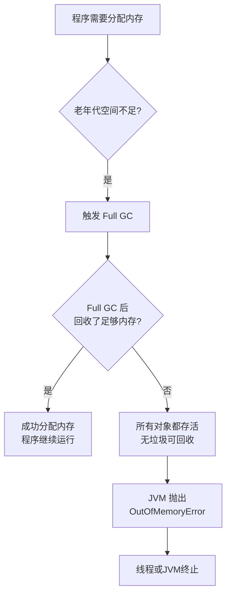
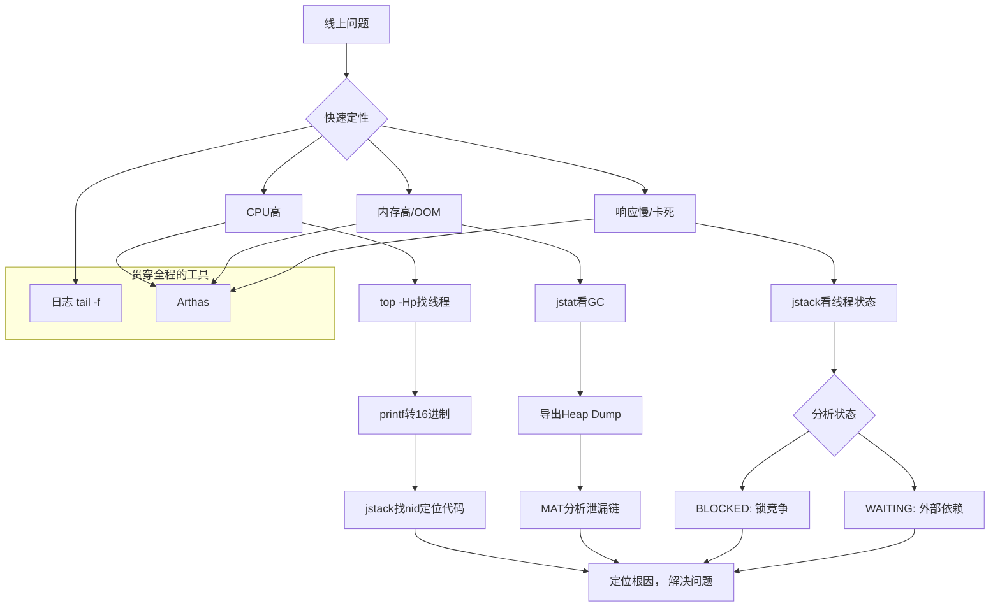

# Java介绍:
Java是一个面向对象高级编程语言，通过Java编译器生成字节码文件在计算机里运行。
与C++不同，Java运用Java Virtual Machine（JVM）执行Java字节码（二进制形式），并通过JVM在多台机器上运行。
正因为Java运用了JVM在计算机上运行，并弱化了指针，因此Java不适合操作系统层面的源码编写，Java的应用在应用程序和web层面比较广泛。

Java官方文档：https://www.w3cschool.cn/java/dict

# 基本语法：
关键字和保留字、标识符、变量、运算符、程序流程控制 

**关键字**：Java关键字是电脑语言里事先定义的，有特别意义的标识符，有时又叫保留字，还有特别意义的变量。

Java的关键字对Java的编译器有特殊的意义，他们用来表示一种数据类型，或者表示程序的结构等，关键字不能用作变量名、方法名、类名、包名和参数。
1、48个关键字：
用于定义类、函数、变量修饰符的关键字：
abstract、final、static、synchronized
用于定义类与类之间关系的关键字：
extends、implements
用于定义建立实例及引用实例、判断实例的关键字：
new、this、super、instanceof
用于异常处理的关键字：
try catch finally throw throws
用于包的关键字：
package import
其他修饰符关键字：
native、assert、transient、volatile、strictfp 

native: 指示一个方法的实现并不是由 Java 语言编写的，而是由本地（Native）代码（通常是 C 或 C++）实现的。
assert: 断言，用于在代码中进行“假设”，即在程序某个特定的点，断言某个条件必须为真。
transient: 用来标记一个成员变量在序列化（即实现 java.io.Serializable 接口的对象被转换为字节流的过程）时应该被忽略，该字段不会被序列化。
volatile: 一个字段修饰符。用来确保变量的可见性和有序性。
strictfp: 用于修饰类、接口或方法，确保在不同平台上执行的浮点计算都遵循 IEEE 754 标准，从而保证结果的一致性。

*用于定义数据类型值的字面值：
true、false、null。

2、Java保留字是指现有Java版本尚未使用 但以后版本可能会作为关键字使用，是C语言里用到但是Java里没有用到的关键字。
goto、const。

3、3个特殊直接量：true、false、null。

4、标识符：Java标识符由数字，字母和下划线（_），美元符号（$）或人民币符号（￥）组成。
在Java中是区分大小写的，而且还要求首位不能是数字。最重要的是，Java关键字不能当作Java标识符。
简单来说就是，在Java中凡是可以自己起名字的地方都叫标识符。

4.1 Java中的名称命名规范：
包名：多单词组成时所有字母都小写：xxxyyyzzz
类名、接口名：多单词组成时，所有单词的首字母大写：XxxYyyZzz
变量名、方法名：多单词组成时，第一个单词首字母小写，
第二个单词开始每个单词首字母大写：xxxYyyZzz
常量名：所有字母都大写。多单词时每个单词用下划线连接：XXX_YYY_ZZZ

5、变量
概念：本质上来说变量是内存中的一小块区域，通过变量名来访问这块区域。因此，使用每一个变量前必须要先申请（声明）然后必须对其进行赋值，才能使用

按照数据类型来分：
基本数据类型（primitive type,在栈stack中）：
整数类型：byte（1字节）、short（2字节）、int（4字节）、long（8字节）
浮点类型：float（4字节）、double（8字节）
整数类型默认为int、浮点类型默认为double。
字符型： char（使用Unicode编码、每个字符占两个字节，8个bite一个字节）
布尔型： boolean（与C语言布尔类型取0和1不同，只能取true和false）
引用数据类型（reference type,在堆heap中）：
类（字符串定义在类里）
接口
数组
（ *若想让基础类型存放在堆中，可以将基础类型包装为一个对象。将会用到基础类型的包装类）

按照声明的位置来分：
局部变量：方法体内，或者语句块内部定义的变量（局部变量不会默认初始化、必须先声明并赋值）
成员变量：方法体之外，类体中（需要先声明、赋值，若没有先赋值、则默认初始化后再使用）

基本数据类型大小：
类型 占用存储空间     表数范围
byte  1字节 = 8bit位   -128~127
short 2字节            -2^15~2^15-1
int   4字节            -2^31~2^31-1
long  8字节            -2^63~2^63-1
float 4字节 		   -3.40E+38 ~ +3.40E+38
double 8字节		   -1.79E+308 ~ +1.79E+308
注意：
bit : 计算机最小存储单位    byte：计算机中基本存储单元
整数类型默认为int、浮点类型默认为double。

字符型数据类型：
char用单引号'',String用双引号"";
String类型是字符串数据类型，用来存储多个字符，char类型只能存储一个字符。
String可以和8种数据类型做运算，运算的结果仍为String类型。
String是一个引用数据类型，但同时是一个final类，可以用字面量的定义方式去赋值。
通过字面量的方式（区别于new）赋值，会声明在常量池中。而常量池中不会存在相同内容的字符串。
所以，用==去比较两个相同内容的字符串，会返回true。

String代表不可变的字符串序列，称作"不可变性"
>当对字符串重新赋值时，需要重新写内存区域
>当对现有的字符串进行连接操作时，需要重新写内存区域赋值，不能在原有的基础上赋值
>当调用String的replace方法时，也需要重新写内存区域赋值，不能在原有的基础上赋值
>String字符串拼接的方式，常量和常量拼接的结果在常量池；只要其中有一个是变量，结果就在堆中；

如果拼接的结果使用intern()方法，返回值在常量池中

String的实例化方式：
1.通过字面量的方式，声明在方法区中，两个相同的字符串返回true（即使是在对象中通过字面量定义的两个相同的字符串，返回的也是true）
2.通过new的方式，声明在堆中，两个相同的对象对比返回false

String与char之间的转换：
String → char ：使用String中的toCharArray()
char → String ：调用String中的构造器

String与byte之间的转换：
String → char ：使用String中的getByte()
char → String ：调用String中的构造器

不同于String是不可变的字符串序列，StringBuffer和StringBuilder是可变的字符串序列。
String：不可变的字符串序列
StringBuffer ：可变的字符串序列，线程安全，效率低，多线程时用
StringBuilder ：可变的字符串序列，线程不安全，效率高
String可以直接赋值或者创建对象
String s1 = "Hello"; // 通过直接赋值创建String对象  
String s2 = new String("Hello"); // 通过new关键字创建String对象

StringBuilder：StringBuilder和StringBuffer类似，也是Java中的一个可变类，允许我们在同一个对象上进行多次的字符串操作。
StringBuilder sb = new StringBuilder(); // 创建一个空StringBuilder对象  
sb.append("Hello"); // 添加字符串  
sb.append(" World"); // 添加另一个字符串  
System.out.println(sb.toString()); // 输出 "Hello World"

StringBuffer是Java中的一个可变类，它允许我们在同一个对象上进行多次的字符串操作。
StringBuffer sb = new StringBuffer(); // 创建一个空的StringBuffer对象  
sb.append("Hello"); // 添加字符串  
sb.append(" World"); // 添加另一个字符串  
System.out.println(sb.toString()); // 输出 "Hello World"

**StringBuffer 的线程安全性是通过 synchronized 关键字实现的。**

1.synchronized 方法：
* StringBuffer 类中几乎所有修改其内部状态的方法（如 append(), insert(), delete(), replace(), setCharAt(), setLength() 等）都被声明为 synchronized。
* 这意味着这些方法在执行时，会获取 StringBuffer 对象实例本身的锁（this 锁）。

2.锁机制与互斥访问：
* 当一个线程调用一个 synchronized 方法（例如 append("abc")）时，它必须先获得这个 StringBuffer 对象的锁。
* 如果此时锁没有被其他线程持有，该线程成功获取锁，进入方法体执行操作（修改内部的字符数组）。
* 如果此时锁正被另一个线程持有（因为那个线程正在执行另一个 synchronized 方法），那么当前线程会被阻塞（进入等待状态），直到持有锁的线程执行完毕并释放锁。
* 持有锁的线程执行完方法后（无论是正常返回还是抛出异常），会自动释放锁。

创建StringBuffer时，底层创建了一个长度为16的字符串char型数组；
如果创建时传了参数，则在此基础上增加一个长度为16的字符串char型数组，默认情况下，扩容为原来的2倍+2，同时将原有数组的元素复制到新的数组中

基础数据类型的转换：
* 容量小的数据类型与容量大的数据类型运算，结果自动转换为容量大的数据类型。
* 当byte,short,char做运算时，结果必须是int类型。
* byte,short,char -> int -> long -> float -> double

容量大的转换为容量小的：强制类型转换
注意：强制类型转换，可能导致精度损失。
// Widening
// byte<short<int<long<float<double
int i = 10;
long l = i;               // 10
// Narrowing 
double d = 10.02;
long l = (long)d;         // 10
String.valueOf(10);       // "10"
Integer.parseInt("10");   // 10
Double.parseDouble("10"); // 10.0

6、在Java当中，运算符可以分为：算术运算符(+ - * /)、 关系运算符(< > ==)、逻辑运算符、位运算符、移位运算符以及条件运算符等。
一、算术运算符
1，基本的四则运算：加减乘除模(+ - * / %)
注意点：

（1）这些运算符都是二元运算符，使用时必须要有左右两个操作数。

int a = 20;
int b = 10;
System.out.println(a + b); // 30
System.out.println(a - b); // 10
System.out.println(a * b); // 200
System.out.println(a / b); // 2
System.out.println(a % b); // 0 --->模运算相当于数学中除法的余数

（2）同C语言一样，int / int的结果还是int，而且会向下取整。

要出现小数点，那就转成double类型或在最后*1.0。

（3）除法和取模操作时，右操作数不能为0，否则会报出异常。

（4）%在Java中不但可以对整数进行取模，还可以对double进行取模操作。

（5）两边操作数不相同的时候，会发生类型提升。看一个特例：

对两个short类型进行相加，在用short进行接受，发现报错，提示是从int到short可能会有损失。
这是因为为了计算的方便，Java在将小于4个字节的类型进行计算的时候，会将其隐形提升到int类型。
上面两个short均被提升到int，在用short接收，就会报错。解决办法是进行强制类型转换。

2，增量运算符 = += -= *= %=
不会改变变量本身的数据类型。该种类型运算符操作完成后，会将操纵的结果赋值给左操作数。要注意只有变量才可以使用该运算符，常量不允许被修改，不能使用。

3，自增/自减运算符 ++/--
不会改变变量本身的数据类型。这两种运算符有前置和后置之分。如果是单独使用，那么前置和后置是没有区别的，如果是混合使用：

int a = 1;
a++; // 后置++ 表示给a的值加1，此时a的值为2
System.out.println(a++); // 注意：后置++是先使用变量原来值，表示式结束时再给变量+1，因此输出2
System.out.println(a); // 输出3
++a; // 前置++ 表示给a的值加1
System.out.println(++a); // 注意：前置++是先给变量+1，然后使用变量中的值，再使用表达式，因此输出5
System.out.println(a); // 输出5

混合使用，【前置++】先+1，然后使用变量+1之后的值，【后置++】先使用变量原来的值，表达式结束时给变量+1 只有变量才能使用自增/自减运算符，常量不能使用，因为常量不允许被修改。

二、关系运算符
主要有六个: == != < > <= >=，其计算结果是 true 或者 false 。在Java中，只有true和false，不存在0表示假，非0表示真。

当需要多次判断时，不能连着写，比如：3 < a < 5，在C语言当中，是可以运行的，但是在Java当中会报错，需要写成3 < a &&  a < 5。

在验证用户登录时判定用户名不是null而且不是空字符串，应当写为：username != null &&!username.equals(“”)，二者的顺序不能交换。
原因：
在Java中，&&是逻辑与运算符，它有一个重要的特性：短路行为。这意味着如果第一个操作数为false，那么整个表达式的结果就确定为false，而第二个操作数（即右侧的条件）将不会被评估。这个特性在防止NullPointerException时非常有用。
如果我们将条件交换为!username.equals("") && username != null，那么当username为null时，!username.equals("")这个条件会首先被评估，这将导致NullPointerException，因为null不能调用任何方法（包括equals方法）。
而username != null这个条件原本可以阻止这种情况的发生，但由于它现在位于第二个位置，它已经没有机会阻止NullPointerException了。


==和equals的区别？
==：运算符
如果比较的是基本数据类型：比较两个变量保存的数据是否相同（不一定类型要相同）
如果比较的是引用数据类型：比较两个变量的地址值是否相同，是否指向同一个对象实体

用==比较两个String类型的数据：
在Java中，使用==操作符来比较两个String类型的对象时，并不会导致编译错误，因为==是Java的一个有效操作符，它可以用于比较基本数据类型（如int、char等）的值，也可以用于比较引用数据类型的引用值（即，它们是否指向内存中的同一位置）。
然而，对于String类型的比较，使用==通常不是最佳实践，因为String是一个不可变类，并且Java虚拟机（JVM）为了优化字符串的使用，会在字符串常量池中缓存字符串字面量。
这意味着，当你创建两个内容相同的字符串字面量时，JVM可能会让它们指向常量池中的同一个对象。但是，如果你通过new String("...")来创建字符串对象，或者字符串是通过其他非字面量的方式（如字符串连接、字符串函数返回值等）得到的，那么即使内容相同，这些字符串对象也可能位于内存中的不同位置。
因此，当你使用==来比较两个String对象时，你实际上是在比较它们的引用是否相同，而不是它们的内容是否相同。这通常不是你想要的，特别是当你不确定这些字符串是否来自常量池，或者是否通过new关键字显式创建时。
为了比较两个String对象的内容是否相同，应该使用equals()方法。equals()方法被重写（Override）在String类中，以比较两个字符串的内容是否完全一致。这是比较字符串内容的正确方式。

equals(): 方法
只能适用于引用数据类型
Object类中equals（）的定义：Object类中定义的equals()和==的作用是相同的，比较两个对象的地址值
public boolean equals(Object obj){
	return (this == obj)
}
像String、Date、File、包装类等都重写了Object类中的equals()方法，比较两个对象的实体内容

在Java8中String类重写的equals()方法：
public boolean equals(Object anObject) {  
    if (this == anObject) {  
        return true;  
    }  
    if (anObject instanceof String) {  
        String anotherString = (String)anObject;  
        int n = value.length;  
        if (n == anotherString.value.length) {  
            char v1[] = value;  
            char v2[] = anotherString.value;  
            int i = 0;  
            while (n-- != 0) {  
                if (v1[i] != v2[i])  
                    return false;  
                i++;  
            }  
            return true;  
        }  
    }  
    return false;  
}


通常情况下，自定义的类需要重写equals()方法
自定义类重写equals()方法的步骤一般如下：
1、先用“==”判断是否相等。
2、判断equals()方法的参数是否为null，如果为null，则返回false；因为当前对象不可能为null，如果为null，则不能调用其equals()方法，否则抛java.lang.NullPointerException异常。
3、当参数不为null，则如果两个对象的运行时类（通过getClass()获取）不相等，返回false，否则继续判断。

重写equals()方法的时候需要重写hashcode方法。
>为什么需要同时重写equals和hashCode？
equals和hashCode的契约：
如果两个对象通过equals方法比较是相等的，那么它们的hashCode值必须相同。
如果两个对象的hashCode值相同，它们通过equals方法比较不一定相等（哈希冲突是允许的）。

哈希表依赖hashCode：
Java中的HashMap、HashSet等集合类依赖于hashCode方法来快速定位对象。
如果只重写equals而不重写hashCode，可能会导致两个相等的对象具有不同的哈希值，从而导致这些集合类无法正常工作。

Java比较器：比较对象的大小
Comparable 的使用举例：
1.像String、包装类等实现了Comparable接口，重写了CompareTo()方法，给出了比较两个对象大小的方法
2.像String、包装类重写CompareTo()方法以后，进行了从小到大的排列
3.重写CompareTo(obj)的规则：
	如果当前对象this大于形参对象obj，则返回正整数；
	如果当前对象this小于形参对象obj，则返回负整数；
	如果当前对象this等于形参对象obj，则返回零；

Comparator定制排序：
当元素的类型没有实现Comparable接口而又不方便修改代码，或者实现了Comparable
接口的排序规则不适合当前的操作，可以考虑使用Comparator的对象来排序


三、逻辑运算符
逻辑运算符主要有六个: &  &&  |  || ! ^，运算结果都是boolean类型。

1、逻辑与 & 短路与 &&
语法规则：表达式1 && 表达式2，左右表达式必须是boolean类型的结果。相当于数学中的且。
短路与遵守短路求值的规则。即表达式1为假，表达式2就不再执行。逻辑与继续执行表达式2。

2、逻辑或 | 短路或 ||
语法规则：表达式1 || 表达式2，左右表达式必须是boolean类型的结果。相当于数学中的或。
短路或遵守短路求值的规则。即表达式1为真，表达式2就不再执行。逻辑或继续执行表达式2。

|| 遵守短路求值的规则。即表达式1为真，表达式2就不在执行，否则，执行表达式2。

& 和 | 也可以进行逻辑运算。如果他们的表达式为boolean，也表示逻辑运算，但是和&& ||相比不支持短路求值。

3、逻辑非 !
语法规则：!表达式1，相当于数学中的非。

4、逻辑异或
语法规则：表达式1^表达式2，左右表达式必须是boolean类型的结果。当表达式1和表达式2相同时为true，不同时为false。


四、位运算符
数据存储的最小单位是字节，而数据操作的最小单位是比特位。
字节是最小的存储单位，每个字节是由8个二进制比特位组成的，多个字节组合在一起可以表示各种不同的数据。
位运算表示按照二进制的每一位进行运算。
位运算符的左右两边是数值类型。

1，按位与&
如果两个二进制位都是 1，则结果为 1，否则结果为 0。

int a = 10;
int b = 20;
System.out.println(a & b); // 0


2，按位或|
如果两个二进制位有一个是1，则结果是1，否则都是0，结果是0。 

int a = 10;
int b = 20;
System.out.println(a | b); //30

 3，按位异或^
如果两个二进制位相同，则结果是0，否则是1。

4，按位取反~
如果该二进制位是1，则变成0，是0，变成1。

5，移位运算
    Java和C语言不同的地方在于，Java多了一个>>>，表示无符号右移。但是没有无符号左移。Java的移位运算符有三个: <<，>>，>>> 。都是二元运算符，且都是按照二进制比特位来运算的。

（1）左移：<<最左侧位不要了N位，在最右侧补零。左移 1 位，相当于原数字 * 2。左移 N 位，相当于原数字 * 2 的N次方。

（2）右移：>>最右侧不要了N位，在最左侧如果是正数，补0，负数补1。右移 1 位，相当于原数字 / 2。右移 N 位，相当于原数字 / 2 的N次方。

（3）无符号右移：>>>最右侧位不要了，最左侧补0。被移位二进制最高位无论是0还是1，空缺位都拿0补。

（4）移动负数位或者移位位数过大都没有意义。

    计算机在进行运算的时候，实际上是按照二进制运算的。加减等在运算的时候被转化成二进制的形式进行运算。计算机计算移位效率高于计算乘除，比如当某个代码正好乘除 2 的N次方的时候可以用移位运算代替。

6，条件运算符
条件运算符只有一个：表达式1 ? 表达式2 : 表达式3。
当表达式1为true时，执行表达式2，表达式3不在执行，否则执行表达式2。这个是Java当中唯一的一个三目运算符。表达式2和表达式3的结果需要同类型的，表达式不能单独存在。
int a = 10;
int b = 20;
int max = (a > b) ? a : b;
// 输出: 20
System.out.println(max);

7，在Java程序中，JVM默认总是顺序执行以分号;结束的语句。但是，在实际的代码中，程序经常需要做条件判断、循环，因此，需要有多种流程控制语句，来实现程序的跳转和循环等功能。
流程控制语句是用来控制程序中各语句执行顺序的语句，可以把语句组合成能完成一定功能的小逻辑模块。

if..else if..else：条件判断语句。
int j = 10;
if (j == 10) {
  System.out.println("I get printed");
} else if (j > 10) {
  System.out.println("I don't");
} else {
  System.out.println("I also don't");
}

for：循环语句，限定循环体的执行次数
for (int i = 0; i < 10; i++) {
  System.out.print(i);
}
// 输出: 0123456789

//增强for循环
int[] numbers = {1,2,3,4,5};
for (int number: numbers) {
  System.out.print(number);
}
// 输出: 12345

while：循环语句，反复执行语句或代码块，直到条件不满足时跳出
int count = 0;
while (count < 5) {
  System.out.print(count);
  count++;
}
// 输出: 01234

//do while循环
int count = 0;
do {
  System.out.print(count);
  count++;
} while (count < 5);
// 输出: 01234

switch..case:根据switch表达式中的值，依次匹配各个case中的常量。
一旦匹配成功，进入case结构，调用其执行语句。如果没有break关键字，则继续执行其他case结构的表达式。
int month = 3;
String str;
switch (month) {
  case 1:
    str = "January";
    break;
  case 2:
    str = "February";
    break;
  case 3:
    str = "March";
    break;
  default:
    str = "Some other month";
    break;
}
// 输出: Result March
System.out.println("Result " + str);

break和continue关键字：
1、break用于跳出一个循环体或者完全结束一个循环，不仅可以结束其所在的循环，还可结束其外层循环。
注意：
（1）只能在循环体内和switch语句体内使用break。
（2）不管是哪种循环，一旦在循环体中遇到break，系统将完全结束循环，开始执行循环之后的代码。
（3）当break出现在循环体中的switch语句体内时，起作用只是跳出该switch语句体，并不能终止循环体的执行。若想强行终止循环体的执行，可以在循环体中，但并不在switch语句中设置break语句，满足某种条件则跳出本层循环体。
for (int i = 0; i < 5; i++) {
  System.out.print(i);
  if (i == 3) {
    break;
  }
}
// 输出: 0123

2、continue语句的作用是跳过本次循环体中剩下尚未执行的语句，立即进行下一次的循环条件判定，可以理解为只是中止(跳过)本次循环，接着开始下一次循环。
注意：
（1）continue语句并没有使整个循环终止。
（2）continue 只能在循环语句中使用，即只能在 for、while 和 do…while 语句中使用。
for (int i = 0; i < 5; i++) {
  if (i == 3) {
    continue;
  }
  System.out.print(i);
}
// 输出: 01245

7、注释、文档注释
注释的内容不参与编译。
文档注释：注释内容可以被jdk提供的工具javadoc解析，生成一套网页文件形式体现的该程序的说明文档。
注意：javadoc解析的类要加上public

// 我是单行注释！
 
/*
而我是一个
多行注释！
*/
/**
  * 这个
  * 是
  * 文档
  * 注释
  */

8、注解
Annotation(注解)也被称为元数据(Metadata)是JDK1.5及以后版本引入的，用于修饰解释 包、类、方法、属性、构造器、局部变量等数据信息。
它可以用于创建文档，跟踪代码中的依赖性，甚至执行基本编译时检查。
注解是以‘@注解名’在代码中存在的，根据注解参数的个数，我们可以将注解分为：标记注解、单值注解、完整注解三类。
和注释一样，注解不影响程序逻辑，但注解可以被编译或运行，相当于嵌入在代码中的补充信息。
另外，你可以在编译时选择代码里的注解是否只存在于源代码级，或者它也能在class文件、或者运行时中出现（SOURCE/CLASS/RUNTIME）。
在 JavaSE 中，注解的使用目的比较简单，例如标记过时的功能，忽略警告等。
在 JavaEE 中注解占据了更重要的角色，例如用来配置应用程序的任何切面，代替 java EE 旧版中所遗留的繁冗代码和 XML 配置等。
 
元注解：标注在一个注解上，用于定义一个注解的状态
@Documented - 一个简单的标记注解，它标识了是否将注解添加到 Javadoc 中。

@Retention - 定义应保留注解的时间。
RetentionPolicy.SOURCE 在编译期间丢弃。这些注解在编译完成后没有任何意义，因此它们不会被写入字节码。例子：@Override, @SuppressWarnings
RetentionPolicy.CLASS – 在类加载期间丢弃。应用在进行字节码级别的编译期间。有些令人惊讶的是，这是默认的。
RetentionPolicy.RUNTIME – 不会丢弃。该注解可以在运行时进行反射。这是我们通常用于自定义注解的内容。

@Target - 注解可以使用的地方。如果不指定这一属性，注解可以应用在任何地方。
以下是该注解的有效值。这里的一个要点，它只有包含的形式，这意味着如果您想要对7个属性进行注解，并且只想排除一个属性，这时需要在定义目标时包含所有7个属性。 

@Documented: 用于指定被该元注解修饰的 Annotation 类将被javadoc 工具提取成文档，即在生成文档时，可以看到该注解。
注意：
定义为@Documented 的注解必须设置Retention值为RUNTIME。

@Inherited 
被@Inherited 修饰的注解 将具有继承性，如果某个类使用了被 @Inherited修饰的注解，则其子类将自动具有该注解

注解的注意事项：
▷ 注解仅存在于源码中，在class字节码文件中不包含
▷ 默认的保留策略，注解会在class字节码文件中存在，但运行时无法获得，
▷ 注解会在class字节码文件中存在，在运行时可以通过反射获取到
▷ 首先要明确生命周期长度 SOURCE < CLASS < RUNTIME ，前者能作用的地方后者一定也能作用。
        ①：一般如果需要在 运行时去动态获取注解信息，那只能用 RUNTIME 注解；
        ②：如果要在 编译时进行一些预处理操作，比如生成一些辅助代码（如 ButterKnife），就用 CLASS注解；
        ③：如果只是做一些 检查性的操作如 @Override 和 @SuppressWarnings，则可选用 SOURCE 注解。


9、Java数组（Array）：数组是多个相同类型的数据按照一定顺序排列的集合，并使用一个名字命名，并通过编号的方式对这些数据进行统一处理。

数组的声明：数组的长度一旦确定，就不能修改。
数组有一维数组和二维数组。
//声明 Declare
int[] a1;
int[] a2 = {1, 2, 3};
int[] a3 = new int[]{1, 2, 3};
int[] a4 = new int[3];
a4[0] = 1;
a4[2] = 2;
a4[3] = 3;

数组的初始化：数组的初始化有两种形式，静态初始化和动态初始化。
静态初始化:数组的初始化和数组的元素赋值同时进行 
ids = new int[]{11,22,12,12,12,123};
ids = {11,22,12,12,12,123};
动态初始化：数组的初始化和数组的元素赋值分开进行
String[] names = new String[5];

注意：数组一旦初始化完成，数组长度就确定了

数组元素通过角标调用。从第一个角标0开始，一直到-1。
通过数组的属性length获取数组的长度。
数组元素的默认初始化值：
>数组元素是整型：0
>数组元素是浮点型：0.0
>数组元素是char型：0或'\u0000' 而非'0'
>数组元素是Boolean型：false
>数组元素是引用数据类型: null

二维数组的初始化：
静态初始化：
int [][] arr = new int [][]{{1,2,3},{4,5},{6,7,8}};
int []arr [] = new int [][]{{1,2,3},{4,5},{6,7,8}};
int [][] arr = {{1,2,3},{4,5},{6,7,8}};
动态初始化：
String [][] arr2 = new String[5][3]; 
String [][] arr2 = new String[5][];

10、Java异常处理
Java的异常处理是Java编程语言中用于处理运行时错误的一个重要机制。它允许程序员定义在程序中可能发生的异常情况，并在这些情况发生时提供相应的处理逻辑。
Java的异常处理基于三个关键字：try、catch 和 finally，以及 throw 和 throws。

异常类
在Java中，异常是一种对象，它是Throwable类或其子类的实例。Throwable类有两个主要的子类：Error和Exception。

Error：表示系统级错误或资源耗尽的情况，通常应用程序无法处理这些错误。例如，OutOfMemoryError。
Exception：表示可以由应用程序捕获并处理的异常情况。Exception类又进一步分为RuntimeException（运行时异常）和检查型异常（checked exceptions）。

异常处理的基本结构
异常处理的基本结构包括try、catch和finally块。

try块：包含可能引发异常的代码。
catch块：用于捕获并处理try块中抛出的异常。可以有多个catch块来处理不同类型的异常。

finally块：无论是否发生异常，finally块中的代码都会被执行。它通常用于释放资源，如关闭文件或数据库连接。
示例：
try {  
    // 尝试执行的代码，可能会抛出异常  
    int result = 10 / 0; // 这将引发ArithmeticException  
} catch (ArithmeticException e) {  
    // 处理ArithmeticException  
    System.out.println("除数不能为0");  
} catch (Exception e) {  
    // 处理其他类型的异常（如果有的话）  
    System.out.println("发生了一个异常：" + e.getMessage());  
} finally {  
    // 无论是否发生异常，都会执行的代码  
    System.out.println("这是finally块");  
}

抛出异常
使用throw关键字可以手动抛出一个异常。这通常用于在检测到错误情况时通知调用者。

示例：
public void divide(int a, int b) {
    if (b == 0) {
        throw new ArithmeticException("Division by zero is not allowed");
    }
    System.out.println(a / b);
}

声明异常
如果一个方法可能会抛出异常，但该方法本身不处理该异常，那么它应该使用throws关键字声明它可能会抛出的异常。这样，调用该方法的代码就需要处理这些异常，或者继续声明它们。

示例：
public void readFile(String filePath) throws IOException {  
    // 读取文件的代码，可能会抛出IOException  
    // ...  
}

throw和throws关键字有什么不同？
throw：用于在代码中显式抛出一个异常。
throws：用于在方法签名中声明可能抛出的异常。

区别：
throw是动作，throws是声明。
throw在方法内部使用，throws在方法签名中使用。
throw可以抛出任何异常，throws只能声明已检查异常。

Java中的一些异常：
1. 空指针异常（NullPointerException），是运行时异常
原因：尝试访问或操作一个null对象的属性或方法。

示例：
String str = null;
System.out.println(str.length()); // 抛出NullPointerException

解决方法：
在使用对象之前检查是否为null。
使用Optional类避免空指针。
使用Objects.requireNonNull进行显式检查。

2. 数组越界异常（ArrayIndexOutOfBoundsException），是运行时异常
原因：访问数组时，索引超出了数组的有效范围。

示例：
int[] arr = {1, 2, 3};
System.out.println(arr[3]); // 抛出ArrayIndexOutOfBoundsException

解决方法：
在访问数组元素之前检查索引是否有效。
使用增强型for循环避免手动管理索引。

3. 类型转换异常（ClassCastException），是运行时异常
原因：尝试将一个对象强制转换为不兼容的类型。

示例：
Object obj = "Hello";
Integer num = (Integer) obj; // 抛出ClassCastException

解决方法：
在类型转换之前使用instanceof检查类型。
尽量避免不必要的类型转换。

4. 并发修改异常（ConcurrentModificationException），是运行时异常
原因：在使用迭代器遍历集合时，直接修改了集合的结构（如添加或删除元素）。

示例：
List<String> list = new ArrayList<>();
list.add("A");
list.add("B");
for (String s : list) {
    list.remove(s); // 抛出ConcurrentModificationException
}

解决方法：
使用迭代器的remove方法删除元素。
使用CopyOnWriteArrayList等线程安全的集合类。

5. 栈溢出错误（StackOverflowError），是错误
原因：递归调用过深，导致栈空间耗尽。

示例：
public void recursiveMethod() {
    recursiveMethod(); // 无限递归，抛出StackOverflowError
}

解决方法：
检查递归的终止条件是否正确。
将递归改为迭代（如使用循环）。

6. 内存溢出错误（OutOfMemoryError），是错误
原因：JVM内存不足，无法分配更多对象。

示例：
List<Object> list = new ArrayList<>();
while (true) {
    list.add(new Object()); // 抛出OutOfMemoryError
}

解决方法：
检查是否有内存泄漏（如未释放不再使用的对象）。
增加JVM的堆内存大小（如使用-Xmx参数）。

7. 类未找到异常（ClassNotFoundException），是编译时异常
原因：尝试加载一个不存在的类。

示例：
Class.forName("NonExistentClass"); // 抛出ClassNotFoundException

解决方法：
检查类路径是否正确。
确保所需的类或依赖库已正确加载。

8. 方法未找到异常（NoSuchMethodException），是编译时异常
原因：尝试通过反射调用一个不存在的方法。

示例：
Method method = String.class.getMethod("nonExistentMethod"); // 抛出NoSuchMethodException

解决方法：
检查方法名和参数类型是否正确。
确保目标类中确实存在该方法。

9. 文件未找到异常（FileNotFoundException），是编译时异常
原因：尝试访问一个不存在的文件。

示例：
FileInputStream fis = new FileInputStream("nonExistentFile.txt"); // 抛出FileNotFoundException

解决方法：
检查文件路径是否正确。
确保文件确实存在。

10. 数字格式异常（NumberFormatException），是运行时异常
原因：尝试将一个非数字字符串转换为数字类型。

示例：
int num = Integer.parseInt("abc"); // 抛出NumberFormatException

解决方法：
在转换之前检查字符串是否为有效数字。
使用try-catch捕获异常。

11. 非法参数异常（IllegalArgumentException），是运行时异常
原因：传递给方法的参数不合法。

示例：
public void setAge(int age) {
    if (age < 0) {
        throw new IllegalArgumentException("Age cannot be negative");
    }
}
解决方法：
在方法中检查参数的有效性。
提供清晰的错误信息。

12. 线程中断异常（InterruptedException），是编译时异常
原因：线程在等待、睡眠或占用时被中断。

示例：
try {
    Thread.sleep(1000);
} catch (InterruptedException e) {
    e.printStackTrace();
}

解决方法：
正确处理线程中断（如恢复中断状态）。
避免忽略中断异常。

13. 文件未找到异常（FileNotFoundException），是编译时异常
原因：当尝试打开一个不存在的文件作为数据流（如FileInputStream、FileReader）时抛出。

示例：
FileInputStream fis = new FileInputStream("missing_file.txt"); 

解决方法：
验证文件路径是否正确

14. IO异常（IOException），是编译时异常
原因：在数据流操作（如读取/写入网络流、文件流）中发生的通用I/O问题（如流意外关闭、网络中断等）。

示例：
socket.getInputStream().read(); // 若流被关闭，可能抛出IOException

解决方法：
使用 try-with-resources 自动关闭资源
添加重试机制

在Java中，某些看似应该在编译时报错的错误实际上是运行时错误，这反映了编译器设计的核心逻辑：**在保证类型安全和语法正确的前提下，允许最大程度的灵活性**。
为什么某些错误延迟到运行时？编译器逻辑解析

1. **技术可行性限制**
   - **场景示例**：空指针异常
     ```java
     // 编译通过！运行时可能抛出NullPointerException
     public void process(User user) {
         System.out.println(user.getName().toUpperCase());
     }
     ```
   - **编译器逻辑**：
     - 编译器只能验证**声明类型**的合法性（`User`类有`getName()`方法）
     - 无法跟踪**运行时对象状态**（`user`是否实际为null）
     - 强制编译时检查需要全局数据流分析（NP完全问题，计算不可行）

2. **动态绑定机制**
   - **场景示例**：类转换异常(ClassCastException)
     ```java
     Object obj = getObject(); // 编译时类型为Object
     String str = (String) obj; // 编译通过！运行时可能失败
     ```
   - **编译器逻辑**：
     - 满足继承规则即可编译（`String`是`Object`子类）
     - 实际类型在运行时动态确定（如`obj`可能是`Integer`）
     - 强制编译时检查需要预知所有可能的运行时类型（违反OOP多态原则）

3. **资源状态不可预测**
   - **场景示例**：文件未找到异常
     ```java
     new FileInputStream("data.txt"); // 编译通过！运行时可能失败
     ```
   - **编译器逻辑**：
     - 路径字符串是普通`String`类型（语法合法）
     - 文件系统的状态是**外部环境依赖**：
       - 文件可能被其他进程删除
       - 权限可能动态变化
       - 网络驱动器可能断开
     - 无法在编译时验证外部环境

4. 性能与灵活性的权衡
   - **优化编译速度**：深度检查会显著增加编译时间
   - **支持动态特性**：
     - 反射API：`Class.forName("MyClass")`
     - 插件架构：运行时加载类
     - JNDI查找：动态资源获取
   - **跨平台一致性**：避免在编译时绑定特定环境

结论：Java编译器的核心逻辑是验证代码的抽象正确性，而非具体执行可行性。这种设计平衡了开发效率与安全性，将环境依赖和动态行为的验证留给运行时，这正是Java能在复杂现实环境中保持强大生命力的关键设计决策。

**自定义异常**
除了使用Java内置的异常类外，程序员还可以定义自己的异常类。这通常用于表示特定于应用程序的错误情况。自定义异常类应该继承自Exception类或其子类。
1. 自定义异常的基本步骤
（1）选择基类
如果自定义异常是已检查异常（Checked Exception），则继承Exception类。
如果自定义异常是未检查异常（Unchecked Exception），则继承RuntimeException类。

（2）定义构造方法
提供多个构造方法，以便在抛出异常时可以传递不同的信息。

通常包括以下构造方法：
无参构造方法。
带有错误信息的构造方法。
带有错误信息和原因的构造方法（用于异常链）。

（3）添加自定义属性和方法（可选）
如果需要，可以为自定义异常添加额外的属性和方法，以提供更多的错误信息。

2. 自定义已检查异常
已检查异常需要在方法签名中使用throws声明，或者在方法内部捕获处理。

示例：
// 自定义已检查异常
public class MyCheckedException extends Exception {
    // 无参构造方法
    public MyCheckedException() {
        super();
    }

    // 带有错误信息的构造方法
    public MyCheckedException(String message) {
        super(message);
    }

    // 带有错误信息和原因的构造方法
    public MyCheckedException(String message, Throwable cause) {
        super(message, cause);
    }
}

使用示例：
public class Example {
    public void doSomething() throws MyCheckedException {
        // 模拟抛出自定义异常
        throw new MyCheckedException("This is a custom checked exception");
    }

    public static void main(String[] args) {
        Example example = new Example();
        try {
            example.doSomething();
        } catch (MyCheckedException e) {
            System.out.println("Caught exception: " + e.getMessage());
        }
    }
}
3. 自定义未检查异常
未检查异常不需要在方法签名中使用throws声明，通常用于表示程序逻辑错误。

示例：

// 自定义未检查异常
public class MyUncheckedException extends RuntimeException {
    // 无参构造方法
    public MyUncheckedException() {
        super();
    }

    // 带有错误信息的构造方法
    public MyUncheckedException(String message) {
        super(message);
    }

    // 带有错误信息和原因的构造方法
    public MyUncheckedException(String message, Throwable cause) {
        super(message, cause);
    }
}

使用示例：

public class Example {
    public void doSomething() {
        // 模拟抛出自定义异常
        throw new MyUncheckedException("This is a custom unchecked exception");
    }

    public static void main(String[] args) {
        Example example = new Example();
        example.doSomething(); // 不需要捕获，但会抛出异常
    }
}


# Java编程范式-面向对象：
"万事万物皆对象"
1.在Java语言中，我们把功能、结构等封装到类中，通过类的实例化，来调用具体的功能结构
2.涉及到Java语言与前端HTML或者后端数据库做交互时，都体现为用类、对象去做交互
面向对象特点：封装、继承、多态
面向对象包括：类、对象、属性、方法、成员变量、局部变量、修饰符、方法的重载、继承、方法的重写、多态、static关键字、abstract关键字、接口 → JVM调优，设计模式，web和大数据框架

类：是一组相关属性和行为的集合。可以看成是一类事物的模板，使用事物的属性特征和行为特征来描述该类事物；如：人类
实例对象：是一类事物的具体体现。对象是类的一个实例，必然具备该类事物的属性和行为；如：小红、小明、小南

Scanner scanner = new Scanner();
具有静态描述的特征称之为属性
具有动态动作的行为(做事情)称之为方法
创建类的对象 = 类的实例化 = 实例化类
匿名对象：创建的对象没有显式的赋给一个变量名。匿名对象只能调用一次。
new Phone().sendEmail();
匿名对象的使用：将匿名对象的值赋值给方法的形参
mall.show(new Phone())

成员变量（属性，非static的）：
位置：在方法外部，直接写在类当中
作用范围：整个类全都可以通用
默认值：根据其类型，有默认值
内存位置：位于堆内存
生命周期：随着对象创建而诞生，随着对象被垃圾回收而消失
可以使用权限修饰符

局部变量：
位置：在方法内部
作用范围：只有方法当中才可以使用，出了方法就不能再用
默认值：无默认值
内存位置：位于栈内存
生命周期：随着方法进栈而诞生，随着方法出栈而消失
不可以使用权限修饰符

public class MyClass {  
    // 成员变量  
    public String myMemberVariable;  
      
    public void myMethod() {  
        // 局部变量  
        String myLocalVariable = "Hello, World!";
    }  
}

**修饰符**：
private：同类下访问  → 缺省：同包下访问 → protected：子包下可以访问，同包也可以访问。不同包下的子类，访问protected修饰的，需要使用子类的对象访问，不能使用父类的对象访问  → public ：项目中所有类都可以访问
PS:修饰类的时候，只能用缺省和public。

* 方法的重载：在 Java 类中可以定义多个名称相同的方法 ，若只是参数不同，功能类似，那么可以将这类方法称为同名方法，也可以叫做方法重载
例如：sort(byte[] a) 与 sort(char[] a) 构成了方法的重载
Java中可变个数的形参 jdk5.0以上 格式：public void show(String ... strs){}
可变个数的形参与相同的数组之间不构成重载，二者不能共存，编译器认为这两种方法没有区别。

Java里面传递机制只有一种：值传递。即将实际参数值的副本（复制）传入方法内，而参数本身不受影响。
>形参是基本数据类型，将实参的数据值传递给形参；形参是引用数据类型，将实参的地址值（含变量的数据类型）传递给形参。

Java中的值传递机制是指在传递基本数据类型的参数时，实际是将参数的值复制一份传递给方法或函数，而不是传递参数本身。这意味着在方法或函数内部对参数的修改不会影响到原始变量的值。
具体来说，当我们将基本类型的变量传递给方法时，实际上是将变量的值复制一份传递给方法，而不是传递变量本身。这意味着在方法内部对参数的修改不会影响到原始变量的值。

例如，如果我们定义一个方法来交换两个整数的值：
public static void swap(int x, int y) {  
    int temp = x;  
    x = y;  
    y = temp;  
}
当我们调用swap(a, b)时，实际传递的是a和b的值，而不是a和b本身。这意味着在swap方法内部对x和y的修改不会影响到原始的a和b的值。因此，调用swap(a, b)后，a的值不会改变，而b的值会被交换。

基本类型：传递数据值的副本，方法内修改不影响原始变量。

对象类型：
① 传递对象引用的副本（副本和原始引用指向同一对象）。
② 通过副本修改对象内容会影响原始对象（如修改字段）。
③ 通过副本重定向引用（指向新对象）不影响原始引用。

* String虽然是引用数据类型，但是采用的却是值传递。
String其不可变性掩盖了值传递的常规效果。
>对于可变对象，值传递允许你通过副本引用修改共享对象，这让你感觉像是“引用传递”。
>对于 String，值传递同样发生，但因为你无法修改原对象，只能创建新对象并让副本引用指向它，这让原始的实参引用“毫发无伤”，所以看起来像是“没传进去”，完美体现了值传递“传副本，改副本不影响原值”的特点。

封装（数据的隐藏）：
通常，应禁止直接访问一个对象中数据的实际表示，而是应该通过操作接口来访问，这叫信息隐藏。
程序设计中的“高内聚，低耦合”：我们在程序设计的过程中要追求“高内聚，低耦合”。
高内聚就是类的内部数据操作细节自己来完成，不允许外部干涉，低耦合：就是， 仅暴露少量的方法给外部使用

封装的体现：
①将类的属性私有化，同时提供公共的(public)方法来获取(get)和设置(set)
②将类的方法私有化，仅用于内部方法调用
③单例模式

以下是一个示例，展示如何在Java中编写一个私有类的get和set方法，体现Java的封装性：

public class Person {  
    private String name;  
    private int age;  
  
    public Person(String name, int age) {  
        this.name = name;  
        this.age = age;  
    }  
  
    // Getter方法  
    public String getName() {  
        return name;  
    }  
  
    public int getAge() {  
        return age;  
    }  
  
    // Setter方法  
    public void setName(String name) {  
        this.name = name;  
    }  
  
    public void setAge(int age) {  
        if (age > 0) {  
            this.age = age;  
        } else {  
            System.out.println("年龄必须大于0");  
        }  
    }  
}
在上面的示例中，我们定义了一个名为Person的类，其中包含两个私有属性：name和age。我们使用构造函数来初始化这两个属性。然后，我们提供了getter方法来获取属性的值，以及setter方法来设置属性的值。
注意，setter方法只允许我们设置年龄为大于0的值，否则会输出一条错误消息。这就是Java封装性的体现，我们将属性封装在类内部，并通过getter和setter方法来控制对属性的访问。

构造器（构造方法）：
在Java中，构造器（Constructor）是一种特殊的方法，用于在创建对象时初始化对象的状态。构造器与类同名，并且没有返回类型（包括void）。当使用new关键字创建类的一个新对象时，构造器会自动被调用。
构造器的主要目的是为对象分配内存并初始化其状态。它可以接收参数，并根据这些参数设置对象的属性。

构造器的声明：
1.如果没有显式的定义的构造器，则系统默认定义空参的构造器
2.定义构造器的格式：权限修饰符 类名（形参列表）{}
3.一个类中可以有多个形参构造器，彼此构成重载
4.一旦我们显式的定义了构造器之后，系统就不再提供默认的空参构造器
5.一个类中，至少要有一个构造器

构造器的作用：
1.创建对象
2.初始化对象的属性

空参构造器：Person person = new Person();

带参构造器：
public Person(String name, int age) {  
    this.name = name;  
    this.age = age;  
}  


Java属性赋值的先后顺序：
1.默认初始化
示例：
public class MyClass {
    int num;       // 默认值为0
    boolean flag;  // 默认值为false
    String str;    // 默认值为null
}

2.显式初始化
示例：
public class MyClass {
    int num = 10;       // 显式初始化为10
    boolean flag = true; // 显式初始化为true
    String str = "Hello"; // 显式初始化为"Hello"
}

3.构造器中初始化
示例：
public class MyClass {
    int num;
    boolean flag;
    String str;

    public MyClass() {
        num = 20;       // 构造器中初始化为20
        flag = false;  // 构造器中初始化为false
        str = "World"; // 构造器中初始化为"World"
    }
}

4.通过 "对象.方法" 或 "对象.属性" 的方式初始化
示例：
public class MyClass {
    int num;
    boolean flag;
    String str;

    public void setNum(int num) {
        this.num = num; // 通过方法修改属性值
    }

    public static void main(String[] args) {
        MyClass obj = new MyClass();
        obj.num = 30;       // 直接修改属性值
        obj.setNum(40);     // 通过方法修改属性值
        System.out.println(obj.num); // 输出40
    }
}

在Java中，new一个对象是给怎么样的一个过程？

在Java中，创建一个对象主要经历了以下几个步骤：

1.加载类：首先，Java虚拟机（JVM）需要加载类。这个过程包括解析类的字节码，确定类的字段和方法，并为类的静态变量分配内存。
为实例变量分配内存：在类被加载后，JVM会为实例变量（即非静态字段）分配内存。

2.初始化实例变量：这个步骤会为实例变量赋予默认值。所有的数值类型默认值为0，所有的引用类型默认值为null。
如果类中有实例变量的初始化语句，或者从父类或接口中继承的实例变量初始化，那么这些初始化语句会被执行。

3.创建对象：接下来，使用new关键字来创建对象。这个过程包括为对象分配内存，复制构造函数的参数值到相应的实例变量，
调用构造函数来初始化对象，最后返回新创建对象的引用。

4.使用对象：现在，你可以使用这个新创建的对象来进行各种操作，比如调用方法、访问字段等。


Java之this关键字：
在Java中，this 关键字是一个引用变量，它引用当前对象（即调用方法或构造器的那个对象）。

1.this可以修饰属性、方法、构造器
2.this修饰属性和方法

>this可以理解为当前对象
>在类的方法或类的构造器中，this修饰属性或方法时，一般情况下省略。特殊情况下，如果方法的形参和类的属性同名时，必须显式使用"this.属性"声明此变量是属性，而非形参。
>this可以修饰构造器，结构为"this.形参列表"
>构造器中，不能通过方式"this.形参列表"调用自己
>如果一个类中有n个构造器，最多有n-1个构造器使用了"this.形参列表"方式
>规定："this.形参列表"必须声明在构造器的首行
>构造器内部，只能声明一个"this.形参列表"调用其他构造器

public class MyClass {  
    private int x;  
    private int y;  
  
    public MyClass() {  
        this(0, 0); // 使用 this 调用另一个构造器  
    }  
  
    public MyClass(int x, int y) {  
        this.x = x;  
        this.y = y;  
    }  
}


public class MyClass {  
    private int x;  
  
    public void setX(int x) {  
        this.x = x; // 使用 this 引用当前对象  
    }  
}

Java之package关键字：
在Java中，package 关键字用于声明一个类所在的包（package）。

1.为了更好的实现类的管理，提供包的概念
2.声明在原文件的首行
3.每"."一次，就代表一层文件目录
注意：相同或不同包下，不能引入同名的类、接口

Java之import关键字：
在Java中，import 关键字用于导入类或其他类型，使得在当前Java文件中可以不必使用完全限定名（即包括包名）就可以引用它们。使用 import 可以使代码更简洁，更容易阅读。

1.在源文件中显式的使用import结构导入指定包下的类、接口
2.声明在包的声明和类的声明之间
3.使用"xxx.*"的形式，表示可以导入xxx包下的所有结构
4.如果使用的类或接口是Java.lang包下定义的，则可以省略import结构
5.如果使用的类或接口是本包下定义的，则可以省略import结构

Java面向对象之继承：在Java中，继承（Inheritance）是一种面向对象编程（OOP）的核心概念，它允许一个类（称为子类或派生类）获取另一个类（称为父类或基类）的属性和方法。
继承已存在的类就是复用这些类的方法，而且可以增加一些新的方法和字段，使新类能够适应新的情况，继承是Java程序设计中一项核心技术，它主要解决的问题是：共性的抽取，实现代码复用。

Java中表现继承的关系需要借助关键字extends，子类继承父类。Class A extends B(){} A:子类、派生类、subclass B：父类、超类、基类、superclass

Java继承的特点：
· 子类将继承父类的成员变量和成员方法。特别的，父类中声明为private的属性或方法，子类继承后，仍然认为子类获取了父类中私有的结构。
· Java中只支持单继承和多继承，不允许多重继承（C++允许多重继承）
· 子类继承父类之后，需要添加自己特有的成员，体现出与基类的不同
· 如果访问的成员变量子类中有，则优先访问子类本身的
· 如果访问的成员变量子类中无，父类中有，则访问继承下来的
· 如果子类与父类中有同名的成员变量，则优先访问子类自己的，即子类将父类的同名变量隐藏
· 如果我们没有显式的声明一个类的父类，则该类继承于Object类。Object类是所有类的父类

// 基类（父类）  
public class Animal {  
    private String name;  
  
    public Animal(String name) {  
        this.name = name;  
    }  
  
    public void eat() {  
        System.out.println(name + " is eating...");  
    }  
}  
  
// 子类（狗类）  
public class Dog extends Animal {  
    private String breed;  
  
    public Dog(String name, String breed) {  
        super(name);  // 调用父类的构造方法  
        this.breed = breed;  
    }  
  
    public void bark() {  
        System.out.println(getName() + " is barking...");  
    }  
  
    public String getBreed() {  
        return breed;  
    }  
}

继承之super关键字：它主要用于引用子类的父类（或称为超类、基类）的成员（包括属性和方法）。
1.super可以用来调用属性、方法、构造器。
2.通过使用"super.属性"或"super.方法"的形式在子类中显式的调用父类的属性和方法
>所有类都继承Object类，任何类用super都可以调用Object类。
3.如果子类重写了父类的方法，此时子类中想调用父类被重写的方法。必须显式的使用"super.方法"的形式调用父类被重写的方法
4.在子类中显式的使用"super(形参列表)"调用父类中声明的构造器
>在子类构造方法中，super(形参列表)调用父类构造时，必须是子类构造方法中的第一条语句
>super(形参列表)只能在子类的构造方法中出现一次，并不能和this同时出现
>在类的多个构造器中，至少有一个子类调用了父类的空参构造器
>若父类显式定义无参或者默认的构造方法，在子类构造方法的第一行默认有隐含的super调用，即调用基类的构造方法
 构造哪个类的对象，就调用哪个类的构造方法，调用构造方法时先调用基类，在调用子类(即在子类中隐藏super())
>如果父类的构造方法是带有参数的，此时编译器不会给子类生成默认的构造方法，此时需要用户在子类中显式定义构造方法，并在子类构造方法中选取合适的父类构造方法调用

// 父类  
public class Parent {  
    protected int num;  
  
    public Parent(int num) {  
        this.num = num;  
    }  
  
    public int getNum() {  
        return num;  
    }  
}  
  
// 子类  
public class Child extends Parent {  
    private int num;  
  
    public Child(int num) {  
        super(num); // 调用父类的构造器  
        this.num = num * 2;  
    }  
  
    public int getNum() {  
        return super.getNum() * 2; // 调用父类的方法  
    }  
}

继承之执行顺序：
无继承关系时的执行顺序：
静态代码块先执行，且只执行一次，在类加载阶段执行
当有对象创建时，才会执行实例代码块，实例代码块执行完后，再执行构造方法

有继承关系时的执行顺序：
· 父类静态代码块优先子类静态代码块执行，都是最早执行的
· 父类实例代码块和父类构造方法紧接着执行
· 子类的实例代码块和子类构造方法在接着执行
· 第二次实例化对象时，父类和子类的静态代码块都不会在执行 

继承方式：单继承、多继承、不同的类继承同一个类（不支持一个类继承不同的父类）
final关键字修饰类不能被继承。

Java中的object类：
Object类是Javajava.lang包下的核心类，Object类是所有类的父类，何一个类时候如果没有明确的继承一个父类的话，那么它就是Object的子类；

Object类中的方法：
1. clone()
保护方法，实现对象的浅复制，只有实现了Cloneable接口才可以调用该方法，否则抛出CloneNotSupportedException异常。

2. getClass()
final方法，返回Class类型的对象，反射来获取对象。

3. toString()
该方法用得比较多，一般子类都有覆盖，来获取对象的信息。

4. finalize()
该方法用于释放资源。因为无法确定该方法什么时候被调用，很少使用。

5. equals()
比较对象的内容是否相等

6. hashCode()
该方法用于哈希查找，重写了equals方法一般都要重写hashCode方法。这个方法在一些具有哈希功能的Collection中用到。

7. wait()
wait方法就是使当前线程等待该对象的锁，当前线程必须是该对象的拥有者，也就是具有该对象的锁。wait()方法一直等待，直到获得锁或者被中断。wait(long timeout)设定一个超时间隔，如果在规定时间内没有获得锁就返回。

调用该方法后当前线程进入睡眠状态，直到以下事件发生。

其他线程调用了该对象的notify方法。
其他线程调用了该对象的notifyAll方法。
其他线程调用了interrupt中断该线程。
时间间隔到了。
此时该线程就可以被调度了，如果是被中断的话就抛出一个InterruptedException异常。

8. notify()
该方法唤醒在该对象上等待的某个线程。

9. notifyAll()
该方法唤醒在该对象上等待的所有线程。


Java方法的重写（Override）：
在Java中，方法的重写（Overriding）是面向对象编程中的一个重要概念，它允许子类提供一个与父类相同方法签名（即方法名、参数列表和返回类型都相同）但实现不同的方法。
当子类对象调用该方法时，将执行子类中的方法实现，而不是父类中的方法。

方法重写的规则：

1.参数列表必须完全与被重写方法相同；也就是说，在被重写的方法里，输入参数必须与父类的参数相同
>父类的成员方法只能被它的子类重写。
>构造方法不能被重写
>如果不能继承一个方法，则不能重写这个方法。

2.返回类型必须完全与被重写方法的返回类型相同

3.子类重写父类的方法，权限修饰符不能大于父类被重写的方法
>父类中的访问权限是protected，那么，重写的的权限不能为public
>父类中的访问权限是private，子类不能重写父类
>子类和父类在同一个包中，那么子类可以重写父类所有除了声明为private和final的方法。
 子类和父类不在同一个包中，那么子类只能够重写父类的声明为public和protect的非final方法。
 
4.重写方法不能抛出新的检查异常或者比被重写方法申明更加宽泛的异常。
例如：父类的一个方法声明了一个检查异常IOException,但是在重写这个方法的时候不能抛出Exception异常，
因为Exception是IOException的父类，只能抛出IOException的子类异常。

>重写的方法能够抛出任何非强制异常，无论被重写的方法是否抛出异常。
但是，重写方法不能抛出新的强制性异常，或者比被重写方法声明的更广泛的强制性异常，反之则可以。

5.声明为static的方法不能被重写，但是能够被再次声明（可以被继承）;声明为final的方法不能被重写。

// 父类  
public class Animal {  
    public void makeSound() {  
        System.out.println("The animal makes a sound");  
    }  
}  
  
// 子类（狗类）  
public class Dog extends Animal {  
    @Override  // 使用@Override注解表示该方法是一个重写方法  
    public void makeSound() {  
        System.out.println("The dog barks");  
    }  
}

Java多态：
在Java中，多态（Polymorphism）是面向对象编程的三大特性之一，它允许不同的对象对同一消息做出不同的响应。
换句话说，多态性意味着一个引用变量（如方法参数、返回值或实例变量）可以指向多种实际类型，并在运行时确定到底应该执行哪个类的方法。这种特性使得代码更加灵活、可扩展和可重用。

在编译期，只能调用父类中声明的方法，但在执行期，实际执行的是子类中重写父类的方法。(编译，看左边；运行，看右边)

>多态性不适用于属性，只适用于方法。(属性的编译和运行都是谁声明，谁调用)
>多态性不能调用子类特有的方法，编译时，对象是父类类型

如何在内存的层面理解多态性？
在内存的层面理解多态性，可以从以下几个方面进行阐述：

一、内存中的对象存储
在Java中，对象通常被存储在堆（Heap）内存中，而对象的引用（即对象的地址或指针）则存储在栈（Stack）内存中。当一个对象被创建时，JVM会在堆中为其分配内存，并在栈中创建一个指向该对象的引用。

二、多态性的内存表现
多态性允许我们使用父类引用来指向子类对象。在内存中，这意味着父类引用实际上存储的是子类对象的地址。
当通过父类引用调用方法时，JVM会根据实际对象的类型（即子类类型）来调用相应的方法实现。

具体来说，多态性的内存表现包括以下几个方面：

编译时：编译器会检查父类引用所指向的类中是否存在被调用的方法。如果存在，则编译通过；如果不存在，则编译报错。
运行时：当程序运行时，JVM会根据父类引用实际指向的对象类型（即子类类型）来查找并调用相应的方法实现。这个过程被称为动态绑定或晚期绑定。

三、多态性的内存图解
以下是一个简单的多态性内存图解示例：

堆内存：
+-----------------+
|   Animal 对象   |
| (实际上是 Dog)  |
| +-------------+ |
| | makeSound() | |-------> 指向 Dog 类的 makeSound() 方法实现
| +-------------+ |
| ...           |
+-----------------+
 
栈内存：
Animal myAnimal; // 父类引用，指向堆中的 Dog 对象
在这个例子中，myAnimal 是一个父类 Animal 的引用，但它实际上指向堆内存中的一个 Dog 对象。当我们调用 myAnimal.makeSound() 时，JVM 会根据 myAnimal 实际指向的 Dog 对象来查找并调用 Dog 类的 makeSound() 方法实现。


向上转型：
当向上转型时，我们仍然可以使用父类对象的引用访问子类对象中的方法和属性，但是如果父类对象没有定义这些方法和属性，则不能访问。
多态性允许我们在编译时使用父类对象的引用，而在运行时实际访问的是子类对象中的方法和属性。
这种行为允许我们在不改变现有代码的情况下实现子类特定的功能。

实现多态的条件，缺一不可：
1.子类继承父类
2.子类必须要对父类中方法进行重写

对于重载而言，在方法调用之前，编译器就确定了要调用的方法，这是"早绑定";
对于多态，在方法调用之后，编译器才确定要调用的方法，这是"晚绑定"

Java instanceof 关键字：
判断对象a是否是类A的一个实例，如果是，返回true(如果是多态对象，也会返回true);如果不是，返回false
使用instanceof关键字避免多态对象强制转化出现ClassCastException异常。

// 父类  
public class Shape {  
    public void draw() {  
        System.out.println("Drawing a shape...");  
    }  
}  
  
// 子类（圆形类）  
public class Circle extends Shape {  
    @Override  // 使用@Override注解表示该方法是一个重写方法  
    public void draw() {  
        System.out.println("Drawing a circle...");  
    }  
}  
  
// 子类（矩形类）  
public class Rectangle extends Shape {  
    @Override  // 使用@Override注解表示该方法是一个重写方法  
    public void draw() {  
        System.out.println("Drawing a rectangle...");  
    }  
}  
  
// 主类  
public class Main {  
    public static void main(String[] args) {  
        Shape[] shapes = new Shape[2];  // 创建一个Shape类型的数组，并分配两个空间  
        shapes[0] = new Circle();  // 将第一个空间指向Circle类的对象  
        shapes[1] = new Rectangle();  // 将第二个空间指向Rectangle类的对象  
          
        for (Shape shape : shapes) {  // 循环遍历数组中的每一个对象，并调用它们的draw()方法  
            shape.draw();  // 由于多态的存在，这个方法将调用Circle类和Rectangle类各自的draw()方法，而不是Shape类的draw()方法  
        }  
    }  
}
在上面的例子中，Shape 类是一个父类，它有一个 draw() 方法。Circle 和 Rectangle 类是两个子类，它们分别继承了 Shape 类并重写了 draw() 方法。
在 Main 类的 main() 方法中，首先创建了一个 Shape 类型的数组，并分别将两个子类的对象赋值给数组中的两个空间。
然后，使用一个for-each循环遍历数组中的每一个对象，并调用它们的 draw() 方法。由于多态的存在，这个方法将调用每个子类自己的 draw() 方法，而不是父类的 draw() 方法。

* 在Java的设计层面上解释为什么面对对象会设计多态？
好的，这是一个非常深刻的问题。从 Java 的设计层面上看，多态（Polymorphism）绝非一个偶然或孤立的特性，而是面向对象编程（OOP）范式得以成功的**基石**和**灵魂**。它的设计是为了解决软件工程中几个最核心、最棘手的难题。

我们可以从以下几个层面来深入理解 Java 为什么如此设计多态：

---

### 1. 核心目的：解耦与增强可扩展性

这是最根本的原因。软件的需求是不断变化的，设计多态的直接目的就是为了让代码能够以最小的代价应对这种变化。

*   **没有多态的世界（面向过程）：**
    想象一下你要实现一个 `drawShape(Shape s)` 函数来绘制图形。在没有多态的情况下，你可能会这样写：
    ```java
    // 反面教材：基于类型枚举的“伪多态”
    public void drawShape(String shapeType) {
        if ("Circle".equals(shapeType)) {
            drawCircle(); // 调用画圆的方法
        } else if ("Rectangle".equals(shapeType)) {
            drawRectangle(); // 调用画矩形的方法
        } else if ("Triangle".equals(shapeType)) {
            drawTriangle(); // 调用画三角形的方法
        }
        // ... 每增加一种新图形，就必须修改这个函数！
    }
    ```
    这种代码的致命缺点是：
    1.  **紧耦合（Tight Coupling）：** `drawShape` 函数必须知道所有可能的具体图形类型。
    2.  **违反开闭原则（Open-Closed Principle）：** 系统对扩展开放（可以加新图形），但对修改关闭（理想情况下不应修改 `drawShape` 函数）。这里每增加一种新图形（扩展），都必须修改这个函数的核心逻辑（修改），这是非常危险且难以维护的。

*   **有多态的世界（面向对象）：**
    ```java
    // 1. 定义抽象契约（接口或抽象类）
    public interface Shape {
        void draw(); // 所有图形都必须实现这个行为
    }

    // 2. 实现具体类
    public class Circle implements Shape {
        @Override
        public void draw() { ... } // 如何画圆，由圆自己决定
    }
    public class Rectangle implements Shape {
        @Override
        public void draw() { ... } // 如何画矩形，由矩形自己决定
    }

    // 3. 使用者代码
    public void drawShape(Shape s) { // 参数是接口类型！
        s.draw(); // 我不管s具体是什么，我知道它一定能draw()
    }
    ```
    **多态带来的革命性变化：**
    1.  **松耦合（Loose Coupling）：** `drawShape` 方法**只依赖于一个抽象的 `Shape` 接口**，它完全不知道也不关心背后是圆、方还是三角形。它只发出一个指令：“你，画你自己！”。
    2.  **完美的开闭原则：** 现在，如果你想增加一个 `Triangle`（三角形），你只需要**新增一个类** `implements Shape` 并实现 `draw()` 方法即可。**`drawShape` 方法一行代码都不需要修改！** 系统通过扩展（添加新类）来获得新功能，而不是修改现有稳定代码。

### 2. 实现框架和抽象的核心机制

Java 的强大很大程度上得益于其庞大的生态和框架（如 Spring, Hibernate, JUnit）。而这些框架的设计极度依赖多态。

*   **JUnit Example:** 当你写一个测试用例时，你继承 `TestCase` 类并编写以 `test` 开头的方法。JUnit 框架会通过反射找到所有这些方法并执行。框架代码并不知道你的具体测试类是什么，它只需要调用父类 `TestCase` 定义的生命周期方法（如 `setUp()`, `tearDown()`）和你定义的 `testXxx()` 方法。这就是多态——框架代码针对抽象（`TestCase`）编程，具体执行则由你的代码决定。

*   **Spring Example:** Spring 的核心是依赖注入（DI）。你定义一个 `UserService` 接口，并编写 `UserServiceImpl` 实现它。在 Controller 中，你只依赖 `@Autowired UserService userService`。Spring 容器在运行时将具体的 `UserServiceImpl` 实例注入进来。Controller 代码只面向接口，这使得你**更换实现**（比如换成 `MockUserService` 用于测试）变得极其容易，再次体现了松耦合和可测试性。

### 3. 统一类型系统与“向上转型”

Java 是静态强类型语言，一切皆对象（除了基本类型）。多态与继承相结合，允许Java建立一个清晰、灵活的类型层次结构。

*   **“是一个”关系：** `Dog` extends `Animal` 意味着“狗是一个动物”。因此，`Dog` 对象可以被当作更通用的 `Animal` 类型来使用（向上转型）。
*   **容器通用性：** 你可以创建一个 `List<Animal>` 的集合，里面可以存放 `Dog`, `Cat`, `Bird` 等各种子类对象。你可以遍历这个列表，对每个元素调用 `animal.eat()`，JVM 会自动调用它们各自具体的 `eat()` 方法。这使得操作一组具有共同父类的对象变得非常简洁和统一。

### 4. Java 的实现机制：动态绑定（Late Binding）

多态在技术上是如何实现的？Java 通过**动态绑定**（或称运行时绑定）来实现多态。

*   **编译时：** 编译器检查方法调用是否合法（即 `Shape` 接口是否有 `draw()` 方法）。它并不知道 `s` 具体指向什么对象。
*   **运行时：** JVM 在调用 `s.draw()` 时，会查看 `s` 这个引用**实际指向的对象**（是 `Circle` 还是 `Rectangle`），然后从该对象的类的方法表中找到正确的 `draw()` 方法的入口地址进行调用。

这个“延迟到运行时才确定具体方法”的机制，是多态魔力的技术保障。

---

### 总结：为什么设计多态？

从 Java 的设计层面上看，多态被设计出来是为了：

1.  **降低耦合性：** 让高层模块依赖抽象（接口/抽象类），而不是依赖易变的低层具体实现。
2.  **提高可扩展性：** 通过添加新代码（新类）来扩展系统功能，而不是修改现有、稳定的代码。
3.  **增强代码的灵活性和可维护性：** 使程序更容易应对需求变化，代码更清晰，更易于理解和维护。
4.  **为实现大型框架和抽象提供基石：** 没有多态，Java 的整个生态系统（Spring, JUnit, Hibernate等）将无法以现在这种灵活、强大的方式存在。

因此，多态不是Java的一个“功能点”，而是其面向对象**设计哲学的核心体现**，是构建大型、复杂、可演化软件系统的必然选择。它将“做什么”（接口）和“怎么做”（实现）分离开，赋予了Java语言强大的抽象和架构能力。

Java 包装类：
针对八种基本数据类型定义相应的引用类型（具有类的特征）

基本数据类型和包装类的转换：
基本数据类型→包装类：调用包装类的构造器;自动装箱
调用方法举例：Integer的valueOf(i)方法

包装类→基本数据类型：调用包装类的xxxValue();自动拆箱
调用方法举例：Integer的intValue()方法

(自动装箱和自动拆箱是jdk5.0以后的特性)

基本数据类型、包装类转换为String类型：
1.连接运算 String str1 = num1 + "";
2.调用String的valueOf()方法 String str2 = String.valueOf();

String类型转换为基本数据类型、包装类：
调用包装类的静态方法 parseXXX


Java static关键字：
Java static关键字是一个修饰符，它用于声明属性（变量）、方法、代码块、内部类和嵌套类，用于定义类级别的变量、方法和代码块，以支持各种与类本身相关但不依赖于类实例的功能和模式。

static修饰方法：
static修饰的方法一般称作静态方法，由于静态方法不依赖于任何对象就可以进行访问，因此对于静态方法来说，是没有this的，因为它不依附于任何对象，既然都没有对象，就谈不上this了。
并且由于这个特性，在静态方法中不能访问类的非静态成员变量和非静态成员方法，因为非静态成员方法/变量都是必须依赖具体的对象才能够被调用。
但是要注意的是，虽然在静态方法中不能访问非静态成员方法和非静态成员变量，但是在非静态成员方法中是可以访问静态成员方法/变量的。

public class StaticMethodExample {  
    // 静态方法  
    public static int add(int a, int b) {  
        return a + b;  
    }  
  
    public static void main(String[] args) {  
        // 直接通过类名调用静态方法  
        int sum = StaticMethodExample.add(5, 3);  
        System.out.println("The sum is: " + sum);  
    }  
}

static变量：
static修饰的属性也称作静态变量，静态变量和非静态变量的区别是：
静态变量被所有的对象所共享，声明在方法区，在内存中只有一个副本，它当且仅当在类初次加载时会被初始化。
而非静态变量是对象所拥有的，在创建对象的时候被初始化，声明在堆中，存在多个副本，各个对象拥有的副本互不影响。
static成员变量的初始化顺序按照定义的顺序进行初始化。

public class SharedVariableExample {  
    // 静态变量  
    public static int sharedVariable;  
  
    public static void main(String[] args) {  
        // 创建两个实例  
        SharedVariableExample example1 = new SharedVariableExample();  
        SharedVariableExample example2 = new SharedVariableExample();  
  
        // 修改静态变量的值  
        example1.sharedVariable = 10;  
  
        // 打印静态变量的值，可以看到它在这两个实例中是相同的  
        System.out.println("example1.sharedVariable: " + example1.sharedVariable);  
        System.out.println("example2.sharedVariable: " + example2.sharedVariable);  
    }  
}

static代码块：
(代码块的作用：用来初始化类、对象)
static关键字还有一个比较关键的作用就是 用来形成静态代码块以优化程序性能。static块可以置于类中的任何地方，类中可以有多个static块。
在类初次被加载的时候，会按照static块的顺序来执行每个static块，并且只会执行一次。
因此，很多时候会将一些只需要进行一次的初始化操作都放在static代码块中进行。静态代码块的执行顺序按照声明的前后顺序执行。
静态代码块的执行要优于非静态代码块的执行，而且静态代码块只能调用静态的属性、方法，不能调用非静态的结构。

static关键字的用法：
1.static用来修饰属性（静态变量）
静态属性属于类本身，而不是类的实例。也就是说，静态属性是类级别的，它们存储在静态存储区中，生命周期与JVM的运行时长一致。
静态属性可以在没有创建类实例的情况下访问，通过类名直接访问，例如 ClassName.staticVariableName。
静态属性在内存中只有一份拷贝（节省内存），无论创建多少个对象，静态属性都只有一份。

2.static用来修饰方法（静态函数）
静态方法属于类本身，而不是类的实例。它们可以在没有创建类实例的情况下调用，通过类名直接调用，例如 ClassName.staticMethodName()。
静态方法只能访问静态属性或其他静态方法，因为它们不能依赖于类的对象状态。
静态方法中不能使用非静态属性和非静态方法（除非在方法内部创建类的实例）。

3.static用来修饰代码块
静态代码块在类加载时执行，且只执行一次。它通常用于初始化静态属性。
静态代码块按照它们在类中出现的顺序执行。
静态代码块可以访问类的静态属性和静态方法，但不能访问非静态属性和非静态方法。

4.static用来修饰内部类和嵌套类
静态内部类（也称为嵌套类）是定义在另一个类中的类，并使用static关键字修饰。静态内部类不需要外部类的实例即可创建实例。
静态内部类可以访问外部类的静态属性和静态方法，但不能直接访问外部类的非静态属性和非静态方法（除非创建外部类的实例）。

public class StaticBlockExample {  
    // 静态变量  
    public static int staticVariable;  
  
    // 静态代码块  
    static {  
        System.out.println("This is a static block.");  
        staticVariable = 10;  
    }  
  
    public static void main(String[] args) {  
        // 创建两个实例  
        StaticBlockExample example1 = new StaticBlockExample();  
        StaticBlockExample example2 = new StaticBlockExample();  
  
        // 打印静态变量的值，可以看到它在这两个实例中是相同的  
        System.out.println("example1.staticVariable: " + example1.staticVariable);  
        System.out.println("example2.staticVariable: " + example2.staticVariable);  
    }  
}

- 在Java中，被static修饰的属性、代码块、方法各自存储在JVM的什么地方？
简单来说，**所有被`static`修饰的元素（属性、方法、代码块）的“定义”或“字节码”都存储在JVM的方法区（Method Area）中**。但是，它们的运行时状态存储在不同的地方。

下面我们分点详细解释：

---

1. 静态属性（Static Variables）

*   **定义/类型信息**：静态变量的名称、类型、访问修饰符等**元数据**存储在**方法区**。
*   **值（实际数据）**：
    *   **如果它是基本数据类型（如`static int count`）**：其值本身直接存储在**方法区**。
    *   **如果它是引用类型（如`static String name` 或 `static MyObject obj`）**：
        1.  **引用（reference）**：这个引用变量（可以理解为一个地址指针）本身存储在**方法区**。
        2.  **实际对象**：这个引用所指向的具体对象实例（例如`new String(“abc”)`或`new MyObject()`）则存储在**Java堆（Heap）** 中。

**结论：静态变量的“本身”在方法区，它引用的对象在堆。**

---

2. 静态代码块（Static Initialization Blocks）

*   **字节码**：静态代码块本身是一段在类加载时执行的代码。这段代码的**字节码指令**作为类初始化方法（`<clinit>`）的一部分，存储在**方法区**。
*   **执行**：当JVM在**类加载**的“初始化”阶段执行静态代码块时，会为其中的局部变量等在**Java虚拟机栈（JVM Stack）** 中分配空间。但代码块本身执行完毕后就结束了，它没有“存储”状态的概念，它的作用是初始化静态变量。

**结论：静态代码块的字节码存储在方法区，执行时使用栈内存。**

---

3. 静态方法（Static Methods）

*   **字节码**：静态方法的**所有信息**，包括方法名、参数列表、返回类型、访问修饰符以及**方法体的编译后的字节码**，都存储在**方法区**。
*   **执行**：当一个静态方法被调用时，JVM会在当前线程的**Java虚拟机栈**中为该方法创建一个**栈帧（Stack Frame）**，用于存储方法的局部变量、操作数栈、动态链接、方法出口等信息。方法执行完毕后，这个栈帧就会被销毁。

**结论：静态方法的“代码本身”存储在方法区，执行时的状态存储在虚拟机栈。**

- PS：开发中，如何确定一个属性是否要声明为static？
①属性是可以被多个对象所共享的
②操作静态属性的方法，通常设计成static的
③工具类中的方法，习惯上声明为static的

在Java中，静态变量和静态代码块会按照它们在类中出现的顺序依次执行。


Java final关键字
在Java中，final关键字是一个修饰符，它可以用于变量、方法和类，表示这些实体是“最终的”或“不可变的”。

final关键字的用法：
1.用来修饰类
>此类不能被其他类继承

2.用来修饰方法
>方法不能被重写

3.final用来修饰变量
>此时修饰的"变量"被称为常量
>final修饰属性，可以考虑修饰的位置有：显示初始化、代码块中初始化、构造器中初始化
>final修饰局部变量，修饰形参时，表示此形参是一个常量。一旦赋值此形参，不能重新赋值
>final修饰属性，用来当作全局常量

4.final用来修饰类
>不能被继承：如果一个类被final修饰，那么这个类不能被其他类继承。即，没有子类可以继承这个final类。
>不能被扩展：如果一个类被final修饰，那么这个类的所有子类都不能被其他类继承。
>所有成员变量、方法和内部类默认也是final：当一个类被final修饰时，它的所有成员变量、方法和内部类默认也是final的。
这意味着这些成员不能被覆盖或重写。
>用于安全和性能优化：由于final类的不可变性，它常用于创建工具类或驱动程序，比如驱动器接口或一些不需要修改的基础类。
这样就可以防止其他人更改类的行为或结构，同时也可以提高程序的性能，因为编译器可以对其进行更多优化。

PS:被final修饰的类不允许被继承，但是可以实例化

final class Foo {
    private final int value
    public Foo(int value) {
        this.value = value;
    
    public int getValue() {
        return value;
    }
    }
}
Foo foo = new Foo(10);
System.out.println(foo.getValue()); //输出10
    

Java abstract关键字
在Java中，abstract关键字用于声明一个类、方法或接口为抽象的。

abstract关键字用法：
1.用来修饰类:被修饰的类称为抽象类,可能包含抽象方法,也可能不包含抽象方法
>此类不能被实例化,即不能创建对象(因为其中包含抽象方法),其他功能与类相同
>抽象类中一定有构造器,便于子类实例化时调用
>开发中,提供抽象类的子类,让子类对象实例化,完成相关操作
>抽象类一般位于体系结构的上层,用来定义功能
>若子类重写父类中所有的抽象方法,则子类才可实例化
>若未重写父类抽象类所有的方法,则此子类也是一个抽象类,需要用abstract修饰

注意:如果一个类继承了抽象类,那么这个类要么重写抽象类中所有的抽象方法,要么将此类也抽象化
abstract class Animal {  
    // 抽象方法  
    abstract void makeSound();  
  
    // 非抽象方法  
    void eat() {  
        System.out.println("The animal eats.");  
    }  
}

PS:在Java中被abstract修饰的类不能被final修饰
在Java中，如果一个类被abstract修饰，那么这个类就是一个抽象类。而如果一个类被final修饰，那么这个类就是一个最终类，不能被继承。
由于抽象类被设计为不能被实例化的类，因此它不能同时被final修饰，因为final意味着这个类不能被继承，这与抽象类的设计初衷相矛盾。因此，在Java中，一个类不能同时被abstract和final修饰。


2.用来修饰方法: 被修饰的方法称为抽象方法
>抽象方法只有方法的声明,没有方法体(在一些比较顶层的类中,它的方法实现与子类大多不同,此时没必要在顶层实现具体的方法,只需声明功能即可)
>包含抽象方法的类一定是一个抽象类;反之,抽象类中可无方法体
``` java
abstract class Animal {  
    public abstract void makeSound();  
}
```
在这个例子中，Animal是一个抽象类，它有一个抽象方法makeSound()。由于该方法没有具体的实现代码，因此它只能被声明而不能被实现。任何继承自Animal的类都必须提供makeSound()方法的具体实现。


注意:
abstract不能用来修饰属性,方法
abstract不能用来修饰: 私有方法,静态方法,final修饰的方法,final修饰的类
``` java
//非抽象类创建对象
Worker worker = new Worker();
//非匿名类的非匿名对象
method1(worker);
//非匿名类的匿名对象
method1(new Worker());
//匿名类的匿名对象
//person类是抽象类
Person p = new Person(){

    @Override
    public void eat();

    @Override
    public void breath();

}
```
> 为什么在一些框架中，实现方式往往用抽象类来实现?
在很多著名的框架（如Spring, Spring Data, JUnit等）中，我们确实会看到框架提供一个接口，然后**同时**提供一个实现了该接口的**抽象类**（比如 `JdbcTemplate` 和 `JdbcDaoSupport`）。
这看起来似乎多此一举，但实际上这是一种非常巧妙和实用的设计模式。这么做的原因主要有以下几点：

---

### 1. 提供默认实现和骨架（Skeleton Implementation） - 核心原因

这是最核心、最重要的原因。这种模式被称为 **“模板方法模式（Template Method Pattern）”**。

*   **接口**：只定义了契约（contract），即“必须做什么”，但不提供任何实现。如果一个接口有10个方法，实现类就必须全部实现它们，即使有些方法的逻辑对所有实现类都几乎一样。
*   **抽象类**：可以作为**骨架实现**。它实现了接口中那些通用的、可复用的方法，只留下那些真正需要子类去定制的核心方法作为 `abstract`（抽象方法）。

**例子：Spring的 JdbcDaoSupport**
假设有一个数据访问接口 `UserDao`，有 `findUserById`, `updateUser`, `deleteUser` 等方法。Spring 提供了 `JdbcDaoSupport` 这个抽象类。

*   `JdbcDaoSupport` 已经帮你管理了 `JdbcTemplate` 和数据源（DataSource）。
*   它提供了 `getJdbcTemplate()` 这个方法的具体实现，让你能方便地拿到模板对象。
*   你在写自己的 `UserDaoImpl` 时，只需要继承 `JdbcDaoSupport` 并实现 `UserDao` 接口，然后你就能直接调用 `getJdbcTemplate().execute(...)`，而无需关心连接获取、释放等样板代码。抽象类已经把脏活累活都干了，你只需要关注最核心的SQL和结果映射。

**好处**：极大减少了重复代码，降低了实现类的编写难度和出错概率。

### 2. 封装和集中公共代码

框架的抽象类通常封装了所有实现类都会用到的公共逻辑和状态（字段）。

*   **状态管理**：抽象类可以有字段（如 `JdbcTemplate`, `DataSource`），而接口在Java 8之前只能有常量。这些字段存储了执行操作所必需的上下文和资源。
*   **公共方法**：抽象类可以提供一些非抽象的、完整的工具方法供子类使用。这些方法不属于公共契约（所以不应该放在接口里），但对所有实现类都有用。

### 3. 控制扩展点（Hook Methods）

框架设计者希望严格控制使用者如何扩展框架功能。抽象类可以做到：

*   **定义 `final` 方法**：防止子类修改某些关键算法的步骤。例如，一个抽象的 `process()` 方法可能是 `final` 的，它定义了不可更改的执行流程（先调用 `setup()`, 再调用 `doBusiness()`, 最后调用 `cleanup()`），其中 `doBusiness()` 是抽象的，留给子类实现。这保证了框架流程的稳定性。
*   **提供钩子方法（Hook Methods）**：一些非抽象的空方法，子类可以选择性地覆盖它们来在特定环节插入自定义行为，而不是必须覆盖。

### 4. 向后兼容性

在接口发布后，如果再想添加新的方法，会破坏所有已有的实现类（因为它们没有实现新方法）。

*   **抽象类的优势**：如果框架一开始提供了一个抽象类作为适配器（Adapter），以后就可以在抽象类中为新接口方法提供一个默认的（甚至是空的）实现。这样，现有的继承自该抽象类的代码无需任何修改就能继续工作，实现了平滑的升级和向后兼容。Java 8的接口默认方法（`default method`）也解决了这个问题，但在那之前，抽象类是唯一的解决方案，并且这种模式因其清晰性而被保留下来。

### 5. 与“接口默认方法”的关系（Java 8+）

自从Java 8允许接口拥有默认方法（`default methods`）后，上述的某些功能（如提供默认实现、向后兼容）接口自己也能做到了。那么为什么还用抽象类呢？

因为**抽象类仍然有接口无法替代的优势**：

| 特性 | 接口 | 抽象类 |
| :--- | :--- | :--- |
| **状态（字段）** | 只能有 `static final` 常量 | **可以有普通实例字段** |
| **构造方法** | 没有 | 有 |
| **访问控制** | 所有方法默认都是 `public` | 可以有 `protected`, `package-private` 方法 |
| **单继承** | 一个类可实现多个接口 | 一个类**只能继承一个**抽象类 |
| **方法控制** | 不能有 `private` 或 `final` 方法 | 可以有 `private`, `final` 方法来控制行为 |

**结论**：当你需要**封装状态**（字段）或者需要**严格定义算法的骨架**（包含一些 `final` 或 `private` 方法）时，抽象类仍然是比接口更强大、更合适的选择。

---

### 总结

框架提供“接口 + 抽象实现类”的组合拳，是一种深思熟虑的设计决策，旨在：

1.  **减少模板代码**：通过骨架实现消除重复代码。
2.  **降低使用门槛**：开发者只需关注业务核心，无需关心繁琐的框架内部细节。
3.  **保证一致性**：通过模板方法模式控制子类的行为流程，确保框架被正确使用。
4.  **提高可维护性**：公共代码被集中在一处，易于修改和优化。
5.  **平衡灵活性与约束**：既定义了必须实现的契约（接口），又提供了有益的约束和帮助（抽象类）。

所以，当你看到一个框架同时提供了接口和抽象类时，通常首选**继承那个抽象类**来创建你的实现，这会让你事半功倍。


Java接口：
接口（英文：Interface），在JAVA编程语言中是一个抽象类型，是抽象方法的集合，接口通常以interface来声明。一个类通过继承接口的方式，从而来继承接口的抽象方法。
接口并不是类，编写接口的方式和类很相似，但是它们属于不同的概念。类描述对象的属性和方法。接口则包含类要实现的方法。除非实现接口的类是抽象类，否则该类要定义接口中的所有方法。
接口无法被实例化，但是可以被实现。一个实现接口的类，必须实现接口内所描述的所有方法，否则就必须声明为抽象类。另外，在 Java 中，接口类型可用来声明一个变量，他们可以成为一个空指针，或是被绑定在一个以此接口实现的对象。
``` java
public interface MyInterface {  
    void method1();  
  
    int method2(String str);  
}
```
#### 抽象类和接口的对比：
* 1、抽象类和接口都不能直接实例化。如果要实例化，抽象类变量必须指向实现所有抽象方法的子类对象，接口变量必须指向实现所有接口方法的类对象。
* 2、抽象类要被子类继承，接口要被类实现。
* 3、接口只能做方法申明，抽象类中可以做方法申明，也可以做方法实现。
* 4、接口里定义的变量只能是公共的静态的常量，抽象类中的变量是普通变量。
* 5、抽象类里的抽象方法必须全部被子类所实现，如果子类不能全部实现父类抽象方法，那么该子类只能是抽象类。同样，实现接口的时候，如不能全部实现接口方法，那么该类也只能为抽象类。
* 6、抽象方法只能申明，不能实现。
* 7、抽象类里可以没有抽象方法
* 8、如果—个类里有抽象方法，那么这个类只能是抽象类
* 9、抽象方法要被实现，所以不能是静态的，也不能是私有的。
* 10、接口可以继承接口，并且可多继承接口，但类只能单—继承。
* 11.接口可以通过匿名内部类实例化。接口是对动作的抽象，抽象类是对根源的抽象。抽象类表示的是，这个对象是什么。而接口表示的是，这个对象能做什么。

#### 接口和抽象类的区别？
* 1.抽象类是对事物的抽象，即对类抽象；接口是对行为抽象，即局部抽象。抽象类对整体形为进行抽象，包括形为和属性。接口只对行为进行抽象。
* 2.抽象类是多个子类的像类，是一种模板式设计；接口是一种形为规范，是一种辐射式设计。

好的，我们来深入探讨一下Java接口（Interface）的特点和常见面试题。

---

### Java 接口的核心特点 (随着Java版本演进)

接口在Java中是一个极其重要的概念，它定义了行为的规范（契约）。其特点随着Java版本的更新而不断丰富：

#### 1. Java 7 及之前 (传统接口)
*   **完全抽象**：所有方法默认都是 `public abstract` 的（这些修饰符可以省略）。
*   **常量字段**：所有字段默认都是 `public static final` 的（这些修饰符可以省略）。
*   **多继承**：一个类可以实现（`implements`）多个接口，从而解决了Java单继承带来的局限性。
*   **不能实例化**：不能使用 `new` 关键字直接创建接口的实例。
*   **无构造方法**：接口没有构造方法。
*   **无状态**：由于字段都是 `static final` 的，接口不能包含实例变量来保存对象的状态。

#### 2. Java 8 的增强 (革命性变化)
*   **默认方法 (Default Methods)**：
    *   使用 `default` 关键字修饰，提供方法的默认实现。
    *   **主要目的**：为了接口的演化。允许向现有接口添加新方法，而不会破坏已有的实现类。例如，在Java 8的 `List` 接口中添加了 `sort`, `spliterator` 等方法，所有之前的 `ArrayList`, `LinkedList` 等实现类无需修改就能自动继承这个功能。
    *   实现类可以重写（Override）默认方法。
*   **静态方法 (Static Methods)**：
    *   使用 `static` 关键字修饰。
    *   **目的**：为接口提供工具方法，这些方法属于接口本身，而不是实现类的实例。调用方式为 `接口名.静态方法名()`。
    *   不能被子类或实现类继承或重写。

#### 3. Java 9 的增强
*   **私有方法 (Private Methods)**：
    *   使用 `private` 关键字修饰，可以是实例私有方法(`private`)或静态私有方法(`private static`)。
    *   **目的**：作为默认方法或静态方法的辅助方法，用于抽取共用代码，减少重复，但这些实现细节对外部完全隐藏。

#### 总结一下现代Java接口的特点：
1.  **契约性**：定义了一组必须实现的方法规范。
2.  **多继承性**：一个类可实现多个接口。
3.  **默认方法**：提供方法的默认实现，支持接口向后兼容。
4.  **静态方法**：提供接口级别的工具方法。
5.  **私有方法**：封装接口内部的公共逻辑。
6.  **常量字段**：只能包含静态常量。

---

### 常见的接口面试题

#### 1. 接口和抽象类的区别是什么？
这是**最经典、最高频**的面试题，没有之一。面试者需要从多个维度进行对比。

| 特性 | 接口 (Interface) | 抽象类 (Abstract Class) |
| :--- | :--- | :--- |
| **方法** | Java 8前全是抽象方法；之后可有默认、静态、私有方法 | 可有抽象方法，也可有完整实现的方法 |
| **字段** | 只能是 `public static final` 常量 | 可以是各种类型的实例变量和静态变量 |
| **构造方法** | **没有** | **有**（虽然不能直接实例化，但子类实例化时会调用） |
| **继承机制** | 一个类可**实现多个**接口 | 一个类**只能继承一个**抽象类 |
| **设计目的** | **“has-a”** 关系，定义**行为契约**（能做什么） | **“is-a”** 关系，定义**对象的本质**（是什么） |
| **访问修饰符** | 方法默认 `public` | 方法可以有 `protected`, `package-private` 等 |
| **状态** | **不能**有实例字段，**无状态** | **可以**有实例字段，**有状态** |

**核心回答思路**：当你关注一个事物的**本质**（它是什么）时，用抽象类；当你关心一个事物的**能力**（它能做什么）时，用接口。

#### 2. Java 8 中为什么引入默认方法？
*   **主要目的**：**接口演化**。为了向现有的接口（如 `Collection`, `List`）添加新功能（如 `stream()`, `forEach()`），而不会破坏成千上万已有的实现类。如果没有默认方法，所有实现类都必须添加新方法的实现，这将导致兼容性灾难。
*   **次要目的**：在一定程度上提供类似“多重继承”的行为，但更侧重于提供可重用的行为。

#### 3. 如果一个类实现了两个接口，而这两个接口有同名的默认方法，会发生什么？
*   这会引发编译错误，因为Java编译器不知道应该继承哪一个默认实现。
*   **解决方案**：实现类**必须重写**这个有冲突的默认方法。在重写的方法中，你可以：
    1.  提供自己的全新实现。
    2.  使用 `接口名.super.方法名()` 的语法**显式选择**使用哪一个接口的默认实现。
        ```java
        interface A { default void foo() { System.out.println("A.foo"); } }
        interface B { default void foo() { System.out.println("B.foo"); } }
        
        class C implements A, B {
            @Override
            public void foo() {
                A.super.foo(); // 显式调用A接口的默认实现
                // 或者 B.super.foo();
                // 或者写完全不同的逻辑
            }
        }
        ```

#### 4. 接口可以继承接口吗？可以继承多个吗？
*   **可以**。接口使用 `extends` 关键字来继承其他接口。
*   **可以多重继承**。一个接口可以同时继承多个接口。
    ```java
    interface A { void methodA(); }
    interface B { void methodB(); }
    interface C extends A, B { void methodC(); } // 合法
    ```
    实现 `C` 接口的类必须实现 `methodA()`, `methodB()`, `methodC()` 三个方法。

#### 5. 面向接口编程有什么好处？
*   **降低耦合**：代码依赖于抽象（接口）而非具体实现，使得各个模块可以独立开发和变化。
*   **提高灵活性/可扩展性**：可以轻松替换不同的实现（例如，将 `MySQLDao` 替换为 `OracleDao`），而不需要修改依赖接口的客户端代码。这是许多框架（如Spring）的核心思想——依赖注入。
*   **便于测试**：可以很容易地创建 Mock（模拟）实现来进行单元测试。

#### 6. 接口中可以使用哪些访问修饰符？
*   **方法**：在Java 9之前，只能是 `public`（可省略）。Java 9引入了 `private` 方法。
*   **字段**：只能是 `public static final`（可省略），不能是其他修饰符。

#### 7. 接口和抽象类，如何选择？
这是一个设计层面的问题，考察你的建模能力。
*   **优先选择接口**：当你需要定义一种**行为**、一个**契约**，并且希望很多不相关的类都能实现它时（例如 `Comparable`, `Serializable`）。
*   **考虑抽象类**：当你有几个**密切相关的类**需要共享大量公共代码和状态（字段）时，或者你想控制子类的构造过程时。


在Java接口中定义的属性（字段/Field）有非常明确且严格的特点，其核心可以总结为：**接口中定义的属性本质上是全局静态常量**。

以下是其详细特点和解释：

### 核心特点

1.  **隐式修饰符：`public static final`**
    这是最核心的特点。即使你在声明时没有明确写出这些关键字，Java编译器也会**自动为你加上**。
    ```java
    // 你这样写
    int MAX_VALUE = 100;
    String DEFAULT_NAME = "Unknown";

    // 编译器实际处理为
    public static final int MAX_VALUE = 100;
    public static final String DEFAULT_NAME = "Unknown";
    ```

2.  **必须是 `public`**
    接口中定义的常量对所有实现类以及任何其他类都是公开的，无法将其声明为 `private` 或 `protected`。省略时默认为 `public`。

3.  **必须是 `static`**
    这意味着常量**属于接口本身**，而不是属于实现类的某个实例。访问它们不需要创建接口的实现对象，直接通过接口名即可访问（`接口名.属性名`）。

4.  **必须是 `final`**
    这意味着常量**必须在声明时直接初始化**，并且一旦赋值就**不能再被修改**。任何试图在实现类或 elsewhere 修改该值的操作都会导致编译错误。

5.  **必须显式初始化**
    由于是 `final` 的，你必须在声明的同时就给它赋值。不能像类中的字段那样先声明，然后在构造方法中再初始化。

### 示例代码

```java
public interface Configuration {
    // 以下两种声明方式完全等价
    int MAX_CONNECTIONS = 50; // 编译器会自动加上 public static final
    public static final String DATABASE_URL = "jdbc:mysql://localhost:3306/mydb";

    // 错误示例：
    // int count; // 编译错误：Variable 'count' might not have been initialized (未初始化)
    // final double PI; // 编译错误：同上
}

public class MyApp implements Configuration {
    public void printConfig() {
        System.out.println("Max connections: " + MAX_CONNECTIONS); // 直接使用，无需实例化
        System.out.println("DB URL: " + DATABASE_URL);

        // MAX_CONNECTIONS = 100; // 编译错误：Cannot assign a value to final variable 'MAX_CONNECTIONS'
    }
}

// 在其他类中也可以通过接口名直接访问
class AnotherClass {
    void someMethod() {
        String url = Configuration.DATABASE_URL; // 通过接口名访问静态常量
    }
}
```

### 为什么接口的属性要这样设计？

这种设计完全符合接口的**设计目的和哲学**：

*   **接口定义的是行为契约（“做什么”）**，而不是实现细节（“怎么做”）或对象的状态（“有什么”）。允许有非静态、可修改的字段就等于允许接口定义状态，这会模糊接口和抽象类之间的界限，破坏Java单继承+多实现的清晰架构。
*   **静态常量（`static final`）** 的意义在于定义一些与接口所规定的行为**紧密相关的、不可变的参数或配置**。例如：
    *   `java.sql.Connection` 接口中定义了事务隔离级别的常量（`TRANSACTION_READ_COMMITTED`等）。
    *   `javax.swing.SwingConstants` 接口中定义了方向常量（`NORTH`, `SOUTH`, `LEFT`, `RIGHT`）。
    这些常量是所有实现该接口的类都需要共同遵守和使用的标准值，将它们放在接口中最为合适。

**补充提示**：虽然在技术上是可行的，但在现代Java开发中，更推荐使用**枚举（Enum）** 或 **常量工具类** 来定义常量，而不是放在接口中。
因为一个类实现接口就“继承”了所有常量，这被一些人认为是一种“接口污染”（接口只应用于定义类型，而不应用作常量容器）。但在阅读和理解大量现有Java代码（如JDK本身）时，这个知识点至关重要。

>Java不同版本的特性：
* Jdk8和之前版本的对比

### 核心概览

Java 8 最大的改变是引入了 **“函数式编程”** 的能力，这主要通过 **Lambda 表达式** 和 **Stream API** 实现。同时，为了支持这些新特性，接口的定义也得到了增强。

---

### 一、语言核心新特性（最重大的变化）

#### 1. Lambda 表达式
*   **之前版本（Java 7）**：要实现一个简单的接口（比如 `Runnable` 或 `Comparator`），必须使用匿名内部类，代码非常冗长。
    ```java
    // Java 7 排序
    List<String> names = Arrays.asList("Bob", "Alice", "Charlie");
    Collections.sort(names, new Comparator<String>() {
        @Override
        public int compare(String a, String b) {
            return a.compareTo(b);
        }
    });
    ```
*   **Java 8**：引入了 Lambda 表达式，允许将函数作为参数传递，极大地简化了代码。
    ```java
    // Java 8 使用 Lambda 排序
    List<String> names = Arrays.asList("Bob", "Alice", "Charlie");
    Collections.sort(names, (a, b) -> a.compareTo(b));
    // 或者更简洁的方法引用
    Collections.sort(names, String::compareTo);
    ```
    **意义**：代码更简洁、更易读，为集合操作和并行计算奠定了基础。

#### 2. 函数式接口
*   **Java 8**：Lambda 表达式需要对应的类型，这就是函数式接口。它是一个**只有一个抽象方法**的接口。Java 8 提供了 `@FunctionalInterface` 注解来标识它，并内置了大量函数式接口（如 `Function<T,R>`, `Consumer<T>`, `Supplier<T>`, `Predicate<T>`）。
*   **之前版本**：虽然也存在单方法接口（如 `Runnable`），但没有官方概念和注解，也无法直接与 Lambda 配合。

#### 3. 接口的默认方法和静态方法
*   **之前版本**：接口只能包含抽象方法。所有实现类必须实现接口中的所有方法。这导致一个问题：如果想给一个广泛使用的接口（如 `Collection`）添加新方法，就必须修改所有实现它的类，否则会编译失败。
*   **Java 8**：
    *   **默认方法**：使用 `default` 关键字，可以在接口中提供方法的默认实现。实现类可以不重写该方法。
        ```java
        interface Vehicle {
            void run(); // 抽象方法
            default void honk() { // 默认方法
                System.out.println("按喇叭!");
            }
        }
        ```
    *   **静态方法**：接口中也可以定义静态方法，直接通过接口名调用。
        ```java
        interface MathUtil {
            static int add(int a, int b) {
                return a + b;
            }
        }
        int sum = MathUtil.add(1, 2); // 调用方式
        ```
    **意义**：实现了**接口的向后兼容性**，使得类库可以平滑演进。例如，Java 8 在 `List` 接口中添加了 `sort`, `stream` 等默认方法，而所有现有的 `ArrayList`, `LinkedList` 等实现类都能自动获得这些新功能。

#### 4. 方法引用
*   **Java 8**：是 Lambda 表达式的一种更简洁的写法，用于直接指向已有的方法。语法是 `类名::方法名` 或 `实例::方法名`。
    ```java
    // Lambda 表达式
    (x) -> System.out.println(x)
    // 等效的方法引用
    System.out::println
    ```
    **意义**：进一步简化代码，提高可读性。

    **常用的 Stream 函数包括**：
    *中间操作符：通常对于Stream的中间操作，可以视为是源的查询，并且是懒惰式的设计，对于源数据进行的计算只有在需要时才会被执行，
    与数据库中视图的原理相似；Stream流的强大之处便是在于提供了丰富的中间操作，相比集合或数组这类容器，极大的简化源数据的计算复杂度
    一个流可以跟随零个或多个中间操作。其目的主要是打开流，做出某种程度的数据映射/过滤，然后返回一个新的流，交给下一个操作使用
    
    *1. filter(Predicate<T> predicate)：根据指定的条件过滤出符合条件的元素。
    userList.stream().filter(user -> user.getId() > 6).collect(Collectors.toList());

    *2. map(Function<T, R> mapper)：将每个元素映射为另一个元素。
    userList.stream().map(user -> user.getName() + "用户").collect(Collectors.toList());

    *3. flatMap(Function<T, Stream<R>> mapper)：将每个元素映射为一个 Stream，并将所有 Stream 的元素合并为一个 Stream。
    userList.stream().flatMap(user -> Arrays.stream(user.getCity().split(","))).forEach(System.out::println);
    
    map：对流中每一个元素进行处理
    flatMap：流扁平化，让你把一个流中的“每个值”都换成另一个流，然后把所有的流连接起来成为一个流 
    本质区别：map是对一级元素进行操作，flatmap是对二级元素操作map返回一个值；flatmap返回一个流，多个值
    
    *4. distinct()：去除重复的元素。
    userList.stream().map(User::getCity).distinct().collect(Collectors.toList());

    *5. sorted()：对元素进行排序。
    userList.stream().sorted(Comparator.comparing(User::getName).reversed()).collect(Collectors.toList()).forEach(System.out::println);

    *6. limit(long maxSize)：限制 Stream 的大小。
    userList.stream().limit(5).collect(Collectors.toList()).forEach(System.out::println);

    *7. skip(long n)：跳过前 n 个元素。
    userList.stream().skip(7).collect(Collectors.toList()).forEach(System.out::println);

    *8. peek():对元素进行遍历处理
    //每个用户ID加1输出
    userList.stream().peek(user -> user.setId(user.getId()+1)).forEach(System.out::println);

    
    终端操作符：Stream流执行完终端操作之后，无法再执行其他动作，否则会报状态异常，提示该流已经被执行操作或者被关闭，
    想要再次执行操作必须重新创建Stream流。一个流有且只能有一个终端操作，当这个操作执行后，流就被关闭了，无法再被操作，
    因此一个流只能被遍历一次，若想在遍历需要通过源数据在生成流。
    
    *9. forEach(Consumer<T> action)：对每个元素执行指定的操作。
    userList.stream().forEach(user -> System.out.println(user));
    userList.stream().filter(user -> "上海".equals(user.getCity())).forEach(System.out::println);

    *10. collect(Collector<T, A, R> collector)：收集器，将流转换为其他形式。
    Set set = userList.stream().collect(Collectors.toSet());
    List list = userList.stream().collect(Collectors.toList());

    *11. findFirst():返回第一个元素
    User firstUser = userList.stream().findFirst().get();
    User firstUser1 = userList.stream().filter(user -> "上海".equals(user.getCity())).findFirst().get();   

    *12. findAny():返回当前流中的任意元素
    User findUser = userList.stream().findAny().get();
    User findUser1 = userList.stream().filter(user -> "上海".equals(user.getCity())).findAny().get();

    *13. count():返回流中元素总数
    long count = userList.stream().filter(user -> user.getAge() > 20).count();	

    *14. sum():求和
    int sum = userList.stream().mapToInt(User::getId).sum();

    *15. max():最大值
    int max = userList.stream().max(Comparator.comparingInt(User::getId)).get().getId();

    *16. min():最小值
    int min = userList.stream().min(Comparator.comparingInt(User::getId)).get().getId();

    *17. anyMatch():检查是否至少匹配一个元素，返回boolean
    boolean matchAny = userList.stream().anyMatch(user -> "北京".equals(user.getCity()));

    *18. allMatch():检查是否匹配所有元素，返回boolean
    boolean matchAll = userList.stream().allMatch(user -> "北京".equals(user.getCity()));

    *19. noneMatch():检查是否没有匹配所有元素，返回boolean
    boolean nonaMatch = userList.stream().allMatch(user -> "云南".equals(user.getCity()));

    *20.reduce():可以将流中元素反复结合起来，得到一个值
    Optional reduce = userList.stream().reduce((user, user2) -> {
       return user;
    });

---

### 二、新的日期和时间 API
*   **之前版本**：`java.util.Date` 和 `java.util.Calendar` 类设计得很糟糕，它们是**可变**的（非线程安全）、API 难用、时区处理麻烦。
*   **Java 8**：引入了全新的 `java.time` 包，主要类包括：
    *   `LocalDate` - 只含日期
    *   `LocalTime` - 只含时间
    *   `LocalDateTime` - 日期+时间
    *   `ZonedDateTime` - 带时区的日期时间
    *   `Instant` - 时间戳
    *   `Duration` / `Period` - 时间间隔
    这些类都是**不可变**的（线程安全），且 API 设计清晰直观。
    ```java
    // Java 8 新日期API
    LocalDate today = LocalDate.now();
    LocalDate tomorrow = today.plusDays(1);
    ```

---

### 三、Stream API
这是处理集合（Collection）的重大革新。

*   **之前版本**：遍历集合通常使用 `for` 或 `foreach` 循环（外部迭代），业务逻辑和遍历操作耦合在一起。
*   **Java 8**：引入 `Stream`，它允许以声明式的方式处理数据集合（内部迭代）。你可以通过 `filter`, `map`, `reduce`, `find`, `match`, `sort` 等操作串联起来形成一个流水线。
    ```java
    // 找出所有以"A"开头的名字，转为大写，并排序
    List<String> result = names.stream()
            .filter(name -> name.startsWith("A"))
            .map(String::toUpperCase)
            .sorted()
            .collect(Collectors.toList());
    ```
    **特点与优势**：
    1.  **声明式**：代码更简洁易读，只需说明“要做什么”，而不是“怎么做”。
    2.  **可并行**：只需将 `.stream()` 换成 `.parallelStream()`，就能轻松利用多核处理器进行并行处理，无需自己写复杂的多线程代码。
    3.  **内部迭代**：无需手动写循环，由 Stream API 在背后完成。

---

### 四、其他重要更新

*   **Optional 类**：用于解决令人头疼的 `NullPointerException` 问题。它是一个容器对象，可以包裹一个可能为 `null` 的值，明确地提醒调用者需要处理值不存在的情况，避免了显式的 `null` 检查。
    ```java
    Optional<String> optional = Optional.ofNullable(getSomeStringThatMightBeNull());
    if (optional.isPresent()) { // 显式检查，避免NPE
        System.out.println(optional.get());
    }
    // 或者使用函数式风格
    optional.ifPresent(System.out::println);
    ```
*   **Nashorn JavaScript 引擎**：取代了旧的 Rhino 引擎，提供了更好的性能和与 Java 的互操作性。允许在 JVM 上运行现代 JavaScript 代码。
*   **JVM 更新**：永久代（PermGen）被元空间（Metaspace）取代，解决了之前常见的 `java.lang.OutOfMemoryError: PermGen space` 错误。元空间使用本地内存，其大小仅受本地内存限制。

### 总结对比表

| 特性 | Java 7 及之前 | Java 8 | 带来的好处 |
| :--- | :--- | :--- | :--- |
| **编程范式** | 严格的面向对象 | 支持函数式编程 | 代码更简洁，易于并行化 |
| **接口** | 只有抽象方法 | 支持默认方法和静态方法 | 接口演化，向后兼容 |
| **集合处理** | 外部迭代（for循环） | **Stream API**（内部迭代） | 声明式、高效、易于并行 |
| **日期/时间** | `Date`, `Calendar`（难用、非线程安全） | `java.time` API（易用、线程安全） | 清晰、安全、功能强大 |
| **空值处理** | 直接返回 `null`，易出错 | **Optional** 容器 | 显式处理，减少 NPE |
| **JVM** | 永久代（PermGen） | 元空间（Metaspace） | 更好的内存管理 |

**总而言之，Java 8 是一次革命性的升级**。它不仅仅增加了一些新功能，而是从根本上改变了 Java 程序的编写方式，使其更适应现代软件开发对简洁、高效和并行的需求。即使到了今天的 Java 17 或更高版本，Java 8 的这些核心特性仍然是所有 Java 开发者必须掌握的基础。


>至今为止，Java发布了多少个版本？有哪些版本有划时代的技术？
Java 从 1995 年诞生至今，经历了多次重大更新。下面这张表格汇总了其主要版本和标志性技术特性，希望能帮你直观地了解 Java 的演进历程：

| 版本           | 发布年份 | 技术特性                                                                                              | 划时代意义                                     |
| :------------- | :------- | :---------------------------------------------------------------------------------------------------- | :------------------------------------------- |
| **JDK 1.0**    | 1996     | Java 语言诞生，Applet、AWT                                                                             | **Java 的起点**，确立了"Write Once, Run Anywhere"理念 |
| **JDK 1.1**    | 1997     | JDBC、RMI、Java Beans、反射                                                                           | 奠定企业级应用基础                               |
| **JDK 1.2**    | 1998     | 集合框架、JIT 编译器、Swing                                                                            | **Java 2**，技术体系拆分（J2SE/J2EE/J2ME）      |
| **JDK 1.4**    | 2002     | 正则表达式、NIO、日志 API、断言                                                                         | **Java 真正走向成熟**                      |
| **JDK 5**      | 2004     | **泛型**、**注解**、**枚举**、自动装箱拆箱、增强 for 循环                                                 | **现代化 Java 的开端**，语法和易用性巨大飞跃               |
| **JDK 8**      | 2014     | **Lambda 表达式**、**Stream API**、**Optional**、新的日期时间 API、Nashorn JavaScript 引擎               | **函数式编程**支持，编程范式革命，**最成功的 LTS 之一** |
| **JDK 9**      | 2017     | **模块化系统 (JPMS)**、JShell                                                                           | 引入模块化，解决 Jar Hell 问题              |
| **JDK 11**     | 2018     | HTTP Client API、局部变量类型推断 (var) 增强、ZGC 垃圾收集器 (实验性)                                      | **LTS**，云原生和微服务重要支持                   |
| **JDK 17**     | 2021     | **密封类**、模式匹配 switch 表达式 (预览)                                                                 | **当前主流 LTS**，现代语言特性进一步强化          |
| **JDK 21**     | 2023     | **虚拟线程**、记录模式、分代 ZGC                                                                          | **并发编程的新纪元**，显著提升高并发应用性能       |

*   **注**：Java 在 2004 年发布 J2SE 5.0 (JDK 1.5) 时改变了版本命名方式，后于 2018 年发布的 Java 10 开始彻底放弃 "1.x" 的前缀，直接使用主版本号（如 JDK 10）。自 Java 9 起，Oracle 调整了发布节奏，每六个月提供一个功能版本，并且每三年推出一个长期支持（LTS）版本。

### 划时代意义的版本

Java 发展历程中，以下几个版本带来了革命性的变化：

1.  **JDK 5 (2004年)**：这个版本引入了**泛型（Generics）**、**注解（Annotations）**、**枚举（Enums）**、自动装箱/拆箱等特性。这些特性极大地增强了 Java 的语言表达能力、类型安全性和开发效率，是 **Java 语言现代化的重要里程碑**。

2.  **JDK 8 (2014年)**：这是许多开发者认为的**另一个里程碑版本**。它带来了 **Lambda 表达式** 和 **Stream API**，使得 Java 开始支持函数式编程范式，可以更简洁、高效地处理集合数据和编写并发代码。同时引入的 **Optional 类** 有助于更好地处理空指针问题，**新的日期和时间 API** 解决了旧 API 的诸多痛点。其**长期支持（LTS）** 的地位也使其成为近年来企业应用中最广泛使用的版本之一。

3.  **JDK 9 (2017年)**：这个版本最重要的特性是引入了 **Java 平台模块系统（JPMS, Project Jigsaw）**。模块化系统增强了 Java 应用的封装性、安全性和可维护性，并且允许开发者通过 `jlink` 工具创建更小的运行时镜像，为云原生和容器化部署提供了更好的支持。

* 场景一：构建真正可靠且安全的大型应用和库

**问题**：在一个由数百个 JAR 包组成的大型应用中，你无法防止团队中的开发者直接调用一个本应是“内部”的 API。例如，一个工具库的 `com.company.utils.internal` 包里的类，虽然文档写明不要使用，但因为它是 `public` 的且就在类路径上，你无法从技术上阻止别人调用。这会导致可怕的耦合，一旦这个内部 API 变动，所有偷偷使用它的地方都会崩溃。

**JPMS 解决方案**：
*   **强封装**：库的作者在 `module-info.java` 中只 `exports` 那些设计为公开的稳定 API 包（如 `com.company.utils.api`）。所有内部实现包（如 `com.company.utils.internal`）不予导出。
*   **效果**：**编译器和高版本 JVM 会直接报错**，阻止其他模块的代码导入甚至反射访问这些未导出的包。这从**语言层面和运行时层面**强制实施了架构设计意图，实现了真正的“物理”隔离，这是 Spring 的代码规范或文档警告无法做到的。

**举例**：假设你正在开发一个类似 Apache Commons 的公共工具库。
```java
// 模块名：org.apache.commons.collections4
module org.apache.commons.collections4 {
    // 只对外暴露设计好的、稳定的 API 包
    exports org.apache.commons.collections4;
    exports org.apache.commons.collections4.map;
    exports org.apache.commons.collections4.list;

    // 内部实现包，完全不对外暴露。使用者即使知道存在也无法访问。
    // hides: org.apache.commons.collections4.internal.*
}
```
这样，你就为自己的库建立了一道坚不可摧的契约边界，极大地保证了向后兼容的可靠性和库的演化能力。

---

* 场景二：创建超轻量级的自定义运行时镜像 (jlink)

**问题**：一个传统的 Spring Boot 应用打成的 Uber JAR，即使只是一个简单的 “Hello World” API，也要动辄 50MB+，因为它包含了整个 Web 服务器的所有依赖和大量未使用的代码。在微服务和容器化环境中，这意味着更慢的构建、推送、启动速度和更大的资源占用。

**JPMS 解决方案**：
*   **显式模块依赖**：JPMS 的 `requires` 语句精确地描述了模块间的依赖关系。
*   **jlink 工具**：JDK 自带一个 `jlink` 工具，它可以分析你的应用程序模块所依赖的所有**传递性模块**，然后从一个完整的 JDK 中，**只抽取这些必要的模块**，打包成一个最小的、自定义的 Java 运行时环境（JRE）。
*   **效果**：你可以将一个简单的应用程序的运行时从完整的 JDK（~300MB+）精简到 **40MB 甚至 20MB 以下**。

**举例**：假设你有一个基于 Java NIO 的简单网络服务，它只用了 `java.base` 和几个其他模块。
```bash
# 假设你的应用模块是 com.example.myapp
# 使用 jlink 创建一个精简运行时
jlink --module-path $JAVA_HOME/jmods:mlib \ # 指定JDK模块路径和你自己的模块路径
      --add-modules com.example.myapp \     # 添加你的主模块，jlink会解析其所有依赖
      --output mycustomruntime              # 输出目录

# 使用自定义运行时来启动你的应用
mycustomruntime/bin/java -m com.example.myapp/com.example.myapp.Main
```
这个 `mycustomruntime` 目录就是一个最小的 JRE，只包含你的应用需要的东西。这对于追求极致效率的云原生和容器化部署是革命性的。Spring 等框架无法在底层实现这种优化。

---

* 场景三：提升 JVM 和应用程序的性能

**问题**：在传统的类路径模式下，JVM 在启动时需要加载和解析大量的类，但它无法提前知道这些类之间的关系，很多优化（如方法内联）只能基于运行时 profiling 来慢慢进行（即 JIT 编译器的“热身”阶段）。

**JPMS 解决方案**：
*   **可靠配置**：由于模块的边界和依赖关系在启动前就是确定的，JVM 可以在更早的阶段进行更激进的优化。
*   **深层优化**：JVM 知道哪些包是导出的，哪些是封装的。对于一个未导出的包中的方法，JVM 可以确信它不会被外部模块调用，因此可以更安全地进行内联和其他优化，而不用担心破坏动态链接。这为 JVM 实现更强大的**跨模块优化**打开了大门。

**效果**：虽然不会立竿见影地让所有程序速度翻倍，但它为 JVM 未来的性能提升奠定了坚实的基础，尤其有助于减少大型应用的启动时间。

4.  **JDK 21 (2023年)**：作为最新的 LTS 版本，它引入了 **虚拟线程（Virtual Threads）**。虚拟线程极大地简化了高并发应用的编写，能够用同步的代码风格写出异步的高性能程序，显著提高了并发吞吐量而无需增加硬件成本，被誉为 **并发编程模式的一次重大飞跃**。

好的，我们来深入探讨一下 Java 中的虚拟线程（Virtual Threads）。这是 Java 并发编程模型的一次重大飞跃，旨在从根本上简化高吞吐量并发应用程序的编写。

### 什么是 Java 中的虚拟线程？

**虚拟线程**是 JDK 21 中作为预览功能引入、并在后续版本中正式定型的**一种轻量级线程**。它的核心目标是让开发者能够以简单的“一个请求一个线程”的同步代码风格，编写出高吞吐量的并发应用程序，而无需担心传统线程（现在称为**平台线程**）的资源开销和可扩展性限制。

为了更好地理解，我们将其与传统的平台线程进行对比：

| 特性 | 平台线程 (Platform Thread) | 虚拟线程 (Virtual Thread) |
| :--- | :--- | :--- |
| **本质** | **操作系统线程的包装器**。1:1 映射到 OS 内核线程。 | **Java 运行时管理的用户态线程**。由 JVM 调度和管理。 |
| **资源开销** | **大**。每个线程都有独立的、固定的堆栈（默认通常 ~1MB）和大量的元数据。创建数量受 OS 限制。 | **极小**。堆栈是按需分配的、可伸缩的。可以轻松创建**数百万个**而不会耗尽资源。 |
| **创建成本** | **高**。涉及系统调用和大量内存分配。 | **极低**。完全是 JVM 层面的操作，非常廉价。 |
| **阻塞成本** | **非常高**。当一个平台线程因 I/O 操作（如网络请求、数据库查询）而阻塞时，它底层绑定的 OS 线程也被阻塞了。这个宝贵的 OS 线程资源在阻塞期间什么也做不了。 | **极低**。当一个虚拟线程阻塞时（例如在 `socket.read()` 上），JVM 会**自动将其挂起**，并将它当时使用的平台线程**释放出来**，去执行其他就绪的虚拟线程。I/O 操作完成后，JVM 再调度该虚拟线程继续执行。 |
| **编程模型** | 为了应对高并发，必须使用复杂的**异步编程**（如 `CompletableFuture`）或**反应式编程**（如 Project Reactor），这会牺牲代码的可读性和可调试性。 | **回归简单**！使用直观的、同步的**命令式代码**（`thread-per-request`）。代码更容易编写、阅读、调试和维护。 |
| **调试与监控** | 传统工具（如线程转储）在大量线程时难以使用。 | **完美集成**。JDK 的工具（如 `jcmd`）可以很好地支持虚拟线程，提供清晰的视图。 |


**总结：虚拟线程将应用程序的并发单元（大量轻量级任务）与操作系统用于运行这些单元的稀缺资源（少量重量级OS线程）分离开来。** 它使得阻塞操作变得“廉价”，从而让我们可以重回简单的同步编程风格。

---

### 如何创建虚拟线程

创建虚拟线程非常简单，主要有以下几种方式。以下示例均假设在 JDK 21+ 环境中运行。

#### 1. 使用 `Thread.startVirtualThread(Runnable)`
这是最简洁的快捷方式。

```java
// 创建并立即启动一个虚拟线程
Thread.startVirtualThread(() -> {
    String message = "Hello from a virtual thread!";
    System.out.println(message);
});
```

#### 2. 使用 `Thread.ofVirtual().start(Runnable)`
使用构建器模式，更具可读性和可配置性。

```java
// 使用 Builder API 创建并启动
Thread virtualThread = Thread.ofVirtual().start(() -> {
    System.out.println("Hello from another virtual thread!");
});

// 你可以先构建，再稍后启动（但通常不必要）
Thread.Builder builder = Thread.ofVirtual().name("my-vthread-", 0);
Thread unstartedVThread = builder.unstarted(() -> {
    System.out.println("This thread hasn't started yet.");
});
unstartedVThread.start(); // 现在启动它
```

#### 3. 使用 `Executors.newVirtualThreadPerTaskExecutor()`
这是**生产环境中最推荐和使用的方式**。它返回一个 `ExecutorService`，为每个提交的任务创建一个新的虚拟线程。

```java
import java.util.concurrent.Executors;
import java.util.concurrent.TimeUnit;

try (var executor = Executors.newVirtualThreadPerTaskExecutor()) {
    // 提交 10,000 个任务，每个任务都会在一个独立的虚拟线程中运行
    for (int i = 0; i < 10_000; i++) {
        int taskId = i;
        executor.submit(() -> {
            // 模拟一些工作，比如 I/O 操作
            Thread.sleep(1000);
            System.out.println("Task " + taskId + " executed by: " + Thread.currentThread());
            return null; // 因为 Runnable 没有返回值，这里返回 null
        });
    }
} // ExecutorService 会自动等待所有提交的任务完成后再关闭
// 上面的代码会几乎瞬间提交所有任务，并在约1秒后全部完成，
// 如果使用传统的固定大小线程池，这将是一场灾难。
```

### 一个完整的、更有意义的示例

这个例子模拟了一个处理 HTTP 请求的经典场景。

```java
import java.util.concurrent.Executors;

public class VirtualThreadDemo {

    // 模拟一个阻塞的 I/O 操作（如数据库查询、API 调用）
    static void mockIOOperation(int requestId) {
        try {
            // 这代表一个耗时的阻塞操作
            System.out.printf("Request %d is being processed by: %s...%n", requestId, Thread.currentThread());
            Thread.sleep(2000); // 模拟 2 秒的 I/O 等待
            System.out.printf("Request %d completed by: %s.%n", requestId, Thread.currentThread());
        } catch (InterruptedException e) {
            e.printStackTrace();
        }
    }

    public static void main(String[] args) {
        // 使用虚拟线程执行器
        try (var executor = Executors.newVirtualThreadPerTaskExecutor()) {

            System.out.println("Starting to process 100 requests...");

            // 提交 100 个“请求”任务
            for (int i = 1; i <= 100; i++) {
                int finalI = i;
                executor.submit(() -> mockIOOperation(finalI));
            }

            System.out.println("All requests have been submitted asynchronously!");
        } // 这里会等待所有任务完成后再关闭 executor
        System.out.println("All requests processed. Program finished.");
    }
}
```

**运行这个程序，你会观察到：**
1.  “All requests have been submitted…” 这条消息会**立刻**打印出来。
2.  你会看到大量输出显示不同的虚拟线程（名字类似 `VirtualThread[#1001]/runnable@ForkJoinPool-1-worker-1`）在处理不同的请求。
3.  所有任务都在**大约 2 秒后**完成，而不是 `100 * 2 = 200` 秒。这是因为 JVM 使用少量的平台线程（默认是 CPU 核心数）高效地调度了这 100 个虚拟线程。当一个虚拟线程在 `sleep`（模拟 I/O 阻塞）时，JVM 会立刻切换去执行其他就绪的虚拟线程。

* 重要注意事项
*   **不要使用线程池化**：虚拟线程是廉价的，**不应该被池化**。为每个任务创建一个新的虚拟线程（这正是 `newVirtualThreadPerTaskExecutor()` 所做的）。
*   ** synchronized 阻塞**：在 `synchronized` 块或方法内部，如果虚拟线程被阻塞，它**无法**被卸载，其底层的平台线程也会被占用。在这种情况下，虚拟线程的优势会丧失。应优先使用 `java.util.concurrent.locks.ReentrantLock`。
*   **线程局部变量**：虚拟线程支持 `ThreadLocal`，但要谨慎使用，因为你可以创建数百万个虚拟线程，每个都有自己的一套 `ThreadLocal` 变量，可能会导致内存压力。


* 普通线程和虚拟线程对比
1. **资源效率**
   - 普通线程：受操作系统限制，通常只能创建数千个
   - 虚拟线程：可以轻松创建数百万个，内存占用极小

2. **阻塞行为**
   - 普通线程：阻塞时完全占用OS线程，资源浪费
   - 虚拟线程：阻塞时自动挂起，释放OS线程执行其他任务

3. **编程模型**
   - 普通线程：需要复杂的线程池配置和异步编程
   - 虚拟线程：可以使用简单的同步代码风格

4. **适用场景**
   - 普通线程：适合CPU密集型计算任务
   - 虚拟线程：适合I/O密集型和高并发服务

5. **性能表现**
   - 在I/O密集型场景中，虚拟线程可以提供数量级更好的吞吐量
   - 在CPU密集型场景中，两者性能相近

### 总结与展望
Java 的版本迭代，尤其是近年的快速发展，展现了其适应现代应用开发需求的强大生命力。从最初的“一次编写，到处运行”到如今的**函数式编程**、**模块化**、**云原生**和**高并发**支持，Java 在不断进化。


>Java有哪些设计借鉴了其他编程语言
Java 作为一门成熟的语言，其成功很大程度上得益于它“博采众长”的设计哲学。它从众多先驱和同时代的语言中汲取了灵感，并将其融入到一个强大、稳定且易于使用（相对当时而言）的平台中。
以下是 Java 中一些主要的设计理念和特性，以及它们可能借鉴或受其影响的来源：

### 核心语法和面向对象基础

1.  **C 和 C++**：这是最明显和最重要的影响。
    *   **语法结构**：`for`, `while`, `if`, `switch` 等基本控制流语句，运算符（`+`, `-`, `*`, `/`, `%`），`//` 和 `/* */` 注释，大括号 `{}` 代码块等，几乎直接继承了 C/C++ 的风格，使得 C/C++ 开发者能快速上手。
    *   **数据类型**：基本数据类型（`int`, `double`, `char`, `boolean` 等）的概念。
    *   **借鉴并改进**：Java 摒弃了 C++ 中许多复杂和容易出错的特性的，如**指针运算**、**运算符重载**（`String` 的 `+` 是语言唯一重载的）、**多重继承**（用接口替代），从而大大提高了安全性和简洁性。

2.  **Objective-C**：
    *   **单一继承 + 接口**：Java 使用 `interface` 来实现多重继承的功能，这个设计与 Objective-C 的 `protocol` 非常相似，都是为了在避免“菱形继承”问题的同时，提供多态和行为契约的能力。

3.  **Smalltalk**：
    *   **纯粹的面向对象思想**：虽然语法不像，但 Java “万物皆对象”（除了基本类型）的理念、垃圾回收机制以及早期的解释执行+字节码模式，都深受 Smalltalk 这门纯粹的面向对象语言的影响。
    *   **垃圾回收**：自动内存管理的思想最早在 Lisp 和 Smalltalk 等语言中实现，Java 将其发扬光大，成为主流语言的标准配置。

### 现代与函数式特性

4.  **函数式语言（Lisp, Scheme, Haskell, Scala）**：
    *   **Lambda 表达式和 Stream API**：这是 Java 8 最重大的变革。将函数作为一等公民、高阶函数、链式调用等概念，直接来源于函数式编程范式。`map`, `filter`, `reduce` 等操作是函数式语言（如 Lisp）的核心。虽然 Java 的实现方式有所不同，但其思想是相通的。这其中，**Scala** 作为同样运行在 JVM 上的语言，对 Java 引入函数式特性起到了重要的示范和推动作用。

5.  **C#**：
    *   **注解**：Java 5 引入的注解，与 C# 的特性非常相似。这两门语言在相互竞争中相互借鉴，共同进步。
    *   **泛型**：虽然实现机制完全不同（Java 是类型擦除，C# 是运行时保留），但泛型这个概念本身是两门语言几乎同时期（2004年左右）引入的，都旨在提供编译时的类型安全。
    *   **`foreach` 循环**：Java 5 的增强 for 循环 (`for (String s : list)`) 语法也借鉴了 C# 的 `foreach`。

### 其他重要借鉴

6.  **Ada**：
    *   **`synchronized` 关键字**：Java 内置的基于监视器（Monitor）的并发模型，其 `synchronized` 关键字的概念与 Ada 的 `protected` 类型和 `entry` 机制有相似之处，都提供了对共享资源进行同步访问的结构化方式。

7.  **Python, Ruby**：
    *   **尝试引入动态性**：虽然 Java 是静态语言，但通过 **Nashorn JavaScript 引擎**（JDK 8-14）以及后来对动态语言在 JVM 上运行的大力支持（如 `invokedynamic` 指令），可以看出它希望吸收一些动态语言的灵活性。后来出现的 **Bean Shell** 等工具也体现了这种倾向。

### 总结表格

| Java 特性/设计 | 可能借鉴的语言 | 说明 |
| :--- | :--- | :--- |
| **基本语法（`{}`, `if`, `for`）** | **C / C++** | 直接继承语法风格，降低学习成本。 |
| **面向对象（类、对象）** | **C++ / Smalltalk** | 从 C++ 继承语法，从 Smalltalk 汲取“纯粹”思想。 |
| **接口** | **Objective-C** | 类似 Objective-C 的 `protocol`，用于实现多态契约。 |
| **垃圾回收** | **Lisp / Smalltalk** | 自动内存管理的核心思想来源。 |
| **Lambda / Stream API** | **Lisp / Haskell / Scala** | 函数式编程范式的核心概念，`map`/`filter`/`reduce` 等操作。 |
| **注解** | **C#** | 几乎是同时期出现的相似特性，用于元数据编程。 |
| **泛型** | **C++ / C#** | 概念来源于模板和泛型，但实现方式（类型擦除）是独特的。 |
| **`foreach` 循环** | **C#** | 语法和概念都非常相似。 |
| **`synchronized`** | **Ada** | 基于监视器的并发模型有相似的设计思想。 |

**核心设计哲学**：

Java 的设计者 James Gosling 等人并非要创造一种完全前所未有的东西，而是**旨在创造一种“更好、更简单、更安全的 C++”**。因此，它的设计是**选择性的借鉴**：取其精华（面向对象、强大的类型系统），去其糟粕（指针、多重继承、手动内存管理），并根据当时的需求（如网络、跨平台）加入自己的创新（字节码、JVM）。


Java的面向对象特性：
> 为什么Java不是纯面向对象语言？
Java 是一种广泛使用的编程语言，它确实具有许多面向对象的特性，如类、对象、继承、封装和多态等。
然而，Java 并不是纯面向对象的语言，原因主要有以下几点：

* 1.基本数据类型：Java 中有八种基本数据类型（如 int、float、char 等），这些基本数据类型不是对象。
虽然 Java 为这些基本数据类型提供了对应的包装类（如 Integer、Float、Character 等），但在某些情况下，为了性能考虑，程序员仍然会直接使用基本数据类型。
* 2.静态成员和方法：Java 中的静态成员（包括静态变量和静态方法）并不属于任何对象实例，而是属于类本身。静态成员和方法可以通过类名直接访问，而不需要创建类的实例。这种特性与面向对象的封装和实例化的概念不完全一致。
* 3.单例模式：单例模式是一种设计模式，它保证一个类仅有一个实例，并提供一个全局访问点。在某些情况下，为了实现单例模式，需要使用静态成员和方法。这同样与面向对象的多实例、多态等特性不完全吻合。
* 4.原始类型数组：Java 中的数组实际上是原始类型，而不是对象。虽然数组可以包含对象，但数组本身并不是对象。这意味着数组没有继承自任何类，也没有实现任何接口。
* 5.主类和主方法：Java 程序从主类（包含 main 方法的类）开始执行。这个主方法是静态的，它不属于任何对象实例。这也是 Java 与纯面向对象语言的一个不同之处。

虽然 Java 不是纯面向对象的语言，但它的面向对象特性仍然非常强大和灵活。Java 通过类和对象的概念，以及封装、继承和多态等机制，为程序员提供了一种高效、可维护的方式来构建复杂的应用程序。
同时，Java 也提供了一些非面向对象的特性，以满足特定场景下的需求。这种折衷使得 Java 在实际应用中既具有面向对象的优势，又具有一定的灵活性。


> 面向对象和面向过程的区别？
面向过程：是分析解决问题的步骤，然后用函数把这些步骤一步一步地实现，然后在使用的时候一一调用则可。性能较高，所以单片机、嵌入式开发等一般采用面向过程开发

面向对象：是把构成问题的事务分解成各个对象，而建立对象的目的也不是为了完成一个个步骤，而是为了描述某个事物在解决整个问题的过程中所发生的行为。面向对象有封装、继承、多态的特性，所以易维护、易复用、易扩展。
可以设计出低耦合的系统。 但是性能上来说，比面向过程要低。


* 它们在编程思路、特点、优势以及应用场景等方面存在显著差异
编程思路：
面向对象编程：以对象为核心，将现实世界中的事物抽象为对象，通过对象之间的交互和协作来解决问题。它强调的是数据和功能的结合，以及对象之间的消息传递。
面对过程编程：以过程为中心，将程序分解为一系列的步骤或函数，每个步骤或函数完成一个具体的任务。它强调的是程序功能的顺序执行和数据在程序中的流动。

特点：
面向对象编程：
封装：将对象的属性和方法封装在一起，隐藏内部实现细节，只提供有限的接口供外部访问。
继承：子类可以继承父类的属性和方法，实现代码的复用和扩展。
多态：同一接口可以有多种不同的实现方式，提高了代码的灵活性和通用性。

面对过程编程：
功能分解：将复杂的问题分解成更小、更易于管理的子问题，通过定义一系列的函数或过程来实现。
逐步抽象：将具体操作封装在函数内部，简化程序的复杂度。

优势：
面向对象编程：
代码复用性高：通过封装和继承机制，可以实现代码的模块化和复用。
扩展性好：支持通过继承和派生来实现代码的扩展。
易于维护和调试：代码结构清晰，降低了开发和维护过程中的错误率。
抽象和封装特性：使得代码更加灵活和易于理解。

面对过程编程：
结构清晰：程序流程一目了然，便于跟踪程序执行的过程和调试。
适合简单问题：在处理简单直观的问题时，易于理解和实施。


# Java高级应用：
异步、多线程、集合、泛型、序列化、IO、网络编程、反射、动态代理、jdk8.0以及以后新特性

Java多线程：Java多线程实现的原理是基于Java虚拟机（JVM）的线程调度。JVM通过线程调度器负责分配CPU时间，实现多线程的并发执行。

Java的多线程不是直接调用操作系统的线程操作，而是通过Java虚拟机（JVM）提供的抽象层来管理和实现。Java的这种设计使得Java程序具有更好的跨平台性和线程安全性。

下面详细阐述Java多线程的实现机制及其与操作系统的关系：
1. Java线程的抽象
Java中的线程（Thread）是Java编程语言中用于表示线程的对象。每个Thread对象都代表一个线程，并可以启动一个新的线程来执行特定的任务。Java线程模型是建立在JVM之上的，而JVM又是在操作系统之上运行的。
因此，Java线程实际上是JVM层面的线程，这些线程最终会被映射到操作系统的线程上执行。

2. Java线程与操作系统线程的映射
当Java程序创建一个新的线程时，JVM会请求操作系统创建一个新的线程（或可能从线程池中分配一个）。这个操作系统级别的线程将负责执行Java线程的代码。Java线程的创建、调度、同步、销毁等操作在底层都是由JVM和操作系统共同完成的。

操作系统中的多线程：
操作系统的多线程指令并不是一个单一的、具体的指令，而是涉及到多个层面的操作和机制。多线程的实现和管理主要依赖于操作系统内核提供的支持，以及编程语言提供的库和API。以下是从不同角度对操作系统多线程指令或相关机制的解释：

1. 操作系统内核支持
线程创建：操作系统内核提供了创建线程的接口或系统调用（如POSIX线程的pthread_create）。这些接口允许用户态的程序请求内核创建一个新的线程，并为其分配必要的资源（如栈空间、线程ID等）。
线程调度：操作系统内核的线程调度器负责管理线程的执行顺序。调度器会根据一定的调度策略（如时间片轮转、优先级调度等）来决定哪个线程在某一时刻运行。这个过程是由内核自动完成的，用户态程序通常不需要直接干预。
线程同步与通信：为了协调多个线程之间的执行顺序和数据访问，操作系统内核提供了同步机制（如互斥锁、信号量、条件变量等）和通信机制（如共享内存、消息传递等）。这些机制通常通过系统调用或库函数来访问。

2. 编程语言支持
现代编程语言大多提供了对多线程编程的支持，这些支持通常是通过库或API来实现的。

Java：在Java中，可以通过继承Thread类或实现Runnable接口来创建线程。创建线程后，通过调用线程的start方法来启动线程。Java还提供了synchronized关键字和wait/notify/notifyAll机制来实现线程间的同步和通信。
C++：C++11及以后的版本通过引入std::thread类来支持多线程编程。此外，C++还提供了互斥锁（std::mutex）、条件变量（std::condition_variable）等同步机制。
Python：Python通过threading模块来支持多线程编程。该模块提供了Thread类来创建线程，以及锁（Lock）、条件变量（Condition）等同步机制。

3. 指令与实现机制
从指令的角度来看，多线程的实现并不依赖于特定的单条指令，而是依赖于一系列的操作和机制。这些操作和机制包括：

线程创建与销毁：通过系统调用或库函数来创建和销毁线程。
线程调度：由操作系统内核的线程调度器自动完成，无需用户态程序直接干预。
线程同步与通信：通过系统调用或库函数来访问同步机制和通信机制，以确保线程间的正确交互和数据一致性。


关于操作系统中用户级线程和内核级线程的区别：
1.内核支持线程是OS内核可感知的，而用户级线程是OS内核不可感知的。
2.用户级线程的创建、撤消和调度不需要OS内核的支持，是在语言（如Java）这一级处理的；而内核支持线程的创建、撤消和调度都需OS内核提供支持，而且与进程的创建、撤消和调度大体是相同的。
3.用户级线程执行系统调用指令时将导致其所属进程被中断，而内核支持线程执行系统调用指令时，只导致该线程被中断。
4.在只有用户级线程的系统内，CPU调度还是以进程为单位，处于运行状态的进程中的多个线程，由用户程序控制线程的轮换运行；在有内核支持线程的系统内，CPU调度则以线程为单位，由OS的线程调度程序负责线程的调度。
5.用户级线程的程序实体是运行在用户态下的程序，而内核支持线程的程序实体则是可以运行在任何状态下的程序。

内核线程的优点：
1.当有多个处理机时，一个进程的多个线程可以同时执行。

缺点：
1.由内核进行调度。

用户进程的优点：
1.线程的调度不需要内核直接参与，控制简单。
2.可以在不支持线程的操作系统中实现。
3.创建和销毁线程、线程切换代价等线程管理的代价比内核线程少得多。
4.允许每个进程定制自己的调度算法，线程管理比较灵活。这就是必须自己写管理程序，与内核线程的区别
5.线程能够利用的表空间和堆栈空间比内核级线程多。
6.同一进程中只能同时有一个线程在运行，如果有一个线程使用了系统调用而阻塞，那么整个进程都会被挂起。另外，页面失效也会产生同样的问题。

缺点：
1.资源调度按照进程进行，多个处理机下，同一个进程中的线程只能在同一个处理机下分时复用


在Java中，线程可以处于多种状态，包括但不限于：
新建（NEW）：线程被创建但尚未启动。
可运行（RUNNABLE）：线程正在Java虚拟机中运行，但在等待操作系统的调度。
阻塞（BLOCKED）：线程正在等待监视器锁以便进入一个同步块/方法，或者正在等待其他线程释放一些必要的资源。
等待（WAITING）：线程无限期地等待另一个线程执行特定操作，如Object.wait()、Thread.join()和LockSupport.park()。
超时等待（TIMED_WAITING）：与WAITING状态类似，但线程等待的时间是有限的。
终止（TERMINATED）：线程已执行完毕。


Java多线程编程需要注意以下几点：
1.同步问题，如果不同步可能导致线程安全问题；
2.线程间通信，如果不能有效的沟通，线程的任务可能无法完成；
3.线程上下文切换，如果频繁的切换，可能导致性能问题；
4.防止死锁，如果两个线程互相等待对方释放资源，可能造成死锁。
5.线程生命周期的管理，线程不能永久存在，需要正确的关闭和管理。

PS：Java多线程切换的原因：
上下文切换的发生通常基于以下几个原因：
1.线程时间片用完：操作系统为了防止某个线程长时间占用CPU，会为每个线程分配一个时间片。当时间片用完时，操作系统会强制线程进行上下文切换，以便其他线程有机会获得CPU资源。
2.线程进入等待或阻塞状态：线程可能因为执行了如sleep()、wait()、join()等操作而进入等待状态或阻塞状态，此时它会释放CPU资源，操作系统会切换到其他就绪线程。
3.线程优先级：操作系统根据线程的优先级来决定运行哪个线程。当高优先级线程就绪时，可能会抢占低优先级线程的CPU资源，导致上下文切换。
4.线程同步：在多线程环境下，线程同步机制（如synchronized关键字、ReentrantLock等）会导致线程暂停执行，释放锁，并等待获取锁。这也会导致上下文切换。
5.I/O操作：如果线程执行了大量的I/O操作，而不是CPU计算，那么线程可能会在等待I/O操作完成时进入阻塞状态，从而触发上下文切换。

Java多线程生命周期：
1.新建（New）：
当一个Thread类或其子类的对象被创建时，新生的线程对象就处于新建状态。此时，它和其他Java对象一样，仅由JVM为其分配了内存，并初始化了实例变量的值。线程对象已经分配了内存空间，但尚未启动执行。

2.就绪（Runnable）：
线程对象调用了start()方法后，线程就从新建状态转换为就绪状态。此时，线程已经准备好执行，但还没有获得CPU时间片。JVM会为线程分配run()方法调用栈和分配程序计数器等资源。
多个线程处于就绪状态时，由Java虚拟机的线程调度器来决定哪个线程获得CPU时间片开始执行。

3.运行（Running）：
当处于就绪状态的线程获得了CPU，并开始执行run()方法的线程体代码时，该线程就处于运行状态。如果计算机只有一个CPU，那么在任何时刻就只有一个线程处于运行状态。
对于抢占式策略的系统而言，CPU只给每个可执行的线程一个时间片来处理任务，该时间片用完后，系统就会剥夺该线程所占用的资源，让其回到就绪状态等待下一次被调度。此时其他线程将获得执行机会，在选择下一个线程时，系统会适当考虑线程的优先级。

4.阻塞（Blocked）：
在特定情况下，线程可能会被暂时挂起，进入阻塞状态。例如，线程调用了sleep()方法、等待I/O操作、获得了某个对象的锁但没有获取到锁等。阻塞状态是线程因为某种原因（如等待资源、等待锁等）而暂时停止执行的状态。
当阻塞状态的条件解除时，线程会重新进入就绪状态，等待获取CPU时间片继续执行。

5.等待（Waiting）：
线程等待某个条件的满足，或者等待其他线程的通知。在waiting状态下，线程会被挂起，直到被其他线程唤醒。例如，线程调用了Object类的wait()方法，或者通过其他方式（如Condition的await()方法）进入等待状态。

6.限时等待（Timed Waiting）：
类似于等待状态，但在限时等待状态下，线程会在一定的时间内等待。例如，线程调用了Thread类的sleep()方法、join()方法，或者在等待某个锁的过程中设置了超时时间，会进入限时等待状态。一旦等待时间到达或者锁被释放，线程会重新进入就绪状态。

7.销毁（Terminated/Dead）：
线程执行完run()方法后，或者因为异常、调用stop()方法（尽管stop()方法已过时，不推荐使用）等原因而终止时，线程进入销毁状态。一旦线程进入了销毁状态，就无法再恢复到其他状态。


Java多线程的性质：原子性、可见性、有序性
1. 原子性（Atomicity）
原子性是指一个操作或者多个操作要么全部执行，要么全部不执行，中途不会被其他线程打断。在Java中，很多基本的操作都是原子性的，比如变量的赋值操作、自增自减操作（i++、--i等，但需要注意这些操作如果是复合操作，则可能不是原子的）。

原子性操作示例：
使用基本数据类型进行赋值：int a = 1;
使用java.util.concurrent.atomic包中的类，如AtomicInteger，AtomicLong等，这些类提供了各种原子操作。
非原子性操作示例：
i = i + 1; 这个操作实际上包括读取i的值、计算i+1的值以及将结果写回i，这是一个复合操作，如果在多线程环境下，可能不是原子的。

2. 可见性（Visibility）
可见性是指当一个线程修改了共享变量的值，其他线程能够立即得知这个修改。Java内存模型（JMM）允许线程在本地缓存变量的副本，以提高性能，但这可能导致一个线程对共享变量的修改对其他线程不可见。

可见性问题示例：
在没有适当的同步机制的情况下，一个线程对一个共享变量的修改可能对其他线程不可见。
解决可见性问题的方法：
使用synchronized关键字：通过进入和退出同步块，可以确保线程在修改共享变量时，将变量的修改刷新到主内存中，同时使其他线程能够看到这个修改。
使用volatile关键字：声明为volatile的变量可以确保变量的修改对其他线程立即可见，但需要注意的是，volatile不能保证复合操作的原子性。
使用java.util.concurrent包中的原子类：这些类通过底层的硬件支持和锁机制保证了变量的可见性和原子性。
``` java
public class VisibilityExample {
    private volatile boolean flag = false; // 使用volatile保证flag的可见性

    public void start() {
        new Thread(() -> {
            while (!flag) { // 线程会及时看到主线程对flag的修改
                // do something...
            }
            System.out.println("Thread stopped.");
        }).start();
    }

    public void stop() {
        flag = true; // 修改后，立即对所有线程可见
    }
}
```

3. 有序性（Ordering）
有序性是指在多线程环境下，程序执行的顺序可能会因为指令重排序（Instruction Reorder）而变得不确定。Java编译器和处理器为了提高性能，可能会对指令进行重排序，这在单线程环境下通常是安全的，但在多线程环境下可能会导致问题。

指令重排序示例：
在没有同步机制的情况下，编译器和处理器可能会对指令进行重排序，导致一个线程观察到的操作顺序与另一个线程不同。
解决有序性问题的方法：
使用synchronized关键字：synchronized块不仅保证了原子性和可见性，还保证了指令的有序性。
使用volatile关键字：虽然volatile不能保证复合操作的原子性，但它可以禁止指令重排序，确保变量的修改对其他线程立即可见。
使用java.util.concurrent.locks包中的显式锁：这些锁提供了比synchronized更细粒度的控制，并且也保证了指令的有序性。
``` java
public class Singleton {
    // 使用volatile禁止 instance = new Singleton(); 这行代码内部的指令重排序
    private static volatile Singleton instance;

    public static Singleton getInstance() {
        if (instance == null) { // 第一次检查
            synchronized (Singleton.class) { // 加锁
                if (instance == null) { // 第二次检查
                    instance = new Singleton(); // 非原子操作，可能发生指令重排序
                }
            }
        }
        return instance;
    }
}
```
多线程的实现方式（一）
继承Thread类
1、自定义一个类MyThread类，用来继承与Thread类
2、在MyThread类中重写run（）方法
3、在测试类中创建MyThread类的对象
4、启动线程
PS:调用start()方法启动线程后，线程会从run()方法开始执行。

public class Demo01 {
    public static void main(String[] args) {
        //创建线程
        MyThread t01 = new MyThread();
        MyThread t02 = new MyThread();
        MyThread t03 = new MyThread("线程03");
 
        //开启线程
//        t01.run();
//        t02.run();
//        t03.run();
        // 不会启动线程，不会分配新的分支栈。（这种方式就是单线程。）
        // start()方法的作用是：启动一个分支线程，在JVM中开辟一个新的栈空间，这段代码任务完成之后，瞬间就结束了。
        // 这段代码的任务只是为了开启一个新的栈空间，只要新的栈空间开出来，start()方法就结束了。线程就启动成功了。
        // 启动成功的线程会自动调用run方法，并且run方法在分支栈的栈底部（压栈）。
        // run方法在分支栈的栈底部，main方法在主栈的栈底部。run和main是平级的。
        t01.start();
        t02.start();
        t03.start();
        //设置线程名（补救的设置线程名的方式）
        t01.setName("线程01");
        t02.setName("线程02");
        //设置主线程名称
        Thread.currentThread().setName("主线程");
        for (int i = 0; i < 50; i++) {
            //Thread.currentThread() 获取当前正在执行线程的对象
            System.out.println(Thread.currentThread().getName() + ":" + i);
        }
    }
}
class MyThread extends Thread{
    public MyThread() {
    }
 
    public MyThread(String name) {
        super(name);
    }
 
    //run方法是每个线程运行过程中都必须执行的方法
    @Override
    public void run() {
        for (int i = 0; i < 50; i++) {
            System.out.println(this.getName() + ":" + i);
        }
    }
}

此处最重要的为start()方法。单纯调用run()方法不会启动线程，不会分配新的分支栈。
start()方法的作用是：启动一个分支线程，在JVM中开辟一个新的栈空间，这段代码任务完成之后，瞬间就结束了。线程就启动成功了。
启动成功的线程会自动调用run方法（由JVM线程调度机制来运作的），并且run方法在分支栈的栈底部（压栈）。
run方法在分支栈的栈底部，main方法在主栈的栈底部。run和main是平级的。
单纯使用run()方法是不能多线程并发的。

多线程的实现方式（二）
实现Runnable接口
1、自定义一个MyRunnable类来实现Runnable接口
2、在MyRunnable类中重写run（）方法
3、创建Thread对象，并把MyRunnable对象作为Tread类构造方法的参数传递进去
4、启动线程
开发中使用这种方式创建多线程，而不是继承Thread类
PS:调用start()方法启动线程后，线程会从run()方法开始执行。

public class Demo02 {
    public static void main(String[] args) {
        MyRunnable myRun = new MyRunnable();//将一个任务提取出来，让多个线程共同去执行
        //封装线程对象
        Thread t01 = new Thread(myRun, "线程01");
        Thread t02 = new Thread(myRun, "线程02");
        Thread t03 = new Thread(myRun, "线程03");
        //开启线程
        t01.start();
        t02.start();
        t03.start();
        //通过匿名内部类的方式创建线程
        new Thread(new Runnable() {
            @Override
            public void run() {
                for (int i = 0; i < 20; i++) {
                    System.out.println(Thread.currentThread().getName() + " - " + i);
                }
            }
        },"线程04").start();
    }
}
//自定义线程类，实现Runnable接口
//这并不是一个线程类，是一个可运行的类，它还不是一个线程。
class MyRunnable implements Runnable{
    @Override
    public void run() {
        for (int i = 0; i < 50; i++) {
            System.out.println(Thread.currentThread().getName() + " - " + i);
        }
    }
}

实际工作过程中，Java创建多线程的方式大多数使用实现Runnable接口而不是继承Thread类的方式。
原因：
1. Java中的单继承特性
Java不支持多重继承，即一个类只能继承一个父类。如果一个类已经继承了另一个类，那么它不能再继承Thread类。因此，通过实现Runnable接口来创建线程允许你的类可以继承其他类，这提高了类的灵活性和复用性。

2. 更好的设计模式
实现Runnable接口是将任务与线程分离的一种方式。这符合面向对象设计中的单一职责原则，即任务的逻辑（业务逻辑）和线程管理（线程的创建和启动）是分离的。
通过实现Runnable接口，可以将业务逻辑封装在一个独立的类中，而线程管理由Thread类处理，这种方式更符合面向对象的设计思想。

3. 共享资源
使用Runnable接口可以更方便地共享资源和数据。多个线程可以共享一个实现了Runnable接口的实例，从而能够更方便地实现线程间的资源共享和数据共享。这在需要多个线程协同工作的场景下非常有用。

4. 更灵活的线程池管理
Java中的线程池（如ExecutorService）通常接受实现了Runnable接口的任务。使用线程池可以更有效地管理线程资源，避免频繁地创建和销毁线程带来的性能开销。
而线程池中的线程复用机制可以显著提升应用的性能和稳定性。

5. 简化代码
实现Runnable接口的代码通常更简洁明了。通过实现Runnable接口，不需要考虑线程的生命周期管理，Thread类会自动处理线程的启动和结束，开发者只需专注于业务逻辑的实现。


多线程的实现方式（三）
实现Callable接口（ java.util.concurrent.FutureTask; /JUC包下的，属于java的并发包，老JDK中没有这个包。新特性。）
1、自定义一个MyCallable类来实现Callable接口
2、在MyCallable类中重写call()方法
3、创建FutureTask，Thread对象，并把MyCallable对象作为FutureTask类构造方法的参数传递进去，把FutureTask对象传递给Thread对象。
4、启动线程

        这种方式的优点：可以获取到线程的执行结果；方法可以抛出异常；返回结果支持泛型的返回值

        这种方式的缺点：效率比较低，在获取t线程执行结果的时候，当前线程受阻塞，效率较低。

		
package com.lmw.thread3;

import java.util.concurrent.Callable;
import java.util.concurrent.ExecutionException;
import java.util.concurrent.FutureTask;

// 1.创建一个实现callable接口的实现类
class Number implements Callable {
    // 2.实现call方法，将此线程需要执行的操作写在call方法中
    @Override
    public Object call() throws Exception {
        int sum = 0;
        for (int i = 1; i <= 100; i++) {
            if(i % 2 == 0) {
                sum  = sum + i;
            }
        }
        return sum;
    }
}

public class ThreadCallableTest {
    public static void main(String[] args) {
        //3.创建callable接口实现类的对象
        Number number = new Number();
        //4.将callable实现接口实现类的对象作为参数传递到FutureTask构造器中，创建FutureTask的对象
        FutureTask futureTask = new FutureTask(number);
        //5.将FutureTask的对象作为参数传递到Thread类的构造器中，创建Thread对象，并调用start()
        new Thread(futureTask).start();

        try {
            // get方法的返回值即为futureTask构造器的参数Callable实现类重写的call方法的返回值
            //6.获取callable中call方法的返回值
            Object sum = futureTask.get();
            System.out.println("总和为:" + sum);
        } catch (InterruptedException e) {
            e.printStackTrace();
        } catch (ExecutionException e) {
            e.printStackTrace();
        }


    }
}


多线程的实现方式（四）
创建线程池		
优点：1.提高响应速度 2.降低资源消耗 3.便于线程管理

import java.util.ArrayList;
import java.util.Date;
import java.util.List;
import java.util.concurrent.Callable;
import java.util.concurrent.ExecutionException;
import java.util.concurrent.ExecutorService;
import java.util.concurrent.Executors;
import java.util.concurrent.Future;
​
class MyCallable implements Callable<Object> {
    private int taskNum;
​
    MyCallable(int taskNum) {
        this.taskNum = taskNum;
    }
​	@Override
    public Object call() throws Exception {
        System.out.println(">>> " + taskNum + " 线程任务启动");
        Date startTime = new Date();
        Thread.sleep(1000);
        Date endTime = new Date();
        long time = endTime.getTime() - startTime.getTime();
        System.out.println(">>> " + taskNum + " 线程任务终止");
        return taskNum + "线程任务返回运行结果, 当前任务耗时【" + time + "毫秒】";
    }
}


public class ThreadDemo {
    
    @SuppressWarnings({ "rawtypes", "unchecked" })
    public static void main(String[] args) throws ExecutionException, InterruptedException {
        System.out.println("---- 主程序开始运行 ----");
        Date startTime = new Date();
        
        int taskSize = 5;
        // 创建一个线程池,Executors提供了创建各种类型线程池的方法，具体详情请自行查阅
        ExecutorService executorService = Executors.newFixedThreadPool(taskSize);
        
        // 创建多个有返回值的任务
        List<Future> futureList = new ArrayList<Future>();
        for (int i = 0; i < taskSize; i++) {
            Callable callable = new MyCallable(i);
            // 执行任务并获取Future对象
            Future future = executorService.submit(callable);
            futureList.add(future);
        }
        
        // 关闭线程池
        executorService.shutdown();
​
        // 获取所有并发任务的运行结果
        for (Future future : futureList) {
            // 从Future对象上获取任务的返回值，并输出到控制台
            System.out.println(">>> " + future.get().toString());
        }
​
        Date endTime = new Date();
        System.out.println("---- 主程序结束运行 ----，程序运行耗时【" + (endTime.getTime() - startTime.getTime()) + "毫秒】");
    }
}

Java多线程的同步方法：
1.Java synchronized 关键字：同步代码块，解决线程安全问题，解决多线程上下文冲突问题，保证线程原子性
synchronized(同步监视器){
//需要被同步的代码
}
注：1.同步监视器，俗称：锁。使用当前类的对象当成锁，锁住需要同步的代码。
    2.可以使用this关键字，也可以使用Object对象充当锁。
	3.非静态的同步方法，同步监视器是this；静态的同步方法，同步监视器是当前类本身

synchronized关键字工作原理：
锁机制：
当一个线程进入一个同步方法或同步代码块时，它必须先获得相应对象的锁。其他线程如果试图进入同一个对象的同步方法或代码块，则必须等待，直到持有锁的线程释放锁。锁是互斥的，即同一时间只能有一个线程持有锁。

可见性：
synchronized不仅确保了互斥性，还确保了可见性。当一个线程释放锁时，之前对共享变量的修改对接下来获取锁的线程是可见的。

解决的问题：
数据一致性：
通过锁定共享资源，synchronized确保了线程对共享变量的修改是原子操作，防止出现数据不一致的问题。

synchronized修饰方法：
在Java中，synchronized 关键字用于修饰方法时，它可以确保在同一时间内只有一个线程可以执行该方法。这种机制是Java并发控制的一种重要方式，用于防止多个线程同时访问共享资源时可能引起的数据不一致或线程安全问题。

修饰实例方法：
当synchronized 修饰一个实例方法时，它实际上是对调用该方法的对象实例加锁。这意味着，如果一个线程正在执行某个对象的某个synchronized 实例方法，那么其他线程不能同时执行该对象的其他任何synchronized 实例方法。
但是，这些线程可以访问该对象的非synchronized 方法或该类的其他对象的synchronized 方法（如果它们锁定的是不同的对象实例）。

public class Counter {  
    private int count = 0;  
  
    // 同步实例方法  
    public synchronized void increment() {  
        count++;  
    }  
  
    public synchronized int getCount() {  
        return count;  
    }  
}
在上面的例子中，increment 和 getCount 方法都是同步的，它们都锁定了调用它们的Counter对象实例。如果两个线程尝试同时访问同一个Counter实例的这两个方法之一，那么它们将被迫串行执行。

修饰静态方法：
当synchronized 修饰一个静态方法时，它锁定的是调用该方法的类的Class对象，而不是类的某个特定实例。因此，如果一个线程正在执行某个类的某个synchronized 静态方法，那么其他线程不能同时执行该类的任何其他synchronized 静态方法。
但是，这些线程仍然可以访问该类的非synchronized 方法或该类的实例的synchronized 实例方法（因为实例方法的锁是实例级别的，与静态方法的锁不同）。

public class StaticCounter {  
    private static int count = 0;  
  
    // 同步静态方法  
    public static synchronized void increment() {  
        count++;  
    }  
  
    public static synchronized int getCount() {  
        return count;  
    }  
}
在上面的例子中，increment 和 getCount 方法都是静态同步的，它们都锁定了StaticCounter类的Class对象。如果两个线程尝试同时调用这些静态方法中的任何一个，那么它们将被迫串行执行。

总结
当synchronized 修饰实例方法时，它锁定的是调用该方法的对象实例。
当synchronized 修饰静态方法时，它锁定的是调用该方法的类的Class对象。
无论是实例方法还是静态方法，synchronized 都确保了同一时间只有一个线程可以执行该方法，从而避免了多线程环境下的数据不一致和线程安全问题。
需要注意的是，过度使用synchronized 可能会导致性能下降，因为它会引入线程间的竞争和等待，因此应该谨慎使用，并在必要时考虑使用其他并发控制机制，如java.util.concurrent 包中的工具类。

2.lock方法解决线程安全问题：
在Java中，除了synchronized关键字外，java.util.concurrent.locks包提供了更加灵活和强大的锁机制，比如ReentrantLock。
ReentrantLock提供了与synchronized相同的互斥锁功能，并且提供了更多的高级特性，例如可重入、定时锁定和中断锁定等。

定义共享资源类，并使用ReentrantLock进行同步
public class Counter {
    private int count = 0;
    private final Lock lock = new ReentrantLock();

    public void increment() {
        lock.lock(); // 获取锁
        try {
            count++;
        } finally {
            lock.unlock(); // 确保在执行完后释放锁
        }
    }

    public int getCount() {
        lock.lock(); // 获取锁
        try {
            return count;
        } finally {
            lock.unlock(); // 确保在执行完后释放锁
        }
    }
}

创建线程
public class LockExample {
    public static void main(String[] args) {
        Counter counter = new Counter();

        Runnable task = () -> {
            for (int i = 0; i < 1000; i++) {
                counter.increment();
            }
        };

        Thread thread1 = new Thread(task);
        Thread thread2 = new Thread(task);

        thread1.start();
        thread2.start();

        try {
            thread1.join();
            thread2.join();
        } catch (InterruptedException e) {
            e.printStackTrace();
        }

        System.out.println("Final count: " + counter.getCount());
    }
}

ReentrantLock的创建：ReentrantLock对象通过new ReentrantLock()来创建，并作为Counter类的一个私有成员变量。
锁的获取与释放：在需要保护的代码块前，使用lock.lock()获取锁，在代码块后使用lock.unlock()释放锁。为了确保无论代码块是否抛出异常，锁都能被正确释放，unlock()方法通常放在finally块中。
try-finally结构：确保了即使在方法执行过程中发生异常，锁也会被正确释放，从而避免死锁情况。

synchronized和lock的区别？

一、基本属性
类型：
synchronized：它是Java中的一个关键字，属于内置的语言实现。
Lock：它是一个接口，属于代码层面的实现，通常通过ReentrantLock类来实现。
加锁方式：
synchronized：隐式加锁，无需显式地获取或释放锁。
Lock：显式加锁，需要手动调用lock()方法来获取锁，并在finally块中调用unlock()方法来释放锁。

二、功能特性
作用范围：
synchronized：可以作用于方法上或代码块上。当作用于方法上时，它会自动为该方法所在的实例或类（对于静态方法）加锁。
Lock：只能作用于代码块上，通过显式地调用lock()和unlock()方法来控制锁的获取和释放。

锁类型：
synchronized：只支持非公平锁，即锁的获取顺序是不确定的，通常是抢占式的。
Lock：支持非公平锁和公平锁。公平锁会按照线程请求锁的顺序来分配锁，从而避免了线程饥饿问题。

可中断性：
synchronized：是不可中断的，即线程在获取锁的过程中无法被中断。如果线程在获取锁时发生了阻塞，它将一直等待直到获取到锁或者线程被终止。
Lock：支持可中断的锁获取方式。通过调用lockInterruptibly()方法，线程可以在获取锁的过程中被中断，并抛出InterruptedException异常。

超时获取锁：
synchronized：不支持超时获取锁的功能。
Lock：提供了tryLock()方法，该方法可以在指定时间内尝试获取锁。如果超过了指定时间仍未获取到锁，则返回false。

等待和唤醒机制：
synchronized：使用了Object类的wait()、notify()和notifyAll()方法来实现线程之间的等待和唤醒。
Lock：使用了Condition接口来实现线程之间的等待和唤醒。Condition接口提供了更丰富的等待和唤醒功能，如await()、signal()和signalAll()等。

三、性能和应用场景
性能：
synchronized：由于它是内置的语言实现，因此在性能上可能具有一定的优势。但是，由于它是非中断和非超时的，因此在某些情况下可能会导致线程阻塞和性能下降。
Lock：虽然它是代码层面的实现，但提供了更灵活的锁获取和释放方式以及更丰富的功能特性。这使得Lock在某些情况下可能具有更好的性能和可扩展性。
应用场景：
synchronized：适用于简单的同步控制场景，如保护单个共享资源或方法级别的同步。
Lock：适用于更复杂的同步控制场景，如需要支持公平锁、可中断锁或超时获取锁的功能时。


死锁问题：
需要注意的是，不恰当的使用synchronized可能导致死锁问题。例如，如果两个线程互相等待对方释放锁，就会产生死锁。因此，在设计并发程序时，需要小心避免死锁。

通过同步实例方法解决线程安全问题：
public class SynchronizedExample {
    private int count = 0;

    public synchronized void increment() {
        count++;
    }

    public synchronized int getCount() {
        return count;
    }

    public static void main(String[] args) {
        SynchronizedExample example = new SynchronizedExample();

        Runnable task = () -> {
            for (int i = 0; i < 1000; i++) {
                example.increment();
            }
        };

        Thread thread1 = new Thread(task);
        Thread thread2 = new Thread(task);

        thread1.start();
        thread2.start();

        try {
            thread1.join();
            thread2.join();
        } catch (InterruptedException e) {
            e.printStackTrace();
        }

        System.out.println("Final count: " + example.getCount());
    }
}


Java多线程实现线程通讯的方法： 
在Java中，实现线程间通讯（即线程之间的数据交换和同步）有多种方法。以下是几种常见的方法：

1. 使用 synchronized 和 wait/notify 机制
synchronized 关键字用于定义同步代码块或同步方法，确保同一时间只有一个线程可以执行这些代码。wait() 方法使当前线程等待，直到其他线程调用 notify() 或 notifyAll() 方法来唤醒它。

* 1.1 ProducerConsumer(多线程并发生产者-消费者模型)的源码运用了synchronized 和 wait/notify 机制
``` java
public class ProducerConsumer {
    private final Object lock = new Object();
    private int count = 0;

    public void produce() throws InterruptedException {
        synchronized (lock) {
            while (count == 3) {           // 队列满
                lock.wait();               // 释放锁，进入 WAITING
            }
            count++;
            System.out.println(Thread.currentThread().getName() + " produce -> " + count);
            lock.notifyAll();              // 唤醒阻塞在 wait() 上的线程
        }
    }

    public void consume() throws InterruptedException {
        synchronized (lock) {
            while (count == 0) {           // 队列空
                lock.wait();
            }
            count--;
            System.out.println(Thread.currentThread().getName() + " consume -> " + count);
            lock.notifyAll();
        }
    }

    public static void main(String[] args) {
        ProducerConsumer pc = new ProducerConsumer();
        // 2 生产者
        for (int i = 0; i < 2; i++) {
            new Thread(() -> {
                try { while (true) { pc.produce(); Thread.sleep(300); } }
                catch (InterruptedException ignored) {}
            }, "P-" + i).start();
        }
        // 3 消费者
        for (int i = 0; i < 3; i++) {
            new Thread(() -> {
                try { while (true) { pc.consume(); Thread.sleep(500); } }
                catch (InterruptedException ignored) {}
            }, "C-" + i).start();
        }
    }
}
```

1.1.1 **初始状态**：`count = 0`。
1.1.2 **生产者运行**：
   - 假设生产者P-0获得锁，调用`produce()`。由于`count = 0 < 3`，它增加`count`到1，打印消息，调用`notifyAll()`（但如果没有线程等待，则无效果），然后释放锁（退出`synchronized`块）。
   - 接着，生产者P-1可能获得锁，调用`produce()`，增加`count`到2，打印消息，调用`notifyAll()`，然后释放锁。
   - 此时`count = 2`，没有线程在等待（因为消费者还没有运行或没有调用`wait`），锁是自由的。
1.1.3 **消费者获取锁**：
   - 现在，锁被释放后，所有线程（包括生产者和消费者）都会竞争锁。由于有2个生产者和3个消费者，任何线程都可能获得锁。这不是“自动获得”，而是通过线程调度器竞争决定的。
   - 如果消费者线程（如C-0）竞争到锁，它会调用`consume()`。由于`count = 2 > 0`，它不会等待，而是减少`count`到1，打印消息，调用`notifyAll()`，然后释放锁。
   - 其他消费者线程也可能竞争到锁并消费。

* 1.2 手写阻塞队列
``` java
import java.util.LinkedList;
import java.util.Queue;

public class MyBlockingQueue<T> {
    private final Queue<T> queue = new LinkedList<>();
    private final int capacity;

    public MyBlockingQueue(int capacity) { this.capacity = capacity; }

    public synchronized void put(T e) throws InterruptedException {
        while (queue.size() == capacity) {    // 必须用 while 防虚假唤醒
            wait();
        }
        queue.add(e);
        notifyAll();                          // 唤醒等待 take() 的线程
    }

    public synchronized T take() throws InterruptedException {
        while (queue.isEmpty()) {
            wait();
        }
        T item = queue.poll();
        notifyAll();                          // 唤醒等待 put() 的线程
        return item;
    }

    /* -------- 测试 -------- */
    public static void main(String[] args) throws InterruptedException {
        MyBlockingQueue<Integer> q = new MyBlockingQueue<>(2);
        // 生产者
        new Thread(() -> {
            try { for (int i = 0; i < 5; i++) { q.put(i); System.out.println("put " + i); } }
            catch (InterruptedException ignored) {}
        }).start();
        // 消费者
        new Thread(() -> {
            try { for (int i = 0; i < 5; i++) { System.out.println("take " + q.take()); } }
            catch (InterruptedException ignored) {}
        }).start();
    }
}
```

2. 使用 ReentrantLock 和 Condition
``` java
ReentrantLock 提供了比 synchronized 更加灵活的锁机制，而 Condition 提供了比 wait/notify 更加丰富的线程等待/通知机制。

import java.util.concurrent.locks.Condition;  
import java.util.concurrent.locks.Lock;  
import java.util.concurrent.locks.ReentrantLock;  
  
class SharedResource {  
    private int value = 0;  
    private final Lock lock = new ReentrantLock();  
    private final Condition condition = lock.newCondition();  
  
    public void setValue(int value) {  
        lock.lock();  
        try {  
            this.value = value;  
            condition.signalAll(); // 通知所有等待的线程  
        } finally {  
            lock.unlock();  
        }  
    }  
  
    public int getValue() throws InterruptedException {  
        lock.lock();  
        try {  
            while (value == 0) {  
                condition.await(); // 等待其他线程设置值  
            }  
            return value;  
        } finally {  
            lock.unlock();  
        }  
    }  
}
```

3. 使用 Semaphore
Semaphore 是一个计数信号量，用于控制对共享资源的访问。

* 3.1 固定大小连接池
``` java 
import java.util.concurrent.*;

/**
 * 同时最多允许 3 个线程拿到“数据库连接”，其余线程阻塞等待
 */
public class ConnectionPool {
    private static final int POOL_SIZE = 3;

    // 1. 非公平模式即可，吞吐更高
    private final Semaphore semaphore = new Semaphore(POOL_SIZE, false);

    // 真正持有的物理连接（复用同一个对象模拟）
    private final Object[] connections = new Object[POOL_SIZE];

    public ConnectionPool() {
        for (int i = 0; i < POOL_SIZE; i++) {
            connections[i] = new Object();      // 假装是 JDBC Connection
        }
    }

    /**
     * 获取连接，拿不到就阻塞
     */
    public Object borrow() throws InterruptedException {
        semaphore.acquire();                    // 2. 关键点：拿许可
        return getIdleConnection();
    }

    /**
     * 归还连接
     */
    public void release(Object conn) {
        returnToPool(conn);
        semaphore.release();                    // 3. 关键点：还许可
    }

    /* ---------------- 简单辅助方法 ---------------- */
    private synchronized Object getIdleConnection() {
        for (int i = 0; i < connections.length; i++) {
            if (connections[i] != null) {
                Object c = connections[i];
                connections[i] = null;          // 标记为“已借出”
                return c;
            }
        }
        throw new IllegalStateException("池已满但逻辑仍拿到信号量？");
    }

    private synchronized void returnToPool(Object conn) {
        for (int i = 0; i < connections.length; i++) {
            if (connections[i] == null) {
                connections[i] = conn;
                return;
            }
        }
    }

    /* ---------------- 演示 ---------------- */
    public static void main(String[] args) {
        ExecutorService pool = Executors.newFixedThreadPool(10);
        ConnectionPool cp = new ConnectionPool();

        for (int i = 0; i < 10; i++) {
            int id = i;
            pool.execute(() -> {
                try {
                    Object conn = cp.borrow();
                    System.out.println("thread-" + id + " get " + conn);
                    TimeUnit.SECONDS.sleep(2);       // 业务逻辑
                    cp.release(conn);
                    System.out.println("thread-" + id + " release " + conn);
                } catch (InterruptedException ignored) {
                }
            });
        }
        pool.shutdown();
    }
}
```

运行效果：
控制台先打印 3 条 get，2 秒后打印 release，再打印新的 get，始终维持 3 条并发。

* 3.2 进阶用法：tryAcquire + 超时，实现“弹性降级”
``` java 
import java.time.LocalTime;
import java.util.concurrent.*;

public class DegradeDemo {
    private static final Semaphore GUARD = new Semaphore(5, true); // 公平

    public static void main(String[] args) {
        ExecutorService es = Executors.newCachedThreadPool();
        for (int i = 1; i <= 20; i++) {
            final int no = i;
            es.execute(() -> {
                try {
                    // 只等 800 ms，拿不到就走降级逻辑
                    if (GUARD.tryAcquire(800, TimeUnit.MILLISECONDS)) {
                        try {
                            System.out.println(LocalTime.now() + " - " + no + " 抢到许可");
                            TimeUnit.SECONDS.sleep(2);          // 模拟业务
                        } finally {
                            GUARD.release();
                        }
                    } else {
                        System.out.println(LocalTime.now() + " - " + no + " 降级：直接返回兜底数据");
                    }
                } catch (InterruptedException ignored) {
                }
            });
        }
        es.shutdown();
    }
}
```

* 3.3 原理级示例：自实现“许可证递减/递增”可视化
``` java
import java.util.concurrent.*;
import java.util.concurrent.locks.LockSupport;

/**
 * 把 Semaphore 当 CountDownLatch 用，直观看到 state 变化
 */
public class AsLatch {
    public static void main(String[] args) throws InterruptedException {
        // 初始 0 个许可，主线程需要等待 3 个子线程“释放”才能继续
        Semaphore latch = new Semaphore(0);

        for (int i = 1; i <= 3; i++) {
            int id = i;
            new Thread(() -> {
                LockSupport.parkNanos(TimeUnit.SECONDS.toNanos(id)); // 每个线程耗时不同
                System.out.println("child-" + id + " done");
                latch.release();          // 许可证 +1
            }).start();
        }

        latch.acquire(3);                 // 需要 3 张许可证才能继续
        System.out.println("all child finished, main exit");
    }
}
```

4. 使用 CountDownLatch
CountDownLatch 允许一个或多个线程等待其他线程完成一系列操作。

import java.util.concurrent.CountDownLatch;  
  
class SharedResource {  
    private int value = 0;  
    private final CountDownLatch latch = new CountDownLatch(1);  
  
    public void setValue(int value) {  
        this.value = value;  
        latch.countDown(); // 减少计数  
    }  
  
    public int getValue() throws InterruptedException {  
        latch.await(); // 等待计数到达零  
        return value;  
    }  
}

5. 使用 CyclicBarrier
CyclicBarrier 允许一组线程互相等待，直到所有线程都到达一个共同屏障点。


import java.util.concurrent.BrokenBarrierException;  
import java.util.concurrent.CyclicBarrier;  
  
class SharedResource {  
    private int[] values;  
    private final CyclicBarrier barrier = new CyclicBarrier(2, () -> {  
        // 当所有线程都到达屏障点时，执行此操作  
        System.out.println("All threads have reached the barrier.");  
    });  
  
    public int setValue(int index, int value) throws InterruptedException, BrokenBarrierException {  
        values = new int[2];  
        values[index] = value;  
        barrier.await(); // 等待其他线程  
        return values[(index + 1) % 2];  
    }  
}

6. 使用 BlockingQueue
BlockingQueue 是一个支持两个附加操作的队列，这两个操作是：在尝试添加元素到队列中时，如果队列满，则线程被阻塞；在尝试从队列中取元素时，如果队列空，则线程被阻塞。

import java.util.concurrent.ArrayBlockingQueue;  
import java.util.concurrent.BlockingQueue;  
  
class SharedResource {  
    private final BlockingQueue<Integer> queue = new ArrayBlockingQueue<>(1);  
  
    public void setValue(int value) throws InterruptedException {  
        queue.put(value); // 如果队列满，则阻塞  
    }  
  
    public int getValue() throws InterruptedException {  
        return queue.take(); // 如果队列空，则阻塞  
    }  
}
每种方法都有其适用的场景和优缺点，选择哪种方法取决于具体的需求和上下文。


Java多线程中sleep和wait的区别：
1、sleep是线程中的方法，但是wait是Object中的方法。
2、sleep方法不会释放资源锁，但是wait会释放资源锁，而且会加入到等待队列中。
3、sleep方法不依赖于同步器synchronized，但是wait需要依赖synchronized关键字。
4、sleep不需要被唤醒（休眠之后推出阻塞），但是wait需要（不指定时间需要被别人中断）。
5、sleep是将线程休眠，wait是将线程唤醒

Java多线程中的notify()方法：
Java多线程中的notify()方法是用于唤醒正在等待该对象监视器（monitor）的单个线程的方法。

基本原理
当一个线程进入某个对象的同步代码块或同步方法时，它会自动获取该对象的监视器锁。如果在执行过程中，线程调用了该对象的wait()方法，那么它会释放该监视器锁并进入等待状态，直到其他线程调用了该对象的notify()或notifyAll()方法。

示例代码
public class SharedResource {  
    private int value = 0;  
    private boolean available = false;  
  
    public synchronized void produce(int newValue) {  
        while (available) { // 等待资源可用  
            try {  
                wait();  
            } catch (InterruptedException e) {  
                Thread.currentThread().interrupt();  
                return;  
            }  
        }  
        value = newValue;  
        available = true;  
        notify(); // 唤醒一个等待的消费者  
    }  
  
    public synchronized int consume() {  
        while (!available) { // 等待资源生成  
            try {  
                wait();  
            } catch (InterruptedException e) {  
                Thread.currentThread().interrupt();  
                return Integer.MIN_VALUE; // 或抛出异常  
            }  
        }  
        available = false;  
        notify(); // 可选：唤醒一个可能的生产者（虽然在这个例子中可能不需要）  
        return value;  
    }  
}


notify()方法：唤醒在该对象监视器上等待的单个线程（如果有的话）。如果有多个线程在等待，选择哪一个线程被唤醒是由JVM的线程调度器决定的，无法预测。
notifyAll()方法：唤醒在该对象监视器上等待的所有线程。


线程重新获取锁的过程
等待线程被唤醒：当一个线程调用wait()方法时，它会释放所持有的监视器锁并进入等待状态。随后，当另一个线程调用同一个对象的notify()或notifyAll()方法时，至少有一个（或所有）等待的线程会被唤醒。
重新竞争锁：被唤醒的线程会重新进入可运行状态（RUNNABLE），但此时它并不立即获得监视器锁。相反，它必须与其他线程竞争，以重新获取对该对象的监视器锁。
获取锁并继续执行：一旦被唤醒的线程成功获取了监视器锁，它就会从wait()方法调用之后的下一条语句继续执行。

public class WaitNotifyExample {  
    private final Object lock = new Object();  
  
    public void waitForSignal() {  
        synchronized (lock) {  
            try {  
                System.out.println("Waiting for signal...");  
                lock.wait(); // 释放lock锁并进入等待状态  
                System.out.println("Received signal and continuing execution.");  
            } catch (InterruptedException e) {  
                Thread.currentThread().interrupt();  
            }  
        }  
    }  
  
    public void signal() {  
        synchronized (lock) {  
            System.out.println("Signaling...");  
            lock.notify(); // 唤醒一个等待的线程，但不释放lock锁  
            // 当synchronized块结束时，lock锁被释放  
        }  
    }    
}

Java多线程的中断方法：
1. 调用Thread.interrupt()方法
Thread.interrupt()方法用于中断目标线程。当调用一个线程的interrupt()方法时，Java虚拟机（JVM）会将该线程的中断状态设置为true。然而，这并不会立即停止线程的执行。
线程必须检查其中断状态（通过Thread.currentThread().isInterrupted()或Thread.interrupted()），并据此做出响应，比如通过抛出InterruptedException或简单地结束执行。

-interrupt():执行中断线程操作，添加中断状态
-isInterrupted():判断线程是否中断
-interrupted():判断线程是否中断，并清除当前中断状态

2. 响应中断
要使线程能够响应中断，它需要在执行过程中周期性地检查自己的中断状态，或者在执行可能阻塞的操作（如Thread.sleep(), Object.wait(), Thread.join()等）时正确响应这些操作抛出的InterruptedException。
检查中断状态：线程可以通过Thread.currentThread().isInterrupted()检查自己是否被中断，并据此决定是否需要结束执行。
捕获InterruptedException：对于可能抛出InterruptedException的阻塞方法，线程需要捕获这个异常，并决定是继续执行还是抛出InterruptedException，或者重新设置中断状态（Thread.currentThread().interrupt()）并结束执行。

3. 使用Future和ExecutorService
在使用ExecutorService管理线程池时，可以通过Future接口来中断正在执行的任务。调用Future.cancel(mayInterruptIfRunning)方法尝试取消任务的执行。
如果mayInterruptIfRunning为true，并且任务正在执行，那么将尝试中断任务。需要注意的是，Future.cancel()并不能保证任务一定会被取消，特别是如果任务已经完成了，或者由于某些原因不能被中断。

4. 使用volatile变量或Atomic类
虽然不是直接中断线程，但可以使用volatile变量或Atomic类来在多个线程之间共享状态，并通过检查这个状态来决定线程是否应该停止执行。这要求线程在执行过程中定期检查这个状态。

5. 使用Cooperative Cancellation（协作式取消）
这是一种设计模式，通过定义一组协议（比如，设置中断状态，检查中断状态，以及抛出InterruptedException等），使得线程之间可以协作地处理中断请求。这种方式要求线程在设计时就考虑到中断的响应机制。


Java多线程的挂起方法：
使用Thread.sleep(long millis)方法：
这是最直接的方式来让当前线程暂停执行指定的毫秒数。需要注意的是，sleep方法会让当前线程进入TIMED_WAITING状态，但它不会释放锁（如果当前线程持有锁的话）。

try {  
    Thread.sleep(1000); // 暂停当前线程1秒  
} catch (InterruptedException e) {  
    e.printStackTrace();  
}

使用Object.wait()方法：
当一个线程调用某个对象的wait()方法时，它会释放对象的锁并进入WAITING状态，直到其他线程调用了同一个对象的notify()或notifyAll()方法。需要注意的是，wait()方法必须在同步块或同步方法中调用，否则会抛出IllegalMonitorStateException。

synchronized (someObject) {  
    someObject.wait(); // 等待其他线程唤醒  
}

Java多线程的join方法：
Java中的Thread类提供了一个join()方法，它允许一个线程等待另一个线程完成其执行。当在某个线程中调用另一个线程的join()方法时，当前线程会暂停执行，直到被join()方法调用的那个线程执行完毕。这是一种线程同步的方式，用于确保线程之间的执行顺序。
public final void join() throws InterruptedException

示例代码：
public class JoinExample {  
    public static void main(String[] args) {  
        Thread thread1 = new Thread(() -> {  
            System.out.println("线程1开始执行");  
            try {  
                // 模拟耗时操作  
                Thread.sleep(2000);  
            } catch (InterruptedException e) {  
                e.printStackTrace();  
            }  
            System.out.println("线程1执行完毕");  
        });  
  
        Thread thread2 = new Thread(() -> {  
            try {  
                // 等待线程1执行完毕  
                thread1.join();  
            } catch (InterruptedException e) {  
                e.printStackTrace();  
            }  
            System.out.println("线程2在线程1之后执行");  
        });  
  
        thread1.start();  
        thread2.start();  
    }  
}

在这个示例中，thread1首先开始执行，并打印出“线程1开始执行”。然后，它进入了一个sleep()调用，模拟了一个耗时的操作。与此同时，thread2也开始了执行，但它在尝试执行任何操作之前，首先调用了thread1.join()。
这导致thread2暂停执行，并等待thread1完成其sleep()调用并打印出“线程1执行完毕”。一旦thread1执行完毕，thread2就会继续执行，并打印出“线程2在线程1之后执行”。

注意事项
1.调用join()方法的线程会阻塞，直到目标线程执行完毕。因此，如果目标线程是一个无限循环的线程，那么调用join()的线程将会永远等待下去。
2.join()方法会抛出InterruptedException，如果当前线程在等待过程中被中断，那么它会清除中断状态并抛出此异常。因此，在调用join()时，通常应该将其放在try-catch块中，或者至少检查中断状态并适当地处理它。
3.join()方法是线程同步的一种手段，但它并不提供像锁（如ReentrantLock）那样的灵活性和功能。在需要更复杂的同步机制时，应该考虑使用其他同步工具。

Java多线程的yield方法：
Java中的Thread类提供了一个yield()方法，这是一个静态的线程调度提示，用于建议当前正在执行的线程将CPU资源让给同一个处理器上的其他线程（如果有的话）。
然而，需要注意的是，yield()方法是一个提示（hint），而不是一个强制性的命令。它仅仅是告诉JVM，当前线程愿意放弃当前的CPU时间片，但JVM可以忽略这个提示。

示例代码：
public class YieldExample {  
    public static void main(String[] args) {  
        Thread thread1 = new Thread(() -> {  
            for (int i = 0; i < 10; i++) {  
                System.out.println("线程1: " + i);  
                // 尝试让出CPU时间片  
                Thread.yield();  
            }  
        });  
  
        Thread thread2 = new Thread(() -> {  
            for (int i = 0; i < 10; i++) {  
                System.out.println("线程2: " + i);  
                // 尝试让出CPU时间片  
                Thread.yield();  
            }  
        });  
  
        thread1.start();  
        thread2.start();  
    }  
}

在这个示例中，thread1和thread2都会打印出0到9的数字，并在每次迭代中调用Thread.yield()。然而，由于yield()的非强制性，这两个线程的执行顺序和输出可能会因JVM的调度策略和当前系统的负载而有所不同。因此，你不应该依赖yield()方法来控制线程的执行顺序或同步。

Java多线程的volatile方法：
在Java中，volatile 关键字是一个轻量级的同步机制，它用于确保变量的可见性和有序性，但并不保证原子性。volatile 关键字主要用于修饰变量，而不是方法。然而，理解volatile如何工作以及它如何影响多线程编程是很重要的，尽管它不能直接应用于方法。

可见性
在多线程环境中，每个线程可能在自己的工作内存（如CPU缓存）中持有变量的副本。这可能导致一个线程修改了某个变量的值，但这个修改对其他线程是不可见的，因为它们可能还在使用旧的变量值。
使用volatile修饰变量可以确保，当一个线程修改了volatile变量的值后，这个新值会立即对其他线程可见。这是通过禁止指令重排序和确保每次读取volatile变量时都从主内存中读取最新值来实现的。

有序性
Java虚拟机（JVM）和处理器可能会对指令进行重排序以提高性能。然而，这种重排序可能会导致多线程程序出现意外的行为。volatile变量可以禁止指令重排序，确保程序按照预期的顺序执行。
这主要涉及到volatile变量前后的读写操作，而不是整个方法的执行顺序。

原子性
尽管volatile提供了可见性和有序性的保证，但它并不保证原子性。原子性意味着操作是不可分割的，即操作要么完全执行，要么完全不执行。例如，对于volatile int count = 0;，count++操作（count = count + 1;）就不是原子的，因为它包含读取、计算和写入三个步骤。如果多个线程同时执行这个操作，可能会导致结果不正确。

使用场景
状态标记：volatile变量常用于作为状态标记，如控制循环的布尔变量。
单例模式的双重检查锁定（Double-Checked Locking）：在Java 5及以后的版本中，可以使用volatile来确保单例对象的初始化是线程安全的。
内存屏障：在某些情况下，volatile变量可以用作内存屏障，防止指令重排序。

Java多线程的线程组：
在Java中，线程组（ThreadGroup）是一个可以包含线程和其他线程组的容器。它是Java早期版本中用于组织和管理线程的一种方式，但随着时间的推移，Java并发API的进化（如java.util.concurrent包中的类和接口），线程组的使用已经变得不那么常见了。
然而，了解线程组的基本概念和用法对于理解Java并发编程的历史和某些遗留代码仍然是有帮助的。

线程组的基本特性
包含关系：线程组可以包含线程和其他线程组，形成一个树状结构。每个线程都属于某个线程组，且这个关系在线程的生命周期内是不变的。
资源管理：线程组可以用于资源的统一管理，比如监控组中所有线程的状态，或者当组中的某个线程出现问题时，能够方便地中断或停止组中所有的线程。
未捕获异常的处理：如果线程组中某个线程发生了未捕获的异常，且该线程没有设置自己的UncaughtExceptionHandler，那么这个异常会沿着线程组的层次结构向上传播，直到找到一个合适的处理器或者到达最顶层的线程组（即根线程组）。

线程组的常用方法
int activeCount(): 返回线程组中当前活跃的线程数。
void interrupt(): 中断线程组中的所有线程。需要注意的是，这个操作并不能保证能够中断所有线程，因为线程可能无法响应中断。
Thread[] enumerate(): 返回一个包含线程组中所有线程的数组。这个方法存在不同的重载版本，允许调用者指定是否包含子线程组中的线程。
void addUncaughtExceptionHandler(UncaughtExceptionHandler eh): 为线程组设置未捕获异常的处理器。这个处理器将用于处理组中那些没有设置自己异常处理器的线程的未捕获异常。

线程组的局限性
尽管线程组提供了线程组织和管理的一种机制，但它也存在一些局限性：
不可变性：一旦线程被创建并加入到某个线程组，它就不能改变其所属的线程组。
资源管理的不便：线程组并没有提供细粒度的资源管理方法，比如限制线程组的总资源使用量或线程数。
现代并发工具的替代：随着Java并发包（java.util.concurrent）的引入，现代Java应用程序更倾向于使用ExecutorService、Future、CountDownLatch、CyclicBarrier等并发工具来管理线程和任务，这些工具提供了更强大、更灵活的并发控制能力。

示例代码：
public class ThreadGroupExample {  
    public static void main(String[] args) {  
        // 创建一个名为"MyGroup"的线程组  
        ThreadGroup myGroup = new ThreadGroup("MyGroup");  
  
        // 创建并启动两个线程，将它们添加到"MyGroup"线程组中  
        Thread thread1 = new Thread(myGroup, new Runnable() {  
            @Override  
            public void run() {  
                System.out.println(Thread.currentThread().getName() + " 属于 " + Thread.currentThread().getThreadGroup().getName());  
            }  
        }, "Thread-1");  
        thread1.start();  
  
        Thread thread2 = new Thread(myGroup, new Runnable() {  
            @Override  
            public void run() {  
                System.out.println(Thread.currentThread().getName() + " 属于 " + Thread.currentThread().getThreadGroup().getName());  
            }  
        }, "Thread-2");  
        thread2.start();  
  
        // 输出线程组中活跃线程的数量  
        System.out.println("线程组 'MyGroup' 中活跃线程的数量: " + myGroup.activeCount());  
    }  
}


Java多线程的守护线程：
Java多线程中的守护线程（Daemon Thread）是一种特殊的线程类型，它在程序运行过程中在后台执行，主要任务是为其他线程（主要是用户线程）提供服务和支持。

一、定义与特点
定义：守护线程是在后台运行的线程，它的主要目的是为其他线程（特别是用户线程）提供服务。
特点：
随主线程结束而结束：当所有的非守护线程（即用户线程）都执行完毕后，守护线程会随之被终止，不会阻止Java虚拟机（JVM）的退出。
优先级较低：守护线程的优先级通常较低，以避免抢占过多CPU资源。
不能执行finally块：如果守护线程被终止，其中的finally块不会被执行。
不能持有关键资源：守护线程不能持有程序运行的关键资源，因为它们可能在所有用户线程结束时被强制退出，这可能导致数据不一致或资源泄漏。
不能用于执行必须完成的任务：由于守护线程可能被随时中断，因此不适合执行必须完成的任务，如文件写入等。

二、创建与设置
创建：守护线程的创建与普通线程的创建方式相同，可以使用Thread类或其子类，但需要通过特定的方法将其设置为守护线程。
设置：通过调用线程的setDaemon(true)方法将线程设置为守护线程。注意，这个设置必须在线程启动之前进行，否则将抛出IllegalThreadStateException异常。

三、使用场景
守护线程通常用于执行一些后台任务，这些任务对于应用程序的运行不是必须的，但可以提供额外的功能和服务。
常见的使用场景包括：
日志记录：守护线程可以定期或实时地将程序运行日志输出到文件或控制台，帮助开发者监控程序运行状态。
系统监控：守护线程可以监控系统资源的使用情况，如CPU、内存等，以便在资源不足时及时采取措施。
内存清理：虽然Java有垃圾回收机制，但守护线程可以执行一些额外的内存清理任务，以优化内存使用。
服务监听：在服务器应用中，守护线程可以用于监听某个端口，等待客户端的连接请求。
定时任务：一些定时任务可以作为守护线程执行，如定时备份数据库、定时清理临时文件等。

四、注意事项
使用守护线程时需要谨慎，确保其行为不会影响到程序的正确性和稳定性。
守护线程不能捕获和处理异常，一旦出现异常，守护线程会自动结束。
守护线程无法使用join()方法等待其他线程的结束，因为守护线程会在所有非守护线程结束后自动结束。
综上所述，Java多线程中的守护线程是一种特殊的线程类型，它在后台运行并为其他线程提供服务。了解守护线程的定义、特点、创建与设置方法以及使用场景对于编写高效、稳定的Java多线程程序具有重要意义。

public class DaemonThreadExample {  
  
    public static void main(String[] args) {  
        // 创建一个线程  
        Thread daemonThread = new Thread(() -> {  
            while (true) {  
                try {  
                    // 模拟守护线程正在执行的任务  
                    System.out.println("守护线程正在运行: " + System.currentTimeMillis());  
                    // 为了演示效果，每次打印后休眠1秒  
                    Thread.sleep(1000);  
                } catch (InterruptedException e) {  
                    e.printStackTrace();  
                }  
            }  
        });  
  
        // 将线程设置为守护线程  
        daemonThread.setDaemon(true);  
  
        // 启动线程  
        daemonThread.start();  
  
        try {  
            // 主线程休眠5秒  
            System.out.println("主线程休眠5秒后结束...");  
            Thread.sleep(5000);  
            System.out.println("主线程结束，由于守护线程的存在，JVM将在守护线程结束时退出。但由于守护线程的特性，这不会发生，因为主线程已经退出。");  
        } catch (InterruptedException e) {  
            e.printStackTrace();  
        }  
  
        // 注意：这里不需要显式地停止守护线程  
        // JVM会在只剩下守护线程时自动退出  
    }  
}


Java多线程的几种锁：
有四种锁类型：偏向锁、轻量级锁、自旋锁、重量级锁。
加锁顺序：偏向锁→轻量级锁→自旋锁→重量级锁。

在Java中，偏向锁、轻量级锁、自旋锁（尽管Java的官方文档中并不直接称其为“自旋锁”，但自旋的概念在轻量级锁的实现中有所体现）和重量级锁都是JVM（Java虚拟机）内部用于实现同步机制的锁优化技术。
这些锁的优化策略旨在提高多线程程序的性能，减少线程同步的开销。这些锁类型是 JVM 在底层对 synchronized 的优化策略，目的是提高多线程并发性能。

在Java多线程环境中，从偏向锁到轻量级锁、再到重量级锁的升级过程中，涉及哈希值的计算主要是在对象状态转换和锁机制变化的背景下进行的。
以下是对这一过程中哈希值计算的具体操作的详细解释：

一、偏向锁状态下的哈希值计算
偏向锁的定义：
偏向锁是Java 6中引入的一种锁优化机制，旨在减少无竞争场景下的锁开销。
当一个线程访问同步块并获取锁时，会在对象头和栈帧中的锁记录里存储锁偏向的线程ID。
哈希值的存储：
在偏向锁状态下，对象的哈希值（如果已计算）通常不会直接存储在对象头中，而是可能缓存在持有偏向锁的线程内部或其他地方。
如果线程获得了偏向锁，并且需要计算对象的哈希值（例如，通过调用hashCode()方法），则哈希值会被计算并存储，但具体存储位置取决于JVM的实现和锁的状态。
偏向锁的撤销与哈希值：
当其他线程尝试竞争偏向锁时，持有偏向锁的线程会释放锁，并可能触发偏向锁的撤销。
在撤销偏向锁的过程中，如果对象的哈希值已被计算，JVM需要确保哈希值在锁状态转换后仍然可用。

二、轻量级锁状态下的哈希值计算
轻量级锁的定义：
轻量级锁是基于CAS（Compare-And-Swap）操作实现的，用于减少线程在竞争锁时的开销。
当多个线程尝试获取同一个锁时，它们会通过CAS操作来尝试修改对象头的Mark Word，以获取锁。
哈希值的处理：
在轻量级锁状态下，如果对象的哈希值已被计算，它会被存储在锁记录中（即Displaced Mark Word）。
当线程释放轻量级锁时，哈希值会被原子地CAS操作回写到对象头中（如果之前没有竞争发生）。
如果存在竞争，轻量级锁可能会升级为重量级锁，此时哈希值会记录在重量级锁的Monitor中。

三、重量级锁状态下的哈希值计算
重量级锁的定义：
重量级锁是基于操作系统层面的互斥锁（如Mutex）实现的，用于处理高竞争场景下的锁需求。
当多个线程长时间无法交替获得锁时，轻量级锁会升级为重量级锁。
哈希值的存储：
在重量级锁状态下，对象的哈希值会被记录在Monitor（监视器锁）的头部或相关结构中。
Monitor是JVM用于实现同步的一种机制，它包含了锁信息、等待队列和条件变量等。
哈希值的访问：
当线程持有重量级锁并需要访问对象的哈希值时，它会从Monitor中读取哈希值。
如果线程释放了重量级锁，哈希值仍然会保留在Monitor中，直到下次被访问或锁被重新获取。

四、总结
在Java多线程环境中，从偏向锁到轻量级锁、再到重量级锁的升级过程中，哈希值的计算与存储是随着锁状态的变化而变化的。
在偏向锁状态下，哈希值可能缓存在持有锁的线程内部；在轻量级锁状态下，哈希值被存储在锁记录中；在重量级锁状态下，哈希值被记录在Monitor的头部或相关结构中。
JVM会确保在锁状态转换时，哈希值的正确性和可用性，以便线程能够高效地访问对象的哈希值。


偏向锁（Biased Locking）
特点：
当一个线程访问同步代码块并获取锁时，如果发现锁对象处于无锁状态（即没有被其他线程持有），JVM会把这个锁对象的锁记录（Mark Word）中的线程ID设置为当前线程的ID，表示这个锁偏向当前线程。
以后该线程再次进入这个同步代码块时，会检查锁对象的锁记录中是否存储着自己的线程ID，如果是，则无需进行任何同步操作，直接可以进入同步代码块，从而提高程序性能。
如果后续有其他线程尝试获取这个锁，偏向锁会被撤销，并升级为轻量级锁或重量级锁。
适用场景：
适用于只有一个线程访问同步代码块的场景，或者多个线程交替访问同步代码块的场景，可以减少锁的开销。

轻量级锁（Lightweight Locking）
特点：
如果在偏向锁撤销后，多个线程交替访问同步代码块，那么锁会升级为轻量级锁。
轻量级锁通过CAS（Compare-And-Swap）操作来实现，线程在尝试获取锁时，会检查锁对象的锁记录中的线程ID是否指向当前线程，如果是，则获取锁成功；如果不是，则通过自旋的方式不断尝试获取锁，直到成功为止。
轻量级锁的开销比偏向锁大，但比重量级锁小，它避免了线程挂起和恢复的开销。
适用场景：
适用于线程交替执行同步代码块的场景，以及锁竞争不激烈的场景。

public class LightweightLockExample {  
  
    // 共享资源  
    private int count = 0;  
  
    // 使用synchronized关键字同步方法  
    public synchronized void increment() {  
        count++;  
    }  
  
    public int getCount() {  
        return count;  
    }  
  
    public static void main(String[] args) throws InterruptedException {  
        LightweightLockExample example = new LightweightLockExample();  
  
        // 创建多个线程来并发地调用increment方法  
        Thread[] threads = new Thread[100];  
        for (int i = 0; i < threads.length; i++) {  
            threads[i] = new Thread(() -> {  
                for (int j = 0; j < 1000; j++) {  
                    example.increment();  
                }  
            });  
            threads[i].start();  
        }  
  
        // 等待所有线程执行完毕  
        for (Thread thread : threads) {  
            thread.join();  
        }  
  
        // 输出最终的count值  
        System.out.println("Final count: " + example.getCount());  
    }  
}


自旋锁（Spin Lock）
特点：
自旋锁是一种基于忙等待的锁实现方式，当线程尝试获取锁时，如果锁已被其他线程持有，则当前线程会不断循环检查锁的状态，直到锁被释放为止。
自旋锁不会使线程进入阻塞状态，因此可以减少线程切换的开销，但在CPU资源紧张的情况下，可能会导致CPU利用率过高。
适用场景：
适用于锁持有时间非常短的场景，以及CPU密集型任务，可以减少线程切换的开销。

import java.util.concurrent.atomic.AtomicBoolean;  
  
public class SpinlockExample {  
  
    // 使用AtomicBoolean来表示锁的状态  
    private final AtomicBoolean lock = new AtomicBoolean(false);  
  
    // 自旋锁获取方法  
    public void lock() {  
        // 循环检查锁的状态，直到成功获取锁为止  
        while (!lock.compareAndSet(false, true)) {  
            // 自旋等待（忙等待），什么也不做，只是消耗CPU资源  
            // 这里可以添加一些优化，比如使用Thread.yield()来提示调度器当前线程愿意放弃CPU  
        }  
        // 成功获取锁，可以在这里添加一些获取锁后的处理逻辑（如果有的话）  
    }  
  
    // 自旋锁释放方法  
    public void unlock() {  
        // 将锁的状态设置为false，表示锁已被释放  
        lock.set(false);  
        // 可以在这里添加一些释放锁后的处理逻辑（如果有的话）  
    }  
  
    // 需要同步执行的代码块  
    public void criticalSection() {  
        lock(); // 获取自旋锁  
        try {  
            // 这里是临界区代码，只有一个线程能够同时执行  
            System.out.println(Thread.currentThread().getName() + " entered critical section.");  
            // 模拟一些工作  
            try {  
                Thread.sleep(1000); // 注意：这里只是为了模拟工作，实际中不应该在临界区内调用sleep  
            } catch (InterruptedException e) {  
                Thread.currentThread().interrupt();  
            }  
            System.out.println(Thread.currentThread().getName() + " leaving critical section.");  
        } finally {  
            unlock(); // 释放自旋锁  
        }  
    }  
  
    public static void main(String[] args) {  
        SpinlockExample spinlockExample = new SpinlockExample();  
  
        // 创建多个线程来并发地访问临界区  
        Thread[] threads = new Thread[5];  
        for (int i = 0; i < threads.length; i++) {  
            threads[i] = new Thread(() -> spinlockExample.criticalSection(), "Thread-" + i);  
            threads[i].start();  
        }  
    }  
}

在这个示例中，我们定义了一个SpinlockExample类，其中包含一个AtomicBoolean类型的成员变量lock来表示锁的状态。lock()方法通过循环调用compareAndSet(false, true)来尝试获取锁，直到成功为止。
unlock()方法将锁的状态设置为false，表示锁已被释放。criticalSection()方法是一个需要同步执行的代码块，它首先调用lock()方法来获取自旋锁，然后在临界区内执行一些操作，最后调用unlock()方法来释放自旋锁。

重量级锁（Heavyweight Locking）
特点：
重量级锁是一种互斥锁，它利用操作系统的同步机制来实现，因此开销较大。
当多个线程同时竞争同一个锁，且锁竞争时间较长时，轻量级锁会升级为重量级锁。
在重量级锁下，线程在获取锁失败后会进入阻塞状态，等待锁被释放后再重新尝试获取锁。
适用场景：
适用于锁竞争激烈的场景，以及需要确保数据一致性和完整性的场景。


为什么重量级锁消耗资源？
1. 线程状态切换（最主要的原因）
重量级锁在锁被占用时，会导致线程在用户态与内核态之间频繁切换。当一个线程尝试获取已被其他线程持有的重量级锁时，它会被操作系统阻塞，并从运行状态转换为阻塞状态。
这种状态的切换需要消耗CPU资源，并且可能导致线程的挂起和唤醒，进一步增加系统资源的消耗。

2. 上下文切换
上下文切换是指CPU从一个线程切换到另一个线程时，需要保存当前线程的执行状态（包括CPU寄存器、程序计数器等），并加载新线程的执行状态。由于重量级锁可能导致线程频繁地被阻塞和唤醒，因此会增加上下文切换的次数，进而消耗更多的CPU资源。

3. 操作系统介入
重量级锁的实现通常依赖于操作系统的互斥量（Mutex Lock）或其他同步机制。当一个线程需要获取重量级锁时，它必须向操作系统发送请求，由操作系统来管理锁的分配和释放。这种依赖操作系统的介入增加了系统的复杂性和资源消耗。

4. 锁竞争
在高并发场景下，多个线程可能同时尝试获取同一个重量级锁，导致锁竞争。锁竞争不仅会增加线程被阻塞和唤醒的次数，还会增加上下文切换的次数，从而进一步消耗系统资源。

5. 系统调用开销
每次线程尝试获取或释放重量级锁时，都可能涉及到系统调用。系统调用是用户态程序与内核态程序之间的接口，它需要消耗一定的时间和资源来完成。因此，重量级锁的使用会增加系统调用的次数和开销。


Java多线程中的四种锁类型——偏向锁、轻量级锁、自旋锁（注意，自旋锁在Java中通常作为轻量级锁的一种实现机制，而不是一个独立的锁类型，但在此处我们按照问题的设定进行讨论）、重量级锁，与操作系统有没有关系？

偏向锁
与操作系统的关系：偏向锁主要为了减少线程获取锁的开销而设计，它并不直接依赖于操作系统层面的互斥锁。偏向锁在Java对象头中通过特定的标记和线程ID来实现，当只有一个线程反复访问某个同步块时，偏向锁能够减少不必要的CAS（Compare-And-Swap）操作。

轻量级锁
与操作系统的关系：轻量级锁同样不直接依赖于操作系统的互斥锁。它适用于线程交替执行同步块的场景，通过CAS操作和自旋来尝试获取锁，避免了线程阻塞和操作系统层面的线程调度开销。如果自旋次数过多或锁竞争激烈，轻量级锁可能会膨胀为重量级锁。
自旋锁（作为轻量级锁的一部分）：自旋锁是轻量级锁的一种实现机制，它让线程在获取锁失败时不是立即阻塞，而是采用循环等待的方式尝试获取锁。这种方式避免了线程阻塞和上下文切换的开销，但长时间自旋会消耗CPU资源。因此，自旋锁通常适用于锁持有时间短、线程竞争不激烈的场景。

重量级锁
与操作系统的关系：重量级锁直接依赖于操作系统的互斥锁（如Mutex）来实现。当锁竞争激烈或轻量级锁膨胀为重量级锁时，Java线程会阻塞在操作系统的互斥锁上，等待锁的释放。这种方式虽然能够确保线程安全，但会带来较大的线程切换和调度开销。

综上所述，偏向锁和轻量级锁（包括其自旋锁机制）主要为了减少线程获取锁和保持锁的开销而设计，它们并不直接依赖于操作系统的互斥锁。而重量级锁则直接依赖于操作系统的互斥锁来实现线程同步，虽然能够确保线程安全，但会带来较大的开销。
因此，在Java多线程编程中，应根据具体场景选择合适的锁类型以优化性能。

synchronized锁的底层实现原理
synchronized锁**是一个在JVM层面实现的、高度智能化的优化策略，但其底层最终确实依赖于操作系统提供的机制。**

我们可以这样分层理解：
1.  **设计理念与策略层 (JVM层)**：
    *   整个锁升级的**策略、逻辑和状态机（无锁→偏向→轻量级→重量级）完全是由JVM的设计者制定的**。它基于一个非常聪明的观察：大部分锁的竞争激烈程度是很低的。因此，JVM试图用最低成本的锁来应对当前 scenario（场景）。
    *   偏向锁、轻量级锁、自旋操作等，其实现（如CAS、栈上分配Lock Record、操作Mark Word）都是在**用户态**完成的，**完全没有操作系统的参与**。这极大地提升了效率。

2.  **底层支撑与最终保障层 (操作系统层)**：
    *   实现这些锁的基础**原子操作（如CAS操作）** 需要CPU指令的支持（如x86架构的`CMPXCHG`指令）。JVM通过调用CPU提供的这些指令来实现用户态的原子操作。
    *   当竞争加剧，升级到最终的**重量级锁**时，JVM就不得不依赖操作系统提供的**互斥量（mutex）** 和**条件变量（condition variable）** 等同步原语来实现。这时，线程的**挂起（park）** 和**唤醒（unpark）** 都需要通过操作系统内核来进行系统调用（如Linux下的`futex`），这会导致从用户态切换到内核态，上下文切换开销巨大。


在操作系统层面，解决同步问题往往会采用互斥锁和信号量。在现代操作系统中，多线程并发执行是常见的现象，但这也带来了线程间同步与互斥的问题。互斥锁（Mutex）作为一种重要的同步机制，在解决这些问题上发挥着关键作用。

* 互斥锁的基本概念
互斥锁是一种简单的加锁方法，用于控制对共享资源的访问。它只有两种状态：上锁（locked）和解锁（unlocked）。
当一个线程需要访问某个共享资源（临界区）时，它会尝试获取互斥锁。如果锁当前是解锁状态，则获取锁成功，线程可以进入临界区；如果锁已经上锁，则线程会被阻塞，直到持有锁的线程释放锁为止。

互斥锁解决同步问题的原理
保证原子性：互斥锁将临界区的访问操作封装成一个原子操作。这意味着，当一个线程持有锁并正在访问临界区时，其他线程无法同时进入临界区，从而保证了临界区操作的原子性。
避免数据竞争：由于互斥锁保证了同一时刻只有一个线程可以访问临界区，因此避免了多个线程同时修改同一数据导致的数据竞争和不一致性问题。
实现线程互斥：互斥锁通过上锁和解锁操作，实现了线程间的互斥访问。这确保了任意时刻只有一个线程可以执行临界区代码，从而维护了程序的正确性和稳定性。

互斥锁的使用场景
互斥锁通常用于以下场景：

保护共享资源：当多个线程需要访问同一共享资源（如全局变量、数据结构等）时，可以使用互斥锁来保护这些资源，防止数据竞争和损坏。
实现线程同步：在某些情况下，线程的执行顺序需要严格控制。例如，生产者-消费者模型中，生产者线程负责生产数据并放入缓冲区，消费者线程负责从缓冲区中取出数据并处理。通过使用互斥锁和条件变量等同步机制，可以确保生产者和消费者线程按照预定的顺序执行，从而实现线程同步。
互斥锁的操作流程
互斥锁的操作流程通常包括以下几个步骤：

初始化锁：在创建互斥锁之前，需要先初始化锁。这通常通过调用相关的系统函数或库函数来完成。
加锁：当线程需要访问临界区时，会尝试获取互斥锁。如果锁当前是解锁状态，则获取锁成功；如果锁已经上锁，则线程会被阻塞，直到锁被释放为止。
访问临界区：获取锁后，线程可以进入临界区执行相关操作。在临界区内，线程可以安全地访问共享资源，而不会被其他线程干扰。
解锁：当线程完成临界区操作后，需要释放互斥锁，以便其他线程可以获取锁并访问临界区。这通常通过调用相关的解锁函数来完成。
销毁锁：当互斥锁不再需要时，可以调用相关函数将其销毁，以释放系统资源。

注意事项
在使用互斥锁时，需要注意以下几点：

避免死锁：死锁是指两个或多个线程因互相等待对方释放锁而无法继续执行的情况。为了避免死锁，需要确保每个线程在持有锁的同时能够最终释放锁，并且需要合理设计锁的粒度和顺序。
减少锁竞争：锁竞争是指多个线程同时尝试获取同一个锁而导致性能下降的情况。为了减少锁竞争，可以将临界区代码尽可能缩小，或者使用其他同步机制（如读写锁、信号量等）来优化性能。
注意锁的释放时机：在编写多线程程序时，需要特别注意锁的释放时机。如果线程在持有锁的情况下意外终止或进入死循环等异常情况，则可能导致其他线程无法获取锁而永远阻塞。因此，需要确保在适当的时候释放锁。

以下是一个使用互斥锁（Mutex）的C语言示例代码，该代码展示了如何在多线程环境中使用互斥锁来保护共享资源，防止数据竞争。这个示例使用的是C语言和POSIX线程库（pthread）。
``` c
#include <stdio.h>  
#include <stdlib.h>  
#include <pthread.h>  
  
// 共享资源  
int shared_counter = 0;  
  
// 互斥锁  
pthread_mutex_t mutex;  
  
// 线程函数  
void* increment_counter(void* arg) {  
    int thread_id = *((int*)arg);  
    for (int i = 0; i < 1000; ++i) {  
        // 加锁  
        pthread_mutex_lock(&mutex);  
  
        // 访问和修改共享资源  
        ++shared_counter;  
  
        // 解锁  
        pthread_mutex_unlock(&mutex);  
    }  
    printf("Thread %d finished execution.\n", thread_id);  
    free(arg); // 释放分配的内存  
    return NULL;  
}  
  
int main() {  
    const int num_threads = 5;  
    pthread_t threads[num_threads];  
  
    // 初始化互斥锁  
    if (pthread_mutex_init(&mutex, NULL) != 0) {  
        fprintf(stderr, "Mutex initialization failed.\n");  
        return EXIT_FAILURE;  
    }  
  
    // 创建线程  
    for (int i = 0; i < num_threads; ++i) {  
        int* thread_id = malloc(sizeof(int)); // 分配内存来存储线程ID  
        *thread_id = i;  
        if (pthread_create(&threads[i], NULL, increment_counter, thread_id) != 0) {  
            fprintf(stderr, "Error creating thread %d.\n", i);  
            return EXIT_FAILURE;  
        }  
    }  
  
    // 等待所有线程完成  
    for (int i = 0; i < num_threads; ++i) {  
        pthread_join(threads[i], NULL);  
    }  
  
    // 销毁互斥锁  
    pthread_mutex_destroy(&mutex);  
  
    // 输出最终结果  
    printf("Final counter value: %d\n", shared_counter);  
  
    return EXIT_SUCCESS;  
}
```
在这个示例中，我们创建了一个共享资源shared_counter，并初始化了一个互斥锁mutex。然后，我们创建了5个线程，每个线程都会尝试对shared_counter进行1000次递增操作。
在每次递增操作之前，线程会先获取互斥锁（pthread_mutex_lock），确保没有其他线程同时访问shared_counter。完成递增操作后，线程会释放互斥锁（pthread_mutex_unlock），以便其他线程可以获取锁并继续执行。

主线程会等待所有子线程完成（pthread_join），然后销毁互斥锁并输出最终的shared_counter值。由于互斥锁的保护，最终的shared_counter值应该是所有线程递增操作的总和，即5 * 1000 = 5000。

* 在Java中我们使用**synchronized关键字和ReentrantLock**来实现互斥锁

信号量：
在操作系统中，信号量（Semaphore）是一种广泛使用的同步机制，用于解决多个进程或线程之间的同步问题。信号量通过维护一个计数器来跟踪可用资源的数量，并通过原子操作来修改这个计数器的值，从而确保对共享资源的访问是安全的。

信号量的基本概念
信号量定义：信号量是一个整数变量，可以通过原子操作来进行增加或减少。它通常用于控制对共享资源的访问。

信号量的类型：
二进制信号量（Binary Semaphore）：取值只能为0或1，用于实现互斥访问，即同一时间只允许一个进程或线程访问共享资源。
计数信号量（Counting Semaphore）：取值可以是任意非负整数，用于实现资源的有限共享，即限制同时访问共享资源的进程或线程数量。

信号量解决同步问题的原理
初始化：信号量在创建时被初始化为一个非负整数，表示可用资源的数量。
P操作（wait操作）：当一个进程或线程想要访问共享资源时，它首先执行P操作。P操作会尝试减少信号量的值。如果信号量的值大于0，表示有可用资源，P操作成功，进程或线程可以继续执行。如果信号量的值为0，表示没有可用资源，P操作将阻塞进程或线程，直到有资源可用。
V操作（signal操作）：当一个进程或线程完成共享资源的访问后，它执行V操作。V操作会增加信号量的值，表示释放了一个资源。如果有其他进程或线程因为资源不足而被阻塞在P操作上，V操作会唤醒其中一个等待的进程或线程。

信号量解决同步问题的应用
互斥访问：通过使用二进制信号量，可以实现多个进程或线程对共享资源的互斥访问。即同一时间只有一个进程或线程可以访问共享资源，从而避免了数据竞争和不一致性问题。
资源控制：通过使用计数信号量，可以限制同时访问共享资源的进程或线程数量。这有助于避免资源过度竞争和死锁等问题。
实现进程同步：信号量还可以用于实现进程之间的同步。例如，在生产者-消费者问题中，生产者进程和消费者进程可以使用信号量来协调彼此的工作节奏，确保生产的产品能够及时被消费掉。

信号量解决同步问题的优势
原子性：P操作和V操作是原子操作，不可分割。这确保了它们在执行过程中不会被其他进程或线程打断，从而保证了同步的正确性。
灵活性：信号量可以表示任意数量的资源，因此可以灵活地应用于各种同步场景。
避免死锁：通过合理的信号量设置和使用策略，可以避免死锁等同步问题的发生。


以下是一个利用信号量解决同步问题的示例代码，该代码采用C语言和POSIX信号量（sem_t）进行实现。在这个示例中，我们创建了一个信号量来控制对共享资源（一个整数计数器）的访问。
多个线程将尝试对这个计数器进行递增操作，而信号量将确保这些操作是同步进行的，从而避免数据竞争。
``` c
#include <stdio.h>  
#include <stdlib.h>  
#include <pthread.h>  
#include <semaphore.h>  
#include <unistd.h>  
  
// 共享资源  
int shared_counter = 0;  
  
// 控制对共享资源访问的信号量  
sem_t semaphore;  
  
// 线程函数  
void* increment_counter(void* arg) {  
    int thread_id = *((int*)arg);  
    for (int i = 0; i < 1000; ++i) {  
        // P操作：等待信号量  
        sem_wait(&semaphore);  
  
        // 访问和修改共享资源  
        ++shared_counter;  
  
        // V操作：释放信号量  
        sem_post(&semaphore);  
  
        // 模拟一些工作负载  
        usleep(10); // 微秒级睡眠，以模拟实际工作负载  
    }  
    printf("Thread %d finished execution.\n", thread_id);  
    free(arg); // 释放分配的内存  
    return NULL;  
}  
  
int main() {  
    const int num_threads = 5;  
    pthread_t threads[num_threads];  
    int* thread_ids[num_threads];  
  
    // 初始化信号量，设置为1表示有一个资源可用（这里模拟互斥访问）  
    // 如果希望允许多个线程同时访问，可以初始化为一个更大的值  
    if (sem_init(&semaphore, 0, 1) != 0) {  
        fprintf(stderr, "Semaphore initialization failed.\n");  
        return EXIT_FAILURE;  
    }  
  
    // 创建线程  
    for (int i = 0; i < num_threads; ++i) {  
        thread_ids[i] = malloc(sizeof(int)); // 分配内存来存储线程ID  
        *thread_ids[i] = i;  
        if (pthread_create(&threads[i], NULL, increment_counter, thread_ids[i]) != 0) {  
            fprintf(stderr, "Error creating thread %d.\n", i);  
            return EXIT_FAILURE;  
        }  
    }  
  
    // 等待所有线程完成  
    for (int i = 0; i < num_threads; ++i) {  
        pthread_join(threads[i], NULL);  
    }  
  
    // 销毁信号量  
    sem_destroy(&semaphore);  
  
    // 输出最终结果  
    printf("Final counter value: %d\n", shared_counter);  
  
    // 释放分配的内存  
    for (int i = 0; i < num_threads; ++i) {  
        free(thread_ids[i]);  
    }  
  
    return EXIT_SUCCESS;  
}
```
在这个示例中，我们创建了一个信号量semaphore，并将其初始化为1，表示有一个资源（在这个例子中，是对共享计数器shared_counter的访问权限）可用。然后，我们创建了5个线程，每个线程都会尝试对shared_counter进行1000次递增操作。
在每次递增操作之前，线程会执行P操作（sem_wait），这会尝试减少信号量的值。如果信号量的值为0（表示没有可用资源），则sem_wait会阻塞线程，直到信号量的值大于0为止。一旦线程成功获取了信号量（即信号量的值大于0），它就可以安全地访问和修改共享资源shared_counter。
完成递增操作后，线程会执行V操作（sem_post），释放信号量，并允许其他被阻塞的线程继续执行。

最终，所有线程完成后，主线程会输出shared_counter的最终值，这个值应该是所有线程递增操作的总和（在这个例子中，是5 * 1000 = 5000）。


i++为什么不是原子性操作？
i++不是原子性操作，这主要是因为i++的操作过程包含了多个步骤，这些步骤在执行过程中可能被其他线程或操作中断，从而导致数据不一致性。

具体来说，i++的操作过程大致可以分为三个阶段：
读取阶段：首先，线程需要将变量i的当前值从主内存读取到自己的工作内存中。
修改阶段：然后，线程在工作内存中将读取到的i值加1。
写回阶段：最后，线程将修改后的i值写回主内存，以便其他线程可以访问到最新的值。

由于这三个阶段是分开的，因此在多线程环境下，就可能发生以下情况：
线程切换：在第一个线程完成读取和修改阶段，但尚未写回主内存时，如果发生线程切换，另一个线程可能会读取到尚未更新的i值，并进行自己的修改和写回操作。这样，第一个线程对i的修改就可能被覆盖，导致最终结果不是预期的。
缓存不一致：在多核处理器上，每个核心可能都有自己的缓存。如果多个核心上的线程同时操作同一个变量，就可能发生缓存不一致的问题。即使一个线程已经将修改后的值写回主内存，其他线程也可能因为缓存的延迟而未能立即看到最新的值。
为了解决这些问题，确保操作的原子性，Java提供了多种同步机制，如synchronized关键字、volatile关键字以及原子类（如AtomicInteger）等。这些机制可以在不同程度上保证操作的原子性和可见性，从而避免多线程环境下的数据不一致问题。

综上所述，i++不是原子性操作，主要是因为其操作过程包含了多个可能被中断的步骤。在需要保证操作原子性的场景中，应该使用Java提供的同步机制来确保数据的一致性和正确性。


为什么多线程能解决高并发问题？
多线程之所以能解决高并发问题，主要基于以下几个原因：

1.资源利用优化：
多线程允许程序同时执行多个任务，每个线程可以独立运行在不同的处理器核心上，从而充分利用多核CPU的计算资源。这样可以显著提高程序的执行效率，尤其是在处理大量独立任务时。

2.提高响应速度：
在多线程环境中，I/O密集型任务（如文件读写、网络请求等）可以通过异步方式处理，这意味着主线程可以继续执行其他任务而不必等待I/O操作完成。这样，程序可以同时处理多个请求，显著提高响应速度和处理能力。

3.并行处理能力：
多线程允许将任务分解为多个子任务，每个子任务由一个独立的线程处理。这样可以并行处理多个任务，特别是在处理复杂计算或大量数据时，可以显著减少总体处理时间。

4.提高系统吞吐量：
多线程能够同时处理多个用户请求，提高了系统的吞吐量。在高并发场景下，多线程可以有效地管理和分配资源，确保系统能够稳定地处理大量请求。

5.灵活的任务调度：
多线程允许操作系统和运行时环境根据当前的系统负载和线程优先级灵活调度任务。这确保了系统资源的高效利用，并可以根据需要动态调整线程的执行。

然而，多线程也带来了一些挑战，如线程同步、死锁、资源竞争等问题。因此，在设计多线程程序时，需要仔细考虑线程之间的交互和数据共享，以确保程序的正确性和性能。


Java异步线程：
Java 的异步线程是指在 Java 应用程序中，多个线程同时执行不同的任务，并且他们是独立的，互不影响，任意一个线程的完成不会影响其他线程的运行。
在Java 异步编程中，不同的线程可以在不需要阻塞等待的情况下并行执行，这样可以提高程序的执行效率。

异步和多线程的共同点和不同点：
异步和多线程是编程中常用的两种提高程序响应性和性能的技术，它们有一些共同点，但也存在显著的不同。

共同点
提高程序响应性：
异步和多线程都可以避免调用线程阻塞，从而提高程序的可响应性。当某个任务需要较长时间完成时，使用异步或多线程可以让程序继续执行其他任务，而不是等待该任务完成。
资源利用：
两者都能更有效地利用系统资源。异步操作通过非阻塞方式利用CPU资源，而多线程则通过并发执行多个任务来充分利用多核处理器的性能。

不同点
实现机制：
异步：异步操作通常不需要创建额外的线程。它使用回调机制来处理任务完成后的结果。异步操作依赖于底层硬件（如DMA）和系统支持（如异步I/O）来实现非阻塞行为。
多线程：多线程则通过创建多个线程来并发执行任务。每个线程都是一个独立的执行路径，需要操作系统投入CPU资源来运行和调度。

编程复杂度：
异步：编写异步代码通常比较复杂，因为需要使用回调机制来处理任务完成后的结果。这可能导致代码结构变得复杂，难以调试和维护。
多线程：多线程编程相对简单，因为线程中的处理程序是顺序执行的，符合普通人的思维习惯。但是，多线程编程也需要注意线程同步和共享资源的问题，以避免死锁和竞争条件。

资源消耗：
异步：异步操作通常不需要额外的线程负担，因此资源消耗相对较少。但是，如果异步操作涉及大量的I/O操作，可能会消耗较多的系统资源（如内存和文件描述符）。
多线程：多线程需要操作系统投入CPU资源来运行和调度线程，因此资源消耗相对较大。特别是当线程数量过多时，会导致上下文切换频繁，从而降低系统性能。

适用场景：
异步：异步操作特别适用于I/O密集型的应用程序，如文件读写、网络数据传输等。在这些场景中，异步操作可以显著提高程序的响应性和性能。
多线程：多线程则适用于需要长时间CPU运算的场合，如耗时较长的图形处理和算法执行。多线程可以通过并发执行多个任务来充分利用多核处理器的性能。


* 线程异步需要考虑原子性：
在Java中异步编程中，线程原子性是需要考虑的因素。线程原子性指的是线程执行过程中不会被其他线程打断的特性。
如果不考虑线程原子性，那么会有可能出现线程在执行过程中对数据的不一致性问题。
因此，在异步编程中，为了保证数据的一致性，需要考虑线程的原子性。

* 原子性可以通过以下几种方式来实现：
使用synchronized关键字：synchronized关键字可以保证同一时刻只有一个线程可以执行被synchronized修饰的方法或者代码块，因此可以保证原子性。
使用Lock：Lock是Java提供的一种更加灵活的线程同步机制，它可以在方法或者代码块前后分别加锁和解锁，从而保证原子性。
使用Atomic类：Java提供了许多Atomic类，如AtomicInteger、AtomicLong等，这些类可以保证对基本数据类型的操作是原子的。
使用CountDownLatch 和 CyclicBarrier：这两个工具类可以用来控制线程的执行顺序，从而保证多线程下的原子性。
使用Semaphore：Semaphore是一种用来控制访问资源的数量的工具类，可以在保证原子性的同时，控制并发线程的数量。

Java异步线程的实现方式：
1.继承Thread类
``` java
class MyThread extends Thread {
    @Override
    public void run() {
        System.out.println("Thread is running");
    }
}

public class Main {
    public static void main(String[] args) {
        MyThread thread = new MyThread();
        thread.start(); // 启动线程
    }
}
```
2.实现Runnable接口
``` java
class MyRunnable implements Runnable {
    @Override
    public void run() {
        System.out.println("Runnable is running");
    }
}

public class Main {
    public static void main(String[] args) {
        Thread thread = new Thread(new MyRunnable());
        thread.start(); // 启动线程
    }
}
```
3.实现Callable接口并使用FutureTask
``` java
import java.util.concurrent.Callable;
import java.util.concurrent.ExecutionException;
import java.util.concurrent.FutureTask;

class MyCallable implements Callable<String> {
    @Override
    public String call() throws Exception {
        return "Callable result";
    }
}

public class Main {
    public static void main(String[] args) {
        MyCallable callable = new MyCallable();
        FutureTask<String> futureTask = new FutureTask<>(callable);
        Thread thread = new Thread(futureTask);
        thread.start(); // 启动线程

        try {
            String result = futureTask.get(); // 获取结果
            System.out.println(result);
        } catch (InterruptedException | ExecutionException e) {
            e.printStackTrace();
        }
    }
}
```
4.使用ExecutorService：
ExecutorService提供了更高级的线程管理功能，可以管理线程池和异步任务。
``` java
import java.util.concurrent.ExecutorService;
import java.util.concurrent.Executors;

public class Main {
    public static void main(String[] args) {
        ExecutorService executor = Executors.newFixedThreadPool(2);
        executor.submit(() -> System.out.println("Task 1"));
        executor.submit(() -> System.out.println("Task 2"));
        executor.shutdown(); // 关闭线程池
    }
}
```

5.使用CompletableFuture：
``` java
CompletableFuture<Long> completableFuture = CompletableFuture.supplyAsync(() -> factorial(number));
while (!completableFuture.isDone()) {
    System.out.println("CompletableFuture is not finished yet...");
}
long result = completableFuture.get();
```
SpringBoot @Async异步：
``` java
@SpringBootApplication
@EnableAsync
public class StartApplication {

    public static void main(String[] args) {
        SpringApplication.run(StartApplication.class, args);
    }
}
```
6.使用ScheduledExecutorService：
ScheduledExecutorService可以用于调度任务，在未来某个时间点执行任务或周期性地执行任务。
``` java
import java.util.concurrent.Executors;
import java.util.concurrent.ScheduledExecutorService;
import java.util.concurrent.TimeUnit;

public class Main {
    public static void main(String[] args) {
        ScheduledExecutorService scheduler = Executors.newScheduledThreadPool(1);
        scheduler.schedule(() -> {
            System.out.println("Scheduled task");
        }, 5, TimeUnit.SECONDS);

        scheduler.scheduleAtFixedRate(() -> {
            System.out.println("Fixed rate task");
        }, 0, 10, TimeUnit.SECONDS);

        scheduler.scheduleWithFixedDelay(() -> {
            System.out.println("Fixed delay task");
        }, 0, 10, TimeUnit.SECONDS);
    }
}
```

7.使用自定义线程池：
在Java中，ExecutorService 接口是执行提交给它的 Runnable 任务的对象的方法，这些任务可以异步地执行。ThreadPoolExecutor 类是 ExecutorService 接口的一个具体实现，它允许你通过调整多个参数来灵活地配置线程池。
ThreadPoolExecutor 的构造方法有多种重载形式，但最常用和灵活的构造方法包含以下七个参数：

corePoolSize（核心线程数）：线程池中的核心线程数，即使这些线程处于空闲状态，它们也不会被销毁，除非设置了 allowCoreThreadTimeOut 为 true。
maximumPoolSize（最大线程数）：线程池中允许的最大线程数。当工作队列满了之后，如果线程数小于最大线程数，则会继续创建线程。
keepAliveTime（存活时间）：当线程数大于核心线程数时，这是多余空闲线程在终止前等待新任务的最长时间。
unit（时间单位）：keepAliveTime 参数的时间单位，例如 TimeUnit.SECONDS。
workQueue（工作队列）：用于在执行任务之前保存任务的队列。这个队列仅保存由 execute 方法提交的 Runnable 任务。
threadFactory（线程工厂）：用于创建新线程的工厂。通过自定义线程工厂，你可以设置线程名、优先级、守护状态等。
handler（拒绝策略）：当工作队列和线程池都达到饱和状态时（即工作队列已满且线程数达到最大线程数），线程池会拒绝新的任务。RejectedExecutionHandler 提供了几种处理策略，如抛出异常、直接忽略新任务、使用调用者线程处理任务或将任务放入一个等待队列中。

corePoolSize（核心线程数）-> workQueue（工作队列）-> maximumPoolSize（最大线程数）-> handler（拒绝策略）
创建线程池时，会将数据放到核心线程数，大于核心线程数时会将数据放到工作队列，超过工作队列时会将数据放到最大线程数，超过最大线程数时会执行拒绝策略。
一个使用这些参数的 ThreadPoolExecutor 构造方法示例如下：
``` java
import java.util.concurrent.*;  
  
public class ThreadPoolExample {  
    public static void main(String[] args) {  
        int corePoolSize = 5;  
        int maximumPoolSize = 10;  
        long keepAliveTime = 1L;  
        TimeUnit unit = TimeUnit.SECONDS;  
        BlockingQueue<Runnable> workQueue = new ArrayBlockingQueue<>(100);  
        ThreadFactory threadFactory = Executors.defaultThreadFactory();  
        RejectedExecutionHandler handler = new ThreadPoolExecutor.AbortPolicy();  
  
        ThreadPoolExecutor executor = new ThreadPoolExecutor(  
                corePoolSize,   
                maximumPoolSize,   
                keepAliveTime,   
                unit,   
                workQueue,   
                threadFactory,   
                handler);  
  
        // 使用executor提交任务  
        executor.execute(() -> {  
            // 你的任务逻辑  
        });  
  
        // 优雅关闭线程池  
        executor.shutdown();  
    }  
}
```
这个示例展示了如何配置一个 ThreadPoolExecutor 实例，包括核心线程数、最大线程数、存活时间、工作队列、线程工厂和拒绝策略。

示例代码2
以下是一个使用ThreadPoolExecutor创建动态线程池的示例：
``` java
import java.util.concurrent.ArrayBlockingQueue;  
import java.util.concurrent.ThreadPoolExecutor;  
import java.util.concurrent.TimeUnit;  
import java.util.concurrent.Executors;  
  
public class DynamicThreadPoolExample {  
  
    public static void main(String[] args) {  
        // 创建一个线程池  
        ThreadPoolExecutor executor = new ThreadPoolExecutor(  
            2, // 核心线程数  
            5, // 最大线程数  
            10, // 线程存活时间  
            TimeUnit.SECONDS, // 存活时间单位  
            new ArrayBlockingQueue<>(10), // 工作队列  
            Executors.defaultThreadFactory(), // 线程工厂  
            new ThreadPoolExecutor.CallerRunsPolicy() // 拒绝策略  
        );  
  
        // 提交任务  
        for (int i = 0; i < 15; i++) {  
            int taskId = i;  
            executor.execute(() -> {  
                System.out.println(Thread.currentThread().getName() + " is processing " + taskId);  
                try {  
                    Thread.sleep(1000); // 模拟耗时任务  
                } catch (InterruptedException e) {  
                    Thread.currentThread().interrupt();  
                }  
            });  
        }  
  
        // 关闭线程池（不再接受新任务，但已提交的任务会继续执行）  
        executor.shutdown();  
  
        // 等待所有任务完成  
        while (!executor.isTerminated()) {  
            // 等待一段时间  
        }  
  
        System.out.println("All tasks completed.");  
    }  
}
```
线程池的常用方法和适用场景
常用方法：
execute(Runnable command): 提交一个任务用于执行，该任务将等待一个空闲的线程。
submit(Callable<T> task): 提交一个返回值的任务用于执行，并返回一个表示该任务的Future。
shutdown(): 启动线程池的关闭序列，不再接受新任务，但已提交的任务会继续执行。
shutdownNow(): 尝试停止所有正在执行的活动任务，停止处理正在等待的任务，并返回等待执行的任务列表。

适用场景：
当你需要并行处理多个任务时。
当任务执行时间可能较长，且任务数量动态变化时。
当你希望控制线程池中的线程数量以优化资源使用时。

避免常见错误
避免使用无界队列：无界队列可能会导致内存溢出，因为线程池会不断尝试添加新任务到队列中。
合理设置线程数：过多或过少的线程数都可能影响性能。
及时关闭线程池：确保在不再需要时关闭线程池，以释放资源。
正确处理异常：确保任务执行过程中抛出的异常被妥善处理，避免影响线程池的正常工作。


使用Guava：
``` java
import com.google.common.util.concurrent.Futures;
import com.google.common.util.concurrent.ListenableFuture;
import com.google.common.util.concurrent.ListeningExecutorService;
import com.google.common.util.concurrent.MoreExecutors;

import java.util.concurrent.Callable;
import java.util.concurrent.ExecutionException;

public class Main {
    public static void main(String[] args) {
        ListeningExecutorService executor = MoreExecutors.newDirectExecutorService();

        Callable<String> task = () -> {
            Thread.sleep(2000); // 模拟耗时任务
            return "Task result";
        };

        ListenableFuture<String> future = executor.submit(task);

        Futures.addCallback(future, new FutureCallback<String>() {
            @Override
            public void onSuccess(String result) {
                System.out.println("Task result: " + result);
            }

            @Override
            public void onFailure(Throwable t) {
                t.printStackTrace();
            }
        }, executor);
    }
}
```
在这个示例中，使用了Futures.addCallback()方法注册了一个回调函数，当任务成功完成时调用onSuccess()方法，当任务失败时调用onFailure()方法。
使用Guava的ListenableFuture和ListeningExecutorService接口可以更加方便地处理异步任务的结果，并且提供了更丰富的回调机制来处理任务的执行完成或失败情况。


* 缓存和线程池在实际应用上有什么区别？
缓存和线程池是两种用于提高系统性能和响应速度的技术，但它们的应用场景和目的有所不同。下面将分别说明何时使用缓存和线程池。

何时使用缓存
性能瓶颈时：当系统出现性能瓶颈，尤其是由于频繁的数据库查询或复杂计算导致的性能下降时，使用缓存可以显著提升系统性能。缓存可以存储常用数据或计算结果的副本，减少对原始数据源的访问次数。
读多写少的数据访问模式：对于读操作远多于写操作的数据，使用缓存可以大幅减少数据库的访问压力，提高读取效率。因为缓存中的数据通常比从数据库或其他数据源中获取要快得多。
数据时效性要求不高：如果数据的变化不是非常频繁，且对数据的时效性要求不是特别高，那么使用缓存是合适的。因为缓存中的数据可能不是最新的，但足以满足大多数应用场景的需求。
避免重复计算：对于计算成本高昂且结果相对稳定的操作，使用缓存可以避免重复计算，从而提高系统效率。

何时使用线程池
高并发场景：在需要处理大量并发请求的场景中，使用线程池可以避免为每个请求单独创建线程所带来的开销。线程池可以预先创建并管理一定数量的线程，当有任务需要处理时，直接从线程池中取出空闲线程来执行任务，从而提高系统的并发处理能力。
任务执行时间较长：对于执行时间较长的任务，使用线程池可以避免阻塞主线程或用户线程，使程序能够继续执行其他任务。线程池中的线程可以并行地执行任务，从而缩短整体执行时间。
资源管理：线程池通过统一管理线程资源，可以避免创建过多线程导致的系统资源耗尽问题。线程池可以根据系统的实际负载动态调整线程数量，从而在保证系统性能的同时降低资源消耗。
定时任务或周期性任务：线程池提供了定时任务执行的功能，可以周期性地执行任务或在指定的时间点执行任务。这对于需要按计划执行任务的场景非常有用，如定时检查、数据备份等。

综上所述，缓存和线程池在提升系统性能和响应速度方面各有优势，应根据具体的应用场景和需求来选择合适的技术。在实际应用中，往往也会将缓存和线程池结合起来使用，以达到更好的性能优化效果。

* Java异步如何实现线程通信、线程同步
Java 的异步框架把「线程通信」和「线程同步」这两件事，全部包装成了**任务-回调（或事件）机制**。底层用到了**内存屏障、CAS、无锁队列、LockSupport**等工具，但应用层几乎感觉不到它们的存在。下面用两条典型链路拆开讲：


1. 线程通信：把“结果”从执行线程送回调用线程
- **线程 1（调用线程）**提交任务后，立即拿到一个「凭证」（Future/CompletableFuture）。  
- **线程 2（执行线程，可能是 ForkJoinPool、Netty EventLoop、Tomcat NIO 线程等）**真正完成 I/O 或计算。  
- **通信载体**  
  ‑ `CompletableFuture` 内部有一个 `volatile Object result` 字段。  
  ‑ 线程 2 完成后通过 `UNSAFE.putOrderedObject` 写入结果，再调用 `LockSupport.unpark` 唤醒挂在 `Future.get()` 上的线程 1。  
  ‑ 如果调用线程使用了回调（`thenAccept`, `whenComplete` 等），则线程 2 直接把回调任务扔进调用线程所在的 `Executor`，或扔进**公共的** `ForkJoinPool.commonPool()`，完成跨线程的“消息投递”。

* 写 volatile + unpark（或提交回调任务）就是 Java 异步世界里的“线程通信”。


2. 线程同步：保证“先写后读”可见、保证回调顺序
- **可见性**  
  所有异步结果字段都用 `volatile` 或 `AtomicReference` 保存，借助 **内存屏障** 保证执行线程写入对调用线程可见。

- **顺序性**  
  ‑ `CompletableFuture` 的回调被封装成 `Completion` 链表，每个节点 CAS 更新 `next` 字段，天然无锁串行化。  
  ‑ 多个串行回调（`thenApply → thenAccept`）会被压入同一条链，后一个节点依赖前一个节点的完成事件——这就是**事件驱动**的同步模型。  
  ‑ 如果显式需要“多个任务都完成”才继续，则用 `allOf`、`anyOf` 等组合子，内部还是用 `CountDownLatch` 类似的**共享计数器 + CAS** 实现。

- **避免锁**  
  整个链路极少用到重量级锁，大量依赖：  
  ‑ `VarHandle`/`Unsafe` 的 CAS  
  ‑ `MpscLinkedQueue`（多生产者单消费者无锁队列）  
  ‑ `LockSupport.park/unpark`


示例代码：
```java
CompletableFuture
    .supplyAsync(() -> queryDB(),      executorA)  // 线程池 A
    .thenApplyAsync(d -> encrypt(d),   executorB)  // 线程池 B
    .thenAccept(result -> sendMQ(result));         // 回调线程可能是 B 也可能是 A
```
- 线程池 A → 写 volatile → 线程池 B 被唤醒 → 线程池 B 再写 volatile → 回调线程拿到最终结果。  
- 全程无显式 `synchronized`，靠 `volatile` + `CAS` + `LockSupport` 完成同步与通信。
```

结论
Java 异步把「线程通信」抽象成“结果写回 + 回调投递”，把「线程同步」抽象成“事件顺序 + volatile 可见性”。开发者只关心“任务链”，底层由 JDK 用**无锁、事件驱动**的机制默默解决。


Java多线程中的CAS（无锁）：
Java多线程中的CAS（Compare-And-Swap）是一种用于实现无锁编程的技术。CAS操作包含三个操作数：内存位置（V）、预期原值（A）和新值（B）。
如果内存位置的值与预期原值相匹配，那么处理器会自动将该位置值更新为新值，整个操作是原子的。这意味着，CAS操作在执行期间不会被线程调度机制中断，从而保证了操作的原子性。

CAS的应用场景
CAS操作主要用于实现线程安全的操作，尤其是在多线程环境下对共享变量的修改。它常用于实现自旋锁、原子变量（如AtomicInteger、AtomicLong等）以及并发集合等。

CAS的优缺点
优点
非阻塞算法：CAS操作是一种非阻塞算法，它不会造成线程挂起或阻塞，因此不会引起线程上下文切换，适用于读多写少的场景。
细粒度锁定：CAS能够实现对共享资源的细粒度锁定，提高了程序的并发性能。
缺点
ABA问题：如果两个线程同时修改一个变量，一个线程将变量从A改为B，然后又改回A，此时另一个线程执行CAS操作发现变量仍然是A，就认为没有变化，实际上变量已经被修改过了。
循环时间长开销大：如果CAS操作一直不成功，会一直处于自旋状态，这会消耗CPU资源。
只能保证一个共享变量的原子操作：CAS操作通常只涉及到一个共享变量的修改，对于复杂场景（如多个共享变量）需要其他机制来辅助实现。

Java中的CAS实现
Java中提供了java.util.concurrent.atomic包，里面包含了多个使用CAS操作的原子类，如AtomicInteger、AtomicLong、AtomicReference等。这些类提供了丰富的原子操作，如getAndIncrement()、compareAndSet(expectedValue, updateValue)等。

示例代码
以下是一个使用AtomicInteger的示例，展示了如何利用CAS实现线程安全的自增操作：

import java.util.concurrent.atomic.AtomicInteger;  
  
public class CASExample {  
    private static AtomicInteger count = new AtomicInteger(0);  
  
    public static void main(String[] args) {  
        for (int i = 0; i < 1000; i++) {  
            new Thread(() -> {  
                count.incrementAndGet(); // 底层使用CAS实现  
            }).start();  
        }  
  
        // 等待所有线程执行完毕  
        while (Thread.activeCount() > 2) {  
            Thread.yield();  
        }  
  
        System.out.println("Final count: " + count.get()); // 输出应该是1000  
    }  
}
在这个例子中，incrementAndGet()方法内部使用了CAS操作来确保对count变量的自增操作是线程安全的。

示例代码2
import java.util.concurrent.atomic.AtomicInteger;
 
public class CASCounterExample {
 
    // 声明一个原子类AtomicInteger，初始值为0
    private static AtomicInteger count = new AtomicInteger(0);
 
    public static void main(String[] args) throws InterruptedException {
 
        // 创建多个线程，每个线程都会调用increment方法增加计数器的值
        Runnable task = () -> {
            for (int i = 0; i < 1000; i++) {
                count.incrementAndGet(); // 使用CAS操作实现线程安全的递增
            }
        };
 
        Thread thread1 = new Thread(task);
        Thread thread2 = new Thread(task);
        Thread thread3 = new Thread(task);
 
        // 启动线程
        thread1.start();
        thread2.start();
        thread3.start();
 
        // 等待所有线程执行完毕
        thread1.join();
        thread2.join();
        thread3.join();
 
        // 输出计数器的最终值
        System.out.println("Final count is: " + count.get());
    }
}
代码解释
AtomicInteger类：AtomicInteger是Java提供的原子类之一，它利用CAS操作来保证对整数的原子性操作。原子性操作意味着操作是不可分割的，要么全部执行，要么全部不执行，从而避免了多线程环境下的竞态条件。
incrementAndGet方法：incrementAndGet是AtomicInteger类中的一个方法，它使用CAS操作将当前值递增1并返回递增后的值。CAS操作在这里的作用是确保在多线程环境下，每个线程对计数器的递增操作是互斥的，即一个线程在执行递增操作时，其他线程不能同时执行递增操作。
多线程执行：在示例中，我们创建了三个线程，每个线程都会执行1000次递增操作。由于使用了AtomicInteger的CAS操作，这些递增操作在多线程环境下是安全的，不会出现数据不一致的问题。
结果输出：最后，我们等待所有线程执行完毕，并输出计数器的最终值。由于使用了CAS操作，最终值应该是3000，即三个线程各自执行了1000次递增操作的总和。

二、ReentrantLock 是 Java 提供的显式锁，其底层实现依赖于 AQS，而 AQS 的核心机制就是 CAS。
AQS 中的 CAS
AQS 使用 CAS 来管理锁状态（state 变量）。

例如，当一个线程尝试获取锁时，AQS 会通过 CAS 修改 state 的值：
protected final boolean compareAndSetState(int expect, int update) {
    return unsafe.compareAndSwapInt(this, stateOffset, expect, update);
}

三、ConcurrentHashMap
CAS 在 ConcurrentHashMap 中的应用
节点插入：在插入新节点时，使用 CAS 更新链表或红黑树的头节点。

扩容：在扩容时，使用 CAS 更新表的引用。

计数器更新：使用 LongAdder 或 CounterCell 来统计元素数量，底层基于 CAS。

四、CopyOnWriteArrayList 和 CopyOnWriteArraySet
这些类是线程安全的集合，通过写时复制（Copy-On-Write）机制实现。在更新操作中，使用 CAS 来保证原子性。

CAS 的应用
在更新数组时，使用 CAS 替换旧的数组引用。

五、ThreadPoolExecutor
Java 的线程池实现中，使用 CAS 来管理线程池的状态（如工作线程数、任务队列等）。

CAS 的应用
线程池状态：通过 CAS 更新线程池的状态（如 RUNNING、SHUTDOWN 等）。
工作线程数：通过 CAS 更新工作线程的数量。


AtomicStampedReference：
AtomicStampedReference是Java并发包（java.util.concurrent.atomic）中提供的一个类，它扩展了CAS（Compare and Swap/Set）算法的应用，以解决在多线程环境下可能出现的ABA问题。

一、ABA问题
ABA问题：
在CAS操作时，其他线程将变量值A改为了B，但是又被改回了A，等到本线程使用期望值A与当前变量进行比较时，发现变量A没有变，于是CAS就将A值进行了交换操作，但实际上该值已经被其他线程改变过。
ABA问题会导致CAS操作在不该成功的时候成功，从而破坏了原子性和线程安全性。

二、AtomicStampedReference的引入
为了解决CAS操作中的ABA问题，Java并发包中引入了AtomicStampedReference类。这个类将整数值（通常用作版本号或时间戳）与引用关联起来，每次对引用的更新都会导致版本号的增加。
这样，在进行CAS操作时，不仅要比较引用值，还要比较版本号，从而确保操作的正确性。

三、AtomicStampedReference的CAS方法
AtomicStampedReference类提供了一个名为compareAndSet的方法，该方法用于原子地更新引用和版本号。其方法签名如下：

public boolean compareAndSet(V expectedReference, V newReference, int expectedStamp, int newStamp)
参数：
expectedReference：期望的当前引用值。
newReference：要设置的新引用值。
expectedStamp：期望的当前版本号。
newStamp：要设置的新版本号。
返回值：如果当前引用值和版本号都与期望值相等，则更新为新值和新版本号，并返回true；否则，不做任何操作，并返回false。

四、AtomicStampedReference的使用示例
以下是一个使用AtomicStampedReference的示例代码：

import java.util.concurrent.atomic.AtomicStampedReference;
 
public class AtomicStampedReferenceExample {
    public static void main(String[] args) {
        // 初始化AtomicStampedReference，设置初始引用值和版本号
        AtomicStampedReference<String> atomicStampedReference = new AtomicStampedReference<>("Hello", 1);
 
        // 获取当前引用值和版本号
        String currentReference = atomicStampedReference.getReference();
        int currentStamp = atomicStampedReference.getStamp();
        System.out.println("Current Reference: " + currentReference + ", Stamp: " + currentStamp);
 
        // 尝试更新引用值和版本号
        boolean isUpdated = atomicStampedReference.compareAndSet("Hello", "World", 1, 2);
        System.out.println("Is Updated: " + isUpdated);
 
        // 获取更新后的引用值和版本号
        currentReference = atomicStampedReference.getReference();
        currentStamp = atomicStampedReference.getStamp();
        System.out.println("Updated Reference: " + currentReference + ", Stamp: " + currentStamp);
    }
}
在上面的示例中，我们创建了一个AtomicStampedReference对象，并初始化了引用值和版本号。然后，我们尝试使用compareAndSet方法更新引用值和版本号。由于初始版本号与期望值相等，所以更新成功，并输出了更新后的引用值和版本号。


AtomicIntegerFieldUpdater：
CAS（Compare-and-Swap）中的AtomicIntegerFieldUpdater是Java并发编程中一个非常有用的工具类，它提供了一种高效、简洁的方式来原子性地更新对象的volatile字段，而无需使用重量级的锁机制。它通过基于反射的API实现了细粒度的并发控制，从而提升了多线程环境下的性能表现。

一、CAS操作基础
CAS操作是一种无锁的同步机制，它通过比较和交换来保证原子性。具体来说，CAS操作包含三个参数：内存位置V、预期的原值A和新值B。如果内存位置V的值等于预期原值A，则将该位置的值更新为新值B；否则，不做任何操作。整个比较和交换的过程是原子的，不需要加锁。

二、AtomicIntegerFieldUpdater的原子性保障
AtomicIntegerFieldUpdater利用CAS操作来保障对目标对象的volatile整型字段的原子性更新。它主要提供了一系列的方法，如incrementAndGet、decrementAndGet、getAndAdd等，这些方法内部都使用了CAS操作来确保更新过程的原子性。

使用CAS进行更新：当调用AtomicIntegerFieldUpdater的更新方法时，它会首先读取目标字段的当前值，然后基于这个当前值计算出新值，并尝试使用CAS操作将新值写入目标字段。如果在这个过程中，目标字段的值被其他线程修改了（即当前值不再等于预期的原值），那么CAS操作会失败，此时AtomicIntegerFieldUpdater会重新读取目标字段的值，并再次尝试进行更新，直到成功为止。
自旋锁机制：为了保证CAS操作的成功，AtomicIntegerFieldUpdater可能会使用自旋锁机制。这意味着当CAS操作失败时，它会不断重试，直到成功为止。这种机制虽然会增加一些CPU的开销，但可以避免使用重量级的锁机制，从而提高并发性能。
volatile修饰的字段：由于AtomicIntegerFieldUpdater只能更新volatile修饰的字段，这保证了所有线程都能看到最新的字段值。这是实现原子性的另一个重要前提。

三、使用场景与限制
AtomicIntegerFieldUpdater特别适用于在并发环境中，当多个线程需要访问和修改某个对象的某个volatile整型字段时，能够保证该字段更新的原子性。但是，它也有一些限制：

只能更新public字段或具有public setter方法的字段：由于AtomicIntegerFieldUpdater是基于反射实现的，因此它只能更新那些可以被反射访问的字段，即public字段或具有public setter方法的字段。
性能开销：虽然AtomicIntegerFieldUpdater可以避免使用重量级的锁机制，但由于它使用了反射和CAS操作，因此在一些情况下可能会带来一定的性能开销。
综上所述，AtomicIntegerFieldUpdater通过CAS操作和一系列原子性更新方法，以及volatile字段的保证，实现了对目标对象的volatile整型字段的原子性更新。这使得它在多线程并发编程中具有广泛的应用前景。


Java多线程的ThreadLocal：
ThreadLocal 是 Java 中一个非常有用的类，它提供了一种线程局部变量的能力。这意味着每个使用该变量的线程都会有一个该变量值的独立副本，这些副本之间互不影响，从而避免了多线程环境下的数据共享问题。
ThreadLocal 非常适合用于那些需要保持线程隔离性的场景，比如每个线程需要有自己的数据库连接、用户会话信息等。

基本原理
ThreadLocal 内部维护了一个以 Thread 对象为键，以线程局部变量为值的 HashMap（实际上，在 JDK 8 及以后版本中，ThreadLocal 的实现已经不再是简单的 HashMap，而是使用了更高效的 ThreadLocalMap 和 Entry 数组来存储数据，以减少哈希冲突和提高性能）。
当线程访问某个 ThreadLocal 变量时，ThreadLocal 会通过当前线程作为键来查找对应的值。如果找到了，就返回该值；如果没有找到，就根据 ThreadLocal 的初始值设置规则来返回初始值（如果设置了初始值的话）。

主要方法
void set(T value): 设置当前线程的线程局部变量的值。
T get(): 返回当前线程所对应的线程局部变量的值。
void remove(): 移除当前线程所对应的线程局部变量的值。
protected T initialValue(): 返回该线程局部变量的初始值，该方法是一个受保护的方法，可以被子类覆盖以返回特定的初始值。默认情况下，返回 null。

使用场景
数据库连接管理：每个线程都可以有自己的数据库连接，避免了数据库连接在多线程环境下的共享和同步问题。
用户会话管理：在 Web 应用中，每个用户请求都会由不同的线程处理，使用 ThreadLocal 可以为每个线程保存用户的会话信息，从而避免会话信息的混乱。
事务管理：在需要事务支持的应用中，可以使用 ThreadLocal 来保存每个线程的事务上下文信息。

注意事项
内存泄漏：由于 ThreadLocal 的生命周期与线程的生命周期相同，如果线程长时间运行，并且 ThreadLocal 变量被设置为非 null 后一直没有被清理（即没有调用 remove() 方法），那么这些 ThreadLocal 变量就会一直存在，从而导致内存泄漏。因此，在使用完 ThreadLocal 变量后，应该显式地调用 remove() 方法来清理。
性能问题：虽然 ThreadLocal 提供了线程隔离的能力，但是过多的 ThreadLocal 变量会增加内存的使用量，并且由于 ThreadLocalMap 的实现方式（基于数组和线性探测法解决哈希冲突），在极端情况下可能会导致性能下降。

示例代码
public class ThreadLocalExample {  
  
    private static final ThreadLocal<Integer> threadLocal = new ThreadLocal<Integer>() {  
        @Override  
        protected Integer initialValue() {  
            return 0;  
        }  
    };  
  
    public static void main(String[] args) throws InterruptedException {  
        Thread thread1 = new Thread(() -> {  
            System.out.println(Thread.currentThread().getName() + " 初始值: " + threadLocal.get());  
            threadLocal.set(1);  
            System.out.println(Thread.currentThread().getName() + " 修改后的值: " + threadLocal.get());  
        });  
  
        Thread thread2 = new Thread(() -> {  
            System.out.println(Thread.currentThread().getName() + " 初始值: " + threadLocal.get());  
            threadLocal.set(2);  
            System.out.println(Thread.currentThread().getName() + " 修改后的值: " + threadLocal.get());  
        });  
  
        thread1.start();  
        thread2.start();  
  
        thread1.join();  
        thread2.join();  
  
        // 注意：这里不会打印出任何值，因为threadLocal是线程隔离的  
        // System.out.println(threadLocal.get()); // 可能会是null，取决于JVM的实现  
    }  
}
在这个示例中，thread1 和 thread2 分别设置了它们自己的 ThreadLocal 变量的值，并且这些值之间互不影响。

ThreadLocal工作原理：
1. ThreadLocal 创建对象
首先，你需要创建一个 ThreadLocal 对象。这个对象本身并不存储线程特有的值，而是作为一个访问线程特有值的钥匙。
ThreadLocal<Integer> threadLocal = new ThreadLocal<>();

2. 获取当前线程 currentThread()
当你想在当前线程中设置或获取一个值时，你需要先获取当前线程对象。这是通过调用 Thread.currentThread() 方法实现的。
Thread currentThread = Thread.currentThread();

3. 从当前线程中获得 ThreadLocalMap
每个线程对象内部维护了一个 ThreadLocalMap，这个 Map 存储了当前线程所有 ThreadLocal 变量及其对应的值。ThreadLocalMap 是 ThreadLocal 实现线程隔离的关键。
注意，ThreadLocalMap 是 Thread 类的一个内部类，并且它对外部是隐藏的，直接访问是不可能的。但是，ThreadLocal 提供了一些方法（如 get() 和 set(T value)）来间接操作这个 Map。

虽然我们不能直接访问 ThreadLocalMap，但我们可以理解为：
// 伪代码，不能直接这样写
ThreadLocalMap threadLocalMap = currentThread.getThreadLocalMap();

4. 从 ThreadLocalMap 中获得 Entry
当你调用 ThreadLocal 的 get() 或 set(T value) 方法时，ThreadLocal 会使用自己（即 ThreadLocal 实例）作为键，去 ThreadLocalMap 中查找或设置值。

获取值 (get() 方法)：
ThreadLocal 调用 get() 方法。
ThreadLocal 内部会使用当前 Thread 对象作为上下文，获取到 ThreadLocalMap。
在 ThreadLocalMap 中，使用当前 ThreadLocal 实例作为键，查找对应的 Entry。

如果找到了 Entry，则返回 Entry 的值。
（Entry的key是弱引用，value是强引用）
如果没有找到，则进行初始化（如果提供了初始值函数），并返回初始值。

Integer value = threadLocal.get(); // 内部会访问 ThreadLocalMap 并返回当前线程的值

设置值 (set(T value) 方法)：
ThreadLocal 调用 set(T value) 方法。
同样地，ThreadLocal 内部会使用当前 Thread 对象作为上下文，获取到 ThreadLocalMap。
在 ThreadLocalMap 中，使用当前 ThreadLocal 实例作为键，将值 value 存入对应的 Entry 中。

threadLocal.set(42); // 内部会访问 ThreadLocalMap 并设置当前线程的值


ThreadLocal的set方法：
public void set(T value) {
    Thread t = Thread.currentThread();
    ThreadLocalMap map = getMap(t);
    if (map != null)
        map.put(this, value);
    else
        createMap(t, value);
}

ThreadLocalMap getMap(Thread t) {
    return t.getThreadLocals(); // 这是通过 Thread 类的一个受保护方法访问的，而不是直接访问私有字段
}

void createMap(Thread t, T firstValue) {
    t.setThreadLocals(new ThreadLocalMap(this, firstValue)); // 同样是通过 Thread 类的一个受保护方法设置的
}

创建ThreadLocalMap实例对象:
void createMap(Thread t,T firstValue) {
    t.threadLocals = new ThreadLocalMap(this, firstValue);
}

ThreadLocalMap(ThreadLocal<?> firstKey, Object firstValue) {
    table = new Entry[INITIAL_CAPACITY]; //默认值为16
    int i= firstKey.threadLocalHashCode &(INITIAL_CAPACITY - 1);
    table[i]= new Entry(firstKey, firstValue);
    size = 1;
    setThresholdCINITIAL_CAPACITY;
}    

开放寻址法（Open Addressing）：
一、开放寻址法的基本概念
开放寻址法是一种解决哈希冲突的方法，当发生哈希冲突时，即两个或多个关键字具有相同的哈希值，并且该哈希值对应的数组位置已被占用时，开放寻址法会查找下一个可用的位置来存储该关键字。
这种方法避免了使用额外的数据结构（如链表）来存储相同哈希值的键值对，而是直接在哈希表中寻找下一个可用的位置。

二、ThreadLocal中的开放寻址法实现
在ThreadLocal的源码中，ThreadLocalMap类使用开放寻址法来解决哈希冲突。ThreadLocalMap是一个静态内部类，用于存储线程本地变量。它的键是ThreadLocal对象，值是泛型T。
ThreadLocalMap内部使用一个Entry[] table数组来存储键值对，其中Entry是ThreadLocalMap的静态内部类，表示一个键值对。

哈希函数：在ThreadLocalMap中，使用ThreadLocal对象的threadLocalHashCode属性来计算哈希值，并通过与数组长度减一进行位运算来确定数组中的下标。这种哈希函数的设计可以确保在数组长度为2的次幂时，哈希值的计算可以通过位运算快速完成。
线性探查：当发生哈希冲突时，ThreadLocalMap使用线性探查的方式来查找下一个可用的位置。即，如果当前位置被占用，则检查下一个位置，直到找到一个空槽或者遍历整个表。这种方法简单且易于实现。
扩容与再哈希：当ThreadLocalMap中的元素数量超过扩容阈值（通常为数组长度的2/3）时，会进行扩容操作。扩容时，会创建一个新的Entry[]数组，其容量是原数组的两倍。然后，将原数组中的元素重新哈希并插入到新数组中。在重新哈希的过程中，会清理所有的stale Entry（即键为null的Entry），以确保内存的有效利用。

三、开放寻址法的优缺点
优点：
不需要额外的数据结构来存储相同哈希值的元素，节省了内存空间。
哈希表的访问速度通常较快，因为不需要额外的链表遍历或红黑树操作。

缺点：
可能会导致聚集（clustering）问题，即相邻的位置可能会被频繁占用，导致查找效率下降。为了解决这个问题，通常需要设计合适的探测方式和调整表的大小。
在进行扩容和再哈希操作时，需要遍历整个哈希表并重新插入所有元素，这可能会导致性能下降。


JUC：
Java并发包（Java Util Concurrent，简称JUC）是Java提供的一组用于并发编程的类和接口，旨在简化多线程编程并提高并发程序的性能和可靠性。
JUC包位于java.util.concurrent和java.util.concurrent.atomic包中，提供了丰富的工具来处理线程同步、线程池、并发集合等。

以下是对JUC的详细阐述：
1. 线程池
线程池是用于管理和复用线程资源的机制。通过线程池，可以避免频繁创建和销毁线程带来的开销，提高系统性能。

**“Executors工厂类”**这种方式在**Java8及以前**的代码中非常常见，而在**Java9及以后**的官方文档中，已经明确**不建议**再使用`Executors`的静态工厂方法来创建线程池（如`Executors.newFixedThreadPool()`、`Executors.newCachedThreadPool()`等）。

1. **Executor接口**  
   只定义了一个方法：`void execute(Runnable command)`，用于提交一个任务，但不支持获取结果或管理生命周期。

2. **ExecutorService接口**  
   继承自`Executor`，提供了更丰富的功能：
   - 提交任务（`submit()`）
   - 关闭线程池（`shutdown()` / `shutdownNow()`）
   - 获取任务结果（`Future<T>`）
   - 批量提交任务（`invokeAll()` / `invokeAny()`）

3. **Executors工厂类**（⚠️已过时建议）  
   提供了如下常用方法：
   - `Executors.newFixedThreadPool(int nThreads)`
   - `Executors.newCachedThreadPool()`
   - `Executors.newSingleThreadExecutor()`
   - `Executors.newScheduledThreadPool(int corePoolSize)`

### ✅ 正确推荐方式（Java9+）

从**Java9**开始，官方推荐直接使用`ThreadPoolExecutor`的构造方法来创建线程池，这样可以**明确指定线程池参数**，避免因默认配置导致的资源耗尽问题。

```java
ExecutorService executor = new ThreadPoolExecutor(
    4,                      // corePoolSize
    8,                      // maximumPoolSize
    60L, TimeUnit.SECONDS, // keepAliveTime
    new LinkedBlockingQueue<>(100), // workQueue
    Executors.defaultThreadFactory(),
    new ThreadPoolExecutor.AbortPolicy() // Rejection handler
);
```


2. 并发集合
JUC包提供了一些线程安全的集合类，用于在多线程环境下安全地操作集合。

ConcurrentHashMap：一个高效的线程安全的哈希表。
CopyOnWriteArrayList：适用于读多写少的场景，每次写操作都会复制整个底层数组。
CopyOnWriteArraySet：基于CopyOnWriteArrayList实现的集合。
ConcurrentLinkedQueue：一个基于链表的无界线程安全队列。
BlockingQueue：支持阻塞操作的队列接口及其实现，如ArrayBlockingQueue、LinkedBlockingQueue等。

ConcurrentHashMap<String, Integer> map = new ConcurrentHashMap<>();
map.put("key", 1);

3. 同步工具类
JUC提供了一些高级的同步工具类，用于控制线程之间的协作。

CountDownLatch：允许一个或多个线程等待其他线程完成操作。

一、概念与用途
CountDownLatch能够使一个或多个线程等待其他线程各自执行完毕后再执行。它通过一个计数器来实现，计数器的初始值表示需要等待的线程数量。当每个被等待的线程完成任务后，计数器的值就会减一。当计数器的值减至零时，表示所有被等待的线程都已经完成任务，此时等待的线程就可以继续执行。

二、核心方法
构造方法：CountDownLatch(int count)
创建一个新的CountDownLatch实例，并初始化计数器为指定的值（count）。这个值表示需要等待的任务数量。
await方法：
void await()：使当前线程等待，直到计数器值变为零，除非线程被中断。如果计数器的值已经为零，则此方法立即返回。
boolean await(long timeout, TimeUnit unit)：使当前线程等待，直到计数器值变为零，或者指定的等待时间已到，或者线程被中断。此方法返回一个布尔值，表示在等待时间内计数器是否变为零。
countDown方法：
void countDown()：递减计数器的值。如果计数器的结果为零，则释放所有等待的线程。
getCount方法：
long getCount()：获取当前计数器的值。

三、使用场景
等待多个线程完成任务：主线程需要等待多个子线程各自完成任务后再继续执行。例如，在测试准备数据阶段，需要同时查询多个子系统的数据，等待所有查询任务完成后才能进行下一步操作。
控制线程执行顺序：一个线程需要等待其他线程的结果或完成任务后才能继续执行。例如，一个文件解压缩程序，首先需要下载文件，下载完成后才能进行解压操作。

四、注意事项
单次使用：CountDownLatch的计数值无法重置。一旦计数值到达零，它就不能再被使用了。在需要重复使用的场景中，可以考虑使用CyclicBarrier或Semaphore等同步工具。
无返回值：CountDownLatch无法获得执行任务的线程所返回的结果。如果需要收集线程执行结果，可以考虑使用java.util.concurrent.Future和java.util.concurrent.ExecutorService等并发工具。

五、示例代码
以下是一个简单的示例代码，展示了如何使用CountDownLatch来等待多个线程完成任务：
``` java
import java.util.concurrent.CountDownLatch;  
import java.util.concurrent.TimeUnit;  
  
public class CountDownLatchExample {  
  
    public static void main(String[] args) throws InterruptedException {  
        // 初始化CountDownLatch计数器，设置为等待3个线程  
        CountDownLatch latch = new CountDownLatch(3);  
  
        // 创建并启动3个工作线程  
        for (int i = 0; i < 3; i++) {  
            new Thread(new Runnable() {  
                @Override  
                public void run() {  
                    try {  
                        // 模拟任务执行  
                        Thread.sleep(1000);  
                        System.out.println(Thread.currentThread().getName() + " 任务完成");  
                    } catch (InterruptedException e) {  
                        e.printStackTrace();  
                    } finally {  
                        // 任务完成后递减计数器  
                        latch.countDown();  
                    }  
                }  
            }).start();  
        }  
  
        // 主线程等待所有工作线程完成任务  
        latch.await();  
        System.out.println("所有任务已完成");  
    }  
}
```
在这个示例中，主线程等待3个工作线程各自完成任务后再继续执行。每个工作线程在完成任务后调用latch.countDown()方法来递减计数器。当计数器减至零时，主线程从latch.await()方法中返回，并继续执行后续的代码。


CyclicBarrier：使一组线程相互等待，直到到达某个公共屏障点。
CyclicBarrier，字面意思为循环栅栏，是Java并发编程中的一个重要同步工具，属于java.util.concurrent包下的一个工具类。
一、基本概念
定义：CyclicBarrier可以让一组线程在一个屏障点处等待，直到所有线程都到达该屏障点后，它们才能继续执行。这个屏障点是线程们的一个同步点。
特性：CyclicBarrier的“循环”意味着当所有等待线程都被释放以后，它可以被重用。即，当所有线程都到达屏障点后，计数器会被重置为初始值，以便进行下一轮的等待和通知。

二、工作原理
计数器：CyclicBarrier内部维护了一个计数器，用于记录已经到达屏障点的线程数量。计数器的初始值由构造函数传入，表示需要等待的线程数量。
等待队列：CyclicBarrier还维护了一个等待队列，用于存储那些已经到达屏障点但尚未被释放的线程。
线程同步：当线程调用await()方法时，会尝试获取内置的锁，并将计数器的值减一。如果计数器的值不为零，线程会被阻塞并加入等待队列；如果计数器的值变为零，表示所有线程都已到达屏障点，此时会唤醒所有在屏障上等待的线程，使它们继续执行后续操作。

三、构造方法
CyclicBarrier有两个构造方法：

CyclicBarrier(int parties)：创建一个新的CyclicBarrier，当给定数量的线程等待它时，它将允许这些线程继续执行，但不执行预定义的动作。
CyclicBarrier(int parties, Runnable barrierAction)：创建一个新的CyclicBarrier，当给定数量的线程等待它时，它将允许这些线程继续执行，并在屏障被突破时执行给定的屏障动作。这个屏障动作由最后一个进入屏障的线程执行。

四、使用方法
以下是一个使用CyclicBarrier的简单示例：

``` java
import java.util.concurrent.BrokenBarrierException;  
import java.util.concurrent.CyclicBarrier;  
  
public class CyclicBarrierExample {  
    public static void main(String[] args) {  
        int n = 3; // 需要等待的线程数量  
        CyclicBarrier barrier = new CyclicBarrier(n, new Runnable() {  
            public void run() {  
                System.out.println("All threads have reached the barrier");  
            }  
        });  
  
        // 创建并启动线程  
        for (int i = 0; i < n; i++) {  
            new Thread(new MyRunnable(barrier), "Thread " + i).start();  
        }  
    }  
  
    static class MyRunnable implements Runnable {  
        private final CyclicBarrier barrier;  
  
        public MyRunnable(CyclicBarrier barrier) {  
            this.barrier = barrier;  
        }  
  
        public void run() {  
            try {  
                System.out.println(Thread.currentThread().getName() + " is waiting at the barrier...");  
                barrier.await(); // 等待其他线程到达屏障点  
                System.out.println(Thread.currentThread().getName() + " has crossed the barrier");  
            } catch (InterruptedException | BrokenBarrierException e) {  
                e.printStackTrace();  
            }  
        }  
    }  
}
```
五、注意事项
线程安全性：CyclicBarrier的回调函数是在最后一个线程到达屏障点时执行的，因此，在回调函数中执行的操作应该是线程安全的，否则可能会导致不可预期的结果。
异常处理：如果在等待过程中出现异常（如InterruptedException或BrokenBarrierException），计数器将会被重置，并且所有等待的线程都将会抛出相应的异常。
避免死锁：如果使用CyclicBarrier时，等待的线程数超过了计数器的初始值，将会导致所有线程永远等待下去。因此，需要确保等待的线程数不会超过计数器的初始值。
性能考虑：CyclicBarrier的性能可能会受到等待线程的数量和计数器的初始值的影响。如果等待线程的数量很大，或者计数器的初始值很大，那么可能会导致性能下降。

六、应用场景
CyclicBarrier常用于需要多个线程相互等待以达到某个共同点的场景，例如：

在多线程环境下进行数据处理时，需要等待所有线程都完成各自的数据处理任务后，再进行下一步操作。
在进行多线程网络通信时，需要等待所有线程都完成数据的发送或接收后，再进行下一步操作。


Semaphore：控制访问共享资源的线程数量。

信号量和锁的比较：
信号量：允许多个线程同时访问共享资源（只要信号量的值允许）。
锁：确保在任何时候只有一个线程可以访问共享资源。

Exchanger：两个线程可以在这个同步点交换数据。


4. 锁和条件
JUC包提供了更灵活和强大的锁机制，包括显式锁和条件对象。

ReentrantLock：一个可重入的互斥锁，与synchronized相比，它提供了更多的功能，如尝试锁定、定时锁定和中断锁定。
ReentrantLock是Java并发包java.util.concurrent.locks中的一种可重入互斥锁，相较于Java的synchronized关键字，它提供了更多的功能和更细粒度的控制。ReentrantLock的特性包括可重入性、中断响应、锁申请限时等待以及公平锁和非公平锁的选择。
可重入性：指同一个线程在没有释放锁的情况下，可以多次获得同一个锁。这一特性对于递归调用非常有用，因为它允许线程在持有锁的情况下再次获取该锁，而不会导致死锁。

ReentrantLock lock = new ReentrantLock();
lock.lock();
try {
    // 临界区代码
} finally {
    lock.unlock();
}


中断响应lockInterruptibly()
ReentrantLock提供了一种中断响应机制，通过lockInterruptibly()方法实现。当线程调用lockInterruptibly()尝试获取锁时，如果锁当前不可用，该线程将进入等待状态，但与此同时，它保持了对中断的敏感性。
这意味着，如果在等待锁的过程中，该线程被其他线程通过调用其interrupt()方法进行中断，则会立即响应这一中断，并抛出一个InterruptedException异常。
这一特性允许线程优雅地提前退出等待锁的状态，进而可以根据应用逻辑执行其他任务或进行必要的异常处理流程。

锁申请限时等待
ReentrantLock提供了tryLock()方法，该方法尝试获取锁，如果锁被其他线程占用，则立即返回false，而不是阻塞当前线程。这可以用于实现一些非阻塞的并发控制逻辑。
tryLock()方法还能设置超时时间，即tryLock(long timeout, TimeUnit unit)，表示在指定时长内获取到锁则继续执行，如果等待指定时长后还没有获取到锁则返回false。
这种限时等待机制可以避免线程无限期地等待锁，从而提高了程序的响应性和灵活性。

公平锁和非公平锁
公平锁：锁的分配机制是公平的，通常先对锁提出获取请求的线程会先被分配到锁。公平锁会按照时间的先后顺序，先到先得，不会产生饥饿。使用公平锁的方式，两个线程基本是交替获得锁的，几乎不会发生同一线程连续多次获得锁的可能性，从而保证了公平性。
实现公平锁的代价是要求系统维护一个有序队列，成本较高且性能低下。

非公平锁：允许插队的锁，即后来请求的线程可能先获得锁。非公平锁可以减少线程切换和上下文切换的开销，因此性能通常比公平锁高。
但非公平锁就存在“饥饿”现象，即如果一个线程因为CPU时间全部被其他的线程抢走而无法获得CPU的执行时间，该线程可能会长时间无法获得锁。

ReentrantLock默认情况下是非公平锁，但可以在构造函数中通过传递true参数来初始化为公平锁。

* ReentrantLock的底层实现原理：AQS
AQS是一个用于构建锁和同步器的框架，它使用一个int成员变量表示同步状态，通过内置的FIFO队列来完成资源获取线程的排队工作。

### 核心思想

AQS的核心思想是：**如果被请求的共享资源空闲，则将当前请求资源的线程设置为有效的工作线程，并且将共享资源设置为锁定状态。如果被请求的共享资源被占用，那么就需要一套线程阻塞等待以及被唤醒时锁分配的机制**。

## AQS的核心组成

```java
import java.util.concurrent.locks.AbstractQueuedSynchronizer;

public class AQSCoreDemo {
    /**
     * AQS的核心组成部分：
     * 1. volatile int state: 同步状态
     * 2. FIFO队列: 等待队列
     * 3. CAS操作: 保证原子性
     */
    
    // 模拟AQS的简化实现
    static class SimpleAQS extends AbstractQueuedSynchronizer {
        // 获取同步状态
        protected int getState() {
            return super.getState();
        }
        
        // 设置同步状态
        protected void setState(int newState) {
            super.setState(newState);
        }
        
        // 使用CAS设置状态
        protected boolean compareAndSetState(int expect, int update) {
            return super.compareAndSetState(expect, update);
        }
    }
}
```

## AQS的工作原理

### 1. 同步状态（state）

AQS使用一个volatile的int成员变量来表示同步状态，通过getState()、setState()和compareAndSetState()方法来操作状态。

```java
public class AQSStateDemo {
    // 基于AQS的自定义锁实现
    static class Mutex extends AbstractQueuedSynchronizer {
        // 尝试获取锁
        @Override
        protected boolean tryAcquire(int arg) {
            // CAS操作：如果state为0（未锁定），则设置为1（锁定）
            if (compareAndSetState(0, 1)) {
                setExclusiveOwnerThread(Thread.currentThread()); // 设置当前线程为独占所有者
                return true;
            }
            return false;
        }
        
        // 尝试释放锁
        @Override
        protected boolean tryRelease(int arg) {
            if (getState() == 0) {
                throw new IllegalMonitorStateException();
            }
            setExclusiveOwnerThread(null); // 清除所有者
            setState(0); // 设置状态为未锁定
            return true;
        }
        
        // 判断是否处于占用状态
        @Override
        protected boolean isHeldExclusively() {
            return getState() == 1;
        }
        
        // 创建Condition对象
        public Condition newCondition() {
            return new ConditionObject();
        }
    }
}
```

### 2. 等待队列

AQS通过CLH（Craig, Landin, and Hagersten）队列来实现线程的排队管理。

```java
import java.util.concurrent.locks.AbstractQueuedSynchronizer;
import java.util.concurrent.locks.Lock;
import java.util.concurrent.locks.ReentrantLock;

public class AQSQueueDemo {
    public static void main(String[] args) {
        // ReentrantLock就是基于AQS实现的
        Lock lock = new ReentrantLock();
        
        // 线程1
        new Thread(() -> {
            lock.lock();
            try {
                System.out.println("线程1获取锁，并睡眠2秒");
                Thread.sleep(2000);
            } catch (InterruptedException e) {
                e.printStackTrace();
            } finally {
                lock.unlock();
                System.out.println("线程1释放锁");
            }
        }).start();
        
        // 线程2 - 将会进入等待队列
        new Thread(() -> {
            try {
                Thread.sleep(100); // 确保线程1先获取锁
            } catch (InterruptedException e) {
                e.printStackTrace();
            }
            
            lock.lock();
            try {
                System.out.println("线程2获取锁");
            } finally {
                lock.unlock();
                System.out.println("线程2释放锁");
            }
        }).start();
    }
}
```

## AQS的两种模式

### 1. 独占模式（Exclusive Mode）

一次只有一个线程可以执行，如ReentrantLock。

```java
public class ExclusiveModeDemo {
    // 基于AQS的简单独占锁实现
    static class SimpleLock extends AbstractQueuedSynchronizer {
        // 尝试获取锁
        @Override
        protected boolean tryAcquire(int acquires) {
            if (compareAndSetState(0, 1)) {
                setExclusiveOwnerThread(Thread.currentThread());
                return true;
            }
            return false;
        }
        
        // 尝试释放锁
        @Override
        protected boolean tryRelease(int releases) {
            if (getState() == 0) {
                throw new IllegalMonitorStateException();
            }
            setExclusiveOwnerThread(null);
            setState(0);
            return true;
        }
        
        public void lock() {
            acquire(1);
        }
        
        public void unlock() {
            release(1);
        }
    }
    
    public static void main(String[] args) {
        SimpleLock lock = new SimpleLock();
        
        // 多个线程竞争锁
        for (int i = 0; i < 5; i++) {
            new Thread(() -> {
                lock.lock();
                try {
                    System.out.println(Thread.currentThread().getName() + " 获取锁");
                    Thread.sleep(1000);
                } catch (InterruptedException e) {
                    e.printStackTrace();
                } finally {
                    lock.unlock();
                    System.out.println(Thread.currentThread().getName() + " 释放锁");
                }
            }).start();
        }
    }
}
```

### 2. 共享模式（Shared Mode）

多个线程可以同时执行，如Semaphore、CountDownLatch。

```java
public class SharedModeDemo {
    // 基于AQS的简单共享锁实现（类似Semaphore）
    static class SimpleSharedLock extends AbstractQueuedSynchronizer {
        SimpleSharedLock(int count) {
            setState(count);
        }
        
        // 尝试获取共享锁
        @Override
        protected int tryAcquireShared(int acquires) {
            for (;;) {
                int available = getState();
                int remaining = available - acquires;
                if (remaining < 0 || compareAndSetState(available, remaining)) {
                    return remaining;
                }
            }
        }
        
        // 尝试释放共享锁
        @Override
        protected boolean tryReleaseShared(int releases) {
            for (;;) {
                int current = getState();
                int next = current + releases;
                if (compareAndSetState(current, next)) {
                    return true;
                }
            }
        }
        
        public void acquire() {
            acquireShared(1);
        }
        
        public void release() {
            releaseShared(1);
        }
    }
    
    public static void main(String[] args) {
        // 允许3个线程同时访问
        SimpleSharedLock sharedLock = new SimpleSharedLock(3);
        
        for (int i = 0; i < 10; i++) {
            new Thread(() -> {
                sharedLock.acquire();
                try {
                    System.out.println(Thread.currentThread().getName() + " 获取共享锁");
                    Thread.sleep(2000);
                } catch (InterruptedException e) {
                    e.printStackTrace();
                } finally {
                    sharedLock.release();
                    System.out.println(Thread.currentThread().getName() + " 释放共享锁");
                }
            }).start();
        }
    }
}
```

## AQS的关键方法

AQS提供了以下关键模板方法供子类实现：

| 方法 | 描述 |
|------|------|
| `tryAcquire(int arg)` | 尝试以独占模式获取锁 |
| `tryRelease(int arg)` | 尝试释放独占模式的锁 |
| `tryAcquireShared(int arg)` | 尝试以共享模式获取锁 |
| `tryReleaseShared(int arg)` | 尝试释放共享模式的锁 |
| `isHeldExclusively()` | 判断当前线程是否独占资源 |

## AQS的优势

1. **灵活性**：可以轻松实现各种同步器
2. **高性能**：使用CAS操作避免真正的阻塞
3. **可扩展性**：支持公平和非公平两种模式
4. **可靠性**：经过广泛测试和验证

## 总结

AQS是Java并发包的基石，它通过：
- **同步状态管理**：使用volatile变量和CAS操作
- **线程排队机制**：使用CLH队列管理等待线程
- **模板方法模式**：提供可重写的钩子方法

* ReentrantLock能实现公平锁和非公平锁的原理是什么？是根据AQS中的什么原理去实现的
# ReentrantLock 实现公平锁与非公平锁的原理

ReentrantLock 能够实现公平锁和非公平锁，其核心原理是基于 AQS（AbstractQueuedSynchronizer）框架，通过不同的同步器实现来区分公平和非公平的获取策略。

## 1. 核心实现原理

ReentrantLock 内部通过两个不同的同步器类来实现公平和非公平锁：

```java
// ReentrantLock 中的内部类结构
public class ReentrantLock implements Lock, java.io.Serializable {
    private final Sync sync;
    
    // 同步器基类
    abstract static class Sync extends AbstractQueuedSynchronizer {
        // 抽象方法，由子类实现
        abstract void lock();
        
        // 非公平获取尝试
        final boolean nonfairTryAcquire(int acquires) {
            // 实现细节...
        }
        
        // 释放锁
        protected final boolean tryRelease(int releases) {
            // 实现细节...
        }
    }
    
    // 非公平锁同步器
    static final class NonfairSync extends Sync {
        final void lock() {
            // 非公平锁的实现
        }
        
        protected final boolean tryAcquire(int acquires) {
            // 非公平获取实现
        }
    }
    
    // 公平锁同步器
    static final class FairSync extends Sync {
        final void lock() {
            // 公平锁的实现
        }
        
        protected final boolean tryAcquire(int acquires) {
            // 公平获取实现
        }
    }
}
```

## 2. 非公平锁的实现原理

### 2.1 非公平锁的获取过程

```java
// 非公平锁的 lock() 方法实现
static final class NonfairSync extends Sync {
    final void lock() {
        // 第一步：直接尝试获取锁，不管等待队列中是否有线程在等待
        if (compareAndSetState(0, 1)) {
            setExclusiveOwnerThread(Thread.currentThread());
        } else {
            // 如果获取失败，调用 AQS 的 acquire 方法
            acquire(1);
        }
    }
    
    protected final boolean tryAcquire(int acquires) {
        return nonfairTryAcquire(acquires);
    }
}

// Sync 类中的非公平获取实现
final boolean nonfairTryAcquire(int acquires) {
    final Thread current = Thread.currentThread();
    int c = getState();
    
    // 状态为0表示锁未被占用
    if (c == 0) {
        // 直接尝试获取锁，不考虑等待队列
        if (compareAndSetState(0, acquires)) {
            setExclusiveOwnerThread(current);
            return true;
        }
    }
    // 如果当前线程已经持有锁，则重入
    else if (current == getExclusiveOwnerThread()) {
        int nextc = c + acquires;
        if (nextc < 0) // overflow
            throw new Error("Maximum lock count exceeded");
        setState(nextc);
        return true;
    }
    return false;
}
```

### 2.2 非公平锁的特点

1. **插队机制**：新来的线程可以直接尝试获取锁，无需检查等待队列
2. **性能优势**：减少了线程切换的开销，提高了吞吐量
3. **可能导致饥饿**：某些线程可能长时间无法获取锁

## 3. 公平锁的实现原理

### 3.1 公平锁的获取过程

```java
// 公平锁的 lock() 方法实现
static final class FairSync extends Sync {
    final void lock() {
        // 直接调用 AQS 的 acquire 方法
        acquire(1);
    }
    
    protected final boolean tryAcquire(int acquires) {
        final Thread current = Thread.currentThread();
        int c = getState();
        
        // 状态为0表示锁未被占用
        if (c == 0) {
            // 关键区别：先检查是否有前驱节点在等待
            if (!hasQueuedPredecessors() &&
                compareAndSetState(0, acquires)) {
                setExclusiveOwnerThread(current);
                return true;
            }
        }
        // 如果当前线程已经持有锁，则重入
        else if (current == getExclusiveOwnerThread()) {
            int nextc = c + acquires;
            if (nextc < 0)
                throw new Error("Maximum lock count exceeded");
            setState(nextc);
            return true;
        }
        return false;
    }
}
```

### 3.2 关键方法：hasQueuedPredecessors()

```java
// AQS 中的方法，判断是否有前驱节点在等待
public final boolean hasQueuedPredecessors() {
    Node t = tail; // Read fields in reverse initialization order
    Node h = head;
    Node s;
    
    // 判断条件：
    // 1. 头节点不等于尾节点（队列不为空）
    // 2. 头节点的下一个节点为null，或者下一个节点的线程不是当前线程
    return h != t &&
        ((s = h.next) == null || s.thread != Thread.currentThread());
}
```

### 3.3 公平锁的特点

1. **先进先出**：严格按照线程请求锁的顺序分配锁
2. **避免饥饿**：所有线程都有机会获取锁
3. **性能较低**：增加了线程切换的开销

## 4. AQS 中的实现原理

### 4.1 AQS 的等待队列

AQS 使用一个 FIFO 队列来管理等待获取锁的线程：

```java
// AQS 中的队列节点
static final class Node {
    volatile Node prev;       // 前驱节点
    volatile Node next;       // 后继节点
    volatile Thread thread;   // 等待的线程
    volatile int waitStatus;  // 等待状态
}

// AQS 中的队列头尾指针
private transient volatile Node head;
private transient volatile Node tail;
```

### 4.2 获取锁的流程

无论是公平锁还是非公平锁，最终都会调用 AQS 的 `acquire` 方法：

```java
// AQS 的 acquire 方法
public final void acquire(int arg) {
    if (!tryAcquire(arg) && // 尝试获取锁（由子类实现）
        acquireQueued(addWaiter(Node.EXCLUSIVE), arg)) // 获取失败，加入队列
        selfInterrupt(); // 中断当前线程
}
```

### 4.3 加入等待队列

```java
// 将当前线程加入等待队列
private Node addWaiter(Node mode) {
    Node node = new Node(Thread.currentThread(), mode);
    // 尝试快速入队
    Node pred = tail;
    if (pred != null) {
        node.prev = pred;
        if (compareAndSetTail(pred, node)) {
            pred.next = node;
            return node;
        }
    }
    // 快速入队失败，使用完整入队流程
    enq(node);
    return node;
}

// 完整的入队操作
private Node enq(final Node node) {
    for (;;) {
        Node t = tail;
        if (t == null) { // 队列为空，需要初始化
            if (compareAndSetHead(new Node()))
                tail = head;
        } else {
            node.prev = t;
            if (compareAndSetTail(t, node)) {
                t.next = node;
                return t;
            }
        }
    }
}
```

## 5. 实际代码示例

```java
import java.util.concurrent.locks.ReentrantLock;

public class FairVsNonFairLockDemo {
    public static void main(String[] args) {
        // 创建非公平锁（默认）
        ReentrantLock nonFairLock = new ReentrantLock();
        
        // 创建公平锁
        ReentrantLock fairLock = new ReentrantLock(true);
        
        System.out.println("非公平锁演示:");
        demoLock(nonFairLock, "非公平锁");
        
        System.out.println("\n公平锁演示:");
        demoLock(fairLock, "公平锁");
    }
    
    private static void demoLock(ReentrantLock lock, String lockType) {
        // 创建多个线程竞争锁
        for (int i = 0; i < 5; i++) {
            new Thread(() -> {
                for (int j = 0; j < 2; j++) { // 每个线程获取两次锁
                    lock.lock();
                    try {
                        System.out.println(Thread.currentThread().getName() + 
                                         " 获取了 " + lockType);
                        Thread.sleep(100); // 模拟工作
                    } catch (InterruptedException e) {
                        e.printStackTrace();
                    } finally {
                        lock.unlock();
                    }
                }
            }, "线程-" + i).start();
        }
        
        // 等待所有线程完成
        try {
            Thread.sleep(3000);
        } catch (InterruptedException e) {
            e.printStackTrace();
        }
    }
}
```

## 6. 性能对比与选择建议

### 6.1 性能差异原因

1. **非公平锁**：
   - 减少了线程挂起和唤醒的开销
   - 允许新请求的线程"插队"，提高了吞吐量
   - 但可能导致某些线程长时间等待（饥饿）

2. **公平锁**：
   - 保证了锁分配的公平性
   - 避免了线程饥饿问题
   - 但增加了线程切换的开销，性能较低

### 6.2 选择建议

1. **使用非公平锁的场景**：
   - 对性能要求高，吞吐量是关键指标
   - 锁持有时间较短，竞争不激烈
   - 能够容忍某些线程可能等待较长时间

2. **使用公平锁的场景**：
   - 需要保证所有线程都有机会获取锁
   - 锁持有时间较长，竞争激烈
   - 避免线程饥饿是重要考虑因素

## 7. 总结

ReentrantLock 实现公平锁和非公平锁的原理基于 AQS 框架：

1. **非公平锁**：在尝试获取锁时，不检查等待队列中是否有其他线程在等待，直接尝试获取锁
2. **公平锁**：在尝试获取锁时，先检查等待队列中是否有前驱节点，确保按照 FIFO 顺序获取锁

关键区别在于 `tryAcquire` 方法的实现：
- 非公平锁：直接尝试 CAS 获取锁
- 公平锁：先调用 `hasQueuedPredecessors()` 检查是否有前驱节点

AQS 提供了等待队列管理、线程阻塞与唤醒等底层机制，ReentrantLock 通过不同的同步器实现（FairSync 和 NonfairSync）来利用这些机制实现公平和非公平的锁获取策略。


* ReentrantReadWriteLock：读写锁，允许多个读线程同时访问，但写线程访问时独占。
一、概述
ReentrantReadWriteLock读写锁内部包含两把锁：一把是读锁（共享锁），允许多个线程同时持有，以实现对共享资源的并发读取；另一把是写锁（独占锁），只能被一个线程持有，用于对共享资源的独占写入。这种设计能够最大化地提高读写的性能，特别是在读多写少的场景中。

二、读锁（共享锁）
获取读锁：当没有线程持有写锁时，多个线程可以同时获取读锁，实现对共享资源的并发读取。
释放读锁：持有读锁的线程在完成读取操作后，需要释放读锁，以便其他线程可以获取读锁或写锁。

三、写锁（独占锁）
获取写锁：写锁是独占的，当写锁被一个线程持有时，其他线程无法获取读锁或写锁。因此，在获取写锁之前，线程可能需要等待其他持有读锁或写锁的线程释放锁。
释放写锁：持有写锁的线程在完成写入操作后，需要释放写锁，以便其他线程可以获取读锁或写锁。

四、读写锁的特性
读写互斥：在持有写锁的线程释放写锁之前，其他线程无法获取读锁或写锁。这保证了在写入操作进行时，不会有其他线程读取或写入共享资源，从而保证了数据的一致性。
读读共享：在没有写锁的情况下，多个线程可以同时获取读锁，实现对共享资源的并发读取。这提高了读操作的并发性能。
锁降级：持有写锁的线程可以将写锁降级为读锁，即先释放写锁，然后立即获取读锁。这种操作在需要更新数据后立即读取数据的场景中非常有用。但需要注意的是，从读锁升级到写锁是不可能的，因为读锁是共享的，而写锁是独占的。

五、中断响应和限时等待
ReentrantReadWriteLock的读锁和写锁都支持中断响应和限时等待。这意味着线程在尝试获取锁时，可以选择是否响应中断，或者是否在一定时间内等待锁的释放。这些特性提高了线程的灵活性和响应性。


StampedLock：提供了更高效的读写锁机制。
Condition接口：与Lock结合使用，允许线程在满足特定条件时被唤醒。


5. 原子变量
JUC包提供了一些类来支持原子操作，避免了使用锁。

AtomicInteger、AtomicLong：提供了对整数和长整型的原子操作。
AtomicReference：提供了对对象引用的原子操作。
AtomicBoolean：提供了对布尔值的原子操作。

AtomicInteger atomicInteger = new AtomicInteger(0);
atomicInteger.incrementAndGet();

6. Fork/Join框架
用于并行执行任务的框架，特别适合分治算法。

ForkJoinPool：执行ForkJoinTask的线程池。
RecursiveTask：需要返回结果的任务。
RecursiveAction：不需要返回结果的任务。

ForkJoinPool pool = new ForkJoinPool();
pool.invoke(new RecursiveTaskExample());


Java中哪些集合类型是线程安全的，哪些集合类型是线程不安全的？如何区分？
在Java中，集合类型可以分为线程安全和线程不安全的集合。以下是主要的线程安全和线程不安全的集合类型以及如何区分它们的方法：

线程安全的集合类型
1.Vector
    - Vector 是一个同步的集合类，因此是线程安全的。
    - 它的所有方法都是通过synchronized关键字实现的。

2.Stack
    - Stack是Vector的一个子类，因此也是线程安全的。

3.Hashtable
    - Hashtable是一个同步的键值对集合类，因此是线程安全的。
    - 它的所有方法都通过synchronized关键字实现。

4.Collections.synchronizedXXX方法返回的集合
    - Collections类提供了一些静态方法，可以将非线程安全的集合包装成线程安全的集合。
    - 例如：Collections.synchronizedList(new ArrayList<>())，Collections.synchronizedSet(new HashSet<>())，Collections.synchronizedMap(new HashMap<>())等。

5.Concurrent包下的集合类
    - java.util.concurrent包提供了一些线程安全的集合类，如：
        - ConcurrentHashMap
        - CopyOnWriteArrayList
        - CopyOnWriteArraySet
        - ConcurrentLinkedQueue
        - ConcurrentSkipListMap
        - ConcurrentSkipListSet

线程不安全的集合类型
1. ArrayList
    - ArrayList 是非同步的集合类，因此是线程不安全的。

2. LinkedList
    - LinkedList 是非同步的集合类，因此是线程不安全的。

3. HashSet
    - HashSet 是非同步的集合类，因此是线程不安全的。

4. TreeSet
    - TreeSet 是非同步的集合类，因此是线程不安全的。

5. HashMap
    - HashMap 是非同步的集合类，因此是线程不安全的。

6. TreeMap
    - TreeMap 是非同步的集合类，因此是线程不安全的。

如何区分线程安全和线程不安全的集合
1. 查看API文档
    - Java官方API文档会明确说明集合类是否是线程安全的。

2. 查看源码
    - 查看集合类的源码，线程安全的集合类通常使用synchronized关键字来同步方法或代码块。

3. 集合类的包
    - java.util.concurrent包下的集合类大多是线程安全的。

4. 集合类的名称
    - 一些集合类如Vector、Hashtable等，它们历史上就被设计为线程安全的。

5. 使用工具类Collections
    - Collections工具类提供了多种方法来创建线程安全的集合，如Collections.synchronizedList、Collections.synchronizedSet等。

在实际开发中，如果需要使用线程安全的集合类型，建议优先考虑java.util.concurrent包下的集合类，因为它们在保证线程安全的同时，通常具有更好的性能和扩展性。


操作系统并发区别于Java并发吗？Java并发是否用了操作系统并发？
操作系统并发和Java并发是两个不同但相关的概念，它们在多线程编程中发挥不同的作用，但也有一些联系。

1. 操作系统并发：
   - 操作系统并发是指操作系统的内核和调度器如何管理和调度计算机上的进程和线程。
   - 操作系统负责分配CPU时间片、管理进程和线程的状态、实现上下文切换等，以便多个进程和线程可以在同一台计算机上并发执行。
   - 操作系统提供了基本的多线程支持，但它通常是底层的，与具体编程语言无关。

2. Java并发：
   - Java并发是一种编程范式，用于在Java编程语言中实现多线程和多任务处理。
   - Java提供了丰富的多线程编程工具和库，包括 java.lang.Thread 类、同步机制（如 synchronized 关键字）、线程池、原子操作类、并发集合等。
   - Java并发是建立在操作系统并发之上的，它通过Java虚拟机（JVM）实现多线程调度和管理。

虽然Java并发建立在操作系统并发之上，但它具有一些独立的特点和抽象，使得多线程编程更容易和可移植。
例如，Java的线程模型抽象了底层的操作系统线程，使开发人员可以更轻松地创建和管理线程，而无需关心操作系统的细节。
Java并发通常使用了操作系统提供的底层线程支持，但它也在其之上构建了更高级别的抽象，以便于开发人员处理并发编程。 
Java的并发库和工具旨在提供更高级别的抽象，帮助开发人员解决常见的并发问题，如同步、锁、线程安全性等。
这些工具和库在跨平台开发中尤其有用，因为它们隐藏了操作系统差异，使得Java程序在不同操作系统上的行为更加一致。

总的来说，操作系统并发和Java并发是相关的，但它们在概念上和实现上存在差异。 Java并发建立在操作系统并发之上，提供了更高级别的抽象和工具，以便于开发人员编写多线程应用程序。
操作系统并发管理底层的线程和进程，而Java并发是编写多线程Java应用程序的一种编程范式。


Java集合：
集合 → 数组 ：toArray()
数组 → 集合 ：调用Array类的静态方法asList()

遍历集合的方法：
1.迭代器
Collection coll = new ArrayList();
Iterator iterator = coll.iterator();
while(iterator.hasNext()){
	System.out.println(iterator.next());
};
2.增强型for循环
for (集合元素的类型 局部变量 ：集合对象)


Java集合可分为Collection和Map两个体系：
Collection接口：
Collection 接口是 Java 集合框架（Java Collections Framework）中的一个根接口，它位于 java.util 包中。Collection 接口为各种具体的集合提供了统一的访问和操作方式，比如添加（add）、删除（remove）、遍历（通过迭代器 Iterator）等。
Collection 接口是其他集合接口父类，Collection接口有三种子类型，分别是List、Set 和 Queue。
List：表示一个有序的元素集合，可以包含重复的元素。Set：表示一个不包含重复元素的集合。Queue：表示一组先进先出（FIFO）的元素，代表队列集合，主要用于维护元素的顺序。

List：元素有序、可重复的集合 
>ArrayList:作为list接口的主要实现类；访问速度快，因为可以直接通过下标访问元素；
插入和删除操作需要移动元素，因此相对较慢；线程不安全的，效率高；底层使用Object[]elementData存储

Array和ArrayList的区别？
Array（数组）和ArrayList在Java中都是用来存储元素的数据结构，但它们在多个方面存在显著的区别。
以下是它们之间主要区别的详细解释：

1. 长度与大小
Array（数组）：数组的长度在定义后是不可变的。如果需要在数组中添加额外的元素，必须创建一个新的数组，其长度比原数组至少多出一个位置，然后将原数组的内容复制到新数组中，并在新数组中添加新的元素。
ArrayList：ArrayList是一个动态数组，其大小可以随着元素的添加和删除而自动调整。它内部维护了一个动态的Object数组，当需要添加新元素而数组空间不足时，ArrayList会自动扩容（通常是扩容为原来的1.5倍），并复制原数组的内容到新数组中，然后再添加新元素。

2. 存储内容
Array：数组可以存储基本数据类型（如int、double等）和对象类型。
ArrayList：ArrayList只能存储对象类型。对于基本数据类型的存储，ArrayList会将其自动装箱为对应的包装类对象（如Integer、Double等）。

3. 初始化与声明
Array：数组的声明需要指定类型和长度，例如int[] arr = new int[5];。初始化可以在声明时完成，也可以通过循环或直接赋值进行。
ArrayList：ArrayList的声明需要指定泛型类型（即存储对象的类型），但不需要指定长度，例如ArrayList<Integer> list = new ArrayList<>();。初始化通常是通过调用add()方法逐个添加元素。

4. 遍历与访问
Array：数组可以通过下标直接访问元素，也可以通过循环（如for循环、foreach循环）遍历数组中的所有元素。
ArrayList：ArrayList同样支持通过下标访问元素（使用get(int index)方法），并且也支持通过循环遍历元素。此外，ArrayList还提供了迭代器（Iterator）来遍历元素。

5. 性能与适用场景
Array：由于数组的长度固定，因此在已知元素数量且不需要动态改变大小的情况下，数组的性能通常优于ArrayList。数组也更适合进行大量的随机访问操作。
ArrayList：ArrayList适用于需要动态改变集合大小的情况。虽然它在动态扩容时会有一定的性能开销，但提供了更灵活的操作方式，如添加、删除和查找元素等。


ArrayList的源码分析：
构造器：
1.空参构造ArrayList()
public class ArrayList<E> {
    /**
     * 默认初始容量
     */
    private static final int DEFAULT_CAPACITY = 10;
    /**
     * 空数组
     */
    private static final Object[] EMPTY_ELEMENTDATA = {};
    /**
     * 默认容量的空数组
     */
    private static final Object[] DEFAULTCAPACITY_EMPTY_ELEMENTDATA = {};
    /**
     * 集合真正存储数组元素的数组
     */
    transient Object[] elementData;
    /**
     * 集合的大小
     */
    private int size;
    public ArrayList() {
        this.elementData = DEFAULTCAPACITY_EMPTY_ELEMENTDATA;
    }
}
通过空参构造方法创建集合对象并未构造一个初始容量为十的空列表，仅仅 DEFAULTCAPACITY_EMPTY_ELEMENTDATA 的地址赋值给 elementData

2.指定容量构造器ArrayList(int initialCapacity)：根据 ArrayList 构造方法参数创建指定长度的数组
3.创建集合的方式创建构造器ArrayList(Collection<? extends E> c)：将集合构造中的集合对象转成数组,且将数组的地址赋值给elementData

插入方法add():
1.添加单个元素public boolean add(E e) ：
public boolean add(E e) {
    // 1. 检测是否需要扩容
    ensureCapacityInternal(size + 1);
    // 2. 将新元素插入序列尾部
    elementData[size++] = e;
    return true;
}

private void ensureCapacityInternal(int minCapacity) {
    ensureExplicitCapacity(calculateCapacity(elementData, minCapacity));
}

//通过max方法比较默认容量和传入的容量minCapacity，返回一个最大的数字作为容量
private static int calculateCapacity(Object[] elementData, int minCapacity) {
    if (elementData == DEFAULTCAPACITY_EMPTY_ELEMENTDATA) {
        return Math.max(DEFAULT_CAPACITY, minCapacity);
    }
    return minCapacity;
}

//如果最小容量大于elementData的长度，进行扩容
private void ensureExplicitCapacity(int minCapacity) {
    modCount++;
    // overflow-conscious code
    if (minCapacity - elementData.length > 0)
        grow(minCapacity);
}

//
private void grow(int minCapacity) {
    // overflow-conscious code
    int oldCapacity = elementData.length;
    int newCapacity = oldCapacity + (oldCapacity >> 1);
    if (newCapacity - minCapacity < 0)
        newCapacity = minCapacity;
    if (newCapacity - MAX_ARRAY_SIZE > 0)
        newCapacity = hugeCapacity(minCapacity);
    // minCapacity is usually close to size, so this is a win:
    elementData = Arrays.copyOf(elementData, newCapacity);
}

2.在指定索引处添加元素 public void add(int index, E element) ：
与无参的add()方法相比，这个方法的区别主要在于：它不是简单地在数组末尾顺序添加元素，而是允许在指定位置插入元素。这一过程额外涉及了一个数组拷贝的操作。
以数组[1,2,3,4,5]为例，若需在索引1的位置插入数字10，则首先会从索引1开始复制数组元素，将后续的数字（即2,3,4,5）都向后移动一位，得到[1,2,2,3,4,5]（这里仅为说明过程，实际操作中不会真的重复元素）。
随后，将索引1位置的数字（原为2）替换为10，最终数组变为[1,10,2,3,4,5]。这一操作的时间复杂度为O(n)，因为最坏的情况下（如在索引0处插入），整个数组的所有元素都需要被移动一位。


>LinkedList：对于频繁的插入、删除操作，使用效率比ArrayList高；插入和删除操作非常快，因为不需要移动元素；
访问元素相对较慢，因为需要从头部或尾部开始遍历；
底层使用双向链表存储

LinkedList的源码分析：
构造器：
1.空参构造LinkedList
public class LinkedList<E>{
    transient int size = 0;

    /**
     * 创建一个指针，指向头节点
     * 不变量: (first == null && last == null) ||
     *            (first.prev == null && first.item != null)
     */
    transient Node<E> first;

    /**
     * 创建一个指针，指向尾节点
     * 不变量: (first == null && last == null) ||
     *            (last.next == null && last.item != null)
     */
    transient Node<E> last;

    public LinkedList() {
    }

    private static class Node<E> {
    E item;
    Node<E> next;
    Node<E> prev;

    Node(Node<E> prev, E element, Node<E> next) {
        this.item = element;
        this.next = next;
        this.prev = prev;
    }
    }


}
通过空参构造方法创建一个双向链表，使其长度初始化为0。Node是一个静态内部类，用于表示链表中的节点，item为存储内容，next存下一个节点地址，prev存上一个节点地址。
小结：jdk7中的ArrayList对象创建类似于单列模式的饿汉式；而jdk8中的ArrayList对象创建类似于单列模式的懒汉式，延迟了数组的创建，节省内存

2.使用集合创造LinkedList
/**
 * 这个方法或构造函数创建了一个新的列表（例如ArrayList、LinkedList等），并将指定的集合（Collection）中的所有元素按照该集合迭代器（Iterator）返回的顺序添加到这个新列表中。
 *
 * @param  c 集合里的元素会被替换到此列表里
 * @throws NullPointerException 如果集合为空
 */
public LinkedList(Collection<? extends E> c) {
    this();
    addAll(c);
}
通过调用空参构造器的方法创建linkedlist，并通过addAll方法将集合中的全部元素添加到列表中

插入方法add：
1.添加单个元素public boolean add(E e) ：在链表的尾部插入元素
public boolean add(E e) {
    linkLast(e);
    return true;
}

void linkLast(E e) {
    final Node<E> l = last;
    final Node<E> newNode = new Node<>(l, e, null);
    last = newNode;
    if (l == null)
        first = newNode;
    else
        l.next = newNode;
    size++;
    modCount++;
}

2.添加多个元素
public boolean addAll(int index, Collection<? extends E> c) {
    checkPositionIndex(index);

    Object[] a = c.toArray();
    int numNew = a.length;
    if (numNew == 0)
        return false;

    Node<E> pred, succ;
    if (index == size) {
        succ = null;
        pred = last;
    } else {
        succ = node(index);
        pred = succ.prev;
    }

    for (Object o : a) {
        @SuppressWarnings("unchecked") E e = (E) o;
        Node<E> newNode = new Node<>(pred, e, null);
        if (pred == null)
            first = newNode;
        else
            pred.next = newNode;
        pred = newNode;
    }

    if (succ == null) {
        last = pred;
    } else {
        pred.next = succ;
        succ.prev = pred;
    }

    size += numNew;
    modCount++;
    return true;
}

private void checkPositionIndex(int index) {
    if (!isPositionIndex(index))
        throw new IndexOutOfBoundsException(outOfBoundsMsg(index));
}

private boolean isPositionIndex(int index) {
    return index >= 0 && index <= size;
}

①检查索引是否在范围内，不在则抛出异常
②然后将加入的内容转化成数组；创建两个node的对象pred，succ；前者代表加入内容的前一个节点，后者表示加入位置的地址，如果index == size也就是是从链表尾部加入，那么succ就是null；否则succ就是第index个节点而pred就是第index前的那个节点
③遍历数组创建双链表

LinkedList（先进先出FIFO）
实现接口：
LinkedList实现了Deque接口，而Deque接口扩展了Queue接口。因此，LinkedList可以作为FIFO队列使用。

数据结构：
LinkedList基于双向链表实现。链表中的每个节点都包含数据元素以及指向前一个节点和后一个节点的引用。

特性：
LinkedList允许在队列的两端进行插入和删除操作，但由于它通常作为FIFO队列使用，所以主要的操作是在尾端插入元素（offer或addLast），在头部移除元素（poll或removeFirst）。
它是非线程安全的，即在多线程环境下需要额外的同步机制。
由于链表节点的开销，LinkedList在随机访问方面性能较差，但在频繁插入和删除操作方面性能较好。

应用场景：
适用于需要频繁在队列两端进行插入和删除操作的场景。
适用于元素数量不固定且需要保持FIFO顺序的场景。

LinkedList的源码分析：
public boolean add(E e) {
    linkLast(e);
    return true;
}

void linkLast(E e) {
    final Node<E> l = last;
    final Node<E> newNode = new Node<>(l, e, null);
    last = newNode;
    if (l == null)
        first = newNode;
    else
        l.next = newNode;
    size++;
    modCount++;
}

>Vector：作为list接口的古老实现类；线程安全的，效率低；由于同步操作，Vector的性能比ArrayList差；底层使用Object[]elementData存储

>Stack:Stack是Vector的一个子类，用于实现后进先出（LIFO）的堆栈；
提供了额外的后进先出功能，如push(E item)、pop()、peek()等方法；
Stack继承自Vector，因此它也继承了Vector的线程安全性，但同样存在性能问题；
在实际应用中，推荐使用Deque接口的实现类（如ArrayDeque）来代替Stack，因为Deque提供了更丰富的操作，并且性能更好。

>CopyOnWriteArrayList:一个线程安全的变体，适用于读多写少的并发场景；
在写操作时（如add、set等），通过复制底层数组的方式来实现，因此写操作代价昂贵，但读操作非常快，且无需同步。


Set：元素无序、不可重复的集合
>HashSet:作为Set接口的主要实现类；线程不安全的；
可以存储null值（底层：数组+链表）；
HashSet不保留插入顺序，因为它是基于哈希表实现的，哈希表的元素是无序的。

HashSet的源码解析：
构造器：
1.空参构造HashSet
public class HashSet<E>{
    static final long serialVersionUID = -5024744406713321676L;

    private transient HashMap<E,Object> map;

    // 在底层映射中，与对象关联的哑值（或占位值）
    private static final Object PRESENT = new Object();

    /**
     * 构造一个新的空的集合时，背后使用的HashMap实例拥有默认的初始容量（16）和加载因子（0.75）
     */
    public HashSet() {
        map = new HashMap<>();
    }
}    
HashSet底层创建了一个HashMap，默认的初始容量（16）、加载因子（0.75）。HashSet的增删查改都是在HashMap上进行的。

>LinkedHashSet：作为HashSet的一个子类；
内部通过LinkedHashMap实现，它在保留HashSet特性的基础上，通过维护一个双向链表来记录元素的插入顺序；
遍历其内部数据时，可以按照添加的顺序遍历；
LinkedHashSet 是线程不安全的，如果在多线程环境中使用，需要考虑线程同步的问题，或者考虑使用线程安全的集合类如 ConcurrentLinkedHashSet。

LinkedHashSet的源码解析：
构造器：
1.空参构造LinkedHashSet
public class LinkedHashSet<E> extends HashSet<E> implements Set<E>, Cloneable, java.io.Serializable {
    public LinkedHashSet() {
        super(16, .75f, true);
    }
}
LinkedHashSet底层创建了一个HashSet，默认初始容量为16，加载因子为0.75。

LinkedHashSet添加元素的方法:
public boolean add(E e) {
    return map.put(e, PRESENT)==null;
}

//put方法。value与map中存在的key相关联，如果map中已经有值，旧值将会被覆盖。
public V put(K key, V value) {
    return putVal(hash(key), key, value, false, true);
}

//计算哈希值
static final int hash(Object key) {
    int h;
    return (key == null) ? 0 : (h = key.hashCode()) ^ (h >>> 16);
}

//put方法具体实现。
首先调用元素a所在类的hashcode()方法，计算元素a的哈希值，此哈希值接着通过某种算法计算出在HashSet底层数组中的存放位置(即为: 索引位置)，判断数组此位置上是否已经有元素:
如果此位置上没有其他元素，则元素a添加成功。--->情况1
如果此位置上有其他元素b(或以链表形式存在的多个元素)，则比较元素a与元素b的hash值:如果hash值不相同，则元素a添加成功。--->情况2
如果hash值相同，进而需要调用元素a所在类的equlas()方法:equaLs()返回true，元素a添加失败equaLs()返回false，则元素a添加成功。--->情况3

final V putVal(int hash, K key, V value, boolean onlyIfAbsent,
               boolean evict) {
    Node<K,V>[] tab; Node<K,V> p; int n, i;
    if ((tab = table) == null || (n = tab.length) == 0)
        n = (tab = resize()).length;
    if ((p = tab[i = (n - 1) & hash]) == null)
        tab[i] = newNode(hash, key, value, null);
    else {
        Node<K,V> e; K k;
        if (p.hash == hash &&
            ((k = p.key) == key || (key != null && key.equals(k))))
            e = p;
        else if (p instanceof TreeNode)
            e = ((TreeNode<K,V>)p).putTreeVal(this, tab, hash, key, value);
        else {
            for (int binCount = 0; ; ++binCount) {
                if ((e = p.next) == null) {
                    p.next = newNode(hash, key, value, null);
                    if (binCount >= TREEIFY_THRESHOLD - 1) // -1 for 1st
                        treeifyBin(tab, hash);
                    break;
                }
                if (e.hash == hash &&
                    ((k = e.key) == key || (key != null && key.equals(k))))
                    break;
                p = e;
            }
        }
        if (e != null) { // existing mapping for key
            V oldValue = e.value;
            if (!onlyIfAbsent || oldValue == null)
                e.value = value;
            afterNodeAccess(e);
            return oldValue;
        }
    }
    ++modCount;
    if (++size > threshold)
        resize();
    afterNodeInsertion(evict);
    return null;
}
注意：
对于添加成功的情况2和情况3而言: 元素 与已经存在指定索引位置上数据以链表的方式存储
jdk 7 : 元素a放到数组中，指向原来的元素。jdk 8 : 原来的元素在数组中，指向元素a	
对于Set中相同元素的比较：先比较两个元素的哈希值，然后再比较两个元素是否相同


>TreeSet：只能添加同一类型的对象；
基于红黑树（一种自平衡二叉查找树）实现，能够确保集合元素处于排序状态；
不允许使用null元素

TreeSet的源码解析：
构造器：
1.空参构造TreeSet
public class TreeSet<E>{
    private transient NavigableMap<E,Object> m;

    // 在底层映射中，与对象关联的哑值（或占位值）
    private static final Object PRESENT = new Object();

    public TreeSet() {
        this(new TreeMap<E,Object>());
    }
}
TreeSet底层创建了一个TreeMap

Queue：表示一个先进先出的元素
Java集合框架中的Queue接口提供了对队列数据结构的支持，队列是一种遵循先进先出（FIFO）原则的线性数据结构。在Java中，Queue接口有多个实现类，其中LinkedList和PriorityQueue是两个最常用的实现类。以下是对这两个实现类的详细阐述：


PriorityQueue（优先队列）
实现接口：
PriorityQueue实现了Queue接口，并提供了一个基于优先级堆的无界队列实现。

数据结构：
PriorityQueue基于二叉堆（通常是完全二叉树）实现，具体来说是小顶堆（父节点的键值总是小于或等于任何一个子节点的键值）。
堆的实现通常通过数组来完成，因为数组可以方便地通过索引访问父节点和子节点。

特性：
PriorityQueue不允许插入null元素，因为无法比较null的优先级。
队列的头部是优先级最高的元素（对于小顶堆来说，是键值最小的元素）。
它是非线程安全的，但在多线程环境下可以通过外部同步来使用。
PriorityQueue不保证同优先级元素的顺序。

比较器：
PriorityQueue可以接受一个Comparator来定义元素的优先级顺序。
如果没有提供Comparator，则元素必须实现Comparable接口，以便根据其自然顺序进行排序。

应用场景：
适用于需要基于优先级处理元素的场景，如任务调度、事件处理等。
适用于元素数量不固定且需要动态调整优先级的场景。

PriorityQueue的源码解析：
public boolean add(E e) {
    return offer(e);
}
 
public boolean offer(E e) {
	// 若添加的元素为null，则直接抛出空指针异常
	if (e == null)
		throw new NullPointerException();
	// 操作数+1
	modCount++;
	int i = size;
	// 如果元素个数已大于或等于数组的长度，则执行扩容操作
	if (i >= queue.length)
		grow(i + 1);
	// 将待添加元素添加到数组最后，并执行元素上移过程
	siftUp(i, e);
	// 元素添加完成后，元素个数+1
	size = i + 1;
	// 返回true，代表添加元素成功
	return true;
}


扩容过程（grow方法）：
private void grow(int minCapacity) {
	int oldCapacity = queue.length;
	int newCapacity = oldCapacity + ((oldCapacity < 64) ? (oldCapacity + 2) : (oldCapacity >> 1));
	if (newCapacity - MAX_ARRAY_SIZE > 0)
		newCapacity = hugeCapacity(minCapacity);
	queue = Arrays.copyOf(queue, newCapacity);
}
oldCapacity表示当前数组的容量。
如果oldCapacity小于64，则新容量newCapacity为oldCapacity的两倍加2。
如果oldCapacity大于或等于64，则新容量newCapacity为oldCapacity的1.5倍（右移一位相当于除以2）。
如果新容量超过了Integer.MAX_VALUE - 8，则调用hugeCapacity方法进行特殊处理。
最后，使用Arrays.copyOf方法将原数组的元素复制到新数组中。


Map接口：双列数据，存储的是键值对。Map接口不继承Collection接口。在Java集合框架中，Map接口和Collection接口是两个并行的根接口，它们之间没有继承关系。
>HashMap:最常用的Map实现类，基于哈希表实现，不保证映射的顺序。允许使用null值和null键（但最多只能有一个null键）；
具有较快的访问速度，时间复杂度接近O(1)；非线程安全，如果多个线程同时访问且至少有一个线程修改了映射，则需要外部同步。

HashMap的源码解析:
1.空参构造HashMap()
/**
 * 构造一个空的hashmap拥有16的默认容量和0.75的负载因子
 */
public HashMap() {
    this.loadFactor = DEFAULT_LOAD_FACTOR; // all other fields defaulted
}

put方法：
1.put方法put(K key, V value)
public V put(K key, V value) {
    return putVal(hash(key), key, value, false, true);
}
与HashSet一致。HashSet底层运用了HashMap。
首先，调用key1所在类的hashCode()计算key1哈希值，此哈希值经过某种算法计算以后，得到在Entry数组中的存放位置。
	如果此位置上的数据为空，此时的key1-value1添加成功。 ---- 情况1
	如果此位置上的数据不为空，(意味着此位置上存在一个或多个数据(以链表形式存在)，
	比较key1和已经存在的一个或多个数的哈希值:
		如果key1的哈希值与已经存在的数据的哈希值都不相同，此时key1-value1添加成功。----情况2
		如key1的哈希值和已经存在的某一个数(key2-value2)的哈希值相同，继续比较: 调用key1所在类的equals(key2)
			如果equals()返回false: 此时key1-value1添加成功。---- 情况3
			如果equals()返回true: 使用vaLue1 vaLue2.

补充:关于情况2和情况3: 此时key1-value1和原来的数据以链表的方式存储
在不断的添加过程中，会涉及到扩容问题，默认的扩容方式:扩容为原来容量的2倍，并将原有的数据复制过来。

在HashMap中，如果两个键的hashcode相同，如何取值？
当你尝试通过键来从HashMap中取值时，HashMap会首先计算该键的hashCode，然后使用这个hashCode来定位到对应的桶（bucket）位置。
在桶内，如果存在链表或红黑树，那么HashMap会遍历这个数据结构，对每个元素调用equals方法来检查是否找到了正确的键。

具体来说，取值过程大致如下：
1.计算键的hashCode：首先，HashMap会对你提供的键调用hashCode()方法来得到一个整数。
2.定位桶：然后，HashMap会使用这个hashCode值和一个特定的哈希函数（通常是取模运算hashCode % capacity，其中capacity是HashMap的容量）来确定键应该被放在哪个桶里。
3.处理哈希冲突：
    如果桶内没有元素，那么直接认为没有找到对应的键。
    如果桶内有链表或红黑树：
    对于链表：HashMap会遍历链表，对每个元素调用equals()方法来比较键是否相等。
    对于红黑树：HashMap会利用红黑树的特性来高效地查找键。
    如果找到了相等的键，则返回该键对应的值。
    如果没有找到相等的键，则返回null（假设HashMap允许null值）。
4.返回值：如果找到了对应的键，则返回其对应的值；如果没有找到，则返回null（或抛出异常，如果HashMap不允许null值，并且你尝试获取一个不存在的键的值时）。

jdk8相较于jdk7在底层安现方面的不同:
1.new HashMap(): 底层没有创建一个长度为16的数组
2.jdk8底层的数组是: Node[]，而Entry[]首次调用put()方法时，底层创建长度为16的数组
3.jdk7底层结构只有:数组+链表。jdk8中底层结构: 数组+链表+红黑树。
当数组的某一个索引位置上的元素以链表形式存在的数个数 >8 且当前数组的长度>64时此时此索引位置上的所有数据改为使用红黑树存储。

HashMap的扩容机制：
1.扩容触发条件：
当 HashMap 中的元素数量超过阈值（threshold）时，HashMap 会进行扩容。阈值是当前容量（capacity）与负载因子（load factor）的乘积。

2.扩容操作：
扩容操作涉及到创建一个新的内部数组（bucket array），其容量通常是当前数组的两倍。这个新的数组会替代原有的数组，成为 HashMap 的底层数据结构。

3.计算新容量：
新容量（newCap）通常是旧容量（oldCap）的两倍，但不会超过最大容量（MAXIMUM_CAPACITY）。如果旧容量已经达到最大容量，扩容操作将不再进行，阈值将被设置为 Integer.MAX_VALUE。

4.计算新阈值：
新阈值（newThr）是基于新容量和负载因子计算得出的。如果新容量小于最大容量并且新容量大于默认初始容量，新阈值将是旧阈值的两倍。

5.迁移元素：
在扩容过程中，所有现有的键值对需要重新映射到新的数组上。这个过程涉及到重新计算每个键的哈希值，并将其放置在新数组的正确位置上。对于链表结构的哈希冲突，可能需要将链表拆分为两部分，分别放置在新数组的两个位置上。

6.链表拆分：
当链表长度超过一定阈值（TREEIFY_THRESHOLD，默认为8）时，链表会被转换为红黑树。在扩容过程中，如果链表仍然存在，它们可能会被拆分为两个新的链表，并分别放置在新数组的两个位置上。

7.性能影响：
扩容是一个昂贵的操作，因为它涉及到大量的内存分配和元素重新映射。在多线程环境中，扩容可能会导致性能瓶颈，因为所有线程都必须等待扩容完成。

8.避免频繁扩容：
为了避免频繁的扩容操作，可以通过预估 HashMap 的最大大小并设置初始容量来减少扩容的次数。合理设置负载因子也可以在空间和时间效率之间取得平衡。

9.扩容与并发：
在 JDK 1.8 及以后的版本中，HashMap 是非同步的，但在多线程环境中，扩容操作可能会导致竞争条件。因此，如果需要线程安全的 HashMap，可以使用 ConcurrentHashMap。

10.扩容与红黑树：
JDK 1.8 引入了红黑树来优化长链表的性能问题。当链表长度超过阈值时，链表会被转换为红黑树。在扩容过程中，红黑树节点会被拆分并重新分配到新数组的两个位置上。


>LinkedHashMap:LinkedHashMap继承了HashMap，是HashMap的一个子类，在HashMap的基础上增加了一个双向链表来维护插入顺序或访问顺序；
遍历速度取决于数据多少，而不是容量大小；

LinkedHashMap的源码解析：
构造器：
1.空参构造LinkedHashMap()
/**
 * 构造一个空的、按照插入顺序排序的LinkedHashMap实例，使用默认的初始容量（16）和加载因子（0.75）。
 */
public LinkedHashMap() {
    super();
    accessOrder = false;
}

LinkedHashMap底层的数据结构：双向链表
static class Entry<K,V> extends HashMap.Node<K,V> {
    Entry<K,V> before, after;
    Entry(int hash, K key, V value, Node<K,V> next) {
        super(hash, key, value, next);
    }
}

>TreeMap:基于红黑树实现，能够按照键的自然顺序或指定的Comparator进行排序；
由于红黑树的特性，其插入、删除和查找操作的时间复杂度均为O(log n)。

>HashTable:是Java早期提供的线程安全的Map实现类，通过在每个方法上添加synchronized关键字来实现线程安全；
由于同步的粒度较大，其性能相对较低。

### 核心原理
`Hashtable` 实现线程安全的方式非常简单粗暴：**在所有会修改结构或访问数据的公共方法上，使用 `synchronized` 关键字修饰**。这意味着它通过一个粗粒度的锁（即 `this` 对象锁）来保证线程安全，任何时刻最多只有一个线程能执行这些同步方法。

---

### 源码解析

我们通过关键的源码来理解它的实现。

#### 1. 底层数据结构

`Hashtable` 的内部结构和 `HashMap` 在 JDK 1.8 之前类似，都是采用 **"数组 + 链表"** 的形式来解决哈希冲突。

```java
public class Hashtable<K,V> extends Dictionary<K,V> implements Map<K,V>, Cloneable, java.io.Serializable {

    // 1. 底层存储数据的数组
    private transient Entry<?,?>[] table;

    // 2. 数组中实际存储的键值对数量
    private transient int count;

    // 3. 扩容阈值 (capacity * loadFactor)
    private int threshold;

    // 4. 负载因子
    private float loadFactor;

    // 5. 修改次数，用于迭代器的快速失败机制
    private transient int modCount = 0;

    // 静态内部类，表示链表节点
    private static class Entry<K,V> implements Map.Entry<K,V> {
        final int hash;
        final K key;
        V value;
        Entry<K,V> next; // 指向下一个节点的指针，形成链表

        protected Entry(int hash, K key, V value, Entry<K,V> next) {
            this.hash = hash;
            this.key = key;
            this.value = value;
            this.next = next;
        }
        // ... 其他方法
    }
    // ... 其他方法
}
```

#### 2. put 方法：核心的同步逻辑

这是理解 `Hashtable` 线程安全实现的关键。

```java
// 使用 synchronized 修饰，锁住的是整个 Hashtable 实例（this）
public synchronized V put(K key, V value) {
    // 不允许 value 为 null
    if (value == null) {
        throw new NullPointerException();
    }

    Entry<?,?> tab[] = table;
    int hash = key.hashCode(); // 注意：这里直接使用 key 的 hashCode()
    // 计算数组下标：取模运算，保证落在数组范围内
    int index = (hash & 0x7FFFFFFF) % tab.length; // 0x7FFFFFFF 是 Integer.MAX_VALUE，确保 index 为正数

    // 遍历 index 位置的链表，检查 key 是否已存在
    @SuppressWarnings("unchecked")
    Entry<K,V> entry = (Entry<K,V>)tab[index];
    for(; entry != null ; entry = entry.next) {
        // 先比较哈希值，再比较 key 是否相等（使用 equals()）
        if ((entry.hash == hash) && entry.key.equals(key)) {
            // 如果 key 已存在，则覆盖旧的 value
            V old = entry.value;
            entry.value = value;
            return old; // 返回旧值
        }
    }

    // 如果 key 不存在，则调用 addEntry 方法添加新节点
    addEntry(hash, key, value, index);
    return null;
}

// 添加新条目，也是同步方法
private synchronized void addEntry(int hash, K key, V value, int index) {
    modCount++; // 结构修改计数器+1

    Entry<?,?> tab[] = table;
    // 检查当前元素数量是否超过了扩容阈值
    if (count >= threshold) {
        rehash(); // 如果超过，则进行扩容（重哈希），这是一个非常耗时的操作

        // 扩容后，数组和 key 的索引位置可能发生变化，需要重新计算
        tab = table;
        hash = key.hashCode();
        index = (hash & 0x7FFFFFFF) % tab.length;
    }

    // 创建新节点，并将其插入到链表的头部
    @SuppressWarnings("unchecked")
    Entry<K,V> e = (Entry<K,V>) tab[index];
    // 新节点的 next 指向原来的链表头
    tab[index] = new Entry<>(hash, key, value, e);
    count++; // 元素数量+1
}
```

**put 方法分析**:
1.  **同步**：方法由 `synchronized` 修饰，锁对象是 `this`（即 `Hashtable` 实例本身）。
2.  **空值检查**：不允许 `value` 为 `null`。
3.  **计算索引**：使用 `key.hashCode()` 并通过对数组长度取模来计算下标。
4.  **遍历链表**：检查 key 是否已存在。
5.  **扩容检查**：在添加新元素前，检查是否需要扩容。
6.  **头插法**：将新节点插入到链表的头部。

#### 3. get 方法：同样简单粗暴的同步

```java
// get 方法也是同步的！
public synchronized V get(Object key) {
    Entry<?,?> tab[] = table;
    int hash = key.hashCode();
    int index = (hash & 0x7FFFFFFF) % tab.length;

    // 遍历链表查找
    for (Entry<?,?> e = tab[index] ; e != null ; e = e.next) {
        if ((e.hash == hash) && e.key.equals(key)) {
            return (V)e.value;
        }
    }
    return null; // 找不到返回 null
}
```
即使是读操作 `get()`，也使用了 `synchronized`。这意味着，如果一个线程正在执行 `put()`，另一个线程连 `get()` 都无法执行，必须等待。这在读多写少的场景下会造成严重的性能瓶颈。

#### 4. rehash 方法：昂贵的扩容操作

```java
protected synchronized void rehash() {
    int oldCapacity = table.length;
    Entry<?,?>[] oldMap = table;

    // 创建新数组，新容量是旧容量的 2 倍 + 1
    int newCapacity = (oldCapacity << 1) + 1; // 左移一位相当于乘以2
    // ... (检查 newCapacity 是否超过最大值)

    Entry<?,?>[] newMap = new Entry<?,?>[newCapacity];

    modCount++;
    // 计算新的扩容阈值
    threshold = (int)Math.min(newCapacity * loadFactor, MAX_ARRAY_SIZE + 1);
    table = newMap;

    // 遍历旧数组的所有位置，将每个元素重新哈希到新数组中
    for (int i = oldCapacity ; i-- > 0 ;) {
        for (Entry<K,V> old = (Entry<K,V>)oldMap[i] ; old != null ; ) {
            Entry<K,V> e = old;
            old = old.next;

            // 为每个节点重新计算在新数组中的索引
            int index = (e.hash & 0x7FFFFFFF) % newCapacity;
            // 将节点插入到新数组对应链表的头部
            e.next = (Entry<K,V>)newMap[index];
            newMap[index] = e;
        }
    }
}
```
`rehash()` 方法同样是同步的。扩容过程需要将所有元素重新计算哈希值并移动到新的数组中，这是一个 **O(n)** 时间复杂度的操作，并且在此期间，整个 `Hashtable` 被锁住，所有其他线程都无法访问，对性能影响极大。

---

### 总结：Hashtable 的实现特点与缺陷

1.  **线程安全机制**：
    *   **粗粒度锁**：在所有公共方法上使用 `synchronized`，锁的是整个对象实例 (`this`)。
    *   **后果**：无论是 `put`、`get`、`size` 还是 `contains`，任何操作都是互斥的。**并发度极低，性能非常差**。

2.  **不允许 Null 值**：
    *   `key` 和 `value` 都**不允许**为 `null`。如果存入 `null`，会抛出 `NullPointerException`。

3.  **继承与迭代器**：
    *   它继承自古老的 `Dictionary` 类。
    *   其迭代器是 **快速失败（fail-fast）** 的。如果在迭代过程中有其他线程修改了 `Hashtable`（除了通过迭代器自己的 `remove` 方法），迭代器会立即抛出 `ConcurrentModificationException`。这是一种设计上的安全预警，而非一种完备的并发控制机制。

4.  **性能瓶颈**：
    *   **锁竞争**：高并发环境下，锁竞争会非常激烈，大部分线程都会处于阻塞状态。
    *   **扩容开销**：扩容操作会长时间独占锁，导致服务不可用。

**结论**：`Hashtable` 的线程安全实现是一种**牺牲扩展性和性能来换取简单性**的方案。它适用于并发性要求不高的场景，但在现代多核处理器和高并发应用中，它已经**完全被 `ConcurrentHashMap` 所取代**。理解 `Hashtable` 的实现，更多的是为了理解为何需要 `ConcurrentHashMap` 以及后者所做的优化有多么重要。在新代码中，应绝对避免使用 `Hashtable`。


>ConcurrentHashMap: JDK 1.7：采用 分段锁（Segment Locking） 机制。JDK 1.8及以后：做了巨大的优化，摒弃了分段锁，采用了更先进的 CAS (Compare-And-Swap) 操作 + synchronized 同步块。

* JDK 1.7的`ConcurrentHashMap`机制
JDK1.7中采用的是分段锁。这是一种非常经典的设计，其核心思想是**将一个大Map拆分成多个小的Segment，每个Segment自带一把锁，从而将锁的粒度从整个Map减小到一个Segment，极大地提升了并发能力**。

### 分段锁实现原理

* 1. 核心数据结构

在 JDK 1.7 的 `ConcurrentHashMap` 中，内部包含一个 `Segment` 数组。每个 `Segment` 本质上是一个独立的、线程安全的 `HashMap`（更准确地说，是一个 `ReentrantLock` + `HashEntry` 数组）。

```java
// JDK 1.7 源码摘要
public class ConcurrentHashMap<K, V> extends AbstractMap<K, V> implements ConcurrentMap<K, V>, Serializable {

    // 整个哈希表由 Segment 数组构成
    final Segment<K,V>[] segments;

    // 每个 Segment 是一个特殊的哈希表，继承自 ReentrantLock
    static final class Segment<K,V> extends ReentrantLock implements Serializable {
        // 每个 Segment 内部维护着一个 HashEntry 数组（类似HashMap的桶数组）
        transient volatile HashEntry<K,V>[] table;
        // ... 其他字段如 count, modCount 等
    }

    // 存储键值对的实际节点
    static final class HashEntry<K,V> {
        final int hash;
        final K key;
        volatile V value;
        volatile HashEntry<K,V> next; // 链表下一个节点
        // ... 构造方法等
    }
    // ... 其他方法
}
```

**结构关系图**：
```
ConcurrentHashMap
└── segments: Segment[] (大小为 concurrencyLevel，默认16)
    │
    ├── Segment 0: (继承 ReentrantLock)
    │   └── table: HashEntry[] (独立扩容)
    │       ├── HashEntry -> HashEntry -> HashEntry (链表)
    │       └── ...
    │
    ├── Segment 1: (继承 ReentrantLock)
    │   └── table: HashEntry[] (独立扩容)
    │       └── ...
    │
    └── ... (其余 Segment)
```

#### 2. 如何定位Segment和Bucket？

当你要插入或读取一个键值对 `(key, value)` 时，需要两次哈希计算：

1.  **第一次哈希，定位到哪个Segment**：
    ```java
    // 源码中的关键步骤
    public V put(K key, V value) {
        int hash = hash(key.hashCode()); // 对key的hashCode进行再哈希，减少冲突
        // 根据hash值的高位，计算出应该放在哪个Segment中
        int segmentIndex = (hash >>> segmentShift) & segmentMask;
        Segment<K,V> segment = segments[segmentIndex];
        segment.put(key, hash, value, false); // 调用Segment的put方法
    }
    ```
    `segmentShift` 和 `segmentMask` 是用来从整个哈希值中提取出高位部分，作为 `Segment` 数组的下标。

2.  **第二次哈希，定位到Segment中的哪个Bucket（桶）**：
    进入到具体的 `Segment` 后，它的 `put` 方法会再进行一次哈希计算，定位到它内部的 `HashEntry` 数组的某个下标（桶），然后在这个桶的链路上进行操作。
    ```java
    // 在Segment内部的put方法
    final V put(K key, int hash, V value, boolean onlyIfAbsent) {
        HashEntry<K,V> node = tryLock() ? null : scanAndLockForPut(key, hash, value);
        try {
            HashEntry<K,V>[] tab = table;
            // 用hash值定位到Segment内部数组的index
            int index = (tab.length - 1) & hash;
            HashEntry<K,V> first = entryAt(tab, index);
            // ... 遍历链表，插入或更新节点
        } finally {
            unlock();
        }
    }
    ```

#### 3. 加锁过程（以put为例）

这是分段锁最精髓的部分。我们进入 `Segment.put` 方法看它如何加锁：

```java
// Segment 内部的 put 方法 (简化版)
final V put(K key, int hash, V value, boolean onlyIfAbsent) {
    // 1. 尝试直接获取锁（乐观锁）
    HashEntry<K,V> node = tryLock() ? null : scanAndLockForPut(key, hash, value);
    // 如果tryLock()失败，则进入scanAndLockForPut方法自旋获取锁

    V oldValue;
    try {
        HashEntry<K,V>[] tab = table;
        int index = (tab.length - 1) & hash; // 定位到桶
        HashEntry<K,V> first = entryAt(tab, index);

        // 2. 遍历链表...
        for (HashEntry<K,V> e = first;;) {
            if (e != null) {
                // 如果key已存在，则更新value
                K k;
                if ((k = e.key) == key || (e.hash == hash && key.equals(k))) {
                    oldValue = e.value;
                    if (!onlyIfAbsent) {
                        e.value = value;
                    }
                    break;
                }
                e = e.next;
            } else {
                // 3. 如果key不存在，则插入新节点
                if (node != null) {
                    // node 是在 scanAndLockForPut 中预先创建好的节点
                    node.setNext(first);
                } else {
                    node = new HashEntry<K,V>(hash, key, value, first);
                }
                // 将新节点设置为链表的头节点
                setEntryAt(tab, index, node);
                break;
            }
        }
    } finally {
        // 4. 操作完成后，无论如何都要释放锁
        unlock();
    }
    return oldValue;
}
```

关键方法 `scanAndLockForPut` 体现了优化的自旋锁：

```java
// 自旋获取锁的方法
private HashEntry<K,V> scanAndLockForPut(K key, int hash, V value) {
    HashEntry<K,V> first = entryForHash(this, hash); // 找到链表的头节点
    HashEntry<K,V> e = first;
    HashEntry<K,V> node = null;
    int retries = -1; // 重试次数

    while (!tryLock()) { // 循环尝试获取锁
        HashEntry<K,V> f;
        if (retries < 0) {
            // 第一轮扫描：检查key是否已存在，如果不存在就顺带创建好新节点
            if (e == null) {
                if (node == null) {
                    node = new HashEntry<K,V>(hash, key, value, null);
                }
                retries = 0;
            } else if (key.equals(e.key)) {
                retries = 0; // key已存在，不再创建节点
            } else {
                e = e.next; // 继续遍历链表
            }
        } else if (++retries > MAX_SCAN_RETRIES) {
            // 自旋超过最大次数（MAX_SCAN_RETRIES），改为阻塞式获取锁，避免CPU空转
            lock();
            break;
        } else if ((retries & 1) == 0 && (f = entryForHash(this, hash)) != first) {
            // 在自旋过程中，发现链表的头节点被其他线程修改了（发生了扩容或新节点插入）
            // 则重置retries和e，重新开始扫描，确保数据的正确性
            e = first = f;
            retries = -1;
        }
    }
    return node; // 返回创建好的新节点（如果已创建）
}
```

#### 4. get操作（读操作）为什么不需要加锁？

`ConcurrentHashMap` 的 `get` 方法性能极高的另一个原因是：**它完全不需要加锁**。这是通过将 `HashEntry` 的 `value` 和 `next` 指针声明为 `volatile` 来实现的。

```java
// JDK 1.7 的 get 方法
public V get(Object key) {
    Segment<K,V> s;
    HashEntry<K,V>[] tab;
    int h = hash(key.hashCode());
    // 1. 定位Segment
    long u = (((h >>> segmentShift) & segmentMask) << SSHIFT) + SBASE;
    if ((s = (Segment<K,V>)UNSAFE.getObjectVolatile(segments, u)) != null && (tab = s.table) != null) {
        // 2. 定位Segment中的桶，并遍历链表
        for (HashEntry<K,V> e = (HashEntry<K,V>) UNSAFE.getObjectVolatile(tab, ((long)(((tab.length - 1) & h)) << TSHIFT) + TBASE); e != null; e = e.next) {
            K k;
            if ((k = e.key) == key || (e.hash == h && key.equals(k))) {
                // 直接返回 volatile value，保证能读到最新值
                return e.value;
            }
        }
    }
    return null;
}
```
*   `volatile value`：保证了线程在读取 `value` 时，总能读到最新被写入的值，而不是缓存中的旧值。
*   `volatile next`：保证了链表遍历的可见性。
*   `UNSAFE.getObjectVolatile`：保证了在读取 `Segment` 和 `HashEntry` 数组元素时的原子性和可见性，防止读到过期的旧数组引用。

### 总结：JDK 1.7 分段锁的优缺点

*   **优点**：
    *   **锁粒度细化**：将整个Map的锁转化为多个Segment的锁，使得写操作可以真正并行（操作不同Segment时）。
    *   **读操作完全无锁**：得益于 `volatile` 变量，读性能极高。
*   **缺点**：
    *   **复杂度高**：代码实现非常复杂。
    *   **存在性能瓶颈**：虽然锁粒度小了，但一个Segment的大小是固定的。如果某个Segment非常热（所有线程都操作同一个Segment），竞争依然会很激烈。此外，`size()` 等全局操作需要统计所有Segment，实现起来很麻烦且性能不高。

**正是这些缺点，促使了 JDK 1.8 的彻底重构，放弃了分段锁，转而采用 `CAS + synchronized` 锁单个桶头节点的方案，进一步减小了锁粒度，并提升了在极高并发下的性能。**

* JDK 1.8的 `ConcurrentHashMap`
JDK 1.8 的 `ConcurrentHashMap` 放弃了分段锁的设计，其内部数据结构变得和 `HashMap` 非常相似（数组+链表+红黑树）。线程安全的保证不再依赖于多个子锁，而是通过以下三种技术的精妙结合：

1.  **`CAS` (Compare-And-Swap)**：一种乐观锁，用于**无竞争条件下**的原子性更新操作（如设置桶的头节点、更新 `sizeCtl` 等控制变量）。CAS 操作不需要加锁，避免了线程阻塞和唤醒的开销，效率极高。
2.  **`synchronized`**：用于**有竞争条件下**，对**单个桶的头节点**进行加锁。在 JDK 1.6 之后，`synchronized` 已经被优化得非常高效（拥有锁升级过程：偏向锁->轻量级锁->重量级锁），在低竞争场景下性能很好。
3.  **`volatile`**：所有节点的 `value` 和 `next` 指针都用 `volatile` 修饰，保证了读操作的可见性，使得 `get()` 方法依然可以完全无锁，这也是其读性能极高的原因。

**简单流程**：当一个线程要修改某个桶时，它首先尝试用 CAS 去进行无锁更新。如果失败（说明有其他线程也在竞争），则使用 `synchronized` 锁住这个桶的头节点，再进行操作。


* 源码解析（以 put 方法为例）

让我们跟随 `put` 方法的源码，一步步看这个机制如何运作。

1. 入口：put(K key, V value)

```java
public V put(K key, V value) {
    return putVal(key, value, false);
}
```

2. 核心方法：putVal(...)

```java
final V putVal(K key, V value, boolean onlyIfAbsent) {
    // 不允许null键或null值
    if (key == null || value == null) throw new NullPointerException();
    // 计算key的哈希值（高16位与低16位异或，并保证最高位为0）
    int hash = spread(key.hashCode());
    int binCount = 0; // 用于记录链表长度，后续判断是否要树化
    // 开始自旋，插入成功后才退出
    for (Node<K,V>[] tab = table;;) {
        Node<K,V> f; int n, i, fh;
        // CASE 1: 如果表是空的，初始化表
        if (tab == null || (n = tab.length) == 0)
            tab = initTable(); // 初始化使用了CAS控制，保证只初始化一次
        // CASE 2: 计算出的桶位置(i)是空的
        else if ((f = tabAt(tab, i = (n - 1) & hash)) == null) {
            // -------------------- 使用 CAS ！--------------------
            // 尝试用CAS方式将新节点设置为此桶的头节点
            if (casTabAt(tab, i, null, new Node<K,V>(hash, key, value, null)))
                break; // CAS 成功，插入完成，跳出循环
            // CAS 失败，说明有其他线程抢先在这个桶插入了节点，则进入下一轮循环重试
        }
        // CASE 3: 发现当前桶的头节点 f 的 hash 是 MOVED，表示正在扩容
        else if ((fh = f.hash) == MOVED)
            tab = helpTransfer(tab, f); // 当前线程帮助一起扩容
        // CASE 4: 桶不为空，且不在扩容，则进行链表或红黑树的插入
        else {
            V oldVal = null;
            // -------------------- 使用 synchronized ！--------------------
            // 锁住当前桶的头节点 f
            synchronized (f) {
                // 再次检查，防止在加锁前头节点已被其他线程修改
                if (tabAt(tab, i) == f) {
                    if (fh >= 0) { // fh > 0 表示是普通链表节点
                        binCount = 1;
                        // 遍历链表
                        for (Node<K,V> e = f;; ++binCount) {
                            K ek;
                            // 如果找到key相同的节点，则更新value
                            if (e.hash == hash && ((ek = e.key) == key || (ek != null && key.equals(ek)))) {
                                oldVal = e.val;
                                if (!onlyIfAbsent)
                                    e.val = value;
                                break;
                            }
                            Node<K,V> pred = e;
                            // 如果遍历到链表尾部，则将新节点插入尾部
                            if ((e = e.next) == null) {
                                pred.next = new Node<K,V>(hash, key, value, null);
                                break;
                            }
                        }
                    }
                    else if (f instanceof TreeBin) { // 如果头节点是 TreeBin，说明是红黑树
                        Node<K,V> p;
                        binCount = 2;
                        // 调用红黑树的插入方法
                        if ((p = ((TreeBin<K,V>)f).putTreeVal(hash, key, value)) != null) {
                            oldVal = p.val;
                            if (!onlyIfAbsent)
                                p.val = value;
                        }
                    }
                }
            }
            // 插入完成后，判断链表长度是否达到树化阈值（8）
            if (binCount != 0) {
                if (binCount >= TREEIFY_THRESHOLD)
                    treeifyBin(tab, i); // 将链表转换为红黑树
                if (oldVal != null)
                    return oldVal;
                break;
            }
        }
    }
    // 增加计数值，并检查是否需要扩容（这里使用了复杂的CAS逻辑）
    addCount(1L, binCount);
    return null;
}
```

#### 3. 关键工具方法

*   `tabAt(Node<K,V>[] tab, int i)`：使用 `Unsafe.getObjectVolatile` 原子性地获取数组中第 `i` 个元素，保证读到的是最新值。
*   `casTabAt(Node<K,V>[] tab, int i, Node<K,V> c, Node<K,V> v)`：**CAS 操作的核心**。比较 `tab[i]` 是否是 `c`，如果是，则原子性地将其更新为 `v`。成功返回 `true`。
    ```java
    static final <K,V> boolean casTabAt(Node<K,V>[] tab, int i, Node<K,V> c, Node<K,V> v) {
        return U.compareAndSetObject(tab, ((long)i << ASHIFT) + ABASE, c, v);
    }
    ```

---

### 机制总结与优势

1.  **无竞争场景（桶为空）**：
    *   使用 **CAS** 操作尝试写入头节点。
    *   **优点**：极快，没有锁的任何开销。

2.  **有竞争场景（桶不为空）**：
    *   使用 **synchronized** 锁住**这个特定桶的头节点**。
    *   **优点**：
        *   **锁粒度极小**：只锁住一个桶，其他桶的操作完全不受影响。相比 JDK 1.7 锁一个 Segment（包含多个桶），并发度大大提高。
        *   **synchronized 已优化**：在 JDK 1.6 之后，`synchronized` 的性能已经非常优秀，尤其在低竞争情况下（大部分情况下，同一个桶被多个线程同时操作的概率很低）。

3.  **读操作（get）**：
    *   完全**无锁**。因为 `Node` 的 `val` 和 `next` 都是 `volatile` 的，保证了可见性，可以直接读取。
    *   **优点**：读性能极高，且读线程永不阻塞。

4.  **扩容**：
    *   扩容机制也非常巧妙。支持多线程协同扩容。当线程在进行插入操作时如果发现正在扩容，会调用 `helpTransfer` 方法来协助数据迁移，而不是傻等着。

### 对比 JDK 1.7 的分段锁

| 特性 | JDK 1.7 (Segment Locking) | JDK 1.8 (CAS + synchronized) |
| :--- | :--- | :--- |
| **锁粒度** | **Segment** (包含多个桶) | **单个桶的头节点** |
| **锁数量** | 固定 (构造函数指定，默认16) | **动态变化**，与桶的数量一致 |
| **写竞争** | 竞争发生在Segment级别 | 竞争发生在**桶级别**，粒度更细 |
| **HashEntry** | `value` 是 `volatile` 的 | `val` 和 `next` 都是 `volatile` 的 |
| **数据结构** | 数组 + 链表 | 数组 + 链表 + **红黑树** (优化长链表查询) |

**结论**：JDK 1.8 的 `ConcurrentHashMap` 通过 **CAS + synchronized** 的方案，将锁的粒度降到了最低，并且在常见无竞争和高读低写场景下性能达到了最优，是当前实现并发 Map 的最佳实践。这也是为什么它能够完全取代 `Hashtable` 和一定程度上优于 JDK 1.7 自身实现的原因。


* 线程安全的Java集合
以上都是线程不安全的Java集合，线程安全的集合包括：

一、List集合
Vector：Vector是线程安全的动态数组类，与ArrayList类似，但它是同步的。
Stack：Stack类是Vector的一个子类，它实现了一个后进先出的堆栈。
CopyOnWriteArrayList：CopyOnWriteArrayList是线程安全的ArrayList实现，写有锁、读无锁，读写之间不阻塞，优于读写锁（ReentrantReadWriteLock）。写入时，先复制一个容器副本、再添加新元素，最后替换引用。
Collections.synchronizedList(List<T> list)：通过Collections工具类的synchronizedList方法，可以将一个非线程安全的List（如ArrayList）转换为线程安全的List。

二、Set集合
CopyOnWriteArraySet：CopyOnWriteArraySet是线程安全的Set集合，底层使用CopyOnWriteArrayList实现。使用addIfAbsent()添加元素，会遍历数组。如果元素存在，则不添加（扔掉副本），判断存在的依据是equals()方法。
Collections.synchronizedSet(Set<T> s)：通过Collections工具类的synchronizedSet方法，可以将一个非线程安全的Set转换为线程安全的Set。

三、Map集合
Hashtable：Hashtable是一个线程安全的散列表，和HashMap类似，但是它是同步的，可以用来在多个线程之间共享键值对。
ConcurrentHashMap：ConcurrentHashMap是一个线程安全的散列表，支持高并发的读和写操作。它采用了分段锁的机制，不同的段可以同时被不同的线程操作，从而提高了并发性能。
ConcurrentSkipListMap：ConcurrentSkipListMap是线程安全的有序映射，基于跳表实现，支持高并发的读和写操作。
Collections.synchronizedMap(Map<K,V> m)：通过Collections工具类的synchronizedMap方法，可以将一个非线程安全的Map转换为线程安全的Map。

四、Queue队列
ConcurrentLinkedQueue：ConcurrentLinkedQueue是一个线程安全的队列，它是非阻塞的，并且能够保证在多线程并发访问时元素顺序的正确性。
BlockingQueue接口及其实现类：包括ArrayBlockingQueue、LinkedBlockingQueue、PriorityBlockingQueue等，这些队列类都是线程安全的，并且提供了阻塞的插入和移除操作。

五、其他线程安全集合
ConcurrentSkipListSet：ConcurrentSkipListSet是线程安全的有序集合，基于跳表实现。


Java泛型：
所操作的数据类型被指定为一个参数（type parameter）这种参数类型可以用在类、接口和方法的创建中，分别称为泛型类、泛型接口、泛型方法。

在集合中使用泛型:
>集合接口或集合类在jdk5.0时都修改为带泛型的结构
>在实例化集合类时，可以指明具体的泛型类型
>指明完以后，在集合类或接口中凡是定义类或接口时，内部结构使用到类的泛型的位置，都指定为实例化的泛型类型
(比如: add(E e) --->实例化以后: add(Integer e))
注意点: 泛型的类型必须是类，不能是基本数据类型。需要用到基本数据类型的位置，拿包装类替换 
>如果实例化时，没有指明泛型的类型。默认类型为java.lang.object类型。

自定义泛型接口：
语法：Interface 接口名<T, R…>{ }
使用注意事项：
① 接口中，静态成员也不能使用泛型；
② 泛型接口的类型，在继承接口或者实现接口时确定；
③ 没有指定类型，默认为Object。

泛型的通配符：?
① <?>：支持任意泛型
② <? extends A>：支持A类以及A类的子类，规定了泛型的上限
③ <? Super A>：支持A类以及A类的父类，不限于直接父类，规定了泛型的下限。	
④ 不能向List<?> 内添加除null之外的数据
⑤ 允许读取数据，读取数据的类型为Object

泛型的好处：
①把运行时的问题变成了编译时的问题
②强转的问题

泛型的上限和下限：
泛型的上限（Upper Bound）
泛型的上限指的是泛型类型参数所能接受的最大类型范围，即该泛型类型参数必须是某个特定类型或其子类。在Java中，使用? extends Type来表示泛型的上限。这里的Type是泛型类型参数的上限类型，意味着泛型类型参数可以是Type类型或其任何子类。

泛型的下限（Lower Bound）
泛型的下限指的是泛型类型参数所能接受的最小类型范围，即该泛型类型参数必须是某个特定类型或其父类。在Java中，使用? super Type来表示泛型的下限。这里的Type是泛型类型参数的下限类型，意味着泛型类型参数可以是Type类型或其任何父类。


泛型擦除：

**泛型擦除** 是 Java 编译器在处理泛型类型时采用的一种机制。为了确保与旧版本 Java（Java 5 之前）的二进制兼容性，**编译器会在编译阶段将所有的泛型类型信息（类型参数）移除，并在必要的地方添加强制类型转换**。这意味着，泛型类型参数在运行时（Runtime）是不可见的。

简单来说，**泛型只存在于编译期**，它的主要目的是提供更严格的类型检查，避免 `ClassCastException`。一旦代码编译完成，所有关于泛型类型参数的信息都会被擦除。

* 泛型擦除的具体表现

#### 示例 1： 类定义中的擦除

```java
// 源代码（编译前）
public class Box<T> {
    private T value;

    public void setValue(T value) {
        this.value = value;
    }

    public T getValue() {
        return value;
    }
}

// 编译后，经过擦除的等价形式（概念上的）
public class Box {
    private Object value; // <-- 类型参数 T 被擦除，替换为 Object

    public void setValue(Object value) { // 参数类型变为 Object
        this.value = value;
    }

    public Object getValue() { // 返回类型变为 Object
        return value;
    }
}
```
当你使用 `Box<String>` 时，编译器会帮你完成类型检查和转换：
```java
Box<String> stringBox = new Box<>();
stringBox.setValue("Hello");
// 编译后，getValue() 返回的是 Object，但编译器会自动插入强制转换
String value = (String) stringBox.getValue(); // <-- 编译器自动加了 (String)
```

#### 示例 2： 方法重载与擦除

由于擦除，下面这段代码是**无效的**，无法通过编译：

```java
public class Example {
    public void print(List<String> list) {}
    public void print(List<Integer> list) {} // 编译错误：方法重复了
}
```
因为擦除后，两个方法的签名都变成了 `print(List list)`，从字节码层面看完全相同，违反了方法重载的规则。

#### 示例 3： instanceof 操作符

你不能对泛型类型使用 `instanceof`，因为运行时类型信息已被擦除：
```java
List<String> list = new ArrayList<>();
if (list instanceof ArrayList<String>) { // 编译错误：非法泛型类型 instanceof
    // ...
}
```
正确的写法是使用通配符：
```java
if (list instanceof ArrayList<?>) { // 这是允许的
    // ...
}
```

---

### 泛型擦除带来的限制与问题

正是因为擦除机制，Java 泛型存在一些固有的限制：

1.  **不能实例化类型参数**：
    ```java
    public static <E> void append(List<E> list) {
        E elem = new E(); // 编译错误：不知道 E 的具体类型，无法实例化
        list.add(elem);
    }
    ```
    解决方法：通常通过传递一个 `Class<E>` 类型的对象，使用 `clazz.newInstance()` 反射来创建。

2.  **不能创建泛型数组**：
    ```java
    public class Stack<E> {
        private E[] elements;
        public Stack() {
            elements = new E[10]; // 编译错误：不能创建泛型数组
        }
    }
    ```
    解决方法：通常使用 `Object[]` 然后进行强制转换 `(E[]) new Object[10]`（会引发未经检查的警告），或者直接使用 `ArrayList<E>` 而非数组。

3.  **静态上下文中不能使用类型参数**：
    类的静态变量或静态方法不能引用类的类型参数，因为静态成员属于类本身，而泛型实例化是对象级别的。
    ```java
    public class MobileDevice<T> {
        private static T os; // 编译错误：不能在静态字段中使用 T
    }
    ```

4.  **异常类不能是泛型的**：
    不能定义泛型类并使其继承自 `Throwable`。
    ```java
    // 编译错误：泛型类不能扩展 Throwable
    class Problem<T> extends Exception { ... }
    ```

---

### 为什么 Java 要采用泛型擦除？

这是一个设计上的权衡，主要目的是**为了向后兼容**（Migration Compatibility）。

*   **平滑过渡**：当 Java 5 引入泛型时，世界上已经有海量的 Java 代码（Java 1.0 - 1.4）在运行。这些代码使用的是原始类型（Raw Type），例如 `ArrayList` 而不是 `ArrayList<String>`。
*   **二进制兼容性**：Sun公司（当时的Java所有者）希望确保新的泛型代码能够与旧的库和应用程序无缝交互。一个使用了 `ArrayList<String>` 的程序必须仍然能够向一个期望接收原始 `ArrayList` 的老方法传递参数。
*   **性能**：擦除不需要在运行时为泛型创建新的类，因此不会产生额外的运行时开销（虽然强制转换会有极小的开销）。Java 的泛型可以看作是 Java 编译器提供的一种“语法糖”。

**与之对比的是 C#**：C# 的泛型是在运行时实现的（Reified Generics），每个不同的构造类型（如 `List<String>` 和 `List<int>`）在运行时都是不同的类型。这提供了更强大的能力（如允许实例化 `T`），但也牺牲了与旧版本代码的兼容性，并且增加了运行时的负担。

---

### 如何获取泛型类型信息？（绕过擦除的部分手段）

虽然擦除是主流，但在某些特定情况下，类型信息可以被保留下来。这主要通过**类型令牌**实现。

**核心原理**：虽然类的泛型信息被擦除了，但**类、字段、方法的签名中的泛型信息（如父类、实现的接口、字段声明、方法参数/返回值声明）会被保留在字节码的元数据（Signature 属性）中**。可以通过反射 API 在运行时获取这些信息。

**示例：获取 `List<String>` 的实际参数类型**

```java
import java.lang.reflect.ParameterizedType;
import java.lang.reflect.Type;
import java.util.ArrayList;
import java.util.List;

public class GenericTypeInfo {

    // 一个具有泛型字段的类
    private List<String> stringList = new ArrayList<>();

    public static void main(String[] args) throws Exception {
        // 通过反射获取字段的泛型类型
        java.lang.reflect.Field field = GenericTypeInfo.class.getDeclaredField("stringList");
        Type genericFieldType = field.getGenericType();

        if (genericFieldType instanceof ParameterizedType) {
            ParameterizedType aType = (ParameterizedType) genericFieldType;
            // 获取实际的类型参数
            Type[] fieldArgTypes = aType.getActualTypeArguments();
            for (Type fieldArgType : fieldArgTypes) {
                Class<?> fieldArgClass = (Class<?>) fieldArgType;
                System.out.println("字段的实际类型参数: " + fieldArgClass); // 输出：java.lang.String
            }
        }
    }
}
```

许多流行的框架（如 Jackson、Gson、Spring）都利用了这个机制来处理 JSON 反序列化和依赖注入。
```java
// 例如，在 Jackson 中反序列化时，你可能会这样写：
List<MyClass> list = objectMapper.readValue(jsonString, new TypeReference<List<MyClass>>() {});
```
这里的 `TypeReference` 就是一个抽象类，它的匿名子类捕获了完整的泛型类型 `List<MyClass>`，使得 Jackson 在运行时能够知道要反序列化成什么类型。

### 总结

| 特性 | 描述 |
| :--- | :--- |
| **定义** | Java 编译器在编译时将泛型类型参数移除或替换为限定类型的机制。 |
| **目的** | 保证与老版本 Java 代码的二进制兼容性。 |
| **表现** | 泛型类在运行时只有原始类型（如 `List`），所有类型参数被替换为 `Object` 或其上限（如 `<T extends Number>` 则替换为 `Number`）。 |
| **优点** | 兼容性好，运行时开销小。 |
| **缺点** | 导致诸多限制（如无法实例化 `T`、无法创建泛型数组等），运行时类型信息缺失。 |
| **应对** | 使用类型令牌（`TypeReference`）和反射可以部分地获取泛型信息。 |

总而言之，**泛型擦除是 Java 泛型实现的核心特征，它是一种权衡下的设计选择**。它用运行时的能力换取了编译时的类型安全和至关重要的向后兼容性。理解擦除是理解 Java 泛型所有优点和局限性的关键。


泛型的桥方法：
桥方法是 Java 编译器为了**解决类型擦除与多态性之间的冲突**而自动生成的方法。要理解它，我们需要通过一个经典的例子。

### 问题的产生：类型擦除与多态的冲突

假设我们有一个简单的泛型类和一个继承它的类：

```java
// 泛型父类
public class Pair<T> {
    private T value;

    public void setValue(T value) {
        this.value = value;
    }

    public T getValue() {
        return value;
    }
}

// 子类，继承自 Pair，并指定 T 为 String
public class StringPair extends Pair<String> {

    // 子类重写父类的 setValue 方法
    @Override
    public void setValue(String value) {
        super.setValue(value);
        // 这里可以添加一些子类特有的逻辑
        System.out.println("StringPair.setValue() called with: " + value);
    }
}
```

现在，我们来分析一下类型擦除后会发生什么：

1.  **编译后，父类 `Pair<T>` 被擦除**：
    ```java
    // 概念上的擦除结果
    public class Pair { // 原始类型
        private Object value; // T 被擦除为 Object

        public void setValue(Object value) { // 参数变为 Object
            this.value = value;
        }

        public Object getValue() { // 返回类型变为 Object
            return value;
        }
    }
    ```

2.  **子类 `StringPair` 的现状**：
    子类重写了一个方法，其签名是 `setValue(String value)`。

**关键问题出现了**：
- 父类擦除后有一个方法：`setValue(Object value)`
- 子类有一个方法：`setValue(String value)`

从 Java 方法重写的定义来看，这**不是一次有效的重写**！重写要求方法签名（方法名+参数列表）完全一致。这里的参数类型一个是 `Object`，一个是 `String`，所以它们成了**重载关系**，而不是重写关系。

这破坏了多态性。如果我们写出以下代码：
```java
Pair<String> pair = new StringPair(); // 多态：父类引用指向子类对象
pair.setValue("Hello"); // 编译时看 Pair<T>，知道是 String。运行时应该调用 StringPair 的 setValue
```
根据多态的原理，`pair.setValue(“Hello”)` 应该调用子类 `StringPair` 的 `setValue` 方法。但由于擦除，虚拟机在父类中只知道 `setValue(Object)`，而子类并没有重写这个方法，它只有 `setValue(String)`。这会导致运行时无法正确调用到子类的方法。

### 桥方法的解决方案

为了解决这个矛盾，Java 编译器会自动在子类 `StringPair` 中生成一个**桥方法**。

**编译后的 `StringPair` 类实际上看起来像这样**（你不能直接看到，但编译器确实这样做了）：

```java
public class StringPair extends Pair<String> {

    // 这是你写的方法
    @Override
    public void setValue(String value) {
        System.out.println("StringPair.setValue() called with: " + value);
        super.setValue(value);
    }

    // ！！！这是编译器生成的桥方法 ！！！
    public void setValue(Object value) {
        // 将 Object 类型的参数强制转换为 String，然后调用你写的 setValue(String) 方法
        this.setValue((String) value);
    }
}
```

这个自动生成的 `setValue(Object value)` 方法就是一个**桥方法**。它就像一座桥梁：

1.  **对外**：它“重写”了父类擦除后的 `setValue(Object)` 方法。满足了多态的要求。当通过父类引用 `Pair<String>` 调用 `setValue` 时，JVM 会找到这个桥方法。
2.  **对内**：它在内部将传入的 `Object` 参数**安全地**强制转换为 `String`（因为父类的泛型类型已经是 `String`，所以这个转换是安全的），然后转发给你真正编写的、希望被调用的 `setValue(String)` 方法。

### 另一个例子：返回值类型

桥方法不仅用于参数类型协变（Covariant），也用于返回值类型协变。

```java
public class Pair<T> {
    public T getValue() { ... }
}

public class StringPair extends Pair<String> {
    @Override
    public String getValue() { ... } // 返回值类型是 String，不是 Object
}
```
擦除后，父类方法是 `Object getValue()`，而子类是 `String getValue()`。这也不是严格的重写（返回值类型不同，但构成覆盖）。

编译器同样会生成一个桥方法：
```java
public class StringPair extends Pair<String> {

    // 你写的方法
    public String getValue() { ... }

    // 编译器生成的桥方法
    public Object getValue() {
        return this.getValue(); // 调用你写的 String getValue()，返回值向上转型为 Object
    }
}
```

### 如何观察桥方法？

你不能在源代码中看到桥方法，但它们确实存在于编译后的 `.class` 字节码文件中。你可以使用 `javap -c -p YourClass` 命令来反编译并查看。

例如，对 `StringPair` 类运行 `javap -c -p StringPair`，你可能会看到类似这样的输出：

```
Compiled from "StringPair.java"
public class StringPair extends Pair<java.lang.String> {
  public StringPair();
    Code:
        ...

  public void setValue(java.lang.String);
    Code: // 这是你写的方法
        ...

  public void setValue(java.lang.Object); // 这是桥方法！注意描述符是 (Object)
    Code:
       0: aload_0
       1: aload_1
       2: checkcast     #2  // 强制转换为 String class
       5: invokevirtual #3  //  Method setValue:(Ljava/lang/String;)V - 调用你写的方法
       8: return

  public java.lang.String getValue();
    Code: // 这是你写的方法
        ...

  public java.lang.Object getValue(); // 这也是桥方法！
    Code:
       0: aload_0
       1: invokevirtual #4  // Method getValue:()Ljava/lang/String; - 调用你写的方法
       4: areturn // 返回 String (它也是 Object)
}
```

### 总结

| 特性 | 描述 |
| ：--- | :--- |
| **目的** | 解决因**类型擦除**而导致的**方法重写失效**问题，从而保证泛型情况下的**多态性**。 |
| **生成者** | Java 编译器自动生成，对程序员不可见。 |
| **工作原理** | 1. 生成一个与父类擦除后方法签名完全相同的方法。<br>2. 在此方法内部，进行安全的类型转换。<br>3. 将调用转发给程序员编写的、具有具体类型参数的方法。 |
| **触发条件** | 当一个类继承或实现了一个参数化的类或接口，并重写了其中的泛型方法时。 |
| **重要性** | 它是 Java 泛型能够正常工作且不与面向对象基本特性（如多态）冲突的基石。 |

简而言之，**桥方法是 Java 编译器为了弥补类型擦除的缺陷，确保多态性能够正确工作而采用的“缝合”技术**。它让开发者可以专注于泛型带来的编译时类型安全的好处，而无需关心底层复杂的兼容性实现。


* 泛型使用注意事项：
泛型是工作在编译阶段的，一旦程序编译成class文件，class文件就不存在泛型了，这就是泛型擦除。通过泛型的桥界方法，Java编译器能够确保在运行时，尽管泛型类型被擦除，但仍然能够正确地处理类型转换，从而保持代码的类型安全性。
泛型擦除可能会导致运行时无法获取泛型具体类型，可能引发 ClassCastException。
泛型不支持基本数据类型，只能支持对象类型（引用数据类型）。
在使用泛型的上下限时，需要特别注意PECS（Producer Extends Consumer Super）原则，即生产者使用? extends，消费者使用? super。这有助于避免在泛型集合中发生类型不匹配的错误。


Java IO（File类、IO流、网络编程、序列化与反序列化）:
Java的IO是实现输入和输出的基础，可以方便的实现数据的输入和输出操作。在Java中把对于输入/输出操作是以流的方式进行操作的。
java.io 包下提供了大量的供我们使用的操作【流】的方法和接口，用于进行各类数据的处理和传输。
注意： Windows各个文件之间分隔符为：“ \ ”；Linux各个文件之间分割符为：“ / ”

* Java File类：File类是文件和目录路径名的抽象表示，主要用于文件和目录的创建、查找和删除等操作。创建一个 File 对象（new File("a.txt")）并不会在磁盘上实际创建一个名为 a.txt 的文件。它只是在内存中创建了一个代表这个路径的对象。只有调用像 createNewFile() 这样的方法时，才会进行实际的磁盘操作。

File类构造方法：
public File(String pathname) ：通过将给定的路径名字符串转换为抽象路径名来创建新的 File实例。
``` java 
// 示例：在Windows和Linux/macOS上路径写法不同
// Windows 示例
File file1 = new File("C:\\Users\\YourName\\my_project\\data.txt"); // 注意转义，使用两个反斜杠

// Linux/macOS 示例
File file2 = new File("/home/yourname/my_project/data.txt");

// 更通用的方式，使用相对路径（相对于当前工作目录）
File file3 = new File("my_project/data.txt");
```
public File(String parent, String child) ：从父路径名字符串和子路径名字符串创建新的 File实例。
``` java
String parentDir = "my_project";
String fileName = "data.txt";
File file = new File(parentDir, fileName);
// 等价于 new File("my_project/data.txt")
```
public File(File parent, String child) ：从父抽象路径名和子路径名字符串创建新的 File实例。
``` java
// 1. 先创建一个代表‘my_project’目录的File对象
File projectDir = new File("my_project");

// 2. 检查该目录是否存在，如果不存在则创建它
if (!projectDir.exists()) {
    boolean dirCreated = projectDir.mkdir(); // mkdir() 创建单级目录
    if (dirCreated) {
        System.out.println("目录创建成功: " + projectDir.getAbsolutePath());
    }
}

// 3. 以 projectDir 为父路径，创建子文件 "data.txt" 的File对象
File dataFile = new File(projectDir, "data.txt");

try {
    // 4. 真正在磁盘上创建文件
    boolean fileCreated = dataFile.createNewFile();
    if (fileCreated) {
        System.out.println("文件创建成功: " + dataFile.getAbsolutePath());
    } else {
        System.out.println("文件已存在。");
    }
} catch (IOException e) {
    e.printStackTrace();
}

// 5. 输出文件的一些信息
System.out.println("文件大小: " + dataFile.length() + " bytes");
System.out.println("是否是文件: " + dataFile.isFile());
System.out.println("是否是目录: " + dataFile.isDirectory());
```

为什么 Java 要设计 File 类？
Java 不直接使用字符串路径来操作文件，而是将其封装成 `File` 类，主要有以下几个原因：

1.  **抽象与封装（Abstraction & Encapsulation）**：
    *   这是面向对象的核心原则。将“文件路径”这个概念以及所有相关的操作（创建、删除、判断属性等）**捆绑在一起**，封装成一个对象。代码更加模块化，职责更清晰。你操作的是一个“文件对象”，而不是一个原始的、无行为的字符串。

2.  **跨平台性（Cross-Platform）**：
    *   不同操作系统的文件系统路径规则不同（例如，Windows 用 `\`，Linux/macOS 用 `/`）。`File` 类在内部处理了这些差异。你只需要使用通用的路径分隔符（在Java字符串中用 `/` 或使用 `File.separator` 常量），`File` 类会在底层自动转换为当前系统支持的格式。

3.  **提供丰富的方法（Rich Functionality）**：
    *   如果只用字符串，你只能进行简单的拼接和分割。而 `File` 类提供了数十个方法，可以方便地完成各种文件操作，无需开发者自己实现复杂的逻辑。例如：
        *   `file.exists()`：检查存在性。
        *   `file.isDirectory()`：判断是否是目录。
        *   `file.listFiles()`：列出目录下的所有文件。
        *   `file.renameTo(destFile)`：重命名。
        *   `file.lastModified()`：获取最后修改时间。

4.  **安全（Security）**：
    *   Java 的安全管理器（Security Manager）可以基于 `File` 对象进行权限检查，控制代码对文件系统的访问能力。这比直接检查字符串路径更可靠。

5.  **一致性（Consistency）**：
    *   在Java的IO和NIO系统中，很多其他类（如 `FileInputStream`, `FileOutputStream`）的构造函数都接受 `File` 对象作为参数。这使得整个API设计非常一致和协调。

* Java IO流：通过IO可以完成硬盘文件的读和写   I:Input 往内存中去 O:Output 从内存中出来
Java的I/O流库采用了**装饰者模式**，通过组合来增强功能。

整个I/O流体系可以概括为以下四个层次：

1.  **抽象基类**：定义了流的共性操作，是所有流的“根”。
2.  **节点流**：直接操作数据源（如文件、内存、管道）的流，是“起点”或“终点”。
3.  **处理流**：对已存在的流进行包装，提供更强大、更方便的功能（如缓冲、转换、行操作等）。
4.  **缓冲流**：是处理流中最常用、最重要的一种，专门用于提升I/O效率。


### 1. 抽象基类

抽象基类是整个Java I/O流的顶层设计，定义了所有流的基本行为。它们通常是抽象类，不能被实例化。

主要有四个：

*   **`InputStream`**：
    *   **字节输入流**的顶级抽象类。
    *   定义了读取字节数据的基本方法，如 `read()`, `read(byte[] b)`, `close()`。
*   **`OutputStream`**：
    *   **字节输出流**的顶级抽象类。
    *   定义了写入字节数据的基本方法，如 `write(int b)`, `write(byte[] b)`, `flush()`, `close()`。
*   **`Reader`**：
    *   **字符输入流**的顶级抽象类。
    *   定义了读取字符数据的基本方法，如 `read()`, `read(char[] cbuf)`, `close()`。
*   **`Writer`**：
    *   **字符输出流**的顶级抽象类。
    *   定义了写入字符数据的基本方法，如 `write(int c)`, `write(char[] cbuf)`, `write(String str)`, `flush()`, `close()`。

**关键点**：`InputStream/OutputStream` 针对的是**字节**（8位），适合处理所有类型的二进制数据（如图片、视频、音频等）。`Reader/Writer` 针对的是**字符**（16位Unicode），更适合处理文本数据，因为它们能正确处理字符编码问题。

### 2. 节点流

节点流（或文件流，File Stream）是直接连接到数据源或目的的流。它们继承自上述抽象基类，是进行数据读写操作的“管道”。

常见的节点流：

*   **文件流**（最典型）：
    *   `FileInputStream` (继承自 `InputStream`)： 从文件读取字节。
    *   `FileOutputStream` (继承自 `OutputStream`)： 向文件写入字节。
    *   `FileReader` (继承自 `Reader`)： 从文件读取字符。
    *   `FileWriter` (继承自 `Writer`)： 向文件写入字符。

*   **其他节点流**：
    *   `ByteArrayInputStream/ByteArrayOutputStream`： 操作内存中的字节数组。
    *   `CharArrayReader/CharArrayWriter`： 操作内存中的字符数组。
    *   `PipedInputStream/PipedOutputStream`： 用于线程间的管道通信。

**特点与使用场景**：
*   **直接性**：直接与数据源交互。
*   **功能基础**：只提供最基础的读写功能，效率较低（如每次read/write都可能引发一次底层的磁盘I/O操作）。
*   **用法示例**：
    ```java
    // 使用FileInputStream读取文件（字节流）
    try (FileInputStream fis = new FileInputStream("input.jpg")) {
        int data;
        while ((data = fis.read()) != -1) { // 每次只读一个字节，效率很低
            // process data...
        }
    } catch (IOException e) {
        e.printStackTrace();
    }

    // 使用FileReader读取文件（字符流）
    try (FileReader fr = new FileReader("text.txt")) {
        int charData;
        while ((charData = fr.read()) != -1) { // 每次读一个字符
            System.out.print((char) charData);
        }
    } catch (IOException e) {
        e.printStackTrace();
    }
    ```

### 3. 处理流与缓冲流

处理流（Processing Stream）不对数据源直接操作，而是“包装”另一个已有的流（可以是节点流，也可以是另一个处理流）。通过这种包装，为程序提供了更强大的读写功能。

**缓冲流（Buffered Stream）** 是处理流中最重要的一种，它通过内置一个缓冲区（一个内部字节或字符数组）来大幅提升I/O效率。

常见的缓冲流：

*   `BufferedInputStream` (包装 `InputStream`)
*   `BufferedOutputStream` (包装 `OutputStream`)
*   `BufferedReader` (包装 `Reader`)
*   `BufferedWriter` (包装 `Writer`)

**工作原理**：
*   **读取时**：缓冲流会一次性从物理设备（如磁盘）中读取一大块数据（例如8KB）到内存的缓冲区中。后续的`read()`调用都是从这块内存缓冲区中取数据，直到取完为止，才会再次进行实际的物理读取。这极大地减少了耗时的磁盘访问次数。
*   **写入时**：程序调用`write()`写入的数据会先放到内存缓冲区中，等缓冲区满了之后，再一次性批量写入物理设备。调用`flush()`方法可以强制将缓冲区的内容立即写入，`close()`方法也会自动触发`flush()`。

**特点与优势**：
1.  **显著提升性能**：这是最主要的目的，通过减少系统调用次数来实现。
2.  **提供便捷方法**：例如，`BufferedReader`提供了`readLine()`方法，可以轻松地一次读取一整行文本，这是节点流`FileReader`所没有的。

**用法示例**：
```java
// 使用缓冲流复制文件（标准且高效的做法）
try (FileInputStream fis = new FileInputStream("source.jpg");
     BufferedInputStream bis = new BufferedInputStream(fis); // 用缓冲流包装文件流
     FileOutputStream fos = new FileOutputStream("target.jpg");
     BufferedOutputStream bos = new BufferedOutputStream(fos)) {

    byte[] buffer = new byte[1024]; // 自己再定义一个字节数组，效率更高
    int len;
    while ((len = bis.read(buffer)) != -1) {
        bos.write(buffer, 0, len);
    }
    // bos.flush(); // close()会自动调用flush()
} catch (IOException e) {
    e.printStackTrace();
}

// 使用BufferedReader读取文本文件，按行处理
try (FileReader fr = new FileReader("text.txt");
     BufferedReader br = new BufferedReader(fr)) { // 用缓冲流包装

    String line;
    while ((line = br.readLine()) != null) { // 使用readLine()便捷方法
        System.out.println(line);
    }
} catch (IOException e) {
    e.printStackTrace();
}
```


* Java I/O中字节流可以处理一切数据，为什么还要设计字符流？
`InputStream`/`OutputStream` 是字节流的根基，可以处理**一切**数据。
那么，为什么 Java 还要设计专门的字符流（`Reader`/`Writer`）呢？它们的核心应用场景和存在的理由就是为了**优雅、正确、高效地处理文本数据**。
可以将字节流看作是一种“通用原材料”，而字符流则是专门为加工“文本”这种特定材料设计的“专用工具”。

### 字符流（Reader/Writer）的核心应用场景

#### 1. 处理所有文本文件
这是字符流最经典和最主要的用途。任何由字符组成的文件，例如：
-   **配置文件**：`.properties`, `.json`, `.xml`, `.yaml`
-   **源代码文件**：`.java`, `.py`, `.html`, `.css`, `.js`
-   **纯文本文档**：`.txt`, `.csv`
-   **日志文件**：`.log`

使用字符流读取这些文件，你可以直接以“字符”或“字符串”的逻辑单位来操作，不再需要关心底层的字节如何组合成字符。

#### 2. 需要指定字符编码的场景
这是最关键的一点，直接解决了字节流处理文本的巨大痛点。
-   **问题**：一个字节流读取一串字节 `0xC4, 0xE3, 0xBA, 0xC3`。它代表什么文字？
    -   在 GBK 编码下，它是 “你好”
    -   在 ISO-8859-1 编码下，它是毫无意义的乱码 “ÄãºÃ”
-   **解决方案**：字符流在初始化时就可以明确指定编码（如 UTF-8, GBK）。
    ```java
    // 明确指定使用 UTF-8 编码读取文件
    Reader reader = new InputStreamReader(new FileInputStream("file.txt"), StandardCharsets.UTF_8);
    // 明确指定使用 GBK 编码写入文件
    Writer writer = new OutputStreamWriter(new FileOutputStream("file.txt"), "GBK");
    ```
    这样，从字符流中读出的永远是正确解码后的字符，写入的字符也会被正确编码为字节。这避免了因编码不一致导致的乱码问题，这是使用原始字节流处理文本时非常容易出错的地方。

#### 3. 需要方便地按“行”读写的场景
字符流提供了非常方便的“按行”读写的方法，这对于处理文本文件极其常用。
-   `BufferedReader.readLine()`: 一次读取一行文本，返回一个`String`。用字节流实现这个功能非常繁琐。
-   `PrintWriter.println()`: 一次写入一行文本，并自动添加系统换行符。

**示例：读取一个文本文件并打印每一行**
```java
// 使用字符流（优雅、高效）
try (BufferedReader br = new BufferedReader(new FileReader("input.txt"))) {
    String line;
    while ((line = br.readLine()) != null) {
        System.out.println(line);
    }
}

// 如果使用字节流（繁琐、易错）
try (InputStream is = new FileInputStream("input.txt")) {
    byte[] buffer = new byte[1024];
    int bytesRead;
    StringBuilder currentLine = new StringBuilder();
    while ((bytesRead = is.read(buffer)) != -1) {
        // ... 需要自己判断换行符（\n, \r, \r\n），自己拼接字符串，自己处理编码...
        // 代码会变得非常复杂且难以维护
    }
}
```

#### 4. 处理字符串内容（内存作为源或目标）
字符流中有两个非常实用的类：`StringReader` 和 `StringWriter`。它们将内存中的字符串当作数据源或目标来操作。
-   **应用场景**：你有一个字符串，想用它作为输入，或者想将多个输出结果收集到一个字符串中。
    ```java
    String data = "Hello, 世界!";
    // 像读取流一样读取一个字符串
    try (StringReader sr = new StringReader(data)) {
        int c;
        while ((c = sr.read()) != -1) {
            System.out.print((char) c);
        }
    }

    // 将输出内容收集到一个字符串中
    try (StringWriter sw = new StringWriter()) {
        sw.write("Hello, ");
        sw.write("世界!");
        String result = sw.toString(); // 获取拼接后的完整字符串
        System.out.println(result); // Output: Hello, 世界!
    }
    ```

#### 5. 与面向字符的API进行交互
很多Java API是面向字符设计的，它们期望接收一个 `Reader` 作为参数，而不是 `InputStream`。
-   例如，解析 XML 的 `SAXParser` 或 `DOM4J` 等库通常提供接受 `Reader` 的方法。
-   使用 `Reader` 可以确保解析器使用正确的编码来解析文档内容。

### 总结与对比

| 特性 | 字节流 (InputStream/OutputStream) | 字符流 (Reader/Writer) |
| :--- | :--- | :--- |
| **处理单位** | 字节 (8 bit) | 字符 (16-bit Unicode code unit) |
| **数据类型** | **所有二进制数据**（图片、音频、视频、压缩包、**文本**...） | **文本数据** |
| **编码处理** | 不关心编码，用户需自行处理 | **核心功能**，可自动处理编码转换 |
| **便利性** | 处理文本时繁琐，需手动组合字节、判断换行 | 处理文本时极**为方便**，提供按行读写等方法 |
| **核心场景** | 复制文件、网络传输、序列化对象等**非文本**操作 | 读写配置文件、日志、源代码等**文本**文件 |

**简单粗暴的选择准则：**

1.  **你要处理的是图片、视频、exe程序、压缩包等吗？**
    -   **是** -> 毫不犹豫，使用**字节流**。

2.  **你要处理的是能看到内容的文字（.txt, .java, .csv等）吗？**
    -   **是** -> 优先使用**字符流**，会更简单、更安全（避免乱码）、更高效。


* Java I/O流在哪些设计中使用了装饰者模式？    
Java I/O流**大量且经典地应用了装饰者模式**,具体实现方式如下

### 什么是装饰者模式？

首先，简单回顾一下装饰者模式的核心思想：
*   **目的**：动态地给一个对象添加一些额外的职责，而不需要通过继承来扩展功能。它提供了比继承更有弹性的替代方案。
*   **角色**：
    1.  **组件**：定义一个对象接口，可以动态地给这些对象添加职责。
    2.  **具体组件**：被装饰的实际对象。
    3.  **装饰者**：持有一个组件对象的引用，并遵循组件的接口。
    4.  **具体装饰者**：向组件添加具体的功能。
 
### Java I/O 中的装饰者模式

在Java I/O中，装饰者模式的对应关系非常清晰：

| 装饰者模式中的角色 | 在Java I/O中的对应物 |
| :--- | :--- |
| **组件** | **抽象基类**，如 `InputStream`, `OutputStream`, `Reader`, `Writer`。它们定义了所有流的共同接口（如`read`, `write`, `close`）。 |
| **具体组件** | **节点流**，如 `FileInputStream`, `FileOutputStream`, `FileReader`, `FileWriter`。它们是真正与数据源打交道的基本对象。 |
| **装饰者** | **所有处理流的抽象基类**，如 `FilterInputStream`, `FilterOutputStream`, `FilterReader`, `FilterWriter`。它们内部会持有一个**组件**（即另一个流）的引用。 |
| **具体装饰者** | **各种处理流**，如 `BufferedInputStream`, `DataInputStream`, `PrintStream`, `BufferedReader`等。它们继承了`FilterXXX`类，负责添加增强功能（如缓冲、按数据类型读写、行号显示等）。 |

---

### 具体是如何体现的？

让我们以 **“用`BufferedInputStream`包装`FileInputStream`”** 这个最常见的例子来分析：

```java
// 装饰者模式的典型应用
InputStream is = new FileInputStream("test.txt");       // 1. 创建"具体组件"
InputStream bis = new BufferedInputStream(is);          // 2. 用"具体装饰者"包装"组件"
```

1.  **创建具体组件**：`FileInputStream`是一个“具体组件”，它直接提供了从文件读取字节的基本功能。

2.  **用装饰者进行包装**：
    *   `BufferedInputStream` 是一个“具体装饰者”，它继承自`FilterInputStream`（装饰者）。
    *   当你创建`BufferedInputStream`时，**必须传入一个已有的`InputStream`对象（即`is`）**。这个传入的对象被保存在`FilterInputStream`内部的一个字段（通常是 `protected InputStream in;`)中。
    *   `BufferedInputStream` 自己实现了所有`InputStream`规定的方法（如`read()`）。但在它的`read()`方法内部，**它并不是直接去读文件，而是调用它持有的那个`InputStream in`对象的`read()`方法**。不过，它不是简单地直接转发这个调用，而是在此基础上**添加了新的功能**——**缓冲**。

**核心奥秘在于：**
当你调用 `bis.read()` 时，发生的事类似于：
```java
// 这是一个极度简化的BufferedInputStream.read()逻辑
public int read() throws IOException {
    if (/* 缓冲区里的数据已经读完了 */) {
        // 那就调用被装饰的普通流（FileInputStream）的read(byte[] b)方法，
        // 一次性读取一大块数据到自己的内部缓冲区（比如8KB）
        in.read(内部缓冲区); // 这里调用的是FileInputStream.read(byte[])
    }
    // 然后从自己的缓冲区里轻松地返回一个字节
    return 从缓冲区取一个字节;
}
```
*   **功能增强**：`BufferedInputStream` 在基础的`FileInputStream`读取功能之上，**动态地添加了“缓冲”这个额外的职责**。
*   **接口一致性**：尽管`bis`的功能增强了，但它的类型依然是`InputStream`。这意味着所有期望接收`InputStream`对象的方法都可以透明地接收它，完全无感知。这就是遵循“组件”接口的好处。

### 为什么说这种设计很优秀？

1.  **灵活性高**：你可以像搭积木一样**嵌套包装**多种处理流。
    ```java
    // 组合多种功能：先解压？再缓冲？然后转换数据类型？
    InputStream is = new FileInputStream("data.gz");
    InputStream gzipIs = new GZIPInputStream(is);       // 第一层装饰：解压
    InputStream bufferedIs = new BufferedInputStream(gzipIs); // 第二层装饰：缓冲
    DataInputStream dataIs = new DataInputStream(bufferedIs); // 第三层装饰：读取Java基本类型
    int aNumber = dataIs.readInt(); // 最终调用：从缓冲的、解压后的文件流中读取一个int
    ```
    你可以任意组合和排列这些装饰者，以获得你需要的功能，而无需创建无数种特定的子类（如`BufferedGZIPFileInputStream`）。

2.  **避免类爆炸**：如果不是用装饰模式，而是用继承。那么对于`InputStream`这个源头，如果需要 M 种节点流和 N 种增强功能，就可能需要 M * N 种子类，组合爆炸，难以维护。

3.  **符合开闭原则**：对扩展开放（你可以创建新的`FilterInputStream`子类来添加新功能），对修改关闭（你不需要为了添加新功能而去修改`InputStream`或`FileInputStream`的代码）。

* 序列化：将对象写入到IO流中，说的简单一点就是将内存模型的对象变成字节数字，可以进行存储和传输。
以下是Java中主要**序列化与反序列化**方式的详细总结，分为几个大类：

### 一、Java原生序列化（基于java.io.Serializable）
核心机制：
实现接口：让需要序列化的类实现 java.io.Serializable 标记接口。
使用流：使用 ObjectOutputStream 和 ObjectInputStream。

使用ObjectOutputStream实现序列化：
``` java
public class ObjectOutputStreamTest01 {
    public static void main(String[] args) throws Exception{
        // 创建java对象
        Student s = new Student(1111, "zhangsan");
        // 序列化
        ObjectOutputStream oos = new ObjectOutputStream(new FileOutputStream("students"));
        // 序列化对象
        oos.writeObject(s);
        // 刷新
        oos.flush();
        // 关闭
        oos.close();
    }
}
```

使用ObjectInputStream实现反序列化：
``` java
public class ObjectInputStreamTest01 {
    public static void main(String[] args) throws Exception{
        ObjectInputStream ois = new ObjectInputStream(new FileInputStream("students"));
        // 开始反序列化，读
        Object obj = ois.readObject();
        // 反序列化回来是一个学生对象，所以会调用学生对象的toString方法。
        System.out.println(obj);
        ois.close();
    }
}
```
关键特性与注意事项：
>serialVersionUID：强烈建议显式声明一个私有静态常量 private static final long serialVersionUID，用于控制版本兼容性。如果不声明，JVM会自动生成一个，一旦类结构发生变化（如增删字段），反序列化就会失败。
>transient 关键字：可以修饰字段，表示该字段不被序列化。
>自定义序列化过程：通过重写 writeObject 和 readObject 方法可以完全控制如何写入和读取对象数据。
>安全性：存在严重安全风险。反序列化过程会自动执行对象的构造逻辑，攻击者可以构造恶意字节流来执行任意代码（例如利用 Apache Commons Collections 等库的漏洞）。切勿反序列化来自不可信源的字节数据。
>性能：生成的字节流较大，序列化和反序列化的速度较慢。

### 二、JSON序列化 (当前最主流的方式)

将对象序列化为JSON字符串，可读性好，跨语言支持极佳，是Web API和系统间交互的**事实标准**。

**常用库：**
1.  **Jackson** (性能最好，功能最丰富，社区最活跃，**De facto 标准**)
2.  **Gson** (Google出品，API非常简洁易用)
3.  **Fastjson** (阿里巴巴出品，性能强劲，但曾爆出多个安全漏洞)

**示例 (Jackson):**
```java
ObjectMapper mapper = new ObjectMapper(); // Jackson的核心类

// 序列化对象 -> JSON字符串
String jsonString = mapper.writeValueAsString(myObject);

// 反序列化 JSON字符串 -> 对象
MyClass obj = mapper.readValue(jsonString, MyClass.class);

// 还可以轻松处理集合、美化输出等
```

**优点：**
*   **跨语言**：JSON是所有编程语言都支持的标准格式。
*   **可读性强**：序列化结果是纯文本，便于调试和日志记录。
*   **性能较好**：现代JSON库（如Jackson）通过底层字节操作和缓存机制，性能已经非常接近二进制协议。

JSON序列化的底层实现原理：**通过反射或代码生成（或两者结合）来分析对象的结构，然后通过高效的算法将其“翻译”成符合 JSON 格式的字符串（或字节流）。**
所有 JSON 库的序列化过程都可以抽象为两个核心步骤：
1.  **分析目标对象（Object -> Metadata）**：获取需要序列化的对象的类结构（有哪些字段、方法，字段类型是什么）。
2.  **生成 JSON 字符串（Metadata + Data -> JSON）**：根据第一步分析出的结构信息，遍历对象的字段值，并严格按照 JSON 语法规则（大括号、引号、冒号、逗号等）拼接成字符串或写入流。

它们最大的区别在于 **第一步——“分析目标对象”** 所采用的技术。

### 三、其他文本格式序列化

1.  **XML**：曾经是Web Service（SOAP）的主流格式，但现在已被JSON大幅取代。库有：JAXB (Java Architecture for XML Binding)、XStream等。
    *   **优点**：结构严谨，有丰富的模式定义（XSD, DTD）。
    *   **缺点**：冗余数据多，解析性能较差，可读性不如JSON。


### 四、二进制序列化 (高性能场景)

适用于对性能、吞吐量、带宽有极高要求的场景，如微服务RPC调用（Dubbo, gRPC）、游戏、金融交易等。

1.  **Protocol Buffers (Protobuf)** - **Google出品**
    *   需要先定义一个 `.proto`  schema文件，然后使用插件为各种语言生成代码。
    *   **优点**：编码后体积非常小，序列化/反序列化速度极快，跨语言支持完美，向前向后兼容性好。
    *   **缺点**：序列化后的二进制数据不可读，需要`.proto`文件才能解析。

2.  **Apache Thrift** - **Facebook出品**
    *   与Protobuf类似，也需要定义IDL文件并生成代码。它不仅是一种序列化协议，更是一个完整的RPC框架。
    *   功能比Protobuf更全面，提供了多种传输协议（如TBinaryProtocol, TCompactProtocol, TJSONProtocol）。

3.  **MessagePack**
    *   类似于二进制的JSON。它兼容JSON的数据模型，但编码为二进制格式。
    *   **优点**：比JSON更高效，同时无需预定义Schema，使用灵活。

4.  **Kryo**
    *   一个非常高效的Java原生二进制序列化框架。
    *   **优点**：序列化速度极快，结果字节数较小。常用于Spark、Flink等大数据框架中做内部数据传输。
    *   **缺点**：跨语言支持很差，主要用于Java生态。

5.  **Apache Avro**
    *   同样基于Schema（定义在JSON文件中），序列化为二进制。
    *   **特点**：Schema和数据一起存储，使得序列化文件无需Schema即可被读取，非常适合Hadoop、Kafka这类大数据存储和处理系统。


### 五、数据库序列化

1.  **JPA / Hibernate**: 虽然ORM的主要目的是对象-关系映射，但其将Java对象持久化到数据库表的过程，本质上也是一种**序列化思想**的应用。
2.  **JDBC**: 手动将对象字段设置到 `PreparedStatement` 中，也可以看作是一种**特定的序列化**。


### 总结与选择建议

| 方式 | 优点 | 缺点 | 适用场景 |
| :--- | :--- | :--- | :--- |
| **Java原生** | 使用简单，Java内置 | 性能差，不安全，跨语言差，臃肿 | 简单的Java进程内持久化（已不推荐新项目使用） |
| **JSON (Jackson)** | 跨语言，可读性好，生态丰富，性能不错 | 有数据冗余（字段名重复） | **Web API、系统间交互、配置文件**的**首选** |
| **XML** | 结构严谨，有模式定义 | 冗余多，性能差，笨重 | 遗留系统、SOAP WebService |
| **Protobuf** | **性能极致，体积小，跨语言，兼容性好** | 需预定义Schema，二进制不可读 | **高性能PRC（gRPC）、微服务、对带宽敏感** |
| **Kryo** | **Java生态中性能最快之一** | 跨语言支持差 | **Spark/Flink等大数据框架、Java进程间高性能通信** |
| **Avro** | Schema与数据共存，适合大数据处理 | 生态相对较小 | **Hadoop、Kafka** |

**如何选择？**

1.  **通用数据交换（尤其是Web应用）**：无脑选择 **JSON (Jackson)**。
2.  **高性能RPC/微服务**：优先考虑 **Protobuf**（gRPC标配）或 **Kryo**（如果只有Java）。
3.  **大数据领域**：根据技术栈选择，Kafka用 **Avro**，Spark用 **Kryo**。
4.  **遗留系统或特定协议**：可能被迫使用 **Java原生** 或 **XML**。
5.  **绝对不要**：在新项目中将Java原生序列化用于跨进程或网络传输。

* Java I/O涉及到哪些数据结构与算法？
Java I/O 看似是简单的 API 调用，但其底层高效运作离不开一系列经典的数据结构和算法。这些设计旨在解决速度不匹配、资源管理和高效组织数据等核心问题。
我们可以从几个层面来剖析 Java I/O 中涉及的数据结构与算法。

---

### 一、核心数据结构

#### 1. 字节数组/字符数组 (`byte[]`, `char[]`)
这是 **最基础、最重要** 的数据结构，是几乎所有 I/O 操作的基石。
*   **作用**：作为缓冲区（Buffer），在内存中临时存储从外部读入或即将写出的数据。
*   **为何需要**：外部设备（磁盘、网络）的读写速度与内存速度相差巨大。逐字节读写（`read()`/`write()`）效率极低。一次性读入一大块数据到数组，或攒够一大块数据再一次性写出，能极大减少实际物理 I/O 的次数，这是性能提升的关键。
*   **应用**：所有带缓冲的流（如 `BufferedInputStream`, `BufferedWriter`）内部都维护着这样的数组。

#### 2. 链表 (`LinkedList`)
*   **作用**：用于动态管理数据块，特别是在需要频繁插入和删除的场景。
*   **应用**：
    *   `StringWriter` 和 `ByteArrayOutputStream` 的早期实现（或某些类似实现）可能使用链表结构来动态管理不断写入的数据块，避免频繁扩容数组。
    *   在一些管道流（`PipedInputStream`/`PipedOutputStream`）的实现中，可能使用链表来连接生产者和消费者之间的数据块。

#### 3. 哈希表 (`HashMap`)
*   **作用**：提供快速的键值查询，用于管理和缓存信息。
*   **应用**：
    *   **文件系统元数据缓存**：当操作文件时，JVM 或操作系统可能会缓存文件的路径、权限、最后修改时间等元信息，避免每次访问都进行昂贵的系统调用。
    *   **字符编码器/解码器缓存**：`InputStreamReader` 和 `OutputStreamWriter` 使用的字符集转换器（`CharsetEncoder`/`CharsetDecoder`）可能会被缓存以提高性能。

#### 4. 树 (尤其是 `Trie` 树/前缀树)
*   **作用**：高效地进行字符串匹配和搜索。
*   **应用**：
    *   **MIME 类型推断**：根据文件扩展名快速查找对应的 MIME 类型（如 `.jpg` -> `image/jpeg`）。
    *   **文件路径匹配**：在一些文件查找或过滤操作中，可能会用到基于树结构的算法。

---

### 二、核心算法

#### 1. 缓冲算法 (Buffering)
这是 I/O 性能优化的**灵魂算法**。其核心思想是 **“批处理”** 和 **“预读”/“懒写”**。
*   **读操作**：`BufferedInputStream` 会尝试一次性从磁盘读取 `byte[8192]` 的数据到内存数组。后续的 `read()` 调用首先从这个数组获取，取完了再去读磁盘。
*   **写操作**：`BufferedWriter` 将数据先写入内部的 `char[]`，等数组满了（或手动刷新时）再一次性写入磁盘。
*   **算法效益**：将 O(n) 次的系统调用减少为 O(n / buffer_size) 次，性能提升数个数量级。

#### 2. 适配器模式 (Adapter Pattern)
这更是一种设计模式，但在数据转换中至关重要。
*   **作用**：将一个接口转换成另一个客户端期望的接口。
*   **应用**：
    *   `InputStreamReader` 是 **字节流到字符流** 的适配器。它内部封装了一个 `InputStream`，并使用 `CharsetDecoder` 算法将入站的字节适配为字符。
    *   `OutputStreamWriter` 是 **字符流到字节流** 的适配器。它内部封装了一个 `OutputStream`，并使用 `CharsetEncoder` 算法将出站的字符适配为字节。

#### 3. 装饰者模式 (Decorator Pattern)
这是 Java I/O 流体系的设计基石，是一种结构型模式。
*   **作用**：动态地给一个对象添加额外的功能，而无需创建子类。它通过包装（Wrapping）来实现。
*   **应用**：
    ```java
    // 这是一个经典的装饰者模式链：
    // FileInputStream 提供基础的文件字节访问功能
    // BufferedInputStream 装饰它，增加了缓冲功能
    // DataInputStream 又装饰它，增加了读取Java基本类型的功能
    DataInputStream dis = new DataInputStream(
                         new BufferedInputStream(
                         new FileInputStream("data.bin")));
    ```
    每一层装饰者都实现了相同的接口（`InputStream`），并在内部维护了一个对底层流的引用，在执行自己的操作前后会调用底层流的方法。

#### 4. 字符编码/解码算法 (Encoding/Decoding)
这是处理文本的核心算法。
*   **作用**：在字节（8位）和字符（Unicode，通常16位或更多）之间进行转换。
*   **应用**：`InputStreamReader`/`OutputStreamWriter` 的核心工作就是调用 `CharsetDecoder.decode()` 和 `CharsetEncoder.encode()` 方法。这些方法实现了复杂的规则，如：
    *   **UTF-8**：变长编码（1-4字节），算法需要判断首字节以确定字符总字节数。
    *   **GBK**：双字节编码，需要查表进行转换。
    *   **ISO-8859-1**：单字节编码，直接映射。

#### 5. 阻塞 I/O 与多路复用 (NIO 的核心)
在 Java NIO 中，算法变得更加复杂和高效。
*   **阻塞 I/O**：传统的 `InputStream.read()` 会阻塞线程，直到数据就绪。这需要操作系统内核使用等待队列等数据结构来管理阻塞的线程。
*   **多路复用 (Selector)**：这是 NIO 的高性能关键。使用单个线程监控多个 `Channel`（连接）的读写事件。
    *   **底层数据结构**：在 Linux 上，Selector 通常基于 `epoll` 系统调用实现，其内部使用**红黑树**来高效地管理大量的文件描述符（FD），并使用**双向链表**来准备就绪的事件列表。
    *   **算法**：`Selector.select()` 调用时，内核会检查这些文件描述符，并将有事件发生的描述符通知给应用程序，避免了为每个连接创建一个线程的巨大开销。

---

### 总结

| 类别 | 数据结构/算法 | 解决的问题 | 具体应用 |
| :--- | :--- | :--- | :--- |
| **基础结构** | **字节/字符数组** | 内存与外部设备速度不匹配 | 所有缓冲流（`BufferedInputStream`等） |
| **数据组织** | 链表 | 动态管理数据块 | `StringWriter`，管道流 |
| | 哈希表 | 快速查询 | 文件元数据、编码器缓存 |
| | 树（Trie） | 字符串匹配 | MIME类型查找，路径匹配 |
| **核心算法** | **缓冲算法** | **减少系统调用，提升性能** | 所有带缓冲的类 |
| | **适配器模式** | 接口转换，字节字符互转 | `InputStreamReader`, `OutputStreamWriter` |
| | **装饰者模式** | 动态扩展功能，保持接口一致 | 整个I/O流体系的设计 |
| | **编码/解码算法** | 字符与字节的转换 | `CharsetEncoder`, `CharsetDecoder` |
| **高级I/O** | **多路复用（epoll）** | 高性能网络通信，管理大量连接 | **NIO Selector**（底层用红黑树、链表） |

因此，Java I/O 远不止是简单的 API 调用，其背后是一个由高效数据结构和精妙算法构成的复杂系统，旨在解决计算机科学中最经典的挑战之一：**高效的数据输入与输出**。


* RandomAccessFile：
### 一、核心定义与概述
`RandomAccessFile` 位于 `java.io` 包中，用于处理文件数据。其最核心的特点体现在名字上：**Random Access（随机访问）**。

*   **什么是随机访问？**
    与之相对的是**顺序访问**（如 `FileInputStream` 和 `FileOutputStream`）。顺序访问像磁带一样，必须从头开始依次读写，不能跳过或回退（即使可以回退，也很麻烦）。而随机访问像光盘或硬盘，读写头可以直接“跳转到”文件的任何位置进行读写操作。
*   **核心机制**：`RandomAccessFile` 内部维护了一个看不见的**文件指针（File Pointer）** 或**偏移量（Offset）**。这个指针指示了文件中下一次读写操作发生的位置。你通过移动这个指针，可以实现对文件任意位置的读写。

---

### 二、主要特点

#### 1. 既可读又可写
`RandomAccessFile` 同时具备读写功能，这与传统的、功能单一的 `InputStream` 和 `OutputStream` 不同。它在创建时需要指定一个 **“模式（Mode）”** ：

*   `"r"`：**只读**模式。如果文件不存在，会抛出 `FileNotFoundException`。
*   `"rw"`：**读写**模式。如果文件不存在，会尝试创建它。
*   `"rws"`：在 `"rw"` 模式基础上，还要求对**文件内容**或**元数据**的每一次更新都**同步地写入底层存储设备**。这意味着写入操作会强制刷新到磁盘，保证了数据的强一致性，但性能开销很大。
*   `"rwd"`：在 `"rw"` 模式基础上，要求对**文件内容**的每一次更新都同步地写入底层存储设备。（与 `"rws"` 的区别是，`"rwd"` 不强制同步元数据（如文件修改时间），所以性能稍好于 `"rws"`）。

#### 2. 支持随机定位
这是其特有特性。通过以下两个关键方法操作文件指针：
*   `long getFilePointer()`：返回当前文件指针的当前位置（字节偏移量）。
*   `void seek(long pos)`：将文件指针设置到文件中的一个绝对位置 `pos`（从文件开头开始的字节偏移量）。
    *   例如，`seek(0)` 跳到文件开头，`seek(length())` 跳到文件末尾（用于追加）。
*   `int skipBytes(int n)`：尝试跳过 `n` 个字节，将文件指针向前移动。这是一个相对定位的方法。

#### 3. 支持基本数据类型的读写
它提供了一系列 `readXxx()` 和 `writeXxx()` 方法，可以直接处理 Java 的基本数据类型，功能上类似于 `DataInputStream` 和 `DataOutputStream` 的组合。

*   `readByte()`, `writeByte(int v)`
*   `readChar()`, `writeChar(int v)`
*   `readInt()`, `writeInt(int v)`
*   `readLong()`, `writeLong(long v)`
*   `readFloat()`, `writeFloat(float v)`
*   `readDouble()`, `writeDouble(double v)`
*   `readLine()`, `readUTF()`, `writeUTF(String str)` // 用于字符串
*   `readFully(byte[] b)` // 读满整个字节数组，非常有用

这使得它非常适合处理**有固定格式或记录结构的二进制文件**。

#### 4. 与其他 I/O 流体系的关系
这是一个非常重要的特点：**`RandomAccessFile` 是一个独立的类，它既不继承自 `InputStream`，也不继承自 `OutputStream`**。

*   **优点**：这种独立性赋予了它同时读写和随机访问的能力。
*   **缺点**：它**无法**像其他流一样被 `BufferedInputStream`、`DataInputStream` 等装饰器（Decorator）包装，从而无法直接享受装饰器模式带来的扩展性（例如，它自己就实现了缓冲和基本数据类型操作）。

---

### 三、典型应用场景

#### 1. 断点续传（网络下载工具）
这是最经典的应用。下载文件时，如果网络中断，再次下载时不需要从头开始。
*   **实现原理**：程序会创建一个和远程文件大小相同的本地空文件。多个线程通过 `seek()` 方法分别跳到文件的不同位置（`start` 和 `end` 区间）去下载数据块。每个线程负责写入文件的不同部分。如果下载中断，程序可以记录每个线程已经下载到的位置（文件指针），下次启动时从断点处继续 `seek()` 过去接着写。

#### 2. 操作有固定长度记录的文件（简易数据库）
例如，一个文件存储着多条员工记录，每条记录由固定长度的字段组成（如：id占4字节，name占20字节...）。
*   **实现原理**：
    *   **更新记录**：要更新第 N 条记录，可以直接计算偏移量 `offset = (N-1) * recordLength`，然后 `seek(offset)` 后直接写入新数据，覆盖旧数据。
    *   **删除记录**：通常标记删除而非物理删除（例如，在记录头写入一个删除标记）。
    *   **插入记录**：通常追加到文件末尾。
    这种方式避免了为修改一条记录而重写整个文件，效率极高。

#### 3. 日志文件（Log File）的追加写入
打开一个日志文件，使用 `seek(file.length())` 方法将指针直接移到文件末尾，然后开始写入新的日志条目。这是一种非常高效和常见的日志写入方式。

#### 4. 内存映射文件（MappedByteBuffer）的入口
虽然 `RandomAccessFile` 本身不是内存映射，但它是获取 `FileChannel` 的重要途径，而 `FileChannel` 提供了 `map()` 方法来创建 `MappedByteBuffer`，从而实现高性能的内存映射 I/O。
```java
RandomAccessFile file = new RandomAccessFile("largefile.bin", "rw");
FileChannel channel = file.getChannel();
MappedByteBuffer buffer = channel.map(FileChannel.MapMode.READ_WRITE, 0, channel.size());
// 现在可以通过buffer像操作内存一样操作文件了
```

---

### 四、代码示例

**示例：向文件末尾追加一条数据**
```java
try (RandomAccessFile raf = new RandomAccessFile("data.log", "rw")) {
    // 将文件指针移动到文件末尾
    raf.seek(raf.length()); 
    // 写入当前时间戳和一个消息
    raf.writeUTF(new Date().toString());
    raf.writeUTF(": This is a log entry.\n");
}
```

**示例：读取第二条员工记录（假设每条记录100字节）**
```java
try (RandomAccessFile raf = new RandomAccessFile("employees.dat", "r")) {
    int recordNumber = 2; // 要读第二条记录
    int recordLength = 100; // 每条记录固定100字节
    
    // 计算偏移量：(记录号-1) * 记录长度
    long offset = (recordNumber - 1) * recordLength;
    raf.seek(offset);
    
    // 现在可以读取这条记录的具体字段了
    int id = raf.readInt();
    String name = raf.readUTF();
    double salary = raf.readDouble();
    
    System.out.println("ID: " + id + ", Name: " + name + ", Salary: " + salary);
}
```
**示例：创建一个RandomAccessFile对象**
``` java
import java.io.RandomAccessFile;
import java.io.IOException;

public class RandomAccessFileExample {
    public static void main(String[] args) {
        try {
            // 创建一个RandomAccessFile对象，以读写模式打开文件
            RandomAccessFile raf = new RandomAccessFile("example.txt", "rw");

            // 写入数据
            raf.writeInt(100);
            raf.writeDouble(3.14);
            raf.writeUTF("Hello, World!");

            // 移动文件指针到文件开始
            raf.seek(0);

            // 读取数据
            int intValue = raf.readInt();
            double doubleValue = raf.readDouble();
            String stringValue = raf.readUTF();

            // 打印读取的数据
            System.out.println("Int value: " + intValue);
            System.out.println("Double value: " + doubleValue);
            System.out.println("String value: " + stringValue);

            // 关闭文件
            raf.close();
        } catch (IOException e) {
            e.printStackTrace();
        }
    }
}
```

---

### 五、优点与缺点总结

| 优点 | 缺点 |
| :--- | :--- |
| **随机访问能力强**，读写灵活 | **API 设计古老**，不如 NIO 的 `FileChannel` 和 `ByteBuffer` 现代 |
| **功能集成了多个类**（File+读写+基本类型） | **无法融入标准的 I/O 装饰器体系**，扩展性差 |
| 是实现**断点续传**、**记录式文件**的**标准解决方案** | **同步阻塞式 I/O**，性能在现代高并发场景下可能不如 NIO |
| 是使用**内存映射文件（MappedByteBuffer）** 的基础 | 线程不安全，需要外部同步 |

### 结论
`RandomAccessFile` 是 Java I/O 库中一个功能强大且独特的方法。它在处理需要**定位、修改文件特定部分**的场景时表现出色，是实现**断点续传**和**简单数据库式存储**的理想选择。然而，对于全新的项目，特别是需要高性能和非阻塞 I/O 的场景，建议也了解并考虑使用 Java NIO 的 `FileChannel` 和 `MappedByteBuffer`，它们提供了更现代、更高效的替代方案。但在很多场景下，`RandomAccessFile` 因其 API 直观易用，依然是完成任务的绝佳工具。


* 操作系统的磁盘I/O：
磁盘IO（Input/Output，即输入/输出）是指计算机系统中数据在磁盘存储设备和内存之间的传输过程。磁盘IO性能对系统整体性能有重要影响，尤其在数据密集型应用中。**磁盘I/O是基础物理过程，而Java I/O是在此之上构建的高级编程接口**。
它们一个是硬件和内核层面的概念，一个是应用程序层面的概念，是典型的上下层抽象关系。
以下是磁盘IO的几个关键方面：

---

### 1. 磁盘类型

磁盘是I/O操作的物理载体，其工作原理直接决定了I/O的性能基础。

-   **机械硬盘（HDD - Hard Disk Drive）**
    -   **工作原理**： 数据存储在高速旋转的磁性盘片上，通过可移动的磁头来读写数据。要访问一个数据块，需要两个关键的机械动作：
        1.  **寻道时间（Seek Time）**： 将磁头移动到数据所在的磁道所需的时间。这是最耗时的部分。
        2.  **旋转延迟（Rotational Latency）**： 盘片旋转，将目标扇区转到磁头下方所需的时间。
    -   **性能特点**： 由于存在物理运动，**随机I/O性能较差**（因为磁头需要频繁移动），但**顺序读写**时，数据连续存储，磁头移动较少，性能相对较好。容量大，成本低，适合做冷数据存储或大容量归档。

-   **固态硬盘（SSD - Solid State Drive）**
    -   **工作原理**： 基于闪存（NAND Flash）芯片，通过电子信号直接访问存储单元，没有任何机械部件。
    -   **性能特点**： **随机I/O和顺序I/O性能都非常高**，延迟极低（通常是微秒级，而HDD是毫秒级）。但需要注意：
        -   **写入放大（Write Amplification）**： 由于闪存必须先擦除再写入的特性，一次小的写入可能导致整个数据块的搬迁和擦除，降低了实际写入效率并损耗寿命。
        -   **磨损均衡（Wear Leveling）**： 控制器算法会自动将写入负载分散到所有存储单元上，以延长SSD寿命，但这也会带来一定的性能开销。
    -   **总结对比**： SSD彻底改变了存储性能格局，使得随机访问不再成为性能瓶颈，是现代系统高性能的关键。

-   **涉及到的一些概念**
    -   **寻道**:
            定义：磁头移动到目标磁道（Track）的过程。
            过程：
            当系统请求读取某个数据块时，磁盘控制器首先解析该数据块的逻辑地址（LBA），映射到物理位置：柱面号（Cylinder）、磁头号（Head）、扇区号（Sector）。
            磁头臂（Actuator Arm）在步进电机或音圈电机驱动下，沿盘片半径方向移动，直到对准目标磁道。
            时间开销：
            寻道时间（Seek Time）通常为4–15毫秒，取决于磁头移动距离和磁盘型号。
            随机I/O时，寻道时间是主要瓶颈之一。

    -   **旋转**：
            定义：盘片旋转到目标扇区（Sector）位于磁头下方的过程。
            过程：
            盘片以恒定速度旋转（如7200 RPM、10000 RPM）。
            一旦磁头对准磁道，需等待目标扇区旋转到磁头下方。
            时间开销：
            旋转延迟（Rotational Latency）平均为半圈时间。
            例如：7200 RPM → 每圈8.33 ms → 平均延迟约4.17 ms。
            若请求连续扇区，旋转延迟可部分重叠，顺序I/O性能优于随机I/O。
-   **补充说明（SSD对比）** ：SSD无寻道和旋转延迟，数据访问通过电子信号直接定位，延迟通常在微秒级，远快于HDD。

### 2. I/O操作类型

这是从数据访问模式来看待I/O，对性能影响巨大。

-   **顺序I/O（Sequential I/O）**
    -   **描述**： 读取或写入的数据在磁盘的物理空间上是连续存储的。例如，读取一个完整的视频文件。
    -   **性能**： **性能极高**。对于HDD，磁头几乎不需要大幅移动；对于SSD，可以高效地进行连续地址块的读写。吞吐量（Throughput）是衡量顺序I/O的关键指标。

-   **随机I/O（Random I/O）**
    -   **描述**： 读取或写入的数据分散在磁盘的不同物理位置。例如，数据库同时处理大量来自不同用户的查询，需要访问表中不同位置的数据行。
    -   **性能**： **性能挑战大**，尤其是对HDD。磁头需要频繁地、长距离地移动（寻道），大部分时间都花在了机械延迟上。**IOPS（每秒读写操作次数）** 是衡量随机I/O性能的关键指标。SSD的出现极大地缓解了随机I/O的性能问题。

### 3. I/O性能指标

衡量磁盘I/O性能的两个核心维度。

-   **吞吐量（Throughput）**
    -   **定义**： 单位时间内成功传输的数据总量，通常以 **MB/s** 或 **GB/s** 为单位。
    -   **关联**： 主要与**顺序I/O**性能强相关。它反映了数据流的“带宽”。例如，拷贝一个大文件时，更关心吞吐量能达到多少MB/s。

-   **延迟（Latency）**
    -   **定义**： 从发出I/O请求到接收到数据所花费的时间，通常以**毫秒（ms）** 或**微秒（μs）** 为单位。
    -   **组成**（对于HDD尤其明显）：
        -   命令开销（Command Overhead）
        -   **寻道时间（Seek Time）**
        -   **旋转延迟（Rotational Latency）**
        -   数据传输时间（Data Transfer Time）
    -   **关联**： 主要与**随机I/O**和系统**响应速度**强相关。它反映了操作的“响应时间”。例如，点击软件后到它打开的速度，受延迟影响很大。

-   **IOPS（Input/Output Operations Per Second）**
    -   **定义**： 每秒能处理的I/O操作次数。
    -   **关联**： 这是一个非常重要的指标，尤其在**随机I/O**场景（如数据库、OLTP系统）中。**高IOPS意味着系统能同时处理更多的小数据块请求**。需要注意的是，IOPS和延迟密切相关：`IOPS ≈ 1 / Latency`。当队列深度增加时，IOPS可以提升，但单个I/O的延迟可能会增加。

### 4. 磁盘调度算法

主要用于HDD，目的是优化磁头的移动顺序，以减少平均寻道时间，从而提高整体I/O效率。

-   **先来先服务（FCFS - First-Come, First-Served）**
    -   **描述**： 严格按照I/O请求到达的先后顺序处理。
    -   **优点**： 公平、简单。
    -   **缺点**： **效率可能极低**。如果请求的磁道分布很散，磁头会来回剧烈摆动（“电梯效应”），导致平均寻道时间很长。

-   **最短寻道时间优先（SSTF - Shortest Seek Time First）**
    -   **描述**： 在所有请求中，选择离当前磁头位置最近的请求优先处理。
    -   **优点**： 比FCFS效率高，平均寻道时间更短。
    -   **缺点**： **可能导致饥饿（Starvation）**。如果不断有新的请求到达离当前磁头近的区域，那么远处磁道的请求可能永远得不到处理。

-   **电梯算法（SCAN）**
    -   **描述**： 磁头在一个方向上（如从内圈到外圈）移动，途中处理所有未完成的请求，直到到达磁盘一端。然后调转方向，继续处理。
    -   **优点**： **兼顾了效率和公平性**，避免了饥饿现象，性能较好。
    -   **缺点**： 对于刚刚被错过的请求（磁头刚扫过它的位置），需要等待磁头整个来回才能被处理。

-   **循环扫描算法（C-SCAN）**
    -   **描述**： SCAN的变种。磁头只在一个方向上处理请求（如从内到外），到达一端后立即**快速返回**到起点（而不处理返回途中的请求），重新开始扫描。
    -   **优点**： 提供了更均匀的等待时间，C-SCAN比SCAN更公平。

现代操作系统（如Linux）通常使用更复杂的调度器，如CFQ（完全公平队列）、Deadline（截止时间）和Noop（无操作），它们会综合考虑请求位置、优先级和等待时间等因素。对于SSD，由于其没有寻道时间，调度算法变得非常简单（如Noop），主要任务转向在软件层面合并请求。

### 5. 缓存和预读

用“空间换时间”的思想来弥补速度鸿沟的核心技术。

-   **磁盘缓存（Disk Cache）**
    -   **位置**： 存在于磁盘控制器上的少量高速RAM（如256MB）。
    -   **作用**：
        1.  **写缓存（Write Cache）**： 接收到的写入数据先存入缓存，然后立即向操作系统报告“写入完成”，后续再由磁盘控制器在后台将数据写入盘片。这极大地提升了写入的响应速度（但存在数据丢失风险，需配合电池备份单元BBU保证安全）。
        2.  **读缓存（Read Cache）**： 缓存最近读取的数据，如果后续请求再次需要这些数据，可以直接从高速缓存提供，避免访问慢速盘片。

-   **预读（Read-Ahead）**
    -   **描述**： 由操作系统文件系统层实现的一种预测性优化。当检测到应用程序正在进行顺序读取时，系统会**提前**将磁盘上接下来的若干数据块读取到内存的页面缓存（Page Cache）中。
    -   **作用**： 当应用程序真正需要下一部分数据时，可以直接从速度极快的内存中获取，避免了等待磁盘I/O的巨大延迟，使得顺序读取性能接近内存速度。这对大文件读取性能提升至关重要。

### 6. RAID技术

通过将多块物理磁盘组合成一个逻辑单元，来实现**性能提升**、**容量扩展**或**数据冗余**。

-   **RAID 0（条带化 - Stripping）**
    -   **描述**： 数据被分割成块，交替写入多个磁盘。
    -   **优点**： **读写性能极高**（N块磁盘，理论速度接近单盘的N倍）。
    -   **缺点**： **无冗余**。任何一块磁盘损坏，所有数据都会丢失。可靠性反而下降。

-   **RAID 1（镜像 - Mirroring）**
    -   **描述**： 将数据完全、同时地写入两块或更多磁盘。
    -   **优点**： **高可靠性**。只要有一块磁盘完好，数据就安全。读性能有提升（可从任意盘读）。
    -   **缺点**： 写性能无提升，成本高（磁盘利用率仅50%）。

-   **RAID 5（带分布式奇偶校验的条带化）**
    -   **描述**： 数据条带化分布在多块磁盘上，同时将**奇偶校验信息**也分布存储在所有的磁盘上。
    -   **优点**： 兼顾了性能、容量和冗余。**允许一块磁盘损坏而不丢失数据**（通过校验信息重建），磁盘利用率比RAID 1高（N-1/N）。
    -   **缺点**： 写入时有“写惩罚”（一次小的写入需要重写数据和校验块，导致实际需要4次I/O），重建大数据盘阵列时压力大。

-   **RAID 6**
    -   **描述**： 类似于RAID 5，但使用双重奇偶校验。
    -   **优点**： **允许同时损坏两块磁盘而不丢数据**，安全性更高。
    -   **缺点**： 写惩罚更严重，成本更高。

-   **RAID 10（1+0）**
    -   **描述**： 先做RAID 1镜像对，再对多个镜像对做RAID 0条带化。
    -   **优点**： 兼具RAID 1的高安全性和RAID 0的高性能。读写性能都很好。
    -   **缺点**： 成本最高（磁盘利用率50%）。

### 7. 文件系统

文件系统是操作系统用于明确存储设备（常用磁盘）上组织和管理数据的方法和数据结构。它决定了数据如何被存储、检索和更新，对I/O性能有直接影响。

-   **作用**：
    -   **命名空间管理**： 提供用户友好的文件和目录树结构。
    -   **元数据管理**： 记录每个文件的属性（如大小、创建时间、权限）和物理位置（数据块指针）。
    -   **空间管理**： 分配和回收磁盘块。
    -   **实现高级功能**： 如日志、压缩、加密、快照等。

-   **对性能的影响**：
    -   **日志（Journaling）**： 如ext4， XFS， NTFS都支持。在真正写入数据前，先将操作意图记录到一个“日志”区域。这能在系统崩溃后快速恢复文件系统一致性，**避免漫长的fsck检查**。但它带来了额外的写操作（先写日志，再写数据），有一定性能开销。可通过调整日志模式（如`data=ordered` vs `data=writeback`）来权衡安全性与性能。
    -   **分配策略**： 文件系统尝试将单个文件的数据块**连续分配**，以减少HDD的寻道时间，提升顺序访问性能。
    -   **块大小（Block Size）**： 较大的块大小适合存储大文件，减少元数据开销，但可能浪费空间（内部碎片）；较小的块大小适合存储小文件，节省空间，但元数据开销大。需要根据使用场景选择。
    -   **延迟分配（Delayed Allocation）**： 现代文件系统（如XFS， ext4）的一项高级技术。在内存中尽可能久地缓存写入数据，最终在刷写到磁盘前，才决定这些数据在磁盘上的最佳物理位置，从而有机会进行更好的**连续分配**和**请求合并**，显著提升写入性能。

### 总结

磁盘I/O是一个从**物理硬件（HDD/SSD）** 到**系统软件（调度算法、缓存、文件系统）** 的复杂栈。优化I/O性能需要全面考量：
-   **硬件选型**： 根据应用场景（顺序/随机、读/写比例）选择SSD或HDD。
-   **配置优化**： 使用合适的RAID级别、调整文件系统挂载参数和块大小。
-   **应用设计**： 尽量将随机写转换为顺序写（如日志结构合并树LSM-Tree），利用好缓存，批量处理数据，减少小I/O操作。

理解这些层次的相互作用，是进行有效性能调优的关键。
总结
磁盘IO是指数据在磁盘存储设备和内存之间的传输，涉及磁盘类型、IO操作类型、性能指标、调度算法、缓存机制、RAID技术和文件系统等多个方面。优化磁盘IO性能对于提升系统整体性能具有重要意义。


Java NIO：
Java NIO（New I/O），也称为 Non-blocking I/O（非阻塞 I/O），是 Java 1.4 引入的一套全新的 I/O API，用于替代标准的 Java I/O API。它的核心目标是**提供高速、面向块的 I/O 操作**，以应对高负载、高并发的网络应用场景。

### 一、核心思想：与传统 I/O (BIO) 的区别

理解 NIO 的关键在于与传统的 Blocking I/O (BIO) 进行对比。

| 特性 | Java BIO (流式, Blocking I/O) | Java NIO (块式, Non-blocking I/O) |
| :--- | :--- | :--- |
| **数据单位** | **流 (Stream)**：基于字节流或字符流，数据是一个接一个字节地处理。 | **缓冲区 (Buffer)**：基于**块**。数据总是从一个 Buffer 读取或写入，处理的是数据块。 |
| **通信方式** | **单向**：`InputStream` 和 `OutputStream` 是单向的。 | **通道 (Channel)**：**双向**。可以从 Channel 读数据，也可以写数据到 Channel。 |
| **阻塞性** | **阻塞 (Blocking)**：当线程调用 `read()` 或 `write()` 时，该线程会被阻塞，直到数据被读取或写入完成。 | **非阻塞 (Non-blocking)**：线程可以请求从 Channel 读取数据，如果没有数据，它**不会阻塞**，而是去做别的事情。非阻塞模式是**可选的**。 |
| **选择器 (Selector)** | 无 | **有**：使用单个（或少量）线程来监听多个 Channel 上的事件（如连接建立、数据到达），实现**多路复用**，管理大量连接效率极高。 |

---

### 二、NIO 三大核心组件

NIO 的核心围绕着三个组件构建：**Buffer（缓冲区）**、**Channel（通道）** 和 **Selector（选择器）**。

#### 1. Buffer (缓冲区)

Buffer 是一个**容器**，本质上是一个**内存块（数组）**，所有数据都是通过 Buffer 来读写。

*   **核心属性**：
    *   `capacity`：容量，缓冲区最大可存储的数据量，创建后不可改变。
    *   `position`：位置，下一个要被读或写的元素的索引。
    *   `limit`：界限，缓冲区中第一个**不可**被读或写的元素的索引。
    *   `mark`：标记，一个备忘位置，通过 `mark()` 标记一个位置，之后可以通过 `reset()` 恢复到 mark 的位置。
    *   **关系**：`0 <= mark <= position <= limit <= capacity`

*   **常用类型**：`ByteBuffer`（最常用）、`CharBuffer`、`ShortBuffer`、`IntBuffer`、`LongBuffer`、`FloatBuffer`、`DoubleBuffer`。

*   **基本操作**：
    *   **分配缓冲区**：`ByteBuffer buf = ByteBuffer.allocate(1024);` (堆内内存) 或 `ByteBuffer.allocateDirect(1024);` (堆外/直接内存，性能更高，但分配成本也高)。
    *   **写入数据到 Buffer**：
        1.  从 Channel 读取数据到 Buffer：`channel.read(buffer);`
        2.  通过 Buffer 的 `put()` 方法：`buffer.put(someData);`
    *   **切换为读模式：`flip()`** - 这是最关键的方法之一。它将 `limit` 设置为当前 `position`，然后将 `position` 重置为 0。这样，读取的范围就是从 0 到 `limit`（即之前写入的数据）。
    *   **从 Buffer 读取数据**：
        1.  将数据从 Buffer 写入 Channel：`channel.write(buffer);`
        2.  通过 Buffer 的 `get()` 方法：`byte data = buffer.get();`
    *   **`rewind()`**：将 `position` 重置为 0，可以重新读取数据。
    *   **`clear()`**：清空缓冲区，将 `position` 设为 0，`limit` 设为 `capacity`，为**写入**数据做准备。**但不会真正清除数据**，只是重置指针。
    *   **`compact()`**：将未读取的数据（从 `position` 到 `limit`）复制到缓冲区的起始处，然后将 `position` 设到最后一个未读元素的后一位，`limit` 设为 `capacity`。为后续**写入**准备，但保留了未读数据。

#### 2. Channel (通道)

Channel 是一个**管道**，类似于 BIO 中的流，但有两大关键区别：
1.  **双向性**：可以同时用于读和写，而流是单向的。
2.  **与 Buffer 交互**：数据总是通过 Buffer 与 Channel 交互。你从 Channel 读取数据到 Buffer，或者从 Buffer 写入数据到 Channel。

*   **主要实现**：
    *   `FileChannel`：用于文件 IO。
    *   `DatagramChannel`：用于 UDP 网络通信。
    *   `SocketChannel`：用于 TCP 客户端。
    *   `ServerSocketChannel`：用于 TCP 服务端，可以监听新进来的 TCP 连接。

*   **基本操作**：
    ```java
    // 文件复制示例：使用 Channel 和 Buffer
    try (FileInputStream fis = new FileInputStream("input.txt");
         FileOutputStream fos = new FileOutputStream("output.txt");
         FileChannel inChannel = fis.getChannel();
         FileChannel outChannel = fos.getChannel()) {

        ByteBuffer buffer = ByteBuffer.allocate(1024); // 创建缓冲区

        while (inChannel.read(buffer) != -1) { // 1. 从 inChannel 读取到 buffer
            buffer.flip();                      // 2. 切换 buffer 为读模式
            outChannel.write(buffer);           // 3. 将 buffer 中的数据写入 outChannel
            buffer.clear();                     // 4. 清空 buffer，为下一次读做准备
        }
    }
    ```

#### 3. Selector (选择器)

Selector 是 NIO 的**核心**，它允许**单个线程处理多个 Channel**。通过向 Selector 注册 Channel，并监听这些 Channel 上你感兴趣的事件（如连接到来、数据可读、数据可写等）。

*   **事件类型**（用 `SelectionKey` 的常量表示）：
    *   `SelectionKey.OP_CONNECT`：连接就绪（客户端连接服务器成功）
    *   `SelectionKey.OP_ACCEPT`：接收就绪（服务端收到新的客户端连接）
    *   `SelectionKey.OP_READ`：读就绪（Channel 中有数据可读）
    *   `SelectionKey.OP_WRITE`：写就绪（Channel 可以开始写入数据）

*   **工作流程**：
    1.  **创建 Selector**：`Selector selector = Selector.open();`
    2.  **将 Channel 设置为非阻塞模式**：`channel.configureBlocking(false);`
    3.  **向 Selector 注册 Channel**：`SelectionKey key = channel.register(selector, SelectionKey.OP_READ);` 返回一个 `SelectionKey` 对象，它包含了 Channel 和 Selector 的关系以及感兴趣的事件。
    4.  **调用 `select()` 方法**：这个方法会**阻塞**，直到至少有一个注册的 Channel 有你感兴趣的事件就绪。它返回就绪事件的数目。
        *   `select()`：阻塞
        *   `select(long timeout)`：阻塞超时时间
        *   `selectNow()`：不阻塞，立即返回
    5.  **处理就绪事件**：通过 `selector.selectedKeys()` 获取所有就绪事件的 `SelectionKey` 集合，然后迭代处理每一个事件。
    6.  **手动移除处理过的 Key**：在处理完一个 `SelectionKey` 后，必须**手动**将其从 selected-key set 中移除，否则下次 `select()` 返回时还会再次处理它。

*   **代码示例（服务器核心逻辑）**：
    ```java
    // 创建 Selector
    Selector selector = Selector.open();
    // 创建 ServerSocketChannel 并设置为非阻塞
    ServerSocketChannel serverSocket = ServerSocketChannel.open();
    serverSocket.configureBlocking(false);
    serverSocket.bind(new InetSocketAddress(8080));
    // 将 ServerSocketChannel 注册到 Selector，监听 ACCEPT 事件
    serverSocket.register(selector, SelectionKey.OP_ACCEPT);

    while (true) {
        // 阻塞，直到有事件就绪
        selector.select();
        // 获取所有就绪事件的 Key
        Set<SelectionKey> selectedKeys = selector.selectedKeys();
        Iterator<SelectionKey> iter = selectedKeys.iterator();

        while (iter.hasNext()) {
            SelectionKey key = iter.next();

            if (key.isAcceptable()) { // 处理新连接
                ServerSocketChannel server = (ServerSocketChannel) key.channel();
                SocketChannel client = server.accept();
                client.configureBlocking(false);
                // 将新连接的客户端 Channel 也注册到 Selector，监听 READ 事件
                client.register(selector, SelectionKey.OP_READ);
                System.out.println("客户端已连接: " + client.getRemoteAddress());
            } else if (key.isReadable()) { // 处理读事件
                SocketChannel client = (SocketChannel) key.channel();
                ByteBuffer buffer = ByteBuffer.allocate(1024);
                int bytesRead = client.read(buffer);
                if (bytesRead == -1) { // 连接关闭
                    key.cancel();
                    client.close();
                    System.out.println("客户端断开连接");
                } else if (bytesRead > 0) {
                    buffer.flip();
                    // 处理接收到的数据...
                    // 例如，可以注册写事件来回显数据
                    // client.register(selector, SelectionKey.OP_WRITE, buffer);
                }
            } else if (key.isWritable()) { // 处理写事件
                // ... 写入数据
            }
            // ！！！关键：手动移除已处理的 Key
            iter.remove();
        }
    }
    ```

---

### 三、NIO 的优势与挑战

#### 优势：
1.  **高性能与非阻塞**：通过非阻塞模式和 Selector，可以用**极少的线程**（甚至一个）处理成千上万的网络连接，极大减少了线程上下文切换的开销，非常适合高性能网络服务器（如聊天服务器、游戏服务器、RPC 框架等）。
2.  **更精细的控制**：Buffer 提供了对数据处理的更精细控制。

#### 挑战与陷阱：
1.  **API 复杂**：相比 BIO，NIO 的 API 更复杂，编程模型也更难理解和调试。
2.  **可靠性**：需要自己处理很多边界情况，如网络闪断、半包读写等，容易出错。
3.  **臭名昭著的空轮询 (Epoll Bug)**：在 Linux 系统上，Selector 的 `select()` 方法可能会在没有任何事件就绪的情况下立即返回，导致 CPU 100%。这是一个著名的 JVM 与 Linux epoll 的兼容性问题，在后续的 JDK 版本中已修复。

---

### 四、总结与发展

Java NIO 提供了构建高性能网络应用的基础，但其复杂性催生了更高级的网络框架，如 **Netty** 和 **Mina**。这些框架基于 NIO，封装了其复杂性，提供了更简单、健壮、功能丰富的 API，并解决了 NIO 的一些固有缺陷（如空轮询），是目前开发高性能网络应用的首选。


<!-- 

Java NIO详解：https://www.cnblogs.com/mikechenshare/p/16587635.html

NIO 包含3个核心的组件：

Channel(通道)
Buffer(缓冲区)
Selector(选择器)

关系图：
https://static.mikechen.cc/wp-content/uploads/2022/03/java-nio-08.png
 -->

>为什么Java NIO能直接创建缓冲区流进行数据传输，而传统的BIO只能用装饰者模式创建缓冲流
简单来说，答案是：
**因为两者基于完全不同的I/O模型和设计哲学。BIO是面向*流*的，而NIO是面向*块*（缓冲区）和*通道*的。这种根本性的差异导致了它们创建和使用缓冲方式的不同。**

下面我们来详细拆解这个问题。
---

### 1. 传统BIO（面向流）的设计哲学与局限

BIO（Blocking I/O）的核心抽象是 **“流”（Stream）**。

*   **单向性**：一个流要么是输入流（`InputStream`），要么是输出流（`OutputStream`），不能同时读写。
*   **无状态性**：流本身不持有数据。它只是一个可以逐个字节读取或写入的通道，数据读过后就没了。
*   **阻塞性**：读写操作是阻塞的，直到有数据可读、或有空间可写、或流关闭。

**为什么BIO需要装饰者模式来添加缓冲？**

正因为流本身是“无状态”且“单向”的，它不具备缓存数据的能力。如果你直接调用 `FileInputStream.read()`，它每次都会去向操作系统请求一个字节的数据，这会产生巨大的性能开销（频繁的用户态/内核态切换和系统调用）。

为了解决这个性能问题，Java使用了 **装饰者模式（Decorator Pattern）**。

*   **核心组件（被装饰者）**：如 `FileInputStream`, `SocketInputStream`。它们提供最基础的字节读取功能。
*   **装饰者**：如 `BufferedInputStream`。它包装另一个`InputStream`，并在内部维护一个**字节数组（即缓冲区）**。
    *   当你调用 `BufferedInputStream.read()` 时，它会一次性从底层流中读取一大块数据（比如8KB）到自己的内部缓冲区。
    *   后续的读取操作实际上是从这个内存中的数组获取数据，直到缓冲区耗尽，才会再次去底层流读取。
    *   这样就极大地减少了系统调用的次数，提升了效率。

**装饰者模式在这里完美实现了“为对象动态添加功能”的理念，而不需要修改原有类的结构。** 缓冲是一个可选的、可以灵活叠加的功能。

---

### 2. NIO（面向缓冲区和通道）的设计哲学
NIO（New I/O / Non-blocking I/O）是为了解决BIO的扩展性和性能问题而设计的。它的核心抽象是 **“通道（Channel）”** 和 **“缓冲区（Buffer）”**。

*   **通道 (Channel)**：类似于流，但它是**双向的**（既可以读，也可以写，取决于实现）。它代表了与数据源（如文件、套接字）的连接。
*   **缓冲区 (Buffer)”**：一个**容器对象**，本质上是一个定长的数组。所有的数据读写都必须通过缓冲区来进行。它是NIO操作数据的**唯一方式**。

**为什么NIO能（且必须）直接创建缓冲区？**

1.  **设计初衷**：NIO从诞生之初就将“缓冲区”作为其第一等公民和核心概念。数据传输不是直接从通道到程序，而是 **`通道 <-> 缓冲区 <-> 程序`**。因此，你**必须**先创建一个缓冲区，然后才能进行任何I/O操作。`ByteBuffer.allocate()` 或 `ByteBuffer.allocateDirect()` 是使用的起点，而不是可选的优化。

2.  **性能与控制**：NIO的缓冲区提供了更精细的控制。
    *   **状态变量**：`position`, `limit`, `capacity` 这些属性让程序能清晰地跟踪缓冲区中的数据状态，实现高效的读写切换（`flip()`）、数据压缩（`compact()`）等。
    *   **直接缓冲区 (DirectBuffer)**：通过 `allocateDirect()` 可以创建在JVM堆外内存的缓冲区。这块内存可以被操作系统原生的I/O操作直接使用，从而避免在JVM堆和原生堆之间来回复制数据，进一步提升性能（尤其是在高吞吐量的网络操作中）。这是BIO的缓冲流无法实现的。

3.  **非阻塞模式**：通道可以设置为非阻塞模式。在这种模式下，线程在读取数据时，如果没有数据就绪，会立刻返回0，而不会阻塞。这种模式通常与**Selector**结合使用，允许一个线程管理多个通道。这种工作方式天然就需要配合缓冲区使用，因为当通道告知你有数据可读时，你必须有一个缓冲区准备好去接收它。

---

### 对比总结

| 特性 | BIO (传统I/O) | NIO |
| :--- | :--- | :--- |
| **核心抽象** | **流 (Stream)** | **缓冲区 (Buffer) + 通道 (Channel)** |
| **数据载体** | 流本身不承载数据，是数据的通道。 | **缓冲区是数据的唯一容器和载体**。 |
| **方向性** | 单向 (Input/Output) | 双向 (Channel通常是双向的) |
| **缓冲的角色** | **一个可选的、** 通过装饰者模式**添加的**性能优化功能。 | **一个必需的、** 内置的、**核心的**操作基础。 |
| **创建方式** | 通过包装：`new BufferedInputStream(new FileInputStream(...))` | **直接创建**：`ByteBuffer buf = ByteBuffer.allocate(1024);` |
| **工作模式** | 阻塞式 (Blocking) | 可非阻塞 (Non-blocking)，支持IO多路复用 |
| **设计模式** | **装饰者模式** (动态添加功能) | **工厂方法** (如`Buffer.allocate`)、**直接内存访问** |

### 结论
*   **传统的BIO**：其基础的“流”概念不包含缓冲，为了保持设计的简洁和灵活性，通过**装饰者模式**来“动态添加”缓冲功能是一种优雅且符合其设计哲学的解决方案。
*   **NIO**：其设计目标就是高性能和可扩展性，它从一开始就将“缓冲区”定义为数据操作的**中心**和**必经之路**。因此，它要求你**必须直接创建缓冲区**作为所有I/O操作的起点，并提供了更强大、更底层的控制能力。

两者不同的行为是由它们截然不同的设计目标和核心抽象所决定的。NIO不是BIO的简单升级，而是一次根本性的范式转变。

>CPU密集型和I/O密集型任务对Java NIO的影响
首先，明确一个核心概念：**Java NIO的核心优势在于使用少量线程（通常只有一个或几个）来管理大量的网络连接（Channels）。这通过`Selector`（选择器）实现，它能够轮询这些Channel，发现哪些已经准备好了进行读或写操作。**

下面我们分两点来看这两种类型任务的影响。

---

### 1. I/O密集型任务对Java NIO的影响

I/O密集型任务的特点是：线程大部分时间在等待，等待网络数据到达或可发送。这正是NIO设计要解决的痛点。

**积极影响（NIO的优势所在）：**

*   **高并发连接处理能力**：因为NIO使用一个`Selector`线程就可以监控成千上万的连接，而不是像传统IO（BIO）那样为每个连接分配一个线程。当某个连接有I/O事件（如数据可读）时，`Selector`线程才会分配计算资源（例如交给另一个工作线程）去处理。这极大地减少了线程上下文切换的开销和内存占用。
*   **资源高效利用**：线程是昂贵的资源。对于I/O密集型任务，NIO模式下的线程不会被长时间阻塞在I/O等待上，而是可以“一管多”，从而用极少的线程支撑高并发。

**工作流程示例：**
1.  `Selector`线程调用`select()`方法，阻塞直到有Channel就绪。
2.  发现某个`SocketChannel`有数据可读（OP_READ事件）。
3.  `Selector`线程将该Channel分发给一个工作线程池中的线程。
4.  工作线程从Channel中读取数据（这个读操作是同步的，但因为数据已就绪，所以会立刻返回）。
5.  工作线程处理读取到的数据（**如果处理逻辑简单，不耗时，则仍是I/O密集型**）。
6.  处理完毕后，工作线程可能需要对Channel进行写操作（OP_WRITE）。

**结论：对于I/O密集型任务，Java NIO是绝佳的选择，它能显著提升系统的可伸缩性和资源利用率。**

---

### 2. CPU密集型任务对Java NIO的影响

CPU密集型任务的特点是：任务需要大量的计算，占用CPU时间较长，例如复杂的数学运算、图像编码/解码、数据压缩等。

**负面影响（NIO的挑战）：**

如果在一个典型的NIO处理模式中，工作线程在读取数据后，需要执行一个耗时的CPU密集型操作，问题就产生了。

*   **工作线程阻塞**：负责处理具体I/O事件的工作线程会被CPU密集型任务长时间占用。这个线程在此期间无法处理其他已经就绪的Channel。
*   **任务队列堆积**：如果所有工作线程都被CPU任务占满，那么即使`Selector`不断发现有新的I/O事件就绪，也没有空闲的工作线程来处理它们。新任务只能在队列中排队等待，导致响应延迟增高。
*   **丧失非阻塞优势**：本质上，NIO解决了I/O的阻塞问题，但并没有解决计算本身的阻塞问题。当计算成为瓶颈时，系统的整体吞吐量会受限于工作线程池的大小和CPU核心数，NIO的高并发优势无法发挥。

**问题场景示例：**
1.  `Selector`发现10个Channel有数据可读，并将它们分发给一个大小为4的工作线程池。
2.  4个工作线程分别开始读取数据，并执行一个耗时的CPU计算（比如需要1秒）。
3.  在这1秒内，这4个线程被完全占用。
4.  `Selector`在此期间可能又检测到另外20个Channel就绪，但这20个任务只能在队列中等待。
5.  系统的响应速度变得极慢，因为每个请求都必须等待前面的CPU任务完成。

---

### 如何应对CPU密集型任务与NIO的结合？

当你的应用同时存在高并发I/O和耗时计算时，不能简单地将CPU任务放在NIO的工作线程中。正确的做法是：

1.  **职责分离**：
    *   **I/O线程（NIO工作线程）**：只负责快速的I/O操作（读、写）和简单的逻辑（如协议解析、数据验证）。
    *   **计算线程（专用线程池）**：将识别出的CPU密集型任务提交给一个独立的、专门用于处理CPU任务的线程池。

2.  **异步处理流水线**：
    *   I/O线程从Channel读取数据。
    *   I/O线程将需要复杂计算的任务封装成一个`Runnable`或`Callable`，提交给**CPU密集型任务线程池**。
    *   I/O线程立即返回，继续处理其他Channel的I/O事件。
    *   CPU线程池中的线程异步执行计算。
    *   计算完成后，通过回调方式或再将结果提交回I/O线程池，由I/O线程将结果写入对应的Channel。

### 总结对比

| 任务类型 | 对 Java NIO 的影响 | 核心要点 |
| :--- | :--- | :--- |
| **I/O密集型** | **积极，发挥NIO优势** | NIO用少量线程管理大量空闲连接，资源利用率高，适合高并发I/O场景。 |
| **CPU密集型** | **消极，挑战NIO模型** | 耗时的计算会阻塞NIO的工作线程，导致就绪的I/O事件无法被及时处理，形成瓶颈。 |
| **解决方案** | **架构设计** | 将I/O处理和CPU计算解耦。NIO线程处理I/O，将CPU任务委托给专用的、大小合理的计算线程池，避免阻塞I/O线程。 |

简单来说：**Java NIO让你能高效地等待I/O，但它不能加速你的计算。如果你的处理逻辑本身很慢，那么NIO的优势就会被抵消。**

>Java NIO和多线程有什么联系？
Java NIO 和多线程的联系是构建高性能网络应用的关键。
简单来说，它们的联系可以概括为：
**NIO 的多路复用机制解决了传统阻塞 I/O 模型下“一个线程对应一个连接”的巨大资源浪费问题，使得我们可以用*极少的线程*来管理*海量的网络连接*。而多线程技术则被用来弥补 NIO 在数据处理（特别是耗时操作）时可能出现的性能瓶颈，两者相辅相成，共同构建了高性能的异步、非阻塞架构。**

下面我们进行详细阐述。

---

### 1. 传统阻塞I/O（BIO）的多线程模型：问题所在

在理解NIO之前，必须先明白它要解决什么问题。

*   **工作模式**：在BIO中，当 `ServerSocket.accept()` 到一个新连接后，通常会创建一个新线程来处理这个连接的 `InputStream.read()` 和 `OutputStream.write()`。
*   **核心问题**：`read()` 操作是**阻塞的**。这意味着线程在数据到达之前会一直被挂起，什么也做不了。即使网络很空闲，这个线程也必须等待。
*   **资源消耗**：每个连接都需要一个独立的线程。线程是昂贵的资源，每个线程都需要占用内存（默认线程栈大小1MB左右），线程上下文切换也会带来CPU开销。当连接数上升到几千甚至上万时，这种模型无法扩展，服务器会被巨大的线程开销压垮。

**BIO模型：一个连接，一个线程。**
```
Thread 1 -> Connection 1 (blocking on read)
Thread 2 -> Connection 2 (blocking on read)
Thread 3 -> Connection 3 (blocking on read)
... （成千上万个线程）
```

---

### 2. NIO 的多路复用模型：核心突破

NIO 引入了 **Selector（选择器）** 和 **Channel（通道）** 的概念，彻底改变了传统IO的架构。

*   **非阻塞模式**：可以将 Channel（特别是 `SocketChannel`）设置为非阻塞模式。此时调用 `read()`，如果通道上没有数据可读，方法会立刻返回 `0`，而不会阻塞线程。
*   **Selector（多路复用器）**：这是一个核心组件。它可以同时监控多个 Channel 上的事件（如“连接就绪”、“读就绪”、“写就绪”）。
*   **工作流程**：
    1.  你将多个 Channel **注册**到同一个 Selector 上，并告诉 Selector 你关心的事件（如 `OP_READ`）。
    2.  你调用 `Selector.select()` 方法。这个方法会**阻塞**，直到它监听的某个或多个 Channel 上发生了你感兴趣的事件。
    3.  `select()` 返回后，你可以通过 `Selector.selectedKeys()` 获取到所有就绪的事件的集合。
    4.  然后，你可以**用一个线程**遍历这个集合，依次处理每个就绪的 Channel。

**NIO模型：一个线程，多个连接。**
```
              ┌--------- Selector ---------┐
              |                            |
              |  [Connection 1: OP_READ]   |
One Thread ---|-- [Connection 2: OP_WRITE] |-- Many Connections
 (Event Loop) |  [Connection 3: OP_ACCEPT] |
              |            ...             |
              └----------------------------┘
```

**这里的巨大优势是：** 现在只需要 **1个 或 少数几个 线程**（这些线程通常被称为 **I/O 线程** 或 **事件循环**）就可以处理成千上万个网络连接。这极大地降低了服务器的资源消耗，提高了可扩展性。

---

### 3. NIO 与多线程的联系：分工与协作

那么，既然一个线程就能处理所有连接，为什么还需要多线程呢？这是因为 `Selector` 仅仅负责 **I/O 事件的通知**，而不负责 **具体的业务处理**。

**NIO + 多线程的典型架构（Reactor模式）：**

在这种架构下，线程被分为两类，各司其职：

#### a、I/O 线程 (Reactor 线程)
*   **数量**：通常很少（1个到几个）。
*   **职责**：
    *   运行 `Selector` 事件循环（`while(true) { selector.select(); ... }`）。
    *   处理所有连接的**I/O操作本身**：当某个Channel有数据可读时，I/O线程会执行 `channel.read(buffer)`，将数据从内核空间读到Java的Buffer中。
    *   **注意**：I/O线程只做快速的I/O操作，**不做耗时的业务计算**。

#### b、工作线程 (Worker 线程)
*   **数量**：通常由一个线程池（如 `ExecutorService`）管理，数量可根据CPU核心数或业务类型配置。
*   **职责**：
    *   从I/O线程那里**接收**已经读取好的原始数据（ByteBuffer）。
    *   执行**耗时的业务逻辑**，例如：
        *   解码/反序列化（如将字节数据解码成Java对象）
        *   复杂的业务计算
        *   数据库查询
        *   调用其他服务
    *   处理完成后，将响应结果返回给I/O线程，由I/O线程再执行非阻塞的写操作（`channel.write(buffer)`）将数据发回给客户端。

**为什么这样分工？**
如果让唯一的I/O线程去执行耗时业务，那么当它在处理一个请求的业务时，`Selector` 的事件循环就会被阻塞，无法及时处理其他成千上万个连接的事件，整个系统的吞吐量会急剧下降。
因此，必须将耗时的任务 offload 到专门的工作线程池中，保证 I/O 线程永远高效、快速。

---

### 总结：二者的联系

1.  **功能互补**：
    *   **NIO (Selector)**：解决的是 **“如何用少量线程高效管理海量连接”** 的**网络I/O问题**。
    *   **多线程 (线程池)**：解决的是 **“如何高效执行CPU密集型或阻塞型任务”** 的**计算问题**。

2.  **性能与扩展性**：两者结合是实现高性能、高并发服务器的标准模式（如Reactor模式）。NIO保证了连接管理的效率，多线程保证了计算资源的充分利用，避免了I/O线程被阻塞。
3.  **现实中的例子**：几乎所有主流的Java网络框架，如 **Netty**、**Tomcat (NIO Connector)**、**Jetty**，都采用了这种 **NIO EventLoop + 业务线程池** 的架构。Netty 中的 `EventLoopGroup` 就是这种思想的完美体现。

**因此，Java NIO 并不是要取代多线程，而是与多线程协同工作，各自发挥其最大的优势，共同构建出现代高并发应用的基石。**


Java NIO的示例代码：
``` java
import java.io.IOException;
import java.nio.ByteBuffer;
import java.nio.channels.FileChannel;
import java.nio.file.Paths;
import java.nio.file.StandardOpenOption;

public class NIOExample {
    public static void main(String[] args) {
        try (FileChannel channel = FileChannel.open(Paths.get("example.txt"), StandardOpenOption.READ)) {
            ByteBuffer buffer = ByteBuffer.allocate(1024);
            while (channel.read(buffer) > 0) {
                buffer.flip();
                while (buffer.hasRemaining()) {
                    System.out.print((char) buffer.get());
                }
                buffer.clear();
            }
        } catch (IOException e) {
            e.printStackTrace();
        }
    }
}
```
这个例子中，我们使用FileChannel类打开了一个名为example.txt的文件，并创建了一个ByteBuffer对象作为缓冲区。
然后我们循环读取文件内容到缓冲区中，并使用flip()方法切换缓冲区的读写模式，然后逐个字节读取缓冲区中的内容并打印出来。
最后使用clear()方法清除缓冲区。

创建NIOServer：
``` java
public static void main(String[] args) throws  Exception{
        //创建ServerSocketChannel，-->> ServerSocket
        ServerSocketChannel serverSocketChannel = ServerSocketChannel.open();
        InetSocketAddress inetSocketAddress = new InetSocketAddress(5555);
        serverSocketChannel.socket().bind(inetSocketAddress);
        serverSocketChannel.configureBlocking(false); //设置成非阻塞
 
        //开启selector,并注册accept事件
        Selector selector = Selector.open();
        serverSocketChannel.register(selector, SelectionKey.OP_ACCEPT);
 
        while(true) {
            selector.select(2000);  //监听所有通道
            //遍历selectionKeys
            Set<SelectionKey> selectionKeys = selector.selectedKeys();
            Iterator<SelectionKey> iterator = selectionKeys.iterator();
            while (iterator.hasNext()) {
                SelectionKey key = iterator.next();
                if(key.isAcceptable()) {  //处理连接事件
                    SocketChannel socketChannel = serverSocketChannel.accept();
                    socketChannel.configureBlocking(false);  //设置为非阻塞
                    System.out.println("client:" + socketChannel.getLocalAddress() + " is connect");
                    socketChannel.register(selector, SelectionKey.OP_READ); //注册客户端读取事件到selector
            } else if (key.isReadable()) {
                SocketChannel channel = (SocketChannel) key.channel();
                ByteBuffer byteBuffer = ByteBuffer.allocate(1024);
                int bytesRead;
                try {
                    bytesRead = channel.read(byteBuffer);
                } catch (IOException e) {
                    // 发生异常，关闭连接
                    System.err.println("读取数据时发生异常，关闭连接: " + e.getMessage());
                    key.cancel();
                    try {
                        channel.close();
                    } catch (IOException ex) {}
                    continue;
                }

                if (bytesRead == -1) {
                    // 客户端正常关闭连接
                    System.out.println("client:" + channel.getRemoteAddress() + " 已断开连接");
                    key.cancel();
                    try {
                        channel.close();
                    } catch (IOException e) {}
                } else if (bytesRead > 0) {
                    // 切换Buffer为读模式
                    byteBuffer.flip();
                    // 根据实际读取的长度创建字节数组，避免打印整个1024字节的空白内容
                    byte[] bytes = new byte[byteBuffer.remaining()];
                    byteBuffer.get(bytes);
                    String message = new String(bytes, StandardCharsets.UTF_8);
                    System.out.println("client:" + channel.getRemoteAddress() + " send: " + message);

                    // 这里可以准备一个回复，并注册OP_WRITE事件
                    // key.interestOps(SelectionKey.OP_WRITE);
                    // key.attach("Server Echo: " + message);
                }
                // 如果bytesRead==0，表示没有数据可读，是正常情况，不做处理
            }
        }
 
 }
```

使用NIO实现微服务的高并发：
服务器端代码：
``` java
import java.io.IOException;
import java.net.InetSocketAddress;
import java.nio.ByteBuffer;
import java.nio.channels.SelectionKey;
import java.nio.channels.Selector;
import java.nio.channels.ServerSocketChannel;
import java.nio.channels.SocketChannel;
import java.util.Iterator;
import java.util.Set;

public class NioServer {
    public static void main(String[] args) throws IOException {
        Selector selector = Selector.open();
        ServerSocketChannel serverSocketChannel = ServerSocketChannel.open();
        serverSocketChannel.bind(new InetSocketAddress(5000));
        serverSocketChannel.configureBlocking(false);
        serverSocketChannel.register(selector, SelectionKey.OP_ACCEPT);

        while (true) {
            selector.select();
            Set<SelectionKey> selectedKeys = selector.selectedKeys();
            Iterator<SelectionKey> iter = selectedKeys.iterator();

            while (iter.hasNext()) {
                SelectionKey key = iter.next();

                if (key.isAcceptable()) {
                    register(selector, serverSocketChannel);
                }

                if (key.isReadable()) {
                    answerWithEcho(key);
                }

                iter.remove();
            }
        }
    }

    private static void register(Selector selector, ServerSocketChannel serverSocketChannel) throws IOException {
        SocketChannel client = serverSocketChannel.accept();
        client.configureBlocking(false);
        client.register(selector, SelectionKey.OP_READ);
    }

    private static void answerWithEcho(SelectionKey key) throws IOException {
        SocketChannel client = (SocketChannel) key.channel();
        ByteBuffer buffer = ByteBuffer.allocate(256);
        int bytesRead = client.read(buffer);
        if (bytesRead == -1) {
            client.close();
            return;
        }
        buffer.flip();
        client.write(buffer);
        buffer.clear();
    }
}
```

客户端代码：
``` java
import java.io.IOException;
import java.net.InetSocketAddress;
import java.nio.ByteBuffer;
import java.nio.channels.SocketChannel;

public class NioClient {
    public static void main(String[] args) throws IOException {
        InetSocketAddress hostAddress = new InetSocketAddress("localhost", 5000);
        SocketChannel client = SocketChannel.open(hostAddress);

        String message = "Hello, Server!";
        ByteBuffer buffer = ByteBuffer.allocate(256);
        buffer.put(message.getBytes());
        buffer.flip();
        client.write(buffer);

        buffer.clear();
        client.read(buffer);
        String response = new String(buffer.array()).trim();
        
        System.out.println("Server response: " + response);

        client.close();
    }
}
```

>Java NIO的核心API调用了JVM还是操作系统？
**Java NIO的核心API通过Java虚拟机（JVM）*最终调用*了操作系统的原生I/O系统调用。它是JVM和操作系统紧密协作的成果。**

下面我们来详细分解这个调用过程：

---

### 1. JVM的角色：桥梁和抽象层

JVM在这里扮演了两个关键角色：

**a、提供Java级别的API实现**
当您编写 `SocketChannel.open()`, `buffer.allocate()`, 或 `selector.select()` 时，首先调用的是标准的Java类和方法。这些类的`.class`文件是JRE的一部分，和所有其他Java类一样。

**b、通过JNI（Java Native Interface）调用原生代码**
这些Java类的内部实现，对于最关键、最底层的部分，是使用**本地方法（`native` methods）** 编写的。您可以在JDK的源代码中看到这些方法声明，例如：

```java
public abstract class SelectorImpl extends AbstractSelector {
    // ...
    protected abstract int doSelect(long timeout) throws IOException; // 这是一个抽象方法，其实现是平台的
    // ...
}

// 在Linux平台上的实现类中
class EPollSelectorImpl extends SelectorImpl {
    // ...
    protected int doSelect(long timeout) throws IOException {
        // ... 可能有一些Java代码 ...
        return this.poll(timeout); // 但最终会调用一个native方法
    }
    private native int poll(long timeout) throws IOException; // <- 关键在这里！
    // ...
}
```

当您的代码执行到这些`native`方法时，JVM会通过JNI机制来调用预先编译好的、用C/C++编写的**本地库（Shared Library）**。在Linux上，这个本地库就是`libnio.so`（位于`$JAVA_HOME/lib`目录下）。

---

### 2. 操作系统的角色：最终的执行者

本地库（C/C++代码）的职责是**与特定的操作系统内核API进行交互**。

*   **Selector (`epoll`, `kqueue`, `IOCP`)**
    *   在Linux上，`Selector`的底层实现使用的是 **`epoll`** 系统调用（`epoll_create`, `epoll_ctl`, `epoll_wait`）。
    *   在macOS和BSD上，它使用的是 **`kqueue`** 系统调用。
    *   在Windows上，它使用的是 **`IOCP`（I/O Completion Ports，完成端口）**。
    *   **这就是为什么`Selector`能高效管理成千上万连接的原因——它直接委托给了操作系统提供的最强大的I/O多路复用机制。**

*   **Channel (`read`, `write`, `accept`, `socket`, ...)**
    *   `SocketChannel.read()`和`FileChannel.write()`这样的操作，最终都会转化为操作系统的**系统调用**，例如：
        *   `read(fd, buf, size)` 或 `recv(...)`
        *   `write(fd, buf, size)` 或 `send(...)`
        *   `accept(fd, ...)`
    *   这些系统调用会陷入内核态，由操作系统内核来真正执行从网卡读取数据或向磁盘写入数据的硬件操作。

*   **Buffer (DirectBuffer 与系统内存)**
    *   这是最有趣的部分。当您创建**堆缓冲区（Heap Buffer）** 时（`ByteBuffer.allocate()`），数据存在于JVM的堆内存中。在进行I/O操作时，JVM的本地代码需要**额外拷贝一次**，将数据从堆内存拷贝到一个临时的本地内存中，因为操作系统无法直接访问JVM的堆内存（由于GC的存在，对象地址不固定）。
    *   而当您创建**直接缓冲区（Direct Buffer）** 时（`ByteBuffer.allocateDirect()`），它会在**JVM堆之外**分配一块内存，这块内存可以被操作系统直接访问。这样在进行I/O操作（如`channel.read(buffer)`）时，数据可以直接从网卡或磁盘DMA（Direct Memory Access）到这块内存中，或者从这块内存直接发送出去，**避免了不必要的内存拷贝**，从而显著提升性能。

---

### 总结：一次完整的NIO调用流程

1.  **Java应用层**：您的代码调用 `selector.select()`。
2.  **JVM层**：
    *   JVM找到`EPollSelectorImpl`（以Linux为例）的`poll`方法，发现它是`native`的。
    *   通过JNI，调用到`libnio.so`中的C++实现。
3.  **操作系统层**：
    *   `libnio.so`中的C++代码准备参数，然后调用Linux系统的 `epoll_wait` 系统调用。
    *   CPU切换到内核态，Linux内核执行`epoll_wait`，监视注册的文件描述符（sockets）。
    *   内核将就绪的事件列表返回给`libnio.so`。
4.  **返回JVM层**：`libnio.so`将结果组装成JVM能理解的结构，通过JNI返回。
5.  **返回Java应用层**：JVM将结果填充到`SelectionKey`等Java对象中，您的`select()`方法返回，然后您可以遍历`selectedKeys()`进行处理。

**因此，Java NIO是一个精巧的设计：它既提供了面向开发者的、跨平台的Java编程接口，又通过JNI和本地代码深度利用了各个操作系统的高性能I/O特性，是“一次编写，到处运行”和高性能的完美结合。**

>Java NIO是基于I/O多路复用设计的

### 什么是I/O多路复用（I/O Multiplexing）

I/O多路复用是一种**允许单个进程或线程能够监视多个文件描述符（通常是网络连接Socket），并在其中任何一个或多个可进行读写操作时收到通知**的机制。它是构建高性能、高并发网络服务的核心技术。

**1. 核心要解决的并发问题：**
传统的“一个连接一个线程”的阻塞I/O模型在高并发场景下会面临灾难性的资源消耗（内存、CPU上下文切换）。I/O多路复用的目标就是**用尽可能少的线程来管理尽可能多的连接**，从而突破C10K乃至C10M问题。

**2. 工作原理与“并发”的关系：**
它通过一种**事件驱动（Event-driven）** 的模型来实现并发。
*   **不是并行（Parallelism）**：并非真有多线程同时处理多个连接。
*   **而是并发（Concurrency）**：一个线程运行一个**事件循环（Event Loop）**，通过调用 `select`, `poll`, `epoll` (Linux), `kqueue` (BSD) 等系统调用，**集中等待所有被监视的连接**。
*   当这个调用返回时，它会告知应用程序**哪些连接已经就绪**（例如，有数据可读、可以写入数据、或新连接到来）。
*   应用程序然后**按顺序**处理这些就绪的连接。因为I/O操作（特别是网络读写）是主要的时间消耗点，而多路复用器高效地帮我们筛选出了那些已经“准备好”、可以立即进行I/O操作的连接，使得单个线程在**一个时间片段内**能够高效地处理多个连接的I/O任务，从而在宏观上实现了并发。

**3. 核心价值：**
*   **资源高效**：极大减少了线程数量，节省了内存和CPU调度开销。
*   **可伸缩性**：能够轻松应对数万甚至数十万的并发连接。
*   **避免阻塞**：主线程不会被某个慢速或空闲的连接所阻塞，可以持续处理其他活跃连接。

**4. 实现原理：**
**底层的 I/O 多路复用实现核心是：操作系统内核充当一个“中断驱动”的代理，它同时监视多个 I/O 源（如 Socket），并在某个 I/O 事件（如数据到达）发生时，通过硬件中断被通知，然后唤醒正在等待的进程。**

*  **核心基石**：硬件中断（Hardware Interrupt）

这是整个异步 I/O 通知机制的物理基础。

1.  **过程**：当网络数据包到达网卡、磁盘读取完数据后，硬件（网卡、磁盘控制器）会通过总线向 CPU 发送一个电信号，这就是**中断请求（IRQ）**。
2.  **CPU 响应**：CPU 在每个指令周期都会检查是否有中断请求。一旦收到，它会立即保存当前工作状态，并跳转到一个预设的内存地址去执行代码，这个代码就是**中断处理程序（Interrupt Handler）**，它是操作系统内核的一部分。
3.  **意义**：中断机制让 CPU 无需不断地轮询（Polling）硬件状态（“数据来了吗？”），可以高效地处理其他任务，只在数据真正准备好时才被通知。这是一种“事件驱动”模型。

* **操作系统内核的角色**：中断处理与事件管理

内核是连接硬件中断和应用程序的桥梁。它做了以下几件关键事情：

1.  **维护监视列表**：当你的应用程序调用 `epoll_ctl(add)` 时，内核会将被监视的 Socket（由文件描述符表示）添加到一个内部的数据结构（通常是红黑树）中。这个列表就是内核需要帮忙“盯着”的 I/O 源集合。

2.  **阻塞应用程序**：当应用程序调用 `epoll_wait()` 时，它会被内核置于**睡眠（Sleep）** 状态，并从 CPU 上移走。这样，这个应用程序线程就不会占用宝贵的 CPU 资源，而是耐心等待。

3.  **处理中断与事件就绪**：
    *   当网络数据包到达，网卡发出中断。
    *   CPU 执行内核的中断处理程序。该程序处理数据包，将其解析并放入对应 Socket 的**接收缓冲区**。
    *   内核知道这个 Socket 正在被 `epoll` 监视。于是，它会将**这个 Socket 标记为“就绪”**，并将其移入另一个就绪列表（通常是链表）。

4.  **唤醒应用程序**：内核完成中断处理后，会检查是否有进程在等待这个就绪的 Socket。如果有（比如我们的应用程序在 `epoll_wait` 上睡眠），内核就会将其标记为可运行，并重新放入调度队列。

5.  **返回就绪事件**：当应用程序的线程再次被 CPU 调度执行时，`epoll_wait()` 系统调用返回，并带着就绪的 Socket 列表信息返回给用户空间。应用程序随后就可以对这些就绪的 Socket 进行非阻塞的读写操作了。

*  **关键优化**：从轮询到事件回调

早期的 `select` 和 `poll` 效率较低，其底层实现更接近一种“轮询”的思维：

*   **`select/poll` 的底层**：当应用程序调用 `select` 时，内核会**线性扫描**整个传递给它的文件描述符集合，检查每个描述符的状态。如果没有就绪的，内核就让进程睡眠。当有中断发生、可能某个描述符就绪时，内核会唤醒进程，但进程被唤醒后，它并不知道是哪几个描述符就绪了，只能**再次线性扫描整个集合**。当监视的描述符数量巨大而活跃的很少时，这种扫描就是巨大的性能开销。

*   **`epoll` 和 `kqueue` 的优化**：它们采用了更智能的“回调”机制。
    *   **`epoll`**：在内核中，它为每个被监视的 Socket 注册一个回调函数。当该 Socket 有事件发生时（通过中断得知），这个回调函数就会被调用，内核直接将这个 Socket 添加到就绪列表。这样，当 `epoll_wait` 返回时，内核**无需扫描整个监视集**，而是直接返回准备好的那个就绪列表。这使得效率与活跃连接数成正比，而非总连接数。
    *   **`kqueue`**：原理类似，但设计更通用，可以监视更多类型的事件（如文件修改、信号、进程状态变化等）。

*  **总结**：`epoll` 处理网络读取的流程
1.  **App 调用 `epoll_create`**：内核创建一个 `epoll` 实例（包含一个红黑树和一个就绪链表）。
2.  **App 调用 `epoll_ctl`**：内核将 Socket 添加到红黑树中，并向内核的网络协议栈注册一个回调函数，约定“当这个 Socket 有数据时，请调用这个函数”。
3.  **App 调用 `epoll_wait`**：应用程序进程被内核置为睡眠状态。
4.  **网络数据到达**：网卡产生中断，CPU 响应。
5.  **内核中断处理**：内核网络栈处理数据包，填入对应 Socket 的缓冲区。
6.  **内核回调执行**：内核调用事先注册的回调函数。
7.  **Socket 标记就绪**：回调函数将该 Socket 添加到就绪链表。
8.  **App 被唤醒**：内核将睡眠的应用程序进程标记为可运行。
9.  **`epoll_wait` 返回**：进程被调度执行，`epoll_wait` 系统调用返回，携带就绪的 Socket 信息。
10. **App 处理**：应用程序对就绪的 Socket 调用 `read`，因为数据已在内核缓冲区，这个 `read` 操作会立即非阻塞地完成。

---

### Java NIO是基于I/O的多路复用设计的吗？

**Java NIO（New I/O）的整套API是围绕I/O多路复用这一核心思想设计和构建的。**

Java NIO并非简单地提供了一些新的类，而是提供了一整套用于实现非阻塞I/O和I/O多路复用的抽象。我们可以通过其核心组件来清晰地看到这种设计映射：

**1. Selector（选择器）：多路复用的核心**
*   `Selector` 类就是Java NIO中对**操作系统原生多路复用机制（如epoll, kqueue）的抽象和封装**。
*   它是整个架构的“大脑”。开发者可以将多个Channel注册到一个Selector上，并指定关心的事件（如连接接受、读、写）。
*   调用 `Selector.select()` 方法会**阻塞**，直到有注册的事件发生。这个方法的行为直接对应了 `epoll_wait()` 或 `select()` 等系统调用。

**2. Channel（通道）：非阻塞I/O的载体**
*   `ServerSocketChannel` 和 `SocketChannel` 等代表了一个个连接。
*   它们可以被设置为**非阻塞模式**（`configureBlocking(false)`）。这是实现多路复用的前提，因为线程不能再像传统BIO那样阻塞在单个Channel的读写操作上。

**3. Buffer（缓冲区）：数据读写的容器**
*   所有数据都必须通过Buffer对象进行读写。它提供了对数据的结构化访问，是高效处理I/O的基础。

**Java NIO的工作流程（Reactor模式）：**
一个典型的NIO服务器代码结构完美体现了I/O多路复用：
1.  创建 `Selector`。
2.  创建 `ServerSocketChannel`，设置为非阻塞模式，并绑定端口。
3.  将 `ServerSocketChannel` **注册**到 `Selector`，关注 `OP_ACCEPT` 事件。
4.  在一个循环中调用 `Selector.select()` **等待事件**。
5.  当 `select()` 返回，获取所有就绪事件的 `SelectionKey` 集合。
6.  遍历集合，根据不同事件类型进行分发处理：
    *   如果是 `OP_ACCEPT`，接受新连接，并将新得到的 `SocketChannel` 也**注册**到同一个 `Selector`，关注 `OP_READ`。
    *   如果是 `OP_READ`，从对应的Channel中读取数据到Buffer进行处理。
    *   如果是 `OP_WRITE`，将数据从Buffer写入Channel。

**结论：**
Java NIO绝不仅仅是提供了一些非阻塞的API。它的 **`Selector`** **正是I/O多路复用器本身**，其整个编程模型（注册Channel、监听事件、事件循环、分发处理）就是**标准的Reactor模式**，而这正是I/O多路复用技术在应用层的实现典范。

>Java NIO是如何查找channel里的数据的
好的，这是一个非常核心的问题。我们来直接、具体地解释 Java NIO 是如何“查找”或“发现”Channel 里的数据是否可读的。

简单来说，这个过程分为两大步：
1.  **发现哪个 Channel 有数据可读**：这是由 `Selector` 通过操作系统调用来完成的。
2.  **从已确认的 Channel 中读取数据**：这是通过 `Buffer` 和 `Channel` 的交互完成的。

下面我们详细分解这个过程。

---

### 第一步：发现就绪的 Channel - `Selector` 的工作

`Selector` 是整个 NIO 的核心，它充当了一个“通知器”或“调度员”的角色。它不会自己去检查每个 Channel，而是依赖操作系统。

#### 1. 注册兴趣事件
首先，你需要将 `Channel` 配置为非阻塞模式，并将其注册到 `Selector` 上，同时指明你“感兴趣”的事件。对于读取数据，这个事件就是 `SelectionKey.OP_READ`。

```java
// 创建一个 Selector
Selector selector = Selector.open();
// 创建一个非阻塞的 SocketChannel
SocketChannel channel = SocketChannel.open();
channel.configureBlocking(false);
// 将这个 Channel 注册到 Selector，并声明“我对读事件感兴趣”
SelectionKey key = channel.register(selector, SelectionKey.OP_READ);
```

#### 2. 轮询就绪的 Channel - `select()` 方法
然后，你的主线程会调用 `Selector` 的 `select()` 方法。这个方法是**关键**。

*   **发生了什么**：当调用 `select()` 时，它会**阻塞**（或者有超时机制），直到你注册的 Channel 中，至少有一个发生了你感兴趣的事件（比如 `OP_READ`）。
*   **底层原理**：这个 `select()` 方法内部会调用操作系统的 **I/O 多路复用** 机制，例如 Linux 上的 `epoll`、Windows 上的 `iocp` 或 macOS 上的 `kqueue`。操作系统内核会监视所有被注册的文件描述符（对应 Java 的 Channel）。当网络数据到达网卡，再经过内核协议栈，最终到达某个 Socket 的接收缓冲区时，操作系统就知道这个 Socket “有数据可读”了。
*   **“查找”的本质**：`select()` 方法的返回，本身就是一次“查找”的结果。它告诉你，现在有 Channel 准备好了，可以进行 I/O 操作而不会发生阻塞。

#### 3. 获取就绪的 Channel 集合
当 `select()` 方法返回后，你可以通过 `selectedKeys()` 方法获取一个 `Set<SelectionKey>`。这个集合包含了所有已经就绪的 Channel 所对应的 `SelectionKey`。

```java
// 阻塞，直到有事件发生
int readyChannels = selector.select();
if (readyChannels > 0) {
    Set<SelectionKey> selectedKeys = selector.selectedKeys();
    Iterator<SelectionKey> keyIterator = selectedKeys.iterator();
    while (keyIterator.hasNext()) {
        SelectionKey key = keyIterator.next();
        // 检查是什么事件就绪了
        if (key.isReadable()) {
            // 这个 Channel 有数据可读！进行第二步操作。
            SocketChannel channel = (SocketChannel) key.channel();
            // ... 从 Channel 读取数据到 Buffer
        }
        keyIterator.remove(); // 处理完后，必须移除
    }
}
```

**至此，第一步“查找哪个 Channel 有数据”完成。** 这个查找过程是高效的，因为它将耗时的等待工作委托给了操作系统，并且通过一次系统调用就能获知多个 Channel 的状态，避免了为每个 Channel 创建一个线程去傻等。

---

### 第二步：从就绪的 Channel 中读取数据 - `Buffer` 的工作

一旦通过 `Selector` 找到了一个 `isReadable()` 的 Channel，下一步就是把数据从 Channel 中读出来。这是通过 `Buffer`（缓冲区）来完成的。

#### 1. 准备 Buffer
你需要一个 `ByteBuffer` 作为数据的容器。

```java
ByteBuffer buffer = ByteBuffer.allocate(1024); // 分配一个 1024 字节的缓冲区
```

#### 2. 从 Channel 读取数据到 Buffer
调用 `Channel.read(ByteBuffer)` 方法。因为 `Selector` 已经告诉我们这个 Channel 有数据可读，所以这个 `read()` 方法会**立即返回**，而不会阻塞。

```java
int bytesRead = channel.read(buffer);
```
*   `bytesRead` 表示实际读取到的字节数。
*   如果 `bytesRead == -1`，表示连接已关闭。
*   数据从 Channel（底层是操作系统的 Socket 接收缓冲区）被复制到了你的 Java 应用程序的 `ByteBuffer` 中。

#### 3. 处理 Buffer 中的数据
读取后，你需要处理 `Buffer` 里的数据。这涉及到 `Buffer` 的 `flip()`、`get()` 等操作。

```java
buffer.flip(); // 将 buffer 从写模式切换为读模式
while (buffer.hasRemaining()) {
    System.out.print((char) buffer.get()); // 逐个字节读取并打印
}
buffer.clear(); // 或 buffer.compact()，清空缓冲区以备下次使用
```

### 总结流程

整个“查找并读取数据”的过程可以总结为以下流程图：

```mermaid
graph TD
    A[主线程] --> B[调用 selector.select() 阻塞];
    B --> C[操作系统内核<br>监控所有注册的 Channel];
    C -- 数据到达 --> D[内核标记 Channel 为就绪状态];
    D -- select() 返回 --> E[主线程被唤醒];
    E --> F[获取 selectedKeys 集合];
    F --> G{遍历 KeyIterator};
    G --> H{是 Readable 事件?};
    H -- 是 --> I[获取对应的 SocketChannel];
    I --> J[创建/获取 ByteBuffer];
    J --> K[调用 channel.read(buffer)];
    K --> L[数据从内核空间<br>复制到用户空间 Buffer];
    L --> M[处理 Buffer 中的数据];
    M --> G;
    H -- 否 --> N[处理其他事件， 如 Accept, Write];
    N --> G;
    G -- 遍历结束 --> O[清空 selectedKeys 集合];
    O --> B;
```

所以，Java NIO 不是主动去每个 Channel 里“翻找”数据，而是：
1.  **被动通知**：通过 `Selector` 依赖操作系统来通知哪些 Channel **已经有数据了**。
2.  **同步读取**：当得到通知后，再**同步地**将数据从 Channel 读入 Buffer。

这种机制使得一个线程可以高效地管理成千上万个网络连接，这是 NIO 高并发的基石。


Web网络编程：
Web网络编程的核心是客户端（如浏览器）与服务器之间的请求和响应。它围绕着HTTP协议，通过编写后端代码处理请求、执行业务逻辑、访问数据库，最终生成并返回数据（如HTML、JSON）给前端。

网络架构的作用与协议：
层		功能								协议
应用层	提供应用程序之间的通信。		TFTP，HTTP，SNMP，FTP，SMTP，DNS，Telnet
表示层	处理数据格式，数据加密和压缩等。	没有协议
会话层	建立、管理、终止两主机的会话。		没有协议
传输层	建立主机的端到端连接。			TCP，UDP
网络层	路径选择。						ICMP，RIP，OSPF，BGP，IGMP，IP
数据链路层	负责两个相邻结点之间的数据传输。		SLIP，CSLIP，PPP，ARP，RARP，MTU
物理层	使原始的数据比特流能在物理媒介上传输。	ISO2110，IEEE802，IEEE802.2


网络数据传输的过程可以被划分为应用层、传输层、网络层、链路层和物理层这五个层次，每个层次都有其特定的功能和协议。
网络数据传输的过程，按照这五个层次来描述：

1. 物理层（Physical Layer）：
   - 物理层是网络协议的最底层，负责传输比特流，即0和1的电信号，通过物理媒体（如电缆、光纤或无线信号）进行传输。
   - 在这一层，数据以二进制形式从发送方的物理介质传输到接收方。

*   **协议/标准**:
    *   **1000BASE-T**: 定义了千兆以太网 over 双绞线的标准。
    *   **RS-232**: 一种传统的串行通信标准。
    *   各种光纤、同轴电缆、无线射频的物理规范。
    
2. 链路层（Data Link Layer）：
   - 链路层负责将物理层传输的比特流划分为帧（Frame），并添加地址信息，以便确定帧的源和目标。
   - 这一层还包括错误检测和纠正，以确保数据的完整性和可靠性。
   - 在局域网中，以太网协议是链路层的典型代表。

*   **协议**:
    *   **Ethernet**: 最常用的有线局域网技术。
    *   **Wi-Fi**: 无线局域网技术。
    *   **PPP**: 点对点协议，常用于拨号上网。

3. 网络层（Network Layer）：
   - 网络层负责将帧从源主机传输到目标主机，跨越不同的网络。
   - 它使用路由协议来确定数据包的路径，使数据能够通过多个路由器（Router）进行中转。
   - IP（Internet Protocol）是网络层的核心协议，它定义了数据包的格式和寻址机制。

*   **协议**:
    *   **IP**:
        *   **作用**: 是互联网的基石协议。负责**逻辑寻址**（IP地址）和**路由**（选择路径）。它将传输层的段封装成**数据包**，并在包头中添加源IP地址和目标IP地址，以便网络中的路由器能够根据这些地址将数据包导向最终目的地。
    *   **ICMP**: 互联网控制消息协议，用于网络设备之间发送错误和控制消息（如 `ping` 命令）。
    *   **ARP**: 地址解析协议，用于在局域网内根据IP地址查找对应的物理地址（MAC地址）。

4. 传输层（Transport Layer）：
   - 传输层负责端到端的通信，确保数据在源和目标之间可靠地传输。
   - 常见的传输层协议包括TCP（Transmission Control Protocol）和UDP（User Datagram Protocol）。
   - TCP提供可靠的、面向连接的通信，包括错误检测、重传机制等，而UDP提供无连接的、不可靠的通信，更适合实时应用。

*   **协议**:
    *   **TCP**:
        *   **作用**: 提供**可靠的、面向连接**的通信服务。它通过“三次握手”建立连接，通过确认、重传、流量控制和拥塞控制等机制，确保数据能够准确无误、按顺序地到达目的地。适用于要求准确性而非速度的场景，如网页浏览、文件传输、电子邮件。
    *   **UDP**:
        *   **作用**: 提供**不可靠的、无连接**的通信服务。它不建立连接，只是简单地将数据包发送出去，不保证送达，也不保证顺序。优点是开销小、延迟低、速度快。适用于实时性要求高、可容忍少量丢失的场景，如视频会议、在线游戏、语音通话。

5. 应用层（Application Layer）：
   - 应用层是最高层，它包含了各种应用程序，如Web浏览器、电子邮件客户端、文件传输工具等。
   - 在这一层，数据被组织成消息、请求或响应，并与特定的应用程序协议相关联，如HTTP、SMTP、FTP等。
   - 应用程序通过传输层与目标应用程序通信，完成数据的**交换和处理**。

*   **协议**:
    *   **HTTP/HTTPS**: 用于万维网数据传输的超文本传输协议（安全版本）。
    *   **DNS**: 域名系统，将人类可读的域名（如 `www.google.com`）解析为机器可读的IP地址。
    *   **SMTP/POP3/IMAP**: 用于发送和接收电子邮件的协议。
    *   **FTP**: 文件传输协议，用于在客户端和服务器之间传输文件。
    *   **SSH**: 安全外壳协议，用于加密的远程登录和安全文件传输。


总的来说，网络数据传输的过程从物理层开始，逐层传递，最终到达应用层。每一层都具有不同的功能和责任，协同工作以确保数据在源和目标之间安全、可靠地传输。这个分层模型有助于实现网络的模块化、可扩展性和互操作性。


一些网络编程概念：
**1. IP 地址 (Internet Protocol Address)**
- **定义**：IP 地址是互联网上计算机或通信设备的**唯一标识**，用于在网络中定位和寻址。
- **分类**：
    - **IPv4**：由 4 段数字组成（例如 `192.168.1.1`），地址空间有限。
    - **IPv6**：由 8 组十六进制数组成（例如 `2001:0db8::ff00:0042:8329`），提供几乎无限的地址空间，以解决 IPv4 地址耗尽的问题。
    - **网络范围**：
        - **万维网 (Internet)**：全球范围的公共网络。
        - **局域网 (LAN)**：局部区域（如家庭、办公室）内的私有网络。

**2. 域名 (Domain Name) 与 DNS**
- **产生原因**：IP 地址（尤其 IPv4）难以记忆，且无法体现组织属性。
- **定义**：域名是 IP 地址的**别名**，由一串用点分隔的字符组成（如 `www.google.com`），更易于人类理解和记忆。
- **DNS (域名系统)**：
    - **功能**：充当“互联网电话簿”，负责将**域名**解析为对应的 **IP 地址**。
    - **作用**：用户只需输入域名，DNS 自动在后台完成转换，使人无需记忆复杂的数字串。

**3. 本地回路地址 (Loopback Address)**
- **定义**：一个用于**本地测试**的特殊地址。
- **地址**：`127.0.0.1`
- **域名**：通常映射为 `localhost`。
- **用途**：访问该地址即访问本机，常用于测试网络应用程序是否在本机正常工作。

**4. Java 中的 IP 表示：InetAddress 类**
- **作用**：Java 提供的用于表示和操作 IP 地址的类。
- **实例化方法（获取对象）**：
    - `InetAddress.getByName(String host)`：根据主机名（域名）或 IP 地址字符串创建对象。
    - `InetAddress.getLocalHost()`：获取代表本机 IP 地址的对象。
- **常用方法**：
    - `getHostName()`：获取此 IP 地址对应的**主机名（域名）**。
    - `getHostAddress()`：获取此 IP 地址的**字符串形式**。

根据InetAddress获取本地主机或远程主机的 IP 地址，解析主机名等。
``` java
public class InetAddressTest {
    public static void main(String[] args) {
 
        InetAddress inet1 = null;
        try {
            inet1 = InetAddress.getByName("192.168.10.14");
            System.out.println(inet1);
 
            InetAddress inet2 = InetAddress.getByName("www.baidu.com");
            System.out.println(inet2);
 
            InetAddress inet3 = InetAddress.getByName("127.0.0.1");
            System.out.println(inet3);
 
            //获取本地ip
            InetAddress inet4 = InetAddress.getLocalHost();
            System.out.println(inet4);
 
            //getHostName()
            System.out.println(inet2.getHostName());
            //getHostAddress()
            System.out.println(inet2.getHostAddress());
        } catch (UnknownHostException e) {
            e.printStackTrace();
        }
 
    }
}
```

**5. 端口号 (Port)**
- **定义**：用于标识**计算机上运行的特定进程（应用程序）**。
- **要求**：不同的网络应用程序必须使用**不同的端口号**，以确保数据能正确送达目标程序。
- **范围**：`0 ~ 65535`（一个 16 位的整数）。
    - `0 ~ 1023`：公认端口，通常被系统或知名服务（如 HTTP:80, HTTPS:443）占用。
    - `1024 ~ 49151`：注册端口，可供用户程序注册使用。
    - `49152 ~ 65535`：动态/私有端口，常用于临时连接。

**6. 套接字 (Socket)**
- **定义**：**IP 地址** 和 **端口号** 的组合。
- **公式**：`Socket = IP Address + Port Number`
- **作用**：套接字是网络通信的端点，两台计算机之间的通信连接最终表现为一对套接字之间的数据交换。

**7.MAC地址**
- **定义**：MAC（Media Access Control Address）地址，也称为物理地址或硬件地址，是分配给网络接口控制器（NIC）的唯一标识符。
- **作用**：用于在网络内部（数据链路层） 唯一标识一个设备，实现本地网络内的直接通信。
- **特点**：理论上，每个网络设备的 MAC 地址都是全球唯一的。通常**固化在网卡的硬件**中，一般用户无法更改（但可通过软件技术手段“伪装”或“克隆”）。MAC 地址的寻址作用**局限于同一局域网内**，无法跨路由器直接通信。


网络编程之Socket编程：

### 一、技术定义

**Socket（套接字）是应用层与 TCP/IP 协议族通信的中间软件抽象层，它是一组编程接口（API）。** 它把复杂的 TCP/IP 协议族隐藏在 Socket 接口后面。对用户来说，一组简单的接口就是全部，让 Socket 去组织数据，以符合指定的协议。

简单来说：
*   操作系统提供了 **Socket** 这个工具。
*   应用程序通过调用 Socket 提供的编程接口（函数），就可以轻松地实现网络通信，而无需关心数据包是如何打包、拆分、传输、路由的底层细节。

**一个 Socket 实例由唯一标识一个连接：`{源IP地址, 源端口, 目的IP地址, 目的端口}`**。这四元组确定了网络上唯一的一个通信链路。

---

### 二、Socket 的工作流程（以可靠的 TCP 协议为例）

Socket 编程通常遵循客户端/服务器（C/S）模型，其工作流程就像一次电话通话：

服务器端（被动连接方）  
1. **创建套接字**  
   调用 `socket()` 在内核中申请一个通信端点，返回一个文件描述符 `listenfd`。  

2. **绑定地址**  
   调用 `bind(listenfd, &srv_addr, sizeof(srv_addr))`，其中 `srv_addr` 包含本地 IPv4/IPv6 地址与 16 位端口号。通常将地址字段设为 `INADDR_ANY`（数值 `0.0.0.0` 或 `in6addr_any`），表示监听本机所有有效接口。  

3. **进入监听状态**  
   调用 `listen(listenfd, backlog)`，将套接字转换为被动模式，内核开始维护两个队列：未完成连接队列（SYN_RCVD）和已完成连接队列（ESTABLISHED），`backlog` 限定后者最大长度。  

4. **接受新连接**  
   调用 `accept(listenfd, &cli_addr, &cli_len)`，该调用阻塞直至已完成连接队列非空；返回一个新的已连接套接字描述符 `connfd`，后续与本次客户端的通信仅通过 `connfd` 进行，`listenfd` 继续供其他连接使用。  

5. **数据传输**  
   在 `connfd` 上调用 `read()/write()` 或 `send()/recv()` 进行全双工数据交换；对端关闭连接时，`read()` 返回 0，本端可继续发送剩余数据直至调用 `shutdown()` 或 `close()`。  

6. **关闭连接**  
   调用 `close(connfd)` 减少文件描述符引用计数；当计数为 0 时，内核发送 FIN 段，进入四次挥手流程，最终释放套接字资源。若需立即终止，可设置 `SO_LINGER` 选项或调用 `shutdown()`。

客户端（主动连接方）  
1. **创建套接字**  
   调用 `socket()` 获得一个主动套接字描述符 `sockfd`。  

2. **建立连接**  
   调用 `connect(sockfd, &srv_addr, sizeof(srv_addr))`，其中 `srv_addr` 包含目标服务器的 IP 地址与端口号；该调用阻塞直至本地 TCP 完成三次握手，连接状态迁移至 ESTABLISHED。  

3. **数据传输**  
   在 `sockfd` 上调用 `write()/read()` 或 `send()/recv()` 与服务器交换数据；发送端 TCP 根据窗口与拥塞控制算法分段，接收端确认后递交给应用层。  

4. **关闭连接**  
   调用 `close(sockfd)` 发出 FIN 段，进入四次挥手；若需半关闭，可先调用 `shutdown(sockfd, SHUT_WR)` 停止发送但仍接收数据，待对端 FIN 到达后再完全关闭。


---

### 三、主要类型：流式与数据报式

Socket 主要分为两种，对应两种传输层协议：

1.  **流式 Socket（SOCK_STREAM）**
    *   对应 **TCP** 协议。
    *   **特点**：提供**面向连接**、**可靠**、**双向字节流**的通信通道。
    *   **可靠性**：数据无差错、无丢失、无重复、且按序到达。

2.  **数据报式 Socket（SOCK_DGRAM）**
    *   对应 **UDP** 协议。
    *   **特点**：提供**无连接**、**不可靠**的数据报服务。
    *   **不可靠性**：每个数据包独立发送，可能丢失、重复或乱序。但开销小，速度快。

> Socket中的双全工数据交换是什么？
全双工（Full-Duplex）数据交换指通信双方**在同一时刻**、**在同一连接上**可以**独立地**、**互不干扰地**同时发送和接收数据。  
在 TCP Socket 中的体现可归纳为三条刚性约束：

1. 独立的发送与接收通道  
   内核为每一条 TCP 连接维护两个字节流队列：  
   - 发送缓冲区 → 对端接收缓冲区  
   - 对端发送缓冲区 → 本端接收缓冲区  
   二者通过序列号空间完全隔离，任何一方的发送行为不会锁定对方的接收能力。

2. 同一文件描述符可同时读写  
   应用程序在单个 `connfd`（或 `sockfd`）上：  
   - 调用 `write()/send()` 把数据推入发送缓冲区；  
   - 调用 `read()/recv()` 把数据从接收缓冲区取出；  
   这两个操作在时间维度上重叠不会触发冲突，内核用序列号、确认号、滑动窗口分别保证顺序与可靠性。

3. 关闭方向可独立控制  
   `shutdown(fd, SHUT_WR)` 只关闭发送方向，本端仍可继续读取对端数据；`SHUT_RD` 只关闭接收方向；`SHUT_RDWR` 才同时关闭。进一步证明发送与接收逻辑独立。

因此，TCP Socket 是：**一条连接，两个反向字节流，同时活跃，状态机独立，带宽共享，延迟叠加，但逻辑与数据互不阻塞。**

示例代码：
服务器端：服务器端需要创建一个ServerSocket来监听特定的端口，并接受客户端连接。接受连接后，通过Socket与客户端进行通信。
``` java
import java.io.*;
import java.net.*;

public class SocketServer {
    public static void main(String[] args) {
        int port = 5000; // 服务器监听的端口号
        try (ServerSocket serverSocket = new ServerSocket(port)) {
            System.out.println("Server is listening on port " + port);
            while (true) {
                // 监听并接受客户端连接
                Socket socket = serverSocket.accept();
                System.out.println("New client connected");

                // 创建新的线程处理客户端连接
                new ServerThread(socket).start();
            }
        } catch (IOException ex) {
            System.out.println("Server exception: " + ex.getMessage());
            ex.printStackTrace();
        }
    }
}

class ServerThread extends Thread {
    private Socket socket;

    public ServerThread(Socket socket) {
        this.socket = socket;
    }

    public void run() {
        try (InputStream input = socket.getInputStream();
             BufferedReader reader = new BufferedReader(new InputStreamReader(input));
             OutputStream output = socket.getOutputStream();
             PrintWriter writer = new PrintWriter(output, true)) {

            String text;
            // 从客户端接收消息并回应
            while ((text = reader.readLine()) != null) {
                System.out.println("Message from client: " + text);
                writer.println("Server: " + text);
            }
        } catch (IOException ex) {
            System.out.println("Server exception: " + ex.getMessage());
            ex.printStackTrace();
        }
    }
}
```
ServerSocket 用于监听指定端口上的连接请求。
accept() 方法阻塞，直到接收到客户端连接。
每次接收到客户端连接后，启动一个新的线程 ServerThread 来处理该连接，以便服务器可以继续监听新的连接请求。
在 ServerThread 中，通过输入输出流与客户端进行通信。


客户端代码：客户端需要创建一个Socket并连接到服务器的IP地址和端口。通过Socket进行输入输出流的读写操作与服务器通信。
``` java
import java.io.*;
import java.net.*;

public class SocketClient {
    public static void main(String[] args) {
        String hostname = "localhost";
        int port = 5000;

        try (Socket socket = new Socket(hostname, port)) {
            OutputStream output = socket.getOutputStream();
            PrintWriter writer = new PrintWriter(output, true);

            InputStream input = socket.getInputStream();
            BufferedReader reader = new BufferedReader(new InputStreamReader(input));

            // 发送消息到服务器
            writer.println("Hello, Server");

            // 从服务器接收消息
            String response = reader.readLine();
            System.out.println("Message from server: " + response);
        } catch (UnknownHostException ex) {
            System.out.println("Server not found: " + ex.getMessage());
        } catch (IOException ex) {
            System.out.println("I/O error: " + ex.getMessage());
        }
    }
}
```
Socket 用于连接服务器的指定IP和端口。
通过输出流发送消息到服务器，通过输入流接收服务器的响应。


TCP:
TCP（Transmission Control Protocol，**传输控制协议**）是互联网核心协议之一，它属于TCP/IP协议族中的**传输层**协议。TCP是一种**面向连接的、可靠的、基于字节流**的传输层通信协议。

---

### TCP的核心特性

#### 1. 面向连接（Connection-Oriented）
在数据传输之前，TCP必须先在发送端和接收端之间**建立一条连接**。这个过程就是著名的“三次握手”。传输结束后，还需要“四次挥手”来断开连接，以释放系统资源。
*   **三次握手**：
    1.  **SYN**：客户端发送一个SYN包（同步序列编号）到服务器，请求建立连接。
    2.  **SYN-ACK**：服务器收到SYN包后，回应一个SYN-ACK包（ acknowledgment 确认）以示同意。
    3.  **ACK**：客户端再发送一个ACK包确认，连接建立成功。

*   **为什么需要三次握手？**
*   **同步序列号（Sync Sequence Numbers）**
    TCP的可靠性依赖于序列号。每个字节的数据都有一个序列号，用于：
*   1.  **确认和重传**：接收方通过确认号（ACK）告知发送方已成功收到哪些数据。
*   2.  **排序**：将接收到的乱序报文段重新排序。
*   3.  **去重**：过滤掉重复的报文段。
因此，通信双方**必须就初始序列号（Initial Sequence Number, ISN）达成一致**。三次握手的过程本质上就是交换彼此的初始序列号。

*   **第一次握手 (SYN)**：客户端发送SYN包（SYN=1），并携带自己的**初始序列号 `seq = x`**。这相当于说：“你好，我想建立连接。我的序列号从 `x` 开始。”
*   **第二次握手 (SYN+ACK)**：服务器收到后，发送SYN-ACK包。这个包有两层含义：
    1.  **ACK**：确认客户端的序列号（`ack = x + 1`），意思是“我收到了你的序列号 `x`，我期待你下一个数据从 `x+1` 开始发”。
    2.  **SYN**：同时携带服务器自己的**初始序列号 `seq = y`**，意思是“我同意建立连接。我的序列号从 `y` 开始。”
*   **第三次握手 (ACK)**：客户端收到后，发送ACK包（`ack = y + 1`），意思是“我收到了你的序列号 `y`，我期待你下一个数据从 `y+1` 开始发”。

至此，双方都已确认了对方的初始序列号，并告知了对方自己的初始序列号。可靠的通信通道就此建立。

---

*   **为什么两次握手不行？**

假设我们只用两次握手：
1.  客户端发送SYN（seq=x）。
2.  服务器收到后，回复SYN-ACK（ack=x+1, seq=y）。服务器认为连接已建立。

**问题场景：**
如果客户端的第一个SYN包因为网络拥堵**延迟**了（它已经是一个“已失效的连接请求”）。客户端迟迟收不到服务器的回应，于是**超时重传**了一个新的SYN包，并与服务器成功完成了两次握手，传输数据后关闭了连接。

此时，那个**被延迟的、已失效的第一个SYN包**终于到达了服务器。服务器会认为这是一个新的连接请求，于是回复SYN-ACK并**单方面打开了连接**，等待客户端发送数据。但客户端早已关闭，根本不会理睬这个连接。

这样一来，服务器会空等很久，**白白浪费了服务器的连接资源**（内存、端口等）。如果大量出现这种情况，服务器可能被这些“僵尸连接”拖垮。

**三次握手如何解决这个问题？**
在两次握手的基础上，增加了**客户端的第三次确认**。在上面的场景中，那个已失效的SYN包到达服务器，服务器回复了SYN-ACK。但客户端知道自已没有发起这个连接（序列号不匹配或连接已关闭），所以**不会发出第三次ACK确认**。服务器收不到第三次ACK，经过重试后最终会放弃这个连接，从而避免了资源的浪费。


*   **四次挥手**:

    1.  **第一次挥手 (FIN - Client -> Server)**
        *   **动作**：客户端发送一个TCP报文段，其中**FIN**标志位被设置为1（FIN = Finish），并包含一个序列号（Sequence Number），假设为 `seq = u`。
        *   **含义**：客户端告诉服务器：“我这边没有数据要发送了，我想关闭连接。”（但此时客户端仍然可以接收数据）。
        *   **状态变化**：客户端从 `ESTABLISHED` 状态进入 `FIN_WAIT_1` 状态。

    2.  **第二次挥手 (ACK - Server -> Client)**
        *   **动作**：服务器收到客户端的FIN报文后，必须做出响应。它会发送一个确认报文，其中**ACK**标志位被设置为1，确认号（Acknowledgment Number）为收到的序列号u + 1，即 `ack = u + 1`。
        *   **含义**：服务器告诉客户端：“我收到你的关闭请求了。”
        *   **注意**：此时服务器可能还有数据没有发送完毕，它会继续处理并发送这些数据。
        *   **状态变化**：服务器从 `ESTABLISHED` 状态进入 `CLOSE_WAIT` 状态。客户端收到这个ACK后，从 `FIN_WAIT_1` 状态进入 `FIN_WAIT_2` 状态。
    
    3.  **第三次挥手 (FIN - Server -> Client)**
        *   **动作**：当服务器也准备好关闭连接时（数据已发送完毕），它会发送第二个报文段，其中**FIN**和**ACK**标志位均被设置为1。其序列号为 `seq = w`（另一个独立的序列号），确认号依然为 `ack = u + 1`。
        *   **含义**：服务器告诉客户端：“我这边也没有数据要发送了，我也要关闭连接。”
        *   **状态变化**：服务器从 `CLOSE_WAIT` 状态进入 **`LAST_ACK` (最后确认)** 状态。
    
    4.  **第四次挥手 (ACK - Client -> Server)**
        *   **动作**：客户端收到服务器的FIN报文后，必须再次发出确认。它发送一个ACK报文，ACK标志位设置为1，确认号为收到的序列号w + 1，即 `ack = w + 1`。
        *   **含义**：客户端告诉服务器：“我收到你的关闭请求了，你可以关闭了。”
        *   **状态变化**：
            *   客户端发送ACK后，从 `FIN_WAIT_2` 状态进入 **`TIME_WAIT` (时间等待)** 状态。
            *   服务器收到这个ACK后，**正式关闭连接**，释放资源，状态变为 `CLOSED`。
            *   客户端在 `TIME_WAIT` 状态会**等待2MSL**（Maximum Segment Lifetime，报文最大生存时间，通常为2分钟）的时间后，才会进入 `CLOSED` 状态，彻底关闭连接。

*   **为什么需要四次挥手？**

*   **全双工通信的独立关闭**：TCP连接是**全双工**的，意味着数据在两个方向上可以同时独立传输。因此，每个方向必须单独进行关闭。
    *   第一次和第二次挥手：关闭了**从客户端到服务器**的数据通道。
    *   第三次和第四次挥手：关闭了**从服务器到客户端**的数据通道。
*   **处理未传输完的数据**：在第二次挥手后，服务器可能还有剩余数据需要发送给客户端，所以它不能立即发送FIN包。它需要先发送ACK响应客户端的FIN请求，然后处理并发送完所有剩余数据，最后才发送自己的FIN包。这就导致了ACK和FIN分成了两个独立的包发送，因此需要四次挥手。

*   **为什么客户端需要TIME_WAIT状态？**

这是一个非常关键的设计，主要有两个原因：
1.  **可靠地终止连接**：第四次挥手的ACK报文有可能丢失。如果客户端直接关闭，而服务器没有收到ACK，服务器会超时并**重发它的FIN报文**。处于 `TIME_WAIT` 状态的客户端收到这个重传的FIN后，可以**重新发送ACK**，从而确保服务器能正常关闭。如果没有这个状态，服务器可能会一直处于 `LAST_ACK` 状态。
2.  **让旧的重复报文在网络中消散**：等待2MSL的时间，足以让本次连接过程中产生的所有延迟报文在网络中“消失”，从而**防止它们干扰新的、复用了相同端口的连接**。


#### 2. 可靠性（Reliability）
这是TCP最核心的价值。它通过多种机制确保数据**准确无误、不丢失、不重复**地到达目的地。
*   **确认应答机制（ACK）**：接收方每收到一个数据包，都必须向发送方回送一个确认报文（ACK）。发送方只有在收到ACK后，才会认为该数据已成功传输，并发送下一个数据。
*   **超时重传机制**：发送方在发出一个数据包后启动一个定时器。如果在一定时间（超时时间）内没有收到对应的ACK确认，发送方就会认为数据包丢失，并**重新发送**这个数据包。
*   **数据校验和**：TCP头部有一个校验和字段，用于检测数据在传输过程中是否发生错误。如果接收方计算出的校验和不匹配，它将丢弃该包，并不发送ACK，从而触发发送方的重传。
*   **序列号和排序**：每个被发送的字节都会被分配一个唯一的序列号。接收方根据这个序列号将收到的数据包**按正确的顺序重新组装**，即使它们到达的顺序是乱序的（这是IP网络中的常见现象）。

#### 3. 流量控制（Flow Control）
TCP通过**滑动窗口机制**来防止发送方发送数据过快，导致接收方缓冲区溢出（处理不过来）。
*   接收方在每次发送ACK时，会同时告知发送方自己当前**接收窗口的大小**（即缓冲区还剩多少空间）。
*   发送方会根据这个窗口大小调整自己的发送速率，确保发送的数据不会超过接收方的处理能力。

#### 4. 拥塞控制（Congestion Control）
为了防止发送方的数据塞满整个网络，导致网络路由器或链路过载（即网络拥塞），TCP设计了复杂的拥塞控制算法。
*   其主要思想是：TCP会主动探测网络的拥堵程度。当认为网络通畅时，会加快发送速度；当检测到包丢失（这是网络拥塞的主要信号）时，会急剧降低发送速度，以缓解网络压力。
*   常见算法包括：**慢启动、拥塞避免、快速重传、快速恢复**。

---

### TCP的优缺点

*   **优点**：
    *   **可靠**：数据无误、无丢、无失序。
    *   **稳定**：连接导向，保证通信通道。
    *   **适用性广**：机制完善，是大多数互联网应用的首选（如Web、Email、文件传输）。

*   **缺点**：
    *   **速度慢**：由于需要建立连接、确认、重传等过程，其首播延迟和传输开销都比UDP大。
    *   **实时性较差**：不适合对延迟极其敏感的应用（如语音通话、在线游戏、直播流媒体）。对于这些应用，通常首选**UDP协议**，并在应用层实现自己的可靠性逻辑。

---

### 总结

TCP协议是互联网的“可靠性基石”。它通过**面向连接**、**确认重传**、**流量控制**和**拥塞控制**等一系列复杂而精巧的机制，在不可靠的IP网络之上，为应用程序提供了一个**稳定、可靠、有序**的字节流传输通道。尽管它的延迟和开销比UDP大，但对于绝大多数要求数据完整性的应用来说，TCP是不可替代的最佳选择。


两台计算机之间使用套接字建立TCP连接时的步骤：

1.服务器实例化一个 ServerSocket 对象，表示通过服务器上的端口通信。
2.服务器调用 ServerSocket 类的 accept() 方法，该方法将一直等待，直到客户端连接到服务器上给定的端口。
3.服务器正在等待时，一个客户端实例化一个 Socket 对象，指定服务器名称和端口号来请求连接。
4.Socket 类的构造函数试图将客户端连接到指定的服务器和端口号。如果通信被建立，则在客户端创建一个 Socket 对象能够与服务器进行通信。
5.在服务器端，accept() 方法返回服务器上一个新的 Socket 引用，该 Socket 连接到客户端的 Socket。

Java实现TCP网络程序设计：
服务器端类：
``` java
package dreamfly.net.server;

//读取客户端发来的数据，给客户端写出数据

import java.io.IOException;
import java.io.InputStream;
import java.io.OutputStream;
import java.net.ServerSocket;
import java.net.Socket;

public class Server {

    public static void main(String[] args) throws IOException {

        //1.开启服务器，参数是指开着的端口号
        ServerSocket server = new ServerSocket(8899);
        System.out.println("服务器已成功启动");
        //2.接收客户端发来的连接
        Socket socket = server.accept();
        System.out.println("接收到客户端发来的请求");
        //3.获取读取流
        InputStream in = socket.getInputStream();
        //4.读取数据
//        int data = in.read();      //默认返回的是整数
        for (int i = 0;i < 5;i++){
            char data = (char)in.read();
            System.out.print(data);
        }
        //5.给客户端写出数据
        System.out.println();
        OutputStream out = socket.getOutputStream();
        out.write("world".getBytes());
        System.out.println("服务器端成功发送数据");
        out.close();
    }
}
```
客户端类：
``` java
package dreamfly.net.client;

//读取服务器端发来的数据，给服务器端写出数据

import java.io.IOException;
import java.io.InputStream;
import java.io.OutputStream;
import java.net.Socket;

public class Client {

    public static void main(String[] args) throws IOException {
        //1.连接到指定的服务器(ip+port)
        Socket socket = new Socket("127.0.0.1",8899);
        System.out.println("已连接成功");
        //2.获取写出流
        OutputStream out = socket.getOutputStream();
        //3.写出数据,字节流只能写出整数或字节数组
        //将hello对应整数编程对应的字节数组，getBytes()将String转换为byte[]
        out.write("hello".getBytes());
        System.out.println("客户端成功发送数据");
        InputStream in = socket.getInputStream();
        for (int i = 0;i < 5;i++){
            char data = (char)in.read();
            System.out.print(data);
        }
        System.out.println();
        System.out.println("成功接收服务器端数据");
        out.close();
    }
}
```

UDP：
UDP（User Datagram Protocol，**用户数据报协议**）是互联网核心协议之一，与TCP一样，属于TCP/IP协议族中的**传输层**协议。UDP是一种**无连接的、不可靠的、基于数据报**的传输层通信协议。

### UDP的核心特性

#### 1. 无连接（Connectionless）
*   在数据传输之前，**不需要像TCP那样先建立连接**（没有三次握手）。
*   发送方想发送数据时，直接构造好数据包并发送出去即可，不需要关心接收方的状态（是否开机、是否忙碌等）。
*   **优点**：减少了建立和断开连接的开销，使得**传输延迟非常低**。

#### 2. 不可靠传输（Unreliable）
*   **不保证交付**：UDP只是尽可能地把数据包发送出去，但**不保证**数据包一定能到达目的地。
*   **不保证顺序**：即使数据包到达了，UDP**不保证**数据包按发送的顺序到达。后发的包可能先到。
*   **不进行重传**：如果数据包在中途丢失，UDP没有内置的重传机制来重新发送它。
*   **优点**：节省了维护可靠性和顺序性所带来的复杂性和资源消耗（如确认、重传、排序等），使得**传输效率非常高**。

#### 3. 面向数据报（Datagram-Oriented）
*   发送方的应用程序每进行一次“写”操作，UDP就会将其封装成一个独立的**数据报**（Datagram）并发送。
*   接收方的应用程序每进行一次“读”操作，就会接收到一个**完整的数据报**。消息是有边界的。
*   这与TCP的“字节流”模式（数据没有边界，可能发生粘包）形成鲜明对比。

#### 4. 没有拥塞控制（No Congestion Control）
*   UDP本身不关心网络是否拥堵。它会以恒定的速率发送数据包，即使网络已经拥塞不堪。
*   **缺点**：可能会加剧网络拥塞。
*   **优点**：对于实时应用，稳定的发送速率比避免拥塞更重要（如直播视频流，宁愿丢包也不能突然变慢卡顿）。

---

### UDP的报文头（Header）结构

UDP的头部非常简单，只有**8个字节**，包含四个字段，每个字段2字节（16位）：
1.  **源端口号（Source Port）**：发送方的端口号。**可选**，有时可设为0。
2.  **目的端口号（Destination Port）**：接收方的端口号。用于将数据报交付给正确的应用程序。
3.  **长度（Length）**：整个UDP数据报（头部+数据）的长度（以字节为单位）。最小值为8（只有头部）。
4.  **校验和（Checksum）**：用于检测数据报在传输过程中是否出错。**可选**，但在IPv4中强烈推荐，在IPv6中强制要求。

```
 0      7 8     15 16    23 24    31
+--------+--------+--------+--------+
|   源端口号   |     目的端口号       |
+--------+--------+--------+--------+
|     长度     |       校验和        |
+--------+--------+--------+--------+
|             数据载荷...            |
+-----------------------------------+
```
*   **开销极小**：与TCP至少20字节的头部相比，UDP的8字节头部开销非常小，传输效率更高。

---

### UDP的优缺点

*   **优点**：
    1.  **速度快**：无连接、无复杂控制机制，使得UDP的延迟极低，传输速度非常快。
    2.  **开销小**：头部简单，没有额外的控制信息，网络带宽利用率高。
    3.  **无连接状态**：服务器不用为每个客户端维护连接状态，可以支持海量的并发客户端。
    4.  **消息边界清晰**：数据报模式天然保留了应用程序的消息边界。

*   **缺点**：
    1.  **不可靠**：数据可能丢失、重复或乱序。
    2.  **不保证顺序**：应用程序需要自己处理数据包的顺序问题。
    3.  **没有拥塞控制**：可能成为网络拥塞的源头。

---

### UDP的典型应用场景

UDP的“缺点”在某些特定应用场景下反而成了“优点”。它适用于那些**对速度、延迟要求极高，并能容忍一定程度数据丢失**的应用。

1.  **音视频流媒体与实时通信**：
    *   **视频会议、网络电话（VoIP）、直播**：丢失少量数据包只会导致瞬间的马赛克或杂音，但**低延迟**至关重要。如果用TCP，重传一个丢失的旧数据包会导致视频卡顿，体验更差。

2.  **实时在线游戏**：
    *   游戏状态更新极其频繁，要求极低的延迟。玩家的位置信息必须快速送达，一个过时的、重传的位置信息是毫无意义的。

3.  **域名系统（DNS）**：
    *   DNS查询通常是一个非常简短的请求和回复。使用UDP一次往返就能完成，效率极高。如果超时未响应，应用层会直接重试。

4.  **DHCP、SNMP等网络管理协议**：
    *   这些协议通常在局域网内通信，消息简单，需要轻量级的传输协议。

5.  **广播和多播（Broadcast & Multicast）**：
    *   UDP天然支持将一个数据包发送给多个接收者（一个子网或一个多播组）。TCP是点对点的连接，无法实现这一点。

### UDP 在 IoT 中的具体应用场景

UDP 及其上层协议常用于以下 IoT 领域：
*   **智能家居**：传感器（温湿度、门窗磁）的**定期状态上报**、灯具开关的**即时控制**。
*   **工业物联网（IIoT）**：**设备监控**、**远程控制**（如通过UDP-UART透传）、**数据采集**。
*   **智慧城市**：**环境监测**（噪声、空气质量传感器）、**智能路灯控制**、**停车管理系统**。
*   **农业物联网**：**农田传感器数据采集**（土壤湿度、光照度）。
*   **实时性要求较高的场景**：**视频会议**、**在线游戏**、**实时音视频通信**。

Java实现UDP编程：
>服务器端
``` java
import java.net.DatagramPacket;
import java.net.DatagramSocket;
import java.net.InetAddress;
import java.nio.charset.StandardCharsets;
import java.util.HashSet;
import java.util.Set;

public class ReliableUdpServer {
    private static final int PORT = 5000;

    public static void main(String[] args) {
        try (DatagramSocket socket = new DatagramSocket(PORT)) {
            byte[] buffer = new byte[1024];
            Set<Integer> receivedSequences = new HashSet<>();

            while (true) {
                DatagramPacket packet = new DatagramPacket(buffer, buffer.length);
                socket.receive(packet);

                String message = new String(packet.getData(), 0, packet.getLength(), StandardCharsets.UTF_8);
                String[] parts = message.split(":", 2);
                int sequenceNumber = Integer.parseInt(parts[0]);
                String data = parts[1];

                System.out.println("Received packet: " + sequenceNumber + ", Data: " + data);

                if (!receivedSequences.contains(sequenceNumber)) {
                    receivedSequences.add(sequenceNumber);
                    // Process the data
                }

                // Send ACK
                String ackMessage = "ACK:" + sequenceNumber;
                byte[] ackBytes = ackMessage.getBytes(StandardCharsets.UTF_8);
                DatagramPacket ackPacket = new DatagramPacket(ackBytes, ackBytes.length, packet.getAddress(), packet.getPort());
                socket.send(ackPacket);
            }
        } catch (Exception e) {
            e.printStackTrace();
        }
    }
}
```
使用DatagramSocket接收数据包。
将接收到的数据包的序列号存储在receivedSequences集合中，避免处理重复数据包。
发送确认应答（ACK）回给客户端。

>客户端
``` java
import java.net.DatagramPacket;
import java.net.DatagramSocket;
import java.net.InetAddress;
import java.nio.charset.StandardCharsets;

public class ReliableUdpClient {
    private static final String SERVER_ADDRESS = "localhost";
    private static final int SERVER_PORT = 5000;
    private static final int TIMEOUT = 1000; // 1 second

    public static void main(String[] args) {
        try (DatagramSocket socket = new DatagramSocket()) {
            socket.setSoTimeout(TIMEOUT);

            InetAddress address = InetAddress.getByName(SERVER_ADDRESS);
            int sequenceNumber = 0;

            String data = "Hello, Server!";
            String message = sequenceNumber + ":" + data;
            byte[] buffer = message.getBytes(StandardCharsets.UTF_8);
            DatagramPacket packet = new DatagramPacket(buffer, buffer.length, address, SERVER_PORT);

            boolean acknowledged = false;
            while (!acknowledged) {
                socket.send(packet);
                System.out.println("Sent packet: " + sequenceNumber);

                try {
                    byte[] ackBuffer = new byte[1024];
                    DatagramPacket ackPacket = new DatagramPacket(ackBuffer, ackBuffer.length);
                    socket.receive(ackPacket);

                    String ackMessage = new String(ackPacket.getData(), 0, ackPacket.getLength(), StandardCharsets.UTF_8);
                    if (ackMessage.equals("ACK:" + sequenceNumber)) {
                        acknowledged = true;
                        System.out.println("Received ACK for packet: " + sequenceNumber);
                    }
                } catch (Exception e) {
                    System.out.println("ACK not received, resending packet: " + sequenceNumber);
                }
            }
        } catch (Exception e) {
            e.printStackTrace();
        }
    }
}
```
使用DatagramSocket发送数据包。
等待服务器的ACK响应，如果超时未收到ACK，则重传数据包。


>实现UDP的时候如何确保数据不丢失？
在使用UDP协议进行数据传输时，数据包可能会丢失，因为UDP是一个不可靠的协议。为了确保数据不丢失，可以在**应用层**实现一些机制来增强可靠性。
以下是一些常见的技术：

**一、应用层重传**
虽然UDP不负责重传，但应用程序可以自己来做。
*   **工作流程**：
    1.  发送方为每个数据包分配一个唯一的、递增的序列号（Sequence Number）。
    2.  接收方收到包后，会回送一个ACK（确认）消息给发送方，告知“我收到了序列号为X的包”。
    3.  发送方等待一段时间（RTT，动态计算），如果没收到某个包的ACK，就判定该包丢失，并**重新发送**这个包。
*   **关键优势**：**选择性重传**。只有丢失的包才会被重传，而不是像TCP那样可能重传丢失包之后的所有包，效率更高。

**二、前向纠错 (FEC)**
在视频通话或语音通话中，为了进一步降低重传带来的延迟，会使用FEC。
*   **工作原理**：发送方在发送第1、2、3个数据包的同时，会额外计算并发送一个冗余包（比如是1^2^3的结果）。
*   **效果**：如果接收方丢失了其中任意一个包（比如包2），它可以通过收到的包1、包3和冗余包计算出丢失的包2的内容，从而**无需等待重传**，实现了零延迟恢复。这用一定的带宽开销换取了极致的实时性。

**三、拥塞控制**
IM应用不会像原始UDP那样无节制地疯狂发送数据。它们会在应用层实现自己**更精细、更温和的拥塞控制算法**，来探测网络带宽和拥堵情况，动态调整发送速率，既利用了UDP的低延迟，又避免了搞垮网络。

**四、顺序整理**
接收方会根据数据包自带的序列号，对乱序到达的包进行重新排序，再提交给应用层，从而保证您看到的消息顺序是正确的。

>一个实现可靠UDP的例子：QUIC协议 

最能体现可靠UDP设计哲学的就是谷歌提出的 **QUIC** 协议（现已标准化为HTTP/3的基础）。
*   **QUIC = UDP + TLS加密 + 类TCP的可靠流 + 更先进的拥塞控制**
*   它完全基于UDP构建，从而绕开了操作系统内核中TCP协议栈的一些固有限制（如队头阻塞）。
*   它原生集成了上述所有技术（重传、拥塞控制、加密等），为像微信、QQ、Zoom这类大型应用提供了绝佳的底层传输方案。

**很多主流即时通信应用（如微信、Google Hangouts/Meet）都已经在其部分或全部业务中使用了QUIC协议。**


URL：在WWW上，每一信息资源都有统一的且在网上的地址，该地址就叫URL（Uniform Resource Locator,统一资源定位器），它是WWW的统一资源定位标志，就是指网络地址。
URL格式：协议 主机名 端口号 资源地址

Java实现URL网络编程：
``` java
public class UrlTest {

    public static void main(String[] args) throws Exception {

        HttpURLConnection urlConnection = null;
        InputStream is = null;
        FileOutputStream fos = null;
        try {
            URL url = new URL("http://localhost:8080/examples/beauty.jpg");

            urlConnection = (HttpURLConnection) url.openConnection();

            urlConnection.connect();

            is = urlConnection.getInputStream();
            fos = new FileOutputStream("day10\\beauty3.jpg");

            byte[] buffer = new byte[1024];
            int len;
            while((len = is.read(buffer)) != -1){
                fos.write(buffer,0,len);
            }

            System.out.println("下载完成");
        } catch (IOException e) {
            e.printStackTrace();
        } finally {
            //关闭资源
            if(is != null){
                try {
                    is.close();
                } catch (IOException e) {
                    e.printStackTrace();
                }
            }
            if(fos != null){
                try {
                    fos.close();
                } catch (IOException e) {
                    e.printStackTrace();
                }
            }
            if(urlConnection != null){
                urlConnection.disconnect();
            }
        }
    }
}
```
以上是TCP/IP协议，多用于C/S架构中客户端与服务器端之间的连接。


C/S架构和B/S架构:

### 一、C/S架构 (Client/Server Architecture - 客户端/服务器架构)

#### 1. 核心概念
C/S架构将应用程序分为两个核心部分：
*   **客户端 (Client)**：为用户提供操作界面和本地处理能力。它负责呈现数据、接收用户输入，并向服务器发送请求。
*   **服务器 (Server)**：负责处理客户端的请求，执行核心的业务逻辑、数据管理和计算任务，并将结果返回给客户端。

它们通过网络进行通信，通常遵循请求-响应 (Request-Response) 模式。

#### 2. 主要特点
*   **功能分布**：界面和表示逻辑在客户端，核心业务逻辑和数据在服务器端。这是一种“胖客户端 (Fat Client)”架构，因为客户端需要承担一部分计算工作。
*   **网络通信**：通常使用**性能较高的私有协议**（如基于TCP/IP的自定义协议），数据传输效率高。
*   **客户端**：需要**单独安装和配置**专用的客户端软件。例如，我们电脑上安装的QQ、微信、Outlook、魔兽世界、MySQL Workbench等。
*   **服务器**：需要承担核心数据处理和并发压力管理。
*   **优势**：
    *   **交互性强**：能提供丰富的用户界面和操作体验（如拖拽、快捷键响应迅速）。
    *   **响应速度快**：一部分计算在本地完成，只有需要数据时才与服务器通信，减轻服务器压力。
    *   **安全性强**：采用私有协议，相对更安全，易于实现复杂的加密手段。
    *   **可离线操作**：部分功能可以在不与服务器连接的情况下使用（如写邮件、编辑文档），之后再同步。
*   **劣势**：
    *   **部署和维护困难**：客户端需要逐个安装和升级，尤其当用户量庞大且分布广泛时，维护成本极高。
    *   **兼容性问题**：需要针对不同的操作系统（如Windows, macOS, Linux）开发不同的客户端版本。
    *   **用户门槛**：用户必须主动安装才能使用，限制了用户的获取。

#### 3. 典型应用
*   大型网络游戏（如英雄联盟、绝地求生）
*   企业内部管理系统（如ERP、CRM系统，通常在局域网内使用）
*   即时通讯软件（如早期QQ、Skype）
*   需要大量本地计算和图形处理的专业软件（如Photoshop、AutoCAD）

---

### 二、B/S架构 (Browser/Server Architecture - 浏览器/服务器架构)

#### 1. 核心概念
B/S架构是C/S架构的一种**特殊化和进化**。它同样基于请求-响应模式，但其客户端被**标准化**为**Web浏览器 (Browser)**。
*   **浏览器 (Client)**：作为统一的客户端，几乎不需要安装，只需输入网址即可访问。它主要负责呈现内容（HTML, CSS, JavaScript）和运行轻量级的脚本。
*   **服务器 (Server)**：不仅包含传统的应用服务器和处理逻辑，还包含了**Web服务器**，负责接收所有浏览器的请求，处理所有业务逻辑，并将结果（通常是HTML页面）返回给浏览器。

#### 2. 主要特点
*   **标准化客户端**：客户端是**浏览器**，无需开发和多平台适配，实现了“一次开发，随处运行”的理想。
*   **“瘦客户端 (Thin Client)”**：浏览器几乎不承担核心计算，主要工作是展示，所有业务逻辑都在服务器端完成。
*   **网络通信**：使用**标准的HTTP/HTTPS协议**进行通信，穿透防火墙能力强。
*   **部署和维护**：**极其方便**。只需更新服务器端的代码，所有用户通过浏览器访问到的就是最新版本。
*   **优势**：
    *   **无需安装**：用户只需有浏览器，即可使用，极大降低了用户使用门槛。
    *   **跨平台性极佳**：无论用户使用Windows、macOS、Linux还是手机（Android, iOS），只要有浏览器，体验基本一致。
    *   **易于维护和升级**：所有维护工作都在服务器端进行，客户端的维护量为零。
    *   **易于扩展**：用户量增加时，主要通过增加服务器集群来解决。
*   **劣势**：
    *   **交互体验**：在早期不如C/S丰富（但随着HTML5、Ajax、WebSocket等现代Web技术的发展，差距已大大缩小）。
    *   **响应速度**：每次操作几乎都需要与服务器通信，服务器压力较大，网络延迟感更明显。
    *   **安全性**：基于公开的HTTP协议，更容易受到网络攻击（如跨站脚本、SQL注入等），需要做大量额外的安全防护工作。
    *   **功能受限**：对本地硬件（如特定显卡、打印机）和操作系统功能的访问能力较弱（但Web API正在逐步改善这一点）。

#### 3. 典型应用
*   几乎所有网站和Web应用：如Google、淘宝、京东、知乎、Gmail。
*   Web版办公软件：如Google Docs、Office 365。
*   基于云的管理系统：各种SaaS（软件即服务）产品。

---

### 三、核心区别与总结

| 特性维度 | C/S架构 (客户端/服务器) | B/S架构 (浏览器/服务器) |
| :--- | :--- | :--- |
| **客户端** | **专用客户端软件**，需安装 | **标准Web浏览器**，无需安装 |
| **部署与维护** | **困难**，需更新所有客户端 | **简单**，只需更新服务器 |
| **跨平台性** | **差**，需开发不同版本 | **极佳**，天然跨平台 |
| **用户体验** | **丰富、响应快**，交互性强 | **早期较差，现在很好**，依赖网络 |
| **安全性** | **较高**，采用私有协议 | **挑战更大**，基于公开协议，需防范Web攻击 |
| **通信协议** | 多为**自定义高性能协议** | **标准HTTP/HTTPS协议** |
| **网络要求** | 一般采用**局域网或专用网络**，对带宽和稳定性要求高 | **基于广域网（互联网）**，适应性更强 |
| **典型应用** | 大型游戏、企业内部系统 | 各类网站、Web应用、SaaS服务 |

### 四、发展趋势与选择

B/S架构凭借其巨大的部署和维护优势，已经成为当今外部用户导向型应用**绝对的主流**。尤其是移动互联网时代，手机App（可视为一种特殊的C/S架构）和Web应用并存。
然而，C/S架构并未被淘汰，在**需要极致性能、丰富交互、高安全性或离线操作**的场景下，它依然是不可替代的选择（如大型游戏、专业设计软件、高频交易系统）。

**现代开发中，两者也经常融合：**
*   很多系统采用**混合架构**，核心功能用C/S保证性能，辅助功能用B/S方便扩展。
*   **PWA (渐进式Web应用)** 等技术旨在让Web应用获得接近原生App（C/S）的体验。
*   **Electron** 等框架允许开发者使用Web技术（HTML, CSS, JS）来开发跨平台的桌面应用（C/S），如VS Code、Slack。

**如何选择？**
*   如果你的用户是**大众消费者**，需要**快速推广和迭代**，首选 **B/S**。
*   如果你的应用需要**极高的图形性能**（如游戏、CAD）或**复杂的离线功能**，首选 **C/S**。
*   如果是**企业内网**中的高强度作业系统，对UI交互和响应速度要求极高，**C/S** 可能更合适。


HTTP协议：
>什么是HTTP协议？
HTTP协议（HyperText Transfer Protocol）是一种网络通信协议，它允许将超文本标记语言（HTML）文档从Web服务器传送到客户端的浏览器。
HTTP协议的默认端口是80，它定义了Web客户端和Web服务器之间的通信规则，确保了数据的安全和正确传输。
HTTP协议是**无状态协议**，即**服务器不会保留之前客户端请求的任何信息**。
每个HTTP请求都是独立的，服务器不会记住之前的请求和响应，因此每个请求都需要包含所有必要的信息，包括身份验证、Cookie等。


### 一、HTTP 的基本特性

1.  **客户端-服务器模型（Client-Server Model）**
    *   **客户端**：发起请求的一方，通常是 Web 浏览器、手机 App 等。
    *   **服务器**：接收请求、处理请求并返回响应的一方，是存放网站资源（如 HTML 文档、图片、数据）的主机。
    *   通信总是由客户端发起，服务器端被动响应。

2.  **无状态（Stateless）**
    *   HTTP 协议本身不会对之前发生过的请求和响应的状态进行管理。也就是说，服务器不会记住上一次客户端是谁、做了什么。
    *   **优点**：简化了服务器设计，降低了服务器资源消耗。
    *   **缺点**：对于需要“保持登录状态”的交互式网站（如电商购物车）来说非常不便。
    *   **解决方案**：使用 **Cookie** 和 **Session** 技术来“模拟”有状态的行为。服务器通过 Cookie 在客户端存储一个唯一标识（Session ID），客户端后续请求会带上这个 Cookie，服务器借此来识别用户身份。

3.  **明文传输（Plain Text）**
    *   在传统的 HTTP 中，请求和响应的报文内容是直接以明文（未加密的文本）形式传输的。
    *   **风险**：内容容易被窃听、篡改或冒充。
    *   **解决方案**：使用 **HTTPS**（HTTP Secure）。HTTPS 在 HTTP 和 TCP 层之间加入了 SSL/TLS 加密层，对数据进行加密和身份认证，极大地提升了安全性。

### 二、HTTP 的请求与响应（报文结构）

一次完整的 HTTP 通信包括一个**请求报文**和一个**响应报文**。

#### 1. HTTP 请求报文（Request）

客户端发送给服务器的报文，包含以下部分：

*   **请求行（Request Line）**：包含三个部分
    1.  **请求方法**：如 `GET`, `POST`, `PUT`, `DELETE` 等，表示要对资源执行的操作。
    2.  **请求目标**：通常是 URL 的路径和参数部分，如 `/index.html?name=abc`。
    3.  **HTTP 版本**：如 `HTTP/1.1` 或 `HTTP/2`。

*   **请求头（Request Headers）**：一系列键值对，向服务器传递附加信息。
    *   `Host`：请求的目标域名（必填）。
    *   `User-Agent`：客户端的类型和版本（如浏览器信息）。
    *   `Accept`：客户端能够接收的内容类型（如 `text/html`）。
    *   `Content-Type`：请求体的数据类型（常用于 POST/PUT，如 `application/json`）。
    *   `Cookie`：携带之前服务器设置的用户状态信息。
    *   `Authorization`：身份认证信息（如 Bearer Token）。

*   **空行**：用于分隔头部和主体。

*   **请求体（Request Body）**：可选部分。通常用于 `POST`、`PUT` 等方法，携带要提交给服务器的数据（如表单数据、JSON 等）。`GET` 请求通常没有请求体。

**示例：**
```
GET /index.html HTTP/1.1
Host: www.example.com
User-Agent: Mozilla/5.0 (Windows NT 10.0; Win64; x64)
Accept: text/html
```

#### 2. HTTP 响应报文（Response）

服务器返回给客户端的报文，包含以下部分：

*   **状态行（Status Line）**：包含三个部分
    1.  **HTTP 版本**：如 `HTTP/1.1`。
    2.  **状态码（Status Code）**：一个三位数字，表示请求的结果（如 `200` 成功，`404` 未找到）。
    3.  **原因短语（Reason Phrase）**：状态码的简短文字描述（如 `OK`, `Not Found`）。

*   **响应头（Response Headers）**：一系列键值对，向客户端传递附加信息。
    *   `Server`：服务器的软件信息。
    *   `Content-Type`：响应体的数据类型（如 `text/html; charset=utf-8`）。
    *   `Content-Length`：响应体的长度（字节）。
    *   `Set-Cookie`：服务器要求客户端设置 Cookie。
    *   `Cache-Control`：指示客户端如何缓存响应内容。

*   **空行**：用于分隔头部和主体。

*   **响应体（Response Body）**：服务器返回的实际数据内容，如 HTML 文档、图片、JSON 数据等。

**示例：**
HTTP GET请求报文：
``` text
GET /example HTTP/1.1  
Host: www.example.com  
User-Agent: Mozilla/5.0 (Windows NT 10.0; Win64; x64) AppleWebKit/537.36 (KHTML, like Gecko) Chrome/91.0.4472.124 Safari/537.36  
Accept: text/html,application/xhtml+xml,application/xml;q=0.9,image/webp,image/apng,*/*;q=0.8,application/signed-exchange;v=b3;q=0.9  
Accept-Encoding: gzip, deflate  
Accept-Language: en-US,en;q=0.9  
Connection: keep-alive  
```

HTTP 服务器返回报文：
``` HTML
HTTP/1.1 200 OK
Content-Type: text/html; charset=utf-8
Content-Length: 1234
Server: Apache

<!DOCTYPE html>
<html>
<head><title>Example Page</title></head>
<body>...</body>
</html>
```

### 三、HTTP 的版本演变

*   **HTTP/1.0**：最早的广泛使用的版本。每个请求/响应都需要建立一个单独的 TCP 连接，效率低下。
*   **HTTP/1.1（当前主流）**
    *   **持久连接（Keep-Alive）**：默认一个 TCP 连接可以处理多个请求/响应，减少了建立连接的开销。
    *   **管道化（Pipelining）**：允许客户端在同一个连接上发送多个请求而无需等待响应（但响应必须按顺序返回，容易队头阻塞）。
    *   增加了 `PUT`, `DELETE`, `OPTIONS` 等方法。
    *   引入了更多的缓存控制策略（如 `Cache-Control`）。
*   **HTTP/2**
    *   **二进制分帧**：将报文分解为二进制帧进行传输，解析更高效。
    *   **多路复用（Multiplexing）**：在同一个连接上并行交错地发送多个请求和响应，彻底解决了 HTTP/1.1 的队头阻塞问题。
    *   **头部压缩（HPACK）**：减少了头部信息的冗余传输。
    *   **服务器推送（Server Push）**：服务器可以主动向客户端推送它可能需要的资源（如 CSS、JS 文件）。
*   **HTTP/3**
    *   将底层传输协议从 **TCP** 改为基于 UDP 的 **QUIC** 协议。
    *   解决了 TCP 连接建立时的延迟和队头阻塞问题（即使在传输层）。
    *   连接迁移能力更强，切换网络（如从 WiFi 到 4G）时连接不会中断。

### 四、HTTP 的请求方法
### 核心方法一览表

| 方法 | 描述 | 特点 | 典型用途 |
| :--- | :--- | :--- | :--- |
| **GET** | **获取**资源 | 安全、幂等、可缓存 | 请求页面、图片、API数据获取 |
| **POST** | **创建**资源或**处理**数据 | 不安全、不幂等、通常不可缓存 | 提交表单、上传文件、登录API |
| **PUT** | **完整替换/创建**目标资源 | 不安全、**幂等** | 更新用户全部信息、上传整个文件 |
| **PATCH** | **部分更新**资源 | 不安全、**幂等**（应如此设计） | 更新用户某一个字段（如邮箱） |
| **DELETE** | **删除**指定资源 | 不安全、**幂等** | 删除一篇文章、一个用户 |
| **HEAD** | 获取与GET相同的**响应头**，但**没有响应体** | 安全、幂等 | 检查资源是否存在、查看文件大小（`Content-Length`）或最后修改时间 |
| **OPTIONS** | 获取目标资源所**支持的通信选项**（如支持的方法） | 安全、幂等 | 用于CORS（跨域资源共享）预检请求 |
| **CONNECT** | 建立到目标资源的**隧道**（用于SSL代理） | - | 主要用于HTTPS代理 |
| **TRACE** | 沿路径到目标资源的**消息回环测试** | 安全、幂等 | 用于诊断，因安全风险通常被禁用 |

---

### 关键概念详解

要深刻理解这些方法，需要掌握两个最重要的属性：**安全性**和**幂等性**。

#### 1. 安全性
*   **定义**：一个方法是安全的，意味着它只用于**获取数据**，而不会对服务器状态产生任何修改。
*   **哪些是安全的**：**GET**, **HEAD**, **OPTIONS**。
*   **重要性**：安全方法可以被浏览器、爬虫、缓存等无条件地、安全地调用，而不用担心会引发意外的副作用（例如，删除数据或下订单）。

#### 2. 幂等性
*   **定义**：一个方法是幂等的，意味着**相同的请求被执行一次与连续执行多次的效果是一样的**。服务器状态在第一次请求后就已经改变，后续重复的请求不会产生额外的效果。
*   **哪些是幂等的**：**GET**, **HEAD**, **OPTIONS**, **PUT**, **DELETE**。
*   **重要性**：在网络通信中，请求可能会超时或失败。如果方法是幂等的（如PUT），客户端可以**安全地自动重试**该请求。而对于非幂等方法（如POST），重试可能会导致重复创建资源（例如，重复提交订单两次）。

> **一个经典的例子**：
> *   **POST /orders** (创建订单)：调用5次会创建5个新订单。 -> **不幂等**。
> *   **PUT /orders/123** (创建或完全替换ID为123的订单)：调用1次或调用5次（内容相同），服务器上最终都只有一份ID为123的订单。 -> **幂等**。
> *   **DELETE /orders/123** (删除订单)：第一次调用成功返回200，后续调用可能返回404。但从服务器状态来看，资源最终都是被删除了，效果相同。 -> **幂等**。

### RESTful API 设计中的最佳实践

在设计和理解现代Web API（RESTful API）时，正确使用HTTP方法是至关重要的：

1.  **GET**：永远只用于**读取**（Read）数据。不应在GET请求中通过查询参数来修改服务器状态。
2.  **POST**：用于**创建**（Create）新资源。服务器通常会为新资源分配一个ID。
3.  **PUT**：用于客户端提供资源的ID，来**完整更新/创建**（Update/Create）一个资源。（“把我给你的这个完整表示，放到这个URL下”）。
4.  **PATCH**：用于对资源进行**部分更新**。请求体通常是一个描述变化的文档（如JSON Patch），而不是完整的资源。
5.  **DELETE**：用于**删除**（Delete）资源。

这种将HTTP方法映射到“增删改查”（CRUD）操作的模式，使得API的意图非常清晰和自描述。


>什么是HTTPS协议？
好的，我们来深入浅出地阐述一下 HTTPS 协议。

### 一、核心定义：什么是 HTTPS？

**HTTPS**（HyperText Transfer Protocol Secure，超文本传输安全协议）是 HTTP 的安全版本。它的核心目的是在客户端（如浏览器）和服务器之间建立一条**安全、加密的通道**，以保证数据传输的**隐私性**、**完整性**，并提供**身份认证**。
您可以把它理解为 HTTP 的“安全加强版”。它不是在应用层的新协议，而是在 HTTP 和 TCP 之间加入了一个安全层。

---

### 二、为什么需要 HTTPS？—— HTTP 的安全隐患

HTTP 协议本身是**明文传输**的，这意味着数据在客户端和服务器之间传输时，如同“裸奔”，会带来三大风险：

1.  **窃听/泄露（隐私性）**：攻击者可以截获通信数据，窃取你的密码、信用卡号、聊天记录等敏感信息。
2.  **篡改（完整性）**：攻击者可以截获并修改数据内容后再发送给对方。例如，在你下载软件时，将下载链接篡改为植入病毒的版本。
3.  **冒充（身份认证）**：攻击者可以伪装成你想要访问的网站（例如伪造成银行官网），骗取你的信任从而提交个人信息。这通常被称为“中间人攻击”。

**HTTPS 就是为了彻底解决这三大风险而生的。**

---

### 三、HTTPS 如何工作？—— SSL/TLS 协议

HTTPS 的安全能力并非自身所有，而是由它内部的 **SSL/TLS** 协议提供的。

*   **SSL**（Secure Sockets Layer，安全套接层）和 **TLS**（Transport Layer Security，传输层安全）是用于加密通信的安全协议。TLS 是 SSL 的后续版本，更为安全。现在通常直接称之为 TLS，但习惯上仍用 SSL 指代。
*   **关系**：`HTTPS = HTTP + SSL/TLS`。SSL/TLS 层位于 HTTP（应用层）和 TCP/UDP（传输层）之间。


SSL/TLS 协议主要通过四个关键机制来保障安全：

#### 1. 混合加密机制（解决窃听问题）

HTTPS 采用了一种巧妙的**混合加密**方式，结合了**非对称加密**和**对称加密**的优点。

*   **非对称加密**：使用一对密钥（**公钥**和**私钥**）。
    *   **公钥**是公开的，用于**加密**数据。
    *   **私钥**是保密的，只有服务器持有，用于**解密**用对应公钥加密的数据。
    *   **特点**：安全性高，但**计算速度慢**。
    *   **在 HTTPS 中的作用**：在握手阶段，用于安全地交换后续对称加密所需的**会话密钥**。

*   **对称加密**：加密和解密使用**同一把密钥**。
    *   **特点**：**计算速度非常快**，适合加密大量数据。
    *   **在 HTTPS 中的作用**：在握手完成后，所有应用程序数据（HTTP报文）都使用这个“会话密钥”进行加密和解密。

**流程简述**：
1.  客户端使用服务器的**公钥**（来自证书）加密一个随机生成的**会话密钥**，并发送给服务器。
2.  服务器用自己的**私钥**解密，得到这把**会话密钥**。
3.  此后，双方都使用这把**会话密钥**进行快速的**对称加密**通信。

#### 2. 数字证书机制（解决冒充问题）

如何保证你拿到的公钥就是来自真正的服务器，而不是攻击者伪造的呢？这就需要**数字证书**。

数字证书由受信任的第三方机构——**CA**（Certificate Authority，证书颁发机构，如 DigiCert, Let's Encrypt）颁发。它就像是服务器的“网络身份证”，包含了服务器的公钥、网站域名、颁发机构、有效期等信息。

**工作流程**：
1.  服务器将自己的信息和公钥提交给 CA 申请证书。
2.  CA 核实服务器身份后，用自己的**私钥**对服务器信息（包括公钥）进行加密签名，生成数字证书。
3.  服务器部署这个证书。
4.  客户端（如浏览器）与服务器建立连接时，服务器会发送其数字证书。
5.  客户端内置了信任的 CA 的**公钥**。客户端用这个公钥去解密证书的签名，验证其真实性。同时，还会核对证书中的域名是否与实际访问的域名一致、证书是否在有效期内。
6.  如果验证通过，则证明服务器的身份是可信的，可以放心使用证书中的公钥进行后续加密通信。

#### 3. 摘要算法（解决篡改问题）

为了保证数据在传输过程中没有被修改，HTTPS 使用了**摘要算法**（或称哈希函数）。

*   发送方会对明文数据计算出一个唯一的、固定长度的“指纹”（即摘要）。
*   发送方用会话密钥将**明文数据 + 摘要**一起加密后发送。
*   接收方解密后，用同样的算法对明文数据再次计算摘要。
*   对比两个摘要是否一致。如果不一致，说明数据在传输过程中被篡改了，接收方会丢弃该数据包。

---

### 四、HTTPS 建立连接的过程（TLS 握手）

一次完整的 HTTPS 通信建立过程非常复杂，这里简化其核心步骤：

1.  **ClientHello**：客户端向服务器发送信息，包括支持的 TLS 版本、支持的加密套件列表、一个客户端随机数。
2.  **ServerHello**：服务器回应，确认使用的 TLS 版本、加密套件，并发送一个服务器随机数和它的**数字证书**。
3.  **验证证书**：客户端验证服务器的证书是否有效、可信。
4.  **Premaster Secret**：客户端验证通过后，生成另一个随机数（预主密钥），用证书中的**服务器公钥**加密后，发送给服务器。
5.  **生成会话密钥**：服务器用自己的**私钥**解密，得到预主密钥。此时，客户端和服务器都拥有三个随机数（客户端随机数、服务器随机数、预主密钥），双方使用相同的算法生成相同的**主密钥**（会话密钥）。
6.  **加密通信**：握手完成，双方使用生成的**会话密钥**进行对称加密通信。

使用Java发起https请求：
``` java
import org.apache.http.HttpEntity;
import org.apache.http.HttpResponse;
import org.apache.http.client.methods.CloseableHttpResponse;
import org.apache.http.client.methods.HttpGet;
import org.apache.http.impl.client.CloseableHttpClient;
import org.apache.http.impl.client.HttpClients;
import org.apache.http.util.EntityUtils;

public class HttpClientExample {
    public static void main(String[] args) {
        // 创建HttpClient实例
        CloseableHttpClient httpClient = HttpClients.createDefault();

        // 创建HttpGet请求
        HttpGet httpGet = new HttpGet("https://example.com");

        try {
            // 发送HTTP请求并获取响应
            CloseableHttpResponse response = httpClient.execute(httpGet);

            // 从响应中获取HTTP实体
            HttpEntity entity = response.getEntity();

            if (entity != null) {
                // 将HTTP实体内容转换为字符串并输出
                String result = EntityUtils.toString(entity);
                System.out.println(result);
            }
        } catch (Exception e) {
            e.printStackTrace();
        } finally {
            // 关闭HttpClient实例
            try {
                httpClient.close();
            } catch (Exception e) {
                e.printStackTrace();
            }
        }
    }
}
```

---

### 五、HTTP 与 HTTPS 的直观对比

| 特性 | HTTP | HTTPS |
| :--- | :--- | :--- |
| **协议** | 应用层协议 | **HTTP + SSL/TLS**（安全层） |
| **默认端口** | **80** | **443** |
| **安全性** | **明文传输**，不安全 | **加密传输**，安全 |
| **资源消耗** | 低 | 高（需要加密解密计算，但现代硬件影响已很小） |
| **SEO** | 无优势 | **搜索引擎（如Google）优先收录** |
| **证书** | 不需要 | **需要向CA机构申请数字证书**（有付费和免费之分） |
| **浏览器显示** | 地址栏显示 `i` 或 `不安全` | 地址栏显示**锁型图标** |

### 总结

**HTTPS 不是一个新的应用层协议，而是在 HTTP 协议基础上通过 SSL/TLS 协议提供加密、认证和完整性保护的安全通信机制。**

它的核心价值在于：
*   **加密**：通过混合加密机制，防止数据被窃听。
*   **认证**：通过数字证书机制，验证服务器身份，防止中间人攻击。
*   **完整性**：通过摘要算法，校验数据是否被篡改。


>在HTTPS中，什么是对称加密（AES）和非对称加密（RSA）

### 一、数学原理与核心区别

#### 1. 对称加密 (AES - Advanced Encryption Standard)

**原理：**
对称加密的核心在于**加密和解密使用同一把密钥**。它的安全性不依赖于数学难题的复杂性，而依赖于加密算法本身和密钥的保密性。

*   **AES的数学基础**：AES是一种**分组密码**，其操作在一个固定大小的字节数组（称为“状态”）上进行。它主要基于以下几种数学操作：
    1.  **SubBytes (字节替换)**：使用一个预定义的替换表（S-Box）进行非线性替换，提供混淆性。这个S-Box的构造涉及**有限域 GF(2⁸)** 上的求逆运算和仿射变换，是AES安全性的重要来源。
    2.  **ShiftRows (行移位)**：将状态矩阵中的每一行进行循环移位，提供扩散性。
    3.  **MixColumns (列混合)**：在状态的每一列上执行矩阵乘法，进一步强化扩散性。这个操作也是在GF(2⁸)上进行的。
    4.  **AddRoundKey (轮密钥加)**：将当前状态与一个由主密钥扩展生成的子密钥进行简单的异或（XOR）操作。

这些操作组合在一起，在多轮（10, 12或14轮，取决于密钥长度）中重复执行，使得明文和密文之间的关系变得极其复杂和难以预测。

**特点：**
*   **速度快**：算法通常基于移位、替换、异或等简单计算，非常适合加密大量数据。
*   **密钥分发问题**：最大的挑战是如何安全地将**同一把密钥**传递给通信双方。如果密钥在传递过程中被窃听，整个通信将不再安全。

#### 2. 非对称加密 (RSA - Rivest–Shamir–Adleman)

**原理：**
非对称加密使用**一对数学上相关的密钥**：公钥（Public Key）和私钥（Private Key）。公钥可以公开给任何人，私钥必须严格保密。**用公钥加密的数据，只能用对应的私钥解密；用私钥签名的数据，可以用对应的公钥验证签名**。

*   **RSA的数学基础**：**大数质因数分解的极端困难性**保证了其安全性。
    1.  **密钥生成**：
        *   随机选择两个非常大的质数 `p` 和 `q`。
        *   计算它们的乘积 `n = p * q`。`n` 的长度就是密钥长度（如2048位）。
        *   计算欧拉函数 `φ(n) = (p-1) * (q-1)`。
        *   选择一个整数 `e`（通常是65537），要求 `1 < e < φ(n)` 且 `e` 与 `φ(n)` 互质。`(e, n)` 就是**公钥**。
        *   计算 `e` 对于 `φ(n)` 的模反元素 `d`，即满足 `(d * e) % φ(n) = 1`。`(d, n)` 就是**私钥**。
    2.  **加密**： 明文 `m` (需小于 `n`)，加密后得到密文 `c`： `c = m^e mod n`
    3.  **解密**： 用私钥解密密文 `c`，恢复明文 `m`： `m = c^d mod n`

**特点：**
*   **速度慢**：涉及大数的幂模运算，计算非常耗时，比对称加密慢几个数量级。
*   **解决密钥分发问题**：无需事先共享秘密。任何人都可以用公钥加密信息，但只有持有私钥的人才能解密。这完美解决了对称加密的密钥分发难题。

#### 3. 核心区别总结

| 特性 | 对称加密 (AES) | 非对称加密 (RSA) |
| :--- | :--- | :--- |
| **密钥数量** | 一把共享密钥 | 一对密钥（公钥和私钥） |
| **加密/解密速度** | **非常快** | **慢**（比AES慢1000倍以上） |
| **主要用途** | **加密大量数据** | **安全地交换对称密钥、数字签名** |
| **安全性基础** | 算法和密钥的保密性 | 数学难题的复杂性（如大数分解） |
| **密钥分发** | 困难且是核心安全问题 | 容易（公钥可以公开） |

**在HTTPS中的应用**：HTTPS采用了**混合加密系统**，结合了两者的优点。
1.  **握手阶段（非对称加密）**：客户端使用服务器的RSA公钥加密一个随机生成的**对称密钥**（称为“预主密钥”）并发送给服务器。
2.  **通信阶段（对称加密）**：服务器用自己的RSA私钥解密得到对称密钥。此后，双方都使用这个对称密钥（通常是AES）来加密和解密所有的通信数据。

这样就既解决了密钥分发问题（利用RSA），又保证了高速数据传输的效率（利用AES）。

---

### 二、Java代码实现示例

以下是使用Java标准库（`javax.crypto`）实现AES和RSA加密解密的简单示例。

#### 1. 对称加密 (AES) 示例

```java
import javax.crypto.Cipher;
import javax.crypto.KeyGenerator;
import javax.crypto.SecretKey;
import javax.crypto.spec.GCMParameterSpec;
import java.util.Base64;

public class AESExample {

    public static void main(String[] args) throws Exception {
        // 1. 生成AES密钥 (256位)
        KeyGenerator keyGen = KeyGenerator.getInstance("AES");
        keyGen.init(256);
        SecretKey secretKey = keyGen.generateKey();
        System.out.println("AES Key: " + Base64.getEncoder().encodeToString(secretKey.getEncoded()));

        // 明文
        String plainText = "Hello, this is a secret message!";
        System.out.println("Plain Text: " + plainText);

        // 2. 加密
        Cipher cipher = Cipher.getInstance("AES/GCM/NoPadding"); // 使用GCM模式，推荐用于现代应用
        byte[] iv = new byte[12]; // GCM推荐12字节的IV
        // (在生产环境中，应使用SecureRandom生成随机IV)
        cipher.init(Cipher.ENCRYPT_MODE, secretKey, new GCMParameterSpec(128, iv));
        byte[] cipherText = cipher.doFinal(plainText.getBytes());
        String encryptedBase64 = Base64.getEncoder().encodeToString(cipherText);
        System.out.println("Encrypted (Base64): " + encryptedBase64);

        // 3. 解密
        cipher.init(Cipher.DECRYPT_MODE, secretKey, new GCMParameterSpec(128, iv));
        byte[] decryptedBytes = cipher.doFinal(Base64.getDecoder().decode(encryptedBase64));
        String decryptedText = new String(decryptedBytes);
        System.out.println("Decrypted Text: " + decryptedText);
    }
}
```

#### 2. 非对称加密 (RSA) 示例

```java
import javax.crypto.Cipher;
import java.security.KeyPair;
import java.security.KeyPairGenerator;
import java.util.Base64;

public class RSAExample {

    public static void main(String[] args) throws Exception {
        // 1. 生成RSA密钥对 (2048位)
        KeyPairGenerator keyGen = KeyPairGenerator.getInstance("RSA");
        keyGen.initialize(2048);
        KeyPair keyPair = keyGen.generateKeyPair();

        // 获取公钥和私钥
        var publicKey = keyPair.getPublic();
        var privateKey = keyPair.getPrivate();
        System.out.println("Public Key:\n" + Base64.getEncoder().encodeToString(publicKey.getEncoded()));
        System.out.println("\nPrivate Key:\n" + Base64.getEncoder().encodeToString(privateKey.getEncoded()));

        // 明文 (长度不能超过密钥长度减去 padding 开销)
        String plainText = "A short secret msg";
        System.out.println("\nPlain Text: " + plainText);

        // 2. 使用【公钥】加密
        Cipher encryptCipher = Cipher.getInstance("RSA/ECB/OAEPWithSHA-256AndMGF1Padding"); // 推荐使用OAEP填充
        encryptCipher.init(Cipher.ENCRYPT_MODE, publicKey);
        byte[] cipherText = encryptCipher.doFinal(plainText.getBytes());
        String encryptedBase64 = Base64.getEncoder().encodeToString(cipherText);
        System.out.println("Encrypted (Base64): " + encryptedBase64);

        // 3. 使用【私钥】解密
        Cipher decryptCipher = Cipher.getInstance("RSA/ECB/OAEPWithSHA-256AndMGF1Padding");
        decryptCipher.init(Cipher.DECRYPT_MODE, privateKey);
        byte[] decryptedBytes = decryptCipher.doFinal(Base64.getDecoder().decode(encryptedBase64));
        String decryptedText = new String(decryptedBytes);
        System.out.println("Decrypted Text: " + decryptedText);

        // 4. 演示签名验证流程（另一种非对称加密的应用）
        // 签名：用私钥“加密”摘要（此处简化，实际应先对消息哈希）
        Cipher signCipher = Cipher.getInstance("RSA");
        signCipher.init(Cipher.ENCRYPT_MODE, privateKey);
        byte[] signature = signCipher.doFinal(plainText.getBytes()); // 这实际上是“签名”

        // 验证：用公钥“解密”签名并与原消息对比
        Cipher verifyCipher = Cipher.getInstance("RSA");
        verifyCipher.init(Cipher.DECRYPT_MODE, publicKey);
        byte[] verifiedMessage = verifyCipher.doFinal(signature); // 这实际上是“验证”

        boolean isSignatureValid = new String(verifiedMessage).equals(plainText);
        System.out.println("Is Signature Valid? " + isSignatureValid); // 应为 true
    }
}
```

### 三、重要说明与实践建议
1.  **不要在生产环境中使用上述示例直接存储密钥**：示例中将密钥打印出来是为了演示。生产环境中，密钥需要被安全地存储在密钥库（如Java Keystore）或硬件安全模块（HSM）中。
2.  **初始化向量（IV）**：对于AES的GCM等模式，IV**绝对不能重复使用**同一个密钥和IV。示例中使用了全零的IV**仅用于演示**，实际必须使用密码学安全的随机数生成器（`SecureRandom`）生成随机IV，并将IV与密文一起传输（通常附加在密文前面）。
3.  **RSA加密限制**：RSA无法加密比其密钥长度（减去Padding开销）更长的数据。对于长数据，标准的做法是：**用R加密一个随机生成的AES密钥，然后用这个AES密钥去加密实际的长数据**。这正是HTTPS所做的。
4.  **填充模式**：示例中使用了更安全的OAEP填充（对于RSA）和GCM模式（对于AES）。避免使用旧的、被证明不安全的模式，如RSA with PKCS#1 v1.5 padding 或 AES with ECB mode。


>在使用HTTPS协议时，最初的服务器中RSA私钥是怎么来的？
一句话结论：
服务器中的RSA私钥（或其替代品，如ECC私钥）**不是由任何外部机构颁发的，而是由服务器管理员自己生成的**。
整个过程的核心是：**服务器自己生成密钥对，然后让一个受信任的第三方（证书颁发机构CA）来证明其公钥的真实性。**

下面是详细的步骤和解释：

### 第一步：服务器生成密钥对 (Key Pair Generation)

在配置HTTPS服务（如Nginx, Tomcat, Apache等）之前，服务器管理员首先在服务器上本地使用密码学工具（如OpenSSL, Java的`keytool`）生成一个非对称密钥对。

**常用命令示例（使用OpenSSL）：**
```bash
# 生成一个2048位的RSA私钥，并保存到文件 `server.key` 中
openssl genrsa -out server.key 2048

# 从私钥中提取出公钥（虽然通常不需要单独提取，因为证书申请文件中会包含）
openssl rsa -in server.key -pubout -out server.public.key
```

**关键点：**
*   **私钥 (`server.key`)**： 这个文件就是您问题中的“RSA私钥”。它**必须被极其安全地保管在服务器上**，并且权限应设置为仅限管理员或服务进程读取。**它永远不会被发送给任何人**，包括CA。
*   **公钥**： 此时也会在本地生成，但它的用途是下一步。

---

### 第二步：创建证书签名请求 (Certificate Signing Request - CSR)

服务器管理员需要向证书颁发机构（CA，如Let‘s Encrypt, DigiCert, Sectigo等）申请一个数字证书，以证明“这个公钥确实属于这个域名的主人”。

管理员使用上一步生成的**私钥**来创建一个CSR文件。

**常用命令示例：**
```bash
# 使用已有的私钥 `server.key` 生成一个证书签名请求文件 `server.csr`
# 这个命令会交互式地询问公司、域名等信息
openssl req -new -key server.key -out server.csr
```

**CSR文件的内容主要包括：**
*   您的域名（Common Name，例如 `www.example.com`）。
*   组织信息（公司、部门、所在地等）。
*   最重要的：**由服务器私钥对应的公钥**。
*   并且，整个CSR内容会用一个哈希算法（如SHA256）计算出一个摘要，并用**服务器私钥**对该摘要进行**签名**，附在CSR中。

这个签名确保了CSR在传输过程中不能被篡改，并且CA可以验证它确实是由持有对应私钥的人发出的。

---

### 第三步：CA验证并颁发证书 (Certificate Issuance)

管理员将生成的 `server.csr` 文件提交给CA。

**CA会做两件事：**
1.  **验证身份 (Validation)**： CA会严格验证申请者对声称的域名是否拥有控制权（例如，要求你在域名DNS记录中添加一个特定的TXT记录，或者在你的网站根目录放置一个特定的文件）。对于组织型证书（OV）或扩展验证型证书（EV），CA还会人工核实企业的合法性和真实性。
2.  **签发证书 (Signing)**： 一旦验证通过，CA会使用它自己的**根私钥（Root Private Key）** 对CSR中的信息（主要是您的**服务器公钥**和域名）进行**数字签名**，生成一个数字证书（X.509证书）。

这个证书本质上就是一个包含了您的**服务器公钥**、域名、有效期、颁发者等信息，并由CA用其私钥签名过的文件。

---

### 第四步：服务器安装证书

CA将签发好的证书文件（通常为 `.crt` 或 `.pem` 格式，例如 `server.crt`）发回给管理员。管理员将其部署到Web服务器（如Nginx）上，与第一步生成的**私钥** `server.key` 放在一起配置。

**Nginx配置示例：**
```nginx
server {
    listen 443 ssl;
    server_name www.example.com;
    
    ssl_certificate /path/to/your/server.crt; # CA颁发的证书（包含公钥）
    ssl_certificate_key /path/to/your/server.key; # 你自己生成并保密的私钥
    ...
}
```

---

### 总结与闭环

现在，整个信任链条就完整了：

1.  **私钥来源**： 服务器私钥是**服务器本地生成**的，始终处于服务器的绝对控制之下，从未离开过服务器。
2.  **公钥分发**： 服务器的公钥被包含在由CA签名过的**数字证书**中公开发布。
3.  **HTTPS握手**：
    *   客户端连接到服务器时，服务器发送它的**证书**。
    *   客户端验证证书的有效性（是否由可信CA签发、域名是否匹配、是否在有效期内）。
    *   客户端确信证书中的**公钥**确实属于目标服务器后，才会使用该公钥来加密“预主密钥”并发送给服务器。
    *   服务器最终用自己**本地保管的私钥**解密得到“预主密钥”。

所以， **“服务器的RSA公钥”** 正是通过这个**数字证书**的机制安全地分发给所有客户端的，而与之配对的**私钥**则自始至终都由服务器自己生成和保管。


>考虑到系统的防护性，HTTPS如何做到有效防护？
这个问题触及了HTTPS的核心价值，HTTPS的有效防护并非来自单一技术，而是一个**纵深防御体系（Defense in Depth）**，它通过密码学、协议设计、基础设施和最佳实践的有机结合，来应对多种复杂的威胁模型。
下面我将从多个层面详细阐述HTTPS是如何做到有效防护的。

### 🛡️ HTTPS的纵深防护体系

| 防御层 | 对应HTTPS技术 | 抵御的威胁 |
| :--- | :--- | :--- |
| **物理/传输层** | **混合加密体系** | 窃听（ eavesdropping） |
| **身份验证** | **PKI公钥基础设施与证书** | 中间人攻击（MITM）、冒充 |
| **数据完整性** | **消息认证码（MAC）/数字签名** | 数据篡改（tampering） |
| **策略与演进** | **HSTS、证书透明度等** | 降级攻击、协议漏洞 |

---

### 1. 防御窃听：混合加密（The Moat and Walls）

这是最基础的防护，确保数据在传输过程中即使被截获，攻击者也无法读懂。

*   **原理**：结合了**非对称加密**和**对称加密**的优势。
    1.  **密钥交换（非对称加密）**：在TLS握手阶段，客户端使用服务器的**公钥**（来自证书）加密一个随机生成的**预主密钥**并发送。只有拥有对应**私钥**的服务器才能解密它。此举解决了对称加密最大的难题——**如何安全地共享同一把密钥**。
    2.  **数据传输（对称加密）**：双方根据预主密钥计算出相同的**主密钥**，进而生成用于实际数据传输的**会话密钥**。后续所有通信都使用对称加密算法（如AES）进行加密和解密。此举利用了对称加密**速度快**的优势，适合加密大量数据。

*   **防护效果**：即使攻击者监听了整个通信过程，他拿到的也只是一堆**被非对称加密保护的预主密钥**（他无法破解）和**被对称加密保护的密文**（没有会话密钥他同样无法解密）。这就像窃听者偷听到的是两人在用只有对方才懂的密语交谈。

### 2. 防御冒充与中间人攻击：PKI与证书（The Gate and Guards）

仅加密是不够的。如果客户端连接的是一个假冒的服务器（比如一个恶意Wi-Fi热点），那么加密反而成了帮助攻击者保护你数据的工具。因此，**身份认证**至关重要。

*   **原理**：依赖**公钥基础设施（PKI）** 和**数字证书**。
    1.  **数字证书**：相当于服务器的“数字护照”。它包含了服务器的公钥、域名、颁发机构等信息。
    2.  **证书颁发机构（CA）**：相当于“护照签发机关”。是一个受信任的第三方机构，其核心职责是**验证申请者确实拥有其所声称的域名**。
    3.  **数字签名**：CA用自己的**私钥**对服务器证书的内容生成一个签名。任何人都可以用CA的**公钥**（通常预装在操作系统和浏览器中）来验证这个签名。如果签名验证通过，说明：
        *   证书内容在颁发后未被篡改（完整性）。
        *   该证书是由这个可信的CA颁发的（真实性）。

*   **防护效果**：当客户端（如浏览器）连接服务器时，服务器会出示其证书。客户端会执行一套严格的验证流程：
    *   检查证书是否由可信CA签发（链式验证，直到根证书）。
    *   检查证书是否在有效期内。
    *   **检查证书中声明的域名是否与实际访问的域名匹配**（防止攻击者使用其他有效证书冒充）。
    *   （可选）检查证书是否已被吊销（通过CRL或OCSP协议）。
    只要任何一步验证失败，浏览器就会弹出严重警告，阻止用户继续访问。这极大地增加了发动中间人攻击的难度，因为攻击者几乎无法为一个不属于他的域名（如 `www.yourbank.com`）从可信CA获取到有效证书。

### 3. 防御篡改：完整性校验（The Seal of the Commander）

确保数据在传输过程中没有被恶意修改、注入或重放。

*   **原理**：使用**消息认证码（MAC）**，在TLS中通常以**HMAC**的形式与加密算法结合（如AEAD模式下的AES-GCM）。
    *   发送方在加密数据的同时，会用会话密钥和消息内容计算出一个MAC值（可以理解为“校验和”），一并发送。
    *   接收方用相同的密钥对收到的数据重新计算MAC，并与发送过来的MAC进行比对。
    *   如果两者不一致，说明数据在传输过程中被篡改了，连接会立即被终止。

*   **防护效果**：攻击者无法在不知道会话密钥的情况下，篡改密文并同时生成一个有效的、匹配的MAC。这防止了攻击者将转账金额从“100元”修改为“10000元”之类的攻击。

### 4. 防御降级与增强安全：安全策略与演进（Reinforcing the Walls）

为了应对不断进化的攻击手段（如降级攻击、CA被入侵等），HTTPS生态也在不断引入新的安全增强特性。

*   **HSTS（HTTP Strict Transport Security）**：
    *   **威胁**：用户第一次访问网站时可能输入 `http://` 或被网络攻击者劫持到HTTP。攻击者可以实施降级攻击或窃听Cookie。
    *   **防护**：服务器通过一个HTTP响应头 `Strict-Transport-Security: max-age=31536000` 告诉浏览器：“在接下来的一年里，对于本域名及其子域名，**必须且只能**使用HTTPS连接”。此后，浏览器会自动将所有HTTP请求转换为HTTPS，彻底杜绝了首次访问的不安全性。

*   **证书透明度（Certificate Transparency, CT）**：
    *   **威胁**：CA机构可能被入侵或错误地颁发了某个域名的证书（例如，为 `google.com` 颁给了非Google的公司）。
    *   **防护**：CT要求所有公开信任的CA必须将颁发的每一个证书都记录到多个公开的、不可篡改的日志服务器中。域名所有者可以监控这些日志，确保没有为其域名颁发未经授权的证书。浏览器（如Chrome）也会要求证书必须出现在CT日志中才是有效的。

*   **前向保密（Perfect Forward Secrecy, PFS）**：
    *   **威胁**：如果服务器的私钥未来某天被泄露（例如被黑客窃取），攻击者可以用它解密所有之前截获的、用该公钥加密的“预主密钥”，从而解密所有历史上的通信记录。
    *   **防护**：PFS通过使用**临时迪菲-赫尔曼密钥交换（DHE或ECDHE）** 来实现。每次会话的临时密钥对都是独立的。即使服务器的长期私钥泄露，也无法倒推计算出过去每次会话的临时私钥，从而**无法解密历史上的通信**。现代TLS配置都已强制要求PFS。

### 🛠️ 总结：有效防护的关键

HTTPS的有效防护是一个系统工程，它依赖于：

1.  **密码学基础**：牢固的加密和哈希算法。
2.  **信任模型**：严谨的PKI和证书验证体系。
3.  **协议设计**：精心设计的握手流程和密钥派生机制，支持前向保密等高级特性。
4.  **生态协同**：浏览器、操作系统厂商、CA机构、网站开发者共同推动最佳实践（如全站HTTPS、HSTS、CT）。

因此，作为开发者，要确保HTTPS的有效性，不仅是要在服务器上启用它，更要**正确配置**它：使用强密码套件、启用PFS、配置HSTS、及时更新证书，并关注安全社区的动态以应对新出现的漏洞。你可以使用诸如 [SSL Labs SSL Test](https://www.ssllabs.com/ssltest/) 这样的在线工具来检测你的服务器HTTPS配置的安全等级。


>HTTP请求和HTTPS请求有什么区别？
HTTP请求和HTTPS请求在多个方面存在显著的区别，主要包括安全性、连接方式、端口号、资源消耗、展示方式以及费用等方面。

1. 安全性
HTTP：HTTP（HyperText Transfer Protocol）是一个简单的请求-响应协议，它本身并不对数据进行加密。因此，HTTP传输的数据是明文的，容易被中间人截获或篡改，安全性较低。
HTTPS：HTTPS（HyperText Transfer Protocol Secure）是HTTP的安全版本，它在HTTP的基础上加入了SSL/TLS（Secure Sockets Layer/Transport Layer Security）协议，对传输的数据进行加密。
这使得HTTPS能够保护数据的机密性和完整性，防止数据在传输过程中被窃听或篡改，安全性更高。

2. 连接方式
HTTP：HTTP使用明文传输，即数据在传输过程中不经过加密处理，直接以明文形式发送。
HTTPS：HTTPS则通过SSL/TLS协议对数据进行加密传输，确保数据在传输过程中的安全性。这种加密方式需要客户端和服务器之间进行SSL握手，以协商加密参数和共享密钥。

3. 端口号
HTTP：HTTP通常使用80端口进行通信。
HTTPS：HTTPS则使用443端口进行通信。这是TCP/IP协议对网络通信进行管理的一种约定。

4. 资源消耗
HTTP：由于HTTP不使用加密和解密过程，因此在数据传输过程中消耗的资源相对较少。
HTTPS：HTTPS需要对数据进行加密和解密处理，这会增加服务器的计算负担和网络带宽的消耗。因此，HTTPS在数据传输过程中会消耗更多的资源。

5. 展示方式
HTTP：由于HTTP不加密数据，一些现代浏览器可能会将HTTP站点标记为“不安全”，以提醒用户注意潜在的安全风险。
HTTPS：HTTPS站点则会被浏览器加上“绿色安全锁”标记，以表明该站点使用了加密传输技术，用户数据得到了保护。如果网站配置了增强级SSL证书，地址栏还可能变为“绿色地址栏”，进一步增加用户的信任度。

6. 费用
HTTP：HTTP是免费的，不需要为使用HTTP协议而支付额外费用。
HTTPS：HTTPS需要为网站购买和配置SSL证书，这会产生一定的费用。不过，随着网络安全意识的提高和HTTPS的普及，越来越多的网站开始使用HTTPS来保护用户数据，因此SSL证书的费用也逐渐降低。

PS：443端口通常会被运营商重点关注，原因有以下几点：
防止未备案网站的非法访问：在一些情况下，运营商会重点监听443端口，并检测握手报文中的域名信息。如果域名未备案，运营商可能会采取封禁措施，以防止非法或不安全的网站通过HTTPS协议提供服务。
遵守政策规定：在特定时期，如重要会议或活动期间，为了维护网络安全和稳定，政府或相关部门可能会要求运营商对某些端口进行临时封禁，443端口也可能包括在内。

>描述一个HTTPS请求从客户端到服务器的网络传输过程
以一个 **HTTPS 请求 `https://www.example.com`** 为例，详细描述数据从客户端到服务器再返回的完整过程。

---

### 完整数据流：客户端发送请求到接收响应

#### **阶段一：客户端 —— 下行（封装过程）**

这个过程就像寄信，你将写好的信（应用数据）装入一个个越来越大的信封里，每一层信封都附加了该层所需的地址和指令。

1.  **应用层 (Application Layer) - HTTPS**：
    *   **动作**：浏览器（应用）生成一个 **HTTP 请求报文**（包含 `GET / HTTP/1.1`, `Host: www.example.com` 等）。
    *   **加密**：由于是 HTTPS，该报文被交给 **TLS 库**进行加密。加密后，原始的 HTTP 报文变成了一堆**密文**。
    *   **交付**：应用层将这块加密后的数据**交付给传输层**处理。至此，应用层的工作结束。

2.  **传输层 (Transport Layer) - TCP**：
    *   **接收**：从应用层接收加密数据。
    *   **封装**：TCP 协议将这块数据**分割成多个 manageable 的段**。它为每个段添加一个 **TCP 头部**，其中关键信息包括：
        *   **源端口** (Source Port)：一个随机的高位端口（如 54321）。
        *   **目标端口** (Destination Port)：**443** (HTTPS 的默认端口)。
        *   **序列号** (Sequence Number)：用于标识每个段的顺序。
        *   **确认号** (Acknowledgment Number)：用于可靠性。
    *   **交付**：将封装好的 **TCP 段**交付给网络层。传输层的工作结束。

3.  **网络层 (Internet Layer) - IP**：
    *   **接收**：从传输层接收 TCP 段。
    *   **封装**：IP 协议在 TCP 段外面再添加一个 **IP 头部**，创建 **IP 数据报**。其关键信息包括：
        *   **源 IP 地址** (Source IP)：你设备的公网 IP（如 `192.0.2.100`）。
        *   **目标 IP 地址** (Destination IP)：通过 DNS 解析得到的 `www.example.com` 的 IP 地址（如 `93.184.216.34`）。
    *   **路由决策**：根据目标 IP 地址，查询路由表，决定这个包应该从哪个网络接口发出去，下一跳是哪个网关。
    *   **交付**：将封装好的 **IP 数据报**交付给链路层。

4.  **链路层 (Link Layer) - 以太网 / WiFi**：
    *   **接收**：从网络层接收 IP 数据报。
    *   **封装**：链路层协议（如以太网）在 IP 数据报外面再添加一个**帧头部和尾部**，创建 **以太网帧**。其关键信息包括：
        *   **源 MAC 地址** (Source MAC)：你设备网卡的物理地址。
        *   **目标 MAC 地址** (Destination MAC)：**当前网络子网内**下一站的 MAC 地址（通常是当前路由器的 MAC 地址）。注意，这个地址每经过一个网络设备（如路由器）都会改变，而 IP 地址在整个过程中不变。
    *   **交付**：将封装好的**帧**转换成电信号（网线）或无线电波（WiFi），通过物理设备发送出去。

5.  **物理层 (Physical Layer)**：
    *   **动作**：负责将链路层传来的 **0/1 比特流**通过物理介质（光纤、网线、空气）透明地传输到下一个网络设备（如路由器）。

#### **阶段二：网络旅程**

*   你的数据包经过交换机、路由器、运营商网络、互联网骨干网等一系列设备。
*   每个中间路由器都会执行以下操作：
    *   **解封装到网络层**：剥掉链路层头部，查看 IP 头部的目标 IP。
    *   **路由转发**：根据目标 IP 查找自己的路由表，决定下一跳地址。
    *   **重新封装链路层**：根据下一跳地址，为 IP 数据报**重新封装一个新的链路层头部**（目标 MAC 变为下一跳路由器的 MAC）。
*   这个过程不断重复，直到数据包到达目标服务器所在的网络。

#### **阶段三：服务器端 —— 上行（解封装过程）**

这个过程就像收信人拆信，一层层剥开信封，最终读到信的内容。

1.  **物理层 -> 链路层**：
    *   服务器网卡接收到比特流。
    *   链路层检查帧的**目标 MAC 地址**是否是自己，如果是，则剥掉帧头和帧尾，将内部的 **IP 数据报**上交网络层。

2.  **网络层 (IP)**：
    *   检查 IP 头部的**目标 IP 地址**是否是自己。
    *   如果正确，剥掉 IP 头部，将内部的 **TCP 段**上交传输层。

3.  **传输层 (TCP)**：
    *   TCP 协议接收到段。
    *   根据 TCP 头部的**目标端口号 (443)**，确定应该将这块数据交给哪个应用程序（即正在监听 443 端口的 Web 服务器进程）。
    *   TCP 会处理序列号、发送确认包，确保数据完整有序。之后剥掉 TCP 头部，将内部的**原始加密数据**上交应用层。

4.  **应用层 (HTTPS)**：
    *   Web 服务器进程（如 Nginx）接收到加密数据。
    *   服务器的 **TLS 库**对加密数据进行**解密**，还原出最原始的 **HTTP 请求报文**（`GET / HTTP/1.1` ...）。
    *   Web 服务器软件**解析和理解**这个 HTTP 请求，开始生成响应。

#### **阶段四：服务器响应 —— 回流**

服务器生成响应的过程（`HTTP 200 OK` + HTML内容）与上述过程**完全对称**。

1.  **应用层**：将响应报文加密。
2.  **传输层**：添加 TCP 头（源端口变为 443，目标端口变为你的随机端口 54321）。
3.  **网络层**：添加 IP 头（源 IP 是服务器 IP，目标 IP 是你的公网 IP）。
4.  **链路层**：添加帧头（源 MAC 是服务器 MAC，目标 MAC 是服务器网关的 MAC）。
5.  数据包通过互联网路由回你的设备。
6.  你的设备按**物理层 -> 链路层 -> 网络层 -> 传输层 -> 应用层**的顺序解封装。
7.  最终，浏览器 TLS 解密数据，得到原始的 HTTP 响应，并渲染出网页。

### 核心总结

*   **发送端（客户端）**：是一个**自上而下**的**封装**过程。每一层都将上层的数据视为 payload，并添加自己的头部信息。
    *   `数据` -> `(TLS)加密数据` -> `[TCP]加密数据` -> `[IP][TCP]加密数据` -> `[ETH][IP][TCP]加密数据[FCS]` -> `比特流`
*   **接收端（服务器）**：是一个**自下而上**的**解封装**过程。每一层都剥掉对应的头部，将 payload 上交上一层。
*   **本质区别**：
    *   **应用层**：看到的是**原始消息**（HTTP 请求/响应），关心**内容**和**语义**。
    *   **传输层及以下**：看到的是**封装后的包**，关心**地址**、**端口**和**传输**。它们对应用数据的内容完全不可见（尤其是被加密后）。

>如果两个服务器的物理距离横跨数千公里，这时我使用TCP连接，由于TCP的三次握手机制，传输层要传输三次才能建立连接吗？
不是的。

虽然 TCP 建立连接需要三次“握手”（SYN、SYN-ACK、ACK），但这三次动作**只产生 1.5 个 RTT** 的**数据量**，并不等于要把“三次同样的数据”从 A 端到 B 端各跑三遍。具体过程如下（假设客户端在北京，服务器在纽约，约 11 000 km，RTT≈140 ms）：

1. 北京 → 纽约：发一个 SYN 包（约 40–60 B）。  
2. 纽约 → 北京：回一个 SYN-ACK 包（约 40–60 B）。  
3. 北京 → 纽约：发一个 ACK 包（约 40–60 B）。

至此连接已建立，**总耗时 ≈ 1×RTT ≈ 140 ms**，**总字节数 ≈ 120–180 B**。  
第三次 ACK **不需要**再等待对方回复，所以不会多出第二个 RTT；三次握手只是协议状态机的三次“事件”，不是三次“完整往返”。

因此，无论相距多远，三次握手始终只让数据在链路上跑 1.5 个来回，不会变成“三次独立传输”。

CDN：
### 什么是CDN？

#### 一、 核心定义
CDN（Content Delivery Network）是一个**strategically distributed network of servers**（战略式分布的服务器网络）。其核心目的在于通过将内容缓存并分发到全球多个地理位置的**边缘节点（Edge Servers/PoPs - Points of Presence）**，使用户能够从**物理和网络拓扑上最近**的节点获取所需内容，从而提升性能、可用性，并减轻源站压力。

#### 二、 核心组成

1.  **边缘节点（Edge Server / PoP）**：
    *   分布式网络中的单个缓存服务器或集群，是直接面向用户、交付内容的终端节点。
    *   负责缓存静态和动态内容，并响应最终用户的请求。

2.  **源站（Origin Server）**：
    *   你的原始Web服务器或对象存储，是内容的最终来源。
    *   当边缘节点没有缓存请求的内容（**缓存未命中**）或缓存内容已过期时，边缘节点会回源（Pull）到源站获取内容。

3.  **全局负载均衡（Global Server Load Balancing, GSLB）**：
    *   CDN的“大脑”，是一个基于DNS的智能调度系统。
    *   当用户发起请求时，GSLB会根据预设策略（如：用户IP的地理位置、各节点的健康状况、实时网络延迟、负载情况等）计算出最优的边缘节点，并将用户的DNS解析请求指向该节点的IP地址。

#### 三、 核心工作原理

1.  **DNS解析与调度**：
    *   用户访问 `www.example.com/image.jpg`，该域名已通过CNAME记录指向CDN提供的域名（如 `example.com.cdn-provider.com`）。
    *   本地DNS服务器向CDN的GSLB系统发起查询。
    *   GSLB基于调度策略，返回一个最优的边缘节点IP给用户。

2.  **请求处理与缓存命中（Cache Hit）**：
    *   用户的浏览器向该边缘节点发起HTTP请求。
    *   边缘节点检查本地磁盘/内存中是否存在有效的 `image.jpg` 缓存副本。
    *   如果存在（**缓存命中**），边缘节点直接将该文件返回给用户，整个过程完全不经过源站。

3.  **回源与缓存填充（Cache Miss）**：
    *   如果边缘节点没有该文件的缓存或缓存已过期（**缓存未命中**），则代表用户向源站发起请求（可能经过CDN的内部高速网络）。
    *   从源站获取文件后，边缘节点会根据HTTP响应头（如 `Cache-Control`, `Expires`）定义的策略将文件缓存起来，同时将其返回给用户。
    *   后续其他用户再请求同一资源时，即可实现缓存命中。

#### 四、 核心价值与能力

1.  **性能优化（Performance）**：
    *   **降低延迟（Latency）**： 用户从就近节点获取内容，减少了网络跳数（Hops）。
    *   **提高吞吐量（Throughput）**： 分散了网络带宽压力，避免了网络拥塞。

2.  **可扩展性与高可用性（Scalability & Availability）**：
    *   **应对流量峰值**： 海量边缘节点共同分担用户请求，避免了源站因突发流量而过载。
    *   **容灾与冗余**： 单个节点或甚至整个区域发生故障，GSLB可将流量无缝调度到其他健康节点，保证服务不中断。

3.  **安全与防护（Security）**：
    *   **DDoS缓解**： 巨大的分布式架构可以吸收和稀释大规模分布式拒绝服务攻击流量。
    *   **Web应用防火墙（WAF）**： 多数商业CDN在边缘节点提供WAF能力，过滤恶意请求（如SQL注入、XSS）
    *   **隐藏源站IP**： 所有用户只与边缘节点交互，源站IP被隐藏，降低了被直接攻击的风险。

4.  **成本优化（Cost Reduction）**：
    *   减少了源站的出口带宽消耗，而CDN的带宽成本通常远低于云厂商的源站出口带宽成本。

### 总结
**CDN是一个通过分布式缓存和智能调度来优化内容交付的外部服务层**。他的作用是：
*   将静态资源（图片、CSS、JS、视频）托管至对象存储或特定目录。
*   在CDN管理控制台进行配置（指定源站、缓存规则、域名绑定）。
*   在代码中，**唯一可能需要交互的是调用CDN服务商提供的API**，在内容更新时**刷新（Purge）** 特定缓存，以确保用户能及时获取最新内容。

P2P：
### 什么是P2P？

#### 1. 核心概念
P2P，即**对等网络**，是一种分布式网络架构。其核心思想是：网络中的每个参与者（称为“对等点”或“节点”）既可以作为**客户端**获取服务与资源，也可以作为**服务器**为其他对等点提供服务与资源。这与传统的**客户端-服务器**模型形成鲜明对比，在C/S模型中，角色是固定的，服务器集中提供服务，客户端只负责消费。

#### 2. 工作原理
1.  **去中心化**：没有或仅有极少数中心服务器。中心服务器可能只用于索引和协调，而不存储实际数据。
2.  **资源分散**：一个完整的文件（如电影、软件）被分割成许多小块，分散存储在网络中的众多节点上。
3.  **节点发现与连接**：当一个新节点（Peer A）想要下载某个资源时，它会先连接到**追踪器**或通过**DHT**去发现哪些其他节点拥有这个资源的各个部分。
4.  **并行下载与上传**：Peer A 会同时从多个拥有所需文件块的节点下载。同时，一旦 Peer A 下载了某个文件块，它立即就成为这个文件块的新来源，可以为其他节点（Peer B, C, D...）提供上传服务。
5.  **激励机制**：在很多P2P系统（尤其是BT）中，遵循“我为人人，人人为我”的原则。上传速度快的用户通常会获得更高的下载优先级，这鼓励了资源共享。

#### 3. 关键技术
*   **BitTorrent协议**：最著名的P2P文件共享协议，引入了“种子”、“追踪器”、“做种”等概念。
*   **分布式散列表**：一种去中心化的信息查询和路由系统，用于替代传统的追踪器，使节点能自我组织并发现资源，增强了网络的健壮性。
*   **片断选择算法**：智能地选择下载哪个文件块，以最大化下载效率并避免“稀有块”缺失的问题。

#### 4. 优点
*   **高可扩展性**：用户越多，下载节点和资源来源就越多，整个系统的服务能力就越强。这与C/S模型（用户越多服务器压力越大）正好相反。
*   **成本低廉**：无需投入巨资建设庞大的中心化服务器集群和带宽，利用用户闲置的上行带宽和存储资源。
*   **健壮性与抗毁性**：没有单一中心点，部分节点的失效或离开不会导致整个网络瘫痪。

#### 5. 缺点与挑战
*   **服务质量不稳定**：下载速度取决于其他在线的、愿意分享的节点数量和他们的上行带宽，体验难以保证。
*   **版权与安全问题**：极易被用于传播盗版内容和恶意软件，法律风险高。
*   **网络中立性挑战**：会对ISP的网络造成压力，可能导致ISP对P2P流量进行限速。
*   **隐私问题**：节点的IP地址通常对其他节点可见。

#### 6. 典型应用
*   **文件共享**：BitTorrent、eMule。
*   **分布式计算**：SETI@home（寻找外星信号）。
*   **加密货币**：比特币、以太坊的底层网络就是P2P架构。
*   **通信软件**：早期Skype的音视频通话使用了P2P技术来减轻服务器压力。


PCDN：
### 什么是PCDN？
#### 1. 核心概念
PCDN，即以P2P技术为核心的**内容分发网络**。它**将P2P技术与传统CDN技术相结合**，构建了一个**混合型**的内容分发系统。

其基本思路是：在传统的CDN边缘节点之下，再组建一个由用户设备（如家庭路由器、智能电视、机顶盒、手机等）构成的**P2P网络**，利用这些海量用户设备的闲置资源（上行带宽、存储、计算能力）进行内容分发。

#### 2. 工作原理
1.  **架构层次**：
    *   **中心层**：源站服务器，存储原始内容。
    *   **CDN层**：传统的CDN边缘节点，从源站拉取内容。
    *   **P2P层**：由海量用户设备组成的网络，位于最边缘。

2.  **工作流程**：
    *   当一个用户（User A）请求一个视频时，调度系统会优先从**最近的传统CDN节点**获取数据，以保证初始加载速度。
    *   同时，系统会智能地将User A纳入P2P网络。User A的客户端（如视频APP）会**在后台**探测附近的其他P2P节点（可能在同一运营商、同一地域）。
    *   User A 不仅从CDN节点下载，也**从附近的其他用户设备（P2P节点）下载**已经缓存好的视频碎片。
    *   一旦User A 缓存了部分内容，他的设备也**立即成为一个微型的边缘缓存节点**，开始为后续的其他用户（User B, C...）提供上传服务。

#### 3. 与传统CDN和纯P2P的区别
| 特性 | 传统CDN | 纯P2P | PCDN |
| :--- | :--- | :--- | :--- |
| **架构** | 中心化（服务器-客户端） | 去中心化（客户端-客户端） | **混合架构**（中心化+去中心化） |
| **资源来源** | 专用的CDN服务器节点 | 用户节点 | **CDN服务器 + 用户节点** |
| **成本** | 高（带宽和服务器采购成本） | 极低 | **较低**（大幅降低对传统CDN的依赖） |
| **服务质量** | **稳定、可控、高性能** | 不稳定、不可控 | **较稳定**（CDN保底，P2P加速） |
| **内容合法性** | 完全可控 | 难以控制 | **可控**（内容由运营商提供） |

#### 4. 优点
*   **显著降低成本**：这是PCDN最核心的优势。通过利用用户闲置的上行带宽，可以将传统CDN的带宽成本降低50%甚至更多。
*   **提升性能与扩展性**：在热门内容分发时，P2P网络能产生“人多力量大”的效果，缓解单一CDN节点的压力，尤其在突发流量面前表现更佳。
*   **更好的边缘覆盖**：用户设备遍布网络每一个角落，理论上可以提供比传统CDN节点更“近”的源，可能降低最后一公里的延迟。

#### 5. 挑战与争议
*   **用户体验影响**：P2P上传会占用用户设备的带宽、存储和计算资源，可能导致设备发热、耗电增加、其他网络应用卡顿。**透明度至关重要**，必须明确告知用户并获得同意。
*   **安全与隐私**：需要严格的技术隔离，确保P2P程序只能在沙箱中运行，无法访问用户的私人数据。
*   **ISP的反对**：大量P2P流量在ISP网络内穿梭，消耗了ISP的网间结算成本，但收益却归了PCDN服务商（如视频平台），因此可能遭到ISP的检测和限制。
*   **商业模式的合法性**：未经用户明确同意和合理补偿，擅自利用用户资源牟利，在法律和道德上存在争议。

#### 6. 典型应用
*   **视频点播与直播**：这是PCDN最大的应用场景。爱奇艺、腾讯视频、YouTube等大型视频平台都广泛使用PCDN技术来分摊天量的视频带宽成本。
*   **软件更新分发**：游戏客户端（如英雄联盟）、操作系统（如Windows更新）的大版本更新，使用PCDN可以极大减轻服务器的压力。
*   **应用市场**：下载热门APP时，可能既从服务器下载，也从已下载该APP的其他用户那里获取数据。


关于网络负载均衡：
>什么是负载均衡？
负载均衡建立在现有网络结构之上，它提供了一种廉价有效透明的方法扩展网络设备和服务器的带宽、增加吞吐量、加强网络数据处理能力、提高网络的灵活性和可用性。
负载均衡（Load Balance）其意思就是分摊到多个操作单元上进行执行，例如Web服务器、FTP服务器、企业关键应用服务器和其它关键任务服务器等，从而共同完成工作任务。

>如何在分布式系统实现负载均衡？
在分布式系统中实现负载均衡，本质上是将网络流量或计算任务按既定策略分配到多个计算单元（服务器、服务实例、资源池），以达到最大化吞吐量、最小化响应时间、避免单点过载并提高系统冗余性的目的。
以下是实现负载均衡的专业技术体系：

### 一、 负载均衡的分类维度

#### 1. 按网络OSI模型层次划分
*   **L4 (传输层) 负载均衡**：基于IP、TCP/UDP端口号等网络层和传输层信息进行转发。性能高，但无法感知应用层内容。
    *   **技术代表**：LVS (Linux Virtual Server, 使用DR/NAT/TUN模式)、F5 BIG-IP、AWS Network Load Balancer (NLB)。
*   **L7 (应用层) 负载均衡**：基于HTTP头、URL、Cookie等应用层信息进行转发。功能强大，可实现更复杂的路由策略（如基于API路由、金丝雀发布）。
    *   **技术代表**：Nginx、HAProxy、Apache HTTP Server (mod_proxy_balancer)、AWS Application Load Balancer (ALB)、Spring Cloud Gateway。

#### 2. 按实现位置和架构划分
*   **服务端负载均衡 (Server-Side LB)**：有一个独立的负载均衡器实体（硬件或软件），作为所有客户端的统一入口。客户端对后端拓扑无感知。
    *   **模式**：
        *   **反向代理模式**：LB作为代理，与客户端和后端服务器分别建立连接。如Nginx。
        *   **透传模式**：LB通常仅在L4工作，通过修改数据包目标MAC/IP地址（如LVS-DR模式）直接将流量转发到后端，性能极高。
*   **客户端负载均衡 (Client-Side LB)**：负载均衡的逻辑集成在服务消费者内部。消费者从服务注册中心（如Nacos, Eureka, Consul）获取所有提供者的地址列表，并根据内置算法直接选择一台发起调用。
    *   **技术代表**：Spring Cloud LoadBalancer (取代Ribbon)、Ribbon、gRPC-LB、Dubbo的内置负载均衡。

### 二、 核心组件与工作流程

一个典型的现代微服务负载均衡体系包含以下组件：

1.  **服务注册中心 (Service Registry)**：如Nacos、Eureka、Consul、Zookeeper。服务提供者启动时向注册中心注册自己的元数据（IP, Port, 健康状态等）。
2.  **负载均衡器 (Load Balancer)**：
    *   **服务端LB**：需要从注册中心或通过健康检查动态获取后端服务列表。
    *   **客户端LB**：作为SDK集成在客户端，定期同步注册中心的服务列表。
3.  **健康检查 (Health Check)**：LB定期主动探测后端服务的健康状态（如HTTP `/health` 端点、TCP端口探测），自动将不健康的实例从服务池中剔除，实现故障自动转移。
4.  **服务发现 (Service Discovery)**：消费者通过查询注册中心或LB来发现可用的服务实例列表。

**工作流程 (以客户端负载均衡为例)**：
1.  服务提供者启动，向服务注册中心注册实例。
2.  服务消费者启动，从注册中心拉取提供者列表并缓存。
3.  消费者发起RPC/HTTP调用前，其内置的负载均衡器（如`LoadBalancerClient`）根据配置的规则（如轮询）从本地缓存列表中选择一个目标实例。
4.  消费者直接向选定的实例发起调用。
5.  负载均衡器持续监听注册中心的心跳或变更事件，动态更新本地缓存列表。

### 三、 关键算法与策略

选择算法是负载均衡的核心决策点。

*   **静态算法**：
    *   **轮询 (Round Robin)**：依次将请求分发给每个实例。
    *   **加权轮询 (Weighted Round Robin)**：根据服务器处理能力分配权重，按权重比例进行轮询。
    *   **随机 (Random)**：随机选择一个实例。
    *   **加权随机 (Weighted Random)**：按权重进行随机选择。
    *   **源地址哈希 (IP Hash / Consistent Hash)**：根据请求源IP计算哈希值，固定映射到某台服务器。可用于实现会话保持（Sticky Session）。一致性哈希能有效解决在服务器扩缩容时的大量数据重新映射问题。

*   **动态算法**（需要收集运行时指标）：
    *   **最少连接数 (Least Connections)**：将新请求转发到当前连接数最少的服务器。
    *   **加权最少连接数 (Weighted Least Connections)**：结合权重和当前连接数。
    *   **最快响应时间 (Least Time)**：将请求转发给最近平均响应时间最快的服务器（如Nginx的`least_time`策略）。
    *   **资源利用率 (Based on Load)**：根据服务器的CPU、内存、I/O等指标进行决策，需要agent上报数据。

### 四、 高级特性与考量

1.  **会话保持 (Session Persistence / Sticky Session)**：确保来自同一用户会话的请求都被路由到同一服务器实例。可通过注入Cookie（如`JSESSIONID`）或基于IP的哈希实现。
2.  **故障转移与健康检查**：
    *   **被动健康检查**：根据请求失败（如连接超时、HTTP 5xx）来标记实例不健康。
    *   **主动健康检查**：LB定期主动向实例的健康检查端点发起请求，根据响应判断状态。
3.  **熔断与降级 (Circuit Breaking & Fallback)**：常与负载均衡配合使用。当某个实例失败率达到阈值，熔断器会快速失败，不再向其转发流量，保护系统。Hystrix/Sentinel是Java生态的典型实现。
4.  **灰度发布/金丝雀发布 (Canary Release)**：在L7层，可根据HTTP头、Cookie或权重将一小部分流量路由到新版本实例，进行测试。
5.  **区域感知路由 (Zone-Aware / Region-Aware Routing)**：在跨机房/地域部署时，优先将请求路由到同一个地域或可用区的服务实例，降低延迟并避免跨区流量费用。

### 五、 Java生态中的具体实现

1.  **Spring Cloud Netflix Ribbon (已进入维护模式)**：经典的客户端负载均衡器，集成于RestTemplate或OpenFeign中。
2.  **Spring Cloud LoadBalancer**：Spring官方推出的Ribbon替代品，支持 reactive 编程模型。
3.  **集成方式**：
    ```java
    // 使用 RestTemplate + @LoadBalanced
    @Bean
    @LoadBalanced
    public RestTemplate restTemplate() {
        return new RestTemplate();
    }

    // 使用 OpenFeign (默认集成了负载均衡)
    @FeignClient(name = "user-service")
    public interface UserServiceClient {
        @GetMapping("/users/{id}")
        User getUser(@PathVariable("id") Long id);
    }
    ```
4.  **gRPC**：通过`NameResolver`和`LoadBalancer`插件实现，支持如`round_robin`, `pick_first`, `grpclb`等策略。
5.  **Apache Dubbo**：在RPC层内置了丰富的集群容错和负载均衡算法，如随机、轮询、最少活跃调用等，可通过配置灵活选择。

### 总结：选择策略

| 场景 | 推荐方案 |
| :--- | :--- |
| 高性能、简单的流量分发 | **L4负载均衡** (如LVS, F5) 或 **服务端L7 LB** (如Nginx) |
| 微服务内部调用、需要深度集成 | **客户端负载均衡** (如Spring Cloud LoadBalancer) |
| 基于内容的路由、API网关 | **L7负载均衡** (如Nginx, ALB, Spring Cloud Gateway) |
| 需要极强的会话保持 | **一致性哈希** 或 **粘性会话** |
| 后端服务器性能不均 | **加权算法** (轮询/随机/最少连接) |
| 追求最终极的性能和灵活性 | **客户端负载均衡** (减少一跳，但需客户端SDK支持) |

>如何实现集群负载均衡？

集群负载均衡（Cluster Load Balancing）是指在由多台服务器或计算节点组成的集群系统中，**将外部请求或任务合理地分发到各个节点上**，以达到**提高系统吞吐量、降低响应时间、避免单点过载、提升系统可用性和可扩展性**的目的。

---

### 一、核心目标

| 目标             | 说明                                                                 |
|------------------|----------------------------------------------------------------------|
| **高可用性**     | 避免单点故障，某个节点宕机时，请求能自动转发到其他健康节点。         |
| **高性能**       | 充分利用集群资源，避免某些节点空闲而另一些节点过载。                   |
| **可扩展性**     | 支持动态添加/移除节点，无需停机。                                     |
| **透明性**       | 对用户和客户端透明，客户端无需知道后端有多少节点。                     |

---

### 二、负载均衡的分类

#### 1. 按实现层级划分

| 层级         | 说明                                                                 |
|--------------|----------------------------------------------------------------------|
| **DNS层**    | 通过DNS轮询返回不同IP，简单但无法感知节点健康状态。                   |
| **网络层（L3/4）** | 基于IP+端口转发，如LVS、NAT、IPVS，性能高，但无法识别应用层内容。     |
| **应用层（L7）**   | 基于HTTP/HTTPS内容（如URL、Header、Cookie）进行路由，如Nginx、HAProxy、Envoy。 |

#### 2. 按部署方式划分

| 方式         | 说明                                                                 |
|--------------|----------------------------------------------------------------------|
| **硬件负载均衡** | 如F5、A10，性能强但成本高，适用于大型数据中心。                       |
| **软件负载均衡** | 如Nginx、HAProxy、Envoy、Traefik，灵活、开源、成本低，适用于云原生环境。 |

#### 3. 按调度策略划分

| 策略         | 说明                                                                 |
|--------------|----------------------------------------------------------------------|
| **轮询（Round Robin）** | 依次分发请求，简单但不考虑节点性能差异。                             |
| **加权轮询（Weighted RR）** | 根据节点权重分配请求，适用于节点性能不均的场景。                     |
| **最少连接（Least Connections）** | 优先分配给当前连接数最少的节点，适合长连接场景。                     |
| **加权最少连接（Weighted LC）** | 结合权重与连接数，更精细。                                           |
| **源地址哈希（Source Hash）** | 根据客户端IP哈希，保证同一客户端始终访问同一节点（会话保持）。         |
| **一致性哈希（Consistent Hashing）** | 常用于缓存系统（如Redis Cluster），节点变动时影响最小。               |

---

### 三、健康检查机制

负载均衡器必须能**感知节点是否健康**，否则会把请求发给宕机的节点。

| 检查方式     | 说明                                                                 |
|--------------|----------------------------------------------------------------------|
| **主动探测** | 定期发送HTTP/TCP/UDP请求，判断节点是否响应正常。                     |
| **被动探测** | 根据实际请求的失败率（如5xx错误）判断节点是否异常。                   |
| **多级检查** | 结合多种方式，如HTTP状态码+响应时间+内容匹配。                       |

---

### 四、会话保持（Session Affinity）

某些应用需要保证同一用户的多次请求落在同一节点上（如未共享Session的Web应用）。

| 方式         | 说明                                                                 |
|--------------|----------------------------------------------------------------------|
| **Cookie插入** | 负载均衡器插入Cookie标识后端节点。                                   |
| **IP哈希**     | 根据客户端IP哈希选择节点。                                           |
| **Sticky Session** | 基于Session ID路由，适用于有状态服务。                               |

---

### 五、云原生环境下的负载均衡

在Kubernetes等云原生环境中，负载均衡机制更加动态和自动化：

| 组件/机制     | 说明                                                                 |
|---------------|----------------------------------------------------------------------|
| **kube-proxy** | 基于iptables/IPVS实现集群内Service的负载均衡。                       |
| **Ingress Controller** | 如Nginx Ingress、Traefik，基于HTTP路由规则实现L7负载均衡。            |
| **Service Mesh** | 如Istio、Linkerd，通过sidecar代理实现更细粒度的流量控制、负载均衡、熔断等。 |
| **DNS负载均衡** | CoreDNS为Service提供轮询DNS解析，实现简单的负载均衡。                 |

---

### 六、典型架构图（简化）

```
+------------------+
|  Client Request  |
+------------------+
         |
         v
+------------------+
|  Load Balancer   |  (Nginx / HAProxy / LVS / F5)
|  - Health Check  |
|  - Routing Logic |
+------------------+
         |
         v
+------------------+------------------+------------------+
|   Node 1         |   Node 2         |   Node 3         |
|   (App Instance) |   (App Instance) |   (App Instance) |
+------------------+------------------+------------------+
```

---

### 七、总结一句话

> **集群负载均衡的核心是“在正确的时间，把请求交给正确的节点”，它是构建高可用、高并发系统的基石。**


>关于不同的负载均衡：
分布式系统负载均衡、集群负载均衡、操作系统负载均衡和链路负载均衡是不同领域和层次的负载均衡技术，它们在应用场景、范围和实现方式上有不同点：

1. 分布式系统负载均衡：
   - 应用领域： 分布式系统负载均衡主要应用于分布式计算和分布式存储系统中，以确保各个节点上的任务或数据负载均衡。
   - 范围： 它是在分布式系统内部实现的负载均衡，通常不涉及跨越不同物理服务器的负载均衡。
   - 实现方式： 分布式系统负载均衡可以通过各种算法和策略来实现，如任务分配、数据分片等。

2. 集群负载均衡：
   - 应用领域：集群负载均衡主要用于应用程序的高可用性和性能优化，通过将多个服务器组成集群，将负载均衡在这些服务器之间。
   - 范围：集群负载均衡通常涉及跨越多台物理服务器的负载均衡，以实现应用程序的水平扩展。
   - 实现方式：集群负载均衡可以通过硬件负载均衡器、软件负载均衡器（如Nginx、HAProxy）等来实现。

3. 操作系统负载均衡：
   - 应用领域：操作系统负载均衡主要用于操作系统内核的进程和资源管理，以确保操作系统上运行的任务在CPU、内存、磁盘等资源上均衡分配。
   - 范围：它是在单个操作系统内部实现的负载均衡，用于优化操作系统的性能和资源利用率。
   - 实现方式：操作系统负载均衡通过调度算法、进程优先级、内存管理等机制来实现资源分配和任务调度。

4. 链路负载均衡：
   - 应用领域：链路负载均衡主要应用于网络层，用于分发网络流量和请求到多个网络链接或路径上，以提高网络性能和可靠性。
   - 范围：它涉及到物理网络层，以确保数据包在不同链路之间均衡分布，以避免某一链路过载或失效。
   - 实现方式：链路负载均衡可以通过路由协议、硬件负载均衡器、软件路由器等来实现。

综上所述，这些负载均衡技术在不同领域和层次中发挥作用。分布式系统负载均衡和集群负载均衡主要关注应用程序的分布和性能，操作系统负载均衡关注操作系统资源的管理，而链路负载均衡关注网络流量的分发和可靠性。
它们在实现方式、应用场景和目标方面存在差异，但都旨在提高系统的性能、可用性和资源利用率。


Tomcat:
Tomcat（Apache Tomcat）是一个流行的开源Java应用服务器，用于托管和运行Java Web应用程序。

>Tomcat的系统架构
Tomcat的系统架构主要包括以下关键组件和层次：
1. Servlet容器：
   - Tomcat的核心部分是Servlet容器，它是一个Web服务器扩展，用于执行Java Servlet和JavaServer Pages（JSP）等Web组件。
   - Servlet容器负责接收HTTP请求、处理Servlet和JSP、生成HTTP响应，并将响应发送回客户端浏览器。
   - Tomcat的Servlet容器遵循Java Servlet和JSP规范，并提供了Servlet的生命周期管理、多线程支持、会话管理等功能。

2. 连接器（Connectors）：
   - 连接器是Tomcat与客户端之间的通信接口。它们负责接受HTTP请求并将其传递给Servlet容器，然后将Servlet容器的响应发送回客户端。
   - Tomcat支持多种连接器，包括HTTP连接器（用于处理HTTP请求）、AJP连接器（用于与Apache HTTP服务器集成）等。

3. Catalina容器：
   - Catalina是Tomcat的核心组件之一，负责Web应用程序的生命周期管理和请求分派。
   - Catalina包括多个子容器，如Engine、Host和Context，它们用于组织和管理Web应用程序。
   - Engine表示整个Tomcat引擎，Host表示一个虚拟主机，Context表示一个Web应用程序上下文。

4. JSP引擎：
   - Tomcat包括一个JSP引擎，用于编译和执行JavaServer Pages。当JSP页面首次被访问时，JSP引擎将其编译成Servlet，并在后续请求中执行该Servlet。
   - JSP引擎支持JSP标签、自定义标签库（Tag Libraries）等JSP特性。

5. 类加载器：
   - Tomcat使用类加载器来加载Web应用程序的Java类。每个Web应用程序都有自己的类加载器，以隔离不同应用程序之间的类。
   - Tomcat的类加载器体系结构支持共享库（shared library）和全局库（global library），使得可以在多个应用程序之间共享某些类。

6. 管理工具：
   - Tomcat提供了一组Web管理工具，用于监视和管理Tomcat服务器。这些工具包括Tomcat管理应用程序、Tomcat管理控制台、Manager应用程序等。
   - 这些工具使管理员能够查看服务器状态、部署和管理Web应用程序、查看日志、配置数据源等。

总的来说，Tomcat的系统架构是一个多层次的体系结构，其中包括Servlet容器、连接器、Catalina容器、JSP引擎、类加载器和管理工具等组件。
这些组件协同工作，使Tomcat成为一个强大的Java应用服务器，用于托管和运行Web应用程序。Tomcat的开源性质和广泛的社区支持使其成为Java Web应用程序开发和部署的流行选择。

>Tomcat 的工作原理

1. 客户端发起 HTTP 请求；
2. **Coyote** 接收请求并封装为 `Request` 和 `Response` 对象；
3. **Catalina** 将请求映射到对应的 Servlet；
4. **Jasper** 若发现是 JSP 页面，则先编译为 Servlet；
5. Servlet 执行业务逻辑并返回响应；
6. 响应通过 Coyote 返回给客户端。

>Tomcat 的优缺点

| 优点 | 缺点 |
|------|------|
| 轻量级，启动快，资源占用少 | 不支持完整的 Java EE 规范（如 EJB、JMS） |
| 社区活跃，文档丰富 | 高并发场景下性能不如 Netty、Undertow 等 |
| 易于嵌入（如 Spring Boot 默认嵌入 Tomcat） | 配置复杂（如线程池、连接器优化） |

>Tomcat 与其他服务器对比

| 服务器 | 特点 |
|--------|------|
| **Tomcat** | 轻量级，支持 Servlet/JSP，不适合 EJB |
| **Jetty** | 更轻量，适合嵌入式，API 友好 |
| **Undertow** | 红帽开发，性能高，支持非阻塞 IO |
| **WildFly** | 完整 Java EE 实现，支持 EJB、JPA 等 |
| **WebLogic** | 商业级，功能全，重量级，Oracle 出品 |

>Tomcat 的其他组件  
- **安全组件（Realm）**：管“谁能进、能干嘛”，把账号密码或角色丢给 JDBC/LDAP/JNDI 等 Realm 验完再放行。  
- **日志组件（JULI）**：Tomcat 自己魔改的 java.util.logging，把访问、错误、调试信息按不同级别写到 `catalina.out`、`localhost.log`、`access.log` 等文件，方便排障和审计。

>Tomcat中的webapps目录
在Tomcat中，webapps目录是专门用来**存放Web应用程序**的。这个目录结构允许Tomcat服务器识别并加载其中的Web应用程序，使得它们能够通过HTTP请求被访问。
在webapps目录下，可以存放各种类型的文件来构成完整的Web应用程序。

**应用场景**
传统的 WAR 包项目（非 Spring Boot 可执行 JAR）必须先打成 WAR 包,程序员手动或自动上传到Tomcat 的 webapps 目录让 Tomcat 完成“解压 → 部署 → 启动”三步曲。

### 可以在webapps目录中存放的文件类型
* 静态内容：
    HTML文件：构成Web页面结构的基本文件。
    CSS文件：用于定义Web页面的样式。
    JavaScript文件：用于添加页面交互和动态功能的客户端脚本。
    图片、音频、视频等媒体文件：作为Web页面的一部分被引用，提供多媒体内容。

* 动态内容：
    JSP文件（Java Server Pages）：允许Java代码嵌入到HTML中，用于动态生成Web页面内容。
    Servlet类文件：编译后的Java类文件，用于处理请求并生成响应。Servlet通常放在WEB-INF/classes目录下，或者打包成JAR文件放在WEB-INF/lib目录下。

* 配置文件：
    web.xml：Web应用程序的部署描述符，用于配置Servlet、过滤器、监听器以及初始化参数等。
    其他应用程序特定的配置文件：如数据库连接配置文件、日志配置文件等。

* 库文件：
    JAR文件：Web应用程序所依赖的库和框架通常放在WEB-INF/lib目录下。这些JAR文件包含了应用程序运行所需的类库和依赖项。

### WAR 包核心目录解析：
META-INF：存放与JAR文件相关的元数据，如MANIFEST.MF文件。
WEB-INF：一个特殊的目录，用于存放仅供服务器访问的资源，如classes目录（存放编译后的Java类文件）、lib目录（存放JAR库文件）以及任何应用程序内部使用的配置文件。

### Tomcat 的 webapps 自动部署机制
在将文件添加到webapps目录时，Tomcat会按照其内部机制来加载和处理这些文件。当Tomcat服务器启动时，它会扫描webapps目录并自动部署其中的Web应用程序。
每个Web应用程序通常对应webapps下的一个子目录，这个子目录的名称就是Web应用程序的上下文路径（Context Path）。


Nginx：
NGINX是一个高性能的HTTP和反向代理web服务器，同时也提供了IMAP/POP3/SMTP服务。
NGINX是由伊戈尔·赛索耶夫为俄罗斯访问量第二的Rambler.ru站点开发的，公开版本1.19.6发布于2020年12月15日。其将源代码以类BSD许可证的形式发布，因它的稳定性、丰富的功能集、简单的配置文件和低系统资源的消耗而闻名。

Nginx（发音为"engine-x"）是一个高性能、可伸缩、开源的反向代理服务器和Web服务器，其系统架构具有以下关键组件和特点：

1. Master Process（主进程）：
   - Nginx的系统架构以主从进程模型为基础。主进程是第一个启动的Nginx进程，它负责管理其他子进程，处理配置文件加载、平滑升级、日志记录等任务。
   - 主进程不处理实际的客户端请求，而是将请求分配给工作进程（worker process）。

2. Worker Processes（工作进程）：
   - Nginx可以配置多个工作进程，每个工作进程独立处理客户端请求。
   - 工作进程是并发处理的核心，它们可以同时处理多个客户端请求，通过事件驱动方式来提供高性能的请求处理。
   - 每个工作进程都是一个独立的进程，它们不共享内存，提高了稳定性和安全性。

3. 事件驱动模型：
   - Nginx采用了事件驱动的架构，使用高效的I/O多路复用机制，如epoll（在Linux上）或kqueue（在BSD上），以实现非阻塞的事件处理。
   - 这意味着Nginx可以在单个工作进程中同时处理多个并发连接，而无需为每个连接创建一个新的线程或进程，从而降低了资源开销。

4. 反向代理（Reverse Proxy）：
   - Nginx经常用作反向代理服务器，接收来自客户端的请求，然后将请求代理到后端的应用服务器上，如Tomcat、Node.js或Ruby on Rails。
   - 这使得Nginx能够负责负载均衡、SSL终止、请求缓存、静态文件服务等功能。

> Nginx的反向代理配置
``` nginx
   server {
    listen 80;
    server_name example.com;  -- 修改为您的域名或IP地址
    location / {
        proxy_pass http://localhost:8080;
        proxy_set_header Host $host;
        proxy_set_header X-Real-IP $remote_addr;
    }
}
```

5. HTTP和HTTPS支持：
   - Nginx是一个全功能的HTTP服务器，支持HTTP/1.0、HTTP/1.1和HTTP/2协议。它能够处理HTTP请求和响应、URL重写、反向代理、gzip压缩等。
   - Nginx还支持HTTPS，可以进行SSL/TLS终止、证书管理和安全连接。

6. 模块化架构：
   - Nginx采用模块化的设计，它允许通过第三方模块来扩展功能。管理员可以根据需要加载不同的模块，以适应特定的用例和需求。
   - 核心模块处理基本功能，如HTTP请求和响应，而第三方模块可以添加缓存、安全性、负载均衡等功能。

7. 负载均衡：
   - Nginx支持多种负载均衡算法，如轮询、IP哈希、最小连接数等，以将客户端请求分发到多个后端服务器上，实现高可用性和性能优化。

>Nginx的负载均衡配置
``` nginx
   http {
    upstream backend {
        server backend1.example.com;
        server backend2.example.com;
        server backend3.example.com;
    }

     ...其他Nginx配置...

    server {
        listen 80;

        location / {
            proxy_pass http://backend;
        }
    }
}
```

负载均衡后的请求将会均匀的分发到backend中列出的三个服务器中。

总的来说，Nginx的系统架构是一个高性能、事件驱动的主从进程模型，具有反向代理、负载均衡、HTTP和HTTPS支持、模块化设计等特点。
这些特性使得Nginx成为一个非常受欢迎的Web服务器和反向代理服务器，适用于各种用例，从静态文件服务到高流量的Web应用程序。 
Nginx的性能和可伸缩性使其在构建现代Web架构中广泛使用。

>Nginx做资源的动静分离
配置静态资源服务器：
确定静态资源路径，如/var/www/static。
在Nginx的server块内添加location规则来匹配静态资源，并指定其本地存储路径。例如：
``` nginx
server {  
    listen 80;  
    server_name example.com;  
    location /static/ {  
        alias /var/www/static/;  
        expires 30d;  --设置静态资源缓存有效期为30天  
    }  
}
```
这样，所有访问http://example.com/static/ 开头的URL都将映射到服务器本地的/var/www/static/目录。

配置动态内容服务器：
确保动态内容服务器（如Tomcat、Node.js服务等）运行正常，并监听在特定端口上。
在Nginx中添加另一个location规则，使用proxy_pass指令将非静态资源的请求转发至后端应用服务器。

>Nginx的配置
user www-data; #设置运行Nginx工作进程的用户
worker_processes auto; #定义工作进程的数量。通常设置为CPU的核心数或auto让其自动检测
error_log /var/log/nginx/error.log; #错误日志的路径和记录级别

events {
    worker_connections 1024; #每个工作进程可以同时打开的最大连接数。这个值不能超过操作系统的文件描述符限制
}

http {
    include mime.types; #引入其他配置文件
    default_type application/octet-stream; #设置默认的MIME类型
    sendfile on; #开启高效文件传输模式。
    keepalive_timeout 65; #设置客户端与服务器保持连接的超时时间。

    # 定义一个名为 ‘java_backend’ 的后端服务器组
    upstream java_backend {
        # 这里可以列多个服务器做负载均衡，现在只有本机的Java应用
        server 127.0.0.1:8080;
        # server 192.168.1.2:8080; # 可以添加第二台服务器
    }

    server {
        listen 80;
        server_name your-domain.com www.your-domain.com; # 请替换为你的域名

        # 配置静态资源（如图片、JS、CSS文件）的location
        location ~* \.(js|css|png|jpg|jpeg|gif|ico|html)$ {
            root /path/to/your/static/files; # 静态文件存放的绝对路径
            expires 1y; # 设置浏览器缓存时间，优化性能
            add_header Cache-Control "public, immutable";
        }

        # 配置API请求的location，转发到Java应用
        location /api/ {
            # 将请求代理到 upstream 中定义的服务器组
            proxy_pass http://java_backend;
            # 下面是一些重要的代理设置，确保Java应用能拿到正确的客户端信息
            proxy_set_header Host $host;
            proxy_set_header X-Real-IP $remote_addr;
            proxy_set_header X-Forwarded-For $proxy_add_x_forwarded_for;
            proxy_set_header X-Forwarded-Proto $scheme;
        }

        # 处理所有其他请求（比如前端SPA的路由）
        location / {
            # 假设你的前端入口文件是 index.html
            root /path/to/your/frontend/files;
            try_files $uri $uri/ /index.html;
        }
    }
}

>Nginx的配置项有哪些
Nginx 的配置项数量庞大，按作用域大致可分为以下 6 大类（每类给出最常用的指令，按字母顺序排列，便于速查）。下面列出的 200+ 指令覆盖了 95 % 的日常场景；如需完整列表，可在源码 src/http/modules/ 目录下搜索 ngx_http_*_command 数组。

------------------------------------------------
一、main 全局块（与业务无关，影响守护进程本身）
user nginx nginx;              # 工作进程用户/组  
worker_processes auto;         # 进程数，auto=CPU核数  
worker_rlimit_nofile 65535;    # 单进程最大文件句柄  
pid /var/run/nginx.pid;        # pid 文件  
error_log /var/log/nginx/error.log warn;   # 全局错误日志  
daemon on|off;                 # 是否以守护进程方式运行  
master_process on|off;         # 是否启用 master-worker 模式  
load_module modules/ngx_http_geoip2_module.so; # 动态模块加载  

------------------------------------------------
二、events 块（连接调度模型）
use epoll;                     # 事件模型：epoll/kqueue/select  
worker_connections 65535;      # 每个 worker 最大连接数  
multi_accept on;               # 一次性尽量接收全部新连接  
accept_mutex on|off;           # 是否串行化 accept 锁  
accept_mutex_delay 100ms;      # 抢锁失败后再试间隔  

------------------------------------------------
三、http 块（HTTP 协议公共配置）
include mime.types;            # 文件扩展名→MIME 映射  
default_type application/octet-stream;  
server_tokens off;             # 隐藏版本号  
sendfile on;                   # 零拷贝发送文件  
tcp_nopush on;                 # 包合并延迟发送  
tcp_nodelay on;                # 禁用 Nagle，降低延迟  
keepalive_timeout 65s;         # 长连接超时  
keepalive_requests 1000;       # 单连接最大请求数  
client_max_body_size 1m;       # 上传包体上限  
client_body_buffer_size 128k;  # 包体缓存大小  
client_header_buffer_size 4k;  
large_client_header_buffers 8 16k;  
types_hash_max_size 2048;  
server_names_hash_bucket_size 64;  

------------------------------------------------
四、日志 / 压缩 / 缓存 / 限速
log_format main '$remote_addr - $remote_user [$time_local] "$request" '  
                '$status $body_bytes_sent "$http_referer" '  
                '"$http_user_agent" "$http_x_forwarded_for"';  
access_log /var/log/nginx/access.log main buffer=32k flush=5s;  

gzip on;                       # 内容压缩  
gzip_vary on;  
gzip_min_length 1k;  
gzip_comp_level 6;  
gzip_types text/plain text/css application/json …;  

# 浏览器缓存  
expires 30d;  
add_header Cache-Control "public, no-transform";  

# 限速  
limit_req_zone $binary_remote_addr zone=api:10m rate=10r/s;  
limit_req zone=api burst=20 nodelay;  
limit_conn_zone $binary_remote_addr zone=addr:10m;  
limit_conn addr 100;  

------------------------------------------------
五、upstream 块（负载均衡）
upstream backend {  
    server 192.168.1.10:8080 weight=5 max_fails=3 fail_timeout=30s;  
    server 192.168.1.11:8080 weight=1 backup;  
    keepalive 32;              # 与后端长连接池  
    keepalive_requests 1000;  
    keepalive_timeout 60s;  
}  

负载算法：  
ip_hash;                       # 会话保持  
least_conn;                    # 最少连接  
hash $remote_addr consistent;  # 一致性哈希  
random two least_conn;         # 随机两节点+最少连接  

------------------------------------------------
六、server / location 块（虚拟主机与 URI 映射）
server {  
    listen 80;                 # 监听端口  
    listen 443 ssl http2;      # 多协议复用同一虚拟主机  
    server_name example.com www.example.com;   # 域名  
    root /var/www/html;        # 站点根目录  
    index index.html index.php;  

    # 重定向  
    return 301 https://$host$request_uri;  

    # SSL  
    ssl_certificate     cert.pem;  
    ssl_certificate_key cert.key;  
    ssl_session_timeout 1d;  
    ssl_session_cache   shared:SSL:10m;  
    ssl_protocols       TLSv1.2 TLSv1.3;  
    ssl_ciphers         HIGH:!aNULL:!MD5;  
    ssl_prefer_server_ciphers on;  

    # 反向代理  
    location /api/ {  
        proxy_pass http://backend;      # 注意是否带斜杠  
        proxy_set_header Host $host;  
        proxy_set_header X-Real-IP $remote_addr;  
        proxy_set_header X-Forwarded-For $proxy_add_x_forwarded_for;  
        proxy_connect_timeout 3s;  
        proxy_send_timeout    60s;  
        proxy_read_timeout    60s;  
        proxy_buffering on;  
        proxy_buffer_size 4k;  
        proxy_buffers 8 4k;  
    }  

    # 前端 history 路由  
    location / {  
        try_files $uri $uri/ /index.html;  
    }  

    # 静态资源缓存+CORS  
    location ~* \.(js|css|png|jpg|gif|ico|svg|woff2)$ {  
        expires 30d;  
        add_header Cache-Control "public";  
        add_header Access-Control-Allow-Origin *;  
    }  

    # 拒绝隐藏文件  
    location ~ /\. { deny all; }  

    # 错误页  
    error_page 404 /404.html;  
    error_page 500 502 503 504 /50x.html;  
}  

------------------------------------------------
速查小结
1. 先定“作用域”：main → events → http → upstream/server → location  
2. 再选“功能”：进程数、连接池、日志、压缩、缓存、代理、负载、SSL、限速、黑白名单…  
3. 同一指令在不同作用域可重复出现，内层覆盖外层。  
4. 修改后执行 nginx -t 检查语法，再 -s reload 平滑重载即可生效。


>项目中使用了Nginx做反向代理，还需要网关做映射吗？
在项目中，当使用Nginx作为反向代理时，是否还需要使用网关进行映射，是要取决于具体的项目需求和架构设计。以下是一些考虑因素：

1.路由和映射需求：如果项目需要复杂的路由和映射规则，例如基于路径、请求头、请求方法等的动态路由，那么使用网关可能更加灵活和方便。Nginx虽然也支持路由和映射，但可能不如一些专门的网关工具（如Spring Cloud Gateway）那样灵活。
2.微服务架构：如果你的项目采用微服务架构，并且希望实现服务间的路由、限流、熔断、重试等高级功能，那么使用网关可能是更好的选择。网关可以作为微服务架构中的核心组件，负责处理服务间的通信和协调。
3.安全性考虑：Nginx本身已经提供了很多安全性功能，如SSL/TLS加密、访问控制等。但是，如果你需要更高级的安全性功能，如API认证、授权、审计等，那么使用网关可能更加合适。网关可以集成这些安全性功能，并提供更细粒度的控制。
4.性能和扩展性：Nginx是一个高性能的反向代理服务器，可以处理大量的并发请求。但是，如果你的项目需要更高的性能和扩展性，例如支持分布式部署、自动扩展等，那么使用网关可能更加合适。网关通常可以基于云计算和容器化技术进行扩展和部署。

综上所述，是否需要使用网关进行映射取决于你的项目需求和架构设计。如果项目需要复杂的路由和映射规则、微服务架构、高级安全性功能或更高的性能和扩展性，那么使用网关可能是更好的选择。否则，使用Nginx作为反向代理已经可以满足大多数项目的需求。

>nginx作用在网络架构的哪一层？
Nginx 主要工作在 **OSI 模型的第七层**，即 **应用层**。
这是因为 Nginx 的核心功能是作为 **Web 服务器** 和 **反向代理服务器**，它处理的是 **HTTP 协议**——一种典型的应用层协议。Nginx 能够解析 HTTP 请求的内容（如 URL、请求头、主机名等），并根据这些信息做转发、负载均衡、缓存等处理。
不过，Nginx 从 1.9.0 版本开始也支持 **四层代理（传输层）**，即基于 TCP/UDP 的负载均衡。在这种模式下，Nginx 工作在网络模型的第四层，不解析应用层数据，仅根据 IP 和端口进行转发。

>nginx实现负载均衡
从**架构模型**、**核心流程**和**关键算法与特性**三个层面，我将深入剖析Nginx是如何完成海量请求分发的。

### 1. 基石：Nginx的高并发架构模型
在讨论“如何分发”之前，我们必须理解Nginx是如何“承接”海量请求的。这是它能高效分发的前提。

*   **多进程模型（Master-Worker）**:
    *   **Master进程**：扮演“管理者”角色。负责读取配置、验证配置、绑定端口、启动/维护Worker进程（平滑重启/升级）、以及与外界通信。**它不处理任何客户端请求**。
    *   **Worker进程**：扮演“劳动者”角色。由Master进程fork而来，真正负责处理网络事件（接受、读取、写入、转发请求）的正是这些进程。它们是**多线程环境中的单线程程序**，但通过**异步非阻塞事件驱动（Asynchronous, Non-blocking, Event-driven）** 模型达到了远超传统多线程模型的并发能力。

*   **事件驱动模型**:
    *   每个Worker进程内部，都有一个高效的事件循环（Event Loop），通常是基于`epoll`（Linux）、`kqueue`（BSD）等操作系统提供的高性能I/O多路复用机制。
    *   Worker不会阻塞在某个具体的连接上。当一个请求到来，系统产生一个事件（Event），Worker处理这个事件。如果处理过程中需要等待（比如等待后端服务器响应），Worker不会干等着，而是立刻去处理其他已经就绪的事件。
    *   **这就意味着一个Worker进程可以同时高效处理成千上万个连接**，极大地节省了CPU和内存资源，这是Nginx高并发的根本。

### 2. 请求分发的核心流程

当一个HTTP请求到达Nginx时，其旅程如下：

1.  **接收连接（Accept）**：所有Worker进程都监听着同一个（或一组）Socket端口（如80、443）。为了避免“惊群”问题（Thundering Herd），现代Linux内核和Nginx都进行了优化，确保通常只有一个Worker被唤醒并成功`accept`这个新连接。

2.  **请求处理与上游选择（Upstream Selection）**：Worker进程接收到请求后，开始解析HTTP头部。当遇到`proxy_pass`、`fastcgi_pass`等指令时，流程进入**上游（Upstream）模块**。
    *   根据配置的`upstream`块名称（如 `my_backends`）和负载均衡算法（如 `least_conn`），从**上游服务器池（Upstream Server Group）** 中选择一个目标服务器。
    *   这个选择过程是**同步且非阻塞**的，它只是根据算法和当前状态执行一个计算，速度极快。

3.  **请求转发（Proxy）**：选定目标服务器后，Nginx会尝试与它建立连接（如果已有空闲的持久连接则会复用）。然后，Nginx开始以非阻塞的方式将客户端的请求体（如果有）**流式地（Streaming）** 转发给后端服务器，同时也在非阻塞地等待后端的响应。

4.  **响应返回（Response）**：Nginx收到后端服务器的响应后，同样以非阻塞的方式将数据流式地返回给客户端。

5.  **连接管理**：请求处理完毕后，根据HTTP协议（`Keep-Alive`）和Nginx配置（`proxy_http_version`, `proxy_set_header Connection`），Nginx会选择是关闭与客户端的连接，还是保持它以供下一个请求使用。同时，与后端服务器的连接也会根据`keepalive`配置决定是否放入连接池以供复用。

### 3. 负载均衡的核心算法与高级特性

这才是Nginx负载均衡的灵魂所在。

#### 核心算法

1.  **轮询（Round Robin）**：默认算法。将请求按顺序逐一分配到不同的服务器上。它简单且高效，是默认选择。
    ```nginx
    upstream my_backends {
        server backend1.example.com;
        server backend2.example.com;
        # 第三个服务器获得2倍的权重（请求）
        server backend3.example.com weight=2;
    }
    ```

2.  **最少连接数（Least Connections）**：将请求优先分配给当前活跃连接数最少的服务器。这对于处理请求需要不同耗时（长短任务混合）的场景非常有效，能更好地平衡负载。
    ```nginx
    upstream my_backends {
        least_conn;
        server backend1.example.com;
        server backend2.example.com;
    }
    ```

3.  **IP哈希（IP Hash）**：根据客户端的IP地址计算出一个哈希值，将其与某个服务器绑定。这可以保证**来自同一客户端的请求总是被转发到同一台服务器**（除非该服务器宕机）。这是实现**会话保持（Session Persistence）** 的一种简单方法，但缺点是不够灵活，如果后端服务器数量变化，大部分哈希会失效。
    ```nginx
    upstream my_backends {
        ip_hash;
        server backend1.example.com;
        server backend2.example.com;
    }
    ```

4.  **通用哈希（Hash）**：允许用户自定义哈希的键（Key），例如`$request_uri`（根据URL路由）、`$arg_user_id`（根据用户ID路由）。这提供了极高的灵活性，常用于缓存路由、API分片等场景。
    ```nginx
    upstream my_backends {
        hash $request_uri consistent; # `consistent`参数可选，用于一致性哈希，减少服务器变动带来的影响
        server backend1.example.com;
        server backend2.example.com;
    }
    ```

#### 高级特性与“熔断”机制

对于一个健壮的生产系统，光有算法还不够：

*   **健康检查（Health Checks）**：Nginx Plus（商业版）提供了主动式健康检查。开源版Nginx通常通过**被动健康检查**实现：当Nginx尝试向一台后端服务器转发请求失败（连接超时、拒绝连接、返回5xx错误）达到一定次数（`max_fails`）后，会在一定时间内（`fail_timeout`）将其标记为“不可用”，不再向其转发流量。
    ```nginx
    upstream my_backends {
        server backend1.example.com max_fails=3 fail_timeout=30s;
        server backend2.example.com max_fails=3 fail_timeout=30s;
    }
    ```
    这实现了简单的**熔断（Circuit Breaking）** 功能。

*   **慢启动（Slow Start）**：Nginx Plus特性。一台刚刚恢复健康的后端服务器，可能还没有完成JVM预热、缓存加载等操作。慢启动功能让它的权重（Weight）从0开始逐渐恢复到正常值，避免突然涌入大量流量将其再次压垮。

*   **持久连接（Keepalive Connections）**：与后端服务器建立TCP连接是昂贵的。Nginx可以维护一个连接池，复用与后端服务器的连接，极大地提升性能并降低延迟。
    ```nginx
    upstream my_backends {
        server backend1.example.com;
        server backend2.example.com;
        # 与upstream保持最多32个空闲持久连接
        keepalive 32;
    }
    ```

### 总结：Nginx作为负载均衡器的精髓

可以这样概括Nginx的分发过程：

1.  **异步事件驱动架构**：这是**基础**。它让Nginx能以极低的资源消耗hold住海量连接，为高效分发提供了舞台。
2.  **灵活的策略配置**：这是**手段**。从简单的轮询到基于内容的哈希，Nginx提供了多种算法和指令，让你可以根据业务特性（无状态、需会话保持、API分片）精准控制流量去向。
3.  **被动的健康检查与熔断**：这是**韧性**。通过`max_fails`和`fail_timeout`等机制，实现了服务降级和故障隔离，保证了系统整体的可用性。
4.  **连接复用机制**：这是**性能优化**。通过`keepalive`指令，避免了与后端服务器反复建立TCP连接的三次握手开销，显著降低延迟。

因此，Nginx并非一个简单的“转发器”，而是一个集**高性能网络处理、灵活路由策略、基础服务治理功能**于一身的智能流量分配系统。它通过其卓越的架构，将负载均衡这一操作从简单的网络层转发，提升到了智能的应用层流量治理层面。

>Nginx是如何实现反向代理的？
Nginx实现反向代理，这涉及到操作系统底层、网络协议和架构设计等多个层面。

## 1. 核心架构基础

### 事件驱动模型
Nginx使用**多进程+事件驱动**的架构：
```c
// 简化的工作进程模型
void worker_process_cycle(ngx_cycle_t *cycle) {
    for (;;) {
        // 事件循环 - 类似Java NIO的Selector
        ngx_process_events(cycle);
        
        // 处理定时器事件
        ngx_event_expire_timers();
        
        // 处理后续任务
        ngx_event_process_posted(cycle);
    }
}
```

### 与Java NIO对比
```java
// Java NIO Selector (概念类比)
Selector selector = Selector.open();
ServerSocketChannel serverChannel = ServerSocketChannel.open();

while (true) {
    int readyChannels = selector.select();
    Set<SelectionKey> keys = selector.selectedKeys();
    // 处理IO事件
}
```

## 2. 反向代理的核心实现

### 请求处理流程
```
客户端请求 → Nginx监听端口 → 解析HTTP头部 → 匹配location规则 → 
向上游服务器建立连接 → 转发请求 → 接收响应 → 返回客户端
```

### 关键数据结构
```c
// 连接结构体（类似Java的Channel）
struct ngx_connection_s {
    ngx_socket_t fd;                    // 套接字描述符
    ngx_event_t *read;                  // 读事件
    ngx_event_t *write;                 // 写事件
    ngx_buf_t *buffer;                  // 缓冲区
    
    // 反向代理相关
    ngx_peer_connection_t *peer;        // 上游服务器连接
    ngx_http_upstream_t *upstream;      // 上游处理模块
};

// 上游服务器配置
struct ngx_http_upstream_srv_conf_s {
    ngx_http_upstream_server_t *servers; // 服务器列表
    ngx_uint_t flags;
    ngx_uint_t nservers;                // 服务器数量
};
```

## 3. 代理模块详细流程

### 初始化阶段
```c
// 1. 解析配置文件中的upstream块
static char *ngx_http_upstream(ngx_conf_t *cf, ngx_command_t *cmd, void *conf) {
    // 创建upstream配置
    ngx_http_upstream_srv_conf_t *uscf = ngx_http_conf_get_module_srv_conf(cf, ngx_http_upstream_module);
    
    // 解析服务器地址和参数
    ngx_http_upstream_server_t *us = ngx_array_push(&uscf->servers);
    us->addrs = ngx_parse_url(cf->pool, &value[1]);
}
```

### 请求转发核心逻辑
```c
// 2. 建立到上游服务器的连接
static ngx_int_t ngx_http_upstream_connect(ngx_http_request_t *r, ngx_http_upstream_t *u) {
    ngx_int_t rc;
    ngx_connection_t *c;
    
    // 选择上游服务器（负载均衡）
    rc = ngx_http_upstream_create_round_robin_peer(r, u);
    if (rc != NGX_OK) return rc;
    
    // 建立TCP连接
    rc = ngx_event_connect_peer(&u->peer);
    
    // 设置读写事件处理器
    c = u->peer.connection;
    c->data = r;
    c->write->handler = ngx_http_upstream_handler;
    c->read->handler = ngx_http_upstream_handler;
}
```

### 数据转发机制
```c
// 3. 双向数据转发
static void ngx_http_upstream_handler(ngx_event_t *ev) {
    ngx_connection_t *c = ev->data;
    ngx_http_request_t *r = c->data;
    
    if (ev->write) {
        // 向上游服务器发送数据
        ngx_http_upstream_send_request(r, c);
    } else {
        // 从上游服务器读取响应
        ngx_http_upstream_process_header(r, c);
    }
}
```

## 4. 内存管理和缓冲区设计

### 缓冲区链式结构
```c
// 类似Java的ByteBuffer链
struct ngx_chain_s {
    ngx_buf_t    *buf;      // 缓冲区指针
    ngx_chain_t  *next;     // 下一个链节点
};

struct ngx_buf_s {
    u_char       *pos;      // 待处理数据起始位置
    u_char       *last;     // 待处理数据结束位置
    u_char       *start;    // 缓冲区起始位置
    u_char       *end;      // 缓冲区结束位置
};
```

## 5. 负载均衡算法实现

### 加权轮询算法
```c
// 类似Java中的负载均衡器实现
ngx_http_upstream_rr_peer_t *ngx_http_upstream_get_round_robin_peer(
    ngx_peer_connection_t *pc) {
    
    ngx_http_upstream_rr_peer_data_t *rrp = pc->data;
    
    while (rrp->peers->number > 0) {
        // 选择当前服务器
        current = rrp->current;
        
        // 权重计算逻辑
        for (i = 0; i < rrp->peers->number; i++) {
            peer = &rrp->peers->peer[current];
            
            if (peer->effective_weight <= 0) {
                current = (current + 1) % rrp->peers->number;
                continue;
            }
            
            // 找到可用服务器
            rrp->current = (current + 1) % rrp->peers->number;
            return peer;
        }
    }
    
    return NULL;
}
```

## 6. 与Java实现的对比分析

### 性能关键点对比
| 特性 | Nginx (C) | Java反向代理 |
|------|-----------|-------------|
| 内存管理 | 手动管理，零拷贝 | JVM GC，对象开销 |
| 网络IO | 直接epoll系统调用 | Java NIO封装 |
| 上下文切换 | 进程内事件循环 | 线程池调度 |
| HTTP解析 | 流式解析，状态机 | 对象封装，更重 |

### Java实现相似架构
```java
// 类似Nginx的Java实现思路
public class JavaReverseProxy {
    private Selector selector;
    private ServerSocketChannel serverChannel;
    private LoadBalancer loadBalancer;
    
    public void start() throws IOException {
        while (true) {
            selector.select();
            Set<SelectionKey> keys = selector.selectedKeys();
            
            for (SelectionKey key : keys) {
                if (key.isAcceptable()) {
                    // 接受客户端连接
                    acceptClient(key);
                } else if (key.isReadable()) {
                    // 读取数据并转发
                    handleRead(key);
                }
            }
        }
    }
    
    private void handleRead(SelectionKey key) {
        SocketChannel clientChannel = (SocketChannel) key.channel();
        ByteBuffer buffer = ByteBuffer.allocate(8192);
        
        // 读取客户端请求
        clientChannel.read(buffer);
        buffer.flip();
        
        // 选择上游服务器
        UpstreamServer server = loadBalancer.selectServer();
        
        // 非阻塞转发到上游
        forwardToUpstream(buffer, server);
    }
}
```

## 7. 高级特性实现原理

### 连接池管理
```c
// 连接复用类似Java连接池
static ngx_int_t ngx_http_upstream_keepalive(ngx_http_request_t *r) {
    ngx_http_upstream_keepalive_cache_t *item;
    
    // 从缓存中获取可用连接
    item = ngx_http_upstream_keepalive_get_cached_connection(r);
    if (item) {
        // 复用连接
        c = item->connection;
        ngx_http_upstream_keepalive_reinit_request(r, c);
        return NGX_OK;
    }
    
    // 创建新连接
    return ngx_http_upstream_connect(r, u);
}
```

### 缓存机制
```c
// 响应缓存（类似Redis的缓存逻辑）
static ngx_int_t ngx_http_upstream_cache(ngx_http_request_t *r, ngx_http_upstream_t *u) {
    ngx_http_file_cache_t *cache;
    
    // 检查缓存键
    key = ngx_http_upstream_cache_key(r);
    
    // 查找缓存
    rc = ngx_http_file_cache_exists(cache, key);
    
    if (rc == NGX_OK) {
        // 从缓存提供服务
        ngx_http_upstream_cache_send(r, cache_node);
        return NGX_DONE;
    }
    
    // 缓存未命中，向上游请求
    return ngx_http_upstream_connect(r, u);
}
```

## 8. 性能优化要点

1. **零拷贝技术**：使用sendfile系统调用直接传输文件
2. **内存池**：避免频繁的内存分配和释放
3. **事件批处理**：一次系统调用处理多个IO事件
4. **热点代码优化**：HTTP头解析等关键路径的手动优化

这种架构设计使得Nginx能够以极低的资源消耗处理海量并发连接，这也是为什么它在反向代理场景下性能如此出色的原因。


>Nginx实现反向代理的实现原理是什么？
### 核心原理：**基于事件驱动的非阻塞IO代理管道**

可以把它理解为用C语言实现的一个**高性能、多路复用的"请求路由器"**。其核心机制如下：

---

### 1. **事件驱动架构（类似Java NIO）**
- Nginx使用**Master-Worker多进程模型**，每个Worker都是一个**独立的Single Thread事件循环**（类似Netty的EventLoop）
- 基于**epoll/kqueue**等系统调用监听所有连接上的IO事件，实现**单线程处理万级并发**

### 2. **双向数据流管道**
```
客户端 ←→ Nginx Worker ←→ 上游服务器
```
- 建立两个独立的TCP连接：`客户端↔Nginx` 和 `Nginx↔上游服务器`
- Worker作为**中间人**，在两个连接间进行**零拷贝数据转发**
- 完全**异步非阻塞**：不会因为某个客户端或上游服务器响应慢而阻塞整个进程

### 3. **七层协议感知**
- 与L4负载均衡器不同，Nginx能**解析HTTP协议**
- 根据`Host头、URL、Cookie`等应用层信息做出路由决策
- 支持**连接复用、响应缓冲、动静分离**等高级特性

### 4. **关键设计类比Java生态**
| Nginx概念 | Java类比 | 目的 |
|----------|----------|------|
| Worker进程 | Netty EventLoopGroup | 并发处理 |
| epoll事件循环 | NIO Selector | 多路复用 |
| 内存池 | 对象池/ByteBuf | 减少GC压力 |
| upstream模块 | 负载均衡器(Ribbon) | 服务路由 |

### 一句话总结
**Nginx反向代理本质上是一个用C语言编写的高效HTTP协议路由器，通过事件驱动架构和非阻塞IO，在客户端与上游服务之间建立高性能的请求转发管道。**

这种设计使得它能够在极少的资源消耗下，实现极高的并发代理能力，这正是它相比用Java实现的代理方案在性能上更具优势的原因。

>Nginx中的共享内存
Nginx共享内存的原理和重要性相当于Nginx世界的"分布式缓存"或"进程间通信基石"。

## 1. 共享内存的本质

### 核心概念
Nginx共享内存是**多个Worker进程间共享的内存区域**，类似于Java中的：
- **分布式缓存**（如Redis Cluster，但进程内）
- **线程安全的共享变量**（但跨进程）
- **堆外内存**（Direct ByteBuffer，但自动序列化）

### 与Java架构对比
```java
// Java中的共享状态（需要额外组件）
RedisCluster redis = new RedisCluster(); // 分布式缓存
AtomicLong counter = new AtomicLong();   // 单进程内共享

// Nginx共享内存相当于：
SharedMemoryZone zone = ngx_shared_memory_create("my_zone", 10MB);
```

## 2. 共享内存的底层实现

### 内存创建过程
```c
// Master进程初始化时创建共享内存
ngx_int_t ngx_shared_memory_add(ngx_conf_t *cf, ngx_str_t *name, size_t size, void *tag) {
    // 1. 分配共享内存描述符
    ngx_shm_zone_t *zone = ngx_palloc(cf->pool, sizeof(ngx_shm_zone_t));
    
    // 2. 创建共享内存（系统调用）
#ifdef NGX_HAVE_MAP_ANON
    // 使用mmap创建匿名映射
    zone->shm.addr = mmap(NULL, size, PROT_READ|PROT_WRITE, MAP_ANON|MAP_SHARED, -1, 0);
#else
    // 使用shmget/shmat系统调用
    shmid = shmget(IPC_PRIVATE, size, IPC_CREAT|0600);
    zone->shm.addr = shmat(shmid, NULL, 0);
#endif
    
    // 3. 所有Worker进程继承这块内存
    zone->shm.size = size;
    zone->name = *name;
    
    return NGX_OK;
}
```

### Worker进程内存映射
```
Master进程
    ↓ 创建共享内存
共享内存区域 (物理内存)
    ↑ 映射到各自地址空间
Worker1   Worker2   Worker3   ...   WorkerN
```

## 3. 共享内存的重要性（四大核心价值）

### 价值1：**跨进程数据共享 - 替代网络通信**

```nginx
# 配置示例：限流模块使用共享内存
http {
    limit_req_zone $binary_remote_addr zone=api_limit:10m rate=10r/s;
    # ↑ 10MB共享内存存储所有客户端限流计数器
}
```

**Java对比思考**：
- 没有共享内存时：每个Worker独立计数，限流不准确
- 相当于Java微服务中每个实例独立限流 vs Redis集中式限流

### 价值2：**高性能锁机制 - 替代分布式锁**

```c
// Nginx共享内存锁实现（基于原子操作）
ngx_uint_t ngx_shmtx_trylock(ngx_atomic_t *lock) {
    // CPU原子指令实现锁，而非系统调用
    return (*lock == 0 && ngx_atomic_cmp_set(lock, 0, ngx_pid));
}

// 使用示例：全局计数器
ngx_atomic_t *global_counter = shm_zone->data;
if (ngx_shmtx_trylock(&lock)) {
    (*global_counter)++;
    ngx_shmtx_unlock(&lock);
}
```

**性能对比**：
- 分布式锁（Redis）：网络RTT + 序列化开销 ≈ 0.1-1ms
- 共享内存锁：CPU原子指令 ≈ 10-100ns
- **性能差10000倍**

### 价值3：**零拷贝数据访问**

```c
// Worker进程直接访问，无需序列化
void *shared_data = zone->shm.addr;
int *request_count = (int *)shared_data;

// 直接修改，所有进程立即可见
(*request_count)++;
```

**对比Java序列化**：
```java
// Java RPC需要序列化
byte[] data = objectMapper.writeValueAsBytes(counter);  // 序列化开销
socket.getOutputStream().write(data);                   // 网络开销
```

### 价值4：**持久化数据存储**

```nginx
# 缓存数据在配置重载时保持存活
proxy_cache_path /var/cache/nginx levels=1:2 
                  keys_zone=my_cache:10m 
                  inactive=60m;
# ↑ 缓存元数据存储在共享内存，重启Worker不丢失
```

## 4. 关键应用场景

### 场景1：限流模块（limit_req/limit_conn）
```nginx
http {
    # 共享内存存储每个IP的请求计数
    limit_req_zone $binary_remote_addr zone=per_ip:10m rate=1r/s;
    
    server {
        location /api {
            limit_req zone=per_ip burst=5;
            # 所有Worker共享同一套计数规则
        }
    }
}
```

### 场景2：负载均衡状态共享
```c
// upstream服务器健康状态存储在共享内存
struct ngx_http_upstream_rr_peer_t {
    ngx_atomic_t current_weight;  // 原子操作，所有Worker共享
    ngx_atomic_t effective_weight;
    time_t accessed;              // 最后访问时间，跨进程同步
};
```

### 场景3：缓存系统
```nginx
# 缓存索引存储在共享内存
proxy_cache_path /data/cache levels=1:2 keys_zone=hot_cache:100m;
# ↑ 100MB共享内存存储缓存键名和元数据
```

### 场景4：会话保持（session sticky）
```c
// IP哈希算法的映射表在共享内存
ngx_uint_t ngx_http_upstream_ip_hash(ngx_http_request_t *r) {
    ngx_http_upstream_ip_hash_peer_data_t *iphp = r->upstream->peer.data;
    
    // 从共享内存查找会话映射
    iphp->tries = ngx_http_upstream_ip_hash_get_peer(iphp, &iphp->hash);
}
```

## 5. 与Java解决方案的架构对比

| 需求 | Nginx方案 | Java传统方案 | Nginx优势 |
|------|-----------|-------------|-----------|
| 跨进程计数 | 共享内存原子操作 | Redis + 网络调用 | 零网络延迟 |
| 进程间锁 | 原子指令锁 | Redis分布式锁 | 无网络开销 |
| 配置同步 | 共享内存直接读写 | ZooKeeper/ConfigServer | 实时同步 |
| 缓存共享 | 内存映射文件 | Redis/Memcached | 零序列化 |

## 6. 设计哲学启示

### **空间换时间**
- 预分配大块共享内存，避免运行时动态分配
- 内存访问 vs 网络I/O：**10ns vs 100,000ns**

### **无锁设计优先**
```c
// 好的设计：无锁环形缓冲区
ngx_uint_t ngx_queue_insert(ngx_queue_t *queue) {
    // 使用原子操作避免锁竞争
    return ngx_atomic_fetch_add(&queue->index, 1);
}
```

### **数据局部性**
- 相关数据在内存中连续存放
- CPU缓存命中率远高于随机访问

## 总结

**Nginx共享内存的重要性可以概括为：**

1. **性能基石**：使Nginx能够在多进程架构下实现跨进程数据共享，性能接近单进程内共享变量
2. **架构简化**：避免了复杂的进程间通信机制，让Nginx模块可以像单进程一样编写逻辑
3. **功能实现**：限流、缓存、负载均衡等核心功能都依赖共享内存实现全局一致性
4. **资源效率**：相比网络通信的分布式方案，节省了大量CPU和网络资源

这就像是为Nginx的多进程架构提供了一个"全局堆内存"，让各个Worker进程能够高效协同工作，这是Nginx高性能架构的关键设计之一。

>SpringCloudGateWay和Nginx相比，Nginx有哪些优势，有哪些不足Spring CloudGateWay的地方
下面从 **性能、功能、配置维护、适用场景** 等角度，对比 **Nginx** 和 **Spring Cloud Gateway**，说明 Nginx 相比 Spring Cloud Gateway 的优势与不足：

---

### ✅ Nginx 的优势（相较 Spring Cloud Gateway）

| 维度 | 优势说明 | 引用 |
|------|----------|------|
| **性能** | Nginx 基于 C 语言开发，采用事件驱动模型，资源占用低、吞吐量高，在高并发场景下表现更优 |  |
| **资源占用** | 内存和 CPU 占用更低，适合资源受限或对性能极致要求的场景 |  |
| **静态资源处理** | 原生支持高效的静态文件服务、缓存、压缩等 |  |
| **SSL 终止** | 支持 TLS/SSL 终止，适合作为边缘网关处理 HTTPS 请求 |  |
| **通用代理能力** | 与语言无关，可代理 Java、Python、Go、Node.js 等多种后端服务 |  |

---

### ❌ Nginx 的不足（相较 Spring Cloud Gateway）

| 维度 | 不足说明 | 引用 |
|------|----------|------|
| **服务发现** | 原生不支持服务注册与发现，需借助第三方工具（如 Consul Template、Nginx Plus）实现动态 upstream 管理 |  |
| **动态配置** | 配置变更需 reload，无法做到完全热更新，不适合大规模微服务频繁变更场景 |  |
| **熔断限流** | 原生不支持熔断、限流等微服务治理能力，需借助 OpenResty + Lua 或商业版实现 |  |
| **开发扩展性** | 自定义功能需用 C 或 Lua 编写模块，开发门槛高，扩展性差 |  |
| **安全认证** | 原生仅支持基础认证（如 Basic Auth），复杂 OAuth2/JWT 鉴权需配合 Lua 脚本或外部模块 |  |

---

### ✅ Spring Cloud Gateway 的优势（即 Nginx 的不足）

| 维度 | 优势说明 | 引用 |
|------|----------|------|
| **服务发现** | 原生集成 Eureka、Consul、Nacos 等，自动感知服务上下线 |  |
| **动态路由** | 支持基于 Path、Header、Cookie、时间等复杂规则的路由，配置可热更新 |  |
| **熔断限流** | 内置支持 Resilience4j、Sentinel 等限流熔断组件 |  |
| **安全认证** | 与 Spring Security 深度集成，支持 OAuth2、JWT、角色授权等 |  |
| **开发扩展性** | 支持 Java 编写自定义 Filter，开发门槛低，易于扩展 |  |
| **配置方式** | 支持 YAML、Java DSL 编程式配置，适合 Java 开发者 |  |

---

### ❌ Spring Cloud Gateway 的不足（即 Nginx 的优势）

| 维度 | 不足说明 | 引用 |
|------|----------|------|
| **性能** | 基于 JVM 和响应式编程模型，性能优秀但不如 Nginx 高效 |  |
| **资源占用** | JVM 内存开销大，高并发下 CPU 和内存占用高于 Nginx |  |
| **静态资源处理** | 不擅长处理静态文件、缓存、压缩等边缘层任务 |  |
| **SSL 性能** | 通常不直接处理 SSL 终止，需前置 Nginx 或其他代理 |  |
| **语言绑定** | 深度绑定 Java 和 Spring 生态，不适合多语言技术栈 |  |

---

### ✅ 总结建议

| 场景 | 推荐选择 |
|------|----------|
| **边缘网关（公网入口）** | ✅ Nginx：高性能、SSL 终止、静态资源处理 |
| **微服务内部网关** | ✅ Spring Cloud Gateway：服务发现、动态路由、熔断限流、认证授权 |
| **多语言后端服务** | ✅ Nginx：语言无关，通用代理能力强 |
| **纯 Java/Spring 技术栈** | ✅ Spring Cloud Gateway：开发效率高、生态集成好 |
| **极致性能要求** | ✅ Nginx：资源占用低、吞吐量高 |

---

### 📌 一句话总结：

> **Nginx 是“网络边缘的性能王者”，Spring Cloud Gateway 是“微服务治理的灵活中枢”。**  
在现代云原生架构中，**两者常配合使用**：Nginx 做外层边缘网关，Spring Cloud Gateway 做内层 API 网关，各取所长。


Netty：
Netty是一个由JBOSS提供的开源框架，用于快速开发高性能、高可靠性的网络应用程序。它简化和流线化了网络应用的编程开发过程，基于NIO（非阻塞IO）开发，使用异步事件驱动的方式处理网络请求。

>Netty的设计理念
### 第一部分：Java NIO 的挑战

在 Netty 出现之前，开发高性能网络服务器主要使用 Java 标准库的 `java.io`（BIO，阻塞式 I/O）和 `java.nio`（NIO，非阻塞式 I/O）。

1.  **BIO 的瓶颈**
    *   **模型**：BIO 采用“一个连接，一个线程”的模型。当有连接接入时，服务器必须分配一个专门的线程去处理该连接的读写。线程是昂贵的系统资源，当连接数成千上万时，创建和维护这么多线程会耗尽系统资源，导致性能急剧下降甚至崩溃。这种模型无法应对高并发场景。

2.  **NIO 的诞生与优势**
    *   **解决思路**：Java NIO 在 JDK 1.4 引入，其核心是**非阻塞 I/O** 和 **I/O 多路复用**。它允许一个线程管理多个连接通道（Channel）。关键组件是 `Selector`（选择器），它可以轮询多个 Channel，当某个 Channel 上有事件（如连接接入、数据可读、数据可写）发生时，`Selector` 才会通知应用程序进行处理。
    *   **优势**：这使得用少量线程处理大量连接成为可能，极大地提高了系统的可伸缩性。

3.  **然而，直接使用 Java NIO 非常复杂和繁琐**
    尽管 NIO 在性能上具有理论优势，但直接使用其 API 进行开发却充满挑战，这正是 Netty 要解决的问题：

    *   **API 复杂且抽象**：`Selector`、`Channel`、`Buffer`、`SelectionKey` 等组件需要正确且复杂地配合使用，开发门槛高。
    *   **需要处理底层细节**：开发者需要手动处理网络粘包/拆包、断连重连、网络拥塞、安全认证等一系列网络编程中的棘手问题。这些代码重复且容易出错。
    *   **NIO 的 Bug**：早期版本的 JDK NIO 实现存在著名的 `epoll bug`，会导致 Selector 空轮询，最终导致 CPU 使用率 100%，这是一个需要开发者自己规避的坑。
    *   **线程模型需要精心设计**：即使有了 `Selector`，如何设计一个高效、易用的线程模型（例如，如何分配 boss 线程和 worker 线程）也是一个复杂的任务。
    *   **ByteBuffer 的局限性**：NIO 的 `ByteBuffer` 长度固定，一旦分配无法动态调整。并且需要手动调用 `flip()`、`rewind()` 等方法进行读写模式切换，非常反直觉，容易出错。

**总结一下 NIO 的痛点**：它提供了构建高性能网络应用的“原材料”，但没有提供“蓝图和工具”。开发者需要自己是网络专家和并发专家，才能搭建出稳定、高效的系统，开发效率极低。

---

### 第二部分：Netty 是什么？
**Netty 是一个异步的、事件驱动的网络应用程序框架**，用于快速开发可维护的高性能、高可扩展性的协议服务器和客户端。

我们可以从几个层面来理解 Netty：

1.  **一个 NIO 的封装和增强库**
    Netty 的核心建立在 Java NIO 之上。但它不是简单地将 NIO API 包装一下，而是对其进行了深度的抽象和增强，提供了更高级、更易用的编程接口。它帮你处理了 NIO 的复杂性，让你可以专注于业务逻辑。

2.  **一个网络应用的脚手架**
    Netty 提供了一套完整的、可定制的组件链，让你像搭积木一样构建网络应用。核心组件包括：
    *   **Channel**：对 NIO Channel 的增强抽象，代表一个连接。
    *   **EventLoop** 和 **EventLoopGroup**：Netty 的**心脏**。`EventLoop` 负责处理连接的生命周期中发生的事件（如读、写、连接）。`EventLoopGroup` 包含多个 `EventLoop`。Netty 提供了成熟的 Reactor 线程模型（主从多线程模型），你只需简单配置即可使用。
    *   **ChannelFuture**：Netty 中所有 I/O 操作都是**异步**的。这意味着任何 I/O 调用都会立即返回一个 `ChannelFuture` 对象，你可以在将来某个时刻通过它来获取操作结果（成功或失败）。这是实现高并发的关键。
    *   **ChannelHandler** 和 **ChannelPipeline**：这是 Netty 的**灵魂**，体现了其“事件驱动”和“责任链”模式。
        *   `ChannelHandler`：用于处理 I/O 事件或拦截 I/O 操作。业务逻辑就写在这里。常见的如处理编解码的 `Encoder`/`Decoder`，处理业务的 `SimpleChannelInboundHandler`。
        *   `ChannelPipeline`：可以看作是一个 `ChannelHandler` 的链表。当数据流入或流出 Channel 时，会依次经过 Pipeline 中的每一个 Handler 进行处理。这种设计使得功能模块化、可插拔，非常灵活。

3.  **一个高性能、稳定的工业级解决方案**
    Netty 在封装 NIO 的基础上，还做了大量优化：
    *   **零拷贝**：通过 `ByteBuf` 和文件传输优化，减少不必要的内存拷贝，提升性能。
    *   **内存管理**：提供高效的 `ByteBuf` 对象池和引用计数机制，减少 GC 压力，避免内存泄漏。
    *   **丰富的协议支持**：内置了 HTTP、WebSocket、SSL/TLS、Google Protobuf 等大量常用协议的编解码器，开箱即用。
    *   **健壮性**：修复了 JDK NIO 的已知 Bug（如 epoll bug），经过了大规模互联网应用（如 Hadoop、Dubbo、Elasticsearch）的实践检验，非常稳定。

---

### 第三部分：Netty 如何封装和简化 NIO？—— 一个对比

| 特性 | Java NIO | Netty |
| :--- | :--- | :--- |
| **线程模型** | 需要自行设计 Reactor 模型，管理 `Selector` 和线程池。 | **内置成熟的主从 Reactor 多线程模型**，只需配置 `EventLoopGroup` 数量。 |
| **粘包/拆包** | 需要自行处理，逻辑复杂（如定长、分隔符、自定义协议等）。 | **提供多种现成的解码器**（如 `LineBasedFrameDecoder`, `DelimiterBasedFrameDecoder`），简单配置即可。 |
| **API 易用性** | API 底层、复杂，需要处理 `flip()` 等繁琐操作。 | **高级、直观的 API**，基于事件和回调，开发者只需关注 `ChannelHandler` 中的业务逻辑。 |
| **内存管理** | `ByteBuffer` 需要手动管理，易出错。 | **高效的 `ByteBuf`**，支持动态扩容、池化，通过引用计数自动回收。 |
| **性能与稳定性** | 存在已知 Bug，需要自行规避。性能优化工作量大。 | **修复了 NIO Bug，并做了大量性能优化**（如零拷贝），开箱即具备高性能和高稳定性。 |

### 总结

**Netty 的本质是：**
它将复杂、易错的 Java NIO 底层细节封装起来，提供了一套**简单易用、高性能、高可靠性、功能丰富**的网络编程框架。它让你从一个“网络基础设施的建造者”变成了“网络应用的组装者”。
你不再需要关心线程如何调度、粘包如何解析，而是可以专注于实现业务逻辑的 `ChannelHandler`。

>Netty的主要特点
异步事件驱动：Netty基于事件驱动编程模型，通过异步方式处理网络请求，避免了阻塞IO带来的性能问题。
基于NIO：Netty基于Java的NIO（非阻塞IO）库开发，能够高效地处理大量并发连接。
简化开发：Netty提供了一套丰富的API和工具类，使得开发者可以更加专注于业务逻辑的实现，而无需深入了解底层网络协议和IO处理的细节。
可扩展性强：Netty的设计采用了模块化结构，各个模块之间耦合度低，可以根据需要灵活地扩展和定制。
社区活跃：Netty拥有庞大的开发者社区，不断有新的功能和优化被加入到框架中，为开发者提供了强有力的支持。

>Netty是如何实现Reactor模式的
首先，我们需要理解经典的 Reactor 模式。

### 一、Reactor 模式核心思想

Reactor 模式，也称为**反应器模式**或**分发者模式**，是一种处理并发 I/O 事件的事件驱动设计模式。其核心思想是**“不要用轮询来等待事件，而是将自己注册到分发器上，当有事件发生时，分发器会通知你”**。
这样可以避免为每个连接创建专用线程所带来的资源浪费和上下文切换开销。

经典 Reactor 模式的核心组件：
1.  **Reactor（反应器）**： 核心调度角色。它监听所有的事件（如连接、读、写），并使用一个**事件多路分离器（如 select, epoll, kqueue）** 来等待事件发生。当事件发生时，它会将事件分发给对应的处理器。
2.  **Acceptor（接受器）**： 一个特殊的处理器，专门处理**连接建立**事件。当 Reactor 分发出一个连接事件时，Acceptor 会接受连接，并创建对应的 Handler 来处理这个新连接上后续的 I/O 事件。
3.  **Handler（处理器）**： 处理非阻塞的 I/O 操作（如读、写）。每个 Handler 通常负责一个客户端连接。

常见的模型有**单 Reactor 单线程**、**单 Reactor 多线程**和**主从 Reactor 多线程**。Netty 主要借鉴和实现了**主从 Reactor 多线程模型**，并做了大量优化。

---

### 二、Netty 对 Reactor 模式的实现

Netty 的架构完美地映射了 Reactor 模式的组件。我们通过其核心组件来对照理解。

#### 1. EventLoopGroup 与 EventLoop（Reactor 的化身）

这是 Netty 实现 Reactor 模式的核心。

*   **EventLoopGroup（反应器线程池）**： 一个 `EventLoopGroup` 包含一个或多个 `EventLoop`。它相当于一个 **Reactor 线程组**。在 Netty 中，通常会创建两个 `EventLoopGroup`：
    *   **BossGroup（主 Reactor）**： 通常只包含一个 `EventLoop`。它负责监听客户端的连接请求（Accept 事件），相当于**主 Reactor**。它将接收到的连接**注册**到 `WorkerGroup` 中的一个 `EventLoop` 上。
    *   **WorkerGroup（从 Reactor）**： 包含多个 `EventLoop`（通常为 CPU 核心数 * 2）。它负责处理已经建立的连接的**所有后续 I/O 事件**（如读、写），相当于**从 Reactor 组**。

*   **EventLoop（单个反应器线程）**： 每个 `EventLoop` 都是一个**无限循环**的任务执行器。它内部维护了一个 `Selector`（Java NIO 的多路复用器）和一个任务队列。一个 `EventLoop` 可以绑定多个 `Channel`（连接）。
    *   **核心工作流程**：
        1.  **轮询 Selector** 上的 I/O 事件（如 `OP_ACCEPT`, `OP_READ`）。
        2.  **处理 I/O 事件**： 当有事件就绪时，`EventLoop` 会执行对应的 I/O 操作和用户定义的 `ChannelHandler` 逻辑。
        3.  **处理任务队列中的任务**： 处理用户通过 `eventLoop.execute()` 提交的异步任务，如数据库操作等，这保证了线程安全。

**这就是 Netty 线程模型的关键：一个 `Channel` 在其生命周期内只由一个 `EventLoop` 负责，而一个 `EventLoop` 可能会服务多个 `Channel`。** 这确保了所有针对同一个 `Channel` 的操作都是线程安全的，无需额外同步。

#### 2. ServerBootstrap（启动引导器）

`ServerBootstrap` 是 Netty 的服务端启动辅助类，它负责将各个组件组装起来。

```java
EventLoopGroup bossGroup = new NioEventLoopGroup(1); // 主Reactor，1个线程
EventLoopGroup workerGroup = new NioEventLoopGroup(); // 从Reactor，默认 CPU核心*2 个线程

try {
    ServerBootstrap b = new ServerBootstrap();
    b.group(bossGroup, workerGroup) // 设置主从线程组
     .channel(NioServerSocketChannel.class) // 设置通道类型
     .childHandler(new ChannelInitializer<SocketChannel>() { // 为每个新连接设置处理器
         @Override
         public void initChannel(SocketChannel ch) throws Exception {
             ch.pipeline().addLast(new MyServerHandler()); // 添加自定义业务处理器
         }
     });

    // 绑定端口，启动服务
    ChannelFuture f = b.bind(8888).sync();
    f.channel().closeFuture().sync();
} finally {
    bossGroup.shutdownGracefully();
    workerGroup.shutdownGracefully();
}
```

#### 3. ChannelPipeline 和 ChannelHandler（处理器的链条化）
这是 Netty 对 Reactor 模式中 **Handler** 的**强大扩展**。Netty 没有使用单一的 Handler，而是使用了**责任链模式**。

*   **ChannelPipeline（处理管道）**： 每个新建立的 `Channel`（连接）都会有一个属于自己的 `ChannelPipeline`。它是一个包含了一系列 `ChannelHandler` 的双向链表。
*   **ChannelHandler（处理器）**： 用于处理或拦截 I/O 事件或操作。它分为两大类：
    *   **ChannelInboundHandler**： 处理**入站**事件（数据流入Netty），如连接已激活、 channelRead（有数据可读）、异常发生等。
    *   **ChannelOutboundHandler**： 处理**出站**操作（数据流出Netty），如连接、断开、写数据、刷新数据等。

**工作流程**：
当 `EventLoop` 监听到一个 I/O 事件（如读事件）后，它会触发 `ChannelPipeline` 的相应方法。事件会在 `Pipeline` 中的一系列 `Handler` 里依次传播，每个 `Handler` 都可以对数据进行处理（如解码、业务逻辑、编码等）。这种设计使得网络应用逻辑能够被清晰地模块化。

---

### 三、Netty 实现的 Reactor 模式工作流程（以服务端为例）
1.  **初始化**： 启动服务，创建 `BossGroup` 和 `WorkerGroup`。
2.  **绑定端口**： `ServerBootstrap` 将 `BossGroup` 中的一个 `EventLoop` 与一个 `ServerSocketChannel` 绑定，并注册 `OP_ACCEPT` 事件。
3.  **接受连接（主 Reactor 工作）**：
    *   `BossGroup` 中的 `EventLoop` 不断轮询 `Selector`，等待客户端连接。
    *   连接到来，产生 `OP_ACCEPT` 事件。
    *   `EventLoop` 获取事件，由 `Acceptor`（Netty 内部已实现，对应 `ServerSocketChannel` 的处理器）处理。
    *   `Acceptor` 接受连接，创建一个代表客户端的 `SocketChannel`。
4.  **注册连接（从 Reactor 分配）**：
    *   `Acceptor` 通过一定的负载均衡策略（如轮询），从 `WorkerGroup` 中选出一个 `EventLoop`。
    *   将新创建的 `SocketChannel` 注册到这个选中的 `EventLoop` 的 `Selector` 上，并关注 `OP_READ` 等 I/O 事件。
5.  **处理 I/O（从 Reactor 工作）**：
    *   `WorkerGroup` 中的各个 `EventLoop` 独立运行，不断轮询自己 `Selector` 上的 I/O 事件。
    *   当某个 `SocketChannel` 上有数据可读（`OP_READ`）时，对应的 `EventLoop` 会执行 `ChannelPipeline` 中的一系列 `ChannelInboundHandler`（例如：解码器 -> 业务处理器）。
    *   业务处理完成后，如果需要回写数据，会触发 `ChannelPipeline` 中的一系列 `ChannelOutboundHandler`（例如：编码器 -> 网络发送器）。

### 四、Netty 对 Reactor 模式的优化与优势
1.  **主从多 Reactor 模型**： 将连接建立和业务处理分离，避免繁重的 I/O 操作阻塞新连接的接受，提升了吞吐量。
2.  **无锁化设计**： 通过“一个 Channel 只由一个 EventLoop 处理”的原则，保证了 Channel 上所有操作的线程安全性，消除了用户侧的锁竞争。
3.  **Pipeline 责任链**： 提供了极佳的可扩展性和灵活性，可以像插拔组件一样添加、移除业务逻辑（如编解码、加密、压缩）。
4.  **高效的序列化与零拷贝**：
    *   **ByteBuf**： 提供了优于 JDK `ByteBuffer` 的动态缓冲区管理。
    *   **CompositeByteBuf**： 支持组合多个 Buffer，实现真正的零拷贝，减少不必要的内存拷贝。
5.  **对多种传输协议和 I/O 模型的支持**： 不仅支持 NIO，还支持 OIO（阻塞式 I/O）、Epoll（Linux 原生）等，API 保持统一。

### 总结
Netty 通过 `EventLoopGroup`/`EventLoop` 实现了**主从 Reactor 多线程模型**，通过 `ChannelPipeline`/`ChannelHandler` 实现了**可插拔、模块化的处理器链**。
这套架构不仅完整地实现了 Reactor 模式的事件驱动、异步处理的核心思想，还通过精细的设计（如无锁化、零拷贝）极大地提升了性能、可维护性和可扩展性，使其成为构建高性能网络服务器的首选框架。

>Netty中的Handle有什么作用
## Handler 的核心定义

在 Netty 中，**Handler 是处理入站和出站数据的事件处理器**。它构成了 Netty 应用程序的业务逻辑核心，负责处理各种 I/O 事件、数据转换和业务操作。

## Handler 的两种主要类型

### 1. ChannelInboundHandler（入站处理器）
**职责**：处理从网络接收到的数据流（入站操作）。

**主要事件方法**：
- `channelRegistered()` / `channelUnregistered()` - Channel 注册/注销到 EventLoop
- `channelActive()` / `channelInactive()` - Channel 激活/失效
- `channelRead()` - 读取到数据
- `channelReadComplete()` - 数据读取完成
- `exceptionCaught()` - 处理异常

### 2. ChannelOutboundHandler（出站处理器）
**职责**：处理要发送到网络的数据流（出站操作）。

**主要事件方法**：
- `bind()` - 绑定本地地址
- `connect()` - 连接远程地址
- `write()` - 写入数据
- `flush()` - 刷新数据到网络
- `close()` - 关闭连接

## Handler 的组织方式：ChannelPipeline
Handler 不是孤立存在的，而是被组织在 **ChannelPipeline（通道管道）** 中：

```
入站数据 → Handler1 → Handler2 → Handler3 → 应用程序
出站数据 ← Handler3 ← Handler2 ← Handler1 ← 应用程序
```

**关键特性**：
- 入站数据从 Pipeline 头部流向尾部
- 出站数据从 Pipeline 尾部流向头部
- 每个 Handler 处理完后可以传递给下一个 Handler，也可以终止传递

## 常用的 Handler 实现类

### 1. 编解码器（Codec）
```java
// 将字节数据解码为 Java 对象
public class StringDecoder extends MessageToMessageDecoder<ByteBuf> {
    protected void decode(ChannelHandlerContext ctx, ByteBuf msg, List<Object> out) {
        out.add(msg.toString(CharsetUtil.UTF_8));
    }
}

// 将 Java 对象编码为字节数据
public class StringEncoder extends MessageToMessageEncoder<String> {
    protected void encode(ChannelHandlerContext ctx, String msg, List<Object> out) {
        out.add(Unpooled.copiedBuffer(msg, CharsetUtil.UTF_8));
    }
}
```

### 2. 业务处理器
```java
public class BusinessHandler extends ChannelInboundHandlerAdapter {
    @Override
    public void channelRead(ChannelHandlerContext ctx, Object msg) {
        // 处理业务逻辑
        String request = (String) msg;
        String response = processBusiness(request);
        
        // 发送响应
        ctx.writeAndFlush(response);
    }
}
```

## Handler 的生命周期管理

每个 Handler 都有明确的生命周期方法：
- `handlerAdded()` - 添加到 Pipeline 时调用
- `handlerRemoved()` - 从 Pipeline 移除时调用
- 与 Channel 生命周期绑定

## 实际配置示例

```java
ChannelPipeline pipeline = ch.pipeline();

// 添加 Handler 到 Pipeline
pipeline.addLast("frameDecoder", new LengthFieldBasedFrameDecoder(1024, 0, 4)); // 入站：解决粘包
pipeline.addLast("stringDecoder", new StringDecoder());                         // 入站：字节转字符串
pipeline.addLast("businessHandler", new BusinessHandler());                     // 入站：业务处理
pipeline.addLast("stringEncoder", new StringEncoder());                         // 出站：字符串转字节
```

## 总结

Handler 的本质是：
- **事件处理器**：响应特定的网络 I/O 事件
- **数据处理单元**：负责数据的转换、验证和业务处理
- **可组合的组件**：通过 Pipeline 形成处理链，实现功能模块化
- **责任链模式的具体实现**：每个 Handler 专注单一职责，协同完成复杂的数据处理流程

这种设计使得 Netty 应用程序能够以清晰、可维护的方式组织复杂的网络处理逻辑。


>Netty中的零拷贝是什么？
### 核心概念：什么是“零拷贝”？

“零拷贝”中的“拷贝”指的是**数据在内存中的复制**。传统的数据传输（如文件读取并发送到网络）需要在内核缓冲区（Kernel Space）和用户缓冲区（User Space）之间进行多次不必要的数据拷贝，同时伴随着大量的上下文切换（Context Switch），这非常消耗 CPU 和内存资源。

**零拷贝的目标**就是尽可能地消除这些不必要的数据拷贝，从而减少 CPU 的开销，提升数据传输效率，降低延迟。

---

### 1. 操作系统层面的零拷贝

要理解 Java/Netty 的零拷贝，首先要了解操作系统（如 Linux）提供的底层机制。最常见的例子是 `sendfile` 系统调用。

#### 传统方式：读取文件并发送（4次拷贝，4次上下文切换）

假设一个场景：服务器需要读取一个文件，并通过网络发送给客户端。

1.  **read 系统调用**： 从用户态切换到内核态。磁盘上的数据通过 **DMA（直接内存访问）** 拷贝到内核缓冲区。**（第1次拷贝，DMA完成）**
2.  **数据从内核缓冲区拷贝到用户缓冲区**： CPU 参与将数据从内核空间拷贝到用户空间（例如 Java 应用程序的 `byte[]`）。**（第2次拷贝）** 系统调用返回，从内核态切换回用户态。
3.  **write 系统调用**： 从用户态切换到内核态。数据从用户缓冲区拷贝到内核的 Socket 缓冲区。**（第3次拷贝）**
4.  **数据从 Socket 缓冲区发送到网络**： 数据再次通过 **DMA** 从内核的 Socket 缓冲区拷贝到网卡缓冲区，进行网络传输。**（第4次拷贝，DMA完成）**

**整个过程涉及：**
*   **4 次数据拷贝**（2次由CPU完成，2次由DMA完成）。
*   **4 次上下文切换**（用户态和内核态之间来回切换）。


#### 零拷贝方式：`sendfile`（2次或3次拷贝，2次上下文切换）

Linux 2.4+ 内核提供了 `sendfile` 系统调用。

1.  **sendfile 系统调用**： 从用户态切换到内核态。数据通过 **DMA** 从磁盘拷贝到内核缓冲区。**（第1次拷贝，DMA完成）**
2.  **数据从内核缓冲区拷贝到 Socket 缓冲区**： CPU 将数据描述信息（地址、长度）拷贝到 Socket 缓冲区，但**无需拷贝数据本身**。
3.  **数据从 Socket 缓冲区发送到网络**： 数据通过 **DMA** 从内核的 Socket 缓冲区拷贝到网卡。**（第2次拷贝，DMA完成）**

**在支持 Gather Operations 的硬件上，可以进一步优化（真正的“零”拷贝）：**
*   内核缓冲区到 Socket 缓冲区这一步，CPU 连描述信息都不需要拷贝了，而是直接将内核缓冲区的数据位置和长度描述符传递给网卡。网卡根据这些描述符，直接从内核缓冲区中通过 **DMA** 收集数据并发送。

**整个过程涉及：**
*   **2 次数据拷贝**（均由DMA完成，CPU不参与数据拷贝）。
*   **2 次上下文切换**。


---

### 2. Java NIO 中的零拷贝

Java NIO 通过 `FileChannel` 类提供了对操作系统零拷贝功能的封装。

**核心 API：`FileChannel.transferTo()` 和 `FileChannel.transferFrom()`**

```java
FileInputStream fileInputStream = new FileInputStream("example.txt");
FileChannel fileChannel = fileInputStream.getChannel();

// 将文件数据直接传输到另一个 Channel（如 SocketChannel）
// 这个方法会尝试使用操作系统的 sendfile 等零拷贝机制
long position = 0;
long count = fileChannel.size();
fileChannel.transferTo(position, count, socketChannel);

fileChannel.close();
```

当你调用 `transferTo()` 时，Java 虚拟机会尝试使用操作系统的零拷贝机制（如 `sendfile`）来传输数据，从而避免了在 Java 堆内存中创建中间缓冲区（`byte[]`）并进行拷贝。

---

### 3. Netty 中的零拷贝

Netty 作为高性能网络框架，在其多个层面广泛使用了零拷贝思想，使其更易于开发者使用。

#### a、基于操作系统层面的零拷贝

Netty 的 `FileRegion` 接口封装了 NIO 的 `FileChannel.transferTo()` 方法。

当你要发送一个文件时，可以直接创建一个 `DefaultFileRegion` 并写入到 `Channel` 中。

```java
File file = new File("largefile.iso");
FileInputStream in = new FileInputStream(file);
FileRegion region = new DefaultFileRegion(in.getChannel(), 0, file.length());

channel.writeAndFlush(region).addListener(future -> {
    if (!future.isSuccess()) {
        // 处理错误
        Throwable cause = future.cause();
    }
});
```
Netty 会利用底层的 `transferTo` 实现零拷贝文件传输。

#### b、堆外内存与 CompositeByteBuf（避免 JVM 内部的拷贝）

这是 Netty 中更常见、更核心的“零拷贝”应用。

**1. 堆外直接内存（Direct Buffer）**
Netty 的 `ByteBuf` 默认使用堆外直接内存（`DirectByteBuf`）。这样在通过 JNI 调用底层 Socket 进行读写时，数据不需要再从 JVM 堆内存（`Heap ByteBuffer`）拷贝到堆外内存，减少了一次拷贝。

*   **传统 Heap ByteBuffer**： `byte[]` 在 JVM 堆上 -> 需要先拷贝到堆外内存 -> 再由操作系统写入 Socket。
*   **Netty DirectByteBuf**： 数据直接位于堆外内存 -> 操作系统可直接写入 Socket。

**2. 复合缓冲区（CompositeByteBuf）**
这是一个非常有用的特性。假设你需要发送一条消息，它由消息头和消息体两部分组成，这两部分存储在两个不同的 `ByteBuf` 里。

*   **传统做法**： 需要创建一个新的、足够大的 `ByteBuf`，然后将头和体分别拷贝进去，再发送。这产生了一次内存拷贝。
*   **Netty 做法**： 使用 `CompositeByteBuf`。

```java
ByteBuf header = ...;
ByteBuf body = ...;

// 创建一个逻辑上的复合缓冲区，而不是进行物理拷贝
CompositeByteBuf messageBuf = Unpooled.compositeBuffer();
messageBuf.addComponents(true, header, body); // true 表示自动增加 writerIndex

// 现在可以将 messageBuf 当作一个完整的 ByteBuf 来写入 Channel
channel.writeAndFlush(messageBuf);
```

`CompositeByteBuf` 只是一个逻辑上的视图，它将多个 `ByteBuf` 组合起来，让你可以像操作一个 `ByteBuf` 那样操作它们。**底层的数据并没有被拷贝**，从而实现了 JVM 层面的“零拷贝”。这对于组装协议报文（如 HTTP 头部 + Body）非常高效。

#### c、内存池（PooledByteBuf）

虽然内存池本身不是严格意义上的“零拷贝”，但它通过重用已分配的 `ByteBuf` 对象和内存空间，极大地减少了内存分配和回收的开销（减少GC压力），从而间接提升了性能，与零拷贝的目标一致。

---

### 总结

| 层面 | 技术 | 描述 | 解决的问题 |
| :--- | :--- | :--- | :--- |
| **操作系统层** | `sendfile` 等系统调用 | 避免数据在内核缓冲区和用户缓冲区之间来回拷贝。 | 减少 CPU 拷贝次数和上下文切换，提升 I/O 密集型操作性能。 |
| **Java NIO 层** | `FileChannel.transferTo/From` | 对操作系统零拷贝的 Java 封装。 | 方便地在 Java 程序中使用文件传输的零拷贝。 |
| **Netty 框架层** | **1. FileRegion** | 封装 `transferTo`，用于文件传输。 | 简化零拷贝文件传输的 API。 |
| | **2. Direct Buffers** | 使用堆外内存，避免 JVM 堆与堆外内存间的拷贝。 | 减少一次与内核交换数据时的内存拷贝。 |
| | **3. CompositeByteBuf** | 逻辑组合多个 Buffer，避免物理合并拷贝。 | 高效组装报文，避免内存复制。 |
| | **4. 内存池** | 重用 ByteBuf 内存。 | 减少内存分配/GC 开销，间接提升性能。 |

因此，Netty 的“零拷贝”是一个综合性的概念，它不仅包括了操作系统的底层零拷贝技术，还包含了在 JVM 层面通过精妙的数据结构设计和内存管理来避免不必要的数据复制，从而实现了极致的高性能网络通信。

>Netty的心跳机制
Netty 的心跳机制主要用于**检测连接的健康状态**，解决以下问题：
- 检测连接是否仍然有效（对方是否存活）
- 自动关闭无效连接，释放资源
- 保持长时间空闲连接的活性
- 避免因为网络问题导致的"半开连接"（Half-Open Connection）

## 核心组件：IdleStateHandler

Netty 通过 `IdleStateHandler` 来实现心跳检测，它是一个特殊的 `ChannelInboundHandler`。

### IdleStateHandler 的构造函数
```java
public IdleStateHandler(
    int readerIdleTimeSeconds,     // 读空闲时间（秒）
    int writerIdleTimeSeconds,     // 写空闲时间（秒）  
    int allIdleTimeSeconds)        // 所有类型的空闲时间（秒）
```

### 三种空闲状态检测
1. **READER_IDLE**：在指定时间内没有读取到数据
2. **WRITER_IDLE**：在指定时间内没有写入数据  
3. **ALL_IDLE**：在指定时间内既没有读也没有写操作

## 心跳机制的工作流程

### 1. 配置 IdleStateHandler
```java
ChannelPipeline pipeline = ch.pipeline();

// 设置：5秒没有读操作、10秒没有写操作、15秒没有读写操作时触发事件
pipeline.addLast("idleStateHandler", new IdleStateHandler(5, 10, 15));
pipeline.addLast("heartbeatHandler", new HeartbeatHandler());
```

### 2. 处理空闲事件
当达到空闲时间阈值时，IdleStateHandler 会触发 `userEventTriggered` 事件。

```java
public class HeartbeatHandler extends ChannelInboundHandlerAdapter {
    
    @Override
    public void userEventTriggered(ChannelHandlerContext ctx, Object evt) {
        if (evt instanceof IdleStateEvent) {
            IdleStateEvent event = (IdleStateEvent) evt;
            
            switch (event.state()) {
                case READER_IDLE:
                    // 读空闲：可能对方已经断开
                    System.out.println("读空闲，考虑关闭连接");
                    ctx.close();
                    break;
                    
                case WRITER_IDLE:
                    // 写空闲：发送心跳包保持连接
                    System.out.println("写空闲，发送心跳包");
                    ctx.writeAndFlush(Unpooled.copiedBuffer("PING", CharsetUtil.UTF_8));
                    break;
                    
                case ALL_IDLE:
                    // 完全空闲：双向无通信
                    System.out.println("完全空闲，发送心跳并检查连接");
                    ctx.writeAndFlush(Unpooled.copiedBuffer("PING", CharsetUtil.UTF_8));
                    break;
            }
        }
    }
}
```

## 完整的心跳实现示例

### 服务器端心跳检测
```java
public class HeartbeatServerHandler extends ChannelInboundHandlerAdapter {
    // 丢失心跳计数
    private int lossConnectCount = 0;
    
    @Override
    public void userEventTriggered(ChannelHandlerContext ctx, Object evt) {
        if (evt instanceof IdleStateEvent) {
            IdleStateEvent event = (IdleStateEvent) evt;
            
            if (event.state() == IdleState.READER_IDLE) {
                lossConnectCount++;
                System.out.println("5秒没有收到客户端消息了");
                
                if (lossConnectCount > 2) {
                    System.out.println("关闭这个不活跃的连接");
                    ctx.close();
                }
            }
        } else {
            super.userEventTriggered(ctx, evt);
        }
    }
    
    @Override
    public void channelRead(ChannelHandlerContext ctx, Object msg) {
        // 收到消息，重置计数器
        lossConnectCount = 0;
        
        String message = (String) msg;
        if ("PING".equals(message)) {
            // 回应心跳
            ctx.writeAndFlush("PONG");
        } else {
            // 处理业务消息
            System.out.println("收到消息: " + message);
            ctx.writeAndFlush("服务器已收到: " + message);
        }
    }
}
```

### 客户端心跳维持
```java
public class HeartbeatClientHandler extends ChannelInboundHandlerAdapter {
    private int lossConnectCount = 0;
    
    @Override
    public void userEventTriggered(ChannelHandlerContext ctx, Object evt) {
        if (evt instanceof IdleStateEvent) {
            IdleStateEvent event = (IdleStateEvent) evt;
            
            if (event.state() == IdleState.WRITER_IDLE) {
                // 写空闲时发送心跳
                lossConnectCount++;
                System.out.println("发送心跳包，尝试次数: " + lossConnectCount);
                ctx.writeAndFlush("PING");
                
                if (lossConnectCount > 3) {
                    System.out.println("服务器无响应，重新连接");
                    ctx.close();
                    // 可以在这里触发重连逻辑
                }
            }
        }
    }
    
    @Override
    public void channelRead(ChannelHandlerContext ctx, Object msg) {
        // 收到消息，重置计数器
        lossConnectCount = 0;
        
        String message = (String) msg;
        if ("PONG".equals(message)) {
            System.out.println("收到服务器心跳回应");
        } else {
            System.out.println("收到服务器消息: " + message);
        }
    }
}
```

## 高级配置选项

### 自定义时间单位
```java
// 使用更精确的时间单位
new IdleStateHandler(0, 0, 30, TimeUnit.SECONDS);
```

### 结合其他协议的心跳
```java
// WebSocket 心跳
pipeline.addLast(new IdleStateHandler(0, 9, 0)); // 9秒写空闲
pipeline.addLast(new WebSocketServerProtocolHandler("/ws"));
pipeline.addLast(new HeartbeatHandler());
```

## 心跳协议设计考虑

1. **心跳间隔**：根据业务需求设置合理的时间间隔
2. **超时判定**：设置合理的重试次数和超时时间
3. **心跳数据**：使用最小的数据包（如 "PING"/"PONG"）
4. **业务兼容**：确保心跳包与业务数据不会混淆

## 总结
Netty 的心跳机制本质是：
- **基于时间的事件检测**：通过 IdleStateHandler 监控读写空闲时间
- **事件驱动响应**：在 userEventTriggered 方法中处理空闲事件
- **双向健康检查**：客户端发送心跳，服务器检测并回应
- **资源自动回收**：自动关闭长时间无响应的连接

这种机制确保了长连接的可靠性，是构建稳定网络应用的重要组成部分。


>Netty示例代码
使用Netty创建一个服务器：
``` java
import io.netty.bootstrap.ServerBootstrap;  
import io.netty.channel.ChannelFuture;  
import io.netty.channel.ChannelInitializer;  
import io.netty.channel.ChannelOption;  
import io.netty.channel.EventLoopGroup;  
import io.netty.channel.nio.NioEventLoopGroup;  
import io.netty.channel.socket.SocketChannel;  
import io.netty.channel.socket.nio.NioServerSocketChannel;  
import io.netty.handler.logging.LogLevel;  
import io.netty.handler.logging.LoggingHandler;  
  
public class ServerBootstrap {  
    public static void main(String[] args) throws Exception {  
        EventLoopGroup bossGroup = new NioEventLoopGroup(1);  
        EventLoopGroup workerGroup = new NioEventLoopGroup();  
        try {  
            ServerBootstrap bootstrap = new ServerBootstrap();  
            bootstrap.group(bossGroup, workerGroup)  
                     .channel(NioServerSocketChannel.class)  
                     .option(ChannelOption.SO_BACKLOG, 128)  
                     .childOption(ChannelOption.SO_KEEPALIVE, true)  
                     .handler(new LoggingHandler(LogLevel.INFO))  
                     .childHandler(new ChannelInitializer<SocketChannel>() {  
                         @Override  
                         public void initChannel(SocketChannel ch) throws Exception {  
                             ch.pipeline().addLast(new ServerHandler());  
                         }  
                     });  
            ChannelFuture future = bootstrap.bind(8080).sync();  
            future.channel().closeFuture().sync();  
        } finally {  
            bossGroup.shutdownGracefully();  
            workerGroup.shutdownGracefully();  
        }  
    }  
}
```

使用Netty创建客户端：
使用Netty创建客户端引导程序
``` java
import io.netty.bootstrap.Bootstrap;  
import io.netty.channel.ChannelFuture;  
import io.netty.channel.ChannelInitializer;  
import io.netty.channel.ChannelOption;  
import io.netty.channel.EventLoopGroup;  
import io.netty.channel.nio.NioEventLoopGroup;  
import io.netty.channel.socket.SocketChannel;  
import io.netty.channel.socket.nio.NioSocketChannel;  
import io.netty.handler.logging.LogLevel;  
import io.netty.handler.logging.LoggingHandler;  
  
public class ClientBootstrap {  
    public static void main(String[] args) throws Exception {  
        EventLoopGroup group = new NioEventLoopGroup();  
        try {  
            Bootstrap bootstrap = new Bootstrap();  
            bootstrap.group(group)  
                     .channel(NioSocketChannel.class)  
                     .option(ChannelOption.SO_KEEPALIVE, true)  
                     .handler(new LoggingHandler(LogLevel.INFO))  
                     .childHandler(new ChannelInitializer<SocketChannel>() {  
                         @Override  
                         public void initChannel(SocketChannel ch) throws Exception {  
                             ch.pipeline().addLast(new ClientHandler());  
                         }  
                     });  
            ChannelFuture future = bootstrap.connect("localhost", 8080).sync();  
            future.channel().closeFuture().sync();  
        } finally {  
            group.shutdownGracefully();  
        }  
    }  
}
```
创建客户端处理器
``` java
import io.netty.buffer.ByteBuf;  
import io.netty.channel.ChannelHandlerContext;  
import io.netty.channel.ChannelInboundHandlerAdapter;  
import io.netty.handler.codec.http.*;  
import java.nio.charset.Charset;  
  
public class ClientHandler extends ChannelInboundHandlerAdapter {  
    @Override  
    public void channelRead(ChannelHandlerContext ctx, Object msg) throws Exception {  
        if (msg instanceof FullHttpResponse) {  
            FullHttpResponse response = (FullHttpResponse) msg;  
            System.out.println(response.content().toString(Charset.forName("UTF-8")));  
        } else {  
            super.channelRead(ctx, msg);  
        }  
    }  
    @Override public void exceptionCaught(ChannelHandlerContext ctx, Throwable cause) throws Exception {   
        cause.printStackTrace();   
        ctx.close();   
    }   
}
```

>Netty是如何处理TCP粘包拆包问题的

TCP 是面向流的协议，没有消息边界概念。这会导致：
- **粘包**：发送方多次发送的小数据包被合并成一个大数据包接收
- **拆包**：发送方的一个大数据包被拆分成多个小数据包接收

## Netty 的解决方案：解码器（Decoder）

Netty 主要通过一系列 **解码器（ChannelInboundHandler）** 来解决这个问题。这些解码器负责将接收到的字节流重新组装成完整的应用层消息。

### 1. 固定长度解码器（FixedLengthFrameDecoder）

**原理**：每个数据包都是固定长度。

```java
// 每个数据包固定为 10 字节
pipeline.addLast(new FixedLengthFrameDecoder(10));
pipeline.addLast(new StringDecoder());
pipeline.addLast(new BusinessHandler());
```

**工作方式**：
- 累积接收数据，每满 10 字节就作为一个完整消息传递
- 不足 10 字节时等待后续数据

**适用场景**：协议格式固定，每个消息长度相同的场景。

### 2. 行分隔符解码器（LineBasedFrameDecoder）

**原理**：以换行符（`\n` 或 `\r\n`）作为消息边界。

```java
// 最大长度 1024，超过则抛出异常
pipeline.addLast(new LineBasedFrameDecoder(1024));
pipeline.addLast(new StringDecoder());
pipeline.addLast(new BusinessHandler());
```

**工作方式**：
- 扫描接收到的字节流，查找换行符
- 遇到换行符时，将之前的数据作为一个完整消息

**适用场景**：文本协议，如 HTTP、FTP、SMTP 等。

### 3. 分隔符解码器（DelimiterBasedFrameDecoder）

**原理**：使用自定义分隔符作为消息边界。

```java
// 使用自定义分隔符 "$$"
ByteBuf delimiter = Unpooled.copiedBuffer("$$", CharsetUtil.UTF_8);
pipeline.addLast(new DelimiterBasedFrameDecoder(1024, delimiter));
pipeline.addLast(new StringDecoder());
pipeline.addLast(new BusinessHandler());
```

**工作方式**：
- 在字节流中搜索指定的分隔符
- 找到分隔符时切分消息

**适用场景**：自定义文本协议。

### 4. 长度字段解码器（LengthFieldBasedFrameDecoder） - **最常用**

**原理**：在消息头中包含长度字段，指明消息体的长度。

```java
/**
 * 参数说明：
 * maxFrameLength: 最大帧长度
 * lengthFieldOffset: 长度字段偏移量
 * lengthFieldLength: 长度字段字节数
 * lengthAdjustment: 长度调整值
 * initialBytesToStrip: 需要跳过的字节数
 */
pipeline.addLast(new LengthFieldBasedFrameDecoder(
    1024 * 1024,    // 最大长度 1MB
    0,              // 长度字段从第0字节开始
    4,              // 长度字段占4字节
    0,              // 长度调整值
    4               // 跳过前4字节（长度字段）
));
pipeline.addLast(new StringDecoder());
pipeline.addLast(new BusinessHandler());
```

**消息格式示例**：
```
+--------+----------+------------+
| Length |  Header  |    Body    |
| 4字节  |  可变长度  |  实际数据    |
+--------+----------+------------+
```

**工作方式**：
1. 读取长度字段（如 4 字节的 int）
2. 根据长度字段的值，读取指定字节数的消息体
3. 组装成完整消息传递给下一个处理器

**适用场景**：二进制协议，如 RPC 框架、自定义二进制协议。

## 完整示例：自定义协议处理

### 协议定义
```
+------------+------------+------------+
| 长度(4字节) | 类型(1字节) |  数据(N字节) |
+------------+------------+------------+
```

### 服务器端配置
```java
public class NettyServer {
    public void start() {
        EventLoopGroup bossGroup = new NioEventLoopGroup();
        EventLoopGroup workerGroup = new NioEventLoopGroup();
        
        try {
            ServerBootstrap bootstrap = new ServerBootstrap();
            bootstrap.group(bossGroup, workerGroup)
                    .channel(NioServerSocketChannel.class)
                    .childHandler(new ChannelInitializer<SocketChannel>() {
                        @Override
                        protected void initChannel(SocketChannel ch) {
                            ChannelPipeline pipeline = ch.pipeline();
                            
                            // 1. 解决粘包拆包
                            pipeline.addLast(new LengthFieldBasedFrameDecoder(
                                    1024 * 1024,  // 最大帧长度
                                    0,            // 长度字段偏移量
                                    4,            // 长度字段长度
                                    0,            // 长度调整值
                                    4             // 跳过长度字段
                            ));
                            
                            // 2. 自定义解码器（将ByteBuf转换为业务对象）
                            pipeline.addLast(new CustomDecoder());
                            
                            // 3. 业务处理器
                            pipeline.addLast(new BusinessHandler());
                            
                            // 4. 编码器（将业务对象转换为ByteBuf）
                            pipeline.addLast(new CustomEncoder());
                        }
                    });
            
            ChannelFuture future = bootstrap.bind(8080).sync();
            future.channel().closeFuture().sync();
            
        } finally {
            bossGroup.shutdownGracefully();
            workerGroup.shutdownGracefully();
        }
    }
}
```

### 自定义解码器实现
```java
public class CustomDecoder extends ByteToMessageDecoder {
    
    @Override
    protected void decode(ChannelHandlerContext ctx, ByteBuf in, List<Object> out) {
        // 确保有足够的数据（长度字段 + 类型字段）
        if (in.readableBytes() < 5) {
            return; // 等待更多数据
        }
        
        in.markReaderIndex(); // 标记读取位置
        
        // 读取长度字段（跳过前4字节，因为LengthFieldBasedFrameDecoder已经处理过）
        int length = in.readInt();
        
        // 读取类型字段
        byte type = in.readByte();
        
        // 检查数据是否完整
        if (in.readableBytes() < length - 1) { // -1 因为类型字段已经读取
            in.resetReaderIndex(); // 重置到标记位置，等待更多数据
            return;
        }
        
        // 读取数据体
        byte[] data = new byte[length - 1];
        in.readBytes(data);
        
        // 构建业务对象
        CustomMessage message = new CustomMessage(type, data);
        out.add(message);
    }
}
```

### 自定义编码器实现
```java
public class CustomEncoder extends MessageToByteEncoder<CustomMessage> {
    
    @Override
    protected void encode(ChannelHandlerContext ctx, CustomMessage msg, ByteBuf out) {
        // 计算总长度：类型(1字节) + 数据体长度
        int totalLength = 1 + msg.getData().length;
        
        // 写入长度字段（4字节）
        out.writeInt(totalLength);
        
        // 写入类型字段（1字节）
        out.writeByte(msg.getType());
        
        // 写入数据体
        out.writeBytes(msg.getData());
    }
}
```

## 处理半包消息的关键机制

Netty 的解码器内部实现了完善的半包处理：

1. **累积缓冲**：使用 `ByteBuf` 累积接收到的数据
2. **指针管理**：通过 `readerIndex` 和 `writerIndex` 管理读取位置
3. **等待机制**：数据不足时，通过 `return` 等待后续数据到达
4. **状态保存**：使用 `markReaderIndex()` 和 `resetReaderIndex()` 保存和恢复读取状态

## 总结

Netty 处理 TCP 粘包/拆包的核心方法是：

1. **使用合适的解码器**：根据协议特点选择 FixedLengthFrameDecoder、LineBasedFrameDecoder、DelimiterBasedFrameDecoder 或 LengthFieldBasedFrameDecoder
2. **基于长度字段**：对于二进制协议，LengthFieldBasedFrameDecoder 是最常用且最灵活的解决方案
3. **自动缓冲管理**：解码器内部自动处理数据累积和半包情况
4. **与业务逻辑解耦**：粘包拆包处理在解码层完成，业务处理器只需关注完整的消息对象

这种设计使得开发者可以专注于业务逻辑，而无需关心底层的 TCP 流处理细节。


Jetty：
**Jetty** 是一个开源的、基于 Java 的 **HTTP 服务器** 和 **Servlet 容器**。简单来说，它提供了一个运行 Java Web 应用程序的环境，能够处理来自客户端（如浏览器）的 HTTP 请求，并将请求交给对应的 Java 程序（如 Servlet、JSP）进行处理，最后将结果返回给客户端。它以其**轻量级、高性能、可嵌入性和灵活性**而闻名，是 Apache Tomcat 的一个主要竞争对手。

---

### 核心组成部分与功能

要理解 Jetty，需要了解它的几个关键角色：

1.  **HTTP 服务器**：
    *   这是 Jetty 最基本的功能。它可以独立运行，监听网络端口（如常见的 8080），接收和处理 HTTP 请求（GET、POST 等），并返回静态资源（如 HTML、图片文件）或动态内容。

2.  **Servlet 容器**：
    *   这是 Jetty 最核心的角色。Servlet 是 Java 中用于扩展服务器能力、生成动态 Web 内容的技术规范。Jetty 作为 Servlet 容器，负责管理 Servlet 的**生命周期**（初始化、服务调用、销毁）、处理 **Session**（会话）、以及遵守 **Java Servlet API** 规范。
    *   任何基于 Servlet 技术的 Java Web 应用（包括传统的 WAR 包应用）都可以部署到 Jetty 上运行。

3.  **WebSocket 服务器**：
    *   Jetty 提供了对 WebSocket 协议的全功能支持。WebSocket 允许在客户端和服务器之间建立全双工的持久连接，非常适合需要实时通信的应用，如在线游戏、聊天室、实时数据监控等。

---

### Jetty 的主要特性（优势）

1.  **轻量级与模块化**
    *   Jetty 的核心 JAR 文件很小，依赖少，启动速度快，内存占用低。
    *   它采用高度模块化的设计，你可以根据应用需求只引入必要的组件，避免功能冗余。这种“按需取用”的理念使其非常灵活。

2.  **可嵌入性**
    *   这是 Jetty 最突出的特点之一。你可以将 Jetty 作为一个**库（Library）直接嵌入到你的 Java 应用程序中**，而不是作为一个需要独立安装和配置的“服务器”。
    *   **好处**：你的应用本身就具备了 Web 服务器能力，无需复杂的部署步骤。这对于开发微服务、构建自包含的应用程序（如集成开发环境 IDE、构建工具 Maven/Gradle 的 Web 界面）或进行单元测试（快速启动一个测试服务器）极其方便。

3.  **异步和非阻塞 I/O**
    *   Jetty 从架构层面就深度集成了 Java NIO（非阻塞 I/O）。它使用异步处理模型，能够用较少的线程处理大量并发连接，非常适合处理长连接、高并发的场景（如 Comet、WebSocket 应用），资源利用率高。

4.  **高性能和可扩展性**
    *   由于其异步架构和精简的设计，Jetty 在处理静态内容和动态请求时都表现出优异的性能。
    *   它被广泛用于许多需要高性能的知名项目中，例如：
        *   **Apache ActiveMQ**：流行的消息中间件。
        *   **Google App Engine**：在其早期版本中选用 Jetty 作为其 Java 应用的运行时容器。
        *   **Eclipse IDE**：其内置的 Web 工具平台使用了 Jetty。
        *   **Hadoop**、**Spark** 等大数据平台也使用 Jetty 来提供管理界面和内部通信。

5.  **灵活性与云原生友好**
    *   模块化设计和可嵌入性使得 Jetty 非常容易与现代的云原生、容器化（如 Docker）和微服务架构集成。每个微服务都可以内嵌一个轻量的 Jetty 实例，独立运行和伸缩。

---

### Jetty 与 Tomcat 的简要对比

这是一个常见的问题，理解对比有助于更清晰地定位 Jetty。

| 特性 | Jetty | Tomcat |
| :--- | :--- | :--- |
| **设计哲学** | **轻量、嵌入优先、模块化** | **全能、稳健、传统部署优先** |
| **大小与启动** | 更小、启动更快 | 相对较大、启动稍慢 |
| **嵌入性** | **极佳**，是其主要设计目标 | 支持，但不是核心重点，配置相对复杂 |
| **性能** | 在高并发、长连接（如 WebSocket）场景下通常更优 | 在传统 Web 应用（Servlet/JSP）场景下非常稳健，性能优秀 |
| **社区与生态** | 活跃，更偏向于技术极客和前沿项目 | 极其庞大和成熟，应用广泛，文档和资源非常丰富 |
| **学习曲线** | 对初学者可能稍显复杂，因为配置更“程序化” | 对初学者更友好，有清晰的 `server.xml` 等配置文件 |

**简单总结**：如果你需要一个**轻量、快速、易于嵌入**的服务器，或者你的应用严重依赖**异步和 WebSocket**，Jetty 是绝佳选择。如果你需要一个**功能全面、极其稳定、生态成熟**的传统 Web 应用服务器，Tomcat 是更稳妥的选择。

---

### 一个简单的嵌入式 Jetty 示例

以下代码展示了如何用几行 Java 代码启动一个嵌入式的 Jetty 服务器：

```java
import org.eclipse.jetty.server.Server;
import org.eclipse.jetty.servlet.ServletContextHandler;
import org.eclipse.jetty.servlet.ServletHolder;

import javax.servlet.http.HttpServlet;
import javax.servlet.http.HttpServletRequest;
import javax.servlet.http.HttpServletResponse;
import java.io.IOException;

public class EmbeddedJettyExample {
    public static void main(String[] args) throws Exception {
        // 1. 在 8080 端口创建一个 Server 实例
        Server server = new Server(8080);

        // 2. 创建一个 ServletContextHandler，并设置上下文路径为 "/"
        ServletContextHandler context = new ServletContextHandler(ServletContextHandler.SESSIONS);
        context.setContextPath("/");
        server.setHandler(context);

        // 3. 将一个 Servlet 绑定到路径 "/*"
        context.addServlet(new ServletHolder(new HelloServlet()), "/*");

        // 4. 启动服务器
        server.start();
        server.join(); // 等待服务器线程结束
    }

    // 一个简单的 Servlet
    public static class HelloServlet extends HttpServlet {
        @Override
        protected void doGet(HttpServletRequest request, HttpServletResponse response) throws IOException {
            response.setContentType("text/html; charset=utf-8");
            response.setStatus(HttpServletResponse.SC_OK);
            response.getWriter().println("<h1>Hello, from Embedded Jetty!</h1>");
        }
    }
}
```

这个例子完美体现了 Jetty 的“可嵌入性”：它只是一个普通的 Java 程序，但运行后就是一个功能完整的 Web 服务器。

### 总结

**Jetty** 是一个强大、灵活且高效的 Java Web 服务器和 Servlet 容器。它的**轻量级、可嵌入性和卓越的异步处理能力**使其在现代应用开发，特别是微服务、云原生和实时 Web 应用领域，占据了非常重要的地位。无论是作为独立的服务器使用，还是作为库嵌入到应用程序中，Jetty 都是一个非常值得考虑的技术选择。


>在实际生活中有哪些因素影响网络传输？
网络传输的性能和可靠性受到许多因素的影响，这些因素可以分为以下几类：

1.带宽（Bandwidth）：带宽是网络连接的最大传输速率，通常以每秒比特数（bps）或兆比特数（Mbps）来衡量。
更高的带宽意味着更快的数据传输速度。网络链路的带宽限制了数据传输的最大速度。

2.延迟（Latency）：延迟是数据从发送端到接收端所需的时间，通常以毫秒（ms）为单位。
延迟包括传播延迟（数据在物理媒体上传播的时间）和处理延迟（路由、交换和处理数据的时间）。较低的延迟通常意味着更快的响应时间。

3.丢包率（Packet Loss）：丢包率表示在数据传输过程中丢失的数据包的百分比。丢包率可能由网络拥塞、网络错误或不稳定的连接引起。
较高的丢包率会导致数据重传和性能下降。

4.拥塞（Congestion）：网络拥塞发生在网络上的数据流量超过了网络链路的容量，导致数据包延迟、丢失和排队。
拥塞可能由网络流量突增、恶意攻击或网络配置问题引起。

5.路由路径（Routing Path）：数据包在网络中的路由路径也会影响传输性能。不同的路由路径可能具有不同的延迟和丢包率。优化的路由路径可以提高性能。

6.网络设备和中间节点（Network Devices and Intermediate Nodes）：网络中的路由器、交换机和防火墙等设备以及它们的配置也会影响传输性能。
设备的性能、带宽和负载均衡策略都会对网络传输产生影响。

7.带宽共享（Bandwidth Sharing）：在共享网络环境中，多个用户或应用程序共享带宽。
网络传输的性能可能受到其他用户或应用程序的使用情况影响，特别是在拥挤的时候。

8.网络拓扑（Network Topology）：网络拓扑指网络中的设备和连接的物理和逻辑布局。
不同的拓扑结构可能导致不同的性能特点，如星型、总线型、环型、网状型等。

9.网络协议和编码（Network Protocols and Encoding）：使用的网络协议和数据编码方式也会影响传输性能。
一些协议和编码方式可能会增加数据包头部大小或引入额外的开销。

10.网络安全（Network Security）：安全策略、防火墙、加密和身份验证等安全机制可能会引入额外的延迟和处理时间，影响网络传输性能。

11.地理位置和距离（Geographical Location and Distance）：物理距离和地理位置对网络延迟和带宽有影响。
数据传输跨越较长的地理距离可能导致较高的延迟。

12.网络流量管理（Traffic Management）：流量管理策略、QoS（Quality of Service）配置和流量限制也可以影响网络传输的性能。

综上所述，网络传输性能受到多种因素的综合影响，包括带宽、延迟、丢包率、拥塞、路由路径、网络设备、带宽共享、网络拓扑、协议、安全性等。
了解这些因素并采取相应的优化措施是确保网络传输在实际生活中高效和可靠的关键。


>为什么Java比其他语言更适合开发Web应用程序？
因为Java具有：
1.跨平台性。Java由于其跨平台的特点，可以在多种操作系统上运行，这使得Java在服务器端程序中占据了主导地位。
2.面向对象。Java是一种面向对象编程语言，具有封装、继承和多态等特性，这使得Java在编程中更易于理解和维护。开源。Java拥有一个庞大的开源社区，提供了大量的开源框架和库，这使得Java在Web开发中具有更强的灵活性和可扩展性。
3.J2EE技术。J2EE是Java在Web开发中的一种重要技术，它提供了一组标准的技术和API，如Servlet、JSP和EJB等，使得开发者可以轻松地构建出高性能、可扩展、可维护且安全的企业级应用程序。
4.高度安全。Java具有某些内置的安全功能，例如密码学、高级身份验证和访问控制，这些功能在很大程度上促成了Java开发服务的蓬勃发展。
5.可扩展性和多线程。Java是高度可扩展的，可以适应Web应用程序的需求，并为开发人员提供水平和垂直扩展的能力。此外，Java的NIO（非阻塞I/O）API促进了在软件的单个副本中创建尽可能多的线程，这极大地提高了应用程序的性能。


Java反射：
Java反射机制是在运行状态中，对于任意一个类，都能够动态获取其所有属性和方法，并可以调用其任意方法和属性的一种机制。

### 一、什么是反射？

反射是Java语言的一个强大而复杂的特性。它允许程序在**运行时**（而非编译时）动态地：
*   **获取**任何一个类的内部信息（如类名、方法、属性、构造器、父类、接口、注解等）。
*   **操作**任何一个对象的属性和方法（甚至是`private`权限的）。

简单来说，反射机制将Java类中的各个组成部分（方法、属性、构造器等）映射成一个个的Java对象（`Method`, `Field`, `Constructor`等）。这样，我们就可以在程序运行期间，通过这些对象来分析和操作原本在编译期无法确定的具体类。

**核心思想：** 将类视为一个对象，通过剖析这个“类对象”来获取其内部结构。

---

### 二、反射的核心类与API

反射相关的核心类和接口主要位于 `java.lang.reflect` 包中，而 `java.lang.Class` 类是整个反射机制的基石。

1.  **`java.lang.Class` 类**：
    *   这是反射的入口。**每个被JVM加载的类，在内存中都有且只有一个对应的 `Class` 对象**。
    *   这个 `Class` 对象包含了与类有关的所有结构信息。
    *   获取 `Class` 对象有三种常见方式：
        *   **`Class.forName("全限定类名")`**：最常用，通过类的字符串名称获取。例如 `Class clazz = Class.forName("java.lang.String");`
        *   **`类名.class`**：通过类的字面常量获取。例如 `Class clazz = String.class;`
        *   **`对象.getClass()`**：通过对象的实例方法获取。例如 `String s = "hello"; Class clazz = s.getClass();`

2.  **`java.lang.reflect.Constructor` 类**：代表类的构造方法。
    *   `clazz.getConstructor(参数类型.class...)`：获取指定的公有构造方法。
    *   `clazz.getDeclaredConstructor(参数类型.class...)`：获取指定的构造方法（包括私有）。
    *   `constructor.newInstance(参数...)`：通过构造器创建类的实例。

3.  **`java.lang.reflect.Method` 类**：代表类的普通方法。
    *   `clazz.getMethod("方法名", 参数类型.class...)`：获取指定的公有方法（包括继承的）。
    *   `clazz.getDeclaredMethod("方法名", 参数类型.class...)`：获取本类中声明的指定方法（包括私有）。
    *   `method.invoke(对象实例, 参数...)`：调用指定对象上的该方法。

4.  **`java.lang.reflect.Field` 类**：代表类的成员变量（属性）。
    *   `clazz.getField("字段名")`：获取指定的公有属性。
    *   `clazz.getDeclaredField("字段名")`：获取指定的属性（包括私有）。
    *   `field.set(对象实例, 值)`：为指定对象的属性设置值。
    *   `field.get(对象实例)`：获取指定对象的属性值。

5.  **关键方法：`setAccessible(true)`**
    *   `Field`, `Method`, `Constructor` 对象都有一个此方法。
    *   调用此方法可以取消Java语言的访问权限检查，从而允许我们访问和操作私有成员。这被称为“暴力反射”。

---

### 三、一个完整的代码示例

假设我们有一个简单的 `Person` 类：

```java
public class Person {
    private String name;
    private int age;

    public Person() {
    }

    public Person(String name, int age) {
        this.name = name;
        this.age = age;
    }

    private void privateMethod() {
        System.out.println("这是一个私有方法");
    }

    public void publicMethod(String message) {
        System.out.println("公有方法: " + message);
    }

    // 省略 getter 和 setter...
}
```

使用反射来操作 `Person` 类：

```java
import java.lang.reflect.Constructor;
import java.lang.reflect.Field;
import java.lang.reflect.Method;

public class ReflectionDemo {
    public static void main(String[] args) throws Exception {
        // 1. 获取Class对象
        Class<?> personClass = Class.forName("com.example.Person");

        // 2. 获取并调用构造方法创建对象
        // a) 使用无参构造
        Constructor<?> constructor1 = personClass.getConstructor();
        Object person1 = constructor1.newInstance();

        // b) 使用有参构造
        Constructor<?> constructor2 = personClass.getConstructor(String.class, int.class);
        Object person2 = constructor2.newInstance("Alice", 25);

        // 3. 操作属性（包括私有属性）
        Field nameField = personClass.getDeclaredField("name");
        nameField.setAccessible(true); // 暴力反射，解除私有限制
        nameField.set(person2, "Bob"); // 将person2的name改为"Bob"

        Field ageField = personClass.getDeclaredField("age");
        ageField.setAccessible(true);
        System.out.println("年龄: " + ageField.get(person2)); // 获取age值

        // 4. 调用方法
        // a) 调用公有方法
        Method publicMethod = personClass.getMethod("publicMethod", String.class);
        publicMethod.invoke(person2, "Hello Reflection!");

        // b) 调用私有方法
        Method privateMethod = personClass.getDeclaredMethod("privateMethod");
        privateMethod.setAccessible(true); // 解除私有限制
        privateMethod.invoke(person2);
    }
}
```

**输出结果：**
```
年龄: 25
公有方法: Hello Reflection!
这是一个私有方法
```

---

### 四、反射的优点和缺点

#### 优点：
1.  **灵活性高，动态性极强**：可以在运行时根据配置或用户输入来加载和操作不同的类，大大提高了程序的灵活性和可扩展性。这是许多框架（如Spring, Hibernate, MyBatis, JUnit）的核心原理。
2.  **可以突破封装性**：能够访问私有成员，这在某些特定场景下非常有用（如测试、序列化、框架集成）。

#### 缺点：
1.  **性能开销大**：反射涉及动态类型解析，JVM无法对其进行优化。通过反射调用方法比直接调用要慢得多。
2.  **安全性问题**：反射可以无视权限检查，破坏了类的封装性，可能带来安全隐患。
3.  **内部暴露**：反射允许代码执行一些非法的操作（如访问私有方法），这可能导致代码功能不稳定，且与平台的升级耦合性高。
4.  **代码可读性和调试复杂性增加**：反射代码比等价的直接代码更复杂，难以理解和调试。

---

### 五、反射的典型应用场景

尽管有缺点，但反射在以下场景中几乎是不可替代的：

1.  **框架设计**：
    *   **Spring IOC**：通过读取配置文件（如XML或注解），利用反射动态创建和管理Bean对象。
    *   **Hibernate/MyBatis ORM**：将数据库结果集通过反射映射到Java实体对象上。
    *   **JUnit**：通过反射查找带有 `@Test` 注解的方法并执行它们。

2.  **动态代理**：AOP（面向切面编程）的实现基础。

3.  **注解处理**：自定义注解处理器通过反射来读取和处理注解信息。

4.  **IDE开发工具**：如代码自动补全、对象浏览器等，都需要利用反射来分析类的结构。

5.  **通用工具类**：例如，一个可以将任意Java对象的所有属性转换为JSON字符串的工具。

### 总结

Java反射机制是一把“双刃剑”。它提供了无与伦比的运行时动态能力，是构建复杂、灵活框架的基石。然而，它也带来了性能损失和安全风险。因此，在普通业务开发中应**谨慎使用反射**，除非确实需要其动态特性。在可以使用常规面向对象方法解决问题时，应优先选择常规方法。

>反射和泛型擦除之间有什么关系
好的，这是一个非常核心的Java面试题。简单来说，**泛型擦除极大地影响了反射的行为，使得通过反射操作泛型变得复杂但同时又提供了唯一的手段来获取已被擦除的类型信息。**

下面我们来详细分解它们之间的关系。

### 1. 核心概念回顾

*   **反射：** 在程序运行时，可以动态地获取类的信息（如类名、方法、字段、注解等）并操作这些成员（如调用方法、访问字段）。它是“运行时”的行为。
*   **泛型：** 一种参数化类型的技术，在编译时提供类型安全检查，避免强制类型转换。例如 `List<String>`。
*   **泛型擦除：** Java泛型的实现机制。为了兼容老版本，泛型信息只存在于**编译期**。在编译成字节码后，所有的泛型类型参数（如 `String`）都会被擦除，替换为其原始类型（Raw Type，如 `List`）或边界类型（如 `Object`）。这是“编译时”的行为。

**关键冲突点：** 反射是运行时的，而泛型信息在编译后被擦除了。这意味着在运行时，一个 `List<String>` 和一个 `List<Integer>` 的实例，通过普通的反射方法（如 `getClass()`）看起来是完全相同的，都是 `List.class`。

### 2. 关系：对立与统一

#### 对立面：擦除带来的限制

由于擦除，反射在操作泛型时会遇到很多限制：

1.  **无法直接创建泛型类型的数组：** `T[] array = new T[size];` 是非法的，因为运行时不知道 `T` 是什么。
2.  **无法用 `instanceof` 检查泛型类型：** `obj instanceof List<String>` 是编译错误。
3.  **无法直接获取泛型类的类型参数：**
    ```java
    public class Box<T> {
        private T value;
    }

    // 运行时，无法通过 Box<String> 的实例知道 T 是 String
    Box<String> stringBox = new Box<>();
    Class<?> clazz = stringBox.getClass();
    Field field = clazz.getDeclaredField("value");
    System.out.println(field.getType()); // 输出：class java.lang.Object (不是 String!)
    ```

#### 统一面：反射是获取已擦除信息的唯一途径

虽然类型信息被擦除了，但Java编译器为了支持某些特定场景（如反射），会在字节码中的某些地方保留这些信息的“痕迹”，称为**元数据（Metadata）**。反射API提供了一套特殊的接口来访问这些元数据。

这些元数据存储在类的**签名（Signature）** 中，主要存在于以下位置：
*   类/接口的声明
*   字段的声明
*   方法的声明
*   构造函数的声明

反射API中以 `getGenericXXX()` 开头的方法就是用来获取泛型信息的：
*   `Field.getGenericType()`：返回字段的完整类型，包括泛型信息。
*   `Method.getGenericReturnType()`：返回方法的完整返回类型。
*   `Method.getGenericParameterTypes()`：返回方法的完整参数类型。
*   `Class.getGenericSuperclass()`：返回父类的完整类型。
*   `Class.getGenericInterfaces()`：返回实现的接口的完整类型。

这些方法返回的不是 `Class` 对象，而是 `Type` 接口及其子接口的对象：
*   `ParameterizedType`: 表示参数化类型，如 `List<String>`。可以通过它获取实际的类型参数（`String`）。
*   `TypeVariable`: 表示类型变量，如 `T`。
*   `WildcardType`: 表示通配符类型，如 `? extends Number`。
*   `GenericArrayType`: 表示泛型数组，如 `T[]`。

### 3. 实例分析
让我们通过一个例子来理解反射如何“找回”被擦除的泛型信息。

```java
import java.lang.reflect.Field;
import java.lang.reflect.ParameterizedType;
import java.lang.reflect.Type;
import java.util.List;

public class GenericReflectionDemo {

    // 这个字段的泛型信息 List<String> 会被记录在字节码的Signature属性中
    private List<String> stringList;

    public static void main(String[] args) throws Exception {
        Field field = GenericReflectionDemo.class.getDeclaredField("stringList");

        // 1. 普通反射：只能看到被擦除后的原始类型
        Class<?> erasedType = field.getType();
        System.out.println("Erased type: " + erasedType); // 输出: interface java.util.List

        // 2. 泛型反射：可以获取到完整的泛型信息
        Type genericType = field.getGenericType();
        System.out.println("Generic type: " + genericType); // 输出: java.util.List<java.lang.String>

        // 3. 解析泛型信息
        if (genericType instanceof ParameterizedType) {
            ParameterizedType pType = (ParameterizedType) genericType;
            // 获取原始类型 (List)
            Type rawType = pType.getRawType();
            System.out.println("Raw type: " + rawType); // 输出: interface java.util.List

            // 获取实际类型参数 (String)
            Type[] actualTypeArguments = pType.getActualTypeArguments();
            for (Type typeArg : actualTypeArguments) {
                System.out.println("Actual type argument: " + typeArg); // 输出: class java.lang.String
                // 由于我们知道这里是具体的类，可以转换为Class
                if (typeArg instanceof Class) {
                    Class<?> actualClass = (Class<?>) typeArg;
                    System.out.println("It's a class: " + actualClass.getName());
                }
            }
        }
    }
}
```

**输出结果：**
```
Erased type: interface java.util.List
Generic type: java.util.List<java.lang.String>
Raw type: interface java.util.List
Actual type argument: class java.lang.String
It's a class: java.lang.String
```

这个例子清晰地展示了：
*   `getType()` 返回的是擦除后的原始类型 `List`。
*   `getGenericType()` 返回的是完整的参数化类型 `List<String>`，我们可以通过解析 `ParameterizedType` 来获取具体的类型参数 `String`。

### 4. 实际应用场景

这种技术被广泛用于各种框架和库中：

1.  **JSON反序列化（如Gson, Jackson）：**
    ```java
    // Gson 的例子
    Type listType = new TypeToken<List<String>>() {}.getType();
    List<String> myList = gson.fromJson(jsonString, listType);
    ```
    `TypeToken` 就是利用了一个匿名子类，通过 `getGenericSuperclass()` 获取父类 `TypeToken<List<String>>` 中的泛型信息，从而让Gson知道应该将JSON数组解析成 `List<String>` 而不是 `List<Object>`。

2.  **依赖注入框架（如Spring, Guice）：** 框架需要知道 `@Inject private Provider<Service>` 中的 `Service` 具体是哪个类，以便注入正确的实例。

3.  **ORM框架（如Hibernate）：** 处理泛型集合映射时，需要知道 `List<Order>` 中 `Order` 的具体类型。

### 总结

| 特性 | 反射 | 泛型/泛型擦除 |
| :--- | :--- | :--- |
| **核心** | **运行时**检视和操作类 | **编译时**类型安全，**运行时**类型信息被**擦除** |
| **关系** | **对立**：普通反射无法感知被擦除的泛型信息。 | |
| | **统一**：特殊的泛型反射API是**唯一**能在运行时获取泛型元数据的手段。 | 编译器会将泛型信息以元数据形式保留在特定位置供反射读取。 |

简而言之，**泛型擦除限制了反射的能力，但反射又提供了特殊的“后门”来部分恢复这些被擦除的信息**，这种看似矛盾的关系是Java泛型系统的核心特征之一。


>反射的一些高级应用
Java反射的高级应用远不止“动态创建对象”或“调用方法”那么简单，它在框架设计、系统扩展、运行时增强等场景中发挥着核心作用。以下是一些**真正“高级”的用法**，结合代码示例与典型应用场景。

---

### ✅ 1. 运行时生成接口代理：JDK动态代理底层实现  
**用途**：AOP、RPC、事务、日志、权限控制等横切逻辑的无侵入式增强。  
**核心**：`Proxy.newProxyInstance` + `InvocationHandler`，底层完全依赖反射。

```java
public interface OrderService {
    void createOrder(String orderId);
}

public class LoggingProxy implements InvocationHandler {
    private final Object target;

    public LoggingProxy(Object target) {
        this.target = target;
    }

    @Override
    public Object invoke(Object proxy, Method method, Object[] args) throws Throwable {
        System.out.println("[LOG] 调用方法: " + method.getName());
        return method.invoke(target, args);
    }

    @SuppressWarnings("unchecked")
    public static <T> T createProxy(T target, Class<T> interfaceClass) {
        return (T) Proxy.newProxyInstance(
                interfaceClass.getClassLoader(),
                new Class<?>[]{interfaceClass},
                new LoggingProxy(target));
    }
}
```

使用：

```java
OrderService real = new OrderServiceImpl();
OrderService proxy = LoggingProxy.createProxy(real, OrderService.class);
proxy.createOrder("A123"); // 自动打印日志
```

> 这是Spring AOP、MyBatis Mapper、Feign客户端等框架的底层实现基础。

---

### ✅ 2. 突破类型擦除：运行时读取泛型真实类型  
Java编译期擦除泛型，但反射可通过`ParameterizedType`恢复泛型信息。

```java
abstract class Dao<T> {
    public Class<T> getEntityClass() {
        ParameterizedType type = (ParameterizedType) getClass().getGenericSuperclass();
        return (Class<T>) type.getActualTypeArguments()[0];
    }
}

class UserDao extends Dao<User> {}

public static void main(String[] args) {
    System.out.println(new UserDao().getEntityClass()); // class User
}
```

> 这是MyBatis、Spring Data JPA等框架实现“通用DAO”的关键技巧。

---

### ✅ 3. 枚举单例防御序列化/反射攻击  
标准枚举单例天然防序列化、防反射。但**如果你想测试或验证这一点**，可以用反射尝试攻击：

```java
enum SingletonEnum {
    INSTANCE;
    SingletonEnum() { System.out.println("构造器被调用"); }
}

public static void main(String[] args) throws Exception {
    Constructor<SingletonEnum> c = SingletonEnum.class.getDeclaredConstructors()[0];
    c.setAccessible(true);
    SingletonEnum evil = c.newInstance(); // 抛出异常：IllegalArgumentException
}
```

> 反射无法创建枚举实例，JDK底层在`newInstance()`中做了强制检查，**这是Java官方推荐的单例模式实现方式**。

---

### ✅ 4. 运行时“热替换”类：自定义ClassLoader + 反射  
通过自定义类加载器加载新版本的类，并用反射迁移状态，实现**热部署**或**插件化**。

```java
public class HotSwapLoader extends ClassLoader {
    public Class<?> loadFromBytes(byte[] classBytes) {
        return defineClass(null, classBytes, 0, classBytes.length);
    }
}
```

> 结合Instrumentation，可以实现**运行时重定义类**（如Spring Loaded、JRebel）。

---

### ✅ 5. 访问JVM内部字段：修改`String`的`value`（危险！）  
`String`在JDK 8及之前底层是`char[] value`，反射可修改其内容，**破坏不可变性**：

```java
String s = "HELLO";
Field valueField = String.class.getDeclaredField("value");
valueField.setAccessible(true);
char[] value = (char[]) valueField.get(s);
value[0] = 'J';
System.out.println(s); // JELLO
```

> 这是**安全漏洞的来源之一**，JDK 9以后`String.value`被改为`byte[]`并加入防御机制。

---

### ✅ 6. 动态注解注入：运行时给类/方法“贴标签”  
通过反射+动态代理，可以在运行时给方法“加上”注解，实现**伪注解逻辑**。

```java
Method method = MyService.class.getMethod("doWork");
Annotation anno = new Transactional() {
    public Class<? extends Annotation> annotationType() { return Transactional.class; }
    public String value() { return "REQUIRED"; }
    public int timeout() { return 30; }
};
```

> 结合`AnnotationUtils`和Spring的`AnnotatedElementUtils`，可实现**运行时注解合并与覆盖**，用于配置中心动态下发事务规则。

---

### ✅ 7. 反射 + Varargs：动态调用不定参数方法  
反射可正确识别`int... args`为`int[]`，实现动态参数绑定：

```java
Method m = Test.class.getMethod("sum", int[].class);
int result = (int) m.invoke(null, (Object) new int[]{1, 2, 3}); // 注意强转
```

> 这是脚本引擎、规则引擎中**动态表达式求值**的基础。

---

### ✅ 8. 私有字段依赖注入：手写“迷你Spring”  
框架级DI的核心就是反射暴力注入私有字段：

```java
public class MiniContainer {
    public static void autowire(Object instance) throws Exception {
        for (Field f : instance.getClass().getDeclaredFields()) {
            if (f.isAnnotationPresent(Inject.class)) {
                Object bean = findBean(f.getType());
                f.setAccessible(true);
                f.set(instance, bean);
            }
        }
    }
}
```

> Spring、Guice、Dagger等框架的**核心机制**。

---

### ✅ 9. 运行时创建泛型实例：绕过“无泛型构造”限制  
利用`ParameterizedType`+`TypeToken`（Guava）实现运行时构造`List<String>`：

```java
Type listType = new TypeToken<List<String>>(){}.getType();
List<String> list = new Gson().fromJson("[\"a\",\"b\"]", listType);
```

> 这是Gson、Jackson、Retrofit等库实现**泛型反序列化**的关键。

---

### ✅ 10. 反射调用`MethodHandles.Lookup`：访问私有成员**不破坏封装**  
JDK 9+推荐使用`MethodHandles.privateLookupIn`替代`setAccessible(true)`，更安全：

```java
MethodHandles.Lookup lookup = MethodHandles.privateLookupIn(Target.class, MethodHandles.lookup());
MethodHandle mh = lookup.findStatic(Target.class, "secret", MethodType.methodType(void.class));
mh.invoke();
```

> 这是**未来反射的替代方向**，性能更高，安全性更好。

---

### ✅ 小结：反射的“高级”体现在**框架级能力**  
| 场景 | 反射作用 |
|------|----------|
| AOP | 动态代理拦截方法 |
| ORM | 映射字段与数据库列 |
| DI | 注入私有依赖 |
| 插件化 | 动态加载外部类 |
| 热部署 | 替换已加载类 |
| 泛型序列化 | 恢复类型信息 |
| 安全测试 | 突破封装验证边界 |


Java动态代理：
代理类在程序运行时创建的代理方式被成为动态代理。在静态代理中，代理类（RenterProxy）是自己已经定义好了的，在程序运行之前就已经编译完成。
而动态代理是在运行时根据我们在Java代码中的“指示”动态生成的。**Java运用了反射实现了动态代理**。
动态代理相较于静态代理的优势在于**可以很方便的对代理类的所有函数进行统一管理**，如果我们想在每个代理方法前都加一个方法，如果代理方法很多，我们需要在每个代理方法都要写一遍，很麻烦。而动态代理则不需要。
Java动态代理其核心依赖java.lang.reflect包下的Proxy类和InvocationHandler接口，且仅能代理实现了接口的目标类。

* Java动态代理核心组件
1. **`InvocationHandler`接口**：  
   代理实例的方法调用会被转发到此接口的实现类中处理。该接口仅定义一个方法：  
   ```java
   Object invoke(Object proxy, Method method, Object[] args) throws Throwable;
   ```  
   - 参数说明：  
     - `proxy`：当前生成的代理实例；  
     - `method`：被调用的目标方法（`Method`对象）；  
     - `args`：目标方法的参数列表；  
   - 返回值：目标方法的返回值（经增强逻辑处理后）。  


2. **`Proxy`类**：  
   用于动态生成代理类及其实例的工具类，核心方法为：  
   ```java
   static Object newProxyInstance(ClassLoader loader, Class<?>[] interfaces, InvocationHandler h) throws IllegalArgumentException
   ```  
   - 参数说明：  
     - `loader`：类加载器（通常使用目标类的类加载器）；  
     - `interfaces`：目标类实现的所有接口（代理类会实现这些接口）；  
     - `h`：`InvocationHandler`实现类实例（方法调用的转发目标）；  
   - 返回值：动态生成的代理实例。  


* Java动态代理实现原理
1. **前提条件**：  
   目标类必须实现至少一个接口（`interfaces`参数非空），否则`Proxy`无法生成代理类（这是JDK动态代理与CGLIB的核心区别）。


2. **代理类的动态生成**：  
   调用`Proxy.newProxyInstance()`时，JDK会在运行时通过字节码生成技术（由`sun.misc.ProxyGenerator`类实现）动态构建代理类的字节码，其特征包括：  
   - 类名格式为`$ProxyN`（`N`为数字，如`$Proxy0`）；  
   - 继承`java.lang.reflect.Proxy`类（因此无法再继承其他类，遵循Java单继承原则）；  
   - 实现`interfaces`参数指定的所有接口，并重写接口中的所有方法。  


3. **方法调用的转发机制**：  
   代理类重写的接口方法中，会将方法调用转发给`InvocationHandler`实例的`invoke()`方法。具体流程：  
   - 调用代理实例的接口方法（如`proxy.doSomething()`）；  
   - 代理类的对应方法会调用`super.h.invoke(this, method, args)`（`super`即`Proxy`类，`h`为传入的`InvocationHandler`实例）；  
   - `invoke()`方法中执行增强逻辑（如前置日志），再通过`method.invoke(target, args)`调用目标类的原始方法；  
   - 将目标方法的返回值（或经处理后的值）返回给调用方。  


4. **类加载与实例化**：  
   动态生成的代理类字节码会通过`loader`类加载器加载到JVM中，随后`Proxy`通过反射创建代理类的实例（构造器参数为`InvocationHandler`实例）。


### 局限性
- 仅支持代理实现了接口的类，无法代理未实现接口的类（需依赖CGLIB等基于继承的动态代理技术）；  
- 生成的代理类始终继承`Proxy`类，受Java单继承限制。


Java动态代理代码实现：
创建RenterInvocationHandler类，这个类实现了InvocationHandler接口，并持有一个被代理类的对象，InvocationHandler中有一个invoke方法，所有执行代理对象的方法都会被替换成执行invoke方法。
然后通过反射在invoke方法中执行代理类的方法。在代理过程中，在执行代理类的方法前或者后可以执行自己的操作，这就是spring aop的主要原理。
``` java
import java.lang.reflect.InvocationHandler;
import java.lang.reflect.Method;
import java.lang.reflect.Proxy;
// 定义一个接口
interface Service {
    void performTask();
}
// 实现该接口的真实对象
class RealService implements Service {
    @Override
    public void performTask() {
        System.out.println("RealService is performing the task.");
    }
}
// 创建一个处理器类，实现InvocationHandler接口
class ServiceInvocationHandler implements InvocationHandler {
    private final Object target; // 目标对象
    public ServiceInvocationHandler(Object target) {
        this.target = target;
    }
    @Override
    public Object invoke(Object proxy, Method method, Object[] args) throws Throwable {
        // 在调用目标方法之前执行一些操作
        System.out.println("Before method " + method.getName() + " is called.");
        // 调用目标方法并获取返回值
        Object result = method.invoke(target, args);
        // 在调用目标方法之后执行一些操作
        System.out.println("After method " + method.getName() + " is called.");
        // 返回目标方法的返回值
        return result;
    }
}
public class DynamicProxyDemo {
    public static void main(String[] args) {
        // 创建真实对象
        Service realService = new RealService();
        // 创建处理器对象
        InvocationHandler handler = new ServiceInvocationHandler(realService);
        // 创建代理对象
        Service proxyService = (Service) Proxy.newProxyInstance(
                realService.getClass().getClassLoader(),
                realService.getClass().getInterfaces(),
                handler
        );
        // 通过代理对象调用方法
        proxyService.performTask();
    }
}
```
在这个例子中：
1.Service接口定义了一个方法performTask。
2.RealService类实现了Service接口，并提供了performTask方法的具体实现。
3.ServiceInvocationHandler类实现了InvocationHandler接口，并重写了invoke方法。在invoke方法中，你可以添加在调用目标方法之前和之后执行的自定义逻辑。
4.在DynamicProxyDemo类的main方法中，我们首先创建了真实对象RealService，然后创建了处理器对象ServiceInvocationHandler，并传入真实对象作为参数。
接着，我们使用Proxy.newProxyInstance方法创建了代理对象proxyService。最后，我们通过代理对象调用了performTask方法，此时会触发invoke方法中的自定义逻辑。


动态代理之Cglib代理：
动态代理需要被代理类实现接口，如果被代理类没有实现接口，那么这么实现动态代理？这时候就需要用到CgLib了。这种代理方式就叫做Cglib代理。
Cglib代理也叫作子类代理，他是通过在内存中构建一个子类，并在子类中采用方法拦截的技术拦截所有父类方法的调用，然后加入自己需要的操作。因为使用的是继承的方式，所以不能代理final类。
动态代理与CGLib动态代理都是实现Spring AOP的基础。如果加入容器的目标对象有实现接口,用动态代理，如果目标对象没有实现接口，用Cglib代理。

创建目标类：
``` java
public class PersonService {
    public void sayHello() {
        System.out.println("Hello, World!");
    }

    public void sayGoodbye() {
        System.out.println("Goodbye, World!");
    }
}
```

创建代理类：
``` java
import net.sf.cglib.proxy.Enhancer;
import net.sf.cglib.proxy.MethodInterceptor;
import net.sf.cglib.proxy.MethodProxy;

import java.lang.reflect.Method;

public class CglibProxy implements MethodInterceptor {

    private Object target;

    public CglibProxy(Object target) {
        this.target = target;
    }

    public Object getProxy() {
        Enhancer enhancer = new Enhancer();
        enhancer.setSuperclass(target.getClass());
        enhancer.setCallback(this);
        return enhancer.create();
    }

    @Override
    public Object intercept(Object obj, Method method, Object[] args, MethodProxy proxy) throws Throwable {
        System.out.println("Before method: " + method.getName());
        Object result = proxy.invokeSuper(obj, args);
        System.out.println("After method: " + method.getName());
        return result;
    }

    public static void main(String[] args) {
        PersonService personService = new PersonService();
        CglibProxy proxy = new CglibProxy(personService);
        PersonService proxyPersonService = (PersonService) proxy.getProxy();
        
        proxyPersonService.sayHello();
        proxyPersonService.sayGoodbye();
    }
}
```
CglibProxy类：
实现了MethodInterceptor接口，该接口定义了代理类的方法拦截器。
构造函数CglibProxy(Object target)接受一个目标对象。
getProxy()方法创建代理对象。
intercept()方法在目标方法调用前后执行自定义逻辑。

Enhancer类：
Cglib中的Enhancer类用于生成代理类。
setSuperclass()方法设置目标类。
setCallback()方法设置回调，即MethodInterceptor。

intercept()方法：
在目标方法调用前后打印日志。
使用proxy.invokeSuper(obj, args)调用目标类的原始方法。

输出如下：
Before method: sayHello
Hello, World!
After method: sayHello
Before method: sayGoodbye
Goodbye, World!
After method: sayGoodbye


>CGlib的实现原理是什么？
CGLib 的核心原理可以概括为：**通过 ASM 字节码操作框架，在运行时生成被代理类的子类，并在子类中重写父类的方法，进而实现方法拦截。**

我们通过分步拆解这个过程：

#### 1. 核心组件

- **`Enhancer`**： 这是 CGLib 的“增强器”，是主要的类生成工具。你通过配置它来指定要代理的类、回调逻辑等。
- **`Callback`**： 这是一个接口，用于定义方法被拦截后要执行的逻辑。最常用的实现是：
    - **`MethodInterceptor`**： 方法拦截器，提供了最强大的控制能力。
- **`net.sf.cglib.proxy.MethodProxy`**： 这是一个非常强大的工具类，它提供了快速调用目标方法（无论是原始方法还是超类方法）的方式，避免了使用 Java 反射带来的性能开销。

#### 2. 工作流程
假设我们有一个没有实现任何接口的类 `UserService`：

```java
public class UserService {
    public void addUser() {
        System.out.println("添加用户");
    }

    public void deleteUser() {
        System.out.println("删除用户");
    }
}
```

我们希望拦截 `addUser` 方法，在其前后加入日志。

**步骤 1：创建 MethodInterceptor**

我们实现 `MethodInterceptor` 接口，这是定义增强逻辑的地方。

```java
import net.sf.cglib.proxy.MethodInterceptor;
import net.sf.cglib.proxy.MethodProxy;
import java.lang.reflect.Method;

public class LogInterceptor implements MethodInterceptor {

    /**
     * @param obj         被代理的 CGLib 生成的对象（子类实例）
     * @param method      被拦截的方法（目标方法的反射对象）
     * @param args        方法参数
     * @param proxy       用于调用父类（即原始）方法的 MethodProxy 对象
     * @return            方法执行后的返回值
     */
    @Override
    public Object intercept(Object obj, Method method, Object[] args, MethodProxy proxy) throws Throwable {
        System.out.println("【CGLib日志】开始执行方法: " + method.getName());

        // 关键：通过 MethodProxy 调用父类（即原始 UserService）的方法
        Object result = proxy.invokeSuper(obj, args);

        System.out.println("【CGLib日志】方法执行结束: " + method.getName());
        return result;
    }
}
```

**步骤 2：使用 Enhancer 创建代理对象**

```java
import net.sf.cglib.proxy.Enhancer;

public class Main {
    public static void main(String[] args) {
        // 1. 创建 Enhancer 实例
        Enhancer enhancer = new Enhancer();

        // 2. 设置父类（即要被代理的类）
        enhancer.setSuperclass(UserService.class);

        // 3. 设置回调，即我们的 MethodInterceptor
        enhancer.setCallback(new LogInterceptor());

        // 4. 创建代理对象
        // 注意：这里创建的是 UserService 的子类实例
        UserService proxyUserService = (UserService) enhancer.create();

        // 5. 调用方法
        proxyUserService.addUser();
        // 输出：
        // 【CGLib日志】开始执行方法: addUser
        // 添加用户
        // 【CGLib日志】方法执行结束: addUser

        proxyUserService.deleteUser();
        // 输出：
        // 【CGLib日志】开始执行方法: deleteUser
        // 删除用户
        // 【CGLib日志】方法执行结束: deleteUser
    }
}
```

#### 3. 底层字节码生成原理（与 ASM 的关系）

1.  **CGLib 依赖于 ASM**： CGLib 本身不直接操作字节码，它底层使用 **ASM** 这个更底层的 Java 字节码操作和分析框架。
2.  **生成子类**： 当你调用 `enhancer.create()` 时，CGLib 会启动一个过程：
    - **类生成策略**： CGLib 使用 ASM 的 API 在内存中生成一个新的 `.class` 文件的字节数组。
    - **类结构**： 这个新生成的类继承自你指定的父类（例如 `UserService`）。
    - **方法重写**： 对于父类中每个非 `final` 的方法，子类都会重写它。重写后的方法体逻辑大致如下（伪代码）：

    ```java
    public class UserService$$EnhancerByCGLIB$$12345678 extends UserService {
        private MethodInterceptor interceptor;

        // 重写父类方法
        @Override
        public void addUser() {
            // 调用我们设置的拦截器的 intercept 方法
            interceptor.intercept(this, 
                                 Method.of("addUser", ...), // 方法反射对象
                                 new Object[0],            // 参数数组
                                 MethodProxy.of(super, this, "addUser"...) // MethodProxy
                                );
        }

        // ... 重写其他方法
    }
    ```
3.  **FastClass 机制**： 这是 CGLib 高性能的关键。
    - **问题**： 使用 Java 反射 `Method.invoke()` 调用方法性能较低。
    - **解决方案**： CGLib 会为代理类和目标类各生成一个 `FastClass` 类。`FastClass` 为类中的每个方法分配一个索引（index）。
    - **原理**： 当通过 `MethodProxy.invokeSuper()` 调用时，它并不是用反射，而是直接根据方法索引，通过 `switch` 语句直接调用对应的方法。这相当于一种“方法表”的直接访问，避免了反射的检查开销，性能接近直接方法调用。

    `MethodProxy.invokeSuper(obj, args)` 的伪代码实现：
    ```java
    // 在生成的 FastClass 中
    public Object invokeSuper(int methodIndex, Object obj, Object[] args) {
        UserService$$EnhancerByCGLIB$$12345678 proxy = (UserService$$EnhancerByCGLIB$$12345678) obj;
        switch (methodIndex) {
            case 0: // 假设 addUser 的索引是 0
                return proxy.super_addUser(); // 直接调用父类方法
            case 1: // 假设 deleteUser 的索引是 1
                return proxy.super_deleteUser();
            // ...
        }
    }
    ```

### 总结

- **核心思想**： **继承 + 方法重写**。通过生成目标类的子类来创建代理对象。
- **技术基石**： 依赖于 **ASM** 字节码框架在运行时动态生成新的 Java 类。
- **性能关键**： 引入了 **`MethodProxy`** 和 **`FastClass`** 机制，通过方法索引直接调用，避免了反射的性能瓶颈。
- **应用场景**： 主要用于代理那些没有实现接口的普通类，是 Spring AOP 等框架在需要代理类（而非接口）时的默认选择。

正是由于这种巧妙的设计，CGLib 能够在提供强大功能的同时，保持非常高的性能，从而在 Java 生态系统中占据了重要地位。


# Java编译特点：
与C/C++等传统编译型语言相比，Java的编译过程有其独特之处，核心在于“编译与解释相结合”以及“平台无关性”。
Java的编译特点主要体现在其跨平台性、解释执行、即时编译、编译和解释的结合、安全性、可移植性和动态加载等方面。这些特点使得Java成为一种功能强大、安全可靠、易于学习和开发的编程语言，适用于各种应用场景。

Javac：
Javac的编译过程：
Javac编译过程主要包括四个步骤：词法分析、语法分析、语义分析和代码生成。词法分析器逐行读取源代码，将源代码匹配到Token流，识别每一个单词是什么东西；语法分析器将Token流转换成更加结构化的语法树；
语义分析器对语法树进行精简和处理；代码生成器将语法树生成java字节码。

好的，我们来详细梳理一下Java编译过程的主要特点。

与C/C++等传统编译型语言相比，Java的编译过程有其独特之处，核心在于“**编译与解释相结合**”以及“**平台无关性**”。

### 核心特点

1. **“半编译” - 编译成字节码，而非本地机器码**
   - **过程**：Java源代码（`.java`文件）通过`javac`编译器编译成**字节码**。这种字节码存储在以`.class`为扩展名的文件中。
   - **字节码是什么**：字节码是一种中间代码，它不是针对任何一种特定的物理机器（如x86或ARM）的指令集，而是针对一个虚拟的计算机——**Java虚拟机（JVM）** 的指令集。
   - **关键区别**：这与C/C++直接编译成与特定操作系统和CPU架构绑定的本地机器码有本质不同。

2. **平台无关性（“Write Once, Run Anywhere”）**
   - 这是上述特点带来的直接结果。因为字节码是统一的、与平台无关的，所以同一个`.class`文件可以运行在任何安装了对应平台JVM的设备上。
   - JVM充当了“翻译官”的角色，它负责将统一的字节码“翻译”成当前宿主机的本地机器指令并执行。你只需要为不同平台（Windows, Linux, macOS）提供对应的JVM即可。

3. **动态性（运行时编译/JIT编译）**
   - 这是Java高性能的关键。JVM并不是简单地逐条“解释”执行字节码。现代JVM（如HotSpot）采用了**即时编译**技术。
   - **工作流程**：
     1. **解释执行**：JVM最初会解释执行字节码。
     2. **热点探测**：JVM会监控代码的执行频率，找出那些被频繁调用的“热点代码”（如循环、常用方法）。
     3. **JIT编译**：将这些热点代码**即时编译**成本地机器码，并优化它。
     4. **直接执行**：之后再次执行这些代码时，就直接运行已经编译好的、优化过的本地机器码，从而极大地提升运行效率。
   - **优势**：JIT编译器可以在程序运行时收集信息，进行基于运行时信息的激进优化（如方法内联、逃逸分析等），这是静态编译器（如C++的编译器）难以做到的。

4. **链接过程在运行时进行**
   - 在C/C++中，编译和链接是分开的步骤，链接器在程序运行前将所有目标文件和库文件合并成一个可执行文件。
   - 在Java中，类的加载、链接（验证、准备、解析）和初始化都是在程序**运行期间**由JVM完成的。这提供了极大的灵活性，是实现动态加载类（如Web应用、插件系统）的基础。

5. **严格的编译时检查**
   - Java编译器在编译阶段会进行非常严格的语法和类型检查。
   - **强类型语言**：要求变量的使用严格符合其定义的类型。
   - **异常检查**：要求必须处理或声明受检异常。
   - 这些严格的检查将很多潜在的错误暴露在编译阶段，而不是等到运行时才崩溃，提高了程序的健壮性。

### 与C/C++编译的对比表格

| 特性 | Java | C/C++ |
| :--- | :--- | :--- |
| **输出物** | 字节码（.class） | 本地机器码（.exe, .out） |
| **执行环境** | 需要JVM | 直接由操作系统执行 |
| **平台依赖性** | **平台无关**（依赖JVM） | **平台相关**（依赖特定OS和CPU） |
| **编译时机** | 前期编译（javac） + 运行时JIT编译 | 一次性提前编译（AOT） |
| **性能特点** | 启动稍慢，但长期运行效率高（得益于JIT） | 启动快，运行效率稳定 |
| **链接时机** | 运行时 | 编译时 |

### 示例字节码
以User类为例
``` java
@Data
@NoArgsConstructor
public class User {

    private Integer id;

    private String username;

    private String password;
}
```

编译后的字节码文件
``` java
// class version 52.0 (52)
// access flags 0x21
public class boot/entity/User {

  // compiled from: User.java

  // access flags 0x2
  private Ljava/lang/Integer; id

  // access flags 0x2
  private Ljava/lang/String; username

  // access flags 0x2
  private Ljava/lang/String; password

  // access flags 0x1
  public getId()Ljava/lang/Integer;
   L0
    LINENUMBER 10 L0
    ALOAD 0
    GETFIELD boot/entity/User.id : Ljava/lang/Integer;
    ARETURN
   L1
    LOCALVARIABLE this Lboot/entity/User; L0 L1 0
    MAXSTACK = 1
    MAXLOCALS = 1

  // access flags 0x1
  public getUsername()Ljava/lang/String;
   L0
    LINENUMBER 12 L0
    ALOAD 0
    GETFIELD boot/entity/User.username : Ljava/lang/String;
    ARETURN
   L1
    LOCALVARIABLE this Lboot/entity/User; L0 L1 0
    MAXSTACK = 1
    MAXLOCALS = 1

  // access flags 0x1
  public getPassword()Ljava/lang/String;
   L0
    LINENUMBER 14 L0
    ALOAD 0
    GETFIELD boot/entity/User.password : Ljava/lang/String;
    ARETURN
   L1
    LOCALVARIABLE this Lboot/entity/User; L0 L1 0
    MAXSTACK = 1
    MAXLOCALS = 1

  // access flags 0x1
  public setId(Ljava/lang/Integer;)V
    // parameter final  id
   L0
    LINENUMBER 6 L0
    ALOAD 0
    ALOAD 1
    PUTFIELD boot/entity/User.id : Ljava/lang/Integer;
    RETURN
   L1
    LOCALVARIABLE this Lboot/entity/User; L0 L1 0
    LOCALVARIABLE id Ljava/lang/Integer; L0 L1 1
    MAXSTACK = 2
    MAXLOCALS = 2

  // access flags 0x1
  public setUsername(Ljava/lang/String;)V
    // parameter final  username
   L0
    LINENUMBER 6 L0
    ALOAD 0
    ALOAD 1
    PUTFIELD boot/entity/User.username : Ljava/lang/String;
    RETURN
   L1
    LOCALVARIABLE this Lboot/entity/User; L0 L1 0
    LOCALVARIABLE username Ljava/lang/String; L0 L1 1
    MAXSTACK = 2
    MAXLOCALS = 2

  // access flags 0x1
  public setPassword(Ljava/lang/String;)V
    // parameter final  password
   L0
    LINENUMBER 6 L0
    ALOAD 0
    ALOAD 1
    PUTFIELD boot/entity/User.password : Ljava/lang/String;
    RETURN
   L1
    LOCALVARIABLE this Lboot/entity/User; L0 L1 0
    LOCALVARIABLE password Ljava/lang/String; L0 L1 1
    MAXSTACK = 2
    MAXLOCALS = 2

  // access flags 0x1
  public equals(Ljava/lang/Object;)Z
    // parameter final  o
   L0
    LINENUMBER 6 L0
    ALOAD 1
    ALOAD 0
    IF_ACMPNE L1
    ICONST_1
    IRETURN
   L1
   FRAME SAME
    ALOAD 1
    INSTANCEOF boot/entity/User
    IFNE L2
    ICONST_0
    IRETURN
   L2
   FRAME SAME
    ALOAD 1
    CHECKCAST boot/entity/User
    ASTORE 2
   L3
    ALOAD 2
    ALOAD 0
    INVOKEVIRTUAL boot/entity/User.canEqual (Ljava/lang/Object;)Z
    IFNE L4
    ICONST_0
    IRETURN
   L4
   FRAME APPEND [boot/entity/User]
    ALOAD 0
    INVOKEVIRTUAL boot/entity/User.getId ()Ljava/lang/Integer;
    ASTORE 3
   L5
    ALOAD 2
    INVOKEVIRTUAL boot/entity/User.getId ()Ljava/lang/Integer;
    ASTORE 4
   L6
    ALOAD 3
    IFNONNULL L7
    ALOAD 4
    IFNULL L8
    GOTO L9
   L7
   FRAME APPEND [java/lang/Object java/lang/Object]
    ALOAD 3
    ALOAD 4
    INVOKEVIRTUAL java/lang/Object.equals (Ljava/lang/Object;)Z
    IFNE L8
   L9
   FRAME SAME
    ICONST_0
    IRETURN
   L8
   FRAME SAME
    ALOAD 0
    INVOKEVIRTUAL boot/entity/User.getUsername ()Ljava/lang/String;
    ASTORE 5
   L10
    ALOAD 2
    INVOKEVIRTUAL boot/entity/User.getUsername ()Ljava/lang/String;
    ASTORE 6
   L11
    ALOAD 5
    IFNONNULL L12
    ALOAD 6
    IFNULL L13
    GOTO L14
   L12
   FRAME APPEND [java/lang/Object java/lang/Object]
    ALOAD 5
    ALOAD 6
    INVOKEVIRTUAL java/lang/Object.equals (Ljava/lang/Object;)Z
    IFNE L13
   L14
   FRAME SAME
    ICONST_0
    IRETURN
   L13
   FRAME SAME
    ALOAD 0
    INVOKEVIRTUAL boot/entity/User.getPassword ()Ljava/lang/String;
    ASTORE 7
   L15
    ALOAD 2
    INVOKEVIRTUAL boot/entity/User.getPassword ()Ljava/lang/String;
    ASTORE 8
   L16
    ALOAD 7
    IFNONNULL L17
    ALOAD 8
    IFNULL L18
    GOTO L19
   L17
   FRAME APPEND [java/lang/Object java/lang/Object]
    ALOAD 7
    ALOAD 8
    INVOKEVIRTUAL java/lang/Object.equals (Ljava/lang/Object;)Z
    IFNE L18
   L19
   FRAME SAME
    ICONST_0
    IRETURN
   L18
   FRAME SAME
    ICONST_1
    IRETURN
   L20
    LOCALVARIABLE this Lboot/entity/User; L0 L20 0
    LOCALVARIABLE o Ljava/lang/Object; L0 L20 1
    LOCALVARIABLE other Lboot/entity/User; L3 L20 2
    LOCALVARIABLE this$id Ljava/lang/Object; L5 L20 3
    LOCALVARIABLE other$id Ljava/lang/Object; L6 L20 4
    LOCALVARIABLE this$username Ljava/lang/Object; L10 L20 5
    LOCALVARIABLE other$username Ljava/lang/Object; L11 L20 6
    LOCALVARIABLE this$password Ljava/lang/Object; L15 L20 7
    LOCALVARIABLE other$password Ljava/lang/Object; L16 L20 8
    MAXSTACK = 2
    MAXLOCALS = 9

  // access flags 0x4
  protected canEqual(Ljava/lang/Object;)Z
    // parameter final  other
   L0
    LINENUMBER 6 L0
    ALOAD 1
    INSTANCEOF boot/entity/User
    IRETURN
   L1
    LOCALVARIABLE this Lboot/entity/User; L0 L1 0
    LOCALVARIABLE other Ljava/lang/Object; L0 L1 1
    MAXSTACK = 1
    MAXLOCALS = 2

  // access flags 0x1
  public hashCode()I
   L0
    LINENUMBER 6 L0
    BIPUSH 59
    ISTORE 1
   L1
    ICONST_1
    ISTORE 2
   L2
    ALOAD 0
    INVOKEVIRTUAL boot/entity/User.getId ()Ljava/lang/Integer;
    ASTORE 3
   L3
    ILOAD 2
    BIPUSH 59
    IMUL
    ALOAD 3
    IFNONNULL L4
    BIPUSH 43
    GOTO L5
   L4
   FRAME FULL [boot/entity/User I I java/lang/Object] [I]
    ALOAD 3
    INVOKEVIRTUAL java/lang/Object.hashCode ()I
   L5
   FRAME FULL [boot/entity/User I I java/lang/Object] [I I]
    IADD
    ISTORE 2
    ALOAD 0
    INVOKEVIRTUAL boot/entity/User.getUsername ()Ljava/lang/String;
    ASTORE 4
   L6
    ILOAD 2
    BIPUSH 59
    IMUL
    ALOAD 4
    IFNONNULL L7
    BIPUSH 43
    GOTO L8
   L7
   FRAME FULL [boot/entity/User I I java/lang/Object java/lang/Object] [I]
    ALOAD 4
    INVOKEVIRTUAL java/lang/Object.hashCode ()I
   L8
   FRAME FULL [boot/entity/User I I java/lang/Object java/lang/Object] [I I]
    IADD
    ISTORE 2
    ALOAD 0
    INVOKEVIRTUAL boot/entity/User.getPassword ()Ljava/lang/String;
    ASTORE 5
   L9
    ILOAD 2
    BIPUSH 59
    IMUL
    ALOAD 5
    IFNONNULL L10
    BIPUSH 43
    GOTO L11
   L10
   FRAME FULL [boot/entity/User I I java/lang/Object java/lang/Object java/lang/Object] [I]
    ALOAD 5
    INVOKEVIRTUAL java/lang/Object.hashCode ()I
   L11
   FRAME FULL [boot/entity/User I I java/lang/Object java/lang/Object java/lang/Object] [I I]
    IADD
    ISTORE 2
    ILOAD 2
    IRETURN
   L12
    LOCALVARIABLE this Lboot/entity/User; L0 L12 0
    LOCALVARIABLE PRIME I L1 L12 1
    LOCALVARIABLE result I L2 L12 2
    LOCALVARIABLE $id Ljava/lang/Object; L3 L12 3
    LOCALVARIABLE $username Ljava/lang/Object; L6 L12 4
    LOCALVARIABLE $password Ljava/lang/Object; L9 L12 5
    MAXSTACK = 2
    MAXLOCALS = 6

  // access flags 0x1
  public toString()Ljava/lang/String;
   L0
    LINENUMBER 6 L0
    NEW java/lang/StringBuilder
    DUP
    INVOKESPECIAL java/lang/StringBuilder.<init> ()V
    LDC "User(id="
    INVOKEVIRTUAL java/lang/StringBuilder.append (Ljava/lang/String;)Ljava/lang/StringBuilder;
    ALOAD 0
    INVOKEVIRTUAL boot/entity/User.getId ()Ljava/lang/Integer;
    INVOKEVIRTUAL java/lang/StringBuilder.append (Ljava/lang/Object;)Ljava/lang/StringBuilder;
    LDC ", username="
    INVOKEVIRTUAL java/lang/StringBuilder.append (Ljava/lang/String;)Ljava/lang/StringBuilder;
    ALOAD 0
    INVOKEVIRTUAL boot/entity/User.getUsername ()Ljava/lang/String;
    INVOKEVIRTUAL java/lang/StringBuilder.append (Ljava/lang/String;)Ljava/lang/StringBuilder;
    LDC ", password="
    INVOKEVIRTUAL java/lang/StringBuilder.append (Ljava/lang/String;)Ljava/lang/StringBuilder;
    ALOAD 0
    INVOKEVIRTUAL boot/entity/User.getPassword ()Ljava/lang/String;
    INVOKEVIRTUAL java/lang/StringBuilder.append (Ljava/lang/String;)Ljava/lang/StringBuilder;
    LDC ")"
    INVOKEVIRTUAL java/lang/StringBuilder.append (Ljava/lang/String;)Ljava/lang/StringBuilder;
    INVOKEVIRTUAL java/lang/StringBuilder.toString ()Ljava/lang/String;
    ARETURN
   L1
    LOCALVARIABLE this Lboot/entity/User; L0 L1 0
    MAXSTACK = 2
    MAXLOCALS = 1

  // access flags 0x1
  public <init>()V
   L0
    LINENUMBER 7 L0
    ALOAD 0
    INVOKESPECIAL java/lang/Object.<init> ()V
    RETURN
   L1
    LOCALVARIABLE this Lboot/entity/User; L0 L1 0
    MAXSTACK = 1
    MAXLOCALS = 1
}
```

Java 字节码：
**Java 字节码** 是 Java 源代码（.java 文件）编译后生成的中间表示形式，它存储在以 `.class` 为扩展名的文件中。它可以被看作是 Java 虚拟机 的“机器语言”。
**字节码不是为任何特定的物理 CPU 架构（如 x86, ARM）设计的，而是为抽象的 JVM 设计的。** 这正是 Java 实现“一次编写，到处运行”（Write Once, Run Anywhere）理念的基石。
只要目标平台有对应的 JVM，同一个 `.class` 文件就可以在该平台上运行。

---

### 字节码的生成与执行流程

1.  **编写源码**：程序员编写 `HelloWorld.java` 文件。
2.  **编译**：使用 `javac` 编译器将 `.java` 文件编译成 `HelloWorld.class` 文件。这个 `.class` 文件中包含字节码。
3.  **执行**：使用 `java` 命令启动 JVM。
4.  **类加载**：JVM 的类加载器将 `.class` 文件加载到内存中。
5.  **解释执行** 或 **即时编译**：
    *   **解释执行**：JVM 的字节码解释器逐条读取字节码指令并执行。
    *   **即时编译**：对于频繁执行的代码（热点代码），JVM 的即时编译器会将其编译成本地机器码，后续直接执行高效的机器码。

---

### 字节码文件（.class 文件）的结构

一个 `.class`` 文件是一个结构非常严谨的二进制文件，它由以下部分组成：

| 组成部分 | 描述 |
| :--- | :--- |
| **魔数** | 前 4 个字节，固定为 `0xCAFEBABE`，用于快速识别该文件是否为有效的 class 文件。 |
| **版本号** | 接下来 4 个字节，分别表示**次版本号**和**主版本号**。JVM 会用它来校验版本兼容性。 |
| **常量池** | 一个类似符号表的结构，包含了类中所有的常量，如字符串、类名、方法名、字段名等。它是 `.class` 文件中占比最大的部分之一。 |
| **访问标志** | 表示类或接口的访问权限和属性，例如是 `public`、`abstract` 还是 `final`。 |
| **类索引、父类索引、接口索引** | 用于确定这个类的继承关系。 |
| **字段表** | 描述类中声明的所有字段（成员变量）。 |
| **方法表** | 描述类中声明的所有方法，包括方法的名称、描述符（参数和返回类型）以及最重要的——**代码属性**。 |
| **属性表** | 存放一些额外的信息，例如源文件名称、行号表（用于调试）、内部类列表等。 |

**其中，方法的可执行代码就存储在方法表的 “Code” 属性中。**

---

### 字节码指令集

字节码指令（Opcode）是字节码的核心。每个指令都是一个字节长（这也是“字节码”名称的由来），因此最多可以有 256 个指令。实际上使用的指令大约有 200 个左右。

这些指令可以大致分为以下几类：

| 类别 | 示例指令 | 功能描述 |
| :--- | :--- | :--- |
| **加载与存储** | `iload`, `istore`, `aload`, `astore` | 在局部变量表和操作数栈之间传输数据。 |
| **算术与逻辑** | `iadd`, `isub`, `imul`, `idiv`, `iand`, `ior` | 执行基本的数学和位运算。 |
| **类型转换** | `i2l`, `f2d`, `i2b` | 将一种基本数据类型转换为另一种。 |
| **对象操作** | `new`, `getfield`, `putfield`, `invokevirtual` | 创建对象、访问字段、调用方法。 |
| **操作数栈管理** | `pop`, `dup`, `swap` | 直接操作操作数栈。 |
| **控制转移** | `ifeq`, `if_icmpeq`, `goto` | 实现条件分支、循环等流程控制。 |
| **方法调用与返回** | `invokestatic`, `invokespecial`, `ireturn`, `areturn` | 调用方法和从方法返回。 |

#### 关键概念：基于栈的架构

JVM 执行字节码时使用**基于栈的架构**，这与我们常见的 x86 等**基于寄存器的架构**不同。

*   **操作数栈**：每个线程中的每个方法在执行时，都会创建一个栈帧。栈帧中包含一个后进先出的**操作数栈**。几乎所有的字节码指令都是通过从操作数栈**弹出**操作数，进行计算，然后将结果**压回**操作数栈来工作的。
*   **局部变量表**：栈帧中还有一个**局部变量表**，用于存储方法的参数和局部变量。

#### 示例分析
看一个简单的 Java 代码及其对应的字节码。

**Java 源码:**
```java
public int add(int a, int b) {
    return a + b;
}
```

**使用 `javap -c` 反编译后的字节码:**
```
public int add(int, int);
  Code:
     0: iload_1   // 将局部变量表索引为1（即参数a）的int值加载到操作数栈
     1: iload_2   // 将局部变量表索引为2（即参数b）的int值加载到操作数栈
     2: iadd      // 从栈顶弹出两个int值，相加，然后将结果压回栈顶
     3: ireturn   // 从栈顶弹出int值，并将其作为方法返回值
```

**执行过程图解:**
1.  初始状态：操作数栈为空。局部变量表索引 0 是 `this`，索引 1 是 `a`，索引 2 是 `b`。
2.  `iload_1`：将 `a` 的值压入栈。 -> 栈: [a]
3.  `iload_2`：将 `b` 的值压入栈。 -> 栈: [a, b]
4.  `iadd`：弹出 `a` 和 `b`，计算 `a+b`，将结果 `c` 压入栈。 -> 栈: [c]
5.  `ireturn`：弹出 `c` 并返回。

---
### 如何查看字节码
``` bash
# 最简单的反编译，显示方法签名和字节码指令
javap -c YourClassName

# 显示更详细的信息，包括常量池、行号表等
javap -v YourClassName

# 显示私有成员和所有内部信息
javap -p -v YourClassName
```
此外，还有一些优秀的图形化工具，如**JD-GUI, CFR, IntelliJ IDEA 的 ASM Bytecode Viewer 插件**等，它们可以更直观地展示字节码。

---

### 字节码的重要性与应用

1.  **跨平台性的基础**：这是字节码最核心的价值。
2.  **性能优化**：理解字节码可以帮助开发者编写出性能更高的代码，因为可以直观地看到代码在 JVM 层面的开销。
3.  **动态语言与框架**：许多基于 JVM 的语言（如 Groovy, Scala, Kotlin）和框架（如 Spring, Hibernate）在运行时通过操作字节码（使用 ASM, Javassist 等库）来实现高级功能，如 AOP、代理、懒加载等。
4.  **程序分析与安全**：静态分析工具可以通过分析字节码来发现潜在的 bug 或安全漏洞。
5.  **深入理解 Java**：学习字节码是深入理解 Java 语言特性（如异常处理、同步、内部类、Lambda 表达式）背后原理的最佳途径。

>程序经过Javac编译后，是如何在计算机底层运行的？
Java程序从编译到执行的完整过程是一个精心设计的、多阶段的流程。

## 整体流程概览

```
Java源码 (.java) 
    → javac编译 → 字节码 (.class) 
    → 类加载 → 字节码验证 
    → 解释执行 + JIT编译 
    → 本地代码执行
```

---

## 第一阶段：编译期 - javac的工作

### 1.1 词法分析和语法分析
```java
// 源代码示例
public class Hello {
    public static void main(String[] args) {
        System.out.println("Hello World");
    }
}
```

**javac的处理步骤：**
1. **词法分析**：将源代码分解为token（标识符、关键字、字面量等）
2. **语法分析**：根据Java语法规则构建抽象语法树（AST）

### 1.2 语义分析和字节码生成
```java
// 编译后的字节码大致对应（简化表示）
public class Hello {
    public static void main(java.lang.String[]);
    Code:
        getstatic java.lang.System.out
        ldc "Hello World"
        invokevirtual java.io.PrintStream.println
        return
}
```

**生成.class文件结构：**
- 魔数（0xCAFEBABE）
- 版本号
- **常量池**（符号引用、字面量）
- 访问标志
- 类/父类/接口信息
- 字段表
- 方法表（包含字节码指令）
- 属性表

---

## 第二阶段：运行期 - JVM的工作

### 2.1 类加载（Class Loading）

JVM通过**类加载器子系统**加载.class文件：

```java
// 类加载器层次结构
Bootstrap ClassLoader (C++实现)
    ↑
Extension ClassLoader (Java)
    ↑
Application ClassLoader (Java)
    ↑
Custom ClassLoader (用户自定义)
```

**类加载的三个阶段：**

#### 阶段1：加载（Loading）
- 通过类的全限定名获取二进制字节流
- 将字节流转换为方法区的运行时数据结构
- 在堆中生成代表该类的`java.lang.Class`对象

#### 阶段2：链接（Linking）
**2.2.1 验证（Verification）**
```java
// 字节码验证确保安全
- 文件格式验证：魔数、版本号等
- 元数据验证：语义分析
- 字节码验证：栈映射帧、类型检查
- 符号引用验证：解析前的验证
```

**2.2.2 准备（Preparation）**
```java
public class Example {
    public static int value = 123;    // 准备阶段赋默认值0
    public static final int CONST = 456; // 准备阶段直接赋456
}
```

**2.2.3 解析（Resolution）**
- 将符号引用转换为直接引用
- 比如将`java/lang/System`转换为具体的内存地址

#### 阶段3：初始化（Initialization）
- 执行类构造器`<clinit>()`方法
- 为静态变量赋实际值
- 执行静态代码块

---

## 第三阶段：运行时内存分配

### 3.1 JVM内存结构
```
JVM内存布局：
┌─────────────────┐
│   方法区        │ - 类信息、常量、静态变量
├─────────────────┤
│   堆            │ - 对象实例、数组
├─────────────────┤
│   Java栈        │ - 栈帧、局部变量
├─────────────────┤
│   本地方法栈    │ - Native方法
├─────────────────┤
│   程序计数器    │ - 当前指令地址
└─────────────────┘
```

### 3.2 方法调用与栈帧
```java
public class StackExample {
    public static void main(String[] args) {
        int a = 10;
        int b = 20;
        int result = add(a, b);
    }
    
    public static int add(int x, int y) {
        int sum = x + y;
        return sum;
    }
}
```

**栈帧结构：**
```
main方法栈帧：
┌─────────────────┐
│  局部变量表     │ args, a=10, b=20, result
├─────────────────┤
│  操作数栈       │ [计算过程中的临时值]
├─────────────────┤
│  动态链接       │ 指向方法区的方法引用
├─────────────────┤
│  返回地址       │ add方法返回后继续执行的位置
└─────────────────┘
```

---

## 第四阶段：字节码执行

### 4.1 解释执行
**初始阶段，JVM使用解释器逐条执行字节码：**

```java
// 源代码
public int calculate(int a, int b) {
    return (a + b) * 2;
}

// 对应的字节码
0: iload_1    // 加载局部变量a到操作数栈
1: iload_2    // 加载局部变量b到操作数栈  
2: iadd       // 弹出两个值相加，结果压栈
3: iconst_2   // 将常量2压栈
4: imul       // 弹出两个值相乘，结果压栈
5: ireturn    // 返回栈顶值
```

**解释器工作方式：**
- 读取字节码指令
- 查找对应的本地机器码模板
- 执行对应的本地代码
- 更新程序计数器

### 4.2 即时编译（JIT）优化

当方法被频繁调用时，JIT编译器介入：

#### 热点代码检测
```java
public class HotSpotDetection {
    public void process() {
        // 计数器统计方法调用次数
        for (int i = 0; i < 10000; i++) {
            hotMethod(); // 调用10000次后触发JIT编译
        }
    }
    
    private void hotMethod() {
        // 热点代码
    }
}
```

#### JIT编译过程
```
字节码 → 中间表示(IR) → 优化 → 本地机器码
```

**JIT优化技术：**
1. **方法内联**
```java
// 优化前
public int calculate(int a, int b) {
    return add(a, b) * 2;
}
private int add(int x, int y) {
    return x + y;
}

// 内联优化后（等效代码）
public int calculate(int a, int b) {
    return (a + b) * 2;  // 直接展开方法体
}
```

2. **逃逸分析**
```java
public void process() {
    Point p = new Point(1, 2);  // 对象未逃逸出方法
    System.out.println(p.x + p.y);
    // 可优化为栈上分配或标量替换
}
```

3. **循环优化**
```java
// 循环展开、向量化等优化
for (int i = 0; i < 1000; i++) {
    array[i] = i * 2;
}
```

---

## 第五阶段：内存管理与垃圾回收

### 5.1 对象内存分配
```java
public class MemoryAllocation {
    public void createObjects() {
        // 对象在堆中分配
        Object obj1 = new Object();  // 可能在Eden区
        Object obj2 = new Object();  // 可能在Eden区
        
        // 大对象可能直接进入老年代
        byte[] largeArray = new byte[10 * 1024 * 1024];
    }
}
```

### 5.2 垃圾回收过程
```
新生代GC (Minor GC)：
Eden区 → 存活对象复制到Survivor区
Survivor区 → 年龄增长或复制

老年代GC (Major GC/Full GC)：
标记-清除-整理 或 其他算法
```

---

### 完整执行流程示例

让我们看一个完整的例子：

```java
// 源代码
public class Demo {
    private static final String MESSAGE = "Result: ";
    
    public static void main(String[] args) {
        Demo demo = new Demo();
        int result = demo.compute(5, 3);
        System.out.println(MESSAGE + result);
    }
    
    public int compute(int a, int b) {
        int sum = a + b;
        return sum * 2;
    }
}
```

**执行流程：**

1. **编译**：`javac Demo.java` → 生成`Demo.class`
2. **启动**：`java Demo` → 启动JVM
3. **加载**：加载`Demo`类到方法区
4. **初始化**：为`MESSAGE`静态常量赋值
5. **执行main**：
   - 在堆中创建`Demo`对象
   - 调用`compute`方法
   - JIT可能编译`compute`方法
   - 调用`println`输出结果
6. **垃圾回收**：适时回收不再使用的对象

---

### 性能优化时间线

```
程序启动时间线：
T+0ms:   解释执行开始
T+100ms: 第一个方法被JIT编译
T+1s:    热点代码基本都已完成JIT编译
T+30s:   高级优化（C2编译器）开始工作
```

### 总结
Java程序在计算机中的运行是一个精心设计的多阶段过程：

1. **编译阶段**：源码 → 平台无关的字节码
2. **加载阶段**：类加载、验证、准备、初始化
3. **内存分配**：方法区、堆、栈的协同工作
4. **执行阶段**：解释器 + JIT编译器的混合模式
5. **优化阶段**：运行时持续的性能优化
6. **内存管理**：自动垃圾回收


Java JVM：
Java虚拟机(Jvm)是可运行Java代码的假想计算机。Java虚拟机包括一套字节码指令集、一组寄存器、一个栈、一个垃圾回收堆和一个存储方法域。
JVM让Java成为跨平台语言，Java有JVM从软件层面屏蔽了底层硬件、指令层面的细节让他兼容各种系统。


>传统编程语言编写的程序是如何在计算机系统底层运行的？

一、源代码的编写与预处理
编辑与编写源代码：
程序员使用文本编辑器或集成开发环境（IDE）等工具，根据**特定的编程语言规则编写源代码**。
源代码是程序的基础，包含了程序的所有逻辑和数据结构。

预处理（可选）：
对于某些编程语言，如C和C++，源代码在编译之前会经过预处理阶段。
预处理阶段主要处理**以#开头的指令**，如宏定义、条件编译和文件包含等。
这些指令会被预处理器处理，生成一个修改后的源代码文件，供后续编译阶段使用。

二、编译与汇编
编译：
编译是将源代码转换成机器语言代码的过程。
编译器**读取预处理后的源代码**，进行**词法分析、语法分析、语义分析、优化等步骤**，最终生成**汇编代码或中间代码**。
汇编代码是低级的机器指令，但仍然是文本形式；而中间代码则是一种介于源代码和机器代码之间的表示形式，便于后续的优化和转换。

汇编：
汇编阶段是将**汇编代码或中间代码转换成机器代码**的过程。
汇编器读取汇编代码或中间代码，将其**翻译成计算机可以直接执行的二进制指令**，并保存在目标文件中。
这些二进制指令是程序在计算机上运行的最终形式。

三、链接
链接：
链接是将多个目标文件以及所需的库文件合并成一个可执行文件的过程。
链接器负责解析目标文件中的符号引用，将各个目标文件中的函数和数据段组织起来，形成一个完整的可执行文件。
链接过程分为静态链接和动态链接两种。静态链接在编译时完成，将库文件的内容直接复制到可执行文件中；而动态链接则在程序运行时进行，只将库文件的引用信息加入到可执行文件中，实际使用时再从系统中加载库文件。

四、载入与运行
载入：
可执行文件和数据被载入内存中。
加载器负责**将可执行文件加载到计算机内存中**，并准备程序的执行环境。

运行：
程序开始执行时，CPU按照**程序计数器（PC）的指示**，**逐条执行内存中的指令**。
指令的执行涉及数据的读取、处理、存储以及输入输出操作等。
CPU通过内存总线与内存交换数据，完成程序的执行。

五、多线程与并发执行
多线程：
多线程技术允许计算机同时运行多个不同的线程，提高程序的并发性能。
每个线程都有自己的执行路径和上下文环境，但共享进程的内存空间和系统资源。
线程的执行由操作系统的线程调度器进行管理和调度。

并发执行：
并发执行是指多个线程或进程在同一时间段内交替执行的过程。
通过并发执行，可以充分利用多核处理器的计算能力，提高程序的执行效率。

六、缓存与虚拟内存
缓存：
CPU内部设置缓存，用于存储使用频繁的数据和指令，以减少对内存的访问次数，提高程序的执行速度。
缓存分为多个层次，如L1缓存、L2缓存等，每个层次的访问速度不同，但容量有限。

虚拟内存：
当程序运行需要的空间大于内存容量时，操作系统会使用虚拟内存技术来扩展内存空间。
虚拟内存将硬盘的一部分空间作为内存使用，当内存不足时，将部分数据写入硬盘中的虚拟内存区域，以释放内存空间供其他程序使用。


>为什么说JVM的设计仿造了计算机底层？
**JVM 的设计本质上就是在软件层面仿造了一台完整的、抽象的计算机。** 这种仿造不是为了复制某个特定的硬件，而是为了定义一个通用的、与底层物理硬件和操作系统无关的“虚拟计算机”的规范。

我们可以通过对比 JVM 的核心组件和传统计算机（冯·诺依曼体系结构）的组成部分来清晰地看到这一点：

---

### 核心组件对比

| 传统计算机硬件 | Java 虚拟机 (JVM) | 对应关系与解释 |
| :--- | :--- | :--- |
| **CPU (中央处理器)** | **执行引擎** | **CPU 的核心是取指、解码、执行。** JVM 的执行引擎做着完全相同的事情：它读取**字节码**（相当于机器指令），解码它，然后执行它。执行引擎中的**解释器**和**即时编译器** 就扮演了CPU执行单元的角色。 |
| **寄存器** | **程序计数器** 和 **Java 虚拟机栈的栈帧** | **CPU 有寄存器来存储当前执行的指令地址和临时数据。** JVM 也有程序计数器，用于记录当前线程执行的字节码指令地址。同时，每个方法调用的栈帧中都有**局部变量表**（类似寄存器组，存储方法内的局部变量）和**操作数栈**（用于计算和临时存储结果）。 |
| **内存 (RAM)** | **运行时数据区** | **计算机有内存来存储程序和数据。** JVM 划分了不同的内存区域来管理数据：<br> • **方法区**：存储类信息、常量、静态变量等，类似于操作系统的“代码区”。<br> • **堆**：存储所有对象实例和数组，是内存管理的核心区域，类似于“堆区”。<br> • **Java 虚拟机栈**：为每个线程创建，存储方法调用的栈帧，类似于“栈区”。<br> • **本地方法栈**：为 Native 方法服务。 |
| **硬盘 (存储)** | **类加载子系统** | **程序需要从硬盘加载到内存才能执行。** JVM 的类加载子系统负责从文件系统、网络等地方加载 `.class` 文件（编译后的字节码），将其中的数据（类信息、常量等）放到方法区和堆中，就像操作系统将程序从硬盘加载到内存一样。 |
| **操作系统 (系统调用)** | **本地方法接口** | **应用程序需要通过操作系统来使用底层硬件资源（如文件I/O、网络等）。** Java 程序通过 **本地方法接口** 调用用 C/C++ 等语言编写的本地方法，这些本地方法再通过操作系统 API 来访问系统资源。 |

---

### JVM仿造计算机的设计带来了什么好处？
这种仿造计算机的设计，是 Java 实现“**一次编写，到处运行**”（Write Once, Run Anywhere）核心理念的基石。

1.  **抽象与隔离**
    *   **真实计算机**：不同架构（x86, ARM）有不同的指令集，不同操作系统（Windows, Linux, macOS）有不同的系统调用。
    *   **JVM**：它定义了自己的一套统一的“指令集”（字节码）和“内存模型”。Java 程序只需要和 JVM 这个“虚拟计算机”打交道，而无需关心底层真实的硬件和操作系统是什么。JVM 的实现者（如 Oracle, OpenJDK）负责为不同的平台提供特定的 JVM 版本，这些版本能将统一的字节码“翻译”成特定平台的本地机器指令。

2.  **内存管理的自动化**
    *   **真实计算机**：程序员需要手动管理内存的分配和释放（如 C++ 的 `malloc/free` 或 `new/delete`），极易出错（内存泄漏、悬垂指针）。
    *   **JVM**：它仿造的这台“计算机”自带了一个智能的“内存管理单元”——**垃圾回收器**。GC 会自动追踪和回收不再使用的对象，释放内存，极大地减轻了程序员的负担，提高了程序的健壮性。

3.  **安全和稳定性**
    *   **真实计算机**：一个程序错误（如非法内存访问）可能导致整个系统崩溃（蓝屏/内核恐慌）。
    *   **JVM**：作为一台“被监控”的虚拟机，它可以对内部执行的操作进行检查。例如：
        *   **字节码验证器**：在加载类时检查字节码是否合法、安全，防止恶意代码破坏。
        *   **内存访问保护**：Java 程序无法直接访问操作系统内存，只能操作 JVM 分配给它的内存区域，避免了非法内存访问。
        *   **异常机制**：当出现错误（如空指针、数组越界）时，JVM 会抛出异常，而不是让程序或系统直接崩溃。


>在Java JVM中类生成对象的步骤是怎样的？
在 Java JVM 中，类生成对象的过程涉及多个底层步骤，整体上可以概括为以下几个关键环节：

1. **类加载（Class Loading）**  
   类加载器负责查找并加载类的二进制数据（如 `.class` 文件），解析其中的内容，并在方法区生成类的元数据信息，包括字段、方法等。

2. **链接（Linking）**  
   链接过程包括三个子阶段：
   - **验证**：确保类文件符合 JVM 规范和 Java 语言规范，不存在安全问题。
   - **准备**：为类的静态变量分配内存，并设置为 JVM 默认初始值（例如 0、false 或 null）。
   - **解析**：将常量池中的符号引用转换为直接引用，包括对类、字段和方法的引用解析。

3. **初始化（Initialization）**  
   执行类的静态初始化代码，包括静态变量赋值和静态代码块。这一步标志着类已经完成加载和链接，可以开始实例化对象。

4. **分配内存（Memory Allocation）**  
   在堆中为对象分配内存空间。类加载完成后，对象所需的内存大小即可确定。

5. **设置默认值（Default Initialization）**  
   将对象的所有实例变量设置为 JVM 默认初始值，如整数设为 0、布尔值设为 false、引用类型设为 null。

6. **调用构造方法（Constructor Invocation）**  
   执行对象的构造流程：首先调用父类构造方法（如果存在），然后执行当前类的构造方法，完成实例变量的显式初始化。

7. **返回引用（Reference Return）**  
   将创建完成的对象引用返回给程序，通过该引用可以访问对象的属性和方法。

需要注意的是，这一过程主要由 JVM 在底层自动完成。开发者通常只需通过 `new` 关键字触发对象创建，而 JVM 则负责处理类加载、内存分配与初始化等复杂操作。


Java中类加载的过程：
类加载器：
# Java类加载器详解

## 类加载器是什么

类加载器(ClassLoader)是Java运行时环境(JRE)的重要组成部分，负责在运行时动态加载Java类到JVM内存中。类加载器的主要职责包括：

- **加载**：查找并导入类的二进制数据
- **链接**：执行验证、准备和解析
- **初始化**：对类的静态变量和静态代码块进行初始化

## 类加载器的层次结构

Java类加载器采用**双亲委派模型(Parent Delegation Model)**：

```
Bootstrap ClassLoader (启动类加载器)
        ↑
Extension ClassLoader (扩展类加载器)
        ↑
Application ClassLoader (应用程序类加载器)
        ↑
    Custom ClassLoader (自定义类加载器)
```

## 主要的类加载器类型

### 1. Bootstrap ClassLoader (启动类加载器)
- 由C++实现，是JVM的一部分
- 负责加载Java核心库（`JAVA_HOME/jre/lib`目录）
- 是最高级别的类加载器，没有父加载器
- 加载`java.lang.*`等核心类

### 2. Extension ClassLoader (扩展类加载器)
- 由`sun.misc.Launcher$ExtClassLoader`实现
- 负责加载扩展目录（`JAVA_HOME/jre/lib/ext`）中的类
- 父加载器是Bootstrap ClassLoader

### 3. Application ClassLoader (应用程序类加载器)
- 由`sun.misc.Launcher$AppClassLoader`实现
- 负责加载classpath指定的类
- 是我们日常开发中最常用的类加载器
- 父加载器是Extension ClassLoader

### 4. Custom ClassLoader (自定义类加载器)
开发者可以继承`ClassLoader`类创建自己的类加载器

## 双亲委派模型的工作机制

Java JVM的双亲委派机制（Parent Delegation Mechanism）是一种类加载机制，它规定了当一个类加载器收到了类加载请求时，它首先不会自己尝试去加载这个类，而是把这个请求委派给父类加载器去完成，直到最终由系统类加载器（Bootstrap ClassLoader）加载。
如果父类加载器也无法完成这个加载请求（比如父类加载器也找不到这个类），那么子加载器才会尝试自己去加载。这种双亲委派机制的主要目的是为了保护Java的核心API，防止恶意代码通过自定义类加载器的方式去加载和修改这些核心API。
它确保了Java的核心类库只被系统类加载器加载一次，从而避免了类定义的混乱和冲突。

示例代码：
```java
public Class<?> loadClass(String name) throws ClassNotFoundException {
    return loadClass(name, false);
}

protected Class<?> loadClass(String name, boolean resolve) throws ClassNotFoundException {
    synchronized (getClassLoadingLock(name)) {
        // 首先检查类是否已加载
        Class<?> c = findLoadedClass(name);
        if (c == null) {
            try {
                if (parent != null) {
                    // 委托给父加载器
                    c = parent.loadClass(name, false);
                } else {
                    // 委托给启动类加载器
                    c = findBootstrapClassOrNull(name);
                }
            } catch (ClassNotFoundException e) {
                // 父加载器无法完成加载请求
            }
            
            if (c == null) {
                // 自己尝试加载
                c = findClass(name);
            }
        }
        if (resolve) {
            resolveClass(c);
        }
        return c;
    }
}
```

## 自定义类加载器示例

```java
public class CustomClassLoader extends ClassLoader {
    private String classPath;
    
    public CustomClassLoader(String classPath) {
        this.classPath = classPath;
    }
    
    @Override
    protected Class<?> findClass(String name) throws ClassNotFoundException {
        try {
            byte[] data = loadClassData(name);
            return defineClass(name, data, 0, data.length);
        } catch (IOException e) {
            throw new ClassNotFoundException("Class not found: " + name, e);
        }
    }
    
    private byte[] loadClassData(String className) throws IOException {
        String path = classPath + File.separatorChar + 
                     className.replace('.', File.separatorChar) + ".class";
        try (InputStream is = new FileInputStream(path);
             ByteArrayOutputStream baos = new ByteArrayOutputStream()) {
            int bufferSize = 4096;
            byte[] buffer = new byte[bufferSize];
            int bytesNumRead;
            while ((bytesNumRead = is.read(buffer)) != -1) {
                baos.write(buffer, 0, bytesNumRead);
            }
            return baos.toByteArray();
        }
    }
}

// 使用示例
public class ClassLoaderExample {
    public static void main(String[] args) throws Exception {
        CustomClassLoader customLoader = new CustomClassLoader("/path/to/classes");
        Class<?> clazz = customLoader.loadClass("com.example.MyClass");
        Object obj = clazz.newInstance();
    }
}
```

## 类加载器的应用场景

1. **热部署**：在不重启JVM的情况下重新加载类
2. **模块化**：实现类的隔离和版本控制
3. **加密保护**：加载加密的class文件
4. **网络加载**：从网络资源动态加载类
5. **应用服务器**：如Tomcat为每个Web应用创建独立的类加载器


## 双亲委派机制中的“双亲”指的是什么？
翻译问题：“双亲委派”这个词可能是翻译时的选择，将英文的“Parents Delegation Model”翻译为“双亲委派机制”。
委托过程：以应用程序类加载器（AppClassLoader）为例，它加载项目（工程）下的CLASSPATH路径下的类。当需要加载一个类时，它会先委托给扩展类加载器（ExtClassLoader），而扩展类加载器又会再次委托给启动类加载器（BootstrapClassLoader）。
由于这个过程中发生了两次委托，且都是向父类加载器进行委托，因此被称为“双亲委派”。

## ## 为什么 SPI 要打破双亲委派机制？

SPI（Service Provider Interface，服务提供者接口）的设计之所以需要打破 Java 默认的“双亲委派机制”，主要是为了在保持类加载安全性的同时，实现接口与具体实现的解耦与动态扩展。

### 一、双亲委派机制的目的是什么？

双亲委派机制是 Java 类加载过程中的一项重要设计原则。当一个类加载器收到类加载请求时，它不会立即尝试自己加载，而是先将请求向上委托给父类加载器处理，依此类推，直至最顶层的启动类加载器（Bootstrap ClassLoader）。如果父类加载器无法完成加载，子加载器才会尝试自己加载。

该机制的优势在于：
- 避免类的重复加载
- 保证核心类库的安全性，防止被篡改

### 二、SPI 的核心目标：实现解耦与扩展

SPI 机制旨在让框架或核心库能够定义服务接口，同时允许应用程序或第三方提供具体实现，并支持在运行时动态发现和加载这些实现。这在 JDBC、日志门面等场景中极为常见。

### 三、为什么要打破双亲委派？

#### 1. 类加载器的可见性限制
在双亲委派模型中，加载路径是单向的：
- **父加载器** 无法访问 **子加载器** 所加载的类
- SPI 接口（如 `java.sql.Driver`）通常由 Bootstrap 类加载器从 `rt.jar` 加载
- 而 SPI 的具体实现（如 MySQL 驱动）位于 classpath，由 Application 类加载器加载

这就造成了一个矛盾：父加载器加载的接口，无法“看到”子加载器加载的实现类。

#### 2. 动态扩展的需要
SPI 的设计允许开发者在不修改核心代码的情况下，通过添加 Jar 包或配置来引入新的服务实现。这种动态性要求必须有一种方式，能够让核心库“反向”去获取并加载来自下层类路径的具体实现类。

#### 3. 实现真正的解耦
如果严格遵循双亲委派，那么所有 SPI 实现都必须被引导类加载器加载，这显然不现实。打破这一限制，才能让核心库与具体实现彻底解耦。

### 四、如何实现“打破”？
常见的实现方式有两种：

#### 1. 使用线程上下文类加载器（Thread Context ClassLoader）
这是最常用的方式。通过在特定线程中设置一个类加载器（通常是 Application ClassLoader），SPI 核心代码可以利用它去加载 classpath 中的实现类，从而让“父”能够委托“子”完成加载任务。

#### 2. 自定义类加载器
通过重写 `loadClass` 方法，可以改变默认的委派逻辑，实现对特定类或资源的直接加载。

### 五、典型案例：JDBC

JDBC 是 SPI 打破双亲委派的经典案例：
- `java.sql.Driver` 接口由 Bootstrap 加载器加载。
- 而 `com.mysql.cj.jdbc.Driver` 这样的数据库驱动实现，则由 Application 加载器从应用 classpath 加载。
- 在 `DriverManager` 的初始化中，通过 `ServiceLoader` 并使用线程上下文类加载器，成功加载到了这些位于 classpath 下的驱动实现。


## 沙箱安全机制：
Java 沙箱安全机制是 Java 安全模型的核心组成部分，它是一种在 Java 虚拟机（JVM）层面实现的、用于隔离非受信代码的防护体系。其核心思想是**将运行中的 Java 程序（特别是 Applet 或来自未知来源的代码）限制在一个“沙箱”这个受控的“容器”环境中执行**。

通过一系列严格的安全策略，该机制能够精细地控制代码对关键系统资源（如 CPU、内存、文件系统、网络、系统属性等）的访问。这种强制性的访问限制，有效隔离了潜在恶意代码，防止其对宿主操作系统造成破坏或窃取敏感信息，从而在“放行”未知代码的同时，保障了本地系统的完整性与安全性。

---

### 1. 设计目标与核心理念

沙箱机制的诞生，最初是为了安全地运行从网络下载的 Java Applet。其核心理念是 **“默认拒绝，按需授权”** 。即，任何代码在沙箱中运行时，除非被安全策略显式地授予了权限，否则它对敏感资源的访问请求都将被 JVM 安全管理器（Security Manager）拒绝并抛出 `SecurityException`。

### 2. 沙箱的关键组件与工作原理

沙箱并非单一功能，而是一个由多个核心组件协同工作的系统：

*   **类加载器（Class Loader）**：
    *   **作用**：它是沙箱的第一道防线。除了加载类的字节码，它还负责将来自不同来源（如本地文件系统、网络等）的类放置在不同的命名空间中，实现基本的代码隔离。
    *   **沙箱角色**：防止恶意代码冒充核心库类（如 `java.lang.String`），并确保在解析类时遵循访问控制规则。

*   **字节码校验器（Bytecode Verifier）**：
    *   **作用**：在类被 JVM 执行前，校验器会检查其字节码是否符合 JVM 规范，防止诸如伪造指针、违反访问限制、破坏对象封装等危险操作。
    *   **沙箱角色**：确保即将运行的代码在逻辑上是安全且合法的，堵住了许多因代码畸形而可能引发的底层漏洞。这是 Java “编译后仍要检查”安全哲学的重要体现。

* 触发字节码校验器的示例
``` java
// 合法的类
public class ValidClass {
    public void validMethod() {
        String message = "Hello";
        System.out.println(message);
    }
}

// 可能触发验证错误的示例（通过字节码操作创建）
public class BytecodeVerificationExample {
    
    // 以下方法如果通过非法字节码修改，可能触发验证错误：
    
    // 1. 类型错误
    public void typeErrorExample() {
        Object obj = "I'm a string";
        // 如果字节码被修改为错误转换：
        // Integer num = (Integer) obj; // 运行时ClassCastException
    }
    
    // 2. 栈映射错误
    public void stackMapError() {
        int x = 10;
        // 字节码验证器会检查栈帧的一致性
        if (x > 5) {
            String s = "greater";
        } else {
            Integer i = 5;
        }
    }
    
    // 3. 访问权限违规
    private String privateField = "secret";
    
    public void accessViolation() {
        // 字节码验证器会检查对private字段的访问
    }
}
```

*   **安全管理器（Security Manager）**：
    *   **作用**：这是沙箱机制的“大脑”和强制执行者。它是一个单例对象，负责对所有可能访问外部资源的操作进行“访问控制检查”（Access Control Check）。
    *   **沙箱角色**：当代码尝试执行敏感操作时（如打开文件、监听网络端口等），对应的 Java API（如 `FileInputStream` 的构造函数）会主动调用 `SecurityManager.checkPermission(Permission perm)` 方法。安全管理器则根据当前生效的**安全策略**来判断此操作是否被允许。

* 安全管理器使用示例
``` java
import java.io.File;
import java.security.Permission;

public class SecurityManagerExample {
    
    // 自定义安全管理器
    static class MySecurityManager extends SecurityManager {
        @Override
        public void checkRead(String file) {
            if (file.contains("sensitive.txt")) {
                throw new SecurityException("Access denied to sensitive file: " + file);
            }
        }
        
        @Override
        public void checkConnect(String host, int port) {
            if (host.equals("restricted.com")) {
                throw new SecurityException("Connection to " + host + " is restricted");
            }
        }
        
        @Override
        public void checkExit(int status) {
            throw new SecurityException("Exit not allowed");
        }
    }
    
    public static void main(String[] args) {
        // 安装安全管理器
        System.setSecurityManager(new MySecurityManager());
        
        try {
            // 尝试读取文件 - 会被安全管理器阻止
            new File("sensitive.txt").exists();
        } catch (SecurityException e) {
            System.out.println("SecurityManager blocked file access: " + e.getMessage());
        }
        
        try {
            // 尝试退出 - 会被阻止
            System.exit(0);
        } catch (SecurityException e) {
            System.out.println("SecurityManager blocked exit: " + e.getMessage());
        }
    }
}
```

* 常见的权限检查
``` java
public class PermissionCheckExample {
    public void checkVariousPermissions() {
        SecurityManager sm = System.getSecurityManager();
        
        if (sm != null) {
            // 检查文件读取权限
            sm.checkRead("/etc/passwd");
            
            // 检查网络连接权限
            sm.checkConnect("google.com", 80);
            
            // 检查属性读取权限
            sm.checkPropertyAccess("user.home");
            
            // 检查运行时权限
            sm.checkRuntimeAccess("createSecurityManager");
        }
    }
}
```

*   **访问控制器（Access Controller）**：
    *   **作用**：`AccessController` 类为 `SecurityManager` 提供了更强大、更模块化的权限判定基础。它通过 **“代码源（CodeSource）”** 和**数字签名**等信息，来执行基于策略的访问决策。
    *   **沙箱角色**：它引入了 **“权限（Permission）”** 的概念，将资源访问抽象化，并支持**堆栈检查（Stack Inspection）**。这意味着，它不仅检查发起调用的类本身，还会回溯整个调用链，只有当调用链上的每一个类都拥有相应权限时，访问才会被允许。这有效防止了“特权代码被非特权代码利用”的陷阱。

* 访问控制器使用示例
``` java
import java.security.AccessController;
import java.security.PrivilegedAction;
import java.security.PrivilegedExceptionAction;

public class AccessControllerExample {
    
    public static void main(String[] args) {
        // 特权操作示例
        String result = AccessController.doPrivileged(
            new PrivilegedAction<String>() {
                @Override
                public String run() {
                    // 在特权块中执行需要权限的操作
                    return System.getProperty("user.home");
                }
            }
        );
        System.out.println("User home: " + result);
        
        // 带异常处理的特权操作
        try {
            AccessController.doPrivileged(
                new PrivilegedExceptionAction<Void>() {
                    @Override
                    public Void run() throws Exception {
                        // 执行可能抛出异常的特权操作
                        Files.createTempFile("test", ".tmp");
                        return null;
                    }
                }
            );
        } catch (Exception e) {
            e.printStackTrace();
        }
    }
    
    // 权限检查方法
    public static void checkPermission() {
        // 检查当前调用栈是否有所需权限
        AccessController.checkPermission(new java.io.FilePermission("/tmp/*", "read"));
    }
}
```

*   **安全策略文件（Security Policy File）**：
    *   **作用**：这是一个配置文件（通常是 `.policy` 文件），以声明的方式定义了“谁（Which CodeSource）拥有什么权限（What Permission）”。
    *   **沙箱角色**：它是沙箱的“法规条文”。系统管理员或用户可以通过编辑此文件，为来自特定位置（如某个 URL）、具有特定签名（Signed by）的代码授予精确的权限。这实现了 **“不同级别的沙箱对这些资源访问的限制也可以不一样”** 的灵活性。

* 安全策略文件
``` policy
// 授予所有代码的基本权限
grant {
    // 基本权限
    permission java.util.PropertyPermission "user.*", "read";
    permission java.util.PropertyPermission "java.version", "read";
    permission java.util.PropertyPermission "os.name", "read";
    
    // 网络权限
    permission java.net.SocketPermission "*.example.com:80", "connect";
    
    // 文件权限 - 限制在特定目录
    permission java.io.FilePermission "/tmp/*", "read,write";
    permission java.io.FilePermission "/home/user/public/*", "read";
    
    // 运行时权限
    permission java.lang.RuntimePermission "createClassLoader";
    permission java.lang.RuntimePermission "modifyThread";
};

// 为特定代码源授予额外权限
grant codeBase "file:/path/to/trusted/classes/-" {
    // 更广泛的文件访问
    permission java.io.FilePermission "/home/user/-", "read,write,delete";
    
    // 网络访问
    permission java.net.SocketPermission "*:80", "connect";
    
    // 系统权限
    permission java.lang.RuntimePermission "setFactory";
    permission java.lang.RuntimePermission "stopThread";
};

// 为签名代码授予权限
grant signedBy "trustedcert" {
    permission java.security.AllPermission;
};

// 拒绝某些操作的权限
grant {
    // 显式拒绝某些危险操作
    permission java.io.FilePermission "/etc/passwd", "read";
    permission java.net.SocketPermission "localhost:22", "connect";
};
```

### 3. 安全策略与权限定制

沙箱的级别是可以灵活定制的。这主要通过配置安全策略文件实现。

**示例策略文件条目：**
```
// 授予所有来自 "https://www.trusted-app.com/" 的代码读取 /tmp 目录的权限
grant codeBase "https://www.trusted-app.com/-" {
    permission java.io.FilePermission "/tmp/*", "read";
};

// 授予由 "ExampleCorp" 签名的本地jar文件所有权限
grant signedBy "ExampleCorp" {
    permission java.security.AllPermission;
};
```
通过这种方式，可以实现从 **“完全无权限的严格沙箱”** 到 **“拥有部分权限的受限环境”**，再到 **“拥有所有权限的完全信任环境”** 的平滑过渡。

### 4. 应用场景与演进

*   **经典场景**：Java Web Applet 是沙箱最广为人知的应用。浏览器中的 JVM 插件会为 Applet 自动启用一个严格的沙箱，禁止其访问本地文件系统和发起任意网络连接。
*   **现代应用**：
    *   **插件系统**：如 Eclipse、IntelliJ IDEA 或各类 Web 应用服务器，使用沙箱来安全地加载和运行第三方插件。
    *   **云原生与微服务**：在容器环境中，Java 应用可以通过沙箱进一步加固，限制其对宿主机资源的访问。
    *   **移动端**：Android 系统虽然不使用传统的 JVM，但其基于 Linux 用户 ID 的权限模型，其设计思想与 Java 沙箱一脉相承。
*   **演进**：随着 Web 技术的发展，Applet 已逐渐退出历史舞台。从 JDK 9 开始，模块系统（JPMS）提供了更现代、更精细的依赖和封装控制。在最新的 JDK 版本（如 JDK 17+）中，默认不启用安全管理器，并且其本身已被标记为“过时”，未来将被移除。但这并不意味着沙箱思想的终结，而是其职责正被操作系统级别的容器（如 Docker）、模块系统和新的安全 API 所继承和分担。

## 总结
类加载器是Java动态性的核心，通过双亲委派机制保障了类的一致性与基础安全。结合沙箱安全机制，它对加载的代码进行权限约束与隔离，共同构成了Java程序安全运行的双重防线。


>Java中的反射机制是否违反了沙箱安全机制？
Java的反射机制**并不直接违反沙箱安全机制**，但它确实**创建了潜在的安全绕过风险**，需要安全管理器进行严格控制。

## 反射与安全机制的关系

### 1. 反射仍然受安全管理器控制

```java
public class ReflectionSecurityExample {
    
    public static void main(String[] args) {
        System.setSecurityManager(new SecurityManager());
        
        try {
            // 尝试通过反射访问私有字段 - 会被安全管理器阻止
            Class<?> stringClass = String.class;
            java.lang.reflect.Field valueField = stringClass.getDeclaredField("value");
            valueField.setAccessible(true); // 这里会触发安全检查
            
        } catch (Exception e) {
            System.out.println("安全管理器阻止了反射访问: " + e.getMessage());
        }
    }
}
```

### 2. 安全策略文件控制反射权限

**security.policy**:
```policy
// 授予基本反射权限
grant {
    // 允许访问公有成员
    permission java.lang.RuntimePermission "accessDeclaredMembers";
    
    // 允许反射调用方法
    permission java.lang.reflect.ReflectPermission "suppressAccessChecks";
    
    // 允许访问类信息
    permission java.lang.RuntimePermission "getClassLoader";
};

// 或者完全禁止反射
grant {
    // 不授予任何反射相关权限
};
```

## 反射可能带来的安全风险

### 1. 绕过访问控制

```java
public class AccessBypassExample {
    private String secret = "Confidential Data";
    
    public static void main(String[] args) throws Exception {
        AccessBypassExample obj = new AccessBypassExample();
        
        // 正常情况下无法访问私有字段
        // System.out.println(obj.secret); // 编译错误
        
        // 但通过反射可以绕过访问控制
        if (System.getSecurityManager() == null) {
            // 如果没有安全管理器，可以绕过private限制
            Field field = AccessBypassExample.class.getDeclaredField("secret");
            field.setAccessible(true); // 关闭访问检查
            String stolenSecret = (String) field.get(obj);
            System.out.println("通过反射获取的私有数据: " + stolenSecret);
        }
    }
}
```

### 2. 修改final字段

```java
public class FinalFieldModification {
    private final String immutableValue = "Original";
    
    public static void main(String[] args) throws Exception {
        FinalFieldModification obj = new FinalFieldModification();
        
        // 修改final字段
        Field field = FinalFieldModification.class.getDeclaredField("immutableValue");
        field.setAccessible(true);
        
        // 移除final修饰符
        Field modifiersField = Field.class.getDeclaredField("modifiers");
        modifiersField.setAccessible(true);
        modifiersField.setInt(field, field.getModifiers() & ~java.lang.reflect.Modifier.FINAL);
        
        field.set(obj, "Modified");
        System.out.println("修改后的final字段: " + obj.immutableValue);
    }
}
```

## Java的安全防护措施

### 1. 使用安全管理器限制反射

```java
public class RestrictedReflectionSecurityManager extends SecurityManager {
    
    @Override
    public void checkPermission(Permission perm) {
        // 阻止反射绕过访问控制
        if (perm instanceof ReflectPermission && "suppressAccessChecks".equals(perm.getName())) {
            throw new SecurityException("反射访问检查被安全管理器阻止");
        }
        
        // 阻止访问声明成员
        if (perm instanceof RuntimePermission && "accessDeclaredMembers".equals(perm.getName())) {
            throw new SecurityException("访问声明成员被阻止");
        }
    }
    
    @Override
    public void checkPackageAccess(String pkg) {
        // 阻止访问敏感包
        if (pkg.startsWith("sun.") || pkg.startsWith("com.sun.")) {
            throw new SecurityException("访问系统包被阻止: " + pkg);
        }
    }
}
```

### 2. 模块系统对反射的限制（Java 9+）

```java
module com.example.myapp {
    // 只导出允许反射访问的包
    exports com.example.publicapi;
    
    // 不导出内部实现包，反射也无法访问
    // exports com.example.internal; // 不导出
    
    // 显式开放反射访问的包（但需要权限）
    opens com.example.reflectionaccess to specific.module;
}
```

## 实际应用中的安全实践

### 1. 安全代码示例

```java
public class SecureReflectionUsage {
    
    public static Object safeReflectiveInstantiation(String className) 
            throws Exception {
        
        // 1. 验证类名
        if (!isAllowedClass(className)) {
            throw new SecurityException("不允许实例化类: " + className);
        }
        
        // 2. 在特权块中执行，但受安全管理器控制
        return AccessController.doPrivileged(
            new PrivilegedExceptionAction<Object>() {
                public Object run() throws Exception {
                    Class<?> clazz = Class.forName(className);
                    
                    // 3. 检查类是否可实例化
                    if (Modifier.isAbstract(clazz.getModifiers()) || 
                        !hasPublicNoArgConstructor(clazz)) {
                        throw new IllegalArgumentException("类无法实例化");
                    }
                    
                    // 4. 创建实例（仍然受安全管理器保护）
                    return clazz.newInstance();
                }
            }
        );
    }
    
    private static boolean isAllowedClass(String className) {
        // 白名单检查
        return className.startsWith("com.allowed.");
    }
    
    private static boolean hasPublicNoArgConstructor(Class<?> clazz) {
        try {
            return clazz.getConstructor() != null;
        } catch (NoSuchMethodException e) {
            return false;
        }
    }
}
```

### 2. 完整的沙箱环境配置

```java
public class SecureSandbox {
    
    public static void setupSecureEnvironment() {
        // 1. 安装严格的安全管理器
        System.setSecurityManager(new StrictSecurityManager());
        
        // 2. 设置安全策略
        Policy.setPolicy(new StrictPolicy());
        
        // 3. 限制反射使用
        System.setProperty("jdk.reflect.useDirectMethodHandle", "false");
    }
    
    static class StrictSecurityManager extends SecurityManager {
        @Override
        public void checkPackageAccess(String pkg) {
            if (pkg.startsWith("sun.reflect") || pkg.startsWith("jdk.internal.reflect")) {
                // 记录安全日志
                System.err.println("警告: 尝试访问反射包: " + pkg);
            }
        }
        
        @Override
        public void checkMemberAccess(Class<?> clazz, int which) {
            if (which == Member.DECLARED) {
                // 检查是否允许访问声明成员
                checkPermission(new RuntimePermission("accessDeclaredMembers"));
            }
        }
    }
}
```

## 结论

**反射机制本身不违反沙箱安全**，因为：

1. **反射操作受到安全管理器的监控**
2. **安全策略可以精确控制反射权限**
3. **模块系统提供了额外的保护层**
4. **访问控制器确保权限检查**

但是，**如果配置不当或安全管理器被禁用**，反射确实可以被用来绕过正常的访问控制。因此，在安全敏感的环境中，必须：

- 启用安全管理器
- 配置严格的安全策略
- 使用模块系统进行封装
- 定期审计反射使用情况

Java的安全模型是**纵深防御**的，反射只是其中需要特别关注的一环。


Java 内存结构：
JVM内存结构是基于计算机底层的结构进行的高级语言的抽象处理。JVM（Java Virtual Machine，Java虚拟机）内存模型是Java语言运行时环境的核心组成部分，它定义了Java虚拟机如何组织和管理内存，以及线程间的内存可见性、内存操作的原子性等行为。

### JVM内存结构的定义
JVM内存结构是Java虚拟机在运行程序时，将其管理的内存划分为方法区、堆、虚拟机栈、程序计数器、本地方法栈等不同区域，各自负责特定数据存储和访问。

### JVM内存结构的组成
JVM内存结构主要包括以下几个部分：

**堆（Heap）**：
是Java虚拟机所管理的内存中最大的一块，用于存放对象实例。
堆内存可以细分为新生代和老年代，新生代又包括Eden空间和Survivor空间。
堆内存是垃圾收集器管理的主要区域，因此也被称为“GC堆”。

**方法区（Method Area，Non-Heap）**：
也被称为非堆内存，用于存储已被虚拟机加载的类信息、常量、静态变量、即时编译器编译后的代码等数据。
在JDK 1.8及之后的版本中，方法区被元空间（Metaspace）所取代，元空间使用本地内存实现，可以动态调整大小。

**JVM栈（Java Virtual Machine Stacks）**：
是线程私有的内存区域，用于描述Java方法执行的内存模型。
每个方法被执行时都会创建一个栈帧（Stack Frame），用于存储局部变量表、操作栈、动态链接、方法出口等信息。

**本地方法栈（Native Method Stacks）**：
与JVM栈类似，但用于支持本地方法（Native Method）的调用和执行。
本地方法是使用非Java语言（如C或C++）编写的方法，通过Java本地接口（JNI）与Java代码进行交互。

**程序计数器（Program Counter Register）**：
是线程私有的内存区域，用于记录当前线程执行的字节码指令位置。
它是实现分支控制、循环控制、异常处理和线程切换恢复等功能的基础。

### JVM内存结构的特点
**抽象性**：
JVM内存模型是一种抽象的概念，它并不直接对应物理内存或硬件结构。
它通过定义一系列内存区域和规则，为Java程序提供了一个统一的内存管理框架。

**跨平台性**：
JVM内存模型屏蔽了底层硬件和操作系统的差异性，使得Java程序可以在不同的平台上运行而无需修改。

**线程安全性**：
JVM内存模型通过定义线程间的内存可见性和原子性规则，保证了多线程并发编程的正确性。
它使用锁、volatile关键字等机制来确保线程间的同步和通信。

**垃圾收集**：
JVM内存模型提供了垃圾收集机制，用于自动回收不再使用的内存空间。
垃圾收集器会根据对象的生命周期和内存使用情况来选择合适的回收算法和策略。


>JVM内存结构和数据存储分布详解

## JVM内存结构概览

JVM的关键内存区域：

```
JVM内存运行时数据区
├── 线程私有区域
│   ├── Java虚拟机栈（Java Stack）
│   ├── 程序计数器（PC Register）
│   └── 本地方法栈（Native Method Stack）
└── 线程共享区域
    ├── 堆（Heap）
    └── 方法区（Method Area）
        └── 元空间（Metaspace）[JDK8+的实现]
```

## 详细存储位置分析

### 1. Java栈（Java Virtual Machine Stack）中存储的内容

**存储的是"引用"和基本数据类型，不是对象本身！**

```java
public void example() {
    int age = 25;                    // 基本类型 → 值直接存储在栈中
    String name = "张三";            // 引用类型 → 引用存储在栈中
    Object obj = new Object();       // 引用类型 → 引用存储在栈中
    List<String> list = new ArrayList<>(); // 引用类型 → 引用存储在栈中
}
```

**Java栈中存储的具体内容：**
- ✅ **基本数据类型**：`int`, `double`, `boolean`等，值直接存储在栈帧的局部变量表中
- ✅ **对象引用**：指向堆中对象的"指针"或"地址值"
- ✅ **方法调用的上下文**：返回地址、操作数栈等
- ❌ **对象实例本身**：不存储在栈中
- ❌ **静态变量**：不存储在栈中

### 2. 堆（Heap）中存储的内容

**存储的是所有对象实例和数组！**

```java
// 以下对象都存储在堆中
String str = new String("hello");    // String对象在堆中
int[] array = new int[10];          // 数组在堆中
User user = new User("John", 30);   // 自定义对象在堆中
```

**堆中存储的具体内容：**
- ✅ **所有对象实例**：通过`new`创建的对象
- ✅ **数组对象**：所有类型的数组
- ✅ **字符串常量池**（在堆中）
- ✅ **对象的实例字段**：对象内部的成员变量

### 3. 元空间（Metaspace）中存储的内容

**存储的是类的元数据信息，不是对象实例！**

**元空间中存储的内容：**
- ✅ **类的元数据**：类名、访问修饰符、常量池、字段描述、方法描述等
- ✅ **方法代码**：编译后的方法字节码
- ✅ **方法信息**：方法名、返回值类型、参数类型等
- ✅ **字段元数据**：字段名称、类型、修饰符等
- ✅ **运行时常量池**：类和接口的常量池
- ✅ **JVM内部数据结构**：用于方法解析、优化等
- ❌ **对象实例**：不存储在元空间
- ❌ **静态变量的值**：静态变量本身的值存储在堆中

### 关于"地址值"的进一步解释

```java
Object obj = new Object();
System.out.println(obj.toString()); // 输出: java.lang.Object@15db9742
```

这里的`15db9742`**不是真实内存地址**，而是：
1. **身份哈希码**：基于对象信息计算出的哈希值
2. **可能变化**：在GC移动对象后会改变
3. **与地址无关**：在现代JVM中，与内存地址没有直接关系

### 静态变量的特殊存储

```java
public class MyClass {
    private static int count = 0;        // 静态变量
    private String name;                 // 实例变量
    
    public void method() {
        int localVar = 10;               // 局部变量
    }
}
```

**存储位置分析：**
- `count`（静态变量）：
  - **变量定义**（元数据）存储在元空间
  - **变量的值** `0` 实际上存储在堆中的Class对象相关区域
  
- `name`（实例变量）：
  - **变量定义**（元数据）存储在元空间
  - **变量的值** 随着对象实例存储在堆中
  
- `localVar`（局部变量）：
  - **变量和值**都存储在Java栈中

## 完整示例分析

```java
public class MemoryExample {
    // 静态变量 - 元数据在元空间，值在堆中
    private static String className = "MemoryExample";
    
    // 实例变量 - 元数据在元空间，值随对象在堆中
    private int instanceId;
    private List<String> dataList;
    
    public void processData() {
        // 局部变量 - 在Java栈中
        int localCounter = 0;
        String localMessage = "Processing";
        
        // 对象实例 - 在堆中，引用在Java栈中
        this.dataList = new ArrayList<>();
        this.dataList.add("item");
        
        // 方法调用 - 创建新的栈帧
        calculateResult(localCounter);
    }
    
    private void calculateResult(int param) {
        // param和局部变量在当前方法的栈帧中
        int result = param * 2;
    }
}
```

## 总结表格

| 存储内容 | 存储位置 | 说明 |
|---------|---------|------|
| **对象引用/地址值** | Java栈 | 指向堆中对象的引用 |
| **对象实例** | 堆 | 通过`new`创建的所有对象 |
| **基本数据类型变量** | Java栈 | 局部变量表中的基本类型值 |
| **类的元数据** | 元空间 | 类结构、方法信息、字段描述等 |
| **方法字节码** | 元空间 | 编译后的方法代码 |
| **运行时常量池** | 元空间 | 类和接口的常量信息 |
| **静态变量值** | 堆 | 静态变量的实际值在堆中 |
| **数组内容** | 堆 | 数组对象及其元素 |

**核心要点：**
- **引用在栈，对象在堆**
- **类信息在元空间，对象数据在堆**
- **局部变量在栈，成员变量随对象在堆**
- **静态变量值在堆，静态变量元数据在元空间**			


JVM的垃圾回收机制：
Java 垃圾回收的核心目标是：**自动管理内存的分配与回收，释放程序中不再使用的对象所占用的内存，从而防止内存泄漏**。
与 C/C++ 需要程序员手动管理内存不同，Java 提供了自动垃圾回收机制，这极大地减轻了开发者的负担，是 Java 语言重要特性之一。

---

### 1. 垃圾回收的基本原理

垃圾回收主要关注的是 **堆内存**。当一个对象在堆上被创建后，它会被 JVM 跟踪。垃圾回收器的工作就是找到那些“已经死亡”的对象并回收它们的内存。

#### 1.1 如何判断对象“已死”？

垃圾回收器通过判断对象是否**不再被任何引用来访问**来决定是否可以回收它。主要有两种算法：

1.  **引用计数法**
    *   **原理**：给每个对象添加一个引用计数器。每当有一个地方引用它时，计数器加 1；当引用失效时，计数器减 1。
    *   **判定**：任何时刻计数器为 0 的对象就是不可能再被使用的。
    *   **缺点**：**无法解决对象之间相互循环引用的问题**。例如，对象 A 和 B 相互引用，但再无其他引用指向它们。它们的引用计数都不为 0，但实际上它们已经是垃圾。因此，主流的 Java 虚拟机都没有选用此算法。

2.  **可达性分析法**
    *   **原理**：通过一系列称为 **“GC Roots”** 的对象作为起点，从这些节点开始向下搜索，搜索所走过的路径称为 **“引用链”**。
    *   **判定**：如果一个对象到 GC Roots 没有任何引用链相连（即从 GC Roots 到这个对象不可达），则证明此对象是不可用的。
    *   **GC Roots 对象通常包括**：
        *   虚拟机栈（栈帧中的本地变量表）中引用的对象。
        *   方法区中类静态属性引用的对象。
        *   方法区中常量引用的对象。
        *   本地方法栈中 JNI（即 `native` 方法）引用的对象。

---

### 2. 分代收集理论

这是现代垃圾回收器的设计基石。根据对象的存活周期，将 Java 堆划分为不同的区域，并对不同区域采用不同的垃圾收集算法。

#### 堆内存的分代：

1.  **年轻代**
    *   **特点**：存放新创建的对象。绝大多数对象在这里都是“朝生夕死”的。
    *   **区域划分**：
        *   **Eden 区**：新对象首先在这里分配。
        *   **Survivor 区（两个）**：`S0` 和 `S1`，也叫 `From` 和 `To` 区。用于存放 Minor GC 后存活下来的对象。
    *   **垃圾回收过程（Minor GC）**：
        1.  新对象在 Eden 区分配。
        2.  当 Eden 区满了，触发一次 **Minor GC**。
        3.  将 Eden 区和其中一个 Survivor 区（如 `From`）中仍然存活的对象，复制到另一个空的 Survivor 区（`To`）。
        4.  同时，为这些存活的对象“年龄”加 1（每经历一次 Minor GC 并存活，年龄加 1）。
        5.  清空 Eden 区和刚才使用的 `From` 区。此时，`To` 区成为新的 `From` 区。
        6.  当对象的年龄增长到一定程度（默认 15，即15次Minor GC），就会被晋升到老年代。

2.  **老年代**
    *   **特点**：存放长期存活的对象和大的对象（可能直接在老年代分配）。
    *   **触发条件**：当老年代空间不足时，会触发 **Major GC / Full GC**。
    *   **影响**：Full GC 的速度通常比 Minor GC 慢 10 倍以上，因为它会清理整个堆（包括年轻代和老年代），并且通常会伴随一次“Stop-The-World”暂停。

3.  **永久代 / 元空间**
    *   **Java 7 及之前**：存在“永久代”，用于存放类信息、常量、静态变量等。
    *   **Java 8 及之后**：永久代被移除，由 **元空间** 取代。元空间使用的是本地内存，而不是 JVM 堆内存，因此其大小仅受本地内存限制，减少了出现 `OutOfMemoryError: PermGen space` 错误的风险。

---

### 3. 常见的垃圾收集器

JVM 提供了多种垃圾收集器，适用于不同的应用场景。

1.  **Serial 收集器**
    *   单线程收集器，进行垃圾回收时必须暂停所有工作线程（“Stop-The-World”）。
    *   简单高效，适用于客户端模式或小内存应用。

2.  **Parallel Scavenge / Parallel Old 收集器**
    *   JDK 8 的默认收集器。
    *   **多线程**进行垃圾回收，注重**吞吐量**（CPU 用于运行用户代码的时间与总消耗时间的比值）。
    *   适用于后台运算、科学计算等不需要太多交互的场景。

3.  **CMS 收集器**
    *   以获取**最短回收停顿时间**为目标。
    *   基于“标记-清除”算法，过程复杂，包括初始标记、并发标记、重新标记、并发清除。
    *   在 JDK 9 中被标记为废弃，在 JDK 14 中被移除。

4.  **G1 收集器**
    *   从 JDK 9 开始成为默认收集器。
    *   它将堆划分为多个大小相等的独立区域，并跟踪这些区域里面的垃圾堆积程度。在后台维护一个优先列表，每次根据允许的收集时间，优先回收价值最大的区域。
    *   兼顾了低延迟和高吞吐量。

5.  **ZGC 和 Shenandoah**
    *   新一代的低延迟垃圾收集器，目标是将停顿时间控制在 **10 毫秒**以内。
    *   适用于超大堆内存（TB 级别）的场景。

---

### 4.常见的JVM配置参数
1.  **堆内存相关配置**
    * 1.1 最大堆内存（Max Heap Size）
    参数：-Xmx<size> 或 -XX:MaxHeapSize=<size>
    说明：设置JVM可以使用的最大堆内存大小，防止程序占用过多的系统资源。

    * 1.2 初始堆内存（Initial Heap Size）
    参数：-Xms<size> 或 -XX:InitialHeapSize=<size>
    说明：设置JVM启动时的初始堆内存大小，减少内存波动。

    * 1.3 新生代（Young Generation）大小
    参数：-Xmn<size> 或 -XX:NewSize=<size>、-XX:MaxNewSize=<size>
    说明：设置新生代的大小，影响对象在年轻代和老年代之间的分配和GC行为。

    * 1.4 Eden区和Survivor区比例
    参数：-XX:SurvivorRatio=<ratio>
    说明：设置新生代中Eden区与Survivor区的比例，如-XX:SurvivorRatio=8表示Eden区与每个Survivor区的比例为8:1。

    * 1.5 年轻代与老年代比例
    参数：-XX:NewRatio=<ratio>
    说明：设置年轻代与老年代的比例，如-XX:NewRatio=4表示年轻代与老年代的比例为1:4。

2.  **垃圾收集器（Garbage Collector）配置**
    * 2.1 串行垃圾收集器（Serial GC）
    开启：-XX:+UseSerialGC
    关闭：-XX:-UseSerialGC
    说明：适用于单核处理器或小型应用。

    * 2.2 并行垃圾收集器（Parallel GC）
    年轻代：-XX:+UseParallelGC（JDK 8及之前版本）
    老年代：-XX:+UseParallelOldGC
    线程数：-XX:ParallelGCThreads=<number>
    最大暂停时间：-XX:MaxGCPauseMillis=<time>
    自适应大小调整：-XX:+UseAdaptiveSizePolicy
    并发标记清除（CMS）垃圾收集器（已废弃）
    开启：-XX:+UseConcMarkSweepGC
    触发阈值：-XX:CMSInitiatingOccupancyFraction=<percentage>
    压缩：-XX:+UseCMSCompactAtFullCollection

    * 2.3 G1垃圾收集器
    开启：-XX:+UseG1GC
    关闭：-XX:-UseG1GC
    G1是面向服务端的垃圾收集器，旨在满足高吞吐量同时保证低延迟。

3.  **线程栈内存配置**
    线程栈大小
    参数：-Xss<size> 或 -XX:ThreadStackSize=<size>
    说明：设置每个线程的堆栈大小，过大可能导致线程创建减少，过小可能导致栈溢出。

4.  **其他常用参数**
    * 4.1 异常处理
    内存溢出时导出堆信息：-XX:+HeapDumpOnOutOfMemoryError
    设置导出路径：-XX:HeapDumpPath=<path>

    * 4.2 日志配置
    GC日志路径：-Xloggc:<file-path>
    详细GC日志：-XX:+PrintGCDetails
    GC时间戳：-XX:+PrintGCTimeStamps
    暂停时间：-XX:+PrintGCApplicationStoppedTime

    * 4.3 性能调优
    禁用显式GC：-XX:+DisableExplicitGC
    偏向锁：-XX:+UseBiasedLocking

5.  **示例配置**
    *对于一个高并发的Web应用，可能需要如下配置：
    -server  
    -Xmx4G  
    -Xms4G  
    -Xmn1.5G  
    -Xss256k  
    -XX:SurvivorRatio=8  
    -XX:+UseG1GC  
    -XX:MaxGCPauseMillis=200  
    -XX:+HeapDumpOnOutOfMemoryError  
    -XX:HeapDumpPath=/var/log/java_heapdump.hprof  
    -Xloggc:/var/log/gc.log  
    -XX:+PrintGCDetails  
    -XX:+PrintGCTimeStamps  
    -XX:+UseBiasedLocking

    * 这个配置设置了最大和初始堆内存为4GB，新生代为1.5GB，每个线程的堆栈大小为256KB，使用G1垃圾收集器，并设置了详细的GC日志和内存溢出时的堆导出路径。

---

### 5. 垃圾回收的流程总结

1.  **对象创建**：新对象优先在 Eden 区分配。
2.  **Minor GC**：Eden 区满时触发，将存活对象复制到 Survivor 区，年龄加 1。
3.  **对象晋升**：在 Survivor 区中经历多次 Minor GC 后，年龄达到阈值（默认15）的对象，被晋升到老年代。
4.  **Major GC / Full GC**：老年代空间不足时触发，对整个堆进行垃圾回收，通常伴随较长时间的停顿。
5.  **内存回收**：回收器使用不同的算法（如复制、标记-清除、标记-整理）来清理死亡对象，释放内存。

### 总结

| 特性 | 描述 |
| :--- | :--- |
| **自动化** | 开发者无需手动释放内存，避免内存泄漏和悬空指针。 |
| **不确定性** | GC 发生的具体时间是不可预测的，由 JVM 自行决定。 |
| **分代收集** | 根据对象存活周期将堆分为年轻代和老年代，采用不同策略。 |
| **“Stop-The-World”** | 在 GC 过程中，所有应用线程都会被暂停，这是 GC 的主要延迟来源。 |
| **可配置性** | 开发者可以通过 JVM 参数选择不同的垃圾收集器、调整堆大小和各代比例等，以优化应用性能。 |


>如果触发Full GC时扫描的实例对象都可用，这时对象空间不够怎么办？(JVM优化方案)

当 Full GC 发生后，发现所有对象都存活，没有垃圾可回收，但此时程序又需要分配新内存，JVM 会陷入绝境。

在这种情况下，JVM 的唯一选择就是：

**抛出 `java.lang.OutOfMemoryError: Java heap space` 错误，并终止当前线程或整个 JVM。**

这个过程的完整逻辑链条如下：



### 为什么会发生这种情况？（根本原因分析）

这种情况通常不是偶然的，而是由以下一个或多个**根本性问题**导致的：

1.  **内存泄漏**
    *   **描述**：这是最常见的原因。程序中存在一些“遗忘的”引用，导致一些实际上已经不再使用的对象无法被回收。
    *   **典型场景**：
        *   静态集合类（如 `static Map`）不断添加对象，但从不移除。
        *   未正确关闭的资源（如数据库连接、文件流、会话等）。
        *   监听器或回调注册后没有注销。
    *   **结果**：这些“垃圾”对象一直被 GC Roots 引用，无法被回收，最终填满堆内存。

2.  **堆内存设置过小**
    *   **描述**：应用程序的正常运作就需要这么大的内存，但你通过 `-Xmx` 参数设置的堆最大值太小了。
    *   **结果**：即使没有内存泄漏，程序也无法正常运行。

3.  **存在非常庞大的缓存或数据结构**
    *   **描述**：例如，一个需要将整个数据库表加载到内存中的 `List` 或 `Map`。随着数据增长，这个数据结构会变得无比巨大。
    *   **结果**：这些数据是业务逻辑确实需要使用的（存活的），但它们的总量超过了堆内存的容量。

---

### 如何排查和解决？

当出现 `OutOfMemoryError` 时，你的首要任务是**确定根本原因**。

1.  **使用分析工具**：
    *   在 JVM 启动参数中添加 `-XX:+HeapDumpOnOutOfMemoryError -XX:HeapDumpPath=/path/to/dump.hprof`。这会在 OOM 发生时自动生成堆转储文件。
    *   使用 **Eclipse MAT**、**JProfiler** 或 **VisualVM** 等工具分析这个 `.hprof` 文件。
    *   **在分析工具中，你会看到堆中占用空间最大的对象是什么，以及是谁在引用它们。** 这能直接帮你找到“元凶”。

2.  **检查代码**：
    *   重点检查静态集合、缓存、全局变量等长期存在的引用。
    *   确保所有 `Closeable` 资源都在 `finally` 块或使用 try-with-resources 语句中正确关闭。

3.  **调整 JVM 参数**：
    *   如果确认没有内存泄漏，只是程序确实需要更大内存，可以适当增加堆大小（`-Xmx`）。
    *   对于庞大的缓存，可以考虑使用**软引用** 或 **弱引用**，这样在内存不足时，GC 可以自动回收这些缓存对象。


JVM引用类型：
为了在堆上动态管理对象生命周期，支持面向对象特性和复杂数据结构，同时通过垃圾回收自动管理内存，Java设计了引用类型。

>JVM中的四种引用类型是什么？
在JVM（Java虚拟机）中，引用被分为四种级别，这些级别由高到低依次为：强引用（Strong Reference）、软引用（Soft Reference）、弱引用（Weak Reference）和虚引用（Phantom Reference）。
在Java中，引用类型（强、软、弱、虚）决定了对象在垃圾回收时的生存优先级：强引用“免死”，软引用“缓刑”，弱引用“见即收”，虚引用“回收通知”，从而直接影响垃圾回收的时机与行为。

### 1.强引用：
功能：使用最普遍的引用，可以直接访问目标对象。
特点：如果一个对象具有强引用，那么垃圾回收器绝不会回收它，即使当内存不足时，JVM宁愿抛出内存不足的异常（OutOfMemoryError），也不会去回收这些对象。
使用场景：平常大部分使用的场景都是强引用，比如使用new关键字创建对象，或者通过反射获得一个对象等。

### 2.软引用：
功能：描述一些还有用但非必需的对象。
特点：如果一个对象只具有软引用，则内存空间足够时，垃圾回收器就不会去回收它；如果内存空间不足时，就会回收这些对象的内存。只要垃圾回收器没有回收它，该对象就可以被程序正常使用和访问。
使用场景：适用于网页缓存、图片缓存等场景，以防止内存溢出。在内存充足的时候，缓存对象会一直存在；在内存不足的时候，缓存对象占用的内存会被垃圾收集器回收。
实现：JDK 1.2之后，提供了SoftReference类来实现软引用。软引用可以和一个引用队列（ReferenceQueue）联合使用，如果软引用所引用的对象被垃圾回收器回收，JVM就会将这个软引用加入到关联的引用队列中。

软引用的示例代码：
在JVM中，软引用（Soft Reference）是用来描述一些还有用但并非必需的对象。这种引用允许对象在内存不足时被垃圾回收器回收。
``` java
import java.lang.ref.SoftReference;  

public class SoftReferenceExample {  
    public static void main(String[] args) {  
        // 创建一个对象并赋予软引用  
        Object obj = new Object();  
        SoftReference<Object> softRef = new SoftReference<>(obj);  
  
        // 显式地将强引用置为null，以便观察软引用的行为  
        obj = null;  
  
        // 在内存充足的情况下，软引用的对象不会被回收  
        System.out.println("Memory sufficient, soft reference object: " + softRef.get());  
  
        // 尝试触发垃圾回收（注意：垃圾回收并不一定会立即发生）  
        System.gc();  
  
        // 再次检查软引用的对象是否被回收（在内存充足的情况下，应该仍然存在）  
        System.out.println("After GC (memory sufficient), soft reference object: " + softRef.get());  
  
        // 模拟内存不足的情况（注意：这里只是模拟，实际JVM的内存管理会更复杂）  
        // 创建一个大的字节数组来占用内存  
        try {  
            byte[] largeArray = new byte[1024 * 1024 * 10]; // 10MB的数组  
            // 由于我们创建了一个大数组，并且之前的对象只有软引用，  
            // 如果内存不足，JVM可能会回收软引用的对象来释放内存  
  
            // 再次检查软引用的对象是否被回收（在内存不足的情况下，可能已经被回收）  
            System.out.println("After creating large array, soft reference object: " + softRef.get());  
        } catch (OutOfMemoryError e) {  
            // 如果内存真的不足，可能会抛出OutOfMemoryError  
            System.out.println("OutOfMemoryError occurred: " + e.getMessage());  
        }  
    }  
}
```
解释
创建软引用：首先，我们创建了一个Object对象，并用SoftReference类将其包装起来，形成一个软引用。
解除强引用：然后，我们将原始的强引用obj置为null，以便观察软引用的行为。
检查软引用：在内存充足的情况下，我们调用softRef.get()方法检查软引用的对象是否仍然存在。由于内存充足，对象应该仍然存在。
触发垃圾回收：我们调用System.gc()方法尝试触发垃圾回收。但请注意，垃圾回收并不一定会立即发生，它取决于JVM的垃圾回收策略和当前内存使用情况。
模拟内存不足：为了模拟内存不足的情况，我们创建了一个大的字节数组来占用内存。由于之前的对象只有软引用，如果内存不足，JVM可能会回收这个对象来释放内存。
再次检查软引用：最后，我们再次调用softRef.get()方法检查软引用的对象是否被回收。在内存不足的情况下，对象可能已经被回收，因此softRef.get()方法可能返回null。

注意事项
垃圾回收并不保证会立即发生，即使调用了System.gc()方法。JVM的垃圾回收策略是复杂的，并且受到多种因素的影响。
在实际开发中，软引用通常用于实现缓存机制。当内存充足时，缓存对象会保留在内存中；当内存不足时，这些对象会被垃圾回收器回收，从而释放内存。
希望这个例子能帮助你更好地理解JVM中的软引用。


### 3.弱引用：
功能：也是描述还有用但非必需的对象。
特点：与软引用相比，具有弱引用的对象的生命周期更短。被弱引用关联的对象只能生存到下一次垃圾收集之前。垃圾回收器在扫描的时候，一旦发现只具有弱引用的对象，不管内存空间是否足够，都会回收它的内存。不过，由于垃圾回收器是一个优先级很低的线程，不一定会很快发现那些只具有弱引用的对象。
使用场景：弱引用用于生命周期更短的、对内存更敏感的场景中，比如占用内存很大的Map。Java API中提供了WeakHashMap，使用它就可以使得大Map被及时清理掉。
实现：JDK 1.2之后，提供了WeakReference类来实现弱引用。弱引用也可以和一个引用队列（ReferenceQueue）联合使用，如果弱引用所引用的对象被垃圾回收器回收，JVM就会将这个弱引用加入到关联的引用队列中。

弱引用的示例代码：
在JVM中，弱引用是一种相对较弱的引用类型，被弱引用关联的对象只能生存到下一次垃圾收集发生之前。当垃圾收集器工作时，无论当前内存是否足够，都会回收掉只被弱引用关联的对象。

以下是一个使用弱引用的例子：
``` java
import java.lang.ref.WeakReference;  
  
public class WeakReferenceExample {  
    public static void main(String[] args) {  
        // 创建一个对象并赋予弱引用  
        Object obj = new Object();  
        WeakReference<Object> weakRef = new WeakReference<>(obj);  
  
        // 解除原来的强引用  
        obj = null;  
  
        // 在这里，obj对象仅由弱引用weakRef持有  
  
        // 强制进行垃圾回收（在实际应用中，垃圾回收是由JVM自动管理的）  
        System.gc();  
  
        // 尝试通过弱引用获取对象  
        if (weakRef.get() != null) {  
            System.out.println("Object is still alive.");  
        } else {  
            System.out.println("Object has been garbage collected.");  
        }  
    }  
}
```

在这个例子中，我们首先创建了一个对象obj，并为其分配了一个弱引用weakRef。然后，我们解除了原来的强引用（将obj设置为null）。此时，obj对象仅由弱引用weakRef持有。接下来，我们强制进行垃圾回收（请注意，在实际应用中，垃圾回收是由JVM自动管理的，我们通常不需要手动调用System.gc()）。
最后，我们尝试通过弱引用weakRef获取对象，如果返回null，则说明对象已经被垃圾收集器回收了。
运行上述代码，你很可能会看到输出“Object has been garbage collected.”，因为obj对象在仅由弱引用持有且没有其他强引用关联的情况下，很可能在垃圾回收时被回收掉。
然而，由于垃圾回收的具体时机和策略由JVM决定，因此有时也可能看到对象仍然存活的情况（尽管这种情况较少见）。
这个例子展示了弱引用的基本用法和特点：当对象仅由弱引用持有时，它更容易被垃圾收集器回收。弱引用通常用于实现缓存等场景，其中对象可以在内存不足时被及时回收以释放空间。


### 4.虚引用：
功能：也称为幽灵引用或者幻影引用，是最弱的一种引用关系。
特点：虚引用并不会决定对象的生命周期。一个对象是否有虚引用的存在，完全不会对其生存时间构成影响，也无法通过虚引用来取得一个对象实例。如果一个对象仅持有虚引用，那么它就和没有任何引用一样，在任何时候都可能被垃圾回收器回收。
使用场景：判断一个对象是否被垃圾回收了，跟踪对象被垃圾回收的活动。一般可以通过虚引用达到回收一些非Java内存（比如堆外内存）的行为。
实现：JDK 1.2之后，提供了PhantomReference类来实现虚引用。一个对象设置虚引用关联的唯一目的就是在这个对象被垃圾收集器回收时收到一个系统通知。虚引用必须和引用队列联合使用。当垃圾回收器准备回收一个对象时，如果发现它还有虚引用，就会在回收对象的内存之前，把这个虚引用加入到与之关联的引用队列中。

虚引用的示例代码：
在JVM中，虚引用（Phantom Reference）是一种最弱的引用类型，它不能用于检索对象，也不能保留对象存活。虚引用的主要作用是跟踪对象被垃圾回收的状态。当一个对象只有虚引用时，它可以在任何时候被垃圾回收器回收。

以下是一个使用虚引用的简单示例：
``` java
import java.lang.ref.PhantomReference;  
import java.lang.ref.ReferenceQueue;  
  
public class PhantomReferenceExample {  
    public static void main(String[] args) {  
        // 创建一个对象  
        Object obj = new Object();  
          
        // 创建一个引用队列  
        ReferenceQueue<Object> queue = new ReferenceQueue<>();  
          
        // 创建一个虚引用，指向该对象，并与引用队列关联  
        PhantomReference<Object> phantomRef = new PhantomReference<>(obj, queue);  
          
        // 解除原来的强引用  
        obj = null;  
          
        // 强制进行垃圾回收（注意：这只是一个建议，JVM不一定会立即执行）  
        System.gc();  
          
        // 检查虚引用对象是否被回收  
        // 由于虚引用的get方法总是返回null，因此无法直接通过虚引用来访问对象  
        // 相反，我们可以通过检查引用队列中是否有虚引用来判断对象是否被回收  
        while (true) {  
            PhantomReference<?> ref = (PhantomReference<?>) queue.poll();  
            if (ref != null && ref == phantomRef) {  
                System.out.println("Object from phantom reference is enqueued, indicating it has been garbage collected.");  
                break;  
            }  
              
            // 为了避免死循环，可以加入一些延时或条件判断  
            // 这里为了简化示例，直接空循环（在实际应用中应避免这样做）  
        }  
          
        // 注意：在实际应用中，通常不会使用空循环来等待对象被回收  
        // 而是会在适当的时候检查引用队列，或者通过其他机制来触发后续操作  
    }  
}
```
在这个示例中，我们创建了一个对象obj，然后创建了一个与obj关联的虚引用phantomRef，并将这个虚引用与一个引用队列queue关联起来。接着，我们解除了obj的强引用（将其置为null），并建议JVM进行垃圾回收（通过调用System.gc()方法）。
最后，我们通过一个循环来检查引用队列中是否有虚引用被加入，以判断对象是否被回收。
需要注意的是，System.gc()方法只是一个建议，JVM不一定会立即执行垃圾回收。此外，在实际应用中，通常不会使用空循环来等待对象被回收，而是会在适当的时候检查引用队列，或者通过其他机制来触发后续操作。
这个示例展示了虚引用的基本用法和如何跟踪对象被垃圾回收的状态。虚引用在Java中并不常用，但在某些特定场景下（如跟踪对象被回收以执行后续操作），它可以发挥重要作用。


JVM堆外内存：
**JVM堆外内存**，也称为**非堆内存**，指的是在Java虚拟机管理的内存区域中，**不属于《Java虚拟机规范》中定义的Java堆（Heap）的那部分内存**。它是由JVM本身通过本地方法（Native Method）在进程的堆空间之外，直接从操作系统申请和管理的内存。

堆外内存的核心组成部分和作用如下：

1.  **元空间（Metaspace）**
    *   **作用**：取代了Java 8之前的“永久代（PermGen）”。它用于存储已被虚拟机加载的类元数据，如类的结构信息、方法元数据、常量池、字段描述、方法描述等。
    *   **特点**：其内存不在Java堆内，而是使用本地内存。默认情况下，元空间的大小仅受本地内存限制，但可以通过参数（如 `-XX:MaxMetaspaceSize`）进行限制。

2.  **直接内存（Direct Memory）**
    *   **作用**：这是开发者最常接触到的堆外内存概念。它提供了一个在Java堆外分配内存，但可以通过Java对象（`java.nio.DirectByteBuffer`）进行间接访问的机制。
    *   **分配方式**：通过 `ByteBuffer.allocateDirect(int capacity)` 方法来分配。
    *   **目的**：主要用于在Java代码与原生系统（如磁盘I/O、网络I/O）之间进行高效的数据传输。因为当Java堆内的数据需要执行I/O操作时，通常需要先被复制到一块系统原生内存中，然后原生系统才能处理。使用直接内存可以避免这次多余的拷贝，提升性能。

3.  **线程栈（Thread Stacks）**
    *   **作用**：每个JVM线程在创建时都会同时分配一个私有的栈内存。
    *   **内容**：存储线程执行方法时的栈帧，包括局部变量表、操作数栈、动态链接、方法出口等信息。
    *   **位置**：虽然《规范》未强制规定，但主流JVM实现（如HotSpot）通常将线程栈分配在堆外内存中。

4.  **JIT编译器与代码缓存（Code Cache）**
    *   **作用**：JVM的即时（JIT）编译器会将频繁执行的字节码编译优化成本地机器码，并存储在一个称为“代码缓存”的区域。
    *   **位置**：这部分存储编译后代码的内存也位于堆外。

5.  **GC相关数据结构和内部状态**
    *   JVM的垃圾收集器本身在运行时会使用一些内部数据结构（如卡表Card Table、标记位图等）来跟踪和管理堆内存，这些数据结构通常也分配在堆外。

### 堆外内存的关键特性

*   **不受Java堆大小限制**：堆外内存的容量不受 `-Xmx`（最大堆内存）等参数的限制，而是受整个操作系统可用物理内存和进程寻址空间的限制。
*   **垃圾回收管理特殊**：
    *   元空间中的类元数据会在类加载器被回收时得到释放。
    *   直接内存（`DirectByteBuffer`）的回收**不完全**依赖于常规的垃圾回收机制。虽然 `DirectByteBuffer` 对象本身是一个很小的堆内对象，会在GC时被回收，但它背后关联的那块大的堆外内存，是通过一个关联的 `Cleaner` 对象（`PhantomReference` 的子类）来释放的。这个过程依赖于GC发现并处理这个引用，因此可能存在延迟，或者在GC压力不大时未能及时触发，从而导致堆外内存的积压和泄漏。
*   **手动管理倾向**：由于GC不直接管理堆外内存的内容，开发者需要承担更多的管理责任，尤其是在使用直接内存时，需要警惕内存泄漏，并确保在适当的时候（或通过系统GC）触发清理。
*   **性能优势**：如前所述，直接内存避免了Java堆与原生系统之间进行数据交换时的复制开销，对于高性能网络、文件操作等场景至关重要。

### 总结
**JVM堆外内存**是一个统称，它涵盖了JVM进程内所有不属于Java堆的内存区域。它包括用于存储JVM自身运行所需数据的区域（如元空间、线程栈、代码缓存），以及提供给Java应用程序用于高性能操作的直接内存区。它的管理方式与Java堆不同，更接近系统原生内存的管理方式，因此在使用时（尤其是直接内存）需要格外小心内存泄漏问题。


>如何预防JVM元空间发生内存泄漏？
**JVM元空间确实会发生内存泄漏**。元空间的内存泄漏通常比堆内存泄漏更隐蔽且更难诊断。

## 常见的元空间泄漏场景

### 1. 类加载器泄漏
```java
public class ClassLoaderLeakExample {
    private static List<Object> staticList = new ArrayList<>();
    
    public void loadDynamicClass() throws Exception {
        // 自定义类加载器
        ClassLoader customLoader = new CustomClassLoader();
        Class<?> dynamicClass = customLoader.loadClass("com.example.DynamicClass");
        
        // 将类实例存入静态集合 - 导致类加载器无法被GC
        Object instance = dynamicClass.newInstance();
        staticList.add(instance);  // 泄漏点！
    }
}

// 自定义类加载器
class CustomClassLoader extends ClassLoader {
    @Override
    public Class<?> loadClass(String name) throws ClassNotFoundException {
        // 自定义加载逻辑
        return findClass(name);
    }
}
```

### 2. 动态类生成框架
```java
public class CGLIBLeakExample {
    private static Map<String, Object> cache = new HashMap<>();
    
    public void createProxy(MyService target) {
        Enhancer enhancer = new Enhancer();
        enhancer.setSuperclass(MyService.class);
        enhancer.setCallback(new MethodInterceptor() {
            @Override
            public Object intercept(Object obj, Method method, 
                                  Object[] args, MethodProxy proxy) throws Throwable {
                return proxy.invoke(target, args);
            }
        });
        
        MyService proxy = (MyService) enhancer.create();
        cache.put(UUID.randomUUID().toString(), proxy);  // 泄漏！
    }
}
```

### 3. 反射滥用
```java
public class ReflectionLeak {
    private static Set<Method> methodCache = new HashSet<>();
    
    public void cacheMethods(Class<?> clazz) {
        // 缓存Method对象 - 这些对象持有Class的引用
        Method[] methods = clazz.getDeclaredMethods();
        Collections.addAll(methodCache, methods);  // 潜在泄漏
    }
}
```

### 4. 字符串常量池与Intern
```java
public class StringLeakExample {
    private List<String> stringList = new ArrayList<>();
    
    public void processLargeData(List<String> data) {
        for (String item : data) {
            // 滥用intern()方法会导致元空间(在Java 7+是堆)但影响方法区
            String interned = item.intern();  
            stringList.add(interned);  // 泄漏风险
        }
    }
}
```

### 5. 框架配置问题
```java
@SpringBootApplication
public class SpringBootLeakExample {
    // Spring Boot DevTools在热部署时可能导致类加载器泄漏
    // 每次重启都会创建新的类加载器，旧的无法回收
}
```

## 元空间泄漏案例结论
强引用在堆中，但膨胀的却是元空间。这是因为我们“引用”的是类加载器，而类加载器“持有”的是类的元数据，这些元数据添加在元空间里，一旦添加就很难移除！

## 诊断元空间内存泄漏

### 1. JVM监控参数
```bash
# 元空间监控参数
-XX:MetaspaceSize=64m
-XX:MaxMetaspaceSize=256m
-XX:+UseG1GC
-XX:+PrintGCDetails
-XX:+PrintGCDateStamps
-XX:+PrintHeapAtGC
-XX:+PrintClassHistogramBeforeFullGC
-XX:+PrintClassHistogramAfterFullGC
-Xloggc:gc.log

# 类加载卸载监控
-XX:+TraceClassLoading
-XX:+TraceClassUnloading
```

### 2. 诊断工具
```java
public class MetaspaceMonitor {
    public static void monitorMetaspace() {
        // 使用ManagementFactory监控
        List<MemoryPoolMXBean> memoryPools = ManagementFactory.getMemoryPoolMXBeans();
        for (MemoryPoolMXBean pool : memoryPools) {
            if ("Metaspace".equals(pool.getName())) {
                MemoryUsage usage = pool.getUsage();
                System.out.println("Metaspace usage: " + 
                    (usage.getUsed() / 1024 / 1024) + "MB / " + 
                    (usage.getMax() / 1024 / 1024) + "MB");
            }
        }
        
        // 监控类加载数量
        ClassLoadingMXBean classLoading = ManagementFactory.getClassLoadingMXBean();
        System.out.println("Loaded classes: " + classLoading.getLoadedClassCount());
        System.out.println("Unloaded classes: " + classLoading.getUnloadedClassCount());
    }
}
```

### 3. 使用分析工具
```bash
# 生成堆转储
jmap -dump:live,format=b,file=heapdump.hprof <pid>

# 分析工具
jhat heapdump.hprof
# 或使用MAT(Eclipse Memory Analyzer)、JProfiler等
```

## 防止元空间内存泄漏的最佳实践

### 1. 合理管理类加载器
```java
public class SafeClassLoaderManagement {
    private final Map<String, ClassLoader> loaderCache = new WeakHashMap<>();
    
    public void safeDynamicLoading() {
        // 使用WeakReference避免强引用
        CustomClassLoader loader = new CustomClassLoader();
        
        try {
            Class<?> clazz = loader.loadClass("DynamicClass");
            // 使用类...
        } finally {
            // 确保清理
            loader = null;
        }
    }
    
    // 定期清理过期的类加载器
    public void cleanupExpiredLoaders() {
        loaderCache.entrySet().removeIf(entry -> {
            // 根据业务逻辑判断是否过期
            return isLoaderExpired(entry.getValue());
        });
    }
}
```

### 2. 谨慎使用动态代理和字节码增强
```java
public class SafeProxyCreation {
    private final Map<Class<?>, Object> proxyCache = new WeakHashMap<>();
    
    public <T> T createSafeProxy(Class<T> interfaceType, T target) {
        return (T) Proxy.newProxyInstance(
            // 使用接口的类加载器，而不是自定义类加载器
            interfaceType.getClassLoader(),
            new Class<?>[]{interfaceType},
            new SafeInvocationHandler(target)
        );
    }
    
    private static class SafeInvocationHandler implements InvocationHandler {
        private final WeakReference<Object> targetRef;
        
        public SafeInvocationHandler(Object target) {
            this.targetRef = new WeakReference<>(target);  // 弱引用
        }
        
        @Override
        public Object invoke(Object proxy, Method method, Object[] args) throws Throwable {
            Object target = targetRef.get();
            if (target != null) {
                return method.invoke(target, args);
            }
            throw new IllegalStateException("Target object has been garbage collected");
        }
    }
}
```

### 3. 配置合理的JVM参数
```bash
# 生产环境推荐配置
-XX:MetaspaceSize=128m
-XX:MaxMetaspaceSize=512m
-XX:+UseG1GC
-XX:+UnlockExperimentalVMOptions
-XX:+UseStringDeduplication
-XX:MaxGCPauseMillis=200

# 容器环境特别关注
-XX:MaxMetaspaceSize=256m
-XX:MetaspaceSize=64m
```

### 4. 应用设计层面预防
```java
@Configuration
public class SafeApplicationConfig {
    
    @Bean(destroyMethod = "close")
    public DataSource dataSource() {
        HikariDataSource dataSource = new HikariDataSource();
        // 连接池配置，避免驱动类加载器泄漏
        dataSource.setDriverClassName("com.mysql.cj.jdbc.Driver");
        return dataSource;
    }
    
    @Bean
    public ServletWebServerFactory servletContainer() {
        TomcatServletWebServerFactory factory = new TomcatServletWebServerFactory();
        // 避免Web应用类加载器泄漏
        factory.setRegisterDefaultServlet(false);
        return factory;
    }
}
```

### 5. 定期监控和清理
```java
@Component
public class MetaspaceHealthChecker {
    
    @Scheduled(fixedRate = 300000) // 5分钟检查一次
    public void checkMetaspaceHealth() {
        MemoryPoolMXBean metaspace = ManagementFactory.getMemoryPoolMXBeans()
            .stream()
            .filter(bean -> "Metaspace".equals(bean.getName()))
            .findFirst()
            .orElse(null);
            
        if (metaspace != null) {
            MemoryUsage usage = metaspace.getUsage();
            double usageRatio = (double) usage.getUsed() / usage.getMax();
            
            if (usageRatio > 0.8) {
                // 触发告警
                alertHighMetaspaceUsage(usageRatio);
                
                // 尝试清理
                System.gc();  // 建议Full GC，谨慎使用
            }
        }
    }
}
```

## 总结

元空间内存泄漏的预防关键：
1. **合理管理类加载器生命周期**
2. **谨慎使用动态代码生成框架**
3. **避免静态集合持有类或类加载器引用**
4. **配置适当的JVM参数限制元空间大小**
5. **建立完善的监控和告警机制**

元空间泄漏通常比堆泄漏更难发现和修复，因此需要在设计和编码阶段就采取预防措施。

>PS：CPU如何调用内存去运行系统的？
在计算机系统中，内存扮演着非常重要的角色。它是**CPU和外部存储设备（如硬盘）之间的桥梁**，用于**临时存储正在被处理的数据和指令**。
CPU通过内存来访问和操作这些数据，以执行程序和操作系统的各种任务。CPU调用内存的方式是通过**地址总线（Address Bus）和数据总线（Data Bus）**。地址总线用于指定要访问的内存地址，数据总线则用于传输数据。

CPU调用内存的基本步骤：
1.CPU通过地址总线发送要访问的内存地址。这个地址是由程序计数器（Program Counter）生成的，它指向下一条要执行的指令在内存中的位置。
2.内存根据接收到的地址，将对应位置上的数据加载到数据总线上。
3.CPU从数据总线上读取加载到数据总线上的数据，然后对其进行处理。
4.如果CPU需要向内存写入数据，它首先通过地址总线发送要写入数据的内存地址，然后将要写入的数据发送到数据总线上。
5.内存接收到写入数据的请求和数据后，将数据存储到指定地址的位置。

通过这种方式，CPU可以不断地在内存中读取和写入数据，以执行程序和操作系统的各种任务。
内存的访问速度比外部存储设备快得多，因此CPU通过访问内存可以更快地执行程序和操作系统的操作。 

由于CPU 调用内存的“地址总线 + 数据总线”机制是固定不变的；JVM 的堆外内存只是**提前向 OS 申请了一块“已映射到物理 DRAM、且虚拟地址已知”的缓冲区**，从而让 JIT 生成的机器码可以像 C 指针一样，直接把该地址放到寄存器里，触发相同的总线事务。因此，**堆外内存是“Java 世界”与“CPU 微观协议”之间的直通车道**，二者在“物理地址可见性”这一层天然连接，而不是彼此隔离的概念。


JVM PC寄存器：
**PC 寄存器**，全称为 **程序计数器**，是 JVM 运行时数据区的一部分。它可以看作是**当前线程所执行的字节码的行号指示器**。
在 JVM 的概念模型中，字节码解释器的工作就是通过改变 PC 寄存器的值来选取下一条需要执行的字节码指令。它是程序控制流的指示器，分支、循环、跳转、异常处理、线程恢复等基础功能都需要依赖这个计数器来完成。

---

### 1. PC 寄存器的主要特点

#### a. 线程私有
这是 PC 寄存器一个至关重要的特性。每个线程在创建时，JVM 都会为其创建一个独立的 PC 寄存器。

*   **为什么需要是线程私有？**
    由于 Java 虚拟机的多线程是通过线程轮流切换、分配处理器执行时间的方式来实现的，在任何一个确定的时刻，一个处理器（对于多核处理器来说是一个内核）都只会执行一条线程中的指令。
    *   如果 PC 寄存器是共享的，当线程 A 执行到一半被挂起，线程 B 开始执行时，PC 寄存器的值就会被覆盖为线程 B 的指令位置。
    *   当线程 A 被重新调度执行时，它将无法得知自己上次执行到了哪里，导致程序出错。

    因此，**每个线程都有自己的 PC 寄存器，各条线程之间的计数器互不影响，独立存储**。这类内存区域被称为“线程私有”的内存。

#### b. 占用内存空间小
PC 寄存器是 JVM 运行时数据区中最小的一个区域。它仅仅存储一个指向下一条指令的**内存地址**（或者说是字节码的索引偏移量）。

#### c. 不会发生 `OutOfMemoryError`
与 Java 堆、方法区等区域不同，PC 寄存器在 JVM 规范中**没有规定任何 `OutOfMemoryError`** 情况。因为它的生命周期与线程相同，随着线程的创建而创建，随着线程的结束而死亡，其占用的内存也会被释放。

---

### 2. PC 寄存器存储的内容

PC 寄存器存储的内容取决于当前线程执行的方法类型：

*   **如果线程正在执行的是一个 Java 方法**，PC 寄存器保存的是**正在执行的虚拟机字节码指令的地址**（可以理解为当前方法所对应的字节码的行号）。
*   **如果线程正在执行的是一个 `native` 方法（本地方法）**，PC 寄存器的值是**未定义**。因为 `native` 方法通常是由 C/C++ 语言编写的，通过本地方法接口（如 JNI）执行，其代码不在 JVM 的字节码中，因此 PC 寄存器无法、也不需要记录其地址。

---

### 3. 一个简单的例子

考虑以下简单的 Java 代码：
```java
public class PCRegisterExample {
    public static void main(String[] args) {
        int a = 1;
        int b = 2;
        int c = a + b;
        System.out.println(c);
    }
}
```

这段代码被编译成字节码后，可能看起来像这样（使用 `javap -c` 反汇编）：
```
0: iconst_1    // 将常量 1 压入操作数栈
1: istore_1    // 将栈顶的整数值存入局部变量表 slot 1 (变量 a)
2: iconst_2    // 将常量 2 压入操作数栈
3: istore_2    // 将栈顶的整数值存入局部变量表 slot 2 (变量 b)
4: iload_1     // 从局部变量表 slot 1 加载变量 a 到操作数栈
5: iload_2     // 从局部变量表 slot 2 加载变量 b 到操作数栈
6: iadd        // 将操作数栈顶的两个整数相加，结果压入栈顶
7: istore_3    // 将结果存入局部变量表 slot 3 (变量 c)
...
```

当线程执行 `main` 方法时：
1.  开始时，PC 寄存器的值为 `0`，执行 `iconst_1` 指令。
2.  执行完毕后，PC 寄存器的值自动更新为 `1`，准备执行 `istore_1` 指令。
3.  以此类推。如果执行到 `iadd` 指令（PC=6）后，程序需要进行一次方法调用（如 `System.out.println`），PC 寄存器会先被更新为调用指令的地址，执行完方法后，再恢复为 `7`（`istore_3`），继续执行。

---

### 5. 总结

| 特性 | 描述 |
| :--- | :--- |
| **作用** | 保存当前线程正在执行的字节码指令的地址（行号），是程序控制流的指示器。 |
| **线程关系** | **线程私有**，生命周期与线程相同。 |
| **内存特性** | 占用空间极小，是运行时数据区中唯一没有规定 `OutOfMemoryError` 的区域。 |
| **存储内容** | 执行 **Java 方法**时，存**字节码指令地址**；执行 **`native` 方法**时，值为**空（undefined）**。 |
| **重要性** | 是 JVM 能够实现多线程、线程切换和程序正确执行的基础保障。 |


Java虚拟机栈（Java Virtual Machine Stacks）：
**JVM虚拟机栈** 是Java虚拟机内存模型中的一块核心区域，它是**线程私有**的，生命周期与线程相同。每个Java方法在执行的同时，都会创建一个名为 **栈帧** 的数据结构，用于存储**局部变量表**、**操作数栈**、**动态链接** 和**方法返回地址**等信息。

你可以将它理解为一个**方法调用的“工作现场”或“调用栈”**。每一个方法从调用到执行完成的过程，就对应着一个栈帧在虚拟机栈中从**入栈**到**出栈**的过程。

---

### 核心特征

1.  **线程私有**：每个线程都有自己独立的JVM栈，这保证了线程安全，使得线程中的方法调用不会相互干扰。
2.  **栈帧结构**：栈的基本存储单元是栈帧（Stack Frame）。
3.  **LIFO（后进先出）**：在方法执行过程中，只有位于栈顶的栈帧才是有效的，它被称为“当前栈帧”，与这个栈帧相关联的方法被称为“当前方法”。
4.  **异常情况**：
    *   **StackOverflowError**：如果线程请求的栈深度大于虚拟机所允许的深度（例如，无限递归），将抛出此错误。
    *   **OutOfMemoryError**：如果虚拟机栈可以动态扩展（大部分虚拟机都可以），但在扩展时无法申请到足够的内存，就会抛出此错误。

---

### 栈帧的详细结构

每个栈帧都包含以下几个部分：

#### 1. 局部变量表

*   **作用**：用于存放编译期可知的各种Java虚拟机**基本数据类型**（`boolean`, `byte`, `char`, `short`, `int`, `float`, `long`, `double`）、**对象引用**（reference类型，它不等同于对象本身，可能是一个指向对象起始地址的引用指针，也可能是指向一个代表对象的句柄或其他与此对象相关的位置）和**returnAddress**类型（指向了一条字节码指令的地址，现已很少使用）。
*   **结构**：一个**数字数组**，以**变量槽** 为最小单位。每个Slot在32位虚拟机中占32位。对于64位的数据类型（如`long`和`double`），虚拟机会以高位对齐的方式为其分配两个连续的Slot空间。
*   **容量**：在编译期就已经确定，并写入到方法表的Code属性的`max_locals`数据项中。方法运行期间不会改变局部变量表的大小。

**示例**：
```java
public void sample(int a, double b) {
    int i = 10;
    String s = "Hello";
    // ...
}
```
在这个方法的栈帧的局部变量表中：
*   `index 0`: 存放参数 `a`
*   `index 1` 和 `2`: 存放参数 `b`（因为double占两个Slot）
*   `index 3`: 存放局部变量 `i`
*   `index 4`: 存放对象引用 `s`

#### 2. 操作数栈

*   **作用**：它是一个**后进先出**的栈，用于在方法执行过程中进行**算术运算**、**传递方法参数**等。可以把它看作是方法执行时的工作区。
*   **深度**：在编译期确定，并写入到方法表的Code属性的`max_stacks`数据项中。
*   **工作方式**：方法中的各种字节码指令（如`iadd`, `getfield`等）通过向操作数栈中写入和提取内容来完成计算。

**示例**：计算 `1 + 2`
```
bipush 1  // 将整数1压入操作数栈
bipush 2  // 将整数2压入操作数栈
iadd      // 将栈顶的两个int值弹出并相加，然后将结果压回栈顶
```
此时，操作数栈顶的值就是 `3`。

#### 3. 动态链接

*   **作用**：每个栈帧都包含一个指向**运行时常量池**中该栈帧所属方法的引用。持有这个引用是为了支持方法调用过程中的**动态连接**。
*   **背景**：Class文件的常量池中存在大量的**符号引用**（方法的全限定名、描述符等）。字节码中的方法调用指令就是以这些符号引用作为参数。
    *   **静态解析**：一部分符号引用在类加载阶段或第一次使用时就被转化为**直接引用**（如指向方法内存位置的指针或偏移量）。
    *   **动态链接**：另一部分（如虚方法调用）在每次运行期间才转化为直接引用。动态链接就是将符号引用转换为直接引用的过程。

#### 4. 方法返回地址

*   **作用**：存放调用该方法的**程序计数器**的值。当一个方法开始执行后，有两种方式退出：
    1.  **正常完成**：执行引擎遇到任意一个方法返回的字节码指令（如`return`, `ireturn`等）。
    2.  **异常完成**：方法在执行过程中遇到了异常，并且该异常没有在方法体内得到处理。
*   **退出过程**：无论以何种方式退出，在方法退出后，都必须返回到方法被调用的位置，程序才能继续执行。方法返回时，可能需要恢复上层方法的局部变量表和操作数栈，并将返回值（如果有的话）压入调用者栈帧的操作数栈中，然后调整程序计数器的值以指向方法调用指令后面的一条指令。

---

### 虚拟机栈的工作流程（示例）

考虑以下代码：
```java
public class Main {
    public static void main(String[] args) {
        int x = 1;
        int result = calculate(x);
        System.out.println(result);
    }

    public static int calculate(int a) {
        int b = a * 2;
        return b;
    }
}
```

1.  **启动**：JVM启动主线程，并为其创建JVM栈。
2.  **main方法调用**：执行`main`方法，一个对应的栈帧被创建并压入栈。
    *   **局部变量表**：存储 `args` 和 `x`。
    *   **操作数栈**：用于执行`main`方法内的指令。
3.  **calculate方法调用**：当执行到`int result = calculate(x);`时：
    *   将参数 `x` 的值压入当前栈帧（main方法的栈帧）的操作数栈。
    *   创建一个新的栈帧（用于`calculate`方法）并压入栈顶，成为当前栈帧。
    *   将参数从调用者栈帧的操作数栈弹出，放入被调用者栈帧（calculate方法的栈帧）的局部变量表（`a`）。
4.  **calculate方法执行**：在`calculate`方法的栈帧中执行计算。
    *   局部变量 `b` 被计算并存储。
    *   `return b` 指令将 `b` 的值压入当前栈帧的操作数栈顶。
5.  **calculate方法返回**：`calculate`方法完成，其栈帧出栈。
    *   返回值从已出栈的栈帧的操作数栈顶弹出，并压入当前栈顶（现在是main方法的栈帧）的操作数栈中。
6.  **main方法继续**：`main`方法将返回值从操作数栈弹出，存入局部变量表的 `result` 中，然后继续执行。

---

### 总结

| 组成部分 | 作用 | 特点 |
| :--- | :--- | :--- |
| **虚拟机栈** | 存储方法调用的上下文 | 线程私有，LIFO |
| **栈帧** | 方法调用的数据结构 | 每个方法对应一个栈帧 |
| **局部变量表** | 存储方法参数和局部变量 | 编译期确定大小，以Slot为单位 |
| **操作数栈** | 方法执行的工作区，用于计算 | 后进先出，编译期确定深度 |
| **动态链接** | 将符号引用转为直接引用 | 支持多态，实现动态绑定 |
| **方法返回地址** | 确保方法退出后能回到调用点 | 存储调用者的PC计数器值 |

理解JVM虚拟机栈是理解Java方法调用、参数传递、局部变量作用域和线程行为的基础，也是进行JVM性能调优和故障诊断（如分析`StackOverflowError`）的关键。


Java内存模型：
Java内存模型（JMM）是一套规范，它定义了多线程环境下Java程序如何通过内存交互来保证可见性、有序性和原子性，从而屏蔽底层不同硬件和操作系统内存访问的差异。

**核心目标**：屏蔽掉各种硬件和操作系统的内存访问差异，以实现 Java 程序在各种平台下都能达到一致的内存访问效果，从而保证并发程序的可移植性。

**核心问题**：JMM 是为了解决在并发编程中遇到的三大问题：
1.  **原子性**：一个或多个操作要么全部执行成功，要么全部不执行。
2.  **可见性**：一个线程修改了共享变量的值，其他线程能够立即看到这个修改。
3.  **有序性**：程序执行的顺序不一定就是代码编写的顺序。（指令重排序）

---

### 2. JMM 的核心概念：主内存与工作内存

JMM 从抽象的角度将内存划分为两类：

*   **主内存**：存储所有共享变量。这是所有线程共享的区域。
*   **工作内存**：每个线程都有自己的工作内存，其中存储了该线程使用到的变量的**主内存副本**。线程对变量的所有操作（读、取、赋值等）都必须在工作内存中进行，而不能直接读写主内存中的变量。

**交互过程**：
当一个线程需要与另一个线程通信时，必须经过以下基本操作：
1.  **`read`**：从主内存读取变量到工作内存。
2.  **`load`**：将 `read` 得到的值放入工作内存的变量副本中。
3.  **`use`**：线程使用工作内存中的变量值来执行字节码指令。
4.  **`assign`**：线程将一个新值赋给工作内存中的变量。
5.  **`store`**：将工作内存中变量的值传送到主内存。
6.  **`write`**：将 `store` 操作传递过来的值写入到主内存的变量中。

**注意**：`read` 和 `load`、`store` 和 `write` 必须成对出现，但中间可以插入其他指令。这整套规则非常复杂，但开发者无需直接操作它们，Java 提供了更上层的关键字（如 `volatile`）来封装这些行为。

---

### 3. JMM 如何解决并发三大问题

#### 3.1 原子性 (Atomicity)
JMM 本身只保证了基本内存读写操作的原子性（例如，对除 `long` 和 `double` 外的基本类型的简单读写）。
- 对于更大范围的代码块，可以使用 `synchronized` 关键字或 `Lock` 接口来保证其原子性。被 `synchronized` 包裹的代码块，在 JMM 层面会被编译为 `monitorenter` 和 `monitorexit` 字节码指令，这两个指令之间的区域是原子的。
- 从 Java 5 开始，`java.util.concurrent.atomic` 包下的原子类（如 `AtomicInteger`）利用 CAS（Compare-And-Swap）操作提供了无锁的原子操作。

#### 3.2 可见性 (Visibility)
**问题根源**：线程A修改了自己工作内存中的变量副本，但还没有刷新到主内存，此时线程B从主内存读取到的仍然是旧值。

JMM 通过以下方式保证可见性：
- **`synchronized`**：当一个线程释放锁时，JMM 会强制将该线程的工作内存中的修改刷新到主内存。当另一个线程获取锁时，JMM 会强制使其工作内存中的相应变量副本失效，从而必须从主内存重新读取。
- **`volatile`**：这是最直接的可见性解决方案。
    - 当一个线程修改 `volatile` 变量时，修改会立即被刷新到主内存。
    - 当其他线程读取 `volatile` 变量时，它会直接从主内存读取最新值，而不是使用工作内存中的副本。
- **`final`**：被 `final` 修饰的字段在构造器一旦初始化完成，并且构造器没有把 "this" 引用传递出去（"this" 逃逸），那么其他线程就能看到 `final` 字段的值。

#### 3.3 有序性 (Ordering)
**问题根源**：为了提升性能，编译器和处理器会对指令进行重排序。在单线程下，重排序不会影响最终结果（as-if-serial 语义），但在多线程下，可能会导致意想不到的结果。

JMM 通过以下方式保证有序性：
- **`synchronized`**：同样通过 "一个变量在同一时刻只允许一条线程对其进行锁操作" 的规则，决定了持有同一个锁的两个同步块只能串行进入，从而保证了有序性。
- **`volatile`**：通过在其上添加**内存屏障** 来禁止指令重排序。
    - **写屏障**：确保在 `volatile` 写之前的操作不会被重排序到写之后。
    - **读屏障**：确保在 `volatile` 读之后的操作不会被重排序到读之前。

---

### 4. Happens-Before 原则

为了给开发者一个更简单、更直观的理解，JMM 提出了 **Happens-Before** 关系。如果操作 A **Happens-Before** 操作 B，那么 A 的结果对 B 可见，且 A 的执行顺序排在 B 之前。

**重要规则**：
1.  **程序次序规则**：在一个线程内，按照控制流顺序，前面的操作 Happens-Before 于后续的任何操作。
2.  **监视器锁规则**：对一个锁的解锁 Happens-Before 于随后对这个锁的加锁。
3.  **`volatile` 变量规则**：对一个 `volatile` 变量的写操作 Happens-Before 于后续对这个变量的读操作。
4.  **传递性**：如果 A Happens-Before B，且 B Happens-Before C，那么 A Happens-Before C。
5.  **线程启动规则**：`Thread.start()` 调用 Happens-Before 于启动线程中的任何操作。
6.  **线程终止规则**：线程中的任何操作都 Happens-Before 于其他线程检测到该线程已经终止（如 `Thread.join()` 返回）。
7.  **线程中断规则**：对线程 `interrupt()` 的调用 Happens-Before 于被中断线程检测到中断事件。

**Happens-Before 的本质**：它并不是要求前一个操作必须在后一个操作之前执行，而是**要求前一个操作的结果对后一个操作可见**。

---

### 总结

| 特性 | 问题描述 | JMM 解决方案 |
| :--- | :--- | :--- |
| **原子性** | 操作执行一半被中断 | `synchronized`, `Lock`, 原子类 |
| **可见性** | 线程修改了变量，其他线程看不到 | `synchronized`, `volatile`, `final` |
| **有序性** | 指令重排序导致执行顺序与代码不符 | `synchronized`, `volatile` (内存屏障) |

**JMM 的精髓**：它通过定义一套严谨的规范，告诉 JVM 实现者和开发者，在什么情况下，一个线程的写操作结果必须对另一个线程可见。它为上层的并发工具（如 `ConcurrentHashMap`）和关键字（`volatile`, `synchronized`）提供了理论基础。理解了 JMM，才能真正理解 Java 并发编程的内在机制，而不仅仅是停留在 API 的调用层面。

Java内存模型（JMM）的伟大之处不在于它创造了新的物理内存结构，而在于它在**现有的、存在并发缺陷的通用硬件架构之上，通过定义一套严谨的、跨平台的内存访问规则（Happens-Before, volatile, synchronized等）**，为Java开发者提供了一个强大且一致的并发编程抽象。它告诉开发者和JVM实现者：“你不用关心底层硬件具体是怎么做的，你只需要遵循我的规则，我就能保证你的程序在多线程环境下表现出正确的内存可见性和有序性。” 这正是“在访问规则和保证上提供特殊处理”的精髓所在。


JVM监控工具：
JVM监控工具在Java应用程序的开发、部署和维护过程中起着至关重要的作用。它们提供了一系列的功能和特性，帮助开发人员、系统管理员和运维团队更好地理解和管理Java应用程序的性能、健康状况和资源使用情况。

### 一、JDK 自带工具（官方标配，无需安装）

这些工具在 JDK 的 `bin` 目录下，是排查问题最基础、最直接的手段。

1.  **`jps` (JVM Process Status Tool)**
    *   **功能**：列出当前用户的所有 JVM 进程，并显示进程 ID 和主类名。
    *   **用途**：快速找到你要监控的 Java 进程的 PID。

2.  **`jstat` (JVM Statistics Monitoring Tool)**
    *   **功能**：强大的命令行统计监控工具，主要用于监控垃圾回收和类加载。
    *   **常用命令**：
        *   `jstat -gc <pid>`：显示 GC 相关的堆内存和元空间信息。
        *   `jstat -gcutil <pid> <interval> <count>`：以百分比形式显示 GC 概况，可定时刷新（如 `jstat -gcutil 12345 1s 10`）。
    *   **用途**：实时观察 GC 频率、耗时，以及各内存区域的使用情况。

3.  **`jstack` (Java Stack Trace)**
    *   **功能**：生成 JVM 当前时刻的线程快照。
    *   **用途**：诊断线程死锁、死循环、请求耗时过长等问题。**这是分析 CPU 飙高问题的必备工具**。

4.  **`jmap` (Java Memory Map)**
    *   **功能**：生成堆内存转储快照，或查询堆内对象统计信息。
    *   **常用命令**：
        *   `jmap -heap <pid>`：显示堆概要信息，包括使用的 GC 算法、堆配置等。
        *   `jmap -histo:live <pid>`：显示堆中对象的统计信息（数量、大小）。
        *   `jmap -dump:format=b,file=heap.hprof <pid>`：**生成堆转储文件（Heap Dump）**，用于后续的离线内存分析。
    *   **注意**：`jmap` 在生产环境使用可能会引发 Full GC，需谨慎。

5.  **`jcmd` (JVM Command)**
    *   **功能**：一个“万能”工具，集成了以上多个命令的功能。
    *   **常用命令**：
        *   `jcmd <pid> GC.heap_info`：查看堆信息。
        *   `jcmd <pid> Thread.print`：相当于 `jstack`。
        *   `jcmd <pid> GC.run`：触发 Full GC。
        *   `jcmd <pid> VM.native_memory`：查看本地内存（堆外内存）使用情况。
    *   **用途**：功能强大，一个工具搞定多种诊断需求。

6.  **`jconsole` (Java Monitoring and Management Console)**
    *   **功能**：JDK 自带的图形化监控工具。
    *   **用途**：可视化查看堆内存使用、线程数、类加载情况、CPU 消耗等。适合初步的、直观的监控。

7.  **`jvisualvm` (Java VisualVM)**
    *   **功能**：比 `jconsole` 更强大的图形化全能诊断工具，**在 JDK 8 及之前是标配**（从 JDK 9 开始需要单独下载）。
    *   **用途**：
        *   监控 CPU、内存、线程、类。
        *   采样器（Sampler）：可以抽样分析 CPU 和内存。
        *   线程分析。
        *   堆转储分析：可以加载 `jmap` 生成的 `.hprof` 文件进行分析。
        *   安装插件（如 MBeans、Visual GC）后功能更强大。

---

### 二、第三方图形化/命令行工具

1.  **Visual GC (VisualVM 插件)**
    *   **功能**：`jvisualvm` 的一个插件，提供非常直观的垃圾回收和堆内存分代可视化。
    *   **用途**：想直观了解 GC 细节时的首选图形化工具。

2.  **Eclipse MAT (Memory Analyzer Tool)**
    *   **功能**：专业的、强大的堆转储文件分析工具。
    *   **用途**：用于分析内存泄漏。它可以快速分析出堆内对象的大小、引用关系，并自动生成泄漏嫌疑报告，定位到创建这些对象的代码行。

3.  **Arthas (阿尔萨斯) - 阿里开源**
    *   **功能**：**线上诊断神器**。一个命令行交互式工具，无需重启应用，即可进行动态跟踪和诊断。
    *   **核心特性**：
        *   `dashboard`：实时系统监控面板。
        *   `thread`：查看线程信息，定位耗时方法。
        *   `watch` / `trace`：**方法执行监控**，能查看入参、出参、执行耗时等。
        *   `jad`：**反编译线上代码**。
        *   `ognl`：动态执行表达式。
    *   **用途**：几乎所有线上问题的动态诊断，特别是方法级性能问题和动态修改配置。

---

### 三、APM (Application Performance Monitoring) 工具

这类工具提供全链路的、企业级的性能监控。

1.  **Prometheus + Grafana**
    *   **模式**：开源监控领域的标准组合。
    *   **流程**：JVM 应用通过 **Micrometer** 或 **JMX Exporter** 暴露 metrics -> **Prometheus** 拉取并存储数据 -> **Grafana** 进行可视化展示和告警。
    *   **用途**：构建自定义的、可扩展的现代化监控平台。

2.  **SkyWalking** -  Apache 开源
    *   **功能**：优秀的分布式追踪、服务网格遥测分析、度量聚合和可视化一体化平台。
    *   **特点**：对微服务、云原生和 Kubernetes 支持非常好，性能损耗低。

3.  **Pinpoint**
    *   **功能**：另一款优秀的开源 APM 工具，对代码无侵入。
    *   **特点**：提供大规模分布式系统的调用链路跟踪。

4.  **商业 APM 工具**
    *   **Datadog**：功能全面的 SaaS 监控平台。
    *   **Dynatrace**：人工智能驱动的全栈可观测性平台。
    *   **New Relic**：老牌的 APM 服务提供商。

---

### 四、云原生 / 容器化环境工具

1.  **JMX Exporter**
    *   **功能**：将 JVM 的 JMX 指标转换为 Prometheus 可读的格式。
    *   **用途**：在 Kubernetes 环境中，这是将 JVM 指标接入 Prometheus 的最常用方式。

2.  **Kubernetes 原生工具**
    *   `kubectl top`：查看 Pod/Node 的资源使用情况。
    *   **Lens**: Kubernetes IDE，可以方便地查看集群中 Pod 的资源使用情况。

### 总结与选择建议

| 场景 | 推荐工具 |
| :--- | :--- |
| **快速命令行排查** | `jps`, `jstack`, `jstat`, `jmap`, `jcmd` |
| **直观图形化监控（本地/测试）** | `jvisualvm` + **Visual GC** 插件 |
| **深度内存泄漏分析** | **Eclipse MAT** |
| **线上动态诊断（不重启应用）** | **Arthas** |
| **生产环境监控告警** | **Prometheus + Grafana** + **JMX Exporter** |
| **全链路追踪和APM** | **SkyWalking**, **Pinpoint** 或商业 APM（如 Datadog） |

对于开发和运维人员来说，熟练掌握 JDK 自带命令行工具和 Arthas 是基本功。而在构建生产环境的监控体系时，**Prometheus + Grafana** 是目前最主流和推荐的选择。

JVM调优：
JVM调优并不是一项必须的常规任务，而是一个**针对性解决问题的过程**。它的核心目标是：**根据特定应用程序的特性和运行环境（硬件、操作系统），调整JVM的配置参数，使其在特定指标（如吞吐量、延迟、内存占用）上达到最佳状态。**
简单来说，就是让Java程序跑得更快、更稳、更节省资源。

**核心思想：** 没有放之四海而皆准的最优参数，调优必须结合具体的业务场景、硬件配置和性能监控数据来进行。

---

### 一、JVM调优的目标

在开始调优前，必须明确目标。通常目标可以分为以下几类：

1.  **低延迟：** 尽量减少垃圾回收（GC）导致的应用程序暂停时间（Stop-The-World）。常见于Web响应、实时交易系统。
2.  **高吞吐量：** 在单位时间内，最大化应用程序的业务处理能力。GC的总时间可能不短，但每次停顿很短或频率很低。常见于离线计算、数据批处理。
3.  **小内存占用：** 在内存受限的环境（如微服务、容器）下，尽量减少JVM的内存 footprint。

很多时候，这些目标是相互矛盾的（例如，低延迟往往需要更频繁的GC，从而牺牲一些吞吐量），调优就是在其中找到平衡点。

---

### 二、调优步骤与方法论

一个科学的调优流程通常如下：

1.  **监控与分析：**
    *   使用工具（如`jstat`, `jstack`, `jmap`, VisualVM, JProfiler, GC日志等）监控应用的运行状态。
    *   **关键监控项：** GC频率和耗时、堆内存使用情况、CPU负载、线程状态等。

2.  **设定目标：**
    *   明确要优化什么？例如：将Full GC的频率从一天一次降低到一周一次；将99%的请求响应时间控制在100ms以内。

3.  **选择策略与参数调整：**
    *   根据分析结果和目标，选择合适的GC器并调整相关参数。

4.  **对比验证：**
    *   将调整后的应用部署到测试环境，使用相同的负载进行压测，与调整前的数据进行对比，看是否达到目标。
    *   **切记一次只改变一个或少数几个参数**，以便定位问题。

5.  **持续迭代：**
    *   调优往往不是一蹴而就的，可能需要多次循环上述步骤。

---

### 三、通常对哪些参数进行调优？

以下是JVM调优中最核心、最常接触到的参数分类和具体示例。

#### 1. 内存区域大小调整

这是最基础的调优，目的是避免频繁的GC和内存溢出。

*   **`-Xms` 和 `-Xmx`**
    *   **作用：** 设置堆内存的初始大小（Xms）和最大大小（Xmx）。
    *   **调优建议：** 通常将两者设置为相同的值，以避免运行时堆内存动态扩展和收缩带来的性能损耗。
    *   **示例：** `-Xms4g -Xmx4g` （设置堆内存为4G）

*   **`-Xmn`**
    *   **作用：** 设置年轻代（Young Generation）的大小。
    *   **调优建议：** 增大年轻代可以减少Minor GC的频率，但会相应缩小老年代，可能增加Full GC的风险。通常建议是整个堆大小的1/3到1/2。在G1收集器中，此参数通常不需要设置。
    *   **示例：** `-Xmn2g` （设置年轻代为2G）

*   **`-XX:MetaspaceSize` 和 `-XX:MaxMetaspaceSize`**
    *   **作用：** 设置元空间（方法区）的初始大小和最大大小。
    *   **调优建议：** 防止元空间无限扩容（在动态生成类较多的应用，如Spring、反射等场景下常见）导致内存溢出。
    *   **示例：** `-XX:MetaspaceSize=256m -XX:MaxMetaspaceSize=256m`

*   **`-Xss`**
    *   **作用：** 设置每个线程的栈大小。
    *   **调优建议：** 在深度递归调用多的应用中，可能需要调大；在需要创建大量线程的应用中，为节省内存，可能需要调小。
    *   **示例：** `-Xss512k`

#### 2. 垃圾收集器选择与优化

选择正确的GC器是调优的关键。

*   **`-XX:+Use`GCName**
    *   **作用：** 指定使用的垃圾收集器。
    *   **常见选择：**
        *   **`-XX:+UseParallelGC`:** 并行收集器，目标高吞吐量。
        *   **`-XX:+UseConcMarkSweepGC`:** CMS收集器（JDK8及之前），目标低延迟，已废弃。
        *   **`-XX:+UseG1GC`:** G1收集器（JDK9+默认），平衡吞吐量和延迟，适用于大内存。
        *   **`-XX:+UseZGC` / `-XX:+UseShenandoahGC`:** 新一代低延迟收集器（JDK11+），暂停时间极短，几乎不受堆大小影响。

*   **针对特定GC器的参数（以G1为例）**
    *   **`-XX:MaxGCPauseMillis`**
        *   **作用：** 为G1设置一个期望的最大暂停时间目标。G1会尽力实现，但不保证。
        *   **示例：** `-XX:MaxGCPauseMillis=200` （目标暂停200ms）
    *   **`-XX:InitiatingHeapOccupancyPercent`**
        *   **作用：** 设置触发并发GC周期的堆占用率阈值。
        *   **示例：** `-XX:InitiatingHeapOccupancyPercent=45` （当堆占用达到45%时开始并发标记）

#### 3. GC日志与分析

开启详细的GC日志是分析和定位问题的前提。

*   **`-Xloggc:`**
    *   **作用：** 指定GC日志文件输出路径。
    *   **示例：** `-Xloggc:/app/logs/gc.log`

*   **`-XX:+PrintGCDetails`**
    *   **作用：** 打印详细的GC信息。

*   **`-XX:+PrintGCDateStamps` / `-XX:+PrintGCTimeStamps`**
    *   **作用：** 在GC日志中增加时间戳，便于分析。

*   **JDK 9+ 统一日志框架**
    *   **示例：** `-Xlog:gc*=info:file=gc.log:time,uptime,level,tags`

#### 4. 其他重要参数

*   **`-XX:+HeapDumpOnOutOfMemoryError` 和 `-XX:HeapDumpPath`**
    *   **作用：** 在发生内存溢出（OOM）时自动生成堆转储（Heap Dump）文件，用于事后分析。
    *   **示例：** `-XX:+HeapDumpOnOutOfMemoryError -XX:HeapDumpPath=/app/logs/oom.hprof`

*   **`-XX:SurvivorRatio` 和 `-XX:NewRatio`**
    *   **作用：** 调整年轻代中Eden区和Survivor区的比例，以及年轻代与老年代的比例。更细粒度的内存区域控制。

---

### 四、一个简单的调优示例

**场景：** 一个Spring Boot Web应用，部署在8核16G的服务器上，偶尔出现请求响应慢的情况。监控发现Full GC频繁。

1.  **监控分析：** 通过GC日志发现，老年代在应用启动后几小时内就满了，导致频繁的Full GC。
2.  **目标：** 减少Full GC频率，将应用稳定运行时间提升至24小时以上。
3.  **调整策略：**
    *   增大堆内存总量。
    *   调整新生代和老年代的比例，给老年代更多空间。
    *   或者，切换到更适合“大内存、低延迟”场景的G1收集器。
4.  **参数调整方案A（使用Parallel Scavenge + Parallel Old）:**
    ```bash
    -Xms8g -Xmx8g       # 堆内存从4G提升到8G
    -Xmn1g              # 年轻代设为1G，让老年代有7G空间
    -XX:+PrintGCDetails -Xloggc:/logs/gc.log
    ```
5.  **参数调整方案B（使用G1）:**
    ```bash
    -Xms8g -Xmx8g
    -XX:+UseG1GC                    # 启用G1
    -XX:MaxGCPauseMillis=200        # 设定暂停目标
    -XX:+PrintGCDetails -Xloggc:/logs/gc.log
    ```
6.  **验证：** 分别用两个方案进行压测，对比GC日志，发现方案B的暂停时间更平滑，Full GC消失，达到了预期目标。

### 总结

JVM调优是一个结合了**监控、分析、实验和验证**的深度实践过程。核心在于理解不同内存区域和垃圾收集器的工作原理，然后根据应用程序的“性格”（对象创建和消亡的模式）和业务目标，进行针对性的配置。从**设置合理的内存大小**和**开启GC日志**开始，是踏入JVM调优大门的第一步。

>线上Java程序如何快速排查并找出问题？
线上问题千奇百怪，但排查思路是有章可循的。下面我将梳理一个**从宏观到微观、从现象到根源的快速排查流程**，并附上核心命令和工具。

### 核心排查思路：先定性，再定位

首先要判断问题的类型，然后使用针对性的工具进行深入。

---

### 第一步：快速定性——是什么类型的问题？

通过几个简单的系统命令，在30秒内对问题有个大致判断。

1.  **`top -Hp <java_pid>`**
    *   **看什么**：查看该Java进程内所有线程的CPU和内存占用情况。
    *   **如何判断**：
        *   **CPU高**：如果有某个或某几个线程长期占用100%左右的CPU，那很可能是**计算密集型任务**或**死循环**。
        *   **内存高**：如果整个进程的RES（常驻内存）使用率持续很高且不下降，可能是**内存泄漏**或**堆内存设置过小**。

2.  **`vmstat 1`**
    *   **看什么**：查看系统的CPU、内存、IO等整体压力。
    *   **如何判断**：
        *   `us`（用户态CPU）高，对应计算密集型。
        *   `sy`（内核态CPU）高，可能对应大量线程上下文切换或系统调用。
        *   `wa`（IO等待）高，说明瓶颈在磁盘或网络IO。
        *   `swap`区的`si`/`so`（换入/换出）如果大于0，说明物理内存不足，开始用硬盘当内存，性能会急剧下降。

3.  **快速日志排查**
    *   **命令**：`tail -n 500 -f <application.log>` 查看最近日志和异常堆栈。
    *   **看什么**：明显的`Exception`或`Error`，比如`OutOfMemoryError`, `StackOverflowError`, 数据库连接超时等。

---

### 第二步：精准定位——根据问题类型使用“手术刀”

#### 场景一：CPU占用率过高

**目标**：找到是哪个线程、哪段代码在疯狂消耗CPU。

1.  **找到耗CPU的线程ID**
    *   `top -Hp <java_pid>`，记下占用最高的那个线程的PID（十进制）。

2.  **将线程PID转换为16进制**
    *   `printf "%x\n" <十进制线程PID>` 
    *   得到的结果，比如是`4a2c`，这个就是我们在Java线程栈里要找的`nid`（Native Thread ID）。

3.  **打印线程栈，定位代码**
    *   `jstack <java_pid> > jstack.log`
    *   在生成的`jstack.log`文件中，搜索`nid=0x4a2c`（注意前缀`0x`）。
    *   找到对应的线程，看它的**堆栈信息**，它正在执行哪个类的哪个方法。这通常就是问题的根源！

**更高效的工具**：**Arthas**
*   直接使用Arthas的`thread`命令，可以直接查看CPU使用率最高的线程，无需手动转换进制。
    ```bash
    # 进入Arthas后
    thread -n 3 # 查看最忙的3个线程
    thread <问题线程id> # 查看指定线程的完整堆栈
    ```

#### 场景二：内存泄漏或OOM

**目标**：找到是什么对象占用了大量内存，以及它们为什么没有被GC回收。

1.  **实时监控GC情况**
    *   `jstat -gcutil <java_pid> 1000`
    *   每秒打印一次GC统计。如果看到`FGC`（Full GC次数）频繁增加，且`OU`（老年代使用率）在Full GC后下降很少，基本断定**内存泄漏**。

2.  **立即保存堆转储文件**
    *   **在OOM发生时自动dump**：这是最好的方式，需要在启动参数里加上：
        `-XX:+HeapDumpOnOutOfMemoryError -XX:HeapDumpPath=/path/to/heapdump.hprof`
    *   **手动立即dump**：如果应用还没挂，但内存很高，手动导出一份：
        `jmap -dump:live,format=b,file=heapdump.hprof <java_pid>`
    *   **注意**：`jmap`可能会暂停应用，在高负载生产环境慎用。

3.  **分析堆转储文件**
    *   使用**Eclipse MAT**或**JProfiler**等工具加载`heapdump.hprof`文件。
    *   **关键步骤**：
        *   查看 **Histogram**（直方图），看哪个类的实例数量最多、占用内存最大。
        *   对可疑的类，右键 **Merge Shortest Paths to GC Roots -> exclude all phantom/weak/soft etc. references**（排除弱引用等），查看到GC Roots的强引用链。
        *   这个引用链会清晰地告诉你，是哪个类的哪个静态变量、或者是哪个线程的局部变量一直持有这些对象的引用，导致无法被GC。这就是内存泄漏的根因。

#### 场景三：程序无响应、卡死或响应极慢

**目标**：找到线程在做什么，是否发生了死锁或大量阻塞。

1.  **分析线程栈**
    *   `jstack <java_pid> > jstack.log`
    *   重点分析：
        *   **死锁**：`jstack`会自动在日志开头报告发现的死锁（`Found one Java-level deadlock:`）。
        *   **线程状态**：看大多数线程处于什么状态。
            *   `BLOCKED (on object monitor)`： 等待同步锁，可能是锁竞争激烈。
            *   `WAITING (on object monitor)` / `TIMED_WAITING`： 等待条件触发，可能是在等网络响应、数据库连接等。结合堆栈信息看它们在`park`, `wait`, `sleep`什么。

2.  **结合其他信息**
    *   如果是`BLOCKED`状态多，可能是**锁竞争**。可以用Arthas的`monitor`或`watch`命令动态观测方法调用和锁持有情况。
    *   如果是`WAITING`状态多，且堆栈显示在数据库操作上，去**查数据库**的状态。如果是网络IO，用`netstat`查看网络连接状态。

---

### 第三步：综合工具箱

1.  **必备神器：Arthas**
    *   **为什么强**：无需重启应用，动态诊断。上面提到的很多功能它都能更优雅地完成。
    *   **常用命令**：
        *   `dashboard`: 整体系统仪表盘，一目了然。
        *   `thread`: 线程分析。
        *   `jad <类全限定名>`: 反编译线上代码，确认正在运行的代码版本。
        *   `watch <类全限定名> <方法名> "{params, returnObj, throwExp}"`: 动态观察方法入参、返回值和异常。
        *   `profiler start` / `profiler stop`: 生成火焰图，直观展示CPU时间都花在了哪里。

2.  **其他常用命令**
    *   `jmap -heap <pid>`: 查看堆内存概要信息（慎用）。
    *   `jmap -histo:live <pid>`: 查看堆中存活对象的直方图（轻量级，可应急）。
    *   `netstat -natp | grep <pid>`: 查看该进程的网络连接情况。

### 总结：快速排查流程图



**核心心法**：**大胆假设，小心求证**。通过宏观指标（CPU、内存、IO）提出假设（比如“可能是死循环”），然后用微观工具（jstack, jmap, Arthas）去验证你的假设。多练几次，这个流程就会成为你的肌肉记忆。


